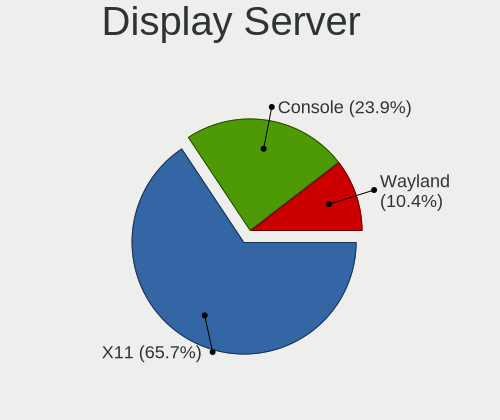
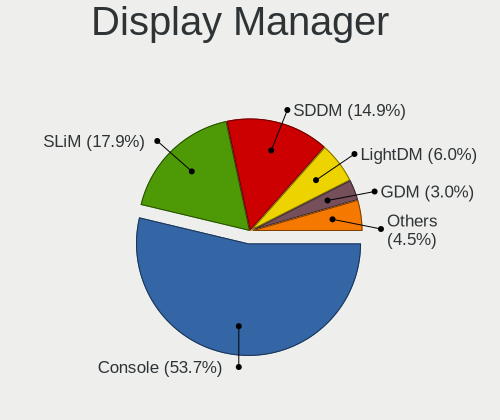
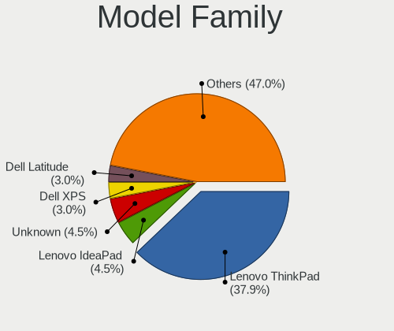
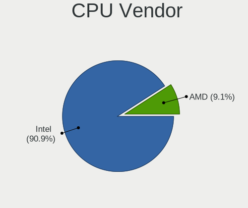
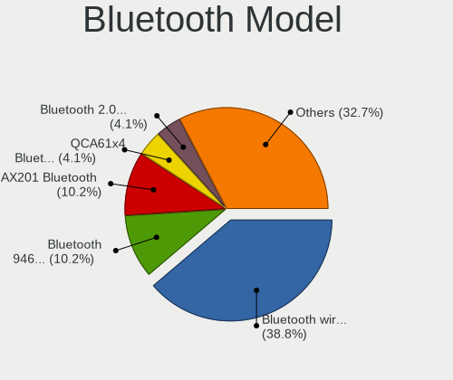
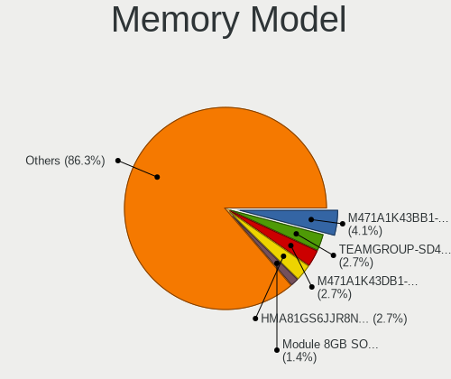

BSD in Australia - Tested Hardware & Statistics (Notebooks)
-----------------------------------------------------------

A project to collect tested hardware configurations for BSD in Australia.

Anyone can contribute to this report by the [hw-probe](https://github.com/linuxhw/hw-probe/blob/master/INSTALL.BSD.md) tool:

    hw-probe -all -upload

Please contribute! Especially if your hardware is rare.

Contents
--------

* [ Test Cases ](#test-cases)

* [ System ](#system)
  - [ OS                       ](#os)
  - [ OS Family                ](#os-family)
  - [ Arch                     ](#arch)
  - [ DE                       ](#de)
  - [ Display Server           ](#display-server)
  - [ Display Manager          ](#display-manager)
  - [ OS Lang                  ](#os-lang)
  - [ Boot Mode                ](#boot-mode)
  - [ Filesystem               ](#filesystem)
  - [ Part. scheme             ](#part-scheme)

* [ Board ](#board)
  - [ Vendor                   ](#vendor)
  - [ Model                    ](#model)
  - [ Model Family             ](#model-family)
  - [ MFG Year                 ](#mfg-year)
  - [ Form Factor              ](#form-factor)
  - [ Coreboot                 ](#coreboot)
  - [ RAM Size                 ](#ram-size)
  - [ RAM Used                 ](#ram-used)
  - [ Total Drives             ](#total-drives)
  - [ Has CD-ROM               ](#has-cd-rom)
  - [ Has Ethernet             ](#has-ethernet)
  - [ Has WiFi                 ](#has-wifi)
  - [ Has Bluetooth            ](#has-bluetooth)

* [ Location ](#location)
  - [ Country                  ](#country)
  - [ City                     ](#city)

* [ Drives ](#drives)
  - [ Drive Vendor             ](#drive-vendor)
  - [ Drive Model              ](#drive-model)
  - [ HDD Vendor               ](#hdd-vendor)
  - [ SSD Vendor               ](#ssd-vendor)
  - [ Drive Kind               ](#drive-kind)
  - [ Drive Connector          ](#drive-connector)
  - [ Drive Size               ](#drive-size)
  - [ Space Total              ](#space-total)
  - [ Space Used               ](#space-used)
  - [ Malfunc. Drives          ](#malfunc-drives)
  - [ Malfunc. Drive Vendor    ](#malfunc-drive-vendor)
  - [ Malfunc. HDD Vendor      ](#malfunc-hdd-vendor)
  - [ Malfunc. Drive Kind      ](#malfunc-drive-kind)
  - [ Failed Drives            ](#failed-drives)
  - [ Failed Drive Vendor      ](#failed-drive-vendor)
  - [ Drive Status             ](#drive-status)

* [ Storage controller ](#storage-controller)
  - [ Storage Vendor           ](#storage-vendor)
  - [ Storage Model            ](#storage-model)
  - [ Storage Kind             ](#storage-kind)

* [ Processor ](#processor)
  - [ CPU Vendor               ](#cpu-vendor)
  - [ CPU Model                ](#cpu-model)
  - [ CPU Model Family         ](#cpu-model-family)
  - [ CPU Cores                ](#cpu-cores)
  - [ CPU Sockets              ](#cpu-sockets)
  - [ CPU Threads              ](#cpu-threads)
  - [ CPU Microarch            ](#cpu-microarch)

* [ Graphics ](#graphics)
  - [ GPU Vendor               ](#gpu-vendor)
  - [ GPU Model                ](#gpu-model)
  - [ GPU Combo                ](#gpu-combo)
  - [ GPU Driver               ](#gpu-driver)
  - [ GPU Memory               ](#gpu-memory)

* [ Monitor ](#monitor)
  - [ Monitor Vendor           ](#monitor-vendor)
  - [ Monitor Model            ](#monitor-model)
  - [ Monitor Resolution       ](#monitor-resolution)
  - [ Monitor Diagonal         ](#monitor-diagonal)
  - [ Monitor Width            ](#monitor-width)
  - [ Aspect Ratio             ](#aspect-ratio)
  - [ Monitor Area             ](#monitor-area)
  - [ Pixel Density            ](#pixel-density)
  - [ Multiple Monitors        ](#multiple-monitors)

* [ Network ](#network)
  - [ Net Controller Vendor    ](#net-controller-vendor)
  - [ Net Controller Model     ](#net-controller-model)
  - [ Wireless Vendor          ](#wireless-vendor)
  - [ Wireless Model           ](#wireless-model)
  - [ Ethernet Vendor          ](#ethernet-vendor)
  - [ Ethernet Model           ](#ethernet-model)
  - [ Net Controller Kind      ](#net-controller-kind)
  - [ Used Controller          ](#used-controller)
  - [ NICs                     ](#nics)
  - [ IPv6                     ](#ipv6)

* [ Bluetooth ](#bluetooth)
  - [ Bluetooth Vendor         ](#bluetooth-vendor)
  - [ Bluetooth Model          ](#bluetooth-model)

* [ Sound ](#sound)
  - [ Sound Vendor             ](#sound-vendor)
  - [ Sound Model              ](#sound-model)

* [ Memory ](#memory)
  - [ Memory Vendor            ](#memory-vendor)
  - [ Memory Model             ](#memory-model)
  - [ Memory Kind              ](#memory-kind)
  - [ Memory Form Factor       ](#memory-form-factor)
  - [ Memory Size              ](#memory-size)
  - [ Memory Speed             ](#memory-speed)

* [ Printers & scanners ](#printers--scanners)
  - [ Printer Vendor           ](#printer-vendor)
  - [ Printer Model            ](#printer-model)
  - [ Scanner Vendor           ](#scanner-vendor)
  - [ Scanner Model            ](#scanner-model)

* [ Camera ](#camera)
  - [ Camera Vendor            ](#camera-vendor)
  - [ Camera Model             ](#camera-model)

* [ Security ](#security)
  - [ Fingerprint Vendor       ](#fingerprint-vendor)
  - [ Fingerprint Model        ](#fingerprint-model)
  - [ Chipcard Vendor          ](#chipcard-vendor)
  - [ Chipcard Model           ](#chipcard-model)

* [ Unsupported ](#unsupported)
  - [ Unsupported Devices      ](#unsupported-devices)
  - [ Unsupported Device Types ](#unsupported-device-types)

Test Cases
----------

Total: 68

| Vendor        | Model                       | Probe                                                     | Date         |
|---------------|-----------------------------|-----------------------------------------------------------|--------------|
| Dell          | G16 7630                    | [4e39a5ebdf](https://bsd-hardware.info/?probe=4e39a5ebdf) | Sep 21, 2023 |
| Lenovo        | ThinkPad L390 20NRS00Q00    | [b9885ea126](https://bsd-hardware.info/?probe=b9885ea126) | Sep 17, 2023 |
| Lenovo        | ThinkPad T480s 20L7S24F0... | [bb7eb8b380](https://bsd-hardware.info/?probe=bb7eb8b380) | Sep 15, 2023 |
| HP            | Pavilion dv5                | [b7dad77d0d](https://bsd-hardware.info/?probe=b7dad77d0d) | Sep 14, 2023 |
| ReachingTe... | DreamQuest Pro 2022         | [2e6af170b9](https://bsd-hardware.info/?probe=2e6af170b9) | Sep 07, 2023 |
| Lenovo        | ThinkPad X1 Carbon Gen 9... | [0ebdda5146](https://bsd-hardware.info/?probe=0ebdda5146) | Aug 31, 2023 |
| Dell          | G5 5590                     | [2e496efada](https://bsd-hardware.info/?probe=2e496efada) | Aug 26, 2023 |
| Dell          | G5 5590                     | [fd4f457391](https://bsd-hardware.info/?probe=fd4f457391) | Aug 26, 2023 |
| Lenovo        | IdeaPad 5 15ALC05 82LN      | [60dac781b2](https://bsd-hardware.info/?probe=60dac781b2) | Jul 24, 2023 |
| Lenovo        | ThinkPad T440s 20ARS1BK0... | [01f4886e09](https://bsd-hardware.info/?probe=01f4886e09) | Jul 21, 2023 |
| Lenovo        | ThinkPad X1C 5th W10DG 2... | [4274ca291e](https://bsd-hardware.info/?probe=4274ca291e) | Jul 08, 2023 |
| Dell          | XPS 13 9360                 | [648c09752f](https://bsd-hardware.info/?probe=648c09752f) | Jun 27, 2023 |
| HP            | Compaq 6830s                | [1a06917a0f](https://bsd-hardware.info/?probe=1a06917a0f) | Jun 14, 2023 |
| Timi          | TM1701                      | [1dd768a721](https://bsd-hardware.info/?probe=1dd768a721) | May 25, 2023 |
| Intel Clie... | LAPBC510                    | [68b1300903](https://bsd-hardware.info/?probe=68b1300903) | Apr 22, 2023 |
| Unknown       | Unknown                     | [ee06e14aa2](https://bsd-hardware.info/?probe=ee06e14aa2) | Mar 29, 2023 |
| Acer          | Nitro AN515-55              | [e023282dcd](https://bsd-hardware.info/?probe=e023282dcd) | Mar 13, 2023 |
| ASUSTek       | G74Sx                       | [6b7cf8fcac](https://bsd-hardware.info/?probe=6b7cf8fcac) | Mar 13, 2023 |
| Framework     | Laptop (12th Gen Intel C... | [4d69517a13](https://bsd-hardware.info/?probe=4d69517a13) | Feb 07, 2023 |
| Lenovo        | ThinkPad X131e 33672K5      | [4cc4d44e43](https://bsd-hardware.info/?probe=4cc4d44e43) | Aug 15, 2022 |
| Dell          | G5 5590                     | [86bac52410](https://bsd-hardware.info/?probe=86bac52410) | May 29, 2022 |
| HP            | ZBook 14                    | [a646255b51](https://bsd-hardware.info/?probe=a646255b51) | May 02, 2022 |
| Lenovo        | ThinkPad T470 20HES0ES1F    | [f1f0676663](https://bsd-hardware.info/?probe=f1f0676663) | Apr 28, 2022 |
| HP            | Notebook                    | [eea4cff90b](https://bsd-hardware.info/?probe=eea4cff90b) | Apr 27, 2022 |
| HP            | Notebook                    | [eaff4f0fbf](https://bsd-hardware.info/?probe=eaff4f0fbf) | Apr 19, 2022 |
| HP            | Notebook                    | [6a112cfe6c](https://bsd-hardware.info/?probe=6a112cfe6c) | Apr 11, 2022 |
| HP            | Notebook                    | [a31dd5f48d](https://bsd-hardware.info/?probe=a31dd5f48d) | Apr 11, 2022 |
| Dell          | G5 5590                     | [0871c1269b](https://bsd-hardware.info/?probe=0871c1269b) | Mar 07, 2022 |
| Samsung       | 350V5C/350V5X/350V4C/350... | [51b0a953b5](https://bsd-hardware.info/?probe=51b0a953b5) | Feb 22, 2022 |
| Samsung       | 350V5C/350V5X/350V4C/350... | [85441a65a9](https://bsd-hardware.info/?probe=85441a65a9) | Feb 21, 2022 |
| Dell          | Latitude E7450              | [8a3867f171](https://bsd-hardware.info/?probe=8a3867f171) | Feb 03, 2022 |
| Toshiba       | Satellite L50-A             | [94b87158aa](https://bsd-hardware.info/?probe=94b87158aa) | Jan 21, 2022 |
| Apple         | MacBookPro5,5               | [53b106bbb6](https://bsd-hardware.info/?probe=53b106bbb6) | Jan 16, 2022 |
| HP            | Laptop 15s-du1xxx           | [8ebeac18ca](https://bsd-hardware.info/?probe=8ebeac18ca) | Nov 19, 2021 |
| Lenovo        | ThinkPad Mini10 3507A31     | [ced0819a8e](https://bsd-hardware.info/?probe=ced0819a8e) | Oct 24, 2021 |
| Lenovo        | ThinkPad X1 Carbon 3443C... | [2494d9d2db](https://bsd-hardware.info/?probe=2494d9d2db) | Sep 26, 2021 |
| Lenovo        | ThinkPad X1 Carbon 3443C... | [28bbeb8b2e](https://bsd-hardware.info/?probe=28bbeb8b2e) | Sep 26, 2021 |
| Lenovo        | G40-70 20369                | [ef8eafa662](https://bsd-hardware.info/?probe=ef8eafa662) | Sep 18, 2021 |
| Intel         | SandyBridge Platform        | [f0aaf635c3](https://bsd-hardware.info/?probe=f0aaf635c3) | Sep 02, 2021 |
| Toshiba       | PORTEGE Z10t-A              | [cb7cbd17d0](https://bsd-hardware.info/?probe=cb7cbd17d0) | Jun 20, 2021 |
| Apple         | MacBookPro11,3              | [1c9feef8e7](https://bsd-hardware.info/?probe=1c9feef8e7) | May 03, 2021 |
| Lenovo        | ThinkPad X1 Carbon 4th 2... | [821c81e652](https://bsd-hardware.info/?probe=821c81e652) | Apr 09, 2021 |
| ASUSTek       | TP500LNG                    | [6501322932](https://bsd-hardware.info/?probe=6501322932) | Apr 06, 2021 |
| Dell          | G5 5590                     | [18863bc535](https://bsd-hardware.info/?probe=18863bc535) | Apr 05, 2021 |
| HP            | ProBook 430 G3              | [32dfd5e52a](https://bsd-hardware.info/?probe=32dfd5e52a) | Mar 22, 2021 |
| Unknown       | Unknown                     | [70304f9c5d](https://bsd-hardware.info/?probe=70304f9c5d) | Mar 11, 2021 |
| Lenovo        | ThinkPad X1 Carbon 5th 2... | [950cf51db1](https://bsd-hardware.info/?probe=950cf51db1) | Feb 28, 2021 |
| Lenovo        | ThinkPad X1 Carbon 4th 2... | [a2833c6695](https://bsd-hardware.info/?probe=a2833c6695) | Feb 08, 2021 |
| Lenovo        | ThinkPad E420 1141CTO       | [a201c5f713](https://bsd-hardware.info/?probe=a201c5f713) | Feb 08, 2021 |
| Lenovo        | ThinkPad E420 1141CTO       | [d0a5d1cb86](https://bsd-hardware.info/?probe=d0a5d1cb86) | Feb 08, 2021 |
| Lenovo        | ThinkPad E420 1141CTO       | [a51cf81e58](https://bsd-hardware.info/?probe=a51cf81e58) | Feb 06, 2021 |
| Toshiba       | KIRA                        | [1ee77fde0b](https://bsd-hardware.info/?probe=1ee77fde0b) | Jan 18, 2021 |
| Lenovo        | ThinkPad X1 Carbon 4th 2... | [de7d8622aa](https://bsd-hardware.info/?probe=de7d8622aa) | Dec 18, 2020 |
| Lenovo        | ThinkPad X1 Carbon 4th 2... | [7f6ebffad8](https://bsd-hardware.info/?probe=7f6ebffad8) | Dec 18, 2020 |
| Lenovo        | ThinkPad T460p 20FXCTO1W... | [ddc907ccf4](https://bsd-hardware.info/?probe=ddc907ccf4) | Dec 17, 2020 |
| Lenovo        | ThinkPad X1 Carbon 4th 2... | [1414d7ae80](https://bsd-hardware.info/?probe=1414d7ae80) | Dec 16, 2020 |
| ASUSTek       | K72F                        | [321cd9d139](https://bsd-hardware.info/?probe=321cd9d139) | Dec 08, 2020 |
| ASUSTek       | K72F                        | [b36ff0b052](https://bsd-hardware.info/?probe=b36ff0b052) | Dec 08, 2020 |
| HP            | Setzer                      | [da7914cdd5](https://bsd-hardware.info/?probe=da7914cdd5) | Nov 22, 2020 |
| Lenovo        | ThinkPad T450 20BVA020AU    | [5d8bce59e8](https://bsd-hardware.info/?probe=5d8bce59e8) | Nov 16, 2020 |
| Lenovo        | ThinkPad X230 2320JXM       | [cdbf62a168](https://bsd-hardware.info/?probe=cdbf62a168) | Oct 29, 2020 |
| Lenovo        | ThinkPad X60s 17033JM       | [67e701adb7](https://bsd-hardware.info/?probe=67e701adb7) | Oct 21, 2020 |
| Acer          | Peppy                       | [d68bd5cbb5](https://bsd-hardware.info/?probe=d68bd5cbb5) | Oct 02, 2020 |
| Acer          | Peppy                       | [26058cddbf](https://bsd-hardware.info/?probe=26058cddbf) | Oct 02, 2020 |
| Apple         | MacBookAir5,1               | [6cced6fcf0](https://bsd-hardware.info/?probe=6cced6fcf0) | Sep 23, 2020 |
| Lenovo        | ThinkPad T460p 20FXCTO1W... | [b62876dd94](https://bsd-hardware.info/?probe=b62876dd94) | Aug 04, 2020 |
| Lenovo        | ThinkPad T470 W10DG 20JM... | [e4d2dcda5b](https://bsd-hardware.info/?probe=e4d2dcda5b) | Jul 31, 2020 |
| Lenovo        | ThinkPad X220 4291C35       | [f22c83f68b](https://bsd-hardware.info/?probe=f22c83f68b) | May 31, 2020 |

System
------

OS
--

Installed operating systems

| Name                | Notebooks | Percent |
|---------------------|-----------|---------|
| helloSystem 0.8.1   | 4         | 7.14%   |
| FreeBSD 13.0        | 4         | 7.14%   |
| OpenBSD 6.8         | 3         | 5.36%   |
| helloSystem 0.4.0   | 3         | 5.36%   |
| OPNsense 22.1.6     | 2         | 3.57%   |
| OPNsense 21.1.3     | 2         | 3.57%   |
| OpenBSD 7.2         | 2         | 3.57%   |
| helloSystem 0.6.0   | 2         | 3.57%   |
| FreeBSD 14.0-BETA2  | 2         | 3.57%   |
| FreeBSD 13.2        | 2         | 3.57%   |
| FreeBSD 12.2        | 2         | 3.57%   |
| FreeBSD 12.1-p10    | 2         | 3.57%   |
| FreeBSD 12.1        | 2         | 3.57%   |
| OPNsense 23.7.3     | 1         | 1.79%   |
| OPNsense 23.1.4     | 1         | 1.79%   |
| OPNsense 22.1.1     | 1         | 1.79%   |
| OPNsense 21.7.1     | 1         | 1.79%   |
| OPNsense 21.7       | 1         | 1.79%   |
| OpenBSD 6.7         | 1         | 1.79%   |
| NomadBSD 81e34fc3   | 1         | 1.79%   |
| NomadBSD 1.4        | 1         | 1.79%   |
| helloSystem 0.5.0   | 1         | 1.79%   |
| FuguIta 7.1         | 1         | 1.79%   |
| FreeBSD 14.0-BETA1  | 1         | 1.79%   |
| FreeBSD 14.0-ALPHA3 | 1         | 1.79%   |
| FreeBSD 13.2-STABLE | 1         | 1.79%   |
| FreeBSD 13.2-p3     | 1         | 1.79%   |
| FreeBSD 13.2-p2     | 1         | 1.79%   |
| FreeBSD 13.1        | 1         | 1.79%   |
| FreeBSD 13.0-RC5    | 1         | 1.79%   |
| FreeBSD 13.0-p7     | 1         | 1.79%   |
| FreeBSD 13.0-p6     | 1         | 1.79%   |
| FreeBSD 13.0-BETA1  | 1         | 1.79%   |
| FreeBSD 12.2-p3     | 1         | 1.79%   |
| FreeBSD 12.2-p2     | 1         | 1.79%   |
| FreeBSD 12.1-p6     | 1         | 1.79%   |
| FreeBSD 11.4-STABLE | 1         | 1.79%   |

OS Family
---------

OS without a version

| Name        | Notebooks | Percent |
|-------------|-----------|---------|
| FreeBSD     | 24        | 46.15%  |
| helloSystem | 10        | 19.23%  |
| OPNsense    | 9         | 17.31%  |
| OpenBSD     | 6         | 11.54%  |
| NomadBSD    | 2         | 3.85%   |
| FuguIta     | 1         | 1.92%   |

Arch
----

OS architecture (x86_64, i586, etc.)

| Name  | Notebooks | Percent |
|-------|-----------|---------|
| amd64 | 51        | 98.08%  |
| i386  | 1         | 1.92%   |

DE
--

Desktop Environment

| Name         | Notebooks | Percent |
|--------------|-----------|---------|
| Console      | 15        | 28.3%   |
| helloDesktop | 13        | 24.53%  |
| KDE5         | 5         | 9.43%   |
| XFCE         | 4         | 7.55%   |
| fvwm         | 4         | 7.55%   |
| i3           | 3         | 5.66%   |
| GNOME        | 3         | 5.66%   |
| Openbox      | 2         | 3.77%   |
| Fluxbox      | 2         | 3.77%   |
| TWM          | 1         | 1.89%   |
| AwesomeWM    | 1         | 1.89%   |

Display Server
--------------

X11 or Wayland

| Name    | Notebooks | Percent |
|---------|-----------|---------|
| X11     | 36        | 69.23%  |
| Console | 11        | 21.15%  |
| Wayland | 5         | 9.62%   |

Display Manager
---------------

SDDM, LightDM, etc.

| Name    | Notebooks | Percent |
|---------|-----------|---------|
| Console | 30        | 56.6%   |
| SLiM    | 11        | 20.75%  |
| SDDM    | 8         | 15.09%  |
| XDM     | 1         | 1.89%   |
| PCDM    | 1         | 1.89%   |
| Ly      | 1         | 1.89%   |
| GDM     | 1         | 1.89%   |

OS Lang
-------

Language

| Lang            | Notebooks | Percent |
|-----------------|-----------|---------|
| Unknown         | 22        | 40%     |
| en_US           | 13        | 23.64%  |
| C               | 12        | 21.82%  |
| en_AU           | 6         | 10.91%  |
| en_AU.US-ASCII  | 1         | 1.82%   |
| en_AU.ISO8859-1 | 1         | 1.82%   |

Boot Mode
---------

EFI or BIOS

| Mode | Notebooks | Percent |
|------|-----------|---------|
| EFI  | 42        | 80.77%  |
| BIOS | 10        | 19.23%  |

Filesystem
----------

Type of filesystem

| Type   | Notebooks | Percent |
|--------|-----------|---------|
| Zfs    | 27        | 51.92%  |
| Ufs    | 14        | 26.92%  |
| Ffs    | 7         | 13.46%  |
| Cd9660 | 4         | 7.69%   |

Part. scheme
------------

Scheme of partitioning

| Type | Notebooks | Percent |
|------|-----------|---------|
| GPT  | 45        | 86.54%  |
| MBR  | 7         | 13.46%  |

Board
-----

Vendor
------

Motherboard manufacturer

| Name                 | Notebooks | Percent |
|----------------------|-----------|---------|
| Lenovo               | 21        | 40.38%  |
| Hewlett-Packard      | 7         | 13.46%  |
| Dell                 | 5         | 9.62%   |
| Toshiba              | 3         | 5.77%   |
| ASUSTek Computer     | 3         | 5.77%   |
| Apple                | 3         | 5.77%   |
| Acer                 | 2         | 3.85%   |
| Unknown              | 2         | 3.85%   |
| Timi                 | 1         | 1.92%   |
| Samsung Electronics  | 1         | 1.92%   |
| ReachingTech         | 1         | 1.92%   |
| Intel Client Systems | 1         | 1.92%   |
| Intel                | 1         | 1.92%   |
| Framework            | 1         | 1.92%   |

Model
-----

Motherboard model

| Name                                                                                     | Notebooks | Percent |
|------------------------------------------------------------------------------------------|-----------|---------|
| Dell G5 5590                                                                             | 2         | 3.85%   |
| Unknown                                                                                  | 2         | 3.85%   |
| Toshiba Satellite L50-A                                                                  | 1         | 1.92%   |
| Toshiba PORTEGE Z10t-A                                                                   | 1         | 1.92%   |
| Toshiba KIRA                                                                             | 1         | 1.92%   |
| Timi TM1701                                                                              | 1         | 1.92%   |
| Samsung 350V5C/350V5X/350V4C/350V4X/351V5C/351V5X/351V4C/351V4X/3540VC/3540VX/3440VC/344 | 1         | 1.92%   |
| ReachingTech DreamQuest Pro 2022                                                         | 1         | 1.92%   |
| Lenovo ThinkPad X60s 17033JM                                                             | 1         | 1.92%   |
| Lenovo ThinkPad X230 2320JXM                                                             | 1         | 1.92%   |
| Lenovo ThinkPad X220 4291C35                                                             | 1         | 1.92%   |
| Lenovo ThinkPad X1C 5th W10DG 20K3A03CAU                                                 | 1         | 1.92%   |
| Lenovo ThinkPad X131e 33672K5                                                            | 1         | 1.92%   |
| Lenovo ThinkPad X1 Carbon Gen 9 20XXS2XW00                                               | 1         | 1.92%   |
| Lenovo ThinkPad X1 Carbon 5th 20HQS02100                                                 | 1         | 1.92%   |
| Lenovo ThinkPad X1 Carbon 4th 20FC0019AU                                                 | 1         | 1.92%   |
| Lenovo ThinkPad X1 Carbon 4th 20FB001XAU                                                 | 1         | 1.92%   |
| Lenovo ThinkPad X1 Carbon 3443CTO                                                        | 1         | 1.92%   |
| Lenovo ThinkPad T480s 20L7S24F00                                                         | 1         | 1.92%   |
| Lenovo ThinkPad T470 W10DG 20JM000BUS                                                    | 1         | 1.92%   |
| Lenovo ThinkPad T470 20HES0ES1F                                                          | 1         | 1.92%   |
| Lenovo ThinkPad T460p 20FXCTO1WW                                                         | 1         | 1.92%   |
| Lenovo ThinkPad T450 20BVA020AU                                                          | 1         | 1.92%   |
| Lenovo ThinkPad T440s 20ARS1BK08                                                         | 1         | 1.92%   |
| Lenovo ThinkPad Mini10 3507A31                                                           | 1         | 1.92%   |
| Lenovo ThinkPad L390 20NRS00Q00                                                          | 1         | 1.92%   |
| Lenovo ThinkPad E420 1141CTO                                                             | 1         | 1.92%   |
| Lenovo IdeaPad 5 15ALC05 82LN                                                            | 1         | 1.92%   |
| Lenovo G40-70 20369                                                                      | 1         | 1.92%   |
| Intel SandyBridge Platform                                                               | 1         | 1.92%   |
| Intel Client Systems LAPBC510                                                            | 1         | 1.92%   |
| HP ZBook 14                                                                              | 1         | 1.92%   |
| HP Setzer                                                                                | 1         | 1.92%   |
| HP ProBook 430 G3                                                                        | 1         | 1.92%   |
| HP Pavilion dv5                                                                          | 1         | 1.92%   |
| HP Notebook                                                                              | 1         | 1.92%   |
| HP Laptop 15s-du1xxx                                                                     | 1         | 1.92%   |
| HP Compaq 6830s                                                                          | 1         | 1.92%   |
| Framework Laptop (12th Gen Intel Core)                                                   | 1         | 1.92%   |
| Dell XPS 13 9360                                                                         | 1         | 1.92%   |

Model Family
------------

Motherboard model prefix

| Name                          | Notebooks | Percent |
|-------------------------------|-----------|---------|
| Lenovo ThinkPad               | 19        | 36.54%  |
| Dell G5                       | 2         | 3.85%   |
| Unknown                       | 2         | 3.85%   |
| Toshiba Satellite             | 1         | 1.92%   |
| Toshiba PORTEGE               | 1         | 1.92%   |
| Toshiba KIRA                  | 1         | 1.92%   |
| Timi TM1701                   | 1         | 1.92%   |
| Samsung 350V5C                | 1         | 1.92%   |
| ReachingTech DreamQuest       | 1         | 1.92%   |
| Lenovo IdeaPad                | 1         | 1.92%   |
| Lenovo G40-70                 | 1         | 1.92%   |
| Intel SandyBridge             | 1         | 1.92%   |
| Intel Client Systems LAPBC510 | 1         | 1.92%   |
| HP ZBook                      | 1         | 1.92%   |
| HP Setzer                     | 1         | 1.92%   |
| HP ProBook                    | 1         | 1.92%   |
| HP Pavilion                   | 1         | 1.92%   |
| HP Notebook                   | 1         | 1.92%   |
| HP Laptop                     | 1         | 1.92%   |
| HP Compaq                     | 1         | 1.92%   |
| Framework Laptop              | 1         | 1.92%   |
| Dell XPS                      | 1         | 1.92%   |
| Dell Latitude                 | 1         | 1.92%   |
| Dell G16                      | 1         | 1.92%   |
| ASUS TP500LNG                 | 1         | 1.92%   |
| ASUS K72F                     | 1         | 1.92%   |
| ASUS G74Sx                    | 1         | 1.92%   |
| Apple MacBookPro5             | 1         | 1.92%   |
| Apple MacBookPro11            | 1         | 1.92%   |
| Apple MacBookAir5             | 1         | 1.92%   |
| Acer Peppy                    | 1         | 1.92%   |
| Acer Nitro                    | 1         | 1.92%   |

MFG Year
--------

Motherboard manufacture year

| Year | Notebooks | Percent |
|------|-----------|---------|
| 2019 | 6         | 11.54%  |
| 2017 | 5         | 9.62%   |
| 2015 | 5         | 9.62%   |
| 2023 | 4         | 7.69%   |
| 2020 | 4         | 7.69%   |
| 2014 | 4         | 7.69%   |
| 2012 | 4         | 7.69%   |
| 2021 | 3         | 5.77%   |
| 2018 | 3         | 5.77%   |
| 2022 | 2         | 3.85%   |
| 2016 | 2         | 3.85%   |
| 2013 | 2         | 3.85%   |
| 2011 | 2         | 3.85%   |
| 2010 | 2         | 3.85%   |
| 2009 | 2         | 3.85%   |
| 2008 | 1         | 1.92%   |
| 2007 | 1         | 1.92%   |

Form Factor
-----------

Physical design of the computer

| Name     | Notebooks | Percent |
|----------|-----------|---------|
| Notebook | 52        | 100%    |

Coreboot
--------

Have coreboot on board

| Used | Notebooks | Percent |
|------|-----------|---------|
| No   | 50        | 96.15%  |
| Yes  | 2         | 3.85%   |

RAM Size
--------

Total RAM memory

| Size in GB  | Notebooks | Percent |
|-------------|-----------|---------|
| 8.01-16.0   | 21        | 40.38%  |
| 16.01-24.0  | 18        | 34.62%  |
| 4.01-8.0    | 7         | 13.46%  |
| 1.01-2.0    | 2         | 3.85%   |
| 32.01-64.0  | 1         | 1.92%   |
| 3.01-4.0    | 1         | 1.92%   |
| 2.01-3.0    | 1         | 1.92%   |
| 64.01-256.0 | 1         | 1.92%   |

RAM Used
--------

Used RAM memory

| Used GB  | Notebooks | Percent |
|----------|-----------|---------|
| 0.51-1.0 | 23        | 43.4%   |
| 0.01-0.5 | 22        | 41.51%  |
| 1.01-2.0 | 3         | 5.66%   |
| 4.01-8.0 | 2         | 3.77%   |
| 2.01-3.0 | 2         | 3.77%   |
| 0        | 1         | 1.89%   |

Total Drives
------------

Number of drives on board

| Drives | Notebooks | Percent |
|--------|-----------|---------|
| 1      | 42        | 80.77%  |
| 0      | 6         | 11.54%  |
| 2      | 3         | 5.77%   |
| 3      | 1         | 1.92%   |

Has CD-ROM
----------

Has CD-ROM on board

| Presented | Notebooks | Percent |
|-----------|-----------|---------|
| No        | 43        | 82.69%  |
| Yes       | 9         | 17.31%  |

Has Ethernet
------------

Has Ethernet on board

| Presented | Notebooks | Percent |
|-----------|-----------|---------|
| Yes       | 42        | 80.77%  |
| No        | 10        | 19.23%  |

Has WiFi
--------

Has WiFi module

| Presented | Notebooks | Percent |
|-----------|-----------|---------|
| Yes       | 48        | 92.31%  |
| No        | 4         | 7.69%   |

Has Bluetooth
-------------

Has Bluetooth module

| Presented | Notebooks | Percent |
|-----------|-----------|---------|
| Yes       | 37        | 71.15%  |
| No        | 15        | 28.85%  |

Location
--------

Country
-------

Geographic location (country)

| Country   | Notebooks | Percent |
|-----------|-----------|---------|
| Australia | 52        | 100%    |

City
----

Geographic location (city)

| City         | Notebooks | Percent |
|--------------|-----------|---------|
| Sydney       | 18        | 34.62%  |
| Brisbane     | 7         | 13.46%  |
| Perth        | 6         | 11.54%  |
| Melbourne    | 5         | 9.62%   |
| Adelaide     | 4         | 7.69%   |
| Canberra     | 3         | 5.77%   |
| Warrnambool  | 1         | 1.92%   |
| South Yarra  | 1         | 1.92%   |
| Ryde         | 1         | 1.92%   |
| Kellyville   | 1         | 1.92%   |
| Gold Coast   | 1         | 1.92%   |
| East Malvern | 1         | 1.92%   |
| Darlinghurst | 1         | 1.92%   |
| Burwood      | 1         | 1.92%   |
| Adelaide CBD | 1         | 1.92%   |

Drives
------

Drive Vendor
------------

Hard drive vendors

| Vendor              | Notebooks | Drives | Percent |
|---------------------|-----------|--------|---------|
| Samsung Electronics | 12        | 12     | 25.53%  |
| Toshiba             | 6         | 7      | 12.77%  |
| Intel               | 5         | 5      | 10.64%  |
| Seagate             | 3         | 4      | 6.38%   |
| Crucial             | 3         | 4      | 6.38%   |
| SK hynix            | 2         | 4      | 4.26%   |
| SanDisk             | 2         | 3      | 4.26%   |
| NVMe                | 2         | 3      | 4.26%   |
| Kingston            | 2         | 2      | 4.26%   |
| WDC                 | 1         | 1      | 2.13%   |
| Silicon Motion      | 1         | 1      | 2.13%   |
| Lenovo              | 1         | 1      | 2.13%   |
| Jetflash            | 1         | 1      | 2.13%   |
| Hitachi             | 1         | 1      | 2.13%   |
| HGST                | 1         | 1      | 2.13%   |
| Fujitsu             | 1         | 1      | 2.13%   |
| FORESEE             | 1         | 1      | 2.13%   |
| Dogfish             | 1         | 1      | 2.13%   |
| Apple               | 1         | 1      | 2.13%   |

Drive Model
-----------

Hard drive models

| Model                                | Notebooks | Percent |
|--------------------------------------|-----------|---------|
| Toshiba THNSF5256GPUK 256GB          | 2         | 4.17%   |
| Samsung SSD 840 EVO 250GB            | 2         | 4.17%   |
| WDC WD10JPVX-60JC3T0 1TB             | 1         | 2.08%   |
| Toshiba THNSNF256GMCS 256GB          | 1         | 2.08%   |
| Toshiba THNSF5256GCJ7 256GB          | 1         | 2.08%   |
| Toshiba MQ01ABF050 500GB             | 1         | 2.08%   |
| Toshiba MQ01ABD100 1TB               | 1         | 2.08%   |
| SK hynix PC401 NVMe 512GB            | 1         | 2.08%   |
| SK hynix BC501 NVMe 512GB            | 1         | 2.08%   |
| Silicon Motion Aura Pro X2 960GB     | 1         | 2.08%   |
| Seagate ST9750420AS 752GB            | 1         | 2.08%   |
| Seagate ST9500325AS 500GB            | 1         | 2.08%   |
| Seagate ST9250315ASG 250GB           | 1         | 2.08%   |
| SanDisk SD8TN8U256G1001 256GB        | 1         | 2.08%   |
| SanDisk SD5SG2128G1052E 128GB        | 1         | 2.08%   |
| Samsung SSD PM871 mSATA 256GB        | 1         | 2.08%   |
| Samsung SSD 860 EVO 500GB            | 1         | 2.08%   |
| Samsung MZVLB512HBJQ-000H1 512GB     | 1         | 2.08%   |
| Samsung MZVLB256HAHQ-000L7 256GB     | 1         | 2.08%   |
| Samsung MZVLB256HAHQ-00000 256GB     | 1         | 2.08%   |
| Samsung MZVL2512HCJQ-00B00 512GB     | 1         | 2.08%   |
| Samsung MZNLN256HCHP-000L7 256GB     | 1         | 2.08%   |
| Samsung MZMTE128HMGR-00000 128GB     | 1         | 2.08%   |
| Samsung MZALQ512HBLU-00BL2 512GB     | 1         | 2.08%   |
| Samsung MZ7PC128HAFU-000L1 128GB     | 1         | 2.08%   |
| NVMe WD_BLACK SN850X 1TB             | 1         | 2.08%   |
| NVMe WD Blue SN570 2T                | 1         | 2.08%   |
| NVMe CT2000P3SSD8 2TB                | 1         | 2.08%   |
| Lenovo LENSE30256GMSP34MEAT3TA 256GB | 1         | 2.08%   |
| Kingston SV300S37A120G 120GB         | 1         | 2.08%   |
| Kingston SNS4151S316G 16GB           | 1         | 2.08%   |
| Jetflash Transcend 8G                | 1         | 2.08%   |
| Intel SSDSC2KW128G8 128GB            | 1         | 2.08%   |
| Intel SSDSC2BF240A4L 240GB           | 1         | 2.08%   |
| Intel SSDSC2BF180A4L 180GB           | 1         | 2.08%   |
| Intel SSDSA2BW160G3L 160GB           | 1         | 2.08%   |
| Intel SSDPEKNW010T8 1TB              | 1         | 2.08%   |
| Hitachi HTS542525K9A300 250GB        | 1         | 2.08%   |
| HGST HTS725050A7E630 500GB           | 1         | 2.08%   |
| Fujitsu MHY2160BH 160GB              | 1         | 2.08%   |

HDD Vendor
----------

Hard disk drive vendors

| Vendor   | Notebooks | Drives | Percent |
|----------|-----------|--------|---------|
| Seagate  | 3         | 4      | 25%     |
| Toshiba  | 2         | 2      | 16.67%  |
| NVMe     | 2         | 2      | 16.67%  |
| WDC      | 1         | 1      | 8.33%   |
| Jetflash | 1         | 1      | 8.33%   |
| Hitachi  | 1         | 1      | 8.33%   |
| HGST     | 1         | 1      | 8.33%   |
| Fujitsu  | 1         | 1      | 8.33%   |

SSD Vendor
----------

Solid state drive vendors

| Vendor              | Notebooks | Drives | Percent |
|---------------------|-----------|--------|---------|
| Samsung Electronics | 7         | 7      | 30.43%  |
| Intel               | 4         | 4      | 17.39%  |
| Crucial             | 3         | 4      | 13.04%  |
| SanDisk             | 2         | 3      | 8.7%    |
| Kingston            | 2         | 2      | 8.7%    |
| Toshiba             | 1         | 1      | 4.35%   |
| NVMe                | 1         | 1      | 4.35%   |
| FORESEE             | 1         | 1      | 4.35%   |
| Dogfish             | 1         | 1      | 4.35%   |
| Apple               | 1         | 1      | 4.35%   |

Drive Kind
----------

HDD or SSD

| Kind | Notebooks | Drives | Percent |
|------|-----------|--------|---------|
| SSD  | 22        | 25     | 46.81%  |
| NVMe | 13        | 16     | 27.66%  |
| HDD  | 12        | 13     | 25.53%  |

Drive Connector
---------------

SATA, SAS, NVMe, etc.

| Type | Notebooks | Drives | Percent |
|------|-----------|--------|---------|
| SATA | 32        | 38     | 71.11%  |
| NVMe | 13        | 16     | 28.89%  |

Drive Size
----------

Size of hard drive

| Size in TB | Notebooks | Drives | Percent |
|------------|-----------|--------|---------|
| 0.01-0.5   | 27        | 30     | 81.82%  |
| 0.51-1.0   | 5         | 6      | 15.15%  |
| 1.01-2.0   | 1         | 2      | 3.03%   |

Space Total
-----------

Amount of disk space available on the file system

| Size in GB | Notebooks | Percent |
|------------|-----------|---------|
| 101-250    | 19        | 36.54%  |
| 251-500    | 12        | 23.08%  |
| 1-20       | 11        | 21.15%  |
| 51-100     | 5         | 9.62%   |
| 501-1000   | 4         | 7.69%   |
| 21-50      | 1         | 1.92%   |

Space Used
----------

Amount of used disk space

| Used GB | Notebooks | Percent |
|---------|-----------|---------|
| 1-20    | 45        | 83.33%  |
| 21-50   | 5         | 9.26%   |
| 51-100  | 3         | 5.56%   |
| 101-250 | 1         | 1.85%   |

Malfunc. Drives
---------------

Drive models with a malfunction

| Model                         | Notebooks | Drives | Percent |
|-------------------------------|-----------|--------|---------|
| Kingston SNS4151S316G 16GB    | 1         | 1      | 20%     |
| Intel SSDSC2BF180A4L 180GB    | 1         | 1      | 20%     |
| Hitachi HTS542525K9A300 250GB | 1         | 1      | 20%     |
| HGST HTS725050A7E630 500GB    | 1         | 1      | 20%     |
| Apple SSD SM256E 256GB        | 1         | 1      | 20%     |

Malfunc. Drive Vendor
---------------------

Vendors of faulty drives

| Vendor   | Notebooks | Drives | Percent |
|----------|-----------|--------|---------|
| Kingston | 1         | 1      | 20%     |
| Intel    | 1         | 1      | 20%     |
| Hitachi  | 1         | 1      | 20%     |
| HGST     | 1         | 1      | 20%     |
| Apple    | 1         | 1      | 20%     |

Malfunc. HDD Vendor
-------------------

Vendors of faulty HDD drives

| Vendor  | Notebooks | Drives | Percent |
|---------|-----------|--------|---------|
| Hitachi | 1         | 1      | 50%     |
| HGST    | 1         | 1      | 50%     |

Malfunc. Drive Kind
-------------------

Kinds of faulty drives

| Kind | Notebooks | Drives | Percent |
|------|-----------|--------|---------|
| SSD  | 3         | 3      | 60%     |
| HDD  | 2         | 2      | 40%     |

Failed Drives
-------------

Failed drive models

Zero info for selected period =(

Failed Drive Vendor
-------------------

Failed drive vendors

Zero info for selected period =(

Drive Status
------------

Number of failed and malfunc. drives

| Status   | Notebooks | Drives | Percent |
|----------|-----------|--------|---------|
| Works    | 39        | 46     | 84.78%  |
| Malfunc  | 5         | 5      | 10.87%  |
| Detected | 2         | 3      | 4.35%   |

Storage controller
------------------

Storage Vendor
--------------

Storage controller vendors

| Vendor                    | Notebooks | Percent |
|---------------------------|-----------|---------|
| Intel                     | 36        | 63.16%  |
| Samsung Electronics       | 6         | 10.53%  |
| Sandisk                   | 4         | 7.02%   |
| Toshiba                   | 3         | 5.26%   |
| AMD                       | 2         | 3.51%   |
| SK hynix                  | 1         | 1.75%   |
| Silicon Motion            | 1         | 1.75%   |
| Nvidia                    | 1         | 1.75%   |
| Micron/Crucial Technology | 1         | 1.75%   |
| Micron Technology         | 1         | 1.75%   |
| Lenovo                    | 1         | 1.75%   |

Storage Model
-------------

Storage controller models

| Model                                                                          | Notebooks | Percent |
|--------------------------------------------------------------------------------|-----------|---------|
| Intel 7 Series Chipset Family 6-port SATA Controller [AHCI mode]               | 7         | 12.07%  |
| Intel 8 Series SATA Controller 1 [AHCI mode]                                   | 6         | 10.34%  |
| Samsung NVMe SSD Controller SM981/PM981/PM983                                  | 4         | 6.9%    |
| Intel 6 Series/C200 Series Chipset Family 6 port Mobile SATA AHCI Controller   | 4         | 6.9%    |
| Intel Sunrise Point-LP SATA Controller [AHCI mode]                             | 3         | 5.17%   |
| Toshiba XG4 NVMe SSD Controller                                                | 2         | 3.45%   |
| Intel Wildcat Point-LP SATA Controller [AHCI Mode]                             | 2         | 3.45%   |
| Intel 82801IBM/IEM (ICH9M/ICH9M-E) 4 port SATA Controller [AHCI mode]          | 2         | 3.45%   |
| Intel 82801 Mobile SATA Controller [RAID mode]                                 | 2         | 3.45%   |
| AMD FCH SATA Controller [AHCI mode]                                            | 2         | 3.45%   |
| Toshiba XG3 NVMe SSD Controller                                                | 1         | 1.72%   |
| SK hynix PC401 NVMe Solid State Drive 256GB                                    | 1         | 1.72%   |
| Silicon Motion SM2262/SM2262EN SSD Controller                                  | 1         | 1.72%   |
| Sandisk Western Digital WD Black SN850X NVMe SSD                               | 1         | 1.72%   |
| Sandisk WD Green SN350 NVMe SSD 1 TB (DRAM-less)                               | 1         | 1.72%   |
| Sandisk WD Blue SN570 NVMe SSD 2TB                                             | 1         | 1.72%   |
| Sandisk PC SN740 NVMe SSD (DRAM-less)                                          | 1         | 1.72%   |
| Samsung NVMe SSD Controller PM9A1/PM9A3/980PRO                                 | 1         | 1.72%   |
| Samsung NVMe SSD Controller 980                                                | 1         | 1.72%   |
| Nvidia MCP79 AHCI Controller                                                   | 1         | 1.72%   |
| Micron/Crucial P2 [Nick P2] / P3 / P3 Plus NVMe PCIe SSD (DRAM-less)           | 1         | 1.72%   |
| Micron 2450 NVMe SSD [HendrixV] (DRAM-less)                                    | 1         | 1.72%   |
| Lenovo LENSE30256GMSP34MEAT3TA                                                 | 1         | 1.72%   |
| Intel Volume Management Device NVMe RAID Controller Intel Corporation          | 1         | 1.72%   |
| Intel SSD 660P Series                                                          | 1         | 1.72%   |
| Intel NM10/ICH7 Family SATA Controller [AHCI mode]                             | 1         | 1.72%   |
| Intel Jasper Lake SATA AHCI Controller                                         | 1         | 1.72%   |
| Intel Cannon Lake Mobile PCH SATA AHCI Controller                              | 1         | 1.72%   |
| Intel 82801GBM/GHM (ICH7-M Family) SATA Controller [AHCI mode]                 | 1         | 1.72%   |
| Intel 82801G (ICH7 Family) IDE Controller                                      | 1         | 1.72%   |
| Intel 8 Series/C220 Series Chipset Family 6-port SATA Controller 1 [AHCI mode] | 1         | 1.72%   |
| Intel 6 Series/C200 Series Chipset Family 6 port Desktop SATA AHCI Controller  | 1         | 1.72%   |
| Intel 5 Series/3400 Series Chipset 4 port SATA AHCI Controller                 | 1         | 1.72%   |
| Intel 400 Series Chipset Family SATA AHCI Controller                           | 1         | 1.72%   |

Storage Kind
------------

Kind of storage controller (IDE, SATA, NVMe, SAS, ...)

| Kind | Notebooks | Percent |
|------|-----------|---------|
| SATA | 35        | 61.4%   |
| NVMe | 18        | 31.58%  |
| RAID | 3         | 5.26%   |
| IDE  | 1         | 1.75%   |

Processor
---------

CPU Vendor
----------

Processor vendors

| Vendor | Notebooks | Percent |
|--------|-----------|---------|
| Intel  | 50        | 96.15%  |
| AMD    | 2         | 3.85%   |

CPU Model
---------

Processor models

| Model                                                         | Notebooks | Percent |
|---------------------------------------------------------------|-----------|---------|
| Intel Core i5-2520M CPU @ 2.50GHz                             | 3         | 5.77%   |
| Intel Core i7-9750H CPU @ 2.60GHz                             | 2         | 3.85%   |
| Intel Core i7-8550U CPU @ 1.80GHz                             | 2         | 3.85%   |
| Intel Core i7-4510U CPU @ 2.00GHz                             | 2         | 3.85%   |
| Intel Core i7-3667U CPU @ 2.00GHz                             | 2         | 3.85%   |
| Intel Core i5-5300U CPU @ 2.30GHz                             | 2         | 3.85%   |
| Intel Xeon CPU E3-1220 V2 @ 3.10GH                            | 1         | 1.92%   |
| Intel CPU Version                                             | 1         | 1.92%   |
| Intel Core i7-7500U CPU @ 2.70GHz                             | 1         | 1.92%   |
| Intel Core i7-6820HQ CPU @ 2.70GHz                            | 1         | 1.92%   |
| Intel Core i7-6600U CPU @ 2.60GHz                             | 1         | 1.92%   |
| Intel Core i7-6500U CPU @ 2.50GHz                             | 1         | 1.92%   |
| Intel Core i7-4870HQ CPU @ 2.50GHz                            | 1         | 1.92%   |
| Intel Core i7-4700MQ CPU @ 2.40GHz                            | 1         | 1.92%   |
| Intel Core i7-4600U CPU @ 2.10GHz                             | 1         | 1.92%   |
| Intel Core i7-3537U CPU @ 2.00GHz                             | 1         | 1.92%   |
| Intel Core i7-2670QM CPU @ 2.20GHz                            | 1         | 1.92%   |
| Intel Core i7-10750H CPU @ 2.60GHz                            | 1         | 1.92%   |
| Intel Core i7-10510U CPU @ 1.80GHz                            | 1         | 1.92%   |
| Intel Core i5-8265U CPU @ 1.60GHz                             | 1         | 1.92%   |
| Intel Core i5-8250U CPU @ 1.60GHz                             | 1         | 1.92%   |
| Intel Core i5-7300U CPU @ 2.60GHz                             | 1         | 1.92%   |
| Intel Core i5-6300U CPU @ 2.40GHz                             | 1         | 1.92%   |
| Intel Core i5-6200U CPU @ 2.30GHz                             | 1         | 1.92%   |
| Intel Core i5-4300U CPU @ 1.90GHz                             | 1         | 1.92%   |
| Intel Core i5-4210Y CPU @ 1.50GHz                             | 1         | 1.92%   |
| Intel Core i5-3380M CPU @ 2.90GHz                             | 1         | 1.92%   |
| Intel Core i5-3210M CPU @ 2.50GHz                             | 1         | 1.92%   |
| Intel Core i5 CPU M 480 @ 2.67GH                              | 1         | 1.92%   |
| Intel Core i3-6100U CPU @ 2.30GHz                             | 1         | 1.92%   |
| Intel Core Duo CPU L2400 @ 1.66GHz ("GenuineIntel" 686-class) | 1         | 1.92%   |
| Intel Core 2 Duo CPU T9400 @ 2.53GHz                          | 1         | 1.92%   |
| Intel Core 2 Duo CPU T5870 @ 2.00GHz                          | 1         | 1.92%   |
| Intel Core 2 Duo CPU P8700 @ 2.53GHz                          | 1         | 1.92%   |
| Intel Celeron N5105 @ 2.00GHz                                 | 1         | 1.92%   |
| Intel Celeron CPU N3060 @ 1.60GHz                             | 1         | 1.92%   |
| Intel Celeron CPU 1037U @ 1.80GHz                             | 1         | 1.92%   |
| Intel Celeron CPU 1007U @ 1.50GHz                             | 1         | 1.92%   |
| Intel Celeron 2955U @ 1.40GHz                                 | 1         | 1.92%   |
| Intel 13th Gen Core i7-13650HX                                | 1         | 1.92%   |

CPU Model Family
----------------

Processor model prefix

| Model            | Notebooks | Percent |
|------------------|-----------|---------|
| Intel Core i7    | 19        | 36.54%  |
| Intel Core i5    | 15        | 28.85%  |
| Other            | 5         | 9.62%   |
| Intel Celeron    | 5         | 9.62%   |
| Intel Core 2 Duo | 3         | 5.77%   |
| Intel Xeon       | 1         | 1.92%   |
| Intel Core i3    | 1         | 1.92%   |
| Intel Core Duo   | 1         | 1.92%   |
| AMD Ryzen 5      | 1         | 1.92%   |
| AMD A6           | 1         | 1.92%   |

CPU Cores
---------

Number of processor cores

| Number  | Notebooks | Percent |
|---------|-----------|---------|
| 2       | 27        | 51.92%  |
| 4       | 14        | 26.92%  |
| Unknown | 4         | 7.69%   |
| 6       | 3         | 5.77%   |
| 16      | 1         | 1.92%   |
| 12      | 1         | 1.92%   |
| 10      | 1         | 1.92%   |
| 1       | 1         | 1.92%   |

CPU Sockets
-----------

Number of sockets

| Number  | Notebooks | Percent |
|---------|-----------|---------|
| 1       | 50        | 96.15%  |
| 2       | 1         | 1.92%   |
| Unknown | 1         | 1.92%   |

CPU Threads
-----------

Threads per core (Hyper-Threading)

| Number  | Notebooks | Percent |
|---------|-----------|---------|
| 2       | 39        | 75%     |
| 1       | 9         | 17.31%  |
| Unknown | 4         | 7.69%   |

CPU Microarch
-------------

Microarchitecture

| Name        | Notebooks | Percent |
|-------------|-----------|---------|
| KabyLake    | 9         | 17.31%  |
| IvyBridge   | 8         | 15.38%  |
| Haswell     | 8         | 15.38%  |
| Skylake     | 6         | 11.54%  |
| SandyBridge | 4         | 7.69%   |
| Unknown     | 4         | 7.69%   |
| TigerLake   | 2         | 3.85%   |
| Penryn      | 2         | 3.85%   |
| Broadwell   | 2         | 3.85%   |
| Westmere    | 1         | 1.92%   |
| Silvermont  | 1         | 1.92%   |
| Puma        | 1         | 1.92%   |
| P6          | 1         | 1.92%   |
| Core        | 1         | 1.92%   |
| CometLake   | 1         | 1.92%   |
| Bonnell     | 1         | 1.92%   |

Graphics
--------

GPU Vendor
----------

Vendors of graphics cards

| Vendor         | Notebooks | Percent |
|----------------|-----------|---------|
| Intel          | 44        | 68.75%  |
| Nvidia         | 13        | 20.31%  |
| AMD            | 6         | 9.38%   |
| Silicon Motion | 1         | 1.56%   |

GPU Model
---------

Graphics card models

| Model                                                                                    | Notebooks | Percent |
|------------------------------------------------------------------------------------------|-----------|---------|
| Intel 3rd Gen Core processor Graphics Controller                                         | 7         | 10.77%  |
| Intel Skylake GT2 [HD Graphics 520]                                                      | 5         | 7.69%   |
| Intel Haswell-ULT Integrated Graphics Controller                                         | 5         | 7.69%   |
| Intel UHD Graphics 620                                                                   | 3         | 4.62%   |
| Intel 2nd Generation Core Processor Family Integrated Graphics Controller                | 3         | 4.62%   |
| Nvidia TU116M [GeForce GTX 1660 Ti Mobile]                                               | 2         | 3.08%   |
| Intel TigerLake-LP GT2 [Iris Xe Graphics]                                                | 2         | 3.08%   |
| Intel HD Graphics 620                                                                    | 2         | 3.08%   |
| Intel HD Graphics 5500                                                                   | 2         | 3.08%   |
| Intel CoffeeLake-H GT2 [UHD Graphics 630]                                                | 2         | 3.08%   |
| Silicon Motion SM712 LynxEM+                                                             | 1         | 1.54%   |
| Nvidia GP108M [GeForce MX250]                                                            | 1         | 1.54%   |
| Nvidia GP108M [GeForce MX150]                                                            | 1         | 1.54%   |
| Nvidia GM108M [GeForce 940MX]                                                            | 1         | 1.54%   |
| Nvidia GM108M [GeForce 840M]                                                             | 1         | 1.54%   |
| Nvidia GK208M [GeForce GT 740M]                                                          | 1         | 1.54%   |
| Nvidia GK107M [GeForce GT 750M Mac Edition]                                              | 1         | 1.54%   |
| Nvidia GF116M [GeForce GT 560M]                                                          | 1         | 1.54%   |
| Nvidia GA106M [GeForce RTX 3060 Mobile / Max-Q]                                          | 1         | 1.54%   |
| Nvidia G96CM [GeForce 9600M GT]                                                          | 1         | 1.54%   |
| Nvidia C79 [GeForce 9400M]                                                               | 1         | 1.54%   |
| Nvidia AD107M [GeForce RTX 4060 Max-Q / Mobile]                                          | 1         | 1.54%   |
| Intel WhiskeyLake-U GT2 [UHD Graphics 620]                                               | 1         | 1.54%   |
| Intel Raptor Lake-S UHD Graphics                                                         | 1         | 1.54%   |
| Intel Mobile 945GM/GMS/GME, 943/940GML Express Integrated Graphics Controller            | 1         | 1.54%   |
| Intel Mobile 945GM/GMS, 943/940GML Express Integrated Graphics Controller                | 1         | 1.54%   |
| Intel JasperLake [UHD Graphics]                                                          | 1         | 1.54%   |
| Intel HD Graphics 530                                                                    | 1         | 1.54%   |
| Intel Haswell-ULT Integrated Graphics Controller [HD Graphics]                           | 1         | 1.54%   |
| Intel Core Processor Integrated Graphics Controller                                      | 1         | 1.54%   |
| Intel CometLake-U GT2 [UHD Graphics]                                                     | 1         | 1.54%   |
| Intel CometLake-H GT2 [UHD Graphics]                                                     | 1         | 1.54%   |
| Intel Atom/Celeron/Pentium Processor x5-E8000/J3xxx/N3xxx Integrated Graphics Controller | 1         | 1.54%   |
| Intel Atom Processor D4xx/D5xx/N4xx/N5xx Integrated Graphics Controller                  | 1         | 1.54%   |
| Intel Alder Lake-P Integrated Graphics Controller                                        | 1         | 1.54%   |
| Intel 4th Gen Core Processor Integrated Graphics Controller                              | 1         | 1.54%   |
| AMD Whistler [Radeon HD 6630M/6650M/6750M/7670M/7690M]                                   | 1         | 1.54%   |
| AMD Thames [Radeon HD 7500M/7600M Series]                                                | 1         | 1.54%   |
| AMD RV620/M82 [Mobility Radeon HD 3410/3430]                                             | 1         | 1.54%   |
| AMD Mullins [Radeon R4/R5 Graphics]                                                      | 1         | 1.54%   |

GPU Combo
---------

Combinations of graphics cards

| Name               | Notebooks | Percent |
|--------------------|-----------|---------|
| 1 x Intel          | 30        | 57.69%  |
| Intel + Nvidia     | 9         | 17.31%  |
| 1 x Nvidia         | 4         | 7.69%   |
| Intel + AMD        | 3         | 5.77%   |
| 1 x AMD            | 3         | 5.77%   |
| 2 x Intel          | 2         | 3.85%   |
| 1 x Silicon Motion | 1         | 1.92%   |

GPU Driver
----------

Free vs proprietary

| Driver      | Notebooks | Percent |
|-------------|-----------|---------|
| Free        | 47        | 88.68%  |
| Proprietary | 4         | 7.55%   |
| Unknown     | 2         | 3.77%   |

GPU Memory
----------

Total video memory

| Size in GB | Notebooks | Percent |
|------------|-----------|---------|
| Unknown    | 48        | 92.31%  |
| 0.01-0.5   | 2         | 3.85%   |
| 7.01-8.0   | 1         | 1.92%   |
| 1.01-2.0   | 1         | 1.92%   |

Monitor
-------

Monitor Vendor
--------------

Monitor vendors

| Vendor              | Notebooks | Percent |
|---------------------|-----------|---------|
| AU Optronics        | 7         | 26.92%  |
| LG Display          | 5         | 19.23%  |
| BOE                 | 3         | 11.54%  |
| Sharp               | 2         | 7.69%   |
| Samsung Electronics | 2         | 7.69%   |
| Chimei Innolux      | 2         | 7.69%   |
| Panasonic           | 1         | 3.85%   |
| LG Philips          | 1         | 3.85%   |
| Lenovo              | 1         | 3.85%   |
| CTO                 | 1         | 3.85%   |
| Unknown             | 1         | 3.85%   |

Monitor Model
-------------

Monitor models

| Model                                                                | Notebooks | Percent |
|----------------------------------------------------------------------|-----------|---------|
| AU Optronics LCD Monitor AUO80ED 1920x1080 340x190mm 15.3-inch       | 2         | 7.69%   |
| Sharp LQ133T1JX03 SHP140F 2560x1440 290x170mm 13.2-inch              | 1         | 3.85%   |
| Sharp LCD Monitor SHP1449 1920x1080 290x170mm 13.2-inch              | 1         | 3.85%   |
| Samsung Electronics LCD Monitor SEC3047 1366x768 280x160mm 12.7-inch | 1         | 3.85%   |
| Samsung Electronics LCD Monitor SDC4445 1366x768 340x190mm 15.3-inch | 1         | 3.85%   |
| Panasonic VVX13F009G00 MEI96A2 1920x1080 290x170mm 13.2-inch         | 1         | 3.85%   |
| LG Philips LP154WX4-TLCB LPL3101 1280x800 330x210mm 15.4-inch        | 1         | 3.85%   |
| LG Display LCD Monitor LGD0521 1920x1080 310x170mm 13.9-inch         | 1         | 3.85%   |
| LG Display LCD Monitor LGD04A9 1920x1080 310x170mm 13.9-inch         | 1         | 3.85%   |
| LG Display LCD Monitor LGD049A 2560x1440 310x170mm 13.9-inch         | 1         | 3.85%   |
| LG Display LCD Monitor LGD046D 1920x1080 310x170mm 13.9-inch         | 1         | 3.85%   |
| LG Display LCD Monitor LGD01DD 1600x900 380x210mm 17.1-inch          | 1         | 3.85%   |
| Lenovo LCD Monitor LEN40C1 1280x720 220x130mm 10.1-inch              | 1         | 3.85%   |
| CTO LCD Monitor CTO1412 1920x1200 300x190mm 14.0-inch                | 1         | 3.85%   |
| Chimei Innolux LCD Monitor CMN15AB 1366x768 340x190mm 15.3-inch      | 1         | 3.85%   |
| Chimei Innolux LCD Monitor CMN1132 1366x768 260x140mm 11.6-inch      | 1         | 3.85%   |
| BOE LCD Monitor BOE08E2 1920x1080 340x190mm 15.3-inch                | 1         | 3.85%   |
| BOE LCD Monitor BOE0747 1920x1080 340x190mm 15.3-inch                | 1         | 3.85%   |
| BOE LCD Monitor BOE05F0 1366x768 310x170mm 13.9-inch                 | 1         | 3.85%   |
| AU Optronics LCD Monitor AUO315D 1920x1080 260x140mm 11.6-inch       | 1         | 3.85%   |
| AU Optronics LCD Monitor AUO315C 1366x768 260x140mm 11.6-inch        | 1         | 3.85%   |
| AU Optronics LCD Monitor AUO313D 1920x1080 310x170mm 13.9-inch       | 1         | 3.85%   |
| AU Optronics LCD Monitor AUO106C 1366x768 280x160mm 12.7-inch        | 1         | 3.85%   |
| AU Optronics LCD Monitor AUO103D 1920x1080 310x170mm 13.9-inch       | 1         | 3.85%   |
| Unknown                                                              | 1         | 3.85%   |

Monitor Resolution
------------------

Monitor screen resolution

| Resolution        | Notebooks | Percent |
|-------------------|-----------|---------|
| 1920x1080 (FHD)   | 11        | 42.31%  |
| 1366x768 (WXGA)   | 7         | 26.92%  |
| 2560x1440 (QHD)   | 2         | 7.69%   |
| 2880x1620         | 1         | 3.85%   |
| 2560x1600         | 1         | 3.85%   |
| 1920x1200 (WUXGA) | 1         | 3.85%   |
| 1600x900 (HD+)    | 1         | 3.85%   |
| 1280x800 (WXGA)   | 1         | 3.85%   |
| 1280x720 (HD)     | 1         | 3.85%   |

Monitor Diagonal
----------------

Diagonal size in inches

| Inches  | Notebooks | Percent |
|---------|-----------|---------|
| 13      | 9         | 34.62%  |
| 15      | 8         | 30.77%  |
| 11      | 3         | 11.54%  |
| 12      | 2         | 7.69%   |
| 17      | 1         | 3.85%   |
| 14      | 1         | 3.85%   |
| 10      | 1         | 3.85%   |
| Unknown | 1         | 3.85%   |

Monitor Width
-------------

Physical width

| Width in mm | Notebooks | Percent |
|-------------|-----------|---------|
| 301-350     | 15        | 57.69%  |
| 201-300     | 9         | 34.62%  |
| 351-400     | 1         | 3.85%   |
| Unknown     | 1         | 3.85%   |

Aspect Ratio
------------

Proportional relationship between the width and the height

| Ratio   | Notebooks | Percent |
|---------|-----------|---------|
| 16/9    | 23        | 88.46%  |
| 16/10   | 2         | 7.69%   |
| Unknown | 1         | 3.85%   |

Monitor Area
------------

Area in inch

| Area in inch | Notebooks | Percent |
|----------------|-----------|---------|
| 81-90          | 8         | 30.77%  |
| 91-100         | 6         | 23.08%  |
| 51-60          | 3         | 11.54%  |
| 71-80          | 2         | 7.69%   |
| 61-70          | 2         | 7.69%   |
| 101-110        | 2         | 7.69%   |
| 41-50          | 1         | 3.85%   |
| 121-130        | 1         | 3.85%   |
| Unknown        | 1         | 3.85%   |

Pixel Density
-------------

Pixels per inch

| Density | Notebooks | Percent |
|---------|-----------|---------|
| 121-160 | 14        | 53.85%  |
| 161-240 | 6         | 23.08%  |
| 101-120 | 3         | 11.54%  |
| 51-100  | 2         | 7.69%   |
| Unknown | 1         | 3.85%   |

Multiple Monitors
-----------------

Total monitors connected

| Total | Notebooks | Percent |
|-------|-----------|---------|
| 1     | 32        | 60.38%  |
| 0     | 21        | 39.62%  |

Network
-------

Net Controller Vendor
---------------------

Controller vendors

| Vendor                            | Notebooks | Percent |
|-----------------------------------|-----------|---------|
| Intel                             | 38        | 50.67%  |
| Realtek Semiconductor             | 17        | 22.67%  |
| Qualcomm Atheros                  | 6         | 8%      |
| Broadcom                          | 5         | 6.67%   |
| Ericsson Business Mobile Networks | 2         | 2.67%   |
| Sierra Wireless                   | 1         | 1.33%   |
| Samsung Electronics               | 1         | 1.33%   |
| Nvidia                            | 1         | 1.33%   |
| NetGear                           | 1         | 1.33%   |
| Microsoft                         | 1         | 1.33%   |
| MediaTek                          | 1         | 1.33%   |
| Marvell Technology Group          | 1         | 1.33%   |

Net Controller Model
--------------------

Controller models

| Model                                                              | Notebooks | Percent |
|--------------------------------------------------------------------|-----------|---------|
| Realtek RTL8111/8168/8411 PCI Express Gigabit Ethernet Controller  | 12        | 12.12%  |
| Intel Wireless 8260                                                | 6         | 6.06%   |
| Intel Wireless 8265 / 8275                                         | 4         | 4.04%   |
| Intel Wireless 7265                                                | 4         | 4.04%   |
| Intel Wireless 7260                                                | 3         | 3.03%   |
| Intel PRO/Wireless 5100 AGN [Shiloh] Network Connection            | 3         | 3.03%   |
| Intel Centrino Advanced-N 6205 [Taylor Peak]                       | 3         | 3.03%   |
| Intel 82579LM Gigabit Network Connection (Lewisville)              | 3         | 3.03%   |
| Intel 82574L Gigabit Network Connection                            | 3         | 3.03%   |
| Realtek Killer E2500 Gigabit Ethernet Controller                   | 2         | 2.02%   |
| Qualcomm Atheros AR9285 Wireless Network Adapter (PCI-Express)     | 2         | 2.02%   |
| Intel Wi-Fi 6 AX201                                                | 2         | 2.02%   |
| Intel Ethernet Connection I219-V                                   | 2         | 2.02%   |
| Intel Ethernet Connection I219-LM                                  | 2         | 2.02%   |
| Intel Ethernet Connection I218-LM                                  | 2         | 2.02%   |
| Intel Ethernet Connection (4) I219-V                               | 2         | 2.02%   |
| Intel Ethernet Connection (3) I218-LM                              | 2         | 2.02%   |
| Intel Cannon Lake PCH CNVi WiFi                                    | 2         | 2.02%   |
| Ericsson Business Mobile Networks H5321 gw Mobile Broadband Module | 2         | 2.02%   |
| Broadcom BCM43224 802.11a/b/g/n                                    | 2         | 2.02%   |
| Sierra Wireless EM7455                                             | 1         | 1.01%   |
| Samsung GT-I9070 (network tethering, USB debugging enabled)        | 1         | 1.01%   |
| Realtek RTL8822BE 802.11a/b/g/n/ac WiFi adapter                    | 1         | 1.01%   |
| Realtek RTL8821CE 802.11ac PCIe Wireless Network Adapter           | 1         | 1.01%   |
| Realtek RTL8812AU 802.11a/b/g/n/ac 2T2R DB WLAN Adapter            | 1         | 1.01%   |
| Realtek RTL8188EUS 802.11n Wireless Network Adapter                | 1         | 1.01%   |
| Realtek RTL810xE PCI Express Fast Ethernet controller              | 1         | 1.01%   |
| Realtek Killer E2600 Gigabit Ethernet Controller                   | 1         | 1.01%   |
| Qualcomm Atheros QCA9565 / AR9565 Wireless Network Adapter         | 1         | 1.01%   |
| Qualcomm Atheros QCA6174 802.11ac Wireless Network Adapter         | 1         | 1.01%   |
| Qualcomm Atheros AR9485 Wireless Network Adapter                   | 1         | 1.01%   |
| Qualcomm Atheros AR9462 Wireless Network Adapter                   | 1         | 1.01%   |
| Qualcomm Atheros AR8161 Gigabit Ethernet                           | 1         | 1.01%   |
| Qualcomm Atheros AR8131 Gigabit Ethernet                           | 1         | 1.01%   |
| Nvidia MCP79 Ethernet                                              | 1         | 1.01%   |
| NetGear WNA1000M 802.11bgn [Realtek RTL8188CUS]                    | 1         | 1.01%   |
| Microsoft RTL8153B GigE [Surface Ethernet Adapter]                 | 1         | 1.01%   |
| MediaTek MT7921 802.11ax PCI Express Wireless Network Adapter      | 1         | 1.01%   |
| Marvell Group 88E8072 PCI-E Gigabit Ethernet Controller            | 1         | 1.01%   |
| Intel Wireless 3165                                                | 1         | 1.01%   |

Wireless Vendor
---------------

Wireless vendors

| Vendor                | Notebooks | Percent |
|-----------------------|-----------|---------|
| Intel                 | 34        | 66.67%  |
| Qualcomm Atheros      | 6         | 11.76%  |
| Broadcom              | 5         | 9.8%    |
| Realtek Semiconductor | 3         | 5.88%   |
| Sierra Wireless       | 1         | 1.96%   |
| NetGear               | 1         | 1.96%   |
| MediaTek              | 1         | 1.96%   |

Wireless Model
--------------

Wireless models

| Model                                                          | Notebooks | Percent |
|----------------------------------------------------------------|-----------|---------|
| Intel Wireless 8260                                            | 6         | 11.54%  |
| Intel Wireless 8265 / 8275                                     | 4         | 7.69%   |
| Intel Wireless 7265                                            | 4         | 7.69%   |
| Intel Wireless 7260                                            | 3         | 5.77%   |
| Intel PRO/Wireless 5100 AGN [Shiloh] Network Connection        | 3         | 5.77%   |
| Intel Centrino Advanced-N 6205 [Taylor Peak]                   | 3         | 5.77%   |
| Qualcomm Atheros AR9285 Wireless Network Adapter (PCI-Express) | 2         | 3.85%   |
| Intel Wi-Fi 6 AX201                                            | 2         | 3.85%   |
| Intel Cannon Lake PCH CNVi WiFi                                | 2         | 3.85%   |
| Broadcom BCM43224 802.11a/b/g/n                                | 2         | 3.85%   |
| Sierra Wireless EM7455                                         | 1         | 1.92%   |
| Realtek RTL8822BE 802.11a/b/g/n/ac WiFi adapter                | 1         | 1.92%   |
| Realtek RTL8821CE 802.11ac PCIe Wireless Network Adapter       | 1         | 1.92%   |
| Realtek RTL8812AU 802.11a/b/g/n/ac 2T2R DB WLAN Adapter        | 1         | 1.92%   |
| Realtek RTL8188EUS 802.11n Wireless Network Adapter            | 1         | 1.92%   |
| Qualcomm Atheros QCA9565 / AR9565 Wireless Network Adapter     | 1         | 1.92%   |
| Qualcomm Atheros QCA6174 802.11ac Wireless Network Adapter     | 1         | 1.92%   |
| Qualcomm Atheros AR9485 Wireless Network Adapter               | 1         | 1.92%   |
| Qualcomm Atheros AR9462 Wireless Network Adapter               | 1         | 1.92%   |
| NetGear WNA1000M 802.11bgn [Realtek RTL8188CUS]                | 1         | 1.92%   |
| MediaTek MT7921 802.11ax PCI Express Wireless Network Adapter  | 1         | 1.92%   |
| Intel Wireless 3165                                            | 1         | 1.92%   |
| Intel Wi-Fi 6 AX210/AX211/AX411 160MHz                         | 1         | 1.92%   |
| Intel PRO/Wireless 3945ABG [Golan] Network Connection          | 1         | 1.92%   |
| Intel Comet Lake PCH CNVi WiFi                                 | 1         | 1.92%   |
| Intel Centrino Advanced-N 6235                                 | 1         | 1.92%   |
| Intel Cannon Point-LP CNVi [Wireless-AC]                       | 1         | 1.92%   |
| Intel 700 Series Chipset Family Wi-Fi                          | 1         | 1.92%   |
| Broadcom BCM4360 802.11ac Wireless Network Adapter             | 1         | 1.92%   |
| Broadcom BCM43228 802.11a/b/g/n                                | 1         | 1.92%   |
| Broadcom BCM4322 802.11a/b/g/n Wireless LAN Controller         | 1         | 1.92%   |

Ethernet Vendor
---------------

Ethernet vendors

| Vendor                   | Notebooks | Percent |
|--------------------------|-----------|---------|
| Intel                    | 20        | 46.51%  |
| Realtek Semiconductor    | 16        | 37.21%  |
| Qualcomm Atheros         | 2         | 4.65%   |
| Samsung Electronics      | 1         | 2.33%   |
| Nvidia                   | 1         | 2.33%   |
| Microsoft                | 1         | 2.33%   |
| Marvell Technology Group | 1         | 2.33%   |
| Broadcom                 | 1         | 2.33%   |

Ethernet Model
--------------

Ethernet models

| Model                                                             | Notebooks | Percent |
|-------------------------------------------------------------------|-----------|---------|
| Realtek RTL8111/8168/8411 PCI Express Gigabit Ethernet Controller | 12        | 26.67%  |
| Intel 82579LM Gigabit Network Connection (Lewisville)             | 3         | 6.67%   |
| Intel 82574L Gigabit Network Connection                           | 3         | 6.67%   |
| Realtek Killer E2500 Gigabit Ethernet Controller                  | 2         | 4.44%   |
| Intel Ethernet Connection I219-V                                  | 2         | 4.44%   |
| Intel Ethernet Connection I219-LM                                 | 2         | 4.44%   |
| Intel Ethernet Connection I218-LM                                 | 2         | 4.44%   |
| Intel Ethernet Connection (4) I219-V                              | 2         | 4.44%   |
| Intel Ethernet Connection (3) I218-LM                             | 2         | 4.44%   |
| Samsung GT-I9070 (network tethering, USB debugging enabled)       | 1         | 2.22%   |
| Realtek RTL810xE PCI Express Fast Ethernet controller             | 1         | 2.22%   |
| Realtek Killer E2600 Gigabit Ethernet Controller                  | 1         | 2.22%   |
| Qualcomm Atheros AR8161 Gigabit Ethernet                          | 1         | 2.22%   |
| Qualcomm Atheros AR8131 Gigabit Ethernet                          | 1         | 2.22%   |
| Nvidia MCP79 Ethernet                                             | 1         | 2.22%   |
| Microsoft RTL8153B GigE [Surface Ethernet Adapter]                | 1         | 2.22%   |
| Marvell Group 88E8072 PCI-E Gigabit Ethernet Controller           | 1         | 2.22%   |
| Intel Ethernet Connection I218-V                                  | 1         | 2.22%   |
| Intel Ethernet Connection (6) I219-V                              | 1         | 2.22%   |
| Intel Ethernet Connection (4) I219-LM                             | 1         | 2.22%   |
| Intel Ethernet Connection (2) I219-LM                             | 1         | 2.22%   |
| Intel Ethernet 10G 2P X520 Adapter                                | 1         | 2.22%   |
| Intel 82573L Gigabit Ethernet Controller                          | 1         | 2.22%   |
| Broadcom NetXtreme BCM57762 Gigabit Ethernet PCIe                 | 1         | 2.22%   |

Net Controller Kind
-------------------

Ethernet, WiFi or modem

| Kind     | Notebooks | Percent |
|----------|-----------|---------|
| WiFi     | 48        | 52.17%  |
| Ethernet | 42        | 45.65%  |
| Modem    | 2         | 2.17%   |

Used Controller
---------------

Currently used network controller

| Kind     | Notebooks | Percent |
|----------|-----------|---------|
| WiFi     | 31        | 49.21%  |
| Ethernet | 31        | 49.21%  |
| Modem    | 1         | 1.59%   |

NICs
----

Total network controllers on board

| Total | Notebooks | Percent |
|-------|-----------|---------|
| 2     | 36        | 69.23%  |
| 1     | 13        | 25%     |
| 6     | 1         | 1.92%   |
| 4     | 1         | 1.92%   |
| 3     | 1         | 1.92%   |

IPv6
----

IPv6 vs IPv4

| Used | Notebooks | Percent |
|------|-----------|---------|
| No   | 47        | 90.38%  |
| Yes  | 5         | 9.62%   |

Bluetooth
---------

Bluetooth Vendor
----------------

Controller vendors

| Vendor                          | Notebooks | Percent |
|---------------------------------|-----------|---------|
| Intel                           | 22        | 59.46%  |
| Broadcom                        | 3         | 8.11%   |
| Apple                           | 3         | 8.11%   |
| Realtek Semiconductor           | 2         | 5.41%   |
| Qualcomm Atheros Communications | 2         | 5.41%   |
| Hewlett-Packard                 | 2         | 5.41%   |
| Foxconn / Hon Hai               | 2         | 5.41%   |
| IMC Networks                    | 1         | 2.7%    |

Bluetooth Model
---------------

Controller models

| Model                                                  | Notebooks | Percent |
|--------------------------------------------------------|-----------|---------|
| Intel Bluetooth wireless interface                     | 15        | 40.54%  |
| Intel Bluetooth 9460/9560 Jefferson Peak (JfP)         | 3         | 8.11%   |
| Intel AX201 Bluetooth                                  | 3         | 8.11%   |
| HP Bluetooth 2.0 Interface [Broadcom BCM2045]          | 2         | 5.41%   |
| Apple Bluetooth Host Controller                        | 2         | 5.41%   |
| Realtek RTL8822BE Bluetooth 4.2 Adapter                | 1         | 2.7%    |
| Realtek  Bluetooth 4.2 Adapter                         | 1         | 2.7%    |
| Qualcomm Atheros QCA61x4 Bluetooth 4.0                 | 1         | 2.7%    |
| Qualcomm Atheros AR3012 Bluetooth 4.0                  | 1         | 2.7%    |
| Intel AX210 Bluetooth                                  | 1         | 2.7%    |
| IMC Networks Asus Integrated Bluetooth module [AR3011] | 1         | 2.7%    |
| Foxconn / Hon Hai MediaTek Bluetooth Adapter           | 1         | 2.7%    |
| Foxconn / Hon Hai Bluetooth USB Module                 | 1         | 2.7%    |
| Broadcom Bluetooth 4.0                                 | 1         | 2.7%    |
| Broadcom BCM20702 Bluetooth 4.0 [ThinkPad]             | 1         | 2.7%    |
| Broadcom BCM2045B (BDC-2.1)                            | 1         | 2.7%    |
| Apple Built-in Bluetooth 2.0+EDR HCI                   | 1         | 2.7%    |

Sound
-----

Sound Vendor
------------

Sound card vendors

| Vendor                                       | Notebooks | Percent |
|----------------------------------------------|-----------|---------|
| Intel                                        | 47        | 81.03%  |
| Nvidia                                       | 7         | 12.07%  |
| AMD                                          | 3         | 5.17%   |
| Zoran Co. Personal Media Division (Nogatech) | 1         | 1.72%   |

Sound Model
-----------

Sound card models

| Model                                                                                             | Notebooks | Percent |
|---------------------------------------------------------------------------------------------------|-----------|---------|
| Intel Sunrise Point-LP HD Audio                                                                   | 9         | 13.24%  |
| Intel 7 Series/C216 Chipset Family High Definition Audio Controller                               | 7         | 10.29%  |
| Intel Haswell-ULT HD Audio Controller                                                             | 6         | 8.82%   |
| Intel 8 Series HD Audio Controller                                                                | 5         | 7.35%   |
| Intel 6 Series/C200 Series Chipset Family High Definition Audio Controller                        | 4         | 5.88%   |
| Nvidia TU116 High Definition Audio Controller                                                     | 2         | 2.94%   |
| Intel Wildcat Point-LP High Definition Audio Controller                                           | 2         | 2.94%   |
| Intel Tiger Lake-LP Smart Sound Technology Audio Controller                                       | 2         | 2.94%   |
| Intel NM10/ICH7 Family High Definition Audio Controller                                           | 2         | 2.94%   |
| Intel Cannon Lake PCH cAVS                                                                        | 2         | 2.94%   |
| Intel Broadwell-U Audio Controller                                                                | 2         | 2.94%   |
| Intel 82801I (ICH9 Family) HD Audio Controller                                                    | 2         | 2.94%   |
| Intel 8 Series/C220 Series Chipset High Definition Audio Controller                               | 2         | 2.94%   |
| Zoran Co. Personal Media Division (Nogatech) USB Audio and HID                                    | 1         | 1.47%   |
| Nvidia MCP79 High Definition Audio                                                                | 1         | 1.47%   |
| Nvidia GK107 HDMI Audio Controller                                                                | 1         | 1.47%   |
| Nvidia GF116 High Definition Audio Controller                                                     | 1         | 1.47%   |
| Nvidia GA106 High Definition Audio Controller                                                     | 1         | 1.47%   |
| Intel Xeon E3-1200 v3/4th Gen Core Processor HD Audio Controller                                  | 1         | 1.47%   |
| Intel Jasper Lake HD Audio                                                                        | 1         | 1.47%   |
| Intel Comet Lake PCH-LP cAVS                                                                      | 1         | 1.47%   |
| Intel Comet Lake PCH cAVS                                                                         | 1         | 1.47%   |
| Intel Cannon Point-LP High Definition Audio Controller                                            | 1         | 1.47%   |
| Intel Atom/Celeron/Pentium Processor x5-E8000/J3xxx/N3xxx Series High Definition Audio Controller | 1         | 1.47%   |
| Intel Alder Lake PCH-P High Definition Audio Controller                                           | 1         | 1.47%   |
| Intel 700 Series Chipset Family Precise Touch and Stylus Port #1                                  | 1         | 1.47%   |
| Intel 5 Series/3400 Series Chipset High Definition Audio                                          | 1         | 1.47%   |
| Intel 100 Series/C230 Series Chipset Family HD Audio Controller                                   | 1         | 1.47%   |
| AMD Renoir Radeon High Definition Audio Controller                                                | 1         | 1.47%   |
| AMD Oland/Hainan/Cape Verde/Pitcairn HDMI Audio [Radeon HD 7000 Series]                           | 1         | 1.47%   |
| AMD Kabini HDMI/DP Audio                                                                          | 1         | 1.47%   |
| AMD FCH Azalia Controller                                                                         | 1         | 1.47%   |
| AMD Family 17h/19h HD Audio Controller                                                            | 1         | 1.47%   |
| Unknown                                                                                           | 1         | 1.47%   |

Memory
------

Memory Vendor
-------------

Memory module vendors

| Vendor              | Notebooks | Percent |
|---------------------|-----------|---------|
| Samsung Electronics | 22        | 41.51%  |
| SK hynix            | 12        | 22.64%  |
| Micron Technology   | 7         | 13.21%  |
| Kingston            | 3         | 5.66%   |
| Crucial             | 3         | 5.66%   |
| Unknown             | 1         | 1.89%   |
| Transcend           | 1         | 1.89%   |
| Team                | 1         | 1.89%   |
| Corsair             | 1         | 1.89%   |
| ASint Technology    | 1         | 1.89%   |
| Unknown             | 1         | 1.89%   |

Memory Model
------------

Memory module models

| Model                                                                    | Notebooks | Percent |
|--------------------------------------------------------------------------|-----------|---------|
| Samsung RAM M471A1K43BB1-CRC 8GB SODIMM DDR4 2400MT/s                    | 3         | 5.26%   |
| SK hynix RAM HMA81GS6JJR8N-VK 8GB SODIMM DDR4 2667MT/s                   | 2         | 3.51%   |
| Unknown RAM Module 8192MB SODIMM DDR3 1600MT/s                           | 1         | 1.75%   |
| Transcend RAM JM667QSU-2G 2GB SODIMM DDR2 667MT/s                        | 1         | 1.75%   |
| Team RAM TEAMGROUP-SD4-3200 8GB SODIMM DDR4 3200MT/s                     | 1         | 1.75%   |
| SK hynix RAM Module 8192MB SODIMM DDR3 1600MT/s                          | 1         | 1.75%   |
| SK hynix RAM Module 4GB SODIMM DDR3 1067MT/s                             | 1         | 1.75%   |
| SK hynix RAM Module 4096MB SODIMM DDR3 1600MT/s                          | 1         | 1.75%   |
| SK hynix RAM Module 2GB DDR3 1600MT/s                                    | 1         | 1.75%   |
| SK hynix RAM HYMP125S64CP8-S6 2GB SODIMM DDR2 800MT/s                    | 1         | 1.75%   |
| SK hynix RAM HMT851S6AMR6A-PB 4GB Chip DDR3 1600MT/s                     | 1         | 1.75%   |
| SK hynix RAM HMT451S6BFR8A-PB 4GB SODIMM DDR3 1600MT/s                   | 1         | 1.75%   |
| SK hynix RAM HMCG66AEBSA095N 8GB SODIMM DDR5 4800MT/s                    | 1         | 1.75%   |
| SK hynix RAM HMA81GS6CJR8N-VK 8GB SODIMM DDR4 2667MT/s                   | 1         | 1.75%   |
| SK hynix RAM H9CCNNNCLGALAR-NVD 8GB Row Of Chips LPDDR3 2133MT/s         | 1         | 1.75%   |
| Samsung RAM Module 4GB SODIMM DDR3 1600MT/s                              | 1         | 1.75%   |
| Samsung RAM Module 2GB SODIMM DDR3 1067MT/s                              | 1         | 1.75%   |
| Samsung RAM Module 2GB SODIMM 667MT/s                                    | 1         | 1.75%   |
| Samsung RAM M471B5773CHS-CH9 2GB SODIMM DDR3 1333MT/s                    | 1         | 1.75%   |
| Samsung RAM M471B5273DH0-CK0 4GB SODIMM DDR3 1600MT/s                    | 1         | 1.75%   |
| Samsung RAM M471B5174BM0-YH9 4GB Chip DDR3 1333MT/s                      | 1         | 1.75%   |
| Samsung RAM M471B5173QH0-YK0 4GB SODIMM DDR3 1600MT/s                    | 1         | 1.75%   |
| Samsung RAM M471B5173EB0-YK0 4GB SODIMM DDR3 1600MT/s                    | 1         | 1.75%   |
| Samsung RAM M471B5173DB0-YK0 4GB SODIMM DDR3 1600MT/s                    | 1         | 1.75%   |
| Samsung RAM M471B5173BH0-CK0 4GB DDR3 1333MT/s                           | 1         | 1.75%   |
| Samsung RAM M471B1G73EB0-YK0 8GB SODIMM DDR3 1600MT/s                    | 1         | 1.75%   |
| Samsung RAM M471B1G73CB0-YK0 8GB SODIMM DDR3 1600MT/s                    | 1         | 1.75%   |
| Samsung RAM M471B1G73BH0-CK0 8GB SODIMM DDR3 1600MT/s                    | 1         | 1.75%   |
| Samsung RAM M471A5244CB0-CWE 4GB Row Of Chips DDR4 3200MT/s              | 1         | 1.75%   |
| Samsung RAM M471A2K43BB1-CPB 16384MB Chip DDR4 2133MT/s                  | 1         | 1.75%   |
| Samsung RAM M471A1K43DB1-CTD 8GB SODIMM DDR4 2667MT/s                    | 1         | 1.75%   |
| Samsung RAM M471A1K43CB1-CTD 8GB SODIMM DDR4 2667MT/s                    | 1         | 1.75%   |
| Samsung RAM K4EBE304EB-EGCF 8GB Row Of Chips LPDDR3 1867MT/s             | 1         | 1.75%   |
| Samsung RAM K4E6E304EE-EGCF 4GB SODIMM LPDDR3 1867MT/s                   | 1         | 1.75%   |
| Samsung RAM K4E6E304EE-EGCF 4GB Chip LPDDR3 1867MT/s                     | 1         | 1.75%   |
| Samsung RAM B6B6B6B6B6B6B6B6B6B6B6B6B6B6B6B6B6B6 2GB SODIMM DDR2 800MT/s | 1         | 1.75%   |
| Samsung RAM 9C9C9C9C9C9C9C9C9C9C9C9C9C9C9C9C9C9C 2GB SODIMM DDR2 800MT/s | 1         | 1.75%   |
| Micron RAM MT52L512M32D2PF-10 4GB SODIMM LPDDR3 1867MT/s                 | 1         | 1.75%   |
| Micron RAM MT52L512M32D2PF-10 4GB Chip LPDDR3 1867MT/s                   | 1         | 1.75%   |
| Micron RAM Module 4096MB SODIMM DDR3 1600MT/s                            | 1         | 1.75%   |

Memory Kind
-----------

Memory module kinds

| Kind    | Notebooks | Percent |
|---------|-----------|---------|
| DDR3    | 22        | 50%     |
| DDR4    | 10        | 22.73%  |
| LPDDR3  | 5         | 11.36%  |
| LPDDR4  | 3         | 6.82%   |
| DDR2    | 2         | 4.55%   |
| DDR5    | 1         | 2.27%   |
| Unknown | 1         | 2.27%   |

Memory Form Factor
------------------

Physical design of the memory module

| Name         | Notebooks | Percent |
|--------------|-----------|---------|
| SODIMM       | 33        | 70.21%  |
| Row Of Chips | 7         | 14.89%  |
| Chip         | 5         | 10.64%  |
| Unknown      | 2         | 4.26%   |

Memory Size
-----------

Memory module size

| Size  | Notebooks | Percent |
|-------|-----------|---------|
| 8192  | 19        | 38.78%  |
| 4096  | 16        | 32.65%  |
| 2048  | 8         | 16.33%  |
| 16384 | 5         | 10.2%   |
| 32768 | 1         | 2.04%   |

Memory Speed
------------

Memory module speed

| Speed | Notebooks | Percent |
|-------|-----------|---------|
| 1600  | 16        | 33.33%  |
| 2667  | 5         | 10.42%  |
| 1867  | 5         | 10.42%  |
| 1333  | 5         | 10.42%  |
| 2400  | 4         | 8.33%   |
| 4267  | 2         | 4.17%   |
| 3200  | 2         | 4.17%   |
| 2133  | 2         | 4.17%   |
| 800   | 2         | 4.17%   |
| 667   | 2         | 4.17%   |
| 4800  | 1         | 2.08%   |
| 3733  | 1         | 2.08%   |
| 1067  | 1         | 2.08%   |

Printers & scanners
-------------------

Printer Vendor
--------------

Printer device vendors

Zero info for selected period =(

Printer Model
-------------

Printer device models

Zero info for selected period =(

Scanner Vendor
--------------

Scanner device vendors

Zero info for selected period =(

Scanner Model
-------------

Scanner device models

Zero info for selected period =(

Camera
------

Camera Vendor
-------------

Camera device vendors

| Vendor                                 | Notebooks | Percent |
|----------------------------------------|-----------|---------|
| Chicony Electronics                    | 12        | 35.29%  |
| Bison Electronics                      | 6         | 17.65%  |
| IMC Networks                           | 4         | 11.76%  |
| Microdia                               | 3         | 8.82%   |
| Suyin                                  | 2         | 5.88%   |
| Sunplus Innovation Technology          | 2         | 5.88%   |
| Z-Star Microelectronics                | 1         | 2.94%   |
| Realtek Semiconductor                  | 1         | 2.94%   |
| Luxvisions Innotech Limited            | 1         | 2.94%   |
| Cheng Uei Precision Industry (Foxlink) | 1         | 2.94%   |
| Apple                                  | 1         | 2.94%   |

Camera Model
------------

Camera device models

| Model                                                        | Notebooks | Percent |
|--------------------------------------------------------------|-----------|---------|
| Chicony Integrated Camera                                    | 7         | 20%     |
| Microdia Integrated_Webcam_HD                                | 3         | 8.57%   |
| Bison Integrated Camera                                      | 3         | 8.57%   |
| IMC Networks Integrated Webcam                               | 2         | 5.71%   |
| Z-Star WebCam SC-03FFL11739P                                 | 1         | 2.86%   |
| Suyin Lenovo Integrated Webcam                               | 1         | 2.86%   |
| Suyin HP webcam [dv6-1190en]                                 | 1         | 2.86%   |
| Sunplus Laptop Integrated Webcam HD                          | 1         | 2.86%   |
| Sunplus HD WebCam                                            | 1         | 2.86%   |
| Realtek Integrated_Webcam_HD                                 | 1         | 2.86%   |
| Luxvisions Innotech Limited HP TrueVision HD Camera          | 1         | 2.86%   |
| IMC Networks SunplusIT Integrated Camera                     | 1         | 2.86%   |
| IMC Networks EasyCamera                                      | 1         | 2.86%   |
| Chicony USB2.0 VGA UVC WebCam                                | 1         | 2.86%   |
| Chicony TOSHIBA Web Camera - HD                              | 1         | 2.86%   |
| Chicony TOSHIBA Web Camera - 3M                              | 1         | 2.86%   |
| Chicony Lenovo Integrated Camera (0.3MP)                     | 1         | 2.86%   |
| Chicony Lenovo Integrated Camera                             | 1         | 2.86%   |
| Chicony Integrated Camera (1280x720@30)                      | 1         | 2.86%   |
| Cheng Uei Precision Industry (Foxlink) XiaoMi USB 2.0 Webcam | 1         | 2.86%   |
| Bison SunplusIT Integrated Camera                            | 1         | 2.86%   |
| Bison Lenovo Integrated Webcam                               | 1         | 2.86%   |
| Bison Lenovo EasyCamera                                      | 1         | 2.86%   |
| Apple FaceTime HD Camera (Built-in)                          | 1         | 2.86%   |

Security
--------

Fingerprint Vendor
------------------

Fingerprint sensor vendors

| Vendor                | Notebooks | Percent |
|-----------------------|-----------|---------|
| Validity Sensors      | 10        | 71.43%  |
| Elan Microelectronics | 2         | 14.29%  |
| Upek                  | 1         | 7.14%   |
| Synaptics             | 1         | 7.14%   |

Fingerprint Model
-----------------

Fingerprint sensor models

| Model                                                  | Notebooks | Percent |
|--------------------------------------------------------|-----------|---------|
| Validity Sensors Synaptics WBDI                        | 4         | 28.57%  |
| Validity Sensors VFS7500 Touch Fingerprint Sensor      | 3         | 21.43%  |
| Elan Fingerprint Sensor                                | 2         | 14.29%  |
| Validity Sensors VFS7552 Touch Fingerprint Sensor      | 1         | 7.14%   |
| Validity Sensors VFS101 Fingerprint Reader             | 1         | 7.14%   |
| Validity Sensors VFS 5011 fingerprint sensor           | 1         | 7.14%   |
| Upek Biometric Touchchip/Touchstrip Fingerprint Sensor | 1         | 7.14%   |
| Synaptics Metallica MOH Touch Fingerprint Reader       | 1         | 7.14%   |

Chipcard Vendor
---------------

Chipcard module vendors

Zero info for selected period =(

Chipcard Model
--------------

Chipcard module models

Zero info for selected period =(

Unsupported
-----------

Unsupported Devices
-------------------

Total unsupported devices on board

| Total | Notebooks | Percent |
|-------|-----------|---------|
| 3     | 18        | 33.96%  |
| 1     | 18        | 33.96%  |
| 2     | 12        | 22.64%  |
| 0     | 3         | 5.66%   |
| 6     | 1         | 1.89%   |
| 5     | 1         | 1.89%   |

Unsupported Device Types
------------------------

Types of unsupported devices

| Type                     | Notebooks | Percent |
|--------------------------|-----------|---------|
| Communication controller | 42        | 42.86%  |
| Bluetooth                | 15        | 15.31%  |
| Fingerprint reader       | 12        | 12.24%  |
| Card reader              | 11        | 11.22%  |
| Net/wireless             | 7         | 7.14%   |
| Graphics card            | 3         | 3.06%   |
| Firewire controller      | 3         | 3.06%   |
| Sound                    | 2         | 2.04%   |
| Net/ethernet             | 2         | 2.04%   |
| Network                  | 1         | 1.02%   |

