BSD in Australia - Tested Hardware & Statistics
-----------------------------------------------

A project to collect tested hardware configurations for BSD in Australia.

Anyone can contribute to this report by the [hw-probe](https://github.com/linuxhw/hw-probe/blob/master/INSTALL.BSD.md) tool:

    hw-probe -all -upload

Please contribute! Especially if your hardware is rare.

This is a report for all computer types. See also reports for [desktops](/Location/Australia/Desktop/README.md) and [notebooks](/Location/Australia/Notebook/README.md).

Contents
--------

* [ Test Cases ](#test-cases)

* [ System ](#system)
  - [ OS                       ](#os)
  - [ OS Family                ](#os-family)
  - [ Arch                     ](#arch)
  - [ DE                       ](#de)
  - [ Display Server           ](#display-server)
  - [ Display Manager          ](#display-manager)
  - [ OS Lang                  ](#os-lang)
  - [ Boot Mode                ](#boot-mode)
  - [ Filesystem               ](#filesystem)
  - [ Part. scheme             ](#part-scheme)

* [ Board ](#board)
  - [ Vendor                   ](#vendor)
  - [ Model                    ](#model)
  - [ Model Family             ](#model-family)
  - [ MFG Year                 ](#mfg-year)
  - [ Form Factor              ](#form-factor)
  - [ Coreboot                 ](#coreboot)
  - [ RAM Size                 ](#ram-size)
  - [ RAM Used                 ](#ram-used)
  - [ Total Drives             ](#total-drives)
  - [ Has CD-ROM               ](#has-cd-rom)
  - [ Has Ethernet             ](#has-ethernet)
  - [ Has WiFi                 ](#has-wifi)
  - [ Has Bluetooth            ](#has-bluetooth)

* [ Location ](#location)
  - [ Country                  ](#country)
  - [ City                     ](#city)

* [ Drives ](#drives)
  - [ Drive Vendor             ](#drive-vendor)
  - [ Drive Model              ](#drive-model)
  - [ HDD Vendor               ](#hdd-vendor)
  - [ SSD Vendor               ](#ssd-vendor)
  - [ Drive Kind               ](#drive-kind)
  - [ Drive Connector          ](#drive-connector)
  - [ Drive Size               ](#drive-size)
  - [ Space Total              ](#space-total)
  - [ Space Used               ](#space-used)
  - [ Malfunc. Drives          ](#malfunc-drives)
  - [ Malfunc. Drive Vendor    ](#malfunc-drive-vendor)
  - [ Malfunc. HDD Vendor      ](#malfunc-hdd-vendor)
  - [ Malfunc. Drive Kind      ](#malfunc-drive-kind)
  - [ Failed Drives            ](#failed-drives)
  - [ Failed Drive Vendor      ](#failed-drive-vendor)
  - [ Drive Status             ](#drive-status)

* [ Storage controller ](#storage-controller)
  - [ Storage Vendor           ](#storage-vendor)
  - [ Storage Model            ](#storage-model)
  - [ Storage Kind             ](#storage-kind)

* [ Processor ](#processor)
  - [ CPU Vendor               ](#cpu-vendor)
  - [ CPU Model                ](#cpu-model)
  - [ CPU Model Family         ](#cpu-model-family)
  - [ CPU Cores                ](#cpu-cores)
  - [ CPU Sockets              ](#cpu-sockets)
  - [ CPU Threads              ](#cpu-threads)
  - [ CPU Microarch            ](#cpu-microarch)

* [ Graphics ](#graphics)
  - [ GPU Vendor               ](#gpu-vendor)
  - [ GPU Model                ](#gpu-model)
  - [ GPU Combo                ](#gpu-combo)
  - [ GPU Driver               ](#gpu-driver)
  - [ GPU Memory               ](#gpu-memory)

* [ Monitor ](#monitor)
  - [ Monitor Vendor           ](#monitor-vendor)
  - [ Monitor Model            ](#monitor-model)
  - [ Monitor Resolution       ](#monitor-resolution)
  - [ Monitor Diagonal         ](#monitor-diagonal)
  - [ Monitor Width            ](#monitor-width)
  - [ Aspect Ratio             ](#aspect-ratio)
  - [ Monitor Area             ](#monitor-area)
  - [ Pixel Density            ](#pixel-density)
  - [ Multiple Monitors        ](#multiple-monitors)

* [ Network ](#network)
  - [ Net Controller Vendor    ](#net-controller-vendor)
  - [ Net Controller Model     ](#net-controller-model)
  - [ Wireless Vendor          ](#wireless-vendor)
  - [ Wireless Model           ](#wireless-model)
  - [ Ethernet Vendor          ](#ethernet-vendor)
  - [ Ethernet Model           ](#ethernet-model)
  - [ Net Controller Kind      ](#net-controller-kind)
  - [ Used Controller          ](#used-controller)
  - [ NICs                     ](#nics)
  - [ IPv6                     ](#ipv6)

* [ Bluetooth ](#bluetooth)
  - [ Bluetooth Vendor         ](#bluetooth-vendor)
  - [ Bluetooth Model          ](#bluetooth-model)

* [ Sound ](#sound)
  - [ Sound Vendor             ](#sound-vendor)
  - [ Sound Model              ](#sound-model)

* [ Memory ](#memory)
  - [ Memory Vendor            ](#memory-vendor)
  - [ Memory Model             ](#memory-model)
  - [ Memory Kind              ](#memory-kind)
  - [ Memory Form Factor       ](#memory-form-factor)
  - [ Memory Size              ](#memory-size)
  - [ Memory Speed             ](#memory-speed)

* [ Printers & scanners ](#printers--scanners)
  - [ Printer Vendor           ](#printer-vendor)
  - [ Printer Model            ](#printer-model)
  - [ Scanner Vendor           ](#scanner-vendor)
  - [ Scanner Model            ](#scanner-model)

* [ Camera ](#camera)
  - [ Camera Vendor            ](#camera-vendor)
  - [ Camera Model             ](#camera-model)

* [ Security ](#security)
  - [ Fingerprint Vendor       ](#fingerprint-vendor)
  - [ Fingerprint Model        ](#fingerprint-model)
  - [ Chipcard Vendor          ](#chipcard-vendor)
  - [ Chipcard Model           ](#chipcard-model)

* [ Unsupported ](#unsupported)
  - [ Unsupported Devices      ](#unsupported-devices)
  - [ Unsupported Device Types ](#unsupported-device-types)

Test Cases
----------

Total: 427

| Vendor        | Model                       | Form-Factor | Probe                                                     | Date         |
|---------------|-----------------------------|-------------|-----------------------------------------------------------|--------------|
| HP            | 83EE                        | Desktop     | [88d80d215a](https://bsd-hardware.info/?probe=88d80d215a) | Sep 30, 2023 |
| HP            | 83EE                        | Desktop     | [d08ae678b5](https://bsd-hardware.info/?probe=d08ae678b5) | Sep 28, 2023 |
| AMI           | Aptio CRB                   | Mini pc     | [c2291f803c](https://bsd-hardware.info/?probe=c2291f803c) | Sep 24, 2023 |
| Unknown       | Unknown                     | Desktop     | [a5643cabc4](https://bsd-hardware.info/?probe=a5643cabc4) | Sep 24, 2023 |
| Dell          | G16 7630                    | Notebook    | [4e39a5ebdf](https://bsd-hardware.info/?probe=4e39a5ebdf) | Sep 21, 2023 |
| GoWin Solu... | R86S                        | Desktop     | [0cfd79f7fe](https://bsd-hardware.info/?probe=0cfd79f7fe) | Sep 18, 2023 |
| HP            | 82A2                        | Desktop     | [4f125fbc75](https://bsd-hardware.info/?probe=4f125fbc75) | Sep 17, 2023 |
| Lenovo        | ThinkPad L390 20NRS00Q00    | Notebook    | [b9885ea126](https://bsd-hardware.info/?probe=b9885ea126) | Sep 17, 2023 |
| Lenovo        | ThinkPad T480s 20L7S24F0... | Notebook    | [bb7eb8b380](https://bsd-hardware.info/?probe=bb7eb8b380) | Sep 15, 2023 |
| HP            | Pavilion dv5                | Notebook    | [b7dad77d0d](https://bsd-hardware.info/?probe=b7dad77d0d) | Sep 14, 2023 |
| ReachingTe... | DreamQuest Pro 2022         | Notebook    | [2e6af170b9](https://bsd-hardware.info/?probe=2e6af170b9) | Sep 07, 2023 |
| Unknown       | Unknown                     | Desktop     | [21e851e9e9](https://bsd-hardware.info/?probe=21e851e9e9) | Sep 07, 2023 |
| TYAN Compu... | S5510HE                     | Desktop     | [99d23c35ca](https://bsd-hardware.info/?probe=99d23c35ca) | Sep 07, 2023 |
| Lenovo        | ThinkPad X1 Carbon Gen 9... | Notebook    | [0ebdda5146](https://bsd-hardware.info/?probe=0ebdda5146) | Aug 31, 2023 |
| Sophos        | XG                          | Firewall    | [29789e14c0](https://bsd-hardware.info/?probe=29789e14c0) | Aug 28, 2023 |
| ASUSTek       | ROG STRIX B450-I GAMING     | Desktop     | [3dab6f4044](https://bsd-hardware.info/?probe=3dab6f4044) | Aug 28, 2023 |
| Dell          | G5 5590                     | Notebook    | [2e496efada](https://bsd-hardware.info/?probe=2e496efada) | Aug 26, 2023 |
| Dell          | G5 5590                     | Notebook    | [fd4f457391](https://bsd-hardware.info/?probe=fd4f457391) | Aug 26, 2023 |
| HP            | 8103 A01                    | Mini pc     | [d4394bc192](https://bsd-hardware.info/?probe=d4394bc192) | Aug 18, 2023 |
| Unknown       | Unknown                     | Desktop     | [b5a786e411](https://bsd-hardware.info/?probe=b5a786e411) | Aug 18, 2023 |
| ASUSTek       | PRIME B450M-K               | Desktop     | [74bfa3e0cd](https://bsd-hardware.info/?probe=74bfa3e0cd) | Aug 15, 2023 |
| Protectli     | FW4B Ver                    | Desktop     | [064ee65b5c](https://bsd-hardware.info/?probe=064ee65b5c) | Aug 10, 2023 |
| Techvision    | TVI7309X B0                 | Desktop     | [fd4046c4d9](https://bsd-hardware.info/?probe=fd4046c4d9) | Aug 07, 2023 |
| Lenovo        | 313C SDK0J40697 WIN 3305... | Desktop     | [f65647a6be](https://bsd-hardware.info/?probe=f65647a6be) | Aug 06, 2023 |
| Sophos        | XG                          | Firewall    | [a452891edc](https://bsd-hardware.info/?probe=a452891edc) | Aug 06, 2023 |
| Lenovo        | SDK0E50510 WIN              | Desktop     | [eee3c082b5](https://bsd-hardware.info/?probe=eee3c082b5) | Aug 05, 2023 |
| Unknown       | Unknown                     | Desktop     | [e9977bfffe](https://bsd-hardware.info/?probe=e9977bfffe) | Aug 02, 2023 |
| HP            | 18E9                        | Desktop     | [04c971a0de](https://bsd-hardware.info/?probe=04c971a0de) | Jul 31, 2023 |
| ZOTAC         | ZBOX-CI323NANO              | Mini pc     | [76ce6888f7](https://bsd-hardware.info/?probe=76ce6888f7) | Jul 29, 2023 |
| HP            | 83E1                        | Desktop     | [b211795736](https://bsd-hardware.info/?probe=b211795736) | Jul 27, 2023 |
| Unknown       | Unknown                     | Desktop     | [64c9b0f743](https://bsd-hardware.info/?probe=64c9b0f743) | Jul 25, 2023 |
| Lenovo        | IdeaPad 5 15ALC05 82LN      | Notebook    | [60dac781b2](https://bsd-hardware.info/?probe=60dac781b2) | Jul 24, 2023 |
| ASRock        | H570M-ITX/ac                | Desktop     | [8ac2939575](https://bsd-hardware.info/?probe=8ac2939575) | Jul 23, 2023 |
| AMI           | Aptio CRB                   | Mini pc     | [6d25aa067d](https://bsd-hardware.info/?probe=6d25aa067d) | Jul 22, 2023 |
| Lenovo        | SDK0E50510 WIN              | Desktop     | [63ab45fcb1](https://bsd-hardware.info/?probe=63ab45fcb1) | Jul 21, 2023 |
| Lenovo        | ThinkPad T440s 20ARS1BK0... | Notebook    | [01f4886e09](https://bsd-hardware.info/?probe=01f4886e09) | Jul 21, 2023 |
| Unknown       | Unknown                     | Desktop     | [5bea9c433e](https://bsd-hardware.info/?probe=5bea9c433e) | Jul 17, 2023 |
| AMI           | Aptio CRB                   | Mini pc     | [babdc9e843](https://bsd-hardware.info/?probe=babdc9e843) | Jul 15, 2023 |
| YANYU         | H67SL                       | Desktop     | [699da6c722](https://bsd-hardware.info/?probe=699da6c722) | Jul 13, 2023 |
| Lenovo        | ThinkPad X1C 5th W10DG 2... | Notebook    | [4274ca291e](https://bsd-hardware.info/?probe=4274ca291e) | Jul 08, 2023 |
| Gigabyte      | M85M-US2H                   | Desktop     | [e0a38ef6ad](https://bsd-hardware.info/?probe=e0a38ef6ad) | Jul 03, 2023 |
| PC Engines    | APU2                        | Desktop     | [c1272678e6](https://bsd-hardware.info/?probe=c1272678e6) | Jul 02, 2023 |
| Gigabyte      | H77M-D3H                    | Desktop     | [9f6d45e43e](https://bsd-hardware.info/?probe=9f6d45e43e) | Jul 02, 2023 |
| Gigabyte      | H77M-D3H                    | Desktop     | [3eb03fa8a7](https://bsd-hardware.info/?probe=3eb03fa8a7) | Jul 02, 2023 |
| HP            | 82A2                        | Desktop     | [4b8d139419](https://bsd-hardware.info/?probe=4b8d139419) | Jun 29, 2023 |
| Unknown       | Unknown                     | Desktop     | [23cdf1d4af](https://bsd-hardware.info/?probe=23cdf1d4af) | Jun 27, 2023 |
| Unknown       | Unknown                     | Desktop     | [a548b021da](https://bsd-hardware.info/?probe=a548b021da) | Jun 27, 2023 |
| YANYU         | H67SL                       | Desktop     | [5d5fd8a8cd](https://bsd-hardware.info/?probe=5d5fd8a8cd) | Jun 27, 2023 |
| Dell          | XPS 13 9360                 | Notebook    | [648c09752f](https://bsd-hardware.info/?probe=648c09752f) | Jun 27, 2023 |
| HP            | 18E9                        | Desktop     | [aba608120b](https://bsd-hardware.info/?probe=aba608120b) | Jun 26, 2023 |
| Shuttle       | DH370                       | Desktop     | [95eb3bd4a8](https://bsd-hardware.info/?probe=95eb3bd4a8) | Jun 24, 2023 |
| Protectli     | FW4B                        | Desktop     | [6c993e8f34](https://bsd-hardware.info/?probe=6c993e8f34) | Jun 23, 2023 |
| Intel         | SKYBAY                      | Desktop     | [940adce39f](https://bsd-hardware.info/?probe=940adce39f) | Jun 23, 2023 |
| ASRock        | 4X4-4000 Series             | Desktop     | [c9420276e7](https://bsd-hardware.info/?probe=c9420276e7) | Jun 23, 2023 |
| Intel         | J1900                       | Desktop     | [4a3a52030b](https://bsd-hardware.info/?probe=4a3a52030b) | Jun 15, 2023 |
| HP            | Compaq 6830s                | Notebook    | [1a06917a0f](https://bsd-hardware.info/?probe=1a06917a0f) | Jun 14, 2023 |
| Acer          | Aspire TC-230               | Desktop     | [d7eacfafe1](https://bsd-hardware.info/?probe=d7eacfafe1) | Jun 04, 2023 |
| Lenovo        | 30D2 SDK0J40697 WIN 3305... | Desktop     | [d4247f35c8](https://bsd-hardware.info/?probe=d4247f35c8) | Jun 02, 2023 |
| Dell          | 00V62H A01                  | Desktop     | [a87429607b](https://bsd-hardware.info/?probe=a87429607b) | Jun 01, 2023 |
| Intel         | QHSW02                      | Desktop     | [ed6d01bc2b](https://bsd-hardware.info/?probe=ed6d01bc2b) | May 31, 2023 |
| Intel         | QHSW02                      | Desktop     | [9f3d95a494](https://bsd-hardware.info/?probe=9f3d95a494) | May 31, 2023 |
| Protectli     | FW4B Ver                    | Desktop     | [1587da94da](https://bsd-hardware.info/?probe=1587da94da) | May 30, 2023 |
| Dell          | 0HD5W2 A00                  | Desktop     | [bd3ea7e1d6](https://bsd-hardware.info/?probe=bd3ea7e1d6) | May 28, 2023 |
| Intel         | J1900                       | Desktop     | [4d849f4f34](https://bsd-hardware.info/?probe=4d849f4f34) | May 27, 2023 |
| CWWK          | CW-AD4L-N V1                | Desktop     | [310da4e6e5](https://bsd-hardware.info/?probe=310da4e6e5) | May 26, 2023 |
| Dell          | 096JG8 A01                  | Desktop     | [f350405f61](https://bsd-hardware.info/?probe=f350405f61) | May 26, 2023 |
| Timi          | TM1701                      | Notebook    | [1dd768a721](https://bsd-hardware.info/?probe=1dd768a721) | May 25, 2023 |
| Inventec      | R CLASS A02                 | Desktop     | [85f3673aa8](https://bsd-hardware.info/?probe=85f3673aa8) | May 24, 2023 |
| Intel         | J1900                       | Desktop     | [52081bc55b](https://bsd-hardware.info/?probe=52081bc55b) | May 24, 2023 |
| Dell          | 0M9KCM A02                  | Desktop     | [932e96060f](https://bsd-hardware.info/?probe=932e96060f) | May 21, 2023 |
| Dell          | 096JG8 A01                  | Desktop     | [3abf2c7ee2](https://bsd-hardware.info/?probe=3abf2c7ee2) | May 19, 2023 |
| Dell          | 096JG8 A01                  | Desktop     | [6f7bcae20b](https://bsd-hardware.info/?probe=6f7bcae20b) | May 19, 2023 |
| Protectli     | FW2B                        | Desktop     | [aa52b30ddf](https://bsd-hardware.info/?probe=aa52b30ddf) | May 14, 2023 |
| Dell          | 07F37C A00                  | Desktop     | [a23a95f97a](https://bsd-hardware.info/?probe=a23a95f97a) | May 07, 2023 |
| Dell          | 096JG8 A01                  | Desktop     | [633fa55df0](https://bsd-hardware.info/?probe=633fa55df0) | May 07, 2023 |
| Dell          | 0YC03K A04                  | Desktop     | [979aea14cc](https://bsd-hardware.info/?probe=979aea14cc) | May 06, 2023 |
| Unknown       | Unknown                     | Desktop     | [28253dd080](https://bsd-hardware.info/?probe=28253dd080) | Apr 28, 2023 |
| Sophos        | XG                          | Firewall    | [5202fd70b1](https://bsd-hardware.info/?probe=5202fd70b1) | Apr 23, 2023 |
| Intel Clie... | LAPBC510                    | Notebook    | [68b1300903](https://bsd-hardware.info/?probe=68b1300903) | Apr 22, 2023 |
| HP            | 82B4                        | Desktop     | [b75bb5fe83](https://bsd-hardware.info/?probe=b75bb5fe83) | Apr 20, 2023 |
| Techvision    | TVI7309X B0                 | Desktop     | [28c2a703c7](https://bsd-hardware.info/?probe=28c2a703c7) | Apr 18, 2023 |
| Gigabyte      | B560M DS3H V2               | Desktop     | [737250a1c8](https://bsd-hardware.info/?probe=737250a1c8) | Apr 15, 2023 |
| Dell          | 0HD5W2 A00                  | Desktop     | [1835073ded](https://bsd-hardware.info/?probe=1835073ded) | Apr 14, 2023 |
| MW            | GMLK-2_5G4L                 | Desktop     | [41bf2600a5](https://bsd-hardware.info/?probe=41bf2600a5) | Apr 13, 2023 |
| ASUSTek       | STRIX Z270I GAMING          | Desktop     | [036b48e4c3](https://bsd-hardware.info/?probe=036b48e4c3) | Apr 13, 2023 |
| Acer          | Veriton X4630G              | Desktop     | [93987b345d](https://bsd-hardware.info/?probe=93987b345d) | Apr 12, 2023 |
| Acer          | Veriton M6620G              | Desktop     | [13f7e5c23b](https://bsd-hardware.info/?probe=13f7e5c23b) | Apr 07, 2023 |
| Dell          | 08VT7V A00                  | Server      | [e801f9c0de](https://bsd-hardware.info/?probe=e801f9c0de) | Apr 01, 2023 |
| Unknown       | Unknown                     | Notebook    | [ee06e14aa2](https://bsd-hardware.info/?probe=ee06e14aa2) | Mar 29, 2023 |
| MW            | GMLK-2_5G4L                 | Desktop     | [459fdd8cdd](https://bsd-hardware.info/?probe=459fdd8cdd) | Mar 28, 2023 |
| HP            | 82B4                        | Desktop     | [6edc033f79](https://bsd-hardware.info/?probe=6edc033f79) | Mar 25, 2023 |
| Unknown       | Unknown                     | Desktop     | [a66dffcb5c](https://bsd-hardware.info/?probe=a66dffcb5c) | Mar 23, 2023 |
| Techvision    | TVI7309X B0                 | Desktop     | [7db8753b08](https://bsd-hardware.info/?probe=7db8753b08) | Mar 17, 2023 |
| Acer          | Nitro AN515-55              | Notebook    | [e023282dcd](https://bsd-hardware.info/?probe=e023282dcd) | Mar 13, 2023 |
| ASUSTek       | G74Sx                       | Notebook    | [6b7cf8fcac](https://bsd-hardware.info/?probe=6b7cf8fcac) | Mar 13, 2023 |
| Intel         | MAHOBAY                     | Desktop     | [b2176fafcf](https://bsd-hardware.info/?probe=b2176fafcf) | Mar 07, 2023 |
| ASUSTek       | PRIME A320M-E               | Desktop     | [ca70bceb83](https://bsd-hardware.info/?probe=ca70bceb83) | Mar 05, 2023 |
| AMD           | Kabini CRB                  | Desktop     | [c9e69ff953](https://bsd-hardware.info/?probe=c9e69ff953) | Mar 03, 2023 |
| Protectli     | VP2410 10                   | Desktop     | [74eedb42ea](https://bsd-hardware.info/?probe=74eedb42ea) | Mar 03, 2023 |
| Gigabyte      | Z87X-OC-CF                  | Desktop     | [dca82c50d0](https://bsd-hardware.info/?probe=dca82c50d0) | Feb 23, 2023 |
| Acer          | Aspire TC-230               | Desktop     | [f3f963fb6a](https://bsd-hardware.info/?probe=f3f963fb6a) | Feb 22, 2023 |
| Gigabyte      | A320M-H-CF                  | Desktop     | [02970305db](https://bsd-hardware.info/?probe=02970305db) | Feb 21, 2023 |
| ASUSTek       | H110I-PLUS D3               | Desktop     | [1f347f15e2](https://bsd-hardware.info/?probe=1f347f15e2) | Feb 19, 2023 |
| Protectli     | FW4B Ver                    | Desktop     | [81911bb61f](https://bsd-hardware.info/?probe=81911bb61f) | Feb 17, 2023 |
| ASUSTek       | H110I-PLUS D3               | Desktop     | [4d3dee18a0](https://bsd-hardware.info/?probe=4d3dee18a0) | Feb 16, 2023 |
| ASRock        | Z97 Killer                  | Desktop     | [67d58b9cde](https://bsd-hardware.info/?probe=67d58b9cde) | Feb 14, 2023 |
| Acer          | Aspire TC-230               | Desktop     | [a8ce4299ae](https://bsd-hardware.info/?probe=a8ce4299ae) | Feb 13, 2023 |
| Framework     | Laptop (12th Gen Intel C... | Notebook    | [4d69517a13](https://bsd-hardware.info/?probe=4d69517a13) | Feb 07, 2023 |
| Intel         | S1200BTL E98681-352         | Server      | [31989714d5](https://bsd-hardware.info/?probe=31989714d5) | Feb 04, 2023 |
| Intel         | S1200BTL E98681-352         | Server      | [5459c67905](https://bsd-hardware.info/?probe=5459c67905) | Feb 04, 2023 |
| PC Engines    | APU2                        | Desktop     | [3bc47445d4](https://bsd-hardware.info/?probe=3bc47445d4) | Jan 26, 2023 |
| IBM           | 9210MML                     | Desktop     | [8b7e2413ee](https://bsd-hardware.info/?probe=8b7e2413ee) | Jan 25, 2023 |
| ADI Engine... | RCC-VE                      | Desktop     | [e2941c00fc](https://bsd-hardware.info/?probe=e2941c00fc) | Jan 25, 2023 |
| Supermicro    | X11SSH-F                    | Server      | [106cf811d8](https://bsd-hardware.info/?probe=106cf811d8) | Jan 25, 2023 |
| Dell          | OptiPlex 3040               | Desktop     | [9c925f4e7f](https://bsd-hardware.info/?probe=9c925f4e7f) | Jan 23, 2023 |
| Dell          | 0R5KP9 A04                  | Server      | [7b811598b5](https://bsd-hardware.info/?probe=7b811598b5) | Jan 22, 2023 |
| Lenovo        | SHARKBAY SDK0E50510 PRO ... | Desktop     | [0d3e0df928](https://bsd-hardware.info/?probe=0d3e0df928) | Jan 20, 2023 |
| Dell          | 0R5KP9 A04                  | Server      | [03a26b8a34](https://bsd-hardware.info/?probe=03a26b8a34) | Jan 20, 2023 |
| Gigabyte      | H110-D3A-CF                 | Desktop     | [6bb5667269](https://bsd-hardware.info/?probe=6bb5667269) | Jan 17, 2023 |
| HP            | 8299                        | Desktop     | [d7afab37f3](https://bsd-hardware.info/?probe=d7afab37f3) | Jan 15, 2023 |
| HP            | 8299                        | Desktop     | [7a5bbc7546](https://bsd-hardware.info/?probe=7a5bbc7546) | Jan 15, 2023 |
| Dell          | OptiPlex 3040               | Desktop     | [07abf8e8b2](https://bsd-hardware.info/?probe=07abf8e8b2) | Jan 14, 2023 |
| Gigabyte      | H110-D3A-CF                 | Desktop     | [9c1f7ead89](https://bsd-hardware.info/?probe=9c1f7ead89) | Jan 06, 2023 |
| Techvision    | TVI7309X B0                 | Desktop     | [b1ee757669](https://bsd-hardware.info/?probe=b1ee757669) | Jan 03, 2023 |
| Techvision    | TVI7309X B0                 | Desktop     | [5d360961d4](https://bsd-hardware.info/?probe=5d360961d4) | Jan 02, 2023 |
| Intel         | CRESCENTBAY                 | Desktop     | [d5f8e71171](https://bsd-hardware.info/?probe=d5f8e71171) | Jan 02, 2023 |
| HP            | ProLiant MicroServer        | Desktop     | [50c8cb79f7](https://bsd-hardware.info/?probe=50c8cb79f7) | Dec 26, 2022 |
| HP            | 8299                        | Desktop     | [6715ee2886](https://bsd-hardware.info/?probe=6715ee2886) | Dec 24, 2022 |
| Dell          | 0NW6H5 A00                  | Desktop     | [b19a4d1696](https://bsd-hardware.info/?probe=b19a4d1696) | Dec 23, 2022 |
| HP            | 8299                        | Desktop     | [d9eec3c9f5](https://bsd-hardware.info/?probe=d9eec3c9f5) | Dec 23, 2022 |
| Unknown       | Unknown                     | Desktop     | [0f03a7f2ce](https://bsd-hardware.info/?probe=0f03a7f2ce) | Dec 22, 2022 |
| Acer          | Veriton X2640G V:1.0        | Desktop     | [f241237f76](https://bsd-hardware.info/?probe=f241237f76) | Dec 22, 2022 |
| Lenovo        | SHARKBAY 31900058 STD       | Desktop     | [a8ec4c3ae4](https://bsd-hardware.info/?probe=a8ec4c3ae4) | Dec 20, 2022 |
| Lenovo        | SHARKBAY 31900058 STD       | Desktop     | [4667028e67](https://bsd-hardware.info/?probe=4667028e67) | Dec 20, 2022 |
| HP            | ProLiant MicroServer        | Desktop     | [b730e64d4a](https://bsd-hardware.info/?probe=b730e64d4a) | Dec 19, 2022 |
| Lenovo        | SHARKBAY 31900058 STD       | Desktop     | [92593f4e79](https://bsd-hardware.info/?probe=92593f4e79) | Dec 17, 2022 |
| ASUSTek       | STRIX Z270I GAMING          | Desktop     | [d44c580408](https://bsd-hardware.info/?probe=d44c580408) | Dec 16, 2022 |
| Dell          | 08NPPY A00                  | Desktop     | [e199c0ec3d](https://bsd-hardware.info/?probe=e199c0ec3d) | Dec 15, 2022 |
| Lenovo        | SHARKBAY 31900058 STD       | Desktop     | [d7d0ebf605](https://bsd-hardware.info/?probe=d7d0ebf605) | Dec 15, 2022 |
| HP            | ProLiant MicroServer        | Desktop     | [617f431099](https://bsd-hardware.info/?probe=617f431099) | Dec 14, 2022 |
| Unknown       | Unknown                     | Desktop     | [85520bf6bf](https://bsd-hardware.info/?probe=85520bf6bf) | Dec 14, 2022 |
| HP            | 82A2                        | Desktop     | [c612b7e283](https://bsd-hardware.info/?probe=c612b7e283) | Dec 06, 2022 |
| Protectli     | FW4B Ver                    | Desktop     | [4bf1aae972](https://bsd-hardware.info/?probe=4bf1aae972) | Dec 02, 2022 |
| Shuttle       | FS81                        | Desktop     | [f714ba647f](https://bsd-hardware.info/?probe=f714ba647f) | Nov 28, 2022 |
| Protectli     | FW2B                        | Desktop     | [d15326180f](https://bsd-hardware.info/?probe=d15326180f) | Nov 10, 2022 |
| Lenovo        | SHARKBAY 0B98401 WIN        | Desktop     | [9945b6b3e7](https://bsd-hardware.info/?probe=9945b6b3e7) | Nov 09, 2022 |
| HP            | ProLiant MicroServer        | Desktop     | [798219138a](https://bsd-hardware.info/?probe=798219138a) | Nov 07, 2022 |
| HP            | ProLiant MicroServer        | Desktop     | [394e873da0](https://bsd-hardware.info/?probe=394e873da0) | Nov 07, 2022 |
| ASRock        | H570M-ITX/ac                | Desktop     | [06a8abdbf4](https://bsd-hardware.info/?probe=06a8abdbf4) | Oct 29, 2022 |
| Dell          | 0HD5W2 A00                  | Desktop     | [7b330abf44](https://bsd-hardware.info/?probe=7b330abf44) | Oct 26, 2022 |
| Unknown       | Unknown                     | Desktop     | [1f2cd1f9ea](https://bsd-hardware.info/?probe=1f2cd1f9ea) | Oct 24, 2022 |
| MSI           | MAG B550M MORTAR            | Desktop     | [607fcd2571](https://bsd-hardware.info/?probe=607fcd2571) | Oct 24, 2022 |
| Dell          | 0200DY A02                  | Desktop     | [d32449b8c4](https://bsd-hardware.info/?probe=d32449b8c4) | Oct 16, 2022 |
| Dell          | 0HD5W2 A00                  | Desktop     | [f80953ee2f](https://bsd-hardware.info/?probe=f80953ee2f) | Oct 16, 2022 |
| Dell          | 0HD5W2 A00                  | Desktop     | [f27ffa7217](https://bsd-hardware.info/?probe=f27ffa7217) | Oct 16, 2022 |
| MW            | GMLK-2_5G4L                 | Desktop     | [ae4868c65b](https://bsd-hardware.info/?probe=ae4868c65b) | Oct 15, 2022 |
| PC Engines    | apu1                        | Desktop     | [06debf0076](https://bsd-hardware.info/?probe=06debf0076) | Oct 14, 2022 |
| Unknown       | Unknown                     | Desktop     | [6c330d9bab](https://bsd-hardware.info/?probe=6c330d9bab) | Oct 14, 2022 |
| Unknown       | YL-1900L4-V2                | Desktop     | [1f55db62cc](https://bsd-hardware.info/?probe=1f55db62cc) | Oct 12, 2022 |
| ASRock        | H570M-ITX/ac                | Desktop     | [ea8b1fd760](https://bsd-hardware.info/?probe=ea8b1fd760) | Oct 12, 2022 |
| ASUSTek       | ROG STRIX X570-I GAMING     | Desktop     | [9d3b9cb318](https://bsd-hardware.info/?probe=9d3b9cb318) | Oct 11, 2022 |
| Apple         | Mac-7BA5B2794B2CDB12 Mac... | Mini pc     | [b164bfcf33](https://bsd-hardware.info/?probe=b164bfcf33) | Oct 06, 2022 |
| Unknown       | Unknown                     | Desktop     | [7718c8e9ca](https://bsd-hardware.info/?probe=7718c8e9ca) | Oct 05, 2022 |
| Protectli     | FW4B Ver                    | Desktop     | [63b36c077a](https://bsd-hardware.info/?probe=63b36c077a) | Oct 05, 2022 |
| Lenovo        | IdeaPad 5 15ITL05 82FG      | Desktop     | [e001150f93](https://bsd-hardware.info/?probe=e001150f93) | Oct 03, 2022 |
| IBM           | 9210MML                     | Desktop     | [a6e7d7483f](https://bsd-hardware.info/?probe=a6e7d7483f) | Oct 03, 2022 |
| Unknown       | Unknown                     | Desktop     | [9f998deaa4](https://bsd-hardware.info/?probe=9f998deaa4) | Sep 25, 2022 |
| Unknown       | Unknown                     | Desktop     | [ffa40a08e8](https://bsd-hardware.info/?probe=ffa40a08e8) | Sep 23, 2022 |
| Protectli     | FW4B Ver                    | Desktop     | [58caab8946](https://bsd-hardware.info/?probe=58caab8946) | Sep 14, 2022 |
| Sophos        | XG                          | Firewall    | [1540138670](https://bsd-hardware.info/?probe=1540138670) | Sep 13, 2022 |
| Yanling       | YL-KBR6L Ver:1.00           | Desktop     | [05b5d1e01a](https://bsd-hardware.info/?probe=05b5d1e01a) | Sep 12, 2022 |
| AOpen         | iBTMx-DS R1.03 55DED10A0... | Desktop     | [50ac5c0aaf](https://bsd-hardware.info/?probe=50ac5c0aaf) | Sep 10, 2022 |
| Dell          | 0200DY A02                  | Desktop     | [cd90f548c8](https://bsd-hardware.info/?probe=cd90f548c8) | Sep 06, 2022 |
| Protectli     | FW4B Ver                    | Desktop     | [91664c3bc1](https://bsd-hardware.info/?probe=91664c3bc1) | Sep 05, 2022 |
| MW            | GMLK-2_5G4L                 | Desktop     | [bb379f7083](https://bsd-hardware.info/?probe=bb379f7083) | Sep 03, 2022 |
| Gigabyte      | H81M-DS2                    | Desktop     | [75ec0260f9](https://bsd-hardware.info/?probe=75ec0260f9) | Aug 28, 2022 |
| Intel         | NUC6i5SYB H81131-505        | Mini pc     | [d448c2dd6c](https://bsd-hardware.info/?probe=d448c2dd6c) | Aug 19, 2022 |
| Lenovo        | ThinkPad X131e 33672K5      | Notebook    | [4cc4d44e43](https://bsd-hardware.info/?probe=4cc4d44e43) | Aug 15, 2022 |
| Intel         | NUC6i5SYB H81131-505        | Mini pc     | [eee1d83783](https://bsd-hardware.info/?probe=eee1d83783) | Aug 14, 2022 |
| Intel         | NUC5i5RYB H40999-502        | Mini pc     | [9130257c6a](https://bsd-hardware.info/?probe=9130257c6a) | Aug 09, 2022 |
| Unknown       | YL-J3160L4                  | Desktop     | [aad241ba36](https://bsd-hardware.info/?probe=aad241ba36) | Aug 08, 2022 |
| Gigabyte      | H81M-DS2                    | Desktop     | [5b88dea745](https://bsd-hardware.info/?probe=5b88dea745) | Aug 06, 2022 |
| Protectli     | VP2410                      | Desktop     | [f9b42e4a75](https://bsd-hardware.info/?probe=f9b42e4a75) | Jul 27, 2022 |
| Protectli     | VP2410                      | Desktop     | [db66cc446e](https://bsd-hardware.info/?probe=db66cc446e) | Jul 27, 2022 |
| AMI           | Aptio CRB                   | Mini pc     | [ee70a58bd6](https://bsd-hardware.info/?probe=ee70a58bd6) | Jul 26, 2022 |
| HP            | 8055                        | Desktop     | [269b4f3210](https://bsd-hardware.info/?probe=269b4f3210) | Jul 17, 2022 |
| Intel         | Q3XXG4-P V1.0               | Desktop     | [607a66e533](https://bsd-hardware.info/?probe=607a66e533) | Jul 14, 2022 |
| AZW           | GK55                        | Desktop     | [40d9df6faa](https://bsd-hardware.info/?probe=40d9df6faa) | Jul 12, 2022 |
| Lenovo        | SHARKBAY NOK                | Desktop     | [f68c3695ea](https://bsd-hardware.info/?probe=f68c3695ea) | Jul 08, 2022 |
| Firewalla     | FirewallaGold               | Firewall    | [e7d2dca92d](https://bsd-hardware.info/?probe=e7d2dca92d) | Jul 02, 2022 |
| Dell          | 00V62H A00                  | Desktop     | [a3aff65df2](https://bsd-hardware.info/?probe=a3aff65df2) | Jun 27, 2022 |
| ASUSTek       | ROG STRIX Z390-F GAMING     | Desktop     | [4d4993a732](https://bsd-hardware.info/?probe=4d4993a732) | Jun 24, 2022 |
| ASUSTek       | ROG STRIX X570-F GAMING     | Desktop     | [7d054ce34f](https://bsd-hardware.info/?probe=7d054ce34f) | Jun 23, 2022 |
| HP            | ProLiant ML10 v2            | Desktop     | [72254b033d](https://bsd-hardware.info/?probe=72254b033d) | Jun 06, 2022 |
| Dell          | 0MGK50 A02                  | Desktop     | [1de9982d19](https://bsd-hardware.info/?probe=1de9982d19) | Jun 05, 2022 |
| AOpen         | iBTMx-DS R1.03 55DED10A0... | Desktop     | [94bdba6302](https://bsd-hardware.info/?probe=94bdba6302) | Jun 04, 2022 |
| Protectli     | FW4B Ver                    | Desktop     | [f1838b29ff](https://bsd-hardware.info/?probe=f1838b29ff) | Jun 01, 2022 |
| Dell          | G5 5590                     | Notebook    | [86bac52410](https://bsd-hardware.info/?probe=86bac52410) | May 29, 2022 |
| Intel         | NUC9i7QNB K49245-402        | Mini pc     | [92881489e1](https://bsd-hardware.info/?probe=92881489e1) | May 22, 2022 |
| MW            | GMLK-2_5G4L                 | Desktop     | [fdab123532](https://bsd-hardware.info/?probe=fdab123532) | May 07, 2022 |
| MW            | GMLK-2_5G4L                 | Desktop     | [59083ac5ac](https://bsd-hardware.info/?probe=59083ac5ac) | May 06, 2022 |
| MSI           | 2A9C                        | Desktop     | [506b970279](https://bsd-hardware.info/?probe=506b970279) | May 03, 2022 |
| HP            | ZBook 14                    | Notebook    | [a646255b51](https://bsd-hardware.info/?probe=a646255b51) | May 02, 2022 |
| HP            | 0B4Ch D                     | Desktop     | [3f170bdee6](https://bsd-hardware.info/?probe=3f170bdee6) | May 01, 2022 |
| Lenovo        | ThinkPad T470 20HES0ES1F    | Notebook    | [f1f0676663](https://bsd-hardware.info/?probe=f1f0676663) | Apr 28, 2022 |
| HP            | Notebook                    | Notebook    | [eea4cff90b](https://bsd-hardware.info/?probe=eea4cff90b) | Apr 27, 2022 |
| ASUSTek       | P9D-C Series                | Server      | [ac16999995](https://bsd-hardware.info/?probe=ac16999995) | Apr 22, 2022 |
| ASUSTek       | AM1M-A                      | Desktop     | [76a2d4f148](https://bsd-hardware.info/?probe=76a2d4f148) | Apr 22, 2022 |
| HP            | Notebook                    | Notebook    | [eaff4f0fbf](https://bsd-hardware.info/?probe=eaff4f0fbf) | Apr 19, 2022 |
| MSI           | 2A9C                        | Desktop     | [595c9a1da2](https://bsd-hardware.info/?probe=595c9a1da2) | Apr 18, 2022 |
| MSI           | 2A9C                        | Desktop     | [7f44d30f83](https://bsd-hardware.info/?probe=7f44d30f83) | Apr 15, 2022 |
| HP            | Notebook                    | Notebook    | [6a112cfe6c](https://bsd-hardware.info/?probe=6a112cfe6c) | Apr 11, 2022 |
| HP            | Notebook                    | Notebook    | [a31dd5f48d](https://bsd-hardware.info/?probe=a31dd5f48d) | Apr 11, 2022 |
| Lenovo        | SHARKBAY NOK                | Desktop     | [e32f0f2130](https://bsd-hardware.info/?probe=e32f0f2130) | Apr 08, 2022 |
| Lenovo        | 7X08CTO1WW                  | Server      | [46c59d0de8](https://bsd-hardware.info/?probe=46c59d0de8) | Apr 08, 2022 |
| ASRock        | 970 Pro3 R2.0               | Desktop     | [c807e1d8eb](https://bsd-hardware.info/?probe=c807e1d8eb) | Apr 07, 2022 |
| Protectli     | FW4B                        | Desktop     | [a2f902524b](https://bsd-hardware.info/?probe=a2f902524b) | Apr 06, 2022 |
| Protectli     | FW4B                        | Desktop     | [af9f2d81b5](https://bsd-hardware.info/?probe=af9f2d81b5) | Apr 06, 2022 |
| Gigabyte      | Z87N-WIFI                   | Desktop     | [1800a41f61](https://bsd-hardware.info/?probe=1800a41f61) | Mar 28, 2022 |
| Inventec      | D CLASS A02                 | Desktop     | [2ea328c95d](https://bsd-hardware.info/?probe=2ea328c95d) | Mar 28, 2022 |
| Gigabyte      | Z87N-WIFI                   | Desktop     | [8f20a3214b](https://bsd-hardware.info/?probe=8f20a3214b) | Mar 25, 2022 |
| Dell          | 0F0XJ6 A06                  | Server      | [e0599f5c69](https://bsd-hardware.info/?probe=e0599f5c69) | Mar 21, 2022 |
| Intel         | Q3XXG4-P V1.0               | Desktop     | [1e9ea7cdbc](https://bsd-hardware.info/?probe=1e9ea7cdbc) | Mar 19, 2022 |
| Dell          | 00V62H A00                  | Desktop     | [8da46f8dd0](https://bsd-hardware.info/?probe=8da46f8dd0) | Mar 18, 2022 |
| Gigabyte      | 970A-D3P                    | Desktop     | [fa03bdabb6](https://bsd-hardware.info/?probe=fa03bdabb6) | Mar 15, 2022 |
| MSI           | MS-B1831                    | Desktop     | [346c445c21](https://bsd-hardware.info/?probe=346c445c21) | Mar 12, 2022 |
| HP            | 8103 A01                    | Mini pc     | [23b35e5b18](https://bsd-hardware.info/?probe=23b35e5b18) | Mar 10, 2022 |
| Dell          | G5 5590                     | Notebook    | [0871c1269b](https://bsd-hardware.info/?probe=0871c1269b) | Mar 07, 2022 |
| MSI           | MS-B1831                    | Desktop     | [572bb2c98c](https://bsd-hardware.info/?probe=572bb2c98c) | Mar 02, 2022 |
| Protectli     | VP2410 10                   | Desktop     | [8d5986c1f4](https://bsd-hardware.info/?probe=8d5986c1f4) | Feb 26, 2022 |
| MSI           | MAG B550M BAZOOKA           | Desktop     | [68f6eb4328](https://bsd-hardware.info/?probe=68f6eb4328) | Feb 23, 2022 |
| MSI           | MAG B550M BAZOOKA           | Desktop     | [c1397b851e](https://bsd-hardware.info/?probe=c1397b851e) | Feb 22, 2022 |
| Samsung       | 350V5C/350V5X/350V4C/350... | Notebook    | [51b0a953b5](https://bsd-hardware.info/?probe=51b0a953b5) | Feb 22, 2022 |
| Samsung       | 350V5C/350V5X/350V4C/350... | Notebook    | [85441a65a9](https://bsd-hardware.info/?probe=85441a65a9) | Feb 21, 2022 |
| Protectli     | VP2410 10                   | Desktop     | [1d9eaaaf62](https://bsd-hardware.info/?probe=1d9eaaaf62) | Feb 18, 2022 |
| HARDKERNEL    | ODROID-H2                   | Desktop     | [adcfe67709](https://bsd-hardware.info/?probe=adcfe67709) | Feb 16, 2022 |
| HP            | 8103 A01                    | Mini pc     | [d9222c59e5](https://bsd-hardware.info/?probe=d9222c59e5) | Feb 12, 2022 |
| MSI           | MS-B1831                    | Desktop     | [5bdc589f33](https://bsd-hardware.info/?probe=5bdc589f33) | Feb 10, 2022 |
| HP            | ProLiant MicroServer Gen... | Desktop     | [0cc80ca4ec](https://bsd-hardware.info/?probe=0cc80ca4ec) | Feb 07, 2022 |
| MSI           | MS-B1831                    | Desktop     | [c8072d090e](https://bsd-hardware.info/?probe=c8072d090e) | Feb 06, 2022 |
| Protectli     | FW4B Ver                    | Desktop     | [6eecbfde04](https://bsd-hardware.info/?probe=6eecbfde04) | Feb 05, 2022 |
| Dell          | Latitude E7450              | Notebook    | [8a3867f171](https://bsd-hardware.info/?probe=8a3867f171) | Feb 03, 2022 |
| Lenovo        | ThinkCentre M58 7360BB6     | Desktop     | [8751a2776e](https://bsd-hardware.info/?probe=8751a2776e) | Jan 31, 2022 |
| Dell          | 0CN7CM A09                  | Server      | [3ec53e21df](https://bsd-hardware.info/?probe=3ec53e21df) | Jan 29, 2022 |
| Dell          | 0NW6H5 A00                  | Desktop     | [21e1806645](https://bsd-hardware.info/?probe=21e1806645) | Jan 29, 2022 |
| Yanling       | YL-KBR6L Ver:1.00           | Desktop     | [50b7edb511](https://bsd-hardware.info/?probe=50b7edb511) | Jan 29, 2022 |
| Dell          | 0NW6H5 A00                  | Desktop     | [8587a16b51](https://bsd-hardware.info/?probe=8587a16b51) | Jan 29, 2022 |
| Lenovo        | SHARKBAY NOK                | Desktop     | [6ea3284f28](https://bsd-hardware.info/?probe=6ea3284f28) | Jan 29, 2022 |
| Lenovo        | ThinkCentre M58 7360BB6     | Desktop     | [f53622f02b](https://bsd-hardware.info/?probe=f53622f02b) | Jan 27, 2022 |
| HP            | ProLiant MicroServer        | Desktop     | [b62251041b](https://bsd-hardware.info/?probe=b62251041b) | Jan 26, 2022 |
| AMI           | Aptio CRB                   | Mini pc     | [d180b0d394](https://bsd-hardware.info/?probe=d180b0d394) | Jan 25, 2022 |
| HP            | 8103 A01                    | Mini pc     | [147f49ca42](https://bsd-hardware.info/?probe=147f49ca42) | Jan 22, 2022 |
| Toshiba       | Satellite L50-A             | Notebook    | [94b87158aa](https://bsd-hardware.info/?probe=94b87158aa) | Jan 21, 2022 |
| Cisco         | ASA5512 A0                  | Desktop     | [99d276f574](https://bsd-hardware.info/?probe=99d276f574) | Jan 18, 2022 |
| Apple         | MacBookPro5,5               | Notebook    | [53b106bbb6](https://bsd-hardware.info/?probe=53b106bbb6) | Jan 16, 2022 |
| Dell          | 0XCR8D A03                  | Desktop     | [48e9447b37](https://bsd-hardware.info/?probe=48e9447b37) | Jan 15, 2022 |
| Gigabyte      | Z77N-WIFI                   | Desktop     | [459bb6486d](https://bsd-hardware.info/?probe=459bb6486d) | Jan 13, 2022 |
| Protectli     | FW4B Ver                    | Desktop     | [e0eb7a3239](https://bsd-hardware.info/?probe=e0eb7a3239) | Jan 13, 2022 |
| HP            | 8103 A01                    | Mini pc     | [2f22679aa6](https://bsd-hardware.info/?probe=2f22679aa6) | Jan 10, 2022 |
| HP            | 1998                        | Desktop     | [1d46974005](https://bsd-hardware.info/?probe=1d46974005) | Jan 03, 2022 |
| HP            | ProLiant MicroServer        | Desktop     | [d641a4bea9](https://bsd-hardware.info/?probe=d641a4bea9) | Dec 30, 2021 |
| ASUSTek       | X99-E-10G WS                | Desktop     | [dacf7f604c](https://bsd-hardware.info/?probe=dacf7f604c) | Dec 20, 2021 |
| Intel         | SKYBAY                      | Desktop     | [40d8768e52](https://bsd-hardware.info/?probe=40d8768e52) | Dec 20, 2021 |
| Protectli     | FW6 Ver                     | Desktop     | [52ba0807f9](https://bsd-hardware.info/?probe=52ba0807f9) | Dec 17, 2021 |
| Intel         | Q3XXG4-P V1.0               | Desktop     | [bc910b229a](https://bsd-hardware.info/?probe=bc910b229a) | Dec 12, 2021 |
| Intel         | NUC7JYB J67970-400          | Mini pc     | [c55f468566](https://bsd-hardware.info/?probe=c55f468566) | Dec 12, 2021 |
| Intel         | NUC7JYB J67970-400          | Mini pc     | [82c010f13c](https://bsd-hardware.info/?probe=82c010f13c) | Dec 09, 2021 |
| Intel         | Q3XXG4-P V1.0               | Desktop     | [ab56e6eca2](https://bsd-hardware.info/?probe=ab56e6eca2) | Nov 23, 2021 |
| SeeedStudi... | ODYSSEY-X86J41X5 SD-BS-C... | Desktop     | [645f845f43](https://bsd-hardware.info/?probe=645f845f43) | Nov 21, 2021 |
| SeeedStudi... | ODYSSEY-X86J41X5 SD-BS-C... | Desktop     | [8a8efba0b3](https://bsd-hardware.info/?probe=8a8efba0b3) | Nov 19, 2021 |
| HP            | Laptop 15s-du1xxx           | Notebook    | [8ebeac18ca](https://bsd-hardware.info/?probe=8ebeac18ca) | Nov 19, 2021 |
| HP            | 8103 A01                    | Mini pc     | [12763190f5](https://bsd-hardware.info/?probe=12763190f5) | Nov 16, 2021 |
| HP            | 8103 A01                    | Mini pc     | [8e779b15f3](https://bsd-hardware.info/?probe=8e779b15f3) | Nov 15, 2021 |
| Dell          | 0T10XW A01                  | Desktop     | [ae2203b146](https://bsd-hardware.info/?probe=ae2203b146) | Nov 12, 2021 |
| AAEON         | EMB-H61A V1.0               | Desktop     | [f13f63617f](https://bsd-hardware.info/?probe=f13f63617f) | Nov 11, 2021 |
| Protectli     | FW4B Ver                    | Desktop     | [fc32ac51e4](https://bsd-hardware.info/?probe=fc32ac51e4) | Nov 10, 2021 |
| HP            | 8103 A01                    | Mini pc     | [a6c494cc8f](https://bsd-hardware.info/?probe=a6c494cc8f) | Nov 08, 2021 |
| ShenZhen M... | MW-NANO-APL-4L              | Desktop     | [4d9532acfa](https://bsd-hardware.info/?probe=4d9532acfa) | Nov 07, 2021 |
| ASRock        | X370 Gaming X               | Desktop     | [2a874a33dd](https://bsd-hardware.info/?probe=2a874a33dd) | Nov 05, 2021 |
| Gateway       | DX4840                      | Desktop     | [1d2e9e175c](https://bsd-hardware.info/?probe=1d2e9e175c) | Nov 01, 2021 |
| Dell          | 0NW6H5 A00                  | Desktop     | [1f3657128e](https://bsd-hardware.info/?probe=1f3657128e) | Oct 30, 2021 |
| ADI Engine... | RCC-VE                      | Desktop     | [9744b5eca0](https://bsd-hardware.info/?probe=9744b5eca0) | Oct 29, 2021 |
| Raspberry ... | Raspberry Pi                | Soc         | [d2ffea0e21](https://bsd-hardware.info/?probe=d2ffea0e21) | Oct 29, 2021 |
| Supermicro    | X11SSH-F                    | Server      | [06db2a9c2f](https://bsd-hardware.info/?probe=06db2a9c2f) | Oct 29, 2021 |
| HP            | 18E9                        | Desktop     | [9c9a3a0297](https://bsd-hardware.info/?probe=9c9a3a0297) | Oct 27, 2021 |
| Lenovo        | ThinkPad Mini10 3507A31     | Notebook    | [ced0819a8e](https://bsd-hardware.info/?probe=ced0819a8e) | Oct 24, 2021 |
| ASUSTek       | P10S WS                     | Desktop     | [e2d86f8c45](https://bsd-hardware.info/?probe=e2d86f8c45) | Oct 23, 2021 |
| HP            | ProLiant ML150 G6           | Desktop     | [06b8fc5c06](https://bsd-hardware.info/?probe=06b8fc5c06) | Oct 18, 2021 |
| HARDKERNEL    | ODROID-H2                   | Desktop     | [63850e668d](https://bsd-hardware.info/?probe=63850e668d) | Oct 16, 2021 |
| Protectli     | FW4B                        | Desktop     | [e20e889703](https://bsd-hardware.info/?probe=e20e889703) | Oct 16, 2021 |
| Acer          | Veriton X4610G              | Desktop     | [2ca4d093d3](https://bsd-hardware.info/?probe=2ca4d093d3) | Oct 01, 2021 |
| AMI           | Aptio CRB                   | Mini pc     | [3fafbcecc5](https://bsd-hardware.info/?probe=3fafbcecc5) | Sep 30, 2021 |
| Dell          | 0NRF6V A01                  | Server      | [c08c97aacc](https://bsd-hardware.info/?probe=c08c97aacc) | Sep 29, 2021 |
| Lenovo        | ThinkPad X1 Carbon 3443C... | Notebook    | [2494d9d2db](https://bsd-hardware.info/?probe=2494d9d2db) | Sep 26, 2021 |
| Lenovo        | ThinkPad X1 Carbon 3443C... | Notebook    | [28bbeb8b2e](https://bsd-hardware.info/?probe=28bbeb8b2e) | Sep 26, 2021 |
| ASRock        | B560M Pro4/ac               | Desktop     | [1b057f3b7d](https://bsd-hardware.info/?probe=1b057f3b7d) | Sep 23, 2021 |
| ASRock        | B560M Pro4/ac               | Desktop     | [fcf75fc410](https://bsd-hardware.info/?probe=fcf75fc410) | Sep 23, 2021 |
| Yanling       | YL-KBR6L Ver:1.00           | Desktop     | [be32d2981b](https://bsd-hardware.info/?probe=be32d2981b) | Sep 19, 2021 |
| Lenovo        | G40-70 20369                | Notebook    | [ef8eafa662](https://bsd-hardware.info/?probe=ef8eafa662) | Sep 18, 2021 |
| Gigabyte      | EP45-UD3R                   | Desktop     | [21e4a40d62](https://bsd-hardware.info/?probe=21e4a40d62) | Sep 18, 2021 |
| SeeedStudi... | ODYSSEY-X86J41X5 SD-BS-C... | Desktop     | [49f080ea2e](https://bsd-hardware.info/?probe=49f080ea2e) | Sep 12, 2021 |
| Dell          | 0NW6H5 A00                  | Desktop     | [8125c50b2a](https://bsd-hardware.info/?probe=8125c50b2a) | Sep 11, 2021 |
| Protectli     | FW4B                        | Desktop     | [941392a0bb](https://bsd-hardware.info/?probe=941392a0bb) | Sep 11, 2021 |
| HP            | 8103 A01                    | Mini pc     | [341ca2f887](https://bsd-hardware.info/?probe=341ca2f887) | Sep 03, 2021 |
| ASUSTek       | P8H61-M LE/USB3             | Desktop     | [fa4da2509b](https://bsd-hardware.info/?probe=fa4da2509b) | Sep 03, 2021 |
| ASUSTek       | P8H61-M LE/USB3             | Desktop     | [97035edd33](https://bsd-hardware.info/?probe=97035edd33) | Sep 03, 2021 |
| Intel         | SandyBridge Platform        | Notebook    | [f0aaf635c3](https://bsd-hardware.info/?probe=f0aaf635c3) | Sep 02, 2021 |
| ASRock        | Z390 Pro4                   | Desktop     | [ecbf097bc5](https://bsd-hardware.info/?probe=ecbf097bc5) | Sep 02, 2021 |
| HP            | ProLiant MicroServer        | Desktop     | [114ef9a519](https://bsd-hardware.info/?probe=114ef9a519) | Aug 30, 2021 |
| ASRock        | 990FX Killer                | Desktop     | [9f6f8fe218](https://bsd-hardware.info/?probe=9f6f8fe218) | Aug 22, 2021 |
| ASRock        | Z390 Pro4                   | Desktop     | [aca402061b](https://bsd-hardware.info/?probe=aca402061b) | Aug 18, 2021 |
| HP            | 8103 A01                    | Mini pc     | [f02d97dbeb](https://bsd-hardware.info/?probe=f02d97dbeb) | Aug 18, 2021 |
| Foxconn       | 2ADA                        | Desktop     | [e96976b2cc](https://bsd-hardware.info/?probe=e96976b2cc) | Aug 18, 2021 |
| HP            | 1825                        | Desktop     | [970bb6f787](https://bsd-hardware.info/?probe=970bb6f787) | Aug 17, 2021 |
| Apple         | Mac-77F17D7DA9285301 iMa... | All in one  | [7b20265c8e](https://bsd-hardware.info/?probe=7b20265c8e) | Aug 14, 2021 |
| Acer          | Veriton X4610G              | Desktop     | [619dedc13e](https://bsd-hardware.info/?probe=619dedc13e) | Aug 11, 2021 |
| Dell          | 0XPDFK A01                  | Desktop     | [97781253f2](https://bsd-hardware.info/?probe=97781253f2) | Aug 03, 2021 |
| Microsoft     | Surface Go                  | Tablet      | [1dfbc72509](https://bsd-hardware.info/?probe=1dfbc72509) | Jul 30, 2021 |
| SeeedStudi... | ODYSSEY-X86J41X5 SD-BS-C... | Desktop     | [8e67b63c6a](https://bsd-hardware.info/?probe=8e67b63c6a) | Jul 19, 2021 |
| SeeedStudi... | ODYSSEY-X86J41X5 SD-BS-C... | Desktop     | [cfb68fd411](https://bsd-hardware.info/?probe=cfb68fd411) | Jul 14, 2021 |
| HP            | ProLiant MicroServer Gen... | Desktop     | [519168441f](https://bsd-hardware.info/?probe=519168441f) | Jul 10, 2021 |
| Dell          | 0NW6H5 A00                  | Desktop     | [d713cecb20](https://bsd-hardware.info/?probe=d713cecb20) | Jul 10, 2021 |
| ASRock        | Z390 Pro4                   | Desktop     | [dc4eb674ea](https://bsd-hardware.info/?probe=dc4eb674ea) | Jul 03, 2021 |
| Protectli     | FW2B Ver                    | Desktop     | [7b6f704247](https://bsd-hardware.info/?probe=7b6f704247) | Jun 30, 2021 |
| Dell          | 0NRF6V A01                  | Server      | [70fffc6930](https://bsd-hardware.info/?probe=70fffc6930) | Jun 22, 2021 |
| Dell          | 0GTK4K A02                  | Desktop     | [53f4f785ba](https://bsd-hardware.info/?probe=53f4f785ba) | Jun 22, 2021 |
| Dell          | 0GTK4K A02                  | Desktop     | [bb610333d0](https://bsd-hardware.info/?probe=bb610333d0) | Jun 22, 2021 |
| Toshiba       | PORTEGE Z10t-A              | Notebook    | [cb7cbd17d0](https://bsd-hardware.info/?probe=cb7cbd17d0) | Jun 20, 2021 |
| SeeedStudi... | ODYSSEY-X86J41X5 SD-BS-C... | Desktop     | [2a6f8cdb64](https://bsd-hardware.info/?probe=2a6f8cdb64) | Jun 20, 2021 |
| Gigabyte      | J1900N-D3V                  | Desktop     | [c2cdbdb012](https://bsd-hardware.info/?probe=c2cdbdb012) | Jun 15, 2021 |
| HP            | 8103 A01                    | Mini pc     | [ffd1dd6fb1](https://bsd-hardware.info/?probe=ffd1dd6fb1) | Jun 14, 2021 |
| Protectli     | VP2410 10                   | Desktop     | [27a4d07d70](https://bsd-hardware.info/?probe=27a4d07d70) | Jun 12, 2021 |
| Protectli     | VP2410 10                   | Desktop     | [5dd0792386](https://bsd-hardware.info/?probe=5dd0792386) | Jun 12, 2021 |
| HP            | 8103 A01                    | Mini pc     | [8549e8b3c4](https://bsd-hardware.info/?probe=8549e8b3c4) | Jun 09, 2021 |
| Unknown       | J3160-4L                    | Desktop     | [3e773132b3](https://bsd-hardware.info/?probe=3e773132b3) | Jun 06, 2021 |
| Protectli     | FW4B Ver                    | Desktop     | [700ba3f063](https://bsd-hardware.info/?probe=700ba3f063) | May 31, 2021 |
| HP            | 8103 A01                    | Mini pc     | [1b26a44944](https://bsd-hardware.info/?probe=1b26a44944) | May 31, 2021 |
| ASUSTek       | PRIME A320M-A               | Desktop     | [10d9e99990](https://bsd-hardware.info/?probe=10d9e99990) | May 31, 2021 |
| Dell          | 0CN7CM A09                  | Server      | [92a93d51c5](https://bsd-hardware.info/?probe=92a93d51c5) | May 23, 2021 |
| SeeedStudi... | ODYSSEY-X86J41X5 SD-BS-C... | Desktop     | [33b86a7df2](https://bsd-hardware.info/?probe=33b86a7df2) | May 22, 2021 |
| Unknown       | Unknown                     | Desktop     | [7ea373882a](https://bsd-hardware.info/?probe=7ea373882a) | May 19, 2021 |
| Intel         | NUC10i5FNB K61361-305       | Mini pc     | [a09fbe5fcc](https://bsd-hardware.info/?probe=a09fbe5fcc) | May 12, 2021 |
| Unknown       | Unknown                     | Desktop     | [72eb276213](https://bsd-hardware.info/?probe=72eb276213) | May 05, 2021 |
| Shuttle       | DH370                       | Desktop     | [ad380cb985](https://bsd-hardware.info/?probe=ad380cb985) | May 04, 2021 |
| Apple         | MacBookPro11,3              | Notebook    | [1c9feef8e7](https://bsd-hardware.info/?probe=1c9feef8e7) | May 03, 2021 |
| Lenovo        | SHARKBAY SDK0J40705 WIN     | Desktop     | [6a62687665](https://bsd-hardware.info/?probe=6a62687665) | May 03, 2021 |
| Gigabyte      | J1900N-D3V                  | Desktop     | [3e211c52ea](https://bsd-hardware.info/?probe=3e211c52ea) | Apr 21, 2021 |
| Sophos        | SG                          | Firewall    | [88ea908224](https://bsd-hardware.info/?probe=88ea908224) | Apr 14, 2021 |
| ASUSTek       | PRIME H310M-K               | Desktop     | [cb97f230b8](https://bsd-hardware.info/?probe=cb97f230b8) | Apr 09, 2021 |
| Lenovo        | ThinkPad X1 Carbon 4th 2... | Notebook    | [821c81e652](https://bsd-hardware.info/?probe=821c81e652) | Apr 09, 2021 |
| Dell          | 0WMJ54 A01                  | Desktop     | [bc3913fead](https://bsd-hardware.info/?probe=bc3913fead) | Apr 06, 2021 |
| ASUSTek       | TP500LNG                    | Notebook    | [6501322932](https://bsd-hardware.info/?probe=6501322932) | Apr 06, 2021 |
| HARDKERNEL    | ODROID-H2                   | Desktop     | [bcaa207f9b](https://bsd-hardware.info/?probe=bcaa207f9b) | Apr 05, 2021 |
| Dell          | G5 5590                     | Notebook    | [18863bc535](https://bsd-hardware.info/?probe=18863bc535) | Apr 05, 2021 |
| Sophos        | SG                          | Firewall    | [76a33ea7ea](https://bsd-hardware.info/?probe=76a33ea7ea) | Mar 28, 2021 |
| Sophos        | SG                          | Firewall    | [487e450695](https://bsd-hardware.info/?probe=487e450695) | Mar 23, 2021 |
| HP            | ProBook 430 G3              | Notebook    | [32dfd5e52a](https://bsd-hardware.info/?probe=32dfd5e52a) | Mar 22, 2021 |
| Unknown       | Unknown                     | Desktop     | [e66fe7a153](https://bsd-hardware.info/?probe=e66fe7a153) | Mar 21, 2021 |
| Gigabyte      | H270N-WIFI-CF               | Desktop     | [bf9f69e68b](https://bsd-hardware.info/?probe=bf9f69e68b) | Mar 11, 2021 |
| Unknown       | Unknown                     | Notebook    | [70304f9c5d](https://bsd-hardware.info/?probe=70304f9c5d) | Mar 11, 2021 |
| Dell          | 0NW6H5 A00                  | Desktop     | [bb7f6e1db9](https://bsd-hardware.info/?probe=bb7f6e1db9) | Mar 10, 2021 |
| Gigabyte      | H270N-WIFI-CF               | Desktop     | [c88b021c05](https://bsd-hardware.info/?probe=c88b021c05) | Mar 09, 2021 |
| Gigabyte      | H270N-WIFI-CF               | Desktop     | [7201058b50](https://bsd-hardware.info/?probe=7201058b50) | Mar 08, 2021 |
| Unknown       | Unknown                     | Desktop     | [635419dc18](https://bsd-hardware.info/?probe=635419dc18) | Mar 07, 2021 |
| ASUSTek       | X99-E-10G WS                | Desktop     | [4e73497945](https://bsd-hardware.info/?probe=4e73497945) | Mar 06, 2021 |
| Intel         | NUC10i5FNB K61361-305       | Mini pc     | [953b768755](https://bsd-hardware.info/?probe=953b768755) | Mar 03, 2021 |
| PC Engines    | apu4                        | Desktop     | [2a3c8a81d5](https://bsd-hardware.info/?probe=2a3c8a81d5) | Mar 02, 2021 |
| Intel         | NUC8BEB J72693-306          | Mini pc     | [0951c73dba](https://bsd-hardware.info/?probe=0951c73dba) | Mar 01, 2021 |
| Dell          | 0NW6H5 A00                  | Desktop     | [ec20bc7cea](https://bsd-hardware.info/?probe=ec20bc7cea) | Feb 28, 2021 |
| Lenovo        | ThinkPad X1 Carbon 5th 2... | Notebook    | [950cf51db1](https://bsd-hardware.info/?probe=950cf51db1) | Feb 28, 2021 |
| HP            | 8103 A01                    | Mini pc     | [d436c0a897](https://bsd-hardware.info/?probe=d436c0a897) | Feb 27, 2021 |
| Lenovo        | MAHOBAY NOK                 | Desktop     | [8fda503f16](https://bsd-hardware.info/?probe=8fda503f16) | Feb 27, 2021 |
| ASUSTek       | B75M-PLUS                   | Desktop     | [8379cc790c](https://bsd-hardware.info/?probe=8379cc790c) | Feb 25, 2021 |
| Apple         | Mac-F65AE981FFA204ED Mac... | Mini pc     | [13c1f72630](https://bsd-hardware.info/?probe=13c1f72630) | Feb 24, 2021 |
| Dell          | 0XCR8D A03                  | Desktop     | [8aa33e35ad](https://bsd-hardware.info/?probe=8aa33e35ad) | Feb 21, 2021 |
| HARDKERNEL    | ODROID-H2                   | Desktop     | [1f25ddeb54](https://bsd-hardware.info/?probe=1f25ddeb54) | Feb 20, 2021 |
| Unknown       | Unknown                     | Desktop     | [6b724a36cd](https://bsd-hardware.info/?probe=6b724a36cd) | Feb 19, 2021 |
| Unknown       | Unknown                     | Desktop     | [baf854930a](https://bsd-hardware.info/?probe=baf854930a) | Feb 19, 2021 |
| ASRock        | B365M Pro4                  | Desktop     | [1c438d977e](https://bsd-hardware.info/?probe=1c438d977e) | Feb 18, 2021 |
| Intel         | DN2820FYK H24582-201        | Desktop     | [be56203e79](https://bsd-hardware.info/?probe=be56203e79) | Feb 15, 2021 |
| Lenovo        | ThinkPad X1 Carbon 4th 2... | Notebook    | [a2833c6695](https://bsd-hardware.info/?probe=a2833c6695) | Feb 08, 2021 |
| ASUSTek       | P5E3                        | Desktop     | [1d1edd3551](https://bsd-hardware.info/?probe=1d1edd3551) | Feb 08, 2021 |
| Lenovo        | ThinkPad E420 1141CTO       | Notebook    | [a201c5f713](https://bsd-hardware.info/?probe=a201c5f713) | Feb 08, 2021 |
| Lenovo        | ThinkPad E420 1141CTO       | Notebook    | [d0a5d1cb86](https://bsd-hardware.info/?probe=d0a5d1cb86) | Feb 08, 2021 |
| Lenovo        | ThinkPad E420 1141CTO       | Notebook    | [a51cf81e58](https://bsd-hardware.info/?probe=a51cf81e58) | Feb 06, 2021 |
| Yanling       | YL-KBR6L Ver:1.00           | Desktop     | [98e358b324](https://bsd-hardware.info/?probe=98e358b324) | Feb 05, 2021 |
| Radxa         | ROCK Pi X v1.4              | Desktop     | [688c95bda6](https://bsd-hardware.info/?probe=688c95bda6) | Feb 05, 2021 |
| Lenovo        | SDK0E50510 WIN              | Desktop     | [a7b2c5457c](https://bsd-hardware.info/?probe=a7b2c5457c) | Jan 29, 2021 |
| Gigabyte      | Z68MA-D2H-B3                | Desktop     | [40793aaedb](https://bsd-hardware.info/?probe=40793aaedb) | Jan 26, 2021 |
| Gigabyte      | Z68MA-D2H-B3                | Desktop     | [a2c7bfe3a1](https://bsd-hardware.info/?probe=a2c7bfe3a1) | Jan 26, 2021 |
| Lenovo        | 312D SDK0J40700 WIN 3258... | Mini pc     | [d15116d2eb](https://bsd-hardware.info/?probe=d15116d2eb) | Jan 25, 2021 |
| Yanling       | YL-KBR6L Ver:1.00           | Desktop     | [a344f83f2e](https://bsd-hardware.info/?probe=a344f83f2e) | Jan 25, 2021 |
| Acer          | Veriton S6610G              | Desktop     | [64587ce287](https://bsd-hardware.info/?probe=64587ce287) | Jan 23, 2021 |
| HP            | ProLiant MicroServer        | Desktop     | [a78907417f](https://bsd-hardware.info/?probe=a78907417f) | Jan 22, 2021 |
| Dell          | 0NW6H5 A00                  | Desktop     | [4afdd92b10](https://bsd-hardware.info/?probe=4afdd92b10) | Jan 20, 2021 |
| Toshiba       | KIRA                        | Notebook    | [1ee77fde0b](https://bsd-hardware.info/?probe=1ee77fde0b) | Jan 18, 2021 |
| HP            | ProLiant MicroServer        | Desktop     | [f51f3873ce](https://bsd-hardware.info/?probe=f51f3873ce) | Dec 25, 2020 |
| ASRock        | A320M-HDV R4.0              | Desktop     | [5e8506d20e](https://bsd-hardware.info/?probe=5e8506d20e) | Dec 24, 2020 |
| HP            | 0B4Ch D                     | Desktop     | [bf0d7fe4f1](https://bsd-hardware.info/?probe=bf0d7fe4f1) | Dec 22, 2020 |
| Lenovo        | ThinkPad X1 Carbon 4th 2... | Notebook    | [de7d8622aa](https://bsd-hardware.info/?probe=de7d8622aa) | Dec 18, 2020 |
| Lenovo        | ThinkPad X1 Carbon 4th 2... | Notebook    | [7f6ebffad8](https://bsd-hardware.info/?probe=7f6ebffad8) | Dec 18, 2020 |
| Lenovo        | ThinkPad T460p 20FXCTO1W... | Notebook    | [ddc907ccf4](https://bsd-hardware.info/?probe=ddc907ccf4) | Dec 17, 2020 |
| Lenovo        | ThinkPad X1 Carbon 4th 2... | Notebook    | [1414d7ae80](https://bsd-hardware.info/?probe=1414d7ae80) | Dec 16, 2020 |
| Apple         | Mac-FC02E91DDD3FA6A4 iMa... | All in one  | [4e217288fe](https://bsd-hardware.info/?probe=4e217288fe) | Dec 16, 2020 |
| ASUSTek       | K72F                        | Notebook    | [321cd9d139](https://bsd-hardware.info/?probe=321cd9d139) | Dec 08, 2020 |
| ASUSTek       | K72F                        | Notebook    | [b36ff0b052](https://bsd-hardware.info/?probe=b36ff0b052) | Dec 08, 2020 |
| ASRock        | X370 Gaming-ITX/ac          | Desktop     | [33724c243d](https://bsd-hardware.info/?probe=33724c243d) | Dec 06, 2020 |
| HP            | Setzer                      | Notebook    | [da7914cdd5](https://bsd-hardware.info/?probe=da7914cdd5) | Nov 22, 2020 |
| Lenovo        | ThinkPad T450 20BVA020AU    | Notebook    | [5d8bce59e8](https://bsd-hardware.info/?probe=5d8bce59e8) | Nov 16, 2020 |
| Dell          | 0M5DCD A00                  | Desktop     | [ec13cfdd0d](https://bsd-hardware.info/?probe=ec13cfdd0d) | Oct 29, 2020 |
| Dell          | 0TW856 A02                  | Server      | [f181777604](https://bsd-hardware.info/?probe=f181777604) | Oct 29, 2020 |
| Dell          | 042P49 A02                  | Desktop     | [c34a9c7091](https://bsd-hardware.info/?probe=c34a9c7091) | Oct 29, 2020 |
| HP            | ProLiant MicroServer        | Desktop     | [c1c3ffb720](https://bsd-hardware.info/?probe=c1c3ffb720) | Oct 29, 2020 |
| Lenovo        | ThinkPad X230 2320JXM       | Notebook    | [cdbf62a168](https://bsd-hardware.info/?probe=cdbf62a168) | Oct 29, 2020 |
| Lenovo        | ThinkPad X60s 17033JM       | Notebook    | [67e701adb7](https://bsd-hardware.info/?probe=67e701adb7) | Oct 21, 2020 |
| Unknown       | Unknown                     | Desktop     | [a28ef1d2b8](https://bsd-hardware.info/?probe=a28ef1d2b8) | Oct 20, 2020 |
| Lenovo        | SKYBAY SDK0J40705 WIN 34... | Desktop     | [af179a268f](https://bsd-hardware.info/?probe=af179a268f) | Oct 19, 2020 |
| Acer          | Peppy                       | Notebook    | [d68bd5cbb5](https://bsd-hardware.info/?probe=d68bd5cbb5) | Oct 02, 2020 |
| Acer          | Peppy                       | Notebook    | [26058cddbf](https://bsd-hardware.info/?probe=26058cddbf) | Oct 02, 2020 |
| Unknown       | Unknown                     | Desktop     | [864589fce0](https://bsd-hardware.info/?probe=864589fce0) | Oct 02, 2020 |
| Apple         | MacBookAir5,1               | Notebook    | [6cced6fcf0](https://bsd-hardware.info/?probe=6cced6fcf0) | Sep 23, 2020 |
| Lenovo        | ThinkPad T460p 20FXCTO1W... | Notebook    | [b62876dd94](https://bsd-hardware.info/?probe=b62876dd94) | Aug 04, 2020 |
| Lenovo        | ThinkPad T470 W10DG 20JM... | Notebook    | [e4d2dcda5b](https://bsd-hardware.info/?probe=e4d2dcda5b) | Jul 31, 2020 |
| Dell          | 0D6H9T A00                  | Desktop     | [764aaaa200](https://bsd-hardware.info/?probe=764aaaa200) | Jun 04, 2020 |
| Dell          | 0D6H9T A00                  | Desktop     | [158ff0f1b6](https://bsd-hardware.info/?probe=158ff0f1b6) | Jun 04, 2020 |
| Lenovo        | ThinkPad X220 4291C35       | Notebook    | [f22c83f68b](https://bsd-hardware.info/?probe=f22c83f68b) | May 31, 2020 |
| HP            | ProLiant ML10 v2            | Desktop     | [aea3696f41](https://bsd-hardware.info/?probe=aea3696f41) | May 24, 2020 |

System
------

OS
--

Installed operating systems

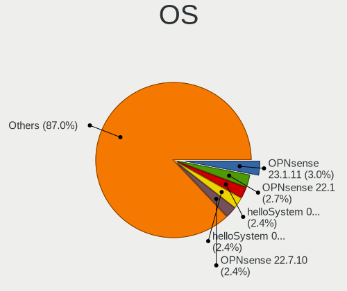

| Name              | Computers | Percent |
|-------------------|-----------|---------|
| OPNsense 23.1.11  | 11        | 3.14%   |
| OPNsense 22.1     | 9         | 2.57%   |
| helloSystem 0.8.1 | 9         | 2.57%   |
| OPNsense 22.7.10  | 8         | 2.29%   |
| OPNsense 21.7.7   | 8         | 2.29%   |
| helloSystem 0.5.0 | 8         | 2.29%   |
| OPNsense 22.7.6   | 7         | 2%      |
| OPNsense 22.1.6   | 7         | 2%      |
| OPNsense 23.1.8   | 6         | 1.71%   |
| OPNsense 23.1.5   | 6         | 1.71%   |
| OPNsense 23.1.10  | 6         | 1.71%   |
| OPNsense 22.7.4   | 6         | 1.71%   |
| OPNsense 21.7.1   | 6         | 1.71%   |
| OPNsense 21.1.5   | 6         | 1.71%   |
| OPNsense 21.1.4   | 6         | 1.71%   |
| OPNsense 21.1.3   | 6         | 1.71%   |
| OPNsense 20.7.8   | 6         | 1.71%   |
| helloSystem 0.4.0 | 6         | 1.71%   |
| OPNsense 22.1.10  | 5         | 1.43%   |
| OPNsense 21.7.3   | 5         | 1.43%   |
| OPNsense 21.7.2   | 5         | 1.43%   |
| OPNsense 21.1.6   | 5         | 1.43%   |
| OPNsense 21.1.2   | 5         | 1.43%   |
| helloSystem 0.6.0 | 5         | 1.43%   |
| FreeBSD 13.0      | 5         | 1.43%   |
| FreeBSD 12.2      | 5         | 1.43%   |
| FreeBSD 12.1-p10  | 5         | 1.43%   |
| OPNsense 23.7.3   | 4         | 1.14%   |
| OPNsense 23.7     | 4         | 1.14%   |
| OPNsense 23.1.7   | 4         | 1.14%   |
| OPNsense 23.1.4   | 4         | 1.14%   |
| OPNsense 23.1.1   | 4         | 1.14%   |
| OPNsense 23.1     | 4         | 1.14%   |
| OPNsense 22.7.9   | 4         | 1.14%   |
| OPNsense 22.1.4   | 4         | 1.14%   |
| OPNsense 21.1.1   | 4         | 1.14%   |
| OPNsense 21.1     | 4         | 1.14%   |
| OpenBSD 7.2       | 4         | 1.14%   |
| OpenBSD 6.8       | 4         | 1.14%   |
| helloSystem 0.7.0 | 4         | 1.14%   |

OS Family
---------

OS without a version

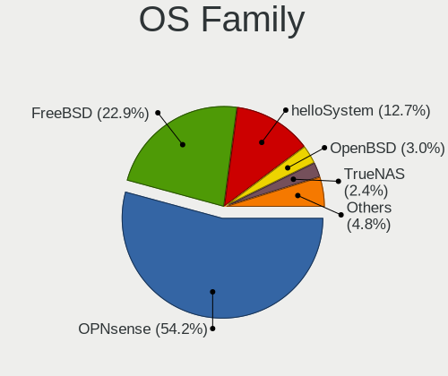

| Name        | Computers | Percent |
|-------------|-----------|---------|
| OPNsense    | 166       | 59.71%  |
| FreeBSD     | 53        | 19.06%  |
| helloSystem | 33        | 11.87%  |
| OpenBSD     | 9         | 3.24%   |
| TrueNAS     | 5         | 1.8%    |
| NomadBSD    | 3         | 1.08%   |
| GhostBSD    | 3         | 1.08%   |
| FreeNAS     | 2         | 0.72%   |
| XigmaNAS    | 1         | 0.36%   |
| NetBSD      | 1         | 0.36%   |
| FuguIta     | 1         | 0.36%   |
| ClonOS      | 1         | 0.36%   |

Arch
----

OS architecture (x86_64, i586, etc.)

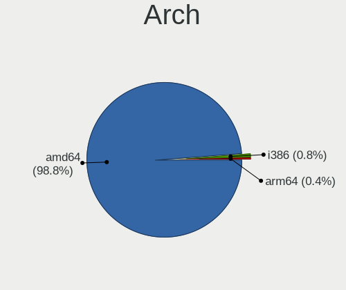

| Name  | Computers | Percent |
|-------|-----------|---------|
| amd64 | 274       | 98.92%  |
| i386  | 2         | 0.72%   |
| arm64 | 1         | 0.36%   |

DE
--

Desktop Environment

| Name         | Computers | Percent |
|--------------|-----------|---------|
| Console      | 193       | 68.93%  |
| helloDesktop | 39        | 13.93%  |
| KDE5         | 13        | 4.64%   |
| XFCE         | 9         | 3.21%   |
| GNOME        | 6         | 2.14%   |
| TWM          | 4         | 1.43%   |
| i3           | 4         | 1.43%   |
| fvwm         | 4         | 1.43%   |
| Openbox      | 3         | 1.07%   |
| Fluxbox      | 2         | 0.71%   |
| MATE         | 1         | 0.36%   |
| Lumina       | 1         | 0.36%   |
| AwesomeWM    | 1         | 0.36%   |

Display Server
--------------

X11 or Wayland

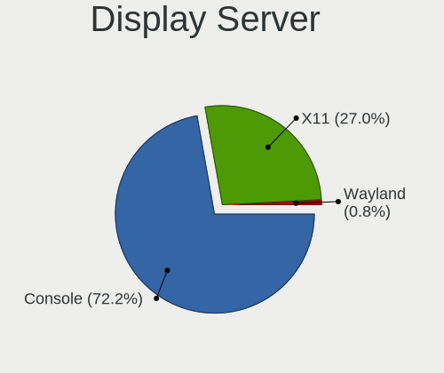

| Name    | Computers | Percent |
|---------|-----------|---------|
| Console | 196       | 70.5%   |
| X11     | 76        | 27.34%  |
| Wayland | 6         | 2.16%   |

Display Manager
---------------

SDDM, LightDM, etc.

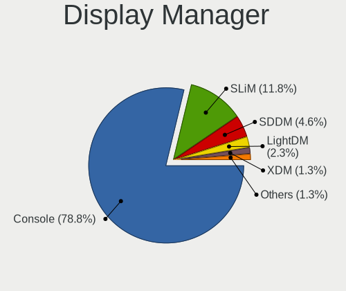

| Name    | Computers | Percent |
|---------|-----------|---------|
| Console | 215       | 77.34%  |
| SLiM    | 36        | 12.95%  |
| SDDM    | 13        | 4.68%   |
| LightDM | 6         | 2.16%   |
| XDM     | 4         | 1.44%   |
| Ly      | 2         | 0.72%   |
| PCDM    | 1         | 0.36%   |
| GDM     | 1         | 0.36%   |

OS Lang
-------

Language

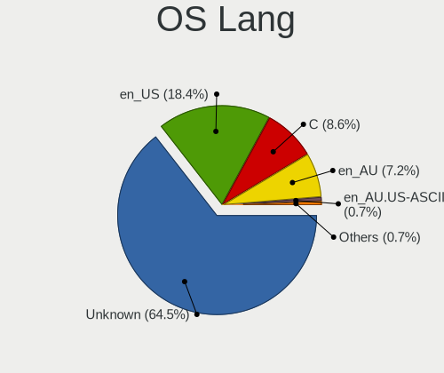

| Lang            | Computers | Percent |
|-----------------|-----------|---------|
| Unknown         | 191       | 67.73%  |
| en_US           | 42        | 14.89%  |
| C               | 29        | 10.28%  |
| en_AU           | 15        | 5.32%   |
| fr_FR           | 1         | 0.35%   |
| fr              | 1         | 0.35%   |
| en_AU.US-ASCII  | 1         | 0.35%   |
| en_AU.ISO8859-1 | 1         | 0.35%   |
| en              | 1         | 0.35%   |

Boot Mode
---------

EFI or BIOS

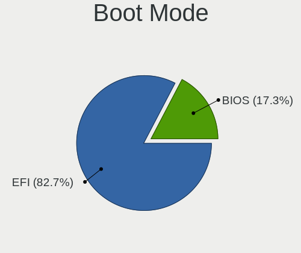

| Mode | Computers | Percent |
|------|-----------|---------|
| EFI  | 229       | 82.67%  |
| BIOS | 48        | 17.33%  |

Filesystem
----------

Type of filesystem

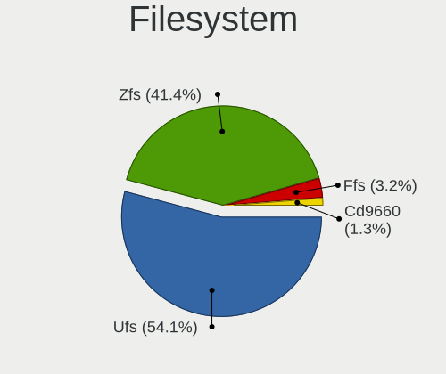

| Type   | Computers | Percent |
|--------|-----------|---------|
| Ufs    | 143       | 50.71%  |
| Zfs    | 117       | 41.49%  |
| Cd9660 | 12        | 4.26%   |
| Ffs    | 10        | 3.55%   |

Part. scheme
------------

Scheme of partitioning

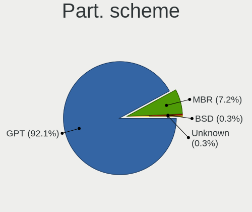

| Type    | Computers | Percent |
|---------|-----------|---------|
| GPT     | 255       | 92.06%  |
| MBR     | 20        | 7.22%   |
| BSD     | 1         | 0.36%   |
| Unknown | 1         | 0.36%   |

Board
-----

Vendor
------

Motherboard manufacturer

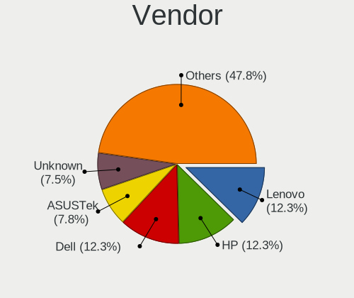

| Name                       | Computers | Percent |
|----------------------------|-----------|---------|
| Lenovo                     | 35        | 12.64%  |
| Hewlett-Packard            | 35        | 12.64%  |
| Dell                       | 34        | 12.27%  |
| ASUSTek Computer           | 21        | 7.58%   |
| Unknown                    | 21        | 7.58%   |
| Intel                      | 17        | 6.14%   |
| Protectli                  | 16        | 5.78%   |
| Gigabyte Technology        | 14        | 5.05%   |
| ASRock                     | 11        | 3.97%   |
| Acer                       | 8         | 2.89%   |
| Apple                      | 7         | 2.53%   |
| Techvision                 | 4         | 1.44%   |
| Sophos                     | 4         | 1.44%   |
| PC Engines                 | 4         | 1.44%   |
| MSI                        | 4         | 1.44%   |
| AMI                        | 4         | 1.44%   |
| Toshiba                    | 3         | 1.08%   |
| Shuttle                    | 2         | 0.72%   |
| MW                         | 2         | 0.72%   |
| Inventec                   | 2         | 0.72%   |
| ZOTAC                      | 1         | 0.36%   |
| YANYU                      | 1         | 0.36%   |
| Yanling                    | 1         | 0.36%   |
| Unknown                    | 1         | 0.36%   |
| TYAN Computer              | 1         | 0.36%   |
| Timi                       | 1         | 0.36%   |
| Supermicro                 | 1         | 0.36%   |
| ShenZhen MinWin Technology | 1         | 0.36%   |
| SeeedStudio                | 1         | 0.36%   |
| Samsung Electronics        | 1         | 0.36%   |
| ReachingTech               | 1         | 0.36%   |
| Raspberry Pi Foundation    | 1         | 0.36%   |
| Radxa                      | 1         | 0.36%   |
| Microsoft                  | 1         | 0.36%   |
| Intel Client Systems       | 1         | 0.36%   |
| IBM                        | 1         | 0.36%   |
| HARDKERNEL                 | 1         | 0.36%   |
| GoWin Solution             | 1         | 0.36%   |
| Gateway                    | 1         | 0.36%   |
| Framework                  | 1         | 0.36%   |

Model
-----

Motherboard model

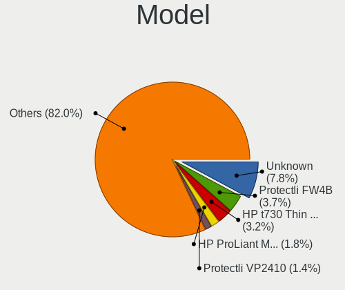

| Name                                                                                     | Computers | Percent |
|------------------------------------------------------------------------------------------|-----------|---------|
| Unknown                                                                                  | 22        | 7.94%   |
| Protectli FW4B                                                                           | 10        | 3.61%   |
| HP t730 Thin Client                                                                      | 8         | 2.89%   |
| Techvision TVI7309X                                                                      | 4         | 1.44%   |
| HP ProLiant MicroServer                                                                  | 4         | 1.44%   |
| Dell OptiPlex 9020                                                                       | 4         | 1.44%   |
| Dell OptiPlex 7040                                                                       | 4         | 1.44%   |
| Sophos XG                                                                                | 3         | 1.08%   |
| Protectli VP2410                                                                         | 3         | 1.08%   |
| Dell PowerEdge R320                                                                      | 3         | 1.08%   |
| AMI Aptio CRB                                                                            | 3         | 1.08%   |
| Protectli FW2B                                                                           | 2         | 0.72%   |
| PC Engines APU2                                                                          | 2         | 0.72%   |
| MW GMLK-2_5G4L                                                                           | 2         | 0.72%   |
| Intel Q3XXG4-P V1.0                                                                      | 2         | 0.72%   |
| Intel NUC10i5FNH                                                                         | 2         | 0.72%   |
| HP ProLiant MicroServer Gen8                                                             | 2         | 0.72%   |
| HP ProDesk 400 G4 SFF                                                                    | 2         | 0.72%   |
| Dell OptiPlex 3040                                                                       | 2         | 0.72%   |
| Dell OptiPlex 3010                                                                       | 2         | 0.72%   |
| Dell G5 5590                                                                             | 2         | 0.72%   |
| ASUS STRIX Z270I GAMING                                                                  | 2         | 0.72%   |
| ASUS All Series                                                                          | 2         | 0.72%   |
| ZOTAC ZBOX-CI323NANO                                                                     | 1         | 0.36%   |
| YANYU H67SL                                                                              | 1         | 0.36%   |
| Yanling YL-KBR6L                                                                         | 1         | 0.36%   |
| TYAN S5510HE                                                                             | 1         | 0.36%   |
| Toshiba Satellite L50-A                                                                  | 1         | 0.36%   |
| Toshiba PORTEGE Z10t-A                                                                   | 1         | 0.36%   |
| Toshiba KIRA                                                                             | 1         | 0.36%   |
| Timi TM1701                                                                              | 1         | 0.36%   |
| Supermicro Super Server                                                                  | 1         | 0.36%   |
| Sophos SG                                                                                | 1         | 0.36%   |
| Shuttle DS81D                                                                            | 1         | 0.36%   |
| Shuttle DH370                                                                            | 1         | 0.36%   |
| ShenZhen MinWin MW-NANO-APL-4L                                                           | 1         | 0.36%   |
| SeeedStudio ODYSSEY-X86J4125                                                             | 1         | 0.36%   |
| Samsung 350V5C/350V5X/350V4C/350V4X/351V5C/351V5X/351V4C/351V4X/3540VC/3540VX/3440VC/344 | 1         | 0.36%   |
| ReachingTech DreamQuest Pro 2022                                                         | 1         | 0.36%   |
| RPi Raspberry Pi                                                                         | 1         | 0.36%   |

Model Family
------------

Motherboard model prefix

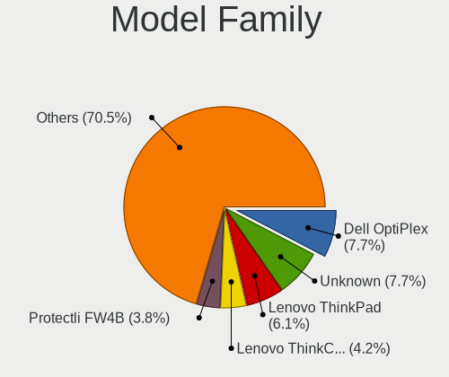

| Name                           | Computers | Percent |
|--------------------------------|-----------|---------|
| Unknown                        | 22        | 7.94%   |
| Dell OptiPlex                  | 20        | 7.22%   |
| Lenovo ThinkPad                | 19        | 6.86%   |
| Lenovo ThinkCentre             | 11        | 3.97%   |
| Protectli FW4B                 | 10        | 3.61%   |
| HP t730                        | 8         | 2.89%   |
| HP ProLiant                    | 8         | 2.89%   |
| Dell PowerEdge                 | 7         | 2.53%   |
| HP ProDesk                     | 6         | 2.17%   |
| HP EliteDesk                   | 5         | 1.81%   |
| Acer Veriton                   | 5         | 1.81%   |
| Techvision TVI7309X            | 4         | 1.44%   |
| ASUS ROG                       | 4         | 1.44%   |
| ASUS PRIME                     | 4         | 1.44%   |
| Sophos XG                      | 3         | 1.08%   |
| Protectli VP2410               | 3         | 1.08%   |
| AMI Aptio                      | 3         | 1.08%   |
| Protectli FW2B                 | 2         | 0.72%   |
| PC Engines APU2                | 2         | 0.72%   |
| MW GMLK-2                      | 2         | 0.72%   |
| Lenovo IdeaPad                 | 2         | 0.72%   |
| Intel Q3XXG4-P                 | 2         | 0.72%   |
| Intel NUC10i5FNH               | 2         | 0.72%   |
| Dell G5                        | 2         | 0.72%   |
| ASUS STRIX                     | 2         | 0.72%   |
| ASUS All                       | 2         | 0.72%   |
| ASRock X370                    | 2         | 0.72%   |
| ZOTAC ZBOX-CI323NANO           | 1         | 0.36%   |
| YANYU H67SL                    | 1         | 0.36%   |
| Yanling YL-KBR6L               | 1         | 0.36%   |
| TYAN S5510HE                   | 1         | 0.36%   |
| Toshiba Satellite              | 1         | 0.36%   |
| Toshiba PORTEGE                | 1         | 0.36%   |
| Toshiba KIRA                   | 1         | 0.36%   |
| Timi TM1701                    | 1         | 0.36%   |
| Supermicro Super               | 1         | 0.36%   |
| Sophos SG                      | 1         | 0.36%   |
| Shuttle DS81D                  | 1         | 0.36%   |
| Shuttle DH370                  | 1         | 0.36%   |
| ShenZhen MinWin MW-NANO-APL-4L | 1         | 0.36%   |

MFG Year
--------

Motherboard manufacture year

| Year    | Computers | Percent |
|---------|-----------|---------|
| 2018    | 33        | 11.91%  |
| 2019    | 29        | 10.47%  |
| 2020    | 25        | 9.03%   |
| 2015    | 23        | 8.3%    |
| 2021    | 22        | 7.94%   |
| 2016    | 21        | 7.58%   |
| 2014    | 20        | 7.22%   |
| 2013    | 19        | 6.86%   |
| 2022    | 17        | 6.14%   |
| 2017    | 16        | 5.78%   |
| 2012    | 11        | 3.97%   |
| 2011    | 11        | 3.97%   |
| 2023    | 7         | 2.53%   |
| 2009    | 7         | 2.53%   |
| 2010    | 5         | 1.81%   |
| 2008    | 4         | 1.44%   |
| Unknown | 4         | 1.44%   |
| 2007    | 2         | 0.72%   |
| 2006    | 1         | 0.36%   |

Form Factor
-----------

Physical design of the computer

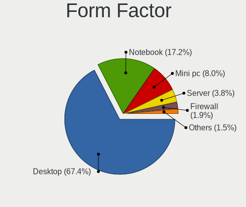

| Name           | Computers | Percent |
|----------------|-----------|---------|
| Desktop        | 183       | 66.06%  |
| Notebook       | 52        | 18.77%  |
| Mini pc        | 23        | 8.3%    |
| Server         | 10        | 3.61%   |
| Firewall       | 5         | 1.81%   |
| All in one     | 2         | 0.72%   |
| System on chip | 1         | 0.36%   |
| Tablet         | 1         | 0.36%   |

Coreboot
--------

Have coreboot on board

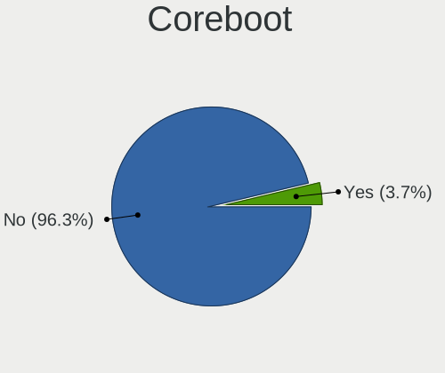

| Used | Computers | Percent |
|------|-----------|---------|
| No   | 265       | 95.67%  |
| Yes  | 12        | 4.33%   |

RAM Size
--------

Total RAM memory

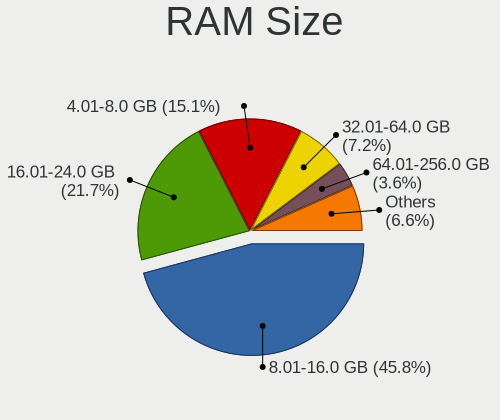

| Size in GB  | Computers | Percent |
|-------------|-----------|---------|
| 8.01-16.0   | 119       | 41.9%   |
| 16.01-24.0  | 79        | 27.82%  |
| 4.01-8.0    | 43        | 15.14%  |
| 32.01-64.0  | 18        | 6.34%   |
| 64.01-256.0 | 10        | 3.52%   |
| 2.01-3.0    | 6         | 2.11%   |
| 3.01-4.0    | 3         | 1.06%   |
| 24.01-32.0  | 3         | 1.06%   |
| 1.01-2.0    | 2         | 0.7%    |
| 0.51-1.0    | 1         | 0.35%   |

RAM Used
--------

Used RAM memory

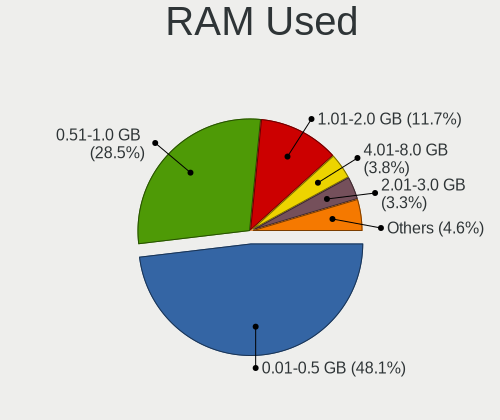

| Used GB    | Computers | Percent |
|------------|-----------|---------|
| 0.01-0.5   | 135       | 46.39%  |
| 0.51-1.0   | 94        | 32.3%   |
| 1.01-2.0   | 30        | 10.31%  |
| 2.01-3.0   | 12        | 4.12%   |
| 4.01-8.0   | 9         | 3.09%   |
| 8.01-16.0  | 3         | 1.03%   |
| 3.01-4.0   | 2         | 0.69%   |
| 16.01-24.0 | 2         | 0.69%   |
| 32.01-64.0 | 1         | 0.34%   |
| 24.01-32.0 | 1         | 0.34%   |
| 0          | 1         | 0.34%   |
| Unknown    | 1         | 0.34%   |

Total Drives
------------

Number of drives on board

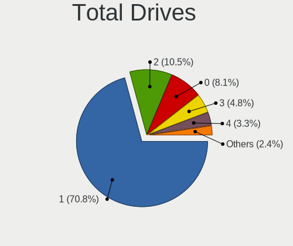

| Drives | Computers | Percent |
|--------|-----------|---------|
| 1      | 203       | 72.5%   |
| 2      | 26        | 9.29%   |
| 0      | 23        | 8.21%   |
| 3      | 13        | 4.64%   |
| 4      | 7         | 2.5%    |
| 5      | 4         | 1.43%   |
| 7      | 2         | 0.71%   |
| 10     | 1         | 0.36%   |
| 6      | 1         | 0.36%   |

Has CD-ROM
----------

Has CD-ROM on board

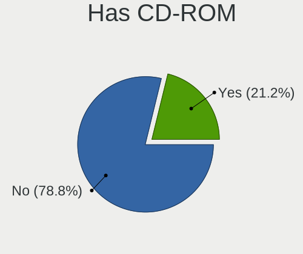

| Presented | Computers | Percent |
|-----------|-----------|---------|
| No        | 229       | 82.67%  |
| Yes       | 48        | 17.33%  |

Has Ethernet
------------

Has Ethernet on board

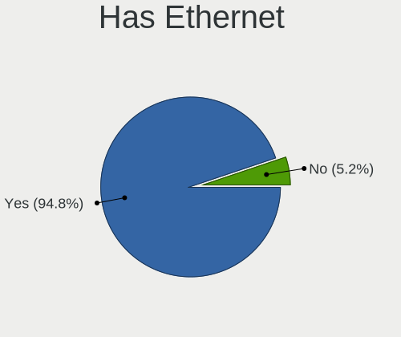

| Presented | Computers | Percent |
|-----------|-----------|---------|
| Yes       | 263       | 94.95%  |
| No        | 14        | 5.05%   |

Has WiFi
--------

Has WiFi module

| Presented | Computers | Percent |
|-----------|-----------|---------|
| No        | 174       | 62.59%  |
| Yes       | 104       | 37.41%  |

Has Bluetooth
-------------

Has Bluetooth module

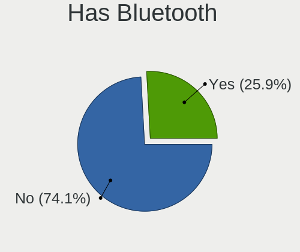

| Presented | Computers | Percent |
|-----------|-----------|---------|
| No        | 200       | 71.94%  |
| Yes       | 78        | 28.06%  |

Location
--------

Country
-------

Geographic location (country)

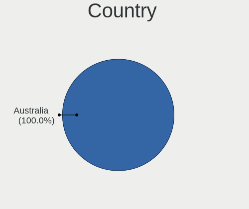

| Country   | Computers | Percent |
|-----------|-----------|---------|
| Australia | 277       | 100%    |

City
----

Geographic location (city)

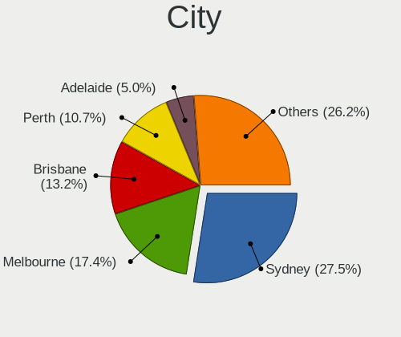

| City           | Computers | Percent |
|----------------|-----------|---------|
| Sydney         | 83        | 27.76%  |
| Melbourne      | 48        | 16.05%  |
| Perth          | 34        | 11.37%  |
| Brisbane       | 34        | 11.37%  |
| Adelaide       | 17        | 5.69%   |
| Canberra       | 8         | 2.68%   |
| Hobart         | 5         | 1.67%   |
| Nyngan         | 4         | 1.34%   |
| Morwell        | 3         | 1%      |
| Blackburn      | 3         | 1%      |
| Southport      | 2         | 0.67%   |
| Ryde           | 2         | 0.67%   |
| Marrickville   | 2         | 0.67%   |
| Kooyong        | 2         | 0.67%   |
| Kellyville     | 2         | 0.67%   |
| Ipswich        | 2         | 0.67%   |
| Gold Coast     | 2         | 0.67%   |
| East Malvern   | 2         | 0.67%   |
| Burwood        | 2         | 0.67%   |
| Unknown        | 2         | 0.67%   |
| Wollongong     | 1         | 0.33%   |
| Whitebridge    | 1         | 0.33%   |
| Wheelers Hill  | 1         | 0.33%   |
| Warrnambool    | 1         | 0.33%   |
| Wallan         | 1         | 0.33%   |
| Townsville     | 1         | 0.33%   |
| South Yarra    | 1         | 0.33%   |
| Shell Cove     | 1         | 0.33%   |
| Roxby Downs    | 1         | 0.33%   |
| Rosanna        | 1         | 0.33%   |
| Ringwood       | 1         | 0.33%   |
| Port Fairy     | 1         | 0.33%   |
| Northcote      | 1         | 0.33%   |
| North Shore    | 1         | 0.33%   |
| Noble Park     | 1         | 0.33%   |
| Nickol         | 1         | 0.33%   |
| Mount Waverley | 1         | 0.33%   |
| Mount Eliza    | 1         | 0.33%   |
| Mooroolbark    | 1         | 0.33%   |
| Mandurah       | 1         | 0.33%   |

Drives
------

Drive Vendor
------------

Hard drive vendors

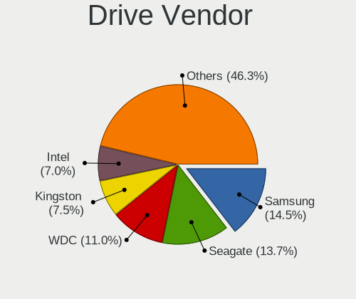

| Vendor              | Computers | Drives | Percent |
|---------------------|-----------|--------|---------|
| Samsung Electronics | 51        | 72     | 16.35%  |
| Seagate             | 38        | 54     | 12.18%  |
| WDC                 | 32        | 81     | 10.26%  |
| Crucial             | 25        | 33     | 8.01%   |
| Kingston            | 19        | 27     | 6.09%   |
| Intel               | 19        | 29     | 6.09%   |
| Toshiba             | 16        | 22     | 5.13%   |
| SanDisk             | 13        | 21     | 4.17%   |
| Hoodisk             | 10        | 20     | 3.21%   |
| OCZ                 | 6         | 7      | 1.92%   |
| Micron Technology   | 6         | 8      | 1.92%   |
| China               | 6         | 7      | 1.92%   |
| A-DATA Technology   | 6         | 11     | 1.92%   |
| Protectli           | 4         | 4      | 1.28%   |
| SPCC                | 3         | 7      | 0.96%   |
| SK hynix            | 3         | 5      | 0.96%   |
| Phison              | 3         | 3      | 0.96%   |
| NVMe                | 3         | 4      | 0.96%   |
| Hitachi             | 3         | 6      | 0.96%   |
| Hewlett-Packard     | 3         | 6      | 0.96%   |
| Dogfish             | 3         | 4      | 0.96%   |
| Transcend           | 2         | 4      | 0.64%   |
| Silicon Motion      | 2         | 2      | 0.64%   |
| Patriot             | 2         | 2      | 0.64%   |
| Lenovo              | 2         | 2      | 0.64%   |
| KIOXIA              | 2         | 2      | 0.64%   |
| KingDian            | 2         | 2      | 0.64%   |
| HGST                | 2         | 2      | 0.64%   |
| Gigabyte Technology | 2         | 3      | 0.64%   |
| FORESEE             | 2         | 3      | 0.64%   |
| BIWIN               | 2         | 2      | 0.64%   |
| Apple               | 2         | 2      | 0.64%   |
| ZOTAC               | 1         | 1      | 0.32%   |
| XUNZHE              | 1         | 1      | 0.32%   |
| Vaseky              | 1         | 4      | 0.32%   |
| Union Memory        | 1         | 1      | 0.32%   |
| ShiJi               | 1         | 1      | 0.32%   |
| Qunion              | 1         | 2      | 0.32%   |
| PNY                 | 1         | 1      | 0.32%   |
| Plextor             | 1         | 2      | 0.32%   |

Drive Model
-----------

Hard drive models

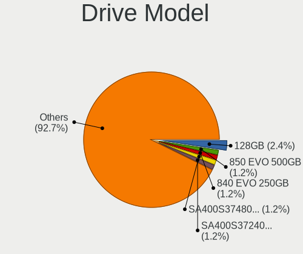

| Model                                       | Computers | Percent |
|---------------------------------------------|-----------|---------|
| Hoodisk SSD 128GB                           | 7         | 2.07%   |
| Crucial CT250MX500SSD1 250GB                | 6         | 1.78%   |
| Samsung SSD 850 EVO 500GB                   | 4         | 1.18%   |
| WDC WD30EFRX-68EUZN0 3TB                    | 3         | 0.89%   |
| Seagate ST500LM021-1KJ152 500GB             | 3         | 0.89%   |
| Seagate FireCuda 520 SSD ZP500GM30002 500GB | 3         | 0.89%   |
| Samsung SSD 970 EVO Plus 250GB              | 3         | 0.89%   |
| Samsung SSD 860 EVO 500GB                   | 3         | 0.89%   |
| Samsung SSD 840 EVO 250GB                   | 3         | 0.89%   |
| Samsung SSD 840 EVO 120GB                   | 3         | 0.89%   |
| Kingston SA400S37480G 480GB                 | 3         | 0.89%   |
| Kingston SA400S37240G 240GB                 | 3         | 0.89%   |
| Kingston SA400S37120G 120GB                 | 3         | 0.89%   |
| Intel SSDSCKKW240H6 240GB                   | 3         | 0.89%   |
| Crucial CT500MX500SSD1 500GB                | 3         | 0.89%   |
| Crucial CT250P2SSD8 250GB                   | 3         | 0.89%   |
| China SATA SSD 16GB                         | 3         | 0.89%   |
| WDC WDS250G2B0A-00SM50 250GB                | 2         | 0.59%   |
| WDC WDS240G2G0A-00JH30 240GB                | 2         | 0.59%   |
| WDC WDS120G2G0B-00EPW0 120GB                | 2         | 0.59%   |
| WDC WD40EFRX-68WT0N0 4TB                    | 2         | 0.59%   |
| WDC WD40EFRX-68N32N0 4TB                    | 2         | 0.59%   |
| WDC WD20EZRX-00D8PB0 2TB                    | 2         | 0.59%   |
| WDC WD20EZAZ-00GGJB0 2TB                    | 2         | 0.59%   |
| Toshiba THNSF5256GPUK 256GB                 | 2         | 0.59%   |
| Toshiba MQ01ABD100 1TB                      | 2         | 0.59%   |
| Toshiba MK6475GSX 640GB                     | 2         | 0.59%   |
| SPCC M.2 PCIe SSD 256GB                     | 2         | 0.59%   |
| Seagate ST9500325AS 500GB                   | 2         | 0.59%   |
| Seagate ST1000DM010-2EP102 1TB              | 2         | 0.59%   |
| SanDisk SDSA6MM-032G-1006 32GB              | 2         | 0.59%   |
| Samsung SSD 980 500GB                       | 2         | 0.59%   |
| Samsung MZ7LN128HCHP-000H1 128GB            | 2         | 0.59%   |
| Protectli 120GB mSATA                       | 2         | 0.59%   |
| Micron MTFDDAK256MAM-1K1 256GB              | 2         | 0.59%   |
| KIOXIA KXG60ZNV256G 256GB                   | 2         | 0.59%   |
| Dogfish SSD 64GB                            | 2         | 0.59%   |
| Crucial CT480BX500SSD1 480GB                | 2         | 0.59%   |
| Crucial CT1000P3SSD8 1TB                    | 2         | 0.59%   |
| A-DATA IM2S3134N-064GM 64GB                 | 2         | 0.59%   |

HDD Vendor
----------

Hard disk drive vendors

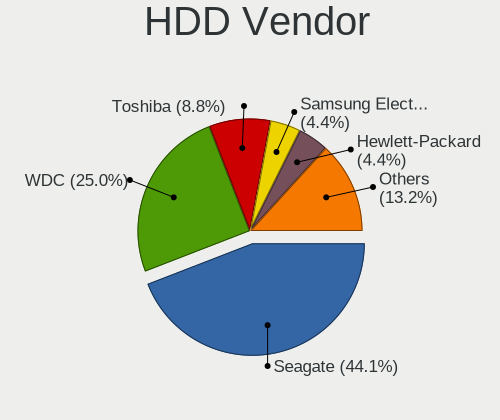

| Vendor              | Computers | Drives | Percent |
|---------------------|-----------|--------|---------|
| Seagate             | 35        | 51     | 42.17%  |
| WDC                 | 22        | 64     | 26.51%  |
| Toshiba             | 8         | 10     | 9.64%   |
| Samsung Electronics | 3         | 5      | 3.61%   |
| NVMe                | 3         | 3      | 3.61%   |
| Hitachi             | 3         | 6      | 3.61%   |
| Hewlett-Packard     | 3         | 6      | 3.61%   |
| HGST                | 2         | 2      | 2.41%   |
| Maxtor              | 1         | 1      | 1.2%    |
| Jetflash            | 1         | 1      | 1.2%    |
| Fujitsu             | 1         | 1      | 1.2%    |
| China               | 1         | 1      | 1.2%    |

SSD Vendor
----------

Solid state drive vendors

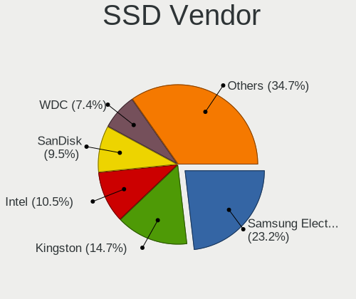

| Vendor              | Computers | Drives | Percent |
|---------------------|-----------|--------|---------|
| Samsung Electronics | 33        | 48     | 19.08%  |
| Kingston            | 18        | 25     | 10.4%   |
| Crucial             | 18        | 23     | 10.4%   |
| Intel               | 16        | 26     | 9.25%   |
| SanDisk             | 13        | 21     | 7.51%   |
| Hoodisk             | 10        | 20     | 5.78%   |
| WDC                 | 9         | 15     | 5.2%    |
| OCZ                 | 6         | 7      | 3.47%   |
| Micron Technology   | 5         | 7      | 2.89%   |
| China               | 5         | 6      | 2.89%   |
| Toshiba             | 4         | 7      | 2.31%   |
| Protectli           | 4         | 4      | 2.31%   |
| A-DATA Technology   | 4         | 4      | 2.31%   |
| Dogfish             | 3         | 4      | 1.73%   |
| Transcend           | 2         | 4      | 1.16%   |
| Phison              | 2         | 2      | 1.16%   |
| KingDian            | 2         | 2      | 1.16%   |
| FORESEE             | 2         | 3      | 1.16%   |
| ZOTAC               | 1         | 1      | 0.58%   |
| XUNZHE              | 1         | 1      | 0.58%   |
| Vaseky              | 1         | 4      | 0.58%   |
| SK hynix            | 1         | 1      | 0.58%   |
| ShiJi               | 1         | 1      | 0.58%   |
| Qunion              | 1         | 2      | 0.58%   |
| Plextor             | 1         | 2      | 0.58%   |
| Patriot             | 1         | 1      | 0.58%   |
| NVMe                | 1         | 1      | 0.58%   |
| LITEONIT            | 1         | 1      | 0.58%   |
| Lenovo              | 1         | 1      | 0.58%   |
| KingSpec            | 1         | 1      | 0.58%   |
| Fordisk             | 1         | 1      | 0.58%   |
| Corsair             | 1         | 1      | 0.58%   |
| BIWIN               | 1         | 1      | 0.58%   |
| Apple               | 1         | 1      | 0.58%   |
| Apacer              | 1         | 1      | 0.58%   |

Drive Kind
----------

HDD or SSD

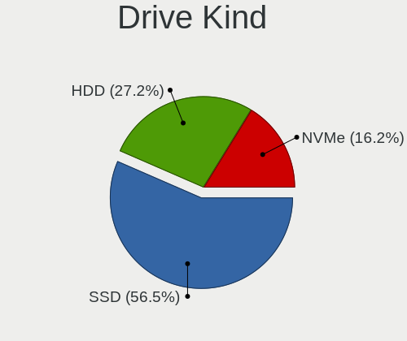

| Kind | Computers | Drives | Percent |
|------|-----------|--------|---------|
| SSD  | 158       | 250    | 56.03%  |
| HDD  | 67        | 151    | 23.76%  |
| NVMe | 57        | 79     | 20.21%  |

Drive Connector
---------------

SATA, SAS, NVMe, etc.

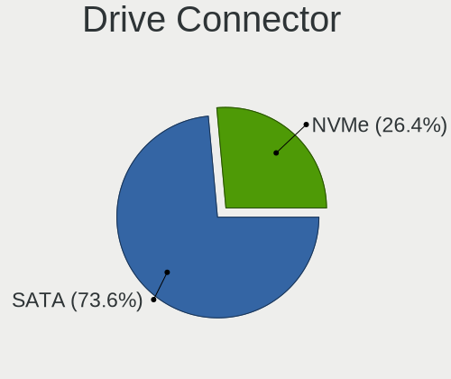

| Type | Computers | Drives | Percent |
|------|-----------|--------|---------|
| SATA | 209       | 401    | 78.57%  |
| NVMe | 57        | 79     | 21.43%  |

Drive Size
----------

Size of hard drive

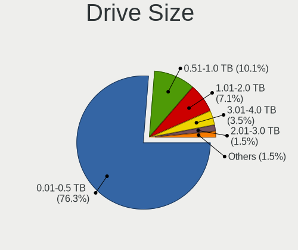

| Size in TB | Computers | Drives | Percent |
|------------|-----------|--------|---------|
| 0.01-0.5   | 182       | 293    | 77.78%  |
| 0.51-1.0   | 25        | 36     | 10.68%  |
| 1.01-2.0   | 14        | 40     | 5.98%   |
| 3.01-4.0   | 7         | 13     | 2.99%   |
| 2.01-3.0   | 3         | 12     | 1.28%   |
| 4.01-10.0  | 2         | 5      | 0.85%   |
| 10.01-20.0 | 1         | 2      | 0.43%   |

Space Total
-----------

Amount of disk space available on the file system

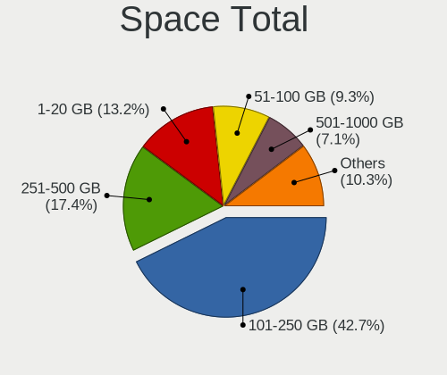

| Size in GB     | Computers | Percent |
|----------------|-----------|---------|
| 101-250        | 120       | 42.7%   |
| 251-500        | 49        | 17.44%  |
| 1-20           | 37        | 13.17%  |
| 51-100         | 26        | 9.25%   |
| 21-50          | 20        | 7.12%   |
| 501-1000       | 20        | 7.12%   |
| 1001-2000      | 6         | 2.14%   |
| 2001-3000      | 2         | 0.71%   |
| More than 3000 | 1         | 0.36%   |

Space Used
----------

Amount of used disk space

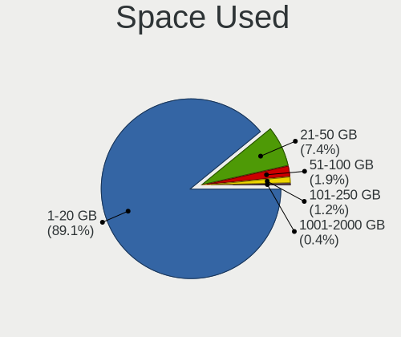

| Used GB   | Computers | Percent |
|-----------|-----------|---------|
| 1-20      | 257       | 89.86%  |
| 21-50     | 20        | 6.99%   |
| 51-100    | 5         | 1.75%   |
| 101-250   | 3         | 1.05%   |
| 1001-2000 | 1         | 0.35%   |

Malfunc. Drives
---------------

Drive models with a malfunction

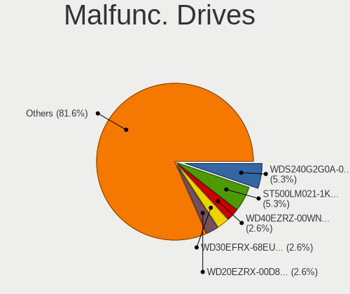

| Model                                     | Computers | Drives | Percent |
|-------------------------------------------|-----------|--------|---------|
| WDC WDS240G2G0A-00JH30 240GB              | 2         | 5      | 6.45%   |
| Seagate ST500LM021-1KJ152 500GB           | 2         | 2      | 6.45%   |
| WDC WD30EFRX-68EUZN0 3TB                  | 1         | 1      | 3.23%   |
| WDC WD20EZRX-00D8PB0 2TB                  | 1         | 2      | 3.23%   |
| WDC WD20EARX-008FB0 2TB                   | 1         | 4      | 3.23%   |
| WDC WD20EARS-00MVWB0 2TB                  | 1         | 1      | 3.23%   |
| Toshiba KSG60ZSE256G SATA 256GB           | 1         | 1      | 3.23%   |
| Seagate ST9160314AS 160GB                 | 1         | 1      | 3.23%   |
| Seagate ST500LT012-1DG142 500GB           | 1         | 1      | 3.23%   |
| Seagate ST3250310AS 250GB                 | 1         | 1      | 3.23%   |
| Seagate ST2000LM015-2E8174 2TB            | 1         | 1      | 3.23%   |
| Seagate ST2000DL003-9VT166 2TB            | 1         | 1      | 3.23%   |
| Seagate ST1000DM003-1CH162 1TB            | 1         | 1      | 3.23%   |
| SanDisk SDSSDA240G 240GB                  | 1         | 1      | 3.23%   |
| Samsung Electronics HM500LI 500GB         | 1         | 2      | 3.23%   |
| Phison SATA SSD 32GB                      | 1         | 1      | 3.23%   |
| Micron Technology C400-MTFDDAT064MAM 64GB | 1         | 1      | 3.23%   |
| Kingston SNS4151S316G 16GB                | 1         | 1      | 3.23%   |
| Kingston SA400S37480G 480GB               | 1         | 1      | 3.23%   |
| Intel SSDSC2BW120H6 120GB                 | 1         | 1      | 3.23%   |
| Intel SSDSC2BF180A4L 180GB                | 1         | 1      | 3.23%   |
| Hitachi HTS542525K9A300 250GB             | 1         | 1      | 3.23%   |
| Hitachi HDS721010KLA330 1TB               | 1         | 1      | 3.23%   |
| HGST HTS725050A7E630 500GB                | 1         | 1      | 3.23%   |
| Hewlett-Packard VB0250EAVER 250GB         | 1         | 1      | 3.23%   |
| Crucial CT275MX300SSD4 275GB              | 1         | 1      | 3.23%   |
| BIWIN SSD 8GB                             | 1         | 1      | 3.23%   |
| Apple SSD SM256E 256GB                    | 1         | 1      | 3.23%   |
| Apacer AS330 240GB                        | 1         | 1      | 3.23%   |

Malfunc. Drive Vendor
---------------------

Vendors of faulty drives

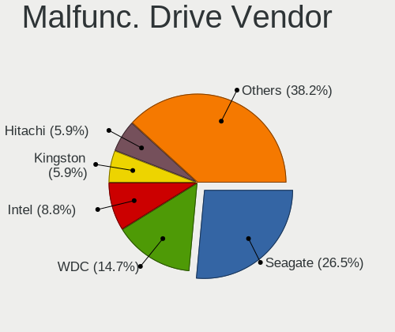

| Vendor              | Computers | Drives | Percent |
|---------------------|-----------|--------|---------|
| Seagate             | 8         | 8      | 26.67%  |
| WDC                 | 5         | 13     | 16.67%  |
| Kingston            | 2         | 2      | 6.67%   |
| Intel               | 2         | 2      | 6.67%   |
| Hitachi             | 2         | 2      | 6.67%   |
| Toshiba             | 1         | 1      | 3.33%   |
| SanDisk             | 1         | 1      | 3.33%   |
| Samsung Electronics | 1         | 2      | 3.33%   |
| Phison              | 1         | 1      | 3.33%   |
| Micron Technology   | 1         | 1      | 3.33%   |
| HGST                | 1         | 1      | 3.33%   |
| Hewlett-Packard     | 1         | 1      | 3.33%   |
| Crucial             | 1         | 1      | 3.33%   |
| BIWIN               | 1         | 1      | 3.33%   |
| Apple               | 1         | 1      | 3.33%   |
| Apacer              | 1         | 1      | 3.33%   |

Malfunc. HDD Vendor
-------------------

Vendors of faulty HDD drives

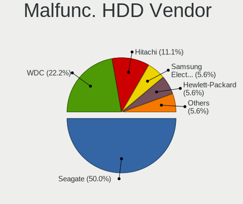

| Vendor              | Computers | Drives | Percent |
|---------------------|-----------|--------|---------|
| Seagate             | 8         | 8      | 50%     |
| WDC                 | 3         | 8      | 18.75%  |
| Hitachi             | 2         | 2      | 12.5%   |
| Samsung Electronics | 1         | 2      | 6.25%   |
| HGST                | 1         | 1      | 6.25%   |
| Hewlett-Packard     | 1         | 1      | 6.25%   |

Malfunc. Drive Kind
-------------------

Kinds of faulty drives

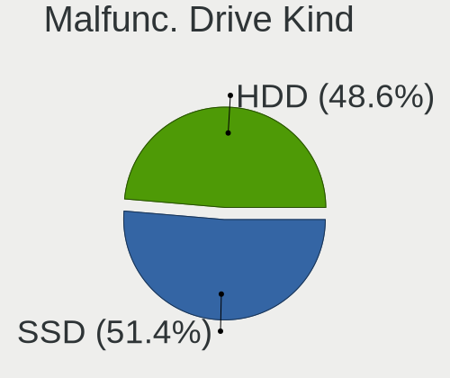

| Kind | Computers | Drives | Percent |
|------|-----------|--------|---------|
| HDD  | 16        | 22     | 53.33%  |
| SSD  | 14        | 17     | 46.67%  |

Failed Drives
-------------

Failed drive models

Zero info for selected period =(

Failed Drive Vendor
-------------------

Failed drive vendors

Zero info for selected period =(

Drive Status
------------

Number of failed and malfunc. drives

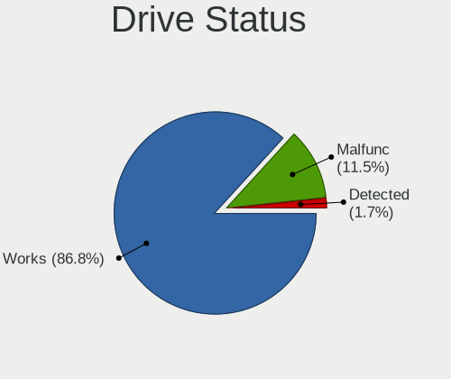

| Status   | Computers | Drives | Percent |
|----------|-----------|--------|---------|
| Works    | 230       | 436    | 87.12%  |
| Malfunc  | 30        | 39     | 11.36%  |
| Detected | 4         | 5      | 1.52%   |

Storage controller
------------------

Storage Vendor
--------------

Storage controller vendors

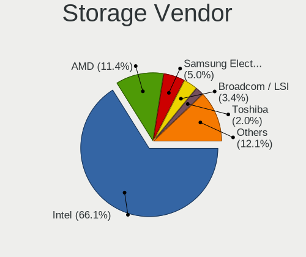

| Vendor                       | Computers | Percent |
|------------------------------|-----------|---------|
| Intel                        | 215       | 63.42%  |
| AMD                          | 39        | 11.5%   |
| Samsung Electronics          | 19        | 5.6%    |
| Broadcom / LSI               | 10        | 2.95%   |
| Micron/Crucial Technology    | 8         | 2.36%   |
| Phison Electronics           | 7         | 2.06%   |
| Toshiba                      | 6         | 1.77%   |
| Sandisk                      | 6         | 1.77%   |
| Silicon Motion               | 5         | 1.47%   |
| Seagate Technology           | 3         | 0.88%   |
| Micron Technology            | 3         | 0.88%   |
| Nvidia                       | 2         | 0.59%   |
| Kingston Technology Company  | 2         | 0.59%   |
| ASMedia Technology           | 2         | 0.59%   |
| Union Memory (Shenzhen)      | 1         | 0.29%   |
| SK hynix                     | 1         | 0.29%   |
| Silicon Image                | 1         | 0.29%   |
| Shenzhen Longsys Electronics | 1         | 0.29%   |
| Realtek Semiconductor        | 1         | 0.29%   |
| QLogic                       | 1         | 0.29%   |
| Marvell Technology Group     | 1         | 0.29%   |
| Lenovo                       | 1         | 0.29%   |
| JMicron Technology           | 1         | 0.29%   |
| Hewlett-Packard              | 1         | 0.29%   |
| ADATA Technology             | 1         | 0.29%   |
| Adaptec                      | 1         | 0.29%   |

Storage Model
-------------

Storage controller models

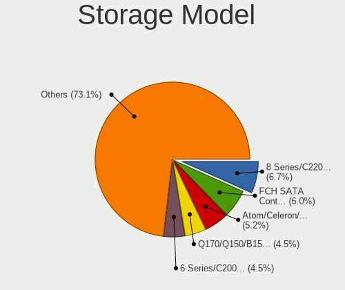

| Model                                                                                   | Computers | Percent |
|-----------------------------------------------------------------------------------------|-----------|---------|
| AMD FCH SATA Controller [AHCI mode]                                                     | 25        | 6.53%   |
| Intel 8 Series/C220 Series Chipset Family 6-port SATA Controller 1 [AHCI mode]          | 23        | 6.01%   |
| Intel Q170/Q150/B150/H170/H110/Z170/CM236 Chipset SATA Controller [AHCI Mode]           | 18        | 4.7%    |
| Intel Atom/Celeron/Pentium Processor x5-E8000/J3xxx/N3xxx Series SATA Controller        | 17        | 4.44%   |
| Intel 6 Series/C200 Series Chipset Family 6 port Desktop SATA AHCI Controller           | 13        | 3.39%   |
| Intel 200 Series PCH SATA controller [AHCI mode]                                        | 11        | 2.87%   |
| Intel Celeron/Pentium Silver Processor SATA Controller                                  | 10        | 2.61%   |
| Samsung NVMe SSD Controller SM981/PM981/PM983                                           | 9         | 2.35%   |
| Intel Sunrise Point-LP SATA Controller [AHCI mode]                                      | 9         | 2.35%   |
| Intel Jasper Lake SATA AHCI Controller                                                  | 9         | 2.35%   |
| Intel Cannon Lake PCH SATA AHCI Controller                                              | 9         | 2.35%   |
| Intel Atom Processor E3800 Series SATA AHCI Controller                                  | 9         | 2.35%   |
| AMD SB7x0/SB8x0/SB9x0 SATA Controller [AHCI mode]                                       | 9         | 2.35%   |
| AMD FCH IDE Controller                                                                  | 9         | 2.35%   |
| Intel 7 Series/C210 Series Chipset Family 6-port SATA Controller [AHCI mode]            | 8         | 2.09%   |
| Intel 7 Series Chipset Family 6-port SATA Controller [AHCI mode]                        | 8         | 2.09%   |
| Micron/Crucial P2 [Nick P2] / P3 / P3 Plus NVMe PCIe SSD (DRAM-less)                    | 7         | 1.83%   |
| Intel Wildcat Point-LP SATA Controller [AHCI Mode]                                      | 7         | 1.83%   |
| Intel SATA Controller [RAID mode]                                                       | 7         | 1.83%   |
| Intel 8 Series SATA Controller 1 [AHCI mode]                                            | 6         | 1.57%   |
| Phison PS5013 E13 NVMe Controller                                                       | 5         | 1.31%   |
| Intel 6 Series/C200 Series Chipset Family Desktop SATA Controller (IDE mode, ports 4-5) | 5         | 1.31%   |
| Intel 6 Series/C200 Series Chipset Family Desktop SATA Controller (IDE mode, ports 0-3) | 5         | 1.31%   |
| Intel 6 Series/C200 Series Chipset Family 6 port Mobile SATA AHCI Controller            | 5         | 1.31%   |
| AMD SB7x0/SB8x0/SB9x0 IDE Controller                                                    | 5         | 1.31%   |
| Silicon Motion SM2263EN/SM2263XT (DRAM-less) NVMe SSD Controllers                       | 4         | 1.04%   |
| Samsung NVMe SSD Controller 980                                                         | 4         | 1.04%   |
| AMD FCH SATA Controller D                                                               | 4         | 1.04%   |
| Seagate FireCuda 520 SSD                                                                | 3         | 0.78%   |
| Samsung NVMe SSD Controller SM961/PM961/SM963                                           | 3         | 0.78%   |
| Intel C600/X79 series chipset 6-Port SATA AHCI Controller                               | 3         | 0.78%   |
| Intel 82801JI (ICH10 Family) SATA AHCI Controller                                       | 3         | 0.78%   |
| Intel 5 Series/3400 Series Chipset 6 port SATA AHCI Controller                          | 3         | 0.78%   |
| Broadcom / LSI SAS2308 PCI-Express Fusion-MPT SAS-2                                     | 3         | 0.78%   |
| Toshiba XG6 NVMe SSD Controller                                                         | 2         | 0.52%   |
| Toshiba XG4 NVMe SSD Controller                                                         | 2         | 0.52%   |
| Samsung NVMe SSD Controller PM9A1/PM9A3/980PRO                                          | 2         | 0.52%   |
| Intel Tiger Lake-LP SATA Controller                                                     | 2         | 0.52%   |
| Intel Cannon Point-LP SATA Controller [AHCI Mode]                                       | 2         | 0.52%   |
| Intel Cannon Lake Mobile PCH SATA AHCI Controller                                       | 2         | 0.52%   |

Storage Kind
------------

Kind of storage controller (IDE, SATA, NVMe, SAS, ...)

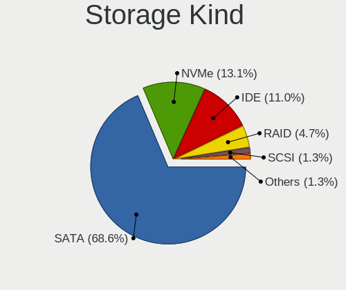

| Kind | Computers | Percent |
|------|-----------|---------|
| SATA | 234       | 65.92%  |
| NVMe | 63        | 17.75%  |
| IDE  | 33        | 9.3%    |
| RAID | 17        | 4.79%   |
| SAS  | 5         | 1.41%   |
| SCSI | 3         | 0.85%   |

Processor
---------

CPU Vendor
----------

Processor vendors

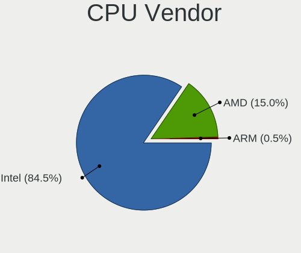

| Vendor | Computers | Percent |
|--------|-----------|---------|
| Intel  | 235       | 84.84%  |
| AMD    | 41        | 14.8%   |
| ARM    | 1         | 0.36%   |

CPU Model
---------

Processor models

| Model                                    | Computers | Percent |
|------------------------------------------|-----------|---------|
| Intel Celeron CPU J3160 @ 1.60GHz        | 12        | 4.27%   |
| AMD RX-427BB with AMD Radeon R7 Graphics | 8         | 2.85%   |
| Intel Celeron N5105 @ 2.00GHz            | 7         | 2.49%   |
| Intel Celeron J4125 CPU @ 2.00GHz        | 7         | 2.49%   |
| Intel Core i5-6500T CPU @ 2.50GHz        | 5         | 1.78%   |
| Intel Celeron CPU J1900 @ 1.99GHz        | 5         | 1.78%   |
| Intel Core i5-3470 CPU @ 3.20GHz         | 4         | 1.42%   |
| Intel Pentium CPU G4560 @ 3.50GHz        | 3         | 1.07%   |
| Intel Core i7-9750H CPU @ 2.60GHz        | 3         | 1.07%   |
| Intel Core i7-8550U CPU @ 1.80GHz        | 3         | 1.07%   |
| Intel Core i7-3770 CPU @ 3.40GHz         | 3         | 1.07%   |
| Intel Core i5-7400 CPU @ 3.00GHz         | 3         | 1.07%   |
| Intel Core i5-5300U CPU @ 2.30GHz        | 3         | 1.07%   |
| Intel Core i5-4570T CPU @ 2.90GHz        | 3         | 1.07%   |
| Intel Core i5-4570 CPU @ 3.20GHz         | 3         | 1.07%   |
| Intel Core i5-2520M CPU @ 2.50GHz        | 3         | 1.07%   |
| AMD GX-412TC SOC                         | 3         | 1.07%   |
| Intel Xeon CPU E5504 @ 2.00GHz           | 2         | 0.71%   |
| Intel Pentium Silver N6005 @ 2.00GHz     | 2         | 0.71%   |
| Intel Core i7-7700 CPU @ 3.60GHz         | 2         | 0.71%   |
| Intel Core i7-6700 CPU @ 3.40GHz         | 2         | 0.71%   |
| Intel Core i7-4790 CPU @ 3.60GHz         | 2         | 0.71%   |
| Intel Core i7-4510U CPU @ 2.00GHz        | 2         | 0.71%   |
| Intel Core i7-3667U CPU @ 2.00GHz        | 2         | 0.71%   |
| Intel Core i5-8250U CPU @ 1.60GHz        | 2         | 0.71%   |
| Intel Core i5-7500 CPU @ 3.40GHz         | 2         | 0.71%   |
| Intel Core i5-6500 CPU @ 3.20GHz         | 2         | 0.71%   |
| Intel Core i5-6200U CPU @ 2.30GHz        | 2         | 0.71%   |
| Intel Core i5-5250U CPU @ 1.60GHz        | 2         | 0.71%   |
| Intel Core i5-4590T CPU @ 2.00GHz        | 2         | 0.71%   |
| Intel Core i5-4590 CPU @ 3.30GHz         | 2         | 0.71%   |
| Intel Core i5-2400 CPU @ 3.10GHz         | 2         | 0.71%   |
| Intel Core i5-10210U CPU @ 1.60GHz       | 2         | 0.71%   |
| Intel Core i3-6100U CPU @ 2.30GHz        | 2         | 0.71%   |
| Intel Core i3-6100 CPU @ 3.70GHz         | 2         | 0.71%   |
| Intel Core i3-4150 CPU @ 3.50GHz         | 2         | 0.71%   |
| Intel Celeron CPU J3060 @ 1.60GHz        | 2         | 0.71%   |
| Intel Celeron CPU G3900 @ 2.80GHz        | 2         | 0.71%   |
| Intel Atom CPU C3508 @ 1.60GHz           | 2         | 0.71%   |
| Intel 11th Gen Core i7-1165G7 @ 2.80GHz  | 2         | 0.71%   |

CPU Model Family
----------------

Processor model prefix

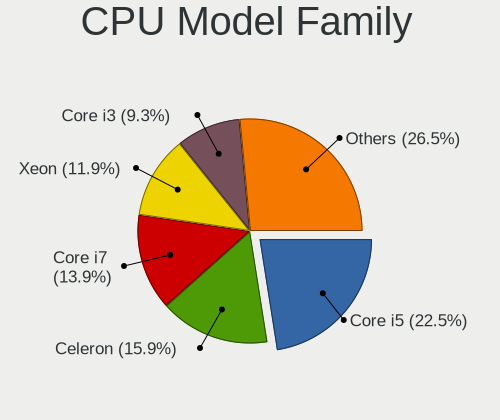

| Model                   | Computers | Percent |
|-------------------------|-----------|---------|
| Intel Core i5           | 67        | 24.01%  |
| Intel Celeron           | 54        | 19.35%  |
| Intel Core i7           | 38        | 13.62%  |
| Intel Xeon              | 24        | 8.6%    |
| Other                   | 19        | 6.81%   |
| Intel Core i3           | 19        | 6.81%   |
| Intel Pentium           | 8         | 2.87%   |
| AMD Ryzen 5             | 7         | 2.51%   |
| Intel Atom              | 5         | 1.79%   |
| AMD Ryzen 3             | 5         | 1.79%   |
| AMD Turion II Neo       | 4         | 1.43%   |
| AMD GX                  | 4         | 1.43%   |
| Intel Core 2 Quad       | 3         | 1.08%   |
| Intel Core 2 Duo        | 3         | 1.08%   |
| AMD FX                  | 3         | 1.08%   |
| Intel Pentium Silver    | 2         | 0.72%   |
| AMD G                   | 2         | 0.72%   |
| AMD Athlon              | 2         | 0.72%   |
| Intel Xeon Silver       | 1         | 0.36%   |
| Intel Pentium Dual-Core | 1         | 0.36%   |
| Intel Pentium 4         | 1         | 0.36%   |
| Intel Core Duo          | 1         | 0.36%   |
| ARM Cortex              | 1         | 0.36%   |
| AMD Ryzen 9             | 1         | 0.36%   |
| AMD E2                  | 1         | 0.36%   |
| AMD Athlon X2           | 1         | 0.36%   |
| AMD A6                  | 1         | 0.36%   |
| AMD A4                  | 1         | 0.36%   |

CPU Cores
---------

Number of processor cores

| Number  | Computers | Percent |
|---------|-----------|---------|
| 4       | 151       | 54.12%  |
| 2       | 80        | 28.67%  |
| 8       | 15        | 5.38%   |
| 6       | 14        | 5.02%   |
| Unknown | 8         | 2.87%   |
| 12      | 5         | 1.79%   |
| 10      | 2         | 0.72%   |
| 1       | 2         | 0.72%   |
| 32      | 1         | 0.36%   |
| 16      | 1         | 0.36%   |

CPU Sockets
-----------

Number of sockets

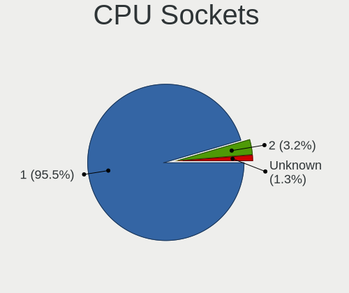

| Number  | Computers | Percent |
|---------|-----------|---------|
| 1       | 270       | 97.47%  |
| 2       | 5         | 1.81%   |
| Unknown | 2         | 0.72%   |

CPU Threads
-----------

Threads per core (Hyper-Threading)

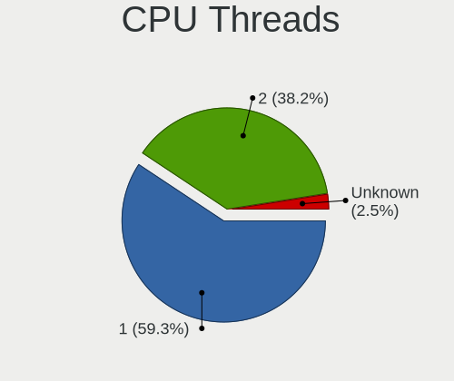

| Number  | Computers | Percent |
|---------|-----------|---------|
| 1       | 165       | 59.14%  |
| 2       | 106       | 37.99%  |
| Unknown | 8         | 2.87%   |

CPU Microarch
-------------

Microarchitecture

| Name          | Computers | Percent |
|---------------|-----------|---------|
| KabyLake      | 39        | 13.98%  |
| Haswell       | 33        | 11.83%  |
| Silvermont    | 29        | 10.39%  |
| Skylake       | 28        | 10.04%  |
| IvyBridge     | 27        | 9.68%   |
| Unknown       | 18        | 6.45%   |
| SandyBridge   | 17        | 6.09%   |
| Goldmont plus | 10        | 3.58%   |
| Steamroller   | 8         | 2.87%   |
| Broadwell     | 8         | 2.87%   |
| Puma          | 5         | 1.79%   |
| Penryn        | 5         | 1.79%   |
| Nehalem       | 5         | 1.79%   |
| K10           | 5         | 1.79%   |
| Zen+          | 4         | 1.43%   |
| Westmere      | 4         | 1.43%   |
| TigerLake     | 4         | 1.43%   |
| Zen 3         | 3         | 1.08%   |
| Zen 2         | 3         | 1.08%   |
| Zen           | 3         | 1.08%   |
| Piledriver    | 3         | 1.08%   |
| Goldmont      | 3         | 1.08%   |
| Core          | 3         | 1.08%   |
| CometLake     | 3         | 1.08%   |
| Bobcat        | 3         | 1.08%   |
| Jaguar        | 2         | 0.72%   |
| P6            | 1         | 0.36%   |
| NetBurst      | 1         | 0.36%   |
| K8 Hammer     | 1         | 0.36%   |
| Bonnell       | 1         | 0.36%   |

Graphics
--------

GPU Vendor
----------

Vendors of graphics cards

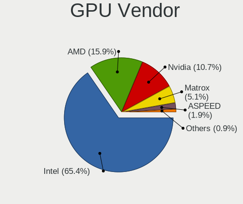

| Vendor                     | Computers | Percent |
|----------------------------|-----------|---------|
| Intel                      | 189       | 65.63%  |
| AMD                        | 44        | 15.28%  |
| Nvidia                     | 34        | 11.81%  |
| Matrox Electronics Systems | 13        | 4.51%   |
| ASPEED Technology          | 6         | 2.08%   |
| Tseng Labs                 | 1         | 0.35%   |
| Silicon Motion             | 1         | 0.35%   |

GPU Model
---------

Graphics card models

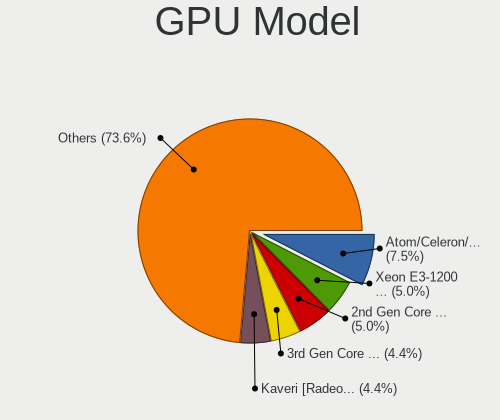

| Model                                                                                    | Computers | Percent |
|------------------------------------------------------------------------------------------|-----------|---------|
| Intel Xeon E3-1200 v3/4th Gen Core Processor Integrated Graphics Controller              | 19        | 6.46%   |
| Intel Atom/Celeron/Pentium Processor x5-E8000/J3xxx/N3xxx Integrated Graphics Controller | 19        | 6.46%   |
| Intel HD Graphics 530                                                                    | 12        | 4.08%   |
| Intel 2nd Generation Core Processor Family Integrated Graphics Controller                | 11        | 3.74%   |
| Intel GeminiLake [UHD Graphics 600]                                                      | 10        | 3.4%    |
| Intel JasperLake [UHD Graphics]                                                          | 9         | 3.06%   |
| Intel CoffeeLake-S GT2 [UHD Graphics 630]                                                | 9         | 3.06%   |
| Intel Atom Processor Z36xxx/Z37xxx Series Graphics & Display                             | 9         | 3.06%   |
| Intel 3rd Gen Core processor Graphics Controller                                         | 8         | 2.72%   |
| AMD Kaveri [Radeon R7 Graphics]                                                          | 8         | 2.72%   |
| Intel Skylake GT2 [HD Graphics 520]                                                      | 7         | 2.38%   |
| Intel HD Graphics 630                                                                    | 7         | 2.38%   |
| ASPEED Technology ASPEED Graphics Family                                                 | 6         | 2.04%   |
| Matrox Electronics Systems MGA G200e [Pilot] ServerEngines (SEP1)                        | 5         | 1.7%    |
| Intel Xeon E3-1200 v2/3rd Gen Core processor Graphics Controller                         | 5         | 1.7%    |
| Intel UHD Graphics 620                                                                   | 5         | 1.7%    |
| Intel Haswell-ULT Integrated Graphics Controller                                         | 5         | 1.7%    |
| Matrox Electronics Systems G200eR2                                                       | 4         | 1.36%   |
| Intel TigerLake-LP GT2 [Iris Xe Graphics]                                                | 4         | 1.36%   |
| Intel HD Graphics 5500                                                                   | 4         | 1.36%   |
| Intel CometLake-U GT2 [UHD Graphics]                                                     | 4         | 1.36%   |
| AMD RS880M [Mobility Radeon HD 4225/4250]                                                | 4         | 1.36%   |
| Nvidia GK208B [GeForce GT 730]                                                           | 3         | 1.02%   |
| Intel IvyBridge GT2 [HD Graphics 4000]                                                   | 3         | 1.02%   |
| Intel HD Graphics 610                                                                    | 3         | 1.02%   |
| Intel HD Graphics 510                                                                    | 3         | 1.02%   |
| Intel CoffeeLake-H GT2 [UHD Graphics 630]                                                | 3         | 1.02%   |
| Intel Alder Lake-N [UHD Graphics]                                                        | 3         | 1.02%   |
| AMD Picasso/Raven 2 [Radeon Vega Series / Radeon Vega Mobile Series]                     | 3         | 1.02%   |
| Nvidia TU116M [GeForce GTX 1660 Ti Mobile]                                               | 2         | 0.68%   |
| Nvidia GT218 [GeForce 210]                                                               | 2         | 0.68%   |
| Nvidia GP108 [GeForce GT 1030]                                                           | 2         | 0.68%   |
| Nvidia GK208B [GeForce GT 710]                                                           | 2         | 0.68%   |
| Matrox Electronics Systems MGA G200eW WPCM450                                            | 2         | 0.68%   |
| Matrox Electronics Systems MGA G200EH                                                    | 2         | 0.68%   |
| Intel WhiskeyLake-U GT2 [UHD Graphics 620]                                               | 2         | 0.68%   |
| Intel HD Graphics 620                                                                    | 2         | 0.68%   |
| Intel HD Graphics 6000                                                                   | 2         | 0.68%   |
| Intel Core Processor Integrated Graphics Controller                                      | 2         | 0.68%   |
| Intel 4th Generation Core Processor Family Integrated Graphics Controller                | 2         | 0.68%   |

GPU Combo
---------

Combinations of graphics cards

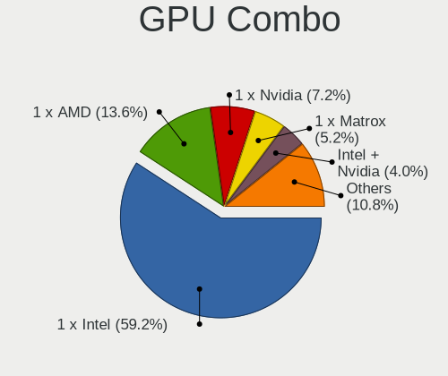

| Name               | Computers | Percent |
|--------------------|-----------|---------|
| 1 x Intel          | 165       | 59.14%  |
| 1 x AMD            | 37        | 13.26%  |
| 1 x Nvidia         | 22        | 7.89%   |
| 1 x Matrox         | 13        | 4.66%   |
| Intel + Nvidia     | 12        | 4.3%    |
| Other              | 9         | 3.23%   |
| Intel + AMD        | 7         | 2.51%   |
| 1 x ASPEED         | 6         | 2.15%   |
| 2 x Intel          | 5         | 1.79%   |
| 2 x AMD            | 1         | 0.36%   |
| 1 x Tseng Labs     | 1         | 0.36%   |
| 1 x Silicon Motion | 1         | 0.36%   |

GPU Driver
----------

Free vs proprietary

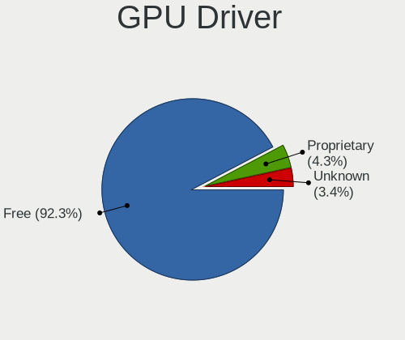

| Driver      | Computers | Percent |
|-------------|-----------|---------|
| Free        | 253       | 91.01%  |
| Proprietary | 14        | 5.04%   |
| Unknown     | 11        | 3.96%   |

GPU Memory
----------

Total video memory

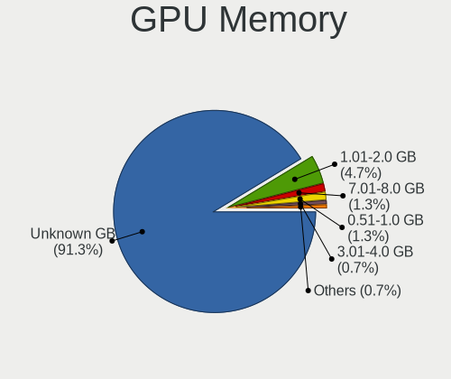

| Size in GB | Computers | Percent |
|------------|-----------|---------|
| Unknown    | 253       | 91.01%  |
| 1.01-2.0   | 10        | 3.6%    |
| 0.51-1.0   | 5         | 1.8%    |
| 0.01-0.5   | 5         | 1.8%    |
| 7.01-8.0   | 3         | 1.08%   |
| 3.01-4.0   | 2         | 0.72%   |

Monitor
-------

Monitor Vendor
--------------

Monitor vendors

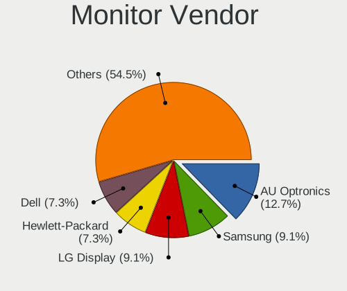

| Vendor              | Computers | Percent |
|---------------------|-----------|---------|
| AU Optronics        | 8         | 12.5%   |
| Samsung Electronics | 5         | 7.81%   |
| LG Display          | 5         | 7.81%   |
| Acer                | 5         | 7.81%   |
| Hewlett-Packard     | 4         | 6.25%   |
| Dell                | 4         | 6.25%   |
| ViewSonic           | 3         | 4.69%   |
| Sharp               | 3         | 4.69%   |
| Philips             | 3         | 4.69%   |
| Lenovo              | 3         | 4.69%   |
| BOE                 | 3         | 4.69%   |
| ASUSTek Computer    | 3         | 4.69%   |
| Chimei Innolux      | 2         | 3.13%   |
| AOC                 | 2         | 3.13%   |
| ___                 | 1         | 1.56%   |
| Toshiba             | 1         | 1.56%   |
| Panasonic           | 1         | 1.56%   |
| LG Philips          | 1         | 1.56%   |
| Konka               | 1         | 1.56%   |
| Goldstar            | 1         | 1.56%   |
| CTO                 | 1         | 1.56%   |
| Compal              | 1         | 1.56%   |
| BenQ                | 1         | 1.56%   |
| Apple               | 1         | 1.56%   |
| Unknown             | 1         | 1.56%   |

Monitor Model
-------------

Monitor models

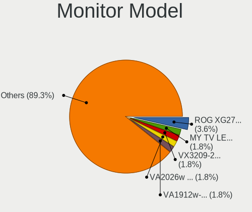

| Model                                                                | Computers | Percent |
|----------------------------------------------------------------------|-----------|---------|
| Lenovo D27-30 LEN66B8 1920x1080 600x340mm 27.2-inch                  | 2         | 3.08%   |
| AU Optronics LCD Monitor AUO80ED 1920x1080 340x190mm 15.3-inch       | 2         | 3.08%   |
| ASUSTek Computer ROG XG279Q AUS278D 2560x1440 600x340mm 27.2-inch    | 2         | 3.08%   |
| ___ MY TV LED TV ___0101 1920x1080                                   | 1         | 1.54%   |
| ViewSonic VX3209-2K VSC328E 2560x1440 700x390mm 31.5-inch            | 1         | 1.54%   |
| ViewSonic VA2026w VSC5020 1680x1050 430x270mm 20.0-inch              | 1         | 1.54%   |
| ViewSonic VA1912w-3 VSC711C 1440x900 410x260mm 19.1-inch             | 1         | 1.54%   |
| Toshiba TV TSB010E 1920x1080 1040x590mm 47.1-inch                    | 1         | 1.54%   |
| Sharp LQ133T1JX03 SHP140F 2560x1440 290x170mm 13.2-inch              | 1         | 1.54%   |
| Sharp LQ100P1JX51 SHP14A6 1800x1200 210x140mm 9.9-inch               | 1         | 1.54%   |
| Sharp LCD Monitor SHP1449 1920x1080 290x170mm 13.2-inch              | 1         | 1.54%   |
| Samsung Electronics SyncMaster SAM056A 1680x1050 470x300mm 22.0-inch | 1         | 1.54%   |
| Samsung Electronics SMS27A350H SAM07CE 1920x1080 600x340mm 27.2-inch | 1         | 1.54%   |
| Samsung Electronics S24D300 SAM0B43 1920x1080 530x300mm 24.0-inch    | 1         | 1.54%   |
| Samsung Electronics LCD Monitor SEC3047 1366x768 280x160mm 12.7-inch | 1         | 1.54%   |
| Samsung Electronics LCD Monitor SDC4445 1366x768 340x190mm 15.3-inch | 1         | 1.54%   |
| Philips PHL 273V7 PHLC156 1920x1080 600x340mm 27.2-inch              | 1         | 1.54%   |
| Philips PHL 243V7 PHLC155 1920x1080 530x300mm 24.0-inch              | 1         | 1.54%   |
| Philips PHL 221V8 PHLC211 1920x1080 480x270mm 21.7-inch              | 1         | 1.54%   |
| Panasonic VVX13F009G00 MEI96A2 1920x1080 290x170mm 13.2-inch         | 1         | 1.54%   |
| LG Philips LP154WX4-TLCB LPL3101 1280x800 330x210mm 15.4-inch        | 1         | 1.54%   |
| LG Display LCD Monitor LGD0521 1920x1080 310x170mm 13.9-inch         | 1         | 1.54%   |
| LG Display LCD Monitor LGD04A9 1920x1080 310x170mm 13.9-inch         | 1         | 1.54%   |
| LG Display LCD Monitor LGD049A 2560x1440 310x170mm 13.9-inch         | 1         | 1.54%   |
| LG Display LCD Monitor LGD046D 1920x1080 310x170mm 13.9-inch         | 1         | 1.54%   |
| LG Display LCD Monitor LGD01DD 1600x900 380x210mm 17.1-inch          | 1         | 1.54%   |
| Lenovo LCD Monitor LEN40C1 1280x720 220x130mm 10.1-inch              | 1         | 1.54%   |
| Konka TV_MONITOR KOA0030 2288x1430 1150x650mm 52.0-inch              | 1         | 1.54%   |
| Hewlett-Packard W2072a HWP299F 1600x900 440x250mm 19.9-inch          | 1         | 1.54%   |
| Hewlett-Packard LCD Monitor HWP2915 1920x1080 510x290mm 23.1-inch    | 1         | 1.54%   |
| Hewlett-Packard LA2205 HWP2848 1680x1050 470x300mm 22.0-inch         | 1         | 1.54%   |
| Hewlett-Packard 24fw HPN3545 1920x1080 530x300mm 24.0-inch           | 1         | 1.54%   |
| Goldstar LG HDR WQHD GSM7716 3840x1600 880x370mm 37.6-inch           | 1         | 1.54%   |
| Dell U2212HM DELD048 1920x1080 480x270mm 21.7-inch                   | 1         | 1.54%   |
| Dell SP2309W DELD01C 2048x1152 510x290mm 23.1-inch                   | 1         | 1.54%   |
| Dell P2414H DELA09B 1920x1080 530x300mm 24.0-inch                    | 1         | 1.54%   |
| Dell E248WFP DELA02D 1920x1200 520x320mm 24.0-inch                   | 1         | 1.54%   |
| CTO LCD Monitor CTO1412 1920x1200 300x190mm 14.0-inch                | 1         | 1.54%   |
| Compal LCD Monitor WOR2760 2560x1440 600x340mm 27.2-inch             | 1         | 1.54%   |
| Chimei Innolux LCD Monitor CMN15AB 1366x768 340x190mm 15.3-inch      | 1         | 1.54%   |

Monitor Resolution
------------------

Monitor screen resolution

| Resolution         | Computers | Percent |
|--------------------|-----------|---------|
| 1920x1080 (FHD)    | 31        | 49.21%  |
| 2560x1440 (QHD)    | 7         | 11.11%  |
| 1366x768 (WXGA)    | 7         | 11.11%  |
| 1680x1050 (WSXGA+) | 3         | 4.76%   |
| 1920x1200 (WUXGA)  | 2         | 3.17%   |
| 1600x900 (HD+)     | 2         | 3.17%   |
| 3840x2160 (4K)     | 1         | 1.59%   |
| 3840x1600          | 1         | 1.59%   |
| 2880x1620          | 1         | 1.59%   |
| 2560x1600          | 1         | 1.59%   |
| 2560x1080          | 1         | 1.59%   |
| 2288x1430          | 1         | 1.59%   |
| 2048x1152          | 1         | 1.59%   |
| 1800x1200          | 1         | 1.59%   |
| 1440x900 (WXGA+)   | 1         | 1.59%   |
| 1280x800 (WXGA)    | 1         | 1.59%   |
| 1280x720 (HD)      | 1         | 1.59%   |

Monitor Diagonal
----------------

Diagonal size in inches

| Inches  | Computers | Percent |
|---------|-----------|---------|
| 27      | 10        | 15.63%  |
| 15      | 9         | 14.06%  |
| 13      | 9         | 14.06%  |
| 24      | 5         | 7.81%   |
| 21      | 5         | 7.81%   |
| 23      | 3         | 4.69%   |
| 11      | 3         | 4.69%   |
| Unknown | 3         | 4.69%   |
| 31      | 2         | 3.13%   |
| 22      | 2         | 3.13%   |
| 19      | 2         | 3.13%   |
| 12      | 2         | 3.13%   |
| 52      | 1         | 1.56%   |
| 47      | 1         | 1.56%   |
| 37      | 1         | 1.56%   |
| 28      | 1         | 1.56%   |
| 20      | 1         | 1.56%   |
| 17      | 1         | 1.56%   |
| 14      | 1         | 1.56%   |
| 10      | 1         | 1.56%   |
| 9       | 1         | 1.56%   |

Monitor Width
-------------

Physical width

| Width in mm | Computers | Percent |
|-------------|-----------|---------|
| 501-600     | 18        | 28.57%  |
| 301-350     | 16        | 25.4%   |
| 201-300     | 10        | 15.87%  |
| 401-500     | 9         | 14.29%  |
| 601-700     | 3         | 4.76%   |
| Unknown     | 3         | 4.76%   |
| 1001-1500   | 2         | 3.17%   |
| 801-900     | 1         | 1.59%   |
| 351-400     | 1         | 1.59%   |

Aspect Ratio
------------

Proportional relationship between the width and the height

| Ratio   | Computers | Percent |
|---------|-----------|---------|
| 16/9    | 50        | 81.97%  |
| 16/10   | 6         | 9.84%   |
| 21/9    | 2         | 3.28%   |
| Unknown | 2         | 3.28%   |
| 3/2     | 1         | 1.64%   |

Monitor Area
------------

Area in inch²

| Area in inch² | Computers | Percent |
|----------------|-----------|---------|
| 201-250        | 13        | 20.63%  |
| 301-350        | 10        | 15.87%  |
| 81-90          | 8         | 12.7%   |
| 91-100         | 7         | 11.11%  |
| 51-60          | 3         | 4.76%   |
| 151-200        | 3         | 4.76%   |
| Unknown        | 3         | 4.76%   |
| 71-80          | 2         | 3.17%   |
| 61-70          | 2         | 3.17%   |
| 351-500        | 2         | 3.17%   |
| 41-50          | 2         | 3.17%   |
| 251-300        | 2         | 3.17%   |
| 101-110        | 2         | 3.17%   |
| 501-1000       | 2         | 3.17%   |
| More than 1000 | 1         | 1.59%   |
| 121-130        | 1         | 1.59%   |

Pixel Density
-------------

Pixels per inch

| Density | Computers | Percent |
|---------|-----------|---------|
| 51-100  | 22        | 35.48%  |
| 121-160 | 16        | 25.81%  |
| 101-120 | 13        | 20.97%  |
| 161-240 | 7         | 11.29%  |
| Unknown | 3         | 4.84%   |
| 1-50    | 1         | 1.61%   |

Multiple Monitors
-----------------

Total monitors connected

| Total | Computers | Percent |
|-------|-----------|---------|
| 0     | 208       | 74.82%  |
| 1     | 67        | 24.1%   |
| 2     | 3         | 1.08%   |

Network
-------

Net Controller Vendor
---------------------

Controller vendors

| Vendor                            | Computers | Percent |
|-----------------------------------|-----------|---------|
| Intel                             | 203       | 53.85%  |
| Realtek Semiconductor             | 95        | 25.2%   |
| Broadcom                          | 31        | 8.22%   |
| Qualcomm Atheros                  | 20        | 5.31%   |
| U-Blox                            | 3         | 0.8%    |
| TP-Link                           | 2         | 0.53%   |
| Ralink Technology                 | 2         | 0.53%   |
| Nvidia                            | 2         | 0.53%   |
| Marvell Technology Group          | 2         | 0.53%   |
| IMC Networks                      | 2         | 0.53%   |
| Ericsson Business Mobile Networks | 2         | 0.53%   |
| D-Link System                     | 2         | 0.53%   |
| TRENDnet                          | 1         | 0.27%   |
| Sierra Wireless                   | 1         | 0.27%   |
| Seeed Technology                  | 1         | 0.27%   |
| Samsung Electronics               | 1         | 0.27%   |
| Ralink                            | 1         | 0.27%   |
| NetGear                           | 1         | 0.27%   |
| Microsoft                         | 1         | 0.27%   |
| Mellanox Technologies             | 1         | 0.27%   |
| MediaTek                          | 1         | 0.27%   |
| Emulex                            | 1         | 0.27%   |
| Aquantia                          | 1         | 0.27%   |

Net Controller Model
--------------------

Controller models

| Model                                                                         | Computers | Percent |
|-------------------------------------------------------------------------------|-----------|---------|
| Realtek RTL8111/8168/8411 PCI Express Gigabit Ethernet Controller             | 82        | 17.48%  |
| Intel I211 Gigabit Network Connection                                         | 38        | 8.1%    |
| Intel I210 Gigabit Network Connection                                         | 15        | 3.2%    |
| Intel 82579LM Gigabit Network Connection (Lewisville)                         | 13        | 2.77%   |
| Intel 82574L Gigabit Network Connection                                       | 12        | 2.56%   |
| Intel Wireless 8260                                                           | 10        | 2.13%   |
| Intel Ethernet Controller I226-V                                              | 10        | 2.13%   |
| Intel Ethernet Connection I217-LM                                             | 9         | 1.92%   |
| Broadcom NetXtreme BCM5720 Gigabit Ethernet PCIe                              | 9         | 1.92%   |
| Intel 82576 Gigabit Network Connection                                        | 8         | 1.71%   |
| Intel Wireless 8265 / 8275                                                    | 7         | 1.49%   |
| Intel Wireless 7260                                                           | 7         | 1.49%   |
| Intel Ethernet Connection (2) I219-LM                                         | 7         | 1.49%   |
| Intel 82599ES 10-Gigabit SFI/SFP+ Network Connection                          | 7         | 1.49%   |
| Intel 82580 Gigabit Network Connection                                        | 7         | 1.49%   |
| Intel I350 Gigabit Network Connection                                         | 6         | 1.28%   |
| Intel Ethernet Controller I225-V                                              | 6         | 1.28%   |
| Intel Ethernet Connection (2) I219-V                                          | 6         | 1.28%   |
| Intel 82571EB/82571GB Gigabit Ethernet Controller D0/D1 (copper applications) | 6         | 1.28%   |
| Broadcom NetXtreme BCM5723 Gigabit Ethernet PCIe                              | 6         | 1.28%   |
| Qualcomm Atheros QCA6174 802.11ac Wireless Network Adapter                    | 5         | 1.07%   |
| Intel Wireless 7265                                                           | 5         | 1.07%   |
| Intel Ethernet Connection (7) I219-LM                                         | 5         | 1.07%   |
| Realtek RTL8125 2.5GbE Controller                                             | 4         | 0.85%   |
| Intel Ethernet Connection I217-V                                              | 4         | 0.85%   |
| Intel 82583V Gigabit Network Connection                                       | 4         | 0.85%   |
| U-Blox [u-blox 7]                                                             | 3         | 0.64%   |
| Qualcomm Atheros AR9285 Wireless Network Adapter (PCI-Express)                | 3         | 0.64%   |
| Intel Wireless 3165                                                           | 3         | 0.64%   |
| Intel Wi-Fi 6 AX201                                                           | 3         | 0.64%   |
| Intel Wi-Fi 6 AX200                                                           | 3         | 0.64%   |
| Intel PRO/Wireless 5100 AGN [Shiloh] Network Connection                       | 3         | 0.64%   |
| Intel I210 Gigabit Fiber Network Connection                                   | 3         | 0.64%   |
| Intel Ethernet Connection I219-V                                              | 3         | 0.64%   |
| Intel Ethernet Connection (7) I219-V                                          | 3         | 0.64%   |
| Intel Ethernet Connection (6) I219-V                                          | 3         | 0.64%   |
| Intel Ethernet Connection (5) I219-LM                                         | 3         | 0.64%   |
| Intel Centrino Advanced-N 6205 [Taylor Peak]                                  | 3         | 0.64%   |
| Intel 82571EB/82571GB Gigabit Ethernet Controller (Copper)                    | 3         | 0.64%   |
| Broadcom NetXtreme BCM57766 Gigabit Ethernet PCIe                             | 3         | 0.64%   |

Wireless Vendor
---------------

Wireless vendors

| Vendor                | Computers | Percent |
|-----------------------|-----------|---------|
| Intel                 | 63        | 57.8%   |
| Qualcomm Atheros      | 17        | 15.6%   |
| Realtek Semiconductor | 10        | 9.17%   |
| Broadcom              | 9         | 8.26%   |
| TP-Link               | 2         | 1.83%   |
| Ralink Technology     | 2         | 1.83%   |
| IMC Networks          | 2         | 1.83%   |
| Sierra Wireless       | 1         | 0.92%   |
| Ralink                | 1         | 0.92%   |
| NetGear               | 1         | 0.92%   |
| MediaTek              | 1         | 0.92%   |

Wireless Model
--------------

Wireless models

| Model                                                           | Computers | Percent |
|-----------------------------------------------------------------|-----------|---------|
| Intel Wireless 8260                                             | 10        | 9.01%   |
| Intel Wireless 8265 / 8275                                      | 7         | 6.31%   |
| Intel Wireless 7260                                             | 7         | 6.31%   |
| Qualcomm Atheros QCA6174 802.11ac Wireless Network Adapter      | 5         | 4.5%    |
| Intel Wireless 7265                                             | 5         | 4.5%    |
| Qualcomm Atheros AR9285 Wireless Network Adapter (PCI-Express)  | 3         | 2.7%    |
| Intel Wireless 3165                                             | 3         | 2.7%    |
| Intel Wi-Fi 6 AX201                                             | 3         | 2.7%    |
| Intel Wi-Fi 6 AX200                                             | 3         | 2.7%    |
| Intel PRO/Wireless 5100 AGN [Shiloh] Network Connection         | 3         | 2.7%    |
| Intel Centrino Advanced-N 6205 [Taylor Peak]                    | 3         | 2.7%    |
| Broadcom BCM4331 802.11a/b/g/n                                  | 3         | 2.7%    |
| Realtek RTL8822BE 802.11a/b/g/n/ac WiFi adapter                 | 2         | 1.8%    |
| Realtek RTL8821CE 802.11ac PCIe Wireless Network Adapter        | 2         | 1.8%    |
| Realtek RTL8188EUS 802.11n Wireless Network Adapter             | 2         | 1.8%    |
| Qualcomm Atheros QCA986x/988x 802.11ac Wireless Network Adapter | 2         | 1.8%    |
| Qualcomm Atheros QCA9565 / AR9565 Wireless Network Adapter      | 2         | 1.8%    |
| Qualcomm Atheros AR9485 Wireless Network Adapter                | 2         | 1.8%    |
| Intel Gemini Lake PCH CNVi WiFi                                 | 2         | 1.8%    |
| Intel Comet Lake PCH-LP CNVi WiFi                               | 2         | 1.8%    |
| Intel Centrino Wireless-N 2230                                  | 2         | 1.8%    |
| Intel Cannon Point-LP CNVi [Wireless-AC]                        | 2         | 1.8%    |
| Intel Cannon Lake PCH CNVi WiFi                                 | 2         | 1.8%    |
| IMC Networks 802.11 n/g/b Wireless LAN USB Mini-Card            | 2         | 1.8%    |
| Broadcom BCM43224 802.11a/b/g/n                                 | 2         | 1.8%    |
| TP-Link TL-WN821N v5/v6 [RTL8192EU]                             | 1         | 0.9%    |
| TP-Link Archer T2U PLUS [RTL8821AU]                             | 1         | 0.9%    |
| TP-Link AC600 wireless Realtek RTL8811AU [Archer T2U Nano]      | 1         | 0.9%    |
| Sierra Wireless EM7455                                          | 1         | 0.9%    |
| Realtek RTL88x2bu [AC1200 Techkey]                              | 1         | 0.9%    |
| Realtek RTL8812AU 802.11a/b/g/n/ac 2T2R DB WLAN Adapter         | 1         | 0.9%    |
| Realtek RTL8812AE 802.11ac PCIe Wireless Network Adapter        | 1         | 0.9%    |
| Realtek RTL8192CE PCIe Wireless Network Adapter                 | 1         | 0.9%    |
| Realtek RTL8191SU 802.11n WLAN Adapter                          | 1         | 0.9%    |
| Ralink RT5572 Wireless Adapter                                  | 1         | 0.9%    |
| Ralink RT5370 Wireless Adapter                                  | 1         | 0.9%    |
| Ralink RT5392 PCIe Wireless Network Adapter                     | 1         | 0.9%    |
| Qualcomm Atheros AR9462 Wireless Network Adapter                | 1         | 0.9%    |
| Qualcomm Atheros AR93xx Wireless Network Adapter                | 1         | 0.9%    |
| Qualcomm Atheros AR9287 Wireless Network Adapter (PCI-Express)  | 1         | 0.9%    |

Ethernet Vendor
---------------

Ethernet vendors

| Vendor                   | Computers | Percent |
|--------------------------|-----------|---------|
| Intel                    | 174       | 56.49%  |
| Realtek Semiconductor    | 90        | 29.22%  |
| Broadcom                 | 27        | 8.77%   |
| Qualcomm Atheros         | 6         | 1.95%   |
| Nvidia                   | 2         | 0.65%   |
| Marvell Technology Group | 2         | 0.65%   |
| D-Link System            | 2         | 0.65%   |
| TRENDnet                 | 1         | 0.32%   |
| Samsung Electronics      | 1         | 0.32%   |
| Microsoft                | 1         | 0.32%   |
| Emulex                   | 1         | 0.32%   |
| Aquantia                 | 1         | 0.32%   |

Ethernet Model
--------------

Ethernet models

| Model                                                                         | Computers | Percent |
|-------------------------------------------------------------------------------|-----------|---------|
| Realtek RTL8111/8168/8411 PCI Express Gigabit Ethernet Controller             | 82        | 23.43%  |
| Intel I211 Gigabit Network Connection                                         | 38        | 10.86%  |
| Intel I210 Gigabit Network Connection                                         | 15        | 4.29%   |
| Intel 82579LM Gigabit Network Connection (Lewisville)                         | 13        | 3.71%   |
| Intel 82574L Gigabit Network Connection                                       | 12        | 3.43%   |
| Intel Ethernet Controller I226-V                                              | 10        | 2.86%   |
| Intel Ethernet Connection I217-LM                                             | 9         | 2.57%   |
| Broadcom NetXtreme BCM5720 Gigabit Ethernet PCIe                              | 9         | 2.57%   |
| Intel 82576 Gigabit Network Connection                                        | 8         | 2.29%   |
| Intel Ethernet Connection (2) I219-LM                                         | 7         | 2%      |
| Intel 82599ES 10-Gigabit SFI/SFP+ Network Connection                          | 7         | 2%      |
| Intel 82580 Gigabit Network Connection                                        | 7         | 2%      |
| Intel I350 Gigabit Network Connection                                         | 6         | 1.71%   |
| Intel Ethernet Controller I225-V                                              | 6         | 1.71%   |
| Intel Ethernet Connection (2) I219-V                                          | 6         | 1.71%   |
| Intel 82571EB/82571GB Gigabit Ethernet Controller D0/D1 (copper applications) | 6         | 1.71%   |
| Broadcom NetXtreme BCM5723 Gigabit Ethernet PCIe                              | 6         | 1.71%   |
| Intel Ethernet Connection (7) I219-LM                                         | 5         | 1.43%   |
| Realtek RTL8125 2.5GbE Controller                                             | 4         | 1.14%   |
| Intel Ethernet Connection I217-V                                              | 4         | 1.14%   |
| Intel 82583V Gigabit Network Connection                                       | 4         | 1.14%   |
| Intel I210 Gigabit Fiber Network Connection                                   | 3         | 0.86%   |
| Intel Ethernet Connection I219-V                                              | 3         | 0.86%   |
| Intel Ethernet Connection (7) I219-V                                          | 3         | 0.86%   |
| Intel Ethernet Connection (6) I219-V                                          | 3         | 0.86%   |
| Intel Ethernet Connection (5) I219-LM                                         | 3         | 0.86%   |
| Intel 82571EB/82571GB Gigabit Ethernet Controller (Copper)                    | 3         | 0.86%   |
| Broadcom NetXtreme BCM57766 Gigabit Ethernet PCIe                             | 3         | 0.86%   |
| Realtek Killer E2500 Gigabit Ethernet Controller                              | 2         | 0.57%   |
| Qualcomm Atheros Killer E220x Gigabit Ethernet Controller                     | 2         | 0.57%   |
| Qualcomm Atheros AR8161 Gigabit Ethernet                                      | 2         | 0.57%   |
| Intel Ethernet Connection X553 1GbE                                           | 2         | 0.57%   |
| Intel Ethernet Connection I219-LM                                             | 2         | 0.57%   |
| Intel Ethernet Connection I218-LM                                             | 2         | 0.57%   |
| Intel Ethernet Connection (4) I219-V                                          | 2         | 0.57%   |
| Intel Ethernet Connection (3) I218-LM                                         | 2         | 0.57%   |
| Intel Ethernet Connection (10) I219-V                                         | 2         | 0.57%   |
| Intel Ethernet 10G 2P X520 Adapter                                            | 2         | 0.57%   |
| Intel 82567LM-3 Gigabit Network Connection                                    | 2         | 0.57%   |
| Broadcom NetXtreme BCM5722 Gigabit Ethernet PCI Express                       | 2         | 0.57%   |

Net Controller Kind
-------------------

Ethernet, WiFi or modem

| Kind     | Computers | Percent |
|----------|-----------|---------|
| Ethernet | 263       | 70.13%  |
| WiFi     | 104       | 27.73%  |
| Modem    | 6         | 1.6%    |
| Unknown  | 2         | 0.53%   |

Used Controller
---------------

Currently used network controller

| Kind     | Computers | Percent |
|----------|-----------|---------|
| Ethernet | 248       | 84.35%  |
| WiFi     | 45        | 15.31%  |
| Modem    | 1         | 0.34%   |

NICs
----

Total network controllers on board

| Total | Computers | Percent |
|-------|-----------|---------|
| 2     | 103       | 36.79%  |
| 1     | 52        | 18.57%  |
| 4     | 47        | 16.79%  |
| 3     | 30        | 10.71%  |
| 5     | 20        | 7.14%   |
| 6     | 16        | 5.71%   |
| 9     | 3         | 1.07%   |
| 8     | 3         | 1.07%   |
| 7     | 3         | 1.07%   |
| 10    | 2         | 0.71%   |
| 0     | 1         | 0.36%   |

IPv6
----

IPv6 vs IPv4

| Used | Computers | Percent |
|------|-----------|---------|
| No   | 236       | 82.81%  |
| Yes  | 49        | 17.19%  |

Bluetooth
---------

Bluetooth Vendor
----------------

Controller vendors

| Vendor                          | Computers | Percent |
|---------------------------------|-----------|---------|
| Intel                           | 47        | 58.75%  |
| Apple                           | 7         | 8.75%   |
| Qualcomm Atheros Communications | 5         | 6.25%   |
| Broadcom                        | 5         | 6.25%   |
| Realtek Semiconductor           | 4         | 5%      |
| Cambridge Silicon Radio         | 4         | 5%      |
| ASUSTek Computer                | 3         | 3.75%   |
| Hewlett-Packard                 | 2         | 2.5%    |
| Foxconn / Hon Hai               | 2         | 2.5%    |
| IMC Networks                    | 1         | 1.25%   |

Bluetooth Model
---------------

Controller models

| Model                                                       | Computers | Percent |
|-------------------------------------------------------------|-----------|---------|
| Intel Bluetooth wireless interface                          | 27        | 33.75%  |
| Intel Bluetooth 9460/9560 Jefferson Peak (JfP)              | 7         | 8.75%   |
| Intel AX201 Bluetooth                                       | 6         | 7.5%    |
| Cambridge Silicon Radio Bluetooth Dongle (HCI mode)         | 4         | 5%      |
| Intel AX200 Bluetooth                                       | 3         | 3.75%   |
| Apple Broadcom Built-in Bluetooth                           | 3         | 3.75%   |
| Apple Bluetooth Host Controller                             | 3         | 3.75%   |
| Realtek Bluetooth Adapter                                   | 2         | 2.5%    |
| Qualcomm Atheros AR3012 Bluetooth 4.0                       | 2         | 2.5%    |
| Intel Centrino Bluetooth Wireless Transceiver               | 2         | 2.5%    |
| HP Bluetooth 2.0 Interface [Broadcom BCM2045]               | 2         | 2.5%    |
| Broadcom BCM20702A0 Bluetooth 4.0                           | 2         | 2.5%    |
| ASUS Qualcomm Bluetooth 4.1                                 | 2         | 2.5%    |
| Realtek RTL8822BE Bluetooth 4.2 Adapter                     | 1         | 1.25%   |
| Realtek  Bluetooth 4.2 Adapter                              | 1         | 1.25%   |
| Qualcomm Atheros QCA61x4 Bluetooth 4.1                      | 1         | 1.25%   |
| Qualcomm Atheros QCA61x4 Bluetooth 4.0                      | 1         | 1.25%   |
| Qualcomm Atheros Dell Wireless 1707 Bluetooth 4.0 LE Device | 1         | 1.25%   |
| Intel Wireless-AC 3168 Bluetooth                            | 1         | 1.25%   |
| Intel AX210 Bluetooth                                       | 1         | 1.25%   |
| IMC Networks Asus Integrated Bluetooth module [AR3011]      | 1         | 1.25%   |
| Foxconn / Hon Hai MediaTek Bluetooth Adapter                | 1         | 1.25%   |
| Foxconn / Hon Hai Bluetooth USB Module                      | 1         | 1.25%   |
| Broadcom Bluetooth 4.0                                      | 1         | 1.25%   |
| Broadcom BCM20702 Bluetooth 4.0 [ThinkPad]                  | 1         | 1.25%   |
| Broadcom BCM2045B (BDC-2.1)                                 | 1         | 1.25%   |
| ASUS Bluetooth Controller                                   | 1         | 1.25%   |
| Apple Built-in Bluetooth 2.0+EDR HCI                        | 1         | 1.25%   |

Sound
-----

Sound Vendor
------------

Sound card vendors

| Vendor                                       | Computers | Percent |
|----------------------------------------------|-----------|---------|
| Intel                                        | 188       | 72.59%  |
| AMD                                          | 38        | 14.67%  |
| Nvidia                                       | 25        | 9.65%   |
| Texas Instruments                            | 2         | 0.77%   |
| Focusrite-Novation                           | 2         | 0.77%   |
| Zoran Co. Personal Media Division (Nogatech) | 1         | 0.39%   |
| Logitech                                     | 1         | 0.39%   |
| FiiO Electronics Technology                  | 1         | 0.39%   |
| C-Media Electronics                          | 1         | 0.39%   |

Sound Model
-----------

Sound card models

| Model                                                                                             | Computers | Percent |
|---------------------------------------------------------------------------------------------------|-----------|---------|
| Intel 8 Series/C220 Series Chipset High Definition Audio Controller                               | 22        | 6.96%   |
| Intel Xeon E3-1200 v3/4th Gen Core Processor HD Audio Controller                                  | 20        | 6.33%   |
| Intel 7 Series/C216 Chipset Family High Definition Audio Controller                               | 17        | 5.38%   |
| Intel 100 Series/C230 Series Chipset Family HD Audio Controller                                   | 16        | 5.06%   |
| Intel Sunrise Point-LP HD Audio                                                                   | 15        | 4.75%   |
| Intel Atom/Celeron/Pentium Processor x5-E8000/J3xxx/N3xxx Series High Definition Audio Controller | 15        | 4.75%   |
| Intel 6 Series/C200 Series Chipset Family High Definition Audio Controller                        | 13        | 4.11%   |
| Intel Celeron/Pentium Silver Processor High Definition Audio                                      | 10        | 3.16%   |
| Intel Cannon Lake PCH cAVS                                                                        | 10        | 3.16%   |
| Intel 200 Series PCH HD Audio                                                                     | 10        | 3.16%   |
| AMD FCH Azalia Controller                                                                         | 10        | 3.16%   |
| Intel Jasper Lake HD Audio                                                                        | 9         | 2.85%   |
| Intel Atom Processor Z36xxx/Z37xxx Series High Definition Audio Controller                        | 8         | 2.53%   |
| AMD Kaveri HDMI/DP Audio Controller                                                               | 8         | 2.53%   |
| AMD Family 17h/19h HD Audio Controller                                                            | 8         | 2.53%   |
| Intel Wildcat Point-LP High Definition Audio Controller                                           | 7         | 2.22%   |
| Intel Haswell-ULT HD Audio Controller                                                             | 6         | 1.9%    |
| Intel Broadwell-U Audio Controller                                                                | 6         | 1.9%    |
| Nvidia GK208 HDMI/DP Audio Controller                                                             | 5         | 1.58%   |
| Intel 8 Series HD Audio Controller                                                                | 5         | 1.58%   |
| AMD SBx00 Azalia (Intel HDA)                                                                      | 5         | 1.58%   |
| AMD Raven/Raven2/Fenghuang HDMI/DP Audio Controller                                               | 5         | 1.58%   |
| Intel Tiger Lake-LP Smart Sound Technology Audio Controller                                       | 4         | 1.27%   |
| AMD Oland/Hainan/Cape Verde/Pitcairn HDMI Audio [Radeon HD 7000 Series]                           | 4         | 1.27%   |
| AMD Caicos HDMI Audio [Radeon HD 6450 / 7450/8450/8490 OEM / R5 230/235/235X OEM]                 | 4         | 1.27%   |
| Nvidia High Definition Audio Controller                                                           | 3         | 0.95%   |
| Intel NM10/ICH7 Family High Definition Audio Controller                                           | 3         | 0.95%   |
| Intel Cannon Point-LP High Definition Audio Controller                                            | 3         | 0.95%   |
| Intel 82801JI (ICH10 Family) HD Audio Controller                                                  | 3         | 0.95%   |
| Intel 5 Series/3400 Series Chipset High Definition Audio                                          | 3         | 0.95%   |
| AMD Renoir Radeon High Definition Audio Controller                                                | 3         | 0.95%   |
| AMD Kabini HDMI/DP Audio                                                                          | 3         | 0.95%   |
| Nvidia TU116 High Definition Audio Controller                                                     | 2         | 0.63%   |
| Nvidia GP108 High Definition Audio Controller                                                     | 2         | 0.63%   |
| Nvidia GK107 HDMI Audio Controller                                                                | 2         | 0.63%   |
| Intel Comet Lake PCH-LP cAVS                                                                      | 2         | 0.63%   |
| Intel Alder Lake-N HD Graphics SGPC                                                               | 2         | 0.63%   |
| Intel 82801JD/DO (ICH10 Family) HD Audio Controller                                               | 2         | 0.63%   |
| Intel 82801I (ICH9 Family) HD Audio Controller                                                    | 2         | 0.63%   |
| AMD Wrestler HDMI Audio                                                                           | 2         | 0.63%   |

Memory
------

Memory Vendor
-------------

Memory module vendors

| Vendor                       | Computers | Percent |
|------------------------------|-----------|---------|
| Samsung Electronics          | 60        | 20.55%  |
| Kingston                     | 36        | 12.33%  |
| SK hynix                     | 34        | 11.64%  |
| Micron Technology            | 32        | 10.96%  |
| Crucial                      | 27        | 9.25%   |
| Corsair                      | 22        | 7.53%   |
| Unknown                      | 21        | 7.19%   |
| G.Skill                      | 9         | 3.08%   |
| Team                         | 5         | 1.71%   |
| Transcend                    | 4         | 1.37%   |
| Ramaxel Technology           | 4         | 1.37%   |
| Apacer                       | 4         | 1.37%   |
| A-DATA Technology            | 4         | 1.37%   |
| Unknown                      | 4         | 1.37%   |
| TIMETEC                      | 3         | 1.03%   |
| GeIL                         | 3         | 1.03%   |
| Unknown (ABCD)               | 2         | 0.68%   |
| Patriot                      | 2         | 0.68%   |
| Kimtigo                      | 2         | 0.68%   |
| Elpida                       | 2         | 0.68%   |
| Vasekey                      | 1         | 0.34%   |
| Uroad                        | 1         | 0.34%   |
| Smart Modular                | 1         | 0.34%   |
| Silicon Power                | 1         | 0.34%   |
| PNY                          | 1         | 0.34%   |
| Patriot Memory (PDP Systems) | 1         | 0.34%   |
| Nanya Technology             | 1         | 0.34%   |
| Kingmax                      | 1         | 0.34%   |
| Innodisk                     | 1         | 0.34%   |
| Hewlett-Packard              | 1         | 0.34%   |
| Heoriady                     | 1         | 0.34%   |
| ASint Technology             | 1         | 0.34%   |

Memory Model
------------

Memory module models

| Model                                                        | Computers | Percent |
|--------------------------------------------------------------|-----------|---------|
| Samsung RAM M471B5173QH0-YK0 4GB SODIMM DDR3 1600MT/s        | 5         | 1.66%   |
| SK hynix RAM HMT451S6BFR8A-PB 4GB SODIMM DDR3 1600MT/s       | 4         | 1.32%   |
| SK hynix RAM HMT351U6CFR8C-PB 4GB DIMM DDR3 1600MT/s         | 4         | 1.32%   |
| Samsung RAM M471B5173EB0-YK0 4GB SODIMM DDR3 1600MT/s        | 4         | 1.32%   |
| Samsung RAM M471B1G73DB0-YK0 8GB DIMM DDR3 1600MT/s          | 4         | 1.32%   |
| Samsung RAM M471A1K43BB1-CRC 8GB SODIMM DDR4 2400MT/s        | 4         | 1.32%   |
| Unknown                                                      | 4         | 1.32%   |
| Unknown RAM Module 4GB DIMM 1333MT/s                         | 3         | 0.99%   |
| Samsung RAM M378B5173DB0-CK0 4GB DIMM DDR3 1600MT/s          | 3         | 0.99%   |
| Corsair RAM Module 8GB DIMM DDR4 2133MT/s                    | 3         | 0.99%   |
| Unknown RAM Module 8GB DIMM 1333MT/s                         | 2         | 0.66%   |
| Unknown RAM Module 8GB 1600MT/s                              | 2         | 0.66%   |
| Unknown RAM Module 4GB SODIMM DDR3 1333MT/s                  | 2         | 0.66%   |
| Unknown RAM Module 2GB DIMM 800MT/s                          | 2         | 0.66%   |
| Unknown (ABCD) RAM 123456789012345678 4GB DIMM DDR4 2400MT/s | 2         | 0.66%   |
| Timetec RAM SD3-1600 8GB DIMM DDR3 1600MT/s                  | 2         | 0.66%   |
| Team RAM TEAMGROUP-SD4-3200 8GB SODIMM DDR4 3200MT/s         | 2         | 0.66%   |
| SK hynix RAM Module 4096MB SODIMM DDR3 1600MT/s              | 2         | 0.66%   |
| SK hynix RAM HMT41GS6BFR8A-PB 8GB SODIMM DDR3 1600MT/s       | 2         | 0.66%   |
| SK hynix RAM HMA81GS6JJR8N-VK 8GB SODIMM DDR4 2667MT/s       | 2         | 0.66%   |
| SK hynix RAM HMA451S6AFR8N-TF 4GB SODIMM DDR4 2133MT/s       | 2         | 0.66%   |
| Samsung RAM M471B5173DB0-YK0 4GB SODIMM DDR3 1600MT/s        | 2         | 0.66%   |
| Samsung RAM M471A1K43CB1-CTD 8GB SODIMM DDR4 2667MT/s        | 2         | 0.66%   |
| Micron RAM 8KTF51264HZ-1G6E1 4GB SODIMM DDR3 1600MT/s        | 2         | 0.66%   |
| Micron RAM 8JTF51264AZ-1G6E1 4GB DIMM DDR3 1600MT/s          | 2         | 0.66%   |
| Micron RAM 8ATF1G64AZ-2G3H1 8GB DIMM DDR4 2400MT/s           | 2         | 0.66%   |
| Micron RAM 16ATF1G64HZ-2G1B1 8GB SODIMM DDR4 2133MT/s        | 2         | 0.66%   |
| Kingston RAM KHX2400C15/8G 8GB DIMM DDR4 2400MT/s            | 2         | 0.66%   |
| Kingston RAM 99U5469-045.A00LF 4GB DIMM DDR3 1600MT/s        | 2         | 0.66%   |
| Kimtigo RAM KT8GS3EDF 8GB SODIMM DDR3 1600MT/s               | 2         | 0.66%   |
| GeIL RAM CL19-19-19 D4-2666 8GB DIMM DDR4 2667MT/s           | 2         | 0.66%   |
| Crucial RAM CT8G4DFS8266.M8FD 8GB DIMM DDR4 2667MT/s         | 2         | 0.66%   |
| Crucial RAM CT51264BD160B.C16F 4GB DIMM DDR3 1600MT/s        | 2         | 0.66%   |
| Crucial RAM CT16G56C46S5.M8G1 16GB SODIMM DDR5 5600MT/s      | 2         | 0.66%   |
| Crucial RAM CT16G4SFRA32A.M16FR 16GB SODIMM DDR4 3200MT/s    | 2         | 0.66%   |
| Crucial RAM CT102464BF160B.M16 8GB SODIMM DDR3 1600MT/s      | 2         | 0.66%   |
| Crucial RAM CT102464BF160B.M16 8GB DIMM DDR3 1600MT/s        | 2         | 0.66%   |
| Corsair RAM CMZ16GX3M2A1600C9 8GB DIMM DDR3 1600MT/s         | 2         | 0.66%   |
| Corsair RAM CMSX64GX4M2A2666C18 32GB SODIMM DDR4 2667MT/s    | 2         | 0.66%   |
| Corsair RAM CMSO8GX3M1C1600C11 8GB SODIMM DDR3 1600MT/s      | 2         | 0.66%   |

Memory Kind
-----------

Memory module kinds

| Kind    | Computers | Percent |
|---------|-----------|---------|
| DDR3    | 133       | 51.95%  |
| DDR4    | 91        | 35.55%  |
| Unknown | 11        | 4.3%    |
| LPDDR3  | 6         | 2.34%   |
| LPDDR4  | 5         | 1.95%   |
| DDR2    | 4         | 1.56%   |
| DDR5    | 3         | 1.17%   |
| DDR     | 2         | 0.78%   |
| LPDDR5  | 1         | 0.39%   |

Memory Form Factor
------------------

Physical design of the memory module

| Name         | Computers | Percent |
|--------------|-----------|---------|
| DIMM         | 132       | 51.36%  |
| SODIMM       | 103       | 40.08%  |
| Row Of Chips | 9         | 3.5%    |
| Unknown      | 7         | 2.72%   |
| Chip         | 5         | 1.95%   |
| RIMM         | 1         | 0.39%   |

Memory Size
-----------

Memory module size

| Size  | Computers | Percent |
|-------|-----------|---------|
| 8192  | 109       | 40.52%  |
| 4096  | 90        | 33.46%  |
| 2048  | 29        | 10.78%  |
| 16384 | 28        | 10.41%  |
| 32768 | 10        | 3.72%   |
| 1024  | 3         | 1.12%   |

Memory Speed
------------

Memory module speed

| Speed   | Computers | Percent |
|---------|-----------|---------|
| 1600    | 98        | 36.57%  |
| 1333    | 36        | 13.43%  |
| 2133    | 28        | 10.45%  |
| 2667    | 26        | 9.7%    |
| 2400    | 26        | 9.7%    |
| 3200    | 13        | 4.85%   |
| 1867    | 8         | 2.99%   |
| 800     | 8         | 2.99%   |
| 1066    | 5         | 1.87%   |
| 5600    | 2         | 0.75%   |
| 4267    | 2         | 0.75%   |
| 3600    | 2         | 0.75%   |
| 2666    | 2         | 0.75%   |
| 1866    | 2         | 0.75%   |
| 667     | 2         | 0.75%   |
| 59392   | 1         | 0.37%   |
| 6400    | 1         | 0.37%   |
| 4800    | 1         | 0.37%   |
| 3733    | 1         | 0.37%   |
| 3000    | 1         | 0.37%   |
| 1067    | 1         | 0.37%   |
| 400     | 1         | 0.37%   |
| Unknown | 1         | 0.37%   |

Printers & scanners
-------------------

Printer Vendor
--------------

Printer device vendors

| Vendor          | Computers | Percent |
|-----------------|-----------|---------|
| Hewlett-Packard | 1         | 100%    |

Printer Model
-------------

Printer device models

| Model            | Computers | Percent |
|------------------|-----------|---------|
| HP LaserJet 3390 | 1         | 100%    |

Scanner Vendor
--------------

Scanner device vendors

Zero info for selected period =(

Scanner Model
-------------

Scanner device models

Zero info for selected period =(

Camera
------

Camera Vendor
-------------

Camera device vendors

| Vendor                                 | Computers | Percent |
|----------------------------------------|-----------|---------|
| Chicony Electronics                    | 12        | 31.58%  |
| Bison Electronics                      | 6         | 15.79%  |
| Microdia                               | 4         | 10.53%  |
| IMC Networks                           | 4         | 10.53%  |
| Apple                                  | 3         | 7.89%   |
| Suyin                                  | 2         | 5.26%   |
| Sunplus Innovation Technology          | 2         | 5.26%   |
| Z-Star Microelectronics                | 1         | 2.63%   |
| Realtek Semiconductor                  | 1         | 2.63%   |
| Luxvisions Innotech Limited            | 1         | 2.63%   |
| Logitech                               | 1         | 2.63%   |
| Cheng Uei Precision Industry (Foxlink) | 1         | 2.63%   |

Camera Model
------------

Camera device models

| Model                                                        | Computers | Percent |
|--------------------------------------------------------------|-----------|---------|
| Chicony Integrated Camera                                    | 7         | 17.95%  |
| Microdia Integrated_Webcam_HD                                | 3         | 7.69%   |
| Bison Integrated Camera                                      | 3         | 7.69%   |
| Apple FaceTime HD Camera (Built-in)                          | 3         | 7.69%   |
| IMC Networks Integrated Webcam                               | 2         | 5.13%   |
| Z-Star WebCam SC-03FFL11739P                                 | 1         | 2.56%   |
| Suyin Lenovo Integrated Webcam                               | 1         | 2.56%   |
| Suyin HP webcam [dv6-1190en]                                 | 1         | 2.56%   |
| Sunplus Laptop Integrated Webcam HD                          | 1         | 2.56%   |
| Sunplus HD WebCam                                            | 1         | 2.56%   |
| Realtek Integrated_Webcam_HD                                 | 1         | 2.56%   |
| Microdia USB 2.0 Camera                                      | 1         | 2.56%   |
| Luxvisions Innotech Limited HP TrueVision HD Camera          | 1         | 2.56%   |
| Logitech C922 Pro Stream Webcam                              | 1         | 2.56%   |
| IMC Networks SunplusIT Integrated Camera                     | 1         | 2.56%   |
| IMC Networks EasyCamera                                      | 1         | 2.56%   |
| Chicony USB2.0 VGA UVC WebCam                                | 1         | 2.56%   |
| Chicony TOSHIBA Web Camera - HD                              | 1         | 2.56%   |
| Chicony TOSHIBA Web Camera - 3M                              | 1         | 2.56%   |
| Chicony Lenovo Integrated Camera (0.3MP)                     | 1         | 2.56%   |
| Chicony Lenovo Integrated Camera                             | 1         | 2.56%   |
| Chicony Integrated Camera (1280x720@30)                      | 1         | 2.56%   |
| Cheng Uei Precision Industry (Foxlink) XiaoMi USB 2.0 Webcam | 1         | 2.56%   |
| Bison SunplusIT Integrated Camera                            | 1         | 2.56%   |
| Bison Lenovo Integrated Webcam                               | 1         | 2.56%   |
| Bison Lenovo EasyCamera                                      | 1         | 2.56%   |

Security
--------

Fingerprint Vendor
------------------

Fingerprint sensor vendors

| Vendor                     | Computers | Percent |
|----------------------------|-----------|---------|
| Validity Sensors           | 10        | 66.67%  |
| Elan Microelectronics      | 2         | 13.33%  |
| Upek                       | 1         | 6.67%   |
| Synaptics                  | 1         | 6.67%   |
| Shenzhen Goodix Technology | 1         | 6.67%   |

Fingerprint Model
-----------------

Fingerprint sensor models

| Model                                                  | Computers | Percent |
|--------------------------------------------------------|-----------|---------|
| Validity Sensors Synaptics WBDI                        | 4         | 26.67%  |
| Validity Sensors VFS7500 Touch Fingerprint Sensor      | 3         | 20%     |
| Elan Fingerprint Sensor                                | 2         | 13.33%  |
| Validity Sensors VFS7552 Touch Fingerprint Sensor      | 1         | 6.67%   |
| Validity Sensors VFS101 Fingerprint Reader             | 1         | 6.67%   |
| Validity Sensors VFS 5011 fingerprint sensor           | 1         | 6.67%   |
| Upek Biometric Touchchip/Touchstrip Fingerprint Sensor | 1         | 6.67%   |
| Synaptics Metallica MOH Touch Fingerprint Reader       | 1         | 6.67%   |
| Shenzhen Goodix Fingerprint Reader                     | 1         | 6.67%   |

Chipcard Vendor
---------------

Chipcard module vendors

Zero info for selected period =(

Chipcard Model
--------------

Chipcard module models

Zero info for selected period =(

Unsupported
-----------

Unsupported Devices
-------------------

Total unsupported devices on board

| Total | Computers | Percent |
|-------|-----------|---------|
| 1     | 121       | 43.21%  |
| 0     | 80        | 28.57%  |
| 2     | 43        | 15.36%  |
| 3     | 29        | 10.36%  |
| 4     | 4         | 1.43%   |
| 5     | 2         | 0.71%   |
| 6     | 1         | 0.36%   |

Unsupported Device Types
------------------------

Types of unsupported devices

| Type                     | Computers | Percent |
|--------------------------|-----------|---------|
| Communication controller | 178       | 60.75%  |
| Bluetooth                | 34        | 11.6%   |
| Net/wireless             | 23        | 7.85%   |
| Card reader              | 17        | 5.8%    |
| Fingerprint reader       | 12        | 4.1%    |
| Firewire controller      | 8         | 2.73%   |
| Sound                    | 7         | 2.39%   |
| Network                  | 4         | 1.37%   |
| Net/ethernet             | 4         | 1.37%   |
| Graphics card            | 3         | 1.02%   |
| Dvb card                 | 2         | 0.68%   |
| Storage/raid             | 1         | 0.34%   |

