BSD in Austria - Tested Hardware & Statistics
---------------------------------------------

A project to collect tested hardware configurations for BSD in Austria.

Anyone can contribute to this report by the [hw-probe](https://github.com/linuxhw/hw-probe/blob/master/INSTALL.BSD.md) tool:

    hw-probe -all -upload

Please contribute! Especially if your hardware is rare.

This is a report for all computer types. See also reports for [desktops](/Location/Austria/Desktop/README.md) and [notebooks](/Location/Austria/Notebook/README.md).

Contents
--------

* [ Test Cases ](#test-cases)

* [ System ](#system)
  - [ OS                       ](#os)
  - [ OS Family                ](#os-family)
  - [ Arch                     ](#arch)
  - [ DE                       ](#de)
  - [ Display Server           ](#display-server)
  - [ Display Manager          ](#display-manager)
  - [ OS Lang                  ](#os-lang)
  - [ Boot Mode                ](#boot-mode)
  - [ Filesystem               ](#filesystem)
  - [ Part. scheme             ](#part-scheme)

* [ Board ](#board)
  - [ Vendor                   ](#vendor)
  - [ Model                    ](#model)
  - [ Model Family             ](#model-family)
  - [ MFG Year                 ](#mfg-year)
  - [ Form Factor              ](#form-factor)
  - [ Coreboot                 ](#coreboot)
  - [ RAM Size                 ](#ram-size)
  - [ RAM Used                 ](#ram-used)
  - [ Total Drives             ](#total-drives)
  - [ Has CD-ROM               ](#has-cd-rom)
  - [ Has Ethernet             ](#has-ethernet)
  - [ Has WiFi                 ](#has-wifi)
  - [ Has Bluetooth            ](#has-bluetooth)

* [ Location ](#location)
  - [ Country                  ](#country)
  - [ City                     ](#city)

* [ Drives ](#drives)
  - [ Drive Vendor             ](#drive-vendor)
  - [ Drive Model              ](#drive-model)
  - [ HDD Vendor               ](#hdd-vendor)
  - [ SSD Vendor               ](#ssd-vendor)
  - [ Drive Kind               ](#drive-kind)
  - [ Drive Connector          ](#drive-connector)
  - [ Drive Size               ](#drive-size)
  - [ Space Total              ](#space-total)
  - [ Space Used               ](#space-used)
  - [ Malfunc. Drives          ](#malfunc-drives)
  - [ Malfunc. Drive Vendor    ](#malfunc-drive-vendor)
  - [ Malfunc. HDD Vendor      ](#malfunc-hdd-vendor)
  - [ Malfunc. Drive Kind      ](#malfunc-drive-kind)
  - [ Failed Drives            ](#failed-drives)
  - [ Failed Drive Vendor      ](#failed-drive-vendor)
  - [ Drive Status             ](#drive-status)

* [ Storage controller ](#storage-controller)
  - [ Storage Vendor           ](#storage-vendor)
  - [ Storage Model            ](#storage-model)
  - [ Storage Kind             ](#storage-kind)

* [ Processor ](#processor)
  - [ CPU Vendor               ](#cpu-vendor)
  - [ CPU Model                ](#cpu-model)
  - [ CPU Model Family         ](#cpu-model-family)
  - [ CPU Cores                ](#cpu-cores)
  - [ CPU Sockets              ](#cpu-sockets)
  - [ CPU Threads              ](#cpu-threads)
  - [ CPU Microarch            ](#cpu-microarch)

* [ Graphics ](#graphics)
  - [ GPU Vendor               ](#gpu-vendor)
  - [ GPU Model                ](#gpu-model)
  - [ GPU Combo                ](#gpu-combo)
  - [ GPU Driver               ](#gpu-driver)
  - [ GPU Memory               ](#gpu-memory)

* [ Monitor ](#monitor)
  - [ Monitor Vendor           ](#monitor-vendor)
  - [ Monitor Model            ](#monitor-model)
  - [ Monitor Resolution       ](#monitor-resolution)
  - [ Monitor Diagonal         ](#monitor-diagonal)
  - [ Monitor Width            ](#monitor-width)
  - [ Aspect Ratio             ](#aspect-ratio)
  - [ Monitor Area             ](#monitor-area)
  - [ Pixel Density            ](#pixel-density)
  - [ Multiple Monitors        ](#multiple-monitors)

* [ Network ](#network)
  - [ Net Controller Vendor    ](#net-controller-vendor)
  - [ Net Controller Model     ](#net-controller-model)
  - [ Wireless Vendor          ](#wireless-vendor)
  - [ Wireless Model           ](#wireless-model)
  - [ Ethernet Vendor          ](#ethernet-vendor)
  - [ Ethernet Model           ](#ethernet-model)
  - [ Net Controller Kind      ](#net-controller-kind)
  - [ Used Controller          ](#used-controller)
  - [ NICs                     ](#nics)
  - [ IPv6                     ](#ipv6)

* [ Bluetooth ](#bluetooth)
  - [ Bluetooth Vendor         ](#bluetooth-vendor)
  - [ Bluetooth Model          ](#bluetooth-model)

* [ Sound ](#sound)
  - [ Sound Vendor             ](#sound-vendor)
  - [ Sound Model              ](#sound-model)

* [ Memory ](#memory)
  - [ Memory Vendor            ](#memory-vendor)
  - [ Memory Model             ](#memory-model)
  - [ Memory Kind              ](#memory-kind)
  - [ Memory Form Factor       ](#memory-form-factor)
  - [ Memory Size              ](#memory-size)
  - [ Memory Speed             ](#memory-speed)

* [ Printers & scanners ](#printers--scanners)
  - [ Printer Vendor           ](#printer-vendor)
  - [ Printer Model            ](#printer-model)
  - [ Scanner Vendor           ](#scanner-vendor)
  - [ Scanner Model            ](#scanner-model)

* [ Camera ](#camera)
  - [ Camera Vendor            ](#camera-vendor)
  - [ Camera Model             ](#camera-model)

* [ Security ](#security)
  - [ Fingerprint Vendor       ](#fingerprint-vendor)
  - [ Fingerprint Model        ](#fingerprint-model)
  - [ Chipcard Vendor          ](#chipcard-vendor)
  - [ Chipcard Model           ](#chipcard-model)

* [ Unsupported ](#unsupported)
  - [ Unsupported Devices      ](#unsupported-devices)
  - [ Unsupported Device Types ](#unsupported-device-types)

Test Cases
----------

Total: 434

| Vendor        | Model                       | Form-Factor | Probe                                                     | Date         |
|---------------|-----------------------------|-------------|-----------------------------------------------------------|--------------|
| Lenovo        | 312A SDK0J40697 WIN 3305... | Desktop     | [f8cd5798b5](https://bsd-hardware.info/?probe=f8cd5798b5) | Jan 06, 2025 |
| Lenovo        | 312D SDK0J40697 WIN 3305... | Mini pc     | [692f11c086](https://bsd-hardware.info/?probe=692f11c086) | Jan 05, 2025 |
| Unknown       | Unknown                     | Notebook    | [1d7ea0d455](https://bsd-hardware.info/?probe=1d7ea0d455) | Jan 02, 2025 |
| Unknown       | Unknown                     | Desktop     | [2c400cdb2c](https://bsd-hardware.info/?probe=2c400cdb2c) | Jan 02, 2025 |
| Unknown       | Unknown                     | Desktop     | [c23c86dc99](https://bsd-hardware.info/?probe=c23c86dc99) | Jan 01, 2025 |
| Unknown       | Unknown                     | Desktop     | [63fd28f073](https://bsd-hardware.info/?probe=63fd28f073) | Dec 26, 2024 |
| Dell          | 0T7D40 A01                  | Desktop     | [af31d44d1f](https://bsd-hardware.info/?probe=af31d44d1f) | Dec 24, 2024 |
| Unknown       | Unknown                     | Desktop     | [bba86ddcba](https://bsd-hardware.info/?probe=bba86ddcba) | Dec 21, 2024 |
| ASRock        | E3C226D2I                   | Desktop     | [37b9937cf0](https://bsd-hardware.info/?probe=37b9937cf0) | Dec 20, 2024 |
| Unknown       | Unknown                     | Desktop     | [a36cfd03b0](https://bsd-hardware.info/?probe=a36cfd03b0) | Dec 18, 2024 |
| AAEON         | UP-APL01 V0.4               | Desktop     | [2d4c35ab71](https://bsd-hardware.info/?probe=2d4c35ab71) | Dec 17, 2024 |
| AMI           | Aptio CRB                   | Mini pc     | [ced3ab3213](https://bsd-hardware.info/?probe=ced3ab3213) | Dec 16, 2024 |
| AMI           | Aptio CRB                   | Mini pc     | [78fc5bf7e9](https://bsd-hardware.info/?probe=78fc5bf7e9) | Dec 15, 2024 |
| Lenovo        | ThinkPad T490 20N3S61A13    | Notebook    | [150320a6b1](https://bsd-hardware.info/?probe=150320a6b1) | Dec 15, 2024 |
| Unknown       | Unknown                     | Desktop     | [dd2a5f051e](https://bsd-hardware.info/?probe=dd2a5f051e) | Dec 13, 2024 |
| ASRock        | E3C226D2I                   | Desktop     | [0aa040bcda](https://bsd-hardware.info/?probe=0aa040bcda) | Dec 10, 2024 |
| Sophos        | SG                          | Firewall    | [a7e440194c](https://bsd-hardware.info/?probe=a7e440194c) | Dec 05, 2024 |
| Supermicro    | X7SPA-H                     | Desktop     | [dbfc4db35b](https://bsd-hardware.info/?probe=dbfc4db35b) | Nov 29, 2024 |
| ASUSTek       | AM1M-A                      | Desktop     | [473deeae6a](https://bsd-hardware.info/?probe=473deeae6a) | Nov 29, 2024 |
| Unknown       | Unknown                     | Desktop     | [c7e7359910](https://bsd-hardware.info/?probe=c7e7359910) | Nov 21, 2024 |
| Intel         | J1900                       | Desktop     | [e6c410d6de](https://bsd-hardware.info/?probe=e6c410d6de) | Nov 20, 2024 |
| Dell          | 096JG8 A01                  | Desktop     | [7e1caf1e87](https://bsd-hardware.info/?probe=7e1caf1e87) | Nov 20, 2024 |
| Dell          | 096JG8 A01                  | Desktop     | [bcb0eacfea](https://bsd-hardware.info/?probe=bcb0eacfea) | Nov 18, 2024 |
| ASUSTek       | TUF Gaming B550M-PLUS       | Desktop     | [bc58379358](https://bsd-hardware.info/?probe=bc58379358) | Nov 17, 2024 |
| Unknown       | Unknown                     | Desktop     | [10ead77144](https://bsd-hardware.info/?probe=10ead77144) | Nov 15, 2024 |
| AMI           | Aptio CRB                   | Mini pc     | [a53ffa9bf6](https://bsd-hardware.info/?probe=a53ffa9bf6) | Nov 13, 2024 |
| AMI           | Aptio CRB                   | Mini pc     | [4b829e1b6d](https://bsd-hardware.info/?probe=4b829e1b6d) | Nov 13, 2024 |
| IceWhale T... | ZimaBoard 832 ZMB           | Desktop     | [d70ca808ea](https://bsd-hardware.info/?probe=d70ca808ea) | Nov 10, 2024 |
| Shuttle       | DS57U                       | Notebook    | [32c044d7d9](https://bsd-hardware.info/?probe=32c044d7d9) | Nov 10, 2024 |
| IceWhale T... | ZimaBoard 832 ZMB           | Desktop     | [015d104076](https://bsd-hardware.info/?probe=015d104076) | Nov 09, 2024 |
| Sophos        | SG                          | Firewall    | [5dcece4b15](https://bsd-hardware.info/?probe=5dcece4b15) | Nov 09, 2024 |
| ASUSTek       | TUF Gaming B550M-PLUS       | Desktop     | [e962f6d14f](https://bsd-hardware.info/?probe=e962f6d14f) | Nov 08, 2024 |
| PC Engines    | APU                         | Desktop     | [8ebdbe84c2](https://bsd-hardware.info/?probe=8ebdbe84c2) | Nov 05, 2024 |
| Unknown       | Unknown                     | Desktop     | [e0e10e6e1f](https://bsd-hardware.info/?probe=e0e10e6e1f) | Nov 04, 2024 |
| Unknown       | Unknown                     | Desktop     | [b95602ad1d](https://bsd-hardware.info/?probe=b95602ad1d) | Nov 01, 2024 |
| HP            | 3397                        | Desktop     | [0144b4437f](https://bsd-hardware.info/?probe=0144b4437f) | Oct 31, 2024 |
| Unknown       | Unknown                     | Desktop     | [104ca1a87e](https://bsd-hardware.info/?probe=104ca1a87e) | Oct 25, 2024 |
| Unknown       | Unknown                     | Desktop     | [abee83c3b8](https://bsd-hardware.info/?probe=abee83c3b8) | Oct 25, 2024 |
| Protectli     | VP2420                      | Desktop     | [da2839c086](https://bsd-hardware.info/?probe=da2839c086) | Oct 21, 2024 |
| Protectli     | VP2420                      | Desktop     | [d3e7371387](https://bsd-hardware.info/?probe=d3e7371387) | Oct 18, 2024 |
| ASUSTek       | AT3GC-I                     | Desktop     | [c733d93d11](https://bsd-hardware.info/?probe=c733d93d11) | Oct 02, 2024 |
| Dell          | 0T7D40 A01                  | Desktop     | [c69ca23766](https://bsd-hardware.info/?probe=c69ca23766) | Sep 15, 2024 |
| Unknown       | Unknown                     | Desktop     | [bbba7d5d52](https://bsd-hardware.info/?probe=bbba7d5d52) | Sep 14, 2024 |
| KEBA          | CP505_BIOS_01.03            | Desktop     | [c8091ab802](https://bsd-hardware.info/?probe=c8091ab802) | Sep 13, 2024 |
| KEBA          | CP505_BIOS_01.03            | Desktop     | [404e36fbfa](https://bsd-hardware.info/?probe=404e36fbfa) | Sep 11, 2024 |
| Unknown       | Unknown                     | Desktop     | [2078937889](https://bsd-hardware.info/?probe=2078937889) | Sep 09, 2024 |
| KEBA          | CP505_BIOS_01.03            | Desktop     | [7f33805fee](https://bsd-hardware.info/?probe=7f33805fee) | Sep 06, 2024 |
| KEBA          | CP505_BIOS_01.03            | Desktop     | [d63da5029b](https://bsd-hardware.info/?probe=d63da5029b) | Sep 05, 2024 |
| Unknown       | Unknown                     | Desktop     | [d39290caaf](https://bsd-hardware.info/?probe=d39290caaf) | Aug 24, 2024 |
| Fujitsu       | D3221-A1 S26361-D3221-A1    | Desktop     | [aedfdb1704](https://bsd-hardware.info/?probe=aedfdb1704) | Aug 22, 2024 |
| Gigabyte      | H410M S2H V3                | Desktop     | [0060403317](https://bsd-hardware.info/?probe=0060403317) | Aug 21, 2024 |
| Unknown       | Unknown                     | Desktop     | [6d1e481cf0](https://bsd-hardware.info/?probe=6d1e481cf0) | Aug 13, 2024 |
| Dell          | 0T7D40 A01                  | Desktop     | [d051177b97](https://bsd-hardware.info/?probe=d051177b97) | Aug 12, 2024 |
| Dell          | 03X6X0 A00                  | Server      | [8f63a94f5f](https://bsd-hardware.info/?probe=8f63a94f5f) | Aug 10, 2024 |
| Unknown       | Unknown                     | Desktop     | [9596202f52](https://bsd-hardware.info/?probe=9596202f52) | Aug 04, 2024 |
| Unknown       | Unknown                     | Desktop     | [3d29ca3d8e](https://bsd-hardware.info/?probe=3d29ca3d8e) | Jul 26, 2024 |
| PC Engines    | APU                         | Desktop     | [18517be69f](https://bsd-hardware.info/?probe=18517be69f) | Jul 08, 2024 |
| AWOW          | AK10                        | Desktop     | [6259d72d34](https://bsd-hardware.info/?probe=6259d72d34) | Jul 07, 2024 |
| HP            | ProLiant DL380 G7           | Server      | [f1b2513fe7](https://bsd-hardware.info/?probe=f1b2513fe7) | Jul 03, 2024 |
| Fujitsu       | D3313-A1 S26361-D3313-A1    | Desktop     | [9713e10693](https://bsd-hardware.info/?probe=9713e10693) | Jul 03, 2024 |
| Gigabyte      | Z590 VISION G               | Desktop     | [39bb67c433](https://bsd-hardware.info/?probe=39bb67c433) | Jun 25, 2024 |
| Gigabyte      | X570 AORUS ELITE            | Desktop     | [6df2b85c04](https://bsd-hardware.info/?probe=6df2b85c04) | Jun 24, 2024 |
| Unknown       | Unknown                     | Desktop     | [3fb7d4a270](https://bsd-hardware.info/?probe=3fb7d4a270) | Jun 13, 2024 |
| Fujitsu       | D3313-G1 S26361-D3313-G1    | Desktop     | [f6cce31cc6](https://bsd-hardware.info/?probe=f6cce31cc6) | May 17, 2024 |
| OEM           | 1.0                         | Desktop     | [a6fa59cebd](https://bsd-hardware.info/?probe=a6fa59cebd) | May 09, 2024 |
| Chuwi         | LarkBox X                   | Mini pc     | [4c54b5b3e0](https://bsd-hardware.info/?probe=4c54b5b3e0) | May 02, 2024 |
| Supermicro    | X11SCL-IF                   | Server      | [93394181dc](https://bsd-hardware.info/?probe=93394181dc) | Apr 29, 2024 |
| PC Engines    | APU                         | Desktop     | [7fbd1ae00c](https://bsd-hardware.info/?probe=7fbd1ae00c) | Apr 28, 2024 |
| IceWhale T... | ZimaBoard 832 ZMB           | Desktop     | [9dfb20c904](https://bsd-hardware.info/?probe=9dfb20c904) | Apr 23, 2024 |
| ASUSTek       | ROG STRIX B550-F GAMING     | Desktop     | [a2cbe8253b](https://bsd-hardware.info/?probe=a2cbe8253b) | Apr 09, 2024 |
| Unknown       | Unknown                     | Notebook    | [ac12463cc2](https://bsd-hardware.info/?probe=ac12463cc2) | Apr 08, 2024 |
| ASUSTek       | ROG STRIX B550-F GAMING     | Desktop     | [3ccdd0084b](https://bsd-hardware.info/?probe=3ccdd0084b) | Apr 05, 2024 |
| Unknown       | Unknown                     | Desktop     | [f6ead7640d](https://bsd-hardware.info/?probe=f6ead7640d) | Mar 30, 2024 |
| ZOTAC         | ZBOX-CI323NANO              | Mini pc     | [2a5a6e7f07](https://bsd-hardware.info/?probe=2a5a6e7f07) | Mar 24, 2024 |
| ZOTAC         | ZBOX-CI323NANO              | Mini pc     | [204c0e441b](https://bsd-hardware.info/?probe=204c0e441b) | Mar 24, 2024 |
| Unknown       | Unknown                     | Desktop     | [28feb266fd](https://bsd-hardware.info/?probe=28feb266fd) | Mar 24, 2024 |
| ASUSTek       | Pro B660M-C D4              | Desktop     | [dea6d03494](https://bsd-hardware.info/?probe=dea6d03494) | Mar 24, 2024 |
| Intel         | D53427RKE G87971-403        | Desktop     | [5cf0576fee](https://bsd-hardware.info/?probe=5cf0576fee) | Mar 23, 2024 |
| HP            | ProLiant MicroServer        | Desktop     | [c158a70e91](https://bsd-hardware.info/?probe=c158a70e91) | Mar 22, 2024 |
| PC Engines    | APU2                        | Desktop     | [1f2d9aef5b](https://bsd-hardware.info/?probe=1f2d9aef5b) | Mar 22, 2024 |
| Sun           | SUNW,Ultra-1                | Desktop     | [33ed69952b](https://bsd-hardware.info/?probe=33ed69952b) | Mar 17, 2024 |
| Unknown       | Unknown                     | Desktop     | [07a7ed8dde](https://bsd-hardware.info/?probe=07a7ed8dde) | Mar 15, 2024 |
| Chuwi         | LarkBox X                   | Mini pc     | [543f854b16](https://bsd-hardware.info/?probe=543f854b16) | Mar 14, 2024 |
| Dell          | 0T7D40 A01                  | Desktop     | [5b8f4fe788](https://bsd-hardware.info/?probe=5b8f4fe788) | Mar 14, 2024 |
| IceWhale T... | ZimaBoard 832 ZMB           | Desktop     | [8f4dfa8bb2](https://bsd-hardware.info/?probe=8f4dfa8bb2) | Mar 10, 2024 |
| BESSTAR Te... | GB7                         | Mini pc     | [81d6b5c7e8](https://bsd-hardware.info/?probe=81d6b5c7e8) | Mar 03, 2024 |
| Unknown       | Unknown                     | Desktop     | [a10048c3e7](https://bsd-hardware.info/?probe=a10048c3e7) | Mar 01, 2024 |
| Intel         | QHSW02                      | Desktop     | [11ee14ed87](https://bsd-hardware.info/?probe=11ee14ed87) | Feb 26, 2024 |
| Shuttle       | XH610                       | Desktop     | [e7780e6013](https://bsd-hardware.info/?probe=e7780e6013) | Feb 26, 2024 |
| Sophos        | XG                          | Firewall    | [a41aa9f9b8](https://bsd-hardware.info/?probe=a41aa9f9b8) | Feb 25, 2024 |
| Shuttle       | XH610                       | Desktop     | [dc854cc185](https://bsd-hardware.info/?probe=dc854cc185) | Feb 25, 2024 |
| Dell          | 0T7D40 A01                  | Desktop     | [151b04e792](https://bsd-hardware.info/?probe=151b04e792) | Feb 23, 2024 |
| Sophos        | SG                          | Firewall    | [a731a68c5b](https://bsd-hardware.info/?probe=a731a68c5b) | Feb 22, 2024 |
| Dell          | 0T7D40 A01                  | Desktop     | [7aeebe2c82](https://bsd-hardware.info/?probe=7aeebe2c82) | Feb 18, 2024 |
| Hardkernel    | ODROID-H2                   | Desktop     | [a4045617ec](https://bsd-hardware.info/?probe=a4045617ec) | Feb 14, 2024 |
| Unknown       | Unknown                     | Desktop     | [ef910cb303](https://bsd-hardware.info/?probe=ef910cb303) | Feb 14, 2024 |
| Shuttle       | FH170                       | Desktop     | [e7eaced298](https://bsd-hardware.info/?probe=e7eaced298) | Feb 13, 2024 |
| Unknown       | Unknown                     | Desktop     | [11b10e5acb](https://bsd-hardware.info/?probe=11b10e5acb) | Feb 06, 2024 |
| Unknown       | Unknown                     | Desktop     | [4437069c86](https://bsd-hardware.info/?probe=4437069c86) | Feb 05, 2024 |
| Supermicro    | A1SRi 123456789             | Mini pc     | [5b7342de3f](https://bsd-hardware.info/?probe=5b7342de3f) | Feb 04, 2024 |
| Dell          | 0T7D40 A01                  | Desktop     | [19ab947fb4](https://bsd-hardware.info/?probe=19ab947fb4) | Jan 29, 2024 |
| Unknown       | Unknown                     | Desktop     | [c28104b9b5](https://bsd-hardware.info/?probe=c28104b9b5) | Jan 28, 2024 |
| Supermicro    | X11SDV-8C-TP8F              | Desktop     | [17c3586ebc](https://bsd-hardware.info/?probe=17c3586ebc) | Jan 23, 2024 |
| Unknown       | Unknown                     | Desktop     | [0b0142d5dd](https://bsd-hardware.info/?probe=0b0142d5dd) | Jan 19, 2024 |
| PC Engines    | APU2                        | Desktop     | [189362d834](https://bsd-hardware.info/?probe=189362d834) | Jan 19, 2024 |
| Apple         | Mac-7BA5B2DFE22DDD8C Mac... | Mini pc     | [14e2e2c18c](https://bsd-hardware.info/?probe=14e2e2c18c) | Jan 16, 2024 |
| MW            | GMLK-2_5G4L                 | Desktop     | [8707b73983](https://bsd-hardware.info/?probe=8707b73983) | Jan 08, 2024 |
| Sophos        | XG                          | Firewall    | [c30f177b0f](https://bsd-hardware.info/?probe=c30f177b0f) | Dec 26, 2023 |
| Unknown       | Unknown                     | Desktop     | [058859b9c4](https://bsd-hardware.info/?probe=058859b9c4) | Dec 26, 2023 |
| Lenovo        | 3708 SDK0J40700 WIN 3258... | Desktop     | [7ad0451a6f](https://bsd-hardware.info/?probe=7ad0451a6f) | Dec 25, 2023 |
| Intel         | Q3XXG4-P V1.0               | Desktop     | [80e8d502be](https://bsd-hardware.info/?probe=80e8d502be) | Dec 24, 2023 |
| PC Engines    | apu4                        | Desktop     | [48a0e27e11](https://bsd-hardware.info/?probe=48a0e27e11) | Dec 22, 2023 |
| Unknown       | SKYBAY                      | Desktop     | [7f8968ee0a](https://bsd-hardware.info/?probe=7f8968ee0a) | Dec 22, 2023 |
| Supermicro    | A1SRi 123456789             | Mini pc     | [a2aa82ed5d](https://bsd-hardware.info/?probe=a2aa82ed5d) | Dec 16, 2023 |
| Intel         | DH67BL AAG10189-207         | Desktop     | [e6210120bd](https://bsd-hardware.info/?probe=e6210120bd) | Dec 12, 2023 |
| Unknown       | Unknown                     | Desktop     | [be6c7879b4](https://bsd-hardware.info/?probe=be6c7879b4) | Dec 07, 2023 |
| Protectli     | FW4B                        | Desktop     | [dab9b84618](https://bsd-hardware.info/?probe=dab9b84618) | Dec 03, 2023 |
| Unknown       | SKYBAY                      | Desktop     | [e1a3d3ff53](https://bsd-hardware.info/?probe=e1a3d3ff53) | Nov 30, 2023 |
| Unknown       | SKYBAY                      | Desktop     | [6ceeb87719](https://bsd-hardware.info/?probe=6ceeb87719) | Nov 30, 2023 |
| Intel         | DH67BL AAG10189-207         | Desktop     | [734103b696](https://bsd-hardware.info/?probe=734103b696) | Nov 22, 2023 |
| CncTion       | N5105-4L B0                 | Desktop     | [6074d7118a](https://bsd-hardware.info/?probe=6074d7118a) | Nov 18, 2023 |
| Unknown       | Unknown                     | Notebook    | [8854b07e12](https://bsd-hardware.info/?probe=8854b07e12) | Nov 15, 2023 |
| Unknown       | Unknown                     | Desktop     | [0662bae41e](https://bsd-hardware.info/?probe=0662bae41e) | Nov 12, 2023 |
| Gigabyte      | H610M H DDR4                | Desktop     | [bdc4fdaf9c](https://bsd-hardware.info/?probe=bdc4fdaf9c) | Nov 05, 2023 |
| BESSTAR Te... | GB7                         | Mini pc     | [1859b56be4](https://bsd-hardware.info/?probe=1859b56be4) | Nov 02, 2023 |
| Shuttle       | DS437                       | Notebook    | [45c2e3460c](https://bsd-hardware.info/?probe=45c2e3460c) | Oct 30, 2023 |
| Sophos        | SG                          | Firewall    | [7bdc18c407](https://bsd-hardware.info/?probe=7bdc18c407) | Oct 19, 2023 |
| Supermicro    | X11SCL-IF                   | Server      | [34ae4abdcc](https://bsd-hardware.info/?probe=34ae4abdcc) | Oct 17, 2023 |
| Fujitsu       | D3543-A1 S26361-D3543-A1... | Desktop     | [4b685d7ff1](https://bsd-hardware.info/?probe=4b685d7ff1) | Oct 14, 2023 |
| Deciso        | NetBoard-A10                | Notebook    | [12b5a57360](https://bsd-hardware.info/?probe=12b5a57360) | Oct 10, 2023 |
| Gigabyte      | H610M H DDR4                | Desktop     | [ab5400f952](https://bsd-hardware.info/?probe=ab5400f952) | Oct 08, 2023 |
| Barracuda ... | Barracuda NG Firewall F2... | Firewall    | [bdf86afe1c](https://bsd-hardware.info/?probe=bdf86afe1c) | Oct 07, 2023 |
| Barracuda ... | Barracuda NG Firewall F2... | Firewall    | [f76e1fb940](https://bsd-hardware.info/?probe=f76e1fb940) | Oct 07, 2023 |
| Unknown       | Unknown                     | Desktop     | [13f17e09d4](https://bsd-hardware.info/?probe=13f17e09d4) | Oct 06, 2023 |
| Fujitsu       | D3543-A1 S26361-D3543-A1... | Desktop     | [5076395072](https://bsd-hardware.info/?probe=5076395072) | Oct 06, 2023 |
| PC Engines    | apu4                        | Desktop     | [20c432e07b](https://bsd-hardware.info/?probe=20c432e07b) | Oct 02, 2023 |
| ShenZhen M... | 3865U-6L                    | Desktop     | [53a70ddb3b](https://bsd-hardware.info/?probe=53a70ddb3b) | Oct 02, 2023 |
| Fujitsu       | D3543-A1 S26361-D3543-A1... | Desktop     | [8809e169a1](https://bsd-hardware.info/?probe=8809e169a1) | Sep 30, 2023 |
| Unknown       | Unknown                     | Desktop     | [20fb7f1ba8](https://bsd-hardware.info/?probe=20fb7f1ba8) | Sep 30, 2023 |
| Unknown       | Unknown                     | Desktop     | [7e82c0f66d](https://bsd-hardware.info/?probe=7e82c0f66d) | Sep 29, 2023 |
| MW            | GMLK-2_5G4L                 | Desktop     | [8ebba0ee37](https://bsd-hardware.info/?probe=8ebba0ee37) | Sep 19, 2023 |
| Hardkernel    | ODROID-H2                   | Desktop     | [35544a61bd](https://bsd-hardware.info/?probe=35544a61bd) | Sep 16, 2023 |
| Intel         | D2500CC AAG43156-303        | Desktop     | [281e4a541b](https://bsd-hardware.info/?probe=281e4a541b) | Aug 26, 2023 |
| Intel         | D2500CC AAG43156-303        | Desktop     | [c5745af495](https://bsd-hardware.info/?probe=c5745af495) | Aug 26, 2023 |
| IceWhale T... | ZimaBoard 832 ZMB           | Desktop     | [97321f0843](https://bsd-hardware.info/?probe=97321f0843) | Aug 20, 2023 |
| Supermicro    | A2SDi-4C-HLN4F              | Server      | [f5a3c00551](https://bsd-hardware.info/?probe=f5a3c00551) | Aug 19, 2023 |
| Fujitsu       | D3313-B1 S26361-D3313-B1    | Desktop     | [87bc92631a](https://bsd-hardware.info/?probe=87bc92631a) | Aug 16, 2023 |
| Fujitsu       | D3313-B1 S26361-D3313-B1    | Desktop     | [ec68697ed9](https://bsd-hardware.info/?probe=ec68697ed9) | Aug 16, 2023 |
| Hardkernel    | ODROID-H2                   | Desktop     | [a92e1efca1](https://bsd-hardware.info/?probe=a92e1efca1) | Aug 07, 2023 |
| Dell          | 0T7D40 A00                  | Desktop     | [e903094a75](https://bsd-hardware.info/?probe=e903094a75) | Aug 03, 2023 |
| ASRock        | J3355B-ITX                  | Desktop     | [234f0fd8aa](https://bsd-hardware.info/?probe=234f0fd8aa) | Aug 01, 2023 |
| IceWhale T... | ZimaBoard 832 ZMB           | Desktop     | [aeb59c510b](https://bsd-hardware.info/?probe=aeb59c510b) | Jul 26, 2023 |
| Dell          | 0T7D40 A00                  | Desktop     | [24e7268bbe](https://bsd-hardware.info/?probe=24e7268bbe) | Jul 19, 2023 |
| Intel         | NUC5i7RYB H73774-101        | Mini pc     | [49d1520c4a](https://bsd-hardware.info/?probe=49d1520c4a) | Jul 17, 2023 |
| Deciso        | DEC2700 - OPNsense Appli... | Notebook    | [aedd3a8255](https://bsd-hardware.info/?probe=aedd3a8255) | Jun 28, 2023 |
| Lenovo        | ThinkPad T480 20L6S2S800    | Notebook    | [722403df31](https://bsd-hardware.info/?probe=722403df31) | Jun 15, 2023 |
| ASUSTek       | H110M-R                     | Desktop     | [cc5fe45365](https://bsd-hardware.info/?probe=cc5fe45365) | Jun 15, 2023 |
| ShenZhen M... | 3865U-6L                    | Desktop     | [5733ad3c03](https://bsd-hardware.info/?probe=5733ad3c03) | May 25, 2023 |
| Hardkernel    | ODROID-H2                   | Desktop     | [3966c4828d](https://bsd-hardware.info/?probe=3966c4828d) | May 12, 2023 |
| Supermicro    | X10SLL-F                    | Server      | [d72b0581a4](https://bsd-hardware.info/?probe=d72b0581a4) | May 11, 2023 |
| PC Engines    | apu4                        | Desktop     | [2589a0c02c](https://bsd-hardware.info/?probe=2589a0c02c) | May 10, 2023 |
| AWOW          | AK34Pro                     | Mini pc     | [463ffd90f0](https://bsd-hardware.info/?probe=463ffd90f0) | May 08, 2023 |
| Barracuda ... | Barracuda NG Firewall F1... | Firewall    | [d7b4814da7](https://bsd-hardware.info/?probe=d7b4814da7) | May 08, 2023 |
| Gigabyte      | H81M-D2V                    | Desktop     | [5f9bbf2d15](https://bsd-hardware.info/?probe=5f9bbf2d15) | May 04, 2023 |
| ZOTAC         | Unknown                     | Desktop     | [f6c39a3582](https://bsd-hardware.info/?probe=f6c39a3582) | Apr 30, 2023 |
| HP            | ProBook 640 G4              | Notebook    | [7b44e1591f](https://bsd-hardware.info/?probe=7b44e1591f) | Apr 29, 2023 |
| Deciso        | Netboard A10 GEN2 Model ... | Desktop     | [e7e7a6470d](https://bsd-hardware.info/?probe=e7e7a6470d) | Apr 27, 2023 |
| Deciso        | Netboard A10 GEN2 Model ... | Desktop     | [b517729fb4](https://bsd-hardware.info/?probe=b517729fb4) | Apr 27, 2023 |
| ShenZhen M... | 3865U-6L                    | Desktop     | [1548471a4d](https://bsd-hardware.info/?probe=1548471a4d) | Apr 25, 2023 |
| Shuttle       | DS437                       | Notebook    | [284decb573](https://bsd-hardware.info/?probe=284decb573) | Apr 25, 2023 |
| Unknown       | Unknown                     | Desktop     | [0d7a1b58ed](https://bsd-hardware.info/?probe=0d7a1b58ed) | Apr 21, 2023 |
| MSI           | 2A78h                       | Desktop     | [8560ebd69c](https://bsd-hardware.info/?probe=8560ebd69c) | Apr 18, 2023 |
| ZOTAC         | Unknown                     | Desktop     | [8c3cdf29a2](https://bsd-hardware.info/?probe=8c3cdf29a2) | Apr 17, 2023 |
| Shuttle       | DS10U                       | Desktop     | [7f98ef1865](https://bsd-hardware.info/?probe=7f98ef1865) | Apr 10, 2023 |
| Shuttle       | FS61                        | Desktop     | [9c3df7e926](https://bsd-hardware.info/?probe=9c3df7e926) | Apr 09, 2023 |
| MW            | GMLK-2_5G4L                 | Desktop     | [8452deae22](https://bsd-hardware.info/?probe=8452deae22) | Apr 07, 2023 |
| Unknown       | Unknown                     | Desktop     | [11f0439894](https://bsd-hardware.info/?probe=11f0439894) | Apr 04, 2023 |
| Unknown       | Unknown                     | Desktop     | [9a5ccefb18](https://bsd-hardware.info/?probe=9a5ccefb18) | Mar 17, 2023 |
| Unknown       | Unknown                     | Desktop     | [f80047716b](https://bsd-hardware.info/?probe=f80047716b) | Mar 15, 2023 |
| Dell          | 01TN68 A02                  | Desktop     | [cb6c76df00](https://bsd-hardware.info/?probe=cb6c76df00) | Mar 13, 2023 |
| Raspberry ... | Raspberry Pi                | Soc         | [62c09245a4](https://bsd-hardware.info/?probe=62c09245a4) | Mar 10, 2023 |
| ASUSTek       | P11C-M Series               | Desktop     | [80814c04b6](https://bsd-hardware.info/?probe=80814c04b6) | Mar 10, 2023 |
| Lenovo        | ThinkPad E14 Gen 3 20Y70... | Notebook    | [278a2a11cd](https://bsd-hardware.info/?probe=278a2a11cd) | Mar 09, 2023 |
| Lenovo        | ThinkPad E14 Gen 3 20Y70... | Notebook    | [ef85735453](https://bsd-hardware.info/?probe=ef85735453) | Mar 09, 2023 |
| ASUSTek       | P11C-M Series               | Desktop     | [242677230a](https://bsd-hardware.info/?probe=242677230a) | Mar 09, 2023 |
| BESSTAR Te... | TH50                        | Desktop     | [e27931f082](https://bsd-hardware.info/?probe=e27931f082) | Mar 07, 2023 |
| ASUSTek       | P11C-M Series               | Desktop     | [866573ffa0](https://bsd-hardware.info/?probe=866573ffa0) | Mar 03, 2023 |
| MW            | GMLK-2_5G4L                 | Desktop     | [bf21395f79](https://bsd-hardware.info/?probe=bf21395f79) | Feb 24, 2023 |
| Intel         | DENLOW_WS                   | Desktop     | [f6f5953979](https://bsd-hardware.info/?probe=f6f5953979) | Feb 23, 2023 |
| HP            | 3397                        | Desktop     | [8b231fd832](https://bsd-hardware.info/?probe=8b231fd832) | Feb 19, 2023 |
| TUXEDO        | InfinityBook Pro 14 Gen6    | Notebook    | [0f4dd9a9bc](https://bsd-hardware.info/?probe=0f4dd9a9bc) | Feb 15, 2023 |
| Fujitsu       | D3313-B1 S26361-D3313-B1    | Desktop     | [be8fb945ef](https://bsd-hardware.info/?probe=be8fb945ef) | Feb 12, 2023 |
| Intel         | ChiefRiver                  | Desktop     | [ae6ea07868](https://bsd-hardware.info/?probe=ae6ea07868) | Feb 05, 2023 |
| PC Engines    | APU2                        | Desktop     | [d59ed5b52f](https://bsd-hardware.info/?probe=d59ed5b52f) | Feb 02, 2023 |
| CncTion       | N5105-4L B0                 | Desktop     | [d9746ad1c3](https://bsd-hardware.info/?probe=d9746ad1c3) | Jan 28, 2023 |
| Techvision    | TVI7309X B0                 | Desktop     | [84375af67f](https://bsd-hardware.info/?probe=84375af67f) | Jan 27, 2023 |
| Lenovo        | ThinkPad X220 4291WF5       | Notebook    | [24544f4a94](https://bsd-hardware.info/?probe=24544f4a94) | Jan 24, 2023 |
| Intel         | NUC5i7RYB H73774-101        | Mini pc     | [9954516f1a](https://bsd-hardware.info/?probe=9954516f1a) | Jan 22, 2023 |
| Unknown       | YL-E3845L4-V2               | Desktop     | [d93eb933f1](https://bsd-hardware.info/?probe=d93eb933f1) | Jan 20, 2023 |
| AMI           | Aptio CRB                   | Mini pc     | [ba99fba661](https://bsd-hardware.info/?probe=ba99fba661) | Jan 19, 2023 |
| Unknown       | Unknown                     | Desktop     | [22015084fc](https://bsd-hardware.info/?probe=22015084fc) | Jan 17, 2023 |
| Lenovo        | IdeaPad 5 14ALC05 82LM      | Notebook    | [78327c664e](https://bsd-hardware.info/?probe=78327c664e) | Jan 16, 2023 |
| Lenovo        | ThinkPad A485 20MVS0LG00    | Notebook    | [247370372d](https://bsd-hardware.info/?probe=247370372d) | Jan 15, 2023 |
| AMI           | Aptio CRB                   | Mini pc     | [d4846c3ec1](https://bsd-hardware.info/?probe=d4846c3ec1) | Jan 13, 2023 |
| Unknown       | Unknown                     | Desktop     | [87d79c88e1](https://bsd-hardware.info/?probe=87d79c88e1) | Jan 11, 2023 |
| MW            | GMLK-2_5G4L                 | Desktop     | [5a4affef3e](https://bsd-hardware.info/?probe=5a4affef3e) | Jan 04, 2023 |
| Sophos        | SG                          | Firewall    | [8679b4c8f4](https://bsd-hardware.info/?probe=8679b4c8f4) | Dec 31, 2022 |
| Hardkernel    | ODROID-H2                   | Desktop     | [b685ddc2ad](https://bsd-hardware.info/?probe=b685ddc2ad) | Dec 28, 2022 |
| Lenovo        | ThinkPad A485 20MVS0LG00    | Notebook    | [683591700f](https://bsd-hardware.info/?probe=683591700f) | Dec 19, 2022 |
| Unknown       | Unknown                     | Desktop     | [f7700c781d](https://bsd-hardware.info/?probe=f7700c781d) | Dec 17, 2022 |
| Intel         | H81U                        | Notebook    | [fab3eecc66](https://bsd-hardware.info/?probe=fab3eecc66) | Dec 15, 2022 |
| Intel         | H81U                        | Notebook    | [fe1c3cb754](https://bsd-hardware.info/?probe=fe1c3cb754) | Dec 14, 2022 |
| Techvision    | TVI7309X B0                 | Desktop     | [657972a55d](https://bsd-hardware.info/?probe=657972a55d) | Dec 06, 2022 |
| Techvision    | TVI7309X B0                 | Desktop     | [33f23b1291](https://bsd-hardware.info/?probe=33f23b1291) | Dec 06, 2022 |
| ZOTAC         | ZBOX-CI341                  | Mini pc     | [2299087d09](https://bsd-hardware.info/?probe=2299087d09) | Nov 29, 2022 |
| Deciso        | Netboard A10 GEN2 Model ... | Desktop     | [d48dbd053d](https://bsd-hardware.info/?probe=d48dbd053d) | Nov 28, 2022 |
| PC Engines    | apu4                        | Desktop     | [588e065800](https://bsd-hardware.info/?probe=588e065800) | Nov 28, 2022 |
| Dell          | 0T7D40 A01                  | Desktop     | [45d96a0b5a](https://bsd-hardware.info/?probe=45d96a0b5a) | Nov 24, 2022 |
| Gigabyte      | J3455N-D3H                  | Desktop     | [2f812bd8c3](https://bsd-hardware.info/?probe=2f812bd8c3) | Nov 22, 2022 |
| Gigabyte      | J3455N-D3H                  | Desktop     | [86dcacdb40](https://bsd-hardware.info/?probe=86dcacdb40) | Nov 13, 2022 |
| PC Engines    | apu4                        | Desktop     | [7ed7638be3](https://bsd-hardware.info/?probe=7ed7638be3) | Nov 03, 2022 |
| PC Engines    | APU2                        | Desktop     | [0c573848ce](https://bsd-hardware.info/?probe=0c573848ce) | Oct 27, 2022 |
| PC Engines    | APU2                        | Desktop     | [0677b5c196](https://bsd-hardware.info/?probe=0677b5c196) | Oct 25, 2022 |
| Gigabyte      | J3455N-D3H                  | Desktop     | [9757e40c42](https://bsd-hardware.info/?probe=9757e40c42) | Oct 13, 2022 |
| Dell          | 0WMJ54 A01                  | Desktop     | [53dfc5844c](https://bsd-hardware.info/?probe=53dfc5844c) | Oct 01, 2022 |
| Dell          | 0WMJ54 A01                  | Desktop     | [30cb759583](https://bsd-hardware.info/?probe=30cb759583) | Sep 30, 2022 |
| AWOW          | PC BOX                      | Mini pc     | [2c1aad67d1](https://bsd-hardware.info/?probe=2c1aad67d1) | Sep 26, 2022 |
| AWOW          | PC BOX                      | Mini pc     | [c33dc6a072](https://bsd-hardware.info/?probe=c33dc6a072) | Sep 25, 2022 |
| MW            | GMLK-2_5G4L                 | Desktop     | [37cafd59eb](https://bsd-hardware.info/?probe=37cafd59eb) | Sep 20, 2022 |
| Deciso        | Netboard A10 GEN2 Model ... | Desktop     | [e0b8ceecae](https://bsd-hardware.info/?probe=e0b8ceecae) | Sep 16, 2022 |
| Deciso        | Netboard A10 GEN2 Model ... | Desktop     | [e082eca671](https://bsd-hardware.info/?probe=e082eca671) | Sep 08, 2022 |
| PC Engines    | APU2                        | Desktop     | [1650d8c419](https://bsd-hardware.info/?probe=1650d8c419) | Sep 05, 2022 |
| AAEON         | UP-APL01 V0.4               | Desktop     | [a8d73a9156](https://bsd-hardware.info/?probe=a8d73a9156) | Sep 01, 2022 |
| MW            | GMLK-2_5G4L                 | Desktop     | [63587e2fca](https://bsd-hardware.info/?probe=63587e2fca) | Aug 31, 2022 |
| Deciso        | NetBoard-A10                | Notebook    | [aefb2f4660](https://bsd-hardware.info/?probe=aefb2f4660) | Aug 24, 2022 |
| Seeed Stud... | ODYSSEY-X86J4105 SD-BS-C... | Desktop     | [45043e0e42](https://bsd-hardware.info/?probe=45043e0e42) | Aug 18, 2022 |
| Fujitsu       | D3224-A1 S26361-D3224-A1    | Desktop     | [4e056b6f77](https://bsd-hardware.info/?probe=4e056b6f77) | Aug 11, 2022 |
| Deciso        | Netboard A10 GEN2 Model ... | Desktop     | [1cd64c78d5](https://bsd-hardware.info/?probe=1cd64c78d5) | Aug 10, 2022 |
| HP            | EliteBook 850 G7 Noteboo... | Notebook    | [f603e648c7](https://bsd-hardware.info/?probe=f603e648c7) | Aug 01, 2022 |
| IP3 Tech      | IB2                         | Mini pc     | [9e304de7ad](https://bsd-hardware.info/?probe=9e304de7ad) | Jul 31, 2022 |
| Deciso        | Netboard A10 GEN2 Model ... | Desktop     | [5c00da486d](https://bsd-hardware.info/?probe=5c00da486d) | Jul 29, 2022 |
| Dell          | 0T7D40 A01                  | Desktop     | [bd2f6f8596](https://bsd-hardware.info/?probe=bd2f6f8596) | Jul 29, 2022 |
| MW            | GMLK-2_5G4L                 | Desktop     | [69c0b0d218](https://bsd-hardware.info/?probe=69c0b0d218) | Jul 29, 2022 |
| Biostar       | A10N-8800E                  | Desktop     | [fe4d305991](https://bsd-hardware.info/?probe=fe4d305991) | Jul 27, 2022 |
| Gigabyte      | H87-HD3                     | Desktop     | [e6a9b0dd8b](https://bsd-hardware.info/?probe=e6a9b0dd8b) | Jul 25, 2022 |
| MW            | GMLK-2_5G4L                 | Desktop     | [57da61c80c](https://bsd-hardware.info/?probe=57da61c80c) | Jul 17, 2022 |
| PC Engines    | apu4                        | Desktop     | [4e24f7aa5b](https://bsd-hardware.info/?probe=4e24f7aa5b) | Jul 15, 2022 |
| Deciso        | Netboard A10 GEN2 Model ... | Desktop     | [bfbac4efa5](https://bsd-hardware.info/?probe=bfbac4efa5) | Jul 05, 2022 |
| Secudos       | Unknown                     | Desktop     | [beaf8ea459](https://bsd-hardware.info/?probe=beaf8ea459) | Jul 04, 2022 |
| Secudos       | Unknown                     | Desktop     | [e54c622459](https://bsd-hardware.info/?probe=e54c622459) | Jul 04, 2022 |
| Lenovo        | 3708 SDK0J40700 WIN 3258... | Desktop     | [e68d7a5dff](https://bsd-hardware.info/?probe=e68d7a5dff) | Jun 29, 2022 |
| HP            | EliteBook 850 G7 Noteboo... | Notebook    | [f573327012](https://bsd-hardware.info/?probe=f573327012) | Jun 29, 2022 |
| Intel         | Q3XXG4-P V1.0               | Desktop     | [f68b48b102](https://bsd-hardware.info/?probe=f68b48b102) | Jun 28, 2022 |
| AWOW          | PC BOX                      | Mini pc     | [86bac086b3](https://bsd-hardware.info/?probe=86bac086b3) | Jun 27, 2022 |
| AWOW          | PC BOX                      | Mini pc     | [153c93c827](https://bsd-hardware.info/?probe=153c93c827) | Jun 20, 2022 |
| Fujitsu       | LIFEBOOK A555               | Notebook    | [23d96bc669](https://bsd-hardware.info/?probe=23d96bc669) | Jun 11, 2022 |
| PC Engines    | APU2                        | Desktop     | [b296296b84](https://bsd-hardware.info/?probe=b296296b84) | Jun 10, 2022 |
| AWOW          | PC BOX                      | Mini pc     | [9c86650e6a](https://bsd-hardware.info/?probe=9c86650e6a) | Jun 01, 2022 |
| MSI           | MS-6788                     | Desktop     | [f750cb83e3](https://bsd-hardware.info/?probe=f750cb83e3) | May 31, 2022 |
| Dell          | 055H3G A01                  | Desktop     | [cc1c76afc0](https://bsd-hardware.info/?probe=cc1c76afc0) | May 24, 2022 |
| Shuttle       | DS10U                       | Desktop     | [573358361a](https://bsd-hardware.info/?probe=573358361a) | May 22, 2022 |
| Protectli     | FW4B Ver                    | Desktop     | [02f79b14cb](https://bsd-hardware.info/?probe=02f79b14cb) | May 20, 2022 |
| PC Engines    | APU2                        | Desktop     | [7132ae8216](https://bsd-hardware.info/?probe=7132ae8216) | May 19, 2022 |
| AMI           | Aptio CRB                   | Mini pc     | [f658f57d9a](https://bsd-hardware.info/?probe=f658f57d9a) | May 12, 2022 |
| ZOTAC         | ZBOX-CI323NANO              | Mini pc     | [d97560d02b](https://bsd-hardware.info/?probe=d97560d02b) | May 08, 2022 |
| BESSTAR Te... | U820                        | Notebook    | [6f2aa2d02a](https://bsd-hardware.info/?probe=6f2aa2d02a) | May 07, 2022 |
| Dell          | 0T7D40 A01                  | Desktop     | [7a43bfada9](https://bsd-hardware.info/?probe=7a43bfada9) | Apr 23, 2022 |
| Dell          | 0T7D40 A01                  | Desktop     | [4ad1c07aa5](https://bsd-hardware.info/?probe=4ad1c07aa5) | Apr 19, 2022 |
| PC Engines    | apu4                        | Desktop     | [beb62ed999](https://bsd-hardware.info/?probe=beb62ed999) | Apr 07, 2022 |
| Unknown       | Unknown                     | Desktop     | [4d52408404](https://bsd-hardware.info/?probe=4d52408404) | Apr 04, 2022 |
| Dell          | 096JG8 A01                  | Desktop     | [7ee68eb371](https://bsd-hardware.info/?probe=7ee68eb371) | Apr 02, 2022 |
| Dell          | 096JG8 A01                  | Desktop     | [657c893958](https://bsd-hardware.info/?probe=657c893958) | Apr 02, 2022 |
| PC Engines    | APU2                        | Desktop     | [5aef21bfc3](https://bsd-hardware.info/?probe=5aef21bfc3) | Mar 26, 2022 |
| Secudos       | Unknown                     | Desktop     | [970e9962ff](https://bsd-hardware.info/?probe=970e9962ff) | Mar 24, 2022 |
| ZOTAC         | ZBOX-CI341                  | Mini pc     | [fc5d42c3b7](https://bsd-hardware.info/?probe=fc5d42c3b7) | Mar 21, 2022 |
| PC Engines    | apu4                        | Desktop     | [395eb04c69](https://bsd-hardware.info/?probe=395eb04c69) | Mar 14, 2022 |
| Lenovo        | ThinkPad T410 2537WEE       | Notebook    | [973ade9e4a](https://bsd-hardware.info/?probe=973ade9e4a) | Mar 07, 2022 |
| PC Engines    | APU2                        | Desktop     | [c5ed9017c3](https://bsd-hardware.info/?probe=c5ed9017c3) | Mar 05, 2022 |
| ZOTAC         | ZBOX-CI323NANO              | Mini pc     | [59cee41440](https://bsd-hardware.info/?probe=59cee41440) | Mar 01, 2022 |
| Shuttle       | DS10U                       | Desktop     | [1300217458](https://bsd-hardware.info/?probe=1300217458) | Feb 28, 2022 |
| HP            | 805D                        | Desktop     | [4c07559a11](https://bsd-hardware.info/?probe=4c07559a11) | Feb 28, 2022 |
| PC Engines    | apu4                        | Desktop     | [606d9c838c](https://bsd-hardware.info/?probe=606d9c838c) | Feb 26, 2022 |
| PC Engines    | apu4                        | Desktop     | [8b42751f17](https://bsd-hardware.info/?probe=8b42751f17) | Feb 25, 2022 |
| Unknown       | Unknown                     | Desktop     | [96bae6432b](https://bsd-hardware.info/?probe=96bae6432b) | Feb 24, 2022 |
| Supermicro    | X11SBA-LN4F                 | Server      | [b64aeb3448](https://bsd-hardware.info/?probe=b64aeb3448) | Feb 23, 2022 |
| Shuttle       | FH170                       | Desktop     | [5fd212645c](https://bsd-hardware.info/?probe=5fd212645c) | Feb 18, 2022 |
| Dell          | 096JG8 A01                  | Desktop     | [6baeaf5d48](https://bsd-hardware.info/?probe=6baeaf5d48) | Feb 17, 2022 |
| Unknown       | Unknown                     | Desktop     | [f172be6fb0](https://bsd-hardware.info/?probe=f172be6fb0) | Feb 17, 2022 |
| Seeed Stud... | ODYSSEY-X86J4105 SD-BS-C... | Desktop     | [f1dd03cdcb](https://bsd-hardware.info/?probe=f1dd03cdcb) | Feb 16, 2022 |
| Lenovo        | ThinkPad T400 2768W3A       | Desktop     | [4691fdb146](https://bsd-hardware.info/?probe=4691fdb146) | Feb 13, 2022 |
| Lenovo        | ThinkPad T400 2768W3A       | Desktop     | [97788dfb1a](https://bsd-hardware.info/?probe=97788dfb1a) | Feb 13, 2022 |
| Fujitsu       | D3224-A1 S26361-D3224-A1    | Desktop     | [0117d61d81](https://bsd-hardware.info/?probe=0117d61d81) | Feb 07, 2022 |
| Lenovo        | ThinkPad T510 4384AJ6       | Notebook    | [70a56029e7](https://bsd-hardware.info/?probe=70a56029e7) | Jan 31, 2022 |
| Dell          | 0NKW6Y A00                  | Desktop     | [1ea6d60d70](https://bsd-hardware.info/?probe=1ea6d60d70) | Jan 30, 2022 |
| HP            | 805D                        | Desktop     | [d7e312307f](https://bsd-hardware.info/?probe=d7e312307f) | Jan 30, 2022 |
| HP            | ProLiant DL360e Gen8        | Server      | [f97e208e22](https://bsd-hardware.info/?probe=f97e208e22) | Jan 30, 2022 |
| HP            | ProLiant DL360e Gen8        | Server      | [c2431ee491](https://bsd-hardware.info/?probe=c2431ee491) | Jan 30, 2022 |
| Unknown       | YL-J3160L4                  | Desktop     | [763dc53716](https://bsd-hardware.info/?probe=763dc53716) | Jan 28, 2022 |
| Lenovo        | Y50-70 20378                | Notebook    | [1feb455e8c](https://bsd-hardware.info/?probe=1feb455e8c) | Jan 25, 2022 |
| Lenovo        | 0B98401 WIN                 | Desktop     | [c5430f00cf](https://bsd-hardware.info/?probe=c5430f00cf) | Jan 22, 2022 |
| Intel         | D2500CC AAG43156-303        | Desktop     | [d2d10a1ffc](https://bsd-hardware.info/?probe=d2d10a1ffc) | Jan 21, 2022 |
| Dell          | Precision 7530              | Notebook    | [498bfe852c](https://bsd-hardware.info/?probe=498bfe852c) | Jan 07, 2022 |
| Biostar       | N3050NH                     | Desktop     | [31e33326fa](https://bsd-hardware.info/?probe=31e33326fa) | Jan 06, 2022 |
| Gigabyte      | B150-HD3P-CF                | Desktop     | [9752eae10b](https://bsd-hardware.info/?probe=9752eae10b) | Jan 06, 2022 |
| Lenovo        | ThinkPad E14 Gen 3 20Y70... | Notebook    | [6c208c85a5](https://bsd-hardware.info/?probe=6c208c85a5) | Jan 06, 2022 |
| ZOTAC         | ZBOXNANO-ID63/ID64/ID65     | Mini pc     | [d8d2cea545](https://bsd-hardware.info/?probe=d8d2cea545) | Jan 05, 2022 |
| Fujitsu       | D3164-C2 S26361-D3164-C2    | Desktop     | [765210be77](https://bsd-hardware.info/?probe=765210be77) | Dec 28, 2021 |
| Unknown       | Unknown                     | Notebook    | [db4d12babd](https://bsd-hardware.info/?probe=db4d12babd) | Dec 23, 2021 |
| Purism        | Librem Mini v2              | Desktop     | [528ef01c87](https://bsd-hardware.info/?probe=528ef01c87) | Dec 20, 2021 |
| HP            | EliteBook Folio 9470m       | Notebook    | [b872e9b044](https://bsd-hardware.info/?probe=b872e9b044) | Dec 18, 2021 |
| Unknown       | Unknown                     | Notebook    | [eab0d6c6d3](https://bsd-hardware.info/?probe=eab0d6c6d3) | Dec 12, 2021 |
| HP            | 805D                        | Desktop     | [324b4670b6](https://bsd-hardware.info/?probe=324b4670b6) | Dec 12, 2021 |
| Unknown       | Unknown                     | Desktop     | [943365b2f1](https://bsd-hardware.info/?probe=943365b2f1) | Dec 11, 2021 |
| BESSTAR Te... | IB9                         | Desktop     | [26717d3708](https://bsd-hardware.info/?probe=26717d3708) | Dec 10, 2021 |
| HP            | 3397                        | Desktop     | [ac295c89b0](https://bsd-hardware.info/?probe=ac295c89b0) | Dec 05, 2021 |
| Protectli     | FW6E                        | Desktop     | [3ddd9d297c](https://bsd-hardware.info/?probe=3ddd9d297c) | Dec 02, 2021 |
| Unknown       | Unknown                     | Notebook    | [6d1fb7b4bb](https://bsd-hardware.info/?probe=6d1fb7b4bb) | Nov 27, 2021 |
| Intel         | D2500CC AAG43156-303        | Desktop     | [69194e4ead](https://bsd-hardware.info/?probe=69194e4ead) | Nov 23, 2021 |
| HP            | ProLiant DL360e Gen8        | Server      | [d12db83eb6](https://bsd-hardware.info/?probe=d12db83eb6) | Nov 13, 2021 |
| PC Engines    | APU2                        | Desktop     | [9a262221d5](https://bsd-hardware.info/?probe=9a262221d5) | Nov 03, 2021 |
| Winston Ma... | PICO PC  PICOPC             | Desktop     | [55a9e67b4c](https://bsd-hardware.info/?probe=55a9e67b4c) | Oct 26, 2021 |
| Lenovo        | ThinkPad T490 20N2CTO1WW    | Notebook    | [087d40ba7c](https://bsd-hardware.info/?probe=087d40ba7c) | Oct 19, 2021 |
| BESSTAR Te... | UM270 V1.0                  | Desktop     | [aa7ee48846](https://bsd-hardware.info/?probe=aa7ee48846) | Oct 19, 2021 |
| PC Engines    | APU2                        | Desktop     | [6580ee2c23](https://bsd-hardware.info/?probe=6580ee2c23) | Oct 19, 2021 |
| HP            | 805D                        | Desktop     | [b61f6f9d52](https://bsd-hardware.info/?probe=b61f6f9d52) | Oct 16, 2021 |
| ASRock        | B460M Pro4                  | Desktop     | [e0fbe78c7e](https://bsd-hardware.info/?probe=e0fbe78c7e) | Oct 14, 2021 |
| ASRock        | H510M-HDV/M.2               | Desktop     | [39c65baf01](https://bsd-hardware.info/?probe=39c65baf01) | Oct 14, 2021 |
| Silicom       | MinnowBoard Turbot          | Desktop     | [0c6c98cbd3](https://bsd-hardware.info/?probe=0c6c98cbd3) | Oct 09, 2021 |
| ASUSTek       | P11C-I Series               | Desktop     | [2690a544a5](https://bsd-hardware.info/?probe=2690a544a5) | Sep 29, 2021 |
| Shuttle       | DS10U                       | Desktop     | [6f5d8afb4b](https://bsd-hardware.info/?probe=6f5d8afb4b) | Sep 29, 2021 |
| Unknown       | YL-J3160L4                  | Desktop     | [ad178dbed0](https://bsd-hardware.info/?probe=ad178dbed0) | Sep 13, 2021 |
| Lenovo        | ThinkPad T490 20N2CTO1WW    | Notebook    | [bf9b083102](https://bsd-hardware.info/?probe=bf9b083102) | Sep 08, 2021 |
| Lenovo        | IdeaPad 110S-11IBR 80WG     | Notebook    | [62f9376847](https://bsd-hardware.info/?probe=62f9376847) | Sep 04, 2021 |
| Lenovo        | ThinkPad E15 Gen 3 20YG0... | Notebook    | [5147f5734d](https://bsd-hardware.info/?probe=5147f5734d) | Sep 04, 2021 |
| Lenovo        | ThinkPad E15 Gen 3 20YG0... | Notebook    | [2e8b641cc4](https://bsd-hardware.info/?probe=2e8b641cc4) | Sep 04, 2021 |
| Intel         | Q3XXG4-P V1.0               | Desktop     | [d6fb115604](https://bsd-hardware.info/?probe=d6fb115604) | Aug 21, 2021 |
| Shuttle       | DS10U                       | Desktop     | [7e11cc28f5](https://bsd-hardware.info/?probe=7e11cc28f5) | Aug 19, 2021 |
| HP            | 1495                        | Desktop     | [d7e136e07f](https://bsd-hardware.info/?probe=d7e136e07f) | Aug 11, 2021 |
| PC Engines    | apu4                        | Desktop     | [f6d199de58](https://bsd-hardware.info/?probe=f6d199de58) | Aug 08, 2021 |
| Silicom       | MinnowBoard Turbot          | Desktop     | [6defda405f](https://bsd-hardware.info/?probe=6defda405f) | Aug 02, 2021 |
| Shuttle       | FH170                       | Desktop     | [0c381808eb](https://bsd-hardware.info/?probe=0c381808eb) | Aug 02, 2021 |
| Supermicro    | X11SBA-LN4F                 | Server      | [2030131cb8](https://bsd-hardware.info/?probe=2030131cb8) | Jul 31, 2021 |
| SeeedStudi... | ODYSSEY-X86J41X5 SD-BS-C... | Desktop     | [eb75d5e2a3](https://bsd-hardware.info/?probe=eb75d5e2a3) | Jul 29, 2021 |
| Unknown       | YL-J3160L4                  | Desktop     | [1d117c1c21](https://bsd-hardware.info/?probe=1d117c1c21) | Jul 28, 2021 |
| AMI           | Aptio CRB                   | Mini pc     | [e91c7fa2c8](https://bsd-hardware.info/?probe=e91c7fa2c8) | Jul 26, 2021 |
| NEXCOM        | NSA3110 B                   | Desktop     | [4f532bbd9e](https://bsd-hardware.info/?probe=4f532bbd9e) | Jul 25, 2021 |
| Apple         | Mac-942B59F58194171B iMa... | All in one  | [d26a6c8990](https://bsd-hardware.info/?probe=d26a6c8990) | Jul 24, 2021 |
| Intel         | Q3XXG4-P V1.0               | Desktop     | [c1c721ac0b](https://bsd-hardware.info/?probe=c1c721ac0b) | Jul 16, 2021 |
| Shuttle       | DS10U                       | Desktop     | [746d0761cc](https://bsd-hardware.info/?probe=746d0761cc) | Jul 16, 2021 |
| Supermicro    | X11SDV-4C-TP8F              | Server      | [0b9c25527f](https://bsd-hardware.info/?probe=0b9c25527f) | Jul 09, 2021 |
| Dell          | 0T7D40 A01                  | Desktop     | [f67d589e29](https://bsd-hardware.info/?probe=f67d589e29) | Jul 08, 2021 |
| Dell          | 0T7D40 A01                  | Desktop     | [d39de0c0dc](https://bsd-hardware.info/?probe=d39de0c0dc) | Jun 30, 2021 |
| BESSTAR Te... | IB9                         | Desktop     | [1c8c267ce2](https://bsd-hardware.info/?probe=1c8c267ce2) | Jun 20, 2021 |
| HP            | 1495                        | Desktop     | [572b748256](https://bsd-hardware.info/?probe=572b748256) | Jun 10, 2021 |
| BESSTAR Te... | IB9                         | Desktop     | [f152e4b3e7](https://bsd-hardware.info/?probe=f152e4b3e7) | Jun 10, 2021 |
| HPE           | ProLiant MicroServer Gen... | Server      | [c42933f9fd](https://bsd-hardware.info/?probe=c42933f9fd) | Jun 01, 2021 |
| HP            | 3397                        | Desktop     | [ab3fc66a9e](https://bsd-hardware.info/?probe=ab3fc66a9e) | May 20, 2021 |
| HP            | 1495                        | Desktop     | [3d2d524163](https://bsd-hardware.info/?probe=3d2d524163) | May 19, 2021 |
| HP            | 3397                        | Desktop     | [5d2d602907](https://bsd-hardware.info/?probe=5d2d602907) | May 19, 2021 |
| Protectli     | FW4B                        | Desktop     | [1a8296fffd](https://bsd-hardware.info/?probe=1a8296fffd) | May 15, 2021 |
| Protectli     | FW4B                        | Desktop     | [47aa4d946c](https://bsd-hardware.info/?probe=47aa4d946c) | May 14, 2021 |
| Intel         | D2500CC AAG43156-303        | Desktop     | [b77ceeed88](https://bsd-hardware.info/?probe=b77ceeed88) | May 14, 2021 |
| ASUSTek       | P8H77-M PRO                 | Desktop     | [b3acafeb1a](https://bsd-hardware.info/?probe=b3acafeb1a) | May 09, 2021 |
| ASUSTek       | P8H77-M PRO                 | Desktop     | [86cec3b874](https://bsd-hardware.info/?probe=86cec3b874) | May 09, 2021 |
| Unknown       | Unknown                     | Desktop     | [2d8cb88aa7](https://bsd-hardware.info/?probe=2d8cb88aa7) | May 03, 2021 |
| Unknown       | SKYBAY                      | Desktop     | [34073c7322](https://bsd-hardware.info/?probe=34073c7322) | Apr 21, 2021 |
| HP            | EliteBook Folio 9470m       | Notebook    | [e1837571df](https://bsd-hardware.info/?probe=e1837571df) | Apr 15, 2021 |
| Shuttle       | DS10U                       | Desktop     | [491a0135a0](https://bsd-hardware.info/?probe=491a0135a0) | Apr 14, 2021 |
| Fujitsu       | D3224-A1 S26361-D3224-A1    | Desktop     | [478a874db2](https://bsd-hardware.info/?probe=478a874db2) | Apr 09, 2021 |
| Lenovo        | 364F SDK0J40700 WIN 3258... | Desktop     | [fd03138dfc](https://bsd-hardware.info/?probe=fd03138dfc) | Apr 08, 2021 |
| Gigabyte      | H81M-S2PV                   | Desktop     | [f8d08a1ec0](https://bsd-hardware.info/?probe=f8d08a1ec0) | Apr 08, 2021 |
| Sophos        | SG                          | Firewall    | [31f0629346](https://bsd-hardware.info/?probe=31f0629346) | Apr 07, 2021 |
| HP            | 8054                        | Desktop     | [ab00142638](https://bsd-hardware.info/?probe=ab00142638) | Apr 07, 2021 |
| BESSTAR Te... | UM250 V1.0                  | Desktop     | [ec9c1e37db](https://bsd-hardware.info/?probe=ec9c1e37db) | Apr 07, 2021 |
| Shuttle       | DS10U                       | Desktop     | [bd2ea41c3d](https://bsd-hardware.info/?probe=bd2ea41c3d) | Apr 05, 2021 |
| BESSTAR Te... | IB9                         | Desktop     | [202b90b7bf](https://bsd-hardware.info/?probe=202b90b7bf) | Apr 02, 2021 |
| HP            | EliteBook Folio 9470m       | Notebook    | [57de8a523c](https://bsd-hardware.info/?probe=57de8a523c) | Mar 29, 2021 |
| Intel         | S5000PSL                    | Server      | [411f470773](https://bsd-hardware.info/?probe=411f470773) | Mar 18, 2021 |
| PC Engines    | APU2                        | Desktop     | [e578d2eadd](https://bsd-hardware.info/?probe=e578d2eadd) | Mar 17, 2021 |
| Unknown       | Raspberry Pi                | Soc         | [e3f20f8770](https://bsd-hardware.info/?probe=e3f20f8770) | Mar 17, 2021 |
| Supermicro    | X10SRA-F                    | Server      | [14a919ab3f](https://bsd-hardware.info/?probe=14a919ab3f) | Mar 17, 2021 |
| HP            | 3397                        | Desktop     | [4e4f84fe7e](https://bsd-hardware.info/?probe=4e4f84fe7e) | Mar 17, 2021 |
| PC Engines    | APU2                        | Desktop     | [70050ec377](https://bsd-hardware.info/?probe=70050ec377) | Mar 16, 2021 |
| Unknown       | SKYBAY                      | Desktop     | [e44d5add26](https://bsd-hardware.info/?probe=e44d5add26) | Mar 16, 2021 |
| Lenovo        | MAHOBAY NO DPK              | Desktop     | [50caf95a09](https://bsd-hardware.info/?probe=50caf95a09) | Mar 15, 2021 |
| Shuttle       | DS10U                       | Desktop     | [8e895a4efd](https://bsd-hardware.info/?probe=8e895a4efd) | Mar 15, 2021 |
| Shuttle       | DS10U                       | Desktop     | [8fe918937b](https://bsd-hardware.info/?probe=8fe918937b) | Mar 15, 2021 |
| Unknown       | SKYBAY                      | Desktop     | [0cae097db1](https://bsd-hardware.info/?probe=0cae097db1) | Mar 14, 2021 |
| Panasonic     | CF-30KTP48NL                | Notebook    | [119b4875e9](https://bsd-hardware.info/?probe=119b4875e9) | Mar 12, 2021 |
| HP            | ProLiant DL360 G6           | Server      | [a8b43ed394](https://bsd-hardware.info/?probe=a8b43ed394) | Mar 10, 2021 |
| Unknown       | Unknown                     | Desktop     | [155c42b4b5](https://bsd-hardware.info/?probe=155c42b4b5) | Mar 08, 2021 |
| Intel         | S5000PSL                    | Server      | [ccf8f22e7c](https://bsd-hardware.info/?probe=ccf8f22e7c) | Mar 08, 2021 |
| Unknown       | J3160-4L                    | Desktop     | [0390ce8498](https://bsd-hardware.info/?probe=0390ce8498) | Mar 06, 2021 |
| ZOTAC         | ZBOX-CI527/CI547NANO        | Mini pc     | [6ca50f8007](https://bsd-hardware.info/?probe=6ca50f8007) | Mar 06, 2021 |
| Supermicro    | X11SBA-LN4F                 | Server      | [9479fdf6dd](https://bsd-hardware.info/?probe=9479fdf6dd) | Mar 06, 2021 |
| HP            | 3397                        | Desktop     | [901050fb80](https://bsd-hardware.info/?probe=901050fb80) | Feb 26, 2021 |
| ZOTAC         | ZBOX-CI341                  | Mini pc     | [e7a255c3aa](https://bsd-hardware.info/?probe=e7a255c3aa) | Feb 20, 2021 |
| Lenovo        | SHARKBAY SDK0E50510 WIN     | Desktop     | [1439878133](https://bsd-hardware.info/?probe=1439878133) | Feb 12, 2021 |
| ZOTAC         | ZBOX-CI341                  | Mini pc     | [ae36e30e53](https://bsd-hardware.info/?probe=ae36e30e53) | Feb 08, 2021 |
| AAEON         | UP-APL01 V0.4               | Desktop     | [8fc8c1d27e](https://bsd-hardware.info/?probe=8fc8c1d27e) | Jan 31, 2021 |
| Dell          | Vostro V131                 | Notebook    | [897616d9c8](https://bsd-hardware.info/?probe=897616d9c8) | Jan 31, 2021 |
| Supermicro    | X11SBA-FA                   | Server      | [53c6203cec](https://bsd-hardware.info/?probe=53c6203cec) | Jan 27, 2021 |
| AMI           | Aptio CRB                   | Mini pc     | [93e276fc9b](https://bsd-hardware.info/?probe=93e276fc9b) | Jan 26, 2021 |
| HP            | ProLiant DL360p Gen8        | Server      | [1e629d4c5a](https://bsd-hardware.info/?probe=1e629d4c5a) | Jan 26, 2021 |
| Dell          | Vostro V131                 | Notebook    | [630822a6a1](https://bsd-hardware.info/?probe=630822a6a1) | Jan 25, 2021 |
| Protectli     | FW4B                        | Desktop     | [0a02b075ac](https://bsd-hardware.info/?probe=0a02b075ac) | Jan 24, 2021 |
| AMI           | Aptio CRB                   | Mini pc     | [1a07b34622](https://bsd-hardware.info/?probe=1a07b34622) | Jan 22, 2021 |
| PC Engines    | apu4                        | Desktop     | [e7fcefa741](https://bsd-hardware.info/?probe=e7fcefa741) | Jan 21, 2021 |
| AMI           | Aptio CRB                   | Mini pc     | [64254af8aa](https://bsd-hardware.info/?probe=64254af8aa) | Jan 20, 2021 |
| AMI           | Aptio CRB                   | Mini pc     | [3bd99c74b9](https://bsd-hardware.info/?probe=3bd99c74b9) | Jan 20, 2021 |
| HP            | ZBook 17 G4                 | Notebook    | [40ad0612de](https://bsd-hardware.info/?probe=40ad0612de) | Jan 02, 2021 |
| Acer          | TravelMate Spin B118-RN     | Convertible | [c3acc4d372](https://bsd-hardware.info/?probe=c3acc4d372) | Dec 21, 2020 |
| Supermicro    | X10SDV-TLN4F                | Server      | [8ab697e7dd](https://bsd-hardware.info/?probe=8ab697e7dd) | Dec 15, 2020 |
| HUAWEI        | BC11HGSA0 V100R003          | Server      | [ac2c7107d3](https://bsd-hardware.info/?probe=ac2c7107d3) | Nov 19, 2020 |
| Acer          | TravelMate Spin B118-RN     | Convertible | [41c071ead3](https://bsd-hardware.info/?probe=41c071ead3) | Nov 03, 2020 |
| HP            | ProLiant SE326M1R2          | Server      | [e59d5d41a5](https://bsd-hardware.info/?probe=e59d5d41a5) | Oct 29, 2020 |
| HP            | ProLiant DL360 G6           | Server      | [e523287429](https://bsd-hardware.info/?probe=e523287429) | Oct 29, 2020 |
| Unknown       | Unknown                     | Desktop     | [e69210e453](https://bsd-hardware.info/?probe=e69210e453) | Oct 29, 2020 |
| Lenovo        | ThinkPad T410 2537AT1       | Notebook    | [4e693bfcb2](https://bsd-hardware.info/?probe=4e693bfcb2) | Oct 29, 2020 |
| ASRock        | TRX40 Taichi                | Desktop     | [dda9a512ac](https://bsd-hardware.info/?probe=dda9a512ac) | Oct 29, 2020 |
| Dell          | PowerEdge 1950              | Desktop     | [3cfcdfce6d](https://bsd-hardware.info/?probe=3cfcdfce6d) | Oct 19, 2020 |
| Dell          | PowerEdge 1950              | Desktop     | [0865193e7e](https://bsd-hardware.info/?probe=0865193e7e) | Oct 19, 2020 |
| Dell          | PowerEdge R610              | Desktop     | [2ea539bbd3](https://bsd-hardware.info/?probe=2ea539bbd3) | Oct 19, 2020 |
| PC Engines    | APU2                        | Desktop     | [2ab3051cb8](https://bsd-hardware.info/?probe=2ab3051cb8) | Oct 19, 2020 |
| PC Engines    | apu4                        | Desktop     | [f0116986e0](https://bsd-hardware.info/?probe=f0116986e0) | Oct 19, 2020 |
| Dell          | Latitude E7440              | Notebook    | [acd2735dc4](https://bsd-hardware.info/?probe=acd2735dc4) | Aug 07, 2020 |
| HP            | EliteBook 840 G3            | Notebook    | [71c35a9cc2](https://bsd-hardware.info/?probe=71c35a9cc2) | Aug 06, 2020 |
| ASUSTek       | PRIME B350M-A               | Desktop     | [be9c9d6b01](https://bsd-hardware.info/?probe=be9c9d6b01) | Aug 01, 2020 |
| HP            | EliteBook 840 G3            | Notebook    | [6c7374d0ab](https://bsd-hardware.info/?probe=6c7374d0ab) | May 29, 2020 |
| Lenovo        | ThinkPad T60 2007J3G        | Notebook    | [ee60eb3dc8](https://bsd-hardware.info/?probe=ee60eb3dc8) | May 25, 2020 |
| Dell          | XPS 13 9360                 | Notebook    | [152f5cda4c](https://bsd-hardware.info/?probe=152f5cda4c) | May 23, 2020 |
| Fujitsu       | D3049-A1 S26361-D3049-A1... | Server      | [6cf7f9ea4b](https://bsd-hardware.info/?probe=6cf7f9ea4b) | May 23, 2020 |
| Dell          | XPS 13 9360                 | Notebook    | [d350b44569](https://bsd-hardware.info/?probe=d350b44569) | May 23, 2020 |
| Dell          | XPS 13 9360                 | Notebook    | [4199e37b56](https://bsd-hardware.info/?probe=4199e37b56) | May 23, 2020 |

System
------

OS
--

Installed operating systems

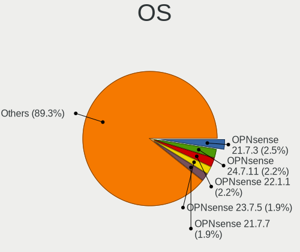

| Name             | Computers | Percent |
|------------------|-----------|---------|
| OPNsense 21.7.3  | 9         | 2.47%   |
| OPNsense 24.7.11 | 8         | 2.2%    |
| OPNsense 22.1.1  | 8         | 2.2%    |
| OPNsense 23.7.5  | 7         | 1.92%   |
| OPNsense 21.7.7  | 7         | 1.92%   |
| OPNsense 24.1.2  | 6         | 1.65%   |
| OPNsense 22.4.3  | 6         | 1.65%   |
| OPNsense 21.1.4  | 6         | 1.65%   |
| OPNsense 20.7.8  | 6         | 1.65%   |
| FreeBSD 13.1     | 6         | 1.65%   |
| OPNsense 24.7.8  | 5         | 1.37%   |
| OPNsense 24.7.7  | 5         | 1.37%   |
| OPNsense 24.1.6  | 5         | 1.37%   |
| OPNsense 23.7.10 | 5         | 1.37%   |
| OPNsense 23.1.6  | 5         | 1.37%   |
| OPNsense 23.1.5  | 5         | 1.37%   |
| OPNsense 22.7.9  | 5         | 1.37%   |
| OPNsense 22.7.11 | 5         | 1.37%   |
| OPNsense 22.1    | 5         | 1.37%   |
| OPNsense 21.7.6  | 5         | 1.37%   |
| OPNsense 21.1.5  | 5         | 1.37%   |
| OPNsense 21.1.3  | 5         | 1.37%   |
| OPNsense 21.1.2  | 5         | 1.37%   |
| OPNsense 21.1    | 5         | 1.37%   |
| OpenBSD 6.8      | 5         | 1.37%   |
| OPNsense 24.7.9  | 4         | 1.1%    |
| OPNsense 24.7.10 | 4         | 1.1%    |
| OPNsense 24.1.9  | 4         | 1.1%    |
| OPNsense 24.1.4  | 4         | 1.1%    |
| OPNsense 23.7.9  | 4         | 1.1%    |
| OPNsense 23.7.8  | 4         | 1.1%    |
| OPNsense 23.7.12 | 4         | 1.1%    |
| OPNsense 23.1.7  | 4         | 1.1%    |
| OPNsense 23.1.11 | 4         | 1.1%    |
| OPNsense 23.1    | 4         | 1.1%    |
| OPNsense 22.7.2  | 4         | 1.1%    |
| OPNsense 22.7.10 | 4         | 1.1%    |
| OPNsense 22.1.9  | 4         | 1.1%    |
| OPNsense 22.1.7  | 4         | 1.1%    |
| OPNsense 22.1.4  | 4         | 1.1%    |

OS Family
---------

OS without a version

| Name        | Computers | Percent |
|-------------|-----------|---------|
| OPNsense    | 208       | 76.19%  |
| FreeBSD     | 44        | 16.12%  |
| OpenBSD     | 9         | 3.3%    |
| helloSystem | 5         | 1.83%   |
| FreeNAS     | 3         | 1.1%    |
| GhostBSD    | 2         | 0.73%   |
| TrueNAS     | 1         | 0.37%   |
| NetBSD      | 1         | 0.37%   |

Arch
----

OS architecture (x86_64, i586, etc.)

| Name    | Computers | Percent |
|---------|-----------|---------|
| amd64   | 269       | 98.53%  |
| arm64   | 2         | 0.73%   |
| sparc64 | 1         | 0.37%   |
| i386    | 1         | 0.37%   |

DE
--

Desktop Environment

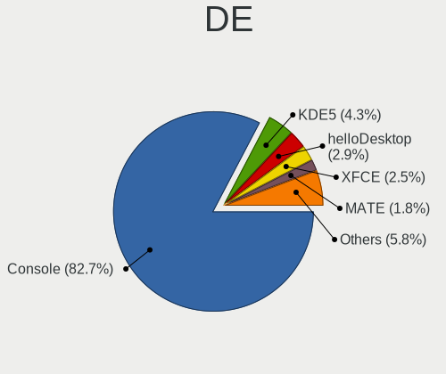

| Name         | Computers | Percent |
|--------------|-----------|---------|
| Console      | 229       | 82.67%  |
| KDE5         | 12        | 4.33%   |
| helloDesktop | 8         | 2.89%   |
| XFCE         | 7         | 2.53%   |
| MATE         | 5         | 1.81%   |
| LXQt         | 3         | 1.08%   |
| Cinnamon     | 3         | 1.08%   |
| i3           | 2         | 0.72%   |
| fvwm         | 2         | 0.72%   |
| xinitrc      | 1         | 0.36%   |
| wlroots      | 1         | 0.36%   |
| TWM          | 1         | 0.36%   |
| Openbox      | 1         | 0.36%   |
| Lumina       | 1         | 0.36%   |
| GNOME        | 1         | 0.36%   |

Display Server
--------------

X11 or Wayland

| Name    | Computers | Percent |
|---------|-----------|---------|
| Console | 233       | 84.42%  |
| X11     | 40        | 14.49%  |
| Wayland | 3         | 1.09%   |

Display Manager
---------------

SDDM, LightDM, etc.

| Name    | Computers | Percent |
|---------|-----------|---------|
| Console | 245       | 88.77%  |
| SDDM    | 15        | 5.43%   |
| SLiM    | 8         | 2.9%    |
| LightDM | 5         | 1.81%   |
| XDM     | 1         | 0.36%   |
| Ly      | 1         | 0.36%   |
| GDM     | 1         | 0.36%   |

OS Lang
-------

Language

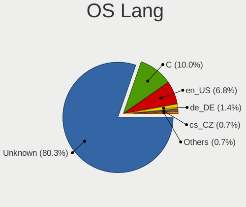

| Lang    | Computers | Percent |
|---------|-----------|---------|
| Unknown | 224       | 80.29%  |
| C       | 28        | 10.04%  |
| en_US   | 19        | 6.81%   |
| de_DE   | 4         | 1.43%   |
| cs_CZ   | 2         | 0.72%   |
| fr_FR   | 1         | 0.36%   |
| de_AT   | 1         | 0.36%   |

Boot Mode
---------

EFI or BIOS

| Mode | Computers | Percent |
|------|-----------|---------|
| EFI  | 244       | 89.38%  |
| BIOS | 29        | 10.62%  |

Filesystem
----------

Type of filesystem

| Type    | Computers | Percent |
|---------|-----------|---------|
| Ufs     | 147       | 53.07%  |
| Zfs     | 118       | 42.6%   |
| Ffs     | 9         | 3.25%   |
| Cd9660  | 2         | 0.72%   |
| Unknown | 1         | 0.36%   |

Part. scheme
------------

Scheme of partitioning

| Type    | Computers | Percent |
|---------|-----------|---------|
| GPT     | 259       | 94.87%  |
| MBR     | 10        | 3.66%   |
| Unknown | 4         | 1.47%   |

Board
-----

Vendor
------

Motherboard manufacturer

| Name                       | Computers | Percent |
|----------------------------|-----------|---------|
| Unknown                    | 41        | 15.02%  |
| Lenovo                     | 23        | 8.42%   |
| PC Engines                 | 18        | 6.59%   |
| Hewlett-Packard            | 17        | 6.23%   |
| Dell                       | 16        | 5.86%   |
| Intel                      | 13        | 4.76%   |
| Supermicro                 | 12        | 4.4%    |
| Fujitsu                    | 11        | 4.03%   |
| ASUSTek Computer           | 10        | 3.66%   |
| Gigabyte Technology        | 9         | 3.3%    |
| Sophos                     | 8         | 2.93%   |
| Shuttle                    | 8         | 2.93%   |
| Deciso                     | 8         | 2.93%   |
| ZOTAC                      | 7         | 2.56%   |
| BESSTAR Tech               | 7         | 2.56%   |
| AMI                        | 7         | 2.56%   |
| Protectli                  | 6         | 2.2%    |
| ASRock                     | 5         | 1.83%   |
| MW                         | 4         | 1.47%   |
| IceWhale Technology        | 4         | 1.47%   |
| AWOW                       | 4         | 1.47%   |
| Techvision                 | 2         | 0.73%   |
| Secudos                    | 2         | 0.73%   |
| MSI                        | 2         | 0.73%   |
| Hardkernel                 | 2         | 0.73%   |
| Biostar                    | 2         | 0.73%   |
| Barracuda Networks         | 2         | 0.73%   |
| Apple                      | 2         | 0.73%   |
| AAEON                      | 2         | 0.73%   |
| Winston Marriot            | 1         | 0.37%   |
| TUXEDO                     | 1         | 0.37%   |
| Sun                        | 1         | 0.37%   |
| Silicom                    | 1         | 0.37%   |
| ShenZhen MinWin Technology | 1         | 0.37%   |
| SeeedStudio                | 1         | 0.37%   |
| Seeed Studio               | 1         | 0.37%   |
| Raspberry Pi Foundation    | 1         | 0.37%   |
| Purism                     | 1         | 0.37%   |
| Panasonic                  | 1         | 0.37%   |
| OEM                        | 1         | 0.37%   |

Model
-----

Motherboard model

| Name                             | Computers | Percent |
|----------------------------------|-----------|---------|
| Unknown                          | 44        | 16.12%  |
| PC Engines APU2                  | 8         | 2.93%   |
| PC Engines apu4                  | 7         | 2.56%   |
| Sophos SG                        | 6         | 2.2%    |
| Deciso Netboard A10 GEN2 Model G | 6         | 2.2%    |
| Supermicro Super Server          | 4         | 1.47%   |
| MW GMLK-2_5G4L                   | 4         | 1.47%   |
| IceWhale ZimaBoard 832 ZMB       | 4         | 1.47%   |
| Protectli FW4B                   | 3         | 1.1%    |
| PC Engines APU                   | 3         | 1.1%    |
| Intel Q3XXG4-P V1.0              | 3         | 1.1%    |
| Dell OptiPlex 5040               | 3         | 1.1%    |
| AMI Aptio CRB                    | 3         | 1.1%    |
| ZOTAC ZBOX-CI341                 | 2         | 0.73%   |
| ZOTAC ZBOX-CI323NANO             | 2         | 0.73%   |
| Techvision TVI7309X              | 2         | 0.73%   |
| Sophos XG                        | 2         | 0.73%   |
| Shuttle DS10U                    | 2         | 0.73%   |
| Shuttle DH170                    | 2         | 0.73%   |
| Protectli VP2420                 | 2         | 0.73%   |
| Lenovo ThinkPad T490 20N2CTO1WW  | 2         | 0.73%   |
| HP ProLiant DL360 G6             | 2         | 0.73%   |
| HP EliteBook 850 G7 Notebook PC  | 2         | 0.73%   |
| Hardkernel ODROID-H2             | 2         | 0.73%   |
| Fujitsu FUTRO S920               | 2         | 0.73%   |
| Fujitsu FUTRO S720               | 2         | 0.73%   |
| Fujitsu ESPRIMO C720             | 2         | 0.73%   |
| Dell OptiPlex 7040               | 2         | 0.73%   |
| BESSTAR Tech GK41                | 2         | 0.73%   |
| AWOW AK34                        | 2         | 0.73%   |
| AMI LES compact 4L               | 2         | 0.73%   |
| AAEON UP-APL01                   | 2         | 0.73%   |
| ZOTAC ZBOXNANO-ID63/ID64/ID65    | 1         | 0.37%   |
| ZOTAC ZBOX-CI527/CI547NANO       | 1         | 0.37%   |
| Winston Marriot PICO PC  PICOPC  | 1         | 0.37%   |
| TUXEDO InfinityBook Pro 14 Gen6  | 1         | 0.37%   |
| Supermicro X7SPA-H               | 1         | 0.37%   |
| Supermicro X10SLL-F              | 1         | 0.37%   |
| Supermicro SYS-E301-9D-8CN8TP    | 1         | 0.37%   |
| Supermicro IXWS-733TQ-665B-IXN   | 1         | 0.37%   |

Model Family
------------

Motherboard model prefix

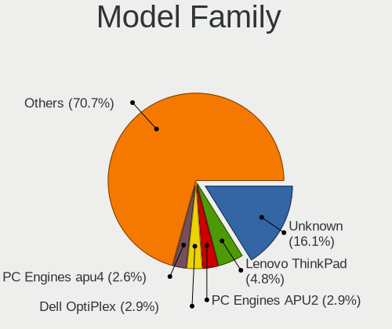

| Name                         | Computers | Percent |
|------------------------------|-----------|---------|
| Unknown                      | 44        | 16.12%  |
| Lenovo ThinkPad              | 13        | 4.76%   |
| PC Engines APU2              | 8         | 2.93%   |
| Dell OptiPlex                | 8         | 2.93%   |
| PC Engines apu4              | 7         | 2.56%   |
| HP ProLiant                  | 7         | 2.56%   |
| Sophos SG                    | 6         | 2.2%    |
| Deciso Netboard              | 6         | 2.2%    |
| Lenovo ThinkCentre           | 5         | 1.83%   |
| Fujitsu FUTRO                | 5         | 1.83%   |
| Supermicro Super             | 4         | 1.47%   |
| MW GMLK-2                    | 4         | 1.47%   |
| IceWhale ZimaBoard           | 4         | 1.47%   |
| HP EliteBook                 | 4         | 1.47%   |
| Fujitsu ESPRIMO              | 4         | 1.47%   |
| Supermicro 1HE               | 3         | 1.1%    |
| Protectli FW4B               | 3         | 1.1%    |
| PC Engines APU               | 3         | 1.1%    |
| Intel Q3XXG4-P               | 3         | 1.1%    |
| Dell PowerEdge               | 3         | 1.1%    |
| AMI Aptio                    | 3         | 1.1%    |
| ZOTAC ZBOX-CI341             | 2         | 0.73%   |
| ZOTAC ZBOX-CI323NANO         | 2         | 0.73%   |
| Techvision TVI7309X          | 2         | 0.73%   |
| Sophos XG                    | 2         | 0.73%   |
| Shuttle DS10U                | 2         | 0.73%   |
| Shuttle DH170                | 2         | 0.73%   |
| Protectli VP2420             | 2         | 0.73%   |
| Lenovo IdeaPad               | 2         | 0.73%   |
| Lenovo IdeaCentre            | 2         | 0.73%   |
| HP Compaq                    | 2         | 0.73%   |
| Hardkernel ODROID-H2         | 2         | 0.73%   |
| Dell Precision               | 2         | 0.73%   |
| BESSTAR Tech GK41            | 2         | 0.73%   |
| Barracuda Networks Barracuda | 2         | 0.73%   |
| AWOW AK34                    | 2         | 0.73%   |
| ASUS 1HE                     | 2         | 0.73%   |
| AMI LES                      | 2         | 0.73%   |
| AAEON UP-APL01               | 2         | 0.73%   |
| ZOTAC ZBOXNANO-ID63          | 1         | 0.37%   |

MFG Year
--------

Motherboard manufacture year

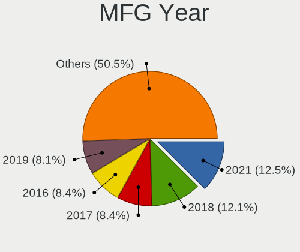

| Year    | Computers | Percent |
|---------|-----------|---------|
| 2021    | 34        | 12.45%  |
| 2018    | 33        | 12.09%  |
| 2017    | 23        | 8.42%   |
| 2016    | 23        | 8.42%   |
| 2019    | 22        | 8.06%   |
| 2022    | 21        | 7.69%   |
| 2020    | 21        | 7.69%   |
| 2023    | 20        | 7.33%   |
| 2014    | 19        | 6.96%   |
| 2015    | 10        | 3.66%   |
| 2013    | 10        | 3.66%   |
| 2011    | 10        | 3.66%   |
| 2024    | 7         | 2.56%   |
| 2010    | 6         | 2.2%    |
| 2012    | 4         | 1.47%   |
| 2009    | 4         | 1.47%   |
| Unknown | 4         | 1.47%   |
| 2007    | 1         | 0.37%   |
| 2006    | 1         | 0.37%   |

Form Factor
-----------

Physical design of the computer

| Name           | Computers | Percent |
|----------------|-----------|---------|
| Desktop        | 179       | 65.57%  |
| Notebook       | 36        | 13.19%  |
| Mini pc        | 24        | 8.79%   |
| Server         | 20        | 7.33%   |
| Firewall       | 10        | 3.66%   |
| System on chip | 2         | 0.73%   |
| Convertible    | 1         | 0.37%   |
| All in one     | 1         | 0.37%   |

Coreboot
--------

Have coreboot on board

| Used | Computers | Percent |
|------|-----------|---------|
| No   | 245       | 89.74%  |
| Yes  | 28        | 10.26%  |

RAM Size
--------

Total RAM memory

| Size in GB      | Computers | Percent |
|-----------------|-----------|---------|
| 8.01-16.0       | 109       | 39.07%  |
| 16.01-24.0      | 63        | 22.58%  |
| 4.01-8.0        | 52        | 18.64%  |
| 32.01-64.0      | 23        | 8.24%   |
| 2.01-3.0        | 11        | 3.94%   |
| 64.01-256.0     | 9         | 3.23%   |
| 3.01-4.0        | 4         | 1.43%   |
| More than 256.0 | 3         | 1.08%   |
| 24.01-32.0      | 3         | 1.08%   |
| 1.01-2.0        | 1         | 0.36%   |
| 0.01-0.5        | 1         | 0.36%   |

RAM Used
--------

Used RAM memory

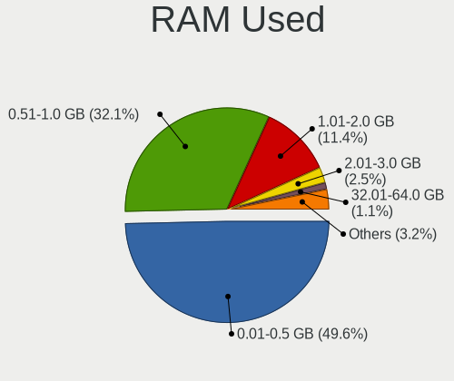

| Used GB     | Computers | Percent |
|-------------|-----------|---------|
| 0.01-0.5    | 139       | 49.64%  |
| 0.51-1.0    | 90        | 32.14%  |
| 1.01-2.0    | 32        | 11.43%  |
| 2.01-3.0    | 7         | 2.5%    |
| 4.01-8.0    | 3         | 1.07%   |
| 32.01-64.0  | 3         | 1.07%   |
| 0           | 2         | 0.71%   |
| 3.01-4.0    | 1         | 0.36%   |
| 64.01-256.0 | 1         | 0.36%   |
| 16.01-24.0  | 1         | 0.36%   |
| Unknown     | 1         | 0.36%   |

Total Drives
------------

Number of drives on board

| Drives | Computers | Percent |
|--------|-----------|---------|
| 1      | 207       | 73.14%  |
| 0      | 34        | 12.01%  |
| 2      | 28        | 9.89%   |
| 4      | 4         | 1.41%   |
| 3      | 4         | 1.41%   |
| 17     | 1         | 0.35%   |
| 15     | 1         | 0.35%   |
| 13     | 1         | 0.35%   |
| 9      | 1         | 0.35%   |
| 7      | 1         | 0.35%   |
| 6      | 1         | 0.35%   |

Has CD-ROM
----------

Has CD-ROM on board

| Presented | Computers | Percent |
|-----------|-----------|---------|
| No        | 250       | 90.58%  |
| Yes       | 26        | 9.42%   |

Has Ethernet
------------

Has Ethernet on board

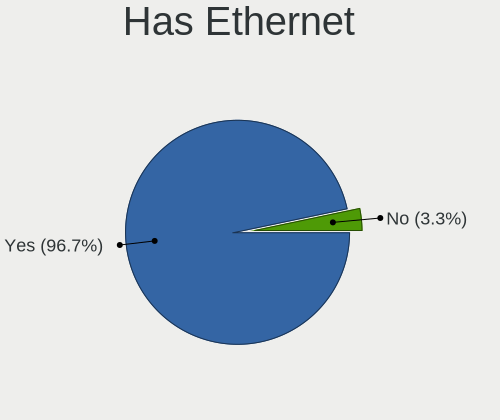

| Presented | Computers | Percent |
|-----------|-----------|---------|
| Yes       | 264       | 96.7%   |
| No        | 9         | 3.3%    |

Has WiFi
--------

Has WiFi module

| Presented | Computers | Percent |
|-----------|-----------|---------|
| No        | 194       | 70.29%  |
| Yes       | 82        | 29.71%  |

Has Bluetooth
-------------

Has Bluetooth module

| Presented | Computers | Percent |
|-----------|-----------|---------|
| No        | 217       | 78.91%  |
| Yes       | 58        | 21.09%  |

Location
--------

Country
-------

Geographic location (country)

| Country | Computers | Percent |
|---------|-----------|---------|
| Austria | 273       | 100%    |

City
----

Geographic location (city)

| City                     | Computers | Percent |
|--------------------------|-----------|---------|
| Vienna                   | 138       | 45.1%   |
| Graz                     | 22        | 7.19%   |
| Linz                     | 9         | 2.94%   |
| Innsbruck                | 8         | 2.61%   |
| Wels                     | 6         | 1.96%   |
| Feldkirch                | 6         | 1.96%   |
| Salzburg                 | 5         | 1.63%   |
| Stockerau                | 4         | 1.31%   |
| Leoben                   | 4         | 1.31%   |
| Krems                    | 3         | 0.98%   |
| Wiener Neustadt          | 2         | 0.65%   |
| Sankt Veit an der Glan   | 2         | 0.65%   |
| Rankweil                 | 2         | 0.65%   |
| Purkersdorf              | 2         | 0.65%   |
| Ohlsdorf                 | 2         | 0.65%   |
| Neulengbach              | 2         | 0.65%   |
| Lanzenkirchen            | 2         | 0.65%   |
| Klagenfurt               | 2         | 0.65%   |
| Hittisau                 | 2         | 0.65%   |
| Bruck an der Mur         | 2         | 0.65%   |
| Bregenz                  | 2         | 0.65%   |
| Baden bei Wien           | 2         | 0.65%   |
| Axams                    | 2         | 0.65%   |
| Atzenbrugg               | 2         | 0.65%   |
| Zwettl Stadt             | 1         | 0.33%   |
| Zell am See              | 1         | 0.33%   |
| Wilhering                | 1         | 0.33%   |
| Weidlingbach             | 1         | 0.33%   |
| Vorchdorf                | 1         | 0.33%   |
| Voggenberg               | 1         | 0.33%   |
| Tulln                    | 1         | 0.33%   |
| Trausdorf an der Wulka   | 1         | 0.33%   |
| Tragwein                 | 1         | 0.33%   |
| Steyr                    | 1         | 0.33%   |
| Steinhaus                | 1         | 0.33%   |
| Spittal an der Drau      | 1         | 0.33%   |
| Sieghartskirchen         | 1         | 0.33%   |
| Siegendorf im Burgenland | 1         | 0.33%   |
| Seyring                  | 1         | 0.33%   |
| Schwechat                | 1         | 0.33%   |

Drives
------

Drive Vendor
------------

Hard drive vendors

| Vendor              | Computers | Drives | Percent |
|---------------------|-----------|--------|---------|
| Samsung Electronics | 49        | 73     | 16.72%  |
| Transcend           | 35        | 45     | 11.95%  |
| Kingston            | 24        | 37     | 8.19%   |
| WDC                 | 22        | 49     | 7.51%   |
| Crucial             | 20        | 28     | 6.83%   |
| Intel               | 17        | 23     | 5.8%    |
| SanDisk             | 13        | 20     | 4.44%   |
| Seagate             | 10        | 32     | 3.41%   |
| China               | 9         | 11     | 3.07%   |
| HGST                | 7         | 19     | 2.39%   |
| A-DATA Technology   | 7         | 11     | 2.39%   |
| Hoodisk             | 6         | 7      | 2.05%   |
| Micron Technology   | 5         | 9      | 1.71%   |
| FORESEE             | 5         | 6      | 1.71%   |
| Toshiba             | 4         | 7      | 1.37%   |
| SK hynix            | 4         | 11     | 1.37%   |
| Phison              | 4         | 5      | 1.37%   |
| Silicon Motion      | 3         | 3      | 1.02%   |
| Patriot             | 3         | 5      | 1.02%   |
| Hewlett-Packard     | 3         | 3      | 1.02%   |
| ATP                 | 3         | 3      | 1.02%   |
| AirDisk             | 3         | 4      | 1.02%   |
| OCZ                 | 2         | 2      | 0.68%   |
| Innodisk            | 2         | 3      | 0.68%   |
| Hitachi             | 2         | 2      | 0.68%   |
| Dogfish             | 2         | 2      | 0.68%   |
| Dell                | 2         | 2      | 0.68%   |
| Corsair             | 2         | 5      | 0.68%   |
| BORY                | 2         | 5      | 0.68%   |
| BIWIN               | 2         | 2      | 0.68%   |
| BAITITON            | 2         | 2      | 0.68%   |
| Apple               | 2         | 2      | 0.68%   |
| VICKTER             | 1         | 1      | 0.34%   |
| Verbatim            | 1         | 1      | 0.34%   |
| SYNOLOGY            | 1         | 1      | 0.34%   |
| SPCC                | 1         | 2      | 0.34%   |
| Qunion              | 1         | 2      | 0.34%   |
| Plextor             | 1         | 1      | 0.34%   |
| Mushkin             | 1         | 1      | 0.34%   |
| LITEONIT            | 1         | 1      | 0.34%   |

Drive Model
-----------

Hard drive models

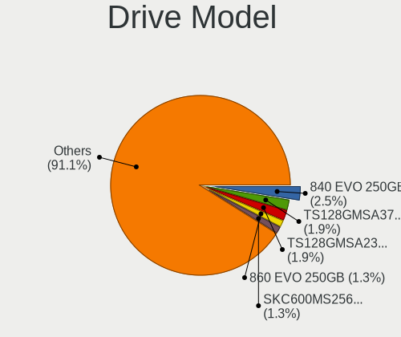

| Model                                   | Computers | Percent |
|-----------------------------------------|-----------|---------|
| Samsung SSD 840 EVO 250GB               | 8         | 2.55%   |
| Transcend TS128GMSA370 128GB            | 6         | 1.91%   |
| Transcend TS128GMSA230S 128GB           | 6         | 1.91%   |
| Samsung SSD 860 EVO 250GB               | 4         | 1.27%   |
| Kingston SKC600MS256G 256GB             | 4         | 1.27%   |
| FORESEE 128GB SSD                       | 4         | 1.27%   |
| China SATA SSD 16GB                     | 4         | 1.27%   |
| SanDisk SSD PLUS 240GB                  | 3         | 0.96%   |
| SanDisk SSD PLUS 120GB                  | 3         | 0.96%   |
| Samsung SSD 850 EVO 250GB               | 3         | 0.96%   |
| Kingston SUV500MS120G 120GB             | 3         | 0.96%   |
| Kingston SA400S37240G 240GB             | 3         | 0.96%   |
| Intel SSDSC2KW128G8 128GB               | 3         | 0.96%   |
| Crucial CT240BX500SSD1 240GB            | 3         | 0.96%   |
| Crucial CT120BX500SSD1 120GB            | 3         | 0.96%   |
| WDC WD60EFRX-68L0BN1 6TB                | 2         | 0.64%   |
| WDC WD40EFRX-68N32N0 4TB                | 2         | 0.64%   |
| Transcend TS64GMTS400SD 64GB            | 2         | 0.64%   |
| Transcend TS64GMSA230S 64GB             | 2         | 0.64%   |
| Transcend TS256GMTS430S 256GB           | 2         | 0.64%   |
| Transcend TS256GMTE652T2 256GB          | 2         | 0.64%   |
| Transcend TS256GMSA230S 256GB           | 2         | 0.64%   |
| Transcend TS240GSSD220S 240GB           | 2         | 0.64%   |
| Transcend TS16GMSA370 16GB              | 2         | 0.64%   |
| Transcend TS128GMTS830S 128GB           | 2         | 0.64%   |
| SK hynix SC308 SATA 128GB               | 2         | 0.64%   |
| SK hynix BC511 HFM512GDJTNI-82A0A 512GB | 2         | 0.64%   |
| Silicon Motion P10D 1TB                 | 2         | 0.64%   |
| Seagate ST4000VN008-2DR166 4TB          | 2         | 0.64%   |
| SanDisk SSD PLUS 480GB                  | 2         | 0.64%   |
| Samsung SSD 980 250GB                   | 2         | 0.64%   |
| Samsung SSD 970 EVO Plus 250GB          | 2         | 0.64%   |
| Samsung SSD 870 EVO 250GB               | 2         | 0.64%   |
| Samsung SSD 850 EVO 500GB               | 2         | 0.64%   |
| Samsung SSD 830 Series 256GB            | 2         | 0.64%   |
| Samsung MZALQ512HBLU-00BL1 512GB        | 2         | 0.64%   |
| Phison SATA SSD 16GB                    | 2         | 0.64%   |
| Kingston SA400S37120G 120GB             | 2         | 0.64%   |
| Intel SSDSC2KI128G8 100GB               | 2         | 0.64%   |
| Intel SSDPEKNU512GZ 512GB               | 2         | 0.64%   |

HDD Vendor
----------

Hard disk drive vendors

| Vendor              | Computers | Drives | Percent |
|---------------------|-----------|--------|---------|
| WDC                 | 19        | 43     | 39.58%  |
| Seagate             | 9         | 25     | 18.75%  |
| HGST                | 7         | 19     | 14.58%  |
| Toshiba             | 4         | 7      | 8.33%   |
| Samsung Electronics | 2         | 3      | 4.17%   |
| Hitachi             | 2         | 2      | 4.17%   |
| Dell                | 2         | 2      | 4.17%   |
| SYNOLOGY            | 1         | 1      | 2.08%   |
| Hewlett-Packard     | 1         | 1      | 2.08%   |
| Apple               | 1         | 1      | 2.08%   |

SSD Vendor
----------

Solid state drive vendors

| Vendor              | Computers | Drives | Percent |
|---------------------|-----------|--------|---------|
| Transcend           | 32        | 40     | 16.33%  |
| Samsung Electronics | 32        | 46     | 16.33%  |
| Kingston            | 22        | 35     | 11.22%  |
| Crucial             | 15        | 23     | 7.65%   |
| SanDisk             | 13        | 20     | 6.63%   |
| Intel               | 11        | 14     | 5.61%   |
| China               | 9         | 11     | 4.59%   |
| Hoodisk             | 6         | 7      | 3.06%   |
| FORESEE             | 5         | 6      | 2.55%   |
| A-DATA Technology   | 5         | 6      | 2.55%   |
| Micron Technology   | 4         | 8      | 2.04%   |
| WDC                 | 3         | 4      | 1.53%   |
| Phison              | 3         | 4      | 1.53%   |
| AirDisk             | 3         | 4      | 1.53%   |
| SK hynix            | 2         | 9      | 1.02%   |
| OCZ                 | 2         | 2      | 1.02%   |
| Innodisk            | 2         | 3      | 1.02%   |
| Hewlett-Packard     | 2         | 2      | 1.02%   |
| Dogfish             | 2         | 2      | 1.02%   |
| BORY                | 2         | 5      | 1.02%   |
| BAITITON            | 2         | 2      | 1.02%   |
| ATP                 | 2         | 2      | 1.02%   |
| VICKTER             | 1         | 1      | 0.51%   |
| Verbatim            | 1         | 1      | 0.51%   |
| SPCC                | 1         | 2      | 0.51%   |
| Seagate             | 1         | 7      | 0.51%   |
| Qunion              | 1         | 2      | 0.51%   |
| Patriot             | 1         | 1      | 0.51%   |
| Mushkin             | 1         | 1      | 0.51%   |
| LITEONIT            | 1         | 1      | 0.51%   |
| Leven               | 1         | 2      | 0.51%   |
| Kston               | 1         | 1      | 0.51%   |
| KingSpec            | 1         | 1      | 0.51%   |
| KeepData            | 1         | 1      | 0.51%   |
| Intenso             | 1         | 1      | 0.51%   |
| GOODRAM             | 1         | 1      | 0.51%   |
| BR                  | 1         | 1      | 0.51%   |
| BIWIN               | 1         | 1      | 0.51%   |
| Apple               | 1         | 1      | 0.51%   |

Drive Kind
----------

HDD or SSD

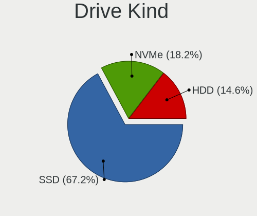

| Kind | Computers | Drives | Percent |
|------|-----------|--------|---------|
| SSD  | 184       | 281    | 67.15%  |
| NVMe | 50        | 74     | 18.25%  |
| HDD  | 40        | 104    | 14.6%   |

Drive Connector
---------------

SATA, SAS, NVMe, etc.

| Type | Computers | Drives | Percent |
|------|-----------|--------|---------|
| SATA | 202       | 385    | 80.16%  |
| NVMe | 50        | 74     | 19.84%  |

Drive Size
----------

Size of hard drive

| Size in TB | Computers | Drives | Percent |
|------------|-----------|--------|---------|
| 0.01-0.5   | 185       | 295    | 81.5%   |
| 0.51-1.0   | 20        | 26     | 8.81%   |
| 1.01-2.0   | 8         | 16     | 3.52%   |
| 4.01-10.0  | 7         | 28     | 3.08%   |
| 3.01-4.0   | 5         | 17     | 2.2%    |
| 10.01-20.0 | 2         | 3      | 0.88%   |

Space Total
-----------

Amount of disk space available on the file system

| Size in GB | Computers | Percent |
|------------|-----------|---------|
| 101-250    | 144       | 51.06%  |
| 251-500    | 52        | 18.44%  |
| 51-100     | 29        | 10.28%  |
| 21-50      | 23        | 8.16%   |
| 1-20       | 22        | 7.8%    |
| 501-1000   | 10        | 3.55%   |
| 1001-2000  | 2         | 0.71%   |

Space Used
----------

Amount of used disk space

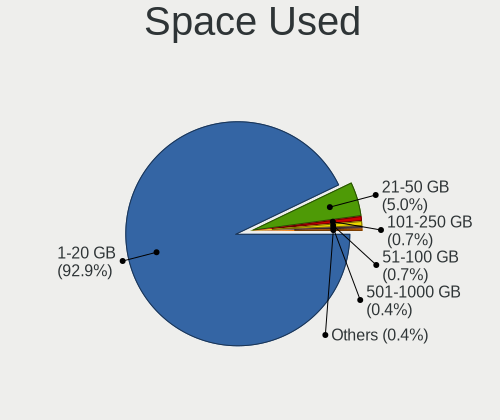

| Used GB  | Computers | Percent |
|----------|-----------|---------|
| 1-20     | 261       | 92.88%  |
| 21-50    | 14        | 4.98%   |
| 101-250  | 2         | 0.71%   |
| 51-100   | 2         | 0.71%   |
| 251-500  | 1         | 0.36%   |
| 501-1000 | 1         | 0.36%   |

Malfunc. Drives
---------------

Drive models with a malfunction

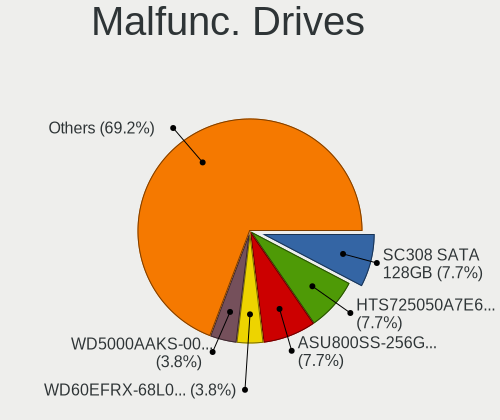

| Model                                        | Computers | Drives | Percent |
|----------------------------------------------|-----------|--------|---------|
| SK hynix SC308 SATA 128GB                    | 2         | 9      | 7.69%   |
| HGST HTS725050A7E630 500GB                   | 2         | 11     | 7.69%   |
| A-DATA Technology ASU800SS-256GT 256GB       | 2         | 2      | 7.69%   |
| WDC WD60EFRX-68L0BN1 6TB                     | 1         | 1      | 3.85%   |
| WDC WD5000AAKS-00YGA0 500GB                  | 1         | 1      | 3.85%   |
| WDC WD3200BEVT-22ZCT0 320GB                  | 1         | 1      | 3.85%   |
| WDC WD1600BEVS-00UST0 160GB                  | 1         | 1      | 3.85%   |
| WDC WD1600BEKT-08PVMT1 160GB                 | 1         | 2      | 3.85%   |
| Seagate ST9500325AS 500GB                    | 1         | 1      | 3.85%   |
| SanDisk SSD PLUS 240GB                       | 1         | 1      | 3.85%   |
| Samsung Electronics SSD 970 EVO 1TB          | 1         | 1      | 3.85%   |
| Samsung Electronics MZ7PA128HMCD-010H1 128GB | 1         | 1      | 3.85%   |
| Samsung Electronics HM500LI 500GB            | 1         | 2      | 3.85%   |
| OCZ AGILITY3 120GB                           | 1         | 1      | 3.85%   |
| Micron Technology 1100_MTFDDAV256TBN 256GB   | 1         | 2      | 3.85%   |
| Intel SSDSCKKF256G8H 256GB                   | 1         | 2      | 3.85%   |
| Intel SSDPEKKW128G7 128GB                    | 1         | 1      | 3.85%   |
| Hitachi HTS541040G9SA00 40GB                 | 1         | 1      | 3.85%   |
| Hitachi HDS721050CLA660 500GB                | 1         | 1      | 3.85%   |
| HGST HTS721010A9E630 1TB                     | 1         | 1      | 3.85%   |
| China XJH-128GB                              | 1         | 1      | 3.85%   |
| A-DATA Technology SU630 240GB                | 1         | 1      | 3.85%   |
| A-DATA Technology ASU800SS-128GT 128GB       | 1         | 1      | 3.85%   |

Malfunc. Drive Vendor
---------------------

Vendors of faulty drives

| Vendor              | Computers | Drives | Percent |
|---------------------|-----------|--------|---------|
| WDC                 | 5         | 6      | 19.23%  |
| A-DATA Technology   | 4         | 4      | 15.38%  |
| Samsung Electronics | 3         | 4      | 11.54%  |
| HGST                | 3         | 12     | 11.54%  |
| SK hynix            | 2         | 9      | 7.69%   |
| Intel               | 2         | 3      | 7.69%   |
| Hitachi             | 2         | 2      | 7.69%   |
| Seagate             | 1         | 1      | 3.85%   |
| SanDisk             | 1         | 1      | 3.85%   |
| OCZ                 | 1         | 1      | 3.85%   |
| Micron Technology   | 1         | 2      | 3.85%   |
| China               | 1         | 1      | 3.85%   |

Malfunc. HDD Vendor
-------------------

Vendors of faulty HDD drives

| Vendor              | Computers | Drives | Percent |
|---------------------|-----------|--------|---------|
| WDC                 | 5         | 6      | 41.67%  |
| HGST                | 3         | 12     | 25%     |
| Hitachi             | 2         | 2      | 16.67%  |
| Seagate             | 1         | 1      | 8.33%   |
| Samsung Electronics | 1         | 2      | 8.33%   |

Malfunc. Drive Kind
-------------------

Kinds of faulty drives

| Kind | Computers | Drives | Percent |
|------|-----------|--------|---------|
| SSD  | 12        | 21     | 46.15%  |
| HDD  | 12        | 23     | 46.15%  |
| NVMe | 2         | 2      | 7.69%   |

Failed Drives
-------------

Failed drive models

| Model                     | Computers | Drives | Percent |
|---------------------------|-----------|--------|---------|
| Intel SSDPEKKW128G7 128GB | 1         | 1      | 50%     |
| Crucial CT250P2SSD8 250GB | 1         | 1      | 50%     |

Failed Drive Vendor
-------------------

Failed drive vendors

| Vendor  | Computers | Drives | Percent |
|---------|-----------|--------|---------|
| Intel   | 1         | 1      | 50%     |
| Crucial | 1         | 1      | 50%     |

Drive Status
------------

Number of failed and malfunc. drives

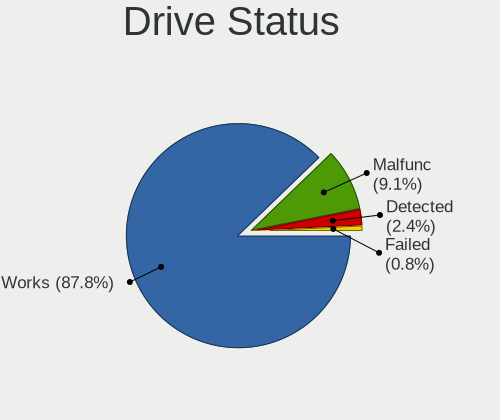

| Status   | Computers | Drives | Percent |
|----------|-----------|--------|---------|
| Works    | 223       | 404    | 87.8%   |
| Malfunc  | 23        | 46     | 9.06%   |
| Detected | 6         | 7      | 2.36%   |
| Failed   | 2         | 2      | 0.79%   |

Storage controller
------------------

Storage Vendor
--------------

Storage controller vendors

| Vendor                      | Computers | Percent |
|-----------------------------|-----------|---------|
| Intel                       | 212       | 63.47%  |
| AMD                         | 43        | 12.87%  |
| Samsung Electronics         | 21        | 6.29%   |
| SanDisk                     | 6         | 1.8%    |
| Phison Electronics          | 6         | 1.8%    |
| Broadcom / LSI              | 6         | 1.8%    |
| Silicon Motion              | 5         | 1.5%    |
| Hewlett-Packard             | 5         | 1.5%    |
| Micron/Crucial Technology   | 4         | 1.2%    |
| SK hynix                    | 3         | 0.9%    |
| Micron Technology           | 3         | 0.9%    |
| ASMedia Technology          | 3         | 0.9%    |
| Transcend                   | 2         | 0.6%    |
| MAXIO Technology (Hangzhou) | 2         | 0.6%    |
| Marvell Technology Group    | 2         | 0.6%    |
| Lite-On Technology          | 2         | 0.6%    |
| Kingston Technology Company | 2         | 0.6%    |
| Toshiba                     | 1         | 0.3%    |
| Realtek Semiconductor       | 1         | 0.3%    |
| KIOXIA                      | 1         | 0.3%    |
| Dell                        | 1         | 0.3%    |
| ATP ELECTRONICS             | 1         | 0.3%    |
| Apple                       | 1         | 0.3%    |
| ADATA Technology            | 1         | 0.3%    |

Storage Model
-------------

Storage controller models

| Model                                                                            | Computers | Percent |
|----------------------------------------------------------------------------------|-----------|---------|
| AMD FCH SATA Controller [AHCI mode]                                              | 30        | 8.38%   |
| Intel Celeron/Pentium Silver Processor SATA Controller                           | 17        | 4.75%   |
| Intel Q170/Q150/B150/H170/H110/Z170/CM236 Chipset SATA Controller [AHCI Mode]    | 16        | 4.47%   |
| Intel Atom/Celeron/Pentium Processor x5-E8000/J3xxx/N3xxx Series SATA Controller | 16        | 4.47%   |
| Intel Alder Lake-N SATA AHCI Controller                                          | 15        | 4.19%   |
| Intel Celeron N3350/Pentium N4200/Atom E3900 Series SATA AHCI Controller         | 14        | 3.91%   |
| Intel 8 Series/C220 Series Chipset Family 6-port SATA Controller 1 [AHCI mode]   | 14        | 3.91%   |
| Samsung NVMe SSD Controller SM981/PM981/PM983                                    | 8         | 2.23%   |
| Samsung NVMe SSD Controller 980 (DRAM-less)                                      | 8         | 2.23%   |
| Intel Sunrise Point-LP SATA Controller [AHCI mode]                               | 8         | 2.23%   |
| Intel Atom Processor E3800 Series SATA AHCI Controller                           | 8         | 2.23%   |
| AMD FCH SATA Controller [IDE mode]                                               | 8         | 2.23%   |
| Intel Jasper Lake SATA AHCI Controller                                           | 7         | 1.96%   |
| Intel Cannon Lake PCH SATA AHCI Controller                                       | 7         | 1.96%   |
| Intel 6 Series/C200 Series Chipset Family 6 port Desktop SATA AHCI Controller    | 7         | 1.96%   |
| Intel Wildcat Point-LP SATA Controller [AHCI Mode]                               | 5         | 1.4%    |
| Intel Cannon Point-LP SATA Controller [AHCI Mode]                                | 5         | 1.4%    |
| Intel Atom Processor C3000 Series SATA Controller 0                              | 5         | 1.4%    |
| Intel 8 Series SATA Controller 1 [AHCI mode]                                     | 5         | 1.4%    |
| Intel 7 Series Chipset Family 6-port SATA Controller [AHCI mode]                 | 5         | 1.4%    |
| Silicon Motion SM2263EN/SM2263XT (DRAM-less) NVMe SSD Controllers                | 4         | 1.12%   |
| Phison PS5013-E13 PCIe3 NVMe Controller (DRAM-less)                              | 4         | 1.12%   |
| Intel Comet Lake SATA AHCI Controller                                            | 4         | 1.12%   |
| HP Smart Array G6 controllers                                                    | 4         | 1.12%   |
| AMD SB7x0/SB8x0/SB9x0 SATA Controller [AHCI mode]                                | 4         | 1.12%   |
| Intel Atom processor C2000 AHCI SATA3 Controller                                 | 3         | 0.84%   |
| Intel Alder Lake-S PCH SATA Controller [AHCI Mode]                               | 3         | 0.84%   |
| Intel 82801JI (ICH10 Family) 4 port SATA IDE Controller #1                       | 3         | 0.84%   |
| Intel 82801G (ICH7 Family) IDE Controller                                        | 3         | 0.84%   |
| Intel 7 Series/C210 Series Chipset Family 6-port SATA Controller [AHCI mode]     | 3         | 0.84%   |
| Broadcom / LSI SAS2308 PCI-Express Fusion-MPT SAS-2                              | 3         | 0.84%   |
| Transcend NVMe PCIe SSD 110S/112S/120S/MTE300S/MTE400S/MTE652T2 (DRAM-less)      | 2         | 0.56%   |
| SK hynix BC511 NVMe SSD                                                          | 2         | 0.56%   |
| SanDisk Ultra 3D / WD Blue SN570 NVMe SSD (DRAM-less)                            | 2         | 0.56%   |
| SanDisk Extreme Pro / WD Black SN750 / PC SN730 / Red SN700 NVMe SSD             | 2         | 0.56%   |
| Samsung NVMe SSD Controller SM961/PM961/SM963                                    | 2         | 0.56%   |
| Samsung NVMe SSD Controller PM9A1/PM9A3/980PRO                                   | 2         | 0.56%   |
| Micron/Crucial P2 [Nick P2] / P3 / P3 Plus NVMe PCIe SSD (DRAM-less)             | 2         | 0.56%   |
| Micron 2550 NVMe SSD (DRAM-less)                                                 | 2         | 0.56%   |
| MAXIO (Hangzhou) NVMe SSD Controller MAP1202 (DRAM-less)                         | 2         | 0.56%   |

Storage Kind
------------

Kind of storage controller (IDE, SATA, NVMe, SAS, ...)

| Kind | Computers | Percent |
|------|-----------|---------|
| SATA | 230       | 68.25%  |
| NVMe | 66        | 19.58%  |
| IDE  | 23        | 6.82%   |
| RAID | 11        | 3.26%   |
| SAS  | 4         | 1.19%   |
| SCSI | 3         | 0.89%   |

Processor
---------

CPU Vendor
----------

Processor vendors

| Vendor  | Computers | Percent |
|---------|-----------|---------|
| Intel   | 223       | 81.68%  |
| AMD     | 47        | 17.22%  |
| Unknown | 2         | 0.73%   |
| ARM     | 1         | 0.37%   |

CPU Model
---------

Processor models

| Model                                  | Computers | Percent |
|----------------------------------------|-----------|---------|
| AMD GX-412TC SOC                       | 15        | 5.47%   |
| Intel N100                             | 14        | 5.11%   |
| Intel Celeron J4125 CPU @ 2.00GHz      | 10        | 3.65%   |
| Intel Celeron CPU J3160 @ 1.60GHz      | 9         | 3.28%   |
| Intel Celeron N5105 @ 2.00GHz          | 7         | 2.55%   |
| AMD GX-420MC SOC                       | 6         | 2.19%   |
| Intel Core i5-6500 CPU @ 3.20GHz       | 4         | 1.46%   |
| Intel Celeron CPU N3450 @ 1.10GHz      | 4         | 1.46%   |
| Intel Atom CPU C3558 @ 2.20GHz         | 4         | 1.46%   |
| Intel Xeon CPU E5620 @ 2.40GHz         | 3         | 1.09%   |
| Intel Core i5-7200U CPU @ 2.50GHz      | 3         | 1.09%   |
| Intel Core i5-4200U CPU @ 1.60GHz      | 3         | 1.09%   |
| Intel Core i5-10210U CPU @ 1.60GHz     | 3         | 1.09%   |
| Intel Core i3-6100T CPU @ 3.20GHz      | 3         | 1.09%   |
| Intel Celeron J4105 CPU @ 1.50GHz      | 3         | 1.09%   |
| Intel Celeron CPU N3150 @ 1.60GHz      | 3         | 1.09%   |
| Intel Celeron CPU J3455 @ 1.50GHz      | 3         | 1.09%   |
| Intel Celeron CPU J1900 @ 1.99GHz      | 3         | 1.09%   |
| Intel Atom CPU E3845 @ 1.91GHz         | 3         | 1.09%   |
| AMD Ryzen 5 5500U with Radeon Graphics | 3         | 1.09%   |
| AMD G-T40E Processor                   | 3         | 1.09%   |
| Intel Pentium CPU N4200 @ 1.10GHz      | 2         | 0.73%   |
| Intel Pentium CPU G3220 @ 3.00GHz      | 2         | 0.73%   |
| Intel N200                             | 2         | 0.73%   |
| Intel Core i7-8665U CPU @ 1.90GHz      | 2         | 0.73%   |
| Intel Core i7-8565U CPU @ 1.80GHz      | 2         | 0.73%   |
| Intel Core i5-8365U CPU @ 1.60GHz      | 2         | 0.73%   |
| Intel Core i5-6600 CPU @ 3.30GHz       | 2         | 0.73%   |
| Intel Core i5-6400 CPU @ 2.70GHz       | 2         | 0.73%   |
| Intel Core i5-2400 CPU @ 3.10GHz       | 2         | 0.73%   |
| Intel Core i5-10310U CPU @ 1.70GHz     | 2         | 0.73%   |
| Intel Core i5 CPU M 520 @ 2.40GHz      | 2         | 0.73%   |
| Intel Core i3-N305                     | 2         | 0.73%   |
| Intel Core i3-5005U CPU @ 2.00GHz      | 2         | 0.73%   |
| Intel Core i3-4130 CPU @ 3.40GHz       | 2         | 0.73%   |
| Intel Core i3-1005G1 CPU @ 1.20GHz     | 2         | 0.73%   |
| Intel Celeron N4100 CPU @ 1.10GHz      | 2         | 0.73%   |
| Intel Celeron J6412 @ 2.00GHz          | 2         | 0.73%   |
| Intel Celeron CPU N3350 @ 1.10GHz      | 2         | 0.73%   |
| Intel 12th Gen Core i5-1240P           | 2         | 0.73%   |

CPU Model Family
----------------

Processor model prefix

| Model                   | Computers | Percent |
|-------------------------|-----------|---------|
| Intel Celeron           | 62        | 22.63%  |
| Intel Core i5           | 47        | 17.15%  |
| Other                   | 27        | 9.85%   |
| AMD GX                  | 25        | 9.12%   |
| Intel Xeon              | 21        | 7.66%   |
| Intel Core i3           | 21        | 7.66%   |
| Intel Core i7           | 18        | 6.57%   |
| Intel Atom              | 16        | 5.84%   |
| Intel Pentium           | 7         | 2.55%   |
| AMD Ryzen 5             | 5         | 1.82%   |
| Intel Core 2 Duo        | 3         | 1.09%   |
| AMD G                   | 3         | 1.09%   |
| AMD Ryzen Embedded      | 2         | 0.73%   |
| AMD Ryzen 7             | 2         | 0.73%   |
| AMD Ryzen 5 PRO         | 2         | 0.73%   |
| AMD Athlon              | 2         | 0.73%   |
| Intel Pentium Silver    | 1         | 0.36%   |
| Intel Pentium Dual-Core | 1         | 0.36%   |
| Intel Pentium 4         | 1         | 0.36%   |
| Intel Genuine           | 1         | 0.36%   |
| Intel Core 2            | 1         | 0.36%   |
| ARM Cortex              | 1         | 0.36%   |
| AMD Turion II Neo       | 1         | 0.36%   |
| AMD Ryzen Threadripper  | 1         | 0.36%   |
| AMD Ryzen 9             | 1         | 0.36%   |
| AMD Opteron             | 1         | 0.36%   |
| AMD FX                  | 1         | 0.36%   |

CPU Cores
---------

Number of processor cores

| Number  | Computers | Percent |
|---------|-----------|---------|
| 4       | 155       | 56.78%  |
| 2       | 70        | 25.64%  |
| 8       | 18        | 6.59%   |
| 6       | 9         | 3.3%    |
| 12      | 7         | 2.56%   |
| Unknown | 7         | 2.56%   |
| 16      | 2         | 0.73%   |
| 1       | 2         | 0.73%   |
| 64      | 1         | 0.37%   |
| 24      | 1         | 0.37%   |
| 14      | 1         | 0.37%   |

CPU Sockets
-----------

Number of sockets

| Number  | Computers | Percent |
|---------|-----------|---------|
| 1       | 258       | 94.51%  |
| 2       | 8         | 2.93%   |
| Unknown | 7         | 2.56%   |

CPU Threads
-----------

Threads per core (Hyper-Threading)

| Number  | Computers | Percent |
|---------|-----------|---------|
| 1       | 176       | 64.47%  |
| 2       | 88        | 32.23%  |
| Unknown | 9         | 3.3%    |

CPU Microarch
-------------

Microarchitecture

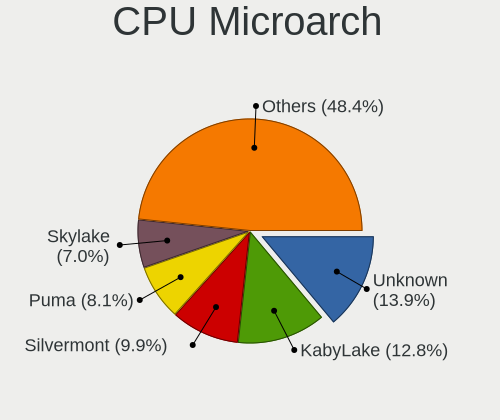

| Name          | Computers | Percent |
|---------------|-----------|---------|
| Unknown       | 38        | 13.92%  |
| KabyLake      | 35        | 12.82%  |
| Silvermont    | 27        | 9.89%   |
| Puma          | 22        | 8.06%   |
| Skylake       | 19        | 6.96%   |
| Goldmont      | 19        | 6.96%   |
| Haswell       | 18        | 6.59%   |
| Goldmont plus | 17        | 6.23%   |
| IvyBridge     | 12        | 4.4%    |
| SandyBridge   | 9         | 3.3%    |
| Westmere      | 8         | 2.93%   |
| Broadwell     | 8         | 2.93%   |
| Zen           | 6         | 2.2%    |
| Penryn        | 5         | 1.83%   |
| Jaguar        | 4         | 1.47%   |
| TigerLake     | 3         | 1.1%    |
| Excavator     | 3         | 1.1%    |
| CometLake     | 3         | 1.1%    |
| Bobcat        | 3         | 1.1%    |
| Zen 3         | 2         | 0.73%   |
| Zen 2         | 2         | 0.73%   |
| IceLake       | 2         | 0.73%   |
| Core          | 2         | 0.73%   |
| Bonnell       | 2         | 0.73%   |
| Zen+          | 1         | 0.37%   |
| NetBurst      | 1         | 0.37%   |
| Nehalem       | 1         | 0.37%   |
| K10           | 1         | 0.37%   |

Graphics
--------

GPU Vendor
----------

Vendors of graphics cards

| Vendor                     | Computers | Percent |
|----------------------------|-----------|---------|
| Intel                      | 185       | 74.6%   |
| AMD                        | 25        | 10.08%  |
| ASPEED Technology          | 20        | 8.06%   |
| Nvidia                     | 12        | 4.84%   |
| Matrox Electronics Systems | 5         | 2.02%   |
| Huawei Technologies        | 1         | 0.4%    |

GPU Model
---------

Graphics card models

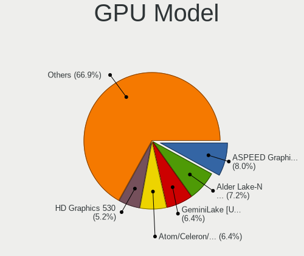

| Model                                                                                    | Computers | Percent |
|------------------------------------------------------------------------------------------|-----------|---------|
| ASPEED Technology ASPEED Graphics Family                                                 | 20        | 7.97%   |
| Intel Alder Lake-N [UHD Graphics]                                                        | 18        | 7.17%   |
| Intel GeminiLake [UHD Graphics 600]                                                      | 16        | 6.37%   |
| Intel Atom/Celeron/Pentium Processor x5-E8000/J3xxx/N3xxx Integrated Graphics Controller | 16        | 6.37%   |
| Intel HD Graphics 530                                                                    | 13        | 5.18%   |
| Intel HD Graphics 500                                                                    | 12        | 4.78%   |
| Intel Atom Processor Z36xxx/Z37xxx Series Graphics & Display                             | 8         | 3.19%   |
| Intel JasperLake [UHD Graphics]                                                          | 7         | 2.79%   |
| Intel 2nd Generation Core Processor Family Integrated Graphics Controller                | 7         | 2.79%   |
| AMD ES1000                                                                               | 7         | 2.79%   |
| Intel Xeon E3-1200 v3/4th Gen Core Processor Integrated Graphics Controller              | 6         | 2.39%   |
| Intel WhiskeyLake-U GT2 [UHD Graphics 620]                                               | 6         | 2.39%   |
| Intel CometLake-U GT2 [UHD Graphics]                                                     | 6         | 2.39%   |
| Intel HD Graphics 620                                                                    | 5         | 1.99%   |
| Intel Haswell-ULT Integrated Graphics Controller                                         | 5         | 1.99%   |
| Intel 3rd Gen Core processor Graphics Controller                                         | 5         | 1.99%   |
| Intel CoffeeLake-S GT2 [UHD Graphics 630]                                                | 4         | 1.59%   |
| Intel Xeon E3-1200 v2/3rd Gen Core processor Graphics Controller                         | 3         | 1.2%    |
| Intel UHD Graphics 620                                                                   | 3         | 1.2%    |
| Intel TigerLake-LP GT2 [Iris Xe Graphics]                                                | 3         | 1.2%    |
| Intel HD Graphics 630                                                                    | 3         | 1.2%    |
| Intel Core Processor Integrated Graphics Controller                                      | 3         | 1.2%    |
| Intel 4th Generation Core Processor Family Integrated Graphics Controller                | 3         | 1.2%    |
| AMD Raven Ridge [Radeon Vega Series / Radeon Vega Mobile Series]                         | 3         | 1.2%    |
| AMD Lucienne                                                                             | 3         | 1.2%    |
| Matrox Electronics Systems MGA G200eW WPCM450                                            | 2         | 0.8%    |
| Matrox Electronics Systems MGA G200EH                                                    | 2         | 0.8%    |
| Intel Mobile 4 Series Chipset Integrated Graphics Controller                             | 2         | 0.8%    |
| Intel IvyBridge GT2 [HD Graphics 4000]                                                   | 2         | 0.8%    |
| Intel Iris Plus Graphics G1 (Ice Lake)                                                   | 2         | 0.8%    |
| Intel HD Graphics 5500                                                                   | 2         | 0.8%    |
| Intel HD Graphics 510                                                                    | 2         | 0.8%    |
| Intel Elkhart Lake [UHD Graphics Gen11 16EU]                                             | 2         | 0.8%    |
| Intel Apollo Lake [HD Graphics 505]                                                      | 2         | 0.8%    |
| Intel Alder Lake-P GT2 [Iris Xe Graphics]                                                | 2         | 0.8%    |
| AMD Wani [Radeon R5/R6/R7 Graphics]                                                      | 2         | 0.8%    |
| AMD Kabini [Radeon HD 8280E]                                                             | 2         | 0.8%    |
| Nvidia TU117 [GeForce GTX 1630]                                                          | 1         | 0.4%    |
| Nvidia TU104 [GeForce RTX 2060]                                                          | 1         | 0.4%    |
| Nvidia NV28 [GeForce4 Ti 4200 AGP 8x]                                                    | 1         | 0.4%    |

GPU Combo
---------

Combinations of graphics cards

| Name                         | Computers | Percent |
|------------------------------|-----------|---------|
| 1 x Intel                    | 177       | 64.84%  |
| Other                        | 31        | 11.36%  |
| 1 x AMD                      | 24        | 8.79%   |
| 1 x ASPEED                   | 17        | 6.23%   |
| 1 x Nvidia                   | 9         | 3.3%    |
| 1 x Matrox                   | 5         | 1.83%   |
| 2 x Intel                    | 4         | 1.47%   |
| Intel + ASPEED               | 2         | 0.73%   |
| Nvidia + Huawei Technologies | 1         | 0.37%   |
| Nvidia + ASPEED              | 1         | 0.37%   |
| Intel + Nvidia               | 1         | 0.37%   |
| Intel + AMD                  | 1         | 0.37%   |

GPU Driver
----------

Free vs proprietary

| Driver      | Computers | Percent |
|-------------|-----------|---------|
| Free        | 235       | 86.08%  |
| Unknown     | 31        | 11.36%  |
| Proprietary | 7         | 2.56%   |

GPU Memory
----------

Total video memory

| Size in GB | Computers | Percent |
|------------|-----------|---------|
| Unknown    | 262       | 95.27%  |
| 7.01-8.0   | 3         | 1.09%   |
| 3.01-4.0   | 3         | 1.09%   |
| 0.51-1.0   | 3         | 1.09%   |
| 1.01-2.0   | 2         | 0.73%   |
| 0.01-0.5   | 2         | 0.73%   |

Monitor
-------

Monitor Vendor
--------------

Monitor vendors

| Vendor              | Computers | Percent |
|---------------------|-----------|---------|
| Samsung Electronics | 5         | 12.5%   |
| Lenovo              | 5         | 12.5%   |
| AU Optronics        | 5         | 12.5%   |
| Dell                | 4         | 10%     |
| Philips             | 3         | 7.5%    |
| LG Display          | 3         | 7.5%    |
| Chimei Innolux      | 3         | 7.5%    |
| BOE                 | 3         | 7.5%    |
| BenQ                | 2         | 5%      |
| Unknown             | 1         | 2.5%    |
| PANDA               | 1         | 2.5%    |
| Medion              | 1         | 2.5%    |
| InfoVision          | 1         | 2.5%    |
| DENON               | 1         | 2.5%    |
| ASUSTek Computer    | 1         | 2.5%    |
| Apple               | 1         | 2.5%    |

Monitor Model
-------------

Monitor models

| Model                                                                | Computers | Percent |
|----------------------------------------------------------------------|-----------|---------|
| Samsung Electronics C34J79x SAM0F1E 3440x1440 800x330mm 34.1-inch    | 2         | 4.76%   |
| Philips PHL 273V7 PHLC156 1920x1080 600x340mm 27.2-inch              | 2         | 4.76%   |
| LG Display LCD Monitor LGD064C 1920x1080 340x190mm 15.3-inch         | 2         | 4.76%   |
| AU Optronics LCD Monitor AUO2036 2560x1440 310x170mm 13.9-inch       | 2         | 4.76%   |
| Unknown LCD Monitor Sharp 3840x2160                                  | 1         | 2.38%   |
| Samsung Electronics U32R59x SAM0F96 3840x2160 700x390mm 31.5-inch    | 1         | 2.38%   |
| Samsung Electronics SyncMaster SAM021E 1680x1050 430x270mm 20.0-inch | 1         | 2.38%   |
| Samsung Electronics CJG9S SAM9596 3840x1080                          | 1         | 2.38%   |
| Samsung Electronics C27F390 SAM0D32 1920x1080 600x340mm 27.2-inch    | 1         | 2.38%   |
| Philips PHL BDM4037U PHLC142 3840x2160 890x500mm 40.2-inch           | 1         | 2.38%   |
| PANDA LM116LF3L02 NCP000A 1920x1080 260x150mm 11.8-inch              | 1         | 2.38%   |
| Medion MD22321 MEA8302 1920x1080 700x390mm 31.5-inch                 | 1         | 2.38%   |
| LG Display LCD Monitor LGD0353 1366x768 350x190mm 15.7-inch          | 1         | 2.38%   |
| Lenovo P24h-10 LEN61AE 2560x1440 530x300mm 24.0-inch                 | 1         | 2.38%   |
| Lenovo LCD Monitor LEN40B0 1366x768 340x190mm 15.3-inch              | 1         | 2.38%   |
| Lenovo LCD Monitor LEN4043 1400x1050 300x230mm 14.9-inch             | 1         | 2.38%   |
| Lenovo LCD Monitor LEN4036 1440x900 300x190mm 14.0-inch              | 1         | 2.38%   |
| Lenovo LCD Monitor LEN4033 1440x900 300x190mm 14.0-inch              | 1         | 2.38%   |
| InfoVision LCD Monitor IVO057D 1920x1080 310x170mm 13.9-inch         | 1         | 2.38%   |
| DENON AVR DON004B 1920x1080 1330x750mm 60.1-inch                     | 1         | 2.38%   |
| Dell U2715H DELD069 2560x1440 600x340mm 27.2-inch                    | 1         | 2.38%   |
| Dell U2715H DELD066 2560x1440 600x340mm 27.2-inch                    | 1         | 2.38%   |
| Dell P2719H DEL4185 1920x1080 600x340mm 27.2-inch                    | 1         | 2.38%   |
| Dell P2210 DEL404E 1680x1050 470x300mm 22.0-inch                     | 1         | 2.38%   |
| Dell 2001FP DELA007 1600x1200 410x310mm 20.2-inch                    | 1         | 2.38%   |
| Chimei Innolux LCD Monitor CMN14C9 1920x1080 310x170mm 13.9-inch     | 1         | 2.38%   |
| Chimei Innolux LCD Monitor CMN1484 1600x900 310x170mm 13.9-inch      | 1         | 2.38%   |
| Chimei Innolux LCD Monitor CMN1132 1366x768 260x140mm 11.6-inch      | 1         | 2.38%   |
| BOE LCD Monitor BOE08D7 1920x1080 310x170mm 13.9-inch                | 1         | 2.38%   |
| BOE LCD Monitor BOE0791 1920x1080 310x170mm 13.9-inch                | 1         | 2.38%   |
| BOE LCD Monitor BOE0714 1920x1080 310x170mm 13.9-inch                | 1         | 2.38%   |
| BenQ GW2765 BNQ78D6 2560x1440 600x340mm 27.2-inch                    | 1         | 2.38%   |
| BenQ BL2405 BNQ8016 1920x1080 530x300mm 24.0-inch                    | 1         | 2.38%   |
| AU Optronics LCD Monitor AUO408D 1920x1080 310x170mm 13.9-inch       | 1         | 2.38%   |
| AU Optronics LCD Monitor AUO133D 1920x1080 310x170mm 13.9-inch       | 1         | 2.38%   |
| AU Optronics LCD Monitor 1920x1080                                   | 1         | 2.38%   |
| ASUSTek Computer VL278 AUS27C2 1920x1080 600x340mm 27.2-inch         | 1         | 2.38%   |
| Apple iMac APPA007 2560x1440 600x340mm 27.2-inch                     | 1         | 2.38%   |

Monitor Resolution
------------------

Monitor screen resolution

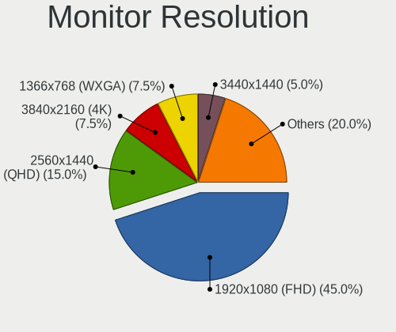

| Resolution         | Computers | Percent |
|--------------------|-----------|---------|
| 1920x1080 (FHD)    | 18        | 45%     |
| 2560x1440 (QHD)    | 6         | 15%     |
| 3840x2160 (4K)     | 3         | 7.5%    |
| 1366x768 (WXGA)    | 3         | 7.5%    |
| 3440x1440          | 2         | 5%      |
| 1680x1050 (WSXGA+) | 2         | 5%      |
| 1440x900 (WXGA+)   | 2         | 5%      |
| 3840x1080          | 1         | 2.5%    |
| 1600x900 (HD+)     | 1         | 2.5%    |
| 1600x1200          | 1         | 2.5%    |
| 1400x1050          | 1         | 2.5%    |

Monitor Diagonal
----------------

Diagonal size in inches

| Inches  | Computers | Percent |
|---------|-----------|---------|
| 13      | 10        | 24.39%  |
| 27      | 8         | 19.51%  |
| 15      | 4         | 9.76%   |
| 14      | 3         | 7.32%   |
| Unknown | 3         | 7.32%   |
| 34      | 2         | 4.88%   |
| 31      | 2         | 4.88%   |
| 24      | 2         | 4.88%   |
| 20      | 2         | 4.88%   |
| 11      | 2         | 4.88%   |
| 60      | 1         | 2.44%   |
| 40      | 1         | 2.44%   |
| 22      | 1         | 2.44%   |

Monitor Width
-------------

Physical width

| Width in mm | Computers | Percent |
|-------------|-----------|---------|
| 301-350     | 14        | 34.15%  |
| 501-600     | 10        | 24.39%  |
| 201-300     | 5         | 12.2%   |
| 401-500     | 3         | 7.32%   |
| Unknown     | 3         | 7.32%   |
| 701-800     | 2         | 4.88%   |
| 601-700     | 2         | 4.88%   |
| 801-900     | 1         | 2.44%   |
| 1001-1500   | 1         | 2.44%   |

Aspect Ratio
------------

Proportional relationship between the width and the height

| Ratio   | Computers | Percent |
|---------|-----------|---------|
| 16/9    | 26        | 70.27%  |
| 16/10   | 4         | 10.81%  |
| 4/3     | 2         | 5.41%   |
| 21/9    | 2         | 5.41%   |
| Unknown | 2         | 5.41%   |
| 32/9    | 1         | 2.7%    |

Monitor Area
------------

Area in inch

| Area in inch | Computers | Percent |
|----------------|-----------|---------|
| 81-90          | 12        | 29.27%  |
| 301-350        | 8         | 19.51%  |
| 351-500        | 4         | 9.76%   |
| 201-250        | 3         | 7.32%   |
| 91-100         | 3         | 7.32%   |
| Unknown        | 3         | 7.32%   |
| 51-60          | 2         | 4.88%   |
| 151-200        | 2         | 4.88%   |
| 101-110        | 2         | 4.88%   |
| More than 1000 | 1         | 2.44%   |
| 501-1000       | 1         | 2.44%   |

Pixel Density
-------------

Pixels per inch

| Density | Computers | Percent |
|---------|-----------|---------|
| 121-160 | 14        | 35%     |
| 51-100  | 11        | 27.5%   |
| 101-120 | 8         | 20%     |
| 161-240 | 3         | 7.5%    |
| Unknown | 3         | 7.5%    |
| 1-50    | 1         | 2.5%    |

Multiple Monitors
-----------------

Total monitors connected

| Total | Computers | Percent |
|-------|-----------|---------|
| 0     | 236       | 85.82%  |
| 1     | 31        | 11.27%  |
| 2     | 8         | 2.91%   |

Network
-------

Net Controller Vendor
---------------------

Controller vendors

| Vendor                | Computers | Percent |
|-----------------------|-----------|---------|
| Intel                 | 223       | 63.71%  |
| Realtek Semiconductor | 79        | 22.57%  |
| Broadcom              | 14        | 4%      |
| Qualcomm Atheros      | 9         | 2.57%   |
| TP-Link               | 4         | 1.14%   |
| LG Electronics        | 3         | 0.86%   |
| Edimax Technology     | 3         | 0.86%   |
| Mellanox Technologies | 2         | 0.57%   |
| AMD                   | 2         | 0.57%   |
| Seeed Technology      | 1         | 0.29%   |
| Samsung Electronics   | 1         | 0.29%   |
| QLogic                | 1         | 0.29%   |
| MediaTek              | 1         | 0.29%   |
| Hewlett-Packard       | 1         | 0.29%   |
| Google                | 1         | 0.29%   |
| Dresden Elektronik    | 1         | 0.29%   |
| Dell                  | 1         | 0.29%   |
| Davicom Semiconductor | 1         | 0.29%   |
| AVM                   | 1         | 0.29%   |
| Arduino SA            | 1         | 0.29%   |

Net Controller Model
--------------------

Controller models

| Model                                                                         | Computers | Percent |
|-------------------------------------------------------------------------------|-----------|---------|
| Realtek RTL8111/8168/8211/8411 PCI Express Gigabit Ethernet Controller        | 68        | 15.08%  |
| Intel I211 Gigabit Network Connection                                         | 50        | 11.09%  |
| Intel I210 Gigabit Network Connection                                         | 37        | 8.2%    |
| Intel Ethernet Controller I226-V                                              | 24        | 5.32%   |
| Intel Ethernet Controller I225-V                                              | 16        | 3.55%   |
| Intel I350 Gigabit Network Connection                                         | 13        | 2.88%   |
| Intel 82599ES 10-Gigabit SFI/SFP+ Network Connection                          | 13        | 2.88%   |
| Intel 82579LM Gigabit Network Connection (Lewisville)                         | 10        | 2.22%   |
| Intel Wireless 7265                                                           | 8         | 1.77%   |
| Intel Ethernet Connection (2) I219-LM                                         | 8         | 1.77%   |
| Intel I210 Gigabit Fiber Network Connection                                   | 7         | 1.55%   |
| Broadcom NetXtreme II BCM5709 Gigabit Ethernet                                | 6         | 1.33%   |
| Realtek RTL8125 2.5GbE Controller                                             | 5         | 1.11%   |
| Intel Wireless 7260                                                           | 5         | 1.11%   |
| Intel Wireless 3165                                                           | 5         | 1.11%   |
| Intel Wi-Fi 6 AX200                                                           | 5         | 1.11%   |
| Intel Ethernet Connection X553 1GbE                                           | 5         | 1.11%   |
| Intel 82576 Gigabit Network Connection                                        | 5         | 1.11%   |
| Intel 82574L Gigabit Network Connection                                       | 5         | 1.11%   |
| Intel Wireless 8265 / 8275                                                    | 4         | 0.89%   |
| Intel Ethernet Connection (6) I219-LM                                         | 4         | 0.89%   |
| Intel Ethernet Connection (2) I219-V                                          | 4         | 0.89%   |
| TP-Link Archer T3U [Realtek RTL8812BU]                                        | 3         | 0.67%   |
| Qualcomm Atheros AR93xx Wireless Network Adapter                              | 3         | 0.67%   |
| LG Optimus Android Phone [USB tethering mode]                                 | 3         | 0.67%   |
| Intel Wireless 3160                                                           | 3         | 0.67%   |
| Intel Ethernet Connection I354                                                | 3         | 0.67%   |
| Intel Ethernet Connection I217-V                                              | 3         | 0.67%   |
| Intel Centrino Ultimate-N 6300                                                | 3         | 0.67%   |
| Intel Centrino Advanced-N 6235                                                | 3         | 0.67%   |
| Intel Cannon Point-LP CNVi [Wireless-AC]                                      | 3         | 0.67%   |
| Intel 82577LM Gigabit Network Connection                                      | 3         | 0.67%   |
| Intel 82571EB/82571GB Gigabit Ethernet Controller D0/D1 (copper applications) | 3         | 0.67%   |
| Edimax EW-7811Un 802.11n Wireless Adapter [Realtek RTL8188CUS]                | 3         | 0.67%   |
| Realtek RTL8852AE 802.11ax PCIe Wireless Network Adapter                      | 2         | 0.44%   |
| Realtek RTL8821CE 802.11ac PCIe Wireless Network Adapter                      | 2         | 0.44%   |
| Realtek RTL8188EUS 802.11n Wireless Network Adapter                           | 2         | 0.44%   |
| Realtek RTL8111/8168/8411 PCI Express Gigabit Ethernet Controller             | 2         | 0.44%   |
| Qualcomm Atheros QCA9377 802.11ac Wireless Network Adapter                    | 2         | 0.44%   |
| Intel Wi-Fi 5(802.11ac) Wireless-AC 9x6x [Thunder Peak]                       | 2         | 0.44%   |

Wireless Vendor
---------------

Wireless vendors

| Vendor                | Computers | Percent |
|-----------------------|-----------|---------|
| Intel                 | 56        | 65.12%  |
| Realtek Semiconductor | 12        | 13.95%  |
| Qualcomm Atheros      | 8         | 9.3%    |
| TP-Link               | 4         | 4.65%   |
| Edimax Technology     | 3         | 3.49%   |
| MediaTek              | 1         | 1.16%   |
| Dell                  | 1         | 1.16%   |
| Broadcom              | 1         | 1.16%   |

Wireless Model
--------------

Wireless models

| Model                                                           | Computers | Percent |
|-----------------------------------------------------------------|-----------|---------|
| Intel Wireless 7265                                             | 8         | 9.2%    |
| Intel Wireless 7260                                             | 5         | 5.75%   |
| Intel Wireless 3165                                             | 5         | 5.75%   |
| Intel Wi-Fi 6 AX200                                             | 5         | 5.75%   |
| Intel Wireless 8265 / 8275                                      | 4         | 4.6%    |
| TP-Link Archer T3U [Realtek RTL8812BU]                          | 3         | 3.45%   |
| Qualcomm Atheros AR93xx Wireless Network Adapter                | 3         | 3.45%   |
| Intel Wireless 3160                                             | 3         | 3.45%   |
| Intel Centrino Advanced-N 6235                                  | 3         | 3.45%   |
| Intel Cannon Point-LP CNVi [Wireless-AC]                        | 3         | 3.45%   |
| Edimax EW-7811Un 802.11n Wireless Adapter [Realtek RTL8188CUS]  | 3         | 3.45%   |
| Realtek RTL8852AE 802.11ax PCIe Wireless Network Adapter        | 2         | 2.3%    |
| Realtek RTL8821CE 802.11ac PCIe Wireless Network Adapter        | 2         | 2.3%    |
| Realtek RTL8188EUS 802.11n Wireless Network Adapter             | 2         | 2.3%    |
| Qualcomm Atheros QCA9377 802.11ac Wireless Network Adapter      | 2         | 2.3%    |
| Intel Wi-Fi 5(802.11ac) Wireless-AC 9x6x [Thunder Peak]         | 2         | 2.3%    |
| Intel Gemini Lake PCH CNVi WiFi                                 | 2         | 2.3%    |
| Intel Comet Lake PCH-LP CNVi WiFi                               | 2         | 2.3%    |
| Intel Centrino Ultimate-N 6300                                  | 2         | 2.3%    |
| TP-Link 802.11ac WLAN Adapter 802.11ac WLAN Adapter             | 1         | 1.15%   |
| Realtek RTL8822CE 802.11ac PCIe Wireless Network Adapter        | 1         | 1.15%   |
| Realtek RTL8821AE 802.11ac PCIe Wireless Network Adapter        | 1         | 1.15%   |
| Realtek RTL8192EE PCIe Wireless Network Adapter                 | 1         | 1.15%   |
| Realtek RTL8192CU 802.11n WLAN Adapter                          | 1         | 1.15%   |
| Realtek RTL8188EE Wireless Network Adapter                      | 1         | 1.15%   |
| Realtek RTL8188CUS 802.11n WLAN Adapter                         | 1         | 1.15%   |
| Realtek RTL8188CE 802.11b/g/n WiFi Adapter                      | 1         | 1.15%   |
| Qualcomm Atheros QCA986x/988x 802.11ac Wireless Network Adapter | 1         | 1.15%   |
| Qualcomm Atheros AR9462 Wireless Network Adapter                | 1         | 1.15%   |
| Qualcomm Atheros AR928X Wireless Network Adapter (PCI-Express)  | 1         | 1.15%   |
| MediaTek MT7921K (RZ608) Wi-Fi 6E 80MHz                         | 1         | 1.15%   |
| Intel Wireless 8260                                             | 1         | 1.15%   |
| Intel WiFi Link 5100                                            | 1         | 1.15%   |
| Intel Wi-Fi 6 AX201                                             | 1         | 1.15%   |
| Intel Ultimate N WiFi Link 5300                                 | 1         | 1.15%   |
| Intel PRO/Wireless 3945ABG [Golan] Network Connection           | 1         | 1.15%   |
| Intel Ice Lake-LP PCH CNVi WiFi                                 | 1         | 1.15%   |
| Intel Dual Band Wireless-AC 3165 Plus Bluetooth                 | 1         | 1.15%   |
| Intel CNVi: Wi-Fi                                               | 1         | 1.15%   |
| Intel Centrino Wireless-N 2230                                  | 1         | 1.15%   |

Ethernet Vendor
---------------

Ethernet vendors

| Vendor                | Computers | Percent |
|-----------------------|-----------|---------|
| Intel                 | 196       | 67.82%  |
| Realtek Semiconductor | 73        | 25.26%  |
| Broadcom              | 14        | 4.84%   |
| AMD                   | 2         | 0.69%   |
| Samsung Electronics   | 1         | 0.35%   |
| Qualcomm Atheros      | 1         | 0.35%   |
| QLogic                | 1         | 0.35%   |
| Davicom Semiconductor | 1         | 0.35%   |

Ethernet Model
--------------

Ethernet models

| Model                                                                         | Computers | Percent |
|-------------------------------------------------------------------------------|-----------|---------|
| Realtek RTL8111/8168/8211/8411 PCI Express Gigabit Ethernet Controller        | 68        | 19.37%  |
| Intel I211 Gigabit Network Connection                                         | 50        | 14.25%  |
| Intel I210 Gigabit Network Connection                                         | 37        | 10.54%  |
| Intel Ethernet Controller I226-V                                              | 24        | 6.84%   |
| Intel Ethernet Controller I225-V                                              | 16        | 4.56%   |
| Intel I350 Gigabit Network Connection                                         | 13        | 3.7%    |
| Intel 82599ES 10-Gigabit SFI/SFP+ Network Connection                          | 13        | 3.7%    |
| Intel 82579LM Gigabit Network Connection (Lewisville)                         | 10        | 2.85%   |
| Intel Ethernet Connection (2) I219-LM                                         | 8         | 2.28%   |
| Intel I210 Gigabit Fiber Network Connection                                   | 7         | 1.99%   |
| Broadcom NetXtreme II BCM5709 Gigabit Ethernet                                | 6         | 1.71%   |
| Realtek RTL8125 2.5GbE Controller                                             | 5         | 1.42%   |
| Intel Ethernet Connection X553 1GbE                                           | 5         | 1.42%   |
| Intel 82576 Gigabit Network Connection                                        | 5         | 1.42%   |
| Intel 82574L Gigabit Network Connection                                       | 5         | 1.42%   |
| Intel Ethernet Connection (6) I219-LM                                         | 4         | 1.14%   |
| Intel Ethernet Connection (2) I219-V                                          | 4         | 1.14%   |
| Intel Ethernet Connection I354                                                | 3         | 0.85%   |
| Intel Ethernet Connection I217-V                                              | 3         | 0.85%   |
| Intel 82577LM Gigabit Network Connection                                      | 3         | 0.85%   |
| Intel 82571EB/82571GB Gigabit Ethernet Controller D0/D1 (copper applications) | 3         | 0.85%   |
| Realtek RTL8111/8168/8411 PCI Express Gigabit Ethernet Controller             | 2         | 0.57%   |
| Intel Ethernet Connection X722 for 10GbE SFP+                                 | 2         | 0.57%   |
| Intel Ethernet Connection X722 for 10GBASE-T                                  | 2         | 0.57%   |
| Intel Ethernet Connection I217-LM                                             | 2         | 0.57%   |
| Intel Ethernet Connection (7) I219-V                                          | 2         | 0.57%   |
| Intel Ethernet Connection (7) I219-LM                                         | 2         | 0.57%   |
| Intel Ethernet Connection (17) I219-V                                         | 2         | 0.57%   |
| Intel Ethernet Connection (14) I219-V                                         | 2         | 0.57%   |
| Intel 82583V Gigabit Network Connection                                       | 2         | 0.57%   |
| Intel 82580 Gigabit Network Connection                                        | 2         | 0.57%   |
| Intel 82575EB Gigabit Network Connection                                      | 2         | 0.57%   |
| Intel 82567LM Gigabit Network Connection                                      | 2         | 0.57%   |
| AMD XGMAC 10GbE Controller                                                    | 2         | 0.57%   |
| Samsung Galaxy series, misc. (tethering mode)                                 | 1         | 0.28%   |
| Realtek USB 2.5GbE Controller                                                 | 1         | 0.28%   |
| Realtek RTL8169 PCI Gigabit Ethernet Controller                               | 1         | 0.28%   |
| Realtek RTL810xE PCI Express Fast Ethernet controller                         | 1         | 0.28%   |
| Realtek RTL-8100/8101L/8139 PCI Fast Ethernet Adapter                         | 1         | 0.28%   |
| Qualcomm Atheros AR8151 v2.0 Gigabit Ethernet                                 | 1         | 0.28%   |

Net Controller Kind
-------------------

Ethernet, WiFi or modem

| Kind     | Computers | Percent |
|----------|-----------|---------|
| Ethernet | 264       | 73.54%  |
| WiFi     | 82        | 22.84%  |
| Modem    | 7         | 1.95%   |
| Unknown  | 6         | 1.67%   |

Used Controller
---------------

Currently used network controller

| Kind     | Computers | Percent |
|----------|-----------|---------|
| Ethernet | 255       | 91.07%  |
| WiFi     | 24        | 8.57%   |
| Modem    | 1         | 0.36%   |

NICs
----

Total network controllers on board

| Total | Computers | Percent |
|-------|-----------|---------|
| 4     | 68        | 24.82%  |
| 2     | 65        | 23.72%  |
| 3     | 56        | 20.44%  |
| 6     | 26        | 9.49%   |
| 1     | 26        | 9.49%   |
| 8     | 10        | 3.65%   |
| 5     | 10        | 3.65%   |
| 12    | 3         | 1.09%   |
| 9     | 3         | 1.09%   |
| 7     | 3         | 1.09%   |
| 0     | 3         | 1.09%   |
| 10    | 1         | 0.36%   |

IPv6
----

IPv6 vs IPv4

| Used | Computers | Percent |
|------|-----------|---------|
| No   | 259       | 92.83%  |
| Yes  | 20        | 7.17%   |

Bluetooth
---------

Bluetooth Vendor
----------------

Controller vendors

| Vendor                | Computers | Percent |
|-----------------------|-----------|---------|
| Intel                 | 43        | 72.88%  |
| Realtek Semiconductor | 5         | 8.47%   |
| Broadcom              | 4         | 6.78%   |
| IMC Networks          | 3         | 5.08%   |
| MediaTek              | 1         | 1.69%   |
| Lite-On Technology    | 1         | 1.69%   |
| Apple                 | 1         | 1.69%   |
| Alps Electric         | 1         | 1.69%   |

Bluetooth Model
---------------

Controller models

| Model                                            | Computers | Percent |
|--------------------------------------------------|-----------|---------|
| Intel Bluetooth wireless interface               | 21        | 35.59%  |
| Intel Bluetooth 9460/9560 Jefferson Peak (JfP)   | 5         | 8.47%   |
| Intel AX201 Bluetooth                            | 5         | 8.47%   |
| Intel AX200 Bluetooth                            | 5         | 8.47%   |
| Intel Centrino Bluetooth Wireless Transceiver    | 4         | 6.78%   |
| Realtek Bluetooth Adapter                        | 3         | 5.08%   |
| Broadcom BCM2045B (BDC-2.1)                      | 3         | 5.08%   |
| Intel Wireless-AC 9260 Bluetooth Adapter         | 2         | 3.39%   |
| IMC Networks Realtek Bluetooth Adapter           | 2         | 3.39%   |
| Realtek RTL8821A Bluetooth                       | 1         | 1.69%   |
| Realtek Bluetooth 5.1 Adapter                    | 1         | 1.69%   |
| MediaTek RZ608 Bluetooth Adapter                 | 1         | 1.69%   |
| Lite-On Atheros AR3012 Bluetooth                 | 1         | 1.69%   |
| Intel Centrino Advanced-N 6230 Bluetooth adapter | 1         | 1.69%   |
| IMC Networks Qualcomm Atheros Bluetooth 4.1      | 1         | 1.69%   |
| Broadcom BCM2035 Bluetooth dongle                | 1         | 1.69%   |
| Apple Built-in Bluetooth 2.0+EDR HCI             | 1         | 1.69%   |
| Alps Electric UGTZ4 Bluetooth                    | 1         | 1.69%   |

Sound
-----

Sound Vendor
------------

Sound card vendors

| Vendor                                       | Computers | Percent |
|----------------------------------------------|-----------|---------|
| Intel                                        | 166       | 79.05%  |
| AMD                                          | 22        | 10.48%  |
| Nvidia                                       | 8         | 3.81%   |
| Plantronics                                  | 4         | 1.9%    |
| Zoran Co. Personal Media Division (Nogatech) | 1         | 0.48%   |
| Walmart                                      | 1         | 0.48%   |
| Texas Instruments                            | 1         | 0.48%   |
| Sony                                         | 1         | 0.48%   |
| RODE Microphones                             | 1         | 0.48%   |
| ROCCAT                                       | 1         | 0.48%   |
| Lenovo                                       | 1         | 0.48%   |
| GN Netcom                                    | 1         | 0.48%   |
| Creative Labs                                | 1         | 0.48%   |
| Apple                                        | 1         | 0.48%   |

Sound Model
-----------

Sound card models

| Model                                                                                             | Computers | Percent |
|---------------------------------------------------------------------------------------------------|-----------|---------|
| Intel Alder Lake-N PCH High Definition Audio Controller                                           | 18        | 7.41%   |
| Intel Celeron/Pentium Silver Processor High Definition Audio                                      | 17        | 7%      |
| Intel Atom/Celeron/Pentium Processor x5-E8000/J3xxx/N3xxx Series High Definition Audio Controller | 15        | 6.17%   |
| Intel 100 Series/C230 Series Chipset Family HD Audio Controller                                   | 14        | 5.76%   |
| Intel Celeron N3350/Pentium N4200/Atom E3900 Series Audio Cluster                                 | 11        | 4.53%   |
| AMD Family 17h/19h/1ah HD Audio Controller                                                        | 10        | 4.12%   |
| Intel Sunrise Point-LP HD Audio                                                                   | 8         | 3.29%   |
| Intel 8 Series/C220 Series Chipset High Definition Audio Controller                               | 8         | 3.29%   |
| Intel Xeon E3-1200 v3/4th Gen Core Processor HD Audio Controller                                  | 7         | 2.88%   |
| Intel Jasper Lake HD Audio                                                                        | 7         | 2.88%   |
| Intel Cannon Point-LP High Definition Audio Controller                                            | 7         | 2.88%   |
| Intel 7 Series/C216 Chipset Family High Definition Audio Controller                               | 7         | 2.88%   |
| Intel Comet Lake PCH-LP cAVS                                                                      | 6         | 2.47%   |
| Intel 6 Series/C200 Series Chipset Family High Definition Audio Controller                        | 6         | 2.47%   |
| AMD Kabini HDMI/DP Audio                                                                          | 6         | 2.47%   |
| Intel Haswell-ULT HD Audio Controller                                                             | 5         | 2.06%   |
| Intel Cannon Lake PCH cAVS                                                                        | 5         | 2.06%   |
| Intel 8 Series HD Audio Controller                                                                | 5         | 2.06%   |
| AMD FCH Azalia Controller                                                                         | 5         | 2.06%   |
| Plantronics Plantronics Blackwire 315.1                                                           | 4         | 1.65%   |
| Intel Wildcat Point-LP High Definition Audio Controller                                           | 4         | 1.65%   |
| Intel Atom Processor Z36xxx/Z37xxx Series High Definition Audio Controller                        | 4         | 1.65%   |
| AMD Renoir Radeon High Definition Audio Controller                                                | 4         | 1.65%   |
| AMD Raven/Raven2/Fenghuang HDMI/DP Audio Controller                                               | 4         | 1.65%   |
| Nvidia GP107GL High Definition Audio Controller                                                   | 3         | 1.23%   |
| Intel Tiger Lake-LP Smart Sound Technology Audio Controller                                       | 3         | 1.23%   |
| Intel NM10/ICH7 Family High Definition Audio Controller                                           | 3         | 1.23%   |
| Intel Broadwell-U Audio Controller                                                                | 3         | 1.23%   |
| Intel 5 Series/3400 Series Chipset High Definition Audio                                          | 3         | 1.23%   |
| AMD Starship/Matisse HD Audio Controller                                                          | 3         | 1.23%   |
| Intel Smart Sound Technology (SST) Audio Controller                                               | 2         | 0.82%   |
| Intel Ice Lake-LP Smart Sound Technology Audio Controller                                         | 2         | 0.82%   |
| Intel Elkhart Lake High Density Audio bus interface                                               | 2         | 0.82%   |
| Intel Alder Lake-S HD Audio Controller                                                            | 2         | 0.82%   |
| Intel Alder Lake PCH-P High Definition Audio Controller                                           | 2         | 0.82%   |
| Intel 82801I (ICH9 Family) HD Audio Controller                                                    | 2         | 0.82%   |
| Intel 200 Series PCH HD Audio                                                                     | 2         | 0.82%   |
| AMD Family 15h (Models 60h-6fh) Audio Controller                                                  | 2         | 0.82%   |
| Zoran Co. Personal Media Division (Nogatech) USB Audio and HID                                    | 1         | 0.41%   |
| Walmart AB13X Headset Adapter                                                                     | 1         | 0.41%   |

Memory
------

Memory Vendor
-------------

Memory module vendors

| Vendor              | Computers | Percent |
|---------------------|-----------|---------|
| Samsung Electronics | 38        | 14.39%  |
| Crucial             | 38        | 14.39%  |
| Unknown             | 30        | 11.36%  |
| Kingston            | 30        | 11.36%  |
| SK hynix            | 26        | 9.85%   |
| Micron Technology   | 22        | 8.33%   |
| Corsair             | 16        | 6.06%   |
| Unknown (ABCD)      | 14        | 5.3%    |
| Unknown             | 12        | 4.55%   |
| A-DATA Technology   | 7         | 2.65%   |
| Transcend           | 5         | 1.89%   |
| G.Skill             | 5         | 1.89%   |
| Ramaxel Technology  | 2         | 0.76%   |
| Nanya Technology    | 2         | 0.76%   |
| Kimtigo             | 2         | 0.76%   |
| Timetec             | 1         | 0.38%   |
| tigo                | 1         | 0.38%   |
| Mushkin             | 1         | 0.38%   |
| Miron               | 1         | 0.38%   |
| Lexar Co Limited    | 1         | 0.38%   |
| Kingmax             | 1         | 0.38%   |
| GOODRAM             | 1         | 0.38%   |
| GeIL                | 1         | 0.38%   |
| Elpida              | 1         | 0.38%   |
| DSL                 | 1         | 0.38%   |
| Axiom               | 1         | 0.38%   |
| Avant               | 1         | 0.38%   |
| ATP                 | 1         | 0.38%   |
| AMD                 | 1         | 0.38%   |
| A-DA                | 1         | 0.38%   |

Memory Model
------------

Memory module models

| Model                                                          | Computers | Percent |
|----------------------------------------------------------------|-----------|---------|
| Unknown (ABCD) RAM 123456789012345678 2GB DIMM LPDDR4 2133MT/s | 14        | 5.13%   |
| Unknown                                                        | 12        | 4.4%    |
| Unknown RAM Module 4GB SODIMM DDR3 1333MT/s                    | 6         | 2.2%    |
| Unknown RAM Module 8GB DIMM DDR3 1600MT/s                      | 3         | 1.1%    |
| Unknown RAM Module 8GB DIMM DDR3 1333MT/s                      | 3         | 1.1%    |
| Kingston RAM CBD26D4S9S8K1C-8 8GB SODIMM DDR4 2667MT/s         | 3         | 1.1%    |
| Kingston RAM 99U5428-018.A00LF 8GB SODIMM DDR3 1600MT/s        | 3         | 1.1%    |
| Crucial RAM CT16G48C40S5.M8A1 16GB SODIMM DDR5 4800MT/s        | 3         | 1.1%    |
| Unknown RAM Module 4GB DIMM DDR3 1333MT/s                      | 2         | 0.73%   |
| Unknown RAM Module 2GB DIMM DDR3 1333MT/s                      | 2         | 0.73%   |
| Unknown RAM AW24P64F8BLK0S 8GB DIMM DDR3 1600MT/s              | 2         | 0.73%   |
| Transcend RAM TS1GLH64V6BL 8GB SODIMM DDR4 2667MT/s            | 2         | 0.73%   |
| SK hynix RAM Module 16GB SODIMM DDR4 3200MT/s                  | 2         | 0.73%   |
| SK hynix RAM HMT451U6DFR8A-PB 4GB DIMM DDR3 1600MT/s           | 2         | 0.73%   |
| SK hynix RAM HMT41GS6BFR8A-PB 8GB SODIMM DDR3 1600MT/s         | 2         | 0.73%   |
| SK hynix RAM HMT125U6BFR8C-G7 2GB DIMM DDR3 1067MT/s           | 2         | 0.73%   |
| Samsung RAM Module 8192MB SODIMM DDR4 2133MT/s                 | 2         | 0.73%   |
| Samsung RAM M471A2K43DB1-CTD 16GB SODIMM DDR4 2667MT/s         | 2         | 0.73%   |
| Samsung RAM M471A2G44AM0-CTD 16GB SODIMM DDR4 2667MT/s         | 2         | 0.73%   |
| Samsung RAM M471A1K43CB1-CRC 8GB SODIMM DDR4 2667MT/s          | 2         | 0.73%   |
| Samsung RAM M425R1GB4BB0-CQKOL 8GB SODIMM DDR5 4800MT/s        | 2         | 0.73%   |
| Samsung RAM M378B5673FH0-CH9 2GB DIMM DDR3 1333MT/s            | 2         | 0.73%   |
| Micron RAM 4ATF1G64HZ-3G2E1 8GB SODIMM DDR4 3200MT/s           | 2         | 0.73%   |
| Kingston RAM KHX1600C9S3L/8G 8GB SODIMM DDR3 1600MT/s          | 2         | 0.73%   |
| Crucial RAM CT8G4SFS824A.M8FRS 8GB DIMM DDR4 2400MT/s          | 2         | 0.73%   |
| Crucial RAM CT8G4SFRA266.M8FRS 8GB SODIMM DDR4 2667MT/s        | 2         | 0.73%   |
| Crucial RAM CT4G4SFS824A.C8FBD 4GB SODIMM DDR4 2400MT/s        | 2         | 0.73%   |
| Crucial RAM CT102464BF160B.M16 8GB SODIMM DDR3 1600MT/s        | 2         | 0.73%   |
| A-DATA RAM Module 4GB SODIMM DDR3 1600MT/s                     | 2         | 0.73%   |
| A-DATA RAM AM1P24HC4U1-B9RS 4GB SODIMM DDR4 2400MT/s           | 2         | 0.73%   |
| Unknown RAM X4B08QD8BNVFSO-7-TO1 8GB DIMM DDR4 2933MT/s        | 1         | 0.37%   |
| Unknown RAM Module 8GB SODIMM DDR4 2400MT/s                    | 1         | 0.37%   |
| Unknown RAM Module 8GB DIMM 1333MT/s                           | 1         | 0.37%   |
| Unknown RAM Module 8GB 1600MT/s                                | 1         | 0.37%   |
| Unknown RAM Module 8192MB DIMM DDR3 1333MT/s                   | 1         | 0.37%   |
| Unknown RAM Module 4GB SODIMM DDR3 800MT/s                     | 1         | 0.37%   |
| Unknown RAM Module 4GB SODIMM DDR3 667MT/s                     | 1         | 0.37%   |
| Unknown RAM Module 4GB DIMM DDR3 1600MT/s                      | 1         | 0.37%   |
| Unknown RAM Module 4GB DIMM DDR3 1066MT/s                      | 1         | 0.37%   |
| Unknown RAM Module 4096MB DIMM DDR3 1333MT/s                   | 1         | 0.37%   |

Memory Kind
-----------

Memory module kinds

| Kind    | Computers | Percent |
|---------|-----------|---------|
| DDR3    | 100       | 41.84%  |
| DDR4    | 94        | 39.33%  |
| LPDDR4  | 18        | 7.53%   |
| DDR5    | 17        | 7.11%   |
| DDR2    | 4         | 1.67%   |
| LPDDR5  | 2         | 0.84%   |
| Unknown | 2         | 0.84%   |
| LPDDR3  | 1         | 0.42%   |
| DRAM    | 1         | 0.42%   |

Memory Form Factor
------------------

Physical design of the memory module

| Name         | Computers | Percent |
|--------------|-----------|---------|
| SODIMM       | 124       | 52.32%  |
| DIMM         | 103       | 43.46%  |
| Row Of Chips | 7         | 2.95%   |
| Unknown      | 2         | 0.84%   |
| Chip         | 1         | 0.42%   |

Memory Size
-----------

Memory module size

| Size  | Computers | Percent |
|-------|-----------|---------|
| 8192  | 97        | 38.49%  |
| 4096  | 65        | 25.79%  |
| 16384 | 48        | 19.05%  |
| 2048  | 23        | 9.13%   |
| 32768 | 14        | 5.56%   |
| 1024  | 3         | 1.19%   |
| 6144  | 1         | 0.4%    |
| 3072  | 1         | 0.4%    |

Memory Speed
------------

Memory module speed

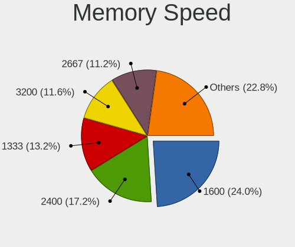

| Speed   | Computers | Percent |
|---------|-----------|---------|
| 1600    | 60        | 24%     |
| 2400    | 43        | 17.2%   |
| 1333    | 33        | 13.2%   |
| 3200    | 29        | 11.6%   |
| 2667    | 28        | 11.2%   |
| 4800    | 14        | 5.6%    |
| 2133    | 10        | 4%      |
| 1334    | 4         | 1.6%    |
| 1067    | 4         | 1.6%    |
| 6400    | 2         | 0.8%    |
| 5600    | 2         | 0.8%    |
| 2666    | 2         | 0.8%    |
| 1867    | 2         | 0.8%    |
| 1066    | 2         | 0.8%    |
| 800     | 2         | 0.8%    |
| 667     | 2         | 0.8%    |
| Unknown | 2         | 0.8%    |
| 65535   | 1         | 0.4%    |
| 5200    | 1         | 0.4%    |
| 4000    | 1         | 0.4%    |
| 3000    | 1         | 0.4%    |
| 2933    | 1         | 0.4%    |
| 1866    | 1         | 0.4%    |
| 1033    | 1         | 0.4%    |
| 933     | 1         | 0.4%    |
| 533     | 1         | 0.4%    |

Printers & scanners
-------------------

Printer Vendor
--------------

Printer device vendors

Zero info for selected period =(

Printer Model
-------------

Printer device models

Zero info for selected period =(

Scanner Vendor
--------------

Scanner device vendors

Zero info for selected period =(

Scanner Model
-------------

Scanner device models

Zero info for selected period =(

Camera
------

Camera Vendor
-------------

Camera device vendors

| Vendor                                 | Computers | Percent |
|----------------------------------------|-----------|---------|
| Chicony Electronics                    | 11        | 42.31%  |
| Microdia                               | 3         | 11.54%  |
| Realtek Semiconductor                  | 2         | 7.69%   |
| Logitech                               | 2         | 7.69%   |
| Cheng Uei Precision Industry (Foxlink) | 2         | 7.69%   |
| Bison Electronics                      | 2         | 7.69%   |
| Lite-On Technology                     | 1         | 3.85%   |
| Lenovo                                 | 1         | 3.85%   |
| IMC Networks                           | 1         | 3.85%   |
| Apple                                  | 1         | 3.85%   |

Camera Model
------------

Camera device models

| Model                                                       | Computers | Percent |
|-------------------------------------------------------------|-----------|---------|
| Chicony ThinkPad T490 Webcam                                | 3         | 11.54%  |
| Realtek USB 2.0 PC Camera                                   | 2         | 7.69%   |
| Chicony Integrated Camera                                   | 2         | 7.69%   |
| Chicony HP HD Camera                                        | 2         | 7.69%   |
| Microdia Laptop_Integrated_Webcam_HD                        | 1         | 3.85%   |
| Microdia Integrated Webcam HD                               | 1         | 3.85%   |
| Microdia Integrated Webcam                                  | 1         | 3.85%   |
| Logitech Webcam C170                                        | 1         | 3.85%   |
| Logitech HD Pro Webcam C920                                 | 1         | 3.85%   |
| Lite-On HP HD Camera                                        | 1         | 3.85%   |
| Lenovo Integrated Webcam [R5U877]                           | 1         | 3.85%   |
| IMC Networks Integrated Camera                              | 1         | 3.85%   |
| Chicony Integrated IR Camera                                | 1         | 3.85%   |
| Chicony Integrated HD WebCam                                | 1         | 3.85%   |
| Chicony Integrated Camera (1280x720@30)                     | 1         | 3.85%   |
| Chicony HP Universal Camera                                 | 1         | 3.85%   |
| Cheng Uei Precision Industry (Foxlink) Webcam               | 1         | 3.85%   |
| Cheng Uei Precision Industry (Foxlink) HP HD Webcam [Fixed] | 1         | 3.85%   |
| Bison SunplusIT Integrated Camera                           | 1         | 3.85%   |
| Bison Lenovo EasyCamera                                     | 1         | 3.85%   |
| Apple FaceTime HD camera                                    | 1         | 3.85%   |

Security
--------

Fingerprint Vendor
------------------

Fingerprint sensor vendors

| Vendor                     | Computers | Percent |
|----------------------------|-----------|---------|
| Validity Sensors           | 5         | 31.25%  |
| Synaptics                  | 4         | 25%     |
| Upek                       | 3         | 18.75%  |
| Shenzhen Goodix Technology | 2         | 12.5%   |
| STMicroelectronics         | 1         | 6.25%   |
| Elan Microelectronics      | 1         | 6.25%   |

Fingerprint Model
-----------------

Fingerprint sensor models

| Model                                                    | Computers | Percent |
|----------------------------------------------------------|-----------|---------|
| Validity Sensors VFS495 Fingerprint Reader               | 3         | 18.75%  |
| Upek Biometric Touchchip/Touchstrip Fingerprint Sensor   | 3         | 18.75%  |
| Synaptics Prometheus MIS Touch Fingerprint Reader        | 2         | 12.5%   |
| Synaptics FS7604 Touch Fingerprint Sensor with PurePrint | 2         | 12.5%   |
| Shenzhen Goodix Fingerprint Reader                       | 2         | 12.5%   |
| Validity Sensors VFS5011 Fingerprint Reader              | 1         | 6.25%   |
| Validity Sensors VFS491                                  | 1         | 6.25%   |
| STMicroelectronics Fingerprint Reader                    | 1         | 6.25%   |
| Elan Fingerprint Sensor                                  | 1         | 6.25%   |

Chipcard Vendor
---------------

Chipcard module vendors

Zero info for selected period =(

Chipcard Model
--------------

Chipcard module models

Zero info for selected period =(

Unsupported
-----------

Unsupported Devices
-------------------

Total unsupported devices on board

| Total | Computers | Percent |
|-------|-----------|---------|
| 1     | 115       | 40.49%  |
| 0     | 85        | 29.93%  |
| 2     | 48        | 16.9%   |
| 3     | 28        | 9.86%   |
| 4     | 6         | 2.11%   |
| 5     | 2         | 0.7%    |

Unsupported Device Types
------------------------

Types of unsupported devices

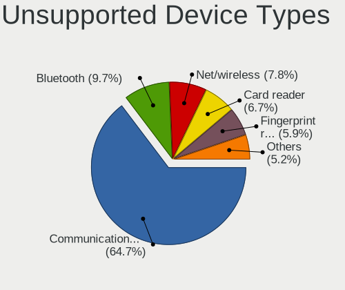

| Type                     | Computers | Percent |
|--------------------------|-----------|---------|
| Communication controller | 174       | 64.68%  |
| Bluetooth                | 26        | 9.67%   |
| Net/wireless             | 21        | 7.81%   |
| Card reader              | 18        | 6.69%   |
| Fingerprint reader       | 16        | 5.95%   |
| Firewire controller      | 4         | 1.49%   |
| Network                  | 3         | 1.12%   |
| Sound                    | 2         | 0.74%   |
| Net/ethernet             | 2         | 0.74%   |
| Graphics card            | 2         | 0.74%   |
| Storage/nvme             | 1         | 0.37%   |

