BSD in Austria - Tested Hardware & Statistics (Desktops)
--------------------------------------------------------

A project to collect tested hardware configurations for BSD in Austria.

Anyone can contribute to this report by the [hw-probe](https://github.com/linuxhw/hw-probe/blob/master/INSTALL.BSD.md) tool:

    hw-probe -all -upload

Please contribute! Especially if your hardware is rare.

Contents
--------

* [ Test Cases ](#test-cases)

* [ System ](#system)
  - [ OS                       ](#os)
  - [ OS Family                ](#os-family)
  - [ Arch                     ](#arch)
  - [ DE                       ](#de)
  - [ Display Server           ](#display-server)
  - [ Display Manager          ](#display-manager)
  - [ OS Lang                  ](#os-lang)
  - [ Boot Mode                ](#boot-mode)
  - [ Filesystem               ](#filesystem)
  - [ Part. scheme             ](#part-scheme)

* [ Board ](#board)
  - [ Vendor                   ](#vendor)
  - [ Model                    ](#model)
  - [ Model Family             ](#model-family)
  - [ MFG Year                 ](#mfg-year)
  - [ Form Factor              ](#form-factor)
  - [ Coreboot                 ](#coreboot)
  - [ RAM Size                 ](#ram-size)
  - [ RAM Used                 ](#ram-used)
  - [ Total Drives             ](#total-drives)
  - [ Has CD-ROM               ](#has-cd-rom)
  - [ Has Ethernet             ](#has-ethernet)
  - [ Has WiFi                 ](#has-wifi)
  - [ Has Bluetooth            ](#has-bluetooth)

* [ Location ](#location)
  - [ Country                  ](#country)
  - [ City                     ](#city)

* [ Drives ](#drives)
  - [ Drive Vendor             ](#drive-vendor)
  - [ Drive Model              ](#drive-model)
  - [ HDD Vendor               ](#hdd-vendor)
  - [ SSD Vendor               ](#ssd-vendor)
  - [ Drive Kind               ](#drive-kind)
  - [ Drive Connector          ](#drive-connector)
  - [ Drive Size               ](#drive-size)
  - [ Space Total              ](#space-total)
  - [ Space Used               ](#space-used)
  - [ Malfunc. Drives          ](#malfunc-drives)
  - [ Malfunc. Drive Vendor    ](#malfunc-drive-vendor)
  - [ Malfunc. HDD Vendor      ](#malfunc-hdd-vendor)
  - [ Malfunc. Drive Kind      ](#malfunc-drive-kind)
  - [ Failed Drives            ](#failed-drives)
  - [ Failed Drive Vendor      ](#failed-drive-vendor)
  - [ Drive Status             ](#drive-status)

* [ Storage controller ](#storage-controller)
  - [ Storage Vendor           ](#storage-vendor)
  - [ Storage Model            ](#storage-model)
  - [ Storage Kind             ](#storage-kind)

* [ Processor ](#processor)
  - [ CPU Vendor               ](#cpu-vendor)
  - [ CPU Model                ](#cpu-model)
  - [ CPU Model Family         ](#cpu-model-family)
  - [ CPU Cores                ](#cpu-cores)
  - [ CPU Sockets              ](#cpu-sockets)
  - [ CPU Threads              ](#cpu-threads)
  - [ CPU Microarch            ](#cpu-microarch)

* [ Graphics ](#graphics)
  - [ GPU Vendor               ](#gpu-vendor)
  - [ GPU Model                ](#gpu-model)
  - [ GPU Combo                ](#gpu-combo)
  - [ GPU Driver               ](#gpu-driver)
  - [ GPU Memory               ](#gpu-memory)

* [ Monitor ](#monitor)
  - [ Monitor Vendor           ](#monitor-vendor)
  - [ Monitor Model            ](#monitor-model)
  - [ Monitor Resolution       ](#monitor-resolution)
  - [ Monitor Diagonal         ](#monitor-diagonal)
  - [ Monitor Width            ](#monitor-width)
  - [ Aspect Ratio             ](#aspect-ratio)
  - [ Monitor Area             ](#monitor-area)
  - [ Pixel Density            ](#pixel-density)
  - [ Multiple Monitors        ](#multiple-monitors)

* [ Network ](#network)
  - [ Net Controller Vendor    ](#net-controller-vendor)
  - [ Net Controller Model     ](#net-controller-model)
  - [ Wireless Vendor          ](#wireless-vendor)
  - [ Wireless Model           ](#wireless-model)
  - [ Ethernet Vendor          ](#ethernet-vendor)
  - [ Ethernet Model           ](#ethernet-model)
  - [ Net Controller Kind      ](#net-controller-kind)
  - [ Used Controller          ](#used-controller)
  - [ NICs                     ](#nics)
  - [ IPv6                     ](#ipv6)

* [ Bluetooth ](#bluetooth)
  - [ Bluetooth Vendor         ](#bluetooth-vendor)
  - [ Bluetooth Model          ](#bluetooth-model)

* [ Sound ](#sound)
  - [ Sound Vendor             ](#sound-vendor)
  - [ Sound Model              ](#sound-model)

* [ Memory ](#memory)
  - [ Memory Vendor            ](#memory-vendor)
  - [ Memory Model             ](#memory-model)
  - [ Memory Kind              ](#memory-kind)
  - [ Memory Form Factor       ](#memory-form-factor)
  - [ Memory Size              ](#memory-size)
  - [ Memory Speed             ](#memory-speed)

* [ Printers & scanners ](#printers--scanners)
  - [ Printer Vendor           ](#printer-vendor)
  - [ Printer Model            ](#printer-model)
  - [ Scanner Vendor           ](#scanner-vendor)
  - [ Scanner Model            ](#scanner-model)

* [ Camera ](#camera)
  - [ Camera Vendor            ](#camera-vendor)
  - [ Camera Model             ](#camera-model)

* [ Security ](#security)
  - [ Fingerprint Vendor       ](#fingerprint-vendor)
  - [ Fingerprint Model        ](#fingerprint-model)
  - [ Chipcard Vendor          ](#chipcard-vendor)
  - [ Chipcard Model           ](#chipcard-model)

* [ Unsupported ](#unsupported)
  - [ Unsupported Devices      ](#unsupported-devices)
  - [ Unsupported Device Types ](#unsupported-device-types)

Test Cases
----------

Total: 378

| Vendor        | Model                       | Probe                                                     | Date         |
|---------------|-----------------------------|-----------------------------------------------------------|--------------|
| Unknown       | Unknown                     | [a5bbf2798d](https://bsd-hardware.info/?probe=a5bbf2798d) | Jan 02, 2026 |
| Protectli     | VP2420                      | [4484909d41](https://bsd-hardware.info/?probe=4484909d41) | Jan 02, 2026 |
| ASUSTek       | PRIME X470-PRO              | [c88818f69d](https://bsd-hardware.info/?probe=c88818f69d) | Dec 20, 2025 |
| ASRock        | Q1900-ITX                   | [acb81d8969](https://bsd-hardware.info/?probe=acb81d8969) | Dec 18, 2025 |
| Unknown       | QDNV01                      | [8eb6ab2620](https://bsd-hardware.info/?probe=8eb6ab2620) | Dec 16, 2025 |
| Unknown       | QDNV01                      | [90f4b107ea](https://bsd-hardware.info/?probe=90f4b107ea) | Dec 16, 2025 |
| Fujitsu       | D3224-A1 S26361-D3224-A1    | [116062e3c7](https://bsd-hardware.info/?probe=116062e3c7) | Dec 15, 2025 |
| Unknown       | Unknown                     | [c691b0e51d](https://bsd-hardware.info/?probe=c691b0e51d) | Dec 11, 2025 |
| Unknown       | Unknown                     | [29df952d4a](https://bsd-hardware.info/?probe=29df952d4a) | Nov 28, 2025 |
| Unknown       | Unknown                     | [9649d80895](https://bsd-hardware.info/?probe=9649d80895) | Nov 27, 2025 |
| Unknown       | Unknown                     | [c9aa3f5191](https://bsd-hardware.info/?probe=c9aa3f5191) | Nov 22, 2025 |
| Unknown       | J3160-4L                    | [5f628c632b](https://bsd-hardware.info/?probe=5f628c632b) | Nov 09, 2025 |
| Shuttle       | FH170                       | [f11cadf088](https://bsd-hardware.info/?probe=f11cadf088) | Nov 06, 2025 |
| KEBA          | CP505_BIOS_01.03            | [2a633926d0](https://bsd-hardware.info/?probe=2a633926d0) | Nov 03, 2025 |
| Unknown       | Unknown                     | [badddca379](https://bsd-hardware.info/?probe=badddca379) | Oct 31, 2025 |
| Advantech     | NAMB-T012MB A101            | [707d01496d](https://bsd-hardware.info/?probe=707d01496d) | Oct 31, 2025 |
| Supermicro    | X7SPA-H                     | [12ad7b8f29](https://bsd-hardware.info/?probe=12ad7b8f29) | Oct 19, 2025 |
| KEBA          | CP505_BIOS_01.03            | [8ea204f91f](https://bsd-hardware.info/?probe=8ea204f91f) | Oct 17, 2025 |
| Unknown       | Unknown                     | [e9474a54d3](https://bsd-hardware.info/?probe=e9474a54d3) | Oct 07, 2025 |
| PC Engines    | APU2                        | [d97d5f0270](https://bsd-hardware.info/?probe=d97d5f0270) | Sep 28, 2025 |
| IceWhale T... | ZimaBoard 832 ZMB           | [f0a8ec4c1e](https://bsd-hardware.info/?probe=f0a8ec4c1e) | Sep 21, 2025 |
| PC Engines    | apu4                        | [c4a7907774](https://bsd-hardware.info/?probe=c4a7907774) | Sep 19, 2025 |
| Unknown       | Unknown                     | [7da1ee8005](https://bsd-hardware.info/?probe=7da1ee8005) | Sep 04, 2025 |
| Unknown       | Unknown                     | [e80a8e0bf6](https://bsd-hardware.info/?probe=e80a8e0bf6) | Sep 04, 2025 |
| Unknown       | YL-J3160L4                  | [bc11a79847](https://bsd-hardware.info/?probe=bc11a79847) | Aug 24, 2025 |
| KEBA          | CP505_BIOS_01.03            | [0762924857](https://bsd-hardware.info/?probe=0762924857) | Aug 20, 2025 |
| Unknown       | Unknown                     | [4033c541b0](https://bsd-hardware.info/?probe=4033c541b0) | Aug 20, 2025 |
| Fujitsu       | D3313-A1 S26361-D3313-A1    | [c974569ce6](https://bsd-hardware.info/?probe=c974569ce6) | Aug 14, 2025 |
| Gigabyte      | B365M DS3H                  | [fa0753c30d](https://bsd-hardware.info/?probe=fa0753c30d) | Aug 08, 2025 |
| PC Engines    | APU2                        | [04187d0e44](https://bsd-hardware.info/?probe=04187d0e44) | Aug 01, 2025 |
| Unknown       | Unknown                     | [5d9b70f9b3](https://bsd-hardware.info/?probe=5d9b70f9b3) | Jul 29, 2025 |
| Unknown       | Unknown                     | [33c00c1b14](https://bsd-hardware.info/?probe=33c00c1b14) | Jul 23, 2025 |
| Gigabyte      | B365M DS3H                  | [fc4b20232a](https://bsd-hardware.info/?probe=fc4b20232a) | Jul 20, 2025 |
| HP            | Compaq 8000 Elite CMT PC    | [55dce3d3b6](https://bsd-hardware.info/?probe=55dce3d3b6) | Jul 17, 2025 |
| Unknown       | Unknown                     | [3b3e04c891](https://bsd-hardware.info/?probe=3b3e04c891) | Jul 17, 2025 |
| Protectli     | FW6 Ver                     | [b3da12e3ad](https://bsd-hardware.info/?probe=b3da12e3ad) | Jul 10, 2025 |
| XtReAmEr      | Unknown                     | [89994ef7a1](https://bsd-hardware.info/?probe=89994ef7a1) | Jun 24, 2025 |
| PC Engines    | APU2                        | [6910deed6d](https://bsd-hardware.info/?probe=6910deed6d) | Jun 02, 2025 |
| PC Engines    | APU2                        | [3d2951b09c](https://bsd-hardware.info/?probe=3d2951b09c) | May 26, 2025 |
| PC Engines    | APU2                        | [cdffd2a69b](https://bsd-hardware.info/?probe=cdffd2a69b) | May 25, 2025 |
| ASUSTek       | TUF Gaming B550M-PLUS       | [2a723a4eba](https://bsd-hardware.info/?probe=2a723a4eba) | May 23, 2025 |
| Unknown       | Unknown                     | [2bdfcdbeb4](https://bsd-hardware.info/?probe=2bdfcdbeb4) | May 19, 2025 |
| ASUSTek       | TUF Gaming B550M-PLUS       | [7990014758](https://bsd-hardware.info/?probe=7990014758) | May 05, 2025 |
| ASRock        | J4105-ITX                   | [0d27aa2971](https://bsd-hardware.info/?probe=0d27aa2971) | Apr 23, 2025 |
| Techvision    | TVI7309X B0                 | [3e4e3c0f0b](https://bsd-hardware.info/?probe=3e4e3c0f0b) | Apr 23, 2025 |
| SJRC          | ADLN-6L                     | [31cec72f4b](https://bsd-hardware.info/?probe=31cec72f4b) | Apr 20, 2025 |
| Dell          | 0T7D40 A01                  | [1fbea4adab](https://bsd-hardware.info/?probe=1fbea4adab) | Apr 20, 2025 |
| Cisco         | ASA5525 A0                  | [469a0b425f](https://bsd-hardware.info/?probe=469a0b425f) | Apr 16, 2025 |
| Cisco         | ASA5525 A0                  | [1d5ee001ba](https://bsd-hardware.info/?probe=1d5ee001ba) | Apr 16, 2025 |
| PC Engines    | APU3                        | [2d3330a447](https://bsd-hardware.info/?probe=2d3330a447) | Apr 11, 2025 |
| ASUSTek       | PRIME B660M-K D4            | [62eac0ae06](https://bsd-hardware.info/?probe=62eac0ae06) | Apr 09, 2025 |
| Gigabyte      | B650I AX                    | [0943d0a6f3](https://bsd-hardware.info/?probe=0943d0a6f3) | Apr 05, 2025 |
| ASUSTek       | PRIME B660M-K D4            | [c985c42149](https://bsd-hardware.info/?probe=c985c42149) | Apr 03, 2025 |
| Unknown       | Unknown                     | [44baf5b1a9](https://bsd-hardware.info/?probe=44baf5b1a9) | Apr 01, 2025 |
| Unknown       | Unknown                     | [4b3254de12](https://bsd-hardware.info/?probe=4b3254de12) | Mar 31, 2025 |
| ASRock        | QC5000-ITX/PH               | [6f0e81baa8](https://bsd-hardware.info/?probe=6f0e81baa8) | Mar 29, 2025 |
| SJRC          | ADLN-6L                     | [fd692ed504](https://bsd-hardware.info/?probe=fd692ed504) | Mar 28, 2025 |
| Unknown       | Unknown                     | [6c7aa89210](https://bsd-hardware.info/?probe=6c7aa89210) | Mar 27, 2025 |
| Unknown       | Unknown                     | [af1ed787cb](https://bsd-hardware.info/?probe=af1ed787cb) | Mar 21, 2025 |
| ASUSTek       | PRIME B660M-K D4            | [b70f43e5ef](https://bsd-hardware.info/?probe=b70f43e5ef) | Mar 20, 2025 |
| Unknown       | Unknown                     | [6922a92985](https://bsd-hardware.info/?probe=6922a92985) | Mar 20, 2025 |
| Unknown       | Unknown                     | [7029156a31](https://bsd-hardware.info/?probe=7029156a31) | Mar 18, 2025 |
| Lenovo        | MAHOBAY NO DPK              | [1520623759](https://bsd-hardware.info/?probe=1520623759) | Mar 12, 2025 |
| Dell          | 00F82W A01                  | [3b2c9eff89](https://bsd-hardware.info/?probe=3b2c9eff89) | Mar 10, 2025 |
| ASRock        | J4105-ITX                   | [93813c620a](https://bsd-hardware.info/?probe=93813c620a) | Mar 03, 2025 |
| PC Engines    | APU2                        | [a768be5c92](https://bsd-hardware.info/?probe=a768be5c92) | Feb 28, 2025 |
| ASUSTek       | PRIME B660M-K D4            | [25c180967a](https://bsd-hardware.info/?probe=25c180967a) | Feb 20, 2025 |
| Fujitsu       | D3500-A1 S26361-D3500-A1    | [19788aa01d](https://bsd-hardware.info/?probe=19788aa01d) | Feb 16, 2025 |
| PC Engines    | APU2                        | [f2a291c09b](https://bsd-hardware.info/?probe=f2a291c09b) | Feb 10, 2025 |
| ASRock        | J4105-ITX                   | [d825e90c38](https://bsd-hardware.info/?probe=d825e90c38) | Feb 10, 2025 |
| KEBA          | CP505_BIOS_01.03            | [b4a568dfcf](https://bsd-hardware.info/?probe=b4a568dfcf) | Feb 07, 2025 |
| CncTion       | N5105-4L B0                 | [6677396a66](https://bsd-hardware.info/?probe=6677396a66) | Feb 01, 2025 |
| KEBA          | CP505_BIOS_01.03            | [4d92746f67](https://bsd-hardware.info/?probe=4d92746f67) | Jan 31, 2025 |
| Lenovo        | MAHOBAY NO DPK              | [937101cc19](https://bsd-hardware.info/?probe=937101cc19) | Jan 30, 2025 |
| Unknown       | Unknown                     | [201687956a](https://bsd-hardware.info/?probe=201687956a) | Jan 29, 2025 |
| Protectli     | FW2B                        | [fdf4c0fc65](https://bsd-hardware.info/?probe=fdf4c0fc65) | Jan 22, 2025 |
| Lenovo        | 312A SDK0J40697 WIN 3305... | [dd6e0adc6e](https://bsd-hardware.info/?probe=dd6e0adc6e) | Jan 18, 2025 |
| Lenovo        | 312A SDK0J40697 WIN 3305... | [f8cd5798b5](https://bsd-hardware.info/?probe=f8cd5798b5) | Jan 06, 2025 |
| Unknown       | Unknown                     | [2c400cdb2c](https://bsd-hardware.info/?probe=2c400cdb2c) | Jan 02, 2025 |
| Unknown       | Unknown                     | [c23c86dc99](https://bsd-hardware.info/?probe=c23c86dc99) | Jan 01, 2025 |
| Unknown       | Unknown                     | [63fd28f073](https://bsd-hardware.info/?probe=63fd28f073) | Dec 26, 2024 |
| Dell          | 0T7D40 A01                  | [af31d44d1f](https://bsd-hardware.info/?probe=af31d44d1f) | Dec 24, 2024 |
| Unknown       | Unknown                     | [bba86ddcba](https://bsd-hardware.info/?probe=bba86ddcba) | Dec 21, 2024 |
| ASRock        | E3C226D2I                   | [37b9937cf0](https://bsd-hardware.info/?probe=37b9937cf0) | Dec 20, 2024 |
| Unknown       | Unknown                     | [a36cfd03b0](https://bsd-hardware.info/?probe=a36cfd03b0) | Dec 18, 2024 |
| AAEON         | UP-APL01 V0.4               | [2d4c35ab71](https://bsd-hardware.info/?probe=2d4c35ab71) | Dec 17, 2024 |
| Unknown       | Unknown                     | [dd2a5f051e](https://bsd-hardware.info/?probe=dd2a5f051e) | Dec 13, 2024 |
| ASRock        | E3C226D2I                   | [0aa040bcda](https://bsd-hardware.info/?probe=0aa040bcda) | Dec 10, 2024 |
| Supermicro    | X7SPA-H                     | [dbfc4db35b](https://bsd-hardware.info/?probe=dbfc4db35b) | Nov 29, 2024 |
| ASUSTek       | AM1M-A                      | [473deeae6a](https://bsd-hardware.info/?probe=473deeae6a) | Nov 29, 2024 |
| Unknown       | Unknown                     | [c7e7359910](https://bsd-hardware.info/?probe=c7e7359910) | Nov 21, 2024 |
| Intel         | J1900                       | [e6c410d6de](https://bsd-hardware.info/?probe=e6c410d6de) | Nov 20, 2024 |
| Dell          | 096JG8 A01                  | [7e1caf1e87](https://bsd-hardware.info/?probe=7e1caf1e87) | Nov 20, 2024 |
| Dell          | 096JG8 A01                  | [bcb0eacfea](https://bsd-hardware.info/?probe=bcb0eacfea) | Nov 18, 2024 |
| ASUSTek       | TUF Gaming B550M-PLUS       | [bc58379358](https://bsd-hardware.info/?probe=bc58379358) | Nov 17, 2024 |
| Unknown       | Unknown                     | [10ead77144](https://bsd-hardware.info/?probe=10ead77144) | Nov 15, 2024 |
| IceWhale T... | ZimaBoard 832 ZMB           | [d70ca808ea](https://bsd-hardware.info/?probe=d70ca808ea) | Nov 10, 2024 |
| IceWhale T... | ZimaBoard 832 ZMB           | [015d104076](https://bsd-hardware.info/?probe=015d104076) | Nov 09, 2024 |
| ASUSTek       | TUF Gaming B550M-PLUS       | [e962f6d14f](https://bsd-hardware.info/?probe=e962f6d14f) | Nov 08, 2024 |
| PC Engines    | APU                         | [8ebdbe84c2](https://bsd-hardware.info/?probe=8ebdbe84c2) | Nov 05, 2024 |
| Unknown       | Unknown                     | [e0e10e6e1f](https://bsd-hardware.info/?probe=e0e10e6e1f) | Nov 04, 2024 |
| Unknown       | Unknown                     | [b95602ad1d](https://bsd-hardware.info/?probe=b95602ad1d) | Nov 01, 2024 |
| HP            | 3397                        | [0144b4437f](https://bsd-hardware.info/?probe=0144b4437f) | Oct 31, 2024 |
| Unknown       | Unknown                     | [104ca1a87e](https://bsd-hardware.info/?probe=104ca1a87e) | Oct 25, 2024 |
| Unknown       | Unknown                     | [abee83c3b8](https://bsd-hardware.info/?probe=abee83c3b8) | Oct 25, 2024 |
| Protectli     | VP2420                      | [da2839c086](https://bsd-hardware.info/?probe=da2839c086) | Oct 21, 2024 |
| Protectli     | VP2420                      | [d3e7371387](https://bsd-hardware.info/?probe=d3e7371387) | Oct 18, 2024 |
| ASUSTek       | AT3GC-I                     | [c733d93d11](https://bsd-hardware.info/?probe=c733d93d11) | Oct 02, 2024 |
| Dell          | 0T7D40 A01                  | [c69ca23766](https://bsd-hardware.info/?probe=c69ca23766) | Sep 15, 2024 |
| Unknown       | Unknown                     | [bbba7d5d52](https://bsd-hardware.info/?probe=bbba7d5d52) | Sep 14, 2024 |
| KEBA          | CP505_BIOS_01.03            | [c8091ab802](https://bsd-hardware.info/?probe=c8091ab802) | Sep 13, 2024 |
| KEBA          | CP505_BIOS_01.03            | [404e36fbfa](https://bsd-hardware.info/?probe=404e36fbfa) | Sep 11, 2024 |
| Unknown       | Unknown                     | [2078937889](https://bsd-hardware.info/?probe=2078937889) | Sep 09, 2024 |
| KEBA          | CP505_BIOS_01.03            | [7f33805fee](https://bsd-hardware.info/?probe=7f33805fee) | Sep 06, 2024 |
| KEBA          | CP505_BIOS_01.03            | [d63da5029b](https://bsd-hardware.info/?probe=d63da5029b) | Sep 05, 2024 |
| Unknown       | Unknown                     | [d39290caaf](https://bsd-hardware.info/?probe=d39290caaf) | Aug 24, 2024 |
| Fujitsu       | D3221-A1 S26361-D3221-A1    | [aedfdb1704](https://bsd-hardware.info/?probe=aedfdb1704) | Aug 22, 2024 |
| Gigabyte      | H410M S2H V3                | [0060403317](https://bsd-hardware.info/?probe=0060403317) | Aug 21, 2024 |
| Unknown       | Unknown                     | [6d1e481cf0](https://bsd-hardware.info/?probe=6d1e481cf0) | Aug 13, 2024 |
| Dell          | 0T7D40 A01                  | [d051177b97](https://bsd-hardware.info/?probe=d051177b97) | Aug 12, 2024 |
| Unknown       | Unknown                     | [9596202f52](https://bsd-hardware.info/?probe=9596202f52) | Aug 04, 2024 |
| Unknown       | Unknown                     | [3d29ca3d8e](https://bsd-hardware.info/?probe=3d29ca3d8e) | Jul 26, 2024 |
| PC Engines    | APU                         | [18517be69f](https://bsd-hardware.info/?probe=18517be69f) | Jul 08, 2024 |
| AWOW          | AK10                        | [6259d72d34](https://bsd-hardware.info/?probe=6259d72d34) | Jul 07, 2024 |
| Fujitsu       | D3313-A1 S26361-D3313-A1    | [9713e10693](https://bsd-hardware.info/?probe=9713e10693) | Jul 03, 2024 |
| Gigabyte      | Z590 VISION G               | [39bb67c433](https://bsd-hardware.info/?probe=39bb67c433) | Jun 25, 2024 |
| Gigabyte      | X570 AORUS ELITE            | [6df2b85c04](https://bsd-hardware.info/?probe=6df2b85c04) | Jun 24, 2024 |
| Unknown       | Unknown                     | [3fb7d4a270](https://bsd-hardware.info/?probe=3fb7d4a270) | Jun 13, 2024 |
| Fujitsu       | D3313-G1 S26361-D3313-G1    | [f6cce31cc6](https://bsd-hardware.info/?probe=f6cce31cc6) | May 17, 2024 |
| OEM           | 1.0                         | [a6fa59cebd](https://bsd-hardware.info/?probe=a6fa59cebd) | May 09, 2024 |
| PC Engines    | APU                         | [7fbd1ae00c](https://bsd-hardware.info/?probe=7fbd1ae00c) | Apr 28, 2024 |
| IceWhale T... | ZimaBoard 832 ZMB           | [9dfb20c904](https://bsd-hardware.info/?probe=9dfb20c904) | Apr 23, 2024 |
| ASUSTek       | ROG STRIX B550-F GAMING     | [a2cbe8253b](https://bsd-hardware.info/?probe=a2cbe8253b) | Apr 09, 2024 |
| ASUSTek       | ROG STRIX B550-F GAMING     | [3ccdd0084b](https://bsd-hardware.info/?probe=3ccdd0084b) | Apr 05, 2024 |
| Unknown       | Unknown                     | [f6ead7640d](https://bsd-hardware.info/?probe=f6ead7640d) | Mar 30, 2024 |
| Unknown       | Unknown                     | [28feb266fd](https://bsd-hardware.info/?probe=28feb266fd) | Mar 24, 2024 |
| ASUSTek       | Pro B660M-C D4              | [dea6d03494](https://bsd-hardware.info/?probe=dea6d03494) | Mar 24, 2024 |
| Intel         | D53427RKE G87971-403        | [5cf0576fee](https://bsd-hardware.info/?probe=5cf0576fee) | Mar 23, 2024 |
| HP            | ProLiant MicroServer        | [c158a70e91](https://bsd-hardware.info/?probe=c158a70e91) | Mar 22, 2024 |
| PC Engines    | APU2                        | [1f2d9aef5b](https://bsd-hardware.info/?probe=1f2d9aef5b) | Mar 22, 2024 |
| Sun           | SUNW,Ultra-1                | [33ed69952b](https://bsd-hardware.info/?probe=33ed69952b) | Mar 17, 2024 |
| Unknown       | Unknown                     | [07a7ed8dde](https://bsd-hardware.info/?probe=07a7ed8dde) | Mar 15, 2024 |
| Dell          | 0T7D40 A01                  | [5b8f4fe788](https://bsd-hardware.info/?probe=5b8f4fe788) | Mar 14, 2024 |
| IceWhale T... | ZimaBoard 832 ZMB           | [8f4dfa8bb2](https://bsd-hardware.info/?probe=8f4dfa8bb2) | Mar 10, 2024 |
| Unknown       | Unknown                     | [a10048c3e7](https://bsd-hardware.info/?probe=a10048c3e7) | Mar 01, 2024 |
| Intel         | QHSW02                      | [11ee14ed87](https://bsd-hardware.info/?probe=11ee14ed87) | Feb 26, 2024 |
| Shuttle       | XH610                       | [e7780e6013](https://bsd-hardware.info/?probe=e7780e6013) | Feb 26, 2024 |
| Shuttle       | XH610                       | [dc854cc185](https://bsd-hardware.info/?probe=dc854cc185) | Feb 25, 2024 |
| Dell          | 0T7D40 A01                  | [151b04e792](https://bsd-hardware.info/?probe=151b04e792) | Feb 23, 2024 |
| Dell          | 0T7D40 A01                  | [7aeebe2c82](https://bsd-hardware.info/?probe=7aeebe2c82) | Feb 18, 2024 |
| Hardkernel    | ODROID-H2                   | [a4045617ec](https://bsd-hardware.info/?probe=a4045617ec) | Feb 14, 2024 |
| Unknown       | Unknown                     | [ef910cb303](https://bsd-hardware.info/?probe=ef910cb303) | Feb 14, 2024 |
| Shuttle       | FH170                       | [e7eaced298](https://bsd-hardware.info/?probe=e7eaced298) | Feb 13, 2024 |
| Unknown       | Unknown                     | [11b10e5acb](https://bsd-hardware.info/?probe=11b10e5acb) | Feb 06, 2024 |
| Unknown       | Unknown                     | [4437069c86](https://bsd-hardware.info/?probe=4437069c86) | Feb 05, 2024 |
| Dell          | 0T7D40 A01                  | [19ab947fb4](https://bsd-hardware.info/?probe=19ab947fb4) | Jan 29, 2024 |
| Unknown       | Unknown                     | [c28104b9b5](https://bsd-hardware.info/?probe=c28104b9b5) | Jan 28, 2024 |
| Supermicro    | X11SDV-8C-TP8F              | [17c3586ebc](https://bsd-hardware.info/?probe=17c3586ebc) | Jan 23, 2024 |
| Unknown       | Unknown                     | [0b0142d5dd](https://bsd-hardware.info/?probe=0b0142d5dd) | Jan 19, 2024 |
| PC Engines    | APU2                        | [189362d834](https://bsd-hardware.info/?probe=189362d834) | Jan 19, 2024 |
| MW            | GMLK-2_5G4L                 | [8707b73983](https://bsd-hardware.info/?probe=8707b73983) | Jan 08, 2024 |
| Unknown       | Unknown                     | [058859b9c4](https://bsd-hardware.info/?probe=058859b9c4) | Dec 26, 2023 |
| Lenovo        | 3708 SDK0J40700 WIN 3258... | [7ad0451a6f](https://bsd-hardware.info/?probe=7ad0451a6f) | Dec 25, 2023 |
| Intel         | Q3XXG4-P V1.0               | [80e8d502be](https://bsd-hardware.info/?probe=80e8d502be) | Dec 24, 2023 |
| PC Engines    | apu4                        | [48a0e27e11](https://bsd-hardware.info/?probe=48a0e27e11) | Dec 22, 2023 |
| Unknown       | SKYBAY                      | [7f8968ee0a](https://bsd-hardware.info/?probe=7f8968ee0a) | Dec 22, 2023 |
| Intel         | DH67BL AAG10189-207         | [e6210120bd](https://bsd-hardware.info/?probe=e6210120bd) | Dec 12, 2023 |
| Unknown       | Unknown                     | [be6c7879b4](https://bsd-hardware.info/?probe=be6c7879b4) | Dec 07, 2023 |
| Protectli     | FW4B                        | [dab9b84618](https://bsd-hardware.info/?probe=dab9b84618) | Dec 03, 2023 |
| Unknown       | SKYBAY                      | [e1a3d3ff53](https://bsd-hardware.info/?probe=e1a3d3ff53) | Nov 30, 2023 |
| Unknown       | SKYBAY                      | [6ceeb87719](https://bsd-hardware.info/?probe=6ceeb87719) | Nov 30, 2023 |
| Intel         | DH67BL AAG10189-207         | [734103b696](https://bsd-hardware.info/?probe=734103b696) | Nov 22, 2023 |
| CncTion       | N5105-4L B0                 | [6074d7118a](https://bsd-hardware.info/?probe=6074d7118a) | Nov 18, 2023 |
| Unknown       | Unknown                     | [0662bae41e](https://bsd-hardware.info/?probe=0662bae41e) | Nov 12, 2023 |
| Gigabyte      | H610M H DDR4                | [bdc4fdaf9c](https://bsd-hardware.info/?probe=bdc4fdaf9c) | Nov 05, 2023 |
| Fujitsu       | D3543-A1 S26361-D3543-A1... | [4b685d7ff1](https://bsd-hardware.info/?probe=4b685d7ff1) | Oct 14, 2023 |
| Gigabyte      | H610M H DDR4                | [ab5400f952](https://bsd-hardware.info/?probe=ab5400f952) | Oct 08, 2023 |
| Unknown       | Unknown                     | [13f17e09d4](https://bsd-hardware.info/?probe=13f17e09d4) | Oct 06, 2023 |
| Fujitsu       | D3543-A1 S26361-D3543-A1... | [5076395072](https://bsd-hardware.info/?probe=5076395072) | Oct 06, 2023 |
| PC Engines    | apu4                        | [20c432e07b](https://bsd-hardware.info/?probe=20c432e07b) | Oct 02, 2023 |
| ShenZhen M... | 3865U-6L                    | [53a70ddb3b](https://bsd-hardware.info/?probe=53a70ddb3b) | Oct 02, 2023 |
| Fujitsu       | D3543-A1 S26361-D3543-A1... | [8809e169a1](https://bsd-hardware.info/?probe=8809e169a1) | Sep 30, 2023 |
| Unknown       | Unknown                     | [20fb7f1ba8](https://bsd-hardware.info/?probe=20fb7f1ba8) | Sep 30, 2023 |
| Unknown       | Unknown                     | [7e82c0f66d](https://bsd-hardware.info/?probe=7e82c0f66d) | Sep 29, 2023 |
| MW            | GMLK-2_5G4L                 | [8ebba0ee37](https://bsd-hardware.info/?probe=8ebba0ee37) | Sep 19, 2023 |
| Hardkernel    | ODROID-H2                   | [35544a61bd](https://bsd-hardware.info/?probe=35544a61bd) | Sep 16, 2023 |
| Gigabyte      | B365M DS3H                  | [281e4a541b](https://bsd-hardware.info/?probe=281e4a541b) | Aug 26, 2023 |
| Gigabyte      | B365M DS3H                  | [c5745af495](https://bsd-hardware.info/?probe=c5745af495) | Aug 26, 2023 |
| IceWhale T... | ZimaBoard 832 ZMB           | [97321f0843](https://bsd-hardware.info/?probe=97321f0843) | Aug 20, 2023 |
| Fujitsu       | D3313-B1 S26361-D3313-B1    | [87bc92631a](https://bsd-hardware.info/?probe=87bc92631a) | Aug 16, 2023 |
| Fujitsu       | D3313-B1 S26361-D3313-B1    | [ec68697ed9](https://bsd-hardware.info/?probe=ec68697ed9) | Aug 16, 2023 |
| Hardkernel    | ODROID-H2                   | [a92e1efca1](https://bsd-hardware.info/?probe=a92e1efca1) | Aug 07, 2023 |
| Dell          | 0T7D40 A00                  | [e903094a75](https://bsd-hardware.info/?probe=e903094a75) | Aug 03, 2023 |
| ASRock        | J3355B-ITX                  | [234f0fd8aa](https://bsd-hardware.info/?probe=234f0fd8aa) | Aug 01, 2023 |
| IceWhale T... | ZimaBoard 832 ZMB           | [aeb59c510b](https://bsd-hardware.info/?probe=aeb59c510b) | Jul 26, 2023 |
| Dell          | 0T7D40 A00                  | [24e7268bbe](https://bsd-hardware.info/?probe=24e7268bbe) | Jul 19, 2023 |
| ASUSTek       | H110M-R                     | [cc5fe45365](https://bsd-hardware.info/?probe=cc5fe45365) | Jun 15, 2023 |
| ShenZhen M... | 3865U-6L                    | [5733ad3c03](https://bsd-hardware.info/?probe=5733ad3c03) | May 25, 2023 |
| Hardkernel    | ODROID-H2                   | [3966c4828d](https://bsd-hardware.info/?probe=3966c4828d) | May 12, 2023 |
| PC Engines    | apu4                        | [2589a0c02c](https://bsd-hardware.info/?probe=2589a0c02c) | May 10, 2023 |
| Gigabyte      | H81M-D2V                    | [5f9bbf2d15](https://bsd-hardware.info/?probe=5f9bbf2d15) | May 04, 2023 |
| ZOTAC         | Unknown                     | [f6c39a3582](https://bsd-hardware.info/?probe=f6c39a3582) | Apr 30, 2023 |
| Deciso        | Netboard A10 GEN2 Model ... | [e7e7a6470d](https://bsd-hardware.info/?probe=e7e7a6470d) | Apr 27, 2023 |
| Deciso        | Netboard A10 GEN2 Model ... | [b517729fb4](https://bsd-hardware.info/?probe=b517729fb4) | Apr 27, 2023 |
| ShenZhen M... | 3865U-6L                    | [1548471a4d](https://bsd-hardware.info/?probe=1548471a4d) | Apr 25, 2023 |
| Unknown       | Unknown                     | [0d7a1b58ed](https://bsd-hardware.info/?probe=0d7a1b58ed) | Apr 21, 2023 |
| MSI           | 2A78h                       | [8560ebd69c](https://bsd-hardware.info/?probe=8560ebd69c) | Apr 18, 2023 |
| ZOTAC         | Unknown                     | [8c3cdf29a2](https://bsd-hardware.info/?probe=8c3cdf29a2) | Apr 17, 2023 |
| Shuttle       | DS10U                       | [7f98ef1865](https://bsd-hardware.info/?probe=7f98ef1865) | Apr 10, 2023 |
| Shuttle       | FS61                        | [9c3df7e926](https://bsd-hardware.info/?probe=9c3df7e926) | Apr 09, 2023 |
| MW            | GMLK-2_5G4L                 | [8452deae22](https://bsd-hardware.info/?probe=8452deae22) | Apr 07, 2023 |
| Unknown       | Unknown                     | [11f0439894](https://bsd-hardware.info/?probe=11f0439894) | Apr 04, 2023 |
| Unknown       | Unknown                     | [9a5ccefb18](https://bsd-hardware.info/?probe=9a5ccefb18) | Mar 17, 2023 |
| Unknown       | Unknown                     | [f80047716b](https://bsd-hardware.info/?probe=f80047716b) | Mar 15, 2023 |
| Dell          | 01TN68 A02                  | [cb6c76df00](https://bsd-hardware.info/?probe=cb6c76df00) | Mar 13, 2023 |
| ASUSTek       | P11C-M Series               | [80814c04b6](https://bsd-hardware.info/?probe=80814c04b6) | Mar 10, 2023 |
| ASUSTek       | P11C-M Series               | [242677230a](https://bsd-hardware.info/?probe=242677230a) | Mar 09, 2023 |
| BESSTAR Te... | TH50                        | [e27931f082](https://bsd-hardware.info/?probe=e27931f082) | Mar 07, 2023 |
| ASUSTek       | P11C-M Series               | [866573ffa0](https://bsd-hardware.info/?probe=866573ffa0) | Mar 03, 2023 |
| MW            | GMLK-2_5G4L                 | [bf21395f79](https://bsd-hardware.info/?probe=bf21395f79) | Feb 24, 2023 |
| Intel         | DENLOW_WS                   | [f6f5953979](https://bsd-hardware.info/?probe=f6f5953979) | Feb 23, 2023 |
| HP            | 3397                        | [8b231fd832](https://bsd-hardware.info/?probe=8b231fd832) | Feb 19, 2023 |
| Fujitsu       | D3313-B1 S26361-D3313-B1    | [be8fb945ef](https://bsd-hardware.info/?probe=be8fb945ef) | Feb 12, 2023 |
| Intel         | ChiefRiver                  | [ae6ea07868](https://bsd-hardware.info/?probe=ae6ea07868) | Feb 05, 2023 |
| PC Engines    | APU2                        | [d59ed5b52f](https://bsd-hardware.info/?probe=d59ed5b52f) | Feb 02, 2023 |
| CncTion       | N5105-4L B0                 | [d9746ad1c3](https://bsd-hardware.info/?probe=d9746ad1c3) | Jan 28, 2023 |
| Techvision    | TVI7309X B0                 | [84375af67f](https://bsd-hardware.info/?probe=84375af67f) | Jan 27, 2023 |
| Unknown       | YL-E3845L4-V2               | [d93eb933f1](https://bsd-hardware.info/?probe=d93eb933f1) | Jan 20, 2023 |
| Unknown       | Unknown                     | [22015084fc](https://bsd-hardware.info/?probe=22015084fc) | Jan 17, 2023 |
| Unknown       | Unknown                     | [87d79c88e1](https://bsd-hardware.info/?probe=87d79c88e1) | Jan 11, 2023 |
| MW            | GMLK-2_5G4L                 | [5a4affef3e](https://bsd-hardware.info/?probe=5a4affef3e) | Jan 04, 2023 |
| Hardkernel    | ODROID-H2                   | [b685ddc2ad](https://bsd-hardware.info/?probe=b685ddc2ad) | Dec 28, 2022 |
| Unknown       | Unknown                     | [f7700c781d](https://bsd-hardware.info/?probe=f7700c781d) | Dec 17, 2022 |
| Techvision    | TVI7309X B0                 | [657972a55d](https://bsd-hardware.info/?probe=657972a55d) | Dec 06, 2022 |
| Techvision    | TVI7309X B0                 | [33f23b1291](https://bsd-hardware.info/?probe=33f23b1291) | Dec 06, 2022 |
| Deciso        | Netboard A10 GEN2 Model ... | [d48dbd053d](https://bsd-hardware.info/?probe=d48dbd053d) | Nov 28, 2022 |
| PC Engines    | apu4                        | [588e065800](https://bsd-hardware.info/?probe=588e065800) | Nov 28, 2022 |
| Dell          | 0T7D40 A01                  | [45d96a0b5a](https://bsd-hardware.info/?probe=45d96a0b5a) | Nov 24, 2022 |
| Gigabyte      | J3455N-D3H                  | [2f812bd8c3](https://bsd-hardware.info/?probe=2f812bd8c3) | Nov 22, 2022 |
| Gigabyte      | J3455N-D3H                  | [86dcacdb40](https://bsd-hardware.info/?probe=86dcacdb40) | Nov 13, 2022 |
| PC Engines    | apu4                        | [7ed7638be3](https://bsd-hardware.info/?probe=7ed7638be3) | Nov 03, 2022 |
| PC Engines    | APU2                        | [0c573848ce](https://bsd-hardware.info/?probe=0c573848ce) | Oct 27, 2022 |
| PC Engines    | APU2                        | [0677b5c196](https://bsd-hardware.info/?probe=0677b5c196) | Oct 25, 2022 |
| Gigabyte      | J3455N-D3H                  | [9757e40c42](https://bsd-hardware.info/?probe=9757e40c42) | Oct 13, 2022 |
| Dell          | 0WMJ54 A01                  | [53dfc5844c](https://bsd-hardware.info/?probe=53dfc5844c) | Oct 01, 2022 |
| Dell          | 0WMJ54 A01                  | [30cb759583](https://bsd-hardware.info/?probe=30cb759583) | Sep 30, 2022 |
| MW            | GMLK-2_5G4L                 | [37cafd59eb](https://bsd-hardware.info/?probe=37cafd59eb) | Sep 20, 2022 |
| Deciso        | Netboard A10 GEN2 Model ... | [e0b8ceecae](https://bsd-hardware.info/?probe=e0b8ceecae) | Sep 16, 2022 |
| Deciso        | Netboard A10 GEN2 Model ... | [e082eca671](https://bsd-hardware.info/?probe=e082eca671) | Sep 08, 2022 |
| PC Engines    | APU2                        | [1650d8c419](https://bsd-hardware.info/?probe=1650d8c419) | Sep 05, 2022 |
| AAEON         | UP-APL01 V0.4               | [a8d73a9156](https://bsd-hardware.info/?probe=a8d73a9156) | Sep 01, 2022 |
| MW            | GMLK-2_5G4L                 | [63587e2fca](https://bsd-hardware.info/?probe=63587e2fca) | Aug 31, 2022 |
| Seeed Stud... | ODYSSEY-X86J4105 SD-BS-C... | [45043e0e42](https://bsd-hardware.info/?probe=45043e0e42) | Aug 18, 2022 |
| Fujitsu       | D3224-A1 S26361-D3224-A1    | [4e056b6f77](https://bsd-hardware.info/?probe=4e056b6f77) | Aug 11, 2022 |
| Deciso        | Netboard A10 GEN2 Model ... | [1cd64c78d5](https://bsd-hardware.info/?probe=1cd64c78d5) | Aug 10, 2022 |
| Deciso        | Netboard A10 GEN2 Model ... | [5c00da486d](https://bsd-hardware.info/?probe=5c00da486d) | Jul 29, 2022 |
| Dell          | 0T7D40 A01                  | [bd2f6f8596](https://bsd-hardware.info/?probe=bd2f6f8596) | Jul 29, 2022 |
| MW            | GMLK-2_5G4L                 | [69c0b0d218](https://bsd-hardware.info/?probe=69c0b0d218) | Jul 29, 2022 |
| Biostar       | A10N-8800E                  | [fe4d305991](https://bsd-hardware.info/?probe=fe4d305991) | Jul 27, 2022 |
| Gigabyte      | H87-HD3                     | [e6a9b0dd8b](https://bsd-hardware.info/?probe=e6a9b0dd8b) | Jul 25, 2022 |
| MW            | GMLK-2_5G4L                 | [57da61c80c](https://bsd-hardware.info/?probe=57da61c80c) | Jul 17, 2022 |
| PC Engines    | apu4                        | [4e24f7aa5b](https://bsd-hardware.info/?probe=4e24f7aa5b) | Jul 15, 2022 |
| Deciso        | Netboard A10 GEN2 Model ... | [bfbac4efa5](https://bsd-hardware.info/?probe=bfbac4efa5) | Jul 05, 2022 |
| Secudos       | Unknown                     | [beaf8ea459](https://bsd-hardware.info/?probe=beaf8ea459) | Jul 04, 2022 |
| Secudos       | Unknown                     | [e54c622459](https://bsd-hardware.info/?probe=e54c622459) | Jul 04, 2022 |
| Lenovo        | 3708 SDK0J40700 WIN 3258... | [e68d7a5dff](https://bsd-hardware.info/?probe=e68d7a5dff) | Jun 29, 2022 |
| Intel         | Q3XXG4-P V1.0               | [f68b48b102](https://bsd-hardware.info/?probe=f68b48b102) | Jun 28, 2022 |
| PC Engines    | APU2                        | [b296296b84](https://bsd-hardware.info/?probe=b296296b84) | Jun 10, 2022 |
| MSI           | MS-6788                     | [f750cb83e3](https://bsd-hardware.info/?probe=f750cb83e3) | May 31, 2022 |
| Dell          | 055H3G A01                  | [cc1c76afc0](https://bsd-hardware.info/?probe=cc1c76afc0) | May 24, 2022 |
| Shuttle       | DS10U                       | [573358361a](https://bsd-hardware.info/?probe=573358361a) | May 22, 2022 |
| Protectli     | FW4B Ver                    | [02f79b14cb](https://bsd-hardware.info/?probe=02f79b14cb) | May 20, 2022 |
| PC Engines    | APU2                        | [7132ae8216](https://bsd-hardware.info/?probe=7132ae8216) | May 19, 2022 |
| Dell          | 0T7D40 A01                  | [7a43bfada9](https://bsd-hardware.info/?probe=7a43bfada9) | Apr 23, 2022 |
| Dell          | 0T7D40 A01                  | [4ad1c07aa5](https://bsd-hardware.info/?probe=4ad1c07aa5) | Apr 19, 2022 |
| PC Engines    | apu4                        | [beb62ed999](https://bsd-hardware.info/?probe=beb62ed999) | Apr 07, 2022 |
| Unknown       | Unknown                     | [4d52408404](https://bsd-hardware.info/?probe=4d52408404) | Apr 04, 2022 |
| Dell          | 096JG8 A01                  | [7ee68eb371](https://bsd-hardware.info/?probe=7ee68eb371) | Apr 02, 2022 |
| Dell          | 096JG8 A01                  | [657c893958](https://bsd-hardware.info/?probe=657c893958) | Apr 02, 2022 |
| PC Engines    | APU2                        | [5aef21bfc3](https://bsd-hardware.info/?probe=5aef21bfc3) | Mar 26, 2022 |
| Secudos       | Unknown                     | [970e9962ff](https://bsd-hardware.info/?probe=970e9962ff) | Mar 24, 2022 |
| PC Engines    | apu4                        | [395eb04c69](https://bsd-hardware.info/?probe=395eb04c69) | Mar 14, 2022 |
| PC Engines    | APU2                        | [c5ed9017c3](https://bsd-hardware.info/?probe=c5ed9017c3) | Mar 05, 2022 |
| Shuttle       | DS10U                       | [1300217458](https://bsd-hardware.info/?probe=1300217458) | Feb 28, 2022 |
| HP            | 805D                        | [4c07559a11](https://bsd-hardware.info/?probe=4c07559a11) | Feb 28, 2022 |
| PC Engines    | apu4                        | [606d9c838c](https://bsd-hardware.info/?probe=606d9c838c) | Feb 26, 2022 |
| PC Engines    | apu4                        | [8b42751f17](https://bsd-hardware.info/?probe=8b42751f17) | Feb 25, 2022 |
| Unknown       | Unknown                     | [96bae6432b](https://bsd-hardware.info/?probe=96bae6432b) | Feb 24, 2022 |
| Shuttle       | FH170                       | [5fd212645c](https://bsd-hardware.info/?probe=5fd212645c) | Feb 18, 2022 |
| Dell          | 096JG8 A01                  | [6baeaf5d48](https://bsd-hardware.info/?probe=6baeaf5d48) | Feb 17, 2022 |
| Unknown       | Unknown                     | [f172be6fb0](https://bsd-hardware.info/?probe=f172be6fb0) | Feb 17, 2022 |
| Seeed Stud... | ODYSSEY-X86J4105 SD-BS-C... | [f1dd03cdcb](https://bsd-hardware.info/?probe=f1dd03cdcb) | Feb 16, 2022 |
| Lenovo        | ThinkPad T400 2768W3A       | [4691fdb146](https://bsd-hardware.info/?probe=4691fdb146) | Feb 13, 2022 |
| Lenovo        | ThinkPad T400 2768W3A       | [97788dfb1a](https://bsd-hardware.info/?probe=97788dfb1a) | Feb 13, 2022 |
| Fujitsu       | D3224-A1 S26361-D3224-A1    | [0117d61d81](https://bsd-hardware.info/?probe=0117d61d81) | Feb 07, 2022 |
| Dell          | 0NKW6Y A00                  | [1ea6d60d70](https://bsd-hardware.info/?probe=1ea6d60d70) | Jan 30, 2022 |
| HP            | 805D                        | [d7e312307f](https://bsd-hardware.info/?probe=d7e312307f) | Jan 30, 2022 |
| Unknown       | YL-J3160L4                  | [763dc53716](https://bsd-hardware.info/?probe=763dc53716) | Jan 28, 2022 |
| Lenovo        | 0B98401 WIN                 | [c5430f00cf](https://bsd-hardware.info/?probe=c5430f00cf) | Jan 22, 2022 |
| Gigabyte      | B365M DS3H                  | [d2d10a1ffc](https://bsd-hardware.info/?probe=d2d10a1ffc) | Jan 21, 2022 |
| Biostar       | N3050NH                     | [31e33326fa](https://bsd-hardware.info/?probe=31e33326fa) | Jan 06, 2022 |
| Gigabyte      | B150-HD3P-CF                | [9752eae10b](https://bsd-hardware.info/?probe=9752eae10b) | Jan 06, 2022 |
| Fujitsu       | D3164-C2 S26361-D3164-C2    | [765210be77](https://bsd-hardware.info/?probe=765210be77) | Dec 28, 2021 |
| Purism        | Librem Mini v2              | [528ef01c87](https://bsd-hardware.info/?probe=528ef01c87) | Dec 20, 2021 |
| HP            | 805D                        | [324b4670b6](https://bsd-hardware.info/?probe=324b4670b6) | Dec 12, 2021 |
| Unknown       | Unknown                     | [943365b2f1](https://bsd-hardware.info/?probe=943365b2f1) | Dec 11, 2021 |
| BESSTAR Te... | IB9                         | [26717d3708](https://bsd-hardware.info/?probe=26717d3708) | Dec 10, 2021 |
| HP            | 3397                        | [ac295c89b0](https://bsd-hardware.info/?probe=ac295c89b0) | Dec 05, 2021 |
| Protectli     | FW6E                        | [3ddd9d297c](https://bsd-hardware.info/?probe=3ddd9d297c) | Dec 02, 2021 |
| Gigabyte      | B365M DS3H                  | [69194e4ead](https://bsd-hardware.info/?probe=69194e4ead) | Nov 23, 2021 |
| PC Engines    | APU2                        | [9a262221d5](https://bsd-hardware.info/?probe=9a262221d5) | Nov 03, 2021 |
| Winston Ma... | PICO PC  PICOPC             | [55a9e67b4c](https://bsd-hardware.info/?probe=55a9e67b4c) | Oct 26, 2021 |
| BESSTAR Te... | UM270 V1.0                  | [aa7ee48846](https://bsd-hardware.info/?probe=aa7ee48846) | Oct 19, 2021 |
| PC Engines    | APU2                        | [6580ee2c23](https://bsd-hardware.info/?probe=6580ee2c23) | Oct 19, 2021 |
| HP            | 805D                        | [b61f6f9d52](https://bsd-hardware.info/?probe=b61f6f9d52) | Oct 16, 2021 |
| ASRock        | B460M Pro4                  | [e0fbe78c7e](https://bsd-hardware.info/?probe=e0fbe78c7e) | Oct 14, 2021 |
| ASRock        | H510M-HDV/M.2               | [39c65baf01](https://bsd-hardware.info/?probe=39c65baf01) | Oct 14, 2021 |
| Silicom       | MinnowBoard Turbot          | [0c6c98cbd3](https://bsd-hardware.info/?probe=0c6c98cbd3) | Oct 09, 2021 |
| ASUSTek       | P11C-I Series               | [2690a544a5](https://bsd-hardware.info/?probe=2690a544a5) | Sep 29, 2021 |
| Shuttle       | DS10U                       | [6f5d8afb4b](https://bsd-hardware.info/?probe=6f5d8afb4b) | Sep 29, 2021 |
| Unknown       | YL-J3160L4                  | [ad178dbed0](https://bsd-hardware.info/?probe=ad178dbed0) | Sep 13, 2021 |
| Intel         | Q3XXG4-P V1.0               | [d6fb115604](https://bsd-hardware.info/?probe=d6fb115604) | Aug 21, 2021 |
| Shuttle       | DS10U                       | [7e11cc28f5](https://bsd-hardware.info/?probe=7e11cc28f5) | Aug 19, 2021 |
| HP            | 1495                        | [d7e136e07f](https://bsd-hardware.info/?probe=d7e136e07f) | Aug 11, 2021 |
| PC Engines    | apu4                        | [f6d199de58](https://bsd-hardware.info/?probe=f6d199de58) | Aug 08, 2021 |
| Silicom       | MinnowBoard Turbot          | [6defda405f](https://bsd-hardware.info/?probe=6defda405f) | Aug 02, 2021 |
| Shuttle       | FH170                       | [0c381808eb](https://bsd-hardware.info/?probe=0c381808eb) | Aug 02, 2021 |
| SeeedStudi... | ODYSSEY-X86J41X5 SD-BS-C... | [eb75d5e2a3](https://bsd-hardware.info/?probe=eb75d5e2a3) | Jul 29, 2021 |
| Unknown       | YL-J3160L4                  | [1d117c1c21](https://bsd-hardware.info/?probe=1d117c1c21) | Jul 28, 2021 |
| NEXCOM        | NSA3110 B                   | [4f532bbd9e](https://bsd-hardware.info/?probe=4f532bbd9e) | Jul 25, 2021 |
| Intel         | Q3XXG4-P V1.0               | [c1c721ac0b](https://bsd-hardware.info/?probe=c1c721ac0b) | Jul 16, 2021 |
| Shuttle       | DS10U                       | [746d0761cc](https://bsd-hardware.info/?probe=746d0761cc) | Jul 16, 2021 |
| Dell          | 0T7D40 A01                  | [f67d589e29](https://bsd-hardware.info/?probe=f67d589e29) | Jul 08, 2021 |
| Dell          | 0T7D40 A01                  | [d39de0c0dc](https://bsd-hardware.info/?probe=d39de0c0dc) | Jun 30, 2021 |
| BESSTAR Te... | IB9                         | [1c8c267ce2](https://bsd-hardware.info/?probe=1c8c267ce2) | Jun 20, 2021 |
| HP            | 1495                        | [572b748256](https://bsd-hardware.info/?probe=572b748256) | Jun 10, 2021 |
| BESSTAR Te... | IB9                         | [f152e4b3e7](https://bsd-hardware.info/?probe=f152e4b3e7) | Jun 10, 2021 |
| HP            | 3397                        | [ab3fc66a9e](https://bsd-hardware.info/?probe=ab3fc66a9e) | May 20, 2021 |
| HP            | 1495                        | [3d2d524163](https://bsd-hardware.info/?probe=3d2d524163) | May 19, 2021 |
| HP            | 3397                        | [5d2d602907](https://bsd-hardware.info/?probe=5d2d602907) | May 19, 2021 |
| Protectli     | FW4B                        | [1a8296fffd](https://bsd-hardware.info/?probe=1a8296fffd) | May 15, 2021 |
| Protectli     | FW4B                        | [47aa4d946c](https://bsd-hardware.info/?probe=47aa4d946c) | May 14, 2021 |
| Gigabyte      | B365M DS3H                  | [b77ceeed88](https://bsd-hardware.info/?probe=b77ceeed88) | May 14, 2021 |
| ASUSTek       | P8H77-M PRO                 | [b3acafeb1a](https://bsd-hardware.info/?probe=b3acafeb1a) | May 09, 2021 |
| ASUSTek       | P8H77-M PRO                 | [86cec3b874](https://bsd-hardware.info/?probe=86cec3b874) | May 09, 2021 |
| Unknown       | Unknown                     | [2d8cb88aa7](https://bsd-hardware.info/?probe=2d8cb88aa7) | May 03, 2021 |
| Unknown       | SKYBAY                      | [34073c7322](https://bsd-hardware.info/?probe=34073c7322) | Apr 21, 2021 |
| Shuttle       | DS10U                       | [491a0135a0](https://bsd-hardware.info/?probe=491a0135a0) | Apr 14, 2021 |
| Fujitsu       | D3224-A1 S26361-D3224-A1    | [478a874db2](https://bsd-hardware.info/?probe=478a874db2) | Apr 09, 2021 |
| Lenovo        | 364F SDK0J40700 WIN 3258... | [fd03138dfc](https://bsd-hardware.info/?probe=fd03138dfc) | Apr 08, 2021 |
| Gigabyte      | H81M-S2PV                   | [f8d08a1ec0](https://bsd-hardware.info/?probe=f8d08a1ec0) | Apr 08, 2021 |
| HP            | 8054                        | [ab00142638](https://bsd-hardware.info/?probe=ab00142638) | Apr 07, 2021 |
| BESSTAR Te... | UM250 V1.0                  | [ec9c1e37db](https://bsd-hardware.info/?probe=ec9c1e37db) | Apr 07, 2021 |
| Shuttle       | DS10U                       | [bd2ea41c3d](https://bsd-hardware.info/?probe=bd2ea41c3d) | Apr 05, 2021 |
| BESSTAR Te... | IB9                         | [202b90b7bf](https://bsd-hardware.info/?probe=202b90b7bf) | Apr 02, 2021 |
| PC Engines    | APU2                        | [e578d2eadd](https://bsd-hardware.info/?probe=e578d2eadd) | Mar 17, 2021 |
| HP            | 3397                        | [4e4f84fe7e](https://bsd-hardware.info/?probe=4e4f84fe7e) | Mar 17, 2021 |
| PC Engines    | APU2                        | [70050ec377](https://bsd-hardware.info/?probe=70050ec377) | Mar 16, 2021 |
| Unknown       | SKYBAY                      | [e44d5add26](https://bsd-hardware.info/?probe=e44d5add26) | Mar 16, 2021 |
| Lenovo        | MAHOBAY NO DPK              | [50caf95a09](https://bsd-hardware.info/?probe=50caf95a09) | Mar 15, 2021 |
| Shuttle       | DS10U                       | [8e895a4efd](https://bsd-hardware.info/?probe=8e895a4efd) | Mar 15, 2021 |
| Shuttle       | DS10U                       | [8fe918937b](https://bsd-hardware.info/?probe=8fe918937b) | Mar 15, 2021 |
| Unknown       | SKYBAY                      | [0cae097db1](https://bsd-hardware.info/?probe=0cae097db1) | Mar 14, 2021 |
| Unknown       | Unknown                     | [155c42b4b5](https://bsd-hardware.info/?probe=155c42b4b5) | Mar 08, 2021 |
| Unknown       | J3160-4L                    | [0390ce8498](https://bsd-hardware.info/?probe=0390ce8498) | Mar 06, 2021 |
| HP            | 3397                        | [901050fb80](https://bsd-hardware.info/?probe=901050fb80) | Feb 26, 2021 |
| Lenovo        | SHARKBAY SDK0E50510 WIN     | [1439878133](https://bsd-hardware.info/?probe=1439878133) | Feb 12, 2021 |
| AAEON         | UP-APL01 V0.4               | [8fc8c1d27e](https://bsd-hardware.info/?probe=8fc8c1d27e) | Jan 31, 2021 |
| Protectli     | FW4B                        | [0a02b075ac](https://bsd-hardware.info/?probe=0a02b075ac) | Jan 24, 2021 |
| PC Engines    | apu4                        | [e7fcefa741](https://bsd-hardware.info/?probe=e7fcefa741) | Jan 21, 2021 |
| Unknown       | Unknown                     | [e69210e453](https://bsd-hardware.info/?probe=e69210e453) | Oct 29, 2020 |
| ASRock        | TRX40 Taichi                | [dda9a512ac](https://bsd-hardware.info/?probe=dda9a512ac) | Oct 29, 2020 |
| Dell          | PowerEdge 1950              | [3cfcdfce6d](https://bsd-hardware.info/?probe=3cfcdfce6d) | Oct 19, 2020 |
| Dell          | PowerEdge 1950              | [0865193e7e](https://bsd-hardware.info/?probe=0865193e7e) | Oct 19, 2020 |
| Dell          | PowerEdge R610              | [2ea539bbd3](https://bsd-hardware.info/?probe=2ea539bbd3) | Oct 19, 2020 |
| PC Engines    | APU2                        | [2ab3051cb8](https://bsd-hardware.info/?probe=2ab3051cb8) | Oct 19, 2020 |
| PC Engines    | apu4                        | [f0116986e0](https://bsd-hardware.info/?probe=f0116986e0) | Oct 19, 2020 |
| ASUSTek       | PRIME B350M-A               | [be9c9d6b01](https://bsd-hardware.info/?probe=be9c9d6b01) | Aug 01, 2020 |

System
------

OS
--

Installed operating systems

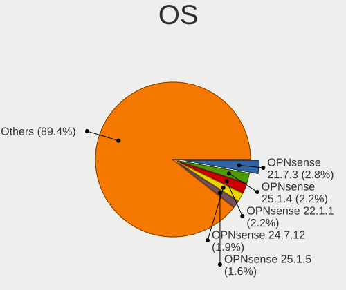

| Name             | Desktops | Percent |
|------------------|----------|---------|
| OPNsense 21.7.3  | 9        | 2.81%   |
| OPNsense 25.1.4  | 7        | 2.19%   |
| OPNsense 22.1.1  | 7        | 2.19%   |
| OPNsense 24.7.12 | 6        | 1.88%   |
| OPNsense 25.1.5  | 5        | 1.56%   |
| OPNsense 25.1.3  | 5        | 1.56%   |
| OPNsense 24.7.7  | 5        | 1.56%   |
| OPNsense 24.7.11 | 5        | 1.56%   |
| OPNsense 23.7.5  | 5        | 1.56%   |
| OPNsense 23.1.5  | 5        | 1.56%   |
| OPNsense 22.1    | 5        | 1.56%   |
| OPNsense 21.1.5  | 5        | 1.56%   |
| OPNsense 21.1.4  | 5        | 1.56%   |
| OPNsense 24.7.9  | 4        | 1.25%   |
| OPNsense 23.7.9  | 4        | 1.25%   |
| OPNsense 23.7.12 | 4        | 1.25%   |
| OPNsense 23.1.6  | 4        | 1.25%   |
| OPNsense 23.1    | 4        | 1.25%   |
| OPNsense 22.7.9  | 4        | 1.25%   |
| OPNsense 22.7.2  | 4        | 1.25%   |
| OPNsense 22.4.3  | 4        | 1.25%   |
| OPNsense 22.1.4  | 4        | 1.25%   |
| OPNsense 21.7.7  | 4        | 1.25%   |
| OPNsense 21.7.6  | 4        | 1.25%   |
| OPNsense 21.1.3  | 4        | 1.25%   |
| OPNsense 21.1    | 4        | 1.25%   |
| OpenBSD 6.8      | 4        | 1.25%   |
| FreeBSD 14.0-p5  | 4        | 1.25%   |
| OPNsense 25.7.9  | 3        | 0.94%   |
| OPNsense 25.7.1  | 3        | 0.94%   |
| OPNsense 25.1.12 | 3        | 0.94%   |
| OPNsense 25.1.1  | 3        | 0.94%   |
| OPNsense 24.7.8  | 3        | 0.94%   |
| OPNsense 24.7.10 | 3        | 0.94%   |
| OPNsense 24.1.9  | 3        | 0.94%   |
| OPNsense 24.1.6  | 3        | 0.94%   |
| OPNsense 24.1.4  | 3        | 0.94%   |
| OPNsense 24.1.2  | 3        | 0.94%   |
| OPNsense 24.1.1  | 3        | 0.94%   |
| OPNsense 23.7.8  | 3        | 0.94%   |

OS Family
---------

OS without a version

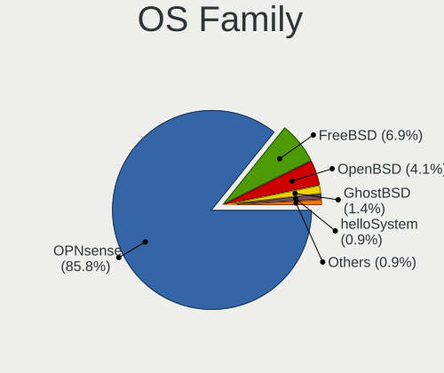

| Name        | Desktops | Percent |
|-------------|----------|---------|
| OPNsense    | 187      | 85.78%  |
| FreeBSD     | 15       | 6.88%   |
| OpenBSD     | 9        | 4.13%   |
| GhostBSD    | 3        | 1.38%   |
| helloSystem | 2        | 0.92%   |
| TrueNAS     | 1        | 0.46%   |
| FreeNAS     | 1        | 0.46%   |

Arch
----

OS architecture (x86_64, i586, etc.)

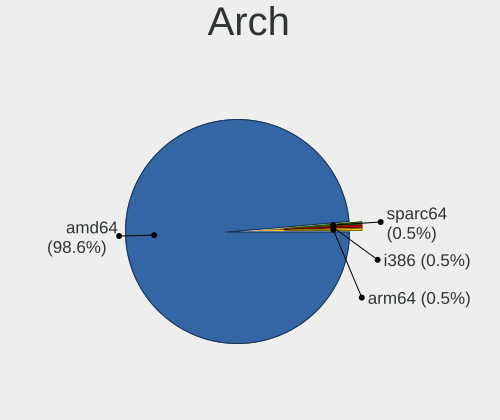

| Name    | Desktops | Percent |
|---------|----------|---------|
| amd64   | 215      | 98.62%  |
| sparc64 | 1        | 0.46%   |
| i386    | 1        | 0.46%   |
| arm64   | 1        | 0.46%   |

DE
--

Desktop Environment

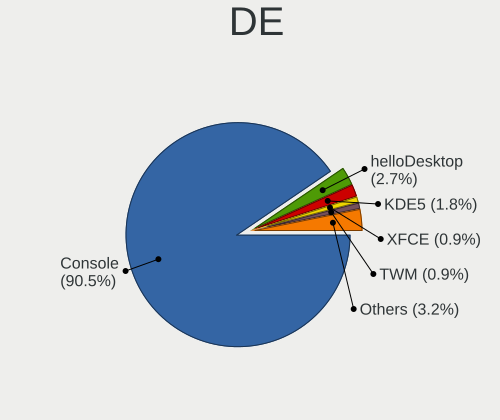

| Name         | Desktops | Percent |
|--------------|----------|---------|
| Console      | 200      | 90.5%   |
| helloDesktop | 6        | 2.71%   |
| KDE5         | 4        | 1.81%   |
| XFCE         | 2        | 0.9%    |
| TWM          | 2        | 0.9%    |
| LXQt         | 2        | 0.9%    |
| xinitrc      | 1        | 0.45%   |
| wlroots      | 1        | 0.45%   |
| MATE         | 1        | 0.45%   |
| GNOME        | 1        | 0.45%   |
| fvwm         | 1        | 0.45%   |

Display Server
--------------

X11 or Wayland

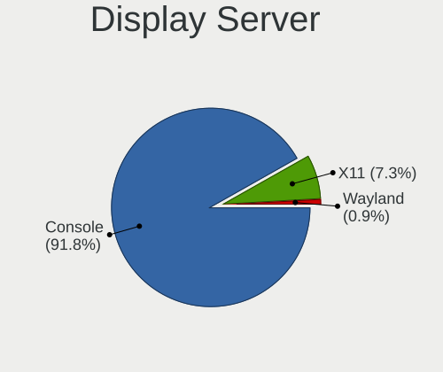

| Name    | Desktops | Percent |
|---------|----------|---------|
| Console | 202      | 91.82%  |
| X11     | 16       | 7.27%   |
| Wayland | 2        | 0.91%   |

Display Manager
---------------

SDDM, LightDM, etc.

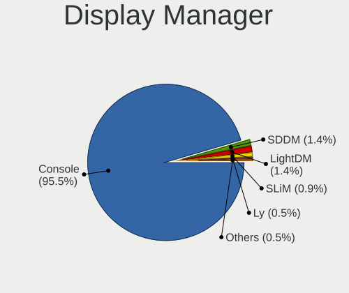

| Name    | Desktops | Percent |
|---------|----------|---------|
| Console | 210      | 95.45%  |
| SDDM    | 3        | 1.36%   |
| LightDM | 3        | 1.36%   |
| SLiM    | 2        | 0.91%   |
| Ly      | 1        | 0.45%   |
| GDM     | 1        | 0.45%   |

OS Lang
-------

Language

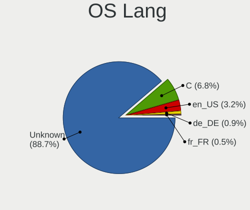

| Lang    | Desktops | Percent |
|---------|----------|---------|
| Unknown | 197      | 88.74%  |
| C       | 15       | 6.76%   |
| en_US   | 7        | 3.15%   |
| de_DE   | 2        | 0.9%    |
| fr_FR   | 1        | 0.45%   |

Boot Mode
---------

EFI or BIOS

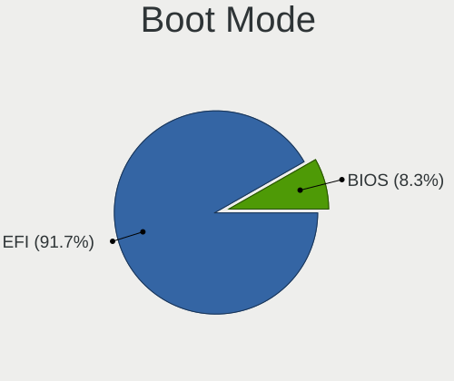

| Mode | Desktops | Percent |
|------|----------|---------|
| EFI  | 200      | 91.74%  |
| BIOS | 18       | 8.26%   |

Filesystem
----------

Type of filesystem

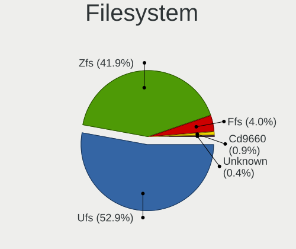

| Type    | Desktops | Percent |
|---------|----------|---------|
| Ufs     | 120      | 52.86%  |
| Zfs     | 95       | 41.85%  |
| Ffs     | 9        | 3.96%   |
| Cd9660  | 2        | 0.88%   |
| Unknown | 1        | 0.44%   |

Part. scheme
------------

Scheme of partitioning

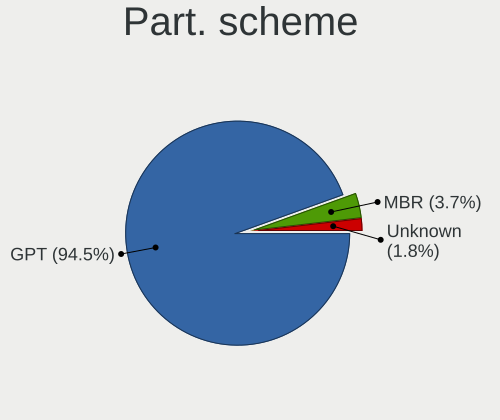

| Type    | Desktops | Percent |
|---------|----------|---------|
| GPT     | 206      | 94.5%   |
| MBR     | 8        | 3.67%   |
| Unknown | 4        | 1.83%   |

Board
-----

Vendor
------

Motherboard manufacturer

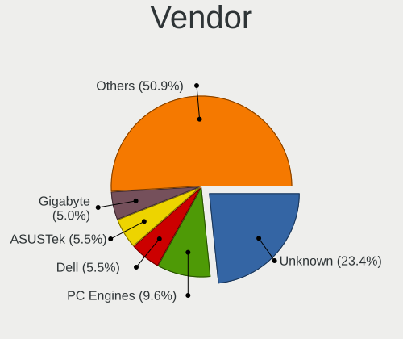

| Name                       | Desktops | Percent |
|----------------------------|----------|---------|
| Unknown                    | 51       | 23.39%  |
| PC Engines                 | 21       | 9.63%   |
| Dell                       | 12       | 5.5%    |
| ASUSTek Computer           | 12       | 5.5%    |
| Gigabyte Technology        | 11       | 5.05%   |
| Fujitsu                    | 11       | 5.05%   |
| Protectli                  | 9        | 4.13%   |
| Intel                      | 9        | 4.13%   |
| Lenovo                     | 8        | 3.67%   |
| ASRock                     | 8        | 3.67%   |
| Shuttle                    | 7        | 3.21%   |
| Hewlett-Packard            | 6        | 2.75%   |
| Deciso                     | 6        | 2.75%   |
| IceWhale Technology        | 5        | 2.29%   |
| MW                         | 4        | 1.83%   |
| BESSTAR Tech               | 4        | 1.83%   |
| Techvision                 | 3        | 1.38%   |
| Supermicro                 | 3        | 1.38%   |
| SJRC                       | 2        | 0.92%   |
| Secudos                    | 2        | 0.92%   |
| MSI                        | 2        | 0.92%   |
| Hardkernel                 | 2        | 0.92%   |
| Biostar                    | 2        | 0.92%   |
| AAEON                      | 2        | 0.92%   |
| ZOTAC                      | 1        | 0.46%   |
| XtReAmEr                   | 1        | 0.46%   |
| Winston Marriot            | 1        | 0.46%   |
| Sun                        | 1        | 0.46%   |
| Silicom                    | 1        | 0.46%   |
| ShenZhen MinWin Technology | 1        | 0.46%   |
| SeeedStudio                | 1        | 0.46%   |
| Seeed Studio               | 1        | 0.46%   |
| Purism                     | 1        | 0.46%   |
| OEM                        | 1        | 0.46%   |
| NEXCOM                     | 1        | 0.46%   |
| KEBA                       | 1        | 0.46%   |
| CncTion                    | 1        | 0.46%   |
| Cisco                      | 1        | 0.46%   |
| AWOW                       | 1        | 0.46%   |
| Advantech                  | 1        | 0.46%   |

Model
-----

Motherboard model

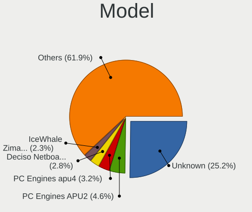

| Name                                      | Desktops | Percent |
|-------------------------------------------|----------|---------|
| Unknown                                   | 55       | 25.23%  |
| PC Engines APU2                           | 10       | 4.59%   |
| PC Engines apu4                           | 7        | 3.21%   |
| Deciso Netboard A10 GEN2 Model G          | 6        | 2.75%   |
| IceWhale ZimaBoard 832 ZMB                | 5        | 2.29%   |
| MW GMLK-2_5G4L                            | 4        | 1.83%   |
| Techvision TVI7309X                       | 3        | 1.38%   |
| Shuttle DH170                             | 3        | 1.38%   |
| Protectli VP2420                          | 3        | 1.38%   |
| Protectli FW4B                            | 3        | 1.38%   |
| PC Engines APU                            | 3        | 1.38%   |
| Intel Q3XXG4-P V1.0                       | 3        | 1.38%   |
| Fujitsu FUTRO S920                        | 3        | 1.38%   |
| Dell OptiPlex 5040                        | 3        | 1.38%   |
| Supermicro X7SPA-H                        | 2        | 0.92%   |
| SJRC ADLN-6L                              | 2        | 0.92%   |
| Shuttle DS10U                             | 2        | 0.92%   |
| Hardkernel ODROID-H2                      | 2        | 0.92%   |
| Fujitsu FUTRO S720                        | 2        | 0.92%   |
| Fujitsu ESPRIMO C720                      | 2        | 0.92%   |
| Dell OptiPlex 7040                        | 2        | 0.92%   |
| AAEON UP-APL01                            | 2        | 0.92%   |
| Winston Marriot PICO PC  PICOPC           | 1        | 0.46%   |
| Supermicro SYS-E301-9D-8CN8TP             | 1        | 0.46%   |
| Sun SUNW,Ultra-1                          | 1        | 0.46%   |
| Silicom Minnowboard Turbot D0/D1 PLATFORM | 1        | 0.46%   |
| Shuttle XH610                             | 1        | 0.46%   |
| Shuttle DS61                              | 1        | 0.46%   |
| ShenZhen MinWin 3865U-6L                  | 1        | 0.46%   |
| SeeedStudio ODYSSEY-X86J4125              | 1        | 0.46%   |
| Seeed Studio ODYSSEY-X86J4105             | 1        | 0.46%   |
| Purism Librem Mini v2                     | 1        | 0.46%   |
| Protectli FW6E                            | 1        | 0.46%   |
| Protectli FW6                             | 1        | 0.46%   |
| Protectli FW2B                            | 1        | 0.46%   |
| PC Engines APU3                           | 1        | 0.46%   |
| OEM 1.0                                   | 1        | 0.46%   |
| NEXCOM ASG                                | 1        | 0.46%   |
| MSI MS-6788                               | 1        | 0.46%   |
| MSI Compaq dx2420 Microtower              | 1        | 0.46%   |

Model Family
------------

Motherboard model prefix

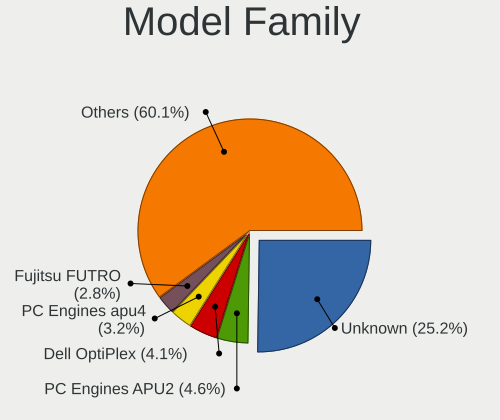

| Name                          | Desktops | Percent |
|-------------------------------|----------|---------|
| Unknown                       | 55       | 25.23%  |
| PC Engines APU2               | 10       | 4.59%   |
| Dell OptiPlex                 | 9        | 4.13%   |
| PC Engines apu4               | 7        | 3.21%   |
| Fujitsu FUTRO                 | 6        | 2.75%   |
| Deciso Netboard               | 6        | 2.75%   |
| Lenovo ThinkCentre            | 5        | 2.29%   |
| IceWhale ZimaBoard            | 5        | 2.29%   |
| Fujitsu ESPRIMO               | 5        | 2.29%   |
| MW GMLK-2                     | 4        | 1.83%   |
| Techvision TVI7309X           | 3        | 1.38%   |
| Shuttle DH170                 | 3        | 1.38%   |
| Protectli VP2420              | 3        | 1.38%   |
| Protectli FW4B                | 3        | 1.38%   |
| PC Engines APU                | 3        | 1.38%   |
| Intel Q3XXG4-P                | 3        | 1.38%   |
| HP Compaq                     | 3        | 1.38%   |
| ASUS PRIME                    | 3        | 1.38%   |
| Supermicro X7SPA-H            | 2        | 0.92%   |
| SJRC ADLN-6L                  | 2        | 0.92%   |
| Shuttle DS10U                 | 2        | 0.92%   |
| Lenovo IdeaCentre             | 2        | 0.92%   |
| Hardkernel ODROID-H2          | 2        | 0.92%   |
| Dell PowerEdge                | 2        | 0.92%   |
| ASUS 1HE                      | 2        | 0.92%   |
| AAEON UP-APL01                | 2        | 0.92%   |
| Winston Marriot PICO          | 1        | 0.46%   |
| Supermicro SYS-E301-9D-8CN8TP | 1        | 0.46%   |
| Sun SUNW                      | 1        | 0.46%   |
| Silicom Minnowboard           | 1        | 0.46%   |
| Shuttle XH610                 | 1        | 0.46%   |
| Shuttle DS61                  | 1        | 0.46%   |
| ShenZhen MinWin 3865U-6L      | 1        | 0.46%   |
| SeeedStudio ODYSSEY-X86J4125  | 1        | 0.46%   |
| Seeed Studio ODYSSEY-X86J4105 | 1        | 0.46%   |
| Purism Librem                 | 1        | 0.46%   |
| Protectli FW6E                | 1        | 0.46%   |
| Protectli FW6                 | 1        | 0.46%   |
| Protectli FW2B                | 1        | 0.46%   |
| PC Engines APU3               | 1        | 0.46%   |

MFG Year
--------

Motherboard manufacture year

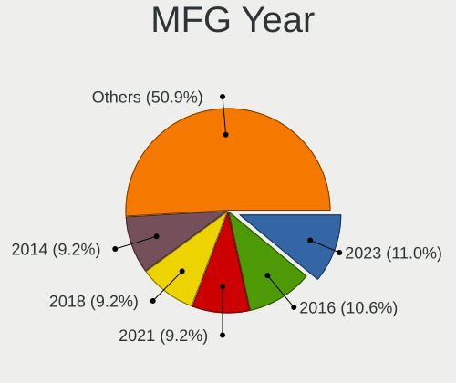

| Year    | Desktops | Percent |
|---------|----------|---------|
| 2023    | 24       | 11.01%  |
| 2016    | 23       | 10.55%  |
| 2021    | 20       | 9.17%   |
| 2018    | 20       | 9.17%   |
| 2014    | 20       | 9.17%   |
| 2022    | 19       | 8.72%   |
| 2017    | 19       | 8.72%   |
| 2020    | 15       | 6.88%   |
| 2024    | 13       | 5.96%   |
| 2019    | 11       | 5.05%   |
| 2011    | 7        | 3.21%   |
| 2015    | 6        | 2.75%   |
| 2013    | 6        | 2.75%   |
| 2012    | 4        | 1.83%   |
| 2009    | 4        | 1.83%   |
| Unknown | 4        | 1.83%   |
| 2025    | 2        | 0.92%   |
| 2007    | 1        | 0.46%   |

Form Factor
-----------

Physical design of the computer

| Name    | Desktops | Percent |
|---------|----------|---------|
| Desktop | 218      | 100%    |

Coreboot
--------

Have coreboot on board

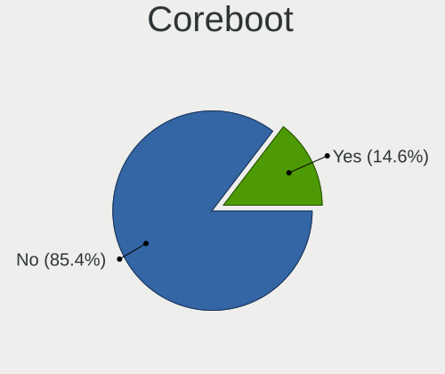

| Used | Desktops | Percent |
|------|----------|---------|
| No   | 187      | 85.39%  |
| Yes  | 32       | 14.61%  |

RAM Size
--------

Total RAM memory

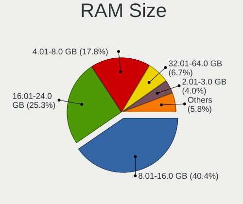

| Size in GB      | Desktops | Percent |
|-----------------|----------|---------|
| 8.01-16.0       | 91       | 40.44%  |
| 16.01-24.0      | 57       | 25.33%  |
| 4.01-8.0        | 40       | 17.78%  |
| 32.01-64.0      | 15       | 6.67%   |
| 2.01-3.0        | 9        | 4%      |
| 64.01-256.0     | 5        | 2.22%   |
| 24.01-32.0      | 3        | 1.33%   |
| More than 256.0 | 2        | 0.89%   |
| 3.01-4.0        | 1        | 0.44%   |
| 1.01-2.0        | 1        | 0.44%   |
| 0.01-0.5        | 1        | 0.44%   |

RAM Used
--------

Used RAM memory

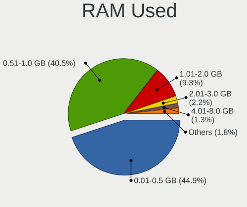

| Used GB    | Desktops | Percent |
|------------|----------|---------|
| 0.01-0.5   | 102      | 44.93%  |
| 0.51-1.0   | 92       | 40.53%  |
| 1.01-2.0   | 21       | 9.25%   |
| 2.01-3.0   | 5        | 2.2%    |
| 4.01-8.0   | 3        | 1.32%   |
| 0          | 2        | 0.88%   |
| 32.01-64.0 | 1        | 0.44%   |
| 3.01-4.0   | 1        | 0.44%   |

Total Drives
------------

Number of drives on board

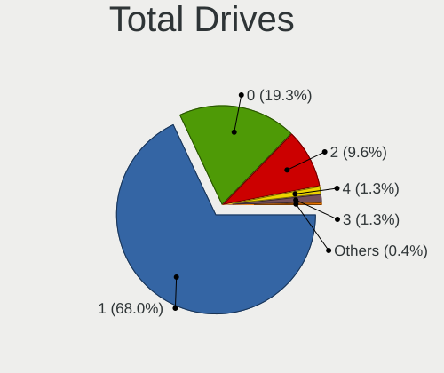

| Drives | Desktops | Percent |
|--------|----------|---------|
| 1      | 155      | 67.98%  |
| 0      | 44       | 19.3%   |
| 2      | 22       | 9.65%   |
| 4      | 3        | 1.32%   |
| 3      | 3        | 1.32%   |
| 9      | 1        | 0.44%   |

Has CD-ROM
----------

Has CD-ROM on board

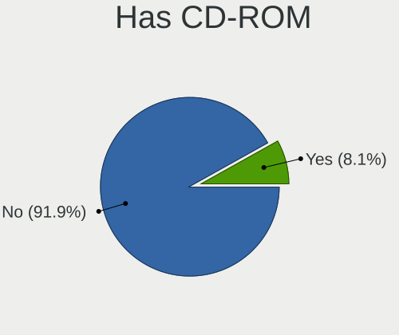

| Presented | Desktops | Percent |
|-----------|----------|---------|
| No        | 204      | 91.89%  |
| Yes       | 18       | 8.11%   |

Has Ethernet
------------

Has Ethernet on board

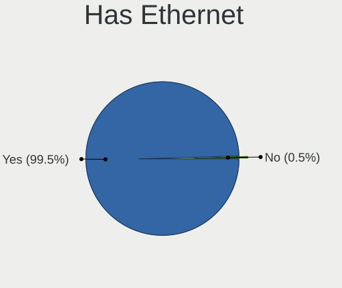

| Presented | Desktops | Percent |
|-----------|----------|---------|
| Yes       | 217      | 99.54%  |
| No        | 1        | 0.46%   |

Has WiFi
--------

Has WiFi module

| Presented | Desktops | Percent |
|-----------|----------|---------|
| No        | 189      | 84.75%  |
| Yes       | 34       | 15.25%  |

Has Bluetooth
-------------

Has Bluetooth module

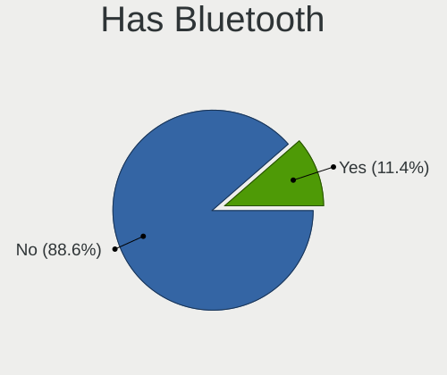

| Presented | Desktops | Percent |
|-----------|----------|---------|
| No        | 194      | 88.58%  |
| Yes       | 25       | 11.42%  |

Location
--------

Country
-------

Geographic location (country)

| Country | Desktops | Percent |
|---------|----------|---------|
| Austria | 218      | 100%    |

City
----

Geographic location (city)

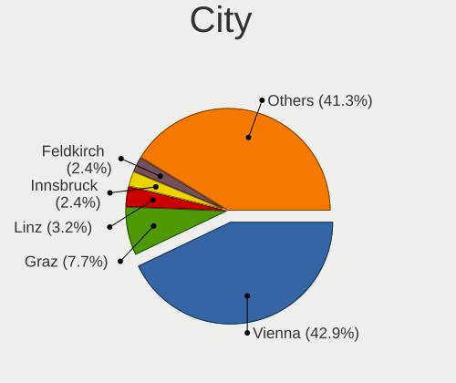

| City                     | Desktops | Percent |
|--------------------------|----------|---------|
| Vienna                   | 106      | 42.91%  |
| Graz                     | 19       | 7.69%   |
| Linz                     | 8        | 3.24%   |
| Innsbruck                | 6        | 2.43%   |
| Feldkirch                | 6        | 2.43%   |
| Wels                     | 4        | 1.62%   |
| Salzburg                 | 3        | 1.21%   |
| Leoben                   | 3        | 1.21%   |
| Krems                    | 3        | 1.21%   |
| Wiener Neustadt          | 2        | 0.81%   |
| Trausdorf an der Wulka   | 2        | 0.81%   |
| Stockerau                | 2        | 0.81%   |
| Sankt Veit an der Glan   | 2        | 0.81%   |
| Purkersdorf              | 2        | 0.81%   |
| Pirching am Traubenberg  | 2        | 0.81%   |
| Ohlsdorf                 | 2        | 0.81%   |
| Neumarkt im Muehlkreis   | 2        | 0.81%   |
| Klagenfurt               | 2        | 0.81%   |
| Hittisau                 | 2        | 0.81%   |
| Bregenz                  | 2        | 0.81%   |
| Axams                    | 2        | 0.81%   |
| Zell am See              | 1        | 0.4%    |
| Wolfsberg                | 1        | 0.4%    |
| Wilhering                | 1        | 0.4%    |
| Voggenberg               | 1        | 0.4%    |
| Tulln                    | 1        | 0.4%    |
| Tragwein                 | 1        | 0.4%    |
| Stinatz                  | 1        | 0.4%    |
| Steyr                    | 1        | 0.4%    |
| Steinhaus                | 1        | 0.4%    |
| Spittal an der Drau      | 1        | 0.4%    |
| Sieghartskirchen         | 1        | 0.4%    |
| Siegendorf im Burgenland | 1        | 0.4%    |
| Seyring                  | 1        | 0.4%    |
| Schwechat                | 1        | 0.4%    |
| Schwarzach im Pongau     | 1        | 0.4%    |
| Schluesslberg            | 1        | 0.4%    |
| Sankt Pölten            | 1        | 0.4%    |
| Sankt Pölten          | 1        | 0.4%    |
| Sankt Pantaleon          | 1        | 0.4%    |

Drives
------

Drive Vendor
------------

Hard drive vendors

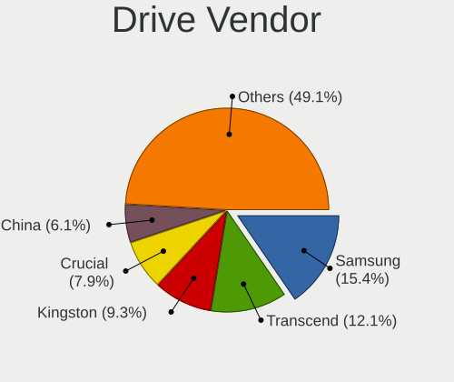

| Vendor              | Desktops | Drives | Percent |
|---------------------|----------|--------|---------|
| Samsung Electronics | 33       | 52     | 15.42%  |
| Transcend           | 26       | 35     | 12.15%  |
| Kingston            | 20       | 28     | 9.35%   |
| Crucial             | 17       | 21     | 7.94%   |
| China               | 13       | 17     | 6.07%   |
| WDC                 | 12       | 18     | 5.61%   |
| SanDisk             | 11       | 20     | 5.14%   |
| Intel               | 9        | 14     | 4.21%   |
| Seagate             | 6        | 13     | 2.8%    |
| Hoodisk             | 5        | 7      | 2.34%   |
| Toshiba             | 4        | 7      | 1.87%   |
| Phison              | 4        | 5      | 1.87%   |
| SK hynix            | 3        | 11     | 1.4%    |
| Silicon Motion      | 3        | 3      | 1.4%    |
| Patriot             | 3        | 5      | 1.4%    |
| HGST                | 3        | 13     | 1.4%    |
| FORESEE             | 3        | 4      | 1.4%    |
| Plextor             | 2        | 2      | 0.93%   |
| OCZ                 | 2        | 2      | 0.93%   |
| Innodisk            | 2        | 3      | 0.93%   |
| Dogfish             | 2        | 2      | 0.93%   |
| Dell                | 2        | 2      | 0.93%   |
| Corsair             | 2        | 5      | 0.93%   |
| BORY                | 2        | 5      | 0.93%   |
| BIWIN               | 2        | 2      | 0.93%   |
| BAITITON            | 2        | 2      | 0.93%   |
| A-DATA Technology   | 2        | 5      | 0.93%   |
| Verbatim            | 1        | 1      | 0.47%   |
| SPCC                | 1        | 2      | 0.47%   |
| Protectli           | 1        | 1      | 0.47%   |
| Mushkin             | 1        | 1      | 0.47%   |
| Micron Technology   | 1        | 1      | 0.47%   |
| LITEONIT            | 1        | 1      | 0.47%   |
| Leven               | 1        | 2      | 0.47%   |
| KIOXIA-EXCERIA      | 1        | 1      | 0.47%   |
| KIOXIA              | 1        | 1      | 0.47%   |
| KingSpec            | 1        | 1      | 0.47%   |
| KeepData            | 1        | 1      | 0.47%   |
| Intenso             | 1        | 2      | 0.47%   |
| Hitachi             | 1        | 1      | 0.47%   |

Drive Model
-----------

Hard drive models

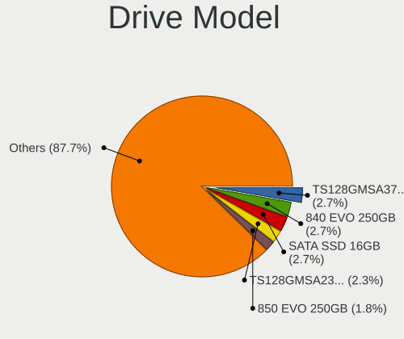

| Model                          | Desktops | Percent |
|--------------------------------|----------|---------|
| Transcend TS128GMSA370 128GB   | 6        | 2.74%   |
| Samsung SSD 840 EVO 250GB      | 6        | 2.74%   |
| China SATA SSD 16GB            | 6        | 2.74%   |
| Transcend TS128GMSA230S 128GB  | 5        | 2.28%   |
| Samsung SSD 850 EVO 250GB      | 4        | 1.83%   |
| Kingston SKC600MS256G 256GB    | 4        | 1.83%   |
| Samsung SSD 830 Series 256GB   | 3        | 1.37%   |
| HGST HTS725050A7E630 500GB     | 3        | 1.37%   |
| FORESEE 128GB SSD              | 3        | 1.37%   |
| Crucial CT240BX500SSD1 240GB   | 3        | 1.37%   |
| Transcend TS64GMSA230S 64GB    | 2        | 0.91%   |
| Transcend TS480GMTS420S 480GB  | 2        | 0.91%   |
| Transcend TS256GMSA230S 256GB  | 2        | 0.91%   |
| Transcend TS240GSSD220S 240GB  | 2        | 0.91%   |
| Transcend TS16GMSA370 16GB     | 2        | 0.91%   |
| SK hynix SC308 SATA 128GB      | 2        | 0.91%   |
| Silicon Motion P10D 1TB        | 2        | 0.91%   |
| SanDisk SSD PLUS 480GB         | 2        | 0.91%   |
| SanDisk SSD PLUS 120GB         | 2        | 0.91%   |
| Samsung SSD 980 250GB          | 2        | 0.91%   |
| Samsung SSD 970 EVO Plus 250GB | 2        | 0.91%   |
| Samsung SSD 860 EVO 250GB      | 2        | 0.91%   |
| Samsung SSD 850 EVO 500GB      | 2        | 0.91%   |
| Phison SATA SSD 16GB           | 2        | 0.91%   |
| Kingston SUV500MS120G 120GB    | 2        | 0.91%   |
| Kingston SA400S37480G 480GB    | 2        | 0.91%   |
| Intel SSDSC2KW128G8 128GB      | 2        | 0.91%   |
| Intel SSDPEKNU512GZ 512GB      | 2        | 0.91%   |
| Hoodisk SSD 64GB               | 2        | 0.91%   |
| Hoodisk SSD 128GB              | 2        | 0.91%   |
| Crucial CT250P2SSD8 250GB      | 2        | 0.91%   |
| Crucial CT250MX500SSD1 250GB   | 2        | 0.91%   |
| Crucial CT120BX500SSD1 120GB   | 2        | 0.91%   |
| China SATA SSD 64GB            | 2        | 0.91%   |
| China G521N 256G               | 2        | 0.91%   |
| BORY M500 128G                 | 2        | 0.91%   |
| WDC WD800JD-60LSA5 80GB        | 1        | 0.46%   |
| WDC WD5000BEVT-22ZAT0 500GB    | 1        | 0.46%   |
| WDC WD5000AAKS-00YGA0 500GB    | 1        | 0.46%   |
| WDC WD40EFZX-68AWUN0 4TB       | 1        | 0.46%   |

HDD Vendor
----------

Hard disk drive vendors

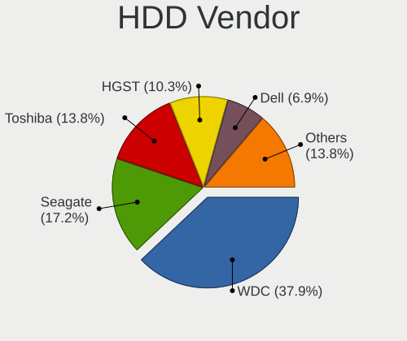

| Vendor              | Desktops | Drives | Percent |
|---------------------|----------|--------|---------|
| WDC                 | 11       | 16     | 37.93%  |
| Seagate             | 5        | 6      | 17.24%  |
| Toshiba             | 4        | 7      | 13.79%  |
| HGST                | 3        | 13     | 10.34%  |
| Dell                | 2        | 2      | 6.9%    |
| Samsung Electronics | 1        | 2      | 3.45%   |
| Hitachi             | 1        | 1      | 3.45%   |
| Hewlett-Packard     | 1        | 1      | 3.45%   |
| Apple               | 1        | 1      | 3.45%   |

SSD Vendor
----------

Solid state drive vendors

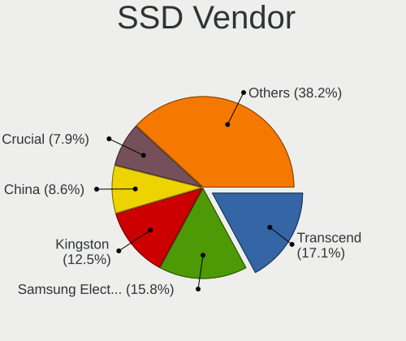

| Vendor              | Desktops | Drives | Percent |
|---------------------|----------|--------|---------|
| Transcend           | 26       | 35     | 17.11%  |
| Samsung Electronics | 24       | 35     | 15.79%  |
| Kingston            | 19       | 27     | 12.5%   |
| China               | 13       | 17     | 8.55%   |
| Crucial             | 12       | 16     | 7.89%   |
| SanDisk             | 11       | 20     | 7.24%   |
| Intel               | 6        | 8      | 3.95%   |
| Hoodisk             | 5        | 7      | 3.29%   |
| SK hynix            | 3        | 11     | 1.97%   |
| Phison              | 3        | 4      | 1.97%   |
| FORESEE             | 3        | 4      | 1.97%   |
| OCZ                 | 2        | 2      | 1.32%   |
| Innodisk            | 2        | 3      | 1.32%   |
| Dogfish             | 2        | 2      | 1.32%   |
| BORY                | 2        | 5      | 1.32%   |
| BAITITON            | 2        | 2      | 1.32%   |
| Verbatim            | 1        | 1      | 0.66%   |
| SPCC                | 1        | 2      | 0.66%   |
| Seagate             | 1        | 7      | 0.66%   |
| Protectli           | 1        | 1      | 0.66%   |
| Plextor             | 1        | 1      | 0.66%   |
| Patriot             | 1        | 1      | 0.66%   |
| Mushkin             | 1        | 1      | 0.66%   |
| LITEONIT            | 1        | 1      | 0.66%   |
| Leven               | 1        | 2      | 0.66%   |
| KIOXIA-EXCERIA      | 1        | 1      | 0.66%   |
| KingSpec            | 1        | 1      | 0.66%   |
| KeepData            | 1        | 1      | 0.66%   |
| Intenso             | 1        | 2      | 0.66%   |
| GOODRAM             | 1        | 1      | 0.66%   |
| BR                  | 1        | 1      | 0.66%   |
| BIWIN               | 1        | 1      | 0.66%   |
| ATP                 | 1        | 1      | 0.66%   |

Drive Kind
----------

HDD or SSD

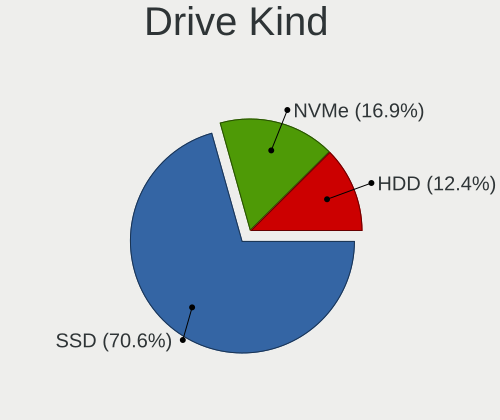

| Kind | Desktops | Drives | Percent |
|------|----------|--------|---------|
| SSD  | 142      | 224    | 70.65%  |
| NVMe | 34       | 53     | 16.92%  |
| HDD  | 25       | 49     | 12.44%  |

Drive Connector
---------------

SATA, SAS, NVMe, etc.

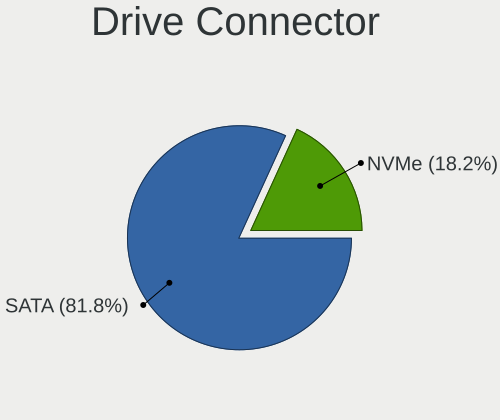

| Type | Desktops | Drives | Percent |
|------|----------|--------|---------|
| SATA | 153      | 273    | 81.82%  |
| NVMe | 34       | 53     | 18.18%  |

Drive Size
----------

Size of hard drive

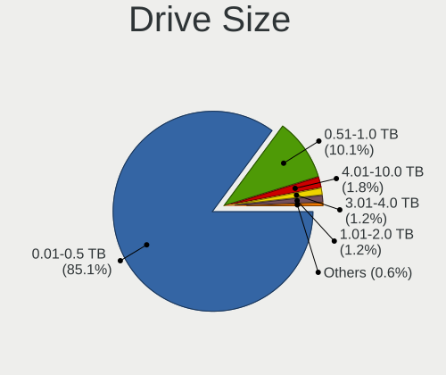

| Size in TB | Desktops | Drives | Percent |
|------------|----------|--------|---------|
| 0.01-0.5   | 143      | 234    | 85.12%  |
| 0.51-1.0   | 17       | 24     | 10.12%  |
| 4.01-10.0  | 3        | 6      | 1.79%   |
| 3.01-4.0   | 2        | 5      | 1.19%   |
| 1.01-2.0   | 2        | 2      | 1.19%   |
| 10.01-20.0 | 1        | 2      | 0.6%    |

Space Total
-----------

Amount of disk space available on the file system

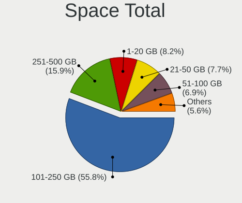

| Size in GB | Desktops | Percent |
|------------|----------|---------|
| 101-250    | 130      | 55.79%  |
| 251-500    | 37       | 15.88%  |
| 1-20       | 19       | 8.15%   |
| 21-50      | 18       | 7.73%   |
| 51-100     | 16       | 6.87%   |
| 501-1000   | 10       | 4.29%   |
| 1001-2000  | 3        | 1.29%   |

Space Used
----------

Amount of used disk space

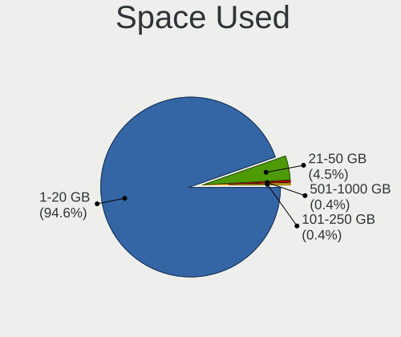

| Used GB  | Desktops | Percent |
|----------|----------|---------|
| 1-20     | 212      | 94.64%  |
| 21-50    | 10       | 4.46%   |
| 101-250  | 1        | 0.45%   |
| 501-1000 | 1        | 0.45%   |

Malfunc. Drives
---------------

Drive models with a malfunction

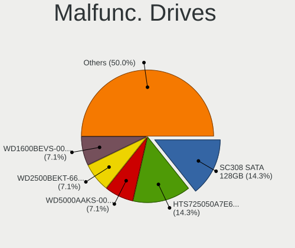

| Model                               | Desktops | Drives | Percent |
|-------------------------------------|----------|--------|---------|
| SK hynix SC308 SATA 128GB           | 2        | 10     | 14.29%  |
| HGST HTS725050A7E630 500GB          | 2        | 12     | 14.29%  |
| WDC WD5000AAKS-00YGA0 500GB         | 1        | 1      | 7.14%   |
| WDC WD2500BEKT-66PVMT0 250GB        | 1        | 1      | 7.14%   |
| WDC WD1600BEVS-00UST0 160GB         | 1        | 1      | 7.14%   |
| SanDisk SD7SB3Q128G1001 128GB       | 1        | 2      | 7.14%   |
| Samsung Electronics SSD 970 EVO 1TB | 1        | 1      | 7.14%   |
| Samsung Electronics HM500LI 500GB   | 1        | 2      | 7.14%   |
| Intel SSDSC2KF512G8 SATA 512GB      | 1        | 2      | 7.14%   |
| Intel SSDPEKKW128G7 128GB           | 1        | 1      | 7.14%   |
| Hitachi HDS721050CLA660 500GB       | 1        | 1      | 7.14%   |
| China XJH-128GB                     | 1        | 1      | 7.14%   |

Malfunc. Drive Vendor
---------------------

Vendors of faulty drives

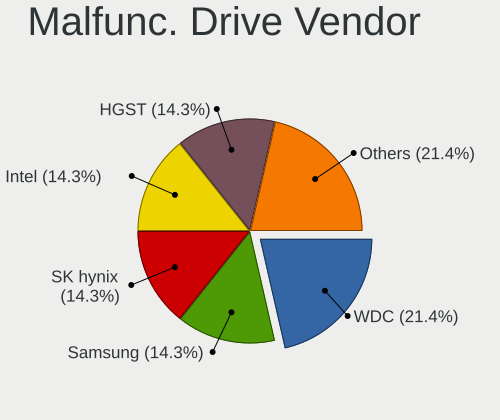

| Vendor              | Desktops | Drives | Percent |
|---------------------|----------|--------|---------|
| WDC                 | 3        | 3      | 21.43%  |
| SK hynix            | 2        | 10     | 14.29%  |
| Samsung Electronics | 2        | 3      | 14.29%  |
| Intel               | 2        | 3      | 14.29%  |
| HGST                | 2        | 12     | 14.29%  |
| SanDisk             | 1        | 2      | 7.14%   |
| Hitachi             | 1        | 1      | 7.14%   |
| China               | 1        | 1      | 7.14%   |

Malfunc. HDD Vendor
-------------------

Vendors of faulty HDD drives

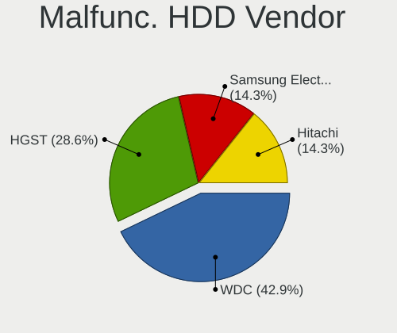

| Vendor              | Desktops | Drives | Percent |
|---------------------|----------|--------|---------|
| WDC                 | 3        | 3      | 42.86%  |
| HGST                | 2        | 12     | 28.57%  |
| Samsung Electronics | 1        | 2      | 14.29%  |
| Hitachi             | 1        | 1      | 14.29%  |

Malfunc. Drive Kind
-------------------

Kinds of faulty drives

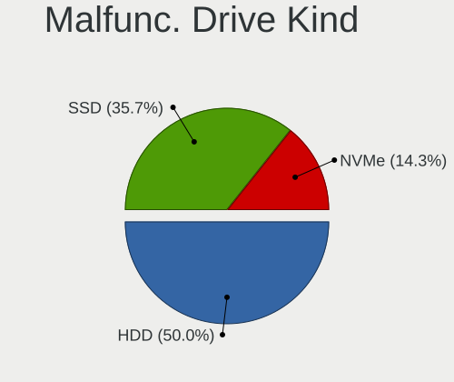

| Kind | Desktops | Drives | Percent |
|------|----------|--------|---------|
| HDD  | 7        | 18     | 50%     |
| SSD  | 5        | 15     | 35.71%  |
| NVMe | 2        | 2      | 14.29%  |

Failed Drives
-------------

Failed drive models

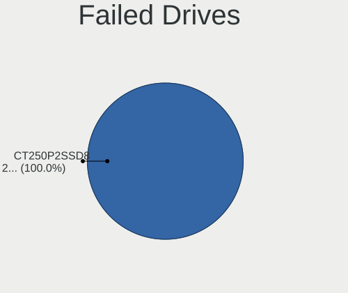

| Model                     | Desktops | Drives | Percent |
|---------------------------|----------|--------|---------|
| Intel SSDPEKKW128G7 128GB | 1        | 1      | 50%     |
| Crucial CT250P2SSD8 250GB | 1        | 1      | 50%     |

Failed Drive Vendor
-------------------

Failed drive vendors

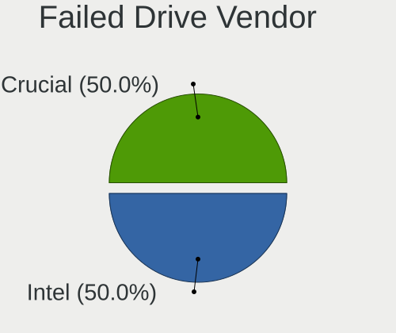

| Vendor  | Desktops | Drives | Percent |
|---------|----------|--------|---------|
| Intel   | 1        | 1      | 50%     |
| Crucial | 1        | 1      | 50%     |

Drive Status
------------

Number of failed and malfunc. drives

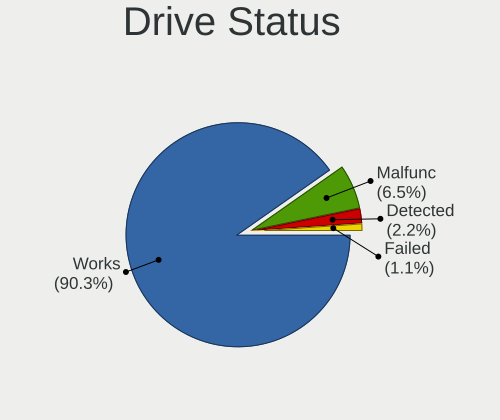

| Status   | Desktops | Drives | Percent |
|----------|----------|--------|---------|
| Works    | 167      | 283    | 90.27%  |
| Malfunc  | 12       | 35     | 6.49%   |
| Detected | 4        | 6      | 2.16%   |
| Failed   | 2        | 2      | 1.08%   |

Storage controller
------------------

Storage Vendor
--------------

Storage controller vendors

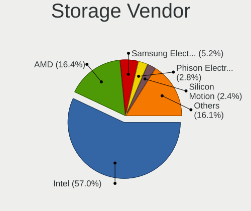

| Vendor                      | Desktops | Percent |
|-----------------------------|----------|---------|
| Intel                       | 163      | 56.99%  |
| AMD                         | 47       | 16.43%  |
| Samsung Electronics         | 15       | 5.24%   |
| Phison Electronics          | 8        | 2.8%    |
| Silicon Motion              | 7        | 2.45%   |
| SanDisk                     | 6        | 2.1%    |
| ASMedia Technology          | 6        | 2.1%    |
| Micron/Crucial Technology   | 5        | 1.75%   |
| Micron Technology           | 4        | 1.4%    |
| MAXIO Technology (Hangzhou) | 4        | 1.4%    |
| Broadcom / LSI              | 4        | 1.4%    |
| SK hynix                    | 2        | 0.7%    |
| KIOXIA                      | 2        | 0.7%    |
| Kingston Technology Company | 2        | 0.7%    |
| JMicron Technology          | 2        | 0.7%    |
| Chelsio Communications      | 2        | 0.7%    |
| Yangtze Memory Technologies | 1        | 0.35%   |
| Realtek Semiconductor       | 1        | 0.35%   |
| Marvell Technology Group    | 1        | 0.35%   |
| Lite-On Technology          | 1        | 0.35%   |
| Hewlett-Packard             | 1        | 0.35%   |
| Dell                        | 1        | 0.35%   |
| ADATA Technology            | 1        | 0.35%   |

Storage Model
-------------

Storage controller models

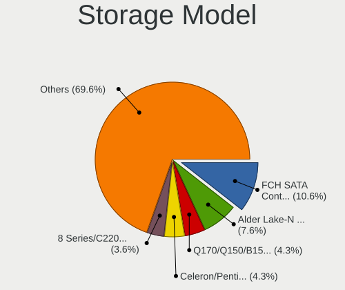

| Model                                                                            | Desktops | Percent |
|----------------------------------------------------------------------------------|----------|---------|
| AMD FCH SATA Controller [AHCI mode]                                              | 32       | 10.56%  |
| Intel Alder Lake-N SATA AHCI Controller                                          | 23       | 7.59%   |
| Intel Q170/Q150/B150/H170/H110/Z170/CM236 Chipset SATA Controller [AHCI Mode]    | 13       | 4.29%   |
| Intel Celeron/Pentium Silver Processor SATA Controller                           | 13       | 4.29%   |
| Intel 8 Series/C220 Series Chipset Family 6-port SATA Controller 1 [AHCI mode]   | 11       | 3.63%   |
| Intel Jasper Lake SATA AHCI Controller                                           | 10       | 3.3%    |
| Intel Celeron N3350/Pentium N4200/Atom E3900 Series SATA AHCI Controller         | 10       | 3.3%    |
| Intel Atom/Celeron/Pentium Processor x5-E8000/J3xxx/N3xxx Series SATA Controller | 10       | 3.3%    |
| AMD FCH SATA Controller [IDE mode]                                               | 8        | 2.64%   |
| Silicon Motion SM2263EN/SM2263XT (DRAM-less) NVMe SSD Controllers                | 7        | 2.31%   |
| Samsung NVMe SSD Controller SM981/PM981/PM983                                    | 7        | 2.31%   |
| Phison PS5013-E13 PCIe3 NVMe Controller (DRAM-less)                              | 5        | 1.65%   |
| Intel Sunrise Point-LP SATA Controller [AHCI mode]                               | 5        | 1.65%   |
| Intel Atom Processor E3800 Series SATA AHCI Controller                           | 5        | 1.65%   |
| Intel 7 Series/C210 Series Chipset Family 6-port SATA Controller [AHCI mode]     | 5        | 1.65%   |
| Samsung NVMe SSD Controller 980 (DRAM-less)                                      | 4        | 1.32%   |
| MAXIO (Hangzhou) NVMe SSD Controller MAP1202 (DRAM-less)                         | 4        | 1.32%   |
| Intel Comet Lake SATA AHCI Controller                                            | 4        | 1.32%   |
| Intel Cannon Point-LP SATA Controller [AHCI Mode]                                | 4        | 1.32%   |
| Intel Cannon Lake PCH SATA AHCI Controller                                       | 4        | 1.32%   |
| Intel 6 Series/C200 Series Chipset Family 6 port Desktop SATA AHCI Controller    | 4        | 1.32%   |
| AMD SB7x0/SB8x0/SB9x0 SATA Controller [AHCI mode]                                | 4        | 1.32%   |
| Micron 2550 NVMe SSD (DRAM-less)                                                 | 3        | 0.99%   |
| Intel Tiger Lake-LP SATA Controller                                              | 3        | 0.99%   |
| Intel NM10/ICH7 Family SATA Controller [AHCI mode]                               | 3        | 0.99%   |
| Intel Elkhart Lake SATA AHCI                                                     | 3        | 0.99%   |
| Intel Atom Processor C3000 Series SATA Controller 0                              | 3        | 0.99%   |
| Intel Alder Lake-S PCH SATA Controller [AHCI Mode]                               | 3        | 0.99%   |
| ASMedia ASM1061/ASM1062 Serial ATA Controller                                    | 3        | 0.99%   |
| SanDisk Ultra 3D / WD Blue SN570 NVMe SSD (DRAM-less)                            | 2        | 0.66%   |
| SanDisk Extreme Pro / WD Black SN750 / PC SN730 / Red SN700 NVMe SSD             | 2        | 0.66%   |
| Samsung NVMe SSD Controller SM961/PM961/SM963                                    | 2        | 0.66%   |
| Samsung NVMe SSD Controller PM9A1/PM9A3/980PRO                                   | 2        | 0.66%   |
| Micron/Crucial P2 [Nick P2] / P3 / P3 Plus NVMe PCIe SSD (DRAM-less)             | 2        | 0.66%   |
| Intel Wildcat Point-LP SATA Controller [AHCI Mode]                               | 2        | 0.66%   |
| Intel Volume Management Device NVMe RAID Controller                              | 2        | 0.66%   |
| Intel SSD 670p Series [Keystone Harbor]                                          | 2        | 0.66%   |
| Intel SATA Controller [RAID mode]                                                | 2        | 0.66%   |
| Intel NM10/ICH7 Family SATA Controller [IDE mode]                                | 2        | 0.66%   |
| Intel 82801IR/IO/IH (ICH9R/DO/DH) 6 port SATA Controller [AHCI mode]             | 2        | 0.66%   |

Storage Kind
------------

Kind of storage controller (IDE, SATA, NVMe, SAS, ...)

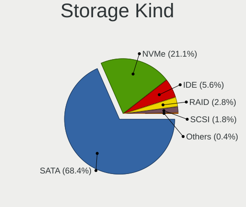

| Kind | Desktops | Percent |
|------|----------|---------|
| SATA | 195      | 68.42%  |
| NVMe | 60       | 21.05%  |
| IDE  | 16       | 5.61%   |
| RAID | 8        | 2.81%   |
| SCSI | 5        | 1.75%   |
| SAS  | 1        | 0.35%   |

Processor
---------

CPU Vendor
----------

Processor vendors

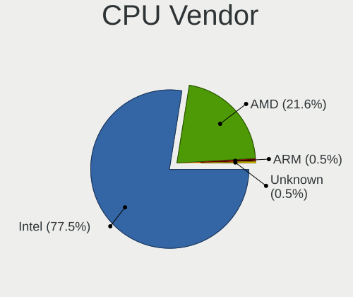

| Vendor  | Desktops | Percent |
|---------|----------|---------|
| Intel   | 169      | 77.52%  |
| AMD     | 47       | 21.56%  |
| ARM     | 1        | 0.46%   |
| Unknown | 1        | 0.46%   |

CPU Model
---------

Processor models

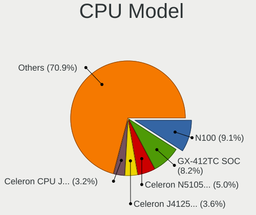

| Model                                    | Desktops | Percent |
|------------------------------------------|----------|---------|
| Intel N100                               | 20       | 9.09%   |
| AMD GX-412TC SOC                         | 18       | 8.18%   |
| Intel Celeron N5105 @ 2.00GHz            | 11       | 5%      |
| Intel Celeron J4125 CPU @ 2.00GHz        | 8        | 3.64%   |
| Intel Celeron CPU J3160 @ 1.60GHz        | 7        | 3.18%   |
| AMD GX-420MC SOC                         | 6        | 2.73%   |
| Intel Core i3-6100T CPU @ 3.20GHz        | 4        | 1.82%   |
| Intel Celeron CPU J3455 @ 1.50GHz        | 4        | 1.82%   |
| Intel Core i5-6500 CPU @ 3.20GHz         | 3        | 1.36%   |
| Intel Core i5-10210U CPU @ 1.60GHz       | 3        | 1.36%   |
| Intel Celeron J6412 @ 2.00GHz            | 3        | 1.36%   |
| Intel Celeron J4105 CPU @ 1.50GHz        | 3        | 1.36%   |
| Intel Celeron CPU N3450 @ 1.10GHz        | 3        | 1.36%   |
| Intel Atom CPU E3845 @ 1.91GHz           | 3        | 1.36%   |
| Intel Atom CPU D525 @ 1.80GHz            | 3        | 1.36%   |
| AMD G-T40E Processor                     | 3        | 1.36%   |
| Intel Xeon CPU E5620 @ 2.40GHz           | 2        | 0.91%   |
| Intel Pentium CPU G3220 @ 3.00GHz        | 2        | 0.91%   |
| Intel N200                               | 2        | 0.91%   |
| Intel N150                               | 2        | 0.91%   |
| Intel Core i7-8565U CPU @ 1.80GHz        | 2        | 0.91%   |
| Intel Core i5-7200U CPU @ 2.50GHz        | 2        | 0.91%   |
| Intel Core i5-6600 CPU @ 3.30GHz         | 2        | 0.91%   |
| Intel Core i5-4200U CPU @ 1.60GHz        | 2        | 0.91%   |
| Intel Core i5-3470 CPU @ 3.20GHz         | 2        | 0.91%   |
| Intel Core i3-N305                       | 2        | 0.91%   |
| Intel Core i3-4130 CPU @ 3.40GHz         | 2        | 0.91%   |
| Intel Atom CPU C3558 @ 2.20GHz           | 2        | 0.91%   |
| Intel 12th Gen Core i5-1240P             | 2        | 0.91%   |
| Intel 12th Gen Core i3-12100             | 2        | 0.91%   |
| Intel 11th Gen Core i5-1135G7 @ 2.40GHz  | 2        | 0.91%   |
| AMD Ryzen 9 5900X 12-Core Processor      | 2        | 0.91%   |
| AMD GX-415GA SOC with Radeon HD Graphics | 2        | 0.91%   |
| AMD GX-217GA SOC with Radeon HD Graphics | 2        | 0.91%   |
| Intel Xeon E-2136 CPU @ 3.30GHz          | 1        | 0.45%   |
| Intel Xeon D-2146NT CPU @ 2.30GHz        | 1        | 0.45%   |
| Intel Xeon CPU X3430 @ 2.40GHz           | 1        | 0.45%   |
| Intel Xeon CPU E5320 @ 1.86GHz           | 1        | 0.45%   |
| Intel Pentium Silver J5005 CPU @ 1.50GHz | 1        | 0.45%   |
| Intel Pentium Dual-Core                  | 1        | 0.45%   |

CPU Model Family
----------------

Processor model prefix

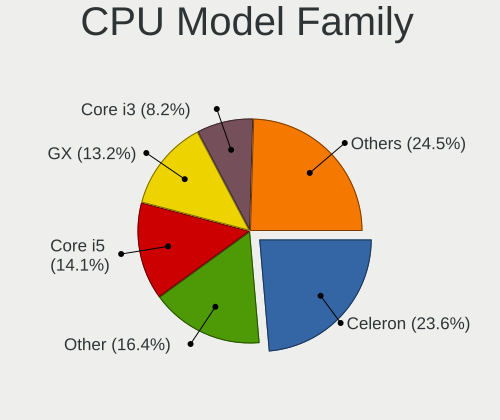

| Model                   | Desktops | Percent |
|-------------------------|----------|---------|
| Intel Celeron           | 52       | 23.64%  |
| Other                   | 36       | 16.36%  |
| Intel Core i5           | 31       | 14.09%  |
| AMD GX                  | 29       | 13.18%  |
| Intel Core i3           | 18       | 8.18%   |
| Intel Core i7           | 10       | 4.55%   |
| Intel Atom              | 10       | 4.55%   |
| Intel Xeon              | 6        | 2.73%   |
| Intel Pentium           | 4        | 1.82%   |
| AMD Ryzen 5             | 3        | 1.36%   |
| AMD G                   | 3        | 1.36%   |
| Intel Core 2 Duo        | 2        | 0.91%   |
| AMD Ryzen 9             | 2        | 0.91%   |
| AMD Ryzen 7             | 2        | 0.91%   |
| AMD Athlon              | 2        | 0.91%   |
| Intel Pentium Silver    | 1        | 0.45%   |
| Intel Pentium Dual-Core | 1        | 0.45%   |
| Intel Pentium 4         | 1        | 0.45%   |
| Intel Genuine           | 1        | 0.45%   |
| Intel Core 2 Quad       | 1        | 0.45%   |
| AMD Turion II Neo       | 1        | 0.45%   |
| AMD Ryzen Threadripper  | 1        | 0.45%   |
| AMD Ryzen 5 PRO         | 1        | 0.45%   |
| AMD FX                  | 1        | 0.45%   |
| AMD A4                  | 1        | 0.45%   |

CPU Cores
---------

Number of processor cores

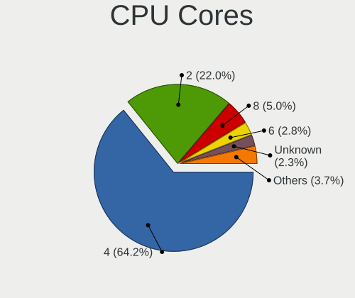

| Number  | Desktops | Percent |
|---------|----------|---------|
| 4       | 140      | 64.22%  |
| 2       | 48       | 22.02%  |
| 8       | 11       | 5.05%   |
| 6       | 6        | 2.75%   |
| Unknown | 5        | 2.29%   |
| 16      | 2        | 0.92%   |
| 12      | 2        | 0.92%   |
| 1       | 2        | 0.92%   |
| 64      | 1        | 0.46%   |
| 24      | 1        | 0.46%   |

CPU Sockets
-----------

Number of sockets

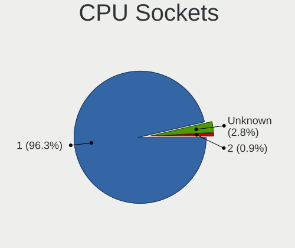

| Number  | Desktops | Percent |
|---------|----------|---------|
| 1       | 210      | 96.33%  |
| Unknown | 6        | 2.75%   |
| 2       | 2        | 0.92%   |

CPU Threads
-----------

Threads per core (Hyper-Threading)

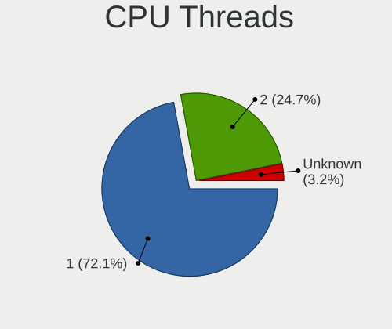

| Number  | Desktops | Percent |
|---------|----------|---------|
| 1       | 158      | 72.15%  |
| 2       | 54       | 24.66%  |
| Unknown | 7        | 3.2%    |

CPU Microarch
-------------

Microarchitecture

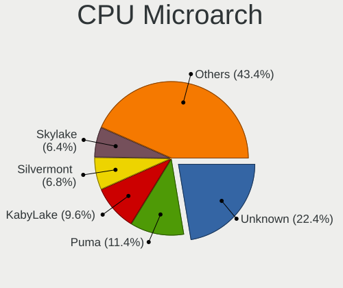

| Name          | Desktops | Percent |
|---------------|----------|---------|
| Unknown       | 49       | 22.37%  |
| Puma          | 25       | 11.42%  |
| KabyLake      | 21       | 9.59%   |
| Silvermont    | 15       | 6.85%   |
| Skylake       | 14       | 6.39%   |
| Haswell       | 13       | 5.94%   |
| Goldmont plus | 13       | 5.94%   |
| Goldmont      | 13       | 5.94%   |
| IvyBridge     | 9        | 4.11%   |
| Jaguar        | 6        | 2.74%   |
| SandyBridge   | 4        | 1.83%   |
| Penryn        | 4        | 1.83%   |
| Bonnell       | 4        | 1.83%   |
| Zen 3         | 3        | 1.37%   |
| Zen           | 3        | 1.37%   |
| TigerLake     | 3        | 1.37%   |
| CometLake     | 3        | 1.37%   |
| Bobcat        | 3        | 1.37%   |
| Zen 2         | 2        | 0.91%   |
| Westmere      | 2        | 0.91%   |
| Excavator     | 2        | 0.91%   |
| Broadwell     | 2        | 0.91%   |
| Zen+          | 1        | 0.46%   |
| NetBurst      | 1        | 0.46%   |
| Nehalem       | 1        | 0.46%   |
| K10           | 1        | 0.46%   |
| IceLake       | 1        | 0.46%   |
| Core          | 1        | 0.46%   |

Graphics
--------

GPU Vendor
----------

Vendors of graphics cards

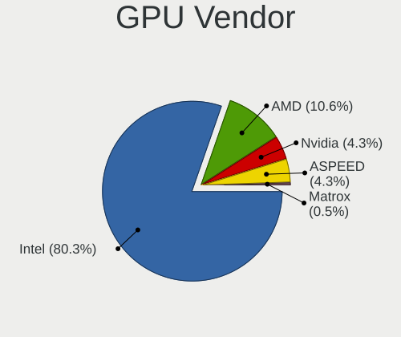

| Vendor                     | Desktops | Percent |
|----------------------------|----------|---------|
| Intel                      | 151      | 80.32%  |
| AMD                        | 20       | 10.64%  |
| Nvidia                     | 8        | 4.26%   |
| ASPEED Technology          | 8        | 4.26%   |
| Matrox Electronics Systems | 1        | 0.53%   |

GPU Model
---------

Graphics card models

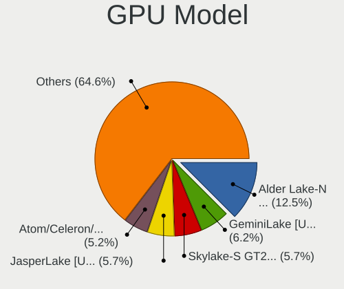

| Model                                                                                    | Desktops | Percent |
|------------------------------------------------------------------------------------------|----------|---------|
| Intel Alder Lake-N [UHD Graphics]                                                        | 24       | 12.5%   |
| Intel GeminiLake [UHD Graphics 600]                                                      | 12       | 6.25%   |
| Intel Skylake-S GT2 [HD Graphics 530]                                                    | 11       | 5.73%   |
| Intel JasperLake [UHD Graphics]                                                          | 11       | 5.73%   |
| Intel Atom/Celeron/Pentium Processor x5-E8000/J3xxx/N3xxx Integrated Graphics Controller | 10       | 5.21%   |
| Intel Apollo Lake GT1 [HD Graphics 500]                                                  | 9        | 4.69%   |
| ASPEED Technology ASPEED Graphics Family                                                 | 8        | 4.17%   |
| Intel Xeon E3-1200 v3/4th Gen Core Processor Integrated Graphics Controller              | 6        | 3.13%   |
| Intel Atom Processor Z36xxx/Z37xxx Series Graphics & Display                             | 5        | 2.6%    |
| Intel Xeon E3-1200 v2/3rd Gen Core processor Graphics Controller                         | 4        | 2.08%   |
| Intel Kaby Lake-U GT2 [HD Graphics 620]                                                  | 4        | 2.08%   |
| Intel Kaby Lake-S GT2 [HD Graphics 630]                                                  | 4        | 2.08%   |
| Intel CometLake-U GT2 [UHD Graphics]                                                     | 4        | 2.08%   |
| Intel WhiskeyLake-U GT2 [UHD Graphics 620]                                               | 3        | 1.56%   |
| Intel TigerLake-LP GT2 [Iris Xe Graphics]                                                | 3        | 1.56%   |
| Intel Elkhart Lake [UHD Graphics Gen11 16EU]                                             | 3        | 1.56%   |
| Intel CoffeeLake-S GT2 [UHD Graphics 630]                                                | 3        | 1.56%   |
| Intel 4th Generation Core Processor Family Integrated Graphics Controller                | 3        | 1.56%   |
| Intel 2nd Generation Core Processor Family Integrated Graphics Controller                | 3        | 1.56%   |
| Intel IvyBridge GT2 [HD Graphics 4000]                                                   | 2        | 1.04%   |
| Intel Haswell-ULT Integrated Graphics Controller                                         | 2        | 1.04%   |
| Intel Atom Processor D4xx/D5xx/N4xx/N5xx Integrated Graphics Controller                  | 2        | 1.04%   |
| Intel Alder Lake-S GT1 [UHD Graphics 730]                                                | 2        | 1.04%   |
| Intel Alder Lake-P GT2 [Iris Xe Graphics]                                                | 2        | 1.04%   |
| Intel Alder Lake-N [Intel Graphics]                                                      | 2        | 1.04%   |
| Intel 3rd Gen Core processor Graphics Controller                                         | 2        | 1.04%   |
| AMD Raven Ridge [Radeon Vega Series / Radeon Vega Mobile Series]                         | 2        | 1.04%   |
| AMD Kabini [Radeon HD 8330E]                                                             | 2        | 1.04%   |
| AMD Kabini [Radeon HD 8280E]                                                             | 2        | 1.04%   |
| AMD ES1000                                                                               | 2        | 1.04%   |
| Nvidia TU117 [GeForce GTX 1630]                                                          | 1        | 0.52%   |
| Nvidia TU104 [GeForce RTX 2060]                                                          | 1        | 0.52%   |
| Nvidia NV28 [GeForce4 Ti 4200 AGP 8x]                                                    | 1        | 0.52%   |
| Nvidia GT218 [ION]                                                                       | 1        | 0.52%   |
| Nvidia GT218 [GeForce 210]                                                               | 1        | 0.52%   |
| Nvidia GP107 [GeForce GTX 1050]                                                          | 1        | 0.52%   |
| Nvidia GP104 [GeForce GTX 1070]                                                          | 1        | 0.52%   |
| Nvidia GM204 [GeForce GTX 970]                                                           | 1        | 0.52%   |
| Nvidia GK208B [GeForce GT 710]                                                           | 1        | 0.52%   |
| Nvidia GA104 [GeForce RTX 3060 Ti Lite Hash Rate]                                        | 1        | 0.52%   |

GPU Combo
---------

Combinations of graphics cards

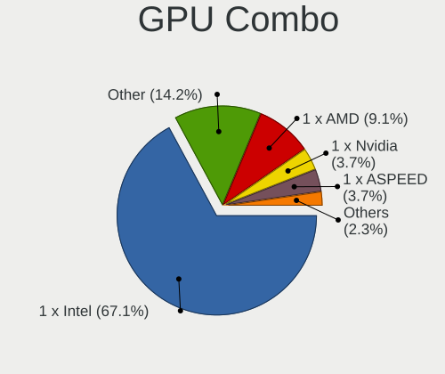

| Name       | Desktops | Percent |
|------------|----------|---------|
| 1 x Intel  | 147      | 67.12%  |
| Other      | 31       | 14.16%  |
| 1 x AMD    | 20       | 9.13%   |
| 1 x Nvidia | 8        | 3.65%   |
| 1 x ASPEED | 8        | 3.65%   |
| 2 x Intel  | 4        | 1.83%   |
| 1 x Matrox | 1        | 0.46%   |

GPU Driver
----------

Free vs proprietary

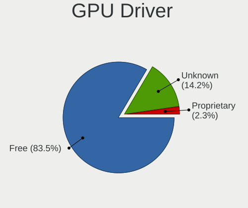

| Driver      | Desktops | Percent |
|-------------|----------|---------|
| Free        | 182      | 83.49%  |
| Unknown     | 31       | 14.22%  |
| Proprietary | 5        | 2.29%   |

GPU Memory
----------

Total video memory

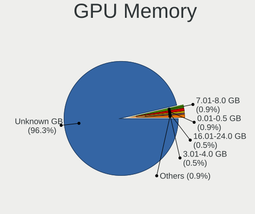

| Size in GB | Desktops | Percent |
|------------|----------|---------|
| Unknown    | 210      | 96.33%  |
| 7.01-8.0   | 2        | 0.92%   |
| 0.01-0.5   | 2        | 0.92%   |
| 3.01-4.0   | 1        | 0.46%   |
| 16.01-24.0 | 1        | 0.46%   |
| 1.01-2.0   | 1        | 0.46%   |
| 0.51-1.0   | 1        | 0.46%   |

Monitor
-------

Monitor Vendor
--------------

Monitor vendors

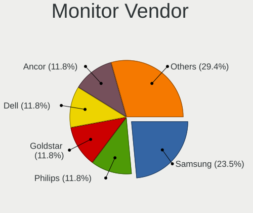

| Vendor               | Desktops | Percent |
|----------------------|----------|---------|
| Samsung Electronics  | 4        | 23.53%  |
| Philips              | 2        | 11.76%  |
| Goldstar             | 2        | 11.76%  |
| Dell                 | 2        | 11.76%  |
| Ancor Communications | 2        | 11.76%  |
| Medion               | 1        | 5.88%   |
| Lenovo               | 1        | 5.88%   |
| DENON                | 1        | 5.88%   |
| BenQ                 | 1        | 5.88%   |
| ASUSTek Computer     | 1        | 5.88%   |

Monitor Model
-------------

Monitor models

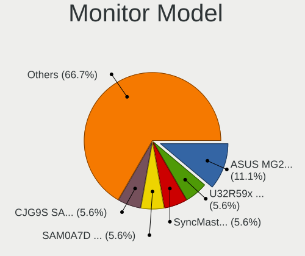

| Model                                                                 | Desktops | Percent |
|-----------------------------------------------------------------------|----------|---------|
| Ancor Communications ASUS MG278 ACI27A8 2560x1440 600x340mm 27.2-inch | 2        | 11.11%  |
| Samsung Electronics U32R59x SAM0F96 3840x2160 700x390mm 31.5-inch     | 1        | 5.56%   |
| Samsung Electronics SyncMaster SAM021E 1680x1050 430x270mm 20.0-inch  | 1        | 5.56%   |
| Samsung Electronics LCD Monitor SAM0A7D 1920x1080 700x390mm 31.5-inch | 1        | 5.56%   |
| Samsung Electronics CJG9S SAM9596 3840x1080                           | 1        | 5.56%   |
| Samsung Electronics C27F390 SAM0D32 1920x1080 600x340mm 27.2-inch     | 1        | 5.56%   |
| Philips PHL BDM4037U PHLC142 3840x2160 890x500mm 40.2-inch            | 1        | 5.56%   |
| Philips PHL 273V7 PHLC156 1920x1080 600x340mm 27.2-inch               | 1        | 5.56%   |
| Medion MD22321 MEA8302 1920x1080 700x390mm 31.5-inch                  | 1        | 5.56%   |
| Lenovo LCD Monitor LEN4033 1440x900 300x190mm 14.0-inch               | 1        | 5.56%   |
| Goldstar LG ULTRAGEAR+ GSM5C34 2560x1440 590x330mm 26.6-inch          | 1        | 5.56%   |
| Goldstar LG ULTRAGEAR+ GSM5C33 2560x1440 590x330mm 26.6-inch          | 1        | 5.56%   |
| DENON AVR DON004B 1920x1080 1330x750mm 60.1-inch                      | 1        | 5.56%   |
| Dell P2210 DEL404E 1680x1050 470x300mm 22.0-inch                      | 1        | 5.56%   |
| Dell 2001FP DELA007 1600x1200 410x310mm 20.2-inch                     | 1        | 5.56%   |
| BenQ BL2405 BNQ8016 1920x1080 530x300mm 24.0-inch                     | 1        | 5.56%   |
| ASUSTek Computer VL278 AUS27C2 1920x1080 600x340mm 27.2-inch          | 1        | 5.56%   |

Monitor Resolution
------------------

Monitor screen resolution

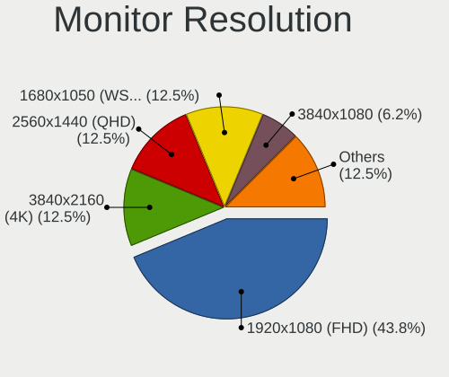

| Resolution         | Desktops | Percent |
|--------------------|----------|---------|
| 1920x1080 (FHD)    | 7        | 43.75%  |
| 3840x2160 (4K)     | 2        | 12.5%   |
| 2560x1440 (QHD)    | 2        | 12.5%   |
| 1680x1050 (WSXGA+) | 2        | 12.5%   |
| 3840x1080          | 1        | 6.25%   |
| 1600x1200          | 1        | 6.25%   |
| 1440x900 (WXGA+)   | 1        | 6.25%   |

Monitor Diagonal
----------------

Diagonal size in inches

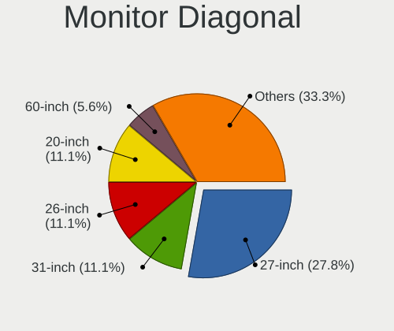

| Inches  | Desktops | Percent |
|---------|----------|---------|
| 27      | 5        | 27.78%  |
| 31      | 2        | 11.11%  |
| 26      | 2        | 11.11%  |
| 20      | 2        | 11.11%  |
| 60      | 1        | 5.56%   |
| 46      | 1        | 5.56%   |
| 40      | 1        | 5.56%   |
| 24      | 1        | 5.56%   |
| 22      | 1        | 5.56%   |
| 14      | 1        | 5.56%   |
| Unknown | 1        | 5.56%   |

Monitor Width
-------------

Physical width

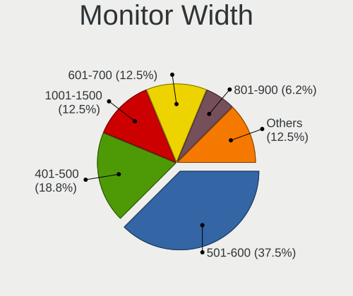

| Width in mm | Desktops | Percent |
|-------------|----------|---------|
| 501-600     | 6        | 37.5%   |
| 401-500     | 3        | 18.75%  |
| 601-700     | 2        | 12.5%   |
| 1001-1500   | 2        | 12.5%   |
| 801-900     | 1        | 6.25%   |
| 201-300     | 1        | 6.25%   |
| Unknown     | 1        | 6.25%   |

Aspect Ratio
------------

Proportional relationship between the width and the height

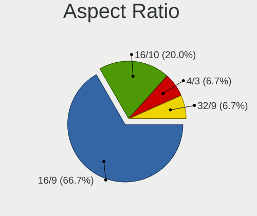

| Ratio | Desktops | Percent |
|-------|----------|---------|
| 16/9  | 10       | 66.67%  |
| 16/10 | 3        | 20%     |
| 4/3   | 1        | 6.67%   |
| 32/9  | 1        | 6.67%   |

Monitor Area
------------

Area in inch²

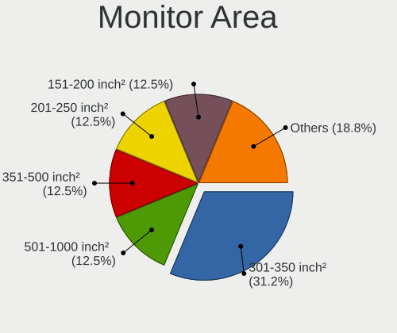

| Area in inch² | Desktops | Percent |
|----------------|----------|---------|
| 301-350        | 5        | 31.25%  |
| 351-500        | 2        | 12.5%   |
| 201-250        | 2        | 12.5%   |
| 151-200        | 2        | 12.5%   |
| 501-1000       | 2        | 12.5%   |
| More than 1000 | 1        | 6.25%   |
| 81-90          | 1        | 6.25%   |
| Unknown        | 1        | 6.25%   |

Pixel Density
-------------

Pixels per inch

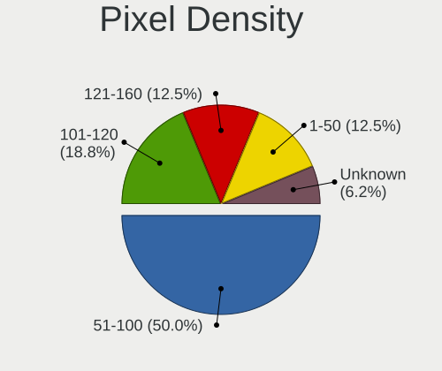

| Density | Desktops | Percent |
|---------|----------|---------|
| 51-100  | 8        | 50%     |
| 101-120 | 3        | 18.75%  |
| 1-50    | 2        | 12.5%   |
| 121-160 | 2        | 12.5%   |
| Unknown | 1        | 6.25%   |

Multiple Monitors
-----------------

Total monitors connected

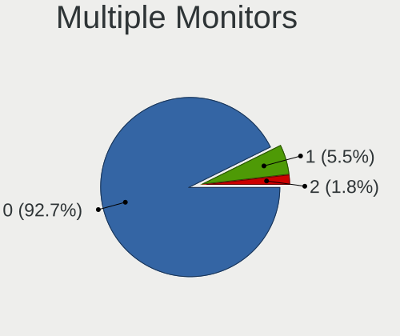

| Total | Desktops | Percent |
|-------|----------|---------|
| 0     | 203      | 92.69%  |
| 1     | 12       | 5.48%   |
| 2     | 4        | 1.83%   |

Network
-------

Net Controller Vendor
---------------------

Controller vendors

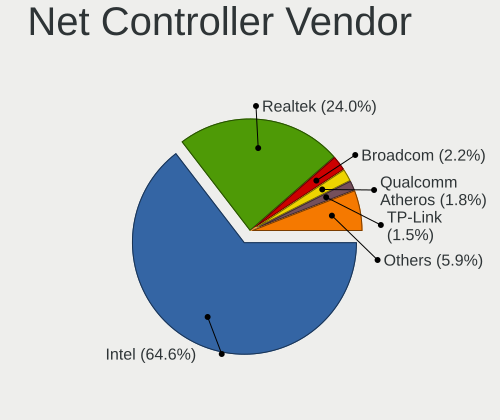

| Vendor                 | Desktops | Percent |
|------------------------|----------|---------|
| Intel                  | 175      | 64.58%  |
| Realtek Semiconductor  | 65       | 23.99%  |
| Broadcom               | 6        | 2.21%   |
| Qualcomm Atheros       | 5        | 1.85%   |
| TP-Link                | 4        | 1.48%   |
| LG Electronics         | 3        | 1.11%   |
| Edimax Technology      | 3        | 1.11%   |
| Chelsio Communications | 2        | 0.74%   |
| Seeed Technology       | 1        | 0.37%   |
| Mellanox Technologies  | 1        | 0.37%   |
| MediaTek               | 1        | 0.37%   |
| Google                 | 1        | 0.37%   |
| Dresden Elektronik     | 1        | 0.37%   |
| Davicom Semiconductor  | 1        | 0.37%   |
| AVM                    | 1        | 0.37%   |
| Arduino SA             | 1        | 0.37%   |

Net Controller Model
--------------------

Controller models

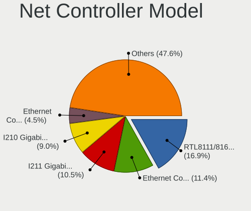

| Model                                                                         | Desktops | Percent |
|-------------------------------------------------------------------------------|----------|---------|
| Realtek RTL8111/8168/8211/8411 PCI Express Gigabit Ethernet Controller        | 56       | 16.87%  |
| Intel Ethernet Controller I226-V                                              | 38       | 11.45%  |
| Intel I211 Gigabit Network Connection                                         | 35       | 10.54%  |
| Intel I210 Gigabit Network Connection                                         | 30       | 9.04%   |
| Intel Ethernet Controller I225-V                                              | 15       | 4.52%   |
| Intel 82599ES 10-Gigabit SFI/SFP+ Network Connection                          | 10       | 3.01%   |
| Intel I350 Gigabit Network Connection                                         | 9        | 2.71%   |
| Intel 82579LM Gigabit Network Connection (Lewisville)                         | 9        | 2.71%   |
| Intel Ethernet Connection (2) I219-LM                                         | 8        | 2.41%   |
| Intel Wi-Fi 6 AX200                                                           | 7        | 2.11%   |
| Intel 82574L Gigabit Network Connection                                       | 7        | 2.11%   |
| Realtek RTL8125 2.5GbE Controller                                             | 5        | 1.51%   |
| Realtek RTL8821CE 802.11ac PCIe Wireless Network Adapter                      | 4        | 1.2%    |
| Intel Ethernet Connection (2) I219-V                                          | 4        | 1.2%    |
| Intel 82576 Gigabit Network Connection                                        | 4        | 1.2%    |
| TP-Link Archer T3U [Realtek RTL8812BU]                                        | 3        | 0.9%    |
| LG Optimus Android Phone [USB tethering mode]                                 | 3        | 0.9%    |
| Intel Ethernet Connection I217-V                                              | 3        | 0.9%    |
| Intel 82583V Gigabit Network Connection                                       | 3        | 0.9%    |
| Intel 82575EB Gigabit Network Connection                                      | 3        | 0.9%    |
| Edimax EW-7811Un 802.11n Wireless Adapter [Realtek RTL8188CUS]                | 3        | 0.9%    |
| Broadcom NetXtreme II BCM5709 Gigabit Ethernet                                | 3        | 0.9%    |
| Realtek RTL8111/8168/8411 PCI Express Gigabit Ethernet Controller             | 2        | 0.6%    |
| Qualcomm Atheros QCA9377 802.11ac Wireless Network Adapter                    | 2        | 0.6%    |
| Intel Wireless 7265                                                           | 2        | 0.6%    |
| Intel Wireless 7260                                                           | 2        | 0.6%    |
| Intel I210 Gigabit Fiber Network Connection                                   | 2        | 0.6%    |
| Intel Gemini Lake PCH CNVi WiFi                                               | 2        | 0.6%    |
| Intel Ethernet Connection X553 1GbE                                           | 2        | 0.6%    |
| Intel Ethernet Connection (6) I219-LM                                         | 2        | 0.6%    |
| Intel Ethernet Connection (17) I219-V                                         | 2        | 0.6%    |
| Intel Ethernet Connection (14) I219-V                                         | 2        | 0.6%    |
| Intel Centrino Advanced-N 6235                                                | 2        | 0.6%    |
| Intel 82580 Gigabit Network Connection                                        | 2        | 0.6%    |
| Intel 82571EB/82571GB Gigabit Ethernet Controller D0/D1 (copper applications) | 2        | 0.6%    |
| TP-Link 802.11ac WLAN Adapter 802.11ac WLAN Adapter                           | 1        | 0.3%    |
| Seeed Seeeduino_Cortex_M0+                                                    | 1        | 0.3%    |
| Realtek USB 2.5GbE Controller                                                 | 1        | 0.3%    |
| Realtek RTL8821AE 802.11ac PCIe Wireless Network Adapter                      | 1        | 0.3%    |
| Realtek RTL8192EE PCIe Wireless Network Adapter                               | 1        | 0.3%    |

Wireless Vendor
---------------

Wireless vendors

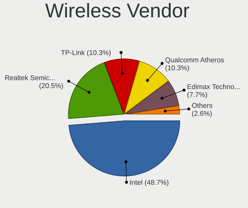

| Vendor                | Desktops | Percent |
|-----------------------|----------|---------|
| Intel                 | 19       | 48.72%  |
| Realtek Semiconductor | 8        | 20.51%  |
| TP-Link               | 4        | 10.26%  |
| Qualcomm Atheros      | 4        | 10.26%  |
| Edimax Technology     | 3        | 7.69%   |
| MediaTek              | 1        | 2.56%   |

Wireless Model
--------------

Wireless models

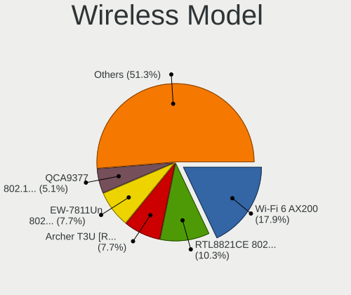

| Model                                                          | Desktops | Percent |
|----------------------------------------------------------------|----------|---------|
| Intel Wi-Fi 6 AX200                                            | 7        | 17.95%  |
| Realtek RTL8821CE 802.11ac PCIe Wireless Network Adapter       | 4        | 10.26%  |
| TP-Link Archer T3U [Realtek RTL8812BU]                         | 3        | 7.69%   |
| Edimax EW-7811Un 802.11n Wireless Adapter [Realtek RTL8188CUS] | 3        | 7.69%   |
| Qualcomm Atheros QCA9377 802.11ac Wireless Network Adapter     | 2        | 5.13%   |
| Intel Wireless 7265                                            | 2        | 5.13%   |
| Intel Wireless 7260                                            | 2        | 5.13%   |
| Intel Gemini Lake PCH CNVi WiFi                                | 2        | 5.13%   |
| Intel Centrino Advanced-N 6235                                 | 2        | 5.13%   |
| TP-Link 802.11ac WLAN Adapter 802.11ac WLAN Adapter            | 1        | 2.56%   |
| Realtek RTL8821AE 802.11ac PCIe Wireless Network Adapter       | 1        | 2.56%   |
| Realtek RTL8192EE PCIe Wireless Network Adapter                | 1        | 2.56%   |
| Realtek RTL8192CU 802.11n WLAN Adapter                         | 1        | 2.56%   |
| Realtek RTL8188CUS 802.11n WLAN Adapter                        | 1        | 2.56%   |
| Qualcomm Atheros AR9462 Wireless Network Adapter               | 1        | 2.56%   |
| Qualcomm Atheros AR928X Wireless Network Adapter (PCI-Express) | 1        | 2.56%   |
| MediaTek MT7921K (RZ608) Wi-Fi 6E 80MHz                        | 1        | 2.56%   |
| Intel Wireless 3165                                            | 1        | 2.56%   |
| Intel Wireless 3160                                            | 1        | 2.56%   |
| Intel Wi-Fi 6E(802.11ax) AX210/AX1675* 2x2 [Typhoon Peak]      | 1        | 2.56%   |
| Intel Ultimate N WiFi Link 5300                                | 1        | 2.56%   |

Ethernet Vendor
---------------

Ethernet vendors

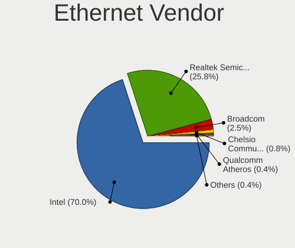

| Vendor                 | Desktops | Percent |
|------------------------|----------|---------|
| Intel                  | 168      | 70%     |
| Realtek Semiconductor  | 62       | 25.83%  |
| Broadcom               | 6        | 2.5%    |
| Chelsio Communications | 2        | 0.83%   |
| Qualcomm Atheros       | 1        | 0.42%   |
| Davicom Semiconductor  | 1        | 0.42%   |

Ethernet Model
--------------

Ethernet models

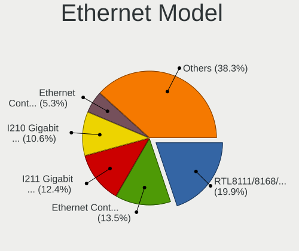

| Model                                                                         | Desktops | Percent |
|-------------------------------------------------------------------------------|----------|---------|
| Realtek RTL8111/8168/8211/8411 PCI Express Gigabit Ethernet Controller        | 56       | 19.86%  |
| Intel Ethernet Controller I226-V                                              | 38       | 13.48%  |
| Intel I211 Gigabit Network Connection                                         | 35       | 12.41%  |
| Intel I210 Gigabit Network Connection                                         | 30       | 10.64%  |
| Intel Ethernet Controller I225-V                                              | 15       | 5.32%   |
| Intel 82599ES 10-Gigabit SFI/SFP+ Network Connection                          | 10       | 3.55%   |
| Intel I350 Gigabit Network Connection                                         | 9        | 3.19%   |
| Intel 82579LM Gigabit Network Connection (Lewisville)                         | 9        | 3.19%   |
| Intel Ethernet Connection (2) I219-LM                                         | 8        | 2.84%   |
| Intel 82574L Gigabit Network Connection                                       | 7        | 2.48%   |
| Realtek RTL8125 2.5GbE Controller                                             | 5        | 1.77%   |
| Intel Ethernet Connection (2) I219-V                                          | 4        | 1.42%   |
| Intel 82576 Gigabit Network Connection                                        | 4        | 1.42%   |
| Intel Ethernet Connection I217-V                                              | 3        | 1.06%   |
| Intel 82583V Gigabit Network Connection                                       | 3        | 1.06%   |
| Intel 82575EB Gigabit Network Connection                                      | 3        | 1.06%   |
| Broadcom NetXtreme II BCM5709 Gigabit Ethernet                                | 3        | 1.06%   |
| Realtek RTL8111/8168/8411 PCI Express Gigabit Ethernet Controller             | 2        | 0.71%   |
| Intel I210 Gigabit Fiber Network Connection                                   | 2        | 0.71%   |
| Intel Ethernet Connection X553 1GbE                                           | 2        | 0.71%   |
| Intel Ethernet Connection (6) I219-LM                                         | 2        | 0.71%   |
| Intel Ethernet Connection (17) I219-V                                         | 2        | 0.71%   |
| Intel Ethernet Connection (14) I219-V                                         | 2        | 0.71%   |
| Intel 82580 Gigabit Network Connection                                        | 2        | 0.71%   |
| Intel 82571EB/82571GB Gigabit Ethernet Controller D0/D1 (copper applications) | 2        | 0.71%   |
| Realtek USB 2.5GbE Controller                                                 | 1        | 0.35%   |
| Realtek RTL8169 PCI Gigabit Ethernet Controller                               | 1        | 0.35%   |
| Realtek RTL810xE PCI Express Fast Ethernet controller                         | 1        | 0.35%   |
| Realtek RTL-8100/8101L/8139 PCI Fast Ethernet Adapter                         | 1        | 0.35%   |
| Qualcomm Atheros AR8151 v2.0 Gigabit Ethernet                                 | 1        | 0.35%   |
| Intel Ethernet Connection X722 for 10GbE SFP+                                 | 1        | 0.35%   |
| Intel Ethernet Connection X722 for 10GBASE-T                                  | 1        | 0.35%   |
| Intel Ethernet Connection X553 10 GbE SFP+                                    | 1        | 0.35%   |
| Intel Ethernet Connection I217-LM                                             | 1        | 0.35%   |
| Intel Ethernet Connection (7) I219-V                                          | 1        | 0.35%   |
| Intel Ethernet Connection (7) I219-LM                                         | 1        | 0.35%   |
| Intel Ethernet Connection (5) I219-LM                                         | 1        | 0.35%   |
| Intel Ethernet Connection (12) I219-V                                         | 1        | 0.35%   |
| Intel 82579V Gigabit Network Connection                                       | 1        | 0.35%   |
| Intel 82576NS Gigabit Network Connection                                      | 1        | 0.35%   |

Net Controller Kind
-------------------

Ethernet, WiFi or modem

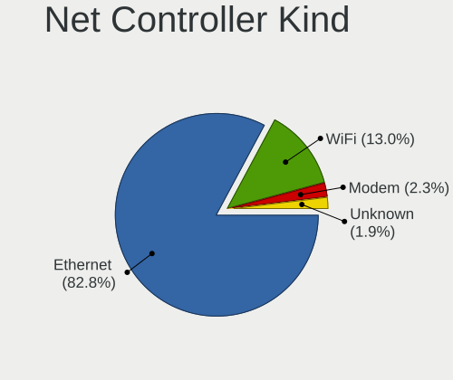

| Kind     | Desktops | Percent |
|----------|----------|---------|
| Ethernet | 217      | 82.82%  |
| WiFi     | 34       | 12.98%  |
| Modem    | 6        | 2.29%   |
| Unknown  | 5        | 1.91%   |

Used Controller
---------------

Currently used network controller

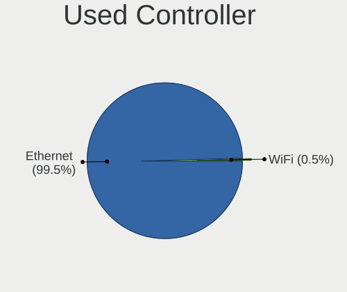

| Kind     | Desktops | Percent |
|----------|----------|---------|
| Ethernet | 213      | 99.53%  |
| WiFi     | 1        | 0.47%   |

NICs
----

Total network controllers on board

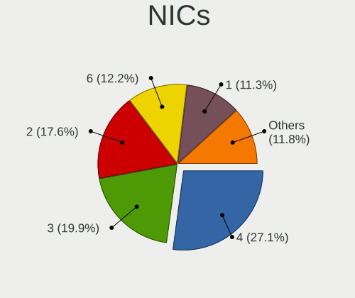

| Total | Desktops | Percent |
|-------|----------|---------|
| 4     | 60       | 27.15%  |
| 3     | 44       | 19.91%  |
| 2     | 39       | 17.65%  |
| 6     | 27       | 12.22%  |
| 1     | 25       | 11.31%  |
| 5     | 12       | 5.43%   |
| 9     | 4        | 1.81%   |
| 8     | 4        | 1.81%   |
| 7     | 4        | 1.81%   |
| 12    | 1        | 0.45%   |
| 0     | 1        | 0.45%   |

IPv6
----

IPv6 vs IPv4

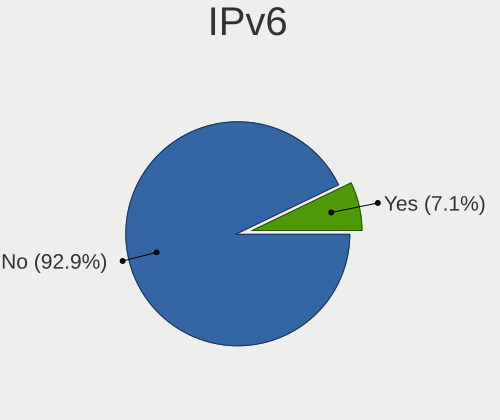

| Used | Desktops | Percent |
|------|----------|---------|
| No   | 208      | 92.86%  |
| Yes  | 16       | 7.14%   |

Bluetooth
---------

Bluetooth Vendor
----------------

Controller vendors

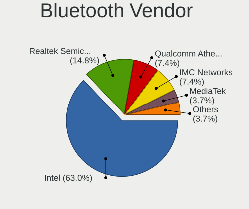

| Vendor                          | Desktops | Percent |
|---------------------------------|----------|---------|
| Intel                           | 17       | 62.96%  |
| Realtek Semiconductor           | 4        | 14.81%  |
| Qualcomm Atheros Communications | 2        | 7.41%   |
| IMC Networks                    | 2        | 7.41%   |
| MediaTek                        | 1        | 3.7%    |
| Lite-On Technology              | 1        | 3.7%    |

Bluetooth Model
---------------

Controller models

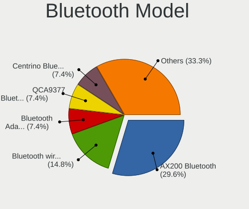

| Model                                          | Desktops | Percent |
|------------------------------------------------|----------|---------|
| Intel AX200 Bluetooth                          | 8        | 29.63%  |
| Intel Bluetooth wireless interface             | 4        | 14.81%  |
| Realtek Bluetooth Adapter                      | 2        | 7.41%   |
| Qualcomm Atheros QCA9377 Bluetooth 4.1         | 2        | 7.41%   |
| Intel Centrino Bluetooth Wireless Transceiver  | 2        | 7.41%   |
| Intel Bluetooth 9460/9560 Jefferson Peak (JfP) | 2        | 7.41%   |
| IMC Networks Realtek Bluetooth Adapter         | 2        | 7.41%   |
| Realtek RTL8821A Bluetooth                     | 1        | 3.7%    |
| Realtek Bluetooth 5.1 Adapter                  | 1        | 3.7%    |
| MediaTek RZ608 Bluetooth Adapter               | 1        | 3.7%    |
| Lite-On Atheros AR3012 Bluetooth               | 1        | 3.7%    |
| Intel AX210 Bluetooth                          | 1        | 3.7%    |

Sound
-----

Sound Vendor
------------

Sound card vendors

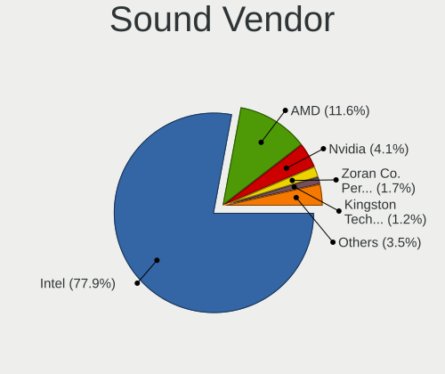

| Vendor                                       | Desktops | Percent |
|----------------------------------------------|----------|---------|
| Intel                                        | 134      | 77.91%  |
| AMD                                          | 20       | 11.63%  |
| Nvidia                                       | 7        | 4.07%   |
| Zoran Co. Personal Media Division (Nogatech) | 3        | 1.74%   |
| Kingston Technology                          | 2        | 1.16%   |
| Walmart                                      | 1        | 0.58%   |
| Sony                                         | 1        | 0.58%   |
| RODE Microphones                             | 1        | 0.58%   |
| ROCCAT                                       | 1        | 0.58%   |
| GN Netcom                                    | 1        | 0.58%   |
| Creative Labs                                | 1        | 0.58%   |

Sound Model
-----------

Sound card models

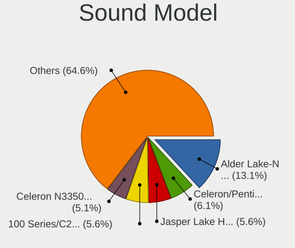

| Model                                                                                             | Desktops | Percent |
|---------------------------------------------------------------------------------------------------|----------|---------|
| Intel Alder Lake-N PCH High Definition Audio Controller                                           | 26       | 13.13%  |
| Intel Celeron/Pentium Silver Processor High Definition Audio                                      | 12       | 6.06%   |
| Intel Jasper Lake HD Audio                                                                        | 11       | 5.56%   |
| Intel 100 Series/C230 Series Chipset Family HD Audio Controller                                   | 11       | 5.56%   |
| Intel Celeron N3350/Pentium N4200/Atom E3900 Series Audio Cluster                                 | 10       | 5.05%   |
| Intel Atom/Celeron/Pentium Processor x5-E8000/J3xxx/N3xxx Series High Definition Audio Controller | 10       | 5.05%   |
| Intel 8 Series/C220 Series Chipset High Definition Audio Controller                               | 7        | 3.54%   |
| Intel 7 Series/C216 Chipset Family High Definition Audio Controller                               | 7        | 3.54%   |
| AMD Kabini HDMI/DP Audio                                                                          | 7        | 3.54%   |
| Intel Xeon E3-1200 v3/4th Gen Core Processor HD Audio Controller                                  | 6        | 3.03%   |
| AMD FCH Azalia Controller                                                                         | 6        | 3.03%   |
| Intel Comet Lake PCH-LP cAVS                                                                      | 4        | 2.02%   |
| AMD Starship/Matisse HD Audio Controller                                                          | 4        | 2.02%   |
| AMD Ryzen HD Audio Controller                                                                     | 4        | 2.02%   |
| Zoran Co. Personal Media Division (Nogatech) USB Audio and HID                                    | 3        | 1.52%   |
| Intel Tiger Lake-LP Smart Sound Technology Audio Controller                                       | 3        | 1.52%   |
| Intel Sunrise Point-LP HD Audio                                                                   | 3        | 1.52%   |
| Intel NM10/ICH7 Family High Definition Audio Controller                                           | 3        | 1.52%   |
| Intel Elkhart Lake High Density Audio bus interface                                               | 3        | 1.52%   |
| Intel Cannon Point-LP High Definition Audio Controller                                            | 3        | 1.52%   |
| Intel 6 Series/C200 Series Chipset Family High Definition Audio Controller                        | 3        | 1.52%   |
| AMD Raven/Raven2/Fenghuang HDMI/DP Audio Controller                                               | 3        | 1.52%   |
| Nvidia High Definition Audio Controller                                                           | 2        | 1.01%   |
| Kingston Technology HyperX QuadCast                                                               | 2        | 1.01%   |
| Intel Wildcat Point-LP High Definition Audio Controller                                           | 2        | 1.01%   |
| Intel Smart Sound Technology (SST) Audio Controller                                               | 2        | 1.01%   |
| Intel Haswell-ULT HD Audio Controller                                                             | 2        | 1.01%   |
| Intel Cannon Lake PCH cAVS                                                                        | 2        | 1.01%   |
| Intel Atom Processor Z36xxx/Z37xxx Series High Definition Audio Controller                        | 2        | 1.01%   |
| Intel Alder Lake-S HD Audio Controller                                                            | 2        | 1.01%   |
| Intel Alder Lake PCH-P High Definition Audio Controller                                           | 2        | 1.01%   |
| Intel 8 Series HD Audio Controller                                                                | 2        | 1.01%   |
| Intel 200 Series PCH HD Audio                                                                     | 2        | 1.01%   |
| AMD Family 15h (Models 60h-6fh) Audio Controller                                                  | 2        | 1.01%   |
| Walmart AB13X Headset Adapter                                                                     | 1        | 0.51%   |
| Sony DualShock 4 [CUH-ZCT2x]                                                                      | 1        | 0.51%   |
| RODE Microphones RDE NT-USB Mini                                                                  | 1        | 0.51%   |
| ROCCAT TB Waves Extension                                                                         | 1        | 0.51%   |
| Nvidia TU107 GeForce GTX 1650 High Definition Audio Controller                                    | 1        | 0.51%   |
| Nvidia TU104 HD Audio Controller                                                                  | 1        | 0.51%   |

Memory
------

Memory Vendor
-------------

Memory module vendors

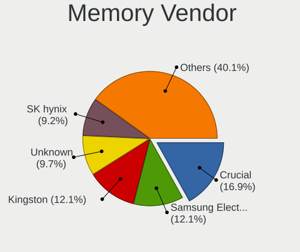

| Vendor              | Desktops | Percent |
|---------------------|----------|---------|
| Crucial             | 35       | 16.91%  |
| Samsung Electronics | 25       | 12.08%  |
| Kingston            | 25       | 12.08%  |
| Unknown             | 20       | 9.66%   |
| SK hynix            | 19       | 9.18%   |
| Micron Technology   | 18       | 8.7%    |
| Corsair             | 13       | 6.28%   |
| Unknown (ABCD)      | 10       | 4.83%   |
| Unknown             | 10       | 4.83%   |
| G.Skill             | 6        | 2.9%    |
| Transcend           | 3        | 1.45%   |
| A-DATA Technology   | 3        | 1.45%   |
| Unknown (0x0FBA)    | 2        | 0.97%   |
| Ramaxel Technology  | 2        | 0.97%   |
| Toshiba             | 1        | 0.48%   |
| tigo                | 1        | 0.48%   |
| Smart Modular       | 1        | 0.48%   |
| Nanya Technology    | 1        | 0.48%   |
| Mushkin             | 1        | 0.48%   |
| Lexar Co Limited    | 1        | 0.48%   |
| Kingmax             | 1        | 0.48%   |
| Kimtigo             | 1        | 0.48%   |
| Innodisk            | 1        | 0.48%   |
| GOODRAM             | 1        | 0.48%   |
| GeIL                | 1        | 0.48%   |
| DSL                 | 1        | 0.48%   |
| Axiom               | 1        | 0.48%   |
| Avant               | 1        | 0.48%   |
| ATP                 | 1        | 0.48%   |
| AMD                 | 1        | 0.48%   |

Memory Model
------------

Memory module models

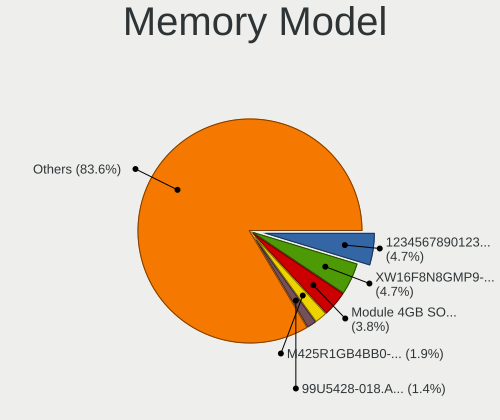

| Model                                                            | Desktops | Percent |
|------------------------------------------------------------------|----------|---------|
| Unknown (ABCD) RAM 123456789012345678 8GB DIMM DDR4 2400MT/s     | 10       | 4.69%   |
| Unknown                                                          | 10       | 4.69%   |
| Unknown RAM Module 4GB SODIMM DDR3 1333MT/s                      | 8        | 3.76%   |
| Samsung RAM M425R1GB4BB0-CQKOL 8GB SODIMM DDR5 4800MT/s          | 4        | 1.88%   |
| Kingston RAM 99U5428-018.A00LF 8GB SODIMM DDR3 1600MT/s          | 3        | 1.41%   |
| Crucial RAM CT16G48C40S5.M8A1 16GB SODIMM DDR5 4800MT/s          | 3        | 1.41%   |
| Unknown RAM Module 8GB DIMM DDR3 1600MT/s                        | 2        | 0.94%   |
| Unknown RAM Module 4GB SODIMM DDR3 800MT/s                       | 2        | 0.94%   |
| SK hynix RAM HMT451U6DFR8A-PB 4GB DIMM DDR3 1600MT/s             | 2        | 0.94%   |
| SK hynix RAM HMT125U6BFR8C-G7 2GB DIMM DDR3 1067MT/s             | 2        | 0.94%   |
| Samsung RAM Module 3GB Row Of Chips LPDDR5 6400MT/s              | 2        | 0.94%   |
| Samsung RAM M378B5673FH0-CH9 2GB DIMM DDR3 1333MT/s              | 2        | 0.94%   |
| Micron RAM MTC4C10163S1SC48BA1 8GB SODIMM DDR5 4800MT/s          | 2        | 0.94%   |
| Micron RAM 8ATF1G64AZ-2G6E1 8GB DIMM DDR4 2667MT/s               | 2        | 0.94%   |
| Kingston RAM KF3200C20S4/8G 8GB SODIMM DDR4 3200MT/s             | 2        | 0.94%   |
| Kingston RAM CBD26D4S9S8K1C-8 8GB SODIMM DDR4 3200MT/s           | 2        | 0.94%   |
| G.Skill RAM F3-1600C11-8GSL 8GB SODIMM DDR3 1600MT/s             | 2        | 0.94%   |
| Crucial RAM CT8G4SFS824A.M8FRS 8GB DIMM DDR4 2400MT/s            | 2        | 0.94%   |
| Crucial RAM CT8G4SFRA266.M8FRS 8GB SODIMM DDR4 2667MT/s          | 2        | 0.94%   |
| A-DATA RAM AM1P24HC4U1-B9RS 4GB SODIMM DDR4 2400MT/s             | 2        | 0.94%   |
| Unknown RAM Module 8GB DIMM 1333MT/s                             | 1        | 0.47%   |
| Unknown RAM Module 8GB 1600MT/s                                  | 1        | 0.47%   |
| Unknown RAM Module 4GB SODIMM DDR3 667MT/s                       | 1        | 0.47%   |
| Unknown RAM Module 4GB SODIMM DDR2 800MT/s                       | 1        | 0.47%   |
| Unknown RAM Module 4GB DIMM DDR3 1066MT/s                        | 1        | 0.47%   |
| Unknown RAM Module 2GB SODIMM DDR3 1333MT/s                      | 1        | 0.47%   |
| Unknown RAM Module 2GB DIMM 1333MT/s                             | 1        | 0.47%   |
| Unknown RAM Module 1GB DIMM DDR2 1033MT/s                        | 1        | 0.47%   |
| Unknown RAM AW24P64F8BLK0S 8GB DIMM DDR3 1600MT/s                | 1        | 0.47%   |
| Unknown (0x0FBA) RAM TENGYIN-16GB-5600 16GB SODIMM DDR5 5600MT/s | 1        | 0.47%   |
| Unknown (0x0FBA) RAM TENGYIN-16GB-3200 16GB SODIMM DDR4 3200MT/s | 1        | 0.47%   |
| Transcend RAM TS512MLK72V6H 4GB DIMM DDR3 1600MT/s               | 1        | 0.47%   |
| Transcend RAM TS2GSH64V1B 16GB SODIMM DDR4 2133MT/s              | 1        | 0.47%   |
| Transcend RAM JM3200HSE-16G 16GB SODIMM DDR4 3200MT/s            | 1        | 0.47%   |
| Toshiba RAM KHX2400C14S4/4G 4GB SODIMM DDR4 2400MT/s             | 1        | 0.47%   |
| tigo RAM 1600Mhz-4G 4GB SODIMM DDR3 1600MT/s                     | 1        | 0.47%   |
| Smart Modular RAM Module 4GB DIMM DDR3 1333MT/s                  | 1        | 0.47%   |
| SK hynix RAM Module 2GB DIMM DDR3 1333MT/s                       | 1        | 0.47%   |
| SK hynix RAM Module 16GB SODIMM DDR4 3200MT/s                    | 1        | 0.47%   |
| SK hynix RAM HMT451U6BFR8A-PB 4GB DIMM DDR3 1600MT/s             | 1        | 0.47%   |

Memory Kind
-----------

Memory module kinds

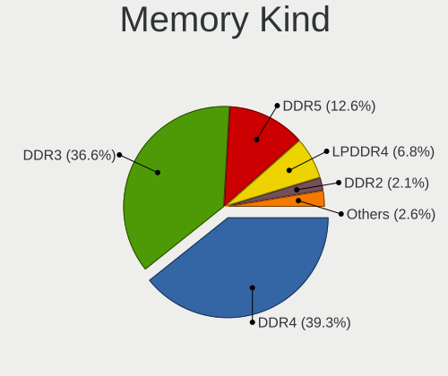

| Kind    | Desktops | Percent |
|---------|----------|---------|
| DDR4    | 75       | 39.27%  |
| DDR3    | 70       | 36.65%  |
| DDR5    | 24       | 12.57%  |
| LPDDR4  | 13       | 6.81%   |
| DDR2    | 4        | 2.09%   |
| LPDDR5  | 3        | 1.57%   |
| Unknown | 2        | 1.05%   |

Memory Form Factor
------------------

Physical design of the memory module

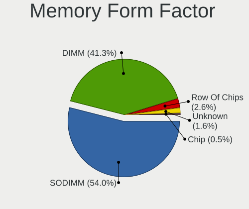

| Name         | Desktops | Percent |
|--------------|----------|---------|
| SODIMM       | 102      | 53.97%  |
| DIMM         | 78       | 41.27%  |
| Row Of Chips | 5        | 2.65%   |
| Unknown      | 3        | 1.59%   |
| Chip         | 1        | 0.53%   |

Memory Size
-----------

Memory module size

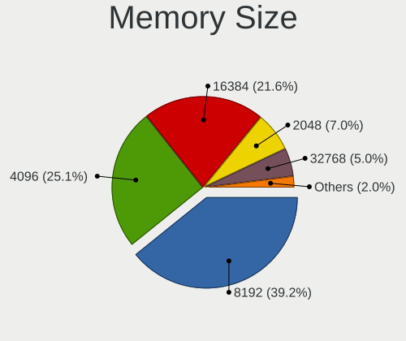

| Size  | Desktops | Percent |
|-------|----------|---------|
| 8192  | 78       | 39.2%   |
| 4096  | 50       | 25.13%  |
| 16384 | 43       | 21.61%  |
| 2048  | 14       | 7.04%   |
| 32768 | 10       | 5.03%   |
| 3072  | 2        | 1.01%   |
| 1024  | 2        | 1.01%   |

Memory Speed
------------

Memory module speed

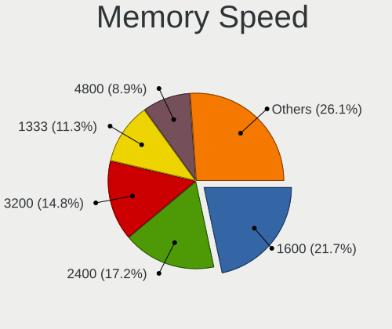

| Speed   | Desktops | Percent |
|---------|----------|---------|
| 1600    | 44       | 21.67%  |
| 2400    | 35       | 17.24%  |
| 3200    | 30       | 14.78%  |
| 1333    | 23       | 11.33%  |
| 4800    | 18       | 8.87%   |
| 2667    | 16       | 7.88%   |
| 2133    | 8        | 3.94%   |
| 5600    | 5        | 2.46%   |
| 800     | 4        | 1.97%   |
| 6400    | 3        | 1.48%   |
| 2666    | 2        | 0.99%   |
| 1067    | 2        | 0.99%   |
| 1066    | 2        | 0.99%   |
| 667     | 2        | 0.99%   |
| 65535   | 1        | 0.49%   |
| 5200    | 1        | 0.49%   |
| 3600    | 1        | 0.49%   |
| 3000    | 1        | 0.49%   |
| 1334    | 1        | 0.49%   |
| 1033    | 1        | 0.49%   |
| 933     | 1        | 0.49%   |
| 533     | 1        | 0.49%   |
| Unknown | 1        | 0.49%   |

Printers & scanners
-------------------

Printer Vendor
--------------

Printer device vendors

Zero info for selected period =(

Printer Model
-------------

Printer device models

Zero info for selected period =(

Scanner Vendor
--------------

Scanner device vendors

Zero info for selected period =(

Scanner Model
-------------

Scanner device models

Zero info for selected period =(

Camera
------

Camera Vendor
-------------

Camera device vendors

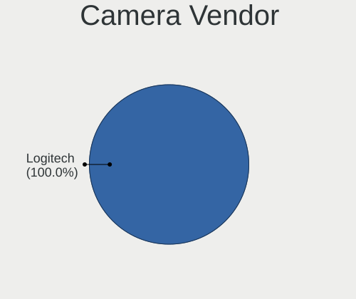

| Vendor   | Desktops | Percent |
|----------|----------|---------|
| Logitech | 1        | 100%    |

Camera Model
------------

Camera device models

| Model                | Desktops | Percent |
|----------------------|----------|---------|
| Logitech Webcam C170 | 1        | 100%    |

Security
--------

Fingerprint Vendor
------------------

Fingerprint sensor vendors

Zero info for selected period =(

Fingerprint Model
-----------------

Fingerprint sensor models

Zero info for selected period =(

Chipcard Vendor
---------------

Chipcard module vendors

Zero info for selected period =(

Chipcard Model
--------------

Chipcard module models

Zero info for selected period =(

Unsupported
-----------

Unsupported Devices
-------------------

Total unsupported devices on board

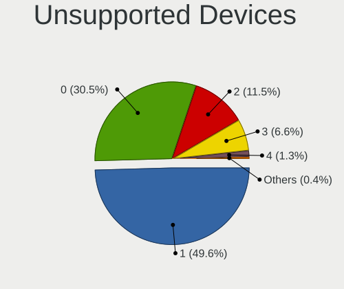

| Total | Desktops | Percent |
|-------|----------|---------|
| 1     | 112      | 49.56%  |
| 0     | 69       | 30.53%  |
| 2     | 26       | 11.5%   |
| 3     | 15       | 6.64%   |
| 4     | 3        | 1.33%   |
| 5     | 1        | 0.44%   |

Unsupported Device Types
------------------------

Types of unsupported devices

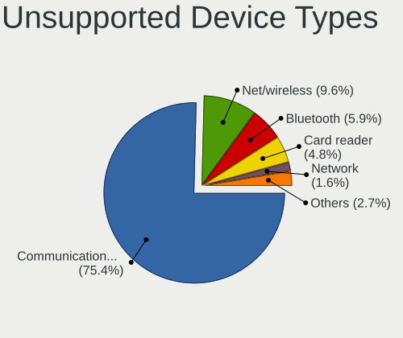

| Type                     | Desktops | Percent |
|--------------------------|----------|---------|
| Communication controller | 141      | 75.4%   |
| Net/wireless             | 18       | 9.63%   |
| Bluetooth                | 11       | 5.88%   |
| Card reader              | 9        | 4.81%   |
| Network                  | 3        | 1.6%    |
| Net/ethernet             | 2        | 1.07%   |
| Sound                    | 1        | 0.53%   |
| Graphics card            | 1        | 0.53%   |
| Firewire controller      | 1        | 0.53%   |

