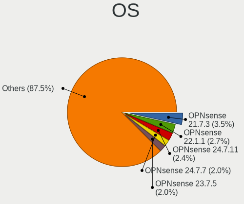
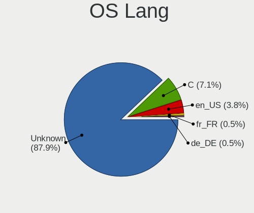
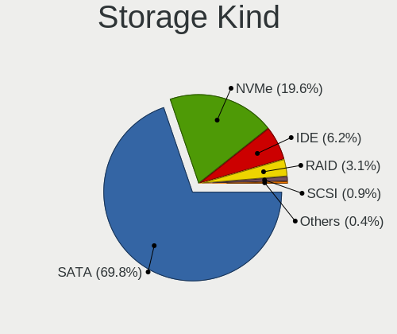
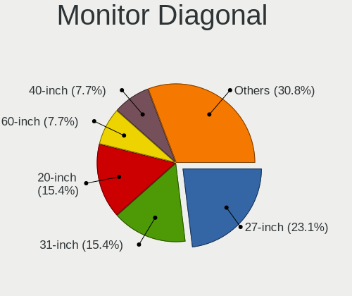

BSD in Austria - Tested Hardware & Statistics (Desktops)
--------------------------------------------------------

A project to collect tested hardware configurations for BSD in Austria.

Anyone can contribute to this report by the [hw-probe](https://github.com/linuxhw/hw-probe/blob/master/INSTALL.BSD.md) tool:

    hw-probe -all -upload

Please contribute! Especially if your hardware is rare.

Contents
--------

* [ Test Cases ](#test-cases)

* [ System ](#system)
  - [ OS                       ](#os)
  - [ OS Family                ](#os-family)
  - [ Arch                     ](#arch)
  - [ DE                       ](#de)
  - [ Display Server           ](#display-server)
  - [ Display Manager          ](#display-manager)
  - [ OS Lang                  ](#os-lang)
  - [ Boot Mode                ](#boot-mode)
  - [ Filesystem               ](#filesystem)
  - [ Part. scheme             ](#part-scheme)

* [ Board ](#board)
  - [ Vendor                   ](#vendor)
  - [ Model                    ](#model)
  - [ Model Family             ](#model-family)
  - [ MFG Year                 ](#mfg-year)
  - [ Form Factor              ](#form-factor)
  - [ Coreboot                 ](#coreboot)
  - [ RAM Size                 ](#ram-size)
  - [ RAM Used                 ](#ram-used)
  - [ Total Drives             ](#total-drives)
  - [ Has CD-ROM               ](#has-cd-rom)
  - [ Has Ethernet             ](#has-ethernet)
  - [ Has WiFi                 ](#has-wifi)
  - [ Has Bluetooth            ](#has-bluetooth)

* [ Location ](#location)
  - [ Country                  ](#country)
  - [ City                     ](#city)

* [ Drives ](#drives)
  - [ Drive Vendor             ](#drive-vendor)
  - [ Drive Model              ](#drive-model)
  - [ HDD Vendor               ](#hdd-vendor)
  - [ SSD Vendor               ](#ssd-vendor)
  - [ Drive Kind               ](#drive-kind)
  - [ Drive Connector          ](#drive-connector)
  - [ Drive Size               ](#drive-size)
  - [ Space Total              ](#space-total)
  - [ Space Used               ](#space-used)
  - [ Malfunc. Drives          ](#malfunc-drives)
  - [ Malfunc. Drive Vendor    ](#malfunc-drive-vendor)
  - [ Malfunc. HDD Vendor      ](#malfunc-hdd-vendor)
  - [ Malfunc. Drive Kind      ](#malfunc-drive-kind)
  - [ Failed Drives            ](#failed-drives)
  - [ Failed Drive Vendor      ](#failed-drive-vendor)
  - [ Drive Status             ](#drive-status)

* [ Storage controller ](#storage-controller)
  - [ Storage Vendor           ](#storage-vendor)
  - [ Storage Model            ](#storage-model)
  - [ Storage Kind             ](#storage-kind)

* [ Processor ](#processor)
  - [ CPU Vendor               ](#cpu-vendor)
  - [ CPU Model                ](#cpu-model)
  - [ CPU Model Family         ](#cpu-model-family)
  - [ CPU Cores                ](#cpu-cores)
  - [ CPU Sockets              ](#cpu-sockets)
  - [ CPU Threads              ](#cpu-threads)
  - [ CPU Microarch            ](#cpu-microarch)

* [ Graphics ](#graphics)
  - [ GPU Vendor               ](#gpu-vendor)
  - [ GPU Model                ](#gpu-model)
  - [ GPU Combo                ](#gpu-combo)
  - [ GPU Driver               ](#gpu-driver)
  - [ GPU Memory               ](#gpu-memory)

* [ Monitor ](#monitor)
  - [ Monitor Vendor           ](#monitor-vendor)
  - [ Monitor Model            ](#monitor-model)
  - [ Monitor Resolution       ](#monitor-resolution)
  - [ Monitor Diagonal         ](#monitor-diagonal)
  - [ Monitor Width            ](#monitor-width)
  - [ Aspect Ratio             ](#aspect-ratio)
  - [ Monitor Area             ](#monitor-area)
  - [ Pixel Density            ](#pixel-density)
  - [ Multiple Monitors        ](#multiple-monitors)

* [ Network ](#network)
  - [ Net Controller Vendor    ](#net-controller-vendor)
  - [ Net Controller Model     ](#net-controller-model)
  - [ Wireless Vendor          ](#wireless-vendor)
  - [ Wireless Model           ](#wireless-model)
  - [ Ethernet Vendor          ](#ethernet-vendor)
  - [ Ethernet Model           ](#ethernet-model)
  - [ Net Controller Kind      ](#net-controller-kind)
  - [ Used Controller          ](#used-controller)
  - [ NICs                     ](#nics)
  - [ IPv6                     ](#ipv6)

* [ Bluetooth ](#bluetooth)
  - [ Bluetooth Vendor         ](#bluetooth-vendor)
  - [ Bluetooth Model          ](#bluetooth-model)

* [ Sound ](#sound)
  - [ Sound Vendor             ](#sound-vendor)
  - [ Sound Model              ](#sound-model)

* [ Memory ](#memory)
  - [ Memory Vendor            ](#memory-vendor)
  - [ Memory Model             ](#memory-model)
  - [ Memory Kind              ](#memory-kind)
  - [ Memory Form Factor       ](#memory-form-factor)
  - [ Memory Size              ](#memory-size)
  - [ Memory Speed             ](#memory-speed)

* [ Printers & scanners ](#printers--scanners)
  - [ Printer Vendor           ](#printer-vendor)
  - [ Printer Model            ](#printer-model)
  - [ Scanner Vendor           ](#scanner-vendor)
  - [ Scanner Model            ](#scanner-model)

* [ Camera ](#camera)
  - [ Camera Vendor            ](#camera-vendor)
  - [ Camera Model             ](#camera-model)

* [ Security ](#security)
  - [ Fingerprint Vendor       ](#fingerprint-vendor)
  - [ Fingerprint Model        ](#fingerprint-model)
  - [ Chipcard Vendor          ](#chipcard-vendor)
  - [ Chipcard Model           ](#chipcard-model)

* [ Unsupported ](#unsupported)
  - [ Unsupported Devices      ](#unsupported-devices)
  - [ Unsupported Device Types ](#unsupported-device-types)

Test Cases
----------

Total: 204

| Vendor        | Model                       | Probe                                                     | Date         |
|---------------|-----------------------------|-----------------------------------------------------------|--------------|
| Gigabyte      | H610M H DDR4                | [bdc4fdaf9c](https://bsd-hardware.info/?probe=bdc4fdaf9c) | Nov 05, 2023 |
| Fujitsu       | D3543-A1 S26361-D3543-A1... | [4b685d7ff1](https://bsd-hardware.info/?probe=4b685d7ff1) | Oct 14, 2023 |
| Gigabyte      | H610M H DDR4                | [ab5400f952](https://bsd-hardware.info/?probe=ab5400f952) | Oct 08, 2023 |
| Unknown       | Unknown                     | [13f17e09d4](https://bsd-hardware.info/?probe=13f17e09d4) | Oct 06, 2023 |
| Fujitsu       | D3543-A1 S26361-D3543-A1... | [5076395072](https://bsd-hardware.info/?probe=5076395072) | Oct 06, 2023 |
| PC Engines    | apu4                        | [20c432e07b](https://bsd-hardware.info/?probe=20c432e07b) | Oct 02, 2023 |
| ShenZhen M... | 3865U-6L                    | [53a70ddb3b](https://bsd-hardware.info/?probe=53a70ddb3b) | Oct 02, 2023 |
| Fujitsu       | D3543-A1 S26361-D3543-A1... | [8809e169a1](https://bsd-hardware.info/?probe=8809e169a1) | Sep 30, 2023 |
| Unknown       | Unknown                     | [20fb7f1ba8](https://bsd-hardware.info/?probe=20fb7f1ba8) | Sep 30, 2023 |
| Unknown       | Unknown                     | [7e82c0f66d](https://bsd-hardware.info/?probe=7e82c0f66d) | Sep 29, 2023 |
| MW            | GMLK-2_5G4L                 | [8ebba0ee37](https://bsd-hardware.info/?probe=8ebba0ee37) | Sep 19, 2023 |
| Hardkernel    | ODROID-H2                   | [35544a61bd](https://bsd-hardware.info/?probe=35544a61bd) | Sep 16, 2023 |
| Intel         | D2500CC AAG43156-303        | [281e4a541b](https://bsd-hardware.info/?probe=281e4a541b) | Aug 26, 2023 |
| Intel         | D2500CC AAG43156-303        | [c5745af495](https://bsd-hardware.info/?probe=c5745af495) | Aug 26, 2023 |
| IceWhale T... | ZimaBoard 832 ZMB           | [97321f0843](https://bsd-hardware.info/?probe=97321f0843) | Aug 20, 2023 |
| Fujitsu       | D3313-B1 S26361-D3313-B1    | [87bc92631a](https://bsd-hardware.info/?probe=87bc92631a) | Aug 16, 2023 |
| Fujitsu       | D3313-B1 S26361-D3313-B1    | [ec68697ed9](https://bsd-hardware.info/?probe=ec68697ed9) | Aug 16, 2023 |
| Hardkernel    | ODROID-H2                   | [a92e1efca1](https://bsd-hardware.info/?probe=a92e1efca1) | Aug 07, 2023 |
| Dell          | 0T7D40 A00                  | [e903094a75](https://bsd-hardware.info/?probe=e903094a75) | Aug 03, 2023 |
| ASRock        | J3355B-ITX                  | [234f0fd8aa](https://bsd-hardware.info/?probe=234f0fd8aa) | Aug 01, 2023 |
| IceWhale T... | ZimaBoard 832 ZMB           | [aeb59c510b](https://bsd-hardware.info/?probe=aeb59c510b) | Jul 26, 2023 |
| Dell          | 0T7D40 A00                  | [24e7268bbe](https://bsd-hardware.info/?probe=24e7268bbe) | Jul 19, 2023 |
| ASUSTek       | H110M-R                     | [cc5fe45365](https://bsd-hardware.info/?probe=cc5fe45365) | Jun 15, 2023 |
| ShenZhen M... | 3865U-6L                    | [5733ad3c03](https://bsd-hardware.info/?probe=5733ad3c03) | May 25, 2023 |
| Hardkernel    | ODROID-H2                   | [3966c4828d](https://bsd-hardware.info/?probe=3966c4828d) | May 12, 2023 |
| PC Engines    | apu4                        | [2589a0c02c](https://bsd-hardware.info/?probe=2589a0c02c) | May 10, 2023 |
| Gigabyte      | H81M-D2V                    | [5f9bbf2d15](https://bsd-hardware.info/?probe=5f9bbf2d15) | May 04, 2023 |
| ZOTAC         | Unknown                     | [f6c39a3582](https://bsd-hardware.info/?probe=f6c39a3582) | Apr 30, 2023 |
| Deciso        | Netboard A10 GEN2 Model ... | [e7e7a6470d](https://bsd-hardware.info/?probe=e7e7a6470d) | Apr 27, 2023 |
| Deciso        | Netboard A10 GEN2 Model ... | [b517729fb4](https://bsd-hardware.info/?probe=b517729fb4) | Apr 27, 2023 |
| ShenZhen M... | 3865U-6L                    | [1548471a4d](https://bsd-hardware.info/?probe=1548471a4d) | Apr 25, 2023 |
| Unknown       | Unknown                     | [0d7a1b58ed](https://bsd-hardware.info/?probe=0d7a1b58ed) | Apr 21, 2023 |
| MSI           | 2A78h                       | [8560ebd69c](https://bsd-hardware.info/?probe=8560ebd69c) | Apr 18, 2023 |
| ZOTAC         | Unknown                     | [8c3cdf29a2](https://bsd-hardware.info/?probe=8c3cdf29a2) | Apr 17, 2023 |
| Shuttle       | DS10U                       | [7f98ef1865](https://bsd-hardware.info/?probe=7f98ef1865) | Apr 10, 2023 |
| Shuttle       | FS61                        | [9c3df7e926](https://bsd-hardware.info/?probe=9c3df7e926) | Apr 09, 2023 |
| MW            | GMLK-2_5G4L                 | [8452deae22](https://bsd-hardware.info/?probe=8452deae22) | Apr 07, 2023 |
| Unknown       | Unknown                     | [11f0439894](https://bsd-hardware.info/?probe=11f0439894) | Apr 04, 2023 |
| Unknown       | Unknown                     | [9a5ccefb18](https://bsd-hardware.info/?probe=9a5ccefb18) | Mar 17, 2023 |
| Unknown       | Unknown                     | [f80047716b](https://bsd-hardware.info/?probe=f80047716b) | Mar 15, 2023 |
| Dell          | 01TN68 A02                  | [cb6c76df00](https://bsd-hardware.info/?probe=cb6c76df00) | Mar 13, 2023 |
| ASUSTek       | P11C-M Series               | [80814c04b6](https://bsd-hardware.info/?probe=80814c04b6) | Mar 10, 2023 |
| ASUSTek       | P11C-M Series               | [242677230a](https://bsd-hardware.info/?probe=242677230a) | Mar 09, 2023 |
| BESSTAR Te... | TH50                        | [e27931f082](https://bsd-hardware.info/?probe=e27931f082) | Mar 07, 2023 |
| ASUSTek       | P11C-M Series               | [866573ffa0](https://bsd-hardware.info/?probe=866573ffa0) | Mar 03, 2023 |
| MW            | GMLK-2_5G4L                 | [bf21395f79](https://bsd-hardware.info/?probe=bf21395f79) | Feb 24, 2023 |
| Intel         | DENLOW_WS                   | [f6f5953979](https://bsd-hardware.info/?probe=f6f5953979) | Feb 23, 2023 |
| HP            | 3397                        | [8b231fd832](https://bsd-hardware.info/?probe=8b231fd832) | Feb 19, 2023 |
| Fujitsu       | D3313-B1 S26361-D3313-B1    | [be8fb945ef](https://bsd-hardware.info/?probe=be8fb945ef) | Feb 12, 2023 |
| Intel         | ChiefRiver                  | [ae6ea07868](https://bsd-hardware.info/?probe=ae6ea07868) | Feb 05, 2023 |
| PC Engines    | APU2                        | [d59ed5b52f](https://bsd-hardware.info/?probe=d59ed5b52f) | Feb 02, 2023 |
| CncTion       | N5105-4L B0                 | [d9746ad1c3](https://bsd-hardware.info/?probe=d9746ad1c3) | Jan 28, 2023 |
| Techvision    | TVI7309X B0                 | [84375af67f](https://bsd-hardware.info/?probe=84375af67f) | Jan 27, 2023 |
| Unknown       | YL-E3845L4-V2               | [d93eb933f1](https://bsd-hardware.info/?probe=d93eb933f1) | Jan 20, 2023 |
| Unknown       | Unknown                     | [22015084fc](https://bsd-hardware.info/?probe=22015084fc) | Jan 17, 2023 |
| Unknown       | Unknown                     | [87d79c88e1](https://bsd-hardware.info/?probe=87d79c88e1) | Jan 11, 2023 |
| MW            | GMLK-2_5G4L                 | [5a4affef3e](https://bsd-hardware.info/?probe=5a4affef3e) | Jan 04, 2023 |
| Hardkernel    | ODROID-H2                   | [b685ddc2ad](https://bsd-hardware.info/?probe=b685ddc2ad) | Dec 28, 2022 |
| Unknown       | Unknown                     | [f7700c781d](https://bsd-hardware.info/?probe=f7700c781d) | Dec 17, 2022 |
| Techvision    | TVI7309X B0                 | [657972a55d](https://bsd-hardware.info/?probe=657972a55d) | Dec 06, 2022 |
| Techvision    | TVI7309X B0                 | [33f23b1291](https://bsd-hardware.info/?probe=33f23b1291) | Dec 06, 2022 |
| Deciso        | Netboard A10 GEN2 Model ... | [d48dbd053d](https://bsd-hardware.info/?probe=d48dbd053d) | Nov 28, 2022 |
| PC Engines    | apu4                        | [588e065800](https://bsd-hardware.info/?probe=588e065800) | Nov 28, 2022 |
| Dell          | 0T7D40 A01                  | [45d96a0b5a](https://bsd-hardware.info/?probe=45d96a0b5a) | Nov 24, 2022 |
| Gigabyte      | J3455N-D3H                  | [2f812bd8c3](https://bsd-hardware.info/?probe=2f812bd8c3) | Nov 22, 2022 |
| Gigabyte      | J3455N-D3H                  | [86dcacdb40](https://bsd-hardware.info/?probe=86dcacdb40) | Nov 13, 2022 |
| PC Engines    | apu4                        | [7ed7638be3](https://bsd-hardware.info/?probe=7ed7638be3) | Nov 03, 2022 |
| PC Engines    | APU2                        | [0c573848ce](https://bsd-hardware.info/?probe=0c573848ce) | Oct 27, 2022 |
| PC Engines    | APU2                        | [0677b5c196](https://bsd-hardware.info/?probe=0677b5c196) | Oct 25, 2022 |
| Gigabyte      | J3455N-D3H                  | [9757e40c42](https://bsd-hardware.info/?probe=9757e40c42) | Oct 13, 2022 |
| Dell          | 0WMJ54 A01                  | [53dfc5844c](https://bsd-hardware.info/?probe=53dfc5844c) | Oct 01, 2022 |
| Dell          | 0WMJ54 A01                  | [30cb759583](https://bsd-hardware.info/?probe=30cb759583) | Sep 30, 2022 |
| MW            | GMLK-2_5G4L                 | [37cafd59eb](https://bsd-hardware.info/?probe=37cafd59eb) | Sep 20, 2022 |
| Deciso        | Netboard A10 GEN2 Model ... | [e0b8ceecae](https://bsd-hardware.info/?probe=e0b8ceecae) | Sep 16, 2022 |
| Deciso        | Netboard A10 GEN2 Model ... | [e082eca671](https://bsd-hardware.info/?probe=e082eca671) | Sep 08, 2022 |
| PC Engines    | APU2                        | [1650d8c419](https://bsd-hardware.info/?probe=1650d8c419) | Sep 05, 2022 |
| AAEON         | UP-APL01 V0.4               | [a8d73a9156](https://bsd-hardware.info/?probe=a8d73a9156) | Sep 01, 2022 |
| MW            | GMLK-2_5G4L                 | [63587e2fca](https://bsd-hardware.info/?probe=63587e2fca) | Aug 31, 2022 |
| Seeed Stud... | ODYSSEY-X86J4105 SD-BS-C... | [45043e0e42](https://bsd-hardware.info/?probe=45043e0e42) | Aug 18, 2022 |
| Fujitsu       | D3224-A1 S26361-D3224-A1    | [4e056b6f77](https://bsd-hardware.info/?probe=4e056b6f77) | Aug 11, 2022 |
| Deciso        | Netboard A10 GEN2 Model ... | [1cd64c78d5](https://bsd-hardware.info/?probe=1cd64c78d5) | Aug 10, 2022 |
| Deciso        | Netboard A10 GEN2 Model ... | [5c00da486d](https://bsd-hardware.info/?probe=5c00da486d) | Jul 29, 2022 |
| Dell          | 0T7D40 A01                  | [bd2f6f8596](https://bsd-hardware.info/?probe=bd2f6f8596) | Jul 29, 2022 |
| MW            | GMLK-2_5G4L                 | [69c0b0d218](https://bsd-hardware.info/?probe=69c0b0d218) | Jul 29, 2022 |
| Biostar       | A10N-8800E                  | [fe4d305991](https://bsd-hardware.info/?probe=fe4d305991) | Jul 27, 2022 |
| Gigabyte      | H87-HD3                     | [e6a9b0dd8b](https://bsd-hardware.info/?probe=e6a9b0dd8b) | Jul 25, 2022 |
| MW            | GMLK-2_5G4L                 | [57da61c80c](https://bsd-hardware.info/?probe=57da61c80c) | Jul 17, 2022 |
| PC Engines    | apu4                        | [4e24f7aa5b](https://bsd-hardware.info/?probe=4e24f7aa5b) | Jul 15, 2022 |
| Deciso        | Netboard A10 GEN2 Model ... | [bfbac4efa5](https://bsd-hardware.info/?probe=bfbac4efa5) | Jul 05, 2022 |
| Secudos       | Unknown                     | [beaf8ea459](https://bsd-hardware.info/?probe=beaf8ea459) | Jul 04, 2022 |
| Secudos       | Unknown                     | [e54c622459](https://bsd-hardware.info/?probe=e54c622459) | Jul 04, 2022 |
| Lenovo        | 3708 SDK0J40700 WIN 3258... | [e68d7a5dff](https://bsd-hardware.info/?probe=e68d7a5dff) | Jun 29, 2022 |
| Intel         | Q3XXG4-P V1.0               | [f68b48b102](https://bsd-hardware.info/?probe=f68b48b102) | Jun 28, 2022 |
| PC Engines    | APU2                        | [b296296b84](https://bsd-hardware.info/?probe=b296296b84) | Jun 10, 2022 |
| MSI           | MS-6788                     | [f750cb83e3](https://bsd-hardware.info/?probe=f750cb83e3) | May 31, 2022 |
| Dell          | 055H3G A01                  | [cc1c76afc0](https://bsd-hardware.info/?probe=cc1c76afc0) | May 24, 2022 |
| Shuttle       | DS10U                       | [573358361a](https://bsd-hardware.info/?probe=573358361a) | May 22, 2022 |
| Protectli     | FW4B Ver                    | [02f79b14cb](https://bsd-hardware.info/?probe=02f79b14cb) | May 20, 2022 |
| PC Engines    | APU2                        | [7132ae8216](https://bsd-hardware.info/?probe=7132ae8216) | May 19, 2022 |
| Dell          | 0T7D40 A01                  | [7a43bfada9](https://bsd-hardware.info/?probe=7a43bfada9) | Apr 23, 2022 |
| Dell          | 0T7D40 A01                  | [4ad1c07aa5](https://bsd-hardware.info/?probe=4ad1c07aa5) | Apr 19, 2022 |
| PC Engines    | apu4                        | [beb62ed999](https://bsd-hardware.info/?probe=beb62ed999) | Apr 07, 2022 |
| Unknown       | Unknown                     | [4d52408404](https://bsd-hardware.info/?probe=4d52408404) | Apr 04, 2022 |
| Dell          | 096JG8 A01                  | [7ee68eb371](https://bsd-hardware.info/?probe=7ee68eb371) | Apr 02, 2022 |
| Dell          | 096JG8 A01                  | [657c893958](https://bsd-hardware.info/?probe=657c893958) | Apr 02, 2022 |
| PC Engines    | APU2                        | [5aef21bfc3](https://bsd-hardware.info/?probe=5aef21bfc3) | Mar 26, 2022 |
| Secudos       | Unknown                     | [970e9962ff](https://bsd-hardware.info/?probe=970e9962ff) | Mar 24, 2022 |
| PC Engines    | apu4                        | [395eb04c69](https://bsd-hardware.info/?probe=395eb04c69) | Mar 14, 2022 |
| PC Engines    | APU2                        | [c5ed9017c3](https://bsd-hardware.info/?probe=c5ed9017c3) | Mar 05, 2022 |
| Shuttle       | DS10U                       | [1300217458](https://bsd-hardware.info/?probe=1300217458) | Feb 28, 2022 |
| HP            | 805D                        | [4c07559a11](https://bsd-hardware.info/?probe=4c07559a11) | Feb 28, 2022 |
| PC Engines    | apu4                        | [606d9c838c](https://bsd-hardware.info/?probe=606d9c838c) | Feb 26, 2022 |
| PC Engines    | apu4                        | [8b42751f17](https://bsd-hardware.info/?probe=8b42751f17) | Feb 25, 2022 |
| Unknown       | Unknown                     | [96bae6432b](https://bsd-hardware.info/?probe=96bae6432b) | Feb 24, 2022 |
| Shuttle       | FH170                       | [5fd212645c](https://bsd-hardware.info/?probe=5fd212645c) | Feb 18, 2022 |
| Dell          | 096JG8 A01                  | [6baeaf5d48](https://bsd-hardware.info/?probe=6baeaf5d48) | Feb 17, 2022 |
| Unknown       | Unknown                     | [f172be6fb0](https://bsd-hardware.info/?probe=f172be6fb0) | Feb 17, 2022 |
| Seeed Stud... | ODYSSEY-X86J4105 SD-BS-C... | [f1dd03cdcb](https://bsd-hardware.info/?probe=f1dd03cdcb) | Feb 16, 2022 |
| Lenovo        | ThinkPad T400 2768W3A       | [4691fdb146](https://bsd-hardware.info/?probe=4691fdb146) | Feb 13, 2022 |
| Lenovo        | ThinkPad T400 2768W3A       | [97788dfb1a](https://bsd-hardware.info/?probe=97788dfb1a) | Feb 13, 2022 |
| Fujitsu       | D3224-A1 S26361-D3224-A1    | [0117d61d81](https://bsd-hardware.info/?probe=0117d61d81) | Feb 07, 2022 |
| Dell          | 0NKW6Y A00                  | [1ea6d60d70](https://bsd-hardware.info/?probe=1ea6d60d70) | Jan 30, 2022 |
| HP            | 805D                        | [d7e312307f](https://bsd-hardware.info/?probe=d7e312307f) | Jan 30, 2022 |
| Unknown       | YL-J3160L4                  | [763dc53716](https://bsd-hardware.info/?probe=763dc53716) | Jan 28, 2022 |
| Lenovo        | 0B98401 WIN                 | [c5430f00cf](https://bsd-hardware.info/?probe=c5430f00cf) | Jan 22, 2022 |
| Intel         | D2500CC AAG43156-303        | [d2d10a1ffc](https://bsd-hardware.info/?probe=d2d10a1ffc) | Jan 21, 2022 |
| Biostar       | N3050NH                     | [31e33326fa](https://bsd-hardware.info/?probe=31e33326fa) | Jan 06, 2022 |
| Gigabyte      | B150-HD3P-CF                | [9752eae10b](https://bsd-hardware.info/?probe=9752eae10b) | Jan 06, 2022 |
| Fujitsu       | D3164-C2 S26361-D3164-C2    | [765210be77](https://bsd-hardware.info/?probe=765210be77) | Dec 28, 2021 |
| Purism        | Librem Mini v2              | [528ef01c87](https://bsd-hardware.info/?probe=528ef01c87) | Dec 20, 2021 |
| HP            | 805D                        | [324b4670b6](https://bsd-hardware.info/?probe=324b4670b6) | Dec 12, 2021 |
| Unknown       | Unknown                     | [943365b2f1](https://bsd-hardware.info/?probe=943365b2f1) | Dec 11, 2021 |
| BESSTAR Te... | IB9                         | [26717d3708](https://bsd-hardware.info/?probe=26717d3708) | Dec 10, 2021 |
| HP            | 3397                        | [ac295c89b0](https://bsd-hardware.info/?probe=ac295c89b0) | Dec 05, 2021 |
| Protectli     | FW6E                        | [3ddd9d297c](https://bsd-hardware.info/?probe=3ddd9d297c) | Dec 02, 2021 |
| Intel         | D2500CC AAG43156-303        | [69194e4ead](https://bsd-hardware.info/?probe=69194e4ead) | Nov 23, 2021 |
| PC Engines    | APU2                        | [9a262221d5](https://bsd-hardware.info/?probe=9a262221d5) | Nov 03, 2021 |
| Winston Ma... | PICO PC  PICOPC             | [55a9e67b4c](https://bsd-hardware.info/?probe=55a9e67b4c) | Oct 26, 2021 |
| BESSTAR Te... | UM270 V1.0                  | [aa7ee48846](https://bsd-hardware.info/?probe=aa7ee48846) | Oct 19, 2021 |
| PC Engines    | APU2                        | [6580ee2c23](https://bsd-hardware.info/?probe=6580ee2c23) | Oct 19, 2021 |
| HP            | 805D                        | [b61f6f9d52](https://bsd-hardware.info/?probe=b61f6f9d52) | Oct 16, 2021 |
| ASRock        | B460M Pro4                  | [e0fbe78c7e](https://bsd-hardware.info/?probe=e0fbe78c7e) | Oct 14, 2021 |
| ASRock        | H510M-HDV/M.2               | [39c65baf01](https://bsd-hardware.info/?probe=39c65baf01) | Oct 14, 2021 |
| Silicom       | MinnowBoard Turbot          | [0c6c98cbd3](https://bsd-hardware.info/?probe=0c6c98cbd3) | Oct 09, 2021 |
| ASUSTek       | P11C-I Series               | [2690a544a5](https://bsd-hardware.info/?probe=2690a544a5) | Sep 29, 2021 |
| Shuttle       | DS10U                       | [6f5d8afb4b](https://bsd-hardware.info/?probe=6f5d8afb4b) | Sep 29, 2021 |
| Unknown       | YL-J3160L4                  | [ad178dbed0](https://bsd-hardware.info/?probe=ad178dbed0) | Sep 13, 2021 |
| Intel         | Q3XXG4-P V1.0               | [d6fb115604](https://bsd-hardware.info/?probe=d6fb115604) | Aug 21, 2021 |
| Shuttle       | DS10U                       | [7e11cc28f5](https://bsd-hardware.info/?probe=7e11cc28f5) | Aug 19, 2021 |
| HP            | 1495                        | [d7e136e07f](https://bsd-hardware.info/?probe=d7e136e07f) | Aug 11, 2021 |
| PC Engines    | apu4                        | [f6d199de58](https://bsd-hardware.info/?probe=f6d199de58) | Aug 08, 2021 |
| Silicom       | MinnowBoard Turbot          | [6defda405f](https://bsd-hardware.info/?probe=6defda405f) | Aug 02, 2021 |
| Shuttle       | FH170                       | [0c381808eb](https://bsd-hardware.info/?probe=0c381808eb) | Aug 02, 2021 |
| SeeedStudi... | ODYSSEY-X86J41X5 SD-BS-C... | [eb75d5e2a3](https://bsd-hardware.info/?probe=eb75d5e2a3) | Jul 29, 2021 |
| Unknown       | YL-J3160L4                  | [1d117c1c21](https://bsd-hardware.info/?probe=1d117c1c21) | Jul 28, 2021 |
| NEXCOM        | NSA3110 B                   | [4f532bbd9e](https://bsd-hardware.info/?probe=4f532bbd9e) | Jul 25, 2021 |
| Intel         | Q3XXG4-P V1.0               | [c1c721ac0b](https://bsd-hardware.info/?probe=c1c721ac0b) | Jul 16, 2021 |
| Shuttle       | DS10U                       | [746d0761cc](https://bsd-hardware.info/?probe=746d0761cc) | Jul 16, 2021 |
| Dell          | 0T7D40 A01                  | [f67d589e29](https://bsd-hardware.info/?probe=f67d589e29) | Jul 08, 2021 |
| Dell          | 0T7D40 A01                  | [d39de0c0dc](https://bsd-hardware.info/?probe=d39de0c0dc) | Jun 30, 2021 |
| BESSTAR Te... | IB9                         | [1c8c267ce2](https://bsd-hardware.info/?probe=1c8c267ce2) | Jun 20, 2021 |
| HP            | 1495                        | [572b748256](https://bsd-hardware.info/?probe=572b748256) | Jun 10, 2021 |
| BESSTAR Te... | IB9                         | [f152e4b3e7](https://bsd-hardware.info/?probe=f152e4b3e7) | Jun 10, 2021 |
| HP            | 3397                        | [ab3fc66a9e](https://bsd-hardware.info/?probe=ab3fc66a9e) | May 20, 2021 |
| HP            | 1495                        | [3d2d524163](https://bsd-hardware.info/?probe=3d2d524163) | May 19, 2021 |
| HP            | 3397                        | [5d2d602907](https://bsd-hardware.info/?probe=5d2d602907) | May 19, 2021 |
| Protectli     | FW4B                        | [1a8296fffd](https://bsd-hardware.info/?probe=1a8296fffd) | May 15, 2021 |
| Protectli     | FW4B                        | [47aa4d946c](https://bsd-hardware.info/?probe=47aa4d946c) | May 14, 2021 |
| Intel         | D2500CC AAG43156-303        | [b77ceeed88](https://bsd-hardware.info/?probe=b77ceeed88) | May 14, 2021 |
| ASUSTek       | P8H77-M PRO                 | [b3acafeb1a](https://bsd-hardware.info/?probe=b3acafeb1a) | May 09, 2021 |
| ASUSTek       | P8H77-M PRO                 | [86cec3b874](https://bsd-hardware.info/?probe=86cec3b874) | May 09, 2021 |
| Unknown       | Unknown                     | [2d8cb88aa7](https://bsd-hardware.info/?probe=2d8cb88aa7) | May 03, 2021 |
| Unknown       | SKYBAY                      | [34073c7322](https://bsd-hardware.info/?probe=34073c7322) | Apr 21, 2021 |
| Shuttle       | DS10U                       | [491a0135a0](https://bsd-hardware.info/?probe=491a0135a0) | Apr 14, 2021 |
| Fujitsu       | D3224-A1 S26361-D3224-A1    | [478a874db2](https://bsd-hardware.info/?probe=478a874db2) | Apr 09, 2021 |
| Lenovo        | 364F SDK0J40700 WIN 3258... | [fd03138dfc](https://bsd-hardware.info/?probe=fd03138dfc) | Apr 08, 2021 |
| Gigabyte      | H81M-S2PV                   | [f8d08a1ec0](https://bsd-hardware.info/?probe=f8d08a1ec0) | Apr 08, 2021 |
| HP            | 8054                        | [ab00142638](https://bsd-hardware.info/?probe=ab00142638) | Apr 07, 2021 |
| BESSTAR Te... | UM250 V1.0                  | [ec9c1e37db](https://bsd-hardware.info/?probe=ec9c1e37db) | Apr 07, 2021 |
| Shuttle       | DS10U                       | [bd2ea41c3d](https://bsd-hardware.info/?probe=bd2ea41c3d) | Apr 05, 2021 |
| BESSTAR Te... | IB9                         | [202b90b7bf](https://bsd-hardware.info/?probe=202b90b7bf) | Apr 02, 2021 |
| PC Engines    | APU2                        | [e578d2eadd](https://bsd-hardware.info/?probe=e578d2eadd) | Mar 17, 2021 |
| HP            | 3397                        | [4e4f84fe7e](https://bsd-hardware.info/?probe=4e4f84fe7e) | Mar 17, 2021 |
| PC Engines    | APU2                        | [70050ec377](https://bsd-hardware.info/?probe=70050ec377) | Mar 16, 2021 |
| Unknown       | SKYBAY                      | [e44d5add26](https://bsd-hardware.info/?probe=e44d5add26) | Mar 16, 2021 |
| Lenovo        | MAHOBAY NO DPK              | [50caf95a09](https://bsd-hardware.info/?probe=50caf95a09) | Mar 15, 2021 |
| Shuttle       | DS10U                       | [8e895a4efd](https://bsd-hardware.info/?probe=8e895a4efd) | Mar 15, 2021 |
| Shuttle       | DS10U                       | [8fe918937b](https://bsd-hardware.info/?probe=8fe918937b) | Mar 15, 2021 |
| Unknown       | SKYBAY                      | [0cae097db1](https://bsd-hardware.info/?probe=0cae097db1) | Mar 14, 2021 |
| Unknown       | Unknown                     | [155c42b4b5](https://bsd-hardware.info/?probe=155c42b4b5) | Mar 08, 2021 |
| Unknown       | J3160-4L                    | [0390ce8498](https://bsd-hardware.info/?probe=0390ce8498) | Mar 06, 2021 |
| HP            | 3397                        | [901050fb80](https://bsd-hardware.info/?probe=901050fb80) | Feb 26, 2021 |
| Lenovo        | SHARKBAY SDK0E50510 WIN     | [1439878133](https://bsd-hardware.info/?probe=1439878133) | Feb 12, 2021 |
| AAEON         | UP-APL01 V0.4               | [8fc8c1d27e](https://bsd-hardware.info/?probe=8fc8c1d27e) | Jan 31, 2021 |
| Protectli     | FW4B                        | [0a02b075ac](https://bsd-hardware.info/?probe=0a02b075ac) | Jan 24, 2021 |
| PC Engines    | apu4                        | [e7fcefa741](https://bsd-hardware.info/?probe=e7fcefa741) | Jan 21, 2021 |
| Unknown       | Unknown                     | [e69210e453](https://bsd-hardware.info/?probe=e69210e453) | Oct 29, 2020 |
| ASRock        | TRX40 Taichi                | [dda9a512ac](https://bsd-hardware.info/?probe=dda9a512ac) | Oct 29, 2020 |
| Dell          | PowerEdge 1950              | [3cfcdfce6d](https://bsd-hardware.info/?probe=3cfcdfce6d) | Oct 19, 2020 |
| Dell          | PowerEdge 1950              | [0865193e7e](https://bsd-hardware.info/?probe=0865193e7e) | Oct 19, 2020 |
| Dell          | PowerEdge R610              | [2ea539bbd3](https://bsd-hardware.info/?probe=2ea539bbd3) | Oct 19, 2020 |
| PC Engines    | APU2                        | [2ab3051cb8](https://bsd-hardware.info/?probe=2ab3051cb8) | Oct 19, 2020 |
| PC Engines    | apu4                        | [f0116986e0](https://bsd-hardware.info/?probe=f0116986e0) | Oct 19, 2020 |
| ASUSTek       | PRIME B350M-A               | [be9c9d6b01](https://bsd-hardware.info/?probe=be9c9d6b01) | Aug 01, 2020 |

System
------

OS
--

Installed operating systems

| Name             | Desktops | Percent |
|------------------|----------|---------|
| OPNsense 21.7.3  | 9        | 5.2%    |
| OPNsense 22.1.1  | 7        | 4.05%   |
| OPNsense 23.7.5  | 5        | 2.89%   |
| OPNsense 23.1.5  | 5        | 2.89%   |
| OPNsense 22.1    | 5        | 2.89%   |
| OPNsense 21.1.5  | 5        | 2.89%   |
| OPNsense 21.1.4  | 5        | 2.89%   |
| OPNsense 23.1.6  | 4        | 2.31%   |
| OPNsense 23.1    | 4        | 2.31%   |
| OPNsense 22.7.9  | 4        | 2.31%   |
| OPNsense 22.7.2  | 4        | 2.31%   |
| OPNsense 22.4.3  | 4        | 2.31%   |
| OPNsense 22.1.4  | 4        | 2.31%   |
| OPNsense 21.7.7  | 4        | 2.31%   |
| OPNsense 21.7.6  | 4        | 2.31%   |
| OPNsense 21.1.3  | 4        | 2.31%   |
| OPNsense 21.1    | 4        | 2.31%   |
| OpenBSD 6.8      | 4        | 2.31%   |
| OPNsense 23.1.11 | 3        | 1.73%   |
| OPNsense 22.7.11 | 3        | 1.73%   |
| OPNsense 22.7.10 | 3        | 1.73%   |
| OPNsense 22.1.9  | 3        | 1.73%   |
| OPNsense 22.1.7  | 3        | 1.73%   |
| OPNsense 22.1.10 | 3        | 1.73%   |
| OPNsense 21.1.8  | 3        | 1.73%   |
| OPNsense 21.1.2  | 3        | 1.73%   |
| OPNsense 23.7.4  | 2        | 1.16%   |
| OPNsense 23.7.1  | 2        | 1.16%   |
| OPNsense 23.7    | 2        | 1.16%   |
| OPNsense 23.4    | 2        | 1.16%   |
| OPNsense 23.1.7  | 2        | 1.16%   |
| OPNsense 23.1.3  | 2        | 1.16%   |
| OPNsense 23.1.1  | 2        | 1.16%   |
| OPNsense 22.7.6  | 2        | 1.16%   |
| OPNsense 22.7.4  | 2        | 1.16%   |
| OPNsense 22.4.1  | 2        | 1.16%   |
| OPNsense 21.7.1  | 2        | 1.16%   |
| OPNsense 21.7    | 2        | 1.16%   |
| OPNsense 21.1.9  | 2        | 1.16%   |
| OPNsense 21.1.1  | 2        | 1.16%   |

OS Family
---------

OS without a version

| Name        | Desktops | Percent |
|-------------|----------|---------|
| OPNsense    | 106      | 86.18%  |
| OpenBSD     | 7        | 5.69%   |
| FreeBSD     | 7        | 5.69%   |
| TrueNAS     | 1        | 0.81%   |
| helloSystem | 1        | 0.81%   |
| FreeNAS     | 1        | 0.81%   |

Arch
----

OS architecture (x86_64, i586, etc.)

| Name  | Desktops | Percent |
|-------|----------|---------|
| amd64 | 122      | 99.19%  |
| i386  | 1        | 0.81%   |

DE
--

Desktop Environment

| Name         | Desktops | Percent |
|--------------|----------|---------|
| Console      | 114      | 91.94%  |
| helloDesktop | 3        | 2.42%   |
| KDE5         | 2        | 1.61%   |
| xinitrc      | 1        | 0.81%   |
| XFCE         | 1        | 0.81%   |
| TWM          | 1        | 0.81%   |
| LXQt         | 1        | 0.81%   |
| fvwm         | 1        | 0.81%   |

Display Server
--------------

X11 or Wayland

| Name    | Desktops | Percent |
|---------|----------|---------|
| Console | 115      | 92.74%  |
| X11     | 8        | 6.45%   |
| Wayland | 1        | 0.81%   |

Display Manager
---------------

SDDM, LightDM, etc.

| Name    | Desktops | Percent |
|---------|----------|---------|
| Console | 120      | 96.77%  |
| SDDM    | 3        | 2.42%   |
| SLiM    | 1        | 0.81%   |

OS Lang
-------

Language

| Lang    | Desktops | Percent |
|---------|----------|---------|
| Unknown | 111      | 88.8%   |
| C       | 8        | 6.4%    |
| en_US   | 5        | 4%      |
| de_DE   | 1        | 0.8%    |

Boot Mode
---------

EFI or BIOS

| Mode | Desktops | Percent |
|------|----------|---------|
| EFI  | 110      | 89.43%  |
| BIOS | 13       | 10.57%  |

Filesystem
----------

Type of filesystem

| Type    | Desktops | Percent |
|---------|----------|---------|
| Ufs     | 81       | 64.8%   |
| Zfs     | 35       | 28%     |
| Ffs     | 7        | 5.6%    |
| Cd9660  | 1        | 0.8%    |
| Unknown | 1        | 0.8%    |

Part. scheme
------------

Scheme of partitioning

| Type    | Desktops | Percent |
|---------|----------|---------|
| GPT     | 112      | 91.06%  |
| MBR     | 7        | 5.69%   |
| Unknown | 4        | 3.25%   |

Board
-----

Vendor
------

Motherboard manufacturer

| Name                       | Desktops | Percent |
|----------------------------|----------|---------|
| Unknown                    | 19       | 15.45%  |
| PC Engines                 | 14       | 11.38%  |
| Dell                       | 9        | 7.32%   |
| Lenovo                     | 6        | 4.88%   |
| Gigabyte Technology        | 6        | 4.88%   |
| Fujitsu                    | 6        | 4.88%   |
| Deciso                     | 6        | 4.88%   |
| Intel                      | 5        | 4.07%   |
| ASUSTek Computer           | 5        | 4.07%   |
| Shuttle                    | 4        | 3.25%   |
| Protectli                  | 4        | 3.25%   |
| MW                         | 4        | 3.25%   |
| Hewlett-Packard            | 4        | 3.25%   |
| BESSTAR Tech               | 4        | 3.25%   |
| ASRock                     | 4        | 3.25%   |
| Techvision                 | 2        | 1.63%   |
| Secudos                    | 2        | 1.63%   |
| MSI                        | 2        | 1.63%   |
| IceWhale Technology        | 2        | 1.63%   |
| Hardkernel                 | 2        | 1.63%   |
| Biostar                    | 2        | 1.63%   |
| AAEON                      | 2        | 1.63%   |
| ZOTAC                      | 1        | 0.81%   |
| Winston Marriot            | 1        | 0.81%   |
| Silicom                    | 1        | 0.81%   |
| ShenZhen MinWin Technology | 1        | 0.81%   |
| SeeedStudio                | 1        | 0.81%   |
| Seeed Studio               | 1        | 0.81%   |
| Purism                     | 1        | 0.81%   |
| NEXCOM                     | 1        | 0.81%   |
| CncTion                    | 1        | 0.81%   |

Model
-----

Motherboard model

| Name                                      | Desktops | Percent |
|-------------------------------------------|----------|---------|
| Unknown                                   | 22       | 17.89%  |
| PC Engines apu4                           | 7        | 5.69%   |
| PC Engines APU2                           | 7        | 5.69%   |
| Deciso Netboard A10 GEN2 Model G          | 6        | 4.88%   |
| MW GMLK-2_5G4L                            | 4        | 3.25%   |
| Protectli FW4B                            | 3        | 2.44%   |
| Techvision TVI7309X                       | 2        | 1.63%   |
| Shuttle DS10U                             | 2        | 1.63%   |
| Intel Q3XXG4-P V1.0                       | 2        | 1.63%   |
| IceWhale ZimaBoard 832 ZMB                | 2        | 1.63%   |
| Hardkernel ODROID-H2                      | 2        | 1.63%   |
| Fujitsu FUTRO S720                        | 2        | 1.63%   |
| Fujitsu ESPRIMO C720                      | 2        | 1.63%   |
| Dell OptiPlex 5040                        | 2        | 1.63%   |
| AAEON UP-APL01                            | 2        | 1.63%   |
| Winston Marriot PICO PC  PICOPC           | 1        | 0.81%   |
| Silicom Minnowboard Turbot D0/D1 PLATFORM | 1        | 0.81%   |
| Shuttle DS61                              | 1        | 0.81%   |
| Shuttle DH170                             | 1        | 0.81%   |
| ShenZhen MinWin 3865U-6L                  | 1        | 0.81%   |
| SeeedStudio ODYSSEY-X86J4125              | 1        | 0.81%   |
| Seeed Studio ODYSSEY-X86J4105             | 1        | 0.81%   |
| Purism Librem Mini v2                     | 1        | 0.81%   |
| Protectli FW6E                            | 1        | 0.81%   |
| NEXCOM ASG                                | 1        | 0.81%   |
| MSI MS-6788                               | 1        | 0.81%   |
| MSI Compaq dx2420 Microtower              | 1        | 0.81%   |
| Lenovo ThinkPad T400 2768W3A              | 1        | 0.81%   |
| Lenovo ThinkCentre M93p 10AB003CGE        | 1        | 0.81%   |
| Lenovo ThinkCentre M92P 3237CK4           | 1        | 0.81%   |
| Lenovo ThinkCentre M73 10B4S03V05         | 1        | 0.81%   |
| Lenovo IdeaCentre 310S-08ASR 90G9002PGE   | 1        | 0.81%   |
| Lenovo IdeaCentre 3 07ADA05 90MV007UGE    | 1        | 0.81%   |
| Intel UTC-520C                            | 1        | 0.81%   |
| Intel DENLOW_WS                           | 1        | 0.81%   |
| Intel D2500CC AAG43156-303                | 1        | 0.81%   |
| HP ProDesk 600 G2 SFF                     | 1        | 0.81%   |
| HP EliteDesk 800 G2 SFF                   | 1        | 0.81%   |
| HP Compaq Elite 8300 SFF                  | 1        | 0.81%   |
| HP Compaq 8200 Elite SFF PC               | 1        | 0.81%   |

Model Family
------------

Motherboard model prefix

| Name                          | Desktops | Percent |
|-------------------------------|----------|---------|
| Unknown                       | 22       | 17.89%  |
| PC Engines apu4               | 7        | 5.69%   |
| PC Engines APU2               | 7        | 5.69%   |
| Dell OptiPlex                 | 6        | 4.88%   |
| Deciso Netboard               | 6        | 4.88%   |
| MW GMLK-2                     | 4        | 3.25%   |
| Protectli FW4B                | 3        | 2.44%   |
| Lenovo ThinkCentre            | 3        | 2.44%   |
| Fujitsu FUTRO                 | 3        | 2.44%   |
| Fujitsu ESPRIMO               | 3        | 2.44%   |
| Techvision TVI7309X           | 2        | 1.63%   |
| Shuttle DS10U                 | 2        | 1.63%   |
| Lenovo IdeaCentre             | 2        | 1.63%   |
| Intel Q3XXG4-P                | 2        | 1.63%   |
| IceWhale ZimaBoard            | 2        | 1.63%   |
| HP Compaq                     | 2        | 1.63%   |
| Hardkernel ODROID-H2          | 2        | 1.63%   |
| Dell PowerEdge                | 2        | 1.63%   |
| ASUS 1HE                      | 2        | 1.63%   |
| AAEON UP-APL01                | 2        | 1.63%   |
| Winston Marriot PICO          | 1        | 0.81%   |
| Silicom Minnowboard           | 1        | 0.81%   |
| Shuttle DS61                  | 1        | 0.81%   |
| Shuttle DH170                 | 1        | 0.81%   |
| ShenZhen MinWin 3865U-6L      | 1        | 0.81%   |
| SeeedStudio ODYSSEY-X86J4125  | 1        | 0.81%   |
| Seeed Studio ODYSSEY-X86J4105 | 1        | 0.81%   |
| Purism Librem                 | 1        | 0.81%   |
| Protectli FW6E                | 1        | 0.81%   |
| NEXCOM ASG                    | 1        | 0.81%   |
| MSI MS-6788                   | 1        | 0.81%   |
| MSI Compaq                    | 1        | 0.81%   |
| Lenovo ThinkPad               | 1        | 0.81%   |
| Intel UTC-520C                | 1        | 0.81%   |
| Intel DENLOW                  | 1        | 0.81%   |
| Intel D2500CC                 | 1        | 0.81%   |
| HP ProDesk                    | 1        | 0.81%   |
| HP EliteDesk                  | 1        | 0.81%   |
| Gigabyte J3455N-D3H           | 1        | 0.81%   |
| Gigabyte H87-HD3              | 1        | 0.81%   |

MFG Year
--------

Motherboard manufacture year

| Year    | Desktops | Percent |
|---------|----------|---------|
| 2018    | 17       | 13.82%  |
| 2017    | 15       | 12.2%   |
| 2021    | 14       | 11.38%  |
| 2016    | 14       | 11.38%  |
| 2020    | 13       | 10.57%  |
| 2022    | 10       | 8.13%   |
| 2019    | 8        | 6.5%    |
| 2014    | 7        | 5.69%   |
| 2015    | 6        | 4.88%   |
| 2023    | 4        | 3.25%   |
| 2012    | 4        | 3.25%   |
| 2013    | 3        | 2.44%   |
| 2011    | 3        | 2.44%   |
| 2009    | 2        | 1.63%   |
| Unknown | 2        | 1.63%   |
| 2007    | 1        | 0.81%   |

Form Factor
-----------

Physical design of the computer

| Name    | Desktops | Percent |
|---------|----------|---------|
| Desktop | 123      | 100%    |

Coreboot
--------

Have coreboot on board

| Used | Desktops | Percent |
|------|----------|---------|
| No   | 100      | 81.3%   |
| Yes  | 23       | 18.7%   |

RAM Size
--------

Total RAM memory

| Size in GB      | Desktops | Percent |
|-----------------|----------|---------|
| 8.01-16.0       | 52       | 41.27%  |
| 4.01-8.0        | 31       | 24.6%   |
| 16.01-24.0      | 24       | 19.05%  |
| 32.01-64.0      | 7        | 5.56%   |
| 2.01-3.0        | 6        | 4.76%   |
| 24.01-32.0      | 2        | 1.59%   |
| More than 256.0 | 1        | 0.79%   |
| 3.01-4.0        | 1        | 0.79%   |
| 64.01-256.0     | 1        | 0.79%   |
| 1.01-2.0        | 1        | 0.79%   |

RAM Used
--------

Used RAM memory

| Used GB    | Desktops | Percent |
|------------|----------|---------|
| 0.01-0.5   | 72       | 56.25%  |
| 0.51-1.0   | 40       | 31.25%  |
| 1.01-2.0   | 10       | 7.81%   |
| 2.01-3.0   | 2        | 1.56%   |
| 4.01-8.0   | 1        | 0.78%   |
| 32.01-64.0 | 1        | 0.78%   |
| 3.01-4.0   | 1        | 0.78%   |
| 0          | 1        | 0.78%   |

Total Drives
------------

Number of drives on board

| Drives | Desktops | Percent |
|--------|----------|---------|
| 1      | 104      | 81.25%  |
| 2      | 12       | 9.38%   |
| 0      | 8        | 6.25%   |
| 4      | 2        | 1.56%   |
| 3      | 2        | 1.56%   |

Has CD-ROM
----------

Has CD-ROM on board

| Presented | Desktops | Percent |
|-----------|----------|---------|
| No        | 113      | 89.68%  |
| Yes       | 13       | 10.32%  |

Has Ethernet
------------

Has Ethernet on board

| Presented | Desktops | Percent |
|-----------|----------|---------|
| Yes       | 123      | 100%    |

Has WiFi
--------

Has WiFi module

| Presented | Desktops | Percent |
|-----------|----------|---------|
| No        | 101      | 80.8%   |
| Yes       | 24       | 19.2%   |

Has Bluetooth
-------------

Has Bluetooth module

| Presented | Desktops | Percent |
|-----------|----------|---------|
| No        | 108      | 87.8%   |
| Yes       | 15       | 12.2%   |

Location
--------

Country
-------

Geographic location (country)

| Country | Desktops | Percent |
|---------|----------|---------|
| Austria | 123      | 100%    |

City
----

Geographic location (city)

| City                     | Desktops | Percent |
|--------------------------|----------|---------|
| Vienna                   | 57       | 41.01%  |
| Graz                     | 14       | 10.07%  |
| Linz                     | 4        | 2.88%   |
| Innsbruck                | 4        | 2.88%   |
| Feldkirch                | 3        | 2.16%   |
| Wels                     | 2        | 1.44%   |
| Stockerau                | 2        | 1.44%   |
| Sankt Veit an der Glan   | 2        | 1.44%   |
| Salzburg                 | 2        | 1.44%   |
| Krems                    | 2        | 1.44%   |
| Klagenfurt               | 2        | 1.44%   |
| Voggenberg               | 1        | 0.72%   |
| Tulln                    | 1        | 0.72%   |
| Trausdorf an der Wulka   | 1        | 0.72%   |
| Tragwein                 | 1        | 0.72%   |
| Steyr                    | 1        | 0.72%   |
| Steinhaus                | 1        | 0.72%   |
| Spittal an der Drau      | 1        | 0.72%   |
| Sieghartskirchen         | 1        | 0.72%   |
| Siegendorf im Burgenland | 1        | 0.72%   |
| Seyring                  | 1        | 0.72%   |
| Schwechat                | 1        | 0.72%   |
| Schluesslberg            | 1        | 0.72%   |
| Sankt Pölten          | 1        | 0.72%   |
| Sankt Pantaleon          | 1        | 0.72%   |
| Rankweil                 | 1        | 0.72%   |
| Purkersdorf              | 1        | 0.72%   |
| Poelfing                 | 1        | 0.72%   |
| Pichl bei Wels           | 1        | 0.72%   |
| Ohlsdorf                 | 1        | 0.72%   |
| Oberpullendorf           | 1        | 0.72%   |
| Neulengbach              | 1        | 0.72%   |
| Mistelbach               | 1        | 0.72%   |
| Maria-Anzbach            | 1        | 0.72%   |
| Margarethen am Moos      | 1        | 0.72%   |
| Leogang                  | 1        | 0.72%   |
| Leoben                   | 1        | 0.72%   |
| Hoerndl                  | 1        | 0.72%   |
| Himberg                  | 1        | 0.72%   |
| Goetzis                  | 1        | 0.72%   |

Drives
------

Drive Vendor
------------

Hard drive vendors

| Vendor              | Desktops | Drives | Percent |
|---------------------|----------|--------|---------|
| Transcend           | 21       | 27     | 15.79%  |
| Samsung Electronics | 17       | 31     | 12.78%  |
| Kingston            | 13       | 16     | 9.77%   |
| Crucial             | 13       | 17     | 9.77%   |
| WDC                 | 8        | 9      | 6.02%   |
| Intel               | 5        | 6      | 3.76%   |
| SanDisk             | 4        | 10     | 3.01%   |
| Phison              | 4        | 5      | 3.01%   |
| Hoodisk             | 4        | 5      | 3.01%   |
| China               | 4        | 6      | 3.01%   |
| Toshiba             | 3        | 6      | 2.26%   |
| Seagate             | 3        | 9      | 2.26%   |
| Patriot             | 3        | 5      | 2.26%   |
| Innodisk            | 2        | 3      | 1.5%    |
| FORESEE             | 2        | 3      | 1.5%    |
| Dogfish             | 2        | 2      | 1.5%    |
| Dell                | 2        | 2      | 1.5%    |
| Corsair             | 2        | 3      | 1.5%    |
| BORY                | 2        | 4      | 1.5%    |
| A-DATA Technology   | 2        | 5      | 1.5%    |
| Verbatim            | 1        | 1      | 0.75%   |
| SPCC                | 1        | 2      | 0.75%   |
| SK hynix            | 1        | 3      | 0.75%   |
| Silicon Motion      | 1        | 1      | 0.75%   |
| Plextor             | 1        | 1      | 0.75%   |
| OCZ                 | 1        | 1      | 0.75%   |
| Micron Technology   | 1        | 1      | 0.75%   |
| LITEONIT            | 1        | 1      | 0.75%   |
| KingSpec            | 1        | 1      | 0.75%   |
| KeepData            | 1        | 1      | 0.75%   |
| Hitachi             | 1        | 1      | 0.75%   |
| HGST                | 1        | 5      | 0.75%   |
| GOODRAM             | 1        | 1      | 0.75%   |
| Fanxiang            | 1        | 2      | 0.75%   |
| BR                  | 1        | 1      | 0.75%   |
| BIWIN               | 1        | 1      | 0.75%   |
| Apple               | 1        | 1      | 0.75%   |

Drive Model
-----------

Hard drive models

| Model                                    | Desktops | Percent |
|------------------------------------------|----------|---------|
| Transcend TS128GMSA370 128GB             | 6        | 4.41%   |
| Samsung SSD 840 EVO 250GB                | 5        | 3.68%   |
| Transcend TS128GMSA230S 128GB            | 4        | 2.94%   |
| Crucial CT240BX500SSD1 240GB             | 3        | 2.21%   |
| Transcend TS64GMSA230S 64GB              | 2        | 1.47%   |
| Transcend TS256GMSA230S 256GB            | 2        | 1.47%   |
| Transcend TS240GSSD220S 240GB            | 2        | 1.47%   |
| Transcend TS16GMSA370 16GB               | 2        | 1.47%   |
| SanDisk SSD PLUS 120GB                   | 2        | 1.47%   |
| Phison SATA SSD 16GB                     | 2        | 1.47%   |
| Kingston SUV500MS120G 120GB              | 2        | 1.47%   |
| Intel SSDSC2KW128G8 128GB                | 2        | 1.47%   |
| Hoodisk SSD 64GB                         | 2        | 1.47%   |
| FORESEE 128GB SSD                        | 2        | 1.47%   |
| Crucial CT250P2SSD8 250GB                | 2        | 1.47%   |
| Crucial CT250MX500SSD1 250GB             | 2        | 1.47%   |
| China SATA SSD 64GB                      | 2        | 1.47%   |
| BORY M500 128G                           | 2        | 1.47%   |
| WDC WD800JD-60LSA5 80GB                  | 1        | 0.74%   |
| WDC WD1600BEVT-75ZCT2 160GB              | 1        | 0.74%   |
| WDC WD1600BEVS-00UST0 160GB              | 1        | 0.74%   |
| WDC WD120EFBX-68B0EN0 12TB               | 1        | 0.74%   |
| WDC WD10JPVT-75A1YT0 1TB                 | 1        | 0.74%   |
| WDC WD10EZEX-08WN4A0 1TB                 | 1        | 0.74%   |
| WDC WD Elements 25A1 4TB                 | 1        | 0.74%   |
| WDC PC SN530 SDBPMPZ-256G-1001 256GB     | 1        | 0.74%   |
| Verbatim Vi550 S3 128GB                  | 1        | 0.74%   |
| Transcend TS64GMSA370 64GB               | 1        | 0.74%   |
| Transcend TS256GMSA370 256GB             | 1        | 0.74%   |
| Transcend TS16GMSA370I 16GB              | 1        | 0.74%   |
| Transcend TS128GMTS830S 128GB            | 1        | 0.74%   |
| Toshiba MQ04ABF100 1TB                   | 1        | 0.74%   |
| Toshiba MK3276GSX -63 320GB              | 1        | 0.74%   |
| Toshiba HDWD260 6TB                      | 1        | 0.74%   |
| SPCC Solid State Disk 512GB              | 1        | 0.74%   |
| SK hynix SC308 SATA 128GB                | 1        | 0.74%   |
| Silicon Motion P10D 1TB                  | 1        | 0.74%   |
| Seagate ST8000DM004-2CX188 8TB           | 1        | 0.74%   |
| Seagate ST3160318AS 160GB                | 1        | 0.74%   |
| Seagate BarraCuda SSD ZA250CM10002 250GB | 1        | 0.74%   |

HDD Vendor
----------

Hard disk drive vendors

| Vendor  | Desktops | Drives | Percent |
|---------|----------|--------|---------|
| WDC     | 7        | 8      | 41.18%  |
| Toshiba | 3        | 6      | 17.65%  |
| Seagate | 2        | 2      | 11.76%  |
| Dell    | 2        | 2      | 11.76%  |
| Hitachi | 1        | 1      | 5.88%   |
| HGST    | 1        | 5      | 5.88%   |
| Apple   | 1        | 1      | 5.88%   |

SSD Vendor
----------

Solid state drive vendors

| Vendor              | Desktops | Drives | Percent |
|---------------------|----------|--------|---------|
| Transcend           | 21       | 27     | 21.88%  |
| Samsung Electronics | 14       | 21     | 14.58%  |
| Kingston            | 12       | 15     | 12.5%   |
| Crucial             | 10       | 14     | 10.42%  |
| SanDisk             | 4        | 10     | 4.17%   |
| Intel               | 4        | 5      | 4.17%   |
| Hoodisk             | 4        | 5      | 4.17%   |
| China               | 4        | 6      | 4.17%   |
| Phison              | 3        | 4      | 3.13%   |
| Innodisk            | 2        | 3      | 2.08%   |
| FORESEE             | 2        | 3      | 2.08%   |
| Dogfish             | 2        | 2      | 2.08%   |
| BORY                | 2        | 4      | 2.08%   |
| Verbatim            | 1        | 1      | 1.04%   |
| SPCC                | 1        | 2      | 1.04%   |
| SK hynix            | 1        | 3      | 1.04%   |
| Seagate             | 1        | 7      | 1.04%   |
| Patriot             | 1        | 1      | 1.04%   |
| OCZ                 | 1        | 1      | 1.04%   |
| LITEONIT            | 1        | 1      | 1.04%   |
| KingSpec            | 1        | 1      | 1.04%   |
| KeepData            | 1        | 1      | 1.04%   |
| GOODRAM             | 1        | 1      | 1.04%   |
| BR                  | 1        | 1      | 1.04%   |
| BIWIN               | 1        | 1      | 1.04%   |

Drive Kind
----------

HDD or SSD

| Kind | Desktops | Drives | Percent |
|------|----------|--------|---------|
| SSD  | 92       | 140    | 71.32%  |
| NVMe | 21       | 34     | 16.28%  |
| HDD  | 16       | 25     | 12.4%   |

Drive Connector
---------------

SATA, SAS, NVMe, etc.

| Type | Desktops | Drives | Percent |
|------|----------|--------|---------|
| SATA | 101      | 165    | 82.79%  |
| NVMe | 21       | 34     | 17.21%  |

Drive Size
----------

Size of hard drive

| Size in TB | Desktops | Drives | Percent |
|------------|----------|--------|---------|
| 0.01-0.5   | 92       | 143    | 86.79%  |
| 0.51-1.0   | 9        | 13     | 8.49%   |
| 4.01-10.0  | 2        | 5      | 1.89%   |
| 3.01-4.0   | 1        | 1      | 0.94%   |
| 10.01-20.0 | 1        | 2      | 0.94%   |
| 1.01-2.0   | 1        | 1      | 0.94%   |

Space Total
-----------

Amount of disk space available on the file system

| Size in GB | Desktops | Percent |
|------------|----------|---------|
| 101-250    | 71       | 56.8%   |
| 251-500    | 17       | 13.6%   |
| 21-50      | 12       | 9.6%    |
| 51-100     | 10       | 8%      |
| 1-20       | 9        | 7.2%    |
| 501-1000   | 5        | 4%      |
| 1001-2000  | 1        | 0.8%    |

Space Used
----------

Amount of used disk space

| Used GB  | Desktops | Percent |
|----------|----------|---------|
| 1-20     | 120      | 96%     |
| 21-50    | 3        | 2.4%    |
| 101-250  | 1        | 0.8%    |
| 501-1000 | 1        | 0.8%    |

Malfunc. Drives
---------------

Drive models with a malfunction

| Model                         | Desktops | Drives | Percent |
|-------------------------------|----------|--------|---------|
| WDC WD1600BEVS-00UST0 160GB   | 1        | 1      | 20%     |
| SK hynix SC308 SATA 128GB     | 1        | 3      | 20%     |
| Intel SSDPEKKW128G7 128GB     | 1        | 1      | 20%     |
| Hitachi HDS721050CLA660 500GB | 1        | 1      | 20%     |
| HGST HTS725050A7E630 500GB    | 1        | 5      | 20%     |

Malfunc. Drive Vendor
---------------------

Vendors of faulty drives

| Vendor   | Desktops | Drives | Percent |
|----------|----------|--------|---------|
| WDC      | 1        | 1      | 20%     |
| SK hynix | 1        | 3      | 20%     |
| Intel    | 1        | 1      | 20%     |
| Hitachi  | 1        | 1      | 20%     |
| HGST     | 1        | 5      | 20%     |

Malfunc. HDD Vendor
-------------------

Vendors of faulty HDD drives

| Vendor  | Desktops | Drives | Percent |
|---------|----------|--------|---------|
| WDC     | 1        | 1      | 33.33%  |
| Hitachi | 1        | 1      | 33.33%  |
| HGST    | 1        | 5      | 33.33%  |

Malfunc. Drive Kind
-------------------

Kinds of faulty drives

| Kind | Desktops | Drives | Percent |
|------|----------|--------|---------|
| HDD  | 3        | 7      | 60%     |
| NVMe | 1        | 1      | 20%     |
| SSD  | 1        | 3      | 20%     |

Failed Drives
-------------

Failed drive models

| Model                     | Desktops | Drives | Percent |
|---------------------------|----------|--------|---------|
| Crucial CT250P2SSD8 250GB | 1        | 1      | 100%    |

Failed Drive Vendor
-------------------

Failed drive vendors

| Vendor  | Desktops | Drives | Percent |
|---------|----------|--------|---------|
| Crucial | 1        | 1      | 100%    |

Drive Status
------------

Number of failed and malfunc. drives

| Status   | Desktops | Drives | Percent |
|----------|----------|--------|---------|
| Works    | 110      | 183    | 93.22%  |
| Malfunc  | 4        | 11     | 3.39%   |
| Detected | 3        | 4      | 2.54%   |
| Failed   | 1        | 1      | 0.85%   |

Storage controller
------------------

Storage Vendor
--------------

Storage controller vendors

| Vendor                      | Desktops | Percent |
|-----------------------------|----------|---------|
| Intel                       | 92       | 62.59%  |
| AMD                         | 29       | 19.73%  |
| Samsung Electronics         | 4        | 2.72%   |
| Phison Electronics          | 4        | 2.72%   |
| Micron/Crucial Technology   | 3        | 2.04%   |
| Silicon Motion              | 2        | 1.36%   |
| Broadcom / LSI              | 2        | 1.36%   |
| SanDisk                     | 1        | 0.68%   |
| Realtek Semiconductor       | 1        | 0.68%   |
| Micron Technology           | 1        | 0.68%   |
| MAXIO Technology (Hangzhou) | 1        | 0.68%   |
| Marvell Technology Group    | 1        | 0.68%   |
| Lite-On Technology          | 1        | 0.68%   |
| Kingston Technology Company | 1        | 0.68%   |
| Hewlett-Packard             | 1        | 0.68%   |
| Dell                        | 1        | 0.68%   |
| ASMedia Technology          | 1        | 0.68%   |
| ADATA Technology            | 1        | 0.68%   |

Storage Model
-------------

Storage controller models

| Model                                                                            | Desktops | Percent |
|----------------------------------------------------------------------------------|----------|---------|
| AMD FCH SATA Controller [AHCI mode]                                              | 22       | 14.29%  |
| Intel Celeron/Pentium Silver Processor SATA Controller                           | 10       | 6.49%   |
| Intel Q170/Q150/B150/H170/H110/Z170/CM236 Chipset SATA Controller [AHCI Mode]    | 9        | 5.84%   |
| Intel Atom/Celeron/Pentium Processor x5-E8000/J3xxx/N3xxx Series SATA Controller | 9        | 5.84%   |
| Intel 8 Series/C220 Series Chipset Family 6-port SATA Controller 1 [AHCI mode]   | 9        | 5.84%   |
| AMD FCH SATA Controller [IDE mode]                                               | 8        | 5.19%   |
| Intel Jasper Lake SATA AHCI Controller                                           | 6        | 3.9%    |
| Intel Celeron N3350/Pentium N4200/Atom E3900 Series SATA AHCI Controller         | 6        | 3.9%    |
| Intel Sunrise Point-LP SATA Controller [AHCI mode]                               | 4        | 2.6%    |
| Intel Cannon Point-LP SATA Controller [AHCI Mode]                                | 4        | 2.6%    |
| Samsung NVMe SSD Controller SM981/PM981/PM983                                    | 3        | 1.95%   |
| Intel Comet Lake SATA AHCI Controller                                            | 3        | 1.95%   |
| Intel Cannon Lake PCH SATA AHCI Controller                                       | 3        | 1.95%   |
| Intel 7 Series/C210 Series Chipset Family 6-port SATA Controller [AHCI mode]     | 3        | 1.95%   |
| Intel 6 Series/C200 Series Chipset Family 6 port Desktop SATA AHCI Controller    | 3        | 1.95%   |
| Silicon Motion SM2263EN/SM2263XT (DRAM-less) NVMe SSD Controllers                | 2        | 1.3%    |
| Phison PS5013-E13 PCIe3 NVMe Controller (DRAM-less)                              | 2        | 1.3%    |
| Micron/Crucial P2 [Nick P2] / P3 / P3 Plus NVMe PCIe SSD (DRAM-less)             | 2        | 1.3%    |
| Intel NM10/ICH7 Family SATA Controller [AHCI mode]                               | 2        | 1.3%    |
| Intel Atom Processor E3800 Series SATA AHCI Controller                           | 2        | 1.3%    |
| Intel Atom Processor C3000 Series SATA Controller 0                              | 2        | 1.3%    |
| Intel 200 Series PCH SATA controller [AHCI mode]                                 | 2        | 1.3%    |
| SanDisk PC SN530 NVMe SSD (DRAM-less)                                            | 1        | 0.65%   |
| Samsung NVMe SSD Controller 980 (DRAM-less)                                      | 1        | 0.65%   |
| Realtek RTS5763DL NVMe SSD Controller (DRAM-less)                                | 1        | 0.65%   |
| Phison E16 PCIe4 NVMe Controller                                                 | 1        | 0.65%   |
| Phison E12 NVMe Controller                                                       | 1        | 0.65%   |
| Micron/Crucial P1 NVMe PCIe SSD[Frampton]                                        | 1        | 0.65%   |
| Micron 2200S NVMe SSD [Cassandra]                                                | 1        | 0.65%   |
| MAXIO (Hangzhou) NVMe SSD Controller MAP1202                                     | 1        | 0.65%   |
| Marvell Group 88SE9172 SATA III 6Gb/s RAID Controller                            | 1        | 0.65%   |
| Lite-On M8Pe Series NVMe SSD                                                     | 1        | 0.65%   |
| Kingston Company OM3PDP3 NVMe SSD                                                | 1        | 0.65%   |
| Intel Wildcat Point-LP SATA Controller [AHCI Mode]                               | 1        | 0.65%   |
| Intel Tiger Lake-LP SATA Controller                                              | 1        | 0.65%   |
| Intel SSD 600P Series                                                            | 1        | 0.65%   |
| Intel SATA Controller [RAID mode]                                                | 1        | 0.65%   |
| Intel NM10/ICH7 Family SATA Controller [IDE mode]                                | 1        | 0.65%   |
| Intel Alder Lake-S PCH SATA Controller [AHCI Mode]                               | 1        | 0.65%   |
| Intel 82801IBM/IEM (ICH9M/ICH9M-E) 4 port SATA Controller [AHCI mode]            | 1        | 0.65%   |

Storage Kind
------------

Kind of storage controller (IDE, SATA, NVMe, SAS, ...)

| Kind | Desktops | Percent |
|------|----------|---------|
| SATA | 114      | 77.03%  |
| NVMe | 21       | 14.19%  |
| IDE  | 6        | 4.05%   |
| RAID | 5        | 3.38%   |
| SAS  | 1        | 0.68%   |
| SCSI | 1        | 0.68%   |

Processor
---------

CPU Vendor
----------

Processor vendors

| Vendor | Desktops | Percent |
|--------|----------|---------|
| Intel  | 94       | 76.42%  |
| AMD    | 29       | 23.58%  |

CPU Model
---------

Processor models

| Model                                                  | Desktops | Percent |
|--------------------------------------------------------|----------|---------|
| AMD GX-412TC SOC                                       | 14       | 11.38%  |
| Intel Celeron CPU J3160 @ 1.60GHz                      | 7        | 5.69%   |
| Intel Celeron N5105 @ 2.00GHz                          | 6        | 4.88%   |
| Intel Celeron J4125 CPU @ 2.00GHz                      | 6        | 4.88%   |
| AMD GX-420MC SOC                                       | 6        | 4.88%   |
| Intel Xeon CPU E5620 @ 2.40GHz                         | 2        | 1.63%   |
| Intel Pentium CPU G3220 @ 3.00GHz                      | 2        | 1.63%   |
| Intel Core i7-8565U CPU @ 1.80GHz                      | 2        | 1.63%   |
| Intel Core i5-6600 CPU @ 3.30GHz                       | 2        | 1.63%   |
| Intel Core i5-6500 CPU @ 3.20GHz                       | 2        | 1.63%   |
| Intel Core i5-10210U CPU @ 1.60GHz                     | 2        | 1.63%   |
| Intel Core i3-4130 CPU @ 3.40GHz                       | 2        | 1.63%   |
| Intel Celeron J4105 CPU @ 1.50GHz                      | 2        | 1.63%   |
| Intel Celeron CPU N3450 @ 1.10GHz                      | 2        | 1.63%   |
| Intel Atom CPU E3845 @ 1.91GHz                         | 2        | 1.63%   |
| Intel Atom CPU C3558 @ 2.20GHz                         | 2        | 1.63%   |
| AMD GX-217GA SOC with Radeon HD Graphics               | 2        | 1.63%   |
| Intel Xeon E-2136 CPU @ 3.30GHz                        | 1        | 0.81%   |
| Intel Xeon CPU E5320 @ 1.86GHz                         | 1        | 0.81%   |
| Intel Pentium Silver J5005 CPU @ 1.50GHz               | 1        | 0.81%   |
| Intel Pentium Dual-Core                                | 1        | 0.81%   |
| Intel Pentium CPU N4200 @ 1.10GHz                      | 1        | 0.81%   |
| Intel Pentium CPU G4400 @ 3.30GHz                      | 1        | 0.81%   |
| Intel Pentium 4 CPU 2.40GHz ("GenuineIntel" 686-class) | 1        | 0.81%   |
| Intel N200                                             | 1        | 0.81%   |
| Intel N100                                             | 1        | 0.81%   |
| Intel Genuine CPU 0000 @ 2.40GHz                       | 1        | 0.81%   |
| Intel Core i7-8550U CPU @ 1.80GHz                      | 1        | 0.81%   |
| Intel Core i7-7500U CPU @ 2.70GHz                      | 1        | 0.81%   |
| Intel Core i7-5550U CPU @ 2.00GHz                      | 1        | 0.81%   |
| Intel Core i7-4790 CPU @ 3.60GHz                       | 1        | 0.81%   |
| Intel Core i7-4770 CPU @ 3.40GHz                       | 1        | 0.81%   |
| Intel Core i7-3770 CPU @ 3.40GHz                       | 1        | 0.81%   |
| Intel Core i7-3517UE CPU @ 1.70GHz                     | 1        | 0.81%   |
| Intel Core i7-10510U CPU @ 1.80GHz                     | 1        | 0.81%   |
| Intel Core i5-9500 CPU @ 3.00GHz                       | 1        | 0.81%   |
| Intel Core i5-8365U CPU @ 1.60GHz                      | 1        | 0.81%   |
| Intel Core i5-7500 CPU @ 3.40GHz                       | 1        | 0.81%   |
| Intel Core i5-7200U CPU @ 2.50GHz                      | 1        | 0.81%   |
| Intel Core i5-6500T CPU @ 2.50GHz                      | 1        | 0.81%   |

CPU Model Family
----------------

Processor model prefix

| Model                   | Desktops | Percent |
|-------------------------|----------|---------|
| Intel Celeron           | 32       | 26.02%  |
| AMD GX                  | 22       | 17.89%  |
| Intel Core i5           | 21       | 17.07%  |
| Intel Core i7           | 10       | 8.13%   |
| Intel Core i3           | 10       | 8.13%   |
| Other                   | 4        | 3.25%   |
| Intel Xeon              | 4        | 3.25%   |
| Intel Pentium           | 4        | 3.25%   |
| Intel Atom              | 4        | 3.25%   |
| Intel Core 2 Duo        | 2        | 1.63%   |
| AMD Ryzen 7             | 2        | 1.63%   |
| Intel Pentium Silver    | 1        | 0.81%   |
| Intel Pentium Dual-Core | 1        | 0.81%   |
| Intel Pentium 4         | 1        | 0.81%   |
| Intel Genuine           | 1        | 0.81%   |
| AMD Ryzen Threadripper  | 1        | 0.81%   |
| AMD Ryzen 5 PRO         | 1        | 0.81%   |
| AMD FX                  | 1        | 0.81%   |
| AMD Athlon              | 1        | 0.81%   |

CPU Cores
---------

Number of processor cores

| Number  | Desktops | Percent |
|---------|----------|---------|
| 4       | 83       | 67.48%  |
| 2       | 28       | 22.76%  |
| 8       | 4        | 3.25%   |
| 6       | 3        | 2.44%   |
| Unknown | 2        | 1.63%   |
| 64      | 1        | 0.81%   |
| 16      | 1        | 0.81%   |
| 1       | 1        | 0.81%   |

CPU Sockets
-----------

Number of sockets

| Number  | Desktops | Percent |
|---------|----------|---------|
| 1       | 118      | 95.93%  |
| Unknown | 3        | 2.44%   |
| 2       | 2        | 1.63%   |

CPU Threads
-----------

Threads per core (Hyper-Threading)

| Number  | Desktops | Percent |
|---------|----------|---------|
| 1       | 89       | 72.36%  |
| 2       | 31       | 25.2%   |
| Unknown | 3        | 2.44%   |

CPU Microarch
-------------

Microarchitecture

| Name          | Desktops | Percent |
|---------------|----------|---------|
| Puma          | 20       | 16.26%  |
| KabyLake      | 17       | 13.82%  |
| Silvermont    | 11       | 8.94%   |
| Haswell       | 10       | 8.13%   |
| Goldmont plus | 10       | 8.13%   |
| Skylake       | 9        | 7.32%   |
| Unknown       | 9        | 7.32%   |
| Goldmont      | 8        | 6.5%    |
| IvyBridge     | 5        | 4.07%   |
| Zen           | 3        | 2.44%   |
| SandyBridge   | 3        | 2.44%   |
| Penryn        | 3        | 2.44%   |
| Westmere      | 2        | 1.63%   |
| Jaguar        | 2        | 1.63%   |
| Excavator     | 2        | 1.63%   |
| CometLake     | 2        | 1.63%   |
| Zen+          | 1        | 0.81%   |
| Zen 2         | 1        | 0.81%   |
| TigerLake     | 1        | 0.81%   |
| NetBurst      | 1        | 0.81%   |
| IceLake       | 1        | 0.81%   |
| Core          | 1        | 0.81%   |
| Broadwell     | 1        | 0.81%   |

Graphics
--------

GPU Vendor
----------

Vendors of graphics cards

| Vendor                     | Desktops | Percent |
|----------------------------|----------|---------|
| Intel                      | 85       | 85%     |
| AMD                        | 9        | 9%      |
| Nvidia                     | 3        | 3%      |
| ASPEED Technology          | 2        | 2%      |
| Matrox Electronics Systems | 1        | 1%      |

GPU Model
---------

Graphics card models

| Model                                                                                    | Desktops | Percent |
|------------------------------------------------------------------------------------------|----------|---------|
| Intel GeminiLake [UHD Graphics 600]                                                      | 9        | 8.91%   |
| Intel Atom/Celeron/Pentium Processor x5-E8000/J3xxx/N3xxx Integrated Graphics Controller | 9        | 8.91%   |
| Intel HD Graphics 530                                                                    | 7        | 6.93%   |
| Intel Xeon E3-1200 v3/4th Gen Core Processor Integrated Graphics Controller              | 6        | 5.94%   |
| Intel JasperLake [UHD Graphics]                                                          | 6        | 5.94%   |
| Intel HD Graphics 500                                                                    | 5        | 4.95%   |
| Intel Xeon E3-1200 v2/3rd Gen Core processor Graphics Controller                         | 3        | 2.97%   |
| Intel WhiskeyLake-U GT2 [UHD Graphics 620]                                               | 3        | 2.97%   |
| Intel HD Graphics 630                                                                    | 3        | 2.97%   |
| Intel HD Graphics 620                                                                    | 3        | 2.97%   |
| Intel CometLake-U GT2 [UHD Graphics]                                                     | 3        | 2.97%   |
| Intel 4th Generation Core Processor Family Integrated Graphics Controller                | 3        | 2.97%   |
| Intel 2nd Generation Core Processor Family Integrated Graphics Controller                | 3        | 2.97%   |
| Intel CoffeeLake-S GT2 [UHD Graphics 630]                                                | 2        | 1.98%   |
| Intel Atom Processor Z36xxx/Z37xxx Series Graphics & Display                             | 2        | 1.98%   |
| Intel Alder Lake-N [UHD Graphics]                                                        | 2        | 1.98%   |
| ASPEED Technology ASPEED Graphics Family                                                 | 2        | 1.98%   |
| AMD Raven Ridge [Radeon Vega Series / Radeon Vega Mobile Series]                         | 2        | 1.98%   |
| AMD Kabini [Radeon HD 8280E]                                                             | 2        | 1.98%   |
| AMD ES1000                                                                               | 2        | 1.98%   |
| Nvidia NV28 [GeForce4 Ti 4200 AGP 8x]                                                    | 1        | 0.99%   |
| Nvidia GP107 [GeForce GTX 1050]                                                          | 1        | 0.99%   |
| Nvidia GK208B [GeForce GT 710]                                                           | 1        | 0.99%   |
| Matrox Electronics Systems MGA G200eW WPCM450                                            | 1        | 0.99%   |
| Intel Whiskey Lake-U GT1 [UHD Graphics 610]                                              | 1        | 0.99%   |
| Intel UHD Graphics 620                                                                   | 1        | 0.99%   |
| Intel TigerLake-LP GT2 [Iris Xe Graphics]                                                | 1        | 0.99%   |
| Intel Mobile 4 Series Chipset Integrated Graphics Controller                             | 1        | 0.99%   |
| Intel IvyBridge GT2 [HD Graphics 4000]                                                   | 1        | 0.99%   |
| Intel Iris Plus Graphics G1 (Ice Lake)                                                   | 1        | 0.99%   |
| Intel HD Graphics 6000                                                                   | 1        | 0.99%   |
| Intel HD Graphics 510                                                                    | 1        | 0.99%   |
| Intel Haswell-ULT Integrated Graphics Controller                                         | 1        | 0.99%   |
| Intel GeminiLake [UHD Graphics 605]                                                      | 1        | 0.99%   |
| Intel CometLake-S GT2 [UHD Graphics 630]                                                 | 1        | 0.99%   |
| Intel Atom Processor D2xxx/N2xxx Integrated Graphics Controller                          | 1        | 0.99%   |
| Intel Apollo Lake [HD Graphics 505]                                                      | 1        | 0.99%   |
| Intel Alder Lake-S GT1 [UHD Graphics 710]                                                | 1        | 0.99%   |
| Intel 82G33/G31 Express Integrated Graphics Controller                                   | 1        | 0.99%   |
| Intel 4 Series Chipset Integrated Graphics Controller                                    | 1        | 0.99%   |

GPU Combo
---------

Combinations of graphics cards

| Name       | Desktops | Percent |
|------------|----------|---------|
| 1 x Intel  | 83       | 67.48%  |
| Other      | 23       | 18.7%   |
| 1 x AMD    | 9        | 7.32%   |
| 1 x Nvidia | 3        | 2.44%   |
| 2 x Intel  | 2        | 1.63%   |
| 1 x ASPEED | 2        | 1.63%   |
| 1 x Matrox | 1        | 0.81%   |

GPU Driver
----------

Free vs proprietary

| Driver      | Desktops | Percent |
|-------------|----------|---------|
| Free        | 99       | 80.49%  |
| Unknown     | 23       | 18.7%   |
| Proprietary | 1        | 0.81%   |

GPU Memory
----------

Total video memory

| Size in GB | Desktops | Percent |
|------------|----------|---------|
| Unknown    | 122      | 99.19%  |
| 1.01-2.0   | 1        | 0.81%   |

Monitor
-------

Monitor Vendor
--------------

Monitor vendors

| Vendor              | Desktops | Percent |
|---------------------|----------|---------|
| Samsung Electronics | 2        | 28.57%  |
| Philips             | 2        | 28.57%  |
| Medion              | 1        | 14.29%  |
| Lenovo              | 1        | 14.29%  |
| Dell                | 1        | 14.29%  |

Monitor Model
-------------

Monitor models

| Model                                                                | Desktops | Percent |
|----------------------------------------------------------------------|----------|---------|
| Samsung Electronics SyncMaster SAM021E 1680x1050 430x270mm 20.0-inch | 1        | 14.29%  |
| Samsung Electronics CJG9S SAM9596 3840x1080                          | 1        | 14.29%  |
| Philips PHL BDM4037U PHLC142 3840x2160 890x500mm 40.2-inch           | 1        | 14.29%  |
| Philips PHL 273V7 PHLC156 1920x1080 600x340mm 27.2-inch              | 1        | 14.29%  |
| Medion MD22321 MEA8302 1920x1080 700x390mm 31.5-inch                 | 1        | 14.29%  |
| Lenovo LCD Monitor LEN4033 1440x900 300x190mm 14.0-inch              | 1        | 14.29%  |
| Dell 2001FP DELA007 1600x1200 410x310mm 20.2-inch                    | 1        | 14.29%  |

Monitor Resolution
------------------

Monitor screen resolution

| Resolution         | Desktops | Percent |
|--------------------|----------|---------|
| 1920x1080 (FHD)    | 2        | 28.57%  |
| 3840x2160 (4K)     | 1        | 14.29%  |
| 3840x1080          | 1        | 14.29%  |
| 1680x1050 (WSXGA+) | 1        | 14.29%  |
| 1600x1200          | 1        | 14.29%  |
| 1440x900 (WXGA+)   | 1        | 14.29%  |

Monitor Diagonal
----------------

Diagonal size in inches

| Inches  | Desktops | Percent |
|---------|----------|---------|
| 20      | 2        | 28.57%  |
| 40      | 1        | 14.29%  |
| 31      | 1        | 14.29%  |
| 27      | 1        | 14.29%  |
| 14      | 1        | 14.29%  |
| Unknown | 1        | 14.29%  |

Monitor Width
-------------

Physical width

| Width in mm | Desktops | Percent |
|-------------|----------|---------|
| 401-500     | 2        | 28.57%  |
| 801-900     | 1        | 14.29%  |
| 601-700     | 1        | 14.29%  |
| 501-600     | 1        | 14.29%  |
| 201-300     | 1        | 14.29%  |
| Unknown     | 1        | 14.29%  |

Aspect Ratio
------------

Proportional relationship between the width and the height

| Ratio | Desktops | Percent |
|-------|----------|---------|
| 16/9  | 3        | 42.86%  |
| 16/10 | 2        | 28.57%  |
| 4/3   | 1        | 14.29%  |
| 32/9  | 1        | 14.29%  |

Monitor Area
------------

Area in inch²

| Area in inch² | Desktops | Percent |
|----------------|----------|---------|
| 151-200        | 2        | 28.57%  |
| 81-90          | 1        | 14.29%  |
| 351-500        | 1        | 14.29%  |
| 301-350        | 1        | 14.29%  |
| 501-1000       | 1        | 14.29%  |
| Unknown        | 1        | 14.29%  |

Pixel Density
-------------

Pixels per inch

| Density | Desktops | Percent |
|---------|----------|---------|
| 51-100  | 4        | 57.14%  |
| 121-160 | 1        | 14.29%  |
| 101-120 | 1        | 14.29%  |
| Unknown | 1        | 14.29%  |

Multiple Monitors
-----------------

Total monitors connected

| Total | Desktops | Percent |
|-------|----------|---------|
| 0     | 115      | 93.5%   |
| 1     | 7        | 5.69%   |
| 2     | 1        | 0.81%   |

Network
-------

Net Controller Vendor
---------------------

Controller vendors

| Vendor                | Desktops | Percent |
|-----------------------|----------|---------|
| Intel                 | 98       | 62.42%  |
| Realtek Semiconductor | 41       | 26.11%  |
| Broadcom              | 4        | 2.55%   |
| TP-Link               | 2        | 1.27%   |
| Qualcomm Atheros      | 2        | 1.27%   |
| LG Electronics        | 2        | 1.27%   |
| Edimax Technology     | 2        | 1.27%   |
| Seeed Technology      | 1        | 0.64%   |
| MediaTek              | 1        | 0.64%   |
| Google                | 1        | 0.64%   |
| Dresden Elektronik    | 1        | 0.64%   |
| AVM                   | 1        | 0.64%   |
| Arduino SA            | 1        | 0.64%   |

Net Controller Model
--------------------

Controller models

| Model                                                             | Desktops | Percent |
|-------------------------------------------------------------------|----------|---------|
| Realtek RTL8111/8168/8411 PCI Express Gigabit Ethernet Controller | 35       | 18.32%  |
| Intel I211 Gigabit Network Connection                             | 27       | 14.14%  |
| Intel I210 Gigabit Network Connection                             | 24       | 12.57%  |
| Intel Ethernet Controller I225-V                                  | 8        | 4.19%   |
| Intel I350 Gigabit Network Connection                             | 6        | 3.14%   |
| Intel 82579LM Gigabit Network Connection (Lewisville)             | 6        | 3.14%   |
| Intel Ethernet Controller I226-V                                  | 5        | 2.62%   |
| Intel Ethernet Connection (2) I219-LM                             | 5        | 2.62%   |
| Intel 82576 Gigabit Network Connection                            | 4        | 2.09%   |
| Realtek RTL8125 2.5GbE Controller                                 | 3        | 1.57%   |
| Intel Wi-Fi 6 AX200                                               | 3        | 1.57%   |
| Intel Ethernet Connection (2) I219-V                              | 3        | 1.57%   |
| Intel 82574L Gigabit Network Connection                           | 3        | 1.57%   |
| Broadcom NetXtreme II BCM5709 Gigabit Ethernet                    | 3        | 1.57%   |
| TP-Link Archer T3U [Realtek RTL8812BU]                            | 2        | 1.05%   |
| Realtek RTL8821CE 802.11ac PCIe Wireless Network Adapter          | 2        | 1.05%   |
| LG Optimus Android Phone [USB tethering mode]                     | 2        | 1.05%   |
| Intel Wireless 7260                                               | 2        | 1.05%   |
| Intel Gemini Lake PCH CNVi WiFi                                   | 2        | 1.05%   |
| Intel Ethernet Connection X553 1GbE                               | 2        | 1.05%   |
| Intel Ethernet Connection I217-V                                  | 2        | 1.05%   |
| Intel Ethernet Connection (6) I219-LM                             | 2        | 1.05%   |
| Intel Centrino Advanced-N 6235                                    | 2        | 1.05%   |
| Intel 82599ES 10-Gigabit SFI/SFP+ Network Connection              | 2        | 1.05%   |
| Intel 82583V Gigabit Network Connection                           | 2        | 1.05%   |
| Edimax EW-7811Un 802.11n Wireless Adapter [Realtek RTL8188CUS]    | 2        | 1.05%   |
| Seeed Seeeduino_Cortex_M0+                                        | 1        | 0.52%   |
| Realtek RTL8821AE 802.11ac PCIe Wireless Network Adapter          | 1        | 0.52%   |
| Realtek RTL8192EE PCIe Wireless Network Adapter                   | 1        | 0.52%   |
| Realtek RTL8192CU 802.11n WLAN Adapter                            | 1        | 0.52%   |
| Realtek RTL8188CUS 802.11n WLAN Adapter                           | 1        | 0.52%   |
| Realtek RTL810xE PCI Express Fast Ethernet controller             | 1        | 0.52%   |
| Realtek RTL-8100/8101L/8139 PCI Fast Ethernet Adapter             | 1        | 0.52%   |
| Qualcomm Atheros AR9462 Wireless Network Adapter                  | 1        | 0.52%   |
| Qualcomm Atheros AR928X Wireless Network Adapter (PCI-Express)    | 1        | 0.52%   |
| MediaTek MT7921K (RZ608) Wi-Fi 6E 80MHz                           | 1        | 0.52%   |
| Intel Wireless 7265                                               | 1        | 0.52%   |
| Intel Wireless 3165                                               | 1        | 0.52%   |
| Intel Wireless 3160                                               | 1        | 0.52%   |
| Intel Ultimate N WiFi Link 5300                                   | 1        | 0.52%   |

Wireless Vendor
---------------

Wireless vendors

| Vendor                | Desktops | Percent |
|-----------------------|----------|---------|
| Intel                 | 13       | 50%     |
| Realtek Semiconductor | 6        | 23.08%  |
| TP-Link               | 2        | 7.69%   |
| Qualcomm Atheros      | 2        | 7.69%   |
| Edimax Technology     | 2        | 7.69%   |
| MediaTek              | 1        | 3.85%   |

Wireless Model
--------------

Wireless models

| Model                                                          | Desktops | Percent |
|----------------------------------------------------------------|----------|---------|
| Intel Wi-Fi 6 AX200                                            | 3        | 11.54%  |
| TP-Link Archer T3U [Realtek RTL8812BU]                         | 2        | 7.69%   |
| Realtek RTL8821CE 802.11ac PCIe Wireless Network Adapter       | 2        | 7.69%   |
| Intel Wireless 7260                                            | 2        | 7.69%   |
| Intel Gemini Lake PCH CNVi WiFi                                | 2        | 7.69%   |
| Intel Centrino Advanced-N 6235                                 | 2        | 7.69%   |
| Edimax EW-7811Un 802.11n Wireless Adapter [Realtek RTL8188CUS] | 2        | 7.69%   |
| Realtek RTL8821AE 802.11ac PCIe Wireless Network Adapter       | 1        | 3.85%   |
| Realtek RTL8192EE PCIe Wireless Network Adapter                | 1        | 3.85%   |
| Realtek RTL8192CU 802.11n WLAN Adapter                         | 1        | 3.85%   |
| Realtek RTL8188CUS 802.11n WLAN Adapter                        | 1        | 3.85%   |
| Qualcomm Atheros AR9462 Wireless Network Adapter               | 1        | 3.85%   |
| Qualcomm Atheros AR928X Wireless Network Adapter (PCI-Express) | 1        | 3.85%   |
| MediaTek MT7921K (RZ608) Wi-Fi 6E 80MHz                        | 1        | 3.85%   |
| Intel Wireless 7265                                            | 1        | 3.85%   |
| Intel Wireless 3165                                            | 1        | 3.85%   |
| Intel Wireless 3160                                            | 1        | 3.85%   |
| Intel Ultimate N WiFi Link 5300                                | 1        | 3.85%   |

Ethernet Vendor
---------------

Ethernet vendors

| Vendor                | Desktops | Percent |
|-----------------------|----------|---------|
| Intel                 | 92       | 68.66%  |
| Realtek Semiconductor | 38       | 28.36%  |
| Broadcom              | 4        | 2.99%   |

Ethernet Model
--------------

Ethernet models

| Model                                                                         | Desktops | Percent |
|-------------------------------------------------------------------------------|----------|---------|
| Realtek RTL8111/8168/8411 PCI Express Gigabit Ethernet Controller             | 35       | 22.44%  |
| Intel I211 Gigabit Network Connection                                         | 27       | 17.31%  |
| Intel I210 Gigabit Network Connection                                         | 24       | 15.38%  |
| Intel Ethernet Controller I225-V                                              | 8        | 5.13%   |
| Intel I350 Gigabit Network Connection                                         | 6        | 3.85%   |
| Intel 82579LM Gigabit Network Connection (Lewisville)                         | 6        | 3.85%   |
| Intel Ethernet Controller I226-V                                              | 5        | 3.21%   |
| Intel Ethernet Connection (2) I219-LM                                         | 5        | 3.21%   |
| Intel 82576 Gigabit Network Connection                                        | 4        | 2.56%   |
| Realtek RTL8125 2.5GbE Controller                                             | 3        | 1.92%   |
| Intel Ethernet Connection (2) I219-V                                          | 3        | 1.92%   |
| Intel 82574L Gigabit Network Connection                                       | 3        | 1.92%   |
| Broadcom NetXtreme II BCM5709 Gigabit Ethernet                                | 3        | 1.92%   |
| Intel Ethernet Connection X553 1GbE                                           | 2        | 1.28%   |
| Intel Ethernet Connection I217-V                                              | 2        | 1.28%   |
| Intel Ethernet Connection (6) I219-LM                                         | 2        | 1.28%   |
| Intel 82599ES 10-Gigabit SFI/SFP+ Network Connection                          | 2        | 1.28%   |
| Intel 82583V Gigabit Network Connection                                       | 2        | 1.28%   |
| Realtek RTL810xE PCI Express Fast Ethernet controller                         | 1        | 0.64%   |
| Realtek RTL-8100/8101L/8139 PCI Fast Ethernet Adapter                         | 1        | 0.64%   |
| Intel I210 Gigabit Fiber Network Connection                                   | 1        | 0.64%   |
| Intel Ethernet Connection I217-LM                                             | 1        | 0.64%   |
| Intel Ethernet Connection (7) I219-LM                                         | 1        | 0.64%   |
| Intel Ethernet Connection (5) I219-LM                                         | 1        | 0.64%   |
| Intel Ethernet Connection (14) I219-V                                         | 1        | 0.64%   |
| Intel Ethernet Connection (12) I219-V                                         | 1        | 0.64%   |
| Intel 82576NS Gigabit Network Connection                                      | 1        | 0.64%   |
| Intel 82575EB Gigabit Network Connection                                      | 1        | 0.64%   |
| Intel 82571EB/82571GB Gigabit Ethernet Controller D0/D1 (copper applications) | 1        | 0.64%   |
| Intel 82567LM Gigabit Network Connection                                      | 1        | 0.64%   |
| Intel 82541PI Gigabit Ethernet Controller                                     | 1        | 0.64%   |
| Broadcom NetXtreme II BCM5708 Gigabit Ethernet                                | 1        | 0.64%   |

Net Controller Kind
-------------------

Ethernet, WiFi or modem

| Kind     | Desktops | Percent |
|----------|----------|---------|
| Ethernet | 123      | 78.85%  |
| WiFi     | 24       | 15.38%  |
| Modem    | 5        | 3.21%   |
| Unknown  | 4        | 2.56%   |

Used Controller
---------------

Currently used network controller

| Kind     | Desktops | Percent |
|----------|----------|---------|
| Ethernet | 121      | 99.18%  |
| WiFi     | 1        | 0.82%   |

NICs
----

Total network controllers on board

| Total | Desktops | Percent |
|-------|----------|---------|
| 4     | 35       | 28.46%  |
| 3     | 29       | 23.58%  |
| 2     | 22       | 17.89%  |
| 6     | 12       | 9.76%   |
| 1     | 12       | 9.76%   |
| 5     | 5        | 4.07%   |
| 8     | 4        | 3.25%   |
| 7     | 3        | 2.44%   |
| 9     | 1        | 0.81%   |

IPv6
----

IPv6 vs IPv4

| Used | Desktops | Percent |
|------|----------|---------|
| No   | 118      | 93.65%  |
| Yes  | 8        | 6.35%   |

Bluetooth
---------

Bluetooth Vendor
----------------

Controller vendors

| Vendor                | Desktops | Percent |
|-----------------------|----------|---------|
| Intel                 | 10       | 66.67%  |
| IMC Networks          | 2        | 13.33%  |
| Realtek Semiconductor | 1        | 6.67%   |
| MediaTek              | 1        | 6.67%   |
| Lite-On Technology    | 1        | 6.67%   |

Bluetooth Model
---------------

Controller models

| Model                                          | Desktops | Percent |
|------------------------------------------------|----------|---------|
| Intel Bluetooth wireless interface             | 3        | 20%     |
| Intel AX200 Bluetooth                          | 3        | 20%     |
| Intel Centrino Bluetooth Wireless Transceiver  | 2        | 13.33%  |
| Intel Bluetooth 9460/9560 Jefferson Peak (JfP) | 2        | 13.33%  |
| IMC Networks Realtek Bluetooth Adapter         | 2        | 13.33%  |
| Realtek RTL8821A Bluetooth                     | 1        | 6.67%   |
| MediaTek RZ608 Bluetooth Adapter               | 1        | 6.67%   |
| Lite-On Atheros AR3012 Bluetooth               | 1        | 6.67%   |

Sound
-----

Sound Vendor
------------

Sound card vendors

| Vendor                                       | Desktops | Percent |
|----------------------------------------------|----------|---------|
| Intel                                        | 73       | 84.88%  |
| AMD                                          | 9        | 10.47%  |
| Nvidia                                       | 2        | 2.33%   |
| Zoran Co. Personal Media Division (Nogatech) | 1        | 1.16%   |
| Creative Labs                                | 1        | 1.16%   |

Sound Model
-----------

Sound card models

| Model                                                                                             | Desktops | Percent |
|---------------------------------------------------------------------------------------------------|----------|---------|
| Intel Celeron/Pentium Silver Processor High Definition Audio                                      | 10       | 9.9%    |
| Intel Atom/Celeron/Pentium Processor x5-E8000/J3xxx/N3xxx Series High Definition Audio Controller | 9        | 8.91%   |
| Intel 100 Series/C230 Series Chipset Family HD Audio Controller                                   | 8        | 7.92%   |
| Intel Xeon E3-1200 v3/4th Gen Core Processor HD Audio Controller                                  | 6        | 5.94%   |
| Intel Jasper Lake HD Audio                                                                        | 6        | 5.94%   |
| Intel Celeron N3350/Pentium N4200/Atom E3900 Series Audio Cluster                                 | 6        | 5.94%   |
| Intel 8 Series/C220 Series Chipset High Definition Audio Controller                               | 6        | 5.94%   |
| Intel 7 Series/C216 Chipset Family High Definition Audio Controller                               | 4        | 3.96%   |
| Intel Sunrise Point-LP HD Audio                                                                   | 3        | 2.97%   |
| Intel Comet Lake PCH-LP cAVS                                                                      | 3        | 2.97%   |
| Intel Cannon Point-LP High Definition Audio Controller                                            | 3        | 2.97%   |
| AMD Raven/Raven2/Fenghuang HDMI/DP Audio Controller                                               | 3        | 2.97%   |
| AMD Kabini HDMI/DP Audio                                                                          | 3        | 2.97%   |
| AMD Family 17h/19h HD Audio Controller                                                            | 3        | 2.97%   |
| Intel NM10/ICH7 Family High Definition Audio Controller                                           | 2        | 1.98%   |
| Intel Alder Lake-N HD Graphics SGPC                                                               | 2        | 1.98%   |
| Intel 6 Series/C200 Series Chipset Family High Definition Audio Controller                        | 2        | 1.98%   |
| Intel 200 Series PCH HD Audio                                                                     | 2        | 1.98%   |
| AMD FCH Azalia Controller                                                                         | 2        | 1.98%   |
| AMD Family 15h (Models 60h-6fh) Audio Controller                                                  | 2        | 1.98%   |
| Zoran Co. Personal Media Division (Nogatech) USB Audio and HID                                    | 1        | 0.99%   |
| Nvidia GP107GL High Definition Audio Controller                                                   | 1        | 0.99%   |
| Nvidia GK208 HDMI/DP Audio Controller                                                             | 1        | 0.99%   |
| Intel Wildcat Point-LP High Definition Audio Controller                                           | 1        | 0.99%   |
| Intel Tiger Lake-LP Smart Sound Technology Audio Controller                                       | 1        | 0.99%   |
| Intel Smart Sound Technology (SST) Audio Controller                                               | 1        | 0.99%   |
| Intel Ice Lake-LP Smart Sound Technology Audio Controller                                         | 1        | 0.99%   |
| Intel Haswell-ULT HD Audio Controller                                                             | 1        | 0.99%   |
| Intel Comet Lake PCH-V cAVS                                                                       | 1        | 0.99%   |
| Intel Cannon Lake PCH cAVS                                                                        | 1        | 0.99%   |
| Intel 82801I (ICH9 Family) HD Audio Controller                                                    | 1        | 0.99%   |
| Intel 8 Series HD Audio Controller                                                                | 1        | 0.99%   |
| Creative Labs EMU10k1 [Sound Blaster Live! Series]                                                | 1        | 0.99%   |
| AMD Starship/Matisse HD Audio Controller                                                          | 1        | 0.99%   |
| AMD High Definition Audio Controller                                                              | 1        | 0.99%   |
| AMD Family 17h (Models 00h-0fh) HD Audio Controller                                               | 1        | 0.99%   |

Memory
------

Memory Vendor
-------------

Memory module vendors

| Vendor              | Desktops | Percent |
|---------------------|----------|---------|
| Crucial             | 18       | 15.93%  |
| Kingston            | 14       | 12.39%  |
| Samsung Electronics | 13       | 11.5%   |
| Unknown             | 11       | 9.73%   |
| SK hynix            | 10       | 8.85%   |
| Micron Technology   | 9        | 7.96%   |
| Unknown (ABCD)      | 7        | 6.19%   |
| Corsair             | 5        | 4.42%   |
| Unknown             | 5        | 4.42%   |
| Transcend           | 3        | 2.65%   |
| G.Skill             | 3        | 2.65%   |
| Ramaxel Technology  | 2        | 1.77%   |
| A-DATA Technology   | 2        | 1.77%   |
| tigo                | 1        | 0.88%   |
| Nanya Technology    | 1        | 0.88%   |
| Mushkin             | 1        | 0.88%   |
| Lexar Co Limited    | 1        | 0.88%   |
| Kingmax             | 1        | 0.88%   |
| Kimtigo             | 1        | 0.88%   |
| GOODRAM             | 1        | 0.88%   |
| GeIL                | 1        | 0.88%   |
| DSL                 | 1        | 0.88%   |
| Avant               | 1        | 0.88%   |
| ATP                 | 1        | 0.88%   |

Memory Model
------------

Memory module models

| Model                                                          | Desktops | Percent |
|----------------------------------------------------------------|----------|---------|
| Unknown (ABCD) RAM 123456789012345678 2GB DIMM LPDDR4 2400MT/s | 7        | 6.09%   |
| Unknown RAM Module 4GB SODIMM DDR3 1333MT/s                    | 5        | 4.35%   |
| Unknown                                                        | 5        | 4.35%   |
| SK hynix RAM HMT125U6BFR8C-G7 2GB DIMM DDR3 1067MT/s           | 2        | 1.74%   |
| Samsung RAM M378B5673FH0-CH9 2GB DIMM DDR3 1333MT/s            | 2        | 1.74%   |
| Kingston RAM CBD26D4S9S8K1C-8 8GB SODIMM DDR4 2667MT/s         | 2        | 1.74%   |
| Crucial RAM CT8G4SFS824A.M8FRS 8GB DIMM DDR4 2400MT/s          | 2        | 1.74%   |
| Crucial RAM CT16G48C40S5.M8A1 16GB SODIMM DDR5 4800MT/s        | 2        | 1.74%   |
| Unknown RAM Module 8GB DIMM DDR3 1600MT/s                      | 1        | 0.87%   |
| Unknown RAM Module 8GB 1600MT/s                                | 1        | 0.87%   |
| Unknown RAM Module 4GB SODIMM DDR3 667MT/s                     | 1        | 0.87%   |
| Unknown RAM Module 4GB DIMM DDR3 1066MT/s                      | 1        | 0.87%   |
| Unknown RAM Module 1GB DIMM DDR2 1033MT/s                      | 1        | 0.87%   |
| Unknown RAM AW24P64F8BLK0S 8GB DIMM DDR3 1600MT/s              | 1        | 0.87%   |
| Transcend RAM TS512MLK72V6H 4GB DIMM DDR3 1600MT/s             | 1        | 0.87%   |
| Transcend RAM TS2GSH64V1B 16GB SODIMM DDR4 2133MT/s            | 1        | 0.87%   |
| Transcend RAM JM3200HSE-16G 16GB SODIMM DDR4 3200MT/s          | 1        | 0.87%   |
| tigo RAM 1600Mhz-4G 4GB SODIMM DDR3 1600MT/s                   | 1        | 0.87%   |
| SK hynix RAM Module 2GB DIMM DDR3 1333MT/s                     | 1        | 0.87%   |
| SK hynix RAM HMT451U6DFR8A-PB 4GB DIMM DDR3 1600MT/s           | 1        | 0.87%   |
| SK hynix RAM HMT451U6BFR8A-PB 4GB DIMM DDR3 1600MT/s           | 1        | 0.87%   |
| SK hynix RAM HMT451S6DFR8A-PB 4GB DIMM DDR3 1600MT/s           | 1        | 0.87%   |
| SK hynix RAM HMT41GS6BFR8A-PB 8GB SODIMM DDR3 1600MT/s         | 1        | 0.87%   |
| SK hynix RAM HMT351S6CFR8C-PB 4GB DIMM DDR3 1600MT/s           | 1        | 0.87%   |
| SK hynix RAM HMT112U6TFR8C-H9 1GB DIMM DDR3 1333MT/s           | 1        | 0.87%   |
| SK hynix RAM HKNNNFBMAVAR-NEH 2GB Row Of Chips LPDDR4 3200MT/s | 1        | 0.87%   |
| Samsung RAM Module 8GB DIMM DDR4 2133MT/s                      | 1        | 0.87%   |
| Samsung RAM M471B5273EB0-CK0 4GB SODIMM DDR3 1600MT/s          | 1        | 0.87%   |
| Samsung RAM M471B5273CH0-YK0 4GB SODIMM DDR3 1600MT/s          | 1        | 0.87%   |
| Samsung RAM M471B5173QH0-YK0 4GB SODIMM DDR3 1600MT/s          | 1        | 0.87%   |
| Samsung RAM M471B5173QH0-YK0 4GB DIMM DDR3 1600MT/s            | 1        | 0.87%   |
| Samsung RAM M471B1G73QH0-YK0 8GB DIMM DDR3 1600MT/s            | 1        | 0.87%   |
| Samsung RAM M471A5244CB0-CWE 4GB SODIMM DDR4 3200MT/s          | 1        | 0.87%   |
| Samsung RAM M471A4G43MB1-CTD 32GB SODIMM DDR4 2667MT/s         | 1        | 0.87%   |
| Samsung RAM M471A1K43CB1-CRC 8GB SODIMM DDR4 2667MT/s          | 1        | 0.87%   |
| Samsung RAM M378A1K43CB2-CRC 8GB DIMM DDR4 2400MT/s            | 1        | 0.87%   |
| Samsung RAM M3 78T5663QZ3-CF7 2GB DIMM DDR2 800MT/s            | 1        | 0.87%   |
| Samsung RAM K4F6E304HB-MGCJ 2GB Chip LPDDR4                    | 1        | 0.87%   |
| Ramaxel RAM RMT3170ME68F9F1600 4GB SODIMM DDR3 1600MT/s        | 1        | 0.87%   |
| Ramaxel RAM RMR5030MN68F9F1600 4GB DIMM DDR3 1600MT/s          | 1        | 0.87%   |

Memory Kind
-----------

Memory module kinds

| Kind    | Desktops | Percent |
|---------|----------|---------|
| DDR4    | 45       | 43.27%  |
| DDR3    | 44       | 42.31%  |
| LPDDR4  | 10       | 9.62%   |
| DDR5    | 2        | 1.92%   |
| DDR2    | 2        | 1.92%   |
| Unknown | 1        | 0.96%   |

Memory Form Factor
------------------

Physical design of the memory module

| Name         | Desktops | Percent |
|--------------|----------|---------|
| SODIMM       | 49       | 47.57%  |
| DIMM         | 49       | 47.57%  |
| Row Of Chips | 2        | 1.94%   |
| Unknown      | 2        | 1.94%   |
| Chip         | 1        | 0.97%   |

Memory Size
-----------

Memory module size

| Size  | Desktops | Percent |
|-------|----------|---------|
| 8192  | 43       | 40.19%  |
| 4096  | 30       | 28.04%  |
| 16384 | 20       | 18.69%  |
| 2048  | 10       | 9.35%   |
| 32768 | 2        | 1.87%   |
| 1024  | 2        | 1.87%   |

Memory Speed
------------

Memory module speed

| Speed   | Desktops | Percent |
|---------|----------|---------|
| 1600    | 28       | 25.69%  |
| 2400    | 24       | 22.02%  |
| 1333    | 15       | 13.76%  |
| 2667    | 13       | 11.93%  |
| 3200    | 12       | 11.01%  |
| 2133    | 5        | 4.59%   |
| 4800    | 2        | 1.83%   |
| 1067    | 2        | 1.83%   |
| 65535   | 1        | 0.92%   |
| 3000    | 1        | 0.92%   |
| 2666    | 1        | 0.92%   |
| 1066    | 1        | 0.92%   |
| 1033    | 1        | 0.92%   |
| 800     | 1        | 0.92%   |
| 667     | 1        | 0.92%   |
| Unknown | 1        | 0.92%   |

Printers & scanners
-------------------

Printer Vendor
--------------

Printer device vendors

Zero info for selected period =(

Printer Model
-------------

Printer device models

Zero info for selected period =(

Scanner Vendor
--------------

Scanner device vendors

Zero info for selected period =(

Scanner Model
-------------

Scanner device models

Zero info for selected period =(

Camera
------

Camera Vendor
-------------

Camera device vendors

| Vendor   | Desktops | Percent |
|----------|----------|---------|
| Logitech | 1        | 100%    |

Camera Model
------------

Camera device models

| Model                | Desktops | Percent |
|----------------------|----------|---------|
| Logitech Webcam C170 | 1        | 100%    |

Security
--------

Fingerprint Vendor
------------------

Fingerprint sensor vendors

Zero info for selected period =(

Fingerprint Model
-----------------

Fingerprint sensor models

Zero info for selected period =(

Chipcard Vendor
---------------

Chipcard module vendors

Zero info for selected period =(

Chipcard Model
--------------

Chipcard module models

Zero info for selected period =(

Unsupported
-----------

Unsupported Devices
-------------------

Total unsupported devices on board

| Total | Desktops | Percent |
|-------|----------|---------|
| 1     | 60       | 47.24%  |
| 0     | 42       | 33.07%  |
| 2     | 13       | 10.24%  |
| 3     | 10       | 7.87%   |
| 5     | 1        | 0.79%   |
| 4     | 1        | 0.79%   |

Unsupported Device Types
------------------------

Types of unsupported devices

| Type                     | Desktops | Percent |
|--------------------------|----------|---------|
| Communication controller | 75       | 70.75%  |
| Net/wireless             | 12       | 11.32%  |
| Card reader              | 7        | 6.6%    |
| Bluetooth                | 7        | 6.6%    |
| Network                  | 3        | 2.83%   |
| Sound                    | 1        | 0.94%   |
| Graphics card            | 1        | 0.94%   |

