BSD in Austria - Tested Hardware & Statistics (Notebooks)
---------------------------------------------------------

A project to collect tested hardware configurations for BSD in Austria.

Anyone can contribute to this report by the [hw-probe](https://github.com/linuxhw/hw-probe/blob/master/INSTALL.BSD.md) tool:

    hw-probe -all -upload

Please contribute! Especially if your hardware is rare.

Contents
--------

* [ Test Cases ](#test-cases)

* [ System ](#system)
  - [ OS                       ](#os)
  - [ OS Family                ](#os-family)
  - [ Arch                     ](#arch)
  - [ DE                       ](#de)
  - [ Display Server           ](#display-server)
  - [ Display Manager          ](#display-manager)
  - [ OS Lang                  ](#os-lang)
  - [ Boot Mode                ](#boot-mode)
  - [ Filesystem               ](#filesystem)
  - [ Part. scheme             ](#part-scheme)

* [ Board ](#board)
  - [ Vendor                   ](#vendor)
  - [ Model                    ](#model)
  - [ Model Family             ](#model-family)
  - [ MFG Year                 ](#mfg-year)
  - [ Form Factor              ](#form-factor)
  - [ Coreboot                 ](#coreboot)
  - [ RAM Size                 ](#ram-size)
  - [ RAM Used                 ](#ram-used)
  - [ Total Drives             ](#total-drives)
  - [ Has CD-ROM               ](#has-cd-rom)
  - [ Has Ethernet             ](#has-ethernet)
  - [ Has WiFi                 ](#has-wifi)
  - [ Has Bluetooth            ](#has-bluetooth)

* [ Location ](#location)
  - [ Country                  ](#country)
  - [ City                     ](#city)

* [ Drives ](#drives)
  - [ Drive Vendor             ](#drive-vendor)
  - [ Drive Model              ](#drive-model)
  - [ HDD Vendor               ](#hdd-vendor)
  - [ SSD Vendor               ](#ssd-vendor)
  - [ Drive Kind               ](#drive-kind)
  - [ Drive Connector          ](#drive-connector)
  - [ Drive Size               ](#drive-size)
  - [ Space Total              ](#space-total)
  - [ Space Used               ](#space-used)
  - [ Malfunc. Drives          ](#malfunc-drives)
  - [ Malfunc. Drive Vendor    ](#malfunc-drive-vendor)
  - [ Malfunc. HDD Vendor      ](#malfunc-hdd-vendor)
  - [ Malfunc. Drive Kind      ](#malfunc-drive-kind)
  - [ Failed Drives            ](#failed-drives)
  - [ Failed Drive Vendor      ](#failed-drive-vendor)
  - [ Drive Status             ](#drive-status)

* [ Storage controller ](#storage-controller)
  - [ Storage Vendor           ](#storage-vendor)
  - [ Storage Model            ](#storage-model)
  - [ Storage Kind             ](#storage-kind)

* [ Processor ](#processor)
  - [ CPU Vendor               ](#cpu-vendor)
  - [ CPU Model                ](#cpu-model)
  - [ CPU Model Family         ](#cpu-model-family)
  - [ CPU Cores                ](#cpu-cores)
  - [ CPU Sockets              ](#cpu-sockets)
  - [ CPU Threads              ](#cpu-threads)
  - [ CPU Microarch            ](#cpu-microarch)

* [ Graphics ](#graphics)
  - [ GPU Vendor               ](#gpu-vendor)
  - [ GPU Model                ](#gpu-model)
  - [ GPU Combo                ](#gpu-combo)
  - [ GPU Driver               ](#gpu-driver)
  - [ GPU Memory               ](#gpu-memory)

* [ Monitor ](#monitor)
  - [ Monitor Vendor           ](#monitor-vendor)
  - [ Monitor Model            ](#monitor-model)
  - [ Monitor Resolution       ](#monitor-resolution)
  - [ Monitor Diagonal         ](#monitor-diagonal)
  - [ Monitor Width            ](#monitor-width)
  - [ Aspect Ratio             ](#aspect-ratio)
  - [ Monitor Area             ](#monitor-area)
  - [ Pixel Density            ](#pixel-density)
  - [ Multiple Monitors        ](#multiple-monitors)

* [ Network ](#network)
  - [ Net Controller Vendor    ](#net-controller-vendor)
  - [ Net Controller Model     ](#net-controller-model)
  - [ Wireless Vendor          ](#wireless-vendor)
  - [ Wireless Model           ](#wireless-model)
  - [ Ethernet Vendor          ](#ethernet-vendor)
  - [ Ethernet Model           ](#ethernet-model)
  - [ Net Controller Kind      ](#net-controller-kind)
  - [ Used Controller          ](#used-controller)
  - [ NICs                     ](#nics)
  - [ IPv6                     ](#ipv6)

* [ Bluetooth ](#bluetooth)
  - [ Bluetooth Vendor         ](#bluetooth-vendor)
  - [ Bluetooth Model          ](#bluetooth-model)

* [ Sound ](#sound)
  - [ Sound Vendor             ](#sound-vendor)
  - [ Sound Model              ](#sound-model)

* [ Memory ](#memory)
  - [ Memory Vendor            ](#memory-vendor)
  - [ Memory Model             ](#memory-model)
  - [ Memory Kind              ](#memory-kind)
  - [ Memory Form Factor       ](#memory-form-factor)
  - [ Memory Size              ](#memory-size)
  - [ Memory Speed             ](#memory-speed)

* [ Printers & scanners ](#printers--scanners)
  - [ Printer Vendor           ](#printer-vendor)
  - [ Printer Model            ](#printer-model)
  - [ Scanner Vendor           ](#scanner-vendor)
  - [ Scanner Model            ](#scanner-model)

* [ Camera ](#camera)
  - [ Camera Vendor            ](#camera-vendor)
  - [ Camera Model             ](#camera-model)

* [ Security ](#security)
  - [ Fingerprint Vendor       ](#fingerprint-vendor)
  - [ Fingerprint Model        ](#fingerprint-model)
  - [ Chipcard Vendor          ](#chipcard-vendor)
  - [ Chipcard Model           ](#chipcard-model)

* [ Unsupported ](#unsupported)
  - [ Unsupported Devices      ](#unsupported-devices)
  - [ Unsupported Device Types ](#unsupported-device-types)

Test Cases
----------

Total: 38

| Vendor        | Model                       | Probe                                                     | Date         |
|---------------|-----------------------------|-----------------------------------------------------------|--------------|
| Lenovo        | IdeaPad 5 14ALC05 82LM      | [78327c664e](https://bsd-hardware.info/?probe=78327c664e) | Jan 16, 2023 |
| Lenovo        | ThinkPad A485 20MVS0LG00    | [247370372d](https://bsd-hardware.info/?probe=247370372d) | Jan 15, 2023 |
| Lenovo        | ThinkPad A485 20MVS0LG00    | [683591700f](https://bsd-hardware.info/?probe=683591700f) | Dec 19, 2022 |
| Intel         | H81U                        | [fab3eecc66](https://bsd-hardware.info/?probe=fab3eecc66) | Dec 15, 2022 |
| Intel         | H81U                        | [fe1c3cb754](https://bsd-hardware.info/?probe=fe1c3cb754) | Dec 14, 2022 |
| Deciso        | NetBoard-A10                | [aefb2f4660](https://bsd-hardware.info/?probe=aefb2f4660) | Aug 24, 2022 |
| HP            | EliteBook 850 G7 Noteboo... | [f603e648c7](https://bsd-hardware.info/?probe=f603e648c7) | Aug 01, 2022 |
| HP            | EliteBook 850 G7 Noteboo... | [f573327012](https://bsd-hardware.info/?probe=f573327012) | Jun 29, 2022 |
| Fujitsu       | LIFEBOOK A555               | [23d96bc669](https://bsd-hardware.info/?probe=23d96bc669) | Jun 11, 2022 |
| BESSTAR Te... | U820                        | [6f2aa2d02a](https://bsd-hardware.info/?probe=6f2aa2d02a) | May 07, 2022 |
| Lenovo        | ThinkPad T410 2537WEE       | [973ade9e4a](https://bsd-hardware.info/?probe=973ade9e4a) | Mar 07, 2022 |
| Lenovo        | ThinkPad T510 4384AJ6       | [70a56029e7](https://bsd-hardware.info/?probe=70a56029e7) | Jan 31, 2022 |
| Lenovo        | Y50-70 20378                | [1feb455e8c](https://bsd-hardware.info/?probe=1feb455e8c) | Jan 25, 2022 |
| Dell          | Precision 7530              | [498bfe852c](https://bsd-hardware.info/?probe=498bfe852c) | Jan 07, 2022 |
| Lenovo        | ThinkPad E14 Gen 3 20Y70... | [6c208c85a5](https://bsd-hardware.info/?probe=6c208c85a5) | Jan 06, 2022 |
| Unknown       | Unknown                     | [db4d12babd](https://bsd-hardware.info/?probe=db4d12babd) | Dec 23, 2021 |
| HP            | EliteBook Folio 9470m       | [b872e9b044](https://bsd-hardware.info/?probe=b872e9b044) | Dec 18, 2021 |
| Unknown       | Unknown                     | [eab0d6c6d3](https://bsd-hardware.info/?probe=eab0d6c6d3) | Dec 12, 2021 |
| Unknown       | Unknown                     | [6d1fb7b4bb](https://bsd-hardware.info/?probe=6d1fb7b4bb) | Nov 27, 2021 |
| Lenovo        | ThinkPad T490 20N2CTO1WW    | [087d40ba7c](https://bsd-hardware.info/?probe=087d40ba7c) | Oct 19, 2021 |
| Lenovo        | ThinkPad T490 20N2CTO1WW    | [bf9b083102](https://bsd-hardware.info/?probe=bf9b083102) | Sep 08, 2021 |
| Lenovo        | IdeaPad 110S-11IBR 80WG     | [62f9376847](https://bsd-hardware.info/?probe=62f9376847) | Sep 04, 2021 |
| Lenovo        | ThinkPad E15 Gen 3 20YG0... | [5147f5734d](https://bsd-hardware.info/?probe=5147f5734d) | Sep 04, 2021 |
| Lenovo        | ThinkPad E15 Gen 3 20YG0... | [2e8b641cc4](https://bsd-hardware.info/?probe=2e8b641cc4) | Sep 04, 2021 |
| HP            | EliteBook Folio 9470m       | [e1837571df](https://bsd-hardware.info/?probe=e1837571df) | Apr 15, 2021 |
| HP            | EliteBook Folio 9470m       | [57de8a523c](https://bsd-hardware.info/?probe=57de8a523c) | Mar 29, 2021 |
| Panasonic     | CF-30KTP48NL                | [119b4875e9](https://bsd-hardware.info/?probe=119b4875e9) | Mar 12, 2021 |
| Dell          | Vostro V131                 | [897616d9c8](https://bsd-hardware.info/?probe=897616d9c8) | Jan 31, 2021 |
| Dell          | Vostro V131                 | [630822a6a1](https://bsd-hardware.info/?probe=630822a6a1) | Jan 25, 2021 |
| HP            | ZBook 17 G4                 | [40ad0612de](https://bsd-hardware.info/?probe=40ad0612de) | Jan 02, 2021 |
| Lenovo        | ThinkPad T410 2537AT1       | [4e693bfcb2](https://bsd-hardware.info/?probe=4e693bfcb2) | Oct 29, 2020 |
| Dell          | Latitude E7440              | [acd2735dc4](https://bsd-hardware.info/?probe=acd2735dc4) | Aug 07, 2020 |
| HP            | EliteBook 840 G3            | [71c35a9cc2](https://bsd-hardware.info/?probe=71c35a9cc2) | Aug 06, 2020 |
| HP            | EliteBook 840 G3            | [6c7374d0ab](https://bsd-hardware.info/?probe=6c7374d0ab) | May 29, 2020 |
| Lenovo        | ThinkPad T60 2007J3G        | [ee60eb3dc8](https://bsd-hardware.info/?probe=ee60eb3dc8) | May 25, 2020 |
| Dell          | XPS 13 9360                 | [152f5cda4c](https://bsd-hardware.info/?probe=152f5cda4c) | May 23, 2020 |
| Dell          | XPS 13 9360                 | [d350b44569](https://bsd-hardware.info/?probe=d350b44569) | May 23, 2020 |
| Dell          | XPS 13 9360                 | [4199e37b56](https://bsd-hardware.info/?probe=4199e37b56) | May 23, 2020 |

System
------

OS
--

Installed operating systems

| Name                 | Notebooks | Percent |
|----------------------|-----------|---------|
| FreeBSD 13.1         | 3         | 10%     |
| OPNsense 21.7.7      | 2         | 6.67%   |
| FreeBSD 14.0-CURRENT | 2         | 6.67%   |
| FreeBSD 13.1-p5      | 2         | 6.67%   |
| FreeBSD 13.0-p4      | 2         | 6.67%   |
| FreeBSD 12.1-p8      | 2         | 6.67%   |
| FreeBSD 12.1-p5      | 2         | 6.67%   |
| OPNsense 22.7.9      | 1         | 3.33%   |
| OPNsense 22.4.3      | 1         | 3.33%   |
| OPNsense 22.1.6      | 1         | 3.33%   |
| OPNsense 22.1.2      | 1         | 3.33%   |
| OPNsense 21.7.6      | 1         | 3.33%   |
| OpenBSD 6.8          | 1         | 3.33%   |
| helloSystem 0.7.0    | 1         | 3.33%   |
| helloSystem 0.5.0    | 1         | 3.33%   |
| FreeBSD 13.0-CURRENT | 1         | 3.33%   |
| FreeBSD 13.0         | 1         | 3.33%   |
| FreeBSD 12.3         | 1         | 3.33%   |
| FreeBSD 12.2-p5      | 1         | 3.33%   |
| FreeBSD 12.2         | 1         | 3.33%   |
| FreeBSD 12.1-p4      | 1         | 3.33%   |
| FreeBSD 12.1-p10     | 1         | 3.33%   |

OS Family
---------

OS without a version

| Name        | Notebooks | Percent |
|-------------|-----------|---------|
| FreeBSD     | 18        | 66.67%  |
| OPNsense    | 6         | 22.22%  |
| helloSystem | 2         | 7.41%   |
| OpenBSD     | 1         | 3.7%    |

Arch
----

OS architecture (x86_64, i586, etc.)

| Name  | Notebooks | Percent |
|-------|-----------|---------|
| amd64 | 27        | 100%    |

DE
--

Desktop Environment

| Name         | Notebooks | Percent |
|--------------|-----------|---------|
| KDE5         | 8         | 28.57%  |
| Console      | 6         | 21.43%  |
| Cinnamon     | 3         | 10.71%  |
| XFCE         | 2         | 7.14%   |
| MATE         | 2         | 7.14%   |
| i3           | 2         | 7.14%   |
| helloDesktop | 2         | 7.14%   |
| LXQt         | 1         | 3.57%   |
| GNOME        | 1         | 3.57%   |
| fvwm         | 1         | 3.57%   |

Display Server
--------------

X11 or Wayland

| Name    | Notebooks | Percent |
|---------|-----------|---------|
| X11     | 20        | 71.43%  |
| Console | 7         | 25%     |
| Wayland | 1         | 3.57%   |

Display Manager
---------------

SDDM, LightDM, etc.

| Name    | Notebooks | Percent |
|---------|-----------|---------|
| SDDM    | 11        | 39.29%  |
| Console | 11        | 39.29%  |
| SLiM    | 3         | 10.71%  |
| XDM     | 1         | 3.57%   |
| LightDM | 1         | 3.57%   |
| GDM     | 1         | 3.57%   |

OS Lang
-------

Language

| Lang    | Notebooks | Percent |
|---------|-----------|---------|
| Unknown | 11        | 37.93%  |
| C       | 9         | 31.03%  |
| en_US   | 5         | 17.24%  |
| cs_CZ   | 2         | 6.9%    |
| de_DE   | 1         | 3.45%   |
| de_AT   | 1         | 3.45%   |

Boot Mode
---------

EFI or BIOS

| Mode | Notebooks | Percent |
|------|-----------|---------|
| EFI  | 23        | 85.19%  |
| BIOS | 4         | 14.81%  |

Filesystem
----------

Type of filesystem

| Type | Notebooks | Percent |
|------|-----------|---------|
| Zfs  | 18        | 66.67%  |
| Ufs  | 8         | 29.63%  |
| Ffs  | 1         | 3.7%    |

Part. scheme
------------

Scheme of partitioning

| Type | Notebooks | Percent |
|------|-----------|---------|
| GPT  | 25        | 92.59%  |
| MBR  | 2         | 7.41%   |

Board
-----

Vendor
------

Motherboard manufacturer

| Name            | Notebooks | Percent |
|-----------------|-----------|---------|
| Lenovo          | 12        | 44.44%  |
| Hewlett-Packard | 5         | 18.52%  |
| Dell            | 4         | 14.81%  |
| Panasonic       | 1         | 3.7%    |
| Intel           | 1         | 3.7%    |
| Fujitsu         | 1         | 3.7%    |
| Deciso          | 1         | 3.7%    |
| BESSTAR Tech    | 1         | 3.7%    |
| Unknown         | 1         | 3.7%    |

Model
-----

Motherboard model

| Name                                 | Notebooks | Percent |
|--------------------------------------|-----------|---------|
| Lenovo ThinkPad T490 20N2CTO1WW      | 2         | 7.41%   |
| HP EliteBook 850 G7 Notebook PC      | 2         | 7.41%   |
| Panasonic CF-30KTP48NL               | 1         | 3.7%    |
| Lenovo Y50-70 20378                  | 1         | 3.7%    |
| Lenovo ThinkPad T60 2007J3G          | 1         | 3.7%    |
| Lenovo ThinkPad T510 4384AJ6         | 1         | 3.7%    |
| Lenovo ThinkPad T410 2537WEE         | 1         | 3.7%    |
| Lenovo ThinkPad T410 2537AT1         | 1         | 3.7%    |
| Lenovo ThinkPad E15 Gen 3 20YG006GGE | 1         | 3.7%    |
| Lenovo ThinkPad E14 Gen 3 20Y7003SGE | 1         | 3.7%    |
| Lenovo ThinkPad A485 20MVS0LG00      | 1         | 3.7%    |
| Lenovo IdeaPad 5 14ALC05 82LM        | 1         | 3.7%    |
| Lenovo IdeaPad 110S-11IBR 80WG       | 1         | 3.7%    |
| Intel H81U                           | 1         | 3.7%    |
| HP ZBook 17 G4                       | 1         | 3.7%    |
| HP EliteBook Folio 9470m             | 1         | 3.7%    |
| HP EliteBook 840 G3                  | 1         | 3.7%    |
| Fujitsu LIFEBOOK A555                | 1         | 3.7%    |
| Dell XPS 13 9360                     | 1         | 3.7%    |
| Dell Vostro V131                     | 1         | 3.7%    |
| Dell Precision 7530                  | 1         | 3.7%    |
| Dell Latitude E7440                  | 1         | 3.7%    |
| Deciso NetBoard-A10                  | 1         | 3.7%    |
| BESSTAR Tech U820                    | 1         | 3.7%    |
| Unknown                              | 1         | 3.7%    |

Model Family
------------

Motherboard model prefix

| Name                   | Notebooks | Percent |
|------------------------|-----------|---------|
| Lenovo ThinkPad        | 9         | 33.33%  |
| HP EliteBook           | 4         | 14.81%  |
| Lenovo IdeaPad         | 2         | 7.41%   |
| Panasonic CF-30KTP48NL | 1         | 3.7%    |
| Lenovo Y50-70          | 1         | 3.7%    |
| Intel H81U             | 1         | 3.7%    |
| HP ZBook               | 1         | 3.7%    |
| Fujitsu LIFEBOOK       | 1         | 3.7%    |
| Dell XPS               | 1         | 3.7%    |
| Dell Vostro            | 1         | 3.7%    |
| Dell Precision         | 1         | 3.7%    |
| Dell Latitude          | 1         | 3.7%    |
| Deciso NetBoard-A10    | 1         | 3.7%    |
| BESSTAR Tech U820      | 1         | 3.7%    |
| Unknown                | 1         | 3.7%    |

MFG Year
--------

Motherboard manufacture year

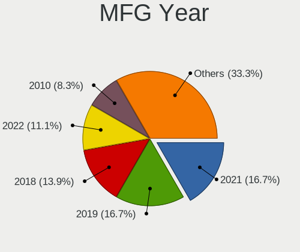

| Year | Notebooks | Percent |
|------|-----------|---------|
| 2019 | 6         | 22.22%  |
| 2021 | 4         | 14.81%  |
| 2022 | 3         | 11.11%  |
| 2018 | 3         | 11.11%  |
| 2010 | 3         | 11.11%  |
| 2017 | 2         | 7.41%   |
| 2020 | 1         | 3.7%    |
| 2016 | 1         | 3.7%    |
| 2015 | 1         | 3.7%    |
| 2011 | 1         | 3.7%    |
| 2009 | 1         | 3.7%    |
| 2006 | 1         | 3.7%    |

Form Factor
-----------

Physical design of the computer

| Name     | Notebooks | Percent |
|----------|-----------|---------|
| Notebook | 27        | 100%    |

Coreboot
--------

Have coreboot on board

| Used | Notebooks | Percent |
|------|-----------|---------|
| No   | 27        | 100%    |

RAM Size
--------

Total RAM memory

| Size in GB  | Notebooks | Percent |
|-------------|-----------|---------|
| 8.01-16.0   | 10        | 37.04%  |
| 16.01-24.0  | 8         | 29.63%  |
| 32.01-64.0  | 3         | 11.11%  |
| 3.01-4.0    | 2         | 7.41%   |
| 2.01-3.0    | 2         | 7.41%   |
| 4.01-8.0    | 1         | 3.7%    |
| 64.01-256.0 | 1         | 3.7%    |

RAM Used
--------

Used RAM memory

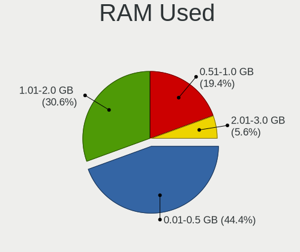

| Used GB  | Notebooks | Percent |
|----------|-----------|---------|
| 0.01-0.5 | 11        | 40.74%  |
| 1.01-2.0 | 9         | 33.33%  |
| 0.51-1.0 | 5         | 18.52%  |
| 2.01-3.0 | 2         | 7.41%   |

Total Drives
------------

Number of drives on board

| Drives | Notebooks | Percent |
|--------|-----------|---------|
| 1      | 19        | 70.37%  |
| 2      | 3         | 11.11%  |
| 0      | 3         | 11.11%  |
| 3      | 2         | 7.41%   |

Has CD-ROM
----------

Has CD-ROM on board

| Presented | Notebooks | Percent |
|-----------|-----------|---------|
| No        | 26        | 96.3%   |
| Yes       | 1         | 3.7%    |

Has Ethernet
------------

Has Ethernet on board

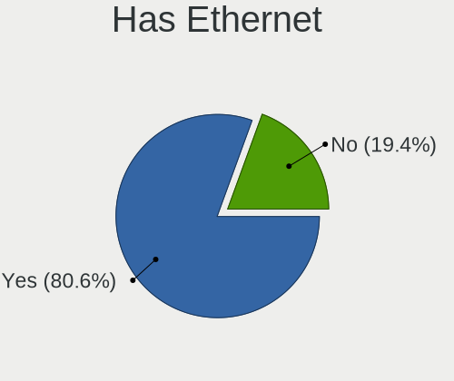

| Presented | Notebooks | Percent |
|-----------|-----------|---------|
| Yes       | 21        | 77.78%  |
| No        | 6         | 22.22%  |

Has WiFi
--------

Has WiFi module

| Presented | Notebooks | Percent |
|-----------|-----------|---------|
| Yes       | 25        | 92.59%  |
| No        | 2         | 7.41%   |

Has Bluetooth
-------------

Has Bluetooth module

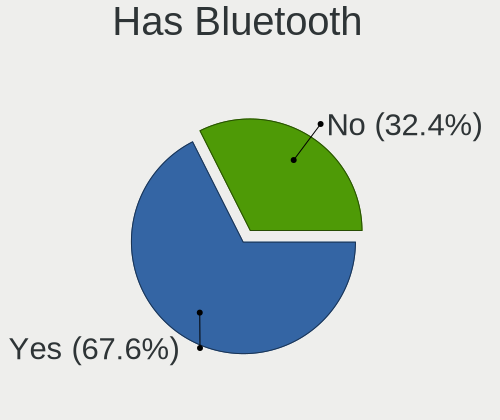

| Presented | Notebooks | Percent |
|-----------|-----------|---------|
| Yes       | 21        | 75%     |
| No        | 7         | 25%     |

Location
--------

Country
-------

Geographic location (country)

| Country | Notebooks | Percent |
|---------|-----------|---------|
| Austria | 27        | 100%    |

City
----

Geographic location (city)

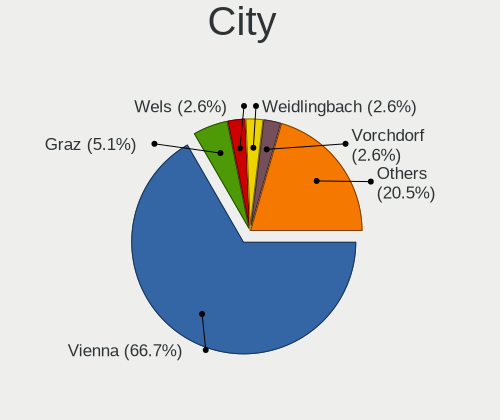

| City             | Notebooks | Percent |
|------------------|-----------|---------|
| Vienna           | 17        | 60.71%  |
| Graz             | 2         | 7.14%   |
| Wels             | 1         | 3.57%   |
| Weidlingbach     | 1         | 3.57%   |
| Vorchdorf        | 1         | 3.57%   |
| Parndorf         | 1         | 3.57%   |
| Maria Enzersdorf | 1         | 3.57%   |
| Linz             | 1         | 3.57%   |
| Innsbruck        | 1         | 3.57%   |
| Grosspertholz    | 1         | 3.57%   |
| Bruck an der Mur | 1         | 3.57%   |

Drives
------

Drive Vendor
------------

Hard drive vendors

| Vendor              | Notebooks | Drives | Percent |
|---------------------|-----------|--------|---------|
| Samsung Electronics | 10        | 11     | 33.33%  |
| Intel               | 4         | 5      | 13.33%  |
| WDC                 | 3         | 3      | 10%     |
| Transcend           | 2         | 3      | 6.67%   |
| SK hynix            | 2         | 2      | 6.67%   |
| SanDisk             | 2         | 2      | 6.67%   |
| Seagate             | 1         | 1      | 3.33%   |
| Kingston            | 1         | 4      | 3.33%   |
| Intenso             | 1         | 1      | 3.33%   |
| Hitachi             | 1         | 1      | 3.33%   |
| HGST                | 1         | 1      | 3.33%   |
| Crucial             | 1         | 1      | 3.33%   |
| A-DATA Technology   | 1         | 2      | 3.33%   |

Drive Model
-----------

Hard drive models

| Model                                   | Notebooks | Percent |
|-----------------------------------------|-----------|---------|
| SK hynix BC511 HFM512GDJTNI-82A0A 512GB | 2         | 6.25%   |
| Samsung MZALQ512HBLU-00BL1 512GB        | 2         | 6.25%   |
| Intel SSDPEKKF512G8L 512GB              | 2         | 6.25%   |
| WDC WD3200BEVT-22ZCT0 320GB             | 1         | 3.13%   |
| WDC WD20SPZX-22CRAT0 2TB                | 1         | 3.13%   |
| WDC WD10JPLX-00MBPT0 1TB                | 1         | 3.13%   |
| Transcend TS2TMTE220S 2TB               | 1         | 3.13%   |
| Transcend TS256GMTE652T2 256GB          | 1         | 3.13%   |
| Seagate ST1000LX015-1U7172 1TB          | 1         | 3.13%   |
| SanDisk SSD PLUS 240GB                  | 1         | 3.13%   |
| SanDisk SD7TB3Q-128G-1006 128GB         | 1         | 3.13%   |
| Samsung SSD PM851 mSATA 256GB           | 1         | 3.13%   |
| Samsung SSD PM841 2.5-inch 7mm 256GB    | 1         | 3.13%   |
| Samsung SSD 860 EVO 250GB               | 1         | 3.13%   |
| Samsung MZVLB256HAHQ-000L7 256GB        | 1         | 3.13%   |
| Samsung MZVKW512HMJP-000H1 512GB        | 1         | 3.13%   |
| Samsung MZALQ512HBLU-00BL2 512GB        | 1         | 3.13%   |
| Samsung MZ7TE512HMHP-000L2 512GB        | 1         | 3.13%   |
| Samsung HM320JI 320GB                   | 1         | 3.13%   |
| Kingston SUV500MS480G 480GB             | 1         | 3.13%   |
| Kingston SUV500MS120G 120GB             | 1         | 3.13%   |
| Intenso JAJM600M256C 256GB              | 1         | 3.13%   |
| Intel SSDSCKKF256G8H 256GB              | 1         | 3.13%   |
| Intel SSDPEKNW020T8 2TB                 | 1         | 3.13%   |
| Hitachi HTS541040G9SA00 40GB            | 1         | 3.13%   |
| HGST HTS545050A7E680 500GB              | 1         | 3.13%   |
| Crucial CT275MX300SSD4 275GB            | 1         | 3.13%   |
| A-DATA SU650 240GB                      | 1         | 3.13%   |
| A-DATA SU630 240GB                      | 1         | 3.13%   |

HDD Vendor
----------

Hard disk drive vendors

| Vendor              | Notebooks | Drives | Percent |
|---------------------|-----------|--------|---------|
| WDC                 | 3         | 3      | 42.86%  |
| Seagate             | 1         | 1      | 14.29%  |
| Samsung Electronics | 1         | 1      | 14.29%  |
| Hitachi             | 1         | 1      | 14.29%  |
| HGST                | 1         | 1      | 14.29%  |

SSD Vendor
----------

Solid state drive vendors

| Vendor              | Notebooks | Drives | Percent |
|---------------------|-----------|--------|---------|
| Samsung Electronics | 4         | 4      | 36.36%  |
| SanDisk             | 2         | 2      | 18.18%  |
| Kingston            | 1         | 4      | 9.09%   |
| Intenso             | 1         | 1      | 9.09%   |
| Intel               | 1         | 2      | 9.09%   |
| Crucial             | 1         | 1      | 9.09%   |
| A-DATA Technology   | 1         | 2      | 9.09%   |

Drive Kind
----------

HDD or SSD

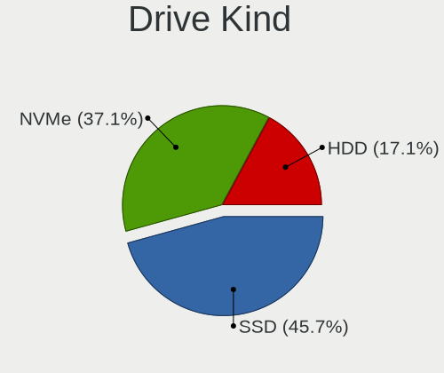

| Kind | Notebooks | Drives | Percent |
|------|-----------|--------|---------|
| NVMe | 11        | 14     | 40.74%  |
| SSD  | 10        | 16     | 37.04%  |
| HDD  | 6         | 7      | 22.22%  |

Drive Connector
---------------

SATA, SAS, NVMe, etc.

| Type | Notebooks | Drives | Percent |
|------|-----------|--------|---------|
| SATA | 13        | 23     | 54.17%  |
| NVMe | 11        | 14     | 45.83%  |

Drive Size
----------

Size of hard drive

| Size in TB | Notebooks | Drives | Percent |
|------------|-----------|--------|---------|
| 0.01-0.5   | 11        | 19     | 73.33%  |
| 0.51-1.0   | 3         | 3      | 20%     |
| 1.01-2.0   | 1         | 1      | 6.67%   |

Space Total
-----------

Amount of disk space available on the file system

| Size in GB | Notebooks | Percent |
|------------|-----------|---------|
| 251-500    | 11        | 40.74%  |
| 101-250    | 10        | 37.04%  |
| 21-50      | 2         | 7.41%   |
| 51-100     | 2         | 7.41%   |
| 1-20       | 1         | 3.7%    |
| 501-1000   | 1         | 3.7%    |

Space Used
----------

Amount of used disk space

| Used GB | Notebooks | Percent |
|---------|-----------|---------|
| 1-20    | 22        | 78.57%  |
| 21-50   | 3         | 10.71%  |
| 251-500 | 1         | 3.57%   |
| 101-250 | 1         | 3.57%   |
| 51-100  | 1         | 3.57%   |

Malfunc. Drives
---------------

Drive models with a malfunction

| Model                         | Notebooks | Drives | Percent |
|-------------------------------|-----------|--------|---------|
| WDC WD3200BEVT-22ZCT0 320GB   | 1         | 1      | 25%     |
| Intel SSDSCKKF256G8H 256GB    | 1         | 2      | 25%     |
| Hitachi HTS541040G9SA00 40GB  | 1         | 1      | 25%     |
| A-DATA Technology SU630 240GB | 1         | 1      | 25%     |

Malfunc. Drive Vendor
---------------------

Vendors of faulty drives

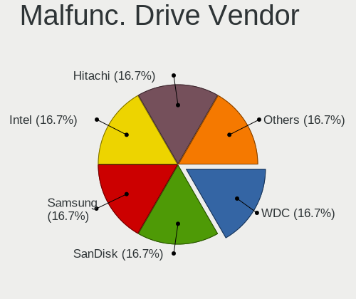

| Vendor            | Notebooks | Drives | Percent |
|-------------------|-----------|--------|---------|
| WDC               | 1         | 1      | 25%     |
| Intel             | 1         | 2      | 25%     |
| Hitachi           | 1         | 1      | 25%     |
| A-DATA Technology | 1         | 1      | 25%     |

Malfunc. HDD Vendor
-------------------

Vendors of faulty HDD drives

| Vendor  | Notebooks | Drives | Percent |
|---------|-----------|--------|---------|
| WDC     | 1         | 1      | 50%     |
| Hitachi | 1         | 1      | 50%     |

Malfunc. Drive Kind
-------------------

Kinds of faulty drives

| Kind | Notebooks | Drives | Percent |
|------|-----------|--------|---------|
| SSD  | 2         | 3      | 50%     |
| HDD  | 2         | 2      | 50%     |

Failed Drives
-------------

Failed drive models

Zero info for selected period =(

Failed Drive Vendor
-------------------

Failed drive vendors

Zero info for selected period =(

Drive Status
------------

Number of failed and malfunc. drives

| Status  | Notebooks | Drives | Percent |
|---------|-----------|--------|---------|
| Works   | 22        | 32     | 84.62%  |
| Malfunc | 4         | 5      | 15.38%  |

Storage controller
------------------

Storage Vendor
--------------

Storage controller vendors

| Vendor              | Notebooks | Percent |
|---------------------|-----------|---------|
| Intel               | 19        | 61.29%  |
| Samsung Electronics | 5         | 16.13%  |
| SK hynix            | 2         | 6.45%   |
| AMD                 | 2         | 6.45%   |
| Transcend           | 1         | 3.23%   |
| Toshiba             | 1         | 3.23%   |
| Silicon Motion      | 1         | 3.23%   |

Storage Model
-------------

Storage controller models

| Model                                                                            | Notebooks | Percent |
|----------------------------------------------------------------------------------|-----------|---------|
| Samsung NVMe SSD Controller 980                                                  | 3         | 8.57%   |
| Intel 8 Series SATA Controller 1 [AHCI mode]                                     | 3         | 8.57%   |
| SK hynix BC511                                                                   | 2         | 5.71%   |
| Intel SSD Pro 7600p/760p/E 6100p Series                                          | 2         | 5.71%   |
| Intel 5 Series/3400 Series Chipset 6 port SATA AHCI Controller                   | 2         | 5.71%   |
| AMD FCH SATA Controller [AHCI mode]                                              | 2         | 5.71%   |
| Toshiba XG4 NVMe SSD Controller                                                  | 1         | 2.86%   |
| Silicon Motion SM2262/SM2262EN SSD Controller                                    | 1         | 2.86%   |
| Samsung NVMe SSD Controller SM981/PM981/PM983                                    | 1         | 2.86%   |
| Samsung NVMe SSD Controller SM961/PM961/SM963                                    | 1         | 2.86%   |
| Intel Wildcat Point-LP SATA Controller [AHCI Mode]                               | 1         | 2.86%   |
| Intel Sunrise Point-LP SATA Controller [AHCI mode]                               | 1         | 2.86%   |
| Intel SSD 660P Series                                                            | 1         | 2.86%   |
| Intel Q170/Q150/B150/H170/H110/Z170/CM236 Chipset SATA Controller [AHCI Mode]    | 1         | 2.86%   |
| Intel Cannon Point-LP SATA Controller [AHCI Mode]                                | 1         | 2.86%   |
| Intel Cannon Lake Mobile PCH SATA AHCI Controller                                | 1         | 2.86%   |
| Intel Atom/Celeron/Pentium Processor x5-E8000/J3xxx/N3xxx Series SATA Controller | 1         | 2.86%   |
| Intel 82801IBM/IEM (ICH9M/ICH9M-E) 2 port SATA Controller [IDE mode]             | 1         | 2.86%   |
| Intel 82801GBM/GHM (ICH7-M Family) SATA Controller [AHCI mode]                   | 1         | 2.86%   |
| Intel 82801G (ICH7 Family) IDE Controller                                        | 1         | 2.86%   |
| Intel 8 Series/C220 Series Chipset Family 6-port SATA Controller 1 [AHCI mode]   | 1         | 2.86%   |
| Intel 7 Series Chipset Family 4-port SATA Controller [IDE mode]                  | 1         | 2.86%   |
| Intel 7 Series Chipset Family 2-port SATA Controller [IDE mode]                  | 1         | 2.86%   |
| Intel 6 Series/C200 Series Chipset Family 6 port Mobile SATA AHCI Controller     | 1         | 2.86%   |
| Intel 5 Series/3400 Series Chipset 4 port SATA IDE Controller                    | 1         | 2.86%   |
| Intel 5 Series/3400 Series Chipset 2 port SATA IDE Controller                    | 1         | 2.86%   |
| Unknown                                                                          | 1         | 2.86%   |

Storage Kind
------------

Kind of storage controller (IDE, SATA, NVMe, SAS, ...)

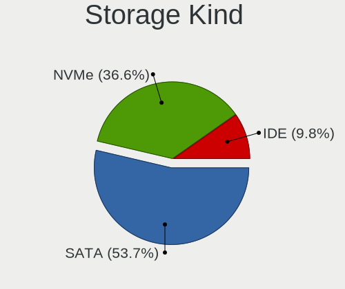

| Kind | Notebooks | Percent |
|------|-----------|---------|
| SATA | 16        | 50%     |
| NVMe | 12        | 37.5%   |
| IDE  | 4         | 12.5%   |

Processor
---------

CPU Vendor
----------

Processor vendors

| Vendor | Notebooks | Percent |
|--------|-----------|---------|
| Intel  | 22        | 81.48%  |
| AMD    | 5         | 18.52%  |

CPU Model
---------

Processor models

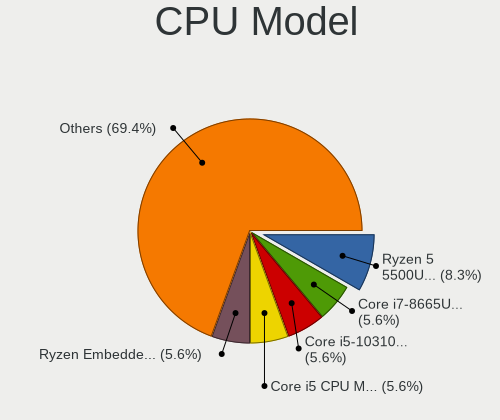

| Model                                           | Notebooks | Percent |
|-------------------------------------------------|-----------|---------|
| AMD Ryzen 5 5500U with Radeon Graphics          | 3         | 11.11%  |
| Intel Core i7-8665U CPU @ 1.90GHz               | 2         | 7.41%   |
| Intel Core i5-10310U CPU @ 1.70GHz              | 2         | 7.41%   |
| Intel Core i5 CPU M 520 @ 2.40GHz               | 2         | 7.41%   |
| Intel Core i7-8850H CPU @ 2.60GHz               | 1         | 3.7%    |
| Intel Core i7-7700HQ CPU @ 2.80GHz              | 1         | 3.7%    |
| Intel Core i7-4710HQ CPU @ 2.50GHz              | 1         | 3.7%    |
| Intel Core i7-3687U CPU @ 2.10GHz               | 1         | 3.7%    |
| Intel Core i5-8279U CPU @ 2.40GHz               | 1         | 3.7%    |
| Intel Core i5-7200U CPU @ 2.50GHz               | 1         | 3.7%    |
| Intel Core i5-6200U CPU @ 2.30GHz               | 1         | 3.7%    |
| Intel Core i5-4310U CPU @ 2.00GHz               | 1         | 3.7%    |
| Intel Core i5-4200U CPU @ 1.60GHz               | 1         | 3.7%    |
| Intel Core i5 CPU M 560 @ 2.67GHz               | 1         | 3.7%    |
| Intel Core i3-5005U CPU @ 2.00GHz               | 1         | 3.7%    |
| Intel Core 2 Duo CPU L9300 @ 1.60GHz            | 1         | 3.7%    |
| Intel Core 2 CPU                                | 1         | 3.7%    |
| Intel Celeron CPU N3060 @ 1.60GHz               | 1         | 3.7%    |
| Intel Celeron CPU 867 @ 1.30GHz                 | 1         | 3.7%    |
| Intel Celeron 2955U @ 1.40GHz                   | 1         | 3.7%    |
| AMD Ryzen Embedded V1500B                       | 1         | 3.7%    |
| AMD Ryzen 5 PRO 2500U w/ Radeon Vega Mobile Gfx | 1         | 3.7%    |

CPU Model Family
----------------

Processor model prefix

| Model              | Notebooks | Percent |
|--------------------|-----------|---------|
| Intel Core i5      | 10        | 37.04%  |
| Intel Core i7      | 6         | 22.22%  |
| Intel Celeron      | 3         | 11.11%  |
| AMD Ryzen 5        | 3         | 11.11%  |
| Intel Core i3      | 1         | 3.7%    |
| Intel Core 2 Duo   | 1         | 3.7%    |
| Intel Core 2       | 1         | 3.7%    |
| AMD Ryzen Embedded | 1         | 3.7%    |
| AMD Ryzen 5 PRO    | 1         | 3.7%    |

CPU Cores
---------

Number of processor cores

| Number  | Notebooks | Percent |
|---------|-----------|---------|
| 2       | 12        | 44.44%  |
| 4       | 7         | 25.93%  |
| 12      | 3         | 11.11%  |
| 8       | 2         | 7.41%   |
| Unknown | 2         | 7.41%   |
| 6       | 1         | 3.7%    |

CPU Sockets
-----------

Number of sockets

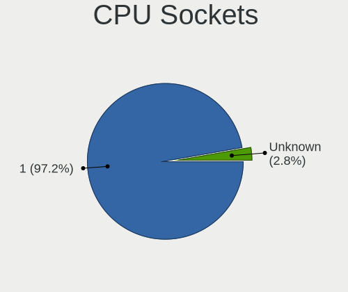

| Number  | Notebooks | Percent |
|---------|-----------|---------|
| 1       | 26        | 96.3%   |
| Unknown | 1         | 3.7%    |

CPU Threads
-----------

Threads per core (Hyper-Threading)

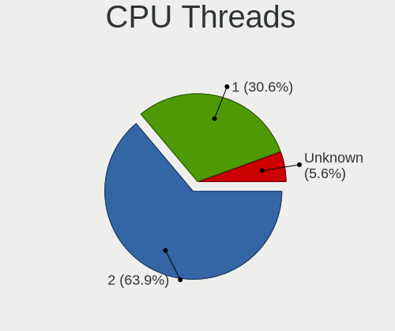

| Number  | Notebooks | Percent |
|---------|-----------|---------|
| 2       | 17        | 62.96%  |
| 1       | 8         | 29.63%  |
| Unknown | 2         | 7.41%   |

CPU Microarch
-------------

Microarchitecture

| Name        | Notebooks | Percent |
|-------------|-----------|---------|
| KabyLake    | 8         | 29.63%  |
| Haswell     | 4         | 14.81%  |
| Westmere    | 3         | 11.11%  |
| Unknown     | 3         | 11.11%  |
| Zen         | 2         | 7.41%   |
| Skylake     | 1         | 3.7%    |
| Silvermont  | 1         | 3.7%    |
| SandyBridge | 1         | 3.7%    |
| Penryn      | 1         | 3.7%    |
| IvyBridge   | 1         | 3.7%    |
| Core        | 1         | 3.7%    |
| Broadwell   | 1         | 3.7%    |

Graphics
--------

GPU Vendor
----------

Vendors of graphics cards

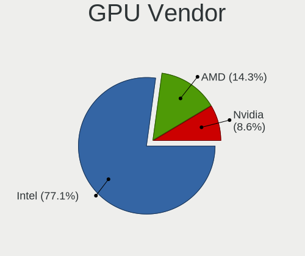

| Vendor | Notebooks | Percent |
|--------|-----------|---------|
| Intel  | 19        | 70.37%  |
| AMD    | 5         | 18.52%  |
| Nvidia | 3         | 11.11%  |

GPU Model
---------

Graphics card models

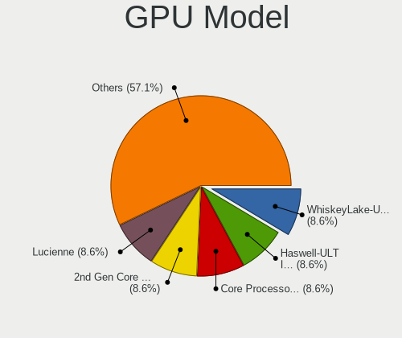

| Model                                                                                    | Notebooks | Percent |
|------------------------------------------------------------------------------------------|-----------|---------|
| Intel Haswell-ULT Integrated Graphics Controller                                         | 3         | 11.11%  |
| Intel Core Processor Integrated Graphics Controller                                      | 3         | 11.11%  |
| AMD Lucienne                                                                             | 3         | 11.11%  |
| Intel WhiskeyLake-U GT2 [UHD Graphics 620]                                               | 2         | 7.41%   |
| Intel CometLake-U GT2 [UHD Graphics]                                                     | 2         | 7.41%   |
| Nvidia GP107GLM [Quadro P2000 Mobile]                                                    | 1         | 3.7%    |
| Nvidia GP104GLM [Quadro P4000 Mobile]                                                    | 1         | 3.7%    |
| Nvidia GM107M [GeForce GTX 860M]                                                         | 1         | 3.7%    |
| Intel Skylake GT2 [HD Graphics 520]                                                      | 1         | 3.7%    |
| Intel Mobile 4 Series Chipset Integrated Graphics Controller                             | 1         | 3.7%    |
| Intel HD Graphics 620                                                                    | 1         | 3.7%    |
| Intel HD Graphics 5500                                                                   | 1         | 3.7%    |
| Intel CoffeeLake-U GT3e [Iris Plus Graphics 655]                                         | 1         | 3.7%    |
| Intel Atom/Celeron/Pentium Processor x5-E8000/J3xxx/N3xxx Integrated Graphics Controller | 1         | 3.7%    |
| Intel 4th Gen Core Processor Integrated Graphics Controller                              | 1         | 3.7%    |
| Intel 3rd Gen Core processor Graphics Controller                                         | 1         | 3.7%    |
| Intel 2nd Generation Core Processor Family Integrated Graphics Controller                | 1         | 3.7%    |
| AMD RV515/M52 [Mobility Radeon X1300]                                                    | 1         | 3.7%    |
| AMD Raven Ridge [Radeon Vega Series / Radeon Vega Mobile Series]                         | 1         | 3.7%    |

GPU Combo
---------

Combinations of graphics cards

| Name           | Notebooks | Percent |
|----------------|-----------|---------|
| 1 x Intel      | 17        | 62.96%  |
| 1 x AMD        | 5         | 18.52%  |
| 1 x Nvidia     | 2         | 7.41%   |
| Other          | 1         | 3.7%    |
| 2 x Intel      | 1         | 3.7%    |
| Intel + Nvidia | 1         | 3.7%    |

GPU Driver
----------

Free vs proprietary

| Driver      | Notebooks | Percent |
|-------------|-----------|---------|
| Free        | 24        | 88.89%  |
| Proprietary | 2         | 7.41%   |
| Unknown     | 1         | 3.7%    |

GPU Memory
----------

Total video memory

| Size in GB | Notebooks | Percent |
|------------|-----------|---------|
| Unknown    | 23        | 79.31%  |
| 0.51-1.0   | 2         | 6.9%    |
| 7.01-8.0   | 1         | 3.45%   |
| 3.01-4.0   | 1         | 3.45%   |
| 1.01-2.0   | 1         | 3.45%   |
| 0.01-0.5   | 1         | 3.45%   |

Monitor
-------

Monitor Vendor
--------------

Monitor vendors

| Vendor              | Notebooks | Percent |
|---------------------|-----------|---------|
| AU Optronics        | 5         | 25%     |
| LG Display          | 3         | 15%     |
| Lenovo              | 3         | 15%     |
| BOE                 | 3         | 15%     |
| Samsung Electronics | 2         | 10%     |
| Chimei Innolux      | 2         | 10%     |
| Unknown             | 1         | 5%      |
| Dell                | 1         | 5%      |

Monitor Model
-------------

Monitor models

| Model                                                             | Notebooks | Percent |
|-------------------------------------------------------------------|-----------|---------|
| Samsung Electronics C34J79x SAM0F1E 3440x1440 800x330mm 34.1-inch | 2         | 10%     |
| LG Display LCD Monitor LGD064C 1920x1080 340x190mm 15.3-inch      | 2         | 10%     |
| AU Optronics LCD Monitor AUO2036 2560x1440 310x170mm 13.9-inch    | 2         | 10%     |
| Unknown LCD Monitor Sharp 3840x2160                               | 1         | 5%      |
| LG Display LCD Monitor LGD0353 1366x768 350x190mm 15.7-inch       | 1         | 5%      |
| Lenovo LCD Monitor LEN40B0 1366x768 340x190mm 15.3-inch           | 1         | 5%      |
| Lenovo LCD Monitor LEN4043 1400x1050 300x230mm 14.9-inch          | 1         | 5%      |
| Lenovo LCD Monitor LEN4036 1440x900 300x190mm 14.0-inch           | 1         | 5%      |
| Dell P2719H DEL4185 1920x1080 600x340mm 27.2-inch                 | 1         | 5%      |
| Chimei Innolux LCD Monitor CMN1484 1600x900 310x170mm 13.9-inch   | 1         | 5%      |
| Chimei Innolux LCD Monitor CMN1132 1366x768 260x140mm 11.6-inch   | 1         | 5%      |
| BOE LCD Monitor BOE08D7 1920x1080 310x170mm 13.9-inch             | 1         | 5%      |
| BOE LCD Monitor BOE0791 1920x1080 310x170mm 13.9-inch             | 1         | 5%      |
| BOE LCD Monitor BOE0714 1920x1080 310x170mm 13.9-inch             | 1         | 5%      |
| AU Optronics LCD Monitor AUO408D 1920x1080 310x170mm 13.9-inch    | 1         | 5%      |
| AU Optronics LCD Monitor AUO133D 1920x1080 310x170mm 13.9-inch    | 1         | 5%      |
| AU Optronics LCD Monitor 1920x1080                                | 1         | 5%      |

Monitor Resolution
------------------

Monitor screen resolution

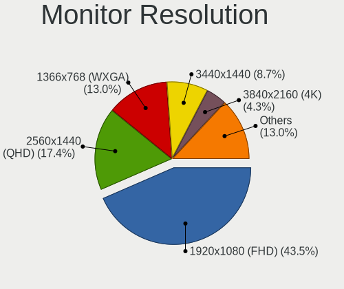

| Resolution       | Notebooks | Percent |
|------------------|-----------|---------|
| 1920x1080 (FHD)  | 8         | 42.11%  |
| 1366x768 (WXGA)  | 3         | 15.79%  |
| 3440x1440        | 2         | 10.53%  |
| 2560x1440 (QHD)  | 2         | 10.53%  |
| 3840x2160 (4K)   | 1         | 5.26%   |
| 1600x900 (HD+)   | 1         | 5.26%   |
| 1440x900 (WXGA+) | 1         | 5.26%   |
| 1400x1050        | 1         | 5.26%   |

Monitor Diagonal
----------------

Diagonal size in inches

| Inches  | Notebooks | Percent |
|---------|-----------|---------|
| 13      | 8         | 40%     |
| 15      | 4         | 20%     |
| 34      | 2         | 10%     |
| 14      | 2         | 10%     |
| Unknown | 2         | 10%     |
| 27      | 1         | 5%      |
| 11      | 1         | 5%      |

Monitor Width
-------------

Physical width

| Width in mm | Notebooks | Percent |
|-------------|-----------|---------|
| 301-350     | 12        | 60%     |
| 201-300     | 3         | 15%     |
| 701-800     | 2         | 10%     |
| Unknown     | 2         | 10%     |
| 501-600     | 1         | 5%      |

Aspect Ratio
------------

Proportional relationship between the width and the height

| Ratio   | Notebooks | Percent |
|---------|-----------|---------|
| 16/9    | 13        | 68.42%  |
| 21/9    | 2         | 10.53%  |
| Unknown | 2         | 10.53%  |
| 4/3     | 1         | 5.26%   |
| 16/10   | 1         | 5.26%   |

Monitor Area
------------

Area in inch²

| Area in inch² | Notebooks | Percent |
|----------------|-----------|---------|
| 81-90          | 9         | 45%     |
| 91-100         | 3         | 15%     |
| 351-500        | 2         | 10%     |
| 101-110        | 2         | 10%     |
| Unknown        | 2         | 10%     |
| 51-60          | 1         | 5%      |
| 301-350        | 1         | 5%      |

Pixel Density
-------------

Pixels per inch

| Density | Notebooks | Percent |
|---------|-----------|---------|
| 121-160 | 10        | 50%     |
| 101-120 | 4         | 20%     |
| 161-240 | 2         | 10%     |
| 51-100  | 2         | 10%     |
| Unknown | 2         | 10%     |

Multiple Monitors
-----------------

Total monitors connected

| Total | Notebooks | Percent |
|-------|-----------|---------|
| 1     | 15        | 53.57%  |
| 0     | 10        | 35.71%  |
| 2     | 3         | 10.71%  |

Network
-------

Net Controller Vendor
---------------------

Controller vendors

| Vendor                | Notebooks | Percent |
|-----------------------|-----------|---------|
| Intel                 | 23        | 65.71%  |
| Realtek Semiconductor | 9         | 25.71%  |
| Hewlett-Packard       | 1         | 2.86%   |
| Dell                  | 1         | 2.86%   |
| AMD                   | 1         | 2.86%   |

Net Controller Model
--------------------

Controller models

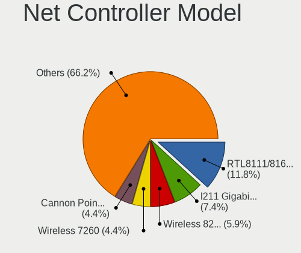

| Model                                                             | Notebooks | Percent |
|-------------------------------------------------------------------|-----------|---------|
| Realtek RTL8111/8168/8411 PCI Express Gigabit Ethernet Controller | 7         | 13.73%  |
| Intel Wireless 7260                                               | 3         | 5.88%   |
| Intel I211 Gigabit Network Connection                             | 3         | 5.88%   |
| Intel 82577LM Gigabit Network Connection                          | 3         | 5.88%   |
| Realtek RTL8852AE 802.11ax PCIe Wireless Network Adapter          | 2         | 3.92%   |
| Realtek RTL8188EUS 802.11n Wireless Network Adapter               | 2         | 3.92%   |
| Intel Wireless-AC 9260                                            | 2         | 3.92%   |
| Intel Wireless 8265 / 8275                                        | 2         | 3.92%   |
| Intel Wireless 7265                                               | 2         | 3.92%   |
| Intel Comet Lake PCH-LP CNVi WiFi                                 | 2         | 3.92%   |
| Intel Cannon Point-LP CNVi [Wireless-AC]                          | 2         | 3.92%   |
| Realtek RTL8822CE 802.11ac PCIe Wireless Network Adapter          | 1         | 1.96%   |
| Intel Wireless 8260                                               | 1         | 1.96%   |
| Intel WiFi Link 5100                                              | 1         | 1.96%   |
| Intel PRO/Wireless 3945ABG [Golan] Network Connection             | 1         | 1.96%   |
| Intel Ethernet Controller I225-V                                  | 1         | 1.96%   |
| Intel Ethernet Connection I219-V                                  | 1         | 1.96%   |
| Intel Ethernet Connection I218-LM                                 | 1         | 1.96%   |
| Intel Ethernet Connection (7) I219-LM                             | 1         | 1.96%   |
| Intel Ethernet Connection (6) I219-LM                             | 1         | 1.96%   |
| Intel Ethernet Connection (2) I219-LM                             | 1         | 1.96%   |
| Intel Centrino Wireless-N 1030 [Rainbow Peak]                     | 1         | 1.96%   |
| Intel Centrino Wireless-N 1000 [Condor Peak]                      | 1         | 1.96%   |
| Intel Centrino Ultimate-N 6300                                    | 1         | 1.96%   |
| Intel Centrino Advanced-N 6235                                    | 1         | 1.96%   |
| Intel Centrino Advanced-N 6200                                    | 1         | 1.96%   |
| Intel 82579LM Gigabit Network Connection (Lewisville)             | 1         | 1.96%   |
| Intel 82573L Gigabit Ethernet Controller                          | 1         | 1.96%   |
| Intel 82567LM Gigabit Network Connection                          | 1         | 1.96%   |
| HP hs2350 HSPA+ Mobile Broadband Module Network Adapter           | 1         | 1.96%   |
| Dell Dell Wireless 5550 HSPA+ Mini-Card Network Adapter           | 1         | 1.96%   |
| AMD Family 17h Processor 10 Gb Ethernet Controller Port 0         | 1         | 1.96%   |

Wireless Vendor
---------------

Wireless vendors

| Vendor                | Notebooks | Percent |
|-----------------------|-----------|---------|
| Intel                 | 21        | 80.77%  |
| Realtek Semiconductor | 4         | 15.38%  |
| Dell                  | 1         | 3.85%   |

Wireless Model
--------------

Wireless models

| Model                                                    | Notebooks | Percent |
|----------------------------------------------------------|-----------|---------|
| Intel Wireless 7260                                      | 3         | 11.11%  |
| Realtek RTL8852AE 802.11ax PCIe Wireless Network Adapter | 2         | 7.41%   |
| Realtek RTL8188EUS 802.11n Wireless Network Adapter      | 2         | 7.41%   |
| Intel Wireless-AC 9260                                   | 2         | 7.41%   |
| Intel Wireless 8265 / 8275                               | 2         | 7.41%   |
| Intel Wireless 7265                                      | 2         | 7.41%   |
| Intel Comet Lake PCH-LP CNVi WiFi                        | 2         | 7.41%   |
| Intel Cannon Point-LP CNVi [Wireless-AC]                 | 2         | 7.41%   |
| Realtek RTL8822CE 802.11ac PCIe Wireless Network Adapter | 1         | 3.7%    |
| Intel Wireless 8260                                      | 1         | 3.7%    |
| Intel WiFi Link 5100                                     | 1         | 3.7%    |
| Intel PRO/Wireless 3945ABG [Golan] Network Connection    | 1         | 3.7%    |
| Intel Centrino Wireless-N 1030 [Rainbow Peak]            | 1         | 3.7%    |
| Intel Centrino Wireless-N 1000 [Condor Peak]             | 1         | 3.7%    |
| Intel Centrino Ultimate-N 6300                           | 1         | 3.7%    |
| Intel Centrino Advanced-N 6235                           | 1         | 3.7%    |
| Intel Centrino Advanced-N 6200                           | 1         | 3.7%    |
| Dell Dell Wireless 5550 HSPA+ Mini-Card Network Adapter  | 1         | 3.7%    |

Ethernet Vendor
---------------

Ethernet vendors

| Vendor                | Notebooks | Percent |
|-----------------------|-----------|---------|
| Intel                 | 15        | 65.22%  |
| Realtek Semiconductor | 7         | 30.43%  |
| AMD                   | 1         | 4.35%   |

Ethernet Model
--------------

Ethernet models

| Model                                                             | Notebooks | Percent |
|-------------------------------------------------------------------|-----------|---------|
| Realtek RTL8111/8168/8411 PCI Express Gigabit Ethernet Controller | 7         | 30.43%  |
| Intel I211 Gigabit Network Connection                             | 3         | 13.04%  |
| Intel 82577LM Gigabit Network Connection                          | 3         | 13.04%  |
| Intel Ethernet Controller I225-V                                  | 1         | 4.35%   |
| Intel Ethernet Connection I219-V                                  | 1         | 4.35%   |
| Intel Ethernet Connection I218-LM                                 | 1         | 4.35%   |
| Intel Ethernet Connection (7) I219-LM                             | 1         | 4.35%   |
| Intel Ethernet Connection (6) I219-LM                             | 1         | 4.35%   |
| Intel Ethernet Connection (2) I219-LM                             | 1         | 4.35%   |
| Intel 82579LM Gigabit Network Connection (Lewisville)             | 1         | 4.35%   |
| Intel 82573L Gigabit Ethernet Controller                          | 1         | 4.35%   |
| Intel 82567LM Gigabit Network Connection                          | 1         | 4.35%   |
| AMD Family 17h Processor 10 Gb Ethernet Controller Port 0         | 1         | 4.35%   |

Net Controller Kind
-------------------

Ethernet, WiFi or modem

| Kind     | Notebooks | Percent |
|----------|-----------|---------|
| WiFi     | 25        | 53.19%  |
| Ethernet | 21        | 44.68%  |
| Modem    | 1         | 2.13%   |

Used Controller
---------------

Currently used network controller

| Kind     | Notebooks | Percent |
|----------|-----------|---------|
| Ethernet | 18        | 50%     |
| WiFi     | 17        | 47.22%  |
| Modem    | 1         | 2.78%   |

NICs
----

Total network controllers on board

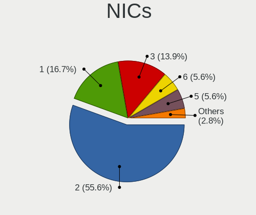

| Total | Notebooks | Percent |
|-------|-----------|---------|
| 2     | 16        | 59.26%  |
| 1     | 5         | 18.52%  |
| 3     | 3         | 11.11%  |
| 6     | 1         | 3.7%    |
| 5     | 1         | 3.7%    |
| 0     | 1         | 3.7%    |

IPv6
----

IPv6 vs IPv4

| Used | Notebooks | Percent |
|------|-----------|---------|
| No   | 26        | 96.3%   |
| Yes  | 1         | 3.7%    |

Bluetooth
---------

Bluetooth Vendor
----------------

Controller vendors

| Vendor                | Notebooks | Percent |
|-----------------------|-----------|---------|
| Intel                 | 15        | 71.43%  |
| Realtek Semiconductor | 3         | 14.29%  |
| Broadcom              | 2         | 9.52%   |
| Alps Electric         | 1         | 4.76%   |

Bluetooth Model
---------------

Controller models

| Model                                            | Notebooks | Percent |
|--------------------------------------------------|-----------|---------|
| Intel Bluetooth wireless interface               | 7         | 33.33%  |
| Realtek Bluetooth Radio                          | 2         | 9.52%   |
| Intel Wireless-AC 9260 Bluetooth Adapter         | 2         | 9.52%   |
| Intel Bluetooth 9460/9560 Jefferson Peak (JfP)   | 2         | 9.52%   |
| Intel AX201 Bluetooth                            | 2         | 9.52%   |
| Broadcom BCM2045B (BDC-2.1)                      | 2         | 9.52%   |
| Realtek  Bluetooth Adapter                       | 1         | 4.76%   |
| Intel Centrino Bluetooth Wireless Transceiver    | 1         | 4.76%   |
| Intel Centrino Advanced-N 6230 Bluetooth adapter | 1         | 4.76%   |
| Alps Electric UGTZ4 Bluetooth                    | 1         | 4.76%   |

Sound
-----

Sound Vendor
------------

Sound card vendors

| Vendor      | Notebooks | Percent |
|-------------|-----------|---------|
| Intel       | 22        | 70.97%  |
| AMD         | 5         | 16.13%  |
| Plantronics | 3         | 9.68%   |
| Nvidia      | 1         | 3.23%   |

Sound Model
-----------

Sound card models

| Model                                                                                             | Notebooks | Percent |
|---------------------------------------------------------------------------------------------------|-----------|---------|
| AMD Family 17h/19h HD Audio Controller                                                            | 5         | 12.5%   |
| Plantronics Plantronics Blackwire 315.1                                                           | 3         | 7.5%    |
| Intel Haswell-ULT HD Audio Controller                                                             | 3         | 7.5%    |
| Intel Cannon Point-LP High Definition Audio Controller                                            | 3         | 7.5%    |
| Intel 8 Series HD Audio Controller                                                                | 3         | 7.5%    |
| Intel 5 Series/3400 Series Chipset High Definition Audio                                          | 3         | 7.5%    |
| AMD Renoir Radeon High Definition Audio Controller                                                | 3         | 7.5%    |
| Intel Sunrise Point-LP HD Audio                                                                   | 2         | 5%      |
| Intel Comet Lake PCH-LP cAVS                                                                      | 2         | 5%      |
| Nvidia GP107GL High Definition Audio Controller                                                   | 1         | 2.5%    |
| Intel Xeon E3-1200 v3/4th Gen Core Processor HD Audio Controller                                  | 1         | 2.5%    |
| Intel Wildcat Point-LP High Definition Audio Controller                                           | 1         | 2.5%    |
| Intel NM10/ICH7 Family High Definition Audio Controller                                           | 1         | 2.5%    |
| Intel CM238 HD Audio Controller                                                                   | 1         | 2.5%    |
| Intel Cannon Lake PCH cAVS                                                                        | 1         | 2.5%    |
| Intel Broadwell-U Audio Controller                                                                | 1         | 2.5%    |
| Intel Atom/Celeron/Pentium Processor x5-E8000/J3xxx/N3xxx Series High Definition Audio Controller | 1         | 2.5%    |
| Intel 82801I (ICH9 Family) HD Audio Controller                                                    | 1         | 2.5%    |
| Intel 8 Series/C220 Series Chipset High Definition Audio Controller                               | 1         | 2.5%    |
| Intel 7 Series/C216 Chipset Family High Definition Audio Controller                               | 1         | 2.5%    |
| Intel 6 Series/C200 Series Chipset Family High Definition Audio Controller                        | 1         | 2.5%    |
| AMD Raven/Raven2/Fenghuang HDMI/DP Audio Controller                                               | 1         | 2.5%    |

Memory
------

Memory Vendor
-------------

Memory module vendors

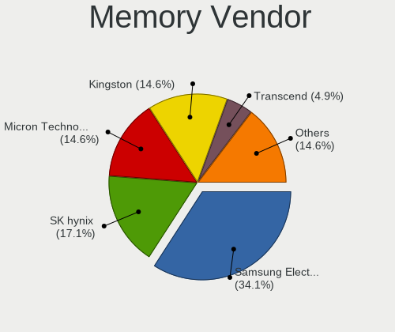

| Vendor              | Notebooks | Percent |
|---------------------|-----------|---------|
| Samsung Electronics | 11        | 36.67%  |
| Micron Technology   | 6         | 20%     |
| SK hynix            | 5         | 16.67%  |
| Kingston            | 3         | 10%     |
| Unknown             | 1         | 3.33%   |
| Transcend           | 1         | 3.33%   |
| Nanya Technology    | 1         | 3.33%   |
| Elpida              | 1         | 3.33%   |
| Corsair             | 1         | 3.33%   |

Memory Model
------------

Memory module models

| Model                                                          | Notebooks | Percent |
|----------------------------------------------------------------|-----------|---------|
| SK hynix RAM Module 16GB SODIMM DDR4 3200MT/s                  | 2         | 6.06%   |
| Samsung RAM Module 8192MB SODIMM DDR4 2133MT/s                 | 2         | 6.06%   |
| Samsung RAM M471A2K43DB1-CTD 16GB SODIMM DDR4 2667MT/s         | 2         | 6.06%   |
| Samsung RAM M471A2G44AM0-CTD 16GB SODIMM DDR4 2667MT/s         | 2         | 6.06%   |
| Micron RAM 4ATF1G64HZ-3G2E1 8GB SODIMM DDR4 3200MT/s           | 2         | 6.06%   |
| Unknown RAM Module 2048MB SODIMM DDR2                          | 1         | 3.03%   |
| Unknown RAM Module 1024MB SODIMM DDR2                          | 1         | 3.03%   |
| Transcend RAM TS1GLH64V6BL 8GB SODIMM DDR4 2667MT/s            | 1         | 3.03%   |
| SK hynix RAM HMT41GS6BFR8A-PB 8GB SODIMM DDR3 1600MT/s         | 1         | 3.03%   |
| SK hynix RAM HMT351S6CFR8C-H9 4GB SODIMM 1333MT/s              | 1         | 3.03%   |
| SK hynix RAM HMAA1GS6CJR6N-XN 8GB SODIMM DDR4 3200MT/s         | 1         | 3.03%   |
| Samsung RAM Module 2GB SODIMM DDR3 1600MT/s                    | 1         | 3.03%   |
| Samsung RAM M471B5674QH0-YK0 2GB SODIMM DDR3 1600MT/s          | 1         | 3.03%   |
| Samsung RAM M471B5273DH0-CH9 4GB SODIMM DDR3 1334MT/s          | 1         | 3.03%   |
| Samsung RAM M471B5273CH0-CH9 4GB SODIMM DDR3 1334MT/s          | 1         | 3.03%   |
| Samsung RAM M471B1G73DB0-YK0 8GB SODIMM DDR3 1600MT/s          | 1         | 3.03%   |
| Samsung RAM M471A1K43CB1-CTD 8GB SODIMM DDR4 2667MT/s          | 1         | 3.03%   |
| Samsung RAM M471A1G44AB0-CWE 8GB SODIMM DDR4 3200MT/s          | 1         | 3.03%   |
| Nanya RAM NT4GC64B8HG0NS-CG 4GB SODIMM DDR3 1334MT/s           | 1         | 3.03%   |
| Micron RAM MT52L512M32D2PF-10 4GB Row Of Chips LPDDR3 1867MT/s | 1         | 3.03%   |
| Micron RAM 8KTF51264HZ-1G6E1 4GB SODIMM DDR3 1600MT/s          | 1         | 3.03%   |
| Micron RAM 4ATF1G64HZ-3G2E1 8GB Row Of Chips DDR4 3200MT/s     | 1         | 3.03%   |
| Micron RAM 16JTF51264HZ-1G4M1 4GB SODIMM DDR3 1333MT/s         | 1         | 3.03%   |
| Kingston RAM KHX1600C9S3L/8G 8GB SODIMM DDR3 1600MT/s          | 1         | 3.03%   |
| Kingston RAM KCRXJ6-MIE 16GB SODIMM DDR4 2667MT/s              | 1         | 3.03%   |
| Kingston RAM CBD26D4S9S8K1C-8 8GB SODIMM DDR4 2667MT/s         | 1         | 3.03%   |
| Elpida RAM EBJ21UE8BDS0-AE-F 2GB SODIMM DDR3 1067MT/s          | 1         | 3.03%   |
| Corsair RAM CMSX64GX4M2A2666C18 32GB SODIMM DDR4 2667MT/s      | 1         | 3.03%   |

Memory Kind
-----------

Memory module kinds

| Kind   | Notebooks | Percent |
|--------|-----------|---------|
| DDR4   | 13        | 52%     |
| DDR3   | 10        | 40%     |
| LPDDR3 | 1         | 4%      |
| DDR2   | 1         | 4%      |

Memory Form Factor
------------------

Physical design of the memory module

| Name         | Notebooks | Percent |
|--------------|-----------|---------|
| SODIMM       | 23        | 92%     |
| Row Of Chips | 2         | 8%      |

Memory Size
-----------

Memory module size

| Size  | Notebooks | Percent |
|-------|-----------|---------|
| 8192  | 11        | 40.74%  |
| 16384 | 5         | 18.52%  |
| 4096  | 5         | 18.52%  |
| 2048  | 4         | 14.81%  |
| 32768 | 1         | 3.7%    |
| 1024  | 1         | 3.7%    |

Memory Speed
------------

Memory module speed

| Speed   | Notebooks | Percent |
|---------|-----------|---------|
| 2667    | 6         | 24%     |
| 1600    | 6         | 24%     |
| 3200    | 5         | 20%     |
| 2133    | 2         | 8%      |
| 1334    | 2         | 8%      |
| 1867    | 1         | 4%      |
| 1333    | 1         | 4%      |
| 1067    | 1         | 4%      |
| Unknown | 1         | 4%      |

Printers & scanners
-------------------

Printer Vendor
--------------

Printer device vendors

Zero info for selected period =(

Printer Model
-------------

Printer device models

Zero info for selected period =(

Scanner Vendor
--------------

Scanner device vendors

Zero info for selected period =(

Scanner Model
-------------

Scanner device models

Zero info for selected period =(

Camera
------

Camera Vendor
-------------

Camera device vendors

| Vendor                                 | Notebooks | Percent |
|----------------------------------------|-----------|---------|
| Chicony Electronics                    | 8         | 44.44%  |
| Microdia                               | 3         | 16.67%  |
| Realtek Semiconductor                  | 2         | 11.11%  |
| Lite-On Technology                     | 1         | 5.56%   |
| Lenovo                                 | 1         | 5.56%   |
| IMC Networks                           | 1         | 5.56%   |
| Cheng Uei Precision Industry (Foxlink) | 1         | 5.56%   |
| Acer                                   | 1         | 5.56%   |

Camera Model
------------

Camera device models

| Model                                                       | Notebooks | Percent |
|-------------------------------------------------------------|-----------|---------|
| Realtek Realtek USB2.0 PC Camera                            | 2         | 11.11%  |
| Chicony ThinkPad T490 Webcam                                | 2         | 11.11%  |
| Chicony Integrated Camera                                   | 2         | 11.11%  |
| Chicony HP HD Camera                                        | 2         | 11.11%  |
| Microdia Laptop_Integrated_Webcam_HD                        | 1         | 5.56%   |
| Microdia Integrated Webcam HD                               | 1         | 5.56%   |
| Microdia Integrated Webcam                                  | 1         | 5.56%   |
| Lite-On HP HD Camera                                        | 1         | 5.56%   |
| Lenovo Integrated Webcam [R5U877]                           | 1         | 5.56%   |
| IMC Networks Integrated Camera                              | 1         | 5.56%   |
| Chicony Integrated Camera (1280x720@30)                     | 1         | 5.56%   |
| Chicony HP Universal Camera                                 | 1         | 5.56%   |
| Cheng Uei Precision Industry (Foxlink) HP HD Webcam [Fixed] | 1         | 5.56%   |
| Acer Lenovo EasyCamera                                      | 1         | 5.56%   |

Security
--------

Fingerprint Vendor
------------------

Fingerprint sensor vendors

| Vendor                     | Notebooks | Percent |
|----------------------------|-----------|---------|
| Validity Sensors           | 4         | 33.33%  |
| Synaptics                  | 3         | 25%     |
| Upek                       | 2         | 16.67%  |
| Shenzhen Goodix Technology | 2         | 16.67%  |
| STMicroelectronics         | 1         | 8.33%   |

Fingerprint Model
-----------------

Fingerprint sensor models

| Model                                                     | Notebooks | Percent |
|-----------------------------------------------------------|-----------|---------|
| Validity Sensors VFS495 Fingerprint Reader                | 2         | 16.67%  |
| Upek Biometric Touchchip/Touchstrip Fingerprint Sensor    | 2         | 16.67%  |
| Synaptics  FS7604 Touch Fingerprint Sensor with PurePrint | 2         | 16.67%  |
| Shenzhen Goodix  FingerPrint Device                       | 2         | 16.67%  |
| Validity Sensors VFS5011 Fingerprint Reader               | 1         | 8.33%   |
| Validity Sensors VFS491                                   | 1         | 8.33%   |
| Synaptics Prometheus MIS Touch Fingerprint Reader         | 1         | 8.33%   |
| STMicroelectronics Fingerprint Reader                     | 1         | 8.33%   |

Chipcard Vendor
---------------

Chipcard module vendors

Zero info for selected period =(

Chipcard Model
--------------

Chipcard module models

Zero info for selected period =(

Unsupported
-----------

Unsupported Devices
-------------------

Total unsupported devices on board

| Total | Notebooks | Percent |
|-------|-----------|---------|
| 2     | 10        | 34.48%  |
| 3     | 8         | 27.59%  |
| 1     | 7         | 24.14%  |
| 4     | 2         | 6.9%    |
| 0     | 2         | 6.9%    |

Unsupported Device Types
------------------------

Types of unsupported devices

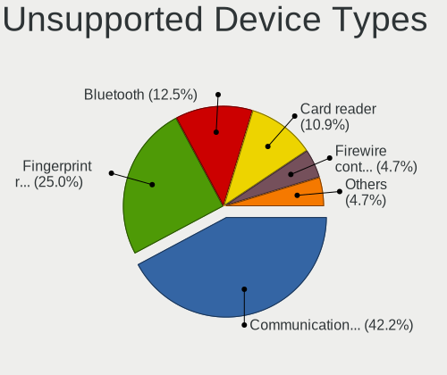

| Type                     | Notebooks | Percent |
|--------------------------|-----------|---------|
| Communication controller | 19        | 37.25%  |
| Fingerprint reader       | 12        | 23.53%  |
| Card reader              | 7         | 13.73%  |
| Bluetooth                | 7         | 13.73%  |
| Firewire controller      | 3         | 5.88%   |
| Net/wireless             | 2         | 3.92%   |
| Graphics card            | 1         | 1.96%   |

