BSD in Austria - Tested Hardware & Statistics
---------------------------------------------

A project to collect tested hardware configurations for BSD in Austria.

Anyone can contribute to this report by the [hw-probe](https://github.com/linuxhw/hw-probe/blob/master/INSTALL.BSD.md) tool:

    hw-probe -all -upload

Please contribute! Especially if your hardware is rare.

This is a report for all computer types. See also reports for [desktops](/Location/Austria/Desktop/README.md) and [notebooks](/Location/Austria/Notebook/README.md).

Contents
--------

* [ Test Cases ](#test-cases)

* [ System ](#system)
  - [ OS                       ](#os)
  - [ OS Family                ](#os-family)
  - [ Arch                     ](#arch)
  - [ DE                       ](#de)
  - [ Display Server           ](#display-server)
  - [ Display Manager          ](#display-manager)
  - [ OS Lang                  ](#os-lang)
  - [ Boot Mode                ](#boot-mode)
  - [ Filesystem               ](#filesystem)
  - [ Part. scheme             ](#part-scheme)

* [ Board ](#board)
  - [ Vendor                   ](#vendor)
  - [ Model                    ](#model)
  - [ Model Family             ](#model-family)
  - [ MFG Year                 ](#mfg-year)
  - [ Form Factor              ](#form-factor)
  - [ Coreboot                 ](#coreboot)
  - [ RAM Size                 ](#ram-size)
  - [ RAM Used                 ](#ram-used)
  - [ Total Drives             ](#total-drives)
  - [ Has CD-ROM               ](#has-cd-rom)
  - [ Has Ethernet             ](#has-ethernet)
  - [ Has WiFi                 ](#has-wifi)
  - [ Has Bluetooth            ](#has-bluetooth)

* [ Location ](#location)
  - [ Country                  ](#country)
  - [ City                     ](#city)

* [ Drives ](#drives)
  - [ Drive Vendor             ](#drive-vendor)
  - [ Drive Model              ](#drive-model)
  - [ HDD Vendor               ](#hdd-vendor)
  - [ SSD Vendor               ](#ssd-vendor)
  - [ Drive Kind               ](#drive-kind)
  - [ Drive Connector          ](#drive-connector)
  - [ Drive Size               ](#drive-size)
  - [ Space Total              ](#space-total)
  - [ Space Used               ](#space-used)
  - [ Malfunc. Drives          ](#malfunc-drives)
  - [ Malfunc. Drive Vendor    ](#malfunc-drive-vendor)
  - [ Malfunc. HDD Vendor      ](#malfunc-hdd-vendor)
  - [ Malfunc. Drive Kind      ](#malfunc-drive-kind)
  - [ Failed Drives            ](#failed-drives)
  - [ Failed Drive Vendor      ](#failed-drive-vendor)
  - [ Drive Status             ](#drive-status)

* [ Storage controller ](#storage-controller)
  - [ Storage Vendor           ](#storage-vendor)
  - [ Storage Model            ](#storage-model)
  - [ Storage Kind             ](#storage-kind)

* [ Processor ](#processor)
  - [ CPU Vendor               ](#cpu-vendor)
  - [ CPU Model                ](#cpu-model)
  - [ CPU Model Family         ](#cpu-model-family)
  - [ CPU Cores                ](#cpu-cores)
  - [ CPU Sockets              ](#cpu-sockets)
  - [ CPU Threads              ](#cpu-threads)
  - [ CPU Microarch            ](#cpu-microarch)

* [ Graphics ](#graphics)
  - [ GPU Vendor               ](#gpu-vendor)
  - [ GPU Model                ](#gpu-model)
  - [ GPU Combo                ](#gpu-combo)
  - [ GPU Driver               ](#gpu-driver)
  - [ GPU Memory               ](#gpu-memory)

* [ Monitor ](#monitor)
  - [ Monitor Vendor           ](#monitor-vendor)
  - [ Monitor Model            ](#monitor-model)
  - [ Monitor Resolution       ](#monitor-resolution)
  - [ Monitor Diagonal         ](#monitor-diagonal)
  - [ Monitor Width            ](#monitor-width)
  - [ Aspect Ratio             ](#aspect-ratio)
  - [ Monitor Area             ](#monitor-area)
  - [ Pixel Density            ](#pixel-density)
  - [ Multiple Monitors        ](#multiple-monitors)

* [ Network ](#network)
  - [ Net Controller Vendor    ](#net-controller-vendor)
  - [ Net Controller Model     ](#net-controller-model)
  - [ Wireless Vendor          ](#wireless-vendor)
  - [ Wireless Model           ](#wireless-model)
  - [ Ethernet Vendor          ](#ethernet-vendor)
  - [ Ethernet Model           ](#ethernet-model)
  - [ Net Controller Kind      ](#net-controller-kind)
  - [ Used Controller          ](#used-controller)
  - [ NICs                     ](#nics)
  - [ IPv6                     ](#ipv6)

* [ Bluetooth ](#bluetooth)
  - [ Bluetooth Vendor         ](#bluetooth-vendor)
  - [ Bluetooth Model          ](#bluetooth-model)

* [ Sound ](#sound)
  - [ Sound Vendor             ](#sound-vendor)
  - [ Sound Model              ](#sound-model)

* [ Memory ](#memory)
  - [ Memory Vendor            ](#memory-vendor)
  - [ Memory Model             ](#memory-model)
  - [ Memory Kind              ](#memory-kind)
  - [ Memory Form Factor       ](#memory-form-factor)
  - [ Memory Size              ](#memory-size)
  - [ Memory Speed             ](#memory-speed)

* [ Printers & scanners ](#printers--scanners)
  - [ Printer Vendor           ](#printer-vendor)
  - [ Printer Model            ](#printer-model)
  - [ Scanner Vendor           ](#scanner-vendor)
  - [ Scanner Model            ](#scanner-model)

* [ Camera ](#camera)
  - [ Camera Vendor            ](#camera-vendor)
  - [ Camera Model             ](#camera-model)

* [ Security ](#security)
  - [ Fingerprint Vendor       ](#fingerprint-vendor)
  - [ Fingerprint Model        ](#fingerprint-model)
  - [ Chipcard Vendor          ](#chipcard-vendor)
  - [ Chipcard Model           ](#chipcard-model)

* [ Unsupported ](#unsupported)
  - [ Unsupported Devices      ](#unsupported-devices)
  - [ Unsupported Device Types ](#unsupported-device-types)

Test Cases
----------

Total: 178

| Vendor        | Model                       | Form-Factor | Probe                                                     | Date         |
|---------------|-----------------------------|-------------|-----------------------------------------------------------|--------------|
| MSI           | MS-6788                     | Desktop     | [f750cb83e3](https://bsd-hardware.info/?probe=f750cb83e3) | May 31, 2022 |
| Dell          | 055H3G A01                  | Desktop     | [cc1c76afc0](https://bsd-hardware.info/?probe=cc1c76afc0) | May 24, 2022 |
| Shuttle       | DS10U                       | Desktop     | [573358361a](https://bsd-hardware.info/?probe=573358361a) | May 22, 2022 |
| Protectli     | FW4B Ver                    | Desktop     | [02f79b14cb](https://bsd-hardware.info/?probe=02f79b14cb) | May 20, 2022 |
| PC Engines    | APU2                        | Desktop     | [7132ae8216](https://bsd-hardware.info/?probe=7132ae8216) | May 19, 2022 |
| AMI           | Aptio CRB                   | Mini pc     | [f658f57d9a](https://bsd-hardware.info/?probe=f658f57d9a) | May 12, 2022 |
| ZOTAC         | ZBOX-CI323NANO              | Mini pc     | [d97560d02b](https://bsd-hardware.info/?probe=d97560d02b) | May 08, 2022 |
| BESSTAR Te... | U820                        | Notebook    | [6f2aa2d02a](https://bsd-hardware.info/?probe=6f2aa2d02a) | May 07, 2022 |
| Dell          | 0T7D40 A01                  | Desktop     | [7a43bfada9](https://bsd-hardware.info/?probe=7a43bfada9) | Apr 23, 2022 |
| Dell          | 0T7D40 A01                  | Desktop     | [4ad1c07aa5](https://bsd-hardware.info/?probe=4ad1c07aa5) | Apr 19, 2022 |
| PC Engines    | apu4                        | Desktop     | [beb62ed999](https://bsd-hardware.info/?probe=beb62ed999) | Apr 07, 2022 |
| Unknown       | Unknown                     | Desktop     | [4d52408404](https://bsd-hardware.info/?probe=4d52408404) | Apr 04, 2022 |
| Dell          | 096JG8 A01                  | Desktop     | [7ee68eb371](https://bsd-hardware.info/?probe=7ee68eb371) | Apr 02, 2022 |
| Dell          | 096JG8 A01                  | Desktop     | [657c893958](https://bsd-hardware.info/?probe=657c893958) | Apr 02, 2022 |
| PC Engines    | APU2                        | Desktop     | [5aef21bfc3](https://bsd-hardware.info/?probe=5aef21bfc3) | Mar 26, 2022 |
| Secudos       | Unknown                     | Desktop     | [970e9962ff](https://bsd-hardware.info/?probe=970e9962ff) | Mar 24, 2022 |
| ZOTAC         | ZBOX-CI341                  | Mini pc     | [fc5d42c3b7](https://bsd-hardware.info/?probe=fc5d42c3b7) | Mar 21, 2022 |
| PC Engines    | apu4                        | Desktop     | [395eb04c69](https://bsd-hardware.info/?probe=395eb04c69) | Mar 14, 2022 |
| Lenovo        | ThinkPad T410 2537WEE       | Notebook    | [973ade9e4a](https://bsd-hardware.info/?probe=973ade9e4a) | Mar 07, 2022 |
| PC Engines    | APU2                        | Desktop     | [c5ed9017c3](https://bsd-hardware.info/?probe=c5ed9017c3) | Mar 05, 2022 |
| ZOTAC         | ZBOX-CI323NANO              | Mini pc     | [59cee41440](https://bsd-hardware.info/?probe=59cee41440) | Mar 01, 2022 |
| Shuttle       | DS10U                       | Desktop     | [1300217458](https://bsd-hardware.info/?probe=1300217458) | Feb 28, 2022 |
| HP            | 805D                        | Desktop     | [4c07559a11](https://bsd-hardware.info/?probe=4c07559a11) | Feb 28, 2022 |
| PC Engines    | apu4                        | Desktop     | [606d9c838c](https://bsd-hardware.info/?probe=606d9c838c) | Feb 26, 2022 |
| PC Engines    | apu4                        | Desktop     | [8b42751f17](https://bsd-hardware.info/?probe=8b42751f17) | Feb 25, 2022 |
| Unknown       | Unknown                     | Desktop     | [96bae6432b](https://bsd-hardware.info/?probe=96bae6432b) | Feb 24, 2022 |
| Supermicro    | X11SBA-LN4F                 | Server      | [b64aeb3448](https://bsd-hardware.info/?probe=b64aeb3448) | Feb 23, 2022 |
| Shuttle       | FH170                       | Desktop     | [5fd212645c](https://bsd-hardware.info/?probe=5fd212645c) | Feb 18, 2022 |
| Dell          | 096JG8 A01                  | Desktop     | [6baeaf5d48](https://bsd-hardware.info/?probe=6baeaf5d48) | Feb 17, 2022 |
| Unknown       | Unknown                     | Desktop     | [f172be6fb0](https://bsd-hardware.info/?probe=f172be6fb0) | Feb 17, 2022 |
| SeeedStudi... | ODYSSEY-X86J4105 SD-BS-C... | Desktop     | [f1dd03cdcb](https://bsd-hardware.info/?probe=f1dd03cdcb) | Feb 16, 2022 |
| Lenovo        | ThinkPad T400 2768W3A       | Desktop     | [4691fdb146](https://bsd-hardware.info/?probe=4691fdb146) | Feb 13, 2022 |
| Lenovo        | ThinkPad T400 2768W3A       | Desktop     | [97788dfb1a](https://bsd-hardware.info/?probe=97788dfb1a) | Feb 13, 2022 |
| Fujitsu       | D3224-A1 S26361-D3224-A1    | Desktop     | [0117d61d81](https://bsd-hardware.info/?probe=0117d61d81) | Feb 07, 2022 |
| Lenovo        | ThinkPad T510 4384AJ6       | Notebook    | [70a56029e7](https://bsd-hardware.info/?probe=70a56029e7) | Jan 31, 2022 |
| Dell          | 0NKW6Y A00                  | Desktop     | [1ea6d60d70](https://bsd-hardware.info/?probe=1ea6d60d70) | Jan 30, 2022 |
| HP            | 805D                        | Desktop     | [d7e312307f](https://bsd-hardware.info/?probe=d7e312307f) | Jan 30, 2022 |
| HP            | ProLiant DL360e Gen8        | Server      | [f97e208e22](https://bsd-hardware.info/?probe=f97e208e22) | Jan 30, 2022 |
| HP            | ProLiant DL360e Gen8        | Server      | [c2431ee491](https://bsd-hardware.info/?probe=c2431ee491) | Jan 30, 2022 |
| Unknown       | YL-J3160L4                  | Desktop     | [763dc53716](https://bsd-hardware.info/?probe=763dc53716) | Jan 28, 2022 |
| Lenovo        | Y50-70 20378                | Notebook    | [1feb455e8c](https://bsd-hardware.info/?probe=1feb455e8c) | Jan 25, 2022 |
| Lenovo        | 0B98401 WIN                 | Desktop     | [c5430f00cf](https://bsd-hardware.info/?probe=c5430f00cf) | Jan 22, 2022 |
| Gigabyte      | B365M DS3H                  | Desktop     | [d2d10a1ffc](https://bsd-hardware.info/?probe=d2d10a1ffc) | Jan 21, 2022 |
| Dell          | Precision 7530              | Notebook    | [498bfe852c](https://bsd-hardware.info/?probe=498bfe852c) | Jan 07, 2022 |
| Biostar       | N3050NH                     | Desktop     | [31e33326fa](https://bsd-hardware.info/?probe=31e33326fa) | Jan 06, 2022 |
| Gigabyte      | B150-HD3P-CF                | Desktop     | [9752eae10b](https://bsd-hardware.info/?probe=9752eae10b) | Jan 06, 2022 |
| Lenovo        | ThinkPad E14 Gen 3 20Y70... | Notebook    | [6c208c85a5](https://bsd-hardware.info/?probe=6c208c85a5) | Jan 06, 2022 |
| ZOTAC         | ZBOXNANO-ID63/ID64/ID65     | Mini pc     | [d8d2cea545](https://bsd-hardware.info/?probe=d8d2cea545) | Jan 05, 2022 |
| Fujitsu       | D3164-C2 S26361-D3164-C2    | Desktop     | [765210be77](https://bsd-hardware.info/?probe=765210be77) | Dec 28, 2021 |
| Unknown       | Unknown                     | Notebook    | [db4d12babd](https://bsd-hardware.info/?probe=db4d12babd) | Dec 23, 2021 |
| Purism        | Librem Mini v2              | Desktop     | [528ef01c87](https://bsd-hardware.info/?probe=528ef01c87) | Dec 20, 2021 |
| HP            | EliteBook Folio 9470m       | Notebook    | [b872e9b044](https://bsd-hardware.info/?probe=b872e9b044) | Dec 18, 2021 |
| Unknown       | Unknown                     | Notebook    | [eab0d6c6d3](https://bsd-hardware.info/?probe=eab0d6c6d3) | Dec 12, 2021 |
| HP            | 805D                        | Desktop     | [324b4670b6](https://bsd-hardware.info/?probe=324b4670b6) | Dec 12, 2021 |
| Unknown       | Unknown                     | Desktop     | [943365b2f1](https://bsd-hardware.info/?probe=943365b2f1) | Dec 11, 2021 |
| BESSTAR Te... | IB9                         | Desktop     | [26717d3708](https://bsd-hardware.info/?probe=26717d3708) | Dec 10, 2021 |
| HP            | 3397                        | Desktop     | [ac295c89b0](https://bsd-hardware.info/?probe=ac295c89b0) | Dec 05, 2021 |
| Protectli     | FW6E                        | Desktop     | [3ddd9d297c](https://bsd-hardware.info/?probe=3ddd9d297c) | Dec 02, 2021 |
| Unknown       | Unknown                     | Notebook    | [6d1fb7b4bb](https://bsd-hardware.info/?probe=6d1fb7b4bb) | Nov 27, 2021 |
| Gigabyte      | B365M DS3H                  | Desktop     | [69194e4ead](https://bsd-hardware.info/?probe=69194e4ead) | Nov 23, 2021 |
| HP            | ProLiant DL360e Gen8        | Server      | [d12db83eb6](https://bsd-hardware.info/?probe=d12db83eb6) | Nov 13, 2021 |
| PC Engines    | APU2                        | Desktop     | [9a262221d5](https://bsd-hardware.info/?probe=9a262221d5) | Nov 03, 2021 |
| Winston Ma... | PICO PC  PICOPC             | Desktop     | [55a9e67b4c](https://bsd-hardware.info/?probe=55a9e67b4c) | Oct 26, 2021 |
| Lenovo        | ThinkPad T490 20N2CTO1WW    | Notebook    | [087d40ba7c](https://bsd-hardware.info/?probe=087d40ba7c) | Oct 19, 2021 |
| BESSTAR Te... | UM270 V1.0                  | Desktop     | [aa7ee48846](https://bsd-hardware.info/?probe=aa7ee48846) | Oct 19, 2021 |
| PC Engines    | APU2                        | Desktop     | [6580ee2c23](https://bsd-hardware.info/?probe=6580ee2c23) | Oct 19, 2021 |
| HP            | 805D                        | Desktop     | [b61f6f9d52](https://bsd-hardware.info/?probe=b61f6f9d52) | Oct 16, 2021 |
| ASRock        | B460M Pro4                  | Desktop     | [e0fbe78c7e](https://bsd-hardware.info/?probe=e0fbe78c7e) | Oct 14, 2021 |
| ASRock        | H510M-HDV/M.2               | Desktop     | [39c65baf01](https://bsd-hardware.info/?probe=39c65baf01) | Oct 14, 2021 |
| Silicom       | MinnowBoard Turbot          | Desktop     | [0c6c98cbd3](https://bsd-hardware.info/?probe=0c6c98cbd3) | Oct 09, 2021 |
| ASUSTek       | P11C-I Series               | Desktop     | [2690a544a5](https://bsd-hardware.info/?probe=2690a544a5) | Sep 29, 2021 |
| Shuttle       | DS10U                       | Desktop     | [6f5d8afb4b](https://bsd-hardware.info/?probe=6f5d8afb4b) | Sep 29, 2021 |
| Unknown       | YL-J3160L4                  | Desktop     | [ad178dbed0](https://bsd-hardware.info/?probe=ad178dbed0) | Sep 13, 2021 |
| Lenovo        | ThinkPad T490 20N2CTO1WW    | Notebook    | [bf9b083102](https://bsd-hardware.info/?probe=bf9b083102) | Sep 08, 2021 |
| Lenovo        | IdeaPad 110S-11IBR 80WG     | Notebook    | [62f9376847](https://bsd-hardware.info/?probe=62f9376847) | Sep 04, 2021 |
| Lenovo        | ThinkPad E15 Gen 3 20YG0... | Notebook    | [5147f5734d](https://bsd-hardware.info/?probe=5147f5734d) | Sep 04, 2021 |
| Lenovo        | ThinkPad E15 Gen 3 20YG0... | Notebook    | [2e8b641cc4](https://bsd-hardware.info/?probe=2e8b641cc4) | Sep 04, 2021 |
| Intel         | Q3XXG4-P V1.0               | Desktop     | [d6fb115604](https://bsd-hardware.info/?probe=d6fb115604) | Aug 21, 2021 |
| Shuttle       | DS10U                       | Desktop     | [7e11cc28f5](https://bsd-hardware.info/?probe=7e11cc28f5) | Aug 19, 2021 |
| HP            | 1495                        | Desktop     | [d7e136e07f](https://bsd-hardware.info/?probe=d7e136e07f) | Aug 11, 2021 |
| PC Engines    | apu4                        | Desktop     | [f6d199de58](https://bsd-hardware.info/?probe=f6d199de58) | Aug 08, 2021 |
| HP            | 1495                        | Desktop     | [4dfe9896c4](https://bsd-hardware.info/?probe=4dfe9896c4) | Aug 04, 2021 |
| Silicom       | MinnowBoard Turbot          | Desktop     | [6defda405f](https://bsd-hardware.info/?probe=6defda405f) | Aug 02, 2021 |
| Shuttle       | FH170                       | Desktop     | [0c381808eb](https://bsd-hardware.info/?probe=0c381808eb) | Aug 02, 2021 |
| Supermicro    | X11SBA-LN4F                 | Server      | [2030131cb8](https://bsd-hardware.info/?probe=2030131cb8) | Jul 31, 2021 |
| SeeedStudi... | ODYSSEY-X86J41X5 SD-BS-C... | Desktop     | [eb75d5e2a3](https://bsd-hardware.info/?probe=eb75d5e2a3) | Jul 29, 2021 |
| Unknown       | YL-J3160L4                  | Desktop     | [1d117c1c21](https://bsd-hardware.info/?probe=1d117c1c21) | Jul 28, 2021 |
| AMI           | Aptio CRB                   | Mini pc     | [e91c7fa2c8](https://bsd-hardware.info/?probe=e91c7fa2c8) | Jul 26, 2021 |
| NEXCOM        | NSA3110 B                   | Desktop     | [4f532bbd9e](https://bsd-hardware.info/?probe=4f532bbd9e) | Jul 25, 2021 |
| Apple         | Mac-942B59F58194171B iMa... | All in one  | [d26a6c8990](https://bsd-hardware.info/?probe=d26a6c8990) | Jul 24, 2021 |
| Intel         | Q3XXG4-P V1.0               | Desktop     | [c1c721ac0b](https://bsd-hardware.info/?probe=c1c721ac0b) | Jul 16, 2021 |
| Shuttle       | DS10U                       | Desktop     | [746d0761cc](https://bsd-hardware.info/?probe=746d0761cc) | Jul 16, 2021 |
| Supermicro    | X11SDV-4C-TP8F              | Server      | [0b9c25527f](https://bsd-hardware.info/?probe=0b9c25527f) | Jul 09, 2021 |
| Dell          | 0T7D40 A01                  | Desktop     | [f67d589e29](https://bsd-hardware.info/?probe=f67d589e29) | Jul 08, 2021 |
| Dell          | 0T7D40 A01                  | Desktop     | [d39de0c0dc](https://bsd-hardware.info/?probe=d39de0c0dc) | Jun 30, 2021 |
| BESSTAR Te... | IB9                         | Desktop     | [1c8c267ce2](https://bsd-hardware.info/?probe=1c8c267ce2) | Jun 20, 2021 |
| HP            | 1495                        | Desktop     | [572b748256](https://bsd-hardware.info/?probe=572b748256) | Jun 10, 2021 |
| BESSTAR Te... | IB9                         | Desktop     | [f152e4b3e7](https://bsd-hardware.info/?probe=f152e4b3e7) | Jun 10, 2021 |
| HPE           | ProLiant MicroServer Gen... | Server      | [c42933f9fd](https://bsd-hardware.info/?probe=c42933f9fd) | Jun 01, 2021 |
| HP            | 3397                        | Desktop     | [ab3fc66a9e](https://bsd-hardware.info/?probe=ab3fc66a9e) | May 20, 2021 |
| HP            | 1495                        | Desktop     | [3d2d524163](https://bsd-hardware.info/?probe=3d2d524163) | May 19, 2021 |
| HP            | 3397                        | Desktop     | [5d2d602907](https://bsd-hardware.info/?probe=5d2d602907) | May 19, 2021 |
| Protectli     | FW4B                        | Desktop     | [1a8296fffd](https://bsd-hardware.info/?probe=1a8296fffd) | May 15, 2021 |
| Protectli     | FW4B                        | Desktop     | [47aa4d946c](https://bsd-hardware.info/?probe=47aa4d946c) | May 14, 2021 |
| Gigabyte      | B365M DS3H                  | Desktop     | [b77ceeed88](https://bsd-hardware.info/?probe=b77ceeed88) | May 14, 2021 |
| ASUSTek       | P8H77-M PRO                 | Desktop     | [b3acafeb1a](https://bsd-hardware.info/?probe=b3acafeb1a) | May 09, 2021 |
| ASUSTek       | P8H77-M PRO                 | Desktop     | [86cec3b874](https://bsd-hardware.info/?probe=86cec3b874) | May 09, 2021 |
| Unknown       | Unknown                     | Desktop     | [2d8cb88aa7](https://bsd-hardware.info/?probe=2d8cb88aa7) | May 03, 2021 |
| Unknown       | SKYBAY                      | Desktop     | [34073c7322](https://bsd-hardware.info/?probe=34073c7322) | Apr 21, 2021 |
| HP            | EliteBook Folio 9470m       | Notebook    | [e1837571df](https://bsd-hardware.info/?probe=e1837571df) | Apr 15, 2021 |
| Shuttle       | DS10U                       | Desktop     | [491a0135a0](https://bsd-hardware.info/?probe=491a0135a0) | Apr 14, 2021 |
| Fujitsu       | D3224-A1 S26361-D3224-A1    | Desktop     | [478a874db2](https://bsd-hardware.info/?probe=478a874db2) | Apr 09, 2021 |
| Lenovo        | 364F SDK0J40700 WIN 3258... | Desktop     | [fd03138dfc](https://bsd-hardware.info/?probe=fd03138dfc) | Apr 08, 2021 |
| Gigabyte      | H81M-S2PV                   | Desktop     | [f8d08a1ec0](https://bsd-hardware.info/?probe=f8d08a1ec0) | Apr 08, 2021 |
| Sophos        | SG                          | Firewall    | [31f0629346](https://bsd-hardware.info/?probe=31f0629346) | Apr 07, 2021 |
| HP            | 8054                        | Desktop     | [ab00142638](https://bsd-hardware.info/?probe=ab00142638) | Apr 07, 2021 |
| BESSTAR Te... | UM250 V1.0                  | Desktop     | [ec9c1e37db](https://bsd-hardware.info/?probe=ec9c1e37db) | Apr 07, 2021 |
| Shuttle       | DS10U                       | Desktop     | [bd2ea41c3d](https://bsd-hardware.info/?probe=bd2ea41c3d) | Apr 05, 2021 |
| BESSTAR Te... | IB9                         | Desktop     | [202b90b7bf](https://bsd-hardware.info/?probe=202b90b7bf) | Apr 02, 2021 |
| HP            | EliteBook Folio 9470m       | Notebook    | [57de8a523c](https://bsd-hardware.info/?probe=57de8a523c) | Mar 29, 2021 |
| Intel         | S5000PSL                    | Server      | [411f470773](https://bsd-hardware.info/?probe=411f470773) | Mar 18, 2021 |
| PC Engines    | APU2                        | Desktop     | [e578d2eadd](https://bsd-hardware.info/?probe=e578d2eadd) | Mar 17, 2021 |
| Unknown       | Raspberry Pi                | Soc         | [e3f20f8770](https://bsd-hardware.info/?probe=e3f20f8770) | Mar 17, 2021 |
| Supermicro    | X10SRA-F                    | Server      | [14a919ab3f](https://bsd-hardware.info/?probe=14a919ab3f) | Mar 17, 2021 |
| HP            | 3397                        | Desktop     | [4e4f84fe7e](https://bsd-hardware.info/?probe=4e4f84fe7e) | Mar 17, 2021 |
| PC Engines    | APU2                        | Desktop     | [70050ec377](https://bsd-hardware.info/?probe=70050ec377) | Mar 16, 2021 |
| Unknown       | SKYBAY                      | Desktop     | [e44d5add26](https://bsd-hardware.info/?probe=e44d5add26) | Mar 16, 2021 |
| Lenovo        | MAHOBAY NO DPK              | Desktop     | [50caf95a09](https://bsd-hardware.info/?probe=50caf95a09) | Mar 15, 2021 |
| Shuttle       | DS10U                       | Desktop     | [8e895a4efd](https://bsd-hardware.info/?probe=8e895a4efd) | Mar 15, 2021 |
| Shuttle       | DS10U                       | Desktop     | [8fe918937b](https://bsd-hardware.info/?probe=8fe918937b) | Mar 15, 2021 |
| Unknown       | SKYBAY                      | Desktop     | [0cae097db1](https://bsd-hardware.info/?probe=0cae097db1) | Mar 14, 2021 |
| Panasonic     | CF-30KTP48NL                | Notebook    | [119b4875e9](https://bsd-hardware.info/?probe=119b4875e9) | Mar 12, 2021 |
| HP            | ProLiant DL360 G6           | Server      | [a8b43ed394](https://bsd-hardware.info/?probe=a8b43ed394) | Mar 10, 2021 |
| Unknown       | Unknown                     | Desktop     | [155c42b4b5](https://bsd-hardware.info/?probe=155c42b4b5) | Mar 08, 2021 |
| Intel         | S5000PSL                    | Server      | [ccf8f22e7c](https://bsd-hardware.info/?probe=ccf8f22e7c) | Mar 08, 2021 |
| Unknown       | J3160-4L                    | Desktop     | [0390ce8498](https://bsd-hardware.info/?probe=0390ce8498) | Mar 06, 2021 |
| ZOTAC         | ZBOX-CI527/CI547NANO        | Mini pc     | [6ca50f8007](https://bsd-hardware.info/?probe=6ca50f8007) | Mar 06, 2021 |
| Supermicro    | X11SBA-LN4F                 | Server      | [9479fdf6dd](https://bsd-hardware.info/?probe=9479fdf6dd) | Mar 06, 2021 |
| HP            | 3397                        | Desktop     | [f53c2d8ded](https://bsd-hardware.info/?probe=f53c2d8ded) | Mar 01, 2021 |
| HP            | 3397                        | Desktop     | [901050fb80](https://bsd-hardware.info/?probe=901050fb80) | Feb 26, 2021 |
| ZOTAC         | ZBOX-CI341                  | Mini pc     | [e7a255c3aa](https://bsd-hardware.info/?probe=e7a255c3aa) | Feb 20, 2021 |
| Lenovo        | SHARKBAY SDK0E50510 WIN     | Desktop     | [1439878133](https://bsd-hardware.info/?probe=1439878133) | Feb 12, 2021 |
| ZOTAC         | ZBOX-CI341                  | Mini pc     | [ae36e30e53](https://bsd-hardware.info/?probe=ae36e30e53) | Feb 08, 2021 |
| AAEON         | UP-APL01 V0.4               | Desktop     | [8fc8c1d27e](https://bsd-hardware.info/?probe=8fc8c1d27e) | Jan 31, 2021 |
| Dell          | Vostro V131                 | Notebook    | [897616d9c8](https://bsd-hardware.info/?probe=897616d9c8) | Jan 31, 2021 |
| Supermicro    | X11SBA-FA                   | Server      | [53c6203cec](https://bsd-hardware.info/?probe=53c6203cec) | Jan 27, 2021 |
| AMI           | Aptio CRB                   | Mini pc     | [93e276fc9b](https://bsd-hardware.info/?probe=93e276fc9b) | Jan 26, 2021 |
| HP            | ProLiant DL360p Gen8        | Server      | [1e629d4c5a](https://bsd-hardware.info/?probe=1e629d4c5a) | Jan 26, 2021 |
| Dell          | Vostro V131                 | Notebook    | [630822a6a1](https://bsd-hardware.info/?probe=630822a6a1) | Jan 25, 2021 |
| Protectli     | FW4B                        | Desktop     | [0a02b075ac](https://bsd-hardware.info/?probe=0a02b075ac) | Jan 24, 2021 |
| AMI           | Aptio CRB                   | Mini pc     | [1a07b34622](https://bsd-hardware.info/?probe=1a07b34622) | Jan 22, 2021 |
| PC Engines    | apu4                        | Desktop     | [e7fcefa741](https://bsd-hardware.info/?probe=e7fcefa741) | Jan 21, 2021 |
| AMI           | Aptio CRB                   | Mini pc     | [64254af8aa](https://bsd-hardware.info/?probe=64254af8aa) | Jan 20, 2021 |
| AMI           | Aptio CRB                   | Mini pc     | [3bd99c74b9](https://bsd-hardware.info/?probe=3bd99c74b9) | Jan 20, 2021 |
| HP            | ZBook 17 G4                 | Notebook    | [40ad0612de](https://bsd-hardware.info/?probe=40ad0612de) | Jan 02, 2021 |
| Acer          | TravelMate Spin B118-RN     | Convertible | [c3acc4d372](https://bsd-hardware.info/?probe=c3acc4d372) | Dec 21, 2020 |
| Supermicro    | X10SDV-TLN4F                | Server      | [8ab697e7dd](https://bsd-hardware.info/?probe=8ab697e7dd) | Dec 15, 2020 |
| Huawei        | BC11HGSA0 V100R003          | Server      | [ac2c7107d3](https://bsd-hardware.info/?probe=ac2c7107d3) | Nov 19, 2020 |
| Acer          | TravelMate Spin B118-RN     | Convertible | [41c071ead3](https://bsd-hardware.info/?probe=41c071ead3) | Nov 03, 2020 |
| HP            | ProLiant SE326M1R2          | Server      | [e59d5d41a5](https://bsd-hardware.info/?probe=e59d5d41a5) | Oct 29, 2020 |
| HP            | ProLiant DL360 G6           | Server      | [e523287429](https://bsd-hardware.info/?probe=e523287429) | Oct 29, 2020 |
| Unknown       | Unknown                     | Desktop     | [e69210e453](https://bsd-hardware.info/?probe=e69210e453) | Oct 29, 2020 |
| Lenovo        | ThinkPad T410 2537AT1       | Notebook    | [4e693bfcb2](https://bsd-hardware.info/?probe=4e693bfcb2) | Oct 29, 2020 |
| ASRock        | TRX40 Taichi                | Desktop     | [dda9a512ac](https://bsd-hardware.info/?probe=dda9a512ac) | Oct 29, 2020 |
| Dell          | PowerEdge 1950              | Desktop     | [3cfcdfce6d](https://bsd-hardware.info/?probe=3cfcdfce6d) | Oct 19, 2020 |
| Dell          | PowerEdge 1950              | Desktop     | [0865193e7e](https://bsd-hardware.info/?probe=0865193e7e) | Oct 19, 2020 |
| Dell          | PowerEdge R610              | Desktop     | [2ea539bbd3](https://bsd-hardware.info/?probe=2ea539bbd3) | Oct 19, 2020 |
| PC Engines    | apu2                        | Desktop     | [2ab3051cb8](https://bsd-hardware.info/?probe=2ab3051cb8) | Oct 19, 2020 |
| PC Engines    | apu4                        | Desktop     | [f0116986e0](https://bsd-hardware.info/?probe=f0116986e0) | Oct 19, 2020 |
| Dell          | Latitude E7440              | Notebook    | [acd2735dc4](https://bsd-hardware.info/?probe=acd2735dc4) | Aug 07, 2020 |
| HP            | EliteBook 840 G3            | Notebook    | [71c35a9cc2](https://bsd-hardware.info/?probe=71c35a9cc2) | Aug 06, 2020 |
| ASUSTek       | PRIME B350M-A               | Desktop     | [be9c9d6b01](https://bsd-hardware.info/?probe=be9c9d6b01) | Aug 01, 2020 |
| HP            | EliteBook 840 G3            | Notebook    | [6c7374d0ab](https://bsd-hardware.info/?probe=6c7374d0ab) | May 29, 2020 |
| Lenovo        | ThinkPad T60 2007J3G        | Notebook    | [ee60eb3dc8](https://bsd-hardware.info/?probe=ee60eb3dc8) | May 25, 2020 |
| Dell          | XPS 13 9360                 | Notebook    | [152f5cda4c](https://bsd-hardware.info/?probe=152f5cda4c) | May 23, 2020 |
| Fujitsu       | D3049-A1 S26361-D3049-A1... | Server      | [6cf7f9ea4b](https://bsd-hardware.info/?probe=6cf7f9ea4b) | May 23, 2020 |
| Dell          | XPS 13 9360                 | Notebook    | [d350b44569](https://bsd-hardware.info/?probe=d350b44569) | May 23, 2020 |
| Dell          | XPS 13 9360                 | Notebook    | [4199e37b56](https://bsd-hardware.info/?probe=4199e37b56) | May 23, 2020 |

System
------

OS
--

Installed operating systems

| Name                 | Computers | Percent |
|----------------------|-----------|---------|
| OPNsense 21.7.3      | 9         | 6.16%   |
| OPNsense 22.1.1      | 8         | 5.48%   |
| OPNsense 21.7.7      | 7         | 4.79%   |
| OPNsense 21.1.4      | 6         | 4.11%   |
| OPNsense 20.7.8      | 6         | 4.11%   |
| OPNsense 22.1        | 5         | 3.42%   |
| OPNsense 21.7.6      | 5         | 3.42%   |
| OPNsense 21.1.5      | 5         | 3.42%   |
| OPNsense 21.1.3      | 5         | 3.42%   |
| OPNsense 21.1.2      | 5         | 3.42%   |
| OPNsense 21.1        | 5         | 3.42%   |
| OpenBSD 6.8          | 5         | 3.42%   |
| OPNsense 22.1.7      | 4         | 2.74%   |
| OPNsense 22.1.4      | 4         | 2.74%   |
| OPNsense 21.7        | 4         | 2.74%   |
| OPNsense 21.1.8      | 4         | 2.74%   |
| FreeBSD 14.0-CURRENT | 4         | 2.74%   |
| OPNsense 21.7.8      | 3         | 2.05%   |
| OPNsense 21.1.1      | 3         | 2.05%   |
| FreeBSD 12.2         | 3         | 2.05%   |
| FreeBSD 12.1-p10     | 3         | 2.05%   |
| OPNsense 22.1.6      | 2         | 1.37%   |
| OPNsense 22.1.2      | 2         | 1.37%   |
| OPNsense 21.7.5      | 2         | 1.37%   |
| OPNsense 21.7.1      | 2         | 1.37%   |
| OPNsense 21.1.9      | 2         | 1.37%   |
| FreeNAS 11.3-p7      | 2         | 1.37%   |
| FreeBSD 13.0-p5      | 2         | 1.37%   |
| FreeBSD 13.0-p4      | 2         | 1.37%   |
| FreeBSD 13.0-p3      | 2         | 1.37%   |
| FreeBSD 12.1-p8      | 2         | 1.37%   |
| FreeBSD 12.1-p5      | 2         | 1.37%   |
| OPNsense 22.1.3      | 1         | 0.68%   |
| OPNsense 21.7.4      | 1         | 0.68%   |
| OPNsense 21.7.2      | 1         | 0.68%   |
| OPNsense 21.1.7      | 1         | 0.68%   |
| OPNsense 21.1.6      | 1         | 0.68%   |
| OpenBSD 7.1          | 1         | 0.68%   |
| OpenBSD 7.0          | 1         | 0.68%   |
| helloSystem 0.7.0    | 1         | 0.68%   |
| helloSystem 0.5.0    | 1         | 0.68%   |
| FreeNAS 11.3-p8      | 1         | 0.68%   |
| FreeBSD 13.1         | 1         | 0.68%   |
| FreeBSD 13.0-RC2     | 1         | 0.68%   |
| FreeBSD 13.0-p11     | 1         | 0.68%   |
| FreeBSD 13.0-p1      | 1         | 0.68%   |
| FreeBSD 13.0-CURRENT | 1         | 0.68%   |
| FreeBSD 13.0         | 1         | 0.68%   |
| FreeBSD 12.3         | 1         | 0.68%   |
| FreeBSD 12.2-p5      | 1         | 0.68%   |
| FreeBSD 12.1-p7      | 1         | 0.68%   |
| FreeBSD 12.1-p4      | 1         | 0.68%   |
| FreeBSD 12.1-p3      | 1         | 0.68%   |

OS Family
---------

OS without a version

| Name        | Computers | Percent |
|-------------|-----------|---------|
| OPNsense    | 77        | 65.81%  |
| FreeBSD     | 28        | 23.93%  |
| OpenBSD     | 7         | 5.98%   |
| FreeNAS     | 3         | 2.56%   |
| helloSystem | 2         | 1.71%   |

Arch
----

OS architecture (x86_64, i586, etc.)

| Name  | Computers | Percent |
|-------|-----------|---------|
| amd64 | 115       | 98.29%  |
| i386  | 1         | 0.85%   |
| arm64 | 1         | 0.85%   |

DE
--

Desktop Environment

| Name         | Computers | Percent |
|--------------|-----------|---------|
| Console      | 90        | 75.63%  |
| KDE5         | 9         | 7.56%   |
| XFCE         | 4         | 3.36%   |
| helloDesktop | 3         | 2.52%   |
| MATE         | 2         | 1.68%   |
| LXQt         | 2         | 1.68%   |
| fvwm         | 2         | 1.68%   |
| xinitrc      | 1         | 0.84%   |
| TWM          | 1         | 0.84%   |
| Openbox      | 1         | 0.84%   |
| Lumina       | 1         | 0.84%   |
| i3           | 1         | 0.84%   |
| GNOME        | 1         | 0.84%   |
| Cinnamon     | 1         | 0.84%   |

Display Server
--------------

X11 or Wayland

| Name    | Computers | Percent |
|---------|-----------|---------|
| Console | 92        | 78.63%  |
| X11     | 24        | 20.51%  |
| Wayland | 1         | 0.85%   |

Display Manager
---------------

SDDM, LightDM, etc.

| Name    | Computers | Percent |
|---------|-----------|---------|
| Console | 100       | 84.75%  |
| SDDM    | 10        | 8.47%   |
| SLiM    | 3         | 2.54%   |
| LightDM | 3         | 2.54%   |
| XDM     | 1         | 0.85%   |
| GDM     | 1         | 0.85%   |

OS Lang
-------

Language

| Lang    | Computers | Percent |
|---------|-----------|---------|
| Unknown | 92        | 76.03%  |
| en_US   | 12        | 9.92%   |
| C       | 11        | 9.09%   |
| de_DE   | 4         | 3.31%   |
| de_AT   | 1         | 0.83%   |
| cs_CZ   | 1         | 0.83%   |

Boot Mode
---------

EFI or BIOS

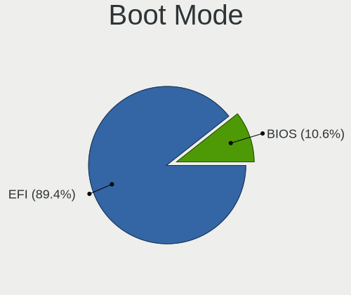

| Mode | Computers | Percent |
|------|-----------|---------|
| EFI  | 95        | 81.2%   |
| BIOS | 22        | 18.8%   |

Filesystem
----------

Type of filesystem

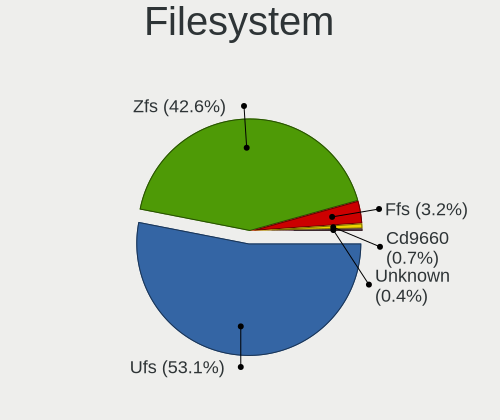

| Type    | Computers | Percent |
|---------|-----------|---------|
| Ufs     | 71        | 60.17%  |
| Zfs     | 39        | 33.05%  |
| Ffs     | 7         | 5.93%   |
| Unknown | 1         | 0.85%   |

Part. scheme
------------

Scheme of partitioning

| Type    | Computers | Percent |
|---------|-----------|---------|
| GPT     | 104       | 88.89%  |
| MBR     | 9         | 7.69%   |
| Unknown | 4         | 3.42%   |

Board
-----

Vendor
------

Motherboard manufacturer

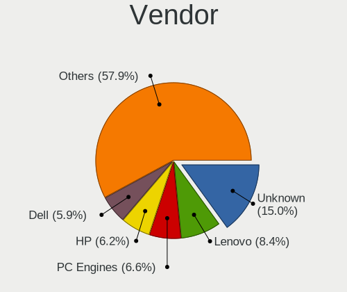

| Name                | Computers | Percent |
|---------------------|-----------|---------|
| Lenovo              | 15        | 12.82%  |
| Unknown             | 13        | 11.11%  |
| Hewlett-Packard     | 12        | 10.26%  |
| PC Engines          | 10        | 8.55%   |
| Dell                | 10        | 8.55%   |
| ZOTAC               | 6         | 5.13%   |
| Supermicro          | 5         | 4.27%   |
| Protectli           | 4         | 3.42%   |
| Fujitsu             | 4         | 3.42%   |
| BESSTAR Tech        | 4         | 3.42%   |
| AMI                 | 4         | 3.42%   |
| Shuttle             | 3         | 2.56%   |
| Gigabyte Technology | 3         | 2.56%   |
| ASUSTek Computer    | 3         | 2.56%   |
| ASRock              | 3         | 2.56%   |
| SeeedStudio         | 2         | 1.71%   |
| Intel               | 2         | 1.71%   |
| Winston Marriot     | 1         | 0.85%   |
| Sophos              | 1         | 0.85%   |
| Silicom             | 1         | 0.85%   |
| Secudos             | 1         | 0.85%   |
| Purism              | 1         | 0.85%   |
| Panasonic           | 1         | 0.85%   |
| NEXCOM              | 1         | 0.85%   |
| MSI                 | 1         | 0.85%   |
| Huawei              | 1         | 0.85%   |
| HPE                 | 1         | 0.85%   |
| Biostar             | 1         | 0.85%   |
| Apple               | 1         | 0.85%   |
| Acer                | 1         | 0.85%   |
| AAEON               | 1         | 0.85%   |

Model
-----

Motherboard model

| Name                                             | Computers | Percent |
|--------------------------------------------------|-----------|---------|
| Unknown                                          | 14        | 11.97%  |
| PC Engines apu4                                  | 5         | 4.27%   |
| PC Engines apu2                                  | 5         | 4.27%   |
| Supermicro Super Server                          | 3         | 2.56%   |
| Protectli FW4B                                   | 3         | 2.56%   |
| ZOTAC ZBOX-CI341                                 | 2         | 1.71%   |
| ZOTAC ZBOX-CI323NANO                             | 2         | 1.71%   |
| Shuttle DS10U                                    | 2         | 1.71%   |
| Lenovo ThinkPad T490 20N2CTO1WW                  | 2         | 1.71%   |
| HP ProLiant DL360 G6                             | 2         | 1.71%   |
| Fujitsu ESPRIMO C720                             | 2         | 1.71%   |
| AMI LES compact 4L                               | 2         | 1.71%   |
| AMI Aptio CRB                                    | 2         | 1.71%   |
| ZOTAC ZBOXNANO-ID63/ID64/ID65                    | 1         | 0.85%   |
| ZOTAC ZBOX-CI527/CI547NANO                       | 1         | 0.85%   |
| Winston Marriot PICO PC  PICOPC                  | 1         | 0.85%   |
| Supermicro IXWS-733TQ-665B-IXN                   | 1         | 0.85%   |
| Supermicro 1HE Intel Single-CPU RI1102D-F Server | 1         | 0.85%   |
| Sophos SG                                        | 1         | 0.85%   |
| Silicom Minnowboard Turbot D0/D1 PLATFORM        | 1         | 0.85%   |
| Shuttle DH170                                    | 1         | 0.85%   |
| SeeedStudio ODYSSEY-X86J4125                     | 1         | 0.85%   |
| SeeedStudio ODYSSEY-X86J4105                     | 1         | 0.85%   |
| Purism Librem Mini v2                            | 1         | 0.85%   |
| Protectli FW6E                                   | 1         | 0.85%   |
| Panasonic CF-30KTP48NL                           | 1         | 0.85%   |
| NEXCOM ASG                                       | 1         | 0.85%   |
| MSI MS-6788                                      | 1         | 0.85%   |
| Lenovo Y50-70 20378                              | 1         | 0.85%   |
| Lenovo ThinkPad T60 2007J3G                      | 1         | 0.85%   |
| Lenovo ThinkPad T510 4384AJ6                     | 1         | 0.85%   |
| Lenovo ThinkPad T410 2537WEE                     | 1         | 0.85%   |
| Lenovo ThinkPad T410 2537AT1                     | 1         | 0.85%   |
| Lenovo ThinkPad T400 2768W3A                     | 1         | 0.85%   |
| Lenovo ThinkPad E15 Gen 3 20YG006GGE             | 1         | 0.85%   |
| Lenovo ThinkPad E14 Gen 3 20Y7003SGE             | 1         | 0.85%   |
| Lenovo ThinkCentre M93p 10AB003CGE               | 1         | 0.85%   |
| Lenovo ThinkCentre M92P 3237CK4                  | 1         | 0.85%   |
| Lenovo ThinkCentre M73 10B4S03V05                | 1         | 0.85%   |
| Lenovo IdeaPad 110S-11IBR 80WG                   | 1         | 0.85%   |
| Lenovo IdeaCentre 310S-08ASR 90G9002PGE          | 1         | 0.85%   |
| Intel S5000PSL                                   | 1         | 0.85%   |
| Intel Q3XXG4-P V1.0                              | 1         | 0.85%   |
| Huawei RH2288H V3                                | 1         | 0.85%   |
| HPE ProLiant MicroServer Gen10                   | 1         | 0.85%   |
| HP ZBook 17 G4                                   | 1         | 0.85%   |
| HP ProLiant SE326M1R2                            | 1         | 0.85%   |
| HP ProLiant DL360p Gen8                          | 1         | 0.85%   |
| HP ProLiant DL360e Gen8                          | 1         | 0.85%   |
| HP ProDesk 600 G2 SFF                            | 1         | 0.85%   |
| HP EliteDesk 800 G2 SFF                          | 1         | 0.85%   |
| HP EliteBook Folio 9470m                         | 1         | 0.85%   |
| HP EliteBook 840 G3                              | 1         | 0.85%   |
| HP Compaq Elite 8300 SFF                         | 1         | 0.85%   |
| HP Compaq 8200 Elite SFF PC                      | 1         | 0.85%   |
| Gigabyte H81M-S2PV                               | 1         | 0.85%   |
| Gigabyte B365M DS3H                              | 1         | 0.85%   |
| Gigabyte B150-HD3P-CF                            | 1         | 0.85%   |
| Fujitsu PRIMERGY                                 | 1         | 0.85%   |
| Fujitsu ESPRIMO C910                             | 1         | 0.85%   |

Model Family
------------

Motherboard model prefix

| Name                           | Computers | Percent |
|--------------------------------|-----------|---------|
| Unknown                        | 14        | 11.97%  |
| Lenovo ThinkPad                | 9         | 7.69%   |
| PC Engines apu4                | 5         | 4.27%   |
| PC Engines apu2                | 5         | 4.27%   |
| HP ProLiant                    | 5         | 4.27%   |
| Dell OptiPlex                  | 4         | 3.42%   |
| Supermicro Super               | 3         | 2.56%   |
| Protectli FW4B                 | 3         | 2.56%   |
| Lenovo ThinkCentre             | 3         | 2.56%   |
| Fujitsu ESPRIMO                | 3         | 2.56%   |
| ZOTAC ZBOX-CI341               | 2         | 1.71%   |
| ZOTAC ZBOX-CI323NANO           | 2         | 1.71%   |
| Shuttle DS10U                  | 2         | 1.71%   |
| HP EliteBook                   | 2         | 1.71%   |
| HP Compaq                      | 2         | 1.71%   |
| Dell PowerEdge                 | 2         | 1.71%   |
| AMI LES                        | 2         | 1.71%   |
| AMI Aptio                      | 2         | 1.71%   |
| ZOTAC ZBOXNANO-ID63            | 1         | 0.85%   |
| ZOTAC ZBOX-CI527               | 1         | 0.85%   |
| Winston Marriot PICO           | 1         | 0.85%   |
| Supermicro IXWS-733TQ-665B-IXN | 1         | 0.85%   |
| Supermicro 1HE                 | 1         | 0.85%   |
| Sophos SG                      | 1         | 0.85%   |
| Silicom Minnowboard            | 1         | 0.85%   |
| Shuttle DH170                  | 1         | 0.85%   |
| SeeedStudio ODYSSEY-X86J4125   | 1         | 0.85%   |
| SeeedStudio ODYSSEY-X86J4105   | 1         | 0.85%   |
| Purism Librem                  | 1         | 0.85%   |
| Protectli FW6E                 | 1         | 0.85%   |
| Panasonic CF-30KTP48NL         | 1         | 0.85%   |
| NEXCOM ASG                     | 1         | 0.85%   |
| MSI MS-6788                    | 1         | 0.85%   |
| Lenovo Y50-70                  | 1         | 0.85%   |
| Lenovo IdeaPad                 | 1         | 0.85%   |
| Lenovo IdeaCentre              | 1         | 0.85%   |
| Intel S5000PSL                 | 1         | 0.85%   |
| Intel Q3XXG4-P                 | 1         | 0.85%   |
| Huawei RH2288H                 | 1         | 0.85%   |
| HPE ProLiant                   | 1         | 0.85%   |
| HP ZBook                       | 1         | 0.85%   |
| HP ProDesk                     | 1         | 0.85%   |
| HP EliteDesk                   | 1         | 0.85%   |
| Gigabyte H81M-S2PV             | 1         | 0.85%   |
| Gigabyte B365M                 | 1         | 0.85%   |
| Gigabyte B150-HD3P-CF          | 1         | 0.85%   |
| Fujitsu PRIMERGY               | 1         | 0.85%   |
| Dell XPS                       | 1         | 0.85%   |
| Dell Vostro                    | 1         | 0.85%   |
| Dell Precision                 | 1         | 0.85%   |
| Dell Latitude                  | 1         | 0.85%   |
| Biostar N3050NH                | 1         | 0.85%   |
| BESSTAR Tech X35G              | 1         | 0.85%   |
| BESSTAR Tech UM270             | 1         | 0.85%   |
| BESSTAR Tech UM250             | 1         | 0.85%   |
| BESSTAR Tech U820              | 1         | 0.85%   |
| ASUS PRIME                     | 1         | 0.85%   |
| ASUS P8H77-M                   | 1         | 0.85%   |
| ASUS 1HE                       | 1         | 0.85%   |
| ASRock TRX40                   | 1         | 0.85%   |

MFG Year
--------

Motherboard manufacture year

| Year    | Computers | Percent |
|---------|-----------|---------|
| 2018    | 17        | 14.53%  |
| 2020    | 15        | 12.82%  |
| 2021    | 14        | 11.97%  |
| 2019    | 13        | 11.11%  |
| 2016    | 13        | 11.11%  |
| 2017    | 10        | 8.55%   |
| 2015    | 7         | 5.98%   |
| 2013    | 6         | 5.13%   |
| 2010    | 6         | 5.13%   |
| 2011    | 5         | 4.27%   |
| 2012    | 3         | 2.56%   |
| Unknown | 3         | 2.56%   |
| 2009    | 2         | 1.71%   |
| 2014    | 1         | 0.85%   |
| 2007    | 1         | 0.85%   |
| 2006    | 1         | 0.85%   |

Form Factor
-----------

Physical design of the computer

| Name           | Computers | Percent |
|----------------|-----------|---------|
| Desktop        | 69        | 58.97%  |
| Notebook       | 20        | 17.09%  |
| Server         | 14        | 11.97%  |
| Mini pc        | 10        | 8.55%   |
| System on chip | 1         | 0.85%   |
| Firewall       | 1         | 0.85%   |
| Convertible    | 1         | 0.85%   |
| All in one     | 1         | 0.85%   |

Coreboot
--------

Have coreboot on board

| Used | Computers | Percent |
|------|-----------|---------|
| No   | 104       | 88.89%  |
| Yes  | 13        | 11.11%  |

RAM Size
--------

Total RAM memory

| Size in GB      | Computers | Percent |
|-----------------|-----------|---------|
| 8.01-16.0       | 43        | 36.44%  |
| 16.01-24.0      | 24        | 20.34%  |
| 4.01-8.0        | 22        | 18.64%  |
| 32.01-64.0      | 10        | 8.47%   |
| 2.01-3.0        | 7         | 5.93%   |
| 64.01-256.0     | 4         | 3.39%   |
| More than 256.0 | 3         | 2.54%   |
| 3.01-4.0        | 3         | 2.54%   |
| 24.01-32.0      | 1         | 0.85%   |
| 1.01-2.0        | 1         | 0.85%   |

RAM Used
--------

Used RAM memory

| Used GB     | Computers | Percent |
|-------------|-----------|---------|
| 0.01-0.5    | 65        | 54.17%  |
| 0.51-1.0    | 32        | 26.67%  |
| 1.01-2.0    | 10        | 8.33%   |
| 4.01-8.0    | 3         | 2.5%    |
| 32.01-64.0  | 3         | 2.5%    |
| 2.01-3.0    | 3         | 2.5%    |
| 3.01-4.0    | 1         | 0.83%   |
| 64.01-256.0 | 1         | 0.83%   |
| 16.01-24.0  | 1         | 0.83%   |
| 0           | 1         | 0.83%   |

Total Drives
------------

Number of drives on board

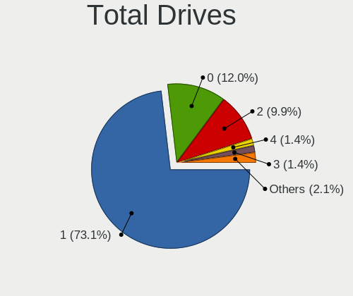

| Drives | Computers | Percent |
|--------|-----------|---------|
| 1      | 91        | 75.83%  |
| 2      | 13        | 10.83%  |
| 0      | 7         | 5.83%   |
| 3      | 3         | 2.5%    |
| 4      | 2         | 1.67%   |
| 17     | 1         | 0.83%   |
| 15     | 1         | 0.83%   |
| 13     | 1         | 0.83%   |
| 7      | 1         | 0.83%   |

Has CD-ROM
----------

Has CD-ROM on board

| Presented | Computers | Percent |
|-----------|-----------|---------|
| No        | 103       | 87.29%  |
| Yes       | 15        | 12.71%  |

Has Ethernet
------------

Has Ethernet on board

| Presented | Computers | Percent |
|-----------|-----------|---------|
| Yes       | 114       | 97.44%  |
| No        | 3         | 2.56%   |

Has WiFi
--------

Has WiFi module

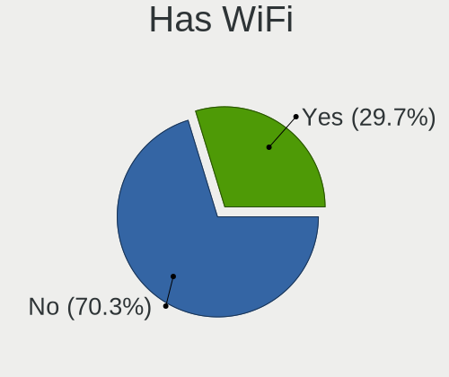

| Presented | Computers | Percent |
|-----------|-----------|---------|
| No        | 75        | 63.56%  |
| Yes       | 43        | 36.44%  |

Has Bluetooth
-------------

Has Bluetooth module

| Presented | Computers | Percent |
|-----------|-----------|---------|
| No        | 86        | 72.88%  |
| Yes       | 32        | 27.12%  |

Location
--------

Country
-------

Geographic location (country)

| Country | Computers | Percent |
|---------|-----------|---------|
| Austria | 117       | 100%    |

City
----

Geographic location (city)

| City                            | Computers | Percent |
|---------------------------------|-----------|---------|
| Vienna                          | 58        | 46.4%   |
| Graz                            | 11        | 8.8%    |
| Linz                            | 4         | 3.2%    |
| Innsbruck                       | 4         | 3.2%    |
| Sankt Veit an der Glan          | 2         | 1.6%    |
| Salzburg                        | 2         | 1.6%    |
| Bruck an der Mur                | 2         | 1.6%    |
| Atzenbrugg                      | 2         | 1.6%    |
| Zwettl Stadt                    | 1         | 0.8%    |
| Wels                            | 1         | 0.8%    |
| Weidlingbach                    | 1         | 0.8%    |
| Voggenberg                      | 1         | 0.8%    |
| Tulln                           | 1         | 0.8%    |
| Stockerau                       | 1         | 0.8%    |
| Steyr                           | 1         | 0.8%    |
| Spittal an der Drau             | 1         | 0.8%    |
| Siegendorf im Burgenland        | 1         | 0.8%    |
| Schwechat                       | 1         | 0.8%    |
| Sankt Plten                 | 1         | 0.8%    |
| Sankt Plten                 | 1         | 0.8%    |
| Sankt Margarethen im Burgenland | 1         | 0.8%    |
| Pusarnitz                       | 1         | 0.8%    |
| Purkersdorf                     | 1         | 0.8%    |
| Pichl bei Wels                  | 1         | 0.8%    |
| Parndorf                        | 1         | 0.8%    |
| Ottensheim                      | 1         | 0.8%    |
| Oberpullendorf                  | 1         | 0.8%    |
| Neumarkt am Wallersee           | 1         | 0.8%    |
| Neulengbach                     | 1         | 0.8%    |
| Maria-Anzbach                   | 1         | 0.8%    |
| Maria Enzersdorf                | 1         | 0.8%    |
| Margarethen am Moos             | 1         | 0.8%    |
| Leogang                         | 1         | 0.8%    |
| Leobersdorf                     | 1         | 0.8%    |
| Leoben                          | 1         | 0.8%    |
| Kirchberg in Tirol              | 1         | 0.8%    |
| Hoerndl                         | 1         | 0.8%    |
| Hintersdorf                     | 1         | 0.8%    |
| Gmunden                         | 1         | 0.8%    |
| Gaweinstal                      | 1         | 0.8%    |
| Gablitz                         | 1         | 0.8%    |
| Ferndorf                        | 1         | 0.8%    |
| Euratsfeld                      | 1         | 0.8%    |
| Enzenreith                      | 1         | 0.8%    |
| Eisenstadt                      | 1         | 0.8%    |
| Breitenfurt bei Wien            | 1         | 0.8%    |
| Birkfeld                        | 1         | 0.8%    |
| Ansfelden                       | 1         | 0.8%    |

Drives
------

Drive Vendor
------------

Hard drive vendors

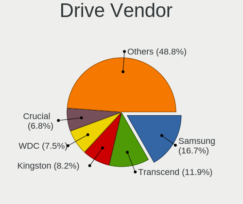

| Vendor              | Computers | Drives | Percent |
|---------------------|-----------|--------|---------|
| Samsung Electronics | 25        | 37     | 18.25%  |
| Transcend           | 15        | 16     | 10.95%  |
| WDC                 | 14        | 35     | 10.22%  |
| Crucial             | 10        | 13     | 7.3%    |
| Seagate             | 9         | 29     | 6.57%   |
| Kingston            | 9         | 18     | 6.57%   |
| Intel               | 9         | 12     | 6.57%   |
| SanDisk             | 6         | 11     | 4.38%   |
| Phison              | 4         | 5      | 2.92%   |
| Micron Technology   | 3         | 7      | 2.19%   |
| Hoodisk             | 3         | 4      | 2.19%   |
| HGST                | 3         | 8      | 2.19%   |
| Toshiba             | 2         | 2      | 1.46%   |
| Hitachi             | 2         | 2      | 1.46%   |
| Hewlett-Packard     | 2         | 2      | 1.46%   |
| FORESEE             | 2         | 2      | 1.46%   |
| Dell                | 2         | 2      | 1.46%   |
| Corsair             | 2         | 3      | 1.46%   |
| China               | 2         | 2      | 1.46%   |
| ATP                 | 2         | 2      | 1.46%   |
| SYNOLOGY            | 1         | 1      | 0.73%   |
| SK Hynix            | 1         | 1      | 0.73%   |
| OCZ                 | 1         | 1      | 0.73%   |
| Kston               | 1         | 1      | 0.73%   |
| KingSpec            | 1         | 1      | 0.73%   |
| Intenso             | 1         | 1      | 0.73%   |
| GOODRAM             | 1         | 1      | 0.73%   |
| Dogfish             | 1         | 1      | 0.73%   |
| BIWIN               | 1         | 1      | 0.73%   |
| Apple               | 1         | 1      | 0.73%   |
| A-DATA Technology   | 1         | 3      | 0.73%   |

Drive Model
-----------

Hard drive models

| Model                                    | Computers | Percent |
|------------------------------------------|-----------|---------|
| Samsung SSD 840 EVO 250GB                | 6         | 3.97%   |
| Transcend TS128GMSA230S 128GB            | 5         | 3.31%   |
| Kingston SUV500MS120G 120GB              | 3         | 1.99%   |
| Kingston SA400S37240G 240GB              | 3         | 1.99%   |
| Crucial CT240BX500SSD1 240GB             | 3         | 1.99%   |
| WDC WD60EFRX-68L0BN1 6TB                 | 2         | 1.32%   |
| WDC WD40EFRX-68N32N0 4TB                 | 2         | 1.32%   |
| Transcend TS16GMSA370 16GB               | 2         | 1.32%   |
| SanDisk SSD PLUS 120GB                   | 2         | 1.32%   |
| Samsung SSD 860 EVO 250GB                | 2         | 1.32%   |
| Samsung MZALQ512HBLU-00BL1 512GB         | 2         | 1.32%   |
| Phison SATA SSD 16GB                     | 2         | 1.32%   |
| Intel SSDPEKKF512G8L 512GB               | 2         | 1.32%   |
| Hoodisk SSD 64GB                         | 2         | 1.32%   |
| HP RAID 1(1+0) 146GB                     | 2         | 1.32%   |
| FORESEE 128GB SSD                        | 2         | 1.32%   |
| Crucial CT250MX500SSD1 250GB             | 2         | 1.32%   |
| Crucial CT120BX500SSD1 120GB             | 2         | 1.32%   |
| WDC WDS500G2B0A-00SM50 500GB             | 1         | 0.66%   |
| WDC WDS240G2G0B-00EPW0 240GB             | 1         | 0.66%   |
| WDC WD80PURZ-85YNPY0 8TB                 | 1         | 0.66%   |
| WDC WD80EFAX-68KNBN0 8TB                 | 1         | 0.66%   |
| WDC WD800JD-60LSA5 80GB                  | 1         | 0.66%   |
| WDC WD3200BEVT-22ZCT0 320GB              | 1         | 0.66%   |
| WDC WD2500AAKX-001CA0 250GB              | 1         | 0.66%   |
| WDC WD2500AAJS-00L7A0 250GB              | 1         | 0.66%   |
| WDC WD20SPZX-22CRAT0 2TB                 | 1         | 0.66%   |
| WDC WD1600BEVS-00UST0 160GB              | 1         | 0.66%   |
| WDC WD1600BEKT-08PVMT1 160GB             | 1         | 0.66%   |
| WDC WD120EFBX-68B0EN0 12TB               | 1         | 0.66%   |
| WDC WD10JPLX-00MBPT0 1TB                 | 1         | 0.66%   |
| WDC WD10EZEX-08WN4A0 1TB                 | 1         | 0.66%   |
| WDC WD10EARS-00Y5B1 1TB                  | 1         | 0.66%   |
| WDC WD Elements 25A1 4TB                 | 1         | 0.66%   |
| Transcend TS64GMSA370 64GB               | 1         | 0.66%   |
| Transcend TS64GMSA230S 64GB              | 1         | 0.66%   |
| Transcend TS32GSSD370S 32GB              | 1         | 0.66%   |
| Transcend TS2TMTE220S 2TB                | 1         | 0.66%   |
| Transcend TS256GMTS430S 256GB            | 1         | 0.66%   |
| Transcend TS256GMSA370 256GB             | 1         | 0.66%   |
| Transcend TS256GMSA230S 256GB            | 1         | 0.66%   |
| Transcend TS240GSSD220S 240GB            | 1         | 0.66%   |
| Toshiba MQ04ABF100 1TB                   | 1         | 0.66%   |
| Toshiba MK3276GSX -63 320GB              | 1         | 0.66%   |
| SYNOLOGY iSCSI Storage 10.9TB            | 1         | 0.66%   |
| SK Hynix SC308 SATA 128GB                | 1         | 0.66%   |
| Seagate ST9500325AS 500GB                | 1         | 0.66%   |
| Seagate ST8000VN0022-2EL112 8TB          | 1         | 0.66%   |
| Seagate ST8000DM004-2CX188 8TB           | 1         | 0.66%   |
| Seagate ST4000VX007-2DT166 4TB           | 1         | 0.66%   |
| Seagate ST4000VN008-2DR166 4TB           | 1         | 0.66%   |
| Seagate ST3500413AS 500GB                | 1         | 0.66%   |
| Seagate ST3250318AS 250GB                | 1         | 0.66%   |
| Seagate ST3160318AS 160GB                | 1         | 0.66%   |
| Seagate ST2000VN000-1HJ164 2TB           | 1         | 0.66%   |
| Seagate ST2000LM015-2E8174 2TB           | 1         | 0.66%   |
| Seagate ST1000LX015-1U7172 1TB           | 1         | 0.66%   |
| Seagate BarraCuda SSD ZA250CM10002 250GB | 1         | 0.66%   |
| SanDisk X400 M.2 2280 128GB              | 1         | 0.66%   |
| SanDisk SSD PLUS 240GB                   | 1         | 0.66%   |

HDD Vendor
----------

Hard disk drive vendors

| Vendor              | Computers | Drives | Percent |
|---------------------|-----------|--------|---------|
| WDC                 | 13        | 33     | 38.24%  |
| Seagate             | 8         | 23     | 23.53%  |
| HGST                | 3         | 8      | 8.82%   |
| Toshiba             | 2         | 2      | 5.88%   |
| Hitachi             | 2         | 2      | 5.88%   |
| Hewlett-Packard     | 2         | 2      | 5.88%   |
| Dell                | 2         | 2      | 5.88%   |
| SYNOLOGY            | 1         | 1      | 2.94%   |
| Samsung Electronics | 1         | 1      | 2.94%   |

SSD Vendor
----------

Solid state drive vendors

| Vendor              | Computers | Drives | Percent |
|---------------------|-----------|--------|---------|
| Samsung Electronics | 17        | 23     | 19.32%  |
| Transcend           | 14        | 14     | 15.91%  |
| Crucial             | 10        | 13     | 11.36%  |
| Kingston            | 9         | 18     | 10.23%  |
| SanDisk             | 6         | 11     | 6.82%   |
| Intel               | 6         | 9      | 6.82%   |
| Phison              | 3         | 4      | 3.41%   |
| Micron Technology   | 3         | 7      | 3.41%   |
| Hoodisk             | 3         | 4      | 3.41%   |
| WDC                 | 2         | 2      | 2.27%   |
| FORESEE             | 2         | 2      | 2.27%   |
| China               | 2         | 2      | 2.27%   |
| SK Hynix            | 1         | 1      | 1.14%   |
| Seagate             | 1         | 6      | 1.14%   |
| OCZ                 | 1         | 1      | 1.14%   |
| Kston               | 1         | 1      | 1.14%   |
| KingSpec            | 1         | 1      | 1.14%   |
| Intenso             | 1         | 1      | 1.14%   |
| GOODRAM             | 1         | 1      | 1.14%   |
| Dogfish             | 1         | 1      | 1.14%   |
| BIWIN               | 1         | 1      | 1.14%   |
| ATP                 | 1         | 1      | 1.14%   |
| Apple               | 1         | 1      | 1.14%   |

Drive Kind
----------

HDD or SSD

| Kind | Computers | Drives | Percent |
|------|-----------|--------|---------|
| SSD  | 84        | 125    | 65.12%  |
| HDD  | 29        | 74     | 22.48%  |
| NVMe | 16        | 26     | 12.4%   |

Drive Connector
---------------

SATA, SAS, NVMe, etc.

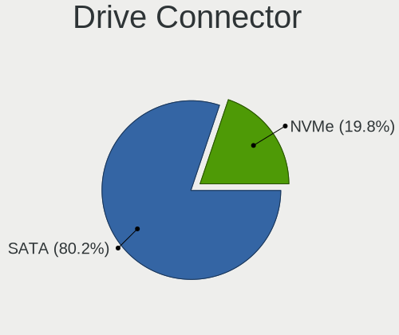

| Type | Computers | Drives | Percent |
|------|-----------|--------|---------|
| SATA | 100       | 199    | 86.21%  |
| NVMe | 16        | 26     | 13.79%  |

Drive Size
----------

Size of hard drive

| Size in TB | Computers | Drives | Percent |
|------------|-----------|--------|---------|
| 0.01-0.5   | 92        | 142    | 80%     |
| 0.51-1.0   | 8         | 8      | 6.96%   |
| 4.01-10.0  | 5         | 22     | 4.35%   |
| 3.01-4.0   | 4         | 13     | 3.48%   |
| 1.01-2.0   | 4         | 11     | 3.48%   |
| 10.01-20.0 | 2         | 3      | 1.74%   |

Space Total
-----------

Amount of disk space available on the file system

| Size in GB | Computers | Percent |
|------------|-----------|---------|
| 101-250    | 58        | 48.33%  |
| 251-500    | 22        | 18.33%  |
| 21-50      | 13        | 10.83%  |
| 51-100     | 12        | 10%     |
| 1-20       | 9         | 7.5%    |
| 501-1000   | 5         | 4.17%   |
| 1001-2000  | 1         | 0.83%   |

Space Used
----------

Amount of used disk space

| Used GB  | Computers | Percent |
|----------|-----------|---------|
| 1-20     | 109       | 91.6%   |
| 21-50    | 5         | 4.2%    |
| 101-250  | 2         | 1.68%   |
| 251-500  | 1         | 0.84%   |
| 501-1000 | 1         | 0.84%   |
| 51-100   | 1         | 0.84%   |

Malfunc. Drives
---------------

Drive models with a malfunction

| Model                                      | Computers | Drives | Percent |
|--------------------------------------------|-----------|--------|---------|
| WDC WD60EFRX-68L0BN1 6TB                   | 1         | 1      | 8.33%   |
| WDC WD3200BEVT-22ZCT0 320GB                | 1         | 1      | 8.33%   |
| WDC WD1600BEVS-00UST0 160GB                | 1         | 1      | 8.33%   |
| WDC WD1600BEKT-08PVMT1 160GB               | 1         | 2      | 8.33%   |
| SK Hynix SC308 SATA 128GB                  | 1         | 1      | 8.33%   |
| Seagate ST9500325AS 500GB                  | 1         | 1      | 8.33%   |
| OCZ AGILITY3 120GB                         | 1         | 1      | 8.33%   |
| Micron Technology 1100_MTFDDAV256TBN 256GB | 1         | 2      | 8.33%   |
| Intel SSDSCKKF256G8H 256GB                 | 1         | 2      | 8.33%   |
| Hitachi HTS541040G9SA00 40GB               | 1         | 1      | 8.33%   |
| Hitachi HDS721050CLA660 500GB              | 1         | 1      | 8.33%   |
| HGST HTS725050A7E630 500GB                 | 1         | 3      | 8.33%   |

Malfunc. Drive Vendor
---------------------

Vendors of faulty drives

| Vendor            | Computers | Drives | Percent |
|-------------------|-----------|--------|---------|
| WDC               | 4         | 5      | 33.33%  |
| Hitachi           | 2         | 2      | 16.67%  |
| SK Hynix          | 1         | 1      | 8.33%   |
| Seagate           | 1         | 1      | 8.33%   |
| OCZ               | 1         | 1      | 8.33%   |
| Micron Technology | 1         | 2      | 8.33%   |
| Intel             | 1         | 2      | 8.33%   |
| HGST              | 1         | 3      | 8.33%   |

Malfunc. HDD Vendor
-------------------

Vendors of faulty HDD drives

| Vendor  | Computers | Drives | Percent |
|---------|-----------|--------|---------|
| WDC     | 4         | 5      | 50%     |
| Hitachi | 2         | 2      | 25%     |
| Seagate | 1         | 1      | 12.5%   |
| HGST    | 1         | 3      | 12.5%   |

Malfunc. Drive Kind
-------------------

Kinds of faulty drives

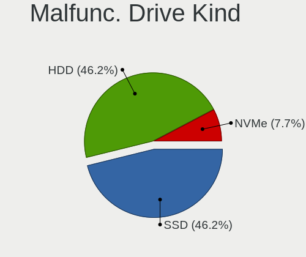

| Kind | Computers | Drives | Percent |
|------|-----------|--------|---------|
| HDD  | 8         | 11     | 66.67%  |
| SSD  | 4         | 6      | 33.33%  |

Failed Drives
-------------

Failed drive models

Zero info for selected period =(

Failed Drive Vendor
-------------------

Failed drive vendors

Zero info for selected period =(

Drive Status
------------

Number of failed and malfunc. drives

| Status   | Computers | Drives | Percent |
|----------|-----------|--------|---------|
| Works    | 101       | 202    | 87.07%  |
| Malfunc  | 10        | 17     | 8.62%   |
| Detected | 5         | 6      | 4.31%   |

Storage controller
------------------

Storage Vendor
--------------

Storage controller vendors

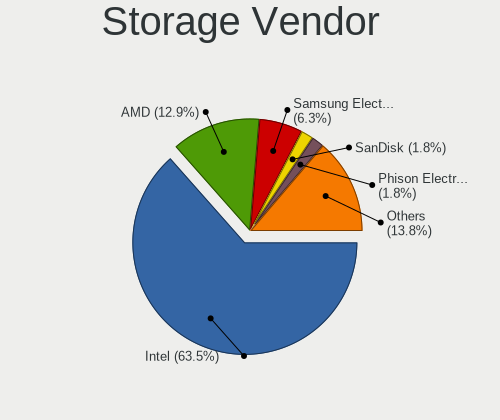

| Vendor                   | Computers | Percent |
|--------------------------|-----------|---------|
| Intel                    | 96        | 68.09%  |
| AMD                      | 16        | 11.35%  |
| Samsung Electronics      | 8         | 5.67%   |
| Broadcom / LSI           | 5         | 3.55%   |
| Hewlett-Packard          | 4         | 2.84%   |
| Phison Electronics       | 3         | 2.13%   |
| Marvell Technology Group | 2         | 1.42%   |
| Toshiba                  | 1         | 0.71%   |
| Silicon Motion           | 1         | 0.71%   |
| Realtek Semiconductor    | 1         | 0.71%   |
| Lite-On Technology       | 1         | 0.71%   |
| Dell                     | 1         | 0.71%   |
| ATP ELECTRONICS          | 1         | 0.71%   |
| ASMedia Technology       | 1         | 0.71%   |

Storage Model
-------------

Storage controller models

| Model                                                                            | Computers | Percent |
|----------------------------------------------------------------------------------|-----------|---------|
| Intel Atom/Celeron/Pentium Processor x5-E8000/J3xxx/N3xxx Series SATA Controller | 15        | 9.68%   |
| AMD FCH SATA Controller [AHCI mode]                                              | 12        | 7.74%   |
| Intel Q170/Q150/B150/H170/H110/Z170/CM236 Chipset SATA Controller [AHCI Mode]    | 10        | 6.45%   |
| Intel 8 Series/C220 Series Chipset Family 6-port SATA Controller 1 [AHCI mode]   | 7         | 4.52%   |
| Intel Cannon Point-LP SATA Controller [AHCI Mode]                                | 5         | 3.23%   |
| AMD FCH SATA Controller [IDE mode]                                               | 5         | 3.23%   |
| Samsung NVMe SSD Controller SM981/PM981/PM983                                    | 4         | 2.58%   |
| Intel Sunrise Point-LP SATA Controller [AHCI mode]                               | 4         | 2.58%   |
| Intel Celeron/Pentium Silver Processor SATA Controller                           | 4         | 2.58%   |
| Intel 6 Series/C200 Series Chipset Family 6 port Desktop SATA AHCI Controller    | 4         | 2.58%   |
| Samsung NVMe SSD Controller 980                                                  | 3         | 1.94%   |
| Intel Comet Lake SATA AHCI Controller                                            | 3         | 1.94%   |
| Intel Atom Processor E3800 Series SATA AHCI Controller                           | 3         | 1.94%   |
| Intel 8 Series SATA Controller 1 [AHCI mode]                                     | 3         | 1.94%   |
| Intel 7 Series/C210 Series Chipset Family 6-port SATA Controller [AHCI mode]     | 3         | 1.94%   |
| HP Smart Array G6 controllers                                                    | 3         | 1.94%   |
| Broadcom / LSI SAS2308 PCI-Express Fusion-MPT SAS-2                              | 3         | 1.94%   |
| Intel SSD Pro 7600p/760p/E 6100p Series                                          | 2         | 1.29%   |
| Intel Celeron N3350/Pentium N4200/Atom E3900 Series SATA AHCI Controller         | 2         | 1.29%   |
| Intel C610/X99 series chipset sSATA Controller [AHCI mode]                       | 2         | 1.29%   |
| Intel 82801JI (ICH10 Family) 4 port SATA IDE Controller #1                       | 2         | 1.29%   |
| Intel 82801G (ICH7 Family) IDE Controller                                        | 2         | 1.29%   |
| Intel 631xESB/632xESB IDE Controller                                             | 2         | 1.29%   |
| Intel 5 Series/3400 Series Chipset 6 port SATA AHCI Controller                   | 2         | 1.29%   |
| Intel 200 Series PCH SATA controller [AHCI mode]                                 | 2         | 1.29%   |
| Broadcom / LSI SAS1068E PCI-Express Fusion-MPT SAS                               | 2         | 1.29%   |
| Unknown                                                                          | 2         | 1.29%   |
| Toshiba XG4 NVMe SSD Controller                                                  | 1         | 0.65%   |
| Silicon Motion SM2262/SM2262EN SSD Controller                                    | 1         | 0.65%   |
| Samsung NVMe SSD Controller SM961/PM961/SM963                                    | 1         | 0.65%   |
| Phison PS5013 E13 NVMe Controller                                                | 1         | 0.65%   |
| Phison E16 PCIe4 NVMe Controller                                                 | 1         | 0.65%   |
| Phison E12 NVMe Controller                                                       | 1         | 0.65%   |
| Marvell Group 88SE9230 PCIe 2.0 x2 4-port SATA 6 Gb/s RAID Controller            | 1         | 0.65%   |
| Marvell Group 88SE9172 SATA III 6Gb/s RAID Controller                            | 1         | 0.65%   |
| Lite-On M8Pe Series NVMe SSD                                                     | 1         | 0.65%   |
| Intel SSD 660P Series                                                            | 1         | 0.65%   |
| Intel SSD 600P Series                                                            | 1         | 0.65%   |
| Intel NM10/ICH7 Family SATA Controller [AHCI mode]                               | 1         | 0.65%   |
| Intel Cannon Lake PCH SATA AHCI Controller                                       | 1         | 0.65%   |
| Intel Cannon Lake Mobile PCH SATA AHCI Controller                                | 1         | 0.65%   |
| Intel C620 Series Chipset Family SSATA Controller [AHCI mode]                    | 1         | 0.65%   |
| Intel C620 Series Chipset Family SATA Controller [AHCI mode]                     | 1         | 0.65%   |
| Intel C610/X99 series chipset 6-Port SATA Controller [AHCI mode]                 | 1         | 0.65%   |
| Intel C600/X79 series chipset 6-Port SATA AHCI Controller                        | 1         | 0.65%   |
| Intel C600/X79 series chipset 4-Port SATA IDE Controller                         | 1         | 0.65%   |
| Intel Atom Processor C3000 Series SATA Controller 0                              | 1         | 0.65%   |
| Intel 82801JI (ICH10 Family) 2 port SATA IDE Controller #2                       | 1         | 0.65%   |
| Intel 82801IBM/IEM (ICH9M/ICH9M-E) 4 port SATA Controller [AHCI mode]            | 1         | 0.65%   |
| Intel 82801IBM/IEM (ICH9M/ICH9M-E) 2 port SATA Controller [IDE mode]             | 1         | 0.65%   |
| Intel 82801IB (ICH9) 2 port SATA Controller [IDE mode]                           | 1         | 0.65%   |
| Intel 82801GBM/GHM (ICH7-M Family) SATA Controller [AHCI mode]                   | 1         | 0.65%   |
| Intel 82801EB (ICH5) SATA Controller                                             | 1         | 0.65%   |
| Intel 82801 Mobile SATA Controller [RAID mode]                                   | 1         | 0.65%   |
| Intel 7 Series/C210 Series Chipset Family 4-port SATA Controller [IDE mode]      | 1         | 0.65%   |
| Intel 7 Series/C210 Series Chipset Family 2-port SATA Controller [IDE mode]      | 1         | 0.65%   |
| Intel 7 Series Chipset Family 6-port SATA Controller [AHCI mode]                 | 1         | 0.65%   |
| Intel 7 Series Chipset Family 4-port SATA Controller [IDE mode]                  | 1         | 0.65%   |
| Intel 7 Series Chipset Family 2-port SATA Controller [IDE mode]                  | 1         | 0.65%   |
| Intel 631xESB/632xESB SATA AHCI Controller                                       | 1         | 0.65%   |

Storage Kind
------------

Kind of storage controller (IDE, SATA, NVMe, SAS, ...)

| Kind | Computers | Percent |
|------|-----------|---------|
| SATA | 96        | 66.21%  |
| NVMe | 19        | 13.1%   |
| IDE  | 17        | 11.72%  |
| RAID | 7         | 4.83%   |
| SAS  | 4         | 2.76%   |
| SCSI | 2         | 1.38%   |

Processor
---------

CPU Vendor
----------

Processor vendors

| Vendor  | Computers | Percent |
|---------|-----------|---------|
| Intel   | 98        | 83.76%  |
| AMD     | 18        | 15.38%  |
| Unknown | 1         | 0.85%   |

CPU Model
---------

Processor models

| Model                                                  | Computers | Percent |
|--------------------------------------------------------|-----------|---------|
| AMD GX-412TC SOC                                       | 10        | 8.55%   |
| Intel Celeron CPU J3160 @ 1.60GHz                      | 9         | 7.69%   |
| Intel Xeon CPU E5620 @ 2.40GHz                         | 3         | 2.56%   |
| Intel Pentium CPU G3220 @ 3.00GHz                      | 2         | 1.71%   |
| Intel Core i7-8665U CPU @ 1.90GHz                      | 2         | 1.71%   |
| Intel Core i7-8565U CPU @ 1.80GHz                      | 2         | 1.71%   |
| Intel Core i5-7200U CPU @ 2.50GHz                      | 2         | 1.71%   |
| Intel Core i5-6500 CPU @ 3.20GHz                       | 2         | 1.71%   |
| Intel Core i5-6400 CPU @ 2.70GHz                       | 2         | 1.71%   |
| Intel Core i5-2400 CPU @ 3.10GHz                       | 2         | 1.71%   |
| Intel Core i5-10210U CPU @ 1.60GHz                     | 2         | 1.71%   |
| Intel Core i5 CPU M 520 @ 2.40GHz                      | 2         | 1.71%   |
| Intel Core i3-4130 CPU @ 3.40GHz                       | 2         | 1.71%   |
| Intel Celeron N4100 CPU @ 1.10GHz                      | 2         | 1.71%   |
| Intel Celeron CPU N3150 @ 1.60GHz                      | 2         | 1.71%   |
| Intel Celeron CPU J1900 @ 1.99GHz                      | 2         | 1.71%   |
| AMD Ryzen 5 5500U with Radeon Graphics                 | 2         | 1.71%   |
| Intel Xeon D-2123IT CPU @ 2.20GHz                      | 1         | 0.85%   |
| Intel Xeon CPU L5640 @ 2.27GHz                         | 1         | 0.85%   |
| Intel Xeon CPU E5540 @ 2.53GHz                         | 1         | 0.85%   |
| Intel Xeon CPU E5420 @ 2.50GHz                         | 1         | 0.85%   |
| Intel Xeon CPU E5320 @ 1.86GHz                         | 1         | 0.85%   |
| Intel Xeon CPU E5-2690 v4 @ 2.60GHz                    | 1         | 0.85%   |
| Intel Xeon CPU E5-2667 v4 @ 3.20GHz                    | 1         | 0.85%   |
| Intel Xeon CPU E5-2650 v2 @ 2.60GHz                    | 1         | 0.85%   |
| Intel Xeon CPU E5-2430L 0 @ 2.00GHz                    | 1         | 0.85%   |
| Intel Xeon CPU E31220 @ 3.10GHz                        | 1         | 0.85%   |
| Intel Xeon CPU D-1540 @ 2.00GHz                        | 1         | 0.85%   |
| Intel Pentium CPU N4200 @ 1.10GHz                      | 1         | 0.85%   |
| Intel Pentium CPU N3710 @ 1.60GHz                      | 1         | 0.85%   |
| Intel Pentium CPU N3700 @ 1.60GHz                      | 1         | 0.85%   |
| Intel Pentium CPU G4400 @ 3.30GHz                      | 1         | 0.85%   |
| Intel Pentium 4 CPU 2.40GHz ("GenuineIntel" 686-class) | 1         | 0.85%   |
| Intel Genuine CPU 0000 @ 2.40GHz                       | 1         | 0.85%   |
| Intel Core i7-8850H CPU @ 2.60GHz                      | 1         | 0.85%   |
| Intel Core i7-8550U CPU @ 1.80GHz                      | 1         | 0.85%   |
| Intel Core i7-7700HQ CPU @ 2.80GHz                     | 1         | 0.85%   |
| Intel Core i7-4710HQ CPU @ 2.50GHz                     | 1         | 0.85%   |
| Intel Core i7-3770 CPU @ 3.40GHz                       | 1         | 0.85%   |
| Intel Core i7-3687U CPU @ 2.10GHz                      | 1         | 0.85%   |
| Intel Core i7-10510U CPU @ 1.80GHz                     | 1         | 0.85%   |
| Intel Core i5-8365U CPU @ 1.60GHz                      | 1         | 0.85%   |
| Intel Core i5-8279U CPU @ 2.40GHz                      | 1         | 0.85%   |
| Intel Core i5-7500 CPU @ 3.40GHz                       | 1         | 0.85%   |
| Intel Core i5-6600 CPU @ 3.30GHz                       | 1         | 0.85%   |
| Intel Core i5-6500T CPU @ 2.50GHz                      | 1         | 0.85%   |
| Intel Core i5-6200U CPU @ 2.30GHz                      | 1         | 0.85%   |
| Intel Core i5-4590T CPU @ 2.00GHz                      | 1         | 0.85%   |
| Intel Core i5-4310U CPU @ 2.00GHz                      | 1         | 0.85%   |
| Intel Core i5-4200U CPU @ 1.60GHz                      | 1         | 0.85%   |
| Intel Core i5-3570 CPU @ 3.40GHz                       | 1         | 0.85%   |
| Intel Core i5-3470T CPU @ 2.90GHz                      | 1         | 0.85%   |
| Intel Core i5-3470 CPU @ 3.20GHz                       | 1         | 0.85%   |
| Intel Core i5-2400S CPU @ 2.50GH                       | 1         | 0.85%   |
| Intel Core i5-10400F CPU @ 2.90GHz                     | 1         | 0.85%   |
| Intel Core i5 CPU M 560 @ 2.67GHz                      | 1         | 0.85%   |
| Intel Core i3-9100F CPU @ 3.60GHz                      | 1         | 0.85%   |
| Intel Core i3-9100 CPU @ 3.60GHz                       | 1         | 0.85%   |
| Intel Core i3-7100U CPU @ 2.40GHz                      | 1         | 0.85%   |
| Intel Core i3-6100T CPU @ 3.20GHz                      | 1         | 0.85%   |

CPU Model Family
----------------

Processor model prefix

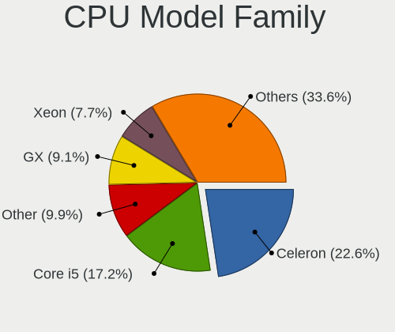

| Model                  | Computers | Percent |
|------------------------|-----------|---------|
| Intel Core i5          | 27        | 23.08%  |
| Intel Celeron          | 23        | 19.66%  |
| Intel Xeon             | 14        | 11.97%  |
| Intel Core i7          | 11        | 9.4%    |
| AMD GX                 | 10        | 8.55%   |
| Intel Core i3          | 9         | 7.69%   |
| Intel Pentium          | 6         | 5.13%   |
| Intel Core 2 Duo       | 3         | 2.56%   |
| Other                  | 2         | 1.71%   |
| Intel Atom             | 2         | 1.71%   |
| AMD Ryzen 7            | 2         | 1.71%   |
| AMD Ryzen 5            | 2         | 1.71%   |
| Intel Pentium 4        | 1         | 0.85%   |
| Intel Genuine          | 1         | 0.85%   |
| Intel Core 2           | 1         | 0.85%   |
| AMD Ryzen Threadripper | 1         | 0.85%   |
| AMD Ryzen 5 PRO        | 1         | 0.85%   |
| AMD Opteron            | 1         | 0.85%   |

CPU Cores
---------

Number of processor cores

| Number  | Computers | Percent |
|---------|-----------|---------|
| 4       | 65        | 55.56%  |
| 2       | 28        | 23.93%  |
| 8       | 9         | 7.69%   |
| Unknown | 5         | 4.27%   |
| 12      | 4         | 3.42%   |
| 6       | 2         | 1.71%   |
| 64      | 1         | 0.85%   |
| 16      | 1         | 0.85%   |
| 14      | 1         | 0.85%   |
| 1       | 1         | 0.85%   |

CPU Sockets
-----------

Number of sockets

| Number  | Computers | Percent |
|---------|-----------|---------|
| 1       | 105       | 89.74%  |
| 2       | 7         | 5.98%   |
| Unknown | 5         | 4.27%   |

CPU Threads
-----------

Threads per core (Hyper-Threading)

| Number  | Computers | Percent |
|---------|-----------|---------|
| 1       | 67        | 57.26%  |
| 2       | 44        | 37.61%  |
| Unknown | 6         | 5.13%   |

CPU Microarch
-------------

Microarchitecture

| Name          | Computers | Percent |
|---------------|-----------|---------|
| KabyLake      | 19        | 16.24%  |
| Silvermont    | 18        | 15.38%  |
| Skylake       | 11        | 9.4%    |
| Puma          | 10        | 8.55%   |
| Haswell       | 9         | 7.69%   |
| Westmere      | 7         | 5.98%   |
| IvyBridge     | 7         | 5.98%   |
| SandyBridge   | 6         | 5.13%   |
| Penryn        | 4         | 3.42%   |
| Goldmont plus | 4         | 3.42%   |
| Zen           | 3         | 2.56%   |
| Goldmont      | 3         | 2.56%   |
| Broadwell     | 3         | 2.56%   |
| Unknown       | 3         | 2.56%   |
| Excavator     | 2         | 1.71%   |
| Core          | 2         | 1.71%   |
| CometLake     | 2         | 1.71%   |
| Zen 2         | 1         | 0.85%   |
| NetBurst      | 1         | 0.85%   |
| Nehalem       | 1         | 0.85%   |
| IceLake       | 1         | 0.85%   |

Graphics
--------

GPU Vendor
----------

Vendors of graphics cards

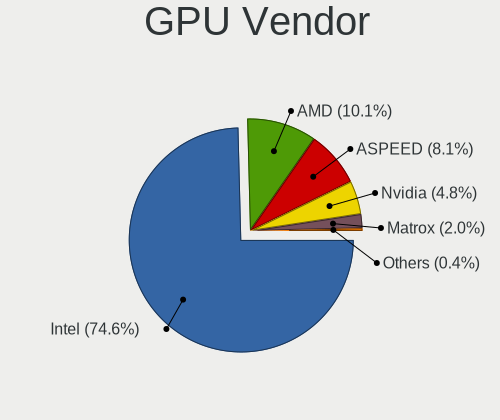

| Vendor                     | Computers | Percent |
|----------------------------|-----------|---------|
| Intel                      | 77        | 69.37%  |
| AMD                        | 14        | 12.61%  |
| Nvidia                     | 8         | 7.21%   |
| ASPEED Technology          | 7         | 6.31%   |
| Matrox Electronics Systems | 4         | 3.6%    |
| Huawei Technologies        | 1         | 0.9%    |

GPU Model
---------

Graphics card models

| Model                                                                                     | Computers | Percent |
|-------------------------------------------------------------------------------------------|-----------|---------|
| Intel Atom/Celeron/Pentium Processor x5-E8000/J3xxx/N3xxx Integrated Graphics Controller  | 15        | 13.51%  |
| Intel HD Graphics 530                                                                     | 7         | 6.31%   |
| ASPEED Technology ASPEED Graphics Family                                                  | 7         | 6.31%   |
| AMD ES1000                                                                                | 6         | 5.41%   |
| Intel WhiskeyLake-U GT2 [UHD Graphics 620]                                                | 5         | 4.5%    |
| Intel GeminiLake [UHD Graphics 600]                                                       | 4         | 3.6%    |
| Intel 2nd Generation Core Processor Family Integrated Graphics Controller                 | 4         | 3.6%    |
| Intel Xeon E3-1200 v3/4th Gen Core Processor Integrated Graphics Controller               | 3         | 2.7%    |
| Intel Xeon E3-1200 v2/3rd Gen Core processor Graphics Controller                          | 3         | 2.7%    |
| Intel HD Graphics 620                                                                     | 3         | 2.7%    |
| Intel Haswell-ULT Integrated Graphics Controller                                          | 3         | 2.7%    |
| Intel Core Processor Integrated Graphics Controller                                       | 3         | 2.7%    |
| Intel CometLake-U GT2 [UHD Graphics]                                                      | 3         | 2.7%    |
| Intel Atom Processor Z36xxx/Z37xxx Series Graphics & Display                              | 3         | 2.7%    |
| Matrox Electronics Systems MGA G200EH                                                     | 2         | 1.8%    |
| Intel Mobile 4 Series Chipset Integrated Graphics Controller                              | 2         | 1.8%    |
| Intel HD Graphics 630                                                                     | 2         | 1.8%    |
| Intel 4th Generation Core Processor Family Integrated Graphics Controller                 | 2         | 1.8%    |
| Intel 3rd Gen Core processor Graphics Controller                                          | 2         | 1.8%    |
| AMD Raven Ridge [Radeon Vega Series / Radeon Vega Mobile Series]                          | 2         | 1.8%    |
| AMD Lucienne                                                                              | 2         | 1.8%    |
| Nvidia NV28 [GeForce4 Ti 4200 AGP 8x]                                                     | 1         | 0.9%    |
| Nvidia GP107GLM [Quadro P2000 Mobile]                                                     | 1         | 0.9%    |
| Nvidia GP107 [GeForce GTX 1050]                                                           | 1         | 0.9%    |
| Nvidia GP107 [GeForce GTX 1050 Ti]                                                        | 1         | 0.9%    |
| Nvidia GP104GLM [Quadro P4000 Mobile]                                                     | 1         | 0.9%    |
| Nvidia GP104GL [Tesla P4]                                                                 | 1         | 0.9%    |
| Nvidia GM107M [GeForce GTX 860M]                                                          | 1         | 0.9%    |
| Nvidia GK208B [GeForce GT 710]                                                            | 1         | 0.9%    |
| Matrox Electronics Systems MGA G200eW WPCM450                                             | 1         | 0.9%    |
| Matrox Electronics Systems MGA G200e [Pilot] ServerEngines (SEP1)                         | 1         | 0.9%    |
| Intel UHD Graphics 620                                                                    | 1         | 0.9%    |
| Intel Skylake GT2 [HD Graphics 520]                                                       | 1         | 0.9%    |
| Intel IvyBridge GT2 [HD Graphics 4000]                                                    | 1         | 0.9%    |
| Intel Iris Plus Graphics G1 (Ice Lake)                                                    | 1         | 0.9%    |
| Intel HD Graphics 510                                                                     | 1         | 0.9%    |
| Intel HD Graphics 500                                                                     | 1         | 0.9%    |
| Intel CometLake-S GT2 [UHD Graphics 630]                                                  | 1         | 0.9%    |
| Intel CoffeeLake-U GT3e [Iris Plus Graphics 655]                                          | 1         | 0.9%    |
| Intel CoffeeLake-S GT2 [UHD Graphics 630]                                                 | 1         | 0.9%    |
| Intel Coffee Lake UHD 610 Graphics Controller                                             | 1         | 0.9%    |
| Intel Celeron N3350/Pentium N4200/Atom E3900 Series Integrated Graphics Controller        | 1         | 0.9%    |
| Intel 4th Gen Core Processor Integrated Graphics Controller                               | 1         | 0.9%    |
| Intel 4 Series Chipset Integrated Graphics Controller                                     | 1         | 0.9%    |
| Huawei Technologies Hi171x Series [iBMC Intelligent Management system chip w/VGA support] | 1         | 0.9%    |
| AMD Wani [Radeon R5/R6/R7 Graphics]                                                       | 1         | 0.9%    |
| AMD Stoney [Radeon R2/R3/R4/R5 Graphics]                                                  | 1         | 0.9%    |
| AMD RV515/M52 [Mobility Radeon X1300]                                                     | 1         | 0.9%    |
| AMD Blackcomb [Radeon HD 6970M/6990M]                                                     | 1         | 0.9%    |

GPU Combo
---------

Combinations of graphics cards

| Name                         | Computers | Percent |
|------------------------------|-----------|---------|
| 1 x Intel                    | 70        | 59.83%  |
| 1 x AMD                      | 13        | 11.11%  |
| Other                        | 12        | 10.26%  |
| 1 x Nvidia                   | 5         | 4.27%   |
| 1 x Matrox                   | 4         | 3.42%   |
| 1 x ASPEED                   | 4         | 3.42%   |
| 2 x Intel                    | 3         | 2.56%   |
| Intel + ASPEED               | 2         | 1.71%   |
| Nvidia + Huawei Technologies | 1         | 0.85%   |
| Nvidia + ASPEED              | 1         | 0.85%   |
| Intel + Nvidia               | 1         | 0.85%   |
| Intel + AMD                  | 1         | 0.85%   |

GPU Driver
----------

Free vs proprietary

| Driver      | Computers | Percent |
|-------------|-----------|---------|
| Free        | 101       | 86.32%  |
| Unknown     | 12        | 10.26%  |
| Proprietary | 4         | 3.42%   |

GPU Memory
----------

Total video memory

| Size in GB | Computers | Percent |
|------------|-----------|---------|
| Unknown    | 111       | 94.07%  |
| 3.01-4.0   | 2         | 1.69%   |
| 1.01-2.0   | 2         | 1.69%   |
| 0.51-1.0   | 2         | 1.69%   |
| 7.01-8.0   | 1         | 0.85%   |

Monitor
-------

Monitor Vendor
--------------

Monitor vendors

| Vendor              | Computers | Percent |
|---------------------|-----------|---------|
| Samsung Electronics | 4         | 16%     |
| Lenovo              | 4         | 16%     |
| AU Optronics        | 4         | 16%     |
| Dell                | 3         | 12%     |
| Philips             | 2         | 8%      |
| Chimei Innolux      | 2         | 8%      |
| BOE                 | 2         | 8%      |
| Unknown             | 1         | 4%      |
| PANDA               | 1         | 4%      |
| Medion              | 1         | 4%      |
| Apple               | 1         | 4%      |

Monitor Model
-------------

Monitor models

| Model                                                                | Computers | Percent |
|----------------------------------------------------------------------|-----------|---------|
| Samsung Electronics C34J79x SAM0F1E 3440x1440 800x330mm 34.1-inch    | 2         | 7.69%   |
| AU Optronics LCD Monitor AUO2036 2560x1440 310x170mm 13.9-inch       | 2         | 7.69%   |
| Unknown LCD Monitor Sharp 3840x2160                                  | 1         | 3.85%   |
| Samsung Electronics SyncMaster SAM021E 1680x1050 430x270mm 20.0-inch | 1         | 3.85%   |
| Samsung Electronics CJG9S SAM9596 3840x1080                          | 1         | 3.85%   |
| Philips PHL BDM4037U PHLC142 3840x2160 890x500mm 40.2-inch           | 1         | 3.85%   |
| Philips PHL 273V7 PHLC156 1920x1080 600x340mm 27.2-inch              | 1         | 3.85%   |
| PANDA LM116LF3L02 NCP000A 1920x1080 260x150mm 11.8-inch              | 1         | 3.85%   |
| Medion MD22321 MEA8302 1920x1080 700x390mm 31.5-inch                 | 1         | 3.85%   |
| Lenovo LCD Monitor LEN40B0 1366x768 340x190mm 15.3-inch              | 1         | 3.85%   |
| Lenovo LCD Monitor LEN4043 1400x1050 300x230mm 14.9-inch             | 1         | 3.85%   |
| Lenovo LCD Monitor LEN4036 1440x900 300x190mm 14.0-inch              | 1         | 3.85%   |
| Lenovo LCD Monitor LEN4033 1440x900 300x190mm 14.0-inch              | 1         | 3.85%   |
| Dell U2715H DELD069 2560x1440 600x340mm 27.2-inch                    | 1         | 3.85%   |
| Dell U2715H DELD066 2560x1440 600x340mm 27.2-inch                    | 1         | 3.85%   |
| Dell P2719H DEL4185 1920x1080 600x340mm 27.2-inch                    | 1         | 3.85%   |
| Dell 2001FP DELA007 1600x1200 410x310mm 20.2-inch                    | 1         | 3.85%   |
| Chimei Innolux LCD Monitor CMN1484 1600x900 310x170mm 13.9-inch      | 1         | 3.85%   |
| Chimei Innolux LCD Monitor CMN1132 1366x768 260x140mm 11.6-inch      | 1         | 3.85%   |
| BOE LCD Monitor BOE08D7 1920x1080 310x170mm 13.9-inch                | 1         | 3.85%   |
| BOE LCD Monitor BOE0714 1920x1080 310x170mm 13.9-inch                | 1         | 3.85%   |
| AU Optronics LCD Monitor AUO133D 1920x1080 310x170mm 13.9-inch       | 1         | 3.85%   |
| AU Optronics LCD Monitor 1920x1080                                   | 1         | 3.85%   |
| Apple iMac APPA007 2560x1440 600x340mm 27.2-inch                     | 1         | 3.85%   |

Monitor Resolution
------------------

Monitor screen resolution

| Resolution         | Computers | Percent |
|--------------------|-----------|---------|
| 1920x1080 (FHD)    | 7         | 29.17%  |
| 2560x1440 (QHD)    | 4         | 16.67%  |
| 3840x2160 (4K)     | 2         | 8.33%   |
| 3440x1440          | 2         | 8.33%   |
| 1440x900 (WXGA+)   | 2         | 8.33%   |
| 1366x768 (WXGA)    | 2         | 8.33%   |
| 3840x1080          | 1         | 4.17%   |
| 1680x1050 (WSXGA+) | 1         | 4.17%   |
| 1600x900 (HD+)     | 1         | 4.17%   |
| 1600x1200          | 1         | 4.17%   |
| 1400x1050          | 1         | 4.17%   |

Monitor Diagonal
----------------

Diagonal size in inches

| Inches  | Computers | Percent |
|---------|-----------|---------|
| 13      | 6         | 24%     |
| 27      | 4         | 16%     |
| 14      | 3         | 12%     |
| Unknown | 3         | 12%     |
| 34      | 2         | 8%      |
| 20      | 2         | 8%      |
| 11      | 2         | 8%      |
| 40      | 1         | 4%      |
| 31      | 1         | 4%      |
| 15      | 1         | 4%      |

Monitor Width
-------------

Physical width

| Width in mm | Computers | Percent |
|-------------|-----------|---------|
| 301-350     | 7         | 28%     |
| 201-300     | 5         | 20%     |
| 501-600     | 4         | 16%     |
| Unknown     | 3         | 12%     |
| 701-800     | 2         | 8%      |
| 401-500     | 2         | 8%      |
| 801-900     | 1         | 4%      |
| 601-700     | 1         | 4%      |

Aspect Ratio
------------

Proportional relationship between the width and the height

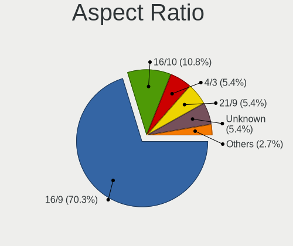

| Ratio   | Computers | Percent |
|---------|-----------|---------|
| 16/9    | 14        | 58.33%  |
| 16/10   | 3         | 12.5%   |
| 4/3     | 2         | 8.33%   |
| 21/9    | 2         | 8.33%   |
| Unknown | 2         | 8.33%   |
| 32/9    | 1         | 4.17%   |

Monitor Area
------------

Area in inch

| Area in inch | Computers | Percent |
|----------------|-----------|---------|
| 81-90          | 8         | 32%     |
| 301-350        | 4         | 16%     |
| 351-500        | 3         | 12%     |
| Unknown        | 3         | 12%     |
| 51-60          | 2         | 8%      |
| 151-200        | 2         | 8%      |
| 101-110        | 1         | 4%      |
| 501-1000       | 1         | 4%      |
| 91-100         | 1         | 4%      |

Pixel Density
-------------

Pixels per inch

| Density | Computers | Percent |
|---------|-----------|---------|
| 121-160 | 7         | 28%     |
| 101-120 | 7         | 28%     |
| 51-100  | 5         | 20%     |
| 161-240 | 3         | 12%     |
| Unknown | 3         | 12%     |

Multiple Monitors
-----------------

Total monitors connected

| Total | Computers | Percent |
|-------|-----------|---------|
| 0     | 95        | 81.2%   |
| 1     | 17        | 14.53%  |
| 2     | 5         | 4.27%   |

Network
-------

Net Controller Vendor
---------------------

Controller vendors

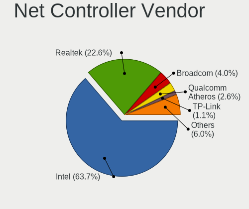

| Vendor                | Computers | Percent |
|-----------------------|-----------|---------|
| Intel                 | 96        | 63.16%  |
| Realtek Semiconductor | 33        | 21.71%  |
| Broadcom              | 8         | 5.26%   |
| Qualcomm Atheros      | 3         | 1.97%   |
| LG Electronics        | 2         | 1.32%   |
| TP-Link               | 1         | 0.66%   |
| Seeed Technology      | 1         | 0.66%   |
| QLogic                | 1         | 0.66%   |
| Mellanox Technologies | 1         | 0.66%   |
| Hewlett-Packard       | 1         | 0.66%   |
| Edimax Technology     | 1         | 0.66%   |
| Dresden Elektronik    | 1         | 0.66%   |
| Dell                  | 1         | 0.66%   |
| AVM                   | 1         | 0.66%   |
| Arduino SA            | 1         | 0.66%   |

Net Controller Model
--------------------

Controller models

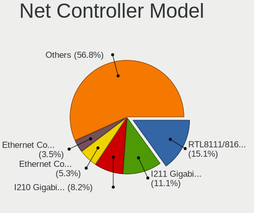

| Model                                                             | Computers | Percent |
|-------------------------------------------------------------------|-----------|---------|
| Realtek RTL8111/8168/8411 PCI Express Gigabit Ethernet Controller | 27        | 13.64%  |
| Intel I211 Gigabit Network Connection                             | 27        | 13.64%  |
| Intel I210 Gigabit Network Connection                             | 18        | 9.09%   |
| Intel I350 Gigabit Network Connection                             | 7         | 3.54%   |
| Intel 82579LM Gigabit Network Connection (Lewisville)             | 7         | 3.54%   |
| Intel Ethernet Connection (2) I219-LM                             | 6         | 3.03%   |
| Intel 82576 Gigabit Network Connection                            | 5         | 2.53%   |
| Broadcom NetXtreme II BCM5709 Gigabit Ethernet                    | 4         | 2.02%   |
| Intel Wireless 7265                                               | 3         | 1.52%   |
| Intel Wireless 7260                                               | 3         | 1.52%   |
| Intel Wireless 3165                                               | 3         | 1.52%   |
| Intel Wi-Fi 6 AX200                                               | 3         | 1.52%   |
| Intel Ethernet Connection (6) I219-LM                             | 3         | 1.52%   |
| Intel 82577LM Gigabit Network Connection                          | 3         | 1.52%   |
| Realtek RTL8821CE 802.11ac PCIe Wireless Network Adapter          | 2         | 1.01%   |
| Realtek RTL8188EUS 802.11n Wireless Network Adapter               | 2         | 1.01%   |
| LG Optimus Android Phone [USB tethering mode]                     | 2         | 1.01%   |
| Intel Wireless 8265 / 8275                                        | 2         | 1.01%   |
| Intel Wireless 3160                                               | 2         | 1.01%   |
| Intel Gemini Lake PCH CNVi WiFi                                   | 2         | 1.01%   |
| Intel Ethernet Connection I217-V                                  | 2         | 1.01%   |
| Intel Ethernet Connection (2) I219-V                              | 2         | 1.01%   |
| Intel Centrino Ultimate-N 6300                                    | 2         | 1.01%   |
| Intel Cannon Point-LP CNVi [Wireless-AC]                          | 2         | 1.01%   |
| Intel 82599ES 10-Gigabit SFI/SFP+ Network Connection              | 2         | 1.01%   |
| Intel 82574L Gigabit Network Connection                           | 2         | 1.01%   |
| Intel 82567LM Gigabit Network Connection                          | 2         | 1.01%   |
| TP-Link Archer T3U [Realtek RTL8812BU]                            | 1         | 0.51%   |
| Seeed Seeeduino_Cortex_M0+                                        | 1         | 0.51%   |
| Realtek RTL8852AE 802.11ax PCIe Wireless Network Adapter          | 1         | 0.51%   |
| Realtek RTL8822CE 802.11ac PCIe Wireless Network Adapter          | 1         | 0.51%   |
| Realtek RTL8821AE 802.11ac PCIe Wireless Network Adapter          | 1         | 0.51%   |
| Realtek RTL8188CUS 802.11n WLAN Adapter                           | 1         | 0.51%   |
| Realtek RTL8125 2.5GbE Controller                                 | 1         | 0.51%   |
| Realtek RTL-8100/8101L/8139 PCI Fast Ethernet Adapter             | 1         | 0.51%   |
| Qualcomm Atheros AR9462 Wireless Network Adapter                  | 1         | 0.51%   |
| Qualcomm Atheros AR93xx Wireless Network Adapter                  | 1         | 0.51%   |
| Qualcomm Atheros AR928X Wireless Network Adapter (PCI-Express)    | 1         | 0.51%   |
| QLogic cLOM8214 1/10GbE Controller                                | 1         | 0.51%   |
| Mellanox MT27710 Family [ConnectX-4 Lx]                           | 1         | 0.51%   |
| Intel Wireless-AC 9260                                            | 1         | 0.51%   |
| Intel Wireless 8260                                               | 1         | 0.51%   |
| Intel WiFi Link 5100                                              | 1         | 0.51%   |
| Intel Ultimate N WiFi Link 5300                                   | 1         | 0.51%   |
| Intel PRO/Wireless 3945ABG [Golan] Network Connection             | 1         | 0.51%   |
| Intel I210 Gigabit Fiber Network Connection                       | 1         | 0.51%   |
| Intel Ethernet Controller I225-V                                  | 1         | 0.51%   |
| Intel Ethernet Connection X722 for 10GbE SFP+                     | 1         | 0.51%   |
| Intel Ethernet Connection X722 for 10GBASE-T                      | 1         | 0.51%   |
| Intel Ethernet Connection X553 1GbE                               | 1         | 0.51%   |
| Intel Ethernet Connection X552/X557-AT 10GBASE-T                  | 1         | 0.51%   |
| Intel Ethernet Connection I219-V                                  | 1         | 0.51%   |
| Intel Ethernet Connection I219-LM                                 | 1         | 0.51%   |
| Intel Ethernet Connection I218-LM                                 | 1         | 0.51%   |
| Intel Ethernet Connection I217-LM                                 | 1         | 0.51%   |
| Intel Ethernet Connection (7) I219-LM                             | 1         | 0.51%   |
| Intel Ethernet Connection (5) I219-LM                             | 1         | 0.51%   |
| Intel Ethernet Connection (14) I219-V                             | 1         | 0.51%   |
| Intel Ethernet Connection (12) I219-V                             | 1         | 0.51%   |
| Intel Centrino Wireless-N 2230                                    | 1         | 0.51%   |

Wireless Vendor
---------------

Wireless vendors

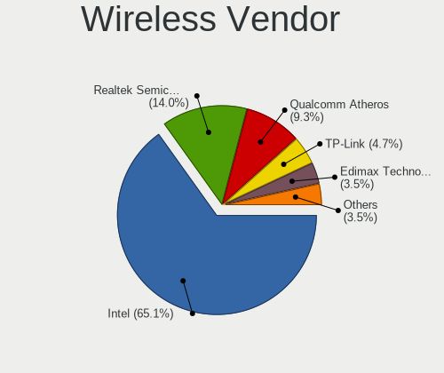

| Vendor                | Computers | Percent |
|-----------------------|-----------|---------|
| Intel                 | 31        | 70.45%  |
| Realtek Semiconductor | 7         | 15.91%  |
| Qualcomm Atheros      | 3         | 6.82%   |
| TP-Link               | 1         | 2.27%   |
| Edimax Technology     | 1         | 2.27%   |
| Dell                  | 1         | 2.27%   |

Wireless Model
--------------

Wireless models

| Model                                                          | Computers | Percent |
|----------------------------------------------------------------|-----------|---------|
| Intel Wireless 7265                                            | 3         | 6.67%   |
| Intel Wireless 7260                                            | 3         | 6.67%   |
| Intel Wireless 3165                                            | 3         | 6.67%   |
| Intel Wi-Fi 6 AX200                                            | 3         | 6.67%   |
| Realtek RTL8821CE 802.11ac PCIe Wireless Network Adapter       | 2         | 4.44%   |
| Realtek RTL8188EUS 802.11n Wireless Network Adapter            | 2         | 4.44%   |
| Intel Wireless 8265 / 8275                                     | 2         | 4.44%   |
| Intel Wireless 3160                                            | 2         | 4.44%   |
| Intel Gemini Lake PCH CNVi WiFi                                | 2         | 4.44%   |
| Intel Cannon Point-LP CNVi [Wireless-AC]                       | 2         | 4.44%   |
| TP-Link Archer T3U [Realtek RTL8812BU]                         | 1         | 2.22%   |
| Realtek RTL8852AE 802.11ax PCIe Wireless Network Adapter       | 1         | 2.22%   |
| Realtek RTL8822CE 802.11ac PCIe Wireless Network Adapter       | 1         | 2.22%   |
| Realtek RTL8821AE 802.11ac PCIe Wireless Network Adapter       | 1         | 2.22%   |
| Realtek RTL8188CUS 802.11n WLAN Adapter                        | 1         | 2.22%   |
| Qualcomm Atheros AR9462 Wireless Network Adapter               | 1         | 2.22%   |
| Qualcomm Atheros AR93xx Wireless Network Adapter               | 1         | 2.22%   |
| Qualcomm Atheros AR928X Wireless Network Adapter (PCI-Express) | 1         | 2.22%   |
| Intel Wireless-AC 9260                                         | 1         | 2.22%   |
| Intel Wireless 8260                                            | 1         | 2.22%   |
| Intel WiFi Link 5100                                           | 1         | 2.22%   |
| Intel Ultimate N WiFi Link 5300                                | 1         | 2.22%   |
| Intel PRO/Wireless 3945ABG [Golan] Network Connection          | 1         | 2.22%   |
| Intel Centrino Wireless-N 2230                                 | 1         | 2.22%   |
| Intel Centrino Wireless-N 1030 [Rainbow Peak]                  | 1         | 2.22%   |
| Intel Centrino Wireless-N 1000 [Condor Peak]                   | 1         | 2.22%   |
| Intel Centrino Ultimate-N 6300                                 | 1         | 2.22%   |
| Intel Centrino Advanced-N 6235                                 | 1         | 2.22%   |
| Intel Centrino Advanced-N 6200                                 | 1         | 2.22%   |
| Edimax EW-7811Un 802.11n Wireless Adapter [Realtek RTL8188CUS] | 1         | 2.22%   |
| Dell Dell Wireless 5550 HSPA+ Mini-Card Network Adapter        | 1         | 2.22%   |

Ethernet Vendor
---------------

Ethernet vendors

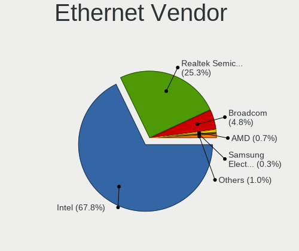

| Vendor                | Computers | Percent |
|-----------------------|-----------|---------|
| Intel                 | 83        | 68.6%   |
| Realtek Semiconductor | 29        | 23.97%  |
| Broadcom              | 8         | 6.61%   |
| QLogic                | 1         | 0.83%   |

Ethernet Model
--------------

Ethernet models

| Model                                                                         | Computers | Percent |
|-------------------------------------------------------------------------------|-----------|---------|
| Realtek RTL8111/8168/8411 PCI Express Gigabit Ethernet Controller             | 27        | 18.75%  |
| Intel I211 Gigabit Network Connection                                         | 27        | 18.75%  |
| Intel I210 Gigabit Network Connection                                         | 18        | 12.5%   |
| Intel I350 Gigabit Network Connection                                         | 7         | 4.86%   |
| Intel 82579LM Gigabit Network Connection (Lewisville)                         | 7         | 4.86%   |
| Intel Ethernet Connection (2) I219-LM                                         | 6         | 4.17%   |
| Intel 82576 Gigabit Network Connection                                        | 5         | 3.47%   |
| Broadcom NetXtreme II BCM5709 Gigabit Ethernet                                | 4         | 2.78%   |
| Intel Ethernet Connection (6) I219-LM                                         | 3         | 2.08%   |
| Intel 82577LM Gigabit Network Connection                                      | 3         | 2.08%   |
| Intel Ethernet Connection I217-V                                              | 2         | 1.39%   |
| Intel Ethernet Connection (2) I219-V                                          | 2         | 1.39%   |
| Intel 82599ES 10-Gigabit SFI/SFP+ Network Connection                          | 2         | 1.39%   |
| Intel 82574L Gigabit Network Connection                                       | 2         | 1.39%   |
| Intel 82567LM Gigabit Network Connection                                      | 2         | 1.39%   |
| Realtek RTL8125 2.5GbE Controller                                             | 1         | 0.69%   |
| Realtek RTL-8100/8101L/8139 PCI Fast Ethernet Adapter                         | 1         | 0.69%   |
| QLogic cLOM8214 1/10GbE Controller                                            | 1         | 0.69%   |
| Intel I210 Gigabit Fiber Network Connection                                   | 1         | 0.69%   |
| Intel Ethernet Controller I225-V                                              | 1         | 0.69%   |
| Intel Ethernet Connection X722 for 10GbE SFP+                                 | 1         | 0.69%   |
| Intel Ethernet Connection X722 for 10GBASE-T                                  | 1         | 0.69%   |
| Intel Ethernet Connection X553 1GbE                                           | 1         | 0.69%   |
| Intel Ethernet Connection X552/X557-AT 10GBASE-T                              | 1         | 0.69%   |
| Intel Ethernet Connection I219-V                                              | 1         | 0.69%   |
| Intel Ethernet Connection I219-LM                                             | 1         | 0.69%   |
| Intel Ethernet Connection I218-LM                                             | 1         | 0.69%   |
| Intel Ethernet Connection I217-LM                                             | 1         | 0.69%   |
| Intel Ethernet Connection (7) I219-LM                                         | 1         | 0.69%   |
| Intel Ethernet Connection (5) I219-LM                                         | 1         | 0.69%   |
| Intel Ethernet Connection (14) I219-V                                         | 1         | 0.69%   |
| Intel Ethernet Connection (12) I219-V                                         | 1         | 0.69%   |
| Intel 82580 Gigabit Network Connection                                        | 1         | 0.69%   |
| Intel 82576NS Gigabit Network Connection                                      | 1         | 0.69%   |
| Intel 82573L Gigabit Ethernet Controller                                      | 1         | 0.69%   |
| Intel 82571EB/82571GB Gigabit Ethernet Controller D0/D1 (copper applications) | 1         | 0.69%   |
| Intel 82571EB/82571GB Gigabit Ethernet Controller (Copper)                    | 1         | 0.69%   |
| Intel 80003ES2LAN Gigabit Ethernet Controller (Copper)                        | 1         | 0.69%   |
| Broadcom NetXtreme II BCM5708 Gigabit Ethernet                                | 1         | 0.69%   |
| Broadcom NetXtreme BCM57765 Gigabit Ethernet PCIe                             | 1         | 0.69%   |
| Broadcom NetXtreme BCM5720 Gigabit Ethernet PCIe                              | 1         | 0.69%   |
| Broadcom NetXtreme BCM5719 Gigabit Ethernet PCIe                              | 1         | 0.69%   |

Net Controller Kind
-------------------

Ethernet, WiFi or modem

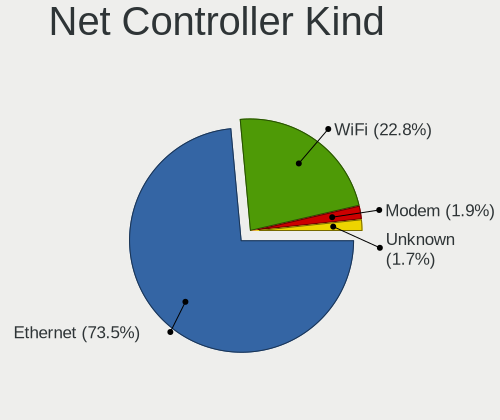

| Kind     | Computers | Percent |
|----------|-----------|---------|
| Ethernet | 114       | 68.67%  |
| WiFi     | 43        | 25.9%   |
| Modem    | 6         | 3.61%   |
| Unknown  | 3         | 1.81%   |

Used Controller
---------------

Currently used network controller

| Kind     | Computers | Percent |
|----------|-----------|---------|
| Ethernet | 110       | 87.3%   |
| WiFi     | 15        | 11.9%   |
| Modem    | 1         | 0.79%   |

NICs
----

Total network controllers on board

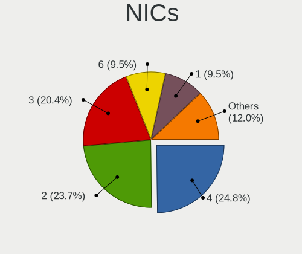

| Total | Computers | Percent |
|-------|-----------|---------|
| 2     | 39        | 33.33%  |
| 3     | 23        | 19.66%  |
| 4     | 22        | 18.8%   |
| 1     | 10        | 8.55%   |
| 6     | 9         | 7.69%   |
| 8     | 6         | 5.13%   |
| 7     | 3         | 2.56%   |
| 5     | 3         | 2.56%   |
| 10    | 1         | 0.85%   |
| 0     | 1         | 0.85%   |

IPv6
----

IPv6 vs IPv4

| Used | Computers | Percent |
|------|-----------|---------|
| No   | 114       | 96.61%  |
| Yes  | 4         | 3.39%   |

Bluetooth
---------

Bluetooth Vendor
----------------

Controller vendors

| Vendor                | Computers | Percent |
|-----------------------|-----------|---------|
| Intel                 | 22        | 68.75%  |
| Realtek Semiconductor | 3         | 9.38%   |
| IMC Networks          | 2         | 6.25%   |
| Broadcom              | 2         | 6.25%   |
| Lite-On Technology    | 1         | 3.13%   |
| Apple                 | 1         | 3.13%   |
| Alps Electric         | 1         | 3.13%   |

Bluetooth Model
---------------

Controller models

| Model                                            | Computers | Percent |
|--------------------------------------------------|-----------|---------|
| Intel Bluetooth wireless interface               | 11        | 34.38%  |
| Intel Bluetooth 9460/9560 Jefferson Peak (JfP)   | 4         | 12.5%   |
| Intel AX200 Bluetooth                            | 3         | 9.38%   |
| Intel Centrino Bluetooth Wireless Transceiver    | 2         | 6.25%   |
| IMC Networks Realtek Bluetooth Adapter           | 2         | 6.25%   |
| Broadcom BCM2045B (BDC-2.1)                      | 2         | 6.25%   |
| Realtek RTL8821A Bluetooth                       | 1         | 3.13%   |
| Realtek  Bluetooth Adapter                       | 1         | 3.13%   |
| Realtek Bluetooth Radio                          | 1         | 3.13%   |
| Lite-On Atheros AR3012 Bluetooth                 | 1         | 3.13%   |
| Intel Wireless-AC 9260 Bluetooth Adapter         | 1         | 3.13%   |
| Intel Centrino Advanced-N 6230 Bluetooth adapter | 1         | 3.13%   |
| Apple Built-in Bluetooth 2.0+EDR HCI             | 1         | 3.13%   |
| Alps Electric UGTZ4 Bluetooth                    | 1         | 3.13%   |

Sound
-----

Sound Vendor
------------

Sound card vendors

| Vendor        | Computers | Percent |
|---------------|-----------|---------|
| Intel         | 72        | 83.72%  |
| AMD           | 8         | 9.3%    |
| Nvidia        | 4         | 4.65%   |
| Plantronics   | 1         | 1.16%   |
| Creative Labs | 1         | 1.16%   |

Sound Model
-----------

Sound card models

| Model                                                                                             | Computers | Percent |
|---------------------------------------------------------------------------------------------------|-----------|---------|
| Intel Atom/Celeron/Pentium Processor x5-E8000/J3xxx/N3xxx Series High Definition Audio Controller | 14        | 14.29%  |
| Intel 100 Series/C230 Series Chipset Family HD Audio Controller                                   | 7         | 7.14%   |
| Intel Cannon Point-LP High Definition Audio Controller                                            | 6         | 6.12%   |
| Intel 7 Series/C216 Chipset Family High Definition Audio Controller                               | 5         | 5.1%    |
| Intel Xeon E3-1200 v3/4th Gen Core Processor HD Audio Controller                                  | 4         | 4.08%   |
| Intel Sunrise Point-LP HD Audio                                                                   | 4         | 4.08%   |
| Intel Celeron/Pentium Silver Processor High Definition Audio                                      | 4         | 4.08%   |
| Intel 8 Series/C220 Series Chipset High Definition Audio Controller                               | 4         | 4.08%   |
| Intel 6 Series/C200 Series Chipset Family High Definition Audio Controller                        | 4         | 4.08%   |
| AMD Family 17h/19h HD Audio Controller                                                            | 4         | 4.08%   |
| Nvidia GP107GL High Definition Audio Controller                                                   | 3         | 3.06%   |
| Intel Haswell-ULT HD Audio Controller                                                             | 3         | 3.06%   |
| Intel Comet Lake PCH-LP cAVS                                                                      | 3         | 3.06%   |
| Intel 8 Series HD Audio Controller                                                                | 3         | 3.06%   |
| Intel 5 Series/3400 Series Chipset High Definition Audio                                          | 3         | 3.06%   |
| Intel Celeron N3350/Pentium N4200/Atom E3900 Series Audio Cluster                                 | 2         | 2.04%   |
| Intel Atom Processor Z36xxx/Z37xxx Series High Definition Audio Controller                        | 2         | 2.04%   |
| Intel 82801I (ICH9 Family) HD Audio Controller                                                    | 2         | 2.04%   |
| Intel 200 Series PCH HD Audio                                                                     | 2         | 2.04%   |
| AMD Renoir Radeon High Definition Audio Controller                                                | 2         | 2.04%   |
| AMD Raven/Raven2/Fenghuang HDMI/DP Audio Controller                                               | 2         | 2.04%   |
| Plantronics Plantronics Blackwire 315.1                                                           | 1         | 1.02%   |
| Nvidia GK208 HDMI/DP Audio Controller                                                             | 1         | 1.02%   |
| Intel NM10/ICH7 Family High Definition Audio Controller                                           | 1         | 1.02%   |
| Intel Ice Lake-LP Smart Sound Technology Audio Controller                                         | 1         | 1.02%   |
| Intel Comet Lake PCH-V cAVS                                                                       | 1         | 1.02%   |
| Intel CM238 HD Audio Controller                                                                   | 1         | 1.02%   |
| Intel Cannon Lake PCH cAVS                                                                        | 1         | 1.02%   |
| Intel C610/X99 series chipset HD Audio Controller                                                 | 1         | 1.02%   |
| Creative Labs EMU10k1 [Sound Blaster Live! Series]                                                | 1         | 1.02%   |
| AMD Starship/Matisse HD Audio Controller                                                          | 1         | 1.02%   |
| AMD High Definition Audio Controller                                                              | 1         | 1.02%   |
| AMD Family 17h (Models 00h-0fh) HD Audio Controller                                               | 1         | 1.02%   |
| AMD Family 15h (Models 60h-6fh) Audio Controller                                                  | 1         | 1.02%   |
| AMD Barts HDMI Audio [Radeon HD 6790/6850/6870 / 7720 OEM]                                        | 1         | 1.02%   |
| Unknown                                                                                           | 1         | 1.02%   |

Memory
------

Memory Vendor
-------------

Memory module vendors

| Vendor              | Computers | Percent |
|---------------------|-----------|---------|
| Samsung Electronics | 21        | 17.95%  |
| Unknown             | 19        | 16.24%  |
| Kingston            | 16        | 13.68%  |
| Crucial             | 16        | 13.68%  |
| Micron Technology   | 12        | 10.26%  |
| SK Hynix            | 11        | 9.4%    |
| Corsair             | 6         | 5.13%   |
| Unknown (ABCD)      | 3         | 2.56%   |
| Ramaxel Technology  | 2         | 1.71%   |
| Nanya Technology    | 2         | 1.71%   |
| G.Skill             | 2         | 1.71%   |
| Transcend           | 1         | 0.85%   |
| Tigo                | 1         | 0.85%   |
| Miron               | 1         | 0.85%   |
| Kingmax             | 1         | 0.85%   |
| Elpida              | 1         | 0.85%   |
| ATP                 | 1         | 0.85%   |
| Unknown             | 1         | 0.85%   |

Memory Model
------------

Memory module models

| Model                                                          | Computers | Percent |
|----------------------------------------------------------------|-----------|---------|
| Unknown RAM Module 4GB SODIMM DDR3 1333MT/s                    | 4         | 3.28%   |
| Unknown (ABCD) RAM 123456789012345678 2GB DIMM LPDDR4 2400MT/s | 3         | 2.46%   |
| Unknown RAM Module 8GB DIMM DDR3 1333MT/s                      | 2         | 1.64%   |
| Unknown RAM AW24P64F8BLK0S 8GB DIMM DDR3 1600MT/s              | 2         | 1.64%   |
| SK Hynix RAM HMT125U6BFR8C-G7 2GB DIMM DDR3 1067MT/s           | 2         | 1.64%   |
| Samsung RAM Module 8192MB SODIMM DDR4 2133MT/s                 | 2         | 1.64%   |
| Samsung RAM M471A2K43DB1-CTD 16GB SODIMM DDR4 2667MT/s         | 2         | 1.64%   |
| Samsung RAM M471A2G44AM0-CTD 16GB SODIMM DDR4 2667MT/s         | 2         | 1.64%   |
| Samsung RAM M378B5673FH0-CH9 2GB DIMM DDR3 1333MT/s            | 2         | 1.64%   |
| Micron RAM 4ATF1G64HZ-3G2E1 8GB SODIMM DDR4 3200MT/s           | 2         | 1.64%   |
| Kingston RAM CBD26D4S9S8K1C-8 8GB SODIMM DDR4 2667MT/s         | 2         | 1.64%   |
| Unknown RAM X4B08QD8BNVFSO-7-TO1 8GB DIMM DDR4 2933MT/s        | 1         | 0.82%   |
| Unknown RAM Module 8GB DIMM DDR3 1600MT/s                      | 1         | 0.82%   |
| Unknown RAM Module 8GB 1600MT/s                                | 1         | 0.82%   |
| Unknown RAM Module 8192MB DIMM DDR3 1333MT/s                   | 1         | 0.82%   |
| Unknown RAM Module 4GB SODIMM DDR3 667MT/s                     | 1         | 0.82%   |
| Unknown RAM Module 4GB DIMM DDR3 1600MT/s                      | 1         | 0.82%   |
| Unknown RAM Module 4GB DIMM DDR3 1333MT/s                      | 1         | 0.82%   |
| Unknown RAM Module 4096MB DIMM DDR3 1333MT/s                   | 1         | 0.82%   |
| Unknown RAM Module 2GB DIMM DDR3 1333MT/s                      | 1         | 0.82%   |
| Unknown RAM Module 2048MB SODIMM DDR2                          | 1         | 0.82%   |
| Unknown RAM Module 1GB DIMM DDR2 1033MT/s                      | 1         | 0.82%   |
| Unknown RAM Module 1024MB SODIMM DDR2                          | 1         | 0.82%   |
| Transcend RAM JM3200HSE-16G 16GB SODIMM DDR4 3200MT/s          | 1         | 0.82%   |
| Tigo RAM 1600MHz-4G 4GB SODIMM DDR3 1600MT/s                   | 1         | 0.82%   |
| SK Hynix RAM Module 2GB DIMM DDR3 1333MT/s                     | 1         | 0.82%   |
| SK Hynix RAM HMT451U6DFR8A-PB 4GB DIMM DDR3 1600MT/s           | 1         | 0.82%   |
| SK Hynix RAM HMT451S6DFR8A-PB 4GB DIMM DDR3 1600MT/s           | 1         | 0.82%   |
| SK Hynix RAM HMT351S6CFR8C-PB 4GB DIMM DDR3 1600MT/s           | 1         | 0.82%   |
| SK Hynix RAM HMT351S6CFR8C-H9 4GB SODIMM 1333MT/s              | 1         | 0.82%   |
| SK Hynix RAM HMT112U6TFR8C-H9 1GB DIMM DDR3 1333MT/s           | 1         | 0.82%   |
| SK Hynix RAM HMAA1GS6CJR6N-XN 8GB SODIMM DDR4 3200MT/s         | 1         | 0.82%   |
| SK Hynix RAM HMA84GR7MFR4N-UH 32GB DIMM DDR4 2400MT/s          | 1         | 0.82%   |
| SK Hynix RAM HMA41GS6AFR8N-TF 8GB SODIMM DDR4 2133MT/s         | 1         | 0.82%   |
| Samsung RAM Module 8GB DIMM DDR4 2133MT/s                      | 1         | 0.82%   |
| Samsung RAM Module 2GB SODIMM DDR3 1600MT/s                    | 1         | 0.82%   |
| Samsung RAM M471B5674QH0-YK0 2GB SODIMM DDR3 1600MT/s          | 1         | 0.82%   |
| Samsung RAM M471B5273EB0-CK0 4GB SODIMM DDR3 1600MT/s          | 1         | 0.82%   |
| Samsung RAM M471B5273DH0-CH9 4GB SODIMM DDR3 1334MT/s          | 1         | 0.82%   |
| Samsung RAM M471B5273CH0-YK0 4GB SODIMM DDR3 1600MT/s          | 1         | 0.82%   |
| Samsung RAM M471B5273CH0-CH9 4GB SODIMM DDR3 1334MT/s          | 1         | 0.82%   |
| Samsung RAM M471B5173QH0-YK0 4GB DIMM DDR3 1600MT/s            | 1         | 0.82%   |
| Samsung RAM M471B1G73QH0-YK0 8GB DIMM DDR3 1600MT/s            | 1         | 0.82%   |
| Samsung RAM M471B1G73DB0-YK0 8GB SODIMM DDR3 1600MT/s          | 1         | 0.82%   |
| Samsung RAM M471A4G43MB1-CTD 32GB SODIMM DDR4 2667MT/s         | 1         | 0.82%   |
| Samsung RAM M471A1K43CB1-CRC 8GB SODIMM DDR4 2400MT/s          | 1         | 0.82%   |
| Samsung RAM M471A1G44AB0-CWE 8GB SODIMM DDR4 3200MT/s          | 1         | 0.82%   |
| Samsung RAM M393A4K40CB2-CTD 32GB DIMM DDR4 2667MT/s           | 1         | 0.82%   |
| Samsung RAM M391B5273DH0-YH9 4GB DIMM DDR3 1333MT/s            | 1         | 0.82%   |
| Samsung RAM M378A1K43CB2-CRC 8GB DIMM DDR4 2400MT/s            | 1         | 0.82%   |
| Ramaxel RAM RMT3170ME68F9F1600 4GB SODIMM DDR3 1600MT/s        | 1         | 0.82%   |
| Ramaxel RAM RMR5030MN68F9F1600 4GB DIMM DDR3 1600MT/s          | 1         | 0.82%   |
| Nanya RAM NT4GC64B8HG0NS-CG 4GB SODIMM 1334MT/s                | 1         | 0.82%   |
| Nanya RAM NT2GC64B88G0NF-CG 2GB DIMM DDR3 1333MT/s             | 1         | 0.82%   |
| Miron RAM Module 2GB SODIMM DDR3 1600MT/s                      | 1         | 0.82%   |
| Micron RAM MT52L512M32D2PF-10 4GB Row Of Chips LPDDR3 1867MT/s | 1         | 0.82%   |
| Micron RAM Module 8GB Row Of Chips LPDDR4 3200MT/s             | 1         | 0.82%   |
| Micron RAM Module 2GB DIMM DDR3 1333MT/s                       | 1         | 0.82%   |
| Micron RAM M471A1K43BB1-CRC 8GB SODIMM DDR4 2667MT/s           | 1         | 0.82%   |
| Micron RAM 9ASF1G72AZ-2G3B1 8GB DIMM DDR4 2400MT/s             | 1         | 0.82%   |

Memory Kind
-----------

Memory module kinds

| Kind    | Computers | Percent |
|---------|-----------|---------|
| DDR3    | 54        | 52.43%  |
| DDR4    | 40        | 38.83%  |
| LPDDR4  | 4         | 3.88%   |
| DDR2    | 2         | 1.94%   |
| LPDDR3  | 1         | 0.97%   |
| DRAM    | 1         | 0.97%   |
| Unknown | 1         | 0.97%   |

Memory Form Factor
------------------

Physical design of the memory module

| Name         | Computers | Percent |
|--------------|-----------|---------|
| DIMM         | 51        | 49.51%  |
| SODIMM       | 48        | 46.6%   |
| Row Of Chips | 2         | 1.94%   |
| Unknown      | 2         | 1.94%   |

Memory Size
-----------

Memory module size

| Size  | Computers | Percent |
|-------|-----------|---------|
| 8192  | 41        | 38.32%  |
| 4096  | 33        | 30.84%  |
| 2048  | 13        | 12.15%  |
| 16384 | 11        | 10.28%  |
| 32768 | 6         | 5.61%   |
| 1024  | 3         | 2.8%    |

Memory Speed
------------

Memory module speed

| Speed   | Computers | Percent |
|---------|-----------|---------|
| 1600    | 29        | 27.1%   |
| 1333    | 22        | 20.56%  |
| 2400    | 16        | 14.95%  |
| 2667    | 14        | 13.08%  |
| 3200    | 7         | 6.54%   |
| 2133    | 7         | 6.54%   |
| 1334    | 2         | 1.87%   |
| 1067    | 2         | 1.87%   |
| 65535   | 1         | 0.93%   |
| 2933    | 1         | 0.93%   |
| 2666    | 1         | 0.93%   |
| 1867    | 1         | 0.93%   |
| 1066    | 1         | 0.93%   |
| 1033    | 1         | 0.93%   |
| 667     | 1         | 0.93%   |
| Unknown | 1         | 0.93%   |

Printers & scanners
-------------------

Printer Vendor
--------------

Printer device vendors

Zero info for selected period =(

Printer Model
-------------

Printer device models

Zero info for selected period =(

Scanner Vendor
--------------

Scanner device vendors

Zero info for selected period =(

Scanner Model
-------------

Scanner device models

Zero info for selected period =(

Camera
------

Camera Vendor
-------------

Camera device vendors

| Vendor                                 | Computers | Percent |
|----------------------------------------|-----------|---------|
| Chicony Electronics                    | 5         | 27.78%  |
| Microdia                               | 3         | 16.67%  |
| Realtek Semiconductor                  | 2         | 11.11%  |
| Logitech                               | 2         | 11.11%  |
| Lite-On Technology                     | 1         | 5.56%   |
| Lenovo                                 | 1         | 5.56%   |
| IMC Networks                           | 1         | 5.56%   |
| Cheng Uei Precision Industry (Foxlink) | 1         | 5.56%   |
| Apple                                  | 1         | 5.56%   |
| Acer                                   | 1         | 5.56%   |

Camera Model
------------

Camera device models

| Model                                                       | Computers | Percent |
|-------------------------------------------------------------|-----------|---------|
| Realtek Realtek USB2.0 PC Camera                            | 2         | 11.11%  |
| Chicony ThinkPad T490 Webcam                                | 2         | 11.11%  |
| Microdia Laptop_Integrated_Webcam_HD                        | 1         | 5.56%   |
| Microdia Integrated Webcam HD                               | 1         | 5.56%   |
| Microdia Integrated Webcam                                  | 1         | 5.56%   |
| Logitech Webcam C170                                        | 1         | 5.56%   |
| Logitech HD Pro Webcam C920                                 | 1         | 5.56%   |
| Lite-On HP HD Camera                                        | 1         | 5.56%   |
| Lenovo Integrated Webcam [R5U877]                           | 1         | 5.56%   |
| IMC Networks Integrated Camera                              | 1         | 5.56%   |
| Chicony Ltd., Integrated Camera                             | 1         | 5.56%   |
| Chicony HP Universal Camera                                 | 1         | 5.56%   |
| Chicony HD WebCam                                           | 1         | 5.56%   |
| Cheng Uei Precision Industry (Foxlink) HP HD Webcam [Fixed] | 1         | 5.56%   |
| Apple FaceTime HD camera                                    | 1         | 5.56%   |
| Acer Lenovo EasyCamera                                      | 1         | 5.56%   |

Security
--------

Fingerprint Vendor
------------------

Fingerprint sensor vendors

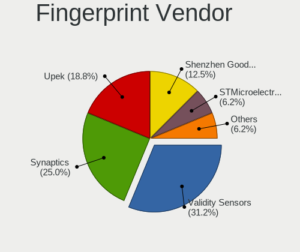

| Vendor                     | Computers | Percent |
|----------------------------|-----------|---------|
| Validity Sensors           | 4         | 44.44%  |
| Upek                       | 2         | 22.22%  |
| Synaptics                  | 1         | 11.11%  |
| STMicroelectronics         | 1         | 11.11%  |
| Shenzhen Goodix Technology | 1         | 11.11%  |

Fingerprint Model
-----------------

Fingerprint sensor models

| Model                                                  | Computers | Percent |
|--------------------------------------------------------|-----------|---------|
| Validity Sensors VFS495 Fingerprint Reader             | 2         | 22.22%  |
| Upek Biometric Touchchip/Touchstrip Fingerprint Sensor | 2         | 22.22%  |
| Validity Sensors VFS5011 Fingerprint Reader            | 1         | 11.11%  |
| Validity Sensors VFS491                                | 1         | 11.11%  |
| Synaptics Prometheus MIS Touch Fingerprint Reader      | 1         | 11.11%  |
| STMicroelectronics Fingerprint Reader                  | 1         | 11.11%  |
| Shenzhen Goodix  FingerPrint Device                    | 1         | 11.11%  |

Chipcard Vendor
---------------

Chipcard module vendors

Zero info for selected period =(

Chipcard Model
--------------

Chipcard module models

Zero info for selected period =(

Unsupported
-----------

Unsupported Devices
-------------------

Total unsupported devices on board

| Total | Computers | Percent |
|-------|-----------|---------|
| 0     | 44        | 36.67%  |
| 1     | 38        | 31.67%  |
| 2     | 24        | 20%     |
| 3     | 11        | 9.17%   |
| 4     | 2         | 1.67%   |
| 5     | 1         | 0.83%   |

Unsupported Device Types
------------------------

Types of unsupported devices

| Type                     | Computers | Percent |
|--------------------------|-----------|---------|
| Communication controller | 63        | 52.94%  |
| Card reader              | 14        | 11.76%  |
| Bluetooth                | 12        | 10.08%  |
| Net/wireless             | 11        | 9.24%   |
| Fingerprint reader       | 9         | 7.56%   |
| Firewire controller      | 4         | 3.36%   |
| Network                  | 2         | 1.68%   |
| Graphics card            | 2         | 1.68%   |
| Sound                    | 1         | 0.84%   |
| Net/ethernet             | 1         | 0.84%   |

