BSD in Brazil - Tested Hardware & Statistics
--------------------------------------------

A project to collect tested hardware configurations for BSD in Brazil.

Anyone can contribute to this report by the [hw-probe](https://github.com/linuxhw/hw-probe/blob/master/INSTALL.BSD.md) tool:

    hw-probe -all -upload

Please contribute! Especially if your hardware is rare.

This is a report for all computer types. See also reports for [desktops](/Location/Brazil/Desktop/README.md) and [notebooks](/Location/Brazil/Notebook/README.md).

Contents
--------

* [ Test Cases ](#test-cases)

* [ System ](#system)
  - [ OS                       ](#os)
  - [ OS Family                ](#os-family)
  - [ Arch                     ](#arch)
  - [ DE                       ](#de)
  - [ Display Server           ](#display-server)
  - [ Display Manager          ](#display-manager)
  - [ OS Lang                  ](#os-lang)
  - [ Boot Mode                ](#boot-mode)
  - [ Filesystem               ](#filesystem)
  - [ Part. scheme             ](#part-scheme)

* [ Board ](#board)
  - [ Vendor                   ](#vendor)
  - [ Model                    ](#model)
  - [ Model Family             ](#model-family)
  - [ MFG Year                 ](#mfg-year)
  - [ Form Factor              ](#form-factor)
  - [ Coreboot                 ](#coreboot)
  - [ RAM Size                 ](#ram-size)
  - [ RAM Used                 ](#ram-used)
  - [ Total Drives             ](#total-drives)
  - [ Has CD-ROM               ](#has-cd-rom)
  - [ Has Ethernet             ](#has-ethernet)
  - [ Has WiFi                 ](#has-wifi)
  - [ Has Bluetooth            ](#has-bluetooth)

* [ Location ](#location)
  - [ Country                  ](#country)
  - [ City                     ](#city)

* [ Drives ](#drives)
  - [ Drive Vendor             ](#drive-vendor)
  - [ Drive Model              ](#drive-model)
  - [ HDD Vendor               ](#hdd-vendor)
  - [ SSD Vendor               ](#ssd-vendor)
  - [ Drive Kind               ](#drive-kind)
  - [ Drive Connector          ](#drive-connector)
  - [ Drive Size               ](#drive-size)
  - [ Space Total              ](#space-total)
  - [ Space Used               ](#space-used)
  - [ Malfunc. Drives          ](#malfunc-drives)
  - [ Malfunc. Drive Vendor    ](#malfunc-drive-vendor)
  - [ Malfunc. HDD Vendor      ](#malfunc-hdd-vendor)
  - [ Malfunc. Drive Kind      ](#malfunc-drive-kind)
  - [ Failed Drives            ](#failed-drives)
  - [ Failed Drive Vendor      ](#failed-drive-vendor)
  - [ Drive Status             ](#drive-status)

* [ Storage controller ](#storage-controller)
  - [ Storage Vendor           ](#storage-vendor)
  - [ Storage Model            ](#storage-model)
  - [ Storage Kind             ](#storage-kind)

* [ Processor ](#processor)
  - [ CPU Vendor               ](#cpu-vendor)
  - [ CPU Model                ](#cpu-model)
  - [ CPU Model Family         ](#cpu-model-family)
  - [ CPU Cores                ](#cpu-cores)
  - [ CPU Sockets              ](#cpu-sockets)
  - [ CPU Threads              ](#cpu-threads)
  - [ CPU Microarch            ](#cpu-microarch)

* [ Graphics ](#graphics)
  - [ GPU Vendor               ](#gpu-vendor)
  - [ GPU Model                ](#gpu-model)
  - [ GPU Combo                ](#gpu-combo)
  - [ GPU Driver               ](#gpu-driver)
  - [ GPU Memory               ](#gpu-memory)

* [ Monitor ](#monitor)
  - [ Monitor Vendor           ](#monitor-vendor)
  - [ Monitor Model            ](#monitor-model)
  - [ Monitor Resolution       ](#monitor-resolution)
  - [ Monitor Diagonal         ](#monitor-diagonal)
  - [ Monitor Width            ](#monitor-width)
  - [ Aspect Ratio             ](#aspect-ratio)
  - [ Monitor Area             ](#monitor-area)
  - [ Pixel Density            ](#pixel-density)
  - [ Multiple Monitors        ](#multiple-monitors)

* [ Network ](#network)
  - [ Net Controller Vendor    ](#net-controller-vendor)
  - [ Net Controller Model     ](#net-controller-model)
  - [ Wireless Vendor          ](#wireless-vendor)
  - [ Wireless Model           ](#wireless-model)
  - [ Ethernet Vendor          ](#ethernet-vendor)
  - [ Ethernet Model           ](#ethernet-model)
  - [ Net Controller Kind      ](#net-controller-kind)
  - [ Used Controller          ](#used-controller)
  - [ NICs                     ](#nics)
  - [ IPv6                     ](#ipv6)

* [ Bluetooth ](#bluetooth)
  - [ Bluetooth Vendor         ](#bluetooth-vendor)
  - [ Bluetooth Model          ](#bluetooth-model)

* [ Sound ](#sound)
  - [ Sound Vendor             ](#sound-vendor)
  - [ Sound Model              ](#sound-model)

* [ Memory ](#memory)
  - [ Memory Vendor            ](#memory-vendor)
  - [ Memory Model             ](#memory-model)
  - [ Memory Kind              ](#memory-kind)
  - [ Memory Form Factor       ](#memory-form-factor)
  - [ Memory Size              ](#memory-size)
  - [ Memory Speed             ](#memory-speed)

* [ Printers & scanners ](#printers--scanners)
  - [ Printer Vendor           ](#printer-vendor)
  - [ Printer Model            ](#printer-model)
  - [ Scanner Vendor           ](#scanner-vendor)
  - [ Scanner Model            ](#scanner-model)

* [ Camera ](#camera)
  - [ Camera Vendor            ](#camera-vendor)
  - [ Camera Model             ](#camera-model)

* [ Security ](#security)
  - [ Fingerprint Vendor       ](#fingerprint-vendor)
  - [ Fingerprint Model        ](#fingerprint-model)
  - [ Chipcard Vendor          ](#chipcard-vendor)
  - [ Chipcard Model           ](#chipcard-model)

* [ Unsupported ](#unsupported)
  - [ Unsupported Devices      ](#unsupported-devices)
  - [ Unsupported Device Types ](#unsupported-device-types)

Test Cases
----------

Total: 800

| Vendor        | Model                       | Form-Factor | Probe                                                     | Date         |
|---------------|-----------------------------|-------------|-----------------------------------------------------------|--------------|
| Lenovo        | ThinkCentre M90p L1BRM6H    | Desktop     | [800565bf84](https://bsd-hardware.info/?probe=800565bf84) | Jan 01, 2026 |
| AMI           | Aptio CRB                   | Mini pc     | [6689965a39](https://bsd-hardware.info/?probe=6689965a39) | Dec 31, 2025 |
| AMI           | Aptio CRB                   | Mini pc     | [82b8e0ded8](https://bsd-hardware.info/?probe=82b8e0ded8) | Dec 31, 2025 |
| Lenovo        | ThinkPad T460 20FMA00F00    | Notebook    | [69e4dd0799](https://bsd-hardware.info/?probe=69e4dd0799) | Dec 27, 2025 |
| Dell          | 0KWVT8 A02                  | Desktop     | [3ee774aa9b](https://bsd-hardware.info/?probe=3ee774aa9b) | Dec 18, 2025 |
| Gigabyte      | Z390 UD                     | Desktop     | [30709fdf65](https://bsd-hardware.info/?probe=30709fdf65) | Dec 15, 2025 |
| Lenovo        | ThinkCentre M90p L1BRM6H    | Desktop     | [bdb4f5e891](https://bsd-hardware.info/?probe=bdb4f5e891) | Dec 15, 2025 |
| Unknown       | Unknown                     | Desktop     | [b8291a45ea](https://bsd-hardware.info/?probe=b8291a45ea) | Dec 14, 2025 |
| AZW           | EQ                          | Mini pc     | [02478cc995](https://bsd-hardware.info/?probe=02478cc995) | Dec 10, 2025 |
| Lenovo        | ThinkCentre M90p L1BRM6H    | Desktop     | [8585182662](https://bsd-hardware.info/?probe=8585182662) | Dec 09, 2025 |
| Intel         | B75                         | Desktop     | [a7cd91259f](https://bsd-hardware.info/?probe=a7cd91259f) | Dec 09, 2025 |
| Techvision    | TVI7309X B0                 | Desktop     | [57c5d3f6b8](https://bsd-hardware.info/?probe=57c5d3f6b8) | Dec 08, 2025 |
| Wistron       | ProLiant ML110 G6           | Desktop     | [e76c924297](https://bsd-hardware.info/?probe=e76c924297) | Dec 05, 2025 |
| Gigabyte      | Z390 UD                     | Desktop     | [e721aea164](https://bsd-hardware.info/?probe=e721aea164) | Dec 05, 2025 |
| ASUSTek       | P5KPL-AM SE                 | Desktop     | [9acdf4e4d9](https://bsd-hardware.info/?probe=9acdf4e4d9) | Dec 04, 2025 |
| Dell          | 07GPTK A00                  | Server      | [eec959a08d](https://bsd-hardware.info/?probe=eec959a08d) | Dec 03, 2025 |
| Dell          | 07GPTK A00                  | Server      | [ad78099884](https://bsd-hardware.info/?probe=ad78099884) | Dec 03, 2025 |
| Wistron       | ProLiant ML110 G6           | Desktop     | [d1baeb4331](https://bsd-hardware.info/?probe=d1baeb4331) | Dec 02, 2025 |
| Apple         | MacBook7,1                  | Notebook    | [0ef8b03b05](https://bsd-hardware.info/?probe=0ef8b03b05) | Nov 29, 2025 |
| Intel         | B75 V1.1                    | Desktop     | [cda5ec3ff7](https://bsd-hardware.info/?probe=cda5ec3ff7) | Nov 27, 2025 |
| ASUSTek       | M2N-MX SE Plus              | Desktop     | [0a5beb9e8d](https://bsd-hardware.info/?probe=0a5beb9e8d) | Nov 24, 2025 |
| Lenovo        | ThinkCentre M90p L1BRM6H    | Desktop     | [aabc4d488d](https://bsd-hardware.info/?probe=aabc4d488d) | Nov 24, 2025 |
| ZOTAC         | ZBOX-CI323NANO              | Mini pc     | [9b4133f99f](https://bsd-hardware.info/?probe=9b4133f99f) | Nov 24, 2025 |
| Unknown       | Unknown                     | Desktop     | [c473f67730](https://bsd-hardware.info/?probe=c473f67730) | Nov 16, 2025 |
| Unknown       | Unknown                     | Desktop     | [6c84ccaf82](https://bsd-hardware.info/?probe=6c84ccaf82) | Nov 16, 2025 |
| Dell          | 07GPTK A00                  | Server      | [aff13b89ab](https://bsd-hardware.info/?probe=aff13b89ab) | Nov 14, 2025 |
| AMI           | Aptio CRB                   | Mini pc     | [c462316949](https://bsd-hardware.info/?probe=c462316949) | Nov 10, 2025 |
| Techvision    | TVI7309X B0                 | Desktop     | [f6c7ad1562](https://bsd-hardware.info/?probe=f6c7ad1562) | Nov 09, 2025 |
| Dell          | 09C7P8 A02                  | Server      | [ead74ae924](https://bsd-hardware.info/?probe=ead74ae924) | Nov 05, 2025 |
| Unknown       | Unknown                     | Desktop     | [78e0dce780](https://bsd-hardware.info/?probe=78e0dce780) | Nov 01, 2025 |
| Unknown       | Unknown                     | Desktop     | [e2b5078c38](https://bsd-hardware.info/?probe=e2b5078c38) | Oct 31, 2025 |
| Intel         | Q3XXG4-P V1.0               | Desktop     | [1a6cbc2c84](https://bsd-hardware.info/?probe=1a6cbc2c84) | Oct 31, 2025 |
| Unknown       | Unknown                     | Desktop     | [a93af77e8b](https://bsd-hardware.info/?probe=a93af77e8b) | Oct 31, 2025 |
| Intel         | Q3XXG4-P V1.0               | Desktop     | [b50d52dc2f](https://bsd-hardware.info/?probe=b50d52dc2f) | Oct 31, 2025 |
| Unknown       | Unknown                     | Notebook    | [f4459c125f](https://bsd-hardware.info/?probe=f4459c125f) | Oct 31, 2025 |
| Techvision    | TVI7309X B0                 | Desktop     | [1bc6c13ee5](https://bsd-hardware.info/?probe=1bc6c13ee5) | Oct 31, 2025 |
| Unknown       | Unknown                     | Desktop     | [82f8f9b9f5](https://bsd-hardware.info/?probe=82f8f9b9f5) | Oct 31, 2025 |
| Unknown       | Unknown                     | Desktop     | [b1bab1a894](https://bsd-hardware.info/?probe=b1bab1a894) | Oct 31, 2025 |
| Unknown       | Unknown                     | Desktop     | [449976df23](https://bsd-hardware.info/?probe=449976df23) | Oct 31, 2025 |
| Intel         | Q3XXG4-P V1.0               | Desktop     | [a84c81069e](https://bsd-hardware.info/?probe=a84c81069e) | Oct 31, 2025 |
| Intel         | Q3XXG4-P V1.0               | Desktop     | [62a06d38be](https://bsd-hardware.info/?probe=62a06d38be) | Oct 31, 2025 |
| Unknown       | Unknown                     | Desktop     | [261d22971f](https://bsd-hardware.info/?probe=261d22971f) | Oct 30, 2025 |
| Unknown       | Unknown                     | Desktop     | [d5e0ff82b8](https://bsd-hardware.info/?probe=d5e0ff82b8) | Oct 29, 2025 |
| Lenovo        | IdeaPad 1 15IAU7 82VY       | Desktop     | [e03b7ff8d7](https://bsd-hardware.info/?probe=e03b7ff8d7) | Oct 27, 2025 |
| OEM           | MCR-A520M-DXV4 V1.0         | Desktop     | [57c7b475bd](https://bsd-hardware.info/?probe=57c7b475bd) | Oct 26, 2025 |
| Unknown       | Unknown                     | Desktop     | [e71c6aea6d](https://bsd-hardware.info/?probe=e71c6aea6d) | Oct 25, 2025 |
| Dell          | 0VTJVC A01                  | Desktop     | [d69bdd3a5b](https://bsd-hardware.info/?probe=d69bdd3a5b) | Oct 24, 2025 |
| Lenovo        | IdeaPad 1 15IAU7 82VY       | Desktop     | [23579e6d61](https://bsd-hardware.info/?probe=23579e6d61) | Oct 21, 2025 |
| Samsung       | N150P                       | Notebook    | [e7870f807d](https://bsd-hardware.info/?probe=e7870f807d) | Oct 21, 2025 |
| Dell          | 07GPTK A00                  | Server      | [ac032f7a10](https://bsd-hardware.info/?probe=ac032f7a10) | Oct 20, 2025 |
| Sophos        | XG                          | Firewall    | [cdb7dc78ba](https://bsd-hardware.info/?probe=cdb7dc78ba) | Oct 20, 2025 |
| Supermicro    | X10DRL-CT                   | Server      | [c1d9924ec6](https://bsd-hardware.info/?probe=c1d9924ec6) | Oct 20, 2025 |
| Sophos        | XG                          | Firewall    | [d0f0293b1e](https://bsd-hardware.info/?probe=d0f0293b1e) | Oct 16, 2025 |
| Gigabyte      | H170N-WIFI-CF               | Desktop     | [11bb8ee985](https://bsd-hardware.info/?probe=11bb8ee985) | Oct 07, 2025 |
| Supermicro    | X10DRL-CT                   | Server      | [799cc0c827](https://bsd-hardware.info/?probe=799cc0c827) | Oct 07, 2025 |
| Dell          | 07GPTK A00                  | Server      | [cac9eb5a26](https://bsd-hardware.info/?probe=cac9eb5a26) | Oct 06, 2025 |
| ASUSTek       | P8H61-M LE/BR               | Desktop     | [2b600aa1b9](https://bsd-hardware.info/?probe=2b600aa1b9) | Oct 06, 2025 |
| Dell          | 0HD5W2 A01                  | Desktop     | [4788a964ad](https://bsd-hardware.info/?probe=4788a964ad) | Oct 02, 2025 |
| Acer          | Aspire A515-45              | Notebook    | [39fdb3cdce](https://bsd-hardware.info/?probe=39fdb3cdce) | Sep 25, 2025 |
| Compaq        | 420                         | Notebook    | [cfd9456ae1](https://bsd-hardware.info/?probe=cfd9456ae1) | Sep 22, 2025 |
| Compaq        | 420                         | Notebook    | [3f0f0af3f2](https://bsd-hardware.info/?probe=3f0f0af3f2) | Sep 20, 2025 |
| Dell          | 0VTJVC A01                  | Desktop     | [a7eeca17c1](https://bsd-hardware.info/?probe=a7eeca17c1) | Sep 18, 2025 |
| PAIQ          | Baytrail-Series A1          | Desktop     | [28c0716c48](https://bsd-hardware.info/?probe=28c0716c48) | Sep 16, 2025 |
| Lenovo        | ThinkCentre M90p 5864B19    | Desktop     | [0a57e90346](https://bsd-hardware.info/?probe=0a57e90346) | Sep 10, 2025 |
| Lenovo        | 334B SDK0T76530 WIN 3556... | Desktop     | [a7b9cd2d37](https://bsd-hardware.info/?probe=a7b9cd2d37) | Sep 08, 2025 |
| Acer          | Aspire E5-574               | Notebook    | [83363756fe](https://bsd-hardware.info/?probe=83363756fe) | Aug 31, 2025 |
| Lenovo        | SHARKBAY SDK0J40705 WIN     | Desktop     | [d37e4d2de1](https://bsd-hardware.info/?probe=d37e4d2de1) | Aug 27, 2025 |
| Gigabyte      | B550M DS3H                  | Desktop     | [dbb56cb8fb](https://bsd-hardware.info/?probe=dbb56cb8fb) | Aug 27, 2025 |
| Unknown       | Unknown                     | Desktop     | [7570fd6f01](https://bsd-hardware.info/?probe=7570fd6f01) | Aug 27, 2025 |
| Unknown       | Unknown                     | Desktop     | [b745504cf6](https://bsd-hardware.info/?probe=b745504cf6) | Aug 23, 2025 |
| Lenovo        | Unknown                     | Notebook    | [9862e1a37f](https://bsd-hardware.info/?probe=9862e1a37f) | Aug 20, 2025 |
| Unknown       | Unknown                     | Desktop     | [31d8527cdc](https://bsd-hardware.info/?probe=31d8527cdc) | Aug 19, 2025 |
| Intel         | X79 (INTEL Xeon E5/Corei... | Desktop     | [85de119457](https://bsd-hardware.info/?probe=85de119457) | Aug 08, 2025 |
| Gigabyte      | B550M DS3H AC               | Desktop     | [60942f4c9d](https://bsd-hardware.info/?probe=60942f4c9d) | Aug 08, 2025 |
| Lenovo        | Unknown                     | Notebook    | [10b7d0fc70](https://bsd-hardware.info/?probe=10b7d0fc70) | Aug 05, 2025 |
| Dell          | Inspiron 3442               | Notebook    | [aa97e5091d](https://bsd-hardware.info/?probe=aa97e5091d) | Aug 04, 2025 |
| Dell          | 08NPPY A00                  | Desktop     | [e0e896b8d5](https://bsd-hardware.info/?probe=e0e896b8d5) | Jul 28, 2025 |
| ANGXUN        | X99-V205 V2.0               | Desktop     | [11f63fc02f](https://bsd-hardware.info/?probe=11f63fc02f) | Jul 28, 2025 |
| Dell          | 0JR269                      | Desktop     | [3321bb9549](https://bsd-hardware.info/?probe=3321bb9549) | Jul 27, 2025 |
| Unknown       | Unknown                     | Notebook    | [56803f24c8](https://bsd-hardware.info/?probe=56803f24c8) | Jul 25, 2025 |
| ECS           | H61H2-M2                    | Desktop     | [6719fff345](https://bsd-hardware.info/?probe=6719fff345) | Jul 21, 2025 |
| Unknown       | Unknown                     | Desktop     | [e787423ec4](https://bsd-hardware.info/?probe=e787423ec4) | Jul 15, 2025 |
| Unknown       | Unknown                     | Notebook    | [f1d9181e89](https://bsd-hardware.info/?probe=f1d9181e89) | Jul 14, 2025 |
| ASUSTek       | PRIME A520M-K               | Desktop     | [6adf994c5d](https://bsd-hardware.info/?probe=6adf994c5d) | Jul 13, 2025 |
| Unknown       | Unknown                     | Desktop     | [5efaedcf51](https://bsd-hardware.info/?probe=5efaedcf51) | Jul 11, 2025 |
| Biostar       | A320MH                      | Desktop     | [8fa78d8cd6](https://bsd-hardware.info/?probe=8fa78d8cd6) | Jul 11, 2025 |
| Biostar       | A320MH                      | Desktop     | [f1b336ba44](https://bsd-hardware.info/?probe=f1b336ba44) | Jul 10, 2025 |
| Intel         | S5000VSA                    | Server      | [2e85b0d85b](https://bsd-hardware.info/?probe=2e85b0d85b) | Jul 09, 2025 |
| Lenovo        | ThinkPad X270 20HM004JBR    | Notebook    | [e4715f2336](https://bsd-hardware.info/?probe=e4715f2336) | Jul 06, 2025 |
| Techvision    | TVI7309X B0                 | Desktop     | [12476c7e8a](https://bsd-hardware.info/?probe=12476c7e8a) | Jul 03, 2025 |
| Intel         | S5000VSA                    | Server      | [b0b3d0e640](https://bsd-hardware.info/?probe=b0b3d0e640) | Jul 03, 2025 |
| ASUSTek       | H81M-C/BR                   | Desktop     | [413a703228](https://bsd-hardware.info/?probe=413a703228) | Jun 29, 2025 |
| PCWare        | IPX1800G2                   | Desktop     | [29c2894945](https://bsd-hardware.info/?probe=29c2894945) | Jun 27, 2025 |
| ASUSTek       | H81M-C/BR                   | Desktop     | [a2fd75ca95](https://bsd-hardware.info/?probe=a2fd75ca95) | Jun 26, 2025 |
| Unknown       | Unknown                     | Desktop     | [5e9fe37b34](https://bsd-hardware.info/?probe=5e9fe37b34) | Jun 23, 2025 |
| Unknown       | Unknown                     | Desktop     | [9b1b90e8d3](https://bsd-hardware.info/?probe=9b1b90e8d3) | Jun 22, 2025 |
| Dell          | 0GDG8Y A02                  | Desktop     | [fc6be01ea9](https://bsd-hardware.info/?probe=fc6be01ea9) | Jun 21, 2025 |
| Gigabyte      | H170N-WIFI-CF               | Desktop     | [6eb77cafb4](https://bsd-hardware.info/?probe=6eb77cafb4) | Jun 20, 2025 |
| Dell          | 0200DY A01                  | Desktop     | [a1919c5c3c](https://bsd-hardware.info/?probe=a1919c5c3c) | Jun 20, 2025 |
| ASUSTek       | P8H61-M LE/BR               | Desktop     | [4a9b43edaf](https://bsd-hardware.info/?probe=4a9b43edaf) | Jun 19, 2025 |
| Unknown       | Unknown                     | Desktop     | [60006f6e27](https://bsd-hardware.info/?probe=60006f6e27) | Jun 06, 2025 |
| Techvision    | TVI7309X B0                 | Desktop     | [96d9813896](https://bsd-hardware.info/?probe=96d9813896) | Jun 05, 2025 |
| Unknown       | Unknown                     | Desktop     | [565a08aeec](https://bsd-hardware.info/?probe=565a08aeec) | Jun 01, 2025 |
| Intel         | H61                         | Desktop     | [7277c70705](https://bsd-hardware.info/?probe=7277c70705) | May 30, 2025 |
| Techvision    | TVI7309X B0                 | Desktop     | [509a50ab86](https://bsd-hardware.info/?probe=509a50ab86) | May 28, 2025 |
| Lenovo        | 3136 SDK0J40697 WIN 3305... | Mini pc     | [0efd1ab2c2](https://bsd-hardware.info/?probe=0efd1ab2c2) | May 25, 2025 |
| Intel         | H81                         | Desktop     | [a54e1b0055](https://bsd-hardware.info/?probe=a54e1b0055) | May 24, 2025 |
| Supermicro    | X11SCL-IF                   | Server      | [a697ddac17](https://bsd-hardware.info/?probe=a697ddac17) | May 22, 2025 |
| ASUSTek       | PRIME H510M-E               | Desktop     | [faea4ddd17](https://bsd-hardware.info/?probe=faea4ddd17) | May 16, 2025 |
| ASUSTek       | PRIME H510M-E               | Desktop     | [ce23d0fc03](https://bsd-hardware.info/?probe=ce23d0fc03) | May 16, 2025 |
| Intel         | H81                         | Desktop     | [acf04289dd](https://bsd-hardware.info/?probe=acf04289dd) | May 14, 2025 |
| Gigabyte      | 945GCM-S2C                  | Desktop     | [4b6343527e](https://bsd-hardware.info/?probe=4b6343527e) | May 09, 2025 |
| Lenovo        | ThinkPad T450 20BUS26K07    | Notebook    | [8c23f251b4](https://bsd-hardware.info/?probe=8c23f251b4) | May 09, 2025 |
| Lenovo        | 3136 SDK0J40697 WIN 3305... | Mini pc     | [7e6dc0508e](https://bsd-hardware.info/?probe=7e6dc0508e) | May 09, 2025 |
| Gigabyte      | H170N-WIFI-CF               | Desktop     | [f583c57725](https://bsd-hardware.info/?probe=f583c57725) | May 08, 2025 |
| LG Electro... | Z360-G.BG71P1               | Notebook    | [ee691a990c](https://bsd-hardware.info/?probe=ee691a990c) | May 08, 2025 |
| Techvision    | TVI7309X B0                 | Desktop     | [673efab07e](https://bsd-hardware.info/?probe=673efab07e) | May 07, 2025 |
| AZW           | EQ                          | Desktop     | [2d8de8ea8c](https://bsd-hardware.info/?probe=2d8de8ea8c) | May 07, 2025 |
| Unknown       | Unknown                     | Desktop     | [3b4e6690e9](https://bsd-hardware.info/?probe=3b4e6690e9) | May 06, 2025 |
| Supermicro    | X10DRL-CT                   | Server      | [7834e40f0b](https://bsd-hardware.info/?probe=7834e40f0b) | May 05, 2025 |
| Multilaser    | UB22X                       | Notebook    | [fdc94fecc9](https://bsd-hardware.info/?probe=fdc94fecc9) | May 05, 2025 |
| Dell          | 0GDG8Y A02                  | Desktop     | [b782addbbb](https://bsd-hardware.info/?probe=b782addbbb) | May 04, 2025 |
| Lenovo        | 3136 SDK0J40697 WIN 3305... | Mini pc     | [30e81293aa](https://bsd-hardware.info/?probe=30e81293aa) | May 01, 2025 |
| Lenovo        | IdeaPadFlex 5 14ITL05 82... | Convertible | [cddf6b2a8a](https://bsd-hardware.info/?probe=cddf6b2a8a) | Apr 28, 2025 |
| Dell          | 0WN7Y6 A02                  | Desktop     | [11094710f0](https://bsd-hardware.info/?probe=11094710f0) | Apr 26, 2025 |
| Supermicro    | X10DRL-CT                   | Server      | [46bfd8643f](https://bsd-hardware.info/?probe=46bfd8643f) | Apr 25, 2025 |
| Gigabyte      | H97N-WIFI                   | Desktop     | [734dcf8218](https://bsd-hardware.info/?probe=734dcf8218) | Apr 25, 2025 |
| Unknown       | Unknown                     | Desktop     | [1953a73ae6](https://bsd-hardware.info/?probe=1953a73ae6) | Apr 22, 2025 |
| Unknown       | Unknown                     | Desktop     | [4e0a2deea4](https://bsd-hardware.info/?probe=4e0a2deea4) | Apr 22, 2025 |
| Positivo      | S14BW01                     | Notebook    | [4eb5ebcf6d](https://bsd-hardware.info/?probe=4eb5ebcf6d) | Apr 22, 2025 |
| Unknown       | Unknown                     | Desktop     | [55f25075a0](https://bsd-hardware.info/?probe=55f25075a0) | Apr 21, 2025 |
| Unknown       | Unknown                     | Desktop     | [ba982b7388](https://bsd-hardware.info/?probe=ba982b7388) | Apr 15, 2025 |
| Positivo      | N4350                       | Notebook    | [6f75dfb6c3](https://bsd-hardware.info/?probe=6f75dfb6c3) | Apr 13, 2025 |
| ASRock        | J4005B-ITX                  | Desktop     | [c2cc53b84a](https://bsd-hardware.info/?probe=c2cc53b84a) | Apr 13, 2025 |
| ASUSTek       | M2N-MX SE Plus              | Desktop     | [f2d3e93ebe](https://bsd-hardware.info/?probe=f2d3e93ebe) | Apr 07, 2025 |
| ASUSTek       | ASUS TUF Gaming F15 FX50... | Notebook    | [601968f0ee](https://bsd-hardware.info/?probe=601968f0ee) | Apr 05, 2025 |
| Unknown       | Unknown                     | Desktop     | [a219137ae6](https://bsd-hardware.info/?probe=a219137ae6) | Apr 04, 2025 |
| Lenovo        | ThinkPad X270 20HM004JBR    | Notebook    | [2fdca1b5da](https://bsd-hardware.info/?probe=2fdca1b5da) | Apr 01, 2025 |
| Lenovo        | ThinkPad T460 20FN002JUS    | Notebook    | [6cd500ca14](https://bsd-hardware.info/?probe=6cd500ca14) | Mar 28, 2025 |
| Samsung       | 550XDA                      | Notebook    | [6dcf2809ad](https://bsd-hardware.info/?probe=6dcf2809ad) | Mar 24, 2025 |
| Samsung       | 550XDA                      | Notebook    | [eb376da91f](https://bsd-hardware.info/?probe=eb376da91f) | Mar 24, 2025 |
| ASUSTek       | PRIME H510M-A               | Desktop     | [31b602bcf3](https://bsd-hardware.info/?probe=31b602bcf3) | Mar 22, 2025 |
| Intel         | Q3XXG4-P V1.0               | Desktop     | [c23620b2d4](https://bsd-hardware.info/?probe=c23620b2d4) | Mar 21, 2025 |
| AMI           | Aptio CRB                   | Mini pc     | [16fb3bc4f2](https://bsd-hardware.info/?probe=16fb3bc4f2) | Mar 20, 2025 |
| PAIQ          | Baytrail-Series A1          | Desktop     | [366825d5eb](https://bsd-hardware.info/?probe=366825d5eb) | Mar 12, 2025 |
| Lenovo        | ThinkPad T460 20FN002JUS    | Notebook    | [3141e284a2](https://bsd-hardware.info/?probe=3141e284a2) | Feb 22, 2025 |
| Techvision    | TVI7309X B0                 | Desktop     | [a22d3d28b8](https://bsd-hardware.info/?probe=a22d3d28b8) | Feb 19, 2025 |
| MSI           | H110M PRO-VH PLUS           | Desktop     | [8472e8a8a5](https://bsd-hardware.info/?probe=8472e8a8a5) | Feb 15, 2025 |
| ASUSTek       | M5A97 R2.0                  | Desktop     | [ab6c72f8d6](https://bsd-hardware.info/?probe=ab6c72f8d6) | Feb 12, 2025 |
| Unknown       | Unknown                     | Notebook    | [f2043db6fc](https://bsd-hardware.info/?probe=f2043db6fc) | Feb 09, 2025 |
| Lenovo        | 30C1                        | Desktop     | [354344647a](https://bsd-hardware.info/?probe=354344647a) | Feb 08, 2025 |
| Lenovo        | ThinkPad T460 20FN002JUS    | Notebook    | [53362c6f2b](https://bsd-hardware.info/?probe=53362c6f2b) | Feb 08, 2025 |
| Dell          | 0411GW A02                  | Desktop     | [7039ec8969](https://bsd-hardware.info/?probe=7039ec8969) | Feb 07, 2025 |
| Unknown       | Unknown                     | Desktop     | [0d1285813a](https://bsd-hardware.info/?probe=0d1285813a) | Feb 06, 2025 |
| ASRock        | B550 PG Riptide             | Desktop     | [67cbab46c9](https://bsd-hardware.info/?probe=67cbab46c9) | Feb 05, 2025 |
| Dell          | 0411GW A02                  | Desktop     | [111d1b0746](https://bsd-hardware.info/?probe=111d1b0746) | Feb 05, 2025 |
| Unknown       | Unknown                     | Desktop     | [29178cf78a](https://bsd-hardware.info/?probe=29178cf78a) | Jan 31, 2025 |
| Biostar       | H410MH                      | Desktop     | [cdf2daae65](https://bsd-hardware.info/?probe=cdf2daae65) | Jan 29, 2025 |
| Techvision    | TVI7309X B0                 | Desktop     | [ae407acb03](https://bsd-hardware.info/?probe=ae407acb03) | Jan 28, 2025 |
| PCWare        | IPX1800G2                   | Desktop     | [8ea1119386](https://bsd-hardware.info/?probe=8ea1119386) | Jan 24, 2025 |
| Lenovo        | 30C1                        | Desktop     | [084bb91a4a](https://bsd-hardware.info/?probe=084bb91a4a) | Jan 22, 2025 |
| Intel         | DQ77KB AAG81483-501         | Desktop     | [f7f3ea8739](https://bsd-hardware.info/?probe=f7f3ea8739) | Jan 19, 2025 |
| ChangWang     | CW56-58                     | Desktop     | [6c156ae5a8](https://bsd-hardware.info/?probe=6c156ae5a8) | Jan 18, 2025 |
| Techvision    | TVI7309X B0                 | Desktop     | [857a3be9d7](https://bsd-hardware.info/?probe=857a3be9d7) | Jan 16, 2025 |
| Gigabyte      | H61M-DS2                    | Desktop     | [6544f43cfd](https://bsd-hardware.info/?probe=6544f43cfd) | Jan 15, 2025 |
| Unknown       | DH61BR G32662-203           | Desktop     | [88b78708a8](https://bsd-hardware.info/?probe=88b78708a8) | Jan 14, 2025 |
| Unknown       | DH61BR G32662-203           | Desktop     | [0189aa0eb9](https://bsd-hardware.info/?probe=0189aa0eb9) | Jan 14, 2025 |
| Techvision    | TVI7309X B0                 | Desktop     | [0e08b6d723](https://bsd-hardware.info/?probe=0e08b6d723) | Jan 10, 2025 |
| ASUSTek       | P8H61-M LX3 R2.0            | Desktop     | [83875e4395](https://bsd-hardware.info/?probe=83875e4395) | Jan 10, 2025 |
| Unknown       | DH61BR G32662-203           | Desktop     | [c082ba6276](https://bsd-hardware.info/?probe=c082ba6276) | Jan 06, 2025 |
| Lenovo        | IdeaPad S145-15API 81V7     | Notebook    | [4bd0423b13](https://bsd-hardware.info/?probe=4bd0423b13) | Jan 05, 2025 |
| CWWK          | CW-J6-6L                    | Desktop     | [938c3dd6d1](https://bsd-hardware.info/?probe=938c3dd6d1) | Jan 04, 2025 |
| Dell          | Inspiron 3421               | Notebook    | [0cae3b71cd](https://bsd-hardware.info/?probe=0cae3b71cd) | Dec 31, 2024 |
| ASRock        | FM2A55M-HD+ R2.0            | Desktop     | [f7a1fd8000](https://bsd-hardware.info/?probe=f7a1fd8000) | Dec 31, 2024 |
| Lenovo        | IdeaPad 320-14IKB 80YF      | Notebook    | [81977dc6c5](https://bsd-hardware.info/?probe=81977dc6c5) | Dec 28, 2024 |
| ASUSTek       | PRIME B450M-GAMING/BR       | Desktop     | [e03720a10c](https://bsd-hardware.info/?probe=e03720a10c) | Dec 27, 2024 |
| ASUSTek       | PRIME B450M-GAMING/BR       | Desktop     | [34c03dc287](https://bsd-hardware.info/?probe=34c03dc287) | Dec 18, 2024 |
| Unknown       | Unknown                     | Notebook    | [e02dd09c46](https://bsd-hardware.info/?probe=e02dd09c46) | Dec 12, 2024 |
| Dell          | 0CU409                      | Desktop     | [4a9ae9da54](https://bsd-hardware.info/?probe=4a9ae9da54) | Dec 10, 2024 |
| ASRock        | B550 PG Riptide             | Desktop     | [183c138b5d](https://bsd-hardware.info/?probe=183c138b5d) | Dec 09, 2024 |
| Timi          | TM1703                      | Notebook    | [6af452297e](https://bsd-hardware.info/?probe=6af452297e) | Dec 07, 2024 |
| Unknown       | Unknown                     | Desktop     | [365e2536fc](https://bsd-hardware.info/?probe=365e2536fc) | Dec 06, 2024 |
| Dell          | 0RY206                      | Desktop     | [e72ddbe6c0](https://bsd-hardware.info/?probe=e72ddbe6c0) | Dec 04, 2024 |
| ASUSTek       | PRIME B450M-GAMING/BR       | Desktop     | [06d16e6428](https://bsd-hardware.info/?probe=06d16e6428) | Dec 03, 2024 |
| Advantech     | FWA-6520 A103-1             | Server      | [4ac3494599](https://bsd-hardware.info/?probe=4ac3494599) | Dec 02, 2024 |
| Lenovo        | Legion Slim 5 16IRH8 83D... | Notebook    | [208feb98b3](https://bsd-hardware.info/?probe=208feb98b3) | Nov 26, 2024 |
| Lenovo        | Legion Slim 5 16IRH8 83D... | Notebook    | [1f1948481c](https://bsd-hardware.info/?probe=1f1948481c) | Nov 26, 2024 |
| ASRock        | FM2A55M-HD+ R2.0            | Desktop     | [6554ebbcca](https://bsd-hardware.info/?probe=6554ebbcca) | Nov 25, 2024 |
| Unknown       | Unknown                     | Notebook    | [c5db5961d4](https://bsd-hardware.info/?probe=c5db5961d4) | Nov 20, 2024 |
| Lenovo        | Legion Slim 5 16IRH8 83D... | Notebook    | [ab3ba2edf5](https://bsd-hardware.info/?probe=ab3ba2edf5) | Nov 18, 2024 |
| Lenovo        | Legion Slim 5 16IRH8 83D... | Notebook    | [2a9c5b1e5c](https://bsd-hardware.info/?probe=2a9c5b1e5c) | Nov 18, 2024 |
| ASRock        | FM2A55M-HD+ R2.0            | Desktop     | [989b523126](https://bsd-hardware.info/?probe=989b523126) | Nov 15, 2024 |
| ASUSTek       | M5A97 LE R2.0               | Desktop     | [b9b63a6ca9](https://bsd-hardware.info/?probe=b9b63a6ca9) | Nov 15, 2024 |
| ASUSTek       | M5A97 LE R2.0               | Desktop     | [0def0b220f](https://bsd-hardware.info/?probe=0def0b220f) | Nov 13, 2024 |
| Unknown       | Unknown                     | Desktop     | [4bf2350360](https://bsd-hardware.info/?probe=4bf2350360) | Nov 09, 2024 |
| CncTion       | J4125-4L V1.0               | Desktop     | [c012eb7002](https://bsd-hardware.info/?probe=c012eb7002) | Nov 07, 2024 |
| Dell          | 0GDG8Y A02                  | Desktop     | [ad27700305](https://bsd-hardware.info/?probe=ad27700305) | Nov 07, 2024 |
| Dell          | 0W1MP6 A04                  | Server      | [0a74b8ea7d](https://bsd-hardware.info/?probe=0a74b8ea7d) | Nov 05, 2024 |
| Unknown       | Unknown                     | Desktop     | [7d3443149e](https://bsd-hardware.info/?probe=7d3443149e) | Nov 03, 2024 |
| Apple         | MacBook7,1                  | Notebook    | [056bc64a0c](https://bsd-hardware.info/?probe=056bc64a0c) | Nov 03, 2024 |
| Unknown       | Unknown                     | Notebook    | [57c6faa7cc](https://bsd-hardware.info/?probe=57c6faa7cc) | Nov 01, 2024 |
| Gigabyte      | B550M DS3H AC               | Desktop     | [5a48320b8b](https://bsd-hardware.info/?probe=5a48320b8b) | Oct 31, 2024 |
| Positivo      | H14BT58                     | Notebook    | [b54614c603](https://bsd-hardware.info/?probe=b54614c603) | Oct 31, 2024 |
| Dell          | 053CWD A00                  | Desktop     | [1a6b365ab4](https://bsd-hardware.info/?probe=1a6b365ab4) | Oct 30, 2024 |
| Unknown       | Unknown                     | Notebook    | [46a5a36c7d](https://bsd-hardware.info/?probe=46a5a36c7d) | Oct 29, 2024 |
| Gigabyte      | B450M DS3H-CF               | Desktop     | [ef22672b81](https://bsd-hardware.info/?probe=ef22672b81) | Oct 29, 2024 |
| Dell          | Latitude 5490               | Notebook    | [aa1887b2e7](https://bsd-hardware.info/?probe=aa1887b2e7) | Oct 28, 2024 |
| Unknown       | Unknown                     | Desktop     | [5a4da349a3](https://bsd-hardware.info/?probe=5a4da349a3) | Oct 27, 2024 |
| CncTion       | J4125-4L V1.0               | Desktop     | [9f1b523fb3](https://bsd-hardware.info/?probe=9f1b523fb3) | Oct 23, 2024 |
| Unknown       | Unknown                     | Desktop     | [72c8a667f9](https://bsd-hardware.info/?probe=72c8a667f9) | Oct 23, 2024 |
| Dell          | 0RY206                      | Desktop     | [72fd9572dc](https://bsd-hardware.info/?probe=72fd9572dc) | Oct 21, 2024 |
| ASRock        | G31M-VS2                    | Desktop     | [76aa159718](https://bsd-hardware.info/?probe=76aa159718) | Oct 18, 2024 |
| Lenovo        | ThinkPad E490 20N9S48S00    | Notebook    | [6df8b611a2](https://bsd-hardware.info/?probe=6df8b611a2) | Oct 14, 2024 |
| ASUSTek       | PRIME A320M-K/BR            | Desktop     | [3e9754954d](https://bsd-hardware.info/?probe=3e9754954d) | Oct 12, 2024 |
| Techvision    | TVI7309X B0                 | Desktop     | [00717c120b](https://bsd-hardware.info/?probe=00717c120b) | Oct 09, 2024 |
| Gigabyte      | C847N                       | Desktop     | [5098f443ae](https://bsd-hardware.info/?probe=5098f443ae) | Oct 09, 2024 |
| ASUSTek       | PRIME A320M-K/BR            | Desktop     | [cb476ab6ab](https://bsd-hardware.info/?probe=cb476ab6ab) | Oct 09, 2024 |
| CncTion       | J4125-4L V1.0               | Desktop     | [c634bbc0e5](https://bsd-hardware.info/?probe=c634bbc0e5) | Oct 08, 2024 |
| Gigabyte      | B550M DS3H AC               | Desktop     | [399f958c29](https://bsd-hardware.info/?probe=399f958c29) | Oct 08, 2024 |
| ASUSTek       | PRIME A320M-K/BR            | Desktop     | [e4e1bf6fa2](https://bsd-hardware.info/?probe=e4e1bf6fa2) | Oct 05, 2024 |
| Gigabyte      | B550M DS3H AC               | Desktop     | [6bed12aa05](https://bsd-hardware.info/?probe=6bed12aa05) | Oct 03, 2024 |
| Acer          | Aspire A515-45              | Notebook    | [3e03a4540a](https://bsd-hardware.info/?probe=3e03a4540a) | Oct 02, 2024 |
| HP            | 8062                        | Desktop     | [0e7e52042b](https://bsd-hardware.info/?probe=0e7e52042b) | Oct 01, 2024 |
| Intel         | X99-P4 V8.0                 | Desktop     | [e6972a88e8](https://bsd-hardware.info/?probe=e6972a88e8) | Sep 30, 2024 |
| Intel         | DQ77KB AAG81483-501         | Desktop     | [03185ed878](https://bsd-hardware.info/?probe=03185ed878) | Sep 29, 2024 |
| Gigabyte      | H110M-H-CF                  | Desktop     | [9d4ad1a258](https://bsd-hardware.info/?probe=9d4ad1a258) | Sep 26, 2024 |
| Gigabyte      | H170N-WIFI-CF               | Desktop     | [4e733b287a](https://bsd-hardware.info/?probe=4e733b287a) | Sep 20, 2024 |
| Gigabyte      | H110M-H-CF                  | Desktop     | [c2e72acbcd](https://bsd-hardware.info/?probe=c2e72acbcd) | Sep 17, 2024 |
| CncTion       | J4125-4L V1.0               | Desktop     | [55e3221edf](https://bsd-hardware.info/?probe=55e3221edf) | Sep 09, 2024 |
| ASRock        | Z87M Pro4                   | Desktop     | [dbbdcc1fe6](https://bsd-hardware.info/?probe=dbbdcc1fe6) | Aug 31, 2024 |
| Samsung       | 530U3C/530U4C/532U3C        | Notebook    | [f78f3487b8](https://bsd-hardware.info/?probe=f78f3487b8) | Aug 27, 2024 |
| Acer          | Aspire 5551                 | Notebook    | [861d3a83cc](https://bsd-hardware.info/?probe=861d3a83cc) | Aug 27, 2024 |
| Samsung       | 530U3C/530U4C/532U3C        | Notebook    | [d5e4a58748](https://bsd-hardware.info/?probe=d5e4a58748) | Aug 27, 2024 |
| ASRock        | Z87M Pro4                   | Desktop     | [2ddfd242d0](https://bsd-hardware.info/?probe=2ddfd242d0) | Aug 27, 2024 |
| Acer          | Aspire 5551                 | Notebook    | [07da5932a6](https://bsd-hardware.info/?probe=07da5932a6) | Aug 27, 2024 |
| CncTion       | J4125-4L V1.0               | Desktop     | [595c124d74](https://bsd-hardware.info/?probe=595c124d74) | Aug 20, 2024 |
| CncTion       | J4125-4L V1.0               | Desktop     | [9dec1304e2](https://bsd-hardware.info/?probe=9dec1304e2) | Aug 19, 2024 |
| Unknown       | Unknown                     | Desktop     | [5194f3264e](https://bsd-hardware.info/?probe=5194f3264e) | Aug 19, 2024 |
| Gigabyte      | GA-78LMT-USB3 x.x           | Desktop     | [e7df8e47f0](https://bsd-hardware.info/?probe=e7df8e47f0) | Aug 17, 2024 |
| Intelbras     | S41ILx                      | Notebook    | [85e9cf50b4](https://bsd-hardware.info/?probe=85e9cf50b4) | Aug 16, 2024 |
| Itautec       | IS12UT0 versao1             | Desktop     | [0df5f3f7e0](https://bsd-hardware.info/?probe=0df5f3f7e0) | Aug 14, 2024 |
| Intel         | DQ77KB AAG81483-501         | Desktop     | [b34365cda2](https://bsd-hardware.info/?probe=b34365cda2) | Aug 08, 2024 |
| ASRock        | B550 PG Riptide             | Desktop     | [2e59d3c157](https://bsd-hardware.info/?probe=2e59d3c157) | Aug 05, 2024 |
| Techvision    | TVI7309X B0                 | Desktop     | [248e52de1a](https://bsd-hardware.info/?probe=248e52de1a) | Aug 05, 2024 |
| Intel         | X79 (INTEL Xeon E5/Corei... | Desktop     | [242b9ea518](https://bsd-hardware.info/?probe=242b9ea518) | Aug 04, 2024 |
| Intel         | X79 (INTEL Xeon E5/Corei... | Desktop     | [7ed3471df1](https://bsd-hardware.info/?probe=7ed3471df1) | Aug 04, 2024 |
| Unknown       | DH61BR G32662-203           | Desktop     | [596a891e0a](https://bsd-hardware.info/?probe=596a891e0a) | Aug 04, 2024 |
| Intel         | E5-A99 V1.2                 | Desktop     | [5b39b1d1c0](https://bsd-hardware.info/?probe=5b39b1d1c0) | Jul 31, 2024 |
| Intel         | X99-P4 V8.0                 | Desktop     | [0b82977c6e](https://bsd-hardware.info/?probe=0b82977c6e) | Jul 31, 2024 |
| ASRock        | B450M-HDV R4.0              | Desktop     | [cd3e80c5af](https://bsd-hardware.info/?probe=cd3e80c5af) | Jul 28, 2024 |
| Unknown       | 1.0                         | Desktop     | [94f03e97ea](https://bsd-hardware.info/?probe=94f03e97ea) | Jul 27, 2024 |
| Unknown       | DH61BR G32662-203           | Desktop     | [6e073b5233](https://bsd-hardware.info/?probe=6e073b5233) | Jul 26, 2024 |
| Unknown       | Unknown                     | Desktop     | [5bc1c6ba5f](https://bsd-hardware.info/?probe=5bc1c6ba5f) | Jul 26, 2024 |
| ASUSTek       | TUF B360M-PLUS GAMING/BR    | Desktop     | [ed6505a58e](https://bsd-hardware.info/?probe=ed6505a58e) | Jul 19, 2024 |
| ASUSTek       | TUF B360M-PLUS GAMING/BR    | Desktop     | [b1de030d31](https://bsd-hardware.info/?probe=b1de030d31) | Jul 19, 2024 |
| Dell          | Inspiron 15-3567            | Notebook    | [7a5e3b5861](https://bsd-hardware.info/?probe=7a5e3b5861) | Jul 07, 2024 |
| Lenovo        | ThinkPad X230 2325SCM       | Notebook    | [8406cad5be](https://bsd-hardware.info/?probe=8406cad5be) | Jul 06, 2024 |
| Unknown       | Unknown                     | Notebook    | [d424bffcf6](https://bsd-hardware.info/?probe=d424bffcf6) | Jul 04, 2024 |
| Intel         | J1900                       | Desktop     | [475a904b20](https://bsd-hardware.info/?probe=475a904b20) | Jul 04, 2024 |
| Dell          | Inspiron 3501               | Notebook    | [058d42521c](https://bsd-hardware.info/?probe=058d42521c) | Jun 29, 2024 |
| Dell EMC      | EDGE620-CPU A00             | Desktop     | [970f4eb5d1](https://bsd-hardware.info/?probe=970f4eb5d1) | Jun 24, 2024 |
| ASUSTek       | TUF Gaming B550M-PLUS       | Desktop     | [6d499422cd](https://bsd-hardware.info/?probe=6d499422cd) | Jun 23, 2024 |
| HP            | ProLiant ML310e Gen8        | Desktop     | [7b0f897223](https://bsd-hardware.info/?probe=7b0f897223) | Jun 21, 2024 |
| Techvision    | TVI7309X B0                 | Desktop     | [5ea99ffcb7](https://bsd-hardware.info/?probe=5ea99ffcb7) | Jun 18, 2024 |
| Techvision    | TVI7309X B0                 | Desktop     | [6091912e69](https://bsd-hardware.info/?probe=6091912e69) | Jun 16, 2024 |
| Dell          | 0RD5H2 A05                  | Server      | [8681367f98](https://bsd-hardware.info/?probe=8681367f98) | Jun 15, 2024 |
| Intel         | X99-P4 V8.0                 | Desktop     | [f301ad31cf](https://bsd-hardware.info/?probe=f301ad31cf) | Jun 12, 2024 |
| ASUSTek       | TUF B360M-PLUS GAMING/BR    | Desktop     | [3ef620dd9a](https://bsd-hardware.info/?probe=3ef620dd9a) | Jun 12, 2024 |
| Dell          | 0RD5H2 A05                  | Server      | [08325d81ce](https://bsd-hardware.info/?probe=08325d81ce) | Jun 11, 2024 |
| Yanling       | YL-CLU6L-V1                 | Desktop     | [4e6d8019c0](https://bsd-hardware.info/?probe=4e6d8019c0) | Jun 05, 2024 |
| pine64        | rock64_rk3328               | Desktop     | [d417f7c182](https://bsd-hardware.info/?probe=d417f7c182) | May 30, 2024 |
| ASUSTek       | PRIME A520M-E               | Desktop     | [04f0387794](https://bsd-hardware.info/?probe=04f0387794) | May 30, 2024 |
| Megaware      | MW-HDC-M 02/24/2012 - MW... | Desktop     | [9a662cb553](https://bsd-hardware.info/?probe=9a662cb553) | May 24, 2024 |
| Megaware      | MW-HDC-M 02/24/2012 - MW... | Desktop     | [ec0376f009](https://bsd-hardware.info/?probe=ec0376f009) | May 24, 2024 |
| Intel         | DQ77KB AAG81483-501         | Desktop     | [0bd6e7fcf6](https://bsd-hardware.info/?probe=0bd6e7fcf6) | May 24, 2024 |
| Techvision    | TVI7309X B0                 | Desktop     | [c605cdb907](https://bsd-hardware.info/?probe=c605cdb907) | May 11, 2024 |
| Unknown       | DH61BR G32662-203           | Desktop     | [f9ebf93574](https://bsd-hardware.info/?probe=f9ebf93574) | May 06, 2024 |
| Lenovo        | B40-30 80F1                 | Notebook    | [98be66c2e6](https://bsd-hardware.info/?probe=98be66c2e6) | May 03, 2024 |
| Lenovo        | ThinkPad E490 20N9S48S00    | Notebook    | [f70fb4bd81](https://bsd-hardware.info/?probe=f70fb4bd81) | May 01, 2024 |
| Intel         | YC-4L-002                   | Desktop     | [ac058ece5c](https://bsd-hardware.info/?probe=ac058ece5c) | Apr 30, 2024 |
| Dell          | 04YP6J A00                  | Desktop     | [92b5c39349](https://bsd-hardware.info/?probe=92b5c39349) | Apr 29, 2024 |
| Acer          | Aspire 5551                 | Notebook    | [ee15a7d2b5](https://bsd-hardware.info/?probe=ee15a7d2b5) | Apr 29, 2024 |
| ASRock        | Z87M Pro4                   | Desktop     | [91a487bad5](https://bsd-hardware.info/?probe=91a487bad5) | Apr 29, 2024 |
| ASUSTek       | J1800I-C/BR                 | Desktop     | [28856a768f](https://bsd-hardware.info/?probe=28856a768f) | Apr 23, 2024 |
| ECS           | KBLU-MINI                   | Desktop     | [0380406242](https://bsd-hardware.info/?probe=0380406242) | Apr 18, 2024 |
| Intel         | DQ77KB AAG81483-501         | Desktop     | [e79deb66c2](https://bsd-hardware.info/?probe=e79deb66c2) | Apr 17, 2024 |
| Unknown       | Unknown                     | Desktop     | [23cc24ddfc](https://bsd-hardware.info/?probe=23cc24ddfc) | Apr 13, 2024 |
| Lenovo        | ThinkPad E490 20N9S48S00    | Notebook    | [a755c9e288](https://bsd-hardware.info/?probe=a755c9e288) | Apr 13, 2024 |
| Unknown       | Unknown                     | Desktop     | [e72e2a9dae](https://bsd-hardware.info/?probe=e72e2a9dae) | Apr 12, 2024 |
| Supermicro    | 92.510.02134-3              | Desktop     | [e0b08a8502](https://bsd-hardware.info/?probe=e0b08a8502) | Apr 05, 2024 |
| Supermicro    | 92.510.02134-3              | Desktop     | [8f5fb5245e](https://bsd-hardware.info/?probe=8f5fb5245e) | Apr 05, 2024 |
| Dell          | 06HR05 A00                  | Desktop     | [9505b5cf4f](https://bsd-hardware.info/?probe=9505b5cf4f) | Apr 02, 2024 |
| Intel         | BOX-J41L4A V3.01            | Desktop     | [8e31084435](https://bsd-hardware.info/?probe=8e31084435) | Mar 29, 2024 |
| CNCTION-IA... | Unknown                     | Desktop     | [42996aca85](https://bsd-hardware.info/?probe=42996aca85) | Mar 16, 2024 |
| Unknown       | Unknown                     | Desktop     | [157a2cbf6c](https://bsd-hardware.info/?probe=157a2cbf6c) | Mar 15, 2024 |
| Intel         | DQ77KB AAG81483-501         | Desktop     | [bb5384ee3e](https://bsd-hardware.info/?probe=bb5384ee3e) | Mar 14, 2024 |
| Dell          | Inspiron 15 3511            | Notebook    | [7ac9f4bd85](https://bsd-hardware.info/?probe=7ac9f4bd85) | Mar 14, 2024 |
| Lenovo        | IdeaPad 3 15ITL6 82MD       | Notebook    | [e97bd00aad](https://bsd-hardware.info/?probe=e97bd00aad) | Mar 13, 2024 |
| Samsung       | 300E5EV/300E4EV/270E5EV/... | Notebook    | [fd60868096](https://bsd-hardware.info/?probe=fd60868096) | Mar 10, 2024 |
| LG Electro... | R590-P.BE54P1               | Desktop     | [120ec3afe6](https://bsd-hardware.info/?probe=120ec3afe6) | Mar 09, 2024 |
| Intel         | ZC-R40-4125                 | Desktop     | [6f76935200](https://bsd-hardware.info/?probe=6f76935200) | Mar 05, 2024 |
| ASUSTek       | PRIME A520M-E               | Desktop     | [b0e5a68883](https://bsd-hardware.info/?probe=b0e5a68883) | Mar 03, 2024 |
| Dell          | 072J5G A03                  | Server      | [04e1610925](https://bsd-hardware.info/?probe=04e1610925) | Mar 02, 2024 |
| ASRock        | J4005B-ITX                  | Desktop     | [ffcfdde6b9](https://bsd-hardware.info/?probe=ffcfdde6b9) | Feb 29, 2024 |
| Itautec       | Infoway                     | Notebook    | [35399f6e75](https://bsd-hardware.info/?probe=35399f6e75) | Feb 28, 2024 |
| Lenovo        | B40-30 80F1                 | Notebook    | [9e435212e2](https://bsd-hardware.info/?probe=9e435212e2) | Feb 27, 2024 |
| Unknown       | Unknown                     | Desktop     | [96711959a2](https://bsd-hardware.info/?probe=96711959a2) | Feb 20, 2024 |
| ASUSTek       | TUF Gaming B550M-PLUS       | Desktop     | [fa2107c718](https://bsd-hardware.info/?probe=fa2107c718) | Feb 11, 2024 |
| Intel         | DQ77KB AAG81483-501         | Desktop     | [96f998dae3](https://bsd-hardware.info/?probe=96f998dae3) | Feb 09, 2024 |
| ASUSTek       | Z97M-PLUS/BR                | Desktop     | [cb6b8e5aef](https://bsd-hardware.info/?probe=cb6b8e5aef) | Feb 02, 2024 |
| Lenovo        | V14 G2 ITL 82NM             | Notebook    | [952fa413fe](https://bsd-hardware.info/?probe=952fa413fe) | Feb 01, 2024 |
| Lenovo        | V14 G2 ITL 82NM             | Notebook    | [b66edf2033](https://bsd-hardware.info/?probe=b66edf2033) | Jan 31, 2024 |
| Acer          | Nitro AN515-54              | Notebook    | [94f04895fe](https://bsd-hardware.info/?probe=94f04895fe) | Jan 27, 2024 |
| Acer          | Nitro AN515-54              | Notebook    | [28539d7eb4](https://bsd-hardware.info/?probe=28539d7eb4) | Jan 24, 2024 |
| HP            | s5-1210br                   | Desktop     | [9ce94bc2b7](https://bsd-hardware.info/?probe=9ce94bc2b7) | Jan 19, 2024 |
| Unknown       | Unknown                     | Desktop     | [dc8b338a3e](https://bsd-hardware.info/?probe=dc8b338a3e) | Jan 19, 2024 |
| GoWin Solu... | R86S                        | Desktop     | [43c637977a](https://bsd-hardware.info/?probe=43c637977a) | Jan 19, 2024 |
| Techvision    | TVI7309X B0                 | Desktop     | [b9e259b247](https://bsd-hardware.info/?probe=b9e259b247) | Jan 19, 2024 |
| Lenovo        | ThinkPad X220 42912Z1       | Notebook    | [1abc94b4b1](https://bsd-hardware.info/?probe=1abc94b4b1) | Jan 17, 2024 |
| Unknown       | Unknown                     | Desktop     | [f516302dc5](https://bsd-hardware.info/?probe=f516302dc5) | Jan 13, 2024 |
| Itautec       | ST 4271 ST-4271 Padrao 0... | Desktop     | [2fb631cb20](https://bsd-hardware.info/?probe=2fb631cb20) | Jan 13, 2024 |
| CNCTION-IA... | Unknown                     | Desktop     | [52a8efdb73](https://bsd-hardware.info/?probe=52a8efdb73) | Jan 07, 2024 |
| Dell          | 0TY019 A02                  | Server      | [0c569f887e](https://bsd-hardware.info/?probe=0c569f887e) | Jan 02, 2024 |
| Intel         | BOX-J41L4A V3.01            | Desktop     | [dd8cccddff](https://bsd-hardware.info/?probe=dd8cccddff) | Dec 29, 2023 |
| Intel         | BOX-J41L4A V3.01            | Desktop     | [9294250e89](https://bsd-hardware.info/?probe=9294250e89) | Dec 29, 2023 |
| Intel         | DQ77KB AAG81483-501         | Desktop     | [bf5cb7eb21](https://bsd-hardware.info/?probe=bf5cb7eb21) | Dec 29, 2023 |
| Dell          | 04YP6J A00                  | Desktop     | [9ed1a43f79](https://bsd-hardware.info/?probe=9ed1a43f79) | Dec 29, 2023 |
| Gigabyte      | GA-78LMT-USB3               | Desktop     | [fa4e90491b](https://bsd-hardware.info/?probe=fa4e90491b) | Dec 29, 2023 |
| Gigabyte      | GA-78LMT-USB3               | Desktop     | [1c769a311c](https://bsd-hardware.info/?probe=1c769a311c) | Dec 29, 2023 |
| AMI           | Aptio CRB                   | Mini pc     | [7387d0de6b](https://bsd-hardware.info/?probe=7387d0de6b) | Dec 28, 2023 |
| AMI           | Aptio CRB                   | Mini pc     | [19a5ef28f8](https://bsd-hardware.info/?probe=19a5ef28f8) | Dec 28, 2023 |
| Acer          | Aspire E5-574               | Notebook    | [8b71e16af3](https://bsd-hardware.info/?probe=8b71e16af3) | Dec 27, 2023 |
| ASRock        | J4005B-ITX                  | Desktop     | [8ad375a02f](https://bsd-hardware.info/?probe=8ad375a02f) | Dec 26, 2023 |
| Itautec       | ST 4271 ST-4271 Padrao 0... | Desktop     | [491c854348](https://bsd-hardware.info/?probe=491c854348) | Dec 25, 2023 |
| Apple         | MacBookAir5,2               | Notebook    | [2c652aa0a1](https://bsd-hardware.info/?probe=2c652aa0a1) | Dec 16, 2023 |
| ASRock        | J4005B-ITX                  | Desktop     | [2ffc965b2e](https://bsd-hardware.info/?probe=2ffc965b2e) | Dec 14, 2023 |
| Unknown       | Unknown                     | Desktop     | [0bc43bd220](https://bsd-hardware.info/?probe=0bc43bd220) | Dec 14, 2023 |
| Unknown       | Unknown                     | Desktop     | [79486fa5ff](https://bsd-hardware.info/?probe=79486fa5ff) | Dec 08, 2023 |
| Dell          | 0411GW A02                  | Desktop     | [f2bc8b79b0](https://bsd-hardware.info/?probe=f2bc8b79b0) | Dec 05, 2023 |
| Intel         | Geminilake                  | Desktop     | [59d13c77e8](https://bsd-hardware.info/?probe=59d13c77e8) | Dec 02, 2023 |
| Intel         | DQ77KB AAG81483-501         | Desktop     | [760a22c4b8](https://bsd-hardware.info/?probe=760a22c4b8) | Dec 02, 2023 |
| ASUSTek       | TUF Gaming B550M-PLUS       | Desktop     | [a9b3beae66](https://bsd-hardware.info/?probe=a9b3beae66) | Dec 02, 2023 |
| Intel         | DQ77KB AAG81483-501         | Desktop     | [972ad3cb48](https://bsd-hardware.info/?probe=972ad3cb48) | Dec 02, 2023 |
| ASUSTek       | PRIME A520M-E               | Desktop     | [8d7c03be2f](https://bsd-hardware.info/?probe=8d7c03be2f) | Nov 28, 2023 |
| Acer          | Aspire E5-574               | Notebook    | [b11a972371](https://bsd-hardware.info/?probe=b11a972371) | Nov 24, 2023 |
| HP            | 3646h                       | Desktop     | [b3083001a4](https://bsd-hardware.info/?probe=b3083001a4) | Nov 24, 2023 |
| Intel         | NUC62R 2C                   | Mini pc     | [d47608f986](https://bsd-hardware.info/?probe=d47608f986) | Nov 23, 2023 |
| Acer          | Aspire E5-574               | Notebook    | [a4eded7a52](https://bsd-hardware.info/?probe=a4eded7a52) | Nov 22, 2023 |
| Acer          | Aspire ES1-572              | Notebook    | [2aa8175a33](https://bsd-hardware.info/?probe=2aa8175a33) | Nov 17, 2023 |
| Dell          | Inspiron 3442               | Notebook    | [3f63ee5447](https://bsd-hardware.info/?probe=3f63ee5447) | Nov 13, 2023 |
| Dell          | Inspiron N4050              | Notebook    | [9bc3c5e163](https://bsd-hardware.info/?probe=9bc3c5e163) | Nov 05, 2023 |
| Gigabyte      | B450M AORUS ELITE           | Desktop     | [e49d3f40b6](https://bsd-hardware.info/?probe=e49d3f40b6) | Nov 05, 2023 |
| Dell          | 08NPPY A00                  | Desktop     | [dfc8115b4a](https://bsd-hardware.info/?probe=dfc8115b4a) | Oct 24, 2023 |
| Intel         | DQ77KB AAG81483-501         | Desktop     | [81e77caff8](https://bsd-hardware.info/?probe=81e77caff8) | Oct 23, 2023 |
| Lenovo        | B40-30 80F1                 | Notebook    | [00c5e6adda](https://bsd-hardware.info/?probe=00c5e6adda) | Oct 03, 2023 |
| ASUSTek       | A88XM-A                     | Desktop     | [a32967cbc5](https://bsd-hardware.info/?probe=a32967cbc5) | Sep 30, 2023 |
| Dell          | 08D89F A00                  | Server      | [6a9c0620a0](https://bsd-hardware.info/?probe=6a9c0620a0) | Sep 28, 2023 |
| Dell          | 0J555H A00                  | Server      | [3c395551d4](https://bsd-hardware.info/?probe=3c395551d4) | Sep 28, 2023 |
| Dell          | 08D89F A00                  | Server      | [de921e42d3](https://bsd-hardware.info/?probe=de921e42d3) | Sep 28, 2023 |
| Dell          | 0VV3F2 A01                  | Server      | [69b9504be5](https://bsd-hardware.info/?probe=69b9504be5) | Sep 25, 2023 |
| GPD           | G1619-04                    | Notebook    | [30ad9b72b5](https://bsd-hardware.info/?probe=30ad9b72b5) | Sep 23, 2023 |
| Dell          | 0VRWRC A01                  | Desktop     | [6c85a42e64](https://bsd-hardware.info/?probe=6c85a42e64) | Sep 19, 2023 |
| Unknown       | Unknown                     | Desktop     | [50f509c032](https://bsd-hardware.info/?probe=50f509c032) | Sep 05, 2023 |
| Dell          | 0JCTF8 A00                  | Desktop     | [a2be5a5f0f](https://bsd-hardware.info/?probe=a2be5a5f0f) | Aug 30, 2023 |
| ASUSTek       | TUF Gaming B550M-PLUS       | Desktop     | [e5cae16104](https://bsd-hardware.info/?probe=e5cae16104) | Aug 23, 2023 |
| MSI           | G31M3-L V2                  | Desktop     | [7335b3dea2](https://bsd-hardware.info/?probe=7335b3dea2) | Aug 22, 2023 |
| Daten Tecn... | DH110MXV                    | Desktop     | [bdd9c72e7c](https://bsd-hardware.info/?probe=bdd9c72e7c) | Aug 18, 2023 |
| Dell          | 05FT2M A04                  | Server      | [73afce6eeb](https://bsd-hardware.info/?probe=73afce6eeb) | Aug 17, 2023 |
| ASUSTek       | P5G41T-M LX2/BR             | Desktop     | [f25db83457](https://bsd-hardware.info/?probe=f25db83457) | Aug 15, 2023 |
| Sophos        | SG                          | Firewall    | [5d3b81800b](https://bsd-hardware.info/?probe=5d3b81800b) | Aug 09, 2023 |
| Sophos        | SG                          | Firewall    | [bcb2c49854](https://bsd-hardware.info/?probe=bcb2c49854) | Aug 09, 2023 |
| Intel         | H81                         | Desktop     | [80f40918ce](https://bsd-hardware.info/?probe=80f40918ce) | Aug 07, 2023 |
| Compaq        | Presario CQ-17              | Notebook    | [f97feb2db0](https://bsd-hardware.info/?probe=f97feb2db0) | Aug 04, 2023 |
| Supermicro    | X10SLL-F                    | Server      | [cbc7fc88d0](https://bsd-hardware.info/?probe=cbc7fc88d0) | Aug 03, 2023 |
| Unknown       | Unknown                     | Desktop     | [8b7315305c](https://bsd-hardware.info/?probe=8b7315305c) | Jul 31, 2023 |
| ChangWang     | CW56-58                     | Desktop     | [f418f5407c](https://bsd-hardware.info/?probe=f418f5407c) | Jul 30, 2023 |
| Dell          | 0GDG8Y A02                  | Desktop     | [651f6bf18f](https://bsd-hardware.info/?probe=651f6bf18f) | Jul 28, 2023 |
| Dell          | 0HD5W2 A01                  | Desktop     | [e26ef35879](https://bsd-hardware.info/?probe=e26ef35879) | Jul 28, 2023 |
| Lenovo        | SHARKBAY 0B98401 WIN        | Desktop     | [1cd9d4cb7f](https://bsd-hardware.info/?probe=1cd9d4cb7f) | Jul 24, 2023 |
| Dell          | 0TD1J8 A00                  | Desktop     | [c99bc29ce0](https://bsd-hardware.info/?probe=c99bc29ce0) | Jul 24, 2023 |
| Intel         | H55                         | Desktop     | [11c9e5747f](https://bsd-hardware.info/?probe=11c9e5747f) | Jul 22, 2023 |
| Unknown       | Unknown                     | Desktop     | [8ced2a3a4d](https://bsd-hardware.info/?probe=8ced2a3a4d) | Jul 17, 2023 |
| Intel         | H55                         | Desktop     | [da217d0606](https://bsd-hardware.info/?probe=da217d0606) | Jul 13, 2023 |
| Unknown       | Unknown                     | Desktop     | [a9c88b1c80](https://bsd-hardware.info/?probe=a9c88b1c80) | Jul 11, 2023 |
| Intel         | Q3XXG4-P V1.0               | Desktop     | [c546c0a84f](https://bsd-hardware.info/?probe=c546c0a84f) | Jul 06, 2023 |
| Dell          | Latitude E6420              | Notebook    | [3151e6d3bb](https://bsd-hardware.info/?probe=3151e6d3bb) | Jul 05, 2023 |
| Dell          | 0TW855 A07                  | Server      | [6b0d9156a9](https://bsd-hardware.info/?probe=6b0d9156a9) | Jun 26, 2023 |
| Dell          | Latitude 5490               | Notebook    | [b638c1b2b1](https://bsd-hardware.info/?probe=b638c1b2b1) | Jun 23, 2023 |
| Dell          | 02YRK5 A03                  | Desktop     | [2d631e9745](https://bsd-hardware.info/?probe=2d631e9745) | Jun 23, 2023 |
| HP            | 1000                        | Notebook    | [21faecd7a6](https://bsd-hardware.info/?probe=21faecd7a6) | Jun 23, 2023 |
| Techvision    | TVI7309X B0                 | Desktop     | [b6e5a7e7bc](https://bsd-hardware.info/?probe=b6e5a7e7bc) | Jun 18, 2023 |
| Techvision    | TVI7309X B0                 | Desktop     | [2d50927445](https://bsd-hardware.info/?probe=2d50927445) | Jun 18, 2023 |
| Lenovo        | ThinkCentre A70 7099A5P     | Desktop     | [4e827b2cbf](https://bsd-hardware.info/?probe=4e827b2cbf) | Jun 16, 2023 |
| Lenovo        | ThinkCentre A70 7099A5P     | Desktop     | [3d71827388](https://bsd-hardware.info/?probe=3d71827388) | Jun 16, 2023 |
| IBM           | 69Y5698                     | Server      | [9f5eb975e0](https://bsd-hardware.info/?probe=9f5eb975e0) | Jun 16, 2023 |
| Dell          | 053CWD A00                  | Desktop     | [7a5418ac7e](https://bsd-hardware.info/?probe=7a5418ac7e) | Jun 16, 2023 |
| CNCTION-IA... | Unknown                     | Desktop     | [1a0573767e](https://bsd-hardware.info/?probe=1a0573767e) | Jun 16, 2023 |
| Unknown       | Unknown                     | Desktop     | [93dcd13cb6](https://bsd-hardware.info/?probe=93dcd13cb6) | Jun 15, 2023 |
| Dell          | 0HD5W2 A01                  | Desktop     | [a6c6c43f64](https://bsd-hardware.info/?probe=a6c6c43f64) | Jun 13, 2023 |
| ASUSTek       | SABERTOOTH Z77              | Desktop     | [ffe9b51f78](https://bsd-hardware.info/?probe=ffe9b51f78) | Jun 12, 2023 |
| Lenovo        | B40-30 80F1                 | Notebook    | [769c678314](https://bsd-hardware.info/?probe=769c678314) | Jun 10, 2023 |
| Soyo          | SY-YL B550M                 | Desktop     | [1d1138e3c5](https://bsd-hardware.info/?probe=1d1138e3c5) | Jun 05, 2023 |
| Soyo          | SY-YL B550M                 | Desktop     | [79c6c2a177](https://bsd-hardware.info/?probe=79c6c2a177) | Jun 05, 2023 |
| YANYU         | N39SL                       | Desktop     | [e487646fbf](https://bsd-hardware.info/?probe=e487646fbf) | Jun 05, 2023 |
| Intel         | JSL MRD                     | Desktop     | [f4606f2c25](https://bsd-hardware.info/?probe=f4606f2c25) | Jun 03, 2023 |
| Intel         | JSL MRD                     | Desktop     | [3d5e12d1cf](https://bsd-hardware.info/?probe=3d5e12d1cf) | Jun 03, 2023 |
| Unknown       | Unknown                     | Desktop     | [13c80903b5](https://bsd-hardware.info/?probe=13c80903b5) | May 31, 2023 |
| Intel         | H81                         | Desktop     | [e0e15704fc](https://bsd-hardware.info/?probe=e0e15704fc) | May 29, 2023 |
| Dell          | 0GDG8Y A02                  | Desktop     | [fc6906c72a](https://bsd-hardware.info/?probe=fc6906c72a) | May 27, 2023 |
| Lenovo        | 36C5 SDK0L77767 WIN 3423... | Desktop     | [a19f434ae4](https://bsd-hardware.info/?probe=a19f434ae4) | May 26, 2023 |
| Acer          | Nitro AN515-57              | Notebook    | [c39ea00de5](https://bsd-hardware.info/?probe=c39ea00de5) | May 25, 2023 |
| ASUSTek       | PRIME A520M-E               | Desktop     | [efd50a99b7](https://bsd-hardware.info/?probe=efd50a99b7) | May 23, 2023 |
| ASUSTek       | PRIME A520M-E               | Desktop     | [6e82e43784](https://bsd-hardware.info/?probe=6e82e43784) | May 23, 2023 |
| Unknown       | Unknown                     | Desktop     | [fe3f8769f8](https://bsd-hardware.info/?probe=fe3f8769f8) | May 22, 2023 |
| Sony          | VPCEG15FB                   | Notebook    | [8777493861](https://bsd-hardware.info/?probe=8777493861) | May 21, 2023 |
| Unknown       | Apple MacBook Pro (13-in... | Notebook    | [5e25a49c65](https://bsd-hardware.info/?probe=5e25a49c65) | May 20, 2023 |
| Unknown       | Unknown                     | Desktop     | [d8bec309da](https://bsd-hardware.info/?probe=d8bec309da) | May 16, 2023 |
| Lenovo        | ThinkPad T61 7659AS5        | Notebook    | [7732b2cfa7](https://bsd-hardware.info/?probe=7732b2cfa7) | May 15, 2023 |
| Lenovo        | ThinkPad T61 7659AS5        | Notebook    | [b6071c549a](https://bsd-hardware.info/?probe=b6071c549a) | May 15, 2023 |
| Sony          | SVF14A15CBB                 | Notebook    | [4ada2dca25](https://bsd-hardware.info/?probe=4ada2dca25) | May 14, 2023 |
| Gigabyte      | B250M-Gaming 3-CF           | Desktop     | [2ce057e389](https://bsd-hardware.info/?probe=2ce057e389) | May 14, 2023 |
| Lenovo        | V14 G2 ITL 82NM             | Notebook    | [fa87f4741a](https://bsd-hardware.info/?probe=fa87f4741a) | May 13, 2023 |
| Lenovo        | V14 G2 ITL 82NM             | Notebook    | [bd81294acc](https://bsd-hardware.info/?probe=bd81294acc) | May 13, 2023 |
| Gigabyte      | B250M-Gaming 3-CF           | Desktop     | [cace71018f](https://bsd-hardware.info/?probe=cace71018f) | May 11, 2023 |
| Intel         | HuronRiver Platform         | Notebook    | [83494ffd65](https://bsd-hardware.info/?probe=83494ffd65) | May 11, 2023 |
| Gigabyte      | H61M-DS2H                   | Desktop     | [e1856048c0](https://bsd-hardware.info/?probe=e1856048c0) | May 10, 2023 |
| Gigabyte      | B250M-Gaming 3-CF           | Desktop     | [4353bb0195](https://bsd-hardware.info/?probe=4353bb0195) | May 09, 2023 |
| Intel         | NUC62R 2C                   | Mini pc     | [a1cb2ad4f4](https://bsd-hardware.info/?probe=a1cb2ad4f4) | May 05, 2023 |
| Unknown       | Unknown                     | Desktop     | [ed836ce6e5](https://bsd-hardware.info/?probe=ed836ce6e5) | May 05, 2023 |
| Unknown       | Unknown                     | Desktop     | [15c2e0790b](https://bsd-hardware.info/?probe=15c2e0790b) | Apr 27, 2023 |
| Intel         | Q3XXG4-P V1.0               | Desktop     | [b46f671e20](https://bsd-hardware.info/?probe=b46f671e20) | Apr 25, 2023 |
| Lenovo        | V14 G2 ITL 82NM             | Notebook    | [827308827b](https://bsd-hardware.info/?probe=827308827b) | Apr 24, 2023 |
| Dell          | Inspiron 3421               | Notebook    | [ef4870410f](https://bsd-hardware.info/?probe=ef4870410f) | Apr 23, 2023 |
| Lenovo        | V14 G2 ITL 82NM             | Notebook    | [a6141b809a](https://bsd-hardware.info/?probe=a6141b809a) | Apr 21, 2023 |
| Gigabyte      | H61M-S2PH                   | Desktop     | [024173445b](https://bsd-hardware.info/?probe=024173445b) | Apr 18, 2023 |
| Unknown       | Unknown                     | Desktop     | [cff3d92e32](https://bsd-hardware.info/?probe=cff3d92e32) | Apr 15, 2023 |
| Unknown       | Unknown                     | Desktop     | [6d44a8e8c8](https://bsd-hardware.info/?probe=6d44a8e8c8) | Apr 15, 2023 |
| Apple         | MacBook3,1                  | Notebook    | [74986a169a](https://bsd-hardware.info/?probe=74986a169a) | Apr 15, 2023 |
| Samsung       | 370E4K                      | Notebook    | [c363d008bf](https://bsd-hardware.info/?probe=c363d008bf) | Apr 13, 2023 |
| Lenovo        | ThinkPad X230 23257EP       | Notebook    | [e94085cd2d](https://bsd-hardware.info/?probe=e94085cd2d) | Apr 12, 2023 |
| Gigabyte      | B250M-Gaming 3-CF           | Desktop     | [a149d0b4b5](https://bsd-hardware.info/?probe=a149d0b4b5) | Apr 10, 2023 |
| Gigabyte      | B250M-Gaming 3-CF           | Desktop     | [ffbe23b7d8](https://bsd-hardware.info/?probe=ffbe23b7d8) | Apr 09, 2023 |
| Gigabyte      | B250M-Gaming 3-CF           | Desktop     | [592e08cdd2](https://bsd-hardware.info/?probe=592e08cdd2) | Apr 09, 2023 |
| ASUSTek       | TUF Gaming Z590-PLUS WIF... | Desktop     | [c98356d42b](https://bsd-hardware.info/?probe=c98356d42b) | Apr 09, 2023 |
| Unknown       | Unknown                     | Desktop     | [4e1d6069e9](https://bsd-hardware.info/?probe=4e1d6069e9) | Apr 04, 2023 |
| Unknown       | Unknown                     | Desktop     | [9cce6d0463](https://bsd-hardware.info/?probe=9cce6d0463) | Apr 03, 2023 |
| ASUSTek       | PRIME A520M-E               | Desktop     | [3592fe0b85](https://bsd-hardware.info/?probe=3592fe0b85) | Apr 03, 2023 |
| Unknown       | Unknown                     | Desktop     | [a0548bbb6e](https://bsd-hardware.info/?probe=a0548bbb6e) | Mar 31, 2023 |
| ASUSTek       | P8H61-M LX3 R2.0            | Desktop     | [16d1e0aa3e](https://bsd-hardware.info/?probe=16d1e0aa3e) | Mar 31, 2023 |
| Dell          | 0MX4YF A01                  | Server      | [6a6b7d1e6d](https://bsd-hardware.info/?probe=6a6b7d1e6d) | Mar 29, 2023 |
| ASRock        | H61M-HVS                    | Desktop     | [98777ba333](https://bsd-hardware.info/?probe=98777ba333) | Mar 27, 2023 |
| Lenovo        | ThinkPad T430 2349G5P       | Notebook    | [9ea67d3893](https://bsd-hardware.info/?probe=9ea67d3893) | Mar 27, 2023 |
| Dell          | Inspiron 3442               | Notebook    | [cbb9f6bfbb](https://bsd-hardware.info/?probe=cbb9f6bfbb) | Mar 17, 2023 |
| Positivo      | POS-PIB150DT                | Desktop     | [f0158da9e1](https://bsd-hardware.info/?probe=f0158da9e1) | Mar 17, 2023 |
| Unknown       | SKYBAY                      | Desktop     | [7399558d80](https://bsd-hardware.info/?probe=7399558d80) | Mar 17, 2023 |
| Unknown       | SKYBAY                      | Desktop     | [3fb2d0d992](https://bsd-hardware.info/?probe=3fb2d0d992) | Mar 17, 2023 |
| Lenovo        | ThinkPad X201 36801T6       | Notebook    | [decaf0c347](https://bsd-hardware.info/?probe=decaf0c347) | Mar 17, 2023 |
| Dell          | Inspiron 5557               | Notebook    | [ff199c6d21](https://bsd-hardware.info/?probe=ff199c6d21) | Mar 16, 2023 |
| Samsung       | 275E4E/275E5E               | Notebook    | [dd4f7ef594](https://bsd-hardware.info/?probe=dd4f7ef594) | Mar 15, 2023 |
| T-bao         | MINI PC                     | Desktop     | [d4440566b0](https://bsd-hardware.info/?probe=d4440566b0) | Mar 13, 2023 |
| Positivo      | POS-PIB150DT                | Desktop     | [5f39c02bc9](https://bsd-hardware.info/?probe=5f39c02bc9) | Mar 13, 2023 |
| Intel         | DP55WB AAE64798-207         | Desktop     | [1c8295549c](https://bsd-hardware.info/?probe=1c8295549c) | Mar 10, 2023 |
| HP            | ProLiant DL160 Gen8         | Server      | [43c3eafd9d](https://bsd-hardware.info/?probe=43c3eafd9d) | Mar 07, 2023 |
| Dell          | 06X1TJ A00                  | Desktop     | [ac0118b05e](https://bsd-hardware.info/?probe=ac0118b05e) | Mar 03, 2023 |
| Dell          | 06X1TJ A00                  | Desktop     | [b663ccd3cb](https://bsd-hardware.info/?probe=b663ccd3cb) | Mar 01, 2023 |
| Lenovo        | IdeaPadFlex 5 14ITL05 82... | Convertible | [a919e85270](https://bsd-hardware.info/?probe=a919e85270) | Feb 28, 2023 |
| Dell          | Inspiron 15 3515            | Notebook    | [b480a98b22](https://bsd-hardware.info/?probe=b480a98b22) | Feb 26, 2023 |
| Samsung       | 270E5K/270E5Q/271E5K/257... | Notebook    | [45549e4faf](https://bsd-hardware.info/?probe=45549e4faf) | Feb 25, 2023 |
| Dell          | 0WR7PY A00                  | Desktop     | [70b222c73b](https://bsd-hardware.info/?probe=70b222c73b) | Feb 23, 2023 |
| Acer          | Aspire E1-421               | Notebook    | [db00abb833](https://bsd-hardware.info/?probe=db00abb833) | Feb 19, 2023 |
| ASUSTek       | PRIME H310M-K R2.0          | Desktop     | [fd39a615de](https://bsd-hardware.info/?probe=fd39a615de) | Feb 19, 2023 |
| Gigabyte      | B450M AORUS ELITE           | Desktop     | [6af537ff20](https://bsd-hardware.info/?probe=6af537ff20) | Feb 18, 2023 |
| Lenovo        | ThinkPad T430u 33522D5      | Notebook    | [d5bbbb8cbe](https://bsd-hardware.info/?probe=d5bbbb8cbe) | Feb 17, 2023 |
| ASRock        | A320M-DGS                   | Desktop     | [032d7f0c91](https://bsd-hardware.info/?probe=032d7f0c91) | Feb 17, 2023 |
| Dell          | 0CN7CM A06                  | Server      | [a4e6db54d8](https://bsd-hardware.info/?probe=a4e6db54d8) | Feb 10, 2023 |
| Acer          | Aspire 4739Z                | Notebook    | [1e97a0b938](https://bsd-hardware.info/?probe=1e97a0b938) | Feb 09, 2023 |
| Unknown       | Unknown                     | Desktop     | [34d9347fc3](https://bsd-hardware.info/?probe=34d9347fc3) | Feb 08, 2023 |
| Lenovo        | IdeaPad 3 15IML05 82BS      | Notebook    | [3345f50844](https://bsd-hardware.info/?probe=3345f50844) | Feb 06, 2023 |
| Dell          | 0DFXXD A00                  | Server      | [299fce37cb](https://bsd-hardware.info/?probe=299fce37cb) | Feb 06, 2023 |
| Dell          | 0DFXXD A00                  | Server      | [3c867871f2](https://bsd-hardware.info/?probe=3c867871f2) | Feb 06, 2023 |
| AZW           | U59                         | Desktop     | [8073f1f5f3](https://bsd-hardware.info/?probe=8073f1f5f3) | Feb 04, 2023 |
| Lenovo        | SKYBAY 31900002 WIN 1801... | All in one  | [725797b27e](https://bsd-hardware.info/?probe=725797b27e) | Feb 02, 2023 |
| ASRock        | J4005B-ITX                  | Desktop     | [c4bf6a3b8c](https://bsd-hardware.info/?probe=c4bf6a3b8c) | Feb 01, 2023 |
| ASUSTek       | H110M-CS/BR                 | Desktop     | [73b6128279](https://bsd-hardware.info/?probe=73b6128279) | Jan 31, 2023 |
| ASUSTek       | H110M-CS/BR                 | Desktop     | [3fa3b849a3](https://bsd-hardware.info/?probe=3fa3b849a3) | Jan 31, 2023 |
| Biostar       | TB250-BTC+                  | Desktop     | [0a39ffa716](https://bsd-hardware.info/?probe=0a39ffa716) | Jan 24, 2023 |
| Gigabyte      | GA-990X-Gaming SLI-CF       | Desktop     | [9cd4d2810a](https://bsd-hardware.info/?probe=9cd4d2810a) | Jan 23, 2023 |
| ASUSTek       | P5KPL-AM SE                 | Desktop     | [6dc0fddda1](https://bsd-hardware.info/?probe=6dc0fddda1) | Jan 22, 2023 |
| Dell          | 0H723K A05                  | Server      | [561152d95d](https://bsd-hardware.info/?probe=561152d95d) | Jan 22, 2023 |
| Unknown       | Unknown                     | Desktop     | [32477354bc](https://bsd-hardware.info/?probe=32477354bc) | Jan 19, 2023 |
| Lenovo        | B40-70 80F30005BR           | Notebook    | [17333d88cf](https://bsd-hardware.info/?probe=17333d88cf) | Jan 17, 2023 |
| Dell          | 0CN7CM A06                  | Server      | [33c450dade](https://bsd-hardware.info/?probe=33c450dade) | Jan 11, 2023 |
| Dell          | 0CN7CM A06                  | Server      | [7a63630a51](https://bsd-hardware.info/?probe=7a63630a51) | Jan 06, 2023 |
| Dell          | 0CN7CM A06                  | Server      | [996218def1](https://bsd-hardware.info/?probe=996218def1) | Jan 06, 2023 |
| AMI           | MNHO-048                    | Desktop     | [fbd9fa83d9](https://bsd-hardware.info/?probe=fbd9fa83d9) | Jan 05, 2023 |
| Dell          | 0CU409                      | Desktop     | [a547f05175](https://bsd-hardware.info/?probe=a547f05175) | Jan 02, 2023 |
| Intel         | S3420GP E51976-407          | Server      | [c614a1e46f](https://bsd-hardware.info/?probe=c614a1e46f) | Dec 20, 2022 |
| Dell          | 02YRK5 A03                  | Desktop     | [547b1abce0](https://bsd-hardware.info/?probe=547b1abce0) | Dec 16, 2022 |
| Lenovo        | ThinkPad T460 20FN002JUS    | Notebook    | [3a9623cfb4](https://bsd-hardware.info/?probe=3a9623cfb4) | Dec 16, 2022 |
| Lenovo        | ThinkPad T460 20FN002JUS    | Notebook    | [0314add226](https://bsd-hardware.info/?probe=0314add226) | Dec 16, 2022 |
| Dell          | 0CU409                      | Desktop     | [718c9c5c8b](https://bsd-hardware.info/?probe=718c9c5c8b) | Dec 15, 2022 |
| Dell          | 0CU409                      | Desktop     | [161da6b850](https://bsd-hardware.info/?probe=161da6b850) | Dec 15, 2022 |
| Dell          | 06X1TJ A00                  | Desktop     | [1115d508c1](https://bsd-hardware.info/?probe=1115d508c1) | Dec 09, 2022 |
| Dell          | Inspiron 3442               | Notebook    | [529cbab9aa](https://bsd-hardware.info/?probe=529cbab9aa) | Dec 01, 2022 |
| Intel         | Q3XXG4-P V1.0               | Desktop     | [84d1656c05](https://bsd-hardware.info/?probe=84d1656c05) | Nov 30, 2022 |
| Apple         | MacBookPro8,1               | Notebook    | [3dd9e3557c](https://bsd-hardware.info/?probe=3dd9e3557c) | Nov 30, 2022 |
| ASUSTek       | SABERTOOTH Z77              | Desktop     | [88929a3594](https://bsd-hardware.info/?probe=88929a3594) | Nov 25, 2022 |
| ASUSTek       | SABERTOOTH Z77              | Desktop     | [ef6190861c](https://bsd-hardware.info/?probe=ef6190861c) | Nov 25, 2022 |
| ASUSTek       | P8H61-M LX3 R2.0            | Desktop     | [76ecd68ff6](https://bsd-hardware.info/?probe=76ecd68ff6) | Nov 25, 2022 |
| Pegatron      | IPM41-D3                    | Desktop     | [898f645e32](https://bsd-hardware.info/?probe=898f645e32) | Nov 25, 2022 |
| Dell          | Vostro 3501                 | Notebook    | [61f8a35700](https://bsd-hardware.info/?probe=61f8a35700) | Nov 25, 2022 |
| Dell          | 0TW855 A07                  | Server      | [d2d859c434](https://bsd-hardware.info/?probe=d2d859c434) | Nov 22, 2022 |
| Dell          | 0TW855 A07                  | Server      | [dbeaf80924](https://bsd-hardware.info/?probe=dbeaf80924) | Nov 20, 2022 |
| Techvision    | TVI7309X B0                 | Desktop     | [d3cbc9d6ca](https://bsd-hardware.info/?probe=d3cbc9d6ca) | Nov 19, 2022 |
| Dell          | Inspiron 3421               | Notebook    | [5c37012f33](https://bsd-hardware.info/?probe=5c37012f33) | Nov 10, 2022 |
| Dell          | 0F428D A00                  | Desktop     | [0a9ca655d3](https://bsd-hardware.info/?probe=0a9ca655d3) | Nov 08, 2022 |
| Supermicro    | X8DT6                       | Server      | [e7536e4a4c](https://bsd-hardware.info/?probe=e7536e4a4c) | Nov 07, 2022 |
| Dell          | 0CN7CM A06                  | Server      | [6efd22e598](https://bsd-hardware.info/?probe=6efd22e598) | Nov 04, 2022 |
| ASUSTek       | H110M-CS/BR                 | Desktop     | [0841d714d0](https://bsd-hardware.info/?probe=0841d714d0) | Nov 03, 2022 |
| maiyunda      | www.maiyunda.com            | Desktop     | [4dfd35f622](https://bsd-hardware.info/?probe=4dfd35f622) | Oct 31, 2022 |
| maiyunda      | www.maiyunda.com            | Desktop     | [ed59c93b79](https://bsd-hardware.info/?probe=ed59c93b79) | Oct 29, 2022 |
| Dell          | 0CN7CM A06                  | Server      | [764a816130](https://bsd-hardware.info/?probe=764a816130) | Oct 21, 2022 |
| Dell          | 0CN7CM A06                  | Server      | [09bca1b1ff](https://bsd-hardware.info/?probe=09bca1b1ff) | Oct 20, 2022 |
| Lenovo        | ThinkCentre M57p 6078AJ6    | Desktop     | [a808a7360d](https://bsd-hardware.info/?probe=a808a7360d) | Oct 14, 2022 |
| ASUSTek       | H110M-CS/BR                 | Desktop     | [097a263bfc](https://bsd-hardware.info/?probe=097a263bfc) | Oct 11, 2022 |
| PCWare        | IPMH81G1                    | Desktop     | [58b53464d1](https://bsd-hardware.info/?probe=58b53464d1) | Oct 10, 2022 |
| Dell          | 06X1TJ A00                  | Desktop     | [c70e4d6b3c](https://bsd-hardware.info/?probe=c70e4d6b3c) | Oct 10, 2022 |
| ASRock        | J4005B-ITX                  | Desktop     | [6cf37e95da](https://bsd-hardware.info/?probe=6cf37e95da) | Oct 10, 2022 |
| Gigabyte      | G31M-S2C                    | Desktop     | [8b8f621562](https://bsd-hardware.info/?probe=8b8f621562) | Oct 10, 2022 |
| Dell          | 06X1TJ A00                  | Desktop     | [21117c0374](https://bsd-hardware.info/?probe=21117c0374) | Oct 10, 2022 |
| ASRock        | J4005B-ITX                  | Desktop     | [0e0ff27c25](https://bsd-hardware.info/?probe=0e0ff27c25) | Oct 09, 2022 |
| HP            | 86FC MVB                    | Desktop     | [56453b00c8](https://bsd-hardware.info/?probe=56453b00c8) | Oct 08, 2022 |
| HP            | 86FC MVB                    | Desktop     | [c542b16d75](https://bsd-hardware.info/?probe=c542b16d75) | Oct 08, 2022 |
| Acer          | Aspire F5-573               | Notebook    | [9c092c9cd7](https://bsd-hardware.info/?probe=9c092c9cd7) | Oct 05, 2022 |
| Techvision    | TVI7309X B0                 | Desktop     | [1fd10e86d9](https://bsd-hardware.info/?probe=1fd10e86d9) | Oct 04, 2022 |
| ASUSTek       | PRIME H310M-K R2.0          | Desktop     | [122f6f6837](https://bsd-hardware.info/?probe=122f6f6837) | Oct 02, 2022 |
| ASRock        | A320M-HD                    | Desktop     | [6418fd0b23](https://bsd-hardware.info/?probe=6418fd0b23) | Sep 28, 2022 |
| Lenovo        | G475 20080                  | Notebook    | [fb07463a9a](https://bsd-hardware.info/?probe=fb07463a9a) | Sep 24, 2022 |
| Lenovo        | G475 20080                  | Notebook    | [c4b1acb6d1](https://bsd-hardware.info/?probe=c4b1acb6d1) | Sep 24, 2022 |
| Dell          | 02YRK5 A03                  | Desktop     | [2ec32e432d](https://bsd-hardware.info/?probe=2ec32e432d) | Sep 20, 2022 |
| ASUSTek       | PRIME H310M-K R2.0          | Desktop     | [ca3b8f6b48](https://bsd-hardware.info/?probe=ca3b8f6b48) | Sep 20, 2022 |
| ASUSTek       | M5A88-M                     | Desktop     | [09b5ca588f](https://bsd-hardware.info/?probe=09b5ca588f) | Sep 16, 2022 |
| Techvision    | TVI7309X B0                 | Desktop     | [505feb51ca](https://bsd-hardware.info/?probe=505feb51ca) | Sep 15, 2022 |
| maiyunda      | www.maiyunda.com            | Desktop     | [8776541164](https://bsd-hardware.info/?probe=8776541164) | Sep 09, 2022 |
| Dell          | 0W0W22 A08                  | Server      | [4d371914ed](https://bsd-hardware.info/?probe=4d371914ed) | Sep 07, 2022 |
| Pegatron      | IPM41-D3                    | Desktop     | [2d3a5a5260](https://bsd-hardware.info/?probe=2d3a5a5260) | Sep 06, 2022 |
| Unknown       | Unknown                     | Desktop     | [f2a26e2adc](https://bsd-hardware.info/?probe=f2a26e2adc) | Sep 01, 2022 |
| Unknown       | Unknown                     | Desktop     | [05e28da420](https://bsd-hardware.info/?probe=05e28da420) | Aug 16, 2022 |
| Pegatron      | IPMIP-GS                    | Desktop     | [5ee5edb1d0](https://bsd-hardware.info/?probe=5ee5edb1d0) | Aug 16, 2022 |
| Pegatron      | IPMIP-GS                    | Desktop     | [f3c4668e00](https://bsd-hardware.info/?probe=f3c4668e00) | Aug 16, 2022 |
| ASUSTek       | P5GC-MX/CKD/SI              | Desktop     | [d61693dffb](https://bsd-hardware.info/?probe=d61693dffb) | Aug 05, 2022 |
| Dell          | 0VV3F2 A01                  | Server      | [ad01fbd5a3](https://bsd-hardware.info/?probe=ad01fbd5a3) | Aug 03, 2022 |
| Dell          | 0VV3F2 A01                  | Server      | [c0e6b1eb61](https://bsd-hardware.info/?probe=c0e6b1eb61) | Aug 03, 2022 |
| Lenovo        | ThinkPad T61 7661GY9        | Notebook    | [7ab5339eee](https://bsd-hardware.info/?probe=7ab5339eee) | Jul 30, 2022 |
| Lenovo        | IdeaPad S145-15API 81V7     | Notebook    | [e2a5a65135](https://bsd-hardware.info/?probe=e2a5a65135) | Jul 23, 2022 |
| Itautec       | ST 4271 ST-4271 Padrao 0... | Desktop     | [0b29806790](https://bsd-hardware.info/?probe=0b29806790) | Jul 23, 2022 |
| ASRock        | N68-S3 UCC                  | Desktop     | [e503017a9f](https://bsd-hardware.info/?probe=e503017a9f) | Jul 21, 2022 |
| Dell          | 0GDG8Y A02                  | Desktop     | [2f163e2a05](https://bsd-hardware.info/?probe=2f163e2a05) | Jul 21, 2022 |
| ASUSTek       | P5KPL-AM-CKD-VISUM-SI       | Desktop     | [f88fa027ab](https://bsd-hardware.info/?probe=f88fa027ab) | Jul 19, 2022 |
| Dell          | Inspiron MP061              | Notebook    | [56a7002cc5](https://bsd-hardware.info/?probe=56a7002cc5) | Jul 16, 2022 |
| Gigabyte      | C847N                       | Desktop     | [4be8944950](https://bsd-hardware.info/?probe=4be8944950) | Jul 15, 2022 |
| ASUSTek       | PRIME H310M-K R2.0          | Desktop     | [87d68034db](https://bsd-hardware.info/?probe=87d68034db) | Jul 14, 2022 |
| ASUSTek       | VivoBook_ASUSLaptop X515... | Notebook    | [b09ba0c799](https://bsd-hardware.info/?probe=b09ba0c799) | Jul 12, 2022 |
| Acer          | Aspire E5-571G              | Notebook    | [56fae2295e](https://bsd-hardware.info/?probe=56fae2295e) | Jul 08, 2022 |
| Samsung       | 340XAA/350XAA/550XAA        | Notebook    | [ba96a05e5c](https://bsd-hardware.info/?probe=ba96a05e5c) | Jul 08, 2022 |
| Pegatron      | IPM41-D3                    | Desktop     | [8b2af1b843](https://bsd-hardware.info/?probe=8b2af1b843) | Jul 06, 2022 |
| Pegatron      | IPM41-D3                    | Desktop     | [1cd93cd5d3](https://bsd-hardware.info/?probe=1cd93cd5d3) | Jul 04, 2022 |
| Biostar       | G41D3C                      | Desktop     | [118bd083bf](https://bsd-hardware.info/?probe=118bd083bf) | Jul 01, 2022 |
| Lenovo        | ThinkPad T410 2522CS7       | Notebook    | [a1561dacb2](https://bsd-hardware.info/?probe=a1561dacb2) | Jun 26, 2022 |
| ASUSTek       | P8B75-M LX PLUS             | Desktop     | [346bc6f0ae](https://bsd-hardware.info/?probe=346bc6f0ae) | Jun 20, 2022 |
| ASUSTek       | A88XM-A                     | Desktop     | [a464043744](https://bsd-hardware.info/?probe=a464043744) | Jun 19, 2022 |
| Lenovo        | IdeaPadFlex 5 14ITL05 82... | Convertible | [af923daeda](https://bsd-hardware.info/?probe=af923daeda) | Jun 12, 2022 |
| ASUSTek       | P5G41T-M LX V2              | Desktop     | [bba161b618](https://bsd-hardware.info/?probe=bba161b618) | Jun 08, 2022 |
| ASUSTek       | PRIME H310M-K R2.0          | Desktop     | [7be45ccc7e](https://bsd-hardware.info/?probe=7be45ccc7e) | Jun 08, 2022 |
| Positivo      | POS-PIQ77CL POSITIVO        | Desktop     | [848361c724](https://bsd-hardware.info/?probe=848361c724) | May 31, 2022 |
| Lenovo        | IdeaPad 3 15IGL05 82BU      | Notebook    | [6a6450f264](https://bsd-hardware.info/?probe=6a6450f264) | May 30, 2022 |
| Dell          | 0D28YY A00                  | Desktop     | [8f25636c51](https://bsd-hardware.info/?probe=8f25636c51) | May 19, 2022 |
| Acer          | Aspire 5742                 | Notebook    | [b0ea5e7a5e](https://bsd-hardware.info/?probe=b0ea5e7a5e) | May 19, 2022 |
| CNCTION-IA... | Unknown                     | Desktop     | [d6602975d3](https://bsd-hardware.info/?probe=d6602975d3) | May 16, 2022 |
| ASUSTek       | PRIME H310M-K R2.0          | Desktop     | [8675ff74d8](https://bsd-hardware.info/?probe=8675ff74d8) | May 09, 2022 |
| Dell          | Inspiron 5437               | Notebook    | [830ea686ab](https://bsd-hardware.info/?probe=830ea686ab) | Apr 24, 2022 |
| HP            | 2820h                       | Desktop     | [d888b8b775](https://bsd-hardware.info/?probe=d888b8b775) | Apr 22, 2022 |
| Intel         | H55                         | Desktop     | [1478e4af73](https://bsd-hardware.info/?probe=1478e4af73) | Apr 20, 2022 |
| ASUSTek       | M5A97 LE R2.0               | Desktop     | [11ec99d4b7](https://bsd-hardware.info/?probe=11ec99d4b7) | Apr 11, 2022 |
| ASUSTek       | P5G41T-M LX V2              | Desktop     | [64de6d6bb9](https://bsd-hardware.info/?probe=64de6d6bb9) | Mar 24, 2022 |
| Gateway       | NE56R                       | Notebook    | [87d177b9da](https://bsd-hardware.info/?probe=87d177b9da) | Mar 20, 2022 |
| Dell          | 0PV3YR A05                  | Server      | [8460816b1f](https://bsd-hardware.info/?probe=8460816b1f) | Mar 13, 2022 |
| ASUSTek       | P5G41T-M LX V2              | Desktop     | [99ab8e7989](https://bsd-hardware.info/?probe=99ab8e7989) | Mar 11, 2022 |
| Acer          | Aspire E1-421               | Notebook    | [cc83218496](https://bsd-hardware.info/?probe=cc83218496) | Mar 10, 2022 |
| Pegatron      | IPM41-D3                    | Desktop     | [a58b9a4f8f](https://bsd-hardware.info/?probe=a58b9a4f8f) | Mar 09, 2022 |
| ASUSTek       | P8H61-M LX3 PLUS R2.0       | Desktop     | [62474001e3](https://bsd-hardware.info/?probe=62474001e3) | Mar 09, 2022 |
| Itautec       | Infoway w7535               | Notebook    | [b55f9d1bfb](https://bsd-hardware.info/?probe=b55f9d1bfb) | Mar 09, 2022 |
| Apple         | Mac-F2218EA9                | All in one  | [8b51036856](https://bsd-hardware.info/?probe=8b51036856) | Mar 06, 2022 |
| MSI           | U-100 Ver.001               | Desktop     | [50aba1dee8](https://bsd-hardware.info/?probe=50aba1dee8) | Mar 03, 2022 |
| MSI           | U-100 Ver.001               | Desktop     | [6859308aa9](https://bsd-hardware.info/?probe=6859308aa9) | Mar 01, 2022 |
| HP            | 1905                        | Desktop     | [e271589365](https://bsd-hardware.info/?probe=e271589365) | Mar 01, 2022 |
| HP            | 1905                        | Desktop     | [aa010e00f2](https://bsd-hardware.info/?probe=aa010e00f2) | Feb 28, 2022 |
| KLLISRE       | X99-B5 V1.0                 | Desktop     | [5dea1304b9](https://bsd-hardware.info/?probe=5dea1304b9) | Feb 26, 2022 |
| GALAX         | B365M G10b                  | Desktop     | [ceb2291168](https://bsd-hardware.info/?probe=ceb2291168) | Feb 22, 2022 |
| Apple         | MacBookPro8,1               | Notebook    | [aa484c30a8](https://bsd-hardware.info/?probe=aa484c30a8) | Feb 12, 2022 |
| HP            | 83E1                        | Desktop     | [d8e995126f](https://bsd-hardware.info/?probe=d8e995126f) | Feb 10, 2022 |
| ASUSTek       | PRIME B450M-GAMING/BR       | Desktop     | [d57de875a6](https://bsd-hardware.info/?probe=d57de875a6) | Feb 07, 2022 |
| Dell          | 0PV3YR A05                  | Server      | [5606f6d091](https://bsd-hardware.info/?probe=5606f6d091) | Feb 05, 2022 |
| Unknown       | YL-E3845L4-V2               | Desktop     | [24e60f4686](https://bsd-hardware.info/?probe=24e60f4686) | Feb 02, 2022 |
| Dell          | 0PV3YR A05                  | Server      | [a07a15f667](https://bsd-hardware.info/?probe=a07a15f667) | Feb 02, 2022 |
| Dell          | 0GDG8Y A02                  | Desktop     | [343129f659](https://bsd-hardware.info/?probe=343129f659) | Feb 01, 2022 |
| Gigabyte      | C847N                       | Desktop     | [0d62b7756c](https://bsd-hardware.info/?probe=0d62b7756c) | Jan 24, 2022 |
| ASUSTek       | J1800I-C/BR                 | Desktop     | [13d6d1ed51](https://bsd-hardware.info/?probe=13d6d1ed51) | Jan 21, 2022 |
| Gateway       | NE56R                       | Notebook    | [a5aa8aa49a](https://bsd-hardware.info/?probe=a5aa8aa49a) | Jan 18, 2022 |
| Acer          | Aspire ES1-533              | Notebook    | [a9d2458de5](https://bsd-hardware.info/?probe=a9d2458de5) | Jan 13, 2022 |
| Sony          | VPCYB45JB                   | Notebook    | [cd18905620](https://bsd-hardware.info/?probe=cd18905620) | Jan 09, 2022 |
| Lenovo        | G550 2958                   | Notebook    | [21407195e3](https://bsd-hardware.info/?probe=21407195e3) | Jan 07, 2022 |
| Unknown       | Phitronics G31VS-M          | Desktop     | [820f706b46](https://bsd-hardware.info/?probe=820f706b46) | Jan 06, 2022 |
| Unknown       | G31T-M7                     | Desktop     | [ed7d80e01a](https://bsd-hardware.info/?probe=ed7d80e01a) | Jan 03, 2022 |
| Pegatron      | IPM41-D3                    | Desktop     | [6829928dad](https://bsd-hardware.info/?probe=6829928dad) | Dec 28, 2021 |
| Acidanther... | Mac-AA95B1DDAB278B95 iMa... | All in one  | [73076dd5de](https://bsd-hardware.info/?probe=73076dd5de) | Dec 21, 2021 |
| Samsung       | 530XBB                      | Notebook    | [fe0adb59d8](https://bsd-hardware.info/?probe=fe0adb59d8) | Dec 20, 2021 |
| Dell          | 0PV3YR A05                  | Server      | [ad308cc715](https://bsd-hardware.info/?probe=ad308cc715) | Dec 08, 2021 |
| Philco        | 10B                         | Notebook    | [a27148f35d](https://bsd-hardware.info/?probe=a27148f35d) | Dec 06, 2021 |
| Positivo      | C14CR01                     | Notebook    | [a33c158f9f](https://bsd-hardware.info/?probe=a33c158f9f) | Dec 05, 2021 |
| Dell          | 0PV3YR A05                  | Server      | [df981410a9](https://bsd-hardware.info/?probe=df981410a9) | Dec 04, 2021 |
| Samsung       | 530XBB                      | Notebook    | [8387645312](https://bsd-hardware.info/?probe=8387645312) | Dec 03, 2021 |
| Samsung       | 530XBB                      | Notebook    | [41d5f95889](https://bsd-hardware.info/?probe=41d5f95889) | Dec 03, 2021 |
| Samsung       | 530XBB                      | Notebook    | [e1983c2353](https://bsd-hardware.info/?probe=e1983c2353) | Dec 03, 2021 |
| Samsung       | 530XBB                      | Notebook    | [b344605891](https://bsd-hardware.info/?probe=b344605891) | Dec 02, 2021 |
| Dell          | Inspiron 5566               | Notebook    | [7c6b2f2013](https://bsd-hardware.info/?probe=7c6b2f2013) | Nov 14, 2021 |
| Toshiba       | STI NA 1401                 | Notebook    | [bbbf661ee8](https://bsd-hardware.info/?probe=bbbf661ee8) | Nov 14, 2021 |
| Unknown       | X79                         | Desktop     | [c80b658f36](https://bsd-hardware.info/?probe=c80b658f36) | Nov 09, 2021 |
| Itautec       | ST 4344 ST-4344 Padrao 0... | Desktop     | [ec13cb0829](https://bsd-hardware.info/?probe=ec13cb0829) | Nov 07, 2021 |
| HP            | 14                          | Notebook    | [e0c8e95e52](https://bsd-hardware.info/?probe=e0c8e95e52) | Nov 07, 2021 |
| Unknown       | X79                         | Desktop     | [ef88cbc606](https://bsd-hardware.info/?probe=ef88cbc606) | Nov 05, 2021 |
| HP            | EliteBook 840 G3            | Notebook    | [03be88ded4](https://bsd-hardware.info/?probe=03be88ded4) | Nov 02, 2021 |
| Dell          | 0M5DCD A02                  | Desktop     | [4ff4198768](https://bsd-hardware.info/?probe=4ff4198768) | Nov 02, 2021 |
| Gigabyte      | G41MT-S2                    | Desktop     | [2847d63db0](https://bsd-hardware.info/?probe=2847d63db0) | Oct 18, 2021 |
| Dell          | Inspiron 7460               | Notebook    | [3dbc09a4df](https://bsd-hardware.info/?probe=3dbc09a4df) | Oct 13, 2021 |
| ASUSTek       | PN50-E1                     | Mini pc     | [2781b31f9b](https://bsd-hardware.info/?probe=2781b31f9b) | Oct 10, 2021 |
| Lenovo        | ThinkPad X250 20CLS2A11K    | Notebook    | [e47f4113bf](https://bsd-hardware.info/?probe=e47f4113bf) | Oct 08, 2021 |
| ASRock        | A320M-DGS                   | Desktop     | [11cf5c923a](https://bsd-hardware.info/?probe=11cf5c923a) | Oct 08, 2021 |
| Dell          | 0PV3YR A05                  | Server      | [20f9d1c3f0](https://bsd-hardware.info/?probe=20f9d1c3f0) | Oct 06, 2021 |
| Dell          | 0PV3YR A05                  | Server      | [88d44cfe0c](https://bsd-hardware.info/?probe=88d44cfe0c) | Oct 05, 2021 |
| Itautec       | Infoway w7530               | Notebook    | [a376201681](https://bsd-hardware.info/?probe=a376201681) | Oct 05, 2021 |
| Dell          | Latitude 5490               | Notebook    | [f0f4370a9c](https://bsd-hardware.info/?probe=f0f4370a9c) | Sep 27, 2021 |
| ASUSTek       | J1800I-C/BR                 | Desktop     | [e7395898d8](https://bsd-hardware.info/?probe=e7395898d8) | Sep 25, 2021 |
| ASUSTek       | M5A78L-M PLUS/USB3          | Desktop     | [b00f275d35](https://bsd-hardware.info/?probe=b00f275d35) | Sep 23, 2021 |
| ASUSTek       | J1800I-C/BR                 | Desktop     | [91642a928d](https://bsd-hardware.info/?probe=91642a928d) | Sep 20, 2021 |
| PCWare        | PW-945GCX                   | Desktop     | [04bbdf92d6](https://bsd-hardware.info/?probe=04bbdf92d6) | Sep 13, 2021 |
| Unknown       | Phitronics G31VS-M          | Desktop     | [0d13c20ba5](https://bsd-hardware.info/?probe=0d13c20ba5) | Sep 11, 2021 |
| Itautec       | Infoway w7530               | Notebook    | [d91ec24ce0](https://bsd-hardware.info/?probe=d91ec24ce0) | Aug 29, 2021 |
| ASUSTek       | PRIME H310M-K R2.0          | Desktop     | [0a1be200c6](https://bsd-hardware.info/?probe=0a1be200c6) | Aug 29, 2021 |
| ASUSTek       | PRIME H310M-K R2.0          | Desktop     | [a129f532bd](https://bsd-hardware.info/?probe=a129f532bd) | Aug 28, 2021 |
| Gigabyte      | H61M-S2-B3                  | Desktop     | [7c9c49f924](https://bsd-hardware.info/?probe=7c9c49f924) | Aug 27, 2021 |
| Itautec       | Infoway w7530               | Notebook    | [fe69db32c8](https://bsd-hardware.info/?probe=fe69db32c8) | Aug 27, 2021 |
| ECS-USA       | GeForce6100PM-M2            | Desktop     | [f6324966fb](https://bsd-hardware.info/?probe=f6324966fb) | Aug 26, 2021 |
| Acer          | Aspire 5750                 | Notebook    | [2bc72bf29e](https://bsd-hardware.info/?probe=2bc72bf29e) | Aug 23, 2021 |
| ASUSTek       | P5Q                         | Desktop     | [01c4a15001](https://bsd-hardware.info/?probe=01c4a15001) | Aug 22, 2021 |
| Avell High... | A60 MUV                     | Notebook    | [85f5c972a5](https://bsd-hardware.info/?probe=85f5c972a5) | Aug 21, 2021 |
| HC            | HCAR357-MI V1.0             | Desktop     | [3293b7bad9](https://bsd-hardware.info/?probe=3293b7bad9) | Aug 17, 2021 |
| Gigabyte      | C847N                       | Desktop     | [c19601f640](https://bsd-hardware.info/?probe=c19601f640) | Aug 07, 2021 |
| Dell          | 0PV3YR A05                  | Server      | [a40a382f62](https://bsd-hardware.info/?probe=a40a382f62) | Aug 06, 2021 |
| Dell          | 0PV3YR A05                  | Server      | [f43771bc21](https://bsd-hardware.info/?probe=f43771bc21) | Aug 05, 2021 |
| Samsung       | 300E5M/300E5L               | Notebook    | [ae874102c3](https://bsd-hardware.info/?probe=ae874102c3) | Aug 04, 2021 |
| Gigabyte      | H61M-S2-B3                  | Desktop     | [d1790c6aed](https://bsd-hardware.info/?probe=d1790c6aed) | Aug 04, 2021 |
| Intel         | Q3XXG4-P V1.0               | Desktop     | [1aad7a6eab](https://bsd-hardware.info/?probe=1aad7a6eab) | Aug 03, 2021 |
| Intel         | Q3XXG4-P V1.0               | Desktop     | [95573fe387](https://bsd-hardware.info/?probe=95573fe387) | Aug 03, 2021 |
| Unknown       | Unknown                     | Desktop     | [524215c510](https://bsd-hardware.info/?probe=524215c510) | Aug 03, 2021 |
| ECS           | BAT-I                       | Desktop     | [6741011e07](https://bsd-hardware.info/?probe=6741011e07) | Aug 02, 2021 |
| Dell          | Inspiron 3442               | Notebook    | [6283cb4190](https://bsd-hardware.info/?probe=6283cb4190) | Aug 01, 2021 |
| Yanling       | NS-1U8L                     | Desktop     | [6166362d7a](https://bsd-hardware.info/?probe=6166362d7a) | Jul 27, 2021 |
| Avell High... | A62 LIV                     | Notebook    | [5983302b1d](https://bsd-hardware.info/?probe=5983302b1d) | Jul 21, 2021 |
| Samsung       | 340XAA/350XAA/550XAA        | Notebook    | [daa7e68a1f](https://bsd-hardware.info/?probe=daa7e68a1f) | Jul 21, 2021 |
| AMI           | Aptio CRB                   | Mini pc     | [98cefddb1b](https://bsd-hardware.info/?probe=98cefddb1b) | Jul 17, 2021 |
| AMI           | Aptio CRB                   | Mini pc     | [a857cdfd42](https://bsd-hardware.info/?probe=a857cdfd42) | Jul 07, 2021 |
| Acer          | Aspire A515-54G             | Notebook    | [08cafd05b1](https://bsd-hardware.info/?probe=08cafd05b1) | Jul 06, 2021 |
| Samsung       | 340XAA/350XAA/550XAA        | Notebook    | [128c08e60f](https://bsd-hardware.info/?probe=128c08e60f) | Jul 04, 2021 |
| Dell          | 0PV3YR A05                  | Server      | [f6d72c011d](https://bsd-hardware.info/?probe=f6d72c011d) | Jul 01, 2021 |
| Lenovo        | IdeaPad S145-15IWL 81MV     | Notebook    | [ceb18e38a3](https://bsd-hardware.info/?probe=ceb18e38a3) | Jun 28, 2021 |
| AMI           | Aptio CRB                   | Mini pc     | [7623c94ba1](https://bsd-hardware.info/?probe=7623c94ba1) | Jun 25, 2021 |
| ULTRATOP      | C2017-LIVA-ZE               | Desktop     | [d091f171b7](https://bsd-hardware.info/?probe=d091f171b7) | Jun 23, 2021 |
| Acer          | Aspire 5750                 | Notebook    | [d59f20f88a](https://bsd-hardware.info/?probe=d59f20f88a) | Jun 22, 2021 |
| Acer          | Aspire 5750                 | Notebook    | [cc6dc71d37](https://bsd-hardware.info/?probe=cc6dc71d37) | Jun 21, 2021 |
| Gateway       | NE56R                       | Notebook    | [cc65e24aea](https://bsd-hardware.info/?probe=cc65e24aea) | Jun 20, 2021 |
| ASUSTek       | M5A78L-M LX/BR              | Desktop     | [5f9b56c8ae](https://bsd-hardware.info/?probe=5f9b56c8ae) | Jun 15, 2021 |
| Gateway       | NE56R                       | Notebook    | [932f5d03f3](https://bsd-hardware.info/?probe=932f5d03f3) | Jun 13, 2021 |
| Dell          | Vostro 5490                 | Notebook    | [cf3508718c](https://bsd-hardware.info/?probe=cf3508718c) | Jun 11, 2021 |
| Lenovo        | ThinkPad X220 4291ON5       | Notebook    | [66743a51cc](https://bsd-hardware.info/?probe=66743a51cc) | Jun 04, 2021 |
| ASUSTek       | PRIME B450M-GAMING/BR       | Desktop     | [edebe87739](https://bsd-hardware.info/?probe=edebe87739) | Jun 04, 2021 |
| Acer          | Aspire A515-51G             | Notebook    | [53a69aa8c1](https://bsd-hardware.info/?probe=53a69aa8c1) | Jun 04, 2021 |
| Dell          | 0GDG8Y A02                  | Desktop     | [5b44835ac1](https://bsd-hardware.info/?probe=5b44835ac1) | Jun 03, 2021 |
| ASUSTek       | P8H61-M LX3 PLUS R2.0       | Desktop     | [c44be632d3](https://bsd-hardware.info/?probe=c44be632d3) | May 28, 2021 |
| ASUSTek       | P8H61-M LX3 PLUS R2.0       | Desktop     | [5675cca325](https://bsd-hardware.info/?probe=5675cca325) | May 28, 2021 |
| Gigabyte      | H61M-S2-B3                  | Desktop     | [b73e45e0df](https://bsd-hardware.info/?probe=b73e45e0df) | May 27, 2021 |
| Lenovo        | ThinkPad X270 20HM004JBR    | Notebook    | [88c27e65d7](https://bsd-hardware.info/?probe=88c27e65d7) | May 23, 2021 |
| Dell          | Inspiron 3442               | Notebook    | [0d1d75a914](https://bsd-hardware.info/?probe=0d1d75a914) | May 23, 2021 |
| Dell          | 0C7TDG A03                  | Server      | [25e20c3f35](https://bsd-hardware.info/?probe=25e20c3f35) | May 19, 2021 |
| HP            | ProLiant DL20 Gen9          | Server      | [0d13ec7ac2](https://bsd-hardware.info/?probe=0d13ec7ac2) | May 17, 2021 |
| Toshiba       | STI 005492G                 | Desktop     | [9a8e4a1328](https://bsd-hardware.info/?probe=9a8e4a1328) | May 17, 2021 |
| ASUSTek       | M5A78L-M LX/BR              | Desktop     | [e69be420df](https://bsd-hardware.info/?probe=e69be420df) | May 16, 2021 |
| Dell          | Inspiron 3442               | Notebook    | [076dc91b26](https://bsd-hardware.info/?probe=076dc91b26) | May 13, 2021 |
| HP            | ProLiant DL20 Gen9          | Server      | [a5c5f7dba6](https://bsd-hardware.info/?probe=a5c5f7dba6) | May 12, 2021 |
| Lenovo        | ThinkPad E490 20N9001SBR    | Notebook    | [852a900303](https://bsd-hardware.info/?probe=852a900303) | Apr 22, 2021 |
| AMI           | Aptio CRB 11                | Mini pc     | [e75df3aaa4](https://bsd-hardware.info/?probe=e75df3aaa4) | Apr 20, 2021 |
| Gateway       | NE56R                       | Notebook    | [bbbc827581](https://bsd-hardware.info/?probe=bbbc827581) | Apr 16, 2021 |
| Gateway       | NE56R                       | Notebook    | [af262c2350](https://bsd-hardware.info/?probe=af262c2350) | Apr 11, 2021 |
| ASUSTek       | P8H61-M LX3 PLUS R2.0       | Desktop     | [01cc3a3802](https://bsd-hardware.info/?probe=01cc3a3802) | Apr 11, 2021 |
| Gigabyte      | C847N                       | Desktop     | [1d9e74caab](https://bsd-hardware.info/?probe=1d9e74caab) | Apr 08, 2021 |
| Dell          | 04YP6J A03                  | Desktop     | [779e2e4d2d](https://bsd-hardware.info/?probe=779e2e4d2d) | Apr 05, 2021 |
| Pegatron      | IPM41-D3                    | Desktop     | [687047b3d2](https://bsd-hardware.info/?probe=687047b3d2) | Mar 30, 2021 |
| Dell          | 04YP6J A03                  | Desktop     | [59efed23b2](https://bsd-hardware.info/?probe=59efed23b2) | Mar 30, 2021 |
| Dell          | 0P301D A01                  | Desktop     | [bd0c36fe70](https://bsd-hardware.info/?probe=bd0c36fe70) | Mar 26, 2021 |
| ECS           | H55H-CM                     | Desktop     | [a2808d49c9](https://bsd-hardware.info/?probe=a2808d49c9) | Mar 25, 2021 |
| ECS           | H55H-CM                     | Desktop     | [3b13b3a934](https://bsd-hardware.info/?probe=3b13b3a934) | Mar 25, 2021 |
| Avell High... | A62                         | Notebook    | [df77dd6562](https://bsd-hardware.info/?probe=df77dd6562) | Mar 22, 2021 |
| Notebook      | N85_N87HCHNHZ               | Notebook    | [e84b5b6e5f](https://bsd-hardware.info/?probe=e84b5b6e5f) | Mar 22, 2021 |
| Lenovo        | ThinkPad X220 4291ON5       | Notebook    | [8d81204137](https://bsd-hardware.info/?probe=8d81204137) | Mar 22, 2021 |
| ECS           | H55H-CM                     | Desktop     | [5df8692ddd](https://bsd-hardware.info/?probe=5df8692ddd) | Mar 18, 2021 |
| ECS           | H55H-CM                     | Desktop     | [6a10af558b](https://bsd-hardware.info/?probe=6a10af558b) | Mar 18, 2021 |
| Pegatron      | IPM41-D3                    | Desktop     | [fdfc8e2b9b](https://bsd-hardware.info/?probe=fdfc8e2b9b) | Mar 17, 2021 |
| ASUSTek       | H81M-C/BR                   | Desktop     | [c4b2356821](https://bsd-hardware.info/?probe=c4b2356821) | Mar 17, 2021 |
| ASUSTek       | H81M-C/BR                   | Desktop     | [c23066d56d](https://bsd-hardware.info/?probe=c23066d56d) | Mar 17, 2021 |
| Gigabyte      | 970A-UD3P                   | Desktop     | [cc3151bc6f](https://bsd-hardware.info/?probe=cc3151bc6f) | Mar 17, 2021 |
| Gigabyte      | H61M-S2-B3                  | Desktop     | [35f1d21b73](https://bsd-hardware.info/?probe=35f1d21b73) | Mar 16, 2021 |
| Dell          | Inspiron 7520               | Notebook    | [599d3e84d7](https://bsd-hardware.info/?probe=599d3e84d7) | Mar 16, 2021 |
| Dell          | Inspiron 3442               | Notebook    | [f156951052](https://bsd-hardware.info/?probe=f156951052) | Mar 14, 2021 |
| Gigabyte      | AB350M-Gaming 3-CF          | Desktop     | [49509bf7ee](https://bsd-hardware.info/?probe=49509bf7ee) | Mar 13, 2021 |
| Dell          | 0HN7XN A01                  | Desktop     | [3339a68c44](https://bsd-hardware.info/?probe=3339a68c44) | Mar 12, 2021 |
| Dell          | Inspiron 3543               | Notebook    | [525eeec663](https://bsd-hardware.info/?probe=525eeec663) | Mar 12, 2021 |
| AMI           | Aptio CRB                   | Mini pc     | [4b65be31e6](https://bsd-hardware.info/?probe=4b65be31e6) | Mar 11, 2021 |
| AMI           | Aptio CRB                   | Mini pc     | [3bdcd1ac80](https://bsd-hardware.info/?probe=3bdcd1ac80) | Mar 05, 2021 |
| ASRock        | 970A-G                      | Desktop     | [3e474f93cf](https://bsd-hardware.info/?probe=3e474f93cf) | Mar 04, 2021 |
| Dell          | 0H5FVJ A01                  | Server      | [efe3dbf989](https://bsd-hardware.info/?probe=efe3dbf989) | Mar 03, 2021 |
| ASUSTek       | H110M-K                     | Desktop     | [b33294491e](https://bsd-hardware.info/?probe=b33294491e) | Mar 02, 2021 |
| Dell          | 0DFXXD A00                  | Server      | [deb86bda7b](https://bsd-hardware.info/?probe=deb86bda7b) | Feb 26, 2021 |
| Lenovo        | IdeaPad S145-15IWL 81S9     | Notebook    | [5211d36066](https://bsd-hardware.info/?probe=5211d36066) | Feb 25, 2021 |
| MSI           | E350IS-E45                  | Desktop     | [2d4f50994d](https://bsd-hardware.info/?probe=2d4f50994d) | Feb 24, 2021 |
| Unknown       | Unknown                     | Notebook    | [d11ec93413](https://bsd-hardware.info/?probe=d11ec93413) | Feb 23, 2021 |
| ASUSTek       | P5Q                         | Desktop     | [22fa0d8178](https://bsd-hardware.info/?probe=22fa0d8178) | Feb 23, 2021 |
| Intel         | H61                         | Desktop     | [a8ae96a0ab](https://bsd-hardware.info/?probe=a8ae96a0ab) | Feb 23, 2021 |
| Samsung       | RV411/RV511/E3511/S3511/... | Notebook    | [467a915fc7](https://bsd-hardware.info/?probe=467a915fc7) | Feb 23, 2021 |
| LG Electro... | 14Z980-G.BH51P1             | Notebook    | [d8ee6bc4e3](https://bsd-hardware.info/?probe=d8ee6bc4e3) | Feb 22, 2021 |
| Lenovo        | ThinkPad X240 20AMS4V000    | Notebook    | [cbfa45fe44](https://bsd-hardware.info/?probe=cbfa45fe44) | Feb 22, 2021 |
| ASUSTek       | K46CA                       | Notebook    | [f286c1e784](https://bsd-hardware.info/?probe=f286c1e784) | Feb 21, 2021 |
| ASUSTek       | GRYPHON Z97 ARMOR EDITIO... | Desktop     | [405b36b911](https://bsd-hardware.info/?probe=405b36b911) | Feb 21, 2021 |
| Apple         | Mac-942B5BF58194151B        | All in one  | [c9a8d5ade5](https://bsd-hardware.info/?probe=c9a8d5ade5) | Feb 21, 2021 |
| Dell          | 0M8K4M A00                  | Desktop     | [6d3defcde3](https://bsd-hardware.info/?probe=6d3defcde3) | Feb 21, 2021 |
| AMI           | Aptio CRB                   | Mini pc     | [5b163eb70f](https://bsd-hardware.info/?probe=5b163eb70f) | Feb 19, 2021 |
| AMI           | Aptio CRB                   | Mini pc     | [724e753eb9](https://bsd-hardware.info/?probe=724e753eb9) | Feb 19, 2021 |
| Intel         | Q3XXG4-P V1.0               | Desktop     | [337aa08686](https://bsd-hardware.info/?probe=337aa08686) | Feb 18, 2021 |
| Intel         | Q3XXG4-P V1.0               | Desktop     | [7699b1e79f](https://bsd-hardware.info/?probe=7699b1e79f) | Feb 18, 2021 |
| Intel         | Q3XXG4-P V1.0               | Desktop     | [7ef872c122](https://bsd-hardware.info/?probe=7ef872c122) | Feb 18, 2021 |
| ASRock        | A320M-DGS                   | Desktop     | [d8a1ca5210](https://bsd-hardware.info/?probe=d8a1ca5210) | Feb 17, 2021 |
| Dell          | Venue 11 Pro 7140           | Notebook    | [1a49b7921a](https://bsd-hardware.info/?probe=1a49b7921a) | Feb 17, 2021 |
| Lenovo        | ThinkPad T430 2349PMP       | Notebook    | [23de6449ad](https://bsd-hardware.info/?probe=23de6449ad) | Feb 17, 2021 |
| Pegatron      | IPM41-D3                    | Desktop     | [ffc1292c18](https://bsd-hardware.info/?probe=ffc1292c18) | Feb 16, 2021 |
| Pegatron      | IPM41-D3                    | Desktop     | [6e5c330c9c](https://bsd-hardware.info/?probe=6e5c330c9c) | Feb 16, 2021 |
| Intel         | Q3XXG4-P V1.0               | Desktop     | [32a87da376](https://bsd-hardware.info/?probe=32a87da376) | Feb 16, 2021 |
| Intel         | Q3XXG4-P V1.0               | Desktop     | [cf042892e7](https://bsd-hardware.info/?probe=cf042892e7) | Feb 16, 2021 |
| Dell          | Inspiron 3421               | Notebook    | [c5f6880081](https://bsd-hardware.info/?probe=c5f6880081) | Feb 15, 2021 |
| Dell          | 0GDG8Y A02                  | Desktop     | [5cda8abfad](https://bsd-hardware.info/?probe=5cda8abfad) | Feb 14, 2021 |
| ASUSTek       | GRYPHON Z97 ARMOR EDITIO... | Desktop     | [694204751b](https://bsd-hardware.info/?probe=694204751b) | Feb 13, 2021 |
| Dell          | Inspiron 3442               | Notebook    | [411797b4dc](https://bsd-hardware.info/?probe=411797b4dc) | Feb 13, 2021 |
| Clevo         | C41X0                       | Notebook    | [81c48d156a](https://bsd-hardware.info/?probe=81c48d156a) | Feb 12, 2021 |
| Apple         | MacBook6,1                  | Notebook    | [3a9335691f](https://bsd-hardware.info/?probe=3a9335691f) | Feb 11, 2021 |
| Dell          | 07N90W A02                  | Desktop     | [6bbd0de8d9](https://bsd-hardware.info/?probe=6bbd0de8d9) | Feb 08, 2021 |
| ASRock        | A320M-DGS                   | Desktop     | [7c179e0033](https://bsd-hardware.info/?probe=7c179e0033) | Feb 06, 2021 |
| HP            | ProLiant ML350 G6           | Desktop     | [0539585a88](https://bsd-hardware.info/?probe=0539585a88) | Feb 05, 2021 |
| Positivo      | POS-EAA75DE                 | Desktop     | [cb30dbeef2](https://bsd-hardware.info/?probe=cb30dbeef2) | Feb 05, 2021 |
| Positivo      | POS-EAA75DE                 | Desktop     | [c1fb910e23](https://bsd-hardware.info/?probe=c1fb910e23) | Feb 05, 2021 |
| Samsung       | 300E5M/300E5L               | Notebook    | [a667296c17](https://bsd-hardware.info/?probe=a667296c17) | Feb 03, 2021 |
| Intel         | Q3XXG4-P V1.0               | Desktop     | [7833038238](https://bsd-hardware.info/?probe=7833038238) | Feb 01, 2021 |
| Intel         | Q3XXG4-P V1.0               | Desktop     | [d46871a402](https://bsd-hardware.info/?probe=d46871a402) | Feb 01, 2021 |
| Intel         | Q3XXG4-P V1.0               | Desktop     | [52d17aa061](https://bsd-hardware.info/?probe=52d17aa061) | Jan 28, 2021 |
| Intel         | DH61WW AAG23116-206         | Desktop     | [85a0e6c728](https://bsd-hardware.info/?probe=85a0e6c728) | Jan 24, 2021 |
| Intel         | DH61WW AAG23116-206         | Desktop     | [3e468c1461](https://bsd-hardware.info/?probe=3e468c1461) | Jan 23, 2021 |
| PCWare        | IPX1800G2                   | Desktop     | [bc9bce51bc](https://bsd-hardware.info/?probe=bc9bce51bc) | Jan 22, 2021 |
| MSI           | J1800I                      | Desktop     | [98abf7d1f0](https://bsd-hardware.info/?probe=98abf7d1f0) | Jan 22, 2021 |
| MSI           | J1800I                      | Desktop     | [b6adf4005e](https://bsd-hardware.info/?probe=b6adf4005e) | Jan 21, 2021 |
| HP            | ProLiant ML310e Gen8 v2     | Desktop     | [ba328938c3](https://bsd-hardware.info/?probe=ba328938c3) | Jan 21, 2021 |
| Intel         | Q3XXG4-P V1.0               | Desktop     | [23e48fdef0](https://bsd-hardware.info/?probe=23e48fdef0) | Jan 21, 2021 |
| Lenovo        | ThinkPad T450s 20BWS05G0... | Notebook    | [bc2855974c](https://bsd-hardware.info/?probe=bc2855974c) | Dec 06, 2020 |
| ASUSTek       | Z97-PRO GAMER               | Desktop     | [75e86a92f7](https://bsd-hardware.info/?probe=75e86a92f7) | Dec 05, 2020 |
| Unknown       | Unknown                     | Notebook    | [6953b9a9e4](https://bsd-hardware.info/?probe=6953b9a9e4) | Nov 22, 2020 |
| HP            | ProLiant MicroServer Gen... | Desktop     | [825a724001](https://bsd-hardware.info/?probe=825a724001) | Oct 25, 2020 |
| HP            | ProLiant MicroServer        | Desktop     | [04b6ad9952](https://bsd-hardware.info/?probe=04b6ad9952) | Oct 25, 2020 |
| Dell          | Latitude 3490               | Notebook    | [b28cc12aeb](https://bsd-hardware.info/?probe=b28cc12aeb) | Sep 20, 2020 |
| ASUSTek       | Z8P                         | Desktop     | [7b0818f96a](https://bsd-hardware.info/?probe=7b0818f96a) | Sep 16, 2020 |
| ASUSTek       | STRIX B250G GAMING          | Desktop     | [a02398f78f](https://bsd-hardware.info/?probe=a02398f78f) | Sep 01, 2020 |
| Acer          | Spin SP111-32N              | Convertible | [b8fdb26064](https://bsd-hardware.info/?probe=b8fdb26064) | Sep 01, 2020 |
| Acer          | Spin SP111-32N              | Convertible | [33266821d4](https://bsd-hardware.info/?probe=33266821d4) | Sep 01, 2020 |
| Lenovo        | ThinkPad T490 20N30029BR    | Notebook    | [41dbfb6fdc](https://bsd-hardware.info/?probe=41dbfb6fdc) | Aug 06, 2020 |
| ASUSTek       | Z8P                         | Desktop     | [9f5845a398](https://bsd-hardware.info/?probe=9f5845a398) | Jul 27, 2020 |
| Itautec       | ST 4253 ST-4253 Padrao 0... | Desktop     | [7e845aab76](https://bsd-hardware.info/?probe=7e845aab76) | Jul 26, 2020 |
| Itautec       | ST 4253 ST-4253 Padrao 0... | Desktop     | [7febd3108d](https://bsd-hardware.info/?probe=7febd3108d) | Jul 26, 2020 |
| Procomp In... | G41MXE                      | Desktop     | [a76a3bb201](https://bsd-hardware.info/?probe=a76a3bb201) | Jul 25, 2020 |
| Samsung       | 270E5K/270E5Q/271E5K/257... | Notebook    | [1b84bffd9b](https://bsd-hardware.info/?probe=1b84bffd9b) | Jul 24, 2020 |
| Sony          | VPCEG17FB                   | Notebook    | [7d48bd3606](https://bsd-hardware.info/?probe=7d48bd3606) | Jul 13, 2020 |
| Lenovo        | ThinkPad X250 20CLS18S0Z    | Notebook    | [f668ce4e5b](https://bsd-hardware.info/?probe=f668ce4e5b) | Jul 05, 2020 |
| ASUSTek       | Z8P                         | Desktop     | [5071a32803](https://bsd-hardware.info/?probe=5071a32803) | Jun 05, 2020 |
| ASUSTek       | Z8P                         | Desktop     | [a0723b0566](https://bsd-hardware.info/?probe=a0723b0566) | Jun 05, 2020 |
| Dell          | 0PV3YR A05                  | Server      | [245d470945](https://bsd-hardware.info/?probe=245d470945) | Jun 05, 2020 |
| Dell          | 0PV3YR A05                  | Server      | [5e50c0fa57](https://bsd-hardware.info/?probe=5e50c0fa57) | Jun 05, 2020 |

...

See full list of test cases in the file [Test_Cases.md](</Location/Brazil/All/Test_Cases.md>).

System
------

OS
--

Installed operating systems

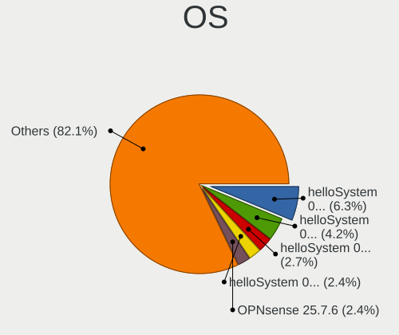

| Name                 | Computers | Percent |
|----------------------|-----------|---------|
| helloSystem 0.8.1    | 40        | 6.27%   |
| helloSystem 0.7.0    | 27        | 4.23%   |
| helloSystem 0.8.0    | 17        | 2.66%   |
| OPNsense 25.7.6      | 15        | 2.35%   |
| helloSystem 0.4.0    | 15        | 2.35%   |
| helloSystem 0.9.0    | 14        | 2.19%   |
| helloSystem 0.6.0    | 14        | 2.19%   |
| helloSystem 0.5.0    | 14        | 2.19%   |
| OPNsense 25.1.5      | 10        | 1.57%   |
| OPNsense 23.1.11     | 10        | 1.57%   |
| OPNsense 24.7.12     | 8         | 1.25%   |
| OPNsense 23.1.7      | 8         | 1.25%   |
| FreeBSD 13.0         | 8         | 1.25%   |
| OPNsense 25.7.9      | 7         | 1.1%    |
| OPNsense 25.1.9      | 7         | 1.1%    |
| OPNsense 23.7.12     | 7         | 1.1%    |
| OPNsense 23.1.5      | 7         | 1.1%    |
| OPNsense 22.1.10     | 7         | 1.1%    |
| FreeBSD 14.0-CURRENT | 7         | 1.1%    |
| OPNsense 24.7.7      | 6         | 0.94%   |
| OPNsense 24.7.5      | 6         | 0.94%   |
| OPNsense 24.7        | 6         | 0.94%   |
| OPNsense 23.7.10     | 6         | 0.94%   |
| OPNsense 23.1        | 6         | 0.94%   |
| OPNsense 22.7.4      | 6         | 0.94%   |
| OPNsense 21.1.3      | 6         | 0.94%   |
| OPNsense 21.1        | 6         | 0.94%   |
| OPNsense 20.7.8      | 6         | 0.94%   |
| OpenBSD 7.3          | 6         | 0.94%   |
| FreeBSD 13.2         | 6         | 0.94%   |
| OPNsense 25.7.7      | 5         | 0.78%   |
| OPNsense 25.1.7      | 5         | 0.78%   |
| OPNsense 24.1.9      | 5         | 0.78%   |
| OPNsense 23.7.9      | 5         | 0.78%   |
| OPNsense 23.1.9      | 5         | 0.78%   |
| OPNsense 22.7.8      | 5         | 0.78%   |
| OPNsense 22.7.5      | 5         | 0.78%   |
| OPNsense 21.1.2      | 5         | 0.78%   |
| OPNsense 21.1.1      | 5         | 0.78%   |
| FreeBSD 14.3         | 5         | 0.78%   |

OS Family
---------

OS without a version

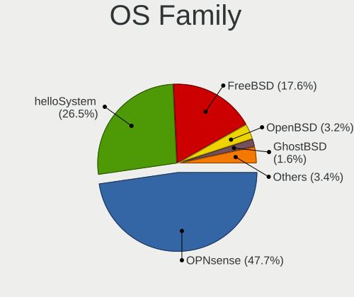

| Name        | Computers | Percent |
|-------------|-----------|---------|
| OPNsense    | 239       | 47.7%   |
| helloSystem | 133       | 26.55%  |
| FreeBSD     | 88        | 17.56%  |
| OpenBSD     | 16        | 3.19%   |
| GhostBSD    | 8         | 1.6%    |
| pfSense     | 3         | 0.6%    |
| NetBSD      | 3         | 0.6%    |
| ClonOS      | 3         | 0.6%    |
| TrueNAS     | 2         | 0.4%    |
| NomadBSD    | 2         | 0.4%    |
| FreeNAS     | 2         | 0.4%    |
| OS108       | 1         | 0.2%    |
| DragonFly   | 1         | 0.2%    |

Arch
----

OS architecture (x86_64, i586, etc.)

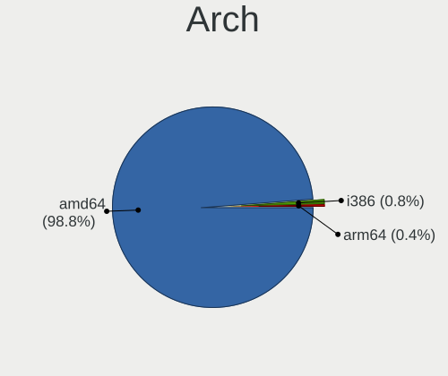

| Name  | Computers | Percent |
|-------|-----------|---------|
| amd64 | 484       | 98.78%  |
| i386  | 4         | 0.82%   |
| arm64 | 2         | 0.41%   |

DE
--

Desktop Environment

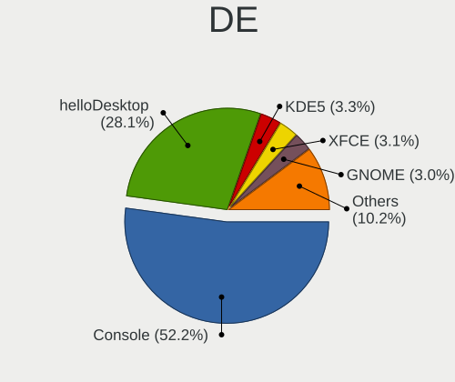

| Name         | Computers | Percent |
|--------------|-----------|---------|
| Console      | 265       | 52.17%  |
| helloDesktop | 143       | 28.15%  |
| KDE5         | 17        | 3.35%   |
| XFCE         | 16        | 3.15%   |
| GNOME        | 15        | 2.95%   |
| TWM          | 13        | 2.56%   |
| MATE         | 13        | 2.56%   |
| i3           | 7         | 1.38%   |
| Openbox      | 6         | 1.18%   |
| spectrwm     | 2         | 0.39%   |
| LXQt         | 2         | 0.39%   |
| fvwm         | 2         | 0.39%   |
| X-Cinnamon   | 1         | 0.2%    |
| Window Maker | 1         | 0.2%    |
| Lumina       | 1         | 0.2%    |
| KDE          | 1         | 0.2%    |
| Hyprland     | 1         | 0.2%    |
| EXWM         | 1         | 0.2%    |
| AwesomeWM    | 1         | 0.2%    |

Display Server
--------------

X11 or Wayland

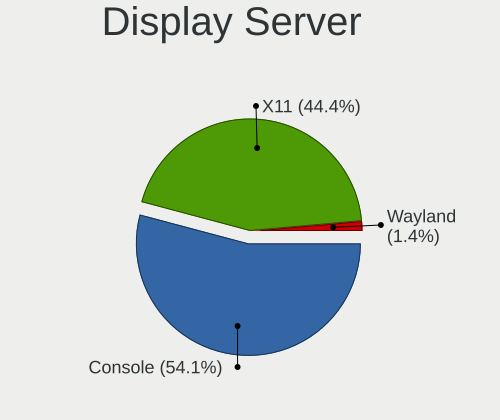

| Name    | Computers | Percent |
|---------|-----------|---------|
| Console | 268       | 54.14%  |
| X11     | 220       | 44.44%  |
| Wayland | 7         | 1.41%   |

Display Manager
---------------

SDDM, LightDM, etc.

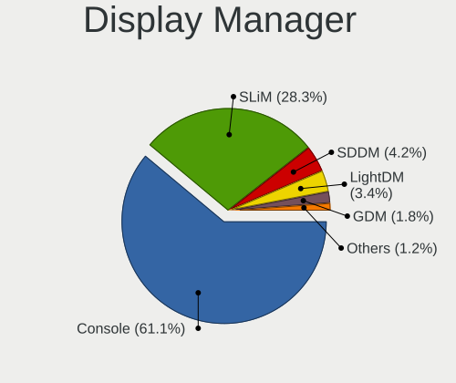

| Name    | Computers | Percent |
|---------|-----------|---------|
| Console | 306       | 61.08%  |
| SLiM    | 142       | 28.34%  |
| SDDM    | 21        | 4.19%   |
| LightDM | 17        | 3.39%   |
| GDM     | 9         | 1.8%    |
| XDM     | 4         | 0.8%    |
| Ly      | 2         | 0.4%    |

OS Lang
-------

Language

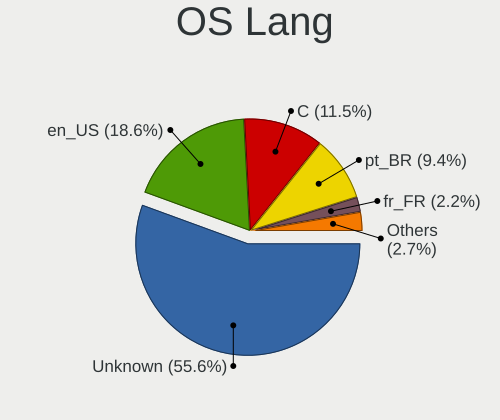

| Lang             | Computers | Percent |
|------------------|-----------|---------|
| Unknown          | 284       | 55.58%  |
| en_US            | 95        | 18.59%  |
| C                | 59        | 11.55%  |
| pt_BR            | 48        | 9.39%   |
| fr_FR            | 11        | 2.15%   |
| pt               | 8         | 1.57%   |
| pt_PT            | 1         | 0.2%    |
| fr               | 1         | 0.2%    |
| en_US.ISO8859-15 | 1         | 0.2%    |
| en_US.ISO8859-1  | 1         | 0.2%    |
| en_GB            | 1         | 0.2%    |
| en               | 1         | 0.2%    |

Boot Mode
---------

EFI or BIOS

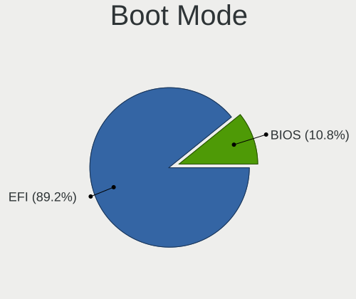

| Mode | Computers | Percent |
|------|-----------|---------|
| EFI  | 445       | 89.18%  |
| BIOS | 54        | 10.82%  |

Filesystem
----------

Type of filesystem

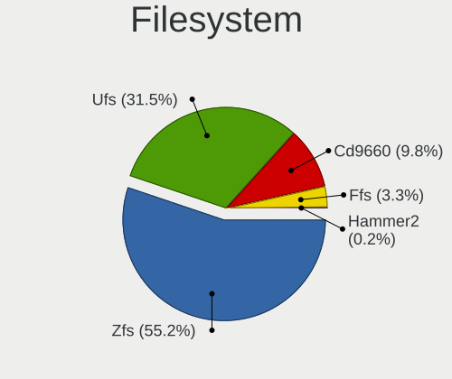

| Type    | Computers | Percent |
|---------|-----------|---------|
| Zfs     | 282       | 55.19%  |
| Ufs     | 161       | 31.51%  |
| Cd9660  | 50        | 9.78%   |
| Ffs     | 17        | 3.33%   |
| Hammer2 | 1         | 0.2%    |

Part. scheme
------------

Scheme of partitioning

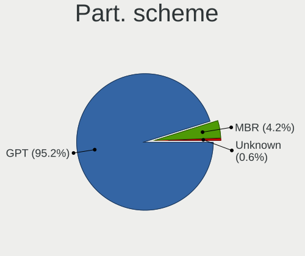

| Type    | Computers | Percent |
|---------|-----------|---------|
| GPT     | 471       | 95.15%  |
| MBR     | 21        | 4.24%   |
| Unknown | 3         | 0.61%   |

Board
-----

Vendor
------

Motherboard manufacturer

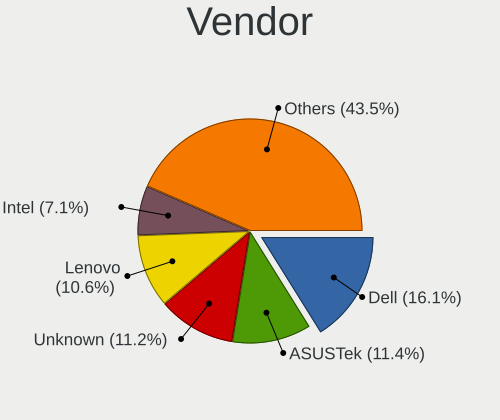

| Name                    | Computers | Percent |
|-------------------------|-----------|---------|
| Dell                    | 79        | 16.12%  |
| ASUSTek Computer        | 56        | 11.43%  |
| Unknown                 | 55        | 11.22%  |
| Lenovo                  | 52        | 10.61%  |
| Intel                   | 35        | 7.14%   |
| Gigabyte Technology     | 26        | 5.31%   |
| Acer                    | 18        | 3.67%   |
| Hewlett-Packard         | 17        | 3.47%   |
| Techvision              | 13        | 2.65%   |
| Samsung Electronics     | 13        | 2.65%   |
| ASRock                  | 12        | 2.45%   |
| AMI                     | 10        | 2.04%   |
| Apple                   | 8         | 1.63%   |
| Positivo                | 7         | 1.43%   |
| Itautec                 | 7         | 1.43%   |
| Supermicro              | 5         | 1.02%   |
| MSI                     | 5         | 1.02%   |
| Sony                    | 4         | 0.82%   |
| PCWare                  | 4         | 0.82%   |
| ECS                     | 4         | 0.82%   |
| Biostar                 | 4         | 0.82%   |
| Pegatron                | 3         | 0.61%   |
| LG Electronics          | 3         | 0.61%   |
| AZW                     | 3         | 0.61%   |
| Avell High Performance  | 3         | 0.61%   |
| Yanling                 | 2         | 0.41%   |
| Sophos                  | 2         | 0.41%   |
| Semp Toshiba            | 2         | 0.41%   |
| Gateway                 | 2         | 0.41%   |
| Compaq                  | 2         | 0.41%   |
| ZOTAC                   | 1         | 0.2%    |
| YANYU                   | 1         | 0.2%    |
| Wistron                 | 1         | 0.2%    |
| ULTRATOP                | 1         | 0.2%    |
| Timi                    | 1         | 0.2%    |
| T-bao                   | 1         | 0.2%    |
| Soyo                    | 1         | 0.2%    |
| Procomp Ind. Eletronica | 1         | 0.2%    |
| pine64                  | 1         | 0.2%    |
| Philco                  | 1         | 0.2%    |

Model
-----

Motherboard model

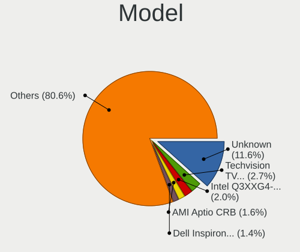

| Name                                | Computers | Percent |
|-------------------------------------|-----------|---------|
| Unknown                             | 57        | 11.63%  |
| Techvision TVI7309X                 | 13        | 2.65%   |
| Intel Q3XXG4-P V1.0                 | 10        | 2.04%   |
| AMI Aptio CRB                       | 8         | 1.63%   |
| Dell Inspiron 3442                  | 7         | 1.43%   |
| ASUS All Series                     | 7         | 1.43%   |
| ASUS PRIME B450M-GAMING/BR          | 4         | 0.82%   |
| Intel H81                           | 3         | 0.61%   |
| Gigabyte B550M DS3H AC              | 3         | 0.61%   |
| Dell PowerEdge T110 II              | 3         | 0.61%   |
| Dell OptiPlex 7040                  | 3         | 0.61%   |
| Dell Inspiron 3421                  | 3         | 0.61%   |
| ASUS PRIME A520M-E                  | 3         | 0.61%   |
| Supermicro Super Server             | 2         | 0.41%   |
| Samsung 340XAA/350XAA/550XAA        | 2         | 0.41%   |
| Samsung 270E5K/270E5Q/271E5K/2570EK | 2         | 0.41%   |
| Pegatron IPM41-D3                   | 2         | 0.41%   |
| PCWare IPX1800G2                    | 2         | 0.41%   |
| Lenovo ThinkCentre M920q 10V8S07P2Y | 2         | 0.41%   |
| Lenovo IdeaPadFlex 5 14ITL05 82LT   | 2         | 0.41%   |
| Lenovo IdeaPad S145-15API 81V7      | 2         | 0.41%   |
| Itautec Infoway                     | 2         | 0.41%   |
| Intel H61                           | 2         | 0.41%   |
| Intel H55                           | 2         | 0.41%   |
| Intel B75                           | 2         | 0.41%   |
| Gigabyte H61M-S2-B3                 | 2         | 0.41%   |
| Gigabyte H170N-WIFI                 | 2         | 0.41%   |
| Gateway NE56R                       | 2         | 0.41%   |
| Dell PowerEdge R620                 | 2         | 0.41%   |
| Dell PowerEdge 1950                 | 2         | 0.41%   |
| Dell OptiPlex 3050                  | 2         | 0.41%   |
| Dell OptiPlex 3020                  | 2         | 0.41%   |
| Dell Latitude 5490                  | 2         | 0.41%   |
| AZW EQ                              | 2         | 0.41%   |
| ASUS TUF Gaming B550M-PLUS          | 2         | 0.41%   |
| ASUS P8H61-M LX3 R2.0               | 2         | 0.41%   |
| ASUS P8H61-M LX3 PLUS R2.0          | 2         | 0.41%   |
| ASUS P8H61-M LE/BR                  | 2         | 0.41%   |
| ASUS P5KPL-AM SE                    | 2         | 0.41%   |
| ASUS M5A97 LE R2.0                  | 2         | 0.41%   |

Model Family
------------

Motherboard model prefix

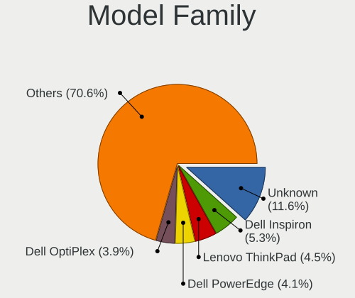

| Name                   | Computers | Percent |
|------------------------|-----------|---------|
| Unknown                | 57        | 11.63%  |
| Dell Inspiron          | 26        | 5.31%   |
| Lenovo ThinkPad        | 22        | 4.49%   |
| Dell PowerEdge         | 20        | 4.08%   |
| Dell OptiPlex          | 19        | 3.88%   |
| Acer Aspire            | 15        | 3.06%   |
| Techvision TVI7309X    | 13        | 2.65%   |
| ASUS PRIME             | 12        | 2.45%   |
| Intel Q3XXG4-P         | 10        | 2.04%   |
| Lenovo ThinkCentre     | 9         | 1.84%   |
| Lenovo IdeaPad         | 9         | 1.84%   |
| AMI Aptio              | 9         | 1.84%   |
| HP ProLiant            | 7         | 1.43%   |
| ASUS All               | 7         | 1.43%   |
| Itautec Infoway        | 6         | 1.22%   |
| Dell Vostro            | 6         | 1.22%   |
| ASUS P8H61-M           | 6         | 1.22%   |
| Gigabyte B550M         | 4         | 0.82%   |
| Dell Latitude          | 4         | 0.82%   |
| ASUS TUF               | 4         | 0.82%   |
| Intel H81              | 3         | 0.61%   |
| ASUS M5A97             | 3         | 0.61%   |
| ASUS M5A78L-M          | 3         | 0.61%   |
| Supermicro Super       | 2         | 0.41%   |
| Semp Toshiba STI       | 2         | 0.41%   |
| Samsung 340XAA         | 2         | 0.41%   |
| Samsung 270E5K         | 2         | 0.41%   |
| Pegatron IPM41-D3      | 2         | 0.41%   |
| PCWare IPX1800G2       | 2         | 0.41%   |
| Lenovo IdeaPadFlex     | 2         | 0.41%   |
| Intel H61              | 2         | 0.41%   |
| Intel H55              | 2         | 0.41%   |
| Intel B75              | 2         | 0.41%   |
| HP Compaq              | 2         | 0.41%   |
| Gigabyte H61M-S2-B3    | 2         | 0.41%   |
| Gigabyte H170N-WIFI    | 2         | 0.41%   |
| Gigabyte GA-78LMT-USB3 | 2         | 0.41%   |
| Gigabyte B450M         | 2         | 0.41%   |
| Gateway NE56R          | 2         | 0.41%   |
| Dell Precision         | 2         | 0.41%   |

MFG Year
--------

Motherboard manufacture year

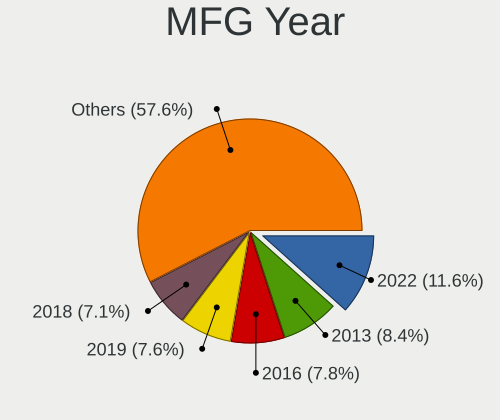

| Year    | Computers | Percent |
|---------|-----------|---------|
| 2022    | 57        | 11.63%  |
| 2013    | 41        | 8.37%   |
| 2016    | 38        | 7.76%   |
| 2019    | 37        | 7.55%   |
| 2018    | 35        | 7.14%   |
| 2011    | 32        | 6.53%   |
| 2014    | 31        | 6.33%   |
| 2012    | 27        | 5.51%   |
| 2023    | 26        | 5.31%   |
| 2021    | 25        | 5.1%    |
| 2020    | 24        | 4.9%    |
| 2010    | 24        | 4.9%    |
| 2017    | 22        | 4.49%   |
| 2009    | 15        | 3.06%   |
| 2008    | 14        | 2.86%   |
| 2024    | 13        | 2.65%   |
| 2015    | 13        | 2.65%   |
| 2007    | 8         | 1.63%   |
| 2025    | 4         | 0.82%   |
| Unknown | 4         | 0.82%   |

Form Factor
-----------

Physical design of the computer

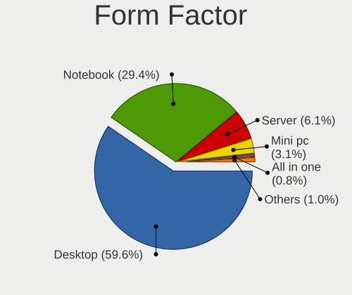

| Name        | Computers | Percent |
|-------------|-----------|---------|
| Desktop     | 292       | 59.59%  |
| Notebook    | 144       | 29.39%  |
| Server      | 30        | 6.12%   |
| Mini pc     | 15        | 3.06%   |
| All in one  | 4         | 0.82%   |
| Convertible | 3         | 0.61%   |
| Firewall    | 2         | 0.41%   |

Coreboot
--------

Have coreboot on board

| Used | Computers | Percent |
|------|-----------|---------|
| No   | 490       | 100%    |

RAM Size
--------

Total RAM memory

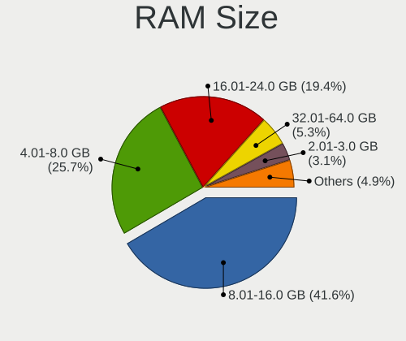

| Size in GB  | Computers | Percent |
|-------------|-----------|---------|
| 8.01-16.0   | 212       | 41.57%  |
| 4.01-8.0    | 131       | 25.69%  |
| 16.01-24.0  | 99        | 19.41%  |
| 32.01-64.0  | 27        | 5.29%   |
| 2.01-3.0    | 16        | 3.14%   |
| 64.01-256.0 | 9         | 1.76%   |
| 3.01-4.0    | 8         | 1.57%   |
| 24.01-32.0  | 8         | 1.57%   |

RAM Used
--------

Used RAM memory

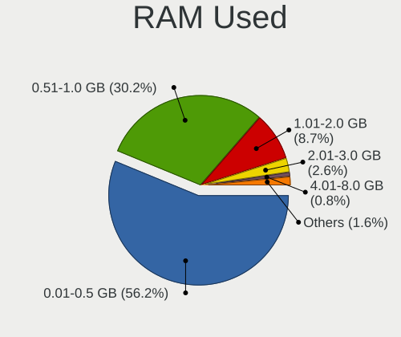

| Used GB    | Computers | Percent |
|------------|-----------|---------|
| 0.01-0.5   | 285       | 56.21%  |
| 0.51-1.0   | 153       | 30.18%  |
| 1.01-2.0   | 44        | 8.68%   |
| 2.01-3.0   | 13        | 2.56%   |
| 4.01-8.0   | 4         | 0.79%   |
| Unknown    | 4         | 0.79%   |
| 32.01-64.0 | 1         | 0.2%    |
| 24.01-32.0 | 1         | 0.2%    |
| 16.01-24.0 | 1         | 0.2%    |
| 8.01-16.0  | 1         | 0.2%    |

Total Drives
------------

Number of drives on board

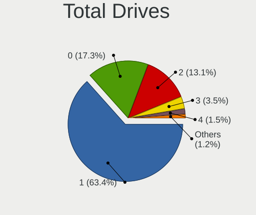

| Drives | Computers | Percent |
|--------|-----------|---------|
| 1      | 329       | 63.39%  |
| 0      | 90        | 17.34%  |
| 2      | 68        | 13.1%   |
| 3      | 18        | 3.47%   |
| 4      | 8         | 1.54%   |
| 5      | 4         | 0.77%   |
| 7      | 1         | 0.19%   |
| 6      | 1         | 0.19%   |

Has CD-ROM
----------

Has CD-ROM on board

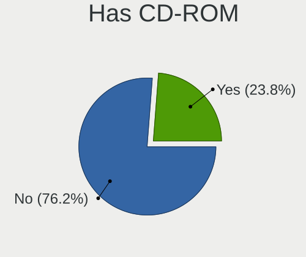

| Presented | Computers | Percent |
|-----------|-----------|---------|
| No        | 375       | 76.22%  |
| Yes       | 117       | 23.78%  |

Has Ethernet
------------

Has Ethernet on board

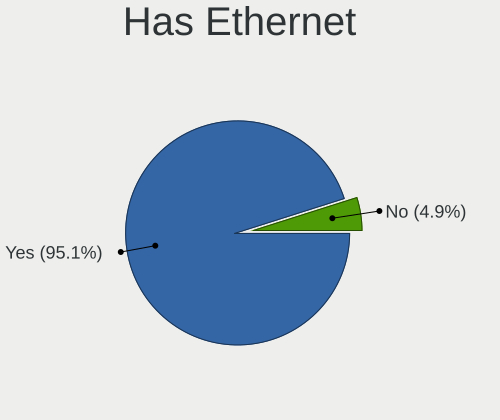

| Presented | Computers | Percent |
|-----------|-----------|---------|
| Yes       | 466       | 95.1%   |
| No        | 24        | 4.9%    |

Has WiFi
--------

Has WiFi module

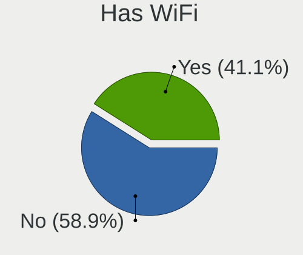

| Presented | Computers | Percent |
|-----------|-----------|---------|
| No        | 290       | 58.94%  |
| Yes       | 202       | 41.06%  |

Has Bluetooth
-------------

Has Bluetooth module

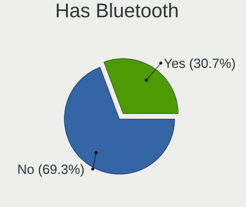

| Presented | Computers | Percent |
|-----------|-----------|---------|
| No        | 341       | 69.31%  |
| Yes       | 151       | 30.69%  |

Location
--------

Country
-------

Geographic location (country)

| Country | Computers | Percent |
|---------|-----------|---------|
| Brazil  | 490       | 100%    |

City
----

Geographic location (city)

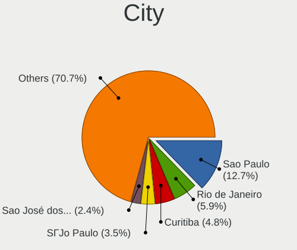

| City                      | Computers | Percent |
|---------------------------|-----------|---------|
| Sao Paulo                 | 69        | 12.71%  |
| Rio de Janeiro            | 32        | 5.89%   |
| Curitiba                  | 26        | 4.79%   |
| SГЈo Paulo              | 19        | 3.5%    |
| Sao José dos Campos      | 13        | 2.39%   |
| Belo Horizonte            | 12        | 2.21%   |
| Porto Alegre              | 10        | 1.84%   |
| Campinas                  | 9         | 1.66%   |
| Fortaleza                 | 8         | 1.47%   |
| Brasília                 | 8         | 1.47%   |
| Blumenau                  | 8         | 1.47%   |
| Manaus                    | 7         | 1.29%   |
| São Paulo              | 6         | 1.1%    |
| Osasco                    | 6         | 1.1%    |
| Maringá                  | 6         | 1.1%    |
| Joinville                 | 6         | 1.1%    |
| Jaraguá do Sul           | 6         | 1.1%    |
| Florianópolis            | 6         | 1.1%    |
| Sao Jose do Rio Preto     | 5         | 0.92%   |
| Sao Bernardo do Campo     | 4         | 0.74%   |
| Pouso Alegre              | 4         | 0.74%   |
| Maceió                   | 4         | 0.74%   |
| Londrina                  | 4         | 0.74%   |
| Cuiabá                   | 4         | 0.74%   |
| Visconde do Rio Branco    | 3         | 0.55%   |
| Uberaba                   | 3         | 0.55%   |
| SГЈo JosГ© dos Campos | 3         | 0.55%   |
| Sorocaba                  | 3         | 0.55%   |
| Sao Vicente               | 3         | 0.55%   |
| Salvador                  | 3         | 0.55%   |
| Ribeirao Preto            | 3         | 0.55%   |
| Recife                    | 3         | 0.55%   |
| Novo Hamburgo             | 3         | 0.55%   |
| Niterói                  | 3         | 0.55%   |
| JoГЈo Pessoa            | 3         | 0.55%   |
| Joao Pessoa               | 3         | 0.55%   |
| Valparaiso de Goias       | 2         | 0.37%   |
| Toledo                    | 2         | 0.37%   |
| Teresina                  | 2         | 0.37%   |
| Taubate                   | 2         | 0.37%   |

Drives
------

Drive Vendor
------------

Hard drive vendors

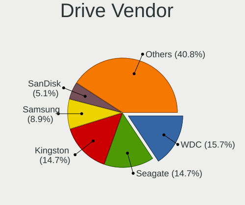

| Vendor                             | Computers | Drives | Percent |
|------------------------------------|-----------|--------|---------|
| WDC                                | 83        | 108    | 15.69%  |
| Seagate                            | 78        | 147    | 14.74%  |
| Kingston                           | 78        | 120    | 14.74%  |
| Samsung Electronics                | 47        | 65     | 8.88%   |
| SanDisk                            | 27        | 31     | 5.1%    |
| Toshiba                            | 23        | 27     | 4.35%   |
| A-DATA Technology                  | 22        | 26     | 4.16%   |
| China                              | 20        | 25     | 3.78%   |
| KingSpec                           | 16        | 23     | 3.02%   |
| Crucial                            | 15        | 22     | 2.84%   |
| Silicon Motion                     | 9         | 10     | 1.7%    |
| Hoodisk                            | 9         | 9      | 1.7%    |
| Hitachi                            | 7         | 11     | 1.32%   |
| XrayDisk                           | 5         | 5      | 0.95%   |
| SK hynix                           | 5         | 6      | 0.95%   |
| NVMe                               | 5         | 7      | 0.95%   |
| LITEON                             | 5         | 5      | 0.95%   |
| HGST                               | 5         | 7      | 0.95%   |
| Gigabyte Technology                | 5         | 9      | 0.95%   |
| SSSTC                              | 3         | 3      | 0.57%   |
| Product:              USB DISK 2.0 | 3         | 3      | 0.57%   |
| PNY                                | 3         | 3      | 0.57%   |
| Netac                              | 3         | 3      | 0.57%   |
| Lexar                              | 3         | 4      | 0.57%   |
| Kston                              | 3         | 3      | 0.57%   |
| Hewlett-Packard                    | 3         | 4      | 0.57%   |
| Fanxiang                           | 3         | 4      | 0.57%   |
| tecmiyo                            | 2         | 4      | 0.38%   |
| SMI                                | 2         | 2      | 0.38%   |
| Patriot                            | 2         | 5      | 0.38%   |
| NTC                                | 2         | 2      | 0.38%   |
| Micron Technology                  | 2         | 2      | 0.38%   |
| Maxtor                             | 2         | 2      | 0.38%   |
| MACROVIP                           | 2         | 2      | 0.38%   |
| Intel                              | 2         | 6      | 0.38%   |
| XUNZHE                             | 1         | 1      | 0.19%   |
| Wodposit                           | 1         | 1      | 0.19%   |
| Vaseky                             | 1         | 1      | 0.19%   |
| UMIS                               | 1         | 1      | 0.19%   |
| Transcend                          | 1         | 2      | 0.19%   |

Drive Model
-----------

Hard drive models

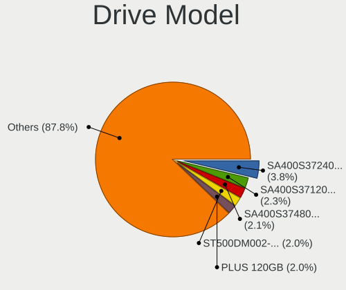

| Model                                               | Computers | Percent |
|-----------------------------------------------------|-----------|---------|
| Kingston SA400S37240G 240GB                         | 21        | 3.76%   |
| Kingston SA400S37120G 120GB                         | 13        | 2.33%   |
| Kingston SA400S37480G 480GB                         | 12        | 2.15%   |
| Seagate ST500DM002-1BD142 500GB                     | 11        | 1.97%   |
| SanDisk SSD PLUS 120GB                              | 11        | 1.97%   |
| Seagate ST500LM012 HN-M500MBB 500GB                 | 6         | 1.07%   |
| Seagate ST1000DM010-2EP102 1TB                      | 6         | 1.07%   |
| Samsung SSD 870 EVO 250GB                           | 6         | 1.07%   |
| Kingston SA400S37960G 960GB                         | 6         | 1.07%   |
| KingSpec MT-128 128GB                               | 6         | 1.07%   |
| Hoodisk SSD 64GB                                    | 6         | 1.07%   |
| Samsung HD322HJ 320GB                               | 5         | 0.89%   |
| Toshiba MQ01ABD100 1TB                              | 4         | 0.72%   |
| Seagate ST500LT012-9WS142 500GB                     | 4         | 0.72%   |
| Seagate ST1000LM024 HN-M101MBB 1TB                  | 4         | 0.72%   |
| SanDisk SSD PLUS 240GB                              | 4         | 0.72%   |
| Samsung HM321HI 320GB                               | 4         | 0.72%   |
| Samsung HD502HJ 500GB                               | 4         | 0.72%   |
| Samsung HD161HJ 160GB                               | 4         | 0.72%   |
| Gigabyte GP-GSTFS31120GNTD 120GB                    | 4         | 0.72%   |
| China SATA SSD 120GB                                | 4         | 0.72%   |
| WDC WDS240G2G0A-00JH30 240GB                        | 3         | 0.54%   |
| WDC WD10SPZX-24Z10 1TB                              | 3         | 0.54%   |
| WDC WD10EZEX-00RKKA0 1TB                            | 3         | 0.54%   |
| Seagate ST4000DM000-1F2168 4TB                      | 3         | 0.54%   |
| Seagate ST2000DM006-2DM164 2TB                      | 3         | 0.54%   |
| Seagate ST1000LM048-2E7172 1TB                      | 3         | 0.54%   |
| Seagate ST1000LM035-1RK172 1TB                      | 3         | 0.54%   |
| Seagate ST1000DM003-1CH162 1TB                      | 3         | 0.54%   |
| SanDisk SDSSDA240G 240GB                            | 3         | 0.54%   |
| Samsung HD103SJ 1TB                                 | 3         | 0.54%   |
| Product:              USB DISK 2.0 USB DISK 2.0 8GB | 3         | 0.54%   |
| Kingston SUV400S37240G 240GB                        | 3         | 0.54%   |
| Kingston SUV400S37120G 120GB                        | 3         | 0.54%   |
| KingSpec P4-120 120GB                               | 3         | 0.54%   |
| Crucial CT480BX500SSD1 480GB                        | 3         | 0.54%   |
| Crucial CT240BX500SSD1 240GB                        | 3         | 0.54%   |
| Crucial CT120BX500SSD1 120GB                        | 3         | 0.54%   |
| China SATA SSD 128GB                                | 3         | 0.54%   |
| A-DATA SU650 120GB                                  | 3         | 0.54%   |

HDD Vendor
----------

Hard disk drive vendors

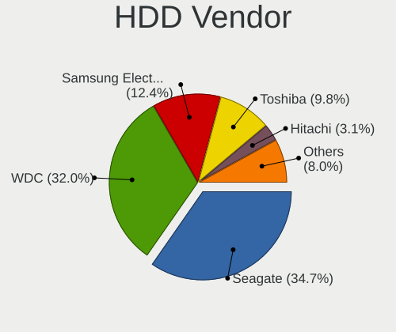

| Vendor                             | Computers | Drives | Percent |
|------------------------------------|-----------|--------|---------|
| Seagate                            | 78        | 147    | 34.67%  |
| WDC                                | 72        | 91     | 32%     |
| Samsung Electronics                | 28        | 38     | 12.44%  |
| Toshiba                            | 22        | 26     | 9.78%   |
| Hitachi                            | 7         | 11     | 3.11%   |
| HGST                               | 4         | 5      | 1.78%   |
| Product:              USB DISK 2.0 | 3         | 3      | 1.33%   |
| NVMe                               | 3         | 5      | 1.33%   |
| Hewlett-Packard                    | 3         | 4      | 1.33%   |
| SMI                                | 2         | 2      | 0.89%   |
| Maxtor                             | 2         | 2      | 0.89%   |
| Generic                            | 1         | 1      | 0.44%   |

SSD Vendor
----------

Solid state drive vendors

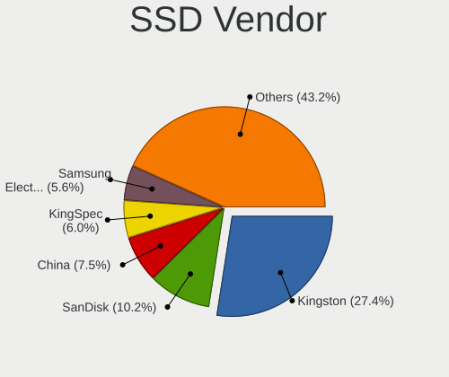

| Vendor              | Computers | Drives | Percent |
|---------------------|-----------|--------|---------|
| Kingston            | 73        | 115    | 27.44%  |
| SanDisk             | 27        | 31     | 10.15%  |
| China               | 20        | 25     | 7.52%   |
| KingSpec            | 16        | 22     | 6.02%   |
| Samsung Electronics | 15        | 19     | 5.64%   |
| A-DATA Technology   | 15        | 19     | 5.64%   |
| Crucial             | 14        | 21     | 5.26%   |
| WDC                 | 12        | 16     | 4.51%   |
| Hoodisk             | 9         | 9      | 3.38%   |
| XrayDisk            | 5         | 5      | 1.88%   |
| LITEON              | 5         | 5      | 1.88%   |
| Gigabyte Technology | 5         | 9      | 1.88%   |
| SK hynix            | 4         | 5      | 1.5%    |
| PNY                 | 3         | 3      | 1.13%   |
| Kston               | 3         | 3      | 1.13%   |
| tecmiyo             | 2         | 4      | 0.75%   |
| Patriot             | 2         | 5      | 0.75%   |
| NTC                 | 2         | 2      | 0.75%   |
| Micron Technology   | 2         | 2      | 0.75%   |
| MACROVIP            | 2         | 2      | 0.75%   |
| Lexar               | 2         | 2      | 0.75%   |
| Intel               | 2         | 6      | 0.75%   |
| XUNZHE              | 1         | 1      | 0.38%   |
| Wodposit            | 1         | 1      | 0.38%   |
| Vaseky              | 1         | 1      | 0.38%   |
| UMIS                | 1         | 1      | 0.38%   |
| Transcend           | 1         | 2      | 0.38%   |
| TGT                 | 1         | 1      | 0.38%   |
| Teelkoou            | 1         | 1      | 0.38%   |
| Smart               | 1         | 1      | 0.38%   |
| Silicon             | 1         | 1      | 0.38%   |
| Qunion              | 1         | 1      | 0.38%   |
| NVMe                | 1         | 1      | 0.38%   |
| Netac               | 1         | 1      | 0.38%   |
| LITEONIT            | 1         | 1      | 0.38%   |
| Innodisk            | 1         | 1      | 0.38%   |
| Indilinx            | 1         | 2      | 0.38%   |
| Hikvision           | 1         | 1      | 0.38%   |
| HGST                | 1         | 2      | 0.38%   |
| Faspeed             | 1         | 1      | 0.38%   |

Drive Kind
----------

HDD or SSD

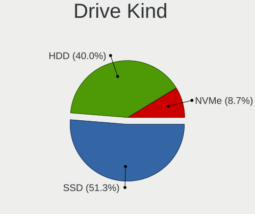

| Kind | Computers | Drives | Percent |
|------|-----------|--------|---------|
| SSD  | 241       | 367    | 51.28%  |
| HDD  | 188       | 335    | 40%     |
| NVMe | 41        | 48     | 8.72%   |

Drive Connector
---------------

SATA, SAS, NVMe, etc.

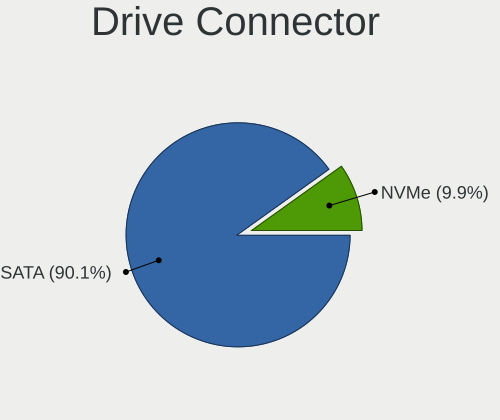

| Type | Computers | Drives | Percent |
|------|-----------|--------|---------|
| SATA | 374       | 702    | 90.12%  |
| NVMe | 41        | 48     | 9.88%   |

Drive Size
----------

Size of hard drive

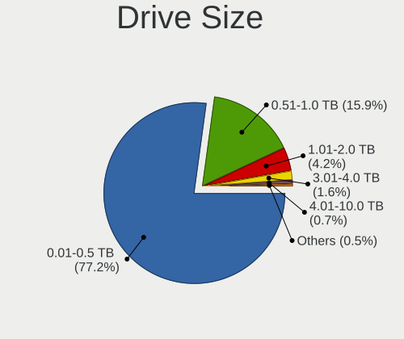

| Size in TB | Computers | Drives | Percent |
|------------|-----------|--------|---------|
| 0.01-0.5   | 331       | 533    | 77.16%  |
| 0.51-1.0   | 68        | 93     | 15.85%  |
| 1.01-2.0   | 18        | 35     | 4.2%    |
| 3.01-4.0   | 7         | 36     | 1.63%   |
| 4.01-10.0  | 3         | 3      | 0.7%    |
| 20.01-50.0 | 1         | 1      | 0.23%   |
| 2.01-3.0   | 1         | 1      | 0.23%   |

Space Total
-----------

Amount of disk space available on the file system

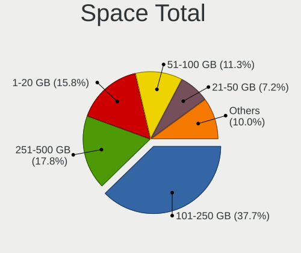

| Size in GB     | Computers | Percent |
|----------------|-----------|---------|
| 101-250        | 203       | 37.73%  |
| 251-500        | 96        | 17.84%  |
| 1-20           | 85        | 15.8%   |
| 51-100         | 61        | 11.34%  |
| 21-50          | 39        | 7.25%   |
| 501-1000       | 34        | 6.32%   |
| 1001-2000      | 11        | 2.04%   |
| 2001-3000      | 4         | 0.74%   |
| More than 3000 | 3         | 0.56%   |
| Unknown        | 2         | 0.37%   |

Space Used
----------

Amount of used disk space

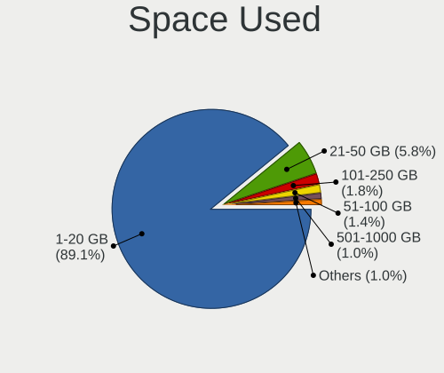

| Used GB   | Computers | Percent |
|-----------|-----------|---------|
| 1-20      | 449       | 89.09%  |
| 21-50     | 29        | 5.75%   |
| 101-250   | 9         | 1.79%   |
| 51-100    | 7         | 1.39%   |
| 501-1000  | 5         | 0.99%   |
| Unknown   | 2         | 0.4%    |
| 251-500   | 1         | 0.2%    |
| 2001-3000 | 1         | 0.2%    |
| 1001-2000 | 1         | 0.2%    |

Malfunc. Drives
---------------

Drive models with a malfunction

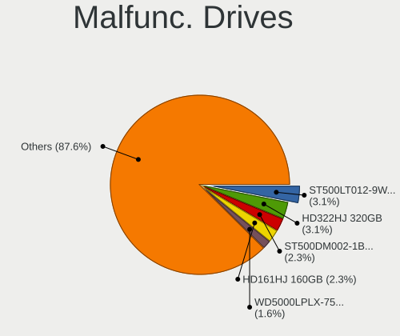

| Model                               | Computers | Drives | Percent |
|-------------------------------------|-----------|--------|---------|
| Seagate ST500LT012-9WS142 500GB     | 4         | 6      | 3.1%    |
| Samsung Electronics HD322HJ 320GB   | 4         | 5      | 3.1%    |
| Seagate ST500DM002-1BD142 500GB     | 3         | 4      | 2.33%   |
| Samsung Electronics HD161HJ 160GB   | 3         | 3      | 2.33%   |
| WDC WD5000LPLX-75ZNTT0 500GB        | 2         | 2      | 1.55%   |
| WDC WD5000AAKX-003CA0 500GB         | 2         | 4      | 1.55%   |
| WDC WD10EZEX-00RKKA0 1TB            | 2         | 2      | 1.55%   |
| Toshiba MQ01ABD100 1TB              | 2         | 2      | 1.55%   |
| Seagate ST9500325AS 500GB           | 2         | 2      | 1.55%   |
| Seagate ST9320325AS 320GB           | 2         | 2      | 1.55%   |
| Seagate ST9160314AS 160GB           | 2         | 2      | 1.55%   |
| Seagate ST320LM001 HN-M320MBB 320GB | 2         | 2      | 1.55%   |
| SanDisk SSD PLUS 120GB              | 2         | 2      | 1.55%   |
| Samsung Electronics HM321HI 320GB   | 2         | 2      | 1.55%   |
| Samsung Electronics HD502HJ 500GB   | 2         | 3      | 1.55%   |
| Kingston SV300S37A60G 64GB          | 2         | 2      | 1.55%   |
| Kingston SA400S37120G 120GB         | 2         | 2      | 1.55%   |
| KingSpec P4-120 120GB               | 2         | 3      | 1.55%   |
| XrayDisk SSD 240GB                  | 1         | 1      | 0.78%   |
| WDC WD5000LPVX-22V0TT0 500GB        | 1         | 1      | 0.78%   |
| WDC WD5000B 500GB                   | 1         | 1      | 0.78%   |
| WDC WD5000AVVS-63H0B1 500GB         | 1         | 1      | 0.78%   |
| WDC WD5000AAKX-75U6AA0 500GB        | 1         | 1      | 0.78%   |
| WDC WD5000AAKX-603CA0 500GB         | 1         | 2      | 0.78%   |
| WDC WD5000AAKX-08ERMA0 500GB        | 1         | 1      | 0.78%   |
| WDC WD5000AAKX-00U6AA0 500GB        | 1         | 1      | 0.78%   |
| WDC WD5000AAKX-00ERMA0 500GB        | 1         | 1      | 0.78%   |
| WDC WD5000AAKS-08V0A0 500GB         | 1         | 1      | 0.78%   |
| WDC WD5000AAKS-00UU3A0 500GB        | 1         | 1      | 0.78%   |
| WDC WD3200LPVX-22V0TT0 320GB        | 1         | 1      | 0.78%   |
| WDC WD3200BEVT-11ZCT0 320GB         | 1         | 2      | 0.78%   |
| WDC WD3200BEVT-00A0RT0 233GB        | 1         | 1      | 0.78%   |
| WDC WD3200AAKS-00UU3A0 320GB        | 1         | 1      | 0.78%   |
| WDC WD3200AAJS-56M0A0 320GB         | 1         | 1      | 0.78%   |
| WDC WD3200AAJS-00YZCA0 320GB        | 1         | 1      | 0.78%   |
| WDC WD2502ABYS-18B7A0 250GB         | 1         | 1      | 0.78%   |
| WDC WD2500AAJS-75M0A0 250GB         | 1         | 1      | 0.78%   |
| WDC WD1600BEVS-60RST0 160GB         | 1         | 1      | 0.78%   |
| WDC WD10PURX-64E5EY0 1TB            | 1         | 1      | 0.78%   |
| WDC WD10JPVX-75JC3T0 1TB            | 1         | 1      | 0.78%   |

Malfunc. Drive Vendor
---------------------

Vendors of faulty drives

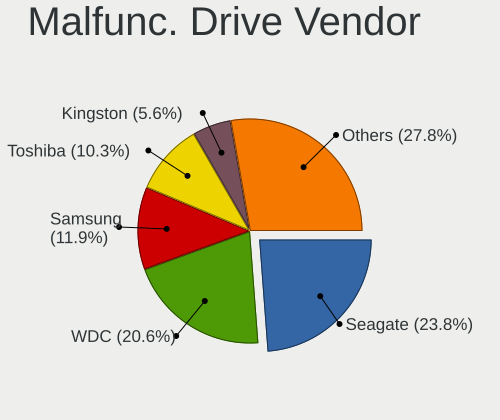

| Vendor              | Computers | Drives | Percent |
|---------------------|-----------|--------|---------|
| Seagate             | 30        | 42     | 23.81%  |
| WDC                 | 26        | 32     | 20.63%  |
| Samsung Electronics | 15        | 19     | 11.9%   |
| Toshiba             | 13        | 14     | 10.32%  |
| Kingston            | 7         | 8      | 5.56%   |
| Hitachi             | 6         | 10     | 4.76%   |
| KingSpec            | 5         | 6      | 3.97%   |
| A-DATA Technology   | 4         | 4      | 3.17%   |
| SanDisk             | 3         | 3      | 2.38%   |
| HGST                | 3         | 4      | 2.38%   |
| SK hynix            | 2         | 2      | 1.59%   |
| Micron Technology   | 2         | 2      | 1.59%   |
| Maxtor              | 2         | 2      | 1.59%   |
| XrayDisk            | 1         | 1      | 0.79%   |
| Transcend           | 1         | 2      | 0.79%   |
| tecmiyo             | 1         | 2      | 0.79%   |
| Silicon Motion      | 1         | 1      | 0.79%   |
| Netac               | 1         | 1      | 0.79%   |
| LITEON              | 1         | 1      | 0.79%   |
| Corsair             | 1         | 1      | 0.79%   |
| China               | 1         | 1      | 0.79%   |

Malfunc. HDD Vendor
-------------------

Vendors of faulty HDD drives

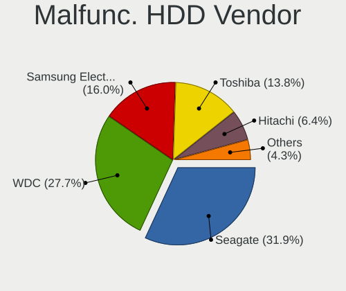

| Vendor              | Computers | Drives | Percent |
|---------------------|-----------|--------|---------|
| Seagate             | 30        | 42     | 31.91%  |
| WDC                 | 26        | 32     | 27.66%  |
| Samsung Electronics | 15        | 19     | 15.96%  |
| Toshiba             | 13        | 14     | 13.83%  |
| Hitachi             | 6         | 10     | 6.38%   |
| Maxtor              | 2         | 2      | 2.13%   |
| HGST                | 2         | 2      | 2.13%   |

Malfunc. Drive Kind
-------------------

Kinds of faulty drives

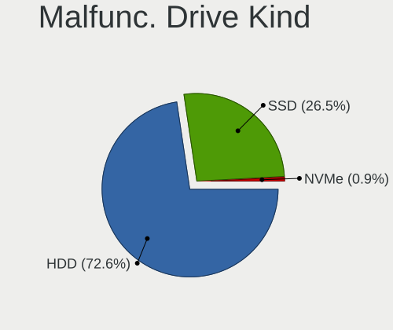

| Kind | Computers | Drives | Percent |
|------|-----------|--------|---------|
| HDD  | 85        | 121    | 72.65%  |
| SSD  | 31        | 36     | 26.5%   |
| NVMe | 1         | 1      | 0.85%   |

Failed Drives
-------------

Failed drive models

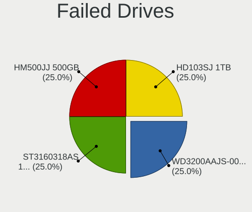

| Model                             | Computers | Drives | Percent |
|-----------------------------------|-----------|--------|---------|
| WDC WD3200AAJS-00YZCA0 320GB      | 1         | 1      | 25%     |
| Seagate ST3160318AS 160GB         | 1         | 1      | 25%     |
| Samsung Electronics HM500JJ 500GB | 1         | 1      | 25%     |
| Samsung Electronics HD103SJ 1TB   | 1         | 2      | 25%     |

Failed Drive Vendor
-------------------

Failed drive vendors

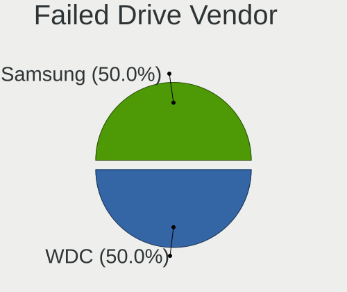

| Vendor              | Computers | Drives | Percent |
|---------------------|-----------|--------|---------|
| Samsung Electronics | 2         | 3      | 50%     |
| WDC                 | 1         | 1      | 25%     |
| Seagate             | 1         | 1      | 25%     |

Drive Status
------------

Number of failed and malfunc. drives

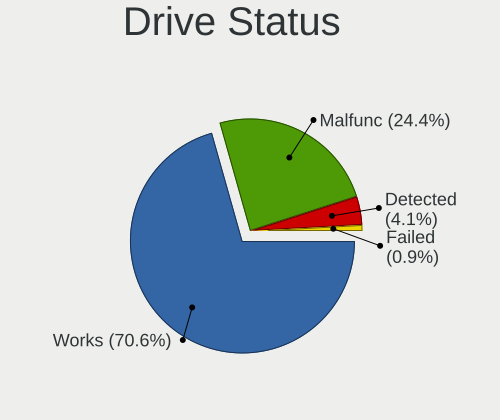

| Status   | Computers | Drives | Percent |
|----------|-----------|--------|---------|
| Works    | 327       | 561    | 70.63%  |
| Malfunc  | 113       | 158    | 24.41%  |
| Detected | 19        | 26     | 4.1%    |
| Failed   | 4         | 5      | 0.86%   |

Storage controller
------------------

Storage Vendor
--------------

Storage controller vendors

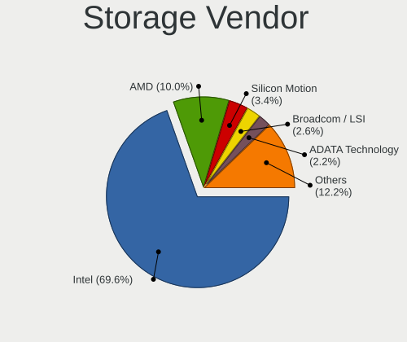

| Vendor                                  | Computers | Percent |
|-----------------------------------------|-----------|---------|
| Intel                                   | 405       | 69.59%  |
| AMD                                     | 58        | 9.97%   |
| Silicon Motion                          | 20        | 3.44%   |
| Broadcom / LSI                          | 15        | 2.58%   |
| ADATA Technology                        | 13        | 2.23%   |
| Kingston Technology Company             | 12        | 2.06%   |
| Samsung Electronics                     | 11        | 1.89%   |
| Nvidia                                  | 8         | 1.37%   |
| Solid State Storage Technology          | 7         | 1.2%    |
| MAXIO Technology (Hangzhou)             | 6         | 1.03%   |
| SK hynix                                | 3         | 0.52%   |
| SanDisk                                 | 3         | 0.52%   |
| Phison Electronics                      | 3         | 0.52%   |
| JMicron Technology                      | 3         | 0.52%   |
| Realtek Semiconductor                   | 2         | 0.34%   |
| Hewlett-Packard                         | 2         | 0.34%   |
| Toshiba                                 | 1         | 0.17%   |
| Shenzhen Unionmemory Information System | 1         | 0.17%   |
| Shenzhen Longsys Electronics            | 1         | 0.17%   |
| Netac Technology                        | 1         | 0.17%   |
| Micron/Crucial Technology               | 1         | 0.17%   |
| Lite-On Technology                      | 1         | 0.17%   |
| KIOXIA                                  | 1         | 0.17%   |
| Integrated Technology Express           | 1         | 0.17%   |
| Biwin Storage Technology                | 1         | 0.17%   |
| ASMedia Technology                      | 1         | 0.17%   |
| Adaptec                                 | 1         | 0.17%   |

Storage Model
-------------

Storage controller models

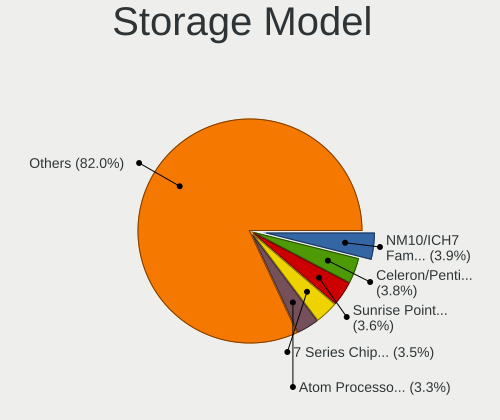

| Model                                                                                   | Computers | Percent |
|-----------------------------------------------------------------------------------------|-----------|---------|
| Intel NM10/ICH7 Family SATA Controller [IDE mode]                                       | 26        | 3.91%   |
| Intel Celeron/Pentium Silver Processor SATA Controller                                  | 25        | 3.76%   |
| Intel Sunrise Point-LP SATA Controller [AHCI mode]                                      | 24        | 3.61%   |
| Intel 7 Series Chipset Family 6-port SATA Controller [AHCI mode]                        | 23        | 3.46%   |
| Intel Atom Processor E3800 Series SATA AHCI Controller                                  | 22        | 3.31%   |
| Silicon Motion SM2263EN/SM2263XT (DRAM-less) NVMe SSD Controllers                       | 20        | 3.01%   |
| AMD FCH SATA Controller [AHCI mode]                                                     | 20        | 3.01%   |
| Intel 6 Series/C200 Series Chipset Family 6 port Desktop SATA AHCI Controller           | 19        | 2.86%   |
| Intel Q170/Q150/B150/H170/H110/Z170/CM236 Chipset SATA Controller [AHCI Mode]           | 18        | 2.71%   |
| Intel Jasper Lake SATA AHCI Controller                                                  | 18        | 2.71%   |
| Intel 8 Series SATA Controller 1 [AHCI mode]                                            | 18        | 2.71%   |
| Intel 82801G (ICH7 Family) IDE Controller                                               | 17        | 2.56%   |
| Intel 8 Series/C220 Series Chipset Family 6-port SATA Controller 1 [AHCI mode]          | 16        | 2.41%   |
| Intel Wildcat Point-LP SATA Controller [AHCI Mode]                                      | 14        | 2.11%   |
| Intel 6 Series/C200 Series Chipset Family Desktop SATA Controller (IDE mode, ports 4-5) | 13        | 1.95%   |
| Intel 6 Series/C200 Series Chipset Family Desktop SATA Controller (IDE mode, ports 0-3) | 13        | 1.95%   |
| AMD SB7x0/SB8x0/SB9x0 SATA Controller [AHCI mode]                                       | 13        | 1.95%   |
| AMD 500 Series Chipset SATA Controller                                                  | 13        | 1.95%   |
| Intel Cannon Lake PCH SATA AHCI Controller                                              | 11        | 1.65%   |
| Intel Alder Lake-N SATA AHCI Controller                                                 | 10        | 1.5%    |
| Intel 6 Series/C200 Series Chipset Family 6 port Mobile SATA AHCI Controller            | 10        | 1.5%    |
| Intel 5 Series/3400 Series Chipset 6 port SATA AHCI Controller                          | 10        | 1.5%    |
| Intel 200 Series PCH SATA controller [AHCI mode]                                        | 10        | 1.5%    |
| Intel 7 Series/C210 Series Chipset Family 6-port SATA Controller [AHCI mode]            | 9         | 1.35%   |
| Intel SATA Controller [RAID Mode]                                                       | 8         | 1.2%    |
| AMD SB7x0/SB8x0/SB9x0 IDE Controller                                                    | 8         | 1.2%    |
| ADATA IM2P33F8 series NVMe SSD (DRAM-less)                                              | 8         | 1.2%    |
| Intel Tiger Lake-LP SATA Controller                                                     | 7         | 1.05%   |
| Intel 5 Series/3400 Series Chipset 4 port SATA AHCI Controller                          | 7         | 1.05%   |
| AMD 400 Series Chipset SATA Controller                                                  | 7         | 1.05%   |
| MAXIO (Hangzhou) NVMe SSD Controller MAP1202 (DRAM-less)                                | 6         | 0.9%    |
| Intel Celeron N3350/Pentium N4200/Atom E3900 Series SATA AHCI Controller                | 5         | 0.75%   |
| Intel 500 Series Chipset Family SATA AHCI Controller                                    | 5         | 0.75%   |
| Intel 5 Series/3400 Series Chipset 2 port SATA IDE Controller                           | 5         | 0.75%   |
| AMD SB7x0/SB8x0/SB9x0 SATA Controller [IDE mode]                                        | 5         | 0.75%   |
| Solid State Storage CL1-3D256-Q11 NVMe SSD M.2                                          | 4         | 0.6%    |
| Nvidia MCP61 SATA Controller                                                            | 4         | 0.6%    |
| Nvidia MCP61 IDE                                                                        | 4         | 0.6%    |
| Intel Volume Management Device NVMe RAID Controller                                     | 4         | 0.6%    |
| Intel Comet Lake SATA AHCI Controller                                                   | 4         | 0.6%    |

Storage Kind
------------

Kind of storage controller (IDE, SATA, NVMe, SAS, ...)

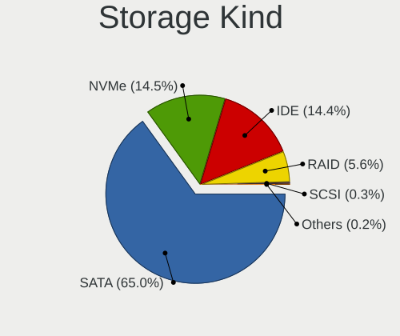

| Kind | Computers | Percent |
|------|-----------|---------|
| SATA | 385       | 65.03%  |
| NVMe | 86        | 14.53%  |
| IDE  | 85        | 14.36%  |
| RAID | 33        | 5.57%   |
| SCSI | 2         | 0.34%   |
| SAS  | 1         | 0.17%   |

Processor
---------

CPU Vendor
----------

Processor vendors

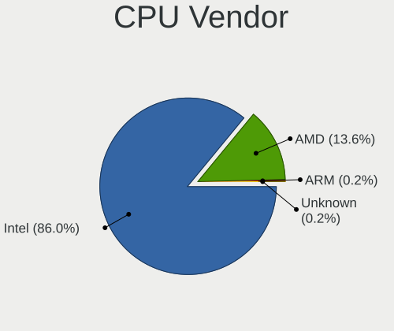

| Vendor  | Computers | Percent |
|---------|-----------|---------|
| Intel   | 423       | 85.98%  |
| AMD     | 67        | 13.62%  |
| ARM     | 1         | 0.2%    |
| Unknown | 1         | 0.2%    |

CPU Model
---------

Processor models

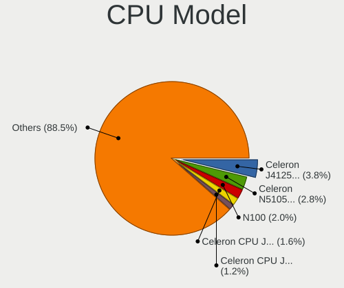

| Model                                   | Computers | Percent |
|-----------------------------------------|-----------|---------|
| Intel Celeron J4125 CPU @ 2.00GHz       | 19        | 3.84%   |
| Intel Celeron N5105 @ 2.00GHz           | 14        | 2.83%   |
| Intel N100                              | 10        | 2.02%   |
| Intel Celeron CPU J1900 @ 1.99GHz       | 8         | 1.62%   |
| Intel Celeron CPU J1800 @ 2.41GHz       | 6         | 1.21%   |
| Intel Core i5-7400 CPU @ 3.00GHz        | 5         | 1.01%   |
| Intel Core i5-3320M CPU @ 2.60GHz       | 5         | 1.01%   |
| Intel Core i3-7100 CPU @ 3.90GHz        | 5         | 1.01%   |
| Intel Core i3-4005U CPU @ 1.70GHz       | 5         | 1.01%   |
| Intel Core i3-3220 CPU @ 3.30GHz        | 5         | 1.01%   |
| AMD Ryzen 5 5600G with Radeon Graphics  | 5         | 1.01%   |
| Intel Xeon CPU X3430 @ 2.40GHz          | 4         | 0.81%   |
| Intel Core i5-8250U CPU @ 1.60GHz       | 4         | 0.81%   |
| Intel Core i3-5005U CPU @ 2.00GHz       | 4         | 0.81%   |
| Intel Core 2 Duo CPU E7500 @ 2.93GHz    | 4         | 0.81%   |
| Intel Celeron CPU N3350 @ 1.10GHz       | 4         | 0.81%   |
| Intel 11th Gen Core i5-1135G7 @ 2.40GHz | 4         | 0.81%   |
| AMD Ryzen 7 5700G with Radeon Graphics  | 4         | 0.81%   |
| Intel Xeon CPU E5620 @ 2.40GHz          | 3         | 0.61%   |
| Intel Xeon CPU E5-2609 v2 @ 2.50GHz     | 3         | 0.61%   |
| Intel Xeon CPU E3-1220 V2 @ 3.10GHz     | 3         | 0.61%   |
| Intel Pentium Silver N6005 @ 2.00GHz    | 3         | 0.61%   |
| Intel CPU Version                       | 3         | 0.61%   |
| Intel Core i7-4790 CPU @ 3.60GHz        | 3         | 0.61%   |
| Intel Core i5-7500 CPU @ 3.40GHz        | 3         | 0.61%   |
| Intel Core i5-6500 CPU @ 3.20GHz        | 3         | 0.61%   |
| Intel Core i5-6300U CPU @ 2.40GHz       | 3         | 0.61%   |
| Intel Core i5-5200U CPU @ 2.20GHz       | 3         | 0.61%   |
| Intel Core i5-4210U CPU @ 1.70GHz       | 3         | 0.61%   |
| Intel Core i5-3337U CPU @ 1.80GHz       | 3         | 0.61%   |
| Intel Core i5-2410M CPU @ 2.30GHz       | 3         | 0.61%   |
| Intel Core i5-2400 CPU @ 3.10GHz        | 3         | 0.61%   |
| Intel Core i5 CPU 650 @ 3.20GHz         | 3         | 0.61%   |
| Intel Core i3-6100U CPU @ 2.30GHz       | 3         | 0.61%   |
| Intel Core i3-6006U CPU @ 2.00GHz       | 3         | 0.61%   |
| Intel Core i3-4030U CPU @ 1.90GHz       | 3         | 0.61%   |
| Intel Core i3-4010U CPU @ 1.70GHz       | 3         | 0.61%   |
| Intel Core i3-2100 CPU @ 3.10GHz        | 3         | 0.61%   |
| Intel Core i3-2100 CPU                  | 3         | 0.61%   |
| Intel Core 2 Quad CPU Q8400 @ 2.66GHz   | 3         | 0.61%   |

CPU Model Family
----------------

Processor model prefix

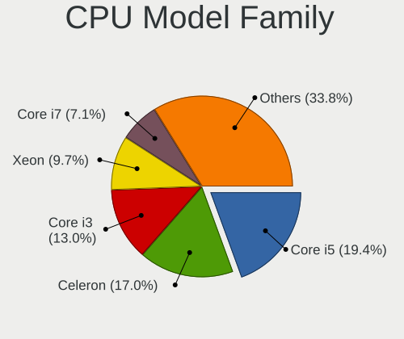

| Model                   | Computers | Percent |
|-------------------------|-----------|---------|
| Intel Core i5           | 96        | 19.43%  |
| Intel Celeron           | 84        | 17%     |
| Intel Core i3           | 64        | 12.96%  |
| Intel Xeon              | 48        | 9.72%   |
| Intel Core i7           | 35        | 7.09%   |
| Other                   | 32        | 6.48%   |
| Intel Core 2 Duo        | 24        | 4.86%   |
| AMD Ryzen 5             | 15        | 3.04%   |
| Intel Pentium           | 13        | 2.63%   |
| AMD Ryzen 7             | 12        | 2.43%   |
| AMD FX                  | 12        | 2.43%   |
| Intel Atom              | 8         | 1.62%   |
| Intel Pentium Dual-Core | 7         | 1.42%   |
| Intel Core 2 Quad       | 5         | 1.01%   |
| AMD Ryzen 3             | 4         | 0.81%   |
| Intel Pentium Silver    | 3         | 0.61%   |
| AMD Athlon 64 X2        | 3         | 0.61%   |
| Intel Genuine           | 2         | 0.4%    |
| AMD Ryzen 5 PRO         | 2         | 0.4%    |
| AMD Ryzen 3 PRO         | 2         | 0.4%    |
| AMD E1                  | 2         | 0.4%    |
| AMD E                   | 2         | 0.4%    |
| AMD C-60                | 2         | 0.4%    |
| AMD A10                 | 2         | 0.4%    |
| Intel Xeon Silver       | 1         | 0.2%    |
| Intel Pentium M         | 1         | 0.2%    |
| Intel Pentium Gold      | 1         | 0.2%    |
| Intel Pentium Dual      | 1         | 0.2%    |
| Intel Core M            | 1         | 0.2%    |
| Intel Core 2            | 1         | 0.2%    |
| ARM Cortex              | 1         | 0.2%    |
| AMD Turion II Neo       | 1         | 0.2%    |
| AMD PRO A8              | 1         | 0.2%    |
| AMD Phenom              | 1         | 0.2%    |
| AMD C-50                | 1         | 0.2%    |
| AMD Athlon II X2        | 1         | 0.2%    |
| AMD Athlon II           | 1         | 0.2%    |
| AMD Athlon              | 1         | 0.2%    |
| AMD A8                  | 1         | 0.2%    |

CPU Cores
---------

Number of processor cores

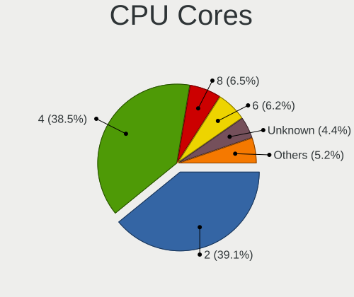

| Number  | Computers | Percent |
|---------|-----------|---------|
| 2       | 194       | 39.11%  |
| 4       | 191       | 38.51%  |
| 8       | 32        | 6.45%   |
| 6       | 31        | 6.25%   |
| Unknown | 22        | 4.44%   |
| 12      | 14        | 2.82%   |
| 16      | 6         | 1.21%   |
| 20      | 2         | 0.4%    |
| 1       | 2         | 0.4%    |
| 24      | 1         | 0.2%    |
| 14      | 1         | 0.2%    |

CPU Sockets
-----------

Number of sockets

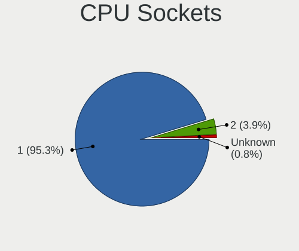

| Number  | Computers | Percent |
|---------|-----------|---------|
| 1       | 467       | 95.31%  |
| 2       | 19        | 3.88%   |
| Unknown | 4         | 0.82%   |

CPU Threads
-----------

Threads per core (Hyper-Threading)

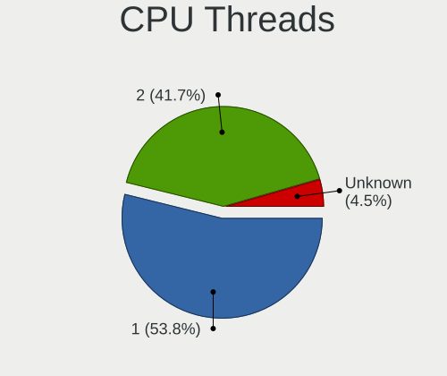

| Number  | Computers | Percent |
|---------|-----------|---------|
| 1       | 266       | 53.85%  |
| 2       | 206       | 41.7%   |
| Unknown | 22        | 4.45%   |

CPU Microarch
-------------

Microarchitecture

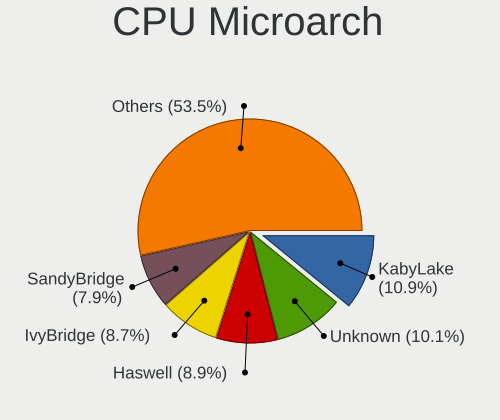

| Name          | Computers | Percent |
|---------------|-----------|---------|
| KabyLake      | 54        | 10.91%  |
| Unknown       | 50        | 10.1%   |
| Haswell       | 44        | 8.89%   |
| IvyBridge     | 43        | 8.69%   |
| SandyBridge   | 39        | 7.88%   |
| Penryn        | 38        | 7.68%   |
| Skylake       | 26        | 5.25%   |
| Silvermont    | 26        | 5.25%   |
| Goldmont plus | 25        | 5.05%   |
| Westmere      | 17        | 3.43%   |
| Broadwell     | 16        | 3.23%   |
| Zen 3         | 13        | 2.63%   |
| Core          | 12        | 2.42%   |
| Nehalem       | 11        | 2.22%   |
| Zen+          | 10        | 2.02%   |
| TigerLake     | 9         | 1.82%   |
| Piledriver    | 8         | 1.62%   |
| CometLake     | 8         | 1.62%   |
| Bobcat        | 7         | 1.41%   |
| Zen 2         | 6         | 1.21%   |
| Goldmont      | 6         | 1.21%   |
| Zen           | 5         | 1.01%   |
| Bonnell       | 5         | 1.01%   |
| Steamroller   | 4         | 0.81%   |
| K10           | 4         | 0.81%   |
| Bulldozer     | 4         | 0.81%   |
| K8 Hammer     | 3         | 0.61%   |
| IceLake       | 2         | 0.4%    |

Graphics
--------

GPU Vendor
----------

Vendors of graphics cards

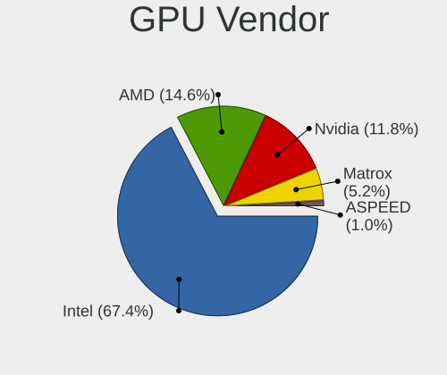

| Vendor                     | Computers | Percent |
|----------------------------|-----------|---------|
| Intel                      | 347       | 67.38%  |
| AMD                        | 75        | 14.56%  |
| Nvidia                     | 61        | 11.84%  |
| Matrox Electronics Systems | 27        | 5.24%   |
| ASPEED Technology          | 5         | 0.97%   |

GPU Model
---------

Graphics card models

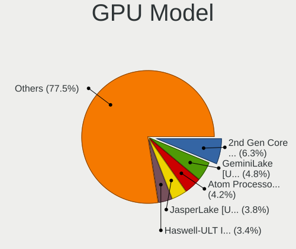

| Model                                                                                    | Computers | Percent |
|------------------------------------------------------------------------------------------|-----------|---------|
| Intel 2nd Generation Core Processor Family Integrated Graphics Controller                | 33        | 6.3%    |
| Intel GeminiLake [UHD Graphics 600]                                                      | 25        | 4.77%   |
| Intel Atom Processor Z36xxx/Z37xxx Series Graphics & Display                             | 22        | 4.2%    |
| Intel JasperLake [UHD Graphics]                                                          | 20        | 3.82%   |
| Intel Haswell-ULT Integrated Graphics Controller                                         | 18        | 3.44%   |
| Intel 3rd Gen Core processor Graphics Controller                                         | 18        | 3.44%   |
| Intel Xeon E3-1200 v3/4th Gen Core Processor Integrated Graphics Controller              | 13        | 2.48%   |
| Intel Core Processor Integrated Graphics Controller                                      | 13        | 2.48%   |
| Intel Broadwell-U GT2 [HD Graphics 5500]                                                 | 13        | 2.48%   |
| Intel 4 Series Chipset Integrated Graphics Controller                                    | 13        | 2.48%   |
| Intel Xeon E3-1200 v2/3rd Gen Core processor Graphics Controller                         | 12        | 2.29%   |
| Intel Kaby Lake-S GT2 [HD Graphics 630]                                                  | 12        | 2.29%   |
| AMD Cezanne [Radeon Vega Series / Radeon Vega Mobile Series]                             | 12        | 2.29%   |
| Intel Skylake-U GT2 [HD Graphics 520]                                                    | 11        | 2.1%    |
| Intel Alder Lake-N [UHD Graphics]                                                        | 11        | 2.1%    |
| Matrox Electronics Systems MGA G200eW WPCM450                                            | 10        | 1.91%   |
| Intel CoffeeLake-S GT2 [UHD Graphics 630]                                                | 10        | 1.91%   |
| Intel 82G33/G31 Express Integrated Graphics Controller                                   | 9         | 1.72%   |
| Intel Skylake-S GT2 [HD Graphics 530]                                                    | 8         | 1.53%   |
| Intel TigerLake-LP GT2 [Iris Xe Graphics]                                                | 7         | 1.34%   |
| Intel Kaby Lake-R GT2 [UHD Graphics 620]                                                 | 7         | 1.34%   |
| AMD Picasso/Raven 2 [Radeon Vega Series / Radeon Vega Mobile Series]                     | 7         | 1.34%   |
| AMD ES1000                                                                               | 6         | 1.15%   |
| Matrox Electronics Systems MGA G200EH                                                    | 5         | 0.95%   |
| Matrox Electronics Systems G200eR2                                                       | 5         | 0.95%   |
| Intel Kaby Lake-U GT2 [HD Graphics 620]                                                  | 5         | 0.95%   |
| ASPEED Technology ASPEED Graphics Family                                                 | 5         | 0.95%   |
| AMD Lexa PRO [Radeon 540/540X/550/550X / RX 540X/550/550X]                               | 5         | 0.95%   |
| Nvidia TU117M [GeForce GTX 1650 Mobile / Max-Q]                                          | 4         | 0.76%   |
| Nvidia GP107 [GeForce GTX 1050 Ti]                                                       | 4         | 0.76%   |
| Matrox Electronics Systems Integrated Matrox G200eW3 Graphics Controller                 | 4         | 0.76%   |
| Intel WhiskeyLake-U GT2 [UHD Graphics 620]                                               | 4         | 0.76%   |
| Intel Atom/Celeron/Pentium Processor x5-E8000/J3xxx/N3xxx Integrated Graphics Controller | 4         | 0.76%   |
| Intel Apollo Lake GT1 [HD Graphics 500]                                                  | 4         | 0.76%   |
| Intel 4th Generation Core Processor Family Integrated Graphics Controller                | 4         | 0.76%   |
| AMD Kaveri [Radeon R7 Graphics]                                                          | 4         | 0.76%   |
| AMD Ellesmere [Radeon RX 470/480/570/570X/580/580X/590]                                  | 4         | 0.76%   |
| Nvidia GT218 [GeForce 210]                                                               | 3         | 0.57%   |
| Nvidia GK208B [GeForce GT 710]                                                           | 3         | 0.57%   |
| Intel Mobile GM965/GL960 Integrated Graphics Controller (secondary)                      | 3         | 0.57%   |

GPU Combo
---------

Combinations of graphics cards

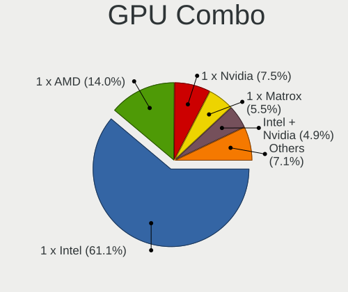

| Name           | Computers | Percent |
|----------------|-----------|---------|
| 1 x Intel      | 302       | 61.13%  |
| 1 x AMD        | 69        | 13.97%  |
| 1 x Nvidia     | 37        | 7.49%   |
| 1 x Matrox     | 27        | 5.47%   |
| Intel + Nvidia | 24        | 4.86%   |
| 2 x Intel      | 15        | 3.04%   |
| Other          | 9         | 1.82%   |
| Intel + AMD    | 6         | 1.21%   |
| 1 x ASPEED     | 5         | 1.01%   |

GPU Driver
----------

Free vs proprietary

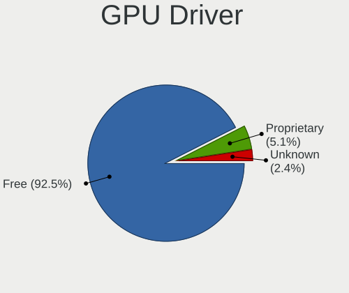

| Driver      | Computers | Percent |
|-------------|-----------|---------|
| Free        | 457       | 92.51%  |
| Proprietary | 25        | 5.06%   |
| Unknown     | 12        | 2.43%   |

GPU Memory
----------

Total video memory

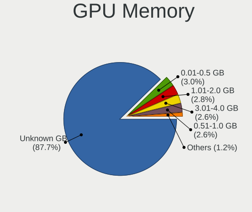

| Size in GB | Computers | Percent |
|------------|-----------|---------|
| Unknown    | 435       | 87.7%   |
| 0.01-0.5   | 15        | 3.02%   |
| 1.01-2.0   | 14        | 2.82%   |
| 3.01-4.0   | 13        | 2.62%   |
| 0.51-1.0   | 13        | 2.62%   |
| 7.01-8.0   | 4         | 0.81%   |
| 5.01-6.0   | 1         | 0.2%    |
| 2.01-3.0   | 1         | 0.2%    |

Monitor
-------

Monitor Vendor
--------------

Monitor vendors

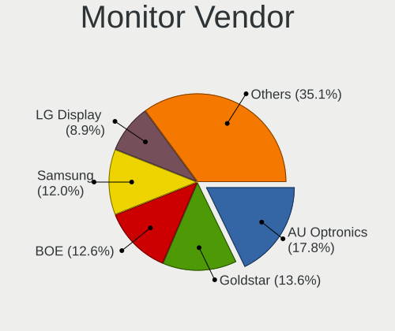

| Vendor                  | Computers | Percent |
|-------------------------|-----------|---------|
| AU Optronics            | 34        | 17.8%   |
| Goldstar                | 26        | 13.61%  |
| BOE                     | 24        | 12.57%  |
| Samsung Electronics     | 23        | 12.04%  |
| LG Display              | 17        | 8.9%    |
| Chimei Innolux          | 13        | 6.81%   |
| AOC                     | 10        | 5.24%   |
| Philips                 | 7         | 3.66%   |
| Lenovo                  | 5         | 2.62%   |
| InfoVision              | 4         | 2.09%   |
| Dell                    | 4         | 2.09%   |
| Apple                   | 3         | 1.57%   |
| Unknown (XXX)           | 2         | 1.05%   |
| Hewlett-Packard         | 2         | 1.05%   |
| Acer                    | 2         | 1.05%   |
| VIZTA                   | 1         | 0.52%   |
| VIE                     | 1         | 0.52%   |
| TXD                     | 1         | 0.52%   |
| Semp Toshiba            | 1         | 0.52%   |
| PANDA                   | 1         | 0.52%   |
| Panasonic               | 1         | 0.52%   |
| MTD                     | 1         | 0.52%   |
| MStar                   | 1         | 0.52%   |
| LRX                     | 1         | 0.52%   |
| LG Electronics          | 1         | 0.52%   |
| JDI                     | 1         | 0.52%   |
| ITE                     | 1         | 0.52%   |
| Chi Mei Optoelectronics | 1         | 0.52%   |
| ASUSTek Computer        | 1         | 0.52%   |
| AGO                     | 1         | 0.52%   |

Monitor Model
-------------

Monitor models

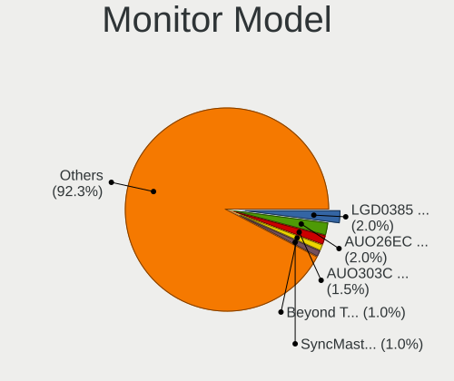

| Model                                                                | Computers | Percent |
|----------------------------------------------------------------------|-----------|---------|
| LG Display LCD Monitor LGD0385 1366x768 310x170mm 13.9-inch          | 4         | 2.04%   |
| AU Optronics LCD Monitor AUO26EC 1366x768 340x190mm 15.3-inch        | 4         | 2.04%   |
| AU Optronics LCD Monitor AUO303C 1366x768 310x170mm 13.9-inch        | 3         | 1.53%   |
| Unknown (XXX) Beyond TV XXX9221 1920x1080 1210x680mm 54.6-inch       | 2         | 1.02%   |
| Samsung Electronics SyncMaster SAM0601 1600x900                      | 2         | 1.02%   |
| Samsung Electronics SMT22A300 SAM087B 1920x1080 480x270mm 21.7-inch  | 2         | 1.02%   |
| LG Display LCD Monitor LGD0458 1366x768 310x170mm 13.9-inch          | 2         | 1.02%   |
| LG Display LCD Monitor LGD0437 1920x1080 280x160mm 12.7-inch         | 2         | 1.02%   |
| Chimei Innolux LCD Monitor CMN1490 1366x768 310x170mm 13.9-inch      | 2         | 1.02%   |
| BOE LCD Monitor BOE0B38 2560x1600 340x210mm 15.7-inch                | 2         | 1.02%   |
| BOE LCD Monitor BOE08CD 1366x768 340x190mm 15.3-inch                 | 2         | 1.02%   |
| BOE LCD Monitor BOE0812 1920x1080 340x190mm 15.3-inch                | 2         | 1.02%   |
| BOE LCD Monitor BOE0757 1366x768 340x190mm 15.3-inch                 | 2         | 1.02%   |
| BOE LCD Monitor BOE05EF 1366x768 310x170mm 13.9-inch                 | 2         | 1.02%   |
| AU Optronics LCD Monitor AUO71EC 1366x768 340x190mm 15.3-inch        | 2         | 1.02%   |
| AU Optronics LCD Monitor AUO40EC 1366x768 340x190mm 15.3-inch        | 2         | 1.02%   |
| AU Optronics LCD Monitor AUO2E3C 1366x768 310x170mm 13.9-inch        | 2         | 1.02%   |
| AU Optronics LCD Monitor AUO263D 1920x1080 310x170mm 13.9-inch       | 2         | 1.02%   |
| AU Optronics LCD Monitor AUO183C 1366x768 310x170mm 13.9-inch        | 2         | 1.02%   |
| AOC T2242we AOC2242 1920x1080 480x270mm 21.7-inch                    | 2         | 1.02%   |
| AOC 1970W AOC1970 1366x768 410x230mm 18.5-inch                       | 2         | 1.02%   |
| VIZTA VGA JRY1900 1440x900 410x260mm 19.1-inch                       | 1         | 0.51%   |
| VIE E195 VIE1950 1600x900 410x280mm 19.5-inch                        | 1         | 0.51%   |
| TXD VGA TXD009A 1440x900 330x210mm 15.4-inch                         | 1         | 0.51%   |
| Semp Toshiba MLE1951 STI1951 1366x768 410x230mm 18.5-inch            | 1         | 0.51%   |
| Samsung Electronics SyncMaster SAM060B 1920x1080 510x290mm 23.1-inch | 1         | 0.51%   |
| Samsung Electronics SyncMaster SAM0600 1600x900 440x250mm 19.9-inch  | 1         | 0.51%   |
| Samsung Electronics SyncMaster SAM05FF 1600x900 440x250mm 19.9-inch  | 1         | 0.51%   |
| Samsung Electronics SyncMaster SAM05FC 1920x1080                     | 1         | 0.51%   |
| Samsung Electronics SyncMaster SAM058F 1920x1080 480x270mm 21.7-inch | 1         | 0.51%   |
| Samsung Electronics SyncMaster SAM04E4 1600x900 440x250mm 19.9-inch  | 1         | 0.51%   |
| Samsung Electronics SyncMaster SAM03E0 1440x900 410x260mm 19.1-inch  | 1         | 0.51%   |
| Samsung Electronics SyncMaster SAM0364 1360x768 340x190mm 15.3-inch  | 1         | 0.51%   |
| Samsung Electronics SyncMaster SAM01B7 1280x1024 340x270mm 17.1-inch | 1         | 0.51%   |
| Samsung Electronics SyncMaster SAM0117 1280x1024 310x230mm 15.2-inch | 1         | 0.51%   |
| Samsung Electronics SyncMaster SAM0116 1024x768 280x210mm 13.8-inch  | 1         | 0.51%   |
| Samsung Electronics SA300/SA350 SAM078C 1600x900 440x250mm 19.9-inch | 1         | 0.51%   |
| Samsung Electronics S23C550 SAM0A42 1920x1080 510x290mm 23.1-inch    | 1         | 0.51%   |
| Samsung Electronics S19B300 SAM08A6 1366x768 410x230mm 18.5-inch     | 1         | 0.51%   |
| Samsung Electronics LCD Monitor SMT27A550 1920x1080                  | 1         | 0.51%   |

Monitor Resolution
------------------

Monitor screen resolution

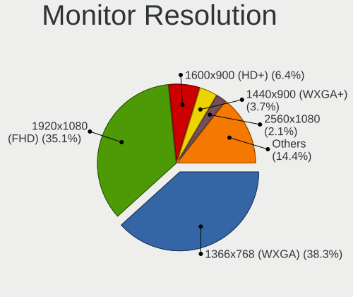

| Resolution         | Computers | Percent |
|--------------------|-----------|---------|
| 1366x768 (WXGA)    | 72        | 38.3%   |
| 1920x1080 (FHD)    | 66        | 35.11%  |
| 1600x900 (HD+)     | 12        | 6.38%   |
| 1440x900 (WXGA+)   | 7         | 3.72%   |
| 2560x1080          | 4         | 2.13%   |
| 1360x768           | 4         | 2.13%   |
| 1280x800 (WXGA)    | 4         | 2.13%   |
| 1280x1024 (SXGA)   | 4         | 2.13%   |
| 2560x1600          | 3         | 1.6%    |
| 1680x1050 (WSXGA+) | 2         | 1.06%   |
| 1024x768 (XGA)     | 2         | 1.06%   |
| 1024x600           | 2         | 1.06%   |
| 3840x2160 (4K)     | 1         | 0.53%   |
| 3640x1920          | 1         | 0.53%   |
| 2560x1440 (QHD)    | 1         | 0.53%   |
| 1280x960           | 1         | 0.53%   |
| 1280x720 (HD)      | 1         | 0.53%   |
| Unknown            | 1         | 0.53%   |

Monitor Diagonal
----------------

Diagonal size in inches

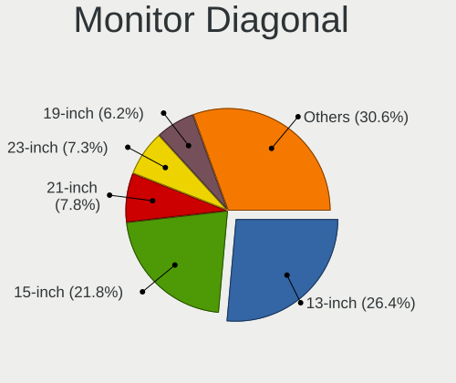

| Inches  | Computers | Percent |
|---------|-----------|---------|
| 13      | 51        | 26.42%  |
| 15      | 42        | 21.76%  |
| 21      | 15        | 7.77%   |
| 23      | 14        | 7.25%   |
| 19      | 12        | 6.22%   |
| 18      | 9         | 4.66%   |
| 14      | 7         | 3.63%   |
| Unknown | 7         | 3.63%   |
| 24      | 6         | 3.11%   |
| 12      | 6         | 3.11%   |
| 34      | 4         | 2.07%   |
| 20      | 4         | 2.07%   |
| 17      | 3         | 1.55%   |
| 54      | 2         | 1.04%   |
| 31      | 2         | 1.04%   |
| 27      | 2         | 1.04%   |
| 10      | 2         | 1.04%   |
| 52      | 1         | 0.52%   |
| 46      | 1         | 0.52%   |
| 40      | 1         | 0.52%   |
| 11      | 1         | 0.52%   |
| 0       | 1         | 0.52%   |

Monitor Width
-------------

Physical width

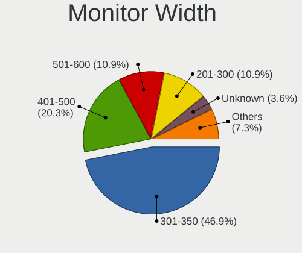

| Width in mm | Computers | Percent |
|-------------|-----------|---------|
| 301-350     | 90        | 46.88%  |
| 401-500     | 39        | 20.31%  |
| 501-600     | 21        | 10.94%  |
| 201-300     | 21        | 10.94%  |
| Unknown     | 7         | 3.65%   |
| 701-800     | 4         | 2.08%   |
| 1001-1500   | 4         | 2.08%   |
| 601-700     | 2         | 1.04%   |
| 351-400     | 2         | 1.04%   |
| 801-900     | 1         | 0.52%   |
| 1-100       | 1         | 0.52%   |

Aspect Ratio
------------

Proportional relationship between the width and the height

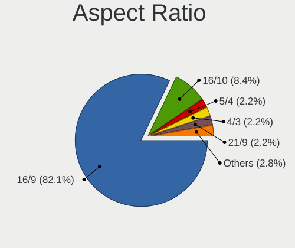

| Ratio   | Computers | Percent |
|---------|-----------|---------|
| 16/9    | 147       | 82.12%  |
| 16/10   | 15        | 8.38%   |
| 5/4     | 4         | 2.23%   |
| 4/3     | 4         | 2.23%   |
| 21/9    | 4         | 2.23%   |
| Unknown | 3         | 1.68%   |
| 3/2     | 2         | 1.12%   |

Monitor Area
------------

Area in inch²

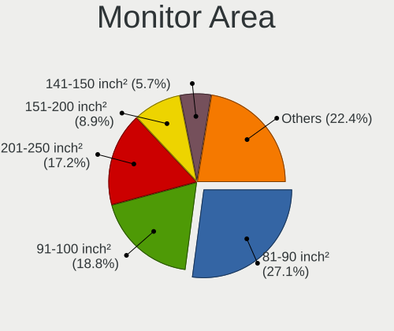

| Area in inch² | Computers | Percent |
|----------------|-----------|---------|
| 81-90          | 52        | 27.08%  |
| 91-100         | 36        | 18.75%  |
| 201-250        | 33        | 17.19%  |
| 151-200        | 17        | 8.85%   |
| 141-150        | 11        | 5.73%   |
| Unknown        | 8         | 4.17%   |
| 61-70          | 6         | 3.13%   |
| 351-500        | 6         | 3.13%   |
| 101-110        | 6         | 3.13%   |
| More than 1000 | 3         | 1.56%   |
| 71-80          | 3         | 1.56%   |
| 111-120        | 3         | 1.56%   |
| 41-50          | 2         | 1.04%   |
| 301-350        | 2         | 1.04%   |
| 501-1000       | 2         | 1.04%   |
| 51-60          | 1         | 0.52%   |
| 121-130        | 1         | 0.52%   |

Pixel Density
-------------

Pixels per inch

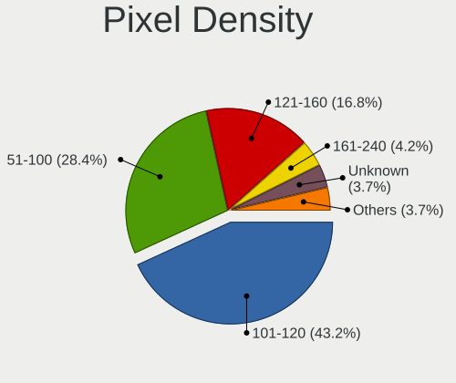

| Density       | Computers | Percent |
|---------------|-----------|---------|
| 101-120       | 82        | 43.16%  |
| 51-100        | 54        | 28.42%  |
| 121-160       | 32        | 16.84%  |
| 161-240       | 8         | 4.21%   |
| Unknown       | 7         | 3.68%   |
| 1-50          | 6         | 3.16%   |
| More than 240 | 1         | 0.53%   |

Multiple Monitors
-----------------

Total monitors connected

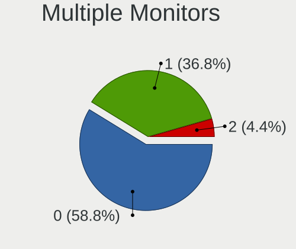

| Total | Computers | Percent |
|-------|-----------|---------|
| 0     | 292       | 58.75%  |
| 1     | 183       | 36.82%  |
| 2     | 22        | 4.43%   |

Network
-------

Net Controller Vendor
---------------------

Controller vendors

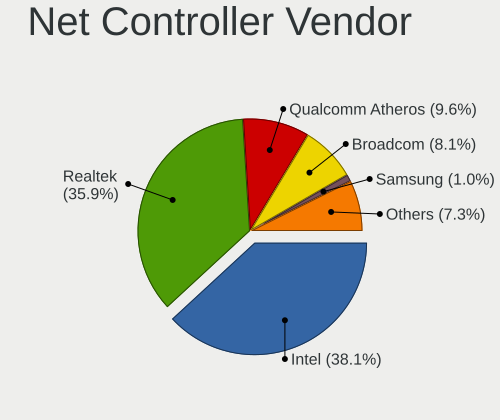

| Vendor                     | Computers | Percent |
|----------------------------|-----------|---------|
| Intel                      | 270       | 38.14%  |
| Realtek Semiconductor      | 254       | 35.88%  |
| Qualcomm Atheros           | 68        | 9.6%    |
| Broadcom                   | 57        | 8.05%   |
| Samsung Electronics        | 7         | 0.99%   |
| JMicron Technology         | 6         | 0.85%   |
| Ralink Technology          | 5         | 0.71%   |
| D-Link System              | 5         | 0.71%   |
| Ralink                     | 4         | 0.56%   |
| Nvidia                     | 4         | 0.56%   |
| IMC Networks               | 4         | 0.56%   |
| MediaTek                   | 3         | 0.42%   |
| TP-Link                    | 2         | 0.28%   |
| Mellanox Technologies      | 2         | 0.28%   |
| Marvell Technology Group   | 2         | 0.28%   |
| ICS Advent                 | 2         | 0.28%   |
| Edimax Technology          | 2         | 0.28%   |
| Dell                       | 2         | 0.28%   |
| ZTE WCDMA Technologies MSM | 1         | 0.14%   |
| Xiaomi                     | 1         | 0.14%   |
| SysKonnect                 | 1         | 0.14%   |
| STMicroelectronics         | 1         | 0.14%   |
| IBM                        | 1         | 0.14%   |
| D-Link                     | 1         | 0.14%   |
| Arduino SA                 | 1         | 0.14%   |
| Aquantia                   | 1         | 0.14%   |
| 3Com                       | 1         | 0.14%   |

Net Controller Model
--------------------

Controller models

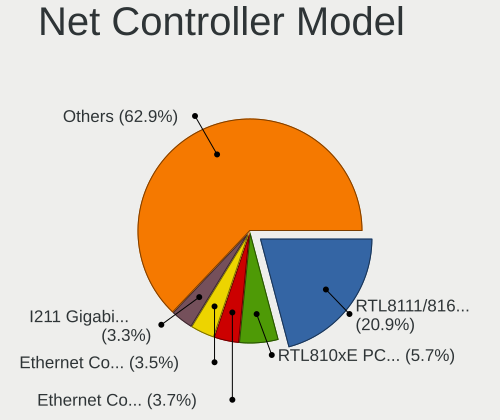

| Model                                                                         | Computers | Percent |
|-------------------------------------------------------------------------------|-----------|---------|
| Realtek RTL8111/8168/8211/8411 PCI Express Gigabit Ethernet Controller        | 177       | 20.9%   |
| Realtek RTL810xE PCI Express Fast Ethernet controller                         | 48        | 5.67%   |
| Intel Ethernet Controller I225-V                                              | 31        | 3.66%   |
| Intel Ethernet Controller I226-V                                              | 30        | 3.54%   |
| Intel I211 Gigabit Network Connection                                         | 28        | 3.31%   |
| Qualcomm Atheros QCA9565 / AR9565 Wireless Network Adapter                    | 18        | 2.13%   |
| Realtek RTL8111/8168/8411 PCI Express Gigabit Ethernet Controller             | 17        | 2.01%   |
| Qualcomm Atheros AR9485 Wireless Network Adapter                              | 16        | 1.89%   |
| Intel 82579LM Gigabit Network Connection (Lewisville)                         | 14        | 1.65%   |
| Intel I350 Gigabit Network Connection                                         | 13        | 1.53%   |
| Intel 82574L Gigabit Network Connection                                       | 13        | 1.53%   |
| Intel I210 Gigabit Network Connection                                         | 12        | 1.42%   |
| Realtek RTL8821CE 802.11ac PCIe Wireless Network Adapter                      | 11        | 1.3%    |
| Intel 82576 Gigabit Network Connection                                        | 11        | 1.3%    |
| Broadcom NetXtreme BCM5720 Gigabit Ethernet PCIe                              | 11        | 1.3%    |
| Broadcom NetXtreme II BCM5709 Gigabit Ethernet                                | 10        | 1.18%   |
| Realtek RTL8169 PCI Gigabit Ethernet Controller                               | 9         | 1.06%   |
| Realtek RTL-8100/8101L/8139 PCI Fast Ethernet Adapter                         | 9         | 1.06%   |
| Qualcomm Atheros QCA9377 802.11ac Wireless Network Adapter                    | 9         | 1.06%   |
| Intel Wireless 7265                                                           | 8         | 0.94%   |
| Intel Wi-Fi 6 AX201                                                           | 8         | 0.94%   |
| Intel 82571EB/82571GB Gigabit Ethernet Controller D0/D1 (copper applications) | 8         | 0.94%   |
| Realtek RTL8188CE 802.11b/g/n WiFi Adapter                                    | 7         | 0.83%   |
| Realtek RTL8125 2.5GbE Controller                                             | 6         | 0.71%   |
| Qualcomm Atheros AR9285 Wireless Network Adapter (PCI-Express)                | 6         | 0.71%   |
| Qualcomm Atheros AR8151 v2.0 Gigabit Ethernet                                 | 6         | 0.71%   |
| Intel Wireless 8265 / 8275                                                    | 6         | 0.71%   |
| Intel Wireless 3165                                                           | 6         | 0.71%   |
| Intel Wi-Fi 6 AX200                                                           | 6         | 0.71%   |
| Intel Centrino Advanced-N 6205 [Taylor Peak]                                  | 6         | 0.71%   |
| Realtek RTL8188EUS 802.11n Wireless Network Adapter                           | 5         | 0.59%   |
| Realtek 8811CU Wireless LAN 802.11ac USB NIC                                  | 5         | 0.59%   |
| Intel Wireless 8260                                                           | 5         | 0.59%   |
| Intel Wi-Fi 6E(802.11ax) AX210/AX1675* 2x2 [Typhoon Peak]                     | 5         | 0.59%   |
| Intel Ethernet Connection I217-LM                                             | 5         | 0.59%   |
| Intel Ethernet Connection (2) I219-LM                                         | 5         | 0.59%   |
| Intel 82599ES 10-Gigabit SFI/SFP+ Network Connection                          | 5         | 0.59%   |
| Broadcom NetXtreme BCM5722 Gigabit Ethernet PCI Express                       | 5         | 0.59%   |
| Samsung Galaxy series, misc. (tethering mode)                                 | 4         | 0.47%   |
| JMicron JMC250 PCI Express Gigabit Ethernet Controller                        | 4         | 0.47%   |

Wireless Vendor
---------------

Wireless vendors

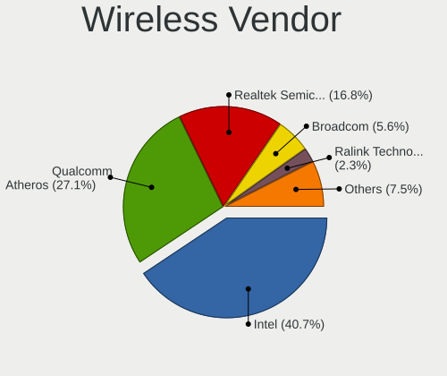

| Vendor                | Computers | Percent |
|-----------------------|-----------|---------|
| Intel                 | 87        | 40.65%  |
| Qualcomm Atheros      | 58        | 27.1%   |
| Realtek Semiconductor | 36        | 16.82%  |
| Broadcom              | 12        | 5.61%   |
| Ralink Technology     | 5         | 2.34%   |
| Ralink                | 4         | 1.87%   |
| IMC Networks          | 4         | 1.87%   |
| TP-Link               | 2         | 0.93%   |
| Edimax Technology     | 2         | 0.93%   |
| MediaTek              | 1         | 0.47%   |
| Dell                  | 1         | 0.47%   |
| D-Link System         | 1         | 0.47%   |
| D-Link                | 1         | 0.47%   |

Wireless Model
--------------

Wireless models

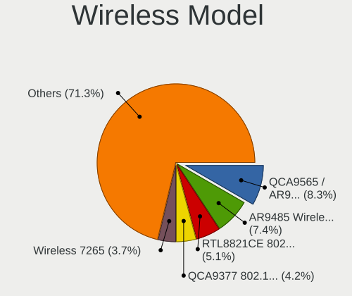

| Model                                                          | Computers | Percent |
|----------------------------------------------------------------|-----------|---------|
| Qualcomm Atheros QCA9565 / AR9565 Wireless Network Adapter     | 18        | 8.33%   |
| Qualcomm Atheros AR9485 Wireless Network Adapter               | 16        | 7.41%   |
| Realtek RTL8821CE 802.11ac PCIe Wireless Network Adapter       | 11        | 5.09%   |
| Qualcomm Atheros QCA9377 802.11ac Wireless Network Adapter     | 9         | 4.17%   |
| Intel Wireless 7265                                            | 8         | 3.7%    |
| Intel Wi-Fi 6 AX201                                            | 8         | 3.7%    |
| Realtek RTL8188CE 802.11b/g/n WiFi Adapter                     | 7         | 3.24%   |
| Qualcomm Atheros AR9285 Wireless Network Adapter (PCI-Express) | 6         | 2.78%   |
| Intel Wireless 8265 / 8275                                     | 6         | 2.78%   |
| Intel Wireless 3165                                            | 6         | 2.78%   |
| Intel Wi-Fi 6 AX200                                            | 6         | 2.78%   |
| Intel Centrino Advanced-N 6205 [Taylor Peak]                   | 6         | 2.78%   |
| Realtek RTL8188EUS 802.11n Wireless Network Adapter            | 5         | 2.31%   |
| Realtek 8811CU Wireless LAN 802.11ac USB NIC                   | 5         | 2.31%   |
| Intel Wireless 8260                                            | 5         | 2.31%   |
| Intel Wi-Fi 6E(802.11ax) AX210/AX1675* 2x2 [Typhoon Peak]      | 5         | 2.31%   |
| IMC Networks 802.11 n/g/b Wireless LAN USB Mini-Card           | 4         | 1.85%   |
| Broadcom BCM43224 802.11a/b/g/n                                | 4         | 1.85%   |
| Realtek RTL8188EE Wireless Network Adapter                     | 3         | 1.39%   |
| Qualcomm Atheros QCA6174 802.11ac Wireless Network Adapter     | 3         | 1.39%   |
| Qualcomm Atheros AR9287 Wireless Network Adapter (PCI-Express) | 3         | 1.39%   |
| Intel Wireless 7260                                            | 3         | 1.39%   |
| Intel Dual Band Wireless-AC 3165 Plus Bluetooth                | 3         | 1.39%   |
| Intel Centrino Advanced-N 6235                                 | 3         | 1.39%   |
| TP-Link AC600 wireless Realtek RTL8811AU [Archer T2U Nano]     | 2         | 0.93%   |
| Ralink RT2870/RT3070 Wireless Adapter                          | 2         | 0.93%   |
| Ralink RT3060 Wireless 802.11n 1T/1R                           | 2         | 0.93%   |
| Ralink RT2561/RT61 rev B 802.11g                               | 2         | 0.93%   |
| Intel Tiger Lake PCH CNVi WiFi                                 | 2         | 0.93%   |
| Intel Raptor Lake PCH CNVi WiFi                                | 2         | 0.93%   |
| Intel PRO/Wireless 3945ABG [Golan] Network Connection          | 2         | 0.93%   |
| Intel Ice Lake-LP PCH CNVi WiFi                                | 2         | 0.93%   |
| Intel Gemini Lake PCH CNVi WiFi                                | 2         | 0.93%   |
| Intel Dual Band Wireless-AC 3168NGW [Stone Peak]               | 2         | 0.93%   |
| Intel Comet Lake PCH-LP CNVi WiFi                              | 2         | 0.93%   |
| Intel Comet Lake PCH CNVi WiFi                                 | 2         | 0.93%   |
| Intel Centrino Advanced-N 6200                                 | 2         | 0.93%   |
| Intel Alder Lake-P PCH CNVi WiFi                               | 2         | 0.93%   |
| Broadcom BCM43225 802.11b/g/n                                  | 2         | 0.93%   |
| Realtek RTL8822BE 802.11a/b/g/n/ac WiFi adapter                | 1         | 0.46%   |

Ethernet Vendor
---------------

Ethernet vendors

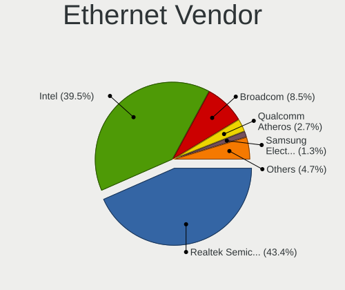

| Vendor                     | Computers | Percent |
|----------------------------|-----------|---------|
| Realtek Semiconductor      | 241       | 43.42%  |
| Intel                      | 219       | 39.46%  |
| Broadcom                   | 47        | 8.47%   |
| Qualcomm Atheros           | 15        | 2.7%    |
| Samsung Electronics        | 7         | 1.26%   |
| JMicron Technology         | 6         | 1.08%   |
| Nvidia                     | 4         | 0.72%   |
| D-Link System              | 4         | 0.72%   |
| MediaTek                   | 2         | 0.36%   |
| Marvell Technology Group   | 2         | 0.36%   |
| ICS Advent                 | 2         | 0.36%   |
| ZTE WCDMA Technologies MSM | 1         | 0.18%   |
| Xiaomi                     | 1         | 0.18%   |
| SysKonnect                 | 1         | 0.18%   |
| IBM                        | 1         | 0.18%   |
| Aquantia                   | 1         | 0.18%   |
| 3Com                       | 1         | 0.18%   |

Ethernet Model
--------------

Ethernet models

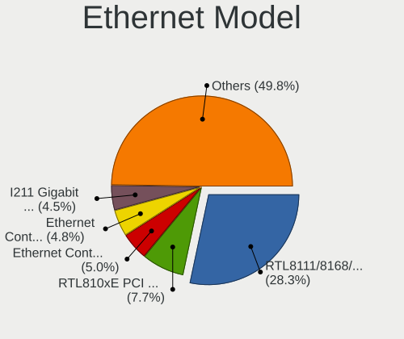

| Model                                                                         | Computers | Percent |
|-------------------------------------------------------------------------------|-----------|---------|
| Realtek RTL8111/8168/8211/8411 PCI Express Gigabit Ethernet Controller        | 177       | 28.32%  |
| Realtek RTL810xE PCI Express Fast Ethernet controller                         | 48        | 7.68%   |
| Intel Ethernet Controller I225-V                                              | 31        | 4.96%   |
| Intel Ethernet Controller I226-V                                              | 30        | 4.8%    |
| Intel I211 Gigabit Network Connection                                         | 28        | 4.48%   |
| Realtek RTL8111/8168/8411 PCI Express Gigabit Ethernet Controller             | 17        | 2.72%   |
| Intel 82579LM Gigabit Network Connection (Lewisville)                         | 14        | 2.24%   |
| Intel I350 Gigabit Network Connection                                         | 13        | 2.08%   |
| Intel 82574L Gigabit Network Connection                                       | 13        | 2.08%   |
| Intel I210 Gigabit Network Connection                                         | 12        | 1.92%   |
| Intel 82576 Gigabit Network Connection                                        | 11        | 1.76%   |
| Broadcom NetXtreme BCM5720 Gigabit Ethernet PCIe                              | 11        | 1.76%   |
| Broadcom NetXtreme II BCM5709 Gigabit Ethernet                                | 10        | 1.6%    |
| Realtek RTL8169 PCI Gigabit Ethernet Controller                               | 9         | 1.44%   |
| Realtek RTL-8100/8101L/8139 PCI Fast Ethernet Adapter                         | 9         | 1.44%   |
| Intel 82571EB/82571GB Gigabit Ethernet Controller D0/D1 (copper applications) | 8         | 1.28%   |
| Realtek RTL8125 2.5GbE Controller                                             | 6         | 0.96%   |
| Qualcomm Atheros AR8151 v2.0 Gigabit Ethernet                                 | 6         | 0.96%   |
| Intel Ethernet Connection I217-LM                                             | 5         | 0.8%    |
| Intel Ethernet Connection (2) I219-LM                                         | 5         | 0.8%    |
| Intel 82599ES 10-Gigabit SFI/SFP+ Network Connection                          | 5         | 0.8%    |
| Broadcom NetXtreme BCM5722 Gigabit Ethernet PCI Express                       | 5         | 0.8%    |
| Samsung Galaxy series, misc. (tethering mode)                                 | 4         | 0.64%   |
| JMicron JMC250 PCI Express Gigabit Ethernet Controller                        | 4         | 0.64%   |
| Intel Ethernet Connection (7) I219-LM                                         | 4         | 0.64%   |
| Intel Ethernet Connection (3) I218-LM                                         | 4         | 0.64%   |
| Intel Ethernet Connection (2) I219-V                                          | 4         | 0.64%   |
| Intel 82583V Gigabit Network Connection                                       | 4         | 0.64%   |
| Intel 82580 Gigabit Network Connection                                        | 4         | 0.64%   |
| Intel 82578DM Gigabit Network Connection                                      | 4         | 0.64%   |
| D-Link System DGE-528T Gigabit Ethernet Adapter                               | 4         | 0.64%   |
| Samsung GT-I9070 (network tethering, USB debugging enabled)                   | 3         | 0.48%   |
| Qualcomm Atheros AR8152 v2.0 Fast Ethernet                                    | 3         | 0.48%   |
| Intel Ethernet Controller 10-Gigabit X540-AT2                                 | 3         | 0.48%   |
| Intel Ethernet Connection I219-LM                                             | 3         | 0.48%   |
| Intel Ethernet Connection (4) I219-LM                                         | 3         | 0.48%   |
| Intel Ethernet Connection (2) I218-V                                          | 3         | 0.48%   |
| Intel 82579V Gigabit Network Connection                                       | 3         | 0.48%   |
| Intel 82578DC Gigabit Network Connection                                      | 3         | 0.48%   |
| Intel 82575GB Gigabit Network Connection                                      | 3         | 0.48%   |

Net Controller Kind
-------------------

Ethernet, WiFi or modem

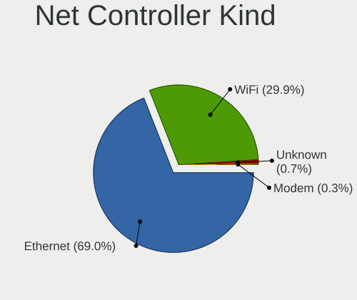

| Kind     | Computers | Percent |
|----------|-----------|---------|
| Ethernet | 466       | 69.04%  |
| WiFi     | 202       | 29.93%  |
| Unknown  | 5         | 0.74%   |
| Modem    | 2         | 0.3%    |

Used Controller
---------------

Currently used network controller

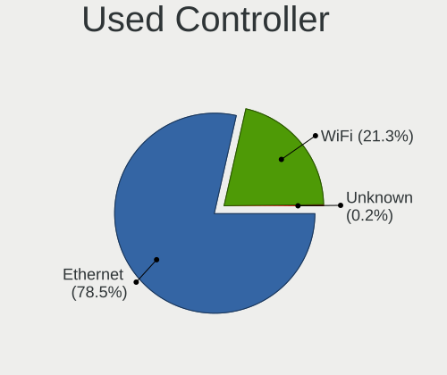

| Kind     | Computers | Percent |
|----------|-----------|---------|
| Ethernet | 413       | 78.52%  |
| WiFi     | 112       | 21.29%  |
| Unknown  | 1         | 0.19%   |

NICs
----

Total network controllers on board

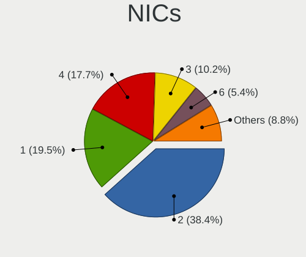

| Total | Computers | Percent |
|-------|-----------|---------|
| 2     | 191       | 38.35%  |
| 1     | 97        | 19.48%  |
| 4     | 88        | 17.67%  |
| 3     | 51        | 10.24%  |
| 6     | 27        | 5.42%   |
| 5     | 23        | 4.62%   |
| 8     | 6         | 1.2%    |
| 9     | 4         | 0.8%    |
| 7     | 3         | 0.6%    |
| 0     | 3         | 0.6%    |
| 10    | 2         | 0.4%    |
| 20    | 1         | 0.2%    |
| 14    | 1         | 0.2%    |
| 11    | 1         | 0.2%    |

IPv6
----

IPv6 vs IPv4

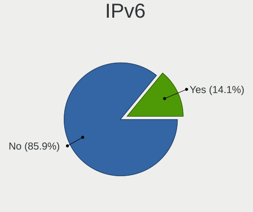

| Used | Computers | Percent |
|------|-----------|---------|
| No   | 433       | 85.91%  |
| Yes  | 71        | 14.09%  |

Bluetooth
---------

Bluetooth Vendor
----------------

Controller vendors

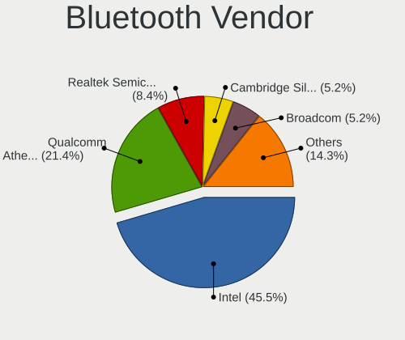

| Vendor                          | Computers | Percent |
|---------------------------------|-----------|---------|
| Intel                           | 70        | 45.45%  |
| Qualcomm Atheros Communications | 33        | 21.43%  |
| Realtek Semiconductor           | 13        | 8.44%   |
| Cambridge Silicon Radio         | 8         | 5.19%   |
| Broadcom                        | 8         | 5.19%   |
| Apple                           | 8         | 5.19%   |
| Lite-On Technology              | 6         | 3.9%    |
| Foxconn / Hon Hai               | 4         | 2.6%    |
| IMC Networks                    | 2         | 1.3%    |
| Qcom                            | 1         | 0.65%   |
| Dell                            | 1         | 0.65%   |

Bluetooth Model
---------------

Controller models

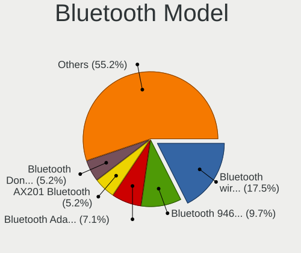

| Model                                                       | Computers | Percent |
|-------------------------------------------------------------|-----------|---------|
| Intel Bluetooth wireless interface                          | 27        | 17.53%  |
| Intel Bluetooth 9460/9560 Jefferson Peak (JfP)              | 15        | 9.74%   |
| Realtek Bluetooth Adapter                                   | 11        | 7.14%   |
| Intel AX201 Bluetooth                                       | 8         | 5.19%   |
| Cambridge Silicon Radio Bluetooth Dongle (HCI mode)         | 8         | 5.19%   |
| Qualcomm Atheros QCA9377 Bluetooth 4.1                      | 7         | 4.55%   |
| Qualcomm Atheros AR9462 Bluetooth                           | 7         | 4.55%   |
| Qualcomm Atheros AR3012 Bluetooth 4.0                       | 7         | 4.55%   |
| Intel AX200 Bluetooth                                       | 6         | 3.9%    |
| Qualcomm Atheros Dell Wireless 1703 Bluetooth               | 5         | 3.25%   |
| Intel AX210 Bluetooth                                       | 5         | 3.25%   |
| Apple Bluetooth Host Controller                             | 5         | 3.25%   |
| Qualcomm Atheros Dell Wireless 1820 Bluetooth 4.1LE         | 3         | 1.95%   |
| Qualcomm Atheros AR3011 Bluetooth                           | 3         | 1.95%   |
| Intel Centrino Bluetooth Wireless Transceiver               | 3         | 1.95%   |
| Intel AX211 Bluetooth                                       | 3         | 1.95%   |
| Broadcom BCM20702 Bluetooth 4.0 [ThinkPad]                  | 3         | 1.95%   |
| Lite-On Qualcomm Atheros Bluetooth                          | 2         | 1.3%    |
| Intel Wireless-AC 3168 Bluetooth                            | 2         | 1.3%    |
| Foxconn / Hon Hai Qualcomm Atheros AR3011 Bluetooth Adapter | 2         | 1.3%    |
| Broadcom BCM2045B (BDC-2.1)                                 | 2         | 1.3%    |
| Apple Built-in Bluetooth 2.0+EDR HCI                        | 2         | 1.3%    |
| Realtek CSR Bluetooth Chip                                  | 1         | 0.65%   |
| Realtek Bluetooth 4.0 Adapter                               | 1         | 0.65%   |
| Qualcomm Atheros Dell Wireless 1707 Bluetooth 4.0 LE Device | 1         | 0.65%   |
| Qcom Broadcom Bluetooth USB                                 | 1         | 0.65%   |
| Lite-On Qualcomm Atheros QCA9377 Bluetooth                  | 1         | 0.65%   |
| Lite-On MediaTek Bluetooth MT7921                           | 1         | 0.65%   |
| Lite-On Atheros Bluetooth                                   | 1         | 0.65%   |
| Lite-On Atheros AR3012 Bluetooth                            | 1         | 0.65%   |
| Intel Wireless-AC 9260 Bluetooth Adapter                    | 1         | 0.65%   |
| IMC Networks Realtek Bluetooth Adapter                      | 1         | 0.65%   |
| IMC Networks Bluetooth Module                               | 1         | 0.65%   |
| Foxconn / Hon Hai Qualcomm Atheros Bluetooth 4.0            | 1         | 0.65%   |
| Foxconn / Hon Hai Broadcom Bluetooth 2.1 Device             | 1         | 0.65%   |
| Dell Wireless 355 Bluetooth                                 | 1         | 0.65%   |
| Broadcom BCM2070 Bluetooth                                  | 1         | 0.65%   |
| Broadcom BCM2046 Bluetooth Device                           | 1         | 0.65%   |
| Broadcom BCM2045B (BDC-2) [Bluetooth Controller]            | 1         | 0.65%   |
| Apple Built-in iSight (no firmware loaded)                  | 1         | 0.65%   |

Sound
-----

Sound Vendor
------------

Sound card vendors

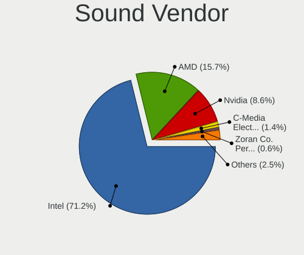

| Vendor                                          | Computers | Percent |
|-------------------------------------------------|-----------|---------|
| Intel                                           | 348       | 71.17%  |
| AMD                                             | 77        | 15.75%  |
| Nvidia                                          | 42        | 8.59%   |
| C-Media Electronics                             | 7         | 1.43%   |
| Zoran Co. Personal Media Division (Nogatech)    | 3         | 0.61%   |
| XING WEI 2.4G USB                               | 1         | 0.2%    |
| Weltrend Semiconductor                          | 1         | 0.2%    |
| Texas Instruments                               | 1         | 0.2%    |
| Plantronics                                     | 1         | 0.2%    |
| M-Audio                                         | 1         | 0.2%    |
| Logitech                                        | 1         | 0.2%    |
| Licensed by Sony Computer Entertainment America | 1         | 0.2%    |
| Lenovo                                          | 1         | 0.2%    |
| KTMicro                                         | 1         | 0.2%    |
| Generalplus Technology                          | 1         | 0.2%    |
| DSEA A/S                                        | 1         | 0.2%    |
| -- KTMicro --                                   | 1         | 0.2%    |

Sound Model
-----------

Sound card models

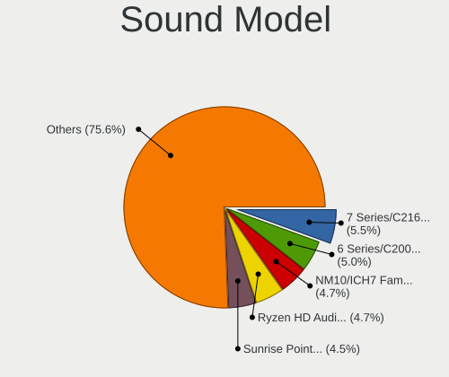

| Model                                                                                             | Computers | Percent |
|---------------------------------------------------------------------------------------------------|-----------|---------|
| Intel 7 Series/C216 Chipset Family High Definition Audio Controller                               | 32        | 5.54%   |
| Intel 6 Series/C200 Series Chipset Family High Definition Audio Controller                        | 29        | 5.02%   |
| Intel NM10/ICH7 Family High Definition Audio Controller                                           | 27        | 4.67%   |
| AMD Ryzen HD Audio Controller                                                                     | 27        | 4.67%   |
| Intel Sunrise Point-LP HD Audio                                                                   | 26        | 4.5%    |
| Intel Celeron/Pentium Silver Processor High Definition Audio                                      | 21        | 3.63%   |
| Intel Jasper Lake HD Audio                                                                        | 20        | 3.46%   |
| Intel Haswell-ULT HD Audio Controller                                                             | 18        | 3.11%   |
| Intel 8 Series HD Audio Controller                                                                | 18        | 3.11%   |
| AMD SBx00 Azalia (Intel HDA)                                                                      | 18        | 3.11%   |
| Intel Atom Processor Z36xxx/Z37xxx Series High Definition Audio Controller                        | 17        | 2.94%   |
| Intel 100 Series/C230 Series Chipset Family HD Audio Controller                                   | 17        | 2.94%   |
| AMD Renoir/Cezanne HDMI/DP Audio Controller                                                       | 17        | 2.94%   |
| Intel 8 Series/C220 Series Chipset High Definition Audio Controller                               | 16        | 2.77%   |
| Intel 5 Series/3400 Series Chipset High Definition Audio                                          | 16        | 2.77%   |
| Intel Xeon E3-1200 v3/4th Gen Core Processor HD Audio Controller                                  | 15        | 2.6%    |
| Intel Broadwell-U Audio Controller                                                                | 14        | 2.42%   |
| Intel Wildcat Point-LP High Definition Audio Controller                                           | 13        | 2.25%   |
| Intel Cannon Lake PCH cAVS                                                                        | 11        | 1.9%    |
| Intel Alder Lake-N PCH High Definition Audio Controller                                           | 11        | 1.9%    |
| AMD Raven/Raven2/Fenghuang HDMI/DP Audio Controller                                               | 10        | 1.73%   |
| Intel Tiger Lake-LP Smart Sound Technology Audio Controller                                       | 9         | 1.56%   |
| Intel 200 Series PCH HD Audio                                                                     | 8         | 1.38%   |
| AMD FCH Azalia Controller                                                                         | 7         | 1.21%   |
| Intel 82801I (ICH9 Family) HD Audio Controller                                                    | 6         | 1.04%   |
| AMD Wrestler HDMI Audio                                                                           | 6         | 1.04%   |
| Nvidia High Definition Audio Controller                                                           | 5         | 0.87%   |
| Intel Celeron N3350/Pentium N4200/Atom E3900 Series Audio Cluster                                 | 5         | 0.87%   |
| Intel Cannon Point-LP High Definition Audio Controller                                            | 5         | 0.87%   |
| Nvidia TU107 GeForce GTX 1650 High Definition Audio Controller                                    | 4         | 0.69%   |
| Nvidia GP107GL High Definition Audio Controller                                                   | 4         | 0.69%   |
| Nvidia GK107 HDMI Audio Controller                                                                | 4         | 0.69%   |
| Intel Comet Lake PCH-LP cAVS                                                                      | 4         | 0.69%   |
| Intel Atom/Celeron/Pentium Processor x5-E8000/J3xxx/N3xxx Series High Definition Audio Controller | 4         | 0.69%   |
| AMD Oland/Hainan/Cape Verde/Pitcairn HDMI Audio [Radeon HD 7000 Series]                           | 4         | 0.69%   |
| AMD Kaveri HDMI/DP Audio Controller                                                               | 4         | 0.69%   |
| AMD Ellesmere HDMI Audio [Radeon RX 470/480 / 570/580/590]                                        | 4         | 0.69%   |
| AMD Baffin HDMI/DP Audio [Radeon RX 550 640SP / RX 560/560X]                                      | 4         | 0.69%   |
| Zoran Co. Personal Media Division (Nogatech) USB Audio and HID                                    | 3         | 0.52%   |
| Nvidia MCP61 High Definition Audio                                                                | 3         | 0.52%   |

Memory
------

Memory Vendor
-------------

Memory module vendors

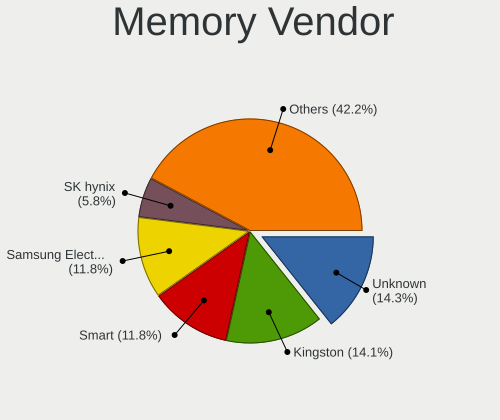

| Vendor              | Computers | Percent |
|---------------------|-----------|---------|
| Unknown             | 79        | 14.31%  |
| Kingston            | 78        | 14.13%  |
| Smart               | 65        | 11.78%  |
| Samsung Electronics | 65        | 11.78%  |
| SK hynix            | 32        | 5.8%    |
| Unknown             | 29        | 5.25%   |
| Crucial             | 25        | 4.53%   |
| A-DATA Technology   | 23        | 4.17%   |
| Teikon              | 22        | 3.99%   |
| Micron Technology   | 20        | 3.62%   |
| Corsair             | 11        | 1.99%   |
| Unknown (ABCD)      | 6         | 1.09%   |
| Smart Brazil        | 6         | 1.09%   |
| High Bridge         | 6         | 1.09%   |
| PUSKILL             | 4         | 0.72%   |
| Multilaser          | 4         | 0.72%   |
| Hikvision           | 4         | 0.72%   |
| Hewlett-Packard     | 4         | 0.72%   |
| Apacer              | 4         | 0.72%   |
| Team                | 3         | 0.54%   |
| Smart Modular       | 3         | 0.54%   |
| MemoWise            | 3         | 0.54%   |
| G.Skill             | 3         | 0.54%   |
| Atermiter           | 3         | 0.54%   |
| Toshiba             | 2         | 0.36%   |
| RZX                 | 2         | 0.36%   |
| Patriot             | 2         | 0.36%   |
| Nanya Technology    | 2         | 0.36%   |
| Lexar               | 2         | 0.36%   |
| Kllisre             | 2         | 0.36%   |
| 019400B300CE        | 2         | 0.36%   |
| Walton Chaintech    | 1         | 0.18%   |
| Unknown (AB)        | 1         | 0.18%   |
| Unknown (8A02)      | 1         | 0.18%   |
| Unknown (0x5846)    | 1         | 0.18%   |
| Unknown (0x0DD5)    | 1         | 0.18%   |
| Unknown (0x0B92)    | 1         | 0.18%   |
| Unknown (0x0B5E)    | 1         | 0.18%   |
| Unknown (0x0B45)    | 1         | 0.18%   |
| Unknown (0x0080)    | 1         | 0.18%   |

Memory Model
------------

Memory module models

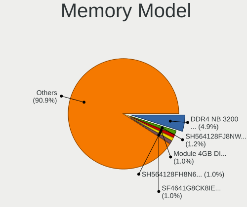

| Model                                                            | Computers | Percent |
|------------------------------------------------------------------|-----------|---------|
| Unknown                                                          | 29        | 4.91%   |
| Smart RAM SH564128FJ8NWRNSQG 4GB SODIMM DDR3 1600MT/s            | 7         | 1.18%   |
| Unknown RAM Module 4GB DIMM DDR3 1600MT/s                        | 6         | 1.02%   |
| Smart RAM SH564128FH8N6TNSQG 4GB DIMM DDR3 1600MT/s              | 6         | 1.02%   |
| Smart RAM SF4641G8CK8IEHLSBG 8GB SODIMM DDR4 2667MT/s            | 6         | 1.02%   |
| Unknown RAM Module 2GB DIMM SDRAM                                | 5         | 0.85%   |
| Smart RAM SH564128FJ8NWRNSQR 4GB SODIMM DDR3 1600MT/s            | 5         | 0.85%   |
| Unknown RAM Module 8GB SODIMM DDR3 1600MT/s                      | 4         | 0.68%   |
| Unknown RAM Module 4GB DIMM 1333MT/s                             | 4         | 0.68%   |
| Unknown RAM Module 2GB DIMM DDR2 800MT/s                         | 4         | 0.68%   |
| Unknown (ABCD) RAM 123456789012345678 8GB DIMM DDR4 2400MT/s     | 4         | 0.68%   |
| Smart RAM SH564568FH8NZPHSCR 2GB SODIMM DDR3 1334MT/s            | 4         | 0.68%   |
| Smart RAM SH564128FJ8NZRNSDG 4GB SODIMM DDR3 1600MT/s            | 4         | 0.68%   |
| Unknown RAM Module 8GB DIMM DDR3 1333MT/s                        | 3         | 0.51%   |
| Unknown RAM Module 4GB SODIMM DDR4 2667MT/s                      | 3         | 0.51%   |
| Unknown RAM Module 4GB DIMM SDRAM                                | 3         | 0.51%   |
| Unknown RAM Module 4GB DIMM DDR3 1333MT/s                        | 3         | 0.51%   |
| Unknown RAM Module 2GB SODIMM DDR2 667MT/s                       | 3         | 0.51%   |
| Unknown RAM Module 2GB DIMM DDR3 1333MT/s                        | 3         | 0.51%   |
| Unknown RAM Module 2GB DIMM DDR2 667MT/s                         | 3         | 0.51%   |
| Unknown RAM Module 2GB DIMM DDR2                                 | 3         | 0.51%   |
| Unknown RAM Module 2GB DIMM                                      | 3         | 0.51%   |
| Smart RAM SH564568FH8N6PHSFG 2GB DIMM DDR3 1333MT/s              | 3         | 0.51%   |
| Smart RAM SH564568FH8N0QHSCG 2GB DIMM DDR3 1333MT/s              | 3         | 0.51%   |
| Smart RAM SH564128FH8NZQNSCG 4GB SODIMM DDR3 1600MT/s            | 3         | 0.51%   |
| Smart RAM SH564128FH8NZPHSCR 4GB SODIMM DDR3 1333MT/s            | 3         | 0.51%   |
| Smart RAM SF4641G8CK8IWGKSEG 8GB SODIMM DDR4 2400MT/s            | 3         | 0.51%   |
| Smart Brazil RAM SMS4TDC3C0K0446SCG 4GB SODIMM DDR4 2400MT/s     | 3         | 0.51%   |
| Samsung RAM M471A5244CB0-CRC 4GB SODIMM DDR4 2400MT/s            | 3         | 0.51%   |
| Samsung RAM M425R1GB4BB0-CWMOD 8GB SODIMM DDR5 5600MT/s          | 3         | 0.51%   |
| Samsung RAM M378B5673EH1-CF8 2GB DIMM DDR3 1067MT/s              | 3         | 0.51%   |
| MemoWise RAM MW04GN1339UB8 4GB DIMM DDR3 1333MT/s                | 3         | 0.51%   |
| Kingston RAM Module 8GB SODIMM DDR3 1600MT/s                     | 3         | 0.51%   |
| Kingston RAM 9905428-155.A00LF 8GB SODIMM DDR3 1600MT/s          | 3         | 0.51%   |
| Unknown RAM Module 8GB SODIMM DDR4 2400MT/s                      | 2         | 0.34%   |
| Unknown RAM Module 4GB DIMM 1600MT/s                             | 2         | 0.34%   |
| Unknown RAM Module 2GB DIMM 667MT/s                              | 2         | 0.34%   |
| Unknown RAM Module 1GB DIMM SDRAM                                | 2         | 0.34%   |
| Unknown (ABCD) RAM 123456789012345678 1GB SODIMM LPDDR4 2400MT/s | 2         | 0.34%   |
| Teikon RAM TMTS8G58DFRBFKB-16 8GB SODIMM DDR3 1600MT/s           | 2         | 0.34%   |

Memory Kind
-----------

Memory module kinds

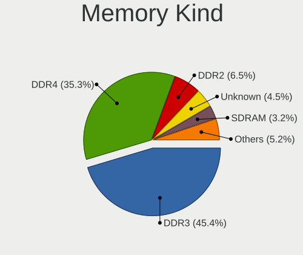

| Kind    | Computers | Percent |
|---------|-----------|---------|
| DDR3    | 211       | 45.38%  |
| DDR4    | 164       | 35.27%  |
| DDR2    | 30        | 6.45%   |
| Unknown | 21        | 4.52%   |
| SDRAM   | 15        | 3.23%   |
| DDR5    | 11        | 2.37%   |
| LPDDR4  | 8         | 1.72%   |
| LPDDR5  | 3         | 0.65%   |
| LPDDR3  | 1         | 0.22%   |
| DDR     | 1         | 0.22%   |

Memory Form Factor
------------------

Physical design of the memory module

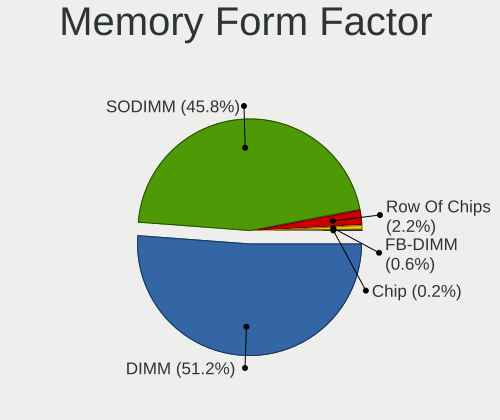

| Name         | Computers | Percent |
|--------------|-----------|---------|
| DIMM         | 237       | 51.19%  |
| SODIMM       | 212       | 45.79%  |
| Row Of Chips | 10        | 2.16%   |
| FB-DIMM      | 3         | 0.65%   |
| Chip         | 1         | 0.22%   |

Memory Size
-----------

Memory module size

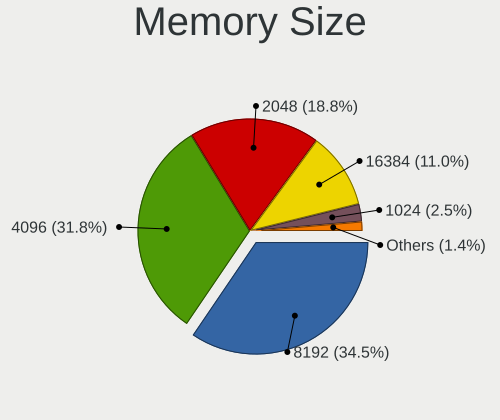

| Size  | Computers | Percent |
|-------|-----------|---------|
| 8192  | 178       | 34.5%   |
| 4096  | 164       | 31.78%  |
| 2048  | 97        | 18.8%   |
| 16384 | 57        | 11.05%  |
| 1024  | 13        | 2.52%   |
| 32768 | 7         | 1.36%   |

Memory Speed
------------

Memory module speed

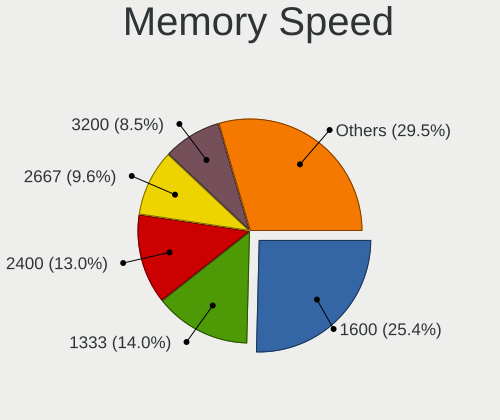

| Speed   | Computers | Percent |
|---------|-----------|---------|
| 1600    | 129       | 25.39%  |
| 1333    | 71        | 13.98%  |
| 2400    | 66        | 12.99%  |
| 2667    | 49        | 9.65%   |
| 3200    | 43        | 8.46%   |
| Unknown | 27        | 5.31%   |
| 2133    | 16        | 3.15%   |
| 800     | 16        | 3.15%   |
| 667     | 15        | 2.95%   |
| 1334    | 12        | 2.36%   |
| 1067    | 10        | 1.97%   |
| 2666    | 9         | 1.77%   |
| 1066    | 7         | 1.38%   |
| 4800    | 6         | 1.18%   |
| 5600    | 5         | 0.98%   |
| 1866    | 4         | 0.79%   |
| 6400    | 3         | 0.59%   |
| 3000    | 3         | 0.59%   |
| 2933    | 3         | 0.59%   |
| 1867    | 3         | 0.59%   |
| 533     | 3         | 0.59%   |
| 400     | 2         | 0.39%   |
| 4267    | 1         | 0.2%    |
| 4000    | 1         | 0.2%    |
| 3733    | 1         | 0.2%    |
| 3600    | 1         | 0.2%    |
| 975     | 1         | 0.2%    |
| 333     | 1         | 0.2%    |

Printers & scanners
-------------------

Printer Vendor
--------------

Printer device vendors

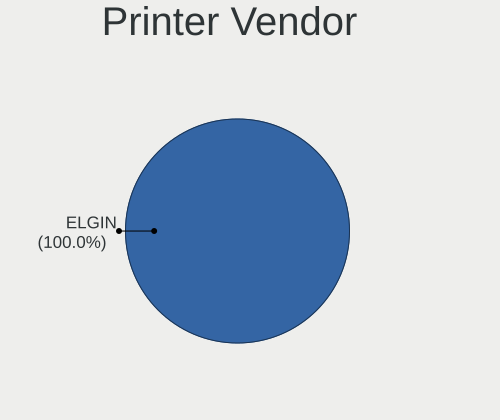

| Vendor | Computers | Percent |
|--------|-----------|---------|
| ELGIN  | 2         | 100%    |

Printer Model
-------------

Printer device models

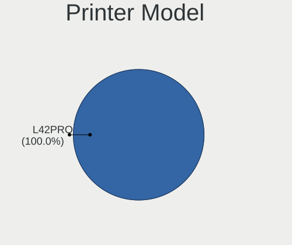

| Model        | Computers | Percent |
|--------------|-----------|---------|
| ELGIN L42PRO | 2         | 100%    |

Scanner Vendor
--------------

Scanner device vendors

Zero info for selected period =(

Scanner Model
-------------

Scanner device models

Zero info for selected period =(

Camera
------

Camera Vendor
-------------

Camera device vendors

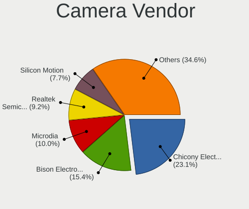

| Vendor                                 | Computers | Percent |
|----------------------------------------|-----------|---------|
| Chicony Electronics                    | 30        | 23.08%  |
| Bison Electronics                      | 20        | 15.38%  |
| Microdia                               | 13        | 10%     |
| Realtek Semiconductor                  | 12        | 9.23%   |
| Silicon Motion                         | 10        | 7.69%   |
| Sunplus Innovation Technology          | 5         | 3.85%   |
| Logitech                               | 4         | 3.08%   |
| IMC Networks                           | 4         | 3.08%   |
| Syntek                                 | 3         | 2.31%   |
| Suyin                                  | 3         | 2.31%   |
| Luxvisions Innotech Limited            | 3         | 2.31%   |
| Apple                                  | 3         | 2.31%   |
| Z-Star Microelectronics                | 2         | 1.54%   |
| Unknown                                | 2         | 1.54%   |
| Quanta                                 | 2         | 1.54%   |
| Lite-On Technology                     | 2         | 1.54%   |
| Lenovo                                 | 2         | 1.54%   |
| Alcor Micro                            | 2         | 1.54%   |
| Y Media                                | 1         | 0.77%   |
| Tripath Technology                     | 1         | 0.77%   |
| Shenzhen Kingcome Optoelectronic       | 1         | 0.77%   |
| Cheng Uei Precision Industry (Foxlink) | 1         | 0.77%   |
| Aveo Technology                        | 1         | 0.77%   |
| Asuscom Network                        | 1         | 0.77%   |
| ALi                                    | 1         | 0.77%   |
| Alcorlink                              | 1         | 0.77%   |

Camera Model
------------

Camera device models

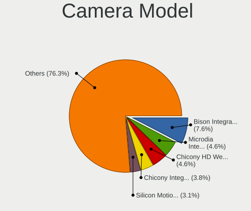

| Model                                                 | Computers | Percent |
|-------------------------------------------------------|-----------|---------|
| Bison Integrated Camera                               | 10        | 7.63%   |
| Microdia Integrated_Webcam_HD                         | 6         | 4.58%   |
| Chicony HD WebCam                                     | 6         | 4.58%   |
| Chicony Integrated Camera                             | 5         | 3.82%   |
| Silicon Motion Realtek DMFT RGB                       | 4         | 3.05%   |
| Realtek Dell EasyCamera                               | 4         | 3.05%   |
| Microdia Dell Laptop Integrated Webcam HD             | 4         | 3.05%   |
| Syntek EasyCamera                                     | 3         | 2.29%   |
| Sunplus Integrated_Webcam_HD                          | 3         | 2.29%   |
| Silicon Motion Realtek USB 2.0 PC Camera              | 3         | 2.29%   |
| Luxvisions Innotech Limited Integrated Camera         | 3         | 2.29%   |
| Chicony Sony Visual Communication Camera              | 3         | 2.29%   |
| Bison Lenovo EasyCamera                               | 3         | 2.29%   |
| Unknown Realtek PC Camera                             | 2         | 1.53%   |
| Realtek Integrated Webcam                             | 2         | 1.53%   |
| Logitech Webcam C270                                  | 2         | 1.53%   |
| Lite-On Integrated Camera                             | 2         | 1.53%   |
| IMC Networks EasyCamera                               | 2         | 1.53%   |
| Chicony VGA WebCam                                    | 2         | 1.53%   |
| Chicony Lenovo Integrated Camera (0.3MP)              | 2         | 1.53%   |
| Bison HD Webcam                                       | 2         | 1.53%   |
| Apple FaceTime HD Camera                              | 2         | 1.53%   |
| Alcor Micro Acer Integrated Webcam                    | 2         | 1.53%   |
| Z-Star Webcam                                         | 1         | 0.76%   |
| Z-Star Venus USB2.0 Camera                            | 1         | 0.76%   |
| Y Media USB Camera                                    | 1         | 0.76%   |
| Tripath USB Camera                                    | 1         | 0.76%   |
| Suyin WebCam                                          | 1         | 0.76%   |
| Suyin USB 2.0 UVC 1.3M WebCam                         | 1         | 0.76%   |
| Suyin Integrated_Webcam_HD                            | 1         | 0.76%   |
| Sunplus SPCA2281 Web Camera                           | 1         | 0.76%   |
| Sunplus HD WebCam                                     | 1         | 0.76%   |
| Silicon Motion WebCam SCX Series                      | 1         | 0.76%   |
| Silicon Motion LG HD WebCam                           | 1         | 0.76%   |
| Silicon Motion ATIV VGA Camera                        | 1         | 0.76%   |
| Shenzhen Kingcome Optoelectronic USB2.0 HD UVC WebCam | 1         | 0.76%   |
| Realtek PC Camera                                     | 1         | 0.76%   |
| Realtek LG Camera                                     | 1         | 0.76%   |
| Realtek Integrated_Webcam_FHD                         | 1         | 0.76%   |
| Realtek Integrated_Webcam_8M                          | 1         | 0.76%   |

Security
--------

Fingerprint Vendor
------------------

Fingerprint sensor vendors

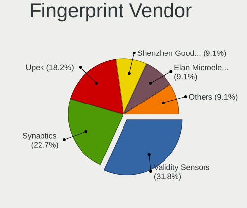

| Vendor                     | Computers | Percent |
|----------------------------|-----------|---------|
| Validity Sensors           | 7         | 31.82%  |
| Synaptics                  | 5         | 22.73%  |
| Upek                       | 4         | 18.18%  |
| Shenzhen Goodix Technology | 2         | 9.09%   |
| Elan Microelectronics      | 2         | 9.09%   |
| Samsung Electronics        | 1         | 4.55%   |
| Broadcom                   | 1         | 4.55%   |

Fingerprint Model
-----------------

Fingerprint sensor models

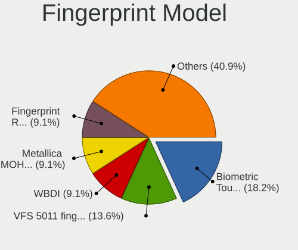

| Model                                                                        | Computers | Percent |
|------------------------------------------------------------------------------|-----------|---------|
| Upek Biometric Touchchip/Touchstrip Fingerprint Sensor                       | 4         | 18.18%  |
| Validity Sensors VFS 5011 fingerprint sensor                                 | 3         | 13.64%  |
| Synaptics WBDI                                                               | 2         | 9.09%   |
| Synaptics Metallica MOH Touch Fingerprint Reader                             | 2         | 9.09%   |
| Shenzhen Goodix Fingerprint Reader                                           | 2         | 9.09%   |
| Elan Fingerprint Sensor                                                      | 2         | 9.09%   |
| Validity Sensors VFS5011 Fingerprint Reader                                  | 1         | 4.55%   |
| Validity Sensors VFS495 Fingerprint Reader                                   | 1         | 4.55%   |
| Validity Sensors Synaptics WBDI                                              | 1         | 4.55%   |
| Validity Sensors Synaptics VFS7552 Touch Fingerprint Sensor                  | 1         | 4.55%   |
| Synaptics Prometheus MIS Touch Fingerprint Reader                            | 1         | 4.55%   |
| Samsung CanvasBio Fingerprint Reader                                         | 1         | 4.55%   |
| Broadcom BCM5880 Secure Applications Processor with fingerprint swipe sensor | 1         | 4.55%   |

Chipcard Vendor
---------------

Chipcard module vendors

Zero info for selected period =(

Chipcard Model
--------------

Chipcard module models

Zero info for selected period =(

Unsupported
-----------

Unsupported Devices
-------------------

Total unsupported devices on board

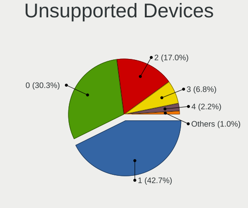

| Total | Computers | Percent |
|-------|-----------|---------|
| 1     | 213       | 42.69%  |
| 0     | 151       | 30.26%  |
| 2     | 85        | 17.03%  |
| 3     | 34        | 6.81%   |
| 4     | 11        | 2.2%    |
| 5     | 5         | 1%      |

Unsupported Device Types
------------------------

Types of unsupported devices

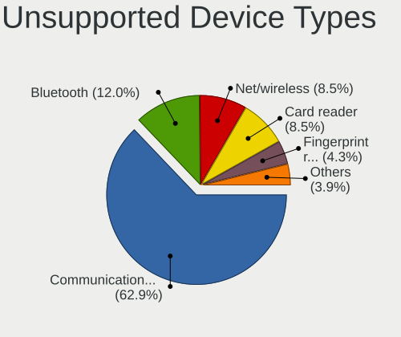

| Type                     | Computers | Percent |
|--------------------------|-----------|---------|
| Communication controller | 310       | 62.88%  |
| Bluetooth                | 59        | 11.97%  |
| Net/wireless             | 42        | 8.52%   |
| Card reader              | 42        | 8.52%   |
| Fingerprint reader       | 21        | 4.26%   |
| Sound                    | 7         | 1.42%   |
| Network                  | 5         | 1.01%   |
| Net/ethernet             | 3         | 0.61%   |
| Graphics card            | 2         | 0.41%   |
| Storage                  | 1         | 0.2%    |
| Firewire controller      | 1         | 0.2%    |

