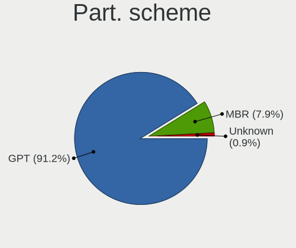
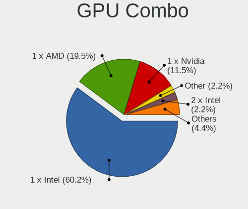
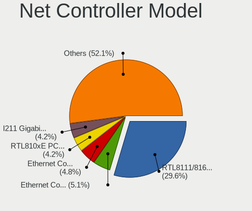

BSD in Brazil - Tested Hardware & Statistics (Desktops)
-------------------------------------------------------

A project to collect tested hardware configurations for BSD in Brazil.

Anyone can contribute to this report by the [hw-probe](https://github.com/linuxhw/hw-probe/blob/master/INSTALL.BSD.md) tool:

    hw-probe -all -upload

Please contribute! Especially if your hardware is rare.

Contents
--------

* [ Test Cases ](#test-cases)

* [ System ](#system)
  - [ OS                       ](#os)
  - [ OS Family                ](#os-family)
  - [ Arch                     ](#arch)
  - [ DE                       ](#de)
  - [ Display Server           ](#display-server)
  - [ Display Manager          ](#display-manager)
  - [ OS Lang                  ](#os-lang)
  - [ Boot Mode                ](#boot-mode)
  - [ Filesystem               ](#filesystem)
  - [ Part. scheme             ](#part-scheme)

* [ Board ](#board)
  - [ Vendor                   ](#vendor)
  - [ Model                    ](#model)
  - [ Model Family             ](#model-family)
  - [ MFG Year                 ](#mfg-year)
  - [ Form Factor              ](#form-factor)
  - [ Coreboot                 ](#coreboot)
  - [ RAM Size                 ](#ram-size)
  - [ RAM Used                 ](#ram-used)
  - [ Total Drives             ](#total-drives)
  - [ Has CD-ROM               ](#has-cd-rom)
  - [ Has Ethernet             ](#has-ethernet)
  - [ Has WiFi                 ](#has-wifi)
  - [ Has Bluetooth            ](#has-bluetooth)

* [ Location ](#location)
  - [ Country                  ](#country)
  - [ City                     ](#city)

* [ Drives ](#drives)
  - [ Drive Vendor             ](#drive-vendor)
  - [ Drive Model              ](#drive-model)
  - [ HDD Vendor               ](#hdd-vendor)
  - [ SSD Vendor               ](#ssd-vendor)
  - [ Drive Kind               ](#drive-kind)
  - [ Drive Connector          ](#drive-connector)
  - [ Drive Size               ](#drive-size)
  - [ Space Total              ](#space-total)
  - [ Space Used               ](#space-used)
  - [ Malfunc. Drives          ](#malfunc-drives)
  - [ Malfunc. Drive Vendor    ](#malfunc-drive-vendor)
  - [ Malfunc. HDD Vendor      ](#malfunc-hdd-vendor)
  - [ Malfunc. Drive Kind      ](#malfunc-drive-kind)
  - [ Failed Drives            ](#failed-drives)
  - [ Failed Drive Vendor      ](#failed-drive-vendor)
  - [ Drive Status             ](#drive-status)

* [ Storage controller ](#storage-controller)
  - [ Storage Vendor           ](#storage-vendor)
  - [ Storage Model            ](#storage-model)
  - [ Storage Kind             ](#storage-kind)

* [ Processor ](#processor)
  - [ CPU Vendor               ](#cpu-vendor)
  - [ CPU Model                ](#cpu-model)
  - [ CPU Model Family         ](#cpu-model-family)
  - [ CPU Cores                ](#cpu-cores)
  - [ CPU Sockets              ](#cpu-sockets)
  - [ CPU Threads              ](#cpu-threads)
  - [ CPU Microarch            ](#cpu-microarch)

* [ Graphics ](#graphics)
  - [ GPU Vendor               ](#gpu-vendor)
  - [ GPU Model                ](#gpu-model)
  - [ GPU Combo                ](#gpu-combo)
  - [ GPU Driver               ](#gpu-driver)
  - [ GPU Memory               ](#gpu-memory)

* [ Monitor ](#monitor)
  - [ Monitor Vendor           ](#monitor-vendor)
  - [ Monitor Model            ](#monitor-model)
  - [ Monitor Resolution       ](#monitor-resolution)
  - [ Monitor Diagonal         ](#monitor-diagonal)
  - [ Monitor Width            ](#monitor-width)
  - [ Aspect Ratio             ](#aspect-ratio)
  - [ Monitor Area             ](#monitor-area)
  - [ Pixel Density            ](#pixel-density)
  - [ Multiple Monitors        ](#multiple-monitors)

* [ Network ](#network)
  - [ Net Controller Vendor    ](#net-controller-vendor)
  - [ Net Controller Model     ](#net-controller-model)
  - [ Wireless Vendor          ](#wireless-vendor)
  - [ Wireless Model           ](#wireless-model)
  - [ Ethernet Vendor          ](#ethernet-vendor)
  - [ Ethernet Model           ](#ethernet-model)
  - [ Net Controller Kind      ](#net-controller-kind)
  - [ Used Controller          ](#used-controller)
  - [ NICs                     ](#nics)
  - [ IPv6                     ](#ipv6)

* [ Bluetooth ](#bluetooth)
  - [ Bluetooth Vendor         ](#bluetooth-vendor)
  - [ Bluetooth Model          ](#bluetooth-model)

* [ Sound ](#sound)
  - [ Sound Vendor             ](#sound-vendor)
  - [ Sound Model              ](#sound-model)

* [ Memory ](#memory)
  - [ Memory Vendor            ](#memory-vendor)
  - [ Memory Model             ](#memory-model)
  - [ Memory Kind              ](#memory-kind)
  - [ Memory Form Factor       ](#memory-form-factor)
  - [ Memory Size              ](#memory-size)
  - [ Memory Speed             ](#memory-speed)

* [ Printers & scanners ](#printers--scanners)
  - [ Printer Vendor           ](#printer-vendor)
  - [ Printer Model            ](#printer-model)
  - [ Scanner Vendor           ](#scanner-vendor)
  - [ Scanner Model            ](#scanner-model)

* [ Camera ](#camera)
  - [ Camera Vendor            ](#camera-vendor)
  - [ Camera Model             ](#camera-model)

* [ Security ](#security)
  - [ Fingerprint Vendor       ](#fingerprint-vendor)
  - [ Fingerprint Model        ](#fingerprint-model)
  - [ Chipcard Vendor          ](#chipcard-vendor)
  - [ Chipcard Model           ](#chipcard-model)

* [ Unsupported ](#unsupported)
  - [ Unsupported Devices      ](#unsupported-devices)
  - [ Unsupported Device Types ](#unsupported-device-types)

Test Cases
----------

Total: 149

| Vendor        | Model                       | Probe                                                     | Date         |
|---------------|-----------------------------|-----------------------------------------------------------|--------------|
| ASRock        | A320M-HD                    | [6418fd0b23](https://bsd-hardware.info/?probe=6418fd0b23) | Sep 28, 2022 |
| ASUSTek       | PRIME H310M-K R2.0          | [51a78cc037](https://bsd-hardware.info/?probe=51a78cc037) | Sep 21, 2022 |
| Dell          | 02YRK5 A03                  | [2ec32e432d](https://bsd-hardware.info/?probe=2ec32e432d) | Sep 20, 2022 |
| ASUSTek       | PRIME H310M-K R2.0          | [ca3b8f6b48](https://bsd-hardware.info/?probe=ca3b8f6b48) | Sep 20, 2022 |
| ASUSTek       | M5A88-M                     | [09b5ca588f](https://bsd-hardware.info/?probe=09b5ca588f) | Sep 16, 2022 |
| Techvision    | TVI7309X B0                 | [505feb51ca](https://bsd-hardware.info/?probe=505feb51ca) | Sep 15, 2022 |
| maiyunda      | www.maiyunda.com            | [8776541164](https://bsd-hardware.info/?probe=8776541164) | Sep 09, 2022 |
| Pegatron      | IPM41-D3                    | [2d3a5a5260](https://bsd-hardware.info/?probe=2d3a5a5260) | Sep 06, 2022 |
| Unknown       | Unknown                     | [f2a26e2adc](https://bsd-hardware.info/?probe=f2a26e2adc) | Sep 01, 2022 |
| Unknown       | Unknown                     | [05e28da420](https://bsd-hardware.info/?probe=05e28da420) | Aug 16, 2022 |
| Pegatron      | IPMIP-GS                    | [5ee5edb1d0](https://bsd-hardware.info/?probe=5ee5edb1d0) | Aug 16, 2022 |
| Pegatron      | IPMIP-GS                    | [f3c4668e00](https://bsd-hardware.info/?probe=f3c4668e00) | Aug 16, 2022 |
| ASUSTek       | P5GC-MX/CKD/SI              | [d61693dffb](https://bsd-hardware.info/?probe=d61693dffb) | Aug 05, 2022 |
| Positivo      | POS-EINM70CS SIM            | [0b29806790](https://bsd-hardware.info/?probe=0b29806790) | Jul 23, 2022 |
| ASRock        | N68-S3 UCC                  | [e503017a9f](https://bsd-hardware.info/?probe=e503017a9f) | Jul 21, 2022 |
| Dell          | 0GDG8Y A02                  | [2f163e2a05](https://bsd-hardware.info/?probe=2f163e2a05) | Jul 21, 2022 |
| ASUSTek       | P5KPL-AM-CKD-VISUM-SI       | [f88fa027ab](https://bsd-hardware.info/?probe=f88fa027ab) | Jul 19, 2022 |
| Gigabyte      | C847N                       | [4be8944950](https://bsd-hardware.info/?probe=4be8944950) | Jul 15, 2022 |
| ASUSTek       | PRIME H310M-K R2.0          | [87d68034db](https://bsd-hardware.info/?probe=87d68034db) | Jul 14, 2022 |
| Pegatron      | IPM41-D3                    | [8b2af1b843](https://bsd-hardware.info/?probe=8b2af1b843) | Jul 06, 2022 |
| Pegatron      | IPM41-D3                    | [1cd93cd5d3](https://bsd-hardware.info/?probe=1cd93cd5d3) | Jul 04, 2022 |
| Biostar       | G41D3C                      | [118bd083bf](https://bsd-hardware.info/?probe=118bd083bf) | Jul 01, 2022 |
| ASUSTek       | P8B75-M LX PLUS             | [346bc6f0ae](https://bsd-hardware.info/?probe=346bc6f0ae) | Jun 20, 2022 |
| ASUSTek       | A88XM-A                     | [a464043744](https://bsd-hardware.info/?probe=a464043744) | Jun 19, 2022 |
| ASUSTek       | P5G41T-M LX V2              | [bba161b618](https://bsd-hardware.info/?probe=bba161b618) | Jun 08, 2022 |
| ASUSTek       | PRIME H310M-K R2.0          | [7be45ccc7e](https://bsd-hardware.info/?probe=7be45ccc7e) | Jun 08, 2022 |
| Positivo      | POS-PIQ77CL POSITIVO        | [848361c724](https://bsd-hardware.info/?probe=848361c724) | May 31, 2022 |
| Dell          | 0D28YY A00                  | [8f25636c51](https://bsd-hardware.info/?probe=8f25636c51) | May 19, 2022 |
| CNCTION-IA... | Unknown                     | [d6602975d3](https://bsd-hardware.info/?probe=d6602975d3) | May 16, 2022 |
| ASUSTek       | PRIME H310M-K R2.0          | [8675ff74d8](https://bsd-hardware.info/?probe=8675ff74d8) | May 09, 2022 |
| HP            | 2820h                       | [d888b8b775](https://bsd-hardware.info/?probe=d888b8b775) | Apr 22, 2022 |
| Intel         | H55                         | [1478e4af73](https://bsd-hardware.info/?probe=1478e4af73) | Apr 20, 2022 |
| ASUSTek       | M5A97 LE R2.0               | [11ec99d4b7](https://bsd-hardware.info/?probe=11ec99d4b7) | Apr 11, 2022 |
| ASUSTek       | P5G41T-M LX V2              | [64de6d6bb9](https://bsd-hardware.info/?probe=64de6d6bb9) | Mar 24, 2022 |
| ASUSTek       | P5G41T-M LX V2              | [99ab8e7989](https://bsd-hardware.info/?probe=99ab8e7989) | Mar 11, 2022 |
| Pegatron      | IPM41-D3                    | [a58b9a4f8f](https://bsd-hardware.info/?probe=a58b9a4f8f) | Mar 09, 2022 |
| ASUSTek       | P8H61-M LX3 PLUS R2.0       | [62474001e3](https://bsd-hardware.info/?probe=62474001e3) | Mar 09, 2022 |
| MSI           | U-100 Ver.001               | [50aba1dee8](https://bsd-hardware.info/?probe=50aba1dee8) | Mar 03, 2022 |
| MSI           | U-100 Ver.001               | [6859308aa9](https://bsd-hardware.info/?probe=6859308aa9) | Mar 01, 2022 |
| HP            | 1905                        | [e271589365](https://bsd-hardware.info/?probe=e271589365) | Mar 01, 2022 |
| HP            | 1905                        | [aa010e00f2](https://bsd-hardware.info/?probe=aa010e00f2) | Feb 28, 2022 |
| KLLISRE       | X99-B5 V1.0                 | [5dea1304b9](https://bsd-hardware.info/?probe=5dea1304b9) | Feb 26, 2022 |
| GALAX         | B365M G10b                  | [ceb2291168](https://bsd-hardware.info/?probe=ceb2291168) | Feb 22, 2022 |
| HP            | 83E1                        | [d8e995126f](https://bsd-hardware.info/?probe=d8e995126f) | Feb 10, 2022 |
| ASUSTek       | PRIME B450M-GAMING/BR       | [d57de875a6](https://bsd-hardware.info/?probe=d57de875a6) | Feb 07, 2022 |
| Unknown       | YL-E3845L4-V2               | [24e60f4686](https://bsd-hardware.info/?probe=24e60f4686) | Feb 02, 2022 |
| Dell          | 0GDG8Y A02                  | [343129f659](https://bsd-hardware.info/?probe=343129f659) | Feb 01, 2022 |
| Gigabyte      | C847N                       | [0d62b7756c](https://bsd-hardware.info/?probe=0d62b7756c) | Jan 24, 2022 |
| ASUSTek       | J1800I-C/BR                 | [13d6d1ed51](https://bsd-hardware.info/?probe=13d6d1ed51) | Jan 21, 2022 |
| Unknown       | Phitronics G31VS-M          | [820f706b46](https://bsd-hardware.info/?probe=820f706b46) | Jan 06, 2022 |
| Unknown       | G31T-M7                     | [ed7d80e01a](https://bsd-hardware.info/?probe=ed7d80e01a) | Jan 03, 2022 |
| Pegatron      | IPM41-D3                    | [6829928dad](https://bsd-hardware.info/?probe=6829928dad) | Dec 28, 2021 |
| Unknown       | X79                         | [c80b658f36](https://bsd-hardware.info/?probe=c80b658f36) | Nov 09, 2021 |
| Itautec       | ST 4344 ST-4344 Padrao 0... | [ec13cb0829](https://bsd-hardware.info/?probe=ec13cb0829) | Nov 07, 2021 |
| Unknown       | X79                         | [ef88cbc606](https://bsd-hardware.info/?probe=ef88cbc606) | Nov 05, 2021 |
| Dell          | 0M5DCD A02                  | [4ff4198768](https://bsd-hardware.info/?probe=4ff4198768) | Nov 02, 2021 |
| Gigabyte      | G41MT-S2                    | [2847d63db0](https://bsd-hardware.info/?probe=2847d63db0) | Oct 18, 2021 |
| ASRock        | A320M-DGS                   | [11cf5c923a](https://bsd-hardware.info/?probe=11cf5c923a) | Oct 08, 2021 |
| ASUSTek       | J1800I-C/BR                 | [e7395898d8](https://bsd-hardware.info/?probe=e7395898d8) | Sep 25, 2021 |
| ASUSTek       | M5A78L-M PLUS/USB3          | [b00f275d35](https://bsd-hardware.info/?probe=b00f275d35) | Sep 23, 2021 |
| ASUSTek       | J1800I-C/BR                 | [91642a928d](https://bsd-hardware.info/?probe=91642a928d) | Sep 20, 2021 |
| PCWare        | PW-945GCX                   | [04bbdf92d6](https://bsd-hardware.info/?probe=04bbdf92d6) | Sep 13, 2021 |
| Unknown       | Phitronics G31VS-M          | [0d13c20ba5](https://bsd-hardware.info/?probe=0d13c20ba5) | Sep 11, 2021 |
| ASUSTek       | PRIME H310M-K R2.0          | [0a1be200c6](https://bsd-hardware.info/?probe=0a1be200c6) | Aug 29, 2021 |
| ASUSTek       | PRIME H310M-K R2.0          | [a129f532bd](https://bsd-hardware.info/?probe=a129f532bd) | Aug 28, 2021 |
| Gigabyte      | H61M-S2-B3                  | [7c9c49f924](https://bsd-hardware.info/?probe=7c9c49f924) | Aug 27, 2021 |
| ECS-USA       | GeForce6100PM-M2            | [f6324966fb](https://bsd-hardware.info/?probe=f6324966fb) | Aug 26, 2021 |
| ASUSTek       | P5Q                         | [01c4a15001](https://bsd-hardware.info/?probe=01c4a15001) | Aug 22, 2021 |
| HC            | HCAR357-MI V1.0             | [3293b7bad9](https://bsd-hardware.info/?probe=3293b7bad9) | Aug 17, 2021 |
| Gigabyte      | C847N                       | [c19601f640](https://bsd-hardware.info/?probe=c19601f640) | Aug 07, 2021 |
| Gigabyte      | H61M-S2-B3                  | [d1790c6aed](https://bsd-hardware.info/?probe=d1790c6aed) | Aug 04, 2021 |
| Intel         | Q3XXG4-P V1.0               | [1aad7a6eab](https://bsd-hardware.info/?probe=1aad7a6eab) | Aug 03, 2021 |
| Intel         | Q3XXG4-P V1.0               | [95573fe387](https://bsd-hardware.info/?probe=95573fe387) | Aug 03, 2021 |
| Unknown       | Unknown                     | [524215c510](https://bsd-hardware.info/?probe=524215c510) | Aug 03, 2021 |
| ECS           | BAT-I                       | [6741011e07](https://bsd-hardware.info/?probe=6741011e07) | Aug 02, 2021 |
| Yanling       | NS-1U8L                     | [6166362d7a](https://bsd-hardware.info/?probe=6166362d7a) | Jul 27, 2021 |
| ULTRATOP      | C2017-LIVA-ZE               | [d091f171b7](https://bsd-hardware.info/?probe=d091f171b7) | Jun 23, 2021 |
| ASUSTek       | M5A78L-M LX/BR              | [5f9b56c8ae](https://bsd-hardware.info/?probe=5f9b56c8ae) | Jun 15, 2021 |
| ASUSTek       | PRIME B450M-GAMING/BR       | [edebe87739](https://bsd-hardware.info/?probe=edebe87739) | Jun 04, 2021 |
| Dell          | 0GDG8Y A02                  | [5b44835ac1](https://bsd-hardware.info/?probe=5b44835ac1) | Jun 03, 2021 |
| ASUSTek       | P8H61-M LX3 PLUS R2.0       | [c44be632d3](https://bsd-hardware.info/?probe=c44be632d3) | May 28, 2021 |
| ASUSTek       | P8H61-M LX3 PLUS R2.0       | [5675cca325](https://bsd-hardware.info/?probe=5675cca325) | May 28, 2021 |
| Gigabyte      | H61M-S2-B3                  | [b73e45e0df](https://bsd-hardware.info/?probe=b73e45e0df) | May 27, 2021 |
| Toshiba       | STI 005492G                 | [9a8e4a1328](https://bsd-hardware.info/?probe=9a8e4a1328) | May 17, 2021 |
| ASUSTek       | M5A78L-M LX/BR              | [e69be420df](https://bsd-hardware.info/?probe=e69be420df) | May 16, 2021 |
| ASUSTek       | P8H61-M LX3 PLUS R2.0       | [01cc3a3802](https://bsd-hardware.info/?probe=01cc3a3802) | Apr 11, 2021 |
| Gigabyte      | C847N                       | [1d9e74caab](https://bsd-hardware.info/?probe=1d9e74caab) | Apr 08, 2021 |
| Dell          | 04YP6J A03                  | [779e2e4d2d](https://bsd-hardware.info/?probe=779e2e4d2d) | Apr 05, 2021 |
| Pegatron      | IPM41-D3                    | [687047b3d2](https://bsd-hardware.info/?probe=687047b3d2) | Mar 30, 2021 |
| Dell          | 04YP6J A03                  | [59efed23b2](https://bsd-hardware.info/?probe=59efed23b2) | Mar 30, 2021 |
| Dell          | 0P301D A01                  | [bd0c36fe70](https://bsd-hardware.info/?probe=bd0c36fe70) | Mar 26, 2021 |
| ECS           | H55H-CM                     | [a2808d49c9](https://bsd-hardware.info/?probe=a2808d49c9) | Mar 25, 2021 |
| ECS           | H55H-CM                     | [3b13b3a934](https://bsd-hardware.info/?probe=3b13b3a934) | Mar 25, 2021 |
| ECS           | H55H-CM                     | [5df8692ddd](https://bsd-hardware.info/?probe=5df8692ddd) | Mar 18, 2021 |
| ECS           | H55H-CM                     | [6a10af558b](https://bsd-hardware.info/?probe=6a10af558b) | Mar 18, 2021 |
| Pegatron      | IPM41-D3                    | [fdfc8e2b9b](https://bsd-hardware.info/?probe=fdfc8e2b9b) | Mar 17, 2021 |
| ASUSTek       | H81M-C/BR                   | [c4b2356821](https://bsd-hardware.info/?probe=c4b2356821) | Mar 17, 2021 |
| ASUSTek       | H81M-C/BR                   | [c23066d56d](https://bsd-hardware.info/?probe=c23066d56d) | Mar 17, 2021 |
| Gigabyte      | 970A-UD3P                   | [cc3151bc6f](https://bsd-hardware.info/?probe=cc3151bc6f) | Mar 17, 2021 |
| Gigabyte      | H61M-S2-B3                  | [35f1d21b73](https://bsd-hardware.info/?probe=35f1d21b73) | Mar 16, 2021 |
| Gigabyte      | AB350M-Gaming 3-CF          | [49509bf7ee](https://bsd-hardware.info/?probe=49509bf7ee) | Mar 13, 2021 |
| Dell          | 0HN7XN A01                  | [3339a68c44](https://bsd-hardware.info/?probe=3339a68c44) | Mar 12, 2021 |
| ASRock        | 970A-G                      | [3e474f93cf](https://bsd-hardware.info/?probe=3e474f93cf) | Mar 04, 2021 |
| ASUSTek       | H110M-K                     | [b33294491e](https://bsd-hardware.info/?probe=b33294491e) | Mar 02, 2021 |
| MSI           | E350IS-E45                  | [2d4f50994d](https://bsd-hardware.info/?probe=2d4f50994d) | Feb 24, 2021 |
| ASUSTek       | P5Q                         | [22fa0d8178](https://bsd-hardware.info/?probe=22fa0d8178) | Feb 23, 2021 |
| Intel         | H61                         | [a8ae96a0ab](https://bsd-hardware.info/?probe=a8ae96a0ab) | Feb 23, 2021 |
| ASUSTek       | GRYPHON Z97 ARMOR EDITIO... | [405b36b911](https://bsd-hardware.info/?probe=405b36b911) | Feb 21, 2021 |
| Dell          | 0M8K4M A00                  | [6d3defcde3](https://bsd-hardware.info/?probe=6d3defcde3) | Feb 21, 2021 |
| Intel         | Q3XXG4-P V1.0               | [337aa08686](https://bsd-hardware.info/?probe=337aa08686) | Feb 18, 2021 |
| Intel         | Q3XXG4-P V1.0               | [7699b1e79f](https://bsd-hardware.info/?probe=7699b1e79f) | Feb 18, 2021 |
| Intel         | Q3XXG4-P V1.0               | [7ef872c122](https://bsd-hardware.info/?probe=7ef872c122) | Feb 18, 2021 |
| ASRock        | A320M-DGS                   | [d8a1ca5210](https://bsd-hardware.info/?probe=d8a1ca5210) | Feb 17, 2021 |
| Pegatron      | IPM41-D3                    | [ffc1292c18](https://bsd-hardware.info/?probe=ffc1292c18) | Feb 16, 2021 |
| Pegatron      | IPM41-D3                    | [6e5c330c9c](https://bsd-hardware.info/?probe=6e5c330c9c) | Feb 16, 2021 |
| Intel         | Q3XXG4-P V1.0               | [190d0ed47e](https://bsd-hardware.info/?probe=190d0ed47e) | Feb 16, 2021 |
| Intel         | Q3XXG4-P V1.0               | [32a87da376](https://bsd-hardware.info/?probe=32a87da376) | Feb 16, 2021 |
| Intel         | Q3XXG4-P V1.0               | [cf042892e7](https://bsd-hardware.info/?probe=cf042892e7) | Feb 16, 2021 |
| Dell          | 0GDG8Y A02                  | [5cda8abfad](https://bsd-hardware.info/?probe=5cda8abfad) | Feb 14, 2021 |
| ASUSTek       | GRYPHON Z97 ARMOR EDITIO... | [694204751b](https://bsd-hardware.info/?probe=694204751b) | Feb 13, 2021 |
| Dell          | 07N90W A02                  | [6bbd0de8d9](https://bsd-hardware.info/?probe=6bbd0de8d9) | Feb 08, 2021 |
| ASRock        | A320M-DGS                   | [7c179e0033](https://bsd-hardware.info/?probe=7c179e0033) | Feb 06, 2021 |
| HP            | ProLiant ML350 G6           | [0539585a88](https://bsd-hardware.info/?probe=0539585a88) | Feb 05, 2021 |
| Positivo      | POS-EAA75DE                 | [cb30dbeef2](https://bsd-hardware.info/?probe=cb30dbeef2) | Feb 05, 2021 |
| Positivo      | POS-EAA75DE                 | [65147f9da6](https://bsd-hardware.info/?probe=65147f9da6) | Feb 05, 2021 |
| Positivo      | POS-EAA75DE                 | [c1fb910e23](https://bsd-hardware.info/?probe=c1fb910e23) | Feb 05, 2021 |
| Intel         | Q3XXG4-P V1.0               | [7833038238](https://bsd-hardware.info/?probe=7833038238) | Feb 01, 2021 |
| Intel         | Q3XXG4-P V1.0               | [d46871a402](https://bsd-hardware.info/?probe=d46871a402) | Feb 01, 2021 |
| Intel         | Q3XXG4-P V1.0               | [52d17aa061](https://bsd-hardware.info/?probe=52d17aa061) | Jan 28, 2021 |
| Intel         | DH61WW AAG23116-206         | [85a0e6c728](https://bsd-hardware.info/?probe=85a0e6c728) | Jan 24, 2021 |
| Intel         | DH61WW AAG23116-206         | [3e468c1461](https://bsd-hardware.info/?probe=3e468c1461) | Jan 23, 2021 |
| PCWare        | IPX1800G2                   | [bc9bce51bc](https://bsd-hardware.info/?probe=bc9bce51bc) | Jan 22, 2021 |
| MSI           | J1800I                      | [98abf7d1f0](https://bsd-hardware.info/?probe=98abf7d1f0) | Jan 22, 2021 |
| MSI           | J1800I                      | [b6adf4005e](https://bsd-hardware.info/?probe=b6adf4005e) | Jan 21, 2021 |
| HP            | ProLiant ML310e Gen8 v2     | [ba328938c3](https://bsd-hardware.info/?probe=ba328938c3) | Jan 21, 2021 |
| Intel         | Q3XXG4-P V1.0               | [23e48fdef0](https://bsd-hardware.info/?probe=23e48fdef0) | Jan 21, 2021 |
| ASUSTek       | Z97-PRO GAMER               | [75e86a92f7](https://bsd-hardware.info/?probe=75e86a92f7) | Dec 05, 2020 |
| HP            | ProLiant MicroServer Gen... | [825a724001](https://bsd-hardware.info/?probe=825a724001) | Oct 25, 2020 |
| HP            | ProLiant MicroServer        | [04b6ad9952](https://bsd-hardware.info/?probe=04b6ad9952) | Oct 25, 2020 |
| ASUSTek       | Z8P                         | [7b0818f96a](https://bsd-hardware.info/?probe=7b0818f96a) | Sep 16, 2020 |
| ASUSTek       | Z8P                         | [f59746efd0](https://bsd-hardware.info/?probe=f59746efd0) | Sep 09, 2020 |
| ASUSTek       | Z8P                         | [4876488739](https://bsd-hardware.info/?probe=4876488739) | Sep 02, 2020 |
| ASUSTek       | STRIX B250G GAMING          | [a02398f78f](https://bsd-hardware.info/?probe=a02398f78f) | Sep 01, 2020 |
| ASUSTek       | Z8P                         | [9f5845a398](https://bsd-hardware.info/?probe=9f5845a398) | Jul 27, 2020 |
| Itautec       | ST 4253 ST-4253 Padrao 0... | [7e845aab76](https://bsd-hardware.info/?probe=7e845aab76) | Jul 26, 2020 |
| Itautec       | ST 4253 ST-4253 Padrao 0... | [7febd3108d](https://bsd-hardware.info/?probe=7febd3108d) | Jul 26, 2020 |
| Procomp In... | G41MXE                      | [a76a3bb201](https://bsd-hardware.info/?probe=a76a3bb201) | Jul 25, 2020 |
| ASUSTek       | Z8P                         | [5071a32803](https://bsd-hardware.info/?probe=5071a32803) | Jun 05, 2020 |
| ASUSTek       | Z8P                         | [a0723b0566](https://bsd-hardware.info/?probe=a0723b0566) | Jun 05, 2020 |

System
------

OS
--

Installed operating systems

| Name                 | Desktops | Percent |
|----------------------|----------|---------|
| helloSystem 0.7.0    | 9        | 7.83%   |
| OPNsense 22.1.10     | 6        | 5.22%   |
| OPNsense 20.7.8      | 6        | 5.22%   |
| OPNsense 21.1.3      | 5        | 4.35%   |
| OPNsense 21.1        | 5        | 4.35%   |
| helloSystem 0.4.0    | 5        | 4.35%   |
| OPNsense 22.7.4      | 4        | 3.48%   |
| OPNsense 21.1.1      | 4        | 3.48%   |
| helloSystem 0.6.0    | 4        | 3.48%   |
| helloSystem 0.5.0    | 4        | 3.48%   |
| OPNsense 22.1.8      | 3        | 2.61%   |
| OPNsense 21.7.7      | 3        | 2.61%   |
| OPNsense 21.7.1      | 3        | 2.61%   |
| OPNsense 21.1.9      | 3        | 2.61%   |
| OPNsense 21.1.6      | 3        | 2.61%   |
| OPNsense 21.1.4      | 3        | 2.61%   |
| FreeBSD 14.0-CURRENT | 3        | 2.61%   |
| OPNsense 22.1.7      | 2        | 1.74%   |
| OPNsense 22.1        | 2        | 1.74%   |
| OPNsense 21.1.7      | 2        | 1.74%   |
| OPNsense 21.1.2      | 2        | 1.74%   |
| NomadBSD 5806f915    | 2        | 1.74%   |
| helloSystem 0.8.0    | 2        | 1.74%   |
| FreeBSD 13.0-p7      | 2        | 1.74%   |
| FreeBSD 13.0         | 2        | 1.74%   |
| TrueNAS 12.2-p9      | 1        | 0.87%   |
| pfSense 2.4.5        | 1        | 0.87%   |
| OPNsense 22.7.3      | 1        | 0.87%   |
| OPNsense 22.7.1      | 1        | 0.87%   |
| OPNsense 22.1.6      | 1        | 0.87%   |
| OPNsense 22.1.5      | 1        | 0.87%   |
| OPNsense 22.1.3      | 1        | 0.87%   |
| OPNsense 22.1.2      | 1        | 0.87%   |
| OPNsense 21.7.3      | 1        | 0.87%   |
| OPNsense 21.7.2      | 1        | 0.87%   |
| OPNsense 21.7        | 1        | 0.87%   |
| OPNsense 21.1.8      | 1        | 0.87%   |
| OpenBSD 6.8          | 1        | 0.87%   |
| NetBSD 9.2           | 1        | 0.87%   |
| FreeNAS 11.3-p9      | 1        | 0.87%   |

OS Family
---------

OS without a version

| Name        | Desktops | Percent |
|-------------|----------|---------|
| OPNsense    | 45       | 50%     |
| helloSystem | 21       | 23.33%  |
| FreeBSD     | 17       | 18.89%  |
| NomadBSD    | 2        | 2.22%   |
| TrueNAS     | 1        | 1.11%   |
| pfSense     | 1        | 1.11%   |
| OpenBSD     | 1        | 1.11%   |
| NetBSD      | 1        | 1.11%   |
| FreeNAS     | 1        | 1.11%   |

Arch
----

OS architecture (x86_64, i586, etc.)

| Name  | Desktops | Percent |
|-------|----------|---------|
| amd64 | 87       | 98.86%  |
| i386  | 1        | 1.14%   |

DE
--

Desktop Environment

| Name         | Desktops | Percent |
|--------------|----------|---------|
| Console      | 48       | 53.33%  |
| helloDesktop | 22       | 24.44%  |
| KDE5         | 8        | 8.89%   |
| Openbox      | 4        | 4.44%   |
| XFCE         | 3        | 3.33%   |
| Window Maker | 1        | 1.11%   |
| TWM          | 1        | 1.11%   |
| MATE         | 1        | 1.11%   |
| GNOME        | 1        | 1.11%   |
| AwesomeWM    | 1        | 1.11%   |

Display Server
--------------

X11 or Wayland

| Name    | Desktops | Percent |
|---------|----------|---------|
| Console | 50       | 56.82%  |
| X11     | 38       | 43.18%  |

Display Manager
---------------

SDDM, LightDM, etc.

| Name    | Desktops | Percent |
|---------|----------|---------|
| Console | 55       | 61.8%   |
| SLiM    | 23       | 25.84%  |
| SDDM    | 7        | 7.87%   |
| GDM     | 3        | 3.37%   |
| XDM     | 1        | 1.12%   |

OS Lang
-------

Language

| Lang    | Desktops | Percent |
|---------|----------|---------|
| Unknown | 49       | 55.06%  |
| en_US   | 23       | 25.84%  |
| pt_BR   | 9        | 10.11%  |
| C       | 7        | 7.87%   |
| fr_FR   | 1        | 1.12%   |

Boot Mode
---------

EFI or BIOS

| Mode | Desktops | Percent |
|------|----------|---------|
| EFI  | 68       | 73.12%  |
| BIOS | 25       | 26.88%  |

Filesystem
----------

Type of filesystem

| Type   | Desktops | Percent |
|--------|----------|---------|
| Ufs    | 51       | 55.43%  |
| Zfs    | 35       | 38.04%  |
| Cd9660 | 5        | 5.43%   |
| Ffs    | 1        | 1.09%   |

Part. scheme
------------

Scheme of partitioning

| Type    | Desktops | Percent |
|---------|----------|---------|
| GPT     | 77       | 83.7%   |
| MBR     | 14       | 15.22%  |
| Unknown | 1        | 1.09%   |

Board
-----

Vendor
------

Motherboard manufacturer

| Name                    | Desktops | Percent |
|-------------------------|----------|---------|
| ASUSTek Computer        | 23       | 26.14%  |
| Dell                    | 9        | 10.23%  |
| Intel                   | 8        | 9.09%   |
| Hewlett-Packard         | 7        | 7.95%   |
| Gigabyte Technology     | 6        | 6.82%   |
| Unknown                 | 5        | 5.68%   |
| ASRock                  | 4        | 4.55%   |
| Positivo                | 3        | 3.41%   |
| MSI                     | 3        | 3.41%   |
| Pegatron                | 2        | 2.27%   |
| PCWare                  | 2        | 2.27%   |
| Itautec                 | 2        | 2.27%   |
| ECS                     | 2        | 2.27%   |
| Yanling                 | 1        | 1.14%   |
| ULTRATOP                | 1        | 1.14%   |
| Techvision              | 1        | 1.14%   |
| Semp Toshiba            | 1        | 1.14%   |
| Procomp Ind. Eletronica | 1        | 1.14%   |
| maiyunda                | 1        | 1.14%   |
| KLLISRE                 | 1        | 1.14%   |
| HC                      | 1        | 1.14%   |
| GALAX                   | 1        | 1.14%   |
| ECS-USA                 | 1        | 1.14%   |
| CNCTION-IAF-E3845       | 1        | 1.14%   |
| Biostar                 | 1        | 1.14%   |

Model
-----

Motherboard model

| Name                               | Desktops | Percent |
|------------------------------------|----------|---------|
| Unknown                            | 6        | 6.82%   |
| Intel Q3XXG4-P V1.0                | 5        | 5.68%   |
| ASUS All Series                    | 4        | 4.55%   |
| Gigabyte H61M-S2-B3                | 2        | 2.27%   |
| ASUS PRIME B450M-GAMING/BR         | 2        | 2.27%   |
| ASUS P8H61-M LX3 PLUS R2.0         | 2        | 2.27%   |
| ASUS M5A78L-M LX/BR                | 2        | 2.27%   |
| Yanling NS-1U8L                    | 1        | 1.14%   |
| ULTRATOP C2017-LIVA-ZE             | 1        | 1.14%   |
| Techvision TVI7309X                | 1        | 1.14%   |
| Semp Toshiba STI                   | 1        | 1.14%   |
| Procomp Ind. Eletronica G41MXE     | 1        | 1.14%   |
| Positivo POS-PIQ77CL               | 1        | 1.14%   |
| Positivo POS-EINM70CS              | 1        | 1.14%   |
| Positivo POS-EAA75DE               | 1        | 1.14%   |
| Pegatron IPMIP-GS                  | 1        | 1.14%   |
| Pegatron IPM41-D3                  | 1        | 1.14%   |
| PCWare PW-945GCX                   | 1        | 1.14%   |
| PCWare IPX1800G2                   | 1        | 1.14%   |
| MSI U-100                          | 1        | 1.14%   |
| MSI MS-7877                        | 1        | 1.14%   |
| MSI MS-7698                        | 1        | 1.14%   |
| maiyunda www.maiyunda.com          | 1        | 1.14%   |
| KLLISRE X99-B5 V1.0                | 1        | 1.14%   |
| Itautec Infoway ST-4344            | 1        | 1.14%   |
| Itautec Infoway                    | 1        | 1.14%   |
| Intel H61                          | 1        | 1.14%   |
| Intel H55                          | 1        | 1.14%   |
| Intel DH61WW AAG23116-206          | 1        | 1.14%   |
| HP Z230 Tower Workstation          | 1        | 1.14%   |
| HP ProLiant ML350 G6               | 1        | 1.14%   |
| HP ProLiant ML310e Gen8 v2         | 1        | 1.14%   |
| HP ProLiant MicroServer Gen8       | 1        | 1.14%   |
| HP ProLiant MicroServer            | 1        | 1.14%   |
| HP EliteDesk 800 G4 SFF            | 1        | 1.14%   |
| HP Compaq dc5800 Small Form Factor | 1        | 1.14%   |
| HC HCAR357-MI                      | 1        | 1.14%   |
| Gigabyte G41MT-S2                  | 1        | 1.14%   |
| Gigabyte C847N                     | 1        | 1.14%   |
| Gigabyte AB350M-Gaming 3           | 1        | 1.14%   |

Model Family
------------

Motherboard model prefix

| Name                           | Desktops | Percent |
|--------------------------------|----------|---------|
| Unknown                        | 6        | 6.82%   |
| Intel Q3XXG4-P                 | 5        | 5.68%   |
| HP ProLiant                    | 4        | 4.55%   |
| Dell OptiPlex                  | 4        | 4.55%   |
| ASUS All                       | 4        | 4.55%   |
| Dell Inspiron                  | 3        | 3.41%   |
| ASUS PRIME                     | 3        | 3.41%   |
| ASUS M5A78L-M                  | 3        | 3.41%   |
| Itautec Infoway                | 2        | 2.27%   |
| Gigabyte H61M-S2-B3            | 2        | 2.27%   |
| Dell Vostro                    | 2        | 2.27%   |
| ASUS P8H61-M                   | 2        | 2.27%   |
| Yanling NS-1U8L                | 1        | 1.14%   |
| ULTRATOP C2017-LIVA-ZE         | 1        | 1.14%   |
| Techvision TVI7309X            | 1        | 1.14%   |
| Semp Toshiba STI               | 1        | 1.14%   |
| Procomp Ind. Eletronica G41MXE | 1        | 1.14%   |
| Positivo POS-PIQ77CL           | 1        | 1.14%   |
| Positivo POS-EINM70CS          | 1        | 1.14%   |
| Positivo POS-EAA75DE           | 1        | 1.14%   |
| Pegatron IPMIP-GS              | 1        | 1.14%   |
| Pegatron IPM41-D3              | 1        | 1.14%   |
| PCWare PW-945GCX               | 1        | 1.14%   |
| PCWare IPX1800G2               | 1        | 1.14%   |
| MSI U-100                      | 1        | 1.14%   |
| MSI MS-7877                    | 1        | 1.14%   |
| MSI MS-7698                    | 1        | 1.14%   |
| maiyunda www.maiyunda.com      | 1        | 1.14%   |
| KLLISRE X99-B5                 | 1        | 1.14%   |
| Intel H61                      | 1        | 1.14%   |
| Intel H55                      | 1        | 1.14%   |
| Intel DH61WW                   | 1        | 1.14%   |
| HP Z230                        | 1        | 1.14%   |
| HP EliteDesk                   | 1        | 1.14%   |
| HP Compaq                      | 1        | 1.14%   |
| HC HCAR357-MI                  | 1        | 1.14%   |
| Gigabyte G41MT-S2              | 1        | 1.14%   |
| Gigabyte C847N                 | 1        | 1.14%   |
| Gigabyte AB350M-Gaming         | 1        | 1.14%   |
| Gigabyte 970A-UD3P             | 1        | 1.14%   |

MFG Year
--------

Motherboard manufacture year

| Year | Desktops | Percent |
|------|----------|---------|
| 2016 | 14       | 15.91%  |
| 2010 | 9        | 10.23%  |
| 2013 | 8        | 9.09%   |
| 2018 | 7        | 7.95%   |
| 2011 | 7        | 7.95%   |
| 2012 | 6        | 6.82%   |
| 2009 | 6        | 6.82%   |
| 2020 | 5        | 5.68%   |
| 2019 | 5        | 5.68%   |
| 2017 | 4        | 4.55%   |
| 2014 | 4        | 4.55%   |
| 2008 | 4        | 4.55%   |
| 2015 | 3        | 3.41%   |
| 2022 | 2        | 2.27%   |
| 2021 | 2        | 2.27%   |
| 2007 | 2        | 2.27%   |

Form Factor
-----------

Physical design of the computer

| Name    | Desktops | Percent |
|---------|----------|---------|
| Desktop | 88       | 100%    |

Coreboot
--------

Have coreboot on board

| Used | Desktops | Percent |
|------|----------|---------|
| No   | 88       | 100%    |

RAM Size
--------

Total RAM memory

| Size in GB | Desktops | Percent |
|------------|----------|---------|
| 4.01-8.0   | 32       | 35.16%  |
| 8.01-16.0  | 32       | 35.16%  |
| 16.01-24.0 | 16       | 17.58%  |
| 2.01-3.0   | 7        | 7.69%   |
| 32.01-64.0 | 4        | 4.4%    |

RAM Used
--------

Used RAM memory

| Used GB    | Desktops | Percent |
|------------|----------|---------|
| 0.01-0.5   | 56       | 61.54%  |
| 0.51-1.0   | 25       | 27.47%  |
| 1.01-2.0   | 5        | 5.49%   |
| 4.01-8.0   | 2        | 2.2%    |
| 2.01-3.0   | 1        | 1.1%    |
| 16.01-24.0 | 1        | 1.1%    |
| Unknown    | 1        | 1.1%    |

Total Drives
------------

Number of drives on board

| Drives | Desktops | Percent |
|--------|----------|---------|
| 1      | 64       | 70.33%  |
| 2      | 9        | 9.89%   |
| 3      | 7        | 7.69%   |
| 0      | 5        | 5.49%   |
| 5      | 3        | 3.3%    |
| 7      | 1        | 1.1%    |
| 6      | 1        | 1.1%    |
| 4      | 1        | 1.1%    |

Has CD-ROM
----------

Has CD-ROM on board

| Presented | Desktops | Percent |
|-----------|----------|---------|
| No        | 67       | 76.14%  |
| Yes       | 21       | 23.86%  |

Has Ethernet
------------

Has Ethernet on board

| Presented | Desktops | Percent |
|-----------|----------|---------|
| Yes       | 87       | 98.86%  |
| No        | 1        | 1.14%   |

Has WiFi
--------

Has WiFi module

| Presented | Desktops | Percent |
|-----------|----------|---------|
| No        | 75       | 85.23%  |
| Yes       | 13       | 14.77%  |

Has Bluetooth
-------------

Has Bluetooth module

| Presented | Desktops | Percent |
|-----------|----------|---------|
| No        | 85       | 96.59%  |
| Yes       | 3        | 3.41%   |

Location
--------

Country
-------

Geographic location (country)

| Country | Desktops | Percent |
|---------|----------|---------|
| Brazil  | 88       | 100%    |

City
----

Geographic location (city)

| City                      | Desktops | Percent |
|---------------------------|----------|---------|
| SГЈo Paulo              | 12       | 12.12%  |
| Rio de Janeiro            | 8        | 8.08%   |
| Sao Paulo                 | 4        | 4.04%   |
| São Paulo              | 3        | 3.03%   |
| Sao José dos Campos      | 3        | 3.03%   |
| Curitiba                  | 3        | 3.03%   |
| RondonГіpolis           | 2        | 2.02%   |
| Rio Claro                 | 2        | 2.02%   |
| Porto Alegre              | 2        | 2.02%   |
| Pirapora                  | 2        | 2.02%   |
| Novo Hamburgo             | 2        | 2.02%   |
| Campinas                  | 2        | 2.02%   |
| Brasília                 | 2        | 2.02%   |
| Brasília               | 2        | 2.02%   |
| VitГіria da Conquista   | 1        | 1.01%   |
| Urupes                    | 1        | 1.01%   |
| Unai                      | 1        | 1.01%   |
| Teresina                  | 1        | 1.01%   |
| SГЈo JosГ© dos Campos | 1        | 1.01%   |
| Serra                     | 1        | 1.01%   |
| Sao Vicente               | 1        | 1.01%   |
| Sao Goncalo               | 1        | 1.01%   |
| Santo Antonio de Padua    | 1        | 1.01%   |
| Reriutaba                 | 1        | 1.01%   |
| Piracicaba                | 1        | 1.01%   |
| Pelotas                   | 1        | 1.01%   |
| Patos de Minas            | 1        | 1.01%   |
| Pato Branco               | 1        | 1.01%   |
| Novo Horizonte do Norte   | 1        | 1.01%   |
| Nilopolis                 | 1        | 1.01%   |
| Morungaba                 | 1        | 1.01%   |
| Manaus                    | 1        | 1.01%   |
| Macatuba                  | 1        | 1.01%   |
| JundiaГ­                | 1        | 1.01%   |
| Juazeiro                  | 1        | 1.01%   |
| Juara                     | 1        | 1.01%   |
| JoГЈo Pessoa            | 1        | 1.01%   |
| Joinville                 | 1        | 1.01%   |
| JaraguГЎ do Sul         | 1        | 1.01%   |
| Jaraguá do Sul         | 1        | 1.01%   |

Drives
------

Drive Vendor
------------

Hard drive vendors

| Vendor              | Desktops | Drives | Percent |
|---------------------|----------|--------|---------|
| WDC                 | 26       | 33     | 21.85%  |
| Seagate             | 21       | 48     | 17.65%  |
| Kingston            | 17       | 28     | 14.29%  |
| Samsung Electronics | 14       | 15     | 11.76%  |
| SanDisk             | 9        | 9      | 7.56%   |
| Toshiba             | 4        | 4      | 3.36%   |
| Hoodisk             | 4        | 4      | 3.36%   |
| Crucial             | 4        | 6      | 3.36%   |
| A-DATA Technology   | 4        | 4      | 3.36%   |
| XrayDisk            | 2        | 2      | 1.68%   |
| Silicon Motion      | 2        | 2      | 1.68%   |
| KingSpec            | 2        | 2      | 1.68%   |
| Hitachi             | 2        | 6      | 1.68%   |
| China               | 2        | 5      | 1.68%   |
| NTC                 | 1        | 1      | 0.84%   |
| HGST                | 1        | 2      | 0.84%   |
| Hewlett-Packard     | 1        | 1      | 0.84%   |
| Gigabyte Technology | 1        | 1      | 0.84%   |
| Faspeed             | 1        | 1      | 0.84%   |
| Drevo               | 1        | 4      | 0.84%   |

Drive Model
-----------

Hard drive models

| Model                               | Desktops | Percent |
|-------------------------------------|----------|---------|
| Kingston SA400S37240G 240GB         | 6        | 4.44%   |
| Kingston SA400S37120G 120GB         | 6        | 4.44%   |
| Seagate ST500DM002-1BD142 500GB     | 4        | 2.96%   |
| SanDisk SSD PLUS 120GB              | 4        | 2.96%   |
| WDC WD10EZEX-00RKKA0 1TB            | 3        | 2.22%   |
| Seagate ST500LM012 HN-M500MBB 500GB | 3        | 2.22%   |
| Seagate ST4000DM000-1F2168 4TB      | 3        | 2.22%   |
| Seagate ST1000DM010-2EP102 1TB      | 3        | 2.22%   |
| Samsung HD502HJ 500GB               | 3        | 2.22%   |
| Samsung HD322HJ 320GB               | 3        | 2.22%   |
| A-DATA SU630 240GB                  | 3        | 2.22%   |
| Seagate ST2000DM006-2DM164 2TB      | 2        | 1.48%   |
| SanDisk SDSSDA240G 240GB            | 2        | 1.48%   |
| SanDisk SDSSDA120G 120GB            | 2        | 1.48%   |
| Samsung HD161HJ 160GB               | 2        | 1.48%   |
| Samsung HD103SJ 1TB                 | 2        | 1.48%   |
| Samsung HD081GJ 80GB                | 2        | 1.48%   |
| Kingston SA400S37480G 480GB         | 2        | 1.48%   |
| Hoodisk SSD 64GB                    | 2        | 1.48%   |
| Hoodisk SSD 32GB                    | 2        | 1.48%   |
| Crucial CT120BX500SSD1 120GB        | 2        | 1.48%   |
| XrayDisk SSD 240GB                  | 1        | 0.74%   |
| XrayDisk SSD 128GB                  | 1        | 0.74%   |
| WDC WDS120G2G0A-00JH30 120GB        | 1        | 0.74%   |
| WDC WD800JD-75MSA3 80GB             | 1        | 0.74%   |
| WDC WD5000LPVX-22V0TT0 500GB        | 1        | 0.74%   |
| WDC WD5000AVVS-63H0B1 500GB         | 1        | 0.74%   |
| WDC WD5000AAKX-22ERMA0 500GB        | 1        | 0.74%   |
| WDC WD5000AAKX-00U6AA0 500GB        | 1        | 0.74%   |
| WDC WD5000AAKS-08V0A0 500GB         | 1        | 0.74%   |
| WDC WD5000AAKS-00UU3A0 500GB        | 1        | 0.74%   |
| WDC WD400BD-75LRA0 40GB             | 1        | 0.74%   |
| WDC WD3200LPVX-22V0TT0 320GB        | 1        | 0.74%   |
| WDC WD3200BPVT-22JJ5T0 320GB        | 1        | 0.74%   |
| WDC WD3200BEVT-00A0RT0 233GB        | 1        | 0.74%   |
| WDC WD3200AAKS-00UU3A0 320GB        | 1        | 0.74%   |
| WDC WD3200AAJS-60Z0A0 320GB         | 1        | 0.74%   |
| WDC WD3200AAJS-56M0A0 320GB         | 1        | 0.74%   |
| WDC WD3200AAJS-00YZCA0 320GB        | 1        | 0.74%   |
| WDC WD2500BEVT-75ZCT2 250GB         | 1        | 0.74%   |

HDD Vendor
----------

Hard disk drive vendors

| Vendor              | Desktops | Drives | Percent |
|---------------------|----------|--------|---------|
| WDC                 | 25       | 32     | 37.31%  |
| Seagate             | 21       | 48     | 31.34%  |
| Samsung Electronics | 13       | 14     | 19.4%   |
| Toshiba             | 4        | 4      | 5.97%   |
| Hitachi             | 2        | 6      | 2.99%   |
| HGST                | 1        | 2      | 1.49%   |
| Hewlett-Packard     | 1        | 1      | 1.49%   |

SSD Vendor
----------

Solid state drive vendors

| Vendor              | Desktops | Drives | Percent |
|---------------------|----------|--------|---------|
| Kingston            | 17       | 28     | 34%     |
| SanDisk             | 9        | 9      | 18%     |
| Hoodisk             | 4        | 4      | 8%      |
| Crucial             | 4        | 6      | 8%      |
| A-DATA Technology   | 4        | 4      | 8%      |
| XrayDisk            | 2        | 2      | 4%      |
| KingSpec            | 2        | 2      | 4%      |
| China               | 2        | 5      | 4%      |
| WDC                 | 1        | 1      | 2%      |
| Samsung Electronics | 1        | 1      | 2%      |
| NTC                 | 1        | 1      | 2%      |
| Gigabyte Technology | 1        | 1      | 2%      |
| Faspeed             | 1        | 1      | 2%      |
| Drevo               | 1        | 4      | 2%      |

Drive Kind
----------

HDD or SSD

| Kind | Desktops | Drives | Percent |
|------|----------|--------|---------|
| HDD  | 54       | 107    | 54%     |
| SSD  | 44       | 69     | 44%     |
| NVMe | 2        | 2      | 2%      |

Drive Connector
---------------

SATA, SAS, NVMe, etc.

| Type | Desktops | Drives | Percent |
|------|----------|--------|---------|
| SATA | 81       | 176    | 97.59%  |
| NVMe | 2        | 2      | 2.41%   |

Drive Size
----------

Size of hard drive

| Size in TB | Desktops | Drives | Percent |
|------------|----------|--------|---------|
| 0.01-0.5   | 74       | 127    | 76.29%  |
| 0.51-1.0   | 15       | 27     | 15.46%  |
| 1.01-2.0   | 5        | 14     | 5.15%   |
| 3.01-4.0   | 3        | 8      | 3.09%   |

Space Total
-----------

Amount of disk space available on the file system

| Size in GB     | Desktops | Percent |
|----------------|----------|---------|
| 101-250        | 26       | 26.8%   |
| 1-20           | 19       | 19.59%  |
| 251-500        | 18       | 18.56%  |
| 51-100         | 16       | 16.49%  |
| 21-50          | 10       | 10.31%  |
| 501-1000       | 5        | 5.15%   |
| More than 3000 | 1        | 1.03%   |
| 2001-3000      | 1        | 1.03%   |
| 1001-2000      | 1        | 1.03%   |

Space Used
----------

Amount of used disk space

| Used GB   | Desktops | Percent |
|-----------|----------|---------|
| 1-20      | 78       | 88.64%  |
| 21-50     | 5        | 5.68%   |
| 101-250   | 3        | 3.41%   |
| 2001-3000 | 1        | 1.14%   |
| 501-1000  | 1        | 1.14%   |

Malfunc. Drives
---------------

Drive models with a malfunction

| Model                               | Desktops | Drives | Percent |
|-------------------------------------|----------|--------|---------|
| Samsung Electronics HD322HJ 320GB   | 3        | 3      | 7.69%   |
| WDC WD10EZEX-00RKKA0 1TB            | 2        | 2      | 5.13%   |
| Samsung Electronics HD161HJ 160GB   | 2        | 2      | 5.13%   |
| XrayDisk SSD 240GB                  | 1        | 1      | 2.56%   |
| WDC WD5000LPVX-22V0TT0 500GB        | 1        | 1      | 2.56%   |
| WDC WD5000AVVS-63H0B1 500GB         | 1        | 1      | 2.56%   |
| WDC WD5000AAKX-00U6AA0 500GB        | 1        | 1      | 2.56%   |
| WDC WD5000AAKS-08V0A0 500GB         | 1        | 1      | 2.56%   |
| WDC WD5000AAKS-00UU3A0 500GB        | 1        | 1      | 2.56%   |
| WDC WD3200LPVX-22V0TT0 320GB        | 1        | 1      | 2.56%   |
| WDC WD3200BEVT-00A0RT0 233GB        | 1        | 1      | 2.56%   |
| WDC WD3200AAKS-00UU3A0 320GB        | 1        | 1      | 2.56%   |
| WDC WD3200AAJS-56M0A0 320GB         | 1        | 1      | 2.56%   |
| WDC WD10PURX-64E5EY0 1TB            | 1        | 1      | 2.56%   |
| Toshiba MQ01ABD050 500GB            | 1        | 1      | 2.56%   |
| Seagate ST9160314AS 160GB           | 1        | 1      | 2.56%   |
| Seagate ST500LT012-9WS142 500GB     | 1        | 1      | 2.56%   |
| Seagate ST500LM021-1KJ152 500GB     | 1        | 1      | 2.56%   |
| Seagate ST500LM012 HN-M500MBB 500GB | 1        | 1      | 2.56%   |
| Seagate ST500DM002-1BD142 500GB     | 1        | 1      | 2.56%   |
| Seagate ST500DM002-1BC142 500GB     | 1        | 1      | 2.56%   |
| Seagate ST3250310AS 250GB           | 1        | 1      | 2.56%   |
| Seagate ST320LM001 HN-M320MBB 320GB | 1        | 1      | 2.56%   |
| Seagate ST2000DM006-2DM164 2TB      | 1        | 1      | 2.56%   |
| Seagate ST2000DM001-1E6164 2TB      | 1        | 1      | 2.56%   |
| Seagate ST2000DL003-9VT166 2TB      | 1        | 9      | 2.56%   |
| SanDisk SSD PLUS 240 GB             | 1        | 1      | 2.56%   |
| Samsung Electronics HD642JJ 640GB   | 1        | 1      | 2.56%   |
| Samsung Electronics HD502HJ 500GB   | 1        | 1      | 2.56%   |
| Samsung Electronics HD103SJ 1TB     | 1        | 1      | 2.56%   |
| Samsung Electronics HD081GJ 80GB    | 1        | 1      | 2.56%   |
| Kingston SV300S37A60G 64GB          | 1        | 1      | 2.56%   |
| KingSpec P3-128 128GB               | 1        | 1      | 2.56%   |
| Hitachi HTS541680J9SA00 80GB        | 1        | 4      | 2.56%   |
| Hitachi HTS541612J9SA00 120GB       | 1        | 2      | 2.56%   |

Malfunc. Drive Vendor
---------------------

Vendors of faulty drives

| Vendor              | Desktops | Drives | Percent |
|---------------------|----------|--------|---------|
| Seagate             | 11       | 19     | 30.56%  |
| WDC                 | 10       | 12     | 27.78%  |
| Samsung Electronics | 8        | 9      | 22.22%  |
| Hitachi             | 2        | 6      | 5.56%   |
| XrayDisk            | 1        | 1      | 2.78%   |
| Toshiba             | 1        | 1      | 2.78%   |
| SanDisk             | 1        | 1      | 2.78%   |
| Kingston            | 1        | 1      | 2.78%   |
| KingSpec            | 1        | 1      | 2.78%   |

Malfunc. HDD Vendor
-------------------

Vendors of faulty HDD drives

| Vendor              | Desktops | Drives | Percent |
|---------------------|----------|--------|---------|
| Seagate             | 11       | 19     | 34.38%  |
| WDC                 | 10       | 12     | 31.25%  |
| Samsung Electronics | 8        | 9      | 25%     |
| Hitachi             | 2        | 6      | 6.25%   |
| Toshiba             | 1        | 1      | 3.13%   |

Malfunc. Drive Kind
-------------------

Kinds of faulty drives

| Kind | Desktops | Drives | Percent |
|------|----------|--------|---------|
| HDD  | 29       | 47     | 87.88%  |
| SSD  | 4        | 4      | 12.12%  |

Failed Drives
-------------

Failed drive models

| Model                        | Desktops | Drives | Percent |
|------------------------------|----------|--------|---------|
| WDC WD3200AAJS-00YZCA0 320GB | 1        | 1      | 100%    |

Failed Drive Vendor
-------------------

Failed drive vendors

| Vendor | Desktops | Drives | Percent |
|--------|----------|--------|---------|
| WDC    | 1        | 1      | 100%    |

Drive Status
------------

Number of failed and malfunc. drives

| Status   | Desktops | Drives | Percent |
|----------|----------|--------|---------|
| Works    | 64       | 120    | 63.37%  |
| Malfunc  | 32       | 51     | 31.68%  |
| Detected | 4        | 6      | 3.96%   |
| Failed   | 1        | 1      | 0.99%   |

Storage controller
------------------

Storage Vendor
--------------

Storage controller vendors

| Vendor                        | Desktops | Percent |
|-------------------------------|----------|---------|
| Intel                         | 67       | 72.04%  |
| AMD                           | 18       | 19.35%  |
| Silicon Motion                | 3        | 3.23%   |
| Nvidia                        | 2        | 2.15%   |
| Integrated Technology Express | 1        | 1.08%   |
| Hewlett-Packard               | 1        | 1.08%   |
| Adaptec                       | 1        | 1.08%   |

Storage Model
-------------

Storage controller models

| Model                                                                                   | Desktops | Percent |
|-----------------------------------------------------------------------------------------|----------|---------|
| Intel NM10/ICH7 Family SATA Controller [IDE mode]                                       | 16       | 12.9%   |
| Intel 82801G (ICH7 Family) IDE Controller                                               | 11       | 8.87%   |
| AMD FCH SATA Controller [AHCI mode]                                                     | 8        | 6.45%   |
| Intel Atom Processor E3800 Series SATA AHCI Controller                                  | 6        | 4.84%   |
| Intel 6 Series/C200 Series Chipset Family 6 port Desktop SATA AHCI Controller           | 6        | 4.84%   |
| AMD SB7x0/SB8x0/SB9x0 IDE Controller                                                    | 6        | 4.84%   |
| Intel 6 Series/C200 Series Chipset Family Desktop SATA Controller (IDE mode, ports 4-5) | 5        | 4.03%   |
| Intel 6 Series/C200 Series Chipset Family Desktop SATA Controller (IDE mode, ports 0-3) | 5        | 4.03%   |
| AMD SB7x0/SB8x0/SB9x0 SATA Controller [AHCI mode]                                       | 5        | 4.03%   |
| Intel 8 Series/C220 Series Chipset Family 6-port SATA Controller 1 [AHCI mode]          | 4        | 3.23%   |
| Intel 7 Series/C210 Series Chipset Family 6-port SATA Controller [AHCI mode]            | 4        | 3.23%   |
| Silicon Motion SM2263EN/SM2263XT SSD Controller                                         | 3        | 2.42%   |
| Intel 82801JI (ICH10 Family) SATA AHCI Controller                                       | 3        | 2.42%   |
| Intel 8 Series SATA Controller 1 [AHCI mode]                                            | 3        | 2.42%   |
| Intel 200 Series PCH SATA controller [AHCI mode]                                        | 3        | 2.42%   |
| AMD SB7x0/SB8x0/SB9x0 SATA Controller [IDE mode]                                        | 3        | 2.42%   |
| Nvidia MCP61 SATA Controller                                                            | 2        | 1.61%   |
| Nvidia MCP61 IDE                                                                        | 2        | 1.61%   |
| Intel Wildcat Point-LP SATA Controller [AHCI Mode]                                      | 2        | 1.61%   |
| Intel SATA Controller [RAID mode]                                                       | 2        | 1.61%   |
| Intel Jasper Lake SATA AHCI Controller                                                  | 2        | 1.61%   |
| Intel 7 Series Chipset Family 6-port SATA Controller [AHCI mode]                        | 2        | 1.61%   |
| AMD FCH SATA Controller D                                                               | 2        | 1.61%   |
| AMD 400 Series Chipset SATA Controller                                                  | 2        | 1.61%   |
| Intel Q170/Q150/B150/H170/H110/Z170/CM236 Chipset SATA Controller [AHCI Mode]           | 1        | 0.81%   |
| Intel Celeron N3350/Pentium N4200/Atom E3900 Series SATA AHCI Controller                | 1        | 0.81%   |
| Intel Cannon Lake PCH SATA AHCI Controller                                              | 1        | 0.81%   |
| Intel 9 Series Chipset Family SATA Controller [AHCI Mode]                               | 1        | 0.81%   |
| Intel 82801JI (ICH10 Family) 2 port SATA IDE Controller #2                              | 1        | 0.81%   |
| Intel 82801IB (ICH9) 2 port SATA Controller [IDE mode]                                  | 1        | 0.81%   |
| Intel 82801I (ICH9 Family) 2 port SATA Controller [IDE mode]                            | 1        | 0.81%   |
| Intel 82801GBM/GHM (ICH7-M Family) SATA Controller [IDE mode]                           | 1        | 0.81%   |
| Intel 5 Series/3400 Series Chipset 6 port SATA AHCI Controller                          | 1        | 0.81%   |
| Intel 5 Series/3400 Series Chipset 4 port SATA IDE Controller                           | 1        | 0.81%   |
| Intel 5 Series/3400 Series Chipset 4 port SATA AHCI Controller                          | 1        | 0.81%   |
| Intel 5 Series/3400 Series Chipset 2 port SATA IDE Controller                           | 1        | 0.81%   |
| Integrated Express IT8213 IDE Controller                                                | 1        | 0.81%   |
| HP Smart Array G6 controllers                                                           | 1        | 0.81%   |
| AMD SB7x0/SB8x0/SB9x0 SATA Controller [Non-RAID5 mode]                                  | 1        | 0.81%   |
| AMD 300 Series Chipset SATA Controller                                                  | 1        | 0.81%   |

Storage Kind
------------

Kind of storage controller (IDE, SATA, NVMe, SAS, ...)

| Kind | Desktops | Percent |
|------|----------|---------|
| SATA | 54       | 56.25%  |
| IDE  | 34       | 35.42%  |
| RAID | 4        | 4.17%   |
| NVMe | 3        | 3.13%   |
| SCSI | 1        | 1.04%   |

Processor
---------

CPU Vendor
----------

Processor vendors

| Vendor | Desktops | Percent |
|--------|----------|---------|
| Intel  | 69       | 77.53%  |
| AMD    | 20       | 22.47%  |

CPU Model
---------

Processor models

| Model                                       | Desktops | Percent |
|---------------------------------------------|----------|---------|
| Intel Celeron CPU J1800 @ 2.41GHz           | 4        | 4.44%   |
| Intel Pentium Dual-Core CPU E5700 @ 3.00GHz | 2        | 2.22%   |
| Intel Core i3-4030U CPU @ 1.90GHz           | 2        | 2.22%   |
| Intel Core i3-3240 CPU @ 3.40GHz            | 2        | 2.22%   |
| Intel Core i3-3220 CPU @ 3.30GHz            | 2        | 2.22%   |
| Intel Core i3-2100 CPU                      | 2        | 2.22%   |
| Intel Core 2 Duo CPU E8400 @ 3.00GHz        | 2        | 2.22%   |
| Intel Core 2 Duo CPU E7400 @ 2.80GHz        | 2        | 2.22%   |
| Intel Celeron N5105 @ 2.00GHz               | 2        | 2.22%   |
| Intel Celeron CPU 847 @ 1.10GHz             | 2        | 2.22%   |
| AMD FX-8320E Eight-Core Processor           | 2        | 2.22%   |
| Intel Xeon CPU X5680 @ 3.33GHz              | 1        | 1.11%   |
| Intel Xeon CPU E5506 @ 2.13GHz              | 1        | 1.11%   |
| Intel Xeon CPU E5-2690 0 @ 2.90GHz          | 1        | 1.11%   |
| Intel Xeon CPU E5-2630L v3 @ 1.80GHz        | 1        | 1.11%   |
| Intel Xeon CPU E3-1241 v3 @ 3.50GHz         | 1        | 1.11%   |
| Intel Xeon CPU E3-1220 v3 @ 3.10GHz         | 1        | 1.11%   |
| Intel Pentium Dual-Core CPU E6700 @ 3.20GHz | 1        | 1.11%   |
| Intel Pentium Dual-Core CPU E5500 @ 2.80GHz | 1        | 1.11%   |
| Intel Pentium Dual-Core CPU E5400 @ 2.70GHz | 1        | 1.11%   |
| Intel Pentium Dual-Core CPU E5300 @ 2.60GHz | 1        | 1.11%   |
| Intel Pentium Dual CPU E2180 @ 2.00GHz      | 1        | 1.11%   |
| Intel Pentium CPU N3530 @ 2.16GHz           | 1        | 1.11%   |
| Intel Pentium CPU G2020T @ 2.50GHz          | 1        | 1.11%   |
| Intel Core i7-8700 CPU @ 3.20GHz            | 1        | 1.11%   |
| Intel Core i7-4790K CPU @ 4.00GHz           | 1        | 1.11%   |
| Intel Core i7-4770K CPU @ 3.50GHz           | 1        | 1.11%   |
| Intel Core i5-9400 CPU @ 2.90GHz            | 1        | 1.11%   |
| Intel Core i5-8400 CPU @ 2.80GHz            | 1        | 1.11%   |
| Intel Core i5-7400 CPU @ 3.00GHz            | 1        | 1.11%   |
| Intel Core i5-4460 CPU @ 3.20GHz            | 1        | 1.11%   |
| Intel Core i5-3570 CPU @ 3.40GHz            | 1        | 1.11%   |
| Intel Core i5-3470 CPU @ 3.20GHz            | 1        | 1.11%   |
| Intel Core i5-2400 CPU @ 3.10GHz            | 1        | 1.11%   |
| Intel Core i5 CPU 650 @ 3.20GHz             | 1        | 1.11%   |
| Intel Core i3-8100 CPU @ 3.60GHz            | 1        | 1.11%   |
| Intel Core i3-7100 CPU @ 3.90GHz            | 1        | 1.11%   |
| Intel Core i3-5020U CPU @ 2.20GHz           | 1        | 1.11%   |
| Intel Core i3-5005U CPU @ 2.00GHz           | 1        | 1.11%   |
| Intel Core i3-4170 CPU @ 3.70GHz            | 1        | 1.11%   |

CPU Model Family
----------------

Processor model prefix

| Model                   | Desktops | Percent |
|-------------------------|----------|---------|
| Intel Core i3           | 20       | 22.47%  |
| Intel Celeron           | 11       | 12.36%  |
| Intel Core i5           | 8        | 8.99%   |
| Intel Core 2 Duo        | 7        | 7.87%   |
| AMD FX                  | 7        | 7.87%   |
| Intel Xeon              | 6        | 6.74%   |
| Intel Pentium Dual-Core | 6        | 6.74%   |
| AMD Ryzen 5             | 4        | 4.49%   |
| Intel Core i7           | 3        | 3.37%   |
| Intel Pentium           | 2        | 2.25%   |
| Intel Core 2 Quad       | 2        | 2.25%   |
| Intel Atom              | 2        | 2.25%   |
| Other                   | 1        | 1.12%   |
| Intel Pentium Dual      | 1        | 1.12%   |
| Intel Core 2            | 1        | 1.12%   |
| AMD Turion II Neo       | 1        | 1.12%   |
| AMD Ryzen 3             | 1        | 1.12%   |
| AMD PRO A8              | 1        | 1.12%   |
| AMD Phenom              | 1        | 1.12%   |
| AMD E                   | 1        | 1.12%   |
| AMD Athlon II X2        | 1        | 1.12%   |
| AMD Athlon              | 1        | 1.12%   |
| AMD A10                 | 1        | 1.12%   |

CPU Cores
---------

Number of processor cores

| Number  | Desktops | Percent |
|---------|----------|---------|
| 2       | 43       | 47.78%  |
| 4       | 23       | 25.56%  |
| 8       | 9        | 10%     |
| 6       | 5        | 5.56%   |
| Unknown | 5        | 5.56%   |
| 12      | 3        | 3.33%   |
| 16      | 1        | 1.11%   |
| 1       | 1        | 1.11%   |

CPU Sockets
-----------

Number of sockets

| Number | Desktops | Percent |
|--------|----------|---------|
| 1      | 87       | 98.86%  |
| 2      | 1        | 1.14%   |

CPU Threads
-----------

Threads per core (Hyper-Threading)

| Number  | Desktops | Percent |
|---------|----------|---------|
| 1       | 56       | 62.92%  |
| 2       | 28       | 31.46%  |
| Unknown | 5        | 5.62%   |

CPU Microarch
-------------

Microarchitecture

| Name        | Desktops | Percent |
|-------------|----------|---------|
| Penryn      | 13       | 14.44%  |
| Haswell     | 11       | 12.22%  |
| SandyBridge | 10       | 11.11%  |
| IvyBridge   | 7        | 7.78%   |
| Silvermont  | 6        | 6.67%   |
| KabyLake    | 6        | 6.67%   |
| Zen+        | 5        | 5.56%   |
| Piledriver  | 5        | 5.56%   |
| Core        | 5        | 5.56%   |
| Westmere    | 4        | 4.44%   |
| Unknown     | 4        | 4.44%   |
| K10         | 3        | 3.33%   |
| Steamroller | 2        | 2.22%   |
| Bulldozer   | 2        | 2.22%   |
| Broadwell   | 2        | 2.22%   |
| Zen         | 1        | 1.11%   |
| Nehalem     | 1        | 1.11%   |
| Goldmont    | 1        | 1.11%   |
| Bonnell     | 1        | 1.11%   |
| Bobcat      | 1        | 1.11%   |

Graphics
--------

GPU Vendor
----------

Vendors of graphics cards

| Vendor                     | Desktops | Percent |
|----------------------------|----------|---------|
| Intel                      | 55       | 61.11%  |
| AMD                        | 19       | 21.11%  |
| Nvidia                     | 13       | 14.44%  |
| Matrox Electronics Systems | 2        | 2.22%   |
| ASPEED Technology          | 1        | 1.11%   |

GPU Model
---------

Graphics card models

| Model                                                                         | Desktops | Percent |
|-------------------------------------------------------------------------------|----------|---------|
| Intel 4 Series Chipset Integrated Graphics Controller                         | 9        | 9.68%   |
| Intel 2nd Generation Core Processor Family Integrated Graphics Controller     | 9        | 9.68%   |
| Intel Atom Processor Z36xxx/Z37xxx Series Graphics & Display                  | 6        | 6.45%   |
| Intel Xeon E3-1200 v2/3rd Gen Core processor Graphics Controller              | 5        | 5.38%   |
| Intel 82G33/G31 Express Integrated Graphics Controller                        | 4        | 4.3%    |
| Intel Haswell-ULT Integrated Graphics Controller                              | 3        | 3.23%   |
| Intel Core Processor Integrated Graphics Controller                           | 3        | 3.23%   |
| AMD Ellesmere [Radeon RX 470/480/570/570X/580/580X/590]                       | 3        | 3.23%   |
| Nvidia GP107 [GeForce GTX 1050 Ti]                                            | 2        | 2.15%   |
| Nvidia GK208B [GeForce GT 710]                                                | 2        | 2.15%   |
| Matrox Electronics Systems MGA G200EH                                         | 2        | 2.15%   |
| Intel Xeon E3-1200 v3/4th Gen Core Processor Integrated Graphics Controller   | 2        | 2.15%   |
| Intel JasperLake [UHD Graphics]                                               | 2        | 2.15%   |
| Intel HD Graphics 630                                                         | 2        | 2.15%   |
| Intel HD Graphics 5500                                                        | 2        | 2.15%   |
| Intel CoffeeLake-S GT2 [UHD Graphics 630]                                     | 2        | 2.15%   |
| Intel 82945G/GZ Integrated Graphics Controller                                | 2        | 2.15%   |
| Intel 4th Generation Core Processor Family Integrated Graphics Controller     | 2        | 2.15%   |
| AMD RV710 [Radeon HD 4350/4550]                                               | 2        | 2.15%   |
| AMD RS780L [Radeon 3000]                                                      | 2        | 2.15%   |
| AMD Picasso/Raven 2 [Radeon Vega Series / Radeon Vega Mobile Series]          | 2        | 2.15%   |
| AMD Lexa PRO [Radeon 540/540X/550/550X / RX 540X/550/550X]                    | 2        | 2.15%   |
| AMD Kaveri [Radeon R7 Graphics]                                               | 2        | 2.15%   |
| Nvidia GT218 [GeForce 210]                                                    | 1        | 1.08%   |
| Nvidia GP106 [GeForce GTX 1060 3GB]                                           | 1        | 1.08%   |
| Nvidia GK107GL [Quadro K2000]                                                 | 1        | 1.08%   |
| Nvidia GF119 [GeForce GT 610]                                                 | 1        | 1.08%   |
| Nvidia GF108 [GeForce GT 630]                                                 | 1        | 1.08%   |
| Nvidia GF108 [GeForce GT 430]                                                 | 1        | 1.08%   |
| Nvidia GF106 [GeForce GTS 450]                                                | 1        | 1.08%   |
| Nvidia G86 [GeForce 8500 GT]                                                  | 1        | 1.08%   |
| Nvidia C61 [GeForce 7025 / nForce 630a]                                       | 1        | 1.08%   |
| Intel Mobile 945GSE Express Integrated Graphics Controller                    | 1        | 1.08%   |
| Intel Mobile 945GM/GMS/GME, 943/940GML Express Integrated Graphics Controller | 1        | 1.08%   |
| Intel HD Graphics 500                                                         | 1        | 1.08%   |
| Intel 82Q33 Express Integrated Graphics Controller                            | 1        | 1.08%   |
| ASPEED Technology ASPEED Graphics Family                                      | 1        | 1.08%   |
| AMD Wrestler [Radeon HD 6310]                                                 | 1        | 1.08%   |
| AMD RS880M [Mobility Radeon HD 4225/4250]                                     | 1        | 1.08%   |
| AMD Oland [Radeon HD 8570 / R5 430 OEM / R7 240/340 / Radeon 520 OEM]         | 1        | 1.08%   |

GPU Combo
---------

Combinations of graphics cards

| Name        | Desktops | Percent |
|-------------|----------|---------|
| 1 x Intel   | 51       | 56.67%  |
| 1 x AMD     | 18       | 20%     |
| 1 x Nvidia  | 13       | 14.44%  |
| 2 x Intel   | 3        | 3.33%   |
| 1 x Matrox  | 2        | 2.22%   |
| Other       | 1        | 1.11%   |
| Intel + AMD | 1        | 1.11%   |
| 1 x ASPEED  | 1        | 1.11%   |

GPU Driver
----------

Free vs proprietary

| Driver      | Desktops | Percent |
|-------------|----------|---------|
| Free        | 80       | 88.89%  |
| Proprietary | 9        | 10%     |
| Unknown     | 1        | 1.11%   |

GPU Memory
----------

Total video memory

| Size in GB | Desktops | Percent |
|------------|----------|---------|
| Unknown    | 69       | 75%     |
| 3.01-4.0   | 6        | 6.52%   |
| 1.01-2.0   | 6        | 6.52%   |
| 0.51-1.0   | 6        | 6.52%   |
| 0.01-0.5   | 3        | 3.26%   |
| 7.01-8.0   | 1        | 1.09%   |
| 2.01-3.0   | 1        | 1.09%   |

Monitor
-------

Monitor Vendor
--------------

Monitor vendors

| Vendor              | Desktops | Percent |
|---------------------|----------|---------|
| Goldstar            | 13       | 39.39%  |
| Samsung Electronics | 10       | 30.3%   |
| Philips             | 2        | 6.06%   |
| AOC                 | 2        | 6.06%   |
| VIE                 | 1        | 3.03%   |
| Panasonic           | 1        | 3.03%   |
| LG Electronics      | 1        | 3.03%   |
| Lenovo              | 1        | 3.03%   |
| Hewlett-Packard     | 1        | 3.03%   |
| ASUSTek Computer    | 1        | 3.03%   |

Monitor Model
-------------

Monitor models

| Model                                                                | Desktops | Percent |
|----------------------------------------------------------------------|----------|---------|
| Samsung Electronics SyncMaster SAM0601 1600x900                      | 2        | 5.41%   |
| VIE E195 VIE1950 1600x900 410x280mm 19.5-inch                        | 1        | 2.7%    |
| Samsung Electronics SyncMaster SAM060B 1920x1080 510x290mm 23.1-inch | 1        | 2.7%    |
| Samsung Electronics SyncMaster SAM0600 1600x900 440x250mm 19.9-inch  | 1        | 2.7%    |
| Samsung Electronics SyncMaster SAM05FF 1600x900 440x250mm 19.9-inch  | 1        | 2.7%    |
| Samsung Electronics SyncMaster SAM05FC 1920x1080                     | 1        | 2.7%    |
| Samsung Electronics SyncMaster SAM03E0 1440x900 410x260mm 19.1-inch  | 1        | 2.7%    |
| Samsung Electronics SyncMaster SAM0364 1360x768 340x190mm 15.3-inch  | 1        | 2.7%    |
| Samsung Electronics SyncMaster SAM0117 1280x1024 310x230mm 15.2-inch | 1        | 2.7%    |
| Samsung Electronics SyncMaster SAM0116 1024x768 280x210mm 13.8-inch  | 1        | 2.7%    |
| Samsung Electronics SA300/SA350 SAM078C 1600x900 440x250mm 19.9-inch | 1        | 2.7%    |
| Samsung Electronics S19B300 SAM08A6 1366x768 410x230mm 18.5-inch     | 1        | 2.7%    |
| Samsung Electronics LCD Monitor SMT27A550 1920x1080                  | 1        | 2.7%    |
| Philips PHL 243V5 PHLC0D1 1920x1080 520x290mm 23.4-inch              | 1        | 2.7%    |
| Philips PHL 221V8 PHLC211 1920x1080 480x270mm 21.7-inch              | 1        | 2.7%    |
| Panasonic TV MEIC136 1280x720 698x392mm 31.5-inch                    | 1        | 2.7%    |
| LG Electronics LCD Monitor LG ULTRAWIDE 3640x1920                    | 1        | 2.7%    |
| LG Electronics LCD Monitor 23MP55                                    | 1        | 2.7%    |
| Lenovo LEN T22i-10 LEN61A9 1920x1080 480x270mm 21.7-inch             | 1        | 2.7%    |
| Hewlett-Packard E233 HPN345F 1920x1080 510x290mm 23.1-inch           | 1        | 2.7%    |
| Goldstar W2043 GSM4E9D 1600x900 450x250mm 20.3-inch                  | 1        | 2.7%    |
| Goldstar W1952 GSM4B78 1440x900 410x260mm 19.1-inch                  | 1        | 2.7%    |
| Goldstar W1943 GSM4BAD 1360x768 410x230mm 18.5-inch                  | 1        | 2.7%    |
| Goldstar W1942 GSM4B6F 1440x900 410x260mm 19.1-inch                  | 1        | 2.7%    |
| Goldstar LCD Monitor GSM5AB7 1920x1080 480x270mm 21.7-inch           | 1        | 2.7%    |
| Goldstar L1950H GSM4AA2 1280x1024 380x300mm 19.1-inch                | 1        | 2.7%    |
| Goldstar L1753T GSM4433 1280x1024 340x270mm 17.1-inch                | 1        | 2.7%    |
| Goldstar L1553S GSM3BB0 1024x768 300x230mm 14.9-inch                 | 1        | 2.7%    |
| Goldstar E2241 GSM581A 1920x1080 480x270mm 21.7-inch                 | 1        | 2.7%    |
| Goldstar E2041 GSM4EC9 1600x900 450x250mm 20.3-inch                  | 1        | 2.7%    |
| Goldstar D2342P GSM5840 1920x1080 510x290mm 23.1-inch                | 1        | 2.7%    |
| Goldstar 23EA53 GSM59A8 1920x1080 510x290mm 23.1-inch                | 1        | 2.7%    |
| Goldstar 22MP55 GSM5A26 1920x1080 480x270mm 21.7-inch                | 1        | 2.7%    |
| ASUSTek Computer VG248 AUS24C2 1920x1080 530x300mm 24.0-inch         | 1        | 2.7%    |
| AOC F19 AOC1900 1366x768 410x230mm 18.5-inch                         | 1        | 2.7%    |
| AOC 1970W AOC1970 1366x768 410x230mm 18.5-inch                       | 1        | 2.7%    |

Monitor Resolution
------------------

Monitor screen resolution

| Resolution       | Desktops | Percent |
|------------------|----------|---------|
| 1920x1080 (FHD)  | 13       | 37.14%  |
| 1600x900 (HD+)   | 6        | 17.14%  |
| 1440x900 (WXGA+) | 3        | 8.57%   |
| 1366x768 (WXGA)  | 3        | 8.57%   |
| 1280x1024 (SXGA) | 3        | 8.57%   |
| 1360x768         | 2        | 5.71%   |
| 1024x768 (XGA)   | 2        | 5.71%   |
| 3640x1920        | 1        | 2.86%   |
| 1280x720 (HD)    | 1        | 2.86%   |
| Unknown          | 1        | 2.86%   |

Monitor Diagonal
----------------

Diagonal size in inches

| Inches  | Desktops | Percent |
|---------|----------|---------|
| 19      | 7        | 20%     |
| 23      | 5        | 14.29%  |
| 21      | 5        | 14.29%  |
| Unknown | 5        | 14.29%  |
| 18      | 4        | 11.43%  |
| 20      | 2        | 5.71%   |
| 15      | 2        | 5.71%   |
| 31      | 1        | 2.86%   |
| 24      | 1        | 2.86%   |
| 17      | 1        | 2.86%   |
| 14      | 1        | 2.86%   |
| 13      | 1        | 2.86%   |

Monitor Width
-------------

Physical width

| Width in mm | Desktops | Percent |
|-------------|----------|---------|
| 401-500     | 16       | 47.06%  |
| 501-600     | 6        | 17.65%  |
| Unknown     | 5        | 14.71%  |
| 301-350     | 3        | 8.82%   |
| 201-300     | 2        | 5.88%   |
| 601-700     | 1        | 2.94%   |
| 351-400     | 1        | 2.94%   |

Aspect Ratio
------------

Proportional relationship between the width and the height

| Ratio   | Desktops | Percent |
|---------|----------|---------|
| 16/9    | 22       | 66.67%  |
| 4/3     | 3        | 9.09%   |
| 16/10   | 3        | 9.09%   |
| 5/4     | 2        | 6.06%   |
| Unknown | 2        | 6.06%   |
| 3/2     | 1        | 3.03%   |

Monitor Area
------------

Area in inch²

| Area in inch² | Desktops | Percent |
|----------------|----------|---------|
| 201-250        | 11       | 31.43%  |
| 151-200        | 9        | 25.71%  |
| 141-150        | 5        | 14.29%  |
| Unknown        | 5        | 14.29%  |
| 91-100         | 2        | 5.71%   |
| 351-500        | 1        | 2.86%   |
| 111-120        | 1        | 2.86%   |
| 101-110        | 1        | 2.86%   |

Pixel Density
-------------

Pixels per inch

| Density | Desktops | Percent |
|---------|----------|---------|
| 51-100  | 22       | 62.86%  |
| 101-120 | 7        | 20%     |
| Unknown | 5        | 14.29%  |
| 1-50    | 1        | 2.86%   |

Multiple Monitors
-----------------

Total monitors connected

| Total | Desktops | Percent |
|-------|----------|---------|
| 0     | 54       | 60%     |
| 1     | 32       | 35.56%  |
| 2     | 4        | 4.44%   |

Network
-------

Net Controller Vendor
---------------------

Controller vendors

| Vendor                | Desktops | Percent |
|-----------------------|----------|---------|
| Realtek Semiconductor | 60       | 49.59%  |
| Intel                 | 31       | 25.62%  |
| Qualcomm Atheros      | 9        | 7.44%   |
| Broadcom              | 7        | 5.79%   |
| Ralink                | 4        | 3.31%   |
| D-Link System         | 3        | 2.48%   |
| TP-Link               | 1        | 0.83%   |
| Samsung Electronics   | 1        | 0.83%   |
| Ralink Technology     | 1        | 0.83%   |
| MediaTek              | 1        | 0.83%   |
| ICS Advent            | 1        | 0.83%   |
| Arduino SA            | 1        | 0.83%   |
| 3Com                  | 1        | 0.83%   |

Net Controller Model
--------------------

Controller models

| Model                                                             | Desktops | Percent |
|-------------------------------------------------------------------|----------|---------|
| Realtek RTL8111/8168/8411 PCI Express Gigabit Ethernet Controller | 51       | 38.64%  |
| Realtek RTL810xE PCI Express Fast Ethernet controller             | 8        | 6.06%   |
| Intel I211 Gigabit Network Connection                             | 6        | 4.55%   |
| Realtek RTL8188EUS 802.11n Wireless Network Adapter               | 3        | 2.27%   |
| Realtek RTL-8100/8101L/8139 PCI Fast Ethernet Adapter             | 3        | 2.27%   |
| Intel 82576 Gigabit Network Connection                            | 3        | 2.27%   |
| Ralink RT3060 Wireless 802.11n 1T/1R                              | 2        | 1.52%   |
| Ralink RT2561/RT61 rev B 802.11g                                  | 2        | 1.52%   |
| Qualcomm Atheros Attansic L2 Fast Ethernet                        | 2        | 1.52%   |
| Qualcomm Atheros AR8151 v2.0 Gigabit Ethernet                     | 2        | 1.52%   |
| Intel I350 Gigabit Network Connection                             | 2        | 1.52%   |
| Intel Ethernet Controller I225-V                                  | 2        | 1.52%   |
| Intel Ethernet Connection (2) I218-V                              | 2        | 1.52%   |
| Intel 82583V Gigabit Network Connection                           | 2        | 1.52%   |
| Intel 82579LM Gigabit Network Connection (Lewisville)             | 2        | 1.52%   |
| Intel 82578DC Gigabit Network Connection                          | 2        | 1.52%   |
| Intel 82574L Gigabit Network Connection                           | 2        | 1.52%   |
| D-Link System DGE-528T Gigabit Ethernet Adapter                   | 2        | 1.52%   |
| Broadcom NetXtreme BCM5720 Gigabit Ethernet PCIe                  | 2        | 1.52%   |
| TP-Link AC600 wireless Realtek RTL8811AU [Archer T2U Nano]        | 1        | 0.76%   |
| Samsung GT-I9070 (network tethering, USB debugging enabled)       | 1        | 0.76%   |
| Realtek RTL8821CE 802.11ac PCIe Wireless Network Adapter          | 1        | 0.76%   |
| Realtek RTL8188FTV 802.11b/g/n 1T1R 2.4G WLAN Adapter             | 1        | 0.76%   |
| Realtek RTL8188CE 802.11b/g/n WiFi Adapter                        | 1        | 0.76%   |
| Realtek RTL8187SE Wireless LAN Controller                         | 1        | 0.76%   |
| Realtek RTL8169 PCI Gigabit Ethernet Controller                   | 1        | 0.76%   |
| Ralink RT5370 Wireless Adapter                                    | 1        | 0.76%   |
| Qualcomm Atheros QCA9377 802.11ac Wireless Network Adapter        | 1        | 0.76%   |
| Qualcomm Atheros AR9485 Wireless Network Adapter                  | 1        | 0.76%   |
| Qualcomm Atheros AR8152 v2.0 Fast Ethernet                        | 1        | 0.76%   |
| Qualcomm Atheros AR8151 v1.0 Gigabit Ethernet                     | 1        | 0.76%   |
| Qualcomm Atheros AR8121/AR8113/AR8114 Gigabit or Fast Ethernet    | 1        | 0.76%   |
| MediaTek USB Ethernet-RNDIS                                       | 1        | 0.76%   |
| Intel Wireless 7265                                               | 1        | 0.76%   |
| Intel Ethernet Connection I217-LM                                 | 1        | 0.76%   |
| Intel Ethernet Connection (7) I219-LM                             | 1        | 0.76%   |
| Intel Ethernet Connection (2) I219-V                              | 1        | 0.76%   |
| Intel 82579V Gigabit Network Connection                           | 1        | 0.76%   |
| Intel 82575GB Gigabit Network Connection                          | 1        | 0.76%   |
| Intel 82571EB/82571GB Gigabit Ethernet Controller (Copper)        | 1        | 0.76%   |

Wireless Vendor
---------------

Wireless vendors

| Vendor                | Desktops | Percent |
|-----------------------|----------|---------|
| Realtek Semiconductor | 7        | 41.18%  |
| Ralink                | 4        | 23.53%  |
| Qualcomm Atheros      | 2        | 11.76%  |
| TP-Link               | 1        | 5.88%   |
| Ralink Technology     | 1        | 5.88%   |
| Intel                 | 1        | 5.88%   |
| D-Link System         | 1        | 5.88%   |

Wireless Model
--------------

Wireless models

| Model                                                                | Desktops | Percent |
|----------------------------------------------------------------------|----------|---------|
| Realtek RTL8188EUS 802.11n Wireless Network Adapter                  | 3        | 17.65%  |
| Ralink RT3060 Wireless 802.11n 1T/1R                                 | 2        | 11.76%  |
| Ralink RT2561/RT61 rev B 802.11g                                     | 2        | 11.76%  |
| TP-Link AC600 wireless Realtek RTL8811AU [Archer T2U Nano]           | 1        | 5.88%   |
| Realtek RTL8821CE 802.11ac PCIe Wireless Network Adapter             | 1        | 5.88%   |
| Realtek RTL8188FTV 802.11b/g/n 1T1R 2.4G WLAN Adapter                | 1        | 5.88%   |
| Realtek RTL8188CE 802.11b/g/n WiFi Adapter                           | 1        | 5.88%   |
| Realtek RTL8187SE Wireless LAN Controller                            | 1        | 5.88%   |
| Ralink RT5370 Wireless Adapter                                       | 1        | 5.88%   |
| Qualcomm Atheros QCA9377 802.11ac Wireless Network Adapter           | 1        | 5.88%   |
| Qualcomm Atheros AR9485 Wireless Network Adapter                     | 1        | 5.88%   |
| Intel Wireless 7265                                                  | 1        | 5.88%   |
| D-Link System DWA-125 Wireless N 150 Adapter(rev.A1) [Ralink RT3070] | 1        | 5.88%   |

Ethernet Vendor
---------------

Ethernet vendors

| Vendor                | Desktops | Percent |
|-----------------------|----------|---------|
| Realtek Semiconductor | 59       | 53.64%  |
| Intel                 | 31       | 28.18%  |
| Qualcomm Atheros      | 7        | 6.36%   |
| Broadcom              | 7        | 6.36%   |
| D-Link System         | 2        | 1.82%   |
| Samsung Electronics   | 1        | 0.91%   |
| MediaTek              | 1        | 0.91%   |
| ICS Advent            | 1        | 0.91%   |
| 3Com                  | 1        | 0.91%   |

Ethernet Model
--------------

Ethernet models

| Model                                                             | Desktops | Percent |
|-------------------------------------------------------------------|----------|---------|
| Realtek RTL8111/8168/8411 PCI Express Gigabit Ethernet Controller | 51       | 44.74%  |
| Realtek RTL810xE PCI Express Fast Ethernet controller             | 8        | 7.02%   |
| Intel I211 Gigabit Network Connection                             | 6        | 5.26%   |
| Realtek RTL-8100/8101L/8139 PCI Fast Ethernet Adapter             | 3        | 2.63%   |
| Intel 82576 Gigabit Network Connection                            | 3        | 2.63%   |
| Qualcomm Atheros Attansic L2 Fast Ethernet                        | 2        | 1.75%   |
| Qualcomm Atheros AR8151 v2.0 Gigabit Ethernet                     | 2        | 1.75%   |
| Intel I350 Gigabit Network Connection                             | 2        | 1.75%   |
| Intel Ethernet Controller I225-V                                  | 2        | 1.75%   |
| Intel Ethernet Connection (2) I218-V                              | 2        | 1.75%   |
| Intel 82583V Gigabit Network Connection                           | 2        | 1.75%   |
| Intel 82579LM Gigabit Network Connection (Lewisville)             | 2        | 1.75%   |
| Intel 82578DC Gigabit Network Connection                          | 2        | 1.75%   |
| Intel 82574L Gigabit Network Connection                           | 2        | 1.75%   |
| D-Link System DGE-528T Gigabit Ethernet Adapter                   | 2        | 1.75%   |
| Broadcom NetXtreme BCM5720 Gigabit Ethernet PCIe                  | 2        | 1.75%   |
| Samsung GT-I9070 (network tethering, USB debugging enabled)       | 1        | 0.88%   |
| Realtek RTL8169 PCI Gigabit Ethernet Controller                   | 1        | 0.88%   |
| Qualcomm Atheros AR8152 v2.0 Fast Ethernet                        | 1        | 0.88%   |
| Qualcomm Atheros AR8151 v1.0 Gigabit Ethernet                     | 1        | 0.88%   |
| Qualcomm Atheros AR8121/AR8113/AR8114 Gigabit or Fast Ethernet    | 1        | 0.88%   |
| MediaTek USB Ethernet-RNDIS                                       | 1        | 0.88%   |
| Intel Ethernet Connection I217-LM                                 | 1        | 0.88%   |
| Intel Ethernet Connection (7) I219-LM                             | 1        | 0.88%   |
| Intel Ethernet Connection (2) I219-V                              | 1        | 0.88%   |
| Intel 82579V Gigabit Network Connection                           | 1        | 0.88%   |
| Intel 82575GB Gigabit Network Connection                          | 1        | 0.88%   |
| Intel 82571EB/82571GB Gigabit Ethernet Controller (Copper)        | 1        | 0.88%   |
| Intel 82566DM-2 Gigabit Network Connection                        | 1        | 0.88%   |
| Intel 82557/8/9/0/1 Ethernet Pro 100                              | 1        | 0.88%   |
| ICS Advent DM9601 Fast Ethernet Adapter                           | 1        | 0.88%   |
| Broadcom NetXtreme II BCM5709 Gigabit Ethernet                    | 1        | 0.88%   |
| Broadcom NetXtreme BCM5723 Gigabit Ethernet PCIe                  | 1        | 0.88%   |
| Broadcom NetXtreme BCM5715 Gigabit Ethernet                       | 1        | 0.88%   |
| Broadcom NetLink BCM57788 Gigabit Ethernet PCIe                   | 1        | 0.88%   |
| Broadcom NetLink BCM57780 Gigabit Ethernet PCIe                   | 1        | 0.88%   |
| 3Com 3c905 100BaseTX [Boomerang]                                  | 1        | 0.88%   |

Net Controller Kind
-------------------

Ethernet, WiFi or modem

| Kind     | Desktops | Percent |
|----------|----------|---------|
| Ethernet | 87       | 86.14%  |
| WiFi     | 13       | 12.87%  |
| Modem    | 1        | 0.99%   |

Used Controller
---------------

Currently used network controller

| Kind     | Desktops | Percent |
|----------|----------|---------|
| Ethernet | 86       | 89.58%  |
| WiFi     | 10       | 10.42%  |

NICs
----

Total network controllers on board

| Total | Desktops | Percent |
|-------|----------|---------|
| 2     | 31       | 34.07%  |
| 1     | 31       | 34.07%  |
| 4     | 14       | 15.38%  |
| 3     | 10       | 10.99%  |
| 5     | 3        | 3.3%    |
| 6     | 2        | 2.2%    |

IPv6
----

IPv6 vs IPv4

| Used | Desktops | Percent |
|------|----------|---------|
| No   | 84       | 91.3%   |
| Yes  | 8        | 8.7%    |

Bluetooth
---------

Bluetooth Vendor
----------------

Controller vendors

| Vendor                | Desktops | Percent |
|-----------------------|----------|---------|
| Realtek Semiconductor | 2        | 66.67%  |
| Intel                 | 1        | 33.33%  |

Bluetooth Model
---------------

Controller models

| Model                              | Desktops | Percent |
|------------------------------------|----------|---------|
| Realtek  Bluetooth Adapter         | 2        | 66.67%  |
| Intel Bluetooth wireless interface | 1        | 33.33%  |

Sound
-----

Sound Vendor
------------

Sound card vendors

| Vendor                                          | Desktops | Percent |
|-------------------------------------------------|----------|---------|
| Intel                                           | 56       | 57.73%  |
| AMD                                             | 23       | 23.71%  |
| Nvidia                                          | 13       | 13.4%   |
| C-Media Electronics                             | 3        | 3.09%   |
| Licensed by Sony Computer Entertainment America | 1        | 1.03%   |
| Generalplus Technology                          | 1        | 1.03%   |

Sound Model
-----------

Sound card models

| Model                                                                      | Desktops | Percent |
|----------------------------------------------------------------------------|----------|---------|
| Intel NM10/ICH7 Family High Definition Audio Controller                    | 15       | 13.16%  |
| Intel 6 Series/C200 Series Chipset Family High Definition Audio Controller | 7        | 6.14%   |
| AMD SBx00 Azalia (Intel HDA)                                               | 7        | 6.14%   |
| Intel Atom Processor Z36xxx/Z37xxx Series High Definition Audio Controller | 4        | 3.51%   |
| Intel 8 Series/C220 Series Chipset High Definition Audio Controller        | 4        | 3.51%   |
| Intel 7 Series/C216 Chipset Family High Definition Audio Controller        | 4        | 3.51%   |
| Intel Xeon E3-1200 v3/4th Gen Core Processor HD Audio Controller           | 3        | 2.63%   |
| Intel Haswell-ULT HD Audio Controller                                      | 3        | 2.63%   |
| Intel 82801JI (ICH10 Family) HD Audio Controller                           | 3        | 2.63%   |
| Intel 8 Series HD Audio Controller                                         | 3        | 2.63%   |
| Intel 5 Series/3400 Series Chipset High Definition Audio                   | 3        | 2.63%   |
| Intel 200 Series PCH HD Audio                                              | 3        | 2.63%   |
| AMD FCH Azalia Controller                                                  | 3        | 2.63%   |
| AMD Family 17h/19h HD Audio Controller                                     | 3        | 2.63%   |
| AMD Family 17h (Models 00h-0fh) HD Audio Controller                        | 3        | 2.63%   |
| AMD Ellesmere HDMI Audio [Radeon RX 470/480 / 570/580/590]                 | 3        | 2.63%   |
| Nvidia MCP61 High Definition Audio                                         | 2        | 1.75%   |
| Nvidia GP107GL High Definition Audio Controller                            | 2        | 1.75%   |
| Nvidia GK208 HDMI/DP Audio Controller                                      | 2        | 1.75%   |
| Nvidia GF108 High Definition Audio Controller                              | 2        | 1.75%   |
| Intel Wildcat Point-LP High Definition Audio Controller                    | 2        | 1.75%   |
| Intel Jasper Lake HD Audio                                                 | 2        | 1.75%   |
| Intel Broadwell-U Audio Controller                                         | 2        | 1.75%   |
| C-Media Electronics CM108 Audio Controller                                 | 2        | 1.75%   |
| AMD RV710/730 HDMI Audio [Radeon HD 4000 series]                           | 2        | 1.75%   |
| AMD Raven/Raven2/Fenghuang HDMI/DP Audio Controller                        | 2        | 1.75%   |
| AMD Oland/Hainan/Cape Verde/Pitcairn HDMI Audio [Radeon HD 7000 Series]    | 2        | 1.75%   |
| AMD Kaveri HDMI/DP Audio Controller                                        | 2        | 1.75%   |
| AMD Baffin HDMI/DP Audio [Radeon RX 550 640SP / RX 560/560X]               | 2        | 1.75%   |
| Nvidia High Definition Audio Controller                                    | 1        | 0.88%   |
| Nvidia GP106 High Definition Audio Controller                              | 1        | 0.88%   |
| Nvidia GK107 HDMI Audio Controller                                         | 1        | 0.88%   |
| Nvidia GF119 HDMI Audio Controller                                         | 1        | 0.88%   |
| Nvidia GF106 High Definition Audio Controller                              | 1        | 0.88%   |
| Licensed by Sony Computer Entertainment America Wireless Stereo Headset    | 1        | 0.88%   |
| Intel Celeron N3350/Pentium N4200/Atom E3900 Series Audio Cluster          | 1        | 0.88%   |
| Intel Cannon Lake PCH cAVS                                                 | 1        | 0.88%   |
| Intel 9 Series Chipset Family HD Audio Controller                          | 1        | 0.88%   |
| Intel 82801I (ICH9 Family) HD Audio Controller                             | 1        | 0.88%   |
| Intel 100 Series/C230 Series Chipset Family HD Audio Controller            | 1        | 0.88%   |

Memory
------

Memory Vendor
-------------

Memory module vendors

| Vendor              | Desktops | Percent |
|---------------------|----------|---------|
| Unknown             | 33       | 35.11%  |
| Kingston            | 17       | 18.09%  |
| Smart               | 7        | 7.45%   |
| Crucial             | 7        | 7.45%   |
| Unknown             | 6        | 6.38%   |
| Micron Technology   | 4        | 4.26%   |
| Samsung Electronics | 3        | 3.19%   |
| Teikon              | 2        | 2.13%   |
| Hewlett-Packard     | 2        | 2.13%   |
| Corsair             | 2        | 2.13%   |
| Tigo                | 1        | 1.06%   |
| SK hynix            | 1        | 1.06%   |
| RZX                 | 1        | 1.06%   |
| PUSKILL             | 1        | 1.06%   |
| Nanya Technology    | 1        | 1.06%   |
| Multilaser          | 1        | 1.06%   |
| Kreton              | 1        | 1.06%   |
| G.Skill             | 1        | 1.06%   |
| CSX                 | 1        | 1.06%   |
| Apacer              | 1        | 1.06%   |
| A-DATA Technology   | 1        | 1.06%   |

Memory Model
------------

Memory module models

| Model                                                  | Desktops | Percent |
|--------------------------------------------------------|----------|---------|
| Unknown                                                | 6        | 5.77%   |
| Unknown RAM Module 2GB DIMM SDRAM                      | 4        | 3.85%   |
| Unknown RAM Module 4GB DIMM DDR3 1333MT/s              | 3        | 2.88%   |
| Unknown RAM Module 4GB DIMM SDRAM                      | 2        | 1.92%   |
| Unknown RAM Module 4GB DIMM 1600MT/s                   | 2        | 1.92%   |
| Unknown RAM Module 2GB DIMM DDR3 1333MT/s              | 2        | 1.92%   |
| Unknown RAM Module 2GB DIMM DDR2 800MT/s               | 2        | 1.92%   |
| Unknown RAM Module 2GB DIMM DDR2                       | 2        | 1.92%   |
| Unknown RAM Module 2GB DIMM                            | 2        | 1.92%   |
| Smart RAM SH564568FH8N6PHSFG 2GB DIMM DDR3 1333MT/s    | 2        | 1.92%   |
| Smart RAM SH564128FH8N6TNSQG 4GB DIMM DDR3 1600MT/s    | 2        | 1.92%   |
| Kingston RAM 99U5471-054.A00LF 8GB DIMM DDR3 1600MT/s  | 2        | 1.92%   |
| Unknown RAM Module 8GB DIMM DDR3 1333MT/s              | 1        | 0.96%   |
| Unknown RAM Module 8GB DIMM 1333MT/s                   | 1        | 0.96%   |
| Unknown RAM Module 8192MB DIMM DDR3 1600MT/s           | 1        | 0.96%   |
| Unknown RAM Module 8192MB DIMM DDR3 1333MT/s           | 1        | 0.96%   |
| Unknown RAM Module 4GB DIMM DDR3 800MT/s               | 1        | 0.96%   |
| Unknown RAM Module 4GB DIMM DDR3 1600MT/s              | 1        | 0.96%   |
| Unknown RAM Module 4GB DIMM 400MT/s                    | 1        | 0.96%   |
| Unknown RAM Module 4GB DIMM 1333MT/s                   | 1        | 0.96%   |
| Unknown RAM Module 4096MB DIMM DDR3 1067MT/s           | 1        | 0.96%   |
| Unknown RAM Module 4096MB DIMM DDR2                    | 1        | 0.96%   |
| Unknown RAM Module 2GB DIMM SDRAM 1333MT/s             | 1        | 0.96%   |
| Unknown RAM Module 2GB DIMM DDR2 667MT/s               | 1        | 0.96%   |
| Unknown RAM Module 2GB DIMM 1600MT/s                   | 1        | 0.96%   |
| Unknown RAM Module 2048MB DIMM SDRAM                   | 1        | 0.96%   |
| Unknown RAM Module 2048MB DIMM DDR3 1333MT/s           | 1        | 0.96%   |
| Unknown RAM Module 2048MB DIMM DDR3 1066MT/s           | 1        | 0.96%   |
| Unknown RAM Module 2048MB DIMM DDR2 800MT/s            | 1        | 0.96%   |
| Unknown RAM Module 2048MB DIMM DDR2                    | 1        | 0.96%   |
| Unknown RAM Module 1GB DIMM SDRAM                      | 1        | 0.96%   |
| Unknown RAM Module 1024MB DIMM SDRAM                   | 1        | 0.96%   |
| Tigo RAM 1600Mhz-8G 8GB SODIMM DDR3 1600MT/s           | 1        | 0.96%   |
| Teikon RAM TMTS8G58DFRBFHC-16 8GB SODIMM DDR3 1600MT/s | 1        | 0.96%   |
| Teikon RAM TMT41GU6BFR8C-PBHJ 8GB DIMM DDR3 1600MT/s   | 1        | 0.96%   |
| Smart RAM SH564568FH8NZQNSCR 2GB DIMM DDR3 1600MT/s    | 1        | 0.96%   |
| Smart RAM SH564568FH8N0QHSCG 2GB DIMM DDR3 1333MT/s    | 1        | 0.96%   |
| Smart RAM SG564568FG8N6KF-Z1 2GB DIMM DDR2 800MT/s     | 1        | 0.96%   |
| Smart RAM Module 8GB DIMM DDR4 2667MT/s                | 1        | 0.96%   |
| SK hynix RAM HMT451S6AFR8A-PB 4GB SODIMM DDR3 1600MT/s | 1        | 0.96%   |

Memory Kind
-----------

Memory module kinds

| Kind    | Desktops | Percent |
|---------|----------|---------|
| DDR3    | 43       | 51.81%  |
| DDR4    | 14       | 16.87%  |
| Unknown | 10       | 12.05%  |
| SDRAM   | 9        | 10.84%  |
| DDR2    | 7        | 8.43%   |

Memory Form Factor
------------------

Physical design of the memory module

| Name   | Desktops | Percent |
|--------|----------|---------|
| DIMM   | 72       | 87.8%   |
| SODIMM | 9        | 10.98%  |
| Chip   | 1        | 1.22%   |

Memory Size
-----------

Memory module size

| Size  | Desktops | Percent |
|-------|----------|---------|
| 4096  | 33       | 37.08%  |
| 2048  | 26       | 29.21%  |
| 8192  | 23       | 25.84%  |
| 16384 | 4        | 4.49%   |
| 1024  | 3        | 3.37%   |

Memory Speed
------------

Memory module speed

| Speed   | Desktops | Percent |
|---------|----------|---------|
| 1333    | 24       | 27.59%  |
| 1600    | 22       | 25.29%  |
| Unknown | 13       | 14.94%  |
| 2667    | 5        | 5.75%   |
| 2400    | 4        | 4.6%    |
| 800     | 4        | 4.6%    |
| 2666    | 2        | 2.3%    |
| 2133    | 2        | 2.3%    |
| 1866    | 2        | 2.3%    |
| 400     | 2        | 2.3%    |
| 3200    | 1        | 1.15%   |
| 2933    | 1        | 1.15%   |
| 1867    | 1        | 1.15%   |
| 1067    | 1        | 1.15%   |
| 1066    | 1        | 1.15%   |
| 667     | 1        | 1.15%   |
| 333     | 1        | 1.15%   |

Printers & scanners
-------------------

Printer Vendor
--------------

Printer device vendors

Zero info for selected period =(

Printer Model
-------------

Printer device models

Zero info for selected period =(

Scanner Vendor
--------------

Scanner device vendors

Zero info for selected period =(

Scanner Model
-------------

Scanner device models

Zero info for selected period =(

Camera
------

Camera Vendor
-------------

Camera device vendors

| Vendor          | Desktops | Percent |
|-----------------|----------|---------|
| Logitech        | 1        | 50%     |
| Aveo Technology | 1        | 50%     |

Camera Model
------------

Camera device models

| Model                | Desktops | Percent |
|----------------------|----------|---------|
| Logitech Webcam C270 | 1        | 50%     |
| Aveo USB2.0 Camera   | 1        | 50%     |

Security
--------

Fingerprint Vendor
------------------

Fingerprint sensor vendors

Zero info for selected period =(

Fingerprint Model
-----------------

Fingerprint sensor models

Zero info for selected period =(

Chipcard Vendor
---------------

Chipcard module vendors

Zero info for selected period =(

Chipcard Model
--------------

Chipcard module models

Zero info for selected period =(

Unsupported
-----------

Unsupported Devices
-------------------

Total unsupported devices on board

| Total | Desktops | Percent |
|-------|----------|---------|
| 0     | 47       | 53.41%  |
| 1     | 37       | 42.05%  |
| 2     | 3        | 3.41%   |
| 3     | 1        | 1.14%   |

Unsupported Device Types
------------------------

Types of unsupported devices

| Type                     | Desktops | Percent |
|--------------------------|----------|---------|
| Communication controller | 36       | 81.82%  |
| Net/wireless             | 4        | 9.09%   |
| Sound                    | 3        | 6.82%   |
| Firewire controller      | 1        | 2.27%   |

