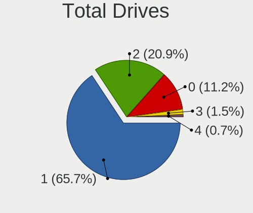
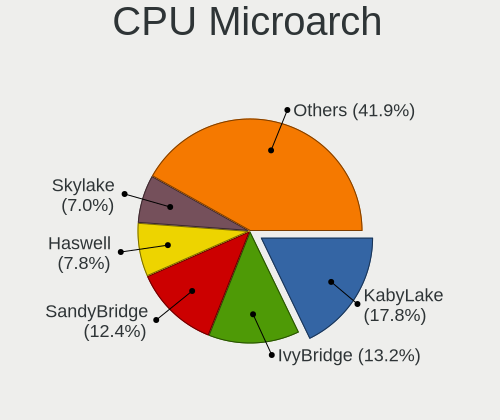
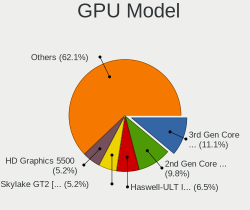
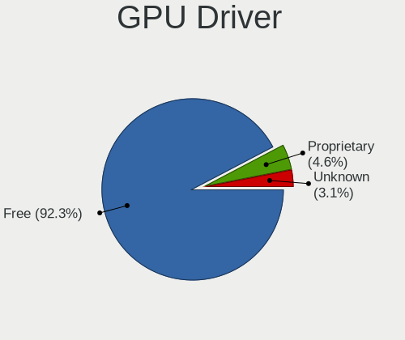
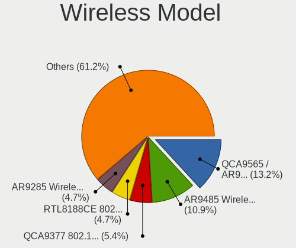
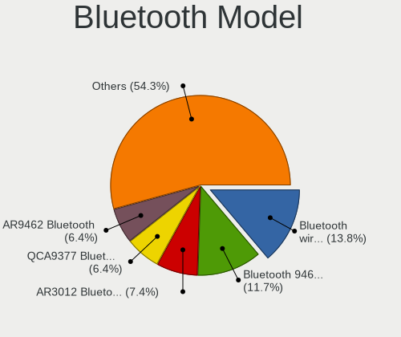

BSD in Brazil - Tested Hardware & Statistics (Notebooks)
--------------------------------------------------------

A project to collect tested hardware configurations for BSD in Brazil.

Anyone can contribute to this report by the [hw-probe](https://github.com/linuxhw/hw-probe/blob/master/INSTALL.BSD.md) tool:

    hw-probe -all -upload

Please contribute! Especially if your hardware is rare.

Contents
--------

* [ Test Cases ](#test-cases)

* [ System ](#system)
  - [ OS                       ](#os)
  - [ OS Family                ](#os-family)
  - [ Arch                     ](#arch)
  - [ DE                       ](#de)
  - [ Display Server           ](#display-server)
  - [ Display Manager          ](#display-manager)
  - [ OS Lang                  ](#os-lang)
  - [ Boot Mode                ](#boot-mode)
  - [ Filesystem               ](#filesystem)
  - [ Part. scheme             ](#part-scheme)

* [ Board ](#board)
  - [ Vendor                   ](#vendor)
  - [ Model                    ](#model)
  - [ Model Family             ](#model-family)
  - [ MFG Year                 ](#mfg-year)
  - [ Form Factor              ](#form-factor)
  - [ Coreboot                 ](#coreboot)
  - [ RAM Size                 ](#ram-size)
  - [ RAM Used                 ](#ram-used)
  - [ Total Drives             ](#total-drives)
  - [ Has CD-ROM               ](#has-cd-rom)
  - [ Has Ethernet             ](#has-ethernet)
  - [ Has WiFi                 ](#has-wifi)
  - [ Has Bluetooth            ](#has-bluetooth)

* [ Location ](#location)
  - [ Country                  ](#country)
  - [ City                     ](#city)

* [ Drives ](#drives)
  - [ Drive Vendor             ](#drive-vendor)
  - [ Drive Model              ](#drive-model)
  - [ HDD Vendor               ](#hdd-vendor)
  - [ SSD Vendor               ](#ssd-vendor)
  - [ Drive Kind               ](#drive-kind)
  - [ Drive Connector          ](#drive-connector)
  - [ Drive Size               ](#drive-size)
  - [ Space Total              ](#space-total)
  - [ Space Used               ](#space-used)
  - [ Malfunc. Drives          ](#malfunc-drives)
  - [ Malfunc. Drive Vendor    ](#malfunc-drive-vendor)
  - [ Malfunc. HDD Vendor      ](#malfunc-hdd-vendor)
  - [ Malfunc. Drive Kind      ](#malfunc-drive-kind)
  - [ Failed Drives            ](#failed-drives)
  - [ Failed Drive Vendor      ](#failed-drive-vendor)
  - [ Drive Status             ](#drive-status)

* [ Storage controller ](#storage-controller)
  - [ Storage Vendor           ](#storage-vendor)
  - [ Storage Model            ](#storage-model)
  - [ Storage Kind             ](#storage-kind)

* [ Processor ](#processor)
  - [ CPU Vendor               ](#cpu-vendor)
  - [ CPU Model                ](#cpu-model)
  - [ CPU Model Family         ](#cpu-model-family)
  - [ CPU Cores                ](#cpu-cores)
  - [ CPU Sockets              ](#cpu-sockets)
  - [ CPU Threads              ](#cpu-threads)
  - [ CPU Microarch            ](#cpu-microarch)

* [ Graphics ](#graphics)
  - [ GPU Vendor               ](#gpu-vendor)
  - [ GPU Model                ](#gpu-model)
  - [ GPU Combo                ](#gpu-combo)
  - [ GPU Driver               ](#gpu-driver)
  - [ GPU Memory               ](#gpu-memory)

* [ Monitor ](#monitor)
  - [ Monitor Vendor           ](#monitor-vendor)
  - [ Monitor Model            ](#monitor-model)
  - [ Monitor Resolution       ](#monitor-resolution)
  - [ Monitor Diagonal         ](#monitor-diagonal)
  - [ Monitor Width            ](#monitor-width)
  - [ Aspect Ratio             ](#aspect-ratio)
  - [ Monitor Area             ](#monitor-area)
  - [ Pixel Density            ](#pixel-density)
  - [ Multiple Monitors        ](#multiple-monitors)

* [ Network ](#network)
  - [ Net Controller Vendor    ](#net-controller-vendor)
  - [ Net Controller Model     ](#net-controller-model)
  - [ Wireless Vendor          ](#wireless-vendor)
  - [ Wireless Model           ](#wireless-model)
  - [ Ethernet Vendor          ](#ethernet-vendor)
  - [ Ethernet Model           ](#ethernet-model)
  - [ Net Controller Kind      ](#net-controller-kind)
  - [ Used Controller          ](#used-controller)
  - [ NICs                     ](#nics)
  - [ IPv6                     ](#ipv6)

* [ Bluetooth ](#bluetooth)
  - [ Bluetooth Vendor         ](#bluetooth-vendor)
  - [ Bluetooth Model          ](#bluetooth-model)

* [ Sound ](#sound)
  - [ Sound Vendor             ](#sound-vendor)
  - [ Sound Model              ](#sound-model)

* [ Memory ](#memory)
  - [ Memory Vendor            ](#memory-vendor)
  - [ Memory Model             ](#memory-model)
  - [ Memory Kind              ](#memory-kind)
  - [ Memory Form Factor       ](#memory-form-factor)
  - [ Memory Size              ](#memory-size)
  - [ Memory Speed             ](#memory-speed)

* [ Printers & scanners ](#printers--scanners)
  - [ Printer Vendor           ](#printer-vendor)
  - [ Printer Model            ](#printer-model)
  - [ Scanner Vendor           ](#scanner-vendor)
  - [ Scanner Model            ](#scanner-model)

* [ Camera ](#camera)
  - [ Camera Vendor            ](#camera-vendor)
  - [ Camera Model             ](#camera-model)

* [ Security ](#security)
  - [ Fingerprint Vendor       ](#fingerprint-vendor)
  - [ Fingerprint Model        ](#fingerprint-model)
  - [ Chipcard Vendor          ](#chipcard-vendor)
  - [ Chipcard Model           ](#chipcard-model)

* [ Unsupported ](#unsupported)
  - [ Unsupported Devices      ](#unsupported-devices)
  - [ Unsupported Device Types ](#unsupported-device-types)

Test Cases
----------

Total: 90

| Vendor        | Model                       | Probe                                                     | Date         |
|---------------|-----------------------------|-----------------------------------------------------------|--------------|
| Dell          | Inspiron 3442               | [529cbab9aa](https://bsd-hardware.info/?probe=529cbab9aa) | Dec 01, 2022 |
| Apple         | MacBookPro8,1               | [3dd9e3557c](https://bsd-hardware.info/?probe=3dd9e3557c) | Nov 30, 2022 |
| Dell          | Vostro 3501                 | [61f8a35700](https://bsd-hardware.info/?probe=61f8a35700) | Nov 25, 2022 |
| Dell          | Inspiron 3421               | [5c37012f33](https://bsd-hardware.info/?probe=5c37012f33) | Nov 10, 2022 |
| Acer          | Aspire F5-573               | [9c092c9cd7](https://bsd-hardware.info/?probe=9c092c9cd7) | Oct 05, 2022 |
| Lenovo        | G475 20080                  | [fb07463a9a](https://bsd-hardware.info/?probe=fb07463a9a) | Sep 24, 2022 |
| Lenovo        | G475 20080                  | [c4b1acb6d1](https://bsd-hardware.info/?probe=c4b1acb6d1) | Sep 24, 2022 |
| Lenovo        | ThinkPad T61 7661GY9        | [7ab5339eee](https://bsd-hardware.info/?probe=7ab5339eee) | Jul 30, 2022 |
| Lenovo        | IdeaPad S145-15API 81V7     | [e2a5a65135](https://bsd-hardware.info/?probe=e2a5a65135) | Jul 23, 2022 |
| Dell          | Inspiron MP061              | [56a7002cc5](https://bsd-hardware.info/?probe=56a7002cc5) | Jul 16, 2022 |
| ASUSTek       | VivoBook_ASUSLaptop X515... | [b09ba0c799](https://bsd-hardware.info/?probe=b09ba0c799) | Jul 12, 2022 |
| Acer          | Aspire E5-571G              | [56fae2295e](https://bsd-hardware.info/?probe=56fae2295e) | Jul 08, 2022 |
| Samsung       | 340XAA/350XAA/550XAA        | [ba96a05e5c](https://bsd-hardware.info/?probe=ba96a05e5c) | Jul 08, 2022 |
| Lenovo        | ThinkPad T410 2522CS7       | [a1561dacb2](https://bsd-hardware.info/?probe=a1561dacb2) | Jun 26, 2022 |
| Lenovo        | IdeaPad 3 15IGL05 82BU      | [6a6450f264](https://bsd-hardware.info/?probe=6a6450f264) | May 30, 2022 |
| Acer          | Aspire 5742                 | [b0ea5e7a5e](https://bsd-hardware.info/?probe=b0ea5e7a5e) | May 19, 2022 |
| Dell          | Inspiron 5437               | [830ea686ab](https://bsd-hardware.info/?probe=830ea686ab) | Apr 24, 2022 |
| Gateway       | NE56R                       | [87d177b9da](https://bsd-hardware.info/?probe=87d177b9da) | Mar 20, 2022 |
| Acer          | Aspire E1-421               | [cc83218496](https://bsd-hardware.info/?probe=cc83218496) | Mar 10, 2022 |
| Itautec       | Infoway w7535               | [b55f9d1bfb](https://bsd-hardware.info/?probe=b55f9d1bfb) | Mar 09, 2022 |
| Apple         | MacBookPro8,1               | [aa484c30a8](https://bsd-hardware.info/?probe=aa484c30a8) | Feb 12, 2022 |
| Gateway       | NE56R                       | [a5aa8aa49a](https://bsd-hardware.info/?probe=a5aa8aa49a) | Jan 18, 2022 |
| Acer          | Aspire ES1-533              | [a9d2458de5](https://bsd-hardware.info/?probe=a9d2458de5) | Jan 13, 2022 |
| Sony          | VPCYB45JB                   | [cd18905620](https://bsd-hardware.info/?probe=cd18905620) | Jan 09, 2022 |
| Lenovo        | G550 2958                   | [21407195e3](https://bsd-hardware.info/?probe=21407195e3) | Jan 07, 2022 |
| Samsung       | 530XBB                      | [fe0adb59d8](https://bsd-hardware.info/?probe=fe0adb59d8) | Dec 20, 2021 |
| Philco        | 10B                         | [a27148f35d](https://bsd-hardware.info/?probe=a27148f35d) | Dec 06, 2021 |
| Positivo      | C14CR01                     | [a33c158f9f](https://bsd-hardware.info/?probe=a33c158f9f) | Dec 05, 2021 |
| Samsung       | 530XBB                      | [8387645312](https://bsd-hardware.info/?probe=8387645312) | Dec 03, 2021 |
| Samsung       | 530XBB                      | [41d5f95889](https://bsd-hardware.info/?probe=41d5f95889) | Dec 03, 2021 |
| Samsung       | 530XBB                      | [e1983c2353](https://bsd-hardware.info/?probe=e1983c2353) | Dec 03, 2021 |
| Samsung       | 530XBB                      | [b344605891](https://bsd-hardware.info/?probe=b344605891) | Dec 02, 2021 |
| Dell          | Inspiron 5566               | [7c6b2f2013](https://bsd-hardware.info/?probe=7c6b2f2013) | Nov 14, 2021 |
| Toshiba       | STI NA 1401                 | [bbbf661ee8](https://bsd-hardware.info/?probe=bbbf661ee8) | Nov 14, 2021 |
| HP            | 14                          | [e0c8e95e52](https://bsd-hardware.info/?probe=e0c8e95e52) | Nov 07, 2021 |
| HP            | EliteBook 840 G3            | [03be88ded4](https://bsd-hardware.info/?probe=03be88ded4) | Nov 02, 2021 |
| Dell          | Inspiron 7460               | [3dbc09a4df](https://bsd-hardware.info/?probe=3dbc09a4df) | Oct 13, 2021 |
| Lenovo        | ThinkPad X250 20CLS2A11K    | [e47f4113bf](https://bsd-hardware.info/?probe=e47f4113bf) | Oct 08, 2021 |
| Itautec       | Infoway w7530               | [a376201681](https://bsd-hardware.info/?probe=a376201681) | Oct 05, 2021 |
| Dell          | Latitude 5490               | [f0f4370a9c](https://bsd-hardware.info/?probe=f0f4370a9c) | Sep 27, 2021 |
| Itautec       | Infoway w7530               | [d91ec24ce0](https://bsd-hardware.info/?probe=d91ec24ce0) | Aug 29, 2021 |
| Itautec       | Infoway w7530               | [fe69db32c8](https://bsd-hardware.info/?probe=fe69db32c8) | Aug 27, 2021 |
| Acer          | Aspire 5750                 | [2bc72bf29e](https://bsd-hardware.info/?probe=2bc72bf29e) | Aug 23, 2021 |
| Avell High... | A60 MUV                     | [85f5c972a5](https://bsd-hardware.info/?probe=85f5c972a5) | Aug 21, 2021 |
| Samsung       | 300E5M/300E5L               | [ae874102c3](https://bsd-hardware.info/?probe=ae874102c3) | Aug 04, 2021 |
| Dell          | Inspiron 3442               | [6283cb4190](https://bsd-hardware.info/?probe=6283cb4190) | Aug 01, 2021 |
| Avell High... | A62 LIV                     | [5983302b1d](https://bsd-hardware.info/?probe=5983302b1d) | Jul 21, 2021 |
| Samsung       | 340XAA/350XAA/550XAA        | [daa7e68a1f](https://bsd-hardware.info/?probe=daa7e68a1f) | Jul 21, 2021 |
| Acer          | Aspire A515-54G             | [08cafd05b1](https://bsd-hardware.info/?probe=08cafd05b1) | Jul 06, 2021 |
| Samsung       | 340XAA/350XAA/550XAA        | [128c08e60f](https://bsd-hardware.info/?probe=128c08e60f) | Jul 04, 2021 |
| Lenovo        | IdeaPad S145-15IWL 81MV     | [ceb18e38a3](https://bsd-hardware.info/?probe=ceb18e38a3) | Jun 28, 2021 |
| Acer          | Aspire 5750                 | [d59f20f88a](https://bsd-hardware.info/?probe=d59f20f88a) | Jun 22, 2021 |
| Acer          | Aspire 5750                 | [cc6dc71d37](https://bsd-hardware.info/?probe=cc6dc71d37) | Jun 21, 2021 |
| Gateway       | NE56R                       | [cc65e24aea](https://bsd-hardware.info/?probe=cc65e24aea) | Jun 20, 2021 |
| Gateway       | NE56R                       | [932f5d03f3](https://bsd-hardware.info/?probe=932f5d03f3) | Jun 13, 2021 |
| Dell          | Vostro 5490                 | [cf3508718c](https://bsd-hardware.info/?probe=cf3508718c) | Jun 11, 2021 |
| Lenovo        | ThinkPad X220 4291ON5       | [66743a51cc](https://bsd-hardware.info/?probe=66743a51cc) | Jun 04, 2021 |
| Acer          | Aspire A515-51G             | [53a69aa8c1](https://bsd-hardware.info/?probe=53a69aa8c1) | Jun 04, 2021 |
| Lenovo        | ThinkPad X270 20HM004JBR    | [88c27e65d7](https://bsd-hardware.info/?probe=88c27e65d7) | May 23, 2021 |
| Dell          | Inspiron 3442               | [0d1d75a914](https://bsd-hardware.info/?probe=0d1d75a914) | May 23, 2021 |
| Dell          | Inspiron 3442               | [076dc91b26](https://bsd-hardware.info/?probe=076dc91b26) | May 13, 2021 |
| Lenovo        | ThinkPad E490 20N9001SBR    | [852a900303](https://bsd-hardware.info/?probe=852a900303) | Apr 22, 2021 |
| Gateway       | NE56R                       | [bbbc827581](https://bsd-hardware.info/?probe=bbbc827581) | Apr 16, 2021 |
| Gateway       | NE56R                       | [af262c2350](https://bsd-hardware.info/?probe=af262c2350) | Apr 11, 2021 |
| Avell High... | A62                         | [df77dd6562](https://bsd-hardware.info/?probe=df77dd6562) | Mar 22, 2021 |
| Notebook      | N85_N87HCHNHZ               | [e84b5b6e5f](https://bsd-hardware.info/?probe=e84b5b6e5f) | Mar 22, 2021 |
| Lenovo        | ThinkPad X220 4291ON5       | [8d81204137](https://bsd-hardware.info/?probe=8d81204137) | Mar 22, 2021 |
| Dell          | Inspiron 7520               | [599d3e84d7](https://bsd-hardware.info/?probe=599d3e84d7) | Mar 16, 2021 |
| Dell          | Inspiron 3442               | [f156951052](https://bsd-hardware.info/?probe=f156951052) | Mar 14, 2021 |
| Dell          | Inspiron 3543               | [525eeec663](https://bsd-hardware.info/?probe=525eeec663) | Mar 12, 2021 |
| Lenovo        | IdeaPad S145-15IWL 81S9     | [5211d36066](https://bsd-hardware.info/?probe=5211d36066) | Feb 25, 2021 |
| Unknown       | Unknown                     | [d11ec93413](https://bsd-hardware.info/?probe=d11ec93413) | Feb 23, 2021 |
| Samsung       | RV411/RV511/E3511/S3511/... | [467a915fc7](https://bsd-hardware.info/?probe=467a915fc7) | Feb 23, 2021 |
| LG Electro... | 14Z980-G.BH51P1             | [d8ee6bc4e3](https://bsd-hardware.info/?probe=d8ee6bc4e3) | Feb 22, 2021 |
| Lenovo        | ThinkPad X240 20AMS4V000    | [cbfa45fe44](https://bsd-hardware.info/?probe=cbfa45fe44) | Feb 22, 2021 |
| ASUSTek       | K46CA                       | [f286c1e784](https://bsd-hardware.info/?probe=f286c1e784) | Feb 21, 2021 |
| Dell          | Venue 11 Pro 7140           | [1a49b7921a](https://bsd-hardware.info/?probe=1a49b7921a) | Feb 17, 2021 |
| Lenovo        | ThinkPad T430 2349PMP       | [23de6449ad](https://bsd-hardware.info/?probe=23de6449ad) | Feb 17, 2021 |
| Dell          | Inspiron 3421               | [c5f6880081](https://bsd-hardware.info/?probe=c5f6880081) | Feb 15, 2021 |
| Dell          | Inspiron 3442               | [411797b4dc](https://bsd-hardware.info/?probe=411797b4dc) | Feb 13, 2021 |
| Clevo         | C41X0                       | [81c48d156a](https://bsd-hardware.info/?probe=81c48d156a) | Feb 12, 2021 |
| Apple         | MacBook6,1                  | [3a9335691f](https://bsd-hardware.info/?probe=3a9335691f) | Feb 11, 2021 |
| Samsung       | 300E5M/300E5L               | [a667296c17](https://bsd-hardware.info/?probe=a667296c17) | Feb 03, 2021 |
| Lenovo        | ThinkPad T450s 20BWS05G0... | [bc2855974c](https://bsd-hardware.info/?probe=bc2855974c) | Dec 06, 2020 |
| Unknown       | Unknown                     | [6953b9a9e4](https://bsd-hardware.info/?probe=6953b9a9e4) | Nov 22, 2020 |
| Dell          | Latitude 3490               | [b28cc12aeb](https://bsd-hardware.info/?probe=b28cc12aeb) | Sep 20, 2020 |
| Lenovo        | ThinkPad T490 20N30029BR    | [41dbfb6fdc](https://bsd-hardware.info/?probe=41dbfb6fdc) | Aug 06, 2020 |
| Samsung       | 270E5K/270E5Q/271E5K/257... | [1b84bffd9b](https://bsd-hardware.info/?probe=1b84bffd9b) | Jul 24, 2020 |
| Sony          | VPCEG17FB                   | [7d48bd3606](https://bsd-hardware.info/?probe=7d48bd3606) | Jul 13, 2020 |
| Lenovo        | ThinkPad X250 20CLS18S0Z    | [f668ce4e5b](https://bsd-hardware.info/?probe=f668ce4e5b) | Jul 05, 2020 |

System
------

OS
--

Installed operating systems

| Name                 | Notebooks | Percent |
|----------------------|-----------|---------|
| helloSystem 0.7.0    | 11        | 14.1%   |
| helloSystem 0.6.0    | 10        | 12.82%  |
| helloSystem 0.4.0    | 10        | 12.82%  |
| helloSystem 0.5.0    | 9         | 11.54%  |
| FreeBSD 13.0         | 6         | 7.69%   |
| helloSystem 0.8.0    | 4         | 5.13%   |
| FreeBSD 14.0-CURRENT | 3         | 3.85%   |
| FreeBSD 13.0-p3      | 3         | 3.85%   |
| FreeBSD 13.0-STABLE  | 2         | 2.56%   |
| FreeBSD 12.1         | 2         | 2.56%   |
| OS108 9.99.68        | 1         | 1.28%   |
| OPNsense 22.7.4      | 1         | 1.28%   |
| OpenBSD 7.2          | 1         | 1.28%   |
| OpenBSD 7.0          | 1         | 1.28%   |
| OpenBSD 6.9          | 1         | 1.28%   |
| helloSystem 0.3.0    | 1         | 1.28%   |
| GhostBSD 22.07.10    | 1         | 1.28%   |
| GhostBSD 20.04.02    | 1         | 1.28%   |
| FreeBSD 13.1-p4      | 1         | 1.28%   |
| FreeBSD 13.0-RC2     | 1         | 1.28%   |
| FreeBSD 13.0-p7      | 1         | 1.28%   |
| FreeBSD 13.0-p4      | 1         | 1.28%   |
| FreeBSD 13.0-CURRENT | 1         | 1.28%   |
| FreeBSD 12.2-p3      | 1         | 1.28%   |
| FreeBSD 12.2         | 1         | 1.28%   |
| FreeBSD 12.1-p7      | 1         | 1.28%   |
| FreeBSD 12.1-p11     | 1         | 1.28%   |
| DragonFly 5.8        | 1         | 1.28%   |

OS Family
---------

OS without a version

| Name        | Notebooks | Percent |
|-------------|-----------|---------|
| helloSystem | 42        | 56.76%  |
| FreeBSD     | 24        | 32.43%  |
| OpenBSD     | 3         | 4.05%   |
| GhostBSD    | 2         | 2.7%    |
| OS108       | 1         | 1.35%   |
| OPNsense    | 1         | 1.35%   |
| DragonFly   | 1         | 1.35%   |

Arch
----

OS architecture (x86_64, i586, etc.)

| Name  | Notebooks | Percent |
|-------|-----------|---------|
| amd64 | 71        | 98.61%  |
| i386  | 1         | 1.39%   |

DE
--

Desktop Environment

| Name         | Notebooks | Percent |
|--------------|-----------|---------|
| helloDesktop | 42        | 56.76%  |
| Console      | 6         | 8.11%   |
| XFCE         | 5         | 6.76%   |
| MATE         | 5         | 6.76%   |
| KDE5         | 4         | 5.41%   |
| GNOME        | 4         | 5.41%   |
| i3           | 2         | 2.7%    |
| fvwm         | 2         | 2.7%    |
| TWM          | 1         | 1.35%   |
| spectrwm     | 1         | 1.35%   |
| Openbox      | 1         | 1.35%   |
| LXQt         | 1         | 1.35%   |

Display Server
--------------

X11 or Wayland

| Name    | Notebooks | Percent |
|---------|-----------|---------|
| X11     | 67        | 93.06%  |
| Console | 5         | 6.94%   |

Display Manager
---------------

SDDM, LightDM, etc.

| Name    | Notebooks | Percent |
|---------|-----------|---------|
| SLiM    | 47        | 63.51%  |
| Console | 12        | 16.22%  |
| LightDM | 6         | 8.11%   |
| SDDM    | 4         | 5.41%   |
| XDM     | 3         | 4.05%   |
| GDM     | 2         | 2.7%    |

OS Lang
-------

Language

| Lang            | Notebooks | Percent |
|-----------------|-----------|---------|
| en_US           | 46        | 61.33%  |
| C               | 11        | 14.67%  |
| Unknown         | 10        | 13.33%  |
| pt_BR           | 6         | 8%      |
| en_US.ISO8859-1 | 1         | 1.33%   |
| en_GB           | 1         | 1.33%   |

Boot Mode
---------

EFI or BIOS

| Mode | Notebooks | Percent |
|------|-----------|---------|
| EFI  | 61        | 84.72%  |
| BIOS | 11        | 15.28%  |

Filesystem
----------

Type of filesystem

| Type    | Notebooks | Percent |
|---------|-----------|---------|
| Zfs     | 53        | 70.67%  |
| Ufs     | 10        | 13.33%  |
| Cd9660  | 8         | 10.67%  |
| Ffs     | 3         | 4%      |
| Hammer2 | 1         | 1.33%   |

Part. scheme
------------

Scheme of partitioning

| Type    | Notebooks | Percent |
|---------|-----------|---------|
| GPT     | 70        | 97.22%  |
| MBR     | 1         | 1.39%   |
| Unknown | 1         | 1.39%   |

Board
-----

Vendor
------

Motherboard manufacturer

| Name                   | Notebooks | Percent |
|------------------------|-----------|---------|
| Lenovo                 | 17        | 23.61%  |
| Dell                   | 17        | 23.61%  |
| Acer                   | 9         | 12.5%   |
| Samsung Electronics    | 6         | 8.33%   |
| Avell High Performance | 3         | 4.17%   |
| Sony                   | 2         | 2.78%   |
| Itautec                | 2         | 2.78%   |
| Hewlett-Packard        | 2         | 2.78%   |
| Gateway                | 2         | 2.78%   |
| ASUSTek Computer       | 2         | 2.78%   |
| Apple                  | 2         | 2.78%   |
| Unknown                | 2         | 2.78%   |
| Semp Toshiba           | 1         | 1.39%   |
| Positivo               | 1         | 1.39%   |
| Philco                 | 1         | 1.39%   |
| Notebook               | 1         | 1.39%   |
| LG Electronics         | 1         | 1.39%   |
| Clevo                  | 1         | 1.39%   |

Model
-----

Motherboard model

| Name                                        | Notebooks | Percent |
|---------------------------------------------|-----------|---------|
| Dell Inspiron 3442                          | 4         | 5.56%   |
| Samsung 340XAA/350XAA/550XAA                | 2         | 2.78%   |
| Gateway NE56R                               | 2         | 2.78%   |
| Dell Inspiron 3421                          | 2         | 2.78%   |
| Acer Aspire 5750                            | 2         | 2.78%   |
| Unknown                                     | 2         | 2.78%   |
| Sony VPCYB45JB                              | 1         | 1.39%   |
| Sony VPCEG17FB                              | 1         | 1.39%   |
| Semp Toshiba STI NA 1401                    | 1         | 1.39%   |
| Samsung RV411/RV511/E3511/S3511/RV711/E3411 | 1         | 1.39%   |
| Samsung 530XBB                              | 1         | 1.39%   |
| Samsung 300E5M/300E5L                       | 1         | 1.39%   |
| Samsung 270E5K/270E5Q/271E5K/2570EK         | 1         | 1.39%   |
| Positivo C14CR01                            | 1         | 1.39%   |
| Philco 10B                                  | 1         | 1.39%   |
| Notebook N85_N87HCHNHZ                      | 1         | 1.39%   |
| LG 14Z980-G.BH51P1                          | 1         | 1.39%   |
| Lenovo ThinkPad X270 20HM004JBR             | 1         | 1.39%   |
| Lenovo ThinkPad X250 20CLS2A11K             | 1         | 1.39%   |
| Lenovo ThinkPad X250 20CLS18S0Z             | 1         | 1.39%   |
| Lenovo ThinkPad X240 20AMS4V000             | 1         | 1.39%   |
| Lenovo ThinkPad X220 4291ON5                | 1         | 1.39%   |
| Lenovo ThinkPad T61 7661GY9                 | 1         | 1.39%   |
| Lenovo ThinkPad T490 20N30029BR             | 1         | 1.39%   |
| Lenovo ThinkPad T450s 20BWS05G0T            | 1         | 1.39%   |
| Lenovo ThinkPad T430 2349PMP                | 1         | 1.39%   |
| Lenovo ThinkPad T410 2522CS7                | 1         | 1.39%   |
| Lenovo ThinkPad E490 20N9001SBR             | 1         | 1.39%   |
| Lenovo IdeaPad S145-15IWL 81S9              | 1         | 1.39%   |
| Lenovo IdeaPad S145-15IWL 81MV              | 1         | 1.39%   |
| Lenovo IdeaPad S145-15API 81V7              | 1         | 1.39%   |
| Lenovo IdeaPad 3 15IGL05 82BU               | 1         | 1.39%   |
| Lenovo G550 2958                            | 1         | 1.39%   |
| Lenovo G475 20080                           | 1         | 1.39%   |
| Itautec Infoway w7535                       | 1         | 1.39%   |
| Itautec Infoway w7530                       | 1         | 1.39%   |
| HP EliteBook 840 G3                         | 1         | 1.39%   |
| HP 14                                       | 1         | 1.39%   |
| Dell Vostro 5490                            | 1         | 1.39%   |
| Dell Vostro 3501                            | 1         | 1.39%   |

Model Family
------------

Motherboard model prefix

| Name                       | Notebooks | Percent |
|----------------------------|-----------|---------|
| Dell Inspiron              | 12        | 16.67%  |
| Lenovo ThinkPad            | 11        | 15.28%  |
| Acer Aspire                | 9         | 12.5%   |
| Lenovo IdeaPad             | 4         | 5.56%   |
| Samsung 340XAA             | 2         | 2.78%   |
| Itautec Infoway            | 2         | 2.78%   |
| Gateway NE56R              | 2         | 2.78%   |
| Dell Vostro                | 2         | 2.78%   |
| Dell Latitude              | 2         | 2.78%   |
| Avell High Performance A62 | 2         | 2.78%   |
| Unknown                    | 2         | 2.78%   |
| Sony VPCYB45JB             | 1         | 1.39%   |
| Sony VPCEG17FB             | 1         | 1.39%   |
| Semp Toshiba STI           | 1         | 1.39%   |
| Samsung RV411              | 1         | 1.39%   |
| Samsung 530XBB             | 1         | 1.39%   |
| Samsung 300E5M             | 1         | 1.39%   |
| Samsung 270E5K             | 1         | 1.39%   |
| Positivo C14CR01           | 1         | 1.39%   |
| Philco 10B                 | 1         | 1.39%   |
| Notebook N85               | 1         | 1.39%   |
| LG 14Z980-G.BH51P1         | 1         | 1.39%   |
| Lenovo G550                | 1         | 1.39%   |
| Lenovo G475                | 1         | 1.39%   |
| HP EliteBook               | 1         | 1.39%   |
| HP 14                      | 1         | 1.39%   |
| Dell Venue                 | 1         | 1.39%   |
| Clevo C41X0                | 1         | 1.39%   |
| Avell High Performance A60 | 1         | 1.39%   |
| ASUS VivoBook              | 1         | 1.39%   |
| ASUS K46CA                 | 1         | 1.39%   |
| Apple MacBookPro8          | 1         | 1.39%   |
| Apple MacBook6             | 1         | 1.39%   |

MFG Year
--------

Motherboard manufacture year

| Year    | Notebooks | Percent |
|---------|-----------|---------|
| 2013    | 11        | 15.28%  |
| 2018    | 8         | 11.11%  |
| 2020    | 7         | 9.72%   |
| 2019    | 7         | 9.72%   |
| 2011    | 7         | 9.72%   |
| 2015    | 5         | 6.94%   |
| 2017    | 4         | 5.56%   |
| 2016    | 4         | 5.56%   |
| 2014    | 3         | 4.17%   |
| 2012    | 3         | 4.17%   |
| 2009    | 3         | 4.17%   |
| 2022    | 2         | 2.78%   |
| 2021    | 2         | 2.78%   |
| 2010    | 2         | 2.78%   |
| 2007    | 2         | 2.78%   |
| Unknown | 2         | 2.78%   |

Form Factor
-----------

Physical design of the computer

| Name     | Notebooks | Percent |
|----------|-----------|---------|
| Notebook | 72        | 100%    |

Coreboot
--------

Have coreboot on board

| Used | Notebooks | Percent |
|------|-----------|---------|
| No   | 72        | 100%    |

RAM Size
--------

Total RAM memory

| Size in GB | Notebooks | Percent |
|------------|-----------|---------|
| 8.01-16.0  | 30        | 41.1%   |
| 4.01-8.0   | 28        | 38.36%  |
| 16.01-24.0 | 8         | 10.96%  |
| 32.01-64.0 | 2         | 2.74%   |
| 3.01-4.0   | 2         | 2.74%   |
| 24.01-32.0 | 2         | 2.74%   |
| 2.01-3.0   | 1         | 1.37%   |

RAM Used
--------

Used RAM memory

| Used GB    | Notebooks | Percent |
|------------|-----------|---------|
| 0.01-0.5   | 48        | 65.75%  |
| 0.51-1.0   | 20        | 27.4%   |
| 32.01-64.0 | 1         | 1.37%   |
| 24.01-32.0 | 1         | 1.37%   |
| 2.01-3.0   | 1         | 1.37%   |
| 1.01-2.0   | 1         | 1.37%   |
| Unknown    | 1         | 1.37%   |

Total Drives
------------

Number of drives on board

| Drives | Notebooks | Percent |
|--------|-----------|---------|
| 1      | 47        | 64.38%  |
| 2      | 21        | 28.77%  |
| 0      | 5         | 6.85%   |

Has CD-ROM
----------

Has CD-ROM on board

| Presented | Notebooks | Percent |
|-----------|-----------|---------|
| No        | 44        | 61.11%  |
| Yes       | 28        | 38.89%  |

Has Ethernet
------------

Has Ethernet on board

| Presented | Notebooks | Percent |
|-----------|-----------|---------|
| Yes       | 65        | 90.28%  |
| No        | 7         | 9.72%   |

Has WiFi
--------

Has WiFi module

| Presented | Notebooks | Percent |
|-----------|-----------|---------|
| Yes       | 69        | 95.83%  |
| No        | 3         | 4.17%   |

Has Bluetooth
-------------

Has Bluetooth module

| Presented | Notebooks | Percent |
|-----------|-----------|---------|
| Yes       | 52        | 72.22%  |
| No        | 20        | 27.78%  |

Location
--------

Country
-------

Geographic location (country)

| Country | Notebooks | Percent |
|---------|-----------|---------|
| Brazil  | 72        | 100%    |

City
----

Geographic location (city)

| City                      | Notebooks | Percent |
|---------------------------|-----------|---------|
| Curitiba                  | 6         | 7.79%   |
| SГЈo Paulo              | 4         | 5.19%   |
| Rio de Janeiro            | 4         | 5.19%   |
| Sao Paulo                 | 3         | 3.9%    |
| Manaus                    | 3         | 3.9%    |
| Belo Horizonte            | 3         | 3.9%    |
| São Paulo              | 2         | 2.6%    |
| Maraba                    | 2         | 2.6%    |
| JoГЈo Pessoa            | 2         | 2.6%    |
| Ipojuca                   | 2         | 2.6%    |
| Campinas                  | 2         | 2.6%    |
| Visconde do Rio Branco    | 1         | 1.3%    |
| Uberaba                   | 1         | 1.3%    |
| Teresopolis               | 1         | 1.3%    |
| Teresina                  | 1         | 1.3%    |
| Tangara                   | 1         | 1.3%    |
| SГЈo JosГ© dos Campos | 1         | 1.3%    |
| Sao Vicente               | 1         | 1.3%    |
| Sao Jeronimo da Serra     | 1         | 1.3%    |
| Sao Bernardo do Campo     | 1         | 1.3%    |
| Santa Maria               | 1         | 1.3%    |
| Rio das Ostras            | 1         | 1.3%    |
| Presidente Prudente       | 1         | 1.3%    |
| Porto UniГЈo            | 1         | 1.3%    |
| Porto Alegre              | 1         | 1.3%    |
| Piloezinhos               | 1         | 1.3%    |
| Paracuru                  | 1         | 1.3%    |
| Osasco                    | 1         | 1.3%    |
| Monte Belo                | 1         | 1.3%    |
| Marica                    | 1         | 1.3%    |
| Maracanau                 | 1         | 1.3%    |
| Mage                      | 1         | 1.3%    |
| Londrina                  | 1         | 1.3%    |
| Lavras                    | 1         | 1.3%    |
| Lajeado                   | 1         | 1.3%    |
| Juiz de Fora              | 1         | 1.3%    |
| Ibiuna                    | 1         | 1.3%    |
| Guapimirim                | 1         | 1.3%    |
| Goiatuba                  | 1         | 1.3%    |
| Franca                    | 1         | 1.3%    |

Drives
------

Drive Vendor
------------

Hard drive vendors

| Vendor              | Notebooks | Drives | Percent |
|---------------------|-----------|--------|---------|
| WDC                 | 16        | 17     | 18.18%  |
| Seagate             | 13        | 16     | 14.77%  |
| Kingston            | 12        | 13     | 13.64%  |
| Toshiba             | 11        | 11     | 12.5%   |
| Samsung Electronics | 6         | 6      | 6.82%   |
| Crucial             | 5         | 6      | 5.68%   |
| A-DATA Technology   | 5         | 5      | 5.68%   |
| LITEON              | 4         | 4      | 4.55%   |
| SK hynix            | 3         | 3      | 3.41%   |
| SSSTC               | 2         | 2      | 2.27%   |
| Hitachi             | 2         | 2      | 2.27%   |
| Smart               | 1         | 1      | 1.14%   |
| Silicon Motion      | 1         | 1      | 1.14%   |
| SanDisk             | 1         | 1      | 1.14%   |
| Phison              | 1         | 1      | 1.14%   |
| Patriot             | 1         | 4      | 1.14%   |
| NVMe                | 1         | 1      | 1.14%   |
| KingSpec            | 1         | 1      | 1.14%   |
| Hikvision           | 1         | 1      | 1.14%   |
| China               | 1         | 1      | 1.14%   |

Drive Model
-----------

Hard drive models

| Model                               | Notebooks | Percent |
|-------------------------------------|-----------|---------|
| Toshiba MQ01ABD100 1TB              | 4         | 4.44%   |
| WDC WDS480G2G0B-00EPW0 480GB        | 2         | 2.22%   |
| WDC WDS240G2G0A-00JH30 240GB        | 2         | 2.22%   |
| Seagate ST1000LM048-2E7172 1TB      | 2         | 2.22%   |
| Seagate ST1000LM035-1RK172 1TB      | 2         | 2.22%   |
| Kingston SA400S37960G 960GB         | 2         | 2.22%   |
| Kingston SA400S37480G 480GB         | 2         | 2.22%   |
| Kingston SA400S37240G 240GB         | 2         | 2.22%   |
| WDC WD800BEVS-00RST0 80GB           | 1         | 1.11%   |
| WDC WD6400BEVT-22A0RT0 640GB        | 1         | 1.11%   |
| WDC WD5000LPCX-35VHAT0 500GB        | 1         | 1.11%   |
| WDC WD5000B 500GB                   | 1         | 1.11%   |
| WDC WD20SPZX-22UA7T0 2TB            | 1         | 1.11%   |
| WDC WD1600BPVT-11JJ5T0 160GB        | 1         | 1.11%   |
| WDC WD1600BEVS-60RST0 160GB         | 1         | 1.11%   |
| WDC WD10SPZX-75Z10T1 1TB            | 1         | 1.11%   |
| WDC WD10SPZX-24Z10 1TB              | 1         | 1.11%   |
| WDC WD10JPVX-75JC3T0 1TB            | 1         | 1.11%   |
| WDC WD10JPVX-35JC3T0 1TB            | 1         | 1.11%   |
| WDC WD10JPVX-22JC3T0 1TB            | 1         | 1.11%   |
| WDC WD10JPCX-24UE4T0 1TB            | 1         | 1.11%   |
| Toshiba MQ01ABD100V 1TB             | 1         | 1.11%   |
| Toshiba MK6034GSX 64GB              | 1         | 1.11%   |
| Toshiba MK5076GSX 500GB             | 1         | 1.11%   |
| Toshiba MK3261GSYN 320GB            | 1         | 1.11%   |
| Toshiba MK2555GSXF 250GB            | 1         | 1.11%   |
| Toshiba MK1252GSX 120GB             | 1         | 1.11%   |
| Toshiba KBG30ZMV256G 256GB          | 1         | 1.11%   |
| SSSTC CL1-4D256 256GB               | 1         | 1.11%   |
| SSSTC CL1-4D128 128GB               | 1         | 1.11%   |
| Smart SSD XceedValue2 mSATA 32GB    | 1         | 1.11%   |
| SK hynix HFS128G39TND-N210A 128GB   | 1         | 1.11%   |
| SK hynix BC511 NVMe 256GB           | 1         | 1.11%   |
| SK hynix 120GB SSD                  | 1         | 1.11%   |
| Silicon Motion NE-256 256GB         | 1         | 1.11%   |
| Seagate ST9320325ASG 320GB          | 1         | 1.11%   |
| Seagate ST9320325AS 320GB           | 1         | 1.11%   |
| Seagate ST9250315AS 250GB           | 1         | 1.11%   |
| Seagate ST9120821AS 118GB           | 1         | 1.11%   |
| Seagate ST750LM022 HN-M750MBB 752GB | 1         | 1.11%   |

HDD Vendor
----------

Hard disk drive vendors

| Vendor              | Notebooks | Drives | Percent |
|---------------------|-----------|--------|---------|
| WDC                 | 13        | 13     | 30.95%  |
| Seagate             | 13        | 16     | 30.95%  |
| Toshiba             | 10        | 10     | 23.81%  |
| Samsung Electronics | 4         | 4      | 9.52%   |
| Hitachi             | 2         | 2      | 4.76%   |

SSD Vendor
----------

Solid state drive vendors

| Vendor              | Notebooks | Drives | Percent |
|---------------------|-----------|--------|---------|
| Kingston            | 11        | 12     | 33.33%  |
| WDC                 | 4         | 4      | 12.12%  |
| LITEON              | 4         | 4      | 12.12%  |
| Crucial             | 4         | 5      | 12.12%  |
| SK hynix            | 2         | 2      | 6.06%   |
| Smart               | 1         | 1      | 3.03%   |
| SanDisk             | 1         | 1      | 3.03%   |
| Samsung Electronics | 1         | 1      | 3.03%   |
| Patriot             | 1         | 4      | 3.03%   |
| KingSpec            | 1         | 1      | 3.03%   |
| Hikvision           | 1         | 1      | 3.03%   |
| China               | 1         | 1      | 3.03%   |
| A-DATA Technology   | 1         | 1      | 3.03%   |

Drive Kind
----------

HDD or SSD

| Kind | Notebooks | Drives | Percent |
|------|-----------|--------|---------|
| HDD  | 37        | 45     | 45.68%  |
| SSD  | 30        | 38     | 37.04%  |
| NVMe | 14        | 14     | 17.28%  |

Drive Connector
---------------

SATA, SAS, NVMe, etc.

| Type | Notebooks | Drives | Percent |
|------|-----------|--------|---------|
| SATA | 57        | 83     | 80.28%  |
| NVMe | 14        | 14     | 19.72%  |

Drive Size
----------

Size of hard drive

| Size in TB | Notebooks | Drives | Percent |
|------------|-----------|--------|---------|
| 0.01-0.5   | 43        | 57     | 65.15%  |
| 0.51-1.0   | 20        | 23     | 30.3%   |
| 1.01-2.0   | 3         | 3      | 4.55%   |

Space Total
-----------

Amount of disk space available on the file system

| Size in GB | Notebooks | Percent |
|------------|-----------|---------|
| 1-20       | 23        | 29.87%  |
| 101-250    | 18        | 23.38%  |
| 251-500    | 16        | 20.78%  |
| 501-1000   | 8         | 10.39%  |
| 51-100     | 4         | 5.19%   |
| 21-50      | 3         | 3.9%    |
| 1001-2000  | 3         | 3.9%    |
| 2001-3000  | 1         | 1.3%    |
| Unknown    | 1         | 1.3%    |

Space Used
----------

Amount of used disk space

| Used GB  | Notebooks | Percent |
|----------|-----------|---------|
| 1-20     | 59        | 80.82%  |
| 21-50    | 7         | 9.59%   |
| 501-1000 | 3         | 4.11%   |
| 101-250  | 2         | 2.74%   |
| 51-100   | 1         | 1.37%   |
| Unknown  | 1         | 1.37%   |

Malfunc. Drives
---------------

Drive models with a malfunction

| Model                              | Notebooks | Drives | Percent |
|------------------------------------|-----------|--------|---------|
| Toshiba MQ01ABD100 1TB             | 2         | 2      | 9.09%   |
| WDC WD5000B 500GB                  | 1         | 1      | 4.55%   |
| WDC WD1600BEVS-60RST0 160GB        | 1         | 1      | 4.55%   |
| WDC WD10JPVX-75JC3T0 1TB           | 1         | 1      | 4.55%   |
| Toshiba MK6034GSX 64GB             | 1         | 1      | 4.55%   |
| Toshiba MK5076GSX 500GB            | 1         | 1      | 4.55%   |
| Toshiba MK3261GSYN 320GB           | 1         | 1      | 4.55%   |
| Toshiba MK2555GSXF 250GB           | 1         | 1      | 4.55%   |
| Toshiba MK1252GSX 120GB            | 1         | 1      | 4.55%   |
| SK hynix HFS128G39TND-N210A 128GB  | 1         | 1      | 4.55%   |
| Seagate ST9320325ASG 320GB         | 1         | 2      | 4.55%   |
| Seagate ST9320325AS 320GB          | 1         | 1      | 4.55%   |
| Seagate ST9250315AS 250GB          | 1         | 1      | 4.55%   |
| Seagate ST9120821AS 118GB          | 1         | 1      | 4.55%   |
| Seagate ST500LT012-9WS142 500GB    | 1         | 1      | 4.55%   |
| Seagate ST1000LM048-2E7172 1TB     | 1         | 1      | 4.55%   |
| Seagate ST1000LM025 HN-M101ABB 1TB | 1         | 1      | 4.55%   |
| Samsung Electronics HM321HI 320GB  | 1         | 1      | 4.55%   |
| LITEON LJH-64V2G-11 M.2 2260 64GB  | 1         | 1      | 4.55%   |
| Hitachi HTS547550A9E384 500GB      | 1         | 1      | 4.55%   |
| Hitachi HTS545050B9A300 500GB      | 1         | 1      | 4.55%   |

Malfunc. Drive Vendor
---------------------

Vendors of faulty drives

| Vendor              | Notebooks | Drives | Percent |
|---------------------|-----------|--------|---------|
| Toshiba             | 7         | 7      | 31.82%  |
| Seagate             | 7         | 8      | 31.82%  |
| WDC                 | 3         | 3      | 13.64%  |
| Hitachi             | 2         | 2      | 9.09%   |
| SK hynix            | 1         | 1      | 4.55%   |
| Samsung Electronics | 1         | 1      | 4.55%   |
| LITEON              | 1         | 1      | 4.55%   |

Malfunc. HDD Vendor
-------------------

Vendors of faulty HDD drives

| Vendor              | Notebooks | Drives | Percent |
|---------------------|-----------|--------|---------|
| Toshiba             | 7         | 7      | 35%     |
| Seagate             | 7         | 8      | 35%     |
| WDC                 | 3         | 3      | 15%     |
| Hitachi             | 2         | 2      | 10%     |
| Samsung Electronics | 1         | 1      | 5%      |

Malfunc. Drive Kind
-------------------

Kinds of faulty drives

| Kind | Notebooks | Drives | Percent |
|------|-----------|--------|---------|
| HDD  | 17        | 21     | 89.47%  |
| SSD  | 2         | 2      | 10.53%  |

Failed Drives
-------------

Failed drive models

Zero info for selected period =(

Failed Drive Vendor
-------------------

Failed drive vendors

Zero info for selected period =(

Drive Status
------------

Number of failed and malfunc. drives

| Status   | Notebooks | Drives | Percent |
|----------|-----------|--------|---------|
| Works    | 55        | 73     | 73.33%  |
| Malfunc  | 19        | 23     | 25.33%  |
| Detected | 1         | 1      | 1.33%   |

Storage controller
------------------

Storage Vendor
--------------

Storage controller vendors

| Vendor                         | Notebooks | Percent |
|--------------------------------|-----------|---------|
| Intel                          | 65        | 77.38%  |
| AMD                            | 4         | 4.76%   |
| ADATA Technology               | 4         | 4.76%   |
| Solid State Storage Technology | 2         | 2.38%   |
| Toshiba                        | 1         | 1.19%   |
| SK hynix                       | 1         | 1.19%   |
| Silicon Motion                 | 1         | 1.19%   |
| Samsung Electronics            | 1         | 1.19%   |
| Realtek Semiconductor          | 1         | 1.19%   |
| Phison Electronics             | 1         | 1.19%   |
| Nvidia                         | 1         | 1.19%   |
| Micron/Crucial Technology      | 1         | 1.19%   |
| Kingston Technology Company    | 1         | 1.19%   |

Storage Model
-------------

Storage controller models

| Model                                                                        | Notebooks | Percent |
|------------------------------------------------------------------------------|-----------|---------|
| Intel Sunrise Point-LP SATA Controller [AHCI mode]                           | 12        | 13.95%  |
| Intel 7 Series Chipset Family 6-port SATA Controller [AHCI mode]             | 9         | 10.47%  |
| Intel Wildcat Point-LP SATA Controller [AHCI Mode]                           | 7         | 8.14%   |
| Intel 8 Series SATA Controller 1 [AHCI mode]                                 | 6         | 6.98%   |
| Intel 6 Series/C200 Series Chipset Family 6 port Mobile SATA AHCI Controller | 6         | 6.98%   |
| Intel Cannon Point-LP SATA Controller [AHCI Mode]                            | 3         | 3.49%   |
| AMD SB7x0/SB8x0/SB9x0 SATA Controller [AHCI mode]                            | 3         | 3.49%   |
| ADATA IM2P33F8ABR1 NVMe SSD                                                  | 3         | 3.49%   |
| Unknown                                                                      | 3         | 3.49%   |
| Intel Comet Lake SATA AHCI Controller                                        | 2         | 2.33%   |
| Intel Celeron/Pentium Silver Processor SATA Controller                       | 2         | 2.33%   |
| Intel 82801IBM/IEM (ICH9M/ICH9M-E) 4 port SATA Controller [AHCI mode]        | 2         | 2.33%   |
| Intel 82801GBM/GHM (ICH7-M Family) SATA Controller [IDE mode]                | 2         | 2.33%   |
| Intel 82801 Mobile SATA Controller [RAID mode]                               | 2         | 2.33%   |
| Intel 5 Series/3400 Series Chipset 4 port SATA AHCI Controller               | 2         | 2.33%   |
| Intel 400 Series Chipset Family SATA AHCI Controller                         | 2         | 2.33%   |
| Toshiba BG3 NVMe SSD Controller                                              | 1         | 1.16%   |
| SK hynix BC511                                                               | 1         | 1.16%   |
| Silicon Motion SM2263EN/SM2263XT SSD Controller                              | 1         | 1.16%   |
| Samsung NVMe SSD Controller SM981/PM981/PM983                                | 1         | 1.16%   |
| Phison PS5013 E13 NVMe Controller                                            | 1         | 1.16%   |
| Nvidia MCP79 AHCI Controller                                                 | 1         | 1.16%   |
| Micron/Crucial P1 NVMe PCIe SSD                                              | 1         | 1.16%   |
| Kingston Company U-SNS8154P3 NVMe SSD                                        | 1         | 1.16%   |
| Intel NM10/ICH7 Family SATA Controller [AHCI mode]                           | 1         | 1.16%   |
| Intel Ice Lake-LP SATA Controller [AHCI mode]                                | 1         | 1.16%   |
| Intel HM170/QM170 Chipset SATA Controller [AHCI Mode]                        | 1         | 1.16%   |
| Intel Celeron N3350/Pentium N4200/Atom E3900 Series SATA AHCI Controller     | 1         | 1.16%   |
| Intel Cannon Lake Mobile PCH SATA AHCI Controller                            | 1         | 1.16%   |
| Intel 82801HM/HEM (ICH8M/ICH8M-E) SATA Controller [AHCI mode]                | 1         | 1.16%   |
| Intel 82801HM/HEM (ICH8M/ICH8M-E) IDE Controller                             | 1         | 1.16%   |
| Intel 7 Series Chipset Family 4-port SATA Controller [IDE mode]              | 1         | 1.16%   |
| Intel 7 Series Chipset Family 2-port SATA Controller [IDE mode]              | 1         | 1.16%   |
| Intel 5 Series/3400 Series Chipset 6 port SATA AHCI Controller               | 1         | 1.16%   |
| AMD FCH SATA Controller [AHCI mode]                                          | 1         | 1.16%   |
| ADATA Technology unknown                                                     | 1         | 1.16%   |

Storage Kind
------------

Kind of storage controller (IDE, SATA, NVMe, SAS, ...)

| Kind | Notebooks | Percent |
|------|-----------|---------|
| SATA | 65        | 76.47%  |
| NVMe | 14        | 16.47%  |
| IDE  | 4         | 4.71%   |
| RAID | 2         | 2.35%   |

Processor
---------

CPU Vendor
----------

Processor vendors

| Vendor | Notebooks | Percent |
|--------|-----------|---------|
| Intel  | 67        | 93.06%  |
| AMD    | 5         | 6.94%   |

CPU Model
---------

Processor models

| Model                              | Notebooks | Percent |
|------------------------------------|-----------|---------|
| Intel Core i5-8250U CPU @ 1.60GHz  | 3         | 4.17%   |
| Intel CPU Version                  | 2         | 2.78%   |
| Intel Core i7-8565U CPU @ 1.80GHz  | 2         | 2.78%   |
| Intel Core i7-7500U CPU @ 2.70GHz  | 2         | 2.78%   |
| Intel Core i7-5600U CPU @ 2.60GHz  | 2         | 2.78%   |
| Intel Core i7-10750H CPU @ 2.60GHz | 2         | 2.78%   |
| Intel Core i5-5200U CPU @ 2.20GHz  | 2         | 2.78%   |
| Intel Core i5-4210U CPU @ 1.70GHz  | 2         | 2.78%   |
| Intel Core i5-3320M CPU @ 2.60GHz  | 2         | 2.78%   |
| Intel Core i5-2410M CPU @ 2.30GHz  | 2         | 2.78%   |
| Intel Core i5-1035G1 CPU @ 1.00GHz | 2         | 2.78%   |
| Intel Core i3-4005U CPU @ 1.70GHz  | 2         | 2.78%   |
| Intel Core i3-2330M CPU @ 2.20GHz  | 2         | 2.78%   |
| Intel Pentium M                    | 1         | 1.39%   |
| Intel Pentium CPU 5405U @ 2.30GHz  | 1         | 1.39%   |
| Intel Genuine CPU                  | 1         | 1.39%   |
| Intel Core M-5Y10c CPU @ 0.80GHz   | 1         | 1.39%   |
| Intel Core i7-9750H CPU @ 2.60GHz  | 1         | 1.39%   |
| Intel Core i7-8665U CPU @ 1.90GHz  | 1         | 1.39%   |
| Intel Core i7-8650U CPU @ 1.90GHz  | 1         | 1.39%   |
| Intel Core i7-8550U CPU @ 1.80GHz  | 1         | 1.39%   |
| Intel Core i7-7600U CPU @ 2.80GHz  | 1         | 1.39%   |
| Intel Core i7-5500U CPU @ 2.40GHz  | 1         | 1.39%   |
| Intel Core i7-3632QM CPU @ 2.20GHz | 1         | 1.39%   |
| Intel Core i7-10510U CPU @ 1.80GHz | 1         | 1.39%   |
| Intel Core i5-7300HQ CPU @ 2.50GHz | 1         | 1.39%   |
| Intel Core i5-7200U CPU @ 2.50GHz  | 1         | 1.39%   |
| Intel Core i5-6300U CPU @ 2.40GHz  | 1         | 1.39%   |
| Intel Core i5-6200U CPU @ 2.30GHz  | 1         | 1.39%   |
| Intel Core i5-5300U CPU @ 2.30GHz  | 1         | 1.39%   |
| Intel Core i5-4300U CPU @ 1.90GHz  | 1         | 1.39%   |
| Intel Core i5-4200U CPU @ 1.60GHz  | 1         | 1.39%   |
| Intel Core i5-3317U CPU @ 1.70GHz  | 1         | 1.39%   |
| Intel Core i5-3230M CPU @ 2.60GHz  | 1         | 1.39%   |
| Intel Core i5-2520M CPU @ 2.50GHz  | 1         | 1.39%   |
| Intel Core i5-2415M CPU @ 2.30GHz  | 1         | 1.39%   |
| Intel Core i5-10210U CPU @ 1.60GHz | 1         | 1.39%   |
| Intel Core i5 CPU M 520 @ 2.40GHz  | 1         | 1.39%   |
| Intel Core i5 CPU M 460 @ 2.53GHz  | 1         | 1.39%   |
| Intel Core i3-6006U CPU @ 2.00GHz  | 1         | 1.39%   |

CPU Model Family
----------------

Processor model prefix

| Model            | Notebooks | Percent |
|------------------|-----------|---------|
| Intel Core i5    | 27        | 37.5%   |
| Intel Core i7    | 16        | 22.22%  |
| Intel Core i3    | 8         | 11.11%  |
| Intel Celeron    | 6         | 8.33%   |
| Other            | 2         | 2.78%   |
| Intel Core 2 Duo | 2         | 2.78%   |
| Intel Atom       | 2         | 2.78%   |
| Intel Pentium M  | 1         | 1.39%   |
| Intel Pentium    | 1         | 1.39%   |
| Intel Genuine    | 1         | 1.39%   |
| Intel Core M     | 1         | 1.39%   |
| AMD Ryzen 5      | 1         | 1.39%   |
| AMD E1           | 1         | 1.39%   |
| AMD E            | 1         | 1.39%   |
| AMD C-60         | 1         | 1.39%   |
| AMD C-50         | 1         | 1.39%   |

CPU Cores
---------

Number of processor cores

| Number  | Notebooks | Percent |
|---------|-----------|---------|
| 2       | 50        | 69.44%  |
| 4       | 14        | 19.44%  |
| 6       | 3         | 4.17%   |
| Unknown | 3         | 4.17%   |
| 8       | 1         | 1.39%   |
| 1       | 1         | 1.39%   |

CPU Sockets
-----------

Number of sockets

| Number | Notebooks | Percent |
|--------|-----------|---------|
| 1      | 71        | 98.61%  |
| 2      | 1         | 1.39%   |

CPU Threads
-----------

Threads per core (Hyper-Threading)

| Number  | Notebooks | Percent |
|---------|-----------|---------|
| 2       | 53        | 73.61%  |
| 1       | 16        | 22.22%  |
| Unknown | 3         | 4.17%   |

CPU Microarch
-------------

Microarchitecture

| Name          | Notebooks | Percent |
|---------------|-----------|---------|
| KabyLake      | 18        | 25%     |
| SandyBridge   | 9         | 12.5%   |
| IvyBridge     | 7         | 9.72%   |
| Broadwell     | 7         | 9.72%   |
| Haswell       | 6         | 8.33%   |
| Penryn        | 4         | 5.56%   |
| Bobcat        | 4         | 5.56%   |
| Westmere      | 3         | 4.17%   |
| Skylake       | 3         | 4.17%   |
| IceLake       | 2         | 2.78%   |
| Goldmont plus | 2         | 2.78%   |
| CometLake     | 2         | 2.78%   |
| Bonnell       | 2         | 2.78%   |
| Zen+          | 1         | 1.39%   |
| Goldmont      | 1         | 1.39%   |
| Core          | 1         | 1.39%   |

Graphics
--------

GPU Vendor
----------

Vendors of graphics cards

| Vendor | Notebooks | Percent |
|--------|-----------|---------|
| Intel  | 64        | 72.73%  |
| Nvidia | 16        | 18.18%  |
| AMD    | 8         | 9.09%   |

GPU Model
---------

Graphics card models

| Model                                                                         | Notebooks | Percent |
|-------------------------------------------------------------------------------|-----------|---------|
| Intel 2nd Generation Core Processor Family Integrated Graphics Controller     | 8         | 8.89%   |
| Intel 3rd Gen Core processor Graphics Controller                              | 7         | 7.78%   |
| Intel HD Graphics 5500                                                        | 6         | 6.67%   |
| Intel Haswell-ULT Integrated Graphics Controller                              | 6         | 6.67%   |
| Intel UHD Graphics 620                                                        | 5         | 5.56%   |
| Intel HD Graphics 620                                                         | 4         | 4.44%   |
| Intel WhiskeyLake-U GT2 [UHD Graphics 620]                                    | 3         | 3.33%   |
| Intel Skylake GT2 [HD Graphics 520]                                           | 3         | 3.33%   |
| Intel Core Processor Integrated Graphics Controller                           | 3         | 3.33%   |
| Nvidia TU117M                                                                 | 2         | 2.22%   |
| Nvidia GP108M [GeForce MX250]                                                 | 2         | 2.22%   |
| Nvidia GM108M [GeForce MX130]                                                 | 2         | 2.22%   |
| Intel Mobile 4 Series Chipset Integrated Graphics Controller                  | 2         | 2.22%   |
| Intel Iris Plus Graphics G1 (Ice Lake)                                        | 2         | 2.22%   |
| Intel GeminiLake [UHD Graphics 600]                                           | 2         | 2.22%   |
| Intel CometLake-U GT2 [UHD Graphics]                                          | 2         | 2.22%   |
| Intel CometLake-H GT2 [UHD Graphics]                                          | 2         | 2.22%   |
| Nvidia TU116M [GeForce GTX 1660 Ti Mobile]                                    | 1         | 1.11%   |
| Nvidia GP108M [GeForce MX230]                                                 | 1         | 1.11%   |
| Nvidia GM108M [GeForce MX110]                                                 | 1         | 1.11%   |
| Nvidia GM108M [GeForce 940MX]                                                 | 1         | 1.11%   |
| Nvidia GM107M [GeForce GTX 950M]                                              | 1         | 1.11%   |
| Nvidia GK208M [GeForce GT 740M]                                               | 1         | 1.11%   |
| Nvidia GK208BM [GeForce 920M]                                                 | 1         | 1.11%   |
| Nvidia GF119M [GeForce 410M]                                                  | 1         | 1.11%   |
| Nvidia GF117M [GeForce 610M/710M/810M/820M / GT 620M/625M/630M/720M]          | 1         | 1.11%   |
| Nvidia C79 [GeForce 9400M]                                                    | 1         | 1.11%   |
| Intel Whiskey Lake-U GT1 [UHD Graphics 610]                                   | 1         | 1.11%   |
| Intel Mobile GM965/GL960 Integrated Graphics Controller (secondary)           | 1         | 1.11%   |
| Intel Mobile GM965/GL960 Integrated Graphics Controller (primary)             | 1         | 1.11%   |
| Intel Mobile 945GSE Express Integrated Graphics Controller                    | 1         | 1.11%   |
| Intel Mobile 945GM/GMS/GME, 943/940GML Express Integrated Graphics Controller | 1         | 1.11%   |
| Intel HD Graphics 630                                                         | 1         | 1.11%   |
| Intel HD Graphics 610                                                         | 1         | 1.11%   |
| Intel HD Graphics 5300                                                        | 1         | 1.11%   |
| Intel HD Graphics 500                                                         | 1         | 1.11%   |
| Intel CoffeeLake-H GT2 [UHD Graphics 630]                                     | 1         | 1.11%   |
| Intel Atom Processor D4xx/D5xx/N4xx/N5xx Integrated Graphics Controller       | 1         | 1.11%   |
| AMD Wrestler [Radeon HD 7310]                                                 | 1         | 1.11%   |
| AMD Wrestler [Radeon HD 6320]                                                 | 1         | 1.11%   |

GPU Combo
---------

Combinations of graphics cards

| Name           | Notebooks | Percent |
|----------------|-----------|---------|
| 1 x Intel      | 43        | 59.72%  |
| Intel + Nvidia | 14        | 19.44%  |
| 1 x AMD        | 6         | 8.33%   |
| 2 x Intel      | 5         | 6.94%   |
| 1 x Nvidia     | 2         | 2.78%   |
| Intel + AMD    | 2         | 2.78%   |

GPU Driver
----------

Free vs proprietary

| Driver      | Notebooks | Percent |
|-------------|-----------|---------|
| Free        | 68        | 94.44%  |
| Proprietary | 3         | 4.17%   |
| Unknown     | 1         | 1.39%   |

GPU Memory
----------

Total video memory

| Size in GB | Notebooks | Percent |
|------------|-----------|---------|
| Unknown    | 65        | 90.28%  |
| 0.01-0.5   | 4         | 5.56%   |
| 3.01-4.0   | 2         | 2.78%   |
| 1.01-2.0   | 1         | 1.39%   |

Monitor
-------

Monitor Vendor
--------------

Monitor vendors

| Vendor              | Notebooks | Percent |
|---------------------|-----------|---------|
| AU Optronics        | 20        | 29.85%  |
| LG Display          | 11        | 16.42%  |
| BOE                 | 9         | 13.43%  |
| Chimei Innolux      | 6         | 8.96%   |
| Samsung Electronics | 5         | 7.46%   |
| Lenovo              | 3         | 4.48%   |
| InfoVision          | 3         | 4.48%   |
| Dell                | 3         | 4.48%   |
| AOC                 | 2         | 2.99%   |
| Philips             | 1         | 1.49%   |
| PANDA               | 1         | 1.49%   |
| Hewlett-Packard     | 1         | 1.49%   |
| Goldstar            | 1         | 1.49%   |
| Apple               | 1         | 1.49%   |

Monitor Model
-------------

Monitor models

| Model                                                                 | Notebooks | Percent |
|-----------------------------------------------------------------------|-----------|---------|
| AU Optronics LCD Monitor AUO26EC 1366x768 340x190mm 15.3-inch         | 4         | 5.97%   |
| LG Display LCD Monitor LGD0385 1366x768 310x170mm 13.9-inch           | 3         | 4.48%   |
| LG Display LCD Monitor LGD0437 1920x1080 280x160mm 12.7-inch          | 2         | 2.99%   |
| BOE LCD Monitor BOE0757 1366x768 340x190mm 15.3-inch                  | 2         | 2.99%   |
| AU Optronics LCD Monitor AUO71EC 1366x768 340x190mm 15.3-inch         | 2         | 2.99%   |
| AU Optronics LCD Monitor AUO40EC 1366x768 340x190mm 15.3-inch         | 2         | 2.99%   |
| AU Optronics LCD Monitor AUO303C 1366x768 310x170mm 13.9-inch         | 2         | 2.99%   |
| Samsung Electronics LCD Monitor SEC5441 1366x768 300x170mm 13.6-inch  | 1         | 1.49%   |
| Samsung Electronics LCD Monitor SEC414C 1366x768 310x170mm 13.9-inch  | 1         | 1.49%   |
| Samsung Electronics LCD Monitor SDC5441 1366x768 310x170mm 13.9-inch  | 1         | 1.49%   |
| Samsung Electronics LCD Monitor SDC4C48 1920x1080 340x190mm 15.3-inch | 1         | 1.49%   |
| Samsung Electronics LCD Monitor SAM0D4F 1920x1080 890x500mm 40.2-inch | 1         | 1.49%   |
| Philips PHL 193V5 PHLC0CD 1366x768 410x230mm 18.5-inch                | 1         | 1.49%   |
| PANDA LCD Monitor NCP0004 1920x1080 290x170mm 13.2-inch               | 1         | 1.49%   |
| LG Display LCD Monitor LGD05B1 1920x1080 310x170mm 13.9-inch          | 1         | 1.49%   |
| LG Display LCD Monitor LGD053C 1920x1080 310x170mm 13.9-inch          | 1         | 1.49%   |
| LG Display LCD Monitor LGD0458 1366x768 310x170mm 13.9-inch           | 1         | 1.49%   |
| LG Display LCD Monitor LGD03ED 1366x768 280x160mm 12.7-inch           | 1         | 1.49%   |
| LG Display LCD Monitor LGD03B7 1366x768 310x170mm 13.9-inch           | 1         | 1.49%   |
| LG Display LCD Monitor LGD0230 1366x768 340x190mm 15.3-inch           | 1         | 1.49%   |
| Lenovo LEN X24A LEN60CF 1920x1080 530x300mm 24.0-inch                 | 1         | 1.49%   |
| Lenovo LCD Monitor LEN4035 1280x800 300x190mm 14.0-inch               | 1         | 1.49%   |
| Lenovo LCD Monitor LEN4031 1280x800 300x190mm 14.0-inch               | 1         | 1.49%   |
| InfoVision LCD Monitor IVO057D 1920x1080 310x170mm 13.9-inch          | 1         | 1.49%   |
| InfoVision LCD Monitor IVO0579 1366x768 310x170mm 13.9-inch           | 1         | 1.49%   |
| InfoVision LCD Monitor IVO03F4 1024x600 220x130mm 10.1-inch           | 1         | 1.49%   |
| Hewlett-Packard L200hx HWP298F 1600x900 450x250mm 20.3-inch           | 1         | 1.49%   |
| Goldstar LCD Monitor GSM580D 1920x1080 510x290mm 23.1-inch            | 1         | 1.49%   |
| Dell S2419HGF DELD0E1 1920x1080 530x300mm 24.0-inch                   | 1         | 1.49%   |
| Dell P2419H DELD0D9 1920x1080 530x300mm 24.0-inch                     | 1         | 1.49%   |
| Dell P2418D DELD0C1 2560x1440 530x300mm 24.0-inch                     | 1         | 1.49%   |
| Chimei Innolux LCD Monitor CMN15F5 1920x1080 340x190mm 15.3-inch      | 1         | 1.49%   |
| Chimei Innolux LCD Monitor CMN15E6 1366x768 340x190mm 15.3-inch       | 1         | 1.49%   |
| Chimei Innolux LCD Monitor CMN15C6 1366x768 340x190mm 15.3-inch       | 1         | 1.49%   |
| Chimei Innolux LCD Monitor CMN1496 1366x768 310x170mm 13.9-inch       | 1         | 1.49%   |
| Chimei Innolux LCD Monitor CMN1490 1366x768 310x170mm 13.9-inch       | 1         | 1.49%   |
| Chimei Innolux LCD Monitor CMN1119 1366x768 260x140mm 11.6-inch       | 1         | 1.49%   |
| BOE LCD Monitor BOE08CD 1366x768 340x190mm 15.3-inch                  | 1         | 1.49%   |
| BOE LCD Monitor BOE0747 1920x1080 340x190mm 15.3-inch                 | 1         | 1.49%   |
| BOE LCD Monitor BOE0698 1366x768 310x170mm 13.9-inch                  | 1         | 1.49%   |

Monitor Resolution
------------------

Monitor screen resolution

| Resolution      | Notebooks | Percent |
|-----------------|-----------|---------|
| 1366x768 (WXGA) | 40        | 62.5%   |
| 1920x1080 (FHD) | 18        | 28.13%  |
| 1280x800 (WXGA) | 3         | 4.69%   |
| 2560x1440 (QHD) | 1         | 1.56%   |
| 1600x900 (HD+)  | 1         | 1.56%   |
| 1024x600        | 1         | 1.56%   |

Monitor Diagonal
----------------

Diagonal size in inches

| Inches | Notebooks | Percent |
|--------|-----------|---------|
| 13     | 25        | 37.31%  |
| 15     | 24        | 35.82%  |
| 24     | 4         | 5.97%   |
| 12     | 4         | 5.97%   |
| 18     | 2         | 2.99%   |
| 14     | 2         | 2.99%   |
| 46     | 1         | 1.49%   |
| 23     | 1         | 1.49%   |
| 21     | 1         | 1.49%   |
| 20     | 1         | 1.49%   |
| 11     | 1         | 1.49%   |
| 10     | 1         | 1.49%   |

Monitor Width
-------------

Physical width

| Width in mm | Notebooks | Percent |
|-------------|-----------|---------|
| 301-350     | 47        | 70.15%  |
| 201-300     | 10        | 14.93%  |
| 501-600     | 5         | 7.46%   |
| 401-500     | 4         | 5.97%   |
| 1001-1500   | 1         | 1.49%   |

Aspect Ratio
------------

Proportional relationship between the width and the height

| Ratio | Notebooks | Percent |
|-------|-----------|---------|
| 16/9  | 55        | 93.22%  |
| 16/10 | 4         | 6.78%   |

Monitor Area
------------

Area in inch²

| Area in inch² | Notebooks | Percent |
|----------------|-----------|---------|
| 81-90          | 26        | 38.81%  |
| 91-100         | 23        | 34.33%  |
| 201-250        | 6         | 8.96%   |
| 61-70          | 4         | 5.97%   |
| 141-150        | 2         | 2.99%   |
| 71-80          | 1         | 1.49%   |
| 51-60          | 1         | 1.49%   |
| 41-50          | 1         | 1.49%   |
| 151-200        | 1         | 1.49%   |
| 101-110        | 1         | 1.49%   |
| 501-1000       | 1         | 1.49%   |

Pixel Density
-------------

Pixels per inch

| Density | Notebooks | Percent |
|---------|-----------|---------|
| 101-120 | 39        | 60%     |
| 121-160 | 14        | 21.54%  |
| 51-100  | 8         | 12.31%  |
| 161-240 | 3         | 4.62%   |
| 1-50    | 1         | 1.54%   |

Multiple Monitors
-----------------

Total monitors connected

| Total | Notebooks | Percent |
|-------|-----------|---------|
| 1     | 51        | 69.86%  |
| 2     | 11        | 15.07%  |
| 0     | 11        | 15.07%  |

Network
-------

Net Controller Vendor
---------------------

Controller vendors

| Vendor                | Notebooks | Percent |
|-----------------------|-----------|---------|
| Realtek Semiconductor | 39        | 32.77%  |
| Qualcomm Atheros      | 32        | 26.89%  |
| Intel                 | 26        | 21.85%  |
| Broadcom              | 10        | 8.4%    |
| JMicron Technology    | 5         | 4.2%    |
| Samsung Electronics   | 3         | 2.52%   |
| TP-Link               | 1         | 0.84%   |
| Ralink Technology     | 1         | 0.84%   |
| Nvidia                | 1         | 0.84%   |
| MediaTek              | 1         | 0.84%   |

Net Controller Model
--------------------

Controller models

| Model                                                             | Notebooks | Percent |
|-------------------------------------------------------------------|-----------|---------|
| Realtek RTL8111/8168/8411 PCI Express Gigabit Ethernet Controller | 18        | 12.86%  |
| Realtek RTL810xE PCI Express Fast Ethernet controller             | 16        | 11.43%  |
| Qualcomm Atheros QCA9565 / AR9565 Wireless Network Adapter        | 9         | 6.43%   |
| Qualcomm Atheros AR9485 Wireless Network Adapter                  | 9         | 6.43%   |
| Qualcomm Atheros QCA9377 802.11ac Wireless Network Adapter        | 6         | 4.29%   |
| Realtek RTL8188CE 802.11b/g/n WiFi Adapter                        | 4         | 2.86%   |
| Intel Wireless 8265 / 8275                                        | 4         | 2.86%   |
| Intel Wireless 7265                                               | 4         | 2.86%   |
| Qualcomm Atheros AR9287 Wireless Network Adapter (PCI-Express)    | 3         | 2.14%   |
| JMicron JMC250 PCI Express Gigabit Ethernet Controller            | 3         | 2.14%   |
| Intel Ethernet Connection (3) I218-LM                             | 3         | 2.14%   |
| Broadcom NetLink BCM57785 Gigabit Ethernet PCIe                   | 3         | 2.14%   |
| Samsung Galaxy series, misc. (tethering mode)                     | 2         | 1.43%   |
| Realtek RTL8188EE Wireless Network Adapter                        | 2         | 1.43%   |
| Qualcomm Atheros QCA6174 802.11ac Wireless Network Adapter        | 2         | 1.43%   |
| Qualcomm Atheros AR9285 Wireless Network Adapter (PCI-Express)    | 2         | 1.43%   |
| Qualcomm Atheros AR8151 v2.0 Gigabit Ethernet                     | 2         | 1.43%   |
| JMicron JMC260 PCI Express Fast Ethernet Controller               | 2         | 1.43%   |
| Intel Ice Lake-LP PCH CNVi WiFi                                   | 2         | 1.43%   |
| Intel Gemini Lake PCH CNVi WiFi                                   | 2         | 1.43%   |
| Intel Ethernet Connection (4) I219-LM                             | 2         | 1.43%   |
| Intel Comet Lake PCH CNVi WiFi                                    | 2         | 1.43%   |
| Intel Centrino Advanced-N 6205 [Taylor Peak]                      | 2         | 1.43%   |
| Intel 82579LM Gigabit Network Connection (Lewisville)             | 2         | 1.43%   |
| TP-Link AC600 wireless Realtek RTL8811AU [Archer T2U Nano]        | 1         | 0.71%   |
| Samsung GT-I9070 (network tethering, USB debugging enabled)       | 1         | 0.71%   |
| Realtek RTL8822BE 802.11a/b/g/n/ac WiFi adapter                   | 1         | 0.71%   |
| Realtek RTL8821CE 802.11ac PCIe Wireless Network Adapter          | 1         | 0.71%   |
| Realtek RTL8188SU 802.11n WLAN Adapter                            | 1         | 0.71%   |
| Realtek RTL8188EUS 802.11n Wireless Network Adapter               | 1         | 0.71%   |
| Ralink RT2870/RT3070 Wireless Adapter                             | 1         | 0.71%   |
| Qualcomm Atheros AR8152 v2.0 Fast Ethernet                        | 1         | 0.71%   |
| Qualcomm Atheros AR8131 Gigabit Ethernet                          | 1         | 0.71%   |
| Nvidia MCP79 Ethernet                                             | 1         | 0.71%   |
| MediaTek USB Ethernet-RNDIS                                       | 1         | 0.71%   |
| Intel Wireless 8260                                               | 1         | 0.71%   |
| Intel Wireless 7260                                               | 1         | 0.71%   |
| Intel Wi-Fi 6 AX200                                               | 1         | 0.71%   |
| Intel PRO/Wireless 4965 AG or AGN [Kedron] Network Connection     | 1         | 0.71%   |
| Intel PRO/Wireless 3945ABG [Golan] Network Connection             | 1         | 0.71%   |

Wireless Vendor
---------------

Wireless vendors

| Vendor                | Notebooks | Percent |
|-----------------------|-----------|---------|
| Qualcomm Atheros      | 31        | 43.06%  |
| Intel                 | 26        | 36.11%  |
| Realtek Semiconductor | 9         | 12.5%   |
| Broadcom              | 4         | 5.56%   |
| TP-Link               | 1         | 1.39%   |
| Ralink Technology     | 1         | 1.39%   |

Wireless Model
--------------

Wireless models

| Model                                                          | Notebooks | Percent |
|----------------------------------------------------------------|-----------|---------|
| Qualcomm Atheros QCA9565 / AR9565 Wireless Network Adapter     | 9         | 12.33%  |
| Qualcomm Atheros AR9485 Wireless Network Adapter               | 9         | 12.33%  |
| Qualcomm Atheros QCA9377 802.11ac Wireless Network Adapter     | 6         | 8.22%   |
| Realtek RTL8188CE 802.11b/g/n WiFi Adapter                     | 4         | 5.48%   |
| Intel Wireless 8265 / 8275                                     | 4         | 5.48%   |
| Intel Wireless 7265                                            | 4         | 5.48%   |
| Qualcomm Atheros AR9287 Wireless Network Adapter (PCI-Express) | 3         | 4.11%   |
| Realtek RTL8188EE Wireless Network Adapter                     | 2         | 2.74%   |
| Qualcomm Atheros QCA6174 802.11ac Wireless Network Adapter     | 2         | 2.74%   |
| Qualcomm Atheros AR9285 Wireless Network Adapter (PCI-Express) | 2         | 2.74%   |
| Intel Ice Lake-LP PCH CNVi WiFi                                | 2         | 2.74%   |
| Intel Gemini Lake PCH CNVi WiFi                                | 2         | 2.74%   |
| Intel Comet Lake PCH CNVi WiFi                                 | 2         | 2.74%   |
| Intel Centrino Advanced-N 6205 [Taylor Peak]                   | 2         | 2.74%   |
| TP-Link AC600 wireless Realtek RTL8811AU [Archer T2U Nano]     | 1         | 1.37%   |
| Realtek RTL8822BE 802.11a/b/g/n/ac WiFi adapter                | 1         | 1.37%   |
| Realtek RTL8821CE 802.11ac PCIe Wireless Network Adapter       | 1         | 1.37%   |
| Realtek RTL8188SU 802.11n WLAN Adapter                         | 1         | 1.37%   |
| Realtek RTL8188EUS 802.11n Wireless Network Adapter            | 1         | 1.37%   |
| Ralink RT2870/RT3070 Wireless Adapter                          | 1         | 1.37%   |
| Intel Wireless 8260                                            | 1         | 1.37%   |
| Intel Wireless 7260                                            | 1         | 1.37%   |
| Intel Wi-Fi 6 AX200                                            | 1         | 1.37%   |
| Intel PRO/Wireless 4965 AG or AGN [Kedron] Network Connection  | 1         | 1.37%   |
| Intel PRO/Wireless 3945ABG [Golan] Network Connection          | 1         | 1.37%   |
| Intel Dual Band Wireless-AC 3168NGW [Stone Peak]               | 1         | 1.37%   |
| Intel Dual Band Wireless-AC 3165 Plus Bluetooth                | 1         | 1.37%   |
| Intel Comet Lake PCH-LP CNVi WiFi                              | 1         | 1.37%   |
| Intel Centrino Advanced-N 6200                                 | 1         | 1.37%   |
| Intel Cannon Point-LP CNVi [Wireless-AC]                       | 1         | 1.37%   |
| Broadcom BCM4360 802.11ac Wireless Network Adapter             | 1         | 1.37%   |
| Broadcom BCM4331 802.11a/b/g/n                                 | 1         | 1.37%   |
| Broadcom BCM43225 802.11b/g/n                                  | 1         | 1.37%   |
| Broadcom BCM43224 802.11a/b/g/n                                | 1         | 1.37%   |

Ethernet Vendor
---------------

Ethernet vendors

| Vendor                | Notebooks | Percent |
|-----------------------|-----------|---------|
| Realtek Semiconductor | 34        | 51.52%  |
| Intel                 | 12        | 18.18%  |
| Broadcom              | 7         | 10.61%  |
| JMicron Technology    | 5         | 7.58%   |
| Qualcomm Atheros      | 4         | 6.06%   |
| Samsung Electronics   | 3         | 4.55%   |
| Nvidia                | 1         | 1.52%   |

Ethernet Model
--------------

Ethernet models

| Model                                                             | Notebooks | Percent |
|-------------------------------------------------------------------|-----------|---------|
| Realtek RTL8111/8168/8411 PCI Express Gigabit Ethernet Controller | 18        | 27.27%  |
| Realtek RTL810xE PCI Express Fast Ethernet controller             | 16        | 24.24%  |
| JMicron JMC250 PCI Express Gigabit Ethernet Controller            | 3         | 4.55%   |
| Intel Ethernet Connection (3) I218-LM                             | 3         | 4.55%   |
| Broadcom NetLink BCM57785 Gigabit Ethernet PCIe                   | 3         | 4.55%   |
| Samsung Galaxy series, misc. (tethering mode)                     | 2         | 3.03%   |
| Qualcomm Atheros AR8151 v2.0 Gigabit Ethernet                     | 2         | 3.03%   |
| JMicron JMC260 PCI Express Fast Ethernet Controller               | 2         | 3.03%   |
| Intel Ethernet Connection (4) I219-LM                             | 2         | 3.03%   |
| Intel 82579LM Gigabit Network Connection (Lewisville)             | 2         | 3.03%   |
| Samsung GT-I9070 (network tethering, USB debugging enabled)       | 1         | 1.52%   |
| Qualcomm Atheros AR8152 v2.0 Fast Ethernet                        | 1         | 1.52%   |
| Qualcomm Atheros AR8131 Gigabit Ethernet                          | 1         | 1.52%   |
| Nvidia MCP79 Ethernet                                             | 1         | 1.52%   |
| Intel Ethernet Connection I219-LM                                 | 1         | 1.52%   |
| Intel Ethernet Connection I218-LM                                 | 1         | 1.52%   |
| Intel Ethernet Connection (6) I219-LM                             | 1         | 1.52%   |
| Intel 82577LM Gigabit Network Connection                          | 1         | 1.52%   |
| Intel 82566MM Gigabit Network Connection                          | 1         | 1.52%   |
| Broadcom NetXtreme BCM57765 Gigabit Ethernet PCIe                 | 1         | 1.52%   |
| Broadcom NetLink BCM5906M Fast Ethernet PCI Express               | 1         | 1.52%   |
| Broadcom NetLink BCM57780 Gigabit Ethernet PCIe                   | 1         | 1.52%   |
| Broadcom BCM4401-B0 100Base-TX                                    | 1         | 1.52%   |

Net Controller Kind
-------------------

Ethernet, WiFi or modem

| Kind     | Notebooks | Percent |
|----------|-----------|---------|
| WiFi     | 69        | 51.11%  |
| Ethernet | 65        | 48.15%  |
| Modem    | 1         | 0.74%   |

Used Controller
---------------

Currently used network controller

| Kind     | Notebooks | Percent |
|----------|-----------|---------|
| Ethernet | 56        | 53.33%  |
| WiFi     | 49        | 46.67%  |

NICs
----

Total network controllers on board

| Total | Notebooks | Percent |
|-------|-----------|---------|
| 2     | 60        | 83.33%  |
| 1     | 12        | 16.67%  |

IPv6
----

IPv6 vs IPv4

| Used | Notebooks | Percent |
|------|-----------|---------|
| No   | 68        | 94.44%  |
| Yes  | 4         | 5.56%   |

Bluetooth
---------

Bluetooth Vendor
----------------

Controller vendors

| Vendor                          | Notebooks | Percent |
|---------------------------------|-----------|---------|
| Intel                           | 18        | 34.62%  |
| Qualcomm Atheros Communications | 16        | 30.77%  |
| Lite-On Technology              | 4         | 7.69%   |
| Broadcom                        | 4         | 7.69%   |
| Foxconn / Hon Hai               | 3         | 5.77%   |
| Apple                           | 3         | 5.77%   |
| Realtek Semiconductor           | 2         | 3.85%   |
| IMC Networks                    | 1         | 1.92%   |
| Dell                            | 1         | 1.92%   |

Bluetooth Model
---------------

Controller models

| Model                                                       | Notebooks | Percent |
|-------------------------------------------------------------|-----------|---------|
| Intel Bluetooth wireless interface                          | 8         | 15.38%  |
| Intel Bluetooth 9460/9560 Jefferson Peak (JfP)              | 6         | 11.54%  |
| Qualcomm Atheros  QCA9377 Bluetooth 4.1                     | 5         | 9.62%   |
| Qualcomm Atheros AR9462 Bluetooth                           | 5         | 9.62%   |
| Qualcomm Atheros Dell Wireless 1703 Bluetooth               | 3         | 5.77%   |
| Qualcomm Atheros Dell Wireless 1820 Bluetooth 4.1LE         | 2         | 3.85%   |
| Intel AX201 Bluetooth                                       | 2         | 3.85%   |
| Broadcom BCM2045B (BDC-2.1)                                 | 2         | 3.85%   |
| Apple Bluetooth Host Controller                             | 2         | 3.85%   |
| Realtek  Bluetooth Adapter                                  | 1         | 1.92%   |
| Realtek CSR Bluetooth Chip                                  | 1         | 1.92%   |
| Qualcomm Atheros AR3012 Bluetooth 4.0                       | 1         | 1.92%   |
| Lite-On Qualcomm Atheros QCA9377 Bluetooth                  | 1         | 1.92%   |
| Lite-On Qualcomm Atheros Bluetooth                          | 1         | 1.92%   |
| Lite-On Atheros Bluetooth                                   | 1         | 1.92%   |
| Lite-On Atheros AR3012 Bluetooth                            | 1         | 1.92%   |
| Intel Wireless-AC 3168 Bluetooth                            | 1         | 1.92%   |
| Intel AX200 Bluetooth                                       | 1         | 1.92%   |
| IMC Networks Bluetooth Module                               | 1         | 1.92%   |
| Foxconn / Hon Hai Qualcomm Atheros Bluetooth 4.0            | 1         | 1.92%   |
| Foxconn / Hon Hai Qualcomm Atheros AR3011 Bluetooth Adapter | 1         | 1.92%   |
| Foxconn / Hon Hai Broadcom Bluetooth 2.1 Device             | 1         | 1.92%   |
| Dell Wireless 355 Bluetooth                                 | 1         | 1.92%   |
| Broadcom BCM2046 Bluetooth Device                           | 1         | 1.92%   |
| Broadcom BCM2045B (BDC-2) [Bluetooth Controller]            | 1         | 1.92%   |
| Apple Apple Broadcom Built-in Bluetooth                     | 1         | 1.92%   |

Sound
-----

Sound Vendor
------------

Sound card vendors

| Vendor   | Notebooks | Percent |
|----------|-----------|---------|
| Intel    | 66        | 83.54%  |
| Nvidia   | 5         | 6.33%   |
| AMD      | 5         | 6.33%   |
| M-Audio  | 1         | 1.27%   |
| Logitech | 1         | 1.27%   |
| Lenovo   | 1         | 1.27%   |

Sound Model
-----------

Sound card models

| Model                                                                      | Notebooks | Percent |
|----------------------------------------------------------------------------|-----------|---------|
| Intel Sunrise Point-LP HD Audio                                            | 13        | 13.68%  |
| Intel 7 Series/C216 Chipset Family High Definition Audio Controller        | 10        | 10.53%  |
| Intel Broadwell-U Audio Controller                                         | 7         | 7.37%   |
| Intel Wildcat Point-LP High Definition Audio Controller                    | 6         | 6.32%   |
| Intel Haswell-ULT HD Audio Controller                                      | 6         | 6.32%   |
| Intel 8 Series HD Audio Controller                                         | 6         | 6.32%   |
| Intel 6 Series/C200 Series Chipset Family High Definition Audio Controller | 6         | 6.32%   |
| Intel Cannon Point-LP High Definition Audio Controller                     | 4         | 4.21%   |
| Intel NM10/ICH7 Family High Definition Audio Controller                    | 3         | 3.16%   |
| Intel 5 Series/3400 Series Chipset High Definition Audio                   | 3         | 3.16%   |
| AMD Wrestler HDMI Audio                                                    | 3         | 3.16%   |
| AMD SBx00 Azalia (Intel HDA)                                               | 3         | 3.16%   |
| Nvidia TU107 GeForce GTX 1650 High Definition Audio Controller             | 2         | 2.11%   |
| Intel Ice Lake-LP Smart Sound Technology Audio Controller                  | 2         | 2.11%   |
| Intel Comet Lake PCH-LP cAVS                                               | 2         | 2.11%   |
| Intel Comet Lake PCH cAVS                                                  | 2         | 2.11%   |
| Intel Celeron/Pentium Silver Processor High Definition Audio               | 2         | 2.11%   |
| Intel 82801I (ICH9 Family) HD Audio Controller                             | 2         | 2.11%   |
| Nvidia TU116 High Definition Audio Controller                              | 1         | 1.05%   |
| Nvidia MCP79 High Definition Audio                                         | 1         | 1.05%   |
| Nvidia GF119 HDMI Audio Controller                                         | 1         | 1.05%   |
| M-Audio M-Audio Fast Track Pro                                             | 1         | 1.05%   |
| Logitech H390 headset with microphone                                      | 1         | 1.05%   |
| Lenovo Realtek USB Audio                                                   | 1         | 1.05%   |
| Intel CM238 HD Audio Controller                                            | 1         | 1.05%   |
| Intel Celeron N3350/Pentium N4200/Atom E3900 Series Audio Cluster          | 1         | 1.05%   |
| Intel Cannon Lake PCH cAVS                                                 | 1         | 1.05%   |
| Intel 82801H (ICH8 Family) HD Audio Controller                             | 1         | 1.05%   |
| AMD Raven/Raven2/Fenghuang HDMI/DP Audio Controller                        | 1         | 1.05%   |
| AMD FCH Azalia Controller                                                  | 1         | 1.05%   |
| AMD Family 17h/19h HD Audio Controller                                     | 1         | 1.05%   |

Memory
------

Memory Vendor
-------------

Memory module vendors

| Vendor              | Notebooks | Percent |
|---------------------|-----------|---------|
| Smart               | 20        | 24.1%   |
| Samsung Electronics | 10        | 12.05%  |
| Kingston            | 9         | 10.84%  |
| SK hynix            | 8         | 9.64%   |
| Teikon              | 7         | 8.43%   |
| Unknown             | 6         | 7.23%   |
| A-DATA Technology   | 6         | 7.23%   |
| Smart Brazil        | 4         | 4.82%   |
| High Bridge         | 3         | 3.61%   |
| Micron Technology   | 2         | 2.41%   |
| Crucial             | 2         | 2.41%   |
| Apacer              | 2         | 2.41%   |
| Unknown (ABCD)      | 1         | 1.2%    |
| PNY                 | 1         | 1.2%    |
| Nanya Technology    | 1         | 1.2%    |
| Kllisre             | 1         | 1.2%    |

Memory Model
------------

Memory module models

| Model                                                            | Notebooks | Percent |
|------------------------------------------------------------------|-----------|---------|
| Smart RAM SH564568FH8NZPHSCR 2GB SODIMM DDR3 1334MT/s            | 4         | 4.6%    |
| Smart RAM SH564128FJ8NZRNSDG 4GB SODIMM DDR3 1600MT/s            | 3         | 3.45%   |
| Smart RAM SH564128FJ8NWRNSQR 4GB SODIMM DDR3 1600MT/s            | 3         | 3.45%   |
| Teikon RAM TML251S6EFR8A-PBHC 4GB SODIMM DDR3 1600MT/s           | 2         | 2.3%    |
| Smart RAM SH564128FJ8NWRNSQG 4GB SODIMM DDR3 1600MT/s            | 2         | 2.3%    |
| Smart RAM SH564128FH8NZPHSCR 4GB SODIMM DDR3 1333MT/s            | 2         | 2.3%    |
| Smart RAM SF4641G8CK8IEHLSBG 8GB SODIMM DDR4 2667MT/s            | 2         | 2.3%    |
| Smart Brazil RAM SMS4TDC3C0K0446SCG 4GB SODIMM DDR4 2400MT/s     | 2         | 2.3%    |
| Samsung RAM M471B5673FH0-CH9 2GB SODIMM DDR3 1334MT/s            | 2         | 2.3%    |
| Samsung RAM M471A5244CB0-CRC 4GB SODIMM DDR4 2400MT/s            | 2         | 2.3%    |
| Unknown SODIMM 2048MB SODIMM DDR2 667MT/s                        | 1         | 1.15%   |
| Unknown RAM Module 8GB SODIMM DDR3 1600MT/s                      | 1         | 1.15%   |
| Unknown RAM Module 4GB SODIMM DDR4 2667MT/s                      | 1         | 1.15%   |
| Unknown RAM Module 4GB SODIMM DDR3 1333MT/s                      | 1         | 1.15%   |
| Unknown RAM Module 4GB SODIMM DDR2 800MT/s                       | 1         | 1.15%   |
| Unknown RAM Module 2GB SODIMM DDR2 667MT/s                       | 1         | 1.15%   |
| Unknown (ABCD) RAM 123456789012345678 2GB SODIMM LPDDR4 2133MT/s | 1         | 1.15%   |
| Teikon RAM TMT451S6BFR8A-PBSC 4096MB SODIMM DDR3 1600MT/s        | 1         | 1.15%   |
| Teikon RAM TMT451S6BFR8A-PBHC 4GB SODIMM DDR3 1333MT/s           | 1         | 1.15%   |
| Teikon RAM TMT41GS6BFR8A-PBSC 8GB SODIMM DDR3 1600MT/s           | 1         | 1.15%   |
| Teikon RAM TMT225S6FR8C-H9HC 2GB SODIMM DDR3 1334MT/s            | 1         | 1.15%   |
| Teikon RAM TMA81GS6AFR8N-UHSC 8GB SODIMM DDR4 2400MT/s           | 1         | 1.15%   |
| Smart RAM SMS4TDC3C0K0446SCG 4GB SODIMM DDR4 2133MT/s            | 1         | 1.15%   |
| Smart RAM SH564568FH8NWPHSFR 2GB SODIMM DDR3 1333MT/s            | 1         | 1.15%   |
| Smart RAM SH564128FJ8NZRNSDR 4GB SODIMM DDR3 1600MT/s            | 1         | 1.15%   |
| Smart RAM SH564128FH8NZQNSCG 4GB SODIMM DDR3 1066MT/s            | 1         | 1.15%   |
| Smart RAM SF4641G8CK8IWGKSEG 8GB SODIMM DDR4 2133MT/s            | 1         | 1.15%   |
| Smart RAM SF464128CKHIWDFSEG 4GB SODIMM DDR4 2133MT/s            | 1         | 1.15%   |
| Smart Brazil RAM SF4641G8CK8IEHLSBG 8GB SODIMM DDR4 2133MT/s     | 1         | 1.15%   |
| Smart Brazil RAM Module 4GB Row Of Chips DDR4 2400MT/s           | 1         | 1.15%   |
| SK hynix RAM HYMP512S64CP8-C4 1GB SODIMM DDR 533MT/s             | 1         | 1.15%   |
| SK hynix RAM HYMP125S64CP8-S6 2GB SODIMM DDR2 975MT/s            | 1         | 1.15%   |
| SK hynix RAM HMT451S6MFR8A-PB 4GB SODIMM DDR3 800MT/s            | 1         | 1.15%   |
| SK hynix RAM HMT451S6BFR8A-PB 4GB SODIMM DDR3 1600MT/s           | 1         | 1.15%   |
| SK hynix RAM HMT41GS6BFR8A-PB 8GB SODIMM DDR3 1600MT/s           | 1         | 1.15%   |
| SK hynix RAM HMT351S6CFR8C-PB 4GB SODIMM DDR3 1600MT/s           | 1         | 1.15%   |
| SK hynix RAM HMT325S6BFR8C-H9 2GB SODIMM DDR3 1333MT/s           | 1         | 1.15%   |
| SK hynix RAM HMA851S6AFR6N-UH 4GB SODIMM DDR4 2400MT/s           | 1         | 1.15%   |
| SK hynix RAM HMA82GS6CJR8N-VK 16GB SODIMM DDR4 2667MT/s          | 1         | 1.15%   |
| Samsung RAM M471B5773DH0-CH9 2GB SODIMM DDR3 1334MT/s            | 1         | 1.15%   |

Memory Kind
-----------

Memory module kinds

| Kind   | Notebooks | Percent |
|--------|-----------|---------|
| DDR3   | 37        | 56.92%  |
| DDR4   | 21        | 32.31%  |
| DDR2   | 5         | 7.69%   |
| LPDDR4 | 1         | 1.54%   |
| DDR    | 1         | 1.54%   |

Memory Form Factor
------------------

Physical design of the memory module

| Name         | Notebooks | Percent |
|--------------|-----------|---------|
| SODIMM       | 63        | 98.44%  |
| Row Of Chips | 1         | 1.56%   |

Memory Size
-----------

Memory module size

| Size  | Notebooks | Percent |
|-------|-----------|---------|
| 4096  | 33        | 43.42%  |
| 2048  | 18        | 23.68%  |
| 8192  | 16        | 21.05%  |
| 16384 | 8         | 10.53%  |
| 1024  | 1         | 1.32%   |

Memory Speed
------------

Memory module speed

| Speed | Notebooks | Percent |
|-------|-----------|---------|
| 1600  | 23        | 30.67%  |
| 1333  | 11        | 14.67%  |
| 2400  | 10        | 13.33%  |
| 2667  | 9         | 12%     |
| 1334  | 8         | 10.67%  |
| 2133  | 5         | 6.67%   |
| 800   | 2         | 2.67%   |
| 667   | 2         | 2.67%   |
| 533   | 2         | 2.67%   |
| 1067  | 1         | 1.33%   |
| 1066  | 1         | 1.33%   |
| 975   | 1         | 1.33%   |

Printers & scanners
-------------------

Printer Vendor
--------------

Printer device vendors

| Vendor | Notebooks | Percent |
|--------|-----------|---------|
| ELGIN  | 2         | 100%    |

Printer Model
-------------

Printer device models

| Model        | Notebooks | Percent |
|--------------|-----------|---------|
| ELGIN L42PRO | 2         | 100%    |

Scanner Vendor
--------------

Scanner device vendors

Zero info for selected period =(

Scanner Model
-------------

Scanner device models

Zero info for selected period =(

Camera
------

Camera Vendor
-------------

Camera device vendors

| Vendor                        | Notebooks | Percent |
|-------------------------------|-----------|---------|
| Chicony Electronics           | 15        | 23.81%  |
| Acer                          | 9         | 14.29%  |
| Microdia                      | 8         | 12.7%   |
| Realtek Semiconductor         | 7         | 11.11%  |
| Silicon Motion                | 5         | 7.94%   |
| IMC Networks                  | 3         | 4.76%   |
| Syntek                        | 2         | 3.17%   |
| Suyin                         | 2         | 3.17%   |
| Sunplus Innovation Technology | 2         | 3.17%   |
| Logitech                      | 2         | 3.17%   |
| Alcor Micro                   | 2         | 3.17%   |
| Unknown                       | 1         | 1.59%   |
| Quanta                        | 1         | 1.59%   |
| Luxvisions Innotech Limited   | 1         | 1.59%   |
| Lite-On Technology            | 1         | 1.59%   |
| Lenovo                        | 1         | 1.59%   |
| Apple                         | 1         | 1.59%   |

Camera Model
------------

Camera device models

| Model                                         | Notebooks | Percent |
|-----------------------------------------------|-----------|---------|
| Chicony HD WebCam                             | 5         | 7.81%   |
| Silicon Motion Web Camera                     | 4         | 6.25%   |
| Acer Integrated Camera                        | 4         | 6.25%   |
| Realtek Integrated_Webcam_HD                  | 3         | 4.69%   |
| Microdia Integrated_Webcam_HD                 | 3         | 4.69%   |
| Microdia Dell Laptop Integrated Webcam HD     | 3         | 4.69%   |
| Syntek EasyCamera                             | 2         | 3.13%   |
| Realtek Integrated Webcam                     | 2         | 3.13%   |
| Chicony Sony Visual Communication Camera      | 2         | 3.13%   |
| Alcor Micro Acer Integrated Webcam            | 2         | 3.13%   |
| Acer HD Webcam                                | 2         | 3.13%   |
| Unknown Realtek PC Camera                     | 1         | 1.56%   |
| Suyin USB 2.0 UVC 1.3M WebCam                 | 1         | 1.56%   |
| Suyin Integrated_Webcam_HD                    | 1         | 1.56%   |
| Sunplus Integrated_Webcam_HD                  | 1         | 1.56%   |
| Sunplus HD WebCam                             | 1         | 1.56%   |
| Silicon Motion WebCam SCX Series              | 1         | 1.56%   |
| Realtek LG Camera                             | 1         | 1.56%   |
| Realtek Integrated_Webcam_FHD                 | 1         | 1.56%   |
| Realtek Integrated_Webcam_8M                  | 1         | 1.56%   |
| Quanta HD Webcam                              | 1         | 1.56%   |
| Microdia Laptop_Integrated_Webcam_HD          | 1         | 1.56%   |
| Microdia Integrated Webcam HD                 | 1         | 1.56%   |
| Luxvisions Innotech Limited Integrated Camera | 1         | 1.56%   |
| Logitech Webcam C270                          | 1         | 1.56%   |
| Logitech C922 Pro Stream Webcam               | 1         | 1.56%   |
| Lite-On Integrated Camera                     | 1         | 1.56%   |
| Lenovo Integrated Webcam [R5U877]             | 1         | 1.56%   |
| IMC Networks USB2.0 VGA UVC WebCam            | 1         | 1.56%   |
| IMC Networks USB Camera                       | 1         | 1.56%   |
| IMC Networks EasyCamera                       | 1         | 1.56%   |
| Chicony Webcam                                | 1         | 1.56%   |
| Chicony Sonix ST50220 USB Video Camera        | 1         | 1.56%   |
| Chicony Lenovo Integrated Camera (0.3MP)      | 1         | 1.56%   |
| Chicony Integrated Camera                     | 1         | 1.56%   |
| Chicony HP HD Webcam [Fixed]                  | 1         | 1.56%   |
| Chicony HP HD Camera                          | 1         | 1.56%   |
| Chicony EasyCamera                            | 1         | 1.56%   |
| Chicony 1.3M Webcam                           | 1         | 1.56%   |
| Apple FaceTime HD Camera                      | 1         | 1.56%   |

Security
--------

Fingerprint Vendor
------------------

Fingerprint sensor vendors

| Vendor                     | Notebooks | Percent |
|----------------------------|-----------|---------|
| Validity Sensors           | 4         | 36.36%  |
| Upek                       | 2         | 18.18%  |
| Synaptics                  | 2         | 18.18%  |
| Shenzhen Goodix Technology | 2         | 18.18%  |
| Samsung Electronics        | 1         | 9.09%   |

Fingerprint Model
-----------------

Fingerprint sensor models

| Model                                                       | Notebooks | Percent |
|-------------------------------------------------------------|-----------|---------|
| Upek Biometric Touchchip/Touchstrip Fingerprint Sensor      | 2         | 18.18%  |
| Shenzhen Goodix Fingerprint Reader                          | 2         | 18.18%  |
| Validity Sensors VFS495 Fingerprint Reader                  | 1         | 9.09%   |
| Validity Sensors VFS 5011 fingerprint sensor                | 1         | 9.09%   |
| Validity Sensors Synaptics WBDI                             | 1         | 9.09%   |
| Validity Sensors Synaptics VFS7552 Touch Fingerprint Sensor | 1         | 9.09%   |
| Synaptics Prometheus MIS Touch Fingerprint Reader           | 1         | 9.09%   |
| Synaptics Metallica MOH Touch Fingerprint Reader            | 1         | 9.09%   |
| Samsung Fingerprint Device                                  | 1         | 9.09%   |

Chipcard Vendor
---------------

Chipcard module vendors

Zero info for selected period =(

Chipcard Model
--------------

Chipcard module models

Zero info for selected period =(

Unsupported
-----------

Unsupported Devices
-------------------

Total unsupported devices on board

| Total | Notebooks | Percent |
|-------|-----------|---------|
| 2     | 21        | 28.77%  |
| 1     | 21        | 28.77%  |
| 3     | 12        | 16.44%  |
| 0     | 10        | 13.7%   |
| 5     | 5         | 6.85%   |
| 4     | 4         | 5.48%   |

Unsupported Device Types
------------------------

Types of unsupported devices

| Type                     | Notebooks | Percent |
|--------------------------|-----------|---------|
| Communication controller | 59        | 45.38%  |
| Card reader              | 28        | 21.54%  |
| Net/wireless             | 16        | 12.31%  |
| Bluetooth                | 15        | 11.54%  |
| Fingerprint reader       | 10        | 7.69%   |
| Sound                    | 2         | 1.54%   |

