BSD in Canada - Tested Hardware & Statistics
--------------------------------------------

A project to collect tested hardware configurations for BSD in Canada.

Anyone can contribute to this report by the [hw-probe](https://github.com/linuxhw/hw-probe/blob/master/INSTALL.BSD.md) tool:

    hw-probe -all -upload

Please contribute! Especially if your hardware is rare.

This is a report for all computer types. See also reports for [desktops](/Location/Canada/Desktop/README.md) and [notebooks](/Location/Canada/Notebook/README.md).

Contents
--------

* [ Test Cases ](#test-cases)

* [ System ](#system)
  - [ OS                       ](#os)
  - [ OS Family                ](#os-family)
  - [ Arch                     ](#arch)
  - [ DE                       ](#de)
  - [ Display Server           ](#display-server)
  - [ Display Manager          ](#display-manager)
  - [ OS Lang                  ](#os-lang)
  - [ Boot Mode                ](#boot-mode)
  - [ Filesystem               ](#filesystem)
  - [ Part. scheme             ](#part-scheme)

* [ Board ](#board)
  - [ Vendor                   ](#vendor)
  - [ Model                    ](#model)
  - [ Model Family             ](#model-family)
  - [ MFG Year                 ](#mfg-year)
  - [ Form Factor              ](#form-factor)
  - [ Coreboot                 ](#coreboot)
  - [ RAM Size                 ](#ram-size)
  - [ RAM Used                 ](#ram-used)
  - [ Total Drives             ](#total-drives)
  - [ Has CD-ROM               ](#has-cd-rom)
  - [ Has Ethernet             ](#has-ethernet)
  - [ Has WiFi                 ](#has-wifi)
  - [ Has Bluetooth            ](#has-bluetooth)

* [ Location ](#location)
  - [ Country                  ](#country)
  - [ City                     ](#city)

* [ Drives ](#drives)
  - [ Drive Vendor             ](#drive-vendor)
  - [ Drive Model              ](#drive-model)
  - [ HDD Vendor               ](#hdd-vendor)
  - [ SSD Vendor               ](#ssd-vendor)
  - [ Drive Kind               ](#drive-kind)
  - [ Drive Connector          ](#drive-connector)
  - [ Drive Size               ](#drive-size)
  - [ Space Total              ](#space-total)
  - [ Space Used               ](#space-used)
  - [ Malfunc. Drives          ](#malfunc-drives)
  - [ Malfunc. Drive Vendor    ](#malfunc-drive-vendor)
  - [ Malfunc. HDD Vendor      ](#malfunc-hdd-vendor)
  - [ Malfunc. Drive Kind      ](#malfunc-drive-kind)
  - [ Failed Drives            ](#failed-drives)
  - [ Failed Drive Vendor      ](#failed-drive-vendor)
  - [ Drive Status             ](#drive-status)

* [ Storage controller ](#storage-controller)
  - [ Storage Vendor           ](#storage-vendor)
  - [ Storage Model            ](#storage-model)
  - [ Storage Kind             ](#storage-kind)

* [ Processor ](#processor)
  - [ CPU Vendor               ](#cpu-vendor)
  - [ CPU Model                ](#cpu-model)
  - [ CPU Model Family         ](#cpu-model-family)
  - [ CPU Cores                ](#cpu-cores)
  - [ CPU Sockets              ](#cpu-sockets)
  - [ CPU Threads              ](#cpu-threads)
  - [ CPU Microarch            ](#cpu-microarch)

* [ Graphics ](#graphics)
  - [ GPU Vendor               ](#gpu-vendor)
  - [ GPU Model                ](#gpu-model)
  - [ GPU Combo                ](#gpu-combo)
  - [ GPU Driver               ](#gpu-driver)
  - [ GPU Memory               ](#gpu-memory)

* [ Monitor ](#monitor)
  - [ Monitor Vendor           ](#monitor-vendor)
  - [ Monitor Model            ](#monitor-model)
  - [ Monitor Resolution       ](#monitor-resolution)
  - [ Monitor Diagonal         ](#monitor-diagonal)
  - [ Monitor Width            ](#monitor-width)
  - [ Aspect Ratio             ](#aspect-ratio)
  - [ Monitor Area             ](#monitor-area)
  - [ Pixel Density            ](#pixel-density)
  - [ Multiple Monitors        ](#multiple-monitors)

* [ Network ](#network)
  - [ Net Controller Vendor    ](#net-controller-vendor)
  - [ Net Controller Model     ](#net-controller-model)
  - [ Wireless Vendor          ](#wireless-vendor)
  - [ Wireless Model           ](#wireless-model)
  - [ Ethernet Vendor          ](#ethernet-vendor)
  - [ Ethernet Model           ](#ethernet-model)
  - [ Net Controller Kind      ](#net-controller-kind)
  - [ Used Controller          ](#used-controller)
  - [ NICs                     ](#nics)
  - [ IPv6                     ](#ipv6)

* [ Bluetooth ](#bluetooth)
  - [ Bluetooth Vendor         ](#bluetooth-vendor)
  - [ Bluetooth Model          ](#bluetooth-model)

* [ Sound ](#sound)
  - [ Sound Vendor             ](#sound-vendor)
  - [ Sound Model              ](#sound-model)

* [ Memory ](#memory)
  - [ Memory Vendor            ](#memory-vendor)
  - [ Memory Model             ](#memory-model)
  - [ Memory Kind              ](#memory-kind)
  - [ Memory Form Factor       ](#memory-form-factor)
  - [ Memory Size              ](#memory-size)
  - [ Memory Speed             ](#memory-speed)

* [ Printers & scanners ](#printers--scanners)
  - [ Printer Vendor           ](#printer-vendor)
  - [ Printer Model            ](#printer-model)
  - [ Scanner Vendor           ](#scanner-vendor)
  - [ Scanner Model            ](#scanner-model)

* [ Camera ](#camera)
  - [ Camera Vendor            ](#camera-vendor)
  - [ Camera Model             ](#camera-model)

* [ Security ](#security)
  - [ Fingerprint Vendor       ](#fingerprint-vendor)
  - [ Fingerprint Model        ](#fingerprint-model)
  - [ Chipcard Vendor          ](#chipcard-vendor)
  - [ Chipcard Model           ](#chipcard-model)

* [ Unsupported ](#unsupported)
  - [ Unsupported Devices      ](#unsupported-devices)
  - [ Unsupported Device Types ](#unsupported-device-types)

Test Cases
----------

Total: 1624

| Vendor        | Model                       | Form-Factor | Probe                                                     | Date         |
|---------------|-----------------------------|-------------|-----------------------------------------------------------|--------------|
| MSI           | Boston                      | Desktop     | [69c1e82629](https://bsd-hardware.info/?probe=69c1e82629) | Jan 03, 2026 |
| Intel         | NUC12WSBi7 M63355-304       | Mini pc     | [89a9980cd3](https://bsd-hardware.info/?probe=89a9980cd3) | Jan 03, 2026 |
| Protectli     | V1410                       | Desktop     | [c1783c223a](https://bsd-hardware.info/?probe=c1783c223a) | Dec 31, 2025 |
| Dell          | Inspiron 7570               | Notebook    | [a2828cbfd3](https://bsd-hardware.info/?probe=a2828cbfd3) | Dec 30, 2025 |
| Acer          | Aspire XC-830               | Desktop     | [966f291e21](https://bsd-hardware.info/?probe=966f291e21) | Dec 30, 2025 |
| Unknown       | Unknown                     | Desktop     | [98270995a4](https://bsd-hardware.info/?probe=98270995a4) | Dec 30, 2025 |
| Protectli     | V1410                       | Desktop     | [b881beb33b](https://bsd-hardware.info/?probe=b881beb33b) | Dec 30, 2025 |
| Lenovo        | ThinkPad T14 Gen 1 20S1S... | Notebook    | [d3e6eec9cc](https://bsd-hardware.info/?probe=d3e6eec9cc) | Dec 29, 2025 |
| MSI           | MAG B550 TOMAHAWK           | Desktop     | [b2b5087066](https://bsd-hardware.info/?probe=b2b5087066) | Dec 27, 2025 |
| Dell          | Precision 7510              | Notebook    | [df7db8b309](https://bsd-hardware.info/?probe=df7db8b309) | Dec 26, 2025 |
| Dell          | Vostro 3460                 | Notebook    | [389480a57d](https://bsd-hardware.info/?probe=389480a57d) | Dec 26, 2025 |
| SZQFTX        | DNB19-SC                    | Mini pc     | [900450559f](https://bsd-hardware.info/?probe=900450559f) | Dec 25, 2025 |
| Lenovo        | 3135 SDK0R32862 WIN 3258... | Mini pc     | [73c9bf2eeb](https://bsd-hardware.info/?probe=73c9bf2eeb) | Dec 23, 2025 |
| Unknown       | Unknown                     | Mini pc     | [beb1c65a23](https://bsd-hardware.info/?probe=beb1c65a23) | Dec 22, 2025 |
| Lenovo        | 3135 SDK0R32862 WIN 3258... | Mini pc     | [04648b332d](https://bsd-hardware.info/?probe=04648b332d) | Dec 20, 2025 |
| Unknown       | Unknown                     | Desktop     | [83ce707bbd](https://bsd-hardware.info/?probe=83ce707bbd) | Dec 20, 2025 |
| ASRock        | B450M Pro4 R2.0             | Desktop     | [f886343e30](https://bsd-hardware.info/?probe=f886343e30) | Dec 19, 2025 |
| Unknown       | QDNV01                      | Desktop     | [5330d1c32a](https://bsd-hardware.info/?probe=5330d1c32a) | Dec 19, 2025 |
| Dell          | 0599V5 A12                  | Server      | [d71f89d67f](https://bsd-hardware.info/?probe=d71f89d67f) | Dec 16, 2025 |
| Unknown       | Unknown                     | Desktop     | [ea3783b202](https://bsd-hardware.info/?probe=ea3783b202) | Dec 15, 2025 |
| MSI           | Boston                      | Desktop     | [25b6b26ca5](https://bsd-hardware.info/?probe=25b6b26ca5) | Dec 14, 2025 |
| Supermicro    | X10SLL-F                    | Desktop     | [8fb2b6ad50](https://bsd-hardware.info/?probe=8fb2b6ad50) | Dec 13, 2025 |
| ASUSTek       | Z8P                         | Desktop     | [c25473d690](https://bsd-hardware.info/?probe=c25473d690) | Dec 12, 2025 |
| HP            | 859C                        | Desktop     | [95fe81fb3c](https://bsd-hardware.info/?probe=95fe81fb3c) | Dec 11, 2025 |
| MSI           | GF65 Thin 10UE              | Notebook    | [45706fe08c](https://bsd-hardware.info/?probe=45706fe08c) | Dec 10, 2025 |
| Advantech     | NAMB-3250 A102-1            | Desktop     | [681d7ee23c](https://bsd-hardware.info/?probe=681d7ee23c) | Dec 10, 2025 |
| TianBei       | WTR PRO                     | Desktop     | [af1798cf16](https://bsd-hardware.info/?probe=af1798cf16) | Dec 06, 2025 |
| Dell          | 07WP95 A02                  | Desktop     | [a9706d7583](https://bsd-hardware.info/?probe=a9706d7583) | Dec 06, 2025 |
| AMI           | Aptio CRB                   | Mini pc     | [11f62d9351](https://bsd-hardware.info/?probe=11f62d9351) | Dec 05, 2025 |
| Apple         | MacBookPro12,1              | Notebook    | [75cd631d59](https://bsd-hardware.info/?probe=75cd631d59) | Dec 02, 2025 |
| ASUSTek       | ROG STRIX X670E-F GAMING... | Desktop     | [854577e2b3](https://bsd-hardware.info/?probe=854577e2b3) | Nov 29, 2025 |
| Dell          | 01TN68 A02                  | Desktop     | [c45f788c3c](https://bsd-hardware.info/?probe=c45f788c3c) | Nov 29, 2025 |
| SJRC          | ADLN-6L                     | Desktop     | [4158102765](https://bsd-hardware.info/?probe=4158102765) | Nov 29, 2025 |
| Unknown       | Unknown                     | Desktop     | [be06809cfb](https://bsd-hardware.info/?probe=be06809cfb) | Nov 28, 2025 |
| SJRC          | ADLN-6L                     | Desktop     | [f295466f3e](https://bsd-hardware.info/?probe=f295466f3e) | Nov 27, 2025 |
| Dell          | 01P8W3 A00                  | Desktop     | [03fbb8e4dd](https://bsd-hardware.info/?probe=03fbb8e4dd) | Nov 27, 2025 |
| HP            | 859C                        | Desktop     | [05e4a97174](https://bsd-hardware.info/?probe=05e4a97174) | Nov 27, 2025 |
| HP            | 1589                        | Desktop     | [f3012cf4fb](https://bsd-hardware.info/?probe=f3012cf4fb) | Nov 26, 2025 |
| ASUSTek       | ROG STRIX X570-I GAMING     | Desktop     | [7693ef53ad](https://bsd-hardware.info/?probe=7693ef53ad) | Nov 24, 2025 |
| ZOTAC         | ZBOX-CI323NANO              | Mini pc     | [f11cdffb95](https://bsd-hardware.info/?probe=f11cdffb95) | Nov 23, 2025 |
| ASUSTek       | ROG STRIX X570-I GAMING     | Desktop     | [939d93f595](https://bsd-hardware.info/?probe=939d93f595) | Nov 22, 2025 |
| Yanling       | YL-CLU6L-V1                 | Desktop     | [ccb69485f1](https://bsd-hardware.info/?probe=ccb69485f1) | Nov 22, 2025 |
| IceWhale T... | ZMB216-i ZMB                | Desktop     | [586edfbaa2](https://bsd-hardware.info/?probe=586edfbaa2) | Nov 21, 2025 |
| Dell          | 04Y8V0 A02                  | Desktop     | [4f5b2697a3](https://bsd-hardware.info/?probe=4f5b2697a3) | Nov 17, 2025 |
| Versa Netw... | NCA-4010Y                   | Server      | [97267dba17](https://bsd-hardware.info/?probe=97267dba17) | Nov 17, 2025 |
| Sophos        | SG                          | Firewall    | [f4f151d3f9](https://bsd-hardware.info/?probe=f4f151d3f9) | Nov 16, 2025 |
| Shenzhen M... | F1FXM                       | Desktop     | [e79beabba2](https://bsd-hardware.info/?probe=e79beabba2) | Nov 15, 2025 |
| Dell          | 0DF42J A00                  | Desktop     | [8079cb938d](https://bsd-hardware.info/?probe=8079cb938d) | Nov 15, 2025 |
| HP            | 2820h                       | Desktop     | [0a5107bb11](https://bsd-hardware.info/?probe=0a5107bb11) | Nov 14, 2025 |
| Unknown       | Unknown                     | Desktop     | [42185b1be0](https://bsd-hardware.info/?probe=42185b1be0) | Nov 13, 2025 |
| Unknown       | Unknown                     | Desktop     | [62e9fe94a1](https://bsd-hardware.info/?probe=62e9fe94a1) | Nov 13, 2025 |
| Mini PC       | ADLN62L V110                | Mini pc     | [6f8a241c3f](https://bsd-hardware.info/?probe=6f8a241c3f) | Nov 11, 2025 |
| Dell          | 04Y8V0 A02                  | Desktop     | [a146dd359f](https://bsd-hardware.info/?probe=a146dd359f) | Nov 09, 2025 |
| Supermicro    | X10SLL-F                    | Desktop     | [c131ea9543](https://bsd-hardware.info/?probe=c131ea9543) | Nov 09, 2025 |
| Protectli     | V1610                       | Desktop     | [f53c39e83d](https://bsd-hardware.info/?probe=f53c39e83d) | Nov 08, 2025 |
| Techvision    | TVI7309X B0                 | Desktop     | [c95f6c1cca](https://bsd-hardware.info/?probe=c95f6c1cca) | Nov 07, 2025 |
| Acer          | Aspire XC-830               | Desktop     | [4e06a8777f](https://bsd-hardware.info/?probe=4e06a8777f) | Nov 07, 2025 |
| Lenovo        | ThinkPad P51 20HHCTO1WW     | Notebook    | [43c56d096c](https://bsd-hardware.info/?probe=43c56d096c) | Nov 05, 2025 |
| ASUSTek       | Q87M-E                      | Desktop     | [6093655edb](https://bsd-hardware.info/?probe=6093655edb) | Nov 04, 2025 |
| ShenZhen M... | MW-GMLK-2.5G6L              | Desktop     | [697160e1d4](https://bsd-hardware.info/?probe=697160e1d4) | Nov 02, 2025 |
| ASUSTek       | PRIME A320M-K               | Desktop     | [4ed92ec57b](https://bsd-hardware.info/?probe=4ed92ec57b) | Nov 01, 2025 |
| Unknown       | Unknown                     | Desktop     | [a9e2db1281](https://bsd-hardware.info/?probe=a9e2db1281) | Oct 31, 2025 |
| Lenovo        | ThinkPad E16 Gen 2 21MA0... | Notebook    | [9f7200e7da](https://bsd-hardware.info/?probe=9f7200e7da) | Oct 27, 2025 |
| ASUSTek       | Q87M-E                      | Desktop     | [59679528fe](https://bsd-hardware.info/?probe=59679528fe) | Oct 27, 2025 |
| Lenovo        | SHARKBAY NOK                | Desktop     | [38112b36a7](https://bsd-hardware.info/?probe=38112b36a7) | Oct 26, 2025 |
| Unknown       | Unknown                     | Desktop     | [1c0028a8fd](https://bsd-hardware.info/?probe=1c0028a8fd) | Oct 25, 2025 |
| Dell          | 0GU083 A00                  | Desktop     | [1614becaf9](https://bsd-hardware.info/?probe=1614becaf9) | Oct 22, 2025 |
| Unknown       | Unknown                     | Desktop     | [932621d602](https://bsd-hardware.info/?probe=932621d602) | Oct 19, 2025 |
| Shenzhen M... | AHWSA                       | Desktop     | [8163c63a86](https://bsd-hardware.info/?probe=8163c63a86) | Oct 19, 2025 |
| Shenzhen M... | AHBNB OEM                   | Desktop     | [f4126acdd6](https://bsd-hardware.info/?probe=f4126acdd6) | Oct 19, 2025 |
| Apple         | Mac-63001698E7A34814 iMa... | All in one  | [e67fe8ff48](https://bsd-hardware.info/?probe=e67fe8ff48) | Oct 15, 2025 |
| Apple         | Mac-63001698E7A34814 iMa... | All in one  | [5ebd529c68](https://bsd-hardware.info/?probe=5ebd529c68) | Oct 15, 2025 |
| Lenovo        | 314D SDK0J40700 WIN 3258... | Mini pc     | [ad614067a5](https://bsd-hardware.info/?probe=ad614067a5) | Oct 14, 2025 |
| Supermicro    | X8SIL                       | Desktop     | [47ac38ac2e](https://bsd-hardware.info/?probe=47ac38ac2e) | Oct 14, 2025 |
| Unknown       | Unknown                     | Desktop     | [44d4ecf726](https://bsd-hardware.info/?probe=44d4ecf726) | Oct 13, 2025 |
| Protectli     | FW6 Ver                     | Desktop     | [ed279cdf31](https://bsd-hardware.info/?probe=ed279cdf31) | Oct 10, 2025 |
| ASUSTek       | K14PA-U24-T Series 60SB0... | Server      | [77ad0fa59d](https://bsd-hardware.info/?probe=77ad0fa59d) | Oct 09, 2025 |
| Sophos        | SG                          | Firewall    | [7c7c99636c](https://bsd-hardware.info/?probe=7c7c99636c) | Oct 06, 2025 |
| Dell          | 03W3VW A00                  | Desktop     | [2c06f6a39f](https://bsd-hardware.info/?probe=2c06f6a39f) | Oct 06, 2025 |
| Dell          | 0RH817 A00                  | Server      | [b7cf6f3f9e](https://bsd-hardware.info/?probe=b7cf6f3f9e) | Oct 03, 2025 |
| Unknown       | Unknown                     | Desktop     | [a88ca5648a](https://bsd-hardware.info/?probe=a88ca5648a) | Oct 01, 2025 |
| HP            | 8594                        | Desktop     | [f79dcf07c2](https://bsd-hardware.info/?probe=f79dcf07c2) | Sep 30, 2025 |
| Dell          | 0FDY5C A00                  | Desktop     | [f53a02c1de](https://bsd-hardware.info/?probe=f53a02c1de) | Sep 29, 2025 |
| MW            | GMLK-2_5G4L                 | Desktop     | [dbd6ee807d](https://bsd-hardware.info/?probe=dbd6ee807d) | Sep 26, 2025 |
| Apple         | Mac-F2238BAE iMac11,3       | All in one  | [af8dc3a74c](https://bsd-hardware.info/?probe=af8dc3a74c) | Sep 24, 2025 |
| ASUSTek       | PRIME A320M-K               | Desktop     | [0ffb01dc69](https://bsd-hardware.info/?probe=0ffb01dc69) | Sep 24, 2025 |
| GoWin Solu... | R86S-N                      | Desktop     | [e3eeae602f](https://bsd-hardware.info/?probe=e3eeae602f) | Sep 23, 2025 |
| Protectli     | VP2410 10                   | Desktop     | [dd2d9a698d](https://bsd-hardware.info/?probe=dd2d9a698d) | Sep 21, 2025 |
| Dell          | 0XHGV1 A00                  | Desktop     | [4a670444a1](https://bsd-hardware.info/?probe=4a670444a1) | Sep 21, 2025 |
| Protectli     | VP2410 10                   | Desktop     | [c6d0df414f](https://bsd-hardware.info/?probe=c6d0df414f) | Sep 20, 2025 |
| Acer          | Nitro N50-620               | Desktop     | [8aaad76f25](https://bsd-hardware.info/?probe=8aaad76f25) | Sep 18, 2025 |
| HP            | 829E                        | Mini pc     | [5ff7cdda8a](https://bsd-hardware.info/?probe=5ff7cdda8a) | Sep 18, 2025 |
| Protectli     | VP2430                      | Desktop     | [90f60e69e8](https://bsd-hardware.info/?probe=90f60e69e8) | Sep 18, 2025 |
| HP            | 8522 A01                    | Mini pc     | [0a78711e50](https://bsd-hardware.info/?probe=0a78711e50) | Sep 18, 2025 |
| HP            | 8299                        | Desktop     | [e19052d3a4](https://bsd-hardware.info/?probe=e19052d3a4) | Sep 16, 2025 |
| ASUSTek       | ROG STRIX B450-F GAMING ... | Desktop     | [dcf67b8578](https://bsd-hardware.info/?probe=dcf67b8578) | Sep 16, 2025 |
| CompuLab      | fitlet                      | Mini pc     | [59ce0ef786](https://bsd-hardware.info/?probe=59ce0ef786) | Sep 16, 2025 |
| ASUSTek       | ROG STRIX B450-F GAMING ... | Desktop     | [540faeeb43](https://bsd-hardware.info/?probe=540faeeb43) | Sep 13, 2025 |
| HP            | 829E                        | Mini pc     | [f2745d49ac](https://bsd-hardware.info/?probe=f2745d49ac) | Sep 13, 2025 |
| CompuLab      | fitlet                      | Mini pc     | [c28bac713c](https://bsd-hardware.info/?probe=c28bac713c) | Sep 13, 2025 |
| GoWin Solu... | R86S-N                      | Desktop     | [77d6c12dc7](https://bsd-hardware.info/?probe=77d6c12dc7) | Sep 12, 2025 |
| Lenovo        | ThinkPad X1C 5th W10DG 2... | Notebook    | [452bedee71](https://bsd-hardware.info/?probe=452bedee71) | Sep 11, 2025 |
| Unknown       | Unknown                     | Desktop     | [84b86f5094](https://bsd-hardware.info/?probe=84b86f5094) | Sep 08, 2025 |
| Unknown       | Unknown                     | Desktop     | [4acee62668](https://bsd-hardware.info/?probe=4acee62668) | Sep 05, 2025 |
| Techvision    | TVI7309X B0                 | Desktop     | [5a2a72c448](https://bsd-hardware.info/?probe=5a2a72c448) | Sep 05, 2025 |
| Unknown       | Unknown                     | Desktop     | [a6998ef674](https://bsd-hardware.info/?probe=a6998ef674) | Sep 04, 2025 |
| Protectli     | FW6 Ver                     | Desktop     | [caaefbbc15](https://bsd-hardware.info/?probe=caaefbbc15) | Sep 04, 2025 |
| AMI           | Aptio CRB                   | Mini pc     | [a2c2ff810e](https://bsd-hardware.info/?probe=a2c2ff810e) | Sep 02, 2025 |
| Toshiba       | Satellite L870              | Notebook    | [116b976cef](https://bsd-hardware.info/?probe=116b976cef) | Sep 01, 2025 |
| Unknown       | Unknown                     | Desktop     | [1cd90189ee](https://bsd-hardware.info/?probe=1cd90189ee) | Sep 01, 2025 |
| HP            | 802E                        | Desktop     | [bd79e9cde7](https://bsd-hardware.info/?probe=bd79e9cde7) | Aug 31, 2025 |
| Dell          | Latitude 3310               | Notebook    | [61c4266582](https://bsd-hardware.info/?probe=61c4266582) | Aug 30, 2025 |
| Dell          | Latitude 3310               | Notebook    | [34943491a2](https://bsd-hardware.info/?probe=34943491a2) | Aug 30, 2025 |
| ASUSTek       | ROG STRIX X670E-F GAMING... | Desktop     | [8ddaddf148](https://bsd-hardware.info/?probe=8ddaddf148) | Aug 28, 2025 |
| Unknown       | Unknown                     | Desktop     | [53cd8cc0c2](https://bsd-hardware.info/?probe=53cd8cc0c2) | Aug 25, 2025 |
| Lex           | CI170A/C                    | Desktop     | [7e54fcdeaa](https://bsd-hardware.info/?probe=7e54fcdeaa) | Aug 20, 2025 |
| Unknown       | Unknown                     | Desktop     | [1e744d447f](https://bsd-hardware.info/?probe=1e744d447f) | Aug 18, 2025 |
| Deciso        | Netboard A10 V2.1           | Desktop     | [598c0c85ac](https://bsd-hardware.info/?probe=598c0c85ac) | Aug 17, 2025 |
| Unknown       | Unknown                     | Desktop     | [be7821f14a](https://bsd-hardware.info/?probe=be7821f14a) | Aug 16, 2025 |
| Protectli     | VP2430                      | Desktop     | [ae617c2702](https://bsd-hardware.info/?probe=ae617c2702) | Aug 16, 2025 |
| Lenovo        | ThinkPad E14 Gen 4 21EBC... | Notebook    | [df1bb40f1f](https://bsd-hardware.info/?probe=df1bb40f1f) | Aug 14, 2025 |
| Lenovo        | ThinkPad E14 Gen 4 21EBC... | Notebook    | [af569af8ca](https://bsd-hardware.info/?probe=af569af8ca) | Aug 14, 2025 |
| Protectli     | FW4B Ver                    | Desktop     | [52dddb9e76](https://bsd-hardware.info/?probe=52dddb9e76) | Aug 11, 2025 |
| Unknown       | Unknown                     | Desktop     | [157251e8ca](https://bsd-hardware.info/?probe=157251e8ca) | Aug 11, 2025 |
| Gigabyte      | F2A78M-D3H                  | Desktop     | [710fe36719](https://bsd-hardware.info/?probe=710fe36719) | Aug 09, 2025 |
| Unknown       | Unknown                     | Desktop     | [79d021b75f](https://bsd-hardware.info/?probe=79d021b75f) | Aug 08, 2025 |
| Shenzhen M... | AHBNB OEM                   | Desktop     | [24b292acc0](https://bsd-hardware.info/?probe=24b292acc0) | Aug 07, 2025 |
| GoWin Solu... | R86S-N                      | Desktop     | [b061955652](https://bsd-hardware.info/?probe=b061955652) | Aug 06, 2025 |
| BOSGAME       | DNB10M                      | Desktop     | [ad1a91026b](https://bsd-hardware.info/?probe=ad1a91026b) | Aug 06, 2025 |
| Unknown       | Unknown                     | Desktop     | [f8a7696567](https://bsd-hardware.info/?probe=f8a7696567) | Aug 06, 2025 |
| Lenovo        | ThinkPad L420 782746U       | Notebook    | [45d26a88f2](https://bsd-hardware.info/?probe=45d26a88f2) | Aug 05, 2025 |
| Dell          | 04Y8V0 A02                  | Desktop     | [0b1b3d7021](https://bsd-hardware.info/?probe=0b1b3d7021) | Aug 02, 2025 |
| CncTion       | 1338NP-12 B0                | Desktop     | [be1decc508](https://bsd-hardware.info/?probe=be1decc508) | Aug 01, 2025 |
| CncTion       | 1338NP-12 B0                | Desktop     | [2595bdc66b](https://bsd-hardware.info/?probe=2595bdc66b) | Aug 01, 2025 |
| Intel         | DQ35JO AAD82085-805         | Desktop     | [655290a0fc](https://bsd-hardware.info/?probe=655290a0fc) | Jul 29, 2025 |
| Unknown       | Unknown                     | Desktop     | [0e89b273e5](https://bsd-hardware.info/?probe=0e89b273e5) | Jul 29, 2025 |
| Intel         | CRESCENTBAY                 | Desktop     | [f9e19dd795](https://bsd-hardware.info/?probe=f9e19dd795) | Jul 28, 2025 |
| Protectli     | V1410                       | Desktop     | [5299ef062e](https://bsd-hardware.info/?probe=5299ef062e) | Jul 24, 2025 |
| Dell          | 084XW4 A01                  | Server      | [b99323d71a](https://bsd-hardware.info/?probe=b99323d71a) | Jul 22, 2025 |
| Mini PC       | ADLN62L V110                | Mini pc     | [78a1750e69](https://bsd-hardware.info/?probe=78a1750e69) | Jul 22, 2025 |
| Unknown       | Unknown                     | Desktop     | [fe8e7a4223](https://bsd-hardware.info/?probe=fe8e7a4223) | Jul 19, 2025 |
| CloudGenix    | ion 3000                    | Firewall    | [3024e3ebec](https://bsd-hardware.info/?probe=3024e3ebec) | Jul 19, 2025 |
| SJRC          | ADLN-6L                     | Desktop     | [5fabaf4c89](https://bsd-hardware.info/?probe=5fabaf4c89) | Jul 18, 2025 |
| Lenovo        | ThinkPad E16 Gen 1 21JT0... | Notebook    | [a9be1b44cd](https://bsd-hardware.info/?probe=a9be1b44cd) | Jul 17, 2025 |
| MW            | GMLK-2_5G4L                 | Desktop     | [4446e160b3](https://bsd-hardware.info/?probe=4446e160b3) | Jul 16, 2025 |
| Lenovo        | ThinkPad E16 Gen 1 21JT0... | Notebook    | [4d4154ead3](https://bsd-hardware.info/?probe=4d4154ead3) | Jul 16, 2025 |
| AMI           | Aptio CRB                   | Mini pc     | [bb3a811a8d](https://bsd-hardware.info/?probe=bb3a811a8d) | Jul 08, 2025 |
| AZW           | EQ                          | Desktop     | [cd786ebfe8](https://bsd-hardware.info/?probe=cd786ebfe8) | Jul 07, 2025 |
| Unknown       | Unknown                     | Desktop     | [0ffd791e45](https://bsd-hardware.info/?probe=0ffd791e45) | Jul 05, 2025 |
| Lenovo        | ThinkPad E15 20RD005HUS     | Notebook    | [27bc961fcd](https://bsd-hardware.info/?probe=27bc961fcd) | Jul 05, 2025 |
| Unknown       | Unknown                     | Desktop     | [b58ae0161f](https://bsd-hardware.info/?probe=b58ae0161f) | Jul 04, 2025 |
| Dell          | Latitude 5510               | Notebook    | [1aa765fb61](https://bsd-hardware.info/?probe=1aa765fb61) | Jul 04, 2025 |
| Acer          | Aspire XC-830               | Desktop     | [9a696850db](https://bsd-hardware.info/?probe=9a696850db) | Jul 04, 2025 |
| Lenovo        | 30D9 SDK0L22692 WIN 3306... | Desktop     | [863d3905a1](https://bsd-hardware.info/?probe=863d3905a1) | Jul 04, 2025 |
| OEM           | 2550L2D-MX V1.1             | Desktop     | [85025499d4](https://bsd-hardware.info/?probe=85025499d4) | Jul 02, 2025 |
| HP            | 82A2                        | Desktop     | [1b8701e45c](https://bsd-hardware.info/?probe=1b8701e45c) | Jul 01, 2025 |
| Unknown       | Unknown                     | Desktop     | [d3ec175110](https://bsd-hardware.info/?probe=d3ec175110) | Jun 29, 2025 |
| Unknown       | Unknown                     | Desktop     | [064e7829be](https://bsd-hardware.info/?probe=064e7829be) | Jun 27, 2025 |
| Unknown       | Unknown                     | Desktop     | [22f4ebe651](https://bsd-hardware.info/?probe=22f4ebe651) | Jun 27, 2025 |
| Unknown       | QDNV01                      | Desktop     | [cf4a99e77d](https://bsd-hardware.info/?probe=cf4a99e77d) | Jun 21, 2025 |
| Intel         | NUC6i3SYB H81132-502        | Mini pc     | [7397c5218f](https://bsd-hardware.info/?probe=7397c5218f) | Jun 21, 2025 |
| Versa Netw... | NCA-4010Y                   | Server      | [da1ca2819d](https://bsd-hardware.info/?probe=da1ca2819d) | Jun 21, 2025 |
| ASUSTek       | PRIME B250M-A               | Desktop     | [0884747b20](https://bsd-hardware.info/?probe=0884747b20) | Jun 20, 2025 |
| Unknown       | Unknown                     | Desktop     | [0768abbe8c](https://bsd-hardware.info/?probe=0768abbe8c) | Jun 19, 2025 |
| ASUSTek       | PRIME B250M-A               | Desktop     | [5988d2d6d0](https://bsd-hardware.info/?probe=5988d2d6d0) | Jun 19, 2025 |
| Lenovo        | 30D0 SDK0J40697 WIN 3305... | Desktop     | [d4199e5f2b](https://bsd-hardware.info/?probe=d4199e5f2b) | Jun 19, 2025 |
| ASRock        | H81M-HDS R2.0               | Desktop     | [6540ba796b](https://bsd-hardware.info/?probe=6540ba796b) | Jun 18, 2025 |
| Unknown       | Unknown                     | Desktop     | [d86aa2d8ea](https://bsd-hardware.info/?probe=d86aa2d8ea) | Jun 16, 2025 |
| Dell          | 0FDY5C A00                  | Desktop     | [cdde8db496](https://bsd-hardware.info/?probe=cdde8db496) | Jun 14, 2025 |
| Dell          | 0HD5W2 A01                  | Desktop     | [f9d4b45529](https://bsd-hardware.info/?probe=f9d4b45529) | Jun 13, 2025 |
| ASUSTek       | GL553VD                     | Notebook    | [e2e53ca4fb](https://bsd-hardware.info/?probe=e2e53ca4fb) | Jun 12, 2025 |
| HP            | 1589                        | Desktop     | [b663a0a979](https://bsd-hardware.info/?probe=b663a0a979) | Jun 12, 2025 |
| AMI           | Aptio CRB                   | Mini pc     | [786b7f9ac4](https://bsd-hardware.info/?probe=786b7f9ac4) | Jun 12, 2025 |
| Unknown       | Unknown                     | Desktop     | [0c08cc911a](https://bsd-hardware.info/?probe=0c08cc911a) | Jun 10, 2025 |
| ASRock        | H81M-HDS R2.0               | Desktop     | [e2b81905c0](https://bsd-hardware.info/?probe=e2b81905c0) | Jun 09, 2025 |
| HP            | ProLiant DL60 Gen9          | Server      | [d0a7834a6e](https://bsd-hardware.info/?probe=d0a7834a6e) | Jun 08, 2025 |
| Dell          | 0H0P0M A00                  | Desktop     | [7665287677](https://bsd-hardware.info/?probe=7665287677) | Jun 08, 2025 |
| Unknown       | Unknown                     | Desktop     | [17947b152c](https://bsd-hardware.info/?probe=17947b152c) | Jun 07, 2025 |
| ASUSTek       | PRIME Z690-P WIFI           | Desktop     | [91aaa73832](https://bsd-hardware.info/?probe=91aaa73832) | Jun 06, 2025 |
| Protectli     | FW6 Ver                     | Desktop     | [a02143c017](https://bsd-hardware.info/?probe=a02143c017) | Jun 01, 2025 |
| Unknown       | Unknown                     | Desktop     | [7a7dee27f5](https://bsd-hardware.info/?probe=7a7dee27f5) | Jun 01, 2025 |
| Unknown       | Unknown                     | Desktop     | [7ff518424c](https://bsd-hardware.info/?probe=7ff518424c) | Jun 01, 2025 |
| HP            | 8299                        | Desktop     | [97fbe5ae58](https://bsd-hardware.info/?probe=97fbe5ae58) | May 31, 2025 |
| Unknown       | Unknown                     | Desktop     | [b4b17085ec](https://bsd-hardware.info/?probe=b4b17085ec) | May 31, 2025 |
| Acer          | Veriton M4620G v1.0         | Desktop     | [2d1396c5af](https://bsd-hardware.info/?probe=2d1396c5af) | May 30, 2025 |
| Dell          | 0D28YY A00                  | Desktop     | [5fa32fc42c](https://bsd-hardware.info/?probe=5fa32fc42c) | May 30, 2025 |
| Lenovo        | SHARKBAY NOK                | Desktop     | [68f7686fd5](https://bsd-hardware.info/?probe=68f7686fd5) | May 29, 2025 |
| Lenovo        | 364F SDK0J40700 WIN 3258... | Desktop     | [f1ab53d87e](https://bsd-hardware.info/?probe=f1ab53d87e) | May 29, 2025 |
| Unknown       | QDNV01                      | Desktop     | [32c63a52d3](https://bsd-hardware.info/?probe=32c63a52d3) | May 28, 2025 |
| Dell          | 0XHGV1 A00                  | Desktop     | [004da595cc](https://bsd-hardware.info/?probe=004da595cc) | May 27, 2025 |
| Dell          | 0XHGV1 A00                  | Desktop     | [c6d99b7d50](https://bsd-hardware.info/?probe=c6d99b7d50) | May 24, 2025 |
| Dell          | 0JVYY1 A00                  | Desktop     | [a52248939f](https://bsd-hardware.info/?probe=a52248939f) | May 23, 2025 |
| Dell          | 0JVYY1 A00                  | Desktop     | [64ddeeb800](https://bsd-hardware.info/?probe=64ddeeb800) | May 23, 2025 |
| HP            | ProLiant DL60 Gen9          | Server      | [f05228a03e](https://bsd-hardware.info/?probe=f05228a03e) | May 23, 2025 |
| ASUSTek       | K52JK                       | Notebook    | [932785481b](https://bsd-hardware.info/?probe=932785481b) | May 23, 2025 |
| ASUSTek       | P8H67-M PRO                 | Desktop     | [ec50f118d4](https://bsd-hardware.info/?probe=ec50f118d4) | May 21, 2025 |
| Unknown       | Unknown                     | Desktop     | [b08c7e0932](https://bsd-hardware.info/?probe=b08c7e0932) | May 17, 2025 |
| Unknown       | Unknown                     | Desktop     | [064f123c3a](https://bsd-hardware.info/?probe=064f123c3a) | May 17, 2025 |
| ASRock        | A520M-HDV                   | Desktop     | [6aac7dd66e](https://bsd-hardware.info/?probe=6aac7dd66e) | May 16, 2025 |
| Dell          | 04Y8V0 A02                  | Desktop     | [1f7a25cd7e](https://bsd-hardware.info/?probe=1f7a25cd7e) | May 16, 2025 |
| Lenovo        | 310B SDK0J40697 WIN 3305... | Mini pc     | [6287531d83](https://bsd-hardware.info/?probe=6287531d83) | May 16, 2025 |
| Dell          | 0MFXTY A02                  | Server      | [a765343e2f](https://bsd-hardware.info/?probe=a765343e2f) | May 16, 2025 |
| Mini PC       | ADLN62L V110                | Mini pc     | [e93a45e988](https://bsd-hardware.info/?probe=e93a45e988) | May 12, 2025 |
| Lenovo        | SHARKBAY NOK                | Desktop     | [2c2507eef1](https://bsd-hardware.info/?probe=2c2507eef1) | May 11, 2025 |
| Deciso        | Netboard A8                 | Desktop     | [91031b7f53](https://bsd-hardware.info/?probe=91031b7f53) | May 11, 2025 |
| Dell          | 0D28YY A00                  | Desktop     | [c6fd199ac3](https://bsd-hardware.info/?probe=c6fd199ac3) | May 11, 2025 |
| Supermicro    | X10SDV-8C-TLN4F             | Server      | [78d263d01a](https://bsd-hardware.info/?probe=78d263d01a) | May 10, 2025 |
| Protectli     | FW4B Ver                    | Desktop     | [86e3090eb2](https://bsd-hardware.info/?probe=86e3090eb2) | May 09, 2025 |
| Lenovo        | 3136 SDK0J40697 WIN 3305... | Mini pc     | [8362d5ba86](https://bsd-hardware.info/?probe=8362d5ba86) | May 09, 2025 |
| Sophos        | SG                          | Firewall    | [c16a68889f](https://bsd-hardware.info/?probe=c16a68889f) | May 09, 2025 |
| Lenovo        | ThinkPad E16 Gen 2 21MA0... | Notebook    | [ea2b3fc4e5](https://bsd-hardware.info/?probe=ea2b3fc4e5) | May 07, 2025 |
| HP            | ProBook 6475b               | Notebook    | [5b24b56c75](https://bsd-hardware.info/?probe=5b24b56c75) | May 06, 2025 |
| Techvision    | TVI7309X B0                 | Desktop     | [81fc808dc4](https://bsd-hardware.info/?probe=81fc808dc4) | May 06, 2025 |
| Mini PC       | ADLN62L V110                | Mini pc     | [3dc460b311](https://bsd-hardware.info/?probe=3dc460b311) | May 06, 2025 |
| Unknown       | Unknown                     | Desktop     | [e18f98f311](https://bsd-hardware.info/?probe=e18f98f311) | May 06, 2025 |
| Dell          | 0WMJ54 A01                  | Desktop     | [2555dbcfbb](https://bsd-hardware.info/?probe=2555dbcfbb) | May 05, 2025 |
| MSI           | A78M-E35                    | Desktop     | [283db71d9a](https://bsd-hardware.info/?probe=283db71d9a) | May 03, 2025 |
| Unknown       | Unknown                     | Desktop     | [dfdea8b0fc](https://bsd-hardware.info/?probe=dfdea8b0fc) | May 02, 2025 |
| HP            | 0B40h                       | Desktop     | [55a45317c1](https://bsd-hardware.info/?probe=55a45317c1) | Apr 29, 2025 |
| Dell          | 081N4V A11                  | Server      | [ccf78118c8](https://bsd-hardware.info/?probe=ccf78118c8) | Apr 28, 2025 |
| ASUSTek       | M5A97 PLUS                  | Desktop     | [36136aa60f](https://bsd-hardware.info/?probe=36136aa60f) | Apr 28, 2025 |
| Protectli     | VP2420                      | Desktop     | [3401ba1fe9](https://bsd-hardware.info/?probe=3401ba1fe9) | Apr 28, 2025 |
| HP            | 1589                        | Desktop     | [74f3bf9eab](https://bsd-hardware.info/?probe=74f3bf9eab) | Apr 27, 2025 |
| Protectli     | VP2420                      | Desktop     | [23797f02ba](https://bsd-hardware.info/?probe=23797f02ba) | Apr 27, 2025 |
| Unknown       | Unknown                     | Desktop     | [b1a3dd5b42](https://bsd-hardware.info/?probe=b1a3dd5b42) | Apr 25, 2025 |
| Acer          | Aspire XC-230               | Desktop     | [9403e0d472](https://bsd-hardware.info/?probe=9403e0d472) | Apr 24, 2025 |
| Dell          | 04415J A00                  | Mini pc     | [8ec36cdd36](https://bsd-hardware.info/?probe=8ec36cdd36) | Apr 23, 2025 |
| Unknown       | QEHL02                      | Desktop     | [873dcd0ff2](https://bsd-hardware.info/?probe=873dcd0ff2) | Apr 22, 2025 |
| Apple         | MacBookPro11,2              | Notebook    | [e509e895ef](https://bsd-hardware.info/?probe=e509e895ef) | Apr 19, 2025 |
| Lenovo        | ThinkPad E550 20DF0030US    | Notebook    | [5090f393c6](https://bsd-hardware.info/?probe=5090f393c6) | Apr 17, 2025 |
| Unknown       | QDNV01                      | Desktop     | [29b7d82613](https://bsd-hardware.info/?probe=29b7d82613) | Apr 16, 2025 |
| Sophos        | SG                          | Firewall    | [bc0ad527ec](https://bsd-hardware.info/?probe=bc0ad527ec) | Apr 16, 2025 |
| Dell          | 04Y8V0 A02                  | Desktop     | [757a4ca261](https://bsd-hardware.info/?probe=757a4ca261) | Apr 16, 2025 |
| Lenovo        | ThinkPad E550 20DF0030US    | Notebook    | [3ae8770905](https://bsd-hardware.info/?probe=3ae8770905) | Apr 15, 2025 |
| HP            | 8522 A01                    | Mini pc     | [265e82531b](https://bsd-hardware.info/?probe=265e82531b) | Apr 14, 2025 |
| Intel         | CRESCENTBAY                 | Desktop     | [4481c6a413](https://bsd-hardware.info/?probe=4481c6a413) | Apr 14, 2025 |
| ASUSTek       | ROG STRIX B450-F GAMING ... | Desktop     | [808e3676d2](https://bsd-hardware.info/?probe=808e3676d2) | Apr 12, 2025 |
| Intel         | CRESCENTBAY                 | Desktop     | [73934844f3](https://bsd-hardware.info/?probe=73934844f3) | Apr 12, 2025 |
| Dell          | 02YYK5 A01                  | Desktop     | [ef835b1e5e](https://bsd-hardware.info/?probe=ef835b1e5e) | Apr 10, 2025 |
| Unknown       | Unknown                     | Desktop     | [2273484ade](https://bsd-hardware.info/?probe=2273484ade) | Apr 08, 2025 |
| BOSGAME       | DNB10M                      | Desktop     | [5a80fe1bdc](https://bsd-hardware.info/?probe=5a80fe1bdc) | Apr 06, 2025 |
| BOSGAME       | DNB10M                      | Desktop     | [b25003df99](https://bsd-hardware.info/?probe=b25003df99) | Apr 06, 2025 |
| Yanling       | YL-KBR6L Ver:1.00           | Desktop     | [d571cb06f1](https://bsd-hardware.info/?probe=d571cb06f1) | Apr 05, 2025 |
| Unknown       | QDNV01                      | Desktop     | [1dec279d20](https://bsd-hardware.info/?probe=1dec279d20) | Apr 05, 2025 |
| Dell          | 01NP3N A00                  | Desktop     | [9aaca2cc22](https://bsd-hardware.info/?probe=9aaca2cc22) | Apr 03, 2025 |
| Unknown       | Unknown                     | Desktop     | [0e31cd8de5](https://bsd-hardware.info/?probe=0e31cd8de5) | Apr 01, 2025 |
| Protectli     | VP2420                      | Desktop     | [6b32e6fbeb](https://bsd-hardware.info/?probe=6b32e6fbeb) | Mar 31, 2025 |
| Unknown       | QDNV01                      | Desktop     | [3a5fe78541](https://bsd-hardware.info/?probe=3a5fe78541) | Mar 30, 2025 |
| HP            | 859C                        | Desktop     | [0c7bbe450d](https://bsd-hardware.info/?probe=0c7bbe450d) | Mar 30, 2025 |
| Unknown       | Unknown                     | Desktop     | [765f447b96](https://bsd-hardware.info/?probe=765f447b96) | Mar 30, 2025 |
| Dell          | 0R5KP9 A06                  | Server      | [82eae254b0](https://bsd-hardware.info/?probe=82eae254b0) | Mar 29, 2025 |
| Shenzhen M... | AHBNB OEM                   | Desktop     | [f4bb4c6e5f](https://bsd-hardware.info/?probe=f4bb4c6e5f) | Mar 28, 2025 |
| Unknown       | Unknown                     | Desktop     | [96345bbd5d](https://bsd-hardware.info/?probe=96345bbd5d) | Mar 28, 2025 |
| Acer          | Aspire XC-230               | Desktop     | [db4c645f19](https://bsd-hardware.info/?probe=db4c645f19) | Mar 28, 2025 |
| Lenovo        | 30D9 SDK0L22692 WIN 3306... | Desktop     | [73c3ef05bc](https://bsd-hardware.info/?probe=73c3ef05bc) | Mar 28, 2025 |
| Lenovo        | SHARKBAY 0B98401 WIN        | Desktop     | [fabe433d46](https://bsd-hardware.info/?probe=fabe433d46) | Mar 27, 2025 |
| ASUSTek       | Maximus VI HERO             | Desktop     | [57351b1d8a](https://bsd-hardware.info/?probe=57351b1d8a) | Mar 26, 2025 |
| Acer          | Aspire XC-830               | Desktop     | [5e7acaa42e](https://bsd-hardware.info/?probe=5e7acaa42e) | Mar 25, 2025 |
| HP            | 2AF7                        | Desktop     | [06b55447aa](https://bsd-hardware.info/?probe=06b55447aa) | Mar 24, 2025 |
| Shenzhen M... | AHBNB OEM                   | Desktop     | [3fc51bd388](https://bsd-hardware.info/?probe=3fc51bd388) | Mar 23, 2025 |
| AMI           | Aptio CRB                   | Mini pc     | [e770d68401](https://bsd-hardware.info/?probe=e770d68401) | Mar 23, 2025 |
| Dell          | 0D28YY A00                  | Desktop     | [677f2e9da4](https://bsd-hardware.info/?probe=677f2e9da4) | Mar 21, 2025 |
| ASRockRack    | X570D4U                     | Desktop     | [a6da25b473](https://bsd-hardware.info/?probe=a6da25b473) | Mar 20, 2025 |
| Acer          | Aspire XC-230               | Desktop     | [42a5be07fb](https://bsd-hardware.info/?probe=42a5be07fb) | Mar 19, 2025 |
| ASUSTek       | ROG STRIX B450-F GAMING ... | Desktop     | [0220619d13](https://bsd-hardware.info/?probe=0220619d13) | Mar 18, 2025 |
| Supermicro    | A2SDi-TP8F                  | Desktop     | [06b80ca6ef](https://bsd-hardware.info/?probe=06b80ca6ef) | Mar 17, 2025 |
| Protectli     | VP2420                      | Desktop     | [e34f975d5f](https://bsd-hardware.info/?probe=e34f975d5f) | Mar 17, 2025 |
| Unknown       | Unknown                     | Desktop     | [0dfa4f1783](https://bsd-hardware.info/?probe=0dfa4f1783) | Mar 17, 2025 |
| Protectli     | VP2420                      | Desktop     | [1d98247494](https://bsd-hardware.info/?probe=1d98247494) | Mar 16, 2025 |
| Unknown       | Unknown                     | Desktop     | [1d53b821ff](https://bsd-hardware.info/?probe=1d53b821ff) | Mar 15, 2025 |
| HP            | 805B                        | Desktop     | [35e60741b1](https://bsd-hardware.info/?probe=35e60741b1) | Mar 14, 2025 |
| Unknown       | Unknown                     | Desktop     | [1ae501d9e8](https://bsd-hardware.info/?probe=1ae501d9e8) | Mar 12, 2025 |
| HP            | 805D                        | Desktop     | [e1f55e3038](https://bsd-hardware.info/?probe=e1f55e3038) | Mar 12, 2025 |
| Unknown       | Unknown                     | Desktop     | [2cab145bd7](https://bsd-hardware.info/?probe=2cab145bd7) | Mar 11, 2025 |
| HP            | 1998                        | Desktop     | [80ecc9837b](https://bsd-hardware.info/?probe=80ecc9837b) | Mar 11, 2025 |
| Lanner TW     | PWB9717-010                 | Server      | [c9e1c71445](https://bsd-hardware.info/?probe=c9e1c71445) | Mar 10, 2025 |
| HP            | 81C5 MVB                    | Desktop     | [01ab4c29b9](https://bsd-hardware.info/?probe=01ab4c29b9) | Mar 09, 2025 |
| Protectli     | VP2420                      | Desktop     | [a1796f76b8](https://bsd-hardware.info/?probe=a1796f76b8) | Mar 08, 2025 |
| Protectli     | VP2420                      | Desktop     | [f215f4f31c](https://bsd-hardware.info/?probe=f215f4f31c) | Mar 08, 2025 |
| Protectli     | FW4C Ver                    | Desktop     | [0593551862](https://bsd-hardware.info/?probe=0593551862) | Mar 07, 2025 |
| AZW           | SER8 V10                    | Mini pc     | [1fed2f6531](https://bsd-hardware.info/?probe=1fed2f6531) | Mar 07, 2025 |
| HP            | 82B4                        | Desktop     | [8a3902a340](https://bsd-hardware.info/?probe=8a3902a340) | Mar 07, 2025 |
| Dell          | 0JVYY1 A00                  | Desktop     | [57eb6169a2](https://bsd-hardware.info/?probe=57eb6169a2) | Mar 05, 2025 |
| Lenovo        | SHARKBAY NOK                | Desktop     | [6ff5553abb](https://bsd-hardware.info/?probe=6ff5553abb) | Mar 01, 2025 |
| Intel         | H81U                        | Notebook    | [fff893b8f5](https://bsd-hardware.info/?probe=fff893b8f5) | Feb 27, 2025 |
| MSI           | H61M-P21                    | Desktop     | [7c25c8442a](https://bsd-hardware.info/?probe=7c25c8442a) | Feb 26, 2025 |
| Bomgar        | 0XN8Y6 A07                  | Server      | [89fddbd4c7](https://bsd-hardware.info/?probe=89fddbd4c7) | Feb 24, 2025 |
| BOSGAME       | DNB10M                      | Desktop     | [8b1c6bb53d](https://bsd-hardware.info/?probe=8b1c6bb53d) | Feb 23, 2025 |
| ASUSTek       | ROG STRIX X870E-E GAMING... | Desktop     | [859821f909](https://bsd-hardware.info/?probe=859821f909) | Feb 20, 2025 |
| HP            | 8062                        | Desktop     | [7128a165c8](https://bsd-hardware.info/?probe=7128a165c8) | Feb 17, 2025 |
| Intel         | NUC12WSBi7 M63355-304       | Mini pc     | [ba1ce1005c](https://bsd-hardware.info/?probe=ba1ce1005c) | Feb 17, 2025 |
| Intel         | NUC12WSBi7 M63355-304       | Mini pc     | [e70decf1f8](https://bsd-hardware.info/?probe=e70decf1f8) | Feb 17, 2025 |
| Lanner Ele... | NCA-1515B-VS1               | Desktop     | [6680504734](https://bsd-hardware.info/?probe=6680504734) | Feb 16, 2025 |
| Unknown       | Unknown                     | Desktop     | [3630767375](https://bsd-hardware.info/?probe=3630767375) | Feb 15, 2025 |
| Lenovo        | SHARKBAY NOK                | Desktop     | [fe7670cdc9](https://bsd-hardware.info/?probe=fe7670cdc9) | Feb 14, 2025 |
| Lenovo        | SKYBAY SDK0J40697 WIN 33... | Desktop     | [00955dc768](https://bsd-hardware.info/?probe=00955dc768) | Feb 13, 2025 |
| Dell          | 0MFXTY A02                  | Server      | [ed086c1eb0](https://bsd-hardware.info/?probe=ed086c1eb0) | Feb 12, 2025 |
| Dell          | 0Y5DDC A00                  | Desktop     | [960fc0ef21](https://bsd-hardware.info/?probe=960fc0ef21) | Feb 11, 2025 |
| ASUSTek       | PRIME A320M-K               | Desktop     | [2c5177aeee](https://bsd-hardware.info/?probe=2c5177aeee) | Feb 10, 2025 |
| Gigabyte      | GA-870A-UD3                 | Desktop     | [afcb77bfc7](https://bsd-hardware.info/?probe=afcb77bfc7) | Feb 09, 2025 |
| Unknown       | Unknown                     | Desktop     | [17b83f16f3](https://bsd-hardware.info/?probe=17b83f16f3) | Feb 09, 2025 |
| Lenovo        | 316E SDK0J40697 WIN 3305... | Mini pc     | [076e2326ab](https://bsd-hardware.info/?probe=076e2326ab) | Feb 09, 2025 |
| AMI           | Aptio CRB                   | Mini pc     | [5c61bce2ef](https://bsd-hardware.info/?probe=5c61bce2ef) | Feb 08, 2025 |
| Deciso        | NetBoard-A10                | Notebook    | [0e9166903b](https://bsd-hardware.info/?probe=0e9166903b) | Feb 08, 2025 |
| Unknown       | Unknown                     | Desktop     | [303234de4c](https://bsd-hardware.info/?probe=303234de4c) | Feb 06, 2025 |
| AZW           | U59                         | Desktop     | [177e323e30](https://bsd-hardware.info/?probe=177e323e30) | Feb 04, 2025 |
| Unknown       | Unknown                     | Desktop     | [b31b87594d](https://bsd-hardware.info/?probe=b31b87594d) | Feb 03, 2025 |
| Intel         | DH67CF AAG10215-207         | Desktop     | [b68049baa5](https://bsd-hardware.info/?probe=b68049baa5) | Feb 01, 2025 |
| Unknown       | Unknown                     | Desktop     | [1095598ed5](https://bsd-hardware.info/?probe=1095598ed5) | Feb 01, 2025 |
| Apple         | Mac-7BA5B2D9E42DDD94 iMa... | Desktop     | [80056c77c5](https://bsd-hardware.info/?probe=80056c77c5) | Feb 01, 2025 |
| Lenovo        | 3136 SDK0J40697 WIN 3305... | Mini pc     | [55dc1c67be](https://bsd-hardware.info/?probe=55dc1c67be) | Jan 30, 2025 |
| Sophos        | SG                          | Firewall    | [e9ba4ecea9](https://bsd-hardware.info/?probe=e9ba4ecea9) | Jan 29, 2025 |
| Lenovo        | 3102 SDK0J40705 WIN 3425... | Desktop     | [2badc03629](https://bsd-hardware.info/?probe=2badc03629) | Jan 28, 2025 |
| Unknown       | QDNV01                      | Desktop     | [a1cb369edd](https://bsd-hardware.info/?probe=a1cb369edd) | Jan 27, 2025 |
| Supermicro    | X10SDV-TP8F                 | Server      | [f2eb11c3fe](https://bsd-hardware.info/?probe=f2eb11c3fe) | Jan 26, 2025 |
| Unknown       | QDNV01                      | Desktop     | [aee5ae25f4](https://bsd-hardware.info/?probe=aee5ae25f4) | Jan 26, 2025 |
| Supermicro    | X10SDV-TP8F                 | Server      | [4eeba3dfe9](https://bsd-hardware.info/?probe=4eeba3dfe9) | Jan 25, 2025 |
| Protectli     | VP2410 10                   | Desktop     | [d874587069](https://bsd-hardware.info/?probe=d874587069) | Jan 25, 2025 |
| Unknown       | Unknown                     | Desktop     | [8050c39465](https://bsd-hardware.info/?probe=8050c39465) | Jan 24, 2025 |
| Unknown       | Unknown                     | Desktop     | [a41e974c06](https://bsd-hardware.info/?probe=a41e974c06) | Jan 24, 2025 |
| ASUSTek       | ROG STRIX X670E-F GAMING... | Desktop     | [c33c30034b](https://bsd-hardware.info/?probe=c33c30034b) | Jan 22, 2025 |
| Biostar       | Hi-Fi B85N 3D               | Desktop     | [d1b3acbbb1](https://bsd-hardware.info/?probe=d1b3acbbb1) | Jan 22, 2025 |
| Pegatron      | 2ACB                        | Desktop     | [f4368ec81a](https://bsd-hardware.info/?probe=f4368ec81a) | Jan 21, 2025 |
| Lenovo        | ThinkPad Edge E531 68855... | Notebook    | [abbd058fa0](https://bsd-hardware.info/?probe=abbd058fa0) | Jan 21, 2025 |
| Dell          | 0200DY A02                  | Desktop     | [a0adaade37](https://bsd-hardware.info/?probe=a0adaade37) | Jan 21, 2025 |
| Dell          | 0Y5DDC A00                  | Desktop     | [1915fdf658](https://bsd-hardware.info/?probe=1915fdf658) | Jan 21, 2025 |
| Apple         | Mac-F2218FC8                | All in one  | [9360814d92](https://bsd-hardware.info/?probe=9360814d92) | Jan 21, 2025 |
| ASUSTek       | STRIKER II FORMULA          | Desktop     | [2b452affdf](https://bsd-hardware.info/?probe=2b452affdf) | Jan 21, 2025 |
| HP            | 21B4 A01                    | Desktop     | [7acfb028cc](https://bsd-hardware.info/?probe=7acfb028cc) | Jan 21, 2025 |
| Dell          | 0200DY A02                  | Desktop     | [45b61fed84](https://bsd-hardware.info/?probe=45b61fed84) | Jan 21, 2025 |
| Unknown       | QDNV01                      | Desktop     | [97fab2bd0c](https://bsd-hardware.info/?probe=97fab2bd0c) | Jan 20, 2025 |
| Intel         | CARLOW                      | Desktop     | [a9a0811d8e](https://bsd-hardware.info/?probe=a9a0811d8e) | Jan 20, 2025 |
| Apple         | Mac-F2218FC8                | All in one  | [59133e3bb7](https://bsd-hardware.info/?probe=59133e3bb7) | Jan 20, 2025 |
| Apple         | Mac-35C5E08120C7EEAF Mac... | Mini pc     | [8c2c752273](https://bsd-hardware.info/?probe=8c2c752273) | Jan 20, 2025 |
| Lenovo        | ThinkPad Yoga 370 20JJS3... | Convertible | [b42533aeba](https://bsd-hardware.info/?probe=b42533aeba) | Jan 19, 2025 |
| Protectli     | V1610                       | Desktop     | [4172d4a4ec](https://bsd-hardware.info/?probe=4172d4a4ec) | Jan 19, 2025 |
| Unknown       | Unknown                     | Desktop     | [fe0ec2af75](https://bsd-hardware.info/?probe=fe0ec2af75) | Jan 18, 2025 |
| ZOTAC         | ZBOX-CI323NANO              | Mini pc     | [bd29518196](https://bsd-hardware.info/?probe=bd29518196) | Jan 17, 2025 |
| Gigabyte      | P67A-D3-B3                  | Desktop     | [e4a3ee26a6](https://bsd-hardware.info/?probe=e4a3ee26a6) | Jan 17, 2025 |
| Lenovo        | SHARKBAY 0B98401 WIN        | Desktop     | [dad16d8780](https://bsd-hardware.info/?probe=dad16d8780) | Jan 16, 2025 |
| Protectli     | VP4670                      | Desktop     | [ff2a1f3cc4](https://bsd-hardware.info/?probe=ff2a1f3cc4) | Jan 15, 2025 |
| Lenovo        | 316E SDK0J40697 WIN 3305... | Mini pc     | [02af822718](https://bsd-hardware.info/?probe=02af822718) | Jan 15, 2025 |
| Lenovo        | ThinkPad T480 20L6SDKD00    | Notebook    | [d7ed3c65c7](https://bsd-hardware.info/?probe=d7ed3c65c7) | Jan 12, 2025 |
| Deciso        | NetBoard-A10                | Notebook    | [67596e14f1](https://bsd-hardware.info/?probe=67596e14f1) | Jan 11, 2025 |
| Unknown       | Unknown                     | Desktop     | [c3f2e1cc6d](https://bsd-hardware.info/?probe=c3f2e1cc6d) | Jan 11, 2025 |
| HP            | 3646h                       | Desktop     | [0cd49e7f0f](https://bsd-hardware.info/?probe=0cd49e7f0f) | Jan 10, 2025 |
| Supermicro    | C7H170-M                    | Server      | [3e8c16380f](https://bsd-hardware.info/?probe=3e8c16380f) | Jan 09, 2025 |
| BOSGAME       | DNB10M                      | Desktop     | [397e4d7dc2](https://bsd-hardware.info/?probe=397e4d7dc2) | Jan 08, 2025 |
| ZOTAC         | ZBOX-CI323NANO              | Mini pc     | [08ebbb7c87](https://bsd-hardware.info/?probe=08ebbb7c87) | Jan 08, 2025 |
| Unknown       | Unknown                     | Desktop     | [580d6ef378](https://bsd-hardware.info/?probe=580d6ef378) | Jan 07, 2025 |
| Lenovo        | ThinkPad T490 20N3S4PX00    | Notebook    | [4954bab835](https://bsd-hardware.info/?probe=4954bab835) | Jan 07, 2025 |
| Dell          | 04Y8V0 A02                  | Desktop     | [1d20d5fd79](https://bsd-hardware.info/?probe=1d20d5fd79) | Jan 05, 2025 |
| Dell          | 0FDY5C A00                  | Desktop     | [f0d39986e9](https://bsd-hardware.info/?probe=f0d39986e9) | Jan 04, 2025 |
| Lenovo        | 3102 SDK0J40697 WIN 3305... | Desktop     | [686b424a28](https://bsd-hardware.info/?probe=686b424a28) | Jan 02, 2025 |
| Unknown       | Unknown                     | Desktop     | [d06ccdd495](https://bsd-hardware.info/?probe=d06ccdd495) | Dec 31, 2024 |
| ZOTAC         | ZBOX-CI323NANO              | Mini pc     | [4cbc277f66](https://bsd-hardware.info/?probe=4cbc277f66) | Dec 30, 2024 |
| ZOTAC         | ZBOX-CI323NANO              | Mini pc     | [55689ced36](https://bsd-hardware.info/?probe=55689ced36) | Dec 30, 2024 |
| Intel         | DQ77KB AAG40294-402         | Desktop     | [9db11dd0c9](https://bsd-hardware.info/?probe=9db11dd0c9) | Dec 28, 2024 |
| Gigabyte      | Z790 AORUS MASTER X         | Desktop     | [d8022a2734](https://bsd-hardware.info/?probe=d8022a2734) | Dec 24, 2024 |
| Dell          | 0D28YY A00                  | Desktop     | [97d068af1e](https://bsd-hardware.info/?probe=97d068af1e) | Dec 21, 2024 |
| Bomgar        | 0XN8Y6 A07                  | Server      | [86114cd837](https://bsd-hardware.info/?probe=86114cd837) | Dec 19, 2024 |
| Unknown       | Unknown                     | Desktop     | [e79ae3cc67](https://bsd-hardware.info/?probe=e79ae3cc67) | Dec 19, 2024 |
| Lenovo        | ThinkBook 14 G2 ARE 20VF    | Notebook    | [1aec80e256](https://bsd-hardware.info/?probe=1aec80e256) | Dec 18, 2024 |
| Unknown       | Unknown                     | Desktop     | [b4adf727f6](https://bsd-hardware.info/?probe=b4adf727f6) | Dec 16, 2024 |
| Unknown       | Unknown                     | Desktop     | [e2839ab569](https://bsd-hardware.info/?probe=e2839ab569) | Dec 16, 2024 |
| Unknown       | Unknown                     | Desktop     | [db147012b7](https://bsd-hardware.info/?probe=db147012b7) | Dec 15, 2024 |
| Protectli     | FW6 Ver                     | Desktop     | [f6adfa6006](https://bsd-hardware.info/?probe=f6adfa6006) | Dec 15, 2024 |
| Gigabyte      | M68MT-S2                    | Desktop     | [87ce6d4615](https://bsd-hardware.info/?probe=87ce6d4615) | Dec 13, 2024 |
| MSI           | MAG B550 TOMAHAWK           | Desktop     | [2fb19b27c9](https://bsd-hardware.info/?probe=2fb19b27c9) | Dec 13, 2024 |
| Dell          | 0D28YY A00                  | Desktop     | [bd7757d88d](https://bsd-hardware.info/?probe=bd7757d88d) | Dec 08, 2024 |
| Unknown       | Unknown                     | Mini pc     | [137ac383dd](https://bsd-hardware.info/?probe=137ac383dd) | Dec 08, 2024 |
| ASUSTek       | ROG STRIX X870E-E GAMING... | Desktop     | [4edaabd936](https://bsd-hardware.info/?probe=4edaabd936) | Dec 07, 2024 |
| Protectli     | VP2410 10                   | Desktop     | [0d08c971b8](https://bsd-hardware.info/?probe=0d08c971b8) | Dec 07, 2024 |
| Dell          | 0MFXTY A02                  | Server      | [38dcdd5ffe](https://bsd-hardware.info/?probe=38dcdd5ffe) | Dec 05, 2024 |
| Bomgar        | 0XN8Y6 A07                  | Server      | [4088468706](https://bsd-hardware.info/?probe=4088468706) | Dec 05, 2024 |
| Gigabyte      | 2AC8                        | Desktop     | [c18b3da04b](https://bsd-hardware.info/?probe=c18b3da04b) | Dec 04, 2024 |
| Gigabyte      | H81M-HD2                    | Desktop     | [2c74776cf6](https://bsd-hardware.info/?probe=2c74776cf6) | Dec 04, 2024 |
| AZW           | EQ                          | Desktop     | [8f20d42e6e](https://bsd-hardware.info/?probe=8f20d42e6e) | Dec 04, 2024 |
| Supermicro    | X10SLL-F                    | Server      | [20dfe1669b](https://bsd-hardware.info/?probe=20dfe1669b) | Dec 04, 2024 |
| Alienware     | m15 R6                      | Notebook    | [477e29857e](https://bsd-hardware.info/?probe=477e29857e) | Dec 03, 2024 |
| Alienware     | m15 R6                      | Notebook    | [b19c3ccd89](https://bsd-hardware.info/?probe=b19c3ccd89) | Dec 02, 2024 |
| Intel         | X79 (INTEL Xeon E5/Corei... | Desktop     | [e3cc180fdd](https://bsd-hardware.info/?probe=e3cc180fdd) | Dec 02, 2024 |
| MSI           | H61M-P21                    | Desktop     | [55ae602922](https://bsd-hardware.info/?probe=55ae602922) | Dec 02, 2024 |
| Unknown       | Unknown                     | Desktop     | [c3a9c1cbc8](https://bsd-hardware.info/?probe=c3a9c1cbc8) | Dec 02, 2024 |
| Intel         | DCP847SKE G80890-105        | Desktop     | [29d05d280a](https://bsd-hardware.info/?probe=29d05d280a) | Dec 02, 2024 |
| Protectli     | FW6                         | Desktop     | [3d8bb2e6ef](https://bsd-hardware.info/?probe=3d8bb2e6ef) | Dec 01, 2024 |
| ASUSTek       | ROG STRIX X670E-F GAMING... | Desktop     | [ee30758c43](https://bsd-hardware.info/?probe=ee30758c43) | Nov 30, 2024 |
| Yanling       | YL-KBR6L Ver:1.00           | Desktop     | [2af8f99a1c](https://bsd-hardware.info/?probe=2af8f99a1c) | Nov 29, 2024 |
| AZW           | GK mini                     | Mini pc     | [9825440c1f](https://bsd-hardware.info/?probe=9825440c1f) | Nov 28, 2024 |
| Intel         | S1200RP_SE G62252-406       | Server      | [99d48c9cc8](https://bsd-hardware.info/?probe=99d48c9cc8) | Nov 28, 2024 |
| Intel         | NUC5i3RYB K23918-501        | Mini pc     | [41e7363228](https://bsd-hardware.info/?probe=41e7363228) | Nov 25, 2024 |
| Deciso        | Netboard A8                 | Desktop     | [5b1cde4aac](https://bsd-hardware.info/?probe=5b1cde4aac) | Nov 24, 2024 |
| Bomgar        | 0XN8Y6 A07                  | Server      | [695d0d32ba](https://bsd-hardware.info/?probe=695d0d32ba) | Nov 23, 2024 |
| Intel         | DG45ID AAE27729-307         | Desktop     | [14f367aa0a](https://bsd-hardware.info/?probe=14f367aa0a) | Nov 23, 2024 |
| Intel         | CARLOW                      | Desktop     | [b58da7d85d](https://bsd-hardware.info/?probe=b58da7d85d) | Nov 21, 2024 |
| Dell          | 00V62H A00                  | Desktop     | [22f8452e6d](https://bsd-hardware.info/?probe=22f8452e6d) | Nov 20, 2024 |
| ASRockRack    | X470D4U2-2T                 | Desktop     | [638b70ebe3](https://bsd-hardware.info/?probe=638b70ebe3) | Nov 20, 2024 |
| Unknown       | Unknown                     | Desktop     | [5c3daa7361](https://bsd-hardware.info/?probe=5c3daa7361) | Nov 20, 2024 |
| Intel         | S1200RP_SE G62252-406       | Server      | [1db3ef4192](https://bsd-hardware.info/?probe=1db3ef4192) | Nov 17, 2024 |
| ASUSTek       | M5A97 LE R2.0               | Desktop     | [7aae707db6](https://bsd-hardware.info/?probe=7aae707db6) | Nov 17, 2024 |
| ASUSTek       | ROG STRIX B450-F GAMING ... | Desktop     | [e337ee0494](https://bsd-hardware.info/?probe=e337ee0494) | Nov 14, 2024 |
| Unknown       | Unknown                     | Desktop     | [63da6bf4a3](https://bsd-hardware.info/?probe=63da6bf4a3) | Nov 13, 2024 |
| Gigabyte      | 2AC8                        | Desktop     | [0866ab9c03](https://bsd-hardware.info/?probe=0866ab9c03) | Nov 12, 2024 |
| CWWK          | MINIPC-G12                  | Desktop     | [95728c8f3f](https://bsd-hardware.info/?probe=95728c8f3f) | Nov 12, 2024 |
| Unknown       | Unknown                     | Desktop     | [66f4c037b4](https://bsd-hardware.info/?probe=66f4c037b4) | Nov 11, 2024 |
| Intel         | NUC9i5QNB K49247-403        | Mini pc     | [945c78748f](https://bsd-hardware.info/?probe=945c78748f) | Nov 10, 2024 |
| HP            | 805D                        | Desktop     | [eee32d882b](https://bsd-hardware.info/?probe=eee32d882b) | Nov 07, 2024 |
| CheckPoint    | T-180-00                    | Desktop     | [0d54372aff](https://bsd-hardware.info/?probe=0d54372aff) | Nov 05, 2024 |
| Intel         | NUC10i7FNB K61360-304       | Mini pc     | [cf1f1b90ea](https://bsd-hardware.info/?probe=cf1f1b90ea) | Nov 04, 2024 |
| Unknown       | Unknown                     | Desktop     | [e2322b3441](https://bsd-hardware.info/?probe=e2322b3441) | Nov 03, 2024 |
| AZW           | Green G1                    | Desktop     | [e7ca5d5578](https://bsd-hardware.info/?probe=e7ca5d5578) | Nov 02, 2024 |
| ASUSTek       | ROG STRIX B450-F GAMING ... | Desktop     | [0c3e394182](https://bsd-hardware.info/?probe=0c3e394182) | Oct 30, 2024 |
| Unknown       | Unknown                     | Desktop     | [44c67eed86](https://bsd-hardware.info/?probe=44c67eed86) | Oct 30, 2024 |
| Protectli     | VP2410 10                   | Desktop     | [c8fd0713b0](https://bsd-hardware.info/?probe=c8fd0713b0) | Oct 30, 2024 |
| CncTion       | N5105-4L B0                 | Desktop     | [a95688132e](https://bsd-hardware.info/?probe=a95688132e) | Oct 28, 2024 |
| Bomgar        | 0XN8Y6 A07                  | Server      | [1514a1653d](https://bsd-hardware.info/?probe=1514a1653d) | Oct 28, 2024 |
| Unknown       | Unknown                     | Mini pc     | [b029fb1cdd](https://bsd-hardware.info/?probe=b029fb1cdd) | Oct 28, 2024 |
| Panasonic     | CF-52PFPBSFQ                | Notebook    | [96e9c16dc5](https://bsd-hardware.info/?probe=96e9c16dc5) | Oct 26, 2024 |
| Dell          | Latitude 7490               | Notebook    | [46b2b68262](https://bsd-hardware.info/?probe=46b2b68262) | Oct 24, 2024 |
| ASUSTek       | 1000HE                      | Notebook    | [1a04fd3a79](https://bsd-hardware.info/?probe=1a04fd3a79) | Oct 22, 2024 |
| Dell          | 05KX61 A00                  | Server      | [66cf4d5299](https://bsd-hardware.info/?probe=66cf4d5299) | Oct 21, 2024 |
| Dell          | 081N4V A11                  | Server      | [665d26aed8](https://bsd-hardware.info/?probe=665d26aed8) | Oct 21, 2024 |
| Dell          | 05KX61 A00                  | Server      | [11f2c67986](https://bsd-hardware.info/?probe=11f2c67986) | Oct 21, 2024 |
| Dell          | 081N4V A11                  | Server      | [65409e721f](https://bsd-hardware.info/?probe=65409e721f) | Oct 21, 2024 |
| Matsushita... | CF-51RCVDNLM                | Notebook    | [d911fcdc27](https://bsd-hardware.info/?probe=d911fcdc27) | Oct 21, 2024 |
| Supermicro    | X13SAE-FA                   | Server      | [74d2cc4ce1](https://bsd-hardware.info/?probe=74d2cc4ce1) | Oct 20, 2024 |
| Panasonic     | CF-54-1                     | Notebook    | [2c0a3bc2e3](https://bsd-hardware.info/?probe=2c0a3bc2e3) | Oct 18, 2024 |
| Protectli     | VP4670                      | Desktop     | [72007dc0a7](https://bsd-hardware.info/?probe=72007dc0a7) | Oct 18, 2024 |
| MSI           | PRO B660-A DDR4             | Desktop     | [688de382ec](https://bsd-hardware.info/?probe=688de382ec) | Oct 16, 2024 |
| Unknown       | Unknown                     | Desktop     | [eba06a275d](https://bsd-hardware.info/?probe=eba06a275d) | Oct 16, 2024 |
| Lenovo        | SHARKBAY SDK0E50510 WIN     | Desktop     | [65db357b67](https://bsd-hardware.info/?probe=65db357b67) | Oct 15, 2024 |
| Lenovo        | ThinkPad X280 20KF001UUS    | Notebook    | [b63d757906](https://bsd-hardware.info/?probe=b63d757906) | Oct 14, 2024 |
| Shenzhen M... | AHBNB OEM                   | Desktop     | [cb7d2d44d9](https://bsd-hardware.info/?probe=cb7d2d44d9) | Oct 14, 2024 |
| Dell          | Edge Gateway 5100           | Mini pc     | [9c72aef3b4](https://bsd-hardware.info/?probe=9c72aef3b4) | Oct 14, 2024 |
| HP            | 1998                        | Desktop     | [b2ca3db39f](https://bsd-hardware.info/?probe=b2ca3db39f) | Oct 14, 2024 |
| Lenovo        | ThinkPad T410 2537N24       | Notebook    | [e7b0a90d19](https://bsd-hardware.info/?probe=e7b0a90d19) | Oct 13, 2024 |
| Unknown       | Unknown                     | Desktop     | [4a3c08470e](https://bsd-hardware.info/?probe=4a3c08470e) | Oct 13, 2024 |
| MSI           | PRO B660-A DDR4             | Desktop     | [79ae56ffec](https://bsd-hardware.info/?probe=79ae56ffec) | Oct 13, 2024 |
| HP            | 240 G3                      | Desktop     | [7e732aa2d4](https://bsd-hardware.info/?probe=7e732aa2d4) | Oct 13, 2024 |
| ASUSTek       | PRIME Z590-A                | Desktop     | [f9dd56fa54](https://bsd-hardware.info/?probe=f9dd56fa54) | Oct 12, 2024 |
| Lenovo        | ThinkPad X260 20F5S2GM00    | Notebook    | [dbdce5230f](https://bsd-hardware.info/?probe=dbdce5230f) | Oct 11, 2024 |
| Panasonic     | CF-53AAGHYDM                | Notebook    | [bbda83e57b](https://bsd-hardware.info/?probe=bbda83e57b) | Oct 10, 2024 |
| Fujitsu       | LIFEBOOK E752               | Notebook    | [01fa981bc4](https://bsd-hardware.info/?probe=01fa981bc4) | Oct 10, 2024 |
| Lenovo        | ThinkPad X270 W10DG 20K5... | Notebook    | [37252abbb6](https://bsd-hardware.info/?probe=37252abbb6) | Oct 09, 2024 |
| Lenovo        | ThinkPad T430 2347GZU       | Notebook    | [075e5d2557](https://bsd-hardware.info/?probe=075e5d2557) | Oct 08, 2024 |
| Supermicro    | X10DRD-LT                   | Desktop     | [124b8be193](https://bsd-hardware.info/?probe=124b8be193) | Oct 06, 2024 |
| Unknown       | Unknown                     | Desktop     | [179c36772d](https://bsd-hardware.info/?probe=179c36772d) | Oct 05, 2024 |
| ASRockRack    | X570D4U                     | Desktop     | [9c5e0a312a](https://bsd-hardware.info/?probe=9c5e0a312a) | Oct 03, 2024 |
| Lenovo        | SKYBAY SDK0J40697 WIN 33... | Desktop     | [491f4e42ef](https://bsd-hardware.info/?probe=491f4e42ef) | Oct 01, 2024 |
| Unknown       | Unknown                     | Desktop     | [1a39c09b41](https://bsd-hardware.info/?probe=1a39c09b41) | Sep 30, 2024 |
| nAppliance... | 1500                        | Desktop     | [09b957c33b](https://bsd-hardware.info/?probe=09b957c33b) | Sep 30, 2024 |
| Datto         | Unknown                     | Notebook    | [84a22f341f](https://bsd-hardware.info/?probe=84a22f341f) | Sep 29, 2024 |
| Unknown       | Unknown                     | Desktop     | [3a36dded75](https://bsd-hardware.info/?probe=3a36dded75) | Sep 28, 2024 |
| HP            | 8522 A01                    | Mini pc     | [6da0251cd8](https://bsd-hardware.info/?probe=6da0251cd8) | Sep 26, 2024 |
| Dell          | 0DPRKF A03                  | Server      | [6b077bc5ef](https://bsd-hardware.info/?probe=6b077bc5ef) | Sep 23, 2024 |
| HP            | 8299                        | Desktop     | [1bd8f99ada](https://bsd-hardware.info/?probe=1bd8f99ada) | Sep 21, 2024 |
| Yanling       | YL-KBR6L Ver:1.00           | Desktop     | [31b6fbf3df](https://bsd-hardware.info/?probe=31b6fbf3df) | Sep 20, 2024 |
| Dell          | 0M877N A01                  | Server      | [c825524f3c](https://bsd-hardware.info/?probe=c825524f3c) | Sep 19, 2024 |
| Lenovo        | 3136 SDK0J40697 WIN 3305... | Mini pc     | [69114fc18b](https://bsd-hardware.info/?probe=69114fc18b) | Sep 19, 2024 |
| Dell          | 081N4V A11                  | Server      | [455f334bfc](https://bsd-hardware.info/?probe=455f334bfc) | Sep 19, 2024 |
| Dell          | 05KX61 A00                  | Server      | [7cafeebbb5](https://bsd-hardware.info/?probe=7cafeebbb5) | Sep 19, 2024 |
| Gigabyte      | F2A78M-D3H                  | Desktop     | [0cf99b87da](https://bsd-hardware.info/?probe=0cf99b87da) | Sep 17, 2024 |
| Apple         | Mac-35C5E08120C7EEAF Mac... | Mini pc     | [b0b0968f6b](https://bsd-hardware.info/?probe=b0b0968f6b) | Sep 17, 2024 |
| Apple         | MacBookPro8,1               | Notebook    | [a809727aca](https://bsd-hardware.info/?probe=a809727aca) | Sep 17, 2024 |
| Protectli     | FW4C                        | Desktop     | [959268ffd3](https://bsd-hardware.info/?probe=959268ffd3) | Sep 17, 2024 |
| HP            | 8103 A01                    | Mini pc     | [5481e21016](https://bsd-hardware.info/?probe=5481e21016) | Sep 16, 2024 |
| Unknown       | QDNV01                      | Desktop     | [cecbc2b072](https://bsd-hardware.info/?probe=cecbc2b072) | Sep 16, 2024 |
| Unknown       | QDNV01                      | Desktop     | [3690166a22](https://bsd-hardware.info/?probe=3690166a22) | Sep 16, 2024 |
| ASUSTek       | ROG STRIX X670E-F GAMING... | Desktop     | [0582bbb64f](https://bsd-hardware.info/?probe=0582bbb64f) | Sep 15, 2024 |
| Dell          | 0FDY5C A00                  | Desktop     | [3b04a04ea7](https://bsd-hardware.info/?probe=3b04a04ea7) | Sep 15, 2024 |
| Unknown       | QDNV01                      | Desktop     | [1fef412ac2](https://bsd-hardware.info/?probe=1fef412ac2) | Sep 14, 2024 |
| CWWK          | CW-AD4L-N V1                | Desktop     | [bebc6c82cd](https://bsd-hardware.info/?probe=bebc6c82cd) | Sep 14, 2024 |
| Dell          | 02YYK5 A01                  | Desktop     | [dca469e6a8](https://bsd-hardware.info/?probe=dca469e6a8) | Sep 12, 2024 |
| Intel         | CRESCENTBAY                 | Desktop     | [6920ef8277](https://bsd-hardware.info/?probe=6920ef8277) | Sep 12, 2024 |
| Framework     | Laptop                      | Notebook    | [c374e02dcb](https://bsd-hardware.info/?probe=c374e02dcb) | Sep 11, 2024 |
| Unknown       | QDNV01                      | Desktop     | [67fec8010a](https://bsd-hardware.info/?probe=67fec8010a) | Sep 11, 2024 |
| Intel         | Q3XXG4-P V1.0               | Desktop     | [065ecd509b](https://bsd-hardware.info/?probe=065ecd509b) | Sep 11, 2024 |
| Unknown       | Unknown                     | Desktop     | [550a7b1162](https://bsd-hardware.info/?probe=550a7b1162) | Sep 10, 2024 |
| Protectli     | FW6 Ver                     | Desktop     | [3caa9e2046](https://bsd-hardware.info/?probe=3caa9e2046) | Sep 06, 2024 |
| Lenovo        | 312D SDK0J40697 WIN 3305... | Mini pc     | [9a9971b1a0](https://bsd-hardware.info/?probe=9a9971b1a0) | Sep 05, 2024 |
| HP            | ProLiant DL360e Gen8        | Server      | [d531308475](https://bsd-hardware.info/?probe=d531308475) | Sep 04, 2024 |
| HP            | ProLiant DL360e Gen8        | Server      | [3daf79e31d](https://bsd-hardware.info/?probe=3daf79e31d) | Sep 04, 2024 |
| Protectli     | FW4C Ver                    | Desktop     | [d50fb2efa3](https://bsd-hardware.info/?probe=d50fb2efa3) | Sep 03, 2024 |
| Unknown       | Unknown                     | Desktop     | [05b9eebec0](https://bsd-hardware.info/?probe=05b9eebec0) | Sep 02, 2024 |
| ASRock        | B660M Pro RS                | Desktop     | [290b2fa373](https://bsd-hardware.info/?probe=290b2fa373) | Sep 02, 2024 |
| AZW           | EQ                          | Desktop     | [bf99b0daf6](https://bsd-hardware.info/?probe=bf99b0daf6) | Sep 01, 2024 |
| Dell          | 00F82W A00                  | Desktop     | [9ba9a303ed](https://bsd-hardware.info/?probe=9ba9a303ed) | Aug 31, 2024 |
| Dell          | 00F82W A00                  | Desktop     | [224b9c1027](https://bsd-hardware.info/?probe=224b9c1027) | Aug 31, 2024 |
| ASUSTek       | VivoBook_ASUSLaptop X150... | Notebook    | [bca7dbbacf](https://bsd-hardware.info/?probe=bca7dbbacf) | Aug 30, 2024 |
| Protectli     | VP2410 10                   | Desktop     | [eb4b450cda](https://bsd-hardware.info/?probe=eb4b450cda) | Aug 28, 2024 |
| Unknown       | Unknown                     | Desktop     | [4d56543ca0](https://bsd-hardware.info/?probe=4d56543ca0) | Aug 25, 2024 |
| ASUSTek       | A88XM-PLUS                  | Desktop     | [e09941d59e](https://bsd-hardware.info/?probe=e09941d59e) | Aug 24, 2024 |
| Techvision    | TVI7309X B0                 | Desktop     | [78040fb9e3](https://bsd-hardware.info/?probe=78040fb9e3) | Aug 22, 2024 |
| Fujitsu       | LIFEBOOK E752               | Notebook    | [1be0ff70bb](https://bsd-hardware.info/?probe=1be0ff70bb) | Aug 21, 2024 |
| HP            | 2AF7                        | Desktop     | [2cd08252ea](https://bsd-hardware.info/?probe=2cd08252ea) | Aug 21, 2024 |
| HP            | 8299                        | Desktop     | [92de0abc13](https://bsd-hardware.info/?probe=92de0abc13) | Aug 17, 2024 |
| ASRock        | B660M Pro RS                | Desktop     | [d8e37c5b01](https://bsd-hardware.info/?probe=d8e37c5b01) | Aug 17, 2024 |
| Gigabyte      | F2A78M-D3H                  | Desktop     | [041e97bc1e](https://bsd-hardware.info/?probe=041e97bc1e) | Aug 16, 2024 |
| Unknown       | Unknown                     | Desktop     | [8f13dfe7cb](https://bsd-hardware.info/?probe=8f13dfe7cb) | Aug 15, 2024 |
| Unknown       | Unknown                     | Desktop     | [6777197334](https://bsd-hardware.info/?probe=6777197334) | Aug 14, 2024 |
| Dell          | 0MFXTY A02                  | Server      | [8f33cb260a](https://bsd-hardware.info/?probe=8f33cb260a) | Aug 11, 2024 |
| Datto         | SSD                         | Desktop     | [f8c1a103c0](https://bsd-hardware.info/?probe=f8c1a103c0) | Aug 11, 2024 |
| Protectli     | FW4C Ver                    | Desktop     | [e09858028f](https://bsd-hardware.info/?probe=e09858028f) | Aug 10, 2024 |
| Protectli     | FW4C Ver                    | Desktop     | [67ec9dc201](https://bsd-hardware.info/?probe=67ec9dc201) | Aug 10, 2024 |
| Unknown       | Unknown                     | Desktop     | [a5f82b5dbd](https://bsd-hardware.info/?probe=a5f82b5dbd) | Aug 09, 2024 |
| Intel         | HURONRIVER                  | Desktop     | [bf7f6c304a](https://bsd-hardware.info/?probe=bf7f6c304a) | Aug 09, 2024 |
| Unknown       | Unknown                     | Desktop     | [fc78b1147f](https://bsd-hardware.info/?probe=fc78b1147f) | Aug 09, 2024 |
| Unknown       | Unknown                     | Desktop     | [7670afb841](https://bsd-hardware.info/?probe=7670afb841) | Aug 08, 2024 |
| HP            | 8299                        | Desktop     | [e5e9cc0df6](https://bsd-hardware.info/?probe=e5e9cc0df6) | Aug 07, 2024 |
| Unknown       | Unknown                     | Desktop     | [a1528cb0d3](https://bsd-hardware.info/?probe=a1528cb0d3) | Aug 07, 2024 |
| Lenovo        | ThinkPad X230 Tablet 343... | Notebook    | [482cba9f2f](https://bsd-hardware.info/?probe=482cba9f2f) | Aug 05, 2024 |
| AMI           | Aptio CRB                   | Mini pc     | [3bfcc29b32](https://bsd-hardware.info/?probe=3bfcc29b32) | Aug 04, 2024 |
| Dell          | 096JG8 A01                  | Desktop     | [d682fa48c5](https://bsd-hardware.info/?probe=d682fa48c5) | Aug 04, 2024 |
| Dell          | Studio 1535                 | Notebook    | [def6732820](https://bsd-hardware.info/?probe=def6732820) | Aug 03, 2024 |
| Dell          | 02YYK5 A01                  | Desktop     | [7f6a56bf08](https://bsd-hardware.info/?probe=7f6a56bf08) | Aug 03, 2024 |
| HP            | 3397                        | Desktop     | [05fd710abe](https://bsd-hardware.info/?probe=05fd710abe) | Aug 03, 2024 |
| Protectli     | VP2410 10                   | Desktop     | [d266c08b53](https://bsd-hardware.info/?probe=d266c08b53) | Aug 01, 2024 |
| IceWhale T... | ZBB001-BK10032 ZMB          | Desktop     | [8aaf3047a9](https://bsd-hardware.info/?probe=8aaf3047a9) | Jul 29, 2024 |
| Seeed Stud... | ODYSSEY-X86J41X5 SD-BS-C... | Desktop     | [f9686c6fff](https://bsd-hardware.info/?probe=f9686c6fff) | Jul 29, 2024 |
| Dell          | 0NC2VH A01                  | Desktop     | [8c5515b98f](https://bsd-hardware.info/?probe=8c5515b98f) | Jul 28, 2024 |
| Advantech     | NAMB-3250 A102-1            | Desktop     | [44174e94ec](https://bsd-hardware.info/?probe=44174e94ec) | Jul 26, 2024 |
| AAEON         | FWS-7360 V1.0               | Desktop     | [0550dd921d](https://bsd-hardware.info/?probe=0550dd921d) | Jul 26, 2024 |
| Unknown       | Unknown                     | Desktop     | [fb0dbec868](https://bsd-hardware.info/?probe=fb0dbec868) | Jul 26, 2024 |
| Lenovo        | ThinkPad X1 Carbon 2nd 2... | Notebook    | [3d93b160f7](https://bsd-hardware.info/?probe=3d93b160f7) | Jul 25, 2024 |
| Intel         | ARA_101                     | Desktop     | [ebd6211ff3](https://bsd-hardware.info/?probe=ebd6211ff3) | Jul 24, 2024 |
| Unknown       | Unknown                     | Desktop     | [c69b8e10b9](https://bsd-hardware.info/?probe=c69b8e10b9) | Jul 24, 2024 |
| Intel         | ARA_101                     | Desktop     | [85b713b3d2](https://bsd-hardware.info/?probe=85b713b3d2) | Jul 23, 2024 |
| HP            | 8299                        | Desktop     | [b9cd300007](https://bsd-hardware.info/?probe=b9cd300007) | Jul 20, 2024 |
| Supermicro    | X10DRW-i                    | Server      | [c7ef8f27ab](https://bsd-hardware.info/?probe=c7ef8f27ab) | Jul 17, 2024 |
| Supermicro    | X10DRW-i                    | Server      | [5dc74323e6](https://bsd-hardware.info/?probe=5dc74323e6) | Jul 17, 2024 |
| HP            | ProLiant DL380 G7           | Server      | [38696c55b4](https://bsd-hardware.info/?probe=38696c55b4) | Jul 17, 2024 |
| Supermicro    | X7DVL-3                     | Desktop     | [cee10ef296](https://bsd-hardware.info/?probe=cee10ef296) | Jul 17, 2024 |
| Supermicro    | X10SL7-F                    | Server      | [d443e7decc](https://bsd-hardware.info/?probe=d443e7decc) | Jul 17, 2024 |
| Toshiba       | Satellite S50D-A            | Notebook    | [42d990a580](https://bsd-hardware.info/?probe=42d990a580) | Jul 16, 2024 |
| Gigabyte      | H170N-WIFI-CF               | Desktop     | [bd67f35ccd](https://bsd-hardware.info/?probe=bd67f35ccd) | Jul 15, 2024 |
| Unknown       | Unknown                     | Desktop     | [256823a6ee](https://bsd-hardware.info/?probe=256823a6ee) | Jul 14, 2024 |
| Lenovo        | 312D SDK0J40697 WIN 3305... | Mini pc     | [96324fa965](https://bsd-hardware.info/?probe=96324fa965) | Jul 12, 2024 |
| Lenovo        | SHARKBAY 0B98401 WIN        | Desktop     | [e3a2fdff4a](https://bsd-hardware.info/?probe=e3a2fdff4a) | Jul 10, 2024 |
| Datto         | SSD                         | Desktop     | [389294c8b0](https://bsd-hardware.info/?probe=389294c8b0) | Jul 06, 2024 |
| Intel         | NUC7i7BNB J31145-307        | Mini pc     | [6288f30553](https://bsd-hardware.info/?probe=6288f30553) | Jul 05, 2024 |
| Dell          | 0MFXTY A02                  | Server      | [a6589fb088](https://bsd-hardware.info/?probe=a6589fb088) | Jul 04, 2024 |
| Unknown       | Unknown                     | Desktop     | [5d2f9d8d66](https://bsd-hardware.info/?probe=5d2f9d8d66) | Jul 03, 2024 |
| Unknown       | Unknown                     | Desktop     | [f0d9518c45](https://bsd-hardware.info/?probe=f0d9518c45) | Jul 01, 2024 |
| Dell          | 0D6H9T A01                  | Desktop     | [23a9feeec7](https://bsd-hardware.info/?probe=23a9feeec7) | Jul 01, 2024 |
| Techvision    | TVI7309X B0                 | Desktop     | [546a2d07dc](https://bsd-hardware.info/?probe=546a2d07dc) | Jun 29, 2024 |
| Techvision    | TVI7309X B0                 | Desktop     | [14cd6d199d](https://bsd-hardware.info/?probe=14cd6d199d) | Jun 29, 2024 |
| Unknown       | Unknown                     | Desktop     | [adce45c28b](https://bsd-hardware.info/?probe=adce45c28b) | Jun 25, 2024 |
| ASUSTek       | ROG STRIX X670E-F GAMING... | Desktop     | [cd04d52df4](https://bsd-hardware.info/?probe=cd04d52df4) | Jun 22, 2024 |
| ASUSTek       | ROG STRIX X670E-F GAMING... | Desktop     | [c77c97d1e0](https://bsd-hardware.info/?probe=c77c97d1e0) | Jun 21, 2024 |
| Unknown       | Unknown                     | Desktop     | [2be3311d23](https://bsd-hardware.info/?probe=2be3311d23) | Jun 19, 2024 |
| Lenovo        | ThinkPad T470 W10DG 20JN... | Notebook    | [3589bb8629](https://bsd-hardware.info/?probe=3589bb8629) | Jun 16, 2024 |
| Dell          | 04Y8V0 A02                  | Desktop     | [21542709fd](https://bsd-hardware.info/?probe=21542709fd) | Jun 14, 2024 |
| Lenovo        | SHARKBAY 0B98401 WIN        | Desktop     | [be25e51018](https://bsd-hardware.info/?probe=be25e51018) | Jun 14, 2024 |
| Intel         | NUC5i7RYB H73774-102        | Mini pc     | [edb0906b48](https://bsd-hardware.info/?probe=edb0906b48) | Jun 12, 2024 |
| CWWK          | CW-J6-6L                    | Desktop     | [4e9a5be822](https://bsd-hardware.info/?probe=4e9a5be822) | Jun 10, 2024 |
| Dell          | 0FDY5C A00                  | Desktop     | [2e262904ee](https://bsd-hardware.info/?probe=2e262904ee) | Jun 09, 2024 |
| HP            | 2820h                       | Desktop     | [34b9baaaa3](https://bsd-hardware.info/?probe=34b9baaaa3) | Jun 09, 2024 |
| Intel         | NUC5i7RYB H73774-102        | Mini pc     | [fab2f9f13b](https://bsd-hardware.info/?probe=fab2f9f13b) | Jun 08, 2024 |
| Protectli     | VP2420                      | Desktop     | [583f5de601](https://bsd-hardware.info/?probe=583f5de601) | Jun 05, 2024 |
| Apple         | Mac-FC02E91DDD3FA6A4 iMa... | All in one  | [229fad1a79](https://bsd-hardware.info/?probe=229fad1a79) | Jun 04, 2024 |
| Apple         | Mac-FC02E91DDD3FA6A4 iMa... | All in one  | [b80ae91917](https://bsd-hardware.info/?probe=b80ae91917) | Jun 04, 2024 |
| ASRock        | B760M Pro RS/D4 WiFi        | Desktop     | [17ac843fe5](https://bsd-hardware.info/?probe=17ac843fe5) | Jun 04, 2024 |
| Protectli     | VP2420                      | Desktop     | [8681165799](https://bsd-hardware.info/?probe=8681165799) | Jun 04, 2024 |
| Dell          | 0T3XXM A01                  | Server      | [d208da185a](https://bsd-hardware.info/?probe=d208da185a) | May 30, 2024 |
| Lenovo        | ThinkBook 14 G2 ARE 20VF    | Notebook    | [f5d17502cb](https://bsd-hardware.info/?probe=f5d17502cb) | May 29, 2024 |
| Intel         | HURONRIVER                  | Desktop     | [4db21a39c8](https://bsd-hardware.info/?probe=4db21a39c8) | May 28, 2024 |
| Unknown       | Unknown                     | Desktop     | [6b699387d2](https://bsd-hardware.info/?probe=6b699387d2) | May 28, 2024 |
| Lenovo        | G560 0679                   | Notebook    | [50faff095e](https://bsd-hardware.info/?probe=50faff095e) | May 27, 2024 |
| Protectli     | FW6 Ver                     | Desktop     | [aeb484129d](https://bsd-hardware.info/?probe=aeb484129d) | May 26, 2024 |
| Gowin Solu... | GW-MB-U01                   | Desktop     | [13a7e9c09f](https://bsd-hardware.info/?probe=13a7e9c09f) | May 26, 2024 |
| Unknown       | Unknown                     | Desktop     | [69cbba291d](https://bsd-hardware.info/?probe=69cbba291d) | May 25, 2024 |
| Intel         | DH77DF AAG40293-301         | Desktop     | [b2a233b34e](https://bsd-hardware.info/?probe=b2a233b34e) | May 24, 2024 |
| Matsushita... | CF-48V4KNDQM                | Notebook    | [9297aa94a7](https://bsd-hardware.info/?probe=9297aa94a7) | May 24, 2024 |
| Sophos        | XGS                         | Firewall    | [8b540c1e78](https://bsd-hardware.info/?probe=8b540c1e78) | May 24, 2024 |
| HP            | 83EF                        | Desktop     | [6fc0e78390](https://bsd-hardware.info/?probe=6fc0e78390) | May 22, 2024 |
| HP            | 83EF                        | Desktop     | [a384093aeb](https://bsd-hardware.info/?probe=a384093aeb) | May 21, 2024 |
| Cisco         | ASA5515 A0                  | Desktop     | [499d1312aa](https://bsd-hardware.info/?probe=499d1312aa) | May 21, 2024 |
| ShenZhen M... | MW-GMLK-2.5G6L              | Desktop     | [0dd5cac794](https://bsd-hardware.info/?probe=0dd5cac794) | May 21, 2024 |
| Matsushita... | CF-51RCVDNLM                | Notebook    | [c20eb22761](https://bsd-hardware.info/?probe=c20eb22761) | May 21, 2024 |
| Unknown       | Unknown                     | Desktop     | [9f15ecc28d](https://bsd-hardware.info/?probe=9f15ecc28d) | May 20, 2024 |
| Protectli     | VP2420                      | Desktop     | [60008a53d6](https://bsd-hardware.info/?probe=60008a53d6) | May 20, 2024 |
| Lenovo        | ThinkPad T470 W10DG 20JN... | Notebook    | [9d43b94e3a](https://bsd-hardware.info/?probe=9d43b94e3a) | May 19, 2024 |
| Gateway       | ID49C                       | Notebook    | [5c123882b9](https://bsd-hardware.info/?probe=5c123882b9) | May 19, 2024 |
| Unknown       | Unknown                     | Desktop     | [a1ae165075](https://bsd-hardware.info/?probe=a1ae165075) | May 19, 2024 |
| Dell          | 0YNVJG A02                  | Desktop     | [b18650cbc1](https://bsd-hardware.info/?probe=b18650cbc1) | May 18, 2024 |
| Protectli     | FW4C Ver                    | Desktop     | [42351e9058](https://bsd-hardware.info/?probe=42351e9058) | May 18, 2024 |
| Unknown       | Unknown                     | Desktop     | [f5dc64a018](https://bsd-hardware.info/?probe=f5dc64a018) | May 17, 2024 |
| HP            | 83EC                        | Desktop     | [d7d695a59b](https://bsd-hardware.info/?probe=d7d695a59b) | May 16, 2024 |
| Dell          | 0T3XXM A01                  | Server      | [cab3b4234e](https://bsd-hardware.info/?probe=cab3b4234e) | May 14, 2024 |
| Acer          | Aspire XC-603               | Desktop     | [0d17afb0ea](https://bsd-hardware.info/?probe=0d17afb0ea) | May 13, 2024 |
| Unknown       | Unknown                     | Desktop     | [6e55254e9e](https://bsd-hardware.info/?probe=6e55254e9e) | May 11, 2024 |
| Unknown       | QDNV01                      | Desktop     | [8442a13927](https://bsd-hardware.info/?probe=8442a13927) | May 11, 2024 |
| ASUSTek       | 1000HE                      | Notebook    | [65db5ea354](https://bsd-hardware.info/?probe=65db5ea354) | May 11, 2024 |
| Lenovo        | SHARKBAY 0B98401 WIN        | Desktop     | [aaf0e5f12e](https://bsd-hardware.info/?probe=aaf0e5f12e) | May 10, 2024 |
| Unknown       | Unknown                     | Desktop     | [d6164af1c4](https://bsd-hardware.info/?probe=d6164af1c4) | May 08, 2024 |
| Protectli     | VP2420                      | Desktop     | [9c20710e0a](https://bsd-hardware.info/?probe=9c20710e0a) | May 07, 2024 |
| Acer          | Aspire R3-131T              | Notebook    | [dec4102ec0](https://bsd-hardware.info/?probe=dec4102ec0) | May 07, 2024 |
| Dell          | 0GU083 A00                  | Desktop     | [fbb75b4cfd](https://bsd-hardware.info/?probe=fbb75b4cfd) | May 07, 2024 |
| Lenovo        | ThinkCentre M58 7360EUU     | Desktop     | [f84d111995](https://bsd-hardware.info/?probe=f84d111995) | May 07, 2024 |
| HP            | 82F2                        | Desktop     | [7ae2683f3b](https://bsd-hardware.info/?probe=7ae2683f3b) | May 06, 2024 |
| HP            | 83EC                        | Desktop     | [85d2a6764b](https://bsd-hardware.info/?probe=85d2a6764b) | May 06, 2024 |
| Lenovo        | ThinkPad X240 20AMS3FY00    | Notebook    | [1dc74d60e6](https://bsd-hardware.info/?probe=1dc74d60e6) | May 06, 2024 |
| Protectli     | VP2420                      | Desktop     | [dd7edbac6d](https://bsd-hardware.info/?probe=dd7edbac6d) | May 05, 2024 |
| Techvision    | TVI7309X B0                 | Desktop     | [bfab3dbc5c](https://bsd-hardware.info/?probe=bfab3dbc5c) | May 05, 2024 |
| Techvision    | TVI7309X B0                 | Desktop     | [9dc1dd8248](https://bsd-hardware.info/?probe=9dc1dd8248) | May 04, 2024 |
| Panasonic     | CF-54-1                     | Notebook    | [00de332c2c](https://bsd-hardware.info/?probe=00de332c2c) | May 04, 2024 |
| Panasonic     | CF-52PFPBSFQ                | Notebook    | [48423bbece](https://bsd-hardware.info/?probe=48423bbece) | May 03, 2024 |
| Intel         | Q3XXG4-P V1.0               | Desktop     | [ae53040229](https://bsd-hardware.info/?probe=ae53040229) | May 01, 2024 |
| Dell          | 04Y8V0 A02                  | Desktop     | [09a2e96ee1](https://bsd-hardware.info/?probe=09a2e96ee1) | Apr 30, 2024 |
| ASUSTek       | VM62N                       | Desktop     | [d2ff0c5dcb](https://bsd-hardware.info/?probe=d2ff0c5dcb) | Apr 30, 2024 |
| ASUSTek       | VM62N                       | Desktop     | [fbff6f23c7](https://bsd-hardware.info/?probe=fbff6f23c7) | Apr 30, 2024 |
| Unknown       | Unknown                     | Desktop     | [db28c45bdd](https://bsd-hardware.info/?probe=db28c45bdd) | Apr 29, 2024 |
| Lenovo        | ThinkPad T410 2537N24       | Notebook    | [04370189ed](https://bsd-hardware.info/?probe=04370189ed) | Apr 29, 2024 |
| Lenovo        | ThinkPad T430 2347GZU       | Notebook    | [f49f1b3ac2](https://bsd-hardware.info/?probe=f49f1b3ac2) | Apr 28, 2024 |
| Dell          | 0D28YY A00                  | Desktop     | [5245da0f7d](https://bsd-hardware.info/?probe=5245da0f7d) | Apr 25, 2024 |
| Dell          | Latitude 7490               | Notebook    | [510590d1c7](https://bsd-hardware.info/?probe=510590d1c7) | Apr 24, 2024 |
| HP            | 83EF                        | Desktop     | [200bba9baa](https://bsd-hardware.info/?probe=200bba9baa) | Apr 24, 2024 |
| Lenovo        | ThinkPad X270 W10DG 20K5... | Notebook    | [bf89bc5c69](https://bsd-hardware.info/?probe=bf89bc5c69) | Apr 24, 2024 |
| ASUSTek       | ROG STRIX X670E-F GAMING... | Desktop     | [f5683de21a](https://bsd-hardware.info/?probe=f5683de21a) | Apr 24, 2024 |
| Lenovo        | 3136 SDK0J40697 WIN 3305... | Mini pc     | [914fb3b14b](https://bsd-hardware.info/?probe=914fb3b14b) | Apr 24, 2024 |
| Lenovo        | ThinkPad X260 20F5S2GM00    | Notebook    | [8a37e6930f](https://bsd-hardware.info/?probe=8a37e6930f) | Apr 23, 2024 |
| Panasonic     | CF-53AAGHYDM                | Notebook    | [3eac3d5a68](https://bsd-hardware.info/?probe=3eac3d5a68) | Apr 23, 2024 |
| Deciso        | NetBoard-A20                | Notebook    | [c64fcd31dd](https://bsd-hardware.info/?probe=c64fcd31dd) | Apr 23, 2024 |
| Lenovo        | ThinkPad X1 Carbon 6th 2... | Notebook    | [4f57a0fe86](https://bsd-hardware.info/?probe=4f57a0fe86) | Apr 22, 2024 |
| Gigabyte      | F2A78M-D3H                  | Desktop     | [418bc2727b](https://bsd-hardware.info/?probe=418bc2727b) | Apr 21, 2024 |
| HP            | 8054                        | Desktop     | [a9b96ce9cb](https://bsd-hardware.info/?probe=a9b96ce9cb) | Apr 20, 2024 |
| Intel         | QHSW02                      | Desktop     | [a8a19b8f54](https://bsd-hardware.info/?probe=a8a19b8f54) | Apr 19, 2024 |
| ASUSTek       | PRIME B450M-A               | Desktop     | [967017eda5](https://bsd-hardware.info/?probe=967017eda5) | Apr 17, 2024 |
| ASUSTek       | PRIME B450M-A               | Desktop     | [106f715843](https://bsd-hardware.info/?probe=106f715843) | Apr 17, 2024 |
| HP            | 83EF                        | Desktop     | [2ee23055a9](https://bsd-hardware.info/?probe=2ee23055a9) | Apr 17, 2024 |
| ASUSTek       | Q170M-CM-B                  | Desktop     | [a17c3fa36c](https://bsd-hardware.info/?probe=a17c3fa36c) | Apr 15, 2024 |
| AWOW          | PC BOX                      | Mini pc     | [87d6e7988e](https://bsd-hardware.info/?probe=87d6e7988e) | Apr 14, 2024 |
| Protectli     | FW6 Ver                     | Desktop     | [857b4091b4](https://bsd-hardware.info/?probe=857b4091b4) | Apr 13, 2024 |
| Gigabyte      | M61SME-S2                   | Desktop     | [f81dc4e9cf](https://bsd-hardware.info/?probe=f81dc4e9cf) | Apr 13, 2024 |
| Protectli     | FW6 Ver                     | Desktop     | [2d1eb66a62](https://bsd-hardware.info/?probe=2d1eb66a62) | Apr 12, 2024 |
| Intel         | CRESCENTBAY                 | Desktop     | [d1624d1e25](https://bsd-hardware.info/?probe=d1624d1e25) | Apr 12, 2024 |
| HP            | 8054                        | Desktop     | [58d6764238](https://bsd-hardware.info/?probe=58d6764238) | Apr 12, 2024 |
| Dell          | Latitude 7490               | Notebook    | [e2af0367f5](https://bsd-hardware.info/?probe=e2af0367f5) | Apr 11, 2024 |
| Unknown       | Unknown                     | Desktop     | [34cacdab39](https://bsd-hardware.info/?probe=34cacdab39) | Apr 10, 2024 |
| Intel         | CRESCENTBAY                 | Desktop     | [90b2cd042b](https://bsd-hardware.info/?probe=90b2cd042b) | Apr 09, 2024 |
| Supermicro    | X11SSZ-TLN4F                | Server      | [f13c2eb215](https://bsd-hardware.info/?probe=f13c2eb215) | Apr 09, 2024 |
| Lenovo        | SHARKBAY 0B98401 WIN        | Desktop     | [1785ba496b](https://bsd-hardware.info/?probe=1785ba496b) | Apr 06, 2024 |
| Unknown       | Unknown                     | Desktop     | [e8d785de8b](https://bsd-hardware.info/?probe=e8d785de8b) | Apr 05, 2024 |
| Intel         | NUC5i7RYB H73774-102        | Mini pc     | [990e32fd64](https://bsd-hardware.info/?probe=990e32fd64) | Apr 05, 2024 |
| Unknown       | Unknown                     | Desktop     | [62068b1ed4](https://bsd-hardware.info/?probe=62068b1ed4) | Apr 04, 2024 |
| Dell          | XPS 15 7590                 | Notebook    | [1458ea15f4](https://bsd-hardware.info/?probe=1458ea15f4) | Apr 04, 2024 |
| Unknown       | Unknown                     | Desktop     | [d5e41d1ea4](https://bsd-hardware.info/?probe=d5e41d1ea4) | Apr 01, 2024 |
| HP            | 2AF7                        | Desktop     | [8cb13ba2dd](https://bsd-hardware.info/?probe=8cb13ba2dd) | Apr 01, 2024 |
| Intel         | Q3XXG4-P V1.0               | Desktop     | [2b4a16ed09](https://bsd-hardware.info/?probe=2b4a16ed09) | Mar 31, 2024 |
| Dell          | 02YYK5 A00                  | Desktop     | [71b7891c15](https://bsd-hardware.info/?probe=71b7891c15) | Mar 30, 2024 |
| Intel         | HURONRIVER                  | Desktop     | [ffb33037f0](https://bsd-hardware.info/?probe=ffb33037f0) | Mar 30, 2024 |
| Sophos        | XG                          | Firewall    | [aabec157b1](https://bsd-hardware.info/?probe=aabec157b1) | Mar 30, 2024 |
| CWWK          | CW-J6-6L                    | Desktop     | [6a580f72b7](https://bsd-hardware.info/?probe=6a580f72b7) | Mar 29, 2024 |
| Cisco         | ASA5515 A0                  | Desktop     | [388651c40c](https://bsd-hardware.info/?probe=388651c40c) | Mar 25, 2024 |
| Unknown       | Unknown                     | Desktop     | [279f43500b](https://bsd-hardware.info/?probe=279f43500b) | Mar 24, 2024 |
| Intel         | HURONRIVER                  | Desktop     | [9f0e110842](https://bsd-hardware.info/?probe=9f0e110842) | Mar 23, 2024 |
| AZW           | U59                         | Desktop     | [29801da3e0](https://bsd-hardware.info/?probe=29801da3e0) | Mar 23, 2024 |
| Shuttle       | FS110                       | Desktop     | [aa28a08ad7](https://bsd-hardware.info/?probe=aa28a08ad7) | Mar 22, 2024 |
| ZOTAC         | ZBOX-CI323NANO              | Mini pc     | [f6670492cd](https://bsd-hardware.info/?probe=f6670492cd) | Mar 20, 2024 |
| HP            | 8463                        | Desktop     | [456e0b53f4](https://bsd-hardware.info/?probe=456e0b53f4) | Mar 20, 2024 |
| HP            | 8463                        | Desktop     | [d67894bfa4](https://bsd-hardware.info/?probe=d67894bfa4) | Mar 19, 2024 |
| AMI           | Aptio CRB                   | Mini pc     | [ae7823cc5a](https://bsd-hardware.info/?probe=ae7823cc5a) | Mar 15, 2024 |
| Dell          | 0FJ365 A01                  | Server      | [7d513eee19](https://bsd-hardware.info/?probe=7d513eee19) | Mar 11, 2024 |
| Unknown       | QDNV01                      | Desktop     | [4124e1bef1](https://bsd-hardware.info/?probe=4124e1bef1) | Mar 10, 2024 |
| CWWK          | CW-AD4L-N V1                | Desktop     | [e91479e465](https://bsd-hardware.info/?probe=e91479e465) | Mar 09, 2024 |
| Unknown       | Unknown                     | Desktop     | [141c3789a2](https://bsd-hardware.info/?probe=141c3789a2) | Mar 08, 2024 |
| Dell          | Latitude 7220 Rugged Ext... | Notebook    | [d882577127](https://bsd-hardware.info/?probe=d882577127) | Mar 07, 2024 |
| Dell          | 0DR845                      | Desktop     | [a3804072b5](https://bsd-hardware.info/?probe=a3804072b5) | Mar 07, 2024 |
| Unknown       | Unknown                     | Desktop     | [c9ebb09276](https://bsd-hardware.info/?probe=c9ebb09276) | Mar 05, 2024 |
| Protectli     | FW4B Ver                    | Desktop     | [dad601a64c](https://bsd-hardware.info/?probe=dad601a64c) | Mar 04, 2024 |
| Dell          | 042P49 A01                  | Desktop     | [b24a497ab1](https://bsd-hardware.info/?probe=b24a497ab1) | Mar 03, 2024 |
| Dell          | 042P49 A02                  | Desktop     | [d62bbe129d](https://bsd-hardware.info/?probe=d62bbe129d) | Mar 02, 2024 |
| ASUSTek       | PRIME B450M-A II            | Desktop     | [135b118253](https://bsd-hardware.info/?probe=135b118253) | Feb 29, 2024 |
| AAEON         | FWS-7360 V1.0               | Desktop     | [4daf0c2235](https://bsd-hardware.info/?probe=4daf0c2235) | Feb 28, 2024 |
| Unknown       | Unknown                     | Desktop     | [7812ced225](https://bsd-hardware.info/?probe=7812ced225) | Feb 28, 2024 |
| PC Engines    | APU                         | Desktop     | [c9d3a23102](https://bsd-hardware.info/?probe=c9d3a23102) | Feb 26, 2024 |
| Dell          | 086D43 A10                  | Server      | [b8c86900b6](https://bsd-hardware.info/?probe=b8c86900b6) | Feb 25, 2024 |
| ASUSTek       | M2R32-MVP                   | Desktop     | [2005a04811](https://bsd-hardware.info/?probe=2005a04811) | Feb 24, 2024 |
| ASUSTek       | M2R32-MVP                   | Desktop     | [ba4b5e4ca2](https://bsd-hardware.info/?probe=ba4b5e4ca2) | Feb 24, 2024 |
| Unknown       | QGLK03                      | Desktop     | [60754462ad](https://bsd-hardware.info/?probe=60754462ad) | Feb 23, 2024 |
| nAppliance... | 1500                        | Desktop     | [4949e2f018](https://bsd-hardware.info/?probe=4949e2f018) | Feb 22, 2024 |
| nAppliance... | 1500                        | Desktop     | [7b02cef314](https://bsd-hardware.info/?probe=7b02cef314) | Feb 22, 2024 |
| Dell          | 02YYK5 A01                  | Desktop     | [2d6e76f00a](https://bsd-hardware.info/?probe=2d6e76f00a) | Feb 22, 2024 |
| Unknown       | Unknown                     | Desktop     | [a0d3a7768a](https://bsd-hardware.info/?probe=a0d3a7768a) | Feb 20, 2024 |
| Dell          | 0FDY5C A00                  | Desktop     | [bf127b1a87](https://bsd-hardware.info/?probe=bf127b1a87) | Feb 19, 2024 |
| Trigkey       | Green G5                    | Desktop     | [1885276907](https://bsd-hardware.info/?probe=1885276907) | Feb 18, 2024 |
| Unknown       | Unknown                     | Desktop     | [f538dbde64](https://bsd-hardware.info/?probe=f538dbde64) | Feb 18, 2024 |
| Unknown       | Unknown                     | Desktop     | [253de9e3cc](https://bsd-hardware.info/?probe=253de9e3cc) | Feb 18, 2024 |
| CWWK          | CW-AD4L-N V1                | Desktop     | [6f933374c6](https://bsd-hardware.info/?probe=6f933374c6) | Feb 18, 2024 |
| CWWK          | CW-AD4L-N V1                | Desktop     | [45450ec330](https://bsd-hardware.info/?probe=45450ec330) | Feb 18, 2024 |
| ASRock        | B450M Pro4 R2.0             | Desktop     | [007b93e5c0](https://bsd-hardware.info/?probe=007b93e5c0) | Feb 18, 2024 |
| HP            | 829E                        | Mini pc     | [428159acc1](https://bsd-hardware.info/?probe=428159acc1) | Feb 17, 2024 |
| Unknown       | Unknown                     | Desktop     | [2926d6511f](https://bsd-hardware.info/?probe=2926d6511f) | Feb 17, 2024 |
| ASUSTek       | VivoBook_ASUS Laptop E21... | Notebook    | [fb1f5f8545](https://bsd-hardware.info/?probe=fb1f5f8545) | Feb 16, 2024 |
| Lenovo        | 30D9 No DPK                 | Desktop     | [9c3c1f4f5d](https://bsd-hardware.info/?probe=9c3c1f4f5d) | Feb 16, 2024 |
| HP            | 304Bh                       | Desktop     | [d121a7198f](https://bsd-hardware.info/?probe=d121a7198f) | Feb 16, 2024 |
| BOSGAME       | DNB10M                      | Desktop     | [58f2362bf1](https://bsd-hardware.info/?probe=58f2362bf1) | Feb 16, 2024 |
| Unknown       | Unknown                     | Desktop     | [c2a87f002c](https://bsd-hardware.info/?probe=c2a87f002c) | Feb 14, 2024 |
| AZW           | EQ                          | Desktop     | [1f6f07cd11](https://bsd-hardware.info/?probe=1f6f07cd11) | Feb 12, 2024 |
| Unknown       | Unknown                     | Notebook    | [2af11d5bbf](https://bsd-hardware.info/?probe=2af11d5bbf) | Feb 11, 2024 |
| Intel         | HURONRIVER                  | Desktop     | [fd049a80db](https://bsd-hardware.info/?probe=fd049a80db) | Feb 10, 2024 |
| Sophos        | SG                          | Firewall    | [d2febdbbcd](https://bsd-hardware.info/?probe=d2febdbbcd) | Feb 10, 2024 |
| CWWK          | CW-J6-6L                    | Desktop     | [d859437053](https://bsd-hardware.info/?probe=d859437053) | Feb 10, 2024 |
| Intel         | Q3XXG4-P V1.0               | Desktop     | [34d8f9b987](https://bsd-hardware.info/?probe=34d8f9b987) | Feb 08, 2024 |
| Lenovo        | ThinkCentre M90p 3853RN9    | Desktop     | [c0395ca728](https://bsd-hardware.info/?probe=c0395ca728) | Feb 05, 2024 |
| Intel         | MAHOBAY                     | Desktop     | [e2eba982ad](https://bsd-hardware.info/?probe=e2eba982ad) | Feb 04, 2024 |
| Dell          | 00V62H A01                  | Desktop     | [dc3e12bf24](https://bsd-hardware.info/?probe=dc3e12bf24) | Feb 02, 2024 |
| Lenovo        | IdeaPad 3 15ITL6 82H8       | Notebook    | [0e644c21cc](https://bsd-hardware.info/?probe=0e644c21cc) | Feb 02, 2024 |
| Unknown       | Unknown                     | Desktop     | [925a562542](https://bsd-hardware.info/?probe=925a562542) | Feb 01, 2024 |
| ASUSTek       | K50IJ                       | Notebook    | [b5cc2ab7ff](https://bsd-hardware.info/?probe=b5cc2ab7ff) | Jan 31, 2024 |
| ASUSTek       | K50IJ                       | Notebook    | [a952b43f14](https://bsd-hardware.info/?probe=a952b43f14) | Jan 31, 2024 |
| ASRock        | B450M Pro4                  | Desktop     | [6d300ab2b6](https://bsd-hardware.info/?probe=6d300ab2b6) | Jan 31, 2024 |
| Unknown       | Unknown                     | Desktop     | [85ef70c2a7](https://bsd-hardware.info/?probe=85ef70c2a7) | Jan 30, 2024 |
| Supermicro    | X8DTU                       | Server      | [050407cac0](https://bsd-hardware.info/?probe=050407cac0) | Jan 30, 2024 |
| Dell          | 0GDJXY A00                  | All in one  | [c7f489add0](https://bsd-hardware.info/?probe=c7f489add0) | Jan 28, 2024 |
| AZW           | EQ                          | Desktop     | [d278cdacc7](https://bsd-hardware.info/?probe=d278cdacc7) | Jan 26, 2024 |
| HP            | 8054                        | Desktop     | [1c2827051e](https://bsd-hardware.info/?probe=1c2827051e) | Jan 25, 2024 |
| ASUSTek       | M5A97 PLUS                  | Desktop     | [d4b4d2b0a5](https://bsd-hardware.info/?probe=d4b4d2b0a5) | Jan 23, 2024 |
| Lenovo        | 30D9 No DPK                 | Desktop     | [96a7f8e15d](https://bsd-hardware.info/?probe=96a7f8e15d) | Jan 23, 2024 |
| HP            | 2AF7                        | Desktop     | [b1eaa55d6c](https://bsd-hardware.info/?probe=b1eaa55d6c) | Jan 23, 2024 |
| Lenovo        | SHARKBAY NOK                | Desktop     | [504b40ca9a](https://bsd-hardware.info/?probe=504b40ca9a) | Jan 22, 2024 |
| Gigabyte      | H87-D3H-CF                  | Desktop     | [60fb8ff088](https://bsd-hardware.info/?probe=60fb8ff088) | Jan 21, 2024 |
| Dell          | Latitude 7320 Detachable    | Notebook    | [d29b86c141](https://bsd-hardware.info/?probe=d29b86c141) | Jan 21, 2024 |
| AZW           | SER                         | Mini pc     | [be54157bac](https://bsd-hardware.info/?probe=be54157bac) | Jan 21, 2024 |
| Fanless Mi... | Rev GMLR1                   | Mini pc     | [d238dc01c7](https://bsd-hardware.info/?probe=d238dc01c7) | Jan 20, 2024 |
| Dell          | 0YNVJG A02                  | Desktop     | [7c9f213d88](https://bsd-hardware.info/?probe=7c9f213d88) | Jan 20, 2024 |
| MSI           | PRO Z790-A WIFI DDR4        | Desktop     | [e52e1e182e](https://bsd-hardware.info/?probe=e52e1e182e) | Jan 20, 2024 |
| Supermicro    | A2SDi-4C-HLN4F              | Desktop     | [4f4dd028ff](https://bsd-hardware.info/?probe=4f4dd028ff) | Jan 19, 2024 |
| MSI           | PRO B660-A DDR4             | Desktop     | [494e5ac9b0](https://bsd-hardware.info/?probe=494e5ac9b0) | Jan 19, 2024 |
| Dell          | Latitude 7320 Detachable    | Notebook    | [b1f9acd523](https://bsd-hardware.info/?probe=b1f9acd523) | Jan 18, 2024 |
| Unknown       | Unknown                     | Desktop     | [3d15f64540](https://bsd-hardware.info/?probe=3d15f64540) | Jan 16, 2024 |
| HP            | 8054                        | Desktop     | [b9a3ce8513](https://bsd-hardware.info/?probe=b9a3ce8513) | Jan 15, 2024 |
| AWOW          | PC BOX                      | Mini pc     | [27eda7d921](https://bsd-hardware.info/?probe=27eda7d921) | Jan 13, 2024 |
| AWOW          | PC BOX                      | Mini pc     | [1793034ea7](https://bsd-hardware.info/?probe=1793034ea7) | Jan 13, 2024 |
| Supermicro    | X11SSZ-TLN4F                | Server      | [7d665c2ac6](https://bsd-hardware.info/?probe=7d665c2ac6) | Jan 12, 2024 |
| Lenovo        | ThinkPad E14 Gen 4 21EBC... | Notebook    | [d08f6339ae](https://bsd-hardware.info/?probe=d08f6339ae) | Jan 12, 2024 |
| ASUSTek       | Q87M-E                      | Desktop     | [47ef5800dc](https://bsd-hardware.info/?probe=47ef5800dc) | Jan 11, 2024 |
| ASUSTek       | Q87M-E                      | Desktop     | [330076d1ca](https://bsd-hardware.info/?probe=330076d1ca) | Jan 10, 2024 |
| Dell          | Edge Gateway 5100           | Mini pc     | [908b67bf32](https://bsd-hardware.info/?probe=908b67bf32) | Jan 09, 2024 |
| Yanling       | YL-KBR6L Ver:1.00           | Desktop     | [f94d6ea323](https://bsd-hardware.info/?probe=f94d6ea323) | Jan 08, 2024 |
| Yanling       | YL-KBR6L Ver:1.00           | Desktop     | [b594cce427](https://bsd-hardware.info/?probe=b594cce427) | Jan 07, 2024 |
| Unknown       | Unknown                     | Desktop     | [0ebacb4707](https://bsd-hardware.info/?probe=0ebacb4707) | Jan 07, 2024 |
| Supermicro    | X13SEI-TF                   | Server      | [9f4419e2cb](https://bsd-hardware.info/?probe=9f4419e2cb) | Jan 05, 2024 |
| HP            | 304Bh                       | Desktop     | [08b5bc9dc7](https://bsd-hardware.info/?probe=08b5bc9dc7) | Jan 05, 2024 |
| Intel         | S1200RP_SE G62252-406       | Server      | [503d617f7e](https://bsd-hardware.info/?probe=503d617f7e) | Jan 03, 2024 |
| ASUSTek       | PRIME B450M-A               | Desktop     | [1c7bbcc0ca](https://bsd-hardware.info/?probe=1c7bbcc0ca) | Jan 01, 2024 |
| HP            | 8103 A01                    | Mini pc     | [3c3e8d1f67](https://bsd-hardware.info/?probe=3c3e8d1f67) | Dec 30, 2023 |
| ASUSTek       | PRIME B450M-A               | Desktop     | [6f996518f6](https://bsd-hardware.info/?probe=6f996518f6) | Dec 30, 2023 |
| Dell          | 0F3KHR A02                  | Desktop     | [572ad429ae](https://bsd-hardware.info/?probe=572ad429ae) | Dec 30, 2023 |
| Dell          | 0GU083 A00                  | Desktop     | [caaa806343](https://bsd-hardware.info/?probe=caaa806343) | Dec 28, 2023 |
| AZW           | Green G1                    | Desktop     | [c5bd9604b5](https://bsd-hardware.info/?probe=c5bd9604b5) | Dec 28, 2023 |
| HP            | 304Bh                       | Desktop     | [52ee1947b1](https://bsd-hardware.info/?probe=52ee1947b1) | Dec 27, 2023 |
| ASUSTek       | B150M-A D3                  | Desktop     | [d416ce02f1](https://bsd-hardware.info/?probe=d416ce02f1) | Dec 26, 2023 |
| Intel         | SHARKBAY                    | Desktop     | [0ec70893dd](https://bsd-hardware.info/?probe=0ec70893dd) | Dec 24, 2023 |
| Unknown       | Unknown                     | Desktop     | [4f79ea6f3a](https://bsd-hardware.info/?probe=4f79ea6f3a) | Dec 23, 2023 |
| Unknown       | Unknown                     | Desktop     | [684d183b51](https://bsd-hardware.info/?probe=684d183b51) | Dec 23, 2023 |
| Gigabyte      | MRZNVMS-00                  | Desktop     | [7c9af3e3cd](https://bsd-hardware.info/?probe=7c9af3e3cd) | Dec 23, 2023 |
| Unknown       | Unknown                     | Desktop     | [1a68705919](https://bsd-hardware.info/?probe=1a68705919) | Dec 23, 2023 |
| ASUSTek       | PRIME A320M-K               | Desktop     | [cfe1ed1212](https://bsd-hardware.info/?probe=cfe1ed1212) | Dec 22, 2023 |
| Lenovo        | SHARKBAY 0B98401 WIN        | Desktop     | [dbcb26f795](https://bsd-hardware.info/?probe=dbcb26f795) | Dec 22, 2023 |
| HP            | 83F2                        | Desktop     | [858392467f](https://bsd-hardware.info/?probe=858392467f) | Dec 19, 2023 |
| HP            | 83F2                        | Desktop     | [8b1e24b86c](https://bsd-hardware.info/?probe=8b1e24b86c) | Dec 19, 2023 |
| Lenovo        | 3136 SDK0J40697 WIN 3305... | Mini pc     | [6bc190970b](https://bsd-hardware.info/?probe=6bc190970b) | Dec 18, 2023 |
| Intel         | JSL MRD                     | Desktop     | [af718ee605](https://bsd-hardware.info/?probe=af718ee605) | Dec 17, 2023 |
| Unknown       | Unknown                     | Desktop     | [be79d227b2](https://bsd-hardware.info/?probe=be79d227b2) | Dec 15, 2023 |
| Gigabyte      | B75N                        | Desktop     | [dad5d14cf7](https://bsd-hardware.info/?probe=dad5d14cf7) | Dec 15, 2023 |
| Protectli     | FW4B Ver                    | Desktop     | [da6ac13ef2](https://bsd-hardware.info/?probe=da6ac13ef2) | Dec 15, 2023 |
| AZW           | EQ                          | Desktop     | [d83e11a7dc](https://bsd-hardware.info/?probe=d83e11a7dc) | Dec 13, 2023 |
| Lenovo        | 30D2 SDK0J40705 WIN 3425... | Desktop     | [67f5c9c912](https://bsd-hardware.info/?probe=67f5c9c912) | Dec 13, 2023 |
| Unknown       | Unknown                     | Desktop     | [5597d71956](https://bsd-hardware.info/?probe=5597d71956) | Dec 09, 2023 |
| Lenovo        | 30BC SDK0J40697 WIN 3305... | Desktop     | [25f4e4ce18](https://bsd-hardware.info/?probe=25f4e4ce18) | Dec 09, 2023 |
| Protectli     | FW4B Ver                    | Desktop     | [55c513d023](https://bsd-hardware.info/?probe=55c513d023) | Dec 08, 2023 |
| Lenovo        | ThinkPad P70 20ESS1L600     | Notebook    | [2e3870f2ee](https://bsd-hardware.info/?probe=2e3870f2ee) | Dec 07, 2023 |
| ADI Engine... | RCC-VE                      | Desktop     | [b362c84d66](https://bsd-hardware.info/?probe=b362c84d66) | Dec 07, 2023 |
| Unknown       | Unknown                     | Desktop     | [d837d27d35](https://bsd-hardware.info/?probe=d837d27d35) | Dec 02, 2023 |
| AZW           | EQ                          | Desktop     | [e4b294ddda](https://bsd-hardware.info/?probe=e4b294ddda) | Nov 29, 2023 |
| Dell          | 0NC2VH A01                  | Desktop     | [938720f5a3](https://bsd-hardware.info/?probe=938720f5a3) | Nov 26, 2023 |
| Dell          | 086HF8 A08                  | Server      | [bdef882b62](https://bsd-hardware.info/?probe=bdef882b62) | Nov 26, 2023 |
| Dell          | 0NC2VH A01                  | Desktop     | [5e87df1001](https://bsd-hardware.info/?probe=5e87df1001) | Nov 25, 2023 |
| Dell          | 086HF8 A08                  | Server      | [702f4f9f8f](https://bsd-hardware.info/?probe=702f4f9f8f) | Nov 25, 2023 |
| Apple         | MacBookAir4,1               | Notebook    | [4661b8933c](https://bsd-hardware.info/?probe=4661b8933c) | Nov 25, 2023 |
| ADI Engine... | RCC-VE                      | Desktop     | [437a91ad78](https://bsd-hardware.info/?probe=437a91ad78) | Nov 25, 2023 |
| Lenovo        | ThinkPad X1 Carbon 4th 2... | Notebook    | [9762745c92](https://bsd-hardware.info/?probe=9762745c92) | Nov 23, 2023 |
| Lenovo        | ThinkCentre M90n-1 11AHS... | Desktop     | [eca5b59407](https://bsd-hardware.info/?probe=eca5b59407) | Nov 23, 2023 |
| HP            | 0B40h                       | Desktop     | [035db0e1c5](https://bsd-hardware.info/?probe=035db0e1c5) | Nov 23, 2023 |
| HP            | 0B40h                       | Desktop     | [559cfb4b40](https://bsd-hardware.info/?probe=559cfb4b40) | Nov 23, 2023 |
| Lenovo        | ThinkPad X260 20F5S2GM00    | Notebook    | [b5be73085a](https://bsd-hardware.info/?probe=b5be73085a) | Nov 23, 2023 |
| Lenovo        | ThinkPad X270 W10DG 20K5... | Notebook    | [0d706d98b4](https://bsd-hardware.info/?probe=0d706d98b4) | Nov 23, 2023 |
| Fujitsu       | LIFEBOOK E752               | Notebook    | [1da7551908](https://bsd-hardware.info/?probe=1da7551908) | Nov 23, 2023 |
| Dell          | Latitude 7490               | Notebook    | [e860d3dbcf](https://bsd-hardware.info/?probe=e860d3dbcf) | Nov 23, 2023 |
| Protectli     | FW4B Ver                    | Desktop     | [3738ed9dd2](https://bsd-hardware.info/?probe=3738ed9dd2) | Nov 21, 2023 |
| Lenovo        | SHARKBAY 0B98401 WIN        | Desktop     | [fe1688477a](https://bsd-hardware.info/?probe=fe1688477a) | Nov 21, 2023 |
| PC Engines    | APU                         | Desktop     | [53fd63efac](https://bsd-hardware.info/?probe=53fd63efac) | Nov 21, 2023 |
| AMI           | Aptio CRB                   | Mini pc     | [3b2c6796da](https://bsd-hardware.info/?probe=3b2c6796da) | Nov 21, 2023 |
| Lenovo        | SHARKBAY 0B98401 WIN        | Desktop     | [95d2a9f59c](https://bsd-hardware.info/?probe=95d2a9f59c) | Nov 21, 2023 |
| Unknown       | Unknown                     | Desktop     | [a3d67285a6](https://bsd-hardware.info/?probe=a3d67285a6) | Nov 19, 2023 |
| Dell          | 0NC2VH A01                  | Desktop     | [83673368b9](https://bsd-hardware.info/?probe=83673368b9) | Nov 17, 2023 |
| ASUSTek       | ROG STRIX X470-F GAMING     | Desktop     | [2bc7167601](https://bsd-hardware.info/?probe=2bc7167601) | Nov 17, 2023 |
| Unknown       | Unknown                     | Desktop     | [7c541b6943](https://bsd-hardware.info/?probe=7c541b6943) | Nov 13, 2023 |
| Techvision    | TVI7309X B0                 | Desktop     | [c5d3028f45](https://bsd-hardware.info/?probe=c5d3028f45) | Nov 12, 2023 |
| Techvision    | TVI7309X B0                 | Desktop     | [10dadfc527](https://bsd-hardware.info/?probe=10dadfc527) | Nov 12, 2023 |
| Dell          | 0HHV7N A00                  | Desktop     | [a1f74c50b5](https://bsd-hardware.info/?probe=a1f74c50b5) | Nov 12, 2023 |
| CheckPoint    | T-180-00                    | Desktop     | [9ee64c3012](https://bsd-hardware.info/?probe=9ee64c3012) | Nov 11, 2023 |
| Fujitsu       | LIFEBOOK E752               | Notebook    | [ee95b41634](https://bsd-hardware.info/?probe=ee95b41634) | Nov 10, 2023 |
| Panasonic     | CF-54-1                     | Notebook    | [c530bdbd88](https://bsd-hardware.info/?probe=c530bdbd88) | Nov 10, 2023 |
| Protectli     | VP2420                      | Desktop     | [607a661b45](https://bsd-hardware.info/?probe=607a661b45) | Nov 08, 2023 |
| Dell          | 0NC2VH A01                  | Desktop     | [0d6203b7c9](https://bsd-hardware.info/?probe=0d6203b7c9) | Nov 07, 2023 |
| MW            | GMLK-2_5G4L                 | Desktop     | [4fe0f6ef5e](https://bsd-hardware.info/?probe=4fe0f6ef5e) | Nov 05, 2023 |
| Unknown       | Unknown                     | Desktop     | [1a820d6364](https://bsd-hardware.info/?probe=1a820d6364) | Nov 05, 2023 |
| Unknown       | Unknown                     | Desktop     | [25d85a53af](https://bsd-hardware.info/?probe=25d85a53af) | Nov 03, 2023 |
| Lenovo        | 3111 SDK0J40697 WIN 3305... | Desktop     | [ade254cf11](https://bsd-hardware.info/?probe=ade254cf11) | Nov 01, 2023 |
| Apple         | MacBookPro7,1               | Notebook    | [91d07ef080](https://bsd-hardware.info/?probe=91d07ef080) | Nov 01, 2023 |
| Dell          | 0NC2VH A01                  | Desktop     | [db40304707](https://bsd-hardware.info/?probe=db40304707) | Oct 31, 2023 |
| Dell          | 0XHGV1 A00                  | Desktop     | [a688954dd5](https://bsd-hardware.info/?probe=a688954dd5) | Oct 31, 2023 |
| Dell          | 0NC2VH A01                  | Desktop     | [e69fadd7a8](https://bsd-hardware.info/?probe=e69fadd7a8) | Oct 29, 2023 |
| Datto         | Unknown                     | Notebook    | [8b59510085](https://bsd-hardware.info/?probe=8b59510085) | Oct 27, 2023 |
| AMI           | Aptio CRB                   | Mini pc     | [2f3e0182f7](https://bsd-hardware.info/?probe=2f3e0182f7) | Oct 23, 2023 |
| Panasonic     | CF-52PFPBSFQ                | Notebook    | [4a97ab307a](https://bsd-hardware.info/?probe=4a97ab307a) | Oct 22, 2023 |
| Lenovo        | SHARKBAY 0B98401 WIN        | Desktop     | [558a8a885e](https://bsd-hardware.info/?probe=558a8a885e) | Oct 22, 2023 |
| Lenovo        | ThinkPad T430 2347GZU       | Notebook    | [88ae89f787](https://bsd-hardware.info/?probe=88ae89f787) | Oct 22, 2023 |
| Panasonic     | CF-53AAGHYDM                | Notebook    | [6f29731875](https://bsd-hardware.info/?probe=6f29731875) | Oct 22, 2023 |
| ASUSTek       | 1000HE                      | Notebook    | [249959fd2c](https://bsd-hardware.info/?probe=249959fd2c) | Oct 21, 2023 |
| Matsushita... | CF-51RCVDNLM                | Notebook    | [ec5aff8b6b](https://bsd-hardware.info/?probe=ec5aff8b6b) | Oct 21, 2023 |
| Matsushita... | CF-48V4KNDQM                | Notebook    | [625f272fcd](https://bsd-hardware.info/?probe=625f272fcd) | Oct 21, 2023 |
| Lenovo        | Legion 5 15ARH05 82B5       | Notebook    | [965e71ac80](https://bsd-hardware.info/?probe=965e71ac80) | Oct 21, 2023 |
| Lenovo        | ThinkPad T410 2537N24       | Notebook    | [fd75aab1c6](https://bsd-hardware.info/?probe=fd75aab1c6) | Oct 20, 2023 |
| Dell          | 0WR7PY A01                  | Desktop     | [7e2e07f641](https://bsd-hardware.info/?probe=7e2e07f641) | Oct 20, 2023 |
| AMI           | Aptio CRB                   | Mini pc     | [c8dea5d549](https://bsd-hardware.info/?probe=c8dea5d549) | Oct 19, 2023 |
| Lenovo        | 3136 SDK0J40697 WIN 3305... | Mini pc     | [4ef8d71781](https://bsd-hardware.info/?probe=4ef8d71781) | Oct 18, 2023 |
| Lenovo        | 3132 SDK0J40697 WIN 3305... | Desktop     | [a12be87189](https://bsd-hardware.info/?probe=a12be87189) | Oct 17, 2023 |
| Intel         | B75                         | Desktop     | [baead94277](https://bsd-hardware.info/?probe=baead94277) | Oct 14, 2023 |
| Dell          | 0NC2VH A01                  | Desktop     | [916de10c11](https://bsd-hardware.info/?probe=916de10c11) | Oct 12, 2023 |
| ASRockRack    | X470D4U2-2T                 | Desktop     | [c07dd3b911](https://bsd-hardware.info/?probe=c07dd3b911) | Oct 09, 2023 |
| Unknown       | Unknown                     | Desktop     | [a2a905898b](https://bsd-hardware.info/?probe=a2a905898b) | Oct 08, 2023 |
| ASUSTek       | SABERTOOTH 990FX R2.0       | Desktop     | [39894be424](https://bsd-hardware.info/?probe=39894be424) | Oct 07, 2023 |
| Lenovo        | 312D SDK0J40697 WIN 3305... | Mini pc     | [46752213d9](https://bsd-hardware.info/?probe=46752213d9) | Oct 07, 2023 |
| Unknown       | Unknown                     | Desktop     | [04dbabbf69](https://bsd-hardware.info/?probe=04dbabbf69) | Oct 06, 2023 |
| Techvision    | TVI7309X B0                 | Desktop     | [febaed1e4e](https://bsd-hardware.info/?probe=febaed1e4e) | Oct 03, 2023 |
| AWOW          | PC BOX                      | Mini pc     | [de28aee738](https://bsd-hardware.info/?probe=de28aee738) | Oct 02, 2023 |
| AWOW          | PC BOX                      | Mini pc     | [f2a8c7fa67](https://bsd-hardware.info/?probe=f2a8c7fa67) | Oct 02, 2023 |
| Dell          | 0NC2VH A01                  | Desktop     | [b957ce880e](https://bsd-hardware.info/?probe=b957ce880e) | Oct 01, 2023 |
| Dell          | 0GU083 A00                  | Desktop     | [1286478dc2](https://bsd-hardware.info/?probe=1286478dc2) | Oct 01, 2023 |
| Supermicro    | A2SDi-TP8F                  | Desktop     | [9a73be8c9c](https://bsd-hardware.info/?probe=9a73be8c9c) | Sep 30, 2023 |
| HP            | 82B4                        | Desktop     | [60d259ab3f](https://bsd-hardware.info/?probe=60d259ab3f) | Sep 29, 2023 |
| Unknown       | Unknown                     | Desktop     | [df07570acc](https://bsd-hardware.info/?probe=df07570acc) | Sep 28, 2023 |
| ASUSTek       | SABERTOOTH 990FX R2.0       | Desktop     | [0f20928f2d](https://bsd-hardware.info/?probe=0f20928f2d) | Sep 28, 2023 |
| HP            | 18E5                        | Desktop     | [9c21b6e355](https://bsd-hardware.info/?probe=9c21b6e355) | Sep 25, 2023 |
| Unknown       | Unknown                     | Desktop     | [05f45ba264](https://bsd-hardware.info/?probe=05f45ba264) | Sep 25, 2023 |
| HP            | 18E5                        | Desktop     | [02b94adef6](https://bsd-hardware.info/?probe=02b94adef6) | Sep 22, 2023 |
| ASRockRack    | X470D4U2-2T                 | Desktop     | [5a0b8eb786](https://bsd-hardware.info/?probe=5a0b8eb786) | Sep 21, 2023 |
| ASRock        | B450 Pro4                   | Desktop     | [211b0f3e9c](https://bsd-hardware.info/?probe=211b0f3e9c) | Sep 19, 2023 |
| CncTion       | Jasper-4L B0                | Desktop     | [96f81e84f6](https://bsd-hardware.info/?probe=96f81e84f6) | Sep 18, 2023 |
| Techvision    | TVI7309X B0                 | Desktop     | [7b6014f65f](https://bsd-hardware.info/?probe=7b6014f65f) | Sep 18, 2023 |
| CncTion       | Jasper-4L B0                | Desktop     | [4254b5eac8](https://bsd-hardware.info/?probe=4254b5eac8) | Sep 17, 2023 |
| ASRock        | B450M Pro4-F                | Desktop     | [b6763a8d49](https://bsd-hardware.info/?probe=b6763a8d49) | Sep 17, 2023 |
| Lenovo        | ThinkPad T470 20HES0HU00    | Notebook    | [a64fe205a9](https://bsd-hardware.info/?probe=a64fe205a9) | Sep 17, 2023 |
| AMI           | Aptio CRB                   | Mini pc     | [28f5d3aea6](https://bsd-hardware.info/?probe=28f5d3aea6) | Sep 14, 2023 |
| Unknown       | Unknown                     | Desktop     | [0fccf590d4](https://bsd-hardware.info/?probe=0fccf590d4) | Sep 12, 2023 |
| Unknown       | Unknown                     | Desktop     | [7c53ad8bea](https://bsd-hardware.info/?probe=7c53ad8bea) | Sep 10, 2023 |
| ASUSTek       | PRIME H310I-PLUS R2.0       | Desktop     | [5695984890](https://bsd-hardware.info/?probe=5695984890) | Sep 10, 2023 |
| ASUSTek       | P8H67-M PRO                 | Desktop     | [7e4ea56868](https://bsd-hardware.info/?probe=7e4ea56868) | Sep 10, 2023 |
| ASUSTek       | P8H67-M PRO                 | Desktop     | [ee34cb0b60](https://bsd-hardware.info/?probe=ee34cb0b60) | Sep 10, 2023 |
| Lenovo        | MAHOBAY Win8 Pro DPK TPG    | Desktop     | [93234978cf](https://bsd-hardware.info/?probe=93234978cf) | Sep 09, 2023 |
| Dell          | 0NC2VH A01                  | Desktop     | [34a855cc56](https://bsd-hardware.info/?probe=34a855cc56) | Sep 06, 2023 |
| Unknown       | Unknown                     | Desktop     | [19711ca08b](https://bsd-hardware.info/?probe=19711ca08b) | Sep 06, 2023 |
| ASUSTek       | P8H67-M PRO                 | Desktop     | [c06ec95a55](https://bsd-hardware.info/?probe=c06ec95a55) | Sep 06, 2023 |
| Shuttle       | DS67U                       | Notebook    | [55c2922a25](https://bsd-hardware.info/?probe=55c2922a25) | Sep 04, 2023 |
| Dell          | 0NC2VH A01                  | Desktop     | [7209f86fed](https://bsd-hardware.info/?probe=7209f86fed) | Sep 04, 2023 |
| Lenovo        | 30BC SDK0J40705 WIN 3425... | Desktop     | [a1c29072ea](https://bsd-hardware.info/?probe=a1c29072ea) | Sep 03, 2023 |
| Protectli     | FW6 Ver                     | Desktop     | [70992eb19b](https://bsd-hardware.info/?probe=70992eb19b) | Sep 02, 2023 |
| ASUSTek       | M5A97 PLUS                  | Desktop     | [77b461d3ad](https://bsd-hardware.info/?probe=77b461d3ad) | Sep 02, 2023 |
| Dell          | 042P49 A01                  | Desktop     | [383445ee26](https://bsd-hardware.info/?probe=383445ee26) | Sep 01, 2023 |
| Protectli     | FW6 Ver                     | Desktop     | [04de7aa059](https://bsd-hardware.info/?probe=04de7aa059) | Sep 01, 2023 |
| Dell          | 042P49 A01                  | Desktop     | [a06ab2449f](https://bsd-hardware.info/?probe=a06ab2449f) | Aug 26, 2023 |
| PC Engines    | APU2                        | Desktop     | [ed6839f08c](https://bsd-hardware.info/?probe=ed6839f08c) | Aug 26, 2023 |
| Dell          | 0NC2VH A01                  | Desktop     | [46499d5075](https://bsd-hardware.info/?probe=46499d5075) | Aug 26, 2023 |
| Unknown       | Unknown                     | Desktop     | [6619af0a29](https://bsd-hardware.info/?probe=6619af0a29) | Aug 26, 2023 |
| Unknown       | Unknown                     | Desktop     | [aad81c60fa](https://bsd-hardware.info/?probe=aad81c60fa) | Aug 25, 2023 |
| Datto         | Unknown                     | Notebook    | [418eab5eaa](https://bsd-hardware.info/?probe=418eab5eaa) | Aug 23, 2023 |
| Dell          | 0KHP4K A03                  | Desktop     | [c54db98574](https://bsd-hardware.info/?probe=c54db98574) | Aug 22, 2023 |
| Dell          | 0KHP4K A03                  | Desktop     | [dd1ad7af32](https://bsd-hardware.info/?probe=dd1ad7af32) | Aug 22, 2023 |
| Protectli     | VP2420                      | Desktop     | [c033157bb2](https://bsd-hardware.info/?probe=c033157bb2) | Aug 22, 2023 |
| Lenovo        | ThinkCentre M90p 3853RN9    | Desktop     | [818c1b5f31](https://bsd-hardware.info/?probe=818c1b5f31) | Aug 20, 2023 |
| AZW           | SER                         | Mini pc     | [db297e2cda](https://bsd-hardware.info/?probe=db297e2cda) | Aug 20, 2023 |
| Dell          | 04Y8V0 A02                  | Desktop     | [8f26de2199](https://bsd-hardware.info/?probe=8f26de2199) | Aug 19, 2023 |
| Star Labs     | Lite                        | Notebook    | [eabab74d7b](https://bsd-hardware.info/?probe=eabab74d7b) | Aug 18, 2023 |
| Dell          | 0NC2VH A01                  | Desktop     | [7ea90d38d1](https://bsd-hardware.info/?probe=7ea90d38d1) | Aug 18, 2023 |
| ASRock        | B450 Pro4                   | Desktop     | [c12a76c083](https://bsd-hardware.info/?probe=c12a76c083) | Aug 16, 2023 |
| MSI           | MAG B550 TOMAHAWK           | Desktop     | [08061905f7](https://bsd-hardware.info/?probe=08061905f7) | Aug 15, 2023 |
| Dell          | 00VTMF A01                  | Desktop     | [399fe2224c](https://bsd-hardware.info/?probe=399fe2224c) | Aug 13, 2023 |
| Dell          | 0NC2VH A01                  | Desktop     | [0fd996a147](https://bsd-hardware.info/?probe=0fd996a147) | Aug 10, 2023 |
| Lenovo        | SHARKBAY 0B98401 WIN        | Desktop     | [a22e406f7c](https://bsd-hardware.info/?probe=a22e406f7c) | Aug 10, 2023 |
| Dell          | 04Y8V0 A02                  | Desktop     | [c693116826](https://bsd-hardware.info/?probe=c693116826) | Aug 09, 2023 |
| Lenovo        | SHARKBAY 0B98401 WIN        | Desktop     | [0c9251a971](https://bsd-hardware.info/?probe=0c9251a971) | Aug 09, 2023 |
| ASUSTek       | M4A88TD-M/USB3              | Desktop     | [ce95634a53](https://bsd-hardware.info/?probe=ce95634a53) | Aug 06, 2023 |
| ASUSTek       | ROG Strix G513QC_G513QC     | Notebook    | [b90e62e27d](https://bsd-hardware.info/?probe=b90e62e27d) | Aug 04, 2023 |
| Protectli     | VP2420                      | Desktop     | [2ec2033d58](https://bsd-hardware.info/?probe=2ec2033d58) | Aug 01, 2023 |
| AZW           | SER                         | Mini pc     | [287fdf7e70](https://bsd-hardware.info/?probe=287fdf7e70) | Jul 30, 2023 |
| HP            | 2AF7                        | Desktop     | [fc495dc6c7](https://bsd-hardware.info/?probe=fc495dc6c7) | Jul 29, 2023 |
| AZW           | U59                         | Desktop     | [1862cfda96](https://bsd-hardware.info/?probe=1862cfda96) | Jul 23, 2023 |
| Dell          | 0F3KHR A02                  | Desktop     | [8c9dfc9396](https://bsd-hardware.info/?probe=8c9dfc9396) | Jul 23, 2023 |
| AZW           | EQ                          | Desktop     | [b96b847399](https://bsd-hardware.info/?probe=b96b847399) | Jul 20, 2023 |
| Acer          | Aspire 4736Z                | Notebook    | [bccf97f694](https://bsd-hardware.info/?probe=bccf97f694) | Jul 20, 2023 |
| Techvision    | TVI7309X B0                 | Desktop     | [3e853472dc](https://bsd-hardware.info/?probe=3e853472dc) | Jul 19, 2023 |
| Dell          | 04Y8V0 A02                  | Desktop     | [738b473ab6](https://bsd-hardware.info/?probe=738b473ab6) | Jul 18, 2023 |
| ASUSTek       | ROG STRIX X470-F GAMING     | Desktop     | [f58fdceed1](https://bsd-hardware.info/?probe=f58fdceed1) | Jul 18, 2023 |
| Unknown       | Unknown                     | Desktop     | [cfdbed124e](https://bsd-hardware.info/?probe=cfdbed124e) | Jul 17, 2023 |
| Dell          | 0F3KHR A02                  | Desktop     | [e1647604a7](https://bsd-hardware.info/?probe=e1647604a7) | Jul 15, 2023 |
| ASUSTek       | Rampage III Extreme         | Desktop     | [499e5b7941](https://bsd-hardware.info/?probe=499e5b7941) | Jul 14, 2023 |
| HP            | 2AF7                        | Desktop     | [a983dd41d6](https://bsd-hardware.info/?probe=a983dd41d6) | Jul 13, 2023 |
| Techvision    | TVI7309X B0                 | Desktop     | [6db56ee0ef](https://bsd-hardware.info/?probe=6db56ee0ef) | Jul 13, 2023 |
| ZOTAC         | ZBOX-CI323NANO              | Mini pc     | [80546fd9e6](https://bsd-hardware.info/?probe=80546fd9e6) | Jul 12, 2023 |
| AZW           | U59                         | Desktop     | [20a3b64ecd](https://bsd-hardware.info/?probe=20a3b64ecd) | Jul 10, 2023 |
| MW            | GMLK-2_5G4L                 | Desktop     | [bbef95a882](https://bsd-hardware.info/?probe=bbef95a882) | Jul 08, 2023 |
| Intel         | CRESCENTBAY                 | Desktop     | [933187d501](https://bsd-hardware.info/?probe=933187d501) | Jul 08, 2023 |
| Lenovo        | MAHOBAY Win8 Pro DPK TPG    | Desktop     | [76cfc2c80e](https://bsd-hardware.info/?probe=76cfc2c80e) | Jul 07, 2023 |
| Intel         | DQ67SW AAG12527-310         | Desktop     | [e36e748937](https://bsd-hardware.info/?probe=e36e748937) | Jul 06, 2023 |
| Lenovo        | MAHOBAY Win8 Pro DPK TPG    | Desktop     | [9d6fef9445](https://bsd-hardware.info/?probe=9d6fef9445) | Jul 04, 2023 |
| MW            | GMLK-2_5G4L                 | Desktop     | [1ef9818928](https://bsd-hardware.info/?probe=1ef9818928) | Jun 27, 2023 |
| HP            | 1495                        | Desktop     | [564ff2ef77](https://bsd-hardware.info/?probe=564ff2ef77) | Jun 26, 2023 |
| Lenovo        | ThinkCentre M55 880894U     | Desktop     | [e406083f25](https://bsd-hardware.info/?probe=e406083f25) | Jun 22, 2023 |
| Techvision    | TVI7309X B0                 | Desktop     | [0b667bc4e7](https://bsd-hardware.info/?probe=0b667bc4e7) | Jun 22, 2023 |
| AZW           | SER                         | Mini pc     | [278b419d40](https://bsd-hardware.info/?probe=278b419d40) | Jun 17, 2023 |
| ASUSTek       | M5A97 PLUS                  | Desktop     | [39e7195baf](https://bsd-hardware.info/?probe=39e7195baf) | Jun 15, 2023 |
| Protectli     | FW4B Ver                    | Desktop     | [3484cbbf9f](https://bsd-hardware.info/?probe=3484cbbf9f) | Jun 14, 2023 |
| Techvision    | TVI7309X B0                 | Desktop     | [080be9d6f5](https://bsd-hardware.info/?probe=080be9d6f5) | Jun 13, 2023 |
| Unknown       | Unknown                     | Desktop     | [88a421e275](https://bsd-hardware.info/?probe=88a421e275) | Jun 10, 2023 |
| MSI           | MAG B550 TOMAHAWK           | Desktop     | [48833ba1a3](https://bsd-hardware.info/?probe=48833ba1a3) | Jun 08, 2023 |
| Protectli     | VP2420                      | Desktop     | [45e550e09f](https://bsd-hardware.info/?probe=45e550e09f) | Jun 07, 2023 |
| Deciso        | NetBoard-A20                | Notebook    | [0754642fe6](https://bsd-hardware.info/?probe=0754642fe6) | Jun 07, 2023 |
| Intel         | Q3XXG4-P V1.0               | Desktop     | [f0f13f5cea](https://bsd-hardware.info/?probe=f0f13f5cea) | Jun 06, 2023 |
| Unknown       | Unknown                     | Firewall    | [f971e964cd](https://bsd-hardware.info/?probe=f971e964cd) | Jun 05, 2023 |
| HP            | 1495                        | Desktop     | [a7a24624d7](https://bsd-hardware.info/?probe=a7a24624d7) | Jun 05, 2023 |
| Supermicro    | X10SL7-F                    | Server      | [7dbcaa598b](https://bsd-hardware.info/?probe=7dbcaa598b) | Jun 04, 2023 |
| Protectli     | FW4B Ver                    | Desktop     | [5fc38b17d3](https://bsd-hardware.info/?probe=5fc38b17d3) | Jun 04, 2023 |
| Techvision    | TVI7309X B0                 | Desktop     | [5be94420c2](https://bsd-hardware.info/?probe=5be94420c2) | Jun 02, 2023 |
| Lenovo        | ThinkPad T15p Gen 3 21DA... | Notebook    | [8cc6299ba9](https://bsd-hardware.info/?probe=8cc6299ba9) | May 31, 2023 |
| Techvision    | TVI7309X B0                 | Desktop     | [ed0c6cf73c](https://bsd-hardware.info/?probe=ed0c6cf73c) | May 31, 2023 |
| Unknown       | Unknown                     | Desktop     | [88e6cd10c6](https://bsd-hardware.info/?probe=88e6cd10c6) | May 27, 2023 |
| Protectli     | FW4B                        | Desktop     | [c5c9276f48](https://bsd-hardware.info/?probe=c5c9276f48) | May 27, 2023 |
| Acer          | Aspire E5-573               | Notebook    | [7bcb7c96be](https://bsd-hardware.info/?probe=7bcb7c96be) | May 23, 2023 |
| ReachingTe... | Dream Quest Office 2021     | Mini pc     | [860479dab3](https://bsd-hardware.info/?probe=860479dab3) | May 21, 2023 |
| ASRockRack    | X470D4U2-2T                 | Desktop     | [e782ceaea8](https://bsd-hardware.info/?probe=e782ceaea8) | May 19, 2023 |
| MSI           | B450I GAMING PLUS AC        | Desktop     | [cc4c36977f](https://bsd-hardware.info/?probe=cc4c36977f) | May 18, 2023 |
| AMI           | Aptio CRB                   | Mini pc     | [c258ecb4bc](https://bsd-hardware.info/?probe=c258ecb4bc) | May 13, 2023 |
| MSI           | B450I GAMING PLUS AC        | Desktop     | [432b2a27c3](https://bsd-hardware.info/?probe=432b2a27c3) | May 13, 2023 |
| ZOTAC         | ZBOX-CI325NANO              | Mini pc     | [f64e789401](https://bsd-hardware.info/?probe=f64e789401) | May 11, 2023 |
| Lenovo        | ThinkPad T410 2537N24       | Notebook    | [6cd0f02045](https://bsd-hardware.info/?probe=6cd0f02045) | May 08, 2023 |
| ASUSTek       | ROG STRIX X670E-F GAMING... | Desktop     | [dcea67b6a6](https://bsd-hardware.info/?probe=dcea67b6a6) | May 08, 2023 |
| Matsushita... | CF-48V4KNDQM                | Notebook    | [79f10d24d6](https://bsd-hardware.info/?probe=79f10d24d6) | May 07, 2023 |
| ASUSTek       | 1000HE                      | Notebook    | [36214f8bed](https://bsd-hardware.info/?probe=36214f8bed) | May 07, 2023 |
| Matsushita... | CF-51RCVDNLM                | Notebook    | [105a885451](https://bsd-hardware.info/?probe=105a885451) | May 05, 2023 |
| Lenovo        | ThinkPad T420s 41742BU      | Notebook    | [161fe49de4](https://bsd-hardware.info/?probe=161fe49de4) | May 05, 2023 |
| Lenovo        | ThinkPad X230 2325T4T       | Notebook    | [00303b7a59](https://bsd-hardware.info/?probe=00303b7a59) | May 05, 2023 |
| Lenovo        | ThinkPad X220 429043U       | Notebook    | [bb714a4350](https://bsd-hardware.info/?probe=bb714a4350) | May 05, 2023 |
| Lenovo        | ThinkPad X1 Carbon 4th 2... | Notebook    | [28e76d5531](https://bsd-hardware.info/?probe=28e76d5531) | May 04, 2023 |
| Lenovo        | ThinkPad T430 2347GZU       | Notebook    | [8c3f486dbc](https://bsd-hardware.info/?probe=8c3f486dbc) | May 03, 2023 |
| Panasonic     | CF-52PFPBSFQ                | Notebook    | [e2c3df29b5](https://bsd-hardware.info/?probe=e2c3df29b5) | May 03, 2023 |
| Panasonic     | CF-53AAGHYDM                | Notebook    | [c7daf17edb](https://bsd-hardware.info/?probe=c7daf17edb) | May 02, 2023 |
| Lenovo        | ThinkCentre M58 7360EUU     | Desktop     | [b0c462fbd5](https://bsd-hardware.info/?probe=b0c462fbd5) | May 02, 2023 |
| Lenovo        | ThinkPad X260 20F5S2GM00    | Notebook    | [c4af168c4a](https://bsd-hardware.info/?probe=c4af168c4a) | May 01, 2023 |
| Unknown       | Unknown                     | Desktop     | [73f9fac4f8](https://bsd-hardware.info/?probe=73f9fac4f8) | May 01, 2023 |
| Lenovo        | ThinkPad X270 W10DG 20K5... | Notebook    | [cf504f51df](https://bsd-hardware.info/?probe=cf504f51df) | May 01, 2023 |
| AZW           | SER                         | Mini pc     | [d3d9ba6f52](https://bsd-hardware.info/?probe=d3d9ba6f52) | Apr 30, 2023 |
| Fujitsu       | LIFEBOOK E752               | Notebook    | [44ea9fb6ae](https://bsd-hardware.info/?probe=44ea9fb6ae) | Apr 30, 2023 |
| Dell          | 00NH4P A03                  | Server      | [85fb3b322e](https://bsd-hardware.info/?probe=85fb3b322e) | Apr 29, 2023 |
| iBASE         | Mi956                       | Desktop     | [e2c1e52a68](https://bsd-hardware.info/?probe=e2c1e52a68) | Apr 29, 2023 |
| MSI           | X470 GAMING PLUS MAX        | Desktop     | [8acf41eb6b](https://bsd-hardware.info/?probe=8acf41eb6b) | Apr 28, 2023 |
| iBASE         | Mi956                       | Desktop     | [cb08976732](https://bsd-hardware.info/?probe=cb08976732) | Apr 27, 2023 |
| Intel         | CRESCENTBAY                 | Desktop     | [b32c8cbec8](https://bsd-hardware.info/?probe=b32c8cbec8) | Apr 27, 2023 |
| Lenovo        | 30D9 SDK0J40705 WIN 3425... | Desktop     | [8476daf227](https://bsd-hardware.info/?probe=8476daf227) | Apr 27, 2023 |
| Techvision    | TVI7309X B0                 | Desktop     | [dcacaf8c50](https://bsd-hardware.info/?probe=dcacaf8c50) | Apr 26, 2023 |
| HP            | 1998                        | Desktop     | [41b5bbe52c](https://bsd-hardware.info/?probe=41b5bbe52c) | Apr 26, 2023 |
| Protectli     | FW4B                        | Desktop     | [111e2f7b3b](https://bsd-hardware.info/?probe=111e2f7b3b) | Apr 25, 2023 |
| BYTENUC       | AZ51                        | Mini pc     | [89f1d3809e](https://bsd-hardware.info/?probe=89f1d3809e) | Apr 25, 2023 |
| Unknown       | Unknown                     | Desktop     | [389267d68d](https://bsd-hardware.info/?probe=389267d68d) | Apr 24, 2023 |
| Lenovo        | ThinkCentre M57p 6073ATU    | Desktop     | [b1e7583e6b](https://bsd-hardware.info/?probe=b1e7583e6b) | Apr 24, 2023 |
| AWOW          | PC BOX                      | Mini pc     | [cfd318affb](https://bsd-hardware.info/?probe=cfd318affb) | Apr 23, 2023 |
| BYTENUC       | AZ51                        | Mini pc     | [0743e8fcc3](https://bsd-hardware.info/?probe=0743e8fcc3) | Apr 22, 2023 |
| Dell          | 04Y8V0 A02                  | Desktop     | [24379ebf10](https://bsd-hardware.info/?probe=24379ebf10) | Apr 20, 2023 |
| Dell          | 09KPNV A01                  | Desktop     | [cf533da9bf](https://bsd-hardware.info/?probe=cf533da9bf) | Apr 16, 2023 |
| Pegatron      | 2A72h                       | Desktop     | [142340aed4](https://bsd-hardware.info/?probe=142340aed4) | Apr 15, 2023 |
| iBASE         | Mi956                       | Desktop     | [0d4d63b29b](https://bsd-hardware.info/?probe=0d4d63b29b) | Apr 14, 2023 |
| ASUSTek       | PRIME B550M-A WIFI II       | Desktop     | [8e77aee0e0](https://bsd-hardware.info/?probe=8e77aee0e0) | Apr 14, 2023 |
| Protectli     | FW4B Ver                    | Desktop     | [d2f19cb660](https://bsd-hardware.info/?probe=d2f19cb660) | Apr 13, 2023 |
| HP            | 3397                        | Desktop     | [cf2d152bee](https://bsd-hardware.info/?probe=cf2d152bee) | Apr 13, 2023 |
| Google        | Terra                       | Notebook    | [ef1619f65f](https://bsd-hardware.info/?probe=ef1619f65f) | Apr 13, 2023 |
| Google        | Terra                       | Notebook    | [bf598bc5bf](https://bsd-hardware.info/?probe=bf598bc5bf) | Apr 13, 2023 |
| ASUSTek       | PRIME B550M-A WIFI II       | Desktop     | [e6c9c37b02](https://bsd-hardware.info/?probe=e6c9c37b02) | Apr 13, 2023 |
| Lenovo        | ThinkPad L15 Gen 2 20X3C... | Notebook    | [0249b4e73f](https://bsd-hardware.info/?probe=0249b4e73f) | Apr 11, 2023 |
| AMI           | Cherry Trail CR             | Desktop     | [ce3072c27a](https://bsd-hardware.info/?probe=ce3072c27a) | Apr 05, 2023 |
| ASUSTek       | M5A97 PLUS                  | Desktop     | [9418e51f7e](https://bsd-hardware.info/?probe=9418e51f7e) | Apr 03, 2023 |
| ASUSTek       | P8H61-M LX PLUS R2.0        | Desktop     | [3bb60897ff](https://bsd-hardware.info/?probe=3bb60897ff) | Apr 01, 2023 |
| Alienware     | 049PDM A00                  | Desktop     | [139d115cdb](https://bsd-hardware.info/?probe=139d115cdb) | Mar 29, 2023 |
| Lenovo        | ThinkCentre M58 7360EUU     | Desktop     | [b86ffef220](https://bsd-hardware.info/?probe=b86ffef220) | Mar 28, 2023 |
| HP            | Pavilion dv6                | Notebook    | [ce2cc6852d](https://bsd-hardware.info/?probe=ce2cc6852d) | Mar 27, 2023 |
| Acer          | WG43M                       | Desktop     | [c8f2a03a08](https://bsd-hardware.info/?probe=c8f2a03a08) | Mar 27, 2023 |
| Acer          | WG43M                       | Desktop     | [5e154dc7cf](https://bsd-hardware.info/?probe=5e154dc7cf) | Mar 26, 2023 |
| MSI           | PRO B660-A DDR4             | Desktop     | [735a5cc6a2](https://bsd-hardware.info/?probe=735a5cc6a2) | Mar 26, 2023 |
| Dell          | Latitude 5420               | Notebook    | [4e22bbc131](https://bsd-hardware.info/?probe=4e22bbc131) | Mar 26, 2023 |
| HP            | 1497                        | Desktop     | [08daaf3be1](https://bsd-hardware.info/?probe=08daaf3be1) | Mar 25, 2023 |

...

See full list of test cases in the file [Test_Cases.md](</Location/Canada/All/Test_Cases.md>).

System
------

OS
--

Installed operating systems

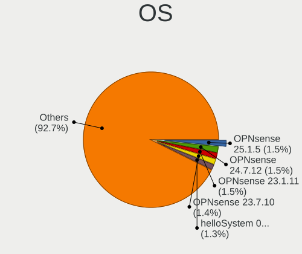

| Name              | Computers | Percent |
|-------------------|-----------|---------|
| OPNsense 25.1.5   | 21        | 1.55%   |
| OPNsense 24.7.12  | 21        | 1.55%   |
| OPNsense 23.1.11  | 20        | 1.48%   |
| OPNsense 23.7.10  | 19        | 1.4%    |
| OPNsense 24.1.6   | 18        | 1.33%   |
| helloSystem 0.8.1 | 18        | 1.33%   |
| OPNsense 25.1.7   | 17        | 1.25%   |
| OpenBSD 7.4       | 17        | 1.25%   |
| OpenBSD 7.2       | 17        | 1.25%   |
| helloSystem 0.7.0 | 17        | 1.25%   |
| OPNsense 25.1.4   | 16        | 1.18%   |
| OPNsense 24.7     | 16        | 1.18%   |
| OPNsense 24.1.7   | 16        | 1.18%   |
| OPNsense 24.1.5   | 16        | 1.18%   |
| OPNsense 25.1     | 15        | 1.11%   |
| OPNsense 24.7.11  | 15        | 1.11%   |
| OPNsense 23.7.12  | 15        | 1.11%   |
| OpenBSD 7.5       | 15        | 1.11%   |
| OPNsense 23.1     | 14        | 1.03%   |
| OPNsense 22.7.10  | 14        | 1.03%   |
| OpenBSD 7.3       | 14        | 1.03%   |
| OPNsense 25.1.3   | 13        | 0.96%   |
| OPNsense 24.1.1   | 13        | 0.96%   |
| OPNsense 23.7.3   | 13        | 0.96%   |
| OpenBSD 7.1       | 13        | 0.96%   |
| OPNsense 25.7.7   | 12        | 0.89%   |
| OPNsense 24.7.4   | 12        | 0.89%   |
| OPNsense 23.1.6   | 12        | 0.89%   |
| OPNsense 23.1.1   | 12        | 0.89%   |
| OPNsense 22.1.10  | 12        | 0.89%   |
| OPNsense 21.1.4   | 12        | 0.89%   |
| OPNsense 21.1     | 12        | 0.89%   |
| OPNsense 25.7.1   | 11        | 0.81%   |
| OPNsense 24.1.4   | 11        | 0.81%   |
| OpenBSD 7.6       | 11        | 0.81%   |
| helloSystem 0.5.0 | 11        | 0.81%   |
| OPNsense 25.1.6   | 10        | 0.74%   |
| OPNsense 24.7.9   | 10        | 0.74%   |
| OPNsense 24.7.3   | 10        | 0.74%   |
| OPNsense 24.7.10  | 10        | 0.74%   |

OS Family
---------

OS without a version

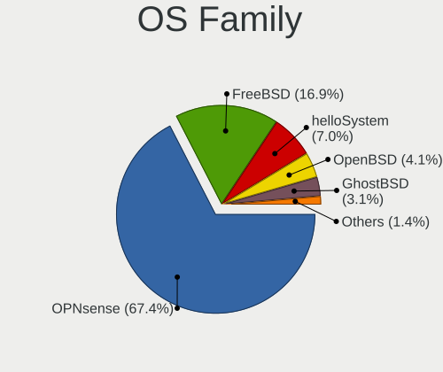

| Name        | Computers | Percent |
|-------------|-----------|---------|
| OPNsense    | 586       | 67.43%  |
| FreeBSD     | 147       | 16.92%  |
| helloSystem | 61        | 7.02%   |
| OpenBSD     | 36        | 4.14%   |
| GhostBSD    | 27        | 3.11%   |
| FreeNAS     | 3         | 0.35%   |
| TrueNAS     | 2         | 0.23%   |
| NomadBSD    | 2         | 0.23%   |
| NetBSD      | 2         | 0.23%   |
| XigmaNAS    | 1         | 0.12%   |
| pfSense     | 1         | 0.12%   |
| MyBee       | 1         | 0.12%   |

Arch
----

OS architecture (x86_64, i586, etc.)

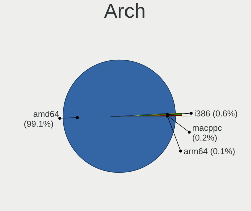

| Name   | Computers | Percent |
|--------|-----------|---------|
| amd64  | 855       | 99.07%  |
| i386   | 5         | 0.58%   |
| macppc | 2         | 0.23%   |
| arm64  | 1         | 0.12%   |

DE
--

Desktop Environment

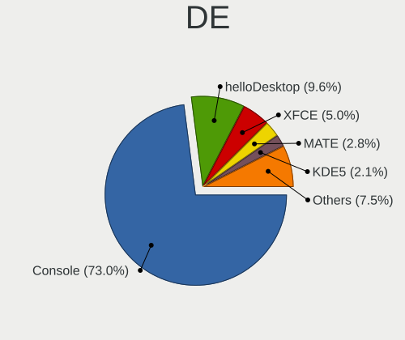

| Name          | Computers | Percent |
|---------------|-----------|---------|
| Console       | 645       | 72.96%  |
| helloDesktop  | 85        | 9.62%   |
| XFCE          | 44        | 4.98%   |
| MATE          | 25        | 2.83%   |
| KDE5          | 19        | 2.15%   |
| GNOME         | 14        | 1.58%   |
| fvwm          | 12        | 1.36%   |
| TWM           | 8         | 0.9%    |
| Openbox       | 7         | 0.79%   |
| i3            | 3         | 0.34%   |
| Fluxbox       | 3         | 0.34%   |
| Cinnamon      | 3         | 0.34%   |
| Window Maker  | 2         | 0.23%   |
| LXQt          | 2         | 0.23%   |
| LXDE          | 2         | 0.23%   |
| Lumina        | 2         | 0.23%   |
| X-Cinnamon    | 1         | 0.11%   |
| sway:wlroots  | 1         | 0.11%   |
| Ratpoison     | 1         | 0.11%   |
| labwc:wlroots | 1         | 0.11%   |
| KDE6          | 1         | 0.11%   |
| KDE           | 1         | 0.11%   |
| DWM           | 1         | 0.11%   |
| AwesomeWM     | 1         | 0.11%   |

Display Server
--------------

X11 or Wayland

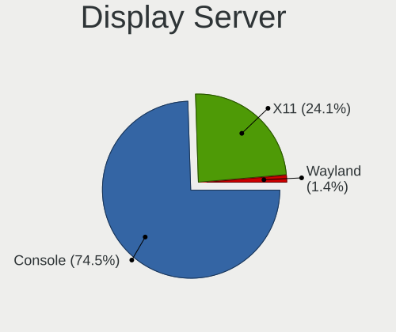

| Name    | Computers | Percent |
|---------|-----------|---------|
| Console | 648       | 74.48%  |
| X11     | 210       | 24.14%  |
| Wayland | 12        | 1.38%   |

Display Manager
---------------

SDDM, LightDM, etc.

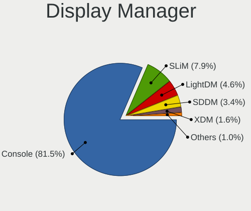

| Name    | Computers | Percent |
|---------|-----------|---------|
| Console | 713       | 81.49%  |
| SLiM    | 69        | 7.89%   |
| LightDM | 40        | 4.57%   |
| SDDM    | 30        | 3.43%   |
| XDM     | 14        | 1.6%    |
| GDM     | 7         | 0.8%    |
| Ly      | 2         | 0.23%   |

OS Lang
-------

Language

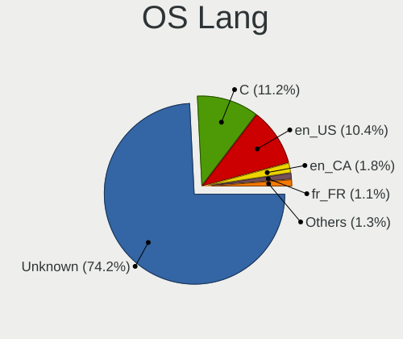

| Lang    | Computers | Percent |
|---------|-----------|---------|
| Unknown | 650       | 74.2%   |
| C       | 98        | 11.19%  |
| en_US   | 91        | 10.39%  |
| en_CA   | 16        | 1.83%   |
| fr_FR   | 10        | 1.14%   |
| fr_CA   | 3         | 0.34%   |
| en      | 3         | 0.34%   |
| fr      | 2         | 0.23%   |
| en_GB   | 2         | 0.23%   |
| en_NL   | 1         | 0.11%   |

Boot Mode
---------

EFI or BIOS

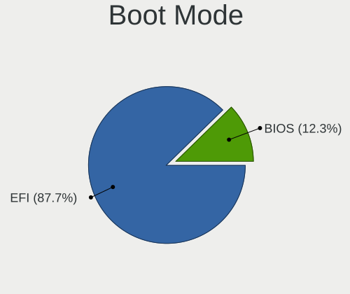

| Mode | Computers | Percent |
|------|-----------|---------|
| EFI  | 762       | 87.69%  |
| BIOS | 107       | 12.31%  |

Filesystem
----------

Type of filesystem

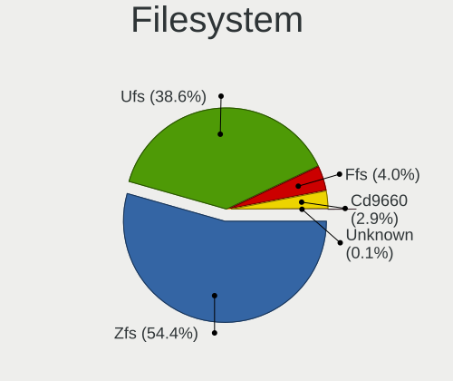

| Type    | Computers | Percent |
|---------|-----------|---------|
| Zfs     | 489       | 54.39%  |
| Ufs     | 347       | 38.6%   |
| Ffs     | 36        | 4%      |
| Cd9660  | 26        | 2.89%   |
| Unknown | 1         | 0.11%   |

Part. scheme
------------

Scheme of partitioning

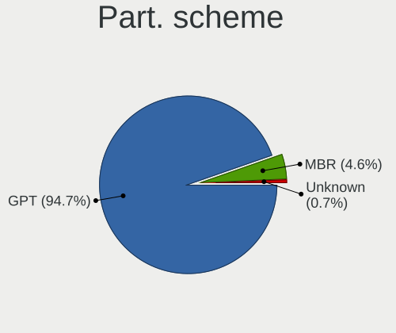

| Type    | Computers | Percent |
|---------|-----------|---------|
| GPT     | 817       | 94.67%  |
| MBR     | 40        | 4.63%   |
| Unknown | 6         | 0.7%    |

Board
-----

Vendor
------

Motherboard manufacturer

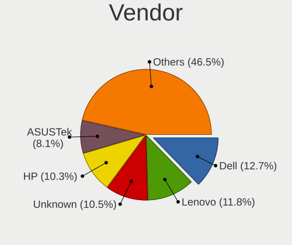

| Name                                 | Computers | Percent |
|--------------------------------------|-----------|---------|
| Dell                                 | 110       | 12.75%  |
| Lenovo                               | 102       | 11.82%  |
| Unknown                              | 91        | 10.54%  |
| Hewlett-Packard                      | 89        | 10.31%  |
| ASUSTek Computer                     | 70        | 8.11%   |
| Intel                                | 53        | 6.14%   |
| Supermicro                           | 39        | 4.52%   |
| Protectli                            | 37        | 4.29%   |
| Gigabyte Technology                  | 25        | 2.9%    |
| MSI                                  | 20        | 2.32%   |
| ASRock                               | 20        | 2.32%   |
| Apple                                | 17        | 1.97%   |
| Techvision                           | 16        | 1.85%   |
| Acer                                 | 16        | 1.85%   |
| AZW                                  | 15        | 1.74%   |
| AMI                                  | 11        | 1.27%   |
| Sophos                               | 8         | 0.93%   |
| ZOTAC                                | 7         | 0.81%   |
| PC Engines                           | 6         | 0.7%    |
| AWOW                                 | 6         | 0.7%    |
| Toshiba                              | 5         | 0.58%   |
| Deciso                               | 5         | 0.58%   |
| Shenzhen Meigao Electronic Equipment | 4         | 0.46%   |
| MW                                   | 4         | 0.46%   |
| CncTion                              | 4         | 0.46%   |
| ASRockRack                           | 4         | 0.46%   |
| ShenZhen MinWin Technology           | 3         | 0.35%   |
| Panasonic                            | 3         | 0.35%   |
| IBM                                  | 3         | 0.35%   |
| Datto                                | 3         | 0.35%   |
| CWWK                                 | 3         | 0.35%   |
| BOSGAME                              | 3         | 0.35%   |
| Alienware                            | 3         | 0.35%   |
| Yanling                              | 2         | 0.23%   |
| Shuttle                              | 2         | 0.23%   |
| Pegatron                             | 2         | 0.23%   |
| Mini PC                              | 2         | 0.23%   |
| Matsushita Electric Industrial       | 2         | 0.23%   |
| IceWhale Technology                  | 2         | 0.23%   |
| Gowin Solution                       | 2         | 0.23%   |

Model
-----

Motherboard model

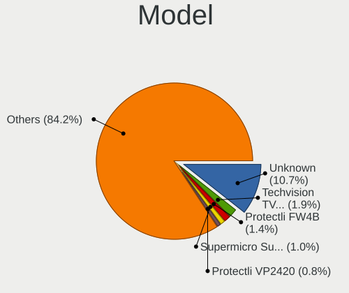

| Name                                              | Computers | Percent |
|---------------------------------------------------|-----------|---------|
| Unknown                                           | 92        | 10.66%  |
| Techvision TVI7309X                               | 16        | 1.85%   |
| Protectli FW4B                                    | 12        | 1.39%   |
| Supermicro Super Server                           | 9         | 1.04%   |
| Protectli VP2420                                  | 7         | 0.81%   |
| Intel Q3XXG4-P V1.0                               | 7         | 0.81%   |
| Protectli FW6                                     | 6         | 0.7%    |
| AWOW PC BOX                                       | 6         | 0.7%    |
| AMI Aptio CRB                                     | 6         | 0.7%    |
| Sophos SG                                         | 5         | 0.58%   |
| Intel NDISB533                                    | 5         | 0.58%   |
| Intel CRESCENTBAY                                 | 5         | 0.58%   |
| Dell OptiPlex 9010                                | 5         | 0.58%   |
| Dell OptiPlex 7020                                | 5         | 0.58%   |
| AZW U59                                           | 5         | 0.58%   |
| AZW EQ                                            | 5         | 0.58%   |
| ZOTAC ZBOX-CI323NANO                              | 4         | 0.46%   |
| Shenzhen Meigao Electronic Equipment Venus series | 4         | 0.46%   |
| MW GMLK-2_5G4L                                    | 4         | 0.46%   |
| HP t730 Thin Client                               | 4         | 0.46%   |
| HP EliteDesk 800 G1 SFF                           | 4         | 0.46%   |
| Dell OptiPlex 7010                                | 4         | 0.46%   |
| ASUS All Series                                   | 4         | 0.46%   |
| ShenZhen MinWin MW-GMLK-2.5G6L                    | 3         | 0.35%   |
| PC Engines APU2                                   | 3         | 0.35%   |
| Lenovo ThinkCentre M93p 10A8S16X0J                | 3         | 0.35%   |
| Intel NUC12WSKi7                                  | 3         | 0.35%   |
| Intel H81U                                        | 3         | 0.35%   |
| HP Z440 Workstation                               | 3         | 0.35%   |
| HP t740 Thin Client                               | 3         | 0.35%   |
| HP EliteDesk 800 G3 SFF                           | 3         | 0.35%   |
| HP Compaq Elite 8300 SFF                          | 3         | 0.35%   |
| HP Compaq 8200 Elite SFF PC                       | 3         | 0.35%   |
| HP Compaq 6200 Pro MT PC                          | 3         | 0.35%   |
| HP 500-459                                        | 3         | 0.35%   |
| Dell PowerEdge R220                               | 3         | 0.35%   |
| Dell PowerEdge R210                               | 3         | 0.35%   |
| Dell OptiPlex 9020                                | 3         | 0.35%   |
| Dell OptiPlex 7060                                | 3         | 0.35%   |
| Dell OptiPlex 3060                                | 3         | 0.35%   |

Model Family
------------

Motherboard model prefix

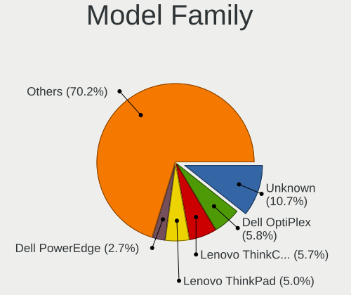

| Name                                       | Computers | Percent |
|--------------------------------------------|-----------|---------|
| Unknown                                    | 92        | 10.66%  |
| Dell OptiPlex                              | 50        | 5.79%   |
| Lenovo ThinkCentre                         | 49        | 5.68%   |
| Lenovo ThinkPad                            | 43        | 4.98%   |
| Dell PowerEdge                             | 23        | 2.67%   |
| Techvision TVI7309X                        | 16        | 1.85%   |
| HP ProDesk                                 | 16        | 1.85%   |
| HP EliteDesk                               | 16        | 1.85%   |
| ASUS PRIME                                 | 16        | 1.85%   |
| HP Compaq                                  | 15        | 1.74%   |
| Protectli FW4B                             | 12        | 1.39%   |
| Acer Aspire                                | 11        | 1.27%   |
| Dell Precision                             | 10        | 1.16%   |
| ASUS ROG                                   | 10        | 1.16%   |
| Supermicro Super                           | 9         | 1.04%   |
| Dell Latitude                              | 8         | 0.93%   |
| Protectli VP2420                           | 7         | 0.81%   |
| Intel Q3XXG4-P                             | 7         | 0.81%   |
| Dell Inspiron                              | 7         | 0.81%   |
| Protectli FW6                              | 6         | 0.7%    |
| HP ProLiant                                | 6         | 0.7%    |
| AWOW PC                                    | 6         | 0.7%    |
| ASRock B450M                               | 6         | 0.7%    |
| AMI Aptio                                  | 6         | 0.7%    |
| Sophos SG                                  | 5         | 0.58%   |
| Intel NDISB533                             | 5         | 0.58%   |
| Intel CRESCENTBAY                          | 5         | 0.58%   |
| AZW U59                                    | 5         | 0.58%   |
| AZW EQ                                     | 5         | 0.58%   |
| ZOTAC ZBOX-CI323NANO                       | 4         | 0.46%   |
| Toshiba Satellite                          | 4         | 0.46%   |
| Shenzhen Meigao Electronic Equipment Venus | 4         | 0.46%   |
| MW GMLK-2                                  | 4         | 0.46%   |
| HP t730                                    | 4         | 0.46%   |
| HP Pavilion                                | 4         | 0.46%   |
| Dell XPS                                   | 4         | 0.46%   |
| ASUS All                                   | 4         | 0.46%   |
| ShenZhen MinWin MW-GMLK-2.5G6L             | 3         | 0.35%   |
| PC Engines APU2                            | 3         | 0.35%   |
| Lenovo SHARKBAY                            | 3         | 0.35%   |

MFG Year
--------

Motherboard manufacture year

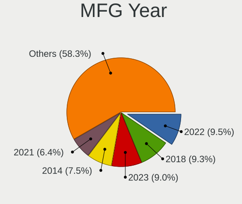

| Year    | Computers | Percent |
|---------|-----------|---------|
| 2022    | 82        | 9.5%    |
| 2018    | 80        | 9.27%   |
| 2023    | 78        | 9.04%   |
| 2014    | 65        | 7.53%   |
| 2021    | 55        | 6.37%   |
| 2024    | 53        | 6.14%   |
| 2020    | 53        | 6.14%   |
| 2019    | 48        | 5.56%   |
| 2016    | 48        | 5.56%   |
| 2017    | 46        | 5.33%   |
| 2015    | 45        | 5.21%   |
| 2011    | 40        | 4.63%   |
| 2013    | 39        | 4.52%   |
| 2012    | 39        | 4.52%   |
| 2010    | 33        | 3.82%   |
| 2009    | 20        | 2.32%   |
| 2008    | 15        | 1.74%   |
| 2025    | 9         | 1.04%   |
| 2007    | 6         | 0.7%    |
| Unknown | 5         | 0.58%   |
| 2006    | 3         | 0.35%   |
| 2002    | 1         | 0.12%   |

Form Factor
-----------

Physical design of the computer

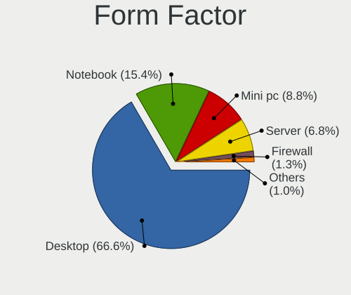

| Name           | Computers | Percent |
|----------------|-----------|---------|
| Desktop        | 575       | 66.63%  |
| Notebook       | 133       | 15.41%  |
| Mini pc        | 76        | 8.81%   |
| Server         | 59        | 6.84%   |
| Firewall       | 11        | 1.27%   |
| All in one     | 7         | 0.81%   |
| System on chip | 1         | 0.12%   |
| Convertible    | 1         | 0.12%   |

Coreboot
--------

Have coreboot on board

| Used | Computers | Percent |
|------|-----------|---------|
| No   | 846       | 98.03%  |
| Yes  | 17        | 1.97%   |

RAM Size
--------

Total RAM memory

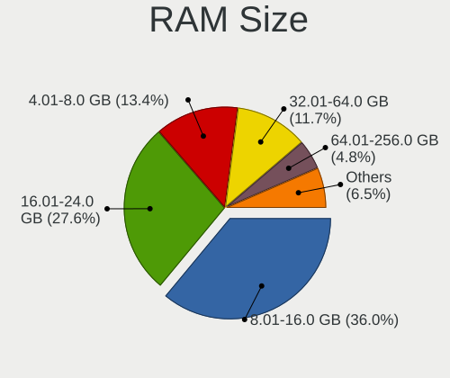

| Size in GB      | Computers | Percent |
|-----------------|-----------|---------|
| 8.01-16.0       | 317       | 36.02%  |
| 16.01-24.0      | 243       | 27.61%  |
| 4.01-8.0        | 118       | 13.41%  |
| 32.01-64.0      | 103       | 11.7%   |
| 64.01-256.0     | 42        | 4.77%   |
| 2.01-3.0        | 20        | 2.27%   |
| 24.01-32.0      | 17        | 1.93%   |
| 3.01-4.0        | 13        | 1.48%   |
| 1.01-2.0        | 3         | 0.34%   |
| 0.51-1.0        | 3         | 0.34%   |
| More than 256.0 | 1         | 0.11%   |

RAM Used
--------

Used RAM memory

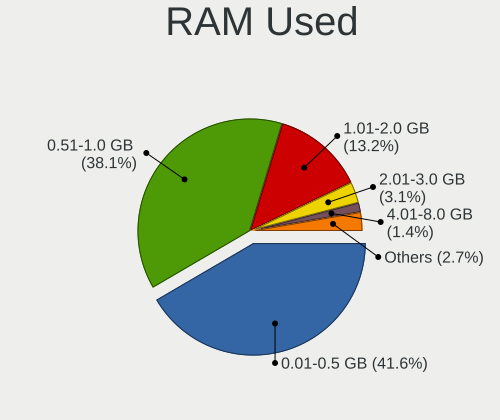

| Used GB     | Computers | Percent |
|-------------|-----------|---------|
| 0.01-0.5    | 368       | 41.58%  |
| 0.51-1.0    | 337       | 38.08%  |
| 1.01-2.0    | 117       | 13.22%  |
| 2.01-3.0    | 27        | 3.05%   |
| 4.01-8.0    | 12        | 1.36%   |
| 3.01-4.0    | 10        | 1.13%   |
| 0           | 4         | 0.45%   |
| 24.01-32.0  | 3         | 0.34%   |
| 64.01-256.0 | 2         | 0.23%   |
| 8.01-16.0   | 2         | 0.23%   |
| Unknown     | 2         | 0.23%   |
| 32.01-64.0  | 1         | 0.11%   |

Total Drives
------------

Number of drives on board

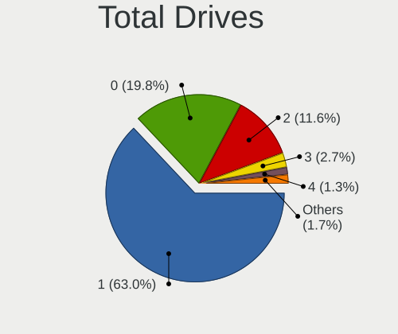

| Drives | Computers | Percent |
|--------|-----------|---------|
| 1      | 570       | 62.98%  |
| 0      | 179       | 19.78%  |
| 2      | 105       | 11.6%   |
| 3      | 24        | 2.65%   |
| 4      | 12        | 1.33%   |
| 5      | 3         | 0.33%   |
| 13     | 2         | 0.22%   |
| 10     | 2         | 0.22%   |
| 7      | 2         | 0.22%   |
| 58     | 1         | 0.11%   |
| 40     | 1         | 0.11%   |
| 25     | 1         | 0.11%   |
| 16     | 1         | 0.11%   |
| 14     | 1         | 0.11%   |
| 6      | 1         | 0.11%   |

Has CD-ROM
----------

Has CD-ROM on board

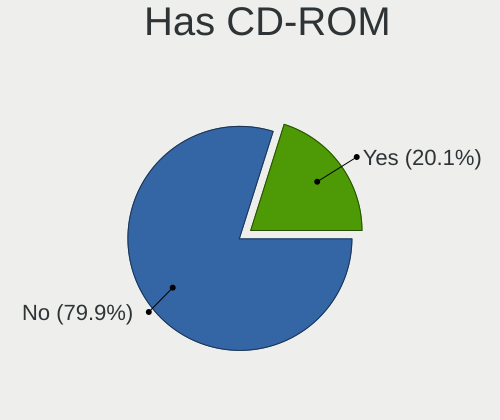

| Presented | Computers | Percent |
|-----------|-----------|---------|
| No        | 698       | 79.86%  |
| Yes       | 176       | 20.14%  |

Has Ethernet
------------

Has Ethernet on board

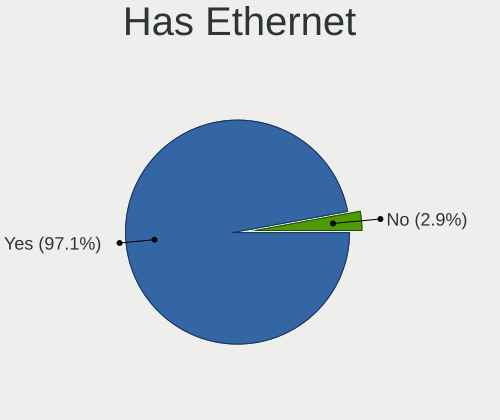

| Presented | Computers | Percent |
|-----------|-----------|---------|
| Yes       | 839       | 97.11%  |
| No        | 25        | 2.89%   |

Has WiFi
--------

Has WiFi module

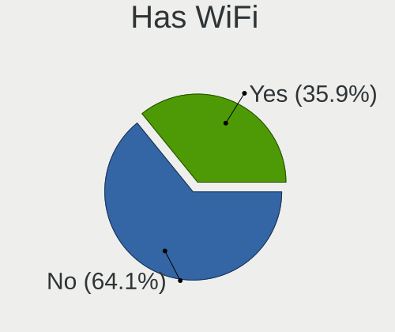

| Presented | Computers | Percent |
|-----------|-----------|---------|
| No        | 560       | 64.15%  |
| Yes       | 313       | 35.85%  |

Has Bluetooth
-------------

Has Bluetooth module

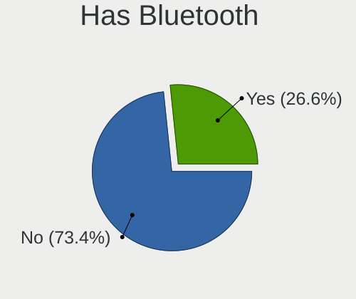

| Presented | Computers | Percent |
|-----------|-----------|---------|
| No        | 639       | 73.36%  |
| Yes       | 232       | 26.64%  |

Location
--------

Country
-------

Geographic location (country)

| Country | Computers | Percent |
|---------|-----------|---------|
| Canada  | 863       | 100%    |

City
----

Geographic location (city)

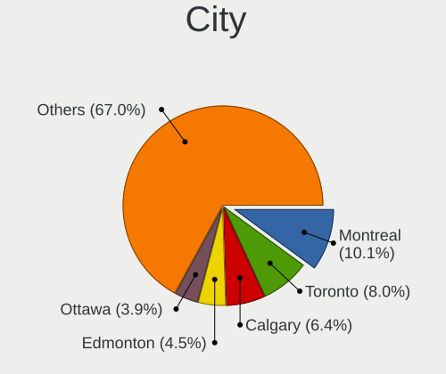

| City              | Computers | Percent |
|-------------------|-----------|---------|
| Montreal          | 98        | 10.09%  |
| Toronto           | 78        | 8.03%   |
| Calgary           | 62        | 6.39%   |
| Edmonton          | 44        | 4.53%   |
| Ottawa            | 38        | 3.91%   |
| Winnipeg          | 31        | 3.19%   |
| Victoria          | 30        | 3.09%   |
| Vancouver         | 27        | 2.78%   |
| Kitchener         | 18        | 1.85%   |
| Brampton          | 17        | 1.75%   |
| Saint-Laurent     | 16        | 1.65%   |
| Scarborough       | 15        | 1.54%   |
| Surrey            | 13        | 1.34%   |
| Québec           | 13        | 1.34%   |
| Laval             | 13        | 1.34%   |
| Gatineau          | 12        | 1.24%   |
| North Vancouver   | 11        | 1.13%   |
| Mississauga       | 11        | 1.13%   |
| Regina            | 10        | 1.03%   |
| Cambridge         | 10        | 1.03%   |
| Longueuil         | 9         | 0.93%   |
| Burnaby           | 9         | 0.93%   |
| Saskatoon         | 8         | 0.82%   |
| London            | 8         | 0.82%   |
| Barrie            | 8         | 0.82%   |
| Windsor           | 7         | 0.72%   |
| Kingston          | 7         | 0.72%   |
| Hamilton          | 7         | 0.72%   |
| Sherwood Park     | 6         | 0.62%   |
| QuГ©bec         | 6         | 0.62%   |
| Peterborough      | 6         | 0.62%   |
| Oakville          | 6         | 0.62%   |
| Moncton           | 6         | 0.62%   |
| Sydenham          | 5         | 0.51%   |
| Guelph            | 5         | 0.51%   |
| Terrebonne        | 4         | 0.41%   |
| Stratford         | 4         | 0.41%   |
| St. John's        | 4         | 0.41%   |
| St. Jean Baptiste | 4         | 0.41%   |
| St. Albert        | 4         | 0.41%   |

Drives
------

Drive Vendor
------------

Hard drive vendors

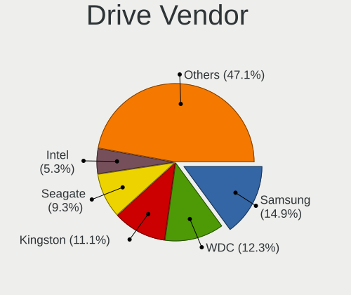

| Vendor              | Computers | Drives | Percent |
|---------------------|-----------|--------|---------|
| Samsung Electronics | 128       | 240    | 14.94%  |
| WDC                 | 105       | 275    | 12.25%  |
| Kingston            | 95        | 145    | 11.09%  |
| Seagate             | 80        | 172    | 9.33%   |
| Intel               | 45        | 71     | 5.25%   |
| A-DATA Technology   | 31        | 51     | 3.62%   |
| Crucial             | 29        | 55     | 3.38%   |
| Patriot             | 27        | 45     | 3.15%   |
| SanDisk             | 25        | 35     | 2.92%   |
| Toshiba             | 20        | 37     | 2.33%   |
| Hitachi             | 20        | 64     | 2.33%   |
| China               | 17        | 24     | 1.98%   |
| Micron Technology   | 15        | 26     | 1.75%   |
| Transcend           | 14        | 19     | 1.63%   |
| SPCC                | 13        | 16     | 1.52%   |
| SK hynix            | 10        | 12     | 1.17%   |
| Hewlett-Packard     | 10        | 13     | 1.17%   |
| FORESEE             | 10        | 31     | 1.17%   |
| Dogfish             | 10        | 29     | 1.17%   |
| Phison              | 9         | 10     | 1.05%   |
| OCZ                 | 9         | 15     | 1.05%   |
| Lexar               | 9         | 13     | 1.05%   |
| HGST                | 9         | 81     | 1.05%   |
| Protectli           | 8         | 20     | 0.93%   |
| NVMe                | 8         | 11     | 0.93%   |
| Hoodisk             | 8         | 16     | 0.93%   |
| Apple               | 7         | 7      | 0.82%   |
| Mushkin             | 5         | 6      | 0.58%   |
| Timetec             | 4         | 6      | 0.47%   |
| Team                | 4         | 9      | 0.47%   |
| PNY                 | 4         | 5      | 0.47%   |
| Netac               | 4         | 4      | 0.47%   |
| LITEONIT            | 4         | 5      | 0.47%   |
| BIWIN               | 4         | 8      | 0.47%   |
| Apacer              | 4         | 4      | 0.47%   |
| Gigastone           | 3         | 15     | 0.35%   |
| FIKWOT              | 3         | 4      | 0.35%   |
| Fanxiang            | 3         | 3      | 0.35%   |
| Corsair             | 3         | 5      | 0.35%   |
| XPG                 | 2         | 3      | 0.23%   |

Drive Model
-----------

Hard drive models

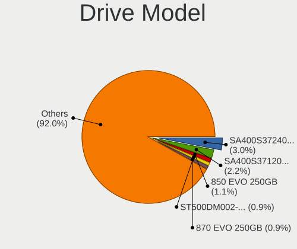

| Model                           | Computers | Percent |
|---------------------------------|-----------|---------|
| Kingston SA400S37240G 240GB     | 28        | 3.04%   |
| Kingston SA400S37120G 120GB     | 20        | 2.17%   |
| Samsung SSD 850 EVO 250GB       | 10        | 1.09%   |
| Seagate ST500DM002-1BD142 500GB | 8         | 0.87%   |
| Samsung SSD 870 EVO 250GB       | 8         | 0.87%   |
| Samsung SSD 850 PRO 256GB       | 7         | 0.76%   |
| FORESEE 128GB SSD               | 7         | 0.76%   |
| Seagate ST500LM021-1KJ152 500GB | 6         | 0.65%   |
| Seagate ST2000DM008-2FR102 2TB  | 6         | 0.65%   |
| Seagate ST1000DM010-2EP102 1TB  | 6         | 0.65%   |
| Samsung SSD 970 EVO Plus 1TB    | 6         | 0.65%   |
| Samsung SSD 840 EVO 250GB       | 6         | 0.65%   |
| Patriot Burst Elite 120GB       | 6         | 0.65%   |
| Dogfish SSD 128GB               | 6         | 0.65%   |
| SPCC Solid State Disk 256GB     | 5         | 0.54%   |
| Samsung SSD 870 EVO 500GB       | 5         | 0.54%   |
| Samsung SSD 860 EVO 500GB       | 5         | 0.54%   |
| Samsung SSD 840 EVO 120GB       | 5         | 0.54%   |
| Kingston SV300S37A120G 120GB    | 5         | 0.54%   |
| Crucial CT240BX500SSD1 240GB    | 5         | 0.54%   |
| WDC WDS500G2B0A-00SM50 500GB    | 4         | 0.43%   |
| Toshiba DT01ACA100 1TB          | 4         | 0.43%   |
| SanDisk SD6SB1M064G1022I 64GB   | 4         | 0.43%   |
| Samsung SSD 870 EVO 1TB         | 4         | 0.43%   |
| Samsung SSD 850 EVO 500GB       | 4         | 0.43%   |
| Patriot M.2 P310 240GB          | 4         | 0.43%   |
| Kingston SKC600MS256G 256GB     | 4         | 0.43%   |
| Intel SSDSC2BB080G4 80GB        | 4         | 0.43%   |
| BIWIN SSD 128GB                 | 4         | 0.43%   |
| A-DATA SU800 256GB              | 4         | 0.43%   |
| WDC WD40EFRX-68WT0N0 4TB        | 3         | 0.33%   |
| WDC WD20EZRX-00DC0B0 2TB        | 3         | 0.33%   |
| WDC WD20EFRX-68EUZN0 1TB        | 3         | 0.33%   |
| Transcend TS256GMSA230S 256GB   | 3         | 0.33%   |
| SPCC Solid State Disk 128GB     | 3         | 0.33%   |
| Seagate ST3500413AS 500GB       | 3         | 0.33%   |
| Seagate ST2000DM001-1ER164 2TB  | 3         | 0.33%   |
| Samsung SSD 980 250GB           | 3         | 0.33%   |
| Samsung SSD 980 1TB             | 3         | 0.33%   |
| Samsung SSD 970 EVO Plus 250GB  | 3         | 0.33%   |

HDD Vendor
----------

Hard disk drive vendors

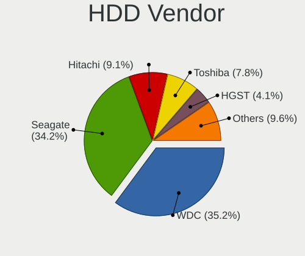

| Vendor              | Computers | Drives | Percent |
|---------------------|-----------|--------|---------|
| WDC                 | 77        | 230    | 35.16%  |
| Seagate             | 75        | 166    | 34.25%  |
| Hitachi             | 20        | 64     | 9.13%   |
| Toshiba             | 17        | 32     | 7.76%   |
| HGST                | 9         | 81     | 4.11%   |
| NVMe                | 6         | 9      | 2.74%   |
| Apple               | 4         | 4      | 1.83%   |
| Samsung Electronics | 2         | 2      | 0.91%   |
| Hewlett-Packard     | 2         | 2      | 0.91%   |
| Fujitsu             | 2         | 2      | 0.91%   |
| Synology            | 1         | 1      | 0.46%   |
| OPENBSD             | 1         | 1      | 0.46%   |
| Lexar               | 1         | 1      | 0.46%   |
| HPT                 | 1         | 1      | 0.46%   |
| HPE                 | 1         | 5      | 0.46%   |

SSD Vendor
----------

Solid state drive vendors

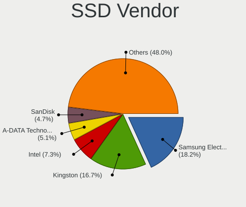

| Vendor              | Computers | Drives | Percent |
|---------------------|-----------|--------|---------|
| Samsung Electronics | 97        | 191    | 18.2%   |
| Kingston            | 89        | 130    | 16.7%   |
| Intel               | 39        | 63     | 7.32%   |
| A-DATA Technology   | 27        | 47     | 5.07%   |
| SanDisk             | 25        | 35     | 4.69%   |
| Crucial             | 25        | 46     | 4.69%   |
| Patriot             | 20        | 36     | 3.75%   |
| WDC                 | 18        | 23     | 3.38%   |
| China               | 17        | 24     | 3.19%   |
| Transcend           | 13        | 18     | 2.44%   |
| Micron Technology   | 11        | 21     | 2.06%   |
| SPCC                | 10        | 12     | 1.88%   |
| FORESEE             | 10        | 31     | 1.88%   |
| Dogfish             | 10        | 29     | 1.88%   |
| OCZ                 | 9         | 15     | 1.69%   |
| Protectli           | 8         | 20     | 1.5%    |
| Lexar               | 8         | 12     | 1.5%    |
| Hoodisk             | 8         | 16     | 1.5%    |
| SK hynix            | 5         | 5      | 0.94%   |
| Seagate             | 5         | 6      | 0.94%   |
| Mushkin             | 5         | 6      | 0.94%   |
| Hewlett-Packard     | 5         | 8      | 0.94%   |
| PNY                 | 4         | 5      | 0.75%   |
| LITEONIT            | 4         | 5      | 0.75%   |
| BIWIN               | 4         | 8      | 0.75%   |
| Apacer              | 4         | 4      | 0.75%   |
| Timetec             | 3         | 4      | 0.56%   |
| Netac               | 3         | 3      | 0.56%   |
| Gigastone           | 3         | 15     | 0.56%   |
| FIKWOT              | 3         | 4      | 0.56%   |
| Fanxiang            | 3         | 3      | 0.56%   |
| Corsair             | 3         | 5      | 0.56%   |
| Apple               | 3         | 3      | 0.56%   |
| VisionTek           | 2         | 6      | 0.38%   |
| Team                | 2         | 2      | 0.38%   |
| LITEON              | 2         | 4      | 0.38%   |
| KingSpec            | 2         | 2      | 0.38%   |
| HUGWORLD            | 2         | 3      | 0.38%   |
| ZTC                 | 1         | 1      | 0.19%   |
| Zheino              | 1         | 1      | 0.19%   |

Drive Kind
----------

HDD or SSD

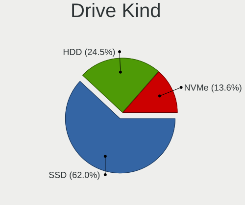

| Kind | Computers | Drives | Percent |
|------|-----------|--------|---------|
| SSD  | 484       | 904    | 61.97%  |
| HDD  | 191       | 601    | 24.46%  |
| NVMe | 106       | 168    | 13.57%  |

Drive Connector
---------------

SATA, SAS, NVMe, etc.

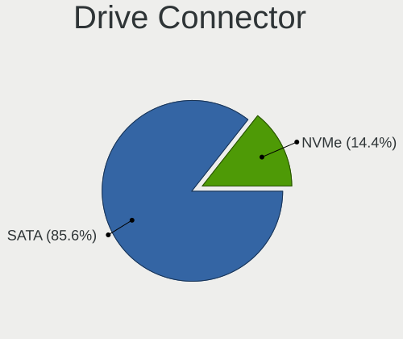

| Type | Computers | Drives | Percent |
|------|-----------|--------|---------|
| SATA | 631       | 1505   | 85.62%  |
| NVMe | 106       | 168    | 14.38%  |

Drive Size
----------

Size of hard drive

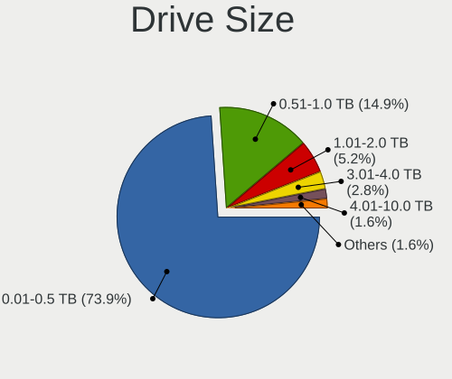

| Size in TB | Computers | Drives | Percent |
|------------|-----------|--------|---------|
| 0.01-0.5   | 522       | 957    | 73.94%  |
| 0.51-1.0   | 105       | 232    | 14.87%  |
| 1.01-2.0   | 37        | 77     | 5.24%   |
| 3.01-4.0   | 20        | 125    | 2.83%   |
| 4.01-10.0  | 11        | 61     | 1.56%   |
| 2.01-3.0   | 6         | 27     | 0.85%   |
| 10.01-20.0 | 5         | 26     | 0.71%   |

Space Total
-----------

Amount of disk space available on the file system

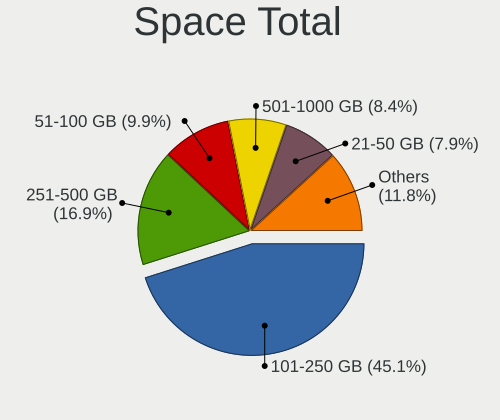

| Size in GB     | Computers | Percent |
|----------------|-----------|---------|
| 101-250        | 409       | 45.09%  |
| 251-500        | 153       | 16.87%  |
| 51-100         | 90        | 9.92%   |
| 501-1000       | 76        | 8.38%   |
| 21-50          | 72        | 7.94%   |
| 1-20           | 71        | 7.83%   |
| 1001-2000      | 23        | 2.54%   |
| More than 3000 | 7         | 0.77%   |
| Unknown        | 5         | 0.55%   |
| 2001-3000      | 1         | 0.11%   |

Space Used
----------

Amount of used disk space

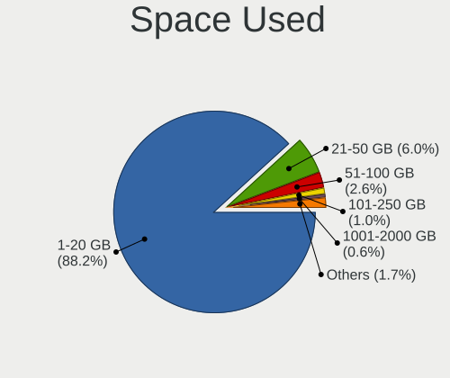

| Used GB        | Computers | Percent |
|----------------|-----------|---------|
| 1-20           | 794       | 88.22%  |
| 21-50          | 54        | 6%      |
| 51-100         | 23        | 2.56%   |
| 101-250        | 9         | 1%      |
| 251-500        | 5         | 0.56%   |
| 1001-2000      | 5         | 0.56%   |
| Unknown        | 5         | 0.56%   |
| 501-1000       | 4         | 0.44%   |
| More than 3000 | 1         | 0.11%   |

Malfunc. Drives
---------------

Drive models with a malfunction

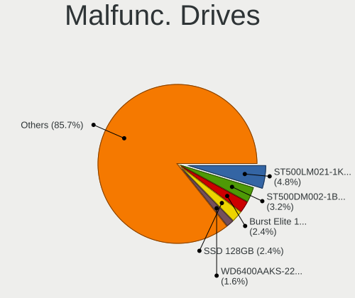

| Model                                 | Computers | Drives | Percent |
|---------------------------------------|-----------|--------|---------|
| Seagate ST500LM021-1KJ152 500GB       | 6         | 11     | 4.76%   |
| Seagate ST500DM002-1BD142 500GB       | 4         | 7      | 3.17%   |
| Patriot Burst Elite 120GB             | 3         | 4      | 2.38%   |
| Dogfish SSD 128GB                     | 3         | 8      | 2.38%   |
| WDC WD6400AAKS-22A7B2 640GB           | 2         | 10     | 1.59%   |
| WDC WD40EFRX-68WT0N0 4TB              | 2         | 3      | 1.59%   |
| VisionTek mSATA 120GB                 | 2         | 6      | 1.59%   |
| Toshiba MQ01ABD075 752GB              | 2         | 2      | 1.59%   |
| Seagate ST9500420AS 500GB             | 2         | 4      | 1.59%   |
| Seagate ST3500413AS 500GB             | 2         | 4      | 1.59%   |
| Samsung Electronics SSD 870 EVO 250GB | 2         | 11     | 1.59%   |
| Patriot Pyro SE 120GB                 | 2         | 4      | 1.59%   |
| Kingston SNS4151S316GD 16GB           | 2         | 4      | 1.59%   |
| Hitachi HTS545016B9A300 160GB         | 2         | 3      | 1.59%   |
| Hewlett-Packard SSD S700 Pro 128GB    | 2         | 5      | 1.59%   |
| Apacer 16GB SATA Flash Drive          | 2         | 2      | 1.59%   |
| WDC WDS200T2B0A 2TB                   | 1         | 1      | 0.79%   |
| WDC WD800JD-08MSA1 80GB               | 1         | 2      | 0.79%   |
| WDC WD7500BPKX-00HPJT0 752GB          | 1         | 10     | 0.79%   |
| WDC WD6400BEVT-22A0RT0 640GB          | 1         | 1      | 0.79%   |
| WDC WD6400AAKS-40H2B0 640GB           | 1         | 1      | 0.79%   |
| WDC WD60EZRZ-00RWYB1 6TB              | 1         | 2      | 0.79%   |
| WDC WD50EFRX-68L0BN1 5TB              | 1         | 1      | 0.79%   |
| WDC WD5003AZEX-00K1GA0 500GB          | 1         | 1      | 0.79%   |
| WDC WD40EZRZ-00WN9B0 4TB              | 1         | 1      | 0.79%   |
| WDC WD3200AAKS-75L9A0 320GB           | 1         | 1      | 0.79%   |
| WDC WD30EZRX-22D8PB0 3TB              | 1         | 1      | 0.79%   |
| WDC WD2500AAKX-001CA0 250GB           | 1         | 1      | 0.79%   |
| WDC WD1600AAJS-60Z0A0 160GB           | 1         | 2      | 0.79%   |
| WDC WD15EARS-00Z5B1 1.5TB             | 1         | 1      | 0.79%   |
| WDC WD1200SD-01KCB0 120GB             | 1         | 1      | 0.79%   |
| walram SSD 120G                       | 1         | 1      | 0.79%   |
| Toshiba MQ01ABD100 1TB                | 1         | 1      | 0.79%   |
| Toshiba MK1665GSX 160GB               | 1         | 1      | 0.79%   |
| Toshiba MK1255GSX H 120GB             | 1         | 2      | 0.79%   |
| Toshiba DT01ACA100 1TB                | 1         | 3      | 0.79%   |
| TEXTORM B5 240GB                      | 1         | 1      | 0.79%   |
| SPCC Solid State Disk 128GB           | 1         | 1      | 0.79%   |
| SK hynix HFS256G39TND-N210A 256GB     | 1         | 1      | 0.79%   |
| Seagate ST98823AS 80GB                | 1         | 2      | 0.79%   |

Malfunc. Drive Vendor
---------------------

Vendors of faulty drives

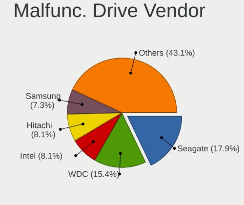

| Vendor              | Computers | Drives | Percent |
|---------------------|-----------|--------|---------|
| Seagate             | 22        | 43     | 17.89%  |
| WDC                 | 19        | 40     | 15.45%  |
| Intel               | 10        | 13     | 8.13%   |
| Hitachi             | 10        | 24     | 8.13%   |
| Samsung Electronics | 9         | 23     | 7.32%   |
| Kingston            | 8         | 11     | 6.5%    |
| Toshiba             | 6         | 9      | 4.88%   |
| Patriot             | 5         | 8      | 4.07%   |
| A-DATA Technology   | 4         | 12     | 3.25%   |
| HGST                | 3         | 5      | 2.44%   |
| Dogfish             | 3         | 8      | 2.44%   |
| VisionTek           | 2         | 6      | 1.63%   |
| Mushkin             | 2         | 3      | 1.63%   |
| Micron Technology   | 2         | 7      | 1.63%   |
| KingSpec            | 2         | 2      | 1.63%   |
| Hewlett-Packard     | 2         | 5      | 1.63%   |
| Crucial             | 2         | 3      | 1.63%   |
| Apacer              | 2         | 2      | 1.63%   |
| walram              | 1         | 1      | 0.81%   |
| TEXTORM             | 1         | 1      | 0.81%   |
| SPCC                | 1         | 1      | 0.81%   |
| SK hynix            | 1         | 1      | 0.81%   |
| SanDisk             | 1         | 1      | 0.81%   |
| OCZ                 | 1         | 5      | 0.81%   |
| HP Phison           | 1         | 1      | 0.81%   |
| Gigastone           | 1         | 1      | 0.81%   |
| Apple               | 1         | 1      | 0.81%   |
| AMD                 | 1         | 3      | 0.81%   |

Malfunc. HDD Vendor
-------------------

Vendors of faulty HDD drives

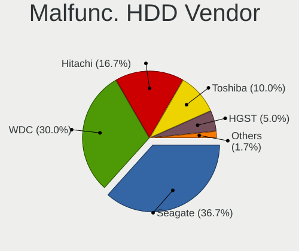

| Vendor              | Computers | Drives | Percent |
|---------------------|-----------|--------|---------|
| Seagate             | 22        | 43     | 36.67%  |
| WDC                 | 18        | 39     | 30%     |
| Hitachi             | 10        | 24     | 16.67%  |
| Toshiba             | 6         | 9      | 10%     |
| HGST                | 3         | 5      | 5%      |
| Samsung Electronics | 1         | 1      | 1.67%   |

Malfunc. Drive Kind
-------------------

Kinds of faulty drives

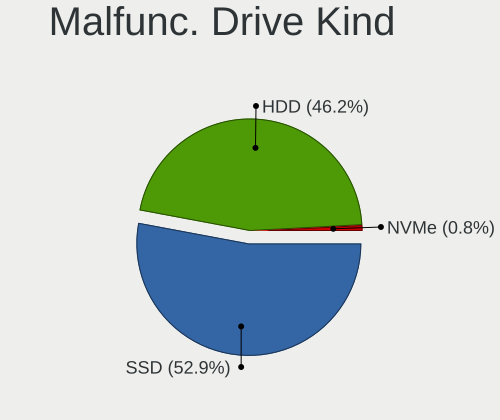

| Kind | Computers | Drives | Percent |
|------|-----------|--------|---------|
| SSD  | 63        | 117    | 52.94%  |
| HDD  | 55        | 121    | 46.22%  |
| NVMe | 1         | 2      | 0.84%   |

Failed Drives
-------------

Failed drive models

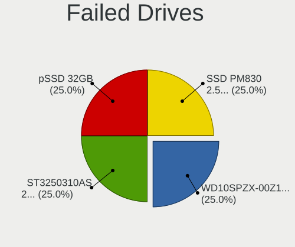

| Model                                            | Computers | Drives | Percent |
|--------------------------------------------------|-----------|--------|---------|
| WDC WD10SPZX-00Z10T0 1TB                         | 1         | 1      | 25%     |
| Seagate ST3250310AS 250GB                        | 1         | 1      | 25%     |
| SanDisk pSSD 32GB                                | 1         | 1      | 25%     |
| Samsung Electronics SSD PM830 2.5-inch 7mm 256GB | 1         | 1      | 25%     |

Failed Drive Vendor
-------------------

Failed drive vendors

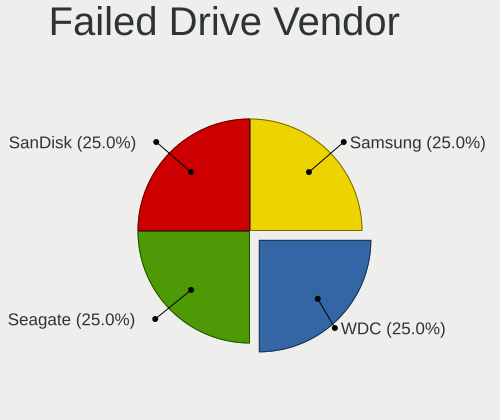

| Vendor              | Computers | Drives | Percent |
|---------------------|-----------|--------|---------|
| WDC                 | 1         | 1      | 25%     |
| Seagate             | 1         | 1      | 25%     |
| SanDisk             | 1         | 1      | 25%     |
| Samsung Electronics | 1         | 1      | 25%     |

Drive Status
------------

Number of failed and malfunc. drives

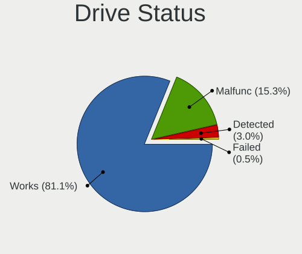

| Status   | Computers | Drives | Percent |
|----------|-----------|--------|---------|
| Works    | 615       | 1402   | 81.13%  |
| Malfunc  | 116       | 240    | 15.3%   |
| Detected | 23        | 27     | 3.03%   |
| Failed   | 4         | 4      | 0.53%   |

Storage controller
------------------

Storage Vendor
--------------

Storage controller vendors

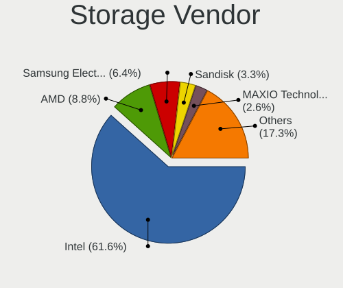

| Vendor                                  | Computers | Percent |
|-----------------------------------------|-----------|---------|
| Intel                                   | 688       | 61.65%  |
| AMD                                     | 98        | 8.78%   |
| Samsung Electronics                     | 71        | 6.36%   |
| Sandisk                                 | 37        | 3.32%   |
| MAXIO Technology (Hangzhou)             | 29        | 2.6%    |
| Broadcom / LSI                          | 26        | 2.33%   |
| Kingston Technology Company             | 21        | 1.88%   |
| Silicon Motion                          | 19        | 1.7%    |
| Phison Electronics                      | 15        | 1.34%   |
| Nvidia                                  | 11        | 0.99%   |
| ASMedia Technology                      | 11        | 0.99%   |
| SK hynix                                | 9         | 0.81%   |
| Micron Technology                       | 8         | 0.72%   |
| Realtek Semiconductor                   | 7         | 0.63%   |
| Micron/Crucial Technology               | 7         | 0.63%   |
| Marvell Technology Group                | 7         | 0.63%   |
| JMicron Technology                      | 6         | 0.54%   |
| Toshiba                                 | 5         | 0.45%   |
| Chelsio Communications                  | 5         | 0.45%   |
| Hosin Global Electronics                | 4         | 0.36%   |
| ADATA Technology                        | 4         | 0.36%   |
| Yangtze Memory Technologies             | 3         | 0.27%   |
| VIA Technologies                        | 3         | 0.27%   |
| Silicon Image                           | 3         | 0.27%   |
| KIOXIA                                  | 3         | 0.27%   |
| Hewlett-Packard                         | 3         | 0.27%   |
| Transcend                               | 2         | 0.18%   |
| Solidigm                                | 1         | 0.09%   |
| Solid State Storage Technology          | 1         | 0.09%   |
| Shenzhen Unionmemory Information System | 1         | 0.09%   |
| Shenzhen Longsys Electronics            | 1         | 0.09%   |
| Netac Technology                        | 1         | 0.09%   |
| Integrated Technology Express           | 1         | 0.09%   |
| HighPoint Technologies                  | 1         | 0.09%   |
| Dell                                    | 1         | 0.09%   |
| Biwin Storage Technology                | 1         | 0.09%   |
| Apple                                   | 1         | 0.09%   |
| Unknown                                 | 1         | 0.09%   |

Storage Model
-------------

Storage controller models

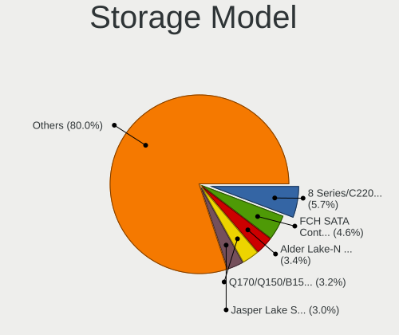

| Model                                                                            | Computers | Percent |
|----------------------------------------------------------------------------------|-----------|---------|
| Intel 8 Series/C220 Series Chipset Family 6-port SATA Controller 1 [AHCI mode]   | 72        | 5.75%   |
| AMD FCH SATA Controller [AHCI mode]                                              | 58        | 4.63%   |
| Intel Alder Lake-N SATA AHCI Controller                                          | 42        | 3.35%   |
| Intel Q170/Q150/B150/H170/H110/Z170/CM236 Chipset SATA Controller [AHCI Mode]    | 40        | 3.19%   |
| Intel Jasper Lake SATA AHCI Controller                                           | 38        | 3.03%   |
| Intel Celeron/Pentium Silver Processor SATA Controller                           | 35        | 2.79%   |
| Samsung NVMe SSD Controller SM981/PM981/PM983                                    | 31        | 2.47%   |
| Intel 6 Series/C200 Series Chipset Family 6 port Desktop SATA AHCI Controller    | 31        | 2.47%   |
| MAXIO (Hangzhou) NVMe SSD Controller MAP1202 (DRAM-less)                         | 29        | 2.31%   |
| Intel Sunrise Point-LP SATA Controller [AHCI mode]                               | 28        | 2.23%   |
| Intel Cannon Lake PCH SATA AHCI Controller                                       | 26        | 2.08%   |
| Intel 200 Series PCH SATA controller [AHCI mode]                                 | 26        | 2.08%   |
| Intel Atom/Celeron/Pentium Processor x5-E8000/J3xxx/N3xxx Series SATA Controller | 24        | 1.92%   |
| Intel 7 Series/C210 Series Chipset Family 6-port SATA Controller [AHCI mode]     | 23        | 1.84%   |
| Intel 8 Series SATA Controller 1 [AHCI mode]                                     | 21        | 1.68%   |
| AMD 400 Series Chipset SATA Controller                                           | 20        | 1.6%    |
| Silicon Motion SM2263EN/SM2263XT (DRAM-less) NVMe SSD Controllers                | 17        | 1.36%   |
| Intel Celeron N3350/Pentium N4200/Atom E3900 Series SATA AHCI Controller         | 17        | 1.36%   |
| Intel Wildcat Point-LP SATA Controller [AHCI Mode]                               | 16        | 1.28%   |
| Intel SATA Controller [RAID mode]                                                | 16        | 1.28%   |
| Intel Atom Processor C3000 Series SATA Controller 1                              | 15        | 1.2%    |
| Intel 5 Series/3400 Series Chipset 6 port SATA AHCI Controller                   | 15        | 1.2%    |
| Intel Comet Lake SATA AHCI Controller                                            | 13        | 1.04%   |
| Samsung NVMe SSD Controller PM9A1/PM9A3/980PRO                                   | 12        | 0.96%   |
| Samsung NVMe SSD Controller 980 (DRAM-less)                                      | 12        | 0.96%   |
| Intel Elkhart Lake SATA AHCI                                                     | 12        | 0.96%   |
| Intel 82801JI (ICH10 Family) SATA AHCI Controller                                | 12        | 0.96%   |
| Intel 7 Series Chipset Family 6-port SATA Controller [AHCI mode]                 | 12        | 0.96%   |
| AMD SB7x0/SB8x0/SB9x0 SATA Controller [AHCI mode]                                | 12        | 0.96%   |
| Intel Atom Processor C3000 Series SATA Controller 0                              | 11        | 0.88%   |
| Intel Alder Lake-S PCH SATA Controller [AHCI Mode]                               | 11        | 0.88%   |
| Intel C610/X99 series chipset 6-Port SATA Controller [AHCI mode]                 | 10        | 0.8%    |
| ASMedia ASM1061/ASM1062 Serial ATA Controller                                    | 10        | 0.8%    |
| Intel NM10/ICH7 Family SATA Controller [IDE mode]                                | 9         | 0.72%   |
| Intel Atom Processor E3800 Series SATA AHCI Controller                           | 9         | 0.72%   |
| Intel 82801G (ICH7 Family) IDE Controller                                        | 9         | 0.72%   |
| Intel 6 Series/C200 Series Chipset Family 6 port Mobile SATA AHCI Controller     | 9         | 0.72%   |
| Samsung NVMe SSD Controller SM961/PM961/SM963                                    | 8         | 0.64%   |
| SanDisk Extreme Pro / WD Black SN750 / PC SN730 / Red SN700 NVMe SSD             | 7         | 0.56%   |
| Intel C610/X99 series chipset sSATA Controller [AHCI mode]                       | 7         | 0.56%   |

Storage Kind
------------

Kind of storage controller (IDE, SATA, NVMe, SAS, ...)

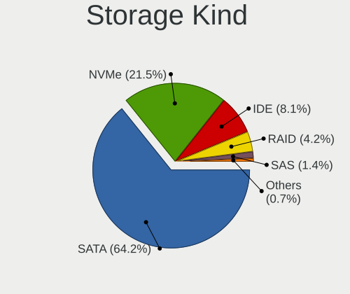

| Kind | Computers | Percent |
|------|-----------|---------|
| SATA | 709       | 64.22%  |
| NVMe | 237       | 21.47%  |
| IDE  | 89        | 8.06%   |
| RAID | 46        | 4.17%   |
| SAS  | 15        | 1.36%   |
| SCSI | 8         | 0.72%   |

Processor
---------

CPU Vendor
----------

Processor vendors

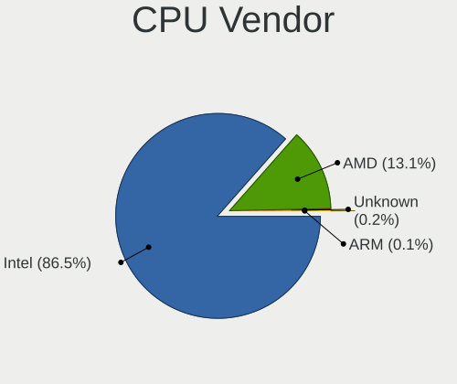

| Vendor  | Computers | Percent |
|---------|-----------|---------|
| Intel   | 751       | 86.52%  |
| AMD     | 114       | 13.13%  |
| Unknown | 2         | 0.23%   |
| ARM     | 1         | 0.12%   |

CPU Model
---------

Processor models

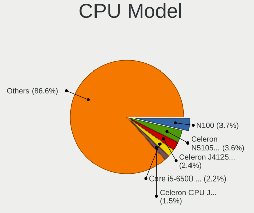

| Model                                | Computers | Percent |
|--------------------------------------|-----------|---------|
| Intel N100                           | 33        | 3.75%   |
| Intel Celeron N5105 @ 2.00GHz        | 32        | 3.63%   |
| Intel Celeron J4125 CPU @ 2.00GHz    | 21        | 2.38%   |
| Intel Core i5-6500 CPU @ 3.20GHz     | 19        | 2.16%   |
| Intel Celeron CPU J3160 @ 1.60GHz    | 13        | 1.48%   |
| Intel Core i5-4590 CPU @ 3.30GHz     | 12        | 1.36%   |
| Intel N95                            | 9         | 1.02%   |
| Intel Core i7-3770 CPU @ 3.40GHz     | 9         | 1.02%   |
| Intel Core i5-4570 CPU @ 3.20GHz     | 9         | 1.02%   |
| Intel Core i5-3570 CPU @ 3.40GHz     | 9         | 1.02%   |
| Intel Core i5-8500 CPU @ 3.00GHz     | 8         | 0.91%   |
| Intel Core i5-6300U CPU @ 2.40GHz    | 8         | 0.91%   |
| Intel Celeron J6412 @ 2.00GHz        | 8         | 0.91%   |
| Intel N150                           | 7         | 0.79%   |
| Intel Celeron CPU J1900 @ 1.99GHz    | 7         | 0.79%   |
| Intel Core i5-7200U CPU @ 2.50GHz    | 6         | 0.68%   |
| Intel Core 2 Duo CPU E8400 @ 3.00GHz | 6         | 0.68%   |
| Intel Celeron CPU J3455E @ 1.50GHz   | 6         | 0.68%   |
| Intel Xeon CPU E3-1220 v3 @ 3.10GHz  | 5         | 0.57%   |
| Intel Pentium Silver N6005 @ 2.00GHz | 5         | 0.57%   |
| Intel Core i7-8700 CPU @ 3.20GHz     | 5         | 0.57%   |
| Intel Core i5-8500T CPU @ 2.10GHz    | 5         | 0.57%   |
| Intel Core i5-4570TE CPU @ 2.70GHz   | 5         | 0.57%   |
| Intel Core i5-3470 CPU @ 3.20GHz     | 5         | 0.57%   |
| Intel Core i5-2520M CPU @ 2.50GHz    | 5         | 0.57%   |
| Intel Core i3-N305                   | 5         | 0.57%   |
| Intel Core i3-6100 CPU @ 3.70GHz     | 5         | 0.57%   |
| Intel Core i3-4030U CPU @ 1.90GHz    | 5         | 0.57%   |
| Intel Celeron CPU N3350 @ 1.10GHz    | 5         | 0.57%   |
| Intel Atom CPU C3758 @ 2.20GHz       | 5         | 0.57%   |
| AMD GX-412TC SOC                     | 5         | 0.57%   |
| Intel Xeon                           | 4         | 0.45%   |
| Intel Core i7-8550U CPU @ 1.80GHz    | 4         | 0.45%   |
| Intel Core i7-7700 CPU @ 3.60GHz     | 4         | 0.45%   |
| Intel Core i5-6500T CPU @ 2.50GHz    | 4         | 0.45%   |
| Intel Core i5-5200U CPU @ 2.20GHz    | 4         | 0.45%   |
| Intel Core i5-4670 CPU @ 3.40GHz     | 4         | 0.45%   |
| Intel Core i5-4460 CPU @ 3.20GHz     | 4         | 0.45%   |
| Intel Core i5-2400 CPU @ 3.10GHz     | 4         | 0.45%   |
| Intel Core i3-5005U CPU @ 2.00GHz    | 4         | 0.45%   |

CPU Model Family
----------------

Processor model prefix

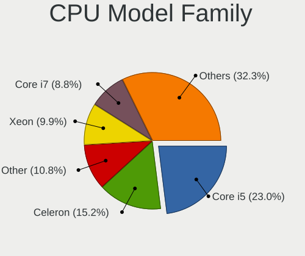

| Model                   | Computers | Percent |
|-------------------------|-----------|---------|
| Intel Core i5           | 202       | 23.03%  |
| Intel Celeron           | 133       | 15.17%  |
| Other                   | 95        | 10.83%  |
| Intel Xeon              | 87        | 9.92%   |
| Intel Core i7           | 77        | 8.78%   |
| Intel Core i3           | 69        | 7.87%   |
| Intel Atom              | 33        | 3.76%   |
| AMD Ryzen 5             | 21        | 2.39%   |
| Intel Core 2 Duo        | 18        | 2.05%   |
| Intel Pentium           | 17        | 1.94%   |
| AMD Ryzen 7             | 10        | 1.14%   |
| AMD GX                  | 10        | 1.14%   |
| Intel Pentium Silver    | 9         | 1.03%   |
| AMD FX                  | 9         | 1.03%   |
| Intel Core 2 Quad       | 7         | 0.8%    |
| AMD Ryzen Embedded      | 7         | 0.8%    |
| AMD Ryzen 9             | 7         | 0.8%    |
| Intel Pentium Dual-Core | 6         | 0.68%   |
| AMD EPYC                | 6         | 0.68%   |
| AMD Athlon 64 X2        | 5         | 0.57%   |
| AMD Athlon              | 4         | 0.46%   |
| AMD A8                  | 4         | 0.46%   |
| AMD A10                 | 4         | 0.46%   |
| Intel Core              | 3         | 0.34%   |
| AMD Ryzen 3             | 3         | 0.34%   |
| Intel Pentium 4         | 2         | 0.23%   |
| Intel Core i9           | 2         | 0.23%   |
| AMD Ryzen 5 PRO         | 2         | 0.23%   |
| AMD Phenom II X6        | 2         | 0.23%   |
| AMD Opteron             | 2         | 0.23%   |
| AMD G                   | 2         | 0.23%   |
| AMD Athlon II X2        | 2         | 0.23%   |
| AMD A6                  | 2         | 0.23%   |
| Intel Xeon Silver       | 1         | 0.11%   |
| Intel Pentium Gold      | 1         | 0.11%   |
| Intel Pentium Dual      | 1         | 0.11%   |
| Intel Pentium D         | 1         | 0.11%   |
| Intel Genuine           | 1         | 0.11%   |
| Intel Core 2            | 1         | 0.11%   |
| ARM Cortex              | 1         | 0.11%   |

CPU Cores
---------

Number of processor cores

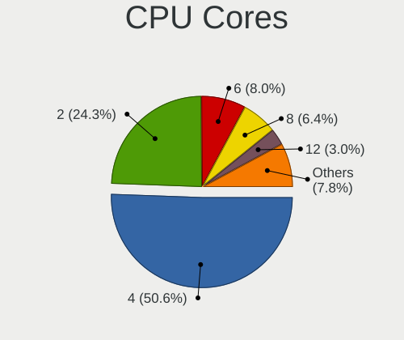

| Number  | Computers | Percent |
|---------|-----------|---------|
| 4       | 445       | 50.57%  |
| 2       | 214       | 24.32%  |
| 6       | 70        | 7.95%   |
| 8       | 56        | 6.36%   |
| 12      | 26        | 2.95%   |
| Unknown | 21        | 2.39%   |
| 16      | 18        | 2.05%   |
| 10      | 7         | 0.8%    |
| 32      | 5         | 0.57%   |
| 24      | 3         | 0.34%   |
| 20      | 3         | 0.34%   |
| 3       | 3         | 0.34%   |
| 1       | 3         | 0.34%   |
| 64      | 1         | 0.11%   |
| 44      | 1         | 0.11%   |
| 28      | 1         | 0.11%   |
| 11      | 1         | 0.11%   |
| 7       | 1         | 0.11%   |
| 5       | 1         | 0.11%   |

CPU Sockets
-----------

Number of sockets

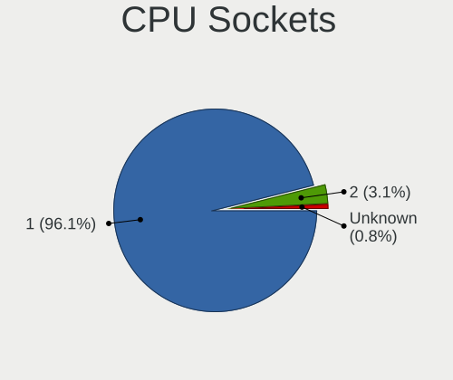

| Number  | Computers | Percent |
|---------|-----------|---------|
| 1       | 832       | 96.07%  |
| 2       | 27        | 3.12%   |
| Unknown | 7         | 0.81%   |

CPU Threads
-----------

Threads per core (Hyper-Threading)

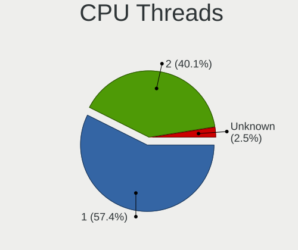

| Number  | Computers | Percent |
|---------|-----------|---------|
| 1       | 501       | 57.39%  |
| 2       | 350       | 40.09%  |
| Unknown | 22        | 2.52%   |

CPU Microarch
-------------

Microarchitecture

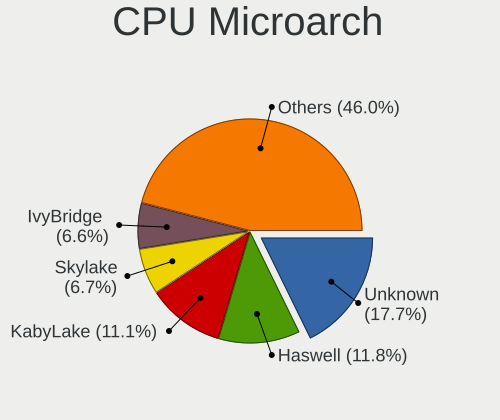

| Name          | Computers | Percent |
|---------------|-----------|---------|
| Unknown       | 156       | 17.75%  |
| Haswell       | 104       | 11.83%  |
| KabyLake      | 98        | 11.15%  |
| Skylake       | 59        | 6.71%   |
| IvyBridge     | 58        | 6.6%    |
| Silvermont    | 42        | 4.78%   |
| SandyBridge   | 42        | 4.78%   |
| Goldmont plus | 36        | 4.1%    |
| Penryn        | 32        | 3.64%   |
| Goldmont      | 32        | 3.64%   |
| Broadwell     | 30        | 3.41%   |
| Westmere      | 25        | 2.84%   |
| Zen 3         | 16        | 1.82%   |
| Zen+          | 15        | 1.71%   |
| CometLake     | 14        | 1.59%   |
| Zen           | 13        | 1.48%   |
| Piledriver    | 12        | 1.37%   |
| Nehalem       | 12        | 1.37%   |
| Zen 2         | 9         | 1.02%   |
| Core          | 9         | 1.02%   |
| Puma          | 8         | 0.91%   |
| Bonnell       | 8         | 0.91%   |
| TigerLake     | 7         | 0.8%    |
| K10           | 7         | 0.8%    |
| Jaguar        | 7         | 0.8%    |
| Steamroller   | 6         | 0.68%   |
| K8 Hammer     | 6         | 0.68%   |
| Excavator     | 4         | 0.46%   |
| NetBurst      | 3         | 0.34%   |
| Bulldozer     | 3         | 0.34%   |
| Bobcat        | 3         | 0.34%   |
| P6            | 1         | 0.11%   |
| K10 Llano     | 1         | 0.11%   |
| IceLake       | 1         | 0.11%   |

Graphics
--------

GPU Vendor
----------

Vendors of graphics cards

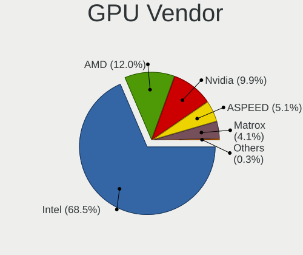

| Vendor                                       | Computers | Percent |
|----------------------------------------------|-----------|---------|
| Intel                                        | 595       | 68.55%  |
| AMD                                          | 104       | 11.98%  |
| Nvidia                                       | 86        | 9.91%   |
| ASPEED Technology                            | 44        | 5.07%   |
| Matrox Electronics Systems                   | 36        | 4.15%   |
| Silicon Motion                               | 2         | 0.23%   |
| XGI Technology (eXtreme Graphics Innovation) | 1         | 0.12%   |

GPU Model
---------

Graphics card models

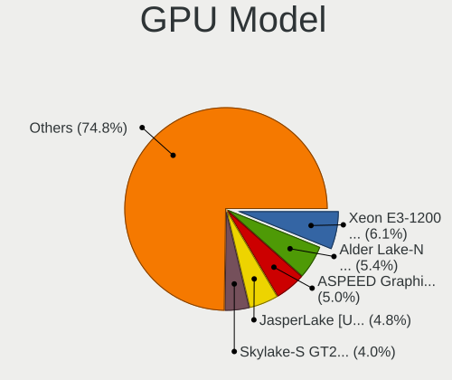

| Model                                                                                    | Computers | Percent |
|------------------------------------------------------------------------------------------|-----------|---------|
| Intel Xeon E3-1200 v3/4th Gen Core Processor Integrated Graphics Controller              | 54        | 6.11%   |
| Intel Alder Lake-N [UHD Graphics]                                                        | 48        | 5.43%   |
| ASPEED Technology ASPEED Graphics Family                                                 | 44        | 4.98%   |
| Intel JasperLake [UHD Graphics]                                                          | 42        | 4.75%   |
| Intel Skylake-S GT2 [HD Graphics 530]                                                    | 35        | 3.96%   |
| Intel GeminiLake [UHD Graphics 600]                                                      | 33        | 3.73%   |
| Intel 2nd Generation Core Processor Family Integrated Graphics Controller                | 32        | 3.62%   |
| Intel CoffeeLake-S GT2 [UHD Graphics 630]                                                | 30        | 3.39%   |
| Intel Atom/Celeron/Pentium Processor x5-E8000/J3xxx/N3xxx Integrated Graphics Controller | 26        | 2.94%   |
| Intel Xeon E3-1200 v2/3rd Gen Core processor Graphics Controller                         | 20        | 2.26%   |
| Intel Haswell-ULT Integrated Graphics Controller                                         | 20        | 2.26%   |
| Matrox Electronics Systems MGA G200eW WPCM450                                            | 18        | 2.04%   |
| Intel Kaby Lake-S GT2 [HD Graphics 630]                                                  | 17        | 1.92%   |
| Intel Apollo Lake GT1 [HD Graphics 500]                                                  | 16        | 1.81%   |
| Intel Broadwell-U GT2 [HD Graphics 5500]                                                 | 15        | 1.7%    |
| Intel 4 Series Chipset Integrated Graphics Controller                                    | 13        | 1.47%   |
| Matrox Electronics Systems G200eR2                                                       | 12        | 1.36%   |
| Intel Skylake-U GT2 [HD Graphics 520]                                                    | 12        | 1.36%   |
| Intel Elkhart Lake [UHD Graphics Gen11 16EU]                                             | 12        | 1.36%   |
| Intel 3rd Gen Core processor Graphics Controller                                         | 12        | 1.36%   |
| Intel Kaby Lake-U GT2 [HD Graphics 620]                                                  | 11        | 1.24%   |
| Intel IvyBridge GT2 [HD Graphics 4000]                                                   | 11        | 1.24%   |
| Intel Kaby Lake-R GT2 [UHD Graphics 620]                                                 | 9         | 1.02%   |
| Intel Alder Lake-N [Intel Graphics]                                                      | 9         | 1.02%   |
| Intel Core Processor Integrated Graphics Controller                                      | 8         | 0.9%    |
| Intel Atom Processor Z36xxx/Z37xxx Series Graphics & Display                             | 8         | 0.9%    |
| AMD Picasso/Raven 2 [Radeon Vega Series / Radeon Vega Mobile Series]                     | 8         | 0.9%    |
| Nvidia GK208B [GeForce GT 710]                                                           | 6         | 0.68%   |
| Intel WhiskeyLake-U GT2 [UHD Graphics 620]                                               | 6         | 0.68%   |
| Intel Alder Lake-P GT2 [Iris Xe Graphics]                                                | 6         | 0.68%   |
| AMD Raven Ridge [Radeon Vega Series / Radeon Vega Mobile Series]                         | 6         | 0.68%   |
| AMD Kaveri [Radeon R7 Graphics]                                                          | 6         | 0.68%   |
| AMD Cezanne [Radeon Vega Series / Radeon Vega Mobile Series]                             | 6         | 0.68%   |
| Intel Mobile 4 Series Chipset Integrated Graphics Controller                             | 5         | 0.57%   |
| Intel CometLake-U GT2 [UHD Graphics]                                                     | 5         | 0.57%   |
| Intel CometLake-S GT2 [UHD Graphics 630]                                                 | 5         | 0.57%   |
| Intel Alder Lake-S GT1 [UHD Graphics 730]                                                | 5         | 0.57%   |
| AMD ES1000                                                                               | 5         | 0.57%   |
| Intel TigerLake-LP GT2 [Iris Xe Graphics]                                                | 4         | 0.45%   |
| Intel Alder Lake-S GT1 [UHD Graphics 770]                                                | 4         | 0.45%   |

GPU Combo
---------

Combinations of graphics cards

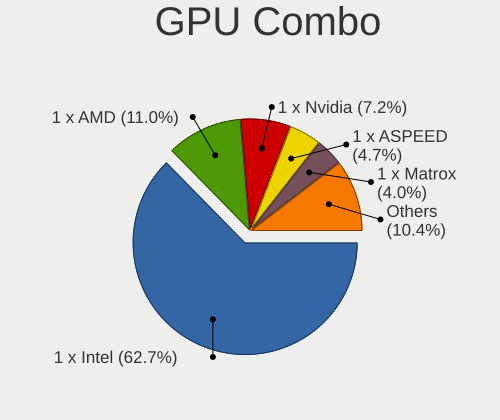

| Name               | Computers | Percent |
|--------------------|-----------|---------|
| 1 x Intel          | 547       | 62.66%  |
| 1 x AMD            | 96        | 11%     |
| 1 x Nvidia         | 63        | 7.22%   |
| 1 x ASPEED         | 41        | 4.7%    |
| 1 x Matrox         | 35        | 4.01%   |
| Other              | 33        | 3.78%   |
| 2 x Intel          | 23        | 2.63%   |
| Intel + Nvidia     | 19        | 2.18%   |
| 2 x AMD            | 3         | 0.34%   |
| Intel + AMD        | 3         | 0.34%   |
| AMD + Nvidia       | 3         | 0.34%   |
| 1 x Silicon Motion | 2         | 0.23%   |
| Intel + ASPEED     | 2         | 0.23%   |
| 1 x XGI            | 1         | 0.11%   |
| Nvidia + Matrox    | 1         | 0.11%   |
| AMD + ASPEED       | 1         | 0.11%   |

GPU Driver
----------

Free vs proprietary

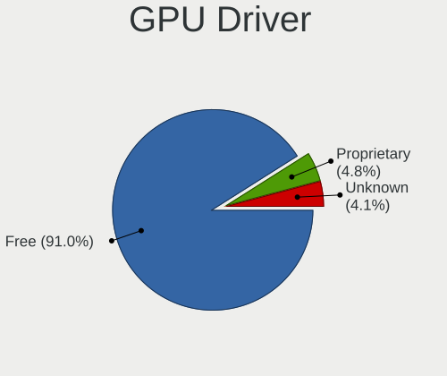

| Driver      | Computers | Percent |
|-------------|-----------|---------|
| Free        | 792       | 91.03%  |
| Proprietary | 42        | 4.83%   |
| Unknown     | 36        | 4.14%   |

GPU Memory
----------

Total video memory

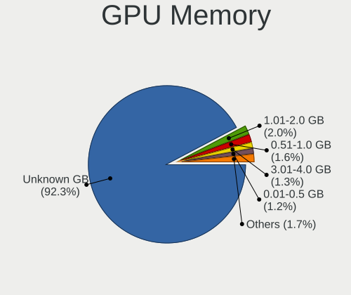

| Size in GB | Computers | Percent |
|------------|-----------|---------|
| Unknown    | 802       | 92.29%  |
| 1.01-2.0   | 17        | 1.96%   |
| 0.51-1.0   | 14        | 1.61%   |
| 3.01-4.0   | 11        | 1.27%   |
| 0.01-0.5   | 10        | 1.15%   |
| 7.01-8.0   | 6         | 0.69%   |
| 5.01-6.0   | 4         | 0.46%   |
| 8.01-16.0  | 3         | 0.35%   |
| 2.01-3.0   | 1         | 0.12%   |
| 16.01-24.0 | 1         | 0.12%   |

Monitor
-------

Monitor Vendor
--------------

Monitor vendors

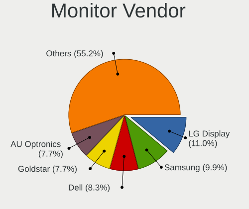

| Vendor                  | Computers | Percent |
|-------------------------|-----------|---------|
| LG Display              | 20        | 11.05%  |
| Samsung Electronics     | 18        | 9.94%   |
| Dell                    | 15        | 8.29%   |
| Goldstar                | 14        | 7.73%   |
| AU Optronics            | 14        | 7.73%   |
| BOE                     | 13        | 7.18%   |
| Chimei Innolux          | 11        | 6.08%   |
| Apple                   | 9         | 4.97%   |
| Lenovo                  | 8         | 4.42%   |
| BenQ                    | 6         | 3.31%   |
| Hewlett-Packard         | 5         | 2.76%   |
| ASUSTek Computer        | 5         | 2.76%   |
| Acer                    | 5         | 2.76%   |
| LG Electronics          | 4         | 2.21%   |
| Ancor Communications    | 4         | 2.21%   |
| ViewSonic               | 3         | 1.66%   |
| Sony                    | 3         | 1.66%   |
| Sharp                   | 3         | 1.66%   |
| Chi Mei Optoelectronics | 3         | 1.66%   |
| AOC                     | 3         | 1.66%   |
| Toshiba                 | 2         | 1.1%    |
| Videoseven              | 1         | 0.55%   |
| Unknown (XXX)           | 1         | 0.55%   |
| SANSUI                  | 1         | 0.55%   |
| RTK                     | 1         | 0.55%   |
| PANDA                   | 1         | 0.55%   |
| Panasonic               | 1         | 0.55%   |
| LTV                     | 1         | 0.55%   |
| Insignia                | 1         | 0.55%   |
| InfoVision              | 1         | 0.55%   |
| HKC                     | 1         | 0.55%   |
| Denver                  | 1         | 0.55%   |
| CSOT                    | 1         | 0.55%   |
| Unknown                 | 1         | 0.55%   |

Monitor Model
-------------

Monitor models

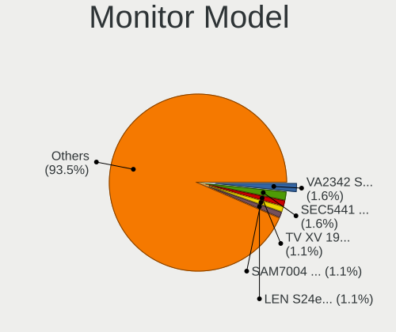

| Model                                                                  | Computers | Percent |
|------------------------------------------------------------------------|-----------|---------|
| ViewSonic VA2342 SERIES VSCFA2B 1920x1080 510x290mm 23.1-inch          | 3         | 1.62%   |
| Samsung Electronics LCD Monitor SEC5441 1366x768 340x190mm 15.3-inch   | 3         | 1.62%   |
| Sony LCD Monitor TV XV 1920x1080                                       | 2         | 1.08%   |
| Samsung Electronics LCD Monitor SAM7004 3840x2160 1210x680mm 54.6-inch | 2         | 1.08%   |
| LG Display LCD Monitor LGD03CD 1366x768 280x160mm 12.7-inch            | 2         | 1.08%   |
| LG Display LCD Monitor LGD02D8 1366x768 280x160mm 12.7-inch            | 2         | 1.08%   |
| Lenovo LEN S24e-10 LEN61CA 1920x1080 530x300mm 24.0-inch               | 2         | 1.08%   |
| Goldstar LG FULL HD GSM5B55 1920x1080 480x270mm 21.7-inch              | 2         | 1.08%   |
| Chimei Innolux LCD Monitor CMN14B1 1920x1080 310x170mm 13.9-inch       | 2         | 1.08%   |
| AU Optronics LCD Monitor AUO226D 1920x1080 280x160mm 12.7-inch         | 2         | 1.08%   |
| Ancor Communications ASUS PB238 ACI23A2 1920x1080 510x290mm 23.1-inch  | 2         | 1.08%   |
| Videoseven WL19A IGM1908 1280x1024 380x300mm 19.1-inch                 | 1         | 0.54%   |
| Unknown (XXX) HDMI    XXX0088 1360x768 1100x560mm 48.6-inch            | 1         | 0.54%   |
| Toshiba TV TSB0200 1920x1080 530x300mm 24.0-inch                       | 1         | 0.54%   |
| Toshiba LCD Monitor LCD0905 1366x768 290x170mm 13.2-inch               | 1         | 0.54%   |
| Sony TV  *30 SNY05D1 3840x2160 1660x930mm 74.9-inch                    | 1         | 0.54%   |
| Sharp LCD Monitor SHP1526 1920x1280 270x180mm 12.8-inch                | 1         | 0.54%   |
| Sharp LCD Monitor SHP14C2 1920x1080 260x140mm 11.6-inch                | 1         | 0.54%   |
| Sharp LCD Monitor SHP14BA 1920x1080 340x190mm 15.3-inch                | 1         | 0.54%   |
| SANSUI ES-24F1 XEC2535 1920x1080 530x300mm 24.0-inch                   | 1         | 0.54%   |
| Samsung Electronics SyncMaster SAM03E4 1680x1050 470x300mm 22.0-inch   | 1         | 0.54%   |
| Samsung Electronics S85F SAM7806 3840x2160 1210x680mm 54.6-inch        | 1         | 0.54%   |
| Samsung Electronics Odyssey G8 SAM7256 3840x2160 700x400mm 31.7-inch   | 1         | 0.54%   |
| Samsung Electronics LCD Monitor U28E590 3840x2160                      | 1         | 0.54%   |
| Samsung Electronics LCD Monitor SyncMaster 1920x1200                   | 1         | 0.54%   |
| Samsung Electronics LCD Monitor SEC3345 1280x800 330x210mm 15.4-inch   | 1         | 0.54%   |
| Samsung Electronics LCD Monitor SEC324C 1600x900 310x170mm 13.9-inch   | 1         | 0.54%   |
| Samsung Electronics LCD Monitor SEC3050 1366x768 320x190mm 14.7-inch   | 1         | 0.54%   |
| Samsung Electronics LCD Monitor SEC304C 1366x768 310x170mm 13.9-inch   | 1         | 0.54%   |
| Samsung Electronics LCD Monitor SDC4147 1366x768 340x190mm 15.3-inch   | 1         | 0.54%   |
| Samsung Electronics LCD Monitor SAM7002 3840x2160 1210x680mm 54.6-inch | 1         | 0.54%   |
| Samsung Electronics LCD Monitor SAM0FEE 3840x2160 1110x620mm 50.1-inch | 1         | 0.54%   |
| Samsung Electronics LCD Monitor SAM0B54 1366x768 520x290mm 23.4-inch   | 1         | 0.54%   |
| RTK CPL AIO PC RTK2482 1920x1080 510x280mm 22.9-inch                   | 1         | 0.54%   |
| PANDA LCD Monitor NCP0021 1920x1080 340x190mm 15.3-inch                | 1         | 0.54%   |
| Panasonic LCD Monitor MEI96A2 2880x1620 340x190mm 15.3-inch            | 1         | 0.54%   |
| LTV LTV1280M1A LTV0A3C 1024x768 800x450mm 36.1-inch                    | 1         | 0.54%   |
| LG Electronics LCD Monitor W2243 1920x1080                             | 1         | 0.54%   |
| LG Electronics LCD Monitor LG ULTRAGEAR 2560x1440                      | 1         | 0.54%   |
| LG Electronics LCD Monitor LG Ultra HD 7680x2160                       | 1         | 0.54%   |

Monitor Resolution
------------------

Monitor screen resolution

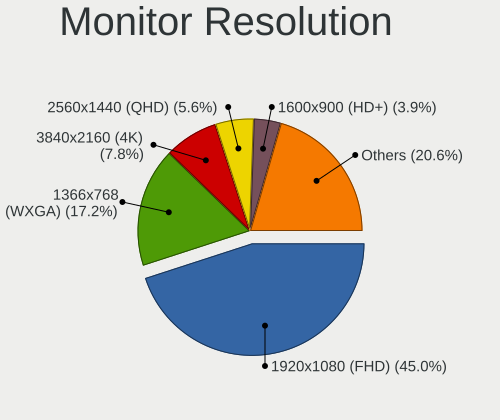

| Resolution         | Computers | Percent |
|--------------------|-----------|---------|
| 1920x1080 (FHD)    | 81        | 45%     |
| 1366x768 (WXGA)    | 31        | 17.22%  |
| 3840x2160 (4K)     | 14        | 7.78%   |
| 2560x1440 (QHD)    | 10        | 5.56%   |
| 1600x900 (HD+)     | 7         | 3.89%   |
| 1920x1200 (WUXGA)  | 5         | 2.78%   |
| 1280x800 (WXGA)    | 5         | 2.78%   |
| 1680x1050 (WSXGA+) | 3         | 1.67%   |
| 1440x900 (WXGA+)   | 3         | 1.67%   |
| 1280x1024 (SXGA)   | 3         | 1.67%   |
| Unknown            | 3         | 1.67%   |
| 3440x1440          | 2         | 1.11%   |
| 2560x1080          | 2         | 1.11%   |
| 2256x1504          | 2         | 1.11%   |
| 7680x2160          | 1         | 0.56%   |
| 3840x1080          | 1         | 0.56%   |
| 2880x1800          | 1         | 0.56%   |
| 2560x1600          | 1         | 0.56%   |
| 1920x1280          | 1         | 0.56%   |
| 1600x1200          | 1         | 0.56%   |
| 1360x768           | 1         | 0.56%   |
| 1280x854           | 1         | 0.56%   |
| 1024x768 (XGA)     | 1         | 0.56%   |

Monitor Diagonal
----------------

Diagonal size in inches

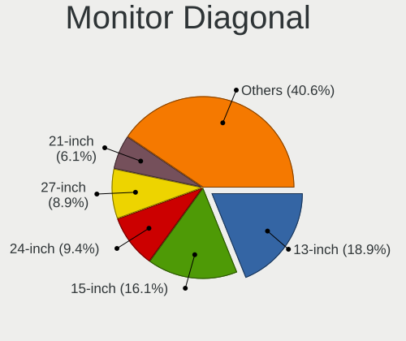

| Inches  | Computers | Percent |
|---------|-----------|---------|
| 13      | 34        | 18.89%  |
| 15      | 29        | 16.11%  |
| 24      | 17        | 9.44%   |
| 27      | 16        | 8.89%   |
| 21      | 11        | 6.11%   |
| 12      | 11        | 6.11%   |
| Unknown | 11        | 6.11%   |
| 23      | 10        | 5.56%   |
| 19      | 7         | 3.89%   |
| 54      | 4         | 2.22%   |
| 34      | 4         | 2.22%   |
| 31      | 4         | 2.22%   |
| 22      | 4         | 2.22%   |
| 17      | 4         | 2.22%   |
| 11      | 4         | 2.22%   |
| 14      | 3         | 1.67%   |
| 74      | 1         | 0.56%   |
| 50      | 1         | 0.56%   |
| 48      | 1         | 0.56%   |
| 36      | 1         | 0.56%   |
| 20      | 1         | 0.56%   |
| 18      | 1         | 0.56%   |
| 16      | 1         | 0.56%   |

Monitor Width
-------------

Physical width

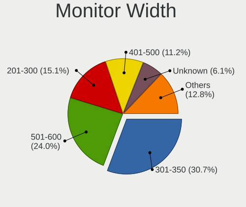

| Width in mm | Computers | Percent |
|-------------|-----------|---------|
| 301-350     | 55        | 30.73%  |
| 501-600     | 43        | 24.02%  |
| 201-300     | 27        | 15.08%  |
| 401-500     | 20        | 11.17%  |
| Unknown     | 11        | 6.15%   |
| 351-400     | 7         | 3.91%   |
| 1001-1500   | 6         | 3.35%   |
| 701-800     | 5         | 2.79%   |
| 601-700     | 4         | 2.23%   |
| 1501-2000   | 1         | 0.56%   |

Aspect Ratio
------------

Proportional relationship between the width and the height

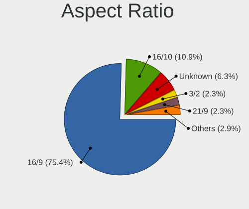

| Ratio   | Computers | Percent |
|---------|-----------|---------|
| 16/9    | 132       | 75.43%  |
| 16/10   | 19        | 10.86%  |
| Unknown | 11        | 6.29%   |
| 3/2     | 4         | 2.29%   |
| 21/9    | 4         | 2.29%   |
| 5/4     | 3         | 1.71%   |
| 4/3     | 1         | 0.57%   |
| 1.96    | 1         | 0.57%   |

Monitor Area
------------

Area in inch²

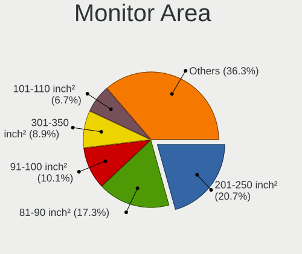

| Area in inch² | Computers | Percent |
|----------------|-----------|---------|
| 201-250        | 37        | 20.67%  |
| 81-90          | 31        | 17.32%  |
| 91-100         | 18        | 10.06%  |
| 301-350        | 16        | 8.94%   |
| 101-110        | 12        | 6.7%    |
| Unknown        | 11        | 6.15%   |
| 61-70          | 10        | 5.59%   |
| 351-500        | 8         | 4.47%   |
| 151-200        | 8         | 4.47%   |
| More than 1000 | 6         | 3.35%   |
| 71-80          | 6         | 3.35%   |
| 51-60          | 4         | 2.23%   |
| 251-300        | 4         | 2.23%   |
| 121-130        | 4         | 2.23%   |
| 501-1000       | 2         | 1.12%   |
| 141-150        | 1         | 0.56%   |
| 111-120        | 1         | 0.56%   |

Pixel Density
-------------

Pixels per inch

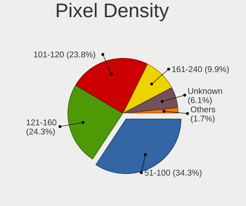

| Density       | Computers | Percent |
|---------------|-----------|---------|
| 51-100        | 62        | 34.25%  |
| 121-160       | 44        | 24.31%  |
| 101-120       | 43        | 23.76%  |
| 161-240       | 18        | 9.94%   |
| Unknown       | 11        | 6.08%   |
| 1-50          | 2         | 1.1%    |
| More than 240 | 1         | 0.55%   |

Multiple Monitors
-----------------

Total monitors connected

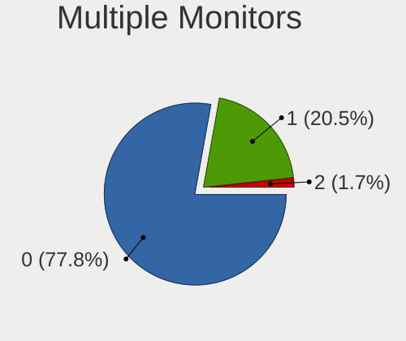

| Total | Computers | Percent |
|-------|-----------|---------|
| 0     | 681       | 77.83%  |
| 1     | 179       | 20.46%  |
| 2     | 15        | 1.71%   |

Network
-------

Net Controller Vendor
---------------------

Controller vendors

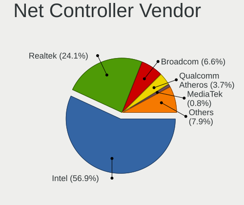

| Vendor                            | Computers | Percent |
|-----------------------------------|-----------|---------|
| Intel                             | 691       | 56.87%  |
| Realtek Semiconductor             | 293       | 24.12%  |
| Broadcom                          | 80        | 6.58%   |
| Qualcomm Atheros                  | 45        | 3.7%    |
| MediaTek                          | 10        | 0.82%   |
| Mellanox Technologies             | 8         | 0.66%   |
| Chelsio Communications            | 7         | 0.58%   |
| Marvell Technology Group          | 6         | 0.49%   |
| IMC Networks                      | 5         | 0.41%   |
| Aquantia                          | 5         | 0.41%   |
| U-Blox                            | 4         | 0.33%   |
| Ralink                            | 4         | 0.33%   |
| D-Link                            | 4         | 0.33%   |
| TP-Link                           | 3         | 0.25%   |
| Solarflare Communications         | 3         | 0.25%   |
| Sierra Wireless                   | 3         | 0.25%   |
| Ralink Technology                 | 3         | 0.25%   |
| Nvidia                            | 3         | 0.25%   |
| Linksys                           | 3         | 0.25%   |
| Insyde Software                   | 3         | 0.25%   |
| American Megatrends               | 3         | 0.25%   |
| AMD                               | 3         | 0.25%   |
| QLogic                            | 2         | 0.16%   |
| NetGear                           | 2         | 0.16%   |
| IBM                               | 2         | 0.16%   |
| Ericsson Business Mobile Networks | 2         | 0.16%   |
| Apple                             | 2         | 0.16%   |
| 3Com                              | 2         | 0.16%   |
| Telit Wireless Solutions          | 1         | 0.08%   |
| sipeed                            | 1         | 0.08%   |
| Seeed Technology                  | 1         | 0.08%   |
| Qualcomm Technologies             | 1         | 0.08%   |
| Qualcomm Atheros Communications   | 1         | 0.08%   |
| Microchip Technology              | 1         | 0.08%   |
| JMicron Technology                | 1         | 0.08%   |
| ICS Advent                        | 1         | 0.08%   |
| Hewlett-Packard                   | 1         | 0.08%   |
| Google                            | 1         | 0.08%   |
| Edimax Technology                 | 1         | 0.08%   |
| D-Link System                     | 1         | 0.08%   |

Net Controller Model
--------------------

Controller models

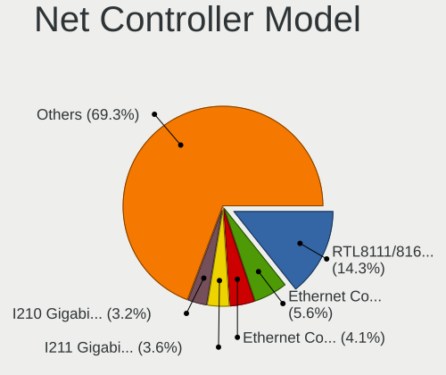

| Model                                                                         | Computers | Percent |
|-------------------------------------------------------------------------------|-----------|---------|
| Realtek RTL8111/8168/8211/8411 PCI Express Gigabit Ethernet Controller        | 231       | 14.29%  |
| Intel Ethernet Controller I226-V                                              | 90        | 5.57%   |
| Intel Ethernet Controller I225-V                                              | 66        | 4.08%   |
| Intel I211 Gigabit Network Connection                                         | 59        | 3.65%   |
| Intel I210 Gigabit Network Connection                                         | 51        | 3.15%   |
| Intel I350 Gigabit Network Connection                                         | 49        | 3.03%   |
| Intel 82574L Gigabit Network Connection                                       | 49        | 3.03%   |
| Intel 82579LM Gigabit Network Connection (Lewisville)                         | 44        | 2.72%   |
| Intel Ethernet Connection I217-LM                                             | 38        | 2.35%   |
| Realtek RTL8125 2.5GbE Controller                                             | 35        | 2.16%   |
| Intel 82599ES 10-Gigabit SFI/SFP+ Network Connection                          | 29        | 1.79%   |
| Intel 82576 Gigabit Network Connection                                        | 26        | 1.61%   |
| Intel Ethernet Connection (2) I219-LM                                         | 23        | 1.42%   |
| Intel Ethernet Controller 10-Gigabit X540-AT2                                 | 20        | 1.24%   |
| Intel Wireless 7265                                                           | 18        | 1.11%   |
| Intel Wi-Fi 6 AX200                                                           | 16        | 0.99%   |
| Intel Wireless 8260                                                           | 14        | 0.87%   |
| Intel Ethernet Controller X550                                                | 14        | 0.87%   |
| Intel Wireless 8265 / 8275                                                    | 13        | 0.8%    |
| Intel Wireless 7260                                                           | 13        | 0.8%    |
| Intel Wireless 3165                                                           | 13        | 0.8%    |
| Intel Ethernet Connection (7) I219-LM                                         | 13        | 0.8%    |
| Intel 82583V Gigabit Network Connection                                       | 13        | 0.8%    |
| Intel 82580 Gigabit Network Connection                                        | 13        | 0.8%    |
| Intel 82571EB/82571GB Gigabit Ethernet Controller D0/D1 (copper applications) | 13        | 0.8%    |
| Realtek RTL810xE PCI Express Fast Ethernet controller                         | 12        | 0.74%   |
| Broadcom NetXtreme BCM5720 Gigabit Ethernet PCIe                              | 12        | 0.74%   |
| Intel Ethernet Connection X553 10 GbE SFP+                                    | 11        | 0.68%   |
| Intel Ethernet Connection (5) I219-LM                                         | 11        | 0.68%   |
| Realtek RTL8821CE 802.11ac PCIe Wireless Network Adapter                      | 10        | 0.62%   |
| Intel Ethernet Connection I219-LM                                             | 10        | 0.62%   |
| Intel Ethernet Connection (2) I219-V                                          | 10        | 0.62%   |
| Intel Alder Lake-N PCH CNVi WiFi                                              | 10        | 0.62%   |
| Broadcom NetXtreme II BCM57810 10 Gigabit Ethernet                            | 10        | 0.62%   |
| Realtek RTL8111/8168/8411 PCI Express Gigabit Ethernet Controller             | 9         | 0.56%   |
| Intel 82571EB/82571GB Gigabit Ethernet Controller (Copper)                    | 9         | 0.56%   |
| Intel Ethernet Controller X710 for 10GbE SFP+                                 | 8         | 0.49%   |
| Intel Centrino Advanced-N 6205 [Taylor Peak]                                  | 8         | 0.49%   |
| Intel 82575EB Gigabit Network Connection                                      | 8         | 0.49%   |
| Broadcom NetXtreme II BCM5709 Gigabit Ethernet                                | 8         | 0.49%   |

Wireless Vendor
---------------

Wireless vendors

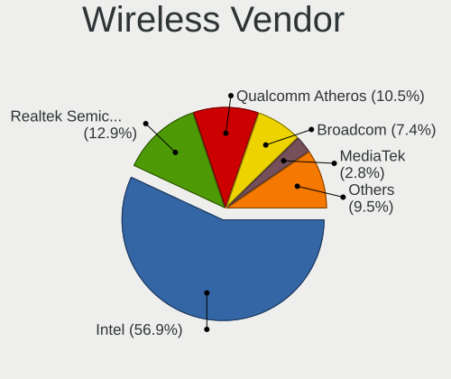

| Vendor                          | Computers | Percent |
|---------------------------------|-----------|---------|
| Intel                           | 185       | 56.92%  |
| Realtek Semiconductor           | 42        | 12.92%  |
| Qualcomm Atheros                | 34        | 10.46%  |
| Broadcom                        | 24        | 7.38%   |
| MediaTek                        | 9         | 2.77%   |
| IMC Networks                    | 5         | 1.54%   |
| Ralink                          | 4         | 1.23%   |
| D-Link                          | 4         | 1.23%   |
| TP-Link                         | 3         | 0.92%   |
| Ralink Technology               | 3         | 0.92%   |
| Linksys                         | 3         | 0.92%   |
| Sierra Wireless                 | 2         | 0.62%   |
| NetGear                         | 2         | 0.62%   |
| Qualcomm Technologies           | 1         | 0.31%   |
| Qualcomm Atheros Communications | 1         | 0.31%   |
| Marvell Technology Group        | 1         | 0.31%   |
| Edimax Technology               | 1         | 0.31%   |
| Belkin Components               | 1         | 0.31%   |

Wireless Model
--------------

Wireless models

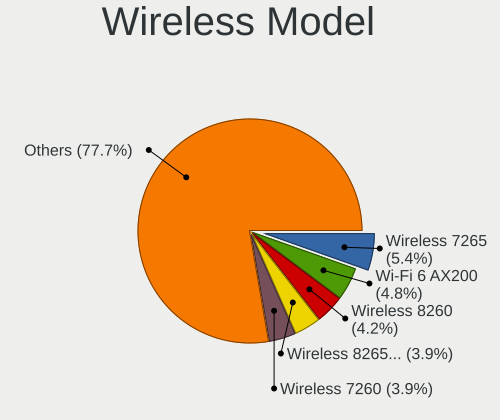

| Model                                                                | Computers | Percent |
|----------------------------------------------------------------------|-----------|---------|
| Intel Wireless 7265                                                  | 18        | 5.42%   |
| Intel Wi-Fi 6 AX200                                                  | 16        | 4.82%   |
| Intel Wireless 8260                                                  | 14        | 4.22%   |
| Intel Wireless 8265 / 8275                                           | 13        | 3.92%   |
| Intel Wireless 7260                                                  | 13        | 3.92%   |
| Intel Wireless 3165                                                  | 13        | 3.92%   |
| Realtek RTL8821CE 802.11ac PCIe Wireless Network Adapter             | 10        | 3.01%   |
| Intel Alder Lake-N PCH CNVi WiFi                                     | 10        | 3.01%   |
| Intel Centrino Advanced-N 6205 [Taylor Peak]                         | 8         | 2.41%   |
| Qualcomm Atheros AR9485 Wireless Network Adapter                     | 7         | 2.11%   |
| Intel Wireless 3160                                                  | 7         | 2.11%   |
| Intel Dual Band Wireless-AC 3168NGW [Stone Peak]                     | 6         | 1.81%   |
| Intel Cannon Point-LP CNVi [Wireless-AC]                             | 6         | 1.81%   |
| Intel Cannon Lake PCH CNVi WiFi                                      | 6         | 1.81%   |
| Broadcom BCM4322 802.11a/b/g/n Wireless LAN Controller               | 6         | 1.81%   |
| Realtek RTL8852BE PCIe 802.11ax Wireless Network Controller          | 5         | 1.51%   |
| Realtek RTL8188EUS 802.11n Wireless Network Adapter                  | 5         | 1.51%   |
| Qualcomm Atheros QCA9377 802.11ac Wireless Network Adapter           | 5         | 1.51%   |
| MediaTek MT7921 802.11ax PCIe Wireless Network Adapter [Filogic 330] | 5         | 1.51%   |
| Intel Wi-Fi 6E(802.11ax) AX210/AX1675* 2x2 [Typhoon Peak]            | 5         | 1.51%   |
| Intel Jasper Lake PCH CNVi WiFi                                      | 5         | 1.51%   |
| Intel Alder Lake-S PCH CNVi WiFi                                     | 5         | 1.51%   |
| IMC Networks 802.11 n/g/b Wireless LAN USB Mini-Card                 | 5         | 1.51%   |
| Realtek RTL8188EE Wireless Network Adapter                           | 4         | 1.2%    |
| Qualcomm Atheros AR9462 Wireless Network Adapter                     | 4         | 1.2%    |
| Intel Wi-Fi 6 AX201                                                  | 4         | 1.2%    |
| Intel Gemini Lake PCH CNVi WiFi                                      | 4         | 1.2%    |
| Intel Comet Lake PCH-LP CNVi WiFi                                    | 4         | 1.2%    |
| Intel Centrino Advanced-N 6200                                       | 4         | 1.2%    |
| Intel Alder Lake-P PCH CNVi WiFi                                     | 4         | 1.2%    |
| Realtek RTL88x2bu [AC1200 Techkey]                                   | 3         | 0.9%    |
| Realtek RTL8821AE 802.11ac PCIe Wireless Network Adapter             | 3         | 0.9%    |
| Ralink RT2870/RT3070 Wireless Adapter                                | 3         | 0.9%    |
| Qualcomm Atheros AR93xx Wireless Network Adapter                     | 3         | 0.9%    |
| Qualcomm Atheros AR928X Wireless Network Adapter (PCI-Express)       | 3         | 0.9%    |
| Qualcomm Atheros AR9287 Wireless Network Adapter (PCI-Express)       | 3         | 0.9%    |
| Qualcomm Atheros AR9285 Wireless Network Adapter (PCI-Express)       | 3         | 0.9%    |
| Linksys WUSB54G v4 802.11g Adapter [Ralink RT2500USB]                | 3         | 0.9%    |
| Intel Tiger Lake PCH CNVi WiFi                                       | 3         | 0.9%    |
| Broadcom BCM4360 802.11ac Dual Band Wireless Network Adapter         | 3         | 0.9%    |

Ethernet Vendor
---------------

Ethernet vendors

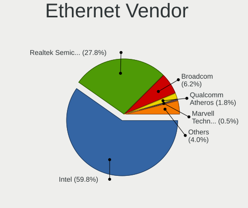

| Vendor                    | Computers | Percent |
|---------------------------|-----------|---------|
| Intel                     | 609       | 59.76%  |
| Realtek Semiconductor     | 283       | 27.77%  |
| Broadcom                  | 63        | 6.18%   |
| Qualcomm Atheros          | 18        | 1.77%   |
| Marvell Technology Group  | 5         | 0.49%   |
| Chelsio Communications    | 5         | 0.49%   |
| Aquantia                  | 5         | 0.49%   |
| Solarflare Communications | 3         | 0.29%   |
| Nvidia                    | 3         | 0.29%   |
| Insyde Software           | 3         | 0.29%   |
| American Megatrends       | 3         | 0.29%   |
| AMD                       | 3         | 0.29%   |
| QLogic                    | 2         | 0.2%    |
| IBM                       | 2         | 0.2%    |
| Apple                     | 2         | 0.2%    |
| 3Com                      | 2         | 0.2%    |
| Telit Wireless Solutions  | 1         | 0.1%    |
| sipeed                    | 1         | 0.1%    |
| Microchip Technology      | 1         | 0.1%    |
| JMicron Technology        | 1         | 0.1%    |
| ICS Advent                | 1         | 0.1%    |
| Google                    | 1         | 0.1%    |
| D-Link System             | 1         | 0.1%    |
| Accton Technology         | 1         | 0.1%    |

Ethernet Model
--------------

Ethernet models

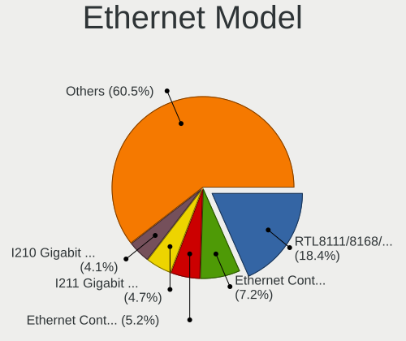

| Model                                                                         | Computers | Percent |
|-------------------------------------------------------------------------------|-----------|---------|
| Realtek RTL8111/8168/8211/8411 PCI Express Gigabit Ethernet Controller        | 231       | 18.36%  |
| Intel Ethernet Controller I226-V                                              | 90        | 7.15%   |
| Intel Ethernet Controller I225-V                                              | 66        | 5.25%   |
| Intel I211 Gigabit Network Connection                                         | 59        | 4.69%   |
| Intel I210 Gigabit Network Connection                                         | 51        | 4.05%   |
| Intel I350 Gigabit Network Connection                                         | 49        | 3.9%    |
| Intel 82574L Gigabit Network Connection                                       | 49        | 3.9%    |
| Intel 82579LM Gigabit Network Connection (Lewisville)                         | 44        | 3.5%    |
| Intel Ethernet Connection I217-LM                                             | 38        | 3.02%   |
| Realtek RTL8125 2.5GbE Controller                                             | 35        | 2.78%   |
| Intel 82599ES 10-Gigabit SFI/SFP+ Network Connection                          | 29        | 2.31%   |
| Intel 82576 Gigabit Network Connection                                        | 26        | 2.07%   |
| Intel Ethernet Connection (2) I219-LM                                         | 23        | 1.83%   |
| Intel Ethernet Controller 10-Gigabit X540-AT2                                 | 20        | 1.59%   |
| Intel Ethernet Controller X550                                                | 14        | 1.11%   |
| Intel Ethernet Connection (7) I219-LM                                         | 13        | 1.03%   |
| Intel 82583V Gigabit Network Connection                                       | 13        | 1.03%   |
| Intel 82580 Gigabit Network Connection                                        | 13        | 1.03%   |
| Intel 82571EB/82571GB Gigabit Ethernet Controller D0/D1 (copper applications) | 13        | 1.03%   |
| Realtek RTL810xE PCI Express Fast Ethernet controller                         | 12        | 0.95%   |
| Broadcom NetXtreme BCM5720 Gigabit Ethernet PCIe                              | 12        | 0.95%   |
| Intel Ethernet Connection X553 10 GbE SFP+                                    | 11        | 0.87%   |
| Intel Ethernet Connection (5) I219-LM                                         | 11        | 0.87%   |
| Intel Ethernet Connection I219-LM                                             | 10        | 0.79%   |
| Intel Ethernet Connection (2) I219-V                                          | 10        | 0.79%   |
| Broadcom NetXtreme II BCM57810 10 Gigabit Ethernet                            | 10        | 0.79%   |
| Realtek RTL8111/8168/8411 PCI Express Gigabit Ethernet Controller             | 9         | 0.72%   |
| Intel 82571EB/82571GB Gigabit Ethernet Controller (Copper)                    | 9         | 0.72%   |
| Intel Ethernet Controller X710 for 10GbE SFP+                                 | 8         | 0.64%   |
| Intel 82575EB Gigabit Network Connection                                      | 8         | 0.64%   |
| Broadcom NetXtreme II BCM5709 Gigabit Ethernet                                | 8         | 0.64%   |
| Intel Ethernet Connection I354                                                | 7         | 0.56%   |
| Intel Ethernet Connection (4) I219-LM                                         | 6         | 0.48%   |
| Intel 82575GB Gigabit Network Connection                                      | 6         | 0.48%   |
| Intel 82566DM-2 Gigabit Network Connection                                    | 6         | 0.48%   |
| Broadcom NetXtreme II BCM5716 Gigabit Ethernet                                | 6         | 0.48%   |
| Intel Ethernet Connection X553 1GbE                                           | 5         | 0.4%    |
| Intel Ethernet Connection I217-V                                              | 5         | 0.4%    |
| Intel Ethernet Connection (3) I218-V                                          | 5         | 0.4%    |
| Intel 82579V Gigabit Network Connection                                       | 5         | 0.4%    |

Net Controller Kind
-------------------

Ethernet, WiFi or modem

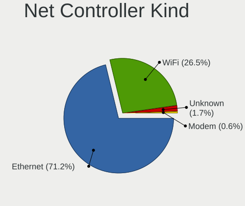

| Kind     | Computers | Percent |
|----------|-----------|---------|
| Ethernet | 839       | 71.22%  |
| WiFi     | 312       | 26.49%  |
| Unknown  | 20        | 1.7%    |
| Modem    | 7         | 0.59%   |

Used Controller
---------------

Currently used network controller

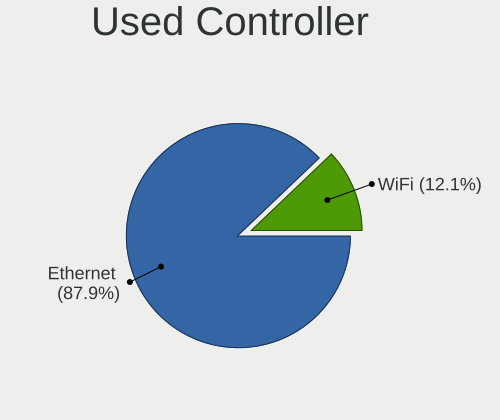

| Kind     | Computers | Percent |
|----------|-----------|---------|
| Ethernet | 783       | 87.88%  |
| WiFi     | 108       | 12.12%  |

NICs
----

Total network controllers on board

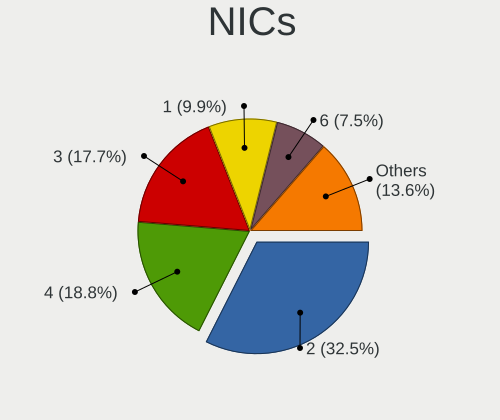

| Total | Computers | Percent |
|-------|-----------|---------|
| 2     | 286       | 32.46%  |
| 4     | 166       | 18.84%  |
| 3     | 156       | 17.71%  |
| 1     | 87        | 9.88%   |
| 6     | 66        | 7.49%   |
| 5     | 61        | 6.92%   |
| 7     | 15        | 1.7%    |
| 8     | 13        | 1.48%   |
| 9     | 10        | 1.14%   |
| 10    | 8         | 0.91%   |
| 12    | 5         | 0.57%   |
| 0     | 5         | 0.57%   |
| 14    | 2         | 0.23%   |
| 15    | 1         | 0.11%   |

IPv6
----

IPv6 vs IPv4

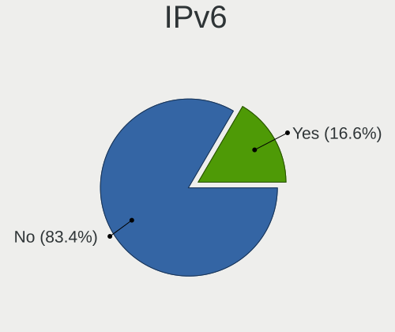

| Used | Computers | Percent |
|------|-----------|---------|
| No   | 751       | 83.44%  |
| Yes  | 149       | 16.56%  |

Bluetooth
---------

Bluetooth Vendor
----------------

Controller vendors

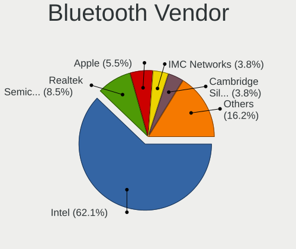

| Vendor                          | Computers | Percent |
|---------------------------------|-----------|---------|
| Intel                           | 146       | 62.13%  |
| Realtek Semiconductor           | 20        | 8.51%   |
| Apple                           | 13        | 5.53%   |
| IMC Networks                    | 9         | 3.83%   |
| Cambridge Silicon Radio         | 9         | 3.83%   |
| Foxconn / Hon Hai               | 8         | 3.4%    |
| Broadcom                        | 8         | 3.4%    |
| Qualcomm Atheros Communications | 5         | 2.13%   |
| MediaTek                        | 4         | 1.7%    |
| Lite-On Technology              | 4         | 1.7%    |
| ASUSTek Computer                | 4         | 1.7%    |
| Alps Electric                   | 2         | 0.85%   |
| Toshiba                         | 1         | 0.43%   |
| Ralink                          | 1         | 0.43%   |
| Hewlett-Packard                 | 1         | 0.43%   |

Bluetooth Model
---------------

Controller models

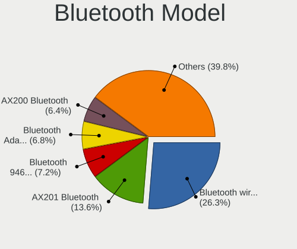

| Model                                                       | Computers | Percent |
|-------------------------------------------------------------|-----------|---------|
| Intel Bluetooth wireless interface                          | 62        | 26.27%  |
| Intel AX201 Bluetooth                                       | 32        | 13.56%  |
| Intel Bluetooth 9460/9560 Jefferson Peak (JfP)              | 17        | 7.2%    |
| Realtek Bluetooth Adapter                                   | 16        | 6.78%   |
| Intel AX200 Bluetooth                                       | 15        | 6.36%   |
| Cambridge Silicon Radio Bluetooth Dongle (HCI mode)         | 9         | 3.81%   |
| Apple Bluetooth Host Controller                             | 7         | 2.97%   |
| Intel Wireless-AC 3168 Bluetooth                            | 6         | 2.54%   |
| Intel AX211 Bluetooth                                       | 6         | 2.54%   |
| Apple Built-in Bluetooth 2.0+EDR HCI                        | 5         | 2.12%   |
| Intel AX210 Bluetooth                                       | 4         | 1.69%   |
| MediaTek Bluetooth Adapter                                  | 3         | 1.27%   |
| IMC Networks MediaTek Bluetooth Adapter                     | 3         | 1.27%   |
| Broadcom BCM2045B (BDC-2.1)                                 | 3         | 1.27%   |
| Qualcomm Atheros AR3012 Bluetooth 4.0                       | 2         | 0.85%   |
| Lite-On Qualcomm Atheros QCA9377 Bluetooth                  | 2         | 0.85%   |
| Intel Wireless-AC 9260 Bluetooth Adapter                    | 2         | 0.85%   |
| Intel Centrino Bluetooth Wireless Transceiver               | 2         | 0.85%   |
| IMC Networks Realtek Bluetooth Adapter                      | 2         | 0.85%   |
| IMC Networks Atheros AR3012 Bluetooth 4.0 Adapter           | 2         | 0.85%   |
| Foxconn / Hon Hai RZ616 Bluetooth Adapter                   | 2         | 0.85%   |
| Foxconn / Hon Hai Bluetooth USB Module                      | 2         | 0.85%   |
| Broadcom HP Bluethunder                                     | 2         | 0.85%   |
| Broadcom BCM20702 Bluetooth 4.0 [ThinkPad]                  | 2         | 0.85%   |
| ASUS Broadcom BCM20702A0 Bluetooth                          | 2         | 0.85%   |
| Alps Electric UGTZ4 Bluetooth                               | 2         | 0.85%   |
| Toshiba ASKEY Bluetooth Controller BTU1030                  | 1         | 0.42%   |
| Realtek RTL8821A Bluetooth                                  | 1         | 0.42%   |
| Realtek RTL8723A Bluetooth                                  | 1         | 0.42%   |
| Realtek  Bluetooth 4.2 Adapter                              | 1         | 0.42%   |
| Realtek Bluetooth 4.0 Adapter                               | 1         | 0.42%   |
| Ralink RT3290 Bluetooth                                     | 1         | 0.42%   |
| Qualcomm Atheros Dell Wireless 1707 Bluetooth 4.0 LE Device | 1         | 0.42%   |
| Qualcomm Atheros Dell Wireless 1703 Bluetooth               | 1         | 0.42%   |
| Qualcomm Atheros AR3011 Bluetooth (no firmware)             | 1         | 0.42%   |
| MediaTek RZ608 Bluetooth Adapter                            | 1         | 0.42%   |
| Lite-On Broadcom Bluetooth 4.0 USB                          | 1         | 0.42%   |
| Lite-On Bluetooth USB Module                                | 1         | 0.42%   |
| Intel Centrino Advanced-N 6230 Bluetooth adapter            | 1         | 0.42%   |
| IMC Networks Realtek Bluetooth 4.0 + High Speed Chip        | 1         | 0.42%   |

Sound
-----

Sound Vendor
------------

Sound card vendors

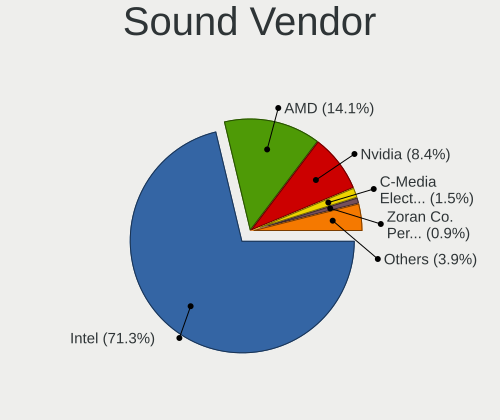

| Vendor                                       | Computers | Percent |
|----------------------------------------------|-----------|---------|
| Intel                                        | 578       | 71.27%  |
| AMD                                          | 114       | 14.06%  |
| Nvidia                                       | 68        | 8.38%   |
| C-Media Electronics                          | 12        | 1.48%   |
| Zoran Co. Personal Media Division (Nogatech) | 7         | 0.86%   |
| KTMicro                                      | 5         | 0.62%   |
| Texas Instruments                            | 3         | 0.37%   |
| Logitech                                     | 3         | 0.37%   |
| ASUSTek Computer                             | 3         | 0.37%   |
| Plantronics                                  | 2         | 0.25%   |
| Micro Star International                     | 2         | 0.25%   |
| Creative Technology                          | 2         | 0.25%   |
| Creative Labs                                | 2         | 0.25%   |
| Apple                                        | 2         | 0.25%   |
| Yamaha                                       | 1         | 0.12%   |
| XMOS                                         | 1         | 0.12%   |
| SteelSeries ApS                              | 1         | 0.12%   |
| Sony                                         | 1         | 0.12%   |
| MosArt Semiconductor                         | 1         | 0.12%   |
| Generalplus Technology                       | 1         | 0.12%   |
| Elgato Systems                               | 1         | 0.12%   |
| Cambridge Silicon Radio                      | 1         | 0.12%   |

Sound Model
-----------

Sound card models

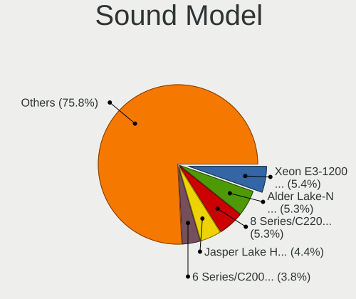

| Model                                                                                             | Computers | Percent |
|---------------------------------------------------------------------------------------------------|-----------|---------|
| Intel Xeon E3-1200 v3/4th Gen Core Processor HD Audio Controller                                  | 52        | 5.42%   |
| Intel Alder Lake-N PCH High Definition Audio Controller                                           | 51        | 5.32%   |
| Intel 8 Series/C220 Series Chipset High Definition Audio Controller                               | 51        | 5.32%   |
| Intel Jasper Lake HD Audio                                                                        | 42        | 4.38%   |
| Intel 6 Series/C200 Series Chipset Family High Definition Audio Controller                        | 36        | 3.75%   |
| Intel 7 Series/C216 Chipset Family High Definition Audio Controller                               | 34        | 3.55%   |
| Intel Celeron/Pentium Silver Processor High Definition Audio                                      | 32        | 3.34%   |
| Intel Sunrise Point-LP HD Audio                                                                   | 31        | 3.23%   |
| Intel 100 Series/C230 Series Chipset Family HD Audio Controller                                   | 30        | 3.13%   |
| AMD Ryzen HD Audio Controller                                                                     | 30        | 3.13%   |
| Intel 200 Series PCH HD Audio                                                                     | 28        | 2.92%   |
| Intel Cannon Lake PCH cAVS                                                                        | 26        | 2.71%   |
| Intel Atom/Celeron/Pentium Processor x5-E8000/J3xxx/N3xxx Series High Definition Audio Controller | 24        | 2.5%    |
| Intel 8 Series HD Audio Controller                                                                | 21        | 2.19%   |
| Intel Haswell-ULT HD Audio Controller                                                             | 19        | 1.98%   |
| Intel Broadwell-U Audio Controller                                                                | 18        | 1.88%   |
| AMD FCH Azalia Controller                                                                         | 17        | 1.77%   |
| Intel Wildcat Point-LP High Definition Audio Controller                                           | 16        | 1.67%   |
| AMD SBx00 Azalia (Intel HDA)                                                                      | 15        | 1.56%   |
| AMD Renoir/Cezanne HDMI/DP Audio Controller                                                       | 14        | 1.46%   |
| AMD Raven/Raven2/Fenghuang HDMI/DP Audio Controller                                               | 14        | 1.46%   |
| Intel 5 Series/3400 Series Chipset High Definition Audio                                          | 12        | 1.25%   |
| Intel Elkhart Lake High Density Audio bus interface                                               | 11        | 1.15%   |
| Intel Celeron N3350/Pentium N4200/Atom E3900 Series Audio Cluster                                 | 11        | 1.15%   |
| Intel Alder Lake-S HD Audio Controller                                                            | 10        | 1.04%   |
| AMD Kabini HDMI/DP Audio                                                                          | 10        | 1.04%   |
| Intel Alder Lake PCH-P High Definition Audio Controller                                           | 9         | 0.94%   |
| Intel 82801I (ICH9 Family) HD Audio Controller                                                    | 9         | 0.94%   |
| AMD Family 17h (Models 00h-0fh) HD Audio Controller                                               | 9         | 0.94%   |
| Intel NM10/ICH7 Family High Definition Audio Controller                                           | 8         | 0.83%   |
| Intel Comet Lake PCH-LP cAVS                                                                      | 8         | 0.83%   |
| Intel 82801JI (ICH10 Family) HD Audio Controller                                                  | 8         | 0.83%   |
| AMD Starship/Matisse HD Audio Controller                                                          | 8         | 0.83%   |
| Zoran Co. Personal Media Division (Nogatech) USB Audio and HID                                    | 7         | 0.73%   |
| Nvidia High Definition Audio Controller                                                           | 7         | 0.73%   |
| Nvidia GK208 HDMI/DP Audio Controller                                                             | 7         | 0.73%   |
| Intel Tiger Lake-LP Smart Sound Technology Audio Controller                                       | 7         | 0.73%   |
| Intel Atom Processor Z36xxx/Z37xxx Series High Definition Audio Controller                        | 7         | 0.73%   |
| Nvidia GM107 High Definition Audio Controller [GeForce 940MX]                                     | 6         | 0.63%   |
| Intel Comet Lake PCH cAVS                                                                         | 6         | 0.63%   |

Memory
------

Memory Vendor
-------------

Memory module vendors

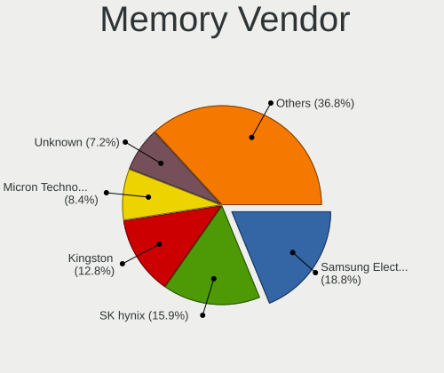

| Vendor                       | Computers | Percent |
|------------------------------|-----------|---------|
| Samsung Electronics          | 179       | 18.78%  |
| SK hynix                     | 152       | 15.95%  |
| Kingston                     | 122       | 12.8%   |
| Micron Technology            | 80        | 8.39%   |
| Unknown                      | 69        | 7.24%   |
| Crucial                      | 67        | 7.03%   |
| G.Skill                      | 46        | 4.83%   |
| Corsair                      | 46        | 4.83%   |
| Unknown                      | 38        | 3.99%   |
| A-DATA Technology            | 16        | 1.68%   |
| Unknown (ABCD)               | 14        | 1.47%   |
| Ramaxel Technology           | 12        | 1.26%   |
| Transcend                    | 10        | 1.05%   |
| Team                         | 9         | 0.94%   |
| Patriot                      | 8         | 0.84%   |
| Timetec                      | 7         | 0.73%   |
| Nanya Technology             | 7         | 0.73%   |
| Apacer                       | 7         | 0.73%   |
| Elpida                       | 6         | 0.63%   |
| Patriot Memory (PDP Systems) | 5         | 0.52%   |
| Unknown (0x0C26)             | 4         | 0.42%   |
| Unknown (0x0C6E)             | 3         | 0.31%   |
| Toshiba                      | 3         | 0.31%   |
| OCZ                          | 3         | 0.31%   |
| Wodposit                     | 2         | 0.21%   |
| Unknown (AB)                 | 2         | 0.21%   |
| Unknown (0x0B45)             | 2         | 0.21%   |
| Unknown (0000CE030000)       | 2         | 0.21%   |
| SK_Hynix                     | 2         | 0.21%   |
| Silicon Power                | 2         | 0.21%   |
| Qimonda                      | 2         | 0.21%   |
| KingFast                     | 2         | 0.21%   |
| Hewlett-Packard              | 2         | 0.21%   |
| Avant                        | 2         | 0.21%   |
| AMD                          | 2         | 0.21%   |
| 0C26000000AD                 | 2         | 0.21%   |
| V-Color                      | 1         | 0.1%    |
| Unknown (0x7FFF)             | 1         | 0.1%    |
| Unknown (0x0DD5)             | 1         | 0.1%    |
| Unknown (00009E0010D1)       | 1         | 0.1%    |

Memory Model
------------

Memory module models

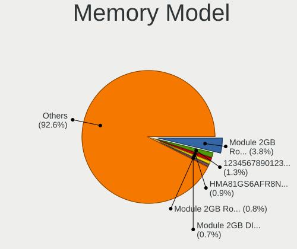

| Model                                                        | Computers | Percent |
|--------------------------------------------------------------|-----------|---------|
| Unknown                                                      | 38        | 3.76%   |
| Unknown (ABCD) RAM 123456789012345678 8GB DIMM DDR4 2400MT/s | 13        | 1.29%   |
| SK hynix RAM HMA81GS6AFR8N-UH 8GB SODIMM DDR4 2400MT/s       | 9         | 0.89%   |
| Samsung RAM Module 2GB Row Of Chips LPDDR5 6400MT/s          | 8         | 0.79%   |
| Unknown RAM Module 2GB DIMM DDR2 800MT/s                     | 7         | 0.69%   |
| Samsung RAM M425R1GB4BB0-CQKOL 8GB SODIMM DDR5 4800MT/s      | 7         | 0.69%   |
| Crucial RAM CT16G56C46S5.M8G1 16GB SODIMM DDR5 5600MT/s      | 7         | 0.69%   |
| SK hynix RAM HMT451U6BFR8C-PB 4GB DIMM DDR3 1600MT/s         | 6         | 0.59%   |
| SK hynix RAM HMT451S6AFR8A-PB 4GB SODIMM DDR3 1600MT/s       | 6         | 0.59%   |
| Unknown RAM Module 4GB DIMM 1333MT/s                         | 5         | 0.5%    |
| SK hynix RAM HMT451U6AFR8C-PB 4GB DIMM DDR3 1600MT/s         | 5         | 0.5%    |
| SK hynix RAM HMT451S6BFR8A-PB 4GB SODIMM DDR3 1600MT/s       | 5         | 0.5%    |
| SK hynix RAM HMT41GU6BFR8A-PB 8GB DIMM DDR3 1600MT/s         | 5         | 0.5%    |
| Samsung RAM M471B5173DB0-YK0 4GB SODIMM DDR3 1600MT/s        | 5         | 0.5%    |
| Samsung RAM M471A1K43CB1-CTD 8GB SODIMM DDR4 3200MT/s        | 5         | 0.5%    |
| Samsung RAM M378B5173EB0-YK0 4GB DIMM DDR3 1600MT/s          | 5         | 0.5%    |
| Samsung RAM M378B1G73DB0-CK0 8GB DIMM DDR3 1600MT/s          | 5         | 0.5%    |
| Micron RAM 8ATF1G64HZ-3G2R1 8GB SODIMM DDR4 3200MT/s         | 5         | 0.5%    |
| Kingston RAM KHX1600C9D3/4GX 4GB DIMM DDR3 1600MT/s          | 5         | 0.5%    |
| Crucial RAM CT102464BF160B.C16 8GB SODIMM DDR3 1600MT/s      | 5         | 0.5%    |
| Unknown RAM Module 8GB SODIMM DDR3 1600MT/s                  | 4         | 0.4%    |
| Unknown RAM Module 4GB SODIMM DDR3 1333MT/s                  | 4         | 0.4%    |
| Unknown RAM Module 4GB DIMM DDR3 1333MT/s                    | 4         | 0.4%    |
| Team RAM TEAMGROUP-UD4-3200 8GB DIMM DDR4 3200MT/s           | 4         | 0.4%    |
| SK hynix RAM HMT451U6BFR8A-PB 4GB DIMM DDR3 1600MT/s         | 4         | 0.4%    |
| SK hynix RAM HMT351U7BFR8A-H9 4GB DIMM DDR3 1333MT/s         | 4         | 0.4%    |
| Samsung RAM M471B5273DH0-CH9 4GB SODIMM DDR3 1334MT/s        | 4         | 0.4%    |
| Samsung RAM M471B5173DB0-YK0 4GB DIMM DDR3 1600MT/s          | 4         | 0.4%    |
| Samsung RAM M378B5173QH0-CK0 4GB DIMM DDR3 1600MT/s          | 4         | 0.4%    |
| Micron RAM 8ATF1G64AZ-2G6E1 8GB DIMM DDR4 2667MT/s           | 4         | 0.4%    |
| Kingston RAM 99U5428-018.A00LF 8GB SODIMM DDR3 1600MT/s      | 4         | 0.4%    |
| G.Skill RAM F4-3200C16-8GVKB 8GB DIMM DDR4 3200MT/s          | 4         | 0.4%    |
| Unknown RAM Module 8GB DIMM DDR3 1333MT/s                    | 3         | 0.3%    |
| Unknown RAM Module 8GB 1600MT/s                              | 3         | 0.3%    |
| Unknown RAM Module 2GB DIMM SDRAM                            | 3         | 0.3%    |
| Unknown RAM Module 2GB DIMM DDR3 1333MT/s                    | 3         | 0.3%    |
| Transcend RAM TS1GLH64V6BL 8GB SODIMM DDR4 2667MT/s          | 3         | 0.3%    |
| Team RAM TEAMGROUP-SD4-3200 32GB SODIMM DDR4 3200MT/s        | 3         | 0.3%    |
| SK hynix RAM Module 4GB DIMM DDR4 2133MT/s                   | 3         | 0.3%    |
| SK hynix RAM HMT351U6EFR8C-PB 4GB DIMM DDR3 1600MT/s         | 3         | 0.3%    |

Memory Kind
-----------

Memory module kinds

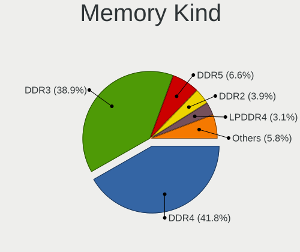

| Kind    | Computers | Percent |
|---------|-----------|---------|
| DDR4    | 347       | 41.76%  |
| DDR3    | 323       | 38.87%  |
| DDR5    | 55        | 6.62%   |
| DDR2    | 32        | 3.85%   |
| LPDDR4  | 26        | 3.13%   |
| Unknown | 19        | 2.29%   |
| LPDDR5  | 13        | 1.56%   |
| SDRAM   | 10        | 1.2%    |
| LPDDR3  | 4         | 0.48%   |
| DDR     | 2         | 0.24%   |

Memory Form Factor
------------------

Physical design of the memory module

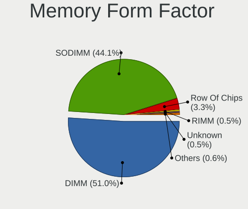

| Name         | Computers | Percent |
|--------------|-----------|---------|
| DIMM         | 420       | 51.03%  |
| SODIMM       | 363       | 44.11%  |
| Row Of Chips | 27        | 3.28%   |
| RIMM         | 4         | 0.49%   |
| Unknown      | 4         | 0.49%   |
| Chip         | 3         | 0.36%   |
| FB-DIMM      | 2         | 0.24%   |

Memory Size
-----------

Memory module size

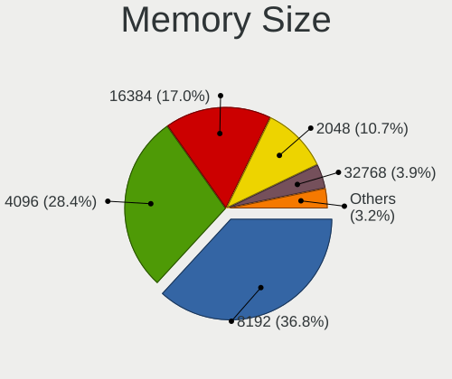

| Size  | Computers | Percent |
|-------|-----------|---------|
| 8192  | 331       | 36.82%  |
| 4096  | 255       | 28.36%  |
| 16384 | 153       | 17.02%  |
| 2048  | 96        | 10.68%  |
| 32768 | 35        | 3.89%   |
| 1024  | 25        | 2.78%   |
| 512   | 4         | 0.44%   |

Memory Speed
------------

Memory module speed

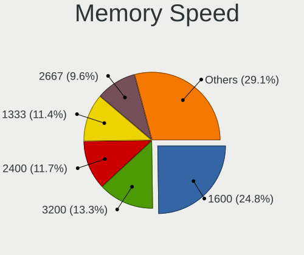

| Speed   | Computers | Percent |
|---------|-----------|---------|
| 1600    | 221       | 24.78%  |
| 3200    | 119       | 13.34%  |
| 2400    | 104       | 11.66%  |
| 1333    | 102       | 11.43%  |
| 2667    | 86        | 9.64%   |
| 2133    | 58        | 6.5%    |
| 4800    | 38        | 4.26%   |
| 800     | 22        | 2.47%   |
| 1067    | 17        | 1.91%   |
| 667     | 17        | 1.91%   |
| 5600    | 16        | 1.79%   |
| 2666    | 14        | 1.57%   |
| 6400    | 13        | 1.46%   |
| Unknown | 12        | 1.35%   |
| 1334    | 7         | 0.78%   |
| 3600    | 6         | 0.67%   |
| 3000    | 6         | 0.67%   |
| 1066    | 5         | 0.56%   |
| 4267    | 4         | 0.45%   |
| 1867    | 4         | 0.45%   |
| 1866    | 4         | 0.45%   |
| 3733    | 3         | 0.34%   |
| 2933    | 3         | 0.34%   |
| 5200    | 2         | 0.22%   |
| 533     | 2         | 0.22%   |
| 400     | 2         | 0.22%   |
| 4000    | 1         | 0.11%   |
| 3400    | 1         | 0.11%   |
| 2800    | 1         | 0.11%   |
| 1088    | 1         | 0.11%   |
| 333     | 1         | 0.11%   |

Printers & scanners
-------------------

Printer Vendor
--------------

Printer device vendors

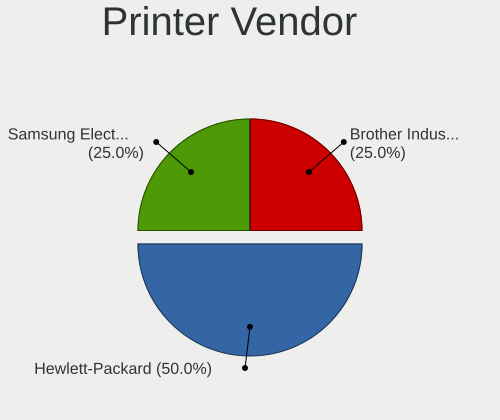

| Vendor              | Computers | Percent |
|---------------------|-----------|---------|
| Hewlett-Packard     | 2         | 40%     |
| Brother Industries  | 2         | 40%     |
| Samsung Electronics | 1         | 20%     |

Printer Model
-------------

Printer device models

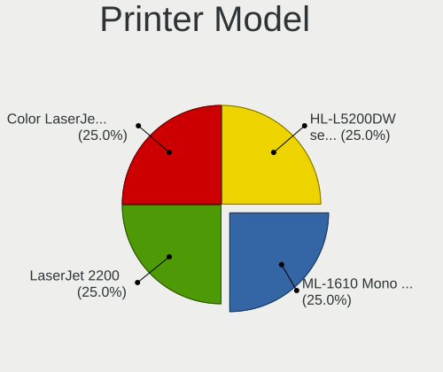

| Model                              | Computers | Percent |
|------------------------------------|-----------|---------|
| Samsung ML-1610 Mono Laser Printer | 1         | 20%     |
| HP LaserJet 2200                   | 1         | 20%     |
| HP Color LaserJet CP1215           | 1         | 20%     |
| Brother HL-L5200DW series          | 1         | 20%     |
| Brother HL-L2300D series           | 1         | 20%     |

Scanner Vendor
--------------

Scanner device vendors

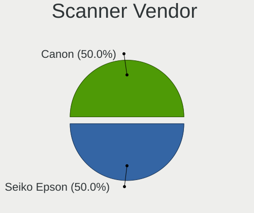

| Vendor      | Computers | Percent |
|-------------|-----------|---------|
| Seiko Epson | 1         | 50%     |
| Canon       | 1         | 50%     |

Scanner Model
-------------

Scanner device models

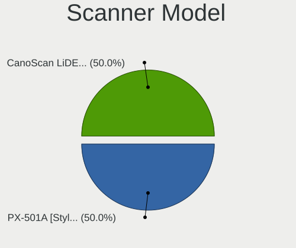

| Model                              | Computers | Percent |
|------------------------------------|-----------|---------|
| Seiko Epson PX-501A [Stylus NX400] | 1         | 50%     |
| Canon CanoScan LiDE 220            | 1         | 50%     |

Camera
------

Camera Vendor
-------------

Camera device vendors

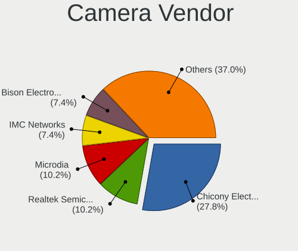

| Vendor                        | Computers | Percent |
|-------------------------------|-----------|---------|
| Chicony Electronics           | 30        | 27.78%  |
| Realtek Semiconductor         | 11        | 10.19%  |
| Microdia                      | 11        | 10.19%  |
| IMC Networks                  | 8         | 7.41%   |
| Bison Electronics             | 8         | 7.41%   |
| Logitech                      | 7         | 6.48%   |
| Lite-On Technology            | 6         | 5.56%   |
| Apple                         | 5         | 4.63%   |
| Sunplus Innovation Technology | 4         | 3.7%    |
| Luxvisions Innotech Limited   | 4         | 3.7%    |
| Syntek                        | 3         | 2.78%   |
| Suyin                         | 2         | 1.85%   |
| Silicon Motion                | 1         | 0.93%   |
| Ricoh                         | 1         | 0.93%   |
| Quanta                        | 1         | 0.93%   |
| Primax Electronics            | 1         | 0.93%   |
| Lenovo                        | 1         | 0.93%   |
| eMeet                         | 1         | 0.93%   |
| Dynex                         | 1         | 0.93%   |
| ALi                           | 1         | 0.93%   |
| Alcor Micro                   | 1         | 0.93%   |

Camera Model
------------

Camera device models

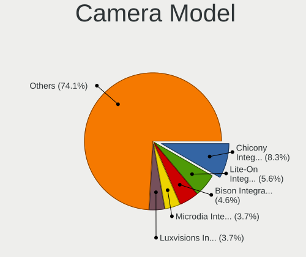

| Model                                                       | Computers | Percent |
|-------------------------------------------------------------|-----------|---------|
| Chicony Integrated Camera                                   | 9         | 8.33%   |
| Lite-On Integrated Camera                                   | 6         | 5.56%   |
| Bison Integrated Camera                                     | 5         | 4.63%   |
| Microdia Integrated_Webcam_HD                               | 4         | 3.7%    |
| Luxvisions Innotech Limited Integrated Camera               | 4         | 3.7%    |
| IMC Networks Integrated Camera                              | 3         | 2.78%   |
| Chicony HD Webcam                                           | 3         | 2.78%   |
| Realtek PC Camera                                           | 2         | 1.85%   |
| Realtek Integrated Webcam HD                                | 2         | 1.85%   |
| Microdia JOYACCESS JA-Webcam                                | 2         | 1.85%   |
| Logitech BRIO Ultra HD Webcam                               | 2         | 1.85%   |
| Chicony TOSHIBA Web Camera - HD                             | 2         | 1.85%   |
| Chicony Integrated Camera [ThinkPad]                        | 2         | 1.85%   |
| Chicony 2.0M UVC Webcam / CNF7129                           | 2         | 1.85%   |
| Apple FaceTime HD Camera (Built-in)                         | 2         | 1.85%   |
| Syntek Lenovo EasyCamera                                    | 1         | 0.93%   |
| Syntek Integrated Camera                                    | 1         | 0.93%   |
| Syntek ASUS USB2.0 camera                                   | 1         | 0.93%   |
| Suyin Acer/HP Integrated Webcam [CN0314]                    | 1         | 0.93%   |
| Suyin 1.3M WebCam (notebook emachines E730, Acer sub-brand) | 1         | 0.93%   |
| Sunplus Laptop_Integrated_Webcam_FHD                        | 1         | 0.93%   |
| Sunplus Integrated_Webcam_HD                                | 1         | 0.93%   |
| Sunplus ASUS Webcam                                         | 1         | 0.93%   |
| Sunplus 2-USB 2.0 Camera                                    | 1         | 0.93%   |
| Silicon Motion Lenovo EasyCamera                            | 1         | 0.93%   |
| Ricoh Integrated Webcam                                     | 1         | 0.93%   |
| Realtek USB2.0 HD UVC WebCam                                | 1         | 0.93%   |
| Realtek USB 2.0 PC Camera                                   | 1         | 0.93%   |
| Realtek Laptop Camera                                       | 1         | 0.93%   |
| Realtek Integrated_Webcam_HD                                | 1         | 0.93%   |
| Realtek Integrated Webcam                                   | 1         | 0.93%   |
| Realtek Integrated Camera                                   | 1         | 0.93%   |
| Realtek HD Webcam - Realtek                                 | 1         | 0.93%   |
| Quanta Realtek PC Camera                                    | 1         | 0.93%   |
| Primax HP HD Webcam [Fixed]                                 | 1         | 0.93%   |
| Microdia Sonix USB 2.0 Camera                               | 1         | 0.93%   |
| Microdia Laptop_Integrated_Webcam_E4HD                      | 1         | 0.93%   |
| Microdia Laptop_Integrated_Webcam_2M                        | 1         | 0.93%   |
| Microdia Integrated Webcam HD                               | 1         | 0.93%   |
| Microdia Integrated Webcam                                  | 1         | 0.93%   |

Security
--------

Fingerprint Vendor
------------------

Fingerprint sensor vendors

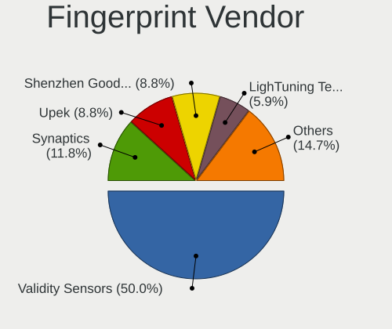

| Vendor                     | Computers | Percent |
|----------------------------|-----------|---------|
| Validity Sensors           | 17        | 50%     |
| Synaptics                  | 4         | 11.76%  |
| Upek                       | 3         | 8.82%   |
| Shenzhen Goodix Technology | 3         | 8.82%   |
| LighTuning Technology      | 2         | 5.88%   |
| Elan Microelectronics      | 2         | 5.88%   |
| AuthenTec                  | 2         | 5.88%   |
| Fingerprint Cards          | 1         | 2.94%   |

Fingerprint Model
-----------------

Fingerprint sensor models

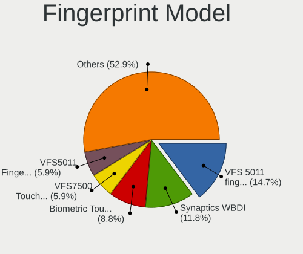

| Model                                                  | Computers | Percent |
|--------------------------------------------------------|-----------|---------|
| Validity Sensors VFS 5011 fingerprint sensor           | 5         | 14.71%  |
| Validity Sensors Synaptics WBDI                        | 4         | 11.76%  |
| Upek Biometric Touchchip/Touchstrip Fingerprint Sensor | 3         | 8.82%   |
| Validity Sensors VFS7500 Touch Fingerprint Sensor      | 2         | 5.88%   |
| Validity Sensors VFS5011 Fingerprint Reader            | 2         | 5.88%   |
| Synaptics Prometheus MIS Touch Fingerprint Reader      | 2         | 5.88%   |
| Synaptics Metallica MIS Touch Fingerprint Reader       | 2         | 5.88%   |
| Shenzhen Goodix Fingerprint Reader                     | 2         | 5.88%   |
| LighTuning EgisTec Touch Fingerprint Sensor            | 2         | 5.88%   |
| Elan Fingerprint Sensor                                | 2         | 5.88%   |
| Validity Sensors VFS495 Fingerprint Reader             | 1         | 2.94%   |
| Validity Sensors VFS491                                | 1         | 2.94%   |
| Validity Sensors VFS Fingerprint sensor                | 1         | 2.94%   |
| Validity Sensors Fingerprint scanner                   | 1         | 2.94%   |
| Shenzhen Goodix Fingerprint Reader SGX                 | 1         | 2.94%   |
| Fingerprint Cards FPC Fingerprint Reader               | 1         | 2.94%   |
| AuthenTec AES2660                                      | 1         | 2.94%   |
| AuthenTec AES2501 Fingerprint Sensor                   | 1         | 2.94%   |

Chipcard Vendor
---------------

Chipcard module vendors

Zero info for selected period =(

Chipcard Model
--------------

Chipcard module models

Zero info for selected period =(

Unsupported
-----------

Unsupported Devices
-------------------

Total unsupported devices on board

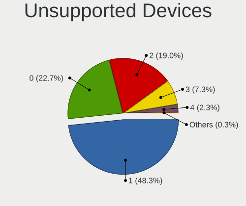

| Total | Computers | Percent |
|-------|-----------|---------|
| 1     | 435       | 48.33%  |
| 0     | 204       | 22.67%  |
| 2     | 171       | 19%     |
| 3     | 66        | 7.33%   |
| 4     | 21        | 2.33%   |
| 5     | 3         | 0.33%   |

Unsupported Device Types
------------------------

Types of unsupported devices

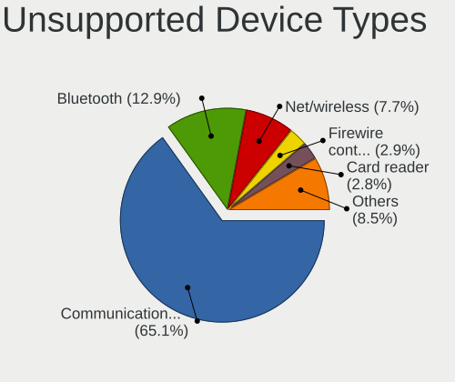

| Type                     | Computers | Percent |
|--------------------------|-----------|---------|
| Communication controller | 597       | 65.1%   |
| Bluetooth                | 118       | 12.87%  |
| Net/wireless             | 71        | 7.74%   |
| Firewire controller      | 27        | 2.94%   |
| Card reader              | 26        | 2.84%   |
| Fingerprint reader       | 25        | 2.73%   |
| Net/ethernet             | 17        | 1.85%   |
| Sound                    | 14        | 1.53%   |
| Network                  | 9         | 0.98%   |
| Graphics card            | 5         | 0.55%   |
| Storage/raid             | 3         | 0.33%   |
| Storage/ata              | 2         | 0.22%   |
| Storage                  | 2         | 0.22%   |
| Storage/nvme             | 1         | 0.11%   |

