BSD in Canada - Tested Hardware & Statistics
--------------------------------------------

A project to collect tested hardware configurations for BSD in Canada.

Anyone can contribute to this report by the [hw-probe](https://github.com/linuxhw/hw-probe/blob/master/INSTALL.BSD.md) tool:

    hw-probe -all -upload

Please contribute! Especially if your hardware is rare.

This is a report for all computer types. See also reports for [desktops](/Location/Canada/Desktop/README.md) and [notebooks](/Location/Canada/Notebook/README.md).

Contents
--------

* [ Test Cases ](#test-cases)

* [ System ](#system)
  - [ OS                       ](#os)
  - [ OS Family                ](#os-family)
  - [ Arch                     ](#arch)
  - [ DE                       ](#de)
  - [ Display Server           ](#display-server)
  - [ Display Manager          ](#display-manager)
  - [ OS Lang                  ](#os-lang)
  - [ Boot Mode                ](#boot-mode)
  - [ Filesystem               ](#filesystem)
  - [ Part. scheme             ](#part-scheme)

* [ Board ](#board)
  - [ Vendor                   ](#vendor)
  - [ Model                    ](#model)
  - [ Model Family             ](#model-family)
  - [ MFG Year                 ](#mfg-year)
  - [ Form Factor              ](#form-factor)
  - [ Coreboot                 ](#coreboot)
  - [ RAM Size                 ](#ram-size)
  - [ RAM Used                 ](#ram-used)
  - [ Total Drives             ](#total-drives)
  - [ Has CD-ROM               ](#has-cd-rom)
  - [ Has Ethernet             ](#has-ethernet)
  - [ Has WiFi                 ](#has-wifi)
  - [ Has Bluetooth            ](#has-bluetooth)

* [ Location ](#location)
  - [ Country                  ](#country)
  - [ City                     ](#city)

* [ Drives ](#drives)
  - [ Drive Vendor             ](#drive-vendor)
  - [ Drive Model              ](#drive-model)
  - [ HDD Vendor               ](#hdd-vendor)
  - [ SSD Vendor               ](#ssd-vendor)
  - [ Drive Kind               ](#drive-kind)
  - [ Drive Connector          ](#drive-connector)
  - [ Drive Size               ](#drive-size)
  - [ Space Total              ](#space-total)
  - [ Space Used               ](#space-used)
  - [ Malfunc. Drives          ](#malfunc-drives)
  - [ Malfunc. Drive Vendor    ](#malfunc-drive-vendor)
  - [ Malfunc. HDD Vendor      ](#malfunc-hdd-vendor)
  - [ Malfunc. Drive Kind      ](#malfunc-drive-kind)
  - [ Failed Drives            ](#failed-drives)
  - [ Failed Drive Vendor      ](#failed-drive-vendor)
  - [ Drive Status             ](#drive-status)

* [ Storage controller ](#storage-controller)
  - [ Storage Vendor           ](#storage-vendor)
  - [ Storage Model            ](#storage-model)
  - [ Storage Kind             ](#storage-kind)

* [ Processor ](#processor)
  - [ CPU Vendor               ](#cpu-vendor)
  - [ CPU Model                ](#cpu-model)
  - [ CPU Model Family         ](#cpu-model-family)
  - [ CPU Cores                ](#cpu-cores)
  - [ CPU Sockets              ](#cpu-sockets)
  - [ CPU Threads              ](#cpu-threads)
  - [ CPU Microarch            ](#cpu-microarch)

* [ Graphics ](#graphics)
  - [ GPU Vendor               ](#gpu-vendor)
  - [ GPU Model                ](#gpu-model)
  - [ GPU Combo                ](#gpu-combo)
  - [ GPU Driver               ](#gpu-driver)
  - [ GPU Memory               ](#gpu-memory)

* [ Monitor ](#monitor)
  - [ Monitor Vendor           ](#monitor-vendor)
  - [ Monitor Model            ](#monitor-model)
  - [ Monitor Resolution       ](#monitor-resolution)
  - [ Monitor Diagonal         ](#monitor-diagonal)
  - [ Monitor Width            ](#monitor-width)
  - [ Aspect Ratio             ](#aspect-ratio)
  - [ Monitor Area             ](#monitor-area)
  - [ Pixel Density            ](#pixel-density)
  - [ Multiple Monitors        ](#multiple-monitors)

* [ Network ](#network)
  - [ Net Controller Vendor    ](#net-controller-vendor)
  - [ Net Controller Model     ](#net-controller-model)
  - [ Wireless Vendor          ](#wireless-vendor)
  - [ Wireless Model           ](#wireless-model)
  - [ Ethernet Vendor          ](#ethernet-vendor)
  - [ Ethernet Model           ](#ethernet-model)
  - [ Net Controller Kind      ](#net-controller-kind)
  - [ Used Controller          ](#used-controller)
  - [ NICs                     ](#nics)
  - [ IPv6                     ](#ipv6)

* [ Bluetooth ](#bluetooth)
  - [ Bluetooth Vendor         ](#bluetooth-vendor)
  - [ Bluetooth Model          ](#bluetooth-model)

* [ Sound ](#sound)
  - [ Sound Vendor             ](#sound-vendor)
  - [ Sound Model              ](#sound-model)

* [ Memory ](#memory)
  - [ Memory Vendor            ](#memory-vendor)
  - [ Memory Model             ](#memory-model)
  - [ Memory Kind              ](#memory-kind)
  - [ Memory Form Factor       ](#memory-form-factor)
  - [ Memory Size              ](#memory-size)
  - [ Memory Speed             ](#memory-speed)

* [ Printers & scanners ](#printers--scanners)
  - [ Printer Vendor           ](#printer-vendor)
  - [ Printer Model            ](#printer-model)
  - [ Scanner Vendor           ](#scanner-vendor)
  - [ Scanner Model            ](#scanner-model)

* [ Camera ](#camera)
  - [ Camera Vendor            ](#camera-vendor)
  - [ Camera Model             ](#camera-model)

* [ Security ](#security)
  - [ Fingerprint Vendor       ](#fingerprint-vendor)
  - [ Fingerprint Model        ](#fingerprint-model)
  - [ Chipcard Vendor          ](#chipcard-vendor)
  - [ Chipcard Model           ](#chipcard-model)

* [ Unsupported ](#unsupported)
  - [ Unsupported Devices      ](#unsupported-devices)
  - [ Unsupported Device Types ](#unsupported-device-types)

Test Cases
----------

Total: 409

| Vendor        | Model                       | Form-Factor | Probe                                                     | Date         |
|---------------|-----------------------------|-------------|-----------------------------------------------------------|--------------|
| Protectli     | FW6 Ver                     | Desktop     | [ac861b1ee3](https://bsd-hardware.info/?probe=ac861b1ee3) | Jun 25, 2022 |
| Protectli     | FW6 Ver                     | Desktop     | [598ecb5457](https://bsd-hardware.info/?probe=598ecb5457) | Jun 25, 2022 |
| AWOW          | PC BOX                      | Mini pc     | [a6a5de19ae](https://bsd-hardware.info/?probe=a6a5de19ae) | Jun 23, 2022 |
| HP            | 82A2                        | Desktop     | [77c244bd43](https://bsd-hardware.info/?probe=77c244bd43) | Jun 19, 2022 |
| AWOW          | PC BOX                      | Mini pc     | [8fadaccd4b](https://bsd-hardware.info/?probe=8fadaccd4b) | Jun 18, 2022 |
| AWOW          | PC BOX                      | Mini pc     | [6f5a755297](https://bsd-hardware.info/?probe=6f5a755297) | Jun 18, 2022 |
| Gigabyte      | B450M DS3H-CF               | Desktop     | [a57a2f609c](https://bsd-hardware.info/?probe=a57a2f609c) | Jun 13, 2022 |
| Gigabyte      | B550M AORUS PRO-P           | Desktop     | [1febab0774](https://bsd-hardware.info/?probe=1febab0774) | Jun 12, 2022 |
| HP            | 1998                        | Desktop     | [1bb67075dd](https://bsd-hardware.info/?probe=1bb67075dd) | Jun 12, 2022 |
| Apple         | Mac-F221BEC8                | Desktop     | [5054729300](https://bsd-hardware.info/?probe=5054729300) | Jun 11, 2022 |
| HP            | 1998                        | Desktop     | [54a6daf0a6](https://bsd-hardware.info/?probe=54a6daf0a6) | Jun 11, 2022 |
| Acer          | EM61SM/EM61PM               | Desktop     | [3b8d6cb36e](https://bsd-hardware.info/?probe=3b8d6cb36e) | Jun 07, 2022 |
| Gigabyte      | B450M DS3H-CF               | Desktop     | [26cd129290](https://bsd-hardware.info/?probe=26cd129290) | Jun 06, 2022 |
| AWOW          | PC BOX                      | Mini pc     | [a5bcab3428](https://bsd-hardware.info/?probe=a5bcab3428) | Jun 05, 2022 |
| Dell          | 0HHV7N A00                  | Desktop     | [f3c197bdfb](https://bsd-hardware.info/?probe=f3c197bdfb) | Jun 04, 2022 |
| ASUSTek       | M5A97 PLUS                  | Desktop     | [8e8ef96421](https://bsd-hardware.info/?probe=8e8ef96421) | Jun 04, 2022 |
| Dell          | 02YYK5 A01                  | Desktop     | [dce99bec81](https://bsd-hardware.info/?probe=dce99bec81) | Jun 03, 2022 |
| ASUSTek       | M5A97 PLUS                  | Desktop     | [8ca71ddf4d](https://bsd-hardware.info/?probe=8ca71ddf4d) | Jun 02, 2022 |
| AWOW          | PC BOX                      | Mini pc     | [cc70f5d86f](https://bsd-hardware.info/?probe=cc70f5d86f) | Jun 01, 2022 |
| ASUSTek       | M5A97 PLUS                  | Desktop     | [9d5edd9fa9](https://bsd-hardware.info/?probe=9d5edd9fa9) | May 29, 2022 |
| Dell          | 0M3F6C A01                  | Desktop     | [21d45bc75d](https://bsd-hardware.info/?probe=21d45bc75d) | May 23, 2022 |
| ASUSTek       | PRIME B250M-C               | Desktop     | [c956536edd](https://bsd-hardware.info/?probe=c956536edd) | May 23, 2022 |
| Dell          | 0HHV7N A00                  | Desktop     | [6d7475e9c9](https://bsd-hardware.info/?probe=6d7475e9c9) | May 22, 2022 |
| Lenovo        | SHARKBAY 0B98401 WIN        | Desktop     | [963fa158b5](https://bsd-hardware.info/?probe=963fa158b5) | May 22, 2022 |
| Sophos        | SG                          | Firewall    | [9f76b20afd](https://bsd-hardware.info/?probe=9f76b20afd) | May 22, 2022 |
| Dell          | Studio 1747                 | Notebook    | [7ae292b282](https://bsd-hardware.info/?probe=7ae292b282) | May 21, 2022 |
| AWOW          | PC BOX                      | Mini pc     | [5d31f6f5a8](https://bsd-hardware.info/?probe=5d31f6f5a8) | May 19, 2022 |
| ASUSTek       | PRIME Z690-P WIFI           | Desktop     | [1014f7f61c](https://bsd-hardware.info/?probe=1014f7f61c) | May 18, 2022 |
| Dell          | 0DXJD9 A01                  | Desktop     | [be13c9069c](https://bsd-hardware.info/?probe=be13c9069c) | May 18, 2022 |
| Intel         | NUC10i7FNB K61360-304       | Mini pc     | [b74299204a](https://bsd-hardware.info/?probe=b74299204a) | May 18, 2022 |
| ASUSTek       | PRIME B250M-C               | Desktop     | [9ec22ea24c](https://bsd-hardware.info/?probe=9ec22ea24c) | May 17, 2022 |
| AWOW          | PC BOX                      | Mini pc     | [c7af1dd7bf](https://bsd-hardware.info/?probe=c7af1dd7bf) | May 16, 2022 |
| Lenovo        | MAHOBAY 0B98401 PRO         | Desktop     | [30cfcd5004](https://bsd-hardware.info/?probe=30cfcd5004) | May 15, 2022 |
| AWOW          | PC BOX                      | Mini pc     | [44ab2d6faa](https://bsd-hardware.info/?probe=44ab2d6faa) | May 14, 2022 |
| Protectli     | FW4B Ver                    | Desktop     | [9af60bd6e4](https://bsd-hardware.info/?probe=9af60bd6e4) | May 14, 2022 |
| ASUSTek       | M5A97 PLUS                  | Desktop     | [fd066b2db9](https://bsd-hardware.info/?probe=fd066b2db9) | May 14, 2022 |
| Unknown       | Unknown                     | Desktop     | [0958a64385](https://bsd-hardware.info/?probe=0958a64385) | May 12, 2022 |
| Unknown       | Unknown                     | Desktop     | [0d62d4e3cd](https://bsd-hardware.info/?probe=0d62d4e3cd) | May 09, 2022 |
| Dell          | Inspiron 5559               | Notebook    | [a7111b84cb](https://bsd-hardware.info/?probe=a7111b84cb) | May 08, 2022 |
| Fujitsu       | LIFEBOOK E752               | Notebook    | [3e60a82218](https://bsd-hardware.info/?probe=3e60a82218) | May 06, 2022 |
| Gigabyte      | F2A68HM-H                   | Desktop     | [daed3f9401](https://bsd-hardware.info/?probe=daed3f9401) | May 06, 2022 |
| ASUSTek       | 1000HE                      | Notebook    | [a6393754b4](https://bsd-hardware.info/?probe=a6393754b4) | May 05, 2022 |
| ASUSTek       | H81M-E                      | Desktop     | [cf2f288b93](https://bsd-hardware.info/?probe=cf2f288b93) | May 04, 2022 |
| Matsushita... | CF-48V4KNDQM                | Notebook    | [774cab5326](https://bsd-hardware.info/?probe=774cab5326) | May 03, 2022 |
| Matsushita... | CF-51RCVDNLM                | Notebook    | [4b1abdd507](https://bsd-hardware.info/?probe=4b1abdd507) | May 03, 2022 |
| Lenovo        | ThinkPad T410 2537N24       | Notebook    | [2884106c6b](https://bsd-hardware.info/?probe=2884106c6b) | May 03, 2022 |
| Lenovo        | ThinkPad T430 2347GZU       | Notebook    | [00ba6ca9f8](https://bsd-hardware.info/?probe=00ba6ca9f8) | May 03, 2022 |
| Lenovo        | ThinkPad T420s 41742BU      | Notebook    | [6b77fe651f](https://bsd-hardware.info/?probe=6b77fe651f) | May 03, 2022 |
| Lenovo        | ThinkPad X220 429043U       | Notebook    | [f3c30a6190](https://bsd-hardware.info/?probe=f3c30a6190) | May 02, 2022 |
| Panasonic     | CF-53AAGHYDM                | Notebook    | [abd8754907](https://bsd-hardware.info/?probe=abd8754907) | May 01, 2022 |
| Panasonic     | CF-52PFPBSFQ                | Notebook    | [1ce63e2214](https://bsd-hardware.info/?probe=1ce63e2214) | Apr 29, 2022 |
| HP            | 1495                        | Desktop     | [6e0f1cc72e](https://bsd-hardware.info/?probe=6e0f1cc72e) | Apr 29, 2022 |
| Supermicro    | X10SLH-N6-ST031             | Server      | [586d311314](https://bsd-hardware.info/?probe=586d311314) | Apr 28, 2022 |
| HP            | 1998                        | Desktop     | [1244e0583b](https://bsd-hardware.info/?probe=1244e0583b) | Apr 27, 2022 |
| Unknown       | Unknown                     | Desktop     | [b3d5defed1](https://bsd-hardware.info/?probe=b3d5defed1) | Apr 26, 2022 |
| Supermicro    | X12SCZ-TLN4FA               | Server      | [2a9ac1e6ee](https://bsd-hardware.info/?probe=2a9ac1e6ee) | Apr 23, 2022 |
| Sophos        | SG                          | Firewall    | [cbd2585bf3](https://bsd-hardware.info/?probe=cbd2585bf3) | Apr 23, 2022 |
| Unknown       | Unknown                     | Desktop     | [4166c67369](https://bsd-hardware.info/?probe=4166c67369) | Apr 20, 2022 |
| Dell          | G5 5090                     | Desktop     | [8b24170852](https://bsd-hardware.info/?probe=8b24170852) | Apr 17, 2022 |
| HP            | ProLiant DL360p Gen8        | Server      | [01945539d9](https://bsd-hardware.info/?probe=01945539d9) | Apr 17, 2022 |
| Sophos        | SG                          | Firewall    | [ed297e4274](https://bsd-hardware.info/?probe=ed297e4274) | Apr 16, 2022 |
| Unknown       | Unknown                     | Desktop     | [979e868c51](https://bsd-hardware.info/?probe=979e868c51) | Apr 16, 2022 |
| Dell          | 0DXJD9 A01                  | Desktop     | [4023d86091](https://bsd-hardware.info/?probe=4023d86091) | Apr 15, 2022 |
| ASRock        | J3455B-ITX                  | Desktop     | [29be552d6a](https://bsd-hardware.info/?probe=29be552d6a) | Apr 15, 2022 |
| Unknown       | Unknown                     | Desktop     | [1173feae11](https://bsd-hardware.info/?probe=1173feae11) | Apr 13, 2022 |
| Dell          | 0DXJD9 A01                  | Desktop     | [6dac56f3bb](https://bsd-hardware.info/?probe=6dac56f3bb) | Apr 11, 2022 |
| Dell          | 0WR7PY A03                  | Desktop     | [641d1574ce](https://bsd-hardware.info/?probe=641d1574ce) | Apr 11, 2022 |
| Toshiba       | Satellite Pro T130          | Notebook    | [62dd51afcf](https://bsd-hardware.info/?probe=62dd51afcf) | Apr 11, 2022 |
| HP            | 8103 A01                    | Mini pc     | [1fa67a8d17](https://bsd-hardware.info/?probe=1fa67a8d17) | Apr 04, 2022 |
| AWOW          | PC BOX                      | Mini pc     | [e79f120d82](https://bsd-hardware.info/?probe=e79f120d82) | Apr 01, 2022 |
| Dell          | 081N4V A06                  | Server      | [700e5de168](https://bsd-hardware.info/?probe=700e5de168) | Apr 01, 2022 |
| PC Engines    | APU                         | Desktop     | [e266947055](https://bsd-hardware.info/?probe=e266947055) | Mar 29, 2022 |
| Unknown       | Unknown                     | Desktop     | [ef1a743845](https://bsd-hardware.info/?probe=ef1a743845) | Mar 28, 2022 |
| Lenovo        | SHARKBAY 0B98401 WIN        | Desktop     | [1176fca4ab](https://bsd-hardware.info/?probe=1176fca4ab) | Mar 27, 2022 |
| ASUSTek       | ET2411_W8                   | All in one  | [fb186da68e](https://bsd-hardware.info/?probe=fb186da68e) | Mar 26, 2022 |
| Unknown       | Unknown                     | Desktop     | [d0e7b62eda](https://bsd-hardware.info/?probe=d0e7b62eda) | Mar 25, 2022 |
| Protectli     | FW4B Ver                    | Desktop     | [cf576c571d](https://bsd-hardware.info/?probe=cf576c571d) | Mar 22, 2022 |
| HP            | 213D A01                    | Desktop     | [6baba4f9c1](https://bsd-hardware.info/?probe=6baba4f9c1) | Mar 20, 2022 |
| ASUSTek       | P8Z68-V LE                  | Desktop     | [3727ba82af](https://bsd-hardware.info/?probe=3727ba82af) | Mar 19, 2022 |
| ASUSTek       | ET2411_W8                   | All in one  | [b95da98f21](https://bsd-hardware.info/?probe=b95da98f21) | Mar 17, 2022 |
| Intel         | SHARKBAY                    | Desktop     | [f22a45488b](https://bsd-hardware.info/?probe=f22a45488b) | Mar 15, 2022 |
| Gigabyte      | B550I AORUS PRO AX          | Desktop     | [a5fd383c40](https://bsd-hardware.info/?probe=a5fd383c40) | Mar 14, 2022 |
| AWOW          | PC BOX                      | Mini pc     | [6024b9491d](https://bsd-hardware.info/?probe=6024b9491d) | Mar 06, 2022 |
| MSI           | MS-7388                     | Desktop     | [ad8209dbdb](https://bsd-hardware.info/?probe=ad8209dbdb) | Mar 05, 2022 |
| MSI           | MS-7388                     | Desktop     | [a59bca8bde](https://bsd-hardware.info/?probe=a59bca8bde) | Mar 05, 2022 |
| Lenovo        | SHARKBAY 0B98401 WIN        | Desktop     | [a6abb45607](https://bsd-hardware.info/?probe=a6abb45607) | Mar 04, 2022 |
| Dell          | 0GDJXY A00                  | All in one  | [589f10057f](https://bsd-hardware.info/?probe=589f10057f) | Mar 01, 2022 |
| Intel         | H81U                        | Notebook    | [71068a0577](https://bsd-hardware.info/?probe=71068a0577) | Mar 01, 2022 |
| Dell          | 0GDJXY A00                  | All in one  | [e14fd85d4a](https://bsd-hardware.info/?probe=e14fd85d4a) | Feb 27, 2022 |
| Lenovo        | SHARKBAY 0B98401 WIN        | Desktop     | [6b2550968e](https://bsd-hardware.info/?probe=6b2550968e) | Feb 23, 2022 |
| Intel         | NUC5CPYB H61145-404         | Mini pc     | [5f4e1c30b8](https://bsd-hardware.info/?probe=5f4e1c30b8) | Feb 19, 2022 |
| Intel         | Q3XXG4-P V1.0               | Desktop     | [b69015f0e0](https://bsd-hardware.info/?probe=b69015f0e0) | Feb 16, 2022 |
| PC Engines    | apu4                        | Desktop     | [09f27a0f23](https://bsd-hardware.info/?probe=09f27a0f23) | Feb 14, 2022 |
| Protectli     | FW6                         | Desktop     | [d33b2f1244](https://bsd-hardware.info/?probe=d33b2f1244) | Feb 13, 2022 |
| AWOW          | PC BOX                      | Mini pc     | [04bee98c7e](https://bsd-hardware.info/?probe=04bee98c7e) | Feb 12, 2022 |
| AWOW          | PC BOX                      | Mini pc     | [bd63b06ea9](https://bsd-hardware.info/?probe=bd63b06ea9) | Feb 11, 2022 |
| ASRock        | AM1H-ITX                    | Desktop     | [12ccb8699b](https://bsd-hardware.info/?probe=12ccb8699b) | Feb 08, 2022 |
| ASRock        | AM1H-ITX                    | Desktop     | [0d3b560aad](https://bsd-hardware.info/?probe=0d3b560aad) | Feb 08, 2022 |
| MSI           | X470 GAMING PLUS MAX        | Desktop     | [3dabf0503d](https://bsd-hardware.info/?probe=3dabf0503d) | Feb 08, 2022 |
| SeeedStudi... | ODYSSEY-X86J4105 SD-BS-C... | Desktop     | [53abdfa3b1](https://bsd-hardware.info/?probe=53abdfa3b1) | Feb 07, 2022 |
| ASUSTek       | PRIME H410M-A               | Desktop     | [1dafdcc71a](https://bsd-hardware.info/?probe=1dafdcc71a) | Feb 05, 2022 |
| Supermicro    | H11DSi                      | Server      | [4e41dc7f8b](https://bsd-hardware.info/?probe=4e41dc7f8b) | Feb 03, 2022 |
| ASRock        | J4105M                      | Desktop     | [09b9d104b9](https://bsd-hardware.info/?probe=09b9d104b9) | Feb 03, 2022 |
| Intel         | NUC5i3RYB K23918-501        | Mini pc     | [342915fccd](https://bsd-hardware.info/?probe=342915fccd) | Feb 03, 2022 |
| Intel         | Q3XXG4-P V1.0               | Desktop     | [07d565ad8c](https://bsd-hardware.info/?probe=07d565ad8c) | Feb 02, 2022 |
| Dell          | 00NH4P A03                  | Server      | [1fe915b90a](https://bsd-hardware.info/?probe=1fe915b90a) | Feb 01, 2022 |
| ASRock        | J3455B-ITX                  | Desktop     | [83975bd2b1](https://bsd-hardware.info/?probe=83975bd2b1) | Jan 29, 2022 |
| Intel         | Q3XXG4-P V1.0               | Desktop     | [ff629a490d](https://bsd-hardware.info/?probe=ff629a490d) | Jan 29, 2022 |
| Dell          | 0WMJ54 A01                  | Desktop     | [4b17ef7a18](https://bsd-hardware.info/?probe=4b17ef7a18) | Jan 27, 2022 |
| Raspberry ... | Raspberry Pi                | Soc         | [4df3db0379](https://bsd-hardware.info/?probe=4df3db0379) | Jan 26, 2022 |
| Sophos        | SG                          | Firewall    | [3c6601bf94](https://bsd-hardware.info/?probe=3c6601bf94) | Jan 15, 2022 |
| PC Engines    | APU2                        | Desktop     | [5ea082ddf9](https://bsd-hardware.info/?probe=5ea082ddf9) | Jan 13, 2022 |
| Dell          | 0X4N41 A01                  | Desktop     | [87000234dc](https://bsd-hardware.info/?probe=87000234dc) | Jan 11, 2022 |
| Lenovo        | ThinkPad X250 20CL001GUS    | Notebook    | [4ae2360503](https://bsd-hardware.info/?probe=4ae2360503) | Jan 11, 2022 |
| ASUSTek       | P8Z68-M PRO                 | Desktop     | [a0885f4f44](https://bsd-hardware.info/?probe=a0885f4f44) | Jan 10, 2022 |
| Dell          | 0DT021 A02                  | Server      | [d1fdef3d4d](https://bsd-hardware.info/?probe=d1fdef3d4d) | Jan 09, 2022 |
| AMI           | Aptio CRB                   | Mini pc     | [7863226bbe](https://bsd-hardware.info/?probe=7863226bbe) | Jan 09, 2022 |
| Unknown       | Unknown                     | Desktop     | [ded64258b4](https://bsd-hardware.info/?probe=ded64258b4) | Jan 09, 2022 |
| Unknown       | Unknown                     | Desktop     | [8d607c1d19](https://bsd-hardware.info/?probe=8d607c1d19) | Jan 03, 2022 |
| Toshiba       | TECRA Z40-B                 | Notebook    | [d498fcd3f8](https://bsd-hardware.info/?probe=d498fcd3f8) | Jan 02, 2022 |
| ASUSTek       | U31SD                       | Notebook    | [a07366611d](https://bsd-hardware.info/?probe=a07366611d) | Jan 02, 2022 |
| Unknown       | Unknown                     | Desktop     | [c183bdd5af](https://bsd-hardware.info/?probe=c183bdd5af) | Jan 01, 2022 |
| Unknown       | Unknown                     | Desktop     | [4848e4009f](https://bsd-hardware.info/?probe=4848e4009f) | Jan 01, 2022 |
| AMI           | Cherry Trail CR             | Desktop     | [7d47d0db05](https://bsd-hardware.info/?probe=7d47d0db05) | Dec 30, 2021 |
| ASUSTek       | P8B75-M                     | Desktop     | [c3884fac44](https://bsd-hardware.info/?probe=c3884fac44) | Dec 30, 2021 |
| ASUSTek       | TUF GAMING FX504GD_FX80G... | Notebook    | [259b5cc7b2](https://bsd-hardware.info/?probe=259b5cc7b2) | Dec 28, 2021 |
| ASUSTek       | Z170-P                      | Desktop     | [bde74629f9](https://bsd-hardware.info/?probe=bde74629f9) | Dec 25, 2021 |
| ASRock        | J3355B-ITX                  | Desktop     | [f4648747b0](https://bsd-hardware.info/?probe=f4648747b0) | Dec 22, 2021 |
| Intel         | NUC10i7FNB K61360-304       | Mini pc     | [839eed529d](https://bsd-hardware.info/?probe=839eed529d) | Dec 21, 2021 |
| Lenovo        | ThinkPad X280 20KF001UUS    | Notebook    | [5b9001009e](https://bsd-hardware.info/?probe=5b9001009e) | Dec 20, 2021 |
| HP            | 8103 A01                    | Mini pc     | [0138a82561](https://bsd-hardware.info/?probe=0138a82561) | Dec 18, 2021 |
| Quanta        | 2AC7 011                    | Desktop     | [1a831a1d34](https://bsd-hardware.info/?probe=1a831a1d34) | Dec 18, 2021 |
| HP            | 843B                        | Desktop     | [f0d279747f](https://bsd-hardware.info/?probe=f0d279747f) | Dec 13, 2021 |
| HP            | 843B                        | Desktop     | [56400d3999](https://bsd-hardware.info/?probe=56400d3999) | Dec 13, 2021 |
| Lenovo        | ThinkPad T420s 41742BU      | Notebook    | [a86326d049](https://bsd-hardware.info/?probe=a86326d049) | Dec 11, 2021 |
| AMI           | Cherry Trail CR             | Desktop     | [624041b5db](https://bsd-hardware.info/?probe=624041b5db) | Dec 09, 2021 |
| AWOW          | PC BOX                      | Mini pc     | [79d9964300](https://bsd-hardware.info/?probe=79d9964300) | Dec 02, 2021 |
| Dell          | 051FJ8 A01                  | Desktop     | [ccfb8336a0](https://bsd-hardware.info/?probe=ccfb8336a0) | Dec 01, 2021 |
| HP            | 843B                        | Desktop     | [376e006a40](https://bsd-hardware.info/?probe=376e006a40) | Nov 30, 2021 |
| HP            | 843B                        | Desktop     | [404224439d](https://bsd-hardware.info/?probe=404224439d) | Nov 29, 2021 |
| HP            | 843B                        | Desktop     | [a8ac0e9efb](https://bsd-hardware.info/?probe=a8ac0e9efb) | Nov 29, 2021 |
| Apple         | Mac-F2218FA9                | All in one  | [7154bea350](https://bsd-hardware.info/?probe=7154bea350) | Nov 27, 2021 |
| Gigabyte      | Z97X-SLI-CF                 | Desktop     | [dc9d060c7f](https://bsd-hardware.info/?probe=dc9d060c7f) | Nov 27, 2021 |
| Lenovo        | ThinkPad X220 429043U       | Notebook    | [339779baad](https://bsd-hardware.info/?probe=339779baad) | Nov 26, 2021 |
| AMI           | Aptio CRB                   | Mini pc     | [49a0a07721](https://bsd-hardware.info/?probe=49a0a07721) | Nov 25, 2021 |
| Supermicro    | X12SCZ-TLN4FA               | Server      | [3debb4fe22](https://bsd-hardware.info/?probe=3debb4fe22) | Nov 24, 2021 |
| AWOW          | PC BOX                      | Mini pc     | [f922794063](https://bsd-hardware.info/?probe=f922794063) | Nov 22, 2021 |
| Apple         | Mac-F2218FA9                | All in one  | [1802f6c891](https://bsd-hardware.info/?probe=1802f6c891) | Nov 21, 2021 |
| ASUSTek       | M5A97 PLUS                  | Desktop     | [a26bc8f2b3](https://bsd-hardware.info/?probe=a26bc8f2b3) | Nov 14, 2021 |
| Gigabyte      | MRZNVMS-00                  | Desktop     | [817cb3e603](https://bsd-hardware.info/?probe=817cb3e603) | Nov 12, 2021 |
| Dell          | Studio 1747                 | Notebook    | [b0a51ac0af](https://bsd-hardware.info/?probe=b0a51ac0af) | Nov 11, 2021 |
| Dell          | Studio 1747                 | Notebook    | [7ab6b58d69](https://bsd-hardware.info/?probe=7ab6b58d69) | Nov 11, 2021 |
| ASUSTek       | M5A97 PLUS                  | Desktop     | [970387f9d9](https://bsd-hardware.info/?probe=970387f9d9) | Nov 09, 2021 |
| Protectli     | FW6E                        | Desktop     | [ebe5b24dee](https://bsd-hardware.info/?probe=ebe5b24dee) | Nov 08, 2021 |
| Protectli     | FW6E                        | Desktop     | [6c12084410](https://bsd-hardware.info/?probe=6c12084410) | Nov 07, 2021 |
| Unknown       | Unknown                     | Firewall    | [053ec385f8](https://bsd-hardware.info/?probe=053ec385f8) | Nov 04, 2021 |
| ASUSTek       | M5A97 PLUS                  | Desktop     | [99b5ab3e42](https://bsd-hardware.info/?probe=99b5ab3e42) | Nov 04, 2021 |
| ASRock        | H370M-ITX/ac                | Desktop     | [bf37ad85e7](https://bsd-hardware.info/?probe=bf37ad85e7) | Nov 03, 2021 |
| Unknown       | Unknown                     | Desktop     | [579cf2ac1a](https://bsd-hardware.info/?probe=579cf2ac1a) | Oct 31, 2021 |
| Intel         | Q3XXG4-P V1.0               | Desktop     | [7abc8386ec](https://bsd-hardware.info/?probe=7abc8386ec) | Oct 31, 2021 |
| Panasonic     | CF-53AAGHYDM                | Notebook    | [721ef0235c](https://bsd-hardware.info/?probe=721ef0235c) | Oct 30, 2021 |
| HP            | 843B                        | Desktop     | [9761f29b5e](https://bsd-hardware.info/?probe=9761f29b5e) | Oct 25, 2021 |
| SeeedStudi... | ODYSSEY-X86J4105 SD-BS-C... | Desktop     | [c3d6cddf87](https://bsd-hardware.info/?probe=c3d6cddf87) | Oct 25, 2021 |
| Matsushita... | CF-48V4KNDQM                | Notebook    | [9e254ab443](https://bsd-hardware.info/?probe=9e254ab443) | Oct 23, 2021 |
| ASUSTek       | 1000HE                      | Notebook    | [1d5e3e5bc3](https://bsd-hardware.info/?probe=1d5e3e5bc3) | Oct 22, 2021 |
| Lenovo        | ThinkPad T430 2347GZU       | Notebook    | [3337c00433](https://bsd-hardware.info/?probe=3337c00433) | Oct 22, 2021 |
| Intel         | CRESCENTBAY                 | Desktop     | [5c8f3708b1](https://bsd-hardware.info/?probe=5c8f3708b1) | Oct 21, 2021 |
| Dell          | Studio 1747                 | Notebook    | [ed704cde92](https://bsd-hardware.info/?probe=ed704cde92) | Oct 20, 2021 |
| Lenovo        | 3190 SDK0J40697 WIN 3305... | Mini pc     | [93f9e34d05](https://bsd-hardware.info/?probe=93f9e34d05) | Oct 19, 2021 |
| Dell          | Studio 1747                 | Notebook    | [ca939fbe2f](https://bsd-hardware.info/?probe=ca939fbe2f) | Oct 19, 2021 |
| Matsushita... | CF-51RCVDNLM                | Notebook    | [b20953f2f4](https://bsd-hardware.info/?probe=b20953f2f4) | Oct 18, 2021 |
| Panasonic     | CF-52PFPBSFQ                | Notebook    | [bbdfde368b](https://bsd-hardware.info/?probe=bbdfde368b) | Oct 18, 2021 |
| Lenovo        | ThinkPad T410 2537N24       | Notebook    | [1a5bae2227](https://bsd-hardware.info/?probe=1a5bae2227) | Oct 15, 2021 |
| Acer          | Aspire TC-780               | Desktop     | [77101a00b3](https://bsd-hardware.info/?probe=77101a00b3) | Oct 11, 2021 |
| Acer          | Aspire TC-780               | Desktop     | [3ce8481842](https://bsd-hardware.info/?probe=3ce8481842) | Oct 10, 2021 |
| ASUSTek       | M5A97 PLUS                  | Desktop     | [cc419789f8](https://bsd-hardware.info/?probe=cc419789f8) | Oct 08, 2021 |
| MSI           | B450I GAMING PLUS AC        | Desktop     | [43388a27a4](https://bsd-hardware.info/?probe=43388a27a4) | Oct 04, 2021 |
| Lenovo        | ThinkCentre M58e 7268A9U    | Desktop     | [00bafc5f7c](https://bsd-hardware.info/?probe=00bafc5f7c) | Oct 03, 2021 |
| ASUSTek       | H81M-E                      | Desktop     | [0cc0d2dcb1](https://bsd-hardware.info/?probe=0cc0d2dcb1) | Oct 01, 2021 |
| ASUSTek       | H81M-E                      | Desktop     | [76866f2db7](https://bsd-hardware.info/?probe=76866f2db7) | Oct 01, 2021 |
| ASUSTek       | H81M-E                      | Desktop     | [319470ebbd](https://bsd-hardware.info/?probe=319470ebbd) | Oct 01, 2021 |
| Lenovo        | SHARKBAY 0B98401 PRO        | Desktop     | [36a5bc62bf](https://bsd-hardware.info/?probe=36a5bc62bf) | Sep 27, 2021 |
| SeeedStudi... | ODYSSEY-X86J4105 SD-BS-C... | Desktop     | [01e33c8399](https://bsd-hardware.info/?probe=01e33c8399) | Sep 26, 2021 |
| ASUSTek       | H81M-E                      | Desktop     | [137654a2f8](https://bsd-hardware.info/?probe=137654a2f8) | Sep 24, 2021 |
| AWOW          | PC BOX                      | Mini pc     | [ca41aa2f67](https://bsd-hardware.info/?probe=ca41aa2f67) | Sep 23, 2021 |
| ASUSTek       | H81M-E                      | Desktop     | [dec23f7ff8](https://bsd-hardware.info/?probe=dec23f7ff8) | Sep 23, 2021 |
| HP            | ProLiant DL360 G6           | Server      | [8dc995488e](https://bsd-hardware.info/?probe=8dc995488e) | Sep 13, 2021 |
| AMI           | Cherry Trail CR             | Desktop     | [3b709e37c2](https://bsd-hardware.info/?probe=3b709e37c2) | Sep 12, 2021 |
| ASUSTek       | P8H77-I                     | Desktop     | [1feb22dc52](https://bsd-hardware.info/?probe=1feb22dc52) | Sep 12, 2021 |
| HP            | ProLiant DL360 G6           | Server      | [0e81fce9eb](https://bsd-hardware.info/?probe=0e81fce9eb) | Sep 10, 2021 |
| HP            | 212B                        | Desktop     | [d3894b9f37](https://bsd-hardware.info/?probe=d3894b9f37) | Sep 10, 2021 |
| ASRock        | H110M-DGS R3.0              | Desktop     | [df08c4e6d3](https://bsd-hardware.info/?probe=df08c4e6d3) | Sep 09, 2021 |
| Gigabyte      | Z97X-SLI-CF                 | Desktop     | [c64c51359c](https://bsd-hardware.info/?probe=c64c51359c) | Sep 09, 2021 |
| MSI           | CSM-B85M-P32                | Desktop     | [e960bc2548](https://bsd-hardware.info/?probe=e960bc2548) | Sep 01, 2021 |
| Gigabyte      | H61N-USB3                   | Desktop     | [3dca10264a](https://bsd-hardware.info/?probe=3dca10264a) | Aug 29, 2021 |
| ASRock        | B450M Pro4                  | Desktop     | [70dc185964](https://bsd-hardware.info/?probe=70dc185964) | Aug 25, 2021 |
| HP            | 1589                        | Desktop     | [4d51cc9c4b](https://bsd-hardware.info/?probe=4d51cc9c4b) | Aug 24, 2021 |
| Acer          | Aspire TC-895 V:1.0         | Desktop     | [da3e8986a3](https://bsd-hardware.info/?probe=da3e8986a3) | Aug 22, 2021 |
| Intel         | NUC5i3RYB K23918-501        | Mini pc     | [75f3efc215](https://bsd-hardware.info/?probe=75f3efc215) | Aug 18, 2021 |
| Supermicro    | X11SSW-F                    | Server      | [766c25105d](https://bsd-hardware.info/?probe=766c25105d) | Aug 17, 2021 |
| AMI           | Cherry Trail CR             | Desktop     | [bd94ad09ef](https://bsd-hardware.info/?probe=bd94ad09ef) | Aug 12, 2021 |
| Lenovo        | ThinkCentre M58e 7268A9U    | Desktop     | [94201b7633](https://bsd-hardware.info/?probe=94201b7633) | Aug 10, 2021 |
| HP            | Notebook                    | Notebook    | [a3c3297cd2](https://bsd-hardware.info/?probe=a3c3297cd2) | Aug 08, 2021 |
| HP            | Notebook                    | Notebook    | [0c316107a4](https://bsd-hardware.info/?probe=0c316107a4) | Aug 08, 2021 |
| Supermicro    | X11SDV-8C-TP8F              | Desktop     | [6da61be169](https://bsd-hardware.info/?probe=6da61be169) | Aug 08, 2021 |
| ZOTAC         | Board                       | Mini pc     | [e441e5484c](https://bsd-hardware.info/?probe=e441e5484c) | Aug 08, 2021 |
| IBM           | 00Y8494                     | Server      | [92ed5993f4](https://bsd-hardware.info/?probe=92ed5993f4) | Aug 07, 2021 |
| Intel         | Q3XXG4-P V1.0               | Desktop     | [535b577563](https://bsd-hardware.info/?probe=535b577563) | Aug 03, 2021 |
| HP            | ProLiant ML150 G6           | Desktop     | [783c2ba254](https://bsd-hardware.info/?probe=783c2ba254) | Aug 02, 2021 |
| Protectli     | FW4B Ver                    | Desktop     | [b434d9bfb8](https://bsd-hardware.info/?probe=b434d9bfb8) | Aug 02, 2021 |
| ASUSTek       | P5QL PRO                    | Desktop     | [4d118404a8](https://bsd-hardware.info/?probe=4d118404a8) | Jul 29, 2021 |
| Intel         | NUC5i3RYB K23918-501        | Mini pc     | [1c3ec31075](https://bsd-hardware.info/?probe=1c3ec31075) | Jul 28, 2021 |
| ASRock        | J3455B-ITX                  | Desktop     | [fc13802cd3](https://bsd-hardware.info/?probe=fc13802cd3) | Jul 19, 2021 |
| Intel         | SHARKBAY                    | Desktop     | [5697d53687](https://bsd-hardware.info/?probe=5697d53687) | Jul 19, 2021 |
| IBM           | 00Y8494                     | Server      | [76a17b83e5](https://bsd-hardware.info/?probe=76a17b83e5) | Jul 19, 2021 |
| ASRock        | J3455B-ITX                  | Desktop     | [c7dbe473bc](https://bsd-hardware.info/?probe=c7dbe473bc) | Jul 17, 2021 |
| Lenovo        | SHARKBAY 0C48431 PRO        | Desktop     | [0a1fa8924e](https://bsd-hardware.info/?probe=0a1fa8924e) | Jul 17, 2021 |
| ASRock        | J3455B-ITX                  | Desktop     | [b86c2cfc99](https://bsd-hardware.info/?probe=b86c2cfc99) | Jul 16, 2021 |
| Intel         | NUC5i3RYB K23918-501        | Mini pc     | [4bd9c0bbb8](https://bsd-hardware.info/?probe=4bd9c0bbb8) | Jul 11, 2021 |
| PC Engines    | apu4                        | Desktop     | [51163b13ef](https://bsd-hardware.info/?probe=51163b13ef) | Jul 11, 2021 |
| Intel         | SHARKBAY                    | Desktop     | [59a1b5f761](https://bsd-hardware.info/?probe=59a1b5f761) | Jul 10, 2021 |
| HPE           | ProLiant MicroServer Gen... | Server      | [f07b30b043](https://bsd-hardware.info/?probe=f07b30b043) | Jul 03, 2021 |
| Gigabyte      | MMLP3AP-00                  | Notebook    | [168e674b55](https://bsd-hardware.info/?probe=168e674b55) | Jul 03, 2021 |
| AWOW          | PC BOX                      | Mini pc     | [d4f6eea56a](https://bsd-hardware.info/?probe=d4f6eea56a) | Jun 27, 2021 |
| Gigabyte      | H97-D3H-CF                  | Desktop     | [a326fd4061](https://bsd-hardware.info/?probe=a326fd4061) | Jun 20, 2021 |
| Lenovo        | SHARKBAY 0B98401 WIN        | Desktop     | [ef7104e237](https://bsd-hardware.info/?probe=ef7104e237) | Jun 20, 2021 |
| ASUSTek       | ROG STRIX H370-I GAMING     | Desktop     | [d2dd261a2a](https://bsd-hardware.info/?probe=d2dd261a2a) | Jun 20, 2021 |
| Intel         | SHARKBAY                    | Desktop     | [6aa5f8046e](https://bsd-hardware.info/?probe=6aa5f8046e) | Jun 19, 2021 |
| Dell          | Inspiron 15-7579            | Notebook    | [4b8b5f7918](https://bsd-hardware.info/?probe=4b8b5f7918) | Jun 19, 2021 |
| Shuttle       | FS110                       | Desktop     | [9b4093c9a1](https://bsd-hardware.info/?probe=9b4093c9a1) | Jun 17, 2021 |
| LG Electro... | E500-GP01A9                 | Notebook    | [7db1345e97](https://bsd-hardware.info/?probe=7db1345e97) | Jun 17, 2021 |
| LG Electro... | E500-GP01A9                 | Notebook    | [cbade775b6](https://bsd-hardware.info/?probe=cbade775b6) | Jun 17, 2021 |
| LG Electro... | E500-GP01A9                 | Notebook    | [80052d6cdc](https://bsd-hardware.info/?probe=80052d6cdc) | Jun 15, 2021 |
| AWOW          | PC BOX                      | Mini pc     | [34df628c87](https://bsd-hardware.info/?probe=34df628c87) | Jun 14, 2021 |
| AWOW          | PC BOX                      | Mini pc     | [73748c3197](https://bsd-hardware.info/?probe=73748c3197) | Jun 13, 2021 |
| AWOW          | PC BOX                      | Mini pc     | [83cf0bb0fb](https://bsd-hardware.info/?probe=83cf0bb0fb) | Jun 12, 2021 |
| Dell          | Inspiron 15-3567            | Notebook    | [d239ee4916](https://bsd-hardware.info/?probe=d239ee4916) | Jun 12, 2021 |
| Intel         | Q3XXG4-P V1.0               | Desktop     | [459bf008e9](https://bsd-hardware.info/?probe=459bf008e9) | Jun 12, 2021 |
| AWOW          | PC BOX                      | Mini pc     | [d09c80b4d4](https://bsd-hardware.info/?probe=d09c80b4d4) | Jun 11, 2021 |
| AWOW          | PC BOX                      | Mini pc     | [a6d47afc18](https://bsd-hardware.info/?probe=a6d47afc18) | Jun 09, 2021 |
| HP            | 805D                        | Desktop     | [dc4e61ecd4](https://bsd-hardware.info/?probe=dc4e61ecd4) | Jun 07, 2021 |
| HP            | 8523 A01                    | Mini pc     | [d563d65a91](https://bsd-hardware.info/?probe=d563d65a91) | Jun 05, 2021 |
| HP            | 1998                        | Desktop     | [2806e1e8cf](https://bsd-hardware.info/?probe=2806e1e8cf) | Jun 05, 2021 |
| Intel         | Q3XXG4-P V1.0               | Desktop     | [95a281e2f8](https://bsd-hardware.info/?probe=95a281e2f8) | Jun 04, 2021 |
| Unknown       | Unknown                     | Desktop     | [65dd81d59e](https://bsd-hardware.info/?probe=65dd81d59e) | Jun 02, 2021 |
| AWOW          | PC BOX                      | Mini pc     | [3bf6f77c19](https://bsd-hardware.info/?probe=3bf6f77c19) | Jun 01, 2021 |
| HP            | 8103 A01                    | Mini pc     | [93a434d951](https://bsd-hardware.info/?probe=93a434d951) | Jun 01, 2021 |
| Apple         | PowerBook5,2                | Notebook    | [8cc0aab53c](https://bsd-hardware.info/?probe=8cc0aab53c) | May 31, 2021 |
| AWOW          | PC BOX                      | Mini pc     | [1cd4e4b333](https://bsd-hardware.info/?probe=1cd4e4b333) | May 28, 2021 |
| AWOW          | PC BOX                      | Mini pc     | [5d64699270](https://bsd-hardware.info/?probe=5d64699270) | May 28, 2021 |
| AWOW          | PC BOX                      | Mini pc     | [b4dd9ca67f](https://bsd-hardware.info/?probe=b4dd9ca67f) | May 27, 2021 |
| HP            | 8103 A01                    | Mini pc     | [df43b9c68e](https://bsd-hardware.info/?probe=df43b9c68e) | May 26, 2021 |
| AWOW          | PC BOX                      | Mini pc     | [fbfd0e7969](https://bsd-hardware.info/?probe=fbfd0e7969) | May 21, 2021 |
| Protectli     | FW4B Ver                    | Desktop     | [7e013ea910](https://bsd-hardware.info/?probe=7e013ea910) | May 20, 2021 |
| Panasonic     | CF-53AAGHYDM                | Notebook    | [ef5e9ec095](https://bsd-hardware.info/?probe=ef5e9ec095) | May 18, 2021 |
| Panasonic     | CF-52PFPBSFQ                | Notebook    | [65f5931910](https://bsd-hardware.info/?probe=65f5931910) | May 18, 2021 |
| Lenovo        | ThinkPad T430 2347GZU       | Notebook    | [1e9f399d73](https://bsd-hardware.info/?probe=1e9f399d73) | May 17, 2021 |
| AWOW          | PC BOX                      | Mini pc     | [e6a555b397](https://bsd-hardware.info/?probe=e6a555b397) | May 17, 2021 |
| Lenovo        | ThinkPad T410 2537N24       | Notebook    | [109f3afa21](https://bsd-hardware.info/?probe=109f3afa21) | May 17, 2021 |
| ASUSTek       | 1000HE                      | Notebook    | [f92f43bc54](https://bsd-hardware.info/?probe=f92f43bc54) | May 17, 2021 |
| Matsushita... | CF-51RCVDNLM                | Notebook    | [33bc82e701](https://bsd-hardware.info/?probe=33bc82e701) | May 17, 2021 |
| Matsushita... | CF-48V4KNDQM                | Notebook    | [bf76401b74](https://bsd-hardware.info/?probe=bf76401b74) | May 17, 2021 |
| Unknown       | Unknown                     | Desktop     | [f90e5f9566](https://bsd-hardware.info/?probe=f90e5f9566) | May 16, 2021 |
| Unknown       | Unknown                     | Desktop     | [e67de92cb9](https://bsd-hardware.info/?probe=e67de92cb9) | May 14, 2021 |
| ASUSTek       | P8H61-M LE/CSM              | Desktop     | [273e379d9f](https://bsd-hardware.info/?probe=273e379d9f) | May 14, 2021 |
| Shuttle       | FS110                       | Desktop     | [e39173782f](https://bsd-hardware.info/?probe=e39173782f) | May 08, 2021 |
| Supermicro    | A2SDi-8C-HLN4F              | Desktop     | [1f78fbb36c](https://bsd-hardware.info/?probe=1f78fbb36c) | May 08, 2021 |
| Dell          | Latitude 3440               | Notebook    | [3c8d21772a](https://bsd-hardware.info/?probe=3c8d21772a) | May 01, 2021 |
| Intel         | Q3XXG4-P V1.0               | Desktop     | [5a128dd6a3](https://bsd-hardware.info/?probe=5a128dd6a3) | Apr 22, 2021 |
| HP            | 8523 A01                    | Mini pc     | [dde68fc65d](https://bsd-hardware.info/?probe=dde68fc65d) | Apr 22, 2021 |
| HP            | 18E7                        | Desktop     | [e6354de524](https://bsd-hardware.info/?probe=e6354de524) | Apr 20, 2021 |
| Intel         | Q3XXG4-P V1.0               | Desktop     | [7a6f106b0e](https://bsd-hardware.info/?probe=7a6f106b0e) | Apr 18, 2021 |
| Intel         | SHARKBAY                    | Desktop     | [cd0467031a](https://bsd-hardware.info/?probe=cd0467031a) | Apr 17, 2021 |
| HARDKERNEL    | ODROID-H2                   | Desktop     | [5a1a372153](https://bsd-hardware.info/?probe=5a1a372153) | Apr 16, 2021 |
| HARDKERNEL    | ODROID-H2                   | Desktop     | [31a9bf167b](https://bsd-hardware.info/?probe=31a9bf167b) | Apr 16, 2021 |
| Dell          | 051FJ8 A01                  | Desktop     | [351b13fd3b](https://bsd-hardware.info/?probe=351b13fd3b) | Apr 15, 2021 |
| ASRock        | J4105M                      | Desktop     | [69165e1573](https://bsd-hardware.info/?probe=69165e1573) | Apr 13, 2021 |
| HP            | 8523 A01                    | Mini pc     | [f4e8e7e7e8](https://bsd-hardware.info/?probe=f4e8e7e7e8) | Apr 11, 2021 |
| Lenovo        | SHARKBAY 0B98401 PRO        | Desktop     | [5aca6c03c1](https://bsd-hardware.info/?probe=5aca6c03c1) | Apr 09, 2021 |
| AWOW          | PC BOX                      | Mini pc     | [5950dfc99a](https://bsd-hardware.info/?probe=5950dfc99a) | Apr 09, 2021 |
| ASUSTek       | P8H61-M LE/CSM              | Desktop     | [0e814e53e9](https://bsd-hardware.info/?probe=0e814e53e9) | Apr 09, 2021 |
| ASUSTek       | P8H61-M LE/CSM              | Desktop     | [817ec0a0da](https://bsd-hardware.info/?probe=817ec0a0da) | Apr 09, 2021 |
| ASUSTek       | PRIME H410M-A               | Desktop     | [6f4f9fb14e](https://bsd-hardware.info/?probe=6f4f9fb14e) | Apr 07, 2021 |
| Dell          | 072XWF A01                  | Server      | [77f48d8337](https://bsd-hardware.info/?probe=77f48d8337) | Apr 07, 2021 |
| Dell          | Latitude 3440               | Notebook    | [7e85a38390](https://bsd-hardware.info/?probe=7e85a38390) | Apr 04, 2021 |
| HP            | 2AF7                        | Desktop     | [acd341147c](https://bsd-hardware.info/?probe=acd341147c) | Apr 03, 2021 |
| AMI           | Aptio CRB                   | Mini pc     | [39d86447b4](https://bsd-hardware.info/?probe=39d86447b4) | Mar 31, 2021 |
| Dell          | 0TTDMJ A00                  | Desktop     | [b5c0428c8a](https://bsd-hardware.info/?probe=b5c0428c8a) | Mar 30, 2021 |
| ASRock        | H110M-DGS R3.0              | Desktop     | [6af0a9bc78](https://bsd-hardware.info/?probe=6af0a9bc78) | Mar 30, 2021 |
| ASRock        | H110M-DGS R3.0              | Desktop     | [aaf140005c](https://bsd-hardware.info/?probe=aaf140005c) | Mar 30, 2021 |
| AMI           | Cherry Trail CR             | Desktop     | [636dfb334b](https://bsd-hardware.info/?probe=636dfb334b) | Mar 29, 2021 |
| Intel         | NUC5i3RYB H41000-503        | Mini pc     | [bb65d06888](https://bsd-hardware.info/?probe=bb65d06888) | Mar 28, 2021 |
| Gigabyte      | D525TUD                     | Desktop     | [a48a515986](https://bsd-hardware.info/?probe=a48a515986) | Mar 24, 2021 |
| Intel         | NUC5i3RYB H41000-503        | Mini pc     | [a951f7ffe4](https://bsd-hardware.info/?probe=a951f7ffe4) | Mar 24, 2021 |
| ASUSTek       | G75VW                       | Notebook    | [9b84d1e7e6](https://bsd-hardware.info/?probe=9b84d1e7e6) | Mar 24, 2021 |
| ASUSTek       | G75VW                       | Notebook    | [cf4b3e0c6f](https://bsd-hardware.info/?probe=cf4b3e0c6f) | Mar 23, 2021 |
| ASUSTek       | G75VW                       | Notebook    | [4a59793120](https://bsd-hardware.info/?probe=4a59793120) | Mar 23, 2021 |
| Dell          | 0M9KCM A00                  | Desktop     | [7280d52eff](https://bsd-hardware.info/?probe=7280d52eff) | Mar 23, 2021 |
| Dell          | 04YP6J A02                  | Desktop     | [061ad76c0e](https://bsd-hardware.info/?probe=061ad76c0e) | Mar 20, 2021 |
| Dell          | Inspiron 7370               | Notebook    | [7e2328dda3](https://bsd-hardware.info/?probe=7e2328dda3) | Mar 20, 2021 |
| Intel         | Q3XXG4-P V1.0               | Desktop     | [03935b2745](https://bsd-hardware.info/?probe=03935b2745) | Mar 20, 2021 |
| Dell          | 00V62H A00                  | Desktop     | [27cb6a75c8](https://bsd-hardware.info/?probe=27cb6a75c8) | Mar 19, 2021 |
| ASUSTek       | PRIME H310M-E R2.0          | Desktop     | [8964a02114](https://bsd-hardware.info/?probe=8964a02114) | Mar 15, 2021 |
| ZOTAC         | ZBOX-CI341                  | Mini pc     | [b13ee482e8](https://bsd-hardware.info/?probe=b13ee482e8) | Mar 11, 2021 |
| Apple         | MacBookPro5,5               | Notebook    | [f46146b79e](https://bsd-hardware.info/?probe=f46146b79e) | Mar 11, 2021 |
| Apple         | MacBookPro5,5               | Notebook    | [c1ed4c02b8](https://bsd-hardware.info/?probe=c1ed4c02b8) | Mar 11, 2021 |
| ASRock        | B450M Pro4                  | Desktop     | [e9ca160a2d](https://bsd-hardware.info/?probe=e9ca160a2d) | Mar 11, 2021 |
| Shuttle       | FS110                       | Desktop     | [fc31311d01](https://bsd-hardware.info/?probe=fc31311d01) | Mar 10, 2021 |
| Unknown       | Unknown                     | Firewall    | [7b7714416c](https://bsd-hardware.info/?probe=7b7714416c) | Mar 09, 2021 |
| Alienware     | 14                          | Notebook    | [0e0cdf952a](https://bsd-hardware.info/?probe=0e0cdf952a) | Mar 06, 2021 |
| Supermicro    | A2SDi-TP8F                  | Desktop     | [c30d805062](https://bsd-hardware.info/?probe=c30d805062) | Mar 05, 2021 |
| ASUSTek       | PRIME H410M-A               | Desktop     | [c7b0539b99](https://bsd-hardware.info/?probe=c7b0539b99) | Mar 02, 2021 |
| IBM           | 94Y7614                     | Server      | [7515ccaa7a](https://bsd-hardware.info/?probe=7515ccaa7a) | Mar 01, 2021 |
| AWOW          | PC BOX                      | Mini pc     | [48dfa4a5f6](https://bsd-hardware.info/?probe=48dfa4a5f6) | Mar 01, 2021 |
| Supermicro    | X10SLH-F/X10SLM+-F          | Server      | [fc4265eb19](https://bsd-hardware.info/?probe=fc4265eb19) | Feb 24, 2021 |
| Gigabyte      | Z77X-UP5 TH-CF              | Desktop     | [9d35f9e853](https://bsd-hardware.info/?probe=9d35f9e853) | Feb 24, 2021 |
| AWOW          | PC BOX                      | Mini pc     | [dbf040e5a8](https://bsd-hardware.info/?probe=dbf040e5a8) | Feb 22, 2021 |
| Supermicro    | A2SDi-8C-HLN4F              | Desktop     | [11d6c98009](https://bsd-hardware.info/?probe=11d6c98009) | Feb 21, 2021 |
| Toshiba       | Satellite U500              | Notebook    | [feae098542](https://bsd-hardware.info/?probe=feae098542) | Feb 20, 2021 |
| Protectli     | FW6                         | Desktop     | [b656792690](https://bsd-hardware.info/?probe=b656792690) | Feb 20, 2021 |
| ASUSTek       | PRIME H410M-A               | Desktop     | [cfd1824b40](https://bsd-hardware.info/?probe=cfd1824b40) | Feb 18, 2021 |
| AWOW          | PC BOX                      | Mini pc     | [4c7959ac6e](https://bsd-hardware.info/?probe=4c7959ac6e) | Feb 17, 2021 |
| Gigabyte      | MRZNVMS-00                  | Desktop     | [b51cb672a4](https://bsd-hardware.info/?probe=b51cb672a4) | Feb 12, 2021 |
| Lenovo        | ThinkPad T410 253722U       | Notebook    | [219e9cb1d7](https://bsd-hardware.info/?probe=219e9cb1d7) | Feb 10, 2021 |
| ASUSTek       | TUF B450M-PLUS GAMING       | Desktop     | [3402eabdbf](https://bsd-hardware.info/?probe=3402eabdbf) | Feb 09, 2021 |
| Intel         | H81U                        | Notebook    | [efb1f9d207](https://bsd-hardware.info/?probe=efb1f9d207) | Feb 07, 2021 |
| Lenovo        | 314D SDK0J40700 WIN 3258... | Mini pc     | [5a5119a395](https://bsd-hardware.info/?probe=5a5119a395) | Feb 06, 2021 |
| ASRock        | Z270M-ITX/ac                | Desktop     | [9b50d422e3](https://bsd-hardware.info/?probe=9b50d422e3) | Feb 04, 2021 |
| Supermicro    | X8DT6                       | Server      | [6acb4d8445](https://bsd-hardware.info/?probe=6acb4d8445) | Feb 04, 2021 |
| HP            | 0AECh D                     | Desktop     | [6dde87584c](https://bsd-hardware.info/?probe=6dde87584c) | Feb 04, 2021 |
| HP            | 829A                        | Mini pc     | [ede207c6df](https://bsd-hardware.info/?probe=ede207c6df) | Feb 04, 2021 |
| PC Engines    | apu4                        | Desktop     | [18dfb34a97](https://bsd-hardware.info/?probe=18dfb34a97) | Feb 04, 2021 |
| HP            | 3397                        | Desktop     | [cda4af23ee](https://bsd-hardware.info/?probe=cda4af23ee) | Feb 03, 2021 |
| Gigabyte      | Z77X-UP5 TH-CF              | Desktop     | [0a48224f4b](https://bsd-hardware.info/?probe=0a48224f4b) | Feb 03, 2021 |
| HP            | 3397                        | Desktop     | [65f1db2a70](https://bsd-hardware.info/?probe=65f1db2a70) | Feb 03, 2021 |
| AWOW          | PC BOX                      | Mini pc     | [efe09d459a](https://bsd-hardware.info/?probe=efe09d459a) | Jan 31, 2021 |
| Dell          | 086HF8 A08                  | Server      | [1d5c769e0f](https://bsd-hardware.info/?probe=1d5c769e0f) | Jan 31, 2021 |
| HP            | 82B4                        | Desktop     | [faf58d8f87](https://bsd-hardware.info/?probe=faf58d8f87) | Jan 30, 2021 |
| Dell          | 04YP6J A02                  | Desktop     | [12056c71ad](https://bsd-hardware.info/?probe=12056c71ad) | Jan 30, 2021 |
| PC Engines    | APU2                        | Desktop     | [7e96c61bf9](https://bsd-hardware.info/?probe=7e96c61bf9) | Jan 30, 2021 |
| AWOW          | PC BOX                      | Mini pc     | [0147020401](https://bsd-hardware.info/?probe=0147020401) | Jan 30, 2021 |
| ASRock        | J3455-ITX                   | Desktop     | [65bde09c13](https://bsd-hardware.info/?probe=65bde09c13) | Jan 26, 2021 |
| ASRock        | J3455-ITX                   | Desktop     | [0a4d4fc896](https://bsd-hardware.info/?probe=0a4d4fc896) | Jan 25, 2021 |
| Dell          | 086HF8 A08                  | Server      | [f2eb601b2a](https://bsd-hardware.info/?probe=f2eb601b2a) | Jan 25, 2021 |
| ASRock        | J3355B-ITX                  | Desktop     | [e8496a6202](https://bsd-hardware.info/?probe=e8496a6202) | Jan 24, 2021 |
| PC Engines    | APU2                        | Desktop     | [da6e3cd1a6](https://bsd-hardware.info/?probe=da6e3cd1a6) | Jan 23, 2021 |
| Supermicro    | X8DT6                       | Server      | [b24cc06305](https://bsd-hardware.info/?probe=b24cc06305) | Jan 22, 2021 |
| PC Engines    | APU2                        | Desktop     | [3d536a42eb](https://bsd-hardware.info/?probe=3d536a42eb) | Jan 21, 2021 |
| PC Engines    | APU2                        | Desktop     | [043446a653](https://bsd-hardware.info/?probe=043446a653) | Jan 21, 2021 |
| Shuttle       | FS110                       | Desktop     | [fed17a1f77](https://bsd-hardware.info/?probe=fed17a1f77) | Jan 21, 2021 |
| Supermicro    | X8DTH                       | Server      | [9ea2aeeb86](https://bsd-hardware.info/?probe=9ea2aeeb86) | Jan 20, 2021 |
| Supermicro    | X8STi                       | Desktop     | [7cda964f76](https://bsd-hardware.info/?probe=7cda964f76) | Jan 20, 2021 |
| Dell          | 0M9KCM A02                  | Desktop     | [1cc5f6a07b](https://bsd-hardware.info/?probe=1cc5f6a07b) | Jan 20, 2021 |
| Dell          | 086HF8 A08                  | Server      | [b087a1d9d2](https://bsd-hardware.info/?probe=b087a1d9d2) | Jan 20, 2021 |
| ASUSTek       | Z97-A                       | Desktop     | [8c55004504](https://bsd-hardware.info/?probe=8c55004504) | Jan 19, 2021 |
| Intel         | S1200RP_SE G62252-406       | Server      | [49ad4461dc](https://bsd-hardware.info/?probe=49ad4461dc) | Jan 16, 2021 |
| Supermicro    | C7Z170-OCEB                 | Server      | [9f6632de8b](https://bsd-hardware.info/?probe=9f6632de8b) | Jan 10, 2021 |
| Supermicro    | X7SLA                       | Desktop     | [2d31f38bf0](https://bsd-hardware.info/?probe=2d31f38bf0) | Jan 10, 2021 |
| Supermicro    | X7SPA-HF                    | Desktop     | [834cb6c68a](https://bsd-hardware.info/?probe=834cb6c68a) | Jan 10, 2021 |
| Alienware     | 14                          | Notebook    | [dd2cc000a7](https://bsd-hardware.info/?probe=dd2cc000a7) | Jan 07, 2021 |
| Alienware     | 14                          | Notebook    | [48f61623f2](https://bsd-hardware.info/?probe=48f61623f2) | Jan 07, 2021 |
| MSI           | X58 Pro-E                   | Desktop     | [bd108f94d5](https://bsd-hardware.info/?probe=bd108f94d5) | Jan 02, 2021 |
| HP            | EliteBook 840 G3            | Notebook    | [11011ecee1](https://bsd-hardware.info/?probe=11011ecee1) | Jan 02, 2021 |
| HP            | 212B                        | Desktop     | [7fe9d2c508](https://bsd-hardware.info/?probe=7fe9d2c508) | Dec 18, 2020 |
| Dell          | 0GM819                      | Desktop     | [adc8eb1931](https://bsd-hardware.info/?probe=adc8eb1931) | Dec 18, 2020 |
| HP            | 805D                        | Desktop     | [dc62857275](https://bsd-hardware.info/?probe=dc62857275) | Dec 17, 2020 |
| Supermicro    | X8STi                       | Desktop     | [80c2762cfb](https://bsd-hardware.info/?probe=80c2762cfb) | Dec 16, 2020 |
| ASRockRack    | D1541D4U-2O8R               | Desktop     | [d59d8a3b6d](https://bsd-hardware.info/?probe=d59d8a3b6d) | Dec 16, 2020 |
| Supermicro    | X11SSH-F                    | Desktop     | [ebb920c0c4](https://bsd-hardware.info/?probe=ebb920c0c4) | Dec 16, 2020 |
| MSI           | X99S SLI PLUS               | Desktop     | [9b2421d9d5](https://bsd-hardware.info/?probe=9b2421d9d5) | Nov 28, 2020 |
| Gigabyte      | X470 AORUS ULTRA GAMING-... | Desktop     | [5d5ecb38cd](https://bsd-hardware.info/?probe=5d5ecb38cd) | Nov 25, 2020 |
| MSI           | 970 GAMING                  | Desktop     | [002b408f7e](https://bsd-hardware.info/?probe=002b408f7e) | Nov 18, 2020 |
| Lenovo        | ThinkPad T440 20B7S0A800    | Notebook    | [d3474f1ca3](https://bsd-hardware.info/?probe=d3474f1ca3) | Nov 18, 2020 |
| Dell          | 0YFVT1 A06                  | Server      | [fd37374e7b](https://bsd-hardware.info/?probe=fd37374e7b) | Nov 11, 2020 |
| Lenovo        | ThinkPad T490 20N3S8PB00    | Notebook    | [6a0f910601](https://bsd-hardware.info/?probe=6a0f910601) | Nov 10, 2020 |
| Lenovo        | ThinkPad T490 20N3S8PB00    | Notebook    | [6dca4cdd18](https://bsd-hardware.info/?probe=6dca4cdd18) | Nov 10, 2020 |
| ASUSTek       | M5A78L-M/USB3               | Desktop     | [714b6539cf](https://bsd-hardware.info/?probe=714b6539cf) | Nov 07, 2020 |
| ASUSTek       | ROG CROSSHAIR VIII IMPAC... | Desktop     | [9f871ab960](https://bsd-hardware.info/?probe=9f871ab960) | Nov 01, 2020 |
| Intel         | X79 V2.81A                  | Desktop     | [d5b4cdf28a](https://bsd-hardware.info/?probe=d5b4cdf28a) | Oct 30, 2020 |
| ASUSTek       | M5A78L-M/USB3               | Desktop     | [59c940d739](https://bsd-hardware.info/?probe=59c940d739) | Oct 30, 2020 |
| Unknown       | Unknown                     | Desktop     | [8552669e76](https://bsd-hardware.info/?probe=8552669e76) | Oct 30, 2020 |
| Unknown       | Unknown                     | Desktop     | [50966c2f83](https://bsd-hardware.info/?probe=50966c2f83) | Oct 30, 2020 |
| Dell          | 0YFVT1 A06                  | Server      | [fca49dda17](https://bsd-hardware.info/?probe=fca49dda17) | Oct 29, 2020 |
| ADI Engine... | RCC-VE                      | Desktop     | [30440abc03](https://bsd-hardware.info/?probe=30440abc03) | Oct 29, 2020 |
| Supermicro    | X10SDV-4C-TLN2F             | Server      | [c41d989a06](https://bsd-hardware.info/?probe=c41d989a06) | Oct 28, 2020 |
| IBM           | Board                       | Desktop     | [11b0b7012f](https://bsd-hardware.info/?probe=11b0b7012f) | Oct 21, 2020 |
| IBM           | Board                       | Desktop     | [a92c08a920](https://bsd-hardware.info/?probe=a92c08a920) | Oct 21, 2020 |
| IBM           | Board                       | Desktop     | [80d5f15a63](https://bsd-hardware.info/?probe=80d5f15a63) | Oct 21, 2020 |
| Lenovo        | ThinkPad T430 2347GZU       | Notebook    | [f287de215c](https://bsd-hardware.info/?probe=f287de215c) | Oct 20, 2020 |
| Lenovo        | ThinkPad T410 2537N24       | Notebook    | [f846609c80](https://bsd-hardware.info/?probe=f846609c80) | Oct 20, 2020 |
| Panasonic     | CF-52PFPBSFQ                | Notebook    | [feb1da0406](https://bsd-hardware.info/?probe=feb1da0406) | Oct 20, 2020 |
| Matsushita... | CF-51RCVDNLM                | Notebook    | [efece2abf7](https://bsd-hardware.info/?probe=efece2abf7) | Oct 20, 2020 |
| ASUSTek       | 1000HE                      | Notebook    | [621df26e0c](https://bsd-hardware.info/?probe=621df26e0c) | Oct 19, 2020 |
| Lenovo        | ThinkPad T460 20FMS1BC01    | Notebook    | [bf6d6d155b](https://bsd-hardware.info/?probe=bf6d6d155b) | Oct 19, 2020 |
| Lenovo        | ThinkPad E495 20NE0001US    | Notebook    | [a1fc75a9b7](https://bsd-hardware.info/?probe=a1fc75a9b7) | Oct 09, 2020 |
| MSI           | MS-7250                     | Desktop     | [41e2d9dab3](https://bsd-hardware.info/?probe=41e2d9dab3) | Sep 04, 2020 |
| HP            | Pavilion dv6500             | Notebook    | [316ffb0740](https://bsd-hardware.info/?probe=316ffb0740) | Sep 04, 2020 |
| HP            | 3031h                       | Desktop     | [1f2695b3a7](https://bsd-hardware.info/?probe=1f2695b3a7) | Aug 25, 2020 |
| Acer          | AOD270                      | Notebook    | [41d2974f13](https://bsd-hardware.info/?probe=41d2974f13) | Aug 20, 2020 |
| HP            | Compaq Mini 110c-1100       | Notebook    | [515042ff2d](https://bsd-hardware.info/?probe=515042ff2d) | Aug 20, 2020 |
| Lenovo        | ThinkPad T510 4313CTO       | Notebook    | [7f6095b266](https://bsd-hardware.info/?probe=7f6095b266) | Aug 20, 2020 |
| HP            | EliteBook 840 G3            | Notebook    | [e568f0f32e](https://bsd-hardware.info/?probe=e568f0f32e) | Aug 04, 2020 |
| ASUSTek       | Z170-P                      | Desktop     | [49e01a949b](https://bsd-hardware.info/?probe=49e01a949b) | Jul 29, 2020 |
| ASUSTek       | K52JK                       | Notebook    | [d5d32f1334](https://bsd-hardware.info/?probe=d5d32f1334) | Jun 29, 2020 |
| ASUSTek       | P8Z77-V LK                  | Desktop     | [0f7697b73a](https://bsd-hardware.info/?probe=0f7697b73a) | May 28, 2020 |
| Dell          | 0T10XW A02                  | Desktop     | [81f39f3061](https://bsd-hardware.info/?probe=81f39f3061) | May 28, 2020 |
| Lenovo        | ThinkPad T420 4180B39       | Notebook    | [05ed5eb1e4](https://bsd-hardware.info/?probe=05ed5eb1e4) | May 25, 2020 |
| Lenovo        | ThinkPad X270 20HNCTO1WW    | Notebook    | [7def094afb](https://bsd-hardware.info/?probe=7def094afb) | May 23, 2020 |
| ASUSTek       | K52JK                       | Notebook    | [6a6b06fc67](https://bsd-hardware.info/?probe=6a6b06fc67) | May 23, 2020 |

System
------

OS
--

Installed operating systems

| Name                | Computers | Percent |
|---------------------|-----------|---------|
| OPNsense 21.1.4     | 12        | 3.65%   |
| OPNsense 21.1       | 12        | 3.65%   |
| OpenBSD 7.1         | 11        | 3.34%   |
| helloSystem 0.7.0   | 11        | 3.34%   |
| helloSystem 0.5.0   | 11        | 3.34%   |
| OPNsense 22.1.7     | 10        | 3.04%   |
| OPNsense 22.1.6     | 10        | 3.04%   |
| OPNsense 21.1.3     | 10        | 3.04%   |
| OPNsense 22.1       | 9         | 2.74%   |
| OPNsense 21.1.6     | 9         | 2.74%   |
| OpenBSD 7.0         | 9         | 2.74%   |
| OpenBSD 6.9         | 9         | 2.74%   |
| FreeBSD 12.2        | 9         | 2.74%   |
| OPNsense 22.1.8     | 8         | 2.43%   |
| OPNsense 21.7.7     | 8         | 2.43%   |
| OPNsense 21.7.1     | 8         | 2.43%   |
| OPNsense 21.1.5     | 8         | 2.43%   |
| OpenBSD 6.8         | 8         | 2.43%   |
| OPNsense 21.7       | 7         | 2.13%   |
| FreeBSD 13.0        | 7         | 2.13%   |
| OPNsense 21.7.8     | 6         | 1.82%   |
| OPNsense 21.7.3     | 6         | 1.82%   |
| OPNsense 21.1.1     | 6         | 1.82%   |
| OPNsense 20.7.8     | 6         | 1.82%   |
| OPNsense 21.7.5     | 5         | 1.52%   |
| OPNsense 21.7.4     | 5         | 1.52%   |
| OPNsense 21.1.2     | 5         | 1.52%   |
| helloSystem 0.4.0   | 5         | 1.52%   |
| FreeBSD 13.0-p5     | 5         | 1.52%   |
| FreeBSD 12.2-STABLE | 5         | 1.52%   |
| OPNsense 22.1.4     | 4         | 1.22%   |
| OPNsense 22.1.3     | 4         | 1.22%   |
| OPNsense 21.1.8     | 4         | 1.22%   |
| OPNsense 21.1.7     | 4         | 1.22%   |
| OPNsense 22.1.9     | 3         | 0.91%   |
| OPNsense 22.1.2     | 3         | 0.91%   |
| OPNsense 21.7.2     | 3         | 0.91%   |
| helloSystem 0.8.0   | 3         | 0.91%   |
| helloSystem 0.6.0   | 3         | 0.91%   |
| FreeBSD 12.1-p8     | 3         | 0.91%   |
| FreeBSD 11.4-p6     | 3         | 0.91%   |
| OPNsense 22.7       | 2         | 0.61%   |
| OPNsense 22.1.1     | 2         | 0.61%   |
| OPNsense 21.1.9     | 2         | 0.61%   |
| FreeNAS 11.3-p14    | 2         | 0.61%   |
| FreeBSD 13.1        | 2         | 0.61%   |
| FreeBSD 13.0-p2     | 2         | 0.61%   |
| FreeBSD 12.1-STABLE | 2         | 0.61%   |
| FreeBSD 12.1-p9     | 2         | 0.61%   |
| FreeBSD 12.1-p7     | 2         | 0.61%   |
| FreeBSD 12.1-p5     | 2         | 0.61%   |
| FreeBSD 12.1-p10    | 2         | 0.61%   |
| TrueNAS 12.2-RC3    | 1         | 0.3%    |
| TrueNAS 12.2-p11    | 1         | 0.3%    |
| OPNsense 21.7.6     | 1         | 0.3%    |
| OPNsense 20.7.7     | 1         | 0.3%    |
| OPNsense 20.7.3     | 1         | 0.3%    |
| NetBSD 8.99.51      | 1         | 0.3%    |
| GhostBSD 22.05.14   | 1         | 0.3%    |
| GhostBSD 22.04.06   | 1         | 0.3%    |

OS Family
---------

OS without a version

| Name        | Computers | Percent |
|-------------|-----------|---------|
| OPNsense    | 125       | 51.65%  |
| FreeBSD     | 60        | 24.79%  |
| helloSystem | 30        | 12.4%   |
| OpenBSD     | 16        | 6.61%   |
| GhostBSD    | 5         | 2.07%   |
| FreeNAS     | 3         | 1.24%   |
| TrueNAS     | 2         | 0.83%   |
| NetBSD      | 1         | 0.41%   |

Arch
----

OS architecture (x86_64, i586, etc.)

| Name   | Computers | Percent |
|--------|-----------|---------|
| amd64  | 232       | 97.07%  |
| i386   | 5         | 2.09%   |
| macppc | 1         | 0.42%   |
| arm64  | 1         | 0.42%   |

DE
--

Desktop Environment

| Name         | Computers | Percent |
|--------------|-----------|---------|
| Console      | 152       | 60.8%   |
| helloDesktop | 39        | 15.6%   |
| XFCE         | 13        | 5.2%    |
| fvwm         | 12        | 4.8%    |
| KDE5         | 8         | 3.2%    |
| MATE         | 6         | 2.4%    |
| TWM          | 4         | 1.6%    |
| GNOME        | 4         | 1.6%    |
| Cinnamon     | 3         | 1.2%    |
| i3           | 2         | 0.8%    |
| X-Cinnamon   | 1         | 0.4%    |
| Window Maker | 1         | 0.4%    |
| Openbox      | 1         | 0.4%    |
| LXQt         | 1         | 0.4%    |
| LXDE         | 1         | 0.4%    |
| Lumina       | 1         | 0.4%    |
| Fluxbox      | 1         | 0.4%    |

Display Server
--------------

X11 or Wayland

| Name    | Computers | Percent |
|---------|-----------|---------|
| Console | 151       | 63.18%  |
| X11     | 86        | 35.98%  |
| Wayland | 2         | 0.84%   |

Display Manager
---------------

SDDM, LightDM, etc.

| Name    | Computers | Percent |
|---------|-----------|---------|
| Console | 179       | 74.27%  |
| SLiM    | 33        | 13.69%  |
| SDDM    | 11        | 4.56%   |
| XDM     | 9         | 3.73%   |
| LightDM | 6         | 2.49%   |
| GDM     | 3         | 1.24%   |

OS Lang
-------

Language

| Lang    | Computers | Percent |
|---------|-----------|---------|
| Unknown | 165       | 68.46%  |
| en_US   | 46        | 19.09%  |
| C       | 18        | 7.47%   |
| en_CA   | 7         | 2.9%    |
| fr_FR   | 3         | 1.24%   |
| fr_CA   | 1         | 0.41%   |
| en_NL   | 1         | 0.41%   |

Boot Mode
---------

EFI or BIOS

| Mode | Computers | Percent |
|------|-----------|---------|
| EFI  | 181       | 74.79%  |
| BIOS | 61        | 25.21%  |

Filesystem
----------

Type of filesystem

| Type    | Computers | Percent |
|---------|-----------|---------|
| Ufs     | 129       | 52.23%  |
| Zfs     | 93        | 37.65%  |
| Ffs     | 16        | 6.48%   |
| Cd9660  | 8         | 3.24%   |
| Unknown | 1         | 0.4%    |

Part. scheme
------------

Scheme of partitioning

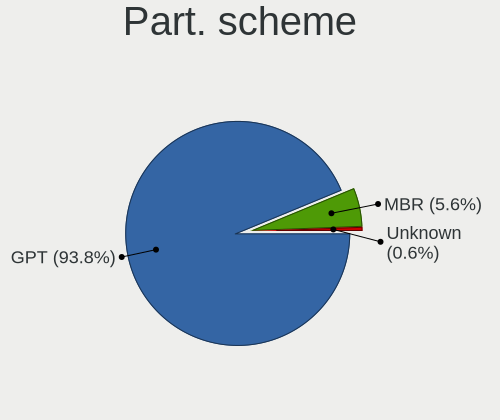

| Type    | Computers | Percent |
|---------|-----------|---------|
| GPT     | 210       | 87.87%  |
| MBR     | 27        | 11.3%   |
| Unknown | 2         | 0.84%   |

Board
-----

Vendor
------

Motherboard manufacturer

| Name                           | Computers | Percent |
|--------------------------------|-----------|---------|
| Dell                           | 31        | 12.97%  |
| Hewlett-Packard                | 29        | 12.13%  |
| ASUSTek Computer               | 27        | 11.3%   |
| Lenovo                         | 23        | 9.62%   |
| Supermicro                     | 17        | 7.11%   |
| Intel                          | 16        | 6.69%   |
| Gigabyte Technology            | 12        | 5.02%   |
| ASRock                         | 11        | 4.6%    |
| Unknown                        | 10        | 4.18%   |
| Protectli                      | 9         | 3.77%   |
| MSI                            | 8         | 3.35%   |
| PC Engines                     | 5         | 2.09%   |
| AWOW                           | 5         | 2.09%   |
| Apple                          | 4         | 1.67%   |
| AMI                            | 4         | 1.67%   |
| Acer                           | 4         | 1.67%   |
| Toshiba                        | 3         | 1.26%   |
| IBM                            | 3         | 1.26%   |
| ZOTAC                          | 2         | 0.84%   |
| Panasonic                      | 2         | 0.84%   |
| Matsushita Electric Industrial | 2         | 0.84%   |
| Sophos                         | 1         | 0.42%   |
| Shuttle                        | 1         | 0.42%   |
| SeeedStudio                    | 1         | 0.42%   |
| Raspberry Pi Foundation        | 1         | 0.42%   |
| Quanta                         | 1         | 0.42%   |
| LG Electronics                 | 1         | 0.42%   |
| HPE                            | 1         | 0.42%   |
| HARDKERNEL                     | 1         | 0.42%   |
| Fujitsu                        | 1         | 0.42%   |
| ASRockRack                     | 1         | 0.42%   |
| Alienware                      | 1         | 0.42%   |
| ADI Engineering                | 1         | 0.42%   |

Model
-----

Motherboard model

| Name                                        | Computers | Percent |
|---------------------------------------------|-----------|---------|
| Unknown                                     | 10        | 4.18%   |
| Intel Q3XXG4-P V1.0                         | 5         | 2.09%   |
| AWOW PC BOX                                 | 5         | 2.09%   |
| Supermicro Super Server                     | 4         | 1.67%   |
| Protectli FW6                               | 4         | 1.67%   |
| Protectli FW4B                              | 4         | 1.67%   |
| Intel NDISB533                              | 3         | 1.26%   |
| HP EliteDesk 800 G1 SFF                     | 3         | 1.26%   |
| Dell OptiPlex 9010                          | 3         | 1.26%   |
| Dell G5 5090                                | 3         | 1.26%   |
| ASUS All Series                             | 3         | 1.26%   |
| AMI Aptio CRB                               | 3         | 1.26%   |
| Supermicro X8STi                            | 2         | 0.84%   |
| PC Engines apu4                             | 2         | 0.84%   |
| PC Engines APU2                             | 2         | 0.84%   |
| Lenovo ThinkCentre M93p 10A8S16X0J          | 2         | 0.84%   |
| HP Z440 Workstation                         | 2         | 0.84%   |
| HP t730 Thin Client                         | 2         | 0.84%   |
| Dell Precision Tower 5810                   | 2         | 0.84%   |
| Dell OptiPlex 3020                          | 2         | 0.84%   |
| ASUS M5A97 PLUS                             | 2         | 0.84%   |
| ASRock H110M-DGS R3.0                       | 2         | 0.84%   |
| ASRock B450M Pro4                           | 2         | 0.84%   |
| ZOTAC ZBOX-CI341                            | 1         | 0.42%   |
| ZOTAC ZBOX-CI329NANO                        | 1         | 0.42%   |
| Toshiba TECRA Z40-B                         | 1         | 0.42%   |
| Toshiba Satellite U500                      | 1         | 0.42%   |
| Toshiba Satellite Pro T130                  | 1         | 0.42%   |
| Supermicro X8DTH-i/6/iF/6F                  | 1         | 0.42%   |
| Supermicro X8DT6                            | 1         | 0.42%   |
| Supermicro X7SPA-HF                         | 1         | 0.42%   |
| Supermicro X7SLA                            | 1         | 0.42%   |
| Supermicro X10SLH-N6-ST031                  | 1         | 0.42%   |
| Supermicro X10SLH-F/X10SLM+-F               | 1         | 0.42%   |
| Supermicro SYS-E300-9A                      | 1         | 0.42%   |
| Supermicro SYS-5019S-ML                     | 1         | 0.42%   |
| Supermicro SYS-5019D-FN8TP                  | 1         | 0.42%   |
| Supermicro SYS-5019A-FTN4                   | 1         | 0.42%   |
| Supermicro C7Z170-OCE                       | 1         | 0.42%   |
| Sophos SG                                   | 1         | 0.42%   |
| Shuttle DH110                               | 1         | 0.42%   |
| SeeedStudio ODYSSEY-X86J4105                | 1         | 0.42%   |
| RPi Raspberry Pi                            | 1         | 0.42%   |
| Quanta 120-1135                             | 1         | 0.42%   |
| Protectli FW6E                              | 1         | 0.42%   |
| PC Engines APU                              | 1         | 0.42%   |
| Panasonic CF-53AAGHYDM                      | 1         | 0.42%   |
| Panasonic CF-52PFPBSFQ                      | 1         | 0.42%   |
| MSI MS-7B79                                 | 1         | 0.42%   |
| MSI MS-7A40                                 | 1         | 0.42%   |
| MSI MS-7885                                 | 1         | 0.42%   |
| MSI MS-7846                                 | 1         | 0.42%   |
| MSI MS-7693                                 | 1         | 0.42%   |
| MSI MS-7522                                 | 1         | 0.42%   |
| MSI MS-7388                                 | 1         | 0.42%   |
| MSI MS-7250                                 | 1         | 0.42%   |
| Matsushita Electric Industrial CF-51RCVDNLM | 1         | 0.42%   |
| Matsushita Electric Industrial CF-48V4KNDQM | 1         | 0.42%   |
| LG E500-GP01A9                              | 1         | 0.42%   |
| Lenovo ThinkPad X280 20KF001UUS             | 1         | 0.42%   |

Model Family
------------

Motherboard model prefix

| Name                         | Computers | Percent |
|------------------------------|-----------|---------|
| Lenovo ThinkPad              | 14        | 5.86%   |
| Dell OptiPlex                | 12        | 5.02%   |
| Unknown                      | 10        | 4.18%   |
| Lenovo ThinkCentre           | 8         | 3.35%   |
| Dell PowerEdge               | 6         | 2.51%   |
| Intel Q3XXG4-P               | 5         | 2.09%   |
| HP ProDesk                   | 5         | 2.09%   |
| Dell Inspiron                | 5         | 2.09%   |
| AWOW PC                      | 5         | 2.09%   |
| Supermicro Super             | 4         | 1.67%   |
| Protectli FW6                | 4         | 1.67%   |
| Protectli FW4B               | 4         | 1.67%   |
| HP EliteDesk                 | 4         | 1.67%   |
| HP Compaq                    | 4         | 1.67%   |
| ASUS PRIME                   | 4         | 1.67%   |
| Intel NDISB533               | 3         | 1.26%   |
| HP ProLiant                  | 3         | 1.26%   |
| Dell Precision               | 3         | 1.26%   |
| Dell G5                      | 3         | 1.26%   |
| ASUS All                     | 3         | 1.26%   |
| AMI Aptio                    | 3         | 1.26%   |
| Acer Aspire                  | 3         | 1.26%   |
| Toshiba Satellite            | 2         | 0.84%   |
| Supermicro X8STi             | 2         | 0.84%   |
| PC Engines apu4              | 2         | 0.84%   |
| PC Engines APU2              | 2         | 0.84%   |
| IBM System                   | 2         | 0.84%   |
| HP Z440                      | 2         | 0.84%   |
| HP t730                      | 2         | 0.84%   |
| HP Pavilion                  | 2         | 0.84%   |
| ASUS TUF                     | 2         | 0.84%   |
| ASUS ROG                     | 2         | 0.84%   |
| ASUS M5A97                   | 2         | 0.84%   |
| ASRock H110M-DGS             | 2         | 0.84%   |
| ASRock B450M                 | 2         | 0.84%   |
| ZOTAC ZBOX-CI341             | 1         | 0.42%   |
| ZOTAC ZBOX-CI329NANO         | 1         | 0.42%   |
| Toshiba TECRA                | 1         | 0.42%   |
| Supermicro X8DTH-i           | 1         | 0.42%   |
| Supermicro X8DT6             | 1         | 0.42%   |
| Supermicro X7SPA-HF          | 1         | 0.42%   |
| Supermicro X7SLA             | 1         | 0.42%   |
| Supermicro X10SLH-N6-ST031   | 1         | 0.42%   |
| Supermicro X10SLH-F          | 1         | 0.42%   |
| Supermicro SYS-E300-9A       | 1         | 0.42%   |
| Supermicro SYS-5019S-ML      | 1         | 0.42%   |
| Supermicro SYS-5019D-FN8TP   | 1         | 0.42%   |
| Supermicro SYS-5019A-FTN4    | 1         | 0.42%   |
| Supermicro C7Z170-OCE        | 1         | 0.42%   |
| Sophos SG                    | 1         | 0.42%   |
| Shuttle DH110                | 1         | 0.42%   |
| SeeedStudio ODYSSEY-X86J4105 | 1         | 0.42%   |
| RPi Raspberry                | 1         | 0.42%   |
| Quanta 120-1135              | 1         | 0.42%   |
| Protectli FW6E               | 1         | 0.42%   |
| PC Engines APU               | 1         | 0.42%   |
| Panasonic CF-53AAGHYDM       | 1         | 0.42%   |
| Panasonic CF-52PFPBSFQ       | 1         | 0.42%   |
| MSI MS-7B79                  | 1         | 0.42%   |
| MSI MS-7A40                  | 1         | 0.42%   |

MFG Year
--------

Motherboard manufacture year

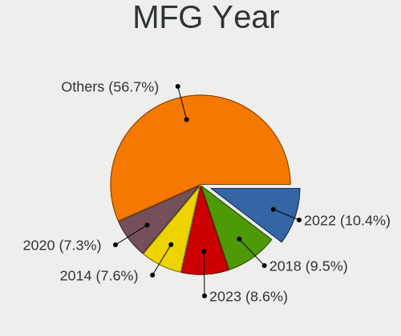

| Year    | Computers | Percent |
|---------|-----------|---------|
| 2018    | 40        | 16.74%  |
| 2020    | 35        | 14.64%  |
| 2014    | 26        | 10.88%  |
| 2019    | 18        | 7.53%   |
| 2010    | 17        | 7.11%   |
| 2015    | 15        | 6.28%   |
| 2016    | 14        | 5.86%   |
| 2013    | 14        | 5.86%   |
| 2011    | 12        | 5.02%   |
| 2009    | 10        | 4.18%   |
| 2017    | 9         | 3.77%   |
| 2012    | 8         | 3.35%   |
| 2021    | 7         | 2.93%   |
| 2008    | 4         | 1.67%   |
| 2022    | 3         | 1.26%   |
| Unknown | 3         | 1.26%   |
| 2006    | 2         | 0.84%   |
| 2007    | 1         | 0.42%   |
| 2002    | 1         | 0.42%   |

Form Factor
-----------

Physical design of the computer

| Name           | Computers | Percent |
|----------------|-----------|---------|
| Desktop        | 148       | 61.92%  |
| Notebook       | 44        | 18.41%  |
| Server         | 21        | 8.79%   |
| Mini pc        | 20        | 8.37%   |
| All in one     | 3         | 1.26%   |
| Firewall       | 2         | 0.84%   |
| System on chip | 1         | 0.42%   |

Coreboot
--------

Have coreboot on board

| Used | Computers | Percent |
|------|-----------|---------|
| No   | 232       | 97.07%  |
| Yes  | 7         | 2.93%   |

RAM Size
--------

Total RAM memory

| Size in GB      | Computers | Percent |
|-----------------|-----------|---------|
| 8.01-16.0       | 82        | 33.74%  |
| 16.01-24.0      | 48        | 19.75%  |
| 4.01-8.0        | 45        | 18.52%  |
| 32.01-64.0      | 29        | 11.93%  |
| 64.01-256.0     | 13        | 5.35%   |
| 2.01-3.0        | 9         | 3.7%    |
| 24.01-32.0      | 6         | 2.47%   |
| 3.01-4.0        | 5         | 2.06%   |
| 0.51-1.0        | 3         | 1.23%   |
| 1.01-2.0        | 2         | 0.82%   |
| More than 256.0 | 1         | 0.41%   |

RAM Used
--------

Used RAM memory

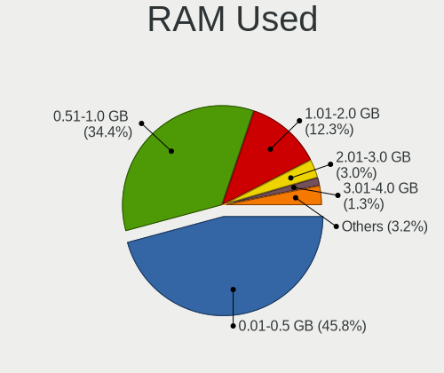

| Used GB     | Computers | Percent |
|-------------|-----------|---------|
| 0.01-0.5    | 116       | 46.96%  |
| 0.51-1.0    | 69        | 27.94%  |
| 1.01-2.0    | 31        | 12.55%  |
| 2.01-3.0    | 7         | 2.83%   |
| 4.01-8.0    | 6         | 2.43%   |
| 3.01-4.0    | 5         | 2.02%   |
| 0           | 4         | 1.62%   |
| 24.01-32.0  | 3         | 1.21%   |
| 64.01-256.0 | 2         | 0.81%   |
| 8.01-16.0   | 2         | 0.81%   |
| 32.01-64.0  | 1         | 0.4%    |
| Unknown     | 1         | 0.4%    |

Total Drives
------------

Number of drives on board

| Drives | Computers | Percent |
|--------|-----------|---------|
| 1      | 161       | 65.71%  |
| 2      | 38        | 15.51%  |
| 0      | 19        | 7.76%   |
| 3      | 11        | 4.49%   |
| 4      | 7         | 2.86%   |
| 7      | 2         | 0.82%   |
| 5      | 2         | 0.82%   |
| 40     | 1         | 0.41%   |
| 25     | 1         | 0.41%   |
| 14     | 1         | 0.41%   |
| 13     | 1         | 0.41%   |
| 10     | 1         | 0.41%   |

Has CD-ROM
----------

Has CD-ROM on board

| Presented | Computers | Percent |
|-----------|-----------|---------|
| No        | 184       | 76.03%  |
| Yes       | 58        | 23.97%  |

Has Ethernet
------------

Has Ethernet on board

| Presented | Computers | Percent |
|-----------|-----------|---------|
| Yes       | 235       | 98.33%  |
| No        | 4         | 1.67%   |

Has WiFi
--------

Has WiFi module

| Presented | Computers | Percent |
|-----------|-----------|---------|
| No        | 155       | 64.05%  |
| Yes       | 87        | 35.95%  |

Has Bluetooth
-------------

Has Bluetooth module

| Presented | Computers | Percent |
|-----------|-----------|---------|
| No        | 183       | 75.93%  |
| Yes       | 58        | 24.07%  |

Location
--------

Country
-------

Geographic location (country)

| Country | Computers | Percent |
|---------|-----------|---------|
| Canada  | 239       | 100%    |

City
----

Geographic location (city)

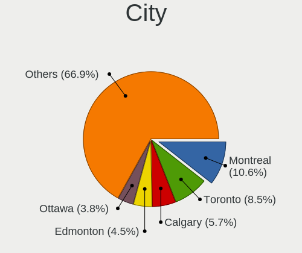

| City                       | Computers | Percent |
|----------------------------|-----------|---------|
| Montreal                   | 27        | 10.11%  |
| Toronto                    | 24        | 8.99%   |
| Ottawa                     | 14        | 5.24%   |
| Victoria                   | 13        | 4.87%   |
| Calgary                    | 12        | 4.49%   |
| Saint-Laurent              | 9         | 3.37%   |
| Edmonton                   | 9         | 3.37%   |
| Kitchener                  | 8         | 3%      |
| Winnipeg                   | 7         | 2.62%   |
| Vancouver                  | 7         | 2.62%   |
| Surrey                     | 7         | 2.62%   |
| Brampton                   | 7         | 2.62%   |
| Qubec                  | 6         | 2.25%   |
| Sainte-Julie               | 4         | 1.5%    |
| Moncton                    | 4         | 1.5%    |
| Gatineau                   | 4         | 1.5%    |
| Windsor                    | 3         | 1.12%   |
| St. Albert                 | 3         | 1.12%   |
| Sherwood Park              | 3         | 1.12%   |
| Regina                     | 3         | 1.12%   |
| Qubec                    | 3         | 1.12%   |
| Qubec                  | 3         | 1.12%   |
| Peterborough               | 3         | 1.12%   |
| Oakville                   | 3         | 1.12%   |
| Maple Ridge                | 3         | 1.12%   |
| Laval                      | 3         | 1.12%   |
| Hamilton                   | 3         | 1.12%   |
| Guelph                     | 3         | 1.12%   |
| Terrebonne                 | 2         | 0.75%   |
| Smiths Falls               | 2         | 0.75%   |
| Sarnia                     | 2         | 0.75%   |
| Saint-Bruno-de-Montarville | 2         | 0.75%   |
| Nanaimo                    | 2         | 0.75%   |
| London                     | 2         | 0.75%   |
| Lamont                     | 2         | 0.75%   |
| Kingston                   | 2         | 0.75%   |
| Kanata                     | 2         | 0.75%   |
| Greater Sudbury            | 2         | 0.75%   |
| Burlington                 | 2         | 0.75%   |
| West Kelowna               | 1         | 0.37%   |
| Wallaceburg                | 1         | 0.37%   |
| Vaughan                    | 1         | 0.37%   |
| Tobique First Nation       | 1         | 0.37%   |
| Stouffville                | 1         | 0.37%   |
| St. John's                 | 1         | 0.37%   |
| St. Catharines             | 1         | 0.37%   |
| Sherbrooke                 | 1         | 0.37%   |
| Sechelt                    | 1         | 0.37%   |
| Scarborough                | 1         | 0.37%   |
| Saskatoon                  | 1         | 0.37%   |
| Saint-Colomban             | 1         | 0.37%   |
| Richmond                   | 1         | 0.37%   |
| Renfrew                    | 1         | 0.37%   |
| Pont-Rouge                 | 1         | 0.37%   |
| Pierrefonds                | 1         | 0.37%   |
| Picton                     | 1         | 0.37%   |
| Perth                      | 1         | 0.37%   |
| North Vancouver            | 1         | 0.37%   |
| Niagara Falls              | 1         | 0.37%   |
| New-Richmond               | 1         | 0.37%   |

Drives
------

Drive Vendor
------------

Hard drive vendors

| Vendor              | Computers | Drives | Percent |
|---------------------|-----------|--------|---------|
| WDC                 | 51        | 128    | 18.02%  |
| Samsung Electronics | 43        | 65     | 15.19%  |
| Seagate             | 37        | 82     | 13.07%  |
| Kingston            | 25        | 30     | 8.83%   |
| Toshiba             | 13        | 18     | 4.59%   |
| Intel               | 13        | 16     | 4.59%   |
| Crucial             | 10        | 11     | 3.53%   |
| Hitachi             | 9         | 50     | 3.18%   |
| A-DATA Technology   | 9         | 17     | 3.18%   |
| Dogfish             | 7         | 12     | 2.47%   |
| SanDisk             | 6         | 9      | 2.12%   |
| SK hynix            | 5         | 7      | 1.77%   |
| OCZ                 | 5         | 7      | 1.77%   |
| FORESEE             | 5         | 15     | 1.77%   |
| Micron Technology   | 4         | 7      | 1.41%   |
| Hewlett-Packard     | 4         | 4      | 1.41%   |
| Transcend           | 3         | 4      | 1.06%   |
| Hoodisk             | 3         | 4      | 1.06%   |
| HGST                | 3         | 39     | 1.06%   |
| BIWIN               | 3         | 3      | 1.06%   |
| VisionTek           | 2         | 6      | 0.71%   |
| SPCC                | 2         | 2      | 0.71%   |
| PNY                 | 2         | 3      | 0.71%   |
| NVMe                | 2         | 2      | 0.71%   |
| Mushkin             | 2         | 2      | 0.71%   |
| Lexar               | 2         | 2      | 0.71%   |
| XPG                 | 1         | 1      | 0.35%   |
| SATADOM             | 1         | 2      | 0.35%   |
| Protectli           | 1         | 1      | 0.35%   |
| Phison              | 1         | 1      | 0.35%   |
| Netac               | 1         | 1      | 0.35%   |
| Kston               | 1         | 2      | 0.35%   |
| HPE                 | 1         | 4      | 0.35%   |
| Fujitsu             | 1         | 1      | 0.35%   |
| EAGET               | 1         | 1      | 0.35%   |
| Corsair             | 1         | 3      | 0.35%   |
| China               | 1         | 1      | 0.35%   |
| AVEXIR              | 1         | 2      | 0.35%   |
| Apacer              | 1         | 1      | 0.35%   |

Drive Model
-----------

Hard drive models

| Model                           | Computers | Percent |
|---------------------------------|-----------|---------|
| Kingston SA400S37120G 120GB     | 9         | 2.85%   |
| Kingston SA400S37240G 240GB     | 6         | 1.9%    |
| Seagate ST1000DM010-2EP102 1TB  | 5         | 1.58%   |
| Samsung SSD 860 EVO 500GB       | 5         | 1.58%   |
| FORESEE 128GB SSD               | 5         | 1.58%   |
| Samsung SSD 850 EVO 250GB       | 4         | 1.27%   |
| WDC WD20EZRX-00DC0B0 2TB        | 3         | 0.95%   |
| Toshiba DT01ACA100 1TB          | 3         | 0.95%   |
| Seagate ST500DM002-1BD142 500GB | 3         | 0.95%   |
| Seagate ST2000DM008-2FR102 2TB  | 3         | 0.95%   |
| Dogfish SSD 128GB               | 3         | 0.95%   |
| BIWIN SSD 128GB                 | 3         | 0.95%   |
| WDC WDS500G2B0A-00SM50 500GB    | 2         | 0.63%   |
| WDC WD7500BPKX-00HPJT0 752GB    | 2         | 0.63%   |
| WDC WD40EFRX-68WT0N0 4TB        | 2         | 0.63%   |
| WDC WD30EFRX-68EUZN0 3TB        | 2         | 0.63%   |
| WDC WD20EFRX-68EUZN0 2TB        | 2         | 0.63%   |
| WDC WD120EDAZ-11F3RA0 12TB      | 2         | 0.63%   |
| WDC WD10JPLX-00MBPT0 1TB        | 2         | 0.63%   |
| WDC WD10EZEX-22MFCA0 1TB        | 2         | 0.63%   |
| WDC WD10EZEX-08WN4A0 1TB        | 2         | 0.63%   |
| WDC PC SN520 NVMe 256GB         | 2         | 0.63%   |
| VisionTek mSATA 120GB           | 2         | 0.63%   |
| Transcend TS256GMSA230S 256GB   | 2         | 0.63%   |
| Toshiba MQ01ABD075 752GB        | 2         | 0.63%   |
| Seagate ST3500413AS 500GB       | 2         | 0.63%   |
| Seagate ST2000DM001-1ER164 2TB  | 2         | 0.63%   |
| SanDisk SD6SB1M064G1022I 64GB   | 2         | 0.63%   |
| Samsung SSD 980 PRO 1TB         | 2         | 0.63%   |
| Samsung SSD 970 EVO Plus 250GB  | 2         | 0.63%   |
| Samsung SSD 860 PRO 256GB       | 2         | 0.63%   |
| Samsung SSD 850 PRO 256GB       | 2         | 0.63%   |
| Samsung SSD 850 EVO 500GB       | 2         | 0.63%   |
| Samsung SSD 850 EVO 120GB       | 2         | 0.63%   |
| Samsung SSD 840 EVO 120GB       | 2         | 0.63%   |
| PNY CS1311 120GB SSD            | 2         | 0.63%   |
| Mushkin MKNSSDEC60GB 64GB       | 2         | 0.63%   |
| Kingston SUV500MS120G 120GB     | 2         | 0.63%   |
| Intel SSDSC2BB080G4 80GB        | 2         | 0.63%   |
| Intel SSDSA2CW120G3 120GB       | 2         | 0.63%   |
| Dogfish SSD 64GB                | 2         | 0.63%   |
| Crucial CT240BX500SSD1 240GB    | 2         | 0.63%   |
| A-DATA SU650 120GB              | 2         | 0.63%   |
| XPG GAMMIX S11 Pro 256GB        | 1         | 0.32%   |
| WDC WDS500G3X0C-00SJG0 500GB    | 1         | 0.32%   |
| WDC WDS500G2B0B-00YS70 500GB    | 1         | 0.32%   |
| WDC WDS500G2B0A 500GB           | 1         | 0.32%   |
| WDC WDS250G3X0C-00SJG0 250GB    | 1         | 0.32%   |
| WDC WDS250G2B0A 250GB           | 1         | 0.32%   |
| WDC WDS200T2B0A 2TB             | 1         | 0.32%   |
| WDC WDS120G2G0A-00JH30 120GB    | 1         | 0.32%   |
| WDC WDS100T3X0C-00SJG0 1TB      | 1         | 0.32%   |
| WDC WDS100T2B0A-00SM50 1TB      | 1         | 0.32%   |
| WDC WD7500BPKX-75HPJT0 752GB    | 1         | 0.32%   |
| WDC WD7500BPKT-75PK4T0 752GB    | 1         | 0.32%   |
| WDC WD7500BPKT-00PK4T0 752GB    | 1         | 0.32%   |
| WDC WD7500AAVS-00M4B0 752GB     | 1         | 0.32%   |
| WDC WD6400BEVT-22A0RT0 640GB    | 1         | 0.32%   |
| WDC WD6400AAKS-22A7B2 640GB     | 1         | 0.32%   |
| WDC WD6003FZBX-00K5WB0 6TB      | 1         | 0.32%   |

HDD Vendor
----------

Hard disk drive vendors

| Vendor              | Computers | Drives | Percent |
|---------------------|-----------|--------|---------|
| WDC                 | 39        | 108    | 37.14%  |
| Seagate             | 37        | 82     | 35.24%  |
| Toshiba             | 11        | 14     | 10.48%  |
| Hitachi             | 9         | 50     | 8.57%   |
| HGST                | 3         | 39     | 2.86%   |
| Hewlett-Packard     | 2         | 2      | 1.9%    |
| Samsung Electronics | 1         | 1      | 0.95%   |
| NVMe                | 1         | 1      | 0.95%   |
| Lexar               | 1         | 1      | 0.95%   |
| Fujitsu             | 1         | 1      | 0.95%   |

SSD Vendor
----------

Solid state drive vendors

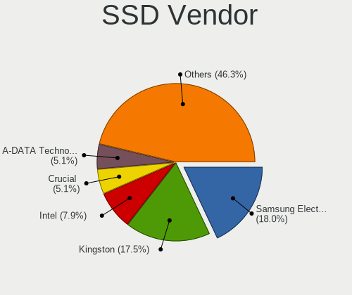

| Vendor              | Computers | Drives | Percent |
|---------------------|-----------|--------|---------|
| Samsung Electronics | 35        | 49     | 22.73%  |
| Kingston            | 25        | 29     | 16.23%  |
| Intel               | 11        | 14     | 7.14%   |
| WDC                 | 8         | 10     | 5.19%   |
| Crucial             | 8         | 9      | 5.19%   |
| A-DATA Technology   | 8         | 16     | 5.19%   |
| Dogfish             | 7         | 12     | 4.55%   |
| SanDisk             | 6         | 9      | 3.9%    |
| OCZ                 | 5         | 7      | 3.25%   |
| FORESEE             | 5         | 15     | 3.25%   |
| Micron Technology   | 4         | 7      | 2.6%    |
| Transcend           | 3         | 4      | 1.95%   |
| Hoodisk             | 3         | 4      | 1.95%   |
| BIWIN               | 3         | 3      | 1.95%   |
| VisionTek           | 2         | 6      | 1.3%    |
| SPCC                | 2         | 2      | 1.3%    |
| SK hynix            | 2         | 2      | 1.3%    |
| PNY                 | 2         | 3      | 1.3%    |
| Mushkin             | 2         | 2      | 1.3%    |
| Toshiba             | 1         | 1      | 0.65%   |
| SATADOM             | 1         | 2      | 0.65%   |
| Protectli           | 1         | 1      | 0.65%   |
| Phison              | 1         | 1      | 0.65%   |
| Netac               | 1         | 1      | 0.65%   |
| Lexar               | 1         | 1      | 0.65%   |
| Kston               | 1         | 2      | 0.65%   |
| HPE                 | 1         | 4      | 0.65%   |
| EAGET               | 1         | 1      | 0.65%   |
| Corsair             | 1         | 3      | 0.65%   |
| China               | 1         | 1      | 0.65%   |
| AVEXIR              | 1         | 2      | 0.65%   |
| Apacer              | 1         | 1      | 0.65%   |

Drive Kind
----------

HDD or SSD

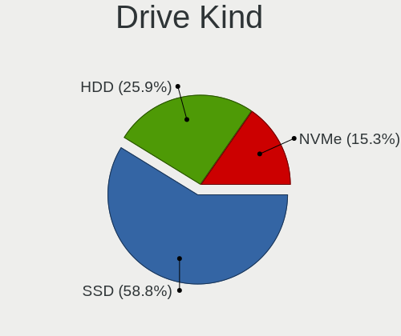

| Kind | Computers | Drives | Percent |
|------|-----------|--------|---------|
| SSD  | 141       | 224    | 54.86%  |
| HDD  | 89        | 299    | 34.63%  |
| NVMe | 27        | 43     | 10.51%  |

Drive Connector
---------------

SATA, SAS, NVMe, etc.

| Type | Computers | Drives | Percent |
|------|-----------|--------|---------|
| SATA | 209       | 523    | 88.56%  |
| NVMe | 27        | 43     | 11.44%  |

Drive Size
----------

Size of hard drive

| Size in TB | Computers | Drives | Percent |
|------------|-----------|--------|---------|
| 0.01-0.5   | 166       | 263    | 67.21%  |
| 0.51-1.0   | 43        | 77     | 17.41%  |
| 1.01-2.0   | 16        | 43     | 6.48%   |
| 3.01-4.0   | 7         | 54     | 2.83%   |
| 4.01-10.0  | 6         | 45     | 2.43%   |
| 2.01-3.0   | 5         | 23     | 2.02%   |
| 10.01-20.0 | 4         | 18     | 1.62%   |

Space Total
-----------

Amount of disk space available on the file system

| Size in GB     | Computers | Percent |
|----------------|-----------|---------|
| 101-250        | 92        | 36.65%  |
| 251-500        | 35        | 13.94%  |
| 1-20           | 35        | 13.94%  |
| 21-50          | 34        | 13.55%  |
| 51-100         | 30        | 11.95%  |
| 501-1000       | 15        | 5.98%   |
| 1001-2000      | 6         | 2.39%   |
| Unknown        | 3         | 1.2%    |
| More than 3000 | 1         | 0.4%    |

Space Used
----------

Amount of used disk space

| Used GB  | Computers | Percent |
|----------|-----------|---------|
| 1-20     | 212       | 85.14%  |
| 21-50    | 26        | 10.44%  |
| 51-100   | 5         | 2.01%   |
| Unknown  | 3         | 1.2%    |
| 251-500  | 1         | 0.4%    |
| 101-250  | 1         | 0.4%    |
| 501-1000 | 1         | 0.4%    |

Malfunc. Drives
---------------

Drive models with a malfunction

| Model                                      | Computers | Drives | Percent |
|--------------------------------------------|-----------|--------|---------|
| VisionTek mSATA 120GB                      | 2         | 6      | 4.76%   |
| Toshiba MQ01ABD075 752GB                   | 2         | 2      | 4.76%   |
| Seagate ST500DM002-1BD142 500GB            | 2         | 4      | 4.76%   |
| Seagate ST3500413AS 500GB                  | 2         | 4      | 4.76%   |
| WDC WDS200T2B0A 2TB                        | 1         | 1      | 2.38%   |
| WDC WD7500BPKX-00HPJT0 752GB               | 1         | 2      | 2.38%   |
| WDC WD6400BEVT-22A0RT0 640GB               | 1         | 1      | 2.38%   |
| WDC WD6400AAKS-22A7B2 640GB                | 1         | 1      | 2.38%   |
| WDC WD50EFRX-68L0BN1 5TB                   | 1         | 1      | 2.38%   |
| WDC WD40EFRX-68WT0N0 4TB                   | 1         | 2      | 2.38%   |
| WDC WD30EZRX-22D8PB0 3TB                   | 1         | 1      | 2.38%   |
| WDC WD2500AAKX-001CA0 250GB                | 1         | 1      | 2.38%   |
| Toshiba DT01ACA100 1TB                     | 1         | 3      | 2.38%   |
| Seagate ST9500420AS 500GB                  | 1         | 2      | 2.38%   |
| Seagate ST500LM021-1KJ152 500GB            | 1         | 1      | 2.38%   |
| Seagate ST3250318AS 250GB                  | 1         | 1      | 2.38%   |
| Seagate ST3200822AS 200GB                  | 1         | 1      | 2.38%   |
| Seagate ST3160815AS 160GB                  | 1         | 1      | 2.38%   |
| Seagate ST31500341AS 1.5TB                 | 1         | 2      | 2.38%   |
| Seagate ST3120026A 120GB                   | 1         | 1      | 2.38%   |
| Seagate ST31000520AS 1TB                   | 1         | 1      | 2.38%   |
| Seagate ST2000DL003-9VT166 2TB             | 1         | 4      | 2.38%   |
| Seagate ST1000DM003-1CH162 1TB             | 1         | 1      | 2.38%   |
| Samsung Electronics SSD 970 EVO 2TB        | 1         | 1      | 2.38%   |
| Samsung Electronics SSD 860 EVO 1TB        | 1         | 2      | 2.38%   |
| OCZ VERTEX 32GB                            | 1         | 3      | 2.38%   |
| Micron Technology M500_MTFDDAK960MAV 960GB | 1         | 4      | 2.38%   |
| Intel SSDSC2CW120A3 120GB                  | 1         | 1      | 2.38%   |
| Intel SSDSC2BB012T7 1.2TB                  | 1         | 2      | 2.38%   |
| Intel SSDSA2M080G2GC 80GB                  | 1         | 1      | 2.38%   |
| Hitachi HTS541612J9SA00 120GB              | 1         | 1      | 2.38%   |
| Hitachi HDT721064SLA360 640GB              | 1         | 1      | 2.38%   |
| Hitachi HDT721010SLA360 1TB                | 1         | 1      | 2.38%   |
| Hitachi HDS5C3030ALA630 3TB                | 1         | 14     | 2.38%   |
| HGST HTS541010A9E680 1TB                   | 1         | 1      | 2.38%   |
| Crucial CT240M500SSD1 240GB                | 1         | 1      | 2.38%   |
| Apacer 16GB SATA Flash Drive               | 1         | 1      | 2.38%   |
| A-DATA Technology SP550 480GB              | 1         | 3      | 2.38%   |

Malfunc. Drive Vendor
---------------------

Vendors of faulty drives

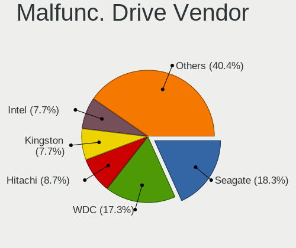

| Vendor              | Computers | Drives | Percent |
|---------------------|-----------|--------|---------|
| Seagate             | 13        | 23     | 32.5%   |
| WDC                 | 8         | 10     | 20%     |
| Hitachi             | 4         | 17     | 10%     |
| Toshiba             | 3         | 5      | 7.5%    |
| Intel               | 3         | 4      | 7.5%    |
| VisionTek           | 2         | 6      | 5%      |
| Samsung Electronics | 1         | 3      | 2.5%    |
| OCZ                 | 1         | 3      | 2.5%    |
| Micron Technology   | 1         | 4      | 2.5%    |
| HGST                | 1         | 1      | 2.5%    |
| Crucial             | 1         | 1      | 2.5%    |
| Apacer              | 1         | 1      | 2.5%    |
| A-DATA Technology   | 1         | 3      | 2.5%    |

Malfunc. HDD Vendor
-------------------

Vendors of faulty HDD drives

| Vendor  | Computers | Drives | Percent |
|---------|-----------|--------|---------|
| Seagate | 13        | 23     | 46.43%  |
| WDC     | 7         | 9      | 25%     |
| Hitachi | 4         | 17     | 14.29%  |
| Toshiba | 3         | 5      | 10.71%  |
| HGST    | 1         | 1      | 3.57%   |

Malfunc. Drive Kind
-------------------

Kinds of faulty drives

| Kind | Computers | Drives | Percent |
|------|-----------|--------|---------|
| HDD  | 26        | 55     | 66.67%  |
| SSD  | 12        | 25     | 30.77%  |
| NVMe | 1         | 1      | 2.56%   |

Failed Drives
-------------

Failed drive models

| Model                    | Computers | Drives | Percent |
|--------------------------|-----------|--------|---------|
| WDC WD10SPZX-00Z10T0 1TB | 1         | 1      | 100%    |

Failed Drive Vendor
-------------------

Failed drive vendors

| Vendor | Computers | Drives | Percent |
|--------|-----------|--------|---------|
| WDC    | 1         | 1      | 100%    |

Drive Status
------------

Number of failed and malfunc. drives

| Status   | Computers | Drives | Percent |
|----------|-----------|--------|---------|
| Works    | 194       | 476    | 80.83%  |
| Malfunc  | 37        | 81     | 15.42%  |
| Detected | 8         | 8      | 3.33%   |
| Failed   | 1         | 1      | 0.42%   |

Storage controller
------------------

Storage Vendor
--------------

Storage controller vendors

| Vendor                      | Computers | Percent |
|-----------------------------|-----------|---------|
| Intel                       | 190       | 65.97%  |
| AMD                         | 32        | 11.11%  |
| Samsung Electronics         | 12        | 4.17%   |
| Broadcom / LSI              | 12        | 4.17%   |
| SanDisk                     | 8         | 2.78%   |
| Nvidia                      | 6         | 2.08%   |
| ASMedia Technology          | 4         | 1.39%   |
| SK hynix                    | 3         | 1.04%   |
| Marvell Technology Group    | 3         | 1.04%   |
| Chelsio Communications      | 3         | 1.04%   |
| Silicon Motion              | 2         | 0.69%   |
| Silicon Image               | 2         | 0.69%   |
| Micron/Crucial Technology   | 2         | 0.69%   |
| JMicron Technology          | 2         | 0.69%   |
| Hewlett-Packard             | 2         | 0.69%   |
| Toshiba                     | 1         | 0.35%   |
| Realtek Semiconductor       | 1         | 0.35%   |
| Kingston Technology Company | 1         | 0.35%   |
| Dell                        | 1         | 0.35%   |
| ADATA Technology            | 1         | 0.35%   |

Storage Model
-------------

Storage controller models

| Model                                                                            | Computers | Percent |
|----------------------------------------------------------------------------------|-----------|---------|
| Intel 8 Series/C220 Series Chipset Family 6-port SATA Controller 1 [AHCI mode]   | 25        | 7.62%   |
| AMD FCH SATA Controller [AHCI mode]                                              | 16        | 4.88%   |
| Intel Sunrise Point-LP SATA Controller [AHCI mode]                               | 11        | 3.35%   |
| Intel Q170/Q150/B150/H170/H110/Z170/CM236 Chipset SATA Controller [AHCI Mode]    | 10        | 3.05%   |
| Intel Celeron N3350/Pentium N4200/Atom E3900 Series SATA AHCI Controller         | 9         | 2.74%   |
| Intel Wildcat Point-LP SATA Controller [AHCI Mode]                               | 8         | 2.44%   |
| Intel 7 Series/C210 Series Chipset Family 6-port SATA Controller [AHCI mode]     | 8         | 2.44%   |
| Samsung NVMe SSD Controller SM981/PM981/PM983                                    | 7         | 2.13%   |
| Intel 8 Series SATA Controller 1 [AHCI mode]                                     | 7         | 2.13%   |
| Intel 6 Series/C200 Series Chipset Family 6 port Desktop SATA AHCI Controller    | 7         | 2.13%   |
| AMD 400 Series Chipset SATA Controller                                           | 7         | 2.13%   |
| Intel Celeron/Pentium Silver Processor SATA Controller                           | 6         | 1.83%   |
| Intel Cannon Lake PCH SATA AHCI Controller                                       | 6         | 1.83%   |
| Intel Atom/Celeron/Pentium Processor x5-E8000/J3xxx/N3xxx Series SATA Controller | 6         | 1.83%   |
| Intel 82801JI (ICH10 Family) SATA AHCI Controller                                | 6         | 1.83%   |
| Intel 200 Series PCH SATA controller [AHCI mode]                                 | 6         | 1.83%   |
| AMD SB7x0/SB8x0/SB9x0 SATA Controller [AHCI mode]                                | 6         | 1.83%   |
| Intel 5 Series/3400 Series Chipset 6 port SATA AHCI Controller                   | 5         | 1.52%   |
| Intel Comet Lake SATA AHCI Controller                                            | 4         | 1.22%   |
| Intel C610/X99 series chipset 6-Port SATA Controller [AHCI mode]                 | 4         | 1.22%   |
| Intel 82801JI (ICH10 Family) 4 port SATA IDE Controller #1                       | 4         | 1.22%   |
| Intel 82801G (ICH7 Family) IDE Controller                                        | 4         | 1.22%   |
| Intel 6 Series/C200 Series Chipset Family 6 port Mobile SATA AHCI Controller     | 4         | 1.22%   |
| Broadcom / LSI SAS2008 PCI-Express Fusion-MPT SAS-2 [Falcon]                     | 4         | 1.22%   |
| SanDisk WD Black SN750 / PC SN730 NVMe SSD                                       | 3         | 0.91%   |
| SanDisk PC SN520 NVMe SSD                                                        | 3         | 0.91%   |
| Samsung NVMe SSD Controller PM9A1/PM9A3/980PRO                                   | 3         | 0.91%   |
| Intel NM10/ICH7 Family SATA Controller [IDE mode]                                | 3         | 0.91%   |
| Intel NM10/ICH7 Family SATA Controller [AHCI mode]                               | 3         | 0.91%   |
| Intel Atom Processor E3800 Series SATA AHCI Controller                           | 3         | 0.91%   |
| Intel 9 Series Chipset Family SATA Controller [AHCI Mode]                        | 3         | 0.91%   |
| Intel 82801JI (ICH10 Family) 2 port SATA IDE Controller #2                       | 3         | 0.91%   |
| ASMedia ASM1062 Serial ATA Controller                                            | 3         | 0.91%   |
| AMD FCH SATA Controller [IDE mode]                                               | 3         | 0.91%   |
| Silicon Image SiI 3114 [SATALink/SATARaid] Serial ATA Controller                 | 2         | 0.61%   |
| SanDisk WD Black 2018/SN750 / PC SN720 NVMe SSD                                  | 2         | 0.61%   |
| Samsung NVMe SSD Controller 980                                                  | 2         | 0.61%   |
| Nvidia MCP79 AHCI Controller                                                     | 2         | 0.61%   |
| Marvell Group 88SE9230 PCIe 2.0 x2 4-port SATA 6 Gb/s RAID Controller            | 2         | 0.61%   |
| JMicron JMB363 SATA/IDE Controller                                               | 2         | 0.61%   |
| Intel C610/X99 series chipset sSATA Controller [AHCI mode]                       | 2         | 0.61%   |
| Intel C600/X79 series chipset 6-Port SATA AHCI Controller                        | 2         | 0.61%   |
| Intel Atom Processor C3000 Series SATA Controller 1                              | 2         | 0.61%   |
| Intel Atom processor C2000 AHCI SATA3 Controller                                 | 2         | 0.61%   |
| Intel Atom processor C2000 AHCI SATA2 Controller                                 | 2         | 0.61%   |
| Intel 82801IR/IO/IH (ICH9R/DO/DH) 6 port SATA Controller [AHCI mode]             | 2         | 0.61%   |
| Intel 82801IBM/IEM (ICH9M/ICH9M-E) 4 port SATA Controller [AHCI mode]            | 2         | 0.61%   |
| Intel 82801IB (ICH9) 2 port SATA Controller [IDE mode]                           | 2         | 0.61%   |
| Intel 82801HM/HEM (ICH8M/ICH8M-E) SATA Controller [AHCI mode]                    | 2         | 0.61%   |
| Intel 82801HM/HEM (ICH8M/ICH8M-E) IDE Controller                                 | 2         | 0.61%   |
| Intel 82801GBM/GHM (ICH7-M Family) SATA Controller [IDE mode]                    | 2         | 0.61%   |
| Intel 82801 Mobile SATA Controller [RAID mode]                                   | 2         | 0.61%   |
| Intel 7 Series/C210 Series Chipset Family 4-port SATA Controller [IDE mode]      | 2         | 0.61%   |
| Intel 7 Series/C210 Series Chipset Family 2-port SATA Controller [IDE mode]      | 2         | 0.61%   |
| Intel 7 Series Chipset Family 6-port SATA Controller [AHCI mode]                 | 2         | 0.61%   |
| Intel 400 Series Chipset Family SATA AHCI Controller                             | 2         | 0.61%   |
| Chelsio T420-CR Unified Wire Storage Controller                                  | 2         | 0.61%   |
| Broadcom / LSI SAS1068E PCI-Express Fusion-MPT SAS                               | 2         | 0.61%   |
| Broadcom / LSI MegaRAID SAS 2208 [Thunderbolt]                                   | 2         | 0.61%   |
| Broadcom / LSI MegaRAID SAS 1078                                                 | 2         | 0.61%   |

Storage Kind
------------

Kind of storage controller (IDE, SATA, NVMe, SAS, ...)

| Kind | Computers | Percent |
|------|-----------|---------|
| SATA | 192       | 66.9%   |
| IDE  | 39        | 13.59%  |
| NVMe | 29        | 10.1%   |
| RAID | 16        | 5.57%   |
| SAS  | 6         | 2.09%   |
| SCSI | 5         | 1.74%   |

Processor
---------

CPU Vendor
----------

Processor vendors

| Vendor  | Computers | Percent |
|---------|-----------|---------|
| Intel   | 201       | 83.4%   |
| AMD     | 38        | 15.77%  |
| ARM     | 1         | 0.41%   |
| Unknown | 1         | 0.41%   |

CPU Model
---------

Processor models

| Model                                    | Computers | Percent |
|------------------------------------------|-----------|---------|
| Intel Core i5-4570 CPU @ 3.20GHz         | 5         | 2.05%   |
| Intel Celeron CPU J3455E @ 1.50GHz       | 5         | 2.05%   |
| Intel Celeron CPU J3160 @ 1.60GHz        | 5         | 2.05%   |
| Intel Core i5-7200U CPU @ 2.50GHz        | 4         | 1.64%   |
| Intel Core i5-6500 CPU @ 3.20GHz         | 4         | 1.64%   |
| Intel Core i5-4590 CPU @ 3.30GHz         | 4         | 1.64%   |
| Intel Core i5-3570 CPU @ 3.40GHz         | 4         | 1.64%   |
| Intel Core i5-2520M CPU @ 2.50GHz        | 4         | 1.64%   |
| AMD GX-412TC SOC                         | 4         | 1.64%   |
| Intel Pentium CPU G4560 @ 3.50GHz        | 3         | 1.23%   |
| Intel Core i7-9700K CPU @ 3.60GHz        | 3         | 1.23%   |
| Intel Core i7-3770 CPU @ 3.40GHz         | 3         | 1.23%   |
| Intel Core i5-4570TE CPU @ 2.70GHz       | 3         | 1.23%   |
| Intel Core i5 CPU M 520 @ 2.40GHz        | 3         | 1.23%   |
| Intel Celeron CPU J3455 @ 1.50GHz        | 3         | 1.23%   |
| Intel Celeron CPU J1900 @ 1.99GHz        | 3         | 1.23%   |
| Intel Xeon CPU E5645 @ 2.40GHz           | 2         | 0.82%   |
| Intel Xeon CPU E5-2660 v3 @ 2.60GHz      | 2         | 0.82%   |
| Intel Xeon CPU E3-1220 v3 @ 3.10GHz      | 2         | 0.82%   |
| Intel CPU Version                        | 2         | 0.82%   |
| Intel Core i7-7700 CPU @ 3.60GHz         | 2         | 0.82%   |
| Intel Core i7-4790K CPU @ 4.00GHz        | 2         | 0.82%   |
| Intel Core i5-8400 CPU @ 2.80GHz         | 2         | 0.82%   |
| Intel Core i5-8250U CPU @ 1.60GHz        | 2         | 0.82%   |
| Intel Core i5-6300U CPU @ 2.40GHz        | 2         | 0.82%   |
| Intel Core i5-5300U CPU @ 2.30GHz        | 2         | 0.82%   |
| Intel Core i5-5200U CPU @ 2.20GHz        | 2         | 0.82%   |
| Intel Core i5-4460 CPU @ 3.20GHz         | 2         | 0.82%   |
| Intel Core i5-3470T CPU @ 2.90GHz        | 2         | 0.82%   |
| Intel Core i5-10400 CPU @ 2.90GHz        | 2         | 0.82%   |
| Intel Core i3-5005U CPU @ 2.00GHz        | 2         | 0.82%   |
| Intel Core i3-4030U CPU @ 1.90GHz        | 2         | 0.82%   |
| Intel Core i3-4010U CPU @ 1.70GHz        | 2         | 0.82%   |
| Intel Celeron N4100 CPU @ 1.10GHz        | 2         | 0.82%   |
| Intel Celeron J4125 CPU @ 2.00GHz        | 2         | 0.82%   |
| Intel Celeron J4105 CPU @ 1.50GHz        | 2         | 0.82%   |
| AMD RX-427BB with AMD Radeon R7 Graphics | 2         | 0.82%   |
| AMD FX-8350 Eight-Core Processor         | 2         | 0.82%   |
| AMD FX-8320E Eight-Core Processor        | 2         | 0.82%   |
| AMD FX-4350 Quad-Core Processor          | 2         | 0.82%   |
| Intel Xeon D-2146NT CPU @ 2.30GHz        | 1         | 0.41%   |
| Intel Xeon CPU X5680 @ 3.33GHz           | 1         | 0.41%   |
| Intel Xeon CPU X5670 @ 2.93GHz           | 1         | 0.41%   |
| Intel Xeon CPU X5660 @ 2.80GHz           | 1         | 0.41%   |
| Intel Xeon CPU X5650 @ 2.67GHz           | 1         | 0.41%   |
| Intel Xeon CPU X5560 @ 2.80GHz           | 1         | 0.41%   |
| Intel Xeon CPU W3530 @ 2.80GHz           | 1         | 0.41%   |
| Intel Xeon CPU L5640 @ 2.27GHz           | 1         | 0.41%   |
| Intel Xeon CPU E5520 @ 2.27GHz           | 1         | 0.41%   |
| Intel Xeon CPU E5506 @ 2.13GHz           | 1         | 0.41%   |
| Intel Xeon CPU E5-2650 v2 @ 2.60GHz      | 1         | 0.41%   |
| Intel Xeon CPU E5-2630 0 @ 2.30GHz       | 1         | 0.41%   |
| Intel Xeon CPU E5-2620 0 @ 2.00GHz       | 1         | 0.41%   |
| Intel Xeon CPU E5-2450 v2 @ 2.50GHz      | 1         | 0.41%   |
| Intel Xeon CPU E5-1650 v3 @ 3.50GHz      | 1         | 0.41%   |
| Intel Xeon CPU E5-1620 v3 @ 3.50GHz      | 1         | 0.41%   |
| Intel Xeon CPU E5-1603 @ 2.80GHz         | 1         | 0.41%   |
| Intel Xeon CPU E3-1285L v4 @ 3.40GHz     | 1         | 0.41%   |
| Intel Xeon CPU E3-1275 v6 @ 3.80GHz      | 1         | 0.41%   |
| Intel Xeon CPU E3-1270 v3 @ 3.50GHz      | 1         | 0.41%   |

CPU Model Family
----------------

Processor model prefix

| Model                   | Computers | Percent |
|-------------------------|-----------|---------|
| Intel Core i5           | 63        | 26.03%  |
| Intel Xeon              | 32        | 13.22%  |
| Intel Celeron           | 26        | 10.74%  |
| Intel Core i7           | 24        | 9.92%   |
| Intel Core i3           | 22        | 9.09%   |
| Intel Atom              | 11        | 4.55%   |
| Other                   | 8         | 3.31%   |
| Intel Core 2 Duo        | 6         | 2.48%   |
| AMD FX                  | 6         | 2.48%   |
| Intel Pentium           | 5         | 2.07%   |
| AMD GX                  | 5         | 2.07%   |
| Intel Pentium Dual-Core | 3         | 1.24%   |
| AMD Ryzen 7             | 3         | 1.24%   |
| AMD Ryzen 5             | 3         | 1.24%   |
| AMD Athlon 64 X2        | 3         | 1.24%   |
| Intel Pentium 4         | 2         | 0.83%   |
| Intel Core 2 Quad       | 2         | 0.83%   |
| AMD Ryzen Embedded      | 2         | 0.83%   |
| AMD Ryzen 9             | 2         | 0.83%   |
| AMD Ryzen 5 PRO         | 2         | 0.83%   |
| AMD Ryzen 3             | 2         | 0.83%   |
| AMD Opteron             | 2         | 0.83%   |
| Intel Genuine           | 1         | 0.41%   |
| ARM Cortex              | 1         | 0.41%   |
| AMD Phenom II X6        | 1         | 0.41%   |
| AMD G                   | 1         | 0.41%   |
| AMD EPYC                | 1         | 0.41%   |
| AMD E                   | 1         | 0.41%   |
| AMD Athlon              | 1         | 0.41%   |
| AMD A6                  | 1         | 0.41%   |

CPU Cores
---------

Number of processor cores

| Number  | Computers | Percent |
|---------|-----------|---------|
| 4       | 103       | 42.74%  |
| 2       | 75        | 31.12%  |
| 8       | 17        | 7.05%   |
| 6       | 15        | 6.22%   |
| Unknown | 11        | 4.56%   |
| 12      | 9         | 3.73%   |
| 16      | 4         | 1.66%   |
| 10      | 2         | 0.83%   |
| 64      | 1         | 0.41%   |
| 32      | 1         | 0.41%   |
| 24      | 1         | 0.41%   |
| 11      | 1         | 0.41%   |
| 1       | 1         | 0.41%   |

CPU Sockets
-----------

Number of sockets

| Number  | Computers | Percent |
|---------|-----------|---------|
| 1       | 223       | 92.15%  |
| 2       | 13        | 5.37%   |
| Unknown | 6         | 2.48%   |

CPU Threads
-----------

Threads per core (Hyper-Threading)

| Number  | Computers | Percent |
|---------|-----------|---------|
| 1       | 116       | 48.33%  |
| 2       | 112       | 46.67%  |
| Unknown | 12        | 5%      |

CPU Microarch
-------------

Microarchitecture

| Name          | Computers | Percent |
|---------------|-----------|---------|
| Haswell       | 40        | 16.46%  |
| KabyLake      | 30        | 12.35%  |
| IvyBridge     | 18        | 7.41%   |
| Silvermont    | 12        | 4.94%   |
| SandyBridge   | 12        | 4.94%   |
| Westmere      | 11        | 4.53%   |
| Skylake       | 11        | 4.53%   |
| Penryn        | 11        | 4.53%   |
| Goldmont      | 11        | 4.53%   |
| Broadwell     | 11        | 4.53%   |
| Piledriver    | 8         | 3.29%   |
| Zen+          | 7         | 2.88%   |
| Goldmont plus | 7         | 2.88%   |
| Nehalem       | 6         | 2.47%   |
| CometLake     | 6         | 2.47%   |
| Bonnell       | 6         | 2.47%   |
| Unknown       | 6         | 2.47%   |
| Puma          | 4         | 1.65%   |
| Zen 2         | 3         | 1.23%   |
| Zen           | 3         | 1.23%   |
| K8 Hammer     | 3         | 1.23%   |
| Core          | 3         | 1.23%   |
| Zen 3         | 2         | 0.82%   |
| Steamroller   | 2         | 0.82%   |
| NetBurst      | 2         | 0.82%   |
| Jaguar        | 2         | 0.82%   |
| Bobcat        | 2         | 0.82%   |
| TigerLake     | 1         | 0.41%   |
| P6            | 1         | 0.41%   |
| K10           | 1         | 0.41%   |
| Excavator     | 1         | 0.41%   |

Graphics
--------

GPU Vendor
----------

Vendors of graphics cards

| Vendor                     | Computers | Percent |
|----------------------------|-----------|---------|
| Intel                      | 140       | 59.07%  |
| Nvidia                     | 38        | 16.03%  |
| AMD                        | 33        | 13.92%  |
| Matrox Electronics Systems | 15        | 6.33%   |
| ASPEED Technology          | 11        | 4.64%   |

GPU Model
---------

Graphics card models

| Model                                                                                    | Computers | Percent |
|------------------------------------------------------------------------------------------|-----------|---------|
| Intel Xeon E3-1200 v3/4th Gen Core Processor Integrated Graphics Controller              | 21        | 8.71%   |
| ASPEED Technology ASPEED Graphics Family                                                 | 11        | 4.56%   |
| Intel HD Graphics 500                                                                    | 9         | 3.73%   |
| Intel 2nd Generation Core Processor Family Integrated Graphics Controller                | 9         | 3.73%   |
| Matrox Electronics Systems MGA G200eW WPCM450                                            | 8         | 3.32%   |
| Intel HD Graphics 5500                                                                   | 8         | 3.32%   |
| Intel Haswell-ULT Integrated Graphics Controller                                         | 7         | 2.9%    |
| Intel GeminiLake [UHD Graphics 600]                                                      | 7         | 2.9%    |
| Intel Atom/Celeron/Pentium Processor x5-E8000/J3xxx/N3xxx Integrated Graphics Controller | 7         | 2.9%    |
| Intel Xeon E3-1200 v2/3rd Gen Core processor Graphics Controller                         | 6         | 2.49%   |
| Intel HD Graphics 620                                                                    | 6         | 2.49%   |
| Intel IvyBridge GT2 [HD Graphics 4000]                                                   | 5         | 2.07%   |
| Intel HD Graphics 530                                                                    | 5         | 2.07%   |
| Intel UHD Graphics 620                                                                   | 4         | 1.66%   |
| Intel HD Graphics 630                                                                    | 4         | 1.66%   |
| Intel 4 Series Chipset Integrated Graphics Controller                                    | 4         | 1.66%   |
| AMD Picasso/Raven 2 [Radeon Vega Series / Radeon Vega Mobile Series]                     | 4         | 1.66%   |
| Matrox Electronics Systems G200eR2                                                       | 3         | 1.24%   |
| Intel Skylake GT2 [HD Graphics 520]                                                      | 3         | 1.24%   |
| Intel Mobile 945GM/GMS/GME, 943/940GML Express Integrated Graphics Controller            | 3         | 1.24%   |
| Intel HD Graphics 610                                                                    | 3         | 1.24%   |
| Intel Core Processor Integrated Graphics Controller                                      | 3         | 1.24%   |
| Intel Atom Processor Z36xxx/Z37xxx Series Graphics & Display                             | 3         | 1.24%   |
| Nvidia GT218 [GeForce 8400 GS Rev. 3]                                                    | 2         | 0.83%   |
| Nvidia GP108 [GeForce GT 1030]                                                           | 2         | 0.83%   |
| Nvidia GP107 [GeForce GTX 1050 Ti]                                                       | 2         | 0.83%   |
| Nvidia GM107GL [Quadro K620]                                                             | 2         | 0.83%   |
| Nvidia GK208B [GeForce GT 710]                                                           | 2         | 0.83%   |
| Nvidia GF108 [GeForce GT 730]                                                            | 2         | 0.83%   |
| Matrox Electronics Systems MGA G200e [Pilot] ServerEngines (SEP1)                        | 2         | 0.83%   |
| Intel WhiskeyLake-U GT2 [UHD Graphics 620]                                               | 2         | 0.83%   |
| Intel Mobile 945GSE Express Integrated Graphics Controller                               | 2         | 0.83%   |
| Intel Mobile 4 Series Chipset Integrated Graphics Controller                             | 2         | 0.83%   |
| Intel CometLake-S GT2 [UHD Graphics 630]                                                 | 2         | 0.83%   |
| Intel CoffeeLake-S GT2 [UHD Graphics 630]                                                | 2         | 0.83%   |
| Intel 4th Generation Core Processor Family Integrated Graphics Controller                | 2         | 0.83%   |
| Intel 3rd Gen Core processor Graphics Controller                                         | 2         | 0.83%   |
| AMD RS780L [Radeon 3000]                                                                 | 2         | 0.83%   |
| AMD Raven Ridge [Radeon Vega Series / Radeon Vega Mobile Series]                         | 2         | 0.83%   |
| AMD Park [Mobility Radeon HD 5430]                                                       | 2         | 0.83%   |
| AMD Navi 10 [Radeon RX 5600 OEM/5600 XT / 5700/5700 XT]                                  | 2         | 0.83%   |
| AMD Kaveri [Radeon R7 Graphics]                                                          | 2         | 0.83%   |
| AMD ES1000                                                                               | 2         | 0.83%   |
| Nvidia TU116 [GeForce GTX 1660 Ti]                                                       | 1         | 0.41%   |
| Nvidia TU104 [GeForce RTX 2080 SUPER]                                                    | 1         | 0.41%   |
| Nvidia GT218M [NVS 3100M]                                                                | 1         | 0.41%   |
| Nvidia GT218 [GeForce 210]                                                               | 1         | 0.41%   |
| Nvidia GP107M [GeForce GTX 1050 Mobile]                                                  | 1         | 0.41%   |
| Nvidia GP106 [GeForce GTX 1060 6GB]                                                      | 1         | 0.41%   |
| Nvidia GM206 [GeForce GTX 950]                                                           | 1         | 0.41%   |
| Nvidia GM200 [GeForce GTX 980 Ti]                                                        | 1         | 0.41%   |
| Nvidia GM108M [GeForce MX110]                                                            | 1         | 0.41%   |
| Nvidia GK208B [GeForce GT 730]                                                           | 1         | 0.41%   |
| Nvidia GK107M [GeForce GTX 660M]                                                         | 1         | 0.41%   |
| Nvidia GK106M [GeForce GTX 765M]                                                         | 1         | 0.41%   |
| Nvidia GK106GL [Quadro K4000]                                                            | 1         | 0.41%   |
| Nvidia GK106 [GeForce GTX 660]                                                           | 1         | 0.41%   |
| Nvidia GK104 [GeForce GTX 760]                                                           | 1         | 0.41%   |
| Nvidia GF119M [GeForce GT 520M]                                                          | 1         | 0.41%   |
| Nvidia GF119 [NVS 315]                                                                   | 1         | 0.41%   |

GPU Combo
---------

Combinations of graphics cards

| Name           | Computers | Percent |
|----------------|-----------|---------|
| 1 x Intel      | 126       | 52.5%   |
| 1 x Nvidia     | 32        | 13.33%  |
| 1 x AMD        | 32        | 13.33%  |
| 1 x Matrox     | 15        | 6.25%   |
| Other          | 10        | 4.17%   |
| 1 x ASPEED     | 10        | 4.17%   |
| 2 x Intel      | 8         | 3.33%   |
| Intel + Nvidia | 6         | 2.5%    |
| AMD + ASPEED   | 1         | 0.42%   |

GPU Driver
----------

Free vs proprietary

| Driver      | Computers | Percent |
|-------------|-----------|---------|
| Free        | 208       | 86.31%  |
| Proprietary | 22        | 9.13%   |
| Unknown     | 11        | 4.56%   |

GPU Memory
----------

Total video memory

| Size in GB | Computers | Percent |
|------------|-----------|---------|
| Unknown    | 205       | 85.06%  |
| 1.01-2.0   | 10        | 4.15%   |
| 0.51-1.0   | 8         | 3.32%   |
| 3.01-4.0   | 6         | 2.49%   |
| 0.01-0.5   | 5         | 2.07%   |
| 7.01-8.0   | 3         | 1.24%   |
| 5.01-6.0   | 3         | 1.24%   |
| 2.01-3.0   | 1         | 0.41%   |

Monitor
-------

Monitor Vendor
--------------

Monitor vendors

| Vendor                  | Computers | Percent |
|-------------------------|-----------|---------|
| Goldstar                | 12        | 15.79%  |
| Dell                    | 9         | 11.84%  |
| Samsung Electronics     | 7         | 9.21%   |
| LG Display              | 5         | 6.58%   |
| Chimei Innolux          | 5         | 6.58%   |
| BenQ                    | 5         | 6.58%   |
| BOE                     | 4         | 5.26%   |
| AU Optronics            | 4         | 5.26%   |
| Lenovo                  | 3         | 3.95%   |
| Chi Mei Optoelectronics | 3         | 3.95%   |
| Sony                    | 2         | 2.63%   |
| Hewlett-Packard         | 2         | 2.63%   |
| Apple                   | 2         | 2.63%   |
| Ancor Communications    | 2         | 2.63%   |
| Acer                    | 2         | 2.63%   |
| ViewSonic               | 1         | 1.32%   |
| Videoseven              | 1         | 1.32%   |
| Toshiba                 | 1         | 1.32%   |
| RTK                     | 1         | 1.32%   |
| LTV                     | 1         | 1.32%   |
| LG Electronics          | 1         | 1.32%   |
| Insignia                | 1         | 1.32%   |
| ASUSTek Computer        | 1         | 1.32%   |
| AOC                     | 1         | 1.32%   |

Monitor Model
-------------

Monitor models

| Model                                                                     | Computers | Percent |
|---------------------------------------------------------------------------|-----------|---------|
| Sony LCD Monitor TV XV 1920x1080                                          | 2         | 2.5%    |
| Samsung Electronics LCD Monitor SAM7004 3840x2160 1210x680mm 54.6-inch    | 2         | 2.5%    |
| Goldstar LG FULL HD GSM5B55 1920x1080 480x270mm 21.7-inch                 | 2         | 2.5%    |
| ViewSonic LCD Monitor VSCFA2B 1920x1080 510x290mm 23.1-inch               | 1         | 1.25%   |
| Videoseven WL19A IGM1908 1280x1024 380x300mm 19.1-inch                    | 1         | 1.25%   |
| Toshiba LCD Monitor LCD0905 1366x768 290x170mm 13.2-inch                  | 1         | 1.25%   |
| Samsung Electronics SyncMaster SAM03E4 1680x1050 470x300mm 22.0-inch      | 1         | 1.25%   |
| Samsung Electronics LCD Monitor SEC3345 1280x800 330x210mm 15.4-inch      | 1         | 1.25%   |
| Samsung Electronics LCD Monitor SEC324C 1600x900 310x170mm 13.9-inch      | 1         | 1.25%   |
| Samsung Electronics LCD Monitor SEC304C 1366x768 350x200mm 15.9-inch      | 1         | 1.25%   |
| Samsung Electronics LCD Monitor SAM7002 3840x2160 1210x680mm 54.6-inch    | 1         | 1.25%   |
| RTK CPL AIO PC RTK2482 1920x1080 510x280mm 22.9-inch                      | 1         | 1.25%   |
| LTV LTV1280M1A LTV0A3C 1024x768 800x450mm 36.1-inch                       | 1         | 1.25%   |
| LG Electronics LCD Monitor LG Ultra HD 7680x2160                          | 1         | 1.25%   |
| LG Electronics LCD Monitor LG Ultra HD                                    | 1         | 1.25%   |
| LG Display LCD Monitor LGD0484 1366x768 340x190mm 15.3-inch               | 1         | 1.25%   |
| LG Display LCD Monitor LGD03CD 1366x768 280x160mm 12.7-inch               | 1         | 1.25%   |
| LG Display LCD Monitor LGD02E2 1600x900 310x170mm 13.9-inch               | 1         | 1.25%   |
| LG Display LCD Monitor LGD021D 1600x900 380x210mm 17.1-inch               | 1         | 1.25%   |
| LG Display LCD Monitor LGD0215 1920x1080 350x190mm 15.7-inch              | 1         | 1.25%   |
| Lenovo LEN S24e-10 LEN61CA 1920x1080 530x300mm 24.0-inch                  | 1         | 1.25%   |
| Lenovo LCD Monitor LEN40B1 1600x900 340x190mm 15.3-inch                   | 1         | 1.25%   |
| Lenovo LCD Monitor LEN4035 1280x800 300x190mm 14.0-inch                   | 1         | 1.25%   |
| Insignia LCD Monitor BBY0050 1920x1080 700x400mm 31.7-inch                | 1         | 1.25%   |
| Hewlett-Packard LCD Monitor HWP4218 1600x900 440x250mm 19.9-inch          | 1         | 1.25%   |
| Hewlett-Packard 24fw HPN3545 1920x1080 530x300mm 24.0-inch                | 1         | 1.25%   |
| Goldstar W2442 GSM56D9 1920x1080 530x300mm 24.0-inch                      | 1         | 1.25%   |
| Goldstar W2052 GSM4E88 1680x1050 470x300mm 22.0-inch                      | 1         | 1.25%   |
| Goldstar MP59G GSM5B35 1920x1080 600x340mm 27.2-inch                      | 1         | 1.25%   |
| Goldstar MP59G GSM5B34 1920x1080 480x270mm 21.7-inch                      | 1         | 1.25%   |
| Goldstar LG ULTRAWIDE GSM5AE2 3440x1440 800x340mm 34.2-inch               | 1         | 1.25%   |
| Goldstar LG ULTRAWIDE GSM59F1 2560x1080 670x280mm 28.6-inch               | 1         | 1.25%   |
| Goldstar LG HDR WFHD GSM7714 2560x1080 800x340mm 34.2-inch                | 1         | 1.25%   |
| Goldstar LG HDR 4K GSM7706 3840x2160 600x340mm 27.2-inch                  | 1         | 1.25%   |
| Goldstar LG FULL HD GSM5ABA 1920x1080 480x270mm 21.7-inch                 | 1         | 1.25%   |
| Goldstar LCD Monitor GSM76F5 1920x1080 700x390mm 31.5-inch                | 1         | 1.25%   |
| Goldstar L1920P GSM4A7B 1280x1024 380x300mm 19.1-inch                     | 1         | 1.25%   |
| Goldstar 27GL850 GSM5B7F 2560x1440 600x340mm 27.2-inch                    | 1         | 1.25%   |
| Dell U3415W DELA0AA 3440x1440 800x330mm 34.1-inch                         | 1         | 1.25%   |
| Dell U2713HM DEL407E 2560x1440 600x340mm 27.2-inch                        | 1         | 1.25%   |
| Dell S2721QS DELA198 3840x2160 600x340mm 27.2-inch                        | 1         | 1.25%   |
| Dell P3222QE DEL4246 3840x2160 700x390mm 31.5-inch                        | 1         | 1.25%   |
| Dell P2715Q DEL40BD 3840x2160 600x340mm 27.2-inch                         | 1         | 1.25%   |
| Dell P2311H DEL4067 1920x1080 510x290mm 23.1-inch                         | 1         | 1.25%   |
| Dell P2219H DELA114 1920x1080 480x270mm 21.7-inch                         | 1         | 1.25%   |
| Dell LCD Monitor DEL9400 1920x1080 510x290mm 23.1-inch                    | 1         | 1.25%   |
| Dell 2001FP DELA008 1600x1200 410x310mm 20.2-inch                         | 1         | 1.25%   |
| Chimei Innolux LCD Monitor CMN15F4 1920x1080 340x190mm 15.3-inch          | 1         | 1.25%   |
| Chimei Innolux LCD Monitor CMN14B7 1366x768 310x170mm 13.9-inch           | 1         | 1.25%   |
| Chimei Innolux LCD Monitor CMN14B1 1920x1080 310x170mm 13.9-inch          | 1         | 1.25%   |
| Chimei Innolux LCD Monitor CMN1482 1600x900 310x170mm 13.9-inch           | 1         | 1.25%   |
| Chimei Innolux LCD Monitor CMN1367 1920x1080 290x170mm 13.2-inch          | 1         | 1.25%   |
| Chi Mei Optoelectronics LCD Monitor CMO1720 1920x1080 380x210mm 17.1-inch | 1         | 1.25%   |
| Chi Mei Optoelectronics LCD Monitor CMO1333 1366x768 290x160mm 13.0-inch  | 1         | 1.25%   |
| Chi Mei Optoelectronics LCD Monitor CMO1312 1280x800 290x180mm 13.4-inch  | 1         | 1.25%   |
| BOE LCD Monitor BOE0817 1366x768 340x190mm 15.3-inch                      | 1         | 1.25%   |
| BOE LCD Monitor BOE07C9 1920x1080 300x170mm 13.6-inch                     | 1         | 1.25%   |
| BOE LCD Monitor BOE0742 1920x1080 310x170mm 13.9-inch                     | 1         | 1.25%   |
| BOE LCD Monitor BOE06C2 1366x768 340x190mm 15.3-inch                      | 1         | 1.25%   |
| BenQ XL2430T BNQ7F3D 1920x1080 530x300mm 24.0-inch                        | 1         | 1.25%   |

Monitor Resolution
------------------

Monitor screen resolution

| Resolution         | Computers | Percent |
|--------------------|-----------|---------|
| 1920x1080 (FHD)    | 31        | 41.33%  |
| 1366x768 (WXGA)    | 10        | 13.33%  |
| 3840x2160 (4K)     | 7         | 9.33%   |
| 1600x900 (HD+)     | 6         | 8%      |
| 1280x800 (WXGA)    | 3         | 4%      |
| 3440x1440          | 2         | 2.67%   |
| 2560x1440 (QHD)    | 2         | 2.67%   |
| 2560x1080          | 2         | 2.67%   |
| 1680x1050 (WSXGA+) | 2         | 2.67%   |
| 1280x1024 (SXGA)   | 2         | 2.67%   |
| Unknown            | 2         | 2.67%   |
| 7680x2160          | 1         | 1.33%   |
| 1920x1200 (WUXGA)  | 1         | 1.33%   |
| 1600x1200          | 1         | 1.33%   |
| 1440x900 (WXGA+)   | 1         | 1.33%   |
| 1280x854           | 1         | 1.33%   |
| 1024x768 (XGA)     | 1         | 1.33%   |

Monitor Diagonal
----------------

Diagonal size in inches

| Inches  | Computers | Percent |
|---------|-----------|---------|
| 13      | 12        | 15.58%  |
| 15      | 10        | 12.99%  |
| 27      | 8         | 10.39%  |
| 24      | 8         | 10.39%  |
| 21      | 6         | 7.79%   |
| 23      | 4         | 5.19%   |
| 19      | 4         | 5.19%   |
| Unknown | 4         | 5.19%   |
| 54      | 3         | 3.9%    |
| 34      | 3         | 3.9%    |
| 22      | 3         | 3.9%    |
| 12      | 3         | 3.9%    |
| 31      | 2         | 2.6%    |
| 17      | 2         | 2.6%    |
| 36      | 1         | 1.3%    |
| 28      | 1         | 1.3%    |
| 20      | 1         | 1.3%    |
| 18      | 1         | 1.3%    |
| 14      | 1         | 1.3%    |

Monitor Width
-------------

Physical width

| Width in mm | Computers | Percent |
|-------------|-----------|---------|
| 501-600     | 20        | 26.32%  |
| 301-350     | 17        | 22.37%  |
| 401-500     | 12        | 15.79%  |
| 201-300     | 9         | 11.84%  |
| 701-800     | 4         | 5.26%   |
| 351-400     | 4         | 5.26%   |
| Unknown     | 4         | 5.26%   |
| 601-700     | 3         | 3.95%   |
| 1001-1500   | 3         | 3.95%   |

Aspect Ratio
------------

Proportional relationship between the width and the height

| Ratio   | Computers | Percent |
|---------|-----------|---------|
| 16/9    | 55        | 74.32%  |
| 16/10   | 7         | 9.46%   |
| 21/9    | 4         | 5.41%   |
| Unknown | 4         | 5.41%   |
| 5/4     | 2         | 2.7%    |
| 4/3     | 1         | 1.35%   |
| 3/2     | 1         | 1.35%   |

Monitor Area
------------

Area in inch

| Area in inch | Computers | Percent |
|----------------|-----------|---------|
| 201-250        | 19        | 25%     |
| 81-90          | 9         | 11.84%  |
| 301-350        | 8         | 10.53%  |
| 351-500        | 5         | 6.58%   |
| 151-200        | 5         | 6.58%   |
| 101-110        | 5         | 6.58%   |
| 91-100         | 5         | 6.58%   |
| 71-80          | 4         | 5.26%   |
| Unknown        | 4         | 5.26%   |
| More than 1000 | 3         | 3.95%   |
| 61-70          | 3         | 3.95%   |
| 251-300        | 2         | 2.63%   |
| 121-130        | 2         | 2.63%   |
| 141-150        | 1         | 1.32%   |
| 501-1000       | 1         | 1.32%   |

Pixel Density
-------------

Pixels per inch

| Density | Computers | Percent |
|---------|-----------|---------|
| 51-100  | 32        | 41.56%  |
| 101-120 | 20        | 25.97%  |
| 121-160 | 14        | 18.18%  |
| 161-240 | 6         | 7.79%   |
| Unknown | 4         | 5.19%   |
| 1-50    | 1         | 1.3%    |

Multiple Monitors
-----------------

Total monitors connected

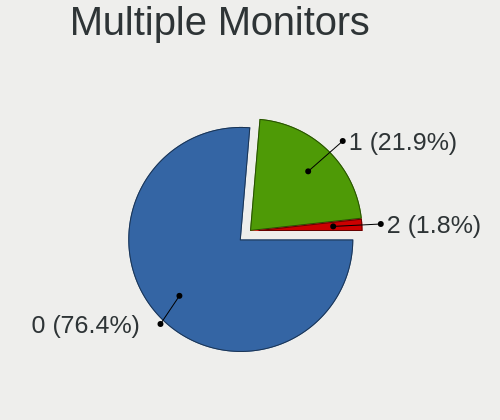

| Total | Computers | Percent |
|-------|-----------|---------|
| 0     | 160       | 66.12%  |
| 1     | 73        | 30.17%  |
| 2     | 9         | 3.72%   |

Network
-------

Net Controller Vendor
---------------------

Controller vendors

| Vendor                            | Computers | Percent |
|-----------------------------------|-----------|---------|
| Intel                             | 178       | 51.59%  |
| Realtek Semiconductor             | 92        | 26.67%  |
| Broadcom                          | 27        | 7.83%   |
| Qualcomm Atheros                  | 20        | 5.8%    |
| Chelsio Communications            | 5         | 1.45%   |
| Marvell Technology Group          | 3         | 0.87%   |
| Ralink                            | 2         | 0.58%   |
| Nvidia                            | 2         | 0.58%   |
| IBM                               | 2         | 0.58%   |
| TP-Link                           | 1         | 0.29%   |
| Solarflare Communications         | 1         | 0.29%   |
| Ralink Technology                 | 1         | 0.29%   |
| Qualcomm Atheros Communications   | 1         | 0.29%   |
| QLogic                            | 1         | 0.29%   |
| MediaTek                          | 1         | 0.29%   |
| JMicron Technology                | 1         | 0.29%   |
| Insyde Software                   | 1         | 0.29%   |
| IMC Networks                      | 1         | 0.29%   |
| Google                            | 1         | 0.29%   |
| Ericsson Business Mobile Networks | 1         | 0.29%   |
| D-Link System                     | 1         | 0.29%   |
| Apple                             | 1         | 0.29%   |
| 3Com                              | 1         | 0.29%   |

Net Controller Model
--------------------

Controller models

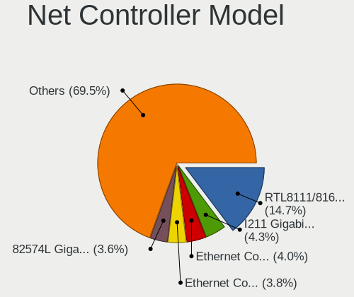

| Model                                                                         | Computers | Percent |
|-------------------------------------------------------------------------------|-----------|---------|
| Realtek RTL8111/8168/8411 PCI Express Gigabit Ethernet Controller             | 75        | 17.28%  |
| Intel I211 Gigabit Network Connection                                         | 23        | 5.3%    |
| Intel 82574L Gigabit Network Connection                                       | 17        | 3.92%   |
| Intel Ethernet Connection I217-LM                                             | 16        | 3.69%   |
| Intel I350 Gigabit Network Connection                                         | 14        | 3.23%   |
| Intel I210 Gigabit Network Connection                                         | 14        | 3.23%   |
| Intel 82579LM Gigabit Network Connection (Lewisville)                         | 14        | 3.23%   |
| Intel Wireless 7265                                                           | 9         | 2.07%   |
| Realtek RTL810xE PCI Express Fast Ethernet controller                         | 8         | 1.84%   |
| Intel 82580 Gigabit Network Connection                                        | 8         | 1.84%   |
| Intel 82571EB/82571GB Gigabit Ethernet Controller D0/D1 (copper applications) | 8         | 1.84%   |
| Broadcom NetXtreme II BCM57810 10 Gigabit Ethernet                            | 7         | 1.61%   |
| Intel Centrino Advanced-N 6205 [Taylor Peak]                                  | 6         | 1.38%   |
| Intel 82583V Gigabit Network Connection                                       | 6         | 1.38%   |
| Intel 82576 Gigabit Network Connection                                        | 6         | 1.38%   |
| Realtek RTL8125 2.5GbE Controller                                             | 5         | 1.15%   |
| Intel Wireless 7260                                                           | 5         | 1.15%   |
| Intel Wi-Fi 6 AX200                                                           | 5         | 1.15%   |
| Broadcom NetXtreme II BCM5709 Gigabit Ethernet                                | 5         | 1.15%   |
| Intel 82577LM Gigabit Network Connection                                      | 4         | 0.92%   |
| Realtek Killer E2500 Gigabit Ethernet Controller                              | 3         | 0.69%   |
| Qualcomm Atheros AR9485 Wireless Network Adapter                              | 3         | 0.69%   |
| Intel Wireless 8265 / 8275                                                    | 3         | 0.69%   |
| Intel Wireless 8260                                                           | 3         | 0.69%   |
| Intel Wireless 3165                                                           | 3         | 0.69%   |
| Intel Ethernet Controller 10-Gigabit X540-AT2                                 | 3         | 0.69%   |
| Intel Ethernet Connection (3) I218-V                                          | 3         | 0.69%   |
| Intel Ethernet Connection (2) I219-V                                          | 3         | 0.69%   |
| Intel Ethernet Connection (2) I219-LM                                         | 3         | 0.69%   |
| Intel Dual Band Wireless-AC 3168NGW [Stone Peak]                              | 3         | 0.69%   |
| Intel Centrino Advanced-N 6200                                                | 3         | 0.69%   |
| Intel 82599ES 10-Gigabit SFI/SFP+ Network Connection                          | 3         | 0.69%   |
| Intel 82575GB Gigabit Network Connection                                      | 3         | 0.69%   |
| Intel 82571EB/82571GB Gigabit Ethernet Controller (Copper)                    | 3         | 0.69%   |
| Broadcom NetXtreme BCM5720 Gigabit Ethernet PCIe                              | 3         | 0.69%   |
| Broadcom BCM4322 802.11a/b/g/n Wireless LAN Controller                        | 3         | 0.69%   |
| Qualcomm Atheros Killer E220x Gigabit Ethernet Controller                     | 2         | 0.46%   |
| Qualcomm Atheros AR928X Wireless Network Adapter (PCI-Express)                | 2         | 0.46%   |
| Qualcomm Atheros AR9285 Wireless Network Adapter (PCI-Express)                | 2         | 0.46%   |
| Qualcomm Atheros AR8151 v2.0 Gigabit Ethernet                                 | 2         | 0.46%   |
| Qualcomm Atheros AR8132 Fast Ethernet                                         | 2         | 0.46%   |
| Qualcomm Atheros AR8121/AR8113/AR8114 Gigabit or Fast Ethernet                | 2         | 0.46%   |
| Qualcomm Atheros AR242x / AR542x Wireless Network Adapter (PCI-Express)       | 2         | 0.46%   |
| Nvidia MCP79 Ethernet                                                         | 2         | 0.46%   |
| Intel NM10/ICH7 Family LAN Controller                                         | 2         | 0.46%   |
| Intel Ethernet Controller X550                                                | 2         | 0.46%   |
| Intel Ethernet Connection I354                                                | 2         | 0.46%   |
| Intel Ethernet Connection I219-LM                                             | 2         | 0.46%   |
| Intel Ethernet Connection I217-V                                              | 2         | 0.46%   |
| Intel Ethernet Connection (5) I219-LM                                         | 2         | 0.46%   |
| Intel Ethernet Connection (4) I219-LM                                         | 2         | 0.46%   |
| Intel Ethernet Connection (2) I218-V                                          | 2         | 0.46%   |
| Intel Ethernet Connection (2) I218-LM                                         | 2         | 0.46%   |
| Intel Ethernet Connection (11) I219-LM                                        | 2         | 0.46%   |
| Intel Comet Lake PCH-LP CNVi WiFi                                             | 2         | 0.46%   |
| Intel Cannon Point-LP CNVi [Wireless-AC]                                      | 2         | 0.46%   |
| Intel Cannon Lake PCH CNVi WiFi                                               | 2         | 0.46%   |
| Intel 82572EI Gigabit Ethernet Controller (Copper)                            | 2         | 0.46%   |
| Intel 82541PI Gigabit Ethernet Controller                                     | 2         | 0.46%   |
| IBM IBM USB Remote NDIS Network Device                                        | 2         | 0.46%   |

Wireless Vendor
---------------

Wireless vendors

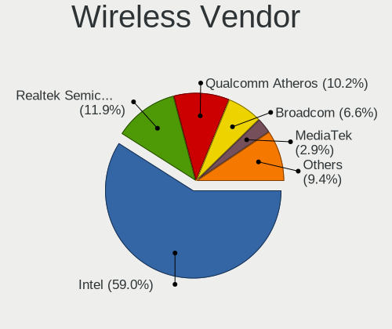

| Vendor                          | Computers | Percent |
|---------------------------------|-----------|---------|
| Intel                           | 56        | 62.92%  |
| Qualcomm Atheros                | 15        | 16.85%  |
| Broadcom                        | 6         | 6.74%   |
| Realtek Semiconductor           | 5         | 5.62%   |
| Ralink                          | 2         | 2.25%   |
| TP-Link                         | 1         | 1.12%   |
| Ralink Technology               | 1         | 1.12%   |
| Qualcomm Atheros Communications | 1         | 1.12%   |
| MediaTek                        | 1         | 1.12%   |
| IMC Networks                    | 1         | 1.12%   |

Wireless Model
--------------

Wireless models

| Model                                                                   | Computers | Percent |
|-------------------------------------------------------------------------|-----------|---------|
| Intel Wireless 7265                                                     | 9         | 10%     |
| Intel Centrino Advanced-N 6205 [Taylor Peak]                            | 6         | 6.67%   |
| Intel Wireless 7260                                                     | 5         | 5.56%   |
| Intel Wi-Fi 6 AX200                                                     | 5         | 5.56%   |
| Qualcomm Atheros AR9485 Wireless Network Adapter                        | 3         | 3.33%   |
| Intel Wireless 8265 / 8275                                              | 3         | 3.33%   |
| Intel Wireless 8260                                                     | 3         | 3.33%   |
| Intel Wireless 3165                                                     | 3         | 3.33%   |
| Intel Dual Band Wireless-AC 3168NGW [Stone Peak]                        | 3         | 3.33%   |
| Intel Centrino Advanced-N 6200                                          | 3         | 3.33%   |
| Broadcom BCM4322 802.11a/b/g/n Wireless LAN Controller                  | 3         | 3.33%   |
| Qualcomm Atheros AR928X Wireless Network Adapter (PCI-Express)          | 2         | 2.22%   |
| Qualcomm Atheros AR9285 Wireless Network Adapter (PCI-Express)          | 2         | 2.22%   |
| Qualcomm Atheros AR242x / AR542x Wireless Network Adapter (PCI-Express) | 2         | 2.22%   |
| Intel Comet Lake PCH-LP CNVi WiFi                                       | 2         | 2.22%   |
| Intel Cannon Point-LP CNVi [Wireless-AC]                                | 2         | 2.22%   |
| Intel Cannon Lake PCH CNVi WiFi                                         | 2         | 2.22%   |
| TP-Link RTL8812AU Archer T4U 802.11ac                                   | 1         | 1.11%   |
| Realtek RTL8822BE 802.11a/b/g/n/ac WiFi adapter                         | 1         | 1.11%   |
| Realtek RTL8812AE 802.11ac PCIe Wireless Network Adapter                | 1         | 1.11%   |
| Realtek RTL8723BE PCIe Wireless Network Adapter                         | 1         | 1.11%   |
| Realtek RTL8723AE PCIe Wireless Network Adapter                         | 1         | 1.11%   |
| Realtek RTL8192EE PCIe Wireless Network Adapter                         | 1         | 1.11%   |
| Ralink RT2870/RT3070 Wireless Adapter                                   | 1         | 1.11%   |
| Ralink RT5592 PCIe Wireless Network Adapter                             | 1         | 1.11%   |
| Ralink RT3062 Wireless 802.11n 2T/2R                                    | 1         | 1.11%   |
| Qualcomm Atheros QCA9565 / AR9565 Wireless Network Adapter              | 1         | 1.11%   |
| Qualcomm Atheros QCA9377 802.11ac Wireless Network Adapter              | 1         | 1.11%   |
| Qualcomm Atheros AR9271 802.11n                                         | 1         | 1.11%   |
| Qualcomm Atheros AR958x 802.11abgn Wireless Network Adapter             | 1         | 1.11%   |
| Qualcomm Atheros AR9462 Wireless Network Adapter                        | 1         | 1.11%   |
| Qualcomm Atheros AR93xx Wireless Network Adapter                        | 1         | 1.11%   |
| Qualcomm Atheros AR9287 Wireless Network Adapter (PCI-Express)          | 1         | 1.11%   |
| Qualcomm Atheros AR5212 802.11abg NIC                                   | 1         | 1.11%   |
| MediaTek MT7921K (RZ608) Wi-Fi 6E 80MHz                                 | 1         | 1.11%   |
| Intel Wireless-AC 9260                                                  | 1         | 1.11%   |
| Intel Wireless 3160                                                     | 1         | 1.11%   |
| Intel PRO/Wireless 4965 AG or AGN [Kedron] Network Connection           | 1         | 1.11%   |
| Intel PRO/Wireless 3945ABG [Golan] Network Connection                   | 1         | 1.11%   |
| Intel Gemini Lake PCH CNVi WiFi                                         | 1         | 1.11%   |
| Intel Centrino Wireless-N 105                                           | 1         | 1.11%   |
| Intel Centrino Wireless-N 1000 [Condor Peak]                            | 1         | 1.11%   |
| Intel Centrino Wireless-N 100                                           | 1         | 1.11%   |
| Intel Centrino Advanced-N + WiMAX 6250 [Kilmer Peak]                    | 1         | 1.11%   |
| Intel Alder Lake-S PCH CNVi WiFi                                        | 1         | 1.11%   |
| IMC Networks 802.11 n/g/b Wireless LAN USB Mini-Card                    | 1         | 1.11%   |
| Broadcom BCM4321 802.11b/g/n                                            | 1         | 1.11%   |
| Broadcom BCM4312 802.11b/g LP-PHY                                       | 1         | 1.11%   |
| Broadcom BCM4306 802.11b/g Wireless LAN Controller                      | 1         | 1.11%   |

Ethernet Vendor
---------------

Ethernet vendors

| Vendor                    | Computers | Percent |
|---------------------------|-----------|---------|
| Intel                     | 150       | 52.26%  |
| Realtek Semiconductor     | 92        | 32.06%  |
| Broadcom                  | 21        | 7.32%   |
| Qualcomm Atheros          | 8         | 2.79%   |
| Marvell Technology Group  | 3         | 1.05%   |
| Chelsio Communications    | 3         | 1.05%   |
| Nvidia                    | 2         | 0.7%    |
| Solarflare Communications | 1         | 0.35%   |
| QLogic                    | 1         | 0.35%   |
| JMicron Technology        | 1         | 0.35%   |
| Insyde Software           | 1         | 0.35%   |
| Google                    | 1         | 0.35%   |
| D-Link System             | 1         | 0.35%   |
| Apple                     | 1         | 0.35%   |
| 3Com                      | 1         | 0.35%   |

Ethernet Model
--------------

Ethernet models

| Model                                                                         | Computers | Percent |
|-------------------------------------------------------------------------------|-----------|---------|
| Realtek RTL8111/8168/8411 PCI Express Gigabit Ethernet Controller             | 75        | 22.39%  |
| Intel I211 Gigabit Network Connection                                         | 23        | 6.87%   |
| Intel 82574L Gigabit Network Connection                                       | 17        | 5.07%   |
| Intel Ethernet Connection I217-LM                                             | 16        | 4.78%   |
| Intel I350 Gigabit Network Connection                                         | 14        | 4.18%   |
| Intel I210 Gigabit Network Connection                                         | 14        | 4.18%   |
| Intel 82579LM Gigabit Network Connection (Lewisville)                         | 14        | 4.18%   |
| Realtek RTL810xE PCI Express Fast Ethernet controller                         | 8         | 2.39%   |
| Intel 82580 Gigabit Network Connection                                        | 8         | 2.39%   |
| Intel 82571EB/82571GB Gigabit Ethernet Controller D0/D1 (copper applications) | 8         | 2.39%   |
| Broadcom NetXtreme II BCM57810 10 Gigabit Ethernet                            | 7         | 2.09%   |
| Intel 82583V Gigabit Network Connection                                       | 6         | 1.79%   |
| Intel 82576 Gigabit Network Connection                                        | 6         | 1.79%   |
| Realtek RTL8125 2.5GbE Controller                                             | 5         | 1.49%   |
| Broadcom NetXtreme II BCM5709 Gigabit Ethernet                                | 5         | 1.49%   |
| Intel 82577LM Gigabit Network Connection                                      | 4         | 1.19%   |
| Realtek Killer E2500 Gigabit Ethernet Controller                              | 3         | 0.9%    |
| Intel Ethernet Controller 10-Gigabit X540-AT2                                 | 3         | 0.9%    |
| Intel Ethernet Connection (3) I218-V                                          | 3         | 0.9%    |
| Intel Ethernet Connection (2) I219-V                                          | 3         | 0.9%    |
| Intel Ethernet Connection (2) I219-LM                                         | 3         | 0.9%    |
| Intel 82599ES 10-Gigabit SFI/SFP+ Network Connection                          | 3         | 0.9%    |
| Intel 82575GB Gigabit Network Connection                                      | 3         | 0.9%    |
| Intel 82571EB/82571GB Gigabit Ethernet Controller (Copper)                    | 3         | 0.9%    |
| Broadcom NetXtreme BCM5720 Gigabit Ethernet PCIe                              | 3         | 0.9%    |
| Qualcomm Atheros Killer E220x Gigabit Ethernet Controller                     | 2         | 0.6%    |
| Qualcomm Atheros AR8151 v2.0 Gigabit Ethernet                                 | 2         | 0.6%    |
| Qualcomm Atheros AR8132 Fast Ethernet                                         | 2         | 0.6%    |
| Qualcomm Atheros AR8121/AR8113/AR8114 Gigabit or Fast Ethernet                | 2         | 0.6%    |
| Nvidia MCP79 Ethernet                                                         | 2         | 0.6%    |
| Intel NM10/ICH7 Family LAN Controller                                         | 2         | 0.6%    |
| Intel Ethernet Controller X550                                                | 2         | 0.6%    |
| Intel Ethernet Connection I354                                                | 2         | 0.6%    |
| Intel Ethernet Connection I219-LM                                             | 2         | 0.6%    |
| Intel Ethernet Connection I217-V                                              | 2         | 0.6%    |
| Intel Ethernet Connection (5) I219-LM                                         | 2         | 0.6%    |
| Intel Ethernet Connection (4) I219-LM                                         | 2         | 0.6%    |
| Intel Ethernet Connection (2) I218-V                                          | 2         | 0.6%    |
| Intel Ethernet Connection (2) I218-LM                                         | 2         | 0.6%    |
| Intel Ethernet Connection (11) I219-LM                                        | 2         | 0.6%    |
| Intel 82572EI Gigabit Ethernet Controller (Copper)                            | 2         | 0.6%    |
| Intel 82541PI Gigabit Ethernet Controller                                     | 2         | 0.6%    |
| Chelsio T420-CR Unified Wire Ethernet Controller                              | 2         | 0.6%    |
| Broadcom NetXtreme BCM5719 Gigabit Ethernet PCIe                              | 2         | 0.6%    |
| Solarflare SFC9020 10G Ethernet Controller                                    | 1         | 0.3%    |
| Realtek RTL8169 PCI Gigabit Ethernet Controller                               | 1         | 0.3%    |
| Realtek RTL-8100/8101L/8139 PCI Fast Ethernet Adapter                         | 1         | 0.3%    |
| QLogic ISP4032-based Ethernet IPv6 NIC                                        | 1         | 0.3%    |
| Marvell Group 88E8057 PCI-E Gigabit Ethernet Controller                       | 1         | 0.3%    |
| Marvell Group 88E8056 PCI-E Gigabit Ethernet Controller                       | 1         | 0.3%    |
| Marvell Group 88E8053 PCI-E Gigabit Ethernet Controller                       | 1         | 0.3%    |
| JMicron JMC250 PCI Express Gigabit Ethernet Controller                        | 1         | 0.3%    |
| Intel I350 Gigabit Fiber Network Connection                                   | 1         | 0.3%    |
| Intel Ethernet Controller I225-V                                              | 1         | 0.3%    |
| Intel Ethernet Connection X722 for 10GbE SFP+                                 | 1         | 0.3%    |
| Intel Ethernet Connection X722 for 10GBASE-T                                  | 1         | 0.3%    |
| Intel Ethernet Connection X553/X557-AT 10GBASE-T                              | 1         | 0.3%    |
| Intel Ethernet Connection X553 1GbE                                           | 1         | 0.3%    |
| Intel Ethernet Connection X553 10 GbE SFP+                                    | 1         | 0.3%    |
| Intel Ethernet Connection X552/X557-AT 10GBASE-T                              | 1         | 0.3%    |

Net Controller Kind
-------------------

Ethernet, WiFi or modem

| Kind     | Computers | Percent |
|----------|-----------|---------|
| Ethernet | 235       | 71%     |
| WiFi     | 87        | 26.28%  |
| Unknown  | 7         | 2.11%   |
| Modem    | 2         | 0.6%    |

Used Controller
---------------

Currently used network controller

| Kind     | Computers | Percent |
|----------|-----------|---------|
| Ethernet | 223       | 81.39%  |
| WiFi     | 51        | 18.61%  |

NICs
----

Total network controllers on board

| Total | Computers | Percent |
|-------|-----------|---------|
| 2     | 95        | 38.93%  |
| 3     | 34        | 13.93%  |
| 1     | 34        | 13.93%  |
| 4     | 28        | 11.48%  |
| 5     | 22        | 9.02%   |
| 6     | 14        | 5.74%   |
| 7     | 6         | 2.46%   |
| 8     | 5         | 2.05%   |
| 0     | 2         | 0.82%   |
| 14    | 1         | 0.41%   |
| 12    | 1         | 0.41%   |
| 10    | 1         | 0.41%   |
| 9     | 1         | 0.41%   |

IPv6
----

IPv6 vs IPv4

| Used | Computers | Percent |
|------|-----------|---------|
| No   | 218       | 87.9%   |
| Yes  | 30        | 12.1%   |

Bluetooth
---------

Bluetooth Vendor
----------------

Controller vendors

| Vendor                          | Computers | Percent |
|---------------------------------|-----------|---------|
| Intel                           | 32        | 55.17%  |
| Cambridge Silicon Radio         | 5         | 8.62%   |
| Qualcomm Atheros Communications | 3         | 5.17%   |
| Broadcom                        | 3         | 5.17%   |
| Apple                           | 3         | 5.17%   |
| Realtek Semiconductor           | 2         | 3.45%   |
| IMC Networks                    | 2         | 3.45%   |
| Foxconn / Hon Hai               | 2         | 3.45%   |
| Alps Electric                   | 2         | 3.45%   |
| Toshiba                         | 1         | 1.72%   |
| MediaTek                        | 1         | 1.72%   |
| Hewlett-Packard                 | 1         | 1.72%   |
| ASUSTek Computer                | 1         | 1.72%   |

Bluetooth Model
---------------

Controller models

| Model                                                       | Computers | Percent |
|-------------------------------------------------------------|-----------|---------|
| Intel Bluetooth wireless interface                          | 15        | 25.86%  |
| Intel AX200 Bluetooth                                       | 6         | 10.34%  |
| Intel Bluetooth 9460/9560 Jefferson Peak (JfP)              | 5         | 8.62%   |
| Cambridge Silicon Radio Bluetooth Dongle (HCI mode)         | 5         | 8.62%   |
| Intel Wireless-AC 3168 Bluetooth                            | 3         | 5.17%   |
| Broadcom BCM2045B (BDC-2.1)                                 | 3         | 5.17%   |
| Intel AX201 Bluetooth                                       | 2         | 3.45%   |
| Apple Built-in Bluetooth 2.0+EDR HCI                        | 2         | 3.45%   |
| Alps Electric UGTZ4 Bluetooth                               | 2         | 3.45%   |
| Toshiba ASKEY Bluetooth Controller BTU1030                  | 1         | 1.72%   |
| Realtek  Bluetooth 4.2 Adapter                              | 1         | 1.72%   |
| Realtek  Bluetooth 4.0 Adapter                              | 1         | 1.72%   |
| Qualcomm Atheros Dell Wireless 1707 Bluetooth 4.0 LE Device | 1         | 1.72%   |
| Qualcomm Atheros AR3012 Bluetooth 4.0                       | 1         | 1.72%   |
| Qualcomm Atheros AR3011 Bluetooth (no firmware)             | 1         | 1.72%   |
| MediaTek Wireless_Device                                    | 1         | 1.72%   |
| Intel Wireless-AC 9260 Bluetooth Adapter                    | 1         | 1.72%   |
| IMC Networks Bluetooth                                      | 1         | 1.72%   |
| IMC Networks Atheros AR3012 Bluetooth 4.0 Adapter           | 1         | 1.72%   |
| HP Bluetooth 2.0 Interface [Broadcom BCM2045]               | 1         | 1.72%   |
| Foxconn / Hon Hai Broadcom BCM20702 Bluetooth USB Device    | 1         | 1.72%   |
| Foxconn / Hon Hai Bluetooth USB Module                      | 1         | 1.72%   |
| ASUS Broadcom Bluetooth 2.1                                 | 1         | 1.72%   |
| Apple Bluetooth Host Controller                             | 1         | 1.72%   |

Sound
-----

Sound Vendor
------------

Sound card vendors

| Vendor              | Computers | Percent |
|---------------------|-----------|---------|
| Intel               | 147       | 65.04%  |
| AMD                 | 35        | 15.49%  |
| Nvidia              | 32        | 14.16%  |
| C-Media Electronics | 4         | 1.77%   |
| Texas Instruments   | 2         | 0.88%   |
| Logitech            | 2         | 0.88%   |
| Yamaha              | 1         | 0.44%   |
| XMOS                | 1         | 0.44%   |
| SteelSeries ApS     | 1         | 0.44%   |
| Creative Labs       | 1         | 0.44%   |

Sound Model
-----------

Sound card models

| Model                                                                                                     | Computers | Percent |
|-----------------------------------------------------------------------------------------------------------|-----------|---------|
| Intel Xeon E3-1200 v3/4th Gen Core Processor HD Audio Controller                                          | 21        | 7.66%   |
| Intel 8 Series/C220 Series Chipset High Definition Audio Controller                                       | 19        | 6.93%   |
| Intel 6 Series/C200 Series Chipset Family High Definition Audio Controller                                | 12        | 4.38%   |
| Intel Sunrise Point-LP HD Audio                                                                           | 10        | 3.65%   |
| Intel 7 Series/C216 Chipset Family High Definition Audio Controller                                       | 10        | 3.65%   |
| Intel Wildcat Point-LP High Definition Audio Controller                                                   | 8         | 2.92%   |
| Intel Broadwell-U Audio Controller                                                                        | 8         | 2.92%   |
| Intel Celeron N3350/Pentium N4200/Atom E3900 Series Audio Cluster                                         | 7         | 2.55%   |
| Intel 8 Series HD Audio Controller                                                                        | 7         | 2.55%   |
| Intel 100 Series/C230 Series Chipset Family HD Audio Controller                                           | 7         | 2.55%   |
| AMD SBx00 Azalia (Intel HDA)                                                                              | 7         | 2.55%   |
| Intel Haswell-ULT HD Audio Controller                                                                     | 6         | 2.19%   |
| Intel Celeron/Pentium Silver Processor High Definition Audio                                              | 6         | 2.19%   |
| Intel Cannon Lake PCH cAVS                                                                                | 6         | 2.19%   |
| Intel 5 Series/3400 Series Chipset High Definition Audio                                                  | 6         | 2.19%   |
| Intel 200 Series PCH HD Audio                                                                             | 6         | 2.19%   |
| AMD Raven/Raven2/Fenghuang HDMI/DP Audio Controller                                                       | 6         | 2.19%   |
| AMD Family 17h/19h HD Audio Controller                                                                    | 6         | 2.19%   |
| Intel Atom/Celeron/Pentium Processor x5-E8000/J3xxx/N3xxx Series High Definition Audio Controller         | 5         | 1.82%   |
| Nvidia High Definition Audio Controller                                                                   | 4         | 1.46%   |
| Intel NM10/ICH7 Family High Definition Audio Controller                                                   | 4         | 1.46%   |
| Intel C610/X99 series chipset HD Audio Controller                                                         | 4         | 1.46%   |
| AMD FCH Azalia Controller                                                                                 | 4         | 1.46%   |
| AMD Family 17h (Models 00h-0fh) HD Audio Controller                                                       | 4         | 1.46%   |
| Nvidia GK208 HDMI/DP Audio Controller                                                                     | 3         | 1.09%   |
| Nvidia GF108 High Definition Audio Controller                                                             | 3         | 1.09%   |
| Intel Comet Lake PCH-V cAVS                                                                               | 3         | 1.09%   |
| Intel 9 Series Chipset Family HD Audio Controller                                                         | 3         | 1.09%   |
| Intel 82801JI (ICH10 Family) HD Audio Controller                                                          | 3         | 1.09%   |
| Intel 82801I (ICH9 Family) HD Audio Controller                                                            | 3         | 1.09%   |
| Nvidia MCP79 High Definition Audio                                                                        | 2         | 0.73%   |
| Nvidia GP108 High Definition Audio Controller                                                             | 2         | 0.73%   |
| Nvidia GP107GL High Definition Audio Controller                                                           | 2         | 0.73%   |
| Nvidia GM107 High Definition Audio Controller [GeForce 940MX]                                             | 2         | 0.73%   |
| Nvidia GK106 HDMI Audio Controller                                                                        | 2         | 0.73%   |
| Nvidia GF119 HDMI Audio Controller                                                                        | 2         | 0.73%   |
| Intel Comet Lake PCH-LP cAVS                                                                              | 2         | 0.73%   |
| Intel Cannon Point-LP High Definition Audio Controller                                                    | 2         | 0.73%   |
| Intel C600/X79 series chipset High Definition Audio Controller                                            | 2         | 0.73%   |
| Intel Atom Processor Z36xxx/Z37xxx Series High Definition Audio Controller                                | 2         | 0.73%   |
| Intel 82801H (ICH8 Family) HD Audio Controller                                                            | 2         | 0.73%   |
| AMD Starship/Matisse HD Audio Controller                                                                  | 2         | 0.73%   |
| AMD RV710/730 HDMI Audio [Radeon HD 4000 series]                                                          | 2         | 0.73%   |
| AMD Renoir Radeon High Definition Audio Controller                                                        | 2         | 0.73%   |
| AMD Navi 10 HDMI Audio                                                                                    | 2         | 0.73%   |
| AMD Kaveri HDMI/DP Audio Controller                                                                       | 2         | 0.73%   |
| AMD Kabini HDMI/DP Audio                                                                                  | 2         | 0.73%   |
| AMD Cedar HDMI Audio [Radeon HD 5400/6300/7300 Series]                                                    | 2         | 0.73%   |
| AMD Baffin HDMI/DP Audio [Radeon RX 550 640SP / RX 560/560X]                                              | 2         | 0.73%   |
| Yamaha Steinberg UR22mkII                                                                                 | 1         | 0.36%   |
| XMOS retrieving string failed                                                                             | 1         | 0.36%   |
| XMOS iFi (by AMR) HD USB Audio                                                                            | 1         | 0.36%   |
| Texas Instruments PCM2902 Audio Codec                                                                     | 1         | 0.36%   |
| Texas Instruments PCM2704 16-bit stereo audio DAC                                                         | 1         | 0.36%   |
| SteelSeries ApS Arctis Pro Wireless Arctis Pro Wireless Chat Arctis Pro Wireless Game Arctis Pro Wireless | 1         | 0.36%   |
| Nvidia TU116 High Definition Audio Controller                                                             | 1         | 0.36%   |
| Nvidia TU104 HD Audio Controller                                                                          | 1         | 0.36%   |
| Nvidia MCP73 High Definition Audio                                                                        | 1         | 0.36%   |
| Nvidia MCP61 High Definition Audio                                                                        | 1         | 0.36%   |
| Nvidia MCP55 High Definition Audio                                                                        | 1         | 0.36%   |

Memory
------

Memory Vendor
-------------

Memory module vendors

| Vendor              | Computers | Percent |
|---------------------|-----------|---------|
| SK hynix            | 46        | 17.49%  |
| Samsung Electronics | 44        | 16.73%  |
| Kingston            | 38        | 14.45%  |
| Unknown             | 35        | 13.31%  |
| Corsair             | 20        | 7.6%    |
| Micron Technology   | 19        | 7.22%   |
| G.Skill             | 14        | 5.32%   |
| Crucial             | 14        | 5.32%   |
| Unknown (ABCD)      | 6         | 2.28%   |
| Apacer              | 4         | 1.52%   |
| Team                | 3         | 1.14%   |
| Ramaxel Technology  | 3         | 1.14%   |
| Patriot             | 3         | 1.14%   |
| A-DATA Technology   | 3         | 1.14%   |
| TIMETEC             | 2         | 0.76%   |
| Nanya Technology    | 2         | 0.76%   |
| V-Color             | 1         | 0.38%   |
| Transcend           | 1         | 0.38%   |
| Toshiba             | 1         | 0.38%   |
| Teikon              | 1         | 0.38%   |
| OCZ                 | 1         | 0.38%   |
| Cors                | 1         | 0.38%   |
| Avant               | 1         | 0.38%   |

Memory Model
------------

Memory module models

| Model                                                             | Computers | Percent |
|-------------------------------------------------------------------|-----------|---------|
| Unknown                                                           | 35        | 12.41%  |
| Unknown (ABCD) RAM 123456789012345678 1536MB DIMM LPDDR3 2400MT/s | 6         | 2.13%   |
| Samsung RAM M471B5273DH0-CH9 4GB SODIMM DDR3 1334MT/s             | 4         | 1.42%   |
| Samsung RAM M378B1G73DB0-CK0 8GB DIMM DDR3 1600MT/s               | 4         | 1.42%   |
| Crucial RAM CT102464BF160B.C16 8GB SODIMM DDR3 1600MT/s           | 4         | 1.42%   |
| SK hynix RAM HMT451U6AFR8C-PB 4GB DIMM DDR3 1600MT/s              | 3         | 1.06%   |
| Samsung RAM M378B5173EB0-YK0 4GB DIMM DDR3 1600MT/s               | 3         | 1.06%   |
| Kingston RAM KHX1600C9D3/4GX 4GB DIMM DDR3 1600MT/s               | 3         | 1.06%   |
| Team RAM TEAMGROUP-UD4-3200 16GB DIMM DDR4 3200MT/s               | 2         | 0.71%   |
| SK hynix RAM HMT351U6CFR8C-PB 4GB DIMM DDR3 1600MT/s              | 2         | 0.71%   |
| SK hynix RAM HMT351S6CFR8C-PB 4GB SODIMM DDR3 1600MT/s            | 2         | 0.71%   |
| SK hynix RAM HMT151R7BFR4C-H9 4GB DIMM DDR3 1333MT/s              | 2         | 0.71%   |
| SK hynix RAM HMA851S6CJR6N-VK 4GB SODIMM DDR4 2667MT/s            | 2         | 0.71%   |
| SK hynix RAM HMA82GS6CJR8N-VK 16GB SODIMM DDR4 2667MT/s           | 2         | 0.71%   |
| SK hynix RAM HMA81GU6JJR8N-VK 8GB DIMM DDR4 2666MT/s              | 2         | 0.71%   |
| SK hynix RAM HMA451R7MFR8N-TF 4GB RIMM DDR4 2133MT/s              | 2         | 0.71%   |
| SK hynix RAM HMA451R7AFR8N-TF 4GB RIMM DDR4 2133MT/s              | 2         | 0.71%   |
| Samsung RAM M471B5673FH0-CF8 2GB SODIMM DDR3 1067MT/s             | 2         | 0.71%   |
| Samsung RAM M471B5173DB0-YK0 4GB SODIMM DDR3 1600MT/s             | 2         | 0.71%   |
| Samsung RAM M393B2G70BH0-CK0 16GB DIMM DDR3 1600MT/s              | 2         | 0.71%   |
| Micron RAM 9ASF51272PZ-2G1A2 4GB RIMM DDR4 2133MT/s               | 2         | 0.71%   |
| Kingston RAM KHX1600C10D3/8G 4GB DIMM DDR3 1600MT/s               | 2         | 0.71%   |
| Kingston RAM 99U5428-018.A00LF 8GB SODIMM DDR3 1600MT/s           | 2         | 0.71%   |
| G.Skill RAM F4-3200C16-8GVKB 8GB DIMM DDR4 3200MT/s               | 2         | 0.71%   |
| G.Skill RAM F4-2666C19-8GNT 8GB DIMM DDR4 2666MT/s                | 2         | 0.71%   |
| Corsair RAM CMZ8GX3M2A1600C9 4GB DIMM DDR3 1600MT/s               | 2         | 0.71%   |
| Corsair RAM CMV8GX3M1A1333C9 8GB DIMM DDR3 1333MT/s               | 2         | 0.71%   |
| Corsair RAM CMV4GX3M1A1333C9 4GB DIMM DDR3 1333MT/s               | 2         | 0.71%   |
| Corsair RAM CML16GX3M2A1600C10 8GB DIMM DDR3 1600MT/s             | 2         | 0.71%   |
| Corsair RAM CMK32GX4M2D3600C18 16GB DIMM DDR4 3600MT/s            | 2         | 0.71%   |
| V-Color RAM VCOLOR-TD2G16C9-H8 2GB DIMM 1333MT/s                  | 1         | 0.35%   |
| Transcend RAM TS512MSK64W3N 4GB DIMM DDR3 1333MT/s                | 1         | 0.35%   |
| Toshiba RAM 9905678-024.A00G 4GB DIMM DDR4 2133MT/s               | 1         | 0.35%   |
| TIMETEC RAM SD4-2666 16GB SODIMM DDR4 2666MT/s                    | 1         | 0.35%   |
| TIMETEC RAM SD3-1600 8GB DIMM DDR3 1600MT/s                       | 1         | 0.35%   |
| Teikon RAM TMTS4G58DFRBBPN-16 4GB DIMM DDR3 1600MT/s              | 1         | 0.35%   |
| Team RAM TEAMGROUP-UD4-2400 4GB DIMM DDR4 2400MT/s                | 1         | 0.35%   |
| SK hynix RAM Module 8GB DIMM DDR4 2400MT/s                        | 1         | 0.35%   |
| SK hynix RAM Module 8GB DIMM DDR4 2133MT/s                        | 1         | 0.35%   |
| SK hynix RAM Module 4GB DIMM DDR4 2133MT/s                        | 1         | 0.35%   |
| SK hynix RAM Module 4GB DIMM DDR3 1333MT/s                        | 1         | 0.35%   |
| SK hynix RAM Module 2GB DIMM DDR3 1066MT/s                        | 1         | 0.35%   |
| SK hynix RAM HYMP512U64CP8-Y5 1024MB DIMM DDR2 667MT/s            | 1         | 0.35%   |
| SK hynix RAM HYMP512U64BP8-Y5 1024MB DIMM DDR2 667MT/s            | 1         | 0.35%   |
| SK hynix RAM HYMP151F72CP4N3-Y5 4096MB FB-DIMM DDR2 667MT/s       | 1         | 0.35%   |
| SK hynix RAM HMT451U7BFR8A-PB 4GB DIMM DDR3 1600MT/s              | 1         | 0.35%   |
| SK hynix RAM HMT451U6BFR8C-PB 4GB DIMM DDR3 1600MT/s              | 1         | 0.35%   |
| SK hynix RAM HMT451U6BFR8A-PB 4GB DIMM DDR3 1600MT/s              | 1         | 0.35%   |
| SK hynix RAM HMT451S6BFR8A-PB 4GB SODIMM DDR3 1600MT/s            | 1         | 0.35%   |
| SK hynix RAM HMT451S6BFR8A-PB 4GB DIMM DDR3 1600MT/s              | 1         | 0.35%   |
| SK hynix RAM HMT42GR7MFR4C-PB 16GB DIMM DDR3 1333MT/s             | 1         | 0.35%   |
| SK hynix RAM HMT41GU7AFR8C-RD 8GB DIMM DDR3 1600MT/s              | 1         | 0.35%   |
| SK hynix RAM HMT41GU6MFR8C-PB 8GB DIMM DDR3 1600MT/s              | 1         | 0.35%   |
| SK hynix RAM HMT41GU6BFR8C-PB 8GB DIMM DDR3 1600MT/s              | 1         | 0.35%   |
| SK hynix RAM HMT41GS6BFR8A-PB 8GB SODIMM DDR3 1600MT/s            | 1         | 0.35%   |
| SK hynix RAM HMT41GS6AFR8A-PB 8192MB SODIMM DDR3 1600MT/s         | 1         | 0.35%   |
| SK hynix RAM HMT351U7BFR8A-H9 4GB DIMM DDR3 1333MT/s              | 1         | 0.35%   |
| SK hynix RAM HMT351S6EFR8A-PB 4GB SODIMM DDR3 1600MT/s            | 1         | 0.35%   |
| SK hynix RAM HMT351S6BFR8C-H9 4GB SODIMM DDR3 1333MT/s            | 1         | 0.35%   |
| SK hynix RAM HMT351R7BFR8A-H9 4GB DIMM 1333MT/s                   | 1         | 0.35%   |

Memory Kind
-----------

Memory module kinds

| Kind    | Computers | Percent |
|---------|-----------|---------|
| DDR3    | 119       | 52.65%  |
| DDR4    | 72        | 31.86%  |
| DDR2    | 10        | 4.42%   |
| Unknown | 10        | 4.42%   |
| SDRAM   | 7         | 3.1%    |
| LPDDR4  | 6         | 2.65%   |
| DDR     | 2         | 0.88%   |

Memory Form Factor
------------------

Physical design of the memory module

| Name         | Computers | Percent |
|--------------|-----------|---------|
| DIMM         | 133       | 59.64%  |
| SODIMM       | 84        | 37.67%  |
| RIMM         | 3         | 1.35%   |
| Row Of Chips | 1         | 0.45%   |
| FB-DIMM      | 1         | 0.45%   |
| Chip         | 1         | 0.45%   |

Memory Size
-----------

Memory module size

| Size  | Computers | Percent |
|-------|-----------|---------|
| 4096  | 87        | 35.66%  |
| 8192  | 80        | 32.79%  |
| 16384 | 35        | 14.34%  |
| 2048  | 32        | 13.11%  |
| 1024  | 7         | 2.87%   |
| 512   | 2         | 0.82%   |
| 32768 | 1         | 0.41%   |

Memory Speed
------------

Memory module speed

| Speed   | Computers | Percent |
|---------|-----------|---------|
| 1600    | 75        | 31.12%  |
| 1333    | 37        | 15.35%  |
| 2400    | 29        | 12.03%  |
| 2133    | 16        | 6.64%   |
| 2667    | 15        | 6.22%   |
| 3200    | 13        | 5.39%   |
| Unknown | 10        | 4.15%   |
| 2666    | 7         | 2.9%    |
| 1067    | 7         | 2.9%    |
| 800     | 6         | 2.49%   |
| 667     | 6         | 2.49%   |
| 1334    | 5         | 2.07%   |
| 3600    | 3         | 1.24%   |
| 1066    | 3         | 1.24%   |
| 1867    | 2         | 0.83%   |
| 1866    | 2         | 0.83%   |
| 400     | 2         | 0.83%   |
| 5200    | 1         | 0.41%   |
| 533     | 1         | 0.41%   |
| 333     | 1         | 0.41%   |

Printers & scanners
-------------------

Printer Vendor
--------------

Printer device vendors

| Vendor              | Computers | Percent |
|---------------------|-----------|---------|
| Hewlett-Packard     | 2         | 50%     |
| Samsung Electronics | 1         | 25%     |
| Brother Industries  | 1         | 25%     |

Printer Model
-------------

Printer device models

| Model                              | Computers | Percent |
|------------------------------------|-----------|---------|
| Samsung ML-1610 Mono Laser Printer | 1         | 25%     |
| HP LaserJet 2200                   | 1         | 25%     |
| HP Color LaserJet CP1215           | 1         | 25%     |
| Brother HL-L5200DW series          | 1         | 25%     |

Scanner Vendor
--------------

Scanner device vendors

| Vendor | Computers | Percent |
|--------|-----------|---------|
| Canon  | 1         | 100%    |

Scanner Model
-------------

Scanner device models

| Model                   | Computers | Percent |
|-------------------------|-----------|---------|
| Canon CanoScan LiDE 220 | 1         | 100%    |

Camera
------

Camera Vendor
-------------

Camera device vendors

| Vendor                        | Computers | Percent |
|-------------------------------|-----------|---------|
| Chicony Electronics           | 12        | 36.36%  |
| Realtek Semiconductor         | 4         | 12.12%  |
| Microdia                      | 3         | 9.09%   |
| Acer                          | 3         | 9.09%   |
| Sunplus Innovation Technology | 2         | 6.06%   |
| Logitech                      | 2         | 6.06%   |
| Lite-On Technology            | 2         | 6.06%   |
| IMC Networks                  | 2         | 6.06%   |
| Syntek                        | 1         | 3.03%   |
| Quanta                        | 1         | 3.03%   |
| Lenovo                        | 1         | 3.03%   |

Camera Model
------------

Camera device models

| Model                                    | Computers | Percent |
|------------------------------------------|-----------|---------|
| Chicony integrated camera                | 3         | 9.09%   |
| Lite-On Integrated Camera                | 2         | 6.06%   |
| Acer Integrated Camera                   | 2         | 6.06%   |
| Syntek ASUS USB2.0 camera                | 1         | 3.03%   |
| Sunplus Laptop_Integrated_Webcam_FHD     | 1         | 3.03%   |
| Sunplus ASUS Webcam                      | 1         | 3.03%   |
| Realtek Realtek USB2.0 PC Camera         | 1         | 3.03%   |
| Realtek Realtek PC Camera                | 1         | 3.03%   |
| Realtek Integrated Webcam HD             | 1         | 3.03%   |
| Realtek Integrated Webcam                | 1         | 3.03%   |
| Quanta USB2.0 HD UVC WebCam              | 1         | 3.03%   |
| Microdia Sonix USB 2.0 Camera            | 1         | 3.03%   |
| Microdia Laptop_Integrated_Webcam_2M     | 1         | 3.03%   |
| Microdia Integrated Webcam HD            | 1         | 3.03%   |
| Logitech Webcam C310                     | 1         | 3.03%   |
| Logitech HD Pro Webcam C920              | 1         | 3.03%   |
| Lenovo Integrated Webcam [R5U877]        | 1         | 3.03%   |
| IMC Networks UVC VGA Webcam              | 1         | 3.03%   |
| IMC Networks Integrated Webcam           | 1         | 3.03%   |
| Chicony WebCam                           | 1         | 3.03%   |
| Chicony VGA 24fps UVC Webcam             | 1         | 3.03%   |
| Chicony TOSHIBA Web Camera - FHD         | 1         | 3.03%   |
| Chicony Sonix ST50220 USB Video Camera   | 1         | 3.03%   |
| Chicony Lenovo Integrated Camera (0.3MP) | 1         | 3.03%   |
| Chicony HP HD Camera                     | 1         | 3.03%   |
| Chicony HP 0.3MP Webcam                  | 1         | 3.03%   |
| Chicony FJ Camera                        | 1         | 3.03%   |
| Chicony 2.0M UVC Webcam / CNF7129        | 1         | 3.03%   |
| Acer SunplusIT Integrated Camera         | 1         | 3.03%   |

Security
--------

Fingerprint Vendor
------------------

Fingerprint sensor vendors

| Vendor           | Computers | Percent |
|------------------|-----------|---------|
| Validity Sensors | 2         | 28.57%  |
| Upek             | 2         | 28.57%  |
| AuthenTec        | 2         | 28.57%  |
| Synaptics        | 1         | 14.29%  |

Fingerprint Model
-----------------

Fingerprint sensor models

| Model                                                  | Computers | Percent |
|--------------------------------------------------------|-----------|---------|
| Upek Biometric Touchchip/Touchstrip Fingerprint Sensor | 2         | 28.57%  |
| Validity Sensors VFS Fingerprint sensor                | 1         | 14.29%  |
| Validity Sensors VFS 5011 fingerprint sensor           | 1         | 14.29%  |
| Synaptics Metallica MIS Touch Fingerprint Reader       | 1         | 14.29%  |
| AuthenTec AuthenTec Inc. AES2660                       | 1         | 14.29%  |
| AuthenTec AES2501 Fingerprint Sensor                   | 1         | 14.29%  |

Chipcard Vendor
---------------

Chipcard module vendors

Zero info for selected period =(

Chipcard Model
--------------

Chipcard module models

Zero info for selected period =(

Unsupported
-----------

Unsupported Devices
-------------------

Total unsupported devices on board

| Total | Computers | Percent |
|-------|-----------|---------|
| 1     | 112       | 45.34%  |
| 0     | 72        | 29.15%  |
| 2     | 43        | 17.41%  |
| 3     | 14        | 5.67%   |
| 4     | 4         | 1.62%   |
| 5     | 2         | 0.81%   |

Unsupported Device Types
------------------------

Types of unsupported devices

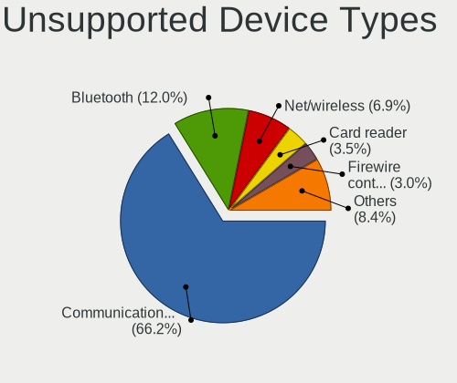

| Type                     | Computers | Percent |
|--------------------------|-----------|---------|
| Communication controller | 146       | 62.13%  |
| Bluetooth                | 19        | 8.09%   |
| Net/wireless             | 17        | 7.23%   |
| Card reader              | 15        | 6.38%   |
| Firewire controller      | 12        | 5.11%   |
| Sound                    | 5         | 2.13%   |
| Network                  | 5         | 2.13%   |
| Net/ethernet             | 5         | 2.13%   |
| Fingerprint reader       | 5         | 2.13%   |
| Storage                  | 2         | 0.85%   |
| Graphics card            | 2         | 0.85%   |
| Storage/raid             | 1         | 0.43%   |
| Storage/ata              | 1         | 0.43%   |

