BSD in Canada - Tested Hardware & Statistics (Desktops)
-------------------------------------------------------

A project to collect tested hardware configurations for BSD in Canada.

Anyone can contribute to this report by the [hw-probe](https://github.com/linuxhw/hw-probe/blob/master/INSTALL.BSD.md) tool:

    hw-probe -all -upload

Please contribute! Especially if your hardware is rare.

Contents
--------

* [ Test Cases ](#test-cases)

* [ System ](#system)
  - [ OS                       ](#os)
  - [ OS Family                ](#os-family)
  - [ Arch                     ](#arch)
  - [ DE                       ](#de)
  - [ Display Server           ](#display-server)
  - [ Display Manager          ](#display-manager)
  - [ OS Lang                  ](#os-lang)
  - [ Boot Mode                ](#boot-mode)
  - [ Filesystem               ](#filesystem)
  - [ Part. scheme             ](#part-scheme)

* [ Board ](#board)
  - [ Vendor                   ](#vendor)
  - [ Model                    ](#model)
  - [ Model Family             ](#model-family)
  - [ MFG Year                 ](#mfg-year)
  - [ Form Factor              ](#form-factor)
  - [ Coreboot                 ](#coreboot)
  - [ RAM Size                 ](#ram-size)
  - [ RAM Used                 ](#ram-used)
  - [ Total Drives             ](#total-drives)
  - [ Has CD-ROM               ](#has-cd-rom)
  - [ Has Ethernet             ](#has-ethernet)
  - [ Has WiFi                 ](#has-wifi)
  - [ Has Bluetooth            ](#has-bluetooth)

* [ Location ](#location)
  - [ Country                  ](#country)
  - [ City                     ](#city)

* [ Drives ](#drives)
  - [ Drive Vendor             ](#drive-vendor)
  - [ Drive Model              ](#drive-model)
  - [ HDD Vendor               ](#hdd-vendor)
  - [ SSD Vendor               ](#ssd-vendor)
  - [ Drive Kind               ](#drive-kind)
  - [ Drive Connector          ](#drive-connector)
  - [ Drive Size               ](#drive-size)
  - [ Space Total              ](#space-total)
  - [ Space Used               ](#space-used)
  - [ Malfunc. Drives          ](#malfunc-drives)
  - [ Malfunc. Drive Vendor    ](#malfunc-drive-vendor)
  - [ Malfunc. HDD Vendor      ](#malfunc-hdd-vendor)
  - [ Malfunc. Drive Kind      ](#malfunc-drive-kind)
  - [ Failed Drives            ](#failed-drives)
  - [ Failed Drive Vendor      ](#failed-drive-vendor)
  - [ Drive Status             ](#drive-status)

* [ Storage controller ](#storage-controller)
  - [ Storage Vendor           ](#storage-vendor)
  - [ Storage Model            ](#storage-model)
  - [ Storage Kind             ](#storage-kind)

* [ Processor ](#processor)
  - [ CPU Vendor               ](#cpu-vendor)
  - [ CPU Model                ](#cpu-model)
  - [ CPU Model Family         ](#cpu-model-family)
  - [ CPU Cores                ](#cpu-cores)
  - [ CPU Sockets              ](#cpu-sockets)
  - [ CPU Threads              ](#cpu-threads)
  - [ CPU Microarch            ](#cpu-microarch)

* [ Graphics ](#graphics)
  - [ GPU Vendor               ](#gpu-vendor)
  - [ GPU Model                ](#gpu-model)
  - [ GPU Combo                ](#gpu-combo)
  - [ GPU Driver               ](#gpu-driver)
  - [ GPU Memory               ](#gpu-memory)

* [ Monitor ](#monitor)
  - [ Monitor Vendor           ](#monitor-vendor)
  - [ Monitor Model            ](#monitor-model)
  - [ Monitor Resolution       ](#monitor-resolution)
  - [ Monitor Diagonal         ](#monitor-diagonal)
  - [ Monitor Width            ](#monitor-width)
  - [ Aspect Ratio             ](#aspect-ratio)
  - [ Monitor Area             ](#monitor-area)
  - [ Pixel Density            ](#pixel-density)
  - [ Multiple Monitors        ](#multiple-monitors)

* [ Network ](#network)
  - [ Net Controller Vendor    ](#net-controller-vendor)
  - [ Net Controller Model     ](#net-controller-model)
  - [ Wireless Vendor          ](#wireless-vendor)
  - [ Wireless Model           ](#wireless-model)
  - [ Ethernet Vendor          ](#ethernet-vendor)
  - [ Ethernet Model           ](#ethernet-model)
  - [ Net Controller Kind      ](#net-controller-kind)
  - [ Used Controller          ](#used-controller)
  - [ NICs                     ](#nics)
  - [ IPv6                     ](#ipv6)

* [ Bluetooth ](#bluetooth)
  - [ Bluetooth Vendor         ](#bluetooth-vendor)
  - [ Bluetooth Model          ](#bluetooth-model)

* [ Sound ](#sound)
  - [ Sound Vendor             ](#sound-vendor)
  - [ Sound Model              ](#sound-model)

* [ Memory ](#memory)
  - [ Memory Vendor            ](#memory-vendor)
  - [ Memory Model             ](#memory-model)
  - [ Memory Kind              ](#memory-kind)
  - [ Memory Form Factor       ](#memory-form-factor)
  - [ Memory Size              ](#memory-size)
  - [ Memory Speed             ](#memory-speed)

* [ Printers & scanners ](#printers--scanners)
  - [ Printer Vendor           ](#printer-vendor)
  - [ Printer Model            ](#printer-model)
  - [ Scanner Vendor           ](#scanner-vendor)
  - [ Scanner Model            ](#scanner-model)

* [ Camera ](#camera)
  - [ Camera Vendor            ](#camera-vendor)
  - [ Camera Model             ](#camera-model)

* [ Security ](#security)
  - [ Fingerprint Vendor       ](#fingerprint-vendor)
  - [ Fingerprint Model        ](#fingerprint-model)
  - [ Chipcard Vendor          ](#chipcard-vendor)
  - [ Chipcard Model           ](#chipcard-model)

* [ Unsupported ](#unsupported)
  - [ Unsupported Devices      ](#unsupported-devices)
  - [ Unsupported Device Types ](#unsupported-device-types)

Test Cases
----------

Total: 1071

| Vendor        | Model                       | Probe                                                     | Date         |
|---------------|-----------------------------|-----------------------------------------------------------|--------------|
| MSI           | Boston                      | [69c1e82629](https://bsd-hardware.info/?probe=69c1e82629) | Jan 03, 2026 |
| Protectli     | V1410                       | [c1783c223a](https://bsd-hardware.info/?probe=c1783c223a) | Dec 31, 2025 |
| Acer          | Aspire XC-830               | [966f291e21](https://bsd-hardware.info/?probe=966f291e21) | Dec 30, 2025 |
| Unknown       | Unknown                     | [98270995a4](https://bsd-hardware.info/?probe=98270995a4) | Dec 30, 2025 |
| Protectli     | V1410                       | [b881beb33b](https://bsd-hardware.info/?probe=b881beb33b) | Dec 30, 2025 |
| MSI           | MAG B550 TOMAHAWK           | [b2b5087066](https://bsd-hardware.info/?probe=b2b5087066) | Dec 27, 2025 |
| Unknown       | Unknown                     | [83ce707bbd](https://bsd-hardware.info/?probe=83ce707bbd) | Dec 20, 2025 |
| ASRock        | B450M Pro4 R2.0             | [f886343e30](https://bsd-hardware.info/?probe=f886343e30) | Dec 19, 2025 |
| Unknown       | QDNV01                      | [5330d1c32a](https://bsd-hardware.info/?probe=5330d1c32a) | Dec 19, 2025 |
| Unknown       | Unknown                     | [ea3783b202](https://bsd-hardware.info/?probe=ea3783b202) | Dec 15, 2025 |
| MSI           | Boston                      | [25b6b26ca5](https://bsd-hardware.info/?probe=25b6b26ca5) | Dec 14, 2025 |
| Supermicro    | X10SLL-F                    | [8fb2b6ad50](https://bsd-hardware.info/?probe=8fb2b6ad50) | Dec 13, 2025 |
| ASUSTek       | Z8P                         | [c25473d690](https://bsd-hardware.info/?probe=c25473d690) | Dec 12, 2025 |
| HP            | 859C                        | [95fe81fb3c](https://bsd-hardware.info/?probe=95fe81fb3c) | Dec 11, 2025 |
| Advantech     | NAMB-3250 A102-1            | [681d7ee23c](https://bsd-hardware.info/?probe=681d7ee23c) | Dec 10, 2025 |
| TianBei       | WTR PRO                     | [af1798cf16](https://bsd-hardware.info/?probe=af1798cf16) | Dec 06, 2025 |
| Dell          | 07WP95 A02                  | [a9706d7583](https://bsd-hardware.info/?probe=a9706d7583) | Dec 06, 2025 |
| ASUSTek       | ROG STRIX X670E-F GAMING... | [854577e2b3](https://bsd-hardware.info/?probe=854577e2b3) | Nov 29, 2025 |
| Dell          | 01TN68 A02                  | [c45f788c3c](https://bsd-hardware.info/?probe=c45f788c3c) | Nov 29, 2025 |
| SJRC          | ADLN-6L                     | [4158102765](https://bsd-hardware.info/?probe=4158102765) | Nov 29, 2025 |
| Unknown       | Unknown                     | [be06809cfb](https://bsd-hardware.info/?probe=be06809cfb) | Nov 28, 2025 |
| SJRC          | ADLN-6L                     | [f295466f3e](https://bsd-hardware.info/?probe=f295466f3e) | Nov 27, 2025 |
| Dell          | 01P8W3 A00                  | [03fbb8e4dd](https://bsd-hardware.info/?probe=03fbb8e4dd) | Nov 27, 2025 |
| HP            | 859C                        | [05e4a97174](https://bsd-hardware.info/?probe=05e4a97174) | Nov 27, 2025 |
| HP            | 1589                        | [f3012cf4fb](https://bsd-hardware.info/?probe=f3012cf4fb) | Nov 26, 2025 |
| ASUSTek       | ROG STRIX X570-I GAMING     | [7693ef53ad](https://bsd-hardware.info/?probe=7693ef53ad) | Nov 24, 2025 |
| ASUSTek       | ROG STRIX X570-I GAMING     | [939d93f595](https://bsd-hardware.info/?probe=939d93f595) | Nov 22, 2025 |
| Yanling       | YL-CLU6L-V1                 | [ccb69485f1](https://bsd-hardware.info/?probe=ccb69485f1) | Nov 22, 2025 |
| IceWhale T... | ZMB216-i ZMB                | [586edfbaa2](https://bsd-hardware.info/?probe=586edfbaa2) | Nov 21, 2025 |
| Dell          | 04Y8V0 A02                  | [4f5b2697a3](https://bsd-hardware.info/?probe=4f5b2697a3) | Nov 17, 2025 |
| Shenzhen M... | F1FXM                       | [e79beabba2](https://bsd-hardware.info/?probe=e79beabba2) | Nov 15, 2025 |
| Dell          | 0DF42J A00                  | [8079cb938d](https://bsd-hardware.info/?probe=8079cb938d) | Nov 15, 2025 |
| HP            | 2820h                       | [0a5107bb11](https://bsd-hardware.info/?probe=0a5107bb11) | Nov 14, 2025 |
| Unknown       | Unknown                     | [42185b1be0](https://bsd-hardware.info/?probe=42185b1be0) | Nov 13, 2025 |
| Unknown       | Unknown                     | [62e9fe94a1](https://bsd-hardware.info/?probe=62e9fe94a1) | Nov 13, 2025 |
| Dell          | 04Y8V0 A02                  | [a146dd359f](https://bsd-hardware.info/?probe=a146dd359f) | Nov 09, 2025 |
| Supermicro    | X10SLL-F                    | [c131ea9543](https://bsd-hardware.info/?probe=c131ea9543) | Nov 09, 2025 |
| Protectli     | V1610                       | [f53c39e83d](https://bsd-hardware.info/?probe=f53c39e83d) | Nov 08, 2025 |
| Techvision    | TVI7309X B0                 | [c95f6c1cca](https://bsd-hardware.info/?probe=c95f6c1cca) | Nov 07, 2025 |
| Acer          | Aspire XC-830               | [4e06a8777f](https://bsd-hardware.info/?probe=4e06a8777f) | Nov 07, 2025 |
| ASUSTek       | Q87M-E                      | [6093655edb](https://bsd-hardware.info/?probe=6093655edb) | Nov 04, 2025 |
| ShenZhen M... | MW-GMLK-2.5G6L              | [697160e1d4](https://bsd-hardware.info/?probe=697160e1d4) | Nov 02, 2025 |
| ASUSTek       | PRIME A320M-K               | [4ed92ec57b](https://bsd-hardware.info/?probe=4ed92ec57b) | Nov 01, 2025 |
| Unknown       | Unknown                     | [a9e2db1281](https://bsd-hardware.info/?probe=a9e2db1281) | Oct 31, 2025 |
| ASUSTek       | Q87M-E                      | [59679528fe](https://bsd-hardware.info/?probe=59679528fe) | Oct 27, 2025 |
| Lenovo        | SHARKBAY NOK                | [38112b36a7](https://bsd-hardware.info/?probe=38112b36a7) | Oct 26, 2025 |
| Unknown       | Unknown                     | [1c0028a8fd](https://bsd-hardware.info/?probe=1c0028a8fd) | Oct 25, 2025 |
| Dell          | 0GU083 A00                  | [1614becaf9](https://bsd-hardware.info/?probe=1614becaf9) | Oct 22, 2025 |
| Unknown       | Unknown                     | [932621d602](https://bsd-hardware.info/?probe=932621d602) | Oct 19, 2025 |
| Shenzhen M... | AHWSA                       | [8163c63a86](https://bsd-hardware.info/?probe=8163c63a86) | Oct 19, 2025 |
| Shenzhen M... | AHBNB OEM                   | [f4126acdd6](https://bsd-hardware.info/?probe=f4126acdd6) | Oct 19, 2025 |
| Supermicro    | X8SIL                       | [47ac38ac2e](https://bsd-hardware.info/?probe=47ac38ac2e) | Oct 14, 2025 |
| Unknown       | Unknown                     | [44d4ecf726](https://bsd-hardware.info/?probe=44d4ecf726) | Oct 13, 2025 |
| Protectli     | FW6 Ver                     | [ed279cdf31](https://bsd-hardware.info/?probe=ed279cdf31) | Oct 10, 2025 |
| Dell          | 03W3VW A00                  | [2c06f6a39f](https://bsd-hardware.info/?probe=2c06f6a39f) | Oct 06, 2025 |
| Unknown       | Unknown                     | [a88ca5648a](https://bsd-hardware.info/?probe=a88ca5648a) | Oct 01, 2025 |
| HP            | 8594                        | [f79dcf07c2](https://bsd-hardware.info/?probe=f79dcf07c2) | Sep 30, 2025 |
| Dell          | 0FDY5C A00                  | [f53a02c1de](https://bsd-hardware.info/?probe=f53a02c1de) | Sep 29, 2025 |
| MW            | GMLK-2_5G4L                 | [dbd6ee807d](https://bsd-hardware.info/?probe=dbd6ee807d) | Sep 26, 2025 |
| ASUSTek       | PRIME A320M-K               | [0ffb01dc69](https://bsd-hardware.info/?probe=0ffb01dc69) | Sep 24, 2025 |
| GoWin Solu... | R86S-N                      | [e3eeae602f](https://bsd-hardware.info/?probe=e3eeae602f) | Sep 23, 2025 |
| Protectli     | VP2410 10                   | [dd2d9a698d](https://bsd-hardware.info/?probe=dd2d9a698d) | Sep 21, 2025 |
| Dell          | 0XHGV1 A00                  | [4a670444a1](https://bsd-hardware.info/?probe=4a670444a1) | Sep 21, 2025 |
| Protectli     | VP2410 10                   | [c6d0df414f](https://bsd-hardware.info/?probe=c6d0df414f) | Sep 20, 2025 |
| Acer          | Nitro N50-620               | [8aaad76f25](https://bsd-hardware.info/?probe=8aaad76f25) | Sep 18, 2025 |
| Protectli     | VP2430                      | [90f60e69e8](https://bsd-hardware.info/?probe=90f60e69e8) | Sep 18, 2025 |
| HP            | 8299                        | [e19052d3a4](https://bsd-hardware.info/?probe=e19052d3a4) | Sep 16, 2025 |
| ASUSTek       | ROG STRIX B450-F GAMING ... | [dcf67b8578](https://bsd-hardware.info/?probe=dcf67b8578) | Sep 16, 2025 |
| ASUSTek       | ROG STRIX B450-F GAMING ... | [540faeeb43](https://bsd-hardware.info/?probe=540faeeb43) | Sep 13, 2025 |
| GoWin Solu... | R86S-N                      | [77d6c12dc7](https://bsd-hardware.info/?probe=77d6c12dc7) | Sep 12, 2025 |
| Unknown       | Unknown                     | [84b86f5094](https://bsd-hardware.info/?probe=84b86f5094) | Sep 08, 2025 |
| Unknown       | Unknown                     | [4acee62668](https://bsd-hardware.info/?probe=4acee62668) | Sep 05, 2025 |
| Techvision    | TVI7309X B0                 | [5a2a72c448](https://bsd-hardware.info/?probe=5a2a72c448) | Sep 05, 2025 |
| Unknown       | Unknown                     | [a6998ef674](https://bsd-hardware.info/?probe=a6998ef674) | Sep 04, 2025 |
| Protectli     | FW6 Ver                     | [caaefbbc15](https://bsd-hardware.info/?probe=caaefbbc15) | Sep 04, 2025 |
| Unknown       | Unknown                     | [1cd90189ee](https://bsd-hardware.info/?probe=1cd90189ee) | Sep 01, 2025 |
| HP            | 802E                        | [bd79e9cde7](https://bsd-hardware.info/?probe=bd79e9cde7) | Aug 31, 2025 |
| ASUSTek       | ROG STRIX X670E-F GAMING... | [8ddaddf148](https://bsd-hardware.info/?probe=8ddaddf148) | Aug 28, 2025 |
| Unknown       | Unknown                     | [53cd8cc0c2](https://bsd-hardware.info/?probe=53cd8cc0c2) | Aug 25, 2025 |
| Lex           | CI170A/C                    | [7e54fcdeaa](https://bsd-hardware.info/?probe=7e54fcdeaa) | Aug 20, 2025 |
| Unknown       | Unknown                     | [1e744d447f](https://bsd-hardware.info/?probe=1e744d447f) | Aug 18, 2025 |
| Deciso        | Netboard A10 V2.1           | [598c0c85ac](https://bsd-hardware.info/?probe=598c0c85ac) | Aug 17, 2025 |
| Unknown       | Unknown                     | [be7821f14a](https://bsd-hardware.info/?probe=be7821f14a) | Aug 16, 2025 |
| Protectli     | VP2430                      | [ae617c2702](https://bsd-hardware.info/?probe=ae617c2702) | Aug 16, 2025 |
| Protectli     | FW4B Ver                    | [52dddb9e76](https://bsd-hardware.info/?probe=52dddb9e76) | Aug 11, 2025 |
| Unknown       | Unknown                     | [157251e8ca](https://bsd-hardware.info/?probe=157251e8ca) | Aug 11, 2025 |
| Gigabyte      | F2A78M-D3H                  | [710fe36719](https://bsd-hardware.info/?probe=710fe36719) | Aug 09, 2025 |
| Unknown       | Unknown                     | [79d021b75f](https://bsd-hardware.info/?probe=79d021b75f) | Aug 08, 2025 |
| Shenzhen M... | AHBNB OEM                   | [24b292acc0](https://bsd-hardware.info/?probe=24b292acc0) | Aug 07, 2025 |
| GoWin Solu... | R86S-N                      | [b061955652](https://bsd-hardware.info/?probe=b061955652) | Aug 06, 2025 |
| BOSGAME       | DNB10M                      | [ad1a91026b](https://bsd-hardware.info/?probe=ad1a91026b) | Aug 06, 2025 |
| Unknown       | Unknown                     | [f8a7696567](https://bsd-hardware.info/?probe=f8a7696567) | Aug 06, 2025 |
| Dell          | 04Y8V0 A02                  | [0b1b3d7021](https://bsd-hardware.info/?probe=0b1b3d7021) | Aug 02, 2025 |
| CncTion       | 1338NP-12 B0                | [be1decc508](https://bsd-hardware.info/?probe=be1decc508) | Aug 01, 2025 |
| CncTion       | 1338NP-12 B0                | [2595bdc66b](https://bsd-hardware.info/?probe=2595bdc66b) | Aug 01, 2025 |
| Intel         | DQ35JO AAD82085-805         | [655290a0fc](https://bsd-hardware.info/?probe=655290a0fc) | Jul 29, 2025 |
| Unknown       | Unknown                     | [0e89b273e5](https://bsd-hardware.info/?probe=0e89b273e5) | Jul 29, 2025 |
| Intel         | CRESCENTBAY                 | [f9e19dd795](https://bsd-hardware.info/?probe=f9e19dd795) | Jul 28, 2025 |
| Protectli     | V1410                       | [5299ef062e](https://bsd-hardware.info/?probe=5299ef062e) | Jul 24, 2025 |
| Unknown       | Unknown                     | [fe8e7a4223](https://bsd-hardware.info/?probe=fe8e7a4223) | Jul 19, 2025 |
| SJRC          | ADLN-6L                     | [5fabaf4c89](https://bsd-hardware.info/?probe=5fabaf4c89) | Jul 18, 2025 |
| MW            | GMLK-2_5G4L                 | [4446e160b3](https://bsd-hardware.info/?probe=4446e160b3) | Jul 16, 2025 |
| AZW           | EQ                          | [cd786ebfe8](https://bsd-hardware.info/?probe=cd786ebfe8) | Jul 07, 2025 |
| Unknown       | Unknown                     | [0ffd791e45](https://bsd-hardware.info/?probe=0ffd791e45) | Jul 05, 2025 |
| Unknown       | Unknown                     | [b58ae0161f](https://bsd-hardware.info/?probe=b58ae0161f) | Jul 04, 2025 |
| Acer          | Aspire XC-830               | [9a696850db](https://bsd-hardware.info/?probe=9a696850db) | Jul 04, 2025 |
| Lenovo        | 30D9 SDK0L22692 WIN 3306... | [863d3905a1](https://bsd-hardware.info/?probe=863d3905a1) | Jul 04, 2025 |
| OEM           | 2550L2D-MX V1.1             | [85025499d4](https://bsd-hardware.info/?probe=85025499d4) | Jul 02, 2025 |
| HP            | 82A2                        | [1b8701e45c](https://bsd-hardware.info/?probe=1b8701e45c) | Jul 01, 2025 |
| Unknown       | Unknown                     | [d3ec175110](https://bsd-hardware.info/?probe=d3ec175110) | Jun 29, 2025 |
| Unknown       | Unknown                     | [064e7829be](https://bsd-hardware.info/?probe=064e7829be) | Jun 27, 2025 |
| Unknown       | Unknown                     | [22f4ebe651](https://bsd-hardware.info/?probe=22f4ebe651) | Jun 27, 2025 |
| Unknown       | QDNV01                      | [cf4a99e77d](https://bsd-hardware.info/?probe=cf4a99e77d) | Jun 21, 2025 |
| ASUSTek       | PRIME B250M-A               | [0884747b20](https://bsd-hardware.info/?probe=0884747b20) | Jun 20, 2025 |
| Unknown       | Unknown                     | [0768abbe8c](https://bsd-hardware.info/?probe=0768abbe8c) | Jun 19, 2025 |
| ASUSTek       | PRIME B250M-A               | [5988d2d6d0](https://bsd-hardware.info/?probe=5988d2d6d0) | Jun 19, 2025 |
| Lenovo        | 30D0 SDK0J40697 WIN 3305... | [d4199e5f2b](https://bsd-hardware.info/?probe=d4199e5f2b) | Jun 19, 2025 |
| ASRock        | H81M-HDS R2.0               | [6540ba796b](https://bsd-hardware.info/?probe=6540ba796b) | Jun 18, 2025 |
| Unknown       | Unknown                     | [d86aa2d8ea](https://bsd-hardware.info/?probe=d86aa2d8ea) | Jun 16, 2025 |
| Dell          | 0FDY5C A00                  | [cdde8db496](https://bsd-hardware.info/?probe=cdde8db496) | Jun 14, 2025 |
| Dell          | 0HD5W2 A01                  | [f9d4b45529](https://bsd-hardware.info/?probe=f9d4b45529) | Jun 13, 2025 |
| HP            | 1589                        | [b663a0a979](https://bsd-hardware.info/?probe=b663a0a979) | Jun 12, 2025 |
| Unknown       | Unknown                     | [0c08cc911a](https://bsd-hardware.info/?probe=0c08cc911a) | Jun 10, 2025 |
| ASRock        | H81M-HDS R2.0               | [e2b81905c0](https://bsd-hardware.info/?probe=e2b81905c0) | Jun 09, 2025 |
| Dell          | 0H0P0M A00                  | [7665287677](https://bsd-hardware.info/?probe=7665287677) | Jun 08, 2025 |
| Unknown       | Unknown                     | [17947b152c](https://bsd-hardware.info/?probe=17947b152c) | Jun 07, 2025 |
| ASUSTek       | PRIME Z690-P WIFI           | [91aaa73832](https://bsd-hardware.info/?probe=91aaa73832) | Jun 06, 2025 |
| Protectli     | FW6 Ver                     | [a02143c017](https://bsd-hardware.info/?probe=a02143c017) | Jun 01, 2025 |
| Unknown       | Unknown                     | [7a7dee27f5](https://bsd-hardware.info/?probe=7a7dee27f5) | Jun 01, 2025 |
| Unknown       | Unknown                     | [7ff518424c](https://bsd-hardware.info/?probe=7ff518424c) | Jun 01, 2025 |
| HP            | 8299                        | [97fbe5ae58](https://bsd-hardware.info/?probe=97fbe5ae58) | May 31, 2025 |
| Unknown       | Unknown                     | [b4b17085ec](https://bsd-hardware.info/?probe=b4b17085ec) | May 31, 2025 |
| Acer          | Veriton M4620G v1.0         | [2d1396c5af](https://bsd-hardware.info/?probe=2d1396c5af) | May 30, 2025 |
| Dell          | 0D28YY A00                  | [5fa32fc42c](https://bsd-hardware.info/?probe=5fa32fc42c) | May 30, 2025 |
| Lenovo        | SHARKBAY NOK                | [68f7686fd5](https://bsd-hardware.info/?probe=68f7686fd5) | May 29, 2025 |
| Lenovo        | 364F SDK0J40700 WIN 3258... | [f1ab53d87e](https://bsd-hardware.info/?probe=f1ab53d87e) | May 29, 2025 |
| Unknown       | QDNV01                      | [32c63a52d3](https://bsd-hardware.info/?probe=32c63a52d3) | May 28, 2025 |
| Dell          | 0XHGV1 A00                  | [004da595cc](https://bsd-hardware.info/?probe=004da595cc) | May 27, 2025 |
| Dell          | 0XHGV1 A00                  | [c6d99b7d50](https://bsd-hardware.info/?probe=c6d99b7d50) | May 24, 2025 |
| Dell          | 0JVYY1 A00                  | [a52248939f](https://bsd-hardware.info/?probe=a52248939f) | May 23, 2025 |
| Dell          | 0JVYY1 A00                  | [64ddeeb800](https://bsd-hardware.info/?probe=64ddeeb800) | May 23, 2025 |
| ASUSTek       | P8H67-M PRO                 | [ec50f118d4](https://bsd-hardware.info/?probe=ec50f118d4) | May 21, 2025 |
| Unknown       | Unknown                     | [b08c7e0932](https://bsd-hardware.info/?probe=b08c7e0932) | May 17, 2025 |
| Unknown       | Unknown                     | [064f123c3a](https://bsd-hardware.info/?probe=064f123c3a) | May 17, 2025 |
| ASRock        | A520M-HDV                   | [6aac7dd66e](https://bsd-hardware.info/?probe=6aac7dd66e) | May 16, 2025 |
| Dell          | 04Y8V0 A02                  | [1f7a25cd7e](https://bsd-hardware.info/?probe=1f7a25cd7e) | May 16, 2025 |
| Lenovo        | SHARKBAY NOK                | [2c2507eef1](https://bsd-hardware.info/?probe=2c2507eef1) | May 11, 2025 |
| Deciso        | Netboard A8                 | [91031b7f53](https://bsd-hardware.info/?probe=91031b7f53) | May 11, 2025 |
| Dell          | 0D28YY A00                  | [c6fd199ac3](https://bsd-hardware.info/?probe=c6fd199ac3) | May 11, 2025 |
| Protectli     | FW4B Ver                    | [86e3090eb2](https://bsd-hardware.info/?probe=86e3090eb2) | May 09, 2025 |
| Techvision    | TVI7309X B0                 | [81fc808dc4](https://bsd-hardware.info/?probe=81fc808dc4) | May 06, 2025 |
| Unknown       | Unknown                     | [e18f98f311](https://bsd-hardware.info/?probe=e18f98f311) | May 06, 2025 |
| Dell          | 0WMJ54 A01                  | [2555dbcfbb](https://bsd-hardware.info/?probe=2555dbcfbb) | May 05, 2025 |
| MSI           | A78M-E35                    | [283db71d9a](https://bsd-hardware.info/?probe=283db71d9a) | May 03, 2025 |
| Unknown       | Unknown                     | [dfdea8b0fc](https://bsd-hardware.info/?probe=dfdea8b0fc) | May 02, 2025 |
| HP            | 0B40h                       | [55a45317c1](https://bsd-hardware.info/?probe=55a45317c1) | Apr 29, 2025 |
| ASUSTek       | M5A97 PLUS                  | [36136aa60f](https://bsd-hardware.info/?probe=36136aa60f) | Apr 28, 2025 |
| Protectli     | VP2420                      | [3401ba1fe9](https://bsd-hardware.info/?probe=3401ba1fe9) | Apr 28, 2025 |
| HP            | 1589                        | [74f3bf9eab](https://bsd-hardware.info/?probe=74f3bf9eab) | Apr 27, 2025 |
| Protectli     | VP2420                      | [23797f02ba](https://bsd-hardware.info/?probe=23797f02ba) | Apr 27, 2025 |
| Unknown       | Unknown                     | [b1a3dd5b42](https://bsd-hardware.info/?probe=b1a3dd5b42) | Apr 25, 2025 |
| Acer          | Aspire XC-230               | [9403e0d472](https://bsd-hardware.info/?probe=9403e0d472) | Apr 24, 2025 |
| Unknown       | QEHL02                      | [873dcd0ff2](https://bsd-hardware.info/?probe=873dcd0ff2) | Apr 22, 2025 |
| Unknown       | QDNV01                      | [29b7d82613](https://bsd-hardware.info/?probe=29b7d82613) | Apr 16, 2025 |
| Dell          | 04Y8V0 A02                  | [757a4ca261](https://bsd-hardware.info/?probe=757a4ca261) | Apr 16, 2025 |
| Intel         | CRESCENTBAY                 | [4481c6a413](https://bsd-hardware.info/?probe=4481c6a413) | Apr 14, 2025 |
| ASUSTek       | ROG STRIX B450-F GAMING ... | [808e3676d2](https://bsd-hardware.info/?probe=808e3676d2) | Apr 12, 2025 |
| Intel         | CRESCENTBAY                 | [73934844f3](https://bsd-hardware.info/?probe=73934844f3) | Apr 12, 2025 |
| Dell          | 02YYK5 A01                  | [ef835b1e5e](https://bsd-hardware.info/?probe=ef835b1e5e) | Apr 10, 2025 |
| Unknown       | Unknown                     | [2273484ade](https://bsd-hardware.info/?probe=2273484ade) | Apr 08, 2025 |
| BOSGAME       | DNB10M                      | [5a80fe1bdc](https://bsd-hardware.info/?probe=5a80fe1bdc) | Apr 06, 2025 |
| BOSGAME       | DNB10M                      | [b25003df99](https://bsd-hardware.info/?probe=b25003df99) | Apr 06, 2025 |
| Yanling       | YL-KBR6L Ver:1.00           | [d571cb06f1](https://bsd-hardware.info/?probe=d571cb06f1) | Apr 05, 2025 |
| Unknown       | QDNV01                      | [1dec279d20](https://bsd-hardware.info/?probe=1dec279d20) | Apr 05, 2025 |
| Dell          | 01NP3N A00                  | [9aaca2cc22](https://bsd-hardware.info/?probe=9aaca2cc22) | Apr 03, 2025 |
| Unknown       | Unknown                     | [0e31cd8de5](https://bsd-hardware.info/?probe=0e31cd8de5) | Apr 01, 2025 |
| Protectli     | VP2420                      | [6b32e6fbeb](https://bsd-hardware.info/?probe=6b32e6fbeb) | Mar 31, 2025 |
| Unknown       | QDNV01                      | [3a5fe78541](https://bsd-hardware.info/?probe=3a5fe78541) | Mar 30, 2025 |
| HP            | 859C                        | [0c7bbe450d](https://bsd-hardware.info/?probe=0c7bbe450d) | Mar 30, 2025 |
| Unknown       | Unknown                     | [765f447b96](https://bsd-hardware.info/?probe=765f447b96) | Mar 30, 2025 |
| Shenzhen M... | AHBNB OEM                   | [f4bb4c6e5f](https://bsd-hardware.info/?probe=f4bb4c6e5f) | Mar 28, 2025 |
| Unknown       | Unknown                     | [96345bbd5d](https://bsd-hardware.info/?probe=96345bbd5d) | Mar 28, 2025 |
| Acer          | Aspire XC-230               | [db4c645f19](https://bsd-hardware.info/?probe=db4c645f19) | Mar 28, 2025 |
| Lenovo        | 30D9 SDK0L22692 WIN 3306... | [73c3ef05bc](https://bsd-hardware.info/?probe=73c3ef05bc) | Mar 28, 2025 |
| Lenovo        | SHARKBAY 0B98401 WIN        | [fabe433d46](https://bsd-hardware.info/?probe=fabe433d46) | Mar 27, 2025 |
| ASUSTek       | Maximus VI HERO             | [57351b1d8a](https://bsd-hardware.info/?probe=57351b1d8a) | Mar 26, 2025 |
| Acer          | Aspire XC-830               | [5e7acaa42e](https://bsd-hardware.info/?probe=5e7acaa42e) | Mar 25, 2025 |
| HP            | 2AF7                        | [06b55447aa](https://bsd-hardware.info/?probe=06b55447aa) | Mar 24, 2025 |
| Shenzhen M... | AHBNB OEM                   | [3fc51bd388](https://bsd-hardware.info/?probe=3fc51bd388) | Mar 23, 2025 |
| Dell          | 0D28YY A00                  | [677f2e9da4](https://bsd-hardware.info/?probe=677f2e9da4) | Mar 21, 2025 |
| ASRockRack    | X570D4U                     | [a6da25b473](https://bsd-hardware.info/?probe=a6da25b473) | Mar 20, 2025 |
| Acer          | Aspire XC-230               | [42a5be07fb](https://bsd-hardware.info/?probe=42a5be07fb) | Mar 19, 2025 |
| ASUSTek       | ROG STRIX B450-F GAMING ... | [0220619d13](https://bsd-hardware.info/?probe=0220619d13) | Mar 18, 2025 |
| Supermicro    | A2SDi-TP8F                  | [06b80ca6ef](https://bsd-hardware.info/?probe=06b80ca6ef) | Mar 17, 2025 |
| Protectli     | VP2420                      | [e34f975d5f](https://bsd-hardware.info/?probe=e34f975d5f) | Mar 17, 2025 |
| Unknown       | Unknown                     | [0dfa4f1783](https://bsd-hardware.info/?probe=0dfa4f1783) | Mar 17, 2025 |
| Protectli     | VP2420                      | [1d98247494](https://bsd-hardware.info/?probe=1d98247494) | Mar 16, 2025 |
| Unknown       | Unknown                     | [1d53b821ff](https://bsd-hardware.info/?probe=1d53b821ff) | Mar 15, 2025 |
| HP            | 805B                        | [35e60741b1](https://bsd-hardware.info/?probe=35e60741b1) | Mar 14, 2025 |
| Unknown       | Unknown                     | [1ae501d9e8](https://bsd-hardware.info/?probe=1ae501d9e8) | Mar 12, 2025 |
| HP            | 805D                        | [e1f55e3038](https://bsd-hardware.info/?probe=e1f55e3038) | Mar 12, 2025 |
| Unknown       | Unknown                     | [2cab145bd7](https://bsd-hardware.info/?probe=2cab145bd7) | Mar 11, 2025 |
| HP            | 1998                        | [80ecc9837b](https://bsd-hardware.info/?probe=80ecc9837b) | Mar 11, 2025 |
| HP            | 81C5 MVB                    | [01ab4c29b9](https://bsd-hardware.info/?probe=01ab4c29b9) | Mar 09, 2025 |
| Protectli     | VP2420                      | [a1796f76b8](https://bsd-hardware.info/?probe=a1796f76b8) | Mar 08, 2025 |
| Protectli     | VP2420                      | [f215f4f31c](https://bsd-hardware.info/?probe=f215f4f31c) | Mar 08, 2025 |
| Protectli     | FW4C Ver                    | [0593551862](https://bsd-hardware.info/?probe=0593551862) | Mar 07, 2025 |
| HP            | 82B4                        | [8a3902a340](https://bsd-hardware.info/?probe=8a3902a340) | Mar 07, 2025 |
| Dell          | 0JVYY1 A00                  | [57eb6169a2](https://bsd-hardware.info/?probe=57eb6169a2) | Mar 05, 2025 |
| Lenovo        | SHARKBAY NOK                | [6ff5553abb](https://bsd-hardware.info/?probe=6ff5553abb) | Mar 01, 2025 |
| MSI           | H61M-P21                    | [7c25c8442a](https://bsd-hardware.info/?probe=7c25c8442a) | Feb 26, 2025 |
| BOSGAME       | DNB10M                      | [8b1c6bb53d](https://bsd-hardware.info/?probe=8b1c6bb53d) | Feb 23, 2025 |
| ASUSTek       | ROG STRIX X870E-E GAMING... | [859821f909](https://bsd-hardware.info/?probe=859821f909) | Feb 20, 2025 |
| HP            | 8062                        | [7128a165c8](https://bsd-hardware.info/?probe=7128a165c8) | Feb 17, 2025 |
| Lanner Ele... | NCA-1515B-VS1               | [6680504734](https://bsd-hardware.info/?probe=6680504734) | Feb 16, 2025 |
| Unknown       | Unknown                     | [3630767375](https://bsd-hardware.info/?probe=3630767375) | Feb 15, 2025 |
| Lenovo        | SHARKBAY NOK                | [fe7670cdc9](https://bsd-hardware.info/?probe=fe7670cdc9) | Feb 14, 2025 |
| Lenovo        | SKYBAY SDK0J40697 WIN 33... | [00955dc768](https://bsd-hardware.info/?probe=00955dc768) | Feb 13, 2025 |
| Dell          | 0Y5DDC A00                  | [960fc0ef21](https://bsd-hardware.info/?probe=960fc0ef21) | Feb 11, 2025 |
| ASUSTek       | PRIME A320M-K               | [2c5177aeee](https://bsd-hardware.info/?probe=2c5177aeee) | Feb 10, 2025 |
| Gigabyte      | GA-870A-UD3                 | [afcb77bfc7](https://bsd-hardware.info/?probe=afcb77bfc7) | Feb 09, 2025 |
| Unknown       | Unknown                     | [17b83f16f3](https://bsd-hardware.info/?probe=17b83f16f3) | Feb 09, 2025 |
| Unknown       | Unknown                     | [303234de4c](https://bsd-hardware.info/?probe=303234de4c) | Feb 06, 2025 |
| AZW           | U59                         | [177e323e30](https://bsd-hardware.info/?probe=177e323e30) | Feb 04, 2025 |
| Unknown       | Unknown                     | [b31b87594d](https://bsd-hardware.info/?probe=b31b87594d) | Feb 03, 2025 |
| Intel         | DH67CF AAG10215-207         | [b68049baa5](https://bsd-hardware.info/?probe=b68049baa5) | Feb 01, 2025 |
| Unknown       | Unknown                     | [1095598ed5](https://bsd-hardware.info/?probe=1095598ed5) | Feb 01, 2025 |
| Apple         | Mac-7BA5B2D9E42DDD94 iMa... | [80056c77c5](https://bsd-hardware.info/?probe=80056c77c5) | Feb 01, 2025 |
| Lenovo        | 3102 SDK0J40705 WIN 3425... | [2badc03629](https://bsd-hardware.info/?probe=2badc03629) | Jan 28, 2025 |
| Unknown       | QDNV01                      | [a1cb369edd](https://bsd-hardware.info/?probe=a1cb369edd) | Jan 27, 2025 |
| Unknown       | QDNV01                      | [aee5ae25f4](https://bsd-hardware.info/?probe=aee5ae25f4) | Jan 26, 2025 |
| Protectli     | VP2410 10                   | [d874587069](https://bsd-hardware.info/?probe=d874587069) | Jan 25, 2025 |
| Unknown       | Unknown                     | [8050c39465](https://bsd-hardware.info/?probe=8050c39465) | Jan 24, 2025 |
| Unknown       | Unknown                     | [a41e974c06](https://bsd-hardware.info/?probe=a41e974c06) | Jan 24, 2025 |
| ASUSTek       | ROG STRIX X670E-F GAMING... | [c33c30034b](https://bsd-hardware.info/?probe=c33c30034b) | Jan 22, 2025 |
| Biostar       | Hi-Fi B85N 3D               | [d1b3acbbb1](https://bsd-hardware.info/?probe=d1b3acbbb1) | Jan 22, 2025 |
| Pegatron      | 2ACB                        | [f4368ec81a](https://bsd-hardware.info/?probe=f4368ec81a) | Jan 21, 2025 |
| Dell          | 0200DY A02                  | [a0adaade37](https://bsd-hardware.info/?probe=a0adaade37) | Jan 21, 2025 |
| Dell          | 0Y5DDC A00                  | [1915fdf658](https://bsd-hardware.info/?probe=1915fdf658) | Jan 21, 2025 |
| ASUSTek       | STRIKER II FORMULA          | [2b452affdf](https://bsd-hardware.info/?probe=2b452affdf) | Jan 21, 2025 |
| HP            | 21B4 A01                    | [7acfb028cc](https://bsd-hardware.info/?probe=7acfb028cc) | Jan 21, 2025 |
| Dell          | 0200DY A02                  | [45b61fed84](https://bsd-hardware.info/?probe=45b61fed84) | Jan 21, 2025 |
| Unknown       | QDNV01                      | [97fab2bd0c](https://bsd-hardware.info/?probe=97fab2bd0c) | Jan 20, 2025 |
| Intel         | CARLOW                      | [a9a0811d8e](https://bsd-hardware.info/?probe=a9a0811d8e) | Jan 20, 2025 |
| Protectli     | V1610                       | [4172d4a4ec](https://bsd-hardware.info/?probe=4172d4a4ec) | Jan 19, 2025 |
| Unknown       | Unknown                     | [fe0ec2af75](https://bsd-hardware.info/?probe=fe0ec2af75) | Jan 18, 2025 |
| Gigabyte      | P67A-D3-B3                  | [e4a3ee26a6](https://bsd-hardware.info/?probe=e4a3ee26a6) | Jan 17, 2025 |
| Lenovo        | SHARKBAY 0B98401 WIN        | [dad16d8780](https://bsd-hardware.info/?probe=dad16d8780) | Jan 16, 2025 |
| Protectli     | VP4670                      | [ff2a1f3cc4](https://bsd-hardware.info/?probe=ff2a1f3cc4) | Jan 15, 2025 |
| Unknown       | Unknown                     | [c3f2e1cc6d](https://bsd-hardware.info/?probe=c3f2e1cc6d) | Jan 11, 2025 |
| HP            | 3646h                       | [0cd49e7f0f](https://bsd-hardware.info/?probe=0cd49e7f0f) | Jan 10, 2025 |
| BOSGAME       | DNB10M                      | [397e4d7dc2](https://bsd-hardware.info/?probe=397e4d7dc2) | Jan 08, 2025 |
| Unknown       | Unknown                     | [580d6ef378](https://bsd-hardware.info/?probe=580d6ef378) | Jan 07, 2025 |
| Dell          | 04Y8V0 A02                  | [1d20d5fd79](https://bsd-hardware.info/?probe=1d20d5fd79) | Jan 05, 2025 |
| Dell          | 0FDY5C A00                  | [f0d39986e9](https://bsd-hardware.info/?probe=f0d39986e9) | Jan 04, 2025 |
| Lenovo        | 3102 SDK0J40697 WIN 3305... | [686b424a28](https://bsd-hardware.info/?probe=686b424a28) | Jan 02, 2025 |
| Unknown       | Unknown                     | [d06ccdd495](https://bsd-hardware.info/?probe=d06ccdd495) | Dec 31, 2024 |
| Intel         | DQ77KB AAG40294-402         | [9db11dd0c9](https://bsd-hardware.info/?probe=9db11dd0c9) | Dec 28, 2024 |
| Gigabyte      | Z790 AORUS MASTER X         | [d8022a2734](https://bsd-hardware.info/?probe=d8022a2734) | Dec 24, 2024 |
| Dell          | 0D28YY A00                  | [97d068af1e](https://bsd-hardware.info/?probe=97d068af1e) | Dec 21, 2024 |
| Unknown       | Unknown                     | [e79ae3cc67](https://bsd-hardware.info/?probe=e79ae3cc67) | Dec 19, 2024 |
| Unknown       | Unknown                     | [b4adf727f6](https://bsd-hardware.info/?probe=b4adf727f6) | Dec 16, 2024 |
| Unknown       | Unknown                     | [e2839ab569](https://bsd-hardware.info/?probe=e2839ab569) | Dec 16, 2024 |
| Unknown       | Unknown                     | [db147012b7](https://bsd-hardware.info/?probe=db147012b7) | Dec 15, 2024 |
| Protectli     | FW6 Ver                     | [f6adfa6006](https://bsd-hardware.info/?probe=f6adfa6006) | Dec 15, 2024 |
| Gigabyte      | M68MT-S2                    | [87ce6d4615](https://bsd-hardware.info/?probe=87ce6d4615) | Dec 13, 2024 |
| MSI           | MAG B550 TOMAHAWK           | [2fb19b27c9](https://bsd-hardware.info/?probe=2fb19b27c9) | Dec 13, 2024 |
| Dell          | 0D28YY A00                  | [bd7757d88d](https://bsd-hardware.info/?probe=bd7757d88d) | Dec 08, 2024 |
| ASUSTek       | ROG STRIX X870E-E GAMING... | [4edaabd936](https://bsd-hardware.info/?probe=4edaabd936) | Dec 07, 2024 |
| Protectli     | VP2410 10                   | [0d08c971b8](https://bsd-hardware.info/?probe=0d08c971b8) | Dec 07, 2024 |
| Gigabyte      | 2AC8                        | [c18b3da04b](https://bsd-hardware.info/?probe=c18b3da04b) | Dec 04, 2024 |
| Gigabyte      | H81M-HD2                    | [2c74776cf6](https://bsd-hardware.info/?probe=2c74776cf6) | Dec 04, 2024 |
| AZW           | EQ                          | [8f20d42e6e](https://bsd-hardware.info/?probe=8f20d42e6e) | Dec 04, 2024 |
| Intel         | X79 (INTEL Xeon E5/Corei... | [e3cc180fdd](https://bsd-hardware.info/?probe=e3cc180fdd) | Dec 02, 2024 |
| MSI           | H61M-P21                    | [55ae602922](https://bsd-hardware.info/?probe=55ae602922) | Dec 02, 2024 |
| Unknown       | Unknown                     | [c3a9c1cbc8](https://bsd-hardware.info/?probe=c3a9c1cbc8) | Dec 02, 2024 |
| Intel         | DCP847SKE G80890-105        | [29d05d280a](https://bsd-hardware.info/?probe=29d05d280a) | Dec 02, 2024 |
| Protectli     | FW6                         | [3d8bb2e6ef](https://bsd-hardware.info/?probe=3d8bb2e6ef) | Dec 01, 2024 |
| ASUSTek       | ROG STRIX X670E-F GAMING... | [ee30758c43](https://bsd-hardware.info/?probe=ee30758c43) | Nov 30, 2024 |
| Yanling       | YL-KBR6L Ver:1.00           | [2af8f99a1c](https://bsd-hardware.info/?probe=2af8f99a1c) | Nov 29, 2024 |
| Deciso        | Netboard A8                 | [5b1cde4aac](https://bsd-hardware.info/?probe=5b1cde4aac) | Nov 24, 2024 |
| Intel         | DG45ID AAE27729-307         | [14f367aa0a](https://bsd-hardware.info/?probe=14f367aa0a) | Nov 23, 2024 |
| Intel         | CARLOW                      | [b58da7d85d](https://bsd-hardware.info/?probe=b58da7d85d) | Nov 21, 2024 |
| Dell          | 00V62H A00                  | [22f8452e6d](https://bsd-hardware.info/?probe=22f8452e6d) | Nov 20, 2024 |
| ASRockRack    | X470D4U2-2T                 | [638b70ebe3](https://bsd-hardware.info/?probe=638b70ebe3) | Nov 20, 2024 |
| Unknown       | Unknown                     | [5c3daa7361](https://bsd-hardware.info/?probe=5c3daa7361) | Nov 20, 2024 |
| ASUSTek       | M5A97 LE R2.0               | [7aae707db6](https://bsd-hardware.info/?probe=7aae707db6) | Nov 17, 2024 |
| ASUSTek       | ROG STRIX B450-F GAMING ... | [e337ee0494](https://bsd-hardware.info/?probe=e337ee0494) | Nov 14, 2024 |
| Unknown       | Unknown                     | [63da6bf4a3](https://bsd-hardware.info/?probe=63da6bf4a3) | Nov 13, 2024 |
| Gigabyte      | 2AC8                        | [0866ab9c03](https://bsd-hardware.info/?probe=0866ab9c03) | Nov 12, 2024 |
| CWWK          | MINIPC-G12                  | [95728c8f3f](https://bsd-hardware.info/?probe=95728c8f3f) | Nov 12, 2024 |
| Unknown       | Unknown                     | [66f4c037b4](https://bsd-hardware.info/?probe=66f4c037b4) | Nov 11, 2024 |
| HP            | 805D                        | [eee32d882b](https://bsd-hardware.info/?probe=eee32d882b) | Nov 07, 2024 |
| CheckPoint    | T-180-00                    | [0d54372aff](https://bsd-hardware.info/?probe=0d54372aff) | Nov 05, 2024 |
| Unknown       | Unknown                     | [e2322b3441](https://bsd-hardware.info/?probe=e2322b3441) | Nov 03, 2024 |
| AZW           | Green G1                    | [e7ca5d5578](https://bsd-hardware.info/?probe=e7ca5d5578) | Nov 02, 2024 |
| ASUSTek       | ROG STRIX B450-F GAMING ... | [0c3e394182](https://bsd-hardware.info/?probe=0c3e394182) | Oct 30, 2024 |
| Unknown       | Unknown                     | [44c67eed86](https://bsd-hardware.info/?probe=44c67eed86) | Oct 30, 2024 |
| Protectli     | VP2410 10                   | [c8fd0713b0](https://bsd-hardware.info/?probe=c8fd0713b0) | Oct 30, 2024 |
| CncTion       | N5105-4L B0                 | [a95688132e](https://bsd-hardware.info/?probe=a95688132e) | Oct 28, 2024 |
| Protectli     | VP4670                      | [72007dc0a7](https://bsd-hardware.info/?probe=72007dc0a7) | Oct 18, 2024 |
| MSI           | PRO B660-A DDR4             | [688de382ec](https://bsd-hardware.info/?probe=688de382ec) | Oct 16, 2024 |
| Unknown       | Unknown                     | [eba06a275d](https://bsd-hardware.info/?probe=eba06a275d) | Oct 16, 2024 |
| Lenovo        | SHARKBAY SDK0E50510 WIN     | [65db357b67](https://bsd-hardware.info/?probe=65db357b67) | Oct 15, 2024 |
| Shenzhen M... | AHBNB OEM                   | [cb7d2d44d9](https://bsd-hardware.info/?probe=cb7d2d44d9) | Oct 14, 2024 |
| HP            | 1998                        | [b2ca3db39f](https://bsd-hardware.info/?probe=b2ca3db39f) | Oct 14, 2024 |
| Unknown       | Unknown                     | [4a3c08470e](https://bsd-hardware.info/?probe=4a3c08470e) | Oct 13, 2024 |
| MSI           | PRO B660-A DDR4             | [79ae56ffec](https://bsd-hardware.info/?probe=79ae56ffec) | Oct 13, 2024 |
| HP            | 240 G3                      | [7e732aa2d4](https://bsd-hardware.info/?probe=7e732aa2d4) | Oct 13, 2024 |
| ASUSTek       | PRIME Z590-A                | [f9dd56fa54](https://bsd-hardware.info/?probe=f9dd56fa54) | Oct 12, 2024 |
| Supermicro    | X10DRD-LT                   | [124b8be193](https://bsd-hardware.info/?probe=124b8be193) | Oct 06, 2024 |
| Unknown       | Unknown                     | [179c36772d](https://bsd-hardware.info/?probe=179c36772d) | Oct 05, 2024 |
| ASRockRack    | X570D4U                     | [9c5e0a312a](https://bsd-hardware.info/?probe=9c5e0a312a) | Oct 03, 2024 |
| Lenovo        | SKYBAY SDK0J40697 WIN 33... | [491f4e42ef](https://bsd-hardware.info/?probe=491f4e42ef) | Oct 01, 2024 |
| Unknown       | Unknown                     | [1a39c09b41](https://bsd-hardware.info/?probe=1a39c09b41) | Sep 30, 2024 |
| nAppliance... | 1500                        | [09b957c33b](https://bsd-hardware.info/?probe=09b957c33b) | Sep 30, 2024 |
| Unknown       | Unknown                     | [3a36dded75](https://bsd-hardware.info/?probe=3a36dded75) | Sep 28, 2024 |
| HP            | 8299                        | [1bd8f99ada](https://bsd-hardware.info/?probe=1bd8f99ada) | Sep 21, 2024 |
| Yanling       | YL-KBR6L Ver:1.00           | [31b6fbf3df](https://bsd-hardware.info/?probe=31b6fbf3df) | Sep 20, 2024 |
| Gigabyte      | F2A78M-D3H                  | [0cf99b87da](https://bsd-hardware.info/?probe=0cf99b87da) | Sep 17, 2024 |
| Protectli     | FW4C                        | [959268ffd3](https://bsd-hardware.info/?probe=959268ffd3) | Sep 17, 2024 |
| Unknown       | QDNV01                      | [cecbc2b072](https://bsd-hardware.info/?probe=cecbc2b072) | Sep 16, 2024 |
| Unknown       | QDNV01                      | [3690166a22](https://bsd-hardware.info/?probe=3690166a22) | Sep 16, 2024 |
| ASUSTek       | ROG STRIX X670E-F GAMING... | [0582bbb64f](https://bsd-hardware.info/?probe=0582bbb64f) | Sep 15, 2024 |
| Dell          | 0FDY5C A00                  | [3b04a04ea7](https://bsd-hardware.info/?probe=3b04a04ea7) | Sep 15, 2024 |
| Unknown       | QDNV01                      | [1fef412ac2](https://bsd-hardware.info/?probe=1fef412ac2) | Sep 14, 2024 |
| CWWK          | CW-AD4L-N V1                | [bebc6c82cd](https://bsd-hardware.info/?probe=bebc6c82cd) | Sep 14, 2024 |
| Dell          | 02YYK5 A01                  | [dca469e6a8](https://bsd-hardware.info/?probe=dca469e6a8) | Sep 12, 2024 |
| Intel         | CRESCENTBAY                 | [6920ef8277](https://bsd-hardware.info/?probe=6920ef8277) | Sep 12, 2024 |
| Unknown       | QDNV01                      | [67fec8010a](https://bsd-hardware.info/?probe=67fec8010a) | Sep 11, 2024 |
| Intel         | Q3XXG4-P V1.0               | [065ecd509b](https://bsd-hardware.info/?probe=065ecd509b) | Sep 11, 2024 |
| Unknown       | Unknown                     | [550a7b1162](https://bsd-hardware.info/?probe=550a7b1162) | Sep 10, 2024 |
| Protectli     | FW6 Ver                     | [3caa9e2046](https://bsd-hardware.info/?probe=3caa9e2046) | Sep 06, 2024 |
| Protectli     | FW4C Ver                    | [d50fb2efa3](https://bsd-hardware.info/?probe=d50fb2efa3) | Sep 03, 2024 |
| Unknown       | Unknown                     | [05b9eebec0](https://bsd-hardware.info/?probe=05b9eebec0) | Sep 02, 2024 |
| ASRock        | B660M Pro RS                | [290b2fa373](https://bsd-hardware.info/?probe=290b2fa373) | Sep 02, 2024 |
| AZW           | EQ                          | [bf99b0daf6](https://bsd-hardware.info/?probe=bf99b0daf6) | Sep 01, 2024 |
| Dell          | 00F82W A00                  | [9ba9a303ed](https://bsd-hardware.info/?probe=9ba9a303ed) | Aug 31, 2024 |
| Dell          | 00F82W A00                  | [224b9c1027](https://bsd-hardware.info/?probe=224b9c1027) | Aug 31, 2024 |
| Protectli     | VP2410 10                   | [eb4b450cda](https://bsd-hardware.info/?probe=eb4b450cda) | Aug 28, 2024 |
| Unknown       | Unknown                     | [4d56543ca0](https://bsd-hardware.info/?probe=4d56543ca0) | Aug 25, 2024 |
| ASUSTek       | A88XM-PLUS                  | [e09941d59e](https://bsd-hardware.info/?probe=e09941d59e) | Aug 24, 2024 |
| Techvision    | TVI7309X B0                 | [78040fb9e3](https://bsd-hardware.info/?probe=78040fb9e3) | Aug 22, 2024 |
| HP            | 2AF7                        | [2cd08252ea](https://bsd-hardware.info/?probe=2cd08252ea) | Aug 21, 2024 |
| HP            | 8299                        | [92de0abc13](https://bsd-hardware.info/?probe=92de0abc13) | Aug 17, 2024 |
| ASRock        | B660M Pro RS                | [d8e37c5b01](https://bsd-hardware.info/?probe=d8e37c5b01) | Aug 17, 2024 |
| Gigabyte      | F2A78M-D3H                  | [041e97bc1e](https://bsd-hardware.info/?probe=041e97bc1e) | Aug 16, 2024 |
| Unknown       | Unknown                     | [8f13dfe7cb](https://bsd-hardware.info/?probe=8f13dfe7cb) | Aug 15, 2024 |
| Unknown       | Unknown                     | [6777197334](https://bsd-hardware.info/?probe=6777197334) | Aug 14, 2024 |
| Datto         | SSD                         | [f8c1a103c0](https://bsd-hardware.info/?probe=f8c1a103c0) | Aug 11, 2024 |
| Protectli     | FW4C Ver                    | [e09858028f](https://bsd-hardware.info/?probe=e09858028f) | Aug 10, 2024 |
| Protectli     | FW4C Ver                    | [67ec9dc201](https://bsd-hardware.info/?probe=67ec9dc201) | Aug 10, 2024 |
| Unknown       | Unknown                     | [a5f82b5dbd](https://bsd-hardware.info/?probe=a5f82b5dbd) | Aug 09, 2024 |
| Intel         | HURONRIVER                  | [bf7f6c304a](https://bsd-hardware.info/?probe=bf7f6c304a) | Aug 09, 2024 |
| Unknown       | Unknown                     | [fc78b1147f](https://bsd-hardware.info/?probe=fc78b1147f) | Aug 09, 2024 |
| Unknown       | Unknown                     | [7670afb841](https://bsd-hardware.info/?probe=7670afb841) | Aug 08, 2024 |
| HP            | 8299                        | [e5e9cc0df6](https://bsd-hardware.info/?probe=e5e9cc0df6) | Aug 07, 2024 |
| Unknown       | Unknown                     | [a1528cb0d3](https://bsd-hardware.info/?probe=a1528cb0d3) | Aug 07, 2024 |
| Dell          | 096JG8 A01                  | [d682fa48c5](https://bsd-hardware.info/?probe=d682fa48c5) | Aug 04, 2024 |
| Dell          | 02YYK5 A01                  | [7f6a56bf08](https://bsd-hardware.info/?probe=7f6a56bf08) | Aug 03, 2024 |
| HP            | 3397                        | [05fd710abe](https://bsd-hardware.info/?probe=05fd710abe) | Aug 03, 2024 |
| Protectli     | VP2410 10                   | [d266c08b53](https://bsd-hardware.info/?probe=d266c08b53) | Aug 01, 2024 |
| IceWhale T... | ZBB001-BK10032 ZMB          | [8aaf3047a9](https://bsd-hardware.info/?probe=8aaf3047a9) | Jul 29, 2024 |
| Seeed Stud... | ODYSSEY-X86J41X5 SD-BS-C... | [f9686c6fff](https://bsd-hardware.info/?probe=f9686c6fff) | Jul 29, 2024 |
| Dell          | 0NC2VH A01                  | [8c5515b98f](https://bsd-hardware.info/?probe=8c5515b98f) | Jul 28, 2024 |
| Advantech     | NAMB-3250 A102-1            | [44174e94ec](https://bsd-hardware.info/?probe=44174e94ec) | Jul 26, 2024 |
| AAEON         | FWS-7360 V1.0               | [0550dd921d](https://bsd-hardware.info/?probe=0550dd921d) | Jul 26, 2024 |
| Unknown       | Unknown                     | [fb0dbec868](https://bsd-hardware.info/?probe=fb0dbec868) | Jul 26, 2024 |
| Intel         | ARA_101                     | [ebd6211ff3](https://bsd-hardware.info/?probe=ebd6211ff3) | Jul 24, 2024 |
| Unknown       | Unknown                     | [c69b8e10b9](https://bsd-hardware.info/?probe=c69b8e10b9) | Jul 24, 2024 |
| Intel         | ARA_101                     | [85b713b3d2](https://bsd-hardware.info/?probe=85b713b3d2) | Jul 23, 2024 |
| HP            | 8299                        | [b9cd300007](https://bsd-hardware.info/?probe=b9cd300007) | Jul 20, 2024 |
| Supermicro    | X7DVL-3                     | [cee10ef296](https://bsd-hardware.info/?probe=cee10ef296) | Jul 17, 2024 |
| Gigabyte      | H170N-WIFI-CF               | [bd67f35ccd](https://bsd-hardware.info/?probe=bd67f35ccd) | Jul 15, 2024 |
| Unknown       | Unknown                     | [256823a6ee](https://bsd-hardware.info/?probe=256823a6ee) | Jul 14, 2024 |
| Lenovo        | SHARKBAY 0B98401 WIN        | [e3a2fdff4a](https://bsd-hardware.info/?probe=e3a2fdff4a) | Jul 10, 2024 |
| Datto         | SSD                         | [389294c8b0](https://bsd-hardware.info/?probe=389294c8b0) | Jul 06, 2024 |
| Unknown       | Unknown                     | [5d2f9d8d66](https://bsd-hardware.info/?probe=5d2f9d8d66) | Jul 03, 2024 |
| Unknown       | Unknown                     | [f0d9518c45](https://bsd-hardware.info/?probe=f0d9518c45) | Jul 01, 2024 |
| Dell          | 0D6H9T A01                  | [23a9feeec7](https://bsd-hardware.info/?probe=23a9feeec7) | Jul 01, 2024 |
| Techvision    | TVI7309X B0                 | [546a2d07dc](https://bsd-hardware.info/?probe=546a2d07dc) | Jun 29, 2024 |
| Techvision    | TVI7309X B0                 | [14cd6d199d](https://bsd-hardware.info/?probe=14cd6d199d) | Jun 29, 2024 |
| Unknown       | Unknown                     | [adce45c28b](https://bsd-hardware.info/?probe=adce45c28b) | Jun 25, 2024 |
| ASUSTek       | ROG STRIX X670E-F GAMING... | [cd04d52df4](https://bsd-hardware.info/?probe=cd04d52df4) | Jun 22, 2024 |
| ASUSTek       | ROG STRIX X670E-F GAMING... | [c77c97d1e0](https://bsd-hardware.info/?probe=c77c97d1e0) | Jun 21, 2024 |
| Unknown       | Unknown                     | [2be3311d23](https://bsd-hardware.info/?probe=2be3311d23) | Jun 19, 2024 |
| Dell          | 04Y8V0 A02                  | [21542709fd](https://bsd-hardware.info/?probe=21542709fd) | Jun 14, 2024 |
| Lenovo        | SHARKBAY 0B98401 WIN        | [be25e51018](https://bsd-hardware.info/?probe=be25e51018) | Jun 14, 2024 |
| CWWK          | CW-J6-6L                    | [4e9a5be822](https://bsd-hardware.info/?probe=4e9a5be822) | Jun 10, 2024 |
| Dell          | 0FDY5C A00                  | [2e262904ee](https://bsd-hardware.info/?probe=2e262904ee) | Jun 09, 2024 |
| HP            | 2820h                       | [34b9baaaa3](https://bsd-hardware.info/?probe=34b9baaaa3) | Jun 09, 2024 |
| Protectli     | VP2420                      | [583f5de601](https://bsd-hardware.info/?probe=583f5de601) | Jun 05, 2024 |
| ASRock        | B760M Pro RS/D4 WiFi        | [17ac843fe5](https://bsd-hardware.info/?probe=17ac843fe5) | Jun 04, 2024 |
| Protectli     | VP2420                      | [8681165799](https://bsd-hardware.info/?probe=8681165799) | Jun 04, 2024 |
| Intel         | HURONRIVER                  | [4db21a39c8](https://bsd-hardware.info/?probe=4db21a39c8) | May 28, 2024 |
| Unknown       | Unknown                     | [6b699387d2](https://bsd-hardware.info/?probe=6b699387d2) | May 28, 2024 |
| Protectli     | FW6 Ver                     | [aeb484129d](https://bsd-hardware.info/?probe=aeb484129d) | May 26, 2024 |
| Gowin Solu... | GW-MB-U01                   | [13a7e9c09f](https://bsd-hardware.info/?probe=13a7e9c09f) | May 26, 2024 |
| Unknown       | Unknown                     | [69cbba291d](https://bsd-hardware.info/?probe=69cbba291d) | May 25, 2024 |
| Intel         | DH77DF AAG40293-301         | [b2a233b34e](https://bsd-hardware.info/?probe=b2a233b34e) | May 24, 2024 |
| HP            | 83EF                        | [6fc0e78390](https://bsd-hardware.info/?probe=6fc0e78390) | May 22, 2024 |
| HP            | 83EF                        | [a384093aeb](https://bsd-hardware.info/?probe=a384093aeb) | May 21, 2024 |
| Cisco         | ASA5515 A0                  | [499d1312aa](https://bsd-hardware.info/?probe=499d1312aa) | May 21, 2024 |
| ShenZhen M... | MW-GMLK-2.5G6L              | [0dd5cac794](https://bsd-hardware.info/?probe=0dd5cac794) | May 21, 2024 |
| Unknown       | Unknown                     | [9f15ecc28d](https://bsd-hardware.info/?probe=9f15ecc28d) | May 20, 2024 |
| Protectli     | VP2420                      | [60008a53d6](https://bsd-hardware.info/?probe=60008a53d6) | May 20, 2024 |
| Unknown       | Unknown                     | [a1ae165075](https://bsd-hardware.info/?probe=a1ae165075) | May 19, 2024 |
| Dell          | 0YNVJG A02                  | [b18650cbc1](https://bsd-hardware.info/?probe=b18650cbc1) | May 18, 2024 |
| Protectli     | FW4C Ver                    | [42351e9058](https://bsd-hardware.info/?probe=42351e9058) | May 18, 2024 |
| Unknown       | Unknown                     | [f5dc64a018](https://bsd-hardware.info/?probe=f5dc64a018) | May 17, 2024 |
| HP            | 83EC                        | [d7d695a59b](https://bsd-hardware.info/?probe=d7d695a59b) | May 16, 2024 |
| Acer          | Aspire XC-603               | [0d17afb0ea](https://bsd-hardware.info/?probe=0d17afb0ea) | May 13, 2024 |
| Unknown       | Unknown                     | [6e55254e9e](https://bsd-hardware.info/?probe=6e55254e9e) | May 11, 2024 |
| Unknown       | QDNV01                      | [8442a13927](https://bsd-hardware.info/?probe=8442a13927) | May 11, 2024 |
| Lenovo        | SHARKBAY 0B98401 WIN        | [aaf0e5f12e](https://bsd-hardware.info/?probe=aaf0e5f12e) | May 10, 2024 |
| Unknown       | Unknown                     | [d6164af1c4](https://bsd-hardware.info/?probe=d6164af1c4) | May 08, 2024 |
| Protectli     | VP2420                      | [9c20710e0a](https://bsd-hardware.info/?probe=9c20710e0a) | May 07, 2024 |
| Dell          | 0GU083 A00                  | [fbb75b4cfd](https://bsd-hardware.info/?probe=fbb75b4cfd) | May 07, 2024 |
| Lenovo        | ThinkCentre M58 7360EUU     | [f84d111995](https://bsd-hardware.info/?probe=f84d111995) | May 07, 2024 |
| HP            | 82F2                        | [7ae2683f3b](https://bsd-hardware.info/?probe=7ae2683f3b) | May 06, 2024 |
| HP            | 83EC                        | [85d2a6764b](https://bsd-hardware.info/?probe=85d2a6764b) | May 06, 2024 |
| Protectli     | VP2420                      | [dd7edbac6d](https://bsd-hardware.info/?probe=dd7edbac6d) | May 05, 2024 |
| Techvision    | TVI7309X B0                 | [bfab3dbc5c](https://bsd-hardware.info/?probe=bfab3dbc5c) | May 05, 2024 |
| Techvision    | TVI7309X B0                 | [9dc1dd8248](https://bsd-hardware.info/?probe=9dc1dd8248) | May 04, 2024 |
| Intel         | Q3XXG4-P V1.0               | [ae53040229](https://bsd-hardware.info/?probe=ae53040229) | May 01, 2024 |
| Dell          | 04Y8V0 A02                  | [09a2e96ee1](https://bsd-hardware.info/?probe=09a2e96ee1) | Apr 30, 2024 |
| ASUSTek       | VM62N                       | [d2ff0c5dcb](https://bsd-hardware.info/?probe=d2ff0c5dcb) | Apr 30, 2024 |
| ASUSTek       | VM62N                       | [fbff6f23c7](https://bsd-hardware.info/?probe=fbff6f23c7) | Apr 30, 2024 |
| Unknown       | Unknown                     | [db28c45bdd](https://bsd-hardware.info/?probe=db28c45bdd) | Apr 29, 2024 |
| Dell          | 0D28YY A00                  | [5245da0f7d](https://bsd-hardware.info/?probe=5245da0f7d) | Apr 25, 2024 |
| HP            | 83EF                        | [200bba9baa](https://bsd-hardware.info/?probe=200bba9baa) | Apr 24, 2024 |
| ASUSTek       | ROG STRIX X670E-F GAMING... | [f5683de21a](https://bsd-hardware.info/?probe=f5683de21a) | Apr 24, 2024 |
| Gigabyte      | F2A78M-D3H                  | [418bc2727b](https://bsd-hardware.info/?probe=418bc2727b) | Apr 21, 2024 |
| HP            | 8054                        | [a9b96ce9cb](https://bsd-hardware.info/?probe=a9b96ce9cb) | Apr 20, 2024 |
| Intel         | QHSW02                      | [a8a19b8f54](https://bsd-hardware.info/?probe=a8a19b8f54) | Apr 19, 2024 |
| ASUSTek       | PRIME B450M-A               | [967017eda5](https://bsd-hardware.info/?probe=967017eda5) | Apr 17, 2024 |
| ASUSTek       | PRIME B450M-A               | [106f715843](https://bsd-hardware.info/?probe=106f715843) | Apr 17, 2024 |
| HP            | 83EF                        | [2ee23055a9](https://bsd-hardware.info/?probe=2ee23055a9) | Apr 17, 2024 |
| ASUSTek       | Q170M-CM-B                  | [a17c3fa36c](https://bsd-hardware.info/?probe=a17c3fa36c) | Apr 15, 2024 |
| Protectli     | FW6 Ver                     | [857b4091b4](https://bsd-hardware.info/?probe=857b4091b4) | Apr 13, 2024 |
| Gigabyte      | M61SME-S2                   | [f81dc4e9cf](https://bsd-hardware.info/?probe=f81dc4e9cf) | Apr 13, 2024 |
| Protectli     | FW6 Ver                     | [2d1eb66a62](https://bsd-hardware.info/?probe=2d1eb66a62) | Apr 12, 2024 |
| Intel         | CRESCENTBAY                 | [d1624d1e25](https://bsd-hardware.info/?probe=d1624d1e25) | Apr 12, 2024 |
| HP            | 8054                        | [58d6764238](https://bsd-hardware.info/?probe=58d6764238) | Apr 12, 2024 |
| Unknown       | Unknown                     | [34cacdab39](https://bsd-hardware.info/?probe=34cacdab39) | Apr 10, 2024 |
| Intel         | CRESCENTBAY                 | [90b2cd042b](https://bsd-hardware.info/?probe=90b2cd042b) | Apr 09, 2024 |
| Lenovo        | SHARKBAY 0B98401 WIN        | [1785ba496b](https://bsd-hardware.info/?probe=1785ba496b) | Apr 06, 2024 |
| Unknown       | Unknown                     | [e8d785de8b](https://bsd-hardware.info/?probe=e8d785de8b) | Apr 05, 2024 |
| Unknown       | Unknown                     | [62068b1ed4](https://bsd-hardware.info/?probe=62068b1ed4) | Apr 04, 2024 |
| Unknown       | Unknown                     | [d5e41d1ea4](https://bsd-hardware.info/?probe=d5e41d1ea4) | Apr 01, 2024 |
| HP            | 2AF7                        | [8cb13ba2dd](https://bsd-hardware.info/?probe=8cb13ba2dd) | Apr 01, 2024 |
| Intel         | Q3XXG4-P V1.0               | [2b4a16ed09](https://bsd-hardware.info/?probe=2b4a16ed09) | Mar 31, 2024 |
| Dell          | 02YYK5 A00                  | [71b7891c15](https://bsd-hardware.info/?probe=71b7891c15) | Mar 30, 2024 |
| Intel         | HURONRIVER                  | [ffb33037f0](https://bsd-hardware.info/?probe=ffb33037f0) | Mar 30, 2024 |
| CWWK          | CW-J6-6L                    | [6a580f72b7](https://bsd-hardware.info/?probe=6a580f72b7) | Mar 29, 2024 |
| Cisco         | ASA5515 A0                  | [388651c40c](https://bsd-hardware.info/?probe=388651c40c) | Mar 25, 2024 |
| Unknown       | Unknown                     | [279f43500b](https://bsd-hardware.info/?probe=279f43500b) | Mar 24, 2024 |
| Intel         | HURONRIVER                  | [9f0e110842](https://bsd-hardware.info/?probe=9f0e110842) | Mar 23, 2024 |
| AZW           | U59                         | [29801da3e0](https://bsd-hardware.info/?probe=29801da3e0) | Mar 23, 2024 |
| Shuttle       | FS110                       | [aa28a08ad7](https://bsd-hardware.info/?probe=aa28a08ad7) | Mar 22, 2024 |
| HP            | 8463                        | [456e0b53f4](https://bsd-hardware.info/?probe=456e0b53f4) | Mar 20, 2024 |
| HP            | 8463                        | [d67894bfa4](https://bsd-hardware.info/?probe=d67894bfa4) | Mar 19, 2024 |
| Unknown       | QDNV01                      | [4124e1bef1](https://bsd-hardware.info/?probe=4124e1bef1) | Mar 10, 2024 |
| CWWK          | CW-AD4L-N V1                | [e91479e465](https://bsd-hardware.info/?probe=e91479e465) | Mar 09, 2024 |
| Unknown       | Unknown                     | [141c3789a2](https://bsd-hardware.info/?probe=141c3789a2) | Mar 08, 2024 |
| Dell          | 0DR845                      | [a3804072b5](https://bsd-hardware.info/?probe=a3804072b5) | Mar 07, 2024 |
| Unknown       | Unknown                     | [c9ebb09276](https://bsd-hardware.info/?probe=c9ebb09276) | Mar 05, 2024 |
| Protectli     | FW4B Ver                    | [dad601a64c](https://bsd-hardware.info/?probe=dad601a64c) | Mar 04, 2024 |
| Dell          | 042P49 A01                  | [b24a497ab1](https://bsd-hardware.info/?probe=b24a497ab1) | Mar 03, 2024 |
| Dell          | 042P49 A02                  | [d62bbe129d](https://bsd-hardware.info/?probe=d62bbe129d) | Mar 02, 2024 |
| ASUSTek       | PRIME B450M-A II            | [135b118253](https://bsd-hardware.info/?probe=135b118253) | Feb 29, 2024 |
| AAEON         | FWS-7360 V1.0               | [4daf0c2235](https://bsd-hardware.info/?probe=4daf0c2235) | Feb 28, 2024 |
| Unknown       | Unknown                     | [7812ced225](https://bsd-hardware.info/?probe=7812ced225) | Feb 28, 2024 |
| PC Engines    | APU                         | [c9d3a23102](https://bsd-hardware.info/?probe=c9d3a23102) | Feb 26, 2024 |
| ASUSTek       | M2R32-MVP                   | [2005a04811](https://bsd-hardware.info/?probe=2005a04811) | Feb 24, 2024 |
| ASUSTek       | M2R32-MVP                   | [ba4b5e4ca2](https://bsd-hardware.info/?probe=ba4b5e4ca2) | Feb 24, 2024 |
| Unknown       | QGLK03                      | [60754462ad](https://bsd-hardware.info/?probe=60754462ad) | Feb 23, 2024 |
| nAppliance... | 1500                        | [4949e2f018](https://bsd-hardware.info/?probe=4949e2f018) | Feb 22, 2024 |
| nAppliance... | 1500                        | [7b02cef314](https://bsd-hardware.info/?probe=7b02cef314) | Feb 22, 2024 |
| Dell          | 02YYK5 A01                  | [2d6e76f00a](https://bsd-hardware.info/?probe=2d6e76f00a) | Feb 22, 2024 |
| Unknown       | Unknown                     | [a0d3a7768a](https://bsd-hardware.info/?probe=a0d3a7768a) | Feb 20, 2024 |
| Dell          | 0FDY5C A00                  | [bf127b1a87](https://bsd-hardware.info/?probe=bf127b1a87) | Feb 19, 2024 |
| Trigkey       | Green G5                    | [1885276907](https://bsd-hardware.info/?probe=1885276907) | Feb 18, 2024 |
| Unknown       | Unknown                     | [f538dbde64](https://bsd-hardware.info/?probe=f538dbde64) | Feb 18, 2024 |
| Unknown       | Unknown                     | [253de9e3cc](https://bsd-hardware.info/?probe=253de9e3cc) | Feb 18, 2024 |
| CWWK          | CW-AD4L-N V1                | [6f933374c6](https://bsd-hardware.info/?probe=6f933374c6) | Feb 18, 2024 |
| CWWK          | CW-AD4L-N V1                | [45450ec330](https://bsd-hardware.info/?probe=45450ec330) | Feb 18, 2024 |
| ASRock        | B450M Pro4 R2.0             | [007b93e5c0](https://bsd-hardware.info/?probe=007b93e5c0) | Feb 18, 2024 |
| Unknown       | Unknown                     | [2926d6511f](https://bsd-hardware.info/?probe=2926d6511f) | Feb 17, 2024 |
| Lenovo        | 30D9 No DPK                 | [9c3c1f4f5d](https://bsd-hardware.info/?probe=9c3c1f4f5d) | Feb 16, 2024 |
| HP            | 304Bh                       | [d121a7198f](https://bsd-hardware.info/?probe=d121a7198f) | Feb 16, 2024 |
| BOSGAME       | DNB10M                      | [58f2362bf1](https://bsd-hardware.info/?probe=58f2362bf1) | Feb 16, 2024 |
| Unknown       | Unknown                     | [c2a87f002c](https://bsd-hardware.info/?probe=c2a87f002c) | Feb 14, 2024 |
| AZW           | EQ                          | [1f6f07cd11](https://bsd-hardware.info/?probe=1f6f07cd11) | Feb 12, 2024 |
| Intel         | HURONRIVER                  | [fd049a80db](https://bsd-hardware.info/?probe=fd049a80db) | Feb 10, 2024 |
| CWWK          | CW-J6-6L                    | [d859437053](https://bsd-hardware.info/?probe=d859437053) | Feb 10, 2024 |
| Intel         | Q3XXG4-P V1.0               | [34d8f9b987](https://bsd-hardware.info/?probe=34d8f9b987) | Feb 08, 2024 |
| Lenovo        | ThinkCentre M90p 3853RN9    | [c0395ca728](https://bsd-hardware.info/?probe=c0395ca728) | Feb 05, 2024 |
| Intel         | MAHOBAY                     | [e2eba982ad](https://bsd-hardware.info/?probe=e2eba982ad) | Feb 04, 2024 |
| Dell          | 00V62H A01                  | [dc3e12bf24](https://bsd-hardware.info/?probe=dc3e12bf24) | Feb 02, 2024 |
| Unknown       | Unknown                     | [925a562542](https://bsd-hardware.info/?probe=925a562542) | Feb 01, 2024 |
| ASRock        | B450M Pro4                  | [6d300ab2b6](https://bsd-hardware.info/?probe=6d300ab2b6) | Jan 31, 2024 |
| Unknown       | Unknown                     | [85ef70c2a7](https://bsd-hardware.info/?probe=85ef70c2a7) | Jan 30, 2024 |
| AZW           | EQ                          | [d278cdacc7](https://bsd-hardware.info/?probe=d278cdacc7) | Jan 26, 2024 |
| HP            | 8054                        | [1c2827051e](https://bsd-hardware.info/?probe=1c2827051e) | Jan 25, 2024 |
| ASUSTek       | M5A97 PLUS                  | [d4b4d2b0a5](https://bsd-hardware.info/?probe=d4b4d2b0a5) | Jan 23, 2024 |
| Lenovo        | 30D9 No DPK                 | [96a7f8e15d](https://bsd-hardware.info/?probe=96a7f8e15d) | Jan 23, 2024 |
| HP            | 2AF7                        | [b1eaa55d6c](https://bsd-hardware.info/?probe=b1eaa55d6c) | Jan 23, 2024 |
| Lenovo        | SHARKBAY NOK                | [504b40ca9a](https://bsd-hardware.info/?probe=504b40ca9a) | Jan 22, 2024 |
| Gigabyte      | H87-D3H-CF                  | [60fb8ff088](https://bsd-hardware.info/?probe=60fb8ff088) | Jan 21, 2024 |
| Dell          | 0YNVJG A02                  | [7c9f213d88](https://bsd-hardware.info/?probe=7c9f213d88) | Jan 20, 2024 |
| MSI           | PRO Z790-A WIFI DDR4        | [e52e1e182e](https://bsd-hardware.info/?probe=e52e1e182e) | Jan 20, 2024 |
| Supermicro    | A2SDi-4C-HLN4F              | [4f4dd028ff](https://bsd-hardware.info/?probe=4f4dd028ff) | Jan 19, 2024 |
| MSI           | PRO B660-A DDR4             | [494e5ac9b0](https://bsd-hardware.info/?probe=494e5ac9b0) | Jan 19, 2024 |
| Unknown       | Unknown                     | [3d15f64540](https://bsd-hardware.info/?probe=3d15f64540) | Jan 16, 2024 |
| HP            | 8054                        | [b9a3ce8513](https://bsd-hardware.info/?probe=b9a3ce8513) | Jan 15, 2024 |
| ASUSTek       | Q87M-E                      | [47ef5800dc](https://bsd-hardware.info/?probe=47ef5800dc) | Jan 11, 2024 |
| ASUSTek       | Q87M-E                      | [330076d1ca](https://bsd-hardware.info/?probe=330076d1ca) | Jan 10, 2024 |
| Yanling       | YL-KBR6L Ver:1.00           | [f94d6ea323](https://bsd-hardware.info/?probe=f94d6ea323) | Jan 08, 2024 |
| Yanling       | YL-KBR6L Ver:1.00           | [b594cce427](https://bsd-hardware.info/?probe=b594cce427) | Jan 07, 2024 |
| Unknown       | Unknown                     | [0ebacb4707](https://bsd-hardware.info/?probe=0ebacb4707) | Jan 07, 2024 |
| HP            | 304Bh                       | [08b5bc9dc7](https://bsd-hardware.info/?probe=08b5bc9dc7) | Jan 05, 2024 |
| ASUSTek       | PRIME B450M-A               | [1c7bbcc0ca](https://bsd-hardware.info/?probe=1c7bbcc0ca) | Jan 01, 2024 |
| ASUSTek       | PRIME B450M-A               | [6f996518f6](https://bsd-hardware.info/?probe=6f996518f6) | Dec 30, 2023 |
| Dell          | 0F3KHR A02                  | [572ad429ae](https://bsd-hardware.info/?probe=572ad429ae) | Dec 30, 2023 |
| Dell          | 0GU083 A00                  | [caaa806343](https://bsd-hardware.info/?probe=caaa806343) | Dec 28, 2023 |
| AZW           | Green G1                    | [c5bd9604b5](https://bsd-hardware.info/?probe=c5bd9604b5) | Dec 28, 2023 |
| HP            | 304Bh                       | [52ee1947b1](https://bsd-hardware.info/?probe=52ee1947b1) | Dec 27, 2023 |
| ASUSTek       | B150M-A D3                  | [d416ce02f1](https://bsd-hardware.info/?probe=d416ce02f1) | Dec 26, 2023 |
| Intel         | SHARKBAY                    | [0ec70893dd](https://bsd-hardware.info/?probe=0ec70893dd) | Dec 24, 2023 |
| Unknown       | Unknown                     | [4f79ea6f3a](https://bsd-hardware.info/?probe=4f79ea6f3a) | Dec 23, 2023 |
| Unknown       | Unknown                     | [684d183b51](https://bsd-hardware.info/?probe=684d183b51) | Dec 23, 2023 |
| Gigabyte      | MRZNVMS-00                  | [7c9af3e3cd](https://bsd-hardware.info/?probe=7c9af3e3cd) | Dec 23, 2023 |
| Unknown       | Unknown                     | [1a68705919](https://bsd-hardware.info/?probe=1a68705919) | Dec 23, 2023 |
| ASUSTek       | PRIME A320M-K               | [cfe1ed1212](https://bsd-hardware.info/?probe=cfe1ed1212) | Dec 22, 2023 |
| Lenovo        | SHARKBAY 0B98401 WIN        | [dbcb26f795](https://bsd-hardware.info/?probe=dbcb26f795) | Dec 22, 2023 |
| HP            | 83F2                        | [858392467f](https://bsd-hardware.info/?probe=858392467f) | Dec 19, 2023 |
| HP            | 83F2                        | [8b1e24b86c](https://bsd-hardware.info/?probe=8b1e24b86c) | Dec 19, 2023 |
| Intel         | JSL MRD                     | [af718ee605](https://bsd-hardware.info/?probe=af718ee605) | Dec 17, 2023 |
| Unknown       | Unknown                     | [be79d227b2](https://bsd-hardware.info/?probe=be79d227b2) | Dec 15, 2023 |
| Gigabyte      | B75N                        | [dad5d14cf7](https://bsd-hardware.info/?probe=dad5d14cf7) | Dec 15, 2023 |
| Protectli     | FW4B Ver                    | [da6ac13ef2](https://bsd-hardware.info/?probe=da6ac13ef2) | Dec 15, 2023 |
| AZW           | EQ                          | [d83e11a7dc](https://bsd-hardware.info/?probe=d83e11a7dc) | Dec 13, 2023 |
| Lenovo        | 30D2 SDK0J40705 WIN 3425... | [67f5c9c912](https://bsd-hardware.info/?probe=67f5c9c912) | Dec 13, 2023 |
| Unknown       | Unknown                     | [5597d71956](https://bsd-hardware.info/?probe=5597d71956) | Dec 09, 2023 |
| Lenovo        | 30BC SDK0J40697 WIN 3305... | [25f4e4ce18](https://bsd-hardware.info/?probe=25f4e4ce18) | Dec 09, 2023 |
| Protectli     | FW4B Ver                    | [55c513d023](https://bsd-hardware.info/?probe=55c513d023) | Dec 08, 2023 |
| ADI Engine... | RCC-VE                      | [b362c84d66](https://bsd-hardware.info/?probe=b362c84d66) | Dec 07, 2023 |
| Unknown       | Unknown                     | [d837d27d35](https://bsd-hardware.info/?probe=d837d27d35) | Dec 02, 2023 |
| AZW           | EQ                          | [e4b294ddda](https://bsd-hardware.info/?probe=e4b294ddda) | Nov 29, 2023 |
| Dell          | 0NC2VH A01                  | [938720f5a3](https://bsd-hardware.info/?probe=938720f5a3) | Nov 26, 2023 |
| Dell          | 0NC2VH A01                  | [5e87df1001](https://bsd-hardware.info/?probe=5e87df1001) | Nov 25, 2023 |
| ADI Engine... | RCC-VE                      | [437a91ad78](https://bsd-hardware.info/?probe=437a91ad78) | Nov 25, 2023 |
| Lenovo        | ThinkCentre M90n-1 11AHS... | [eca5b59407](https://bsd-hardware.info/?probe=eca5b59407) | Nov 23, 2023 |
| HP            | 0B40h                       | [035db0e1c5](https://bsd-hardware.info/?probe=035db0e1c5) | Nov 23, 2023 |
| HP            | 0B40h                       | [559cfb4b40](https://bsd-hardware.info/?probe=559cfb4b40) | Nov 23, 2023 |
| Protectli     | FW4B Ver                    | [3738ed9dd2](https://bsd-hardware.info/?probe=3738ed9dd2) | Nov 21, 2023 |
| Lenovo        | SHARKBAY 0B98401 WIN        | [fe1688477a](https://bsd-hardware.info/?probe=fe1688477a) | Nov 21, 2023 |
| PC Engines    | APU                         | [53fd63efac](https://bsd-hardware.info/?probe=53fd63efac) | Nov 21, 2023 |
| Lenovo        | SHARKBAY 0B98401 WIN        | [95d2a9f59c](https://bsd-hardware.info/?probe=95d2a9f59c) | Nov 21, 2023 |
| Unknown       | Unknown                     | [a3d67285a6](https://bsd-hardware.info/?probe=a3d67285a6) | Nov 19, 2023 |
| Dell          | 0NC2VH A01                  | [83673368b9](https://bsd-hardware.info/?probe=83673368b9) | Nov 17, 2023 |
| ASUSTek       | ROG STRIX X470-F GAMING     | [2bc7167601](https://bsd-hardware.info/?probe=2bc7167601) | Nov 17, 2023 |
| Unknown       | Unknown                     | [7c541b6943](https://bsd-hardware.info/?probe=7c541b6943) | Nov 13, 2023 |
| Techvision    | TVI7309X B0                 | [c5d3028f45](https://bsd-hardware.info/?probe=c5d3028f45) | Nov 12, 2023 |
| Techvision    | TVI7309X B0                 | [10dadfc527](https://bsd-hardware.info/?probe=10dadfc527) | Nov 12, 2023 |
| Dell          | 0HHV7N A00                  | [a1f74c50b5](https://bsd-hardware.info/?probe=a1f74c50b5) | Nov 12, 2023 |
| CheckPoint    | T-180-00                    | [9ee64c3012](https://bsd-hardware.info/?probe=9ee64c3012) | Nov 11, 2023 |
| Protectli     | VP2420                      | [607a661b45](https://bsd-hardware.info/?probe=607a661b45) | Nov 08, 2023 |
| Dell          | 0NC2VH A01                  | [0d6203b7c9](https://bsd-hardware.info/?probe=0d6203b7c9) | Nov 07, 2023 |
| MW            | GMLK-2_5G4L                 | [4fe0f6ef5e](https://bsd-hardware.info/?probe=4fe0f6ef5e) | Nov 05, 2023 |
| Unknown       | Unknown                     | [1a820d6364](https://bsd-hardware.info/?probe=1a820d6364) | Nov 05, 2023 |
| Unknown       | Unknown                     | [25d85a53af](https://bsd-hardware.info/?probe=25d85a53af) | Nov 03, 2023 |
| Lenovo        | 3111 SDK0J40697 WIN 3305... | [ade254cf11](https://bsd-hardware.info/?probe=ade254cf11) | Nov 01, 2023 |
| Dell          | 0NC2VH A01                  | [db40304707](https://bsd-hardware.info/?probe=db40304707) | Oct 31, 2023 |
| Dell          | 0XHGV1 A00                  | [a688954dd5](https://bsd-hardware.info/?probe=a688954dd5) | Oct 31, 2023 |
| Dell          | 0NC2VH A01                  | [e69fadd7a8](https://bsd-hardware.info/?probe=e69fadd7a8) | Oct 29, 2023 |
| Lenovo        | SHARKBAY 0B98401 WIN        | [558a8a885e](https://bsd-hardware.info/?probe=558a8a885e) | Oct 22, 2023 |
| Dell          | 0WR7PY A01                  | [7e2e07f641](https://bsd-hardware.info/?probe=7e2e07f641) | Oct 20, 2023 |
| Lenovo        | 3132 SDK0J40697 WIN 3305... | [a12be87189](https://bsd-hardware.info/?probe=a12be87189) | Oct 17, 2023 |
| Intel         | B75                         | [baead94277](https://bsd-hardware.info/?probe=baead94277) | Oct 14, 2023 |
| Dell          | 0NC2VH A01                  | [916de10c11](https://bsd-hardware.info/?probe=916de10c11) | Oct 12, 2023 |
| ASRockRack    | X470D4U2-2T                 | [c07dd3b911](https://bsd-hardware.info/?probe=c07dd3b911) | Oct 09, 2023 |
| Unknown       | Unknown                     | [a2a905898b](https://bsd-hardware.info/?probe=a2a905898b) | Oct 08, 2023 |
| ASUSTek       | SABERTOOTH 990FX R2.0       | [39894be424](https://bsd-hardware.info/?probe=39894be424) | Oct 07, 2023 |
| Unknown       | Unknown                     | [04dbabbf69](https://bsd-hardware.info/?probe=04dbabbf69) | Oct 06, 2023 |
| Techvision    | TVI7309X B0                 | [febaed1e4e](https://bsd-hardware.info/?probe=febaed1e4e) | Oct 03, 2023 |
| Dell          | 0NC2VH A01                  | [b957ce880e](https://bsd-hardware.info/?probe=b957ce880e) | Oct 01, 2023 |
| Dell          | 0GU083 A00                  | [1286478dc2](https://bsd-hardware.info/?probe=1286478dc2) | Oct 01, 2023 |
| Supermicro    | A2SDi-TP8F                  | [9a73be8c9c](https://bsd-hardware.info/?probe=9a73be8c9c) | Sep 30, 2023 |
| HP            | 82B4                        | [60d259ab3f](https://bsd-hardware.info/?probe=60d259ab3f) | Sep 29, 2023 |
| Unknown       | Unknown                     | [df07570acc](https://bsd-hardware.info/?probe=df07570acc) | Sep 28, 2023 |
| ASUSTek       | SABERTOOTH 990FX R2.0       | [0f20928f2d](https://bsd-hardware.info/?probe=0f20928f2d) | Sep 28, 2023 |
| HP            | 18E5                        | [9c21b6e355](https://bsd-hardware.info/?probe=9c21b6e355) | Sep 25, 2023 |
| Unknown       | Unknown                     | [05f45ba264](https://bsd-hardware.info/?probe=05f45ba264) | Sep 25, 2023 |
| HP            | 18E5                        | [02b94adef6](https://bsd-hardware.info/?probe=02b94adef6) | Sep 22, 2023 |
| ASRockRack    | X470D4U2-2T                 | [5a0b8eb786](https://bsd-hardware.info/?probe=5a0b8eb786) | Sep 21, 2023 |
| ASRock        | B450 Pro4                   | [211b0f3e9c](https://bsd-hardware.info/?probe=211b0f3e9c) | Sep 19, 2023 |
| CncTion       | Jasper-4L B0                | [96f81e84f6](https://bsd-hardware.info/?probe=96f81e84f6) | Sep 18, 2023 |
| Techvision    | TVI7309X B0                 | [7b6014f65f](https://bsd-hardware.info/?probe=7b6014f65f) | Sep 18, 2023 |
| CncTion       | Jasper-4L B0                | [4254b5eac8](https://bsd-hardware.info/?probe=4254b5eac8) | Sep 17, 2023 |
| ASRock        | B450M Pro4-F                | [b6763a8d49](https://bsd-hardware.info/?probe=b6763a8d49) | Sep 17, 2023 |
| Unknown       | Unknown                     | [0fccf590d4](https://bsd-hardware.info/?probe=0fccf590d4) | Sep 12, 2023 |
| Unknown       | Unknown                     | [7c53ad8bea](https://bsd-hardware.info/?probe=7c53ad8bea) | Sep 10, 2023 |
| ASUSTek       | PRIME H310I-PLUS R2.0       | [5695984890](https://bsd-hardware.info/?probe=5695984890) | Sep 10, 2023 |
| ASUSTek       | P8H67-M PRO                 | [7e4ea56868](https://bsd-hardware.info/?probe=7e4ea56868) | Sep 10, 2023 |
| ASUSTek       | P8H67-M PRO                 | [ee34cb0b60](https://bsd-hardware.info/?probe=ee34cb0b60) | Sep 10, 2023 |
| Lenovo        | MAHOBAY Win8 Pro DPK TPG    | [93234978cf](https://bsd-hardware.info/?probe=93234978cf) | Sep 09, 2023 |
| Dell          | 0NC2VH A01                  | [34a855cc56](https://bsd-hardware.info/?probe=34a855cc56) | Sep 06, 2023 |
| Unknown       | Unknown                     | [19711ca08b](https://bsd-hardware.info/?probe=19711ca08b) | Sep 06, 2023 |
| ASUSTek       | P8H67-M PRO                 | [c06ec95a55](https://bsd-hardware.info/?probe=c06ec95a55) | Sep 06, 2023 |
| Dell          | 0NC2VH A01                  | [7209f86fed](https://bsd-hardware.info/?probe=7209f86fed) | Sep 04, 2023 |
| Lenovo        | 30BC SDK0J40705 WIN 3425... | [a1c29072ea](https://bsd-hardware.info/?probe=a1c29072ea) | Sep 03, 2023 |
| Protectli     | FW6 Ver                     | [70992eb19b](https://bsd-hardware.info/?probe=70992eb19b) | Sep 02, 2023 |
| ASUSTek       | M5A97 PLUS                  | [77b461d3ad](https://bsd-hardware.info/?probe=77b461d3ad) | Sep 02, 2023 |
| Dell          | 042P49 A01                  | [383445ee26](https://bsd-hardware.info/?probe=383445ee26) | Sep 01, 2023 |
| Protectli     | FW6 Ver                     | [04de7aa059](https://bsd-hardware.info/?probe=04de7aa059) | Sep 01, 2023 |
| Dell          | 042P49 A01                  | [a06ab2449f](https://bsd-hardware.info/?probe=a06ab2449f) | Aug 26, 2023 |
| PC Engines    | APU2                        | [ed6839f08c](https://bsd-hardware.info/?probe=ed6839f08c) | Aug 26, 2023 |
| Dell          | 0NC2VH A01                  | [46499d5075](https://bsd-hardware.info/?probe=46499d5075) | Aug 26, 2023 |
| Unknown       | Unknown                     | [6619af0a29](https://bsd-hardware.info/?probe=6619af0a29) | Aug 26, 2023 |
| Unknown       | Unknown                     | [aad81c60fa](https://bsd-hardware.info/?probe=aad81c60fa) | Aug 25, 2023 |
| Dell          | 0KHP4K A03                  | [c54db98574](https://bsd-hardware.info/?probe=c54db98574) | Aug 22, 2023 |
| Dell          | 0KHP4K A03                  | [dd1ad7af32](https://bsd-hardware.info/?probe=dd1ad7af32) | Aug 22, 2023 |
| Protectli     | VP2420                      | [c033157bb2](https://bsd-hardware.info/?probe=c033157bb2) | Aug 22, 2023 |
| Lenovo        | ThinkCentre M90p 3853RN9    | [818c1b5f31](https://bsd-hardware.info/?probe=818c1b5f31) | Aug 20, 2023 |
| Dell          | 04Y8V0 A02                  | [8f26de2199](https://bsd-hardware.info/?probe=8f26de2199) | Aug 19, 2023 |
| Dell          | 0NC2VH A01                  | [7ea90d38d1](https://bsd-hardware.info/?probe=7ea90d38d1) | Aug 18, 2023 |
| ASRock        | B450 Pro4                   | [c12a76c083](https://bsd-hardware.info/?probe=c12a76c083) | Aug 16, 2023 |
| MSI           | MAG B550 TOMAHAWK           | [08061905f7](https://bsd-hardware.info/?probe=08061905f7) | Aug 15, 2023 |
| Dell          | 00VTMF A01                  | [399fe2224c](https://bsd-hardware.info/?probe=399fe2224c) | Aug 13, 2023 |
| Dell          | 0NC2VH A01                  | [0fd996a147](https://bsd-hardware.info/?probe=0fd996a147) | Aug 10, 2023 |
| Lenovo        | SHARKBAY 0B98401 WIN        | [a22e406f7c](https://bsd-hardware.info/?probe=a22e406f7c) | Aug 10, 2023 |
| Dell          | 04Y8V0 A02                  | [c693116826](https://bsd-hardware.info/?probe=c693116826) | Aug 09, 2023 |
| Lenovo        | SHARKBAY 0B98401 WIN        | [0c9251a971](https://bsd-hardware.info/?probe=0c9251a971) | Aug 09, 2023 |
| ASUSTek       | M4A88TD-M/USB3              | [ce95634a53](https://bsd-hardware.info/?probe=ce95634a53) | Aug 06, 2023 |
| Protectli     | VP2420                      | [2ec2033d58](https://bsd-hardware.info/?probe=2ec2033d58) | Aug 01, 2023 |
| HP            | 2AF7                        | [fc495dc6c7](https://bsd-hardware.info/?probe=fc495dc6c7) | Jul 29, 2023 |
| AZW           | U59                         | [1862cfda96](https://bsd-hardware.info/?probe=1862cfda96) | Jul 23, 2023 |
| Dell          | 0F3KHR A02                  | [8c9dfc9396](https://bsd-hardware.info/?probe=8c9dfc9396) | Jul 23, 2023 |
| AZW           | EQ                          | [b96b847399](https://bsd-hardware.info/?probe=b96b847399) | Jul 20, 2023 |
| Techvision    | TVI7309X B0                 | [3e853472dc](https://bsd-hardware.info/?probe=3e853472dc) | Jul 19, 2023 |
| Dell          | 04Y8V0 A02                  | [738b473ab6](https://bsd-hardware.info/?probe=738b473ab6) | Jul 18, 2023 |
| ASUSTek       | ROG STRIX X470-F GAMING     | [f58fdceed1](https://bsd-hardware.info/?probe=f58fdceed1) | Jul 18, 2023 |
| Unknown       | Unknown                     | [cfdbed124e](https://bsd-hardware.info/?probe=cfdbed124e) | Jul 17, 2023 |
| Dell          | 0F3KHR A02                  | [e1647604a7](https://bsd-hardware.info/?probe=e1647604a7) | Jul 15, 2023 |
| ASUSTek       | Rampage III Extreme         | [499e5b7941](https://bsd-hardware.info/?probe=499e5b7941) | Jul 14, 2023 |
| HP            | 2AF7                        | [a983dd41d6](https://bsd-hardware.info/?probe=a983dd41d6) | Jul 13, 2023 |
| Techvision    | TVI7309X B0                 | [6db56ee0ef](https://bsd-hardware.info/?probe=6db56ee0ef) | Jul 13, 2023 |
| AZW           | U59                         | [20a3b64ecd](https://bsd-hardware.info/?probe=20a3b64ecd) | Jul 10, 2023 |
| MW            | GMLK-2_5G4L                 | [bbef95a882](https://bsd-hardware.info/?probe=bbef95a882) | Jul 08, 2023 |
| Intel         | CRESCENTBAY                 | [933187d501](https://bsd-hardware.info/?probe=933187d501) | Jul 08, 2023 |
| Lenovo        | MAHOBAY Win8 Pro DPK TPG    | [76cfc2c80e](https://bsd-hardware.info/?probe=76cfc2c80e) | Jul 07, 2023 |
| Intel         | DQ67SW AAG12527-310         | [e36e748937](https://bsd-hardware.info/?probe=e36e748937) | Jul 06, 2023 |
| Lenovo        | MAHOBAY Win8 Pro DPK TPG    | [9d6fef9445](https://bsd-hardware.info/?probe=9d6fef9445) | Jul 04, 2023 |
| MW            | GMLK-2_5G4L                 | [1ef9818928](https://bsd-hardware.info/?probe=1ef9818928) | Jun 27, 2023 |
| HP            | 1495                        | [564ff2ef77](https://bsd-hardware.info/?probe=564ff2ef77) | Jun 26, 2023 |
| Lenovo        | ThinkCentre M55 880894U     | [e406083f25](https://bsd-hardware.info/?probe=e406083f25) | Jun 22, 2023 |
| Techvision    | TVI7309X B0                 | [0b667bc4e7](https://bsd-hardware.info/?probe=0b667bc4e7) | Jun 22, 2023 |
| ASUSTek       | M5A97 PLUS                  | [39e7195baf](https://bsd-hardware.info/?probe=39e7195baf) | Jun 15, 2023 |
| Protectli     | FW4B Ver                    | [3484cbbf9f](https://bsd-hardware.info/?probe=3484cbbf9f) | Jun 14, 2023 |
| Techvision    | TVI7309X B0                 | [080be9d6f5](https://bsd-hardware.info/?probe=080be9d6f5) | Jun 13, 2023 |
| Unknown       | Unknown                     | [88a421e275](https://bsd-hardware.info/?probe=88a421e275) | Jun 10, 2023 |
| MSI           | MAG B550 TOMAHAWK           | [48833ba1a3](https://bsd-hardware.info/?probe=48833ba1a3) | Jun 08, 2023 |
| Protectli     | VP2420                      | [45e550e09f](https://bsd-hardware.info/?probe=45e550e09f) | Jun 07, 2023 |
| Intel         | Q3XXG4-P V1.0               | [f0f13f5cea](https://bsd-hardware.info/?probe=f0f13f5cea) | Jun 06, 2023 |
| HP            | 1495                        | [a7a24624d7](https://bsd-hardware.info/?probe=a7a24624d7) | Jun 05, 2023 |
| Protectli     | FW4B Ver                    | [5fc38b17d3](https://bsd-hardware.info/?probe=5fc38b17d3) | Jun 04, 2023 |
| Techvision    | TVI7309X B0                 | [5be94420c2](https://bsd-hardware.info/?probe=5be94420c2) | Jun 02, 2023 |
| Techvision    | TVI7309X B0                 | [ed0c6cf73c](https://bsd-hardware.info/?probe=ed0c6cf73c) | May 31, 2023 |
| Unknown       | Unknown                     | [88e6cd10c6](https://bsd-hardware.info/?probe=88e6cd10c6) | May 27, 2023 |
| Protectli     | FW4B                        | [c5c9276f48](https://bsd-hardware.info/?probe=c5c9276f48) | May 27, 2023 |
| ASRockRack    | X470D4U2-2T                 | [e782ceaea8](https://bsd-hardware.info/?probe=e782ceaea8) | May 19, 2023 |
| MSI           | B450I GAMING PLUS AC        | [cc4c36977f](https://bsd-hardware.info/?probe=cc4c36977f) | May 18, 2023 |
| MSI           | B450I GAMING PLUS AC        | [432b2a27c3](https://bsd-hardware.info/?probe=432b2a27c3) | May 13, 2023 |
| ASUSTek       | ROG STRIX X670E-F GAMING... | [dcea67b6a6](https://bsd-hardware.info/?probe=dcea67b6a6) | May 08, 2023 |
| Lenovo        | ThinkCentre M58 7360EUU     | [b0c462fbd5](https://bsd-hardware.info/?probe=b0c462fbd5) | May 02, 2023 |
| Unknown       | Unknown                     | [73f9fac4f8](https://bsd-hardware.info/?probe=73f9fac4f8) | May 01, 2023 |
| iBASE         | Mi956                       | [e2c1e52a68](https://bsd-hardware.info/?probe=e2c1e52a68) | Apr 29, 2023 |
| MSI           | X470 GAMING PLUS MAX        | [8acf41eb6b](https://bsd-hardware.info/?probe=8acf41eb6b) | Apr 28, 2023 |
| iBASE         | Mi956                       | [cb08976732](https://bsd-hardware.info/?probe=cb08976732) | Apr 27, 2023 |
| Intel         | CRESCENTBAY                 | [b32c8cbec8](https://bsd-hardware.info/?probe=b32c8cbec8) | Apr 27, 2023 |
| Lenovo        | 30D9 SDK0J40705 WIN 3425... | [8476daf227](https://bsd-hardware.info/?probe=8476daf227) | Apr 27, 2023 |
| Techvision    | TVI7309X B0                 | [dcacaf8c50](https://bsd-hardware.info/?probe=dcacaf8c50) | Apr 26, 2023 |
| HP            | 1998                        | [41b5bbe52c](https://bsd-hardware.info/?probe=41b5bbe52c) | Apr 26, 2023 |
| Protectli     | FW4B                        | [111e2f7b3b](https://bsd-hardware.info/?probe=111e2f7b3b) | Apr 25, 2023 |
| Unknown       | Unknown                     | [389267d68d](https://bsd-hardware.info/?probe=389267d68d) | Apr 24, 2023 |
| Lenovo        | ThinkCentre M57p 6073ATU    | [b1e7583e6b](https://bsd-hardware.info/?probe=b1e7583e6b) | Apr 24, 2023 |
| Dell          | 04Y8V0 A02                  | [24379ebf10](https://bsd-hardware.info/?probe=24379ebf10) | Apr 20, 2023 |
| Dell          | 09KPNV A01                  | [cf533da9bf](https://bsd-hardware.info/?probe=cf533da9bf) | Apr 16, 2023 |
| Pegatron      | 2A72h                       | [142340aed4](https://bsd-hardware.info/?probe=142340aed4) | Apr 15, 2023 |
| iBASE         | Mi956                       | [0d4d63b29b](https://bsd-hardware.info/?probe=0d4d63b29b) | Apr 14, 2023 |
| ASUSTek       | PRIME B550M-A WIFI II       | [8e77aee0e0](https://bsd-hardware.info/?probe=8e77aee0e0) | Apr 14, 2023 |
| Protectli     | FW4B Ver                    | [d2f19cb660](https://bsd-hardware.info/?probe=d2f19cb660) | Apr 13, 2023 |
| HP            | 3397                        | [cf2d152bee](https://bsd-hardware.info/?probe=cf2d152bee) | Apr 13, 2023 |
| ASUSTek       | PRIME B550M-A WIFI II       | [e6c9c37b02](https://bsd-hardware.info/?probe=e6c9c37b02) | Apr 13, 2023 |
| AMI           | Cherry Trail CR             | [ce3072c27a](https://bsd-hardware.info/?probe=ce3072c27a) | Apr 05, 2023 |
| ASUSTek       | M5A97 PLUS                  | [9418e51f7e](https://bsd-hardware.info/?probe=9418e51f7e) | Apr 03, 2023 |
| ASUSTek       | P8H61-M LX PLUS R2.0        | [3bb60897ff](https://bsd-hardware.info/?probe=3bb60897ff) | Apr 01, 2023 |
| Alienware     | 049PDM A00                  | [139d115cdb](https://bsd-hardware.info/?probe=139d115cdb) | Mar 29, 2023 |
| Lenovo        | ThinkCentre M58 7360EUU     | [b86ffef220](https://bsd-hardware.info/?probe=b86ffef220) | Mar 28, 2023 |
| Acer          | WG43M                       | [c8f2a03a08](https://bsd-hardware.info/?probe=c8f2a03a08) | Mar 27, 2023 |
| Acer          | WG43M                       | [5e154dc7cf](https://bsd-hardware.info/?probe=5e154dc7cf) | Mar 26, 2023 |
| MSI           | PRO B660-A DDR4             | [735a5cc6a2](https://bsd-hardware.info/?probe=735a5cc6a2) | Mar 26, 2023 |
| HP            | 1497                        | [08daaf3be1](https://bsd-hardware.info/?probe=08daaf3be1) | Mar 25, 2023 |
| HP            | 21B4 A01                    | [8de4b8231a](https://bsd-hardware.info/?probe=8de4b8231a) | Mar 25, 2023 |
| HP            | 1497                        | [fc6a7ebc91](https://bsd-hardware.info/?probe=fc6a7ebc91) | Mar 25, 2023 |
| HP            | 1497                        | [e98b5284d9](https://bsd-hardware.info/?probe=e98b5284d9) | Mar 25, 2023 |
| Unknown       | Unknown                     | [55c708e91a](https://bsd-hardware.info/?probe=55c708e91a) | Mar 24, 2023 |
| HP            | 1632                        | [8f3bb99bb4](https://bsd-hardware.info/?probe=8f3bb99bb4) | Mar 17, 2023 |
| Lenovo        | ThinkCentre M58p 6138DK1    | [293de8b0fd](https://bsd-hardware.info/?probe=293de8b0fd) | Mar 14, 2023 |
| Unknown       | Unknown                     | [898095b140](https://bsd-hardware.info/?probe=898095b140) | Mar 09, 2023 |
| ASUSTek       | P8H61-M LX PLUS R2.0        | [6a15f7d4a1](https://bsd-hardware.info/?probe=6a15f7d4a1) | Mar 09, 2023 |
| Arctic Wol... | AWN101                      | [e0f187e449](https://bsd-hardware.info/?probe=e0f187e449) | Mar 01, 2023 |
| Dell          | 0D24M8 A01                  | [22a1b812f8](https://bsd-hardware.info/?probe=22a1b812f8) | Mar 01, 2023 |
| Lenovo        | 3098 0B98401 PRO            | [40d63fc1f7](https://bsd-hardware.info/?probe=40d63fc1f7) | Feb 27, 2023 |
| Dell          | 01TKCC A01                  | [42da900d88](https://bsd-hardware.info/?probe=42da900d88) | Feb 26, 2023 |
| Lenovo        | 30D9 No DPK                 | [c3864d9d51](https://bsd-hardware.info/?probe=c3864d9d51) | Feb 26, 2023 |
| AZW           | U59                         | [a4e906c608](https://bsd-hardware.info/?probe=a4e906c608) | Feb 26, 2023 |
| Unknown       | Unknown                     | [d690aee80e](https://bsd-hardware.info/?probe=d690aee80e) | Feb 26, 2023 |
| AZW           | U59                         | [4dad05a05a](https://bsd-hardware.info/?probe=4dad05a05a) | Feb 24, 2023 |
| AZW           | U59                         | [638aa3ff8e](https://bsd-hardware.info/?probe=638aa3ff8e) | Feb 24, 2023 |
| Dell          | 0HHV7N A00                  | [50f39ca7e0](https://bsd-hardware.info/?probe=50f39ca7e0) | Feb 20, 2023 |
| Apple         | PowerMac3,6                 | [f31181f95c](https://bsd-hardware.info/?probe=f31181f95c) | Feb 20, 2023 |
| Dell          | 0HHV7N A00                  | [fd90fc5154](https://bsd-hardware.info/?probe=fd90fc5154) | Feb 18, 2023 |
| ASUSTek       | PRIME H310M-C R2.0          | [9761fb446b](https://bsd-hardware.info/?probe=9761fb446b) | Feb 18, 2023 |
| Lenovo        | SHARKBAY 0B98401 WIN        | [f3c3e6ecb5](https://bsd-hardware.info/?probe=f3c3e6ecb5) | Feb 16, 2023 |
| MiTAC         | UltraPoint                  | [00e52df710](https://bsd-hardware.info/?probe=00e52df710) | Feb 15, 2023 |
| HP            | 212B                        | [0e13beb9f6](https://bsd-hardware.info/?probe=0e13beb9f6) | Feb 12, 2023 |
| Dell          | 0F3KHR A02                  | [f69bff2d41](https://bsd-hardware.info/?probe=f69bff2d41) | Feb 12, 2023 |
| Dell          | 0F3KHR A02                  | [c9c53f2141](https://bsd-hardware.info/?probe=c9c53f2141) | Feb 12, 2023 |
| iBASE         | Mi956                       | [86d20c1bc0](https://bsd-hardware.info/?probe=86d20c1bc0) | Feb 10, 2023 |
| Unknown       | Unknown                     | [3f0d4c3ced](https://bsd-hardware.info/?probe=3f0d4c3ced) | Feb 10, 2023 |
| ASUSTek       | PRIME B450M-A II            | [0587338e57](https://bsd-hardware.info/?probe=0587338e57) | Feb 08, 2023 |
| Dell          | 0F3KHR A02                  | [98c9324352](https://bsd-hardware.info/?probe=98c9324352) | Feb 05, 2023 |
| Supermicro    | X9SCL/X9SCM                 | [1022faa668](https://bsd-hardware.info/?probe=1022faa668) | Feb 01, 2023 |
| Dell          | 0J3C2F A01                  | [93a87b6106](https://bsd-hardware.info/?probe=93a87b6106) | Jan 30, 2023 |
| Unknown       | Unknown                     | [b8efd7453b](https://bsd-hardware.info/?probe=b8efd7453b) | Jan 29, 2023 |
| ASUSTek       | M5A97 PLUS                  | [e00d33f978](https://bsd-hardware.info/?probe=e00d33f978) | Jan 26, 2023 |
| ASUSTek       | ROG STRIX X570-E GAMING     | [87e25e2abd](https://bsd-hardware.info/?probe=87e25e2abd) | Jan 26, 2023 |
| Unknown       | Unknown                     | [cde064f460](https://bsd-hardware.info/?probe=cde064f460) | Jan 26, 2023 |
| Techvision    | TVI7309X B0                 | [76840aba40](https://bsd-hardware.info/?probe=76840aba40) | Jan 22, 2023 |
| Unknown       | Unknown                     | [14089c4ab4](https://bsd-hardware.info/?probe=14089c4ab4) | Jan 21, 2023 |
| Dell          | 02YYK5 A01                  | [b0fe0783d5](https://bsd-hardware.info/?probe=b0fe0783d5) | Jan 21, 2023 |
| Unknown       | Unknown                     | [32ebc1c99d](https://bsd-hardware.info/?probe=32ebc1c99d) | Jan 20, 2023 |
| ASUSTek       | TUF Gaming Z690-PLUS WIF... | [c3281eb186](https://bsd-hardware.info/?probe=c3281eb186) | Jan 18, 2023 |
| HP            | 83F2                        | [a7230c1af5](https://bsd-hardware.info/?probe=a7230c1af5) | Jan 18, 2023 |
| Unknown       | Unknown                     | [0049fd4cfc](https://bsd-hardware.info/?probe=0049fd4cfc) | Jan 17, 2023 |
| HP            | 83F2                        | [912de3c81d](https://bsd-hardware.info/?probe=912de3c81d) | Jan 16, 2023 |
| ASUSTek       | PRIME B450M-A II            | [23d2c64af3](https://bsd-hardware.info/?probe=23d2c64af3) | Jan 16, 2023 |
| Unknown       | Unknown                     | [429659b071](https://bsd-hardware.info/?probe=429659b071) | Jan 13, 2023 |
| Lenovo        | 30D2 SDK0J40705 WIN 3425... | [7ba28d1e6b](https://bsd-hardware.info/?probe=7ba28d1e6b) | Jan 13, 2023 |
| ASUSTek       | TUF Gaming Z690-PLUS WIF... | [917972b6ae](https://bsd-hardware.info/?probe=917972b6ae) | Jan 12, 2023 |
| ASUSTek       | TUF Gaming Z690-PLUS WIF... | [bd60eadfc4](https://bsd-hardware.info/?probe=bd60eadfc4) | Jan 12, 2023 |
| Unknown       | Unknown                     | [a21b21b82f](https://bsd-hardware.info/?probe=a21b21b82f) | Jan 12, 2023 |
| Gigabyte      | G1.Sniper A88X-CF           | [2372c973c8](https://bsd-hardware.info/?probe=2372c973c8) | Jan 11, 2023 |
| Unknown       | Unknown                     | [b19ed4597a](https://bsd-hardware.info/?probe=b19ed4597a) | Jan 07, 2023 |
| Unknown       | Unknown                     | [6347de602a](https://bsd-hardware.info/?probe=6347de602a) | Jan 07, 2023 |
| Unknown       | Unknown                     | [4e8b83804d](https://bsd-hardware.info/?probe=4e8b83804d) | Jan 06, 2023 |
| MSI           | MEG Z690 UNIFY-X            | [e70cd80d11](https://bsd-hardware.info/?probe=e70cd80d11) | Jan 05, 2023 |
| Protectli     | VP2410 10                   | [81c02d080f](https://bsd-hardware.info/?probe=81c02d080f) | Jan 05, 2023 |
| Dell          | 02YYK5 A01                  | [219200b0b6](https://bsd-hardware.info/?probe=219200b0b6) | Jan 05, 2023 |
| Techvision    | TVI7309X B0                 | [4730790da9](https://bsd-hardware.info/?probe=4730790da9) | Jan 04, 2023 |
| Unknown       | Unknown                     | [3d2465f9f9](https://bsd-hardware.info/?probe=3d2465f9f9) | Jan 03, 2023 |
| Techvision    | TVI7309X B0                 | [9dd29daa88](https://bsd-hardware.info/?probe=9dd29daa88) | Jan 02, 2023 |
| Dell          | 0WR7PY A03                  | [b6ec2e7e28](https://bsd-hardware.info/?probe=b6ec2e7e28) | Dec 31, 2022 |
| Dell          | 02YYK5 A01                  | [910c2bba4a](https://bsd-hardware.info/?probe=910c2bba4a) | Dec 31, 2022 |
| Gigabyte      | MBHM87P-00                  | [5d287163c9](https://bsd-hardware.info/?probe=5d287163c9) | Dec 29, 2022 |
| HP            | 1998                        | [afc7de60e3](https://bsd-hardware.info/?probe=afc7de60e3) | Dec 28, 2022 |
| ASRock        | N3710-NUC IPC               | [80c809e992](https://bsd-hardware.info/?probe=80c809e992) | Dec 24, 2022 |
| Protectli     | FW4B Ver                    | [cde7bad6c3](https://bsd-hardware.info/?probe=cde7bad6c3) | Dec 22, 2022 |
| Supermicro    | X9DR3-F                     | [b8c89bdca8](https://bsd-hardware.info/?probe=b8c89bdca8) | Dec 22, 2022 |
| Supermicro    | X9DR3-F                     | [b0d1792185](https://bsd-hardware.info/?probe=b0d1792185) | Dec 21, 2022 |
| Dell          | 09KPNV A01                  | [0eea35e069](https://bsd-hardware.info/?probe=0eea35e069) | Dec 19, 2022 |
| Unknown       | Unknown                     | [f876d5d5b1](https://bsd-hardware.info/?probe=f876d5d5b1) | Dec 19, 2022 |
| Unknown       | Unknown                     | [3d77f833b0](https://bsd-hardware.info/?probe=3d77f833b0) | Dec 19, 2022 |
| Lenovo        | 30BC SDK0J40697 WIN 3305... | [1f1de1d49c](https://bsd-hardware.info/?probe=1f1de1d49c) | Dec 18, 2022 |
| PC Engines    | APU                         | [19786edc61](https://bsd-hardware.info/?probe=19786edc61) | Dec 17, 2022 |
| ASUSTek       | PRIME B450M-A II            | [d9376f2f63](https://bsd-hardware.info/?probe=d9376f2f63) | Dec 16, 2022 |
| HP            | 1495                        | [04bd0455f2](https://bsd-hardware.info/?probe=04bd0455f2) | Dec 14, 2022 |
| HP            | 1495                        | [23f8aeada7](https://bsd-hardware.info/?probe=23f8aeada7) | Dec 14, 2022 |
| HP            | 1495                        | [3eab39d89f](https://bsd-hardware.info/?probe=3eab39d89f) | Dec 09, 2022 |
| HP            | 3397                        | [bc9e5c3ab7](https://bsd-hardware.info/?probe=bc9e5c3ab7) | Dec 09, 2022 |
| Pegatron      | 2A72h                       | [87e76fd095](https://bsd-hardware.info/?probe=87e76fd095) | Dec 09, 2022 |
| Protectli     | FW4B Ver                    | [27dea9bcb5](https://bsd-hardware.info/?probe=27dea9bcb5) | Dec 07, 2022 |
| ASUSTek       | ROG STRIX X670E-I GAMING... | [15b2363325](https://bsd-hardware.info/?probe=15b2363325) | Dec 05, 2022 |
| Acer          | Aspire XC-105               | [250b12c3f2](https://bsd-hardware.info/?probe=250b12c3f2) | Dec 05, 2022 |
| Protectli     | FW4B Ver                    | [cfaeaeb2f2](https://bsd-hardware.info/?probe=cfaeaeb2f2) | Nov 29, 2022 |
| Protectli     | FW4B Ver                    | [e8e158f783](https://bsd-hardware.info/?probe=e8e158f783) | Nov 27, 2022 |
| Unknown       | Unknown                     | [512a05eefb](https://bsd-hardware.info/?probe=512a05eefb) | Nov 27, 2022 |
| ASUSTek       | PRIME B450M-A               | [5f0b8df8d0](https://bsd-hardware.info/?probe=5f0b8df8d0) | Nov 27, 2022 |
| Unknown       | Unknown                     | [222e69ff59](https://bsd-hardware.info/?probe=222e69ff59) | Nov 26, 2022 |
| Protectli     | FW6                         | [74510f3177](https://bsd-hardware.info/?probe=74510f3177) | Nov 25, 2022 |
| HP            | 8055                        | [ace4570d15](https://bsd-hardware.info/?probe=ace4570d15) | Nov 25, 2022 |
| Techvision    | TVI7309X B0                 | [7258992b77](https://bsd-hardware.info/?probe=7258992b77) | Nov 24, 2022 |
| ASUSTek       | M5A97 PLUS                  | [7c7a121711](https://bsd-hardware.info/?probe=7c7a121711) | Nov 18, 2022 |
| Intel         | SHARKBAY                    | [5875ecec9f](https://bsd-hardware.info/?probe=5875ecec9f) | Nov 18, 2022 |
| Lenovo        | MAHOBAY NO DPK              | [0d37f1878b](https://bsd-hardware.info/?probe=0d37f1878b) | Nov 17, 2022 |
| AZW           | U59                         | [25e1349c5f](https://bsd-hardware.info/?probe=25e1349c5f) | Nov 17, 2022 |
| Lenovo        | 30D9 No DPK                 | [bb9cf416c4](https://bsd-hardware.info/?probe=bb9cf416c4) | Nov 11, 2022 |
| ASUSTek       | P8H77-I                     | [04ea3cc97d](https://bsd-hardware.info/?probe=04ea3cc97d) | Nov 09, 2022 |
| Dell          | 09KPNV A01                  | [32331d772c](https://bsd-hardware.info/?probe=32331d772c) | Nov 08, 2022 |
| Datto         | SSD                         | [235483110d](https://bsd-hardware.info/?probe=235483110d) | Nov 05, 2022 |
| Cisco         | ASA5512 A0                  | [871a5c449f](https://bsd-hardware.info/?probe=871a5c449f) | Nov 01, 2022 |
| Cisco         | ASA5512 A0                  | [5758027775](https://bsd-hardware.info/?probe=5758027775) | Oct 31, 2022 |
| Protectli     | FW4B Ver                    | [6dda683e10](https://bsd-hardware.info/?probe=6dda683e10) | Oct 28, 2022 |
| HP            | 18E4                        | [d66ffbbf6d](https://bsd-hardware.info/?probe=d66ffbbf6d) | Oct 21, 2022 |
| Yanling       | YL-KBR6L Ver:1.00           | [c3f0ae254e](https://bsd-hardware.info/?probe=c3f0ae254e) | Oct 17, 2022 |
| Yanling       | YL-KBR6L Ver:1.00           | [b4e02e3f51](https://bsd-hardware.info/?probe=b4e02e3f51) | Oct 16, 2022 |
| Unknown       | Unknown                     | [00b5fa7a4e](https://bsd-hardware.info/?probe=00b5fa7a4e) | Oct 13, 2022 |
| ASRock        | B450M Pro4-F                | [edead8a3ae](https://bsd-hardware.info/?probe=edead8a3ae) | Oct 11, 2022 |
| Dell          | 04YP6J A01                  | [ce728798a1](https://bsd-hardware.info/?probe=ce728798a1) | Oct 07, 2022 |
| ASUSTek       | P8B75-M                     | [2620fd3511](https://bsd-hardware.info/?probe=2620fd3511) | Oct 04, 2022 |
| Unknown       | Unknown                     | [79060c241b](https://bsd-hardware.info/?probe=79060c241b) | Oct 03, 2022 |
| Techvision    | TVI7309X B0                 | [33b252016c](https://bsd-hardware.info/?probe=33b252016c) | Sep 26, 2022 |
| ShenZhen M... | MW-GMLK-2.5G6L              | [a1a2cbc6c9](https://bsd-hardware.info/?probe=a1a2cbc6c9) | Sep 20, 2022 |
| CncTion       | N5105-4L B0                 | [22f23ccfa5](https://bsd-hardware.info/?probe=22f23ccfa5) | Sep 17, 2022 |
| Supermicro    | M11SDV-8C-LN4FA             | [21e7190ff2](https://bsd-hardware.info/?probe=21e7190ff2) | Sep 11, 2022 |
| ASUSTek       | M5A97 PLUS                  | [3c152ae7bd](https://bsd-hardware.info/?probe=3c152ae7bd) | Sep 11, 2022 |
| Supermicro    | M11SDV-8C-LN4FA             | [89b185547b](https://bsd-hardware.info/?probe=89b185547b) | Sep 10, 2022 |
| Intel         | MAHOBAY                     | [a854e50942](https://bsd-hardware.info/?probe=a854e50942) | Sep 06, 2022 |
| Lenovo        | SHARKBAY 0B98401 WIN        | [860518eb18](https://bsd-hardware.info/?probe=860518eb18) | Sep 04, 2022 |
| Supermicro    | M11SDV-8C-LN4FA             | [b53e1d28cd](https://bsd-hardware.info/?probe=b53e1d28cd) | Sep 04, 2022 |
| Intel         | DQ67EP AAG12529-307         | [1fb1fd6705](https://bsd-hardware.info/?probe=1fb1fd6705) | Sep 03, 2022 |
| Supermicro    | M11SDV-8C-LN4FA             | [2e4b87acd2](https://bsd-hardware.info/?probe=2e4b87acd2) | Sep 03, 2022 |
| Protectli     | FW4B Ver                    | [b3a1456bb4](https://bsd-hardware.info/?probe=b3a1456bb4) | Aug 29, 2022 |
| Gigabyte      | MBHM87P-00                  | [9fa5160871](https://bsd-hardware.info/?probe=9fa5160871) | Aug 22, 2022 |
| Dell          | 04Y8V0 A02                  | [9fc4b3c63e](https://bsd-hardware.info/?probe=9fc4b3c63e) | Aug 17, 2022 |
| Lenovo        | 30D9 SDK0J40705 WIN 3425... | [753f277d5c](https://bsd-hardware.info/?probe=753f277d5c) | Aug 16, 2022 |
| AZW           | Green G1                    | [4bccb24702](https://bsd-hardware.info/?probe=4bccb24702) | Aug 15, 2022 |
| Dell          | 04Y8V0 A02                  | [a21172360d](https://bsd-hardware.info/?probe=a21172360d) | Aug 15, 2022 |
| Dell          | 04Y8V0 A02                  | [6acccc63ff](https://bsd-hardware.info/?probe=6acccc63ff) | Aug 15, 2022 |
| Lenovo        | 3111 SDK0J40705 WIN 3425... | [6927813b1d](https://bsd-hardware.info/?probe=6927813b1d) | Aug 13, 2022 |
| Lenovo        | SDK0E50510 WIN              | [a45977c76b](https://bsd-hardware.info/?probe=a45977c76b) | Aug 10, 2022 |
| Dell          | 09KPNV A01                  | [236cd1ee65](https://bsd-hardware.info/?probe=236cd1ee65) | Aug 08, 2022 |
| Biostar       | TA880GU3+                   | [8b0c8541b3](https://bsd-hardware.info/?probe=8b0c8541b3) | Aug 06, 2022 |
| MSI           | 785GT-E63                   | [8c307fb033](https://bsd-hardware.info/?probe=8c307fb033) | Aug 03, 2022 |
| Dell          | 0XHGV1 A00                  | [860b06cb6b](https://bsd-hardware.info/?probe=860b06cb6b) | Aug 01, 2022 |
| HP            | 8055                        | [6a8a361dae](https://bsd-hardware.info/?probe=6a8a361dae) | Jul 31, 2022 |
| Dell          | 0TTDMJ A00                  | [900c62c2ba](https://bsd-hardware.info/?probe=900c62c2ba) | Jul 30, 2022 |
| Lenovo        | SHARKBAY 0B98401 WIN        | [27b986a422](https://bsd-hardware.info/?probe=27b986a422) | Jul 30, 2022 |
| HP            | 8055                        | [41d802a80a](https://bsd-hardware.info/?probe=41d802a80a) | Jul 29, 2022 |
| ASUSTek       | M5A97 PLUS                  | [7be6ba0021](https://bsd-hardware.info/?probe=7be6ba0021) | Jul 29, 2022 |
| HP            | 18E9                        | [56460b095e](https://bsd-hardware.info/?probe=56460b095e) | Jul 27, 2022 |
| Lenovo        | SHARKBAY NOK                | [1ed99ad502](https://bsd-hardware.info/?probe=1ed99ad502) | Jul 20, 2022 |
| Dell          | 0WR7PY A03                  | [46a6f4e8f3](https://bsd-hardware.info/?probe=46a6f4e8f3) | Jul 19, 2022 |
| Lenovo        | ThinkCentre M91 4518E4U     | [8dd1034cfa](https://bsd-hardware.info/?probe=8dd1034cfa) | Jul 16, 2022 |
| AZW           | Green G1                    | [9a2120ae5a](https://bsd-hardware.info/?probe=9a2120ae5a) | Jul 14, 2022 |
| Datto         | SSD                         | [639d28d449](https://bsd-hardware.info/?probe=639d28d449) | Jul 08, 2022 |
| Protectli     | FW6                         | [e82838534b](https://bsd-hardware.info/?probe=e82838534b) | Jul 06, 2022 |
| Protectli     | FW6 Ver                     | [ac861b1ee3](https://bsd-hardware.info/?probe=ac861b1ee3) | Jun 25, 2022 |
| Protectli     | FW6 Ver                     | [598ecb5457](https://bsd-hardware.info/?probe=598ecb5457) | Jun 25, 2022 |
| HP            | 82A2                        | [77c244bd43](https://bsd-hardware.info/?probe=77c244bd43) | Jun 19, 2022 |
| Gigabyte      | B450M DS3H-CF               | [a57a2f609c](https://bsd-hardware.info/?probe=a57a2f609c) | Jun 13, 2022 |
| Gigabyte      | B550M AORUS PRO-P           | [1febab0774](https://bsd-hardware.info/?probe=1febab0774) | Jun 12, 2022 |
| HP            | 1998                        | [1bb67075dd](https://bsd-hardware.info/?probe=1bb67075dd) | Jun 12, 2022 |
| Apple         | Mac-F221BEC8                | [5054729300](https://bsd-hardware.info/?probe=5054729300) | Jun 11, 2022 |
| HP            | 1998                        | [54a6daf0a6](https://bsd-hardware.info/?probe=54a6daf0a6) | Jun 11, 2022 |
| Acer          | EM61SM/EM61PM               | [3b8d6cb36e](https://bsd-hardware.info/?probe=3b8d6cb36e) | Jun 07, 2022 |
| Gigabyte      | B450M DS3H-CF               | [26cd129290](https://bsd-hardware.info/?probe=26cd129290) | Jun 06, 2022 |
| Dell          | 0HHV7N A00                  | [f3c197bdfb](https://bsd-hardware.info/?probe=f3c197bdfb) | Jun 04, 2022 |
| ASUSTek       | M5A97 PLUS                  | [8e8ef96421](https://bsd-hardware.info/?probe=8e8ef96421) | Jun 04, 2022 |
| Dell          | 02YYK5 A01                  | [dce99bec81](https://bsd-hardware.info/?probe=dce99bec81) | Jun 03, 2022 |
| ASUSTek       | M5A97 PLUS                  | [8ca71ddf4d](https://bsd-hardware.info/?probe=8ca71ddf4d) | Jun 02, 2022 |
| ASUSTek       | M5A97 PLUS                  | [9d5edd9fa9](https://bsd-hardware.info/?probe=9d5edd9fa9) | May 29, 2022 |
| Dell          | 0M3F6C A01                  | [21d45bc75d](https://bsd-hardware.info/?probe=21d45bc75d) | May 23, 2022 |
| ASUSTek       | PRIME B250M-C               | [c956536edd](https://bsd-hardware.info/?probe=c956536edd) | May 23, 2022 |
| Dell          | 0HHV7N A00                  | [6d7475e9c9](https://bsd-hardware.info/?probe=6d7475e9c9) | May 22, 2022 |
| Lenovo        | SHARKBAY 0B98401 WIN        | [963fa158b5](https://bsd-hardware.info/?probe=963fa158b5) | May 22, 2022 |
| ASUSTek       | PRIME Z690-P WIFI           | [1014f7f61c](https://bsd-hardware.info/?probe=1014f7f61c) | May 18, 2022 |
| Dell          | 0DXJD9 A01                  | [be13c9069c](https://bsd-hardware.info/?probe=be13c9069c) | May 18, 2022 |
| ASUSTek       | PRIME B250M-C               | [9ec22ea24c](https://bsd-hardware.info/?probe=9ec22ea24c) | May 17, 2022 |
| Lenovo        | MAHOBAY 0B98401 PRO         | [30cfcd5004](https://bsd-hardware.info/?probe=30cfcd5004) | May 15, 2022 |
| Protectli     | FW4B Ver                    | [9af60bd6e4](https://bsd-hardware.info/?probe=9af60bd6e4) | May 14, 2022 |
| ASUSTek       | M5A97 PLUS                  | [fd066b2db9](https://bsd-hardware.info/?probe=fd066b2db9) | May 14, 2022 |
| Unknown       | Unknown                     | [0958a64385](https://bsd-hardware.info/?probe=0958a64385) | May 12, 2022 |
| Unknown       | Unknown                     | [0d62d4e3cd](https://bsd-hardware.info/?probe=0d62d4e3cd) | May 09, 2022 |
| Gigabyte      | F2A68HM-H                   | [daed3f9401](https://bsd-hardware.info/?probe=daed3f9401) | May 06, 2022 |
| ASUSTek       | H81M-E                      | [cf2f288b93](https://bsd-hardware.info/?probe=cf2f288b93) | May 04, 2022 |
| HP            | 1495                        | [6e0f1cc72e](https://bsd-hardware.info/?probe=6e0f1cc72e) | Apr 29, 2022 |
| HP            | 1998                        | [1244e0583b](https://bsd-hardware.info/?probe=1244e0583b) | Apr 27, 2022 |
| Unknown       | Unknown                     | [b3d5defed1](https://bsd-hardware.info/?probe=b3d5defed1) | Apr 26, 2022 |
| Unknown       | Unknown                     | [4166c67369](https://bsd-hardware.info/?probe=4166c67369) | Apr 20, 2022 |
| Dell          | G5 5090                     | [8b24170852](https://bsd-hardware.info/?probe=8b24170852) | Apr 17, 2022 |
| Unknown       | Unknown                     | [979e868c51](https://bsd-hardware.info/?probe=979e868c51) | Apr 16, 2022 |
| Dell          | 0DXJD9 A01                  | [4023d86091](https://bsd-hardware.info/?probe=4023d86091) | Apr 15, 2022 |
| ASRock        | J3455B-ITX                  | [29be552d6a](https://bsd-hardware.info/?probe=29be552d6a) | Apr 15, 2022 |
| Unknown       | Unknown                     | [1173feae11](https://bsd-hardware.info/?probe=1173feae11) | Apr 13, 2022 |
| Alienware     | 049PDM A00                  | [6dac56f3bb](https://bsd-hardware.info/?probe=6dac56f3bb) | Apr 11, 2022 |
| Dell          | 0WR7PY A03                  | [641d1574ce](https://bsd-hardware.info/?probe=641d1574ce) | Apr 11, 2022 |
| PC Engines    | APU                         | [e266947055](https://bsd-hardware.info/?probe=e266947055) | Mar 29, 2022 |
| Unknown       | Unknown                     | [ef1a743845](https://bsd-hardware.info/?probe=ef1a743845) | Mar 28, 2022 |
| Lenovo        | SHARKBAY 0B98401 WIN        | [1176fca4ab](https://bsd-hardware.info/?probe=1176fca4ab) | Mar 27, 2022 |
| Unknown       | Unknown                     | [d0e7b62eda](https://bsd-hardware.info/?probe=d0e7b62eda) | Mar 25, 2022 |
| Protectli     | FW4B Ver                    | [cf576c571d](https://bsd-hardware.info/?probe=cf576c571d) | Mar 22, 2022 |
| HP            | 213D A01                    | [6baba4f9c1](https://bsd-hardware.info/?probe=6baba4f9c1) | Mar 20, 2022 |
| MSI           | MAG B550 TOMAHAWK           | [3727ba82af](https://bsd-hardware.info/?probe=3727ba82af) | Mar 19, 2022 |
| Intel         | SHARKBAY                    | [f22a45488b](https://bsd-hardware.info/?probe=f22a45488b) | Mar 15, 2022 |
| Gigabyte      | B550I AORUS PRO AX          | [a5fd383c40](https://bsd-hardware.info/?probe=a5fd383c40) | Mar 14, 2022 |
| MSI           | MS-7388                     | [ad8209dbdb](https://bsd-hardware.info/?probe=ad8209dbdb) | Mar 05, 2022 |
| MSI           | MS-7388                     | [a59bca8bde](https://bsd-hardware.info/?probe=a59bca8bde) | Mar 05, 2022 |
| Lenovo        | SHARKBAY 0B98401 WIN        | [a6abb45607](https://bsd-hardware.info/?probe=a6abb45607) | Mar 04, 2022 |
| Lenovo        | SHARKBAY 0B98401 WIN        | [6b2550968e](https://bsd-hardware.info/?probe=6b2550968e) | Feb 23, 2022 |
| Intel         | Q3XXG4-P V1.0               | [b69015f0e0](https://bsd-hardware.info/?probe=b69015f0e0) | Feb 16, 2022 |
| PC Engines    | apu4                        | [09f27a0f23](https://bsd-hardware.info/?probe=09f27a0f23) | Feb 14, 2022 |
| Protectli     | FW6                         | [d33b2f1244](https://bsd-hardware.info/?probe=d33b2f1244) | Feb 13, 2022 |
| Dell          | 0XHGV1 A00                  | [12ccb8699b](https://bsd-hardware.info/?probe=12ccb8699b) | Feb 08, 2022 |
| Dell          | 0XHGV1 A00                  | [0d3b560aad](https://bsd-hardware.info/?probe=0d3b560aad) | Feb 08, 2022 |
| MSI           | X470 GAMING PLUS MAX        | [3dabf0503d](https://bsd-hardware.info/?probe=3dabf0503d) | Feb 08, 2022 |
| SeeedStudi... | ODYSSEY-X86J4105 SD-BS-C... | [53abdfa3b1](https://bsd-hardware.info/?probe=53abdfa3b1) | Feb 07, 2022 |
| ASUSTek       | PRIME H410M-A               | [1dafdcc71a](https://bsd-hardware.info/?probe=1dafdcc71a) | Feb 05, 2022 |
| ASRock        | J4105M                      | [09b9d104b9](https://bsd-hardware.info/?probe=09b9d104b9) | Feb 03, 2022 |
| Intel         | Q3XXG4-P V1.0               | [07d565ad8c](https://bsd-hardware.info/?probe=07d565ad8c) | Feb 02, 2022 |
| ASRock        | J3455B-ITX                  | [83975bd2b1](https://bsd-hardware.info/?probe=83975bd2b1) | Jan 29, 2022 |
| Intel         | Q3XXG4-P V1.0               | [ff629a490d](https://bsd-hardware.info/?probe=ff629a490d) | Jan 29, 2022 |
| Dell          | 0WMJ54 A01                  | [4b17ef7a18](https://bsd-hardware.info/?probe=4b17ef7a18) | Jan 27, 2022 |
| PC Engines    | APU2                        | [5ea082ddf9](https://bsd-hardware.info/?probe=5ea082ddf9) | Jan 13, 2022 |
| Dell          | 0X4N41 A01                  | [87000234dc](https://bsd-hardware.info/?probe=87000234dc) | Jan 11, 2022 |
| ASUSTek       | P8Z68-M PRO                 | [a0885f4f44](https://bsd-hardware.info/?probe=a0885f4f44) | Jan 10, 2022 |
| Unknown       | Unknown                     | [ded64258b4](https://bsd-hardware.info/?probe=ded64258b4) | Jan 09, 2022 |
| Unknown       | Unknown                     | [8d607c1d19](https://bsd-hardware.info/?probe=8d607c1d19) | Jan 03, 2022 |
| Gigabyte      | M68MT-S2                    | [c183bdd5af](https://bsd-hardware.info/?probe=c183bdd5af) | Jan 01, 2022 |
| Gigabyte      | M68MT-S2                    | [4848e4009f](https://bsd-hardware.info/?probe=4848e4009f) | Jan 01, 2022 |
| AMI           | Cherry Trail CR             | [7d47d0db05](https://bsd-hardware.info/?probe=7d47d0db05) | Dec 30, 2021 |
| ASUSTek       | P8B75-M                     | [c3884fac44](https://bsd-hardware.info/?probe=c3884fac44) | Dec 30, 2021 |
| ASUSTek       | Z170-P                      | [bde74629f9](https://bsd-hardware.info/?probe=bde74629f9) | Dec 25, 2021 |
| ASRock        | J3355B-ITX                  | [f4648747b0](https://bsd-hardware.info/?probe=f4648747b0) | Dec 22, 2021 |
| Quanta        | 2AC7 011                    | [1a831a1d34](https://bsd-hardware.info/?probe=1a831a1d34) | Dec 18, 2021 |
| HP            | 843B                        | [f0d279747f](https://bsd-hardware.info/?probe=f0d279747f) | Dec 13, 2021 |
| HP            | 843B                        | [56400d3999](https://bsd-hardware.info/?probe=56400d3999) | Dec 13, 2021 |
| AMI           | Cherry Trail CR             | [624041b5db](https://bsd-hardware.info/?probe=624041b5db) | Dec 09, 2021 |
| Dell          | 051FJ8 A01                  | [ccfb8336a0](https://bsd-hardware.info/?probe=ccfb8336a0) | Dec 01, 2021 |
| HP            | 843B                        | [404224439d](https://bsd-hardware.info/?probe=404224439d) | Nov 29, 2021 |
| Gigabyte      | Z97X-SLI-CF                 | [dc9d060c7f](https://bsd-hardware.info/?probe=dc9d060c7f) | Nov 27, 2021 |
| ASUSTek       | M5A97 PLUS                  | [a26bc8f2b3](https://bsd-hardware.info/?probe=a26bc8f2b3) | Nov 14, 2021 |
| Gigabyte      | MRZNVMS-00                  | [817cb3e603](https://bsd-hardware.info/?probe=817cb3e603) | Nov 12, 2021 |
| ASUSTek       | M5A97 PLUS                  | [970387f9d9](https://bsd-hardware.info/?probe=970387f9d9) | Nov 09, 2021 |
| Protectli     | FW6E                        | [ebe5b24dee](https://bsd-hardware.info/?probe=ebe5b24dee) | Nov 08, 2021 |
| Protectli     | FW6E                        | [6c12084410](https://bsd-hardware.info/?probe=6c12084410) | Nov 07, 2021 |
| ASUSTek       | M5A97 PLUS                  | [99b5ab3e42](https://bsd-hardware.info/?probe=99b5ab3e42) | Nov 04, 2021 |
| ASRock        | H370M-ITX/ac                | [bf37ad85e7](https://bsd-hardware.info/?probe=bf37ad85e7) | Nov 03, 2021 |
| Unknown       | Unknown                     | [579cf2ac1a](https://bsd-hardware.info/?probe=579cf2ac1a) | Oct 31, 2021 |
| Intel         | Q3XXG4-P V1.0               | [7abc8386ec](https://bsd-hardware.info/?probe=7abc8386ec) | Oct 31, 2021 |
| HP            | 843B                        | [9761f29b5e](https://bsd-hardware.info/?probe=9761f29b5e) | Oct 25, 2021 |
| SeeedStudi... | ODYSSEY-X86J4105 SD-BS-C... | [c3d6cddf87](https://bsd-hardware.info/?probe=c3d6cddf87) | Oct 25, 2021 |
| Intel         | CRESCENTBAY                 | [5c8f3708b1](https://bsd-hardware.info/?probe=5c8f3708b1) | Oct 21, 2021 |
| Acer          | Aspire TC-780               | [77101a00b3](https://bsd-hardware.info/?probe=77101a00b3) | Oct 11, 2021 |
| Acer          | Aspire TC-780               | [3ce8481842](https://bsd-hardware.info/?probe=3ce8481842) | Oct 10, 2021 |
| ASUSTek       | M5A97 PLUS                  | [cc419789f8](https://bsd-hardware.info/?probe=cc419789f8) | Oct 08, 2021 |
| MSI           | B450I GAMING PLUS AC        | [43388a27a4](https://bsd-hardware.info/?probe=43388a27a4) | Oct 04, 2021 |
| Lenovo        | ThinkCentre M58e 7268A9U    | [00bafc5f7c](https://bsd-hardware.info/?probe=00bafc5f7c) | Oct 03, 2021 |
| ASUSTek       | H81M-E                      | [0cc0d2dcb1](https://bsd-hardware.info/?probe=0cc0d2dcb1) | Oct 01, 2021 |
| HP            | 1495                        | [36a5bc62bf](https://bsd-hardware.info/?probe=36a5bc62bf) | Sep 27, 2021 |
| SeeedStudi... | ODYSSEY-X86J4105 SD-BS-C... | [01e33c8399](https://bsd-hardware.info/?probe=01e33c8399) | Sep 26, 2021 |
| ASUSTek       | H81M-E                      | [dec23f7ff8](https://bsd-hardware.info/?probe=dec23f7ff8) | Sep 23, 2021 |
| AMI           | Cherry Trail CR             | [3b709e37c2](https://bsd-hardware.info/?probe=3b709e37c2) | Sep 12, 2021 |
| ASUSTek       | P8H77-I                     | [1feb22dc52](https://bsd-hardware.info/?probe=1feb22dc52) | Sep 12, 2021 |
| HP            | 212B                        | [d3894b9f37](https://bsd-hardware.info/?probe=d3894b9f37) | Sep 10, 2021 |
| ASRock        | H110M-DGS R3.0              | [df08c4e6d3](https://bsd-hardware.info/?probe=df08c4e6d3) | Sep 09, 2021 |
| Gigabyte      | Z97X-SLI-CF                 | [c64c51359c](https://bsd-hardware.info/?probe=c64c51359c) | Sep 09, 2021 |
| Dell          | 09KPNV A01                  | [e960bc2548](https://bsd-hardware.info/?probe=e960bc2548) | Sep 01, 2021 |
| Gigabyte      | H61N-USB3                   | [3dca10264a](https://bsd-hardware.info/?probe=3dca10264a) | Aug 29, 2021 |
| ASRock        | B450M Pro4                  | [70dc185964](https://bsd-hardware.info/?probe=70dc185964) | Aug 25, 2021 |
| HP            | 1589                        | [4d51cc9c4b](https://bsd-hardware.info/?probe=4d51cc9c4b) | Aug 24, 2021 |
| Acer          | Aspire TC-895 V:1.0         | [da3e8986a3](https://bsd-hardware.info/?probe=da3e8986a3) | Aug 22, 2021 |
| AMI           | Cherry Trail CR             | [bd94ad09ef](https://bsd-hardware.info/?probe=bd94ad09ef) | Aug 12, 2021 |
| Lenovo        | ThinkCentre M58e 7268A9U    | [94201b7633](https://bsd-hardware.info/?probe=94201b7633) | Aug 10, 2021 |
| Supermicro    | X11SDV-8C-TP8F              | [6da61be169](https://bsd-hardware.info/?probe=6da61be169) | Aug 08, 2021 |
| Intel         | Q3XXG4-P V1.0               | [535b577563](https://bsd-hardware.info/?probe=535b577563) | Aug 03, 2021 |
| HP            | ProLiant ML150 G6           | [783c2ba254](https://bsd-hardware.info/?probe=783c2ba254) | Aug 02, 2021 |
| Protectli     | FW4B Ver                    | [b434d9bfb8](https://bsd-hardware.info/?probe=b434d9bfb8) | Aug 02, 2021 |
| ASUSTek       | P5QL PRO                    | [4d118404a8](https://bsd-hardware.info/?probe=4d118404a8) | Jul 29, 2021 |
| ASRock        | J3455B-ITX                  | [fc13802cd3](https://bsd-hardware.info/?probe=fc13802cd3) | Jul 19, 2021 |
| Intel         | SHARKBAY                    | [5697d53687](https://bsd-hardware.info/?probe=5697d53687) | Jul 19, 2021 |
| Lenovo        | SHARKBAY 0C48431 PRO        | [0a1fa8924e](https://bsd-hardware.info/?probe=0a1fa8924e) | Jul 17, 2021 |
| ASRock        | J3455B-ITX                  | [b86c2cfc99](https://bsd-hardware.info/?probe=b86c2cfc99) | Jul 16, 2021 |
| PC Engines    | apu4                        | [51163b13ef](https://bsd-hardware.info/?probe=51163b13ef) | Jul 11, 2021 |
| Intel         | SHARKBAY                    | [59a1b5f761](https://bsd-hardware.info/?probe=59a1b5f761) | Jul 10, 2021 |
| Gigabyte      | H97-D3H-CF                  | [a326fd4061](https://bsd-hardware.info/?probe=a326fd4061) | Jun 20, 2021 |
| Lenovo        | SHARKBAY 0B98401 WIN        | [ef7104e237](https://bsd-hardware.info/?probe=ef7104e237) | Jun 20, 2021 |
| ASUSTek       | ROG STRIX H370-I GAMING     | [d2dd261a2a](https://bsd-hardware.info/?probe=d2dd261a2a) | Jun 20, 2021 |
| Intel         | SHARKBAY                    | [6aa5f8046e](https://bsd-hardware.info/?probe=6aa5f8046e) | Jun 19, 2021 |
| Shuttle       | FS110                       | [9b4093c9a1](https://bsd-hardware.info/?probe=9b4093c9a1) | Jun 17, 2021 |
| Intel         | Q3XXG4-P V1.0               | [459bf008e9](https://bsd-hardware.info/?probe=459bf008e9) | Jun 12, 2021 |
| HP            | 805D                        | [dc4e61ecd4](https://bsd-hardware.info/?probe=dc4e61ecd4) | Jun 07, 2021 |
| HP            | 1998                        | [2806e1e8cf](https://bsd-hardware.info/?probe=2806e1e8cf) | Jun 05, 2021 |
| Intel         | Q3XXG4-P V1.0               | [95a281e2f8](https://bsd-hardware.info/?probe=95a281e2f8) | Jun 04, 2021 |
| Unknown       | Unknown                     | [65dd81d59e](https://bsd-hardware.info/?probe=65dd81d59e) | Jun 02, 2021 |
| Protectli     | FW4B Ver                    | [7e013ea910](https://bsd-hardware.info/?probe=7e013ea910) | May 20, 2021 |
| Unknown       | Unknown                     | [f90e5f9566](https://bsd-hardware.info/?probe=f90e5f9566) | May 16, 2021 |
| Unknown       | Unknown                     | [e67de92cb9](https://bsd-hardware.info/?probe=e67de92cb9) | May 14, 2021 |
| ASUSTek       | P8H61-M LE/CSM              | [273e379d9f](https://bsd-hardware.info/?probe=273e379d9f) | May 14, 2021 |
| Shuttle       | FS110                       | [e39173782f](https://bsd-hardware.info/?probe=e39173782f) | May 08, 2021 |
| Supermicro    | A2SDi-8C-HLN4F              | [1f78fbb36c](https://bsd-hardware.info/?probe=1f78fbb36c) | May 08, 2021 |
| Intel         | Q3XXG4-P V1.0               | [5a128dd6a3](https://bsd-hardware.info/?probe=5a128dd6a3) | Apr 22, 2021 |
| HP            | 18E7                        | [e6354de524](https://bsd-hardware.info/?probe=e6354de524) | Apr 20, 2021 |
| Intel         | Q3XXG4-P V1.0               | [7a6f106b0e](https://bsd-hardware.info/?probe=7a6f106b0e) | Apr 18, 2021 |
| Intel         | SHARKBAY                    | [cd0467031a](https://bsd-hardware.info/?probe=cd0467031a) | Apr 17, 2021 |
| HARDKERNEL    | ODROID-H2                   | [5a1a372153](https://bsd-hardware.info/?probe=5a1a372153) | Apr 16, 2021 |
| HARDKERNEL    | ODROID-H2                   | [31a9bf167b](https://bsd-hardware.info/?probe=31a9bf167b) | Apr 16, 2021 |
| Dell          | 051FJ8 A01                  | [351b13fd3b](https://bsd-hardware.info/?probe=351b13fd3b) | Apr 15, 2021 |

...

See full list of test cases in the file [Test_Cases.md](</Location/Canada/Desktop/Test_Cases.md>).

System
------

OS
--

Installed operating systems

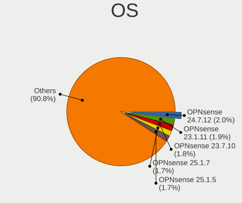

| Name              | Desktops | Percent |
|-------------------|----------|---------|
| OPNsense 24.7.12  | 18       | 2.03%   |
| OPNsense 23.1.11  | 17       | 1.92%   |
| OPNsense 23.7.10  | 16       | 1.81%   |
| OPNsense 25.1.7   | 15       | 1.69%   |
| OPNsense 25.1.5   | 15       | 1.69%   |
| OPNsense 25.1.4   | 15       | 1.69%   |
| OPNsense 24.7     | 15       | 1.69%   |
| OPNsense 24.1.6   | 15       | 1.69%   |
| OPNsense 24.1.7   | 14       | 1.58%   |
| OPNsense 22.7.10  | 14       | 1.58%   |
| OPNsense 25.1.3   | 12       | 1.36%   |
| OPNsense 24.7.11  | 12       | 1.36%   |
| OPNsense 24.1.5   | 12       | 1.36%   |
| OPNsense 25.7.1   | 11       | 1.24%   |
| OPNsense 24.1.1   | 11       | 1.24%   |
| OPNsense 23.7.12  | 11       | 1.24%   |
| OPNsense 25.7.7   | 10       | 1.13%   |
| OPNsense 24.1.4   | 10       | 1.13%   |
| OPNsense 24.1.2   | 10       | 1.13%   |
| OPNsense 23.7.3   | 10       | 1.13%   |
| OPNsense 23.1.6   | 10       | 1.13%   |
| OPNsense 25.7.6   | 9        | 1.02%   |
| OPNsense 23.7.8   | 9        | 1.02%   |
| OPNsense 23.7.1   | 9        | 1.02%   |
| OPNsense 23.1.1   | 9        | 1.02%   |
| OPNsense 22.1.10  | 9        | 1.02%   |
| helloSystem 0.8.1 | 9        | 1.02%   |
| helloSystem 0.7.0 | 9        | 1.02%   |
| OPNsense 25.7.3   | 8        | 0.9%    |
| OPNsense 25.1.9   | 8        | 0.9%    |
| OPNsense 25.1     | 8        | 0.9%    |
| OPNsense 24.7.8   | 8        | 0.9%    |
| OPNsense 24.7.4   | 8        | 0.9%    |
| OPNsense 24.7.3   | 8        | 0.9%    |
| OPNsense 24.7.10  | 8        | 0.9%    |
| OPNsense 23.1.9   | 8        | 0.9%    |
| OPNsense 22.7.8   | 8        | 0.9%    |
| OPNsense 22.1.8   | 8        | 0.9%    |
| OPNsense 21.1.4   | 8        | 0.9%    |
| helloSystem 0.5.0 | 8        | 0.9%    |

OS Family
---------

OS without a version

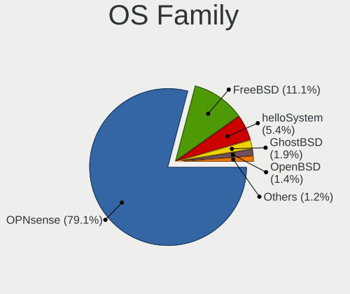

| Name        | Desktops | Percent |
|-------------|----------|---------|
| OPNsense    | 458      | 79.1%   |
| FreeBSD     | 64       | 11.05%  |
| helloSystem | 31       | 5.35%   |
| GhostBSD    | 11       | 1.9%    |
| OpenBSD     | 8        | 1.38%   |
| FreeNAS     | 3        | 0.52%   |
| XigmaNAS    | 1        | 0.17%   |
| TrueNAS     | 1        | 0.17%   |
| pfSense     | 1        | 0.17%   |
| MyBee       | 1        | 0.17%   |

Arch
----

OS architecture (x86_64, i586, etc.)

| Name   | Desktops | Percent |
|--------|----------|---------|
| amd64  | 573      | 99.65%  |
| macppc | 1        | 0.17%   |
| i386   | 1        | 0.17%   |

DE
--

Desktop Environment

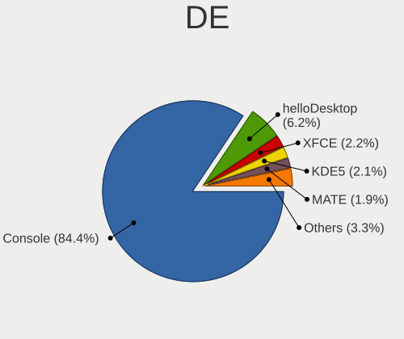

| Name         | Desktops | Percent |
|--------------|----------|---------|
| Console      | 492      | 84.39%  |
| helloDesktop | 36       | 6.17%   |
| XFCE         | 13       | 2.23%   |
| KDE5         | 12       | 2.06%   |
| MATE         | 11       | 1.89%   |
| GNOME        | 6        | 1.03%   |
| Openbox      | 3        | 0.51%   |
| Window Maker | 2        | 0.34%   |
| LXDE         | 2        | 0.34%   |
| Cinnamon     | 2        | 0.34%   |
| X-Cinnamon   | 1        | 0.17%   |
| Lumina       | 1        | 0.17%   |
| KDE6         | 1        | 0.17%   |
| DWM          | 1        | 0.17%   |

Display Server
--------------

X11 or Wayland

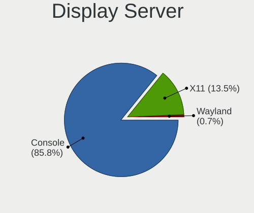

| Name    | Desktops | Percent |
|---------|----------|---------|
| Console | 496      | 85.81%  |
| X11     | 78       | 13.49%  |
| Wayland | 4        | 0.69%   |

Display Manager
---------------

SDDM, LightDM, etc.

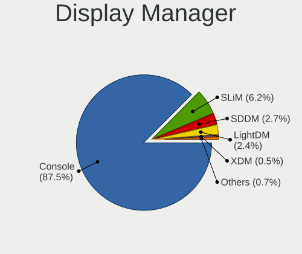

| Name    | Desktops | Percent |
|---------|----------|---------|
| Console | 510      | 87.48%  |
| SLiM    | 36       | 6.17%   |
| SDDM    | 16       | 2.74%   |
| LightDM | 14       | 2.4%    |
| XDM     | 3        | 0.51%   |
| GDM     | 3        | 0.51%   |
| Ly      | 1        | 0.17%   |

OS Lang
-------

Language

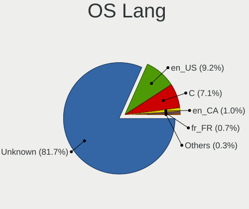

| Lang    | Desktops | Percent |
|---------|----------|---------|
| Unknown | 473      | 81.69%  |
| en_US   | 53       | 9.15%   |
| C       | 41       | 7.08%   |
| en_CA   | 6        | 1.04%   |
| fr_FR   | 4        | 0.69%   |
| fr      | 1        | 0.17%   |
| en      | 1        | 0.17%   |

Boot Mode
---------

EFI or BIOS

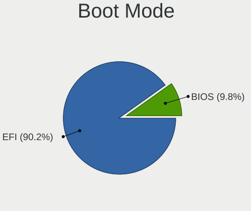

| Mode | Desktops | Percent |
|------|----------|---------|
| EFI  | 522      | 90.16%  |
| BIOS | 57       | 9.84%   |

Filesystem
----------

Type of filesystem

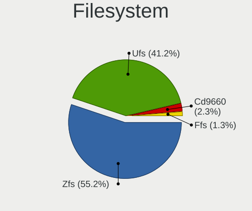

| Type   | Desktops | Percent |
|--------|----------|---------|
| Zfs    | 331      | 55.17%  |
| Ufs    | 247      | 41.17%  |
| Cd9660 | 14       | 2.33%   |
| Ffs    | 8        | 1.33%   |

Part. scheme
------------

Scheme of partitioning

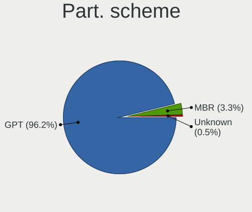

| Type    | Desktops | Percent |
|---------|----------|---------|
| GPT     | 553      | 96.17%  |
| MBR     | 19       | 3.3%    |
| Unknown | 3        | 0.52%   |

Board
-----

Vendor
------

Motherboard manufacturer

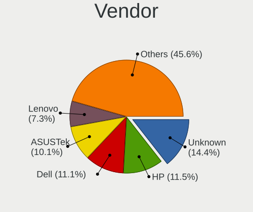

| Name                                 | Desktops | Percent |
|--------------------------------------|----------|---------|
| Unknown                              | 83       | 14.43%  |
| Hewlett-Packard                      | 66       | 11.48%  |
| Dell                                 | 64       | 11.13%  |
| ASUSTek Computer                     | 58       | 10.09%  |
| Lenovo                               | 42       | 7.3%    |
| Protectli                            | 37       | 6.43%   |
| Intel                                | 35       | 6.09%   |
| Gigabyte Technology                  | 23       | 4%      |
| ASRock                               | 20       | 3.48%   |
| MSI                                  | 18       | 3.13%   |
| Supermicro                           | 17       | 2.96%   |
| Techvision                           | 16       | 2.78%   |
| AZW                                  | 12       | 2.09%   |
| Acer                                 | 10       | 1.74%   |
| PC Engines                           | 6        | 1.04%   |
| Shenzhen Meigao Electronic Equipment | 4        | 0.7%    |
| MW                                   | 4        | 0.7%    |
| CncTion                              | 4        | 0.7%    |
| ASRockRack                           | 4        | 0.7%    |
| ShenZhen MinWin Technology           | 3        | 0.52%   |
| CWWK                                 | 3        | 0.52%   |
| BOSGAME                              | 3        | 0.52%   |
| Apple                                | 3        | 0.52%   |
| Yanling                              | 2        | 0.35%   |
| Pegatron                             | 2        | 0.35%   |
| IceWhale Technology                  | 2        | 0.35%   |
| Gowin Solution                       | 2        | 0.35%   |
| Deciso                               | 2        | 0.35%   |
| Datto                                | 2        | 0.35%   |
| Cisco                                | 2        | 0.35%   |
| Biostar                              | 2        | 0.35%   |
| Advantech                            | 2        | 0.35%   |
| ADI Engineering                      | 2        | 0.35%   |
| Trigkey                              | 1        | 0.17%   |
| TianBei                              | 1        | 0.17%   |
| SJRC                                 | 1        | 0.17%   |
| Shuttle                              | 1        | 0.17%   |
| SeeedStudio                          | 1        | 0.17%   |
| Seeed Studio                         | 1        | 0.17%   |
| Quanta                               | 1        | 0.17%   |

Model
-----

Motherboard model

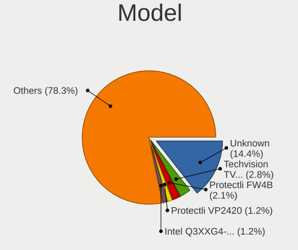

| Name                                              | Desktops | Percent |
|---------------------------------------------------|----------|---------|
| Unknown                                           | 83       | 14.43%  |
| Techvision TVI7309X                               | 16       | 2.78%   |
| Protectli FW4B                                    | 12       | 2.09%   |
| Protectli VP2420                                  | 7        | 1.22%   |
| Intel Q3XXG4-P V1.0                               | 7        | 1.22%   |
| Protectli FW6                                     | 6        | 1.04%   |
| Intel NDISB533                                    | 5        | 0.87%   |
| Intel CRESCENTBAY                                 | 5        | 0.87%   |
| Dell OptiPlex 9010                                | 5        | 0.87%   |
| Dell OptiPlex 7020                                | 5        | 0.87%   |
| AZW U59                                           | 5        | 0.87%   |
| AZW EQ                                            | 5        | 0.87%   |
| Shenzhen Meigao Electronic Equipment Venus series | 4        | 0.7%    |
| MW GMLK-2_5G4L                                    | 4        | 0.7%    |
| HP EliteDesk 800 G1 SFF                           | 4        | 0.7%    |
| Dell OptiPlex 7010                                | 4        | 0.7%    |
| ASUS All Series                                   | 4        | 0.7%    |
| ShenZhen MinWin MW-GMLK-2.5G6L                    | 3        | 0.52%   |
| PC Engines APU2                                   | 3        | 0.52%   |
| Lenovo ThinkCentre M93p 10A8S16X0J                | 3        | 0.52%   |
| HP Z440 Workstation                               | 3        | 0.52%   |
| HP EliteDesk 800 G3 SFF                           | 3        | 0.52%   |
| HP Compaq Elite 8300 SFF                          | 3        | 0.52%   |
| HP Compaq 8200 Elite SFF PC                       | 3        | 0.52%   |
| HP Compaq 6200 Pro MT PC                          | 3        | 0.52%   |
| HP 500-459                                        | 3        | 0.52%   |
| Dell OptiPlex 9020                                | 3        | 0.52%   |
| Dell OptiPlex 7060                                | 3        | 0.52%   |
| Dell OptiPlex 3060                                | 3        | 0.52%   |
| Dell OptiPlex 3020                                | 3        | 0.52%   |
| Dell OptiPlex 3010                                | 3        | 0.52%   |
| BOSGAME Ecolite Series                            | 3        | 0.52%   |
| ASUS PRIME A320M-K                                | 3        | 0.52%   |
| ASUS P8H67-M PRO                                  | 3        | 0.52%   |
| ASRock B450M Pro4                                 | 3        | 0.52%   |
| Supermicro X8STi                                  | 2        | 0.35%   |
| Supermicro SYS-E300-9A                            | 2        | 0.35%   |
| Protectli VP2430                                  | 2        | 0.35%   |
| Protectli VP2410                                  | 2        | 0.35%   |
| Protectli V1610                                   | 2        | 0.35%   |

Model Family
------------

Motherboard model prefix

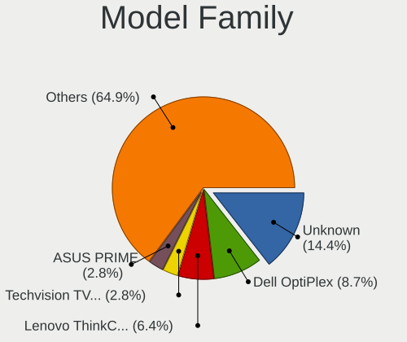

| Name                                       | Desktops | Percent |
|--------------------------------------------|----------|---------|
| Unknown                                    | 83       | 14.43%  |
| Dell OptiPlex                              | 50       | 8.7%    |
| Lenovo ThinkCentre                         | 37       | 6.43%   |
| Techvision TVI7309X                        | 16       | 2.78%   |
| ASUS PRIME                                 | 16       | 2.78%   |
| HP ProDesk                                 | 15       | 2.61%   |
| HP EliteDesk                               | 15       | 2.61%   |
| HP Compaq                                  | 14       | 2.43%   |
| Protectli FW4B                             | 12       | 2.09%   |
| ASUS ROG                                   | 9        | 1.57%   |
| Dell Precision                             | 8        | 1.39%   |
| Acer Aspire                                | 8        | 1.39%   |
| Protectli VP2420                           | 7        | 1.22%   |
| Intel Q3XXG4-P                             | 7        | 1.22%   |
| Protectli FW6                              | 6        | 1.04%   |
| ASRock B450M                               | 6        | 1.04%   |
| Intel NDISB533                             | 5        | 0.87%   |
| Intel CRESCENTBAY                          | 5        | 0.87%   |
| AZW U59                                    | 5        | 0.87%   |
| AZW EQ                                     | 5        | 0.87%   |
| Shenzhen Meigao Electronic Equipment Venus | 4        | 0.7%    |
| MW GMLK-2                                  | 4        | 0.7%    |
| ASUS All                                   | 4        | 0.7%    |
| ShenZhen MinWin MW-GMLK-2.5G6L             | 3        | 0.52%   |
| PC Engines APU2                            | 3        | 0.52%   |
| Lenovo SHARKBAY                            | 3        | 0.52%   |
| HP Z440                                    | 3        | 0.52%   |
| HP t620                                    | 3        | 0.52%   |
| HP 500-459                                 | 3        | 0.52%   |
| BOSGAME Ecolite                            | 3        | 0.52%   |
| ASUS P8H67-M                               | 3        | 0.52%   |
| ASUS M5A97                                 | 3        | 0.52%   |
| Supermicro X8STi                           | 2        | 0.35%   |
| Supermicro SYS-E300-9A                     | 2        | 0.35%   |
| Protectli VP2430                           | 2        | 0.35%   |
| Protectli VP2410                           | 2        | 0.35%   |
| Protectli V1610                            | 2        | 0.35%   |
| Protectli V1410                            | 2        | 0.35%   |
| Protectli FW4C                             | 2        | 0.35%   |
| PC Engines apu4                            | 2        | 0.35%   |

MFG Year
--------

Motherboard manufacture year

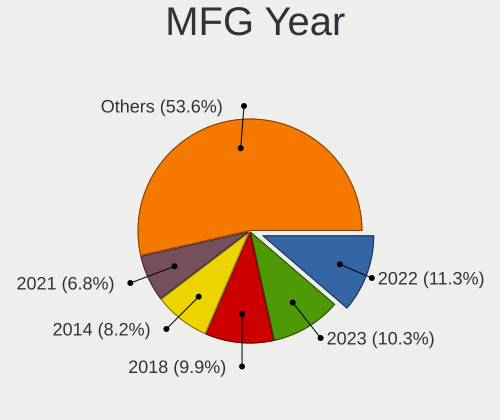

| Year    | Desktops | Percent |
|---------|----------|---------|
| 2022    | 65       | 11.3%   |
| 2023    | 59       | 10.26%  |
| 2018    | 57       | 9.91%   |
| 2014    | 47       | 8.17%   |
| 2021    | 39       | 6.78%   |
| 2024    | 36       | 6.26%   |
| 2017    | 32       | 5.57%   |
| 2020    | 29       | 5.04%   |
| 2016    | 29       | 5.04%   |
| 2013    | 28       | 4.87%   |
| 2011    | 27       | 4.7%    |
| 2012    | 25       | 4.35%   |
| 2019    | 24       | 4.17%   |
| 2015    | 22       | 3.83%   |
| 2010    | 19       | 3.3%    |
| 2008    | 13       | 2.26%   |
| 2009    | 10       | 1.74%   |
| 2025    | 5        | 0.87%   |
| 2007    | 5        | 0.87%   |
| Unknown | 3        | 0.52%   |
| 2006    | 1        | 0.17%   |

Form Factor
-----------

Physical design of the computer

| Name    | Desktops | Percent |
|---------|----------|---------|
| Desktop | 575      | 100%    |

Coreboot
--------

Have coreboot on board

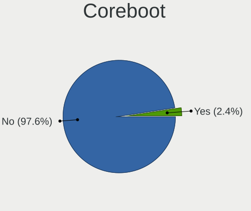

| Used | Desktops | Percent |
|------|----------|---------|
| No   | 561      | 97.57%  |
| Yes  | 14       | 2.43%   |

RAM Size
--------

Total RAM memory

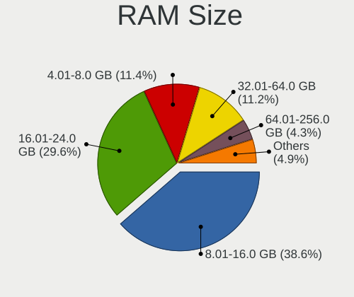

| Size in GB  | Desktops | Percent |
|-------------|----------|---------|
| 8.01-16.0   | 227      | 38.61%  |
| 16.01-24.0  | 174      | 29.59%  |
| 4.01-8.0    | 67       | 11.39%  |
| 32.01-64.0  | 66       | 11.22%  |
| 64.01-256.0 | 25       | 4.25%   |
| 24.01-32.0  | 10       | 1.7%    |
| 2.01-3.0    | 10       | 1.7%    |
| 3.01-4.0    | 6        | 1.02%   |
| 1.01-2.0    | 2        | 0.34%   |
| 0.51-1.0    | 1        | 0.17%   |

RAM Used
--------

Used RAM memory

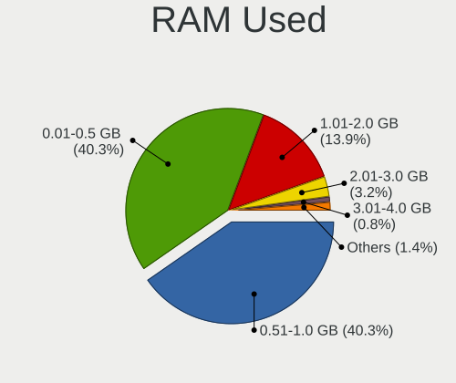

| Used GB     | Desktops | Percent |
|-------------|----------|---------|
| 0.51-1.0    | 238      | 40.34%  |
| 0.01-0.5    | 238      | 40.34%  |
| 1.01-2.0    | 82       | 13.9%   |
| 2.01-3.0    | 19       | 3.22%   |
| 3.01-4.0    | 5        | 0.85%   |
| 4.01-8.0    | 4        | 0.68%   |
| 32.01-64.0  | 1        | 0.17%   |
| 64.01-256.0 | 1        | 0.17%   |
| 8.01-16.0   | 1        | 0.17%   |
| 0           | 1        | 0.17%   |

Total Drives
------------

Number of drives on board

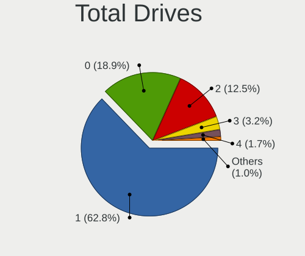

| Drives | Desktops | Percent |
|--------|----------|---------|
| 1      | 378      | 62.79%  |
| 0      | 114      | 18.94%  |
| 2      | 75       | 12.46%  |
| 3      | 19       | 3.16%   |
| 4      | 10       | 1.66%   |
| 13     | 2        | 0.33%   |
| 5      | 2        | 0.33%   |
| 10     | 1        | 0.17%   |
| 7      | 1        | 0.17%   |

Has CD-ROM
----------

Has CD-ROM on board

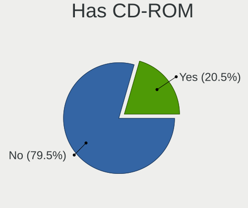

| Presented | Desktops | Percent |
|-----------|----------|---------|
| No        | 464      | 79.45%  |
| Yes       | 120      | 20.55%  |

Has Ethernet
------------

Has Ethernet on board

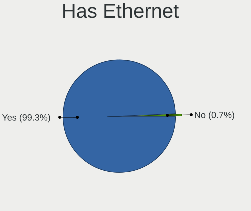

| Presented | Desktops | Percent |
|-----------|----------|---------|
| Yes       | 572      | 99.31%  |
| No        | 4        | 0.69%   |

Has WiFi
--------

Has WiFi module

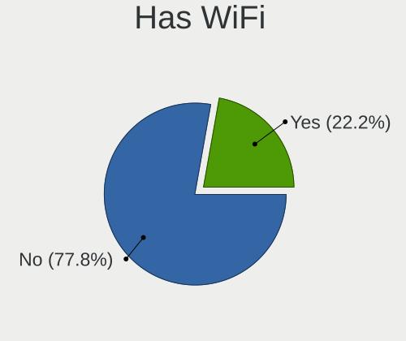

| Presented | Desktops | Percent |
|-----------|----------|---------|
| No        | 452      | 77.8%   |
| Yes       | 129      | 22.2%   |

Has Bluetooth
-------------

Has Bluetooth module

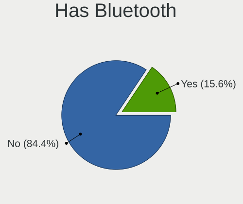

| Presented | Desktops | Percent |
|-----------|----------|---------|
| No        | 487      | 84.4%   |
| Yes       | 90       | 15.6%   |

Location
--------

Country
-------

Geographic location (country)

| Country | Desktops | Percent |
|---------|----------|---------|
| Canada  | 575      | 100%    |

City
----

Geographic location (city)

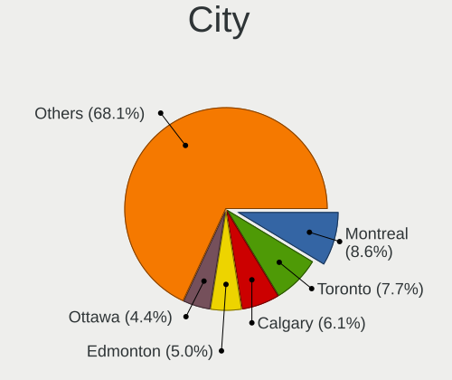

| City                     | Desktops | Percent |
|--------------------------|----------|---------|
| Montreal                 | 55       | 8.65%   |
| Toronto                  | 49       | 7.7%    |
| Calgary                  | 39       | 6.13%   |
| Edmonton                 | 32       | 5.03%   |
| Ottawa                   | 28       | 4.4%    |
| Winnipeg                 | 26       | 4.09%   |
| Victoria                 | 16       | 2.52%   |
| Vancouver                | 15       | 2.36%   |
| Kitchener                | 14       | 2.2%    |
| Scarborough              | 12       | 1.89%   |
| Regina                   | 10       | 1.57%   |
| Brampton                 | 10       | 1.57%   |
| Surrey                   | 9        | 1.42%   |
| Laval                    | 9        | 1.42%   |
| Québec                  | 8        | 1.26%   |
| North Vancouver          | 8        | 1.26%   |
| London                   | 8        | 1.26%   |
| Windsor                  | 6        | 0.94%   |
| Saskatoon                | 6        | 0.94%   |
| Mississauga              | 6        | 0.94%   |
| Longueuil                | 6        | 0.94%   |
| Gatineau                 | 6        | 0.94%   |
| Cambridge                | 6        | 0.94%   |
| Oakville                 | 5        | 0.79%   |
| Moncton                  | 5        | 0.79%   |
| Kingston                 | 5        | 0.79%   |
| Burnaby                  | 5        | 0.79%   |
| Barrie                   | 5        | 0.79%   |
| Terrebonne               | 4        | 0.63%   |
| St. Albert               | 4        | 0.63%   |
| Sainte-Marthe-sur-le-Lac | 4        | 0.63%   |
| Guelph                   | 4        | 0.63%   |
| Burlington               | 4        | 0.63%   |
| St. John's               | 3        | 0.47%   |
| St. Jean Baptiste        | 3        | 0.47%   |
| Sarnia                   | 3        | 0.47%   |
| Saint-Jerome             | 3        | 0.47%   |
| Richmond Hill            | 3        | 0.47%   |
| Richmond                 | 3        | 0.47%   |
| Repentigny               | 3        | 0.47%   |

Drives
------

Drive Vendor
------------

Hard drive vendors

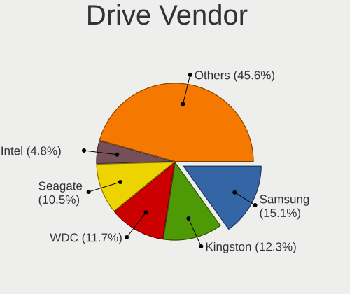

| Vendor              | Desktops | Drives | Percent |
|---------------------|----------|--------|---------|
| Samsung Electronics | 88       | 144    | 15.09%  |
| Kingston            | 72       | 109    | 12.35%  |
| WDC                 | 68       | 138    | 11.66%  |
| Seagate             | 61       | 126    | 10.46%  |
| Intel               | 28       | 43     | 4.8%    |
| Patriot             | 23       | 41     | 3.95%   |
| Crucial             | 23       | 45     | 3.95%   |
| A-DATA Technology   | 21       | 34     | 3.6%    |
| SanDisk             | 17       | 22     | 2.92%   |
| China               | 13       | 20     | 2.23%   |
| SPCC                | 11       | 14     | 1.89%   |
| Micron Technology   | 10       | 20     | 1.72%   |
| Toshiba             | 9        | 14     | 1.54%   |
| Protectli           | 8        | 20     | 1.37%   |
| Phison              | 8        | 9      | 1.37%   |
| Transcend           | 7        | 11     | 1.2%    |
| OCZ                 | 7        | 9      | 1.2%    |
| Hoodisk             | 7        | 12     | 1.2%    |
| Hitachi             | 7        | 7      | 1.2%    |
| Dogfish             | 7        | 15     | 1.2%    |
| HGST                | 6        | 10     | 1.03%   |
| SK hynix            | 5        | 7      | 0.86%   |
| Mushkin             | 5        | 6      | 0.86%   |
| Lexar               | 5        | 8      | 0.86%   |
| PNY                 | 4        | 5      | 0.69%   |
| LITEONIT            | 4        | 5      | 0.69%   |
| Hewlett-Packard     | 4        | 4      | 0.69%   |
| FORESEE             | 4        | 10     | 0.69%   |
| BIWIN               | 4        | 8      | 0.69%   |
| Timetec             | 3        | 5      | 0.51%   |
| Team                | 3        | 8      | 0.51%   |
| NVMe                | 3        | 3      | 0.51%   |
| Corsair             | 3        | 5      | 0.51%   |
| Netac               | 2        | 2      | 0.34%   |
| HUGWORLD            | 2        | 3      | 0.34%   |
| FIKWOT              | 2        | 3      | 0.34%   |
| Fanxiang            | 2        | 2      | 0.34%   |
| Zheino              | 1        | 1      | 0.17%   |
| YMTC                | 1        | 1      | 0.17%   |
| XPG                 | 1        | 2      | 0.17%   |

Drive Model
-----------

Hard drive models

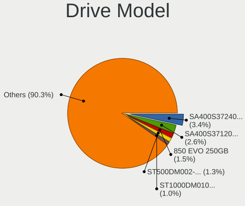

| Model                           | Desktops | Percent |
|---------------------------------|----------|---------|
| Kingston SA400S37240G 240GB     | 21       | 3.39%   |
| Kingston SA400S37120G 120GB     | 16       | 2.58%   |
| Samsung SSD 850 EVO 250GB       | 9        | 1.45%   |
| Seagate ST500DM002-1BD142 500GB | 8        | 1.29%   |
| Seagate ST1000DM010-2EP102 1TB  | 6        | 0.97%   |
| Samsung SSD 870 EVO 250GB       | 6        | 0.97%   |
| Patriot Burst Elite 120GB       | 6        | 0.97%   |
| Seagate ST500LM021-1KJ152 500GB | 5        | 0.81%   |
| Seagate ST2000DM008-2FR102 2TB  | 5        | 0.81%   |
| Samsung SSD 850 PRO 256GB       | 5        | 0.81%   |
| Samsung SSD 840 EVO 250GB       | 5        | 0.81%   |
| Samsung SSD 840 EVO 120GB       | 5        | 0.81%   |
| Crucial CT240BX500SSD1 240GB    | 5        | 0.81%   |
| Toshiba DT01ACA100 1TB          | 4        | 0.65%   |
| SPCC Solid State Disk 256GB     | 4        | 0.65%   |
| SanDisk SD6SB1M064G1022I 64GB   | 4        | 0.65%   |
| Samsung SSD 970 EVO Plus 1TB    | 4        | 0.65%   |
| Samsung SSD 860 EVO 500GB       | 4        | 0.65%   |
| Patriot M.2 P310 240GB          | 4        | 0.65%   |
| Kingston SV300S37A120G 120GB    | 4        | 0.65%   |
| Kingston SKC600MS256G 256GB     | 4        | 0.65%   |
| Intel SSDSC2BB080G4 80GB        | 4        | 0.65%   |
| Dogfish SSD 128GB               | 4        | 0.65%   |
| BIWIN SSD 128GB                 | 4        | 0.65%   |
| WDC WD40EFRX-68WT0N0 4TB        | 3        | 0.48%   |
| WDC WD20EZRX-00DC0B0 2TB        | 3        | 0.48%   |
| Transcend TS256GMSA230S 256GB   | 3        | 0.48%   |
| Seagate ST3500413AS 500GB       | 3        | 0.48%   |
| Samsung SSD 980 250GB           | 3        | 0.48%   |
| Samsung SSD 980 1TB             | 3        | 0.48%   |
| Samsung SSD 870 EVO 500GB       | 3        | 0.48%   |
| Samsung SSD 870 EVO 1TB         | 3        | 0.48%   |
| Phison Sabrent 512GB            | 3        | 0.48%   |
| Kingston SUV500MS120G 120GB     | 3        | 0.48%   |
| Kingston SA400S37480G 480GB     | 3        | 0.48%   |
| Crucial CT500MX500SSD1 500GB    | 3        | 0.48%   |
| Crucial CT1000MX500SSD1 1TB     | 3        | 0.48%   |
| A-DATA SU800 256GB              | 3        | 0.48%   |
| A-DATA SU655 120GB              | 3        | 0.48%   |
| A-DATA SU630 240GB              | 3        | 0.48%   |

HDD Vendor
----------

Hard disk drive vendors

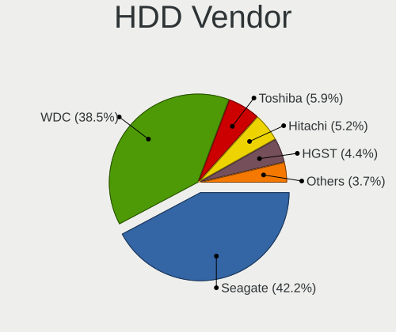

| Vendor   | Desktops | Drives | Percent |
|----------|----------|--------|---------|
| Seagate  | 57       | 121    | 42.22%  |
| WDC      | 52       | 110    | 38.52%  |
| Toshiba  | 8        | 11     | 5.93%   |
| Hitachi  | 7        | 7      | 5.19%   |
| HGST     | 6        | 10     | 4.44%   |
| Synology | 1        | 1      | 0.74%   |
| OPENBSD  | 1        | 1      | 0.74%   |
| NVMe     | 1        | 1      | 0.74%   |
| HPT      | 1        | 1      | 0.74%   |
| Fujitsu  | 1        | 1      | 0.74%   |

SSD Vendor
----------

Solid state drive vendors

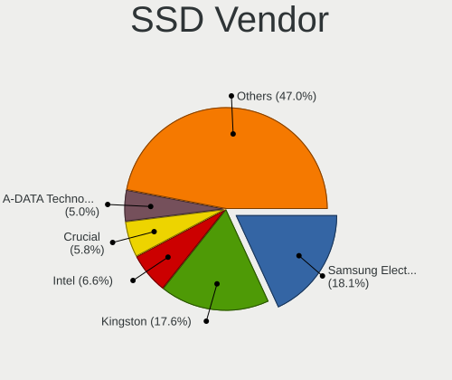

| Vendor              | Desktops | Drives | Percent |
|---------------------|----------|--------|---------|
| Samsung Electronics | 69       | 114    | 18.11%  |
| Kingston            | 67       | 96     | 17.59%  |
| Intel               | 25       | 38     | 6.56%   |
| Crucial             | 22       | 39     | 5.77%   |
| A-DATA Technology   | 19       | 32     | 4.99%   |
| SanDisk             | 17       | 22     | 4.46%   |
| Patriot             | 17       | 33     | 4.46%   |
| China               | 13       | 20     | 3.41%   |
| WDC                 | 11       | 16     | 2.89%   |
| Micron Technology   | 9        | 19     | 2.36%   |
| SPCC                | 8        | 10     | 2.1%    |
| Protectli           | 8        | 20     | 2.1%    |
| Transcend           | 7        | 11     | 1.84%   |
| OCZ                 | 7        | 9      | 1.84%   |
| Hoodisk             | 7        | 12     | 1.84%   |
| Dogfish             | 7        | 15     | 1.84%   |
| Mushkin             | 5        | 6      | 1.31%   |
| Lexar               | 5        | 8      | 1.31%   |
| Seagate             | 4        | 5      | 1.05%   |
| PNY                 | 4        | 5      | 1.05%   |
| LITEONIT            | 4        | 5      | 1.05%   |
| FORESEE             | 4        | 10     | 1.05%   |
| BIWIN               | 4        | 8      | 1.05%   |
| Corsair             | 3        | 5      | 0.79%   |
| Timetec             | 2        | 3      | 0.52%   |
| Netac               | 2        | 2      | 0.52%   |
| HUGWORLD            | 2        | 3      | 0.52%   |
| Hewlett-Packard     | 2        | 2      | 0.52%   |
| FIKWOT              | 2        | 3      | 0.52%   |
| Fanxiang            | 2        | 2      | 0.52%   |
| Zheino              | 1        | 1      | 0.26%   |
| walram              | 1        | 1      | 0.26%   |
| VisionTek           | 1        | 5      | 0.26%   |
| Verbatim            | 1        | 1      | 0.26%   |
| TEXTORM             | 1        | 1      | 0.26%   |
| Team                | 1        | 1      | 0.26%   |
| T-FORCE             | 1        | 1      | 0.26%   |
| SK hynix            | 1        | 1      | 0.26%   |
| Silicon Power       | 1        | 1      | 0.26%   |
| SATADOM             | 1        | 2      | 0.26%   |

Drive Kind
----------

HDD or SSD

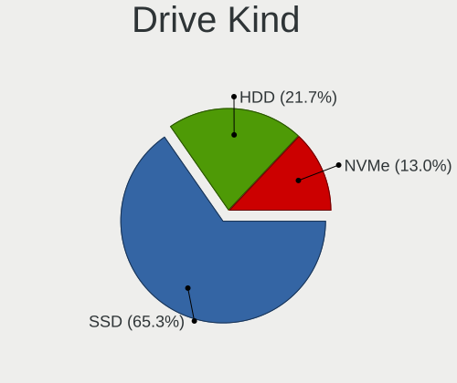

| Kind | Desktops | Drives | Percent |
|------|----------|--------|---------|
| SSD  | 347      | 621    | 65.35%  |
| HDD  | 115      | 264    | 21.66%  |
| NVMe | 69       | 116    | 12.99%  |

Drive Connector
---------------

SATA, SAS, NVMe, etc.

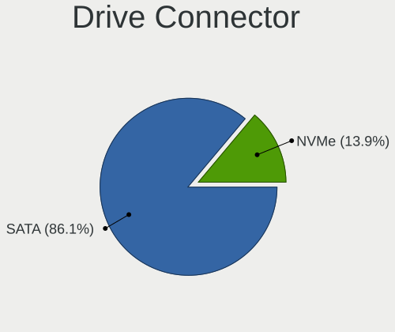

| Type | Desktops | Drives | Percent |
|------|----------|--------|---------|
| SATA | 428      | 885    | 86.12%  |
| NVMe | 69       | 116    | 13.88%  |

Drive Size
----------

Size of hard drive

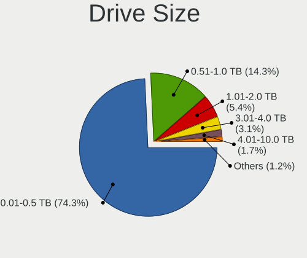

| Size in TB | Desktops | Drives | Percent |
|------------|----------|--------|---------|
| 0.01-0.5   | 358      | 621    | 74.27%  |
| 0.51-1.0   | 69       | 131    | 14.32%  |
| 1.01-2.0   | 26       | 47     | 5.39%   |
| 3.01-4.0   | 15       | 36     | 3.11%   |
| 4.01-10.0  | 8        | 37     | 1.66%   |
| 2.01-3.0   | 4        | 10     | 0.83%   |
| 10.01-20.0 | 2        | 3      | 0.41%   |

Space Total
-----------

Amount of disk space available on the file system

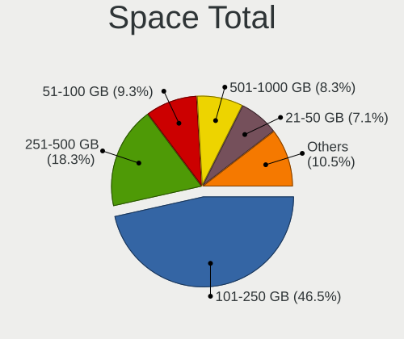

| Size in GB     | Desktops | Percent |
|----------------|----------|---------|
| 101-250        | 280      | 46.51%  |
| 251-500        | 110      | 18.27%  |
| 51-100         | 56       | 9.3%    |
| 501-1000       | 50       | 8.31%   |
| 21-50          | 43       | 7.14%   |
| 1-20           | 37       | 6.15%   |
| 1001-2000      | 17       | 2.82%   |
| More than 3000 | 6        | 1%      |
| Unknown        | 3        | 0.5%    |

Space Used
----------

Amount of used disk space

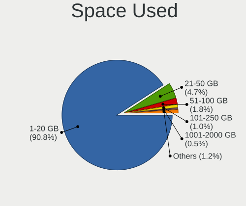

| Used GB        | Desktops | Percent |
|----------------|----------|---------|
| 1-20           | 545      | 90.83%  |
| 21-50          | 28       | 4.67%   |
| 51-100         | 11       | 1.83%   |
| 101-250        | 6        | 1%      |
| 1001-2000      | 3        | 0.5%    |
| Unknown        | 3        | 0.5%    |
| 501-1000       | 2        | 0.33%   |
| More than 3000 | 1        | 0.17%   |
| 251-500        | 1        | 0.17%   |

Malfunc. Drives
---------------

Drive models with a malfunction

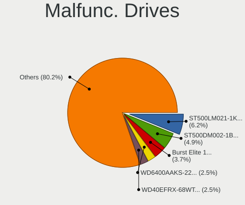

| Model                                           | Desktops | Drives | Percent |
|-------------------------------------------------|----------|--------|---------|
| Seagate ST500LM021-1KJ152 500GB                 | 5        | 9      | 6.17%   |
| Seagate ST500DM002-1BD142 500GB                 | 4        | 7      | 4.94%   |
| Patriot Burst Elite 120GB                       | 3        | 4      | 3.7%    |
| WDC WD6400AAKS-22A7B2 640GB                     | 2        | 10     | 2.47%   |
| WDC WD40EFRX-68WT0N0 4TB                        | 2        | 3      | 2.47%   |
| Toshiba MQ01ABD075 752GB                        | 2        | 2      | 2.47%   |
| Seagate ST3500413AS 500GB                       | 2        | 4      | 2.47%   |
| Samsung Electronics SSD 870 EVO 250GB           | 2        | 11     | 2.47%   |
| Patriot Pyro SE 120GB                           | 2        | 4      | 2.47%   |
| WDC WD800JD-08MSA1 80GB                         | 1        | 2      | 1.23%   |
| WDC WD60EZRZ-00RWYB1 6TB                        | 1        | 2      | 1.23%   |
| WDC WD50EFRX-68L0BN1 5TB                        | 1        | 1      | 1.23%   |
| WDC WD5003AZEX-00K1GA0 500GB                    | 1        | 1      | 1.23%   |
| WDC WD40EZRZ-00WN9B0 4TB                        | 1        | 1      | 1.23%   |
| WDC WD3200AAKS-75L9A0 320GB                     | 1        | 1      | 1.23%   |
| WDC WD30EZRX-22D8PB0 3TB                        | 1        | 1      | 1.23%   |
| WDC WD2500AAKX-001CA0 250GB                     | 1        | 1      | 1.23%   |
| WDC WD1600AAJS-60Z0A0 160GB                     | 1        | 2      | 1.23%   |
| WDC WD15EARS-00Z5B1 1.5TB                       | 1        | 1      | 1.23%   |
| WDC WD1200SD-01KCB0 120GB                       | 1        | 1      | 1.23%   |
| walram SSD 120G                                 | 1        | 1      | 1.23%   |
| VisionTek mSATA 120GB                           | 1        | 5      | 1.23%   |
| Toshiba MQ01ABD100 1TB                          | 1        | 1      | 1.23%   |
| Toshiba DT01ACA100 1TB                          | 1        | 3      | 1.23%   |
| TEXTORM B5 240GB                                | 1        | 1      | 1.23%   |
| SPCC Solid State Disk 128GB                     | 1        | 1      | 1.23%   |
| Seagate ST3250318AS 250GB                       | 1        | 1      | 1.23%   |
| Seagate ST3200822AS 200GB                       | 1        | 1      | 1.23%   |
| Seagate ST3160815AS 160GB                       | 1        | 2      | 1.23%   |
| Seagate ST31500341AS 1.5TB                      | 1        | 2      | 1.23%   |
| Seagate ST3120026A 120GB                        | 1        | 1      | 1.23%   |
| Seagate ST31000520AS 1TB                        | 1        | 1      | 1.23%   |
| Seagate ST1000DM003-1CH162 1TB                  | 1        | 2      | 1.23%   |
| SanDisk SDSSDX240GG25 240GB                     | 1        | 1      | 1.23%   |
| Samsung Electronics SSD SM841 mSATA 128GB       | 1        | 1      | 1.23%   |
| Samsung Electronics SSD 870 EVO 1TB             | 1        | 1      | 1.23%   |
| Samsung Electronics SSD 850 PRO 256GB           | 1        | 1      | 1.23%   |
| Mushkin MKNSSDSR250GB                           | 1        | 1      | 1.23%   |
| Mushkin MKNSSDEC512GB                           | 1        | 2      | 1.23%   |
| Micron Technology MTFDDAK256MAY-1AH12ABHA 256GB | 1        | 3      | 1.23%   |

Malfunc. Drive Vendor
---------------------

Vendors of faulty drives

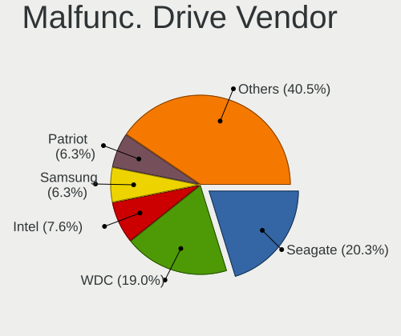

| Vendor              | Desktops | Drives | Percent |
|---------------------|----------|--------|---------|
| Seagate             | 16       | 30     | 20.25%  |
| WDC                 | 15       | 27     | 18.99%  |
| Intel               | 6        | 8      | 7.59%   |
| Samsung Electronics | 5        | 14     | 6.33%   |
| Patriot             | 5        | 8      | 6.33%   |
| Toshiba             | 4        | 6      | 5.06%   |
| Kingston            | 4        | 6      | 5.06%   |
| Hitachi             | 4        | 4      | 5.06%   |
| HGST                | 3        | 5      | 3.8%    |
| Mushkin             | 2        | 3      | 2.53%   |
| Micron Technology   | 2        | 7      | 2.53%   |
| Crucial             | 2        | 3      | 2.53%   |
| A-DATA Technology   | 2        | 3      | 2.53%   |
| walram              | 1        | 1      | 1.27%   |
| VisionTek           | 1        | 5      | 1.27%   |
| TEXTORM             | 1        | 1      | 1.27%   |
| SPCC                | 1        | 1      | 1.27%   |
| SanDisk             | 1        | 1      | 1.27%   |
| KingSpec            | 1        | 1      | 1.27%   |
| Hewlett-Packard     | 1        | 1      | 1.27%   |
| Dogfish             | 1        | 3      | 1.27%   |
| AMD                 | 1        | 3      | 1.27%   |

Malfunc. HDD Vendor
-------------------

Vendors of faulty HDD drives

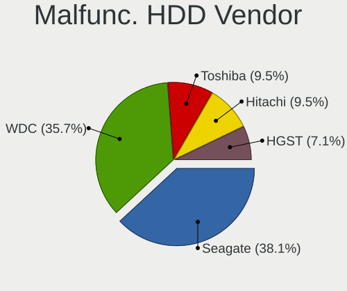

| Vendor  | Desktops | Drives | Percent |
|---------|----------|--------|---------|
| Seagate | 16       | 30     | 38.1%   |
| WDC     | 15       | 27     | 35.71%  |
| Toshiba | 4        | 6      | 9.52%   |
| Hitachi | 4        | 4      | 9.52%   |
| HGST    | 3        | 5      | 7.14%   |

Malfunc. Drive Kind
-------------------

Kinds of faulty drives

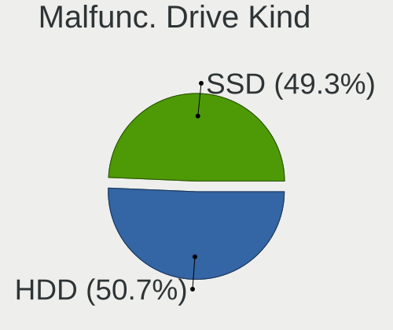

| Kind | Desktops | Drives | Percent |
|------|----------|--------|---------|
| HDD  | 38       | 72     | 50.67%  |
| SSD  | 37       | 69     | 49.33%  |

Failed Drives
-------------

Failed drive models

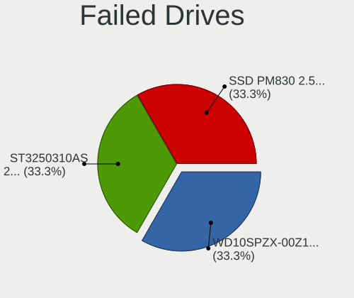

| Model                                            | Desktops | Drives | Percent |
|--------------------------------------------------|----------|--------|---------|
| WDC WD10SPZX-00Z10T0 1TB                         | 1        | 1      | 33.33%  |
| Seagate ST3250310AS 250GB                        | 1        | 1      | 33.33%  |
| Samsung Electronics SSD PM830 2.5-inch 7mm 256GB | 1        | 1      | 33.33%  |

Failed Drive Vendor
-------------------

Failed drive vendors

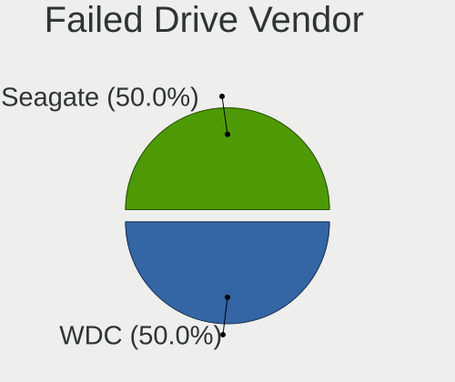

| Vendor              | Desktops | Drives | Percent |
|---------------------|----------|--------|---------|
| WDC                 | 1        | 1      | 33.33%  |
| Seagate             | 1        | 1      | 33.33%  |
| Samsung Electronics | 1        | 1      | 33.33%  |

Drive Status
------------

Number of failed and malfunc. drives

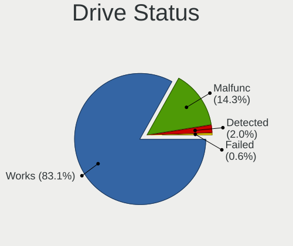

| Status   | Desktops | Drives | Percent |
|----------|----------|--------|---------|
| Works    | 423      | 846    | 83.1%   |
| Malfunc  | 73       | 141    | 14.34%  |
| Detected | 10       | 11     | 1.96%   |
| Failed   | 3        | 3      | 0.59%   |

Storage controller
------------------

Storage Vendor
--------------

Storage controller vendors

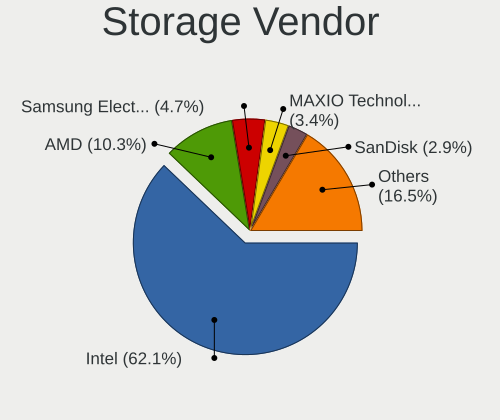

| Vendor                        | Desktops | Percent |
|-------------------------------|----------|---------|
| Intel                         | 471      | 62.14%  |
| AMD                           | 78       | 10.29%  |
| Samsung Electronics           | 36       | 4.75%   |
| MAXIO Technology (Hangzhou)   | 26       | 3.43%   |
| SanDisk                       | 22       | 2.9%    |
| Silicon Motion                | 16       | 2.11%   |
| Kingston Technology Company   | 16       | 2.11%   |
| Phison Electronics            | 14       | 1.85%   |
| ASMedia Technology            | 9        | 1.19%   |
| SK hynix                      | 8        | 1.06%   |
| Nvidia                        | 7        | 0.92%   |
| JMicron Technology            | 6        | 0.79%   |
| Marvell Technology Group      | 5        | 0.66%   |
| Realtek Semiconductor         | 4        | 0.53%   |
| Micron/Crucial Technology     | 4        | 0.53%   |
| Broadcom / LSI                | 4        | 0.53%   |
| Yangtze Memory Technologies   | 3        | 0.4%    |
| VIA Technologies              | 3        | 0.4%    |
| Toshiba                       | 3        | 0.4%    |
| Micron Technology             | 3        | 0.4%    |
| Hosin Global Electronics      | 3        | 0.4%    |
| Chelsio Communications        | 3        | 0.4%    |
| ADATA Technology              | 3        | 0.4%    |
| Silicon Image                 | 2        | 0.26%   |
| KIOXIA                        | 2        | 0.26%   |
| Solidigm                      | 1        | 0.13%   |
| Shenzhen Longsys Electronics  | 1        | 0.13%   |
| Integrated Technology Express | 1        | 0.13%   |
| HighPoint Technologies        | 1        | 0.13%   |
| Biwin Storage Technology      | 1        | 0.13%   |
| Apple                         | 1        | 0.13%   |
| Unknown                       | 1        | 0.13%   |

Storage Model
-------------

Storage controller models

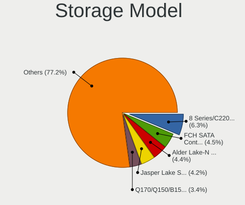

| Model                                                                            | Desktops | Percent |
|----------------------------------------------------------------------------------|----------|---------|
| Intel 8 Series/C220 Series Chipset Family 6-port SATA Controller 1 [AHCI mode]   | 55       | 6.31%   |
| AMD FCH SATA Controller [AHCI mode]                                              | 39       | 4.48%   |
| Intel Alder Lake-N SATA AHCI Controller                                          | 38       | 4.36%   |
| Intel Jasper Lake SATA AHCI Controller                                           | 37       | 4.25%   |
| Intel Q170/Q150/B150/H170/H110/Z170/CM236 Chipset SATA Controller [AHCI Mode]    | 30       | 3.44%   |
| Intel Celeron/Pentium Silver Processor SATA Controller                           | 28       | 3.21%   |
| Intel 6 Series/C200 Series Chipset Family 6 port Desktop SATA AHCI Controller    | 28       | 3.21%   |
| MAXIO (Hangzhou) NVMe SSD Controller MAP1202 (DRAM-less)                         | 26       | 2.99%   |
| Intel 200 Series PCH SATA controller [AHCI mode]                                 | 22       | 2.53%   |
| Intel Cannon Lake PCH SATA AHCI Controller                                       | 21       | 2.41%   |
| Intel 7 Series/C210 Series Chipset Family 6-port SATA Controller [AHCI mode]     | 21       | 2.41%   |
| AMD 400 Series Chipset SATA Controller                                           | 20       | 2.3%    |
| Silicon Motion SM2263EN/SM2263XT (DRAM-less) NVMe SSD Controllers                | 15       | 1.72%   |
| Samsung NVMe SSD Controller SM981/PM981/PM983                                    | 15       | 1.72%   |
| Intel SATA Controller [RAID mode]                                                | 15       | 1.72%   |
| Intel Atom/Celeron/Pentium Processor x5-E8000/J3xxx/N3xxx Series SATA Controller | 15       | 1.72%   |
| Intel Atom Processor C3000 Series SATA Controller 1                              | 15       | 1.72%   |
| Intel Elkhart Lake SATA AHCI                                                     | 12       | 1.38%   |
| Intel Atom Processor C3000 Series SATA Controller 0                              | 11       | 1.26%   |
| Intel 8 Series SATA Controller 1 [AHCI mode]                                     | 11       | 1.26%   |
| AMD SB7x0/SB8x0/SB9x0 SATA Controller [AHCI mode]                                | 11       | 1.26%   |
| Intel Alder Lake-S PCH SATA Controller [AHCI Mode]                               | 10       | 1.15%   |
| Intel 82801JI (ICH10 Family) SATA AHCI Controller                                | 10       | 1.15%   |
| Samsung NVMe SSD Controller PM9A1/PM9A3/980PRO                                   | 8        | 0.92%   |
| Samsung NVMe SSD Controller 980 (DRAM-less)                                      | 8        | 0.92%   |
| Intel Sunrise Point-LP SATA Controller [AHCI mode]                               | 8        | 0.92%   |
| ASMedia ASM1061/ASM1062 Serial ATA Controller                                    | 8        | 0.92%   |
| Intel NM10/ICH7 Family SATA Controller [IDE mode]                                | 7        | 0.8%    |
| Intel Celeron N3350/Pentium N4200/Atom E3900 Series SATA AHCI Controller         | 7        | 0.8%    |
| Intel 82801G (ICH7 Family) IDE Controller                                        | 7        | 0.8%    |
| Phison PS5013-E13 PCIe3 NVMe Controller (DRAM-less)                              | 6        | 0.69%   |
| Intel Comet Lake SATA AHCI Controller                                            | 6        | 0.69%   |
| Intel C610/X99 series chipset 6-Port SATA Controller [AHCI mode]                 | 6        | 0.69%   |
| Intel 5 Series/3400 Series Chipset 6 port SATA AHCI Controller                   | 6        | 0.69%   |
| AMD SB7x0/SB8x0/SB9x0 IDE Controller                                             | 6        | 0.69%   |
| AMD 500 Series Chipset SATA Controller                                           | 6        | 0.69%   |
| Intel Wildcat Point-LP SATA Controller [AHCI Mode]                               | 5        | 0.57%   |
| Intel 4 Series Chipset PT IDER Controller                                        | 5        | 0.57%   |
| AMD FCH SATA Controller [IDE mode]                                               | 5        | 0.57%   |
| SanDisk Ultra 3D / WD Blue SN570 NVMe SSD (DRAM-less)                            | 4        | 0.46%   |

Storage Kind
------------

Kind of storage controller (IDE, SATA, NVMe, SAS, ...)

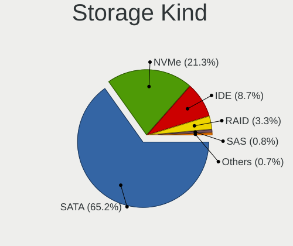

| Kind | Desktops | Percent |
|------|----------|---------|
| SATA | 492      | 65.17%  |
| NVMe | 161      | 21.32%  |
| IDE  | 66       | 8.74%   |
| RAID | 25       | 3.31%   |
| SAS  | 6        | 0.79%   |
| SCSI | 5        | 0.66%   |

Processor
---------

CPU Vendor
----------

Processor vendors

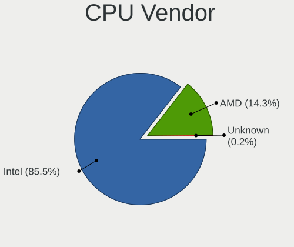

| Vendor  | Desktops | Percent |
|---------|----------|---------|
| Intel   | 496      | 85.52%  |
| AMD     | 83       | 14.31%  |
| Unknown | 1        | 0.17%   |

CPU Model
---------

Processor models

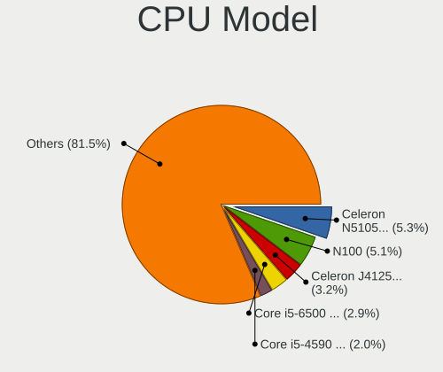

| Model                                | Desktops | Percent |
|--------------------------------------|----------|---------|
| Intel Celeron N5105 @ 2.00GHz        | 31       | 5.27%   |
| Intel N100                           | 30       | 5.1%    |
| Intel Celeron J4125 CPU @ 2.00GHz    | 19       | 3.23%   |
| Intel Core i5-6500 CPU @ 3.20GHz     | 17       | 2.89%   |
| Intel Core i5-4590 CPU @ 3.30GHz     | 12       | 2.04%   |
| Intel Celeron CPU J3160 @ 1.60GHz    | 12       | 2.04%   |
| Intel Core i5-4570 CPU @ 3.20GHz     | 9        | 1.53%   |
| Intel Core i5-3570 CPU @ 3.40GHz     | 9        | 1.53%   |
| Intel Core i7-3770 CPU @ 3.40GHz     | 8        | 1.36%   |
| Intel Core i5-8500 CPU @ 3.00GHz     | 8        | 1.36%   |
| Intel Celeron J6412 @ 2.00GHz        | 8        | 1.36%   |
| Intel N150                           | 7        | 1.19%   |
| Intel N95                            | 6        | 1.02%   |
| Intel Core 2 Duo CPU E8400 @ 3.00GHz | 6        | 1.02%   |
| Intel Pentium Silver N6005 @ 2.00GHz | 5        | 0.85%   |
| Intel Core i5-4570TE CPU @ 2.70GHz   | 5        | 0.85%   |
| Intel Core i5-3470 CPU @ 3.20GHz     | 5        | 0.85%   |
| Intel Core i3-N305                   | 5        | 0.85%   |
| Intel Core i3-6100 CPU @ 3.70GHz     | 5        | 0.85%   |
| Intel Core i3-4030U CPU @ 1.90GHz    | 5        | 0.85%   |
| Intel Atom CPU C3758 @ 2.20GHz       | 5        | 0.85%   |
| AMD GX-412TC SOC                     | 5        | 0.85%   |
| Intel Xeon                           | 4        | 0.68%   |
| Intel Core i7-8700 CPU @ 3.20GHz     | 4        | 0.68%   |
| Intel Core i5-7200U CPU @ 2.50GHz    | 4        | 0.68%   |
| Intel Core i5-4460 CPU @ 3.20GHz     | 4        | 0.68%   |
| Intel Core i5-2400 CPU @ 3.10GHz     | 4        | 0.68%   |
| Intel Core i3-2100 CPU @ 3.10GHz     | 4        | 0.68%   |
| Intel Celeron J6413 @ 1.80GHz        | 4        | 0.68%   |
| Intel Celeron J4105 CPU @ 1.50GHz    | 4        | 0.68%   |
| AMD Ryzen 5 2600 Six-Core Processor  | 4        | 0.68%   |
| Intel Pentium CPU G4560 @ 3.50GHz    | 3        | 0.51%   |
| Intel Core i7-9700K CPU @ 3.60GHz    | 3        | 0.51%   |
| Intel Core i7-7700 CPU @ 3.60GHz     | 3        | 0.51%   |
| Intel Core i7-4790K CPU @ 4.00GHz    | 3        | 0.51%   |
| Intel Core i5-8400 CPU @ 2.80GHz     | 3        | 0.51%   |
| Intel Core i5-7400 CPU @ 3.00GHz     | 3        | 0.51%   |
| Intel Core i5-6500T CPU @ 2.50GHz    | 3        | 0.51%   |
| Intel Core i5-4670 CPU @ 3.40GHz     | 3        | 0.51%   |
| Intel Core i5-4430 CPU @ 3.00GHz     | 3        | 0.51%   |

CPU Model Family
----------------

Processor model prefix

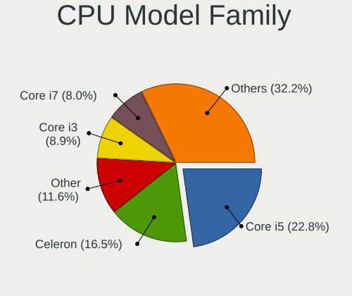

| Model                   | Desktops | Percent |
|-------------------------|----------|---------|
| Intel Core i5           | 134      | 22.83%  |
| Intel Celeron           | 97       | 16.52%  |
| Other                   | 68       | 11.58%  |
| Intel Core i3           | 52       | 8.86%   |
| Intel Core i7           | 47       | 8.01%   |
| Intel Xeon              | 36       | 6.13%   |
| Intel Atom              | 23       | 3.92%   |
| AMD Ryzen 5             | 18       | 3.07%   |
| Intel Pentium           | 12       | 2.04%   |
| Intel Core 2 Duo        | 10       | 1.7%    |
| AMD GX                  | 10       | 1.7%    |
| AMD FX                  | 9        | 1.53%   |
| Intel Pentium Silver    | 7        | 1.19%   |
| Intel Core 2 Quad       | 7        | 1.19%   |
| AMD Ryzen 9             | 6        | 1.02%   |
| AMD Ryzen 7             | 6        | 1.02%   |
| AMD Athlon 64 X2        | 5        | 0.85%   |
| AMD Athlon              | 4        | 0.68%   |
| Intel Pentium Dual-Core | 3        | 0.51%   |
| AMD Ryzen 3             | 3        | 0.51%   |
| AMD A8                  | 3        | 0.51%   |
| Intel Core i9           | 2        | 0.34%   |
| Intel Core              | 2        | 0.34%   |
| AMD Phenom II X6        | 2        | 0.34%   |
| AMD Athlon II X2        | 2        | 0.34%   |
| AMD A6                  | 2        | 0.34%   |
| AMD A10                 | 2        | 0.34%   |
| Intel Pentium Gold      | 1        | 0.17%   |
| Intel Pentium Dual      | 1        | 0.17%   |
| Intel Pentium 4         | 1        | 0.17%   |
| Intel Core 2            | 1        | 0.17%   |
| AMD Ryzen Embedded      | 1        | 0.17%   |
| AMD Ryzen 5 PRO         | 1        | 0.17%   |
| AMD PRO A8              | 1        | 0.17%   |
| AMD PRO A10             | 1        | 0.17%   |
| AMD Phenom II X4        | 1        | 0.17%   |
| AMD Phenom              | 1        | 0.17%   |
| AMD G                   | 1        | 0.17%   |
| AMD EPYC                | 1        | 0.17%   |
| AMD E                   | 1        | 0.17%   |

CPU Cores
---------

Number of processor cores

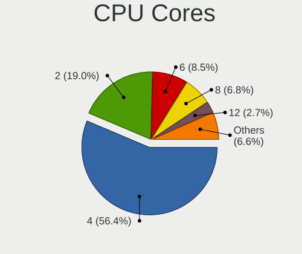

| Number  | Desktops | Percent |
|---------|----------|---------|
| 4       | 332      | 56.37%  |
| 2       | 112      | 19.02%  |
| 6       | 50       | 8.49%   |
| 8       | 40       | 6.79%   |
| 12      | 16       | 2.72%   |
| 16      | 10       | 1.7%    |
| Unknown | 8        | 1.36%   |
| 32      | 5        | 0.85%   |
| 10      | 5        | 0.85%   |
| 20      | 3        | 0.51%   |
| 3       | 3        | 0.51%   |
| 24      | 2        | 0.34%   |
| 11      | 1        | 0.17%   |
| 5       | 1        | 0.17%   |
| 1       | 1        | 0.17%   |

CPU Sockets
-----------

Number of sockets

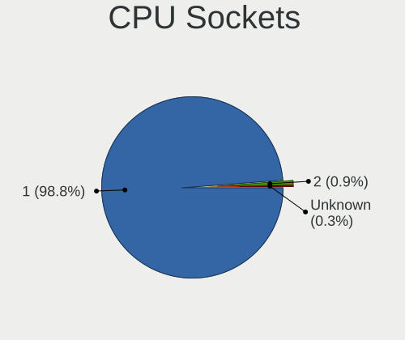

| Number  | Desktops | Percent |
|---------|----------|---------|
| 1       | 568      | 98.78%  |
| 2       | 5        | 0.87%   |
| Unknown | 2        | 0.35%   |

CPU Threads
-----------

Threads per core (Hyper-Threading)

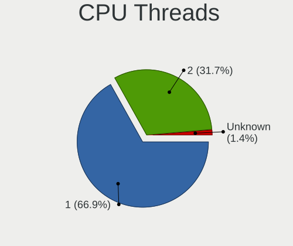

| Number  | Desktops | Percent |
|---------|----------|---------|
| 1       | 390      | 66.9%   |
| 2       | 185      | 31.73%  |
| Unknown | 8        | 1.37%   |

CPU Microarch
-------------

Microarchitecture

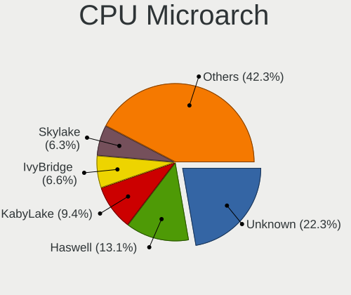

| Name          | Desktops | Percent |
|---------------|----------|---------|
| Unknown       | 131      | 22.28%  |
| Haswell       | 77       | 13.1%   |
| KabyLake      | 55       | 9.35%   |
| IvyBridge     | 39       | 6.63%   |
| Skylake       | 37       | 6.29%   |
| SandyBridge   | 29       | 4.93%   |
| Goldmont plus | 28       | 4.76%   |
| Silvermont    | 22       | 3.74%   |
| Goldmont      | 22       | 3.74%   |
| Penryn        | 21       | 3.57%   |
| Zen 3         | 13       | 2.21%   |
| Zen+          | 12       | 2.04%   |
| Westmere      | 12       | 2.04%   |
| Piledriver    | 9        | 1.53%   |
| Broadwell     | 9        | 1.53%   |
| CometLake     | 8        | 1.36%   |
| Puma          | 7        | 1.19%   |
| K10           | 7        | 1.19%   |
| Zen           | 6        | 1.02%   |
| K8 Hammer     | 6        | 1.02%   |
| Jaguar        | 6        | 1.02%   |
| Zen 2         | 5        | 0.85%   |
| Nehalem       | 5        | 0.85%   |
| Core          | 5        | 0.85%   |
| Bonnell       | 4        | 0.68%   |
| Excavator     | 3        | 0.51%   |
| Bulldozer     | 3        | 0.51%   |
| Steamroller   | 2        | 0.34%   |
| Bobcat        | 2        | 0.34%   |
| TigerLake     | 1        | 0.17%   |
| NetBurst      | 1        | 0.17%   |
| K10 Llano     | 1        | 0.17%   |

Graphics
--------

GPU Vendor
----------

Vendors of graphics cards

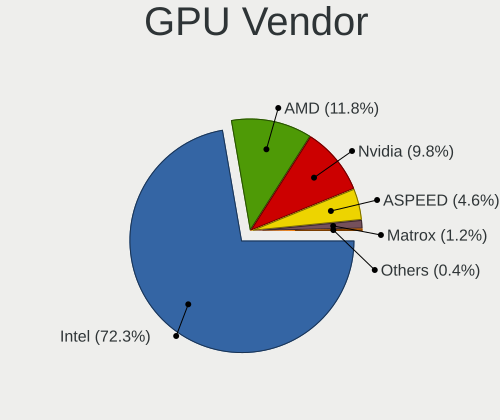

| Vendor                                       | Desktops | Percent |
|----------------------------------------------|----------|---------|
| Intel                                        | 412      | 72.28%  |
| AMD                                          | 67       | 11.75%  |
| Nvidia                                       | 56       | 9.82%   |
| ASPEED Technology                            | 26       | 4.56%   |
| Matrox Electronics Systems                   | 7        | 1.23%   |
| XGI Technology (eXtreme Graphics Innovation) | 1        | 0.18%   |
| Silicon Motion                               | 1        | 0.18%   |

GPU Model
---------

Graphics card models

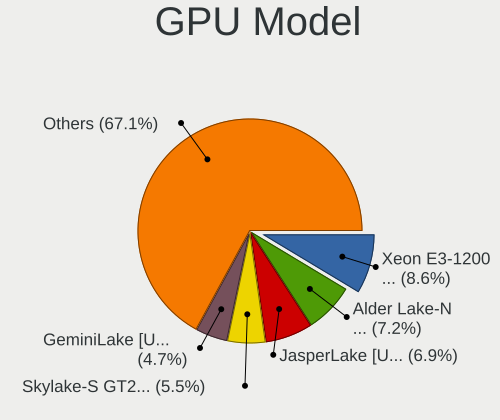

| Model                                                                                    | Desktops | Percent |
|------------------------------------------------------------------------------------------|----------|---------|
| Intel Xeon E3-1200 v3/4th Gen Core Processor Integrated Graphics Controller              | 50       | 8.62%   |
| Intel Alder Lake-N [UHD Graphics]                                                        | 42       | 7.24%   |
| Intel JasperLake [UHD Graphics]                                                          | 40       | 6.9%    |
| Intel Skylake-S GT2 [HD Graphics 530]                                                    | 32       | 5.52%   |
| Intel GeminiLake [UHD Graphics 600]                                                      | 27       | 4.66%   |
| ASPEED Technology ASPEED Graphics Family                                                 | 26       | 4.48%   |
| Intel CoffeeLake-S GT2 [UHD Graphics 630]                                                | 23       | 3.97%   |
| Intel 2nd Generation Core Processor Family Integrated Graphics Controller                | 23       | 3.97%   |
| Intel Xeon E3-1200 v2/3rd Gen Core processor Graphics Controller                         | 19       | 3.28%   |
| Intel Atom/Celeron/Pentium Processor x5-E8000/J3xxx/N3xxx Integrated Graphics Controller | 16       | 2.76%   |
| Intel Kaby Lake-S GT2 [HD Graphics 630]                                                  | 14       | 2.41%   |
| Intel 4 Series Chipset Integrated Graphics Controller                                    | 13       | 2.24%   |
| Intel Elkhart Lake [UHD Graphics Gen11 16EU]                                             | 12       | 2.07%   |
| Intel IvyBridge GT2 [HD Graphics 4000]                                                   | 10       | 1.72%   |
| Intel Haswell-ULT Integrated Graphics Controller                                         | 10       | 1.72%   |
| Intel Alder Lake-N [Intel Graphics]                                                      | 9        | 1.55%   |
| Intel Apollo Lake GT1 [HD Graphics 500]                                                  | 7        | 1.21%   |
| Matrox Electronics Systems MGA G200eW WPCM450                                            | 6        | 1.03%   |
| AMD Picasso/Raven 2 [Radeon Vega Series / Radeon Vega Mobile Series]                     | 6        | 1.03%   |
| Nvidia GK208B [GeForce GT 710]                                                           | 5        | 0.86%   |
| Intel Broadwell-U GT2 [HD Graphics 5500]                                                 | 5        | 0.86%   |
| Intel Alder Lake-S GT1 [UHD Graphics 730]                                                | 5        | 0.86%   |
| AMD Cezanne [Radeon Vega Series / Radeon Vega Mobile Series]                             | 5        | 0.86%   |
| Intel Kaby Lake-U GT2 [HD Graphics 620]                                                  | 4        | 0.69%   |
| Intel Alder Lake-S GT1 [UHD Graphics 770]                                                | 4        | 0.69%   |
| Intel 82Q35 Express Integrated Graphics Controller                                       | 4        | 0.69%   |
| Nvidia GT218 [GeForce 210]                                                               | 3        | 0.52%   |
| Nvidia GP107 [GeForce GTX 1050 Ti]                                                       | 3        | 0.52%   |
| Nvidia GM107GL [Quadro K620]                                                             | 3        | 0.52%   |
| Intel Kaby Lake-S GT1 [HD Graphics 610]                                                  | 3        | 0.52%   |
| Intel Kaby Lake-R GT2 [UHD Graphics 620]                                                 | 3        | 0.52%   |
| Intel Core Processor Integrated Graphics Controller                                      | 3        | 0.52%   |
| Intel CometLake-S GT2 [UHD Graphics 630]                                                 | 3        | 0.52%   |
| Intel Atom Processor Z36xxx/Z37xxx Series Graphics & Display                             | 3        | 0.52%   |
| Intel 4th Generation Core Processor Family Integrated Graphics Controller                | 3        | 0.52%   |
| AMD Raven Ridge [Radeon Vega Series / Radeon Vega Mobile Series]                         | 3        | 0.52%   |
| AMD Park [Mobility Radeon HD 5430]                                                       | 3        | 0.52%   |
| AMD Navi 10 [Radeon RX 5600 OEM/5600 XT / 5700/5700 XT]                                  | 3        | 0.52%   |
| Nvidia GT218 [GeForce 8400 GS Rev. 3]                                                    | 2        | 0.34%   |
| Nvidia GP108 [GeForce GT 1030]                                                           | 2        | 0.34%   |

GPU Combo
---------

Combinations of graphics cards

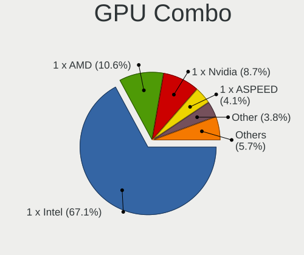

| Name               | Desktops | Percent |
|--------------------|----------|---------|
| 1 x Intel          | 392      | 67.12%  |
| 1 x AMD            | 62       | 10.62%  |
| 1 x Nvidia         | 51       | 8.73%   |
| 1 x ASPEED         | 24       | 4.11%   |
| Other              | 22       | 3.77%   |
| 2 x Intel          | 12       | 2.05%   |
| 1 x Matrox         | 7        | 1.2%    |
| 2 x AMD            | 3        | 0.51%   |
| Intel + Nvidia     | 3        | 0.51%   |
| Intel + ASPEED     | 2        | 0.34%   |
| Intel + AMD        | 2        | 0.34%   |
| AMD + Nvidia       | 2        | 0.34%   |
| 1 x XGI            | 1        | 0.17%   |
| 1 x Silicon Motion | 1        | 0.17%   |

GPU Driver
----------

Free vs proprietary

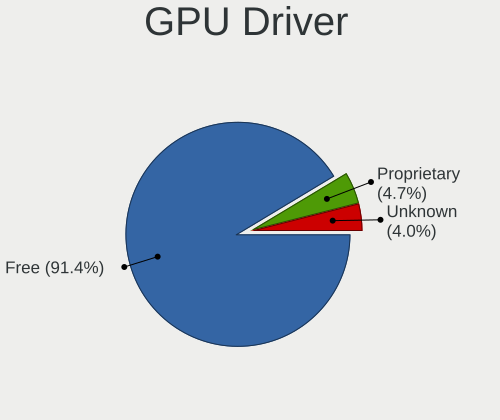

| Driver      | Desktops | Percent |
|-------------|----------|---------|
| Free        | 530      | 91.38%  |
| Proprietary | 27       | 4.66%   |
| Unknown     | 23       | 3.97%   |

GPU Memory
----------

Total video memory

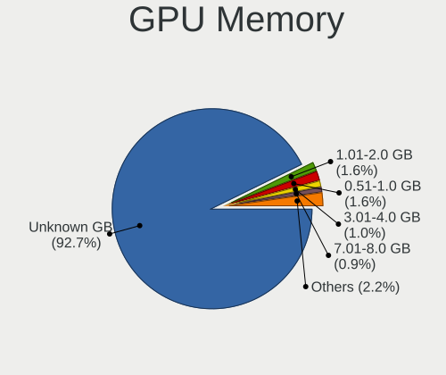

| Size in GB | Desktops | Percent |
|------------|----------|---------|
| Unknown    | 536      | 92.73%  |
| 1.01-2.0   | 9        | 1.56%   |
| 0.51-1.0   | 9        | 1.56%   |
| 3.01-4.0   | 6        | 1.04%   |
| 7.01-8.0   | 5        | 0.87%   |
| 5.01-6.0   | 4        | 0.69%   |
| 0.01-0.5   | 4        | 0.69%   |
| 8.01-16.0  | 3        | 0.52%   |
| 2.01-3.0   | 1        | 0.17%   |
| 16.01-24.0 | 1        | 0.17%   |

Monitor
-------

Monitor Vendor
--------------

Monitor vendors

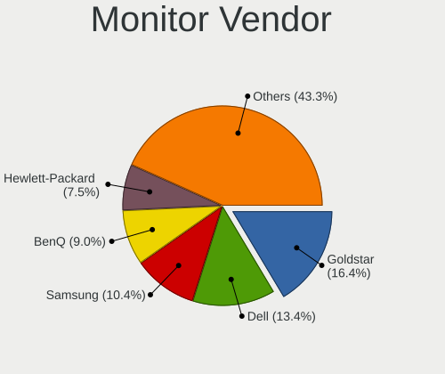

| Vendor               | Desktops | Percent |
|----------------------|----------|---------|
| Goldstar             | 11       | 16.42%  |
| Dell                 | 9        | 13.43%  |
| Samsung Electronics  | 7        | 10.45%  |
| BenQ                 | 6        | 8.96%   |
| Hewlett-Packard      | 5        | 7.46%   |
| LG Electronics       | 4        | 5.97%   |
| Acer                 | 4        | 5.97%   |
| Sony                 | 3        | 4.48%   |
| Lenovo               | 3        | 4.48%   |
| ASUSTek Computer     | 3        | 4.48%   |
| AOC                  | 3        | 4.48%   |
| ViewSonic            | 1        | 1.49%   |
| Videoseven           | 1        | 1.49%   |
| Toshiba              | 1        | 1.49%   |
| SANSUI               | 1        | 1.49%   |
| LTV                  | 1        | 1.49%   |
| Insignia             | 1        | 1.49%   |
| AU Optronics         | 1        | 1.49%   |
| Ancor Communications | 1        | 1.49%   |
| Unknown              | 1        | 1.49%   |

Monitor Model
-------------

Monitor models

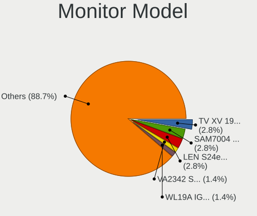

| Model                                                                  | Desktops | Percent |
|------------------------------------------------------------------------|----------|---------|
| Sony LCD Monitor TV XV 1920x1080                                       | 2        | 2.82%   |
| Samsung Electronics LCD Monitor SAM7004 3840x2160 1210x680mm 54.6-inch | 2        | 2.82%   |
| Lenovo LEN S24e-10 LEN61CA 1920x1080 530x300mm 24.0-inch               | 2        | 2.82%   |
| ViewSonic VA2342 SERIES VSCFA2B 1920x1080 510x290mm 23.1-inch          | 1        | 1.41%   |
| Videoseven WL19A IGM1908 1280x1024 380x300mm 19.1-inch                 | 1        | 1.41%   |
| Toshiba TV TSB0200 1920x1080 530x300mm 24.0-inch                       | 1        | 1.41%   |
| Sony TV  *30 SNY05D1 3840x2160 1660x930mm 74.9-inch                    | 1        | 1.41%   |
| SANSUI ES-24F1 XEC2535 1920x1080 530x300mm 24.0-inch                   | 1        | 1.41%   |
| Samsung Electronics Odyssey G8 SAM7256 3840x2160 700x400mm 31.7-inch   | 1        | 1.41%   |
| Samsung Electronics LCD Monitor SyncMaster 1920x1200                   | 1        | 1.41%   |
| Samsung Electronics LCD Monitor SAM7002 3840x2160 1210x680mm 54.6-inch | 1        | 1.41%   |
| Samsung Electronics LCD Monitor SAM0FEE 3840x2160 1110x620mm 50.1-inch | 1        | 1.41%   |
| Samsung Electronics LCD Monitor SAM0B54 1366x768 520x290mm 23.4-inch   | 1        | 1.41%   |
| LTV LTV1280M1A LTV0A3C 1024x768 800x450mm 36.1-inch                    | 1        | 1.41%   |
| LG Electronics LCD Monitor W2243 1920x1080                             | 1        | 1.41%   |
| LG Electronics LCD Monitor LG ULTRAGEAR 2560x1440                      | 1        | 1.41%   |
| LG Electronics LCD Monitor LG Ultra HD 7680x2160                       | 1        | 1.41%   |
| LG Electronics LCD Monitor LG Ultra HD                                 | 1        | 1.41%   |
| LG Electronics LCD Monitor LG FULL HD 1920x1080                        | 1        | 1.41%   |
| Lenovo LEN-M93z-B  LEN0093 1920x1080 510x290mm 23.1-inch               | 1        | 1.41%   |
| Insignia LCD Monitor BBY0050 1920x1080 700x400mm 31.7-inch             | 1        | 1.41%   |
| Hewlett-Packard TouchSmart HWP4211 1920x1080 510x290mm 23.1-inch       | 1        | 1.41%   |
| Hewlett-Packard E241i HWP3123 1920x1200 520x320mm 24.0-inch            | 1        | 1.41%   |
| Hewlett-Packard All-in-One HWP4218 1600x900 440x250mm 19.9-inch        | 1        | 1.41%   |
| Hewlett-Packard 2710 HWP2895 1920x1080 600x340mm 27.2-inch             | 1        | 1.41%   |
| Hewlett-Packard 24f HPN3545 1920x1080 530x300mm 24.0-inch              | 1        | 1.41%   |
| Goldstar W2442 GSM56D9 1920x1080 530x300mm 24.0-inch                   | 1        | 1.41%   |
| Goldstar W2243 GSM56FE 1920x1080 480x270mm 21.7-inch                   | 1        | 1.41%   |
| Goldstar W2052 GSM4E88 1680x1050 470x300mm 22.0-inch                   | 1        | 1.41%   |
| Goldstar MP59G GSM5B35 1920x1080 600x340mm 27.2-inch                   | 1        | 1.41%   |
| Goldstar MP59G GSM5B34 1920x1080 480x270mm 21.7-inch                   | 1        | 1.41%   |
| Goldstar LG ULTRAWIDE GSM5AE2 3440x1440 800x340mm 34.2-inch            | 1        | 1.41%   |
| Goldstar LG ULTRAWIDE GSM59F1 2560x1080 670x280mm 28.6-inch            | 1        | 1.41%   |
| Goldstar LG ULTRAGEAR GSM7766 2560x1440 700x390mm 31.5-inch            | 1        | 1.41%   |
| Goldstar LG ULTRAGEAR GSM5B7F 2560x1440 600x340mm 27.2-inch            | 1        | 1.41%   |
| Goldstar LG HDR 4K GSM7706 3840x2160 600x340mm 27.2-inch               | 1        | 1.41%   |
| Goldstar LG FULL HD GSM5B55 1920x1080 480x270mm 21.7-inch              | 1        | 1.41%   |
| Goldstar LG FULL HD GSM5ABA 1920x1080 480x270mm 21.7-inch              | 1        | 1.41%   |
| Goldstar LCD Monitor GSM76F5 1920x1080 700x390mm 31.5-inch             | 1        | 1.41%   |
| Dell U2722D DEL422F 2560x1440 600x340mm 27.2-inch                      | 1        | 1.41%   |

Monitor Resolution
------------------

Monitor screen resolution

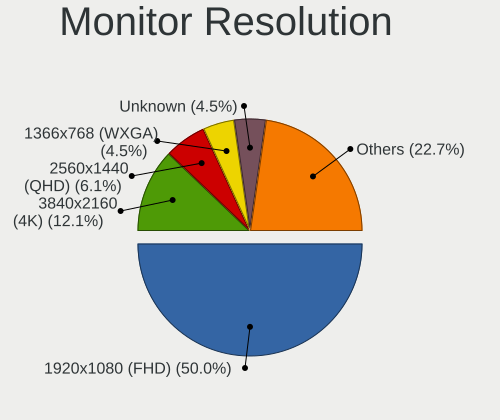

| Resolution         | Desktops | Percent |
|--------------------|----------|---------|
| 1920x1080 (FHD)    | 33       | 50%     |
| 3840x2160 (4K)     | 8        | 12.12%  |
| 2560x1440 (QHD)    | 4        | 6.06%   |
| 1366x768 (WXGA)    | 3        | 4.55%   |
| Unknown            | 3        | 4.55%   |
| 1920x1200 (WUXGA)  | 2        | 3.03%   |
| 1680x1050 (WSXGA+) | 2        | 3.03%   |
| 1440x900 (WXGA+)   | 2        | 3.03%   |
| 1280x1024 (SXGA)   | 2        | 3.03%   |
| 7680x2160          | 1        | 1.52%   |
| 3840x1080          | 1        | 1.52%   |
| 3440x1440          | 1        | 1.52%   |
| 2560x1080          | 1        | 1.52%   |
| 1600x900 (HD+)     | 1        | 1.52%   |
| 1600x1200          | 1        | 1.52%   |
| 1024x768 (XGA)     | 1        | 1.52%   |

Monitor Diagonal
----------------

Diagonal size in inches

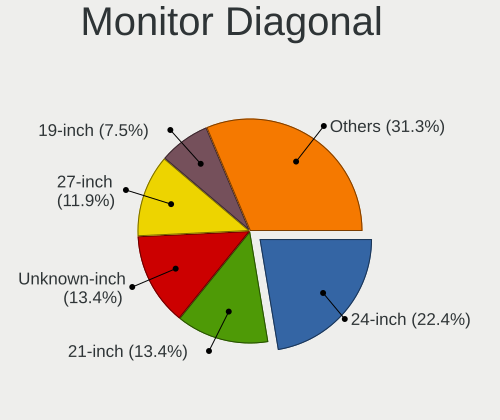

| Inches  | Desktops | Percent |
|---------|----------|---------|
| 24      | 15       | 22.39%  |
| 21      | 9        | 13.43%  |
| Unknown | 9        | 13.43%  |
| 27      | 8        | 11.94%  |
| 19      | 5        | 7.46%   |
| 31      | 4        | 5.97%   |
| 23      | 4        | 5.97%   |
| 54      | 3        | 4.48%   |
| 34      | 2        | 2.99%   |
| 22      | 2        | 2.99%   |
| 74      | 1        | 1.49%   |
| 50      | 1        | 1.49%   |
| 36      | 1        | 1.49%   |
| 20      | 1        | 1.49%   |
| 18      | 1        | 1.49%   |
| 13      | 1        | 1.49%   |

Monitor Width
-------------

Physical width

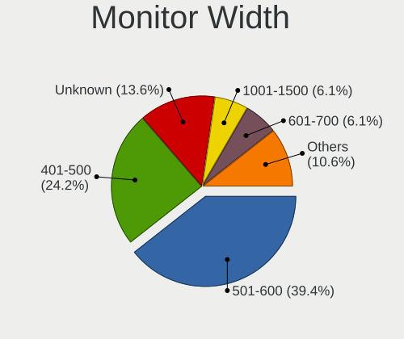

| Width in mm | Desktops | Percent |
|-------------|----------|---------|
| 501-600     | 26       | 39.39%  |
| 401-500     | 16       | 24.24%  |
| Unknown     | 9        | 13.64%  |
| 601-700     | 4        | 6.06%   |
| 1001-1500   | 4        | 6.06%   |
| 701-800     | 3        | 4.55%   |
| 351-400     | 2        | 3.03%   |
| 301-350     | 1        | 1.52%   |
| 1501-2000   | 1        | 1.52%   |

Aspect Ratio
------------

Proportional relationship between the width and the height

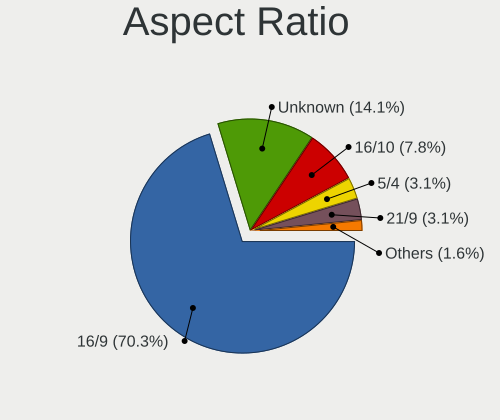

| Ratio   | Desktops | Percent |
|---------|----------|---------|
| 16/9    | 45       | 70.31%  |
| Unknown | 9        | 14.06%  |
| 16/10   | 5        | 7.81%   |
| 5/4     | 2        | 3.13%   |
| 21/9    | 2        | 3.13%   |
| 4/3     | 1        | 1.56%   |

Monitor Area
------------

Area in inch²

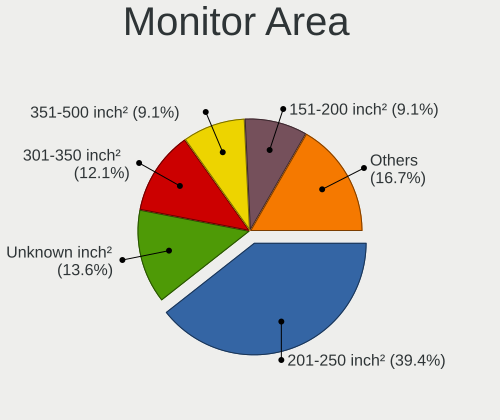

| Area in inch² | Desktops | Percent |
|----------------|----------|---------|
| 201-250        | 26       | 39.39%  |
| Unknown        | 9        | 13.64%  |
| 301-350        | 8        | 12.12%  |
| 351-500        | 6        | 9.09%   |
| 151-200        | 6        | 9.09%   |
| More than 1000 | 5        | 7.58%   |
| 251-300        | 3        | 4.55%   |
| 81-90          | 1        | 1.52%   |
| 141-150        | 1        | 1.52%   |
| 501-1000       | 1        | 1.52%   |

Pixel Density
-------------

Pixels per inch

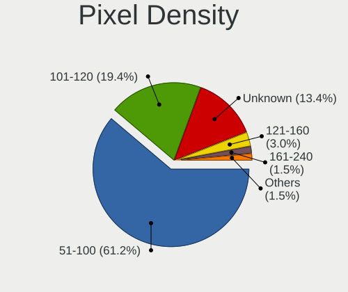

| Density | Desktops | Percent |
|---------|----------|---------|
| 51-100  | 41       | 61.19%  |
| 101-120 | 13       | 19.4%   |
| Unknown | 9        | 13.43%  |
| 121-160 | 2        | 2.99%   |
| 1-50    | 1        | 1.49%   |
| 161-240 | 1        | 1.49%   |

Multiple Monitors
-----------------

Total monitors connected

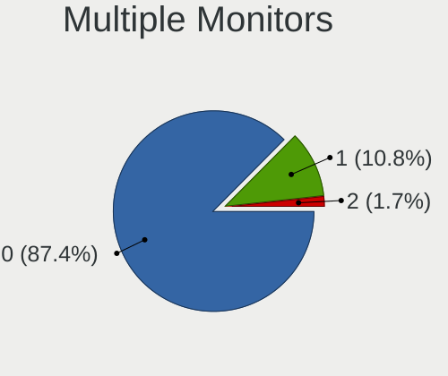

| Total | Desktops | Percent |
|-------|----------|---------|
| 0     | 508      | 87.44%  |
| 1     | 63       | 10.84%  |
| 2     | 10       | 1.72%   |

Network
-------

Net Controller Vendor
---------------------

Controller vendors

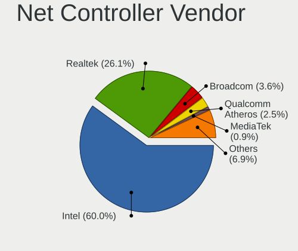

| Vendor                          | Desktops | Percent |
|---------------------------------|----------|---------|
| Intel                           | 479      | 60.03%  |
| Realtek Semiconductor           | 208      | 26.07%  |
| Broadcom                        | 29       | 3.63%   |
| Qualcomm Atheros                | 20       | 2.51%   |
| MediaTek                        | 7        | 0.88%   |
| Mellanox Technologies           | 6        | 0.75%   |
| IMC Networks                    | 5        | 0.63%   |
| Aquantia                        | 4        | 0.5%    |
| U-Blox                          | 3        | 0.38%   |
| Solarflare Communications       | 3        | 0.38%   |
| Ralink                          | 3        | 0.38%   |
| Marvell Technology Group        | 3        | 0.38%   |
| Chelsio Communications          | 3        | 0.38%   |
| TP-Link                         | 2        | 0.25%   |
| Ralink Technology               | 2        | 0.25%   |
| Linksys                         | 2        | 0.25%   |
| D-Link                          | 2        | 0.25%   |
| American Megatrends             | 2        | 0.25%   |
| 3Com                            | 2        | 0.25%   |
| Telit Wireless Solutions        | 1        | 0.13%   |
| sipeed                          | 1        | 0.13%   |
| Seeed Technology                | 1        | 0.13%   |
| Qualcomm Technologies           | 1        | 0.13%   |
| Qualcomm Atheros Communications | 1        | 0.13%   |
| QLogic                          | 1        | 0.13%   |
| NetGear                         | 1        | 0.13%   |
| Hewlett-Packard                 | 1        | 0.13%   |
| Google                          | 1        | 0.13%   |
| Edimax Technology               | 1        | 0.13%   |
| D-Link System                   | 1        | 0.13%   |
| Apple                           | 1        | 0.13%   |
| Accton Technology               | 1        | 0.13%   |

Net Controller Model
--------------------

Controller models

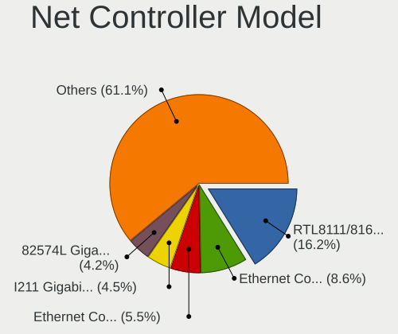

| Model                                                                         | Desktops | Percent |
|-------------------------------------------------------------------------------|----------|---------|
| Realtek RTL8111/8168/8211/8411 PCI Express Gigabit Ethernet Controller        | 168      | 16.15%  |
| Intel Ethernet Controller I226-V                                              | 89       | 8.56%   |
| Intel Ethernet Controller I225-V                                              | 57       | 5.48%   |
| Intel I211 Gigabit Network Connection                                         | 47       | 4.52%   |
| Intel 82574L Gigabit Network Connection                                       | 44       | 4.23%   |
| Intel Ethernet Connection I217-LM                                             | 37       | 3.56%   |
| Intel 82579LM Gigabit Network Connection (Lewisville)                         | 35       | 3.37%   |
| Realtek RTL8125 2.5GbE Controller                                             | 29       | 2.79%   |
| Intel I350 Gigabit Network Connection                                         | 29       | 2.79%   |
| Intel I210 Gigabit Network Connection                                         | 27       | 2.6%    |
| Intel 82599ES 10-Gigabit SFI/SFP+ Network Connection                          | 22       | 2.12%   |
| Intel 82576 Gigabit Network Connection                                        | 22       | 2.12%   |
| Intel Ethernet Connection (2) I219-LM                                         | 18       | 1.73%   |
| Intel Ethernet Controller 10-Gigabit X540-AT2                                 | 13       | 1.25%   |
| Intel 82583V Gigabit Network Connection                                       | 12       | 1.15%   |
| Intel Ethernet Connection X553 10 GbE SFP+                                    | 11       | 1.06%   |
| Intel 82580 Gigabit Network Connection                                        | 11       | 1.06%   |
| Realtek RTL8111/8168/8411 PCI Express Gigabit Ethernet Controller             | 9        | 0.87%   |
| Intel Wi-Fi 6 AX200                                                           | 9        | 0.87%   |
| Intel Alder Lake-N PCH CNVi WiFi                                              | 9        | 0.87%   |
| Intel 82571EB/82571GB Gigabit Ethernet Controller D0/D1 (copper applications) | 9        | 0.87%   |
| Intel Ethernet Connection (5) I219-LM                                         | 8        | 0.77%   |
| Intel Ethernet Connection (2) I219-V                                          | 8        | 0.77%   |
| Intel 82575EB Gigabit Network Connection                                      | 8        | 0.77%   |
| Intel Ethernet Connection (7) I219-LM                                         | 7        | 0.67%   |
| Intel 82571EB/82571GB Gigabit Ethernet Controller (Copper)                    | 7        | 0.67%   |
| Realtek RTL8821CE 802.11ac PCIe Wireless Network Adapter                      | 6        | 0.58%   |
| Intel Wireless 7260                                                           | 6        | 0.58%   |
| Intel Ethernet Controller X550                                                | 6        | 0.58%   |
| Intel 82566DM-2 Gigabit Network Connection                                    | 6        | 0.58%   |
| Intel Wireless 3165                                                           | 5        | 0.48%   |
| Intel Ethernet Connection X553 1GbE                                           | 5        | 0.48%   |
| Intel Ethernet Connection I217-V                                              | 5        | 0.48%   |
| Intel Dual Band Wireless-AC 3168NGW [Stone Peak]                              | 5        | 0.48%   |
| Intel Alder Lake-S PCH CNVi WiFi                                              | 5        | 0.48%   |
| Intel 82567LM-3 Gigabit Network Connection                                    | 5        | 0.48%   |
| IMC Networks 802.11 n/g/b Wireless LAN USB Mini-Card                          | 5        | 0.48%   |
| Broadcom NetXtreme II BCM57810 10 Gigabit Ethernet                            | 5        | 0.48%   |
| Realtek RTL8852BE PCIe 802.11ax Wireless Network Controller                   | 4        | 0.38%   |
| Qualcomm Atheros QCA9377 802.11ac Wireless Network Adapter                    | 4        | 0.38%   |

Wireless Vendor
---------------

Wireless vendors

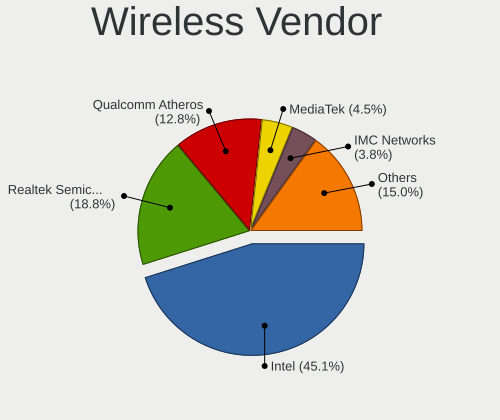

| Vendor                          | Desktops | Percent |
|---------------------------------|----------|---------|
| Intel                           | 60       | 45.11%  |
| Realtek Semiconductor           | 25       | 18.8%   |
| Qualcomm Atheros                | 17       | 12.78%  |
| MediaTek                        | 6        | 4.51%   |
| IMC Networks                    | 5        | 3.76%   |
| Broadcom                        | 5        | 3.76%   |
| Ralink                          | 3        | 2.26%   |
| TP-Link                         | 2        | 1.5%    |
| Ralink Technology               | 2        | 1.5%    |
| Linksys                         | 2        | 1.5%    |
| D-Link                          | 2        | 1.5%    |
| Qualcomm Technologies           | 1        | 0.75%   |
| Qualcomm Atheros Communications | 1        | 0.75%   |
| NetGear                         | 1        | 0.75%   |
| Edimax Technology               | 1        | 0.75%   |

Wireless Model
--------------

Wireless models

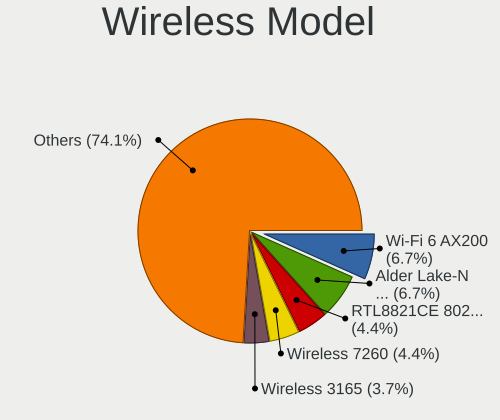

| Model                                                                | Desktops | Percent |
|----------------------------------------------------------------------|----------|---------|
| Intel Wi-Fi 6 AX200                                                  | 9        | 6.67%   |
| Intel Alder Lake-N PCH CNVi WiFi                                     | 9        | 6.67%   |
| Realtek RTL8821CE 802.11ac PCIe Wireless Network Adapter             | 6        | 4.44%   |
| Intel Wireless 7260                                                  | 6        | 4.44%   |
| Intel Wireless 3165                                                  | 5        | 3.7%    |
| Intel Dual Band Wireless-AC 3168NGW [Stone Peak]                     | 5        | 3.7%    |
| Intel Alder Lake-S PCH CNVi WiFi                                     | 5        | 3.7%    |
| IMC Networks 802.11 n/g/b Wireless LAN USB Mini-Card                 | 5        | 3.7%    |
| Realtek RTL8852BE PCIe 802.11ax Wireless Network Controller          | 4        | 2.96%   |
| Qualcomm Atheros QCA9377 802.11ac Wireless Network Adapter           | 4        | 2.96%   |
| Intel Wi-Fi 6E(802.11ax) AX210/AX1675* 2x2 [Typhoon Peak]            | 4        | 2.96%   |
| Realtek RTL8821AE 802.11ac PCIe Wireless Network Adapter             | 3        | 2.22%   |
| Realtek RTL8188EUS 802.11n Wireless Network Adapter                  | 3        | 2.22%   |
| Realtek RTL8188EE Wireless Network Adapter                           | 3        | 2.22%   |
| Qualcomm Atheros AR93xx Wireless Network Adapter                     | 3        | 2.22%   |
| Qualcomm Atheros AR9287 Wireless Network Adapter (PCI-Express)       | 3        | 2.22%   |
| MediaTek MT7921 802.11ax PCIe Wireless Network Adapter [Filogic 330] | 3        | 2.22%   |
| Intel Jasper Lake PCH CNVi WiFi                                      | 3        | 2.22%   |
| Intel Cannon Lake PCH CNVi WiFi                                      | 3        | 2.22%   |
| Ralink RT2870/RT3070 Wireless Adapter                                | 2        | 1.48%   |
| Qualcomm Atheros AR9462 Wireless Network Adapter                     | 2        | 1.48%   |
| MediaTek MT7922 802.11ax PCI Express Wireless Network Adapter        | 2        | 1.48%   |
| Linksys WUSB54G v4 802.11g Adapter [Ralink RT2500USB]                | 2        | 1.48%   |
| Intel Wireless 7265                                                  | 2        | 1.48%   |
| Intel Tiger Lake PCH CNVi WiFi                                       | 2        | 1.48%   |
| Intel Gemini Lake PCH CNVi WiFi                                      | 2        | 1.48%   |
| Broadcom BCM43225 802.11b/g/n                                        | 2        | 1.48%   |
| TP-Link Archer T4U ver.3                                             | 1        | 0.74%   |
| TP-Link AC600 wireless Realtek RTL8811AU [Archer T2U Nano]           | 1        | 0.74%   |
| Realtek RTL8822BE 802.11a/b/g/n/ac WiFi adapter                      | 1        | 0.74%   |
| Realtek RTL8812AE 802.11ac PCIe Wireless Network Adapter             | 1        | 0.74%   |
| Realtek RTL8192EE PCIe Wireless Network Adapter                      | 1        | 0.74%   |
| Realtek RTL8192CU 802.11n WLAN Adapter                               | 1        | 0.74%   |
| Realtek Bluetooth Adapter                                            | 1        | 0.74%   |
| Realtek 8811CU Wireless LAN 802.11ac USB NIC                         | 1        | 0.74%   |
| Ralink RT5592 PCIe Wireless Network Adapter                          | 1        | 0.74%   |
| Ralink RT3290 Wireless 802.11n 1T/1R PCIe                            | 1        | 0.74%   |
| Ralink RT3062 Wireless 802.11n 2T/2R                                 | 1        | 0.74%   |
| Qualcomm WCN785x Wi-Fi 7(802.11be) 320MHz 2x2 [FastConnect 7800]     | 1        | 0.74%   |
| Qualcomm Atheros QCA986x/988x 802.11ac Wireless Network Adapter      | 1        | 0.74%   |

Ethernet Vendor
---------------

Ethernet vendors

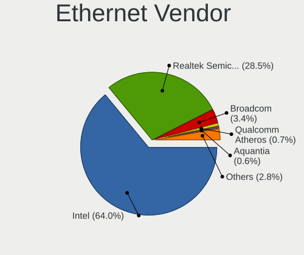

| Vendor                    | Desktops | Percent |
|---------------------------|----------|---------|
| Intel                     | 454      | 64.03%  |
| Realtek Semiconductor     | 202      | 28.49%  |
| Broadcom                  | 24       | 3.39%   |
| Qualcomm Atheros          | 5        | 0.71%   |
| Aquantia                  | 4        | 0.56%   |
| Solarflare Communications | 3        | 0.42%   |
| Marvell Technology Group  | 3        | 0.42%   |
| Chelsio Communications    | 3        | 0.42%   |
| American Megatrends       | 2        | 0.28%   |
| 3Com                      | 2        | 0.28%   |
| Telit Wireless Solutions  | 1        | 0.14%   |
| sipeed                    | 1        | 0.14%   |
| QLogic                    | 1        | 0.14%   |
| Google                    | 1        | 0.14%   |
| D-Link System             | 1        | 0.14%   |
| Apple                     | 1        | 0.14%   |
| Accton Technology         | 1        | 0.14%   |

Ethernet Model
--------------

Ethernet models

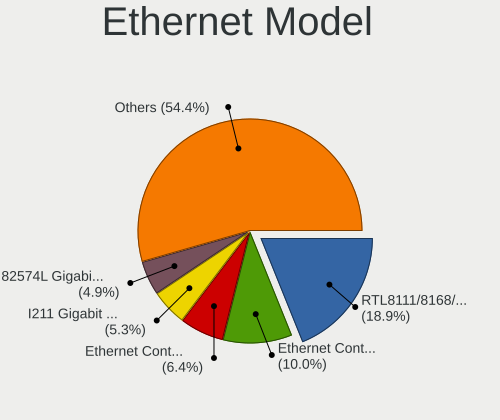

| Model                                                                         | Desktops | Percent |
|-------------------------------------------------------------------------------|----------|---------|
| Realtek RTL8111/8168/8211/8411 PCI Express Gigabit Ethernet Controller        | 168      | 18.9%   |
| Intel Ethernet Controller I226-V                                              | 89       | 10.01%  |
| Intel Ethernet Controller I225-V                                              | 57       | 6.41%   |
| Intel I211 Gigabit Network Connection                                         | 47       | 5.29%   |
| Intel 82574L Gigabit Network Connection                                       | 44       | 4.95%   |
| Intel Ethernet Connection I217-LM                                             | 37       | 4.16%   |
| Intel 82579LM Gigabit Network Connection (Lewisville)                         | 35       | 3.94%   |
| Realtek RTL8125 2.5GbE Controller                                             | 29       | 3.26%   |
| Intel I350 Gigabit Network Connection                                         | 29       | 3.26%   |
| Intel I210 Gigabit Network Connection                                         | 27       | 3.04%   |
| Intel 82599ES 10-Gigabit SFI/SFP+ Network Connection                          | 22       | 2.47%   |
| Intel 82576 Gigabit Network Connection                                        | 22       | 2.47%   |
| Intel Ethernet Connection (2) I219-LM                                         | 18       | 2.02%   |
| Intel Ethernet Controller 10-Gigabit X540-AT2                                 | 13       | 1.46%   |
| Intel 82583V Gigabit Network Connection                                       | 12       | 1.35%   |
| Intel Ethernet Connection X553 10 GbE SFP+                                    | 11       | 1.24%   |
| Intel 82580 Gigabit Network Connection                                        | 11       | 1.24%   |
| Realtek RTL8111/8168/8411 PCI Express Gigabit Ethernet Controller             | 9        | 1.01%   |
| Intel 82571EB/82571GB Gigabit Ethernet Controller D0/D1 (copper applications) | 9        | 1.01%   |
| Intel Ethernet Connection (5) I219-LM                                         | 8        | 0.9%    |
| Intel Ethernet Connection (2) I219-V                                          | 8        | 0.9%    |
| Intel 82575EB Gigabit Network Connection                                      | 8        | 0.9%    |
| Intel Ethernet Connection (7) I219-LM                                         | 7        | 0.79%   |
| Intel 82571EB/82571GB Gigabit Ethernet Controller (Copper)                    | 7        | 0.79%   |
| Intel Ethernet Controller X550                                                | 6        | 0.67%   |
| Intel 82566DM-2 Gigabit Network Connection                                    | 6        | 0.67%   |
| Intel Ethernet Connection X553 1GbE                                           | 5        | 0.56%   |
| Intel Ethernet Connection I217-V                                              | 5        | 0.56%   |
| Intel 82567LM-3 Gigabit Network Connection                                    | 5        | 0.56%   |
| Broadcom NetXtreme II BCM57810 10 Gigabit Ethernet                            | 5        | 0.56%   |
| Intel 82579V Gigabit Network Connection                                       | 4        | 0.45%   |
| Intel 82572EI Gigabit Ethernet Controller (Copper)                            | 4        | 0.45%   |
| Intel 82541PI Gigabit Ethernet Controller                                     | 4        | 0.45%   |
| Broadcom NetXtreme BCM5761 Gigabit Ethernet PCIe                              | 4        | 0.45%   |
| Broadcom NetXtreme BCM5719 Gigabit Ethernet PCIe                              | 4        | 0.45%   |
| Realtek RTL8169 PCI Gigabit Ethernet Controller                               | 3        | 0.34%   |
| Realtek RTL-8100/8101L/8139 PCI Fast Ethernet Adapter                         | 3        | 0.34%   |
| Realtek Killer E2500 Gigabit Ethernet Controller                              | 3        | 0.34%   |
| Intel NM10/ICH7 Family LAN Controller                                         | 3        | 0.34%   |
| Intel Ethernet Controller X710 for 10GbE SFP+                                 | 3        | 0.34%   |

Net Controller Kind
-------------------

Ethernet, WiFi or modem

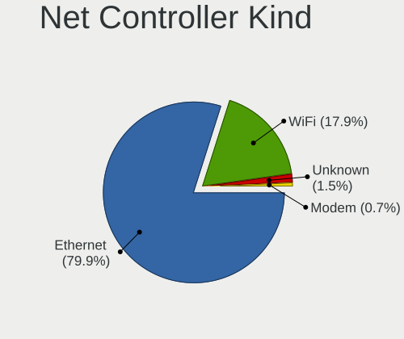

| Kind     | Desktops | Percent |
|----------|----------|---------|
| Ethernet | 572      | 79.89%  |
| WiFi     | 128      | 17.88%  |
| Unknown  | 11       | 1.54%   |
| Modem    | 5        | 0.7%    |

Used Controller
---------------

Currently used network controller

| Kind     | Desktops | Percent |
|----------|----------|---------|
| Ethernet | 553      | 97.53%  |
| WiFi     | 14       | 2.47%   |

NICs
----

Total network controllers on board

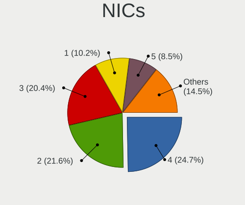

| Total | Desktops | Percent |
|-------|----------|---------|
| 4     | 145      | 24.7%   |
| 2     | 127      | 21.64%  |
| 3     | 120      | 20.44%  |
| 1     | 60       | 10.22%  |
| 5     | 50       | 8.52%   |
| 6     | 46       | 7.84%   |
| 7     | 12       | 2.04%   |
| 9     | 9        | 1.53%   |
| 8     | 8        | 1.36%   |
| 0     | 4        | 0.68%   |
| 10    | 3        | 0.51%   |
| 12    | 2        | 0.34%   |
| 15    | 1        | 0.17%   |

IPv6
----

IPv6 vs IPv4

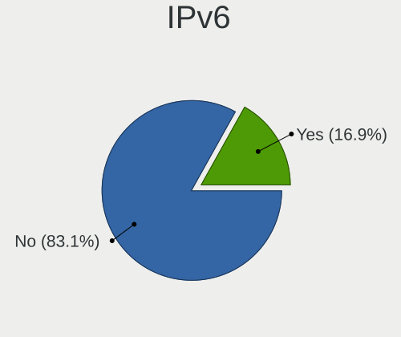

| Used | Desktops | Percent |
|------|----------|---------|
| No   | 497      | 83.11%  |
| Yes  | 101      | 16.89%  |

Bluetooth
---------

Bluetooth Vendor
----------------

Controller vendors

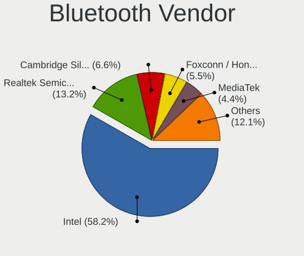

| Vendor                          | Desktops | Percent |
|---------------------------------|----------|---------|
| Intel                           | 53       | 58.24%  |
| Realtek Semiconductor           | 12       | 13.19%  |
| Cambridge Silicon Radio         | 6        | 6.59%   |
| Foxconn / Hon Hai               | 5        | 5.49%   |
| MediaTek                        | 4        | 4.4%    |
| IMC Networks                    | 3        | 3.3%    |
| Lite-On Technology              | 2        | 2.2%    |
| Broadcom                        | 2        | 2.2%    |
| Ralink                          | 1        | 1.1%    |
| Qualcomm Atheros Communications | 1        | 1.1%    |
| ASUSTek Computer                | 1        | 1.1%    |
| Apple                           | 1        | 1.1%    |

Bluetooth Model
---------------

Controller models

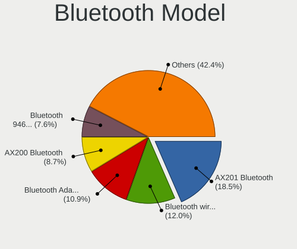

| Model                                                | Desktops | Percent |
|------------------------------------------------------|----------|---------|
| Intel AX201 Bluetooth                                | 17       | 18.48%  |
| Intel Bluetooth wireless interface                   | 11       | 11.96%  |
| Realtek Bluetooth Adapter                            | 10       | 10.87%  |
| Intel AX200 Bluetooth                                | 8        | 8.7%    |
| Intel Bluetooth 9460/9560 Jefferson Peak (JfP)       | 7        | 7.61%   |
| Cambridge Silicon Radio Bluetooth Dongle (HCI mode)  | 6        | 6.52%   |
| Intel Wireless-AC 3168 Bluetooth                     | 5        | 5.43%   |
| MediaTek Bluetooth Adapter                           | 3        | 3.26%   |
| Intel AX210 Bluetooth                                | 3        | 3.26%   |
| Intel AX211 Bluetooth                                | 2        | 2.17%   |
| Foxconn / Hon Hai RZ616 Bluetooth Adapter            | 2        | 2.17%   |
| Broadcom HP Bluethunder                              | 2        | 2.17%   |
| Realtek RTL8821A Bluetooth                           | 1        | 1.09%   |
| Realtek  Bluetooth 4.2 Adapter                       | 1        | 1.09%   |
| Ralink RT3290 Bluetooth                              | 1        | 1.09%   |
| Qualcomm Atheros AR3012 Bluetooth 4.0                | 1        | 1.09%   |
| MediaTek RZ608 Bluetooth Adapter                     | 1        | 1.09%   |
| Lite-On Qualcomm Atheros QCA9377 Bluetooth           | 1        | 1.09%   |
| Lite-On Bluetooth USB Module                         | 1        | 1.09%   |
| Intel Centrino Bluetooth Wireless Transceiver        | 1        | 1.09%   |
| IMC Networks Realtek Bluetooth Adapter               | 1        | 1.09%   |
| IMC Networks Realtek Bluetooth 4.0 + High Speed Chip | 1        | 1.09%   |
| IMC Networks MediaTek Bluetooth Adapter              | 1        | 1.09%   |
| Foxconn / Hon Hai Wireless_Device                    | 1        | 1.09%   |
| Foxconn / Hon Hai Bluetooth USB Module               | 1        | 1.09%   |
| Foxconn / Hon Hai Android ADB Interface              | 1        | 1.09%   |
| ASUS Realtek Bluetooth 4.0 + High Speed Chip         | 1        | 1.09%   |
| Apple Built-in Bluetooth 2.0+EDR HCI                 | 1        | 1.09%   |

Sound
-----

Sound Vendor
------------

Sound card vendors

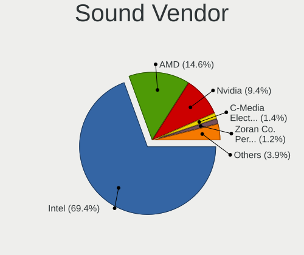

| Vendor                                       | Desktops | Percent |
|----------------------------------------------|----------|---------|
| Intel                                        | 391      | 69.45%  |
| AMD                                          | 82       | 14.56%  |
| Nvidia                                       | 53       | 9.41%   |
| C-Media Electronics                          | 8        | 1.42%   |
| Zoran Co. Personal Media Division (Nogatech) | 7        | 1.24%   |
| KTMicro                                      | 5        | 0.89%   |
| Logitech                                     | 3        | 0.53%   |
| ASUSTek Computer                             | 3        | 0.53%   |
| Plantronics                                  | 2        | 0.36%   |
| Micro Star International                     | 2        | 0.36%   |
| Yamaha                                       | 1        | 0.18%   |
| Texas Instruments                            | 1        | 0.18%   |
| SteelSeries ApS                              | 1        | 0.18%   |
| Sony                                         | 1        | 0.18%   |
| Elgato Systems                               | 1        | 0.18%   |
| Creative Labs                                | 1        | 0.18%   |
| Apple                                        | 1        | 0.18%   |

Sound Model
-----------

Sound card models

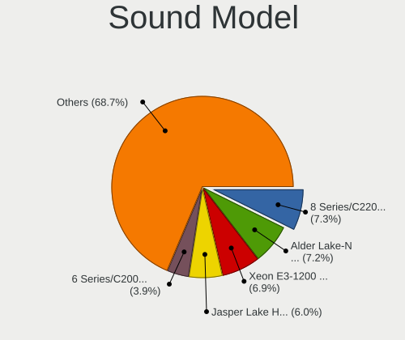

| Model                                                                                             | Desktops | Percent |
|---------------------------------------------------------------------------------------------------|----------|---------|
| Intel 8 Series/C220 Series Chipset High Definition Audio Controller                               | 49       | 7.35%   |
| Intel Alder Lake-N PCH High Definition Audio Controller                                           | 48       | 7.2%    |
| Intel Xeon E3-1200 v3/4th Gen Core Processor HD Audio Controller                                  | 46       | 6.9%    |
| Intel Jasper Lake HD Audio                                                                        | 40       | 6%      |
| Intel 6 Series/C200 Series Chipset Family High Definition Audio Controller                        | 26       | 3.9%    |
| Intel Celeron/Pentium Silver Processor High Definition Audio                                      | 24       | 3.6%    |
| Intel 200 Series PCH HD Audio                                                                     | 24       | 3.6%    |
| Intel 100 Series/C230 Series Chipset Family HD Audio Controller                                   | 24       | 3.6%    |
| Intel 7 Series/C216 Chipset Family High Definition Audio Controller                               | 22       | 3.3%    |
| Intel Cannon Lake PCH cAVS                                                                        | 16       | 2.4%    |
| Intel Atom/Celeron/Pentium Processor x5-E8000/J3xxx/N3xxx Series High Definition Audio Controller | 15       | 2.25%   |
| AMD Ryzen HD Audio Controller                                                                     | 15       | 2.25%   |
| AMD SBx00 Azalia (Intel HDA)                                                                      | 14       | 2.1%    |
| Intel Elkhart Lake High Density Audio bus interface                                               | 11       | 1.65%   |
| Intel 8 Series HD Audio Controller                                                                | 11       | 1.65%   |
| Intel Haswell-ULT HD Audio Controller                                                             | 10       | 1.5%    |
| AMD FCH Azalia Controller                                                                         | 10       | 1.5%    |
| Intel Alder Lake-S HD Audio Controller                                                            | 9        | 1.35%   |
| AMD Renoir/Cezanne HDMI/DP Audio Controller                                                       | 9        | 1.35%   |
| AMD Raven/Raven2/Fenghuang HDMI/DP Audio Controller                                               | 9        | 1.35%   |
| Intel 82801JI (ICH10 Family) HD Audio Controller                                                  | 8        | 1.2%    |
| AMD Starship/Matisse HD Audio Controller                                                          | 8        | 1.2%    |
| AMD Kabini HDMI/DP Audio                                                                          | 8        | 1.2%    |
| Zoran Co. Personal Media Division (Nogatech) USB Audio and HID                                    | 7        | 1.05%   |
| AMD Family 17h (Models 00h-0fh) HD Audio Controller                                               | 7        | 1.05%   |
| Nvidia High Definition Audio Controller                                                           | 6        | 0.9%    |
| Nvidia GK208 HDMI/DP Audio Controller                                                             | 6        | 0.9%    |
| Intel Broadwell-U Audio Controller                                                                | 6        | 0.9%    |
| Nvidia GM107 High Definition Audio Controller [GeForce 940MX]                                     | 5        | 0.75%   |
| Nvidia GF119 HDMI Audio Controller                                                                | 5        | 0.75%   |
| KTMicro KT USB Audio                                                                              | 5        | 0.75%   |
| Intel Alder Lake PCH-P High Definition Audio Controller                                           | 5        | 0.75%   |
| Nvidia MCP61 High Definition Audio                                                                | 4        | 0.6%    |
| Intel Wildcat Point-LP High Definition Audio Controller                                           | 4        | 0.6%    |
| Intel Sunrise Point-LP HD Audio                                                                   | 4        | 0.6%    |
| Intel Raptor Lake High Definition Audio Controller                                                | 4        | 0.6%    |
| Intel Celeron N3350/Pentium N4200/Atom E3900 Series Audio Cluster                                 | 4        | 0.6%    |
| Intel C610/X99 series chipset HD Audio Controller                                                 | 4        | 0.6%    |
| Intel 82801JD/DO (ICH10 Family) HD Audio Controller                                               | 4        | 0.6%    |
| Intel 82801I (ICH9 Family) HD Audio Controller                                                    | 4        | 0.6%    |

Memory
------

Memory Vendor
-------------

Memory module vendors

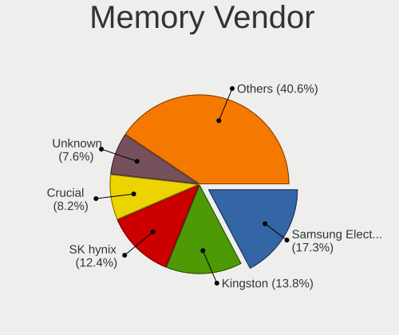

| Vendor                       | Desktops | Percent |
|------------------------------|----------|---------|
| Samsung Electronics          | 111      | 17.26%  |
| Kingston                     | 89       | 13.84%  |
| SK hynix                     | 80       | 12.44%  |
| Crucial                      | 53       | 8.24%   |
| Unknown                      | 49       | 7.62%   |
| Micron Technology            | 47       | 7.31%   |
| Corsair                      | 42       | 6.53%   |
| G.Skill                      | 39       | 6.07%   |
| Unknown                      | 26       | 4.04%   |
| A-DATA Technology            | 12       | 1.87%   |
| Ramaxel Technology           | 11       | 1.71%   |
| Team                         | 8        | 1.24%   |
| Apacer                       | 7        | 1.09%   |
| Timetec                      | 5        | 0.78%   |
| Patriot Memory (PDP Systems) | 5        | 0.78%   |
| Patriot                      | 5        | 0.78%   |
| Unknown (ABCD)               | 4        | 0.62%   |
| Unknown (0x0C26)             | 4        | 0.62%   |
| Unknown (0x0C6E)             | 3        | 0.47%   |
| Transcend                    | 3        | 0.47%   |
| Toshiba                      | 3        | 0.47%   |
| OCZ                          | 3        | 0.47%   |
| Nanya Technology             | 3        | 0.47%   |
| Elpida                       | 3        | 0.47%   |
| Wodposit                     | 2        | 0.31%   |
| Unknown (AB)                 | 2        | 0.31%   |
| Unknown (0x0B45)             | 2        | 0.31%   |
| Unknown (0000CE030000)       | 2        | 0.31%   |
| SK_Hynix                     | 2        | 0.31%   |
| AMD                          | 2        | 0.31%   |
| V-Color                      | 1        | 0.16%   |
| Unknown (0x7FFF)             | 1        | 0.16%   |
| Unknown (0x0DD5)             | 1        | 0.16%   |
| Unknown (00009E0010D1)       | 1        | 0.16%   |
| Smart Modular                | 1        | 0.16%   |
| Silicon_Power                | 1        | 0.16%   |
| Silicon Power                | 1        | 0.16%   |
| Qimonda                      | 1        | 0.16%   |
| PNY                          | 1        | 0.16%   |
| Lexar Co Limited             | 1        | 0.16%   |

Memory Model
------------

Memory module models

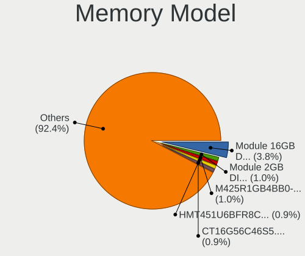

| Model                                                        | Desktops | Percent |
|--------------------------------------------------------------|----------|---------|
| Unknown                                                      | 26       | 3.82%   |
| Unknown RAM Module 2GB DIMM DDR2 800MT/s                     | 7        | 1.03%   |
| Samsung RAM M425R1GB4BB0-CQKOL 8GB SODIMM DDR5 4800MT/s      | 7        | 1.03%   |
| SK hynix RAM HMT451U6BFR8C-PB 4GB DIMM DDR3 1600MT/s         | 6        | 0.88%   |
| Crucial RAM CT16G56C46S5.M8G1 16GB SODIMM DDR5 5600MT/s      | 6        | 0.88%   |
| Unknown RAM Module 4GB DIMM 1333MT/s                         | 5        | 0.73%   |
| SK hynix RAM HMT451U6AFR8C-PB 4GB DIMM DDR3 1600MT/s         | 5        | 0.73%   |
| SK hynix RAM HMT41GU6BFR8A-PB 8GB DIMM DDR3 1600MT/s         | 5        | 0.73%   |
| Samsung RAM Module 2GB Row Of Chips LPDDR5 6400MT/s          | 5        | 0.73%   |
| Samsung RAM M378B5173EB0-YK0 4GB DIMM DDR3 1600MT/s          | 5        | 0.73%   |
| Samsung RAM M378B1G73DB0-CK0 8GB DIMM DDR3 1600MT/s          | 5        | 0.73%   |
| Kingston RAM KHX1600C9D3/4GX 4GB DIMM DDR3 1600MT/s          | 5        | 0.73%   |
| Crucial RAM CT102464BF160B.C16 8GB SODIMM DDR3 1600MT/s      | 5        | 0.73%   |
| Unknown (ABCD) RAM 123456789012345678 8GB DIMM DDR4 2400MT/s | 4        | 0.59%   |
| Team RAM TEAMGROUP-UD4-3200 8GB DIMM DDR4 3200MT/s           | 4        | 0.59%   |
| SK hynix RAM HMT451U6BFR8A-PB 4GB DIMM DDR3 1600MT/s         | 4        | 0.59%   |
| Samsung RAM M378B5173QH0-CK0 4GB DIMM DDR3 1600MT/s          | 4        | 0.59%   |
| Micron RAM 8ATF1G64AZ-2G6E1 8GB DIMM DDR4 2667MT/s           | 4        | 0.59%   |
| Unknown RAM Module 8GB 1600MT/s                              | 3        | 0.44%   |
| Unknown RAM Module 2GB DIMM SDRAM                            | 3        | 0.44%   |
| SK hynix RAM Module 4GB DIMM DDR4 2133MT/s                   | 3        | 0.44%   |
| SK hynix RAM HMT351U6CFR8C-PB 4GB DIMM DDR3 1600MT/s         | 3        | 0.44%   |
| Samsung RAM M471B1G73DB0-YK0 8GB DIMM DDR3 1600MT/s          | 3        | 0.44%   |
| Samsung RAM M378A1K43CB2-CTD 8GB DIMM DDR4 2667MT/s          | 3        | 0.44%   |
| Ramaxel RAM RMR5040ED58E9W1600 4GB DIMM DDR3 1600MT/s        | 3        | 0.44%   |
| Micron RAM 8ATF1G64HZ-3G2R1 8GB SODIMM DDR4 3200MT/s         | 3        | 0.44%   |
| Kingston RAM KHX1600C10D3/8G 8GB DIMM DDR3 1600MT/s          | 3        | 0.44%   |
| Kingston RAM CBD26D4S9S8K1C-8 8GB SODIMM DDR4 3200MT/s       | 3        | 0.44%   |
| Kingston RAM 99U5403-034.A00LF 4GB DIMM DDR3 1333MT/s        | 3        | 0.44%   |
| G.Skill RAM F4-3200C16-8GVKB 8GB DIMM DDR4 3200MT/s          | 3        | 0.44%   |
| G.Skill RAM F4-3200C16-16GVK 16GB DIMM DDR4 3200MT/s         | 3        | 0.44%   |
| Corsair RAM CMK8GX4M1A2400C16 8GB DIMM DDR4 2400MT/s         | 3        | 0.44%   |
| Corsair RAM CMK8GX4M1A2400C14 8GB DIMM DDR4 2400MT/s         | 3        | 0.44%   |
| Corsair RAM CMK32GX4M2D3600C18 16GB DIMM DDR4 3600MT/s       | 3        | 0.44%   |
| Corsair RAM CMK32GX4M2A2666C16 16GB DIMM DDR4 3000MT/s       | 3        | 0.44%   |
| Wodposit RAM WPBH26D408SWA-8G 8GB SODIMM DDR4 2400MT/s       | 2        | 0.29%   |
| Unknown RAM Module 8GB SODIMM DDR3 1600MT/s                  | 2        | 0.29%   |
| Unknown RAM Module 8GB DIMM DDR4 2666MT/s                    | 2        | 0.29%   |
| Unknown RAM Module 8GB DIMM DDR4 2133MT/s                    | 2        | 0.29%   |
| Unknown RAM Module 8GB DIMM DDR3 1333MT/s                    | 2        | 0.29%   |

Memory Kind
-----------

Memory module kinds

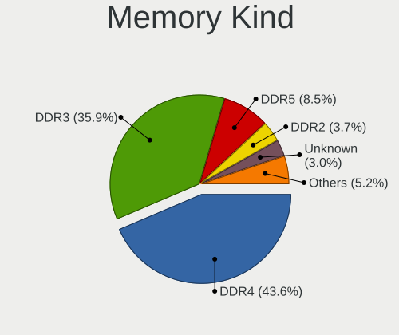

| Kind    | Desktops | Percent |
|---------|----------|---------|
| DDR4    | 245      | 43.59%  |
| DDR3    | 202      | 35.94%  |
| DDR5    | 48       | 8.54%   |
| DDR2    | 21       | 3.74%   |
| Unknown | 17       | 3.02%   |
| LPDDR4  | 11       | 1.96%   |
| LPDDR5  | 9        | 1.6%    |
| SDRAM   | 7        | 1.25%   |
| DDR     | 2        | 0.36%   |

Memory Form Factor
------------------

Physical design of the memory module

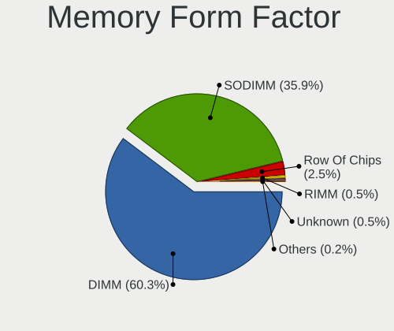

| Name         | Desktops | Percent |
|--------------|----------|---------|
| DIMM         | 334      | 60.29%  |
| SODIMM       | 199      | 35.92%  |
| Row Of Chips | 14       | 2.53%   |
| RIMM         | 3        | 0.54%   |
| Unknown      | 3        | 0.54%   |
| FB-DIMM      | 1        | 0.18%   |

Memory Size
-----------

Memory module size

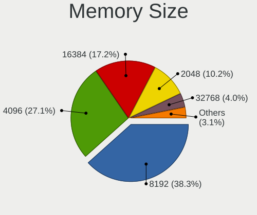

| Size  | Desktops | Percent |
|-------|----------|---------|
| 8192  | 232      | 38.35%  |
| 4096  | 164      | 27.11%  |
| 16384 | 104      | 17.19%  |
| 2048  | 62       | 10.25%  |
| 32768 | 24       | 3.97%   |
| 1024  | 17       | 2.81%   |
| 512   | 2        | 0.33%   |

Memory Speed
------------

Memory module speed

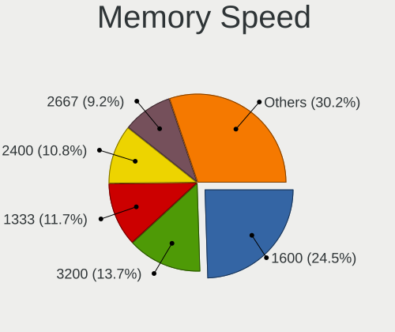

| Speed   | Desktops | Percent |
|---------|----------|---------|
| 1600    | 147      | 24.5%   |
| 3200    | 82       | 13.67%  |
| 1333    | 70       | 11.67%  |
| 2400    | 65       | 10.83%  |
| 2667    | 55       | 9.17%   |
| 2133    | 38       | 6.33%   |
| 4800    | 33       | 5.5%    |
| 800     | 19       | 3.17%   |
| 5600    | 14       | 2.33%   |
| 6400    | 10       | 1.67%   |
| 2666    | 10       | 1.67%   |
| 667     | 9        | 1.5%    |
| 3600    | 6        | 1%      |
| 3000    | 6        | 1%      |
| Unknown | 6        | 1%      |
| 1067    | 5        | 0.83%   |
| 1066    | 5        | 0.83%   |
| 1866    | 4        | 0.67%   |
| 3733    | 3        | 0.5%    |
| 2933    | 3        | 0.5%    |
| 5200    | 2        | 0.33%   |
| 400     | 2        | 0.33%   |
| 3400    | 1        | 0.17%   |
| 2800    | 1        | 0.17%   |
| 1334    | 1        | 0.17%   |
| 1088    | 1        | 0.17%   |
| 533     | 1        | 0.17%   |
| 333     | 1        | 0.17%   |

Printers & scanners
-------------------

Printer Vendor
--------------

Printer device vendors

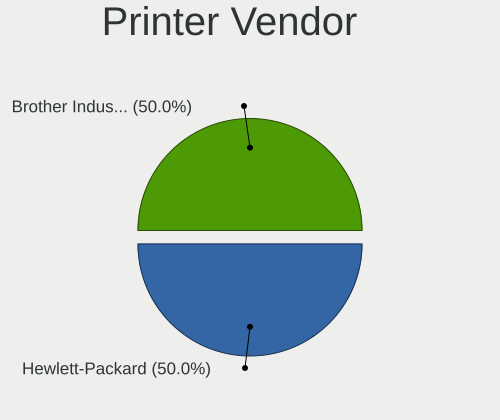

| Vendor             | Desktops | Percent |
|--------------------|----------|---------|
| Hewlett-Packard    | 2        | 50%     |
| Brother Industries | 2        | 50%     |

Printer Model
-------------

Printer device models

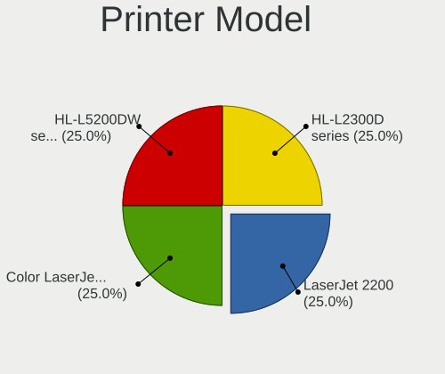

| Model                     | Desktops | Percent |
|---------------------------|----------|---------|
| HP LaserJet 2200          | 1        | 25%     |
| HP Color LaserJet CP1215  | 1        | 25%     |
| Brother HL-L5200DW series | 1        | 25%     |
| Brother HL-L2300D series  | 1        | 25%     |

Scanner Vendor
--------------

Scanner device vendors

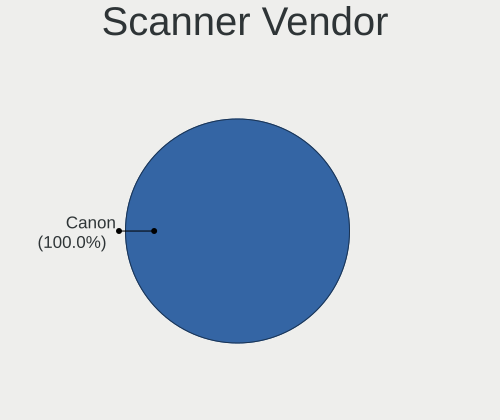

| Vendor      | Desktops | Percent |
|-------------|----------|---------|
| Seiko Epson | 1        | 50%     |
| Canon       | 1        | 50%     |

Scanner Model
-------------

Scanner device models

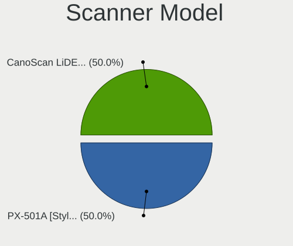

| Model                              | Desktops | Percent |
|------------------------------------|----------|---------|
| Seiko Epson PX-501A [Stylus NX400] | 1        | 50%     |
| Canon CanoScan LiDE 220            | 1        | 50%     |

Camera
------

Camera Vendor
-------------

Camera device vendors

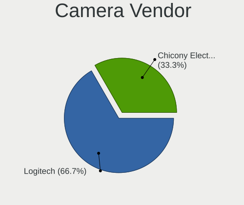

| Vendor              | Desktops | Percent |
|---------------------|----------|---------|
| Logitech            | 6        | 60%     |
| Microdia            | 2        | 20%     |
| Chicony Electronics | 2        | 20%     |

Camera Model
------------

Camera device models

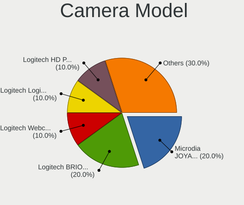

| Model                                 | Desktops | Percent |
|---------------------------------------|----------|---------|
| Microdia JOYACCESS JA-Webcam          | 2        | 20%     |
| Logitech BRIO Ultra HD Webcam         | 2        | 20%     |
| Logitech Webcam C310                  | 1        | 10%     |
| Logitech Logitech Webcam C925e        | 1        | 10%     |
| Logitech HD Pro Webcam C920           | 1        | 10%     |
| Logitech C920 HD Pro Webcam           | 1        | 10%     |
| Chicony HP High Definition 1MP Webcam | 1        | 10%     |
| Chicony HP 0.3MP Webcam               | 1        | 10%     |

Security
--------

Fingerprint Vendor
------------------

Fingerprint sensor vendors

Zero info for selected period =(

Fingerprint Model
-----------------

Fingerprint sensor models

Zero info for selected period =(

Chipcard Vendor
---------------

Chipcard module vendors

Zero info for selected period =(

Chipcard Model
--------------

Chipcard module models

Zero info for selected period =(

Unsupported
-----------

Unsupported Devices
-------------------

Total unsupported devices on board

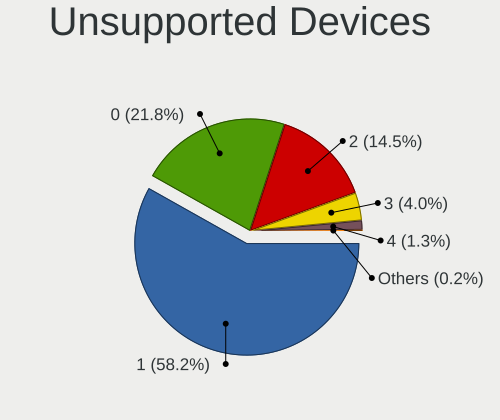

| Total | Desktops | Percent |
|-------|----------|---------|
| 1     | 346      | 58.15%  |
| 0     | 130      | 21.85%  |
| 2     | 86       | 14.45%  |
| 3     | 24       | 4.03%   |
| 4     | 8        | 1.34%   |
| 5     | 1        | 0.17%   |

Unsupported Device Types
------------------------

Types of unsupported devices

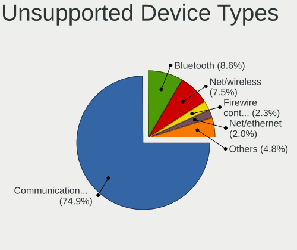

| Type                     | Desktops | Percent |
|--------------------------|----------|---------|
| Communication controller | 420      | 74.87%  |
| Bluetooth                | 48       | 8.56%   |
| Net/wireless             | 42       | 7.49%   |
| Firewire controller      | 13       | 2.32%   |
| Net/ethernet             | 11       | 1.96%   |
| Sound                    | 10       | 1.78%   |
| Network                  | 6        | 1.07%   |
| Card reader              | 6        | 1.07%   |
| Storage/raid             | 3        | 0.53%   |
| Storage/nvme             | 1        | 0.18%   |
| Graphics card            | 1        | 0.18%   |

