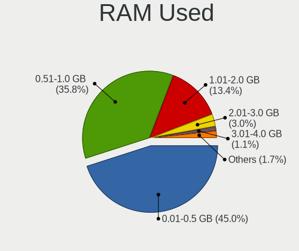
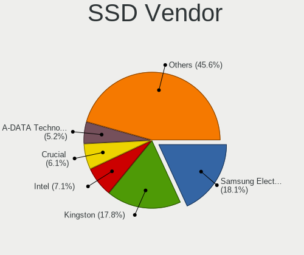
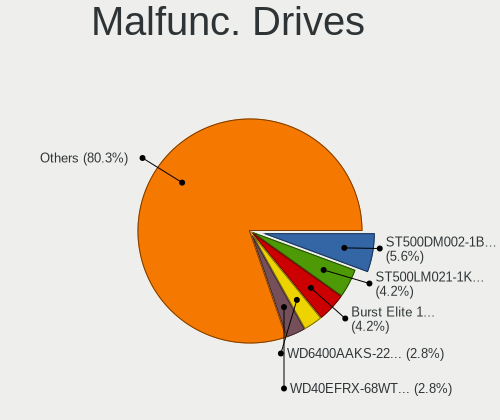
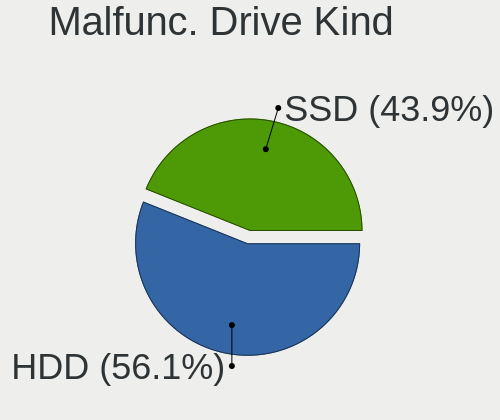
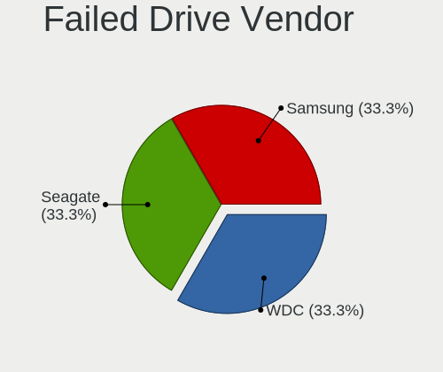
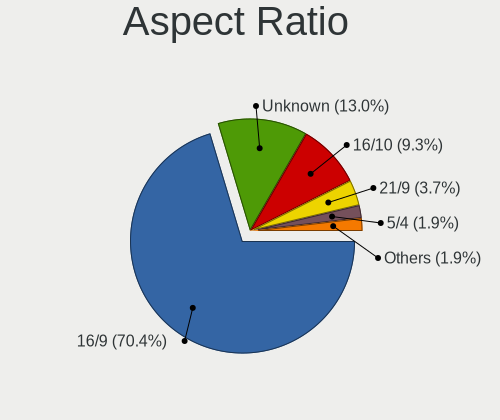
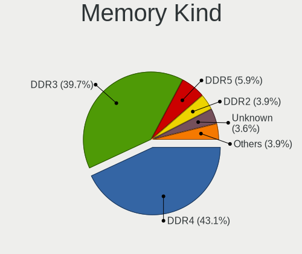
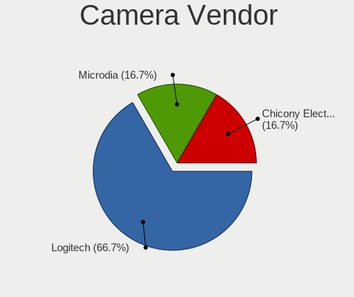

BSD in Canada - Tested Hardware & Statistics (Desktops)
-------------------------------------------------------

A project to collect tested hardware configurations for BSD in Canada.

Anyone can contribute to this report by the [hw-probe](https://github.com/linuxhw/hw-probe/blob/master/INSTALL.BSD.md) tool:

    hw-probe -all -upload

Please contribute! Especially if your hardware is rare.

Contents
--------

* [ Test Cases ](#test-cases)

* [ System ](#system)
  - [ OS                       ](#os)
  - [ OS Family                ](#os-family)
  - [ Arch                     ](#arch)
  - [ DE                       ](#de)
  - [ Display Server           ](#display-server)
  - [ Display Manager          ](#display-manager)
  - [ OS Lang                  ](#os-lang)
  - [ Boot Mode                ](#boot-mode)
  - [ Filesystem               ](#filesystem)
  - [ Part. scheme             ](#part-scheme)

* [ Board ](#board)
  - [ Vendor                   ](#vendor)
  - [ Model                    ](#model)
  - [ Model Family             ](#model-family)
  - [ MFG Year                 ](#mfg-year)
  - [ Form Factor              ](#form-factor)
  - [ Coreboot                 ](#coreboot)
  - [ RAM Size                 ](#ram-size)
  - [ RAM Used                 ](#ram-used)
  - [ Total Drives             ](#total-drives)
  - [ Has CD-ROM               ](#has-cd-rom)
  - [ Has Ethernet             ](#has-ethernet)
  - [ Has WiFi                 ](#has-wifi)
  - [ Has Bluetooth            ](#has-bluetooth)

* [ Location ](#location)
  - [ Country                  ](#country)
  - [ City                     ](#city)

* [ Drives ](#drives)
  - [ Drive Vendor             ](#drive-vendor)
  - [ Drive Model              ](#drive-model)
  - [ HDD Vendor               ](#hdd-vendor)
  - [ SSD Vendor               ](#ssd-vendor)
  - [ Drive Kind               ](#drive-kind)
  - [ Drive Connector          ](#drive-connector)
  - [ Drive Size               ](#drive-size)
  - [ Space Total              ](#space-total)
  - [ Space Used               ](#space-used)
  - [ Malfunc. Drives          ](#malfunc-drives)
  - [ Malfunc. Drive Vendor    ](#malfunc-drive-vendor)
  - [ Malfunc. HDD Vendor      ](#malfunc-hdd-vendor)
  - [ Malfunc. Drive Kind      ](#malfunc-drive-kind)
  - [ Failed Drives            ](#failed-drives)
  - [ Failed Drive Vendor      ](#failed-drive-vendor)
  - [ Drive Status             ](#drive-status)

* [ Storage controller ](#storage-controller)
  - [ Storage Vendor           ](#storage-vendor)
  - [ Storage Model            ](#storage-model)
  - [ Storage Kind             ](#storage-kind)

* [ Processor ](#processor)
  - [ CPU Vendor               ](#cpu-vendor)
  - [ CPU Model                ](#cpu-model)
  - [ CPU Model Family         ](#cpu-model-family)
  - [ CPU Cores                ](#cpu-cores)
  - [ CPU Sockets              ](#cpu-sockets)
  - [ CPU Threads              ](#cpu-threads)
  - [ CPU Microarch            ](#cpu-microarch)

* [ Graphics ](#graphics)
  - [ GPU Vendor               ](#gpu-vendor)
  - [ GPU Model                ](#gpu-model)
  - [ GPU Combo                ](#gpu-combo)
  - [ GPU Driver               ](#gpu-driver)
  - [ GPU Memory               ](#gpu-memory)

* [ Monitor ](#monitor)
  - [ Monitor Vendor           ](#monitor-vendor)
  - [ Monitor Model            ](#monitor-model)
  - [ Monitor Resolution       ](#monitor-resolution)
  - [ Monitor Diagonal         ](#monitor-diagonal)
  - [ Monitor Width            ](#monitor-width)
  - [ Aspect Ratio             ](#aspect-ratio)
  - [ Monitor Area             ](#monitor-area)
  - [ Pixel Density            ](#pixel-density)
  - [ Multiple Monitors        ](#multiple-monitors)

* [ Network ](#network)
  - [ Net Controller Vendor    ](#net-controller-vendor)
  - [ Net Controller Model     ](#net-controller-model)
  - [ Wireless Vendor          ](#wireless-vendor)
  - [ Wireless Model           ](#wireless-model)
  - [ Ethernet Vendor          ](#ethernet-vendor)
  - [ Ethernet Model           ](#ethernet-model)
  - [ Net Controller Kind      ](#net-controller-kind)
  - [ Used Controller          ](#used-controller)
  - [ NICs                     ](#nics)
  - [ IPv6                     ](#ipv6)

* [ Bluetooth ](#bluetooth)
  - [ Bluetooth Vendor         ](#bluetooth-vendor)
  - [ Bluetooth Model          ](#bluetooth-model)

* [ Sound ](#sound)
  - [ Sound Vendor             ](#sound-vendor)
  - [ Sound Model              ](#sound-model)

* [ Memory ](#memory)
  - [ Memory Vendor            ](#memory-vendor)
  - [ Memory Model             ](#memory-model)
  - [ Memory Kind              ](#memory-kind)
  - [ Memory Form Factor       ](#memory-form-factor)
  - [ Memory Size              ](#memory-size)
  - [ Memory Speed             ](#memory-speed)

* [ Printers & scanners ](#printers--scanners)
  - [ Printer Vendor           ](#printer-vendor)
  - [ Printer Model            ](#printer-model)
  - [ Scanner Vendor           ](#scanner-vendor)
  - [ Scanner Model            ](#scanner-model)

* [ Camera ](#camera)
  - [ Camera Vendor            ](#camera-vendor)
  - [ Camera Model             ](#camera-model)

* [ Security ](#security)
  - [ Fingerprint Vendor       ](#fingerprint-vendor)
  - [ Fingerprint Model        ](#fingerprint-model)
  - [ Chipcard Vendor          ](#chipcard-vendor)
  - [ Chipcard Model           ](#chipcard-model)

* [ Unsupported ](#unsupported)
  - [ Unsupported Devices      ](#unsupported-devices)
  - [ Unsupported Device Types ](#unsupported-device-types)

Test Cases
----------

Total: 465

| Vendor        | Model                       | Probe                                                     | Date         |
|---------------|-----------------------------|-----------------------------------------------------------|--------------|
| Dell          | 0NC2VH A01                  | [34a855cc56](https://bsd-hardware.info/?probe=34a855cc56) | Sep 06, 2023 |
| Unknown       | Unknown                     | [19711ca08b](https://bsd-hardware.info/?probe=19711ca08b) | Sep 06, 2023 |
| ASUSTek       | P8H67-M PRO                 | [c06ec95a55](https://bsd-hardware.info/?probe=c06ec95a55) | Sep 06, 2023 |
| Dell          | 0NC2VH A01                  | [7209f86fed](https://bsd-hardware.info/?probe=7209f86fed) | Sep 04, 2023 |
| Lenovo        | 30BC SDK0J40705 WIN 3425... | [a1c29072ea](https://bsd-hardware.info/?probe=a1c29072ea) | Sep 03, 2023 |
| Protectli     | FW6 Ver                     | [70992eb19b](https://bsd-hardware.info/?probe=70992eb19b) | Sep 02, 2023 |
| ASUSTek       | M5A97 PLUS                  | [77b461d3ad](https://bsd-hardware.info/?probe=77b461d3ad) | Sep 02, 2023 |
| Dell          | 042P49 A01                  | [383445ee26](https://bsd-hardware.info/?probe=383445ee26) | Sep 01, 2023 |
| Protectli     | FW6 Ver                     | [04de7aa059](https://bsd-hardware.info/?probe=04de7aa059) | Sep 01, 2023 |
| Dell          | 042P49 A01                  | [a06ab2449f](https://bsd-hardware.info/?probe=a06ab2449f) | Aug 26, 2023 |
| PC Engines    | APU2                        | [ed6839f08c](https://bsd-hardware.info/?probe=ed6839f08c) | Aug 26, 2023 |
| Dell          | 0NC2VH A01                  | [46499d5075](https://bsd-hardware.info/?probe=46499d5075) | Aug 26, 2023 |
| Unknown       | Unknown                     | [6619af0a29](https://bsd-hardware.info/?probe=6619af0a29) | Aug 26, 2023 |
| Unknown       | Unknown                     | [aad81c60fa](https://bsd-hardware.info/?probe=aad81c60fa) | Aug 25, 2023 |
| Dell          | 0KHP4K A03                  | [c54db98574](https://bsd-hardware.info/?probe=c54db98574) | Aug 22, 2023 |
| Dell          | 0KHP4K A03                  | [dd1ad7af32](https://bsd-hardware.info/?probe=dd1ad7af32) | Aug 22, 2023 |
| Protectli     | VP2420                      | [c033157bb2](https://bsd-hardware.info/?probe=c033157bb2) | Aug 22, 2023 |
| Lenovo        | ThinkCentre M90p 3853RN9    | [818c1b5f31](https://bsd-hardware.info/?probe=818c1b5f31) | Aug 20, 2023 |
| Dell          | 04Y8V0 A02                  | [8f26de2199](https://bsd-hardware.info/?probe=8f26de2199) | Aug 19, 2023 |
| Dell          | 0NC2VH A01                  | [7ea90d38d1](https://bsd-hardware.info/?probe=7ea90d38d1) | Aug 18, 2023 |
| ASRock        | B450 Pro4                   | [c12a76c083](https://bsd-hardware.info/?probe=c12a76c083) | Aug 16, 2023 |
| ASUSTek       | P8Z68-V LE                  | [08061905f7](https://bsd-hardware.info/?probe=08061905f7) | Aug 15, 2023 |
| Dell          | 00VTMF A01                  | [399fe2224c](https://bsd-hardware.info/?probe=399fe2224c) | Aug 13, 2023 |
| Dell          | 0NC2VH A01                  | [0fd996a147](https://bsd-hardware.info/?probe=0fd996a147) | Aug 10, 2023 |
| Lenovo        | SHARKBAY 0B98401 WIN        | [a22e406f7c](https://bsd-hardware.info/?probe=a22e406f7c) | Aug 10, 2023 |
| Dell          | 04Y8V0 A02                  | [c693116826](https://bsd-hardware.info/?probe=c693116826) | Aug 09, 2023 |
| Lenovo        | SHARKBAY 0B98401 WIN        | [0c9251a971](https://bsd-hardware.info/?probe=0c9251a971) | Aug 09, 2023 |
| ASUSTek       | M4A88TD-M/USB3              | [ce95634a53](https://bsd-hardware.info/?probe=ce95634a53) | Aug 06, 2023 |
| Protectli     | VP2420                      | [2ec2033d58](https://bsd-hardware.info/?probe=2ec2033d58) | Aug 01, 2023 |
| HP            | 2AF7                        | [fc495dc6c7](https://bsd-hardware.info/?probe=fc495dc6c7) | Jul 29, 2023 |
| AZW           | U59                         | [1862cfda96](https://bsd-hardware.info/?probe=1862cfda96) | Jul 23, 2023 |
| Dell          | 0F3KHR A02                  | [8c9dfc9396](https://bsd-hardware.info/?probe=8c9dfc9396) | Jul 23, 2023 |
| AZW           | EQ                          | [b96b847399](https://bsd-hardware.info/?probe=b96b847399) | Jul 20, 2023 |
| Techvision    | TVI7309X B0                 | [3e853472dc](https://bsd-hardware.info/?probe=3e853472dc) | Jul 19, 2023 |
| Dell          | 04Y8V0 A02                  | [738b473ab6](https://bsd-hardware.info/?probe=738b473ab6) | Jul 18, 2023 |
| Intel         | DQ67EP AAG12529-308         | [f58fdceed1](https://bsd-hardware.info/?probe=f58fdceed1) | Jul 18, 2023 |
| Unknown       | Unknown                     | [cfdbed124e](https://bsd-hardware.info/?probe=cfdbed124e) | Jul 17, 2023 |
| Dell          | 0F3KHR A02                  | [e1647604a7](https://bsd-hardware.info/?probe=e1647604a7) | Jul 15, 2023 |
| ASUSTek       | Rampage III Extreme         | [499e5b7941](https://bsd-hardware.info/?probe=499e5b7941) | Jul 14, 2023 |
| HP            | 2AF7                        | [a983dd41d6](https://bsd-hardware.info/?probe=a983dd41d6) | Jul 13, 2023 |
| Techvision    | TVI7309X B0                 | [6db56ee0ef](https://bsd-hardware.info/?probe=6db56ee0ef) | Jul 13, 2023 |
| AZW           | U59                         | [20a3b64ecd](https://bsd-hardware.info/?probe=20a3b64ecd) | Jul 10, 2023 |
| MW            | GMLK-2_5G4L                 | [bbef95a882](https://bsd-hardware.info/?probe=bbef95a882) | Jul 08, 2023 |
| Intel         | CRESCENTBAY                 | [933187d501](https://bsd-hardware.info/?probe=933187d501) | Jul 08, 2023 |
| Lenovo        | MAHOBAY Win8 Pro DPK TPG    | [76cfc2c80e](https://bsd-hardware.info/?probe=76cfc2c80e) | Jul 07, 2023 |
| Intel         | DQ67SW AAG12527-310         | [e36e748937](https://bsd-hardware.info/?probe=e36e748937) | Jul 06, 2023 |
| Lenovo        | MAHOBAY Win8 Pro DPK TPG    | [9d6fef9445](https://bsd-hardware.info/?probe=9d6fef9445) | Jul 04, 2023 |
| MW            | GMLK-2_5G4L                 | [1ef9818928](https://bsd-hardware.info/?probe=1ef9818928) | Jun 27, 2023 |
| HP            | 1495                        | [564ff2ef77](https://bsd-hardware.info/?probe=564ff2ef77) | Jun 26, 2023 |
| Lenovo        | ThinkCentre M55 880894U     | [e406083f25](https://bsd-hardware.info/?probe=e406083f25) | Jun 22, 2023 |
| Techvision    | TVI7309X B0                 | [0b667bc4e7](https://bsd-hardware.info/?probe=0b667bc4e7) | Jun 22, 2023 |
| ASUSTek       | M5A97 PLUS                  | [39e7195baf](https://bsd-hardware.info/?probe=39e7195baf) | Jun 15, 2023 |
| Protectli     | FW4B Ver                    | [3484cbbf9f](https://bsd-hardware.info/?probe=3484cbbf9f) | Jun 14, 2023 |
| Techvision    | TVI7309X B0                 | [080be9d6f5](https://bsd-hardware.info/?probe=080be9d6f5) | Jun 13, 2023 |
| Unknown       | Unknown                     | [88a421e275](https://bsd-hardware.info/?probe=88a421e275) | Jun 10, 2023 |
| ASUSTek       | P8Z68-V LE                  | [48833ba1a3](https://bsd-hardware.info/?probe=48833ba1a3) | Jun 08, 2023 |
| Protectli     | VP2420                      | [45e550e09f](https://bsd-hardware.info/?probe=45e550e09f) | Jun 07, 2023 |
| Intel         | Q3XXG4-P V1.0               | [f0f13f5cea](https://bsd-hardware.info/?probe=f0f13f5cea) | Jun 06, 2023 |
| HP            | 1495                        | [a7a24624d7](https://bsd-hardware.info/?probe=a7a24624d7) | Jun 05, 2023 |
| Protectli     | FW4B Ver                    | [5fc38b17d3](https://bsd-hardware.info/?probe=5fc38b17d3) | Jun 04, 2023 |
| Techvision    | TVI7309X B0                 | [5be94420c2](https://bsd-hardware.info/?probe=5be94420c2) | Jun 02, 2023 |
| Techvision    | TVI7309X B0                 | [ed0c6cf73c](https://bsd-hardware.info/?probe=ed0c6cf73c) | May 31, 2023 |
| Unknown       | Unknown                     | [88e6cd10c6](https://bsd-hardware.info/?probe=88e6cd10c6) | May 27, 2023 |
| Protectli     | FW4B                        | [c5c9276f48](https://bsd-hardware.info/?probe=c5c9276f48) | May 27, 2023 |
| ASRockRack    | X470D4U2-2T                 | [e782ceaea8](https://bsd-hardware.info/?probe=e782ceaea8) | May 19, 2023 |
| MSI           | B450I GAMING PLUS AC        | [cc4c36977f](https://bsd-hardware.info/?probe=cc4c36977f) | May 18, 2023 |
| MSI           | B450I GAMING PLUS AC        | [432b2a27c3](https://bsd-hardware.info/?probe=432b2a27c3) | May 13, 2023 |
| ASUSTek       | ROG STRIX X670E-F GAMING... | [dcea67b6a6](https://bsd-hardware.info/?probe=dcea67b6a6) | May 08, 2023 |
| Lenovo        | ThinkCentre M58 7360EUU     | [b0c462fbd5](https://bsd-hardware.info/?probe=b0c462fbd5) | May 02, 2023 |
| Unknown       | Unknown                     | [73f9fac4f8](https://bsd-hardware.info/?probe=73f9fac4f8) | May 01, 2023 |
| iBASE         | Mi956                       | [e2c1e52a68](https://bsd-hardware.info/?probe=e2c1e52a68) | Apr 29, 2023 |
| MSI           | X470 GAMING PLUS MAX        | [8acf41eb6b](https://bsd-hardware.info/?probe=8acf41eb6b) | Apr 28, 2023 |
| iBASE         | Mi956                       | [cb08976732](https://bsd-hardware.info/?probe=cb08976732) | Apr 27, 2023 |
| Intel         | CRESCENTBAY                 | [b32c8cbec8](https://bsd-hardware.info/?probe=b32c8cbec8) | Apr 27, 2023 |
| Lenovo        | 30D9 SDK0J40705 WIN 3425... | [8476daf227](https://bsd-hardware.info/?probe=8476daf227) | Apr 27, 2023 |
| Techvision    | TVI7309X B0                 | [dcacaf8c50](https://bsd-hardware.info/?probe=dcacaf8c50) | Apr 26, 2023 |
| HP            | 1998                        | [41b5bbe52c](https://bsd-hardware.info/?probe=41b5bbe52c) | Apr 26, 2023 |
| Protectli     | FW4B                        | [111e2f7b3b](https://bsd-hardware.info/?probe=111e2f7b3b) | Apr 25, 2023 |
| Unknown       | Unknown                     | [389267d68d](https://bsd-hardware.info/?probe=389267d68d) | Apr 24, 2023 |
| Lenovo        | ThinkCentre M57p 6073ATU    | [b1e7583e6b](https://bsd-hardware.info/?probe=b1e7583e6b) | Apr 24, 2023 |
| Dell          | 04Y8V0 A02                  | [24379ebf10](https://bsd-hardware.info/?probe=24379ebf10) | Apr 20, 2023 |
| Dell          | 09KPNV A01                  | [cf533da9bf](https://bsd-hardware.info/?probe=cf533da9bf) | Apr 16, 2023 |
| Pegatron      | 2A72h                       | [142340aed4](https://bsd-hardware.info/?probe=142340aed4) | Apr 15, 2023 |
| iBASE         | Mi956                       | [0d4d63b29b](https://bsd-hardware.info/?probe=0d4d63b29b) | Apr 14, 2023 |
| ASUSTek       | PRIME B550M-A WIFI II       | [8e77aee0e0](https://bsd-hardware.info/?probe=8e77aee0e0) | Apr 14, 2023 |
| Protectli     | FW4B Ver                    | [d2f19cb660](https://bsd-hardware.info/?probe=d2f19cb660) | Apr 13, 2023 |
| HP            | 3397                        | [cf2d152bee](https://bsd-hardware.info/?probe=cf2d152bee) | Apr 13, 2023 |
| ASUSTek       | PRIME B550M-A WIFI II       | [e6c9c37b02](https://bsd-hardware.info/?probe=e6c9c37b02) | Apr 13, 2023 |
| AMI           | Cherry Trail CR             | [ce3072c27a](https://bsd-hardware.info/?probe=ce3072c27a) | Apr 05, 2023 |
| ASUSTek       | M5A97 PLUS                  | [9418e51f7e](https://bsd-hardware.info/?probe=9418e51f7e) | Apr 03, 2023 |
| ASUSTek       | P8H61-M LX PLUS R2.0        | [3bb60897ff](https://bsd-hardware.info/?probe=3bb60897ff) | Apr 01, 2023 |
| Alienware     | 049PDM A00                  | [139d115cdb](https://bsd-hardware.info/?probe=139d115cdb) | Mar 29, 2023 |
| Lenovo        | ThinkCentre M58 7360EUU     | [b86ffef220](https://bsd-hardware.info/?probe=b86ffef220) | Mar 28, 2023 |
| Acer          | WG43M                       | [c8f2a03a08](https://bsd-hardware.info/?probe=c8f2a03a08) | Mar 27, 2023 |
| Acer          | WG43M                       | [5e154dc7cf](https://bsd-hardware.info/?probe=5e154dc7cf) | Mar 26, 2023 |
| MSI           | PRO B660-A DDR4             | [735a5cc6a2](https://bsd-hardware.info/?probe=735a5cc6a2) | Mar 26, 2023 |
| HP            | 1497                        | [08daaf3be1](https://bsd-hardware.info/?probe=08daaf3be1) | Mar 25, 2023 |
| HP            | 21B4 A01                    | [8de4b8231a](https://bsd-hardware.info/?probe=8de4b8231a) | Mar 25, 2023 |
| HP            | 1497                        | [fc6a7ebc91](https://bsd-hardware.info/?probe=fc6a7ebc91) | Mar 25, 2023 |
| HP            | 1497                        | [e98b5284d9](https://bsd-hardware.info/?probe=e98b5284d9) | Mar 25, 2023 |
| Unknown       | Unknown                     | [55c708e91a](https://bsd-hardware.info/?probe=55c708e91a) | Mar 24, 2023 |
| HP            | 1632                        | [8f3bb99bb4](https://bsd-hardware.info/?probe=8f3bb99bb4) | Mar 17, 2023 |
| Lenovo        | ThinkCentre M58p 6138DK1    | [293de8b0fd](https://bsd-hardware.info/?probe=293de8b0fd) | Mar 14, 2023 |
| Unknown       | Unknown                     | [898095b140](https://bsd-hardware.info/?probe=898095b140) | Mar 09, 2023 |
| ASUSTek       | P8H61-M LX PLUS R2.0        | [6a15f7d4a1](https://bsd-hardware.info/?probe=6a15f7d4a1) | Mar 09, 2023 |
| Arctic Wol... | AWN101                      | [e0f187e449](https://bsd-hardware.info/?probe=e0f187e449) | Mar 01, 2023 |
| Dell          | 0D24M8 A01                  | [22a1b812f8](https://bsd-hardware.info/?probe=22a1b812f8) | Mar 01, 2023 |
| Lenovo        | 3098 0B98401 PRO            | [40d63fc1f7](https://bsd-hardware.info/?probe=40d63fc1f7) | Feb 27, 2023 |
| Dell          | 01TKCC A01                  | [42da900d88](https://bsd-hardware.info/?probe=42da900d88) | Feb 26, 2023 |
| Lenovo        | 30D9 No DPK                 | [c3864d9d51](https://bsd-hardware.info/?probe=c3864d9d51) | Feb 26, 2023 |
| AZW           | U59                         | [a4e906c608](https://bsd-hardware.info/?probe=a4e906c608) | Feb 26, 2023 |
| Unknown       | Unknown                     | [d690aee80e](https://bsd-hardware.info/?probe=d690aee80e) | Feb 26, 2023 |
| AZW           | U59                         | [4dad05a05a](https://bsd-hardware.info/?probe=4dad05a05a) | Feb 24, 2023 |
| AZW           | U59                         | [638aa3ff8e](https://bsd-hardware.info/?probe=638aa3ff8e) | Feb 24, 2023 |
| Dell          | 0HHV7N A00                  | [50f39ca7e0](https://bsd-hardware.info/?probe=50f39ca7e0) | Feb 20, 2023 |
| Apple         | PowerMac3,6                 | [f31181f95c](https://bsd-hardware.info/?probe=f31181f95c) | Feb 20, 2023 |
| Dell          | 0HHV7N A00                  | [fd90fc5154](https://bsd-hardware.info/?probe=fd90fc5154) | Feb 18, 2023 |
| ASUSTek       | PRIME H310M-C R2.0          | [9761fb446b](https://bsd-hardware.info/?probe=9761fb446b) | Feb 18, 2023 |
| Lenovo        | SHARKBAY 0B98401 WIN        | [f3c3e6ecb5](https://bsd-hardware.info/?probe=f3c3e6ecb5) | Feb 16, 2023 |
| MiTAC         | UltraPoint                  | [00e52df710](https://bsd-hardware.info/?probe=00e52df710) | Feb 15, 2023 |
| HP            | 212B                        | [0e13beb9f6](https://bsd-hardware.info/?probe=0e13beb9f6) | Feb 12, 2023 |
| Dell          | 0F3KHR A02                  | [f69bff2d41](https://bsd-hardware.info/?probe=f69bff2d41) | Feb 12, 2023 |
| Dell          | 0F3KHR A02                  | [c9c53f2141](https://bsd-hardware.info/?probe=c9c53f2141) | Feb 12, 2023 |
| iBASE         | Mi956                       | [86d20c1bc0](https://bsd-hardware.info/?probe=86d20c1bc0) | Feb 10, 2023 |
| Unknown       | Unknown                     | [3f0d4c3ced](https://bsd-hardware.info/?probe=3f0d4c3ced) | Feb 10, 2023 |
| ASUSTek       | PRIME B450M-A II            | [0587338e57](https://bsd-hardware.info/?probe=0587338e57) | Feb 08, 2023 |
| Dell          | 0F3KHR A02                  | [98c9324352](https://bsd-hardware.info/?probe=98c9324352) | Feb 05, 2023 |
| Supermicro    | X9SCL/X9SCM                 | [1022faa668](https://bsd-hardware.info/?probe=1022faa668) | Feb 01, 2023 |
| Dell          | 0J3C2F A01                  | [93a87b6106](https://bsd-hardware.info/?probe=93a87b6106) | Jan 30, 2023 |
| Unknown       | Unknown                     | [b8efd7453b](https://bsd-hardware.info/?probe=b8efd7453b) | Jan 29, 2023 |
| ASUSTek       | M5A97 PLUS                  | [e00d33f978](https://bsd-hardware.info/?probe=e00d33f978) | Jan 26, 2023 |
| ASUSTek       | ROG STRIX X570-E GAMING     | [87e25e2abd](https://bsd-hardware.info/?probe=87e25e2abd) | Jan 26, 2023 |
| Unknown       | Unknown                     | [cde064f460](https://bsd-hardware.info/?probe=cde064f460) | Jan 26, 2023 |
| Techvision    | TVI7309X B0                 | [76840aba40](https://bsd-hardware.info/?probe=76840aba40) | Jan 22, 2023 |
| Unknown       | Unknown                     | [14089c4ab4](https://bsd-hardware.info/?probe=14089c4ab4) | Jan 21, 2023 |
| Dell          | 02YYK5 A01                  | [b0fe0783d5](https://bsd-hardware.info/?probe=b0fe0783d5) | Jan 21, 2023 |
| Unknown       | Unknown                     | [32ebc1c99d](https://bsd-hardware.info/?probe=32ebc1c99d) | Jan 20, 2023 |
| ASUSTek       | TUF Gaming Z690-PLUS WIF... | [c3281eb186](https://bsd-hardware.info/?probe=c3281eb186) | Jan 18, 2023 |
| HP            | 83F2                        | [a7230c1af5](https://bsd-hardware.info/?probe=a7230c1af5) | Jan 18, 2023 |
| Unknown       | Unknown                     | [0049fd4cfc](https://bsd-hardware.info/?probe=0049fd4cfc) | Jan 17, 2023 |
| HP            | 83F2                        | [912de3c81d](https://bsd-hardware.info/?probe=912de3c81d) | Jan 16, 2023 |
| ASUSTek       | PRIME B450M-A II            | [23d2c64af3](https://bsd-hardware.info/?probe=23d2c64af3) | Jan 16, 2023 |
| Unknown       | Unknown                     | [429659b071](https://bsd-hardware.info/?probe=429659b071) | Jan 13, 2023 |
| Lenovo        | 30D2 SDK0J40705 WIN 3425... | [7ba28d1e6b](https://bsd-hardware.info/?probe=7ba28d1e6b) | Jan 13, 2023 |
| ASUSTek       | TUF Gaming Z690-PLUS WIF... | [917972b6ae](https://bsd-hardware.info/?probe=917972b6ae) | Jan 12, 2023 |
| ASUSTek       | TUF Gaming Z690-PLUS WIF... | [bd60eadfc4](https://bsd-hardware.info/?probe=bd60eadfc4) | Jan 12, 2023 |
| Unknown       | Unknown                     | [a21b21b82f](https://bsd-hardware.info/?probe=a21b21b82f) | Jan 12, 2023 |
| Gigabyte      | G1.Sniper A88X-CF           | [2372c973c8](https://bsd-hardware.info/?probe=2372c973c8) | Jan 11, 2023 |
| Unknown       | Unknown                     | [b19ed4597a](https://bsd-hardware.info/?probe=b19ed4597a) | Jan 07, 2023 |
| Unknown       | Unknown                     | [6347de602a](https://bsd-hardware.info/?probe=6347de602a) | Jan 07, 2023 |
| Unknown       | Unknown                     | [4e8b83804d](https://bsd-hardware.info/?probe=4e8b83804d) | Jan 06, 2023 |
| MSI           | MEG Z690 UNIFY-X            | [e70cd80d11](https://bsd-hardware.info/?probe=e70cd80d11) | Jan 05, 2023 |
| Protectli     | VP2410 10                   | [81c02d080f](https://bsd-hardware.info/?probe=81c02d080f) | Jan 05, 2023 |
| Dell          | 02YYK5 A01                  | [219200b0b6](https://bsd-hardware.info/?probe=219200b0b6) | Jan 05, 2023 |
| Techvision    | TVI7309X B0                 | [4730790da9](https://bsd-hardware.info/?probe=4730790da9) | Jan 04, 2023 |
| Unknown       | Unknown                     | [3d2465f9f9](https://bsd-hardware.info/?probe=3d2465f9f9) | Jan 03, 2023 |
| Techvision    | TVI7309X B0                 | [9dd29daa88](https://bsd-hardware.info/?probe=9dd29daa88) | Jan 02, 2023 |
| Dell          | 0WR7PY A03                  | [b6ec2e7e28](https://bsd-hardware.info/?probe=b6ec2e7e28) | Dec 31, 2022 |
| Dell          | 02YYK5 A01                  | [910c2bba4a](https://bsd-hardware.info/?probe=910c2bba4a) | Dec 31, 2022 |
| Gigabyte      | MBHM87P-00                  | [5d287163c9](https://bsd-hardware.info/?probe=5d287163c9) | Dec 29, 2022 |
| HP            | 1998                        | [afc7de60e3](https://bsd-hardware.info/?probe=afc7de60e3) | Dec 28, 2022 |
| ASRock        | N3710-NUC IPC               | [80c809e992](https://bsd-hardware.info/?probe=80c809e992) | Dec 24, 2022 |
| Protectli     | FW4B Ver                    | [cde7bad6c3](https://bsd-hardware.info/?probe=cde7bad6c3) | Dec 22, 2022 |
| Supermicro    | X9DR3-F                     | [b8c89bdca8](https://bsd-hardware.info/?probe=b8c89bdca8) | Dec 22, 2022 |
| Supermicro    | X9DR3-F                     | [b0d1792185](https://bsd-hardware.info/?probe=b0d1792185) | Dec 21, 2022 |
| Dell          | 09KPNV A01                  | [0eea35e069](https://bsd-hardware.info/?probe=0eea35e069) | Dec 19, 2022 |
| Unknown       | Unknown                     | [f876d5d5b1](https://bsd-hardware.info/?probe=f876d5d5b1) | Dec 19, 2022 |
| Unknown       | Unknown                     | [3d77f833b0](https://bsd-hardware.info/?probe=3d77f833b0) | Dec 19, 2022 |
| Lenovo        | 30BC SDK0J40697 WIN 3305... | [1f1de1d49c](https://bsd-hardware.info/?probe=1f1de1d49c) | Dec 18, 2022 |
| PC Engines    | APU                         | [19786edc61](https://bsd-hardware.info/?probe=19786edc61) | Dec 17, 2022 |
| ASUSTek       | PRIME B450M-A II            | [d9376f2f63](https://bsd-hardware.info/?probe=d9376f2f63) | Dec 16, 2022 |
| HP            | 1495                        | [04bd0455f2](https://bsd-hardware.info/?probe=04bd0455f2) | Dec 14, 2022 |
| HP            | 1495                        | [23f8aeada7](https://bsd-hardware.info/?probe=23f8aeada7) | Dec 14, 2022 |
| HP            | 1495                        | [3eab39d89f](https://bsd-hardware.info/?probe=3eab39d89f) | Dec 09, 2022 |
| HP            | 3397                        | [bc9e5c3ab7](https://bsd-hardware.info/?probe=bc9e5c3ab7) | Dec 09, 2022 |
| Pegatron      | 2A72h                       | [87e76fd095](https://bsd-hardware.info/?probe=87e76fd095) | Dec 09, 2022 |
| Protectli     | FW4B Ver                    | [27dea9bcb5](https://bsd-hardware.info/?probe=27dea9bcb5) | Dec 07, 2022 |
| ASUSTek       | ROG STRIX X670E-I GAMING... | [15b2363325](https://bsd-hardware.info/?probe=15b2363325) | Dec 05, 2022 |
| Acer          | Aspire XC-105               | [250b12c3f2](https://bsd-hardware.info/?probe=250b12c3f2) | Dec 05, 2022 |
| Protectli     | FW4B Ver                    | [cfaeaeb2f2](https://bsd-hardware.info/?probe=cfaeaeb2f2) | Nov 29, 2022 |
| Protectli     | FW4B Ver                    | [e8e158f783](https://bsd-hardware.info/?probe=e8e158f783) | Nov 27, 2022 |
| Unknown       | Unknown                     | [512a05eefb](https://bsd-hardware.info/?probe=512a05eefb) | Nov 27, 2022 |
| ASUSTek       | PRIME B450M-A               | [5f0b8df8d0](https://bsd-hardware.info/?probe=5f0b8df8d0) | Nov 27, 2022 |
| Unknown       | Unknown                     | [222e69ff59](https://bsd-hardware.info/?probe=222e69ff59) | Nov 26, 2022 |
| Protectli     | FW6                         | [74510f3177](https://bsd-hardware.info/?probe=74510f3177) | Nov 25, 2022 |
| HP            | 8055                        | [ace4570d15](https://bsd-hardware.info/?probe=ace4570d15) | Nov 25, 2022 |
| Techvision    | TVI7309X B0                 | [7258992b77](https://bsd-hardware.info/?probe=7258992b77) | Nov 24, 2022 |
| ASUSTek       | M5A97 PLUS                  | [7c7a121711](https://bsd-hardware.info/?probe=7c7a121711) | Nov 18, 2022 |
| Intel         | SHARKBAY                    | [5875ecec9f](https://bsd-hardware.info/?probe=5875ecec9f) | Nov 18, 2022 |
| Lenovo        | MAHOBAY NO DPK              | [0d37f1878b](https://bsd-hardware.info/?probe=0d37f1878b) | Nov 17, 2022 |
| AZW           | U59                         | [25e1349c5f](https://bsd-hardware.info/?probe=25e1349c5f) | Nov 17, 2022 |
| Lenovo        | 30D9 No DPK                 | [bb9cf416c4](https://bsd-hardware.info/?probe=bb9cf416c4) | Nov 11, 2022 |
| ASUSTek       | P8H77-I                     | [04ea3cc97d](https://bsd-hardware.info/?probe=04ea3cc97d) | Nov 09, 2022 |
| Dell          | 09KPNV A01                  | [32331d772c](https://bsd-hardware.info/?probe=32331d772c) | Nov 08, 2022 |
| Datto         | SSD                         | [235483110d](https://bsd-hardware.info/?probe=235483110d) | Nov 05, 2022 |
| Cisco         | ASA5512 A0                  | [871a5c449f](https://bsd-hardware.info/?probe=871a5c449f) | Nov 01, 2022 |
| Cisco         | ASA5512 A0                  | [5758027775](https://bsd-hardware.info/?probe=5758027775) | Oct 31, 2022 |
| Protectli     | FW4B Ver                    | [6dda683e10](https://bsd-hardware.info/?probe=6dda683e10) | Oct 28, 2022 |
| HP            | 18E4                        | [d66ffbbf6d](https://bsd-hardware.info/?probe=d66ffbbf6d) | Oct 21, 2022 |
| Yanling       | YL-KBR6L Ver:1.00           | [c3f0ae254e](https://bsd-hardware.info/?probe=c3f0ae254e) | Oct 17, 2022 |
| Yanling       | YL-KBR6L Ver:1.00           | [b4e02e3f51](https://bsd-hardware.info/?probe=b4e02e3f51) | Oct 16, 2022 |
| Unknown       | Unknown                     | [00b5fa7a4e](https://bsd-hardware.info/?probe=00b5fa7a4e) | Oct 13, 2022 |
| ASRock        | B450M Pro4-F                | [edead8a3ae](https://bsd-hardware.info/?probe=edead8a3ae) | Oct 11, 2022 |
| Dell          | 04YP6J A01                  | [ce728798a1](https://bsd-hardware.info/?probe=ce728798a1) | Oct 07, 2022 |
| ASUSTek       | P8B75-M                     | [2620fd3511](https://bsd-hardware.info/?probe=2620fd3511) | Oct 04, 2022 |
| Unknown       | Unknown                     | [79060c241b](https://bsd-hardware.info/?probe=79060c241b) | Oct 03, 2022 |
| Techvision    | TVI7309X B0                 | [33b252016c](https://bsd-hardware.info/?probe=33b252016c) | Sep 26, 2022 |
| ShenZhen M... | MW-GMLK-2.5G6L              | [a1a2cbc6c9](https://bsd-hardware.info/?probe=a1a2cbc6c9) | Sep 20, 2022 |
| CncTion       | N5105-4L B0                 | [22f23ccfa5](https://bsd-hardware.info/?probe=22f23ccfa5) | Sep 17, 2022 |
| Supermicro    | M11SDV-8C-LN4FA             | [21e7190ff2](https://bsd-hardware.info/?probe=21e7190ff2) | Sep 11, 2022 |
| ASUSTek       | M5A97 PLUS                  | [3c152ae7bd](https://bsd-hardware.info/?probe=3c152ae7bd) | Sep 11, 2022 |
| Supermicro    | M11SDV-8C-LN4FA             | [89b185547b](https://bsd-hardware.info/?probe=89b185547b) | Sep 10, 2022 |
| Intel         | MAHOBAY                     | [a854e50942](https://bsd-hardware.info/?probe=a854e50942) | Sep 06, 2022 |
| Lenovo        | SHARKBAY 0B98401 WIN        | [860518eb18](https://bsd-hardware.info/?probe=860518eb18) | Sep 04, 2022 |
| Supermicro    | M11SDV-8C-LN4FA             | [b53e1d28cd](https://bsd-hardware.info/?probe=b53e1d28cd) | Sep 04, 2022 |
| Intel         | DQ67EP AAG12529-307         | [1fb1fd6705](https://bsd-hardware.info/?probe=1fb1fd6705) | Sep 03, 2022 |
| Supermicro    | M11SDV-8C-LN4FA             | [2e4b87acd2](https://bsd-hardware.info/?probe=2e4b87acd2) | Sep 03, 2022 |
| Protectli     | FW4B Ver                    | [b3a1456bb4](https://bsd-hardware.info/?probe=b3a1456bb4) | Aug 29, 2022 |
| Gigabyte      | MBHM87P-00                  | [9fa5160871](https://bsd-hardware.info/?probe=9fa5160871) | Aug 22, 2022 |
| Dell          | 04Y8V0 A02                  | [9fc4b3c63e](https://bsd-hardware.info/?probe=9fc4b3c63e) | Aug 17, 2022 |
| Lenovo        | 30D9 SDK0J40705 WIN 3425... | [753f277d5c](https://bsd-hardware.info/?probe=753f277d5c) | Aug 16, 2022 |
| AZW           | Green G1                    | [4bccb24702](https://bsd-hardware.info/?probe=4bccb24702) | Aug 15, 2022 |
| Dell          | 04Y8V0 A02                  | [a21172360d](https://bsd-hardware.info/?probe=a21172360d) | Aug 15, 2022 |
| Dell          | 04Y8V0 A02                  | [6acccc63ff](https://bsd-hardware.info/?probe=6acccc63ff) | Aug 15, 2022 |
| Lenovo        | 3111 SDK0J40705 WIN 3425... | [6927813b1d](https://bsd-hardware.info/?probe=6927813b1d) | Aug 13, 2022 |
| Lenovo        | SDK0E50510 WIN              | [a45977c76b](https://bsd-hardware.info/?probe=a45977c76b) | Aug 10, 2022 |
| Dell          | 09KPNV A01                  | [236cd1ee65](https://bsd-hardware.info/?probe=236cd1ee65) | Aug 08, 2022 |
| Biostar       | TA880GU3+                   | [8b0c8541b3](https://bsd-hardware.info/?probe=8b0c8541b3) | Aug 06, 2022 |
| MSI           | 785GT-E63                   | [8c307fb033](https://bsd-hardware.info/?probe=8c307fb033) | Aug 03, 2022 |
| Dell          | 0XHGV1 A00                  | [860b06cb6b](https://bsd-hardware.info/?probe=860b06cb6b) | Aug 01, 2022 |
| HP            | 8055                        | [6a8a361dae](https://bsd-hardware.info/?probe=6a8a361dae) | Jul 31, 2022 |
| Dell          | 0TTDMJ A00                  | [900c62c2ba](https://bsd-hardware.info/?probe=900c62c2ba) | Jul 30, 2022 |
| Lenovo        | SHARKBAY 0B98401 WIN        | [27b986a422](https://bsd-hardware.info/?probe=27b986a422) | Jul 30, 2022 |
| HP            | 8055                        | [41d802a80a](https://bsd-hardware.info/?probe=41d802a80a) | Jul 29, 2022 |
| ASUSTek       | M5A97 PLUS                  | [7be6ba0021](https://bsd-hardware.info/?probe=7be6ba0021) | Jul 29, 2022 |
| HP            | 18E9                        | [56460b095e](https://bsd-hardware.info/?probe=56460b095e) | Jul 27, 2022 |
| Lenovo        | SHARKBAY NOK                | [1ed99ad502](https://bsd-hardware.info/?probe=1ed99ad502) | Jul 20, 2022 |
| Dell          | 0WR7PY A03                  | [46a6f4e8f3](https://bsd-hardware.info/?probe=46a6f4e8f3) | Jul 19, 2022 |
| Lenovo        | ThinkCentre M91 4518E4U     | [8dd1034cfa](https://bsd-hardware.info/?probe=8dd1034cfa) | Jul 16, 2022 |
| AZW           | Green G1                    | [9a2120ae5a](https://bsd-hardware.info/?probe=9a2120ae5a) | Jul 14, 2022 |
| Datto         | SSD                         | [639d28d449](https://bsd-hardware.info/?probe=639d28d449) | Jul 08, 2022 |
| Protectli     | FW6                         | [e82838534b](https://bsd-hardware.info/?probe=e82838534b) | Jul 06, 2022 |
| Protectli     | FW6 Ver                     | [ac861b1ee3](https://bsd-hardware.info/?probe=ac861b1ee3) | Jun 25, 2022 |
| Protectli     | FW6 Ver                     | [598ecb5457](https://bsd-hardware.info/?probe=598ecb5457) | Jun 25, 2022 |
| HP            | 82A2                        | [77c244bd43](https://bsd-hardware.info/?probe=77c244bd43) | Jun 19, 2022 |
| Gigabyte      | B450M DS3H-CF               | [a57a2f609c](https://bsd-hardware.info/?probe=a57a2f609c) | Jun 13, 2022 |
| Gigabyte      | B550M AORUS PRO-P           | [1febab0774](https://bsd-hardware.info/?probe=1febab0774) | Jun 12, 2022 |
| HP            | 1998                        | [1bb67075dd](https://bsd-hardware.info/?probe=1bb67075dd) | Jun 12, 2022 |
| Apple         | Mac-F221BEC8                | [5054729300](https://bsd-hardware.info/?probe=5054729300) | Jun 11, 2022 |
| HP            | 1998                        | [54a6daf0a6](https://bsd-hardware.info/?probe=54a6daf0a6) | Jun 11, 2022 |
| Acer          | EM61SM/EM61PM               | [3b8d6cb36e](https://bsd-hardware.info/?probe=3b8d6cb36e) | Jun 07, 2022 |
| Gigabyte      | B450M DS3H-CF               | [26cd129290](https://bsd-hardware.info/?probe=26cd129290) | Jun 06, 2022 |
| Dell          | 0HHV7N A00                  | [f3c197bdfb](https://bsd-hardware.info/?probe=f3c197bdfb) | Jun 04, 2022 |
| ASUSTek       | M5A97 PLUS                  | [8e8ef96421](https://bsd-hardware.info/?probe=8e8ef96421) | Jun 04, 2022 |
| Dell          | 02YYK5 A01                  | [dce99bec81](https://bsd-hardware.info/?probe=dce99bec81) | Jun 03, 2022 |
| ASUSTek       | M5A97 PLUS                  | [8ca71ddf4d](https://bsd-hardware.info/?probe=8ca71ddf4d) | Jun 02, 2022 |
| ASUSTek       | M5A97 PLUS                  | [9d5edd9fa9](https://bsd-hardware.info/?probe=9d5edd9fa9) | May 29, 2022 |
| Dell          | 0M3F6C A01                  | [21d45bc75d](https://bsd-hardware.info/?probe=21d45bc75d) | May 23, 2022 |
| ASUSTek       | PRIME B250M-C               | [c956536edd](https://bsd-hardware.info/?probe=c956536edd) | May 23, 2022 |
| Dell          | 0HHV7N A00                  | [6d7475e9c9](https://bsd-hardware.info/?probe=6d7475e9c9) | May 22, 2022 |
| Lenovo        | SHARKBAY 0B98401 WIN        | [963fa158b5](https://bsd-hardware.info/?probe=963fa158b5) | May 22, 2022 |
| ASUSTek       | PRIME Z690-P WIFI           | [1014f7f61c](https://bsd-hardware.info/?probe=1014f7f61c) | May 18, 2022 |
| Dell          | 0DXJD9 A01                  | [be13c9069c](https://bsd-hardware.info/?probe=be13c9069c) | May 18, 2022 |
| ASUSTek       | PRIME B250M-C               | [9ec22ea24c](https://bsd-hardware.info/?probe=9ec22ea24c) | May 17, 2022 |
| Lenovo        | MAHOBAY 0B98401 PRO         | [30cfcd5004](https://bsd-hardware.info/?probe=30cfcd5004) | May 15, 2022 |
| Protectli     | FW4B Ver                    | [9af60bd6e4](https://bsd-hardware.info/?probe=9af60bd6e4) | May 14, 2022 |
| ASUSTek       | M5A97 PLUS                  | [fd066b2db9](https://bsd-hardware.info/?probe=fd066b2db9) | May 14, 2022 |
| Unknown       | Unknown                     | [0958a64385](https://bsd-hardware.info/?probe=0958a64385) | May 12, 2022 |
| Unknown       | Unknown                     | [0d62d4e3cd](https://bsd-hardware.info/?probe=0d62d4e3cd) | May 09, 2022 |
| Gigabyte      | F2A68HM-H                   | [daed3f9401](https://bsd-hardware.info/?probe=daed3f9401) | May 06, 2022 |
| ASUSTek       | H81M-E                      | [cf2f288b93](https://bsd-hardware.info/?probe=cf2f288b93) | May 04, 2022 |
| HP            | 1495                        | [6e0f1cc72e](https://bsd-hardware.info/?probe=6e0f1cc72e) | Apr 29, 2022 |
| HP            | 1998                        | [1244e0583b](https://bsd-hardware.info/?probe=1244e0583b) | Apr 27, 2022 |
| Unknown       | Unknown                     | [b3d5defed1](https://bsd-hardware.info/?probe=b3d5defed1) | Apr 26, 2022 |
| Unknown       | Unknown                     | [4166c67369](https://bsd-hardware.info/?probe=4166c67369) | Apr 20, 2022 |
| Dell          | G5 5090                     | [8b24170852](https://bsd-hardware.info/?probe=8b24170852) | Apr 17, 2022 |
| Unknown       | Unknown                     | [979e868c51](https://bsd-hardware.info/?probe=979e868c51) | Apr 16, 2022 |
| Dell          | 0DXJD9 A01                  | [4023d86091](https://bsd-hardware.info/?probe=4023d86091) | Apr 15, 2022 |
| ASRock        | J3455B-ITX                  | [29be552d6a](https://bsd-hardware.info/?probe=29be552d6a) | Apr 15, 2022 |
| Unknown       | Unknown                     | [1173feae11](https://bsd-hardware.info/?probe=1173feae11) | Apr 13, 2022 |
| Alienware     | 049PDM A00                  | [6dac56f3bb](https://bsd-hardware.info/?probe=6dac56f3bb) | Apr 11, 2022 |
| Dell          | 0WR7PY A03                  | [641d1574ce](https://bsd-hardware.info/?probe=641d1574ce) | Apr 11, 2022 |
| PC Engines    | APU                         | [e266947055](https://bsd-hardware.info/?probe=e266947055) | Mar 29, 2022 |
| Unknown       | Unknown                     | [ef1a743845](https://bsd-hardware.info/?probe=ef1a743845) | Mar 28, 2022 |
| Lenovo        | SHARKBAY 0B98401 WIN        | [1176fca4ab](https://bsd-hardware.info/?probe=1176fca4ab) | Mar 27, 2022 |
| Unknown       | Unknown                     | [d0e7b62eda](https://bsd-hardware.info/?probe=d0e7b62eda) | Mar 25, 2022 |
| Protectli     | FW4B Ver                    | [cf576c571d](https://bsd-hardware.info/?probe=cf576c571d) | Mar 22, 2022 |
| HP            | 213D A01                    | [6baba4f9c1](https://bsd-hardware.info/?probe=6baba4f9c1) | Mar 20, 2022 |
| ASUSTek       | P8Z68-V LE                  | [3727ba82af](https://bsd-hardware.info/?probe=3727ba82af) | Mar 19, 2022 |
| Intel         | SHARKBAY                    | [f22a45488b](https://bsd-hardware.info/?probe=f22a45488b) | Mar 15, 2022 |
| Gigabyte      | B550I AORUS PRO AX          | [a5fd383c40](https://bsd-hardware.info/?probe=a5fd383c40) | Mar 14, 2022 |
| MSI           | MS-7388                     | [ad8209dbdb](https://bsd-hardware.info/?probe=ad8209dbdb) | Mar 05, 2022 |
| MSI           | MS-7388                     | [a59bca8bde](https://bsd-hardware.info/?probe=a59bca8bde) | Mar 05, 2022 |
| Lenovo        | SHARKBAY 0B98401 WIN        | [a6abb45607](https://bsd-hardware.info/?probe=a6abb45607) | Mar 04, 2022 |
| Lenovo        | SHARKBAY 0B98401 WIN        | [6b2550968e](https://bsd-hardware.info/?probe=6b2550968e) | Feb 23, 2022 |
| Intel         | Q3XXG4-P V1.0               | [b69015f0e0](https://bsd-hardware.info/?probe=b69015f0e0) | Feb 16, 2022 |
| PC Engines    | apu4                        | [09f27a0f23](https://bsd-hardware.info/?probe=09f27a0f23) | Feb 14, 2022 |
| Protectli     | FW6                         | [d33b2f1244](https://bsd-hardware.info/?probe=d33b2f1244) | Feb 13, 2022 |
| Dell          | 0XHGV1 A00                  | [12ccb8699b](https://bsd-hardware.info/?probe=12ccb8699b) | Feb 08, 2022 |
| Dell          | 0XHGV1 A00                  | [0d3b560aad](https://bsd-hardware.info/?probe=0d3b560aad) | Feb 08, 2022 |
| MSI           | X470 GAMING PLUS MAX        | [3dabf0503d](https://bsd-hardware.info/?probe=3dabf0503d) | Feb 08, 2022 |
| SeeedStudi... | ODYSSEY-X86J4105 SD-BS-C... | [53abdfa3b1](https://bsd-hardware.info/?probe=53abdfa3b1) | Feb 07, 2022 |
| ASUSTek       | PRIME H410M-A               | [1dafdcc71a](https://bsd-hardware.info/?probe=1dafdcc71a) | Feb 05, 2022 |
| ASRock        | J4105M                      | [09b9d104b9](https://bsd-hardware.info/?probe=09b9d104b9) | Feb 03, 2022 |
| Intel         | Q3XXG4-P V1.0               | [07d565ad8c](https://bsd-hardware.info/?probe=07d565ad8c) | Feb 02, 2022 |
| ASRock        | J3455B-ITX                  | [83975bd2b1](https://bsd-hardware.info/?probe=83975bd2b1) | Jan 29, 2022 |
| Intel         | Q3XXG4-P V1.0               | [ff629a490d](https://bsd-hardware.info/?probe=ff629a490d) | Jan 29, 2022 |
| Dell          | 0WMJ54 A01                  | [4b17ef7a18](https://bsd-hardware.info/?probe=4b17ef7a18) | Jan 27, 2022 |
| PC Engines    | APU2                        | [5ea082ddf9](https://bsd-hardware.info/?probe=5ea082ddf9) | Jan 13, 2022 |
| Dell          | 0X4N41 A01                  | [87000234dc](https://bsd-hardware.info/?probe=87000234dc) | Jan 11, 2022 |
| ASUSTek       | P8Z68-M PRO                 | [a0885f4f44](https://bsd-hardware.info/?probe=a0885f4f44) | Jan 10, 2022 |
| Unknown       | Unknown                     | [ded64258b4](https://bsd-hardware.info/?probe=ded64258b4) | Jan 09, 2022 |
| Unknown       | Unknown                     | [8d607c1d19](https://bsd-hardware.info/?probe=8d607c1d19) | Jan 03, 2022 |
| Unknown       | Unknown                     | [c183bdd5af](https://bsd-hardware.info/?probe=c183bdd5af) | Jan 01, 2022 |
| Unknown       | Unknown                     | [4848e4009f](https://bsd-hardware.info/?probe=4848e4009f) | Jan 01, 2022 |
| AMI           | Cherry Trail CR             | [7d47d0db05](https://bsd-hardware.info/?probe=7d47d0db05) | Dec 30, 2021 |
| ASUSTek       | P8B75-M                     | [c3884fac44](https://bsd-hardware.info/?probe=c3884fac44) | Dec 30, 2021 |
| ASUSTek       | Z170-P                      | [bde74629f9](https://bsd-hardware.info/?probe=bde74629f9) | Dec 25, 2021 |
| ASRock        | J3355B-ITX                  | [f4648747b0](https://bsd-hardware.info/?probe=f4648747b0) | Dec 22, 2021 |
| Quanta        | 2AC7 011                    | [1a831a1d34](https://bsd-hardware.info/?probe=1a831a1d34) | Dec 18, 2021 |
| HP            | 843B                        | [f0d279747f](https://bsd-hardware.info/?probe=f0d279747f) | Dec 13, 2021 |
| HP            | 843B                        | [56400d3999](https://bsd-hardware.info/?probe=56400d3999) | Dec 13, 2021 |
| AMI           | Cherry Trail CR             | [624041b5db](https://bsd-hardware.info/?probe=624041b5db) | Dec 09, 2021 |
| Dell          | 051FJ8 A01                  | [ccfb8336a0](https://bsd-hardware.info/?probe=ccfb8336a0) | Dec 01, 2021 |
| HP            | 843B                        | [404224439d](https://bsd-hardware.info/?probe=404224439d) | Nov 29, 2021 |
| Gigabyte      | Z97X-SLI-CF                 | [dc9d060c7f](https://bsd-hardware.info/?probe=dc9d060c7f) | Nov 27, 2021 |
| ASUSTek       | M5A97 PLUS                  | [a26bc8f2b3](https://bsd-hardware.info/?probe=a26bc8f2b3) | Nov 14, 2021 |
| Gigabyte      | MRZNVMS-00                  | [817cb3e603](https://bsd-hardware.info/?probe=817cb3e603) | Nov 12, 2021 |
| ASUSTek       | M5A97 PLUS                  | [970387f9d9](https://bsd-hardware.info/?probe=970387f9d9) | Nov 09, 2021 |
| Protectli     | FW6E                        | [ebe5b24dee](https://bsd-hardware.info/?probe=ebe5b24dee) | Nov 08, 2021 |
| Protectli     | FW6E                        | [6c12084410](https://bsd-hardware.info/?probe=6c12084410) | Nov 07, 2021 |
| ASUSTek       | M5A97 PLUS                  | [99b5ab3e42](https://bsd-hardware.info/?probe=99b5ab3e42) | Nov 04, 2021 |
| ASRock        | H370M-ITX/ac                | [bf37ad85e7](https://bsd-hardware.info/?probe=bf37ad85e7) | Nov 03, 2021 |
| Unknown       | Unknown                     | [579cf2ac1a](https://bsd-hardware.info/?probe=579cf2ac1a) | Oct 31, 2021 |
| Intel         | Q3XXG4-P V1.0               | [7abc8386ec](https://bsd-hardware.info/?probe=7abc8386ec) | Oct 31, 2021 |
| HP            | 843B                        | [9761f29b5e](https://bsd-hardware.info/?probe=9761f29b5e) | Oct 25, 2021 |
| SeeedStudi... | ODYSSEY-X86J4105 SD-BS-C... | [c3d6cddf87](https://bsd-hardware.info/?probe=c3d6cddf87) | Oct 25, 2021 |
| Intel         | CRESCENTBAY                 | [5c8f3708b1](https://bsd-hardware.info/?probe=5c8f3708b1) | Oct 21, 2021 |
| Acer          | Aspire TC-780               | [77101a00b3](https://bsd-hardware.info/?probe=77101a00b3) | Oct 11, 2021 |
| Acer          | Aspire TC-780               | [3ce8481842](https://bsd-hardware.info/?probe=3ce8481842) | Oct 10, 2021 |
| ASUSTek       | M5A97 PLUS                  | [cc419789f8](https://bsd-hardware.info/?probe=cc419789f8) | Oct 08, 2021 |
| MSI           | B450I GAMING PLUS AC        | [43388a27a4](https://bsd-hardware.info/?probe=43388a27a4) | Oct 04, 2021 |
| Lenovo        | ThinkCentre M58e 7268A9U    | [00bafc5f7c](https://bsd-hardware.info/?probe=00bafc5f7c) | Oct 03, 2021 |
| ASUSTek       | H81M-E                      | [0cc0d2dcb1](https://bsd-hardware.info/?probe=0cc0d2dcb1) | Oct 01, 2021 |
| HP            | 1495                        | [36a5bc62bf](https://bsd-hardware.info/?probe=36a5bc62bf) | Sep 27, 2021 |
| SeeedStudi... | ODYSSEY-X86J4105 SD-BS-C... | [01e33c8399](https://bsd-hardware.info/?probe=01e33c8399) | Sep 26, 2021 |
| ASUSTek       | H81M-E                      | [dec23f7ff8](https://bsd-hardware.info/?probe=dec23f7ff8) | Sep 23, 2021 |
| AMI           | Cherry Trail CR             | [3b709e37c2](https://bsd-hardware.info/?probe=3b709e37c2) | Sep 12, 2021 |
| ASUSTek       | P8H77-I                     | [1feb22dc52](https://bsd-hardware.info/?probe=1feb22dc52) | Sep 12, 2021 |
| HP            | 212B                        | [d3894b9f37](https://bsd-hardware.info/?probe=d3894b9f37) | Sep 10, 2021 |
| ASRock        | H110M-DGS R3.0              | [df08c4e6d3](https://bsd-hardware.info/?probe=df08c4e6d3) | Sep 09, 2021 |
| Gigabyte      | Z97X-SLI-CF                 | [c64c51359c](https://bsd-hardware.info/?probe=c64c51359c) | Sep 09, 2021 |
| Dell          | 09KPNV A01                  | [e960bc2548](https://bsd-hardware.info/?probe=e960bc2548) | Sep 01, 2021 |
| Gigabyte      | H61N-USB3                   | [3dca10264a](https://bsd-hardware.info/?probe=3dca10264a) | Aug 29, 2021 |
| ASRock        | B450M Pro4                  | [70dc185964](https://bsd-hardware.info/?probe=70dc185964) | Aug 25, 2021 |
| HP            | 1589                        | [4d51cc9c4b](https://bsd-hardware.info/?probe=4d51cc9c4b) | Aug 24, 2021 |
| Acer          | Aspire TC-895 V:1.0         | [da3e8986a3](https://bsd-hardware.info/?probe=da3e8986a3) | Aug 22, 2021 |
| AMI           | Cherry Trail CR             | [bd94ad09ef](https://bsd-hardware.info/?probe=bd94ad09ef) | Aug 12, 2021 |
| Lenovo        | ThinkCentre M58e 7268A9U    | [94201b7633](https://bsd-hardware.info/?probe=94201b7633) | Aug 10, 2021 |
| Supermicro    | X11SDV-8C-TP8F              | [6da61be169](https://bsd-hardware.info/?probe=6da61be169) | Aug 08, 2021 |
| Intel         | Q3XXG4-P V1.0               | [535b577563](https://bsd-hardware.info/?probe=535b577563) | Aug 03, 2021 |
| HP            | ProLiant ML150 G6           | [783c2ba254](https://bsd-hardware.info/?probe=783c2ba254) | Aug 02, 2021 |
| Protectli     | FW4B Ver                    | [b434d9bfb8](https://bsd-hardware.info/?probe=b434d9bfb8) | Aug 02, 2021 |
| ASUSTek       | P5QL PRO                    | [4d118404a8](https://bsd-hardware.info/?probe=4d118404a8) | Jul 29, 2021 |
| ASRock        | J3455B-ITX                  | [fc13802cd3](https://bsd-hardware.info/?probe=fc13802cd3) | Jul 19, 2021 |
| Intel         | SHARKBAY                    | [5697d53687](https://bsd-hardware.info/?probe=5697d53687) | Jul 19, 2021 |
| Lenovo        | SHARKBAY 0C48431 PRO        | [0a1fa8924e](https://bsd-hardware.info/?probe=0a1fa8924e) | Jul 17, 2021 |
| ASRock        | J3455B-ITX                  | [b86c2cfc99](https://bsd-hardware.info/?probe=b86c2cfc99) | Jul 16, 2021 |
| PC Engines    | apu4                        | [51163b13ef](https://bsd-hardware.info/?probe=51163b13ef) | Jul 11, 2021 |
| Intel         | SHARKBAY                    | [59a1b5f761](https://bsd-hardware.info/?probe=59a1b5f761) | Jul 10, 2021 |
| Gigabyte      | H97-D3H-CF                  | [a326fd4061](https://bsd-hardware.info/?probe=a326fd4061) | Jun 20, 2021 |
| Lenovo        | SHARKBAY 0B98401 WIN        | [ef7104e237](https://bsd-hardware.info/?probe=ef7104e237) | Jun 20, 2021 |
| ASUSTek       | ROG STRIX H370-I GAMING     | [d2dd261a2a](https://bsd-hardware.info/?probe=d2dd261a2a) | Jun 20, 2021 |
| Intel         | SHARKBAY                    | [6aa5f8046e](https://bsd-hardware.info/?probe=6aa5f8046e) | Jun 19, 2021 |
| Shuttle       | FS110                       | [9b4093c9a1](https://bsd-hardware.info/?probe=9b4093c9a1) | Jun 17, 2021 |
| Intel         | Q3XXG4-P V1.0               | [459bf008e9](https://bsd-hardware.info/?probe=459bf008e9) | Jun 12, 2021 |
| HP            | 805D                        | [dc4e61ecd4](https://bsd-hardware.info/?probe=dc4e61ecd4) | Jun 07, 2021 |
| HP            | 1998                        | [2806e1e8cf](https://bsd-hardware.info/?probe=2806e1e8cf) | Jun 05, 2021 |
| Intel         | Q3XXG4-P V1.0               | [95a281e2f8](https://bsd-hardware.info/?probe=95a281e2f8) | Jun 04, 2021 |
| Unknown       | Unknown                     | [65dd81d59e](https://bsd-hardware.info/?probe=65dd81d59e) | Jun 02, 2021 |
| Protectli     | FW4B Ver                    | [7e013ea910](https://bsd-hardware.info/?probe=7e013ea910) | May 20, 2021 |
| Unknown       | Unknown                     | [f90e5f9566](https://bsd-hardware.info/?probe=f90e5f9566) | May 16, 2021 |
| Unknown       | Unknown                     | [e67de92cb9](https://bsd-hardware.info/?probe=e67de92cb9) | May 14, 2021 |
| ASUSTek       | P8H61-M LE/CSM              | [273e379d9f](https://bsd-hardware.info/?probe=273e379d9f) | May 14, 2021 |
| Shuttle       | FS110                       | [e39173782f](https://bsd-hardware.info/?probe=e39173782f) | May 08, 2021 |
| Supermicro    | A2SDi-8C-HLN4F              | [1f78fbb36c](https://bsd-hardware.info/?probe=1f78fbb36c) | May 08, 2021 |
| Intel         | Q3XXG4-P V1.0               | [5a128dd6a3](https://bsd-hardware.info/?probe=5a128dd6a3) | Apr 22, 2021 |
| HP            | 18E7                        | [e6354de524](https://bsd-hardware.info/?probe=e6354de524) | Apr 20, 2021 |
| Intel         | Q3XXG4-P V1.0               | [7a6f106b0e](https://bsd-hardware.info/?probe=7a6f106b0e) | Apr 18, 2021 |
| Intel         | SHARKBAY                    | [cd0467031a](https://bsd-hardware.info/?probe=cd0467031a) | Apr 17, 2021 |
| HARDKERNEL    | ODROID-H2                   | [5a1a372153](https://bsd-hardware.info/?probe=5a1a372153) | Apr 16, 2021 |
| HARDKERNEL    | ODROID-H2                   | [31a9bf167b](https://bsd-hardware.info/?probe=31a9bf167b) | Apr 16, 2021 |
| Dell          | 051FJ8 A01                  | [351b13fd3b](https://bsd-hardware.info/?probe=351b13fd3b) | Apr 15, 2021 |
| ASRock        | J4105M                      | [69165e1573](https://bsd-hardware.info/?probe=69165e1573) | Apr 13, 2021 |
| HP            | 1495                        | [5aca6c03c1](https://bsd-hardware.info/?probe=5aca6c03c1) | Apr 09, 2021 |
| ASUSTek       | P8H61-M LE/CSM              | [0e814e53e9](https://bsd-hardware.info/?probe=0e814e53e9) | Apr 09, 2021 |
| ASUSTek       | P8H61-M LE/CSM              | [817ec0a0da](https://bsd-hardware.info/?probe=817ec0a0da) | Apr 09, 2021 |
| ASUSTek       | PRIME H410M-A               | [6f4f9fb14e](https://bsd-hardware.info/?probe=6f4f9fb14e) | Apr 07, 2021 |
| HP            | 2AF7                        | [acd341147c](https://bsd-hardware.info/?probe=acd341147c) | Apr 03, 2021 |
| Dell          | 0TTDMJ A00                  | [b5c0428c8a](https://bsd-hardware.info/?probe=b5c0428c8a) | Mar 30, 2021 |
| ASRock        | H110M-DGS R3.0              | [6af0a9bc78](https://bsd-hardware.info/?probe=6af0a9bc78) | Mar 30, 2021 |
| ASRock        | H110M-DGS R3.0              | [aaf140005c](https://bsd-hardware.info/?probe=aaf140005c) | Mar 30, 2021 |
| AMI           | Cherry Trail CR             | [636dfb334b](https://bsd-hardware.info/?probe=636dfb334b) | Mar 29, 2021 |
| Gigabyte      | D525TUD                     | [a48a515986](https://bsd-hardware.info/?probe=a48a515986) | Mar 24, 2021 |
| Dell          | 0M9KCM A00                  | [7280d52eff](https://bsd-hardware.info/?probe=7280d52eff) | Mar 23, 2021 |
| Lenovo        | 30D9 No DPK                 | [061ad76c0e](https://bsd-hardware.info/?probe=061ad76c0e) | Mar 20, 2021 |
| Intel         | Q3XXG4-P V1.0               | [03935b2745](https://bsd-hardware.info/?probe=03935b2745) | Mar 20, 2021 |
| Dell          | 00V62H A00                  | [27cb6a75c8](https://bsd-hardware.info/?probe=27cb6a75c8) | Mar 19, 2021 |
| ASUSTek       | PRIME H310M-E R2.0          | [8964a02114](https://bsd-hardware.info/?probe=8964a02114) | Mar 15, 2021 |
| ASRock        | B450M Pro4                  | [e9ca160a2d](https://bsd-hardware.info/?probe=e9ca160a2d) | Mar 11, 2021 |
| Shuttle       | FS110                       | [fc31311d01](https://bsd-hardware.info/?probe=fc31311d01) | Mar 10, 2021 |
| Supermicro    | A2SDi-TP8F                  | [c30d805062](https://bsd-hardware.info/?probe=c30d805062) | Mar 05, 2021 |
| ASUSTek       | PRIME H410M-A               | [c7b0539b99](https://bsd-hardware.info/?probe=c7b0539b99) | Mar 02, 2021 |
| Gigabyte      | Z77X-UP5 TH-CF              | [9d35f9e853](https://bsd-hardware.info/?probe=9d35f9e853) | Feb 24, 2021 |
| Supermicro    | A2SDi-8C-HLN4F              | [11d6c98009](https://bsd-hardware.info/?probe=11d6c98009) | Feb 21, 2021 |
| Protectli     | FW6                         | [b656792690](https://bsd-hardware.info/?probe=b656792690) | Feb 20, 2021 |
| ASUSTek       | PRIME H410M-A               | [cfd1824b40](https://bsd-hardware.info/?probe=cfd1824b40) | Feb 18, 2021 |
| Gigabyte      | MRZNVMS-00                  | [b51cb672a4](https://bsd-hardware.info/?probe=b51cb672a4) | Feb 12, 2021 |
| ASUSTek       | TUF B450M-PLUS GAMING       | [3402eabdbf](https://bsd-hardware.info/?probe=3402eabdbf) | Feb 09, 2021 |
| ASRock        | Z270M-ITX/ac                | [9b50d422e3](https://bsd-hardware.info/?probe=9b50d422e3) | Feb 04, 2021 |
| HP            | 0AECh D                     | [6dde87584c](https://bsd-hardware.info/?probe=6dde87584c) | Feb 04, 2021 |
| PC Engines    | apu4                        | [18dfb34a97](https://bsd-hardware.info/?probe=18dfb34a97) | Feb 04, 2021 |
| HP            | 3397                        | [cda4af23ee](https://bsd-hardware.info/?probe=cda4af23ee) | Feb 03, 2021 |
| Gigabyte      | Z77X-UP5 TH-CF              | [0a48224f4b](https://bsd-hardware.info/?probe=0a48224f4b) | Feb 03, 2021 |
| HP            | 3397                        | [65f1db2a70](https://bsd-hardware.info/?probe=65f1db2a70) | Feb 03, 2021 |
| HP            | 82B4                        | [faf58d8f87](https://bsd-hardware.info/?probe=faf58d8f87) | Jan 30, 2021 |
| Lenovo        | 30D9 No DPK                 | [12056c71ad](https://bsd-hardware.info/?probe=12056c71ad) | Jan 30, 2021 |
| PC Engines    | APU2                        | [7e96c61bf9](https://bsd-hardware.info/?probe=7e96c61bf9) | Jan 30, 2021 |
| ASRock        | J3455-ITX                   | [65bde09c13](https://bsd-hardware.info/?probe=65bde09c13) | Jan 26, 2021 |
| ASRock        | J3455-ITX                   | [0a4d4fc896](https://bsd-hardware.info/?probe=0a4d4fc896) | Jan 25, 2021 |
| ASRock        | J3355B-ITX                  | [e8496a6202](https://bsd-hardware.info/?probe=e8496a6202) | Jan 24, 2021 |
| PC Engines    | APU2                        | [da6e3cd1a6](https://bsd-hardware.info/?probe=da6e3cd1a6) | Jan 23, 2021 |
| PC Engines    | APU2                        | [3d536a42eb](https://bsd-hardware.info/?probe=3d536a42eb) | Jan 21, 2021 |
| PC Engines    | APU2                        | [043446a653](https://bsd-hardware.info/?probe=043446a653) | Jan 21, 2021 |
| Shuttle       | FS110                       | [fed17a1f77](https://bsd-hardware.info/?probe=fed17a1f77) | Jan 21, 2021 |
| Supermicro    | X8STi                       | [7cda964f76](https://bsd-hardware.info/?probe=7cda964f76) | Jan 20, 2021 |
| Dell          | 0M9KCM A02                  | [1cc5f6a07b](https://bsd-hardware.info/?probe=1cc5f6a07b) | Jan 20, 2021 |
| ASUSTek       | Z97-A                       | [8c55004504](https://bsd-hardware.info/?probe=8c55004504) | Jan 19, 2021 |
| Supermicro    | X7SLA                       | [2d31f38bf0](https://bsd-hardware.info/?probe=2d31f38bf0) | Jan 10, 2021 |
| Supermicro    | X7SPA-HF                    | [834cb6c68a](https://bsd-hardware.info/?probe=834cb6c68a) | Jan 10, 2021 |
| MSI           | X58 Pro-E                   | [bd108f94d5](https://bsd-hardware.info/?probe=bd108f94d5) | Jan 02, 2021 |
| HP            | 212B                        | [7fe9d2c508](https://bsd-hardware.info/?probe=7fe9d2c508) | Dec 18, 2020 |
| Dell          | 0GM819                      | [adc8eb1931](https://bsd-hardware.info/?probe=adc8eb1931) | Dec 18, 2020 |
| HP            | 805D                        | [dc62857275](https://bsd-hardware.info/?probe=dc62857275) | Dec 17, 2020 |
| Supermicro    | X8STi                       | [80c2762cfb](https://bsd-hardware.info/?probe=80c2762cfb) | Dec 16, 2020 |
| ASRockRack    | D1541D4U-2O8R               | [d59d8a3b6d](https://bsd-hardware.info/?probe=d59d8a3b6d) | Dec 16, 2020 |
| Supermicro    | X11SSH-F                    | [ebb920c0c4](https://bsd-hardware.info/?probe=ebb920c0c4) | Dec 16, 2020 |
| MSI           | X99S SLI PLUS               | [9b2421d9d5](https://bsd-hardware.info/?probe=9b2421d9d5) | Nov 28, 2020 |
| Gigabyte      | X470 AORUS ULTRA GAMING-... | [5d5ecb38cd](https://bsd-hardware.info/?probe=5d5ecb38cd) | Nov 25, 2020 |
| MSI           | 970 GAMING                  | [002b408f7e](https://bsd-hardware.info/?probe=002b408f7e) | Nov 18, 2020 |
| ASUSTek       | M5A78L-M/USB3               | [714b6539cf](https://bsd-hardware.info/?probe=714b6539cf) | Nov 07, 2020 |
| ASUSTek       | ROG CROSSHAIR VIII IMPAC... | [9f871ab960](https://bsd-hardware.info/?probe=9f871ab960) | Nov 01, 2020 |
| Intel         | X79 V2.81A                  | [d5b4cdf28a](https://bsd-hardware.info/?probe=d5b4cdf28a) | Oct 30, 2020 |
| ASUSTek       | M5A78L-M/USB3               | [59c940d739](https://bsd-hardware.info/?probe=59c940d739) | Oct 30, 2020 |
| Unknown       | Unknown                     | [8552669e76](https://bsd-hardware.info/?probe=8552669e76) | Oct 30, 2020 |
| Unknown       | Unknown                     | [50966c2f83](https://bsd-hardware.info/?probe=50966c2f83) | Oct 30, 2020 |
| ADI Engine... | RCC-VE                      | [30440abc03](https://bsd-hardware.info/?probe=30440abc03) | Oct 29, 2020 |
| IBM           | Board                       | [11b0b7012f](https://bsd-hardware.info/?probe=11b0b7012f) | Oct 21, 2020 |
| IBM           | Board                       | [a92c08a920](https://bsd-hardware.info/?probe=a92c08a920) | Oct 21, 2020 |
| IBM           | Board                       | [80d5f15a63](https://bsd-hardware.info/?probe=80d5f15a63) | Oct 21, 2020 |
| MSI           | MS-7250                     | [41e2d9dab3](https://bsd-hardware.info/?probe=41e2d9dab3) | Sep 04, 2020 |
| HP            | 3031h                       | [1f2695b3a7](https://bsd-hardware.info/?probe=1f2695b3a7) | Aug 25, 2020 |
| ASUSTek       | Z170-P                      | [49e01a949b](https://bsd-hardware.info/?probe=49e01a949b) | Jul 29, 2020 |
| ASUSTek       | P8Z77-V LK                  | [0f7697b73a](https://bsd-hardware.info/?probe=0f7697b73a) | May 28, 2020 |
| Dell          | 0T10XW A02                  | [81f39f3061](https://bsd-hardware.info/?probe=81f39f3061) | May 28, 2020 |

System
------

OS
--

Installed operating systems

| Name              | Desktops | Percent |
|-------------------|----------|---------|
| OPNsense 23.1.11  | 16       | 4.17%   |
| OPNsense 22.7.10  | 14       | 3.65%   |
| OPNsense 23.1.6   | 10       | 2.6%    |
| OPNsense 23.7.1   | 9        | 2.34%   |
| OPNsense 23.1.1   | 9        | 2.34%   |
| OPNsense 22.1.10  | 9        | 2.34%   |
| helloSystem 0.7.0 | 9        | 2.34%   |
| OPNsense 23.1.9   | 8        | 2.08%   |
| OPNsense 22.7.8   | 8        | 2.08%   |
| OPNsense 22.1.8   | 8        | 2.08%   |
| OPNsense 21.1.4   | 8        | 2.08%   |
| helloSystem 0.5.0 | 8        | 2.08%   |
| OPNsense 23.1     | 7        | 1.82%   |
| OPNsense 22.1.7   | 7        | 1.82%   |
| OPNsense 22.1     | 7        | 1.82%   |
| OPNsense 21.7     | 7        | 1.82%   |
| OPNsense 21.1.3   | 7        | 1.82%   |
| OPNsense 21.1     | 7        | 1.82%   |
| helloSystem 0.8.1 | 7        | 1.82%   |
| OPNsense 22.7.4   | 6        | 1.56%   |
| OPNsense 22.1.6   | 6        | 1.56%   |
| OPNsense 21.1.5   | 6        | 1.56%   |
| OPNsense 20.7.8   | 6        | 1.56%   |
| FreeBSD 13.1-p5   | 6        | 1.56%   |
| OPNsense 23.7.3   | 5        | 1.3%    |
| OPNsense 23.7.2   | 5        | 1.3%    |
| OPNsense 22.7.9   | 5        | 1.3%    |
| OPNsense 22.7.11  | 5        | 1.3%    |
| OPNsense 22.7     | 5        | 1.3%    |
| OPNsense 21.7.7   | 5        | 1.3%    |
| OPNsense 21.7.3   | 5        | 1.3%    |
| OPNsense 21.7.1   | 5        | 1.3%    |
| OPNsense 21.1.6   | 5        | 1.3%    |
| OPNsense 21.1.1   | 5        | 1.3%    |
| FreeBSD 13.1      | 5        | 1.3%    |
| FreeBSD 12.2      | 5        | 1.3%    |
| OPNsense 23.1.5   | 4        | 1.04%   |
| OPNsense 23.1.4   | 4        | 1.04%   |
| OPNsense 22.7.7   | 4        | 1.04%   |
| OPNsense 22.1.3   | 4        | 1.04%   |

OS Family
---------

OS without a version

| Name        | Desktops | Percent |
|-------------|----------|---------|
| OPNsense    | 198      | 68.51%  |
| FreeBSD     | 49       | 16.96%  |
| helloSystem | 27       | 9.34%   |
| OpenBSD     | 6        | 2.08%   |
| GhostBSD    | 3        | 1.04%   |
| FreeNAS     | 3        | 1.04%   |
| TrueNAS     | 1        | 0.35%   |
| pfSense     | 1        | 0.35%   |
| MyBee       | 1        | 0.35%   |

Arch
----

OS architecture (x86_64, i586, etc.)

| Name   | Desktops | Percent |
|--------|----------|---------|
| amd64  | 284      | 99.3%   |
| macppc | 1        | 0.35%   |
| i386   | 1        | 0.35%   |

DE
--

Desktop Environment

| Name         | Desktops | Percent |
|--------------|----------|---------|
| Console      | 223      | 76.9%   |
| helloDesktop | 31       | 10.69%  |
| KDE5         | 11       | 3.79%   |
| XFCE         | 8        | 2.76%   |
| MATE         | 6        | 2.07%   |
| GNOME        | 3        | 1.03%   |
| Openbox      | 2        | 0.69%   |
| Cinnamon     | 2        | 0.69%   |
| X-Cinnamon   | 1        | 0.34%   |
| Window Maker | 1        | 0.34%   |
| LXDE         | 1        | 0.34%   |
| DWM          | 1        | 0.34%   |

Display Server
--------------

X11 or Wayland

| Name    | Desktops | Percent |
|---------|----------|---------|
| Console | 224      | 78.32%  |
| X11     | 60       | 20.98%  |
| Wayland | 2        | 0.7%    |

Display Manager
---------------

SDDM, LightDM, etc.

| Name    | Desktops | Percent |
|---------|----------|---------|
| Console | 235      | 81.03%  |
| SLiM    | 31       | 10.69%  |
| SDDM    | 13       | 4.48%   |
| LightDM | 5        | 1.72%   |
| XDM     | 3        | 1.03%   |
| GDM     | 2        | 0.69%   |
| Ly      | 1        | 0.34%   |

OS Lang
-------

Language

| Lang    | Desktops | Percent |
|---------|----------|---------|
| Unknown | 213      | 73.96%  |
| en_US   | 41       | 14.24%  |
| C       | 25       | 8.68%   |
| en_CA   | 5        | 1.74%   |
| fr_FR   | 2        | 0.69%   |
| fr      | 1        | 0.35%   |
| en      | 1        | 0.35%   |

Boot Mode
---------

EFI or BIOS

| Mode | Desktops | Percent |
|------|----------|---------|
| EFI  | 245      | 84.48%  |
| BIOS | 45       | 15.52%  |

Filesystem
----------

Type of filesystem

| Type   | Desktops | Percent |
|--------|----------|---------|
| Ufs    | 150      | 50.85%  |
| Zfs    | 127      | 43.05%  |
| Cd9660 | 12       | 4.07%   |
| Ffs    | 6        | 2.03%   |

Part. scheme
------------

Scheme of partitioning

| Type    | Desktops | Percent |
|---------|----------|---------|
| GPT     | 266      | 93.01%  |
| MBR     | 18       | 6.29%   |
| Unknown | 2        | 0.7%    |

Board
-----

Vendor
------

Motherboard manufacturer

| Name                       | Desktops | Percent |
|----------------------------|----------|---------|
| Hewlett-Packard            | 35       | 12.24%  |
| Dell                       | 34       | 11.89%  |
| ASUSTek Computer           | 34       | 11.89%  |
| Lenovo                     | 23       | 8.04%   |
| Unknown                    | 23       | 8.04%   |
| Protectli                  | 21       | 7.34%   |
| Intel                      | 17       | 5.94%   |
| Gigabyte Technology        | 13       | 4.55%   |
| ASRock                     | 13       | 4.55%   |
| Supermicro                 | 11       | 3.85%   |
| MSI                        | 11       | 3.85%   |
| Techvision                 | 10       | 3.5%    |
| PC Engines                 | 6        | 2.1%    |
| AZW                        | 6        | 2.1%    |
| Acer                       | 5        | 1.75%   |
| MW                         | 2        | 0.7%    |
| ASRockRack                 | 2        | 0.7%    |
| Apple                      | 2        | 0.7%    |
| Yanling                    | 1        | 0.35%   |
| Shuttle                    | 1        | 0.35%   |
| ShenZhen MinWin Technology | 1        | 0.35%   |
| SeeedStudio                | 1        | 0.35%   |
| Quanta                     | 1        | 0.35%   |
| Pegatron                   | 1        | 0.35%   |
| MiTAC                      | 1        | 0.35%   |
| IBM                        | 1        | 0.35%   |
| iBASE                      | 1        | 0.35%   |
| HARDKERNEL                 | 1        | 0.35%   |
| Datto                      | 1        | 0.35%   |
| CncTion                    | 1        | 0.35%   |
| Cisco                      | 1        | 0.35%   |
| Biostar                    | 1        | 0.35%   |
| Arctic Wolf Networks       | 1        | 0.35%   |
| AMI                        | 1        | 0.35%   |
| Alienware                  | 1        | 0.35%   |
| ADI Engineering            | 1        | 0.35%   |

Model
-----

Motherboard model

| Name                               | Desktops | Percent |
|------------------------------------|----------|---------|
| Unknown                            | 23       | 8.04%   |
| Protectli FW4B                     | 11       | 3.85%   |
| Techvision TVI7309X                | 10       | 3.5%    |
| Protectli FW6                      | 6        | 2.1%    |
| Intel Q3XXG4-P V1.0                | 6        | 2.1%    |
| Intel NDISB533                     | 4        | 1.4%    |
| HP EliteDesk 800 G1 SFF            | 4        | 1.4%    |
| Dell OptiPlex 9010                 | 4        | 1.4%    |
| AZW U59                            | 4        | 1.4%    |
| PC Engines APU2                    | 3        | 1.05%   |
| HP Z440 Workstation                | 3        | 1.05%   |
| HP Compaq 8200 Elite SFF PC        | 3        | 1.05%   |
| HP Compaq 6200 Pro MT PC           | 3        | 1.05%   |
| Dell OptiPlex 7010                 | 3        | 1.05%   |
| ASUS All Series                    | 3        | 1.05%   |
| Supermicro X8STi                   | 2        | 0.7%    |
| Protectli VP2420                   | 2        | 0.7%    |
| PC Engines apu4                    | 2        | 0.7%    |
| MW GMLK-2_5G4L                     | 2        | 0.7%    |
| MSI MS-7A40                        | 2        | 0.7%    |
| Lenovo ThinkCentre M93p 10A8S16X0J | 2        | 0.7%    |
| Intel CRESCENTBAY                  | 2        | 0.7%    |
| HP Compaq Elite 8300 SFF           | 2        | 0.7%    |
| HP 500-459                         | 2        | 0.7%    |
| Dell Precision WorkStation T3500   | 2        | 0.7%    |
| Dell Precision Tower 5810          | 2        | 0.7%    |
| Dell OptiPlex 7060                 | 2        | 0.7%    |
| Dell OptiPlex 7050                 | 2        | 0.7%    |
| Dell OptiPlex 7020                 | 2        | 0.7%    |
| Dell OptiPlex 3060                 | 2        | 0.7%    |
| Dell OptiPlex 3020                 | 2        | 0.7%    |
| Dell OptiPlex 3010                 | 2        | 0.7%    |
| Dell G5 5090                       | 2        | 0.7%    |
| ASUS P8H77-I                       | 2        | 0.7%    |
| ASUS M5A97 PLUS                    | 2        | 0.7%    |
| ASRock H110M-DGS R3.0              | 2        | 0.7%    |
| ASRock B450M Pro4                  | 2        | 0.7%    |
| Yanling YL-KBR6L                   | 1        | 0.35%   |
| Supermicro X9SCL/X9SCM             | 1        | 0.35%   |
| Supermicro X9DR3-F                 | 1        | 0.35%   |

Model Family
------------

Motherboard model prefix

| Name                    | Desktops | Percent |
|-------------------------|----------|---------|
| Dell OptiPlex           | 26       | 9.09%   |
| Unknown                 | 23       | 8.04%   |
| Lenovo ThinkCentre      | 21       | 7.34%   |
| Protectli FW4B          | 11       | 3.85%   |
| Techvision TVI7309X     | 10       | 3.5%    |
| HP Compaq               | 9        | 3.15%   |
| ASUS PRIME              | 8        | 2.8%    |
| HP ProDesk              | 7        | 2.45%   |
| Protectli FW6           | 6        | 2.1%    |
| Intel Q3XXG4-P          | 6        | 2.1%    |
| HP EliteDesk            | 6        | 2.1%    |
| Dell Precision          | 5        | 1.75%   |
| ASUS ROG                | 5        | 1.75%   |
| Acer Aspire             | 5        | 1.75%   |
| Intel NDISB533          | 4        | 1.4%    |
| AZW U59                 | 4        | 1.4%    |
| PC Engines APU2         | 3        | 1.05%   |
| HP Z440                 | 3        | 1.05%   |
| ASUS All                | 3        | 1.05%   |
| ASRock B450M            | 3        | 1.05%   |
| Supermicro X8STi        | 2        | 0.7%    |
| Protectli VP2420        | 2        | 0.7%    |
| PC Engines apu4         | 2        | 0.7%    |
| MW GMLK-2               | 2        | 0.7%    |
| MSI MS-7A40             | 2        | 0.7%    |
| Intel CRESCENTBAY       | 2        | 0.7%    |
| HP t620                 | 2        | 0.7%    |
| HP 500-459              | 2        | 0.7%    |
| Dell G5                 | 2        | 0.7%    |
| ASUS TUF                | 2        | 0.7%    |
| ASUS P8H77-I            | 2        | 0.7%    |
| ASUS M5A97              | 2        | 0.7%    |
| ASRock H110M-DGS        | 2        | 0.7%    |
| Yanling YL-KBR6L        | 1        | 0.35%   |
| Supermicro X9SCL        | 1        | 0.35%   |
| Supermicro X9DR3-F      | 1        | 0.35%   |
| Supermicro X7SPA-HF     | 1        | 0.35%   |
| Supermicro X7SLA        | 1        | 0.35%   |
| Supermicro SYS-E300-9A  | 1        | 0.35%   |
| Supermicro SYS-5019S-ML | 1        | 0.35%   |

MFG Year
--------

Motherboard manufacture year

| Year    | Desktops | Percent |
|---------|----------|---------|
| 2018    | 43       | 15.03%  |
| 2022    | 35       | 12.24%  |
| 2020    | 27       | 9.44%   |
| 2014    | 25       | 8.74%   |
| 2016    | 20       | 6.99%   |
| 2013    | 19       | 6.64%   |
| 2011    | 17       | 5.94%   |
| 2021    | 16       | 5.59%   |
| 2019    | 16       | 5.59%   |
| 2012    | 13       | 4.55%   |
| 2010    | 13       | 4.55%   |
| 2015    | 10       | 3.5%    |
| 2017    | 9        | 3.15%   |
| 2023    | 7        | 2.45%   |
| 2008    | 7        | 2.45%   |
| 2009    | 5        | 1.75%   |
| Unknown | 2        | 0.7%    |
| 2007    | 1        | 0.35%   |
| 2006    | 1        | 0.35%   |

Form Factor
-----------

Physical design of the computer

| Name    | Desktops | Percent |
|---------|----------|---------|
| Desktop | 286      | 100%    |

Coreboot
--------

Have coreboot on board

| Used | Desktops | Percent |
|------|----------|---------|
| No   | 276      | 96.5%   |
| Yes  | 10       | 3.5%    |

RAM Size
--------

Total RAM memory

| Size in GB  | Desktops | Percent |
|-------------|----------|---------|
| 8.01-16.0   | 116      | 39.46%  |
| 16.01-24.0  | 67       | 22.79%  |
| 4.01-8.0    | 45       | 15.31%  |
| 32.01-64.0  | 33       | 11.22%  |
| 64.01-256.0 | 14       | 4.76%   |
| 2.01-3.0    | 7        | 2.38%   |
| 24.01-32.0  | 5        | 1.7%    |
| 3.01-4.0    | 4        | 1.36%   |
| 1.01-2.0    | 2        | 0.68%   |
| 0.51-1.0    | 1        | 0.34%   |

RAM Used
--------

Used RAM memory

| Used GB     | Desktops | Percent |
|-------------|----------|---------|
| 0.01-0.5    | 143      | 48.81%  |
| 0.51-1.0    | 90       | 30.72%  |
| 1.01-2.0    | 41       | 13.99%  |
| 2.01-3.0    | 6        | 2.05%   |
| 3.01-4.0    | 5        | 1.71%   |
| 4.01-8.0    | 4        | 1.37%   |
| 32.01-64.0  | 1        | 0.34%   |
| 64.01-256.0 | 1        | 0.34%   |
| 8.01-16.0   | 1        | 0.34%   |
| 0           | 1        | 0.34%   |

Total Drives
------------

Number of drives on board

| Drives | Desktops | Percent |
|--------|----------|---------|
| 1      | 202      | 69.66%  |
| 2      | 40       | 13.79%  |
| 0      | 19       | 6.55%   |
| 3      | 17       | 5.86%   |
| 4      | 7        | 2.41%   |
| 13     | 2        | 0.69%   |
| 10     | 1        | 0.34%   |
| 7      | 1        | 0.34%   |
| 5      | 1        | 0.34%   |

Has CD-ROM
----------

Has CD-ROM on board

| Presented | Desktops | Percent |
|-----------|----------|---------|
| No        | 224      | 76.98%  |
| Yes       | 67       | 23.02%  |

Has Ethernet
------------

Has Ethernet on board

| Presented | Desktops | Percent |
|-----------|----------|---------|
| Yes       | 284      | 98.95%  |
| No        | 3        | 1.05%   |

Has WiFi
--------

Has WiFi module

| Presented | Desktops | Percent |
|-----------|----------|---------|
| No        | 231      | 79.93%  |
| Yes       | 58       | 20.07%  |

Has Bluetooth
-------------

Has Bluetooth module

| Presented | Desktops | Percent |
|-----------|----------|---------|
| No        | 247      | 86.36%  |
| Yes       | 39       | 13.64%  |

Location
--------

Country
-------

Geographic location (country)

| Country | Desktops | Percent |
|---------|----------|---------|
| Canada  | 286      | 100%    |

City
----

Geographic location (city)

| City                       | Desktops | Percent |
|----------------------------|----------|---------|
| Toronto                    | 28       | 9.09%   |
| Montreal                   | 24       | 7.79%   |
| Calgary                    | 18       | 5.84%   |
| Ottawa                     | 15       | 4.87%   |
| Edmonton                   | 15       | 4.87%   |
| Winnipeg                   | 10       | 3.25%   |
| Victoria                   | 10       | 3.25%   |
| Kitchener                  | 8        | 2.6%    |
| Vancouver                  | 7        | 2.27%   |
| Surrey                     | 7        | 2.27%   |
| Brampton                   | 6        | 1.95%   |
| Regina                     | 5        | 1.62%   |
| London                     | 5        | 1.62%   |
| St. Albert                 | 4        | 1.3%    |
| Laval                      | 4        | 1.3%    |
| Windsor                    | 3        | 0.97%   |
| St. Jean Baptiste          | 3        | 0.97%   |
| Saskatoon                  | 3        | 0.97%   |
| Sarnia                     | 3        | 0.97%   |
| Qubec                    | 3        | 0.97%   |
| North Vancouver            | 3        | 0.97%   |
| Nanaimo                    | 3        | 0.97%   |
| Moncton                    | 3        | 0.97%   |
| Longueuil                  | 3        | 0.97%   |
| Kingston                   | 3        | 0.97%   |
| Greater Sudbury            | 3        | 0.97%   |
| Cambridge                  | 3        | 0.97%   |
| Burlington                 | 3        | 0.97%   |
| West Kelowna               | 2        | 0.65%   |
| Terrebonne                 | 2        | 0.65%   |
| Scarborough                | 2        | 0.65%   |
| Sainte-Julie               | 2        | 0.65%   |
| Saint-Bruno-de-Montarville | 2        | 0.65%   |
| Richmond                   | 2        | 0.65%   |
| Peterborough               | 2        | 0.65%   |
| Oshawa                     | 2        | 0.65%   |
| Oakville                   | 2        | 0.65%   |
| Mississauga                | 2        | 0.65%   |
| Lamont                     | 2        | 0.65%   |
| La Prairie                 | 2        | 0.65%   |

Drives
------

Drive Vendor
------------

Hard drive vendors

| Vendor              | Desktops | Drives | Percent |
|---------------------|----------|--------|---------|
| Samsung Electronics | 56       | 81     | 16.52%  |
| WDC                 | 45       | 96     | 13.27%  |
| Seagate             | 45       | 87     | 13.27%  |
| Kingston            | 42       | 57     | 12.39%  |
| Crucial             | 14       | 21     | 4.13%   |
| A-DATA Technology   | 13       | 24     | 3.83%   |
| Intel               | 11       | 15     | 3.24%   |
| Patriot             | 10       | 11     | 2.95%   |
| SanDisk             | 9        | 11     | 2.65%   |
| Toshiba             | 7        | 11     | 2.06%   |
| SPCC                | 6        | 7      | 1.77%   |
| Hitachi             | 6        | 6      | 1.77%   |
| Micron Technology   | 5        | 8      | 1.47%   |
| Dogfish             | 5        | 8      | 1.47%   |
| SK hynix            | 4        | 6      | 1.18%   |
| Protectli           | 4        | 5      | 1.18%   |
| OCZ                 | 4        | 5      | 1.18%   |
| Mushkin             | 4        | 4      | 1.18%   |
| BIWIN               | 4        | 6      | 1.18%   |
| Transcend           | 3        | 4      | 0.88%   |
| PNY                 | 3        | 4      | 0.88%   |
| Phison              | 3        | 4      | 0.88%   |
| Hoodisk             | 3        | 4      | 0.88%   |
| HGST                | 3        | 5      | 0.88%   |
| Hewlett-Packard     | 3        | 3      | 0.88%   |
| China               | 3        | 6      | 0.88%   |
| VisionTek           | 2        | 6      | 0.59%   |
| Timetec             | 2        | 2      | 0.59%   |
| Team                | 2        | 5      | 0.59%   |
| NVMe                | 2        | 2      | 0.59%   |
| FORESEE             | 2        | 3      | 0.59%   |
| Corsair             | 2        | 4      | 0.59%   |
| walram              | 1        | 1      | 0.29%   |
| Silicon Motion      | 1        | 1      | 0.29%   |
| SATADOM             | 1        | 2      | 0.29%   |
| OPENBSD             | 1        | 1      | 0.29%   |
| Netac               | 1        | 1      | 0.29%   |
| Lexar               | 1        | 1      | 0.29%   |
| Innodisk            | 1        | 1      | 0.29%   |
| HPT                 | 1        | 1      | 0.29%   |

Drive Model
-----------

Hard drive models

| Model                                | Desktops | Percent |
|--------------------------------------|----------|---------|
| Kingston SA400S37240G 240GB          | 13       | 3.56%   |
| Kingston SA400S37120G 120GB          | 9        | 2.47%   |
| Seagate ST1000DM010-2EP102 1TB       | 6        | 1.64%   |
| Samsung SSD 850 EVO 250GB            | 6        | 1.64%   |
| Seagate ST500DM002-1BD142 500GB      | 5        | 1.37%   |
| Seagate ST2000DM008-2FR102 2TB       | 4        | 1.1%    |
| Samsung SSD 970 EVO Plus 1TB         | 4        | 1.1%    |
| Samsung SSD 860 EVO 500GB            | 4        | 1.1%    |
| Samsung SSD 840 EVO 120GB            | 4        | 1.1%    |
| BIWIN SSD 128GB                      | 4        | 1.1%    |
| WDC WD20EZRX-00DC0B0 2TB             | 3        | 0.82%   |
| Transcend TS256GMSA230S 256GB        | 3        | 0.82%   |
| Toshiba DT01ACA100 1TB               | 3        | 0.82%   |
| Seagate ST3500413AS 500GB            | 3        | 0.82%   |
| SanDisk SD6SB1M064G1022I 64GB        | 3        | 0.82%   |
| Samsung SSD 980 1TB                  | 3        | 0.82%   |
| Kingston SUV500MS120G 120GB          | 3        | 0.82%   |
| Crucial CT240BX500SSD1 240GB         | 3        | 0.82%   |
| WDC WD6400AAKS-22A7B2 640GB          | 2        | 0.55%   |
| WDC WD40EFRX-68WT0N0 4TB             | 2        | 0.55%   |
| WDC WD40EFRX-68N32N0 4TB             | 2        | 0.55%   |
| WDC WD10EZEX-22MFCA0 1TB             | 2        | 0.55%   |
| WDC WD10EZEX-08WN4A0 1TB             | 2        | 0.55%   |
| WDC PC SN520 NVMe 256GB              | 2        | 0.55%   |
| VisionTek mSATA 120GB                | 2        | 0.55%   |
| Toshiba MQ01ABD075 752GB             | 2        | 0.55%   |
| Team TM8FP6512G 512GB                | 2        | 0.55%   |
| SPCC Solid State Disk 256GB          | 2        | 0.55%   |
| SPCC Solid State Disk 128GB          | 2        | 0.55%   |
| Seagate ST8000VN0022-2EL112 8TB      | 2        | 0.55%   |
| Seagate ST4000VN008-2DR166 4TB       | 2        | 0.55%   |
| Seagate ST2000DM001-1ER164 2TB       | 2        | 0.55%   |
| Seagate ST1000DM003-1CH162 1TB       | 2        | 0.55%   |
| SanDisk SDSA6MM-016G-1006 16GB       | 2        | 0.55%   |
| Samsung SSD PM830 2.5-inch 7mm 256GB | 2        | 0.55%   |
| Samsung SSD 980 PRO 1TB              | 2        | 0.55%   |
| Samsung SSD 970 EVO Plus 250GB       | 2        | 0.55%   |
| Samsung SSD 870 QVO 1TB              | 2        | 0.55%   |
| Samsung SSD 870 EVO 500GB            | 2        | 0.55%   |
| Samsung SSD 850 PRO 256GB            | 2        | 0.55%   |

HDD Vendor
----------

Hard disk drive vendors

| Vendor  | Desktops | Drives | Percent |
|---------|----------|--------|---------|
| Seagate | 43       | 85     | 45.74%  |
| WDC     | 33       | 77     | 35.11%  |
| Toshiba | 6        | 8      | 6.38%   |
| Hitachi | 6        | 6      | 6.38%   |
| HGST    | 3        | 5      | 3.19%   |
| OPENBSD | 1        | 1      | 1.06%   |
| HPT     | 1        | 1      | 1.06%   |
| Fujitsu | 1        | 1      | 1.06%   |

SSD Vendor
----------

Solid state drive vendors

| Vendor              | Desktops | Drives | Percent |
|---------------------|----------|--------|---------|
| Samsung Electronics | 41       | 60     | 20.4%   |
| Kingston            | 39       | 49     | 19.4%   |
| Crucial             | 13       | 18     | 6.47%   |
| A-DATA Technology   | 13       | 24     | 6.47%   |
| Intel               | 10       | 14     | 4.98%   |
| SanDisk             | 9        | 11     | 4.48%   |
| WDC                 | 7        | 9      | 3.48%   |
| Patriot             | 7        | 8      | 3.48%   |
| SPCC                | 5        | 6      | 2.49%   |
| Dogfish             | 5        | 8      | 2.49%   |
| Protectli           | 4        | 5      | 1.99%   |
| OCZ                 | 4        | 5      | 1.99%   |
| Mushkin             | 4        | 4      | 1.99%   |
| Micron Technology   | 4        | 7      | 1.99%   |
| BIWIN               | 4        | 6      | 1.99%   |
| Transcend           | 3        | 4      | 1.49%   |
| PNY                 | 3        | 4      | 1.49%   |
| Hoodisk             | 3        | 4      | 1.49%   |
| China               | 3        | 6      | 1.49%   |
| VisionTek           | 2        | 6      | 1%      |
| Seagate             | 2        | 2      | 1%      |
| FORESEE             | 2        | 3      | 1%      |
| Corsair             | 2        | 4      | 1%      |
| walram              | 1        | 1      | 0.5%    |
| Timetec             | 1        | 1      | 0.5%    |
| SATADOM             | 1        | 2      | 0.5%    |
| Phison              | 1        | 1      | 0.5%    |
| NVMe                | 1        | 1      | 0.5%    |
| Netac               | 1        | 1      | 0.5%    |
| Lexar               | 1        | 1      | 0.5%    |
| Innodisk            | 1        | 1      | 0.5%    |
| HPE                 | 1        | 4      | 0.5%    |
| Hewlett-Packard     | 1        | 1      | 0.5%    |
| EAGET               | 1        | 1      | 0.5%    |
| AVEXIR              | 1        | 2      | 0.5%    |

Drive Kind
----------

HDD or SSD

| Kind | Desktops | Drives | Percent |
|------|----------|--------|---------|
| SSD  | 185      | 284    | 60.26%  |
| HDD  | 77       | 184    | 25.08%  |
| NVMe | 45       | 70     | 14.66%  |

Drive Connector
---------------

SATA, SAS, NVMe, etc.

| Type | Desktops | Drives | Percent |
|------|----------|--------|---------|
| SATA | 237      | 468    | 84.04%  |
| NVMe | 45       | 70     | 15.96%  |

Drive Size
----------

Size of hard drive

| Size in TB | Desktops | Drives | Percent |
|------------|----------|--------|---------|
| 0.01-0.5   | 199      | 303    | 72.1%   |
| 0.51-1.0   | 38       | 68     | 13.77%  |
| 1.01-2.0   | 18       | 34     | 6.52%   |
| 3.01-4.0   | 9        | 22     | 3.26%   |
| 4.01-10.0  | 6        | 28     | 2.17%   |
| 2.01-3.0   | 4        | 10     | 1.45%   |
| 10.01-20.0 | 2        | 3      | 0.72%   |

Space Total
-----------

Amount of disk space available on the file system

| Size in GB     | Desktops | Percent |
|----------------|----------|---------|
| 101-250        | 126      | 41.86%  |
| 251-500        | 50       | 16.61%  |
| 51-100         | 35       | 11.63%  |
| 1-20           | 28       | 9.3%    |
| 21-50          | 24       | 7.97%   |
| 501-1000       | 24       | 7.97%   |
| 1001-2000      | 8        | 2.66%   |
| More than 3000 | 3        | 1%      |
| Unknown        | 3        | 1%      |

Space Used
----------

Amount of used disk space

| Used GB   | Desktops | Percent |
|-----------|----------|---------|
| 1-20      | 265      | 88.63%  |
| 21-50     | 18       | 6.02%   |
| 51-100    | 6        | 2.01%   |
| 101-250   | 3        | 1%      |
| Unknown   | 3        | 1%      |
| 1001-2000 | 2        | 0.67%   |
| 501-1000  | 2        | 0.67%   |

Malfunc. Drives
---------------

Drive models with a malfunction

| Model                                      | Desktops | Drives | Percent |
|--------------------------------------------|----------|--------|---------|
| WDC WD6400AAKS-22A7B2 640GB                | 2        | 8      | 4.55%   |
| VisionTek mSATA 120GB                      | 2        | 6      | 4.55%   |
| Toshiba MQ01ABD075 752GB                   | 2        | 2      | 4.55%   |
| Seagate ST500DM002-1BD142 500GB            | 2        | 4      | 4.55%   |
| Seagate ST3500413AS 500GB                  | 2        | 4      | 4.55%   |
| Patriot Burst Elite 120GB                  | 2        | 2      | 4.55%   |
| WDC WD50EFRX-68L0BN1 5TB                   | 1        | 1      | 2.27%   |
| WDC WD5003AZEX-00K1GA0 500GB               | 1        | 1      | 2.27%   |
| WDC WD40EFRX-68WT0N0 4TB                   | 1        | 2      | 2.27%   |
| WDC WD30EZRX-22D8PB0 3TB                   | 1        | 1      | 2.27%   |
| WDC WD2500AAKX-001CA0 250GB                | 1        | 1      | 2.27%   |
| WDC WD1600AAJS-60Z0A0 160GB                | 1        | 2      | 2.27%   |
| walram SSD 120G                            | 1        | 1      | 2.27%   |
| Toshiba DT01ACA100 1TB                     | 1        | 3      | 2.27%   |
| SPCC Solid State Disk 128GB                | 1        | 1      | 2.27%   |
| Seagate ST500LM021-1KJ152 500GB            | 1        | 1      | 2.27%   |
| Seagate ST3250318AS 250GB                  | 1        | 1      | 2.27%   |
| Seagate ST3200822AS 200GB                  | 1        | 1      | 2.27%   |
| Seagate ST3160815AS 160GB                  | 1        | 1      | 2.27%   |
| Seagate ST31500341AS 1.5TB                 | 1        | 2      | 2.27%   |
| Seagate ST3120026A 120GB                   | 1        | 1      | 2.27%   |
| Seagate ST31000520AS 1TB                   | 1        | 1      | 2.27%   |
| Seagate ST1000DM003-1CH162 1TB             | 1        | 2      | 2.27%   |
| Samsung Electronics SSD 870 EVO 250GB      | 1        | 4      | 2.27%   |
| Patriot Pyro SE 120GB                      | 1        | 1      | 2.27%   |
| Mushkin MKNSSDEC512GB                      | 1        | 1      | 2.27%   |
| Micron Technology M500_MTFDDAK960MAV 960GB | 1        | 4      | 2.27%   |
| Kingston SV300S37A120G 120GB               | 1        | 1      | 2.27%   |
| Kingston SNS4151S316GD 16GB                | 1        | 2      | 2.27%   |
| Intel SSDSC2BB480G4 480GB                  | 1        | 1      | 2.27%   |
| Intel SSDSA2M080G2GC 80GB                  | 1        | 1      | 2.27%   |
| Hitachi HTS727550A9E364 500GB              | 1        | 1      | 2.27%   |
| Hitachi HTS542520K9A300 200GB              | 1        | 1      | 2.27%   |
| Hitachi HDT721010SLA360 1TB                | 1        | 1      | 2.27%   |
| HGST HTS725050A7E630 500GB                 | 1        | 2      | 2.27%   |
| HGST HTS541010A9E680 1TB                   | 1        | 1      | 2.27%   |
| Crucial CT240M500SSD1 240GB                | 1        | 1      | 2.27%   |
| A-DATA Technology SU800 1TB                | 1        | 2      | 2.27%   |

Malfunc. Drive Vendor
---------------------

Vendors of faulty drives

| Vendor              | Desktops | Drives | Percent |
|---------------------|----------|--------|---------|
| Seagate             | 11       | 18     | 25.58%  |
| WDC                 | 8        | 16     | 18.6%   |
| Toshiba             | 3        | 5      | 6.98%   |
| Patriot             | 3        | 3      | 6.98%   |
| Hitachi             | 3        | 3      | 6.98%   |
| VisionTek           | 2        | 6      | 4.65%   |
| Kingston            | 2        | 3      | 4.65%   |
| Intel               | 2        | 2      | 4.65%   |
| HGST                | 2        | 3      | 4.65%   |
| walram              | 1        | 1      | 2.33%   |
| SPCC                | 1        | 1      | 2.33%   |
| Samsung Electronics | 1        | 4      | 2.33%   |
| Mushkin             | 1        | 1      | 2.33%   |
| Micron Technology   | 1        | 4      | 2.33%   |
| Crucial             | 1        | 1      | 2.33%   |
| A-DATA Technology   | 1        | 2      | 2.33%   |

Malfunc. HDD Vendor
-------------------

Vendors of faulty HDD drives

| Vendor  | Desktops | Drives | Percent |
|---------|----------|--------|---------|
| Seagate | 11       | 18     | 40.74%  |
| WDC     | 8        | 16     | 29.63%  |
| Toshiba | 3        | 5      | 11.11%  |
| Hitachi | 3        | 3      | 11.11%  |
| HGST    | 2        | 3      | 7.41%   |

Malfunc. Drive Kind
-------------------

Kinds of faulty drives

| Kind | Desktops | Drives | Percent |
|------|----------|--------|---------|
| HDD  | 24       | 45     | 60%     |
| SSD  | 16       | 28     | 40%     |

Failed Drives
-------------

Failed drive models

| Model                                            | Desktops | Drives | Percent |
|--------------------------------------------------|----------|--------|---------|
| WDC WD10SPZX-00Z10T0 1TB                         | 1        | 1      | 33.33%  |
| Seagate ST3250310AS 250GB                        | 1        | 1      | 33.33%  |
| Samsung Electronics SSD PM830 2.5-inch 7mm 256GB | 1        | 1      | 33.33%  |

Failed Drive Vendor
-------------------

Failed drive vendors

| Vendor              | Desktops | Drives | Percent |
|---------------------|----------|--------|---------|
| WDC                 | 1        | 1      | 33.33%  |
| Seagate             | 1        | 1      | 33.33%  |
| Samsung Electronics | 1        | 1      | 33.33%  |

Drive Status
------------

Number of failed and malfunc. drives

| Status   | Desktops | Drives | Percent |
|----------|----------|--------|---------|
| Works    | 241      | 454    | 83.1%   |
| Malfunc  | 39       | 73     | 13.45%  |
| Detected | 7        | 8      | 2.41%   |
| Failed   | 3        | 3      | 1.03%   |

Storage controller
------------------

Storage Vendor
--------------

Storage controller vendors

| Vendor                      | Desktops | Percent |
|-----------------------------|----------|---------|
| Intel                       | 235      | 65.28%  |
| AMD                         | 45       | 12.5%   |
| Samsung Electronics         | 16       | 4.44%   |
| SanDisk                     | 11       | 3.06%   |
| MAXIO Technology (Hangzhou) | 6        | 1.67%   |
| ASMedia Technology          | 6        | 1.67%   |
| Silicon Motion              | 5        | 1.39%   |
| Nvidia                      | 5        | 1.39%   |
| SK hynix                    | 4        | 1.11%   |
| Marvell Technology Group    | 4        | 1.11%   |
| Kingston Technology Company | 4        | 1.11%   |
| JMicron Technology          | 3        | 0.83%   |
| Broadcom / LSI              | 3        | 0.83%   |
| VIA Technologies            | 2        | 0.56%   |
| Silicon Image               | 2        | 0.56%   |
| Phison Electronics          | 2        | 0.56%   |
| Micron/Crucial Technology   | 2        | 0.56%   |
| Chelsio Communications      | 2        | 0.56%   |
| Toshiba                     | 1        | 0.28%   |
| Micron Technology           | 1        | 0.28%   |
| HighPoint Technologies      | 1        | 0.28%   |

Storage Model
-------------

Storage controller models

| Model                                                                            | Desktops | Percent |
|----------------------------------------------------------------------------------|----------|---------|
| Intel 8 Series/C220 Series Chipset Family 6-port SATA Controller 1 [AHCI mode]   | 31       | 7.4%    |
| Intel Jasper Lake SATA AHCI Controller                                           | 22       | 5.25%   |
| Intel 6 Series/C200 Series Chipset Family 6 port Desktop SATA AHCI Controller    | 21       | 5.01%   |
| AMD FCH SATA Controller [AHCI mode]                                              | 20       | 4.77%   |
| Intel Q170/Q150/B150/H170/H110/Z170/CM236 Chipset SATA Controller [AHCI Mode]    | 15       | 3.58%   |
| Intel 7 Series/C210 Series Chipset Family 6-port SATA Controller [AHCI mode]     | 14       | 3.34%   |
| AMD 400 Series Chipset SATA Controller                                           | 13       | 3.1%    |
| Intel Atom/Celeron/Pentium Processor x5-E8000/J3xxx/N3xxx Series SATA Controller | 12       | 2.86%   |
| Intel Celeron/Pentium Silver Processor SATA Controller                           | 11       | 2.63%   |
| Intel Cannon Lake PCH SATA AHCI Controller                                       | 11       | 2.63%   |
| Intel 200 Series PCH SATA controller [AHCI mode]                                 | 9        | 2.15%   |
| Samsung NVMe SSD Controller SM981/PM981/PM983                                    | 8        | 1.91%   |
| Intel Sunrise Point-LP SATA Controller [AHCI mode]                               | 8        | 1.91%   |
| Intel 82801JI (ICH10 Family) SATA AHCI Controller                                | 8        | 1.91%   |
| AMD SB7x0/SB8x0/SB9x0 SATA Controller [AHCI mode]                                | 8        | 1.91%   |
| MAXIO (Hangzhou) NVMe SSD Controller MAP1202                                     | 6        | 1.43%   |
| Intel Alder Lake-S PCH SATA Controller [AHCI Mode]                               | 6        | 1.43%   |
| Intel Elkhart Lake SATA AHCI                                                     | 5        | 1.19%   |
| Intel Celeron N3350/Pentium N4200/Atom E3900 Series SATA AHCI Controller         | 5        | 1.19%   |
| Intel C610/X99 series chipset 6-Port SATA Controller [AHCI mode]                 | 5        | 1.19%   |
| Intel 82801G (ICH7 Family) IDE Controller                                        | 5        | 1.19%   |
| Intel 8 Series SATA Controller 1 [AHCI mode]                                     | 5        | 1.19%   |
| ASMedia ASM1062 Serial ATA Controller                                            | 5        | 1.19%   |
| AMD SB7x0/SB8x0/SB9x0 IDE Controller                                             | 5        | 1.19%   |
| Silicon Motion SM2263EN/SM2263XT (DRAM-less) NVMe SSD Controllers                | 4        | 0.95%   |
| Samsung NVMe SSD Controller PM9A1/PM9A3/980PRO                                   | 4        | 0.95%   |
| Samsung NVMe SSD Controller 980                                                  | 4        | 0.95%   |
| Intel NM10/ICH7 Family SATA Controller [IDE mode]                                | 4        | 0.95%   |
| AMD FCH SATA Controller [IDE mode]                                               | 4        | 0.95%   |
| SanDisk WD Blue SN570 NVMe SSD 1TB                                               | 3        | 0.72%   |
| SanDisk PC SN520 NVMe SSD                                                        | 3        | 0.72%   |
| JMicron JMB363 SATA/IDE Controller                                               | 3        | 0.72%   |
| Intel Wildcat Point-LP SATA Controller [AHCI Mode]                               | 3        | 0.72%   |
| Intel Volume Management Device NVMe RAID Controller                              | 3        | 0.72%   |
| Intel C610/X99 series chipset sSATA Controller [AHCI mode]                       | 3        | 0.72%   |
| Intel Atom Processor C3000 Series SATA Controller 1                              | 3        | 0.72%   |
| Intel 9 Series Chipset Family SATA Controller [AHCI Mode]                        | 3        | 0.72%   |
| Intel 82801IR/IO/IH (ICH9R/DO/DH) 6 port SATA Controller [AHCI mode]             | 3        | 0.72%   |
| Intel 6 Series/C200 Series Chipset Family IDE-r Controller                       | 3        | 0.72%   |
| Intel 4 Series Chipset PT IDER Controller                                        | 3        | 0.72%   |

Storage Kind
------------

Kind of storage controller (IDE, SATA, NVMe, SAS, ...)

| Kind | Desktops | Percent |
|------|----------|---------|
| SATA | 250      | 69.64%  |
| NVMe | 50       | 13.93%  |
| IDE  | 41       | 11.42%  |
| RAID | 10       | 2.79%   |
| SAS  | 4        | 1.11%   |
| SCSI | 4        | 1.11%   |

Processor
---------

CPU Vendor
----------

Processor vendors

| Vendor  | Desktops | Percent |
|---------|----------|---------|
| Intel   | 239      | 82.7%   |
| AMD     | 49       | 16.96%  |
| Unknown | 1        | 0.35%   |

CPU Model
---------

Processor models

| Model                                | Desktops | Percent |
|--------------------------------------|----------|---------|
| Intel Celeron N5105 @ 2.00GHz        | 18       | 6.12%   |
| Intel Celeron CPU J3160 @ 1.60GHz    | 11       | 3.74%   |
| Intel Core i5-3570 CPU @ 3.40GHz     | 8        | 2.72%   |
| Intel Celeron J4125 CPU @ 2.00GHz    | 8        | 2.72%   |
| Intel Core i5-4570 CPU @ 3.20GHz     | 7        | 2.38%   |
| Intel Core i5-6500 CPU @ 3.20GHz     | 6        | 2.04%   |
| Intel Core i5-4590 CPU @ 3.30GHz     | 6        | 2.04%   |
| AMD GX-412TC SOC                     | 5        | 1.7%    |
| Intel Core i5-7200U CPU @ 2.50GHz    | 4        | 1.36%   |
| Intel Core i5-4570TE CPU @ 2.70GHz   | 4        | 1.36%   |
| Intel Core i5-3470 CPU @ 3.20GHz     | 4        | 1.36%   |
| Intel Core i5-2400 CPU @ 3.10GHz     | 4        | 1.36%   |
| Intel Core i3-2100 CPU @ 3.10GHz     | 4        | 1.36%   |
| Intel Xeon                           | 3        | 1.02%   |
| Intel Pentium Silver N6005 @ 2.00GHz | 3        | 1.02%   |
| Intel Pentium CPU G4560 @ 3.50GHz    | 3        | 1.02%   |
| Intel Core i7-9700K CPU @ 3.60GHz    | 3        | 1.02%   |
| Intel Core i7-3770 CPU @ 3.40GHz     | 3        | 1.02%   |
| Intel Core i5-8500 CPU @ 3.00GHz     | 3        | 1.02%   |
| Intel Core 2 Duo CPU E8400 @ 3.00GHz | 3        | 1.02%   |
| Intel Celeron J6413 @ 1.80GHz        | 3        | 1.02%   |
| AMD Ryzen 5 2600 Six-Core Processor  | 3        | 1.02%   |
| Intel Xeon CPU E5-2660 v3 @ 2.60GHz  | 2        | 0.68%   |
| Intel Xeon CPU E5-1620 v3 @ 3.50GHz  | 2        | 0.68%   |
| Intel N100                           | 2        | 0.68%   |
| Intel Core i7-8700 CPU @ 3.20GHz     | 2        | 0.68%   |
| Intel Core i7-8550U CPU @ 1.80GHz    | 2        | 0.68%   |
| Intel Core i7-7700 CPU @ 3.60GHz     | 2        | 0.68%   |
| Intel Core i7-6700 CPU @ 3.40GHz     | 2        | 0.68%   |
| Intel Core i7-4790K CPU @ 4.00GHz    | 2        | 0.68%   |
| Intel Core i5-8400 CPU @ 2.80GHz     | 2        | 0.68%   |
| Intel Core i5-4670 CPU @ 3.40GHz     | 2        | 0.68%   |
| Intel Core i5-4460 CPU @ 3.20GHz     | 2        | 0.68%   |
| Intel Core i5-4430 CPU @ 3.00GHz     | 2        | 0.68%   |
| Intel Core i5-3470T CPU @ 2.90GHz    | 2        | 0.68%   |
| Intel Core i5-2500 CPU @ 3.30GHz     | 2        | 0.68%   |
| Intel Core i5 CPU 650 @ 3.20GHz      | 2        | 0.68%   |
| Intel Core i3-6100T CPU @ 3.20GHz    | 2        | 0.68%   |
| Intel Core i3-4030U CPU @ 1.90GHz    | 2        | 0.68%   |
| Intel Core i3-4010U CPU @ 1.70GHz    | 2        | 0.68%   |

CPU Model Family
----------------

Processor model prefix

| Model                   | Desktops | Percent |
|-------------------------|----------|---------|
| Intel Core i5           | 77       | 26.28%  |
| Intel Celeron           | 55       | 18.77%  |
| Intel Core i7           | 26       | 8.87%   |
| Intel Core i3           | 23       | 7.85%   |
| Intel Xeon              | 22       | 7.51%   |
| Other                   | 11       | 3.75%   |
| Intel Atom              | 8        | 2.73%   |
| AMD Ryzen 5             | 8        | 2.73%   |
| AMD GX                  | 7        | 2.39%   |
| Intel Pentium           | 6        | 2.05%   |
| AMD FX                  | 6        | 2.05%   |
| Intel Core 2 Duo        | 5        | 1.71%   |
| AMD Ryzen 9             | 5        | 1.71%   |
| AMD Ryzen 7             | 4        | 1.37%   |
| Intel Pentium Silver    | 3        | 1.02%   |
| Intel Pentium Dual-Core | 3        | 1.02%   |
| Intel Core 2 Quad       | 3        | 1.02%   |
| AMD Athlon 64 X2        | 3        | 1.02%   |
| AMD Ryzen 3             | 2        | 0.68%   |
| AMD Athlon II X2        | 2        | 0.68%   |
| Intel Pentium 4         | 1        | 0.34%   |
| Intel Core 2            | 1        | 0.34%   |
| AMD Ryzen Embedded      | 1        | 0.34%   |
| AMD Ryzen 5 PRO         | 1        | 0.34%   |
| AMD Phenom II X6        | 1        | 0.34%   |
| AMD Phenom              | 1        | 0.34%   |
| AMD G                   | 1        | 0.34%   |
| AMD EPYC                | 1        | 0.34%   |
| AMD E                   | 1        | 0.34%   |
| AMD Athlon Dual Core    | 1        | 0.34%   |
| AMD Athlon              | 1        | 0.34%   |
| AMD A6                  | 1        | 0.34%   |
| AMD A4                  | 1        | 0.34%   |
| AMD A10                 | 1        | 0.34%   |

CPU Cores
---------

Number of processor cores

| Number  | Desktops | Percent |
|---------|----------|---------|
| 4       | 165      | 56.7%   |
| 2       | 61       | 20.96%  |
| 6       | 19       | 6.53%   |
| 8       | 15       | 5.15%   |
| 12      | 9        | 3.09%   |
| 32      | 5        | 1.72%   |
| 16      | 5        | 1.72%   |
| Unknown | 4        | 1.37%   |
| 10      | 3        | 1.03%   |
| 24      | 2        | 0.69%   |
| 20      | 1        | 0.34%   |
| 11      | 1        | 0.34%   |
| 3       | 1        | 0.34%   |

CPU Sockets
-----------

Number of sockets

| Number  | Desktops | Percent |
|---------|----------|---------|
| 1       | 282      | 98.6%   |
| 2       | 2        | 0.7%    |
| Unknown | 2        | 0.7%    |

CPU Threads
-----------

Threads per core (Hyper-Threading)

| Number  | Desktops | Percent |
|---------|----------|---------|
| 1       | 194      | 67.6%   |
| 2       | 89       | 31.01%  |
| Unknown | 4        | 1.39%   |

CPU Microarch
-------------

Microarchitecture

| Name          | Desktops | Percent |
|---------------|----------|---------|
| Haswell       | 45       | 15.31%  |
| Unknown       | 39       | 13.27%  |
| KabyLake      | 29       | 9.86%   |
| IvyBridge     | 25       | 8.5%    |
| SandyBridge   | 18       | 6.12%   |
| Silvermont    | 16       | 5.44%   |
| Skylake       | 15       | 5.1%    |
| Penryn        | 11       | 3.74%   |
| Goldmont plus | 11       | 3.74%   |
| Piledriver    | 8        | 2.72%   |
| Goldmont      | 8        | 2.72%   |
| Zen+          | 7        | 2.38%   |
| Westmere      | 7        | 2.38%   |
| Zen           | 6        | 2.04%   |
| Broadwell     | 6        | 2.04%   |
| Zen 3         | 5        | 1.7%    |
| Puma          | 5        | 1.7%    |
| K10           | 5        | 1.7%    |
| CometLake     | 5        | 1.7%    |
| Nehalem       | 4        | 1.36%   |
| K8 Hammer     | 4        | 1.36%   |
| Jaguar        | 4        | 1.36%   |
| Bonnell       | 3        | 1.02%   |
| Zen 2         | 2        | 0.68%   |
| Core          | 2        | 0.68%   |
| Bobcat        | 2        | 0.68%   |
| TigerLake     | 1        | 0.34%   |
| NetBurst      | 1        | 0.34%   |

Graphics
--------

GPU Vendor
----------

Vendors of graphics cards

| Vendor                     | Desktops | Percent |
|----------------------------|----------|---------|
| Intel                      | 194      | 68.31%  |
| Nvidia                     | 40       | 14.08%  |
| AMD                        | 37       | 13.03%  |
| ASPEED Technology          | 8        | 2.82%   |
| Matrox Electronics Systems | 5        | 1.76%   |

GPU Model
---------

Graphics card models

| Model                                                                                    | Desktops | Percent |
|------------------------------------------------------------------------------------------|----------|---------|
| Intel Xeon E3-1200 v3/4th Gen Core Processor Integrated Graphics Controller              | 30       | 10.34%  |
| Intel JasperLake [UHD Graphics]                                                          | 23       | 7.93%   |
| Intel Xeon E3-1200 v2/3rd Gen Core processor Graphics Controller                         | 14       | 4.83%   |
| Intel 2nd Generation Core Processor Family Integrated Graphics Controller                | 14       | 4.83%   |
| Intel Atom/Celeron/Pentium Processor x5-E8000/J3xxx/N3xxx Integrated Graphics Controller | 13       | 4.48%   |
| Intel HD Graphics 530                                                                    | 12       | 4.14%   |
| Intel GeminiLake [UHD Graphics 600]                                                      | 11       | 3.79%   |
| Intel CoffeeLake-S GT2 [UHD Graphics 630]                                                | 8        | 2.76%   |
| Intel 4 Series Chipset Integrated Graphics Controller                                    | 8        | 2.76%   |
| ASPEED Technology ASPEED Graphics Family                                                 | 8        | 2.76%   |
| Intel IvyBridge GT2 [HD Graphics 4000]                                                   | 5        | 1.72%   |
| Intel HD Graphics 630                                                                    | 5        | 1.72%   |
| Intel HD Graphics 500                                                                    | 5        | 1.72%   |
| Intel Haswell-ULT Integrated Graphics Controller                                         | 5        | 1.72%   |
| Intel Elkhart Lake [UHD Graphics Gen11 16EU]                                             | 5        | 1.72%   |
| Nvidia GK208B [GeForce GT 710]                                                           | 4        | 1.38%   |
| Matrox Electronics Systems MGA G200eW WPCM450                                            | 4        | 1.38%   |
| Intel HD Graphics 620                                                                    | 4        | 1.38%   |
| Intel HD Graphics 610                                                                    | 4        | 1.38%   |
| Nvidia GM107GL [Quadro K620]                                                             | 3        | 1.03%   |
| Intel UHD Graphics 620                                                                   | 3        | 1.03%   |
| Intel HD Graphics 5500                                                                   | 3        | 1.03%   |
| Intel CometLake-S GT2 [UHD Graphics 630]                                                 | 3        | 1.03%   |
| AMD Raven Ridge [Radeon Vega Series / Radeon Vega Mobile Series]                         | 3        | 1.03%   |
| Nvidia GT218 [GeForce 8400 GS Rev. 3]                                                    | 2        | 0.69%   |
| Nvidia GP108 [GeForce GT 1030]                                                           | 2        | 0.69%   |
| Nvidia GP107 [GeForce GTX 1050 Ti]                                                       | 2        | 0.69%   |
| Nvidia GK106 [GeForce GTX 660]                                                           | 2        | 0.69%   |
| Nvidia GK104 [GeForce GTX 760]                                                           | 2        | 0.69%   |
| Nvidia GF108 [GeForce GT 730]                                                            | 2        | 0.69%   |
| Intel Atom Processor Z36xxx/Z37xxx Series Graphics & Display                             | 2        | 0.69%   |
| Intel AlderLake-S GT1                                                                    | 2        | 0.69%   |
| Intel Alder Lake-N [UHD Graphics]                                                        | 2        | 0.69%   |
| Intel 82Q35 Express Integrated Graphics Controller                                       | 2        | 0.69%   |
| Intel 4th Generation Core Processor Family Integrated Graphics Controller                | 2        | 0.69%   |
| AMD RS780L [Radeon 3000]                                                                 | 2        | 0.69%   |
| AMD Raphael                                                                              | 2        | 0.69%   |
| AMD Picasso/Raven 2 [Radeon Vega Series / Radeon Vega Mobile Series]                     | 2        | 0.69%   |
| AMD Park [Mobility Radeon HD 5430]                                                       | 2        | 0.69%   |
| AMD Navi 10 [Radeon RX 5600 OEM/5600 XT / 5700/5700 XT]                                  | 2        | 0.69%   |

GPU Combo
---------

Combinations of graphics cards

| Name           | Desktops | Percent |
|----------------|----------|---------|
| 1 x Intel      | 183      | 62.67%  |
| 1 x Nvidia     | 38       | 13.01%  |
| 1 x AMD        | 33       | 11.3%   |
| Other          | 12       | 4.11%   |
| 1 x ASPEED     | 8        | 2.74%   |
| 2 x Intel      | 7        | 2.4%    |
| 1 x Matrox     | 5        | 1.71%   |
| 2 x AMD        | 3        | 1.03%   |
| Intel + Nvidia | 2        | 0.68%   |
| Intel + AMD    | 1        | 0.34%   |

GPU Driver
----------

Free vs proprietary

| Driver      | Desktops | Percent |
|-------------|----------|---------|
| Free        | 255      | 87.63%  |
| Proprietary | 23       | 7.9%    |
| Unknown     | 13       | 4.47%   |

GPU Memory
----------

Total video memory

| Size in GB | Desktops | Percent |
|------------|----------|---------|
| Unknown    | 254      | 88.19%  |
| 1.01-2.0   | 9        | 3.13%   |
| 0.51-1.0   | 9        | 3.13%   |
| 3.01-4.0   | 5        | 1.74%   |
| 7.01-8.0   | 4        | 1.39%   |
| 5.01-6.0   | 3        | 1.04%   |
| 8.01-16.0  | 2        | 0.69%   |
| 2.01-3.0   | 1        | 0.35%   |
| 0.01-0.5   | 1        | 0.35%   |

Monitor
-------

Monitor Vendor
--------------

Monitor vendors

| Vendor               | Desktops | Percent |
|----------------------|----------|---------|
| Goldstar             | 9        | 17.65%  |
| Dell                 | 6        | 11.76%  |
| BenQ                 | 6        | 11.76%  |
| Samsung Electronics  | 4        | 7.84%   |
| Sony                 | 3        | 5.88%   |
| LG Electronics       | 3        | 5.88%   |
| Lenovo               | 3        | 5.88%   |
| ASUSTek Computer     | 3        | 5.88%   |
| AOC                  | 3        | 5.88%   |
| Acer                 | 3        | 5.88%   |
| Hewlett-Packard      | 2        | 3.92%   |
| ViewSonic            | 1        | 1.96%   |
| Videoseven           | 1        | 1.96%   |
| Toshiba              | 1        | 1.96%   |
| LTV                  | 1        | 1.96%   |
| Insignia             | 1        | 1.96%   |
| Ancor Communications | 1        | 1.96%   |

Monitor Model
-------------

Monitor models

| Model                                                                  | Desktops | Percent |
|------------------------------------------------------------------------|----------|---------|
| Sony LCD Monitor TV XV 1920x1080                                       | 2        | 3.64%   |
| Samsung Electronics LCD Monitor SAM7004 3840x2160 1210x680mm 54.6-inch | 2        | 3.64%   |
| Lenovo LEN S24e-10 LEN61CA 1920x1080 530x300mm 24.0-inch               | 2        | 3.64%   |
| ViewSonic LCD Monitor VSCFA2B 1920x1080 510x290mm 23.1-inch            | 1        | 1.82%   |
| Videoseven WL19A IGM1908 1280x1024 380x300mm 19.1-inch                 | 1        | 1.82%   |
| Toshiba TV TSB0200 1920x1080 530x300mm 24.0-inch                       | 1        | 1.82%   |
| Sony TV  *30 SNY05D1 3840x2160 1660x930mm 74.9-inch                    | 1        | 1.82%   |
| Samsung Electronics LCD Monitor SyncMaster 1920x1200                   | 1        | 1.82%   |
| Samsung Electronics LCD Monitor SAM7002 3840x2160 1210x680mm 54.6-inch | 1        | 1.82%   |
| LTV LTV1280M1A LTV0A3C 1024x768 800x450mm 36.1-inch                    | 1        | 1.82%   |
| LG Electronics LCD Monitor LG ULTRAGEAR 2560x1440                      | 1        | 1.82%   |
| LG Electronics LCD Monitor LG Ultra HD 7680x2160                       | 1        | 1.82%   |
| LG Electronics LCD Monitor LG Ultra HD                                 | 1        | 1.82%   |
| LG Electronics LCD Monitor LG FULL HD 1920x1080                        | 1        | 1.82%   |
| Lenovo LEN-M93z-B  LEN0093 1920x1080 510x290mm 23.1-inch               | 1        | 1.82%   |
| Insignia LCD Monitor BBY0050 1920x1080 700x400mm 31.7-inch             | 1        | 1.82%   |
| Hewlett-Packard LCD Monitor HWP4218 1600x900 440x250mm 19.9-inch       | 1        | 1.82%   |
| Hewlett-Packard 24fw HPN3545 1920x1080 530x300mm 24.0-inch             | 1        | 1.82%   |
| Goldstar W2442 GSM56D9 1920x1080 530x300mm 24.0-inch                   | 1        | 1.82%   |
| Goldstar W2052 GSM4E88 1680x1050 470x300mm 22.0-inch                   | 1        | 1.82%   |
| Goldstar MP59G GSM5B35 1920x1080 600x340mm 27.2-inch                   | 1        | 1.82%   |
| Goldstar MP59G GSM5B34 1920x1080 480x270mm 21.7-inch                   | 1        | 1.82%   |
| Goldstar LG ULTRAWIDE GSM5AE2 3440x1440 800x340mm 34.2-inch            | 1        | 1.82%   |
| Goldstar LG ULTRAWIDE GSM59F1 2560x1080 670x280mm 28.6-inch            | 1        | 1.82%   |
| Goldstar LG HDR 4K GSM7706 3840x2160 600x340mm 27.2-inch               | 1        | 1.82%   |
| Goldstar LG FULL HD GSM5B55 1920x1080 480x270mm 21.7-inch              | 1        | 1.82%   |
| Goldstar LG FULL HD GSM5ABA 1920x1080 480x270mm 21.7-inch              | 1        | 1.82%   |
| Goldstar LCD Monitor GSM76F5 1920x1080 700x390mm 31.5-inch             | 1        | 1.82%   |
| Goldstar 27GL850 GSM5B7F 2560x1440 600x340mm 27.2-inch                 | 1        | 1.82%   |
| Dell SE2722H DELD116 1920x1080 600x340mm 27.2-inch                     | 1        | 1.82%   |
| Dell P3222QE DEL4246 3840x2160 700x390mm 31.5-inch                     | 1        | 1.82%   |
| Dell P2311H DEL4067 1920x1080 510x290mm 23.1-inch                      | 1        | 1.82%   |
| Dell P2219H DELA114 1920x1080 480x270mm 21.7-inch                      | 1        | 1.82%   |
| Dell LCD Monitor DELF003 1440x900 410x260mm 19.1-inch                  | 1        | 1.82%   |
| Dell 2001FP DELA008 1600x1200 410x310mm 20.2-inch                      | 1        | 1.82%   |
| BenQ XL2430T BNQ7F3D 1920x1080 530x300mm 24.0-inch                     | 1        | 1.82%   |
| BenQ LCD Monitor PD3200Q                                               | 1        | 1.82%   |
| BenQ LCD Monitor GW2765                                                | 1        | 1.82%   |
| BenQ GW2270 BNQ78DB 1920x1080 480x270mm 21.7-inch                      | 1        | 1.82%   |
| BenQ GL2460 BNQ78CE 1920x1080 530x300mm 24.0-inch                      | 1        | 1.82%   |

Monitor Resolution
------------------

Monitor screen resolution

| Resolution         | Desktops | Percent |
|--------------------|----------|---------|
| 1920x1080 (FHD)    | 27       | 54%     |
| 3840x2160 (4K)     | 6        | 12%     |
| 2560x1440 (QHD)    | 2        | 4%      |
| 1680x1050 (WSXGA+) | 2        | 4%      |
| 1440x900 (WXGA+)   | 2        | 4%      |
| Unknown            | 2        | 4%      |
| 7680x2160          | 1        | 2%      |
| 3440x1440          | 1        | 2%      |
| 2560x1080          | 1        | 2%      |
| 1920x1200 (WUXGA)  | 1        | 2%      |
| 1600x900 (HD+)     | 1        | 2%      |
| 1600x1200          | 1        | 2%      |
| 1366x768 (WXGA)    | 1        | 2%      |
| 1280x1024 (SXGA)   | 1        | 2%      |
| 1024x768 (XGA)     | 1        | 2%      |

Monitor Diagonal
----------------

Diagonal size in inches

| Inches  | Desktops | Percent |
|---------|----------|---------|
| 24      | 12       | 23.08%  |
| 21      | 7        | 13.46%  |
| Unknown | 7        | 13.46%  |
| 27      | 6        | 11.54%  |
| 19      | 4        | 7.69%   |
| 54      | 3        | 5.77%   |
| 23      | 3        | 5.77%   |
| 34      | 2        | 3.85%   |
| 31      | 2        | 3.85%   |
| 22      | 2        | 3.85%   |
| 74      | 1        | 1.92%   |
| 36      | 1        | 1.92%   |
| 20      | 1        | 1.92%   |
| 18      | 1        | 1.92%   |

Monitor Width
-------------

Physical width

| Width in mm | Desktops | Percent |
|-------------|----------|---------|
| 501-600     | 20       | 39.22%  |
| 401-500     | 14       | 27.45%  |
| Unknown     | 7        | 13.73%  |
| 701-800     | 3        | 5.88%   |
| 1001-1500   | 3        | 5.88%   |
| 601-700     | 2        | 3.92%   |
| 351-400     | 1        | 1.96%   |
| 1501-2000   | 1        | 1.96%   |

Aspect Ratio
------------

Proportional relationship between the width and the height

| Ratio   | Desktops | Percent |
|---------|----------|---------|
| 16/9    | 34       | 69.39%  |
| Unknown | 7        | 14.29%  |
| 16/10   | 4        | 8.16%   |
| 21/9    | 2        | 4.08%   |
| 5/4     | 1        | 2.04%   |
| 4/3     | 1        | 2.04%   |

Monitor Area
------------

Area in inch

| Area in inch | Desktops | Percent |
|----------------|----------|---------|
| 201-250        | 21       | 41.18%  |
| Unknown        | 7        | 13.73%  |
| 301-350        | 6        | 11.76%  |
| 151-200        | 5        | 9.8%    |
| More than 1000 | 4        | 7.84%   |
| 351-500        | 4        | 7.84%   |
| 251-300        | 2        | 3.92%   |
| 141-150        | 1        | 1.96%   |
| 501-1000       | 1        | 1.96%   |

Pixel Density
-------------

Pixels per inch

| Density | Desktops | Percent |
|---------|----------|---------|
| 51-100  | 33       | 63.46%  |
| 101-120 | 9        | 17.31%  |
| Unknown | 7        | 13.46%  |
| 1-50    | 1        | 1.92%   |
| 161-240 | 1        | 1.92%   |
| 121-160 | 1        | 1.92%   |

Multiple Monitors
-----------------

Total monitors connected

| Total | Desktops | Percent |
|-------|----------|---------|
| 0     | 231      | 79.66%  |
| 1     | 51       | 17.59%  |
| 2     | 8        | 2.76%   |

Network
-------

Net Controller Vendor
---------------------

Controller vendors

| Vendor                          | Desktops | Percent |
|---------------------------------|----------|---------|
| Intel                           | 229      | 57.54%  |
| Realtek Semiconductor           | 113      | 28.39%  |
| Broadcom                        | 18       | 4.52%   |
| Qualcomm Atheros                | 9        | 2.26%   |
| MediaTek                        | 4        | 1.01%   |
| Solarflare Communications       | 3        | 0.75%   |
| Mellanox Technologies           | 3        | 0.75%   |
| Ralink                          | 2        | 0.5%    |
| Marvell Technology Group        | 2        | 0.5%    |
| Chelsio Communications          | 2        | 0.5%    |
| 3Com                            | 2        | 0.5%    |
| Qualcomm Atheros Communications | 1        | 0.25%   |
| NetGear                         | 1        | 0.25%   |
| Linksys                         | 1        | 0.25%   |
| IMC Networks                    | 1        | 0.25%   |
| Hewlett-Packard                 | 1        | 0.25%   |
| Google                          | 1        | 0.25%   |
| D-Link System                   | 1        | 0.25%   |
| D-Link                          | 1        | 0.25%   |
| Aquantia                        | 1        | 0.25%   |
| Apple                           | 1        | 0.25%   |
| American Megatrends             | 1        | 0.25%   |

Net Controller Model
--------------------

Controller models

| Model                                                                         | Desktops | Percent |
|-------------------------------------------------------------------------------|----------|---------|
| Realtek RTL8111/8168/8411 PCI Express Gigabit Ethernet Controller             | 95       | 19.35%  |
| Intel I211 Gigabit Network Connection                                         | 33       | 6.72%   |
| Intel 82579LM Gigabit Network Connection (Lewisville)                         | 26       | 5.3%    |
| Intel 82574L Gigabit Network Connection                                       | 24       | 4.89%   |
| Intel Ethernet Connection I217-LM                                             | 22       | 4.48%   |
| Intel Ethernet Controller I225-V                                              | 19       | 3.87%   |
| Intel Ethernet Controller I226-V                                              | 17       | 3.46%   |
| Intel I350 Gigabit Network Connection                                         | 15       | 3.05%   |
| Intel 82576 Gigabit Network Connection                                        | 12       | 2.44%   |
| Realtek RTL8125 2.5GbE Controller                                             | 10       | 2.04%   |
| Intel I210 Gigabit Network Connection                                         | 10       | 2.04%   |
| Intel 82583V Gigabit Network Connection                                       | 10       | 2.04%   |
| Intel 82580 Gigabit Network Connection                                        | 8        | 1.63%   |
| Intel Wi-Fi 6 AX200                                                           | 7        | 1.43%   |
| Intel 82571EB/82571GB Gigabit Ethernet Controller D0/D1 (copper applications) | 7        | 1.43%   |
| Intel Ethernet Connection (2) I219-LM                                         | 6        | 1.22%   |
| Intel 82599ES 10-Gigabit SFI/SFP+ Network Connection                          | 5        | 1.02%   |
| Broadcom NetXtreme II BCM57810 10 Gigabit Ethernet                            | 5        | 1.02%   |
| Intel Ethernet Connection (2) I219-V                                          | 4        | 0.81%   |
| Intel Dual Band Wireless-AC 3168NGW [Stone Peak]                              | 4        | 0.81%   |
| Intel Alder Lake-S PCH CNVi WiFi                                              | 4        | 0.81%   |
| Intel 82572EI Gigabit Ethernet Controller (Copper)                            | 4        | 0.81%   |
| Realtek Killer E2500 Gigabit Ethernet Controller                              | 3        | 0.61%   |
| Intel Wireless 7260                                                           | 3        | 0.61%   |
| Intel Wireless 3165                                                           | 3        | 0.61%   |
| Intel Ethernet Controller X550                                                | 3        | 0.61%   |
| Intel Ethernet Connection (5) I219-LM                                         | 3        | 0.61%   |
| Intel Ethernet Connection (2) I218-LM                                         | 3        | 0.61%   |
| Intel 82571EB/82571GB Gigabit Ethernet Controller (Copper)                    | 3        | 0.61%   |
| Intel 82567LM-3 Gigabit Network Connection                                    | 3        | 0.61%   |
| Intel 82541PI Gigabit Ethernet Controller                                     | 3        | 0.61%   |
| Broadcom NetXtreme BCM5761 Gigabit Ethernet PCIe                              | 3        | 0.61%   |
| Solarflare SFC9020 10G Ethernet Controller                                    | 2        | 0.41%   |
| Realtek RTL8188EUS 802.11n Wireless Network Adapter                           | 2        | 0.41%   |
| Realtek RTL8188EE Wireless Network Adapter                                    | 2        | 0.41%   |
| Realtek RTL8169 PCI Gigabit Ethernet Controller                               | 2        | 0.41%   |
| Qualcomm Atheros AR9287 Wireless Network Adapter (PCI-Express)                | 2        | 0.41%   |
| Mellanox MT27500 Family [ConnectX-3]                                          | 2        | 0.41%   |
| MediaTek MT7922 802.11ax PCI Express Wireless Network Adapter                 | 2        | 0.41%   |
| Intel Wi-Fi 6 AX210/AX211/AX411 160MHz                                        | 2        | 0.41%   |

Wireless Vendor
---------------

Wireless vendors

| Vendor                          | Desktops | Percent |
|---------------------------------|----------|---------|
| Intel                           | 29       | 49.15%  |
| Realtek Semiconductor           | 10       | 16.95%  |
| Qualcomm Atheros                | 7        | 11.86%  |
| MediaTek                        | 4        | 6.78%   |
| Ralink                          | 2        | 3.39%   |
| Broadcom                        | 2        | 3.39%   |
| Qualcomm Atheros Communications | 1        | 1.69%   |
| NetGear                         | 1        | 1.69%   |
| Linksys                         | 1        | 1.69%   |
| IMC Networks                    | 1        | 1.69%   |
| D-Link                          | 1        | 1.69%   |

Wireless Model
--------------

Wireless models

| Model                                                                   | Desktops | Percent |
|-------------------------------------------------------------------------|----------|---------|
| Intel Wi-Fi 6 AX200                                                     | 7        | 11.48%  |
| Intel Dual Band Wireless-AC 3168NGW [Stone Peak]                        | 4        | 6.56%   |
| Intel Alder Lake-S PCH CNVi WiFi                                        | 4        | 6.56%   |
| Intel Wireless 7260                                                     | 3        | 4.92%   |
| Intel Wireless 3165                                                     | 3        | 4.92%   |
| Realtek RTL8188EUS 802.11n Wireless Network Adapter                     | 2        | 3.28%   |
| Realtek RTL8188EE Wireless Network Adapter                              | 2        | 3.28%   |
| Qualcomm Atheros AR9287 Wireless Network Adapter (PCI-Express)          | 2        | 3.28%   |
| MediaTek MT7922 802.11ax PCI Express Wireless Network Adapter           | 2        | 3.28%   |
| Intel Wi-Fi 6 AX210/AX211/AX411 160MHz                                  | 2        | 3.28%   |
| Intel Wi-Fi 6 AX201 160MHz                                              | 2        | 3.28%   |
| Realtek RTL8822BE 802.11a/b/g/n/ac WiFi adapter                         | 1        | 1.64%   |
| Realtek RTL8821CE 802.11ac PCIe Wireless Network Adapter                | 1        | 1.64%   |
| Realtek RTL8821AE 802.11ac PCIe Wireless Network Adapter                | 1        | 1.64%   |
| Realtek RTL8812AE 802.11ac PCIe Wireless Network Adapter                | 1        | 1.64%   |
| Realtek RTL8192EE PCIe Wireless Network Adapter                         | 1        | 1.64%   |
| Realtek Bluetooth Adapter                                               | 1        | 1.64%   |
| Ralink RT5592 PCIe Wireless Network Adapter                             | 1        | 1.64%   |
| Ralink RT3062 Wireless 802.11n 2T/2R                                    | 1        | 1.64%   |
| Qualcomm Atheros QCA9377 802.11ac Wireless Network Adapter              | 1        | 1.64%   |
| Qualcomm Atheros AR9271 802.11n                                         | 1        | 1.64%   |
| Qualcomm Atheros AR958x 802.11abgn Wireless Network Adapter             | 1        | 1.64%   |
| Qualcomm Atheros AR9462 Wireless Network Adapter                        | 1        | 1.64%   |
| Qualcomm Atheros AR93xx Wireless Network Adapter                        | 1        | 1.64%   |
| Qualcomm Atheros AR242x / AR542x Wireless Network Adapter (PCI-Express) | 1        | 1.64%   |
| NetGear A6200 802.11a/b/g/n/ac Wireless Adapter [Broadcom BCM43526]     | 1        | 1.64%   |
| MediaTek MT7921K (RZ608) Wi-Fi 6E 80MHz                                 | 1        | 1.64%   |
| MediaTek MT7921 802.11ax PCI Express Wireless Network Adapter           | 1        | 1.64%   |
| Linksys WUSB54G v4 802.11g Adapter [Ralink RT2500USB]                   | 1        | 1.64%   |
| Intel Wireless 8260                                                     | 1        | 1.64%   |
| Intel Wireless 7265                                                     | 1        | 1.64%   |
| Intel Dual Band Wireless-AC 3165 Plus Bluetooth                         | 1        | 1.64%   |
| Intel CNVi: Wi-Fi                                                       | 1        | 1.64%   |
| Intel Centrino Wireless-N 105                                           | 1        | 1.64%   |
| Intel Cannon Lake PCH CNVi WiFi                                         | 1        | 1.64%   |
| IMC Networks 802.11 n/g/b Wireless LAN USB Mini-Card                    | 1        | 1.64%   |
| D-Link DWA-171 AC600 DB Wireless Adapter(rev.A1) [Realtek RTL8811AU]    | 1        | 1.64%   |
| Broadcom BCM4322 802.11a/b/g/n Wireless LAN Controller                  | 1        | 1.64%   |
| Broadcom BCM4321 802.11b/g/n                                            | 1        | 1.64%   |

Ethernet Vendor
---------------

Ethernet vendors

| Vendor                    | Desktops | Percent |
|---------------------------|----------|---------|
| Intel                     | 215      | 60.39%  |
| Realtek Semiconductor     | 109      | 30.62%  |
| Broadcom                  | 16       | 4.49%   |
| Solarflare Communications | 3        | 0.84%   |
| Qualcomm Atheros          | 2        | 0.56%   |
| Marvell Technology Group  | 2        | 0.56%   |
| Chelsio Communications    | 2        | 0.56%   |
| 3Com                      | 2        | 0.56%   |
| Google                    | 1        | 0.28%   |
| D-Link System             | 1        | 0.28%   |
| Aquantia                  | 1        | 0.28%   |
| Apple                     | 1        | 0.28%   |
| American Megatrends       | 1        | 0.28%   |

Ethernet Model
--------------

Ethernet models

| Model                                                                         | Desktops | Percent |
|-------------------------------------------------------------------------------|----------|---------|
| Realtek RTL8111/8168/8411 PCI Express Gigabit Ethernet Controller             | 95       | 22.41%  |
| Intel I211 Gigabit Network Connection                                         | 33       | 7.78%   |
| Intel 82579LM Gigabit Network Connection (Lewisville)                         | 26       | 6.13%   |
| Intel 82574L Gigabit Network Connection                                       | 24       | 5.66%   |
| Intel Ethernet Connection I217-LM                                             | 22       | 5.19%   |
| Intel Ethernet Controller I225-V                                              | 19       | 4.48%   |
| Intel Ethernet Controller I226-V                                              | 17       | 4.01%   |
| Intel I350 Gigabit Network Connection                                         | 15       | 3.54%   |
| Intel 82576 Gigabit Network Connection                                        | 12       | 2.83%   |
| Realtek RTL8125 2.5GbE Controller                                             | 10       | 2.36%   |
| Intel I210 Gigabit Network Connection                                         | 10       | 2.36%   |
| Intel 82583V Gigabit Network Connection                                       | 10       | 2.36%   |
| Intel 82580 Gigabit Network Connection                                        | 8        | 1.89%   |
| Intel 82571EB/82571GB Gigabit Ethernet Controller D0/D1 (copper applications) | 7        | 1.65%   |
| Intel Ethernet Connection (2) I219-LM                                         | 6        | 1.42%   |
| Intel 82599ES 10-Gigabit SFI/SFP+ Network Connection                          | 5        | 1.18%   |
| Broadcom NetXtreme II BCM57810 10 Gigabit Ethernet                            | 5        | 1.18%   |
| Intel Ethernet Connection (2) I219-V                                          | 4        | 0.94%   |
| Intel 82572EI Gigabit Ethernet Controller (Copper)                            | 4        | 0.94%   |
| Realtek Killer E2500 Gigabit Ethernet Controller                              | 3        | 0.71%   |
| Intel Ethernet Controller X550                                                | 3        | 0.71%   |
| Intel Ethernet Connection (5) I219-LM                                         | 3        | 0.71%   |
| Intel Ethernet Connection (2) I218-LM                                         | 3        | 0.71%   |
| Intel 82571EB/82571GB Gigabit Ethernet Controller (Copper)                    | 3        | 0.71%   |
| Intel 82567LM-3 Gigabit Network Connection                                    | 3        | 0.71%   |
| Intel 82541PI Gigabit Ethernet Controller                                     | 3        | 0.71%   |
| Broadcom NetXtreme BCM5761 Gigabit Ethernet PCIe                              | 3        | 0.71%   |
| Solarflare SFC9020 10G Ethernet Controller                                    | 2        | 0.47%   |
| Realtek RTL8169 PCI Gigabit Ethernet Controller                               | 2        | 0.47%   |
| Intel NM10/ICH7 Family LAN Controller                                         | 2        | 0.47%   |
| Intel Ethernet Controller 10-Gigabit X540-AT2                                 | 2        | 0.47%   |
| Intel Ethernet Connection X553 1GbE                                           | 2        | 0.47%   |
| Intel Ethernet Connection I217-V                                              | 2        | 0.47%   |
| Intel Ethernet Connection (7) I219-LM                                         | 2        | 0.47%   |
| Intel Ethernet Connection (2) I218-V                                          | 2        | 0.47%   |
| Intel Ethernet Connection (11) I219-LM                                        | 2        | 0.47%   |
| Intel 82599 10 Gigabit Network Connection                                     | 2        | 0.47%   |
| Intel 82579V Gigabit Network Connection                                       | 2        | 0.47%   |
| Intel 82575GB Gigabit Network Connection                                      | 2        | 0.47%   |
| Intel 82575EB Gigabit Network Connection                                      | 2        | 0.47%   |

Net Controller Kind
-------------------

Ethernet, WiFi or modem

| Kind     | Desktops | Percent |
|----------|----------|---------|
| Ethernet | 284      | 81.61%  |
| WiFi     | 58       | 16.67%  |
| Unknown  | 5        | 1.44%   |
| Modem    | 1        | 0.29%   |

Used Controller
---------------

Currently used network controller

| Kind     | Desktops | Percent |
|----------|----------|---------|
| Ethernet | 275      | 96.83%  |
| WiFi     | 9        | 3.17%   |

NICs
----

Total network controllers on board

| Total | Desktops | Percent |
|-------|----------|---------|
| 4     | 65       | 22.41%  |
| 2     | 62       | 21.38%  |
| 3     | 52       | 17.93%  |
| 1     | 49       | 16.9%   |
| 5     | 28       | 9.66%   |
| 6     | 21       | 7.24%   |
| 8     | 4        | 1.38%   |
| 7     | 4        | 1.38%   |
| 0     | 3        | 1.03%   |
| 10    | 1        | 0.34%   |
| 9     | 1        | 0.34%   |

IPv6
----

IPv6 vs IPv4

| Used | Desktops | Percent |
|------|----------|---------|
| No   | 249      | 84.98%  |
| Yes  | 44       | 15.02%  |

Bluetooth
---------

Bluetooth Vendor
----------------

Controller vendors

| Vendor                          | Desktops | Percent |
|---------------------------------|----------|---------|
| Intel                           | 24       | 60%     |
| Cambridge Silicon Radio         | 6        | 15%     |
| Foxconn / Hon Hai               | 3        | 7.5%    |
| Realtek Semiconductor           | 2        | 5%      |
| IMC Networks                    | 2        | 5%      |
| Qualcomm Atheros Communications | 1        | 2.5%    |
| MediaTek                        | 1        | 2.5%    |
| Apple                           | 1        | 2.5%    |

Bluetooth Model
---------------

Controller models

| Model                                                | Desktops | Percent |
|------------------------------------------------------|----------|---------|
| Intel Bluetooth wireless interface                   | 6        | 14.63%  |
| Intel AX201 Bluetooth                                | 6        | 14.63%  |
| Intel AX200 Bluetooth                                | 6        | 14.63%  |
| Cambridge Silicon Radio Bluetooth Dongle (HCI mode)  | 6        | 14.63%  |
| Intel Wireless-AC 3168 Bluetooth                     | 4        | 9.76%   |
| Foxconn / Hon Hai RZ616 Bluetooth Adapter            | 2        | 4.88%   |
| Realtek  Bluetooth 4.2 Adapter                       | 1        | 2.44%   |
| Realtek Bluetooth Adapter                            | 1        | 2.44%   |
| Qualcomm Atheros AR3012 Bluetooth 4.0                | 1        | 2.44%   |
| MediaTek RZ608 Bluetooth Adapter                     | 1        | 2.44%   |
| Intel Wireless Bluetooth                             | 1        | 2.44%   |
| Intel Bluetooth 9460/9560 Jefferson Peak (JfP)       | 1        | 2.44%   |
| Intel AX210 Bluetooth                                | 1        | 2.44%   |
| IMC Networks Realtek Bluetooth 4.0 + High Speed Chip | 1        | 2.44%   |
| IMC Networks MediaTek Bluetooth Adapter              | 1        | 2.44%   |
| Foxconn / Hon Hai Bluetooth USB Module               | 1        | 2.44%   |
| Apple Built-in Bluetooth 2.0+EDR HCI                 | 1        | 2.44%   |

Sound
-----

Sound Vendor
------------

Sound card vendors

| Vendor                   | Desktops | Percent |
|--------------------------|----------|---------|
| Intel                    | 185      | 64.01%  |
| AMD                      | 46       | 15.92%  |
| Nvidia                   | 39       | 13.49%  |
| KTMicro                  | 4        | 1.38%   |
| Logitech                 | 3        | 1.04%   |
| C-Media Electronics      | 3        | 1.04%   |
| ASUSTek Computer         | 2        | 0.69%   |
| Yamaha                   | 1        | 0.35%   |
| Texas Instruments        | 1        | 0.35%   |
| SteelSeries ApS          | 1        | 0.35%   |
| Plantronics              | 1        | 0.35%   |
| Micro Star International | 1        | 0.35%   |
| Elgato Systems           | 1        | 0.35%   |
| Creative Labs            | 1        | 0.35%   |

Sound Model
-----------

Sound card models

| Model                                                                                             | Desktops | Percent |
|---------------------------------------------------------------------------------------------------|----------|---------|
| Intel 8 Series/C220 Series Chipset High Definition Audio Controller                               | 28       | 8.16%   |
| Intel Xeon E3-1200 v3/4th Gen Core Processor HD Audio Controller                                  | 27       | 7.87%   |
| Intel Jasper Lake HD Audio                                                                        | 23       | 6.71%   |
| Intel 6 Series/C200 Series Chipset Family High Definition Audio Controller                        | 19       | 5.54%   |
| Intel 7 Series/C216 Chipset Family High Definition Audio Controller                               | 13       | 3.79%   |
| Intel Atom/Celeron/Pentium Processor x5-E8000/J3xxx/N3xxx Series High Definition Audio Controller | 12       | 3.5%    |
| Intel 100 Series/C230 Series Chipset Family HD Audio Controller                                   | 10       | 2.92%   |
| Intel 200 Series PCH HD Audio                                                                     | 9        | 2.62%   |
| AMD SBx00 Azalia (Intel HDA)                                                                      | 9        | 2.62%   |
| Intel Celeron/Pentium Silver Processor High Definition Audio                                      | 8        | 2.33%   |
| Intel Cannon Lake PCH cAVS                                                                        | 7        | 2.04%   |
| AMD Family 17h (Models 00h-0fh) HD Audio Controller                                               | 7        | 2.04%   |
| Intel 82801JI (ICH10 Family) HD Audio Controller                                                  | 6        | 1.75%   |
| AMD FCH Azalia Controller                                                                         | 6        | 1.75%   |
| Nvidia GM107 High Definition Audio Controller [GeForce 940MX]                                     | 5        | 1.46%   |
| Nvidia GK208 HDMI/DP Audio Controller                                                             | 5        | 1.46%   |
| Intel Elkhart Lake High Density Audio bus interface                                               | 5        | 1.46%   |
| Intel Alder Lake-S HD Audio Controller                                                            | 5        | 1.46%   |
| Intel 8 Series HD Audio Controller                                                                | 5        | 1.46%   |
| AMD Starship/Matisse HD Audio Controller                                                          | 5        | 1.46%   |
| AMD Raven/Raven2/Fenghuang HDMI/DP Audio Controller                                               | 5        | 1.46%   |
| Nvidia High Definition Audio Controller                                                           | 4        | 1.17%   |
| KTMicro KT USB Audio                                                                              | 4        | 1.17%   |
| Intel Sunrise Point-LP HD Audio                                                                   | 4        | 1.17%   |
| Intel Haswell-ULT HD Audio Controller                                                             | 4        | 1.17%   |
| Intel C610/X99 series chipset HD Audio Controller                                                 | 4        | 1.17%   |
| Intel Broadwell-U Audio Controller                                                                | 4        | 1.17%   |
| AMD Kabini HDMI/DP Audio                                                                          | 4        | 1.17%   |
| AMD Family 17h/19h HD Audio Controller                                                            | 4        | 1.17%   |
| Nvidia GK106 HDMI Audio Controller                                                                | 3        | 0.87%   |
| Nvidia GF108 High Definition Audio Controller                                                     | 3        | 0.87%   |
| Intel Wildcat Point-LP High Definition Audio Controller                                           | 3        | 0.87%   |
| Intel Comet Lake PCH-V cAVS                                                                       | 3        | 0.87%   |
| Intel Celeron N3350/Pentium N4200/Atom E3900 Series Audio Cluster                                 | 3        | 0.87%   |
| Intel 9 Series Chipset Family HD Audio Controller                                                 | 3        | 0.87%   |
| AMD Juniper HDMI Audio [Radeon HD 5700 Series]                                                    | 3        | 0.87%   |
| AMD Caicos HDMI Audio [Radeon HD 6450 / 7450/8450/8490 OEM / R5 230/235/235X OEM]                 | 3        | 0.87%   |
| Nvidia MCP61 High Definition Audio                                                                | 2        | 0.58%   |
| Nvidia GP108 High Definition Audio Controller                                                     | 2        | 0.58%   |
| Nvidia GP107GL High Definition Audio Controller                                                   | 2        | 0.58%   |

Memory
------

Memory Vendor
-------------

Memory module vendors

| Vendor                       | Desktops | Percent |
|------------------------------|----------|---------|
| Kingston                     | 50       | 15.53%  |
| Samsung Electronics          | 44       | 13.66%  |
| SK hynix                     | 43       | 13.35%  |
| Corsair                      | 30       | 9.32%   |
| Unknown                      | 28       | 8.7%    |
| Crucial                      | 27       | 8.39%   |
| G.Skill                      | 21       | 6.52%   |
| Micron Technology            | 20       | 6.21%   |
| Unknown                      | 12       | 3.73%   |
| Ramaxel Technology           | 6        | 1.86%   |
| A-DATA Technology            | 6        | 1.86%   |
| Apacer                       | 5        | 1.55%   |
| Team                         | 4        | 1.24%   |
| Unknown (0x0C26)             | 3        | 0.93%   |
| Patriot                      | 3        | 0.93%   |
| OCZ                          | 3        | 0.93%   |
| Nanya Technology             | 3        | 0.93%   |
| Timetec                      | 2        | 0.62%   |
| V-Color                      | 1        | 0.31%   |
| Unknown (ABCD)               | 1        | 0.31%   |
| Unknown (0x0DD5)             | 1        | 0.31%   |
| Transcend                    | 1        | 0.31%   |
| Toshiba                      | 1        | 0.31%   |
| Silicon Power                | 1        | 0.31%   |
| PNY                          | 1        | 0.31%   |
| Patriot Memory (PDP Systems) | 1        | 0.31%   |
| Lexar Co Limited             | 1        | 0.31%   |
| Cors                         | 1        | 0.31%   |
| Avant                        | 1        | 0.31%   |
| AMD                          | 1        | 0.31%   |

Memory Model
------------

Memory module models

| Model                                                   | Desktops | Percent |
|---------------------------------------------------------|----------|---------|
| Unknown                                                 | 12       | 3.46%   |
| Kingston RAM KHX1600C9D3/4GX 4GB DIMM DDR3 1600MT/s     | 5        | 1.44%   |
| Crucial RAM CT102464BF160B.C16 8GB SODIMM DDR3 1600MT/s | 5        | 1.44%   |
| SK hynix RAM HMT451U6AFR8C-PB 4GB DIMM DDR3 1600MT/s    | 4        | 1.15%   |
| Samsung RAM M378B5173EB0-YK0 4GB DIMM DDR3 1600MT/s     | 4        | 1.15%   |
| Samsung RAM M378B1G73DB0-CK0 8GB DIMM DDR3 1600MT/s     | 4        | 1.15%   |
| Unknown RAM Module 2GB DIMM DDR2 800MT/s                | 3        | 0.86%   |
| SK hynix RAM HMT451U6BFR8C-PB 4GB DIMM DDR3 1600MT/s    | 3        | 0.86%   |
| SK hynix RAM HMT451U6BFR8A-PB 4GB DIMM DDR3 1600MT/s    | 3        | 0.86%   |
| Micron RAM 8ATF1G64AZ-2G6E1 8GB DIMM DDR4 2667MT/s      | 3        | 0.86%   |
| Kingston RAM KHX1600C10D3/8G 8GB DIMM DDR3 1600MT/s     | 3        | 0.86%   |
| Corsair RAM CMK32GX4M2A2666C16 16GB DIMM DDR4 3000MT/s  | 3        | 0.86%   |
| Unknown RAM Module 8GB 1600MT/s                         | 2        | 0.58%   |
| Unknown RAM Module 4GB SODIMM DDR3 1333MT/s             | 2        | 0.58%   |
| Unknown RAM Module 4GB DIMM DDR3 1333MT/s               | 2        | 0.58%   |
| Unknown RAM Module 4GB DIMM 1333MT/s                    | 2        | 0.58%   |
| Unknown RAM Module 2GB DIMM SDRAM                       | 2        | 0.58%   |
| SK hynix RAM Module 2GB DIMM DDR3 1333MT/s              | 2        | 0.58%   |
| SK hynix RAM HMT41GU6BFR8A-PB 8GB DIMM DDR3 1600MT/s    | 2        | 0.58%   |
| SK hynix RAM HMT351U6CFR8C-PB 4GB DIMM DDR3 1600MT/s    | 2        | 0.58%   |
| SK hynix RAM HMA81GU6JJR8N-VK 8GB DIMM DDR4 2667MT/s    | 2        | 0.58%   |
| SK hynix RAM HMA451R7MFR8N-TF 4GB RIMM DDR4 2133MT/s    | 2        | 0.58%   |
| SK hynix RAM HMA451R7AFR8N-TF 4GB RIMM DDR4 2133MT/s    | 2        | 0.58%   |
| Samsung RAM M471B5173DB0-YK0 4GB SODIMM DDR3 1600MT/s   | 2        | 0.58%   |
| Samsung RAM M471B5173DB0-YK0 4GB DIMM DDR3 1600MT/s     | 2        | 0.58%   |
| Samsung RAM M471B1G73DB0-YK0 8GB DIMM DDR3 1600MT/s     | 2        | 0.58%   |
| Samsung RAM M378B5173DB0-CK0 4GB DIMM DDR3 1600MT/s     | 2        | 0.58%   |
| Samsung RAM M378A1K43BB1-CPB 8GB DIMM DDR4 3000MT/s     | 2        | 0.58%   |
| Ramaxel RAM RMUA5090KE68H9F2133 4GB DIMM DDR4 2133MT/s  | 2        | 0.58%   |
| Ramaxel RAM RMR5040ED58E9W1600 4GB DIMM DDR3 1600MT/s   | 2        | 0.58%   |
| Micron RAM 9ASF51272PZ-2G1A2 4GB RIMM DDR4 2133MT/s     | 2        | 0.58%   |
| Micron RAM 8ATF1G64HZ-3G2R1 8GB SODIMM DDR4 3200MT/s    | 2        | 0.58%   |
| Micron RAM 4ATF51264HZ-3G2J1 4GB SODIMM DDR4 3200MT/s   | 2        | 0.58%   |
| G.Skill RAM F4-3200C16-8GVKB 8GB DIMM DDR4 3200MT/s     | 2        | 0.58%   |
| G.Skill RAM F4-3200C16-16GVK 16GB DIMM DDR4 3200MT/s    | 2        | 0.58%   |
| G.Skill RAM F4-2666C19-8GNT 8GB DIMM DDR4 2666MT/s      | 2        | 0.58%   |
| G.Skill RAM F3-12800CL9-4GBXL 4GB DIMM DDR3 1600MT/s    | 2        | 0.58%   |
| Crucial RAM CT8G4SFRA32A.M4FF 8GB SODIMM DDR4 3200MT/s  | 2        | 0.58%   |
| Corsair RAM CMZ8GX3M2A1600C9 4GB DIMM DDR3 1600MT/s     | 2        | 0.58%   |
| Corsair RAM CMV8GX3M1A1333C9 8GB DIMM DDR3 1333MT/s     | 2        | 0.58%   |

Memory Kind
-----------

Memory module kinds

| Kind    | Desktops | Percent |
|---------|----------|---------|
| DDR3    | 123      | 44.4%   |
| DDR4    | 117      | 42.24%  |
| Unknown | 13       | 4.69%   |
| DDR2    | 11       | 3.97%   |
| DDR5    | 5        | 1.81%   |
| SDRAM   | 4        | 1.44%   |
| LPDDR4  | 2        | 0.72%   |
| DDR     | 2        | 0.72%   |

Memory Form Factor
------------------

Physical design of the memory module

| Name    | Desktops | Percent |
|---------|----------|---------|
| DIMM    | 184      | 67.65%  |
| SODIMM  | 83       | 30.51%  |
| RIMM    | 3        | 1.1%    |
| Unknown | 2        | 0.74%   |

Memory Size
-----------

Memory module size

| Size  | Desktops | Percent |
|-------|----------|---------|
| 8192  | 105      | 34.54%  |
| 4096  | 99       | 32.57%  |
| 16384 | 40       | 13.16%  |
| 2048  | 39       | 12.83%  |
| 1024  | 11       | 3.62%   |
| 32768 | 9        | 2.96%   |
| 512   | 1        | 0.33%   |

Memory Speed
------------

Memory module speed

| Speed   | Desktops | Percent |
|---------|----------|---------|
| 1600    | 93       | 31%     |
| 1333    | 40       | 13.33%  |
| 3200    | 34       | 11.33%  |
| 2667    | 28       | 9.33%   |
| 2400    | 26       | 8.67%   |
| 2133    | 22       | 7.33%   |
| 800     | 11       | 3.67%   |
| 2666    | 8        | 2.67%   |
| 3000    | 5        | 1.67%   |
| 667     | 5        | 1.67%   |
| 4800    | 4        | 1.33%   |
| 1067    | 4        | 1.33%   |
| 1066    | 4        | 1.33%   |
| Unknown | 4        | 1.33%   |
| 3600    | 3        | 1%      |
| 1866    | 2        | 0.67%   |
| 400     | 2        | 0.67%   |
| 6400    | 1        | 0.33%   |
| 5200    | 1        | 0.33%   |
| 3400    | 1        | 0.33%   |
| 1334    | 1        | 0.33%   |
| 333     | 1        | 0.33%   |

Printers & scanners
-------------------

Printer Vendor
--------------

Printer device vendors

| Vendor             | Desktops | Percent |
|--------------------|----------|---------|
| Hewlett-Packard    | 2        | 50%     |
| Brother Industries | 2        | 50%     |

Printer Model
-------------

Printer device models

| Model                     | Desktops | Percent |
|---------------------------|----------|---------|
| HP LaserJet 2200          | 1        | 25%     |
| HP Color LaserJet CP1215  | 1        | 25%     |
| Brother HL-L5200DW series | 1        | 25%     |
| Brother HL-L2300D series  | 1        | 25%     |

Scanner Vendor
--------------

Scanner device vendors

| Vendor | Desktops | Percent |
|--------|----------|---------|
| Canon  | 1        | 100%    |

Scanner Model
-------------

Scanner device models

| Model                   | Desktops | Percent |
|-------------------------|----------|---------|
| Canon CanoScan LiDE 220 | 1        | 100%    |

Camera
------

Camera Vendor
-------------

Camera device vendors

| Vendor              | Desktops | Percent |
|---------------------|----------|---------|
| Logitech            | 3        | 60%     |
| Microdia            | 1        | 20%     |
| Chicony Electronics | 1        | 20%     |

Camera Model
------------

Camera device models

| Model                         | Desktops | Percent |
|-------------------------------|----------|---------|
| Microdia JOYACCESS JA-Webcam  | 1        | 20%     |
| Logitech Webcam C310          | 1        | 20%     |
| Logitech HD Pro Webcam C920   | 1        | 20%     |
| Logitech BRIO Ultra HD Webcam | 1        | 20%     |
| Chicony HP 0.3MP Webcam       | 1        | 20%     |

Security
--------

Fingerprint Vendor
------------------

Fingerprint sensor vendors

Zero info for selected period =(

Fingerprint Model
-----------------

Fingerprint sensor models

Zero info for selected period =(

Chipcard Vendor
---------------

Chipcard module vendors

Zero info for selected period =(

Chipcard Model
--------------

Chipcard module models

Zero info for selected period =(

Unsupported
-----------

Unsupported Devices
-------------------

Total unsupported devices on board

| Total | Desktops | Percent |
|-------|----------|---------|
| 1     | 175      | 59.52%  |
| 0     | 76       | 25.85%  |
| 2     | 31       | 10.54%  |
| 3     | 8        | 2.72%   |
| 4     | 4        | 1.36%   |

Unsupported Device Types
------------------------

Types of unsupported devices

| Type                     | Desktops | Percent |
|--------------------------|----------|---------|
| Communication controller | 193      | 75.98%  |
| Net/wireless             | 19       | 7.48%   |
| Bluetooth                | 16       | 6.3%    |
| Firewire controller      | 7        | 2.76%   |
| Sound                    | 5        | 1.97%   |
| Net/ethernet             | 5        | 1.97%   |
| Network                  | 3        | 1.18%   |
| Card reader              | 3        | 1.18%   |
| Storage/raid             | 2        | 0.79%   |
| Graphics card            | 1        | 0.39%   |

