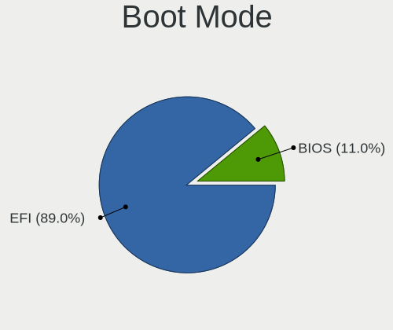
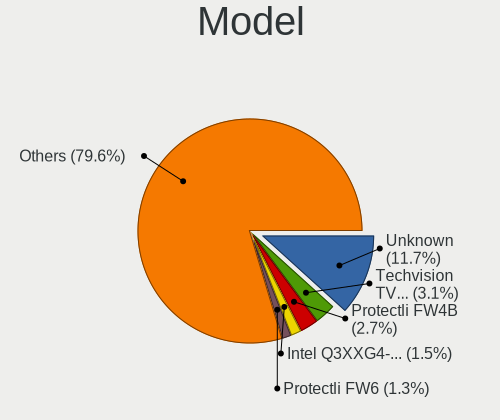
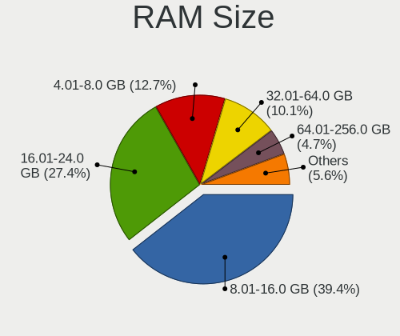
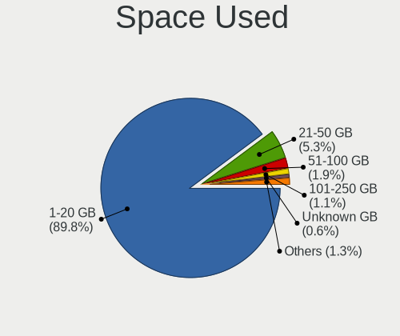
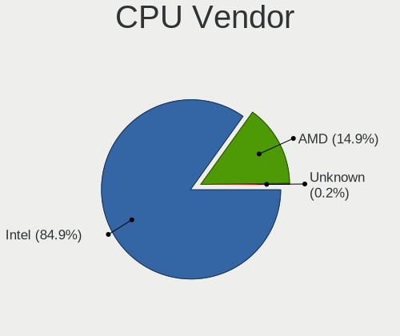
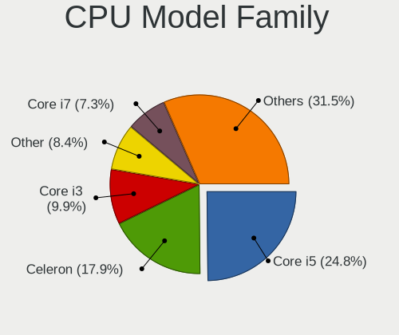
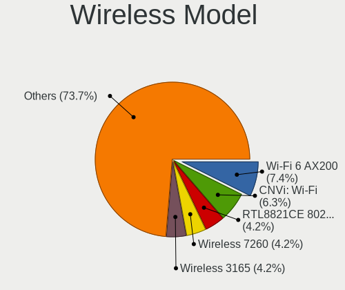
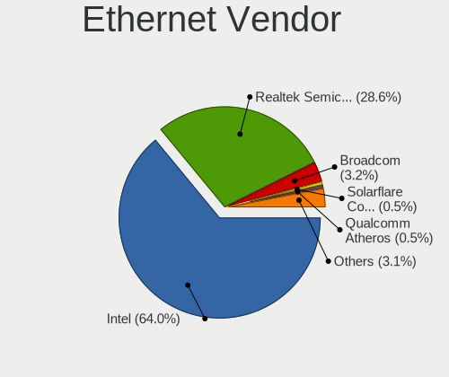
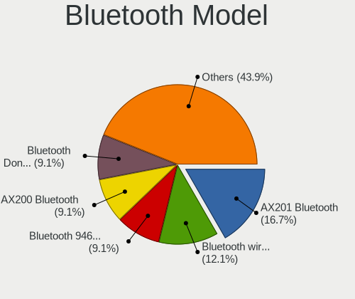
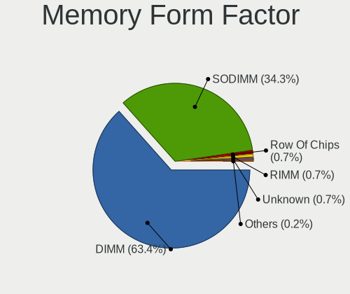

BSD in Canada - Tested Hardware & Statistics (Desktops)
-------------------------------------------------------

A project to collect tested hardware configurations for BSD in Canada.

Anyone can contribute to this report by the [hw-probe](https://github.com/linuxhw/hw-probe/blob/master/INSTALL.BSD.md) tool:

    hw-probe -all -upload

Please contribute! Especially if your hardware is rare.

Contents
--------

* [ Test Cases ](#test-cases)

* [ System ](#system)
  - [ OS                       ](#os)
  - [ OS Family                ](#os-family)
  - [ Arch                     ](#arch)
  - [ DE                       ](#de)
  - [ Display Server           ](#display-server)
  - [ Display Manager          ](#display-manager)
  - [ OS Lang                  ](#os-lang)
  - [ Boot Mode                ](#boot-mode)
  - [ Filesystem               ](#filesystem)
  - [ Part. scheme             ](#part-scheme)

* [ Board ](#board)
  - [ Vendor                   ](#vendor)
  - [ Model                    ](#model)
  - [ Model Family             ](#model-family)
  - [ MFG Year                 ](#mfg-year)
  - [ Form Factor              ](#form-factor)
  - [ Coreboot                 ](#coreboot)
  - [ RAM Size                 ](#ram-size)
  - [ RAM Used                 ](#ram-used)
  - [ Total Drives             ](#total-drives)
  - [ Has CD-ROM               ](#has-cd-rom)
  - [ Has Ethernet             ](#has-ethernet)
  - [ Has WiFi                 ](#has-wifi)
  - [ Has Bluetooth            ](#has-bluetooth)

* [ Location ](#location)
  - [ Country                  ](#country)
  - [ City                     ](#city)

* [ Drives ](#drives)
  - [ Drive Vendor             ](#drive-vendor)
  - [ Drive Model              ](#drive-model)
  - [ HDD Vendor               ](#hdd-vendor)
  - [ SSD Vendor               ](#ssd-vendor)
  - [ Drive Kind               ](#drive-kind)
  - [ Drive Connector          ](#drive-connector)
  - [ Drive Size               ](#drive-size)
  - [ Space Total              ](#space-total)
  - [ Space Used               ](#space-used)
  - [ Malfunc. Drives          ](#malfunc-drives)
  - [ Malfunc. Drive Vendor    ](#malfunc-drive-vendor)
  - [ Malfunc. HDD Vendor      ](#malfunc-hdd-vendor)
  - [ Malfunc. Drive Kind      ](#malfunc-drive-kind)
  - [ Failed Drives            ](#failed-drives)
  - [ Failed Drive Vendor      ](#failed-drive-vendor)
  - [ Drive Status             ](#drive-status)

* [ Storage controller ](#storage-controller)
  - [ Storage Vendor           ](#storage-vendor)
  - [ Storage Model            ](#storage-model)
  - [ Storage Kind             ](#storage-kind)

* [ Processor ](#processor)
  - [ CPU Vendor               ](#cpu-vendor)
  - [ CPU Model                ](#cpu-model)
  - [ CPU Model Family         ](#cpu-model-family)
  - [ CPU Cores                ](#cpu-cores)
  - [ CPU Sockets              ](#cpu-sockets)
  - [ CPU Threads              ](#cpu-threads)
  - [ CPU Microarch            ](#cpu-microarch)

* [ Graphics ](#graphics)
  - [ GPU Vendor               ](#gpu-vendor)
  - [ GPU Model                ](#gpu-model)
  - [ GPU Combo                ](#gpu-combo)
  - [ GPU Driver               ](#gpu-driver)
  - [ GPU Memory               ](#gpu-memory)

* [ Monitor ](#monitor)
  - [ Monitor Vendor           ](#monitor-vendor)
  - [ Monitor Model            ](#monitor-model)
  - [ Monitor Resolution       ](#monitor-resolution)
  - [ Monitor Diagonal         ](#monitor-diagonal)
  - [ Monitor Width            ](#monitor-width)
  - [ Aspect Ratio             ](#aspect-ratio)
  - [ Monitor Area             ](#monitor-area)
  - [ Pixel Density            ](#pixel-density)
  - [ Multiple Monitors        ](#multiple-monitors)

* [ Network ](#network)
  - [ Net Controller Vendor    ](#net-controller-vendor)
  - [ Net Controller Model     ](#net-controller-model)
  - [ Wireless Vendor          ](#wireless-vendor)
  - [ Wireless Model           ](#wireless-model)
  - [ Ethernet Vendor          ](#ethernet-vendor)
  - [ Ethernet Model           ](#ethernet-model)
  - [ Net Controller Kind      ](#net-controller-kind)
  - [ Used Controller          ](#used-controller)
  - [ NICs                     ](#nics)
  - [ IPv6                     ](#ipv6)

* [ Bluetooth ](#bluetooth)
  - [ Bluetooth Vendor         ](#bluetooth-vendor)
  - [ Bluetooth Model          ](#bluetooth-model)

* [ Sound ](#sound)
  - [ Sound Vendor             ](#sound-vendor)
  - [ Sound Model              ](#sound-model)

* [ Memory ](#memory)
  - [ Memory Vendor            ](#memory-vendor)
  - [ Memory Model             ](#memory-model)
  - [ Memory Kind              ](#memory-kind)
  - [ Memory Form Factor       ](#memory-form-factor)
  - [ Memory Size              ](#memory-size)
  - [ Memory Speed             ](#memory-speed)

* [ Printers & scanners ](#printers--scanners)
  - [ Printer Vendor           ](#printer-vendor)
  - [ Printer Model            ](#printer-model)
  - [ Scanner Vendor           ](#scanner-vendor)
  - [ Scanner Model            ](#scanner-model)

* [ Camera ](#camera)
  - [ Camera Vendor            ](#camera-vendor)
  - [ Camera Model             ](#camera-model)

* [ Security ](#security)
  - [ Fingerprint Vendor       ](#fingerprint-vendor)
  - [ Fingerprint Model        ](#fingerprint-model)
  - [ Chipcard Vendor          ](#chipcard-vendor)
  - [ Chipcard Model           ](#chipcard-model)

* [ Unsupported ](#unsupported)
  - [ Unsupported Devices      ](#unsupported-devices)
  - [ Unsupported Device Types ](#unsupported-device-types)

Test Cases
----------

Total: 229

| Vendor        | Model                       | Probe                                                     | Date         |
|---------------|-----------------------------|-----------------------------------------------------------|--------------|
| Protectli     | FW6 Ver                     | [ac861b1ee3](https://bsd-hardware.info/?probe=ac861b1ee3) | Jun 25, 2022 |
| Protectli     | FW6 Ver                     | [598ecb5457](https://bsd-hardware.info/?probe=598ecb5457) | Jun 25, 2022 |
| HP            | 82A2                        | [77c244bd43](https://bsd-hardware.info/?probe=77c244bd43) | Jun 19, 2022 |
| Gigabyte      | B450M DS3H-CF               | [a57a2f609c](https://bsd-hardware.info/?probe=a57a2f609c) | Jun 13, 2022 |
| Gigabyte      | B550M AORUS PRO-P           | [1febab0774](https://bsd-hardware.info/?probe=1febab0774) | Jun 12, 2022 |
| HP            | 1998                        | [1bb67075dd](https://bsd-hardware.info/?probe=1bb67075dd) | Jun 12, 2022 |
| Apple         | Mac-F221BEC8                | [5054729300](https://bsd-hardware.info/?probe=5054729300) | Jun 11, 2022 |
| HP            | 1998                        | [54a6daf0a6](https://bsd-hardware.info/?probe=54a6daf0a6) | Jun 11, 2022 |
| Acer          | EM61SM/EM61PM               | [3b8d6cb36e](https://bsd-hardware.info/?probe=3b8d6cb36e) | Jun 07, 2022 |
| Gigabyte      | B450M DS3H-CF               | [26cd129290](https://bsd-hardware.info/?probe=26cd129290) | Jun 06, 2022 |
| Dell          | 0HHV7N A00                  | [f3c197bdfb](https://bsd-hardware.info/?probe=f3c197bdfb) | Jun 04, 2022 |
| ASUSTek       | M5A97 PLUS                  | [8e8ef96421](https://bsd-hardware.info/?probe=8e8ef96421) | Jun 04, 2022 |
| Dell          | 02YYK5 A01                  | [dce99bec81](https://bsd-hardware.info/?probe=dce99bec81) | Jun 03, 2022 |
| ASUSTek       | M5A97 PLUS                  | [8ca71ddf4d](https://bsd-hardware.info/?probe=8ca71ddf4d) | Jun 02, 2022 |
| ASUSTek       | M5A97 PLUS                  | [9d5edd9fa9](https://bsd-hardware.info/?probe=9d5edd9fa9) | May 29, 2022 |
| Dell          | 0M3F6C A01                  | [21d45bc75d](https://bsd-hardware.info/?probe=21d45bc75d) | May 23, 2022 |
| ASUSTek       | PRIME B250M-C               | [c956536edd](https://bsd-hardware.info/?probe=c956536edd) | May 23, 2022 |
| Dell          | 0HHV7N A00                  | [6d7475e9c9](https://bsd-hardware.info/?probe=6d7475e9c9) | May 22, 2022 |
| Lenovo        | SHARKBAY 0B98401 WIN        | [963fa158b5](https://bsd-hardware.info/?probe=963fa158b5) | May 22, 2022 |
| ASUSTek       | PRIME Z690-P WIFI           | [1014f7f61c](https://bsd-hardware.info/?probe=1014f7f61c) | May 18, 2022 |
| Dell          | 0DXJD9 A01                  | [be13c9069c](https://bsd-hardware.info/?probe=be13c9069c) | May 18, 2022 |
| ASUSTek       | PRIME B250M-C               | [9ec22ea24c](https://bsd-hardware.info/?probe=9ec22ea24c) | May 17, 2022 |
| Lenovo        | MAHOBAY 0B98401 PRO         | [30cfcd5004](https://bsd-hardware.info/?probe=30cfcd5004) | May 15, 2022 |
| Protectli     | FW4B Ver                    | [9af60bd6e4](https://bsd-hardware.info/?probe=9af60bd6e4) | May 14, 2022 |
| ASUSTek       | M5A97 PLUS                  | [fd066b2db9](https://bsd-hardware.info/?probe=fd066b2db9) | May 14, 2022 |
| Unknown       | Unknown                     | [0958a64385](https://bsd-hardware.info/?probe=0958a64385) | May 12, 2022 |
| Unknown       | Unknown                     | [0d62d4e3cd](https://bsd-hardware.info/?probe=0d62d4e3cd) | May 09, 2022 |
| Gigabyte      | F2A68HM-H                   | [daed3f9401](https://bsd-hardware.info/?probe=daed3f9401) | May 06, 2022 |
| ASUSTek       | H81M-E                      | [cf2f288b93](https://bsd-hardware.info/?probe=cf2f288b93) | May 04, 2022 |
| HP            | 1495                        | [6e0f1cc72e](https://bsd-hardware.info/?probe=6e0f1cc72e) | Apr 29, 2022 |
| HP            | 1998                        | [1244e0583b](https://bsd-hardware.info/?probe=1244e0583b) | Apr 27, 2022 |
| Unknown       | Unknown                     | [b3d5defed1](https://bsd-hardware.info/?probe=b3d5defed1) | Apr 26, 2022 |
| Unknown       | Unknown                     | [4166c67369](https://bsd-hardware.info/?probe=4166c67369) | Apr 20, 2022 |
| Dell          | G5 5090                     | [8b24170852](https://bsd-hardware.info/?probe=8b24170852) | Apr 17, 2022 |
| Unknown       | Unknown                     | [979e868c51](https://bsd-hardware.info/?probe=979e868c51) | Apr 16, 2022 |
| Dell          | 0DXJD9 A01                  | [4023d86091](https://bsd-hardware.info/?probe=4023d86091) | Apr 15, 2022 |
| ASRock        | J3455B-ITX                  | [29be552d6a](https://bsd-hardware.info/?probe=29be552d6a) | Apr 15, 2022 |
| Unknown       | Unknown                     | [1173feae11](https://bsd-hardware.info/?probe=1173feae11) | Apr 13, 2022 |
| Dell          | 0DXJD9 A01                  | [6dac56f3bb](https://bsd-hardware.info/?probe=6dac56f3bb) | Apr 11, 2022 |
| Dell          | 0WR7PY A03                  | [641d1574ce](https://bsd-hardware.info/?probe=641d1574ce) | Apr 11, 2022 |
| PC Engines    | APU                         | [e266947055](https://bsd-hardware.info/?probe=e266947055) | Mar 29, 2022 |
| Unknown       | Unknown                     | [ef1a743845](https://bsd-hardware.info/?probe=ef1a743845) | Mar 28, 2022 |
| Lenovo        | SHARKBAY 0B98401 WIN        | [1176fca4ab](https://bsd-hardware.info/?probe=1176fca4ab) | Mar 27, 2022 |
| Unknown       | Unknown                     | [d0e7b62eda](https://bsd-hardware.info/?probe=d0e7b62eda) | Mar 25, 2022 |
| Protectli     | FW4B Ver                    | [cf576c571d](https://bsd-hardware.info/?probe=cf576c571d) | Mar 22, 2022 |
| HP            | 213D A01                    | [6baba4f9c1](https://bsd-hardware.info/?probe=6baba4f9c1) | Mar 20, 2022 |
| ASUSTek       | P8Z68-V LE                  | [3727ba82af](https://bsd-hardware.info/?probe=3727ba82af) | Mar 19, 2022 |
| Intel         | SHARKBAY                    | [f22a45488b](https://bsd-hardware.info/?probe=f22a45488b) | Mar 15, 2022 |
| Gigabyte      | B550I AORUS PRO AX          | [a5fd383c40](https://bsd-hardware.info/?probe=a5fd383c40) | Mar 14, 2022 |
| MSI           | MS-7388                     | [ad8209dbdb](https://bsd-hardware.info/?probe=ad8209dbdb) | Mar 05, 2022 |
| MSI           | MS-7388                     | [a59bca8bde](https://bsd-hardware.info/?probe=a59bca8bde) | Mar 05, 2022 |
| Lenovo        | SHARKBAY 0B98401 WIN        | [a6abb45607](https://bsd-hardware.info/?probe=a6abb45607) | Mar 04, 2022 |
| Lenovo        | SHARKBAY 0B98401 WIN        | [6b2550968e](https://bsd-hardware.info/?probe=6b2550968e) | Feb 23, 2022 |
| Intel         | Q3XXG4-P V1.0               | [b69015f0e0](https://bsd-hardware.info/?probe=b69015f0e0) | Feb 16, 2022 |
| PC Engines    | apu4                        | [09f27a0f23](https://bsd-hardware.info/?probe=09f27a0f23) | Feb 14, 2022 |
| Protectli     | FW6                         | [d33b2f1244](https://bsd-hardware.info/?probe=d33b2f1244) | Feb 13, 2022 |
| ASRock        | AM1H-ITX                    | [12ccb8699b](https://bsd-hardware.info/?probe=12ccb8699b) | Feb 08, 2022 |
| ASRock        | AM1H-ITX                    | [0d3b560aad](https://bsd-hardware.info/?probe=0d3b560aad) | Feb 08, 2022 |
| MSI           | X470 GAMING PLUS MAX        | [3dabf0503d](https://bsd-hardware.info/?probe=3dabf0503d) | Feb 08, 2022 |
| SeeedStudi... | ODYSSEY-X86J4105 SD-BS-C... | [53abdfa3b1](https://bsd-hardware.info/?probe=53abdfa3b1) | Feb 07, 2022 |
| ASUSTek       | PRIME H410M-A               | [1dafdcc71a](https://bsd-hardware.info/?probe=1dafdcc71a) | Feb 05, 2022 |
| ASRock        | J4105M                      | [09b9d104b9](https://bsd-hardware.info/?probe=09b9d104b9) | Feb 03, 2022 |
| Intel         | Q3XXG4-P V1.0               | [07d565ad8c](https://bsd-hardware.info/?probe=07d565ad8c) | Feb 02, 2022 |
| ASRock        | J3455B-ITX                  | [83975bd2b1](https://bsd-hardware.info/?probe=83975bd2b1) | Jan 29, 2022 |
| Intel         | Q3XXG4-P V1.0               | [ff629a490d](https://bsd-hardware.info/?probe=ff629a490d) | Jan 29, 2022 |
| Dell          | 0WMJ54 A01                  | [4b17ef7a18](https://bsd-hardware.info/?probe=4b17ef7a18) | Jan 27, 2022 |
| PC Engines    | APU2                        | [5ea082ddf9](https://bsd-hardware.info/?probe=5ea082ddf9) | Jan 13, 2022 |
| Dell          | 0X4N41 A01                  | [87000234dc](https://bsd-hardware.info/?probe=87000234dc) | Jan 11, 2022 |
| ASUSTek       | P8Z68-M PRO                 | [a0885f4f44](https://bsd-hardware.info/?probe=a0885f4f44) | Jan 10, 2022 |
| Unknown       | Unknown                     | [ded64258b4](https://bsd-hardware.info/?probe=ded64258b4) | Jan 09, 2022 |
| Unknown       | Unknown                     | [8d607c1d19](https://bsd-hardware.info/?probe=8d607c1d19) | Jan 03, 2022 |
| Unknown       | Unknown                     | [c183bdd5af](https://bsd-hardware.info/?probe=c183bdd5af) | Jan 01, 2022 |
| Unknown       | Unknown                     | [4848e4009f](https://bsd-hardware.info/?probe=4848e4009f) | Jan 01, 2022 |
| AMI           | Cherry Trail CR             | [7d47d0db05](https://bsd-hardware.info/?probe=7d47d0db05) | Dec 30, 2021 |
| ASUSTek       | P8B75-M                     | [c3884fac44](https://bsd-hardware.info/?probe=c3884fac44) | Dec 30, 2021 |
| ASUSTek       | Z170-P                      | [bde74629f9](https://bsd-hardware.info/?probe=bde74629f9) | Dec 25, 2021 |
| ASRock        | J3355B-ITX                  | [f4648747b0](https://bsd-hardware.info/?probe=f4648747b0) | Dec 22, 2021 |
| Quanta        | 2AC7 011                    | [1a831a1d34](https://bsd-hardware.info/?probe=1a831a1d34) | Dec 18, 2021 |
| HP            | 843B                        | [f0d279747f](https://bsd-hardware.info/?probe=f0d279747f) | Dec 13, 2021 |
| HP            | 843B                        | [56400d3999](https://bsd-hardware.info/?probe=56400d3999) | Dec 13, 2021 |
| AMI           | Cherry Trail CR             | [624041b5db](https://bsd-hardware.info/?probe=624041b5db) | Dec 09, 2021 |
| Dell          | 051FJ8 A01                  | [ccfb8336a0](https://bsd-hardware.info/?probe=ccfb8336a0) | Dec 01, 2021 |
| HP            | 843B                        | [376e006a40](https://bsd-hardware.info/?probe=376e006a40) | Nov 30, 2021 |
| HP            | 843B                        | [404224439d](https://bsd-hardware.info/?probe=404224439d) | Nov 29, 2021 |
| HP            | 843B                        | [a8ac0e9efb](https://bsd-hardware.info/?probe=a8ac0e9efb) | Nov 29, 2021 |
| Gigabyte      | Z97X-SLI-CF                 | [dc9d060c7f](https://bsd-hardware.info/?probe=dc9d060c7f) | Nov 27, 2021 |
| ASUSTek       | M5A97 PLUS                  | [a26bc8f2b3](https://bsd-hardware.info/?probe=a26bc8f2b3) | Nov 14, 2021 |
| Gigabyte      | MRZNVMS-00                  | [817cb3e603](https://bsd-hardware.info/?probe=817cb3e603) | Nov 12, 2021 |
| ASUSTek       | M5A97 PLUS                  | [970387f9d9](https://bsd-hardware.info/?probe=970387f9d9) | Nov 09, 2021 |
| Protectli     | FW6E                        | [ebe5b24dee](https://bsd-hardware.info/?probe=ebe5b24dee) | Nov 08, 2021 |
| Protectli     | FW6E                        | [6c12084410](https://bsd-hardware.info/?probe=6c12084410) | Nov 07, 2021 |
| ASUSTek       | M5A97 PLUS                  | [99b5ab3e42](https://bsd-hardware.info/?probe=99b5ab3e42) | Nov 04, 2021 |
| ASRock        | H370M-ITX/ac                | [bf37ad85e7](https://bsd-hardware.info/?probe=bf37ad85e7) | Nov 03, 2021 |
| Unknown       | Unknown                     | [579cf2ac1a](https://bsd-hardware.info/?probe=579cf2ac1a) | Oct 31, 2021 |
| Intel         | Q3XXG4-P V1.0               | [7abc8386ec](https://bsd-hardware.info/?probe=7abc8386ec) | Oct 31, 2021 |
| HP            | 843B                        | [9761f29b5e](https://bsd-hardware.info/?probe=9761f29b5e) | Oct 25, 2021 |
| SeeedStudi... | ODYSSEY-X86J4105 SD-BS-C... | [c3d6cddf87](https://bsd-hardware.info/?probe=c3d6cddf87) | Oct 25, 2021 |
| Intel         | CRESCENTBAY                 | [5c8f3708b1](https://bsd-hardware.info/?probe=5c8f3708b1) | Oct 21, 2021 |
| Acer          | Aspire TC-780               | [77101a00b3](https://bsd-hardware.info/?probe=77101a00b3) | Oct 11, 2021 |
| Acer          | Aspire TC-780               | [3ce8481842](https://bsd-hardware.info/?probe=3ce8481842) | Oct 10, 2021 |
| ASUSTek       | M5A97 PLUS                  | [cc419789f8](https://bsd-hardware.info/?probe=cc419789f8) | Oct 08, 2021 |
| MSI           | B450I GAMING PLUS AC        | [43388a27a4](https://bsd-hardware.info/?probe=43388a27a4) | Oct 04, 2021 |
| Lenovo        | ThinkCentre M58e 7268A9U    | [00bafc5f7c](https://bsd-hardware.info/?probe=00bafc5f7c) | Oct 03, 2021 |
| ASUSTek       | H81M-E                      | [0cc0d2dcb1](https://bsd-hardware.info/?probe=0cc0d2dcb1) | Oct 01, 2021 |
| ASUSTek       | H81M-E                      | [76866f2db7](https://bsd-hardware.info/?probe=76866f2db7) | Oct 01, 2021 |
| ASUSTek       | H81M-E                      | [319470ebbd](https://bsd-hardware.info/?probe=319470ebbd) | Oct 01, 2021 |
| Lenovo        | SHARKBAY 0B98401 PRO        | [36a5bc62bf](https://bsd-hardware.info/?probe=36a5bc62bf) | Sep 27, 2021 |
| SeeedStudi... | ODYSSEY-X86J4105 SD-BS-C... | [01e33c8399](https://bsd-hardware.info/?probe=01e33c8399) | Sep 26, 2021 |
| ASUSTek       | H81M-E                      | [137654a2f8](https://bsd-hardware.info/?probe=137654a2f8) | Sep 24, 2021 |
| ASUSTek       | H81M-E                      | [dec23f7ff8](https://bsd-hardware.info/?probe=dec23f7ff8) | Sep 23, 2021 |
| AMI           | Cherry Trail CR             | [3b709e37c2](https://bsd-hardware.info/?probe=3b709e37c2) | Sep 12, 2021 |
| ASUSTek       | P8H77-I                     | [1feb22dc52](https://bsd-hardware.info/?probe=1feb22dc52) | Sep 12, 2021 |
| HP            | 212B                        | [d3894b9f37](https://bsd-hardware.info/?probe=d3894b9f37) | Sep 10, 2021 |
| ASRock        | H110M-DGS R3.0              | [df08c4e6d3](https://bsd-hardware.info/?probe=df08c4e6d3) | Sep 09, 2021 |
| Gigabyte      | Z97X-SLI-CF                 | [c64c51359c](https://bsd-hardware.info/?probe=c64c51359c) | Sep 09, 2021 |
| MSI           | CSM-B85M-P32                | [e960bc2548](https://bsd-hardware.info/?probe=e960bc2548) | Sep 01, 2021 |
| Gigabyte      | H61N-USB3                   | [3dca10264a](https://bsd-hardware.info/?probe=3dca10264a) | Aug 29, 2021 |
| ASRock        | B450M Pro4                  | [70dc185964](https://bsd-hardware.info/?probe=70dc185964) | Aug 25, 2021 |
| HP            | 1589                        | [4d51cc9c4b](https://bsd-hardware.info/?probe=4d51cc9c4b) | Aug 24, 2021 |
| Acer          | Aspire TC-895 V:1.0         | [da3e8986a3](https://bsd-hardware.info/?probe=da3e8986a3) | Aug 22, 2021 |
| AMI           | Cherry Trail CR             | [bd94ad09ef](https://bsd-hardware.info/?probe=bd94ad09ef) | Aug 12, 2021 |
| Lenovo        | ThinkCentre M58e 7268A9U    | [94201b7633](https://bsd-hardware.info/?probe=94201b7633) | Aug 10, 2021 |
| Supermicro    | X11SDV-8C-TP8F              | [6da61be169](https://bsd-hardware.info/?probe=6da61be169) | Aug 08, 2021 |
| Intel         | Q3XXG4-P V1.0               | [535b577563](https://bsd-hardware.info/?probe=535b577563) | Aug 03, 2021 |
| HP            | ProLiant ML150 G6           | [783c2ba254](https://bsd-hardware.info/?probe=783c2ba254) | Aug 02, 2021 |
| Protectli     | FW4B Ver                    | [b434d9bfb8](https://bsd-hardware.info/?probe=b434d9bfb8) | Aug 02, 2021 |
| ASUSTek       | P5QL PRO                    | [4d118404a8](https://bsd-hardware.info/?probe=4d118404a8) | Jul 29, 2021 |
| ASRock        | J3455B-ITX                  | [fc13802cd3](https://bsd-hardware.info/?probe=fc13802cd3) | Jul 19, 2021 |
| Intel         | SHARKBAY                    | [5697d53687](https://bsd-hardware.info/?probe=5697d53687) | Jul 19, 2021 |
| ASRock        | J3455B-ITX                  | [c7dbe473bc](https://bsd-hardware.info/?probe=c7dbe473bc) | Jul 17, 2021 |
| Lenovo        | SHARKBAY 0C48431 PRO        | [0a1fa8924e](https://bsd-hardware.info/?probe=0a1fa8924e) | Jul 17, 2021 |
| ASRock        | J3455B-ITX                  | [b86c2cfc99](https://bsd-hardware.info/?probe=b86c2cfc99) | Jul 16, 2021 |
| PC Engines    | apu4                        | [51163b13ef](https://bsd-hardware.info/?probe=51163b13ef) | Jul 11, 2021 |
| Intel         | SHARKBAY                    | [59a1b5f761](https://bsd-hardware.info/?probe=59a1b5f761) | Jul 10, 2021 |
| Gigabyte      | H97-D3H-CF                  | [a326fd4061](https://bsd-hardware.info/?probe=a326fd4061) | Jun 20, 2021 |
| Lenovo        | SHARKBAY 0B98401 WIN        | [ef7104e237](https://bsd-hardware.info/?probe=ef7104e237) | Jun 20, 2021 |
| ASUSTek       | ROG STRIX H370-I GAMING     | [d2dd261a2a](https://bsd-hardware.info/?probe=d2dd261a2a) | Jun 20, 2021 |
| Intel         | SHARKBAY                    | [6aa5f8046e](https://bsd-hardware.info/?probe=6aa5f8046e) | Jun 19, 2021 |
| Shuttle       | FS110                       | [9b4093c9a1](https://bsd-hardware.info/?probe=9b4093c9a1) | Jun 17, 2021 |
| Intel         | Q3XXG4-P V1.0               | [459bf008e9](https://bsd-hardware.info/?probe=459bf008e9) | Jun 12, 2021 |
| HP            | 805D                        | [dc4e61ecd4](https://bsd-hardware.info/?probe=dc4e61ecd4) | Jun 07, 2021 |
| HP            | 1998                        | [2806e1e8cf](https://bsd-hardware.info/?probe=2806e1e8cf) | Jun 05, 2021 |
| Intel         | Q3XXG4-P V1.0               | [95a281e2f8](https://bsd-hardware.info/?probe=95a281e2f8) | Jun 04, 2021 |
| Unknown       | Unknown                     | [65dd81d59e](https://bsd-hardware.info/?probe=65dd81d59e) | Jun 02, 2021 |
| Protectli     | FW4B Ver                    | [7e013ea910](https://bsd-hardware.info/?probe=7e013ea910) | May 20, 2021 |
| Unknown       | Unknown                     | [f90e5f9566](https://bsd-hardware.info/?probe=f90e5f9566) | May 16, 2021 |
| Unknown       | Unknown                     | [e67de92cb9](https://bsd-hardware.info/?probe=e67de92cb9) | May 14, 2021 |
| ASUSTek       | P8H61-M LE/CSM              | [273e379d9f](https://bsd-hardware.info/?probe=273e379d9f) | May 14, 2021 |
| Shuttle       | FS110                       | [e39173782f](https://bsd-hardware.info/?probe=e39173782f) | May 08, 2021 |
| Supermicro    | A2SDi-8C-HLN4F              | [1f78fbb36c](https://bsd-hardware.info/?probe=1f78fbb36c) | May 08, 2021 |
| Intel         | Q3XXG4-P V1.0               | [5a128dd6a3](https://bsd-hardware.info/?probe=5a128dd6a3) | Apr 22, 2021 |
| HP            | 18E7                        | [e6354de524](https://bsd-hardware.info/?probe=e6354de524) | Apr 20, 2021 |
| Intel         | Q3XXG4-P V1.0               | [7a6f106b0e](https://bsd-hardware.info/?probe=7a6f106b0e) | Apr 18, 2021 |
| Intel         | SHARKBAY                    | [cd0467031a](https://bsd-hardware.info/?probe=cd0467031a) | Apr 17, 2021 |
| HARDKERNEL    | ODROID-H2                   | [5a1a372153](https://bsd-hardware.info/?probe=5a1a372153) | Apr 16, 2021 |
| HARDKERNEL    | ODROID-H2                   | [31a9bf167b](https://bsd-hardware.info/?probe=31a9bf167b) | Apr 16, 2021 |
| Dell          | 051FJ8 A01                  | [351b13fd3b](https://bsd-hardware.info/?probe=351b13fd3b) | Apr 15, 2021 |
| ASRock        | J4105M                      | [69165e1573](https://bsd-hardware.info/?probe=69165e1573) | Apr 13, 2021 |
| Lenovo        | SHARKBAY 0B98401 PRO        | [5aca6c03c1](https://bsd-hardware.info/?probe=5aca6c03c1) | Apr 09, 2021 |
| ASUSTek       | P8H61-M LE/CSM              | [0e814e53e9](https://bsd-hardware.info/?probe=0e814e53e9) | Apr 09, 2021 |
| ASUSTek       | P8H61-M LE/CSM              | [817ec0a0da](https://bsd-hardware.info/?probe=817ec0a0da) | Apr 09, 2021 |
| ASUSTek       | PRIME H410M-A               | [6f4f9fb14e](https://bsd-hardware.info/?probe=6f4f9fb14e) | Apr 07, 2021 |
| HP            | 2AF7                        | [acd341147c](https://bsd-hardware.info/?probe=acd341147c) | Apr 03, 2021 |
| Dell          | 0TTDMJ A00                  | [b5c0428c8a](https://bsd-hardware.info/?probe=b5c0428c8a) | Mar 30, 2021 |
| ASRock        | H110M-DGS R3.0              | [6af0a9bc78](https://bsd-hardware.info/?probe=6af0a9bc78) | Mar 30, 2021 |
| ASRock        | H110M-DGS R3.0              | [aaf140005c](https://bsd-hardware.info/?probe=aaf140005c) | Mar 30, 2021 |
| AMI           | Cherry Trail CR             | [636dfb334b](https://bsd-hardware.info/?probe=636dfb334b) | Mar 29, 2021 |
| Gigabyte      | D525TUD                     | [a48a515986](https://bsd-hardware.info/?probe=a48a515986) | Mar 24, 2021 |
| Dell          | 0M9KCM A00                  | [7280d52eff](https://bsd-hardware.info/?probe=7280d52eff) | Mar 23, 2021 |
| Dell          | 04YP6J A02                  | [061ad76c0e](https://bsd-hardware.info/?probe=061ad76c0e) | Mar 20, 2021 |
| Intel         | Q3XXG4-P V1.0               | [03935b2745](https://bsd-hardware.info/?probe=03935b2745) | Mar 20, 2021 |
| Dell          | 00V62H A00                  | [27cb6a75c8](https://bsd-hardware.info/?probe=27cb6a75c8) | Mar 19, 2021 |
| ASUSTek       | PRIME H310M-E R2.0          | [8964a02114](https://bsd-hardware.info/?probe=8964a02114) | Mar 15, 2021 |
| ASRock        | B450M Pro4                  | [e9ca160a2d](https://bsd-hardware.info/?probe=e9ca160a2d) | Mar 11, 2021 |
| Shuttle       | FS110                       | [fc31311d01](https://bsd-hardware.info/?probe=fc31311d01) | Mar 10, 2021 |
| Supermicro    | A2SDi-TP8F                  | [c30d805062](https://bsd-hardware.info/?probe=c30d805062) | Mar 05, 2021 |
| ASUSTek       | PRIME H410M-A               | [c7b0539b99](https://bsd-hardware.info/?probe=c7b0539b99) | Mar 02, 2021 |
| Gigabyte      | Z77X-UP5 TH-CF              | [9d35f9e853](https://bsd-hardware.info/?probe=9d35f9e853) | Feb 24, 2021 |
| Supermicro    | A2SDi-8C-HLN4F              | [11d6c98009](https://bsd-hardware.info/?probe=11d6c98009) | Feb 21, 2021 |
| Protectli     | FW6                         | [b656792690](https://bsd-hardware.info/?probe=b656792690) | Feb 20, 2021 |
| ASUSTek       | PRIME H410M-A               | [cfd1824b40](https://bsd-hardware.info/?probe=cfd1824b40) | Feb 18, 2021 |
| Gigabyte      | MRZNVMS-00                  | [b51cb672a4](https://bsd-hardware.info/?probe=b51cb672a4) | Feb 12, 2021 |
| ASUSTek       | TUF B450M-PLUS GAMING       | [3402eabdbf](https://bsd-hardware.info/?probe=3402eabdbf) | Feb 09, 2021 |
| ASRock        | Z270M-ITX/ac                | [9b50d422e3](https://bsd-hardware.info/?probe=9b50d422e3) | Feb 04, 2021 |
| HP            | 0AECh D                     | [6dde87584c](https://bsd-hardware.info/?probe=6dde87584c) | Feb 04, 2021 |
| PC Engines    | apu4                        | [18dfb34a97](https://bsd-hardware.info/?probe=18dfb34a97) | Feb 04, 2021 |
| HP            | 3397                        | [cda4af23ee](https://bsd-hardware.info/?probe=cda4af23ee) | Feb 03, 2021 |
| Gigabyte      | Z77X-UP5 TH-CF              | [0a48224f4b](https://bsd-hardware.info/?probe=0a48224f4b) | Feb 03, 2021 |
| HP            | 3397                        | [65f1db2a70](https://bsd-hardware.info/?probe=65f1db2a70) | Feb 03, 2021 |
| HP            | 82B4                        | [faf58d8f87](https://bsd-hardware.info/?probe=faf58d8f87) | Jan 30, 2021 |
| Dell          | 04YP6J A02                  | [12056c71ad](https://bsd-hardware.info/?probe=12056c71ad) | Jan 30, 2021 |
| PC Engines    | APU2                        | [7e96c61bf9](https://bsd-hardware.info/?probe=7e96c61bf9) | Jan 30, 2021 |
| ASRock        | J3455-ITX                   | [65bde09c13](https://bsd-hardware.info/?probe=65bde09c13) | Jan 26, 2021 |
| ASRock        | J3455-ITX                   | [0a4d4fc896](https://bsd-hardware.info/?probe=0a4d4fc896) | Jan 25, 2021 |
| ASRock        | J3355B-ITX                  | [e8496a6202](https://bsd-hardware.info/?probe=e8496a6202) | Jan 24, 2021 |
| PC Engines    | APU2                        | [da6e3cd1a6](https://bsd-hardware.info/?probe=da6e3cd1a6) | Jan 23, 2021 |
| PC Engines    | APU2                        | [3d536a42eb](https://bsd-hardware.info/?probe=3d536a42eb) | Jan 21, 2021 |
| PC Engines    | APU2                        | [043446a653](https://bsd-hardware.info/?probe=043446a653) | Jan 21, 2021 |
| Shuttle       | FS110                       | [fed17a1f77](https://bsd-hardware.info/?probe=fed17a1f77) | Jan 21, 2021 |
| Supermicro    | X8STi                       | [7cda964f76](https://bsd-hardware.info/?probe=7cda964f76) | Jan 20, 2021 |
| Dell          | 0M9KCM A02                  | [1cc5f6a07b](https://bsd-hardware.info/?probe=1cc5f6a07b) | Jan 20, 2021 |
| ASUSTek       | Z97-A                       | [8c55004504](https://bsd-hardware.info/?probe=8c55004504) | Jan 19, 2021 |
| Supermicro    | X7SLA                       | [2d31f38bf0](https://bsd-hardware.info/?probe=2d31f38bf0) | Jan 10, 2021 |
| Supermicro    | X7SPA-HF                    | [834cb6c68a](https://bsd-hardware.info/?probe=834cb6c68a) | Jan 10, 2021 |
| MSI           | X58 Pro-E                   | [bd108f94d5](https://bsd-hardware.info/?probe=bd108f94d5) | Jan 02, 2021 |
| HP            | 212B                        | [7fe9d2c508](https://bsd-hardware.info/?probe=7fe9d2c508) | Dec 18, 2020 |
| Dell          | 0GM819                      | [adc8eb1931](https://bsd-hardware.info/?probe=adc8eb1931) | Dec 18, 2020 |
| HP            | 805D                        | [dc62857275](https://bsd-hardware.info/?probe=dc62857275) | Dec 17, 2020 |
| Supermicro    | X8STi                       | [80c2762cfb](https://bsd-hardware.info/?probe=80c2762cfb) | Dec 16, 2020 |
| ASRockRack    | D1541D4U-2O8R               | [d59d8a3b6d](https://bsd-hardware.info/?probe=d59d8a3b6d) | Dec 16, 2020 |
| Supermicro    | X11SSH-F                    | [ebb920c0c4](https://bsd-hardware.info/?probe=ebb920c0c4) | Dec 16, 2020 |
| MSI           | X99S SLI PLUS               | [9b2421d9d5](https://bsd-hardware.info/?probe=9b2421d9d5) | Nov 28, 2020 |
| Gigabyte      | X470 AORUS ULTRA GAMING-... | [5d5ecb38cd](https://bsd-hardware.info/?probe=5d5ecb38cd) | Nov 25, 2020 |
| MSI           | 970 GAMING                  | [002b408f7e](https://bsd-hardware.info/?probe=002b408f7e) | Nov 18, 2020 |
| ASUSTek       | M5A78L-M/USB3               | [714b6539cf](https://bsd-hardware.info/?probe=714b6539cf) | Nov 07, 2020 |
| ASUSTek       | ROG CROSSHAIR VIII IMPAC... | [9f871ab960](https://bsd-hardware.info/?probe=9f871ab960) | Nov 01, 2020 |
| Intel         | X79 V2.81A                  | [d5b4cdf28a](https://bsd-hardware.info/?probe=d5b4cdf28a) | Oct 30, 2020 |
| ASUSTek       | M5A78L-M/USB3               | [59c940d739](https://bsd-hardware.info/?probe=59c940d739) | Oct 30, 2020 |
| Unknown       | Unknown                     | [8552669e76](https://bsd-hardware.info/?probe=8552669e76) | Oct 30, 2020 |
| Unknown       | Unknown                     | [50966c2f83](https://bsd-hardware.info/?probe=50966c2f83) | Oct 30, 2020 |
| ADI Engine... | RCC-VE                      | [30440abc03](https://bsd-hardware.info/?probe=30440abc03) | Oct 29, 2020 |
| IBM           | Board                       | [11b0b7012f](https://bsd-hardware.info/?probe=11b0b7012f) | Oct 21, 2020 |
| IBM           | Board                       | [a92c08a920](https://bsd-hardware.info/?probe=a92c08a920) | Oct 21, 2020 |
| IBM           | Board                       | [80d5f15a63](https://bsd-hardware.info/?probe=80d5f15a63) | Oct 21, 2020 |
| MSI           | MS-7250                     | [41e2d9dab3](https://bsd-hardware.info/?probe=41e2d9dab3) | Sep 04, 2020 |
| HP            | 3031h                       | [1f2695b3a7](https://bsd-hardware.info/?probe=1f2695b3a7) | Aug 25, 2020 |
| ASUSTek       | Z170-P                      | [49e01a949b](https://bsd-hardware.info/?probe=49e01a949b) | Jul 29, 2020 |
| ASUSTek       | P8Z77-V LK                  | [0f7697b73a](https://bsd-hardware.info/?probe=0f7697b73a) | May 28, 2020 |
| Dell          | 0T10XW A02                  | [81f39f3061](https://bsd-hardware.info/?probe=81f39f3061) | May 28, 2020 |

System
------

OS
--

Installed operating systems

| Name                    | Desktops | Percent |
|-------------------------|----------|---------|
| OPNsense 22.1.8         | 8        | 4.28%   |
| OPNsense 21.1.4         | 8        | 4.28%   |
| helloSystem 0.5.0       | 8        | 4.28%   |
| OPNsense 22.1.7         | 7        | 3.74%   |
| OPNsense 22.1           | 7        | 3.74%   |
| OPNsense 21.7           | 7        | 3.74%   |
| OPNsense 21.1.3         | 7        | 3.74%   |
| OPNsense 21.1           | 7        | 3.74%   |
| OPNsense 22.1.6         | 6        | 3.21%   |
| OPNsense 21.1.5         | 6        | 3.21%   |
| OPNsense 20.7.8         | 6        | 3.21%   |
| helloSystem 0.7.0       | 6        | 3.21%   |
| OPNsense 21.7.7         | 5        | 2.67%   |
| OPNsense 21.7.3         | 5        | 2.67%   |
| OPNsense 21.7.1         | 5        | 2.67%   |
| OPNsense 21.1.6         | 5        | 2.67%   |
| OPNsense 21.1.1         | 5        | 2.67%   |
| FreeBSD 12.2            | 5        | 2.67%   |
| OPNsense 22.1.3         | 4        | 2.14%   |
| OPNsense 21.7.8         | 4        | 2.14%   |
| OPNsense 21.7.4         | 4        | 2.14%   |
| OPNsense 21.1.8         | 3        | 1.6%    |
| OPNsense 21.1.7         | 3        | 1.6%    |
| OPNsense 21.1.2         | 3        | 1.6%    |
| FreeBSD 13.0            | 3        | 1.6%    |
| OPNsense 22.1.9         | 2        | 1.07%   |
| OPNsense 22.1.4         | 2        | 1.07%   |
| OPNsense 22.1.2         | 2        | 1.07%   |
| OPNsense 21.7.5         | 2        | 1.07%   |
| OPNsense 21.7.2         | 2        | 1.07%   |
| OPNsense 21.1.9         | 2        | 1.07%   |
| FreeNAS 11.3-p14        | 2        | 1.07%   |
| FreeBSD 13.1            | 2        | 1.07%   |
| FreeBSD 13.0-p5         | 2        | 1.07%   |
| FreeBSD 12.2-STABLE     | 2        | 1.07%   |
| FreeBSD 12.1-p9         | 2        | 1.07%   |
| FreeBSD 12.1-p8         | 2        | 1.07%   |
| FreeBSD 12.1-p7         | 2        | 1.07%   |
| FreeBSD 11.4-p6         | 2        | 1.07%   |
| TrueNAS 12.2-RC3        | 1        | 0.53%   |
| OPNsense 22.1.1         | 1        | 0.53%   |
| OPNsense 21.7.6         | 1        | 0.53%   |
| OpenBSD 7.1             | 1        | 0.53%   |
| OpenBSD 6.8             | 1        | 0.53%   |
| helloSystem 0.8.0       | 1        | 0.53%   |
| helloSystem 0.6.0       | 1        | 0.53%   |
| helloSystem 0.4.0       | 1        | 0.53%   |
| GhostBSD 22.05.14       | 1        | 0.53%   |
| GhostBSD 22.04.06       | 1        | 0.53%   |
| GhostBSD 20.04.02       | 1        | 0.53%   |
| FreeNAS 11.4-p4         | 1        | 0.53%   |
| FreeBSD 13.1-RC3        | 1        | 0.53%   |
| FreeBSD 13.1-RC2        | 1        | 0.53%   |
| FreeBSD 13.1-PRERELEASE | 1        | 0.53%   |
| FreeBSD 13.0-p4         | 1        | 0.53%   |
| FreeBSD 13.0-p11        | 1        | 0.53%   |
| FreeBSD 12.2-p2         | 1        | 0.53%   |
| FreeBSD 12.1-STABLE     | 1        | 0.53%   |
| FreeBSD 12.1-p5         | 1        | 0.53%   |
| FreeBSD 12.1-p4         | 1        | 0.53%   |

OS Family
---------

OS without a version

| Name        | Desktops | Percent |
|-------------|----------|---------|
| OPNsense    | 93       | 61.59%  |
| FreeBSD     | 32       | 21.19%  |
| helloSystem | 17       | 11.26%  |
| GhostBSD    | 3        | 1.99%   |
| FreeNAS     | 3        | 1.99%   |
| OpenBSD     | 2        | 1.32%   |
| TrueNAS     | 1        | 0.66%   |

Arch
----

OS architecture (x86_64, i586, etc.)

| Name  | Desktops | Percent |
|-------|----------|---------|
| amd64 | 147      | 99.32%  |
| i386  | 1        | 0.68%   |

DE
--

Desktop Environment

| Name         | Desktops | Percent |
|--------------|----------|---------|
| Console      | 110      | 73.33%  |
| helloDesktop | 17       | 11.33%  |
| KDE5         | 6        | 4%      |
| XFCE         | 5        | 3.33%   |
| MATE         | 5        | 3.33%   |
| GNOME        | 2        | 1.33%   |
| Cinnamon     | 2        | 1.33%   |
| X-Cinnamon   | 1        | 0.67%   |
| Window Maker | 1        | 0.67%   |
| LXDE         | 1        | 0.67%   |

Display Server
--------------

X11 or Wayland

| Name    | Desktops | Percent |
|---------|----------|---------|
| Console | 110      | 74.32%  |
| X11     | 37       | 25%     |
| Wayland | 1        | 0.68%   |

Display Manager
---------------

SDDM, LightDM, etc.

| Name    | Desktops | Percent |
|---------|----------|---------|
| Console | 115      | 76.67%  |
| SLiM    | 20       | 13.33%  |
| SDDM    | 9        | 6%      |
| LightDM | 3        | 2%      |
| XDM     | 2        | 1.33%   |
| GDM     | 1        | 0.67%   |

OS Lang
-------

Language

| Lang    | Desktops | Percent |
|---------|----------|---------|
| Unknown | 104      | 69.8%   |
| en_US   | 30       | 20.13%  |
| C       | 11       | 7.38%   |
| en_CA   | 3        | 2.01%   |
| fr_FR   | 1        | 0.67%   |

Boot Mode
---------

EFI or BIOS

| Mode | Desktops | Percent |
|------|----------|---------|
| EFI  | 120      | 80%     |
| BIOS | 30       | 20%     |

Filesystem
----------

Type of filesystem

| Type   | Desktops | Percent |
|--------|----------|---------|
| Ufs    | 83       | 53.9%   |
| Zfs    | 65       | 42.21%  |
| Cd9660 | 4        | 2.6%    |
| Ffs    | 2        | 1.3%    |

Part. scheme
------------

Scheme of partitioning

| Type    | Desktops | Percent |
|---------|----------|---------|
| GPT     | 136      | 91.89%  |
| MBR     | 11       | 7.43%   |
| Unknown | 1        | 0.68%   |

Board
-----

Vendor
------

Motherboard manufacturer

| Name                | Desktops | Percent |
|---------------------|----------|---------|
| ASUSTek Computer    | 21       | 14.19%  |
| Hewlett-Packard     | 19       | 12.84%  |
| Dell                | 18       | 12.16%  |
| Gigabyte Technology | 11       | 7.43%   |
| ASRock              | 11       | 7.43%   |
| Intel               | 10       | 6.76%   |
| Protectli           | 9        | 6.08%   |
| Unknown             | 9        | 6.08%   |
| Supermicro          | 8        | 5.41%   |
| MSI                 | 8        | 5.41%   |
| Lenovo              | 7        | 4.73%   |
| PC Engines          | 5        | 3.38%   |
| Acer                | 3        | 2.03%   |
| Shuttle             | 1        | 0.68%   |
| SeeedStudio         | 1        | 0.68%   |
| Quanta              | 1        | 0.68%   |
| IBM                 | 1        | 0.68%   |
| HARDKERNEL          | 1        | 0.68%   |
| ASRockRack          | 1        | 0.68%   |
| Apple               | 1        | 0.68%   |
| AMI                 | 1        | 0.68%   |
| ADI Engineering     | 1        | 0.68%   |

Model
-----

Motherboard model

| Name                                | Desktops | Percent |
|-------------------------------------|----------|---------|
| Unknown                             | 9        | 6.08%   |
| Intel Q3XXG4-P V1.0                 | 5        | 3.38%   |
| Protectli FW6                       | 4        | 2.7%    |
| Protectli FW4B                      | 4        | 2.7%    |
| Intel NDISB533                      | 3        | 2.03%   |
| HP EliteDesk 800 G1 SFF             | 3        | 2.03%   |
| Dell OptiPlex 9010                  | 3        | 2.03%   |
| Dell G5 5090                        | 3        | 2.03%   |
| ASUS All Series                     | 3        | 2.03%   |
| Supermicro X8STi                    | 2        | 1.35%   |
| PC Engines apu4                     | 2        | 1.35%   |
| PC Engines APU2                     | 2        | 1.35%   |
| Lenovo ThinkCentre M93p 10A8S16X0J  | 2        | 1.35%   |
| HP Z440 Workstation                 | 2        | 1.35%   |
| Dell Precision Tower 5810           | 2        | 1.35%   |
| Dell OptiPlex 3020                  | 2        | 1.35%   |
| ASUS M5A97 PLUS                     | 2        | 1.35%   |
| ASRock H110M-DGS R3.0               | 2        | 1.35%   |
| ASRock B450M Pro4                   | 2        | 1.35%   |
| Supermicro X7SPA-HF                 | 1        | 0.68%   |
| Supermicro X7SLA                    | 1        | 0.68%   |
| Supermicro SYS-E300-9A              | 1        | 0.68%   |
| Supermicro SYS-5019S-ML             | 1        | 0.68%   |
| Supermicro SYS-5019D-FN8TP          | 1        | 0.68%   |
| Supermicro SYS-5019A-FTN4           | 1        | 0.68%   |
| Shuttle DH110                       | 1        | 0.68%   |
| SeeedStudio ODYSSEY-X86J4105        | 1        | 0.68%   |
| Quanta 120-1135                     | 1        | 0.68%   |
| Protectli FW6E                      | 1        | 0.68%   |
| PC Engines APU                      | 1        | 0.68%   |
| MSI MS-7B79                         | 1        | 0.68%   |
| MSI MS-7A40                         | 1        | 0.68%   |
| MSI MS-7885                         | 1        | 0.68%   |
| MSI MS-7846                         | 1        | 0.68%   |
| MSI MS-7693                         | 1        | 0.68%   |
| MSI MS-7522                         | 1        | 0.68%   |
| MSI MS-7388                         | 1        | 0.68%   |
| MSI MS-7250                         | 1        | 0.68%   |
| Lenovo ThinkCentre M93p 10AAS0GN00  | 1        | 0.68%   |
| Lenovo ThinkCentre M92p 2121D5U     | 1        | 0.68%   |
| Lenovo ThinkCentre M83 10AHS0EW00   | 1        | 0.68%   |
| Lenovo ThinkCentre M58e 7268A9U     | 1        | 0.68%   |
| Lenovo SHARKBAY 0B98401 WIN         | 1        | 0.68%   |
| Intel X79 V2.81A                    | 1        | 0.68%   |
| Intel CRESCENTBAY                   | 1        | 0.68%   |
| IBM 8173KUB                         | 1        | 0.68%   |
| HP Z800 Workstation                 | 1        | 0.68%   |
| HP Z420 Workstation                 | 1        | 0.68%   |
| HP t620 PLUS Quad Core TC           | 1        | 0.68%   |
| HP ProLiant ML150 G6                | 1        | 0.68%   |
| HP ProDesk 600 G3 SFF               | 1        | 0.68%   |
| HP ProDesk 600 G2 SFF               | 1        | 0.68%   |
| HP ProDesk 600 G2 MT                | 1        | 0.68%   |
| HP ProDesk 600 G1 SFF               | 1        | 0.68%   |
| HP ProDesk 400 G4 SFF               | 1        | 0.68%   |
| HP Pavilion Gaming Desktop 690-00xx | 1        | 0.68%   |
| HP Compaq Elite 8300 SFF            | 1        | 0.68%   |
| HP Compaq dc7900 Small Form Factor  | 1        | 0.68%   |
| HP Compaq 8200 Elite SFF PC         | 1        | 0.68%   |
| HP 500-409                          | 1        | 0.68%   |

Model Family
------------

Motherboard model prefix

| Name                         | Desktops | Percent |
|------------------------------|----------|---------|
| Dell OptiPlex                | 12       | 8.11%   |
| Unknown                      | 9        | 6.08%   |
| Lenovo ThinkCentre           | 6        | 4.05%   |
| Intel Q3XXG4-P               | 5        | 3.38%   |
| HP ProDesk                   | 5        | 3.38%   |
| Protectli FW6                | 4        | 2.7%    |
| Protectli FW4B               | 4        | 2.7%    |
| ASUS PRIME                   | 4        | 2.7%    |
| Intel NDISB533               | 3        | 2.03%   |
| HP EliteDesk                 | 3        | 2.03%   |
| HP Compaq                    | 3        | 2.03%   |
| Dell Precision               | 3        | 2.03%   |
| Dell G5                      | 3        | 2.03%   |
| ASUS All                     | 3        | 2.03%   |
| Acer Aspire                  | 3        | 2.03%   |
| Supermicro X8STi             | 2        | 1.35%   |
| PC Engines apu4              | 2        | 1.35%   |
| PC Engines APU2              | 2        | 1.35%   |
| HP Z440                      | 2        | 1.35%   |
| ASUS ROG                     | 2        | 1.35%   |
| ASUS M5A97                   | 2        | 1.35%   |
| ASRock H110M-DGS             | 2        | 1.35%   |
| ASRock B450M                 | 2        | 1.35%   |
| Supermicro X7SPA-HF          | 1        | 0.68%   |
| Supermicro X7SLA             | 1        | 0.68%   |
| Supermicro SYS-E300-9A       | 1        | 0.68%   |
| Supermicro SYS-5019S-ML      | 1        | 0.68%   |
| Supermicro SYS-5019D-FN8TP   | 1        | 0.68%   |
| Supermicro SYS-5019A-FTN4    | 1        | 0.68%   |
| Shuttle DH110                | 1        | 0.68%   |
| SeeedStudio ODYSSEY-X86J4105 | 1        | 0.68%   |
| Quanta 120-1135              | 1        | 0.68%   |
| Protectli FW6E               | 1        | 0.68%   |
| PC Engines APU               | 1        | 0.68%   |
| MSI MS-7B79                  | 1        | 0.68%   |
| MSI MS-7A40                  | 1        | 0.68%   |
| MSI MS-7885                  | 1        | 0.68%   |
| MSI MS-7846                  | 1        | 0.68%   |
| MSI MS-7693                  | 1        | 0.68%   |
| MSI MS-7522                  | 1        | 0.68%   |
| MSI MS-7388                  | 1        | 0.68%   |
| MSI MS-7250                  | 1        | 0.68%   |
| Lenovo SHARKBAY              | 1        | 0.68%   |
| Intel X79                    | 1        | 0.68%   |
| Intel CRESCENTBAY            | 1        | 0.68%   |
| IBM 8173KUB                  | 1        | 0.68%   |
| HP Z800                      | 1        | 0.68%   |
| HP Z420                      | 1        | 0.68%   |
| HP t620                      | 1        | 0.68%   |
| HP ProLiant                  | 1        | 0.68%   |
| HP Pavilion                  | 1        | 0.68%   |
| HP 500-409                   | 1        | 0.68%   |
| HARDKERNEL ODROID-H2         | 1        | 0.68%   |
| Gigabyte Z97X-SLI            | 1        | 0.68%   |
| Gigabyte Z77X-UP5            | 1        | 0.68%   |
| Gigabyte X470                | 1        | 0.68%   |
| Gigabyte H97-D3H             | 1        | 0.68%   |
| Gigabyte H61N-USB3           | 1        | 0.68%   |
| Gigabyte F2A68HM-H           | 1        | 0.68%   |
| Gigabyte D525TUD             | 1        | 0.68%   |

MFG Year
--------

Motherboard manufacture year

| Year    | Desktops | Percent |
|---------|----------|---------|
| 2018    | 32       | 21.62%  |
| 2020    | 21       | 14.19%  |
| 2014    | 20       | 13.51%  |
| 2016    | 11       | 7.43%   |
| 2019    | 9        | 6.08%   |
| 2013    | 9        | 6.08%   |
| 2015    | 7        | 4.73%   |
| 2010    | 7        | 4.73%   |
| 2009    | 6        | 4.05%   |
| 2017    | 5        | 3.38%   |
| 2011    | 5        | 3.38%   |
| 2021    | 4        | 2.7%    |
| 2022    | 3        | 2.03%   |
| 2012    | 3        | 2.03%   |
| 2008    | 3        | 2.03%   |
| 2007    | 1        | 0.68%   |
| 2006    | 1        | 0.68%   |
| Unknown | 1        | 0.68%   |

Form Factor
-----------

Physical design of the computer

| Name    | Desktops | Percent |
|---------|----------|---------|
| Desktop | 148      | 100%    |

Coreboot
--------

Have coreboot on board

| Used | Desktops | Percent |
|------|----------|---------|
| No   | 141      | 95.27%  |
| Yes  | 7        | 4.73%   |

RAM Size
--------

Total RAM memory

| Size in GB  | Desktops | Percent |
|-------------|----------|---------|
| 8.01-16.0   | 53       | 35.1%   |
| 16.01-24.0  | 33       | 21.85%  |
| 4.01-8.0    | 27       | 17.88%  |
| 32.01-64.0  | 18       | 11.92%  |
| 64.01-256.0 | 7        | 4.64%   |
| 24.01-32.0  | 5        | 3.31%   |
| 2.01-3.0    | 5        | 3.31%   |
| 3.01-4.0    | 1        | 0.66%   |
| 1.01-2.0    | 1        | 0.66%   |
| 0.51-1.0    | 1        | 0.66%   |

RAM Used
--------

Used RAM memory

| Used GB     | Desktops | Percent |
|-------------|----------|---------|
| 0.01-0.5    | 70       | 46.05%  |
| 0.51-1.0    | 45       | 29.61%  |
| 1.01-2.0    | 22       | 14.47%  |
| 3.01-4.0    | 4        | 2.63%   |
| 2.01-3.0    | 4        | 2.63%   |
| 4.01-8.0    | 3        | 1.97%   |
| 32.01-64.0  | 1        | 0.66%   |
| 64.01-256.0 | 1        | 0.66%   |
| 8.01-16.0   | 1        | 0.66%   |
| 0           | 1        | 0.66%   |

Total Drives
------------

Number of drives on board

| Drives | Desktops | Percent |
|--------|----------|---------|
| 1      | 100      | 66.67%  |
| 2      | 24       | 16%     |
| 3      | 9        | 6%      |
| 0      | 8        | 5.33%   |
| 4      | 5        | 3.33%   |
| 13     | 1        | 0.67%   |
| 10     | 1        | 0.67%   |
| 7      | 1        | 0.67%   |
| 5      | 1        | 0.67%   |

Has CD-ROM
----------

Has CD-ROM on board

| Presented | Desktops | Percent |
|-----------|----------|---------|
| No        | 116      | 76.82%  |
| Yes       | 35       | 23.18%  |

Has Ethernet
------------

Has Ethernet on board

| Presented | Desktops | Percent |
|-----------|----------|---------|
| Yes       | 147      | 99.32%  |
| No        | 1        | 0.68%   |

Has WiFi
--------

Has WiFi module

| Presented | Desktops | Percent |
|-----------|----------|---------|
| No        | 121      | 81.21%  |
| Yes       | 28       | 18.79%  |

Has Bluetooth
-------------

Has Bluetooth module

| Presented | Desktops | Percent |
|-----------|----------|---------|
| No        | 130      | 87.84%  |
| Yes       | 18       | 12.16%  |

Location
--------

Country
-------

Geographic location (country)

| Country | Desktops | Percent |
|---------|----------|---------|
| Canada  | 148      | 100%    |

City
----

Geographic location (city)

| City                       | Desktops | Percent |
|----------------------------|----------|---------|
| Toronto                    | 15       | 9.55%   |
| Ottawa                     | 11       | 7.01%   |
| Montreal                   | 11       | 7.01%   |
| Kitchener                  | 7        | 4.46%   |
| Edmonton                   | 7        | 4.46%   |
| Calgary                    | 7        | 4.46%   |
| Winnipeg                   | 6        | 3.82%   |
| Victoria                   | 6        | 3.82%   |
| Surrey                     | 4        | 2.55%   |
| Windsor                    | 3        | 1.91%   |
| St. Albert                 | 3        | 1.91%   |
| Regina                     | 3        | 1.91%   |
| Moncton                    | 3        | 1.91%   |
| Brampton                   | 3        | 1.91%   |
| Vancouver                  | 2        | 1.27%   |
| Terrebonne                 | 2        | 1.27%   |
| Sarnia                     | 2        | 1.27%   |
| Sainte-Julie               | 2        | 1.27%   |
| Saint-Bruno-de-Montarville | 2        | 1.27%   |
| Oakville                   | 2        | 1.27%   |
| Nanaimo                    | 2        | 1.27%   |
| London                     | 2        | 1.27%   |
| Laval                      | 2        | 1.27%   |
| Hamilton                   | 2        | 1.27%   |
| Guelph                     | 2        | 1.27%   |
| Greater Sudbury            | 2        | 1.27%   |
| Burlington                 | 2        | 1.27%   |
| West Kelowna               | 1        | 0.64%   |
| Wallaceburg                | 1        | 0.64%   |
| Vaughan                    | 1        | 0.64%   |
| Tobique First Nation       | 1        | 0.64%   |
| Stouffville                | 1        | 0.64%   |
| St. John's                 | 1        | 0.64%   |
| St. Catharines             | 1        | 0.64%   |
| Smiths Falls               | 1        | 0.64%   |
| Sherwood Park              | 1        | 0.64%   |
| Scarborough                | 1        | 0.64%   |
| Saskatoon                  | 1        | 0.64%   |
| Saint-Colomban             | 1        | 0.64%   |
| Richmond                   | 1        | 0.64%   |
| Renfrew                    | 1        | 0.64%   |
| Qubec                  | 1        | 0.64%   |
| Qubec                    | 1        | 0.64%   |
| Qubec                  | 1        | 0.64%   |
| Pont-Rouge                 | 1        | 0.64%   |
| Pierrefonds                | 1        | 0.64%   |
| Peterborough               | 1        | 0.64%   |
| North Vancouver            | 1        | 0.64%   |
| New-Richmond               | 1        | 0.64%   |
| Mississauga                | 1        | 0.64%   |
| Maple Ridge                | 1        | 0.64%   |
| Lamont                     | 1        | 0.64%   |
| La Prairie                 | 1        | 0.64%   |
| Kingston                   | 1        | 0.64%   |
| Kanata                     | 1        | 0.64%   |
| Glace Bay                  | 1        | 0.64%   |
| Gatineau                   | 1        | 0.64%   |
| East Gwillimbury           | 1        | 0.64%   |
| Drummondville              | 1        | 0.64%   |
| Dieppe                     | 1        | 0.64%   |

Drives
------

Drive Vendor
------------

Hard drive vendors

| Vendor              | Desktops | Drives | Percent |
|---------------------|----------|--------|---------|
| WDC                 | 31       | 65     | 16.76%  |
| Samsung Electronics | 30       | 39     | 16.22%  |
| Seagate             | 29       | 54     | 15.68%  |
| Kingston            | 21       | 26     | 11.35%  |
| Toshiba             | 7        | 11     | 3.78%   |
| Intel               | 7        | 9      | 3.78%   |
| Crucial             | 7        | 8      | 3.78%   |
| A-DATA Technology   | 6        | 12     | 3.24%   |
| SanDisk             | 5        | 6      | 2.7%    |
| Dogfish             | 4        | 6      | 2.16%   |
| OCZ                 | 3        | 3      | 1.62%   |
| Micron Technology   | 3        | 6      | 1.62%   |
| BIWIN               | 3        | 3      | 1.62%   |
| VisionTek           | 2        | 6      | 1.08%   |
| Transcend           | 2        | 3      | 1.08%   |
| SPCC                | 2        | 2      | 1.08%   |
| SK hynix            | 2        | 4      | 1.08%   |
| PNY                 | 2        | 3      | 1.08%   |
| Mushkin             | 2        | 2      | 1.08%   |
| Hoodisk             | 2        | 3      | 1.08%   |
| Hitachi             | 2        | 2      | 1.08%   |
| HGST                | 2        | 3      | 1.08%   |
| Hewlett-Packard     | 2        | 2      | 1.08%   |
| SATADOM             | 1        | 2      | 0.54%   |
| Protectli           | 1        | 1      | 0.54%   |
| Phison              | 1        | 1      | 0.54%   |
| NVMe                | 1        | 1      | 0.54%   |
| HPE                 | 1        | 4      | 0.54%   |
| EAGET               | 1        | 1      | 0.54%   |
| Corsair             | 1        | 3      | 0.54%   |
| China               | 1        | 1      | 0.54%   |
| AVEXIR              | 1        | 2      | 0.54%   |

Drive Model
-----------

Hard drive models

| Model                            | Desktops | Percent |
|----------------------------------|----------|---------|
| Kingston SA400S37240G 240GB      | 6        | 3%      |
| Kingston SA400S37120G 120GB      | 6        | 3%      |
| Seagate ST1000DM010-2EP102 1TB   | 5        | 2.5%    |
| Samsung SSD 860 EVO 500GB        | 4        | 2%      |
| Samsung SSD 850 EVO 250GB        | 4        | 2%      |
| WDC WD20EZRX-00DC0B0 2TB         | 3        | 1.5%    |
| Toshiba DT01ACA100 1TB           | 3        | 1.5%    |
| Seagate ST500DM002-1BD142 500GB  | 3        | 1.5%    |
| BIWIN SSD 128GB                  | 3        | 1.5%    |
| WDC WD40EFRX-68WT0N0 4TB         | 2        | 1%      |
| WDC WD10EZEX-22MFCA0 1TB         | 2        | 1%      |
| WDC WD10EZEX-08WN4A0 1TB         | 2        | 1%      |
| WDC PC SN520 NVMe 256GB          | 2        | 1%      |
| VisionTek mSATA 120GB            | 2        | 1%      |
| Transcend TS256GMSA230S 256GB    | 2        | 1%      |
| Toshiba MQ01ABD075 752GB         | 2        | 1%      |
| Seagate ST3500413AS 500GB        | 2        | 1%      |
| Seagate ST2000DM008-2FR102 2TB   | 2        | 1%      |
| SanDisk SD6SB1M064G1022I 64GB    | 2        | 1%      |
| Samsung SSD 980 PRO 1TB          | 2        | 1%      |
| Samsung SSD 840 EVO 120GB        | 2        | 1%      |
| PNY CS1311 120GB SSD             | 2        | 1%      |
| Mushkin MKNSSDEC60GB 64GB        | 2        | 1%      |
| Kingston SUV500MS120G 120GB      | 2        | 1%      |
| Intel SSDSC2BB080G4 80GB         | 2        | 1%      |
| Crucial CT240BX500SSD1 240GB     | 2        | 1%      |
| A-DATA SU650 120GB               | 2        | 1%      |
| WDC WDS500G2B0B-00YS70 500GB     | 1        | 0.5%    |
| WDC WDS500G2B0A-00SM50 500GB     | 1        | 0.5%    |
| WDC WDS250G3X0C-00SJG0 250GB     | 1        | 0.5%    |
| WDC WDS250G2B0A 250GB            | 1        | 0.5%    |
| WDC WDS120G2G0A-00JH30 120GB     | 1        | 0.5%    |
| WDC WDS100T2B0A-00SM50 1TB       | 1        | 0.5%    |
| WDC WD6400AAKS-22A7B2 640GB      | 1        | 0.5%    |
| WDC WD6003FZBX-00K5WB0 6TB       | 1        | 0.5%    |
| WDC WD50EFRX-68L0BN1 5TB         | 1        | 0.5%    |
| WDC WD5000LPVX-22V0TT0 500GB     | 1        | 0.5%    |
| WDC WD5000AAKX-75U6AA0 500GB     | 1        | 0.5%    |
| WDC WD5000AAKX-00ERMA0 500GB     | 1        | 0.5%    |
| WDC WD5000AAKS-75A7B0 500GB      | 1        | 0.5%    |
| WDC WD40EFRX-68N32N0 4TB         | 1        | 0.5%    |
| WDC WD30EZRX-22D8PB0 3TB         | 1        | 0.5%    |
| WDC WD30EFRX-68EUZN0 3TB         | 1        | 0.5%    |
| WDC WD30EFRX-68AX9N0 3TB         | 1        | 0.5%    |
| WDC WD2500KS-00MJB0 250GB        | 1        | 0.5%    |
| WDC WD2500AAKX-001CA0 250GB      | 1        | 0.5%    |
| WDC WD20EFRX-68AX9N0 2TB         | 1        | 0.5%    |
| WDC WD2003FZEX-00Z4SA0 2TB       | 1        | 0.5%    |
| WDC WD181KFGX-68AFPN0 18TB       | 1        | 0.5%    |
| WDC WD140EFGX-68B0GN0 14TB       | 1        | 0.5%    |
| WDC WD10SPZX-00Z10T0 1TB         | 1        | 0.5%    |
| WDC WD10EZEX-07WN4A0 1TB         | 1        | 0.5%    |
| WDC WD10EFRX-68FYTN0 1TB         | 1        | 0.5%    |
| WDC WD102KRYZ-01A5AB0 10TB       | 1        | 0.5%    |
| WDC WD1003FBYX-01Y7B0 1TB        | 1        | 0.5%    |
| WDC AC31600H 2GB                 | 1        | 0.5%    |
| Toshiba THNSN5256GPUK NVMe 256GB | 1        | 0.5%    |
| Toshiba MQ01ACF050 500GB         | 1        | 0.5%    |
| SPCC Solid State Disk 64GB       | 1        | 0.5%    |
| SPCC Solid State Disk 128GB      | 1        | 0.5%    |

HDD Vendor
----------

Hard disk drive vendors

| Vendor  | Desktops | Drives | Percent |
|---------|----------|--------|---------|
| Seagate | 29       | 54     | 46.03%  |
| WDC     | 24       | 54     | 38.1%   |
| Toshiba | 6        | 8      | 9.52%   |
| Hitachi | 2        | 2      | 3.17%   |
| HGST    | 2        | 3      | 3.17%   |

SSD Vendor
----------

Solid state drive vendors

| Vendor              | Desktops | Drives | Percent |
|---------------------|----------|--------|---------|
| Samsung Electronics | 25       | 31     | 23.15%  |
| Kingston            | 21       | 25     | 19.44%  |
| Intel               | 7        | 9      | 6.48%   |
| Crucial             | 6        | 7      | 5.56%   |
| A-DATA Technology   | 6        | 12     | 5.56%   |
| WDC                 | 5        | 7      | 4.63%   |
| SanDisk             | 5        | 6      | 4.63%   |
| Dogfish             | 4        | 6      | 3.7%    |
| OCZ                 | 3        | 3      | 2.78%   |
| Micron Technology   | 3        | 6      | 2.78%   |
| BIWIN               | 3        | 3      | 2.78%   |
| VisionTek           | 2        | 6      | 1.85%   |
| Transcend           | 2        | 3      | 1.85%   |
| SPCC                | 2        | 2      | 1.85%   |
| PNY                 | 2        | 3      | 1.85%   |
| Mushkin             | 2        | 2      | 1.85%   |
| Hoodisk             | 2        | 3      | 1.85%   |
| SATADOM             | 1        | 2      | 0.93%   |
| Protectli           | 1        | 1      | 0.93%   |
| Phison              | 1        | 1      | 0.93%   |
| HPE                 | 1        | 4      | 0.93%   |
| EAGET               | 1        | 1      | 0.93%   |
| Corsair             | 1        | 3      | 0.93%   |
| China               | 1        | 1      | 0.93%   |
| AVEXIR              | 1        | 2      | 0.93%   |

Drive Kind
----------

HDD or SSD

| Kind | Desktops | Drives | Percent |
|------|----------|--------|---------|
| SSD  | 100      | 149    | 60.24%  |
| HDD  | 51       | 121    | 30.72%  |
| NVMe | 15       | 24     | 9.04%   |

Drive Connector
---------------

SATA, SAS, NVMe, etc.

| Type | Desktops | Drives | Percent |
|------|----------|--------|---------|
| SATA | 135      | 270    | 90%     |
| NVMe | 15       | 24     | 10%     |

Drive Size
----------

Size of hard drive

| Size in TB | Desktops | Drives | Percent |
|------------|----------|--------|---------|
| 0.01-0.5   | 112      | 165    | 69.57%  |
| 0.51-1.0   | 26       | 41     | 16.15%  |
| 1.01-2.0   | 9        | 18     | 5.59%   |
| 3.01-4.0   | 5        | 15     | 3.11%   |
| 4.01-10.0  | 4        | 22     | 2.48%   |
| 2.01-3.0   | 3        | 6      | 1.86%   |
| 10.01-20.0 | 2        | 3      | 1.24%   |

Space Total
-----------

Amount of disk space available on the file system

| Size in GB     | Desktops | Percent |
|----------------|----------|---------|
| 101-250        | 61       | 39.61%  |
| 251-500        | 24       | 15.58%  |
| 1-20           | 20       | 12.99%  |
| 51-100         | 20       | 12.99%  |
| 21-50          | 14       | 9.09%   |
| 501-1000       | 8        | 5.19%   |
| 1001-2000      | 4        | 2.6%    |
| Unknown        | 2        | 1.3%    |
| More than 3000 | 1        | 0.65%   |

Space Used
----------

Amount of used disk space

| Used GB  | Desktops | Percent |
|----------|----------|---------|
| 1-20     | 138      | 89.03%  |
| 21-50    | 13       | 8.39%   |
| Unknown  | 2        | 1.29%   |
| 501-1000 | 1        | 0.65%   |
| 51-100   | 1        | 0.65%   |

Malfunc. Drives
---------------

Drive models with a malfunction

| Model                                      | Desktops | Drives | Percent |
|--------------------------------------------|----------|--------|---------|
| VisionTek mSATA 120GB                      | 2        | 6      | 7.41%   |
| Toshiba MQ01ABD075 752GB                   | 2        | 2      | 7.41%   |
| Seagate ST500DM002-1BD142 500GB            | 2        | 4      | 7.41%   |
| Seagate ST3500413AS 500GB                  | 2        | 4      | 7.41%   |
| WDC WD6400AAKS-22A7B2 640GB                | 1        | 1      | 3.7%    |
| WDC WD50EFRX-68L0BN1 5TB                   | 1        | 1      | 3.7%    |
| WDC WD40EFRX-68WT0N0 4TB                   | 1        | 2      | 3.7%    |
| WDC WD30EZRX-22D8PB0 3TB                   | 1        | 1      | 3.7%    |
| WDC WD2500AAKX-001CA0 250GB                | 1        | 1      | 3.7%    |
| Toshiba DT01ACA100 1TB                     | 1        | 3      | 3.7%    |
| Seagate ST500LM021-1KJ152 500GB            | 1        | 1      | 3.7%    |
| Seagate ST3250318AS 250GB                  | 1        | 1      | 3.7%    |
| Seagate ST3200822AS 200GB                  | 1        | 1      | 3.7%    |
| Seagate ST3160815AS 160GB                  | 1        | 1      | 3.7%    |
| Seagate ST31500341AS 1.5TB                 | 1        | 2      | 3.7%    |
| Seagate ST3120026A 120GB                   | 1        | 1      | 3.7%    |
| Seagate ST31000520AS 1TB                   | 1        | 1      | 3.7%    |
| Seagate ST1000DM003-1CH162 1TB             | 1        | 1      | 3.7%    |
| Micron Technology M500_MTFDDAK960MAV 960GB | 1        | 4      | 3.7%    |
| Intel SSDSA2M080G2GC 80GB                  | 1        | 1      | 3.7%    |
| Hitachi HDT721010SLA360 1TB                | 1        | 1      | 3.7%    |
| HGST HTS541010A9E680 1TB                   | 1        | 1      | 3.7%    |
| Crucial CT240M500SSD1 240GB                | 1        | 1      | 3.7%    |

Malfunc. Drive Vendor
---------------------

Vendors of faulty drives

| Vendor            | Desktops | Drives | Percent |
|-------------------|----------|--------|---------|
| Seagate           | 11       | 17     | 42.31%  |
| WDC               | 5        | 6      | 19.23%  |
| Toshiba           | 3        | 5      | 11.54%  |
| VisionTek         | 2        | 6      | 7.69%   |
| Micron Technology | 1        | 4      | 3.85%   |
| Intel             | 1        | 1      | 3.85%   |
| Hitachi           | 1        | 1      | 3.85%   |
| HGST              | 1        | 1      | 3.85%   |
| Crucial           | 1        | 1      | 3.85%   |

Malfunc. HDD Vendor
-------------------

Vendors of faulty HDD drives

| Vendor  | Desktops | Drives | Percent |
|---------|----------|--------|---------|
| Seagate | 11       | 17     | 52.38%  |
| WDC     | 5        | 6      | 23.81%  |
| Toshiba | 3        | 5      | 14.29%  |
| Hitachi | 1        | 1      | 4.76%   |
| HGST    | 1        | 1      | 4.76%   |

Malfunc. Drive Kind
-------------------

Kinds of faulty drives

| Kind | Desktops | Drives | Percent |
|------|----------|--------|---------|
| HDD  | 19       | 30     | 79.17%  |
| SSD  | 5        | 12     | 20.83%  |

Failed Drives
-------------

Failed drive models

| Model                    | Desktops | Drives | Percent |
|--------------------------|----------|--------|---------|
| WDC WD10SPZX-00Z10T0 1TB | 1        | 1      | 100%    |

Failed Drive Vendor
-------------------

Failed drive vendors

| Vendor | Desktops | Drives | Percent |
|--------|----------|--------|---------|
| WDC    | 1        | 1      | 100%    |

Drive Status
------------

Number of failed and malfunc. drives

| Status   | Desktops | Drives | Percent |
|----------|----------|--------|---------|
| Works    | 125      | 247    | 81.7%   |
| Malfunc  | 23       | 42     | 15.03%  |
| Detected | 4        | 4      | 2.61%   |
| Failed   | 1        | 1      | 0.65%   |

Storage controller
------------------

Storage Vendor
--------------

Storage controller vendors

| Vendor                      | Desktops | Percent |
|-----------------------------|----------|---------|
| Intel                       | 118      | 66.29%  |
| AMD                         | 27       | 15.17%  |
| Samsung Electronics         | 6        | 3.37%   |
| SanDisk                     | 4        | 2.25%   |
| Nvidia                      | 4        | 2.25%   |
| ASMedia Technology          | 4        | 2.25%   |
| SK hynix                    | 2        | 1.12%   |
| Silicon Motion              | 2        | 1.12%   |
| Silicon Image               | 2        | 1.12%   |
| JMicron Technology          | 2        | 1.12%   |
| Broadcom / LSI              | 2        | 1.12%   |
| Toshiba                     | 1        | 0.56%   |
| Micron/Crucial Technology   | 1        | 0.56%   |
| Marvell Technology Group    | 1        | 0.56%   |
| Kingston Technology Company | 1        | 0.56%   |
| Chelsio Communications      | 1        | 0.56%   |

Storage Model
-------------

Storage controller models

| Model                                                                            | Desktops | Percent |
|----------------------------------------------------------------------------------|----------|---------|
| Intel 8 Series/C220 Series Chipset Family 6-port SATA Controller 1 [AHCI mode]   | 20       | 9.57%   |
| AMD FCH SATA Controller [AHCI mode]                                              | 11       | 5.26%   |
| Intel Q170/Q150/B150/H170/H110/Z170/CM236 Chipset SATA Controller [AHCI Mode]    | 9        | 4.31%   |
| Intel 7 Series/C210 Series Chipset Family 6-port SATA Controller [AHCI mode]     | 8        | 3.83%   |
| AMD 400 Series Chipset SATA Controller                                           | 7        | 3.35%   |
| Intel Cannon Lake PCH SATA AHCI Controller                                       | 6        | 2.87%   |
| Intel 6 Series/C200 Series Chipset Family 6 port Desktop SATA AHCI Controller    | 6        | 2.87%   |
| AMD SB7x0/SB8x0/SB9x0 SATA Controller [AHCI mode]                                | 6        | 2.87%   |
| Intel Sunrise Point-LP SATA Controller [AHCI mode]                               | 5        | 2.39%   |
| Intel Celeron/Pentium Silver Processor SATA Controller                           | 5        | 2.39%   |
| Intel 200 Series PCH SATA controller [AHCI mode]                                 | 5        | 2.39%   |
| Intel Celeron N3350/Pentium N4200/Atom E3900 Series SATA AHCI Controller         | 4        | 1.91%   |
| Intel C610/X99 series chipset 6-Port SATA Controller [AHCI mode]                 | 4        | 1.91%   |
| Intel Atom/Celeron/Pentium Processor x5-E8000/J3xxx/N3xxx Series SATA Controller | 4        | 1.91%   |
| Intel 82801JI (ICH10 Family) SATA AHCI Controller                                | 4        | 1.91%   |
| Intel 82801G (ICH7 Family) IDE Controller                                        | 4        | 1.91%   |
| Intel 8 Series SATA Controller 1 [AHCI mode]                                     | 4        | 1.91%   |
| SanDisk PC SN520 NVMe SSD                                                        | 3        | 1.44%   |
| Samsung NVMe SSD Controller SM981/PM981/PM983                                    | 3        | 1.44%   |
| Samsung NVMe SSD Controller PM9A1/PM9A3/980PRO                                   | 3        | 1.44%   |
| Intel NM10/ICH7 Family SATA Controller [IDE mode]                                | 3        | 1.44%   |
| Intel 9 Series Chipset Family SATA Controller [AHCI Mode]                        | 3        | 1.44%   |
| ASMedia ASM1062 Serial ATA Controller                                            | 3        | 1.44%   |
| AMD FCH SATA Controller [IDE mode]                                               | 3        | 1.44%   |
| Silicon Image SiI 3114 [SATALink/SATARaid] Serial ATA Controller                 | 2        | 0.96%   |
| JMicron JMB363 SATA/IDE Controller                                               | 2        | 0.96%   |
| Intel Wildcat Point-LP SATA Controller [AHCI Mode]                               | 2        | 0.96%   |
| Intel NM10/ICH7 Family SATA Controller [AHCI mode]                               | 2        | 0.96%   |
| Intel C610/X99 series chipset sSATA Controller [AHCI mode]                       | 2        | 0.96%   |
| Intel Atom Processor C3000 Series SATA Controller 1                              | 2        | 0.96%   |
| Intel 82801JI (ICH10 Family) 4 port SATA IDE Controller #1                       | 2        | 0.96%   |
| Intel 82801JI (ICH10 Family) 2 port SATA IDE Controller #2                       | 2        | 0.96%   |
| Intel 82801IR/IO/IH (ICH9R/DO/DH) 6 port SATA Controller [AHCI mode]             | 2        | 0.96%   |
| Intel 7 Series/C210 Series Chipset Family 4-port SATA Controller [IDE mode]      | 2        | 0.96%   |
| Intel 7 Series/C210 Series Chipset Family 2-port SATA Controller [IDE mode]      | 2        | 0.96%   |
| Intel 400 Series Chipset Family SATA AHCI Controller                             | 2        | 0.96%   |
| AMD SB7x0/SB8x0/SB9x0 SATA Controller [IDE mode]                                 | 2        | 0.96%   |
| AMD SB7x0/SB8x0/SB9x0 IDE Controller                                             | 2        | 0.96%   |
| AMD 500 Series Chipset SATA Controller                                           | 2        | 0.96%   |
| Toshiba XG4 NVMe SSD Controller                                                  | 1        | 0.48%   |
| SK hynix PC401 NVMe Solid State Drive 256GB                                      | 1        | 0.48%   |
| SK hynix BC501 NVMe Solid State Drive                                            | 1        | 0.48%   |
| Silicon Motion SM2263EN/SM2263XT SSD Controller                                  | 1        | 0.48%   |
| Silicon Motion SM2262/SM2262EN SSD Controller                                    | 1        | 0.48%   |
| SanDisk WD Black 2018/SN750 / PC SN720 NVMe SSD                                  | 1        | 0.48%   |
| Nvidia MCP73 IDE Controller                                                      | 1        | 0.48%   |
| Nvidia MCP61 SATA Controller                                                     | 1        | 0.48%   |
| Nvidia MCP61 IDE                                                                 | 1        | 0.48%   |
| Nvidia MCP55 IDE                                                                 | 1        | 0.48%   |
| Nvidia MCP51 Serial ATA Controller                                               | 1        | 0.48%   |
| Nvidia MCP51 IDE                                                                 | 1        | 0.48%   |
| Nvidia GeForce 7100/nForce 630i SATA                                             | 1        | 0.48%   |
| Micron/Crucial P2 NVMe PCIe SSD                                                  | 1        | 0.48%   |
| Marvell Group 88SE9172 SATA 6Gb/s Controller                                     | 1        | 0.48%   |
| Kingston Company A2000 NVMe SSD                                                  | 1        | 0.48%   |
| Intel Volume Management Device NVMe RAID Controller                              | 1        | 0.48%   |
| Intel Tiger Lake-LP SATA Controller [AHCI mode]                                  | 1        | 0.48%   |
| Intel SATA Controller [RAID mode]                                                | 1        | 0.48%   |
| Intel Comet Lake SATA AHCI Controller                                            | 1        | 0.48%   |
| Intel C620 Series Chipset Family SSATA Controller [AHCI mode]                    | 1        | 0.48%   |

Storage Kind
------------

Kind of storage controller (IDE, SATA, NVMe, SAS, ...)

| Kind | Desktops | Percent |
|------|----------|---------|
| SATA | 126      | 71.59%  |
| IDE  | 25       | 14.2%   |
| NVMe | 15       | 8.52%   |
| RAID | 6        | 3.41%   |
| SAS  | 2        | 1.14%   |
| SCSI | 2        | 1.14%   |

Processor
---------

CPU Vendor
----------

Processor vendors

| Vendor | Desktops | Percent |
|--------|----------|---------|
| Intel  | 120      | 80%     |
| AMD    | 30       | 20%     |

CPU Model
---------

Processor models

| Model                                                  | Desktops | Percent |
|--------------------------------------------------------|----------|---------|
| Intel Core i5-4570 CPU @ 3.20GHz                       | 5        | 3.33%   |
| Intel Core i5-4590 CPU @ 3.30GHz                       | 4        | 2.67%   |
| Intel Core i5-3570 CPU @ 3.40GHz                       | 4        | 2.67%   |
| Intel Celeron CPU J3160 @ 1.60GHz                      | 4        | 2.67%   |
| AMD GX-412TC SOC                                       | 4        | 2.67%   |
| Intel Pentium CPU G4560 @ 3.50GHz                      | 3        | 2%      |
| Intel Core i7-9700K CPU @ 3.60GHz                      | 3        | 2%      |
| Intel Core i7-3770 CPU @ 3.40GHz                       | 3        | 2%      |
| Intel Core i5-7200U CPU @ 2.50GHz                      | 3        | 2%      |
| Intel Core i5-6500 CPU @ 3.20GHz                       | 3        | 2%      |
| Intel Core i5-4570TE CPU @ 2.70GHz                     | 3        | 2%      |
| Intel Xeon CPU E5-2660 v3 @ 2.60GHz                    | 2        | 1.33%   |
| Intel Core i7-7700 CPU @ 3.60GHz                       | 2        | 1.33%   |
| Intel Core i7-4790K CPU @ 4.00GHz                      | 2        | 1.33%   |
| Intel Core i5-8400 CPU @ 2.80GHz                       | 2        | 1.33%   |
| Intel Core i5-4460 CPU @ 3.20GHz                       | 2        | 1.33%   |
| Intel Core i5-3470T CPU @ 2.90GHz                      | 2        | 1.33%   |
| Intel Core i3-4030U CPU @ 1.90GHz                      | 2        | 1.33%   |
| Intel Celeron J4125 CPU @ 2.00GHz                      | 2        | 1.33%   |
| Intel Celeron J4105 CPU @ 1.50GHz                      | 2        | 1.33%   |
| Intel Celeron CPU J3455 @ 1.50GHz                      | 2        | 1.33%   |
| AMD FX-8350 Eight-Core Processor                       | 2        | 1.33%   |
| AMD FX-8320E Eight-Core Processor                      | 2        | 1.33%   |
| AMD FX-4350 Quad-Core Processor                        | 2        | 1.33%   |
| Intel Xeon D-2146NT CPU @ 2.30GHz                      | 1        | 0.67%   |
| Intel Xeon CPU X5660 @ 2.80GHz                         | 1        | 0.67%   |
| Intel Xeon CPU W3530 @ 2.80GHz                         | 1        | 0.67%   |
| Intel Xeon CPU L5640 @ 2.27GHz                         | 1        | 0.67%   |
| Intel Xeon CPU E5645 @ 2.40GHz                         | 1        | 0.67%   |
| Intel Xeon CPU E5506 @ 2.13GHz                         | 1        | 0.67%   |
| Intel Xeon CPU E5-2650 v2 @ 2.60GHz                    | 1        | 0.67%   |
| Intel Xeon CPU E5-1650 v3 @ 3.50GHz                    | 1        | 0.67%   |
| Intel Xeon CPU E5-1620 v3 @ 3.50GHz                    | 1        | 0.67%   |
| Intel Xeon CPU E5-1603 @ 2.80GHz                       | 1        | 0.67%   |
| Intel Xeon CPU E3-1241 v3 @ 3.50GHz                    | 1        | 0.67%   |
| Intel Xeon CPU E3-1240L v5 @ 2.10GHz                   | 1        | 0.67%   |
| Intel Xeon CPU D-1541 @ 2.10GHz                        | 1        | 0.67%   |
| Intel Xeon                                             | 1        | 0.67%   |
| Intel Pentium Dual-Core CPU E5400 @ 2.70GHz            | 1        | 0.67%   |
| Intel Pentium Dual-Core CPU E5200 @ 2.50GHz            | 1        | 0.67%   |
| Intel Pentium CPU G3258 @ 3.20GHz                      | 1        | 0.67%   |
| Intel Pentium CPU G3220 @ 3.00GHz                      | 1        | 0.67%   |
| Intel Pentium 4 CPU 3.20GHz ("GenuineIntel" 686-class) | 1        | 0.67%   |
| Intel Core i7-8550U CPU @ 1.80GHz                      | 1        | 0.67%   |
| Intel Core i7-6700 CPU @ 3.40GHz                       | 1        | 0.67%   |
| Intel Core i7-5820K CPU @ 3.30GHz                      | 1        | 0.67%   |
| Intel Core i7-3770K CPU @ 3.50GHz                      | 1        | 0.67%   |
| Intel Core i7 CPU 930 @ 2.80GHz                        | 1        | 0.67%   |
| Intel Core i5-9400 CPU @ 2.90GHz                       | 1        | 0.67%   |
| Intel Core i5-8250U CPU @ 1.60GHz                      | 1        | 0.67%   |
| Intel Core i5-7400 CPU @ 3.00GHz                       | 1        | 0.67%   |
| Intel Core i5-5300U CPU @ 2.30GHz                      | 1        | 0.67%   |
| Intel Core i5-5200U CPU @ 2.20GHz                      | 1        | 0.67%   |
| Intel Core i5-4570T CPU @ 2.90GHz                      | 1        | 0.67%   |
| Intel Core i5-4570S CPU @ 2.90GHz                      | 1        | 0.67%   |
| Intel Core i5-3475S CPU @ 2.90GHz                      | 1        | 0.67%   |
| Intel Core i5-3470 CPU @ 3.20GHz                       | 1        | 0.67%   |
| Intel Core i5-2500 CPU @ 3.30GHz                       | 1        | 0.67%   |
| Intel Core i5-2405S CPU @ 2.50GHz                      | 1        | 0.67%   |
| Intel Core i5-10500T CPU @ 2.30GHz                     | 1        | 0.67%   |

CPU Model Family
----------------

Processor model prefix

| Model                   | Desktops | Percent |
|-------------------------|----------|---------|
| Intel Core i5           | 41       | 27.33%  |
| Intel Xeon              | 16       | 10.67%  |
| Intel Core i7           | 15       | 10%     |
| Intel Celeron           | 14       | 9.33%   |
| Intel Core i3           | 13       | 8.67%   |
| Intel Atom              | 7        | 4.67%   |
| AMD FX                  | 6        | 4%      |
| Intel Pentium           | 5        | 3.33%   |
| AMD GX                  | 5        | 3.33%   |
| AMD Ryzen 5             | 3        | 2%      |
| AMD Athlon 64 X2        | 3        | 2%      |
| Other                   | 2        | 1.33%   |
| Intel Pentium Dual-Core | 2        | 1.33%   |
| Intel Core 2 Quad       | 2        | 1.33%   |
| Intel Core 2 Duo        | 2        | 1.33%   |
| AMD Ryzen 9             | 2        | 1.33%   |
| AMD Ryzen 7             | 2        | 1.33%   |
| AMD Ryzen 3             | 2        | 1.33%   |
| Intel Pentium 4         | 1        | 0.67%   |
| AMD Ryzen Embedded      | 1        | 0.67%   |
| AMD Ryzen 5 PRO         | 1        | 0.67%   |
| AMD Phenom II X6        | 1        | 0.67%   |
| AMD G                   | 1        | 0.67%   |
| AMD E                   | 1        | 0.67%   |
| AMD Athlon              | 1        | 0.67%   |
| AMD A6                  | 1        | 0.67%   |

CPU Cores
---------

Number of processor cores

| Number  | Desktops | Percent |
|---------|----------|---------|
| 4       | 74       | 49.33%  |
| 2       | 39       | 26%     |
| 8       | 14       | 9.33%   |
| 6       | 10       | 6.67%   |
| 12      | 4        | 2.67%   |
| 16      | 2        | 1.33%   |
| 10      | 2        | 1.33%   |
| Unknown | 2        | 1.33%   |
| 32      | 1        | 0.67%   |
| 24      | 1        | 0.67%   |
| 11      | 1        | 0.67%   |

CPU Sockets
-----------

Number of sockets

| Number  | Desktops | Percent |
|---------|----------|---------|
| 1       | 146      | 98.65%  |
| 2       | 1        | 0.68%   |
| Unknown | 1        | 0.68%   |

CPU Threads
-----------

Threads per core (Hyper-Threading)

| Number  | Desktops | Percent |
|---------|----------|---------|
| 1       | 89       | 59.73%  |
| 2       | 58       | 38.93%  |
| Unknown | 2        | 1.34%   |

CPU Microarch
-------------

Microarchitecture

| Name          | Desktops | Percent |
|---------------|----------|---------|
| Haswell       | 32       | 21.33%  |
| KabyLake      | 19       | 12.67%  |
| IvyBridge     | 13       | 8.67%   |
| Skylake       | 7        | 4.67%   |
| Silvermont    | 7        | 4.67%   |
| Piledriver    | 7        | 4.67%   |
| Penryn        | 6        | 4%      |
| Goldmont      | 6        | 4%      |
| Zen+          | 5        | 3.33%   |
| SandyBridge   | 5        | 3.33%   |
| Goldmont plus | 5        | 3.33%   |
| Puma          | 4        | 2.67%   |
| CometLake     | 4        | 2.67%   |
| Zen           | 3        | 2%      |
| Westmere      | 3        | 2%      |
| Nehalem       | 3        | 2%      |
| K8 Hammer     | 3        | 2%      |
| Broadwell     | 3        | 2%      |
| Bonnell       | 3        | 2%      |
| Zen 3         | 2        | 1.33%   |
| Jaguar        | 2        | 1.33%   |
| Bobcat        | 2        | 1.33%   |
| Zen 2         | 1        | 0.67%   |
| TigerLake     | 1        | 0.67%   |
| NetBurst      | 1        | 0.67%   |
| K10           | 1        | 0.67%   |
| Core          | 1        | 0.67%   |
| Unknown       | 1        | 0.67%   |

Graphics
--------

GPU Vendor
----------

Vendors of graphics cards

| Vendor                     | Desktops | Percent |
|----------------------------|----------|---------|
| Intel                      | 86       | 60.14%  |
| Nvidia                     | 28       | 19.58%  |
| AMD                        | 20       | 13.99%  |
| ASPEED Technology          | 5        | 3.5%    |
| Matrox Electronics Systems | 4        | 2.8%    |

GPU Model
---------

Graphics card models

| Model                                                                                    | Desktops | Percent |
|------------------------------------------------------------------------------------------|----------|---------|
| Intel Xeon E3-1200 v3/4th Gen Core Processor Integrated Graphics Controller              | 20       | 13.99%  |
| Intel Xeon E3-1200 v2/3rd Gen Core processor Graphics Controller                         | 5        | 3.5%    |
| Intel IvyBridge GT2 [HD Graphics 4000]                                                   | 5        | 3.5%    |
| Intel GeminiLake [UHD Graphics 600]                                                      | 5        | 3.5%    |
| Intel Atom/Celeron/Pentium Processor x5-E8000/J3xxx/N3xxx Integrated Graphics Controller | 5        | 3.5%    |
| ASPEED Technology ASPEED Graphics Family                                                 | 5        | 3.5%    |
| Intel HD Graphics 630                                                                    | 4        | 2.8%    |
| Intel HD Graphics 530                                                                    | 4        | 2.8%    |
| Intel HD Graphics 500                                                                    | 4        | 2.8%    |
| Intel Haswell-ULT Integrated Graphics Controller                                         | 4        | 2.8%    |
| Intel 4 Series Chipset Integrated Graphics Controller                                    | 4        | 2.8%    |
| Intel 2nd Generation Core Processor Family Integrated Graphics Controller                | 4        | 2.8%    |
| Matrox Electronics Systems MGA G200eW WPCM450                                            | 3        | 2.1%    |
| Intel HD Graphics 620                                                                    | 3        | 2.1%    |
| Intel HD Graphics 610                                                                    | 3        | 2.1%    |
| Nvidia GT218 [GeForce 8400 GS Rev. 3]                                                    | 2        | 1.4%    |
| Nvidia GP108 [GeForce GT 1030]                                                           | 2        | 1.4%    |
| Nvidia GP107 [GeForce GTX 1050 Ti]                                                       | 2        | 1.4%    |
| Nvidia GM107GL [Quadro K620]                                                             | 2        | 1.4%    |
| Nvidia GK208B [GeForce GT 710]                                                           | 2        | 1.4%    |
| Nvidia GF108 [GeForce GT 730]                                                            | 2        | 1.4%    |
| Intel UHD Graphics 620                                                                   | 2        | 1.4%    |
| Intel HD Graphics 5500                                                                   | 2        | 1.4%    |
| Intel CometLake-S GT2 [UHD Graphics 630]                                                 | 2        | 1.4%    |
| Intel CoffeeLake-S GT2 [UHD Graphics 630]                                                | 2        | 1.4%    |
| Intel 4th Generation Core Processor Family Integrated Graphics Controller                | 2        | 1.4%    |
| AMD RS780L [Radeon 3000]                                                                 | 2        | 1.4%    |
| AMD Raven Ridge [Radeon Vega Series / Radeon Vega Mobile Series]                         | 2        | 1.4%    |
| AMD Picasso/Raven 2 [Radeon Vega Series / Radeon Vega Mobile Series]                     | 2        | 1.4%    |
| AMD Park [Mobility Radeon HD 5430]                                                       | 2        | 1.4%    |
| AMD Navi 10 [Radeon RX 5600 OEM/5600 XT / 5700/5700 XT]                                  | 2        | 1.4%    |
| Nvidia TU116 [GeForce GTX 1660 Ti]                                                       | 1        | 0.7%    |
| Nvidia TU104 [GeForce RTX 2080 SUPER]                                                    | 1        | 0.7%    |
| Nvidia GT218 [GeForce 210]                                                               | 1        | 0.7%    |
| Nvidia GP106 [GeForce GTX 1060 6GB]                                                      | 1        | 0.7%    |
| Nvidia GM200 [GeForce GTX 980 Ti]                                                        | 1        | 0.7%    |
| Nvidia GK208B [GeForce GT 730]                                                           | 1        | 0.7%    |
| Nvidia GK106GL [Quadro K4000]                                                            | 1        | 0.7%    |
| Nvidia GK106 [GeForce GTX 660]                                                           | 1        | 0.7%    |
| Nvidia GK104 [GeForce GTX 760]                                                           | 1        | 0.7%    |
| Nvidia GF119 [NVS 315]                                                                   | 1        | 0.7%    |
| Nvidia GF119 [GeForce GT 610]                                                            | 1        | 0.7%    |
| Nvidia GF108 [GeForce GT 430]                                                            | 1        | 0.7%    |
| Nvidia GA106 [GeForce RTX 3060 Lite Hash Rate]                                           | 1        | 0.7%    |
| Nvidia G84GL [Quadro FX 1700]                                                            | 1        | 0.7%    |
| Nvidia G72 [GeForce 7500 LE]                                                             | 1        | 0.7%    |
| Nvidia C73 [GeForce 7100 / nForce 630i]                                                  | 1        | 0.7%    |
| Matrox Electronics Systems MGA G200e [Pilot] ServerEngines (SEP1)                        | 1        | 0.7%    |
| Intel TigerLake-LP GT2 [Iris Xe Graphics]                                                | 1        | 0.7%    |
| Intel Atom Processor Z36xxx/Z37xxx Series Graphics & Display                             | 1        | 0.7%    |
| Intel Atom Processor D4xx/D5xx/N4xx/N5xx Integrated Graphics Controller                  | 1        | 0.7%    |
| Intel 82Q35 Express Integrated Graphics Controller                                       | 1        | 0.7%    |
| Intel 82945G/GZ Integrated Graphics Controller                                           | 1        | 0.7%    |
| Intel 82915G/GV/910GL Integrated Graphics Controller                                     | 1        | 0.7%    |
| AMD Wrestler [Radeon HD 6320]                                                            | 1        | 0.7%    |
| AMD Trinity 2 [Radeon HD 7540D]                                                          | 1        | 0.7%    |
| AMD RV610 [Radeon HD 2400 PRO]                                                           | 1        | 0.7%    |
| AMD Lexa PRO [Radeon 540/540X/550/550X / RX 540X/550/550X]                               | 1        | 0.7%    |
| AMD Kabini [Radeon HD 8400E]                                                             | 1        | 0.7%    |
| AMD Kabini [Radeon HD 8400 / R3 Series]                                                  | 1        | 0.7%    |

GPU Combo
---------

Combinations of graphics cards

| Name           | Desktops | Percent |
|----------------|----------|---------|
| 1 x Intel      | 82       | 55.03%  |
| 1 x Nvidia     | 26       | 17.45%  |
| 1 x AMD        | 20       | 13.42%  |
| Other          | 8        | 5.37%   |
| 1 x ASPEED     | 5        | 3.36%   |
| 1 x Matrox     | 4        | 2.68%   |
| 2 x Intel      | 2        | 1.34%   |
| Intel + Nvidia | 2        | 1.34%   |

GPU Driver
----------

Free vs proprietary

| Driver      | Desktops | Percent |
|-------------|----------|---------|
| Free        | 125      | 83.33%  |
| Proprietary | 17       | 11.33%  |
| Unknown     | 8        | 5.33%   |

GPU Memory
----------

Total video memory

| Size in GB | Desktops | Percent |
|------------|----------|---------|
| Unknown    | 125      | 83.89%  |
| 1.01-2.0   | 6        | 4.03%   |
| 0.51-1.0   | 6        | 4.03%   |
| 3.01-4.0   | 4        | 2.68%   |
| 7.01-8.0   | 3        | 2.01%   |
| 5.01-6.0   | 3        | 2.01%   |
| 2.01-3.0   | 1        | 0.67%   |
| 0.01-0.5   | 1        | 0.67%   |

Monitor
-------

Monitor Vendor
--------------

Monitor vendors

| Vendor               | Desktops | Percent |
|----------------------|----------|---------|
| Goldstar             | 9        | 25%     |
| BenQ                 | 5        | 13.89%  |
| Dell                 | 4        | 11.11%  |
| Samsung Electronics  | 3        | 8.33%   |
| Sony                 | 2        | 5.56%   |
| Hewlett-Packard      | 2        | 5.56%   |
| Acer                 | 2        | 5.56%   |
| ViewSonic            | 1        | 2.78%   |
| Videoseven           | 1        | 2.78%   |
| LTV                  | 1        | 2.78%   |
| LG Electronics       | 1        | 2.78%   |
| Lenovo               | 1        | 2.78%   |
| Insignia             | 1        | 2.78%   |
| ASUSTek Computer     | 1        | 2.78%   |
| AOC                  | 1        | 2.78%   |
| Ancor Communications | 1        | 2.78%   |

Monitor Model
-------------

Monitor models

| Model                                                                  | Desktops | Percent |
|------------------------------------------------------------------------|----------|---------|
| Sony LCD Monitor TV XV 1920x1080                                       | 2        | 5%      |
| Samsung Electronics LCD Monitor SAM7004 3840x2160 1210x680mm 54.6-inch | 2        | 5%      |
| ViewSonic LCD Monitor VSCFA2B 1920x1080 510x290mm 23.1-inch            | 1        | 2.5%    |
| Videoseven WL19A IGM1908 1280x1024 380x300mm 19.1-inch                 | 1        | 2.5%    |
| Samsung Electronics LCD Monitor SAM7002 3840x2160 1210x680mm 54.6-inch | 1        | 2.5%    |
| LTV LTV1280M1A LTV0A3C 1024x768 800x450mm 36.1-inch                    | 1        | 2.5%    |
| LG Electronics LCD Monitor LG Ultra HD 7680x2160                       | 1        | 2.5%    |
| LG Electronics LCD Monitor LG Ultra HD                                 | 1        | 2.5%    |
| Lenovo LEN S24e-10 LEN61CA 1920x1080 530x300mm 24.0-inch               | 1        | 2.5%    |
| Insignia LCD Monitor BBY0050 1920x1080 700x400mm 31.7-inch             | 1        | 2.5%    |
| Hewlett-Packard LCD Monitor HWP4218 1600x900 440x250mm 19.9-inch       | 1        | 2.5%    |
| Hewlett-Packard 24fw HPN3545 1920x1080 530x300mm 24.0-inch             | 1        | 2.5%    |
| Goldstar W2442 GSM56D9 1920x1080 530x300mm 24.0-inch                   | 1        | 2.5%    |
| Goldstar W2052 GSM4E88 1680x1050 470x300mm 22.0-inch                   | 1        | 2.5%    |
| Goldstar MP59G GSM5B35 1920x1080 600x340mm 27.2-inch                   | 1        | 2.5%    |
| Goldstar MP59G GSM5B34 1920x1080 480x270mm 21.7-inch                   | 1        | 2.5%    |
| Goldstar LG ULTRAWIDE GSM5AE2 3440x1440 800x340mm 34.2-inch            | 1        | 2.5%    |
| Goldstar LG ULTRAWIDE GSM59F1 2560x1080 670x280mm 28.6-inch            | 1        | 2.5%    |
| Goldstar LG HDR 4K GSM7706 3840x2160 600x340mm 27.2-inch               | 1        | 2.5%    |
| Goldstar LG FULL HD GSM5B55 1920x1080 480x270mm 21.7-inch              | 1        | 2.5%    |
| Goldstar LG FULL HD GSM5ABA 1920x1080 480x270mm 21.7-inch              | 1        | 2.5%    |
| Goldstar LCD Monitor GSM76F5 1920x1080 700x390mm 31.5-inch             | 1        | 2.5%    |
| Goldstar 27GL850 GSM5B7F 2560x1440 600x340mm 27.2-inch                 | 1        | 2.5%    |
| Dell P3222QE DEL4246 3840x2160 700x390mm 31.5-inch                     | 1        | 2.5%    |
| Dell P2311H DEL4067 1920x1080 510x290mm 23.1-inch                      | 1        | 2.5%    |
| Dell P2219H DELA114 1920x1080 480x270mm 21.7-inch                      | 1        | 2.5%    |
| Dell 2001FP DELA008 1600x1200 410x310mm 20.2-inch                      | 1        | 2.5%    |
| BenQ XL2430T BNQ7F3D 1920x1080 530x300mm 24.0-inch                     | 1        | 2.5%    |
| BenQ LCD Monitor PD3200Q                                               | 1        | 2.5%    |
| BenQ LCD Monitor GW2765                                                | 1        | 2.5%    |
| BenQ GL2460 BNQ78CE 1920x1080 530x300mm 24.0-inch                      | 1        | 2.5%    |
| BenQ G900HD BNQ7816 1366x768 410x230mm 18.5-inch                       | 1        | 2.5%    |
| BenQ BL2780 BNQ802B 1920x1080 600x340mm 27.2-inch                      | 1        | 2.5%    |
| ASUSTek Computer VP228 AUS22A1 1920x1080 480x270mm 21.7-inch           | 1        | 2.5%    |
| AOC 24G2W1G4 AOC2402 1920x1080 530x300mm 24.0-inch                     | 1        | 2.5%    |
| Ancor Communications VX279 ACI27E4 1920x1080 600x340mm 27.2-inch       | 1        | 2.5%    |
| Acer SA240Y ACR057F 1920x1080 530x300mm 24.0-inch                      | 1        | 2.5%    |
| Acer AL1916W ACRAD52 1440x900 410x260mm 19.1-inch                      | 1        | 2.5%    |

Monitor Resolution
------------------

Monitor screen resolution

| Resolution         | Desktops | Percent |
|--------------------|----------|---------|
| 1920x1080 (FHD)    | 17       | 48.57%  |
| 3840x2160 (4K)     | 5        | 14.29%  |
| Unknown            | 2        | 5.71%   |
| 7680x2160          | 1        | 2.86%   |
| 3440x1440          | 1        | 2.86%   |
| 2560x1440 (QHD)    | 1        | 2.86%   |
| 2560x1080          | 1        | 2.86%   |
| 1680x1050 (WSXGA+) | 1        | 2.86%   |
| 1600x900 (HD+)     | 1        | 2.86%   |
| 1600x1200          | 1        | 2.86%   |
| 1440x900 (WXGA+)   | 1        | 2.86%   |
| 1366x768 (WXGA)    | 1        | 2.86%   |
| 1280x1024 (SXGA)   | 1        | 2.86%   |
| 1024x768 (XGA)     | 1        | 2.86%   |

Monitor Diagonal
----------------

Diagonal size in inches

| Inches  | Desktops | Percent |
|---------|----------|---------|
| 24      | 7        | 18.92%  |
| 27      | 5        | 13.51%  |
| 21      | 5        | 13.51%  |
| Unknown | 4        | 10.81%  |
| 54      | 3        | 8.11%   |
| 19      | 3        | 8.11%   |
| 31      | 2        | 5.41%   |
| 23      | 2        | 5.41%   |
| 36      | 1        | 2.7%    |
| 34      | 1        | 2.7%    |
| 28      | 1        | 2.7%    |
| 22      | 1        | 2.7%    |
| 20      | 1        | 2.7%    |
| 18      | 1        | 2.7%    |

Monitor Width
-------------

Physical width

| Width in mm | Desktops | Percent |
|-------------|----------|---------|
| 501-600     | 13       | 36.11%  |
| 401-500     | 10       | 27.78%  |
| Unknown     | 4        | 11.11%  |
| 601-700     | 3        | 8.33%   |
| 1001-1500   | 3        | 8.33%   |
| 701-800     | 2        | 5.56%   |
| 351-400     | 1        | 2.78%   |

Aspect Ratio
------------

Proportional relationship between the width and the height

| Ratio   | Desktops | Percent |
|---------|----------|---------|
| 16/9    | 24       | 70.59%  |
| Unknown | 4        | 11.76%  |
| 21/9    | 2        | 5.88%   |
| 16/10   | 2        | 5.88%   |
| 5/4     | 1        | 2.94%   |
| 4/3     | 1        | 2.94%   |

Monitor Area
------------

Area in inch

| Area in inch | Desktops | Percent |
|----------------|----------|---------|
| 201-250        | 14       | 38.89%  |
| 301-350        | 5        | 13.89%  |
| 151-200        | 4        | 11.11%  |
| Unknown        | 4        | 11.11%  |
| More than 1000 | 3        | 8.33%   |
| 351-500        | 3        | 8.33%   |
| 251-300        | 1        | 2.78%   |
| 141-150        | 1        | 2.78%   |
| 501-1000       | 1        | 2.78%   |

Pixel Density
-------------

Pixels per inch

| Density | Desktops | Percent |
|---------|----------|---------|
| 51-100  | 23       | 62.16%  |
| 101-120 | 7        | 18.92%  |
| Unknown | 4        | 10.81%  |
| 1-50    | 1        | 2.7%    |
| 161-240 | 1        | 2.7%    |
| 121-160 | 1        | 2.7%    |

Multiple Monitors
-----------------

Total monitors connected

| Total | Desktops | Percent |
|-------|----------|---------|
| 0     | 113      | 75.33%  |
| 1     | 29       | 19.33%  |
| 2     | 8        | 5.33%   |

Network
-------

Net Controller Vendor
---------------------

Controller vendors

| Vendor                          | Desktops | Percent |
|---------------------------------|----------|---------|
| Intel                           | 114      | 55.34%  |
| Realtek Semiconductor           | 63       | 30.58%  |
| Broadcom                        | 10       | 4.85%   |
| Qualcomm Atheros                | 7        | 3.4%    |
| Ralink                          | 2        | 0.97%   |
| Marvell Technology Group        | 2        | 0.97%   |
| Solarflare Communications       | 1        | 0.49%   |
| Qualcomm Atheros Communications | 1        | 0.49%   |
| MediaTek                        | 1        | 0.49%   |
| IMC Networks                    | 1        | 0.49%   |
| Google                          | 1        | 0.49%   |
| D-Link System                   | 1        | 0.49%   |
| Chelsio Communications          | 1        | 0.49%   |
| 3Com                            | 1        | 0.49%   |

Net Controller Model
--------------------

Controller models

| Model                                                                         | Desktops | Percent |
|-------------------------------------------------------------------------------|----------|---------|
| Realtek RTL8111/8168/8411 PCI Express Gigabit Ethernet Controller             | 54       | 21.43%  |
| Intel I211 Gigabit Network Connection                                         | 21       | 8.33%   |
| Intel Ethernet Connection I217-LM                                             | 16       | 6.35%   |
| Intel 82574L Gigabit Network Connection                                       | 15       | 5.95%   |
| Intel I350 Gigabit Network Connection                                         | 10       | 3.97%   |
| Intel 82579LM Gigabit Network Connection (Lewisville)                         | 8        | 3.17%   |
| Intel I210 Gigabit Network Connection                                         | 7        | 2.78%   |
| Intel 82580 Gigabit Network Connection                                        | 7        | 2.78%   |
| Intel 82583V Gigabit Network Connection                                       | 6        | 2.38%   |
| Intel 82571EB/82571GB Gigabit Ethernet Controller D0/D1 (copper applications) | 6        | 2.38%   |
| Realtek RTL8125 2.5GbE Controller                                             | 5        | 1.98%   |
| Intel Wi-Fi 6 AX200                                                           | 5        | 1.98%   |
| Intel 82576 Gigabit Network Connection                                        | 4        | 1.59%   |
| Broadcom NetXtreme II BCM57810 10 Gigabit Ethernet                            | 4        | 1.59%   |
| Realtek Killer E2500 Gigabit Ethernet Controller                              | 3        | 1.19%   |
| Intel Ethernet Connection (2) I219-LM                                         | 3        | 1.19%   |
| Intel Dual Band Wireless-AC 3168NGW [Stone Peak]                              | 3        | 1.19%   |
| Intel 82571EB/82571GB Gigabit Ethernet Controller (Copper)                    | 3        | 1.19%   |
| Intel Wireless 7260                                                           | 2        | 0.79%   |
| Intel NM10/ICH7 Family LAN Controller                                         | 2        | 0.79%   |
| Intel Ethernet Controller 10-Gigabit X540-AT2                                 | 2        | 0.79%   |
| Intel Ethernet Connection I217-V                                              | 2        | 0.79%   |
| Intel Ethernet Connection (2) I219-V                                          | 2        | 0.79%   |
| Intel Ethernet Connection (2) I218-V                                          | 2        | 0.79%   |
| Intel Ethernet Connection (2) I218-LM                                         | 2        | 0.79%   |
| Intel 82575GB Gigabit Network Connection                                      | 2        | 0.79%   |
| Intel 82572EI Gigabit Ethernet Controller (Copper)                            | 2        | 0.79%   |
| Intel 82541PI Gigabit Ethernet Controller                                     | 2        | 0.79%   |
| Solarflare SFC9020 10G Ethernet Controller                                    | 1        | 0.4%    |
| Realtek RTL8822BE 802.11a/b/g/n/ac WiFi adapter                               | 1        | 0.4%    |
| Realtek RTL8812AE 802.11ac PCIe Wireless Network Adapter                      | 1        | 0.4%    |
| Realtek RTL8192EE PCIe Wireless Network Adapter                               | 1        | 0.4%    |
| Realtek RTL8169 PCI Gigabit Ethernet Controller                               | 1        | 0.4%    |
| Realtek RTL810xE PCI Express Fast Ethernet controller                         | 1        | 0.4%    |
| Ralink RT5592 PCIe Wireless Network Adapter                                   | 1        | 0.4%    |
| Ralink RT3062 Wireless 802.11n 2T/2R                                          | 1        | 0.4%    |
| Qualcomm Atheros QCA9377 802.11ac Wireless Network Adapter                    | 1        | 0.4%    |
| Qualcomm Atheros Killer E220x Gigabit Ethernet Controller                     | 1        | 0.4%    |
| Qualcomm Atheros AR9271 802.11n                                               | 1        | 0.4%    |
| Qualcomm Atheros AR958x 802.11abgn Wireless Network Adapter                   | 1        | 0.4%    |
| Qualcomm Atheros AR93xx Wireless Network Adapter                              | 1        | 0.4%    |
| Qualcomm Atheros AR9287 Wireless Network Adapter (PCI-Express)                | 1        | 0.4%    |
| Qualcomm Atheros AR8121/AR8113/AR8114 Gigabit or Fast Ethernet                | 1        | 0.4%    |
| Qualcomm Atheros AR242x / AR542x Wireless Network Adapter (PCI-Express)       | 1        | 0.4%    |
| MediaTek MT7921K (RZ608) Wi-Fi 6E 80MHz                                       | 1        | 0.4%    |
| Marvell Group 88E8057 PCI-E Gigabit Ethernet Controller                       | 1        | 0.4%    |
| Marvell Group 88E8056 PCI-E Gigabit Ethernet Controller                       | 1        | 0.4%    |
| Intel Ethernet Controller X550                                                | 1        | 0.4%    |
| Intel Ethernet Controller I225-V                                              | 1        | 0.4%    |
| Intel Ethernet Connection X722 for 10GbE SFP+                                 | 1        | 0.4%    |
| Intel Ethernet Connection X722 for 10GBASE-T                                  | 1        | 0.4%    |
| Intel Ethernet Connection X553/X557-AT 10GBASE-T                              | 1        | 0.4%    |
| Intel Ethernet Connection X553 1GbE                                           | 1        | 0.4%    |
| Intel Ethernet Connection X553 10 GbE SFP+                                    | 1        | 0.4%    |
| Intel Ethernet Connection X552 10 GbE SFP+                                    | 1        | 0.4%    |
| Intel Ethernet Connection I354                                                | 1        | 0.4%    |
| Intel Ethernet Connection (7) I219-V                                          | 1        | 0.4%    |
| Intel Ethernet Connection (5) I219-LM                                         | 1        | 0.4%    |
| Intel Ethernet Connection (11) I219-LM                                        | 1        | 0.4%    |
| Intel Centrino Wireless-N 105                                                 | 1        | 0.4%    |

Wireless Vendor
---------------

Wireless vendors

| Vendor                          | Desktops | Percent |
|---------------------------------|----------|---------|
| Intel                           | 13       | 46.43%  |
| Qualcomm Atheros                | 5        | 17.86%  |
| Realtek Semiconductor           | 3        | 10.71%  |
| Ralink                          | 2        | 7.14%   |
| Broadcom                        | 2        | 7.14%   |
| Qualcomm Atheros Communications | 1        | 3.57%   |
| MediaTek                        | 1        | 3.57%   |
| IMC Networks                    | 1        | 3.57%   |

Wireless Model
--------------

Wireless models

| Model                                                                   | Desktops | Percent |
|-------------------------------------------------------------------------|----------|---------|
| Intel Wi-Fi 6 AX200                                                     | 5        | 17.86%  |
| Intel Dual Band Wireless-AC 3168NGW [Stone Peak]                        | 3        | 10.71%  |
| Intel Wireless 7260                                                     | 2        | 7.14%   |
| Realtek RTL8822BE 802.11a/b/g/n/ac WiFi adapter                         | 1        | 3.57%   |
| Realtek RTL8812AE 802.11ac PCIe Wireless Network Adapter                | 1        | 3.57%   |
| Realtek RTL8192EE PCIe Wireless Network Adapter                         | 1        | 3.57%   |
| Ralink RT5592 PCIe Wireless Network Adapter                             | 1        | 3.57%   |
| Ralink RT3062 Wireless 802.11n 2T/2R                                    | 1        | 3.57%   |
| Qualcomm Atheros QCA9377 802.11ac Wireless Network Adapter              | 1        | 3.57%   |
| Qualcomm Atheros AR9271 802.11n                                         | 1        | 3.57%   |
| Qualcomm Atheros AR958x 802.11abgn Wireless Network Adapter             | 1        | 3.57%   |
| Qualcomm Atheros AR93xx Wireless Network Adapter                        | 1        | 3.57%   |
| Qualcomm Atheros AR9287 Wireless Network Adapter (PCI-Express)          | 1        | 3.57%   |
| Qualcomm Atheros AR242x / AR542x Wireless Network Adapter (PCI-Express) | 1        | 3.57%   |
| MediaTek MT7921K (RZ608) Wi-Fi 6E 80MHz                                 | 1        | 3.57%   |
| Intel Centrino Wireless-N 105                                           | 1        | 3.57%   |
| Intel Cannon Lake PCH CNVi WiFi                                         | 1        | 3.57%   |
| Intel Alder Lake-S PCH CNVi WiFi                                        | 1        | 3.57%   |
| IMC Networks 802.11 n/g/b Wireless LAN USB Mini-Card                    | 1        | 3.57%   |
| Broadcom BCM4322 802.11a/b/g/n Wireless LAN Controller                  | 1        | 3.57%   |
| Broadcom BCM4321 802.11b/g/n                                            | 1        | 3.57%   |

Ethernet Vendor
---------------

Ethernet vendors

| Vendor                    | Desktops | Percent |
|---------------------------|----------|---------|
| Intel                     | 107      | 57.22%  |
| Realtek Semiconductor     | 63       | 33.69%  |
| Broadcom                  | 8        | 4.28%   |
| Qualcomm Atheros          | 2        | 1.07%   |
| Marvell Technology Group  | 2        | 1.07%   |
| Solarflare Communications | 1        | 0.53%   |
| Google                    | 1        | 0.53%   |
| D-Link System             | 1        | 0.53%   |
| Chelsio Communications    | 1        | 0.53%   |
| 3Com                      | 1        | 0.53%   |

Ethernet Model
--------------

Ethernet models

| Model                                                                         | Desktops | Percent |
|-------------------------------------------------------------------------------|----------|---------|
| Realtek RTL8111/8168/8411 PCI Express Gigabit Ethernet Controller             | 54       | 24.22%  |
| Intel I211 Gigabit Network Connection                                         | 21       | 9.42%   |
| Intel Ethernet Connection I217-LM                                             | 16       | 7.17%   |
| Intel 82574L Gigabit Network Connection                                       | 15       | 6.73%   |
| Intel I350 Gigabit Network Connection                                         | 10       | 4.48%   |
| Intel 82579LM Gigabit Network Connection (Lewisville)                         | 8        | 3.59%   |
| Intel I210 Gigabit Network Connection                                         | 7        | 3.14%   |
| Intel 82580 Gigabit Network Connection                                        | 7        | 3.14%   |
| Intel 82583V Gigabit Network Connection                                       | 6        | 2.69%   |
| Intel 82571EB/82571GB Gigabit Ethernet Controller D0/D1 (copper applications) | 6        | 2.69%   |
| Realtek RTL8125 2.5GbE Controller                                             | 5        | 2.24%   |
| Intel 82576 Gigabit Network Connection                                        | 4        | 1.79%   |
| Broadcom NetXtreme II BCM57810 10 Gigabit Ethernet                            | 4        | 1.79%   |
| Realtek Killer E2500 Gigabit Ethernet Controller                              | 3        | 1.35%   |
| Intel Ethernet Connection (2) I219-LM                                         | 3        | 1.35%   |
| Intel 82571EB/82571GB Gigabit Ethernet Controller (Copper)                    | 3        | 1.35%   |
| Intel NM10/ICH7 Family LAN Controller                                         | 2        | 0.9%    |
| Intel Ethernet Controller 10-Gigabit X540-AT2                                 | 2        | 0.9%    |
| Intel Ethernet Connection I217-V                                              | 2        | 0.9%    |
| Intel Ethernet Connection (2) I219-V                                          | 2        | 0.9%    |
| Intel Ethernet Connection (2) I218-V                                          | 2        | 0.9%    |
| Intel Ethernet Connection (2) I218-LM                                         | 2        | 0.9%    |
| Intel 82575GB Gigabit Network Connection                                      | 2        | 0.9%    |
| Intel 82572EI Gigabit Ethernet Controller (Copper)                            | 2        | 0.9%    |
| Intel 82541PI Gigabit Ethernet Controller                                     | 2        | 0.9%    |
| Solarflare SFC9020 10G Ethernet Controller                                    | 1        | 0.45%   |
| Realtek RTL8169 PCI Gigabit Ethernet Controller                               | 1        | 0.45%   |
| Realtek RTL810xE PCI Express Fast Ethernet controller                         | 1        | 0.45%   |
| Qualcomm Atheros Killer E220x Gigabit Ethernet Controller                     | 1        | 0.45%   |
| Qualcomm Atheros AR8121/AR8113/AR8114 Gigabit or Fast Ethernet                | 1        | 0.45%   |
| Marvell Group 88E8057 PCI-E Gigabit Ethernet Controller                       | 1        | 0.45%   |
| Marvell Group 88E8056 PCI-E Gigabit Ethernet Controller                       | 1        | 0.45%   |
| Intel Ethernet Controller X550                                                | 1        | 0.45%   |
| Intel Ethernet Controller I225-V                                              | 1        | 0.45%   |
| Intel Ethernet Connection X722 for 10GbE SFP+                                 | 1        | 0.45%   |
| Intel Ethernet Connection X722 for 10GBASE-T                                  | 1        | 0.45%   |
| Intel Ethernet Connection X553/X557-AT 10GBASE-T                              | 1        | 0.45%   |
| Intel Ethernet Connection X553 1GbE                                           | 1        | 0.45%   |
| Intel Ethernet Connection X553 10 GbE SFP+                                    | 1        | 0.45%   |
| Intel Ethernet Connection X552 10 GbE SFP+                                    | 1        | 0.45%   |
| Intel Ethernet Connection I354                                                | 1        | 0.45%   |
| Intel Ethernet Connection (7) I219-V                                          | 1        | 0.45%   |
| Intel Ethernet Connection (5) I219-LM                                         | 1        | 0.45%   |
| Intel Ethernet Connection (11) I219-LM                                        | 1        | 0.45%   |
| Intel 82599ES 10-Gigabit SFI/SFP+ Network Connection                          | 1        | 0.45%   |
| Intel 82599 10 Gigabit Network Connection                                     | 1        | 0.45%   |
| Intel 82579V Gigabit Network Connection                                       | 1        | 0.45%   |
| Intel 82567LM-3 Gigabit Network Connection                                    | 1        | 0.45%   |
| Intel 82566DM-2 Gigabit Network Connection                                    | 1        | 0.45%   |
| Google Nexus/Pixel Device (charging + debug)                                  | 1        | 0.45%   |
| D-Link System RTL8139 Ethernet                                                | 1        | 0.45%   |
| Chelsio T420-CR Unified Wire Ethernet Controller                              | 1        | 0.45%   |
| Broadcom NetXtreme BCM5764M Gigabit Ethernet PCIe                             | 1        | 0.45%   |
| Broadcom NetXtreme BCM5723 Gigabit Ethernet PCIe                              | 1        | 0.45%   |
| Broadcom NetXtreme BCM5722 Gigabit Ethernet PCI Express                       | 1        | 0.45%   |
| Broadcom NetXtreme BCM5719 Gigabit Ethernet PCIe                              | 1        | 0.45%   |
| Broadcom NetXtreme BCM5705_2 Gigabit Ethernet                                 | 1        | 0.45%   |
| 3Com 3c905C-TX/TX-M [Tornado]                                                 | 1        | 0.45%   |

Net Controller Kind
-------------------

Ethernet, WiFi or modem

| Kind     | Desktops | Percent |
|----------|----------|---------|
| Ethernet | 147      | 83.52%  |
| WiFi     | 28       | 15.91%  |
| Unknown  | 1        | 0.57%   |

Used Controller
---------------

Currently used network controller

| Kind     | Desktops | Percent |
|----------|----------|---------|
| Ethernet | 145      | 96.03%  |
| WiFi     | 6        | 3.97%   |

NICs
----

Total network controllers on board

| Total | Desktops | Percent |
|-------|----------|---------|
| 2     | 38       | 25.33%  |
| 1     | 30       | 20%     |
| 3     | 23       | 15.33%  |
| 4     | 21       | 14%     |
| 5     | 20       | 13.33%  |
| 6     | 10       | 6.67%   |
| 7     | 4        | 2.67%   |
| 8     | 2        | 1.33%   |
| 10    | 1        | 0.67%   |
| 0     | 1        | 0.67%   |

IPv6
----

IPv6 vs IPv4

| Used | Desktops | Percent |
|------|----------|---------|
| No   | 132      | 86.84%  |
| Yes  | 20       | 13.16%  |

Bluetooth
---------

Bluetooth Vendor
----------------

Controller vendors

| Vendor                  | Desktops | Percent |
|-------------------------|----------|---------|
| Intel                   | 11       | 61.11%  |
| Cambridge Silicon Radio | 3        | 16.67%  |
| Realtek Semiconductor   | 1        | 5.56%   |
| MediaTek                | 1        | 5.56%   |
| Foxconn / Hon Hai       | 1        | 5.56%   |
| Apple                   | 1        | 5.56%   |

Bluetooth Model
---------------

Controller models

| Model                                               | Desktops | Percent |
|-----------------------------------------------------|----------|---------|
| Intel AX200 Bluetooth                               | 5        | 27.78%  |
| Intel Wireless-AC 3168 Bluetooth                    | 3        | 16.67%  |
| Cambridge Silicon Radio Bluetooth Dongle (HCI mode) | 3        | 16.67%  |
| Realtek  Bluetooth 4.2 Adapter                      | 1        | 5.56%   |
| MediaTek Wireless_Device                            | 1        | 5.56%   |
| Intel Bluetooth wireless interface                  | 1        | 5.56%   |
| Intel Bluetooth 9460/9560 Jefferson Peak (JfP)      | 1        | 5.56%   |
| Intel AX201 Bluetooth                               | 1        | 5.56%   |
| Foxconn / Hon Hai Bluetooth USB Module              | 1        | 5.56%   |
| Apple Built-in Bluetooth 2.0+EDR HCI                | 1        | 5.56%   |

Sound
-----

Sound Vendor
------------

Sound card vendors

| Vendor              | Desktops | Percent |
|---------------------|----------|---------|
| Intel               | 86       | 58.11%  |
| Nvidia              | 27       | 18.24%  |
| AMD                 | 27       | 18.24%  |
| Logitech            | 2        | 1.35%   |
| C-Media Electronics | 2        | 1.35%   |
| Yamaha              | 1        | 0.68%   |
| Texas Instruments   | 1        | 0.68%   |
| SteelSeries ApS     | 1        | 0.68%   |
| Creative Labs       | 1        | 0.68%   |

Sound Model
-----------

Sound card models

| Model                                                                                                                                                                                      | Desktops | Percent |
|--------------------------------------------------------------------------------------------------------------------------------------------------------------------------------------------|----------|---------|
| Intel Xeon E3-1200 v3/4th Gen Core Processor HD Audio Controller                                                                                                                           | 19       | 10.44%  |
| Intel 8 Series/C220 Series Chipset High Definition Audio Controller                                                                                                                        | 18       | 9.89%   |
| Intel 7 Series/C216 Chipset Family High Definition Audio Controller                                                                                                                        | 7        | 3.85%   |
| AMD SBx00 Azalia (Intel HDA)                                                                                                                                                               | 7        | 3.85%   |
| Intel 6 Series/C200 Series Chipset Family High Definition Audio Controller                                                                                                                 | 6        | 3.3%    |
| Intel 100 Series/C230 Series Chipset Family HD Audio Controller                                                                                                                            | 6        | 3.3%    |
| Intel Cannon Lake PCH cAVS                                                                                                                                                                 | 5        | 2.75%   |
| Intel 200 Series PCH HD Audio                                                                                                                                                              | 5        | 2.75%   |
| Intel Haswell-ULT HD Audio Controller                                                                                                                                                      | 4        | 2.2%    |
| Intel Celeron/Pentium Silver Processor High Definition Audio                                                                                                                               | 4        | 2.2%    |
| Intel C610/X99 series chipset HD Audio Controller                                                                                                                                          | 4        | 2.2%    |
| Intel Atom/Celeron/Pentium Processor x5-E8000/J3xxx/N3xxx Series High Definition Audio Controller                                                                                          | 4        | 2.2%    |
| Intel 8 Series HD Audio Controller                                                                                                                                                         | 4        | 2.2%    |
| AMD Raven/Raven2/Fenghuang HDMI/DP Audio Controller                                                                                                                                        | 4        | 2.2%    |
| AMD Family 17h (Models 00h-0fh) HD Audio Controller                                                                                                                                        | 4        | 2.2%    |
| Nvidia High Definition Audio Controller                                                                                                                                                    | 3        | 1.65%   |
| Nvidia GK208 HDMI/DP Audio Controller                                                                                                                                                      | 3        | 1.65%   |
| Nvidia GF108 High Definition Audio Controller                                                                                                                                              | 3        | 1.65%   |
| Intel Comet Lake PCH-V cAVS                                                                                                                                                                | 3        | 1.65%   |
| Intel 9 Series Chipset Family HD Audio Controller                                                                                                                                          | 3        | 1.65%   |
| Intel 82801JI (ICH10 Family) HD Audio Controller                                                                                                                                           | 3        | 1.65%   |
| AMD FCH Azalia Controller                                                                                                                                                                  | 3        | 1.65%   |
| AMD Family 17h/19h HD Audio Controller                                                                                                                                                     | 3        | 1.65%   |
| Nvidia GP108 High Definition Audio Controller                                                                                                                                              | 2        | 1.1%    |
| Nvidia GP107GL High Definition Audio Controller                                                                                                                                            | 2        | 1.1%    |
| Nvidia GM107 High Definition Audio Controller [GeForce 940MX]                                                                                                                              | 2        | 1.1%    |
| Nvidia GK106 HDMI Audio Controller                                                                                                                                                         | 2        | 1.1%    |
| Nvidia GF119 HDMI Audio Controller                                                                                                                                                         | 2        | 1.1%    |
| Intel Wildcat Point-LP High Definition Audio Controller                                                                                                                                    | 2        | 1.1%    |
| Intel Sunrise Point-LP HD Audio                                                                                                                                                            | 2        | 1.1%    |
| Intel Celeron N3350/Pentium N4200/Atom E3900 Series Audio Cluster                                                                                                                          | 2        | 1.1%    |
| Intel C600/X79 series chipset High Definition Audio Controller                                                                                                                             | 2        | 1.1%    |
| Intel Broadwell-U Audio Controller                                                                                                                                                         | 2        | 1.1%    |
| AMD Starship/Matisse HD Audio Controller                                                                                                                                                   | 2        | 1.1%    |
| AMD Navi 10 HDMI Audio                                                                                                                                                                     | 2        | 1.1%    |
| AMD Kabini HDMI/DP Audio                                                                                                                                                                   | 2        | 1.1%    |
| AMD Cedar HDMI Audio [Radeon HD 5400/6300/7300 Series]                                                                                                                                     | 2        | 1.1%    |
| Yamaha Steinberg UR22mkII                                                                                                                                                                  | 1        | 0.55%   |
| Texas Instruments PCM2704 16-bit stereo audio DAC                                                                                                                                          | 1        | 0.55%   |
| SteelSeries ApS Arctis Pro Wireless Arctis Pro Wireless Chat Arctis Pro Wireless Game Arctis Pro Wireless                                                                                  | 1        | 0.55%   |
| Nvidia TU116 High Definition Audio Controller                                                                                                                                              | 1        | 0.55%   |
| Nvidia TU104 HD Audio Controller                                                                                                                                                           | 1        | 0.55%   |
| Nvidia MCP73 High Definition Audio                                                                                                                                                         | 1        | 0.55%   |
| Nvidia MCP61 High Definition Audio                                                                                                                                                         | 1        | 0.55%   |
| Nvidia MCP55 High Definition Audio                                                                                                                                                         | 1        | 0.55%   |
| Nvidia MCP51 AC97 Audio Controller                                                                                                                                                         | 1        | 0.55%   |
| Nvidia GP106 High Definition Audio Controller                                                                                                                                              | 1        | 0.55%   |
| Nvidia GM200 High Definition Audio                                                                                                                                                         | 1        | 0.55%   |
| Nvidia GK104 HDMI Audio Controller                                                                                                                                                         | 1        | 0.55%   |
| Logitech H600 [Wireless Headset]                                                                                                                                                           | 1        | 0.55%   |
| Logitech Blue Microphones Yeti Stereo Microphone Yeti Stereo Microphone Yeti Stereo Microphone Yeti Stereo Microphone Yeti Stereo Microphone Yeti Stereo Microphone Yeti Stereo Microphone | 1        | 0.55%   |
| Intel Tiger Lake-LP Smart Sound Technology Audio Controller                                                                                                                                | 1        | 0.55%   |
| Intel Alder Lake-S HD Audio Controller                                                                                                                                                     | 1        | 0.55%   |
| Intel 82801JD/DO (ICH10 Family) HD Audio Controller                                                                                                                                        | 1        | 0.55%   |
| Intel 82801I (ICH9 Family) HD Audio Controller                                                                                                                                             | 1        | 0.55%   |
| Creative Labs EMU10k1 [Sound Blaster Live! Series]                                                                                                                                         | 1        | 0.55%   |
| C-Media Electronics CMI8788 [Oxygen HD Audio]                                                                                                                                              | 1        | 0.55%   |
| C-Media Electronics CM102-A+/102S+ Audio Controller                                                                                                                                        | 1        | 0.55%   |
| AMD Trinity HDMI Audio Controller                                                                                                                                                          | 1        | 0.55%   |
| AMD RS780 HDMI Audio [Radeon 3000/3100 / HD 3200/3300]                                                                                                                                     | 1        | 0.55%   |

Memory
------

Memory Vendor
-------------

Memory module vendors

| Vendor              | Desktops | Percent |
|---------------------|----------|---------|
| Kingston            | 26       | 15.57%  |
| SK hynix            | 25       | 14.97%  |
| Samsung Electronics | 25       | 14.97%  |
| Unknown             | 21       | 12.57%  |
| Corsair             | 17       | 10.18%  |
| Crucial             | 12       | 7.19%   |
| G.Skill             | 11       | 6.59%   |
| Micron Technology   | 9        | 5.39%   |
| Apacer              | 4        | 2.4%    |
| Team                | 3        | 1.8%    |
| Patriot             | 3        | 1.8%    |
| Ramaxel Technology  | 2        | 1.2%    |
| A-DATA Technology   | 2        | 1.2%    |
| V-Color             | 1        | 0.6%    |
| Unknown (ABCD)      | 1        | 0.6%    |
| Toshiba             | 1        | 0.6%    |
| TIMETEC             | 1        | 0.6%    |
| OCZ                 | 1        | 0.6%    |
| Nanya Technology    | 1        | 0.6%    |
| Cors                | 1        | 0.6%    |

Memory Model
------------

Memory module models

| Model                                                             | Desktops | Percent |
|-------------------------------------------------------------------|----------|---------|
| Unknown                                                           | 21       | 11.67%  |
| Samsung RAM M378B1G73DB0-CK0 8GB DIMM DDR3 1600MT/s               | 4        | 2.22%   |
| Crucial RAM CT102464BF160B.C16 8GB SODIMM DDR3 1600MT/s           | 4        | 2.22%   |
| SK hynix RAM HMT451U6AFR8C-PB 4GB DIMM DDR3 1600MT/s              | 3        | 1.67%   |
| Samsung RAM M378B5173EB0-YK0 4GB DIMM DDR3 1600MT/s               | 3        | 1.67%   |
| Kingston RAM KHX1600C9D3/4GX 4GB DIMM DDR3 1600MT/s               | 3        | 1.67%   |
| Team RAM TEAMGROUP-UD4-3200 16GB DIMM DDR4 3200MT/s               | 2        | 1.11%   |
| SK hynix RAM HMT351U6CFR8C-PB 4GB DIMM DDR3 1600MT/s              | 2        | 1.11%   |
| SK hynix RAM HMA81GU6JJR8N-VK 8GB DIMM DDR4 2666MT/s              | 2        | 1.11%   |
| SK hynix RAM HMA451R7MFR8N-TF 4GB RIMM DDR4 2133MT/s              | 2        | 1.11%   |
| SK hynix RAM HMA451R7AFR8N-TF 4GB RIMM DDR4 2133MT/s              | 2        | 1.11%   |
| Micron RAM 9ASF51272PZ-2G1A2 4GB RIMM DDR4 2133MT/s               | 2        | 1.11%   |
| Kingston RAM KHX1600C10D3/8G 4GB DIMM DDR3 1600MT/s               | 2        | 1.11%   |
| G.Skill RAM F4-2666C19-8GNT 8GB DIMM DDR4 2666MT/s                | 2        | 1.11%   |
| Corsair RAM CMZ8GX3M2A1600C9 4GB DIMM DDR3 1600MT/s               | 2        | 1.11%   |
| Corsair RAM CMV8GX3M1A1333C9 8GB DIMM DDR3 1333MT/s               | 2        | 1.11%   |
| Corsair RAM CMV4GX3M1A1333C9 4GB DIMM DDR3 1333MT/s               | 2        | 1.11%   |
| Corsair RAM CML16GX3M2A1600C10 8GB DIMM DDR3 1600MT/s             | 2        | 1.11%   |
| Corsair RAM CMK32GX4M2D3600C18 16GB DIMM DDR4 3600MT/s            | 2        | 1.11%   |
| V-Color RAM VCOLOR-TD2G16C9-H8 2GB DIMM 1333MT/s                  | 1        | 0.56%   |
| Unknown (ABCD) RAM 123456789012345678 1536MB DIMM LPDDR3 2400MT/s | 1        | 0.56%   |
| Toshiba RAM 9905678-024.A00G 4GB DIMM DDR4 2133MT/s               | 1        | 0.56%   |
| TIMETEC RAM SD4-2666 16GB SODIMM DDR4 2666MT/s                    | 1        | 0.56%   |
| Team RAM TEAMGROUP-UD4-2400 4GB DIMM DDR4 2400MT/s                | 1        | 0.56%   |
| SK hynix RAM Module 8GB DIMM DDR4 2400MT/s                        | 1        | 0.56%   |
| SK hynix RAM Module 8GB DIMM DDR4 2133MT/s                        | 1        | 0.56%   |
| SK hynix RAM Module 4GB DIMM DDR4 2133MT/s                        | 1        | 0.56%   |
| SK hynix RAM Module 4GB DIMM DDR3 1333MT/s                        | 1        | 0.56%   |
| SK hynix RAM Module 2GB DIMM DDR3 1066MT/s                        | 1        | 0.56%   |
| SK hynix RAM HYMP512U64CP8-Y5 1024MB DIMM DDR2 667MT/s            | 1        | 0.56%   |
| SK hynix RAM HYMP512U64BP8-Y5 1024MB DIMM DDR2 667MT/s            | 1        | 0.56%   |
| SK hynix RAM HMT451U6BFR8C-PB 4GB DIMM DDR3 1600MT/s              | 1        | 0.56%   |
| SK hynix RAM HMT451U6BFR8A-PB 4GB DIMM DDR3 1600MT/s              | 1        | 0.56%   |
| SK hynix RAM HMT451S6BFR8A-PB 4GB DIMM DDR3 1600MT/s              | 1        | 0.56%   |
| SK hynix RAM HMT41GU6MFR8C-PB 8GB DIMM DDR3 1600MT/s              | 1        | 0.56%   |
| SK hynix RAM HMT41GU6BFR8C-PB 8GB DIMM DDR3 1600MT/s              | 1        | 0.56%   |
| SK hynix RAM HMT351U7BFR8A-H9 4GB DIMM DDR3 1333MT/s              | 1        | 0.56%   |
| SK hynix RAM HMT325U6EFR8C-PB 2GB DIMM DDR3 1600MT/s              | 1        | 0.56%   |
| SK hynix RAM HMA851S6CJR6N-VK 4GB SODIMM DDR4 2667MT/s            | 1        | 0.56%   |
| SK hynix RAM HMA82GS6CJR8N-VK 16GB SODIMM DDR4 2667MT/s           | 1        | 0.56%   |
| SK hynix RAM HMA81GU6DJR8N-XN 8GB DIMM DDR4 3200MT/s              | 1        | 0.56%   |
| SK hynix RAM HMA42GR7MFR4N-TFT1 16GB RIMM 2133MT/s                | 1        | 0.56%   |
| SK hynix RAM HMA41GR7MFR4N-TF 8192MB DIMM DDR4 2133MT/s           | 1        | 0.56%   |
| Samsung RAM Module 4GB DIMM DDR4 2133MT/s                         | 1        | 0.56%   |
| Samsung RAM Module 4GB DIMM DDR3 1066MT/s                         | 1        | 0.56%   |
| Samsung RAM M471B5273DH0-CH9 4GB SODIMM DDR3 1334MT/s             | 1        | 0.56%   |
| Samsung RAM M471B5273DH0-CH9 4GB DIMM DDR3 1333MT/s               | 1        | 0.56%   |
| Samsung RAM M471B5173EB0-YK0 4GB SODIMM DDR3 1600MT/s             | 1        | 0.56%   |
| Samsung RAM M471B5173DB0-YK0 4GB SODIMM DDR3 1600MT/s             | 1        | 0.56%   |
| Samsung RAM M471B5173DB0-YK0 4GB DIMM DDR3 1600MT/s               | 1        | 0.56%   |
| Samsung RAM M471B5173CB0-YK0 4GB SODIMM DDR3 1600MT/s             | 1        | 0.56%   |
| Samsung RAM M471B1G73QH0-YK0 8GB DIMM DDR3 1600MT/s               | 1        | 0.56%   |
| Samsung RAM M471B1G73EB0-YK0 8GB DIMM DDR3 1600MT/s               | 1        | 0.56%   |
| Samsung RAM M471B1G73DB0-YK0 8GB SODIMM DDR3 1600MT/s             | 1        | 0.56%   |
| Samsung RAM M471B1G73DB0-YK0 8GB DIMM DDR3 1600MT/s               | 1        | 0.56%   |
| Samsung RAM M471A2K43CB1-CTD 16GB SODIMM DDR4 2667MT/s            | 1        | 0.56%   |
| Samsung RAM M393B2G70BH0-CK0 16GB DIMM DDR3 1600MT/s              | 1        | 0.56%   |
| Samsung RAM M393A1G40DB0-CPB 8GB DIMM DDR4 2133MT/s               | 1        | 0.56%   |
| Samsung RAM M391B5273CH0-CH9 4GB DIMM DDR3 1333MT/s               | 1        | 0.56%   |
| Samsung RAM M391A1G43EB1-CPB 8GB DIMM DDR4 2133MT/s               | 1        | 0.56%   |

Memory Kind
-----------

Memory module kinds

| Kind    | Desktops | Percent |
|---------|----------|---------|
| DDR3    | 70       | 49.65%  |
| DDR4    | 50       | 35.46%  |
| Unknown | 9        | 6.38%   |
| DDR2    | 5        | 3.55%   |
| SDRAM   | 4        | 2.84%   |
| DDR     | 2        | 1.42%   |
| LPDDR4  | 1        | 0.71%   |

Memory Form Factor
------------------

Physical design of the memory module

| Name   | Desktops | Percent |
|--------|----------|---------|
| DIMM   | 104      | 75.36%  |
| SODIMM | 31       | 22.46%  |
| RIMM   | 3        | 2.17%   |

Memory Size
-----------

Memory module size

| Size  | Desktops | Percent |
|-------|----------|---------|
| 4096  | 54       | 35.53%  |
| 8192  | 51       | 33.55%  |
| 16384 | 20       | 13.16%  |
| 2048  | 20       | 13.16%  |
| 1024  | 5        | 3.29%   |
| 32768 | 1        | 0.66%   |
| 512   | 1        | 0.66%   |

Memory Speed
------------

Memory module speed

| Speed   | Desktops | Percent |
|---------|----------|---------|
| 1600    | 51       | 33.55%  |
| 1333    | 22       | 14.47%  |
| 2400    | 14       | 9.21%   |
| 2133    | 13       | 8.55%   |
| 3200    | 9        | 5.92%   |
| 2667    | 9        | 5.92%   |
| 2666    | 7        | 4.61%   |
| 800     | 5        | 3.29%   |
| 667     | 4        | 2.63%   |
| Unknown | 4        | 2.63%   |
| 3600    | 3        | 1.97%   |
| 1066    | 3        | 1.97%   |
| 1866    | 2        | 1.32%   |
| 400     | 2        | 1.32%   |
| 5200    | 1        | 0.66%   |
| 1334    | 1        | 0.66%   |
| 1067    | 1        | 0.66%   |
| 333     | 1        | 0.66%   |

Printers & scanners
-------------------

Printer Vendor
--------------

Printer device vendors

| Vendor             | Desktops | Percent |
|--------------------|----------|---------|
| Hewlett-Packard    | 2        | 66.67%  |
| Brother Industries | 1        | 33.33%  |

Printer Model
-------------

Printer device models

| Model                     | Desktops | Percent |
|---------------------------|----------|---------|
| HP LaserJet 2200          | 1        | 33.33%  |
| HP Color LaserJet CP1215  | 1        | 33.33%  |
| Brother HL-L5200DW series | 1        | 33.33%  |

Scanner Vendor
--------------

Scanner device vendors

| Vendor | Desktops | Percent |
|--------|----------|---------|
| Canon  | 1        | 100%    |

Scanner Model
-------------

Scanner device models

| Model                   | Desktops | Percent |
|-------------------------|----------|---------|
| Canon CanoScan LiDE 220 | 1        | 100%    |

Camera
------

Camera Vendor
-------------

Camera device vendors

| Vendor              | Desktops | Percent |
|---------------------|----------|---------|
| Logitech            | 2        | 66.67%  |
| Chicony Electronics | 1        | 33.33%  |

Camera Model
------------

Camera device models

| Model                       | Desktops | Percent |
|-----------------------------|----------|---------|
| Logitech Webcam C310        | 1        | 33.33%  |
| Logitech HD Pro Webcam C920 | 1        | 33.33%  |
| Chicony HP 0.3MP Webcam     | 1        | 33.33%  |

Security
--------

Fingerprint Vendor
------------------

Fingerprint sensor vendors

Zero info for selected period =(

Fingerprint Model
-----------------

Fingerprint sensor models

Zero info for selected period =(

Chipcard Vendor
---------------

Chipcard module vendors

Zero info for selected period =(

Chipcard Model
--------------

Chipcard module models

Zero info for selected period =(

Unsupported
-----------

Unsupported Devices
-------------------

Total unsupported devices on board

| Total | Desktops | Percent |
|-------|----------|---------|
| 1     | 84       | 56%     |
| 0     | 47       | 31.33%  |
| 2     | 14       | 9.33%   |
| 3     | 3        | 2%      |
| 4     | 2        | 1.33%   |

Unsupported Device Types
------------------------

Types of unsupported devices

| Type                     | Desktops | Percent |
|--------------------------|----------|---------|
| Communication controller | 93       | 76.86%  |
| Net/wireless             | 10       | 8.26%   |
| Sound                    | 4        | 3.31%   |
| Firewire controller      | 4        | 3.31%   |
| Bluetooth                | 3        | 2.48%   |
| Network                  | 2        | 1.65%   |
| Net/ethernet             | 2        | 1.65%   |
| Card reader              | 2        | 1.65%   |
| Storage/raid             | 1        | 0.83%   |

