BSD in Canada - Tested Hardware & Statistics (Notebooks)
--------------------------------------------------------

A project to collect tested hardware configurations for BSD in Canada.

Anyone can contribute to this report by the [hw-probe](https://github.com/linuxhw/hw-probe/blob/master/INSTALL.BSD.md) tool:

    hw-probe -all -upload

Please contribute! Especially if your hardware is rare.

Contents
--------

* [ Test Cases ](#test-cases)

* [ System ](#system)
  - [ OS                       ](#os)
  - [ OS Family                ](#os-family)
  - [ Arch                     ](#arch)
  - [ DE                       ](#de)
  - [ Display Server           ](#display-server)
  - [ Display Manager          ](#display-manager)
  - [ OS Lang                  ](#os-lang)
  - [ Boot Mode                ](#boot-mode)
  - [ Filesystem               ](#filesystem)
  - [ Part. scheme             ](#part-scheme)

* [ Board ](#board)
  - [ Vendor                   ](#vendor)
  - [ Model                    ](#model)
  - [ Model Family             ](#model-family)
  - [ MFG Year                 ](#mfg-year)
  - [ Form Factor              ](#form-factor)
  - [ Coreboot                 ](#coreboot)
  - [ RAM Size                 ](#ram-size)
  - [ RAM Used                 ](#ram-used)
  - [ Total Drives             ](#total-drives)
  - [ Has CD-ROM               ](#has-cd-rom)
  - [ Has Ethernet             ](#has-ethernet)
  - [ Has WiFi                 ](#has-wifi)
  - [ Has Bluetooth            ](#has-bluetooth)

* [ Location ](#location)
  - [ Country                  ](#country)
  - [ City                     ](#city)

* [ Drives ](#drives)
  - [ Drive Vendor             ](#drive-vendor)
  - [ Drive Model              ](#drive-model)
  - [ HDD Vendor               ](#hdd-vendor)
  - [ SSD Vendor               ](#ssd-vendor)
  - [ Drive Kind               ](#drive-kind)
  - [ Drive Connector          ](#drive-connector)
  - [ Drive Size               ](#drive-size)
  - [ Space Total              ](#space-total)
  - [ Space Used               ](#space-used)
  - [ Malfunc. Drives          ](#malfunc-drives)
  - [ Malfunc. Drive Vendor    ](#malfunc-drive-vendor)
  - [ Malfunc. HDD Vendor      ](#malfunc-hdd-vendor)
  - [ Malfunc. Drive Kind      ](#malfunc-drive-kind)
  - [ Failed Drives            ](#failed-drives)
  - [ Failed Drive Vendor      ](#failed-drive-vendor)
  - [ Drive Status             ](#drive-status)

* [ Storage controller ](#storage-controller)
  - [ Storage Vendor           ](#storage-vendor)
  - [ Storage Model            ](#storage-model)
  - [ Storage Kind             ](#storage-kind)

* [ Processor ](#processor)
  - [ CPU Vendor               ](#cpu-vendor)
  - [ CPU Model                ](#cpu-model)
  - [ CPU Model Family         ](#cpu-model-family)
  - [ CPU Cores                ](#cpu-cores)
  - [ CPU Sockets              ](#cpu-sockets)
  - [ CPU Threads              ](#cpu-threads)
  - [ CPU Microarch            ](#cpu-microarch)

* [ Graphics ](#graphics)
  - [ GPU Vendor               ](#gpu-vendor)
  - [ GPU Model                ](#gpu-model)
  - [ GPU Combo                ](#gpu-combo)
  - [ GPU Driver               ](#gpu-driver)
  - [ GPU Memory               ](#gpu-memory)

* [ Monitor ](#monitor)
  - [ Monitor Vendor           ](#monitor-vendor)
  - [ Monitor Model            ](#monitor-model)
  - [ Monitor Resolution       ](#monitor-resolution)
  - [ Monitor Diagonal         ](#monitor-diagonal)
  - [ Monitor Width            ](#monitor-width)
  - [ Aspect Ratio             ](#aspect-ratio)
  - [ Monitor Area             ](#monitor-area)
  - [ Pixel Density            ](#pixel-density)
  - [ Multiple Monitors        ](#multiple-monitors)

* [ Network ](#network)
  - [ Net Controller Vendor    ](#net-controller-vendor)
  - [ Net Controller Model     ](#net-controller-model)
  - [ Wireless Vendor          ](#wireless-vendor)
  - [ Wireless Model           ](#wireless-model)
  - [ Ethernet Vendor          ](#ethernet-vendor)
  - [ Ethernet Model           ](#ethernet-model)
  - [ Net Controller Kind      ](#net-controller-kind)
  - [ Used Controller          ](#used-controller)
  - [ NICs                     ](#nics)
  - [ IPv6                     ](#ipv6)

* [ Bluetooth ](#bluetooth)
  - [ Bluetooth Vendor         ](#bluetooth-vendor)
  - [ Bluetooth Model          ](#bluetooth-model)

* [ Sound ](#sound)
  - [ Sound Vendor             ](#sound-vendor)
  - [ Sound Model              ](#sound-model)

* [ Memory ](#memory)
  - [ Memory Vendor            ](#memory-vendor)
  - [ Memory Model             ](#memory-model)
  - [ Memory Kind              ](#memory-kind)
  - [ Memory Form Factor       ](#memory-form-factor)
  - [ Memory Size              ](#memory-size)
  - [ Memory Speed             ](#memory-speed)

* [ Printers & scanners ](#printers--scanners)
  - [ Printer Vendor           ](#printer-vendor)
  - [ Printer Model            ](#printer-model)
  - [ Scanner Vendor           ](#scanner-vendor)
  - [ Scanner Model            ](#scanner-model)

* [ Camera ](#camera)
  - [ Camera Vendor            ](#camera-vendor)
  - [ Camera Model             ](#camera-model)

* [ Security ](#security)
  - [ Fingerprint Vendor       ](#fingerprint-vendor)
  - [ Fingerprint Model        ](#fingerprint-model)
  - [ Chipcard Vendor          ](#chipcard-vendor)
  - [ Chipcard Model           ](#chipcard-model)

* [ Unsupported ](#unsupported)
  - [ Unsupported Devices      ](#unsupported-devices)
  - [ Unsupported Device Types ](#unsupported-device-types)

Test Cases
----------

Total: 126

| Vendor        | Model                       | Probe                                                     | Date         |
|---------------|-----------------------------|-----------------------------------------------------------|--------------|
| HP            | Pavilion dv6                | [ce2cc6852d](https://bsd-hardware.info/?probe=ce2cc6852d) | Mar 27, 2023 |
| Dell          | Latitude 5420               | [4e22bbc131](https://bsd-hardware.info/?probe=4e22bbc131) | Mar 26, 2023 |
| eMachines     | eM350                       | [bb900ace2d](https://bsd-hardware.info/?probe=bb900ace2d) | Mar 25, 2023 |
| Alienware     | 14                          | [742d648570](https://bsd-hardware.info/?probe=742d648570) | Mar 25, 2023 |
| Acer          | AOD270                      | [73877008e9](https://bsd-hardware.info/?probe=73877008e9) | Mar 25, 2023 |
| Intel         | SandyBridge Platform        | [954a21f7de](https://bsd-hardware.info/?probe=954a21f7de) | Mar 23, 2023 |
| HP            | ProBook 640 G3              | [860471150b](https://bsd-hardware.info/?probe=860471150b) | Mar 18, 2023 |
| Gigabyte      | GB-BSi3A-6100               | [e7ef795b9b](https://bsd-hardware.info/?probe=e7ef795b9b) | Feb 19, 2023 |
| Gigabyte      | GB-BSi3A-6100               | [cd2273037f](https://bsd-hardware.info/?probe=cd2273037f) | Feb 19, 2023 |
| Unknown       | Unknown                     | [4cae5c6bb7](https://bsd-hardware.info/?probe=4cae5c6bb7) | Feb 01, 2023 |
| HP            | 2000                        | [7f29899321](https://bsd-hardware.info/?probe=7f29899321) | Jan 09, 2023 |
| Dell          | XPS 13 9310                 | [e56cfbdedc](https://bsd-hardware.info/?probe=e56cfbdedc) | Jan 08, 2023 |
| Dell          | XPS 13 9310                 | [db483e3d46](https://bsd-hardware.info/?probe=db483e3d46) | Jan 08, 2023 |
| Lenovo        | ThinkPad T400 2764CTO       | [26f8459193](https://bsd-hardware.info/?probe=26f8459193) | Jan 06, 2023 |
| HP            | 2000                        | [5414b7c943](https://bsd-hardware.info/?probe=5414b7c943) | Dec 09, 2022 |
| Acer          | Swift SF114-34              | [2c560bad00](https://bsd-hardware.info/?probe=2c560bad00) | Dec 05, 2022 |
| Panasonic     | CF-54-1                     | [0c5820ea0d](https://bsd-hardware.info/?probe=0c5820ea0d) | Dec 01, 2022 |
| Lenovo        | ThinkPad X230 2325T4T       | [f0cc17c7eb](https://bsd-hardware.info/?probe=f0cc17c7eb) | Nov 21, 2022 |
| Lenovo        | ThinkPad X270 W10DG 20K5... | [8257d11669](https://bsd-hardware.info/?probe=8257d11669) | Nov 20, 2022 |
| Lenovo        | ThinkPad X1 Carbon 4th 2... | [4044f32351](https://bsd-hardware.info/?probe=4044f32351) | Nov 12, 2022 |
| Lenovo        | ThinkPad X260 20F5S2GM00    | [b8874a6df3](https://bsd-hardware.info/?probe=b8874a6df3) | Nov 10, 2022 |
| Lenovo        | ThinkPad X270 W10DG 20K5... | [e8aea441aa](https://bsd-hardware.info/?probe=e8aea441aa) | Nov 06, 2022 |
| Lenovo        | ThinkPad X220 429043U       | [e5716f886a](https://bsd-hardware.info/?probe=e5716f886a) | Oct 30, 2022 |
| Lenovo        | ThinkPad T420s 41742BU      | [34f0a2bc03](https://bsd-hardware.info/?probe=34f0a2bc03) | Oct 30, 2022 |
| Lenovo        | ThinkPad T460 20FMS10N00    | [04ce25bd7f](https://bsd-hardware.info/?probe=04ce25bd7f) | Oct 29, 2022 |
| Fujitsu       | LIFEBOOK E752               | [e3c5057898](https://bsd-hardware.info/?probe=e3c5057898) | Oct 29, 2022 |
| Unknown       | Unknown                     | [2df5c5b434](https://bsd-hardware.info/?probe=2df5c5b434) | Oct 28, 2022 |
| Panasonic     | CF-53AAGHYDM                | [f2fafaa9e3](https://bsd-hardware.info/?probe=f2fafaa9e3) | Oct 27, 2022 |
| Matsushita... | CF-48V4KNDQM                | [d96fbc17b5](https://bsd-hardware.info/?probe=d96fbc17b5) | Oct 27, 2022 |
| Panasonic     | CF-52PFPBSFQ                | [088e0245af](https://bsd-hardware.info/?probe=088e0245af) | Oct 27, 2022 |
| Matsushita... | CF-51RCVDNLM                | [6e8067d4d8](https://bsd-hardware.info/?probe=6e8067d4d8) | Oct 26, 2022 |
| Lenovo        | ThinkPad T410 2537N24       | [b7a4ee06a6](https://bsd-hardware.info/?probe=b7a4ee06a6) | Oct 26, 2022 |
| Lenovo        | ThinkPad T430 2347GZU       | [f2236f17ee](https://bsd-hardware.info/?probe=f2236f17ee) | Oct 25, 2022 |
| ASUSTek       | 1000HE                      | [c4bbcf9537](https://bsd-hardware.info/?probe=c4bbcf9537) | Oct 24, 2022 |
| MSI           | GL65 Leopard 10SFSK         | [2ea7c7f9a2](https://bsd-hardware.info/?probe=2ea7c7f9a2) | Oct 10, 2022 |
| MSI           | GL65 Leopard 10SFSK         | [489567748e](https://bsd-hardware.info/?probe=489567748e) | Oct 01, 2022 |
| Intel         | H81U                        | [fa8c32528a](https://bsd-hardware.info/?probe=fa8c32528a) | Sep 28, 2022 |
| Acer          | Swift SF313-52              | [83516dabac](https://bsd-hardware.info/?probe=83516dabac) | Sep 28, 2022 |
| Acer          | Swift SF313-52              | [6339e6b468](https://bsd-hardware.info/?probe=6339e6b468) | Sep 25, 2022 |
| Lenovo        | ThinkPad X250 20CL001GUS    | [2f1f82558e](https://bsd-hardware.info/?probe=2f1f82558e) | Sep 18, 2022 |
| Google        | Peppy                       | [80ffa77224](https://bsd-hardware.info/?probe=80ffa77224) | Sep 15, 2022 |
| Intel         | H81U                        | [b5e2598580](https://bsd-hardware.info/?probe=b5e2598580) | Aug 03, 2022 |
| Intel         | H81U                        | [8f50dbe259](https://bsd-hardware.info/?probe=8f50dbe259) | Aug 01, 2022 |
| Dell          | Latitude E7440              | [03497b7b2a](https://bsd-hardware.info/?probe=03497b7b2a) | Jul 27, 2022 |
| Lenovo        | IdeaPad Y580 20132          | [3df3bd2f62](https://bsd-hardware.info/?probe=3df3bd2f62) | Jul 22, 2022 |
| Dell          | Studio 1747                 | [7ae292b282](https://bsd-hardware.info/?probe=7ae292b282) | May 21, 2022 |
| Dell          | Inspiron 5559               | [a7111b84cb](https://bsd-hardware.info/?probe=a7111b84cb) | May 08, 2022 |
| Fujitsu       | LIFEBOOK E752               | [3e60a82218](https://bsd-hardware.info/?probe=3e60a82218) | May 06, 2022 |
| ASUSTek       | 1000HE                      | [a6393754b4](https://bsd-hardware.info/?probe=a6393754b4) | May 05, 2022 |
| Matsushita... | CF-48V4KNDQM                | [774cab5326](https://bsd-hardware.info/?probe=774cab5326) | May 03, 2022 |
| Matsushita... | CF-51RCVDNLM                | [4b1abdd507](https://bsd-hardware.info/?probe=4b1abdd507) | May 03, 2022 |
| Lenovo        | ThinkPad T410 2537N24       | [2884106c6b](https://bsd-hardware.info/?probe=2884106c6b) | May 03, 2022 |
| Lenovo        | ThinkPad T430 2347GZU       | [00ba6ca9f8](https://bsd-hardware.info/?probe=00ba6ca9f8) | May 03, 2022 |
| Lenovo        | ThinkPad T420s 41742BU      | [6b77fe651f](https://bsd-hardware.info/?probe=6b77fe651f) | May 03, 2022 |
| Lenovo        | ThinkPad X220 429043U       | [f3c30a6190](https://bsd-hardware.info/?probe=f3c30a6190) | May 02, 2022 |
| Panasonic     | CF-53AAGHYDM                | [abd8754907](https://bsd-hardware.info/?probe=abd8754907) | May 01, 2022 |
| Panasonic     | CF-52PFPBSFQ                | [1ce63e2214](https://bsd-hardware.info/?probe=1ce63e2214) | Apr 29, 2022 |
| Toshiba       | Satellite Pro T130          | [62dd51afcf](https://bsd-hardware.info/?probe=62dd51afcf) | Apr 11, 2022 |
| Intel         | H81U                        | [71068a0577](https://bsd-hardware.info/?probe=71068a0577) | Mar 01, 2022 |
| Lenovo        | ThinkPad X250 20CL001GUS    | [4ae2360503](https://bsd-hardware.info/?probe=4ae2360503) | Jan 11, 2022 |
| Toshiba       | TECRA Z40-B                 | [d498fcd3f8](https://bsd-hardware.info/?probe=d498fcd3f8) | Jan 02, 2022 |
| ASUSTek       | U31SD                       | [a07366611d](https://bsd-hardware.info/?probe=a07366611d) | Jan 02, 2022 |
| ASUSTek       | TUF GAMING FX504GD_FX80G... | [259b5cc7b2](https://bsd-hardware.info/?probe=259b5cc7b2) | Dec 28, 2021 |
| Lenovo        | ThinkPad X280 20KF001UUS    | [5b9001009e](https://bsd-hardware.info/?probe=5b9001009e) | Dec 20, 2021 |
| Lenovo        | ThinkPad T420s 41742BU      | [a86326d049](https://bsd-hardware.info/?probe=a86326d049) | Dec 11, 2021 |
| Lenovo        | ThinkPad X220 429043U       | [339779baad](https://bsd-hardware.info/?probe=339779baad) | Nov 26, 2021 |
| Dell          | Studio 1747                 | [b0a51ac0af](https://bsd-hardware.info/?probe=b0a51ac0af) | Nov 11, 2021 |
| Dell          | Studio 1747                 | [7ab6b58d69](https://bsd-hardware.info/?probe=7ab6b58d69) | Nov 11, 2021 |
| Panasonic     | CF-53AAGHYDM                | [721ef0235c](https://bsd-hardware.info/?probe=721ef0235c) | Oct 30, 2021 |
| Matsushita... | CF-48V4KNDQM                | [9e254ab443](https://bsd-hardware.info/?probe=9e254ab443) | Oct 23, 2021 |
| ASUSTek       | 1000HE                      | [1d5e3e5bc3](https://bsd-hardware.info/?probe=1d5e3e5bc3) | Oct 22, 2021 |
| Lenovo        | ThinkPad T430 2347GZU       | [3337c00433](https://bsd-hardware.info/?probe=3337c00433) | Oct 22, 2021 |
| Dell          | Studio 1747                 | [ca939fbe2f](https://bsd-hardware.info/?probe=ca939fbe2f) | Oct 19, 2021 |
| Matsushita... | CF-51RCVDNLM                | [b20953f2f4](https://bsd-hardware.info/?probe=b20953f2f4) | Oct 18, 2021 |
| Panasonic     | CF-52PFPBSFQ                | [bbdfde368b](https://bsd-hardware.info/?probe=bbdfde368b) | Oct 18, 2021 |
| Lenovo        | ThinkPad T410 2537N24       | [1a5bae2227](https://bsd-hardware.info/?probe=1a5bae2227) | Oct 15, 2021 |
| HP            | Notebook                    | [a3c3297cd2](https://bsd-hardware.info/?probe=a3c3297cd2) | Aug 08, 2021 |
| HP            | Notebook                    | [0c316107a4](https://bsd-hardware.info/?probe=0c316107a4) | Aug 08, 2021 |
| Gigabyte      | MMLP3AP-00                  | [168e674b55](https://bsd-hardware.info/?probe=168e674b55) | Jul 03, 2021 |
| Dell          | Inspiron 15-7579            | [4b8b5f7918](https://bsd-hardware.info/?probe=4b8b5f7918) | Jun 19, 2021 |
| LG Electro... | E500-GP01A9                 | [7db1345e97](https://bsd-hardware.info/?probe=7db1345e97) | Jun 17, 2021 |
| LG Electro... | E500-GP01A9                 | [cbade775b6](https://bsd-hardware.info/?probe=cbade775b6) | Jun 17, 2021 |
| LG Electro... | E500-GP01A9                 | [80052d6cdc](https://bsd-hardware.info/?probe=80052d6cdc) | Jun 15, 2021 |
| Dell          | Inspiron 15-3567            | [d239ee4916](https://bsd-hardware.info/?probe=d239ee4916) | Jun 12, 2021 |
| Apple         | PowerBook5,2                | [8cc0aab53c](https://bsd-hardware.info/?probe=8cc0aab53c) | May 31, 2021 |
| Panasonic     | CF-53AAGHYDM                | [ef5e9ec095](https://bsd-hardware.info/?probe=ef5e9ec095) | May 18, 2021 |
| Panasonic     | CF-52PFPBSFQ                | [65f5931910](https://bsd-hardware.info/?probe=65f5931910) | May 18, 2021 |
| Lenovo        | ThinkPad T430 2347GZU       | [1e9f399d73](https://bsd-hardware.info/?probe=1e9f399d73) | May 17, 2021 |
| Lenovo        | ThinkPad T410 2537N24       | [109f3afa21](https://bsd-hardware.info/?probe=109f3afa21) | May 17, 2021 |
| ASUSTek       | 1000HE                      | [f92f43bc54](https://bsd-hardware.info/?probe=f92f43bc54) | May 17, 2021 |
| Matsushita... | CF-51RCVDNLM                | [33bc82e701](https://bsd-hardware.info/?probe=33bc82e701) | May 17, 2021 |
| Matsushita... | CF-48V4KNDQM                | [bf76401b74](https://bsd-hardware.info/?probe=bf76401b74) | May 17, 2021 |
| Dell          | Latitude 3440               | [3c8d21772a](https://bsd-hardware.info/?probe=3c8d21772a) | May 01, 2021 |
| Dell          | Latitude 3440               | [7e85a38390](https://bsd-hardware.info/?probe=7e85a38390) | Apr 04, 2021 |
| ASUSTek       | G75VW                       | [9b84d1e7e6](https://bsd-hardware.info/?probe=9b84d1e7e6) | Mar 24, 2021 |
| ASUSTek       | G75VW                       | [cf4b3e0c6f](https://bsd-hardware.info/?probe=cf4b3e0c6f) | Mar 23, 2021 |
| ASUSTek       | G75VW                       | [4a59793120](https://bsd-hardware.info/?probe=4a59793120) | Mar 23, 2021 |
| Dell          | Inspiron 7370               | [7e2328dda3](https://bsd-hardware.info/?probe=7e2328dda3) | Mar 20, 2021 |
| Apple         | MacBookPro5,5               | [f46146b79e](https://bsd-hardware.info/?probe=f46146b79e) | Mar 11, 2021 |
| Apple         | MacBookPro5,5               | [c1ed4c02b8](https://bsd-hardware.info/?probe=c1ed4c02b8) | Mar 11, 2021 |
| Alienware     | 14                          | [0e0cdf952a](https://bsd-hardware.info/?probe=0e0cdf952a) | Mar 06, 2021 |
| Toshiba       | Satellite U500              | [feae098542](https://bsd-hardware.info/?probe=feae098542) | Feb 20, 2021 |
| Lenovo        | ThinkPad T410 253722U       | [219e9cb1d7](https://bsd-hardware.info/?probe=219e9cb1d7) | Feb 10, 2021 |
| Intel         | H81U                        | [efb1f9d207](https://bsd-hardware.info/?probe=efb1f9d207) | Feb 07, 2021 |
| Alienware     | 14                          | [dd2cc000a7](https://bsd-hardware.info/?probe=dd2cc000a7) | Jan 07, 2021 |
| Alienware     | 14                          | [48f61623f2](https://bsd-hardware.info/?probe=48f61623f2) | Jan 07, 2021 |
| HP            | EliteBook 840 G3            | [11011ecee1](https://bsd-hardware.info/?probe=11011ecee1) | Jan 02, 2021 |
| Lenovo        | ThinkPad T440 20B7S0A800    | [d3474f1ca3](https://bsd-hardware.info/?probe=d3474f1ca3) | Nov 18, 2020 |
| Lenovo        | ThinkPad T490 20N3S8PB00    | [6a0f910601](https://bsd-hardware.info/?probe=6a0f910601) | Nov 10, 2020 |
| Lenovo        | ThinkPad T490 20N3S8PB00    | [6dca4cdd18](https://bsd-hardware.info/?probe=6dca4cdd18) | Nov 10, 2020 |
| Lenovo        | ThinkPad T430 2347GZU       | [f287de215c](https://bsd-hardware.info/?probe=f287de215c) | Oct 20, 2020 |
| Lenovo        | ThinkPad T410 2537N24       | [f846609c80](https://bsd-hardware.info/?probe=f846609c80) | Oct 20, 2020 |
| Panasonic     | CF-52PFPBSFQ                | [feb1da0406](https://bsd-hardware.info/?probe=feb1da0406) | Oct 20, 2020 |
| Matsushita... | CF-51RCVDNLM                | [efece2abf7](https://bsd-hardware.info/?probe=efece2abf7) | Oct 20, 2020 |
| ASUSTek       | 1000HE                      | [621df26e0c](https://bsd-hardware.info/?probe=621df26e0c) | Oct 19, 2020 |
| Lenovo        | ThinkPad T460 20FMS1BC01    | [bf6d6d155b](https://bsd-hardware.info/?probe=bf6d6d155b) | Oct 19, 2020 |
| Lenovo        | ThinkPad E495 20NE0001US    | [a1fc75a9b7](https://bsd-hardware.info/?probe=a1fc75a9b7) | Oct 09, 2020 |
| HP            | Pavilion dv6500             | [316ffb0740](https://bsd-hardware.info/?probe=316ffb0740) | Sep 04, 2020 |
| Acer          | AOD270                      | [41d2974f13](https://bsd-hardware.info/?probe=41d2974f13) | Aug 20, 2020 |
| HP            | Compaq Mini 110c-1100       | [515042ff2d](https://bsd-hardware.info/?probe=515042ff2d) | Aug 20, 2020 |
| Lenovo        | ThinkPad T510 4313CTO       | [7f6095b266](https://bsd-hardware.info/?probe=7f6095b266) | Aug 20, 2020 |
| HP            | EliteBook 840 G3            | [e568f0f32e](https://bsd-hardware.info/?probe=e568f0f32e) | Aug 04, 2020 |
| ASUSTek       | K52JK                       | [d5d32f1334](https://bsd-hardware.info/?probe=d5d32f1334) | Jun 29, 2020 |
| Lenovo        | ThinkPad T420 4180B39       | [05ed5eb1e4](https://bsd-hardware.info/?probe=05ed5eb1e4) | May 25, 2020 |
| Lenovo        | ThinkPad X270 20HNCTO1WW    | [7def094afb](https://bsd-hardware.info/?probe=7def094afb) | May 23, 2020 |
| ASUSTek       | K52JK                       | [6a6b06fc67](https://bsd-hardware.info/?probe=6a6b06fc67) | May 23, 2020 |

System
------

OS
--

Installed operating systems

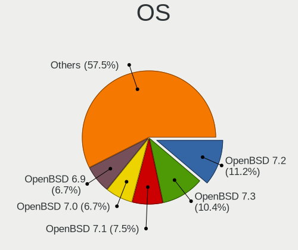

| Name                | Notebooks | Percent |
|---------------------|-----------|---------|
| OpenBSD 7.2         | 15        | 13.76%  |
| OpenBSD 7.1         | 10        | 9.17%   |
| OpenBSD 7.0         | 9         | 8.26%   |
| OpenBSD 6.9         | 9         | 8.26%   |
| OpenBSD 6.8         | 7         | 6.42%   |
| helloSystem 0.4.0   | 4         | 3.67%   |
| helloSystem 0.8.0   | 3         | 2.75%   |
| helloSystem 0.7.0   | 3         | 2.75%   |
| FreeBSD 13.1-p5     | 3         | 2.75%   |
| FreeBSD 13.0-p5     | 3         | 2.75%   |
| helloSystem 0.8.1   | 2         | 1.83%   |
| helloSystem 0.5.0   | 2         | 1.83%   |
| FreeBSD 13.1-p7     | 2         | 1.83%   |
| FreeBSD 13.1-p2     | 2         | 1.83%   |
| FreeBSD 13.1        | 2         | 1.83%   |
| FreeBSD 13.0        | 2         | 1.83%   |
| FreeBSD 12.2        | 2         | 1.83%   |
| OPNsense 23.1.3     | 1         | 0.92%   |
| OPNsense 23.1       | 1         | 0.92%   |
| OPNsense 22.7.6     | 1         | 0.92%   |
| OPNsense 22.7.5     | 1         | 0.92%   |
| OPNsense 22.7.4     | 1         | 0.92%   |
| OPNsense 22.7       | 1         | 0.92%   |
| OPNsense 22.1.1     | 1         | 0.92%   |
| OPNsense 21.1.5     | 1         | 0.92%   |
| OPNsense 21.1.4     | 1         | 0.92%   |
| OPNsense 21.1       | 1         | 0.92%   |
| NetBSD 8.99.51      | 1         | 0.92%   |
| helloSystem 0.6.0   | 1         | 0.92%   |
| GhostBSD 22.06.18   | 1         | 0.92%   |
| GhostBSD 21.08.27   | 1         | 0.92%   |
| FreeBSD 13.1-STABLE | 1         | 0.92%   |
| FreeBSD 13.1-p4     | 1         | 0.92%   |
| FreeBSD 13.0-p3     | 1         | 0.92%   |
| FreeBSD 13.0-p2     | 1         | 0.92%   |
| FreeBSD 12.1-STABLE | 1         | 0.92%   |
| FreeBSD 12.1-p8     | 1         | 0.92%   |
| FreeBSD 12.1-p5     | 1         | 0.92%   |
| FreeBSD 12.1-p10    | 1         | 0.92%   |
| FreeBSD 12.1        | 1         | 0.92%   |

OS Family
---------

OS without a version

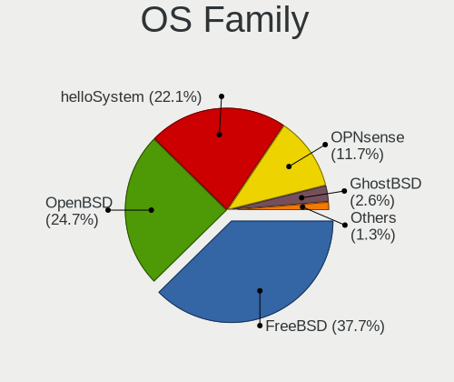

| Name        | Notebooks | Percent |
|-------------|-----------|---------|
| FreeBSD     | 26        | 37.14%  |
| OpenBSD     | 19        | 27.14%  |
| helloSystem | 14        | 20%     |
| OPNsense    | 8         | 11.43%  |
| GhostBSD    | 2         | 2.86%   |
| NetBSD      | 1         | 1.43%   |

Arch
----

OS architecture (x86_64, i586, etc.)

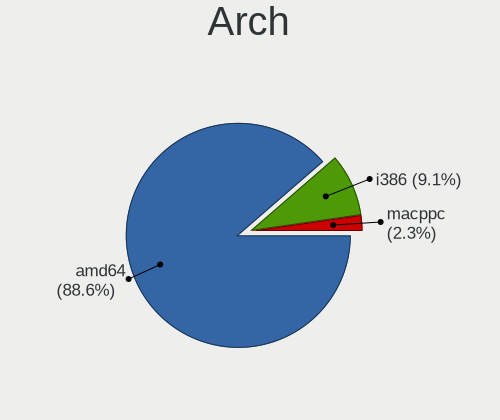

| Name   | Notebooks | Percent |
|--------|-----------|---------|
| amd64  | 65        | 92.86%  |
| i386   | 4         | 5.71%   |
| macppc | 1         | 1.43%   |

DE
--

Desktop Environment

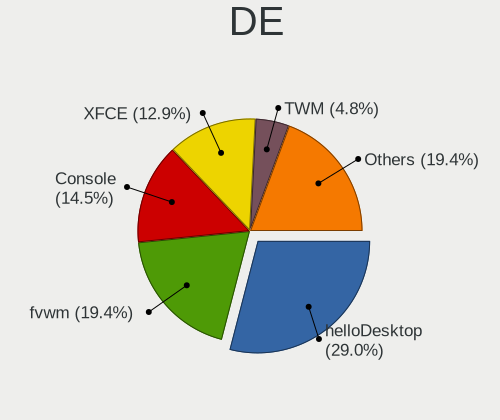

| Name         | Notebooks | Percent |
|--------------|-----------|---------|
| helloDesktop | 28        | 35.44%  |
| Console      | 13        | 16.46%  |
| fvwm         | 12        | 15.19%  |
| XFCE         | 9         | 11.39%  |
| TWM          | 4         | 5.06%   |
| Openbox      | 2         | 2.53%   |
| KDE5         | 2         | 2.53%   |
| i3           | 2         | 2.53%   |
| GNOME        | 2         | 2.53%   |
| MATE         | 1         | 1.27%   |
| LXQt         | 1         | 1.27%   |
| Lumina       | 1         | 1.27%   |
| Fluxbox      | 1         | 1.27%   |
| Cinnamon     | 1         | 1.27%   |

Display Server
--------------

X11 or Wayland

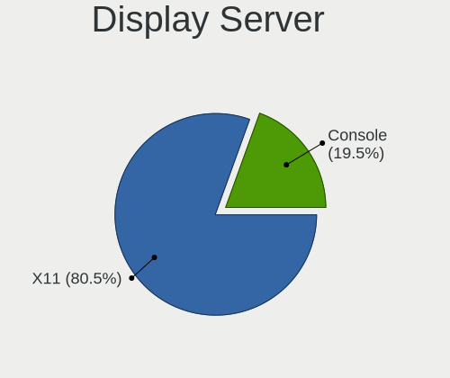

| Name    | Notebooks | Percent |
|---------|-----------|---------|
| X11     | 57        | 81.43%  |
| Console | 13        | 18.57%  |

Display Manager
---------------

SDDM, LightDM, etc.

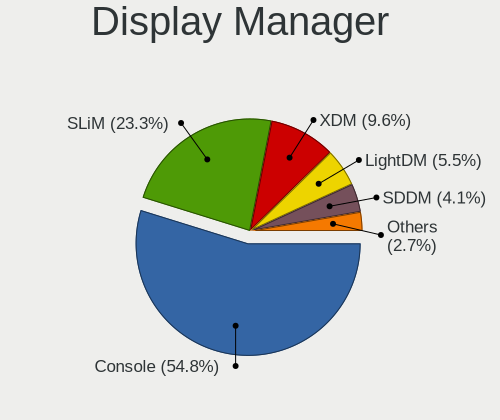

| Name    | Notebooks | Percent |
|---------|-----------|---------|
| Console | 40        | 56.34%  |
| SLiM    | 15        | 21.13%  |
| XDM     | 7         | 9.86%   |
| LightDM | 4         | 5.63%   |
| SDDM    | 3         | 4.23%   |
| GDM     | 2         | 2.82%   |

OS Lang
-------

Language

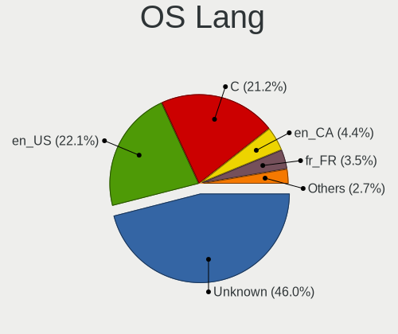

| Lang    | Notebooks | Percent |
|---------|-----------|---------|
| Unknown | 37        | 51.39%  |
| en_US   | 14        | 19.44%  |
| C       | 11        | 15.28%  |
| en_CA   | 4         | 5.56%   |
| fr_FR   | 3         | 4.17%   |
| fr_CA   | 1         | 1.39%   |
| en_NL   | 1         | 1.39%   |
| en      | 1         | 1.39%   |

Boot Mode
---------

EFI or BIOS

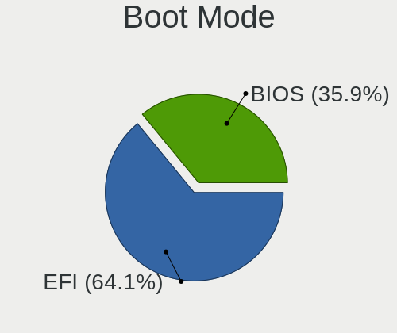

| Mode | Notebooks | Percent |
|------|-----------|---------|
| EFI  | 46        | 64.79%  |
| BIOS | 25        | 35.21%  |

Filesystem
----------

Type of filesystem

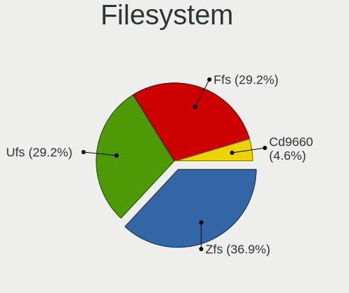

| Type   | Notebooks | Percent |
|--------|-----------|---------|
| Zfs    | 28        | 39.44%  |
| Ufs    | 20        | 28.17%  |
| Ffs    | 19        | 26.76%  |
| Cd9660 | 4         | 5.63%   |

Part. scheme
------------

Scheme of partitioning

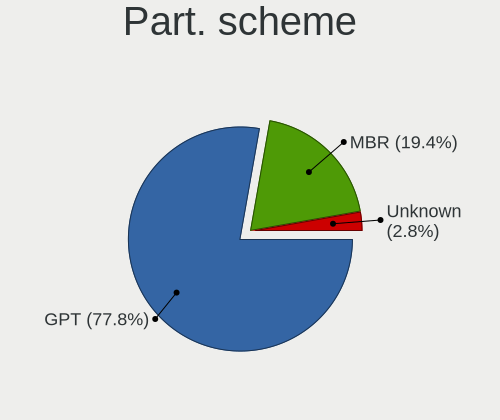

| Type    | Notebooks | Percent |
|---------|-----------|---------|
| GPT     | 54        | 77.14%  |
| MBR     | 14        | 20%     |
| Unknown | 2         | 2.86%   |

Board
-----

Vendor
------

Motherboard manufacturer

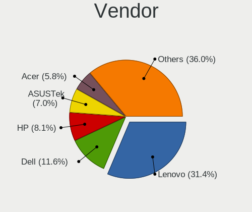

| Name                           | Notebooks | Percent |
|--------------------------------|-----------|---------|
| Lenovo                         | 22        | 31.43%  |
| Dell                           | 9         | 12.86%  |
| Hewlett-Packard                | 7         | 10%     |
| ASUSTek Computer               | 5         | 7.14%   |
| Intel                          | 4         | 5.71%   |
| Toshiba                        | 3         | 4.29%   |
| Panasonic                      | 3         | 4.29%   |
| Acer                           | 3         | 4.29%   |
| Matsushita Electric Industrial | 2         | 2.86%   |
| Gigabyte Technology            | 2         | 2.86%   |
| Apple                          | 2         | 2.86%   |
| Unknown                        | 2         | 2.86%   |
| MSI                            | 1         | 1.43%   |
| LG Electronics                 | 1         | 1.43%   |
| Google                         | 1         | 1.43%   |
| Fujitsu                        | 1         | 1.43%   |
| eMachines                      | 1         | 1.43%   |
| Alienware                      | 1         | 1.43%   |

Model
-----

Motherboard model

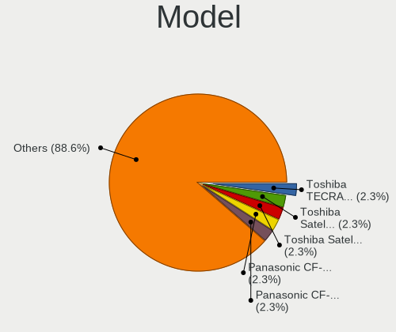

| Name                                        | Notebooks | Percent |
|---------------------------------------------|-----------|---------|
| Intel H81U                                  | 3         | 4.29%   |
| Unknown                                     | 2         | 2.86%   |
| Toshiba TECRA Z40-B                         | 1         | 1.43%   |
| Toshiba Satellite U500                      | 1         | 1.43%   |
| Toshiba Satellite Pro T130                  | 1         | 1.43%   |
| Panasonic CF-54-1                           | 1         | 1.43%   |
| Panasonic CF-53AAGHYDM                      | 1         | 1.43%   |
| Panasonic CF-52PFPBSFQ                      | 1         | 1.43%   |
| MSI GL65 Leopard 10SFSK                     | 1         | 1.43%   |
| Matsushita Electric Industrial CF-51RCVDNLM | 1         | 1.43%   |
| Matsushita Electric Industrial CF-48V4KNDQM | 1         | 1.43%   |
| LG E500-GP01A9                              | 1         | 1.43%   |
| Lenovo ThinkPad X280 20KF001UUS             | 1         | 1.43%   |
| Lenovo ThinkPad X270 W10DG 20K5S0TT1N       | 1         | 1.43%   |
| Lenovo ThinkPad X270 W10DG 20K5S0PY04       | 1         | 1.43%   |
| Lenovo ThinkPad X270 20HNCTO1WW             | 1         | 1.43%   |
| Lenovo ThinkPad X260 20F5S2GM00             | 1         | 1.43%   |
| Lenovo ThinkPad X250 20CL001GUS             | 1         | 1.43%   |
| Lenovo ThinkPad X230 2325T4T                | 1         | 1.43%   |
| Lenovo ThinkPad X220 429043U                | 1         | 1.43%   |
| Lenovo ThinkPad X1 Carbon 4th 20FCS13H00    | 1         | 1.43%   |
| Lenovo ThinkPad T510 4313CTO                | 1         | 1.43%   |
| Lenovo ThinkPad T490 20N3S8PB00             | 1         | 1.43%   |
| Lenovo ThinkPad T460 20FMS1BC01             | 1         | 1.43%   |
| Lenovo ThinkPad T460 20FMS10N00             | 1         | 1.43%   |
| Lenovo ThinkPad T440 20B7S0A800             | 1         | 1.43%   |
| Lenovo ThinkPad T430 2347GZU                | 1         | 1.43%   |
| Lenovo ThinkPad T420s 41742BU               | 1         | 1.43%   |
| Lenovo ThinkPad T420 4180B39                | 1         | 1.43%   |
| Lenovo ThinkPad T410 2537N24                | 1         | 1.43%   |
| Lenovo ThinkPad T410 253722U                | 1         | 1.43%   |
| Lenovo ThinkPad T400 2764CTO                | 1         | 1.43%   |
| Lenovo ThinkPad E495 20NE0001US             | 1         | 1.43%   |
| Lenovo IdeaPad Y580 20132                   | 1         | 1.43%   |
| Intel SandyBridge Platform                  | 1         | 1.43%   |
| HP ProBook 640 G3                           | 1         | 1.43%   |
| HP Pavilion dv6500                          | 1         | 1.43%   |
| HP Pavilion dv6                             | 1         | 1.43%   |
| HP Notebook                                 | 1         | 1.43%   |
| HP EliteBook 840 G3                         | 1         | 1.43%   |

Model Family
------------

Motherboard model prefix

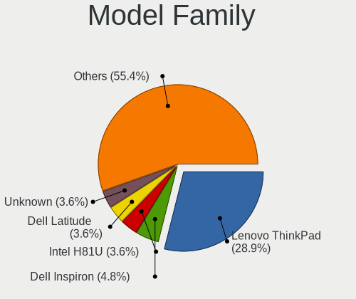

| Name                                        | Notebooks | Percent |
|---------------------------------------------|-----------|---------|
| Lenovo ThinkPad                             | 21        | 30%     |
| Dell Inspiron                               | 4         | 5.71%   |
| Intel H81U                                  | 3         | 4.29%   |
| Dell Latitude                               | 3         | 4.29%   |
| Toshiba Satellite                           | 2         | 2.86%   |
| HP Pavilion                                 | 2         | 2.86%   |
| Acer Swift                                  | 2         | 2.86%   |
| Unknown                                     | 2         | 2.86%   |
| Toshiba TECRA                               | 1         | 1.43%   |
| Panasonic CF-54-1                           | 1         | 1.43%   |
| Panasonic CF-53AAGHYDM                      | 1         | 1.43%   |
| Panasonic CF-52PFPBSFQ                      | 1         | 1.43%   |
| MSI GL65                                    | 1         | 1.43%   |
| Matsushita Electric Industrial CF-51RCVDNLM | 1         | 1.43%   |
| Matsushita Electric Industrial CF-48V4KNDQM | 1         | 1.43%   |
| LG E500-GP01A9                              | 1         | 1.43%   |
| Lenovo IdeaPad                              | 1         | 1.43%   |
| Intel SandyBridge                           | 1         | 1.43%   |
| HP ProBook                                  | 1         | 1.43%   |
| HP Notebook                                 | 1         | 1.43%   |
| HP EliteBook                                | 1         | 1.43%   |
| HP Compaq                                   | 1         | 1.43%   |
| HP 2000                                     | 1         | 1.43%   |
| Google Peppy                                | 1         | 1.43%   |
| Gigabyte MMLP3AP-00                         | 1         | 1.43%   |
| Gigabyte GB-BSi3A-6100                      | 1         | 1.43%   |
| Fujitsu LIFEBOOK                            | 1         | 1.43%   |
| eMachines eM350                             | 1         | 1.43%   |
| Dell XPS                                    | 1         | 1.43%   |
| Dell Studio                                 | 1         | 1.43%   |
| ASUS U31SD                                  | 1         | 1.43%   |
| ASUS TUF                                    | 1         | 1.43%   |
| ASUS K52JK                                  | 1         | 1.43%   |
| ASUS G75VW                                  | 1         | 1.43%   |
| ASUS 1000HE                                 | 1         | 1.43%   |
| Apple PowerBook5                            | 1         | 1.43%   |
| Apple MacBookPro5                           | 1         | 1.43%   |
| Alienware 14                                | 1         | 1.43%   |
| Acer AOD270                                 | 1         | 1.43%   |

MFG Year
--------

Motherboard manufacture year

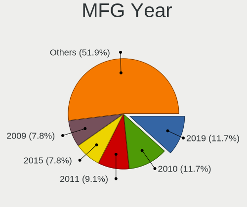

| Year    | Notebooks | Percent |
|---------|-----------|---------|
| 2010    | 9         | 12.86%  |
| 2019    | 8         | 11.43%  |
| 2011    | 7         | 10%     |
| 2016    | 5         | 7.14%   |
| 2015    | 5         | 7.14%   |
| 2014    | 5         | 7.14%   |
| 2009    | 5         | 7.14%   |
| 2022    | 4         | 5.71%   |
| 2018    | 4         | 5.71%   |
| 2012    | 4         | 5.71%   |
| 2021    | 3         | 4.29%   |
| 2017    | 3         | 4.29%   |
| 2020    | 2         | 2.86%   |
| 2013    | 2         | 2.86%   |
| 2008    | 1         | 1.43%   |
| 2006    | 1         | 1.43%   |
| 2002    | 1         | 1.43%   |
| Unknown | 1         | 1.43%   |

Form Factor
-----------

Physical design of the computer

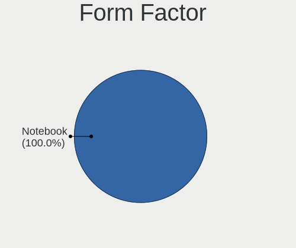

| Name     | Notebooks | Percent |
|----------|-----------|---------|
| Notebook | 70        | 100%    |

Coreboot
--------

Have coreboot on board

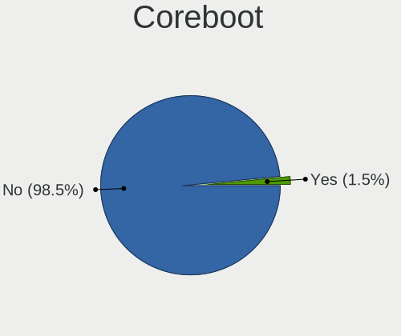

| Used | Notebooks | Percent |
|------|-----------|---------|
| No   | 69        | 98.57%  |
| Yes  | 1         | 1.43%   |

RAM Size
--------

Total RAM memory

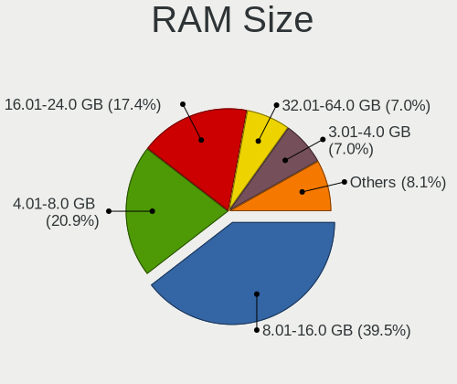

| Size in GB | Notebooks | Percent |
|------------|-----------|---------|
| 8.01-16.0  | 28        | 40%     |
| 4.01-8.0   | 15        | 21.43%  |
| 16.01-24.0 | 12        | 17.14%  |
| 3.01-4.0   | 5         | 7.14%   |
| 2.01-3.0   | 5         | 7.14%   |
| 32.01-64.0 | 3         | 4.29%   |
| 1.01-2.0   | 1         | 1.43%   |
| 0.51-1.0   | 1         | 1.43%   |

RAM Used
--------

Used RAM memory

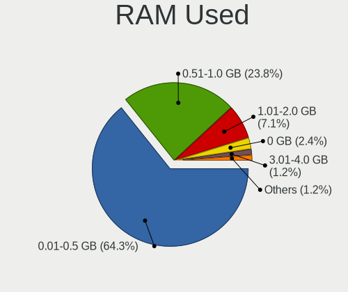

| Used GB  | Notebooks | Percent |
|----------|-----------|---------|
| 0.01-0.5 | 48        | 67.61%  |
| 0.51-1.0 | 15        | 21.13%  |
| 1.01-2.0 | 4         | 5.63%   |
| 0        | 2         | 2.82%   |
| 3.01-4.0 | 1         | 1.41%   |
| Unknown  | 1         | 1.41%   |

Total Drives
------------

Number of drives on board

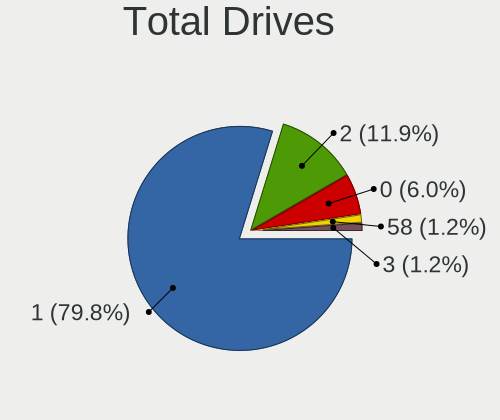

| Drives | Notebooks | Percent |
|--------|-----------|---------|
| 1      | 57        | 80.28%  |
| 2      | 9         | 12.68%  |
| 0      | 4         | 5.63%   |
| 58     | 1         | 1.41%   |

Has CD-ROM
----------

Has CD-ROM on board

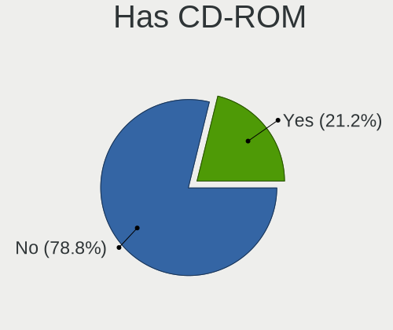

| Presented | Notebooks | Percent |
|-----------|-----------|---------|
| No        | 56        | 77.78%  |
| Yes       | 16        | 22.22%  |

Has Ethernet
------------

Has Ethernet on board

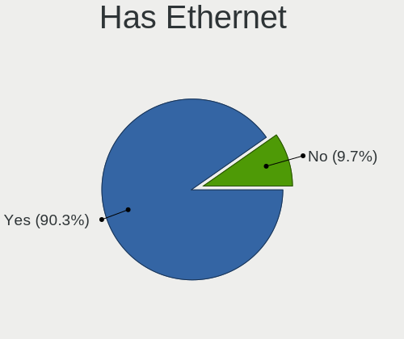

| Presented | Notebooks | Percent |
|-----------|-----------|---------|
| Yes       | 64        | 91.43%  |
| No        | 6         | 8.57%   |

Has WiFi
--------

Has WiFi module

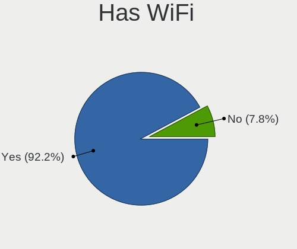

| Presented | Notebooks | Percent |
|-----------|-----------|---------|
| Yes       | 63        | 90%     |
| No        | 7         | 10%     |

Has Bluetooth
-------------

Has Bluetooth module

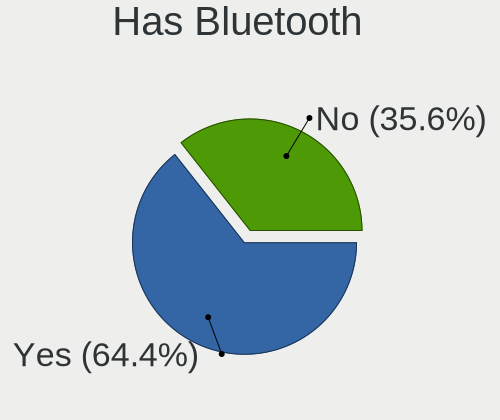

| Presented | Notebooks | Percent |
|-----------|-----------|---------|
| Yes       | 45        | 63.38%  |
| No        | 26        | 36.62%  |

Location
--------

Country
-------

Geographic location (country)

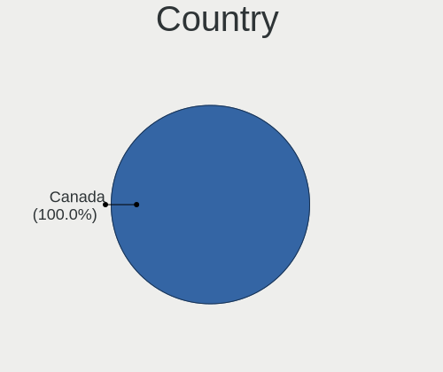

| Country | Notebooks | Percent |
|---------|-----------|---------|
| Canada  | 70        | 100%    |

City
----

Geographic location (city)

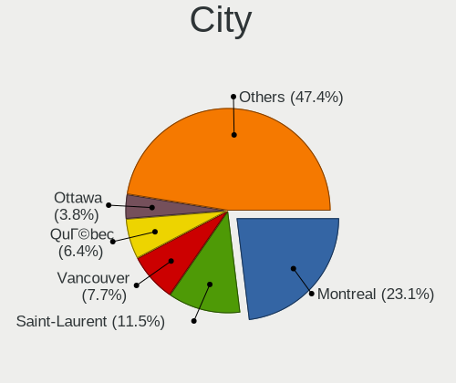

| City             | Notebooks | Percent |
|------------------|-----------|---------|
| Montreal         | 23        | 25.84%  |
| Saint-Laurent    | 9         | 10.11%  |
| Vancouver        | 6         | 6.74%   |
| QuГ©bec        | 5         | 5.62%   |
| Toronto          | 4         | 4.49%   |
| Ottawa           | 3         | 3.37%   |
| Kingsburg        | 3         | 3.37%   |
| Calgary          | 3         | 3.37%   |
| Victoria         | 2         | 2.25%   |
| Stratford        | 2         | 2.25%   |
| Sainte-Julie     | 2         | 2.25%   |
| Peterborough     | 2         | 2.25%   |
| Langley          | 2         | 2.25%   |
| Winnipeg         | 1         | 1.12%   |
| Vaudreuil-Dorion | 1         | 1.12%   |
| Surrey           | 1         | 1.12%   |
| Sechelt          | 1         | 1.12%   |
| Saskatoon        | 1         | 1.12%   |
| Saint-Zotique    | 1         | 1.12%   |
| Québec          | 1         | 1.12%   |
| Pierrefonds      | 1         | 1.12%   |
| North York       | 1         | 1.12%   |
| Niagara Falls    | 1         | 1.12%   |
| Nepean           | 1         | 1.12%   |
| Mississauga      | 1         | 1.12%   |
| Mission          | 1         | 1.12%   |
| Maple Ridge      | 1         | 1.12%   |
| Lloydminster     | 1         | 1.12%   |
| Laval            | 1         | 1.12%   |
| Lamont           | 1         | 1.12%   |
| Hamilton         | 1         | 1.12%   |
| Halifax          | 1         | 1.12%   |
| Guelph           | 1         | 1.12%   |
| Gatineau         | 1         | 1.12%   |
| Beloeil          | 1         | 1.12%   |
| Bedford          | 1         | 1.12%   |

Drives
------

Drive Vendor
------------

Hard drive vendors

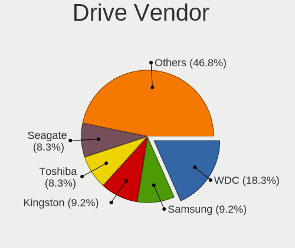

| Vendor              | Notebooks | Drives | Percent |
|---------------------|-----------|--------|---------|
| WDC                 | 17        | 42     | 22.37%  |
| Kingston            | 9         | 11     | 11.84%  |
| Toshiba             | 8         | 18     | 10.53%  |
| Samsung Electronics | 7         | 10     | 9.21%   |
| Seagate             | 5         | 9      | 6.58%   |
| Hitachi             | 5         | 8      | 6.58%   |
| Intel               | 3         | 10     | 3.95%   |
| A-DATA Technology   | 3         | 6      | 3.95%   |
| NVMe                | 2         | 2      | 2.63%   |
| Lexar               | 2         | 3      | 2.63%   |
| Crucial             | 2         | 2      | 2.63%   |
| Transcend           | 1         | 1      | 1.32%   |
| SK hynix            | 1         | 1      | 1.32%   |
| SanDisk             | 1         | 1      | 1.32%   |
| Phison              | 1         | 1      | 1.32%   |
| OCZ                 | 1         | 1      | 1.32%   |
| Micron Technology   | 1         | 1      | 1.32%   |
| Kston               | 1         | 2      | 1.32%   |
| KIOXIA              | 1         | 1      | 1.32%   |
| KingDian            | 1         | 1      | 1.32%   |
| HPE                 | 1         | 5      | 1.32%   |
| HGST                | 1         | 34     | 1.32%   |
| Hewlett-Packard     | 1         | 1      | 1.32%   |
| Fujitsu             | 1         | 1      | 1.32%   |

Drive Model
-----------

Hard drive models

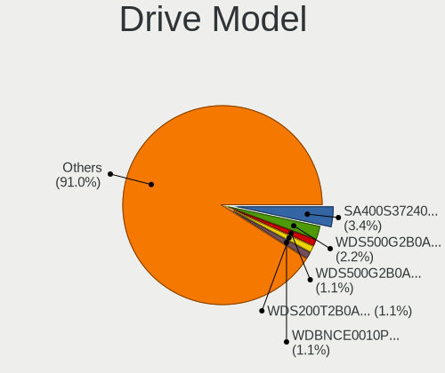

| Model                                | Notebooks | Percent |
|--------------------------------------|-----------|---------|
| Kingston SA400S37240G 240GB          | 3         | 3.8%    |
| WDC WDS500G2B0A-00SM50 500GB         | 2         | 2.53%   |
| WDC WDS500G2B0A 500GB                | 1         | 1.27%   |
| WDC WDS200T2B0A 2TB                  | 1         | 1.27%   |
| WDC WD7500BPKX-75HPJT0 752GB         | 1         | 1.27%   |
| WDC WD7500BPKX-00HPJT0 752GB         | 1         | 1.27%   |
| WDC WD7500BPKT-75PK4T0 752GB         | 1         | 1.27%   |
| WDC WD7500BPKT-00PK4T0 752GB         | 1         | 1.27%   |
| WDC WD6400BEVT-22A0RT0 640GB         | 1         | 1.27%   |
| WDC WD5000LPLX-00ZNTT0 500GB         | 1         | 1.27%   |
| WDC WD3200LPVX-60V0TT0 320GB         | 1         | 1.27%   |
| WDC WD3200BEVE-00A0HT0 320GB         | 1         | 1.27%   |
| WDC WD10JPVX-75JC3T0 1TB             | 1         | 1.27%   |
| WDC WD10JPVT-00A1YT0 1TB             | 1         | 1.27%   |
| WDC WD10JPLX-00MBPT0 1TB             | 1         | 1.27%   |
| WDC PC SN730 SDBQNTY-1T00-1001 1TB   | 1         | 1.27%   |
| WDC PC SN530 SDBPNPZ-256G-1014 256GB | 1         | 1.27%   |
| WDC PC SN530 NVMe 256GB              | 1         | 1.27%   |
| Transcend TSA 240GB                  | 1         | 1.27%   |
| Toshiba THNSNJ128GCSU 128GB          | 1         | 1.27%   |
| Toshiba MQ04ABF100 1TB               | 1         | 1.27%   |
| Toshiba MQ01ABF032 320GB             | 1         | 1.27%   |
| Toshiba MK8025GAS 80GB               | 1         | 1.27%   |
| Toshiba MK5061GSYN 500GB             | 1         | 1.27%   |
| Toshiba MK3259GSXP 320GB             | 1         | 1.27%   |
| Toshiba MK1665GSX 160GB              | 1         | 1.27%   |
| Toshiba HDWQ140 4TB                  | 1         | 1.27%   |
| SK hynix SC308 SATA 256GB            | 1         | 1.27%   |
| Seagate ST9500420AS 500GB            | 1         | 1.27%   |
| Seagate ST9160821A 160GB             | 1         | 1.27%   |
| Seagate ST500LT032-1E9142 500GB      | 1         | 1.27%   |
| Seagate ST2000LM003 HN-M201RAD 2TB   | 1         | 1.27%   |
| Seagate ST1000LM035-1RK172 1TB       | 1         | 1.27%   |
| SanDisk SSD U100 16GB                | 1         | 1.27%   |
| Samsung SSD 860 EVO M.2 1TB          | 1         | 1.27%   |
| Samsung SSD 860 EVO 500GB            | 1         | 1.27%   |
| Samsung SSD 860 EVO 1TB              | 1         | 1.27%   |
| Samsung SSD 850 PRO 256GB            | 1         | 1.27%   |
| Samsung MZ7TE128HMGR-000L1 128GB     | 1         | 1.27%   |
| Samsung MZ7TD128HAFV-000L1 128GB     | 1         | 1.27%   |

HDD Vendor
----------

Hard disk drive vendors

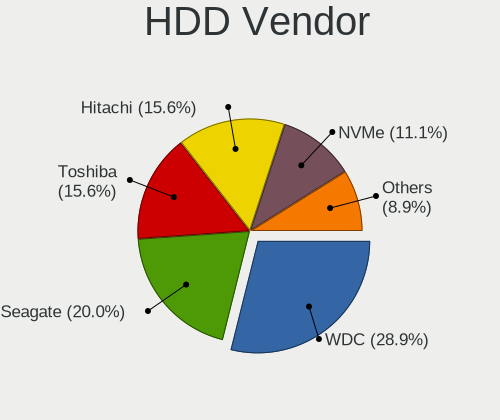

| Vendor  | Notebooks | Drives | Percent |
|---------|-----------|--------|---------|
| WDC     | 11        | 35     | 32.35%  |
| Toshiba | 7         | 17     | 20.59%  |
| Seagate | 5         | 9      | 14.71%  |
| Hitachi | 5         | 8      | 14.71%  |
| NVMe    | 2         | 2      | 5.88%   |
| Lexar   | 1         | 1      | 2.94%   |
| HPE     | 1         | 5      | 2.94%   |
| HGST    | 1         | 34     | 2.94%   |
| Fujitsu | 1         | 1      | 2.94%   |

SSD Vendor
----------

Solid state drive vendors

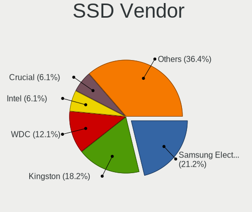

| Vendor              | Notebooks | Drives | Percent |
|---------------------|-----------|--------|---------|
| Kingston            | 9         | 10     | 24.32%  |
| Samsung Electronics | 7         | 10     | 18.92%  |
| WDC                 | 4         | 4      | 10.81%  |
| Intel               | 3         | 10     | 8.11%   |
| Crucial             | 2         | 2      | 5.41%   |
| A-DATA Technology   | 2         | 5      | 5.41%   |
| Transcend           | 1         | 1      | 2.7%    |
| Toshiba             | 1         | 1      | 2.7%    |
| SK hynix            | 1         | 1      | 2.7%    |
| SanDisk             | 1         | 1      | 2.7%    |
| OCZ                 | 1         | 1      | 2.7%    |
| Micron Technology   | 1         | 1      | 2.7%    |
| Lexar               | 1         | 2      | 2.7%    |
| Kston               | 1         | 2      | 2.7%    |
| KingDian            | 1         | 1      | 2.7%    |
| Hewlett-Packard     | 1         | 1      | 2.7%    |

Drive Kind
----------

HDD or SSD

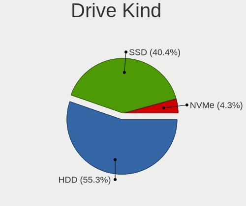

| Kind | Notebooks | Drives | Percent |
|------|-----------|--------|---------|
| SSD  | 33        | 53     | 46.48%  |
| HDD  | 31        | 112    | 43.66%  |
| NVMe | 7         | 7      | 9.86%   |

Drive Connector
---------------

SATA, SAS, NVMe, etc.

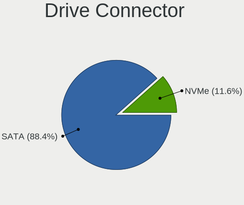

| Type | Notebooks | Drives | Percent |
|------|-----------|--------|---------|
| SATA | 61        | 165    | 89.71%  |
| NVMe | 7         | 7      | 10.29%  |

Drive Size
----------

Size of hard drive

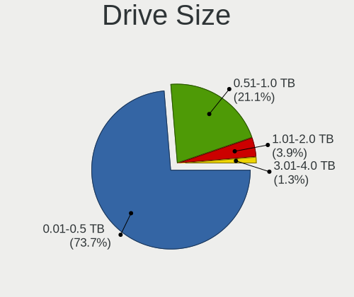

| Size in TB | Notebooks | Drives | Percent |
|------------|-----------|--------|---------|
| 0.01-0.5   | 48        | 87     | 75%     |
| 0.51-1.0   | 13        | 28     | 20.31%  |
| 1.01-2.0   | 2         | 2      | 3.13%   |
| 3.01-4.0   | 1         | 48     | 1.56%   |

Space Total
-----------

Amount of disk space available on the file system

| Size in GB | Notebooks | Percent |
|------------|-----------|---------|
| 101-250    | 18        | 24%     |
| 21-50      | 17        | 22.67%  |
| 1-20       | 14        | 18.67%  |
| 251-500    | 10        | 13.33%  |
| 51-100     | 10        | 13.33%  |
| 501-1000   | 5         | 6.67%   |
| 1001-2000  | 1         | 1.33%   |

Space Used
----------

Amount of used disk space

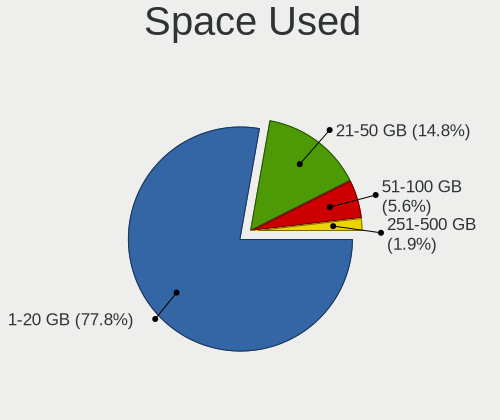

| Used GB | Notebooks | Percent |
|---------|-----------|---------|
| 1-20    | 58        | 81.69%  |
| 21-50   | 8         | 11.27%  |
| 51-100  | 4         | 5.63%   |
| 251-500 | 1         | 1.41%   |

Malfunc. Drives
---------------

Drive models with a malfunction

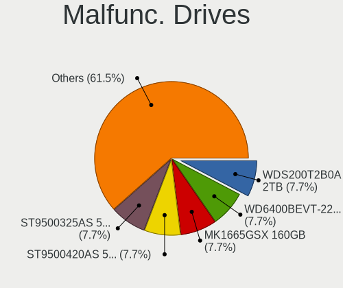

| Model                         | Notebooks | Drives | Percent |
|-------------------------------|-----------|--------|---------|
| WDC WDS200T2B0A 2TB           | 1         | 1      | 8.33%   |
| WDC WD6400BEVT-22A0RT0 640GB  | 1         | 1      | 8.33%   |
| Toshiba MK1665GSX 160GB       | 1         | 1      | 8.33%   |
| Seagate ST9500420AS 500GB     | 1         | 2      | 8.33%   |
| Kingston SV300S37A60G 64GB    | 1         | 2      | 8.33%   |
| Kingston SUV400S37240G 240GB  | 1         | 1      | 8.33%   |
| Kingston SNS4151S316GD 16GB   | 1         | 1      | 8.33%   |
| Kingston SNS4151S316G 16GB    | 1         | 1      | 8.33%   |
| Intel SSDSC2CW120A3 120GB     | 1         | 1      | 8.33%   |
| Hitachi HTS547575A9E384 752GB | 1         | 1      | 8.33%   |
| Hitachi HTS541612J9SA00 120GB | 1         | 1      | 8.33%   |
| A-DATA Technology SP550 480GB | 1         | 4      | 8.33%   |

Malfunc. Drive Vendor
---------------------

Vendors of faulty drives

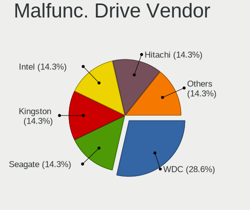

| Vendor            | Notebooks | Drives | Percent |
|-------------------|-----------|--------|---------|
| Kingston          | 4         | 5      | 33.33%  |
| WDC               | 2         | 2      | 16.67%  |
| Hitachi           | 2         | 2      | 16.67%  |
| Toshiba           | 1         | 1      | 8.33%   |
| Seagate           | 1         | 2      | 8.33%   |
| Intel             | 1         | 1      | 8.33%   |
| A-DATA Technology | 1         | 4      | 8.33%   |

Malfunc. HDD Vendor
-------------------

Vendors of faulty HDD drives

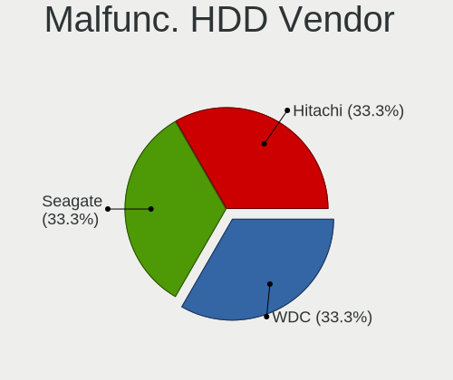

| Vendor  | Notebooks | Drives | Percent |
|---------|-----------|--------|---------|
| Hitachi | 2         | 2      | 40%     |
| WDC     | 1         | 1      | 20%     |
| Toshiba | 1         | 1      | 20%     |
| Seagate | 1         | 2      | 20%     |

Malfunc. Drive Kind
-------------------

Kinds of faulty drives

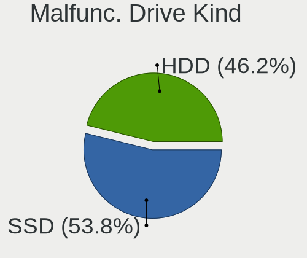

| Kind | Notebooks | Drives | Percent |
|------|-----------|--------|---------|
| SSD  | 7         | 11     | 58.33%  |
| HDD  | 5         | 6      | 41.67%  |

Failed Drives
-------------

Failed drive models

Zero info for selected period =(

Failed Drive Vendor
-------------------

Failed drive vendors

Zero info for selected period =(

Drive Status
------------

Number of failed and malfunc. drives

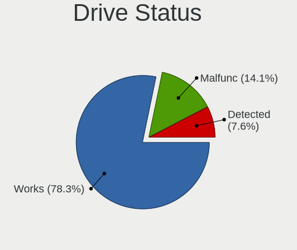

| Status   | Notebooks | Drives | Percent |
|----------|-----------|--------|---------|
| Works    | 56        | 151    | 77.78%  |
| Malfunc  | 12        | 17     | 16.67%  |
| Detected | 4         | 4      | 5.56%   |

Storage controller
------------------

Storage Vendor
--------------

Storage controller vendors

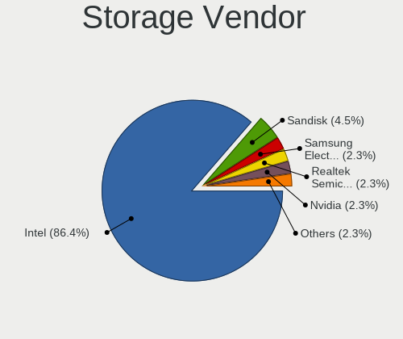

| Vendor                      | Notebooks | Percent |
|-----------------------------|-----------|---------|
| Intel                       | 58        | 80.56%  |
| SanDisk                     | 4         | 5.56%   |
| Samsung Electronics         | 2         | 2.78%   |
| AMD                         | 2         | 2.78%   |
| Toshiba                     | 1         | 1.39%   |
| Realtek Semiconductor       | 1         | 1.39%   |
| Phison Electronics          | 1         | 1.39%   |
| Nvidia                      | 1         | 1.39%   |
| Kingston Technology Company | 1         | 1.39%   |
| Broadcom / LSI              | 1         | 1.39%   |

Storage Model
-------------

Storage controller models

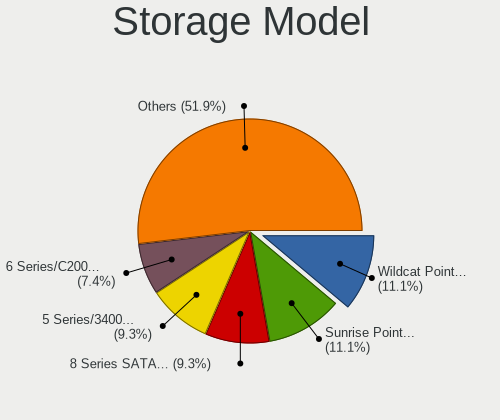

| Model                                                                                  | Notebooks | Percent |
|----------------------------------------------------------------------------------------|-----------|---------|
| Intel Sunrise Point-LP SATA Controller [AHCI mode]                                     | 12        | 15.79%  |
| Intel Wildcat Point-LP SATA Controller [AHCI Mode]                                     | 7         | 9.21%   |
| Intel 8 Series SATA Controller 1 [AHCI mode]                                           | 5         | 6.58%   |
| Intel 7 Series Chipset Family 6-port SATA Controller [AHCI mode]                       | 5         | 6.58%   |
| Intel 6 Series/C200 Series Chipset Family 6 port Mobile SATA AHCI Controller           | 5         | 6.58%   |
| Intel 5 Series/3400 Series Chipset 6 port SATA AHCI Controller                         | 5         | 6.58%   |
| Intel 82801IBM/IEM (ICH9M/ICH9M-E) 4 port SATA Controller [AHCI mode]                  | 3         | 3.95%   |
| SanDisk WD Black SN750 / PC SN730 NVMe SSD                                             | 2         | 2.63%   |
| Intel NM10/ICH7 Family SATA Controller [AHCI mode]                                     | 2         | 2.63%   |
| Intel 82801HM/HEM (ICH8M/ICH8M-E) SATA Controller [AHCI mode]                          | 2         | 2.63%   |
| Intel 82801HM/HEM (ICH8M/ICH8M-E) IDE Controller                                       | 2         | 2.63%   |
| Intel 82801GBM/GHM (ICH7-M Family) SATA Controller [IDE mode]                          | 2         | 2.63%   |
| Intel 82801 Mobile SATA Controller [RAID mode]                                         | 2         | 2.63%   |
| AMD FCH SATA Controller [AHCI mode]                                                    | 2         | 2.63%   |
| Toshiba XG6 NVMe SSD Controller                                                        | 1         | 1.32%   |
| SanDisk WD Blue SN550 NVMe SSD                                                         | 1         | 1.32%   |
| SanDisk unknown                                                                        | 1         | 1.32%   |
| Samsung NVMe SSD Controller SM981/PM981/PM983                                          | 1         | 1.32%   |
| Samsung NVMe SSD Controller SM961/PM961/SM963                                          | 1         | 1.32%   |
| Realtek NVMe Controller                                                                | 1         | 1.32%   |
| Phison E12 NVMe Controller                                                             | 1         | 1.32%   |
| Nvidia MCP79 AHCI Controller                                                           | 1         | 1.32%   |
| Kingston Company A2000 NVMe SSD                                                        | 1         | 1.32%   |
| Intel Cannon Lake Mobile PCH SATA AHCI Controller                                      | 1         | 1.32%   |
| Intel 82801GBM/GHM (ICH7-M Family) SATA Controller [AHCI mode]                         | 1         | 1.32%   |
| Intel 82801CAM IDE U100 Controller                                                     | 1         | 1.32%   |
| Intel 7 Series Chipset Family 4-port SATA Controller [IDE mode]                        | 1         | 1.32%   |
| Intel 7 Series Chipset Family 2-port SATA Controller [IDE mode]                        | 1         | 1.32%   |
| Intel 6 Series/C200 Series Chipset Family Mobile SATA Controller (IDE mode, ports 4-5) | 1         | 1.32%   |
| Intel 6 Series/C200 Series Chipset Family Mobile SATA Controller (IDE mode, ports 0-3) | 1         | 1.32%   |
| Intel 6 Series/C200 Series Chipset Family 6 port Desktop SATA AHCI Controller          | 1         | 1.32%   |
| Intel 5 Series/3400 Series Chipset 4 port SATA AHCI Controller                         | 1         | 1.32%   |
| Intel 400 Series Chipset Family SATA AHCI Controller                                   | 1         | 1.32%   |
| Broadcom / LSI SAS2008 PCI-Express Fusion-MPT SAS-2 [Falcon]                           | 1         | 1.32%   |

Storage Kind
------------

Kind of storage controller (IDE, SATA, NVMe, SAS, ...)

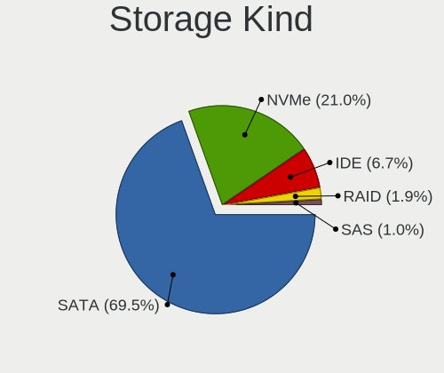

| Kind | Notebooks | Percent |
|------|-----------|---------|
| SATA | 54        | 72.97%  |
| NVMe | 10        | 13.51%  |
| IDE  | 7         | 9.46%   |
| RAID | 2         | 2.7%    |
| SAS  | 1         | 1.35%   |

Processor
---------

CPU Vendor
----------

Processor vendors

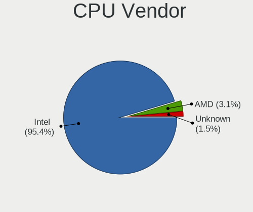

| Vendor  | Notebooks | Percent |
|---------|-----------|---------|
| Intel   | 67        | 95.71%  |
| AMD     | 2         | 2.86%   |
| Unknown | 1         | 1.43%   |

CPU Model
---------

Processor models

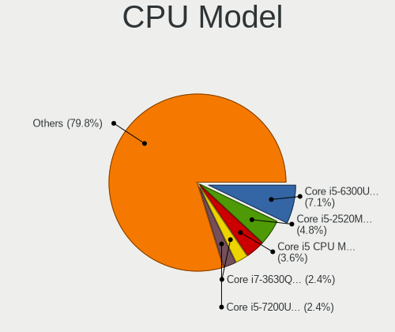

| Model                                                         | Notebooks | Percent |
|---------------------------------------------------------------|-----------|---------|
| Intel Core i5-6300U CPU @ 2.40GHz                             | 6         | 8.22%   |
| Intel Core i5-2520M CPU @ 2.50GHz                             | 4         | 5.48%   |
| Intel Core i5 CPU M 520 @ 2.40GHz                             | 3         | 4.11%   |
| Intel CPU Version                                             | 2         | 2.74%   |
| Intel Core i7-3630QM CPU @ 2.40GHz                            | 2         | 2.74%   |
| Intel Core i5-5300U CPU @ 2.30GHz                             | 2         | 2.74%   |
| Intel Core i5-3320M CPU @ 2.60GHz                             | 2         | 2.74%   |
| Intel Celeron CPU 1037U @ 1.80GHz                             | 2         | 2.74%   |
| Intel Xeon CPU E3-1230 V2 @ 3.30GH                            | 1         | 1.37%   |
| Intel Pentium Dual-Core CPU T4400 @ 2.20GHz                   | 1         | 1.37%   |
| Intel Pentium 4 Mobile CPU 1.60GHz ("GenuineIntel" 686-class) | 1         | 1.37%   |
| Intel Pentium 4 Mobile CPU 1.60GHz                            | 1         | 1.37%   |
| Intel Genuine CPU T2300 @ 1.66GHz                             | 1         | 1.37%   |
| Intel CPU T2300 @ 1.66GHz ("GenuineIntel" 686-class)          | 1         | 1.37%   |
| Intel Core i7-8750H CPU @ 2.20GHz                             | 1         | 1.37%   |
| Intel Core i7-8650U CPU @ 1.90GHz                             | 1         | 1.37%   |
| Intel Core i7-7600U CPU @ 2.80GHz                             | 1         | 1.37%   |
| Intel Core i7-6600U CPU @ 2.60GHz                             | 1         | 1.37%   |
| Intel Core i7-5500U CPU @ 2.40GHz                             | 1         | 1.37%   |
| Intel Core i7-4700MQ CPU @ 2.40GHz                            | 1         | 1.37%   |
| Intel Core i7-3520M CPU @ 2.90GHz                             | 1         | 1.37%   |
| Intel Core i7-10750H CPU @ 2.60GHz                            | 1         | 1.37%   |
| Intel Core i7-1065G7 CPU @ 1.30GHz                            | 1         | 1.37%   |
| Intel Core i5-8265U CPU @ 1.60GHz                             | 1         | 1.37%   |
| Intel Core i5-8250U CPU @ 1.60GHz                             | 1         | 1.37%   |
| Intel Core i5-7300U CPU @ 2.60GHz                             | 1         | 1.37%   |
| Intel Core i5-7200U CPU @ 2.50GHz                             | 1         | 1.37%   |
| Intel Core i5-6200U CPU @ 2.30GHz                             | 1         | 1.37%   |
| Intel Core i5-5200U CPU @ 2.20GHz                             | 1         | 1.37%   |
| Intel Core i5-4310U CPU @ 2.00GHz                             | 1         | 1.37%   |
| Intel Core i5-4300U CPU @ 1.90GHz                             | 1         | 1.37%   |
| Intel Core i5-4210U CPU @ 1.70GHz                             | 1         | 1.37%   |
| Intel Core i5-2410M CPU @ 2.30GHz                             | 1         | 1.37%   |
| Intel Core i5 CPU M 540 @ 2.53GHz                             | 1         | 1.37%   |
| Intel Core i5 CPU M 430 @ 2.27GH                              | 1         | 1.37%   |
| Intel Core i3-7100U CPU @ 2.40GHz                             | 1         | 1.37%   |
| Intel Core i3-6100U CPU @ 2.30GHz                             | 1         | 1.37%   |
| Intel Core i3-5020U CPU @ 2.20GHz                             | 1         | 1.37%   |
| Intel Core i3-5010U CPU @ 2.10GHz                             | 1         | 1.37%   |
| Intel Core i3-5005U CPU @ 2.00GHz                             | 1         | 1.37%   |

CPU Model Family
----------------

Processor model prefix

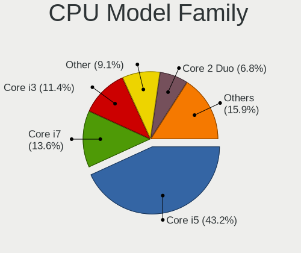

| Model                   | Notebooks | Percent |
|-------------------------|-----------|---------|
| Intel Core i5           | 29        | 40.85%  |
| Intel Core i7           | 11        | 15.49%  |
| Intel Core i3           | 7         | 9.86%   |
| Other                   | 6         | 8.45%   |
| Intel Core 2 Duo        | 4         | 5.63%   |
| Intel Celeron           | 4         | 5.63%   |
| Intel Atom              | 4         | 5.63%   |
| Intel Xeon              | 1         | 1.41%   |
| Intel Pentium Dual-Core | 1         | 1.41%   |
| Intel Pentium 4         | 1         | 1.41%   |
| Intel Genuine           | 1         | 1.41%   |
| AMD Ryzen 7             | 1         | 1.41%   |
| AMD E1                  | 1         | 1.41%   |

CPU Cores
---------

Number of processor cores

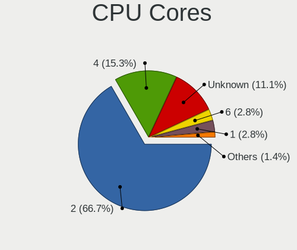

| Number  | Notebooks | Percent |
|---------|-----------|---------|
| 2       | 46        | 65.71%  |
| 4       | 11        | 15.71%  |
| Unknown | 8         | 11.43%  |
| 6       | 2         | 2.86%   |
| 1       | 2         | 2.86%   |
| 8       | 1         | 1.43%   |

CPU Sockets
-----------

Number of sockets

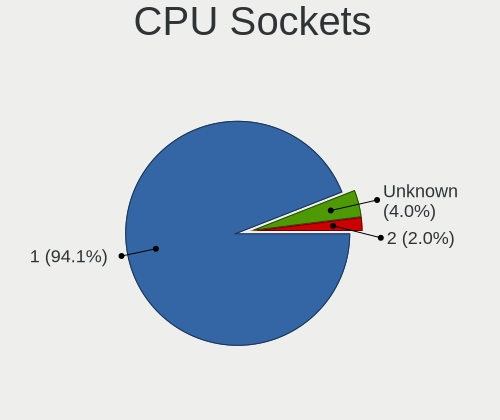

| Number  | Notebooks | Percent |
|---------|-----------|---------|
| 1       | 68        | 93.15%  |
| Unknown | 4         | 5.48%   |
| 2       | 1         | 1.37%   |

CPU Threads
-----------

Threads per core (Hyper-Threading)

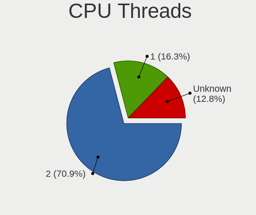

| Number  | Notebooks | Percent |
|---------|-----------|---------|
| 2       | 53        | 75.71%  |
| Unknown | 9         | 12.86%  |
| 1       | 8         | 11.43%  |

CPU Microarch
-------------

Microarchitecture

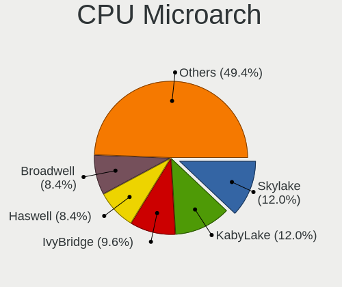

| Name        | Notebooks | Percent |
|-------------|-----------|---------|
| Skylake     | 9         | 12.5%   |
| KabyLake    | 8         | 11.11%  |
| IvyBridge   | 8         | 11.11%  |
| Broadwell   | 7         | 9.72%   |
| SandyBridge | 6         | 8.33%   |
| Haswell     | 6         | 8.33%   |
| Penryn      | 5         | 6.94%   |
| Unknown     | 5         | 6.94%   |
| Westmere    | 4         | 5.56%   |
| Bonnell     | 4         | 5.56%   |
| TigerLake   | 2         | 2.78%   |
| Zen+        | 1         | 1.39%   |
| P6          | 1         | 1.39%   |
| NetBurst    | 1         | 1.39%   |
| Nehalem     | 1         | 1.39%   |
| Jaguar      | 1         | 1.39%   |
| IceLake     | 1         | 1.39%   |
| Core        | 1         | 1.39%   |
| CometLake   | 1         | 1.39%   |

Graphics
--------

GPU Vendor
----------

Vendors of graphics cards

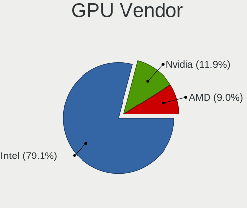

| Vendor         | Notebooks | Percent |
|----------------|-----------|---------|
| Intel          | 59        | 78.67%  |
| Nvidia         | 8         | 10.67%  |
| AMD            | 7         | 9.33%   |
| Silicon Motion | 1         | 1.33%   |

GPU Model
---------

Graphics card models

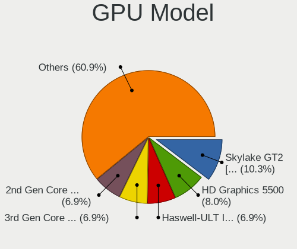

| Model                                                                         | Notebooks | Percent |
|-------------------------------------------------------------------------------|-----------|---------|
| Intel Skylake GT2 [HD Graphics 520]                                           | 9         | 11.39%  |
| Intel HD Graphics 5500                                                        | 7         | 8.86%   |
| Intel 3rd Gen Core processor Graphics Controller                              | 6         | 7.59%   |
| Intel 2nd Generation Core Processor Family Integrated Graphics Controller     | 6         | 7.59%   |
| Intel Haswell-ULT Integrated Graphics Controller                              | 5         | 6.33%   |
| Intel HD Graphics 620                                                         | 4         | 5.06%   |
| Intel Mobile 945GM/GMS/GME, 943/940GML Express Integrated Graphics Controller | 3         | 3.8%    |
| Intel Mobile 4 Series Chipset Integrated Graphics Controller                  | 3         | 3.8%    |
| Intel Core Processor Integrated Graphics Controller                           | 3         | 3.8%    |
| Nvidia GK107M [GeForce GTX 660M]                                              | 2         | 2.53%   |
| Intel UHD Graphics 620                                                        | 2         | 2.53%   |
| Intel TigerLake-LP GT2 [Iris Xe Graphics]                                     | 2         | 2.53%   |
| Intel Mobile 945GSE Express Integrated Graphics Controller                    | 2         | 2.53%   |
| Silicon Motion SM712 LynxEM+                                                  | 1         | 1.27%   |
| Nvidia GT218M [NVS 3100M]                                                     | 1         | 1.27%   |
| Nvidia GP107M [GeForce GTX 1050 Mobile]                                       | 1         | 1.27%   |
| Nvidia GK106M [GeForce GTX 765M]                                              | 1         | 1.27%   |
| Nvidia GF119M [GeForce GT 520M]                                               | 1         | 1.27%   |
| Nvidia G86M [GeForce 8400M GS]                                                | 1         | 1.27%   |
| Nvidia C79 [GeForce 9400M]                                                    | 1         | 1.27%   |
| Intel WhiskeyLake-U GT2 [UHD Graphics 620]                                    | 1         | 1.27%   |
| Intel Mobile GM965/GL960 Integrated Graphics Controller (secondary)           | 1         | 1.27%   |
| Intel Mobile GM965/GL960 Integrated Graphics Controller (primary)             | 1         | 1.27%   |
| Intel Mobile 945GM/GMS, 943/940GML Express Integrated Graphics Controller     | 1         | 1.27%   |
| Intel JasperLake [UHD Graphics]                                               | 1         | 1.27%   |
| Intel Iris Plus Graphics G7                                                   | 1         | 1.27%   |
| Intel CometLake-H GT2 [UHD Graphics]                                          | 1         | 1.27%   |
| Intel CoffeeLake-H GT2 [UHD Graphics 630]                                     | 1         | 1.27%   |
| Intel Atom Processor D4xx/D5xx/N4xx/N5xx Integrated Graphics Controller       | 1         | 1.27%   |
| Intel Atom Processor D2xxx/N2xxx Integrated Graphics Controller               | 1         | 1.27%   |
| Intel 4th Gen Core Processor Integrated Graphics Controller                   | 1         | 1.27%   |
| AMD Seymour [Radeon HD 6400M/7400M Series]                                    | 1         | 1.27%   |
| AMD RV730/M96 [Mobility Radeon HD 4650/5165]                                  | 1         | 1.27%   |
| AMD RV710/M92 [Mobility Radeon HD 4530/4570/5145/530v/540v/545v]              | 1         | 1.27%   |
| AMD RV350/M10 / RV360/M11 [Mobility Radeon 9600 (PRO) / 9700]                 | 1         | 1.27%   |
| AMD RV200/M7 [Mobility Radeon 7500]                                           | 1         | 1.27%   |
| AMD Picasso/Raven 2 [Radeon Vega Series / Radeon Vega Mobile Series]          | 1         | 1.27%   |
| AMD Kabini [Radeon HD 8240 / R3 Series]                                       | 1         | 1.27%   |

GPU Combo
---------

Combinations of graphics cards

| Name               | Notebooks | Percent |
|--------------------|-----------|---------|
| 1 x Intel          | 46        | 65.71%  |
| 2 x Intel          | 8         | 11.43%  |
| 1 x AMD            | 6         | 8.57%   |
| 1 x Nvidia         | 4         | 5.71%   |
| Intel + Nvidia     | 4         | 5.71%   |
| 1 x Silicon Motion | 1         | 1.43%   |
| Intel + AMD        | 1         | 1.43%   |

GPU Driver
----------

Free vs proprietary

| Driver      | Notebooks | Percent |
|-------------|-----------|---------|
| Free        | 67        | 94.37%  |
| Proprietary | 3         | 4.23%   |
| Unknown     | 1         | 1.41%   |

GPU Memory
----------

Total video memory

| Size in GB | Notebooks | Percent |
|------------|-----------|---------|
| Unknown    | 63        | 87.5%   |
| 0.01-0.5   | 3         | 4.17%   |
| 3.01-4.0   | 2         | 2.78%   |
| 1.01-2.0   | 2         | 2.78%   |
| 0.51-1.0   | 2         | 2.78%   |

Monitor
-------

Monitor Vendor
--------------

Monitor vendors

| Vendor                  | Notebooks | Percent |
|-------------------------|-----------|---------|
| LG Display              | 9         | 20.45%  |
| Chimei Innolux          | 9         | 20.45%  |
| AU Optronics            | 6         | 13.64%  |
| Samsung Electronics     | 5         | 11.36%  |
| BOE                     | 5         | 11.36%  |
| Lenovo                  | 3         | 6.82%   |
| Chi Mei Optoelectronics | 3         | 6.82%   |
| Goldstar                | 2         | 4.55%   |
| Toshiba                 | 1         | 2.27%   |
| Apple                   | 1         | 2.27%   |

Monitor Model
-------------

Monitor models

| Model                                                                     | Notebooks | Percent |
|---------------------------------------------------------------------------|-----------|---------|
| LG Display LCD Monitor LGD03CD 1366x768 280x160mm 12.7-inch               | 2         | 4.55%   |
| Chimei Innolux LCD Monitor CMN14B1 1920x1080 310x170mm 13.9-inch          | 2         | 4.55%   |
| AU Optronics LCD Monitor AUO226D 1920x1080 280x160mm 12.7-inch            | 2         | 4.55%   |
| Toshiba LCD Monitor LCD0905 1366x768 290x170mm 13.2-inch                  | 1         | 2.27%   |
| Samsung Electronics SyncMaster SAM03E4 1680x1050 470x300mm 22.0-inch      | 1         | 2.27%   |
| Samsung Electronics LCD Monitor SEC5441 1366x768 340x190mm 15.3-inch      | 1         | 2.27%   |
| Samsung Electronics LCD Monitor SEC3345 1280x800 330x210mm 15.4-inch      | 1         | 2.27%   |
| Samsung Electronics LCD Monitor SEC324C 1600x900 310x170mm 13.9-inch      | 1         | 2.27%   |
| Samsung Electronics LCD Monitor SEC304C 1366x768 310x170mm 13.9-inch      | 1         | 2.27%   |
| LG Display LCD Monitor LGD0484 1366x768 340x190mm 15.3-inch               | 1         | 2.27%   |
| LG Display LCD Monitor LGD045E 1366x768 310x170mm 13.9-inch               | 1         | 2.27%   |
| LG Display LCD Monitor LGD02E2 1600x900 310x170mm 13.9-inch               | 1         | 2.27%   |
| LG Display LCD Monitor LGD02D8 1366x768 280x160mm 12.7-inch               | 1         | 2.27%   |
| LG Display LCD Monitor LGD021D 1600x900 380x210mm 17.1-inch               | 1         | 2.27%   |
| LG Display LCD Monitor LGD0215 1920x1080 350x190mm 15.7-inch              | 1         | 2.27%   |
| LG Display LCD Monitor LGD01E9 1920x1080 350x190mm 15.7-inch              | 1         | 2.27%   |
| Lenovo LCD Monitor LEN40B1 1600x900 340x190mm 15.3-inch                   | 1         | 2.27%   |
| Lenovo LCD Monitor LEN4035 1280x800 300x190mm 14.0-inch                   | 1         | 2.27%   |
| Lenovo LCD Monitor LEN4031 1280x800 300x190mm 14.0-inch                   | 1         | 2.27%   |
| Goldstar LG HDR WFHD GSM7714 2560x1080 800x340mm 34.2-inch                | 1         | 2.27%   |
| Goldstar L1920P GSM4A7B 1280x1024 380x300mm 19.1-inch                     | 1         | 2.27%   |
| Chimei Innolux LCD Monitor CMN15F4 1920x1080 340x190mm 15.3-inch          | 1         | 2.27%   |
| Chimei Innolux LCD Monitor CMN14B7 1366x768 310x170mm 13.9-inch           | 1         | 2.27%   |
| Chimei Innolux LCD Monitor CMN1492 1366x768 310x170mm 13.9-inch           | 1         | 2.27%   |
| Chimei Innolux LCD Monitor CMN1482 1600x900 310x170mm 13.9-inch           | 1         | 2.27%   |
| Chimei Innolux LCD Monitor CMN1367 1920x1080 290x170mm 13.2-inch          | 1         | 2.27%   |
| Chimei Innolux LCD Monitor CMN1239 1920x1080 280x160mm 12.7-inch          | 1         | 2.27%   |
| Chimei Innolux LCD Monitor CMN1132 1366x768 260x140mm 11.6-inch           | 1         | 2.27%   |
| Chi Mei Optoelectronics LCD Monitor CMO1720 1920x1080 380x210mm 17.1-inch | 1         | 2.27%   |
| Chi Mei Optoelectronics LCD Monitor CMO1333 1366x768 290x160mm 13.0-inch  | 1         | 2.27%   |
| Chi Mei Optoelectronics LCD Monitor CMO1312 1280x800 290x180mm 13.4-inch  | 1         | 2.27%   |
| BOE LCD Monitor BOE08BC 2256x1504 280x190mm 13.3-inch                     | 1         | 2.27%   |
| BOE LCD Monitor BOE0817 1366x768 340x190mm 15.3-inch                      | 1         | 2.27%   |
| BOE LCD Monitor BOE07C9 1920x1080 300x170mm 13.6-inch                     | 1         | 2.27%   |
| BOE LCD Monitor BOE0742 1920x1080 310x170mm 13.9-inch                     | 1         | 2.27%   |
| BOE LCD Monitor BOE06C2 1366x768 340x190mm 15.3-inch                      | 1         | 2.27%   |
| AU Optronics LCD Monitor AUO173D 1920x1080 310x170mm 13.9-inch            | 1         | 2.27%   |
| AU Optronics LCD Monitor AUO123D 1920x1080 310x170mm 13.9-inch            | 1         | 2.27%   |
| AU Optronics LCD Monitor AUO10ED 1920x1080 340x190mm 15.3-inch            | 1         | 2.27%   |
| AU Optronics LCD Monitor AUO106C 1366x768 280x160mm 12.7-inch             | 1         | 2.27%   |

Monitor Resolution
------------------

Monitor screen resolution

| Resolution         | Notebooks | Percent |
|--------------------|-----------|---------|
| 1920x1080 (FHD)    | 15        | 34.09%  |
| 1366x768 (WXGA)    | 15        | 34.09%  |
| 1600x900 (HD+)     | 5         | 11.36%  |
| 1280x800 (WXGA)    | 4         | 9.09%   |
| 2560x1080          | 1         | 2.27%   |
| 2256x1504          | 1         | 2.27%   |
| 1680x1050 (WSXGA+) | 1         | 2.27%   |
| 1280x854           | 1         | 2.27%   |
| 1280x1024 (SXGA)   | 1         | 2.27%   |

Monitor Diagonal
----------------

Diagonal size in inches

| Inches | Notebooks | Percent |
|--------|-----------|---------|
| 13     | 17        | 38.64%  |
| 15     | 12        | 27.27%  |
| 12     | 7         | 15.91%  |
| 17     | 2         | 4.55%   |
| 14     | 2         | 4.55%   |
| 34     | 1         | 2.27%   |
| 22     | 1         | 2.27%   |
| 19     | 1         | 2.27%   |
| 11     | 1         | 2.27%   |

Monitor Width
-------------

Physical width

| Width in mm | Notebooks | Percent |
|-------------|-----------|---------|
| 301-350     | 23        | 52.27%  |
| 201-300     | 16        | 36.36%  |
| 351-400     | 3         | 6.82%   |
| 701-800     | 1         | 2.27%   |
| 401-500     | 1         | 2.27%   |

Aspect Ratio
------------

Proportional relationship between the width and the height

| Ratio | Notebooks | Percent |
|-------|-----------|---------|
| 16/9  | 34        | 77.27%  |
| 16/10 | 6         | 13.64%  |
| 3/2   | 2         | 4.55%   |
| 5/4   | 1         | 2.27%   |
| 21/9  | 1         | 2.27%   |

Monitor Area
------------

Area in inch²

| Area in inch² | Notebooks | Percent |
|----------------|-----------|---------|
| 81-90          | 15        | 34.09%  |
| 61-70          | 7         | 15.91%  |
| 101-110        | 7         | 15.91%  |
| 91-100         | 5         | 11.36%  |
| 71-80          | 4         | 9.09%   |
| 121-130        | 2         | 4.55%   |
| 51-60          | 1         | 2.27%   |
| 351-500        | 1         | 2.27%   |
| 201-250        | 1         | 2.27%   |
| 151-200        | 1         | 2.27%   |

Pixel Density
-------------

Pixels per inch

| Density | Notebooks | Percent |
|---------|-----------|---------|
| 121-160 | 19        | 43.18%  |
| 101-120 | 13        | 29.55%  |
| 161-240 | 6         | 13.64%  |
| 51-100  | 6         | 13.64%  |

Multiple Monitors
-----------------

Total monitors connected

| Total | Notebooks | Percent |
|-------|-----------|---------|
| 1     | 51        | 70.83%  |
| 0     | 20        | 27.78%  |
| 2     | 1         | 1.39%   |

Network
-------

Net Controller Vendor
---------------------

Controller vendors

| Vendor                            | Notebooks | Percent |
|-----------------------------------|-----------|---------|
| Intel                             | 50        | 51.02%  |
| Realtek Semiconductor             | 18        | 18.37%  |
| Qualcomm Atheros                  | 16        | 16.33%  |
| Broadcom                          | 5         | 5.1%    |
| Sierra Wireless                   | 2         | 2.04%   |
| Ericsson Business Mobile Networks | 2         | 2.04%   |
| Ralink Technology                 | 1         | 1.02%   |
| Nvidia                            | 1         | 1.02%   |
| Marvell Technology Group          | 1         | 1.02%   |
| JMicron Technology                | 1         | 1.02%   |
| Apple                             | 1         | 1.02%   |

Net Controller Model
--------------------

Controller models

| Model                                                                   | Notebooks | Percent |
|-------------------------------------------------------------------------|-----------|---------|
| Realtek RTL8111/8168/8411 PCI Express Gigabit Ethernet Controller       | 9         | 6.57%   |
| Realtek RTL810xE PCI Express Fast Ethernet controller                   | 8         | 5.84%   |
| Intel Ethernet Connection I219-LM                                       | 8         | 5.84%   |
| Intel 82579LM Gigabit Network Connection (Lewisville)                   | 8         | 5.84%   |
| Intel Wireless 8260                                                     | 7         | 5.11%   |
| Intel Centrino Advanced-N 6205 [Taylor Peak]                            | 7         | 5.11%   |
| Qualcomm Atheros AR9485 Wireless Network Adapter                        | 4         | 2.92%   |
| Intel 82577LM Gigabit Network Connection                                | 4         | 2.92%   |
| Qualcomm Atheros AR8132 Fast Ethernet                                   | 3         | 2.19%   |
| Intel Wireless 8265 / 8275                                              | 3         | 2.19%   |
| Intel Wireless 7265                                                     | 3         | 2.19%   |
| Intel Wireless 7260                                                     | 3         | 2.19%   |
| Intel Ethernet Connection (4) I219-LM                                   | 3         | 2.19%   |
| Intel Centrino Advanced-N 6200                                          | 3         | 2.19%   |
| Qualcomm Atheros AR9462 Wireless Network Adapter                        | 2         | 1.46%   |
| Qualcomm Atheros AR928X Wireless Network Adapter (PCI-Express)          | 2         | 1.46%   |
| Qualcomm Atheros AR8151 v2.0 Gigabit Ethernet                           | 2         | 1.46%   |
| Intel Wireless 3165                                                     | 2         | 1.46%   |
| Intel Wi-Fi 6 AX201                                                     | 2         | 1.46%   |
| Intel Ethernet Connection I218-LM                                       | 2         | 1.46%   |
| Intel Ethernet Connection (3) I218-LM                                   | 2         | 1.46%   |
| Intel 82574L Gigabit Network Connection                                 | 2         | 1.46%   |
| Sierra Wireless EM7455                                                  | 1         | 0.73%   |
| Sierra Wireless EM7305 Modem                                            | 1         | 0.73%   |
| Realtek RTL8723BE PCIe Wireless Network Adapter                         | 1         | 0.73%   |
| Realtek RTL8723AE PCIe Wireless Network Adapter                         | 1         | 0.73%   |
| Realtek RTL-8100/8101L/8139 PCI Fast Ethernet Adapter                   | 1         | 0.73%   |
| Ralink RT2870/RT3070 Wireless Adapter                                   | 1         | 0.73%   |
| Qualcomm Atheros QCA9565 / AR9565 Wireless Network Adapter              | 1         | 0.73%   |
| Qualcomm Atheros Killer E220x Gigabit Ethernet Controller               | 1         | 0.73%   |
| Qualcomm Atheros AR9285 Wireless Network Adapter (PCI-Express)          | 1         | 0.73%   |
| Qualcomm Atheros AR8161 Gigabit Ethernet                                | 1         | 0.73%   |
| Qualcomm Atheros AR8121/AR8113/AR8114 Gigabit or Fast Ethernet          | 1         | 0.73%   |
| Qualcomm Atheros AR5212 802.11abg NIC                                   | 1         | 0.73%   |
| Qualcomm Atheros AR242x / AR542x Wireless Network Adapter (PCI-Express) | 1         | 0.73%   |
| Nvidia MCP79 Ethernet                                                   | 1         | 0.73%   |
| Marvell Group 88E8053 PCI-E Gigabit Ethernet Controller                 | 1         | 0.73%   |
| JMicron JMC250 PCI Express Gigabit Ethernet Controller                  | 1         | 0.73%   |
| Intel Wireless-AC 9260                                                  | 1         | 0.73%   |
| Intel Wireless 3160                                                     | 1         | 0.73%   |

Wireless Vendor
---------------

Wireless vendors

| Vendor                | Notebooks | Percent |
|-----------------------|-----------|---------|
| Intel                 | 45        | 69.23%  |
| Qualcomm Atheros      | 11        | 16.92%  |
| Broadcom              | 5         | 7.69%   |
| Realtek Semiconductor | 2         | 3.08%   |
| Sierra Wireless       | 1         | 1.54%   |
| Ralink Technology     | 1         | 1.54%   |

Wireless Model
--------------

Wireless models

| Model                                                                   | Notebooks | Percent |
|-------------------------------------------------------------------------|-----------|---------|
| Intel Wireless 8260                                                     | 7         | 10.61%  |
| Intel Centrino Advanced-N 6205 [Taylor Peak]                            | 7         | 10.61%  |
| Qualcomm Atheros AR9485 Wireless Network Adapter                        | 4         | 6.06%   |
| Intel Wireless 8265 / 8275                                              | 3         | 4.55%   |
| Intel Wireless 7265                                                     | 3         | 4.55%   |
| Intel Wireless 7260                                                     | 3         | 4.55%   |
| Intel Centrino Advanced-N 6200                                          | 3         | 4.55%   |
| Qualcomm Atheros AR9462 Wireless Network Adapter                        | 2         | 3.03%   |
| Qualcomm Atheros AR928X Wireless Network Adapter (PCI-Express)          | 2         | 3.03%   |
| Intel Wireless 3165                                                     | 2         | 3.03%   |
| Intel Wi-Fi 6 AX201                                                     | 2         | 3.03%   |
| Sierra Wireless EM7455                                                  | 1         | 1.52%   |
| Realtek RTL8723BE PCIe Wireless Network Adapter                         | 1         | 1.52%   |
| Realtek RTL8723AE PCIe Wireless Network Adapter                         | 1         | 1.52%   |
| Ralink RT2870/RT3070 Wireless Adapter                                   | 1         | 1.52%   |
| Qualcomm Atheros QCA9565 / AR9565 Wireless Network Adapter              | 1         | 1.52%   |
| Qualcomm Atheros AR9285 Wireless Network Adapter (PCI-Express)          | 1         | 1.52%   |
| Qualcomm Atheros AR5212 802.11abg NIC                                   | 1         | 1.52%   |
| Qualcomm Atheros AR242x / AR542x Wireless Network Adapter (PCI-Express) | 1         | 1.52%   |
| Intel Wireless-AC 9260                                                  | 1         | 1.52%   |
| Intel Wireless 3160                                                     | 1         | 1.52%   |
| Intel Wi-Fi 6 AX201 160MHz                                              | 1         | 1.52%   |
| Intel PRO/Wireless 5100 AGN [Shiloh] Network Connection                 | 1         | 1.52%   |
| Intel PRO/Wireless 4965 AG or AGN [Kedron] Network Connection           | 1         | 1.52%   |
| Intel PRO/Wireless 3945ABG [Golan] Network Connection                   | 1         | 1.52%   |
| Intel Ice Lake-LP PCH CNVi WiFi                                         | 1         | 1.52%   |
| Intel Comet Lake PCH CNVi WiFi                                          | 1         | 1.52%   |
| Intel Centrino Wireless-N 2200                                          | 1         | 1.52%   |
| Intel Centrino Wireless-N 1030 [Rainbow Peak]                           | 1         | 1.52%   |
| Intel Centrino Wireless-N 1000 [Condor Peak]                            | 1         | 1.52%   |
| Intel Centrino Wireless-N 100                                           | 1         | 1.52%   |
| Intel Centrino Advanced-N + WiMAX 6250 [Kilmer Peak]                    | 1         | 1.52%   |
| Intel Cannon Point-LP CNVi [Wireless-AC]                                | 1         | 1.52%   |
| Intel Cannon Lake PCH CNVi WiFi                                         | 1         | 1.52%   |
| Broadcom BCM43225 802.11b/g/n                                           | 1         | 1.52%   |
| Broadcom BCM4322 802.11a/b/g/n Wireless LAN Controller                  | 1         | 1.52%   |
| Broadcom BCM4313 802.11bgn Wireless Network Adapter                     | 1         | 1.52%   |
| Broadcom BCM4312 802.11b/g LP-PHY                                       | 1         | 1.52%   |
| Broadcom BCM4306 802.11b/g Wireless LAN Controller                      | 1         | 1.52%   |

Ethernet Vendor
---------------

Ethernet vendors

| Vendor                   | Notebooks | Percent |
|--------------------------|-----------|---------|
| Intel                    | 34        | 53.13%  |
| Realtek Semiconductor    | 18        | 28.13%  |
| Qualcomm Atheros         | 8         | 12.5%   |
| Nvidia                   | 1         | 1.56%   |
| Marvell Technology Group | 1         | 1.56%   |
| JMicron Technology       | 1         | 1.56%   |
| Apple                    | 1         | 1.56%   |

Ethernet Model
--------------

Ethernet models

| Model                                                             | Notebooks | Percent |
|-------------------------------------------------------------------|-----------|---------|
| Realtek RTL8111/8168/8411 PCI Express Gigabit Ethernet Controller | 9         | 13.43%  |
| Realtek RTL810xE PCI Express Fast Ethernet controller             | 8         | 11.94%  |
| Intel Ethernet Connection I219-LM                                 | 8         | 11.94%  |
| Intel 82579LM Gigabit Network Connection (Lewisville)             | 8         | 11.94%  |
| Intel 82577LM Gigabit Network Connection                          | 4         | 5.97%   |
| Qualcomm Atheros AR8132 Fast Ethernet                             | 3         | 4.48%   |
| Intel Ethernet Connection (4) I219-LM                             | 3         | 4.48%   |
| Qualcomm Atheros AR8151 v2.0 Gigabit Ethernet                     | 2         | 2.99%   |
| Intel Ethernet Connection I218-LM                                 | 2         | 2.99%   |
| Intel Ethernet Connection (3) I218-LM                             | 2         | 2.99%   |
| Intel 82574L Gigabit Network Connection                           | 2         | 2.99%   |
| Realtek RTL-8100/8101L/8139 PCI Fast Ethernet Adapter             | 1         | 1.49%   |
| Qualcomm Atheros Killer E220x Gigabit Ethernet Controller         | 1         | 1.49%   |
| Qualcomm Atheros AR8161 Gigabit Ethernet                          | 1         | 1.49%   |
| Qualcomm Atheros AR8121/AR8113/AR8114 Gigabit or Fast Ethernet    | 1         | 1.49%   |
| Nvidia MCP79 Ethernet                                             | 1         | 1.49%   |
| Marvell Group 88E8053 PCI-E Gigabit Ethernet Controller           | 1         | 1.49%   |
| JMicron JMC250 PCI Express Gigabit Ethernet Controller            | 1         | 1.49%   |
| Intel I350 Gigabit Fiber Network Connection                       | 1         | 1.49%   |
| Intel I210 Gigabit Network Connection                             | 1         | 1.49%   |
| Intel Ethernet Connection (6) I219-V                              | 1         | 1.49%   |
| Intel Ethernet Connection (3) I218-V                              | 1         | 1.49%   |
| Intel Ethernet Connection (13) I219-LM                            | 1         | 1.49%   |
| Intel 82583V Gigabit Network Connection                           | 1         | 1.49%   |
| Intel 82580 Gigabit Network Connection                            | 1         | 1.49%   |
| Intel 82567LM Gigabit Network Connection                          | 1         | 1.49%   |
| Apple UniNorth 2 GMAC (Sun GEM)                                   | 1         | 1.49%   |

Net Controller Kind
-------------------

Ethernet, WiFi or modem

| Kind     | Notebooks | Percent |
|----------|-----------|---------|
| Ethernet | 64        | 48.85%  |
| WiFi     | 63        | 48.09%  |
| Unknown  | 3         | 2.29%   |
| Modem    | 1         | 0.76%   |

Used Controller
---------------

Currently used network controller

| Kind     | Notebooks | Percent |
|----------|-----------|---------|
| WiFi     | 54        | 54.55%  |
| Ethernet | 45        | 45.45%  |

NICs
----

Total network controllers on board

| Total | Notebooks | Percent |
|-------|-----------|---------|
| 2     | 59        | 84.29%  |
| 1     | 7         | 10%     |
| 3     | 2         | 2.86%   |
| 10    | 1         | 1.43%   |
| 4     | 1         | 1.43%   |

IPv6
----

IPv6 vs IPv4

| Used | Notebooks | Percent |
|------|-----------|---------|
| No   | 64        | 88.89%  |
| Yes  | 8         | 11.11%  |

Bluetooth
---------

Bluetooth Vendor
----------------

Controller vendors

| Vendor                          | Notebooks | Percent |
|---------------------------------|-----------|---------|
| Intel                           | 23        | 51.11%  |
| Broadcom                        | 5         | 11.11%  |
| Cambridge Silicon Radio         | 3         | 6.67%   |
| Qualcomm Atheros Communications | 2         | 4.44%   |
| IMC Networks                    | 2         | 4.44%   |
| Foxconn / Hon Hai               | 2         | 4.44%   |
| Alps Electric                   | 2         | 4.44%   |
| Toshiba                         | 1         | 2.22%   |
| Realtek Semiconductor           | 1         | 2.22%   |
| Lite-On Technology              | 1         | 2.22%   |
| Hewlett-Packard                 | 1         | 2.22%   |
| ASUSTek Computer                | 1         | 2.22%   |
| Apple                           | 1         | 2.22%   |

Bluetooth Model
---------------

Controller models

| Model                                                       | Notebooks | Percent |
|-------------------------------------------------------------|-----------|---------|
| Intel Bluetooth wireless interface                          | 15        | 33.33%  |
| Intel AX201 Bluetooth                                       | 5         | 11.11%  |
| Cambridge Silicon Radio Bluetooth Dongle (HCI mode)         | 3         | 6.67%   |
| Broadcom BCM2045B (BDC-2.1)                                 | 3         | 6.67%   |
| Alps Electric UGTZ4 Bluetooth                               | 2         | 4.44%   |
| Toshiba ASKEY Bluetooth Controller BTU1030                  | 1         | 2.22%   |
| Realtek Bluetooth 4.0 Adapter                               | 1         | 2.22%   |
| Qualcomm Atheros Dell Wireless 1707 Bluetooth 4.0 LE Device | 1         | 2.22%   |
| Qualcomm Atheros AR3012 Bluetooth 4.0                       | 1         | 2.22%   |
| Lite-On Broadcom Bluetooth 4.0 USB                          | 1         | 2.22%   |
| Intel Wireless-AC 9260 Bluetooth Adapter                    | 1         | 2.22%   |
| Intel Centrino Advanced-N 6230 Bluetooth adapter            | 1         | 2.22%   |
| Intel Bluetooth 9460/9560 Jefferson Peak (JfP)              | 1         | 2.22%   |
| IMC Networks Bluetooth                                      | 1         | 2.22%   |
| IMC Networks Atheros AR3012 Bluetooth 4.0 Adapter           | 1         | 2.22%   |
| HP Bluetooth 2.0 Interface [Broadcom BCM2045]               | 1         | 2.22%   |
| Foxconn / Hon Hai Broadcom BCM20702 Bluetooth USB Device    | 1         | 2.22%   |
| Foxconn / Hon Hai Bluetooth USB Module                      | 1         | 2.22%   |
| Broadcom BCM20702 Bluetooth 4.0 [ThinkPad]                  | 1         | 2.22%   |
| Broadcom BCM2045B (BDC-2) [Bluetooth Controller]            | 1         | 2.22%   |
| ASUS Broadcom Bluetooth 2.1                                 | 1         | 2.22%   |
| Apple Bluetooth Host Controller                             | 1         | 2.22%   |

Sound
-----

Sound Vendor
------------

Sound card vendors

| Vendor | Notebooks | Percent |
|--------|-----------|---------|
| Intel  | 64        | 88.89%  |
| AMD    | 4         | 5.56%   |
| Nvidia | 3         | 4.17%   |
| XMOS   | 1         | 1.39%   |

Sound Model
-----------

Sound card models

| Model                                                                      | Notebooks | Percent |
|----------------------------------------------------------------------------|-----------|---------|
| Intel Sunrise Point-LP HD Audio                                            | 15        | 17.24%  |
| Intel Wildcat Point-LP High Definition Audio Controller                    | 7         | 8.05%   |
| Intel Broadwell-U Audio Controller                                         | 7         | 8.05%   |
| Intel 7 Series/C216 Chipset Family High Definition Audio Controller        | 6         | 6.9%    |
| Intel 6 Series/C200 Series Chipset Family High Definition Audio Controller | 6         | 6.9%    |
| Intel 5 Series/3400 Series Chipset High Definition Audio                   | 6         | 6.9%    |
| Intel NM10/ICH7 Family High Definition Audio Controller                    | 5         | 5.75%   |
| Intel 8 Series HD Audio Controller                                         | 5         | 5.75%   |
| Intel Haswell-ULT HD Audio Controller                                      | 4         | 4.6%    |
| Intel 82801I (ICH9 Family) HD Audio Controller                             | 3         | 3.45%   |
| Intel Tiger Lake-LP Smart Sound Technology Audio Controller                | 2         | 2.3%    |
| Intel 82801H (ICH8 Family) HD Audio Controller                             | 2         | 2.3%    |
| AMD RV710/730 HDMI Audio [Radeon HD 4000 series]                           | 2         | 2.3%    |
| XMOS USB Audio                                                             | 1         | 1.15%   |
| XMOS iFi (by AMR) HD USB Audio                                             | 1         | 1.15%   |
| Nvidia MCP79 High Definition Audio                                         | 1         | 1.15%   |
| Nvidia High Definition Audio Controller                                    | 1         | 1.15%   |
| Nvidia GK107 HDMI Audio Controller                                         | 1         | 1.15%   |
| Intel Xeon E3-1200 v3/4th Gen Core Processor HD Audio Controller           | 1         | 1.15%   |
| Intel Jasper Lake HD Audio                                                 | 1         | 1.15%   |
| Intel Ice Lake-LP Smart Sound Technology Audio Controller                  | 1         | 1.15%   |
| Intel Comet Lake PCH cAVS                                                  | 1         | 1.15%   |
| Intel Cannon Point-LP High Definition Audio Controller                     | 1         | 1.15%   |
| Intel Cannon Lake PCH cAVS                                                 | 1         | 1.15%   |
| Intel 82801CA/CAM AC'97 Audio Controller                                   | 1         | 1.15%   |
| Intel 8 Series/C220 Series Chipset High Definition Audio Controller        | 1         | 1.15%   |
| AMD Raven/Raven2/Fenghuang HDMI/DP Audio Controller                        | 1         | 1.15%   |
| AMD Kabini HDMI/DP Audio                                                   | 1         | 1.15%   |
| AMD FCH Azalia Controller                                                  | 1         | 1.15%   |
| AMD Family 17h/19h HD Audio Controller                                     | 1         | 1.15%   |

Memory
------

Memory Vendor
-------------

Memory module vendors

| Vendor              | Notebooks | Percent |
|---------------------|-----------|---------|
| SK hynix            | 20        | 28.57%  |
| Samsung Electronics | 17        | 24.29%  |
| Unknown             | 9         | 12.86%  |
| Kingston            | 8         | 11.43%  |
| Micron Technology   | 4         | 5.71%   |
| Corsair             | 3         | 4.29%   |
| Unknown             | 3         | 4.29%   |
| A-DATA Technology   | 2         | 2.86%   |
| Ramaxel Technology  | 1         | 1.43%   |
| Nanya Technology    | 1         | 1.43%   |
| G.Skill             | 1         | 1.43%   |
| Elpida              | 1         | 1.43%   |

Memory Model
------------

Memory module models

| Model                                                           | Notebooks | Percent |
|-----------------------------------------------------------------|-----------|---------|
| Samsung RAM M471B5273DH0-CH9 4GB SODIMM DDR3 1334MT/s           | 3         | 4.11%   |
| Unknown                                                         | 3         | 4.11%   |
| Unknown RAM Module 1GB SODIMM DDR2                              | 2         | 2.74%   |
| SK hynix RAM HMT451S6BFR8A-PB 4GB SODIMM DDR3 1600MT/s          | 2         | 2.74%   |
| SK hynix RAM HMT325S6BFR8C-H9 2GB SODIMM DDR3 1333MT/s          | 2         | 2.74%   |
| SK hynix RAM HMA82GS6CJR8N-VK 16GB SODIMM DDR4 2667MT/s         | 2         | 2.74%   |
| Samsung RAM M471B5673FH0-CF8 2GB SODIMM DDR3 1067MT/s           | 2         | 2.74%   |
| Samsung RAM M471A1K43CB1-CTD 8GB SODIMM DDR4 2667MT/s           | 2         | 2.74%   |
| Unknown RAM Module 8GB SODIMM DDR4 2400MT/s                     | 1         | 1.37%   |
| Unknown RAM Module 512MB SODIMM SDRAM                           | 1         | 1.37%   |
| Unknown RAM Module 4GB SODIMM DDR3 1333MT/s                     | 1         | 1.37%   |
| Unknown RAM Module 4096MB SODIMM DDR2                           | 1         | 1.37%   |
| Unknown RAM Module 2GB SODIMM DDR3 1067MT/s                     | 1         | 1.37%   |
| Unknown RAM Module 2048MB SODIMM SDRAM                          | 1         | 1.37%   |
| Unknown RAM Module 2048MB SODIMM DDR2 667MT/s                   | 1         | 1.37%   |
| SK hynix RAM Module 8GB SODIMM DDR4 2133MT/s                    | 1         | 1.37%   |
| SK hynix RAM HMT451S6AFR8A-PB 4GB SODIMM DDR3 1600MT/s          | 1         | 1.37%   |
| SK hynix RAM HMT425S6AFR6A-PB 2GB SODIMM DDR3 3200MT/s          | 1         | 1.37%   |
| SK hynix RAM HMT41GS6BFR8A-PB 8GB SODIMM DDR3 1600MT/s          | 1         | 1.37%   |
| SK hynix RAM HMT41GS6AFR8A-PB 8GB SODIMM DDR3 1600MT/s          | 1         | 1.37%   |
| SK hynix RAM HMT351S6EFR8A-PB 4GB SODIMM DDR3 1600MT/s          | 1         | 1.37%   |
| SK hynix RAM HMT351S6CFR8C-PB 4GB SODIMM DDR3 1600MT/s          | 1         | 1.37%   |
| SK hynix RAM HMT351S6BFR8C-H9 4GB SODIMM DDR3 1333MT/s          | 1         | 1.37%   |
| SK hynix RAM HMT325S6CFR8C-H9 2GB SODIMM DDR3 1333MT/s          | 1         | 1.37%   |
| SK hynix RAM HMAA2GS6AJR8N-XN 16GB SODIMM DDR4 3200MT/s         | 1         | 1.37%   |
| SK hynix RAM HMA851S6CJR6N-VK 4GB SODIMM DDR4 2667MT/s          | 1         | 1.37%   |
| SK hynix RAM HMA851S6AFR6N-UH 4096MB Row Of Chips DDR4 2400MT/s | 1         | 1.37%   |
| SK hynix RAM HCNNNBKMMLXR-NEE 4GB Row Of Chips LPDDR4 4267MT/s  | 1         | 1.37%   |
| SK hynix RAM H9CCNNNBJTMLAR 4GB SODIMM LPDDR3 1867MT/s          | 1         | 1.37%   |
| SK hynix RAM H9CCNNNBJTMLAR 4GB Chip LPDDR3 1867MT/s            | 1         | 1.37%   |
| Samsung RAM M471B5773CHS-CH9 2GB SODIMM 1333MT/s                | 1         | 1.37%   |
| Samsung RAM M471B5673EH1-CF8 2GB SODIMM 1067MT/s                | 1         | 1.37%   |
| Samsung RAM M471B5273DH0-CK0 4GB SODIMM DDR3 1600MT/s           | 1         | 1.37%   |
| Samsung RAM M471B5173QH0-YK0 4GB SODIMM DDR3 1600MT/s           | 1         | 1.37%   |
| Samsung RAM M471B5173DB0-YK0 4GB SODIMM DDR3 1600MT/s           | 1         | 1.37%   |
| Samsung RAM M471B5173BH0-CK0 4GB SODIMM DDR3 1600MT/s           | 1         | 1.37%   |
| Samsung RAM M471B1G73EB0-YK0 8GB SODIMM DDR3 1600MT/s           | 1         | 1.37%   |
| Samsung RAM M471A1K43CB1-CRC 8GB SODIMM DDR4 2400MT/s           | 1         | 1.37%   |
| Samsung RAM M471A1K43BB1-CRC 8GB SODIMM DDR4 2400MT/s           | 1         | 1.37%   |
| Samsung RAM M471A1K43BB0-CPB 8GB SODIMM DDR4 2133MT/s           | 1         | 1.37%   |

Memory Kind
-----------

Memory module kinds

| Kind   | Notebooks | Percent |
|--------|-----------|---------|
| DDR3   | 37        | 57.81%  |
| DDR4   | 15        | 23.44%  |
| DDR2   | 5         | 7.81%   |
| SDRAM  | 3         | 4.69%   |
| LPDDR4 | 3         | 4.69%   |
| LPDDR3 | 1         | 1.56%   |

Memory Form Factor
------------------

Physical design of the memory module

| Name         | Notebooks | Percent |
|--------------|-----------|---------|
| SODIMM       | 59        | 90.77%  |
| Row Of Chips | 4         | 6.15%   |
| Chip         | 2         | 3.08%   |

Memory Size
-----------

Memory module size

| Size  | Notebooks | Percent |
|-------|-----------|---------|
| 4096  | 26        | 39.39%  |
| 8192  | 17        | 25.76%  |
| 2048  | 14        | 21.21%  |
| 16384 | 6         | 9.09%   |
| 1024  | 2         | 3.03%   |
| 512   | 1         | 1.52%   |

Memory Speed
------------

Memory module speed

| Speed   | Notebooks | Percent |
|---------|-----------|---------|
| 1600    | 18        | 26.87%  |
| 1333    | 9         | 13.43%  |
| 2400    | 6         | 8.96%   |
| 1067    | 6         | 8.96%   |
| Unknown | 6         | 8.96%   |
| 2667    | 5         | 7.46%   |
| 1334    | 5         | 7.46%   |
| 2133    | 4         | 5.97%   |
| 3200    | 3         | 4.48%   |
| 4267    | 2         | 2.99%   |
| 667     | 2         | 2.99%   |
| 1867    | 1         | 1.49%   |

Printers & scanners
-------------------

Printer Vendor
--------------

Printer device vendors

| Vendor              | Notebooks | Percent |
|---------------------|-----------|---------|
| Samsung Electronics | 1         | 100%    |

Printer Model
-------------

Printer device models

| Model                              | Notebooks | Percent |
|------------------------------------|-----------|---------|
| Samsung ML-1610 Mono Laser Printer | 1         | 100%    |

Scanner Vendor
--------------

Scanner device vendors

Zero info for selected period =(

Scanner Model
-------------

Scanner device models

Zero info for selected period =(

Camera
------

Camera Vendor
-------------

Camera device vendors

| Vendor                        | Notebooks | Percent |
|-------------------------------|-----------|---------|
| Chicony Electronics           | 15        | 36.59%  |
| Bison Electronics             | 6         | 14.63%  |
| Microdia                      | 5         | 12.2%   |
| Realtek Semiconductor         | 3         | 7.32%   |
| Lite-On Technology            | 3         | 7.32%   |
| IMC Networks                  | 3         | 7.32%   |
| Sunplus Innovation Technology | 2         | 4.88%   |
| Syntek                        | 1         | 2.44%   |
| Quanta                        | 1         | 2.44%   |
| Lenovo                        | 1         | 2.44%   |
| ALi                           | 1         | 2.44%   |

Camera Model
------------

Camera device models

| Model                                    | Notebooks | Percent |
|------------------------------------------|-----------|---------|
| Bison Integrated Camera                  | 4         | 9.76%   |
| Lite-On Integrated Camera                | 3         | 7.32%   |
| Chicony integrated camera                | 3         | 7.32%   |
| Chicony HD Webcam                        | 3         | 7.32%   |
| Syntek Lenovo EasyCamera                 | 1         | 2.44%   |
| Sunplus Laptop_Integrated_Webcam_FHD     | 1         | 2.44%   |
| Sunplus ASUS Webcam                      | 1         | 2.44%   |
| Realtek USB 2.0 PC Camera                | 1         | 2.44%   |
| Realtek Integrated Webcam HD             | 1         | 2.44%   |
| Realtek Integrated Webcam                | 1         | 2.44%   |
| Quanta Realtek PC Camera                 | 1         | 2.44%   |
| Microdia Sonix USB 2.0 Camera            | 1         | 2.44%   |
| Microdia Laptop_Integrated_Webcam_2M     | 1         | 2.44%   |
| Microdia Integrated_Webcam_HD            | 1         | 2.44%   |
| Microdia Integrated Webcam HD            | 1         | 2.44%   |
| Microdia Integrated Webcam               | 1         | 2.44%   |
| Lenovo Integrated Webcam [R5U877]        | 1         | 2.44%   |
| IMC Networks UVC VGA Webcam              | 1         | 2.44%   |
| IMC Networks Integrated Webcam           | 1         | 2.44%   |
| IMC Networks Integrated Camera           | 1         | 2.44%   |
| Chicony WebCam                           | 1         | 2.44%   |
| Chicony VGA 24fps UVC Webcam             | 1         | 2.44%   |
| Chicony TOSHIBA Web Camera - FHD         | 1         | 2.44%   |
| Chicony Sonix ST50220 USB Video Camera   | 1         | 2.44%   |
| Chicony Lenovo Integrated Camera (0.3MP) | 1         | 2.44%   |
| Chicony Integrated Camera [ThinkPad]     | 1         | 2.44%   |
| Chicony HP HD Camera                     | 1         | 2.44%   |
| Chicony FJ Camera                        | 1         | 2.44%   |
| Chicony 2.0M UVC Webcam / CNF7129        | 1         | 2.44%   |
| Bison ThinkPad P50 Integrated Camera     | 1         | 2.44%   |
| Bison SunplusIT Integrated Camera        | 1         | 2.44%   |
| ALi WebCam                               | 1         | 2.44%   |

Security
--------

Fingerprint Vendor
------------------

Fingerprint sensor vendors

| Vendor                     | Notebooks | Percent |
|----------------------------|-----------|---------|
| Validity Sensors           | 8         | 50%     |
| Upek                       | 2         | 12.5%   |
| LighTuning Technology      | 2         | 12.5%   |
| AuthenTec                  | 2         | 12.5%   |
| Synaptics                  | 1         | 6.25%   |
| Shenzhen Goodix Technology | 1         | 6.25%   |

Fingerprint Model
-----------------

Fingerprint sensor models

| Model                                                  | Notebooks | Percent |
|--------------------------------------------------------|-----------|---------|
| Validity Sensors VFS 5011 fingerprint sensor           | 3         | 18.75%  |
| Upek Biometric Touchchip/Touchstrip Fingerprint Sensor | 2         | 12.5%   |
| LighTuning EgisTec Touch Fingerprint Sensor            | 2         | 12.5%   |
| Validity Sensors VFS7500 Touch Fingerprint Sensor      | 1         | 6.25%   |
| Validity Sensors VFS495 Fingerprint Reader             | 1         | 6.25%   |
| Validity Sensors VFS Fingerprint sensor                | 1         | 6.25%   |
| Validity Sensors Synaptics WBDI                        | 1         | 6.25%   |
| Validity Sensors Fingerprint scanner                   | 1         | 6.25%   |
| Synaptics Metallica MIS Touch Fingerprint Reader       | 1         | 6.25%   |
| Shenzhen Goodix Fingerprint Reader                     | 1         | 6.25%   |
| AuthenTec AES2660                                      | 1         | 6.25%   |
| AuthenTec AES2501 Fingerprint Sensor                   | 1         | 6.25%   |

Chipcard Vendor
---------------

Chipcard module vendors

Zero info for selected period =(

Chipcard Model
--------------

Chipcard module models

Zero info for selected period =(

Unsupported
-----------

Unsupported Devices
-------------------

Total unsupported devices on board

| Total | Notebooks | Percent |
|-------|-----------|---------|
| 1     | 35        | 47.95%  |
| 2     | 14        | 19.18%  |
| 3     | 12        | 16.44%  |
| 0     | 7         | 9.59%   |
| 4     | 4         | 5.48%   |
| 5     | 1         | 1.37%   |

Unsupported Device Types
------------------------

Types of unsupported devices

| Type                     | Notebooks | Percent |
|--------------------------|-----------|---------|
| Communication controller | 52        | 47.71%  |
| Bluetooth                | 15        | 13.76%  |
| Fingerprint reader       | 12        | 11.01%  |
| Card reader              | 9         | 8.26%   |
| Firewire controller      | 8         | 7.34%   |
| Net/wireless             | 5         | 4.59%   |
| Storage                  | 2         | 1.83%   |
| Graphics card            | 2         | 1.83%   |
| Storage/ata              | 1         | 0.92%   |
| Sound                    | 1         | 0.92%   |
| Network                  | 1         | 0.92%   |
| Net/ethernet             | 1         | 0.92%   |

