BSD in Canada - Tested Hardware & Statistics (Notebooks)
--------------------------------------------------------

A project to collect tested hardware configurations for BSD in Canada.

Anyone can contribute to this report by the [hw-probe](https://github.com/linuxhw/hw-probe/blob/master/INSTALL.BSD.md) tool:

    hw-probe -all -upload

Please contribute! Especially if your hardware is rare.

Contents
--------

* [ Test Cases ](#test-cases)

* [ System ](#system)
  - [ OS                       ](#os)
  - [ OS Family                ](#os-family)
  - [ Arch                     ](#arch)
  - [ DE                       ](#de)
  - [ Display Server           ](#display-server)
  - [ Display Manager          ](#display-manager)
  - [ OS Lang                  ](#os-lang)
  - [ Boot Mode                ](#boot-mode)
  - [ Filesystem               ](#filesystem)
  - [ Part. scheme             ](#part-scheme)

* [ Board ](#board)
  - [ Vendor                   ](#vendor)
  - [ Model                    ](#model)
  - [ Model Family             ](#model-family)
  - [ MFG Year                 ](#mfg-year)
  - [ Form Factor              ](#form-factor)
  - [ Coreboot                 ](#coreboot)
  - [ RAM Size                 ](#ram-size)
  - [ RAM Used                 ](#ram-used)
  - [ Total Drives             ](#total-drives)
  - [ Has CD-ROM               ](#has-cd-rom)
  - [ Has Ethernet             ](#has-ethernet)
  - [ Has WiFi                 ](#has-wifi)
  - [ Has Bluetooth            ](#has-bluetooth)

* [ Location ](#location)
  - [ Country                  ](#country)
  - [ City                     ](#city)

* [ Drives ](#drives)
  - [ Drive Vendor             ](#drive-vendor)
  - [ Drive Model              ](#drive-model)
  - [ HDD Vendor               ](#hdd-vendor)
  - [ SSD Vendor               ](#ssd-vendor)
  - [ Drive Kind               ](#drive-kind)
  - [ Drive Connector          ](#drive-connector)
  - [ Drive Size               ](#drive-size)
  - [ Space Total              ](#space-total)
  - [ Space Used               ](#space-used)
  - [ Malfunc. Drives          ](#malfunc-drives)
  - [ Malfunc. Drive Vendor    ](#malfunc-drive-vendor)
  - [ Malfunc. HDD Vendor      ](#malfunc-hdd-vendor)
  - [ Malfunc. Drive Kind      ](#malfunc-drive-kind)
  - [ Failed Drives            ](#failed-drives)
  - [ Failed Drive Vendor      ](#failed-drive-vendor)
  - [ Drive Status             ](#drive-status)

* [ Storage controller ](#storage-controller)
  - [ Storage Vendor           ](#storage-vendor)
  - [ Storage Model            ](#storage-model)
  - [ Storage Kind             ](#storage-kind)

* [ Processor ](#processor)
  - [ CPU Vendor               ](#cpu-vendor)
  - [ CPU Model                ](#cpu-model)
  - [ CPU Model Family         ](#cpu-model-family)
  - [ CPU Cores                ](#cpu-cores)
  - [ CPU Sockets              ](#cpu-sockets)
  - [ CPU Threads              ](#cpu-threads)
  - [ CPU Microarch            ](#cpu-microarch)

* [ Graphics ](#graphics)
  - [ GPU Vendor               ](#gpu-vendor)
  - [ GPU Model                ](#gpu-model)
  - [ GPU Combo                ](#gpu-combo)
  - [ GPU Driver               ](#gpu-driver)
  - [ GPU Memory               ](#gpu-memory)

* [ Monitor ](#monitor)
  - [ Monitor Vendor           ](#monitor-vendor)
  - [ Monitor Model            ](#monitor-model)
  - [ Monitor Resolution       ](#monitor-resolution)
  - [ Monitor Diagonal         ](#monitor-diagonal)
  - [ Monitor Width            ](#monitor-width)
  - [ Aspect Ratio             ](#aspect-ratio)
  - [ Monitor Area             ](#monitor-area)
  - [ Pixel Density            ](#pixel-density)
  - [ Multiple Monitors        ](#multiple-monitors)

* [ Network ](#network)
  - [ Net Controller Vendor    ](#net-controller-vendor)
  - [ Net Controller Model     ](#net-controller-model)
  - [ Wireless Vendor          ](#wireless-vendor)
  - [ Wireless Model           ](#wireless-model)
  - [ Ethernet Vendor          ](#ethernet-vendor)
  - [ Ethernet Model           ](#ethernet-model)
  - [ Net Controller Kind      ](#net-controller-kind)
  - [ Used Controller          ](#used-controller)
  - [ NICs                     ](#nics)
  - [ IPv6                     ](#ipv6)

* [ Bluetooth ](#bluetooth)
  - [ Bluetooth Vendor         ](#bluetooth-vendor)
  - [ Bluetooth Model          ](#bluetooth-model)

* [ Sound ](#sound)
  - [ Sound Vendor             ](#sound-vendor)
  - [ Sound Model              ](#sound-model)

* [ Memory ](#memory)
  - [ Memory Vendor            ](#memory-vendor)
  - [ Memory Model             ](#memory-model)
  - [ Memory Kind              ](#memory-kind)
  - [ Memory Form Factor       ](#memory-form-factor)
  - [ Memory Size              ](#memory-size)
  - [ Memory Speed             ](#memory-speed)

* [ Printers & scanners ](#printers--scanners)
  - [ Printer Vendor           ](#printer-vendor)
  - [ Printer Model            ](#printer-model)
  - [ Scanner Vendor           ](#scanner-vendor)
  - [ Scanner Model            ](#scanner-model)

* [ Camera ](#camera)
  - [ Camera Vendor            ](#camera-vendor)
  - [ Camera Model             ](#camera-model)

* [ Security ](#security)
  - [ Fingerprint Vendor       ](#fingerprint-vendor)
  - [ Fingerprint Model        ](#fingerprint-model)
  - [ Chipcard Vendor          ](#chipcard-vendor)
  - [ Chipcard Model           ](#chipcard-model)

* [ Unsupported ](#unsupported)
  - [ Unsupported Devices      ](#unsupported-devices)
  - [ Unsupported Device Types ](#unsupported-device-types)

Test Cases
----------

Total: 258

| Vendor        | Model                       | Probe                                                     | Date         |
|---------------|-----------------------------|-----------------------------------------------------------|--------------|
| Dell          | Inspiron 7570               | [a2828cbfd3](https://bsd-hardware.info/?probe=a2828cbfd3) | Dec 30, 2025 |
| Lenovo        | ThinkPad T14 Gen 1 20S1S... | [d3e6eec9cc](https://bsd-hardware.info/?probe=d3e6eec9cc) | Dec 29, 2025 |
| Dell          | Precision 7510              | [df7db8b309](https://bsd-hardware.info/?probe=df7db8b309) | Dec 26, 2025 |
| Dell          | Vostro 3460                 | [389480a57d](https://bsd-hardware.info/?probe=389480a57d) | Dec 26, 2025 |
| MSI           | GF65 Thin 10UE              | [45706fe08c](https://bsd-hardware.info/?probe=45706fe08c) | Dec 10, 2025 |
| Apple         | MacBookPro12,1              | [75cd631d59](https://bsd-hardware.info/?probe=75cd631d59) | Dec 02, 2025 |
| Lenovo        | ThinkPad P51 20HHCTO1WW     | [43c56d096c](https://bsd-hardware.info/?probe=43c56d096c) | Nov 05, 2025 |
| Lenovo        | ThinkPad E16 Gen 2 21MA0... | [9f7200e7da](https://bsd-hardware.info/?probe=9f7200e7da) | Oct 27, 2025 |
| Lenovo        | ThinkPad X1C 5th W10DG 2... | [452bedee71](https://bsd-hardware.info/?probe=452bedee71) | Sep 11, 2025 |
| Toshiba       | Satellite L870              | [116b976cef](https://bsd-hardware.info/?probe=116b976cef) | Sep 01, 2025 |
| Dell          | Latitude 3310               | [61c4266582](https://bsd-hardware.info/?probe=61c4266582) | Aug 30, 2025 |
| Dell          | Latitude 3310               | [34943491a2](https://bsd-hardware.info/?probe=34943491a2) | Aug 30, 2025 |
| Lenovo        | ThinkPad E14 Gen 4 21EBC... | [df1bb40f1f](https://bsd-hardware.info/?probe=df1bb40f1f) | Aug 14, 2025 |
| Lenovo        | ThinkPad E14 Gen 4 21EBC... | [af569af8ca](https://bsd-hardware.info/?probe=af569af8ca) | Aug 14, 2025 |
| Lenovo        | ThinkPad L420 782746U       | [45d26a88f2](https://bsd-hardware.info/?probe=45d26a88f2) | Aug 05, 2025 |
| Lenovo        | ThinkPad E16 Gen 1 21JT0... | [a9be1b44cd](https://bsd-hardware.info/?probe=a9be1b44cd) | Jul 17, 2025 |
| Lenovo        | ThinkPad E16 Gen 1 21JT0... | [4d4154ead3](https://bsd-hardware.info/?probe=4d4154ead3) | Jul 16, 2025 |
| Lenovo        | ThinkPad E15 20RD005HUS     | [27bc961fcd](https://bsd-hardware.info/?probe=27bc961fcd) | Jul 05, 2025 |
| Dell          | Latitude 5510               | [1aa765fb61](https://bsd-hardware.info/?probe=1aa765fb61) | Jul 04, 2025 |
| ASUSTek       | GL553VD                     | [e2e53ca4fb](https://bsd-hardware.info/?probe=e2e53ca4fb) | Jun 12, 2025 |
| ASUSTek       | K52JK                       | [932785481b](https://bsd-hardware.info/?probe=932785481b) | May 23, 2025 |
| Lenovo        | ThinkPad E16 Gen 2 21MA0... | [ea2b3fc4e5](https://bsd-hardware.info/?probe=ea2b3fc4e5) | May 07, 2025 |
| HP            | ProBook 6475b               | [5b24b56c75](https://bsd-hardware.info/?probe=5b24b56c75) | May 06, 2025 |
| Apple         | MacBookPro11,2              | [e509e895ef](https://bsd-hardware.info/?probe=e509e895ef) | Apr 19, 2025 |
| Lenovo        | ThinkPad E550 20DF0030US    | [5090f393c6](https://bsd-hardware.info/?probe=5090f393c6) | Apr 17, 2025 |
| Lenovo        | ThinkPad E550 20DF0030US    | [3ae8770905](https://bsd-hardware.info/?probe=3ae8770905) | Apr 15, 2025 |
| Intel         | H81U                        | [fff893b8f5](https://bsd-hardware.info/?probe=fff893b8f5) | Feb 27, 2025 |
| Deciso        | NetBoard-A10                | [0e9166903b](https://bsd-hardware.info/?probe=0e9166903b) | Feb 08, 2025 |
| Lenovo        | ThinkPad Edge E531 68855... | [abbd058fa0](https://bsd-hardware.info/?probe=abbd058fa0) | Jan 21, 2025 |
| Lenovo        | ThinkPad T480 20L6SDKD00    | [d7ed3c65c7](https://bsd-hardware.info/?probe=d7ed3c65c7) | Jan 12, 2025 |
| Deciso        | NetBoard-A10                | [67596e14f1](https://bsd-hardware.info/?probe=67596e14f1) | Jan 11, 2025 |
| Lenovo        | ThinkPad T490 20N3S4PX00    | [4954bab835](https://bsd-hardware.info/?probe=4954bab835) | Jan 07, 2025 |
| Lenovo        | ThinkBook 14 G2 ARE 20VF    | [1aec80e256](https://bsd-hardware.info/?probe=1aec80e256) | Dec 18, 2024 |
| Alienware     | m15 R6                      | [477e29857e](https://bsd-hardware.info/?probe=477e29857e) | Dec 03, 2024 |
| Alienware     | m15 R6                      | [b19c3ccd89](https://bsd-hardware.info/?probe=b19c3ccd89) | Dec 02, 2024 |
| Panasonic     | CF-52PFPBSFQ                | [96e9c16dc5](https://bsd-hardware.info/?probe=96e9c16dc5) | Oct 26, 2024 |
| Dell          | Latitude 7490               | [46b2b68262](https://bsd-hardware.info/?probe=46b2b68262) | Oct 24, 2024 |
| ASUSTek       | 1000HE                      | [1a04fd3a79](https://bsd-hardware.info/?probe=1a04fd3a79) | Oct 22, 2024 |
| Matsushita... | CF-51RCVDNLM                | [d911fcdc27](https://bsd-hardware.info/?probe=d911fcdc27) | Oct 21, 2024 |
| Panasonic     | CF-54-1                     | [2c0a3bc2e3](https://bsd-hardware.info/?probe=2c0a3bc2e3) | Oct 18, 2024 |
| Lenovo        | ThinkPad X280 20KF001UUS    | [b63d757906](https://bsd-hardware.info/?probe=b63d757906) | Oct 14, 2024 |
| Lenovo        | ThinkPad T410 2537N24       | [e7b0a90d19](https://bsd-hardware.info/?probe=e7b0a90d19) | Oct 13, 2024 |
| Lenovo        | ThinkPad X260 20F5S2GM00    | [dbdce5230f](https://bsd-hardware.info/?probe=dbdce5230f) | Oct 11, 2024 |
| Panasonic     | CF-53AAGHYDM                | [bbda83e57b](https://bsd-hardware.info/?probe=bbda83e57b) | Oct 10, 2024 |
| Fujitsu       | LIFEBOOK E752               | [01fa981bc4](https://bsd-hardware.info/?probe=01fa981bc4) | Oct 10, 2024 |
| Lenovo        | ThinkPad X270 W10DG 20K5... | [37252abbb6](https://bsd-hardware.info/?probe=37252abbb6) | Oct 09, 2024 |
| Lenovo        | ThinkPad T430 2347GZU       | [075e5d2557](https://bsd-hardware.info/?probe=075e5d2557) | Oct 08, 2024 |
| Datto         | Unknown                     | [84a22f341f](https://bsd-hardware.info/?probe=84a22f341f) | Sep 29, 2024 |
| Apple         | MacBookPro8,1               | [a809727aca](https://bsd-hardware.info/?probe=a809727aca) | Sep 17, 2024 |
| Framework     | Laptop                      | [c374e02dcb](https://bsd-hardware.info/?probe=c374e02dcb) | Sep 11, 2024 |
| ASUSTek       | VivoBook_ASUSLaptop X150... | [bca7dbbacf](https://bsd-hardware.info/?probe=bca7dbbacf) | Aug 30, 2024 |
| Fujitsu       | LIFEBOOK E752               | [1be0ff70bb](https://bsd-hardware.info/?probe=1be0ff70bb) | Aug 21, 2024 |
| Lenovo        | ThinkPad X230 Tablet 343... | [482cba9f2f](https://bsd-hardware.info/?probe=482cba9f2f) | Aug 05, 2024 |
| Dell          | Studio 1535                 | [def6732820](https://bsd-hardware.info/?probe=def6732820) | Aug 03, 2024 |
| Lenovo        | ThinkPad X1 Carbon 2nd 2... | [3d93b160f7](https://bsd-hardware.info/?probe=3d93b160f7) | Jul 25, 2024 |
| Toshiba       | Satellite S50D-A            | [42d990a580](https://bsd-hardware.info/?probe=42d990a580) | Jul 16, 2024 |
| Lenovo        | ThinkPad T470 W10DG 20JN... | [3589bb8629](https://bsd-hardware.info/?probe=3589bb8629) | Jun 16, 2024 |
| Lenovo        | ThinkBook 14 G2 ARE 20VF    | [f5d17502cb](https://bsd-hardware.info/?probe=f5d17502cb) | May 29, 2024 |
| Lenovo        | G560 0679                   | [50faff095e](https://bsd-hardware.info/?probe=50faff095e) | May 27, 2024 |
| Matsushita... | CF-48V4KNDQM                | [9297aa94a7](https://bsd-hardware.info/?probe=9297aa94a7) | May 24, 2024 |
| Matsushita... | CF-51RCVDNLM                | [c20eb22761](https://bsd-hardware.info/?probe=c20eb22761) | May 21, 2024 |
| Lenovo        | ThinkPad T470 W10DG 20JN... | [9d43b94e3a](https://bsd-hardware.info/?probe=9d43b94e3a) | May 19, 2024 |
| Gateway       | ID49C                       | [5c123882b9](https://bsd-hardware.info/?probe=5c123882b9) | May 19, 2024 |
| ASUSTek       | 1000HE                      | [65db5ea354](https://bsd-hardware.info/?probe=65db5ea354) | May 11, 2024 |
| Acer          | Aspire R3-131T              | [dec4102ec0](https://bsd-hardware.info/?probe=dec4102ec0) | May 07, 2024 |
| Lenovo        | ThinkPad X240 20AMS3FY00    | [1dc74d60e6](https://bsd-hardware.info/?probe=1dc74d60e6) | May 06, 2024 |
| Panasonic     | CF-54-1                     | [00de332c2c](https://bsd-hardware.info/?probe=00de332c2c) | May 04, 2024 |
| Panasonic     | CF-52PFPBSFQ                | [48423bbece](https://bsd-hardware.info/?probe=48423bbece) | May 03, 2024 |
| Lenovo        | ThinkPad T410 2537N24       | [04370189ed](https://bsd-hardware.info/?probe=04370189ed) | Apr 29, 2024 |
| Lenovo        | ThinkPad T430 2347GZU       | [f49f1b3ac2](https://bsd-hardware.info/?probe=f49f1b3ac2) | Apr 28, 2024 |
| Dell          | Latitude 7490               | [510590d1c7](https://bsd-hardware.info/?probe=510590d1c7) | Apr 24, 2024 |
| Lenovo        | ThinkPad X270 W10DG 20K5... | [bf89bc5c69](https://bsd-hardware.info/?probe=bf89bc5c69) | Apr 24, 2024 |
| Lenovo        | ThinkPad X260 20F5S2GM00    | [8a37e6930f](https://bsd-hardware.info/?probe=8a37e6930f) | Apr 23, 2024 |
| Panasonic     | CF-53AAGHYDM                | [3eac3d5a68](https://bsd-hardware.info/?probe=3eac3d5a68) | Apr 23, 2024 |
| Deciso        | NetBoard-A20                | [c64fcd31dd](https://bsd-hardware.info/?probe=c64fcd31dd) | Apr 23, 2024 |
| Lenovo        | ThinkPad X1 Carbon 6th 2... | [4f57a0fe86](https://bsd-hardware.info/?probe=4f57a0fe86) | Apr 22, 2024 |
| Dell          | Latitude 7490               | [e2af0367f5](https://bsd-hardware.info/?probe=e2af0367f5) | Apr 11, 2024 |
| Dell          | XPS 15 7590                 | [1458ea15f4](https://bsd-hardware.info/?probe=1458ea15f4) | Apr 04, 2024 |
| Dell          | Latitude 7220 Rugged Ext... | [d882577127](https://bsd-hardware.info/?probe=d882577127) | Mar 07, 2024 |
| ASUSTek       | VivoBook_ASUS Laptop E21... | [fb1f5f8545](https://bsd-hardware.info/?probe=fb1f5f8545) | Feb 16, 2024 |
| Unknown       | Unknown                     | [2af11d5bbf](https://bsd-hardware.info/?probe=2af11d5bbf) | Feb 11, 2024 |
| Lenovo        | IdeaPad 3 15ITL6 82H8       | [0e644c21cc](https://bsd-hardware.info/?probe=0e644c21cc) | Feb 02, 2024 |
| ASUSTek       | K50IJ                       | [b5cc2ab7ff](https://bsd-hardware.info/?probe=b5cc2ab7ff) | Jan 31, 2024 |
| ASUSTek       | K50IJ                       | [a952b43f14](https://bsd-hardware.info/?probe=a952b43f14) | Jan 31, 2024 |
| Dell          | Latitude 7320 Detachable    | [d29b86c141](https://bsd-hardware.info/?probe=d29b86c141) | Jan 21, 2024 |
| Dell          | Latitude 7320 Detachable    | [b1f9acd523](https://bsd-hardware.info/?probe=b1f9acd523) | Jan 18, 2024 |
| Lenovo        | ThinkPad E14 Gen 4 21EBC... | [d08f6339ae](https://bsd-hardware.info/?probe=d08f6339ae) | Jan 12, 2024 |
| Lenovo        | ThinkPad P70 20ESS1L600     | [2e3870f2ee](https://bsd-hardware.info/?probe=2e3870f2ee) | Dec 07, 2023 |
| Apple         | MacBookAir4,1               | [4661b8933c](https://bsd-hardware.info/?probe=4661b8933c) | Nov 25, 2023 |
| Lenovo        | ThinkPad X1 Carbon 4th 2... | [9762745c92](https://bsd-hardware.info/?probe=9762745c92) | Nov 23, 2023 |
| Lenovo        | ThinkPad X260 20F5S2GM00    | [b5be73085a](https://bsd-hardware.info/?probe=b5be73085a) | Nov 23, 2023 |
| Lenovo        | ThinkPad X270 W10DG 20K5... | [0d706d98b4](https://bsd-hardware.info/?probe=0d706d98b4) | Nov 23, 2023 |
| Fujitsu       | LIFEBOOK E752               | [1da7551908](https://bsd-hardware.info/?probe=1da7551908) | Nov 23, 2023 |
| Dell          | Latitude 7490               | [e860d3dbcf](https://bsd-hardware.info/?probe=e860d3dbcf) | Nov 23, 2023 |
| Fujitsu       | LIFEBOOK E752               | [ee95b41634](https://bsd-hardware.info/?probe=ee95b41634) | Nov 10, 2023 |
| Panasonic     | CF-54-1                     | [c530bdbd88](https://bsd-hardware.info/?probe=c530bdbd88) | Nov 10, 2023 |
| Apple         | MacBookPro7,1               | [91d07ef080](https://bsd-hardware.info/?probe=91d07ef080) | Nov 01, 2023 |
| Datto         | Unknown                     | [8b59510085](https://bsd-hardware.info/?probe=8b59510085) | Oct 27, 2023 |
| Panasonic     | CF-52PFPBSFQ                | [4a97ab307a](https://bsd-hardware.info/?probe=4a97ab307a) | Oct 22, 2023 |
| Lenovo        | ThinkPad T430 2347GZU       | [88ae89f787](https://bsd-hardware.info/?probe=88ae89f787) | Oct 22, 2023 |
| Panasonic     | CF-53AAGHYDM                | [6f29731875](https://bsd-hardware.info/?probe=6f29731875) | Oct 22, 2023 |
| ASUSTek       | 1000HE                      | [249959fd2c](https://bsd-hardware.info/?probe=249959fd2c) | Oct 21, 2023 |
| Matsushita... | CF-51RCVDNLM                | [ec5aff8b6b](https://bsd-hardware.info/?probe=ec5aff8b6b) | Oct 21, 2023 |
| Matsushita... | CF-48V4KNDQM                | [625f272fcd](https://bsd-hardware.info/?probe=625f272fcd) | Oct 21, 2023 |
| Lenovo        | Legion 5 15ARH05 82B5       | [965e71ac80](https://bsd-hardware.info/?probe=965e71ac80) | Oct 21, 2023 |
| Lenovo        | ThinkPad T410 2537N24       | [fd75aab1c6](https://bsd-hardware.info/?probe=fd75aab1c6) | Oct 20, 2023 |
| Lenovo        | ThinkPad T470 20HES0HU00    | [a64fe205a9](https://bsd-hardware.info/?probe=a64fe205a9) | Sep 17, 2023 |
| Shuttle       | DS67U                       | [55c2922a25](https://bsd-hardware.info/?probe=55c2922a25) | Sep 04, 2023 |
| Datto         | Unknown                     | [418eab5eaa](https://bsd-hardware.info/?probe=418eab5eaa) | Aug 23, 2023 |
| Star Labs     | Lite                        | [eabab74d7b](https://bsd-hardware.info/?probe=eabab74d7b) | Aug 18, 2023 |
| ASUSTek       | ROG Strix G513QC_G513QC     | [b90e62e27d](https://bsd-hardware.info/?probe=b90e62e27d) | Aug 04, 2023 |
| Acer          | Aspire 4736Z                | [bccf97f694](https://bsd-hardware.info/?probe=bccf97f694) | Jul 20, 2023 |
| Deciso        | NetBoard-A20                | [0754642fe6](https://bsd-hardware.info/?probe=0754642fe6) | Jun 07, 2023 |
| Lenovo        | ThinkPad T15p Gen 3 21DA... | [8cc6299ba9](https://bsd-hardware.info/?probe=8cc6299ba9) | May 31, 2023 |
| Acer          | Aspire E5-573               | [7bcb7c96be](https://bsd-hardware.info/?probe=7bcb7c96be) | May 23, 2023 |
| Lenovo        | ThinkPad T410 2537N24       | [6cd0f02045](https://bsd-hardware.info/?probe=6cd0f02045) | May 08, 2023 |
| Matsushita... | CF-48V4KNDQM                | [79f10d24d6](https://bsd-hardware.info/?probe=79f10d24d6) | May 07, 2023 |
| ASUSTek       | 1000HE                      | [36214f8bed](https://bsd-hardware.info/?probe=36214f8bed) | May 07, 2023 |
| Matsushita... | CF-51RCVDNLM                | [105a885451](https://bsd-hardware.info/?probe=105a885451) | May 05, 2023 |
| Lenovo        | ThinkPad T420s 41742BU      | [161fe49de4](https://bsd-hardware.info/?probe=161fe49de4) | May 05, 2023 |
| Lenovo        | ThinkPad X230 2325T4T       | [00303b7a59](https://bsd-hardware.info/?probe=00303b7a59) | May 05, 2023 |
| Lenovo        | ThinkPad X220 429043U       | [bb714a4350](https://bsd-hardware.info/?probe=bb714a4350) | May 05, 2023 |
| Lenovo        | ThinkPad X1 Carbon 4th 2... | [28e76d5531](https://bsd-hardware.info/?probe=28e76d5531) | May 04, 2023 |
| Lenovo        | ThinkPad T430 2347GZU       | [8c3f486dbc](https://bsd-hardware.info/?probe=8c3f486dbc) | May 03, 2023 |
| Panasonic     | CF-52PFPBSFQ                | [e2c3df29b5](https://bsd-hardware.info/?probe=e2c3df29b5) | May 03, 2023 |
| Panasonic     | CF-53AAGHYDM                | [c7daf17edb](https://bsd-hardware.info/?probe=c7daf17edb) | May 02, 2023 |
| Lenovo        | ThinkPad X260 20F5S2GM00    | [c4af168c4a](https://bsd-hardware.info/?probe=c4af168c4a) | May 01, 2023 |
| Lenovo        | ThinkPad X270 W10DG 20K5... | [cf504f51df](https://bsd-hardware.info/?probe=cf504f51df) | May 01, 2023 |
| Fujitsu       | LIFEBOOK E752               | [44ea9fb6ae](https://bsd-hardware.info/?probe=44ea9fb6ae) | Apr 30, 2023 |
| Google        | Terra                       | [ef1619f65f](https://bsd-hardware.info/?probe=ef1619f65f) | Apr 13, 2023 |
| Google        | Terra                       | [bf598bc5bf](https://bsd-hardware.info/?probe=bf598bc5bf) | Apr 13, 2023 |
| Lenovo        | ThinkPad L15 Gen 2 20X3C... | [0249b4e73f](https://bsd-hardware.info/?probe=0249b4e73f) | Apr 11, 2023 |
| HP            | Pavilion dv6                | [ce2cc6852d](https://bsd-hardware.info/?probe=ce2cc6852d) | Mar 27, 2023 |
| Dell          | Latitude 5420               | [4e22bbc131](https://bsd-hardware.info/?probe=4e22bbc131) | Mar 26, 2023 |
| eMachines     | eM350                       | [bb900ace2d](https://bsd-hardware.info/?probe=bb900ace2d) | Mar 25, 2023 |
| Alienware     | 14                          | [742d648570](https://bsd-hardware.info/?probe=742d648570) | Mar 25, 2023 |
| Acer          | AOD270                      | [73877008e9](https://bsd-hardware.info/?probe=73877008e9) | Mar 25, 2023 |
| Intel         | SandyBridge Platform        | [954a21f7de](https://bsd-hardware.info/?probe=954a21f7de) | Mar 23, 2023 |
| HP            | ProBook 640 G3              | [860471150b](https://bsd-hardware.info/?probe=860471150b) | Mar 18, 2023 |
| Gigabyte      | GB-BSi3A-6100               | [e7ef795b9b](https://bsd-hardware.info/?probe=e7ef795b9b) | Feb 19, 2023 |
| Gigabyte      | GB-BSi3A-6100               | [cd2273037f](https://bsd-hardware.info/?probe=cd2273037f) | Feb 19, 2023 |
| Unknown       | Unknown                     | [4cae5c6bb7](https://bsd-hardware.info/?probe=4cae5c6bb7) | Feb 01, 2023 |
| HP            | 2000                        | [7f29899321](https://bsd-hardware.info/?probe=7f29899321) | Jan 09, 2023 |
| Dell          | XPS 13 9310                 | [e56cfbdedc](https://bsd-hardware.info/?probe=e56cfbdedc) | Jan 08, 2023 |
| Dell          | XPS 13 9310                 | [db483e3d46](https://bsd-hardware.info/?probe=db483e3d46) | Jan 08, 2023 |
| Lenovo        | ThinkPad T400 2764CTO       | [26f8459193](https://bsd-hardware.info/?probe=26f8459193) | Jan 06, 2023 |
| HP            | 2000                        | [5414b7c943](https://bsd-hardware.info/?probe=5414b7c943) | Dec 09, 2022 |
| Acer          | Swift SF114-34              | [2c560bad00](https://bsd-hardware.info/?probe=2c560bad00) | Dec 05, 2022 |
| Panasonic     | CF-54-1                     | [0c5820ea0d](https://bsd-hardware.info/?probe=0c5820ea0d) | Dec 01, 2022 |
| Lenovo        | ThinkPad X230 2325T4T       | [f0cc17c7eb](https://bsd-hardware.info/?probe=f0cc17c7eb) | Nov 21, 2022 |
| Lenovo        | ThinkPad X270 W10DG 20K5... | [8257d11669](https://bsd-hardware.info/?probe=8257d11669) | Nov 20, 2022 |
| Lenovo        | ThinkPad X1 Carbon 4th 2... | [4044f32351](https://bsd-hardware.info/?probe=4044f32351) | Nov 12, 2022 |
| Lenovo        | ThinkPad X260 20F5S2GM00    | [b8874a6df3](https://bsd-hardware.info/?probe=b8874a6df3) | Nov 10, 2022 |
| Lenovo        | ThinkPad X270 W10DG 20K5... | [e8aea441aa](https://bsd-hardware.info/?probe=e8aea441aa) | Nov 06, 2022 |
| Lenovo        | ThinkPad X220 429043U       | [e5716f886a](https://bsd-hardware.info/?probe=e5716f886a) | Oct 30, 2022 |
| Lenovo        | ThinkPad T420s 41742BU      | [34f0a2bc03](https://bsd-hardware.info/?probe=34f0a2bc03) | Oct 30, 2022 |
| Lenovo        | ThinkPad T460 20FMS10N00    | [04ce25bd7f](https://bsd-hardware.info/?probe=04ce25bd7f) | Oct 29, 2022 |
| Fujitsu       | LIFEBOOK E752               | [e3c5057898](https://bsd-hardware.info/?probe=e3c5057898) | Oct 29, 2022 |
| Unknown       | Unknown                     | [2df5c5b434](https://bsd-hardware.info/?probe=2df5c5b434) | Oct 28, 2022 |
| Panasonic     | CF-53AAGHYDM                | [f2fafaa9e3](https://bsd-hardware.info/?probe=f2fafaa9e3) | Oct 27, 2022 |
| Matsushita... | CF-48V4KNDQM                | [d96fbc17b5](https://bsd-hardware.info/?probe=d96fbc17b5) | Oct 27, 2022 |
| Panasonic     | CF-52PFPBSFQ                | [088e0245af](https://bsd-hardware.info/?probe=088e0245af) | Oct 27, 2022 |
| Matsushita... | CF-51RCVDNLM                | [6e8067d4d8](https://bsd-hardware.info/?probe=6e8067d4d8) | Oct 26, 2022 |
| Lenovo        | ThinkPad T410 2537N24       | [b7a4ee06a6](https://bsd-hardware.info/?probe=b7a4ee06a6) | Oct 26, 2022 |
| Lenovo        | ThinkPad T430 2347GZU       | [f2236f17ee](https://bsd-hardware.info/?probe=f2236f17ee) | Oct 25, 2022 |
| ASUSTek       | 1000HE                      | [c4bbcf9537](https://bsd-hardware.info/?probe=c4bbcf9537) | Oct 24, 2022 |
| MSI           | GL65 Leopard 10SFSK         | [2ea7c7f9a2](https://bsd-hardware.info/?probe=2ea7c7f9a2) | Oct 10, 2022 |
| MSI           | GL65 Leopard 10SFSK         | [489567748e](https://bsd-hardware.info/?probe=489567748e) | Oct 01, 2022 |
| Intel         | H81U                        | [fa8c32528a](https://bsd-hardware.info/?probe=fa8c32528a) | Sep 28, 2022 |
| Acer          | Swift SF313-52              | [83516dabac](https://bsd-hardware.info/?probe=83516dabac) | Sep 28, 2022 |
| Acer          | Swift SF313-52              | [6339e6b468](https://bsd-hardware.info/?probe=6339e6b468) | Sep 25, 2022 |
| Lenovo        | ThinkPad X250 20CL001GUS    | [2f1f82558e](https://bsd-hardware.info/?probe=2f1f82558e) | Sep 18, 2022 |
| Google        | Peppy                       | [80ffa77224](https://bsd-hardware.info/?probe=80ffa77224) | Sep 15, 2022 |
| Intel         | H81U                        | [b5e2598580](https://bsd-hardware.info/?probe=b5e2598580) | Aug 03, 2022 |
| Intel         | H81U                        | [8f50dbe259](https://bsd-hardware.info/?probe=8f50dbe259) | Aug 01, 2022 |
| Dell          | Latitude E7440              | [03497b7b2a](https://bsd-hardware.info/?probe=03497b7b2a) | Jul 27, 2022 |
| Lenovo        | IdeaPad Y580 20132          | [3df3bd2f62](https://bsd-hardware.info/?probe=3df3bd2f62) | Jul 22, 2022 |
| Dell          | Studio 1747                 | [7ae292b282](https://bsd-hardware.info/?probe=7ae292b282) | May 21, 2022 |
| Dell          | Inspiron 5559               | [a7111b84cb](https://bsd-hardware.info/?probe=a7111b84cb) | May 08, 2022 |
| Fujitsu       | LIFEBOOK E752               | [3e60a82218](https://bsd-hardware.info/?probe=3e60a82218) | May 06, 2022 |
| ASUSTek       | 1000HE                      | [a6393754b4](https://bsd-hardware.info/?probe=a6393754b4) | May 05, 2022 |
| Matsushita... | CF-48V4KNDQM                | [774cab5326](https://bsd-hardware.info/?probe=774cab5326) | May 03, 2022 |
| Matsushita... | CF-51RCVDNLM                | [4b1abdd507](https://bsd-hardware.info/?probe=4b1abdd507) | May 03, 2022 |
| Lenovo        | ThinkPad T410 2537N24       | [2884106c6b](https://bsd-hardware.info/?probe=2884106c6b) | May 03, 2022 |
| Lenovo        | ThinkPad T430 2347GZU       | [00ba6ca9f8](https://bsd-hardware.info/?probe=00ba6ca9f8) | May 03, 2022 |
| Lenovo        | ThinkPad T420s 41742BU      | [6b77fe651f](https://bsd-hardware.info/?probe=6b77fe651f) | May 03, 2022 |
| Lenovo        | ThinkPad X220 429043U       | [f3c30a6190](https://bsd-hardware.info/?probe=f3c30a6190) | May 02, 2022 |
| Panasonic     | CF-53AAGHYDM                | [abd8754907](https://bsd-hardware.info/?probe=abd8754907) | May 01, 2022 |
| Panasonic     | CF-52PFPBSFQ                | [1ce63e2214](https://bsd-hardware.info/?probe=1ce63e2214) | Apr 29, 2022 |
| Toshiba       | Satellite Pro T130          | [62dd51afcf](https://bsd-hardware.info/?probe=62dd51afcf) | Apr 11, 2022 |
| Intel         | H81U                        | [71068a0577](https://bsd-hardware.info/?probe=71068a0577) | Mar 01, 2022 |
| Lenovo        | ThinkPad X250 20CL001GUS    | [4ae2360503](https://bsd-hardware.info/?probe=4ae2360503) | Jan 11, 2022 |
| Toshiba       | TECRA Z40-B                 | [d498fcd3f8](https://bsd-hardware.info/?probe=d498fcd3f8) | Jan 02, 2022 |
| ASUSTek       | U31SD                       | [a07366611d](https://bsd-hardware.info/?probe=a07366611d) | Jan 02, 2022 |
| ASUSTek       | TUF GAMING FX504GD_FX80G... | [259b5cc7b2](https://bsd-hardware.info/?probe=259b5cc7b2) | Dec 28, 2021 |
| Lenovo        | ThinkPad X280 20KF001UUS    | [5b9001009e](https://bsd-hardware.info/?probe=5b9001009e) | Dec 20, 2021 |
| Lenovo        | ThinkPad T420s 41742BU      | [a86326d049](https://bsd-hardware.info/?probe=a86326d049) | Dec 11, 2021 |
| Lenovo        | ThinkPad X220 429043U       | [339779baad](https://bsd-hardware.info/?probe=339779baad) | Nov 26, 2021 |
| Dell          | Studio 1747                 | [b0a51ac0af](https://bsd-hardware.info/?probe=b0a51ac0af) | Nov 11, 2021 |
| Dell          | Studio 1747                 | [7ab6b58d69](https://bsd-hardware.info/?probe=7ab6b58d69) | Nov 11, 2021 |
| Panasonic     | CF-53AAGHYDM                | [721ef0235c](https://bsd-hardware.info/?probe=721ef0235c) | Oct 30, 2021 |
| Matsushita... | CF-48V4KNDQM                | [9e254ab443](https://bsd-hardware.info/?probe=9e254ab443) | Oct 23, 2021 |
| ASUSTek       | 1000HE                      | [1d5e3e5bc3](https://bsd-hardware.info/?probe=1d5e3e5bc3) | Oct 22, 2021 |
| Lenovo        | ThinkPad T430 2347GZU       | [3337c00433](https://bsd-hardware.info/?probe=3337c00433) | Oct 22, 2021 |
| Dell          | Studio 1747                 | [ca939fbe2f](https://bsd-hardware.info/?probe=ca939fbe2f) | Oct 19, 2021 |
| Matsushita... | CF-51RCVDNLM                | [b20953f2f4](https://bsd-hardware.info/?probe=b20953f2f4) | Oct 18, 2021 |
| Panasonic     | CF-52PFPBSFQ                | [bbdfde368b](https://bsd-hardware.info/?probe=bbdfde368b) | Oct 18, 2021 |
| Lenovo        | ThinkPad T410 2537N24       | [1a5bae2227](https://bsd-hardware.info/?probe=1a5bae2227) | Oct 15, 2021 |
| HP            | Notebook                    | [a3c3297cd2](https://bsd-hardware.info/?probe=a3c3297cd2) | Aug 08, 2021 |
| HP            | Notebook                    | [0c316107a4](https://bsd-hardware.info/?probe=0c316107a4) | Aug 08, 2021 |
| Gigabyte      | MMLP3AP-00                  | [168e674b55](https://bsd-hardware.info/?probe=168e674b55) | Jul 03, 2021 |
| Dell          | Inspiron 15-7579            | [4b8b5f7918](https://bsd-hardware.info/?probe=4b8b5f7918) | Jun 19, 2021 |
| LG Electro... | E500-GP01A9                 | [7db1345e97](https://bsd-hardware.info/?probe=7db1345e97) | Jun 17, 2021 |
| LG Electro... | E500-GP01A9                 | [cbade775b6](https://bsd-hardware.info/?probe=cbade775b6) | Jun 17, 2021 |
| LG Electro... | E500-GP01A9                 | [80052d6cdc](https://bsd-hardware.info/?probe=80052d6cdc) | Jun 15, 2021 |
| Dell          | Inspiron 15-3567            | [d239ee4916](https://bsd-hardware.info/?probe=d239ee4916) | Jun 12, 2021 |
| Apple         | PowerBook5,2                | [8cc0aab53c](https://bsd-hardware.info/?probe=8cc0aab53c) | May 31, 2021 |
| Panasonic     | CF-53AAGHYDM                | [ef5e9ec095](https://bsd-hardware.info/?probe=ef5e9ec095) | May 18, 2021 |
| Panasonic     | CF-52PFPBSFQ                | [65f5931910](https://bsd-hardware.info/?probe=65f5931910) | May 18, 2021 |
| Lenovo        | ThinkPad T430 2347GZU       | [1e9f399d73](https://bsd-hardware.info/?probe=1e9f399d73) | May 17, 2021 |
| Lenovo        | ThinkPad T410 2537N24       | [109f3afa21](https://bsd-hardware.info/?probe=109f3afa21) | May 17, 2021 |
| ASUSTek       | 1000HE                      | [f92f43bc54](https://bsd-hardware.info/?probe=f92f43bc54) | May 17, 2021 |
| Matsushita... | CF-51RCVDNLM                | [33bc82e701](https://bsd-hardware.info/?probe=33bc82e701) | May 17, 2021 |
| Matsushita... | CF-48V4KNDQM                | [bf76401b74](https://bsd-hardware.info/?probe=bf76401b74) | May 17, 2021 |
| Dell          | Latitude 3440               | [3c8d21772a](https://bsd-hardware.info/?probe=3c8d21772a) | May 01, 2021 |
| Dell          | Latitude 3440               | [7e85a38390](https://bsd-hardware.info/?probe=7e85a38390) | Apr 04, 2021 |
| ASUSTek       | G75VW                       | [9b84d1e7e6](https://bsd-hardware.info/?probe=9b84d1e7e6) | Mar 24, 2021 |
| ASUSTek       | G75VW                       | [cf4b3e0c6f](https://bsd-hardware.info/?probe=cf4b3e0c6f) | Mar 23, 2021 |
| ASUSTek       | G75VW                       | [4a59793120](https://bsd-hardware.info/?probe=4a59793120) | Mar 23, 2021 |
| Dell          | Inspiron 7370               | [7e2328dda3](https://bsd-hardware.info/?probe=7e2328dda3) | Mar 20, 2021 |
| Apple         | MacBookPro5,5               | [f46146b79e](https://bsd-hardware.info/?probe=f46146b79e) | Mar 11, 2021 |
| Apple         | MacBookPro5,5               | [c1ed4c02b8](https://bsd-hardware.info/?probe=c1ed4c02b8) | Mar 11, 2021 |
| Alienware     | 14                          | [0e0cdf952a](https://bsd-hardware.info/?probe=0e0cdf952a) | Mar 06, 2021 |
| Toshiba       | Satellite U500              | [feae098542](https://bsd-hardware.info/?probe=feae098542) | Feb 20, 2021 |
| Lenovo        | ThinkPad T410 253722U       | [219e9cb1d7](https://bsd-hardware.info/?probe=219e9cb1d7) | Feb 10, 2021 |
| Intel         | H81U                        | [efb1f9d207](https://bsd-hardware.info/?probe=efb1f9d207) | Feb 07, 2021 |
| Alienware     | 14                          | [dd2cc000a7](https://bsd-hardware.info/?probe=dd2cc000a7) | Jan 07, 2021 |
| Alienware     | 14                          | [48f61623f2](https://bsd-hardware.info/?probe=48f61623f2) | Jan 07, 2021 |
| HP            | EliteBook 840 G3            | [11011ecee1](https://bsd-hardware.info/?probe=11011ecee1) | Jan 02, 2021 |
| Lenovo        | ThinkPad T440 20B7S0A800    | [d3474f1ca3](https://bsd-hardware.info/?probe=d3474f1ca3) | Nov 18, 2020 |
| Lenovo        | ThinkPad T490 20N3S8PB00    | [6a0f910601](https://bsd-hardware.info/?probe=6a0f910601) | Nov 10, 2020 |
| Lenovo        | ThinkPad T490 20N3S8PB00    | [6dca4cdd18](https://bsd-hardware.info/?probe=6dca4cdd18) | Nov 10, 2020 |
| Lenovo        | ThinkPad T430 2347GZU       | [f287de215c](https://bsd-hardware.info/?probe=f287de215c) | Oct 20, 2020 |
| Lenovo        | ThinkPad T410 2537N24       | [f846609c80](https://bsd-hardware.info/?probe=f846609c80) | Oct 20, 2020 |
| Panasonic     | CF-52PFPBSFQ                | [feb1da0406](https://bsd-hardware.info/?probe=feb1da0406) | Oct 20, 2020 |
| Matsushita... | CF-51RCVDNLM                | [efece2abf7](https://bsd-hardware.info/?probe=efece2abf7) | Oct 20, 2020 |
| ASUSTek       | 1000HE                      | [621df26e0c](https://bsd-hardware.info/?probe=621df26e0c) | Oct 19, 2020 |
| Lenovo        | ThinkPad T460 20FMS1BC01    | [bf6d6d155b](https://bsd-hardware.info/?probe=bf6d6d155b) | Oct 19, 2020 |
| Lenovo        | ThinkPad E495 20NE0001US    | [a1fc75a9b7](https://bsd-hardware.info/?probe=a1fc75a9b7) | Oct 09, 2020 |
| HP            | Pavilion dv6500             | [316ffb0740](https://bsd-hardware.info/?probe=316ffb0740) | Sep 04, 2020 |
| Acer          | AOD270                      | [41d2974f13](https://bsd-hardware.info/?probe=41d2974f13) | Aug 20, 2020 |
| HP            | Compaq Mini 110c-1100       | [515042ff2d](https://bsd-hardware.info/?probe=515042ff2d) | Aug 20, 2020 |
| Lenovo        | ThinkPad T510 4313CTO       | [7f6095b266](https://bsd-hardware.info/?probe=7f6095b266) | Aug 20, 2020 |
| HP            | EliteBook 840 G3            | [e568f0f32e](https://bsd-hardware.info/?probe=e568f0f32e) | Aug 04, 2020 |
| ASUSTek       | K52JK                       | [d5d32f1334](https://bsd-hardware.info/?probe=d5d32f1334) | Jun 29, 2020 |
| Lenovo        | ThinkPad T420 4180B39       | [05ed5eb1e4](https://bsd-hardware.info/?probe=05ed5eb1e4) | May 25, 2020 |
| Lenovo        | ThinkPad X270 20HNCTO1WW    | [7def094afb](https://bsd-hardware.info/?probe=7def094afb) | May 23, 2020 |
| ASUSTek       | K52JK                       | [6a6b06fc67](https://bsd-hardware.info/?probe=6a6b06fc67) | May 23, 2020 |

System
------

OS
--

Installed operating systems

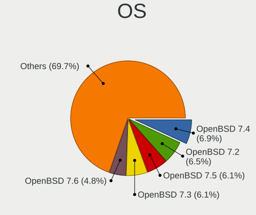

| Name                 | Notebooks | Percent |
|----------------------|-----------|---------|
| OpenBSD 7.4          | 16        | 6.93%   |
| OpenBSD 7.2          | 15        | 6.49%   |
| OpenBSD 7.5          | 14        | 6.06%   |
| OpenBSD 7.3          | 14        | 6.06%   |
| OpenBSD 7.6          | 11        | 4.76%   |
| OpenBSD 7.1          | 10        | 4.33%   |
| OpenBSD 7.0          | 9         | 3.9%    |
| OpenBSD 6.9          | 9         | 3.9%    |
| helloSystem 0.8.1    | 8         | 3.46%   |
| OpenBSD 6.8          | 7         | 3.03%   |
| helloSystem 0.4.0    | 4         | 1.73%   |
| FreeBSD 14.2         | 4         | 1.73%   |
| helloSystem 0.9.0    | 3         | 1.3%    |
| helloSystem 0.8.0    | 3         | 1.3%    |
| helloSystem 0.7.0    | 3         | 1.3%    |
| FreeBSD 13.1-p7      | 3         | 1.3%    |
| FreeBSD 13.1-p5      | 3         | 1.3%    |
| FreeBSD 13.0-p5      | 3         | 1.3%    |
| OPNsense 23.7.3      | 2         | 0.87%   |
| OpenBSD 7.7          | 2         | 0.87%   |
| helloSystem 0.5.0    | 2         | 0.87%   |
| GhostBSD 24.10.1     | 2         | 0.87%   |
| GhostBSD 23.10.1     | 2         | 0.87%   |
| FreeBSD 15.0-p1      | 2         | 0.87%   |
| FreeBSD 14.3-p6      | 2         | 0.87%   |
| FreeBSD 14.3         | 2         | 0.87%   |
| FreeBSD 14.1-p2      | 2         | 0.87%   |
| FreeBSD 14.1         | 2         | 0.87%   |
| FreeBSD 14.0-p6      | 2         | 0.87%   |
| FreeBSD 14.0-CURRENT | 2         | 0.87%   |
| FreeBSD 13.1-p2      | 2         | 0.87%   |
| FreeBSD 13.1         | 2         | 0.87%   |
| FreeBSD 13.0         | 2         | 0.87%   |
| FreeBSD 12.2         | 2         | 0.87%   |
| OPNsense 25.1.5      | 1         | 0.43%   |
| OPNsense 25.1.12     | 1         | 0.43%   |
| OPNsense 25.1.1      | 1         | 0.43%   |
| OPNsense 25.1        | 1         | 0.43%   |
| OPNsense 24.7.5      | 1         | 0.43%   |
| OPNsense 24.7.11     | 1         | 0.43%   |

OS Family
---------

OS without a version

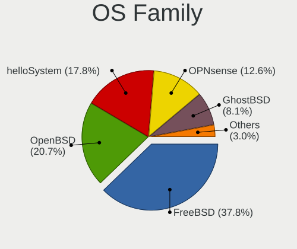

| Name        | Notebooks | Percent |
|-------------|-----------|---------|
| FreeBSD     | 51        | 37.78%  |
| OpenBSD     | 28        | 20.74%  |
| helloSystem | 24        | 17.78%  |
| OPNsense    | 17        | 12.59%  |
| GhostBSD    | 11        | 8.15%   |
| NomadBSD    | 2         | 1.48%   |
| NetBSD      | 2         | 1.48%   |

Arch
----

OS architecture (x86_64, i586, etc.)

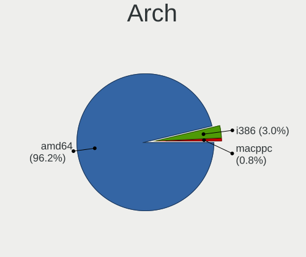

| Name   | Notebooks | Percent |
|--------|-----------|---------|
| amd64  | 128       | 96.24%  |
| i386   | 4         | 3.01%   |
| macppc | 1         | 0.75%   |

DE
--

Desktop Environment

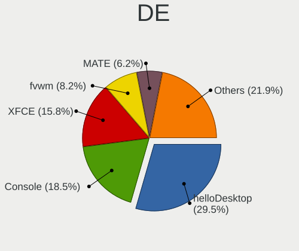

| Name          | Notebooks | Percent |
|---------------|-----------|---------|
| helloDesktop  | 43        | 29.45%  |
| Console       | 27        | 18.49%  |
| XFCE          | 23        | 15.75%  |
| fvwm          | 12        | 8.22%   |
| MATE          | 9         | 6.16%   |
| GNOME         | 7         | 4.79%   |
| TWM           | 5         | 3.42%   |
| Openbox       | 4         | 2.74%   |
| KDE5          | 4         | 2.74%   |
| i3            | 3         | 2.05%   |
| sway:wlroots  | 1         | 0.68%   |
| Ratpoison     | 1         | 0.68%   |
| LXQt          | 1         | 0.68%   |
| Lumina        | 1         | 0.68%   |
| labwc:wlroots | 1         | 0.68%   |
| KDE           | 1         | 0.68%   |
| Fluxbox       | 1         | 0.68%   |
| Cinnamon      | 1         | 0.68%   |
| AwesomeWM     | 1         | 0.68%   |

Display Server
--------------

X11 or Wayland

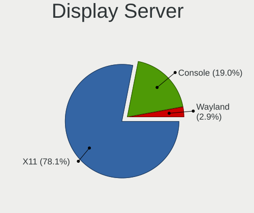

| Name    | Notebooks | Percent |
|---------|-----------|---------|
| X11     | 107       | 78.1%   |
| Console | 26        | 18.98%  |
| Wayland | 4         | 2.92%   |

Display Manager
---------------

SDDM, LightDM, etc.

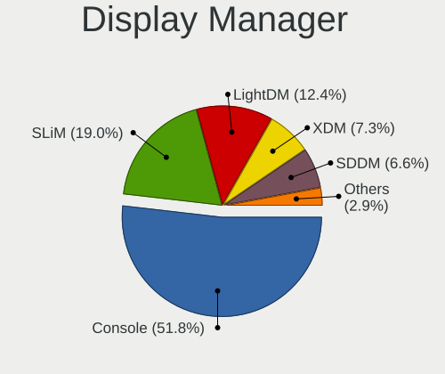

| Name    | Notebooks | Percent |
|---------|-----------|---------|
| Console | 71        | 51.82%  |
| SLiM    | 26        | 18.98%  |
| LightDM | 17        | 12.41%  |
| XDM     | 10        | 7.3%    |
| SDDM    | 9         | 6.57%   |
| GDM     | 3         | 2.19%   |
| Ly      | 1         | 0.73%   |

OS Lang
-------

Language

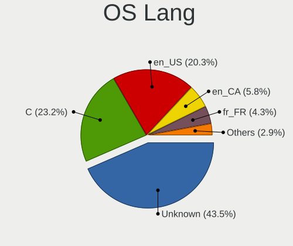

| Lang    | Notebooks | Percent |
|---------|-----------|---------|
| Unknown | 60        | 43.48%  |
| C       | 32        | 23.19%  |
| en_US   | 28        | 20.29%  |
| en_CA   | 8         | 5.8%    |
| fr_FR   | 6         | 4.35%   |
| fr_CA   | 2         | 1.45%   |
| en_NL   | 1         | 0.72%   |
| en      | 1         | 0.72%   |

Boot Mode
---------

EFI or BIOS

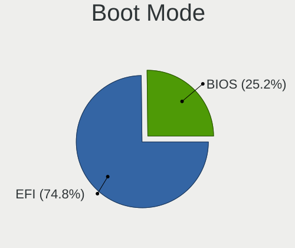

| Mode | Notebooks | Percent |
|------|-----------|---------|
| EFI  | 101       | 74.81%  |
| BIOS | 34        | 25.19%  |

Filesystem
----------

Type of filesystem

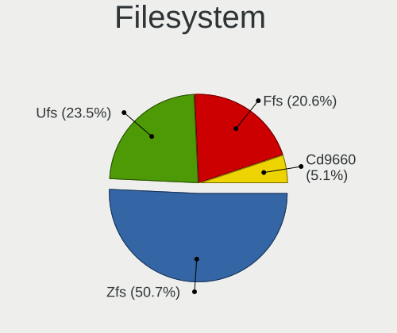

| Type   | Notebooks | Percent |
|--------|-----------|---------|
| Zfs    | 69        | 50.74%  |
| Ufs    | 32        | 23.53%  |
| Ffs    | 28        | 20.59%  |
| Cd9660 | 7         | 5.15%   |

Part. scheme
------------

Scheme of partitioning

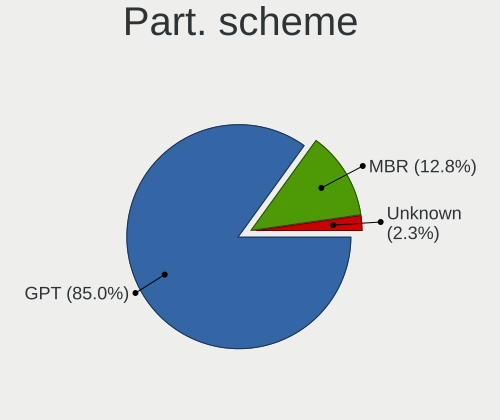

| Type    | Notebooks | Percent |
|---------|-----------|---------|
| GPT     | 113       | 84.96%  |
| MBR     | 17        | 12.78%  |
| Unknown | 3         | 2.26%   |

Board
-----

Vendor
------

Motherboard manufacturer

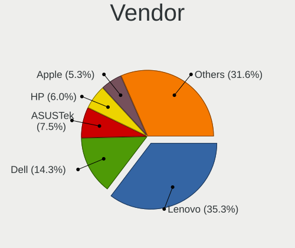

| Name                           | Notebooks | Percent |
|--------------------------------|-----------|---------|
| Lenovo                         | 47        | 35.34%  |
| Dell                           | 19        | 14.29%  |
| ASUSTek Computer               | 10        | 7.52%   |
| Hewlett-Packard                | 8         | 6.02%   |
| Apple                          | 7         | 5.26%   |
| Acer                           | 6         | 4.51%   |
| Toshiba                        | 5         | 3.76%   |
| Intel                          | 4         | 3.01%   |
| Panasonic                      | 3         | 2.26%   |
| Deciso                         | 3         | 2.26%   |
| Unknown                        | 3         | 2.26%   |
| MSI                            | 2         | 1.5%    |
| Matsushita Electric Industrial | 2         | 1.5%    |
| Google                         | 2         | 1.5%    |
| Gigabyte Technology            | 2         | 1.5%    |
| Alienware                      | 2         | 1.5%    |
| Star Labs                      | 1         | 0.75%   |
| Shuttle                        | 1         | 0.75%   |
| LG Electronics                 | 1         | 0.75%   |
| Gateway                        | 1         | 0.75%   |
| Fujitsu                        | 1         | 0.75%   |
| Framework                      | 1         | 0.75%   |
| eMachines                      | 1         | 0.75%   |
| Datto                          | 1         | 0.75%   |

Model
-----

Motherboard model

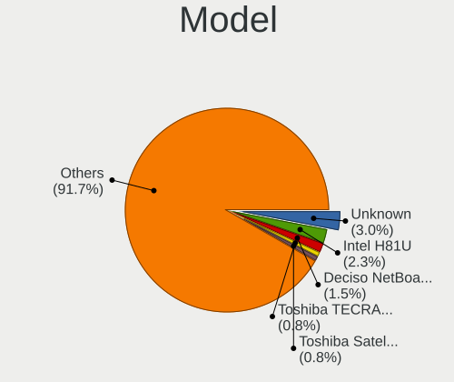

| Name                                        | Notebooks | Percent |
|---------------------------------------------|-----------|---------|
| Unknown                                     | 4         | 3.01%   |
| Intel H81U                                  | 3         | 2.26%   |
| Deciso NetBoard-A20                         | 2         | 1.5%    |
| Toshiba TECRA Z40-B                         | 1         | 0.75%   |
| Toshiba Satellite U500                      | 1         | 0.75%   |
| Toshiba Satellite S50D-A                    | 1         | 0.75%   |
| Toshiba Satellite Pro T130                  | 1         | 0.75%   |
| Toshiba Satellite L870                      | 1         | 0.75%   |
| Star Labs Lite                              | 1         | 0.75%   |
| Shuttle DS67U                               | 1         | 0.75%   |
| Panasonic CF-54-1                           | 1         | 0.75%   |
| Panasonic CF-53AAGHYDM                      | 1         | 0.75%   |
| Panasonic CF-52PFPBSFQ                      | 1         | 0.75%   |
| MSI GL65 Leopard 10SFSK                     | 1         | 0.75%   |
| MSI GF65 Thin 10UE                          | 1         | 0.75%   |
| Matsushita Electric Industrial CF-51RCVDNLM | 1         | 0.75%   |
| Matsushita Electric Industrial CF-48V4KNDQM | 1         | 0.75%   |
| LG E500-GP01A9                              | 1         | 0.75%   |
| Lenovo ThinkPad X280 20KF001UUS             | 1         | 0.75%   |
| Lenovo ThinkPad X270 W10DG 20K5S0TT1N       | 1         | 0.75%   |
| Lenovo ThinkPad X270 W10DG 20K5S0PY04       | 1         | 0.75%   |
| Lenovo ThinkPad X270 20HNCTO1WW             | 1         | 0.75%   |
| Lenovo ThinkPad X260 20F5S2GM00             | 1         | 0.75%   |
| Lenovo ThinkPad X250 20CL001GUS             | 1         | 0.75%   |
| Lenovo ThinkPad X240 20AMS3FY00             | 1         | 0.75%   |
| Lenovo ThinkPad X230 Tablet 34372VU         | 1         | 0.75%   |
| Lenovo ThinkPad X230 2325T4T                | 1         | 0.75%   |
| Lenovo ThinkPad X220 429043U                | 1         | 0.75%   |
| Lenovo ThinkPad X1C 5th W10DG 20K3S00V00    | 1         | 0.75%   |
| Lenovo ThinkPad X1 Carbon 6th 20KGS1TW00    | 1         | 0.75%   |
| Lenovo ThinkPad X1 Carbon 4th 20FCS13H00    | 1         | 0.75%   |
| Lenovo ThinkPad X1 Carbon 2nd 20A8S0ET00    | 1         | 0.75%   |
| Lenovo ThinkPad T510 4313CTO                | 1         | 0.75%   |
| Lenovo ThinkPad T490 20N3S8PB00             | 1         | 0.75%   |
| Lenovo ThinkPad T490 20N3S4PX00             | 1         | 0.75%   |
| Lenovo ThinkPad T480 20L6SDKD00             | 1         | 0.75%   |
| Lenovo ThinkPad T470 W10DG 20JNS0L300       | 1         | 0.75%   |
| Lenovo ThinkPad T470 20HES0HU00             | 1         | 0.75%   |
| Lenovo ThinkPad T460 20FMS1BC01             | 1         | 0.75%   |
| Lenovo ThinkPad T460 20FMS10N00             | 1         | 0.75%   |

Model Family
------------

Motherboard model prefix

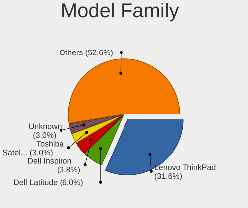

| Name                                        | Notebooks | Percent |
|---------------------------------------------|-----------|---------|
| Lenovo ThinkPad                             | 42        | 31.58%  |
| Dell Latitude                               | 8         | 6.02%   |
| Dell Inspiron                               | 5         | 3.76%   |
| Toshiba Satellite                           | 4         | 3.01%   |
| Unknown                                     | 4         | 3.01%   |
| Intel H81U                                  | 3         | 2.26%   |
| Acer Aspire                                 | 3         | 2.26%   |
| Lenovo IdeaPad                              | 2         | 1.5%    |
| HP ProBook                                  | 2         | 1.5%    |
| HP Pavilion                                 | 2         | 1.5%    |
| Dell XPS                                    | 2         | 1.5%    |
| Dell Studio                                 | 2         | 1.5%    |
| Deciso NetBoard-A20                         | 2         | 1.5%    |
| ASUS VivoBook                               | 2         | 1.5%    |
| Acer Swift                                  | 2         | 1.5%    |
| Toshiba TECRA                               | 1         | 0.75%   |
| Star Labs Lite                              | 1         | 0.75%   |
| Shuttle DS67U                               | 1         | 0.75%   |
| Panasonic CF-54-1                           | 1         | 0.75%   |
| Panasonic CF-53AAGHYDM                      | 1         | 0.75%   |
| Panasonic CF-52PFPBSFQ                      | 1         | 0.75%   |
| MSI GL65                                    | 1         | 0.75%   |
| MSI GF65                                    | 1         | 0.75%   |
| Matsushita Electric Industrial CF-51RCVDNLM | 1         | 0.75%   |
| Matsushita Electric Industrial CF-48V4KNDQM | 1         | 0.75%   |
| LG E500-GP01A9                              | 1         | 0.75%   |
| Lenovo ThinkBook                            | 1         | 0.75%   |
| Lenovo Legion                               | 1         | 0.75%   |
| Lenovo G560                                 | 1         | 0.75%   |
| Intel SandyBridge                           | 1         | 0.75%   |
| HP Notebook                                 | 1         | 0.75%   |
| HP EliteBook                                | 1         | 0.75%   |
| HP Compaq                                   | 1         | 0.75%   |
| HP 2000                                     | 1         | 0.75%   |
| Google Terra                                | 1         | 0.75%   |
| Google Peppy                                | 1         | 0.75%   |
| Gigabyte MMLP3AP-00                         | 1         | 0.75%   |
| Gigabyte GB-BSi3A-6100                      | 1         | 0.75%   |
| Gateway ID49C                               | 1         | 0.75%   |
| Fujitsu LIFEBOOK                            | 1         | 0.75%   |

MFG Year
--------

Motherboard manufacture year

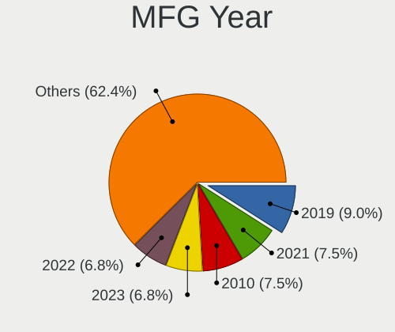

| Year    | Notebooks | Percent |
|---------|-----------|---------|
| 2019    | 12        | 9.02%   |
| 2021    | 10        | 7.52%   |
| 2010    | 10        | 7.52%   |
| 2023    | 9         | 6.77%   |
| 2022    | 9         | 6.77%   |
| 2011    | 9         | 6.77%   |
| 2018    | 8         | 6.02%   |
| 2017    | 8         | 6.02%   |
| 2016    | 8         | 6.02%   |
| 2015    | 8         | 6.02%   |
| 2020    | 7         | 5.26%   |
| 2014    | 7         | 5.26%   |
| 2012    | 7         | 5.26%   |
| 2009    | 7         | 5.26%   |
| 2013    | 6         | 4.51%   |
| 2024    | 2         | 1.5%    |
| 2008    | 2         | 1.5%    |
| 2025    | 1         | 0.75%   |
| 2006    | 1         | 0.75%   |
| 2002    | 1         | 0.75%   |
| Unknown | 1         | 0.75%   |

Form Factor
-----------

Physical design of the computer

| Name     | Notebooks | Percent |
|----------|-----------|---------|
| Notebook | 133       | 100%    |

Coreboot
--------

Have coreboot on board

| Used | Notebooks | Percent |
|------|-----------|---------|
| No   | 130       | 97.74%  |
| Yes  | 3         | 2.26%   |

RAM Size
--------

Total RAM memory

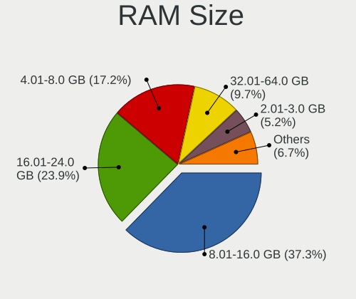

| Size in GB | Notebooks | Percent |
|------------|-----------|---------|
| 8.01-16.0  | 50        | 37.31%  |
| 16.01-24.0 | 32        | 23.88%  |
| 4.01-8.0   | 23        | 17.16%  |
| 32.01-64.0 | 13        | 9.7%    |
| 2.01-3.0   | 7         | 5.22%   |
| 3.01-4.0   | 6         | 4.48%   |
| 24.01-32.0 | 1         | 0.75%   |
| 1.01-2.0   | 1         | 0.75%   |
| 0.51-1.0   | 1         | 0.75%   |

RAM Used
--------

Used RAM memory

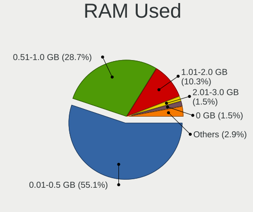

| Used GB  | Notebooks | Percent |
|----------|-----------|---------|
| 0.01-0.5 | 75        | 55.15%  |
| 0.51-1.0 | 39        | 28.68%  |
| 1.01-2.0 | 14        | 10.29%  |
| 2.01-3.0 | 2         | 1.47%   |
| 0        | 2         | 1.47%   |
| Unknown  | 2         | 1.47%   |
| 4.01-8.0 | 1         | 0.74%   |
| 3.01-4.0 | 1         | 0.74%   |

Total Drives
------------

Number of drives on board

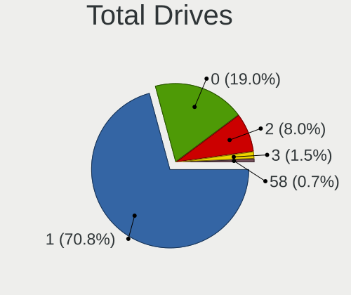

| Drives | Notebooks | Percent |
|--------|-----------|---------|
| 1      | 97        | 70.8%   |
| 0      | 26        | 18.98%  |
| 2      | 11        | 8.03%   |
| 3      | 2         | 1.46%   |
| 58     | 1         | 0.73%   |

Has CD-ROM
----------

Has CD-ROM on board

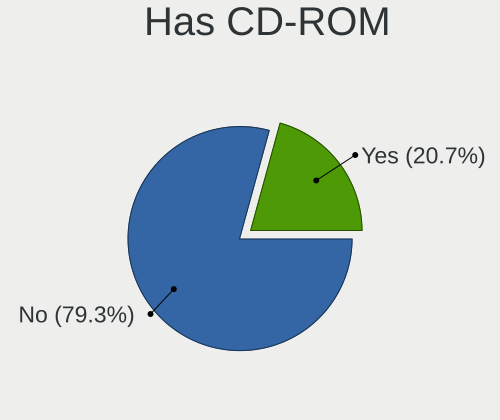

| Presented | Notebooks | Percent |
|-----------|-----------|---------|
| No        | 107       | 79.26%  |
| Yes       | 28        | 20.74%  |

Has Ethernet
------------

Has Ethernet on board

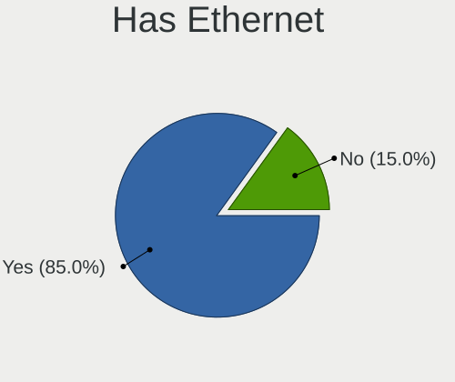

| Presented | Notebooks | Percent |
|-----------|-----------|---------|
| Yes       | 113       | 84.96%  |
| No        | 20        | 15.04%  |

Has WiFi
--------

Has WiFi module

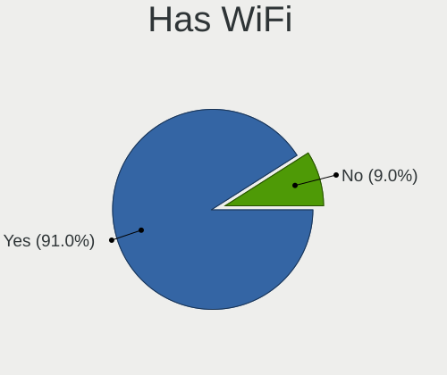

| Presented | Notebooks | Percent |
|-----------|-----------|---------|
| Yes       | 121       | 90.98%  |
| No        | 12        | 9.02%   |

Has Bluetooth
-------------

Has Bluetooth module

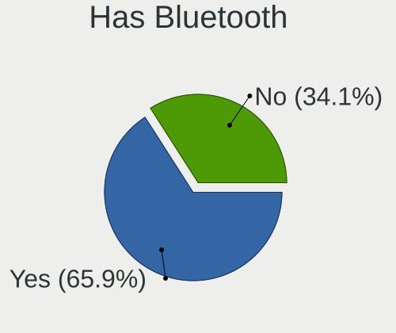

| Presented | Notebooks | Percent |
|-----------|-----------|---------|
| Yes       | 89        | 65.93%  |
| No        | 46        | 34.07%  |

Location
--------

Country
-------

Geographic location (country)

| Country | Notebooks | Percent |
|---------|-----------|---------|
| Canada  | 133       | 100%    |

City
----

Geographic location (city)

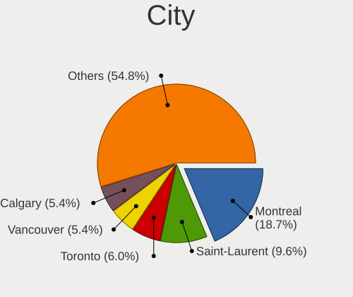

| City              | Notebooks | Percent |
|-------------------|-----------|---------|
| Montreal          | 31        | 18.67%  |
| Saint-Laurent     | 16        | 9.64%   |
| Toronto           | 10        | 6.02%   |
| Vancouver         | 9         | 5.42%   |
| Calgary           | 9         | 5.42%   |
| Ottawa            | 8         | 4.82%   |
| Victoria          | 5         | 3.01%   |
| QuГ©bec         | 5         | 3.01%   |
| Winnipeg          | 3         | 1.81%   |
| Stratford         | 3         | 1.81%   |
| Québec           | 3         | 1.81%   |
| Peterborough      | 3         | 1.81%   |
| Mississauga       | 3         | 1.81%   |
| Kingsburg         | 3         | 1.81%   |
| Sydenham          | 2         | 1.2%    |
| Surrey            | 2         | 1.2%    |
| Saskatoon         | 2         | 1.2%    |
| Sainte-Julie      | 2         | 1.2%    |
| Saint-Bruno       | 2         | 1.2%    |
| North Vancouver   | 2         | 1.2%    |
| Langley           | 2         | 1.2%    |
| Gatineau          | 2         | 1.2%    |
| Cambridge         | 2         | 1.2%    |
| Barrie            | 2         | 1.2%    |
| Windsor           | 1         | 0.6%    |
| Whitby            | 1         | 0.6%    |
| Waterloo          | 1         | 0.6%    |
| Warwick           | 1         | 0.6%    |
| Vaudreuil-Dorion  | 1         | 0.6%    |
| St. Jean Baptiste | 1         | 0.6%    |
| Sechelt           | 1         | 0.6%    |
| Scarborough       | 1         | 0.6%    |
| Saint-Zotique     | 1         | 0.6%    |
| Prince Albert     | 1         | 0.6%    |
| Prevost           | 1         | 0.6%    |
| Powell River      | 1         | 0.6%    |
| Pierrefonds       | 1         | 0.6%    |
| North York        | 1         | 0.6%    |
| Niagara Falls     | 1         | 0.6%    |
| Nepean            | 1         | 0.6%    |

Drives
------

Drive Vendor
------------

Hard drive vendors

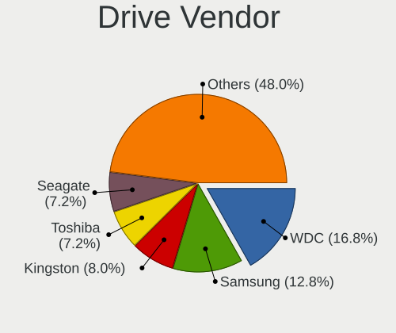

| Vendor              | Notebooks | Drives | Percent |
|---------------------|-----------|--------|---------|
| WDC                 | 21        | 71     | 16.8%   |
| Samsung Electronics | 16        | 26     | 12.8%   |
| Kingston            | 10        | 16     | 8%      |
| Toshiba             | 9         | 19     | 7.2%    |
| Seagate             | 9         | 17     | 7.2%    |
| Hitachi             | 7         | 11     | 5.6%    |
| NVMe                | 5         | 8      | 4%      |
| Intel               | 5         | 12     | 4%      |
| Transcend           | 3         | 3      | 2.4%    |
| SanDisk             | 3         | 5      | 2.4%    |
| Micron Technology   | 3         | 3      | 2.4%    |
| Crucial             | 3         | 3      | 2.4%    |
| Apple               | 3         | 3      | 2.4%    |
| A-DATA Technology   | 3         | 10     | 2.4%    |
| SK hynix            | 2         | 2      | 1.6%    |
| Lexar               | 2         | 3      | 1.6%    |
| HGST                | 2         | 35     | 1.6%    |
| UMIS                | 1         | 1      | 0.8%    |
| Team                | 1         | 1      | 0.8%    |
| Star Drive          | 1         | 1      | 0.8%    |
| SPCC                | 1         | 1      | 0.8%    |
| Phison              | 1         | 1      | 0.8%    |
| Patriot             | 1         | 1      | 0.8%    |
| OCZ                 | 1         | 1      | 0.8%    |
| Netac               | 1         | 1      | 0.8%    |
| LITEON              | 1         | 3      | 0.8%    |
| Kston               | 1         | 2      | 0.8%    |
| KIOXIA              | 1         | 1      | 0.8%    |
| KingDian            | 1         | 1      | 0.8%    |
| HPE                 | 1         | 5      | 0.8%    |
| Hewlett-Packard     | 1         | 1      | 0.8%    |
| Fujitsu             | 1         | 1      | 0.8%    |
| FIKWOT              | 1         | 1      | 0.8%    |
| Fanxiang            | 1         | 1      | 0.8%    |
| China               | 1         | 1      | 0.8%    |
| Apacer              | 1         | 1      | 0.8%    |

Drive Model
-----------

Hard drive models

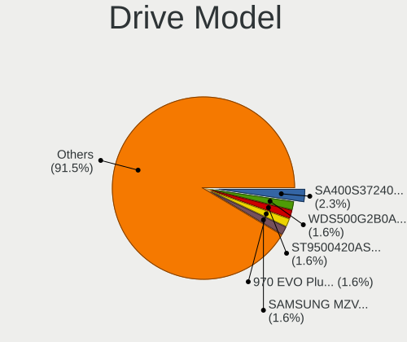

| Model                                | Notebooks | Percent |
|--------------------------------------|-----------|---------|
| Kingston SA400S37240G 240GB          | 3         | 2.33%   |
| WDC WDS500G2B0A-00SM50 500GB         | 2         | 1.55%   |
| Seagate ST9500420AS 500GB            | 2         | 1.55%   |
| Samsung SSD 970 EVO Plus 1TB         | 2         | 1.55%   |
| NVMe SAMSUNG MZVLW256 256GB          | 2         | 1.55%   |
| Micron MTFDKCD256TFK 256GB           | 2         | 1.55%   |
| Kingston SHFS37A120G 120GB           | 2         | 1.55%   |
| WDC WDS500G2B0A 500GB                | 1         | 0.78%   |
| WDC WDS200T2B0A 2TB                  | 1         | 0.78%   |
| WDC WDBNCE0010PNC 1TB                | 1         | 0.78%   |
| WDC WD7500BPKX-75HPJT0 752GB         | 1         | 0.78%   |
| WDC WD7500BPKX-00HPJT0 752GB         | 1         | 0.78%   |
| WDC WD7500BPKT-75PK4T0 752GB         | 1         | 0.78%   |
| WDC WD7500BPKT-00PK4T0 752GB         | 1         | 0.78%   |
| WDC WD6400BEVT-22A0RT0 640GB         | 1         | 0.78%   |
| WDC WD5000LPLX-00ZNTT0 500GB         | 1         | 0.78%   |
| WDC WD3200LPVX-60V0TT0 320GB         | 1         | 0.78%   |
| WDC WD3200BEVE-00A0HT0 320GB         | 1         | 0.78%   |
| WDC WD2500BEVS-75UST0 250GB          | 1         | 0.78%   |
| WDC WD20SDRW-11VUUS1 2TB             | 1         | 0.78%   |
| WDC WD10JPVX-75JC3T0 1TB             | 1         | 0.78%   |
| WDC WD10JPVT-00A1YT0 1TB             | 1         | 0.78%   |
| WDC WD10JPLX-00MBPT0 1TB             | 1         | 0.78%   |
| WDC PC SN730 SDBQNTY-256G-1001 256GB | 1         | 0.78%   |
| WDC PC SN730 SDBQNTY-1T00-1001 1TB   | 1         | 0.78%   |
| WDC PC SN530 SDBPNPZ-256G-1014 256GB | 1         | 0.78%   |
| WDC PC SN530 NVMe 256GB              | 1         | 0.78%   |
| WDC PC SN520 SDAPMUW-256G-1001 256GB | 1         | 0.78%   |
| UMIS RPETJ1T24MGE2QDQ 1TB            | 1         | 0.78%   |
| Transcend TSA 240GB                  | 1         | 0.78%   |
| Transcend TS256GMTS952T2 256GB       | 1         | 0.78%   |
| Transcend TS256GMTE710T 256GB        | 1         | 0.78%   |
| Toshiba THNSNJ128GCSU 128GB          | 1         | 0.78%   |
| Toshiba MQ04ABF100 1TB               | 1         | 0.78%   |
| Toshiba MQ01ABF032 320GB             | 1         | 0.78%   |
| Toshiba MK8025GAS 80GB               | 1         | 0.78%   |
| Toshiba MK5061GSYN 500GB             | 1         | 0.78%   |
| Toshiba MK3259GSXP 320GB             | 1         | 0.78%   |
| Toshiba MK1665GSX 160GB              | 1         | 0.78%   |
| Toshiba KXG6AZNV256G 256GB           | 1         | 0.78%   |

HDD Vendor
----------

Hard disk drive vendors

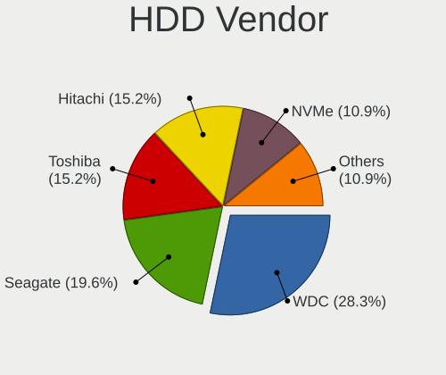

| Vendor  | Notebooks | Drives | Percent |
|---------|-----------|--------|---------|
| WDC     | 13        | 61     | 28.26%  |
| Seagate | 9         | 17     | 19.57%  |
| Toshiba | 7         | 17     | 15.22%  |
| Hitachi | 7         | 11     | 15.22%  |
| NVMe    | 5         | 8      | 10.87%  |
| HGST    | 2         | 35     | 4.35%   |
| Lexar   | 1         | 1      | 2.17%   |
| HPE     | 1         | 5      | 2.17%   |
| Fujitsu | 1         | 1      | 2.17%   |

SSD Vendor
----------

Solid state drive vendors

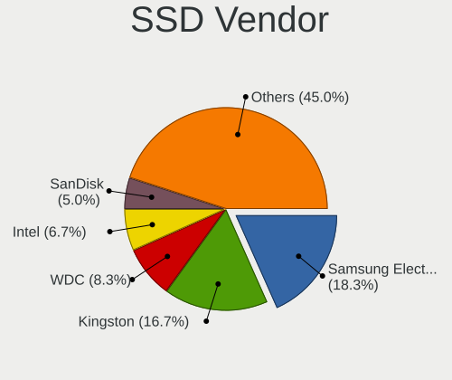

| Vendor              | Notebooks | Drives | Percent |
|---------------------|-----------|--------|---------|
| Samsung Electronics | 11        | 21     | 18.33%  |
| Kingston            | 10        | 15     | 16.67%  |
| WDC                 | 5         | 5      | 8.33%   |
| Intel               | 4         | 11     | 6.67%   |
| SanDisk             | 3         | 5      | 5%      |
| Apple               | 3         | 3      | 5%      |
| Transcend           | 2         | 2      | 3.33%   |
| SK hynix            | 2         | 2      | 3.33%   |
| Crucial             | 2         | 2      | 3.33%   |
| A-DATA Technology   | 2         | 9      | 3.33%   |
| Toshiba             | 1         | 1      | 1.67%   |
| Team                | 1         | 1      | 1.67%   |
| Star Drive          | 1         | 1      | 1.67%   |
| SPCC                | 1         | 1      | 1.67%   |
| Patriot             | 1         | 1      | 1.67%   |
| OCZ                 | 1         | 1      | 1.67%   |
| Micron Technology   | 1         | 1      | 1.67%   |
| LITEON              | 1         | 3      | 1.67%   |
| Lexar               | 1         | 2      | 1.67%   |
| Kston               | 1         | 2      | 1.67%   |
| KingDian            | 1         | 1      | 1.67%   |
| Hewlett-Packard     | 1         | 1      | 1.67%   |
| FIKWOT              | 1         | 1      | 1.67%   |
| Fanxiang            | 1         | 1      | 1.67%   |
| China               | 1         | 1      | 1.67%   |
| Apacer              | 1         | 1      | 1.67%   |

Drive Kind
----------

HDD or SSD

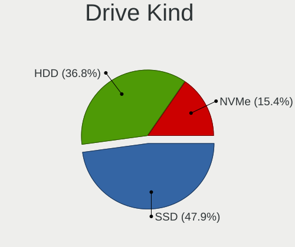

| Kind | Notebooks | Drives | Percent |
|------|-----------|--------|---------|
| SSD  | 56        | 95     | 47.86%  |
| HDD  | 43        | 156    | 36.75%  |
| NVMe | 18        | 22     | 15.38%  |

Drive Connector
---------------

SATA, SAS, NVMe, etc.

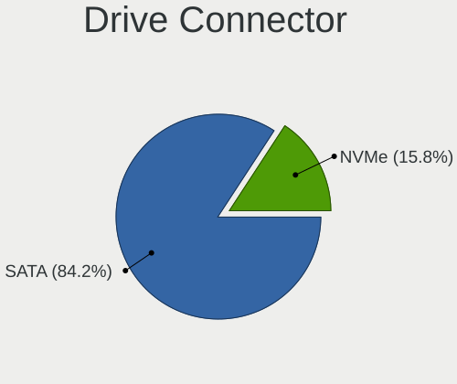

| Type | Notebooks | Drives | Percent |
|------|-----------|--------|---------|
| SATA | 96        | 251    | 84.21%  |
| NVMe | 18        | 22     | 15.79%  |

Drive Size
----------

Size of hard drive

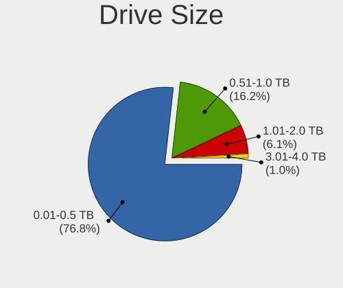

| Size in TB | Notebooks | Drives | Percent |
|------------|-----------|--------|---------|
| 0.01-0.5   | 76        | 145    | 76.77%  |
| 0.51-1.0   | 16        | 52     | 16.16%  |
| 1.01-2.0   | 6         | 6      | 6.06%   |
| 3.01-4.0   | 1         | 48     | 1.01%   |

Space Total
-----------

Amount of disk space available on the file system

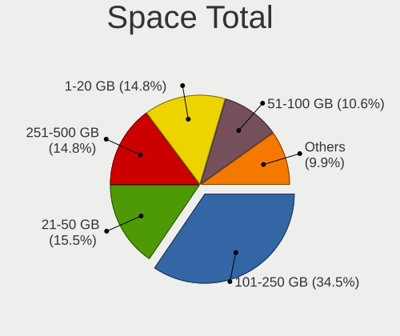

| Size in GB | Notebooks | Percent |
|------------|-----------|---------|
| 101-250    | 49        | 34.51%  |
| 21-50      | 22        | 15.49%  |
| 251-500    | 21        | 14.79%  |
| 1-20       | 21        | 14.79%  |
| 51-100     | 15        | 10.56%  |
| 501-1000   | 11        | 7.75%   |
| 1001-2000  | 2         | 1.41%   |
| Unknown    | 1         | 0.7%    |

Space Used
----------

Amount of used disk space

| Used GB | Notebooks | Percent |
|---------|-----------|---------|
| 1-20    | 114       | 82.61%  |
| 21-50   | 12        | 8.7%    |
| 51-100  | 7         | 5.07%   |
| 251-500 | 2         | 1.45%   |
| 101-250 | 2         | 1.45%   |
| Unknown | 1         | 0.72%   |

Malfunc. Drives
---------------

Drive models with a malfunction

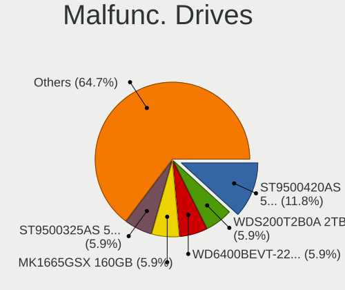

| Model                             | Notebooks | Drives | Percent |
|-----------------------------------|-----------|--------|---------|
| Seagate ST9500420AS 500GB         | 2         | 4      | 11.76%  |
| WDC WDS200T2B0A 2TB               | 1         | 1      | 5.88%   |
| WDC WD6400BEVT-22A0RT0 640GB      | 1         | 1      | 5.88%   |
| Toshiba MK1665GSX 160GB           | 1         | 1      | 5.88%   |
| SK hynix HFS256G39TND-N210A 256GB | 1         | 1      | 5.88%   |
| Seagate ST9500325AS 500GB         | 1         | 1      | 5.88%   |
| Kingston SV300S37A60G 64GB        | 1         | 2      | 5.88%   |
| Kingston SUV400S37240G 240GB      | 1         | 1      | 5.88%   |
| Kingston SNS4151S316GD 16GB       | 1         | 1      | 5.88%   |
| Kingston SNS4151S316G 16GB        | 1         | 1      | 5.88%   |
| Intel SSDSC2CW120A3 120GB         | 1         | 1      | 5.88%   |
| Hitachi HTS547575A9E384 752GB     | 1         | 1      | 5.88%   |
| Hitachi HTS541612J9SA00 120GB     | 1         | 1      | 5.88%   |
| Apple SSD SM0128G 121GB           | 1         | 1      | 5.88%   |
| Apacer 16GB SATA Flash Drive      | 1         | 1      | 5.88%   |
| A-DATA Technology SP550 480GB     | 1         | 8      | 5.88%   |

Malfunc. Drive Vendor
---------------------

Vendors of faulty drives

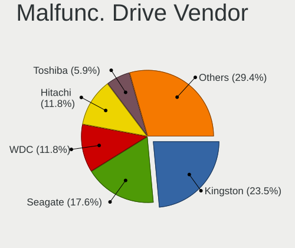

| Vendor            | Notebooks | Drives | Percent |
|-------------------|-----------|--------|---------|
| Kingston          | 4         | 5      | 23.53%  |
| Seagate           | 3         | 5      | 17.65%  |
| WDC               | 2         | 2      | 11.76%  |
| Hitachi           | 2         | 2      | 11.76%  |
| Toshiba           | 1         | 1      | 5.88%   |
| SK hynix          | 1         | 1      | 5.88%   |
| Intel             | 1         | 1      | 5.88%   |
| Apple             | 1         | 1      | 5.88%   |
| Apacer            | 1         | 1      | 5.88%   |
| A-DATA Technology | 1         | 8      | 5.88%   |

Malfunc. HDD Vendor
-------------------

Vendors of faulty HDD drives

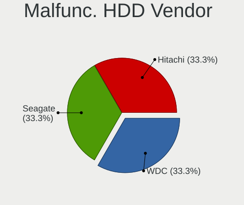

| Vendor  | Notebooks | Drives | Percent |
|---------|-----------|--------|---------|
| Seagate | 3         | 5      | 42.86%  |
| Hitachi | 2         | 2      | 28.57%  |
| WDC     | 1         | 1      | 14.29%  |
| Toshiba | 1         | 1      | 14.29%  |

Malfunc. Drive Kind
-------------------

Kinds of faulty drives

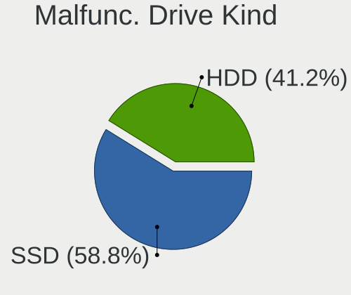

| Kind | Notebooks | Drives | Percent |
|------|-----------|--------|---------|
| SSD  | 10        | 18     | 58.82%  |
| HDD  | 7         | 9      | 41.18%  |

Failed Drives
-------------

Failed drive models

Zero info for selected period =(

Failed Drive Vendor
-------------------

Failed drive vendors

Zero info for selected period =(

Drive Status
------------

Number of failed and malfunc. drives

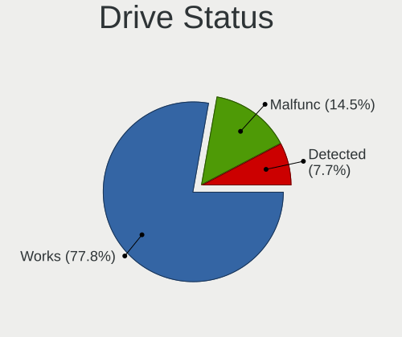

| Status   | Notebooks | Drives | Percent |
|----------|-----------|--------|---------|
| Works    | 91        | 234    | 77.78%  |
| Malfunc  | 17        | 27     | 14.53%  |
| Detected | 9         | 12     | 7.69%   |

Storage controller
------------------

Storage Vendor
--------------

Storage controller vendors

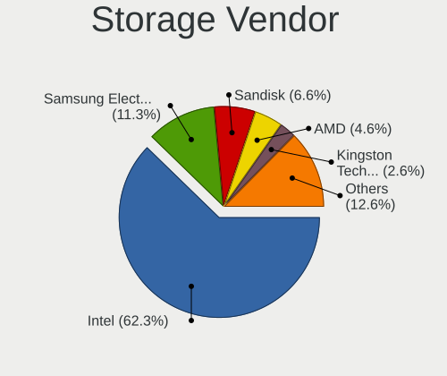

| Vendor                                  | Notebooks | Percent |
|-----------------------------------------|-----------|---------|
| Intel                                   | 94        | 62.25%  |
| Samsung Electronics                     | 17        | 11.26%  |
| Sandisk                                 | 10        | 6.62%   |
| AMD                                     | 7         | 4.64%   |
| Kingston Technology Company             | 4         | 2.65%   |
| Transcend                               | 2         | 1.32%   |
| Toshiba                                 | 2         | 1.32%   |
| Realtek Semiconductor                   | 2         | 1.32%   |
| Nvidia                                  | 2         | 1.32%   |
| Micron Technology                       | 2         | 1.32%   |
| MAXIO Technology (Hangzhou)             | 2         | 1.32%   |
| Solid State Storage Technology          | 1         | 0.66%   |
| Silicon Motion                          | 1         | 0.66%   |
| Shenzhen Unionmemory Information System | 1         | 0.66%   |
| Phison Electronics                      | 1         | 0.66%   |
| Micron/Crucial Technology               | 1         | 0.66%   |
| KIOXIA                                  | 1         | 0.66%   |
| Broadcom / LSI                          | 1         | 0.66%   |

Storage Model
-------------

Storage controller models

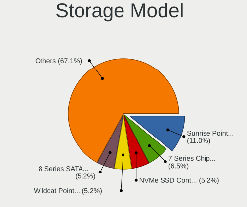

| Model                                                                         | Notebooks | Percent |
|-------------------------------------------------------------------------------|-----------|---------|
| Intel Sunrise Point-LP SATA Controller [AHCI mode]                            | 17        | 10.97%  |
| Intel 7 Series Chipset Family 6-port SATA Controller [AHCI mode]              | 10        | 6.45%   |
| Samsung NVMe SSD Controller SM981/PM981/PM983                                 | 8         | 5.16%   |
| Intel Wildcat Point-LP SATA Controller [AHCI Mode]                            | 8         | 5.16%   |
| Intel 8 Series SATA Controller 1 [AHCI mode]                                  | 8         | 5.16%   |
| Intel 6 Series/C200 Series Chipset Family 6 port Mobile SATA AHCI Controller  | 8         | 5.16%   |
| AMD FCH SATA Controller [AHCI mode]                                           | 7         | 4.52%   |
| Intel 82801IBM/IEM (ICH9M/ICH9M-E) 4 port SATA Controller [AHCI mode]         | 5         | 3.23%   |
| Intel 5 Series/3400 Series Chipset 6 port SATA AHCI Controller                | 5         | 3.23%   |
| Sandisk WD SN560/SN740/SN770/SN5000 NVMe SSD                                  | 3         | 1.94%   |
| SanDisk Extreme Pro / WD Black SN750 / PC SN730 / Red SN700 NVMe SSD          | 3         | 1.94%   |
| Samsung NVMe SSD Controller SM961/PM961/SM963                                 | 3         | 1.94%   |
| Intel 82801HM/HEM (ICH8M/ICH8M-E) SATA Controller [AHCI mode]                 | 3         | 1.94%   |
| Intel 5 Series/3400 Series Chipset 4 port SATA AHCI Controller                | 3         | 1.94%   |
| Toshiba XG6 NVMe SSD Controller                                               | 2         | 1.29%   |
| Samsung NVMe SSD Controller 980 (DRAM-less)                                   | 2         | 1.29%   |
| Micron 2450 NVMe SSD [HendrixV] (DRAM-less)                                   | 2         | 1.29%   |
| MAXIO (Hangzhou) NVMe SSD Controller MAP1202 (DRAM-less)                      | 2         | 1.29%   |
| Kingston Company A2000 NVMe SSD [SM2263EN]                                    | 2         | 1.29%   |
| Intel Q170/Q150/B150/H170/H110/Z170/CM236 Chipset SATA Controller [AHCI Mode] | 2         | 1.29%   |
| Intel NM10/ICH7 Family SATA Controller [AHCI mode]                            | 2         | 1.29%   |
| Intel Comet Lake SATA AHCI Controller                                         | 2         | 1.29%   |
| Intel Cannon Lake Mobile PCH SATA AHCI Controller                             | 2         | 1.29%   |
| Intel 82801HM/HEM (ICH8M/ICH8M-E) IDE Controller                              | 2         | 1.29%   |
| Intel 82801GBM/GHM (ICH7-M Family) SATA Controller [IDE mode]                 | 2         | 1.29%   |
| Intel 82801 Mobile SATA Controller [RAID mode]                                | 2         | 1.29%   |
| Transcend NVMe PCIe SSD 220S/240S/MTE710T                                     | 1         | 0.65%   |
| Transcend NVMe PCIe SSD 110S/112S/120S/MTE300S/MTE400S/MTE652T2 (DRAM-less)   | 1         | 0.65%   |
| Solid State Storage CL1-3D256-Q11 NVMe SSD M.2                                | 1         | 0.65%   |
| Silicon Motion SM2263EN/SM2263XT (DRAM-less) NVMe SSD Controllers             | 1         | 0.65%   |
| Shenzhen Unionmemory Information System AM630 PCIe 4.0 NVMe SSD 1024GB        | 1         | 0.65%   |
| SanDisk Ultra 3D / WD PC SN530, IX SN530, Blue SN550 NVMe SSD (DRAM-less)     | 1         | 0.65%   |
| SanDisk PC SN530 NVMe SSD (DRAM-less)                                         | 1         | 0.65%   |
| SanDisk PC SN520 x2 M.2 2242 NVMe SSD                                         | 1         | 0.65%   |
| SanDisk IX SN530 NVMe SSD / microSD Express Card (DRAM-less)                  | 1         | 0.65%   |
| Samsung S4LN058A01[SSUBX] AHCI SSD Controller (Apple slot)                    | 1         | 0.65%   |
| Samsung S4LN053X01 AHCI SSD Controller(Apple slot)                            | 1         | 0.65%   |
| Samsung NVMe SSD Controller S4LV008[Pascal]                                   | 1         | 0.65%   |
| Samsung NVMe SSD Controller PM9C1a (DRAM-less)                                | 1         | 0.65%   |
| Realtek RTS5765DL NVMe SSD Controller (DRAM-less)                             | 1         | 0.65%   |

Storage Kind
------------

Kind of storage controller (IDE, SATA, NVMe, SAS, ...)

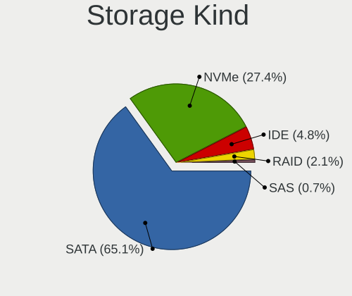

| Kind | Notebooks | Percent |
|------|-----------|---------|
| SATA | 95        | 65.07%  |
| NVMe | 40        | 27.4%   |
| IDE  | 7         | 4.79%   |
| RAID | 3         | 2.05%   |
| SAS  | 1         | 0.68%   |

Processor
---------

CPU Vendor
----------

Processor vendors

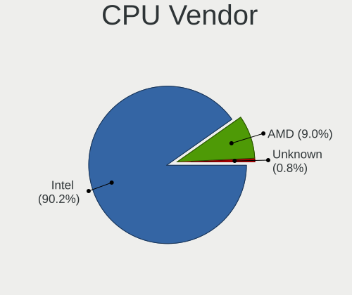

| Vendor  | Notebooks | Percent |
|---------|-----------|---------|
| Intel   | 120       | 90.23%  |
| AMD     | 12        | 9.02%   |
| Unknown | 1         | 0.75%   |

CPU Model
---------

Processor models

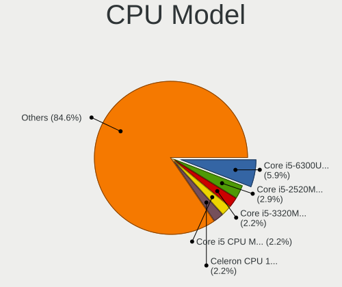

| Model                                                         | Notebooks | Percent |
|---------------------------------------------------------------|-----------|---------|
| Intel Core i5-6300U CPU @ 2.40GHz                             | 8         | 5.88%   |
| Intel Core i5-2520M CPU @ 2.50GHz                             | 4         | 2.94%   |
| Intel Core i5-3320M CPU @ 2.60GHz                             | 3         | 2.21%   |
| Intel Core i5 CPU M 520 @ 2.40GHz                             | 3         | 2.21%   |
| Intel Celeron CPU 1037U @ 1.80GHz                             | 3         | 2.21%   |
| Intel Pentium Dual-Core CPU T4400 @ 2.20GHz                   | 2         | 1.47%   |
| Intel CPU Version                                             | 2         | 1.47%   |
| Intel Core i7-8550U CPU @ 1.80GHz                             | 2         | 1.47%   |
| Intel Core i7-4600U CPU @ 2.10GHz                             | 2         | 1.47%   |
| Intel Core i7-3630QM CPU @ 2.40GHz                            | 2         | 1.47%   |
| Intel Core i7-10750H CPU @ 2.60GHz                            | 2         | 1.47%   |
| Intel Core i5-8365U CPU @ 1.60GHz                             | 2         | 1.47%   |
| Intel Core i5-8350U CPU @ 1.70GHz                             | 2         | 1.47%   |
| Intel Core i5-8265U CPU @ 1.60GHz                             | 2         | 1.47%   |
| Intel Core i5-7200U CPU @ 2.50GHz                             | 2         | 1.47%   |
| Intel Core i5-5300U CPU @ 2.30GHz                             | 2         | 1.47%   |
| Intel Core i5-5200U CPU @ 2.20GHz                             | 2         | 1.47%   |
| Intel Core i5-4210U CPU @ 1.70GHz                             | 2         | 1.47%   |
| Intel Core i5-3210M CPU @ 2.50GHz                             | 2         | 1.47%   |
| Intel Core i5-10210U CPU @ 1.60GHz                            | 2         | 1.47%   |
| Intel Core i3-7100U CPU @ 2.40GHz                             | 2         | 1.47%   |
| Intel 11th Gen Core i3-1115G4 @ 3.00GHz                       | 2         | 1.47%   |
| AMD EPYC 3201 8-Core Processor                                | 2         | 1.47%   |
| Intel Xeon CPU E3-1535M v5 @ 2.90GHz                          | 1         | 0.74%   |
| Intel Xeon CPU E3-1505M v6 @ 3.00GHz                          | 1         | 0.74%   |
| Intel Xeon CPU E3-1505M v5 @ 2.80GHz                          | 1         | 0.74%   |
| Intel Xeon CPU E3-1230 V2 @ 3.30GH                            | 1         | 0.74%   |
| Intel Pentium Dual-Core CPU T4200 @ 2.00GHz                   | 1         | 0.74%   |
| Intel Pentium CPU P6100 @ 2.00GHz                             | 1         | 0.74%   |
| Intel Pentium CPU N4200 @ 1.10GHz                             | 1         | 0.74%   |
| Intel Pentium CPU N3710 @ 1.60GHz                             | 1         | 0.74%   |
| Intel Pentium 4 Mobile CPU 1.60GHz ("GenuineIntel" 686-class) | 1         | 0.74%   |
| Intel Pentium 4 Mobile CPU 1.60GHz                            | 1         | 0.74%   |
| Intel Genuine CPU T2300 @ 1.66GHz                             | 1         | 0.74%   |
| Intel CPU T2300 @ 1.66GHz ("GenuineIntel" 686-class)          | 1         | 0.74%   |
| Intel Core Ultra 5 125U                                       | 1         | 0.74%   |
| Intel Core i7-9750H CPU @ 2.60GHz                             | 1         | 0.74%   |
| Intel Core i7-8750H CPU @ 2.20GHz                             | 1         | 0.74%   |
| Intel Core i7-8650U CPU @ 1.90GHz                             | 1         | 0.74%   |
| Intel Core i7-7700HQ CPU @ 2.80GHz                            | 1         | 0.74%   |

CPU Model Family
----------------

Processor model prefix

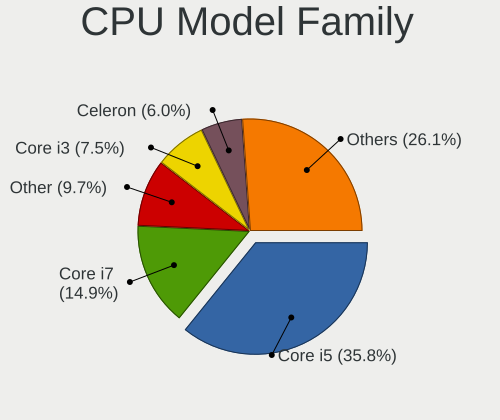

| Model                   | Notebooks | Percent |
|-------------------------|-----------|---------|
| Intel Core i5           | 48        | 35.82%  |
| Intel Core i7           | 20        | 14.93%  |
| Other                   | 13        | 9.7%    |
| Intel Core i3           | 10        | 7.46%   |
| Intel Celeron           | 8         | 5.97%   |
| Intel Core 2 Duo        | 6         | 4.48%   |
| Intel Xeon              | 4         | 2.99%   |
| Intel Atom              | 4         | 2.99%   |
| Intel Pentium Dual-Core | 3         | 2.24%   |
| Intel Pentium           | 3         | 2.24%   |
| AMD Ryzen 5             | 3         | 2.24%   |
| AMD Ryzen 7             | 2         | 1.49%   |
| AMD EPYC                | 2         | 1.49%   |
| Intel Pentium 4         | 1         | 0.75%   |
| Intel Genuine           | 1         | 0.75%   |
| Intel Core              | 1         | 0.75%   |
| AMD Ryzen Embedded      | 1         | 0.75%   |
| AMD Ryzen 9             | 1         | 0.75%   |
| AMD E1                  | 1         | 0.75%   |
| AMD A8                  | 1         | 0.75%   |
| AMD A10                 | 1         | 0.75%   |

CPU Cores
---------

Number of processor cores

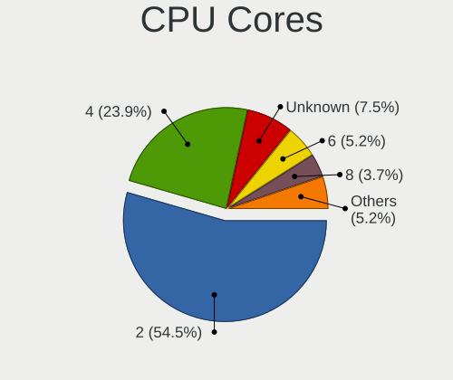

| Number  | Notebooks | Percent |
|---------|-----------|---------|
| 2       | 73        | 54.48%  |
| 4       | 32        | 23.88%  |
| Unknown | 10        | 7.46%   |
| 6       | 7         | 5.22%   |
| 8       | 5         | 3.73%   |
| 16      | 2         | 1.49%   |
| 1       | 2         | 1.49%   |
| 12      | 1         | 0.75%   |
| 10      | 1         | 0.75%   |
| 7       | 1         | 0.75%   |

CPU Sockets
-----------

Number of sockets

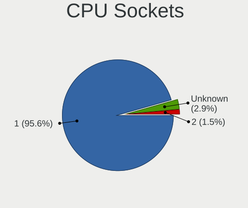

| Number  | Notebooks | Percent |
|---------|-----------|---------|
| 1       | 130       | 95.59%  |
| Unknown | 4         | 2.94%   |
| 2       | 2         | 1.47%   |

CPU Threads
-----------

Threads per core (Hyper-Threading)

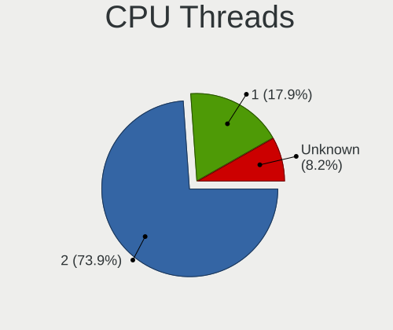

| Number  | Notebooks | Percent |
|---------|-----------|---------|
| 2       | 99        | 73.88%  |
| 1       | 24        | 17.91%  |
| Unknown | 11        | 8.21%   |

CPU Microarch
-------------

Microarchitecture

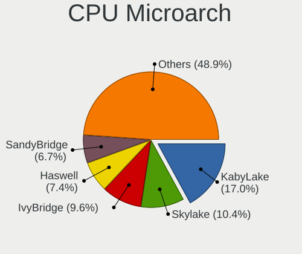

| Name          | Notebooks | Percent |
|---------------|-----------|---------|
| KabyLake      | 23        | 17.04%  |
| Skylake       | 14        | 10.37%  |
| IvyBridge     | 13        | 9.63%   |
| Haswell       | 10        | 7.41%   |
| SandyBridge   | 9         | 6.67%   |
| Broadwell     | 9         | 6.67%   |
| Unknown       | 9         | 6.67%   |
| Penryn        | 8         | 5.93%   |
| Westmere      | 6         | 4.44%   |
| TigerLake     | 6         | 4.44%   |
| Bonnell       | 4         | 2.96%   |
| Zen 3         | 3         | 2.22%   |
| Zen           | 3         | 2.22%   |
| Zen 2         | 2         | 1.48%   |
| Silvermont    | 2         | 1.48%   |
| Piledriver    | 2         | 1.48%   |
| Core          | 2         | 1.48%   |
| CometLake     | 2         | 1.48%   |
| Zen+          | 1         | 0.74%   |
| P6            | 1         | 0.74%   |
| NetBurst      | 1         | 0.74%   |
| Nehalem       | 1         | 0.74%   |
| Jaguar        | 1         | 0.74%   |
| IceLake       | 1         | 0.74%   |
| Goldmont plus | 1         | 0.74%   |
| Goldmont      | 1         | 0.74%   |

Graphics
--------

GPU Vendor
----------

Vendors of graphics cards

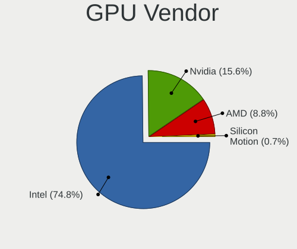

| Vendor         | Notebooks | Percent |
|----------------|-----------|---------|
| Intel          | 110       | 74.83%  |
| Nvidia         | 23        | 15.65%  |
| AMD            | 13        | 8.84%   |
| Silicon Motion | 1         | 0.68%   |

GPU Model
---------

Graphics card models

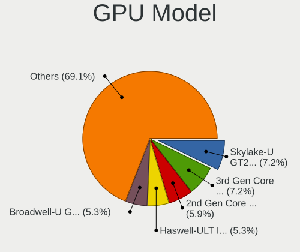

| Model                                                                                    | Notebooks | Percent |
|------------------------------------------------------------------------------------------|-----------|---------|
| Intel Skylake-U GT2 [HD Graphics 520]                                                    | 11        | 7.24%   |
| Intel 3rd Gen Core processor Graphics Controller                                         | 11        | 7.24%   |
| Intel 2nd Generation Core Processor Family Integrated Graphics Controller                | 9         | 5.92%   |
| Intel Haswell-ULT Integrated Graphics Controller                                         | 8         | 5.26%   |
| Intel Broadwell-U GT2 [HD Graphics 5500]                                                 | 8         | 5.26%   |
| Intel Kaby Lake-U GT2 [HD Graphics 620]                                                  | 6         | 3.95%   |
| Intel Kaby Lake-R GT2 [UHD Graphics 620]                                                 | 6         | 3.95%   |
| Intel Mobile 4 Series Chipset Integrated Graphics Controller                             | 5         | 3.29%   |
| Intel Core Processor Integrated Graphics Controller                                      | 5         | 3.29%   |
| Intel WhiskeyLake-U GT2 [UHD Graphics 620]                                               | 4         | 2.63%   |
| Intel TigerLake-LP GT2 [Iris Xe Graphics]                                                | 3         | 1.97%   |
| Intel Mobile 945GM/GMS/GME, 943/940GML Express Integrated Graphics Controller            | 3         | 1.97%   |
| Intel CometLake-U GT2 [UHD Graphics]                                                     | 3         | 1.97%   |
| Nvidia GP107M [GeForce GTX 1050 Mobile]                                                  | 2         | 1.32%   |
| Nvidia GK107M [GeForce GTX 660M]                                                         | 2         | 1.32%   |
| Nvidia GA107M [GeForce RTX 3050 Mobile]                                                  | 2         | 1.32%   |
| Nvidia GA106M [GeForce RTX 3060 Mobile / Max-Q]                                          | 2         | 1.32%   |
| Intel Tiger Lake-LP GT2 [UHD Graphics G4]                                                | 2         | 1.32%   |
| Intel Mobile GM965/GL960 Integrated Graphics Controller (secondary)                      | 2         | 1.32%   |
| Intel Mobile GM965/GL960 Integrated Graphics Controller (primary)                        | 2         | 1.32%   |
| Intel Mobile 945GSE Express Integrated Graphics Controller                               | 2         | 1.32%   |
| Intel CometLake-H GT2 [UHD Graphics]                                                     | 2         | 1.32%   |
| Intel CoffeeLake-H GT2 [UHD Graphics 630]                                                | 2         | 1.32%   |
| Intel Atom/Celeron/Pentium Processor x5-E8000/J3xxx/N3xxx Integrated Graphics Controller | 2         | 1.32%   |
| AMD Barcelo                                                                              | 2         | 1.32%   |
| Silicon Motion SM712 LynxEM+                                                             | 1         | 0.66%   |
| Nvidia TU117M [GeForce GTX 1650 Ti Mobile]                                               | 1         | 0.66%   |
| Nvidia TU117M [GeForce GTX 1650 Mobile / Max-Q]                                          | 1         | 0.66%   |
| Nvidia MCP89 [GeForce 320M]                                                              | 1         | 0.66%   |
| Nvidia GT218M [NVS 3100M]                                                                | 1         | 0.66%   |
| Nvidia GT216M [GeForce GT 330M]                                                          | 1         | 0.66%   |
| Nvidia GP108M [GeForce MX330]                                                            | 1         | 0.66%   |
| Nvidia GM206GLM [Quadro M2200 Mobile]                                                    | 1         | 0.66%   |
| Nvidia GM108M [GeForce MX130]                                                            | 1         | 0.66%   |
| Nvidia GM107GLM [Quadro M600M]                                                           | 1         | 0.66%   |
| Nvidia GM107GLM [Quadro M1000M]                                                          | 1         | 0.66%   |
| Nvidia GK106M [GeForce GTX 765M]                                                         | 1         | 0.66%   |
| Nvidia GF119M [GeForce GT 520M]                                                          | 1         | 0.66%   |
| Nvidia GF108M [GeForce GT 620M/630M/635M/640M LE]                                        | 1         | 0.66%   |
| Nvidia G86M [GeForce 8400M GS]                                                           | 1         | 0.66%   |

GPU Combo
---------

Combinations of graphics cards

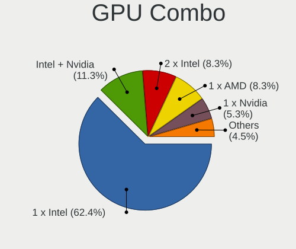

| Name               | Notebooks | Percent |
|--------------------|-----------|---------|
| 1 x Intel          | 83        | 62.41%  |
| Intel + Nvidia     | 15        | 11.28%  |
| 2 x Intel          | 11        | 8.27%   |
| 1 x AMD            | 11        | 8.27%   |
| 1 x Nvidia         | 7         | 5.26%   |
| Other              | 3         | 2.26%   |
| 1 x Silicon Motion | 1         | 0.75%   |
| Intel + AMD        | 1         | 0.75%   |
| AMD + Nvidia       | 1         | 0.75%   |

GPU Driver
----------

Free vs proprietary

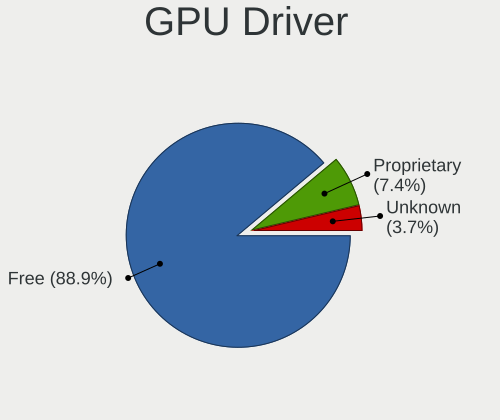

| Driver      | Notebooks | Percent |
|-------------|-----------|---------|
| Free        | 120       | 88.89%  |
| Proprietary | 10        | 7.41%   |
| Unknown     | 5         | 3.7%    |

GPU Memory
----------

Total video memory

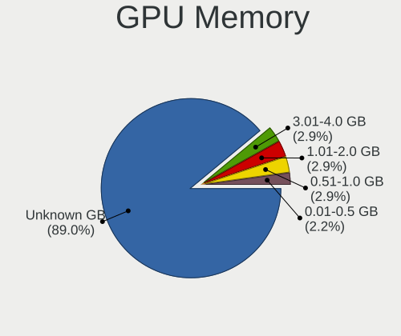

| Size in GB | Notebooks | Percent |
|------------|-----------|---------|
| Unknown    | 121       | 88.97%  |
| 3.01-4.0   | 4         | 2.94%   |
| 1.01-2.0   | 4         | 2.94%   |
| 0.51-1.0   | 4         | 2.94%   |
| 0.01-0.5   | 3         | 2.21%   |

Monitor
-------

Monitor Vendor
--------------

Monitor vendors

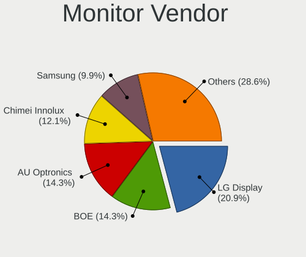

| Vendor                  | Notebooks | Percent |
|-------------------------|-----------|---------|
| LG Display              | 19        | 20.88%  |
| BOE                     | 13        | 14.29%  |
| AU Optronics            | 13        | 14.29%  |
| Chimei Innolux          | 11        | 12.09%  |
| Samsung Electronics     | 9         | 9.89%   |
| Lenovo                  | 5         | 5.49%   |
| Apple                   | 5         | 5.49%   |
| Sharp                   | 3         | 3.3%    |
| Chi Mei Optoelectronics | 3         | 3.3%    |
| Goldstar                | 2         | 2.2%    |
| Unknown (XXX)           | 1         | 1.1%    |
| Toshiba                 | 1         | 1.1%    |
| PANDA                   | 1         | 1.1%    |
| Panasonic               | 1         | 1.1%    |
| InfoVision              | 1         | 1.1%    |
| Dell                    | 1         | 1.1%    |
| CSOT                    | 1         | 1.1%    |
| Acer                    | 1         | 1.1%    |

Monitor Model
-------------

Monitor models

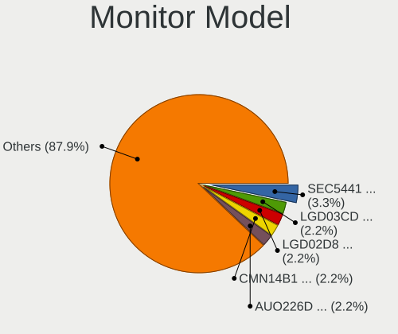

| Model                                                                | Notebooks | Percent |
|----------------------------------------------------------------------|-----------|---------|
| Samsung Electronics LCD Monitor SEC5441 1366x768 340x190mm 15.3-inch | 3         | 3.3%    |
| LG Display LCD Monitor LGD03CD 1366x768 280x160mm 12.7-inch          | 2         | 2.2%    |
| LG Display LCD Monitor LGD02D8 1366x768 280x160mm 12.7-inch          | 2         | 2.2%    |
| Chimei Innolux LCD Monitor CMN14B1 1920x1080 310x170mm 13.9-inch     | 2         | 2.2%    |
| AU Optronics LCD Monitor AUO226D 1920x1080 280x160mm 12.7-inch       | 2         | 2.2%    |
| Unknown (XXX) HDMI    XXX0088 1360x768 1100x560mm 48.6-inch          | 1         | 1.1%    |
| Toshiba LCD Monitor LCD0905 1366x768 290x170mm 13.2-inch             | 1         | 1.1%    |
| Sharp LCD Monitor SHP1526 1920x1280 270x180mm 12.8-inch              | 1         | 1.1%    |
| Sharp LCD Monitor SHP14C2 1920x1080 260x140mm 11.6-inch              | 1         | 1.1%    |
| Sharp LCD Monitor SHP14BA 1920x1080 340x190mm 15.3-inch              | 1         | 1.1%    |
| Samsung Electronics SyncMaster SAM03E4 1680x1050 470x300mm 22.0-inch | 1         | 1.1%    |
| Samsung Electronics LCD Monitor SEC3345 1280x800 330x210mm 15.4-inch | 1         | 1.1%    |
| Samsung Electronics LCD Monitor SEC324C 1600x900 310x170mm 13.9-inch | 1         | 1.1%    |
| Samsung Electronics LCD Monitor SEC3050 1366x768 320x190mm 14.7-inch | 1         | 1.1%    |
| Samsung Electronics LCD Monitor SEC304C 1366x768 310x170mm 13.9-inch | 1         | 1.1%    |
| Samsung Electronics LCD Monitor SDC4147 1366x768 340x190mm 15.3-inch | 1         | 1.1%    |
| PANDA LCD Monitor NCP0021 1920x1080 340x190mm 15.3-inch              | 1         | 1.1%    |
| Panasonic LCD Monitor MEI96A2 2880x1620 340x190mm 15.3-inch          | 1         | 1.1%    |
| LG Display LCD Monitor LGD05A2 1920x1080 310x170mm 13.9-inch         | 1         | 1.1%    |
| LG Display LCD Monitor LGD0538 1920x1080 340x190mm 15.3-inch         | 1         | 1.1%    |
| LG Display LCD Monitor LGD0521 1920x1080 310x170mm 13.9-inch         | 1         | 1.1%    |
| LG Display LCD Monitor LGD04F0 2560x1440 310x170mm 13.9-inch         | 1         | 1.1%    |
| LG Display LCD Monitor LGD04B9 1920x1080 340x190mm 15.3-inch         | 1         | 1.1%    |
| LG Display LCD Monitor LGD0484 1366x768 340x190mm 15.3-inch          | 1         | 1.1%    |
| LG Display LCD Monitor LGD046F 1920x1080 340x190mm 15.3-inch         | 1         | 1.1%    |
| LG Display LCD Monitor LGD045E 1366x768 310x170mm 13.9-inch          | 1         | 1.1%    |
| LG Display LCD Monitor LGD0456 1366x768 340x190mm 15.3-inch          | 1         | 1.1%    |
| LG Display LCD Monitor LGD03DB 1366x768 350x190mm 15.7-inch          | 1         | 1.1%    |
| LG Display LCD Monitor LGD02EB 1366x768 310x170mm 13.9-inch          | 1         | 1.1%    |
| LG Display LCD Monitor LGD02E2 1600x900 310x170mm 13.9-inch          | 1         | 1.1%    |
| LG Display LCD Monitor LGD021D 1600x900 380x210mm 17.1-inch          | 1         | 1.1%    |
| LG Display LCD Monitor LGD0215 1920x1080 350x190mm 15.7-inch         | 1         | 1.1%    |
| LG Display LCD Monitor LGD01E9 1920x1080 350x190mm 15.7-inch         | 1         | 1.1%    |
| Lenovo LEN T2054pC LEN60D9 1440x900 420x260mm 19.4-inch              | 1         | 1.1%    |
| Lenovo LCD Monitor LEN40BA 1920x1080 340x190mm 15.3-inch             | 1         | 1.1%    |
| Lenovo LCD Monitor LEN40B1 1600x900 340x190mm 15.3-inch              | 1         | 1.1%    |
| Lenovo LCD Monitor LEN4035 1280x800 300x190mm 14.0-inch              | 1         | 1.1%    |
| Lenovo LCD Monitor LEN4031 1280x800 300x190mm 14.0-inch              | 1         | 1.1%    |
| InfoVision LCD Monitor IVO057D 1920x1080 310x170mm 13.9-inch         | 1         | 1.1%    |
| Goldstar LG HDR WFHD GSM7714 2560x1080 800x340mm 34.2-inch           | 1         | 1.1%    |

Monitor Resolution
------------------

Monitor screen resolution

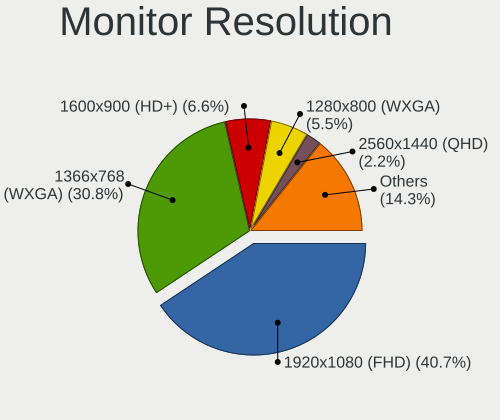

| Resolution         | Notebooks | Percent |
|--------------------|-----------|---------|
| 1920x1080 (FHD)    | 37        | 40.66%  |
| 1366x768 (WXGA)    | 28        | 30.77%  |
| 1600x900 (HD+)     | 6         | 6.59%   |
| 1280x800 (WXGA)    | 5         | 5.49%   |
| 2560x1440 (QHD)    | 2         | 2.2%    |
| 2256x1504          | 2         | 2.2%    |
| 3840x2160 (4K)     | 1         | 1.1%    |
| 2880x1800          | 1         | 1.1%    |
| 2560x1600          | 1         | 1.1%    |
| 2560x1080          | 1         | 1.1%    |
| 1920x1280          | 1         | 1.1%    |
| 1920x1200 (WUXGA)  | 1         | 1.1%    |
| 1680x1050 (WSXGA+) | 1         | 1.1%    |
| 1440x900 (WXGA+)   | 1         | 1.1%    |
| 1360x768           | 1         | 1.1%    |
| 1280x854           | 1         | 1.1%    |
| 1280x1024 (SXGA)   | 1         | 1.1%    |

Monitor Diagonal
----------------

Diagonal size in inches

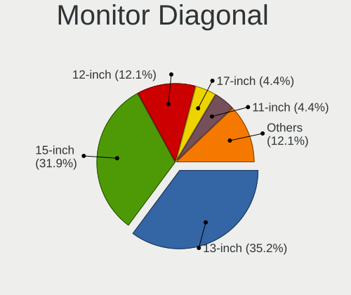

| Inches | Notebooks | Percent |
|--------|-----------|---------|
| 13     | 32        | 35.16%  |
| 15     | 29        | 31.87%  |
| 12     | 11        | 12.09%  |
| 17     | 4         | 4.4%    |
| 11     | 4         | 4.4%    |
| 14     | 3         | 3.3%    |
| 27     | 2         | 2.2%    |
| 19     | 2         | 2.2%    |
| 48     | 1         | 1.1%    |
| 34     | 1         | 1.1%    |
| 22     | 1         | 1.1%    |
| 16     | 1         | 1.1%    |

Monitor Width
-------------

Physical width

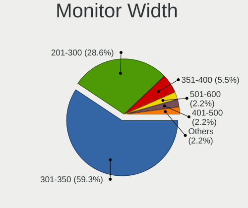

| Width in mm | Notebooks | Percent |
|-------------|-----------|---------|
| 301-350     | 54        | 59.34%  |
| 201-300     | 26        | 28.57%  |
| 351-400     | 5         | 5.49%   |
| 501-600     | 2         | 2.2%    |
| 401-500     | 2         | 2.2%    |
| 701-800     | 1         | 1.1%    |
| 1001-1500   | 1         | 1.1%    |

Aspect Ratio
------------

Proportional relationship between the width and the height

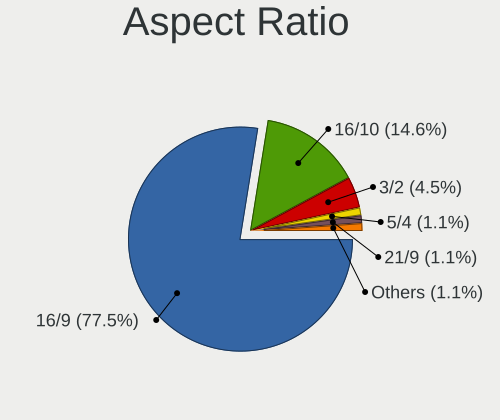

| Ratio | Notebooks | Percent |
|-------|-----------|---------|
| 16/9  | 69        | 77.53%  |
| 16/10 | 13        | 14.61%  |
| 3/2   | 4         | 4.49%   |
| 5/4   | 1         | 1.12%   |
| 21/9  | 1         | 1.12%   |
| 1.96  | 1         | 1.12%   |

Monitor Area
------------

Area in inch²

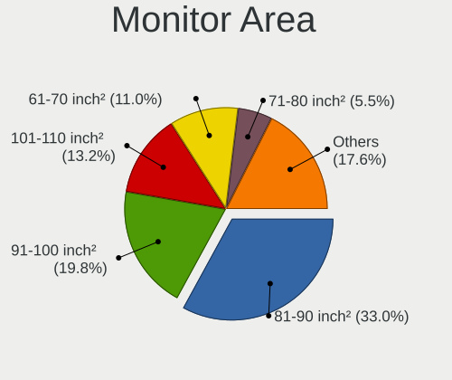

| Area in inch² | Notebooks | Percent |
|----------------|-----------|---------|
| 81-90          | 30        | 32.97%  |
| 91-100         | 18        | 19.78%  |
| 101-110        | 12        | 13.19%  |
| 61-70          | 10        | 10.99%  |
| 71-80          | 5         | 5.49%   |
| 51-60          | 4         | 4.4%    |
| 121-130        | 4         | 4.4%    |
| 301-350        | 2         | 2.2%    |
| 151-200        | 2         | 2.2%    |
| 351-500        | 1         | 1.1%    |
| 201-250        | 1         | 1.1%    |
| 111-120        | 1         | 1.1%    |
| 501-1000       | 1         | 1.1%    |

Pixel Density
-------------

Pixels per inch

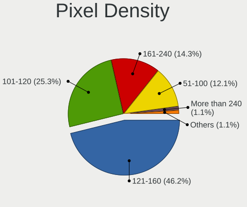

| Density       | Notebooks | Percent |
|---------------|-----------|---------|
| 121-160       | 42        | 46.15%  |
| 101-120       | 23        | 25.27%  |
| 161-240       | 13        | 14.29%  |
| 51-100        | 11        | 12.09%  |
| More than 240 | 1         | 1.1%    |
| 1-50          | 1         | 1.1%    |

Multiple Monitors
-----------------

Total monitors connected

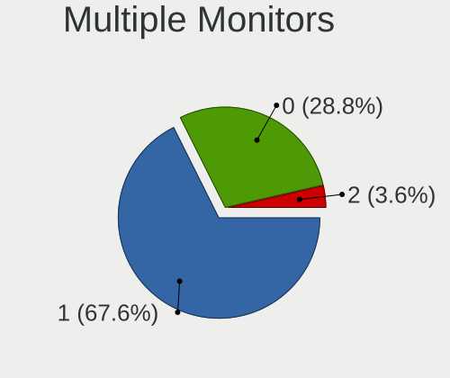

| Total | Notebooks | Percent |
|-------|-----------|---------|
| 1     | 94        | 67.63%  |
| 0     | 40        | 28.78%  |
| 2     | 5         | 3.6%    |

Network
-------

Net Controller Vendor
---------------------

Controller vendors

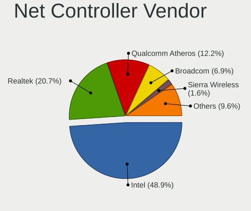

| Vendor                            | Notebooks | Percent |
|-----------------------------------|-----------|---------|
| Intel                             | 92        | 48.94%  |
| Realtek Semiconductor             | 39        | 20.74%  |
| Qualcomm Atheros                  | 23        | 12.23%  |
| Broadcom                          | 13        | 6.91%   |
| Sierra Wireless                   | 3         | 1.6%    |
| MediaTek                          | 3         | 1.6%    |
| AMD                               | 3         | 1.6%    |
| Marvell Technology Group          | 2         | 1.06%   |
| Ericsson Business Mobile Networks | 2         | 1.06%   |
| U-Blox                            | 1         | 0.53%   |
| Ralink Technology                 | 1         | 0.53%   |
| Ralink                            | 1         | 0.53%   |
| Nvidia                            | 1         | 0.53%   |
| NetGear                           | 1         | 0.53%   |
| JMicron Technology                | 1         | 0.53%   |
| Belkin Components                 | 1         | 0.53%   |
| Apple                             | 1         | 0.53%   |

Net Controller Model
--------------------

Controller models

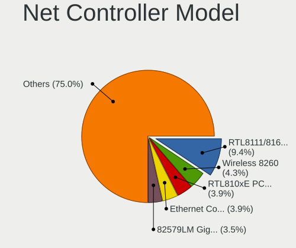

| Model                                                                  | Notebooks | Percent |
|------------------------------------------------------------------------|-----------|---------|
| Realtek RTL8111/8168/8211/8411 PCI Express Gigabit Ethernet Controller | 24        | 9.38%   |
| Intel Wireless 8260                                                    | 11        | 4.3%    |
| Realtek RTL810xE PCI Express Fast Ethernet controller                  | 10        | 3.91%   |
| Intel Ethernet Connection I219-LM                                      | 10        | 3.91%   |
| Intel 82579LM Gigabit Network Connection (Lewisville)                  | 9         | 3.52%   |
| Intel Wireless 8265 / 8275                                             | 8         | 3.13%   |
| Intel Centrino Advanced-N 6205 [Taylor Peak]                           | 8         | 3.13%   |
| Qualcomm Atheros AR9485 Wireless Network Adapter                       | 6         | 2.34%   |
| Intel Wireless 7265                                                    | 6         | 2.34%   |
| Intel Wireless 7260                                                    | 5         | 1.95%   |
| Intel Ethernet Connection (4) I219-LM                                  | 5         | 1.95%   |
| Intel Wireless 3165                                                    | 4         | 1.56%   |
| Intel Wi-Fi 6 AX201                                                    | 4         | 1.56%   |
| Intel Ethernet Connection I218-LM                                      | 4         | 1.56%   |
| Intel Cannon Point-LP CNVi [Wireless-AC]                               | 4         | 1.56%   |
| Intel 82577LM Gigabit Network Connection                               | 4         | 1.56%   |
| Qualcomm Atheros AR8132 Fast Ethernet                                  | 3         | 1.17%   |
| Qualcomm Atheros AR8121/AR8113/AR8114 Gigabit or Fast Ethernet         | 3         | 1.17%   |
| Intel Wi-Fi 6 AX200                                                    | 3         | 1.17%   |
| Intel Centrino Advanced-N 6200                                         | 3         | 1.17%   |
| Intel 82574L Gigabit Network Connection                                | 3         | 1.17%   |
| Broadcom BCM4322 802.11a/b/g/n Wireless LAN Controller                 | 3         | 1.17%   |
| AMD XGMAC 10GbE Controller                                             | 3         | 1.17%   |
| Realtek RTL8188EUS 802.11n Wireless Network Adapter                    | 2         | 0.78%   |
| Qualcomm Atheros AR9462 Wireless Network Adapter                       | 2         | 0.78%   |
| Qualcomm Atheros AR928X Wireless Network Adapter (PCI-Express)         | 2         | 0.78%   |
| Qualcomm Atheros AR9285 Wireless Network Adapter (PCI-Express)         | 2         | 0.78%   |
| Qualcomm Atheros AR8161 Gigabit Ethernet                               | 2         | 0.78%   |
| Qualcomm Atheros AR8151 v2.0 Gigabit Ethernet                          | 2         | 0.78%   |
| MediaTek MT7921 802.11ax PCIe Wireless Network Adapter [Filogic 330]   | 2         | 0.78%   |
| Marvell Group 88E8053 PCI-E Gigabit Ethernet Controller                | 2         | 0.78%   |
| Intel Wireless 3160                                                    | 2         | 0.78%   |
| Intel I211 Gigabit Network Connection                                  | 2         | 0.78%   |
| Intel I210 Gigabit Network Connection                                  | 2         | 0.78%   |
| Intel Ethernet Connection (4) I219-V                                   | 2         | 0.78%   |
| Intel Ethernet Connection (3) I218-V                                   | 2         | 0.78%   |
| Intel Ethernet Connection (3) I218-LM                                  | 2         | 0.78%   |
| Intel Ethernet Connection (2) I219-LM                                  | 2         | 0.78%   |
| Intel Comet Lake PCH-LP CNVi WiFi                                      | 2         | 0.78%   |
| Intel Comet Lake PCH CNVi WiFi                                         | 2         | 0.78%   |

Wireless Vendor
---------------

Wireless vendors

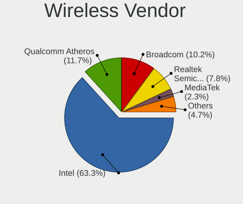

| Vendor                | Notebooks | Percent |
|-----------------------|-----------|---------|
| Intel                 | 81        | 63.28%  |
| Qualcomm Atheros      | 15        | 11.72%  |
| Broadcom              | 13        | 10.16%  |
| Realtek Semiconductor | 10        | 7.81%   |
| MediaTek              | 3         | 2.34%   |
| Sierra Wireless       | 2         | 1.56%   |
| Ralink Technology     | 1         | 0.78%   |
| Ralink                | 1         | 0.78%   |
| NetGear               | 1         | 0.78%   |
| Belkin Components     | 1         | 0.78%   |

Wireless Model
--------------

Wireless models

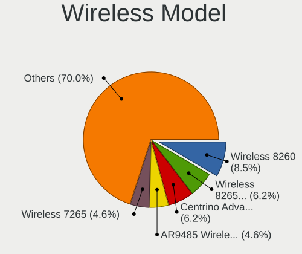

| Model                                                                   | Notebooks | Percent |
|-------------------------------------------------------------------------|-----------|---------|
| Intel Wireless 8260                                                     | 11        | 8.46%   |
| Intel Wireless 8265 / 8275                                              | 8         | 6.15%   |
| Intel Centrino Advanced-N 6205 [Taylor Peak]                            | 8         | 6.15%   |
| Qualcomm Atheros AR9485 Wireless Network Adapter                        | 6         | 4.62%   |
| Intel Wireless 7265                                                     | 6         | 4.62%   |
| Intel Wireless 7260                                                     | 5         | 3.85%   |
| Intel Wireless 3165                                                     | 4         | 3.08%   |
| Intel Wi-Fi 6 AX201                                                     | 4         | 3.08%   |
| Intel Cannon Point-LP CNVi [Wireless-AC]                                | 4         | 3.08%   |
| Intel Wi-Fi 6 AX200                                                     | 3         | 2.31%   |
| Intel Centrino Advanced-N 6200                                          | 3         | 2.31%   |
| Broadcom BCM4322 802.11a/b/g/n Wireless LAN Controller                  | 3         | 2.31%   |
| Realtek RTL8188EUS 802.11n Wireless Network Adapter                     | 2         | 1.54%   |
| Qualcomm Atheros AR9462 Wireless Network Adapter                        | 2         | 1.54%   |
| Qualcomm Atheros AR928X Wireless Network Adapter (PCI-Express)          | 2         | 1.54%   |
| Qualcomm Atheros AR9285 Wireless Network Adapter (PCI-Express)          | 2         | 1.54%   |
| MediaTek MT7921 802.11ax PCIe Wireless Network Adapter [Filogic 330]    | 2         | 1.54%   |
| Intel Wireless 3160                                                     | 2         | 1.54%   |
| Intel Comet Lake PCH-LP CNVi WiFi                                       | 2         | 1.54%   |
| Intel Comet Lake PCH CNVi WiFi                                          | 2         | 1.54%   |
| Intel Centrino Wireless-N 2200                                          | 2         | 1.54%   |
| Broadcom BCM43224 802.11a/b/g/n                                         | 2         | 1.54%   |
| Broadcom BCM4313 802.11bgn Wireless Network Adapter                     | 2         | 1.54%   |
| Sierra Wireless EM7455                                                  | 1         | 0.77%   |
| Sierra Wireless EM7345 4G LTE                                           | 1         | 0.77%   |
| Realtek RTL88x2bu [AC1200 Techkey]                                      | 1         | 0.77%   |
| Realtek RTL8852BE PCIe 802.11ax Wireless Network Controller             | 1         | 0.77%   |
| Realtek RTL8852AE 802.11ax PCIe Wireless Network Adapter                | 1         | 0.77%   |
| Realtek RTL8822CE 802.11ac PCIe Wireless Network Adapter                | 1         | 0.77%   |
| Realtek RTL8821CE 802.11ac PCIe Wireless Network Adapter                | 1         | 0.77%   |
| Realtek RTL8723BE PCIe Wireless Network Adapter                         | 1         | 0.77%   |
| Realtek RTL8723AE PCIe Wireless Network Adapter                         | 1         | 0.77%   |
| Realtek RTL8188EE Wireless Network Adapter                              | 1         | 0.77%   |
| Realtek RTL8188CE 802.11b/g/n WiFi Adapter                              | 1         | 0.77%   |
| Ralink RT2870/RT3070 Wireless Adapter                                   | 1         | 0.77%   |
| Ralink RT2790 Wireless 802.11n 1T/2R PCIe                               | 1         | 0.77%   |
| Qualcomm Atheros QCA9565 / AR9565 Wireless Network Adapter              | 1         | 0.77%   |
| Qualcomm Atheros QCA9377 802.11ac Wireless Network Adapter              | 1         | 0.77%   |
| Qualcomm Atheros AR5212 802.11abg NIC                                   | 1         | 0.77%   |
| Qualcomm Atheros AR242x / AR542x Wireless Network Adapter (PCI-Express) | 1         | 0.77%   |

Ethernet Vendor
---------------

Ethernet vendors

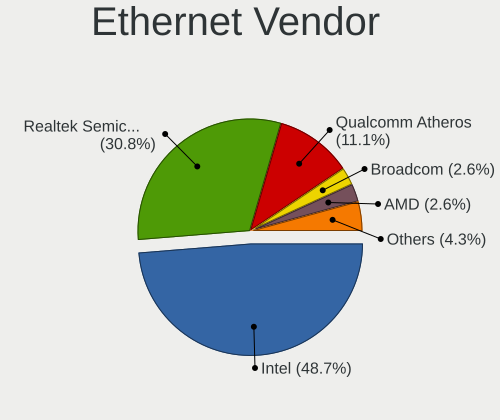

| Vendor                   | Notebooks | Percent |
|--------------------------|-----------|---------|
| Intel                    | 57        | 48.72%  |
| Realtek Semiconductor    | 36        | 30.77%  |
| Qualcomm Atheros         | 13        | 11.11%  |
| Broadcom                 | 3         | 2.56%   |
| AMD                      | 3         | 2.56%   |
| Marvell Technology Group | 2         | 1.71%   |
| Nvidia                   | 1         | 0.85%   |
| JMicron Technology       | 1         | 0.85%   |
| Apple                    | 1         | 0.85%   |

Ethernet Model
--------------

Ethernet models

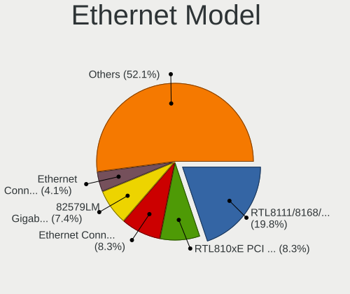

| Model                                                                  | Notebooks | Percent |
|------------------------------------------------------------------------|-----------|---------|
| Realtek RTL8111/8168/8211/8411 PCI Express Gigabit Ethernet Controller | 24        | 19.83%  |
| Realtek RTL810xE PCI Express Fast Ethernet controller                  | 10        | 8.26%   |
| Intel Ethernet Connection I219-LM                                      | 10        | 8.26%   |
| Intel 82579LM Gigabit Network Connection (Lewisville)                  | 9         | 7.44%   |
| Intel Ethernet Connection (4) I219-LM                                  | 5         | 4.13%   |
| Intel Ethernet Connection I218-LM                                      | 4         | 3.31%   |
| Intel 82577LM Gigabit Network Connection                               | 4         | 3.31%   |
| Qualcomm Atheros AR8132 Fast Ethernet                                  | 3         | 2.48%   |
| Qualcomm Atheros AR8121/AR8113/AR8114 Gigabit or Fast Ethernet         | 3         | 2.48%   |
| Intel 82574L Gigabit Network Connection                                | 3         | 2.48%   |
| AMD XGMAC 10GbE Controller                                             | 3         | 2.48%   |
| Qualcomm Atheros AR8161 Gigabit Ethernet                               | 2         | 1.65%   |
| Qualcomm Atheros AR8151 v2.0 Gigabit Ethernet                          | 2         | 1.65%   |
| Marvell Group 88E8053 PCI-E Gigabit Ethernet Controller                | 2         | 1.65%   |
| Intel I211 Gigabit Network Connection                                  | 2         | 1.65%   |
| Intel I210 Gigabit Network Connection                                  | 2         | 1.65%   |
| Intel Ethernet Connection (4) I219-V                                   | 2         | 1.65%   |
| Intel Ethernet Connection (3) I218-V                                   | 2         | 1.65%   |
| Intel Ethernet Connection (3) I218-LM                                  | 2         | 1.65%   |
| Intel Ethernet Connection (2) I219-LM                                  | 2         | 1.65%   |
| Realtek RTL-8100/8101L/8139 PCI Fast Ethernet Adapter                  | 1         | 0.83%   |
| Realtek Killer E2600 GbE Controller                                    | 1         | 0.83%   |
| Qualcomm Atheros QCA8172 Fast Ethernet                                 | 1         | 0.83%   |
| Qualcomm Atheros Killer E220x Gigabit Ethernet Controller              | 1         | 0.83%   |
| Qualcomm Atheros AR8131 Gigabit Ethernet                               | 1         | 0.83%   |
| Nvidia MCP79 Ethernet                                                  | 1         | 0.83%   |
| JMicron JMC250 PCI Express Gigabit Ethernet Controller                 | 1         | 0.83%   |
| Intel I350 Gigabit Fiber Network Connection                            | 1         | 0.83%   |
| Intel Ethernet Controller I225-V                                       | 1         | 0.83%   |
| Intel Ethernet Connection (6) I219-V                                   | 1         | 0.83%   |
| Intel Ethernet Connection (6) I219-LM                                  | 1         | 0.83%   |
| Intel Ethernet Connection (5) I219-LM                                  | 1         | 0.83%   |
| Intel Ethernet Connection (18) I219-LM                                 | 1         | 0.83%   |
| Intel Ethernet Connection (16) I219-LM                                 | 1         | 0.83%   |
| Intel Ethernet Connection (13) I219-V                                  | 1         | 0.83%   |
| Intel Ethernet Connection (13) I219-LM                                 | 1         | 0.83%   |
| Intel Ethernet Connection (10) I219-V                                  | 1         | 0.83%   |
| Intel Ethernet Connection (10) I219-LM                                 | 1         | 0.83%   |
| Intel 82583V Gigabit Network Connection                                | 1         | 0.83%   |
| Intel 82580 Gigabit Network Connection                                 | 1         | 0.83%   |

Net Controller Kind
-------------------

Ethernet, WiFi or modem

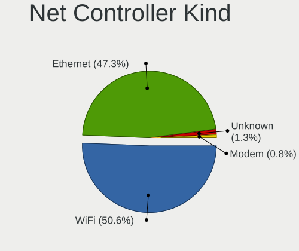

| Kind     | Notebooks | Percent |
|----------|-----------|---------|
| WiFi     | 121       | 50.63%  |
| Ethernet | 113       | 47.28%  |
| Unknown  | 3         | 1.26%   |
| Modem    | 2         | 0.84%   |

Used Controller
---------------

Currently used network controller

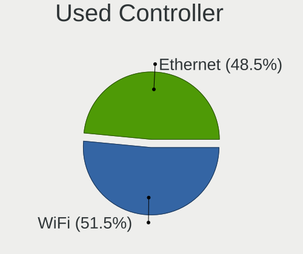

| Kind     | Notebooks | Percent |
|----------|-----------|---------|
| WiFi     | 85        | 51.52%  |
| Ethernet | 80        | 48.48%  |

NICs
----

Total network controllers on board

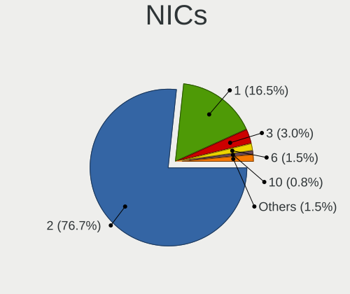

| Total | Notebooks | Percent |
|-------|-----------|---------|
| 2     | 102       | 76.69%  |
| 1     | 22        | 16.54%  |
| 3     | 4         | 3.01%   |
| 6     | 2         | 1.5%    |
| 10    | 1         | 0.75%   |
| 5     | 1         | 0.75%   |
| 4     | 1         | 0.75%   |

IPv6
----

IPv6 vs IPv4

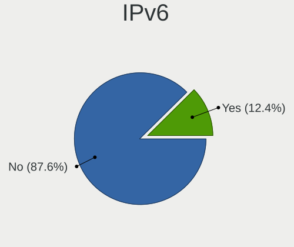

| Used | Notebooks | Percent |
|------|-----------|---------|
| No   | 120       | 87.59%  |
| Yes  | 17        | 12.41%  |

Bluetooth
---------

Bluetooth Vendor
----------------

Controller vendors

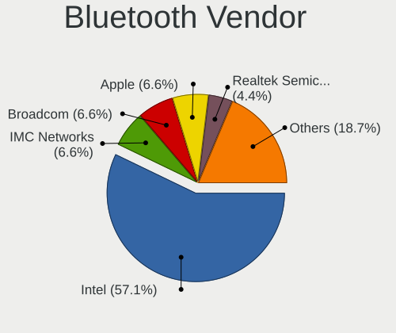

| Vendor                          | Notebooks | Percent |
|---------------------------------|-----------|---------|
| Intel                           | 52        | 57.14%  |
| IMC Networks                    | 6         | 6.59%   |
| Broadcom                        | 6         | 6.59%   |
| Apple                           | 6         | 6.59%   |
| Realtek Semiconductor           | 4         | 4.4%    |
| Qualcomm Atheros Communications | 3         | 3.3%    |
| Foxconn / Hon Hai               | 3         | 3.3%    |
| Cambridge Silicon Radio         | 3         | 3.3%    |
| Lite-On Technology              | 2         | 2.2%    |
| ASUSTek Computer                | 2         | 2.2%    |
| Alps Electric                   | 2         | 2.2%    |
| Toshiba                         | 1         | 1.1%    |
| Hewlett-Packard                 | 1         | 1.1%    |

Bluetooth Model
---------------

Controller models

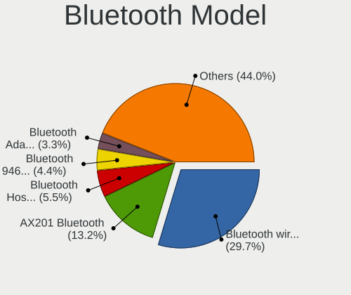

| Model                                                       | Notebooks | Percent |
|-------------------------------------------------------------|-----------|---------|
| Intel Bluetooth wireless interface                          | 27        | 29.67%  |
| Intel AX201 Bluetooth                                       | 12        | 13.19%  |
| Apple Bluetooth Host Controller                             | 5         | 5.49%   |
| Intel Bluetooth 9460/9560 Jefferson Peak (JfP)              | 4         | 4.4%    |
| Realtek Bluetooth Adapter                                   | 3         | 3.3%    |
| Intel AX200 Bluetooth                                       | 3         | 3.3%    |
| Cambridge Silicon Radio Bluetooth Dongle (HCI mode)         | 3         | 3.3%    |
| Broadcom BCM2045B (BDC-2.1)                                 | 3         | 3.3%    |
| IMC Networks MediaTek Bluetooth Adapter                     | 2         | 2.2%    |
| IMC Networks Atheros AR3012 Bluetooth 4.0 Adapter           | 2         | 2.2%    |
| Broadcom BCM20702 Bluetooth 4.0 [ThinkPad]                  | 2         | 2.2%    |
| Alps Electric UGTZ4 Bluetooth                               | 2         | 2.2%    |
| Toshiba ASKEY Bluetooth Controller BTU1030                  | 1         | 1.1%    |
| Realtek Bluetooth 4.0 Adapter                               | 1         | 1.1%    |
| Qualcomm Atheros Dell Wireless 1707 Bluetooth 4.0 LE Device | 1         | 1.1%    |
| Qualcomm Atheros Dell Wireless 1703 Bluetooth               | 1         | 1.1%    |
| Qualcomm Atheros AR3012 Bluetooth 4.0                       | 1         | 1.1%    |
| Lite-On Qualcomm Atheros QCA9377 Bluetooth                  | 1         | 1.1%    |
| Lite-On Broadcom Bluetooth 4.0 USB                          | 1         | 1.1%    |
| Intel Wireless-AC 9260 Bluetooth Adapter                    | 1         | 1.1%    |
| Intel Wireless-AC 3168 Bluetooth                            | 1         | 1.1%    |
| Intel Centrino Bluetooth Wireless Transceiver               | 1         | 1.1%    |
| Intel Centrino Advanced-N 6230 Bluetooth adapter            | 1         | 1.1%    |
| Intel AX211 Bluetooth                                       | 1         | 1.1%    |
| Intel AX210 Bluetooth                                       | 1         | 1.1%    |
| IMC Networks Realtek Bluetooth Adapter                      | 1         | 1.1%    |
| IMC Networks Bluetooth                                      | 1         | 1.1%    |
| HP Bluetooth 2.0 Interface [Broadcom BCM2045]               | 1         | 1.1%    |
| Foxconn / Hon Hai MediaTek Bluetooth Adapter                | 1         | 1.1%    |
| Foxconn / Hon Hai Broadcom BCM20702 Bluetooth USB Device    | 1         | 1.1%    |
| Foxconn / Hon Hai Bluetooth USB Module                      | 1         | 1.1%    |
| Broadcom BCM2045B (BDC-2) [Bluetooth Controller]            | 1         | 1.1%    |
| ASUS Broadcom Bluetooth 2.1                                 | 1         | 1.1%    |
| ASUS Broadcom BCM20702A0 Bluetooth                          | 1         | 1.1%    |
| Apple Built-in Bluetooth 2.0+EDR HCI                        | 1         | 1.1%    |

Sound
-----

Sound Vendor
------------

Sound card vendors

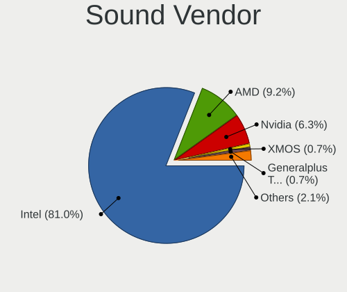

| Vendor                  | Notebooks | Percent |
|-------------------------|-----------|---------|
| Intel                   | 115       | 80.99%  |
| AMD                     | 13        | 9.15%   |
| Nvidia                  | 9         | 6.34%   |
| XMOS                    | 1         | 0.7%    |
| Generalplus Technology  | 1         | 0.7%    |
| Creative Technology     | 1         | 0.7%    |
| Cambridge Silicon Radio | 1         | 0.7%    |
| C-Media Electronics     | 1         | 0.7%    |

Sound Model
-----------

Sound card models

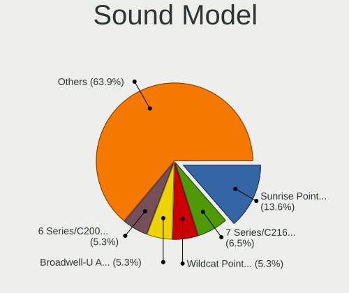

| Model                                                                                             | Notebooks | Percent |
|---------------------------------------------------------------------------------------------------|-----------|---------|
| Intel Sunrise Point-LP HD Audio                                                                   | 23        | 13.61%  |
| Intel 7 Series/C216 Chipset Family High Definition Audio Controller                               | 11        | 6.51%   |
| Intel Wildcat Point-LP High Definition Audio Controller                                           | 9         | 5.33%   |
| Intel Broadwell-U Audio Controller                                                                | 9         | 5.33%   |
| Intel 6 Series/C200 Series Chipset Family High Definition Audio Controller                        | 9         | 5.33%   |
| Intel 8 Series HD Audio Controller                                                                | 8         | 4.73%   |
| Intel 5 Series/3400 Series Chipset High Definition Audio                                          | 8         | 4.73%   |
| Intel Haswell-ULT HD Audio Controller                                                             | 7         | 4.14%   |
| AMD Ryzen HD Audio Controller                                                                     | 7         | 4.14%   |
| Intel Tiger Lake-LP Smart Sound Technology Audio Controller                                       | 6         | 3.55%   |
| Intel NM10/ICH7 Family High Definition Audio Controller                                           | 5         | 2.96%   |
| Intel 82801I (ICH9 Family) HD Audio Controller                                                    | 5         | 2.96%   |
| Intel Cannon Point-LP High Definition Audio Controller                                            | 4         | 2.37%   |
| AMD Renoir/Cezanne HDMI/DP Audio Controller                                                       | 4         | 2.37%   |
| Intel Comet Lake PCH-LP cAVS                                                                      | 3         | 1.78%   |
| Intel 82801H (ICH8 Family) HD Audio Controller                                                    | 3         | 1.78%   |
| AMD FCH Azalia Controller                                                                         | 3         | 1.78%   |
| Nvidia GA106 High Definition Audio Controller                                                     | 2         | 1.18%   |
| Intel Comet Lake PCH cAVS                                                                         | 2         | 1.18%   |
| Intel CM238 HD Audio Controller                                                                   | 2         | 1.18%   |
| Intel Cannon Lake PCH cAVS                                                                        | 2         | 1.18%   |
| Intel Atom/Celeron/Pentium Processor x5-E8000/J3xxx/N3xxx Series High Definition Audio Controller | 2         | 1.18%   |
| Intel 8 Series/C220 Series Chipset High Definition Audio Controller                               | 2         | 1.18%   |
| Intel 100 Series/C230 Series Chipset Family HD Audio Controller                                   | 2         | 1.18%   |
| AMD Trinity HDMI Audio Controller                                                                 | 2         | 1.18%   |
| AMD RV710/730 HDMI Audio [Radeon HD 4000 series]                                                  | 2         | 1.18%   |
| XMOS USB Audio                                                                                    | 1         | 0.59%   |
| XMOS iFi (by AMR) HD USB Audio                                                                    | 1         | 0.59%   |
| Nvidia TU107 GeForce GTX 1650 High Definition Audio Controller                                    | 1         | 0.59%   |
| Nvidia MCP89 High Definition Audio                                                                | 1         | 0.59%   |
| Nvidia MCP79 High Definition Audio                                                                | 1         | 0.59%   |
| Nvidia High Definition Audio Controller                                                           | 1         | 0.59%   |
| Nvidia GM107 High Definition Audio Controller [GeForce 940MX]                                     | 1         | 0.59%   |
| Nvidia GK107 HDMI Audio Controller                                                                | 1         | 0.59%   |
| Nvidia GA107 High Definition Audio Controller                                                     | 1         | 0.59%   |
| Intel Xeon E3-1200 v3/4th Gen Core Processor HD Audio Controller                                  | 1         | 0.59%   |
| Intel Tiger Lake-H HD Audio Controller                                                            | 1         | 0.59%   |
| Intel Raptor Lake-P/U/H cAVS                                                                      | 1         | 0.59%   |
| Intel Meteor Lake-P HD Audio Controller                                                           | 1         | 0.59%   |
| Intel Jasper Lake HD Audio                                                                        | 1         | 0.59%   |

Memory
------

Memory Vendor
-------------

Memory module vendors

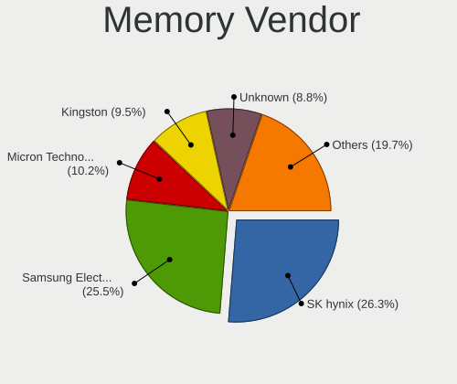

| Vendor              | Notebooks | Percent |
|---------------------|-----------|---------|
| SK hynix            | 36        | 26.28%  |
| Samsung Electronics | 35        | 25.55%  |
| Micron Technology   | 14        | 10.22%  |
| Kingston            | 13        | 9.49%   |
| Unknown             | 12        | 8.76%   |
| Crucial             | 5         | 3.65%   |
| Unknown             | 5         | 3.65%   |
| Transcend           | 3         | 2.19%   |
| Corsair             | 3         | 2.19%   |
| Elpida              | 2         | 1.46%   |
| A-DATA Technology   | 2         | 1.46%   |
| Unknown (ABCD)      | 1         | 0.73%   |
| Ramaxel Technology  | 1         | 0.73%   |
| Patriot             | 1         | 0.73%   |
| Nanya Technology    | 1         | 0.73%   |
| KingFast            | 1         | 0.73%   |
| G.Skill             | 1         | 0.73%   |
| 268c                | 1         | 0.73%   |

Memory Model
------------

Memory module models

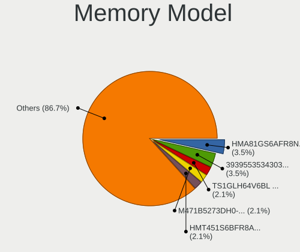

| Model                                                            | Notebooks | Percent |
|------------------------------------------------------------------|-----------|---------|
| SK hynix RAM HMA81GS6AFR8N-UH 8GB SODIMM DDR4 2400MT/s           | 5         | 3.5%    |
| Unknown                                                          | 5         | 3.5%    |
| Transcend RAM TS1GLH64V6BL 8GB SODIMM DDR4 2667MT/s              | 3         | 2.1%    |
| SK hynix RAM HMT451S6BFR8A-PB 4GB SODIMM DDR3 1600MT/s           | 3         | 2.1%    |
| SK hynix RAM HMT451S6AFR8A-PB 4GB SODIMM DDR3 1600MT/s           | 3         | 2.1%    |
| Samsung RAM M471B5273DH0-CH9 4GB SODIMM DDR3 1334MT/s            | 3         | 2.1%    |
| Unknown RAM Module 4GB SODIMM DDR3 1333MT/s                      | 2         | 1.4%    |
| Unknown RAM Module 1GB SODIMM DDR2                               | 2         | 1.4%    |
| SK hynix RAM HMT351S6CFR8C-PB 4GB SODIMM DDR3 1600MT/s           | 2         | 1.4%    |
| SK hynix RAM HMT325S6BFR8C-H9 2GB SODIMM DDR3 1333MT/s           | 2         | 1.4%    |
| SK hynix RAM HMA82GS6CJR8N-VK 16GB SODIMM DDR4 2667MT/s          | 2         | 1.4%    |
| Samsung RAM M471B5673FH0-CF8 2GB SODIMM DDR3 1067MT/s            | 2         | 1.4%    |
| Samsung RAM M471B5673EH1-CF8 2GB SODIMM DDR3 1067MT/s            | 2         | 1.4%    |
| Samsung RAM M471B5273DH0-CK0 8GB SODIMM DDR3 1600MT/s            | 2         | 1.4%    |
| Samsung RAM M471B5173QH0-YK0 4GB SODIMM DDR3 1600MT/s            | 2         | 1.4%    |
| Samsung RAM M471B5173BH0-CK0 4GB SODIMM DDR3 1600MT/s            | 2         | 1.4%    |
| Samsung RAM M471A2K43BB1-CRC 16GB SODIMM DDR4 2400MT/s           | 2         | 1.4%    |
| Samsung RAM M471A1K43CB1-CTD 8GB SODIMM DDR4 3200MT/s            | 2         | 1.4%    |
| Samsung RAM M471A1K43BB0-CPB 8GB SODIMM DDR4 2133MT/s            | 2         | 1.4%    |
| Unknown RAM Module 8GB SODIMM DDR4 2400MT/s                      | 1         | 0.7%    |
| Unknown RAM Module 8GB SODIMM DDR3 1333MT/s                      | 1         | 0.7%    |
| Unknown RAM Module 512MB SODIMM SDRAM                            | 1         | 0.7%    |
| Unknown RAM Module 4096MB SODIMM DDR2                            | 1         | 0.7%    |
| Unknown RAM Module 2GB SODIMM DDR3 1067MT/s                      | 1         | 0.7%    |
| Unknown RAM Module 2GB SODIMM DDR2 667MT/s                       | 1         | 0.7%    |
| Unknown RAM Module 2048MB SODIMM SDRAM                           | 1         | 0.7%    |
| Unknown RAM Module 2048MB SODIMM DDR2 667MT/s                    | 1         | 0.7%    |
| Unknown (ABCD) RAM 123456789012345678 1GB SODIMM LPDDR4 2400MT/s | 1         | 0.7%    |
| SK hynix RAM Module 8GB SODIMM DDR4 2133MT/s                     | 1         | 0.7%    |
| SK hynix RAM Module 4GB SODIMM DDR3 1600MT/s                     | 1         | 0.7%    |
| SK hynix RAM HYMP112S64CP6-Y5 1GB SODIMM DDR 667MT/s             | 1         | 0.7%    |
| SK hynix RAM HMT425S6AFR6A-PB 2GB SODIMM DDR3 3200MT/s           | 1         | 0.7%    |
| SK hynix RAM HMT41GS6BFR8A-PB 8GB SODIMM DDR3 1600MT/s           | 1         | 0.7%    |
| SK hynix RAM HMT41GS6AFR8A-PB 8GB SODIMM DDR3 1600MT/s           | 1         | 0.7%    |
| SK hynix RAM HMT351S6EFR8A-PB 4GB SODIMM DDR3 1600MT/s           | 1         | 0.7%    |
| SK hynix RAM HMT351S6BFR8C-H9 4GB SODIMM DDR3 1333MT/s           | 1         | 0.7%    |
| SK hynix RAM HMT325S6CFR8C-H9 2GB SODIMM DDR3 1333MT/s           | 1         | 0.7%    |
| SK hynix RAM HMT112S6AFP6C-G7 1GB SODIMM 800MT/s                 | 1         | 0.7%    |
| SK hynix RAM HMCG78MEBSA092N 16GB SODIMM DDR5 4800MT/s           | 1         | 0.7%    |
| SK hynix RAM HMAG68EXNSA051N 8GB SODIMM DDR4 3200MT/s            | 1         | 0.7%    |

Memory Kind
-----------

Memory module kinds

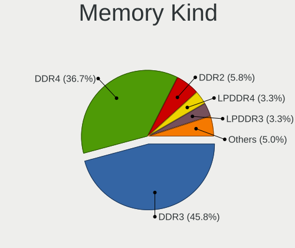

| Kind    | Notebooks | Percent |
|---------|-----------|---------|
| DDR3    | 55        | 45.83%  |
| DDR4    | 44        | 36.67%  |
| DDR2    | 7         | 5.83%   |
| LPDDR4  | 4         | 3.33%   |
| LPDDR3  | 4         | 3.33%   |
| SDRAM   | 3         | 2.5%    |
| DDR5    | 2         | 1.67%   |
| Unknown | 1         | 0.83%   |

Memory Form Factor
------------------

Physical design of the memory module

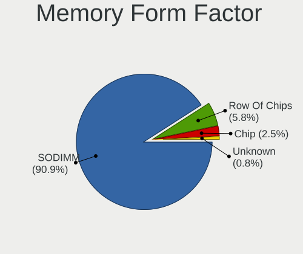

| Name         | Notebooks | Percent |
|--------------|-----------|---------|
| SODIMM       | 110       | 90.91%  |
| Row Of Chips | 7         | 5.79%   |
| Chip         | 3         | 2.48%   |
| Unknown      | 1         | 0.83%   |

Memory Size
-----------

Memory module size

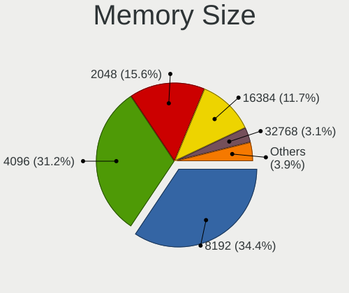

| Size  | Notebooks | Percent |
|-------|-----------|---------|
| 8192  | 44        | 34.38%  |
| 4096  | 40        | 31.25%  |
| 2048  | 20        | 15.63%  |
| 16384 | 15        | 11.72%  |
| 32768 | 4         | 3.13%   |
| 1024  | 4         | 3.13%   |
| 512   | 1         | 0.78%   |

Memory Speed
------------

Memory module speed

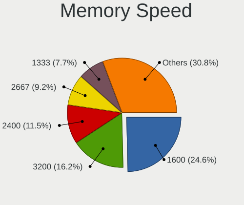

| Speed   | Notebooks | Percent |
|---------|-----------|---------|
| 1600    | 32        | 24.62%  |
| 3200    | 21        | 16.15%  |
| 2400    | 15        | 11.54%  |
| 2667    | 12        | 9.23%   |
| 1333    | 10        | 7.69%   |
| 2133    | 8         | 6.15%   |
| 1067    | 8         | 6.15%   |
| 1334    | 6         | 4.62%   |
| Unknown | 6         | 4.62%   |
| 667     | 4         | 3.08%   |
| 4267    | 2         | 1.54%   |
| 1867    | 2         | 1.54%   |
| 800     | 2         | 1.54%   |
| 5600    | 1         | 0.77%   |
| 4800    | 1         | 0.77%   |

Printers & scanners
-------------------

Printer Vendor
--------------

Printer device vendors

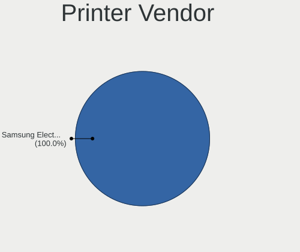

| Vendor              | Notebooks | Percent |
|---------------------|-----------|---------|
| Samsung Electronics | 1         | 100%    |

Printer Model
-------------

Printer device models

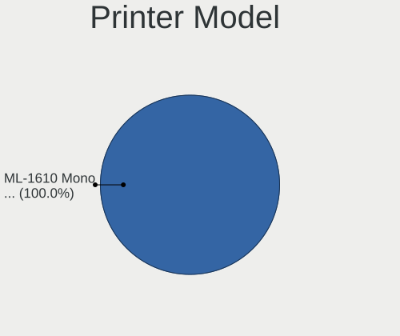

| Model                              | Notebooks | Percent |
|------------------------------------|-----------|---------|
| Samsung ML-1610 Mono Laser Printer | 1         | 100%    |

Scanner Vendor
--------------

Scanner device vendors

Zero info for selected period =(

Scanner Model
-------------

Scanner device models

Zero info for selected period =(

Camera
------

Camera Vendor
-------------

Camera device vendors

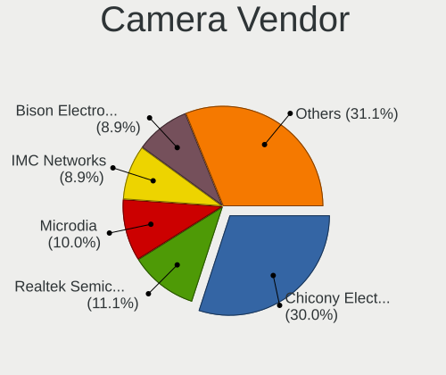

| Vendor                        | Notebooks | Percent |
|-------------------------------|-----------|---------|
| Chicony Electronics           | 27        | 30%     |
| Realtek Semiconductor         | 10        | 11.11%  |
| Microdia                      | 9         | 10%     |
| IMC Networks                  | 8         | 8.89%   |
| Bison Electronics             | 8         | 8.89%   |
| Lite-On Technology            | 6         | 6.67%   |
| Sunplus Innovation Technology | 4         | 4.44%   |
| Luxvisions Innotech Limited   | 4         | 4.44%   |
| Syntek                        | 2         | 2.22%   |
| Suyin                         | 2         | 2.22%   |
| Apple                         | 2         | 2.22%   |
| Silicon Motion                | 1         | 1.11%   |
| Ricoh                         | 1         | 1.11%   |
| Quanta                        | 1         | 1.11%   |
| Primax Electronics            | 1         | 1.11%   |
| Lenovo                        | 1         | 1.11%   |
| Dynex                         | 1         | 1.11%   |
| ALi                           | 1         | 1.11%   |
| Alcor Micro                   | 1         | 1.11%   |

Camera Model
------------

Camera device models

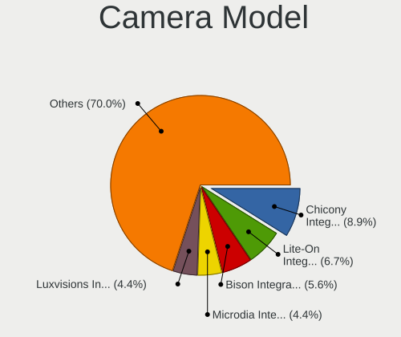

| Model                                                       | Notebooks | Percent |
|-------------------------------------------------------------|-----------|---------|
| Chicony Integrated Camera                                   | 8         | 8.89%   |
| Lite-On Integrated Camera                                   | 6         | 6.67%   |
| Bison Integrated Camera                                     | 5         | 5.56%   |
| Microdia Integrated_Webcam_HD                               | 4         | 4.44%   |
| Luxvisions Innotech Limited Integrated Camera               | 4         | 4.44%   |
| IMC Networks Integrated Camera                              | 3         | 3.33%   |
| Chicony HD Webcam                                           | 3         | 3.33%   |
| Realtek Integrated Webcam HD                                | 2         | 2.22%   |
| Chicony TOSHIBA Web Camera - HD                             | 2         | 2.22%   |
| Chicony Integrated Camera [ThinkPad]                        | 2         | 2.22%   |
| Chicony 2.0M UVC Webcam / CNF7129                           | 2         | 2.22%   |
| Syntek Lenovo EasyCamera                                    | 1         | 1.11%   |
| Syntek Integrated Camera                                    | 1         | 1.11%   |
| Suyin Acer/HP Integrated Webcam [CN0314]                    | 1         | 1.11%   |
| Suyin 1.3M WebCam (notebook emachines E730, Acer sub-brand) | 1         | 1.11%   |
| Sunplus Laptop_Integrated_Webcam_FHD                        | 1         | 1.11%   |
| Sunplus Integrated_Webcam_HD                                | 1         | 1.11%   |
| Sunplus ASUS Webcam                                         | 1         | 1.11%   |
| Sunplus 2-USB 2.0 Camera                                    | 1         | 1.11%   |
| Silicon Motion Lenovo EasyCamera                            | 1         | 1.11%   |
| Ricoh Integrated Webcam                                     | 1         | 1.11%   |
| Realtek USB2.0 HD UVC WebCam                                | 1         | 1.11%   |
| Realtek USB 2.0 PC Camera                                   | 1         | 1.11%   |
| Realtek PC Camera                                           | 1         | 1.11%   |
| Realtek Laptop Camera                                       | 1         | 1.11%   |
| Realtek Integrated_Webcam_HD                                | 1         | 1.11%   |
| Realtek Integrated Webcam                                   | 1         | 1.11%   |
| Realtek Integrated Camera                                   | 1         | 1.11%   |
| Realtek HD Webcam - Realtek                                 | 1         | 1.11%   |
| Quanta Realtek PC Camera                                    | 1         | 1.11%   |
| Primax HP HD Webcam [Fixed]                                 | 1         | 1.11%   |
| Microdia Sonix USB 2.0 Camera                               | 1         | 1.11%   |
| Microdia Laptop_Integrated_Webcam_E4HD                      | 1         | 1.11%   |
| Microdia Laptop_Integrated_Webcam_2M                        | 1         | 1.11%   |
| Microdia Integrated Webcam HD                               | 1         | 1.11%   |
| Microdia Integrated Webcam                                  | 1         | 1.11%   |
| Lenovo Integrated Webcam [R5U877]                           | 1         | 1.11%   |
| IMC Networks UVC VGA Webcam                                 | 1         | 1.11%   |
| IMC Networks Realtek PC Camera                              | 1         | 1.11%   |
| IMC Networks Realtek DMFT RGB                               | 1         | 1.11%   |

Security
--------

Fingerprint Vendor
------------------

Fingerprint sensor vendors

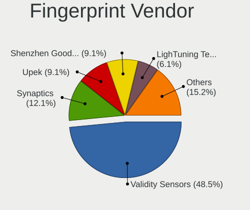

| Vendor                     | Notebooks | Percent |
|----------------------------|-----------|---------|
| Validity Sensors           | 16        | 48.48%  |
| Synaptics                  | 4         | 12.12%  |
| Upek                       | 3         | 9.09%   |
| Shenzhen Goodix Technology | 3         | 9.09%   |
| LighTuning Technology      | 2         | 6.06%   |
| Elan Microelectronics      | 2         | 6.06%   |
| AuthenTec                  | 2         | 6.06%   |
| Fingerprint Cards          | 1         | 3.03%   |

Fingerprint Model
-----------------

Fingerprint sensor models

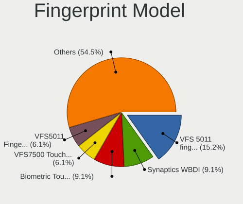

| Model                                                  | Notebooks | Percent |
|--------------------------------------------------------|-----------|---------|
| Validity Sensors VFS 5011 fingerprint sensor           | 5         | 15.15%  |
| Validity Sensors Synaptics WBDI                        | 3         | 9.09%   |
| Upek Biometric Touchchip/Touchstrip Fingerprint Sensor | 3         | 9.09%   |
| Validity Sensors VFS7500 Touch Fingerprint Sensor      | 2         | 6.06%   |
| Validity Sensors VFS5011 Fingerprint Reader            | 2         | 6.06%   |
| Synaptics Prometheus MIS Touch Fingerprint Reader      | 2         | 6.06%   |
| Synaptics Metallica MIS Touch Fingerprint Reader       | 2         | 6.06%   |
| Shenzhen Goodix Fingerprint Reader                     | 2         | 6.06%   |
| LighTuning EgisTec Touch Fingerprint Sensor            | 2         | 6.06%   |
| Elan Fingerprint Sensor                                | 2         | 6.06%   |
| Validity Sensors VFS495 Fingerprint Reader             | 1         | 3.03%   |
| Validity Sensors VFS491                                | 1         | 3.03%   |
| Validity Sensors VFS Fingerprint sensor                | 1         | 3.03%   |
| Validity Sensors Fingerprint scanner                   | 1         | 3.03%   |
| Shenzhen Goodix Fingerprint Reader SGX                 | 1         | 3.03%   |
| Fingerprint Cards FPC Fingerprint Reader               | 1         | 3.03%   |
| AuthenTec AES2660                                      | 1         | 3.03%   |
| AuthenTec AES2501 Fingerprint Sensor                   | 1         | 3.03%   |

Chipcard Vendor
---------------

Chipcard module vendors

Zero info for selected period =(

Chipcard Model
--------------

Chipcard module models

Zero info for selected period =(

Unsupported
-----------

Unsupported Devices
-------------------

Total unsupported devices on board

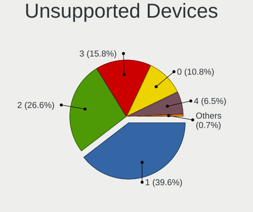

| Total | Notebooks | Percent |
|-------|-----------|---------|
| 1     | 55        | 39.57%  |
| 2     | 37        | 26.62%  |
| 3     | 22        | 15.83%  |
| 0     | 15        | 10.79%  |
| 4     | 9         | 6.47%   |
| 5     | 1         | 0.72%   |

Unsupported Device Types
------------------------

Types of unsupported devices

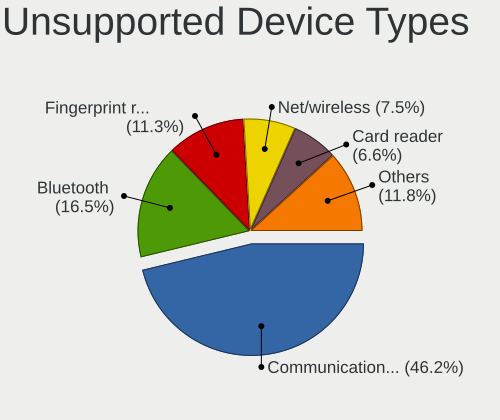

| Type                     | Notebooks | Percent |
|--------------------------|-----------|---------|
| Communication controller | 98        | 46.23%  |
| Bluetooth                | 35        | 16.51%  |
| Fingerprint reader       | 24        | 11.32%  |
| Net/wireless             | 16        | 7.55%   |
| Card reader              | 14        | 6.6%    |
| Firewire controller      | 11        | 5.19%   |
| Sound                    | 4         | 1.89%   |
| Graphics card            | 4         | 1.89%   |
| Storage                  | 2         | 0.94%   |
| Net/ethernet             | 2         | 0.94%   |
| Storage/ata              | 1         | 0.47%   |
| Network                  | 1         | 0.47%   |

