BSD in Canada - Tested Hardware & Statistics
--------------------------------------------

A project to collect tested hardware configurations for BSD in Canada.

Anyone can contribute to this report by the [hw-probe](https://github.com/linuxhw/hw-probe/blob/master/INSTALL.BSD.md) tool:

    hw-probe -all -upload

Please contribute! Especially if your hardware is rare.

This is a report for all computer types. See also reports for [desktops](/Location/Canada/Desktop/README.md) and [notebooks](/Location/Canada/Notebook/README.md).

Contents
--------

* [ Test Cases ](#test-cases)

* [ System ](#system)
  - [ OS                       ](#os)
  - [ OS Family                ](#os-family)
  - [ Arch                     ](#arch)
  - [ DE                       ](#de)
  - [ Display Server           ](#display-server)
  - [ Display Manager          ](#display-manager)
  - [ OS Lang                  ](#os-lang)
  - [ Boot Mode                ](#boot-mode)
  - [ Filesystem               ](#filesystem)
  - [ Part. scheme             ](#part-scheme)

* [ Board ](#board)
  - [ Vendor                   ](#vendor)
  - [ Model                    ](#model)
  - [ Model Family             ](#model-family)
  - [ MFG Year                 ](#mfg-year)
  - [ Form Factor              ](#form-factor)
  - [ Coreboot                 ](#coreboot)
  - [ RAM Size                 ](#ram-size)
  - [ RAM Used                 ](#ram-used)
  - [ Total Drives             ](#total-drives)
  - [ Has CD-ROM               ](#has-cd-rom)
  - [ Has Ethernet             ](#has-ethernet)
  - [ Has WiFi                 ](#has-wifi)
  - [ Has Bluetooth            ](#has-bluetooth)

* [ Location ](#location)
  - [ Country                  ](#country)
  - [ City                     ](#city)

* [ Drives ](#drives)
  - [ Drive Vendor             ](#drive-vendor)
  - [ Drive Model              ](#drive-model)
  - [ HDD Vendor               ](#hdd-vendor)
  - [ SSD Vendor               ](#ssd-vendor)
  - [ Drive Kind               ](#drive-kind)
  - [ Drive Connector          ](#drive-connector)
  - [ Drive Size               ](#drive-size)
  - [ Space Total              ](#space-total)
  - [ Space Used               ](#space-used)
  - [ Malfunc. Drives          ](#malfunc-drives)
  - [ Malfunc. Drive Vendor    ](#malfunc-drive-vendor)
  - [ Malfunc. HDD Vendor      ](#malfunc-hdd-vendor)
  - [ Malfunc. Drive Kind      ](#malfunc-drive-kind)
  - [ Failed Drives            ](#failed-drives)
  - [ Failed Drive Vendor      ](#failed-drive-vendor)
  - [ Drive Status             ](#drive-status)

* [ Storage controller ](#storage-controller)
  - [ Storage Vendor           ](#storage-vendor)
  - [ Storage Model            ](#storage-model)
  - [ Storage Kind             ](#storage-kind)

* [ Processor ](#processor)
  - [ CPU Vendor               ](#cpu-vendor)
  - [ CPU Model                ](#cpu-model)
  - [ CPU Model Family         ](#cpu-model-family)
  - [ CPU Cores                ](#cpu-cores)
  - [ CPU Sockets              ](#cpu-sockets)
  - [ CPU Threads              ](#cpu-threads)
  - [ CPU Microarch            ](#cpu-microarch)

* [ Graphics ](#graphics)
  - [ GPU Vendor               ](#gpu-vendor)
  - [ GPU Model                ](#gpu-model)
  - [ GPU Combo                ](#gpu-combo)
  - [ GPU Driver               ](#gpu-driver)
  - [ GPU Memory               ](#gpu-memory)

* [ Monitor ](#monitor)
  - [ Monitor Vendor           ](#monitor-vendor)
  - [ Monitor Model            ](#monitor-model)
  - [ Monitor Resolution       ](#monitor-resolution)
  - [ Monitor Diagonal         ](#monitor-diagonal)
  - [ Monitor Width            ](#monitor-width)
  - [ Aspect Ratio             ](#aspect-ratio)
  - [ Monitor Area             ](#monitor-area)
  - [ Pixel Density            ](#pixel-density)
  - [ Multiple Monitors        ](#multiple-monitors)

* [ Network ](#network)
  - [ Net Controller Vendor    ](#net-controller-vendor)
  - [ Net Controller Model     ](#net-controller-model)
  - [ Wireless Vendor          ](#wireless-vendor)
  - [ Wireless Model           ](#wireless-model)
  - [ Ethernet Vendor          ](#ethernet-vendor)
  - [ Ethernet Model           ](#ethernet-model)
  - [ Net Controller Kind      ](#net-controller-kind)
  - [ Used Controller          ](#used-controller)
  - [ NICs                     ](#nics)
  - [ IPv6                     ](#ipv6)

* [ Bluetooth ](#bluetooth)
  - [ Bluetooth Vendor         ](#bluetooth-vendor)
  - [ Bluetooth Model          ](#bluetooth-model)

* [ Sound ](#sound)
  - [ Sound Vendor             ](#sound-vendor)
  - [ Sound Model              ](#sound-model)

* [ Memory ](#memory)
  - [ Memory Vendor            ](#memory-vendor)
  - [ Memory Model             ](#memory-model)
  - [ Memory Kind              ](#memory-kind)
  - [ Memory Form Factor       ](#memory-form-factor)
  - [ Memory Size              ](#memory-size)
  - [ Memory Speed             ](#memory-speed)

* [ Printers & scanners ](#printers--scanners)
  - [ Printer Vendor           ](#printer-vendor)
  - [ Printer Model            ](#printer-model)
  - [ Scanner Vendor           ](#scanner-vendor)
  - [ Scanner Model            ](#scanner-model)

* [ Camera ](#camera)
  - [ Camera Vendor            ](#camera-vendor)
  - [ Camera Model             ](#camera-model)

* [ Security ](#security)
  - [ Fingerprint Vendor       ](#fingerprint-vendor)
  - [ Fingerprint Model        ](#fingerprint-model)
  - [ Chipcard Vendor          ](#chipcard-vendor)
  - [ Chipcard Model           ](#chipcard-model)

* [ Unsupported ](#unsupported)
  - [ Unsupported Devices      ](#unsupported-devices)
  - [ Unsupported Device Types ](#unsupported-device-types)

Test Cases
----------

Total: 1273

| Vendor        | Model                       | Form-Factor | Probe                                                     | Date         |
|---------------|-----------------------------|-------------|-----------------------------------------------------------|--------------|
| Dell          | 04Y8V0 A02                  | Desktop     | [1d20d5fd79](https://bsd-hardware.info/?probe=1d20d5fd79) | Jan 05, 2025 |
| Dell          | 0FDY5C A00                  | Desktop     | [f0d39986e9](https://bsd-hardware.info/?probe=f0d39986e9) | Jan 04, 2025 |
| Lenovo        | 3102 SDK0J40697 WIN 3305... | Desktop     | [686b424a28](https://bsd-hardware.info/?probe=686b424a28) | Jan 02, 2025 |
| Unknown       | Unknown                     | Desktop     | [d06ccdd495](https://bsd-hardware.info/?probe=d06ccdd495) | Dec 31, 2024 |
| ZOTAC         | ZBOX-CI323NANO              | Mini pc     | [4cbc277f66](https://bsd-hardware.info/?probe=4cbc277f66) | Dec 30, 2024 |
| ZOTAC         | ZBOX-CI323NANO              | Mini pc     | [55689ced36](https://bsd-hardware.info/?probe=55689ced36) | Dec 30, 2024 |
| Intel         | DQ77KB AAG40294-402         | Desktop     | [9db11dd0c9](https://bsd-hardware.info/?probe=9db11dd0c9) | Dec 28, 2024 |
| Gigabyte      | Z790 AORUS MASTER X         | Desktop     | [d8022a2734](https://bsd-hardware.info/?probe=d8022a2734) | Dec 24, 2024 |
| Dell          | 0D28YY A00                  | Desktop     | [97d068af1e](https://bsd-hardware.info/?probe=97d068af1e) | Dec 21, 2024 |
| Bomgar        | 0XN8Y6 A07                  | Server      | [86114cd837](https://bsd-hardware.info/?probe=86114cd837) | Dec 19, 2024 |
| Unknown       | Unknown                     | Desktop     | [e79ae3cc67](https://bsd-hardware.info/?probe=e79ae3cc67) | Dec 19, 2024 |
| Lenovo        | ThinkBook 14 G2 ARE 20VF    | Notebook    | [1aec80e256](https://bsd-hardware.info/?probe=1aec80e256) | Dec 18, 2024 |
| Unknown       | Unknown                     | Desktop     | [b4adf727f6](https://bsd-hardware.info/?probe=b4adf727f6) | Dec 16, 2024 |
| Unknown       | Unknown                     | Desktop     | [e2839ab569](https://bsd-hardware.info/?probe=e2839ab569) | Dec 16, 2024 |
| Unknown       | Unknown                     | Desktop     | [db147012b7](https://bsd-hardware.info/?probe=db147012b7) | Dec 15, 2024 |
| Protectli     | FW6 Ver                     | Desktop     | [f6adfa6006](https://bsd-hardware.info/?probe=f6adfa6006) | Dec 15, 2024 |
| Gigabyte      | M68MT-S2                    | Desktop     | [87ce6d4615](https://bsd-hardware.info/?probe=87ce6d4615) | Dec 13, 2024 |
| MSI           | MAG B550 TOMAHAWK           | Desktop     | [2fb19b27c9](https://bsd-hardware.info/?probe=2fb19b27c9) | Dec 13, 2024 |
| Dell          | 0D28YY A00                  | Desktop     | [bd7757d88d](https://bsd-hardware.info/?probe=bd7757d88d) | Dec 08, 2024 |
| Unknown       | Unknown                     | Mini pc     | [137ac383dd](https://bsd-hardware.info/?probe=137ac383dd) | Dec 08, 2024 |
| ASUSTek       | ROG STRIX X870E-E GAMING... | Desktop     | [4edaabd936](https://bsd-hardware.info/?probe=4edaabd936) | Dec 07, 2024 |
| Protectli     | VP2410 10                   | Desktop     | [0d08c971b8](https://bsd-hardware.info/?probe=0d08c971b8) | Dec 07, 2024 |
| Dell          | 0MFXTY A02                  | Server      | [38dcdd5ffe](https://bsd-hardware.info/?probe=38dcdd5ffe) | Dec 05, 2024 |
| Bomgar        | 0XN8Y6 A07                  | Server      | [4088468706](https://bsd-hardware.info/?probe=4088468706) | Dec 05, 2024 |
| Gigabyte      | 2AC8                        | Desktop     | [c18b3da04b](https://bsd-hardware.info/?probe=c18b3da04b) | Dec 04, 2024 |
| Gigabyte      | H81M-HD2                    | Desktop     | [2c74776cf6](https://bsd-hardware.info/?probe=2c74776cf6) | Dec 04, 2024 |
| AZW           | EQ                          | Desktop     | [8f20d42e6e](https://bsd-hardware.info/?probe=8f20d42e6e) | Dec 04, 2024 |
| Supermicro    | X10SLL-F                    | Server      | [20dfe1669b](https://bsd-hardware.info/?probe=20dfe1669b) | Dec 04, 2024 |
| Alienware     | m15 R6                      | Notebook    | [477e29857e](https://bsd-hardware.info/?probe=477e29857e) | Dec 03, 2024 |
| Alienware     | m15 R6                      | Notebook    | [b19c3ccd89](https://bsd-hardware.info/?probe=b19c3ccd89) | Dec 02, 2024 |
| Intel         | X79 (INTEL Xeon E5/Corei... | Desktop     | [e3cc180fdd](https://bsd-hardware.info/?probe=e3cc180fdd) | Dec 02, 2024 |
| MSI           | H61M-P21                    | Desktop     | [55ae602922](https://bsd-hardware.info/?probe=55ae602922) | Dec 02, 2024 |
| Unknown       | Unknown                     | Desktop     | [c3a9c1cbc8](https://bsd-hardware.info/?probe=c3a9c1cbc8) | Dec 02, 2024 |
| Intel         | DCP847SKE G80890-105        | Desktop     | [29d05d280a](https://bsd-hardware.info/?probe=29d05d280a) | Dec 02, 2024 |
| Protectli     | FW6                         | Desktop     | [3d8bb2e6ef](https://bsd-hardware.info/?probe=3d8bb2e6ef) | Dec 01, 2024 |
| ASUSTek       | ROG STRIX X670E-F GAMING... | Desktop     | [ee30758c43](https://bsd-hardware.info/?probe=ee30758c43) | Nov 30, 2024 |
| Yanling       | YL-KBR6L Ver:1.00           | Desktop     | [2af8f99a1c](https://bsd-hardware.info/?probe=2af8f99a1c) | Nov 29, 2024 |
| AZW           | GK mini                     | Mini pc     | [9825440c1f](https://bsd-hardware.info/?probe=9825440c1f) | Nov 28, 2024 |
| Intel         | S1200RP_SE G62252-406       | Server      | [99d48c9cc8](https://bsd-hardware.info/?probe=99d48c9cc8) | Nov 28, 2024 |
| Intel         | NUC5i3RYB K23918-501        | Mini pc     | [41e7363228](https://bsd-hardware.info/?probe=41e7363228) | Nov 25, 2024 |
| Deciso        | Netboard A8                 | Desktop     | [5b1cde4aac](https://bsd-hardware.info/?probe=5b1cde4aac) | Nov 24, 2024 |
| Bomgar        | 0XN8Y6 A07                  | Server      | [695d0d32ba](https://bsd-hardware.info/?probe=695d0d32ba) | Nov 23, 2024 |
| Intel         | DG45ID AAE27729-307         | Desktop     | [14f367aa0a](https://bsd-hardware.info/?probe=14f367aa0a) | Nov 23, 2024 |
| Intel         | CARLOW                      | Desktop     | [b58da7d85d](https://bsd-hardware.info/?probe=b58da7d85d) | Nov 21, 2024 |
| Dell          | 00V62H A00                  | Desktop     | [22f8452e6d](https://bsd-hardware.info/?probe=22f8452e6d) | Nov 20, 2024 |
| ASRockRack    | X470D4U2-2T                 | Desktop     | [638b70ebe3](https://bsd-hardware.info/?probe=638b70ebe3) | Nov 20, 2024 |
| Unknown       | Unknown                     | Desktop     | [5c3daa7361](https://bsd-hardware.info/?probe=5c3daa7361) | Nov 20, 2024 |
| Intel         | S1200RP_SE G62252-406       | Server      | [1db3ef4192](https://bsd-hardware.info/?probe=1db3ef4192) | Nov 17, 2024 |
| ASUSTek       | M5A97 LE R2.0               | Desktop     | [7aae707db6](https://bsd-hardware.info/?probe=7aae707db6) | Nov 17, 2024 |
| ASUSTek       | ROG STRIX B450-F GAMING ... | Desktop     | [e337ee0494](https://bsd-hardware.info/?probe=e337ee0494) | Nov 14, 2024 |
| Unknown       | Unknown                     | Desktop     | [63da6bf4a3](https://bsd-hardware.info/?probe=63da6bf4a3) | Nov 13, 2024 |
| Gigabyte      | 2AC8                        | Desktop     | [0866ab9c03](https://bsd-hardware.info/?probe=0866ab9c03) | Nov 12, 2024 |
| CWWK          | MINIPC-G12                  | Desktop     | [95728c8f3f](https://bsd-hardware.info/?probe=95728c8f3f) | Nov 12, 2024 |
| Unknown       | Unknown                     | Desktop     | [66f4c037b4](https://bsd-hardware.info/?probe=66f4c037b4) | Nov 11, 2024 |
| Intel         | NUC9i5QNB K49247-403        | Mini pc     | [945c78748f](https://bsd-hardware.info/?probe=945c78748f) | Nov 10, 2024 |
| HP            | 805D                        | Desktop     | [eee32d882b](https://bsd-hardware.info/?probe=eee32d882b) | Nov 07, 2024 |
| CheckPoint    | T-180-00                    | Desktop     | [0d54372aff](https://bsd-hardware.info/?probe=0d54372aff) | Nov 05, 2024 |
| Intel         | NUC10i7FNB K61360-304       | Mini pc     | [cf1f1b90ea](https://bsd-hardware.info/?probe=cf1f1b90ea) | Nov 04, 2024 |
| Unknown       | Unknown                     | Desktop     | [e2322b3441](https://bsd-hardware.info/?probe=e2322b3441) | Nov 03, 2024 |
| AZW           | Green G1                    | Desktop     | [e7ca5d5578](https://bsd-hardware.info/?probe=e7ca5d5578) | Nov 02, 2024 |
| ASUSTek       | ROG STRIX B450-F GAMING ... | Desktop     | [0c3e394182](https://bsd-hardware.info/?probe=0c3e394182) | Oct 30, 2024 |
| Unknown       | Unknown                     | Desktop     | [44c67eed86](https://bsd-hardware.info/?probe=44c67eed86) | Oct 30, 2024 |
| Protectli     | VP2410 10                   | Desktop     | [c8fd0713b0](https://bsd-hardware.info/?probe=c8fd0713b0) | Oct 30, 2024 |
| CncTion       | N5105-4L B0                 | Desktop     | [a95688132e](https://bsd-hardware.info/?probe=a95688132e) | Oct 28, 2024 |
| Bomgar        | 0XN8Y6 A07                  | Server      | [1514a1653d](https://bsd-hardware.info/?probe=1514a1653d) | Oct 28, 2024 |
| Unknown       | Unknown                     | Mini pc     | [b029fb1cdd](https://bsd-hardware.info/?probe=b029fb1cdd) | Oct 28, 2024 |
| Panasonic     | CF-52PFPBSFQ                | Notebook    | [96e9c16dc5](https://bsd-hardware.info/?probe=96e9c16dc5) | Oct 26, 2024 |
| Dell          | Latitude 7490               | Notebook    | [46b2b68262](https://bsd-hardware.info/?probe=46b2b68262) | Oct 24, 2024 |
| ASUSTek       | 1000HE                      | Notebook    | [1a04fd3a79](https://bsd-hardware.info/?probe=1a04fd3a79) | Oct 22, 2024 |
| Dell          | 05KX61 A00                  | Server      | [66cf4d5299](https://bsd-hardware.info/?probe=66cf4d5299) | Oct 21, 2024 |
| Dell          | 081N4V A11                  | Server      | [665d26aed8](https://bsd-hardware.info/?probe=665d26aed8) | Oct 21, 2024 |
| Dell          | 05KX61 A00                  | Server      | [11f2c67986](https://bsd-hardware.info/?probe=11f2c67986) | Oct 21, 2024 |
| Dell          | 081N4V A11                  | Server      | [65409e721f](https://bsd-hardware.info/?probe=65409e721f) | Oct 21, 2024 |
| Matsushita... | CF-51RCVDNLM                | Notebook    | [d911fcdc27](https://bsd-hardware.info/?probe=d911fcdc27) | Oct 21, 2024 |
| Supermicro    | X13SAE-FA                   | Server      | [74d2cc4ce1](https://bsd-hardware.info/?probe=74d2cc4ce1) | Oct 20, 2024 |
| Panasonic     | CF-54-1                     | Notebook    | [2c0a3bc2e3](https://bsd-hardware.info/?probe=2c0a3bc2e3) | Oct 18, 2024 |
| Protectli     | VP4670                      | Desktop     | [72007dc0a7](https://bsd-hardware.info/?probe=72007dc0a7) | Oct 18, 2024 |
| MSI           | PRO B660-A DDR4             | Desktop     | [688de382ec](https://bsd-hardware.info/?probe=688de382ec) | Oct 16, 2024 |
| Unknown       | Unknown                     | Desktop     | [eba06a275d](https://bsd-hardware.info/?probe=eba06a275d) | Oct 16, 2024 |
| Lenovo        | SHARKBAY SDK0E50510 WIN     | Desktop     | [65db357b67](https://bsd-hardware.info/?probe=65db357b67) | Oct 15, 2024 |
| Lenovo        | ThinkPad X280 20KF001UUS    | Notebook    | [b63d757906](https://bsd-hardware.info/?probe=b63d757906) | Oct 14, 2024 |
| Shenzhen M... | AHBNB OEM                   | Desktop     | [cb7d2d44d9](https://bsd-hardware.info/?probe=cb7d2d44d9) | Oct 14, 2024 |
| Dell          | Edge Gateway 5100           | Mini pc     | [9c72aef3b4](https://bsd-hardware.info/?probe=9c72aef3b4) | Oct 14, 2024 |
| HP            | 1998                        | Desktop     | [b2ca3db39f](https://bsd-hardware.info/?probe=b2ca3db39f) | Oct 14, 2024 |
| Lenovo        | ThinkPad T410 2537N24       | Notebook    | [e7b0a90d19](https://bsd-hardware.info/?probe=e7b0a90d19) | Oct 13, 2024 |
| Unknown       | Unknown                     | Desktop     | [4a3c08470e](https://bsd-hardware.info/?probe=4a3c08470e) | Oct 13, 2024 |
| MSI           | PRO B660-A DDR4             | Desktop     | [79ae56ffec](https://bsd-hardware.info/?probe=79ae56ffec) | Oct 13, 2024 |
| HP            | 240 G3                      | Desktop     | [7e732aa2d4](https://bsd-hardware.info/?probe=7e732aa2d4) | Oct 13, 2024 |
| ASUSTek       | PRIME Z590-A                | Desktop     | [f9dd56fa54](https://bsd-hardware.info/?probe=f9dd56fa54) | Oct 12, 2024 |
| Lenovo        | ThinkPad X260 20F5S2GM00    | Notebook    | [dbdce5230f](https://bsd-hardware.info/?probe=dbdce5230f) | Oct 11, 2024 |
| Panasonic     | CF-53AAGHYDM                | Notebook    | [bbda83e57b](https://bsd-hardware.info/?probe=bbda83e57b) | Oct 10, 2024 |
| Fujitsu       | LIFEBOOK E752               | Notebook    | [01fa981bc4](https://bsd-hardware.info/?probe=01fa981bc4) | Oct 10, 2024 |
| Lenovo        | ThinkPad X270 W10DG 20K5... | Notebook    | [37252abbb6](https://bsd-hardware.info/?probe=37252abbb6) | Oct 09, 2024 |
| Lenovo        | ThinkPad T430 2347GZU       | Notebook    | [075e5d2557](https://bsd-hardware.info/?probe=075e5d2557) | Oct 08, 2024 |
| Supermicro    | X10DRD-LT                   | Desktop     | [124b8be193](https://bsd-hardware.info/?probe=124b8be193) | Oct 06, 2024 |
| Unknown       | Unknown                     | Desktop     | [179c36772d](https://bsd-hardware.info/?probe=179c36772d) | Oct 05, 2024 |
| ASRockRack    | X570D4U                     | Desktop     | [9c5e0a312a](https://bsd-hardware.info/?probe=9c5e0a312a) | Oct 03, 2024 |
| Lenovo        | SKYBAY SDK0J40697 WIN 33... | Desktop     | [491f4e42ef](https://bsd-hardware.info/?probe=491f4e42ef) | Oct 01, 2024 |
| Unknown       | Unknown                     | Desktop     | [1a39c09b41](https://bsd-hardware.info/?probe=1a39c09b41) | Sep 30, 2024 |
| nAppliance... | 1500                        | Desktop     | [09b957c33b](https://bsd-hardware.info/?probe=09b957c33b) | Sep 30, 2024 |
| Datto         | Unknown                     | Notebook    | [84a22f341f](https://bsd-hardware.info/?probe=84a22f341f) | Sep 29, 2024 |
| Unknown       | Unknown                     | Desktop     | [3a36dded75](https://bsd-hardware.info/?probe=3a36dded75) | Sep 28, 2024 |
| HP            | 8522 A01                    | Mini pc     | [6da0251cd8](https://bsd-hardware.info/?probe=6da0251cd8) | Sep 26, 2024 |
| Dell          | 0DPRKF A03                  | Server      | [6b077bc5ef](https://bsd-hardware.info/?probe=6b077bc5ef) | Sep 23, 2024 |
| HP            | 8299                        | Desktop     | [1bd8f99ada](https://bsd-hardware.info/?probe=1bd8f99ada) | Sep 21, 2024 |
| Yanling       | YL-KBR6L Ver:1.00           | Desktop     | [31b6fbf3df](https://bsd-hardware.info/?probe=31b6fbf3df) | Sep 20, 2024 |
| Dell          | 0M877N A01                  | Server      | [c825524f3c](https://bsd-hardware.info/?probe=c825524f3c) | Sep 19, 2024 |
| Lenovo        | 3136 SDK0J40697 WIN 3305... | Mini pc     | [69114fc18b](https://bsd-hardware.info/?probe=69114fc18b) | Sep 19, 2024 |
| Dell          | 081N4V A11                  | Server      | [455f334bfc](https://bsd-hardware.info/?probe=455f334bfc) | Sep 19, 2024 |
| Dell          | 05KX61 A00                  | Server      | [7cafeebbb5](https://bsd-hardware.info/?probe=7cafeebbb5) | Sep 19, 2024 |
| Gigabyte      | F2A78M-D3H                  | Desktop     | [0cf99b87da](https://bsd-hardware.info/?probe=0cf99b87da) | Sep 17, 2024 |
| Apple         | Mac-35C5E08120C7EEAF Mac... | Mini pc     | [b0b0968f6b](https://bsd-hardware.info/?probe=b0b0968f6b) | Sep 17, 2024 |
| Apple         | MacBookPro8,1               | Notebook    | [a809727aca](https://bsd-hardware.info/?probe=a809727aca) | Sep 17, 2024 |
| Protectli     | FW4C                        | Desktop     | [959268ffd3](https://bsd-hardware.info/?probe=959268ffd3) | Sep 17, 2024 |
| HP            | 8103 A01                    | Mini pc     | [5481e21016](https://bsd-hardware.info/?probe=5481e21016) | Sep 16, 2024 |
| Unknown       | QDNV01                      | Desktop     | [cecbc2b072](https://bsd-hardware.info/?probe=cecbc2b072) | Sep 16, 2024 |
| Unknown       | QDNV01                      | Desktop     | [3690166a22](https://bsd-hardware.info/?probe=3690166a22) | Sep 16, 2024 |
| ASUSTek       | ROG STRIX X670E-F GAMING... | Desktop     | [0582bbb64f](https://bsd-hardware.info/?probe=0582bbb64f) | Sep 15, 2024 |
| Dell          | 0FDY5C A00                  | Desktop     | [3b04a04ea7](https://bsd-hardware.info/?probe=3b04a04ea7) | Sep 15, 2024 |
| Unknown       | QDNV01                      | Desktop     | [1fef412ac2](https://bsd-hardware.info/?probe=1fef412ac2) | Sep 14, 2024 |
| CWWK          | CW-AD4L-N V1                | Desktop     | [bebc6c82cd](https://bsd-hardware.info/?probe=bebc6c82cd) | Sep 14, 2024 |
| Dell          | 02YYK5 A01                  | Desktop     | [dca469e6a8](https://bsd-hardware.info/?probe=dca469e6a8) | Sep 12, 2024 |
| Intel         | CRESCENTBAY                 | Desktop     | [6920ef8277](https://bsd-hardware.info/?probe=6920ef8277) | Sep 12, 2024 |
| Framework     | Laptop                      | Notebook    | [c374e02dcb](https://bsd-hardware.info/?probe=c374e02dcb) | Sep 11, 2024 |
| Unknown       | QDNV01                      | Desktop     | [67fec8010a](https://bsd-hardware.info/?probe=67fec8010a) | Sep 11, 2024 |
| Intel         | Q3XXG4-P V1.0               | Desktop     | [065ecd509b](https://bsd-hardware.info/?probe=065ecd509b) | Sep 11, 2024 |
| Unknown       | Unknown                     | Desktop     | [550a7b1162](https://bsd-hardware.info/?probe=550a7b1162) | Sep 10, 2024 |
| Protectli     | FW6 Ver                     | Desktop     | [3caa9e2046](https://bsd-hardware.info/?probe=3caa9e2046) | Sep 06, 2024 |
| Lenovo        | 312D SDK0J40697 WIN 3305... | Mini pc     | [9a9971b1a0](https://bsd-hardware.info/?probe=9a9971b1a0) | Sep 05, 2024 |
| HP            | ProLiant DL360e Gen8        | Server      | [d531308475](https://bsd-hardware.info/?probe=d531308475) | Sep 04, 2024 |
| HP            | ProLiant DL360e Gen8        | Server      | [3daf79e31d](https://bsd-hardware.info/?probe=3daf79e31d) | Sep 04, 2024 |
| Protectli     | FW4C Ver                    | Desktop     | [d50fb2efa3](https://bsd-hardware.info/?probe=d50fb2efa3) | Sep 03, 2024 |
| Unknown       | Unknown                     | Desktop     | [05b9eebec0](https://bsd-hardware.info/?probe=05b9eebec0) | Sep 02, 2024 |
| ASRock        | B660M Pro RS                | Desktop     | [290b2fa373](https://bsd-hardware.info/?probe=290b2fa373) | Sep 02, 2024 |
| AZW           | EQ                          | Desktop     | [bf99b0daf6](https://bsd-hardware.info/?probe=bf99b0daf6) | Sep 01, 2024 |
| Dell          | 00F82W A00                  | Desktop     | [9ba9a303ed](https://bsd-hardware.info/?probe=9ba9a303ed) | Aug 31, 2024 |
| Dell          | 00F82W A00                  | Desktop     | [224b9c1027](https://bsd-hardware.info/?probe=224b9c1027) | Aug 31, 2024 |
| ASUSTek       | VivoBook_ASUSLaptop X150... | Notebook    | [bca7dbbacf](https://bsd-hardware.info/?probe=bca7dbbacf) | Aug 30, 2024 |
| Protectli     | VP2410 10                   | Desktop     | [eb4b450cda](https://bsd-hardware.info/?probe=eb4b450cda) | Aug 28, 2024 |
| Unknown       | Unknown                     | Desktop     | [4d56543ca0](https://bsd-hardware.info/?probe=4d56543ca0) | Aug 25, 2024 |
| ASUSTek       | A88XM-PLUS                  | Desktop     | [e09941d59e](https://bsd-hardware.info/?probe=e09941d59e) | Aug 24, 2024 |
| Techvision    | TVI7309X B0                 | Desktop     | [78040fb9e3](https://bsd-hardware.info/?probe=78040fb9e3) | Aug 22, 2024 |
| Fujitsu       | LIFEBOOK E752               | Notebook    | [1be0ff70bb](https://bsd-hardware.info/?probe=1be0ff70bb) | Aug 21, 2024 |
| HP            | 2AF7                        | Desktop     | [2cd08252ea](https://bsd-hardware.info/?probe=2cd08252ea) | Aug 21, 2024 |
| HP            | 8299                        | Desktop     | [92de0abc13](https://bsd-hardware.info/?probe=92de0abc13) | Aug 17, 2024 |
| ASRock        | B660M Pro RS                | Desktop     | [d8e37c5b01](https://bsd-hardware.info/?probe=d8e37c5b01) | Aug 17, 2024 |
| Gigabyte      | F2A78M-D3H                  | Desktop     | [041e97bc1e](https://bsd-hardware.info/?probe=041e97bc1e) | Aug 16, 2024 |
| Unknown       | Unknown                     | Desktop     | [8f13dfe7cb](https://bsd-hardware.info/?probe=8f13dfe7cb) | Aug 15, 2024 |
| Unknown       | Unknown                     | Desktop     | [6777197334](https://bsd-hardware.info/?probe=6777197334) | Aug 14, 2024 |
| Dell          | 0MFXTY A02                  | Server      | [8f33cb260a](https://bsd-hardware.info/?probe=8f33cb260a) | Aug 11, 2024 |
| Datto         | SSD                         | Desktop     | [f8c1a103c0](https://bsd-hardware.info/?probe=f8c1a103c0) | Aug 11, 2024 |
| Protectli     | FW4C Ver                    | Desktop     | [e09858028f](https://bsd-hardware.info/?probe=e09858028f) | Aug 10, 2024 |
| Protectli     | FW4C Ver                    | Desktop     | [67ec9dc201](https://bsd-hardware.info/?probe=67ec9dc201) | Aug 10, 2024 |
| Unknown       | Unknown                     | Desktop     | [a5f82b5dbd](https://bsd-hardware.info/?probe=a5f82b5dbd) | Aug 09, 2024 |
| Intel         | HURONRIVER                  | Desktop     | [bf7f6c304a](https://bsd-hardware.info/?probe=bf7f6c304a) | Aug 09, 2024 |
| Unknown       | Unknown                     | Desktop     | [fc78b1147f](https://bsd-hardware.info/?probe=fc78b1147f) | Aug 09, 2024 |
| Unknown       | Unknown                     | Desktop     | [7670afb841](https://bsd-hardware.info/?probe=7670afb841) | Aug 08, 2024 |
| HP            | 8299                        | Desktop     | [e5e9cc0df6](https://bsd-hardware.info/?probe=e5e9cc0df6) | Aug 07, 2024 |
| Unknown       | Unknown                     | Desktop     | [a1528cb0d3](https://bsd-hardware.info/?probe=a1528cb0d3) | Aug 07, 2024 |
| Lenovo        | ThinkPad X230 Tablet 343... | Notebook    | [482cba9f2f](https://bsd-hardware.info/?probe=482cba9f2f) | Aug 05, 2024 |
| AMI           | Aptio CRB                   | Mini pc     | [3bfcc29b32](https://bsd-hardware.info/?probe=3bfcc29b32) | Aug 04, 2024 |
| Dell          | 096JG8 A01                  | Desktop     | [d682fa48c5](https://bsd-hardware.info/?probe=d682fa48c5) | Aug 04, 2024 |
| Dell          | Studio 1535                 | Notebook    | [def6732820](https://bsd-hardware.info/?probe=def6732820) | Aug 03, 2024 |
| Dell          | 02YYK5 A01                  | Desktop     | [7f6a56bf08](https://bsd-hardware.info/?probe=7f6a56bf08) | Aug 03, 2024 |
| HP            | 3397                        | Desktop     | [05fd710abe](https://bsd-hardware.info/?probe=05fd710abe) | Aug 03, 2024 |
| Protectli     | VP2410 10                   | Desktop     | [d266c08b53](https://bsd-hardware.info/?probe=d266c08b53) | Aug 01, 2024 |
| IceWhale T... | ZBB001-BK10032 ZMB          | Desktop     | [8aaf3047a9](https://bsd-hardware.info/?probe=8aaf3047a9) | Jul 29, 2024 |
| Seeed Stud... | ODYSSEY-X86J41X5 SD-BS-C... | Desktop     | [f9686c6fff](https://bsd-hardware.info/?probe=f9686c6fff) | Jul 29, 2024 |
| Dell          | 0NC2VH A01                  | Desktop     | [8c5515b98f](https://bsd-hardware.info/?probe=8c5515b98f) | Jul 28, 2024 |
| Advantech     | NAMB-3250 A102-1            | Desktop     | [44174e94ec](https://bsd-hardware.info/?probe=44174e94ec) | Jul 26, 2024 |
| AAEON         | FWS-7360 V1.0               | Desktop     | [0550dd921d](https://bsd-hardware.info/?probe=0550dd921d) | Jul 26, 2024 |
| Unknown       | Unknown                     | Desktop     | [fb0dbec868](https://bsd-hardware.info/?probe=fb0dbec868) | Jul 26, 2024 |
| Lenovo        | ThinkPad X1 Carbon 2nd 2... | Notebook    | [3d93b160f7](https://bsd-hardware.info/?probe=3d93b160f7) | Jul 25, 2024 |
| Intel         | ARA_101                     | Desktop     | [ebd6211ff3](https://bsd-hardware.info/?probe=ebd6211ff3) | Jul 24, 2024 |
| Unknown       | Unknown                     | Desktop     | [c69b8e10b9](https://bsd-hardware.info/?probe=c69b8e10b9) | Jul 24, 2024 |
| Intel         | ARA_101                     | Desktop     | [85b713b3d2](https://bsd-hardware.info/?probe=85b713b3d2) | Jul 23, 2024 |
| HP            | 8299                        | Desktop     | [b9cd300007](https://bsd-hardware.info/?probe=b9cd300007) | Jul 20, 2024 |
| Supermicro    | X10DRW-i                    | Server      | [c7ef8f27ab](https://bsd-hardware.info/?probe=c7ef8f27ab) | Jul 17, 2024 |
| Supermicro    | X10DRW-i                    | Server      | [5dc74323e6](https://bsd-hardware.info/?probe=5dc74323e6) | Jul 17, 2024 |
| HP            | ProLiant DL380 G7           | Server      | [38696c55b4](https://bsd-hardware.info/?probe=38696c55b4) | Jul 17, 2024 |
| Supermicro    | X7DVL-3                     | Desktop     | [cee10ef296](https://bsd-hardware.info/?probe=cee10ef296) | Jul 17, 2024 |
| Supermicro    | X10SL7-F                    | Server      | [d443e7decc](https://bsd-hardware.info/?probe=d443e7decc) | Jul 17, 2024 |
| Toshiba       | Satellite S50D-A            | Notebook    | [42d990a580](https://bsd-hardware.info/?probe=42d990a580) | Jul 16, 2024 |
| Gigabyte      | H170N-WIFI-CF               | Desktop     | [bd67f35ccd](https://bsd-hardware.info/?probe=bd67f35ccd) | Jul 15, 2024 |
| Unknown       | Unknown                     | Desktop     | [256823a6ee](https://bsd-hardware.info/?probe=256823a6ee) | Jul 14, 2024 |
| Lenovo        | 312D SDK0J40697 WIN 3305... | Mini pc     | [96324fa965](https://bsd-hardware.info/?probe=96324fa965) | Jul 12, 2024 |
| Lenovo        | SHARKBAY 0B98401 WIN        | Desktop     | [e3a2fdff4a](https://bsd-hardware.info/?probe=e3a2fdff4a) | Jul 10, 2024 |
| Datto         | SSD                         | Desktop     | [389294c8b0](https://bsd-hardware.info/?probe=389294c8b0) | Jul 06, 2024 |
| Intel         | NUC7i7BNB J31145-307        | Mini pc     | [6288f30553](https://bsd-hardware.info/?probe=6288f30553) | Jul 05, 2024 |
| Dell          | 0MFXTY A02                  | Server      | [a6589fb088](https://bsd-hardware.info/?probe=a6589fb088) | Jul 04, 2024 |
| Unknown       | Unknown                     | Desktop     | [5d2f9d8d66](https://bsd-hardware.info/?probe=5d2f9d8d66) | Jul 03, 2024 |
| Unknown       | Unknown                     | Desktop     | [f0d9518c45](https://bsd-hardware.info/?probe=f0d9518c45) | Jul 01, 2024 |
| Dell          | 0D6H9T A01                  | Desktop     | [23a9feeec7](https://bsd-hardware.info/?probe=23a9feeec7) | Jul 01, 2024 |
| Techvision    | TVI7309X B0                 | Desktop     | [546a2d07dc](https://bsd-hardware.info/?probe=546a2d07dc) | Jun 29, 2024 |
| Techvision    | TVI7309X B0                 | Desktop     | [14cd6d199d](https://bsd-hardware.info/?probe=14cd6d199d) | Jun 29, 2024 |
| Unknown       | Unknown                     | Desktop     | [adce45c28b](https://bsd-hardware.info/?probe=adce45c28b) | Jun 25, 2024 |
| ASUSTek       | ROG STRIX X670E-F GAMING... | Desktop     | [cd04d52df4](https://bsd-hardware.info/?probe=cd04d52df4) | Jun 22, 2024 |
| ASUSTek       | ROG STRIX X670E-F GAMING... | Desktop     | [c77c97d1e0](https://bsd-hardware.info/?probe=c77c97d1e0) | Jun 21, 2024 |
| Unknown       | Unknown                     | Desktop     | [2be3311d23](https://bsd-hardware.info/?probe=2be3311d23) | Jun 19, 2024 |
| Lenovo        | ThinkPad T470 W10DG 20JN... | Notebook    | [3589bb8629](https://bsd-hardware.info/?probe=3589bb8629) | Jun 16, 2024 |
| Dell          | 04Y8V0 A02                  | Desktop     | [21542709fd](https://bsd-hardware.info/?probe=21542709fd) | Jun 14, 2024 |
| Lenovo        | SHARKBAY 0B98401 WIN        | Desktop     | [be25e51018](https://bsd-hardware.info/?probe=be25e51018) | Jun 14, 2024 |
| Intel         | NUC5i7RYB H73774-102        | Mini pc     | [edb0906b48](https://bsd-hardware.info/?probe=edb0906b48) | Jun 12, 2024 |
| CWWK          | CW-J6-6L                    | Desktop     | [4e9a5be822](https://bsd-hardware.info/?probe=4e9a5be822) | Jun 10, 2024 |
| Dell          | 0FDY5C A00                  | Desktop     | [2e262904ee](https://bsd-hardware.info/?probe=2e262904ee) | Jun 09, 2024 |
| HP            | 2820h                       | Desktop     | [34b9baaaa3](https://bsd-hardware.info/?probe=34b9baaaa3) | Jun 09, 2024 |
| Intel         | NUC5i7RYB H73774-102        | Mini pc     | [fab2f9f13b](https://bsd-hardware.info/?probe=fab2f9f13b) | Jun 08, 2024 |
| Protectli     | VP2420                      | Desktop     | [583f5de601](https://bsd-hardware.info/?probe=583f5de601) | Jun 05, 2024 |
| Apple         | Mac-FC02E91DDD3FA6A4 iMa... | All in one  | [229fad1a79](https://bsd-hardware.info/?probe=229fad1a79) | Jun 04, 2024 |
| Apple         | Mac-FC02E91DDD3FA6A4 iMa... | All in one  | [b80ae91917](https://bsd-hardware.info/?probe=b80ae91917) | Jun 04, 2024 |
| ASRock        | B760M Pro RS/D4 WiFi        | Desktop     | [17ac843fe5](https://bsd-hardware.info/?probe=17ac843fe5) | Jun 04, 2024 |
| Protectli     | VP2420                      | Desktop     | [8681165799](https://bsd-hardware.info/?probe=8681165799) | Jun 04, 2024 |
| Dell          | 0T3XXM A01                  | Server      | [d208da185a](https://bsd-hardware.info/?probe=d208da185a) | May 30, 2024 |
| Lenovo        | ThinkBook 14 G2 ARE 20VF    | Notebook    | [f5d17502cb](https://bsd-hardware.info/?probe=f5d17502cb) | May 29, 2024 |
| Intel         | HURONRIVER                  | Desktop     | [4db21a39c8](https://bsd-hardware.info/?probe=4db21a39c8) | May 28, 2024 |
| Unknown       | Unknown                     | Desktop     | [6b699387d2](https://bsd-hardware.info/?probe=6b699387d2) | May 28, 2024 |
| Lenovo        | G560 0679                   | Notebook    | [50faff095e](https://bsd-hardware.info/?probe=50faff095e) | May 27, 2024 |
| Protectli     | FW6 Ver                     | Desktop     | [aeb484129d](https://bsd-hardware.info/?probe=aeb484129d) | May 26, 2024 |
| Gowin Solu... | GW-MB-U01                   | Desktop     | [13a7e9c09f](https://bsd-hardware.info/?probe=13a7e9c09f) | May 26, 2024 |
| Unknown       | Unknown                     | Desktop     | [69cbba291d](https://bsd-hardware.info/?probe=69cbba291d) | May 25, 2024 |
| Intel         | DH77DF AAG40293-301         | Desktop     | [b2a233b34e](https://bsd-hardware.info/?probe=b2a233b34e) | May 24, 2024 |
| Matsushita... | CF-48V4KNDQM                | Notebook    | [9297aa94a7](https://bsd-hardware.info/?probe=9297aa94a7) | May 24, 2024 |
| Sophos        | XGS                         | Firewall    | [8b540c1e78](https://bsd-hardware.info/?probe=8b540c1e78) | May 24, 2024 |
| HP            | 83EF                        | Desktop     | [6fc0e78390](https://bsd-hardware.info/?probe=6fc0e78390) | May 22, 2024 |
| HP            | 83EF                        | Desktop     | [a384093aeb](https://bsd-hardware.info/?probe=a384093aeb) | May 21, 2024 |
| Cisco         | ASA5515 A0                  | Desktop     | [499d1312aa](https://bsd-hardware.info/?probe=499d1312aa) | May 21, 2024 |
| ShenZhen M... | MW-GMLK-2.5G6L              | Desktop     | [0dd5cac794](https://bsd-hardware.info/?probe=0dd5cac794) | May 21, 2024 |
| Matsushita... | CF-51RCVDNLM                | Notebook    | [c20eb22761](https://bsd-hardware.info/?probe=c20eb22761) | May 21, 2024 |
| Unknown       | Unknown                     | Desktop     | [9f15ecc28d](https://bsd-hardware.info/?probe=9f15ecc28d) | May 20, 2024 |
| Protectli     | VP2420                      | Desktop     | [60008a53d6](https://bsd-hardware.info/?probe=60008a53d6) | May 20, 2024 |
| Lenovo        | ThinkPad T470 W10DG 20JN... | Notebook    | [9d43b94e3a](https://bsd-hardware.info/?probe=9d43b94e3a) | May 19, 2024 |
| Gateway       | ID49C                       | Notebook    | [5c123882b9](https://bsd-hardware.info/?probe=5c123882b9) | May 19, 2024 |
| Unknown       | Unknown                     | Desktop     | [a1ae165075](https://bsd-hardware.info/?probe=a1ae165075) | May 19, 2024 |
| Dell          | 0YNVJG A02                  | Desktop     | [b18650cbc1](https://bsd-hardware.info/?probe=b18650cbc1) | May 18, 2024 |
| Protectli     | FW4C Ver                    | Desktop     | [42351e9058](https://bsd-hardware.info/?probe=42351e9058) | May 18, 2024 |
| Unknown       | Unknown                     | Desktop     | [f5dc64a018](https://bsd-hardware.info/?probe=f5dc64a018) | May 17, 2024 |
| HP            | 83EC                        | Desktop     | [d7d695a59b](https://bsd-hardware.info/?probe=d7d695a59b) | May 16, 2024 |
| Dell          | 0T3XXM A01                  | Server      | [cab3b4234e](https://bsd-hardware.info/?probe=cab3b4234e) | May 14, 2024 |
| Acer          | Aspire XC-603               | Desktop     | [0d17afb0ea](https://bsd-hardware.info/?probe=0d17afb0ea) | May 13, 2024 |
| Unknown       | Unknown                     | Desktop     | [6e55254e9e](https://bsd-hardware.info/?probe=6e55254e9e) | May 11, 2024 |
| Unknown       | QDNV01                      | Desktop     | [8442a13927](https://bsd-hardware.info/?probe=8442a13927) | May 11, 2024 |
| ASUSTek       | 1000HE                      | Notebook    | [65db5ea354](https://bsd-hardware.info/?probe=65db5ea354) | May 11, 2024 |
| Lenovo        | SHARKBAY 0B98401 WIN        | Desktop     | [aaf0e5f12e](https://bsd-hardware.info/?probe=aaf0e5f12e) | May 10, 2024 |
| Unknown       | Unknown                     | Desktop     | [d6164af1c4](https://bsd-hardware.info/?probe=d6164af1c4) | May 08, 2024 |
| Protectli     | VP2420                      | Desktop     | [9c20710e0a](https://bsd-hardware.info/?probe=9c20710e0a) | May 07, 2024 |
| Acer          | Aspire R3-131T              | Notebook    | [dec4102ec0](https://bsd-hardware.info/?probe=dec4102ec0) | May 07, 2024 |
| Dell          | 0GU083 A00                  | Desktop     | [fbb75b4cfd](https://bsd-hardware.info/?probe=fbb75b4cfd) | May 07, 2024 |
| Lenovo        | ThinkCentre M58 7360EUU     | Desktop     | [f84d111995](https://bsd-hardware.info/?probe=f84d111995) | May 07, 2024 |
| HP            | 82F2                        | Desktop     | [7ae2683f3b](https://bsd-hardware.info/?probe=7ae2683f3b) | May 06, 2024 |
| HP            | 83EC                        | Desktop     | [85d2a6764b](https://bsd-hardware.info/?probe=85d2a6764b) | May 06, 2024 |
| Lenovo        | ThinkPad X240 20AMS3FY00    | Notebook    | [1dc74d60e6](https://bsd-hardware.info/?probe=1dc74d60e6) | May 06, 2024 |
| Protectli     | VP2420                      | Desktop     | [dd7edbac6d](https://bsd-hardware.info/?probe=dd7edbac6d) | May 05, 2024 |
| Techvision    | TVI7309X B0                 | Desktop     | [bfab3dbc5c](https://bsd-hardware.info/?probe=bfab3dbc5c) | May 05, 2024 |
| Techvision    | TVI7309X B0                 | Desktop     | [9dc1dd8248](https://bsd-hardware.info/?probe=9dc1dd8248) | May 04, 2024 |
| Panasonic     | CF-54-1                     | Notebook    | [00de332c2c](https://bsd-hardware.info/?probe=00de332c2c) | May 04, 2024 |
| Panasonic     | CF-52PFPBSFQ                | Notebook    | [48423bbece](https://bsd-hardware.info/?probe=48423bbece) | May 03, 2024 |
| Intel         | Q3XXG4-P V1.0               | Desktop     | [ae53040229](https://bsd-hardware.info/?probe=ae53040229) | May 01, 2024 |
| Dell          | 04Y8V0 A02                  | Desktop     | [09a2e96ee1](https://bsd-hardware.info/?probe=09a2e96ee1) | Apr 30, 2024 |
| ASUSTek       | VM62N                       | Desktop     | [d2ff0c5dcb](https://bsd-hardware.info/?probe=d2ff0c5dcb) | Apr 30, 2024 |
| ASUSTek       | VM62N                       | Desktop     | [fbff6f23c7](https://bsd-hardware.info/?probe=fbff6f23c7) | Apr 30, 2024 |
| Unknown       | Unknown                     | Desktop     | [db28c45bdd](https://bsd-hardware.info/?probe=db28c45bdd) | Apr 29, 2024 |
| Lenovo        | ThinkPad T410 2537N24       | Notebook    | [04370189ed](https://bsd-hardware.info/?probe=04370189ed) | Apr 29, 2024 |
| Lenovo        | ThinkPad T430 2347GZU       | Notebook    | [f49f1b3ac2](https://bsd-hardware.info/?probe=f49f1b3ac2) | Apr 28, 2024 |
| Dell          | 0D28YY A00                  | Desktop     | [5245da0f7d](https://bsd-hardware.info/?probe=5245da0f7d) | Apr 25, 2024 |
| Dell          | Latitude 7490               | Notebook    | [510590d1c7](https://bsd-hardware.info/?probe=510590d1c7) | Apr 24, 2024 |
| HP            | 83EF                        | Desktop     | [200bba9baa](https://bsd-hardware.info/?probe=200bba9baa) | Apr 24, 2024 |
| Lenovo        | ThinkPad X270 W10DG 20K5... | Notebook    | [bf89bc5c69](https://bsd-hardware.info/?probe=bf89bc5c69) | Apr 24, 2024 |
| ASUSTek       | ROG STRIX X670E-F GAMING... | Desktop     | [f5683de21a](https://bsd-hardware.info/?probe=f5683de21a) | Apr 24, 2024 |
| Lenovo        | 3136 SDK0J40697 WIN 3305... | Mini pc     | [914fb3b14b](https://bsd-hardware.info/?probe=914fb3b14b) | Apr 24, 2024 |
| Lenovo        | ThinkPad X260 20F5S2GM00    | Notebook    | [8a37e6930f](https://bsd-hardware.info/?probe=8a37e6930f) | Apr 23, 2024 |
| Panasonic     | CF-53AAGHYDM                | Notebook    | [3eac3d5a68](https://bsd-hardware.info/?probe=3eac3d5a68) | Apr 23, 2024 |
| Deciso        | NetBoard-A20                | Notebook    | [c64fcd31dd](https://bsd-hardware.info/?probe=c64fcd31dd) | Apr 23, 2024 |
| Lenovo        | ThinkPad X1 Carbon 6th 2... | Notebook    | [4f57a0fe86](https://bsd-hardware.info/?probe=4f57a0fe86) | Apr 22, 2024 |
| Gigabyte      | F2A78M-D3H                  | Desktop     | [418bc2727b](https://bsd-hardware.info/?probe=418bc2727b) | Apr 21, 2024 |
| HP            | 8054                        | Desktop     | [a9b96ce9cb](https://bsd-hardware.info/?probe=a9b96ce9cb) | Apr 20, 2024 |
| Intel         | QHSW02                      | Desktop     | [a8a19b8f54](https://bsd-hardware.info/?probe=a8a19b8f54) | Apr 19, 2024 |
| ASUSTek       | PRIME B450M-A               | Desktop     | [967017eda5](https://bsd-hardware.info/?probe=967017eda5) | Apr 17, 2024 |
| ASUSTek       | PRIME B450M-A               | Desktop     | [106f715843](https://bsd-hardware.info/?probe=106f715843) | Apr 17, 2024 |
| HP            | 83EF                        | Desktop     | [2ee23055a9](https://bsd-hardware.info/?probe=2ee23055a9) | Apr 17, 2024 |
| ASUSTek       | Q170M-CM-B                  | Desktop     | [a17c3fa36c](https://bsd-hardware.info/?probe=a17c3fa36c) | Apr 15, 2024 |
| AWOW          | PC BOX                      | Mini pc     | [87d6e7988e](https://bsd-hardware.info/?probe=87d6e7988e) | Apr 14, 2024 |
| Protectli     | FW6 Ver                     | Desktop     | [857b4091b4](https://bsd-hardware.info/?probe=857b4091b4) | Apr 13, 2024 |
| Gigabyte      | M61SME-S2                   | Desktop     | [f81dc4e9cf](https://bsd-hardware.info/?probe=f81dc4e9cf) | Apr 13, 2024 |
| Protectli     | FW6 Ver                     | Desktop     | [2d1eb66a62](https://bsd-hardware.info/?probe=2d1eb66a62) | Apr 12, 2024 |
| Intel         | CRESCENTBAY                 | Desktop     | [d1624d1e25](https://bsd-hardware.info/?probe=d1624d1e25) | Apr 12, 2024 |
| HP            | 8054                        | Desktop     | [58d6764238](https://bsd-hardware.info/?probe=58d6764238) | Apr 12, 2024 |
| Dell          | Latitude 7490               | Notebook    | [e2af0367f5](https://bsd-hardware.info/?probe=e2af0367f5) | Apr 11, 2024 |
| Unknown       | Unknown                     | Desktop     | [34cacdab39](https://bsd-hardware.info/?probe=34cacdab39) | Apr 10, 2024 |
| Intel         | CRESCENTBAY                 | Desktop     | [90b2cd042b](https://bsd-hardware.info/?probe=90b2cd042b) | Apr 09, 2024 |
| Supermicro    | X11SSZ-TLN4F                | Server      | [f13c2eb215](https://bsd-hardware.info/?probe=f13c2eb215) | Apr 09, 2024 |
| Lenovo        | SHARKBAY 0B98401 WIN        | Desktop     | [1785ba496b](https://bsd-hardware.info/?probe=1785ba496b) | Apr 06, 2024 |
| Unknown       | Unknown                     | Desktop     | [e8d785de8b](https://bsd-hardware.info/?probe=e8d785de8b) | Apr 05, 2024 |
| Intel         | NUC5i7RYB H73774-102        | Mini pc     | [990e32fd64](https://bsd-hardware.info/?probe=990e32fd64) | Apr 05, 2024 |
| Unknown       | Unknown                     | Desktop     | [62068b1ed4](https://bsd-hardware.info/?probe=62068b1ed4) | Apr 04, 2024 |
| Dell          | XPS 15 7590                 | Notebook    | [1458ea15f4](https://bsd-hardware.info/?probe=1458ea15f4) | Apr 04, 2024 |
| Unknown       | Unknown                     | Desktop     | [d5e41d1ea4](https://bsd-hardware.info/?probe=d5e41d1ea4) | Apr 01, 2024 |
| HP            | 2AF7                        | Desktop     | [8cb13ba2dd](https://bsd-hardware.info/?probe=8cb13ba2dd) | Apr 01, 2024 |
| Intel         | Q3XXG4-P V1.0               | Desktop     | [2b4a16ed09](https://bsd-hardware.info/?probe=2b4a16ed09) | Mar 31, 2024 |
| Dell          | 02YYK5 A00                  | Desktop     | [71b7891c15](https://bsd-hardware.info/?probe=71b7891c15) | Mar 30, 2024 |
| Intel         | HURONRIVER                  | Desktop     | [ffb33037f0](https://bsd-hardware.info/?probe=ffb33037f0) | Mar 30, 2024 |
| Sophos        | XG                          | Firewall    | [aabec157b1](https://bsd-hardware.info/?probe=aabec157b1) | Mar 30, 2024 |
| CWWK          | CW-J6-6L                    | Desktop     | [6a580f72b7](https://bsd-hardware.info/?probe=6a580f72b7) | Mar 29, 2024 |
| Cisco         | ASA5515 A0                  | Desktop     | [388651c40c](https://bsd-hardware.info/?probe=388651c40c) | Mar 25, 2024 |
| Unknown       | Unknown                     | Desktop     | [279f43500b](https://bsd-hardware.info/?probe=279f43500b) | Mar 24, 2024 |
| Intel         | HURONRIVER                  | Desktop     | [9f0e110842](https://bsd-hardware.info/?probe=9f0e110842) | Mar 23, 2024 |
| AZW           | U59                         | Desktop     | [29801da3e0](https://bsd-hardware.info/?probe=29801da3e0) | Mar 23, 2024 |
| Shuttle       | FS110                       | Desktop     | [aa28a08ad7](https://bsd-hardware.info/?probe=aa28a08ad7) | Mar 22, 2024 |
| ZOTAC         | ZBOX-CI323NANO              | Mini pc     | [f6670492cd](https://bsd-hardware.info/?probe=f6670492cd) | Mar 20, 2024 |
| HP            | 8463                        | Desktop     | [456e0b53f4](https://bsd-hardware.info/?probe=456e0b53f4) | Mar 20, 2024 |
| HP            | 8463                        | Desktop     | [d67894bfa4](https://bsd-hardware.info/?probe=d67894bfa4) | Mar 19, 2024 |
| AMI           | Aptio CRB                   | Mini pc     | [ae7823cc5a](https://bsd-hardware.info/?probe=ae7823cc5a) | Mar 15, 2024 |
| Dell          | 0FJ365 A01                  | Server      | [7d513eee19](https://bsd-hardware.info/?probe=7d513eee19) | Mar 11, 2024 |
| Unknown       | QDNV01                      | Desktop     | [4124e1bef1](https://bsd-hardware.info/?probe=4124e1bef1) | Mar 10, 2024 |
| CWWK          | CW-AD4L-N V1                | Desktop     | [e91479e465](https://bsd-hardware.info/?probe=e91479e465) | Mar 09, 2024 |
| Unknown       | Unknown                     | Desktop     | [141c3789a2](https://bsd-hardware.info/?probe=141c3789a2) | Mar 08, 2024 |
| Dell          | Latitude 7220 Rugged Ext... | Notebook    | [d882577127](https://bsd-hardware.info/?probe=d882577127) | Mar 07, 2024 |
| Dell          | 0DR845                      | Desktop     | [a3804072b5](https://bsd-hardware.info/?probe=a3804072b5) | Mar 07, 2024 |
| Unknown       | Unknown                     | Desktop     | [c9ebb09276](https://bsd-hardware.info/?probe=c9ebb09276) | Mar 05, 2024 |
| Protectli     | FW4B Ver                    | Desktop     | [dad601a64c](https://bsd-hardware.info/?probe=dad601a64c) | Mar 04, 2024 |
| Dell          | 042P49 A01                  | Desktop     | [b24a497ab1](https://bsd-hardware.info/?probe=b24a497ab1) | Mar 03, 2024 |
| Dell          | 042P49 A02                  | Desktop     | [d62bbe129d](https://bsd-hardware.info/?probe=d62bbe129d) | Mar 02, 2024 |
| ASUSTek       | PRIME B450M-A II            | Desktop     | [135b118253](https://bsd-hardware.info/?probe=135b118253) | Feb 29, 2024 |
| AAEON         | FWS-7360 V1.0               | Desktop     | [4daf0c2235](https://bsd-hardware.info/?probe=4daf0c2235) | Feb 28, 2024 |
| Unknown       | Unknown                     | Desktop     | [7812ced225](https://bsd-hardware.info/?probe=7812ced225) | Feb 28, 2024 |
| PC Engines    | APU                         | Desktop     | [c9d3a23102](https://bsd-hardware.info/?probe=c9d3a23102) | Feb 26, 2024 |
| Dell          | 086D43 A10                  | Server      | [b8c86900b6](https://bsd-hardware.info/?probe=b8c86900b6) | Feb 25, 2024 |
| ASUSTek       | M2R32-MVP                   | Desktop     | [2005a04811](https://bsd-hardware.info/?probe=2005a04811) | Feb 24, 2024 |
| ASUSTek       | M2R32-MVP                   | Desktop     | [ba4b5e4ca2](https://bsd-hardware.info/?probe=ba4b5e4ca2) | Feb 24, 2024 |
| Unknown       | QGLK03                      | Desktop     | [60754462ad](https://bsd-hardware.info/?probe=60754462ad) | Feb 23, 2024 |
| nAppliance... | 1500                        | Desktop     | [4949e2f018](https://bsd-hardware.info/?probe=4949e2f018) | Feb 22, 2024 |
| nAppliance... | 1500                        | Desktop     | [7b02cef314](https://bsd-hardware.info/?probe=7b02cef314) | Feb 22, 2024 |
| Dell          | 02YYK5 A01                  | Desktop     | [2d6e76f00a](https://bsd-hardware.info/?probe=2d6e76f00a) | Feb 22, 2024 |
| Unknown       | Unknown                     | Desktop     | [a0d3a7768a](https://bsd-hardware.info/?probe=a0d3a7768a) | Feb 20, 2024 |
| Dell          | 0FDY5C A00                  | Desktop     | [bf127b1a87](https://bsd-hardware.info/?probe=bf127b1a87) | Feb 19, 2024 |
| Trigkey       | Green G5                    | Desktop     | [1885276907](https://bsd-hardware.info/?probe=1885276907) | Feb 18, 2024 |
| Unknown       | Unknown                     | Desktop     | [f538dbde64](https://bsd-hardware.info/?probe=f538dbde64) | Feb 18, 2024 |
| Unknown       | Unknown                     | Desktop     | [253de9e3cc](https://bsd-hardware.info/?probe=253de9e3cc) | Feb 18, 2024 |
| CWWK          | CW-AD4L-N V1                | Desktop     | [6f933374c6](https://bsd-hardware.info/?probe=6f933374c6) | Feb 18, 2024 |
| CWWK          | CW-AD4L-N V1                | Desktop     | [45450ec330](https://bsd-hardware.info/?probe=45450ec330) | Feb 18, 2024 |
| ASRock        | B450M Pro4 R2.0             | Desktop     | [007b93e5c0](https://bsd-hardware.info/?probe=007b93e5c0) | Feb 18, 2024 |
| HP            | 829E                        | Mini pc     | [428159acc1](https://bsd-hardware.info/?probe=428159acc1) | Feb 17, 2024 |
| Unknown       | Unknown                     | Desktop     | [2926d6511f](https://bsd-hardware.info/?probe=2926d6511f) | Feb 17, 2024 |
| ASUSTek       | VivoBook_ASUS Laptop E21... | Notebook    | [fb1f5f8545](https://bsd-hardware.info/?probe=fb1f5f8545) | Feb 16, 2024 |
| Lenovo        | 30D9 No DPK                 | Desktop     | [9c3c1f4f5d](https://bsd-hardware.info/?probe=9c3c1f4f5d) | Feb 16, 2024 |
| HP            | 304Bh                       | Desktop     | [d121a7198f](https://bsd-hardware.info/?probe=d121a7198f) | Feb 16, 2024 |
| BOSGAME       | DNB10M                      | Desktop     | [58f2362bf1](https://bsd-hardware.info/?probe=58f2362bf1) | Feb 16, 2024 |
| Unknown       | Unknown                     | Desktop     | [c2a87f002c](https://bsd-hardware.info/?probe=c2a87f002c) | Feb 14, 2024 |
| AZW           | EQ                          | Desktop     | [1f6f07cd11](https://bsd-hardware.info/?probe=1f6f07cd11) | Feb 12, 2024 |
| Unknown       | Unknown                     | Notebook    | [2af11d5bbf](https://bsd-hardware.info/?probe=2af11d5bbf) | Feb 11, 2024 |
| Intel         | HURONRIVER                  | Desktop     | [fd049a80db](https://bsd-hardware.info/?probe=fd049a80db) | Feb 10, 2024 |
| Sophos        | SG                          | Firewall    | [d2febdbbcd](https://bsd-hardware.info/?probe=d2febdbbcd) | Feb 10, 2024 |
| CWWK          | CW-J6-6L                    | Desktop     | [d859437053](https://bsd-hardware.info/?probe=d859437053) | Feb 10, 2024 |
| Intel         | Q3XXG4-P V1.0               | Desktop     | [34d8f9b987](https://bsd-hardware.info/?probe=34d8f9b987) | Feb 08, 2024 |
| Lenovo        | ThinkCentre M90p 3853RN9    | Desktop     | [c0395ca728](https://bsd-hardware.info/?probe=c0395ca728) | Feb 05, 2024 |
| Intel         | MAHOBAY                     | Desktop     | [e2eba982ad](https://bsd-hardware.info/?probe=e2eba982ad) | Feb 04, 2024 |
| Dell          | 00V62H A01                  | Desktop     | [dc3e12bf24](https://bsd-hardware.info/?probe=dc3e12bf24) | Feb 02, 2024 |
| Lenovo        | IdeaPad 3 15ITL6 82H8       | Notebook    | [0e644c21cc](https://bsd-hardware.info/?probe=0e644c21cc) | Feb 02, 2024 |
| Unknown       | Unknown                     | Desktop     | [925a562542](https://bsd-hardware.info/?probe=925a562542) | Feb 01, 2024 |
| ASUSTek       | K50IJ                       | Notebook    | [b5cc2ab7ff](https://bsd-hardware.info/?probe=b5cc2ab7ff) | Jan 31, 2024 |
| ASUSTek       | K50IJ                       | Notebook    | [a952b43f14](https://bsd-hardware.info/?probe=a952b43f14) | Jan 31, 2024 |
| ASRock        | B450M Pro4                  | Desktop     | [6d300ab2b6](https://bsd-hardware.info/?probe=6d300ab2b6) | Jan 31, 2024 |
| Unknown       | Unknown                     | Desktop     | [85ef70c2a7](https://bsd-hardware.info/?probe=85ef70c2a7) | Jan 30, 2024 |
| Supermicro    | X8DTU                       | Server      | [050407cac0](https://bsd-hardware.info/?probe=050407cac0) | Jan 30, 2024 |
| Dell          | 0GDJXY A00                  | All in one  | [c7f489add0](https://bsd-hardware.info/?probe=c7f489add0) | Jan 28, 2024 |
| AZW           | EQ                          | Desktop     | [d278cdacc7](https://bsd-hardware.info/?probe=d278cdacc7) | Jan 26, 2024 |
| HP            | 8054                        | Desktop     | [1c2827051e](https://bsd-hardware.info/?probe=1c2827051e) | Jan 25, 2024 |
| ASUSTek       | M5A97 PLUS                  | Desktop     | [d4b4d2b0a5](https://bsd-hardware.info/?probe=d4b4d2b0a5) | Jan 23, 2024 |
| Lenovo        | 30D9 No DPK                 | Desktop     | [96a7f8e15d](https://bsd-hardware.info/?probe=96a7f8e15d) | Jan 23, 2024 |
| HP            | 2AF7                        | Desktop     | [b1eaa55d6c](https://bsd-hardware.info/?probe=b1eaa55d6c) | Jan 23, 2024 |
| Lenovo        | SHARKBAY NOK                | Desktop     | [504b40ca9a](https://bsd-hardware.info/?probe=504b40ca9a) | Jan 22, 2024 |
| Gigabyte      | H87-D3H-CF                  | Desktop     | [60fb8ff088](https://bsd-hardware.info/?probe=60fb8ff088) | Jan 21, 2024 |
| Dell          | Latitude 7320 Detachable    | Notebook    | [d29b86c141](https://bsd-hardware.info/?probe=d29b86c141) | Jan 21, 2024 |
| AZW           | SER                         | Mini pc     | [be54157bac](https://bsd-hardware.info/?probe=be54157bac) | Jan 21, 2024 |
| Fanless Mi... | Rev GMLR1                   | Mini pc     | [d238dc01c7](https://bsd-hardware.info/?probe=d238dc01c7) | Jan 20, 2024 |
| Dell          | 0YNVJG A02                  | Desktop     | [7c9f213d88](https://bsd-hardware.info/?probe=7c9f213d88) | Jan 20, 2024 |
| MSI           | PRO Z790-A WIFI DDR4        | Desktop     | [e52e1e182e](https://bsd-hardware.info/?probe=e52e1e182e) | Jan 20, 2024 |
| Supermicro    | A2SDi-4C-HLN4F              | Desktop     | [4f4dd028ff](https://bsd-hardware.info/?probe=4f4dd028ff) | Jan 19, 2024 |
| MSI           | PRO B660-A DDR4             | Desktop     | [494e5ac9b0](https://bsd-hardware.info/?probe=494e5ac9b0) | Jan 19, 2024 |
| Dell          | Latitude 7320 Detachable    | Notebook    | [b1f9acd523](https://bsd-hardware.info/?probe=b1f9acd523) | Jan 18, 2024 |
| Unknown       | Unknown                     | Desktop     | [3d15f64540](https://bsd-hardware.info/?probe=3d15f64540) | Jan 16, 2024 |
| HP            | 8054                        | Desktop     | [b9a3ce8513](https://bsd-hardware.info/?probe=b9a3ce8513) | Jan 15, 2024 |
| AWOW          | PC BOX                      | Mini pc     | [27eda7d921](https://bsd-hardware.info/?probe=27eda7d921) | Jan 13, 2024 |
| AWOW          | PC BOX                      | Mini pc     | [1793034ea7](https://bsd-hardware.info/?probe=1793034ea7) | Jan 13, 2024 |
| Supermicro    | X11SSZ-TLN4F                | Server      | [7d665c2ac6](https://bsd-hardware.info/?probe=7d665c2ac6) | Jan 12, 2024 |
| Lenovo        | ThinkPad E14 Gen 4 21EBC... | Notebook    | [d08f6339ae](https://bsd-hardware.info/?probe=d08f6339ae) | Jan 12, 2024 |
| ASUSTek       | Q87M-E                      | Desktop     | [47ef5800dc](https://bsd-hardware.info/?probe=47ef5800dc) | Jan 11, 2024 |
| ASUSTek       | Q87M-E                      | Desktop     | [330076d1ca](https://bsd-hardware.info/?probe=330076d1ca) | Jan 10, 2024 |
| Dell          | Edge Gateway 5100           | Mini pc     | [908b67bf32](https://bsd-hardware.info/?probe=908b67bf32) | Jan 09, 2024 |
| Yanling       | YL-KBR6L Ver:1.00           | Desktop     | [f94d6ea323](https://bsd-hardware.info/?probe=f94d6ea323) | Jan 08, 2024 |
| Yanling       | YL-KBR6L Ver:1.00           | Desktop     | [b594cce427](https://bsd-hardware.info/?probe=b594cce427) | Jan 07, 2024 |
| Unknown       | Unknown                     | Desktop     | [0ebacb4707](https://bsd-hardware.info/?probe=0ebacb4707) | Jan 07, 2024 |
| Supermicro    | X13SEI-TF                   | Server      | [9f4419e2cb](https://bsd-hardware.info/?probe=9f4419e2cb) | Jan 05, 2024 |
| HP            | 304Bh                       | Desktop     | [08b5bc9dc7](https://bsd-hardware.info/?probe=08b5bc9dc7) | Jan 05, 2024 |
| Intel         | S1200RP_SE G62252-406       | Server      | [503d617f7e](https://bsd-hardware.info/?probe=503d617f7e) | Jan 03, 2024 |
| ASUSTek       | PRIME B450M-A               | Desktop     | [1c7bbcc0ca](https://bsd-hardware.info/?probe=1c7bbcc0ca) | Jan 01, 2024 |
| HP            | 8103 A01                    | Mini pc     | [3c3e8d1f67](https://bsd-hardware.info/?probe=3c3e8d1f67) | Dec 30, 2023 |
| ASUSTek       | PRIME B450M-A               | Desktop     | [6f996518f6](https://bsd-hardware.info/?probe=6f996518f6) | Dec 30, 2023 |
| Dell          | 0F3KHR A02                  | Desktop     | [572ad429ae](https://bsd-hardware.info/?probe=572ad429ae) | Dec 30, 2023 |
| Dell          | 0GU083 A00                  | Desktop     | [caaa806343](https://bsd-hardware.info/?probe=caaa806343) | Dec 28, 2023 |
| AZW           | Green G1                    | Desktop     | [c5bd9604b5](https://bsd-hardware.info/?probe=c5bd9604b5) | Dec 28, 2023 |
| HP            | 304Bh                       | Desktop     | [52ee1947b1](https://bsd-hardware.info/?probe=52ee1947b1) | Dec 27, 2023 |
| ASUSTek       | B150M-A D3                  | Desktop     | [d416ce02f1](https://bsd-hardware.info/?probe=d416ce02f1) | Dec 26, 2023 |
| Intel         | SHARKBAY                    | Desktop     | [0ec70893dd](https://bsd-hardware.info/?probe=0ec70893dd) | Dec 24, 2023 |
| Unknown       | Unknown                     | Desktop     | [4f79ea6f3a](https://bsd-hardware.info/?probe=4f79ea6f3a) | Dec 23, 2023 |
| Unknown       | Unknown                     | Desktop     | [684d183b51](https://bsd-hardware.info/?probe=684d183b51) | Dec 23, 2023 |
| Gigabyte      | MRZNVMS-00                  | Desktop     | [7c9af3e3cd](https://bsd-hardware.info/?probe=7c9af3e3cd) | Dec 23, 2023 |
| Unknown       | Unknown                     | Desktop     | [1a68705919](https://bsd-hardware.info/?probe=1a68705919) | Dec 23, 2023 |
| ASUSTek       | PRIME A320M-K               | Desktop     | [cfe1ed1212](https://bsd-hardware.info/?probe=cfe1ed1212) | Dec 22, 2023 |
| Lenovo        | SHARKBAY 0B98401 WIN        | Desktop     | [dbcb26f795](https://bsd-hardware.info/?probe=dbcb26f795) | Dec 22, 2023 |
| HP            | 83F2                        | Desktop     | [858392467f](https://bsd-hardware.info/?probe=858392467f) | Dec 19, 2023 |
| HP            | 83F2                        | Desktop     | [8b1e24b86c](https://bsd-hardware.info/?probe=8b1e24b86c) | Dec 19, 2023 |
| Lenovo        | 3136 SDK0J40697 WIN 3305... | Mini pc     | [6bc190970b](https://bsd-hardware.info/?probe=6bc190970b) | Dec 18, 2023 |
| Intel         | JSL MRD                     | Desktop     | [af718ee605](https://bsd-hardware.info/?probe=af718ee605) | Dec 17, 2023 |
| Unknown       | Unknown                     | Desktop     | [be79d227b2](https://bsd-hardware.info/?probe=be79d227b2) | Dec 15, 2023 |
| Gigabyte      | B75N                        | Desktop     | [dad5d14cf7](https://bsd-hardware.info/?probe=dad5d14cf7) | Dec 15, 2023 |
| Protectli     | FW4B Ver                    | Desktop     | [da6ac13ef2](https://bsd-hardware.info/?probe=da6ac13ef2) | Dec 15, 2023 |
| AZW           | EQ                          | Desktop     | [d83e11a7dc](https://bsd-hardware.info/?probe=d83e11a7dc) | Dec 13, 2023 |
| Lenovo        | 30D2 SDK0J40705 WIN 3425... | Desktop     | [67f5c9c912](https://bsd-hardware.info/?probe=67f5c9c912) | Dec 13, 2023 |
| Unknown       | Unknown                     | Desktop     | [5597d71956](https://bsd-hardware.info/?probe=5597d71956) | Dec 09, 2023 |
| Lenovo        | 30BC SDK0J40697 WIN 3305... | Desktop     | [25f4e4ce18](https://bsd-hardware.info/?probe=25f4e4ce18) | Dec 09, 2023 |
| Protectli     | FW4B Ver                    | Desktop     | [55c513d023](https://bsd-hardware.info/?probe=55c513d023) | Dec 08, 2023 |
| Lenovo        | ThinkPad P70 20ESS1L600     | Notebook    | [2e3870f2ee](https://bsd-hardware.info/?probe=2e3870f2ee) | Dec 07, 2023 |
| ADI Engine... | RCC-VE                      | Desktop     | [b362c84d66](https://bsd-hardware.info/?probe=b362c84d66) | Dec 07, 2023 |
| Unknown       | Unknown                     | Desktop     | [d837d27d35](https://bsd-hardware.info/?probe=d837d27d35) | Dec 02, 2023 |
| AZW           | EQ                          | Desktop     | [e4b294ddda](https://bsd-hardware.info/?probe=e4b294ddda) | Nov 29, 2023 |
| Dell          | 0NC2VH A01                  | Desktop     | [938720f5a3](https://bsd-hardware.info/?probe=938720f5a3) | Nov 26, 2023 |
| Dell          | 086HF8 A08                  | Server      | [bdef882b62](https://bsd-hardware.info/?probe=bdef882b62) | Nov 26, 2023 |
| Dell          | 0NC2VH A01                  | Desktop     | [5e87df1001](https://bsd-hardware.info/?probe=5e87df1001) | Nov 25, 2023 |
| Dell          | 086HF8 A08                  | Server      | [702f4f9f8f](https://bsd-hardware.info/?probe=702f4f9f8f) | Nov 25, 2023 |
| Apple         | MacBookAir4,1               | Notebook    | [4661b8933c](https://bsd-hardware.info/?probe=4661b8933c) | Nov 25, 2023 |
| ADI Engine... | RCC-VE                      | Desktop     | [437a91ad78](https://bsd-hardware.info/?probe=437a91ad78) | Nov 25, 2023 |
| Lenovo        | ThinkPad X1 Carbon 4th 2... | Notebook    | [9762745c92](https://bsd-hardware.info/?probe=9762745c92) | Nov 23, 2023 |
| Lenovo        | ThinkCentre M90n-1 11AHS... | Desktop     | [eca5b59407](https://bsd-hardware.info/?probe=eca5b59407) | Nov 23, 2023 |
| HP            | 0B40h                       | Desktop     | [035db0e1c5](https://bsd-hardware.info/?probe=035db0e1c5) | Nov 23, 2023 |
| HP            | 0B40h                       | Desktop     | [559cfb4b40](https://bsd-hardware.info/?probe=559cfb4b40) | Nov 23, 2023 |
| Lenovo        | ThinkPad X260 20F5S2GM00    | Notebook    | [b5be73085a](https://bsd-hardware.info/?probe=b5be73085a) | Nov 23, 2023 |
| Lenovo        | ThinkPad X270 W10DG 20K5... | Notebook    | [0d706d98b4](https://bsd-hardware.info/?probe=0d706d98b4) | Nov 23, 2023 |
| Fujitsu       | LIFEBOOK E752               | Notebook    | [1da7551908](https://bsd-hardware.info/?probe=1da7551908) | Nov 23, 2023 |
| Dell          | Latitude 7490               | Notebook    | [e860d3dbcf](https://bsd-hardware.info/?probe=e860d3dbcf) | Nov 23, 2023 |
| Protectli     | FW4B Ver                    | Desktop     | [3738ed9dd2](https://bsd-hardware.info/?probe=3738ed9dd2) | Nov 21, 2023 |
| Lenovo        | SHARKBAY 0B98401 WIN        | Desktop     | [fe1688477a](https://bsd-hardware.info/?probe=fe1688477a) | Nov 21, 2023 |
| PC Engines    | APU                         | Desktop     | [53fd63efac](https://bsd-hardware.info/?probe=53fd63efac) | Nov 21, 2023 |
| AMI           | Aptio CRB                   | Mini pc     | [3b2c6796da](https://bsd-hardware.info/?probe=3b2c6796da) | Nov 21, 2023 |
| Lenovo        | SHARKBAY 0B98401 WIN        | Desktop     | [95d2a9f59c](https://bsd-hardware.info/?probe=95d2a9f59c) | Nov 21, 2023 |
| Unknown       | Unknown                     | Desktop     | [a3d67285a6](https://bsd-hardware.info/?probe=a3d67285a6) | Nov 19, 2023 |
| Dell          | 0NC2VH A01                  | Desktop     | [83673368b9](https://bsd-hardware.info/?probe=83673368b9) | Nov 17, 2023 |
| ASUSTek       | ROG STRIX X470-F GAMING     | Desktop     | [2bc7167601](https://bsd-hardware.info/?probe=2bc7167601) | Nov 17, 2023 |
| Unknown       | Unknown                     | Desktop     | [7c541b6943](https://bsd-hardware.info/?probe=7c541b6943) | Nov 13, 2023 |
| Techvision    | TVI7309X B0                 | Desktop     | [c5d3028f45](https://bsd-hardware.info/?probe=c5d3028f45) | Nov 12, 2023 |
| Techvision    | TVI7309X B0                 | Desktop     | [10dadfc527](https://bsd-hardware.info/?probe=10dadfc527) | Nov 12, 2023 |
| Dell          | 0HHV7N A00                  | Desktop     | [a1f74c50b5](https://bsd-hardware.info/?probe=a1f74c50b5) | Nov 12, 2023 |
| CheckPoint    | T-180-00                    | Desktop     | [9ee64c3012](https://bsd-hardware.info/?probe=9ee64c3012) | Nov 11, 2023 |
| Fujitsu       | LIFEBOOK E752               | Notebook    | [ee95b41634](https://bsd-hardware.info/?probe=ee95b41634) | Nov 10, 2023 |
| Panasonic     | CF-54-1                     | Notebook    | [c530bdbd88](https://bsd-hardware.info/?probe=c530bdbd88) | Nov 10, 2023 |
| Protectli     | VP2420                      | Desktop     | [607a661b45](https://bsd-hardware.info/?probe=607a661b45) | Nov 08, 2023 |
| Dell          | 0NC2VH A01                  | Desktop     | [0d6203b7c9](https://bsd-hardware.info/?probe=0d6203b7c9) | Nov 07, 2023 |
| MW            | GMLK-2_5G4L                 | Desktop     | [4fe0f6ef5e](https://bsd-hardware.info/?probe=4fe0f6ef5e) | Nov 05, 2023 |
| Unknown       | Unknown                     | Desktop     | [1a820d6364](https://bsd-hardware.info/?probe=1a820d6364) | Nov 05, 2023 |
| Unknown       | Unknown                     | Desktop     | [25d85a53af](https://bsd-hardware.info/?probe=25d85a53af) | Nov 03, 2023 |
| Lenovo        | 3111 SDK0J40697 WIN 3305... | Desktop     | [ade254cf11](https://bsd-hardware.info/?probe=ade254cf11) | Nov 01, 2023 |
| Apple         | MacBookPro7,1               | Notebook    | [91d07ef080](https://bsd-hardware.info/?probe=91d07ef080) | Nov 01, 2023 |
| Dell          | 0NC2VH A01                  | Desktop     | [db40304707](https://bsd-hardware.info/?probe=db40304707) | Oct 31, 2023 |
| Dell          | 0XHGV1 A00                  | Desktop     | [a688954dd5](https://bsd-hardware.info/?probe=a688954dd5) | Oct 31, 2023 |
| Dell          | 0NC2VH A01                  | Desktop     | [e69fadd7a8](https://bsd-hardware.info/?probe=e69fadd7a8) | Oct 29, 2023 |
| Datto         | Unknown                     | Notebook    | [8b59510085](https://bsd-hardware.info/?probe=8b59510085) | Oct 27, 2023 |
| AMI           | Aptio CRB                   | Mini pc     | [2f3e0182f7](https://bsd-hardware.info/?probe=2f3e0182f7) | Oct 23, 2023 |
| Panasonic     | CF-52PFPBSFQ                | Notebook    | [4a97ab307a](https://bsd-hardware.info/?probe=4a97ab307a) | Oct 22, 2023 |
| Lenovo        | SHARKBAY 0B98401 WIN        | Desktop     | [558a8a885e](https://bsd-hardware.info/?probe=558a8a885e) | Oct 22, 2023 |
| Lenovo        | ThinkPad T430 2347GZU       | Notebook    | [88ae89f787](https://bsd-hardware.info/?probe=88ae89f787) | Oct 22, 2023 |
| Panasonic     | CF-53AAGHYDM                | Notebook    | [6f29731875](https://bsd-hardware.info/?probe=6f29731875) | Oct 22, 2023 |
| ASUSTek       | 1000HE                      | Notebook    | [249959fd2c](https://bsd-hardware.info/?probe=249959fd2c) | Oct 21, 2023 |
| Matsushita... | CF-51RCVDNLM                | Notebook    | [ec5aff8b6b](https://bsd-hardware.info/?probe=ec5aff8b6b) | Oct 21, 2023 |
| Matsushita... | CF-48V4KNDQM                | Notebook    | [625f272fcd](https://bsd-hardware.info/?probe=625f272fcd) | Oct 21, 2023 |
| Lenovo        | Legion 5 15ARH05 82B5       | Notebook    | [965e71ac80](https://bsd-hardware.info/?probe=965e71ac80) | Oct 21, 2023 |
| Lenovo        | ThinkPad T410 2537N24       | Notebook    | [fd75aab1c6](https://bsd-hardware.info/?probe=fd75aab1c6) | Oct 20, 2023 |
| Dell          | 0WR7PY A01                  | Desktop     | [7e2e07f641](https://bsd-hardware.info/?probe=7e2e07f641) | Oct 20, 2023 |
| AMI           | Aptio CRB                   | Mini pc     | [c8dea5d549](https://bsd-hardware.info/?probe=c8dea5d549) | Oct 19, 2023 |
| Lenovo        | 3136 SDK0J40697 WIN 3305... | Mini pc     | [4ef8d71781](https://bsd-hardware.info/?probe=4ef8d71781) | Oct 18, 2023 |
| Lenovo        | 3132 SDK0J40697 WIN 3305... | Desktop     | [a12be87189](https://bsd-hardware.info/?probe=a12be87189) | Oct 17, 2023 |
| Intel         | B75                         | Desktop     | [baead94277](https://bsd-hardware.info/?probe=baead94277) | Oct 14, 2023 |
| Dell          | 0NC2VH A01                  | Desktop     | [916de10c11](https://bsd-hardware.info/?probe=916de10c11) | Oct 12, 2023 |
| ASRockRack    | X470D4U2-2T                 | Desktop     | [c07dd3b911](https://bsd-hardware.info/?probe=c07dd3b911) | Oct 09, 2023 |
| Unknown       | Unknown                     | Desktop     | [a2a905898b](https://bsd-hardware.info/?probe=a2a905898b) | Oct 08, 2023 |
| ASUSTek       | SABERTOOTH 990FX R2.0       | Desktop     | [39894be424](https://bsd-hardware.info/?probe=39894be424) | Oct 07, 2023 |
| Lenovo        | 312D SDK0J40697 WIN 3305... | Mini pc     | [46752213d9](https://bsd-hardware.info/?probe=46752213d9) | Oct 07, 2023 |
| Unknown       | Unknown                     | Desktop     | [04dbabbf69](https://bsd-hardware.info/?probe=04dbabbf69) | Oct 06, 2023 |
| Techvision    | TVI7309X B0                 | Desktop     | [febaed1e4e](https://bsd-hardware.info/?probe=febaed1e4e) | Oct 03, 2023 |
| AWOW          | PC BOX                      | Mini pc     | [de28aee738](https://bsd-hardware.info/?probe=de28aee738) | Oct 02, 2023 |
| AWOW          | PC BOX                      | Mini pc     | [f2a8c7fa67](https://bsd-hardware.info/?probe=f2a8c7fa67) | Oct 02, 2023 |
| Dell          | 0NC2VH A01                  | Desktop     | [b957ce880e](https://bsd-hardware.info/?probe=b957ce880e) | Oct 01, 2023 |
| Dell          | 0GU083 A00                  | Desktop     | [1286478dc2](https://bsd-hardware.info/?probe=1286478dc2) | Oct 01, 2023 |
| Supermicro    | A2SDi-TP8F                  | Desktop     | [9a73be8c9c](https://bsd-hardware.info/?probe=9a73be8c9c) | Sep 30, 2023 |
| HP            | 82B4                        | Desktop     | [60d259ab3f](https://bsd-hardware.info/?probe=60d259ab3f) | Sep 29, 2023 |
| Unknown       | Unknown                     | Desktop     | [df07570acc](https://bsd-hardware.info/?probe=df07570acc) | Sep 28, 2023 |
| ASUSTek       | SABERTOOTH 990FX R2.0       | Desktop     | [0f20928f2d](https://bsd-hardware.info/?probe=0f20928f2d) | Sep 28, 2023 |
| HP            | 18E5                        | Desktop     | [9c21b6e355](https://bsd-hardware.info/?probe=9c21b6e355) | Sep 25, 2023 |
| Unknown       | Unknown                     | Desktop     | [05f45ba264](https://bsd-hardware.info/?probe=05f45ba264) | Sep 25, 2023 |
| HP            | 18E5                        | Desktop     | [02b94adef6](https://bsd-hardware.info/?probe=02b94adef6) | Sep 22, 2023 |
| ASRockRack    | X470D4U2-2T                 | Desktop     | [5a0b8eb786](https://bsd-hardware.info/?probe=5a0b8eb786) | Sep 21, 2023 |
| ASRock        | B450 Pro4                   | Desktop     | [211b0f3e9c](https://bsd-hardware.info/?probe=211b0f3e9c) | Sep 19, 2023 |
| CncTion       | Jasper-4L B0                | Desktop     | [96f81e84f6](https://bsd-hardware.info/?probe=96f81e84f6) | Sep 18, 2023 |
| Techvision    | TVI7309X B0                 | Desktop     | [7b6014f65f](https://bsd-hardware.info/?probe=7b6014f65f) | Sep 18, 2023 |
| CncTion       | Jasper-4L B0                | Desktop     | [4254b5eac8](https://bsd-hardware.info/?probe=4254b5eac8) | Sep 17, 2023 |
| ASRock        | B450M Pro4-F                | Desktop     | [b6763a8d49](https://bsd-hardware.info/?probe=b6763a8d49) | Sep 17, 2023 |
| Lenovo        | ThinkPad T470 20HES0HU00    | Notebook    | [a64fe205a9](https://bsd-hardware.info/?probe=a64fe205a9) | Sep 17, 2023 |
| AMI           | Aptio CRB                   | Mini pc     | [28f5d3aea6](https://bsd-hardware.info/?probe=28f5d3aea6) | Sep 14, 2023 |
| Unknown       | Unknown                     | Desktop     | [0fccf590d4](https://bsd-hardware.info/?probe=0fccf590d4) | Sep 12, 2023 |
| Unknown       | Unknown                     | Desktop     | [7c53ad8bea](https://bsd-hardware.info/?probe=7c53ad8bea) | Sep 10, 2023 |
| ASUSTek       | PRIME H310I-PLUS R2.0       | Desktop     | [5695984890](https://bsd-hardware.info/?probe=5695984890) | Sep 10, 2023 |
| ASUSTek       | P8H67-M PRO                 | Desktop     | [7e4ea56868](https://bsd-hardware.info/?probe=7e4ea56868) | Sep 10, 2023 |
| ASUSTek       | P8H67-M PRO                 | Desktop     | [ee34cb0b60](https://bsd-hardware.info/?probe=ee34cb0b60) | Sep 10, 2023 |
| Lenovo        | MAHOBAY Win8 Pro DPK TPG    | Desktop     | [93234978cf](https://bsd-hardware.info/?probe=93234978cf) | Sep 09, 2023 |
| Dell          | 0NC2VH A01                  | Desktop     | [34a855cc56](https://bsd-hardware.info/?probe=34a855cc56) | Sep 06, 2023 |
| Unknown       | Unknown                     | Desktop     | [19711ca08b](https://bsd-hardware.info/?probe=19711ca08b) | Sep 06, 2023 |
| ASUSTek       | P8H67-M PRO                 | Desktop     | [c06ec95a55](https://bsd-hardware.info/?probe=c06ec95a55) | Sep 06, 2023 |
| Shuttle       | DS67U                       | Notebook    | [55c2922a25](https://bsd-hardware.info/?probe=55c2922a25) | Sep 04, 2023 |
| Dell          | 0NC2VH A01                  | Desktop     | [7209f86fed](https://bsd-hardware.info/?probe=7209f86fed) | Sep 04, 2023 |
| Lenovo        | 30BC SDK0J40705 WIN 3425... | Desktop     | [a1c29072ea](https://bsd-hardware.info/?probe=a1c29072ea) | Sep 03, 2023 |
| Protectli     | FW6 Ver                     | Desktop     | [70992eb19b](https://bsd-hardware.info/?probe=70992eb19b) | Sep 02, 2023 |
| ASUSTek       | M5A97 PLUS                  | Desktop     | [77b461d3ad](https://bsd-hardware.info/?probe=77b461d3ad) | Sep 02, 2023 |
| Dell          | 042P49 A01                  | Desktop     | [383445ee26](https://bsd-hardware.info/?probe=383445ee26) | Sep 01, 2023 |
| Protectli     | FW6 Ver                     | Desktop     | [04de7aa059](https://bsd-hardware.info/?probe=04de7aa059) | Sep 01, 2023 |
| Dell          | 042P49 A01                  | Desktop     | [a06ab2449f](https://bsd-hardware.info/?probe=a06ab2449f) | Aug 26, 2023 |
| PC Engines    | APU2                        | Desktop     | [ed6839f08c](https://bsd-hardware.info/?probe=ed6839f08c) | Aug 26, 2023 |
| Dell          | 0NC2VH A01                  | Desktop     | [46499d5075](https://bsd-hardware.info/?probe=46499d5075) | Aug 26, 2023 |
| Unknown       | Unknown                     | Desktop     | [6619af0a29](https://bsd-hardware.info/?probe=6619af0a29) | Aug 26, 2023 |
| Unknown       | Unknown                     | Desktop     | [aad81c60fa](https://bsd-hardware.info/?probe=aad81c60fa) | Aug 25, 2023 |
| Datto         | Unknown                     | Notebook    | [418eab5eaa](https://bsd-hardware.info/?probe=418eab5eaa) | Aug 23, 2023 |
| Dell          | 0KHP4K A03                  | Desktop     | [c54db98574](https://bsd-hardware.info/?probe=c54db98574) | Aug 22, 2023 |
| Dell          | 0KHP4K A03                  | Desktop     | [dd1ad7af32](https://bsd-hardware.info/?probe=dd1ad7af32) | Aug 22, 2023 |
| Protectli     | VP2420                      | Desktop     | [c033157bb2](https://bsd-hardware.info/?probe=c033157bb2) | Aug 22, 2023 |
| Lenovo        | ThinkCentre M90p 3853RN9    | Desktop     | [818c1b5f31](https://bsd-hardware.info/?probe=818c1b5f31) | Aug 20, 2023 |
| AZW           | SER                         | Mini pc     | [db297e2cda](https://bsd-hardware.info/?probe=db297e2cda) | Aug 20, 2023 |
| Dell          | 04Y8V0 A02                  | Desktop     | [8f26de2199](https://bsd-hardware.info/?probe=8f26de2199) | Aug 19, 2023 |
| Star Labs     | Lite                        | Notebook    | [eabab74d7b](https://bsd-hardware.info/?probe=eabab74d7b) | Aug 18, 2023 |
| Dell          | 0NC2VH A01                  | Desktop     | [7ea90d38d1](https://bsd-hardware.info/?probe=7ea90d38d1) | Aug 18, 2023 |
| ASRock        | B450 Pro4                   | Desktop     | [c12a76c083](https://bsd-hardware.info/?probe=c12a76c083) | Aug 16, 2023 |
| MSI           | MAG B550 TOMAHAWK           | Desktop     | [08061905f7](https://bsd-hardware.info/?probe=08061905f7) | Aug 15, 2023 |
| Dell          | 00VTMF A01                  | Desktop     | [399fe2224c](https://bsd-hardware.info/?probe=399fe2224c) | Aug 13, 2023 |
| Dell          | 0NC2VH A01                  | Desktop     | [0fd996a147](https://bsd-hardware.info/?probe=0fd996a147) | Aug 10, 2023 |
| Lenovo        | SHARKBAY 0B98401 WIN        | Desktop     | [a22e406f7c](https://bsd-hardware.info/?probe=a22e406f7c) | Aug 10, 2023 |
| Dell          | 04Y8V0 A02                  | Desktop     | [c693116826](https://bsd-hardware.info/?probe=c693116826) | Aug 09, 2023 |
| Lenovo        | SHARKBAY 0B98401 WIN        | Desktop     | [0c9251a971](https://bsd-hardware.info/?probe=0c9251a971) | Aug 09, 2023 |
| ASUSTek       | M4A88TD-M/USB3              | Desktop     | [ce95634a53](https://bsd-hardware.info/?probe=ce95634a53) | Aug 06, 2023 |
| ASUSTek       | ROG Strix G513QC_G513QC     | Notebook    | [b90e62e27d](https://bsd-hardware.info/?probe=b90e62e27d) | Aug 04, 2023 |
| Protectli     | VP2420                      | Desktop     | [2ec2033d58](https://bsd-hardware.info/?probe=2ec2033d58) | Aug 01, 2023 |
| AZW           | SER                         | Mini pc     | [287fdf7e70](https://bsd-hardware.info/?probe=287fdf7e70) | Jul 30, 2023 |
| HP            | 2AF7                        | Desktop     | [fc495dc6c7](https://bsd-hardware.info/?probe=fc495dc6c7) | Jul 29, 2023 |
| AZW           | U59                         | Desktop     | [1862cfda96](https://bsd-hardware.info/?probe=1862cfda96) | Jul 23, 2023 |
| Dell          | 0F3KHR A02                  | Desktop     | [8c9dfc9396](https://bsd-hardware.info/?probe=8c9dfc9396) | Jul 23, 2023 |
| AZW           | EQ                          | Desktop     | [b96b847399](https://bsd-hardware.info/?probe=b96b847399) | Jul 20, 2023 |
| Acer          | Aspire 4736Z                | Notebook    | [bccf97f694](https://bsd-hardware.info/?probe=bccf97f694) | Jul 20, 2023 |
| Techvision    | TVI7309X B0                 | Desktop     | [3e853472dc](https://bsd-hardware.info/?probe=3e853472dc) | Jul 19, 2023 |
| Dell          | 04Y8V0 A02                  | Desktop     | [738b473ab6](https://bsd-hardware.info/?probe=738b473ab6) | Jul 18, 2023 |
| ASUSTek       | ROG STRIX X470-F GAMING     | Desktop     | [f58fdceed1](https://bsd-hardware.info/?probe=f58fdceed1) | Jul 18, 2023 |
| Unknown       | Unknown                     | Desktop     | [cfdbed124e](https://bsd-hardware.info/?probe=cfdbed124e) | Jul 17, 2023 |
| Dell          | 0F3KHR A02                  | Desktop     | [e1647604a7](https://bsd-hardware.info/?probe=e1647604a7) | Jul 15, 2023 |
| ASUSTek       | Rampage III Extreme         | Desktop     | [499e5b7941](https://bsd-hardware.info/?probe=499e5b7941) | Jul 14, 2023 |
| HP            | 2AF7                        | Desktop     | [a983dd41d6](https://bsd-hardware.info/?probe=a983dd41d6) | Jul 13, 2023 |
| Techvision    | TVI7309X B0                 | Desktop     | [6db56ee0ef](https://bsd-hardware.info/?probe=6db56ee0ef) | Jul 13, 2023 |
| ZOTAC         | ZBOX-CI323NANO              | Mini pc     | [80546fd9e6](https://bsd-hardware.info/?probe=80546fd9e6) | Jul 12, 2023 |
| AZW           | U59                         | Desktop     | [20a3b64ecd](https://bsd-hardware.info/?probe=20a3b64ecd) | Jul 10, 2023 |
| MW            | GMLK-2_5G4L                 | Desktop     | [bbef95a882](https://bsd-hardware.info/?probe=bbef95a882) | Jul 08, 2023 |
| Intel         | CRESCENTBAY                 | Desktop     | [933187d501](https://bsd-hardware.info/?probe=933187d501) | Jul 08, 2023 |
| Lenovo        | MAHOBAY Win8 Pro DPK TPG    | Desktop     | [76cfc2c80e](https://bsd-hardware.info/?probe=76cfc2c80e) | Jul 07, 2023 |
| Intel         | DQ67SW AAG12527-310         | Desktop     | [e36e748937](https://bsd-hardware.info/?probe=e36e748937) | Jul 06, 2023 |
| Lenovo        | MAHOBAY Win8 Pro DPK TPG    | Desktop     | [9d6fef9445](https://bsd-hardware.info/?probe=9d6fef9445) | Jul 04, 2023 |
| MW            | GMLK-2_5G4L                 | Desktop     | [1ef9818928](https://bsd-hardware.info/?probe=1ef9818928) | Jun 27, 2023 |
| HP            | 1495                        | Desktop     | [564ff2ef77](https://bsd-hardware.info/?probe=564ff2ef77) | Jun 26, 2023 |
| Lenovo        | ThinkCentre M55 880894U     | Desktop     | [e406083f25](https://bsd-hardware.info/?probe=e406083f25) | Jun 22, 2023 |
| Techvision    | TVI7309X B0                 | Desktop     | [0b667bc4e7](https://bsd-hardware.info/?probe=0b667bc4e7) | Jun 22, 2023 |
| AZW           | SER                         | Mini pc     | [278b419d40](https://bsd-hardware.info/?probe=278b419d40) | Jun 17, 2023 |
| ASUSTek       | M5A97 PLUS                  | Desktop     | [39e7195baf](https://bsd-hardware.info/?probe=39e7195baf) | Jun 15, 2023 |
| Protectli     | FW4B Ver                    | Desktop     | [3484cbbf9f](https://bsd-hardware.info/?probe=3484cbbf9f) | Jun 14, 2023 |
| Techvision    | TVI7309X B0                 | Desktop     | [080be9d6f5](https://bsd-hardware.info/?probe=080be9d6f5) | Jun 13, 2023 |
| Unknown       | Unknown                     | Desktop     | [88a421e275](https://bsd-hardware.info/?probe=88a421e275) | Jun 10, 2023 |
| MSI           | MAG B550 TOMAHAWK           | Desktop     | [48833ba1a3](https://bsd-hardware.info/?probe=48833ba1a3) | Jun 08, 2023 |
| Protectli     | VP2420                      | Desktop     | [45e550e09f](https://bsd-hardware.info/?probe=45e550e09f) | Jun 07, 2023 |
| Deciso        | NetBoard-A20                | Notebook    | [0754642fe6](https://bsd-hardware.info/?probe=0754642fe6) | Jun 07, 2023 |
| Intel         | Q3XXG4-P V1.0               | Desktop     | [f0f13f5cea](https://bsd-hardware.info/?probe=f0f13f5cea) | Jun 06, 2023 |
| Unknown       | Unknown                     | Firewall    | [f971e964cd](https://bsd-hardware.info/?probe=f971e964cd) | Jun 05, 2023 |
| HP            | 1495                        | Desktop     | [a7a24624d7](https://bsd-hardware.info/?probe=a7a24624d7) | Jun 05, 2023 |
| Supermicro    | X10SL7-F                    | Server      | [7dbcaa598b](https://bsd-hardware.info/?probe=7dbcaa598b) | Jun 04, 2023 |
| Protectli     | FW4B Ver                    | Desktop     | [5fc38b17d3](https://bsd-hardware.info/?probe=5fc38b17d3) | Jun 04, 2023 |
| Techvision    | TVI7309X B0                 | Desktop     | [5be94420c2](https://bsd-hardware.info/?probe=5be94420c2) | Jun 02, 2023 |
| Lenovo        | ThinkPad T15p Gen 3 21DA... | Notebook    | [8cc6299ba9](https://bsd-hardware.info/?probe=8cc6299ba9) | May 31, 2023 |
| Techvision    | TVI7309X B0                 | Desktop     | [ed0c6cf73c](https://bsd-hardware.info/?probe=ed0c6cf73c) | May 31, 2023 |
| Unknown       | Unknown                     | Desktop     | [88e6cd10c6](https://bsd-hardware.info/?probe=88e6cd10c6) | May 27, 2023 |
| Protectli     | FW4B                        | Desktop     | [c5c9276f48](https://bsd-hardware.info/?probe=c5c9276f48) | May 27, 2023 |
| Acer          | Aspire E5-573               | Notebook    | [7bcb7c96be](https://bsd-hardware.info/?probe=7bcb7c96be) | May 23, 2023 |
| ReachingTe... | Dream Quest Office 2021     | Mini pc     | [860479dab3](https://bsd-hardware.info/?probe=860479dab3) | May 21, 2023 |
| ASRockRack    | X470D4U2-2T                 | Desktop     | [e782ceaea8](https://bsd-hardware.info/?probe=e782ceaea8) | May 19, 2023 |
| MSI           | B450I GAMING PLUS AC        | Desktop     | [cc4c36977f](https://bsd-hardware.info/?probe=cc4c36977f) | May 18, 2023 |
| AMI           | Aptio CRB                   | Mini pc     | [c258ecb4bc](https://bsd-hardware.info/?probe=c258ecb4bc) | May 13, 2023 |
| MSI           | B450I GAMING PLUS AC        | Desktop     | [432b2a27c3](https://bsd-hardware.info/?probe=432b2a27c3) | May 13, 2023 |
| ZOTAC         | ZBOX-CI325NANO              | Mini pc     | [f64e789401](https://bsd-hardware.info/?probe=f64e789401) | May 11, 2023 |
| Lenovo        | ThinkPad T410 2537N24       | Notebook    | [6cd0f02045](https://bsd-hardware.info/?probe=6cd0f02045) | May 08, 2023 |
| ASUSTek       | ROG STRIX X670E-F GAMING... | Desktop     | [dcea67b6a6](https://bsd-hardware.info/?probe=dcea67b6a6) | May 08, 2023 |
| Matsushita... | CF-48V4KNDQM                | Notebook    | [79f10d24d6](https://bsd-hardware.info/?probe=79f10d24d6) | May 07, 2023 |
| ASUSTek       | 1000HE                      | Notebook    | [36214f8bed](https://bsd-hardware.info/?probe=36214f8bed) | May 07, 2023 |
| Matsushita... | CF-51RCVDNLM                | Notebook    | [105a885451](https://bsd-hardware.info/?probe=105a885451) | May 05, 2023 |
| Lenovo        | ThinkPad T420s 41742BU      | Notebook    | [161fe49de4](https://bsd-hardware.info/?probe=161fe49de4) | May 05, 2023 |
| Lenovo        | ThinkPad X230 2325T4T       | Notebook    | [00303b7a59](https://bsd-hardware.info/?probe=00303b7a59) | May 05, 2023 |
| Lenovo        | ThinkPad X220 429043U       | Notebook    | [bb714a4350](https://bsd-hardware.info/?probe=bb714a4350) | May 05, 2023 |
| Lenovo        | ThinkPad X1 Carbon 4th 2... | Notebook    | [28e76d5531](https://bsd-hardware.info/?probe=28e76d5531) | May 04, 2023 |
| Lenovo        | ThinkPad T430 2347GZU       | Notebook    | [8c3f486dbc](https://bsd-hardware.info/?probe=8c3f486dbc) | May 03, 2023 |
| Panasonic     | CF-52PFPBSFQ                | Notebook    | [e2c3df29b5](https://bsd-hardware.info/?probe=e2c3df29b5) | May 03, 2023 |
| Panasonic     | CF-53AAGHYDM                | Notebook    | [c7daf17edb](https://bsd-hardware.info/?probe=c7daf17edb) | May 02, 2023 |
| Lenovo        | ThinkCentre M58 7360EUU     | Desktop     | [b0c462fbd5](https://bsd-hardware.info/?probe=b0c462fbd5) | May 02, 2023 |
| Lenovo        | ThinkPad X260 20F5S2GM00    | Notebook    | [c4af168c4a](https://bsd-hardware.info/?probe=c4af168c4a) | May 01, 2023 |
| Unknown       | Unknown                     | Desktop     | [73f9fac4f8](https://bsd-hardware.info/?probe=73f9fac4f8) | May 01, 2023 |
| Lenovo        | ThinkPad X270 W10DG 20K5... | Notebook    | [cf504f51df](https://bsd-hardware.info/?probe=cf504f51df) | May 01, 2023 |
| AZW           | SER                         | Mini pc     | [d3d9ba6f52](https://bsd-hardware.info/?probe=d3d9ba6f52) | Apr 30, 2023 |
| Fujitsu       | LIFEBOOK E752               | Notebook    | [44ea9fb6ae](https://bsd-hardware.info/?probe=44ea9fb6ae) | Apr 30, 2023 |
| Dell          | 00NH4P A03                  | Server      | [85fb3b322e](https://bsd-hardware.info/?probe=85fb3b322e) | Apr 29, 2023 |
| iBASE         | Mi956                       | Desktop     | [e2c1e52a68](https://bsd-hardware.info/?probe=e2c1e52a68) | Apr 29, 2023 |
| MSI           | X470 GAMING PLUS MAX        | Desktop     | [8acf41eb6b](https://bsd-hardware.info/?probe=8acf41eb6b) | Apr 28, 2023 |
| iBASE         | Mi956                       | Desktop     | [cb08976732](https://bsd-hardware.info/?probe=cb08976732) | Apr 27, 2023 |
| Intel         | CRESCENTBAY                 | Desktop     | [b32c8cbec8](https://bsd-hardware.info/?probe=b32c8cbec8) | Apr 27, 2023 |
| Lenovo        | 30D9 SDK0J40705 WIN 3425... | Desktop     | [8476daf227](https://bsd-hardware.info/?probe=8476daf227) | Apr 27, 2023 |
| Techvision    | TVI7309X B0                 | Desktop     | [dcacaf8c50](https://bsd-hardware.info/?probe=dcacaf8c50) | Apr 26, 2023 |
| HP            | 1998                        | Desktop     | [41b5bbe52c](https://bsd-hardware.info/?probe=41b5bbe52c) | Apr 26, 2023 |
| Protectli     | FW4B                        | Desktop     | [111e2f7b3b](https://bsd-hardware.info/?probe=111e2f7b3b) | Apr 25, 2023 |
| BYTENUC       | AZ51                        | Mini pc     | [89f1d3809e](https://bsd-hardware.info/?probe=89f1d3809e) | Apr 25, 2023 |
| Unknown       | Unknown                     | Desktop     | [389267d68d](https://bsd-hardware.info/?probe=389267d68d) | Apr 24, 2023 |
| Lenovo        | ThinkCentre M57p 6073ATU    | Desktop     | [b1e7583e6b](https://bsd-hardware.info/?probe=b1e7583e6b) | Apr 24, 2023 |
| AWOW          | PC BOX                      | Mini pc     | [cfd318affb](https://bsd-hardware.info/?probe=cfd318affb) | Apr 23, 2023 |
| BYTENUC       | AZ51                        | Mini pc     | [0743e8fcc3](https://bsd-hardware.info/?probe=0743e8fcc3) | Apr 22, 2023 |
| Dell          | 04Y8V0 A02                  | Desktop     | [24379ebf10](https://bsd-hardware.info/?probe=24379ebf10) | Apr 20, 2023 |
| Dell          | 09KPNV A01                  | Desktop     | [cf533da9bf](https://bsd-hardware.info/?probe=cf533da9bf) | Apr 16, 2023 |
| Pegatron      | 2A72h                       | Desktop     | [142340aed4](https://bsd-hardware.info/?probe=142340aed4) | Apr 15, 2023 |
| iBASE         | Mi956                       | Desktop     | [0d4d63b29b](https://bsd-hardware.info/?probe=0d4d63b29b) | Apr 14, 2023 |
| ASUSTek       | PRIME B550M-A WIFI II       | Desktop     | [8e77aee0e0](https://bsd-hardware.info/?probe=8e77aee0e0) | Apr 14, 2023 |
| Protectli     | FW4B Ver                    | Desktop     | [d2f19cb660](https://bsd-hardware.info/?probe=d2f19cb660) | Apr 13, 2023 |
| HP            | 3397                        | Desktop     | [cf2d152bee](https://bsd-hardware.info/?probe=cf2d152bee) | Apr 13, 2023 |
| Google        | Terra                       | Notebook    | [ef1619f65f](https://bsd-hardware.info/?probe=ef1619f65f) | Apr 13, 2023 |
| Google        | Terra                       | Notebook    | [bf598bc5bf](https://bsd-hardware.info/?probe=bf598bc5bf) | Apr 13, 2023 |
| ASUSTek       | PRIME B550M-A WIFI II       | Desktop     | [e6c9c37b02](https://bsd-hardware.info/?probe=e6c9c37b02) | Apr 13, 2023 |
| Lenovo        | ThinkPad L15 Gen 2 20X3C... | Notebook    | [0249b4e73f](https://bsd-hardware.info/?probe=0249b4e73f) | Apr 11, 2023 |
| AMI           | Cherry Trail CR             | Desktop     | [ce3072c27a](https://bsd-hardware.info/?probe=ce3072c27a) | Apr 05, 2023 |
| ASUSTek       | M5A97 PLUS                  | Desktop     | [9418e51f7e](https://bsd-hardware.info/?probe=9418e51f7e) | Apr 03, 2023 |
| ASUSTek       | P8H61-M LX PLUS R2.0        | Desktop     | [3bb60897ff](https://bsd-hardware.info/?probe=3bb60897ff) | Apr 01, 2023 |
| Alienware     | 049PDM A00                  | Desktop     | [139d115cdb](https://bsd-hardware.info/?probe=139d115cdb) | Mar 29, 2023 |
| Lenovo        | ThinkCentre M58 7360EUU     | Desktop     | [b86ffef220](https://bsd-hardware.info/?probe=b86ffef220) | Mar 28, 2023 |
| HP            | Pavilion dv6                | Notebook    | [ce2cc6852d](https://bsd-hardware.info/?probe=ce2cc6852d) | Mar 27, 2023 |
| Acer          | WG43M                       | Desktop     | [c8f2a03a08](https://bsd-hardware.info/?probe=c8f2a03a08) | Mar 27, 2023 |
| Acer          | WG43M                       | Desktop     | [5e154dc7cf](https://bsd-hardware.info/?probe=5e154dc7cf) | Mar 26, 2023 |
| MSI           | PRO B660-A DDR4             | Desktop     | [735a5cc6a2](https://bsd-hardware.info/?probe=735a5cc6a2) | Mar 26, 2023 |
| Dell          | Latitude 5420               | Notebook    | [4e22bbc131](https://bsd-hardware.info/?probe=4e22bbc131) | Mar 26, 2023 |
| HP            | 1497                        | Desktop     | [08daaf3be1](https://bsd-hardware.info/?probe=08daaf3be1) | Mar 25, 2023 |
| HP            | 21B4 A01                    | Desktop     | [8de4b8231a](https://bsd-hardware.info/?probe=8de4b8231a) | Mar 25, 2023 |
| HP            | 1497                        | Desktop     | [fc6a7ebc91](https://bsd-hardware.info/?probe=fc6a7ebc91) | Mar 25, 2023 |
| eMachines     | eM350                       | Notebook    | [bb900ace2d](https://bsd-hardware.info/?probe=bb900ace2d) | Mar 25, 2023 |
| HP            | 1497                        | Desktop     | [e98b5284d9](https://bsd-hardware.info/?probe=e98b5284d9) | Mar 25, 2023 |
| Alienware     | 14                          | Notebook    | [742d648570](https://bsd-hardware.info/?probe=742d648570) | Mar 25, 2023 |
| Acer          | AOD270                      | Notebook    | [73877008e9](https://bsd-hardware.info/?probe=73877008e9) | Mar 25, 2023 |
| Unknown       | Unknown                     | Desktop     | [55c708e91a](https://bsd-hardware.info/?probe=55c708e91a) | Mar 24, 2023 |
| Intel         | SandyBridge Platform        | Notebook    | [954a21f7de](https://bsd-hardware.info/?probe=954a21f7de) | Mar 23, 2023 |
| Dell          | Edge Gateway 5100           | Mini pc     | [7cb4288db0](https://bsd-hardware.info/?probe=7cb4288db0) | Mar 23, 2023 |
| Dell          | 00NH4P A03                  | Server      | [0d29dd3a66](https://bsd-hardware.info/?probe=0d29dd3a66) | Mar 20, 2023 |
| HP            | ProBook 640 G3              | Notebook    | [860471150b](https://bsd-hardware.info/?probe=860471150b) | Mar 18, 2023 |
| HP            | 1632                        | Desktop     | [8f3bb99bb4](https://bsd-hardware.info/?probe=8f3bb99bb4) | Mar 17, 2023 |
| AWOW          | PC BOX                      | Mini pc     | [fcbdcaff04](https://bsd-hardware.info/?probe=fcbdcaff04) | Mar 16, 2023 |
| Lenovo        | ThinkCentre M58p 6138DK1    | Desktop     | [293de8b0fd](https://bsd-hardware.info/?probe=293de8b0fd) | Mar 14, 2023 |
| Unknown       | Unknown                     | Desktop     | [898095b140](https://bsd-hardware.info/?probe=898095b140) | Mar 09, 2023 |
| ASUSTek       | P8H61-M LX PLUS R2.0        | Desktop     | [6a15f7d4a1](https://bsd-hardware.info/?probe=6a15f7d4a1) | Mar 09, 2023 |
| Intel         | S1200RP_SE G62252-406       | Server      | [2b2b508432](https://bsd-hardware.info/?probe=2b2b508432) | Mar 05, 2023 |
| Dell          | 0M877N A02                  | Server      | [a69882ae55](https://bsd-hardware.info/?probe=a69882ae55) | Mar 02, 2023 |
| Arctic Wol... | AWN101                      | Desktop     | [e0f187e449](https://bsd-hardware.info/?probe=e0f187e449) | Mar 01, 2023 |
| Dell          | 0D24M8 A01                  | Desktop     | [22a1b812f8](https://bsd-hardware.info/?probe=22a1b812f8) | Mar 01, 2023 |
| Dell          | 0M877N A01                  | Server      | [8037b5a26c](https://bsd-hardware.info/?probe=8037b5a26c) | Feb 27, 2023 |
| Lenovo        | 3098 0B98401 PRO            | Desktop     | [40d63fc1f7](https://bsd-hardware.info/?probe=40d63fc1f7) | Feb 27, 2023 |
| Dell          | 01TKCC A01                  | Desktop     | [42da900d88](https://bsd-hardware.info/?probe=42da900d88) | Feb 26, 2023 |
| Lenovo        | 30D9 No DPK                 | Desktop     | [c3864d9d51](https://bsd-hardware.info/?probe=c3864d9d51) | Feb 26, 2023 |
| AZW           | U59                         | Desktop     | [a4e906c608](https://bsd-hardware.info/?probe=a4e906c608) | Feb 26, 2023 |
| Unknown       | Unknown                     | Desktop     | [d690aee80e](https://bsd-hardware.info/?probe=d690aee80e) | Feb 26, 2023 |
| AZW           | U59                         | Desktop     | [4dad05a05a](https://bsd-hardware.info/?probe=4dad05a05a) | Feb 24, 2023 |
| AZW           | U59                         | Desktop     | [638aa3ff8e](https://bsd-hardware.info/?probe=638aa3ff8e) | Feb 24, 2023 |
| Dell          | 0HHV7N A00                  | Desktop     | [50f39ca7e0](https://bsd-hardware.info/?probe=50f39ca7e0) | Feb 20, 2023 |
| Apple         | PowerMac3,6                 | Desktop     | [f31181f95c](https://bsd-hardware.info/?probe=f31181f95c) | Feb 20, 2023 |
| Gigabyte      | GB-BSi3A-6100               | Notebook    | [e7ef795b9b](https://bsd-hardware.info/?probe=e7ef795b9b) | Feb 19, 2023 |
| Gigabyte      | GB-BSi3A-6100               | Notebook    | [cd2273037f](https://bsd-hardware.info/?probe=cd2273037f) | Feb 19, 2023 |
| Dell          | 0HHV7N A00                  | Desktop     | [fd90fc5154](https://bsd-hardware.info/?probe=fd90fc5154) | Feb 18, 2023 |
| ASUSTek       | PRIME H310M-C R2.0          | Desktop     | [9761fb446b](https://bsd-hardware.info/?probe=9761fb446b) | Feb 18, 2023 |
| Dell          | 0M877N A02                  | Server      | [94d00881ba](https://bsd-hardware.info/?probe=94d00881ba) | Feb 17, 2023 |
| Dell          | 0MFXTY A02                  | Server      | [706029e578](https://bsd-hardware.info/?probe=706029e578) | Feb 17, 2023 |
| Lenovo        | SHARKBAY 0B98401 WIN        | Desktop     | [f3c3e6ecb5](https://bsd-hardware.info/?probe=f3c3e6ecb5) | Feb 16, 2023 |
| MiTAC         | UltraPoint                  | Desktop     | [00e52df710](https://bsd-hardware.info/?probe=00e52df710) | Feb 15, 2023 |
| AMI           | Aptio CRB                   | Mini pc     | [547c79f551](https://bsd-hardware.info/?probe=547c79f551) | Feb 13, 2023 |
| HP            | 212B                        | Desktop     | [0e13beb9f6](https://bsd-hardware.info/?probe=0e13beb9f6) | Feb 12, 2023 |
| Dell          | 0M877N A02                  | Server      | [36e51fcc8b](https://bsd-hardware.info/?probe=36e51fcc8b) | Feb 12, 2023 |
| Dell          | 0F3KHR A02                  | Desktop     | [f69bff2d41](https://bsd-hardware.info/?probe=f69bff2d41) | Feb 12, 2023 |
| Intel         | NUC7i5BNB J31144-305        | Mini pc     | [60f03e1dec](https://bsd-hardware.info/?probe=60f03e1dec) | Feb 12, 2023 |
| Dell          | 0F3KHR A02                  | Desktop     | [c9c53f2141](https://bsd-hardware.info/?probe=c9c53f2141) | Feb 12, 2023 |
| iBASE         | Mi956                       | Desktop     | [86d20c1bc0](https://bsd-hardware.info/?probe=86d20c1bc0) | Feb 10, 2023 |
| Unknown       | Unknown                     | Desktop     | [3f0d4c3ced](https://bsd-hardware.info/?probe=3f0d4c3ced) | Feb 10, 2023 |
| Intel         | NUC10i7FNB K61360-304       | Mini pc     | [5c2047356d](https://bsd-hardware.info/?probe=5c2047356d) | Feb 08, 2023 |
| ASUSTek       | PRIME B450M-A II            | Desktop     | [0587338e57](https://bsd-hardware.info/?probe=0587338e57) | Feb 08, 2023 |
| Dell          | 0F3KHR A02                  | Desktop     | [98c9324352](https://bsd-hardware.info/?probe=98c9324352) | Feb 05, 2023 |
| Unknown       | Unknown                     | Notebook    | [4cae5c6bb7](https://bsd-hardware.info/?probe=4cae5c6bb7) | Feb 01, 2023 |
| Supermicro    | X9SCL/X9SCM                 | Desktop     | [1022faa668](https://bsd-hardware.info/?probe=1022faa668) | Feb 01, 2023 |
| Intel         | NUC7JYB J67967-404          | Mini pc     | [8597f8bbcc](https://bsd-hardware.info/?probe=8597f8bbcc) | Jan 31, 2023 |
| Dell          | 0J3C2F A01                  | Desktop     | [93a87b6106](https://bsd-hardware.info/?probe=93a87b6106) | Jan 30, 2023 |
| Unknown       | Unknown                     | Desktop     | [b8efd7453b](https://bsd-hardware.info/?probe=b8efd7453b) | Jan 29, 2023 |
| ASUSTek       | M5A97 PLUS                  | Desktop     | [e00d33f978](https://bsd-hardware.info/?probe=e00d33f978) | Jan 26, 2023 |
| ASUSTek       | ROG STRIX X570-E GAMING     | Desktop     | [87e25e2abd](https://bsd-hardware.info/?probe=87e25e2abd) | Jan 26, 2023 |
| Unknown       | Unknown                     | Desktop     | [cde064f460](https://bsd-hardware.info/?probe=cde064f460) | Jan 26, 2023 |
| Techvision    | TVI7309X B0                 | Desktop     | [76840aba40](https://bsd-hardware.info/?probe=76840aba40) | Jan 22, 2023 |
| Unknown       | Unknown                     | Desktop     | [14089c4ab4](https://bsd-hardware.info/?probe=14089c4ab4) | Jan 21, 2023 |
| Dell          | 02YYK5 A01                  | Desktop     | [b0fe0783d5](https://bsd-hardware.info/?probe=b0fe0783d5) | Jan 21, 2023 |
| ZOTAC         | ZBOX-CI323NANO              | Mini pc     | [629c2e1a21](https://bsd-hardware.info/?probe=629c2e1a21) | Jan 20, 2023 |
| Unknown       | Unknown                     | Desktop     | [32ebc1c99d](https://bsd-hardware.info/?probe=32ebc1c99d) | Jan 20, 2023 |
| ASUSTek       | TUF Gaming Z690-PLUS WIF... | Desktop     | [c3281eb186](https://bsd-hardware.info/?probe=c3281eb186) | Jan 18, 2023 |
| HP            | 83F2                        | Desktop     | [a7230c1af5](https://bsd-hardware.info/?probe=a7230c1af5) | Jan 18, 2023 |
| Unknown       | Unknown                     | Desktop     | [0049fd4cfc](https://bsd-hardware.info/?probe=0049fd4cfc) | Jan 17, 2023 |
| HP            | 83F2                        | Desktop     | [912de3c81d](https://bsd-hardware.info/?probe=912de3c81d) | Jan 16, 2023 |
| ASUSTek       | PRIME B450M-A II            | Desktop     | [23d2c64af3](https://bsd-hardware.info/?probe=23d2c64af3) | Jan 16, 2023 |
| Unknown       | Unknown                     | Desktop     | [429659b071](https://bsd-hardware.info/?probe=429659b071) | Jan 13, 2023 |
| Lenovo        | 30D2 SDK0J40705 WIN 3425... | Desktop     | [7ba28d1e6b](https://bsd-hardware.info/?probe=7ba28d1e6b) | Jan 13, 2023 |
| ASUSTek       | TUF Gaming Z690-PLUS WIF... | Desktop     | [917972b6ae](https://bsd-hardware.info/?probe=917972b6ae) | Jan 12, 2023 |
| ASUSTek       | TUF Gaming Z690-PLUS WIF... | Desktop     | [bd60eadfc4](https://bsd-hardware.info/?probe=bd60eadfc4) | Jan 12, 2023 |
| Unknown       | Unknown                     | Desktop     | [a21b21b82f](https://bsd-hardware.info/?probe=a21b21b82f) | Jan 12, 2023 |
| Gigabyte      | G1.Sniper A88X-CF           | Desktop     | [2372c973c8](https://bsd-hardware.info/?probe=2372c973c8) | Jan 11, 2023 |
| HP            | 2000                        | Notebook    | [7f29899321](https://bsd-hardware.info/?probe=7f29899321) | Jan 09, 2023 |
| Dell          | XPS 13 9310                 | Notebook    | [e56cfbdedc](https://bsd-hardware.info/?probe=e56cfbdedc) | Jan 08, 2023 |
| Dell          | XPS 13 9310                 | Notebook    | [db483e3d46](https://bsd-hardware.info/?probe=db483e3d46) | Jan 08, 2023 |
| Unknown       | Unknown                     | Desktop     | [b19ed4597a](https://bsd-hardware.info/?probe=b19ed4597a) | Jan 07, 2023 |
| Unknown       | Unknown                     | Desktop     | [6347de602a](https://bsd-hardware.info/?probe=6347de602a) | Jan 07, 2023 |
| Lenovo        | ThinkPad T400 2764CTO       | Notebook    | [26f8459193](https://bsd-hardware.info/?probe=26f8459193) | Jan 06, 2023 |
| Unknown       | Unknown                     | Desktop     | [4e8b83804d](https://bsd-hardware.info/?probe=4e8b83804d) | Jan 06, 2023 |
| Supermicro    | X10DRL-i                    | Server      | [c0fa5bb871](https://bsd-hardware.info/?probe=c0fa5bb871) | Jan 06, 2023 |
| MSI           | MEG Z690 UNIFY-X            | Desktop     | [e70cd80d11](https://bsd-hardware.info/?probe=e70cd80d11) | Jan 05, 2023 |
| Protectli     | VP2410 10                   | Desktop     | [81c02d080f](https://bsd-hardware.info/?probe=81c02d080f) | Jan 05, 2023 |
| Dell          | 02YYK5 A01                  | Desktop     | [219200b0b6](https://bsd-hardware.info/?probe=219200b0b6) | Jan 05, 2023 |
| Techvision    | TVI7309X B0                 | Desktop     | [4730790da9](https://bsd-hardware.info/?probe=4730790da9) | Jan 04, 2023 |
| Unknown       | Unknown                     | Desktop     | [3d2465f9f9](https://bsd-hardware.info/?probe=3d2465f9f9) | Jan 03, 2023 |
| Techvision    | TVI7309X B0                 | Desktop     | [9dd29daa88](https://bsd-hardware.info/?probe=9dd29daa88) | Jan 02, 2023 |
| Intel         | NUC7JYB J67967-404          | Mini pc     | [a9bbb3592c](https://bsd-hardware.info/?probe=a9bbb3592c) | Jan 02, 2023 |
| Dell          | 0WR7PY A03                  | Desktop     | [b6ec2e7e28](https://bsd-hardware.info/?probe=b6ec2e7e28) | Dec 31, 2022 |
| Intel         | NUC7JYB J67967-404          | Mini pc     | [cac58d91b6](https://bsd-hardware.info/?probe=cac58d91b6) | Dec 31, 2022 |
| Dell          | 02YYK5 A01                  | Desktop     | [910c2bba4a](https://bsd-hardware.info/?probe=910c2bba4a) | Dec 31, 2022 |
| Gigabyte      | MBHM87P-00                  | Desktop     | [5d287163c9](https://bsd-hardware.info/?probe=5d287163c9) | Dec 29, 2022 |
| HP            | 1998                        | Desktop     | [afc7de60e3](https://bsd-hardware.info/?probe=afc7de60e3) | Dec 28, 2022 |
| ASRock        | N3710-NUC IPC               | Desktop     | [80c809e992](https://bsd-hardware.info/?probe=80c809e992) | Dec 24, 2022 |
| Protectli     | FW4B Ver                    | Desktop     | [cde7bad6c3](https://bsd-hardware.info/?probe=cde7bad6c3) | Dec 22, 2022 |
| Supermicro    | X9DR3-F                     | Desktop     | [b8c89bdca8](https://bsd-hardware.info/?probe=b8c89bdca8) | Dec 22, 2022 |
| Supermicro    | X9DR3-F                     | Desktop     | [b0d1792185](https://bsd-hardware.info/?probe=b0d1792185) | Dec 21, 2022 |
| Dell          | 09KPNV A01                  | Desktop     | [0eea35e069](https://bsd-hardware.info/?probe=0eea35e069) | Dec 19, 2022 |
| Unknown       | Unknown                     | Desktop     | [f876d5d5b1](https://bsd-hardware.info/?probe=f876d5d5b1) | Dec 19, 2022 |
| Unknown       | Unknown                     | Desktop     | [3d77f833b0](https://bsd-hardware.info/?probe=3d77f833b0) | Dec 19, 2022 |
| Lenovo        | 30BC SDK0J40697 WIN 3305... | Desktop     | [1f1de1d49c](https://bsd-hardware.info/?probe=1f1de1d49c) | Dec 18, 2022 |
| PC Engines    | APU                         | Desktop     | [19786edc61](https://bsd-hardware.info/?probe=19786edc61) | Dec 17, 2022 |
| ASUSTek       | PRIME B450M-A II            | Desktop     | [d9376f2f63](https://bsd-hardware.info/?probe=d9376f2f63) | Dec 16, 2022 |
| HP            | 1495                        | Desktop     | [04bd0455f2](https://bsd-hardware.info/?probe=04bd0455f2) | Dec 14, 2022 |
| AWOW          | PC BOX                      | Mini pc     | [e44f465325](https://bsd-hardware.info/?probe=e44f465325) | Dec 14, 2022 |
| HP            | 1495                        | Desktop     | [23f8aeada7](https://bsd-hardware.info/?probe=23f8aeada7) | Dec 14, 2022 |
| Dell          | 0TY019 A02                  | Server      | [a12907d76a](https://bsd-hardware.info/?probe=a12907d76a) | Dec 12, 2022 |
| HP            | 2000                        | Notebook    | [5414b7c943](https://bsd-hardware.info/?probe=5414b7c943) | Dec 09, 2022 |
| HP            | 1495                        | Desktop     | [3eab39d89f](https://bsd-hardware.info/?probe=3eab39d89f) | Dec 09, 2022 |
| Sophos        | SG                          | Firewall    | [07fbfad254](https://bsd-hardware.info/?probe=07fbfad254) | Dec 09, 2022 |
| Sophos        | SG                          | Firewall    | [a3b0edbd3c](https://bsd-hardware.info/?probe=a3b0edbd3c) | Dec 09, 2022 |
| HP            | 3397                        | Desktop     | [bc9e5c3ab7](https://bsd-hardware.info/?probe=bc9e5c3ab7) | Dec 09, 2022 |
| Pegatron      | 2A72h                       | Desktop     | [87e76fd095](https://bsd-hardware.info/?probe=87e76fd095) | Dec 09, 2022 |
| Dell          | 0TY019 A02                  | Server      | [84b683ec0b](https://bsd-hardware.info/?probe=84b683ec0b) | Dec 08, 2022 |
| Protectli     | FW4B Ver                    | Desktop     | [27dea9bcb5](https://bsd-hardware.info/?probe=27dea9bcb5) | Dec 07, 2022 |
| ASUSTek       | ROG STRIX X670E-I GAMING... | Desktop     | [15b2363325](https://bsd-hardware.info/?probe=15b2363325) | Dec 05, 2022 |
| Acer          | Swift SF114-34              | Notebook    | [2c560bad00](https://bsd-hardware.info/?probe=2c560bad00) | Dec 05, 2022 |
| Acer          | Aspire XC-105               | Desktop     | [250b12c3f2](https://bsd-hardware.info/?probe=250b12c3f2) | Dec 05, 2022 |
| Panasonic     | CF-54-1                     | Notebook    | [0c5820ea0d](https://bsd-hardware.info/?probe=0c5820ea0d) | Dec 01, 2022 |
| Protectli     | FW4B Ver                    | Desktop     | [cfaeaeb2f2](https://bsd-hardware.info/?probe=cfaeaeb2f2) | Nov 29, 2022 |
| Protectli     | FW4B Ver                    | Desktop     | [e8e158f783](https://bsd-hardware.info/?probe=e8e158f783) | Nov 27, 2022 |
| Unknown       | Unknown                     | Desktop     | [512a05eefb](https://bsd-hardware.info/?probe=512a05eefb) | Nov 27, 2022 |
| ASUSTek       | PRIME B450M-A               | Desktop     | [5f0b8df8d0](https://bsd-hardware.info/?probe=5f0b8df8d0) | Nov 27, 2022 |
| CompuLab      | fit-PC3                     | Mini pc     | [34dd85f78d](https://bsd-hardware.info/?probe=34dd85f78d) | Nov 26, 2022 |
| CompuLab      | fit-PC3                     | Mini pc     | [54a64a269c](https://bsd-hardware.info/?probe=54a64a269c) | Nov 26, 2022 |
| Unknown       | Unknown                     | Desktop     | [222e69ff59](https://bsd-hardware.info/?probe=222e69ff59) | Nov 26, 2022 |
| Protectli     | FW6                         | Desktop     | [74510f3177](https://bsd-hardware.info/?probe=74510f3177) | Nov 25, 2022 |
| HP            | 8055                        | Desktop     | [ace4570d15](https://bsd-hardware.info/?probe=ace4570d15) | Nov 25, 2022 |
| Techvision    | TVI7309X B0                 | Desktop     | [7258992b77](https://bsd-hardware.info/?probe=7258992b77) | Nov 24, 2022 |
| Lenovo        | 310B SDK0J40697 WIN 3305... | Mini pc     | [e0f08b66c2](https://bsd-hardware.info/?probe=e0f08b66c2) | Nov 21, 2022 |
| Lenovo        | ThinkPad X230 2325T4T       | Notebook    | [f0cc17c7eb](https://bsd-hardware.info/?probe=f0cc17c7eb) | Nov 21, 2022 |
| Lenovo        | ThinkPad X270 W10DG 20K5... | Notebook    | [8257d11669](https://bsd-hardware.info/?probe=8257d11669) | Nov 20, 2022 |
| ASUSTek       | M5A97 PLUS                  | Desktop     | [7c7a121711](https://bsd-hardware.info/?probe=7c7a121711) | Nov 18, 2022 |
| Intel         | SHARKBAY                    | Desktop     | [5875ecec9f](https://bsd-hardware.info/?probe=5875ecec9f) | Nov 18, 2022 |
| Lenovo        | MAHOBAY NO DPK              | Desktop     | [0d37f1878b](https://bsd-hardware.info/?probe=0d37f1878b) | Nov 17, 2022 |
| AZW           | U59                         | Desktop     | [25e1349c5f](https://bsd-hardware.info/?probe=25e1349c5f) | Nov 17, 2022 |
| AWOW          | PC BOX                      | Mini pc     | [269f915ce2](https://bsd-hardware.info/?probe=269f915ce2) | Nov 13, 2022 |
| Lenovo        | ThinkPad X1 Carbon 4th 2... | Notebook    | [4044f32351](https://bsd-hardware.info/?probe=4044f32351) | Nov 12, 2022 |
| Lenovo        | 30D9 No DPK                 | Desktop     | [bb9cf416c4](https://bsd-hardware.info/?probe=bb9cf416c4) | Nov 11, 2022 |
| Lenovo        | ThinkPad X260 20F5S2GM00    | Notebook    | [b8874a6df3](https://bsd-hardware.info/?probe=b8874a6df3) | Nov 10, 2022 |
| ASUSTek       | P8H77-I                     | Desktop     | [04ea3cc97d](https://bsd-hardware.info/?probe=04ea3cc97d) | Nov 09, 2022 |
| Dell          | 09KPNV A01                  | Desktop     | [32331d772c](https://bsd-hardware.info/?probe=32331d772c) | Nov 08, 2022 |
| AWOW          | PC BOX                      | Mini pc     | [a84d0a0380](https://bsd-hardware.info/?probe=a84d0a0380) | Nov 08, 2022 |
| Lenovo        | ThinkPad X270 W10DG 20K5... | Notebook    | [e8aea441aa](https://bsd-hardware.info/?probe=e8aea441aa) | Nov 06, 2022 |
| Datto         | SSD                         | Desktop     | [235483110d](https://bsd-hardware.info/?probe=235483110d) | Nov 05, 2022 |
| Cisco         | ASA5512 A0                  | Desktop     | [871a5c449f](https://bsd-hardware.info/?probe=871a5c449f) | Nov 01, 2022 |
| Dell          | 09T7VV A02                  | Server      | [6e89de5b97](https://bsd-hardware.info/?probe=6e89de5b97) | Nov 01, 2022 |
| Cisco         | ASA5512 A0                  | Desktop     | [5758027775](https://bsd-hardware.info/?probe=5758027775) | Oct 31, 2022 |
| Lenovo        | ThinkPad X220 429043U       | Notebook    | [e5716f886a](https://bsd-hardware.info/?probe=e5716f886a) | Oct 30, 2022 |
| Lenovo        | ThinkPad T420s 41742BU      | Notebook    | [34f0a2bc03](https://bsd-hardware.info/?probe=34f0a2bc03) | Oct 30, 2022 |
| Lenovo        | ThinkPad T460 20FMS10N00    | Notebook    | [04ce25bd7f](https://bsd-hardware.info/?probe=04ce25bd7f) | Oct 29, 2022 |
| Fujitsu       | LIFEBOOK E752               | Notebook    | [e3c5057898](https://bsd-hardware.info/?probe=e3c5057898) | Oct 29, 2022 |
| Unknown       | Unknown                     | Notebook    | [2df5c5b434](https://bsd-hardware.info/?probe=2df5c5b434) | Oct 28, 2022 |
| Protectli     | FW4B Ver                    | Desktop     | [6dda683e10](https://bsd-hardware.info/?probe=6dda683e10) | Oct 28, 2022 |
| Panasonic     | CF-53AAGHYDM                | Notebook    | [f2fafaa9e3](https://bsd-hardware.info/?probe=f2fafaa9e3) | Oct 27, 2022 |
| Matsushita... | CF-48V4KNDQM                | Notebook    | [d96fbc17b5](https://bsd-hardware.info/?probe=d96fbc17b5) | Oct 27, 2022 |
| Panasonic     | CF-52PFPBSFQ                | Notebook    | [088e0245af](https://bsd-hardware.info/?probe=088e0245af) | Oct 27, 2022 |
| Matsushita... | CF-51RCVDNLM                | Notebook    | [6e8067d4d8](https://bsd-hardware.info/?probe=6e8067d4d8) | Oct 26, 2022 |
| Lenovo        | ThinkPad T410 2537N24       | Notebook    | [b7a4ee06a6](https://bsd-hardware.info/?probe=b7a4ee06a6) | Oct 26, 2022 |
| Lenovo        | ThinkPad T430 2347GZU       | Notebook    | [f2236f17ee](https://bsd-hardware.info/?probe=f2236f17ee) | Oct 25, 2022 |
| ASUSTek       | 1000HE                      | Notebook    | [c4bbcf9537](https://bsd-hardware.info/?probe=c4bbcf9537) | Oct 24, 2022 |
| HP            | 18E4                        | Desktop     | [d66ffbbf6d](https://bsd-hardware.info/?probe=d66ffbbf6d) | Oct 21, 2022 |
| Yanling       | YL-KBR6L Ver:1.00           | Desktop     | [c3f0ae254e](https://bsd-hardware.info/?probe=c3f0ae254e) | Oct 17, 2022 |
| Yanling       | YL-KBR6L Ver:1.00           | Desktop     | [b4e02e3f51](https://bsd-hardware.info/?probe=b4e02e3f51) | Oct 16, 2022 |
| Unknown       | Unknown                     | Desktop     | [00b5fa7a4e](https://bsd-hardware.info/?probe=00b5fa7a4e) | Oct 13, 2022 |
| ASRock        | B450M Pro4-F                | Desktop     | [edead8a3ae](https://bsd-hardware.info/?probe=edead8a3ae) | Oct 11, 2022 |
| MSI           | GL65 Leopard 10SFSK         | Notebook    | [2ea7c7f9a2](https://bsd-hardware.info/?probe=2ea7c7f9a2) | Oct 10, 2022 |
| Dell          | 04YP6J A01                  | Desktop     | [ce728798a1](https://bsd-hardware.info/?probe=ce728798a1) | Oct 07, 2022 |
| Sophos        | XG                          | Firewall    | [cf528e776d](https://bsd-hardware.info/?probe=cf528e776d) | Oct 05, 2022 |
| ASUSTek       | P8B75-M                     | Desktop     | [2620fd3511](https://bsd-hardware.info/?probe=2620fd3511) | Oct 04, 2022 |
| Unknown       | Unknown                     | Desktop     | [79060c241b](https://bsd-hardware.info/?probe=79060c241b) | Oct 03, 2022 |
| AWOW          | PC BOX                      | Mini pc     | [3590d4504c](https://bsd-hardware.info/?probe=3590d4504c) | Oct 02, 2022 |
| MSI           | GL65 Leopard 10SFSK         | Notebook    | [489567748e](https://bsd-hardware.info/?probe=489567748e) | Oct 01, 2022 |
| Intel         | S1200RP_SE G62252-406       | Server      | [4763fe7595](https://bsd-hardware.info/?probe=4763fe7595) | Sep 30, 2022 |
| Intel         | H81U                        | Notebook    | [fa8c32528a](https://bsd-hardware.info/?probe=fa8c32528a) | Sep 28, 2022 |
| Acer          | Swift SF313-52              | Notebook    | [83516dabac](https://bsd-hardware.info/?probe=83516dabac) | Sep 28, 2022 |
| Techvision    | TVI7309X B0                 | Desktop     | [33b252016c](https://bsd-hardware.info/?probe=33b252016c) | Sep 26, 2022 |
| Acer          | Swift SF313-52              | Notebook    | [6339e6b468](https://bsd-hardware.info/?probe=6339e6b468) | Sep 25, 2022 |
| ShenZhen M... | MW-GMLK-2.5G6L              | Desktop     | [a1a2cbc6c9](https://bsd-hardware.info/?probe=a1a2cbc6c9) | Sep 20, 2022 |
| Lenovo        | ThinkPad X250 20CL001GUS    | Notebook    | [2f1f82558e](https://bsd-hardware.info/?probe=2f1f82558e) | Sep 18, 2022 |
| CncTion       | N5105-4L B0                 | Desktop     | [22f23ccfa5](https://bsd-hardware.info/?probe=22f23ccfa5) | Sep 17, 2022 |
| Google        | Peppy                       | Notebook    | [80ffa77224](https://bsd-hardware.info/?probe=80ffa77224) | Sep 15, 2022 |
| Supermicro    | M11SDV-8C-LN4FA             | Desktop     | [21e7190ff2](https://bsd-hardware.info/?probe=21e7190ff2) | Sep 11, 2022 |
| ASUSTek       | M5A97 PLUS                  | Desktop     | [3c152ae7bd](https://bsd-hardware.info/?probe=3c152ae7bd) | Sep 11, 2022 |
| Supermicro    | M11SDV-8C-LN4FA             | Desktop     | [89b185547b](https://bsd-hardware.info/?probe=89b185547b) | Sep 10, 2022 |
| Intel         | MAHOBAY                     | Desktop     | [a854e50942](https://bsd-hardware.info/?probe=a854e50942) | Sep 06, 2022 |
| Lenovo        | SHARKBAY 0B98401 WIN        | Desktop     | [860518eb18](https://bsd-hardware.info/?probe=860518eb18) | Sep 04, 2022 |
| Supermicro    | M11SDV-8C-LN4FA             | Desktop     | [b53e1d28cd](https://bsd-hardware.info/?probe=b53e1d28cd) | Sep 04, 2022 |
| Intel         | DQ67EP AAG12529-307         | Desktop     | [1fb1fd6705](https://bsd-hardware.info/?probe=1fb1fd6705) | Sep 03, 2022 |
| Supermicro    | M11SDV-8C-LN4FA             | Desktop     | [2e4b87acd2](https://bsd-hardware.info/?probe=2e4b87acd2) | Sep 03, 2022 |
| Protectli     | FW4B Ver                    | Desktop     | [b3a1456bb4](https://bsd-hardware.info/?probe=b3a1456bb4) | Aug 29, 2022 |
| HP            | 8103 A01                    | Mini pc     | [de20688262](https://bsd-hardware.info/?probe=de20688262) | Aug 27, 2022 |
| Dell          | 09T7VV A07                  | Server      | [0325ade874](https://bsd-hardware.info/?probe=0325ade874) | Aug 23, 2022 |
| Gigabyte      | MBHM87P-00                  | Desktop     | [9fa5160871](https://bsd-hardware.info/?probe=9fa5160871) | Aug 22, 2022 |
| AWOW          | PC BOX                      | Mini pc     | [04df24b0b8](https://bsd-hardware.info/?probe=04df24b0b8) | Aug 20, 2022 |
| Dell          | 04Y8V0 A02                  | Desktop     | [9fc4b3c63e](https://bsd-hardware.info/?probe=9fc4b3c63e) | Aug 17, 2022 |
| Lenovo        | 30D9 SDK0J40705 WIN 3425... | Desktop     | [753f277d5c](https://bsd-hardware.info/?probe=753f277d5c) | Aug 16, 2022 |
| AZW           | Green G1                    | Desktop     | [4bccb24702](https://bsd-hardware.info/?probe=4bccb24702) | Aug 15, 2022 |
| Dell          | 04Y8V0 A02                  | Desktop     | [a21172360d](https://bsd-hardware.info/?probe=a21172360d) | Aug 15, 2022 |
| Dell          | 04Y8V0 A02                  | Desktop     | [6acccc63ff](https://bsd-hardware.info/?probe=6acccc63ff) | Aug 15, 2022 |
| Lenovo        | 3111 SDK0J40705 WIN 3425... | Desktop     | [6927813b1d](https://bsd-hardware.info/?probe=6927813b1d) | Aug 13, 2022 |
| Lenovo        | SDK0E50510 WIN              | Desktop     | [a45977c76b](https://bsd-hardware.info/?probe=a45977c76b) | Aug 10, 2022 |
| Dell          | 09KPNV A01                  | Desktop     | [236cd1ee65](https://bsd-hardware.info/?probe=236cd1ee65) | Aug 08, 2022 |
| Biostar       | TA880GU3+                   | Desktop     | [8b0c8541b3](https://bsd-hardware.info/?probe=8b0c8541b3) | Aug 06, 2022 |
| MSI           | 785GT-E63                   | Desktop     | [8c307fb033](https://bsd-hardware.info/?probe=8c307fb033) | Aug 03, 2022 |
| AWOW          | PC BOX                      | Mini pc     | [83bbf8e819](https://bsd-hardware.info/?probe=83bbf8e819) | Aug 03, 2022 |
| Intel         | H81U                        | Notebook    | [b5e2598580](https://bsd-hardware.info/?probe=b5e2598580) | Aug 03, 2022 |
| Intel         | H81U                        | Notebook    | [8f50dbe259](https://bsd-hardware.info/?probe=8f50dbe259) | Aug 01, 2022 |
| Dell          | 0XHGV1 A00                  | Desktop     | [860b06cb6b](https://bsd-hardware.info/?probe=860b06cb6b) | Aug 01, 2022 |
| HP            | 8055                        | Desktop     | [6a8a361dae](https://bsd-hardware.info/?probe=6a8a361dae) | Jul 31, 2022 |
| Dell          | 0TTDMJ A00                  | Desktop     | [900c62c2ba](https://bsd-hardware.info/?probe=900c62c2ba) | Jul 30, 2022 |
| Lenovo        | SHARKBAY 0B98401 WIN        | Desktop     | [27b986a422](https://bsd-hardware.info/?probe=27b986a422) | Jul 30, 2022 |
| HP            | 8055                        | Desktop     | [41d802a80a](https://bsd-hardware.info/?probe=41d802a80a) | Jul 29, 2022 |
| ASUSTek       | M5A97 PLUS                  | Desktop     | [7be6ba0021](https://bsd-hardware.info/?probe=7be6ba0021) | Jul 29, 2022 |
| HP            | 18E9                        | Desktop     | [56460b095e](https://bsd-hardware.info/?probe=56460b095e) | Jul 27, 2022 |
| Dell          | Latitude E7440              | Notebook    | [03497b7b2a](https://bsd-hardware.info/?probe=03497b7b2a) | Jul 27, 2022 |
| Unknown       | Unknown                     | Firewall    | [15c779bfe1](https://bsd-hardware.info/?probe=15c779bfe1) | Jul 27, 2022 |
| Lenovo        | IdeaPad Y580 20132          | Notebook    | [3df3bd2f62](https://bsd-hardware.info/?probe=3df3bd2f62) | Jul 22, 2022 |
| Lenovo        | SHARKBAY NOK                | Desktop     | [1ed99ad502](https://bsd-hardware.info/?probe=1ed99ad502) | Jul 20, 2022 |
| Dell          | 0WR7PY A03                  | Desktop     | [46a6f4e8f3](https://bsd-hardware.info/?probe=46a6f4e8f3) | Jul 19, 2022 |
| AWOW          | PC BOX                      | Mini pc     | [7ca3d2715c](https://bsd-hardware.info/?probe=7ca3d2715c) | Jul 19, 2022 |
| Lenovo        | ThinkCentre M91 4518E4U     | Desktop     | [8dd1034cfa](https://bsd-hardware.info/?probe=8dd1034cfa) | Jul 16, 2022 |
| AWOW          | PC BOX                      | Mini pc     | [7530b2fc5f](https://bsd-hardware.info/?probe=7530b2fc5f) | Jul 15, 2022 |
| AZW           | Green G1                    | Desktop     | [9a2120ae5a](https://bsd-hardware.info/?probe=9a2120ae5a) | Jul 14, 2022 |
| AMI           | Aptio CRB                   | Mini pc     | [bd1a86e875](https://bsd-hardware.info/?probe=bd1a86e875) | Jul 10, 2022 |
| Datto         | SSD                         | Desktop     | [639d28d449](https://bsd-hardware.info/?probe=639d28d449) | Jul 08, 2022 |
| AWOW          | PC BOX                      | Mini pc     | [a945073364](https://bsd-hardware.info/?probe=a945073364) | Jul 07, 2022 |
| Protectli     | FW6                         | Desktop     | [e82838534b](https://bsd-hardware.info/?probe=e82838534b) | Jul 06, 2022 |
| Protectli     | FW6 Ver                     | Desktop     | [ac861b1ee3](https://bsd-hardware.info/?probe=ac861b1ee3) | Jun 25, 2022 |
| Protectli     | FW6 Ver                     | Desktop     | [598ecb5457](https://bsd-hardware.info/?probe=598ecb5457) | Jun 25, 2022 |
| AWOW          | PC BOX                      | Mini pc     | [a6a5de19ae](https://bsd-hardware.info/?probe=a6a5de19ae) | Jun 23, 2022 |
| HP            | 82A2                        | Desktop     | [77c244bd43](https://bsd-hardware.info/?probe=77c244bd43) | Jun 19, 2022 |
| Gigabyte      | B450M DS3H-CF               | Desktop     | [a57a2f609c](https://bsd-hardware.info/?probe=a57a2f609c) | Jun 13, 2022 |
| Gigabyte      | B550M AORUS PRO-P           | Desktop     | [1febab0774](https://bsd-hardware.info/?probe=1febab0774) | Jun 12, 2022 |
| HP            | 1998                        | Desktop     | [1bb67075dd](https://bsd-hardware.info/?probe=1bb67075dd) | Jun 12, 2022 |
| Apple         | Mac-F221BEC8                | Desktop     | [5054729300](https://bsd-hardware.info/?probe=5054729300) | Jun 11, 2022 |
| HP            | 1998                        | Desktop     | [54a6daf0a6](https://bsd-hardware.info/?probe=54a6daf0a6) | Jun 11, 2022 |
| Acer          | EM61SM/EM61PM               | Desktop     | [3b8d6cb36e](https://bsd-hardware.info/?probe=3b8d6cb36e) | Jun 07, 2022 |
| Gigabyte      | B450M DS3H-CF               | Desktop     | [26cd129290](https://bsd-hardware.info/?probe=26cd129290) | Jun 06, 2022 |
| Dell          | 0HHV7N A00                  | Desktop     | [f3c197bdfb](https://bsd-hardware.info/?probe=f3c197bdfb) | Jun 04, 2022 |
| ASUSTek       | M5A97 PLUS                  | Desktop     | [8e8ef96421](https://bsd-hardware.info/?probe=8e8ef96421) | Jun 04, 2022 |
| Dell          | 02YYK5 A01                  | Desktop     | [dce99bec81](https://bsd-hardware.info/?probe=dce99bec81) | Jun 03, 2022 |
| ASUSTek       | M5A97 PLUS                  | Desktop     | [8ca71ddf4d](https://bsd-hardware.info/?probe=8ca71ddf4d) | Jun 02, 2022 |
| AWOW          | PC BOX                      | Mini pc     | [cc70f5d86f](https://bsd-hardware.info/?probe=cc70f5d86f) | Jun 01, 2022 |
| ASUSTek       | M5A97 PLUS                  | Desktop     | [9d5edd9fa9](https://bsd-hardware.info/?probe=9d5edd9fa9) | May 29, 2022 |
| Dell          | 0M3F6C A01                  | Desktop     | [21d45bc75d](https://bsd-hardware.info/?probe=21d45bc75d) | May 23, 2022 |
| ASUSTek       | PRIME B250M-C               | Desktop     | [c956536edd](https://bsd-hardware.info/?probe=c956536edd) | May 23, 2022 |
| Dell          | 0HHV7N A00                  | Desktop     | [6d7475e9c9](https://bsd-hardware.info/?probe=6d7475e9c9) | May 22, 2022 |
| Lenovo        | SHARKBAY 0B98401 WIN        | Desktop     | [963fa158b5](https://bsd-hardware.info/?probe=963fa158b5) | May 22, 2022 |
| Sophos        | SG                          | Firewall    | [9f76b20afd](https://bsd-hardware.info/?probe=9f76b20afd) | May 22, 2022 |
| Dell          | Studio 1747                 | Notebook    | [7ae292b282](https://bsd-hardware.info/?probe=7ae292b282) | May 21, 2022 |
| AWOW          | PC BOX                      | Mini pc     | [5d31f6f5a8](https://bsd-hardware.info/?probe=5d31f6f5a8) | May 19, 2022 |
| ASUSTek       | PRIME Z690-P WIFI           | Desktop     | [1014f7f61c](https://bsd-hardware.info/?probe=1014f7f61c) | May 18, 2022 |
| Dell          | 0DXJD9 A01                  | Desktop     | [be13c9069c](https://bsd-hardware.info/?probe=be13c9069c) | May 18, 2022 |
| Intel         | NUC10i7FNB K61360-304       | Mini pc     | [b74299204a](https://bsd-hardware.info/?probe=b74299204a) | May 18, 2022 |
| ASUSTek       | PRIME B250M-C               | Desktop     | [9ec22ea24c](https://bsd-hardware.info/?probe=9ec22ea24c) | May 17, 2022 |
| AWOW          | PC BOX                      | Mini pc     | [c7af1dd7bf](https://bsd-hardware.info/?probe=c7af1dd7bf) | May 16, 2022 |
| Lenovo        | MAHOBAY 0B98401 PRO         | Desktop     | [30cfcd5004](https://bsd-hardware.info/?probe=30cfcd5004) | May 15, 2022 |
| AWOW          | PC BOX                      | Mini pc     | [44ab2d6faa](https://bsd-hardware.info/?probe=44ab2d6faa) | May 14, 2022 |
| Protectli     | FW4B Ver                    | Desktop     | [9af60bd6e4](https://bsd-hardware.info/?probe=9af60bd6e4) | May 14, 2022 |
| ASUSTek       | M5A97 PLUS                  | Desktop     | [fd066b2db9](https://bsd-hardware.info/?probe=fd066b2db9) | May 14, 2022 |
| Unknown       | Unknown                     | Desktop     | [0958a64385](https://bsd-hardware.info/?probe=0958a64385) | May 12, 2022 |
| Unknown       | Unknown                     | Desktop     | [0d62d4e3cd](https://bsd-hardware.info/?probe=0d62d4e3cd) | May 09, 2022 |
| Dell          | Inspiron 5559               | Notebook    | [a7111b84cb](https://bsd-hardware.info/?probe=a7111b84cb) | May 08, 2022 |
| Fujitsu       | LIFEBOOK E752               | Notebook    | [3e60a82218](https://bsd-hardware.info/?probe=3e60a82218) | May 06, 2022 |
| Gigabyte      | F2A68HM-H                   | Desktop     | [daed3f9401](https://bsd-hardware.info/?probe=daed3f9401) | May 06, 2022 |
| ASUSTek       | 1000HE                      | Notebook    | [a6393754b4](https://bsd-hardware.info/?probe=a6393754b4) | May 05, 2022 |
| ASUSTek       | H81M-E                      | Desktop     | [cf2f288b93](https://bsd-hardware.info/?probe=cf2f288b93) | May 04, 2022 |
| Matsushita... | CF-48V4KNDQM                | Notebook    | [774cab5326](https://bsd-hardware.info/?probe=774cab5326) | May 03, 2022 |
| Matsushita... | CF-51RCVDNLM                | Notebook    | [4b1abdd507](https://bsd-hardware.info/?probe=4b1abdd507) | May 03, 2022 |
| Lenovo        | ThinkPad T410 2537N24       | Notebook    | [2884106c6b](https://bsd-hardware.info/?probe=2884106c6b) | May 03, 2022 |
| Lenovo        | ThinkPad T430 2347GZU       | Notebook    | [00ba6ca9f8](https://bsd-hardware.info/?probe=00ba6ca9f8) | May 03, 2022 |
| Lenovo        | ThinkPad T420s 41742BU      | Notebook    | [6b77fe651f](https://bsd-hardware.info/?probe=6b77fe651f) | May 03, 2022 |
| Lenovo        | ThinkPad X220 429043U       | Notebook    | [f3c30a6190](https://bsd-hardware.info/?probe=f3c30a6190) | May 02, 2022 |
| Panasonic     | CF-53AAGHYDM                | Notebook    | [abd8754907](https://bsd-hardware.info/?probe=abd8754907) | May 01, 2022 |
| Panasonic     | CF-52PFPBSFQ                | Notebook    | [1ce63e2214](https://bsd-hardware.info/?probe=1ce63e2214) | Apr 29, 2022 |
| HP            | 1495                        | Desktop     | [6e0f1cc72e](https://bsd-hardware.info/?probe=6e0f1cc72e) | Apr 29, 2022 |
| Supermicro    | X10SLH-N6-ST031             | Server      | [586d311314](https://bsd-hardware.info/?probe=586d311314) | Apr 28, 2022 |
| HP            | 1998                        | Desktop     | [1244e0583b](https://bsd-hardware.info/?probe=1244e0583b) | Apr 27, 2022 |
| Unknown       | Unknown                     | Desktop     | [b3d5defed1](https://bsd-hardware.info/?probe=b3d5defed1) | Apr 26, 2022 |
| Supermicro    | X12SCZ-TLN4FA               | Server      | [2a9ac1e6ee](https://bsd-hardware.info/?probe=2a9ac1e6ee) | Apr 23, 2022 |
| Sophos        | SG                          | Firewall    | [cbd2585bf3](https://bsd-hardware.info/?probe=cbd2585bf3) | Apr 23, 2022 |
| Unknown       | Unknown                     | Desktop     | [4166c67369](https://bsd-hardware.info/?probe=4166c67369) | Apr 20, 2022 |
| Dell          | G5 5090                     | Desktop     | [8b24170852](https://bsd-hardware.info/?probe=8b24170852) | Apr 17, 2022 |
| HP            | ProLiant DL360p Gen8        | Server      | [01945539d9](https://bsd-hardware.info/?probe=01945539d9) | Apr 17, 2022 |
| Sophos        | SG                          | Firewall    | [ed297e4274](https://bsd-hardware.info/?probe=ed297e4274) | Apr 16, 2022 |
| Unknown       | Unknown                     | Desktop     | [979e868c51](https://bsd-hardware.info/?probe=979e868c51) | Apr 16, 2022 |
| Dell          | 0DXJD9 A01                  | Desktop     | [4023d86091](https://bsd-hardware.info/?probe=4023d86091) | Apr 15, 2022 |
| ASRock        | J3455B-ITX                  | Desktop     | [29be552d6a](https://bsd-hardware.info/?probe=29be552d6a) | Apr 15, 2022 |
| Unknown       | Unknown                     | Desktop     | [1173feae11](https://bsd-hardware.info/?probe=1173feae11) | Apr 13, 2022 |
| Alienware     | 049PDM A00                  | Desktop     | [6dac56f3bb](https://bsd-hardware.info/?probe=6dac56f3bb) | Apr 11, 2022 |
| Dell          | 0WR7PY A03                  | Desktop     | [641d1574ce](https://bsd-hardware.info/?probe=641d1574ce) | Apr 11, 2022 |
| Toshiba       | Satellite Pro T130          | Notebook    | [62dd51afcf](https://bsd-hardware.info/?probe=62dd51afcf) | Apr 11, 2022 |
| HP            | 8103 A01                    | Mini pc     | [1fa67a8d17](https://bsd-hardware.info/?probe=1fa67a8d17) | Apr 04, 2022 |
| AWOW          | PC BOX                      | Mini pc     | [e79f120d82](https://bsd-hardware.info/?probe=e79f120d82) | Apr 01, 2022 |
| Dell          | 081N4V A06                  | Server      | [700e5de168](https://bsd-hardware.info/?probe=700e5de168) | Apr 01, 2022 |
| PC Engines    | APU                         | Desktop     | [e266947055](https://bsd-hardware.info/?probe=e266947055) | Mar 29, 2022 |
| Unknown       | Unknown                     | Desktop     | [ef1a743845](https://bsd-hardware.info/?probe=ef1a743845) | Mar 28, 2022 |
| Lenovo        | SHARKBAY 0B98401 WIN        | Desktop     | [1176fca4ab](https://bsd-hardware.info/?probe=1176fca4ab) | Mar 27, 2022 |
| ASUSTek       | ET2411_W8                   | All in one  | [fb186da68e](https://bsd-hardware.info/?probe=fb186da68e) | Mar 26, 2022 |
| Unknown       | Unknown                     | Desktop     | [d0e7b62eda](https://bsd-hardware.info/?probe=d0e7b62eda) | Mar 25, 2022 |
| Protectli     | FW4B Ver                    | Desktop     | [cf576c571d](https://bsd-hardware.info/?probe=cf576c571d) | Mar 22, 2022 |
| HP            | 213D A01                    | Desktop     | [6baba4f9c1](https://bsd-hardware.info/?probe=6baba4f9c1) | Mar 20, 2022 |
| MSI           | MAG B550 TOMAHAWK           | Desktop     | [3727ba82af](https://bsd-hardware.info/?probe=3727ba82af) | Mar 19, 2022 |
| ASUSTek       | ET2411_W8                   | All in one  | [b95da98f21](https://bsd-hardware.info/?probe=b95da98f21) | Mar 17, 2022 |
| Intel         | SHARKBAY                    | Desktop     | [f22a45488b](https://bsd-hardware.info/?probe=f22a45488b) | Mar 15, 2022 |
| Gigabyte      | B550I AORUS PRO AX          | Desktop     | [a5fd383c40](https://bsd-hardware.info/?probe=a5fd383c40) | Mar 14, 2022 |
| AWOW          | PC BOX                      | Mini pc     | [6024b9491d](https://bsd-hardware.info/?probe=6024b9491d) | Mar 06, 2022 |
| MSI           | MS-7388                     | Desktop     | [ad8209dbdb](https://bsd-hardware.info/?probe=ad8209dbdb) | Mar 05, 2022 |
| MSI           | MS-7388                     | Desktop     | [a59bca8bde](https://bsd-hardware.info/?probe=a59bca8bde) | Mar 05, 2022 |
| Lenovo        | SHARKBAY 0B98401 WIN        | Desktop     | [a6abb45607](https://bsd-hardware.info/?probe=a6abb45607) | Mar 04, 2022 |
| Dell          | 0GDJXY A00                  | All in one  | [589f10057f](https://bsd-hardware.info/?probe=589f10057f) | Mar 01, 2022 |
| Intel         | H81U                        | Notebook    | [71068a0577](https://bsd-hardware.info/?probe=71068a0577) | Mar 01, 2022 |
| Dell          | 0GDJXY A00                  | All in one  | [e14fd85d4a](https://bsd-hardware.info/?probe=e14fd85d4a) | Feb 27, 2022 |
| Lenovo        | SHARKBAY 0B98401 WIN        | Desktop     | [6b2550968e](https://bsd-hardware.info/?probe=6b2550968e) | Feb 23, 2022 |
| Intel         | NUC5CPYB H61145-404         | Mini pc     | [5f4e1c30b8](https://bsd-hardware.info/?probe=5f4e1c30b8) | Feb 19, 2022 |
| Intel         | Q3XXG4-P V1.0               | Desktop     | [b69015f0e0](https://bsd-hardware.info/?probe=b69015f0e0) | Feb 16, 2022 |
| PC Engines    | apu4                        | Desktop     | [09f27a0f23](https://bsd-hardware.info/?probe=09f27a0f23) | Feb 14, 2022 |
| Protectli     | FW6                         | Desktop     | [d33b2f1244](https://bsd-hardware.info/?probe=d33b2f1244) | Feb 13, 2022 |
| AWOW          | PC BOX                      | Mini pc     | [04bee98c7e](https://bsd-hardware.info/?probe=04bee98c7e) | Feb 12, 2022 |
| AWOW          | PC BOX                      | Mini pc     | [bd63b06ea9](https://bsd-hardware.info/?probe=bd63b06ea9) | Feb 11, 2022 |
| Dell          | 0XHGV1 A00                  | Desktop     | [12ccb8699b](https://bsd-hardware.info/?probe=12ccb8699b) | Feb 08, 2022 |
| Dell          | 0XHGV1 A00                  | Desktop     | [0d3b560aad](https://bsd-hardware.info/?probe=0d3b560aad) | Feb 08, 2022 |
| MSI           | X470 GAMING PLUS MAX        | Desktop     | [3dabf0503d](https://bsd-hardware.info/?probe=3dabf0503d) | Feb 08, 2022 |
| SeeedStudi... | ODYSSEY-X86J4105 SD-BS-C... | Desktop     | [53abdfa3b1](https://bsd-hardware.info/?probe=53abdfa3b1) | Feb 07, 2022 |
| ASUSTek       | PRIME H410M-A               | Desktop     | [1dafdcc71a](https://bsd-hardware.info/?probe=1dafdcc71a) | Feb 05, 2022 |
| Supermicro    | H11DSi                      | Server      | [4e41dc7f8b](https://bsd-hardware.info/?probe=4e41dc7f8b) | Feb 03, 2022 |
| ASRock        | J4105M                      | Desktop     | [09b9d104b9](https://bsd-hardware.info/?probe=09b9d104b9) | Feb 03, 2022 |
| Intel         | NUC5i3RYB K23918-501        | Mini pc     | [342915fccd](https://bsd-hardware.info/?probe=342915fccd) | Feb 03, 2022 |
| Intel         | Q3XXG4-P V1.0               | Desktop     | [07d565ad8c](https://bsd-hardware.info/?probe=07d565ad8c) | Feb 02, 2022 |
| Dell          | 00NH4P A03                  | Server      | [1fe915b90a](https://bsd-hardware.info/?probe=1fe915b90a) | Feb 01, 2022 |
| ASRock        | J3455B-ITX                  | Desktop     | [83975bd2b1](https://bsd-hardware.info/?probe=83975bd2b1) | Jan 29, 2022 |
| Intel         | Q3XXG4-P V1.0               | Desktop     | [ff629a490d](https://bsd-hardware.info/?probe=ff629a490d) | Jan 29, 2022 |
| Dell          | 0WMJ54 A01                  | Desktop     | [4b17ef7a18](https://bsd-hardware.info/?probe=4b17ef7a18) | Jan 27, 2022 |
| Raspberry ... | Raspberry Pi                | Soc         | [4df3db0379](https://bsd-hardware.info/?probe=4df3db0379) | Jan 26, 2022 |
| Sophos        | SG                          | Firewall    | [3c6601bf94](https://bsd-hardware.info/?probe=3c6601bf94) | Jan 15, 2022 |
| PC Engines    | APU2                        | Desktop     | [5ea082ddf9](https://bsd-hardware.info/?probe=5ea082ddf9) | Jan 13, 2022 |
| Dell          | 0X4N41 A01                  | Desktop     | [87000234dc](https://bsd-hardware.info/?probe=87000234dc) | Jan 11, 2022 |
| Lenovo        | ThinkPad X250 20CL001GUS    | Notebook    | [4ae2360503](https://bsd-hardware.info/?probe=4ae2360503) | Jan 11, 2022 |
| ASUSTek       | P8Z68-M PRO                 | Desktop     | [a0885f4f44](https://bsd-hardware.info/?probe=a0885f4f44) | Jan 10, 2022 |
| Dell          | 0DT021 A02                  | Server      | [d1fdef3d4d](https://bsd-hardware.info/?probe=d1fdef3d4d) | Jan 09, 2022 |
| AMI           | Aptio CRB                   | Mini pc     | [7863226bbe](https://bsd-hardware.info/?probe=7863226bbe) | Jan 09, 2022 |
| Unknown       | Unknown                     | Desktop     | [ded64258b4](https://bsd-hardware.info/?probe=ded64258b4) | Jan 09, 2022 |
| Unknown       | Unknown                     | Desktop     | [8d607c1d19](https://bsd-hardware.info/?probe=8d607c1d19) | Jan 03, 2022 |
| Toshiba       | TECRA Z40-B                 | Notebook    | [d498fcd3f8](https://bsd-hardware.info/?probe=d498fcd3f8) | Jan 02, 2022 |
| ASUSTek       | U31SD                       | Notebook    | [a07366611d](https://bsd-hardware.info/?probe=a07366611d) | Jan 02, 2022 |
| Gigabyte      | M68MT-S2                    | Desktop     | [c183bdd5af](https://bsd-hardware.info/?probe=c183bdd5af) | Jan 01, 2022 |
| Gigabyte      | M68MT-S2                    | Desktop     | [4848e4009f](https://bsd-hardware.info/?probe=4848e4009f) | Jan 01, 2022 |
| AMI           | Cherry Trail CR             | Desktop     | [7d47d0db05](https://bsd-hardware.info/?probe=7d47d0db05) | Dec 30, 2021 |
| ASUSTek       | P8B75-M                     | Desktop     | [c3884fac44](https://bsd-hardware.info/?probe=c3884fac44) | Dec 30, 2021 |
| ASUSTek       | TUF GAMING FX504GD_FX80G... | Notebook    | [259b5cc7b2](https://bsd-hardware.info/?probe=259b5cc7b2) | Dec 28, 2021 |

...

See full list of test cases in the file [Test_Cases.md](</Location/Canada/All/Test_Cases.md>).

System
------

OS
--

Installed operating systems

| Name              | Computers | Percent |
|-------------------|-----------|---------|
| OPNsense 23.1.11  | 20        | 1.9%    |
| OPNsense 23.7.10  | 19        | 1.81%   |
| OPNsense 24.1.6   | 18        | 1.71%   |
| OpenBSD 7.4       | 17        | 1.62%   |
| OpenBSD 7.2       | 17        | 1.62%   |
| helloSystem 0.7.0 | 17        | 1.62%   |
| OPNsense 24.7     | 16        | 1.52%   |
| OPNsense 24.1.7   | 16        | 1.52%   |
| OPNsense 24.1.5   | 16        | 1.52%   |
| helloSystem 0.8.1 | 16        | 1.52%   |
| OPNsense 23.7.12  | 15        | 1.43%   |
| OpenBSD 7.5       | 15        | 1.43%   |
| OPNsense 23.1     | 14        | 1.33%   |
| OPNsense 22.7.10  | 14        | 1.33%   |
| OpenBSD 7.3       | 14        | 1.33%   |
| OPNsense 24.1.1   | 13        | 1.24%   |
| OPNsense 23.7.3   | 13        | 1.24%   |
| OpenBSD 7.1       | 13        | 1.24%   |
| OPNsense 24.7.4   | 12        | 1.14%   |
| OPNsense 23.1.6   | 12        | 1.14%   |
| OPNsense 23.1.1   | 12        | 1.14%   |
| OPNsense 22.1.10  | 12        | 1.14%   |
| OPNsense 21.1.4   | 12        | 1.14%   |
| OPNsense 21.1     | 12        | 1.14%   |
| OPNsense 24.1.4   | 11        | 1.05%   |
| OpenBSD 7.6       | 11        | 1.05%   |
| helloSystem 0.5.0 | 11        | 1.05%   |
| OPNsense 24.7.9   | 10        | 0.95%   |
| OPNsense 24.7.3   | 10        | 0.95%   |
| OPNsense 24.7.10  | 10        | 0.95%   |
| OPNsense 24.1.2   | 10        | 0.95%   |
| OPNsense 23.7.8   | 10        | 0.95%   |
| OPNsense 23.7.1   | 10        | 0.95%   |
| OPNsense 23.1.9   | 10        | 0.95%   |
| OPNsense 22.7.8   | 10        | 0.95%   |
| OPNsense 22.7.4   | 10        | 0.95%   |
| OPNsense 22.1.7   | 10        | 0.95%   |
| OPNsense 22.1.6   | 10        | 0.95%   |
| OPNsense 21.1.3   | 10        | 0.95%   |
| FreeBSD 13.1-p5   | 10        | 0.95%   |

OS Family
---------

OS without a version

| Name        | Computers | Percent |
|-------------|-----------|---------|
| OPNsense    | 443       | 65.24%  |
| FreeBSD     | 123       | 18.11%  |
| helloSystem | 57        | 8.39%   |
| OpenBSD     | 33        | 4.86%   |
| GhostBSD    | 12        | 1.77%   |
| FreeNAS     | 3         | 0.44%   |
| TrueNAS     | 2         | 0.29%   |
| NetBSD      | 2         | 0.29%   |
| XigmaNAS    | 1         | 0.15%   |
| pfSense     | 1         | 0.15%   |
| NomadBSD    | 1         | 0.15%   |
| MyBee       | 1         | 0.15%   |

Arch
----

OS architecture (x86_64, i586, etc.)

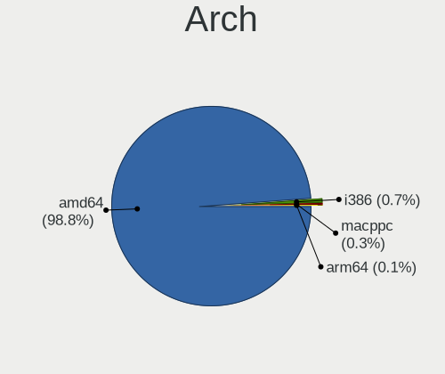

| Name   | Computers | Percent |
|--------|-----------|---------|
| amd64  | 666       | 98.81%  |
| i386   | 5         | 0.74%   |
| macppc | 2         | 0.3%    |
| arm64  | 1         | 0.15%   |

DE
--

Desktop Environment

| Name         | Computers | Percent |
|--------------|-----------|---------|
| Console      | 495       | 71.64%  |
| helloDesktop | 80        | 11.58%  |
| XFCE         | 38        | 5.5%    |
| KDE5         | 18        | 2.6%    |
| MATE         | 13        | 1.88%   |
| fvwm         | 12        | 1.74%   |
| GNOME        | 10        | 1.45%   |
| TWM          | 5         | 0.72%   |
| openbox      | 5         | 0.72%   |
| i3           | 3         | 0.43%   |
| Cinnamon     | 3         | 0.43%   |
| LXQt         | 2         | 0.29%   |
| X-Cinnamon   | 1         | 0.14%   |
| Window Maker | 1         | 0.14%   |
| Ratpoison    | 1         | 0.14%   |
| LXDE         | 1         | 0.14%   |
| Lumina       | 1         | 0.14%   |
| Fluxbox      | 1         | 0.14%   |
| DWM          | 1         | 0.14%   |

Display Server
--------------

X11 or Wayland

| Name    | Computers | Percent |
|---------|-----------|---------|
| Console | 497       | 73.41%  |
| X11     | 174       | 25.7%   |
| Wayland | 6         | 0.89%   |

Display Manager
---------------

SDDM, LightDM, etc.

| Name    | Computers | Percent |
|---------|-----------|---------|
| Console | 551       | 80.79%  |
| SLiM    | 63        | 9.24%   |
| LightDM | 25        | 3.67%   |
| SDDM    | 22        | 3.23%   |
| XDM     | 14        | 2.05%   |
| GDM     | 6         | 0.88%   |
| Ly      | 1         | 0.15%   |

OS Lang
-------

Language

| Lang    | Computers | Percent |
|---------|-----------|---------|
| Unknown | 501       | 73.25%  |
| C       | 78        | 11.4%   |
| en_US   | 77        | 11.26%  |
| en_CA   | 12        | 1.75%   |
| fr_FR   | 7         | 1.02%   |
| en      | 3         | 0.44%   |
| fr      | 2         | 0.29%   |
| en_GB   | 2         | 0.29%   |
| fr_CA   | 1         | 0.15%   |
| en_NL   | 1         | 0.15%   |

Boot Mode
---------

EFI or BIOS

| Mode | Computers | Percent |
|------|-----------|---------|
| EFI  | 584       | 85.88%  |
| BIOS | 96        | 14.12%  |

Filesystem
----------

Type of filesystem

| Type    | Computers | Percent |
|---------|-----------|---------|
| Zfs     | 339       | 48.57%  |
| Ufs     | 299       | 42.84%  |
| Ffs     | 33        | 4.73%   |
| Cd9660  | 26        | 3.72%   |
| Unknown | 1         | 0.14%   |

Part. scheme
------------

Scheme of partitioning

| Type    | Computers | Percent |
|---------|-----------|---------|
| GPT     | 632       | 93.77%  |
| MBR     | 38        | 5.64%   |
| Unknown | 4         | 0.59%   |

Board
-----

Vendor
------

Motherboard manufacturer

| Name                                 | Computers | Percent |
|--------------------------------------|-----------|---------|
| Dell                                 | 85        | 12.61%  |
| Lenovo                               | 77        | 11.42%  |
| Hewlett-Packard                      | 72        | 10.68%  |
| Unknown                              | 60        | 8.9%    |
| ASUSTek Computer                     | 59        | 8.75%   |
| Intel                                | 46        | 6.82%   |
| Supermicro                           | 34        | 5.04%   |
| Protectli                            | 29        | 4.3%    |
| Gigabyte Technology                  | 23        | 3.41%   |
| ASRock                               | 17        | 2.52%   |
| MSI                                  | 16        | 2.37%   |
| Techvision                           | 14        | 2.08%   |
| AZW                                  | 13        | 1.93%   |
| Acer                                 | 12        | 1.78%   |
| Apple                                | 10        | 1.48%   |
| AMI                                  | 8         | 1.19%   |
| ZOTAC                                | 7         | 1.04%   |
| PC Engines                           | 6         | 0.89%   |
| AWOW                                 | 6         | 0.89%   |
| Toshiba                              | 4         | 0.59%   |
| Sophos                               | 4         | 0.59%   |
| ASRockRack                           | 4         | 0.59%   |
| Panasonic                            | 3         | 0.45%   |
| MW                                   | 3         | 0.45%   |
| IBM                                  | 3         | 0.45%   |
| Deciso                               | 3         | 0.45%   |
| Datto                                | 3         | 0.45%   |
| CWWK                                 | 3         | 0.45%   |
| CncTion                              | 3         | 0.45%   |
| Alienware                            | 3         | 0.45%   |
| Shuttle                              | 2         | 0.3%    |
| ShenZhen MinWin Technology           | 2         | 0.3%    |
| Matsushita Electric Industrial       | 2         | 0.3%    |
| Google                               | 2         | 0.3%    |
| Cisco                                | 2         | 0.3%    |
| ADI Engineering                      | 2         | 0.3%    |
| Yanling                              | 1         | 0.15%   |
| Trigkey                              | 1         | 0.15%   |
| Star Labs                            | 1         | 0.15%   |
| Shenzhen Meigao Electronic Equipment | 1         | 0.15%   |

Model
-----

Motherboard model

| Name                           | Computers | Percent |
|--------------------------------|-----------|---------|
| Unknown                        | 61        | 9.05%   |
| Techvision TVI7309X            | 14        | 2.08%   |
| Protectli FW4B                 | 12        | 1.78%   |
| Supermicro Super Server        | 8         | 1.19%   |
| Intel Q3XXG4-P V1.0            | 7         | 1.04%   |
| Protectli FW6                  | 6         | 0.89%   |
| AWOW PC BOX                    | 6         | 0.89%   |
| Protectli VP2420               | 5         | 0.74%   |
| Intel NDISB533                 | 5         | 0.74%   |
| Dell OptiPlex 9010             | 5         | 0.74%   |
| AZW EQ                         | 5         | 0.74%   |
| ZOTAC ZBOX-CI323NANO           | 4         | 0.59%   |
| Intel CRESCENTBAY              | 4         | 0.59%   |
| HP t730 Thin Client            | 4         | 0.59%   |
| HP EliteDesk 800 G1 SFF        | 4         | 0.59%   |
| Dell OptiPlex 7020             | 4         | 0.59%   |
| Dell OptiPlex 7010             | 4         | 0.59%   |
| AZW U59                        | 4         | 0.59%   |
| AMI Aptio CRB                  | 4         | 0.59%   |
| PC Engines APU2                | 3         | 0.45%   |
| MW GMLK-2_5G4L                 | 3         | 0.45%   |
| Intel H81U                     | 3         | 0.45%   |
| HP Z440 Workstation            | 3         | 0.45%   |
| HP Compaq Elite 8300 SFF       | 3         | 0.45%   |
| HP Compaq 8200 Elite SFF PC    | 3         | 0.45%   |
| HP Compaq 6200 Pro MT PC       | 3         | 0.45%   |
| HP 500-459                     | 3         | 0.45%   |
| Dell PowerEdge R210            | 3         | 0.45%   |
| Dell OptiPlex 9020             | 3         | 0.45%   |
| Dell OptiPlex 7060             | 3         | 0.45%   |
| Dell OptiPlex 3060             | 3         | 0.45%   |
| Dell OptiPlex 3010             | 3         | 0.45%   |
| ASUS All Series                | 3         | 0.45%   |
| ASRock B450M Pro4              | 3         | 0.45%   |
| Supermicro X8STi               | 2         | 0.3%    |
| Supermicro X10SL7-F            | 2         | 0.3%    |
| Supermicro SYS-E300-9A         | 2         | 0.3%    |
| Supermicro iXR1204-815-600WB   | 2         | 0.3%    |
| Sophos XG                      | 2         | 0.3%    |
| ShenZhen MinWin MW-GMLK-2.5G6L | 2         | 0.3%    |

Model Family
------------

Motherboard model prefix

| Name                 | Computers | Percent |
|----------------------|-----------|---------|
| Unknown              | 61        | 9.05%   |
| Dell OptiPlex        | 41        | 6.08%   |
| Lenovo ThinkCentre   | 38        | 5.64%   |
| Lenovo ThinkPad      | 31        | 4.6%    |
| Dell PowerEdge       | 18        | 2.67%   |
| Techvision TVI7309X  | 14        | 2.08%   |
| HP EliteDesk         | 13        | 1.93%   |
| HP Compaq            | 13        | 1.93%   |
| Protectli FW4B       | 12        | 1.78%   |
| HP ProDesk           | 12        | 1.78%   |
| ASUS PRIME           | 12        | 1.78%   |
| ASUS ROG             | 9         | 1.34%   |
| Acer Aspire          | 9         | 1.34%   |
| Supermicro Super     | 8         | 1.19%   |
| Intel Q3XXG4-P       | 7         | 1.04%   |
| Dell Precision       | 7         | 1.04%   |
| Protectli FW6        | 6         | 0.89%   |
| Dell Latitude        | 6         | 0.89%   |
| Dell Inspiron        | 6         | 0.89%   |
| AWOW PC              | 6         | 0.89%   |
| Protectli VP2420     | 5         | 0.74%   |
| Intel NDISB533       | 5         | 0.74%   |
| HP ProLiant          | 5         | 0.74%   |
| AZW EQ               | 5         | 0.74%   |
| ASRock B450M         | 5         | 0.74%   |
| ZOTAC ZBOX-CI323NANO | 4         | 0.59%   |
| Intel CRESCENTBAY    | 4         | 0.59%   |
| HP t730              | 4         | 0.59%   |
| HP Pavilion          | 4         | 0.59%   |
| AZW U59              | 4         | 0.59%   |
| AMI Aptio            | 4         | 0.59%   |
| Toshiba Satellite    | 3         | 0.45%   |
| PC Engines APU2      | 3         | 0.45%   |
| MW GMLK-2            | 3         | 0.45%   |
| Intel H81U           | 3         | 0.45%   |
| HP Z440              | 3         | 0.45%   |
| HP 500-459           | 3         | 0.45%   |
| ASUS TUF             | 3         | 0.45%   |
| ASUS M5A97           | 3         | 0.45%   |
| ASUS All             | 3         | 0.45%   |

MFG Year
--------

Motherboard manufacture year

| Year    | Computers | Percent |
|---------|-----------|---------|
| 2022    | 70        | 10.39%  |
| 2018    | 64        | 9.5%    |
| 2023    | 58        | 8.61%   |
| 2014    | 51        | 7.57%   |
| 2020    | 49        | 7.27%   |
| 2021    | 44        | 6.53%   |
| 2019    | 39        | 5.79%   |
| 2016    | 39        | 5.79%   |
| 2015    | 38        | 5.64%   |
| 2017    | 36        | 5.34%   |
| 2011    | 36        | 5.34%   |
| 2013    | 34        | 5.04%   |
| 2012    | 33        | 4.9%    |
| 2010    | 32        | 4.75%   |
| 2009    | 15        | 2.23%   |
| 2008    | 13        | 1.93%   |
| 2024    | 9         | 1.34%   |
| 2007    | 5         | 0.74%   |
| Unknown | 5         | 0.74%   |
| 2006    | 3         | 0.45%   |
| 2002    | 1         | 0.15%   |

Form Factor
-----------

Physical design of the computer

| Name           | Computers | Percent |
|----------------|-----------|---------|
| Desktop        | 452       | 67.06%  |
| Notebook       | 110       | 16.32%  |
| Mini pc        | 54        | 8.01%   |
| Server         | 47        | 6.97%   |
| Firewall       | 6         | 0.89%   |
| All in one     | 4         | 0.59%   |
| System on chip | 1         | 0.15%   |

Coreboot
--------

Have coreboot on board

| Used | Computers | Percent |
|------|-----------|---------|
| No   | 658       | 97.63%  |
| Yes  | 16        | 2.37%   |

RAM Size
--------

Total RAM memory

| Size in GB      | Computers | Percent |
|-----------------|-----------|---------|
| 8.01-16.0       | 251       | 36.43%  |
| 16.01-24.0      | 174       | 25.25%  |
| 4.01-8.0        | 103       | 14.95%  |
| 32.01-64.0      | 75        | 10.89%  |
| 64.01-256.0     | 33        | 4.79%   |
| 2.01-3.0        | 18        | 2.61%   |
| 24.01-32.0      | 15        | 2.18%   |
| 3.01-4.0        | 13        | 1.89%   |
| 1.01-2.0        | 3         | 0.44%   |
| 0.51-1.0        | 3         | 0.44%   |
| More than 256.0 | 1         | 0.15%   |

RAM Used
--------

Used RAM memory

| Used GB     | Computers | Percent |
|-------------|-----------|---------|
| 0.01-0.5    | 317       | 45.81%  |
| 0.51-1.0    | 238       | 34.39%  |
| 1.01-2.0    | 85        | 12.28%  |
| 2.01-3.0    | 21        | 3.03%   |
| 3.01-4.0    | 9         | 1.3%    |
| 4.01-8.0    | 8         | 1.16%   |
| 0           | 4         | 0.58%   |
| 24.01-32.0  | 3         | 0.43%   |
| 64.01-256.0 | 2         | 0.29%   |
| 8.01-16.0   | 2         | 0.29%   |
| Unknown     | 2         | 0.29%   |
| 32.01-64.0  | 1         | 0.14%   |

Total Drives
------------

Number of drives on board

| Drives | Computers | Percent |
|--------|-----------|---------|
| 1      | 475       | 67.47%  |
| 0      | 93        | 13.21%  |
| 2      | 88        | 12.5%   |
| 3      | 22        | 3.13%   |
| 4      | 11        | 1.56%   |
| 5      | 3         | 0.43%   |
| 13     | 2         | 0.28%   |
| 10     | 2         | 0.28%   |
| 7      | 2         | 0.28%   |
| 58     | 1         | 0.14%   |
| 40     | 1         | 0.14%   |
| 25     | 1         | 0.14%   |
| 16     | 1         | 0.14%   |
| 14     | 1         | 0.14%   |
| 6      | 1         | 0.14%   |

Has CD-ROM
----------

Has CD-ROM on board

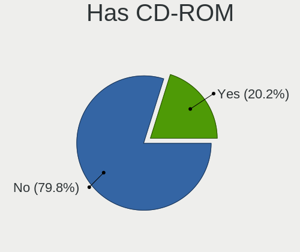

| Presented | Computers | Percent |
|-----------|-----------|---------|
| No        | 546       | 79.82%  |
| Yes       | 138       | 20.18%  |

Has Ethernet
------------

Has Ethernet on board

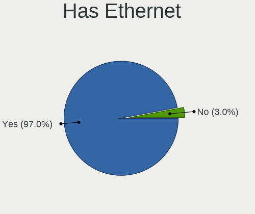

| Presented | Computers | Percent |
|-----------|-----------|---------|
| Yes       | 655       | 97.04%  |
| No        | 20        | 2.96%   |

Has WiFi
--------

Has WiFi module

| Presented | Computers | Percent |
|-----------|-----------|---------|
| No        | 445       | 65.15%  |
| Yes       | 238       | 34.85%  |

Has Bluetooth
-------------

Has Bluetooth module

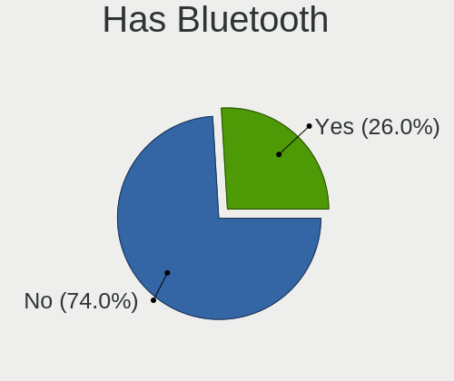

| Presented | Computers | Percent |
|-----------|-----------|---------|
| No        | 502       | 74.04%  |
| Yes       | 176       | 25.96%  |

Location
--------

Country
-------

Geographic location (country)

| Country | Computers | Percent |
|---------|-----------|---------|
| Canada  | 674       | 100%    |

City
----

Geographic location (city)

| City                     | Computers | Percent |
|--------------------------|-----------|---------|
| Montreal                 | 80        | 10.58%  |
| Toronto                  | 64        | 8.47%   |
| Calgary                  | 43        | 5.69%   |
| Edmonton                 | 34        | 4.5%    |
| Ottawa                   | 29        | 3.84%   |
| Winnipeg                 | 25        | 3.31%   |
| Victoria                 | 25        | 3.31%   |
| Vancouver                | 20        | 2.65%   |
| Saint-Laurent            | 16        | 2.12%   |
| Kitchener                | 13        | 1.72%   |
| Brampton                 | 13        | 1.72%   |
| Scarborough              | 12        | 1.59%   |
| Surrey                   | 11        | 1.46%   |
| North Vancouver          | 10        | 1.32%   |
| Laval                    | 10        | 1.32%   |
| Qubec                  | 9         | 1.19%   |
| Regina                   | 8         | 1.06%   |
| Mississauga              | 8         | 1.06%   |
| Longueuil                | 8         | 1.06%   |
| Gatineau                 | 8         | 1.06%   |
| Burnaby                  | 8         | 1.06%   |
| London                   | 7         | 0.93%   |
| Cambridge                | 7         | 0.93%   |
| Sherwood Park            | 6         | 0.79%   |
| Qubec                | 6         | 0.79%   |
| Kingston                 | 6         | 0.79%   |
| Barrie                   | 6         | 0.79%   |
| Sydenham                 | 5         | 0.66%   |
| Saskatoon                | 5         | 0.66%   |
| Peterborough             | 5         | 0.66%   |
| Moncton                  | 5         | 0.66%   |
| Windsor                  | 4         | 0.53%   |
| St. Jean Baptiste        | 4         | 0.53%   |
| St. Albert               | 4         | 0.53%   |
| Sainte-Marthe-sur-le-Lac | 4         | 0.53%   |
| Sainte-Julie             | 4         | 0.53%   |
| Pierrefonds              | 4         | 0.53%   |
| Oakville                 | 4         | 0.53%   |
| Guelph                   | 4         | 0.53%   |
| Burlington               | 4         | 0.53%   |

Drives
------

Drive Vendor
------------

Hard drive vendors

| Vendor              | Computers | Drives | Percent |
|---------------------|-----------|--------|---------|
| Samsung Electronics | 105       | 207    | 14.46%  |
| WDC                 | 94        | 257    | 12.95%  |
| Kingston            | 81        | 122    | 11.16%  |
| Seagate             | 71        | 154    | 9.78%   |
| Intel               | 40        | 61     | 5.51%   |
| Crucial             | 26        | 43     | 3.58%   |
| A-DATA Technology   | 26        | 45     | 3.58%   |
| SanDisk             | 20        | 29     | 2.75%   |
| Patriot             | 20        | 30     | 2.75%   |
| Hitachi             | 19        | 63     | 2.62%   |
| Toshiba             | 18        | 33     | 2.48%   |
| SPCC                | 11        | 14     | 1.52%   |
| Micron Technology   | 11        | 20     | 1.52%   |
| Hewlett-Packard     | 10        | 13     | 1.38%   |
| Dogfish             | 10        | 29     | 1.38%   |
| Transcend           | 9         | 12     | 1.24%   |
| SK hynix            | 9         | 11     | 1.24%   |
| Phison              | 9         | 10     | 1.24%   |
| OCZ                 | 9         | 15     | 1.24%   |
| China               | 9         | 13     | 1.24%   |
| NVMe                | 8         | 11     | 1.1%    |
| HGST                | 8         | 80     | 1.1%    |
| FORESEE             | 8         | 26     | 1.1%    |
| Protectli           | 7         | 15     | 0.96%   |
| Hoodisk             | 7         | 13     | 0.96%   |
| Mushkin             | 5         | 6      | 0.69%   |
| Lexar               | 5         | 7      | 0.69%   |
| Team                | 4         | 9      | 0.55%   |
| PNY                 | 4         | 5      | 0.55%   |
| BIWIN               | 4         | 8      | 0.55%   |
| Timetec             | 3         | 5      | 0.41%   |
| Netac               | 3         | 3      | 0.41%   |
| LITEONIT            | 3         | 4      | 0.41%   |
| Gigastone           | 3         | 14     | 0.41%   |
| Corsair             | 3         | 5      | 0.41%   |
| Apple               | 3         | 3      | 0.41%   |
| Apacer              | 3         | 3      | 0.41%   |
| XPG                 | 2         | 3      | 0.28%   |
| VisionTek           | 2         | 6      | 0.28%   |
| Silicon Motion      | 2         | 2      | 0.28%   |

Drive Model
-----------

Hard drive models

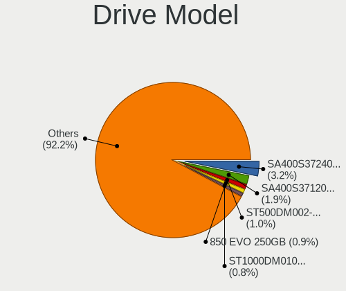

| Model                           | Computers | Percent |
|---------------------------------|-----------|---------|
| Kingston SA400S37240G 240GB     | 25        | 3.18%   |
| Kingston SA400S37120G 120GB     | 15        | 1.91%   |
| Seagate ST500DM002-1BD142 500GB | 8         | 1.02%   |
| Samsung SSD 850 EVO 250GB       | 7         | 0.89%   |
| Seagate ST1000DM010-2EP102 1TB  | 6         | 0.76%   |
| FORESEE 128GB SSD               | 6         | 0.76%   |
| Dogfish SSD 128GB               | 6         | 0.76%   |
| Seagate ST2000DM008-2FR102 2TB  | 5         | 0.64%   |
| Samsung SSD 970 EVO Plus 1TB    | 5         | 0.64%   |
| Samsung SSD 870 EVO 250GB       | 5         | 0.64%   |
| Samsung SSD 860 EVO 500GB       | 5         | 0.64%   |
| Samsung SSD 850 PRO 256GB       | 5         | 0.64%   |
| Samsung SSD 840 EVO 120GB       | 5         | 0.64%   |
| WDC WDS500G2B0A-00SM50 500GB    | 4         | 0.51%   |
| SPCC Solid State Disk 256GB     | 4         | 0.51%   |
| SanDisk SD6SB1M064G1022I 64GB   | 4         | 0.51%   |
| Samsung SSD 870 EVO 500GB       | 4         | 0.51%   |
| Samsung SSD 850 EVO 500GB       | 4         | 0.51%   |
| Samsung SSD 840 EVO 250GB       | 4         | 0.51%   |
| Patriot M.2 P310 240GB          | 4         | 0.51%   |
| Patriot Burst Elite 120GB       | 4         | 0.51%   |
| Kingston SV300S37A120G 120GB    | 4         | 0.51%   |
| Crucial CT240BX500SSD1 240GB    | 4         | 0.51%   |
| BIWIN SSD 128GB                 | 4         | 0.51%   |
| WDC WD40EFRX-68WT0N0 4TB        | 3         | 0.38%   |
| WDC WD20EZRX-00DC0B0 2TB        | 3         | 0.38%   |
| WDC WD20EFRX-68EUZN0 2TB        | 3         | 0.38%   |
| Transcend TS256GMSA230S 256GB   | 3         | 0.38%   |
| Toshiba DT01ACA100 1TB          | 3         | 0.38%   |
| Seagate ST500LM021-1KJ152 500GB | 3         | 0.38%   |
| Seagate ST3500413AS 500GB       | 3         | 0.38%   |
| Seagate ST2000DM001-1ER164 2TB  | 3         | 0.38%   |
| Samsung SSD 980 250GB           | 3         | 0.38%   |
| Samsung SSD 980 1TB             | 3         | 0.38%   |
| Samsung SSD 970 EVO Plus 250GB  | 3         | 0.38%   |
| Samsung SSD 860 EVO 250GB       | 3         | 0.38%   |
| Phison Sabrent 512GB            | 3         | 0.38%   |
| Phison PCIe SSD 128GB           | 3         | 0.38%   |
| Kingston SUV500MS120G 120GB     | 3         | 0.38%   |
| Kingston SKC600MS256G 256GB     | 3         | 0.38%   |

HDD Vendor
----------

Hard disk drive vendors

| Vendor              | Computers | Drives | Percent |
|---------------------|-----------|--------|---------|
| WDC                 | 69        | 218    | 35.03%  |
| Seagate             | 68        | 151    | 34.52%  |
| Hitachi             | 19        | 63     | 9.64%   |
| Toshiba             | 15        | 28     | 7.61%   |
| HGST                | 8         | 80     | 4.06%   |
| NVMe                | 6         | 9      | 3.05%   |
| Hewlett-Packard     | 2         | 2      | 1.02%   |
| Fujitsu             | 2         | 2      | 1.02%   |
| Apple               | 2         | 2      | 1.02%   |
| Synology            | 1         | 1      | 0.51%   |
| Samsung Electronics | 1         | 1      | 0.51%   |
| OPENBSD             | 1         | 1      | 0.51%   |
| Lexar               | 1         | 1      | 0.51%   |
| HPT                 | 1         | 1      | 0.51%   |
| HPE                 | 1         | 5      | 0.51%   |

SSD Vendor
----------

Solid state drive vendors

| Vendor              | Computers | Drives | Percent |
|---------------------|-----------|--------|---------|
| Samsung Electronics | 77        | 161    | 17.99%  |
| Kingston            | 75        | 107    | 17.52%  |
| Intel               | 34        | 53     | 7.94%   |
| Crucial             | 22        | 34     | 5.14%   |
| A-DATA Technology   | 22        | 41     | 5.14%   |
| SanDisk             | 20        | 29     | 4.67%   |
| WDC                 | 15        | 18     | 3.5%    |
| Patriot             | 13        | 21     | 3.04%   |
| Dogfish             | 10        | 29     | 2.34%   |
| OCZ                 | 9         | 15     | 2.1%    |
| China               | 9         | 13     | 2.1%    |
| Transcend           | 8         | 11     | 1.87%   |
| SPCC                | 8         | 10     | 1.87%   |
| Micron Technology   | 8         | 16     | 1.87%   |
| FORESEE             | 8         | 26     | 1.87%   |
| Protectli           | 7         | 15     | 1.64%   |
| Hoodisk             | 7         | 13     | 1.64%   |
| Mushkin             | 5         | 6      | 1.17%   |
| Hewlett-Packard     | 5         | 8      | 1.17%   |
| SK hynix            | 4         | 4      | 0.93%   |
| PNY                 | 4         | 5      | 0.93%   |
| Lexar               | 4         | 6      | 0.93%   |
| BIWIN               | 4         | 8      | 0.93%   |
| Seagate             | 3         | 3      | 0.7%    |
| Netac               | 3         | 3      | 0.7%    |
| LITEONIT            | 3         | 4      | 0.7%    |
| Gigastone           | 3         | 14     | 0.7%    |
| Corsair             | 3         | 5      | 0.7%    |
| Apacer              | 3         | 3      | 0.7%    |
| VisionTek           | 2         | 6      | 0.47%   |
| Timetec             | 2         | 3      | 0.47%   |
| Team                | 2         | 2      | 0.47%   |
| LITEON              | 2         | 4      | 0.47%   |
| Fanxiang            | 2         | 2      | 0.47%   |
| ZTC                 | 1         | 1      | 0.23%   |
| Zheino              | 1         | 1      | 0.23%   |
| walram              | 1         | 1      | 0.23%   |
| Toshiba             | 1         | 1      | 0.23%   |
| TEXTORM             | 1         | 1      | 0.23%   |
| Star Drive          | 1         | 1      | 0.23%   |

Drive Kind
----------

HDD or SSD

| Kind | Computers | Drives | Percent |
|------|-----------|--------|---------|
| SSD  | 391       | 731    | 58.8%   |
| HDD  | 172       | 565    | 25.86%  |
| NVMe | 102       | 163    | 15.34%  |

Drive Connector
---------------

SATA, SAS, NVMe, etc.

| Type | Computers | Drives | Percent |
|------|-----------|--------|---------|
| SATA | 525       | 1296   | 83.73%  |
| NVMe | 102       | 163    | 16.27%  |

Drive Size
----------

Size of hard drive

| Size in TB | Computers | Drives | Percent |
|------------|-----------|--------|---------|
| 0.01-0.5   | 432       | 786    | 73.22%  |
| 0.51-1.0   | 84        | 197    | 14.24%  |
| 1.01-2.0   | 34        | 79     | 5.76%   |
| 3.01-4.0   | 19        | 122    | 3.22%   |
| 4.01-10.0  | 10        | 59     | 1.69%   |
| 2.01-3.0   | 6         | 27     | 1.02%   |
| 10.01-20.0 | 5         | 26     | 0.85%   |

Space Total
-----------

Amount of disk space available on the file system

| Size in GB     | Computers | Percent |
|----------------|-----------|---------|
| 101-250        | 294       | 41.35%  |
| 251-500        | 119       | 16.74%  |
| 51-100         | 79        | 11.11%  |
| 21-50          | 67        | 9.42%   |
| 1-20           | 64        | 9%      |
| 501-1000       | 54        | 7.59%   |
| 1001-2000      | 21        | 2.95%   |
| More than 3000 | 7         | 0.98%   |
| Unknown        | 5         | 0.7%    |
| 2001-3000      | 1         | 0.14%   |

Space Used
----------

Amount of used disk space

| Used GB        | Computers | Percent |
|----------------|-----------|---------|
| 1-20           | 615       | 87.48%  |
| 21-50          | 46        | 6.54%   |
| 51-100         | 17        | 2.42%   |
| 101-250        | 7         | 1%      |
| Unknown        | 5         | 0.71%   |
| 251-500        | 4         | 0.57%   |
| 1001-2000      | 4         | 0.57%   |
| 501-1000       | 4         | 0.57%   |
| More than 3000 | 1         | 0.14%   |

Malfunc. Drives
---------------

Drive models with a malfunction

| Model                              | Computers | Drives | Percent |
|------------------------------------|-----------|--------|---------|
| Seagate ST500DM002-1BD142 500GB    | 4         | 7      | 3.74%   |
| Seagate ST500LM021-1KJ152 500GB    | 3         | 5      | 2.8%    |
| Patriot Burst Elite 120GB          | 3         | 4      | 2.8%    |
| Dogfish SSD 128GB                  | 3         | 8      | 2.8%    |
| WDC WD6400AAKS-22A7B2 640GB        | 2         | 9      | 1.87%   |
| WDC WD40EFRX-68WT0N0 4TB           | 2         | 3      | 1.87%   |
| VisionTek mSATA 120GB              | 2         | 6      | 1.87%   |
| Toshiba MQ01ABD075 752GB           | 2         | 2      | 1.87%   |
| Seagate ST9500420AS 500GB          | 2         | 3      | 1.87%   |
| Seagate ST3500413AS 500GB          | 2         | 4      | 1.87%   |
| Patriot Pyro SE 120GB              | 2         | 4      | 1.87%   |
| Kingston SNS4151S316GD 16GB        | 2         | 4      | 1.87%   |
| Hewlett-Packard SSD S700 Pro 128GB | 2         | 5      | 1.87%   |
| Apacer 16GB SATA Flash Drive       | 2         | 2      | 1.87%   |
| WDC WDS200T2B0A 2TB                | 1         | 1      | 0.93%   |
| WDC WD800JD-08MSA1 80GB            | 1         | 2      | 0.93%   |
| WDC WD7500BPKX-00HPJT0 752GB       | 1         | 10     | 0.93%   |
| WDC WD6400BEVT-22A0RT0 640GB       | 1         | 1      | 0.93%   |
| WDC WD60EZRZ-00RWYB1 6TB           | 1         | 2      | 0.93%   |
| WDC WD50EFRX-68L0BN1 5TB           | 1         | 1      | 0.93%   |
| WDC WD5003AZEX-00K1GA0 500GB       | 1         | 1      | 0.93%   |
| WDC WD40EZRZ-00WN9B0 4TB           | 1         | 1      | 0.93%   |
| WDC WD3200AAKS-75L9A0 320GB        | 1         | 1      | 0.93%   |
| WDC WD30EZRX-22D8PB0 3TB           | 1         | 1      | 0.93%   |
| WDC WD2500AAKX-001CA0 250GB        | 1         | 1      | 0.93%   |
| WDC WD1600AAJS-60Z0A0 160GB        | 1         | 2      | 0.93%   |
| WDC WD15EARS-00Z5B1 1.5TB          | 1         | 1      | 0.93%   |
| WDC WD1200SD-01KCB0 120GB          | 1         | 1      | 0.93%   |
| walram SSD 120G                    | 1         | 1      | 0.93%   |
| Toshiba MQ01ABD100 1TB             | 1         | 1      | 0.93%   |
| Toshiba MK1665GSX 160GB            | 1         | 1      | 0.93%   |
| Toshiba DT01ACA100 1TB             | 1         | 3      | 0.93%   |
| TEXTORM B5 240GB                   | 1         | 1      | 0.93%   |
| SPCC Solid State Disk 128GB        | 1         | 1      | 0.93%   |
| SK hynix HFS256G39TND-N210A 256GB  | 1         | 1      | 0.93%   |
| Seagate ST98823AS 80GB             | 1         | 1      | 0.93%   |
| Seagate ST9500325AS 500GB          | 1         | 1      | 0.93%   |
| Seagate ST3250318AS 250GB          | 1         | 1      | 0.93%   |
| Seagate ST3200822AS 200GB          | 1         | 1      | 0.93%   |
| Seagate ST3160815AS 160GB          | 1         | 2      | 0.93%   |

Malfunc. Drive Vendor
---------------------

Vendors of faulty drives

| Vendor              | Computers | Drives | Percent |
|---------------------|-----------|--------|---------|
| Seagate             | 19        | 35     | 18.27%  |
| WDC                 | 18        | 38     | 17.31%  |
| Hitachi             | 9         | 23     | 8.65%   |
| Kingston            | 8         | 11     | 7.69%   |
| Intel               | 8         | 10     | 7.69%   |
| Toshiba             | 5         | 7      | 4.81%   |
| Patriot             | 5         | 8      | 4.81%   |
| A-DATA Technology   | 4         | 12     | 3.85%   |
| Samsung Electronics | 3         | 16     | 2.88%   |
| HGST                | 3         | 5      | 2.88%   |
| Dogfish             | 3         | 8      | 2.88%   |
| VisionTek           | 2         | 6      | 1.92%   |
| Mushkin             | 2         | 3      | 1.92%   |
| Hewlett-Packard     | 2         | 5      | 1.92%   |
| Crucial             | 2         | 2      | 1.92%   |
| Apacer              | 2         | 2      | 1.92%   |
| walram              | 1         | 1      | 0.96%   |
| TEXTORM             | 1         | 1      | 0.96%   |
| SPCC                | 1         | 1      | 0.96%   |
| SK hynix            | 1         | 1      | 0.96%   |
| OCZ                 | 1         | 5      | 0.96%   |
| Micron Technology   | 1         | 4      | 0.96%   |
| KingSpec            | 1         | 1      | 0.96%   |
| HP Phison           | 1         | 1      | 0.96%   |
| AMD                 | 1         | 3      | 0.96%   |

Malfunc. HDD Vendor
-------------------

Vendors of faulty HDD drives

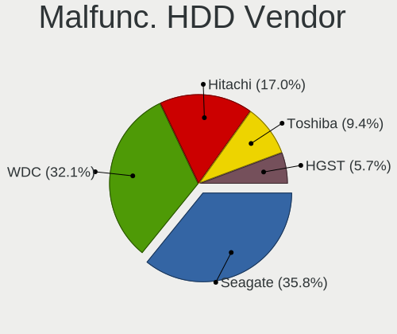

| Vendor  | Computers | Drives | Percent |
|---------|-----------|--------|---------|
| Seagate | 19        | 35     | 35.85%  |
| WDC     | 17        | 37     | 32.08%  |
| Hitachi | 9         | 23     | 16.98%  |
| Toshiba | 5         | 7      | 9.43%   |
| HGST    | 3         | 5      | 5.66%   |

Malfunc. Drive Kind
-------------------

Kinds of faulty drives

| Kind | Computers | Drives | Percent |
|------|-----------|--------|---------|
| SSD  | 51        | 100    | 50%     |
| HDD  | 50        | 107    | 49.02%  |
| NVMe | 1         | 2      | 0.98%   |

Failed Drives
-------------

Failed drive models

| Model                                            | Computers | Drives | Percent |
|--------------------------------------------------|-----------|--------|---------|
| WDC WD10SPZX-00Z10T0 1TB                         | 1         | 1      | 25%     |
| Seagate ST3250310AS 250GB                        | 1         | 1      | 25%     |
| SanDisk pSSD 16GB                                | 1         | 1      | 25%     |
| Samsung Electronics SSD PM830 2.5-inch 7mm 256GB | 1         | 1      | 25%     |

Failed Drive Vendor
-------------------

Failed drive vendors

| Vendor              | Computers | Drives | Percent |
|---------------------|-----------|--------|---------|
| WDC                 | 1         | 1      | 25%     |
| Seagate             | 1         | 1      | 25%     |
| SanDisk             | 1         | 1      | 25%     |
| Samsung Electronics | 1         | 1      | 25%     |

Drive Status
------------

Number of failed and malfunc. drives

| Status   | Computers | Drives | Percent |
|----------|-----------|--------|---------|
| Works    | 519       | 1223   | 80.97%  |
| Malfunc  | 99        | 209    | 15.44%  |
| Detected | 19        | 23     | 2.96%   |
| Failed   | 4         | 4      | 0.62%   |

Storage controller
------------------

Storage Vendor
--------------

Storage controller vendors

| Vendor                                  | Computers | Percent |
|-----------------------------------------|-----------|---------|
| Intel                                   | 549       | 63.91%  |
| AMD                                     | 78        | 9.08%   |
| Samsung Electronics                     | 44        | 5.12%   |
| Sandisk                                 | 29        | 3.38%   |
| Broadcom / LSI                          | 22        | 2.56%   |
| MAXIO Technology (Hangzhou)             | 16        | 1.86%   |
| Silicon Motion                          | 15        | 1.75%   |
| Kingston Technology Company             | 13        | 1.51%   |
| Phison Electronics                      | 11        | 1.28%   |
| Nvidia                                  | 9         | 1.05%   |
| ASMedia Technology                      | 8         | 0.93%   |
| SK hynix                                | 7         | 0.81%   |
| Realtek Semiconductor                   | 6         | 0.7%    |
| Marvell Technology Group                | 6         | 0.7%    |
| Micron/Crucial Technology               | 5         | 0.58%   |
| Micron Technology                       | 5         | 0.58%   |
| Chelsio Communications                  | 5         | 0.58%   |
| JMicron Technology                      | 4         | 0.47%   |
| VIA Technologies                        | 3         | 0.35%   |
| Toshiba                                 | 3         | 0.35%   |
| Silicon Image                           | 3         | 0.35%   |
| Hosin Global Electronics                | 3         | 0.35%   |
| Hewlett-Packard                         | 3         | 0.35%   |
| ADATA Technology                        | 3         | 0.35%   |
| Yangtze Memory Technologies             | 1         | 0.12%   |
| Transcend                               | 1         | 0.12%   |
| Solid State Storage Technology          | 1         | 0.12%   |
| Shenzhen Unionmemory Information System | 1         | 0.12%   |
| Netac Technology                        | 1         | 0.12%   |
| KIOXIA                                  | 1         | 0.12%   |
| HighPoint Technologies                  | 1         | 0.12%   |
| Dell                                    | 1         | 0.12%   |
| Unknown                                 | 1         | 0.12%   |

Storage Model
-------------

Storage controller models

| Model                                                                            | Computers | Percent |
|----------------------------------------------------------------------------------|-----------|---------|
| Intel 8 Series/C220 Series Chipset Family 6-port SATA Controller 1 [AHCI mode]   | 55        | 5.65%   |
| AMD FCH SATA Controller [AHCI mode]                                              | 42        | 4.32%   |
| Intel Jasper Lake SATA AHCI Controller                                           | 32        | 3.29%   |
| Intel Q170/Q150/B150/H170/H110/Z170/CM236 Chipset SATA Controller [AHCI Mode]    | 31        | 3.19%   |
| Intel 6 Series/C200 Series Chipset Family 6 port Desktop SATA AHCI Controller    | 29        | 2.98%   |
| Intel Celeron/Pentium Silver Processor SATA Controller                           | 28        | 2.88%   |
| Intel Sunrise Point-LP SATA Controller [AHCI mode]                               | 26        | 2.67%   |
| Intel Atom/Celeron/Pentium Processor x5-E8000/J3xxx/N3xxx Series SATA Controller | 23        | 2.36%   |
| Intel 7 Series/C210 Series Chipset Family 6-port SATA Controller [AHCI mode]     | 22        | 2.26%   |
| Intel Cannon Lake PCH SATA AHCI Controller                                       | 21        | 2.16%   |
| Samsung NVMe SSD Controller SM981/PM981/PM983                                    | 20        | 2.06%   |
| Intel Alder Lake-N SATA AHCI Controller                                          | 20        | 2.06%   |
| Intel 8 Series SATA Controller 1 [AHCI mode]                                     | 20        | 2.06%   |
| Intel 200 Series PCH SATA controller [AHCI mode]                                 | 19        | 1.95%   |
| AMD 400 Series Chipset SATA Controller                                           | 19        | 1.95%   |
| MAXIO (Hangzhou) NVMe SSD Controller MAP1202 (DRAM-less)                         | 16        | 1.64%   |
| Intel Celeron N3350/Pentium N4200/Atom E3900 Series SATA AHCI Controller         | 15        | 1.54%   |
| Intel Wildcat Point-LP SATA Controller [AHCI Mode]                               | 14        | 1.44%   |
| Silicon Motion SM2263EN/SM2263XT (DRAM-less) NVMe SSD Controllers                | 13        | 1.34%   |
| Intel 5 Series/3400 Series Chipset 6 port SATA AHCI Controller                   | 13        | 1.34%   |
| AMD SB7x0/SB8x0/SB9x0 SATA Controller [AHCI mode]                                | 12        | 1.23%   |
| Intel 82801JI (ICH10 Family) SATA AHCI Controller                                | 11        | 1.13%   |
| Samsung NVMe SSD Controller 980 (DRAM-less)                                      | 10        | 1.03%   |
| Intel Atom Processor C3000 Series SATA Controller 1                              | 10        | 1.03%   |
| Intel Elkhart Lake SATA AHCI                                                     | 9         | 0.92%   |
| Intel Alder Lake-S PCH SATA Controller [AHCI Mode]                               | 9         | 0.92%   |
| Intel 7 Series Chipset Family 6-port SATA Controller [AHCI mode]                 | 9         | 0.92%   |
| Samsung NVMe SSD Controller PM9A1/PM9A3/980PRO                                   | 8         | 0.82%   |
| Intel SATA Controller [RAID mode]                                                | 8         | 0.82%   |
| Intel C610/X99 series chipset 6-Port SATA Controller [AHCI mode]                 | 8         | 0.82%   |
| Intel Atom Processor E3800 Series SATA AHCI Controller                           | 8         | 0.82%   |
| Intel 82801G (ICH7 Family) IDE Controller                                        | 8         | 0.82%   |
| Intel 6 Series/C200 Series Chipset Family 6 port Mobile SATA AHCI Controller     | 8         | 0.82%   |
| SanDisk Extreme Pro / WD Black SN750 / PC SN730 / Red SN700 NVMe SSD             | 7         | 0.72%   |
| Intel NM10/ICH7 Family SATA Controller [IDE mode]                                | 7         | 0.72%   |
| Intel Comet Lake SATA AHCI Controller                                            | 7         | 0.72%   |
| Intel Atom Processor C3000 Series SATA Controller 0                              | 7         | 0.72%   |
| Intel 82801JI (ICH10 Family) 4 port SATA IDE Controller #1                       | 7         | 0.72%   |
| ASMedia ASM1061/ASM1062 Serial ATA Controller                                    | 7         | 0.72%   |
| Sandisk WD Black SN770 / PC SN740 256GB / PC SN560 (DRAM-less) NVMe SSD          | 6         | 0.62%   |

Storage Kind
------------

Kind of storage controller (IDE, SATA, NVMe, SAS, ...)

| Kind | Computers | Percent |
|------|-----------|---------|
| SATA | 562       | 66.12%  |
| NVMe | 157       | 18.47%  |
| IDE  | 77        | 9.06%   |
| RAID | 33        | 3.88%   |
| SAS  | 13        | 1.53%   |
| SCSI | 8         | 0.94%   |

Processor
---------

CPU Vendor
----------

Processor vendors

| Vendor  | Computers | Percent |
|---------|-----------|---------|
| Intel   | 586       | 86.3%   |
| AMD     | 90        | 13.25%  |
| Unknown | 2         | 0.29%   |
| ARM     | 1         | 0.15%   |

CPU Model
---------

Processor models

| Model                                    | Computers | Percent |
|------------------------------------------|-----------|---------|
| Intel Celeron N5105 @ 2.00GHz            | 27        | 3.91%   |
| Intel N100                               | 22        | 3.18%   |
| Intel Celeron J4125 CPU @ 2.00GHz        | 18        | 2.6%    |
| Intel Core i5-6500 CPU @ 3.20GHz         | 15        | 2.17%   |
| Intel Celeron CPU J3160 @ 1.60GHz        | 13        | 1.88%   |
| Intel Core i5-4590 CPU @ 3.30GHz         | 11        | 1.59%   |
| Intel Core i5-3570 CPU @ 3.40GHz         | 9         | 1.3%    |
| Intel Core i7-3770 CPU @ 3.40GHz         | 8         | 1.16%   |
| Intel Core i5-8500 CPU @ 3.00GHz         | 8         | 1.16%   |
| Intel Core i5-6300U CPU @ 2.40GHz        | 7         | 1.01%   |
| Intel Core i5-4570 CPU @ 3.20GHz         | 7         | 1.01%   |
| Intel Core i5-7200U CPU @ 2.50GHz        | 6         | 0.87%   |
| Intel Celeron CPU J3455E @ 1.50GHz       | 6         | 0.87%   |
| Intel Celeron CPU J1900 @ 1.99GHz        | 6         | 0.87%   |
| Intel Core i5-4570TE CPU @ 2.70GHz       | 5         | 0.72%   |
| Intel Core i5-3470 CPU @ 3.20GHz         | 5         | 0.72%   |
| Intel Core i5-2520M CPU @ 2.50GHz        | 5         | 0.72%   |
| Intel Core i3-4030U CPU @ 1.90GHz        | 5         | 0.72%   |
| Intel Core 2 Duo CPU E8400 @ 3.00GHz     | 5         | 0.72%   |
| Intel Celeron J6412 @ 2.00GHz            | 5         | 0.72%   |
| AMD GX-412TC SOC                         | 5         | 0.72%   |
| Intel Xeon CPU E3-1220 v3 @ 3.10GHz      | 4         | 0.58%   |
| Intel Xeon                               | 4         | 0.58%   |
| Intel Core i5-8500T CPU @ 2.10GHz        | 4         | 0.58%   |
| Intel Core i5-4460 CPU @ 3.20GHz         | 4         | 0.58%   |
| Intel Core i5-2400 CPU @ 3.10GHz         | 4         | 0.58%   |
| Intel Core i3-5005U CPU @ 2.00GHz        | 4         | 0.58%   |
| Intel Core i3-2100 CPU @ 3.10GHz         | 4         | 0.58%   |
| Intel Celeron J6413 @ 1.80GHz            | 4         | 0.58%   |
| Intel Celeron J4105 CPU @ 1.50GHz        | 4         | 0.58%   |
| Intel Celeron CPU N3150 @ 1.60GHz        | 4         | 0.58%   |
| AMD Ryzen 5 2600 Six-Core Processor      | 4         | 0.58%   |
| AMD RX-427BB with AMD Radeon R7 Graphics | 4         | 0.58%   |
| Intel Xeon CPU E5645 @ 2.40GHz           | 3         | 0.43%   |
| Intel Pentium Silver N6005 @ 2.00GHz     | 3         | 0.43%   |
| Intel Pentium CPU G4560 @ 3.50GHz        | 3         | 0.43%   |
| Intel Core i7-9700K CPU @ 3.60GHz        | 3         | 0.43%   |
| Intel Core i7-8700 CPU @ 3.20GHz         | 3         | 0.43%   |
| Intel Core i7-8550U CPU @ 1.80GHz        | 3         | 0.43%   |
| Intel Core i5-7500T CPU @ 2.70GHz        | 3         | 0.43%   |

CPU Model Family
----------------

Processor model prefix

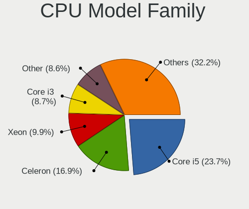

| Model                   | Computers | Percent |
|-------------------------|-----------|---------|
| Intel Core i5           | 163       | 23.73%  |
| Intel Celeron           | 116       | 16.89%  |
| Intel Xeon              | 68        | 9.9%    |
| Intel Core i3           | 60        | 8.73%   |
| Other                   | 59        | 8.59%   |
| Intel Core i7           | 57        | 8.3%    |
| Intel Atom              | 25        | 3.64%   |
| AMD Ryzen 5             | 16        | 2.33%   |
| Intel Core 2 Duo        | 15        | 2.18%   |
| Intel Pentium           | 14        | 2.04%   |
| AMD FX                  | 9         | 1.31%   |
| AMD Ryzen 7             | 8         | 1.16%   |
| AMD GX                  | 8         | 1.16%   |
| AMD Ryzen 9             | 7         | 1.02%   |
| Intel Pentium Dual-Core | 6         | 0.87%   |
| AMD Athlon 64 X2        | 5         | 0.73%   |
| Intel Pentium Silver    | 4         | 0.58%   |
| Intel Core 2 Quad       | 4         | 0.58%   |
| AMD Ryzen Embedded      | 4         | 0.58%   |
| AMD EPYC                | 4         | 0.58%   |
| AMD Ryzen 3             | 3         | 0.44%   |
| AMD A10                 | 3         | 0.44%   |
| Intel Pentium 4         | 2         | 0.29%   |
| AMD Ryzen 5 PRO         | 2         | 0.29%   |
| AMD Phenom II X6        | 2         | 0.29%   |
| AMD Opteron             | 2         | 0.29%   |
| AMD G                   | 2         | 0.29%   |
| AMD Athlon II X2        | 2         | 0.29%   |
| AMD Athlon              | 2         | 0.29%   |
| Intel Xeon Silver       | 1         | 0.15%   |
| Intel Pentium Gold      | 1         | 0.15%   |
| Intel Pentium D         | 1         | 0.15%   |
| Intel Genuine           | 1         | 0.15%   |
| Intel Core i9           | 1         | 0.15%   |
| Intel Core 2            | 1         | 0.15%   |
| ARM Cortex              | 1         | 0.15%   |
| AMD PRO A10             | 1         | 0.15%   |
| AMD Phenom              | 1         | 0.15%   |
| AMD E1                  | 1         | 0.15%   |
| AMD E                   | 1         | 0.15%   |

CPU Cores
---------

Number of processor cores

| Number  | Computers | Percent |
|---------|-----------|---------|
| 4       | 343       | 49.93%  |
| 2       | 181       | 26.35%  |
| 6       | 52        | 7.57%   |
| 8       | 33        | 4.8%    |
| 12      | 23        | 3.35%   |
| Unknown | 17        | 2.47%   |
| 16      | 14        | 2.04%   |
| 32      | 5         | 0.73%   |
| 10      | 5         | 0.73%   |
| 24      | 3         | 0.44%   |
| 3       | 3         | 0.44%   |
| 20      | 2         | 0.29%   |
| 1       | 2         | 0.29%   |
| 64      | 1         | 0.15%   |
| 28      | 1         | 0.15%   |
| 11      | 1         | 0.15%   |
| 5       | 1         | 0.15%   |

CPU Sockets
-----------

Number of sockets

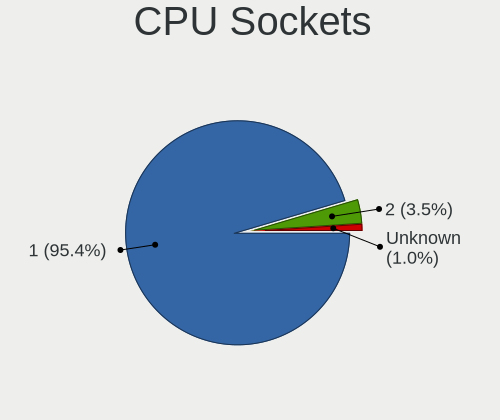

| Number  | Computers | Percent |
|---------|-----------|---------|
| 1       | 646       | 95.42%  |
| 2       | 24        | 3.55%   |
| Unknown | 7         | 1.03%   |

CPU Threads
-----------

Threads per core (Hyper-Threading)

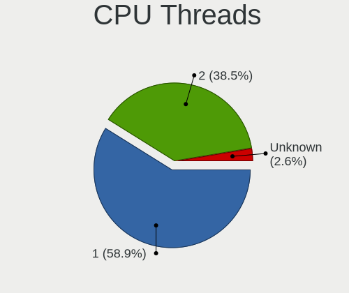

| Number  | Computers | Percent |
|---------|-----------|---------|
| 1       | 401       | 58.88%  |
| 2       | 262       | 38.47%  |
| Unknown | 18        | 2.64%   |

CPU Microarch
-------------

Microarchitecture

| Name          | Computers | Percent |
|---------------|-----------|---------|
| Unknown       | 100       | 14.51%  |
| Haswell       | 86        | 12.48%  |
| KabyLake      | 71        | 10.3%   |
| IvyBridge     | 51        | 7.4%    |
| Skylake       | 44        | 6.39%   |
| Silvermont    | 38        | 5.52%   |
| SandyBridge   | 38        | 5.52%   |
| Goldmont plus | 29        | 4.21%   |
| Penryn        | 26        | 3.77%   |
| Goldmont      | 25        | 3.63%   |
| Westmere      | 24        | 3.48%   |
| Broadwell     | 23        | 3.34%   |
| Zen+          | 13        | 1.89%   |
| Zen 3         | 12        | 1.74%   |
| Piledriver    | 10        | 1.45%   |
| Nehalem       | 10        | 1.45%   |
| CometLake     | 10        | 1.45%   |
| Zen           | 9         | 1.31%   |
| Zen 2         | 7         | 1.02%   |
| TigerLake     | 7         | 1.02%   |
| Core          | 7         | 1.02%   |
| Bonnell       | 7         | 1.02%   |
| Steamroller   | 6         | 0.87%   |
| Puma          | 6         | 0.87%   |
| K8 Hammer     | 6         | 0.87%   |
| K10           | 6         | 0.87%   |
| Jaguar        | 5         | 0.73%   |
| NetBurst      | 3         | 0.44%   |
| Bulldozer     | 3         | 0.44%   |
| Bobcat        | 3         | 0.44%   |
| Excavator     | 2         | 0.29%   |
| P6            | 1         | 0.15%   |
| IceLake       | 1         | 0.15%   |

Graphics
--------

GPU Vendor
----------

Vendors of graphics cards

| Vendor                                       | Computers | Percent |
|----------------------------------------------|-----------|---------|
| Intel                                        | 465       | 68.48%  |
| AMD                                          | 77        | 11.34%  |
| Nvidia                                       | 69        | 10.16%  |
| ASPEED Technology                            | 35        | 5.15%   |
| Matrox Electronics Systems                   | 30        | 4.42%   |
| Silicon Motion                               | 2         | 0.29%   |
| XGI Technology (eXtreme Graphics Innovation) | 1         | 0.15%   |

GPU Model
---------

Graphics card models

| Model                                                                                    | Computers | Percent |
|------------------------------------------------------------------------------------------|-----------|---------|
| Intel Xeon E3-1200 v3/4th Gen Core Processor Integrated Graphics Controller              | 45        | 6.48%   |
| ASPEED Technology ASPEED Graphics Family                                                 | 35        | 5.04%   |
| Intel JasperLake [UHD Graphics]                                                          | 34        | 4.9%    |
| Intel 2nd Generation Core Processor Family Integrated Graphics Controller                | 30        | 4.32%   |
| Intel GeminiLake [UHD Graphics 600]                                                      | 28        | 4.03%   |
| Intel Alder Lake-N [UHD Graphics]                                                        | 27        | 3.89%   |
| Intel HD Graphics 530                                                                    | 26        | 3.75%   |
| Intel Atom/Celeron/Pentium Processor x5-E8000/J3xxx/N3xxx Integrated Graphics Controller | 25        | 3.6%    |
| Intel CoffeeLake-S GT2 [UHD Graphics 630]                                                | 21        | 3.03%   |
| Intel Xeon E3-1200 v2/3rd Gen Core processor Graphics Controller                         | 20        | 2.88%   |
| Intel Haswell-ULT Integrated Graphics Controller                                         | 19        | 2.74%   |
| Matrox Electronics Systems MGA G200eW WPCM450                                            | 17        | 2.45%   |
| Intel HD Graphics 500                                                                    | 14        | 2.02%   |
| Intel HD Graphics 5500                                                                   | 13        | 1.87%   |
| Intel HD Graphics 630                                                                    | 12        | 1.73%   |
| Intel 4 Series Chipset Integrated Graphics Controller                                    | 11        | 1.59%   |
| Intel Skylake GT2 [HD Graphics 520]                                                      | 10        | 1.44%   |
| Intel HD Graphics 620                                                                    | 10        | 1.44%   |
| Intel IvyBridge GT2 [HD Graphics 4000]                                                   | 9         | 1.3%    |
| Intel Elkhart Lake [UHD Graphics Gen11 16EU]                                             | 9         | 1.3%    |
| Intel 3rd Gen Core processor Graphics Controller                                         | 9         | 1.3%    |
| Matrox Electronics Systems G200eR2                                                       | 8         | 1.15%   |
| Intel Core Processor Integrated Graphics Controller                                      | 8         | 1.15%   |
| Intel UHD Graphics 620                                                                   | 7         | 1.01%   |
| Intel Atom Processor Z36xxx/Z37xxx Series Graphics & Display                             | 7         | 1.01%   |
| AMD Picasso/Raven 2 [Radeon Vega Series / Radeon Vega Mobile Series]                     | 6         | 0.86%   |
| AMD Kaveri [Radeon R7 Graphics]                                                          | 6         | 0.86%   |
| Nvidia GK208B [GeForce GT 710]                                                           | 5         | 0.72%   |
| Intel Mobile 4 Series Chipset Integrated Graphics Controller                             | 5         | 0.72%   |
| AMD Cezanne [Radeon Vega Series / Radeon Vega Mobile Series]                             | 5         | 0.72%   |
| Intel WhiskeyLake-U GT2 [UHD Graphics 620]                                               | 4         | 0.58%   |
| Intel TigerLake-LP GT2 [Iris Xe Graphics]                                                | 4         | 0.58%   |
| Intel HD Graphics 610                                                                    | 4         | 0.58%   |
| Intel Alder Lake-S GT1 [UHD Graphics 730]                                                | 4         | 0.58%   |
| AMD Raven Ridge [Radeon Vega Series / Radeon Vega Mobile Series]                         | 4         | 0.58%   |
| AMD ES1000                                                                               | 4         | 0.58%   |
| Nvidia GT218 [GeForce 210]                                                               | 3         | 0.43%   |
| Nvidia GM107GL [Quadro K620]                                                             | 3         | 0.43%   |
| Intel Mobile 945GM/GMS/GME, 943/940GML Express Integrated Graphics Controller            | 3         | 0.43%   |
| Intel CometLake-S GT2 [UHD Graphics 630]                                                 | 3         | 0.43%   |

GPU Combo
---------

Combinations of graphics cards

| Name               | Computers | Percent |
|--------------------|-----------|---------|
| 1 x Intel          | 427       | 62.43%  |
| 1 x AMD            | 71        | 10.38%  |
| 1 x Nvidia         | 54        | 7.89%   |
| 1 x ASPEED         | 32        | 4.68%   |
| 1 x Matrox         | 30        | 4.39%   |
| Other              | 24        | 3.51%   |
| 2 x Intel          | 20        | 2.92%   |
| Intel + Nvidia     | 13        | 1.9%    |
| 2 x AMD            | 3         | 0.44%   |
| 1 x Silicon Motion | 2         | 0.29%   |
| Intel + ASPEED     | 2         | 0.29%   |
| Intel + AMD        | 2         | 0.29%   |
| AMD + Nvidia       | 2         | 0.29%   |
| 1 x XGI            | 1         | 0.15%   |
| AMD + ASPEED       | 1         | 0.15%   |

GPU Driver
----------

Free vs proprietary

| Driver      | Computers | Percent |
|-------------|-----------|---------|
| Free        | 621       | 91.32%  |
| Proprietary | 33        | 4.85%   |
| Unknown     | 26        | 3.82%   |

GPU Memory
----------

Total video memory

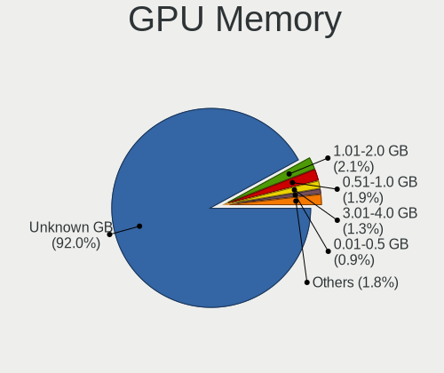

| Size in GB | Computers | Percent |
|------------|-----------|---------|
| Unknown    | 625       | 92.05%  |
| 1.01-2.0   | 14        | 2.06%   |
| 0.51-1.0   | 13        | 1.91%   |
| 3.01-4.0   | 9         | 1.33%   |
| 0.01-0.5   | 6         | 0.88%   |
| 7.01-8.0   | 5         | 0.74%   |
| 5.01-6.0   | 3         | 0.44%   |
| 8.01-16.0  | 2         | 0.29%   |
| 2.01-3.0   | 1         | 0.15%   |
| 16.01-24.0 | 1         | 0.15%   |

Monitor
-------

Monitor Vendor
--------------

Monitor vendors

| Vendor                  | Computers | Percent |
|-------------------------|-----------|---------|
| Samsung Electronics     | 16        | 11.11%  |
| LG Display              | 13        | 9.03%   |
| Dell                    | 13        | 9.03%   |
| Goldstar                | 12        | 8.33%   |
| BOE                     | 12        | 8.33%   |
| AU Optronics            | 11        | 7.64%   |
| Chimei Innolux          | 10        | 6.94%   |
| Lenovo                  | 6         | 4.17%   |
| BenQ                    | 6         | 4.17%   |
| Apple                   | 5         | 3.47%   |
| Acer                    | 4         | 2.78%   |
| ViewSonic               | 3         | 2.08%   |
| Sony                    | 3         | 2.08%   |
| Sharp                   | 3         | 2.08%   |
| LG Electronics          | 3         | 2.08%   |
| Hewlett-Packard         | 3         | 2.08%   |
| Chi Mei Optoelectronics | 3         | 2.08%   |
| ASUSTek Computer        | 3         | 2.08%   |
| AOC                     | 3         | 2.08%   |
| Ancor Communications    | 3         | 2.08%   |
| Toshiba                 | 2         | 1.39%   |
| Videoseven              | 1         | 0.69%   |
| RTK                     | 1         | 0.69%   |
| Panasonic               | 1         | 0.69%   |
| LTV                     | 1         | 0.69%   |
| Insignia                | 1         | 0.69%   |
| HKC                     | 1         | 0.69%   |
| Denver                  | 1         | 0.69%   |

Monitor Model
-------------

Monitor models

| Model                                                                  | Computers | Percent |
|------------------------------------------------------------------------|-----------|---------|
| ViewSonic VA2342 SERIES VSCFA2B 1920x1080 510x290mm 23.1-inch          | 3         | 2.03%   |
| Samsung Electronics LCD Monitor SEC5441 1280x800 330x210mm 15.4-inch   | 3         | 2.03%   |
| Sony LCD Monitor TV XV 1920x1080                                       | 2         | 1.35%   |
| Samsung Electronics LCD Monitor SAM7004 3840x2160 1210x680mm 54.6-inch | 2         | 1.35%   |
| LG Display LCD Monitor LGD03CD 1366x768 280x160mm 12.7-inch            | 2         | 1.35%   |
| LG Display LCD Monitor LGD02D8 1366x768 280x160mm 12.7-inch            | 2         | 1.35%   |
| Lenovo LEN S24e-10 LEN61CA 1920x1080 530x300mm 24.0-inch               | 2         | 1.35%   |
| Goldstar LG FULL HD GSM5B55 1920x1080 480x270mm 21.7-inch              | 2         | 1.35%   |
| Chimei Innolux LCD Monitor CMN14B1 1920x1080 310x170mm 13.9-inch       | 2         | 1.35%   |
| AU Optronics LCD Monitor AUO226D 1920x1080 280x160mm 12.7-inch         | 2         | 1.35%   |
| Ancor Communications ASUS PB238 ACI23A2 1920x1080 510x290mm 23.1-inch  | 2         | 1.35%   |
| Videoseven WL19A IGM1908 1280x1024 380x300mm 19.1-inch                 | 1         | 0.68%   |
| Toshiba TV TSB0200 1920x1080 530x300mm 24.0-inch                       | 1         | 0.68%   |
| Toshiba LCD Monitor LCD0905 1366x768 290x170mm 13.2-inch               | 1         | 0.68%   |
| Sony TV  *30 SNY05D1 3840x2160 1660x930mm 74.9-inch                    | 1         | 0.68%   |
| Sharp LCD Monitor SHP1526 1920x1280 270x180mm 12.8-inch                | 1         | 0.68%   |
| Sharp LCD Monitor SHP14C2 1920x1080 260x140mm 11.6-inch                | 1         | 0.68%   |
| Sharp LCD Monitor SHP14BA 1920x1080 340x190mm 15.3-inch                | 1         | 0.68%   |
| Samsung Electronics SyncMaster SAM03E4 1680x1050 470x300mm 22.0-inch   | 1         | 0.68%   |
| Samsung Electronics Odyssey G8 SAM7256 3840x2160 700x400mm 31.7-inch   | 1         | 0.68%   |
| Samsung Electronics LCD Monitor U28E590 3840x2160                      | 1         | 0.68%   |
| Samsung Electronics LCD Monitor SyncMaster 1920x1200                   | 1         | 0.68%   |
| Samsung Electronics LCD Monitor SEC3345 1280x800 330x210mm 15.4-inch   | 1         | 0.68%   |
| Samsung Electronics LCD Monitor SEC324C 1600x900 310x170mm 13.9-inch   | 1         | 0.68%   |
| Samsung Electronics LCD Monitor SEC3050 1366x768 320x190mm 14.7-inch   | 1         | 0.68%   |
| Samsung Electronics LCD Monitor SEC304C 1366x768 310x170mm 13.9-inch   | 1         | 0.68%   |
| Samsung Electronics LCD Monitor SDC4147 1366x768 340x190mm 15.3-inch   | 1         | 0.68%   |
| Samsung Electronics LCD Monitor SAM7002 3840x2160 1210x680mm 54.6-inch | 1         | 0.68%   |
| Samsung Electronics LCD Monitor SAM0FEE 3840x2160 1110x620mm 50.1-inch | 1         | 0.68%   |
| RTK CPL AIO PC RTK2482 1920x1080 510x280mm 22.9-inch                   | 1         | 0.68%   |
| Panasonic LCD Monitor MEI96A2 3840x2160 380x210mm 17.1-inch            | 1         | 0.68%   |
| LTV LTV1280M1A LTV0A3C 1024x768 800x450mm 36.1-inch                    | 1         | 0.68%   |
| LG Electronics LCD Monitor LG ULTRAGEAR 2560x1440                      | 1         | 0.68%   |
| LG Electronics LCD Monitor LG Ultra HD 7680x2160                       | 1         | 0.68%   |
| LG Electronics LCD Monitor LG Ultra HD                                 | 1         | 0.68%   |
| LG Electronics LCD Monitor LG FULL HD 1920x1080                        | 1         | 0.68%   |
| LG Display LCD Monitor LGD05A2 1920x1080 310x170mm 13.9-inch           | 1         | 0.68%   |
| LG Display LCD Monitor LGD04F0 2560x1440 310x170mm 13.9-inch           | 1         | 0.68%   |
| LG Display LCD Monitor LGD0484 1366x768 340x190mm 15.3-inch            | 1         | 0.68%   |
| LG Display LCD Monitor LGD045E 1366x768 310x170mm 13.9-inch            | 1         | 0.68%   |

Monitor Resolution
------------------

Monitor screen resolution

| Resolution         | Computers | Percent |
|--------------------|-----------|---------|
| 1920x1080 (FHD)    | 62        | 43.36%  |
| 1366x768 (WXGA)    | 26        | 18.18%  |
| 3840x2160 (4K)     | 13        | 9.09%   |
| 2560x1440 (QHD)    | 8         | 5.59%   |
| 1600x900 (HD+)     | 6         | 4.2%    |
| 1280x800 (WXGA)    | 5         | 3.5%    |
| 1920x1200 (WUXGA)  | 3         | 2.1%    |
| 1680x1050 (WSXGA+) | 3         | 2.1%    |
| 3440x1440          | 2         | 1.4%    |
| 2560x1080          | 2         | 1.4%    |
| 2256x1504          | 2         | 1.4%    |
| 1440x900 (WXGA+)   | 2         | 1.4%    |
| 1280x1024 (SXGA)   | 2         | 1.4%    |
| Unknown            | 2         | 1.4%    |
| 7680x2160          | 1         | 0.7%    |
| 1920x1280          | 1         | 0.7%    |
| 1600x1200          | 1         | 0.7%    |
| 1280x854           | 1         | 0.7%    |
| 1024x768 (XGA)     | 1         | 0.7%    |

Monitor Diagonal
----------------

Diagonal size in inches

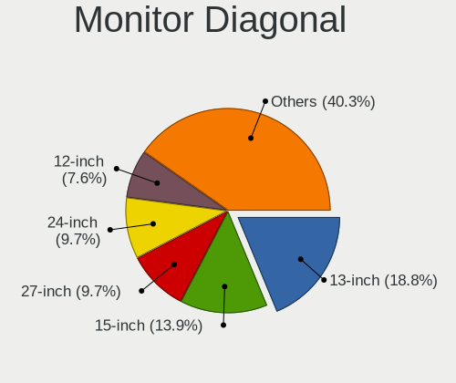

| Inches  | Computers | Percent |
|---------|-----------|---------|
| 13      | 27        | 18.75%  |
| 15      | 20        | 13.89%  |
| 27      | 14        | 9.72%   |
| 24      | 14        | 9.72%   |
| 12      | 11        | 7.64%   |
| 23      | 8         | 5.56%   |
| 21      | 8         | 5.56%   |
| Unknown | 8         | 5.56%   |
| 19      | 5         | 3.47%   |
| 34      | 4         | 2.78%   |
| 22      | 4         | 2.78%   |
| 11      | 4         | 2.78%   |
| 54      | 3         | 2.08%   |
| 31      | 3         | 2.08%   |
| 17      | 3         | 2.08%   |
| 14      | 3         | 2.08%   |
| 74      | 1         | 0.69%   |
| 50      | 1         | 0.69%   |
| 36      | 1         | 0.69%   |
| 20      | 1         | 0.69%   |
| 18      | 1         | 0.69%   |

Monitor Width
-------------

Physical width

| Width in mm | Computers | Percent |
|-------------|-----------|---------|
| 301-350     | 40        | 27.97%  |
| 501-600     | 36        | 25.17%  |
| 201-300     | 25        | 17.48%  |
| 401-500     | 16        | 11.19%  |
| Unknown     | 8         | 5.59%   |
| 701-800     | 5         | 3.5%    |
| 351-400     | 5         | 3.5%    |
| 1001-1500   | 4         | 2.8%    |
| 601-700     | 3         | 2.1%    |
| 1501-2000   | 1         | 0.7%    |

Aspect Ratio
------------

Proportional relationship between the width and the height

| Ratio   | Computers | Percent |
|---------|-----------|---------|
| 16/9    | 105       | 75.54%  |
| 16/10   | 15        | 10.79%  |
| Unknown | 8         | 5.76%   |
| 3/2     | 4         | 2.88%   |
| 21/9    | 4         | 2.88%   |
| 5/4     | 2         | 1.44%   |
| 4/3     | 1         | 0.72%   |

Monitor Area
------------

Area in inch

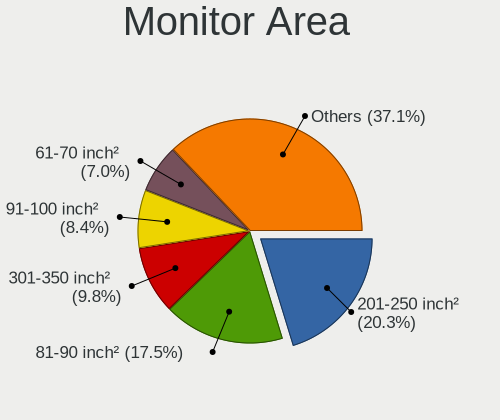

| Area in inch | Computers | Percent |
|----------------|-----------|---------|
| 201-250        | 29        | 20.28%  |
| 81-90          | 25        | 17.48%  |
| 301-350        | 14        | 9.79%   |
| 91-100         | 12        | 8.39%   |
| 61-70          | 10        | 6.99%   |
| 101-110        | 9         | 6.29%   |
| Unknown        | 8         | 5.59%   |
| 351-500        | 7         | 4.9%    |
| 151-200        | 6         | 4.2%    |
| More than 1000 | 5         | 3.5%    |
| 71-80          | 5         | 3.5%    |
| 51-60          | 4         | 2.8%    |
| 251-300        | 4         | 2.8%    |
| 121-130        | 3         | 2.1%    |
| 141-150        | 1         | 0.7%    |
| 501-1000       | 1         | 0.7%    |

Pixel Density
-------------

Pixels per inch

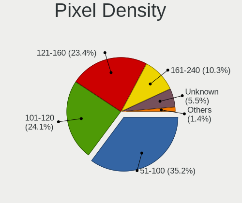

| Density       | Computers | Percent |
|---------------|-----------|---------|
| 51-100        | 51        | 35.17%  |
| 101-120       | 35        | 24.14%  |
| 121-160       | 34        | 23.45%  |
| 161-240       | 15        | 10.34%  |
| Unknown       | 8         | 5.52%   |
| More than 240 | 1         | 0.69%   |
| 1-50          | 1         | 0.69%   |

Multiple Monitors
-----------------

Total monitors connected

| Total | Computers | Percent |
|-------|-----------|---------|
| 0     | 523       | 76.35%  |
| 1     | 150       | 21.9%   |
| 2     | 12        | 1.75%   |

Network
-------

Net Controller Vendor
---------------------

Controller vendors

| Vendor                            | Computers | Percent |
|-----------------------------------|-----------|---------|
| Intel                             | 539       | 56.68%  |
| Realtek Semiconductor             | 231       | 24.29%  |
| Broadcom                          | 61        | 6.41%   |
| Qualcomm Atheros                  | 36        | 3.79%   |
| MediaTek                          | 8         | 0.84%   |
| Mellanox Technologies             | 7         | 0.74%   |
| Chelsio Communications            | 7         | 0.74%   |
| Marvell Technology Group          | 5         | 0.53%   |
| Ralink                            | 4         | 0.42%   |
| IMC Networks                      | 4         | 0.42%   |
| D-Link                            | 4         | 0.42%   |
| Solarflare Communications         | 3         | 0.32%   |
| Sierra Wireless                   | 3         | 0.32%   |
| Insyde Software                   | 3         | 0.32%   |
| Aquantia                          | 3         | 0.32%   |
| U-Blox                            | 2         | 0.21%   |
| TP-Link                           | 2         | 0.21%   |
| QLogic                            | 2         | 0.21%   |
| Nvidia                            | 2         | 0.21%   |
| NetGear                           | 2         | 0.21%   |
| IBM                               | 2         | 0.21%   |
| Ericsson Business Mobile Networks | 2         | 0.21%   |
| Apple                             | 2         | 0.21%   |
| American Megatrends               | 2         | 0.21%   |
| AMD                               | 2         | 0.21%   |
| 3Com                              | 2         | 0.21%   |
| Seeed Technology                  | 1         | 0.11%   |
| Ralink Technology                 | 1         | 0.11%   |
| Qualcomm Technologies             | 1         | 0.11%   |
| Qualcomm Atheros Communications   | 1         | 0.11%   |
| Linksys                           | 1         | 0.11%   |
| JMicron Technology                | 1         | 0.11%   |
| ICS Advent                        | 1         | 0.11%   |
| Hewlett-Packard                   | 1         | 0.11%   |
| Google                            | 1         | 0.11%   |
| D-Link System                     | 1         | 0.11%   |
| Accton Technology                 | 1         | 0.11%   |

Net Controller Model
--------------------

Controller models

| Model                                                                         | Computers | Percent |
|-------------------------------------------------------------------------------|-----------|---------|
| Realtek RTL8111/8168/8211/8411 PCI Express Gigabit Ethernet Controller        | 182       | 14.74%  |
| Intel I211 Gigabit Network Connection                                         | 53        | 4.29%   |
| Intel Ethernet Controller I225-V                                              | 50        | 4.05%   |
| Intel Ethernet Controller I226-V                                              | 47        | 3.81%   |
| Intel 82574L Gigabit Network Connection                                       | 45        | 3.64%   |
| Intel 82579LM Gigabit Network Connection (Lewisville)                         | 43        | 3.48%   |
| Intel I210 Gigabit Network Connection                                         | 38        | 3.08%   |
| Intel I350 Gigabit Network Connection                                         | 35        | 2.83%   |
| Intel Ethernet Connection I217-LM                                             | 31        | 2.51%   |
| Intel 82576 Gigabit Network Connection                                        | 23        | 1.86%   |
| Realtek RTL8125 2.5GbE Controller                                             | 19        | 1.54%   |
| Intel Wireless 7265                                                           | 16        | 1.3%    |
| Intel Ethernet Connection (2) I219-LM                                         | 16        | 1.3%    |
| Intel Ethernet Controller 10-Gigabit X540-AT2                                 | 14        | 1.13%   |
| Intel 82599ES 10-Gigabit SFI/SFP+ Network Connection                          | 14        | 1.13%   |
| Intel 82583V Gigabit Network Connection                                       | 13        | 1.05%   |
| Intel 82571EB/82571GB Gigabit Ethernet Controller D0/D1 (copper applications) | 12        | 0.97%   |
| Realtek RTL810xE PCI Express Fast Ethernet controller                         | 11        | 0.89%   |
| Intel Wireless 8260                                                           | 11        | 0.89%   |
| Intel Wireless 3165                                                           | 11        | 0.89%   |
| Intel Wi-Fi 6 AX200                                                           | 11        | 0.89%   |
| Intel Wireless 8265 / 8275                                                    | 10        | 0.81%   |
| Intel Wireless 7260                                                           | 10        | 0.81%   |
| Intel Ethernet Controller X550                                                | 10        | 0.81%   |
| Intel Ethernet Connection I219-LM                                             | 10        | 0.81%   |
| Intel 82580 Gigabit Network Connection                                        | 10        | 0.81%   |
| Intel Ethernet Connection (7) I219-LM                                         | 9         | 0.73%   |
| Intel Ethernet Connection (2) I219-V                                          | 9         | 0.73%   |
| Broadcom NetXtreme II BCM57810 10 Gigabit Ethernet                            | 9         | 0.73%   |
| Realtek RTL8111/8168/8411 PCI Express Gigabit Ethernet Controller             | 8         | 0.65%   |
| Intel Ethernet Connection (5) I219-LM                                         | 8         | 0.65%   |
| Intel Centrino Advanced-N 6205 [Taylor Peak]                                  | 8         | 0.65%   |
| Broadcom NetXtreme BCM5720 Gigabit Ethernet PCIe                              | 8         | 0.65%   |
| Realtek RTL8821CE 802.11ac PCIe Wireless Network Adapter                      | 7         | 0.57%   |
| Intel Ethernet Connection X553 10 GbE SFP+                                    | 7         | 0.57%   |
| Intel 82571EB/82571GB Gigabit Ethernet Controller (Copper)                    | 7         | 0.57%   |
| Broadcom NetXtreme II BCM5709 Gigabit Ethernet                                | 7         | 0.57%   |
| Qualcomm Atheros AR9485 Wireless Network Adapter                              | 6         | 0.49%   |
| Intel Wireless 3160                                                           | 6         | 0.49%   |
| Intel CNVi: Wi-Fi                                                             | 6         | 0.49%   |

Wireless Vendor
---------------

Wireless vendors

| Vendor                          | Computers | Percent |
|---------------------------------|-----------|---------|
| Intel                           | 144       | 59.02%  |
| Realtek Semiconductor           | 29        | 11.89%  |
| Qualcomm Atheros                | 25        | 10.25%  |
| Broadcom                        | 16        | 6.56%   |
| MediaTek                        | 7         | 2.87%   |
| Ralink                          | 4         | 1.64%   |
| IMC Networks                    | 4         | 1.64%   |
| D-Link                          | 4         | 1.64%   |
| TP-Link                         | 2         | 0.82%   |
| Sierra Wireless                 | 2         | 0.82%   |
| NetGear                         | 2         | 0.82%   |
| Ralink Technology               | 1         | 0.41%   |
| Qualcomm Technologies           | 1         | 0.41%   |
| Qualcomm Atheros Communications | 1         | 0.41%   |
| Marvell Technology Group        | 1         | 0.41%   |
| Linksys                         | 1         | 0.41%   |

Wireless Model
--------------

Wireless models

| Model                                                                   | Computers | Percent |
|-------------------------------------------------------------------------|-----------|---------|
| Intel Wireless 7265                                                     | 16        | 6.43%   |
| Intel Wireless 8260                                                     | 11        | 4.42%   |
| Intel Wireless 3165                                                     | 11        | 4.42%   |
| Intel Wi-Fi 6 AX200                                                     | 11        | 4.42%   |
| Intel Wireless 8265 / 8275                                              | 10        | 4.02%   |
| Intel Wireless 7260                                                     | 10        | 4.02%   |
| Intel Centrino Advanced-N 6205 [Taylor Peak]                            | 8         | 3.21%   |
| Realtek RTL8821CE 802.11ac PCIe Wireless Network Adapter                | 7         | 2.81%   |
| Qualcomm Atheros AR9485 Wireless Network Adapter                        | 6         | 2.41%   |
| Intel Wireless 3160                                                     | 6         | 2.41%   |
| Intel CNVi: Wi-Fi                                                       | 6         | 2.41%   |
| Intel Cannon Lake PCH CNVi WiFi                                         | 6         | 2.41%   |
| Intel Dual Band Wireless-AC 3168NGW [Stone Peak]                        | 5         | 2.01%   |
| Broadcom BCM4322 802.11a/b/g/n Wireless LAN Controller                  | 5         | 2.01%   |
| Realtek RTL8188EUS 802.11n Wireless Network Adapter                     | 4         | 1.61%   |
| Realtek RTL8188EE Wireless Network Adapter                              | 4         | 1.61%   |
| Qualcomm Atheros AR9462 Wireless Network Adapter                        | 4         | 1.61%   |
| Intel Wi-Fi 6E(802.11ax) AX210/AX1675* 2x2 [Typhoon Peak]               | 4         | 1.61%   |
| Intel Wi-Fi 6 AX201 160MHz                                              | 4         | 1.61%   |
| Intel Wi-Fi 6 AX201                                                     | 4         | 1.61%   |
| Intel Gemini Lake PCH CNVi WiFi                                         | 4         | 1.61%   |
| Intel Cannon Point-LP CNVi [Wireless-AC]                                | 4         | 1.61%   |
| Intel Alder Lake-S PCH CNVi WiFi                                        | 4         | 1.61%   |
| IMC Networks 802.11 n/g/b Wireless LAN USB Mini-Card                    | 4         | 1.61%   |
| Realtek RTL88x2bu [AC1200 Techkey]                                      | 3         | 1.2%    |
| Qualcomm Atheros AR9285 Wireless Network Adapter (PCI-Express)          | 3         | 1.2%    |
| MediaTek MT7921 802.11ax PCI Express Wireless Network Adapter           | 3         | 1.2%    |
| Intel Centrino Advanced-N 6200                                          | 3         | 1.2%    |
| Realtek RTL8821AE 802.11ac PCIe Wireless Network Adapter                | 2         | 0.8%    |
| Realtek RTL8723AE PCIe Wireless Network Adapter                         | 2         | 0.8%    |
| Qualcomm Atheros QCA9377 802.11ac Wireless Network Adapter              | 2         | 0.8%    |
| Qualcomm Atheros AR93xx Wireless Network Adapter                        | 2         | 0.8%    |
| Qualcomm Atheros AR928X Wireless Network Adapter (PCI-Express)          | 2         | 0.8%    |
| Qualcomm Atheros AR9287 Wireless Network Adapter (PCI-Express)          | 2         | 0.8%    |
| Qualcomm Atheros AR242x / AR542x Wireless Network Adapter (PCI-Express) | 2         | 0.8%    |
| MediaTek MT7922 802.11ax PCI Express Wireless Network Adapter           | 2         | 0.8%    |
| Intel Comet Lake PCH-LP CNVi WiFi                                       | 2         | 0.8%    |
| D-Link DWA-130 Wireless N USB Adapter                                   | 2         | 0.8%    |
| Broadcom BCM4331 802.11a/b/g/n                                          | 2         | 0.8%    |
| Broadcom BCM43225 802.11b/g/n                                           | 2         | 0.8%    |

Ethernet Vendor
---------------

Ethernet vendors

| Vendor                    | Computers | Percent |
|---------------------------|-----------|---------|
| Intel                     | 472       | 59.3%   |
| Realtek Semiconductor     | 222       | 27.89%  |
| Broadcom                  | 50        | 6.28%   |
| Qualcomm Atheros          | 15        | 1.88%   |
| Chelsio Communications    | 5         | 0.63%   |
| Marvell Technology Group  | 4         | 0.5%    |
| Solarflare Communications | 3         | 0.38%   |
| Insyde Software           | 3         | 0.38%   |
| Aquantia                  | 3         | 0.38%   |
| QLogic                    | 2         | 0.25%   |
| Nvidia                    | 2         | 0.25%   |
| IBM                       | 2         | 0.25%   |
| Apple                     | 2         | 0.25%   |
| American Megatrends       | 2         | 0.25%   |
| AMD                       | 2         | 0.25%   |
| 3Com                      | 2         | 0.25%   |
| JMicron Technology        | 1         | 0.13%   |
| ICS Advent                | 1         | 0.13%   |
| Google                    | 1         | 0.13%   |
| D-Link System             | 1         | 0.13%   |
| Accton Technology         | 1         | 0.13%   |

Ethernet Model
--------------

Ethernet models

| Model                                                                         | Computers | Percent |
|-------------------------------------------------------------------------------|-----------|---------|
| Realtek RTL8111/8168/8211/8411 PCI Express Gigabit Ethernet Controller        | 182       | 18.92%  |
| Intel I211 Gigabit Network Connection                                         | 53        | 5.51%   |
| Intel Ethernet Controller I225-V                                              | 50        | 5.2%    |
| Intel Ethernet Controller I226-V                                              | 47        | 4.89%   |
| Intel 82574L Gigabit Network Connection                                       | 45        | 4.68%   |
| Intel 82579LM Gigabit Network Connection (Lewisville)                         | 43        | 4.47%   |
| Intel I210 Gigabit Network Connection                                         | 38        | 3.95%   |
| Intel I350 Gigabit Network Connection                                         | 35        | 3.64%   |
| Intel Ethernet Connection I217-LM                                             | 31        | 3.22%   |
| Intel 82576 Gigabit Network Connection                                        | 23        | 2.39%   |
| Realtek RTL8125 2.5GbE Controller                                             | 19        | 1.98%   |
| Intel Ethernet Connection (2) I219-LM                                         | 16        | 1.66%   |
| Intel Ethernet Controller 10-Gigabit X540-AT2                                 | 14        | 1.46%   |
| Intel 82599ES 10-Gigabit SFI/SFP+ Network Connection                          | 14        | 1.46%   |
| Intel 82583V Gigabit Network Connection                                       | 13        | 1.35%   |
| Intel 82571EB/82571GB Gigabit Ethernet Controller D0/D1 (copper applications) | 12        | 1.25%   |
| Realtek RTL810xE PCI Express Fast Ethernet controller                         | 11        | 1.14%   |
| Intel Ethernet Controller X550                                                | 10        | 1.04%   |
| Intel Ethernet Connection I219-LM                                             | 10        | 1.04%   |
| Intel 82580 Gigabit Network Connection                                        | 10        | 1.04%   |
| Intel Ethernet Connection (7) I219-LM                                         | 9         | 0.94%   |
| Intel Ethernet Connection (2) I219-V                                          | 9         | 0.94%   |
| Broadcom NetXtreme II BCM57810 10 Gigabit Ethernet                            | 9         | 0.94%   |
| Realtek RTL8111/8168/8411 PCI Express Gigabit Ethernet Controller             | 8         | 0.83%   |
| Intel Ethernet Connection (5) I219-LM                                         | 8         | 0.83%   |
| Broadcom NetXtreme BCM5720 Gigabit Ethernet PCIe                              | 8         | 0.83%   |
| Intel Ethernet Connection X553 10 GbE SFP+                                    | 7         | 0.73%   |
| Intel 82571EB/82571GB Gigabit Ethernet Controller (Copper)                    | 7         | 0.73%   |
| Broadcom NetXtreme II BCM5709 Gigabit Ethernet                                | 7         | 0.73%   |
| Intel 82575GB Gigabit Network Connection                                      | 6         | 0.62%   |
| Intel 82575EB Gigabit Network Connection                                      | 6         | 0.62%   |
| Broadcom NetXtreme II BCM5716 Gigabit Ethernet                                | 6         | 0.62%   |
| Intel Ethernet Connection I354                                                | 5         | 0.52%   |
| Realtek RTL-8100/8101L/8139 PCI Fast Ethernet Adapter                         | 4         | 0.42%   |
| Qualcomm Atheros AR8121/AR8113/AR8114 Gigabit or Fast Ethernet                | 4         | 0.42%   |
| Intel Ethernet Controller X710 for 10GbE SFP+                                 | 4         | 0.42%   |
| Intel Ethernet Connection X553 1GbE                                           | 4         | 0.42%   |
| Intel Ethernet Connection I218-LM                                             | 4         | 0.42%   |
| Intel Ethernet Connection I217-V                                              | 4         | 0.42%   |
| Intel Ethernet Connection (4) I219-V                                          | 4         | 0.42%   |

Net Controller Kind
-------------------

Ethernet, WiFi or modem

| Kind     | Computers | Percent |
|----------|-----------|---------|
| Ethernet | 655       | 71.51%  |
| WiFi     | 237       | 25.87%  |
| Unknown  | 19        | 2.07%   |
| Modem    | 5         | 0.55%   |

Used Controller
---------------

Currently used network controller

| Kind     | Computers | Percent |
|----------|-----------|---------|
| Ethernet | 611       | 87.29%  |
| WiFi     | 89        | 12.71%  |

NICs
----

Total network controllers on board

| Total | Computers | Percent |
|-------|-----------|---------|
| 2     | 228       | 33.14%  |
| 4     | 128       | 18.6%   |
| 3     | 120       | 17.44%  |
| 1     | 77        | 11.19%  |
| 6     | 50        | 7.27%   |
| 5     | 42        | 6.1%    |
| 7     | 13        | 1.89%   |
| 8     | 10        | 1.45%   |
| 10    | 6         | 0.87%   |
| 9     | 6         | 0.87%   |
| 0     | 4         | 0.58%   |
| 12    | 2         | 0.29%   |
| 15    | 1         | 0.15%   |
| 14    | 1         | 0.15%   |

IPv6
----

IPv6 vs IPv4

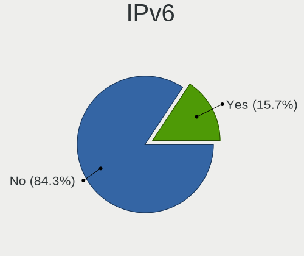

| Used | Computers | Percent |
|------|-----------|---------|
| No   | 591       | 84.31%  |
| Yes  | 110       | 15.69%  |

Bluetooth
---------

Bluetooth Vendor
----------------

Controller vendors

| Vendor                          | Computers | Percent |
|---------------------------------|-----------|---------|
| Intel                           | 110       | 61.8%   |
| Realtek Semiconductor           | 9         | 5.06%   |
| IMC Networks                    | 9         | 5.06%   |
| Cambridge Silicon Radio         | 9         | 5.06%   |
| Foxconn / Hon Hai               | 8         | 4.49%   |
| Apple                           | 8         | 4.49%   |
| Broadcom                        | 7         | 3.93%   |
| Qualcomm Atheros Communications | 4         | 2.25%   |
| ASUSTek Computer                | 4         | 2.25%   |
| Lite-On Technology              | 3         | 1.69%   |
| MediaTek                        | 2         | 1.12%   |
| Alps Electric                   | 2         | 1.12%   |
| Toshiba                         | 1         | 0.56%   |
| Ralink                          | 1         | 0.56%   |
| Hewlett-Packard                 | 1         | 0.56%   |

Bluetooth Model
---------------

Controller models

| Model                                                       | Computers | Percent |
|-------------------------------------------------------------|-----------|---------|
| Intel Bluetooth wireless interface                          | 51        | 28.49%  |
| Intel AX201 Bluetooth                                       | 21        | 11.73%  |
| Intel Bluetooth 9460/9560 Jefferson Peak (JfP)              | 14        | 7.82%   |
| Intel AX200 Bluetooth                                       | 11        | 6.15%   |
| Cambridge Silicon Radio Bluetooth Dongle (HCI mode)         | 9         | 5.03%   |
| Realtek Bluetooth Adapter                                   | 6         | 3.35%   |
| Intel Wireless-AC 3168 Bluetooth                            | 5         | 2.79%   |
| Apple Bluetooth Host Controller                             | 4         | 2.23%   |
| Intel AX211 Bluetooth                                       | 3         | 1.68%   |
| Intel AX210 Bluetooth                                       | 3         | 1.68%   |
| IMC Networks MediaTek Bluetooth Adapter                     | 3         | 1.68%   |
| Broadcom BCM2045B (BDC-2.1)                                 | 3         | 1.68%   |
| Apple Built-in Bluetooth 2.0+EDR HCI                        | 3         | 1.68%   |
| Qualcomm Atheros AR3012 Bluetooth 4.0                       | 2         | 1.12%   |
| IMC Networks Realtek Bluetooth Adapter                      | 2         | 1.12%   |
| IMC Networks Atheros AR3012 Bluetooth 4.0 Adapter           | 2         | 1.12%   |
| Foxconn / Hon Hai RZ616 Bluetooth Adapter                   | 2         | 1.12%   |
| Foxconn / Hon Hai Bluetooth USB Module                      | 2         | 1.12%   |
| Broadcom BCM20702 Bluetooth 4.0 [ThinkPad]                  | 2         | 1.12%   |
| ASUS Broadcom BCM20702A0 Bluetooth                          | 2         | 1.12%   |
| Alps Electric UGTZ4 Bluetooth                               | 2         | 1.12%   |
| Toshiba ASKEY Bluetooth Controller BTU1030                  | 1         | 0.56%   |
| Realtek RTL8723A Bluetooth                                  | 1         | 0.56%   |
| Realtek  Bluetooth 4.2 Adapter                              | 1         | 0.56%   |
| Realtek Bluetooth 4.0 Adapter                               | 1         | 0.56%   |
| Ralink RT3290 Bluetooth                                     | 1         | 0.56%   |
| Qualcomm Atheros Dell Wireless 1707 Bluetooth 4.0 LE Device | 1         | 0.56%   |
| Qualcomm Atheros AR3011 Bluetooth (no firmware)             | 1         | 0.56%   |
| MediaTek RZ608 Bluetooth Adapter                            | 1         | 0.56%   |
| MediaTek Bluetooth Adapter                                  | 1         | 0.56%   |
| Lite-On Qualcomm Atheros QCA9377 Bluetooth                  | 1         | 0.56%   |
| Lite-On Broadcom Bluetooth 4.0 USB                          | 1         | 0.56%   |
| Lite-On Bluetooth USB Module                                | 1         | 0.56%   |
| Intel Wireless-AC 9260 Bluetooth Adapter                    | 1         | 0.56%   |
| Intel Centrino Bluetooth Wireless Transceiver               | 1         | 0.56%   |
| Intel Centrino Advanced-N 6230 Bluetooth adapter            | 1         | 0.56%   |
| IMC Networks Realtek Bluetooth 4.0 + High Speed Chip        | 1         | 0.56%   |
| IMC Networks Bluetooth                                      | 1         | 0.56%   |
| HP Bluetooth 2.0 Interface [Broadcom BCM2045]               | 1         | 0.56%   |
| Foxconn / Hon Hai Wireless_Device                           | 1         | 0.56%   |

Sound
-----

Sound Vendor
------------

Sound card vendors

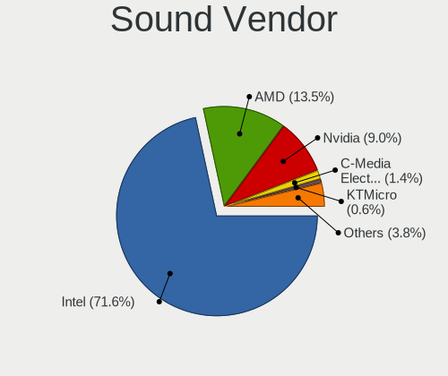

| Vendor                                       | Computers | Percent |
|----------------------------------------------|-----------|---------|
| Intel                                        | 447       | 71.63%  |
| AMD                                          | 84        | 13.46%  |
| Nvidia                                       | 56        | 8.97%   |
| C-Media Electronics                          | 9         | 1.44%   |
| KTMicro                                      | 4         | 0.64%   |
| Logitech                                     | 3         | 0.48%   |
| ASUSTek Computer                             | 3         | 0.48%   |
| Texas Instruments                            | 2         | 0.32%   |
| Plantronics                                  | 2         | 0.32%   |
| Micro Star International                     | 2         | 0.32%   |
| Creative Labs                                | 2         | 0.32%   |
| Zoran Co. Personal Media Division (Nogatech) | 1         | 0.16%   |
| Yamaha                                       | 1         | 0.16%   |
| XMOS                                         | 1         | 0.16%   |
| SteelSeries ApS                              | 1         | 0.16%   |
| Sony                                         | 1         | 0.16%   |
| MosArt Semiconductor                         | 1         | 0.16%   |
| Generalplus Technology                       | 1         | 0.16%   |
| Elgato Systems                               | 1         | 0.16%   |
| Creative Technology                          | 1         | 0.16%   |
| Apple                                        | 1         | 0.16%   |

Sound Model
-----------

Sound card models

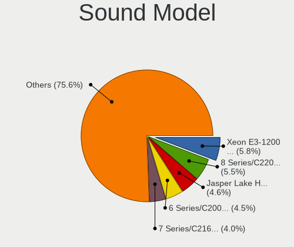

| Model                                                                                             | Computers | Percent |
|---------------------------------------------------------------------------------------------------|-----------|---------|
| Intel Xeon E3-1200 v3/4th Gen Core Processor HD Audio Controller                                  | 43        | 5.8%    |
| Intel 8 Series/C220 Series Chipset High Definition Audio Controller                               | 41        | 5.53%   |
| Intel Jasper Lake HD Audio                                                                        | 34        | 4.59%   |
| Intel 6 Series/C200 Series Chipset Family High Definition Audio Controller                        | 33        | 4.45%   |
| Intel 7 Series/C216 Chipset Family High Definition Audio Controller                               | 30        | 4.05%   |
| Intel Sunrise Point-LP HD Audio                                                                   | 26        | 3.51%   |
| Intel Celeron/Pentium Silver Processor High Definition Audio                                      | 25        | 3.37%   |
| Intel Alder Lake-N PCH High Definition Audio Controller                                           | 24        | 3.24%   |
| Intel Atom/Celeron/Pentium Processor x5-E8000/J3xxx/N3xxx Series High Definition Audio Controller | 23        | 3.1%    |
| Intel 100 Series/C230 Series Chipset Family HD Audio Controller                                   | 22        | 2.97%   |
| Intel Cannon Lake PCH cAVS                                                                        | 20        | 2.7%    |
| Intel 8 Series HD Audio Controller                                                                | 20        | 2.7%    |
| AMD Family 17h/19h/1ah HD Audio Controller                                                        | 19        | 2.56%   |
| Intel Haswell-ULT HD Audio Controller                                                             | 18        | 2.43%   |
| Intel 200 Series PCH HD Audio                                                                     | 18        | 2.43%   |
| Intel Broadwell-U Audio Controller                                                                | 15        | 2.02%   |
| AMD SBx00 Azalia (Intel HDA)                                                                      | 14        | 1.89%   |
| Intel Wildcat Point-LP High Definition Audio Controller                                           | 13        | 1.75%   |
| Intel 5 Series/3400 Series Chipset High Definition Audio                                          | 11        | 1.48%   |
| AMD FCH Azalia Controller                                                                         | 11        | 1.48%   |
| Intel Celeron N3350/Pentium N4200/Atom E3900 Series Audio Cluster                                 | 10        | 1.35%   |
| AMD Raven/Raven2/Fenghuang HDMI/DP Audio Controller                                               | 10        | 1.35%   |
| Intel Elkhart Lake High Density Audio bus interface                                               | 9         | 1.21%   |
| AMD Renoir Radeon High Definition Audio Controller                                                | 9         | 1.21%   |
| Intel 82801I (ICH9 Family) HD Audio Controller                                                    | 8         | 1.08%   |
| AMD Family 17h (Models 00h-0fh) HD Audio Controller                                               | 8         | 1.08%   |
| Nvidia High Definition Audio Controller                                                           | 7         | 0.94%   |
| Intel Tiger Lake-LP Smart Sound Technology Audio Controller                                       | 7         | 0.94%   |
| Intel Alder Lake-S HD Audio Controller                                                            | 7         | 0.94%   |
| Intel 82801JI (ICH10 Family) HD Audio Controller                                                  | 7         | 0.94%   |
| AMD Starship/Matisse HD Audio Controller                                                          | 7         | 0.94%   |
| Nvidia GK208 HDMI/DP Audio Controller                                                             | 6         | 0.81%   |
| Intel NM10/ICH7 Family High Definition Audio Controller                                           | 6         | 0.81%   |
| Intel Atom Processor Z36xxx/Z37xxx Series High Definition Audio Controller                        | 6         | 0.81%   |
| AMD Kaveri HDMI/DP Audio Controller                                                               | 6         | 0.81%   |
| AMD Kabini HDMI/DP Audio                                                                          | 6         | 0.81%   |
| Nvidia GM107 High Definition Audio Controller [GeForce 940MX]                                     | 5         | 0.67%   |
| Nvidia MCP61 High Definition Audio                                                                | 4         | 0.54%   |
| Nvidia GF119 HDMI Audio Controller                                                                | 4         | 0.54%   |
| KTMicro KT USB Audio                                                                              | 4         | 0.54%   |

Memory
------

Memory Vendor
-------------

Memory module vendors

| Vendor                       | Computers | Percent |
|------------------------------|-----------|---------|
| Samsung Electronics          | 129       | 17.48%  |
| SK hynix                     | 115       | 15.58%  |
| Kingston                     | 99        | 13.41%  |
| Unknown                      | 59        | 7.99%   |
| Micron Technology            | 59        | 7.99%   |
| Crucial                      | 57        | 7.72%   |
| Corsair                      | 40        | 5.42%   |
| G.Skill                      | 39        | 5.28%   |
| Unknown                      | 26        | 3.52%   |
| A-DATA Technology            | 14        | 1.9%    |
| Unknown (ABCD)               | 13        | 1.76%   |
| Ramaxel Technology           | 10        | 1.36%   |
| Transcend                    | 8         | 1.08%   |
| Team                         | 7         | 0.95%   |
| Timetec                      | 6         | 0.81%   |
| Patriot                      | 6         | 0.81%   |
| Apacer                       | 6         | 0.81%   |
| Unknown (0x0C26)             | 4         | 0.54%   |
| Nanya Technology             | 4         | 0.54%   |
| Elpida                       | 4         | 0.54%   |
| Patriot Memory (PDP Systems) | 3         | 0.41%   |
| OCZ                          | 3         | 0.41%   |
| Wodposit                     | 2         | 0.27%   |
| Unknown (0x0C6E)             | 2         | 0.27%   |
| Avant                        | 2         | 0.27%   |
| AMD                          | 2         | 0.27%   |
| 0C26000000AD                 | 2         | 0.27%   |
| V-Color                      | 1         | 0.14%   |
| Unknown (AB)                 | 1         | 0.14%   |
| Unknown (0x7FFF)             | 1         | 0.14%   |
| Unknown (0x0DD5)             | 1         | 0.14%   |
| Unknown (0x0B45)             | 1         | 0.14%   |
| Toshiba                      | 1         | 0.14%   |
| Teikon                       | 1         | 0.14%   |
| Smart Modular                | 1         | 0.14%   |
| SK_Hynix                     | 1         | 0.14%   |
| Silicon Power                | 1         | 0.14%   |
| Qimonda                      | 1         | 0.14%   |
| PNY                          | 1         | 0.14%   |
| Lexar Co Limited             | 1         | 0.14%   |

Memory Model
------------

Memory module models

| Model                                                          | Computers | Percent |
|----------------------------------------------------------------|-----------|---------|
| Unknown                                                        | 26        | 3.3%    |
| Unknown (ABCD) RAM 123456789012345678 2GB DIMM LPDDR4 2133MT/s | 12        | 1.52%   |
| SK hynix RAM HMT451U6BFR8C-PB 4GB DIMM DDR3 1600MT/s           | 6         | 0.76%   |
| Crucial RAM CT16G56C46S5.M8G1 16GB SODIMM DDR5 5600MT/s        | 6         | 0.76%   |
| Unknown RAM Module 2GB DIMM DDR2 800MT/s                       | 5         | 0.63%   |
| SK hynix RAM HMT451U6AFR8C-PB 4GB DIMM DDR3 1600MT/s           | 5         | 0.63%   |
| SK hynix RAM HMT451S6BFR8A-PB 4GB SODIMM DDR3 1600MT/s         | 5         | 0.63%   |
| Samsung RAM M471B5173DB0-YK0 4GB SODIMM DDR3 1600MT/s          | 5         | 0.63%   |
| Samsung RAM M425R1GB4BB0-CQKOL 8GB SODIMM DDR5 4800MT/s        | 5         | 0.63%   |
| Samsung RAM M378B5173EB0-YK0 4GB DIMM DDR3 1600MT/s            | 5         | 0.63%   |
| Kingston RAM KHX1600C9D3/4GX 4GB DIMM DDR3 1600MT/s            | 5         | 0.63%   |
| Crucial RAM CT102464BF160B.C16 8GB SODIMM DDR3 1600MT/s        | 5         | 0.63%   |
| Unknown RAM Module 8GB SODIMM DDR3 1600MT/s                    | 4         | 0.51%   |
| Unknown RAM Module 4GB SODIMM DDR3 1333MT/s                    | 4         | 0.51%   |
| Unknown RAM Module 4GB DIMM DDR3 1333MT/s                      | 4         | 0.51%   |
| Team RAM TEAMGROUP-UD4-3200 8GB DIMM DDR4 3200MT/s             | 4         | 0.51%   |
| SK hynix RAM HMT451U6BFR8A-PB 4GB DIMM DDR3 1600MT/s           | 4         | 0.51%   |
| SK hynix RAM HMT41GU6BFR8A-PB 8GB DIMM DDR3 1600MT/s           | 4         | 0.51%   |
| Samsung RAM M471B5273DH0-CH9 4GB SODIMM DDR3 1334MT/s          | 4         | 0.51%   |
| Samsung RAM M471A1K43CB1-CTD 8GB SODIMM DDR4 2667MT/s          | 4         | 0.51%   |
| Samsung RAM M378B5173QH0-CK0 4GB DIMM DDR3 1600MT/s            | 4         | 0.51%   |
| Samsung RAM M378B1G73DB0-CK0 8GB DIMM DDR3 1600MT/s            | 4         | 0.51%   |
| Micron RAM 8ATF1G64AZ-2G6E1 8GB DIMM DDR4 2667MT/s             | 4         | 0.51%   |
| Kingston RAM 99U5428-018.A00LF 8GB SODIMM DDR3 1600MT/s        | 4         | 0.51%   |
| G.Skill RAM F4-3200C16-8GVKB 8GB DIMM DDR4 3200MT/s            | 4         | 0.51%   |
| Unknown RAM Module 8GB 1600MT/s                                | 3         | 0.38%   |
| Unknown RAM Module 4GB DIMM 1333MT/s                           | 3         | 0.38%   |
| Unknown RAM Module 2GB DIMM SDRAM                              | 3         | 0.38%   |
| SK hynix RAM HMT451S6AFR8A-PB 4GB SODIMM DDR3 1600MT/s         | 3         | 0.38%   |
| SK hynix RAM HMT351U7BFR8A-H9 4GB DIMM DDR3 1333MT/s           | 3         | 0.38%   |
| SK hynix RAM HMT351U6CFR8C-PB 4GB DIMM DDR3 1600MT/s           | 3         | 0.38%   |
| SK hynix RAM HMA82GS6CJR8N-VK 16GB SODIMM DDR4 2667MT/s        | 3         | 0.38%   |
| SK hynix RAM HMA81GS6AFR8N-UH 8GB SODIMM DDR4 2400MT/s         | 3         | 0.38%   |
| Samsung RAM M471B5173QH0-YK0 4GB SODIMM DDR3 1600MT/s          | 3         | 0.38%   |
| Samsung RAM M471B5173DB0-YK0 4GB DIMM DDR3 1600MT/s            | 3         | 0.38%   |
| Samsung RAM M471B1G73DB0-YK0 8GB DIMM DDR3 1600MT/s            | 3         | 0.38%   |
| Samsung RAM M471A2K43CB1-CTD 16GB SODIMM DDR4 2667MT/s         | 3         | 0.38%   |
| Samsung RAM M471A1K43CB1-CRC 8GB SODIMM DDR4 2667MT/s          | 3         | 0.38%   |
| Samsung RAM M378A1K43CB2-CTD 8GB DIMM DDR4 2667MT/s            | 3         | 0.38%   |
| Micron RAM 8ATF1G64HZ-3G2R1 8GB SODIMM DDR4 3200MT/s           | 3         | 0.38%   |

Memory Kind
-----------

Memory module kinds

| Kind    | Computers | Percent |
|---------|-----------|---------|
| DDR3    | 277       | 42.62%  |
| DDR4    | 259       | 39.85%  |
| DDR5    | 30        | 4.62%   |
| DDR2    | 27        | 4.15%   |
| LPDDR4  | 19        | 2.92%   |
| Unknown | 18        | 2.77%   |
| SDRAM   | 10        | 1.54%   |
| LPDDR5  | 4         | 0.62%   |
| LPDDR3  | 4         | 0.62%   |
| DDR     | 2         | 0.31%   |

Memory Form Factor
------------------

Physical design of the memory module

| Name         | Computers | Percent |
|--------------|-----------|---------|
| DIMM         | 344       | 53.67%  |
| SODIMM       | 273       | 42.59%  |
| Row Of Chips | 12        | 1.87%   |
| Unknown      | 4         | 0.62%   |
| RIMM         | 3         | 0.47%   |
| Chip         | 3         | 0.47%   |
| FB-DIMM      | 2         | 0.31%   |

Memory Size
-----------

Memory module size

| Size  | Computers | Percent |
|-------|-----------|---------|
| 8192  | 248       | 35.38%  |
| 4096  | 213       | 30.39%  |
| 16384 | 116       | 16.55%  |
| 2048  | 77        | 10.98%  |
| 32768 | 23        | 3.28%   |
| 1024  | 20        | 2.85%   |
| 512   | 4         | 0.57%   |

Memory Speed
------------

Memory module speed

| Speed   | Computers | Percent |
|---------|-----------|---------|
| 1600    | 190       | 27.34%  |
| 1333    | 86        | 12.37%  |
| 3200    | 80        | 11.51%  |
| 2400    | 76        | 10.94%  |
| 2667    | 66        | 9.5%    |
| 2133    | 49        | 7.05%   |
| 4800    | 22        | 3.17%   |
| 800     | 19        | 2.73%   |
| 1067    | 15        | 2.16%   |
| 667     | 15        | 2.16%   |
| 2666    | 12        | 1.73%   |
| Unknown | 12        | 1.73%   |
| 5600    | 7         | 1.01%   |
| 1334    | 7         | 1.01%   |
| 6400    | 5         | 0.72%   |
| 3600    | 5         | 0.72%   |
| 3000    | 5         | 0.72%   |
| 1066    | 4         | 0.58%   |
| 1867    | 3         | 0.43%   |
| 1866    | 3         | 0.43%   |
| 4267    | 2         | 0.29%   |
| 2933    | 2         | 0.29%   |
| 533     | 2         | 0.29%   |
| 400     | 2         | 0.29%   |
| 5200    | 1         | 0.14%   |
| 3733    | 1         | 0.14%   |
| 3400    | 1         | 0.14%   |
| 2800    | 1         | 0.14%   |
| 1088    | 1         | 0.14%   |
| 333     | 1         | 0.14%   |

Printers & scanners
-------------------

Printer Vendor
--------------

Printer device vendors

| Vendor              | Computers | Percent |
|---------------------|-----------|---------|
| Hewlett-Packard     | 2         | 40%     |
| Brother Industries  | 2         | 40%     |
| Samsung Electronics | 1         | 20%     |

Printer Model
-------------

Printer device models

| Model                              | Computers | Percent |
|------------------------------------|-----------|---------|
| Samsung ML-1610 Mono Laser Printer | 1         | 20%     |
| HP LaserJet 2200                   | 1         | 20%     |
| HP Color LaserJet CP1215           | 1         | 20%     |
| Brother HL-L5200DW series          | 1         | 20%     |
| Brother HL-L2300D series           | 1         | 20%     |

Scanner Vendor
--------------

Scanner device vendors

| Vendor      | Computers | Percent |
|-------------|-----------|---------|
| Seiko Epson | 1         | 50%     |
| Canon       | 1         | 50%     |

Scanner Model
-------------

Scanner device models

| Model                              | Computers | Percent |
|------------------------------------|-----------|---------|
| Seiko Epson PX-501A [Stylus NX400] | 1         | 50%     |
| Canon CanoScan LiDE 220            | 1         | 50%     |

Camera
------

Camera Vendor
-------------

Camera device vendors

| Vendor                        | Computers | Percent |
|-------------------------------|-----------|---------|
| Chicony Electronics           | 24        | 28.57%  |
| Realtek Semiconductor         | 8         | 9.52%   |
| Microdia                      | 8         | 9.52%   |
| IMC Networks                  | 8         | 9.52%   |
| Bison Electronics             | 7         | 8.33%   |
| Logitech                      | 4         | 4.76%   |
| Lite-On Technology            | 4         | 4.76%   |
| Apple                         | 4         | 4.76%   |
| Syntek                        | 3         | 3.57%   |
| Sunplus Innovation Technology | 3         | 3.57%   |
| Suyin                         | 2         | 2.38%   |
| Luxvisions Innotech Limited   | 2         | 2.38%   |
| Silicon Motion                | 1         | 1.19%   |
| Ricoh                         | 1         | 1.19%   |
| Quanta                        | 1         | 1.19%   |
| Lenovo                        | 1         | 1.19%   |
| eMeet                         | 1         | 1.19%   |
| ALi                           | 1         | 1.19%   |
| Alcor Micro                   | 1         | 1.19%   |

Camera Model
------------

Camera device models

| Model                                                       | Computers | Percent |
|-------------------------------------------------------------|-----------|---------|
| Chicony Integrated Camera                                   | 7         | 8.33%   |
| Lite-On Integrated Camera                                   | 4         | 4.76%   |
| Bison Integrated Camera                                     | 4         | 4.76%   |
| Microdia Integrated_Webcam_HD                               | 3         | 3.57%   |
| IMC Networks Integrated Camera                              | 3         | 3.57%   |
| Chicony HD Webcam                                           | 3         | 3.57%   |
| Realtek PC Camera                                           | 2         | 2.38%   |
| Realtek Integrated Webcam HD                                | 2         | 2.38%   |
| Luxvisions Innotech Limited Integrated Camera               | 2         | 2.38%   |
| Chicony Integrated Camera [ThinkPad]                        | 2         | 2.38%   |
| Chicony 2.0M UVC Webcam / CNF7129                           | 2         | 2.38%   |
| Syntek Lenovo EasyCamera                                    | 1         | 1.19%   |
| Syntek Integrated Camera                                    | 1         | 1.19%   |
| Syntek ASUS USB2.0 camera                                   | 1         | 1.19%   |
| Suyin Acer/HP Integrated Webcam [CN0314]                    | 1         | 1.19%   |
| Suyin 1.3M WebCam (notebook emachines E730, Acer sub-brand) | 1         | 1.19%   |
| Sunplus Laptop_Integrated_Webcam_FHD                        | 1         | 1.19%   |
| Sunplus ASUS Webcam                                         | 1         | 1.19%   |
| Sunplus 2-USB 2.0 Camera                                    | 1         | 1.19%   |
| Silicon Motion Lenovo EasyCamera                            | 1         | 1.19%   |
| Ricoh Integrated Webcam                                     | 1         | 1.19%   |
| Realtek USB 2.0 PC Camera                                   | 1         | 1.19%   |
| Realtek Laptop Camera                                       | 1         | 1.19%   |
| Realtek Integrated Webcam                                   | 1         | 1.19%   |
| Realtek HD Webcam - Realtek                                 | 1         | 1.19%   |
| Quanta Realtek PC Camera                                    | 1         | 1.19%   |
| Microdia Sonix USB 2.0 Camera                               | 1         | 1.19%   |
| Microdia Laptop_Integrated_Webcam_2M                        | 1         | 1.19%   |
| Microdia JOYACCESS JA-Webcam                                | 1         | 1.19%   |
| Microdia Integrated Webcam HD                               | 1         | 1.19%   |
| Microdia Integrated Webcam                                  | 1         | 1.19%   |
| Logitech Webcam C310                                        | 1         | 1.19%   |
| Logitech HD Pro Webcam C920                                 | 1         | 1.19%   |
| Logitech C920 HD Pro Webcam                                 | 1         | 1.19%   |
| Logitech BRIO Ultra HD Webcam                               | 1         | 1.19%   |
| Lenovo Integrated Webcam [R5U877]                           | 1         | 1.19%   |
| IMC Networks UVC VGA Webcam                                 | 1         | 1.19%   |
| IMC Networks Realtek PC Camera                              | 1         | 1.19%   |
| IMC Networks Realtek DMFT RGB                               | 1         | 1.19%   |
| IMC Networks Integrated Webcam                              | 1         | 1.19%   |

Security
--------

Fingerprint Vendor
------------------

Fingerprint sensor vendors

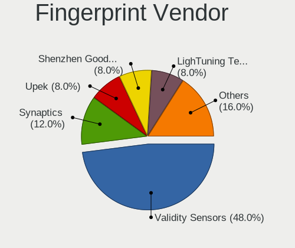

| Vendor                     | Computers | Percent |
|----------------------------|-----------|---------|
| Validity Sensors           | 12        | 48%     |
| Synaptics                  | 3         | 12%     |
| Upek                       | 2         | 8%      |
| Shenzhen Goodix Technology | 2         | 8%      |
| LighTuning Technology      | 2         | 8%      |
| Elan Microelectronics      | 2         | 8%      |
| AuthenTec                  | 2         | 8%      |

Fingerprint Model
-----------------

Fingerprint sensor models

| Model                                                  | Computers | Percent |
|--------------------------------------------------------|-----------|---------|
| Validity Sensors VFS 5011 fingerprint sensor           | 5         | 20%     |
| Validity Sensors VFS7500 Touch Fingerprint Sensor      | 2         | 8%      |
| Validity Sensors Synaptics WBDI                        | 2         | 8%      |
| Upek Biometric Touchchip/Touchstrip Fingerprint Sensor | 2         | 8%      |
| Synaptics Metallica MIS Touch Fingerprint Reader       | 2         | 8%      |
| Shenzhen Goodix Fingerprint Reader                     | 2         | 8%      |
| LighTuning EgisTec Touch Fingerprint Sensor            | 2         | 8%      |
| Elan Fingerprint Sensor                                | 2         | 8%      |
| Validity Sensors VFS495 Fingerprint Reader             | 1         | 4%      |
| Validity Sensors VFS Fingerprint sensor                | 1         | 4%      |
| Validity Sensors Fingerprint scanner                   | 1         | 4%      |
| Synaptics Prometheus MIS Touch Fingerprint Reader      | 1         | 4%      |
| AuthenTec AES2660                                      | 1         | 4%      |
| AuthenTec AES2501 Fingerprint Sensor                   | 1         | 4%      |

Chipcard Vendor
---------------

Chipcard module vendors

Zero info for selected period =(

Chipcard Model
--------------

Chipcard module models

Zero info for selected period =(

Unsupported
-----------

Unsupported Devices
-------------------

Total unsupported devices on board

| Total | Computers | Percent |
|-------|-----------|---------|
| 1     | 343       | 48.86%  |
| 0     | 170       | 24.22%  |
| 2     | 119       | 16.95%  |
| 3     | 53        | 7.55%   |
| 4     | 15        | 2.14%   |
| 5     | 2         | 0.28%   |

Unsupported Device Types
------------------------

Types of unsupported devices

| Type                     | Computers | Percent |
|--------------------------|-----------|---------|
| Communication controller | 458       | 66.18%  |
| Bluetooth                | 83        | 11.99%  |
| Net/wireless             | 48        | 6.94%   |
| Card reader              | 24        | 3.47%   |
| Firewire controller      | 21        | 3.03%   |
| Fingerprint reader       | 18        | 2.6%    |
| Net/ethernet             | 13        | 1.88%   |
| Sound                    | 9         | 1.3%    |
| Network                  | 9         | 1.3%    |
| Graphics card            | 4         | 0.58%   |
| Storage/raid             | 2         | 0.29%   |
| Storage                  | 2         | 0.29%   |
| Storage/ata              | 1         | 0.14%   |

