BSD in China - Tested Hardware & Statistics
-------------------------------------------

A project to collect tested hardware configurations for BSD in China.

Anyone can contribute to this report by the [hw-probe](https://github.com/linuxhw/hw-probe/blob/master/INSTALL.BSD.md) tool:

    hw-probe -all -upload

Please contribute! Especially if your hardware is rare.

This is a report for all computer types. See also reports for [desktops](/Location/China/Desktop/README.md) and [notebooks](/Location/China/Notebook/README.md).

Contents
--------

* [ Test Cases ](#test-cases)

* [ System ](#system)
  - [ OS                       ](#os)
  - [ OS Family                ](#os-family)
  - [ Arch                     ](#arch)
  - [ DE                       ](#de)
  - [ Display Server           ](#display-server)
  - [ Display Manager          ](#display-manager)
  - [ OS Lang                  ](#os-lang)
  - [ Boot Mode                ](#boot-mode)
  - [ Filesystem               ](#filesystem)
  - [ Part. scheme             ](#part-scheme)

* [ Board ](#board)
  - [ Vendor                   ](#vendor)
  - [ Model                    ](#model)
  - [ Model Family             ](#model-family)
  - [ MFG Year                 ](#mfg-year)
  - [ Form Factor              ](#form-factor)
  - [ Coreboot                 ](#coreboot)
  - [ RAM Size                 ](#ram-size)
  - [ RAM Used                 ](#ram-used)
  - [ Total Drives             ](#total-drives)
  - [ Has CD-ROM               ](#has-cd-rom)
  - [ Has Ethernet             ](#has-ethernet)
  - [ Has WiFi                 ](#has-wifi)
  - [ Has Bluetooth            ](#has-bluetooth)

* [ Location ](#location)
  - [ Country                  ](#country)
  - [ City                     ](#city)

* [ Drives ](#drives)
  - [ Drive Vendor             ](#drive-vendor)
  - [ Drive Model              ](#drive-model)
  - [ HDD Vendor               ](#hdd-vendor)
  - [ SSD Vendor               ](#ssd-vendor)
  - [ Drive Kind               ](#drive-kind)
  - [ Drive Connector          ](#drive-connector)
  - [ Drive Size               ](#drive-size)
  - [ Space Total              ](#space-total)
  - [ Space Used               ](#space-used)
  - [ Malfunc. Drives          ](#malfunc-drives)
  - [ Malfunc. Drive Vendor    ](#malfunc-drive-vendor)
  - [ Malfunc. HDD Vendor      ](#malfunc-hdd-vendor)
  - [ Malfunc. Drive Kind      ](#malfunc-drive-kind)
  - [ Failed Drives            ](#failed-drives)
  - [ Failed Drive Vendor      ](#failed-drive-vendor)
  - [ Drive Status             ](#drive-status)

* [ Storage controller ](#storage-controller)
  - [ Storage Vendor           ](#storage-vendor)
  - [ Storage Model            ](#storage-model)
  - [ Storage Kind             ](#storage-kind)

* [ Processor ](#processor)
  - [ CPU Vendor               ](#cpu-vendor)
  - [ CPU Model                ](#cpu-model)
  - [ CPU Model Family         ](#cpu-model-family)
  - [ CPU Cores                ](#cpu-cores)
  - [ CPU Sockets              ](#cpu-sockets)
  - [ CPU Threads              ](#cpu-threads)
  - [ CPU Microarch            ](#cpu-microarch)

* [ Graphics ](#graphics)
  - [ GPU Vendor               ](#gpu-vendor)
  - [ GPU Model                ](#gpu-model)
  - [ GPU Combo                ](#gpu-combo)
  - [ GPU Driver               ](#gpu-driver)
  - [ GPU Memory               ](#gpu-memory)

* [ Monitor ](#monitor)
  - [ Monitor Vendor           ](#monitor-vendor)
  - [ Monitor Model            ](#monitor-model)
  - [ Monitor Resolution       ](#monitor-resolution)
  - [ Monitor Diagonal         ](#monitor-diagonal)
  - [ Monitor Width            ](#monitor-width)
  - [ Aspect Ratio             ](#aspect-ratio)
  - [ Monitor Area             ](#monitor-area)
  - [ Pixel Density            ](#pixel-density)
  - [ Multiple Monitors        ](#multiple-monitors)

* [ Network ](#network)
  - [ Net Controller Vendor    ](#net-controller-vendor)
  - [ Net Controller Model     ](#net-controller-model)
  - [ Wireless Vendor          ](#wireless-vendor)
  - [ Wireless Model           ](#wireless-model)
  - [ Ethernet Vendor          ](#ethernet-vendor)
  - [ Ethernet Model           ](#ethernet-model)
  - [ Net Controller Kind      ](#net-controller-kind)
  - [ Used Controller          ](#used-controller)
  - [ NICs                     ](#nics)
  - [ IPv6                     ](#ipv6)

* [ Bluetooth ](#bluetooth)
  - [ Bluetooth Vendor         ](#bluetooth-vendor)
  - [ Bluetooth Model          ](#bluetooth-model)

* [ Sound ](#sound)
  - [ Sound Vendor             ](#sound-vendor)
  - [ Sound Model              ](#sound-model)

* [ Memory ](#memory)
  - [ Memory Vendor            ](#memory-vendor)
  - [ Memory Model             ](#memory-model)
  - [ Memory Kind              ](#memory-kind)
  - [ Memory Form Factor       ](#memory-form-factor)
  - [ Memory Size              ](#memory-size)
  - [ Memory Speed             ](#memory-speed)

* [ Printers & scanners ](#printers--scanners)
  - [ Printer Vendor           ](#printer-vendor)
  - [ Printer Model            ](#printer-model)
  - [ Scanner Vendor           ](#scanner-vendor)
  - [ Scanner Model            ](#scanner-model)

* [ Camera ](#camera)
  - [ Camera Vendor            ](#camera-vendor)
  - [ Camera Model             ](#camera-model)

* [ Security ](#security)
  - [ Fingerprint Vendor       ](#fingerprint-vendor)
  - [ Fingerprint Model        ](#fingerprint-model)
  - [ Chipcard Vendor          ](#chipcard-vendor)
  - [ Chipcard Model           ](#chipcard-model)

* [ Unsupported ](#unsupported)
  - [ Unsupported Devices      ](#unsupported-devices)
  - [ Unsupported Device Types ](#unsupported-device-types)

Test Cases
----------

Total: 436

| Vendor        | Model                       | Form-Factor | Probe                                                     | Date         |
|---------------|-----------------------------|-------------|-----------------------------------------------------------|--------------|
| Lenovo        | SHARKBAY 0B98401 WIN        | Desktop     | [fb353cc6aa](https://bsd-hardware.info/?probe=fb353cc6aa) | Dec 29, 2025 |
| CncTion       | Tiger Lake-6L B0            | Desktop     | [737e686c03](https://bsd-hardware.info/?probe=737e686c03) | Dec 28, 2025 |
| Lenovo        | ThinkPad E14 Gen 3 20Y70... | Notebook    | [0d4d6a5811](https://bsd-hardware.info/?probe=0d4d6a5811) | Dec 25, 2025 |
| Lenovo        | ThinkPad E14 Gen 3 20Y70... | Notebook    | [30220e13a3](https://bsd-hardware.info/?probe=30220e13a3) | Dec 20, 2025 |
| Unknown       | HSX-TGLNP                   | Desktop     | [d66b1a66aa](https://bsd-hardware.info/?probe=d66b1a66aa) | Dec 19, 2025 |
| Dell          | 02C2CP A03                  | Server      | [ae73e09add](https://bsd-hardware.info/?probe=ae73e09add) | Dec 18, 2025 |
| Dell          | 02C2CP A03                  | Server      | [9dc57f9add](https://bsd-hardware.info/?probe=9dc57f9add) | Dec 18, 2025 |
| Techvision    | TVI7309X B0                 | Desktop     | [cfe4b6d92e](https://bsd-hardware.info/?probe=cfe4b6d92e) | Dec 10, 2025 |
| HUAWEI        | MRGFG-XX                    | Notebook    | [1d96ab83c2](https://bsd-hardware.info/?probe=1d96ab83c2) | Nov 30, 2025 |
| Lenovo        | 312D SDK0J40675 WIN 3305... | Mini pc     | [db2c263466](https://bsd-hardware.info/?probe=db2c263466) | Nov 28, 2025 |
| MSI           | B450M MORTAR TITANIUM       | Desktop     | [ec60f694f7](https://bsd-hardware.info/?probe=ec60f694f7) | Nov 15, 2025 |
| MSI           | B450M MORTAR TITANIUM       | Desktop     | [cccc94e04a](https://bsd-hardware.info/?probe=cccc94e04a) | Nov 15, 2025 |
| OEM           | A55                         | Desktop     | [4ed41d1482](https://bsd-hardware.info/?probe=4ed41d1482) | Nov 08, 2025 |
| OEM           | A55                         | Desktop     | [7fffd8a70b](https://bsd-hardware.info/?probe=7fffd8a70b) | Nov 08, 2025 |
| Dell          | Latitude E5470              | Notebook    | [a7cb7055f2](https://bsd-hardware.info/?probe=a7cb7055f2) | Nov 08, 2025 |
| YF            | ADLNN01 V0.1                | Desktop     | [6a11db30a7](https://bsd-hardware.info/?probe=6a11db30a7) | Nov 05, 2025 |
| ASRockRack    | X470D4U                     | Desktop     | [65b8404ec3](https://bsd-hardware.info/?probe=65b8404ec3) | Oct 30, 2025 |
| Dell          | 06MC09 A00                  | Mini pc     | [ef6397b370](https://bsd-hardware.info/?probe=ef6397b370) | Oct 17, 2025 |
| Maxtang       | AL50 V1.0                   | Desktop     | [836d832e90](https://bsd-hardware.info/?probe=836d832e90) | Sep 27, 2025 |
| Maxtang       | AL50 V1.0                   | Desktop     | [7ffb442904](https://bsd-hardware.info/?probe=7ffb442904) | Sep 27, 2025 |
| YF            | ADLNN01 V0.1                | Desktop     | [0e52ba0629](https://bsd-hardware.info/?probe=0e52ba0629) | Sep 18, 2025 |
| Unknown       | Unknown                     | Desktop     | [cca7a6bd2e](https://bsd-hardware.info/?probe=cca7a6bd2e) | Sep 10, 2025 |
| Acidanther... | MacBookPro12,1              | Notebook    | [794c5d7f0a](https://bsd-hardware.info/?probe=794c5d7f0a) | Sep 02, 2025 |
| Lenovo        | NOK                         | Desktop     | [49d075edf8](https://bsd-hardware.info/?probe=49d075edf8) | Aug 30, 2025 |
| HP            | 2187 A01                    | Desktop     | [d7f37c4be4](https://bsd-hardware.info/?probe=d7f37c4be4) | Aug 02, 2025 |
| HP            | 1791                        | Desktop     | [2af6bb3ada](https://bsd-hardware.info/?probe=2af6bb3ada) | Jul 24, 2025 |
| Intel         | SHARKBAY                    | Desktop     | [725496771a](https://bsd-hardware.info/?probe=725496771a) | Jul 23, 2025 |
| Unknown       | Unknown                     | Firewall    | [b44eedd7b8](https://bsd-hardware.info/?probe=b44eedd7b8) | Jul 23, 2025 |
| Intel         | SKYBAY                      | Desktop     | [140231475e](https://bsd-hardware.info/?probe=140231475e) | Jul 22, 2025 |
| Techvision    | TVI7309X B0                 | Desktop     | [b37132fb74](https://bsd-hardware.info/?probe=b37132fb74) | Jul 19, 2025 |
| Lenovo        | SHARKBAY 0B98401 WIN        | Desktop     | [c9cf382547](https://bsd-hardware.info/?probe=c9cf382547) | Jul 08, 2025 |
| Dell          | 01Y1CJ A00                  | Mini pc     | [eb3d084570](https://bsd-hardware.info/?probe=eb3d084570) | Jul 05, 2025 |
| Lenovo        | Legion R7000 APH9 83EG      | Notebook    | [4cf383ef70](https://bsd-hardware.info/?probe=4cf383ef70) | Jul 01, 2025 |
| IPASON        | J115M                       | Notebook    | [50a1fff202](https://bsd-hardware.info/?probe=50a1fff202) | Jun 28, 2025 |
| IPASON        | J115M                       | Notebook    | [af32dd4cbb](https://bsd-hardware.info/?probe=af32dd4cbb) | Jun 27, 2025 |
| Lenovo        | Legion R7000 APH9 83EG      | Notebook    | [6ed522ac59](https://bsd-hardware.info/?probe=6ed522ac59) | Jun 26, 2025 |
| Unknown       | Unknown                     | Desktop     | [4119467165](https://bsd-hardware.info/?probe=4119467165) | Jun 25, 2025 |
| ASRock        | N3150B-ITX                  | Desktop     | [41b7d2888f](https://bsd-hardware.info/?probe=41b7d2888f) | Jun 15, 2025 |
| HIKVISION     | 60G8-HK                     | Server      | [375deef5a3](https://bsd-hardware.info/?probe=375deef5a3) | Jun 13, 2025 |
| Lenovo        | Legion Y9000K 2021H 82K6    | Notebook    | [943c47444a](https://bsd-hardware.info/?probe=943c47444a) | Jun 12, 2025 |
| SANGFOR       | ZM5400A AF1320              | Desktop     | [adbc715c11](https://bsd-hardware.info/?probe=adbc715c11) | Jun 03, 2025 |
| Unknown       | Unknown                     | All in one  | [99ec5cc140](https://bsd-hardware.info/?probe=99ec5cc140) | May 31, 2025 |
| Techvision    | TVI7309X B0                 | Desktop     | [3ba42f1b79](https://bsd-hardware.info/?probe=3ba42f1b79) | May 30, 2025 |
| Lenovo        | 317A SDK0L77767 WIN 3423... | Desktop     | [e72b2865b3](https://bsd-hardware.info/?probe=e72b2865b3) | May 27, 2025 |
| Unknown       | Unknown                     | Desktop     | [4084b9876d](https://bsd-hardware.info/?probe=4084b9876d) | May 23, 2025 |
| Unknown       | Unknown                     | Desktop     | [3b2ff43e25](https://bsd-hardware.info/?probe=3b2ff43e25) | May 21, 2025 |
| Unknown       | Unknown                     | Desktop     | [6d6b12bbbc](https://bsd-hardware.info/?probe=6d6b12bbbc) | May 21, 2025 |
| HP            | 1791                        | Desktop     | [92060795fc](https://bsd-hardware.info/?probe=92060795fc) | May 21, 2025 |
| Google        | Atlas                       | Notebook    | [812b61c436](https://bsd-hardware.info/?probe=812b61c436) | May 20, 2025 |
| ASRock        | A320M-HDV R4.0              | Desktop     | [b343630264](https://bsd-hardware.info/?probe=b343630264) | May 15, 2025 |
| ASUSTek       | ASUS TUF Gaming F15 FX50... | Notebook    | [a63d7e5fbd](https://bsd-hardware.info/?probe=a63d7e5fbd) | May 14, 2025 |
| ASRock        | A320M-HDV R4.0              | Desktop     | [61a7e317c5](https://bsd-hardware.info/?probe=61a7e317c5) | May 13, 2025 |
| ASUSTek       | K84HR                       | Notebook    | [d153180727](https://bsd-hardware.info/?probe=d153180727) | May 11, 2025 |
| Unknown       | Unknown                     | Desktop     | [3c2a8638be](https://bsd-hardware.info/?probe=3c2a8638be) | May 06, 2025 |
| HIKVISION     | 60G8-HK                     | Server      | [eafab5590f](https://bsd-hardware.info/?probe=eafab5590f) | Apr 27, 2025 |
| Unknown       | DS2501                      | Desktop     | [39bf3696f6](https://bsd-hardware.info/?probe=39bf3696f6) | Apr 26, 2025 |
| Lenovo        | ThinkPad X61s 76673EJ       | Notebook    | [cfe34864ff](https://bsd-hardware.info/?probe=cfe34864ff) | Apr 24, 2025 |
| Gigabyte      | A520I DASH                  | Desktop     | [af22f1da10](https://bsd-hardware.info/?probe=af22f1da10) | Apr 20, 2025 |
| Intel         | X99H                        | Desktop     | [e88d5ce2d4](https://bsd-hardware.info/?probe=e88d5ce2d4) | Mar 30, 2025 |
| Unknown       | Unknown                     | Desktop     | [f64606c4b1](https://bsd-hardware.info/?probe=f64606c4b1) | Mar 17, 2025 |
| Intel         | SKYBAY                      | Desktop     | [45ee308c30](https://bsd-hardware.info/?probe=45ee308c30) | Mar 14, 2025 |
| Lenovo        | 1059 NOK                    | Desktop     | [46bfc09fb9](https://bsd-hardware.info/?probe=46bfc09fb9) | Mar 14, 2025 |
| Gigabyte      | A520I DASH                  | Desktop     | [406e7e5b14](https://bsd-hardware.info/?probe=406e7e5b14) | Mar 13, 2025 |
| Techvision    | TVI7309X B0                 | Desktop     | [2e2054df8b](https://bsd-hardware.info/?probe=2e2054df8b) | Mar 09, 2025 |
| Techvision    | TVI7309X B0                 | Desktop     | [e9e49ff91d](https://bsd-hardware.info/?probe=e9e49ff91d) | Mar 08, 2025 |
| MSI           | H81M-P33                    | Desktop     | [2061990247](https://bsd-hardware.info/?probe=2061990247) | Feb 26, 2025 |
| Gigabyte      | B85M-D2V-SI                 | Desktop     | [3442395302](https://bsd-hardware.info/?probe=3442395302) | Feb 25, 2025 |
| Lenovo        | 1059 NOK                    | Desktop     | [e88b2e7e02](https://bsd-hardware.info/?probe=e88b2e7e02) | Feb 22, 2025 |
| Unknown       | Unknown                     | Notebook    | [348e031ae2](https://bsd-hardware.info/?probe=348e031ae2) | Feb 14, 2025 |
| Haier         | T6-C                        | Notebook    | [06b37e1a45](https://bsd-hardware.info/?probe=06b37e1a45) | Jan 26, 2025 |
| Unknown       | Unknown                     | Desktop     | [e761010d61](https://bsd-hardware.info/?probe=e761010d61) | Jan 14, 2025 |
| Unknown       | RS33M2C3S 0302A3TW          | Server      | [30d29712f6](https://bsd-hardware.info/?probe=30d29712f6) | Jan 12, 2025 |
| Intel         | SKYBAY                      | Desktop     | [ffdabeb396](https://bsd-hardware.info/?probe=ffdabeb396) | Jan 09, 2025 |
| HUAWEI        | MRGFG-XX                    | Notebook    | [e23afd3be3](https://bsd-hardware.info/?probe=e23afd3be3) | Dec 29, 2024 |
| HUAWEI        | MRGFG-XX                    | Notebook    | [6095e2193f](https://bsd-hardware.info/?probe=6095e2193f) | Dec 29, 2024 |
| AZW           | EQ                          | Desktop     | [69a1ed7f82](https://bsd-hardware.info/?probe=69a1ed7f82) | Dec 29, 2024 |
| ASUSTek       | NUC12WSB-M 60AS00F0-MB5A... | Mini pc     | [a7565e386d](https://bsd-hardware.info/?probe=a7565e386d) | Dec 26, 2024 |
| Unknown       | Unknown                     | Desktop     | [2e05274300](https://bsd-hardware.info/?probe=2e05274300) | Dec 24, 2024 |
| Techvision    | TVI7309X B0                 | Desktop     | [887c112b05](https://bsd-hardware.info/?probe=887c112b05) | Dec 22, 2024 |
| MSI           | ZH77A-G43                   | Desktop     | [f000f3f0cc](https://bsd-hardware.info/?probe=f000f3f0cc) | Dec 16, 2024 |
| JGINYUE       | X99-8D4G Server             | Desktop     | [8a6322442d](https://bsd-hardware.info/?probe=8a6322442d) | Dec 13, 2024 |
| JGINYUE       | X99-8D4G Server             | Desktop     | [0a59d0dd76](https://bsd-hardware.info/?probe=0a59d0dd76) | Dec 09, 2024 |
| Intel         | NUC6i7KYB H90766-409        | Mini pc     | [e5dbf6c1ae](https://bsd-hardware.info/?probe=e5dbf6c1ae) | Dec 08, 2024 |
| Techvision    | TVI7309X B0                 | Desktop     | [8cb6acf4a0](https://bsd-hardware.info/?probe=8cb6acf4a0) | Dec 04, 2024 |
| Gigabyte      | H110MSTX-HD3 Reborn by d... | Desktop     | [c1473102cc](https://bsd-hardware.info/?probe=c1473102cc) | Nov 29, 2024 |
| Gigabyte      | H110MSTX-HD3 Reborn by d... | Desktop     | [d99e7bd515](https://bsd-hardware.info/?probe=d99e7bd515) | Nov 28, 2024 |
| GPD           | MicroPC                     | Notebook    | [dac20acac9](https://bsd-hardware.info/?probe=dac20acac9) | Nov 22, 2024 |
| Lenovo        | ThinkPad T430 2344DUC       | Notebook    | [63d0cde972](https://bsd-hardware.info/?probe=63d0cde972) | Nov 19, 2024 |
| Samsung       | 535U3C                      | Notebook    | [615b4a9430](https://bsd-hardware.info/?probe=615b4a9430) | Nov 18, 2024 |
| Dell          | 01Y1CJ A00                  | Mini pc     | [74c8a6aead](https://bsd-hardware.info/?probe=74c8a6aead) | Nov 09, 2024 |
| Unknown       | Unknown                     | Desktop     | [dd5a922e5c](https://bsd-hardware.info/?probe=dd5a922e5c) | Nov 05, 2024 |
| Techvision    | TVI7309X B0                 | Desktop     | [bc8f05dd4e](https://bsd-hardware.info/?probe=bc8f05dd4e) | Oct 30, 2024 |
| HP            | 1791                        | Desktop     | [ed11ebb449](https://bsd-hardware.info/?probe=ed11ebb449) | Oct 29, 2024 |
| Dell          | 01Y1CJ A00                  | Mini pc     | [1da824b647](https://bsd-hardware.info/?probe=1da824b647) | Oct 26, 2024 |
| HP            | ProBook 455 15.6 inch G9... | Notebook    | [e76040ded0](https://bsd-hardware.info/?probe=e76040ded0) | Oct 25, 2024 |
| Lenovo        | ThinkPad X250 20CLA455CD    | Notebook    | [875eeb5304](https://bsd-hardware.info/?probe=875eeb5304) | Oct 14, 2024 |
| MSI           | H81M-P33                    | Desktop     | [2d8b4d829c](https://bsd-hardware.info/?probe=2d8b4d829c) | Oct 12, 2024 |
| Unknown       | Unknown                     | Desktop     | [0733846ece](https://bsd-hardware.info/?probe=0733846ece) | Sep 29, 2024 |
| Unknown       | Unknown                     | Desktop     | [4219b5e286](https://bsd-hardware.info/?probe=4219b5e286) | Sep 24, 2024 |
| Unknown       | Unknown                     | Desktop     | [40a73794e8](https://bsd-hardware.info/?probe=40a73794e8) | Sep 24, 2024 |
| HP            | 1791                        | Desktop     | [ba14c6ea52](https://bsd-hardware.info/?probe=ba14c6ea52) | Sep 19, 2024 |
| Unknown       | Unknown                     | Notebook    | [a76921a478](https://bsd-hardware.info/?probe=a76921a478) | Sep 16, 2024 |
| MSI           | H81M-P33                    | Desktop     | [677cd5d559](https://bsd-hardware.info/?probe=677cd5d559) | Sep 10, 2024 |
| Dell          | 0KYWH7 A03                  | Desktop     | [e7685ec40f](https://bsd-hardware.info/?probe=e7685ec40f) | Sep 05, 2024 |
| Unknown       | Unknown                     | Desktop     | [8c646193be](https://bsd-hardware.info/?probe=8c646193be) | Sep 01, 2024 |
| Intel         | ChiefRiver                  | Desktop     | [fbd6c1a3b4](https://bsd-hardware.info/?probe=fbd6c1a3b4) | Aug 25, 2024 |
| Intel         | X99H                        | Desktop     | [aa96aabb57](https://bsd-hardware.info/?probe=aa96aabb57) | Aug 18, 2024 |
| Unknown       | DS2308                      | Desktop     | [8e83d550ba](https://bsd-hardware.info/?probe=8e83d550ba) | Aug 16, 2024 |
| Quanmax       | MITX-DNVE B1                | Desktop     | [90793d65e8](https://bsd-hardware.info/?probe=90793d65e8) | Aug 14, 2024 |
| Unknown       | Unknown                     | Desktop     | [d7fba3c543](https://bsd-hardware.info/?probe=d7fba3c543) | Aug 08, 2024 |
| Unknown       | Unknown                     | Desktop     | [42ff53cce9](https://bsd-hardware.info/?probe=42ff53cce9) | Aug 03, 2024 |
| Acer          | E5-572G-57VZ                | Notebook    | [f4c2bf9852](https://bsd-hardware.info/?probe=f4c2bf9852) | Jul 27, 2024 |
| Lenovo        | 312D SDK0L77767 WIN 3423... | Mini pc     | [381e6e2d0f](https://bsd-hardware.info/?probe=381e6e2d0f) | Jul 27, 2024 |
| Quanmax       | MITX-DNVE B1                | Desktop     | [5616b2e9d3](https://bsd-hardware.info/?probe=5616b2e9d3) | Jul 27, 2024 |
| AMI           | Aptio CRB                   | Mini pc     | [bcba33e64d](https://bsd-hardware.info/?probe=bcba33e64d) | Jul 23, 2024 |
| ASRock        | Q1900M                      | Desktop     | [d2de430209](https://bsd-hardware.info/?probe=d2de430209) | Jul 18, 2024 |
| ASUSTek       | X550CC                      | Notebook    | [edd7342aa3](https://bsd-hardware.info/?probe=edd7342aa3) | Jul 16, 2024 |
| Techvision    | TVI7309X B0                 | Desktop     | [948e7d1f94](https://bsd-hardware.info/?probe=948e7d1f94) | Jul 14, 2024 |
| AMI           | Aptio CRB                   | Mini pc     | [30596149ed](https://bsd-hardware.info/?probe=30596149ed) | Jul 10, 2024 |
| ASUSTek       | PRIME B660M-K D4            | Desktop     | [22e00e24fa](https://bsd-hardware.info/?probe=22e00e24fa) | Jul 03, 2024 |
| HP            | 1791                        | Desktop     | [431b6e2651](https://bsd-hardware.info/?probe=431b6e2651) | Jun 21, 2024 |
| Unknown       | Unknown                     | Desktop     | [70c057f043](https://bsd-hardware.info/?probe=70c057f043) | Jun 13, 2024 |
| Lenovo        | ThinkPad X250 20CLA455CD    | Notebook    | [8efeb91994](https://bsd-hardware.info/?probe=8efeb91994) | Jun 07, 2024 |
| Gigabyte      | 970A-DS3P                   | Desktop     | [05a19cce97](https://bsd-hardware.info/?probe=05a19cce97) | Jun 05, 2024 |
| Dell          | 03F1TC A00                  | Desktop     | [dbfad2d18f](https://bsd-hardware.info/?probe=dbfad2d18f) | Jun 02, 2024 |
| Unknown       | Unknown                     | Desktop     | [4e52dd4840](https://bsd-hardware.info/?probe=4e52dd4840) | May 29, 2024 |
| BROUNION      | R86S                        | Desktop     | [54b53171d0](https://bsd-hardware.info/?probe=54b53171d0) | May 27, 2024 |
| EVOC          | ECS-1830V2NA C02            | Desktop     | [b407ee06be](https://bsd-hardware.info/?probe=b407ee06be) | May 25, 2024 |
| Intel         | SKYBAY                      | Desktop     | [148385f25e](https://bsd-hardware.info/?probe=148385f25e) | May 16, 2024 |
| Intel         | SKYBAY                      | Desktop     | [32fc56ec41](https://bsd-hardware.info/?probe=32fc56ec41) | May 16, 2024 |
| BROUNION      | R86S                        | Desktop     | [752d83911f](https://bsd-hardware.info/?probe=752d83911f) | May 08, 2024 |
| Lenovo        | Legion Y7000P 81HC          | Notebook    | [3dff76a9dd](https://bsd-hardware.info/?probe=3dff76a9dd) | Apr 27, 2024 |
| Intel         | MAHOBAY                     | Desktop     | [c76dc714f2](https://bsd-hardware.info/?probe=c76dc714f2) | Apr 15, 2024 |
| Dell          | 0H21J3 A07                  | Server      | [9315b36ed5](https://bsd-hardware.info/?probe=9315b36ed5) | Apr 15, 2024 |
| Unknown       | Unknown                     | Desktop     | [75fccc1dbe](https://bsd-hardware.info/?probe=75fccc1dbe) | Apr 15, 2024 |
| Unknown       | Unknown                     | Desktop     | [ba545bb931](https://bsd-hardware.info/?probe=ba545bb931) | Apr 15, 2024 |
| Intel         | NUC9i5QNB K49247-500        | Mini pc     | [13d74beda7](https://bsd-hardware.info/?probe=13d74beda7) | Apr 02, 2024 |
| ASUSTek       | TUF Gaming B650-PLUS        | Desktop     | [f960805584](https://bsd-hardware.info/?probe=f960805584) | Mar 26, 2024 |
| Unknown       | QDNV01                      | Desktop     | [72b182fa59](https://bsd-hardware.info/?probe=72b182fa59) | Mar 25, 2024 |
| MSI           | MPG X570 GAMING EDGE WIF... | Desktop     | [c2fcfcd39d](https://bsd-hardware.info/?probe=c2fcfcd39d) | Mar 24, 2024 |
| Intel         | MAHOBAY                     | Desktop     | [cf80a0db55](https://bsd-hardware.info/?probe=cf80a0db55) | Mar 19, 2024 |
| Lenovo        | IdeaPad 500-14ISK 80NS      | Notebook    | [34ab895e86](https://bsd-hardware.info/?probe=34ab895e86) | Mar 15, 2024 |
| Lenovo        | XiaoXinAir 14+ ACN 2021 ... | Notebook    | [5702ec8e8e](https://bsd-hardware.info/?probe=5702ec8e8e) | Feb 22, 2024 |
| Lenovo        | 314D SDK0J40697 WIN 1801... | Mini pc     | [69637a6fb3](https://bsd-hardware.info/?probe=69637a6fb3) | Feb 20, 2024 |
| ASRock        | B360M Xtreme                | Desktop     | [e84af03816](https://bsd-hardware.info/?probe=e84af03816) | Feb 16, 2024 |
| Notebook      | N960Kx                      | Notebook    | [4e83c12f96](https://bsd-hardware.info/?probe=4e83c12f96) | Feb 12, 2024 |
| Techvision    | TVI7309X B0                 | Desktop     | [0a384151b6](https://bsd-hardware.info/?probe=0a384151b6) | Jan 20, 2024 |
| Unknown       | Unknown                     | Desktop     | [609434dc71](https://bsd-hardware.info/?probe=609434dc71) | Jan 18, 2024 |
| Dell          | Vostro 5470                 | Notebook    | [56472e8f51](https://bsd-hardware.info/?probe=56472e8f51) | Dec 30, 2023 |
| Unknown       | Unknown                     | Desktop     | [ba78787dff](https://bsd-hardware.info/?probe=ba78787dff) | Dec 29, 2023 |
| MSI           | MPG X570 GAMING EDGE WIF... | Desktop     | [06457349dc](https://bsd-hardware.info/?probe=06457349dc) | Dec 22, 2023 |
| Google        | Kohaku                      | Notebook    | [0b945d8f38](https://bsd-hardware.info/?probe=0b945d8f38) | Dec 15, 2023 |
| Intel         | SKYBAY                      | Desktop     | [6ad2ae72f1](https://bsd-hardware.info/?probe=6ad2ae72f1) | Dec 13, 2023 |
| MECHREVO      | F7BSC V1.0                  | Mini pc     | [d1104aa676](https://bsd-hardware.info/?probe=d1104aa676) | Dec 05, 2023 |
| Intel         | H81U                        | Notebook    | [b74cca91df](https://bsd-hardware.info/?probe=b74cca91df) | Dec 01, 2023 |
| MSI           | B450M MORTAR                | Desktop     | [4017ce5221](https://bsd-hardware.info/?probe=4017ce5221) | Nov 29, 2023 |
| Supermicro    | X9SCL-II/X9SCM-II           | Desktop     | [34833316ac](https://bsd-hardware.info/?probe=34833316ac) | Nov 27, 2023 |
| Google        | Kohaku                      | Notebook    | [94c3c0f6b7](https://bsd-hardware.info/?probe=94c3c0f6b7) | Nov 26, 2023 |
| Google        | Kohaku                      | Notebook    | [198b445c4e](https://bsd-hardware.info/?probe=198b445c4e) | Nov 26, 2023 |
| Silicom       | 80300-0214-G16 R310         | Desktop     | [34382c8f4b](https://bsd-hardware.info/?probe=34382c8f4b) | Nov 24, 2023 |
| Unknown       | Unknown                     | Desktop     | [456d5ad8bf](https://bsd-hardware.info/?probe=456d5ad8bf) | Nov 05, 2023 |
| YanRay Tec... | B1904                       | Desktop     | [7d194ae12b](https://bsd-hardware.info/?probe=7d194ae12b) | Oct 28, 2023 |
| MECHREVO      | Unknown                     | Desktop     | [2dac22205c](https://bsd-hardware.info/?probe=2dac22205c) | Oct 23, 2023 |
| Intel         | NUC11PABi7 K90104-302       | Mini pc     | [8f62c35aa0](https://bsd-hardware.info/?probe=8f62c35aa0) | Oct 23, 2023 |
| Lenovo        | ThinkPad T480 20L5000UUS    | Notebook    | [20fe904881](https://bsd-hardware.info/?probe=20fe904881) | Oct 15, 2023 |
| Lenovo        | SHARKBAY SDK0A46860 WIN     | Desktop     | [da1e562510](https://bsd-hardware.info/?probe=da1e562510) | Oct 10, 2023 |
| Lenovo        | SHARKBAY SDK0A46860 WIN     | Desktop     | [d7cf15da0c](https://bsd-hardware.info/?probe=d7cf15da0c) | Oct 09, 2023 |
| Timi          | A34R                        | Notebook    | [3cd3f35eaa](https://bsd-hardware.info/?probe=3cd3f35eaa) | Oct 07, 2023 |
| Timi          | A34R                        | Notebook    | [03f00603f7](https://bsd-hardware.info/?probe=03f00603f7) | Oct 07, 2023 |
| Unknown       | Unknown                     | Desktop     | [c54bad3277](https://bsd-hardware.info/?probe=c54bad3277) | Oct 04, 2023 |
| Lenovo        | 3136 SDK0J40697 WIN         | Mini pc     | [a7b161ff5e](https://bsd-hardware.info/?probe=a7b161ff5e) | Oct 01, 2023 |
| Biostar       | A55MLC2                     | Desktop     | [fac0f247d0](https://bsd-hardware.info/?probe=fac0f247d0) | Sep 28, 2023 |
| Techvision    | TVI7309X B0                 | Desktop     | [93c70115bd](https://bsd-hardware.info/?probe=93c70115bd) | Aug 19, 2023 |
| Intel         | SKYBAY                      | Desktop     | [53fb653186](https://bsd-hardware.info/?probe=53fb653186) | Aug 18, 2023 |
| MSI           | MPG X570 GAMING EDGE WIF... | Desktop     | [2f6574d368](https://bsd-hardware.info/?probe=2f6574d368) | Aug 08, 2023 |
| HP            | 82C0                        | Mini pc     | [6ad9c871cb](https://bsd-hardware.info/?probe=6ad9c871cb) | Aug 07, 2023 |
| HP            | 82C0                        | Mini pc     | [124e7b14df](https://bsd-hardware.info/?probe=124e7b14df) | Aug 07, 2023 |
| Unknown       | Unknown                     | Desktop     | [75e009424e](https://bsd-hardware.info/?probe=75e009424e) | Aug 07, 2023 |
| Dell          | Inspiron 14-3467            | Notebook    | [5db7e9b7a1](https://bsd-hardware.info/?probe=5db7e9b7a1) | Aug 05, 2023 |
| Intel         | SKYBAY                      | Desktop     | [fde75b4094](https://bsd-hardware.info/?probe=fde75b4094) | Aug 04, 2023 |
| HP            | 82C0                        | Mini pc     | [be2c1dd2f5](https://bsd-hardware.info/?probe=be2c1dd2f5) | Aug 03, 2023 |
| HP            | 82C0                        | Mini pc     | [6fa14d3439](https://bsd-hardware.info/?probe=6fa14d3439) | Aug 03, 2023 |
| Lenovo        | ThinkPad X270 20HNA04GCD    | Notebook    | [6547f4a73b](https://bsd-hardware.info/?probe=6547f4a73b) | Jul 31, 2023 |
| AZW           | EQ                          | Desktop     | [a581a63aae](https://bsd-hardware.info/?probe=a581a63aae) | Jul 29, 2023 |
| AZW           | EQ                          | Desktop     | [1feeda5ce9](https://bsd-hardware.info/?probe=1feeda5ce9) | Jul 29, 2023 |
| Lenovo        | B590 20208                  | Notebook    | [ce1aade2c0](https://bsd-hardware.info/?probe=ce1aade2c0) | Jul 24, 2023 |
| Unknown       | Unknown                     | Desktop     | [3ca61a6a18](https://bsd-hardware.info/?probe=3ca61a6a18) | Jul 24, 2023 |
| AZW           | EQ                          | Desktop     | [7d2884120c](https://bsd-hardware.info/?probe=7d2884120c) | Jul 23, 2023 |
| NEC Comput... | IS8XM                       | Desktop     | [9f50189f65](https://bsd-hardware.info/?probe=9f50189f65) | Jul 22, 2023 |
| OEM           | ITX-SC3 V1.1                | Desktop     | [a58b6ba2d4](https://bsd-hardware.info/?probe=a58b6ba2d4) | Jul 18, 2023 |
| OEM           | ITX-SC3 V1.1                | Desktop     | [7c550acc8c](https://bsd-hardware.info/?probe=7c550acc8c) | Jul 18, 2023 |
| Dell          | 01F7TF A03                  | Server      | [6d9d222d88](https://bsd-hardware.info/?probe=6d9d222d88) | Jul 18, 2023 |
| Lenovo        | B590 20208                  | Notebook    | [f734b93999](https://bsd-hardware.info/?probe=f734b93999) | Jul 16, 2023 |
| HP            | Laptop 15s-eq3xxx           | Notebook    | [ff4dbbacdf](https://bsd-hardware.info/?probe=ff4dbbacdf) | Jul 15, 2023 |
| Lenovo        | ThinkPad R14 Gen 4 21E5A... | Notebook    | [e0fc7135e5](https://bsd-hardware.info/?probe=e0fc7135e5) | Jul 15, 2023 |
| Unknown       | Unknown                     | Desktop     | [4c5d9c5da3](https://bsd-hardware.info/?probe=4c5d9c5da3) | Jun 29, 2023 |
| Lenovo        | ThinkPad X1 Carbon 6th 2... | Notebook    | [4841a6b1d2](https://bsd-hardware.info/?probe=4841a6b1d2) | Jun 14, 2023 |
| WlanCN        | 6000 Series                 | Desktop     | [d2e71531b6](https://bsd-hardware.info/?probe=d2e71531b6) | Jun 05, 2023 |
| Lenovo        | B590 20208                  | Notebook    | [dc65d735c8](https://bsd-hardware.info/?probe=dc65d735c8) | Jun 04, 2023 |
| Panasonic     | CF-NX1GDHYS                 | Notebook    | [fb1f293997](https://bsd-hardware.info/?probe=fb1f293997) | Jun 02, 2023 |
| NORCO         | HB133                       | Desktop     | [1d59c53b9b](https://bsd-hardware.info/?probe=1d59c53b9b) | May 25, 2023 |
| DS            | FJ04D JHS60K                | Desktop     | [7561a5e28b](https://bsd-hardware.info/?probe=7561a5e28b) | May 11, 2023 |
| Colorful T... | C.J1900A-BTC PLUS V20       | Desktop     | [07add98717](https://bsd-hardware.info/?probe=07add98717) | May 03, 2023 |
| Colorful T... | C.J1900A-BTC PLUS V20       | Desktop     | [b718c75566](https://bsd-hardware.info/?probe=b718c75566) | May 01, 2023 |
| HP            | Unknown                     | Notebook    | [e2aa3620b4](https://bsd-hardware.info/?probe=e2aa3620b4) | Apr 23, 2023 |
| Dell          | 0569RT A04                  | Server      | [cff2ebd06b](https://bsd-hardware.info/?probe=cff2ebd06b) | Apr 23, 2023 |
| Dell          | 0VTC0D A02                  | Desktop     | [a807892254](https://bsd-hardware.info/?probe=a807892254) | Apr 19, 2023 |
| HP            | Unknown                     | Notebook    | [941c021569](https://bsd-hardware.info/?probe=941c021569) | Apr 18, 2023 |
| Lenovo        | YangTianM6880N              | Desktop     | [a567c3062c](https://bsd-hardware.info/?probe=a567c3062c) | Apr 18, 2023 |
| AMI           | Aptio CRB                   | Mini pc     | [4ae38adc2a](https://bsd-hardware.info/?probe=4ae38adc2a) | Apr 13, 2023 |
| YENTEK        | ITX-B75R1                   | Desktop     | [7443f81ab1](https://bsd-hardware.info/?probe=7443f81ab1) | Apr 10, 2023 |
| Gigabyte      | M52L-S3P                    | Desktop     | [3a6baf7f2d](https://bsd-hardware.info/?probe=3a6baf7f2d) | Apr 09, 2023 |
| YENTEK        | ITX-B75R1                   | Desktop     | [3cab1716e0](https://bsd-hardware.info/?probe=3cab1716e0) | Apr 08, 2023 |
| Unknown       | Unknown                     | Desktop     | [0976c12353](https://bsd-hardware.info/?probe=0976c12353) | Apr 03, 2023 |
| Intel         | MAHOBAY                     | Desktop     | [6e8443e9f4](https://bsd-hardware.info/?probe=6e8443e9f4) | Apr 01, 2023 |
| MECHREVO S... | S1 Series                   | Notebook    | [58ae2c4605](https://bsd-hardware.info/?probe=58ae2c4605) | Mar 19, 2023 |
| Lenovo        | ThinkPad X1 Carbon 3448A... | Notebook    | [eaaf0fc8c7](https://bsd-hardware.info/?probe=eaaf0fc8c7) | Mar 14, 2023 |
| Google        | Kohaku                      | Notebook    | [88491d298e](https://bsd-hardware.info/?probe=88491d298e) | Mar 12, 2023 |
| Dell          | 0KYJ8C A02                  | Desktop     | [ea8759f206](https://bsd-hardware.info/?probe=ea8759f206) | Mar 09, 2023 |
| Lenovo        | ThinkPad X230 2324A14       | Notebook    | [124b3bdb95](https://bsd-hardware.info/?probe=124b3bdb95) | Mar 08, 2023 |
| Acer          | TravelMate TX50-G2          | Notebook    | [81ab6d240f](https://bsd-hardware.info/?probe=81ab6d240f) | Mar 05, 2023 |
| Unknown       | Unknown                     | Desktop     | [815cd70e71](https://bsd-hardware.info/?probe=815cd70e71) | Feb 25, 2023 |
| Unknown       | Unknown                     | Desktop     | [866ff788f9](https://bsd-hardware.info/?probe=866ff788f9) | Feb 23, 2023 |
| Lenovo        | SHARKBAY SDK0A46860 WIN     | Desktop     | [4cd5bcdfed](https://bsd-hardware.info/?probe=4cd5bcdfed) | Feb 18, 2023 |
| Dell          | 0KYJ8C A02                  | Desktop     | [854d373499](https://bsd-hardware.info/?probe=854d373499) | Feb 16, 2023 |
| HP            | OMEN by Gaming Laptop 16... | Notebook    | [00142b4e4c](https://bsd-hardware.info/?probe=00142b4e4c) | Feb 14, 2023 |
| MECHREVO S... | S1 Series                   | Notebook    | [26c3b9bf4f](https://bsd-hardware.info/?probe=26c3b9bf4f) | Feb 14, 2023 |
| MECHREVO S... | S1 Series                   | Notebook    | [1d948a1a23](https://bsd-hardware.info/?probe=1d948a1a23) | Feb 14, 2023 |
| ASUSTek       | ASUS TUF Gaming A15 FA50... | Notebook    | [c176577762](https://bsd-hardware.info/?probe=c176577762) | Feb 14, 2023 |
| Lenovo        | ThinkPad X1 Carbon 3448A... | Notebook    | [80f8e59cab](https://bsd-hardware.info/?probe=80f8e59cab) | Feb 05, 2023 |
| Lenovo        | ThinkPad X1 Carbon 3448A... | Notebook    | [6da773c078](https://bsd-hardware.info/?probe=6da773c078) | Jan 29, 2023 |
| Lenovo        | ThinkPad T430 2342AG4       | Notebook    | [b5e972d19a](https://bsd-hardware.info/?probe=b5e972d19a) | Jan 24, 2023 |
| Dell          | 0K240Y A01                  | Desktop     | [d9f16ef94b](https://bsd-hardware.info/?probe=d9f16ef94b) | Jan 18, 2023 |
| Lenovo        | B590 20208                  | Notebook    | [e4c2272546](https://bsd-hardware.info/?probe=e4c2272546) | Jan 15, 2023 |
| Dell          | 0KYJ8C A02                  | Desktop     | [490f20c93d](https://bsd-hardware.info/?probe=490f20c93d) | Dec 21, 2022 |
| Dell          | 0VD50G A01                  | Server      | [07852bf200](https://bsd-hardware.info/?probe=07852bf200) | Dec 19, 2022 |
| ShenZhen M... | MW-NANO-APL-4L              | Desktop     | [108c9de5cc](https://bsd-hardware.info/?probe=108c9de5cc) | Dec 18, 2022 |
| Dell          | 0KYJ8C A02                  | Desktop     | [c0c4fa9349](https://bsd-hardware.info/?probe=c0c4fa9349) | Dec 02, 2022 |
| HASEE Comp... | N95XKP6                     | Notebook    | [0bc2996a6d](https://bsd-hardware.info/?probe=0bc2996a6d) | Dec 02, 2022 |
| ASUSTek       | PRIME H310T2 R2.0           | All in one  | [d1cc7c07e0](https://bsd-hardware.info/?probe=d1cc7c07e0) | Dec 02, 2022 |
| Lenovo        | Legion Y7000P 81HC          | Notebook    | [57c3a4005a](https://bsd-hardware.info/?probe=57c3a4005a) | Dec 01, 2022 |
| TOPFEEL       | H110D4-P1                   | Desktop     | [90b1dfc430](https://bsd-hardware.info/?probe=90b1dfc430) | Nov 19, 2022 |
| Dell          | 0KYJ8C A02                  | Desktop     | [7282ce8fe2](https://bsd-hardware.info/?probe=7282ce8fe2) | Nov 19, 2022 |
| Samsung       | 3570R/370R/470R/450R/510... | Notebook    | [7691355396](https://bsd-hardware.info/?probe=7691355396) | Nov 18, 2022 |
| Lenovo        | ThinkPad X1 Carbon 3448A... | Notebook    | [1d2be7d46a](https://bsd-hardware.info/?probe=1d2be7d46a) | Nov 13, 2022 |
| ONDA          | N78G5D3 Ver:5.00            | Desktop     | [009bc44d12](https://bsd-hardware.info/?probe=009bc44d12) | Nov 07, 2022 |
| Lenovo        | YangTianM6880N              | Desktop     | [2e9c3b7368](https://bsd-hardware.info/?probe=2e9c3b7368) | Nov 04, 2022 |
| Intel         | NUC8BEB J72688-306          | Mini pc     | [17f444775b](https://bsd-hardware.info/?probe=17f444775b) | Oct 28, 2022 |
| Centerm       | GA690-2 2                   | Desktop     | [9d6c3d67cd](https://bsd-hardware.info/?probe=9d6c3d67cd) | Oct 28, 2022 |
| Google        | Edgar                       | Notebook    | [318a750368](https://bsd-hardware.info/?probe=318a750368) | Oct 22, 2022 |
| MSI           | B450M PRO-VDH PLUS          | Desktop     | [54e4202bc7](https://bsd-hardware.info/?probe=54e4202bc7) | Oct 21, 2022 |
| MSI           | B450M PRO-VDH PLUS          | Desktop     | [c6ee09790d](https://bsd-hardware.info/?probe=c6ee09790d) | Oct 20, 2022 |
| Lenovo        | XiaoXinPro-13API 2019 81... | Notebook    | [dfa08657fd](https://bsd-hardware.info/?probe=dfa08657fd) | Oct 16, 2022 |
| AMD           | Inagua CRB                  | Desktop     | [59c41dcd31](https://bsd-hardware.info/?probe=59c41dcd31) | Oct 11, 2022 |
| AMD           | Inagua CRB                  | Desktop     | [ff4eccae8a](https://bsd-hardware.info/?probe=ff4eccae8a) | Oct 11, 2022 |
| Unknown       | Unknown                     | Desktop     | [a5cbd6786d](https://bsd-hardware.info/?probe=a5cbd6786d) | Oct 11, 2022 |
| Unknown       | Unknown                     | Desktop     | [f31f4c00cd](https://bsd-hardware.info/?probe=f31f4c00cd) | Oct 08, 2022 |
| Dell          | 0KYJ8C A02                  | Desktop     | [130a05a115](https://bsd-hardware.info/?probe=130a05a115) | Oct 07, 2022 |
| Dell          | 0MFXTY A02                  | Server      | [6484798368](https://bsd-hardware.info/?probe=6484798368) | Sep 29, 2022 |
| Dell          | 0MFXTY A02                  | Server      | [901ca48f69](https://bsd-hardware.info/?probe=901ca48f69) | Sep 28, 2022 |
| Dell          | 0KYJ8C A02                  | Desktop     | [12493c3802](https://bsd-hardware.info/?probe=12493c3802) | Sep 26, 2022 |
| Unknown       | Unknown                     | Desktop     | [199ad16750](https://bsd-hardware.info/?probe=199ad16750) | Sep 21, 2022 |
| ASUSTek       | X455LJ                      | Notebook    | [431ad10ab2](https://bsd-hardware.info/?probe=431ad10ab2) | Sep 17, 2022 |
| Gigabyte      | H410M S2 V2                 | Desktop     | [8de53ac515](https://bsd-hardware.info/?probe=8de53ac515) | Sep 17, 2022 |
| Dell          | 0KYJ8C A02                  | Desktop     | [7e8d44c688](https://bsd-hardware.info/?probe=7e8d44c688) | Sep 10, 2022 |
| Dell          | Latitude 5310               | Notebook    | [6edf4d34fe](https://bsd-hardware.info/?probe=6edf4d34fe) | Sep 07, 2022 |
| MSI           | MPG X570 GAMING EDGE WIF... | Desktop     | [df57940ad5](https://bsd-hardware.info/?probe=df57940ad5) | Sep 03, 2022 |
| Techvision    | TVI7309X B0                 | Desktop     | [9941ee7afb](https://bsd-hardware.info/?probe=9941ee7afb) | Sep 03, 2022 |
| Lenovo        | YangTianM6880N              | Desktop     | [f675498946](https://bsd-hardware.info/?probe=f675498946) | Sep 02, 2022 |
| Unknown       | DTB1168                     | Desktop     | [e924ba2a44](https://bsd-hardware.info/?probe=e924ba2a44) | Sep 01, 2022 |
| WlanCN        | 6000 Series                 | Desktop     | [7fda15ca84](https://bsd-hardware.info/?probe=7fda15ca84) | Aug 25, 2022 |
| Acer          | Aspire 4552G                | Notebook    | [a8f8e41c91](https://bsd-hardware.info/?probe=a8f8e41c91) | Aug 14, 2022 |
| Unknown       | Unknown                     | Notebook    | [3efcb47333](https://bsd-hardware.info/?probe=3efcb47333) | Jul 31, 2022 |
| HP            | ProBook 430 G4              | Notebook    | [2a9d4e9b0b](https://bsd-hardware.info/?probe=2a9d4e9b0b) | Jul 30, 2022 |
| Gigabyte      | AB350N-Gaming WIFI-CF       | Desktop     | [f50526a6d6](https://bsd-hardware.info/?probe=f50526a6d6) | Jul 27, 2022 |
| MAXSUN        | MS-H110D4L FS M.2           | Desktop     | [39d06b12fd](https://bsd-hardware.info/?probe=39d06b12fd) | Jul 25, 2022 |
| ASUSTek       | Maximus IX HERO             | Desktop     | [ea2f21a15f](https://bsd-hardware.info/?probe=ea2f21a15f) | Jul 12, 2022 |
| Techvision    | TVI7309X B0                 | Desktop     | [b2aa5f61e2](https://bsd-hardware.info/?probe=b2aa5f61e2) | Jul 11, 2022 |
| ASUSTek       | Maximus IX HERO             | Desktop     | [81668557c6](https://bsd-hardware.info/?probe=81668557c6) | Jul 08, 2022 |
| Lenovo        | 300e 81FY                   | Convertible | [eb136e5d7e](https://bsd-hardware.info/?probe=eb136e5d7e) | Jun 20, 2022 |
| HP            | Pavilion Gaming Laptop 1... | Notebook    | [aaf7ed146a](https://bsd-hardware.info/?probe=aaf7ed146a) | Jun 16, 2022 |
| Unknown       | Unknown                     | Desktop     | [0f45bdf1ec](https://bsd-hardware.info/?probe=0f45bdf1ec) | Jun 14, 2022 |
| AMI           | Aptio CRB                   | Mini pc     | [ccc77e76e0](https://bsd-hardware.info/?probe=ccc77e76e0) | Jun 12, 2022 |
| Unknown       | Unknown                     | Desktop     | [57a6f58607](https://bsd-hardware.info/?probe=57a6f58607) | Jun 09, 2022 |
| ASUSTek       | X441UV                      | Notebook    | [c8906b438b](https://bsd-hardware.info/?probe=c8906b438b) | Jun 03, 2022 |
| Unknown       | Unknown                     | All in one  | [732a9df612](https://bsd-hardware.info/?probe=732a9df612) | May 27, 2022 |
| Unknown       | Unknown                     | Notebook    | [3ff577e111](https://bsd-hardware.info/?probe=3ff577e111) | May 26, 2022 |
| Unknown       | Unknown                     | Notebook    | [9e2f16664a](https://bsd-hardware.info/?probe=9e2f16664a) | May 26, 2022 |
| Dell          | Latitude 5520               | Notebook    | [cbc2c03fa1](https://bsd-hardware.info/?probe=cbc2c03fa1) | May 20, 2022 |
| AMI           | Aptio CRB                   | Mini pc     | [214f7d6461](https://bsd-hardware.info/?probe=214f7d6461) | May 16, 2022 |
| Gigabyte      | AB350N-Gaming WIFI-CF       | Desktop     | [d9c28e14df](https://bsd-hardware.info/?probe=d9c28e14df) | May 13, 2022 |
| Lenovo        | MAHOBAY                     | Desktop     | [b54df77b59](https://bsd-hardware.info/?probe=b54df77b59) | May 07, 2022 |
| Lenovo        | B470 HuronRiver Platform    | Notebook    | [e0ef68c720](https://bsd-hardware.info/?probe=e0ef68c720) | May 04, 2022 |
| OEM           | B85 JHS359                  | Desktop     | [c5d29cc6b3](https://bsd-hardware.info/?probe=c5d29cc6b3) | May 03, 2022 |
| Dell          | Latitude 5290               | Notebook    | [11c3db8f1b](https://bsd-hardware.info/?probe=11c3db8f1b) | Apr 23, 2022 |
| Notebook      | W650DC,DD                   | Notebook    | [0f474b9ebb](https://bsd-hardware.info/?probe=0f474b9ebb) | Apr 23, 2022 |
| HUAWEI        | NBLL-WXX9                   | Notebook    | [d259128717](https://bsd-hardware.info/?probe=d259128717) | Apr 16, 2022 |
| Panasonic     | CF-B11JWCYS                 | Notebook    | [6699d408ad](https://bsd-hardware.info/?probe=6699d408ad) | Apr 08, 2022 |
| PAIQ          | EC3-BT19D4L A1              | Desktop     | [9642cf3129](https://bsd-hardware.info/?probe=9642cf3129) | Mar 30, 2022 |
| ASRock        | Q1900M                      | Desktop     | [e2473b7f22](https://bsd-hardware.info/?probe=e2473b7f22) | Mar 29, 2022 |
| ShenZhen M... | MW-NANO-APL-4L              | Desktop     | [97f4960723](https://bsd-hardware.info/?probe=97f4960723) | Mar 28, 2022 |
| Unknown       | J3160-4L                    | Desktop     | [e2717ea0eb](https://bsd-hardware.info/?probe=e2717ea0eb) | Mar 24, 2022 |
| Lenovo        | XiaoXinPro-13ARE 2020 82... | Notebook    | [859a429ad0](https://bsd-hardware.info/?probe=859a429ad0) | Mar 24, 2022 |
| HASEE Comp... | CW35S                       | Notebook    | [737c8bb48a](https://bsd-hardware.info/?probe=737c8bb48a) | Mar 14, 2022 |
| Unknown       | Unknown                     | Desktop     | [d08da1541a](https://bsd-hardware.info/?probe=d08da1541a) | Mar 14, 2022 |
| Lenovo        | IdeaCentre B545 10100       | Desktop     | [2f13d4a946](https://bsd-hardware.info/?probe=2f13d4a946) | Mar 12, 2022 |
| ASUSTek       | TUF GAMING X570-PRO         | Desktop     | [8307275b2e](https://bsd-hardware.info/?probe=8307275b2e) | Mar 07, 2022 |
| Unknown       | Unknown                     | Desktop     | [ce3fedcbaf](https://bsd-hardware.info/?probe=ce3fedcbaf) | Mar 07, 2022 |
| ShenZhen M... | MW-NANO-APL-4L              | Desktop     | [b54ace2a34](https://bsd-hardware.info/?probe=b54ace2a34) | Mar 03, 2022 |
| WOOKING       | X5                          | Notebook    | [1099e6c574](https://bsd-hardware.info/?probe=1099e6c574) | Feb 14, 2022 |
| Timi          | RedmiBook Pro 15            | Notebook    | [7716f59380](https://bsd-hardware.info/?probe=7716f59380) | Feb 14, 2022 |
| Timi          | RedmiBook Pro 15            | Notebook    | [fdd0ab95ed](https://bsd-hardware.info/?probe=fdd0ab95ed) | Feb 14, 2022 |
| Lenovo        | ThinkPad P51 20HHCTO1WW     | Notebook    | [e4f43cfcad](https://bsd-hardware.info/?probe=e4f43cfcad) | Feb 10, 2022 |
| Intel         | X58                         | Desktop     | [f7075908f6](https://bsd-hardware.info/?probe=f7075908f6) | Feb 09, 2022 |
| Lenovo        | G480 20149                  | Notebook    | [adc6b44cc8](https://bsd-hardware.info/?probe=adc6b44cc8) | Jan 09, 2022 |
| Unknown       | Unknown                     | Desktop     | [8eda642f6a](https://bsd-hardware.info/?probe=8eda642f6a) | Jan 04, 2022 |
| Dell          | 0H9KW5 A00                  | Desktop     | [e962ca25b3](https://bsd-hardware.info/?probe=e962ca25b3) | Dec 28, 2021 |
| HP            | ProBook 440 G6              | Notebook    | [7a8a66430a](https://bsd-hardware.info/?probe=7a8a66430a) | Dec 13, 2021 |
| Lenovo        | ThinkPad Edge E430 3254A... | Notebook    | [0215354bfc](https://bsd-hardware.info/?probe=0215354bfc) | Dec 13, 2021 |
| HP            | ProBook 440 G6              | Notebook    | [f3c014b120](https://bsd-hardware.info/?probe=f3c014b120) | Dec 12, 2021 |
| Lenovo        | ThinkPad Edge E430 3254A... | Notebook    | [990e05c219](https://bsd-hardware.info/?probe=990e05c219) | Dec 11, 2021 |
| Colorful Y... | C.J1900A-BTC PLUS YV20      | Desktop     | [e115f87ef7](https://bsd-hardware.info/?probe=e115f87ef7) | Nov 30, 2021 |
| Sony          | SVP13225SCBI                | Notebook    | [03ef84679c](https://bsd-hardware.info/?probe=03ef84679c) | Nov 27, 2021 |
| Intel         | NUC7i3BNB J22859-312        | Mini pc     | [f9af97f07a](https://bsd-hardware.info/?probe=f9af97f07a) | Nov 24, 2021 |
| Intel         | NUC7i3BNB J22859-312        | Mini pc     | [fdeae82fab](https://bsd-hardware.info/?probe=fdeae82fab) | Nov 24, 2021 |
| Unknown       | Unknown                     | Desktop     | [08f546f789](https://bsd-hardware.info/?probe=08f546f789) | Nov 21, 2021 |
| Unknown       | Unknown                     | Desktop     | [d958c5d8f1](https://bsd-hardware.info/?probe=d958c5d8f1) | Nov 18, 2021 |
| Lenovo        | ThinkPad X1 Carbon Gen 9... | Notebook    | [ddfd14ef31](https://bsd-hardware.info/?probe=ddfd14ef31) | Nov 17, 2021 |
| Lenovo        | ThinkPad X1 Carbon Gen 9... | Notebook    | [ad4f0d967d](https://bsd-hardware.info/?probe=ad4f0d967d) | Nov 17, 2021 |
| Unknown       | Unknown                     | Desktop     | [d3e799d3a6](https://bsd-hardware.info/?probe=d3e799d3a6) | Nov 13, 2021 |
| Unknown       | YL-SKUL6-7 Series           | Desktop     | [8c72c2f429](https://bsd-hardware.info/?probe=8c72c2f429) | Nov 12, 2021 |
| GuoGuang      | IC2M1028V-6                 | Desktop     | [1aa8bbd5b2](https://bsd-hardware.info/?probe=1aa8bbd5b2) | Nov 07, 2021 |
| Toshiba       | Satellite Pro L510          | Notebook    | [52ce915b05](https://bsd-hardware.info/?probe=52ce915b05) | Nov 03, 2021 |
| Lenovo        | ThinkPad X1 Extreme Gen ... | Notebook    | [e54d79065e](https://bsd-hardware.info/?probe=e54d79065e) | Nov 02, 2021 |
| Lenovo        | ThinkPad X1 Extreme Gen ... | Notebook    | [a71d3392eb](https://bsd-hardware.info/?probe=a71d3392eb) | Nov 02, 2021 |
| Lenovo        | 3136 SDK0J40697 WIN         | Mini pc     | [bfc921bfbb](https://bsd-hardware.info/?probe=bfc921bfbb) | Oct 29, 2021 |
| Lenovo        | SHARKBAY SDK0A46860 PRO     | Desktop     | [9b545faf66](https://bsd-hardware.info/?probe=9b545faf66) | Oct 28, 2021 |
| Dell          | 04JN2K A09                  | Server      | [89d5f99632](https://bsd-hardware.info/?probe=89d5f99632) | Oct 27, 2021 |
| Lenovo        | SHARKBAY SDK0A46860 PRO     | Desktop     | [f269216a0d](https://bsd-hardware.info/?probe=f269216a0d) | Oct 27, 2021 |
| Lenovo        | ThinkPad X1 Extreme Gen ... | Notebook    | [8ad7b068f4](https://bsd-hardware.info/?probe=8ad7b068f4) | Oct 26, 2021 |
| Lenovo        | ThinkPad X1 Extreme Gen ... | Notebook    | [c520513abd](https://bsd-hardware.info/?probe=c520513abd) | Oct 26, 2021 |
| Sony          | SVS1511AJB                  | Notebook    | [a366b5fab3](https://bsd-hardware.info/?probe=a366b5fab3) | Oct 24, 2021 |
| Sony          | SVS1511AJB                  | Notebook    | [2333f62192](https://bsd-hardware.info/?probe=2333f62192) | Oct 24, 2021 |
| MSI           | MAG B460M MORTAR            | Desktop     | [f9c5120643](https://bsd-hardware.info/?probe=f9c5120643) | Oct 22, 2021 |
| Gigabyte      | H410M S2 V2                 | Desktop     | [b106820e47](https://bsd-hardware.info/?probe=b106820e47) | Oct 21, 2021 |
| Dell          | 0DR845                      | Desktop     | [d8324d1639](https://bsd-hardware.info/?probe=d8324d1639) | Oct 21, 2021 |
| HP            | 3398                        | Desktop     | [892f19c9bd](https://bsd-hardware.info/?probe=892f19c9bd) | Oct 18, 2021 |
| Gigabyte      | H410M S2 V2                 | Desktop     | [9cf5948654](https://bsd-hardware.info/?probe=9cf5948654) | Oct 13, 2021 |
| Lenovo        | ThinkPad X1 Carbon Gen 9... | Notebook    | [abf8bb08a6](https://bsd-hardware.info/?probe=abf8bb08a6) | Oct 11, 2021 |
| Supermicro    | X10SRA                      | Server      | [e1eba3b8f0](https://bsd-hardware.info/?probe=e1eba3b8f0) | Oct 09, 2021 |
| ASUSTek       | F83VD                       | Notebook    | [5f2df13f5b](https://bsd-hardware.info/?probe=5f2df13f5b) | Oct 06, 2021 |
| Supermicro    | X10SL7-F                    | Server      | [d26ebdbb9f](https://bsd-hardware.info/?probe=d26ebdbb9f) | Oct 04, 2021 |
| Colorful Y... | C.J1900A-BTC PLUS YV20      | Desktop     | [84f06376e2](https://bsd-hardware.info/?probe=84f06376e2) | Oct 02, 2021 |
| AMI           | Aptio CRB                   | Mini pc     | [2d13da6566](https://bsd-hardware.info/?probe=2d13da6566) | Sep 23, 2021 |
| AMI           | Aptio CRB                   | Mini pc     | [4f5dd7630a](https://bsd-hardware.info/?probe=4f5dd7630a) | Sep 23, 2021 |
| NEC Comput... | SHARKBAY                    | Desktop     | [24229ed11f](https://bsd-hardware.info/?probe=24229ed11f) | Sep 22, 2021 |
| CNCTION-IA... | Unknown                     | Desktop     | [aad95eb2bf](https://bsd-hardware.info/?probe=aad95eb2bf) | Sep 21, 2021 |
| YANYU         | ITX-N29 VER:1.5 baytrail    | Desktop     | [c851a73aa5](https://bsd-hardware.info/?probe=c851a73aa5) | Sep 20, 2021 |
| HUAWEI        | HLY-WX9XX                   | Notebook    | [bd5b726e52](https://bsd-hardware.info/?probe=bd5b726e52) | Sep 19, 2021 |
| Unknown       | Unknown                     | Desktop     | [0da457285c](https://bsd-hardware.info/?probe=0da457285c) | Aug 23, 2021 |
| Unknown       | J3160-4L                    | Desktop     | [3063e4b82f](https://bsd-hardware.info/?probe=3063e4b82f) | Aug 21, 2021 |
| Lenovo        | ZhaoYang K4e-IML 81VQ       | Notebook    | [cd3ac84240](https://bsd-hardware.info/?probe=cd3ac84240) | Aug 21, 2021 |
| ShenZhen M... | MW-NANO-APL-4L              | Desktop     | [cce0d947f1](https://bsd-hardware.info/?probe=cce0d947f1) | Aug 20, 2021 |
| PAIQ          | EC3-BT19D4L A1              | Desktop     | [1a438c7632](https://bsd-hardware.info/?probe=1a438c7632) | Aug 19, 2021 |
| CNCTION-IA... | Unknown                     | Desktop     | [7763f089a3](https://bsd-hardware.info/?probe=7763f089a3) | Aug 17, 2021 |
| HP            | ProLiant DL320e Gen8 v2     | Server      | [f523f4f6c9](https://bsd-hardware.info/?probe=f523f4f6c9) | Aug 10, 2021 |
| NEC Comput... | PC-VK17HBBCD                | Notebook    | [1e23da04c0](https://bsd-hardware.info/?probe=1e23da04c0) | Aug 08, 2021 |
| Unknown       | J3160-4L                    | Desktop     | [dc1e25a4e0](https://bsd-hardware.info/?probe=dc1e25a4e0) | Aug 07, 2021 |
| Lenovo        | ThinkPad X230 23062S2       | Notebook    | [bceadf5c66](https://bsd-hardware.info/?probe=bceadf5c66) | Aug 05, 2021 |
| Lenovo        | XiaoXinPro-13ARE 2020 82... | Notebook    | [bf56b2a81a](https://bsd-hardware.info/?probe=bf56b2a81a) | Aug 05, 2021 |
| Lenovo        | NOK                         | Desktop     | [de711c244f](https://bsd-hardware.info/?probe=de711c244f) | Aug 05, 2021 |
| Supermicro    | X10SL7-F                    | Server      | [50e9da16d7](https://bsd-hardware.info/?probe=50e9da16d7) | Aug 04, 2021 |
| Lenovo        | NOK                         | Desktop     | [5bd27802f0](https://bsd-hardware.info/?probe=5bd27802f0) | Aug 04, 2021 |
| Supermicro    | X10SDV-8C-TLN4F+            | Server      | [73a22d60fc](https://bsd-hardware.info/?probe=73a22d60fc) | Jul 30, 2021 |
| GuoGuang      | IC2M1028V-6                 | Desktop     | [9bfe0dca00](https://bsd-hardware.info/?probe=9bfe0dca00) | Jul 21, 2021 |
| Lenovo        | XiaoXinPro-13ARE 2020 82... | Notebook    | [b0da42c20d](https://bsd-hardware.info/?probe=b0da42c20d) | Jul 18, 2021 |
| Supermicro    | X10SDV-8C-TLN4F+            | Server      | [e71b6ac13d](https://bsd-hardware.info/?probe=e71b6ac13d) | Jul 10, 2021 |
| Gigabyte      | GA-6UPCP2/4/5               | Server      | [f1e7cb51d7](https://bsd-hardware.info/?probe=f1e7cb51d7) | Jul 06, 2021 |
| Unknown       | Unknown                     | Desktop     | [58f03a472f](https://bsd-hardware.info/?probe=58f03a472f) | Jul 03, 2021 |
| Lenovo        | Rescuer-15ISK 80RQ          | Notebook    | [46d0d10dd8](https://bsd-hardware.info/?probe=46d0d10dd8) | Jul 03, 2021 |
| ShenZhen M... | MW-NANO-APL-4L              | Desktop     | [b8712916f2](https://bsd-hardware.info/?probe=b8712916f2) | Jun 29, 2021 |
| Colorful Y... | C.J1900A-BTC PLUS YV20      | Desktop     | [0b0951a048](https://bsd-hardware.info/?probe=0b0951a048) | Jun 23, 2021 |
| Lenovo        | SHARKBAY 0B98401 WIN        | Desktop     | [8fe29978c3](https://bsd-hardware.info/?probe=8fe29978c3) | Jun 22, 2021 |
| Lenovo        | ThinkPad T430 2349GCU       | Notebook    | [2b05811c5f](https://bsd-hardware.info/?probe=2b05811c5f) | Jun 18, 2021 |
| HP            | ProLiant DL320e Gen8 v2     | Server      | [2268ef2689](https://bsd-hardware.info/?probe=2268ef2689) | Jun 18, 2021 |
| Lenovo        | ThinkPad T430 2349GCU       | Notebook    | [ca15c7d742](https://bsd-hardware.info/?probe=ca15c7d742) | Jun 13, 2021 |
| Protectli     | FW6                         | Desktop     | [7fe94af21a](https://bsd-hardware.info/?probe=7fe94af21a) | Jun 11, 2021 |
| CNCTION-IA... | Unknown                     | Desktop     | [ff1a657505](https://bsd-hardware.info/?probe=ff1a657505) | Jun 08, 2021 |
| Colorful Y... | C.J1900A-BTC PLUS YV20      | Desktop     | [c0b3c87810](https://bsd-hardware.info/?probe=c0b3c87810) | Jun 04, 2021 |
| HP            | ProLiant DL320e Gen8 v2     | Server      | [39b99e57af](https://bsd-hardware.info/?probe=39b99e57af) | Jun 01, 2021 |
| HP            | ProLiant DL320e Gen8 v2     | Server      | [63a3fc3982](https://bsd-hardware.info/?probe=63a3fc3982) | May 30, 2021 |
| Unknown       | Unknown                     | Notebook    | [def6a6516d](https://bsd-hardware.info/?probe=def6a6516d) | Apr 30, 2021 |
| HP            | ProLiant DL320e Gen8 v2     | Server      | [acc8b02e3b](https://bsd-hardware.info/?probe=acc8b02e3b) | Apr 27, 2021 |
| Lenovo        | ThinkPad X1 Carbon 5th 2... | Notebook    | [4993ad0feb](https://bsd-hardware.info/?probe=4993ad0feb) | Apr 25, 2021 |
| Notebook      | W65KJ1_KK1                  | Notebook    | [d4d0b819bc](https://bsd-hardware.info/?probe=d4d0b819bc) | Apr 24, 2021 |
| HP            | ProLiant DL320e Gen8 v2     | Server      | [d902b4ebd8](https://bsd-hardware.info/?probe=d902b4ebd8) | Apr 24, 2021 |
| Dell          | Latitude E5570              | Notebook    | [da926f1065](https://bsd-hardware.info/?probe=da926f1065) | Apr 11, 2021 |
| HP            | ProLiant DL320e Gen8 v2     | Server      | [2338aa8fff](https://bsd-hardware.info/?probe=2338aa8fff) | Apr 03, 2021 |
| Colorful T... | C.Q1900M PRO V20            | Desktop     | [5283765cbe](https://bsd-hardware.info/?probe=5283765cbe) | Apr 03, 2021 |
| Gigabyte      | MZBSWBP-00                  | Desktop     | [3623b04225](https://bsd-hardware.info/?probe=3623b04225) | Mar 31, 2021 |
| HP            | ProLiant DL320e Gen8 v2     | Server      | [065e6c08fd](https://bsd-hardware.info/?probe=065e6c08fd) | Mar 28, 2021 |
| ASUSTek       | X540UP                      | Notebook    | [a9c4506364](https://bsd-hardware.info/?probe=a9c4506364) | Mar 28, 2021 |
| Dell          | 018D1Y A00                  | Desktop     | [13754ed4ee](https://bsd-hardware.info/?probe=13754ed4ee) | Mar 23, 2021 |
| Dell          | 0YXT71 A00                  | Desktop     | [cb3d9f12c6](https://bsd-hardware.info/?probe=cb3d9f12c6) | Mar 20, 2021 |
| Lenovo        | ThinkPad E460 20ETA00DCD    | Notebook    | [0a6985f078](https://bsd-hardware.info/?probe=0a6985f078) | Mar 13, 2021 |
| Dell          | 0W2PJY A01                  | Desktop     | [f162510a27](https://bsd-hardware.info/?probe=f162510a27) | Mar 12, 2021 |
| Lenovo        | B41-80 80LG                 | Notebook    | [d598cc6240](https://bsd-hardware.info/?probe=d598cc6240) | Mar 11, 2021 |
| MSI           | B150M MORTAR                | Desktop     | [19923e24d6](https://bsd-hardware.info/?probe=19923e24d6) | Mar 10, 2021 |
| Lenovo        | IdeaPad 700-15ISK 80RU      | Notebook    | [b03cb1f957](https://bsd-hardware.info/?probe=b03cb1f957) | Mar 05, 2021 |
| Lenovo        | IdeaPad 700-15ISK 80RU      | Notebook    | [d129752b43](https://bsd-hardware.info/?probe=d129752b43) | Mar 04, 2021 |
| Dell          | Precision 3541              | Notebook    | [d07a4dc2c7](https://bsd-hardware.info/?probe=d07a4dc2c7) | Mar 04, 2021 |
| Dell          | 0W2PJY A01                  | Desktop     | [d8c2f0b19f](https://bsd-hardware.info/?probe=d8c2f0b19f) | Mar 04, 2021 |
| ShenZhen M... | MW-NANO-APL-4L              | Desktop     | [9a23dee2ea](https://bsd-hardware.info/?probe=9a23dee2ea) | Mar 01, 2021 |
| Lenovo        | ThinkPad T470p 20J6A012C... | Notebook    | [cbaa19611e](https://bsd-hardware.info/?probe=cbaa19611e) | Feb 24, 2021 |
| Lenovo        | G470 20078                  | Notebook    | [b8e35aacdb](https://bsd-hardware.info/?probe=b8e35aacdb) | Feb 22, 2021 |
| Lenovo        | ThinkPad E420 1141A83       | Notebook    | [aa98e655f3](https://bsd-hardware.info/?probe=aa98e655f3) | Feb 20, 2021 |
| Lenovo        | ThinkPad E420 1141A83       | Notebook    | [a48872901d](https://bsd-hardware.info/?probe=a48872901d) | Feb 20, 2021 |
| Gigabyte      | GA-870-UD3P                 | Desktop     | [e228db2983](https://bsd-hardware.info/?probe=e228db2983) | Feb 20, 2021 |
| Dell          | 018D1Y A00                  | Desktop     | [a54f14d773](https://bsd-hardware.info/?probe=a54f14d773) | Feb 18, 2021 |
| Unknown       | Unknown                     | Desktop     | [22af66ce96](https://bsd-hardware.info/?probe=22af66ce96) | Feb 18, 2021 |
| Google        | Guado                       | Desktop     | [f6473eeb71](https://bsd-hardware.info/?probe=f6473eeb71) | Feb 16, 2021 |
| Unknown       | Unknown                     | Notebook    | [5068d55701](https://bsd-hardware.info/?probe=5068d55701) | Feb 16, 2021 |
| HP            | 8768 A                      | Desktop     | [f2be4b7b65](https://bsd-hardware.info/?probe=f2be4b7b65) | Feb 16, 2021 |
| Dell          | Inspiron N4030              | Notebook    | [419b61f1d8](https://bsd-hardware.info/?probe=419b61f1d8) | Feb 15, 2021 |
| ASUSTek       | EX-B85M-V                   | Desktop     | [54c319f2c0](https://bsd-hardware.info/?probe=54c319f2c0) | Feb 15, 2021 |
| Dell          | Inspiron N4030              | Notebook    | [62d7379d24](https://bsd-hardware.info/?probe=62d7379d24) | Feb 14, 2021 |
| Unknown       | Unknown                     | Desktop     | [bc823e0dfc](https://bsd-hardware.info/?probe=bc823e0dfc) | Feb 08, 2021 |
| Unknown       | Unknown                     | Notebook    | [5550236531](https://bsd-hardware.info/?probe=5550236531) | Feb 08, 2021 |
| ASUSTek       | TUF GAMING B550M-PLUS       | Desktop     | [12e20c2cb0](https://bsd-hardware.info/?probe=12e20c2cb0) | Jan 23, 2021 |
| Apple         | MacBookPro11,4              | Notebook    | [dad5d994a0](https://bsd-hardware.info/?probe=dad5d994a0) | Jan 20, 2021 |
| Lenovo        | ThinkPad T580 20L9000ECD    | Notebook    | [771d8ead80](https://bsd-hardware.info/?probe=771d8ead80) | Nov 10, 2020 |
| Unknown       | Raspberry Pi                | Soc         | [cd269c4db1](https://bsd-hardware.info/?probe=cd269c4db1) | Nov 01, 2020 |
| ASRock        | A320M-ITX                   | Desktop     | [7fab9dd55a](https://bsd-hardware.info/?probe=7fab9dd55a) | Oct 31, 2020 |
| HP            | 213D A01                    | Desktop     | [b081e36525](https://bsd-hardware.info/?probe=b081e36525) | Oct 31, 2020 |
| Lenovo        | ThinkPad SL410 28747GC      | Notebook    | [3b62dd9788](https://bsd-hardware.info/?probe=3b62dd9788) | Jul 19, 2020 |
| Unknown       | Unknown                     | Notebook    | [f9ed1dce06](https://bsd-hardware.info/?probe=f9ed1dce06) | Jul 05, 2020 |

System
------

OS
--

Installed operating systems

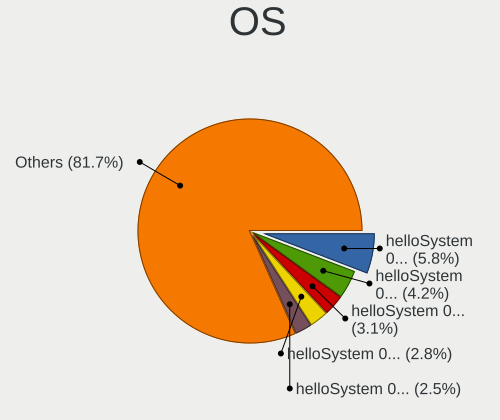

| Name                 | Computers | Percent |
|----------------------|-----------|---------|
| helloSystem 0.7.0    | 21        | 5.83%   |
| helloSystem 0.8.1    | 15        | 4.17%   |
| helloSystem 0.9.0    | 11        | 3.06%   |
| helloSystem 0.8.0    | 10        | 2.78%   |
| helloSystem 0.5.0    | 9         | 2.5%    |
| FreeBSD 13.1         | 9         | 2.5%    |
| OPNsense 21.7.1      | 8         | 2.22%   |
| FreeBSD 13.2         | 8         | 2.22%   |
| OPNsense 23.1.11     | 7         | 1.94%   |
| OPNsense 25.1.7      | 6         | 1.67%   |
| OPNsense 24.7.11     | 6         | 1.67%   |
| OPNsense 21.1.7      | 6         | 1.67%   |
| OPNsense 21.7.3      | 5         | 1.39%   |
| helloSystem 0.6.0    | 5         | 1.39%   |
| helloSystem 0.4.0    | 5         | 1.39%   |
| FreeBSD 14.2         | 5         | 1.39%   |
| FreeBSD 14.0-CURRENT | 5         | 1.39%   |
| FreeBSD 14.0         | 5         | 1.39%   |
| FreeBSD 13.1-p2      | 5         | 1.39%   |
| FreeBSD 12.2         | 5         | 1.39%   |
| OPNsense 25.1.5      | 4         | 1.11%   |
| OPNsense 24.7.7      | 4         | 1.11%   |
| OPNsense 24.1.10     | 4         | 1.11%   |
| OPNsense 21.7.5      | 4         | 1.11%   |
| OPNsense 21.7.2      | 4         | 1.11%   |
| OPNsense 21.1        | 4         | 1.11%   |
| FreeBSD 14.1         | 4         | 1.11%   |
| OPNsense 25.7.10     | 3         | 0.83%   |
| OPNsense 24.1.7      | 3         | 0.83%   |
| OPNsense 23.1.5      | 3         | 0.83%   |
| OPNsense 23.1.1      | 3         | 0.83%   |
| OPNsense 22.7.5      | 3         | 0.83%   |
| OPNsense 21.1.6      | 3         | 0.83%   |
| OPNsense 21.1.3      | 3         | 0.83%   |
| OPNsense 21.1.1      | 3         | 0.83%   |
| GhostBSD 21.08.27    | 3         | 0.83%   |
| FreeBSD 14.3         | 3         | 0.83%   |
| FreeBSD 13.0-p4      | 3         | 0.83%   |
| OPNsense 25.1.9      | 2         | 0.56%   |
| OPNsense 25.1.8      | 2         | 0.56%   |

OS Family
---------

OS without a version

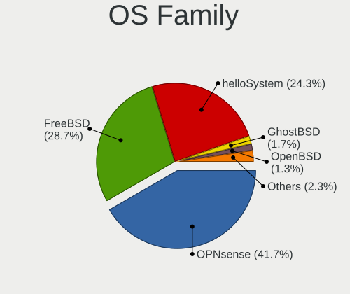

| Name        | Computers | Percent |
|-------------|-----------|---------|
| OPNsense    | 125       | 41.67%  |
| FreeBSD     | 86        | 28.67%  |
| helloSystem | 73        | 24.33%  |
| GhostBSD    | 5         | 1.67%   |
| OpenBSD     | 4         | 1.33%   |
| NomadBSD    | 3         | 1%      |
| ClonOS      | 2         | 0.67%   |
| NetBSD      | 1         | 0.33%   |
| DragonFly   | 1         | 0.33%   |

Arch
----

OS architecture (x86_64, i586, etc.)

| Name    | Computers | Percent |
|---------|-----------|---------|
| amd64   | 293       | 98.65%  |
| arm64   | 3         | 1.01%   |
| powerpc | 1         | 0.34%   |

DE
--

Desktop Environment

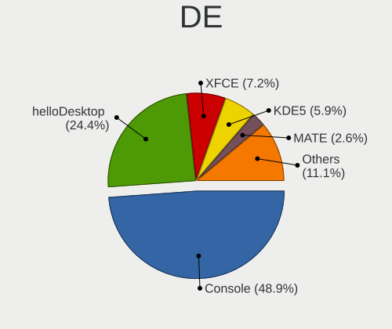

| Name          | Computers | Percent |
|---------------|-----------|---------|
| Console       | 150       | 48.86%  |
| helloDesktop  | 75        | 24.43%  |
| XFCE          | 22        | 7.17%   |
| KDE5          | 18        | 5.86%   |
| MATE          | 8         | 2.61%   |
| GNOME         | 8         | 2.61%   |
| TWM           | 7         | 2.28%   |
| i3            | 5         | 1.63%   |
| Openbox       | 3         | 0.98%   |
| Hyprland      | 3         | 0.98%   |
| KDE6          | 2         | 0.65%   |
| AwesomeWM     | 2         | 0.65%   |
| GNUstep       | 1         | 0.33%   |
| GNOME Classic | 1         | 0.33%   |
| fvwm          | 1         | 0.33%   |
| DWM           | 1         | 0.33%   |

Display Server
--------------

X11 or Wayland

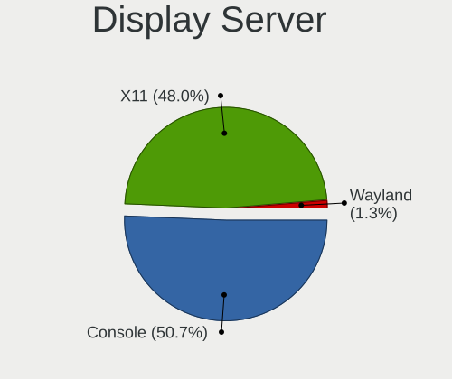

| Name    | Computers | Percent |
|---------|-----------|---------|
| Console | 152       | 50.67%  |
| X11     | 144       | 48%     |
| Wayland | 4         | 1.33%   |

Display Manager
---------------

SDDM, LightDM, etc.

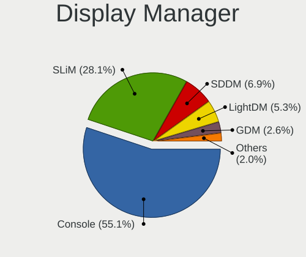

| Name    | Computers | Percent |
|---------|-----------|---------|
| Console | 167       | 55.12%  |
| SLiM    | 85        | 28.05%  |
| SDDM    | 21        | 6.93%   |
| LightDM | 16        | 5.28%   |
| GDM     | 8         | 2.64%   |
| XDM     | 4         | 1.32%   |
| Ly      | 2         | 0.66%   |

OS Lang
-------

Language

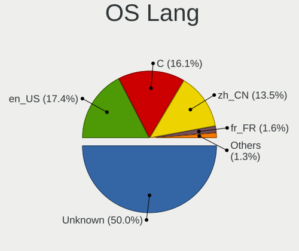

| Lang         | Computers | Percent |
|--------------|-----------|---------|
| Unknown      | 155       | 50%     |
| en_US        | 54        | 17.42%  |
| C            | 50        | 16.13%  |
| zh_CN        | 42        | 13.55%  |
| fr_FR        | 5         | 1.61%   |
| en           | 2         | 0.65%   |
| zh_TW        | 1         | 0.32%   |
| zh_CN.GB2312 | 1         | 0.32%   |

Boot Mode
---------

EFI or BIOS

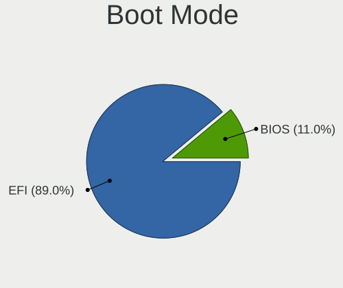

| Mode | Computers | Percent |
|------|-----------|---------|
| EFI  | 266       | 88.96%  |
| BIOS | 33        | 11.04%  |

Filesystem
----------

Type of filesystem

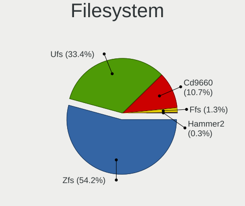

| Type    | Computers | Percent |
|---------|-----------|---------|
| Zfs     | 167       | 54.22%  |
| Ufs     | 103       | 33.44%  |
| Cd9660  | 33        | 10.71%  |
| Ffs     | 4         | 1.3%    |
| Hammer2 | 1         | 0.32%   |

Part. scheme
------------

Scheme of partitioning

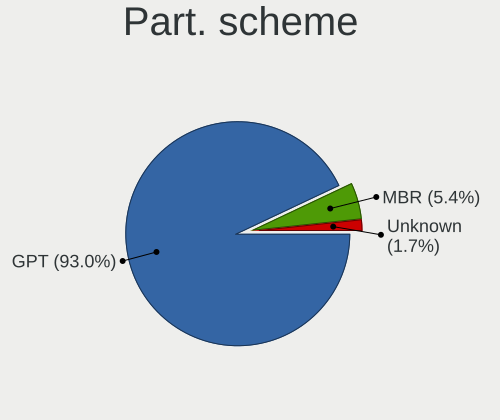

| Type    | Computers | Percent |
|---------|-----------|---------|
| GPT     | 278       | 92.98%  |
| MBR     | 16        | 5.35%   |
| Unknown | 5         | 1.67%   |

Board
-----

Vendor
------

Motherboard manufacturer

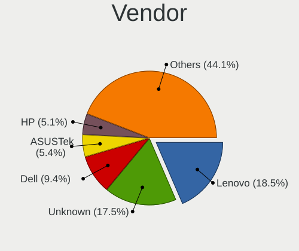

| Name                       | Computers | Percent |
|----------------------------|-----------|---------|
| Lenovo                     | 55        | 18.52%  |
| Unknown                    | 52        | 17.51%  |
| Dell                       | 28        | 9.43%   |
| ASUSTek Computer           | 16        | 5.39%   |
| Hewlett-Packard            | 15        | 5.05%   |
| Intel                      | 12        | 4.04%   |
| Gigabyte Technology        | 10        | 3.37%   |
| MSI                        | 8         | 2.69%   |
| Techvision                 | 7         | 2.36%   |
| ASRock                     | 6         | 2.02%   |
| Google                     | 5         | 1.68%   |
| Supermicro                 | 4         | 1.35%   |
| HUAWEI                     | 4         | 1.35%   |
| ShenZhen MinWin Technology | 3         | 1.01%   |
| OEM                        | 3         | 1.01%   |
| Notebook                   | 3         | 1.01%   |
| NEC Computers              | 3         | 1.01%   |
| AMI                        | 3         | 1.01%   |
| Acer                       | 3         | 1.01%   |
| YF                         | 2         | 0.67%   |
| Timi                       | 2         | 0.67%   |
| Sony                       | 2         | 0.67%   |
| Samsung Electronics        | 2         | 0.67%   |
| Quanmax                    | 2         | 0.67%   |
| Panasonic                  | 2         | 0.67%   |
| PAIQ                       | 2         | 0.67%   |
| MECHREVO S1 Series         | 2         | 0.67%   |
| MECHREVO                   | 2         | 0.67%   |
| Maxtang                    | 2         | 0.67%   |
| HASEE Computer             | 2         | 0.67%   |
| Colorful Technology        | 2         | 0.67%   |
| AZW                        | 2         | 0.67%   |
| YENTEK                     | 1         | 0.34%   |
| YANYU                      | 1         | 0.34%   |
| YanRay Technology          | 1         | 0.34%   |
| WOOKING                    | 1         | 0.34%   |
| WlanCN                     | 1         | 0.34%   |
| Toshiba                    | 1         | 0.34%   |
| TOPFEEL                    | 1         | 0.34%   |
| Silicom                    | 1         | 0.34%   |

Model
-----

Motherboard model

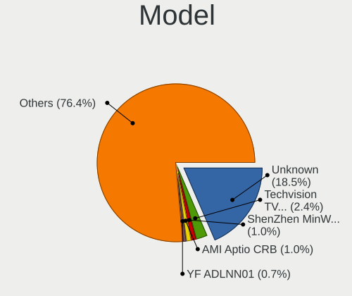

| Name                                       | Computers | Percent |
|--------------------------------------------|-----------|---------|
| Unknown                                    | 55        | 18.52%  |
| Techvision TVI7309X                        | 7         | 2.36%   |
| ShenZhen MinWin MW-NANO-APL-4L             | 3         | 1.01%   |
| AMI Aptio CRB                              | 3         | 1.01%   |
| YF ADLNN01                                 | 2         | 0.67%   |
| Quanmax MITX-DNVE                          | 2         | 0.67%   |
| PAIQ EC3-BT19D4L                           | 2         | 0.67%   |
| MSI MS-7B89                                | 2         | 0.67%   |
| MECHREVO S1 Series S1 Series               | 2         | 0.67%   |
| Maxtang AL50                               | 2         | 0.67%   |
| Lenovo ThinkPad X1 Carbon Gen 9 20XWA003CD | 2         | 0.67%   |
| Lenovo SHARKBAY 0B98401 WIN                | 2         | 0.67%   |
| Intel MAHOBAY                              | 2         | 0.67%   |
| HUAWEI MRGFG-XX                            | 2         | 0.67%   |
| HP ProLiant DL320e Gen8 v2                 | 2         | 0.67%   |
| Google Kohaku                              | 2         | 0.67%   |
| Dell Wyse 5070 Thin Client                 | 2         | 0.67%   |
| AZW EQ                                     | 2         | 0.67%   |
| ASRock Q1900M                              | 2         | 0.67%   |
| YENTEK ITX-B75R1                           | 1         | 0.34%   |
| YANYU ITX-N29 VER:1.5 baytrail             | 1         | 0.34%   |
| YanRay B1904                               | 1         | 0.34%   |
| WOOKING X5                                 | 1         | 0.34%   |
| WlanCN 6000 Series                         | 1         | 0.34%   |
| Toshiba Satellite Pro L510                 | 1         | 0.34%   |
| TOPFEEL Topone series                      | 1         | 0.34%   |
| Timi RedmiBook Pro 15                      | 1         | 0.34%   |
| Timi A34R                                  | 1         | 0.34%   |
| Supermicro X10SRA                          | 1         | 0.34%   |
| Supermicro X10SL7-F                        | 1         | 0.34%   |
| Supermicro Super Server                    | 1         | 0.34%   |
| Supermicro NS-EI36S                        | 1         | 0.34%   |
| Sony SVS1511AJB                            | 1         | 0.34%   |
| Sony SVP13225SCBI                          | 1         | 0.34%   |
| Silicom 6200                               | 1         | 0.34%   |
| SANGFOR ZM5400A                            | 1         | 0.34%   |
| Samsung 535U3C                             | 1         | 0.34%   |
| Samsung 3570R/370R/470R/450R/510R/4450RV   | 1         | 0.34%   |
| Protectli FW6                              | 1         | 0.34%   |
| Panasonic CF-NX1GDHYS                      | 1         | 0.34%   |

Model Family
------------

Motherboard model prefix

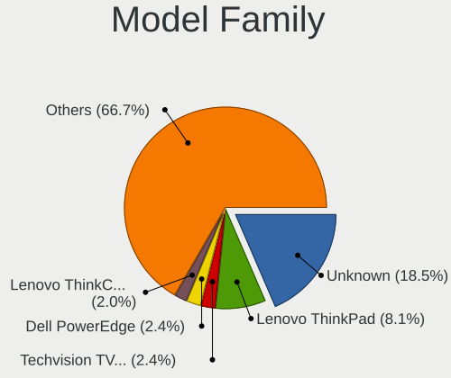

| Name                           | Computers | Percent |
|--------------------------------|-----------|---------|
| Unknown                        | 55        | 18.52%  |
| Lenovo ThinkPad                | 24        | 8.08%   |
| Techvision TVI7309X            | 7         | 2.36%   |
| Dell PowerEdge                 | 7         | 2.36%   |
| Lenovo ThinkCentre             | 6         | 2.02%   |
| Dell OptiPlex                  | 5         | 1.68%   |
| Dell Latitude                  | 5         | 1.68%   |
| Dell Precision                 | 4         | 1.35%   |
| ShenZhen MinWin MW-NANO-APL-4L | 3         | 1.01%   |
| Lenovo SHARKBAY                | 3         | 1.01%   |
| Lenovo Legion                  | 3         | 1.01%   |
| HP ProBook                     | 3         | 1.01%   |
| Dell Inspiron                  | 3         | 1.01%   |
| ASUS TUF                       | 3         | 1.01%   |
| AMI Aptio                      | 3         | 1.01%   |
| YF ADLNN01                     | 2         | 0.67%   |
| Quanmax MITX-DNVE              | 2         | 0.67%   |
| PAIQ EC3-BT19D4L               | 2         | 0.67%   |
| MSI MS-7B89                    | 2         | 0.67%   |
| MECHREVO S1 Series S1          | 2         | 0.67%   |
| Maxtang AL50                   | 2         | 0.67%   |
| Lenovo IdeaPad                 | 2         | 0.67%   |
| Intel MAHOBAY                  | 2         | 0.67%   |
| HUAWEI MRGFG-XX                | 2         | 0.67%   |
| HP t620                        | 2         | 0.67%   |
| HP ProLiant                    | 2         | 0.67%   |
| Google Kohaku                  | 2         | 0.67%   |
| Dell Wyse                      | 2         | 0.67%   |
| Dell Vostro                    | 2         | 0.67%   |
| AZW EQ                         | 2         | 0.67%   |
| ASUS ASUS                      | 2         | 0.67%   |
| ASRock Q1900M                  | 2         | 0.67%   |
| YENTEK ITX-B75R1               | 1         | 0.34%   |
| YANYU ITX-N29                  | 1         | 0.34%   |
| YanRay B1904                   | 1         | 0.34%   |
| WOOKING X5                     | 1         | 0.34%   |
| WlanCN 6000                    | 1         | 0.34%   |
| Toshiba Satellite              | 1         | 0.34%   |
| TOPFEEL Topone                 | 1         | 0.34%   |
| Timi RedmiBook                 | 1         | 0.34%   |

MFG Year
--------

Motherboard manufacture year

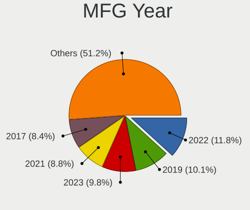

| Year    | Computers | Percent |
|---------|-----------|---------|
| 2022    | 35        | 11.78%  |
| 2019    | 30        | 10.1%   |
| 2023    | 29        | 9.76%   |
| 2021    | 26        | 8.75%   |
| 2017    | 25        | 8.42%   |
| 2012    | 25        | 8.42%   |
| 2020    | 19        | 6.4%    |
| 2018    | 16        | 5.39%   |
| 2016    | 15        | 5.05%   |
| 2013    | 15        | 5.05%   |
| 2015    | 13        | 4.38%   |
| 2014    | 12        | 4.04%   |
| 2024    | 11        | 3.7%    |
| 2025    | 6         | 2.02%   |
| 2011    | 6         | 2.02%   |
| 2010    | 4         | 1.35%   |
| 2008    | 4         | 1.35%   |
| Unknown | 3         | 1.01%   |
| 2009    | 2         | 0.67%   |
| 2007    | 1         | 0.34%   |

Form Factor
-----------

Physical design of the computer

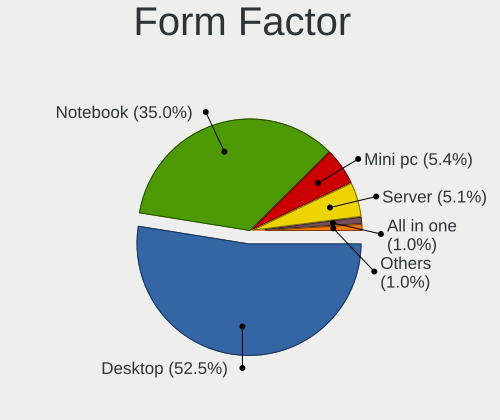

| Name           | Computers | Percent |
|----------------|-----------|---------|
| Desktop        | 156       | 52.53%  |
| Notebook       | 104       | 35.02%  |
| Mini pc        | 16        | 5.39%   |
| Server         | 15        | 5.05%   |
| All in one     | 3         | 1.01%   |
| System on chip | 1         | 0.34%   |
| Firewall       | 1         | 0.34%   |
| Convertible    | 1         | 0.34%   |

Coreboot
--------

Have coreboot on board

| Used | Computers | Percent |
|------|-----------|---------|
| No   | 291       | 97.98%  |
| Yes  | 6         | 2.02%   |

RAM Size
--------

Total RAM memory

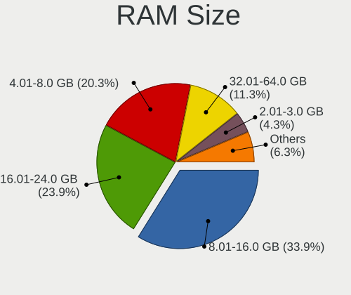

| Size in GB  | Computers | Percent |
|-------------|-----------|---------|
| 8.01-16.0   | 102       | 33.89%  |
| 16.01-24.0  | 72        | 23.92%  |
| 4.01-8.0    | 61        | 20.27%  |
| 32.01-64.0  | 34        | 11.3%   |
| 2.01-3.0    | 13        | 4.32%   |
| 24.01-32.0  | 7         | 2.33%   |
| 64.01-256.0 | 7         | 2.33%   |
| 0.51-1.0    | 3         | 1%      |
| 3.01-4.0    | 1         | 0.33%   |
| 1.01-2.0    | 1         | 0.33%   |

RAM Used
--------

Used RAM memory

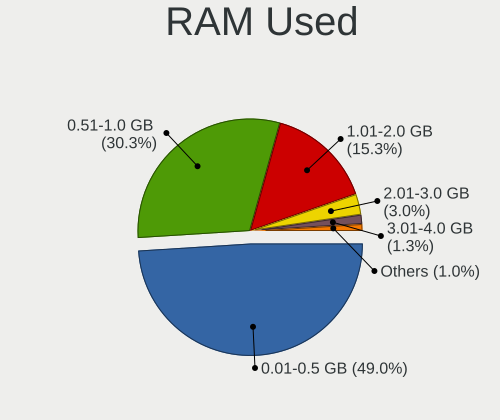

| Used GB  | Computers | Percent |
|----------|-----------|---------|
| 0.01-0.5 | 147       | 49%     |
| 0.51-1.0 | 91        | 30.33%  |
| 1.01-2.0 | 46        | 15.33%  |
| 2.01-3.0 | 9         | 3%      |
| 3.01-4.0 | 4         | 1.33%   |
| 4.01-8.0 | 1         | 0.33%   |
| 0        | 1         | 0.33%   |
| Unknown  | 1         | 0.33%   |

Total Drives
------------

Number of drives on board

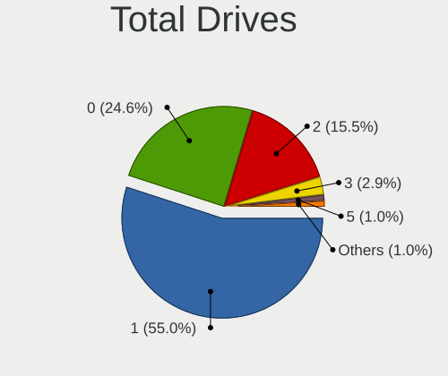

| Drives | Computers | Percent |
|--------|-----------|---------|
| 1      | 170       | 55.02%  |
| 0      | 76        | 24.6%   |
| 2      | 48        | 15.53%  |
| 3      | 9         | 2.91%   |
| 5      | 3         | 0.97%   |
| 14     | 1         | 0.32%   |
| 12     | 1         | 0.32%   |
| 4      | 1         | 0.32%   |

Has CD-ROM
----------

Has CD-ROM on board

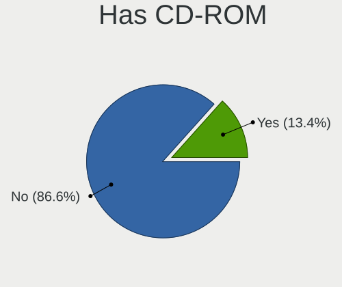

| Presented | Computers | Percent |
|-----------|-----------|---------|
| No        | 259       | 86.62%  |
| Yes       | 40        | 13.38%  |

Has Ethernet
------------

Has Ethernet on board

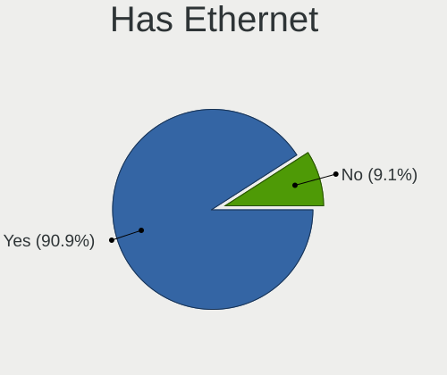

| Presented | Computers | Percent |
|-----------|-----------|---------|
| Yes       | 270       | 90.91%  |
| No        | 27        | 9.09%   |

Has WiFi
--------

Has WiFi module

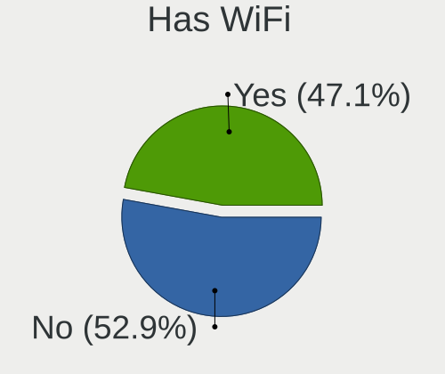

| Presented | Computers | Percent |
|-----------|-----------|---------|
| No        | 157       | 52.86%  |
| Yes       | 140       | 47.14%  |

Has Bluetooth
-------------

Has Bluetooth module

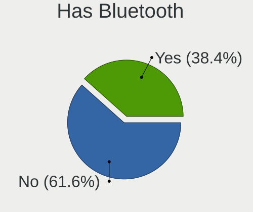

| Presented | Computers | Percent |
|-----------|-----------|---------|
| No        | 183       | 61.62%  |
| Yes       | 114       | 38.38%  |

Location
--------

Country
-------

Geographic location (country)

| Country | Computers | Percent |
|---------|-----------|---------|
| China   | 297       | 100%    |

City
----

Geographic location (city)

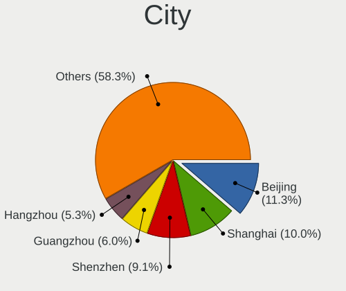

| City                  | Computers | Percent |
|-----------------------|-----------|---------|
| Beijing               | 36        | 11.29%  |
| Shanghai              | 32        | 10.03%  |
| Shenzhen              | 29        | 9.09%   |
| Guangzhou             | 19        | 5.96%   |
| Hangzhou              | 17        | 5.33%   |
| Chengdu               | 16        | 5.02%   |
| Zhengzhou             | 10        | 3.13%   |
| Jinrongjie            | 10        | 3.13%   |
| Xi'an                 | 9         | 2.82%   |
| Wuhan                 | 6         | 1.88%   |
| Suzhou                | 5         | 1.57%   |
| Nanjing               | 5         | 1.57%   |
| Chongqing             | 5         | 1.57%   |
| Shijiazhuang          | 4         | 1.25%   |
| Zhangjiakou           | 3         | 0.94%   |
| Xiamen                | 3         | 0.94%   |
| Shenyang              | 3         | 0.94%   |
| Qingdao               | 3         | 0.94%   |
| Ningbo                | 3         | 0.94%   |
| Dongguan              | 3         | 0.94%   |
| Changzhou             | 3         | 0.94%   |
| Yuzhong Chengguanzhen | 2         | 0.63%   |
| Yancheng              | 2         | 0.63%   |
| Wuxi                  | 2         | 0.63%   |
| Wenzhou               | 2         | 0.63%   |
| Tianjin               | 2         | 0.63%   |
| Songjiang             | 2         | 0.63%   |
| Qiqihar               | 2         | 0.63%   |
| Qinnan                | 2         | 0.63%   |
| Nanning               | 2         | 0.63%   |
| Muping                | 2         | 0.63%   |
| Liuzhou               | 2         | 0.63%   |
| Linyi                 | 2         | 0.63%   |
| Kunming               | 2         | 0.63%   |
| Jinan                 | 2         | 0.63%   |
| Jilin City            | 2         | 0.63%   |
| Jiangchuanlu          | 2         | 0.63%   |
| Jiangbei              | 2         | 0.63%   |
| Hechi                 | 2         | 0.63%   |
| Guiyang               | 2         | 0.63%   |

Drives
------

Drive Vendor
------------

Hard drive vendors

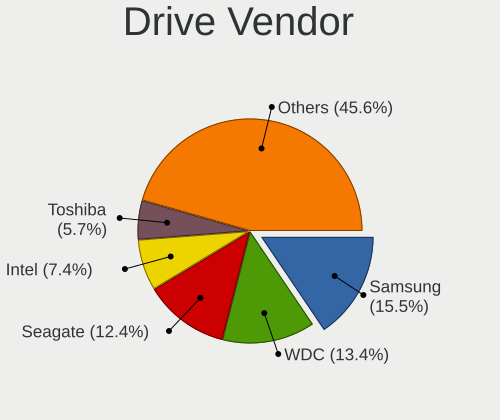

| Vendor              | Computers | Drives | Percent |
|---------------------|-----------|--------|---------|
| Samsung Electronics | 44        | 61     | 15.55%  |
| WDC                 | 38        | 58     | 13.43%  |
| Seagate             | 35        | 70     | 12.37%  |
| Intel               | 21        | 28     | 7.42%   |
| Toshiba             | 16        | 21     | 5.65%   |
| SanDisk             | 11        | 17     | 3.89%   |
| Kingston            | 8         | 9      | 2.83%   |
| HGST                | 6         | 11     | 2.12%   |
| FORESEE             | 6         | 7      | 2.12%   |
| China               | 6         | 10     | 2.12%   |
| Hitachi             | 5         | 6      | 1.77%   |
| Transcend           | 4         | 5      | 1.41%   |
| Silicon Motion      | 4         | 5      | 1.41%   |
| Plextor             | 4         | 6      | 1.41%   |
| Netac               | 4         | 4      | 1.41%   |
| Lenovo              | 4         | 4      | 1.41%   |
| KIOXIA-EXCERIA      | 4         | 7      | 1.41%   |
| Hewlett-Packard     | 4         | 6      | 1.41%   |
| Crucial             | 4         | 5      | 1.41%   |
| SK hynix            | 3         | 3      | 1.06%   |
| Hikvision           | 3         | 3      | 1.06%   |
| faspeed             | 3         | 5      | 1.06%   |
| Phison              | 2         | 4      | 0.71%   |
| Micron Technology   | 2         | 3      | 0.71%   |
| KIOXIA              | 2         | 2      | 0.71%   |
| KingSpec            | 2         | 2      | 0.71%   |
| Colorful            | 2         | 2      | 0.71%   |
| BIWIN               | 2         | 4      | 0.71%   |
| Apple               | 2         | 2      | 0.71%   |
| aigo                | 2         | 2      | 0.71%   |
| A-DATA Technology   | 2         | 3      | 0.71%   |
| UMIS                | 1         | 1      | 0.35%   |
| Topmore             | 1         | 1      | 0.35%   |
| tigo                | 1         | 1      | 0.35%   |
| Teclast             | 1         | 1      | 0.35%   |
| SSSTC               | 1         | 1      | 0.35%   |
| ShineDisk           | 1         | 1      | 0.35%   |
| SemsoTai            | 1         | 1      | 0.35%   |
| Ramsta              | 1         | 1      | 0.35%   |
| Pioneer             | 1         | 1      | 0.35%   |

Drive Model
-----------

Hard drive models

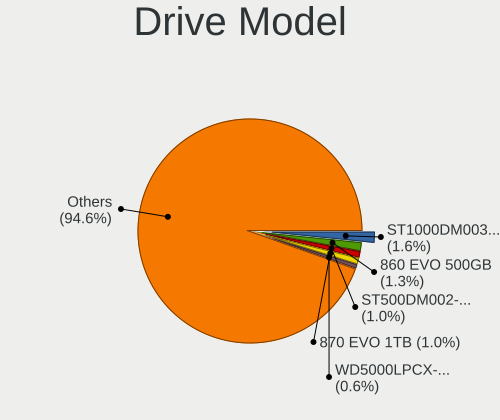

| Model                            | Computers | Percent |
|----------------------------------|-----------|---------|
| Seagate ST1000DM003-1SB102 1TB   | 5         | 1.6%    |
| Samsung SSD 860 EVO 500GB        | 4         | 1.28%   |
| Seagate ST500DM002-1BD142 500GB  | 3         | 0.96%   |
| Samsung SSD 870 EVO 1TB          | 3         | 0.96%   |
| WDC WD5000LPCX-24C6HT0 500GB     | 2         | 0.64%   |
| WDC WD5000LPCX-00VHAT0 500GB     | 2         | 0.64%   |
| Toshiba MQ04ABF100 1TB           | 2         | 0.64%   |
| Seagate ST9320325AS 320GB        | 2         | 0.64%   |
| Seagate ST2000LM007-1R8174 2TB   | 2         | 0.64%   |
| Seagate ST1000LM048-2E7172 1TB   | 2         | 0.64%   |
| Seagate ST1000DM010-2EP102 1TB   | 2         | 0.64%   |
| SanDisk SSD U100 24GB            | 2         | 0.64%   |
| Samsung SSD 970 EVO Plus 1TB     | 2         | 0.64%   |
| Samsung SSD 850 EVO 250GB        | 2         | 0.64%   |
| Samsung SSD 850 EVO 120GB        | 2         | 0.64%   |
| Samsung MZVLB512HBJQ-000L2 512GB | 2         | 0.64%   |
| Samsung MZVL21T0HCLR-00BL7 1TB   | 2         | 0.64%   |
| Samsung HM320II 320GB            | 2         | 0.64%   |
| Phison SATA SSD 256GB            | 2         | 0.64%   |
| Netac SSD 120GB                  | 2         | 0.64%   |
| Lenovo SSD SL700 120G            | 2         | 0.64%   |
| KIOXIA-EXCERIA SATA SSD 480GB    | 2         | 0.64%   |
| KIOXIA-EXCERIA SATA SSD 240GB    | 2         | 0.64%   |
| Kingston SSDNow V Series 64GB    | 2         | 0.64%   |
| Kingston SA400S37240G 240GB      | 2         | 0.64%   |
| Intel SSDSA2SH032G1GN 32GB       | 2         | 0.64%   |
| Intel SSDSA2CW120G3 120GB        | 2         | 0.64%   |
| Hikvision HS-SSD-C2000ECO 1024G  | 2         | 0.64%   |
| HGST HTS725050A7E630 500GB       | 2         | 0.64%   |
| HGST HTS541010B7E610 1TB         | 2         | 0.64%   |
| HP VK000480GWCNQ 480GB           | 2         | 0.64%   |
| FORESEE P900F256GB               | 2         | 0.64%   |
| WDC WUH721414ALE6L4 14TB         | 1         | 0.32%   |
| WDC WDS500G2B0C-00PXH0 500GB     | 1         | 0.32%   |
| WDC WDS500G1B0C-00S6U0 500GB     | 1         | 0.32%   |
| WDC WDS480G2G0A-00JH30 480GB     | 1         | 0.32%   |
| WDC WDS120G2G0B-00EPW0 120GB     | 1         | 0.32%   |
| WDC WDS120G2G0A-00JH30 120GB     | 1         | 0.32%   |
| WDC WDS100T3X0C-00SJG0 1TB       | 1         | 0.32%   |
| WDC WDS100T2B0C-00PXH0 1TB       | 1         | 0.32%   |

HDD Vendor
----------

Hard disk drive vendors

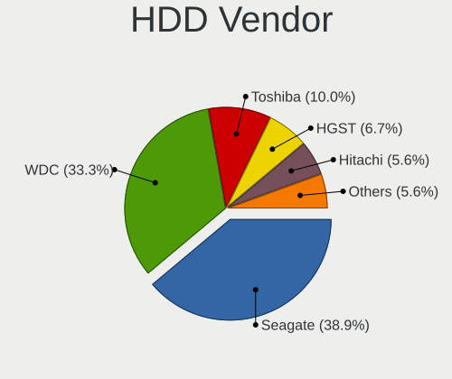

| Vendor              | Computers | Drives | Percent |
|---------------------|-----------|--------|---------|
| Seagate             | 35        | 70     | 38.89%  |
| WDC                 | 30        | 44     | 33.33%  |
| Toshiba             | 9         | 9      | 10%     |
| HGST                | 6         | 11     | 6.67%   |
| Hitachi             | 5         | 6      | 5.56%   |
| Samsung Electronics | 3         | 5      | 3.33%   |
| Hewlett-Packard     | 1         | 1      | 1.11%   |
| CSD                 | 1         | 1      | 1.11%   |

SSD Vendor
----------

Solid state drive vendors

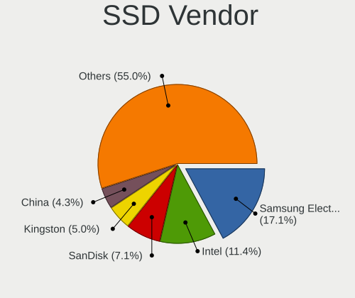

| Vendor              | Computers | Drives | Percent |
|---------------------|-----------|--------|---------|
| Samsung Electronics | 24        | 26     | 17.14%  |
| Intel               | 16        | 21     | 11.43%  |
| SanDisk             | 10        | 16     | 7.14%   |
| Kingston            | 7         | 8      | 5%      |
| China               | 6         | 10     | 4.29%   |
| Toshiba             | 5         | 9      | 3.57%   |
| Transcend           | 4         | 5      | 2.86%   |
| Netac               | 4         | 4      | 2.86%   |
| Lenovo              | 4         | 4      | 2.86%   |
| KIOXIA-EXCERIA      | 4         | 7      | 2.86%   |
| FORESEE             | 4         | 5      | 2.86%   |
| WDC                 | 3         | 3      | 2.14%   |
| Plextor             | 3         | 4      | 2.14%   |
| Hewlett-Packard     | 3         | 5      | 2.14%   |
| faspeed             | 3         | 5      | 2.14%   |
| Phison              | 2         | 4      | 1.43%   |
| Micron Technology   | 2         | 3      | 1.43%   |
| KingSpec            | 2         | 2      | 1.43%   |
| Crucial             | 2         | 2      | 1.43%   |
| BIWIN               | 2         | 4      | 1.43%   |
| Apple               | 2         | 2      | 1.43%   |
| aigo                | 2         | 2      | 1.43%   |
| A-DATA Technology   | 2         | 3      | 1.43%   |
| tigo                | 1         | 1      | 0.71%   |
| Teclast             | 1         | 1      | 0.71%   |
| SK hynix            | 1         | 1      | 0.71%   |
| ShineDisk           | 1         | 1      | 0.71%   |
| SemsoTai            | 1         | 1      | 0.71%   |
| Ramsta              | 1         | 1      | 0.71%   |
| ORICO               | 1         | 1      | 0.71%   |
| NVMe                | 1         | 1      | 0.71%   |
| LITEONIT            | 1         | 1      | 0.71%   |
| LITEON              | 1         | 1      | 0.71%   |
| Lexar               | 1         | 1      | 0.71%   |
| KINGSHARE           | 1         | 1      | 0.71%   |
| Kingchuxing         | 1         | 1      | 0.71%   |
| Hoodisk             | 1         | 2      | 0.71%   |
| Getrich             | 1         | 1      | 0.71%   |
| GALAX               | 1         | 1      | 0.71%   |
| FREEBSD             | 1         | 1      | 0.71%   |

Drive Kind
----------

HDD or SSD

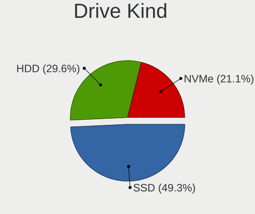

| Kind | Computers | Drives | Percent |
|------|-----------|--------|---------|
| SSD  | 133       | 181    | 49.26%  |
| HDD  | 80        | 147    | 29.63%  |
| NVMe | 57        | 80     | 21.11%  |

Drive Connector
---------------

SATA, SAS, NVMe, etc.

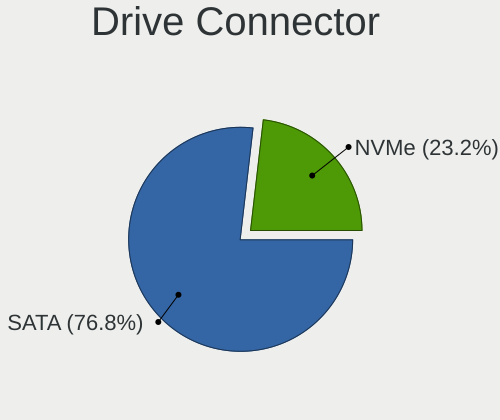

| Type | Computers | Drives | Percent |
|------|-----------|--------|---------|
| SATA | 189       | 328    | 76.83%  |
| NVMe | 57        | 80     | 23.17%  |

Drive Size
----------

Size of hard drive

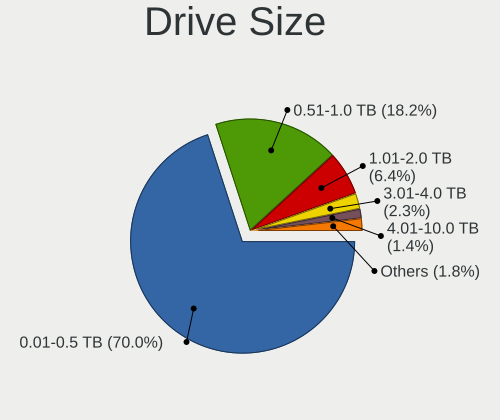

| Size in TB | Computers | Drives | Percent |
|------------|-----------|--------|---------|
| 0.01-0.5   | 154       | 228    | 70%     |
| 0.51-1.0   | 40        | 47     | 18.18%  |
| 1.01-2.0   | 14        | 26     | 6.36%   |
| 3.01-4.0   | 5         | 8      | 2.27%   |
| 4.01-10.0  | 3         | 4      | 1.36%   |
| 2.01-3.0   | 2         | 3      | 0.91%   |
| 10.01-20.0 | 2         | 12     | 0.91%   |

Space Total
-----------

Amount of disk space available on the file system

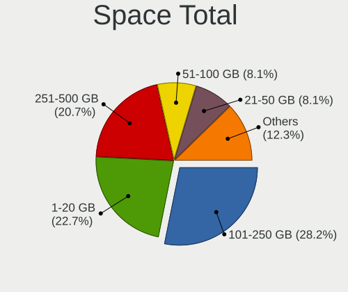

| Size in GB     | Computers | Percent |
|----------------|-----------|---------|
| 101-250        | 87        | 28.16%  |
| 1-20           | 70        | 22.65%  |
| 251-500        | 64        | 20.71%  |
| 21-50          | 25        | 8.09%   |
| 51-100         | 25        | 8.09%   |
| 501-1000       | 22        | 7.12%   |
| 1001-2000      | 11        | 3.56%   |
| Unknown        | 4         | 1.29%   |
| More than 3000 | 1         | 0.32%   |

Space Used
----------

Amount of used disk space

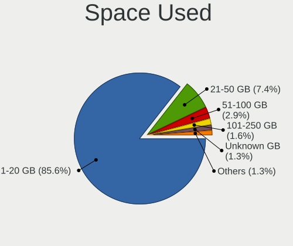

| Used GB  | Computers | Percent |
|----------|-----------|---------|
| 1-20     | 267       | 85.58%  |
| 21-50    | 23        | 7.37%   |
| 51-100   | 9         | 2.88%   |
| 101-250  | 5         | 1.6%    |
| Unknown  | 4         | 1.28%   |
| 251-500  | 3         | 0.96%   |
| 501-1000 | 1         | 0.32%   |

Malfunc. Drives
---------------

Drive models with a malfunction

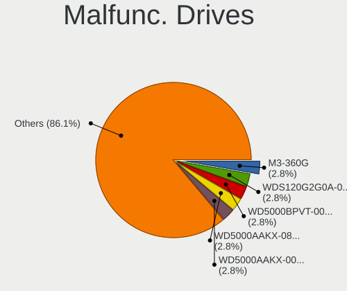

| Model                             | Computers | Drives | Percent |
|-----------------------------------|-----------|--------|---------|
| WDC WDS120G2G0A-00JH30 120GB      | 1         | 1      | 2.78%   |
| WDC WD5000BPVT-00HXZT1 500GB      | 1         | 1      | 2.78%   |
| WDC WD5000AAKX-083CA0 500GB       | 1         | 1      | 2.78%   |
| WDC WD5000AAKX-001CA0 500GB       | 1         | 1      | 2.78%   |
| WDC WD3200BPVT-22JJ5T0 320GB      | 1         | 1      | 2.78%   |
| WDC WD1600AAJS-22L7A0 160GB       | 1         | 1      | 2.78%   |
| WDC WD10SPZX-60Z10T0 1TB          | 1         | 1      | 2.78%   |
| WDC WD10EJRX-89N74Y0 1TB          | 1         | 1      | 2.78%   |
| Toshiba MQ02ABF050H-SSHD-8GB      | 1         | 1      | 2.78%   |
| SK hynix HFS064G3AMNB-2220A 64GB  | 1         | 1      | 2.78%   |
| ShineDisk M667 120G               | 1         | 1      | 2.78%   |
| Seagate ST9320325AS 320GB         | 1         | 2      | 2.78%   |
| Seagate ST500LT012-9WS142 500GB   | 1         | 1      | 2.78%   |
| Seagate ST500LM021-1KJ152 500GB   | 1         | 2      | 2.78%   |
| Seagate ST3320620AS 320GB         | 1         | 1      | 2.78%   |
| Seagate ST3320418AS 320GB         | 1         | 2      | 2.78%   |
| Seagate ST320LT007-9ZV142 320GB   | 1         | 1      | 2.78%   |
| Seagate ST31500541AS 1.5TB        | 1         | 1      | 2.78%   |
| Seagate ST31000528AS 1TB          | 1         | 1      | 2.78%   |
| Samsung Electronics HM250HI 250GB | 1         | 1      | 2.78%   |
| Phison SATA SSD 256GB             | 1         | 3      | 2.78%   |
| Intel SSDSC2BW120A4 120GB         | 1         | 1      | 2.78%   |
| Intel SSDSA2M160G2GC 160GB        | 1         | 2      | 2.78%   |
| Intel SSDSA2M120G2GC 120GB        | 1         | 1      | 2.78%   |
| Intel SSDPEKKW256G7 256GB         | 1         | 1      | 2.78%   |
| Hitachi HTS725050A7E630 500GB     | 1         | 1      | 2.78%   |
| Hitachi HTS723232A7A364 320GB     | 1         | 1      | 2.78%   |
| HGST HTS725050A7E630 500GB        | 1         | 5      | 2.78%   |
| faspeed M3-360G                   | 1         | 3      | 2.78%   |
| Fanxiang S101-240GB               | 1         | 1      | 2.78%   |
| Colorful SL500 640GB              | 1         | 1      | 2.78%   |
| China XJH-32GB                    | 1         | 1      | 2.78%   |
| China JWX 16GB MSATA              | 1         | 2      | 2.78%   |
| Centerm SSD 8GB                   | 1         | 1      | 2.78%   |
| BORY M500 16G                     | 1         | 2      | 2.78%   |
| BIWIN SSD 32GB                    | 1         | 3      | 2.78%   |

Malfunc. Drive Vendor
---------------------

Vendors of faulty drives

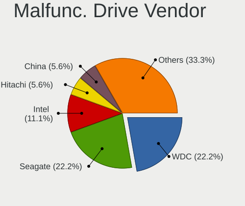

| Vendor              | Computers | Drives | Percent |
|---------------------|-----------|--------|---------|
| WDC                 | 8         | 8      | 22.22%  |
| Seagate             | 8         | 11     | 22.22%  |
| Intel               | 4         | 5      | 11.11%  |
| Hitachi             | 2         | 2      | 5.56%   |
| China               | 2         | 3      | 5.56%   |
| Toshiba             | 1         | 1      | 2.78%   |
| SK hynix            | 1         | 1      | 2.78%   |
| ShineDisk           | 1         | 1      | 2.78%   |
| Samsung Electronics | 1         | 1      | 2.78%   |
| Phison              | 1         | 3      | 2.78%   |
| HGST                | 1         | 5      | 2.78%   |
| faspeed             | 1         | 3      | 2.78%   |
| Fanxiang            | 1         | 1      | 2.78%   |
| Colorful            | 1         | 1      | 2.78%   |
| Centerm             | 1         | 1      | 2.78%   |
| BORY                | 1         | 2      | 2.78%   |
| BIWIN               | 1         | 3      | 2.78%   |

Malfunc. HDD Vendor
-------------------

Vendors of faulty HDD drives

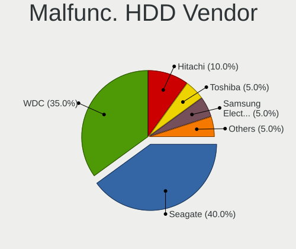

| Vendor              | Computers | Drives | Percent |
|---------------------|-----------|--------|---------|
| Seagate             | 8         | 11     | 40%     |
| WDC                 | 7         | 7      | 35%     |
| Hitachi             | 2         | 2      | 10%     |
| Toshiba             | 1         | 1      | 5%      |
| Samsung Electronics | 1         | 1      | 5%      |
| HGST                | 1         | 5      | 5%      |

Malfunc. Drive Kind
-------------------

Kinds of faulty drives

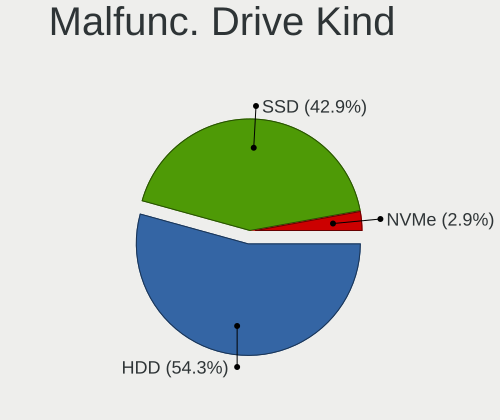

| Kind | Computers | Drives | Percent |
|------|-----------|--------|---------|
| HDD  | 19        | 27     | 54.29%  |
| SSD  | 15        | 24     | 42.86%  |
| NVMe | 1         | 1      | 2.86%   |

Failed Drives
-------------

Failed drive models

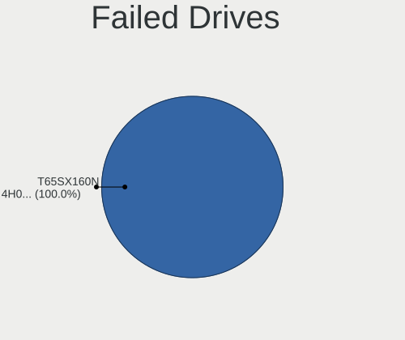

| Model                           | Computers | Drives | Percent |
|---------------------------------|-----------|--------|---------|
| CSD T65SX160N 4H0204656BY 160GB | 1         | 1      | 100%    |

Failed Drive Vendor
-------------------

Failed drive vendors

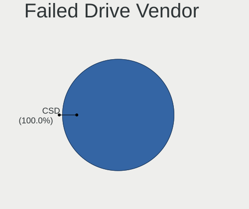

| Vendor | Computers | Drives | Percent |
|--------|-----------|--------|---------|
| CSD    | 1         | 1      | 100%    |

Drive Status
------------

Number of failed and malfunc. drives

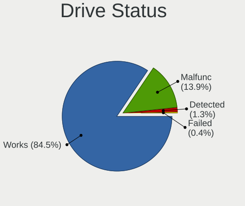

| Status   | Computers | Drives | Percent |
|----------|-----------|--------|---------|
| Works    | 201       | 351    | 84.45%  |
| Malfunc  | 33        | 52     | 13.87%  |
| Detected | 3         | 4      | 1.26%   |
| Failed   | 1         | 1      | 0.42%   |

Storage controller
------------------

Storage Vendor
--------------

Storage controller vendors

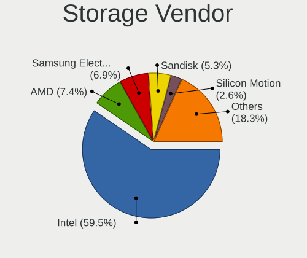

| Vendor                                  | Computers | Percent |
|-----------------------------------------|-----------|---------|
| Intel                                   | 225       | 59.52%  |
| AMD                                     | 28        | 7.41%   |
| Samsung Electronics                     | 26        | 6.88%   |
| Sandisk                                 | 20        | 5.29%   |
| Silicon Motion                          | 10        | 2.65%   |
| MAXIO Technology (Hangzhou)             | 9         | 2.38%   |
| KIOXIA                                  | 7         | 1.85%   |
| Broadcom / LSI                          | 7         | 1.85%   |
| INNOGRIT                                | 5         | 1.32%   |
| Toshiba                                 | 4         | 1.06%   |
| Phison Electronics                      | 4         | 1.06%   |
| SK hynix                                | 3         | 0.79%   |
| Shenzhen Unionmemory Information System | 3         | 0.79%   |
| Shenzhen Longsys Electronics            | 3         | 0.79%   |
| Marvell Technology Group                | 3         | 0.79%   |
| ASMedia Technology                      | 3         | 0.79%   |
| Solid State Storage Technology          | 2         | 0.53%   |
| Nvidia                                  | 2         | 0.53%   |
| Micron/Crucial Technology               | 2         | 0.53%   |
| Micron Technology                       | 2         | 0.53%   |
| Kingston Technology Company             | 2         | 0.53%   |
| JMicron Technology                      | 2         | 0.53%   |
| Unknown                                 | 2         | 0.53%   |
| Shenzhen Shichuangyi Electronics        | 1         | 0.26%   |
| Lite-On Technology                      | 1         | 0.26%   |
| Hosin Global Electronics                | 1         | 0.26%   |
| Chelsio Communications                  | 1         | 0.26%   |

Storage Model
-------------

Storage controller models

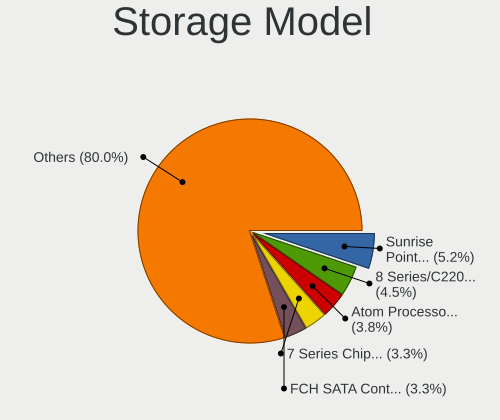

| Model                                                                                       | Computers | Percent |
|---------------------------------------------------------------------------------------------|-----------|---------|
| Intel Sunrise Point-LP SATA Controller [AHCI mode]                                          | 22        | 5.16%   |
| Intel 8 Series/C220 Series Chipset Family 6-port SATA Controller 1 [AHCI mode]              | 19        | 4.46%   |
| Intel Atom Processor E3800 Series SATA AHCI Controller                                      | 16        | 3.76%   |
| Intel 7 Series Chipset Family 6-port SATA Controller [AHCI mode]                            | 14        | 3.29%   |
| AMD FCH SATA Controller [AHCI mode]                                                         | 14        | 3.29%   |
| Samsung NVMe SSD Controller SM981/PM981/PM983                                               | 12        | 2.82%   |
| Intel Q170/Q150/B150/H170/H110/Z170/CM236 Chipset SATA Controller [AHCI Mode]               | 12        | 2.82%   |
| Intel Celeron/Pentium Silver Processor SATA Controller                                      | 11        | 2.58%   |
| Intel Jasper Lake SATA AHCI Controller                                                      | 10        | 2.35%   |
| Intel 6 Series/C200 Series Chipset Family 6 port Mobile SATA AHCI Controller                | 9         | 2.11%   |
| MAXIO (Hangzhou) NVMe SSD Controller MAP1202 (DRAM-less)                                    | 8         | 1.88%   |
| Silicon Motion SM2263EN/SM2263XT (DRAM-less) NVMe SSD Controllers                           | 7         | 1.64%   |
| Intel NVMe Optane Memory Series                                                             | 7         | 1.64%   |
| Intel Alder Lake-N SATA AHCI Controller                                                     | 6         | 1.41%   |
| Intel 7 Series/C210 Series Chipset Family 6-port SATA Controller [AHCI mode]                | 6         | 1.41%   |
| SanDisk Ultra 3D / WD PC SN530, IX SN530, Blue SN550 NVMe SSD (DRAM-less)                   | 5         | 1.17%   |
| SanDisk Extreme Pro / WD Black SN750 / PC SN730 / Red SN700 NVMe SSD                        | 5         | 1.17%   |
| Intel Comet Lake SATA AHCI Controller                                                       | 5         | 1.17%   |
| Intel Cannon Lake PCH SATA AHCI Controller                                                  | 5         | 1.17%   |
| Intel 82801HM/HEM (ICH8M/ICH8M-E) SATA Controller [IDE mode]                                | 5         | 1.17%   |
| Intel 82801HM/HEM (ICH8M/ICH8M-E) IDE Controller                                            | 5         | 1.17%   |
| Intel 6 Series/C200 Series Chipset Family 6 port Desktop SATA AHCI Controller               | 5         | 1.17%   |
| Sandisk WD SN560/SN740/SN770/SN5000 NVMe SSD                                                | 4         | 0.94%   |
| Samsung NVMe SSD Controller SM961/PM961/SM963                                               | 4         | 0.94%   |
| Samsung NVMe SSD Controller PM9A1/PM9A3/980PRO                                              | 4         | 0.94%   |
| Samsung NVMe SSD Controller 980 (DRAM-less)                                                 | 4         | 0.94%   |
| KIOXIA NVMe SSD Controller BG4 (DRAM-less)                                                  | 4         | 0.94%   |
| Intel Wildcat Point-LP SATA Controller [AHCI Mode]                                          | 4         | 0.94%   |
| Intel Tiger Lake-LP SATA Controller                                                         | 4         | 0.94%   |
| Intel Celeron N3350/Pentium N4200/Atom E3900 Series SATA AHCI Controller                    | 4         | 0.94%   |
| Intel C610/X99 series chipset sSATA Controller [AHCI mode]                                  | 4         | 0.94%   |
| Intel C610/X99 series chipset 6-Port SATA Controller [AHCI mode]                            | 4         | 0.94%   |
| Intel Atom Processor C3000 Series SATA Controller 0                                         | 4         | 0.94%   |
| Intel 400 Series Chipset Family SATA AHCI Controller                                        | 4         | 0.94%   |
| Intel 200 Series PCH SATA controller [AHCI mode]                                            | 4         | 0.94%   |
| AMD SB7x0/SB8x0/SB9x0 IDE Controller                                                        | 4         | 0.94%   |
| AMD 400 Series Chipset SATA Controller                                                      | 4         | 0.94%   |
| Shenzhen Unionmemory Information System RPJYJ512MKN1QWQ PCIe 4.0 NVMe SSD 512GB (DRAM-less) | 3         | 0.7%    |
| Intel SATA Controller [RAID mode]                                                           | 3         | 0.7%    |
| Intel HM170/QM170 Chipset SATA Controller [AHCI Mode]                                       | 3         | 0.7%    |

Storage Kind
------------

Kind of storage controller (IDE, SATA, NVMe, SAS, ...)

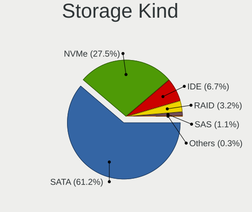

| Kind | Computers | Percent |
|------|-----------|---------|
| SATA | 229       | 61.23%  |
| NVMe | 103       | 27.54%  |
| IDE  | 25        | 6.68%   |
| RAID | 12        | 3.21%   |
| SAS  | 4         | 1.07%   |
| SCSI | 1         | 0.27%   |

Processor
---------

CPU Vendor
----------

Processor vendors

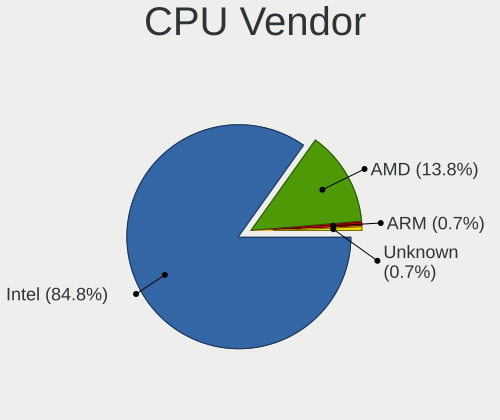

| Vendor  | Computers | Percent |
|---------|-----------|---------|
| Intel   | 252       | 84.85%  |
| AMD     | 41        | 13.8%   |
| ARM     | 2         | 0.67%   |
| Unknown | 2         | 0.67%   |

CPU Model
---------

Processor models

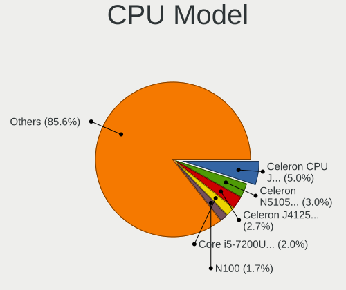

| Model                                   | Computers | Percent |
|-----------------------------------------|-----------|---------|
| Intel Celeron CPU J1900 @ 1.99GHz       | 15        | 5.03%   |
| Intel Celeron N5105 @ 2.00GHz           | 9         | 3.02%   |
| Intel Celeron J4125 CPU @ 2.00GHz       | 8         | 2.68%   |
| Intel Core i5-7200U CPU @ 2.50GHz       | 6         | 2.01%   |
| Intel N100                              | 5         | 1.68%   |
| Intel Atom CPU D525 @ 1.80GHz           | 5         | 1.68%   |
| Intel Xeon CPU E3-1220 v3 @ 3.10GHz     | 4         | 1.34%   |
| Intel Core i5-6200U CPU @ 2.30GHz       | 4         | 1.34%   |
| Intel Core i5-3320M CPU @ 2.60GHz       | 4         | 1.34%   |
| Intel 11th Gen Core i7-1165G7 @ 2.80GHz | 4         | 1.34%   |
| Intel Core i5-8250U CPU @ 1.60GHz       | 3         | 1.01%   |
| Intel Core i5-10210U CPU @ 1.60GHz      | 3         | 1.01%   |
| Intel Core i3-8100T CPU @ 3.10GHz       | 3         | 1.01%   |
| Intel Core i3-2350M CPU @ 2.30GHz       | 3         | 1.01%   |
| Intel Celeron J4105 CPU @ 1.50GHz       | 3         | 1.01%   |
| Intel Celeron CPU J3455 @ 1.50GHz       | 3         | 1.01%   |
| AMD Ryzen 7 5825U with Radeon Graphics  | 3         | 1.01%   |
| Intel Xeon CPU E5-1650 v3 @ 3.50GHz     | 2         | 0.67%   |
| Intel Pentium CPU G3260T @ 2.90GHz      | 2         | 0.67%   |
| Intel N150                              | 2         | 0.67%   |
| Intel Core i7-6700 CPU @ 3.40GHz        | 2         | 0.67%   |
| Intel Core i5-9400 CPU @ 2.90GHz        | 2         | 0.67%   |
| Intel Core i5-9300H CPU @ 2.40GHz       | 2         | 0.67%   |
| Intel Core i5-6300HQ CPU @ 2.30GHz      | 2         | 0.67%   |
| Intel Core i5-4200U CPU @ 1.60GHz       | 2         | 0.67%   |
| Intel Core i5-3470 CPU @ 3.20GHz        | 2         | 0.67%   |
| Intel Core i5-2540M CPU @ 2.60GHz       | 2         | 0.67%   |
| Intel Core i5-2520M CPU @ 2.50GHz       | 2         | 0.67%   |
| Intel Core i5-10400 CPU @ 2.90GHz       | 2         | 0.67%   |
| Intel Core i3-5010U CPU @ 2.10GHz       | 2         | 0.67%   |
| Intel Core i3-10105 CPU @ 3.70GHz       | 2         | 0.67%   |
| Intel Celeron N5100 @ 1.10GHz           | 2         | 0.67%   |
| Intel Celeron CPU N3150 @ 1.60GHz       | 2         | 0.67%   |
| Intel Celeron CPU 3865U @ 1.80GHz       | 2         | 0.67%   |
| Intel Atom CPU C3558 @ 2.20GHz          | 2         | 0.67%   |
| Intel 13th Gen Core i7-1360P            | 2         | 0.67%   |
| Intel 12th Gen Core i7-12700H           | 2         | 0.67%   |
| Intel 12th Gen Core i7-1260P            | 2         | 0.67%   |
| ARM Cortex-A53 r0p4                     | 2         | 0.67%   |
| AMD Ryzen 9 5900X 12-Core Processor     | 2         | 0.67%   |

CPU Model Family
----------------

Processor model prefix

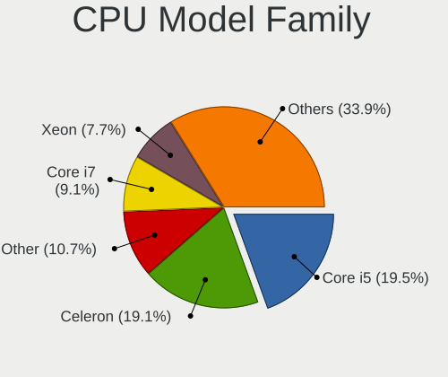

| Model                   | Computers | Percent |
|-------------------------|-----------|---------|
| Intel Core i5           | 58        | 19.46%  |
| Intel Celeron           | 57        | 19.13%  |
| Other                   | 32        | 10.74%  |
| Intel Core i7           | 27        | 9.06%   |
| Intel Xeon              | 23        | 7.72%   |
| Intel Core i3           | 23        | 7.72%   |
| Intel Atom              | 13        | 4.36%   |
| AMD Ryzen 7             | 10        | 3.36%   |
| Intel Pentium           | 9         | 3.02%   |
| AMD Ryzen 5             | 9         | 3.02%   |
| Intel Core 2 Duo        | 4         | 1.34%   |
| AMD Ryzen 9             | 3         | 1.01%   |
| AMD Ryzen 3             | 3         | 1.01%   |
| AMD Athlon II X4        | 3         | 1.01%   |
| Intel Pentium Gold      | 2         | 0.67%   |
| Intel Genuine           | 2         | 0.67%   |
| ARM Cortex              | 2         | 0.67%   |
| AMD Ryzen 3 PRO         | 2         | 0.67%   |
| AMD GX                  | 2         | 0.67%   |
| AMD G                   | 2         | 0.67%   |
| Intel Xeon Silver       | 1         | 0.34%   |
| Intel Xeon Bronze       | 1         | 0.34%   |
| Intel Pentium Dual-Core | 1         | 0.34%   |
| Intel Core m3           | 1         | 0.34%   |
| Intel Core 2 Quad       | 1         | 0.34%   |
| Intel Celeron Dual-Core | 1         | 0.34%   |
| AMD Phenom II X4        | 1         | 0.34%   |
| AMD FX                  | 1         | 0.34%   |
| AMD Athlon X2           | 1         | 0.34%   |
| AMD Athlon              | 1         | 0.34%   |
| AMD A6                  | 1         | 0.34%   |
| AMD A10                 | 1         | 0.34%   |

CPU Cores
---------

Number of processor cores

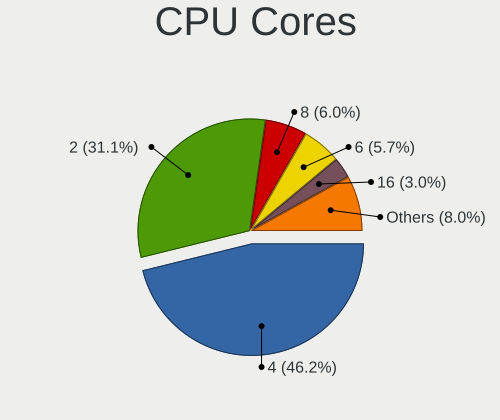

| Number  | Computers | Percent |
|---------|-----------|---------|
| 4       | 138       | 46.15%  |
| 2       | 93        | 31.1%   |
| 8       | 18        | 6.02%   |
| 6       | 17        | 5.69%   |
| 16      | 9         | 3.01%   |
| 12      | 8         | 2.68%   |
| Unknown | 5         | 1.67%   |
| 10      | 4         | 1.34%   |
| 24      | 3         | 1%      |
| 20      | 2         | 0.67%   |
| 28      | 1         | 0.33%   |
| 1       | 1         | 0.33%   |

CPU Sockets
-----------

Number of sockets

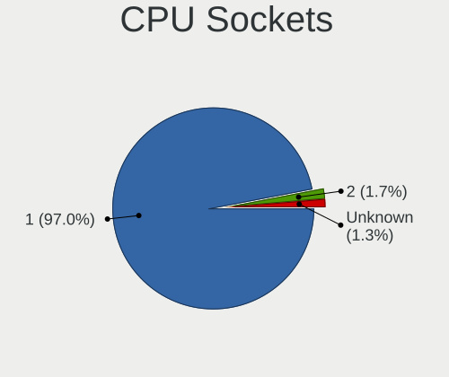

| Number  | Computers | Percent |
|---------|-----------|---------|
| 1       | 288       | 96.97%  |
| 2       | 5         | 1.68%   |
| Unknown | 4         | 1.35%   |

CPU Threads
-----------

Threads per core (Hyper-Threading)

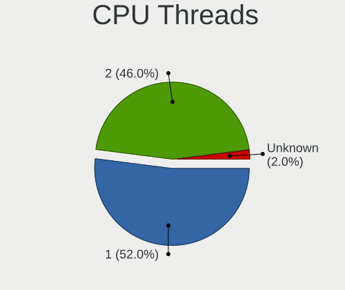

| Number  | Computers | Percent |
|---------|-----------|---------|
| 1       | 155       | 52.01%  |
| 2       | 137       | 45.97%  |
| Unknown | 6         | 2.01%   |

CPU Microarch
-------------

Microarchitecture

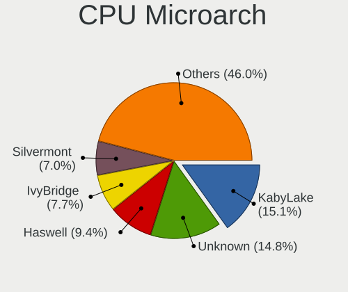

| Name          | Computers | Percent |
|---------------|-----------|---------|
| KabyLake      | 45        | 15.1%   |
| Unknown       | 44        | 14.77%  |
| Haswell       | 28        | 9.4%    |
| IvyBridge     | 23        | 7.72%   |
| Silvermont    | 21        | 7.05%   |
| Skylake       | 20        | 6.71%   |
| SandyBridge   | 16        | 5.37%   |
| Goldmont plus | 12        | 4.03%   |
| TigerLake     | 10        | 3.36%   |
| Goldmont      | 9         | 3.02%   |
| CometLake     | 9         | 3.02%   |
| Zen 3         | 8         | 2.68%   |
| Broadwell     | 8         | 2.68%   |
| Bonnell       | 7         | 2.35%   |
| Penryn        | 6         | 2.01%   |
| Zen+          | 5         | 1.68%   |
| Zen 2         | 5         | 1.68%   |
| Zen           | 4         | 1.34%   |
| K10           | 4         | 1.34%   |
| Westmere      | 3         | 1.01%   |
| Piledriver    | 3         | 1.01%   |
| K10 Llano     | 2         | 0.67%   |
| Jaguar        | 2         | 0.67%   |
| Core          | 2         | 0.67%   |
| Bobcat        | 2         | 0.67%   |

Graphics
--------

GPU Vendor
----------

Vendors of graphics cards

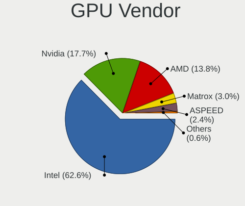

| Vendor                     | Computers | Percent |
|----------------------------|-----------|---------|
| Intel                      | 209       | 62.57%  |
| Nvidia                     | 59        | 17.66%  |
| AMD                        | 46        | 13.77%  |
| Matrox Electronics Systems | 10        | 2.99%   |
| ASPEED Technology          | 8         | 2.4%    |
| RDC Semiconductor          | 2         | 0.6%    |

GPU Model
---------

Graphics card models

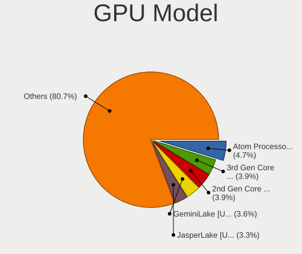

| Model                                                                                    | Computers | Percent |
|------------------------------------------------------------------------------------------|-----------|---------|
| Intel Atom Processor Z36xxx/Z37xxx Series Graphics & Display                             | 16        | 4.75%   |
| Intel 3rd Gen Core processor Graphics Controller                                         | 13        | 3.86%   |
| Intel 2nd Generation Core Processor Family Integrated Graphics Controller                | 13        | 3.86%   |
| Intel GeminiLake [UHD Graphics 600]                                                      | 12        | 3.56%   |
| Intel JasperLake [UHD Graphics]                                                          | 11        | 3.26%   |
| Intel Xeon E3-1200 v3/4th Gen Core Processor Integrated Graphics Controller              | 10        | 2.97%   |
| Intel Kaby Lake-U GT2 [HD Graphics 620]                                                  | 9         | 2.67%   |
| Intel TigerLake-LP GT2 [Iris Xe Graphics]                                                | 8         | 2.37%   |
| Intel CoffeeLake-S GT2 [UHD Graphics 630]                                                | 8         | 2.37%   |
| ASPEED Technology ASPEED Graphics Family                                                 | 8         | 2.37%   |
| Intel Xeon E3-1200 v2/3rd Gen Core processor Graphics Controller                         | 6         | 1.78%   |
| Intel Skylake-U GT2 [HD Graphics 520]                                                    | 6         | 1.78%   |
| Intel Kaby Lake-R GT2 [UHD Graphics 620]                                                 | 6         | 1.78%   |
| Intel CometLake-S GT2 [UHD Graphics 630]                                                 | 6         | 1.78%   |
| Intel Alder Lake-N [UHD Graphics]                                                        | 6         | 1.78%   |
| Intel Atom Processor D4xx/D5xx/N4xx/N5xx Integrated Graphics Controller                  | 5         | 1.48%   |
| Matrox Electronics Systems G200eR2                                                       | 4         | 1.19%   |
| Intel CometLake-U GT2 [UHD Graphics]                                                     | 4         | 1.19%   |
| Intel CoffeeLake-H GT2 [UHD Graphics 630]                                                | 4         | 1.19%   |
| Intel Broadwell-U GT2 [HD Graphics 5500]                                                 | 4         | 1.19%   |
| Intel Atom/Celeron/Pentium Processor x5-E8000/J3xxx/N3xxx Integrated Graphics Controller | 4         | 1.19%   |
| Intel Apollo Lake GT1 [HD Graphics 500]                                                  | 4         | 1.19%   |
| AMD Picasso/Raven 2 [Radeon Vega Series / Radeon Vega Mobile Series]                     | 4         | 1.19%   |
| Nvidia GP108M [GeForce MX150]                                                            | 3         | 0.89%   |
| Nvidia GP108 [GeForce GT 1030]                                                           | 3         | 0.89%   |
| Nvidia GM206 [GeForce GTX 960]                                                           | 3         | 0.89%   |
| Matrox Electronics Systems Integrated Matrox G200eW3 Graphics Controller                 | 3         | 0.89%   |
| Intel Skylake-S GT2 [HD Graphics 530]                                                    | 3         | 0.89%   |
| Intel Kaby Lake-U GT1 [HD Graphics 610]                                                  | 3         | 0.89%   |
| Intel Haswell-ULT Integrated Graphics Controller                                         | 3         | 0.89%   |
| Intel Alder Lake-P GT2 [Iris Xe Graphics]                                                | 3         | 0.89%   |
| AMD Sun XT [Radeon HD 8670A/8670M/8690M / R5 M330 / M430 / Radeon 520 Mobile]            | 3         | 0.89%   |
| AMD Seymour [Radeon HD 6400M/7400M Series]                                               | 3         | 0.89%   |
| AMD Renoir [Radeon Vega Series / Radeon Vega Mobile Series]                              | 3         | 0.89%   |
| AMD Raven Ridge [Radeon Vega Series / Radeon Vega Mobile Series]                         | 3         | 0.89%   |
| AMD Phoenix1                                                                             | 3         | 0.89%   |
| AMD Barcelo                                                                              | 3         | 0.89%   |
| Nvidia TU117M [GeForce MX450]                                                            | 2         | 0.59%   |
| Nvidia TU117M [GeForce GTX 1650 Ti Mobile]                                               | 2         | 0.59%   |
| Nvidia GP107M [GeForce GTX 1050 Mobile]                                                  | 2         | 0.59%   |

GPU Combo
---------

Combinations of graphics cards

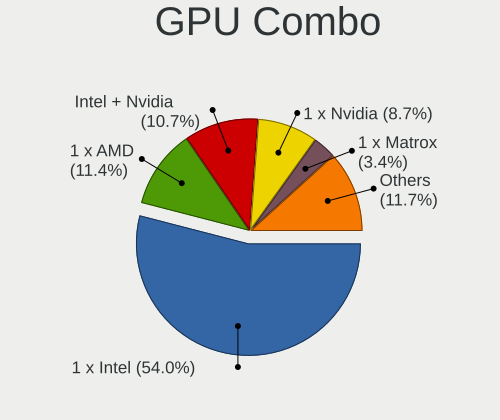

| Name                  | Computers | Percent |
|-----------------------|-----------|---------|
| 1 x Intel             | 161       | 54.03%  |
| 1 x AMD               | 34        | 11.41%  |
| Intel + Nvidia        | 32        | 10.74%  |
| 1 x Nvidia            | 26        | 8.72%   |
| 1 x Matrox            | 10        | 3.36%   |
| 2 x Intel             | 8         | 2.68%   |
| Intel + AMD           | 8         | 2.68%   |
| 1 x ASPEED            | 7         | 2.35%   |
| Other                 | 6         | 2.01%   |
| 1 x RDC Semiconductor | 2         | 0.67%   |
| AMD + Nvidia          | 2         | 0.67%   |
| 2 x AMD               | 1         | 0.34%   |
| AMD + ASPEED          | 1         | 0.34%   |

GPU Driver
----------

Free vs proprietary

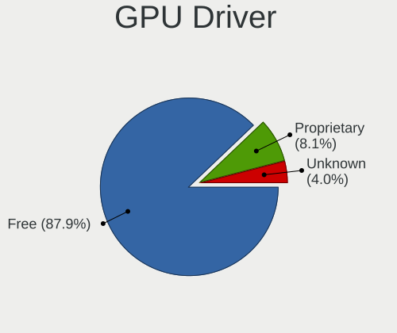

| Driver      | Computers | Percent |
|-------------|-----------|---------|
| Free        | 261       | 87.88%  |
| Proprietary | 24        | 8.08%   |
| Unknown     | 12        | 4.04%   |

GPU Memory
----------

Total video memory

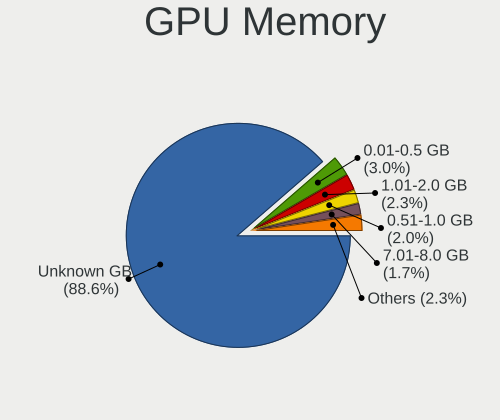

| Size in GB | Computers | Percent |
|------------|-----------|---------|
| Unknown    | 265       | 88.63%  |
| 0.01-0.5   | 9         | 3.01%   |
| 1.01-2.0   | 7         | 2.34%   |
| 0.51-1.0   | 6         | 2.01%   |
| 7.01-8.0   | 5         | 1.67%   |
| 5.01-6.0   | 2         | 0.67%   |
| 3.01-4.0   | 2         | 0.67%   |
| 8.01-16.0  | 2         | 0.67%   |
| 4.01-5.0   | 1         | 0.33%   |

Monitor
-------

Monitor Vendor
--------------

Monitor vendors

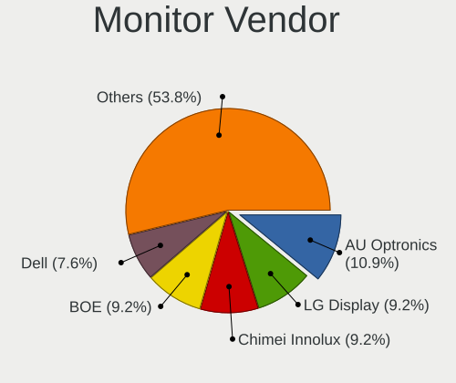

| Vendor                  | Computers | Percent |
|-------------------------|-----------|---------|
| AU Optronics            | 13        | 10.92%  |
| LG Display              | 11        | 9.24%   |
| Chimei Innolux          | 11        | 9.24%   |
| BOE                     | 11        | 9.24%   |
| Dell                    | 9         | 7.56%   |
| Samsung Electronics     | 6         | 5.04%   |
| Lenovo                  | 6         | 5.04%   |
| Philips                 | 4         | 3.36%   |
| CSO                     | 4         | 3.36%   |
| AOC                     | 4         | 3.36%   |
| ViewSonic               | 3         | 2.52%   |
| PANDA                   | 2         | 1.68%   |
| Mi                      | 2         | 1.68%   |
| Dostyle                 | 2         | 1.68%   |
| Chi Mei Optoelectronics | 2         | 1.68%   |
| BenQ                    | 2         | 1.68%   |
| ZL_                     | 1         | 0.84%   |
| TMX                     | 1         | 0.84%   |
| SKY                     | 1         | 0.84%   |
| SAC                     | 1         | 0.84%   |
| RTK                     | 1         | 0.84%   |
| Panasonic               | 1         | 0.84%   |
| LGD                     | 1         | 0.84%   |
| IPS                     | 1         | 0.84%   |
| InfoVision              | 1         | 0.84%   |
| HUAWEI                  | 1         | 0.84%   |
| HPN                     | 1         | 0.84%   |
| HKC                     | 1         | 0.84%   |
| Hewlett-Packard         | 1         | 0.84%   |
| Haier                   | 1         | 0.84%   |
| GRR                     | 1         | 0.84%   |
| GKE                     | 1         | 0.84%   |
| FSD                     | 1         | 0.84%   |
| FLY                     | 1         | 0.84%   |
| Eizo                    | 1         | 0.84%   |
| Daewoo                  | 1         | 0.84%   |
| CSOT                    | 1         | 0.84%   |
| CND                     | 1         | 0.84%   |
| CAN                     | 1         | 0.84%   |
| ASUSTek Computer        | 1         | 0.84%   |

Monitor Model
-------------

Monitor models

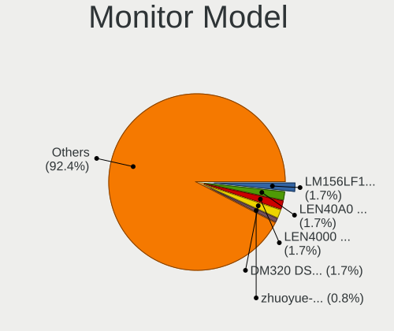

| Model                                                                 | Computers | Percent |
|-----------------------------------------------------------------------|-----------|---------|
| PANDA LM156LF1L03 NCP001C 1920x1080 340x190mm 15.3-inch               | 2         | 1.68%   |
| Lenovo LCD Monitor LEN40A0 1366x768 310x170mm 13.9-inch               | 2         | 1.68%   |
| Lenovo LCD Monitor LEN4000 1024x768 250x180mm 12.1-inch               | 2         | 1.68%   |
| Dostyle DM320 DST3200 1920x1080 700x390mm 31.5-inch                   | 2         | 1.68%   |
| ZL_ zhuoyue-HDMI ZL_2716 2560x1440 600x330mm 27.0-inch                | 1         | 0.84%   |
| ViewSonic VX2880-4K-HDU VSCA33A 3840x2160 630x360mm 28.6-inch         | 1         | 0.84%   |
| ViewSonic VX2779-2K-PRO VSC6240 2560x1440 600x330mm 27.0-inch         | 1         | 0.84%   |
| ViewSonic VA926 Series VSC7D20 1280x1024 380x300mm 19.1-inch          | 1         | 0.84%   |
| TMX LCD Monitor TMX1560 3200x2000 340x210mm 15.7-inch                 | 1         | 0.84%   |
| SKY F24B40Q SKY0001 2560x1440 530x300mm 24.0-inch                     | 1         | 0.84%   |
| Samsung Electronics S22F350 SAM0D1A 1920x1080 480x270mm 21.7-inch     | 1         | 0.84%   |
| Samsung Electronics LCD Monitor SEC544B 1600x900 340x190mm 15.3-inch  | 1         | 0.84%   |
| Samsung Electronics LCD Monitor SEC324C 1600x900 310x170mm 13.9-inch  | 1         | 0.84%   |
| Samsung Electronics LCD Monitor SEC3246 1366x768 290x160mm 13.0-inch  | 1         | 0.84%   |
| Samsung Electronics LCD Monitor SDC4142 3840x2160 290x170mm 13.2-inch | 1         | 0.84%   |
| Samsung Electronics LCD Monitor SDC324D 1366x768 310x170mm 13.9-inch  | 1         | 0.84%   |
| SAC LED MONITOR SAC952D 1920x1080 470x280mm 21.5-inch                 | 1         | 0.84%   |
| RTK '' RTK1920 1920x1080 336x210mm 15.6-inch                          | 1         | 0.84%   |
| Philips 298P4 PHLC0BE 2560x1080 670x280mm 28.6-inch                   | 1         | 0.84%   |
| Philips 242EL PHLC094 1920x1080 520x290mm 23.4-inch                   | 1         | 0.84%   |
| Philips 237EQPH PHLC091 1920x1080 510x290mm 23.1-inch                 | 1         | 0.84%   |
| Philips 190V PHL0081 1440x900 400x250mm 18.6-inch                     | 1         | 0.84%   |
| Panasonic LCD Monitor MEI96A2 2880x1620 340x190mm 15.3-inch           | 1         | 0.84%   |
| Mi Redmi 27 NQ XMIE001 2560x1440 600x330mm 27.0-inch                  | 1         | 0.84%   |
| Mi P27QBB-RA XMID003 2560x1440 600x340mm 27.2-inch                    | 1         | 0.84%   |
| LGD LCD Monitor 3840x1080                                             | 1         | 0.84%   |
| LG Display LCD Monitor LGD05F1 1920x1080 310x170mm 13.9-inch          | 1         | 0.84%   |
| LG Display LCD Monitor LGD05CF 1920x1080 340x190mm 15.3-inch          | 1         | 0.84%   |
| LG Display LCD Monitor LGD04B6 1366x768 310x170mm 13.9-inch           | 1         | 0.84%   |
| LG Display LCD Monitor LGD04AF 1366x768 340x190mm 15.3-inch           | 1         | 0.84%   |
| LG Display LCD Monitor LGD0382 1600x900 310x170mm 13.9-inch           | 1         | 0.84%   |
| LG Display LCD Monitor LGD0362 1600x900 310x170mm 13.9-inch           | 1         | 0.84%   |
| LG Display LCD Monitor LGD0335 1366x768 310x170mm 13.9-inch           | 1         | 0.84%   |
| LG Display LCD Monitor LGD0323 1920x1080 350x190mm 15.7-inch          | 1         | 0.84%   |
| LG Display LCD Monitor LGD02E9 1366x768 310x170mm 13.9-inch           | 1         | 0.84%   |
| LG Display LCD Monitor LGD02D8 1366x768 280x160mm 12.7-inch           | 1         | 0.84%   |
| LG Display LCD Monitor LGD01E6 1366x768 310x170mm 13.9-inch           | 1         | 0.84%   |
| Lenovo LEN L1950wD LEN1086 1920x1080 410x260mm 19.1-inch              | 1         | 0.84%   |
| Lenovo L197 Wide LEN1152 1440x900 410x260mm 19.1-inch                 | 1         | 0.84%   |
| IPS W220A IPS3150 3840x2160 700x390mm 31.5-inch                       | 1         | 0.84%   |

Monitor Resolution
------------------

Monitor screen resolution

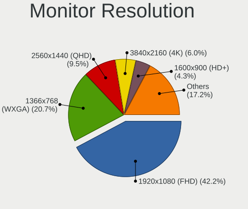

| Resolution         | Computers | Percent |
|--------------------|-----------|---------|
| 1920x1080 (FHD)    | 49        | 42.24%  |
| 1366x768 (WXGA)    | 24        | 20.69%  |
| 2560x1440 (QHD)    | 11        | 9.48%   |
| 3840x2160 (4K)     | 7         | 6.03%   |
| 1600x900 (HD+)     | 5         | 4.31%   |
| 3120x2080          | 3         | 2.59%   |
| 1440x900 (WXGA+)   | 3         | 2.59%   |
| 1280x1024 (SXGA)   | 3         | 2.59%   |
| 2560x1600          | 2         | 1.72%   |
| 2560x1080          | 2         | 1.72%   |
| 3840x1080          | 1         | 0.86%   |
| 3200x2000          | 1         | 0.86%   |
| 2880x1800          | 1         | 0.86%   |
| 2240x1400          | 1         | 0.86%   |
| 1920x1200 (WUXGA)  | 1         | 0.86%   |
| 1680x1050 (WSXGA+) | 1         | 0.86%   |
| Unknown            | 1         | 0.86%   |

Monitor Diagonal
----------------

Diagonal size in inches

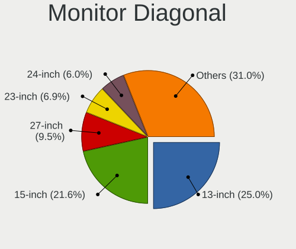

| Inches  | Computers | Percent |
|---------|-----------|---------|
| 13      | 29        | 25%     |
| 15      | 25        | 21.55%  |
| 27      | 11        | 9.48%   |
| 23      | 8         | 6.9%    |
| 24      | 7         | 6.03%   |
| 19      | 6         | 5.17%   |
| 21      | 5         | 4.31%   |
| 14      | 5         | 4.31%   |
| 12      | 4         | 3.45%   |
| 31      | 3         | 2.59%   |
| 28      | 2         | 1.72%   |
| 18      | 2         | 1.72%   |
| 16      | 2         | 1.72%   |
| 64      | 1         | 0.86%   |
| 54      | 1         | 0.86%   |
| 29      | 1         | 0.86%   |
| 22      | 1         | 0.86%   |
| 17      | 1         | 0.86%   |
| 11      | 1         | 0.86%   |
| Unknown | 1         | 0.86%   |

Monitor Width
-------------

Physical width

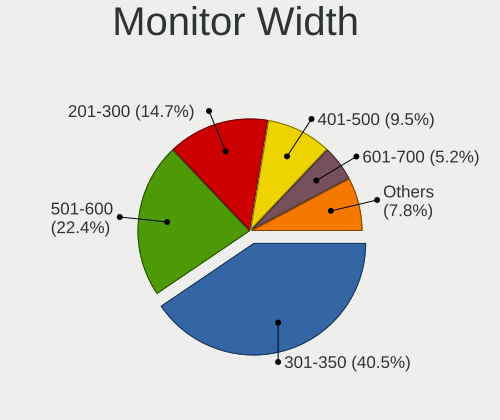

| Width in mm | Computers | Percent |
|-------------|-----------|---------|
| 301-350     | 47        | 40.52%  |
| 501-600     | 26        | 22.41%  |
| 201-300     | 17        | 14.66%  |
| 401-500     | 11        | 9.48%   |
| 601-700     | 6         | 5.17%   |
| 351-400     | 6         | 5.17%   |
| 1001-1500   | 2         | 1.72%   |
| Unknown     | 1         | 0.86%   |

Aspect Ratio
------------

Proportional relationship between the width and the height

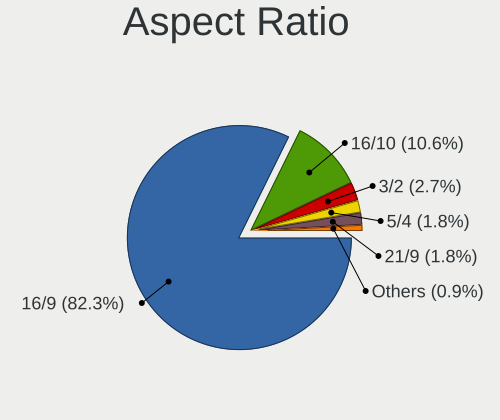

| Ratio   | Computers | Percent |
|---------|-----------|---------|
| 16/9    | 93        | 82.3%   |
| 16/10   | 12        | 10.62%  |
| 3/2     | 3         | 2.65%   |
| 5/4     | 2         | 1.77%   |
| 21/9    | 2         | 1.77%   |
| Unknown | 1         | 0.88%   |

Monitor Area
------------

Area in inch²

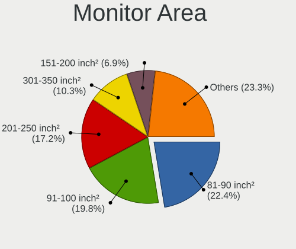

| Area in inch² | Computers | Percent |
|----------------|-----------|---------|
| 81-90          | 26        | 22.41%  |
| 91-100         | 23        | 19.83%  |
| 201-250        | 20        | 17.24%  |
| 301-350        | 12        | 10.34%  |
| 151-200        | 8         | 6.9%    |
| 71-80          | 5         | 4.31%   |
| 61-70          | 4         | 3.45%   |
| 351-500        | 4         | 3.45%   |
| 101-110        | 4         | 3.45%   |
| 111-120        | 3         | 2.59%   |
| More than 1000 | 2         | 1.72%   |
| 51-60          | 1         | 0.86%   |
| 251-300        | 1         | 0.86%   |
| 141-150        | 1         | 0.86%   |
| 121-130        | 1         | 0.86%   |
| Unknown        | 1         | 0.86%   |

Pixel Density
-------------

Pixels per inch

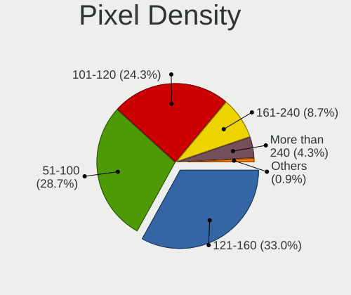

| Density       | Computers | Percent |
|---------------|-----------|---------|
| 121-160       | 38        | 33.04%  |
| 51-100        | 33        | 28.7%   |
| 101-120       | 28        | 24.35%  |
| 161-240       | 10        | 8.7%    |
| More than 240 | 5         | 4.35%   |
| Unknown       | 1         | 0.87%   |

Multiple Monitors
-----------------

Total monitors connected

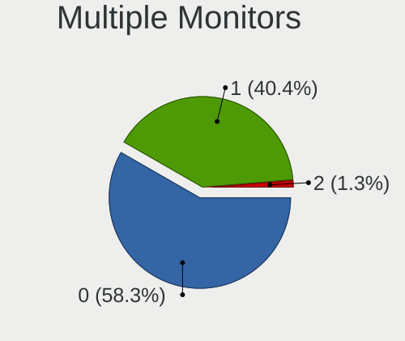

| Total | Computers | Percent |
|-------|-----------|---------|
| 0     | 176       | 58.28%  |
| 1     | 122       | 40.4%   |
| 2     | 4         | 1.32%   |

Network
-------

Net Controller Vendor
---------------------

Controller vendors

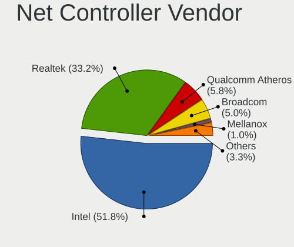

| Vendor                   | Computers | Percent |
|--------------------------|-----------|---------|
| Intel                    | 206       | 51.76%  |
| Realtek Semiconductor    | 132       | 33.17%  |
| Qualcomm Atheros         | 23        | 5.78%   |
| Broadcom                 | 20        | 5.03%   |
| Mellanox Technologies    | 4         | 1.01%   |
| Qualcomm Technologies    | 2         | 0.5%    |
| OPPO Electronics         | 2         | 0.5%    |
| Xiaomi                   | 1         | 0.25%   |
| Ralink Technology        | 1         | 0.25%   |
| Qualcomm                 | 1         | 0.25%   |
| MediaTek                 | 1         | 0.25%   |
| Marvell Technology Group | 1         | 0.25%   |
| Edimax Technology        | 1         | 0.25%   |
| Chelsio Communications   | 1         | 0.25%   |
| Apple                    | 1         | 0.25%   |
| American Megatrends      | 1         | 0.25%   |

Net Controller Model
--------------------

Controller models

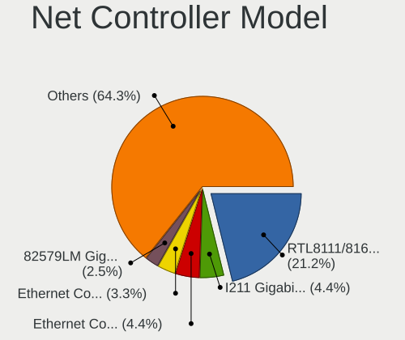

| Model                                                                  | Computers | Percent |
|------------------------------------------------------------------------|-----------|---------|
| Realtek RTL8111/8168/8211/8411 PCI Express Gigabit Ethernet Controller | 102       | 21.16%  |
| Intel I211 Gigabit Network Connection                                  | 21        | 4.36%   |
| Intel Ethernet Controller I226-V                                       | 21        | 4.36%   |
| Intel Ethernet Controller I225-V                                       | 16        | 3.32%   |
| Intel 82579LM Gigabit Network Connection (Lewisville)                  | 12        | 2.49%   |
| Intel I350 Gigabit Network Connection                                  | 11        | 2.28%   |
| Intel 82583V Gigabit Network Connection                                | 11        | 2.28%   |
| Realtek RTL810xE PCI Express Fast Ethernet controller                  | 10        | 2.07%   |
| Intel Wi-Fi 6 AX200                                                    | 9         | 1.87%   |
| Intel I210 Gigabit Network Connection                                  | 9         | 1.87%   |
| Realtek RTL8125 2.5GbE Controller                                      | 8         | 1.66%   |
| Intel Wireless 8265 / 8275                                             | 8         | 1.66%   |
| Broadcom NetXtreme BCM5720 Gigabit Ethernet PCIe                       | 8         | 1.66%   |
| Intel Wi-Fi 6 AX201                                                    | 6         | 1.24%   |
| Intel 82599ES 10-Gigabit SFI/SFP+ Network Connection                   | 6         | 1.24%   |
| Qualcomm Atheros AR9285 Wireless Network Adapter (PCI-Express)         | 5         | 1.04%   |
| Intel Wireless 8260                                                    | 5         | 1.04%   |
| Intel Wireless 7260                                                    | 5         | 1.04%   |
| Intel Ethernet Connection I217-LM                                      | 5         | 1.04%   |
| Intel Dual Band Wireless-AC 3168NGW [Stone Peak]                       | 5         | 1.04%   |
| Intel Dual Band Wireless-AC 3165 Plus Bluetooth                        | 5         | 1.04%   |
| Intel Centrino Advanced-N 6205 [Taylor Peak]                           | 5         | 1.04%   |
| Realtek RTL8822CE 802.11ac PCIe Wireless Network Adapter               | 4         | 0.83%   |
| Qualcomm Atheros QCA9565 / AR9565 Wireless Network Adapter             | 4         | 0.83%   |
| Qualcomm Atheros AR9485 Wireless Network Adapter                       | 4         | 0.83%   |
| Intel Wireless 3165                                                    | 4         | 0.83%   |
| Intel Wi-Fi 5(802.11ac) Wireless-AC 9x6x [Thunder Peak]                | 4         | 0.83%   |
| Intel Ethernet Connection X553 1GbE                                    | 4         | 0.83%   |
| Intel Ethernet Connection (7) I219-V                                   | 4         | 0.83%   |
| Intel Ethernet Connection (4) I219-V                                   | 4         | 0.83%   |
| Intel Ethernet Connection (2) I219-LM                                  | 4         | 0.83%   |
| Intel Comet Lake PCH-LP CNVi WiFi                                      | 4         | 0.83%   |
| Intel Alder Lake-P PCH CNVi WiFi                                       | 4         | 0.83%   |
| Intel 82576 Gigabit Network Connection                                 | 4         | 0.83%   |
| Intel 82574L Gigabit Network Connection                                | 4         | 0.83%   |
| Realtek RTL8188CE 802.11b/g/n WiFi Adapter                             | 3         | 0.62%   |
| Qualcomm Atheros AR9462 Wireless Network Adapter                       | 3         | 0.62%   |
| Mellanox MT27500 Family [ConnectX-3]                                   | 3         | 0.62%   |
| Intel Wireless 7265                                                    | 3         | 0.62%   |
| Intel Wi-Fi 6E(802.11ax) AX210/AX1675* 2x2 [Typhoon Peak]              | 3         | 0.62%   |

Wireless Vendor
---------------

Wireless vendors

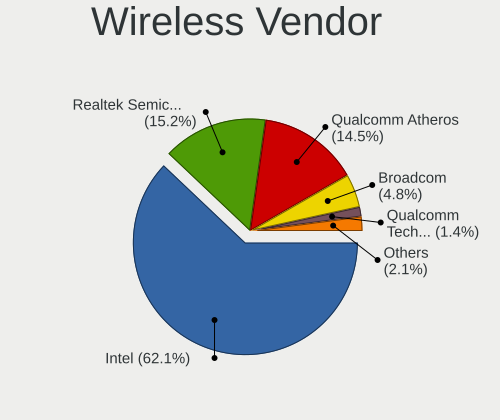

| Vendor                | Computers | Percent |
|-----------------------|-----------|---------|
| Intel                 | 90        | 62.07%  |
| Realtek Semiconductor | 22        | 15.17%  |
| Qualcomm Atheros      | 21        | 14.48%  |
| Broadcom              | 7         | 4.83%   |
| Qualcomm Technologies | 2         | 1.38%   |
| Ralink Technology     | 1         | 0.69%   |
| MediaTek              | 1         | 0.69%   |
| Edimax Technology     | 1         | 0.69%   |

Wireless Model
--------------

Wireless models

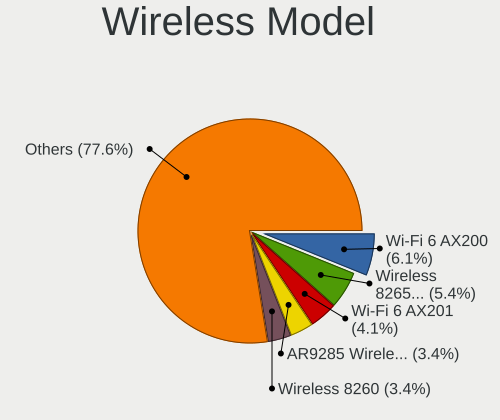

| Model                                                          | Computers | Percent |
|----------------------------------------------------------------|-----------|---------|
| Intel Wi-Fi 6 AX200                                            | 9         | 6.12%   |
| Intel Wireless 8265 / 8275                                     | 8         | 5.44%   |
| Intel Wi-Fi 6 AX201                                            | 6         | 4.08%   |
| Qualcomm Atheros AR9285 Wireless Network Adapter (PCI-Express) | 5         | 3.4%    |
| Intel Wireless 8260                                            | 5         | 3.4%    |
| Intel Wireless 7260                                            | 5         | 3.4%    |
| Intel Dual Band Wireless-AC 3168NGW [Stone Peak]               | 5         | 3.4%    |
| Intel Dual Band Wireless-AC 3165 Plus Bluetooth                | 5         | 3.4%    |
| Intel Centrino Advanced-N 6205 [Taylor Peak]                   | 5         | 3.4%    |
| Realtek RTL8822CE 802.11ac PCIe Wireless Network Adapter       | 4         | 2.72%   |
| Qualcomm Atheros QCA9565 / AR9565 Wireless Network Adapter     | 4         | 2.72%   |
| Qualcomm Atheros AR9485 Wireless Network Adapter               | 4         | 2.72%   |
| Intel Wireless 3165                                            | 4         | 2.72%   |
| Intel Wi-Fi 5(802.11ac) Wireless-AC 9x6x [Thunder Peak]        | 4         | 2.72%   |
| Intel Comet Lake PCH-LP CNVi WiFi                              | 4         | 2.72%   |
| Intel Alder Lake-P PCH CNVi WiFi                               | 4         | 2.72%   |
| Realtek RTL8188CE 802.11b/g/n WiFi Adapter                     | 3         | 2.04%   |
| Qualcomm Atheros AR9462 Wireless Network Adapter               | 3         | 2.04%   |
| Intel Wireless 7265                                            | 3         | 2.04%   |
| Intel Wi-Fi 6E(802.11ax) AX210/AX1675* 2x2 [Typhoon Peak]      | 3         | 2.04%   |
| Intel Cannon Lake PCH CNVi WiFi                                | 3         | 2.04%   |
| Realtek RTL8852BE PCIe 802.11ax Wireless Network Controller    | 2         | 1.36%   |
| Realtek RTL8821CE 802.11ac PCIe Wireless Network Adapter       | 2         | 1.36%   |
| Realtek RTL8192CU 802.11n WLAN Adapter                         | 2         | 1.36%   |
| Realtek RTL8188EE Wireless Network Adapter                     | 2         | 1.36%   |
| Qualcomm QCNFA765 Wireless Network Adapter                     | 2         | 1.36%   |
| Intel Raptor Lake PCH CNVi WiFi                                | 2         | 1.36%   |
| Intel Comet Lake PCH CNVi WiFi                                 | 2         | 1.36%   |
| Intel Centrino Wireless-N 2200                                 | 2         | 1.36%   |
| Intel Centrino Wireless-N 1000 [Condor Peak]                   | 2         | 1.36%   |
| Intel Cannon Point-LP CNVi [Wireless-AC]                       | 2         | 1.36%   |
| Broadcom BCM43602 802.11ac Wireless LAN SoC                    | 2         | 1.36%   |
| Broadcom BCM4360 802.11ac Dual Band Wireless Network Adapter   | 2         | 1.36%   |
| Broadcom BCM4313 802.11bgn Wireless Network Adapter            | 2         | 1.36%   |
| Realtek RTL8852AE 802.11ax PCIe Wireless Network Adapter       | 1         | 0.68%   |
| Realtek RTL8812AU 802.11a/b/g/n/ac 2T2R DB WLAN Adapter        | 1         | 0.68%   |
| Realtek RTL8723BE PCIe Wireless Network Adapter                | 1         | 0.68%   |
| Realtek RTL8191SU 802.11n WLAN Adapter                         | 1         | 0.68%   |
| Realtek RTL8188EUS 802.11n Wireless Network Adapter            | 1         | 0.68%   |
| Realtek RTL8188CUS 802.11n WLAN Adapter                        | 1         | 0.68%   |

Ethernet Vendor
---------------

Ethernet vendors

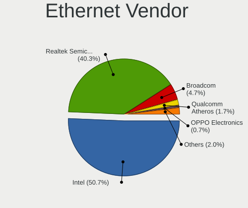

| Vendor                   | Computers | Percent |
|--------------------------|-----------|---------|
| Intel                    | 151       | 50.67%  |
| Realtek Semiconductor    | 120       | 40.27%  |
| Broadcom                 | 14        | 4.7%    |
| Qualcomm Atheros         | 5         | 1.68%   |
| OPPO Electronics         | 2         | 0.67%   |
| Xiaomi                   | 1         | 0.34%   |
| Qualcomm                 | 1         | 0.34%   |
| Marvell Technology Group | 1         | 0.34%   |
| Chelsio Communications   | 1         | 0.34%   |
| Apple                    | 1         | 0.34%   |
| American Megatrends      | 1         | 0.34%   |

Ethernet Model
--------------

Ethernet models

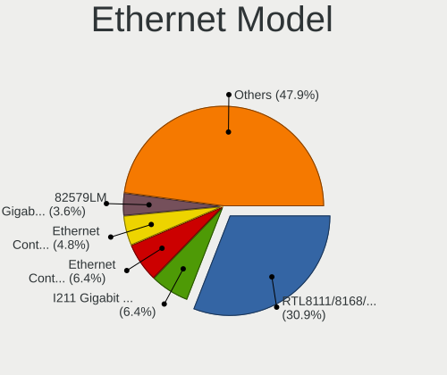

| Model                                                                  | Computers | Percent |
|------------------------------------------------------------------------|-----------|---------|
| Realtek RTL8111/8168/8211/8411 PCI Express Gigabit Ethernet Controller | 102       | 30.91%  |
| Intel I211 Gigabit Network Connection                                  | 21        | 6.36%   |
| Intel Ethernet Controller I226-V                                       | 21        | 6.36%   |
| Intel Ethernet Controller I225-V                                       | 16        | 4.85%   |
| Intel 82579LM Gigabit Network Connection (Lewisville)                  | 12        | 3.64%   |
| Intel I350 Gigabit Network Connection                                  | 11        | 3.33%   |
| Intel 82583V Gigabit Network Connection                                | 11        | 3.33%   |
| Realtek RTL810xE PCI Express Fast Ethernet controller                  | 10        | 3.03%   |
| Intel I210 Gigabit Network Connection                                  | 9         | 2.73%   |
| Realtek RTL8125 2.5GbE Controller                                      | 8         | 2.42%   |
| Broadcom NetXtreme BCM5720 Gigabit Ethernet PCIe                       | 8         | 2.42%   |
| Intel 82599ES 10-Gigabit SFI/SFP+ Network Connection                   | 6         | 1.82%   |
| Intel Ethernet Connection I217-LM                                      | 5         | 1.52%   |
| Intel Ethernet Connection X553 1GbE                                    | 4         | 1.21%   |
| Intel Ethernet Connection (7) I219-V                                   | 4         | 1.21%   |
| Intel Ethernet Connection (4) I219-V                                   | 4         | 1.21%   |
| Intel Ethernet Connection (2) I219-LM                                  | 4         | 1.21%   |
| Intel 82576 Gigabit Network Connection                                 | 4         | 1.21%   |
| Intel 82574L Gigabit Network Connection                                | 4         | 1.21%   |
| Intel Ethernet Controller X710 for 10GbE SFP+                          | 3         | 0.91%   |
| Intel Ethernet Connection (7) I219-LM                                  | 3         | 0.91%   |
| Intel Ethernet Connection (4) I219-LM                                  | 3         | 0.91%   |
| Qualcomm Atheros AR8152 v2.0 Fast Ethernet                             | 2         | 0.61%   |
| OPPO OPPO Find X3 Neo 5G RNDIS Control RNDIS Ethernet Data             | 2         | 0.61%   |
| Intel Ethernet Connection X553 10 GbE SFP+                             | 2         | 0.61%   |
| Intel Ethernet Connection I219-LM                                      | 2         | 0.61%   |
| Intel Ethernet Connection I217-V                                       | 2         | 0.61%   |
| Intel Ethernet Connection (2) I219-V                                   | 2         | 0.61%   |
| Intel 82575EB Gigabit Network Connection                               | 2         | 0.61%   |
| Broadcom NetXtreme BCM5719 Gigabit Ethernet PCIe                       | 2         | 0.61%   |
| Xiaomi Mi/Redmi series (RNDIS)                                         | 1         | 0.3%    |
| Realtek RTL8169 PCI Gigabit Ethernet Controller                        | 1         | 0.3%    |
| Realtek RTL8111/8168/8411 PCI Express Gigabit Ethernet Controller      | 1         | 0.3%    |
| Qualcomm FP3                                                           | 1         | 0.3%    |
| Qualcomm Atheros AR8162 Fast Ethernet                                  | 1         | 0.3%    |
| Qualcomm Atheros AR8151 v2.0 Gigabit Ethernet                          | 1         | 0.3%    |
| Qualcomm Atheros AR8132 Fast Ethernet                                  | 1         | 0.3%    |
| Marvell Group 88E8056 PCI-E Gigabit Ethernet Controller                | 1         | 0.3%    |
| Intel NM10/ICH7 Family LAN Controller                                  | 1         | 0.3%    |
| Intel Ethernet Controller X550                                         | 1         | 0.3%    |

Net Controller Kind
-------------------

Ethernet, WiFi or modem

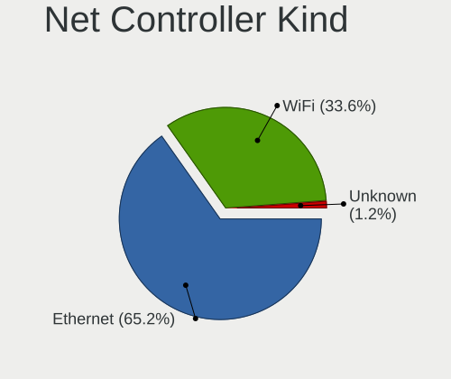

| Kind     | Computers | Percent |
|----------|-----------|---------|
| Ethernet | 270       | 65.22%  |
| WiFi     | 139       | 33.57%  |
| Unknown  | 5         | 1.21%   |

Used Controller
---------------

Currently used network controller

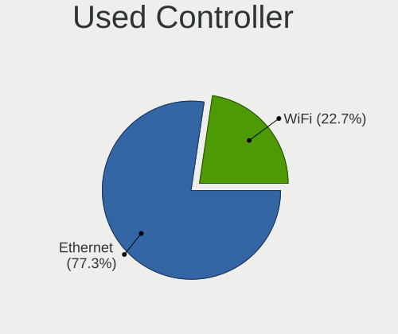

| Kind     | Computers | Percent |
|----------|-----------|---------|
| Ethernet | 239       | 77.35%  |
| WiFi     | 70        | 22.65%  |

NICs
----

Total network controllers on board

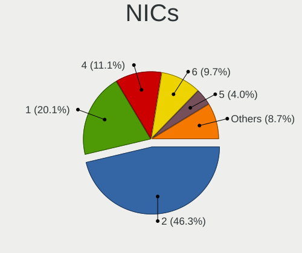

| Total | Computers | Percent |
|-------|-----------|---------|
| 2     | 138       | 46.31%  |
| 1     | 60        | 20.13%  |
| 4     | 33        | 11.07%  |
| 6     | 29        | 9.73%   |
| 5     | 12        | 4.03%   |
| 3     | 12        | 4.03%   |
| 8     | 6         | 2.01%   |
| 7     | 3         | 1.01%   |
| 0     | 3         | 1.01%   |
| 10    | 1         | 0.34%   |
| 9     | 1         | 0.34%   |

IPv6
----

IPv6 vs IPv4

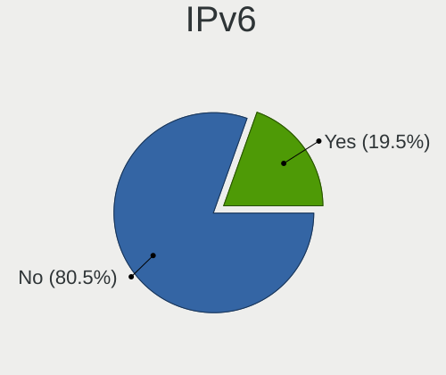

| Used | Computers | Percent |
|------|-----------|---------|
| No   | 247       | 80.46%  |
| Yes  | 60        | 19.54%  |

Bluetooth
---------

Bluetooth Vendor
----------------

Controller vendors

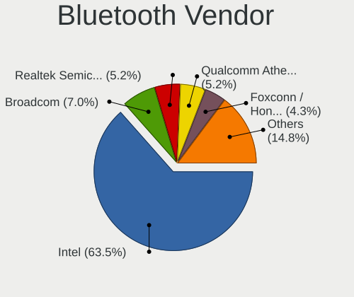

| Vendor                          | Computers | Percent |
|---------------------------------|-----------|---------|
| Intel                           | 73        | 63.48%  |
| Broadcom                        | 8         | 6.96%   |
| Realtek Semiconductor           | 6         | 5.22%   |
| Qualcomm Atheros Communications | 6         | 5.22%   |
| Foxconn / Hon Hai               | 5         | 4.35%   |
| Lite-On Technology              | 4         | 3.48%   |
| Cambridge Silicon Radio         | 4         | 3.48%   |
| Apple                           | 4         | 3.48%   |
| IMC Networks                    | 3         | 2.61%   |
| Skylight Digital                | 1         | 0.87%   |
| Alps Electric                   | 1         | 0.87%   |

Bluetooth Model
---------------

Controller models

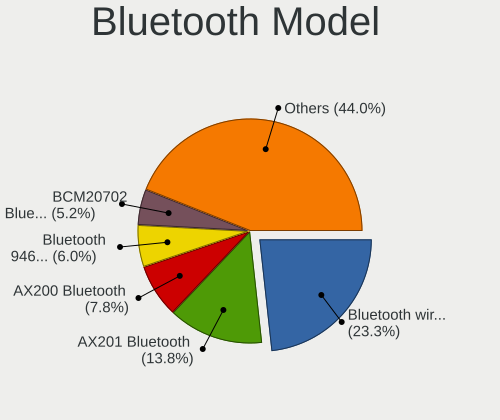

| Model                                                       | Computers | Percent |
|-------------------------------------------------------------|-----------|---------|
| Intel Bluetooth wireless interface                          | 27        | 23.28%  |
| Intel AX201 Bluetooth                                       | 16        | 13.79%  |
| Intel AX200 Bluetooth                                       | 9         | 7.76%   |
| Intel Bluetooth 9460/9560 Jefferson Peak (JfP)              | 7         | 6.03%   |
| Broadcom BCM20702 Bluetooth 4.0 [ThinkPad]                  | 6         | 5.17%   |
| Intel Wireless-AC 3168 Bluetooth                            | 5         | 4.31%   |
| Intel Wireless-AC 9260 Bluetooth Adapter                    | 4         | 3.45%   |
| Cambridge Silicon Radio Bluetooth Dongle (HCI mode)         | 4         | 3.45%   |
| Apple Bluetooth Host Controller                             | 4         | 3.45%   |
| Realtek Bluetooth Adapter                                   | 3         | 2.59%   |
| Qualcomm Atheros AR3012 Bluetooth 4.0                       | 3         | 2.59%   |
| Intel AX211 Bluetooth                                       | 3         | 2.59%   |
| Intel AX210 Bluetooth                                       | 3         | 2.59%   |
| Realtek Bluetooth 4.0 Adapter                               | 2         | 1.72%   |
| IMC Networks Realtek Bluetooth Adapter                      | 2         | 1.72%   |
| Foxconn / Hon Hai Qualcomm WCN685x Bluetooth Adapter        | 2         | 1.72%   |
| Skylight Digital Realtek Bluetooth Adapter                  | 1         | 0.86%   |
| Realtek  Bluetooth 4.2 Adapter                              | 1         | 0.86%   |
| Qualcomm Atheros Dell Wireless 1901 Bluetooth               | 1         | 0.86%   |
| Qualcomm Atheros Dell Wireless 1820 Bluetooth 4.1LE         | 1         | 0.86%   |
| Qualcomm Atheros Dell Wireless 1707 Bluetooth 4.0 LE Device | 1         | 0.86%   |
| Lite-On Realtek Bluetooth Adapter                           | 1         | 0.86%   |
| Lite-On Qualcomm Atheros Bluetooth 4.0 + HS                 | 1         | 0.86%   |
| Lite-On BCM43142A0 Bluetooth Module                         | 1         | 0.86%   |
| Lite-On Atheros AR3012 Bluetooth                            | 1         | 0.86%   |
| IMC Networks Qualcomm Atheros Bluetooth 4.0 + HS            | 1         | 0.86%   |
| Foxconn / Hon Hai MediaTek Bluetooth Adapter                | 1         | 0.86%   |
| Foxconn / Hon Hai Broadcom Bluetooth 2.1 Device             | 1         | 0.86%   |
| Foxconn / Hon Hai Atheros AR3012 Bluetooth                  | 1         | 0.86%   |
| Broadcom BCM20702 Bluetooth 4.0 USB Device                  | 1         | 0.86%   |
| Broadcom BCM2045B (BDC-2) [Bluetooth Controller]            | 1         | 0.86%   |
| Alps Electric UGTZ4 Bluetooth                               | 1         | 0.86%   |

Sound
-----

Sound Vendor
------------

Sound card vendors

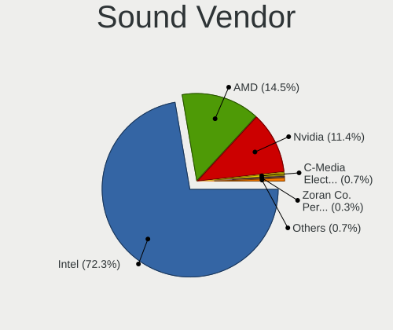

| Vendor                                       | Computers | Percent |
|----------------------------------------------|-----------|---------|
| Intel                                        | 209       | 72.32%  |
| AMD                                          | 42        | 14.53%  |
| Nvidia                                       | 33        | 11.42%  |
| C-Media Electronics                          | 2         | 0.69%   |
| Zoran Co. Personal Media Division (Nogatech) | 1         | 0.35%   |
| Generalplus Technology                       | 1         | 0.35%   |
| ASUSTek Computer                             | 1         | 0.35%   |

Sound Model
-----------

Sound card models

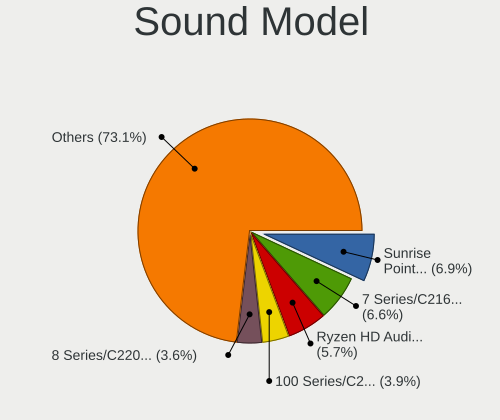

| Model                                                                                             | Computers | Percent |
|---------------------------------------------------------------------------------------------------|-----------|---------|
| Intel Sunrise Point-LP HD Audio                                                                   | 23        | 6.95%   |
| Intel 7 Series/C216 Chipset Family High Definition Audio Controller                               | 22        | 6.65%   |
| AMD Ryzen HD Audio Controller                                                                     | 19        | 5.74%   |
| Intel 100 Series/C230 Series Chipset Family HD Audio Controller                                   | 13        | 3.93%   |
| Intel 8 Series/C220 Series Chipset High Definition Audio Controller                               | 12        | 3.63%   |
| Intel Xeon E3-1200 v3/4th Gen Core Processor HD Audio Controller                                  | 11        | 3.32%   |
| Intel Jasper Lake HD Audio                                                                        | 11        | 3.32%   |
| Intel Celeron/Pentium Silver Processor High Definition Audio                                      | 11        | 3.32%   |
| Intel Atom Processor Z36xxx/Z37xxx Series High Definition Audio Controller                        | 11        | 3.32%   |
| Intel Tiger Lake-LP Smart Sound Technology Audio Controller                                       | 10        | 3.02%   |
| Intel 6 Series/C200 Series Chipset Family High Definition Audio Controller                        | 10        | 3.02%   |
| AMD Renoir/Cezanne HDMI/DP Audio Controller                                                       | 10        | 3.02%   |
| Intel Cannon Lake PCH cAVS                                                                        | 9         | 2.72%   |
| Intel Alder Lake PCH-P High Definition Audio Controller                                           | 7         | 2.11%   |
| AMD Raven/Raven2/Fenghuang HDMI/DP Audio Controller                                               | 7         | 2.11%   |
| Intel Alder Lake-N PCH High Definition Audio Controller                                           | 6         | 1.81%   |
| AMD FCH Azalia Controller                                                                         | 6         | 1.81%   |
| Intel Wildcat Point-LP High Definition Audio Controller                                           | 5         | 1.51%   |
| Intel Broadwell-U Audio Controller                                                                | 5         | 1.51%   |
| AMD Starship/Matisse HD Audio Controller                                                          | 5         | 1.51%   |
| AMD SBx00 Azalia (Intel HDA)                                                                      | 5         | 1.51%   |
| Intel Comet Lake PCH-V cAVS                                                                       | 4         | 1.21%   |
| Intel Comet Lake PCH-LP cAVS                                                                      | 4         | 1.21%   |
| Intel Celeron N3350/Pentium N4200/Atom E3900 Series Audio Cluster                                 | 4         | 1.21%   |
| Intel Atom/Celeron/Pentium Processor x5-E8000/J3xxx/N3xxx Series High Definition Audio Controller | 4         | 1.21%   |
| Intel 82801I (ICH9 Family) HD Audio Controller                                                    | 4         | 1.21%   |
| Intel 200 Series PCH HD Audio                                                                     | 4         | 1.21%   |
| Nvidia GP108 High Definition Audio Controller                                                     | 3         | 0.91%   |
| Nvidia GM206 High Definition Audio Controller                                                     | 3         | 0.91%   |
| Nvidia GA106 High Definition Audio Controller                                                     | 3         | 0.91%   |
| Nvidia GA104 High Definition Audio Controller                                                     | 3         | 0.91%   |
| Intel NM10/ICH7 Family High Definition Audio Controller                                           | 3         | 0.91%   |
| Intel Haswell-ULT HD Audio Controller                                                             | 3         | 0.91%   |
| Intel Comet Lake PCH cAVS                                                                         | 3         | 0.91%   |
| Intel Cannon Point-LP High Definition Audio Controller                                            | 3         | 0.91%   |
| Intel C610/X99 series chipset HD Audio Controller                                                 | 3         | 0.91%   |
| Intel Alder Lake-S HD Audio Controller                                                            | 3         | 0.91%   |
| Intel 82801JI (ICH10 Family) HD Audio Controller                                                  | 3         | 0.91%   |
| AMD Caicos HDMI Audio [Radeon HD 6450 / 7450/8450/8490 OEM / R5 230/235/235X OEM]                 | 3         | 0.91%   |
| Nvidia TU107 GeForce GTX 1650 High Definition Audio Controller                                    | 2         | 0.6%    |

Memory
------

Memory Vendor
-------------

Memory module vendors

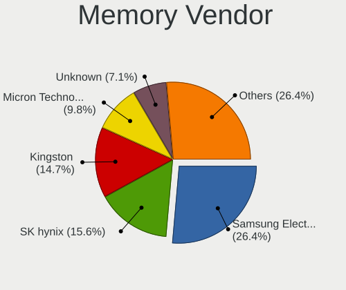

| Vendor               | Computers | Percent |
|----------------------|-----------|---------|
| Samsung Electronics  | 86        | 26.38%  |
| SK hynix             | 51        | 15.64%  |
| Kingston             | 48        | 14.72%  |
| Micron Technology    | 32        | 9.82%   |
| Unknown              | 23        | 7.06%   |
| Unknown              | 16        | 4.91%   |
| A-DATA Technology    | 12        | 3.68%   |
| Crucial              | 11        | 3.37%   |
| Ramaxel Technology   | 7         | 2.15%   |
| Elpida               | 4         | 1.23%   |
| Corsair              | 4         | 1.23%   |
| Transcend            | 3         | 0.92%   |
| Nanya Technology     | 3         | 0.92%   |
| GeIL                 | 3         | 0.92%   |
| G.Skill              | 3         | 0.92%   |
| Toshiba              | 2         | 0.61%   |
| Team                 | 2         | 0.61%   |
| GLOWAY               | 2         | 0.61%   |
| Unknown (ABCD)       | 1         | 0.31%   |
| Unknown (8AFD)       | 1         | 0.31%   |
| Unknown (08B5)       | 1         | 0.31%   |
| tigo                 | 1         | 0.31%   |
| SemsoTai             | 1         | 0.31%   |
| Ramsta               | 1         | 0.31%   |
| Lenovo               | 1         | 0.31%   |
| KingTiger            | 1         | 0.31%   |
| KINGBANK             | 1         | 0.31%   |
| Juhor                | 1         | 0.31%   |
| Innodisk             | 1         | 0.31%   |
| Guangzhou MiaoYuanJi | 1         | 0.31%   |
| Apacer               | 1         | 0.31%   |
| Advantech            | 1         | 0.31%   |

Memory Model
------------

Memory module models

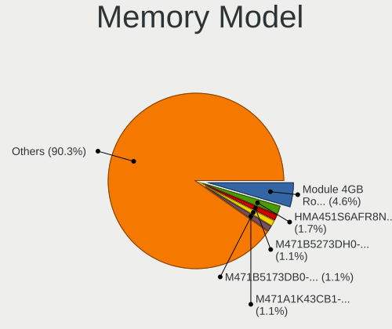

| Model                                                       | Computers | Percent |
|-------------------------------------------------------------|-----------|---------|
| Unknown                                                     | 16        | 4.57%   |
| SK hynix RAM HMA451S6AFR8N-TF 4GB SODIMM DDR4 2133MT/s      | 6         | 1.71%   |
| Samsung RAM M471B5273DH0-CH9 4GB SODIMM DDR3 1334MT/s       | 4         | 1.14%   |
| Samsung RAM M471B5173DB0-YK0 4GB SODIMM DDR3 1600MT/s       | 4         | 1.14%   |
| Samsung RAM M471A1K43CB1-CTD 8GB SODIMM DDR4 3200MT/s       | 4         | 1.14%   |
| Samsung RAM M471A1K43CB1-CRC 8GB SODIMM DDR4 2667MT/s       | 4         | 1.14%   |
| Ramaxel RAM RMT3170MN68F9F1600 4GB SODIMM DDR3 1600MT/s     | 4         | 1.14%   |
| Samsung RAM M471B5273DH0-CK0 8GB SODIMM DDR3 1600MT/s       | 3         | 0.86%   |
| Samsung RAM M471A1K43BB1-CRC 8GB SODIMM DDR4 2400MT/s       | 3         | 0.86%   |
| Micron RAM 53E1G32D2NP-046 2GB Row Of Chips LPDDR4 4267MT/s | 3         | 0.86%   |
| Unknown RAM Module 2GB SODIMM DDR3 800MT/s                  | 2         | 0.57%   |
| Unknown RAM Module 2GB DIMM DDR3 1333MT/s                   | 2         | 0.57%   |
| Unknown RAM Module 2GB DIMM DDR2 800MT/s                    | 2         | 0.57%   |
| Toshiba RAM HP24D4R7D4HAI-32 32GB DIMM DDR4 2400MT/s        | 2         | 0.57%   |
| SK hynix RAM HMT451S6BFR8A-PB 4GB SODIMM DDR3 1600MT/s      | 2         | 0.57%   |
| SK hynix RAM HMCG66AGBSA092N 8GB SODIMM DDR5 5600MT/s       | 2         | 0.57%   |
| SK hynix RAM HMA851S6AFR6N-UH 4GB SODIMM DDR4 2400MT/s      | 2         | 0.57%   |
| SK hynix RAM HMA81GS6AFR8N-UH 8GB SODIMM DDR4 2400MT/s      | 2         | 0.57%   |
| Samsung RAM Module 4GB Row Of Chips LPDDR3 2133MT/s         | 2         | 0.57%   |
| Samsung RAM M471B5773DH0-CH9 2GB SODIMM DDR3 1334MT/s       | 2         | 0.57%   |
| Samsung RAM M471B5773CHS-CH9 2GB SODIMM DDR3 1333MT/s       | 2         | 0.57%   |
| Samsung RAM M471B1G73DB0-YK0 8GB SODIMM DDR3 1600MT/s       | 2         | 0.57%   |
| Samsung RAM M471A5244CB0-CRC 4GB SODIMM DDR4 2400MT/s       | 2         | 0.57%   |
| Samsung RAM M471A5143EB0-CPB 4GB SODIMM DDR4 2133MT/s       | 2         | 0.57%   |
| Samsung RAM M471A4G43AB1-CWE 32GB SODIMM DDR4 3200MT/s      | 2         | 0.57%   |
| Samsung RAM M471A2K43CB1-CTD 16GB SODIMM DDR4 2667MT/s      | 2         | 0.57%   |
| Samsung RAM M471A2G43AB2-CWE 16GB SODIMM DDR4 3200MT/s      | 2         | 0.57%   |
| Samsung RAM M471A1K43DB1-CWE 8GB SODIMM DDR4 3200MT/s       | 2         | 0.57%   |
| Samsung RAM M471A1K43DB1-CTD 8GB SODIMM DDR4 2667MT/s       | 2         | 0.57%   |
| Samsung RAM M471A1G44AB0-CWE 8GB Row Of Chips DDR4 3200MT/s | 2         | 0.57%   |
| Samsung RAM M378B5173QH0-CK0 4GB DIMM DDR3 1600MT/s         | 2         | 0.57%   |
| Micron RAM Module 8GB SODIMM DDR4 2133MT/s                  | 2         | 0.57%   |
| Micron RAM 4ATF1G64HZ-3G2E1 8GB SODIMM DDR4 3200MT/s        | 2         | 0.57%   |
| Kingston RAM KHX3200C16FB/8G 8GB SODIMM DDR4 2400MT/s       | 2         | 0.57%   |
| Kingston RAM KHX3000C15D4/8GX 8GB DIMM DDR4 2933MT/s        | 2         | 0.57%   |
| Kingston RAM KHX1866C10D3/8G 8GB DIMM DDR3 1867MT/s         | 2         | 0.57%   |
| Kingston RAM KF3200C20S4/16GX 16GB SODIMM DDR4 3200MT/s     | 2         | 0.57%   |
| GeIL RAM CL11-11-11 D3-1600 4GB DIMM DDR3 1600MT/s          | 2         | 0.57%   |
| Elpida RAM EBJ40UG8BBU0-GN-F 4GB SODIMM DDR3 1600MT/s       | 2         | 0.57%   |
| Crucial RAM CT16G48C40S5.M8A1 16GB SODIMM DDR5 4800MT/s     | 2         | 0.57%   |

Memory Kind
-----------

Memory module kinds

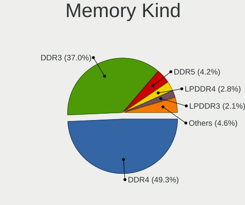

| Kind    | Computers | Percent |
|---------|-----------|---------|
| DDR4    | 140       | 49.3%   |
| DDR3    | 105       | 36.97%  |
| DDR5    | 12        | 4.23%   |
| LPDDR4  | 8         | 2.82%   |
| LPDDR3  | 6         | 2.11%   |
| DDR2    | 5         | 1.76%   |
| Unknown | 5         | 1.76%   |
| LPDDR5  | 2         | 0.7%    |
| SDRAM   | 1         | 0.35%   |

Memory Form Factor
------------------

Physical design of the memory module

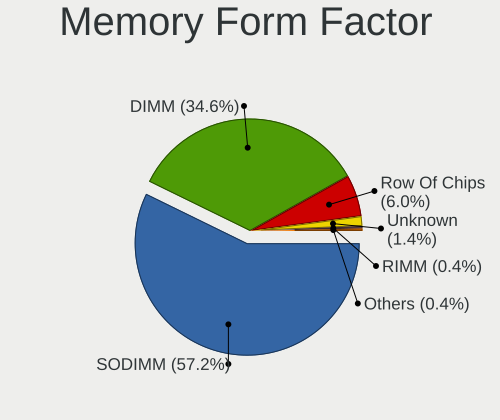

| Name         | Computers | Percent |
|--------------|-----------|---------|
| SODIMM       | 162       | 57.24%  |
| DIMM         | 98        | 34.63%  |
| Row Of Chips | 17        | 6.01%   |
| Unknown      | 4         | 1.41%   |
| RIMM         | 1         | 0.35%   |
| Chip         | 1         | 0.35%   |

Memory Size
-----------

Memory module size

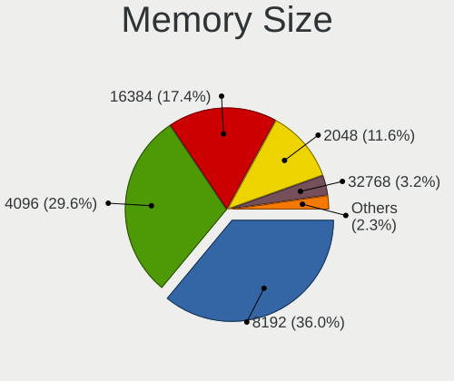

| Size  | Computers | Percent |
|-------|-----------|---------|
| 8192  | 112       | 36.01%  |
| 4096  | 92        | 29.58%  |
| 16384 | 54        | 17.36%  |
| 2048  | 36        | 11.58%  |
| 32768 | 10        | 3.22%   |
| 1024  | 6         | 1.93%   |
| 6144  | 1         | 0.32%   |

Memory Speed
------------

Memory module speed

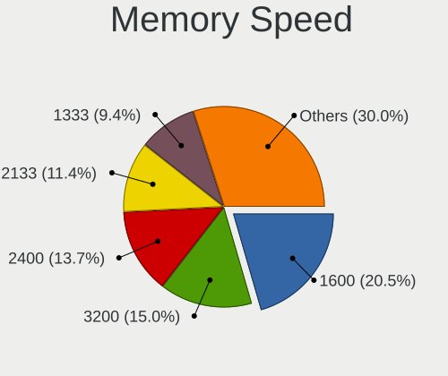

| Speed   | Computers | Percent |
|---------|-----------|---------|
| 1600    | 63        | 20.52%  |
| 3200    | 46        | 14.98%  |
| 2400    | 42        | 13.68%  |
| 2133    | 35        | 11.4%   |
| 1333    | 29        | 9.45%   |
| 2667    | 28        | 9.12%   |
| 800     | 11        | 3.58%   |
| 4800    | 7         | 2.28%   |
| 1334    | 7         | 2.28%   |
| 1867    | 6         | 1.95%   |
| 5600    | 4         | 1.3%    |
| 2666    | 4         | 1.3%    |
| 1067    | 4         | 1.3%    |
| 6400    | 3         | 0.98%   |
| 4267    | 3         | 0.98%   |
| 2933    | 3         | 0.98%   |
| 1066    | 3         | 0.98%   |
| 667     | 3         | 0.98%   |
| Unknown | 3         | 0.98%   |
| 5200    | 1         | 0.33%   |
| 3733    | 1         | 0.33%   |
| 533     | 1         | 0.33%   |

Printers & scanners
-------------------

Printer Vendor
--------------

Printer device vendors

Zero info for selected period =(

Printer Model
-------------

Printer device models

Zero info for selected period =(

Scanner Vendor
--------------

Scanner device vendors

Zero info for selected period =(

Scanner Model
-------------

Scanner device models

Zero info for selected period =(

Camera
------

Camera Vendor
-------------

Camera device vendors

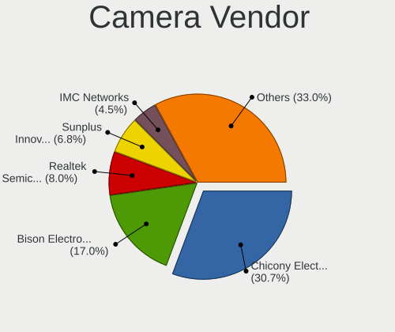

| Vendor                                 | Computers | Percent |
|----------------------------------------|-----------|---------|
| Chicony Electronics                    | 27        | 30.68%  |
| Bison Electronics                      | 15        | 17.05%  |
| Realtek Semiconductor                  | 7         | 7.95%   |
| Sunplus Innovation Technology          | 6         | 6.82%   |
| IMC Networks                           | 4         | 4.55%   |
| Unknown (3730304233343731345430)       | 3         | 3.41%   |
| Syntek                                 | 3         | 3.41%   |
| Microdia                               | 3         | 3.41%   |
| Luxvisions Innotech Limited            | 3         | 3.41%   |
| Silicon Motion                         | 2         | 2.27%   |
| Quanta                                 | 2         | 2.27%   |
| Logitech                               | 2         | 2.27%   |
| Lite-On Technology                     | 2         | 2.27%   |
| Z-Star Microelectronics                | 1         | 1.14%   |
| Supreme Electronics                    | 1         | 1.14%   |
| Lenovo                                 | 1         | 1.14%   |
| Importek                               | 1         | 1.14%   |
| Genesys Logic                          | 1         | 1.14%   |
| GEMBIRD                                | 1         | 1.14%   |
| Foxconn / Hon Hai                      | 1         | 1.14%   |
| Cheng Uei Precision Industry (Foxlink) | 1         | 1.14%   |
| ALi                                    | 1         | 1.14%   |

Camera Model
------------

Camera device models

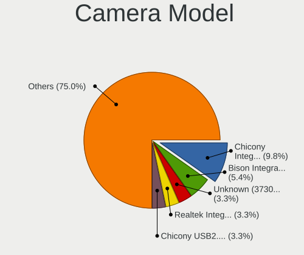

| Model                                                | Computers | Percent |
|------------------------------------------------------|-----------|---------|
| Chicony Integrated Camera                            | 9         | 9.78%   |
| Bison Integrated Camera                              | 5         | 5.43%   |
| Unknown (3730304233343731345430) USB Camera          | 3         | 3.26%   |
| Realtek Integrated_Webcam_HD                         | 3         | 3.26%   |
| Chicony USB2.0 VGA UVC WebCam                        | 3         | 3.26%   |
| Chicony Lenovo EasyCamera                            | 3         | 3.26%   |
| Bison ThinkPad Integrated Camera                     | 3         | 3.26%   |
| Syntek Lenovo EasyCamera                             | 2         | 2.17%   |
| Sunplus XiaoMi USB 2.0 Webcam                        | 2         | 2.17%   |
| Sunplus Integrated_Webcam_HD                         | 2         | 2.17%   |
| Silicon Motion Realtek USB 2.0 PC Camera             | 2         | 2.17%   |
| Luxvisions Innotech Limited HP Wide Vision HD Camera | 2         | 2.17%   |
| IMC Networks Integrated Camera                       | 2         | 2.17%   |
| Chicony Realtek DMFT RGB                             | 2         | 2.17%   |
| Chicony Integrated IR Camera                         | 2         | 2.17%   |
| Chicony Integrated Camera (1280x720@30)              | 2         | 2.17%   |
| Chicony HD WebCam                                    | 2         | 2.17%   |
| Chicony 8M Camera                                    | 2         | 2.17%   |
| Chicony 720p HD Camera                               | 2         | 2.17%   |
| Bison Lenovo Integrated Webcam                       | 2         | 2.17%   |
| Bison Lenovo EasyCamera                              | 2         | 2.17%   |
| Z-Star Lenovo USB 2.0 UVC Camera                     | 1         | 1.09%   |
| Syntek Integrated Camera                             | 1         | 1.09%   |
| Supreme Realtek PC Camera                            | 1         | 1.09%   |
| Sunplus MTD camera                                   | 1         | 1.09%   |
| Sunplus Dell E5570 integrated webcam                 | 1         | 1.09%   |
| Realtek USB 2.0 PC Camera                            | 1         | 1.09%   |
| Realtek Integrated Webcam                            | 1         | 1.09%   |
| Realtek HD WebCam                                    | 1         | 1.09%   |
| Realtek Front Camera                                 | 1         | 1.09%   |
| Quanta Realtek DMFT RGB                              | 1         | 1.09%   |
| Quanta ov9734_techfront_camera                       | 1         | 1.09%   |
| Microdia Laptop_Integrated_Webcam_0.3M               | 1         | 1.09%   |
| Microdia Integrated_Webcam_HD                        | 1         | 1.09%   |
| Microdia Camera                                      | 1         | 1.09%   |
| Luxvisions Innotech Limited Integrated Camera        | 1         | 1.09%   |
| Logitech Webcam C170                                 | 1         | 1.09%   |
| Logitech C670i FHD Webcam                            | 1         | 1.09%   |
| Lite-On Integrated Camera                            | 1         | 1.09%   |
| Lite-On HP HD Camera                                 | 1         | 1.09%   |

Security
--------

Fingerprint Vendor
------------------

Fingerprint sensor vendors

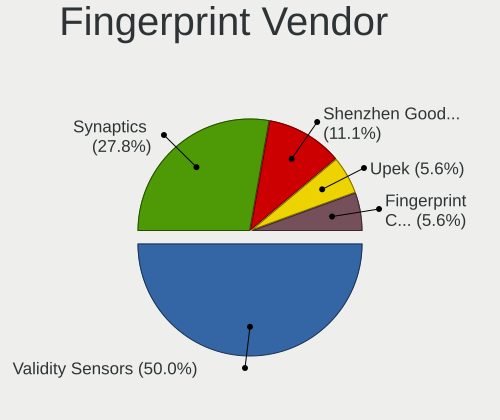

| Vendor                     | Computers | Percent |
|----------------------------|-----------|---------|
| Validity Sensors           | 9         | 50%     |
| Synaptics                  | 5         | 27.78%  |
| Shenzhen Goodix Technology | 2         | 11.11%  |
| Upek                       | 1         | 5.56%   |
| Fingerprint Cards          | 1         | 5.56%   |

Fingerprint Model
-----------------

Fingerprint sensor models

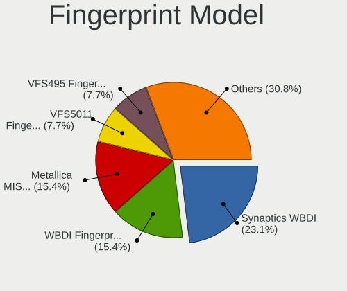

| Model                                                                      | Computers | Percent |
|----------------------------------------------------------------------------|-----------|---------|
| Validity Sensors Synaptics WBDI                                            | 4         | 22.22%  |
| Validity Sensors VFS5011 Fingerprint Reader                                | 2         | 11.11%  |
| Synaptics WBDI Fingerprint Reader USB 086                                  | 2         | 11.11%  |
| Synaptics Metallica MIS Touch Fingerprint Reader                           | 2         | 11.11%  |
| Shenzhen Goodix  Fingerprint Device                                        | 2         | 11.11%  |
| Validity Sensors VFS495 Fingerprint Reader                                 | 1         | 5.56%   |
| Validity Sensors VFS 5011 fingerprint sensor                               | 1         | 5.56%   |
| Validity Sensors Synaptics VFS7552 Touch Fingerprint Sensor with PurePrint | 1         | 5.56%   |
| Upek Biometric Touchchip/Touchstrip Fingerprint Sensor                     | 1         | 5.56%   |
| Synaptics Prometheus MIS Touch Fingerprint Reader                          | 1         | 5.56%   |
| Fingerprint Cards FPC Fingerprint Reader                                   | 1         | 5.56%   |

Chipcard Vendor
---------------

Chipcard module vendors

Zero info for selected period =(

Chipcard Model
--------------

Chipcard module models

Zero info for selected period =(

Unsupported
-----------

Unsupported Devices
-------------------

Total unsupported devices on board

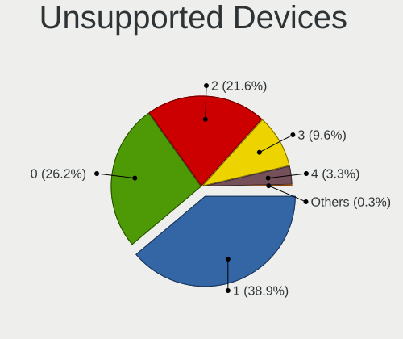

| Total | Computers | Percent |
|-------|-----------|---------|
| 1     | 117       | 38.87%  |
| 0     | 79        | 26.25%  |
| 2     | 65        | 21.59%  |
| 3     | 29        | 9.63%   |
| 4     | 10        | 3.32%   |
| 5     | 1         | 0.33%   |

Unsupported Device Types
------------------------

Types of unsupported devices

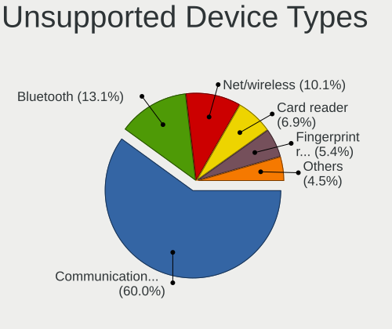

| Type                     | Computers | Percent |
|--------------------------|-----------|---------|
| Communication controller | 201       | 60%     |
| Bluetooth                | 44        | 13.13%  |
| Net/wireless             | 34        | 10.15%  |
| Card reader              | 23        | 6.87%   |
| Fingerprint reader       | 18        | 5.37%   |
| Sound                    | 7         | 2.09%   |
| Net/ethernet             | 6         | 1.79%   |
| Network                  | 2         | 0.6%    |

