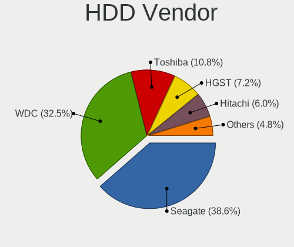
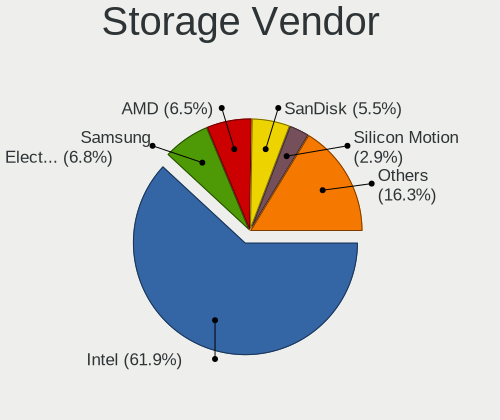
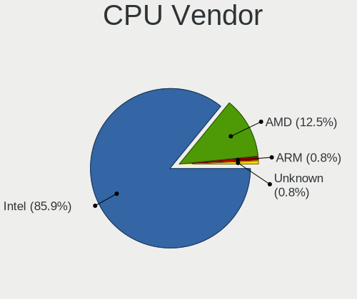
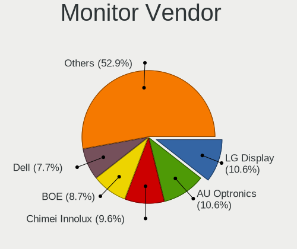
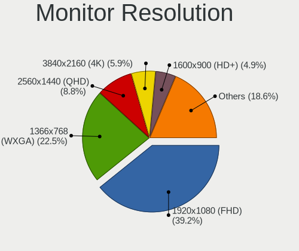
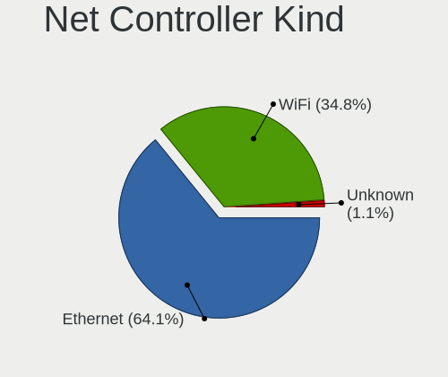
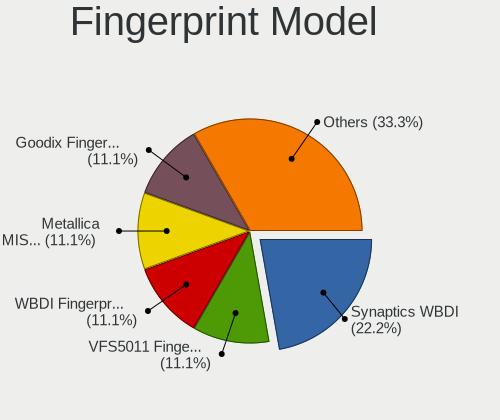
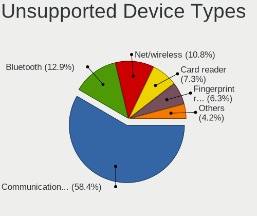

BSD in China - Tested Hardware & Statistics
-------------------------------------------

A project to collect tested hardware configurations for BSD in China.

Anyone can contribute to this report by the [hw-probe](https://github.com/linuxhw/hw-probe/blob/master/INSTALL.BSD.md) tool:

    hw-probe -all -upload

Please contribute! Especially if your hardware is rare.

This is a report for all computer types. See also reports for [desktops](/Location/China/Desktop/README.md) and [notebooks](/Location/China/Notebook/README.md).

Contents
--------

* [ Test Cases ](#test-cases)

* [ System ](#system)
  - [ OS                       ](#os)
  - [ OS Family                ](#os-family)
  - [ Arch                     ](#arch)
  - [ DE                       ](#de)
  - [ Display Server           ](#display-server)
  - [ Display Manager          ](#display-manager)
  - [ OS Lang                  ](#os-lang)
  - [ Boot Mode                ](#boot-mode)
  - [ Filesystem               ](#filesystem)
  - [ Part. scheme             ](#part-scheme)

* [ Board ](#board)
  - [ Vendor                   ](#vendor)
  - [ Model                    ](#model)
  - [ Model Family             ](#model-family)
  - [ MFG Year                 ](#mfg-year)
  - [ Form Factor              ](#form-factor)
  - [ Coreboot                 ](#coreboot)
  - [ RAM Size                 ](#ram-size)
  - [ RAM Used                 ](#ram-used)
  - [ Total Drives             ](#total-drives)
  - [ Has CD-ROM               ](#has-cd-rom)
  - [ Has Ethernet             ](#has-ethernet)
  - [ Has WiFi                 ](#has-wifi)
  - [ Has Bluetooth            ](#has-bluetooth)

* [ Location ](#location)
  - [ Country                  ](#country)
  - [ City                     ](#city)

* [ Drives ](#drives)
  - [ Drive Vendor             ](#drive-vendor)
  - [ Drive Model              ](#drive-model)
  - [ HDD Vendor               ](#hdd-vendor)
  - [ SSD Vendor               ](#ssd-vendor)
  - [ Drive Kind               ](#drive-kind)
  - [ Drive Connector          ](#drive-connector)
  - [ Drive Size               ](#drive-size)
  - [ Space Total              ](#space-total)
  - [ Space Used               ](#space-used)
  - [ Malfunc. Drives          ](#malfunc-drives)
  - [ Malfunc. Drive Vendor    ](#malfunc-drive-vendor)
  - [ Malfunc. HDD Vendor      ](#malfunc-hdd-vendor)
  - [ Malfunc. Drive Kind      ](#malfunc-drive-kind)
  - [ Failed Drives            ](#failed-drives)
  - [ Failed Drive Vendor      ](#failed-drive-vendor)
  - [ Drive Status             ](#drive-status)

* [ Storage controller ](#storage-controller)
  - [ Storage Vendor           ](#storage-vendor)
  - [ Storage Model            ](#storage-model)
  - [ Storage Kind             ](#storage-kind)

* [ Processor ](#processor)
  - [ CPU Vendor               ](#cpu-vendor)
  - [ CPU Model                ](#cpu-model)
  - [ CPU Model Family         ](#cpu-model-family)
  - [ CPU Cores                ](#cpu-cores)
  - [ CPU Sockets              ](#cpu-sockets)
  - [ CPU Threads              ](#cpu-threads)
  - [ CPU Microarch            ](#cpu-microarch)

* [ Graphics ](#graphics)
  - [ GPU Vendor               ](#gpu-vendor)
  - [ GPU Model                ](#gpu-model)
  - [ GPU Combo                ](#gpu-combo)
  - [ GPU Driver               ](#gpu-driver)
  - [ GPU Memory               ](#gpu-memory)

* [ Monitor ](#monitor)
  - [ Monitor Vendor           ](#monitor-vendor)
  - [ Monitor Model            ](#monitor-model)
  - [ Monitor Resolution       ](#monitor-resolution)
  - [ Monitor Diagonal         ](#monitor-diagonal)
  - [ Monitor Width            ](#monitor-width)
  - [ Aspect Ratio             ](#aspect-ratio)
  - [ Monitor Area             ](#monitor-area)
  - [ Pixel Density            ](#pixel-density)
  - [ Multiple Monitors        ](#multiple-monitors)

* [ Network ](#network)
  - [ Net Controller Vendor    ](#net-controller-vendor)
  - [ Net Controller Model     ](#net-controller-model)
  - [ Wireless Vendor          ](#wireless-vendor)
  - [ Wireless Model           ](#wireless-model)
  - [ Ethernet Vendor          ](#ethernet-vendor)
  - [ Ethernet Model           ](#ethernet-model)
  - [ Net Controller Kind      ](#net-controller-kind)
  - [ Used Controller          ](#used-controller)
  - [ NICs                     ](#nics)
  - [ IPv6                     ](#ipv6)

* [ Bluetooth ](#bluetooth)
  - [ Bluetooth Vendor         ](#bluetooth-vendor)
  - [ Bluetooth Model          ](#bluetooth-model)

* [ Sound ](#sound)
  - [ Sound Vendor             ](#sound-vendor)
  - [ Sound Model              ](#sound-model)

* [ Memory ](#memory)
  - [ Memory Vendor            ](#memory-vendor)
  - [ Memory Model             ](#memory-model)
  - [ Memory Kind              ](#memory-kind)
  - [ Memory Form Factor       ](#memory-form-factor)
  - [ Memory Size              ](#memory-size)
  - [ Memory Speed             ](#memory-speed)

* [ Printers & scanners ](#printers--scanners)
  - [ Printer Vendor           ](#printer-vendor)
  - [ Printer Model            ](#printer-model)
  - [ Scanner Vendor           ](#scanner-vendor)
  - [ Scanner Model            ](#scanner-model)

* [ Camera ](#camera)
  - [ Camera Vendor            ](#camera-vendor)
  - [ Camera Model             ](#camera-model)

* [ Security ](#security)
  - [ Fingerprint Vendor       ](#fingerprint-vendor)
  - [ Fingerprint Model        ](#fingerprint-model)
  - [ Chipcard Vendor          ](#chipcard-vendor)
  - [ Chipcard Model           ](#chipcard-model)

* [ Unsupported ](#unsupported)
  - [ Unsupported Devices      ](#unsupported-devices)
  - [ Unsupported Device Types ](#unsupported-device-types)

Test Cases
----------

Total: 306

| Vendor        | Model                       | Form-Factor | Probe                                                     | Date         |
|---------------|-----------------------------|-------------|-----------------------------------------------------------|--------------|
| BROUNION      | R86S                        | Desktop     | [752d83911f](https://bsd-hardware.info/?probe=752d83911f) | May 08, 2024 |
| Lenovo        | Legion Y7000P 81HC          | Notebook    | [3dff76a9dd](https://bsd-hardware.info/?probe=3dff76a9dd) | Apr 27, 2024 |
| Intel         | MAHOBAY                     | Desktop     | [c76dc714f2](https://bsd-hardware.info/?probe=c76dc714f2) | Apr 15, 2024 |
| Dell          | 0H21J3 A07                  | Server      | [9315b36ed5](https://bsd-hardware.info/?probe=9315b36ed5) | Apr 15, 2024 |
| Unknown       | Unknown                     | Desktop     | [75fccc1dbe](https://bsd-hardware.info/?probe=75fccc1dbe) | Apr 15, 2024 |
| Unknown       | Unknown                     | Desktop     | [ba545bb931](https://bsd-hardware.info/?probe=ba545bb931) | Apr 15, 2024 |
| Intel         | NUC9i5QNB K49247-500        | Mini pc     | [13d74beda7](https://bsd-hardware.info/?probe=13d74beda7) | Apr 02, 2024 |
| ASUSTek       | TUF Gaming B650-PLUS        | Desktop     | [f960805584](https://bsd-hardware.info/?probe=f960805584) | Mar 26, 2024 |
| Unknown       | QDNV01                      | Desktop     | [72b182fa59](https://bsd-hardware.info/?probe=72b182fa59) | Mar 25, 2024 |
| MSI           | MPG X570 GAMING EDGE WIF... | Desktop     | [c2fcfcd39d](https://bsd-hardware.info/?probe=c2fcfcd39d) | Mar 24, 2024 |
| Intel         | MAHOBAY                     | Desktop     | [cf80a0db55](https://bsd-hardware.info/?probe=cf80a0db55) | Mar 19, 2024 |
| Lenovo        | IdeaPad 500-14ISK 80NS      | Notebook    | [34ab895e86](https://bsd-hardware.info/?probe=34ab895e86) | Mar 15, 2024 |
| Lenovo        | XiaoXinAir 14+ ACN 2021 ... | Notebook    | [5702ec8e8e](https://bsd-hardware.info/?probe=5702ec8e8e) | Feb 22, 2024 |
| Lenovo        | 314D SDK0J40697 WIN 1801... | Mini pc     | [69637a6fb3](https://bsd-hardware.info/?probe=69637a6fb3) | Feb 20, 2024 |
| ASRock        | B360M Xtreme                | Desktop     | [e84af03816](https://bsd-hardware.info/?probe=e84af03816) | Feb 16, 2024 |
| Notebook      | N960Kx                      | Notebook    | [4e83c12f96](https://bsd-hardware.info/?probe=4e83c12f96) | Feb 12, 2024 |
| Techvision    | TVI7309X B0                 | Desktop     | [0a384151b6](https://bsd-hardware.info/?probe=0a384151b6) | Jan 20, 2024 |
| Unknown       | Unknown                     | Desktop     | [609434dc71](https://bsd-hardware.info/?probe=609434dc71) | Jan 18, 2024 |
| Dell          | Vostro 5470                 | Notebook    | [56472e8f51](https://bsd-hardware.info/?probe=56472e8f51) | Dec 30, 2023 |
| Unknown       | Unknown                     | Desktop     | [ba78787dff](https://bsd-hardware.info/?probe=ba78787dff) | Dec 29, 2023 |
| MSI           | MPG X570 GAMING EDGE WIF... | Desktop     | [06457349dc](https://bsd-hardware.info/?probe=06457349dc) | Dec 22, 2023 |
| Google        | Kohaku                      | Notebook    | [0b945d8f38](https://bsd-hardware.info/?probe=0b945d8f38) | Dec 15, 2023 |
| Intel         | SKYBAY                      | Desktop     | [6ad2ae72f1](https://bsd-hardware.info/?probe=6ad2ae72f1) | Dec 13, 2023 |
| MECHREVO      | F7BSC V1.0                  | Mini pc     | [d1104aa676](https://bsd-hardware.info/?probe=d1104aa676) | Dec 05, 2023 |
| Intel         | H81U                        | Notebook    | [b74cca91df](https://bsd-hardware.info/?probe=b74cca91df) | Dec 01, 2023 |
| MSI           | B450M MORTAR                | Desktop     | [4017ce5221](https://bsd-hardware.info/?probe=4017ce5221) | Nov 29, 2023 |
| Supermicro    | X9SCL-II/X9SCM-II           | Desktop     | [34833316ac](https://bsd-hardware.info/?probe=34833316ac) | Nov 27, 2023 |
| Google        | Kohaku                      | Notebook    | [94c3c0f6b7](https://bsd-hardware.info/?probe=94c3c0f6b7) | Nov 26, 2023 |
| Google        | Kohaku                      | Notebook    | [198b445c4e](https://bsd-hardware.info/?probe=198b445c4e) | Nov 26, 2023 |
| Silicom       | 80300-0214-G16 R310         | Desktop     | [34382c8f4b](https://bsd-hardware.info/?probe=34382c8f4b) | Nov 24, 2023 |
| Unknown       | Unknown                     | Desktop     | [456d5ad8bf](https://bsd-hardware.info/?probe=456d5ad8bf) | Nov 05, 2023 |
| YanRay Tec... | B1904                       | Desktop     | [7d194ae12b](https://bsd-hardware.info/?probe=7d194ae12b) | Oct 28, 2023 |
| MECHREVO      | Unknown                     | Desktop     | [2dac22205c](https://bsd-hardware.info/?probe=2dac22205c) | Oct 23, 2023 |
| Intel         | NUC11PABi7 K90104-302       | Mini pc     | [8f62c35aa0](https://bsd-hardware.info/?probe=8f62c35aa0) | Oct 23, 2023 |
| Lenovo        | ThinkPad T480 20L5000UUS    | Notebook    | [20fe904881](https://bsd-hardware.info/?probe=20fe904881) | Oct 15, 2023 |
| Lenovo        | SHARKBAY SDK0A46860 WIN     | Desktop     | [da1e562510](https://bsd-hardware.info/?probe=da1e562510) | Oct 10, 2023 |
| Lenovo        | SHARKBAY SDK0A46860 WIN     | Desktop     | [d7cf15da0c](https://bsd-hardware.info/?probe=d7cf15da0c) | Oct 09, 2023 |
| Timi          | A34R                        | Notebook    | [3cd3f35eaa](https://bsd-hardware.info/?probe=3cd3f35eaa) | Oct 07, 2023 |
| Timi          | A34R                        | Notebook    | [03f00603f7](https://bsd-hardware.info/?probe=03f00603f7) | Oct 07, 2023 |
| Unknown       | Unknown                     | Desktop     | [c54bad3277](https://bsd-hardware.info/?probe=c54bad3277) | Oct 04, 2023 |
| Lenovo        | 3136 SDK0J40697 WIN         | Mini pc     | [a7b161ff5e](https://bsd-hardware.info/?probe=a7b161ff5e) | Oct 01, 2023 |
| Biostar       | A55MLC2                     | Desktop     | [fac0f247d0](https://bsd-hardware.info/?probe=fac0f247d0) | Sep 28, 2023 |
| Techvision    | TVI7309X B0                 | Desktop     | [93c70115bd](https://bsd-hardware.info/?probe=93c70115bd) | Aug 19, 2023 |
| Intel         | SKYBAY                      | Desktop     | [53fb653186](https://bsd-hardware.info/?probe=53fb653186) | Aug 18, 2023 |
| MSI           | MPG X570 GAMING EDGE WIF... | Desktop     | [2f6574d368](https://bsd-hardware.info/?probe=2f6574d368) | Aug 08, 2023 |
| HP            | 82C0                        | Mini pc     | [6ad9c871cb](https://bsd-hardware.info/?probe=6ad9c871cb) | Aug 07, 2023 |
| HP            | 82C0                        | Mini pc     | [124e7b14df](https://bsd-hardware.info/?probe=124e7b14df) | Aug 07, 2023 |
| Unknown       | Unknown                     | Desktop     | [75e009424e](https://bsd-hardware.info/?probe=75e009424e) | Aug 07, 2023 |
| Dell          | Inspiron 14-3467            | Notebook    | [5db7e9b7a1](https://bsd-hardware.info/?probe=5db7e9b7a1) | Aug 05, 2023 |
| Intel         | SKYBAY                      | Desktop     | [fde75b4094](https://bsd-hardware.info/?probe=fde75b4094) | Aug 04, 2023 |
| HP            | 82C0                        | Mini pc     | [be2c1dd2f5](https://bsd-hardware.info/?probe=be2c1dd2f5) | Aug 03, 2023 |
| HP            | 82C0                        | Mini pc     | [6fa14d3439](https://bsd-hardware.info/?probe=6fa14d3439) | Aug 03, 2023 |
| Lenovo        | ThinkPad X270 20HNA04GCD    | Notebook    | [6547f4a73b](https://bsd-hardware.info/?probe=6547f4a73b) | Jul 31, 2023 |
| AZW           | EQ                          | Desktop     | [a581a63aae](https://bsd-hardware.info/?probe=a581a63aae) | Jul 29, 2023 |
| AZW           | EQ                          | Desktop     | [1feeda5ce9](https://bsd-hardware.info/?probe=1feeda5ce9) | Jul 29, 2023 |
| Lenovo        | B590 20208                  | Notebook    | [ce1aade2c0](https://bsd-hardware.info/?probe=ce1aade2c0) | Jul 24, 2023 |
| Unknown       | Unknown                     | Desktop     | [3ca61a6a18](https://bsd-hardware.info/?probe=3ca61a6a18) | Jul 24, 2023 |
| AZW           | EQ                          | Desktop     | [7d2884120c](https://bsd-hardware.info/?probe=7d2884120c) | Jul 23, 2023 |
| NEC Comput... | IS8XM                       | Desktop     | [9f50189f65](https://bsd-hardware.info/?probe=9f50189f65) | Jul 22, 2023 |
| OEM           | ITX-SC3 V1.1                | Desktop     | [a58b6ba2d4](https://bsd-hardware.info/?probe=a58b6ba2d4) | Jul 18, 2023 |
| OEM           | ITX-SC3 V1.1                | Desktop     | [7c550acc8c](https://bsd-hardware.info/?probe=7c550acc8c) | Jul 18, 2023 |
| Dell          | 01F7TF A03                  | Server      | [6d9d222d88](https://bsd-hardware.info/?probe=6d9d222d88) | Jul 18, 2023 |
| Lenovo        | B590 20208                  | Notebook    | [f734b93999](https://bsd-hardware.info/?probe=f734b93999) | Jul 16, 2023 |
| HP            | Laptop 15s-eq3xxx           | Notebook    | [ff4dbbacdf](https://bsd-hardware.info/?probe=ff4dbbacdf) | Jul 15, 2023 |
| Lenovo        | ThinkPad R14 Gen 4 21E5A... | Notebook    | [e0fc7135e5](https://bsd-hardware.info/?probe=e0fc7135e5) | Jul 15, 2023 |
| Unknown       | Unknown                     | Desktop     | [4c5d9c5da3](https://bsd-hardware.info/?probe=4c5d9c5da3) | Jun 29, 2023 |
| Lenovo        | ThinkPad X1 Carbon 6th 2... | Notebook    | [4841a6b1d2](https://bsd-hardware.info/?probe=4841a6b1d2) | Jun 14, 2023 |
| WlanCN        | 6000 Series                 | Desktop     | [d2e71531b6](https://bsd-hardware.info/?probe=d2e71531b6) | Jun 05, 2023 |
| Lenovo        | B590 20208                  | Notebook    | [dc65d735c8](https://bsd-hardware.info/?probe=dc65d735c8) | Jun 04, 2023 |
| Panasonic     | CF-NX1GDHYS                 | Notebook    | [fb1f293997](https://bsd-hardware.info/?probe=fb1f293997) | Jun 02, 2023 |
| NORCO         | HB133                       | Desktop     | [1d59c53b9b](https://bsd-hardware.info/?probe=1d59c53b9b) | May 25, 2023 |
| DS            | FJ04D JHS60K                | Desktop     | [7561a5e28b](https://bsd-hardware.info/?probe=7561a5e28b) | May 11, 2023 |
| Colorful T... | C.J1900A-BTC PLUS V20       | Desktop     | [07add98717](https://bsd-hardware.info/?probe=07add98717) | May 03, 2023 |
| Colorful T... | C.J1900A-BTC PLUS V20       | Desktop     | [b718c75566](https://bsd-hardware.info/?probe=b718c75566) | May 01, 2023 |
| HP            | Unknown                     | Notebook    | [e2aa3620b4](https://bsd-hardware.info/?probe=e2aa3620b4) | Apr 23, 2023 |
| Dell          | 0569RT A04                  | Server      | [cff2ebd06b](https://bsd-hardware.info/?probe=cff2ebd06b) | Apr 23, 2023 |
| Dell          | 0VTC0D A02                  | Desktop     | [a807892254](https://bsd-hardware.info/?probe=a807892254) | Apr 19, 2023 |
| HP            | Unknown                     | Notebook    | [941c021569](https://bsd-hardware.info/?probe=941c021569) | Apr 18, 2023 |
| Lenovo        | YangTianM6880N              | Desktop     | [a567c3062c](https://bsd-hardware.info/?probe=a567c3062c) | Apr 18, 2023 |
| AMI           | Aptio CRB                   | Mini pc     | [4ae38adc2a](https://bsd-hardware.info/?probe=4ae38adc2a) | Apr 13, 2023 |
| YENTEK        | ITX-B75R1                   | Desktop     | [7443f81ab1](https://bsd-hardware.info/?probe=7443f81ab1) | Apr 10, 2023 |
| Gigabyte      | M52L-S3P                    | Desktop     | [3a6baf7f2d](https://bsd-hardware.info/?probe=3a6baf7f2d) | Apr 09, 2023 |
| YENTEK        | ITX-B75R1                   | Desktop     | [3cab1716e0](https://bsd-hardware.info/?probe=3cab1716e0) | Apr 08, 2023 |
| Unknown       | Unknown                     | Desktop     | [0976c12353](https://bsd-hardware.info/?probe=0976c12353) | Apr 03, 2023 |
| Intel         | MAHOBAY                     | Desktop     | [6e8443e9f4](https://bsd-hardware.info/?probe=6e8443e9f4) | Apr 01, 2023 |
| MECHREVO S... | S1 Series                   | Notebook    | [58ae2c4605](https://bsd-hardware.info/?probe=58ae2c4605) | Mar 19, 2023 |
| Lenovo        | ThinkPad X1 Carbon 3448A... | Notebook    | [eaaf0fc8c7](https://bsd-hardware.info/?probe=eaaf0fc8c7) | Mar 14, 2023 |
| Google        | Kohaku                      | Notebook    | [88491d298e](https://bsd-hardware.info/?probe=88491d298e) | Mar 12, 2023 |
| Dell          | 0KYJ8C A02                  | Desktop     | [ea8759f206](https://bsd-hardware.info/?probe=ea8759f206) | Mar 09, 2023 |
| Lenovo        | ThinkPad X230 2324A14       | Notebook    | [124b3bdb95](https://bsd-hardware.info/?probe=124b3bdb95) | Mar 08, 2023 |
| Acer          | TravelMate TX50-G2          | Notebook    | [81ab6d240f](https://bsd-hardware.info/?probe=81ab6d240f) | Mar 05, 2023 |
| Unknown       | Unknown                     | Desktop     | [815cd70e71](https://bsd-hardware.info/?probe=815cd70e71) | Feb 25, 2023 |
| Unknown       | Unknown                     | Desktop     | [866ff788f9](https://bsd-hardware.info/?probe=866ff788f9) | Feb 23, 2023 |
| Lenovo        | SHARKBAY SDK0A46860 WIN     | Desktop     | [4cd5bcdfed](https://bsd-hardware.info/?probe=4cd5bcdfed) | Feb 18, 2023 |
| Dell          | 0KYJ8C A02                  | Desktop     | [854d373499](https://bsd-hardware.info/?probe=854d373499) | Feb 16, 2023 |
| HP            | OMEN by Gaming Laptop 16... | Notebook    | [00142b4e4c](https://bsd-hardware.info/?probe=00142b4e4c) | Feb 14, 2023 |
| MECHREVO S... | S1 Series                   | Notebook    | [26c3b9bf4f](https://bsd-hardware.info/?probe=26c3b9bf4f) | Feb 14, 2023 |
| MECHREVO S... | S1 Series                   | Notebook    | [1d948a1a23](https://bsd-hardware.info/?probe=1d948a1a23) | Feb 14, 2023 |
| ASUSTek       | ASUS TUF Gaming A15 FA50... | Notebook    | [c176577762](https://bsd-hardware.info/?probe=c176577762) | Feb 14, 2023 |
| Lenovo        | ThinkPad X1 Carbon 3448A... | Notebook    | [80f8e59cab](https://bsd-hardware.info/?probe=80f8e59cab) | Feb 05, 2023 |
| Lenovo        | ThinkPad X1 Carbon 3448A... | Notebook    | [6da773c078](https://bsd-hardware.info/?probe=6da773c078) | Jan 29, 2023 |
| Lenovo        | ThinkPad T430 2342AG4       | Notebook    | [b5e972d19a](https://bsd-hardware.info/?probe=b5e972d19a) | Jan 24, 2023 |
| Dell          | 0K240Y A01                  | Desktop     | [d9f16ef94b](https://bsd-hardware.info/?probe=d9f16ef94b) | Jan 18, 2023 |
| Lenovo        | B590 20208                  | Notebook    | [e4c2272546](https://bsd-hardware.info/?probe=e4c2272546) | Jan 15, 2023 |
| Dell          | 0KYJ8C A02                  | Desktop     | [490f20c93d](https://bsd-hardware.info/?probe=490f20c93d) | Dec 21, 2022 |
| Dell          | 0VD50G A01                  | Server      | [07852bf200](https://bsd-hardware.info/?probe=07852bf200) | Dec 19, 2022 |
| ShenZhen M... | MW-NANO-APL-4L              | Desktop     | [108c9de5cc](https://bsd-hardware.info/?probe=108c9de5cc) | Dec 18, 2022 |
| Dell          | 0KYJ8C A02                  | Desktop     | [c0c4fa9349](https://bsd-hardware.info/?probe=c0c4fa9349) | Dec 02, 2022 |
| HASEE Comp... | N95XKP6                     | Notebook    | [0bc2996a6d](https://bsd-hardware.info/?probe=0bc2996a6d) | Dec 02, 2022 |
| ASUSTek       | PRIME H310T2 R2.0           | All in one  | [d1cc7c07e0](https://bsd-hardware.info/?probe=d1cc7c07e0) | Dec 02, 2022 |
| Lenovo        | Legion Y7000P 81HC          | Notebook    | [57c3a4005a](https://bsd-hardware.info/?probe=57c3a4005a) | Dec 01, 2022 |
| TOPFEEL       | H110D4-P1                   | Desktop     | [90b1dfc430](https://bsd-hardware.info/?probe=90b1dfc430) | Nov 19, 2022 |
| Dell          | 0KYJ8C A02                  | Desktop     | [7282ce8fe2](https://bsd-hardware.info/?probe=7282ce8fe2) | Nov 19, 2022 |
| Samsung       | 3570R/370R/470R/450R/510... | Notebook    | [7691355396](https://bsd-hardware.info/?probe=7691355396) | Nov 18, 2022 |
| Lenovo        | ThinkPad X1 Carbon 3448A... | Notebook    | [1d2be7d46a](https://bsd-hardware.info/?probe=1d2be7d46a) | Nov 13, 2022 |
| ONDA          | N78G5D3 Ver:5.00            | Desktop     | [009bc44d12](https://bsd-hardware.info/?probe=009bc44d12) | Nov 07, 2022 |
| Lenovo        | YangTianM6880N              | Desktop     | [2e9c3b7368](https://bsd-hardware.info/?probe=2e9c3b7368) | Nov 04, 2022 |
| Intel         | NUC8BEB J72688-306          | Mini pc     | [17f444775b](https://bsd-hardware.info/?probe=17f444775b) | Oct 28, 2022 |
| Centerm       | GA690-2 2                   | Desktop     | [9d6c3d67cd](https://bsd-hardware.info/?probe=9d6c3d67cd) | Oct 28, 2022 |
| Google        | Edgar                       | Notebook    | [318a750368](https://bsd-hardware.info/?probe=318a750368) | Oct 22, 2022 |
| MSI           | B450M PRO-VDH PLUS          | Desktop     | [54e4202bc7](https://bsd-hardware.info/?probe=54e4202bc7) | Oct 21, 2022 |
| MSI           | B450M PRO-VDH PLUS          | Desktop     | [c6ee09790d](https://bsd-hardware.info/?probe=c6ee09790d) | Oct 20, 2022 |
| Lenovo        | XiaoXinPro-13API 2019 81... | Notebook    | [dfa08657fd](https://bsd-hardware.info/?probe=dfa08657fd) | Oct 16, 2022 |
| AMD           | Inagua CRB                  | Desktop     | [59c41dcd31](https://bsd-hardware.info/?probe=59c41dcd31) | Oct 11, 2022 |
| AMD           | Inagua CRB                  | Desktop     | [ff4eccae8a](https://bsd-hardware.info/?probe=ff4eccae8a) | Oct 11, 2022 |
| Unknown       | Unknown                     | Desktop     | [a5cbd6786d](https://bsd-hardware.info/?probe=a5cbd6786d) | Oct 11, 2022 |
| Unknown       | Unknown                     | Desktop     | [f31f4c00cd](https://bsd-hardware.info/?probe=f31f4c00cd) | Oct 08, 2022 |
| Dell          | 0KYJ8C A02                  | Desktop     | [130a05a115](https://bsd-hardware.info/?probe=130a05a115) | Oct 07, 2022 |
| Dell          | 0MFXTY A02                  | Server      | [6484798368](https://bsd-hardware.info/?probe=6484798368) | Sep 29, 2022 |
| Dell          | 0MFXTY A02                  | Server      | [901ca48f69](https://bsd-hardware.info/?probe=901ca48f69) | Sep 28, 2022 |
| Dell          | 0KYJ8C A02                  | Desktop     | [12493c3802](https://bsd-hardware.info/?probe=12493c3802) | Sep 26, 2022 |
| Unknown       | Unknown                     | Desktop     | [199ad16750](https://bsd-hardware.info/?probe=199ad16750) | Sep 21, 2022 |
| ASUSTek       | X455LJ                      | Notebook    | [431ad10ab2](https://bsd-hardware.info/?probe=431ad10ab2) | Sep 17, 2022 |
| Gigabyte      | H410M S2 V2                 | Desktop     | [8de53ac515](https://bsd-hardware.info/?probe=8de53ac515) | Sep 17, 2022 |
| Dell          | 0KYJ8C A02                  | Desktop     | [7e8d44c688](https://bsd-hardware.info/?probe=7e8d44c688) | Sep 10, 2022 |
| Dell          | Latitude 5310               | Notebook    | [6edf4d34fe](https://bsd-hardware.info/?probe=6edf4d34fe) | Sep 07, 2022 |
| MSI           | MPG X570 GAMING EDGE WIF... | Desktop     | [df57940ad5](https://bsd-hardware.info/?probe=df57940ad5) | Sep 03, 2022 |
| Techvision    | TVI7309X B0                 | Desktop     | [9941ee7afb](https://bsd-hardware.info/?probe=9941ee7afb) | Sep 03, 2022 |
| Lenovo        | YangTianM6880N              | Desktop     | [f675498946](https://bsd-hardware.info/?probe=f675498946) | Sep 02, 2022 |
| Unknown       | DTB1168                     | Desktop     | [e924ba2a44](https://bsd-hardware.info/?probe=e924ba2a44) | Sep 01, 2022 |
| WlanCN        | 6000 Series                 | Desktop     | [7fda15ca84](https://bsd-hardware.info/?probe=7fda15ca84) | Aug 25, 2022 |
| Acer          | Aspire 4552G                | Notebook    | [a8f8e41c91](https://bsd-hardware.info/?probe=a8f8e41c91) | Aug 14, 2022 |
| Unknown       | Unknown                     | Notebook    | [3efcb47333](https://bsd-hardware.info/?probe=3efcb47333) | Jul 31, 2022 |
| HP            | ProBook 430 G4              | Notebook    | [2a9d4e9b0b](https://bsd-hardware.info/?probe=2a9d4e9b0b) | Jul 30, 2022 |
| Gigabyte      | AB350N-Gaming WIFI-CF       | Desktop     | [f50526a6d6](https://bsd-hardware.info/?probe=f50526a6d6) | Jul 27, 2022 |
| MAXSUN        | MS-H110D4L FS M.2           | Desktop     | [39d06b12fd](https://bsd-hardware.info/?probe=39d06b12fd) | Jul 25, 2022 |
| ASUSTek       | Maximus IX HERO             | Desktop     | [ea2f21a15f](https://bsd-hardware.info/?probe=ea2f21a15f) | Jul 12, 2022 |
| Techvision    | TVI7309X B0                 | Desktop     | [b2aa5f61e2](https://bsd-hardware.info/?probe=b2aa5f61e2) | Jul 11, 2022 |
| ASUSTek       | Maximus IX HERO             | Desktop     | [81668557c6](https://bsd-hardware.info/?probe=81668557c6) | Jul 08, 2022 |
| Lenovo        | 300e 81FY                   | Convertible | [eb136e5d7e](https://bsd-hardware.info/?probe=eb136e5d7e) | Jun 20, 2022 |
| HP            | Pavilion Gaming Laptop 1... | Notebook    | [aaf7ed146a](https://bsd-hardware.info/?probe=aaf7ed146a) | Jun 16, 2022 |
| Unknown       | Unknown                     | Desktop     | [0f45bdf1ec](https://bsd-hardware.info/?probe=0f45bdf1ec) | Jun 14, 2022 |
| AMI           | Aptio CRB                   | Mini pc     | [ccc77e76e0](https://bsd-hardware.info/?probe=ccc77e76e0) | Jun 12, 2022 |
| Unknown       | Unknown                     | Desktop     | [57a6f58607](https://bsd-hardware.info/?probe=57a6f58607) | Jun 09, 2022 |
| ASUSTek       | X441UV                      | Notebook    | [c8906b438b](https://bsd-hardware.info/?probe=c8906b438b) | Jun 03, 2022 |
| Unknown       | Unknown                     | All in one  | [732a9df612](https://bsd-hardware.info/?probe=732a9df612) | May 27, 2022 |
| Unknown       | Unknown                     | Notebook    | [3ff577e111](https://bsd-hardware.info/?probe=3ff577e111) | May 26, 2022 |
| Unknown       | Unknown                     | Notebook    | [9e2f16664a](https://bsd-hardware.info/?probe=9e2f16664a) | May 26, 2022 |
| Dell          | Latitude 5520               | Notebook    | [cbc2c03fa1](https://bsd-hardware.info/?probe=cbc2c03fa1) | May 20, 2022 |
| AMI           | Aptio CRB                   | Mini pc     | [214f7d6461](https://bsd-hardware.info/?probe=214f7d6461) | May 16, 2022 |
| Gigabyte      | AB350N-Gaming WIFI-CF       | Desktop     | [d9c28e14df](https://bsd-hardware.info/?probe=d9c28e14df) | May 13, 2022 |
| Lenovo        | MAHOBAY                     | Desktop     | [b54df77b59](https://bsd-hardware.info/?probe=b54df77b59) | May 07, 2022 |
| Lenovo        | B470 HuronRiver Platform    | Notebook    | [e0ef68c720](https://bsd-hardware.info/?probe=e0ef68c720) | May 04, 2022 |
| OEM           | B85 JHS359                  | Desktop     | [c5d29cc6b3](https://bsd-hardware.info/?probe=c5d29cc6b3) | May 03, 2022 |
| Dell          | Latitude 5290               | Notebook    | [11c3db8f1b](https://bsd-hardware.info/?probe=11c3db8f1b) | Apr 23, 2022 |
| Notebook      | W650DC,DD                   | Notebook    | [0f474b9ebb](https://bsd-hardware.info/?probe=0f474b9ebb) | Apr 23, 2022 |
| HUAWEI        | NBLL-WXX9                   | Notebook    | [d259128717](https://bsd-hardware.info/?probe=d259128717) | Apr 16, 2022 |
| Panasonic     | CF-B11JWCYS                 | Notebook    | [6699d408ad](https://bsd-hardware.info/?probe=6699d408ad) | Apr 08, 2022 |
| PAIQ          | EC3-BT19D4L A1              | Desktop     | [9642cf3129](https://bsd-hardware.info/?probe=9642cf3129) | Mar 30, 2022 |
| ASRock        | Q1900M                      | Desktop     | [e2473b7f22](https://bsd-hardware.info/?probe=e2473b7f22) | Mar 29, 2022 |
| ShenZhen M... | MW-NANO-APL-4L              | Desktop     | [97f4960723](https://bsd-hardware.info/?probe=97f4960723) | Mar 28, 2022 |
| Unknown       | J3160-4L                    | Desktop     | [e2717ea0eb](https://bsd-hardware.info/?probe=e2717ea0eb) | Mar 24, 2022 |
| Lenovo        | XiaoXinPro-13ARE 2020 82... | Notebook    | [859a429ad0](https://bsd-hardware.info/?probe=859a429ad0) | Mar 24, 2022 |
| HASEE Comp... | CW35S                       | Notebook    | [737c8bb48a](https://bsd-hardware.info/?probe=737c8bb48a) | Mar 14, 2022 |
| Unknown       | Unknown                     | Desktop     | [d08da1541a](https://bsd-hardware.info/?probe=d08da1541a) | Mar 14, 2022 |
| Lenovo        | IdeaCentre B545 10100       | Desktop     | [2f13d4a946](https://bsd-hardware.info/?probe=2f13d4a946) | Mar 12, 2022 |
| ASUSTek       | TUF GAMING X570-PRO         | Desktop     | [8307275b2e](https://bsd-hardware.info/?probe=8307275b2e) | Mar 07, 2022 |
| Unknown       | Unknown                     | Desktop     | [ce3fedcbaf](https://bsd-hardware.info/?probe=ce3fedcbaf) | Mar 07, 2022 |
| ShenZhen M... | MW-NANO-APL-4L              | Desktop     | [b54ace2a34](https://bsd-hardware.info/?probe=b54ace2a34) | Mar 03, 2022 |
| WOOKING       | X5                          | Notebook    | [1099e6c574](https://bsd-hardware.info/?probe=1099e6c574) | Feb 14, 2022 |
| Timi          | RedmiBook Pro 15            | Notebook    | [7716f59380](https://bsd-hardware.info/?probe=7716f59380) | Feb 14, 2022 |
| Timi          | RedmiBook Pro 15            | Notebook    | [fdd0ab95ed](https://bsd-hardware.info/?probe=fdd0ab95ed) | Feb 14, 2022 |
| Lenovo        | ThinkPad P51 20HHCTO1WW     | Notebook    | [e4f43cfcad](https://bsd-hardware.info/?probe=e4f43cfcad) | Feb 10, 2022 |
| Intel         | X58                         | Desktop     | [f7075908f6](https://bsd-hardware.info/?probe=f7075908f6) | Feb 09, 2022 |
| Lenovo        | G480 20149                  | Notebook    | [adc6b44cc8](https://bsd-hardware.info/?probe=adc6b44cc8) | Jan 09, 2022 |
| Unknown       | Unknown                     | Desktop     | [8eda642f6a](https://bsd-hardware.info/?probe=8eda642f6a) | Jan 04, 2022 |
| Dell          | 0H9KW5 A00                  | Desktop     | [e962ca25b3](https://bsd-hardware.info/?probe=e962ca25b3) | Dec 28, 2021 |
| HP            | ProBook 440 G6              | Notebook    | [7a8a66430a](https://bsd-hardware.info/?probe=7a8a66430a) | Dec 13, 2021 |
| Lenovo        | ThinkPad Edge E430 3254A... | Notebook    | [0215354bfc](https://bsd-hardware.info/?probe=0215354bfc) | Dec 13, 2021 |
| HP            | ProBook 440 G6              | Notebook    | [f3c014b120](https://bsd-hardware.info/?probe=f3c014b120) | Dec 12, 2021 |
| Lenovo        | ThinkPad Edge E430 3254A... | Notebook    | [990e05c219](https://bsd-hardware.info/?probe=990e05c219) | Dec 11, 2021 |
| Colorful Y... | C.J1900A-BTC PLUS YV20      | Desktop     | [e115f87ef7](https://bsd-hardware.info/?probe=e115f87ef7) | Nov 30, 2021 |
| Sony          | SVP13225SCBI                | Notebook    | [03ef84679c](https://bsd-hardware.info/?probe=03ef84679c) | Nov 27, 2021 |
| Intel         | NUC7i3BNB J22859-312        | Mini pc     | [f9af97f07a](https://bsd-hardware.info/?probe=f9af97f07a) | Nov 24, 2021 |
| Intel         | NUC7i3BNB J22859-312        | Mini pc     | [fdeae82fab](https://bsd-hardware.info/?probe=fdeae82fab) | Nov 24, 2021 |
| Unknown       | Unknown                     | Desktop     | [08f546f789](https://bsd-hardware.info/?probe=08f546f789) | Nov 21, 2021 |
| Unknown       | Unknown                     | Desktop     | [d958c5d8f1](https://bsd-hardware.info/?probe=d958c5d8f1) | Nov 18, 2021 |
| Lenovo        | ThinkPad X1 Carbon Gen 9... | Notebook    | [ddfd14ef31](https://bsd-hardware.info/?probe=ddfd14ef31) | Nov 17, 2021 |
| Lenovo        | ThinkPad X1 Carbon Gen 9... | Notebook    | [ad4f0d967d](https://bsd-hardware.info/?probe=ad4f0d967d) | Nov 17, 2021 |
| Unknown       | Unknown                     | Desktop     | [d3e799d3a6](https://bsd-hardware.info/?probe=d3e799d3a6) | Nov 13, 2021 |
| Unknown       | YL-SKUL6-7 Series           | Desktop     | [8c72c2f429](https://bsd-hardware.info/?probe=8c72c2f429) | Nov 12, 2021 |
| GuoGuang      | IC2M1028V-6                 | Desktop     | [1aa8bbd5b2](https://bsd-hardware.info/?probe=1aa8bbd5b2) | Nov 07, 2021 |
| Toshiba       | Satellite Pro L510          | Notebook    | [52ce915b05](https://bsd-hardware.info/?probe=52ce915b05) | Nov 03, 2021 |
| Lenovo        | ThinkPad X1 Extreme Gen ... | Notebook    | [e54d79065e](https://bsd-hardware.info/?probe=e54d79065e) | Nov 02, 2021 |
| Lenovo        | ThinkPad X1 Extreme Gen ... | Notebook    | [a71d3392eb](https://bsd-hardware.info/?probe=a71d3392eb) | Nov 02, 2021 |
| Lenovo        | 3136 SDK0J40697 WIN         | Mini pc     | [bfc921bfbb](https://bsd-hardware.info/?probe=bfc921bfbb) | Oct 29, 2021 |
| Lenovo        | SHARKBAY SDK0A46860 PRO     | Desktop     | [9b545faf66](https://bsd-hardware.info/?probe=9b545faf66) | Oct 28, 2021 |
| Dell          | 04JN2K A09                  | Server      | [89d5f99632](https://bsd-hardware.info/?probe=89d5f99632) | Oct 27, 2021 |
| Lenovo        | SHARKBAY SDK0A46860 PRO     | Desktop     | [f269216a0d](https://bsd-hardware.info/?probe=f269216a0d) | Oct 27, 2021 |
| Lenovo        | ThinkPad X1 Extreme Gen ... | Notebook    | [8ad7b068f4](https://bsd-hardware.info/?probe=8ad7b068f4) | Oct 26, 2021 |
| Lenovo        | ThinkPad X1 Extreme Gen ... | Notebook    | [c520513abd](https://bsd-hardware.info/?probe=c520513abd) | Oct 26, 2021 |
| Sony          | SVS1511AJB                  | Notebook    | [a366b5fab3](https://bsd-hardware.info/?probe=a366b5fab3) | Oct 24, 2021 |
| Sony          | SVS1511AJB                  | Notebook    | [2333f62192](https://bsd-hardware.info/?probe=2333f62192) | Oct 24, 2021 |
| MSI           | MAG B460M MORTAR            | Desktop     | [f9c5120643](https://bsd-hardware.info/?probe=f9c5120643) | Oct 22, 2021 |
| Gigabyte      | H410M S2 V2                 | Desktop     | [b106820e47](https://bsd-hardware.info/?probe=b106820e47) | Oct 21, 2021 |
| Dell          | 0DR845                      | Desktop     | [d8324d1639](https://bsd-hardware.info/?probe=d8324d1639) | Oct 21, 2021 |
| HP            | 3398                        | Desktop     | [892f19c9bd](https://bsd-hardware.info/?probe=892f19c9bd) | Oct 18, 2021 |
| Gigabyte      | H410M S2 V2                 | Desktop     | [9cf5948654](https://bsd-hardware.info/?probe=9cf5948654) | Oct 13, 2021 |
| Lenovo        | ThinkPad X1 Carbon Gen 9... | Notebook    | [abf8bb08a6](https://bsd-hardware.info/?probe=abf8bb08a6) | Oct 11, 2021 |
| Supermicro    | X10SRA                      | Server      | [e1eba3b8f0](https://bsd-hardware.info/?probe=e1eba3b8f0) | Oct 09, 2021 |
| ASUSTek       | F83VD                       | Notebook    | [5f2df13f5b](https://bsd-hardware.info/?probe=5f2df13f5b) | Oct 06, 2021 |
| Supermicro    | X10SL7-F                    | Server      | [d26ebdbb9f](https://bsd-hardware.info/?probe=d26ebdbb9f) | Oct 04, 2021 |
| Colorful Y... | C.J1900A-BTC PLUS YV20      | Desktop     | [84f06376e2](https://bsd-hardware.info/?probe=84f06376e2) | Oct 02, 2021 |
| AMI           | Aptio CRB                   | Mini pc     | [2d13da6566](https://bsd-hardware.info/?probe=2d13da6566) | Sep 23, 2021 |
| AMI           | Aptio CRB                   | Mini pc     | [4f5dd7630a](https://bsd-hardware.info/?probe=4f5dd7630a) | Sep 23, 2021 |
| NEC Comput... | SHARKBAY                    | Desktop     | [24229ed11f](https://bsd-hardware.info/?probe=24229ed11f) | Sep 22, 2021 |
| CNCTION-IA... | Unknown                     | Desktop     | [aad95eb2bf](https://bsd-hardware.info/?probe=aad95eb2bf) | Sep 21, 2021 |
| YANYU         | ITX-N29 VER:1.5 baytrail    | Desktop     | [c851a73aa5](https://bsd-hardware.info/?probe=c851a73aa5) | Sep 20, 2021 |
| HUAWEI        | HLY-WX9XX                   | Notebook    | [bd5b726e52](https://bsd-hardware.info/?probe=bd5b726e52) | Sep 19, 2021 |
| Unknown       | Unknown                     | Desktop     | [0da457285c](https://bsd-hardware.info/?probe=0da457285c) | Aug 23, 2021 |
| Unknown       | J3160-4L                    | Desktop     | [3063e4b82f](https://bsd-hardware.info/?probe=3063e4b82f) | Aug 21, 2021 |
| Lenovo        | ZhaoYang K4e-IML 81VQ       | Notebook    | [cd3ac84240](https://bsd-hardware.info/?probe=cd3ac84240) | Aug 21, 2021 |
| ShenZhen M... | MW-NANO-APL-4L              | Desktop     | [cce0d947f1](https://bsd-hardware.info/?probe=cce0d947f1) | Aug 20, 2021 |
| PAIQ          | EC3-BT19D4L A1              | Desktop     | [1a438c7632](https://bsd-hardware.info/?probe=1a438c7632) | Aug 19, 2021 |
| CNCTION-IA... | Unknown                     | Desktop     | [7763f089a3](https://bsd-hardware.info/?probe=7763f089a3) | Aug 17, 2021 |
| HP            | ProLiant DL320e Gen8 v2     | Server      | [f523f4f6c9](https://bsd-hardware.info/?probe=f523f4f6c9) | Aug 10, 2021 |
| NEC Comput... | PC-VK17HBBCD                | Notebook    | [1e23da04c0](https://bsd-hardware.info/?probe=1e23da04c0) | Aug 08, 2021 |
| Unknown       | J3160-4L                    | Desktop     | [dc1e25a4e0](https://bsd-hardware.info/?probe=dc1e25a4e0) | Aug 07, 2021 |
| Lenovo        | ThinkPad X230 23062S2       | Notebook    | [bceadf5c66](https://bsd-hardware.info/?probe=bceadf5c66) | Aug 05, 2021 |
| Lenovo        | XiaoXinPro-13ARE 2020 82... | Notebook    | [bf56b2a81a](https://bsd-hardware.info/?probe=bf56b2a81a) | Aug 05, 2021 |
| Lenovo        | NOK                         | Desktop     | [de711c244f](https://bsd-hardware.info/?probe=de711c244f) | Aug 05, 2021 |
| Supermicro    | X10SL7-F                    | Server      | [50e9da16d7](https://bsd-hardware.info/?probe=50e9da16d7) | Aug 04, 2021 |
| Lenovo        | NOK                         | Desktop     | [5bd27802f0](https://bsd-hardware.info/?probe=5bd27802f0) | Aug 04, 2021 |
| Supermicro    | X10SDV-8C-TLN4F+            | Server      | [73a22d60fc](https://bsd-hardware.info/?probe=73a22d60fc) | Jul 30, 2021 |
| GuoGuang      | IC2M1028V-6                 | Desktop     | [9bfe0dca00](https://bsd-hardware.info/?probe=9bfe0dca00) | Jul 21, 2021 |
| Lenovo        | XiaoXinPro-13ARE 2020 82... | Notebook    | [b0da42c20d](https://bsd-hardware.info/?probe=b0da42c20d) | Jul 18, 2021 |
| Supermicro    | X10SDV-8C-TLN4F+            | Server      | [e71b6ac13d](https://bsd-hardware.info/?probe=e71b6ac13d) | Jul 10, 2021 |
| Gigabyte      | GA-6UPCP2/4/5               | Server      | [f1e7cb51d7](https://bsd-hardware.info/?probe=f1e7cb51d7) | Jul 06, 2021 |
| Unknown       | Unknown                     | Desktop     | [58f03a472f](https://bsd-hardware.info/?probe=58f03a472f) | Jul 03, 2021 |
| Lenovo        | Rescuer-15ISK 80RQ          | Notebook    | [46d0d10dd8](https://bsd-hardware.info/?probe=46d0d10dd8) | Jul 03, 2021 |
| ShenZhen M... | MW-NANO-APL-4L              | Desktop     | [b8712916f2](https://bsd-hardware.info/?probe=b8712916f2) | Jun 29, 2021 |
| Colorful Y... | C.J1900A-BTC PLUS YV20      | Desktop     | [0b0951a048](https://bsd-hardware.info/?probe=0b0951a048) | Jun 23, 2021 |
| Lenovo        | SHARKBAY 0B98401 WIN        | Desktop     | [8fe29978c3](https://bsd-hardware.info/?probe=8fe29978c3) | Jun 22, 2021 |
| Lenovo        | ThinkPad T430 2349GCU       | Notebook    | [2b05811c5f](https://bsd-hardware.info/?probe=2b05811c5f) | Jun 18, 2021 |
| HP            | ProLiant DL320e Gen8 v2     | Server      | [2268ef2689](https://bsd-hardware.info/?probe=2268ef2689) | Jun 18, 2021 |
| Lenovo        | ThinkPad T430 2349GCU       | Notebook    | [ca15c7d742](https://bsd-hardware.info/?probe=ca15c7d742) | Jun 13, 2021 |
| Protectli     | FW6                         | Desktop     | [7fe94af21a](https://bsd-hardware.info/?probe=7fe94af21a) | Jun 11, 2021 |
| CNCTION-IA... | Unknown                     | Desktop     | [ff1a657505](https://bsd-hardware.info/?probe=ff1a657505) | Jun 08, 2021 |
| Colorful Y... | C.J1900A-BTC PLUS YV20      | Desktop     | [c0b3c87810](https://bsd-hardware.info/?probe=c0b3c87810) | Jun 04, 2021 |
| HP            | ProLiant DL320e Gen8 v2     | Server      | [39b99e57af](https://bsd-hardware.info/?probe=39b99e57af) | Jun 01, 2021 |
| HP            | ProLiant DL320e Gen8 v2     | Server      | [63a3fc3982](https://bsd-hardware.info/?probe=63a3fc3982) | May 30, 2021 |
| Unknown       | Unknown                     | Notebook    | [def6a6516d](https://bsd-hardware.info/?probe=def6a6516d) | Apr 30, 2021 |
| HP            | ProLiant DL320e Gen8 v2     | Server      | [acc8b02e3b](https://bsd-hardware.info/?probe=acc8b02e3b) | Apr 27, 2021 |
| Lenovo        | ThinkPad X1 Carbon 5th 2... | Notebook    | [4993ad0feb](https://bsd-hardware.info/?probe=4993ad0feb) | Apr 25, 2021 |
| Notebook      | W65KJ1_KK1                  | Notebook    | [d4d0b819bc](https://bsd-hardware.info/?probe=d4d0b819bc) | Apr 24, 2021 |
| HP            | ProLiant DL320e Gen8 v2     | Server      | [d902b4ebd8](https://bsd-hardware.info/?probe=d902b4ebd8) | Apr 24, 2021 |
| Dell          | Latitude E5570              | Notebook    | [da926f1065](https://bsd-hardware.info/?probe=da926f1065) | Apr 11, 2021 |
| HP            | ProLiant DL320e Gen8 v2     | Server      | [2338aa8fff](https://bsd-hardware.info/?probe=2338aa8fff) | Apr 03, 2021 |
| Colorful T... | C.Q1900M PRO V20            | Desktop     | [5283765cbe](https://bsd-hardware.info/?probe=5283765cbe) | Apr 03, 2021 |
| Gigabyte      | MZBSWBP-00                  | Desktop     | [3623b04225](https://bsd-hardware.info/?probe=3623b04225) | Mar 31, 2021 |
| HP            | ProLiant DL320e Gen8 v2     | Server      | [065e6c08fd](https://bsd-hardware.info/?probe=065e6c08fd) | Mar 28, 2021 |
| ASUSTek       | X540UP                      | Notebook    | [a9c4506364](https://bsd-hardware.info/?probe=a9c4506364) | Mar 28, 2021 |
| Dell          | 018D1Y A00                  | Desktop     | [13754ed4ee](https://bsd-hardware.info/?probe=13754ed4ee) | Mar 23, 2021 |
| Dell          | 0YXT71 A00                  | Desktop     | [cb3d9f12c6](https://bsd-hardware.info/?probe=cb3d9f12c6) | Mar 20, 2021 |
| Lenovo        | ThinkPad E460 20ETA00DCD    | Notebook    | [0a6985f078](https://bsd-hardware.info/?probe=0a6985f078) | Mar 13, 2021 |
| Dell          | 0W2PJY A01                  | Desktop     | [f162510a27](https://bsd-hardware.info/?probe=f162510a27) | Mar 12, 2021 |
| Lenovo        | B41-80 80LG                 | Notebook    | [d598cc6240](https://bsd-hardware.info/?probe=d598cc6240) | Mar 11, 2021 |
| MSI           | B150M MORTAR                | Desktop     | [19923e24d6](https://bsd-hardware.info/?probe=19923e24d6) | Mar 10, 2021 |
| Lenovo        | IdeaPad 700-15ISK 80RU      | Notebook    | [b03cb1f957](https://bsd-hardware.info/?probe=b03cb1f957) | Mar 05, 2021 |
| Lenovo        | IdeaPad 700-15ISK 80RU      | Notebook    | [d129752b43](https://bsd-hardware.info/?probe=d129752b43) | Mar 04, 2021 |
| Dell          | Precision 3541              | Notebook    | [d07a4dc2c7](https://bsd-hardware.info/?probe=d07a4dc2c7) | Mar 04, 2021 |
| Dell          | 0W2PJY A01                  | Desktop     | [d8c2f0b19f](https://bsd-hardware.info/?probe=d8c2f0b19f) | Mar 04, 2021 |
| ShenZhen M... | MW-NANO-APL-4L              | Desktop     | [9a23dee2ea](https://bsd-hardware.info/?probe=9a23dee2ea) | Mar 01, 2021 |
| Lenovo        | ThinkPad T470p 20J6A012C... | Notebook    | [cbaa19611e](https://bsd-hardware.info/?probe=cbaa19611e) | Feb 24, 2021 |
| Lenovo        | G470 20078                  | Notebook    | [b8e35aacdb](https://bsd-hardware.info/?probe=b8e35aacdb) | Feb 22, 2021 |
| Lenovo        | ThinkPad E420 1141A83       | Notebook    | [aa98e655f3](https://bsd-hardware.info/?probe=aa98e655f3) | Feb 20, 2021 |
| Lenovo        | ThinkPad E420 1141A83       | Notebook    | [a48872901d](https://bsd-hardware.info/?probe=a48872901d) | Feb 20, 2021 |
| Gigabyte      | GA-870-UD3P                 | Desktop     | [e228db2983](https://bsd-hardware.info/?probe=e228db2983) | Feb 20, 2021 |
| Dell          | 018D1Y A00                  | Desktop     | [a54f14d773](https://bsd-hardware.info/?probe=a54f14d773) | Feb 18, 2021 |
| Unknown       | Unknown                     | Desktop     | [22af66ce96](https://bsd-hardware.info/?probe=22af66ce96) | Feb 18, 2021 |
| Google        | Guado                       | Desktop     | [f6473eeb71](https://bsd-hardware.info/?probe=f6473eeb71) | Feb 16, 2021 |
| Unknown       | Unknown                     | Notebook    | [5068d55701](https://bsd-hardware.info/?probe=5068d55701) | Feb 16, 2021 |
| HP            | 8768 A                      | Desktop     | [f2be4b7b65](https://bsd-hardware.info/?probe=f2be4b7b65) | Feb 16, 2021 |
| Dell          | Inspiron N4030              | Notebook    | [419b61f1d8](https://bsd-hardware.info/?probe=419b61f1d8) | Feb 15, 2021 |
| ASUSTek       | EX-B85M-V                   | Desktop     | [54c319f2c0](https://bsd-hardware.info/?probe=54c319f2c0) | Feb 15, 2021 |
| Dell          | Inspiron N4030              | Notebook    | [62d7379d24](https://bsd-hardware.info/?probe=62d7379d24) | Feb 14, 2021 |
| Unknown       | Unknown                     | Desktop     | [bc823e0dfc](https://bsd-hardware.info/?probe=bc823e0dfc) | Feb 08, 2021 |
| Unknown       | Unknown                     | Notebook    | [5550236531](https://bsd-hardware.info/?probe=5550236531) | Feb 08, 2021 |
| ASUSTek       | TUF GAMING B550M-PLUS       | Desktop     | [12e20c2cb0](https://bsd-hardware.info/?probe=12e20c2cb0) | Jan 23, 2021 |
| Apple         | MacBookPro11,4              | Notebook    | [dad5d994a0](https://bsd-hardware.info/?probe=dad5d994a0) | Jan 20, 2021 |
| Lenovo        | ThinkPad T580 20L9000ECD    | Notebook    | [771d8ead80](https://bsd-hardware.info/?probe=771d8ead80) | Nov 10, 2020 |
| Unknown       | Raspberry Pi                | Soc         | [cd269c4db1](https://bsd-hardware.info/?probe=cd269c4db1) | Nov 01, 2020 |
| ASRock        | A320M-ITX                   | Desktop     | [7fab9dd55a](https://bsd-hardware.info/?probe=7fab9dd55a) | Oct 31, 2020 |
| HP            | 213D A01                    | Desktop     | [b081e36525](https://bsd-hardware.info/?probe=b081e36525) | Oct 31, 2020 |
| Lenovo        | ThinkPad SL410 28747GC      | Notebook    | [3b62dd9788](https://bsd-hardware.info/?probe=3b62dd9788) | Jul 19, 2020 |
| Unknown       | Unknown                     | Notebook    | [f9ed1dce06](https://bsd-hardware.info/?probe=f9ed1dce06) | Jul 05, 2020 |

System
------

OS
--

Installed operating systems

| Name                 | Computers | Percent |
|----------------------|-----------|---------|
| helloSystem 0.7.0    | 20        | 8%      |
| helloSystem 0.8.0    | 10        | 4%      |
| helloSystem 0.8.1    | 9         | 3.6%    |
| helloSystem 0.5.0    | 9         | 3.6%    |
| FreeBSD 13.1         | 9         | 3.6%    |
| OPNsense 21.7.1      | 8         | 3.2%    |
| FreeBSD 13.2         | 8         | 3.2%    |
| OPNsense 23.1.11     | 7         | 2.8%    |
| OPNsense 21.1.7      | 6         | 2.4%    |
| OPNsense 21.7.3      | 5         | 2%      |
| helloSystem 0.6.0    | 5         | 2%      |
| helloSystem 0.4.0    | 5         | 2%      |
| FreeBSD 14.0-CURRENT | 5         | 2%      |
| FreeBSD 14.0         | 5         | 2%      |
| FreeBSD 13.1-p2      | 5         | 2%      |
| FreeBSD 12.2         | 5         | 2%      |
| OPNsense 21.7.5      | 4         | 1.6%    |
| OPNsense 21.7.2      | 4         | 1.6%    |
| OPNsense 21.1        | 4         | 1.6%    |
| OPNsense 23.1.5      | 3         | 1.2%    |
| OPNsense 23.1.1      | 3         | 1.2%    |
| OPNsense 22.7.5      | 3         | 1.2%    |
| OPNsense 21.1.6      | 3         | 1.2%    |
| OPNsense 21.1.3      | 3         | 1.2%    |
| OPNsense 21.1.1      | 3         | 1.2%    |
| GhostBSD 21.08.27    | 3         | 1.2%    |
| FreeBSD 13.0-p4      | 3         | 1.2%    |
| OPNsense 24.1.4      | 2         | 0.8%    |
| OPNsense 23.7.9      | 2         | 0.8%    |
| OPNsense 23.7.7      | 2         | 0.8%    |
| OPNsense 23.7.5      | 2         | 0.8%    |
| OPNsense 23.7.12     | 2         | 0.8%    |
| OPNsense 23.7.1      | 2         | 0.8%    |
| OPNsense 23.1.7      | 2         | 0.8%    |
| OPNsense 22.7.9      | 2         | 0.8%    |
| OPNsense 22.7.4      | 2         | 0.8%    |
| OPNsense 22.7.2      | 2         | 0.8%    |
| OPNsense 22.1.8      | 2         | 0.8%    |
| OPNsense 22.1.4      | 2         | 0.8%    |
| OPNsense 22.1.2      | 2         | 0.8%    |

OS Family
---------

OS without a version

| Name        | Computers | Percent |
|-------------|-----------|---------|
| OPNsense    | 80        | 37.74%  |
| FreeBSD     | 63        | 29.72%  |
| helloSystem | 59        | 27.83%  |
| OpenBSD     | 3         | 1.42%   |
| NomadBSD    | 3         | 1.42%   |
| GhostBSD    | 3         | 1.42%   |
| NetBSD      | 1         | 0.47%   |

Arch
----

OS architecture (x86_64, i586, etc.)

| Name    | Computers | Percent |
|---------|-----------|---------|
| amd64   | 205       | 98.09%  |
| arm64   | 3         | 1.44%   |
| powerpc | 1         | 0.48%   |

DE
--

Desktop Environment

| Name         | Computers | Percent |
|--------------|-----------|---------|
| Console      | 97        | 44.91%  |
| helloDesktop | 60        | 27.78%  |
| XFCE         | 16        | 7.41%   |
| KDE5         | 14        | 6.48%   |
| TWM          | 7         | 3.24%   |
| i3           | 5         | 2.31%   |
| GNOME        | 5         | 2.31%   |
| MATE         | 4         | 1.85%   |
| Openbox      | 3         | 1.39%   |
| AwesomeWM    | 2         | 0.93%   |
| GNUstep      | 1         | 0.46%   |
| fvwm         | 1         | 0.46%   |
| DWM          | 1         | 0.46%   |

Display Server
--------------

X11 or Wayland

| Name    | Computers | Percent |
|---------|-----------|---------|
| X11     | 110       | 52.13%  |
| Console | 100       | 47.39%  |
| Wayland | 1         | 0.47%   |

Display Manager
---------------

SDDM, LightDM, etc.

| Name    | Computers | Percent |
|---------|-----------|---------|
| Console | 113       | 52.8%   |
| SLiM    | 70        | 32.71%  |
| SDDM    | 14        | 6.54%   |
| LightDM | 9         | 4.21%   |
| GDM     | 5         | 2.34%   |
| XDM     | 3         | 1.4%    |

OS Lang
-------

Language

| Lang         | Computers | Percent |
|--------------|-----------|---------|
| Unknown      | 100       | 45.87%  |
| en_US        | 50        | 22.94%  |
| C            | 35        | 16.06%  |
| zh_CN        | 27        | 12.39%  |
| fr_FR        | 2         | 0.92%   |
| en           | 2         | 0.92%   |
| zh_TW        | 1         | 0.46%   |
| zh_CN.GB2312 | 1         | 0.46%   |

Boot Mode
---------

EFI or BIOS

| Mode | Computers | Percent |
|------|-----------|---------|
| EFI  | 183       | 86.73%  |
| BIOS | 28        | 13.27%  |

Filesystem
----------

Type of filesystem

| Type   | Computers | Percent |
|--------|-----------|---------|
| Zfs    | 99        | 45.62%  |
| Ufs    | 89        | 41.01%  |
| Cd9660 | 26        | 11.98%  |
| Ffs    | 3         | 1.38%   |

Part. scheme
------------

Scheme of partitioning

| Type    | Computers | Percent |
|---------|-----------|---------|
| GPT     | 193       | 91.47%  |
| MBR     | 15        | 7.11%   |
| Unknown | 3         | 1.42%   |

Board
-----

Vendor
------

Motherboard manufacturer

| Name                       | Computers | Percent |
|----------------------------|-----------|---------|
| Lenovo                     | 43        | 20.57%  |
| Unknown                    | 31        | 14.83%  |
| Dell                       | 22        | 10.53%  |
| Hewlett-Packard            | 12        | 5.74%   |
| ASUSTek Computer           | 11        | 5.26%   |
| Intel                      | 8         | 3.83%   |
| Gigabyte Technology        | 6         | 2.87%   |
| MSI                        | 5         | 2.39%   |
| Supermicro                 | 4         | 1.91%   |
| Google                     | 4         | 1.91%   |
| Techvision                 | 3         | 1.44%   |
| ShenZhen MinWin Technology | 3         | 1.44%   |
| Notebook                   | 3         | 1.44%   |
| NEC Computers              | 3         | 1.44%   |
| ASRock                     | 3         | 1.44%   |
| AMI                        | 3         | 1.44%   |
| Timi                       | 2         | 0.96%   |
| Sony                       | 2         | 0.96%   |
| Panasonic                  | 2         | 0.96%   |
| PAIQ                       | 2         | 0.96%   |
| OEM                        | 2         | 0.96%   |
| MECHREVO S1 Series         | 2         | 0.96%   |
| MECHREVO                   | 2         | 0.96%   |
| HUAWEI                     | 2         | 0.96%   |
| HASEE Computer             | 2         | 0.96%   |
| Colorful Technology        | 2         | 0.96%   |
| Acer                       | 2         | 0.96%   |
| YENTEK                     | 1         | 0.48%   |
| YANYU                      | 1         | 0.48%   |
| YanRay Technology          | 1         | 0.48%   |
| WOOKING                    | 1         | 0.48%   |
| WlanCN                     | 1         | 0.48%   |
| Toshiba                    | 1         | 0.48%   |
| TOPFEEL                    | 1         | 0.48%   |
| Silicom                    | 1         | 0.48%   |
| Samsung Electronics        | 1         | 0.48%   |
| Protectli                  | 1         | 0.48%   |
| ONDA                       | 1         | 0.48%   |
| NORCO                      | 1         | 0.48%   |
| MAXSUN                     | 1         | 0.48%   |

Model
-----

Motherboard model

| Name                                       | Computers | Percent |
|--------------------------------------------|-----------|---------|
| Unknown                                    | 34        | 16.27%  |
| Techvision TVI7309X                        | 3         | 1.44%   |
| ShenZhen MinWin MW-NANO-APL-4L             | 3         | 1.44%   |
| AMI Aptio CRB                              | 3         | 1.44%   |
| PAIQ EC3-BT19D4L                           | 2         | 0.96%   |
| MECHREVO S1 Series S1 Series               | 2         | 0.96%   |
| Lenovo ThinkPad X1 Carbon Gen 9 20XWA003CD | 2         | 0.96%   |
| Intel MAHOBAY                              | 2         | 0.96%   |
| HP ProLiant DL320e Gen8 v2                 | 2         | 0.96%   |
| Google Kohaku                              | 2         | 0.96%   |
| YENTEK ITX-B75R1                           | 1         | 0.48%   |
| YANYU ITX-N29 VER:1.5 baytrail             | 1         | 0.48%   |
| YanRay B1904                               | 1         | 0.48%   |
| WOOKING X5                                 | 1         | 0.48%   |
| WlanCN 6000 Series                         | 1         | 0.48%   |
| Toshiba Satellite Pro L510                 | 1         | 0.48%   |
| TOPFEEL Topone series                      | 1         | 0.48%   |
| Timi RedmiBook Pro 15                      | 1         | 0.48%   |
| Timi A34R                                  | 1         | 0.48%   |
| Supermicro X10SRA                          | 1         | 0.48%   |
| Supermicro X10SL7-F                        | 1         | 0.48%   |
| Supermicro Super Server                    | 1         | 0.48%   |
| Supermicro NS-EI36S                        | 1         | 0.48%   |
| Sony SVS1511AJB                            | 1         | 0.48%   |
| Sony SVP13225SCBI                          | 1         | 0.48%   |
| Silicom 6200                               | 1         | 0.48%   |
| Samsung 3570R/370R/470R/450R/510R/4450RV   | 1         | 0.48%   |
| Protectli FW6                              | 1         | 0.48%   |
| Panasonic CF-NX1GDHYS                      | 1         | 0.48%   |
| Panasonic CF-B11JWCYS                      | 1         | 0.48%   |
| ONDA N78G5D3 Ver:5.00                      | 1         | 0.48%   |
| OEM ITX-SC3                                | 1         | 0.48%   |
| OEM B85 JHS359                             | 1         | 0.48%   |
| Notebook W65KJ1_KK1                        | 1         | 0.48%   |
| Notebook W650DC,DD                         | 1         | 0.48%   |
| Notebook N960Kx                            | 1         | 0.48%   |
| NORCO HB133                                | 1         | 0.48%   |
| NEC Computers SHARKBAY                     | 1         | 0.48%   |
| NEC Computers PC-VK17HBBCD                 | 1         | 0.48%   |
| NEC Computers PC-MC32MBZCEECH              | 1         | 0.48%   |

Model Family
------------

Motherboard model prefix

| Name                           | Computers | Percent |
|--------------------------------|-----------|---------|
| Unknown                        | 34        | 16.27%  |
| Lenovo ThinkPad                | 20        | 9.57%   |
| Dell PowerEdge                 | 6         | 2.87%   |
| Dell Precision                 | 4         | 1.91%   |
| Dell Latitude                  | 4         | 1.91%   |
| Techvision TVI7309X            | 3         | 1.44%   |
| ShenZhen MinWin MW-NANO-APL-4L | 3         | 1.44%   |
| Lenovo ThinkCentre             | 3         | 1.44%   |
| Dell OptiPlex                  | 3         | 1.44%   |
| Dell Inspiron                  | 3         | 1.44%   |
| ASUS TUF                       | 3         | 1.44%   |
| AMI Aptio                      | 3         | 1.44%   |
| PAIQ EC3-BT19D4L               | 2         | 0.96%   |
| MECHREVO S1 Series S1          | 2         | 0.96%   |
| Lenovo SHARKBAY                | 2         | 0.96%   |
| Lenovo IdeaPad                 | 2         | 0.96%   |
| Intel MAHOBAY                  | 2         | 0.96%   |
| HP ProLiant                    | 2         | 0.96%   |
| HP ProBook                     | 2         | 0.96%   |
| Google Kohaku                  | 2         | 0.96%   |
| Dell Vostro                    | 2         | 0.96%   |
| YENTEK ITX-B75R1               | 1         | 0.48%   |
| YANYU ITX-N29                  | 1         | 0.48%   |
| YanRay B1904                   | 1         | 0.48%   |
| WOOKING X5                     | 1         | 0.48%   |
| WlanCN 6000                    | 1         | 0.48%   |
| Toshiba Satellite              | 1         | 0.48%   |
| TOPFEEL Topone                 | 1         | 0.48%   |
| Timi RedmiBook                 | 1         | 0.48%   |
| Timi A34R                      | 1         | 0.48%   |
| Supermicro X10SRA              | 1         | 0.48%   |
| Supermicro X10SL7-F            | 1         | 0.48%   |
| Supermicro Super               | 1         | 0.48%   |
| Supermicro NS-EI36S            | 1         | 0.48%   |
| Sony SVS1511AJB                | 1         | 0.48%   |
| Sony SVP13225SCBI              | 1         | 0.48%   |
| Silicom 6200                   | 1         | 0.48%   |
| Samsung 3570R                  | 1         | 0.48%   |
| Protectli FW6                  | 1         | 0.48%   |
| Panasonic CF-NX1GDHYS          | 1         | 0.48%   |

MFG Year
--------

Motherboard manufacture year

| Year    | Computers | Percent |
|---------|-----------|---------|
| 2021    | 24        | 11.48%  |
| 2019    | 24        | 11.48%  |
| 2022    | 23        | 11%     |
| 2017    | 20        | 9.57%   |
| 2018    | 17        | 8.13%   |
| 2012    | 17        | 8.13%   |
| 2020    | 16        | 7.66%   |
| 2023    | 12        | 5.74%   |
| 2013    | 12        | 5.74%   |
| 2016    | 9         | 4.31%   |
| 2015    | 8         | 3.83%   |
| 2014    | 7         | 3.35%   |
| 2011    | 6         | 2.87%   |
| 2010    | 4         | 1.91%   |
| Unknown | 3         | 1.44%   |
| 2024    | 2         | 0.96%   |
| 2009    | 2         | 0.96%   |
| 2008    | 2         | 0.96%   |
| 2007    | 1         | 0.48%   |

Form Factor
-----------

Physical design of the computer

| Name           | Computers | Percent |
|----------------|-----------|---------|
| Desktop        | 101       | 48.33%  |
| Notebook       | 82        | 39.23%  |
| Server         | 12        | 5.74%   |
| Mini pc        | 10        | 4.78%   |
| All in one     | 2         | 0.96%   |
| System on chip | 1         | 0.48%   |
| Convertible    | 1         | 0.48%   |

Coreboot
--------

Have coreboot on board

| Used | Computers | Percent |
|------|-----------|---------|
| No   | 204       | 97.61%  |
| Yes  | 5         | 2.39%   |

RAM Size
--------

Total RAM memory

| Size in GB  | Computers | Percent |
|-------------|-----------|---------|
| 8.01-16.0   | 76        | 36.02%  |
| 4.01-8.0    | 48        | 22.75%  |
| 16.01-24.0  | 43        | 20.38%  |
| 32.01-64.0  | 18        | 8.53%   |
| 2.01-3.0    | 11        | 5.21%   |
| 24.01-32.0  | 7         | 3.32%   |
| 64.01-256.0 | 4         | 1.9%    |
| 0.51-1.0    | 3         | 1.42%   |
| 1.01-2.0    | 1         | 0.47%   |

RAM Used
--------

Used RAM memory

| Used GB  | Computers | Percent |
|----------|-----------|---------|
| 0.01-0.5 | 115       | 54.76%  |
| 0.51-1.0 | 58        | 27.62%  |
| 1.01-2.0 | 27        | 12.86%  |
| 2.01-3.0 | 5         | 2.38%   |
| 3.01-4.0 | 2         | 0.95%   |
| 4.01-8.0 | 1         | 0.48%   |
| 0        | 1         | 0.48%   |
| Unknown  | 1         | 0.48%   |

Total Drives
------------

Number of drives on board

| Drives | Computers | Percent |
|--------|-----------|---------|
| 1      | 135       | 61.93%  |
| 2      | 35        | 16.06%  |
| 0      | 34        | 15.6%   |
| 3      | 8         | 3.67%   |
| 5      | 3         | 1.38%   |
| 14     | 1         | 0.46%   |
| 12     | 1         | 0.46%   |
| 4      | 1         | 0.46%   |

Has CD-ROM
----------

Has CD-ROM on board

| Presented | Computers | Percent |
|-----------|-----------|---------|
| No        | 177       | 83.89%  |
| Yes       | 34        | 16.11%  |

Has Ethernet
------------

Has Ethernet on board

| Presented | Computers | Percent |
|-----------|-----------|---------|
| Yes       | 187       | 89.47%  |
| No        | 22        | 10.53%  |

Has WiFi
--------

Has WiFi module

| Presented | Computers | Percent |
|-----------|-----------|---------|
| Yes       | 106       | 50.72%  |
| No        | 103       | 49.28%  |

Has Bluetooth
-------------

Has Bluetooth module

| Presented | Computers | Percent |
|-----------|-----------|---------|
| No        | 123       | 58.85%  |
| Yes       | 86        | 41.15%  |

Location
--------

Country
-------

Geographic location (country)

| Country | Computers | Percent |
|---------|-----------|---------|
| China   | 209       | 100%    |

City
----

Geographic location (city)

| City                  | Computers | Percent |
|-----------------------|-----------|---------|
| Shenzhen              | 22        | 9.78%   |
| Shanghai              | 22        | 9.78%   |
| Beijing               | 22        | 9.78%   |
| Chengdu               | 14        | 6.22%   |
| Guangzhou             | 13        | 5.78%   |
| Zhengzhou             | 9         | 4%      |
| Hangzhou              | 8         | 3.56%   |
| Jinrongjie            | 7         | 3.11%   |
| Xi'an                 | 6         | 2.67%   |
| Chongqing             | 5         | 2.22%   |
| Wuhan                 | 4         | 1.78%   |
| Suzhou                | 3         | 1.33%   |
| Nanjing               | 3         | 1.33%   |
| Zhangjiakou           | 2         | 0.89%   |
| Yuzhong Chengguanzhen | 2         | 0.89%   |
| Yancheng              | 2         | 0.89%   |
| Xiamen                | 2         | 0.89%   |
| Songjiang             | 2         | 0.89%   |
| Shenyang              | 2         | 0.89%   |
| Qiqihar               | 2         | 0.89%   |
| Qinnan                | 2         | 0.89%   |
| Qingdao               | 2         | 0.89%   |
| Ningbo                | 2         | 0.89%   |
| Linyi                 | 2         | 0.89%   |
| Jiangbei              | 2         | 0.89%   |
| Hechi                 | 2         | 0.89%   |
| Dongguan              | 2         | 0.89%   |
| Changzhou             | 2         | 0.89%   |
| Changchun             | 2         | 0.89%   |
| Baiyun                | 2         | 0.89%   |
| Zhumadian             | 1         | 0.44%   |
| Zhongshan             | 1         | 0.44%   |
| Zhaoqing              | 1         | 0.44%   |
| Yuefeng               | 1         | 0.44%   |
| Yichun                | 1         | 0.44%   |
| Yangpu                | 1         | 0.44%   |
| Xicheng District      | 1         | 0.44%   |
| Wuxi                  | 1         | 0.44%   |
| Wenzhou               | 1         | 0.44%   |
| Weifang               | 1         | 0.44%   |

Drives
------

Drive Vendor
------------

Hard drive vendors

| Vendor              | Computers | Drives | Percent |
|---------------------|-----------|--------|---------|
| Samsung Electronics | 37        | 51     | 16.16%  |
| WDC                 | 29        | 47     | 12.66%  |
| Seagate             | 28        | 58     | 12.23%  |
| Intel               | 18        | 24     | 7.86%   |
| Toshiba             | 14        | 15     | 6.11%   |
| SanDisk             | 10        | 12     | 4.37%   |
| Kingston            | 8         | 9      | 3.49%   |
| HGST                | 6         | 11     | 2.62%   |
| Hitachi             | 5         | 6      | 2.18%   |
| China               | 5         | 8      | 2.18%   |
| Silicon Motion      | 4         | 5      | 1.75%   |
| FORESEE             | 4         | 4      | 1.75%   |
| Transcend           | 3         | 4      | 1.31%   |
| SK hynix            | 3         | 3      | 1.31%   |
| Plextor             | 3         | 5      | 1.31%   |
| Netac               | 3         | 3      | 1.31%   |
| Lenovo              | 3         | 3      | 1.31%   |
| KIOXIA-EXCERIA      | 3         | 6      | 1.31%   |
| Hikvision           | 3         | 3      | 1.31%   |
| Crucial             | 3         | 4      | 1.31%   |
| Micron Technology   | 2         | 3      | 0.87%   |
| KIOXIA              | 2         | 2      | 0.87%   |
| KingSpec            | 2         | 2      | 0.87%   |
| Hewlett-Packard     | 2         | 2      | 0.87%   |
| faspeed             | 2         | 2      | 0.87%   |
| Colorful            | 2         | 2      | 0.87%   |
| A-DATA Technology   | 2         | 3      | 0.87%   |
| UMIS                | 1         | 1      | 0.44%   |
| Topmore             | 1         | 1      | 0.44%   |
| tigo                | 1         | 1      | 0.44%   |
| SSSTC               | 1         | 1      | 0.44%   |
| SemsoTai            | 1         | 1      | 0.44%   |
| Ramsta              | 1         | 1      | 0.44%   |
| Pioneer             | 1         | 1      | 0.44%   |
| Phison              | 1         | 1      | 0.44%   |
| ORICO               | 1         | 1      | 0.44%   |
| NVMe                | 1         | 2      | 0.44%   |
| LITEONIT            | 1         | 1      | 0.44%   |
| Lexar               | 1         | 1      | 0.44%   |
| Hoodisk             | 1         | 2      | 0.44%   |

Drive Model
-----------

Hard drive models

| Model                            | Computers | Percent |
|----------------------------------|-----------|---------|
| Seagate ST1000DM003-1SB102 1TB   | 4         | 1.57%   |
| Seagate ST500DM002-1BD142 500GB  | 3         | 1.18%   |
| Samsung SSD 870 EVO 1TB          | 3         | 1.18%   |
| Samsung SSD 860 EVO 500GB        | 3         | 1.18%   |
| WDC WD5000LPCX-00VHAT0 500GB     | 2         | 0.79%   |
| Toshiba MQ04ABF100 1TB           | 2         | 0.79%   |
| Seagate ST2000LM007-1R8174 2TB   | 2         | 0.79%   |
| Seagate ST1000LM048-2E7172 1TB   | 2         | 0.79%   |
| Seagate ST1000DM010-2EP102 1TB   | 2         | 0.79%   |
| SanDisk SSD U100 24GB            | 2         | 0.79%   |
| Samsung SSD 970 EVO Plus 1TB     | 2         | 0.79%   |
| Samsung SSD 850 EVO 120GB        | 2         | 0.79%   |
| Samsung MZVLB512HBJQ-000L2 512GB | 2         | 0.79%   |
| Samsung MZVL21T0HCLR-00BL7 1TB   | 2         | 0.79%   |
| Samsung HM320II 320GB            | 2         | 0.79%   |
| Netac SSD 120GB                  | 2         | 0.79%   |
| KIOXIA-EXCERIA SATA SSD 480GB    | 2         | 0.79%   |
| Kingston SSDNow V Series 64GB    | 2         | 0.79%   |
| Kingston SA400S37240G 240GB      | 2         | 0.79%   |
| Intel SSDSA2SH032G1GN 32GB       | 2         | 0.79%   |
| Intel SSDSA2CW120G3 120GB        | 2         | 0.79%   |
| Hikvision HS-SSD-C2000ECO 1024G  | 2         | 0.79%   |
| HGST HTS725050A7E630 500GB       | 2         | 0.79%   |
| HGST HTS541010B7E610 1TB         | 2         | 0.79%   |
| FORESEE P900F256GB               | 2         | 0.79%   |
| WDC WUH721414ALE6L4 14TB         | 1         | 0.39%   |
| WDC WDS500G2B0C-00PXH0 500GB     | 1         | 0.39%   |
| WDC WDS500G1B0C-00S6U0 500GB     | 1         | 0.39%   |
| WDC WDS480G2G0A-00JH30 480GB     | 1         | 0.39%   |
| WDC WDS120G2G0B-00EPW0 120GB     | 1         | 0.39%   |
| WDC WDS100T3X0C-00SJG0 1TB       | 1         | 0.39%   |
| WDC WDS100T2B0C-00PXH0 1TB       | 1         | 0.39%   |
| WDC WD7500LPCX-00KHST0 752GB     | 1         | 0.39%   |
| WDC WD5000LPCX-24C6HT0 500GB     | 1         | 0.39%   |
| WDC WD5000AAKX-083CA0 500GB      | 1         | 0.39%   |
| WDC WD40NPZZ-00A9JT0 4TB         | 1         | 0.39%   |
| WDC WD40EZAZ-00ZGHB0 4TB         | 1         | 0.39%   |
| WDC WD4005FZBX-00K5WB0 4TB       | 1         | 0.39%   |
| WDC WD3200BPVT-75ZEST0 320GB     | 1         | 0.39%   |
| WDC WD3200AAJS-00L7A0 320GB      | 1         | 0.39%   |

HDD Vendor
----------

Hard disk drive vendors

| Vendor              | Computers | Drives | Percent |
|---------------------|-----------|--------|---------|
| Seagate             | 28        | 58     | 38.36%  |
| WDC                 | 22        | 35     | 30.14%  |
| Toshiba             | 8         | 8      | 10.96%  |
| HGST                | 6         | 11     | 8.22%   |
| Hitachi             | 5         | 6      | 6.85%   |
| Samsung Electronics | 3         | 5      | 4.11%   |
| Hewlett-Packard     | 1         | 1      | 1.37%   |

SSD Vendor
----------

Solid state drive vendors

| Vendor              | Computers | Drives | Percent |
|---------------------|-----------|--------|---------|
| Samsung Electronics | 18        | 19     | 17.14%  |
| Intel               | 14        | 18     | 13.33%  |
| SanDisk             | 9         | 11     | 8.57%   |
| Kingston            | 7         | 8      | 6.67%   |
| China               | 5         | 8      | 4.76%   |
| Toshiba             | 4         | 4      | 3.81%   |
| Transcend           | 3         | 4      | 2.86%   |
| Netac               | 3         | 3      | 2.86%   |
| Lenovo              | 3         | 3      | 2.86%   |
| KIOXIA-EXCERIA      | 3         | 6      | 2.86%   |
| WDC                 | 2         | 2      | 1.9%    |
| Plextor             | 2         | 3      | 1.9%    |
| Micron Technology   | 2         | 3      | 1.9%    |
| KingSpec            | 2         | 2      | 1.9%    |
| FORESEE             | 2         | 2      | 1.9%    |
| Faspeed             | 2         | 2      | 1.9%    |
| A-DATA Technology   | 2         | 3      | 1.9%    |
| tigo                | 1         | 1      | 0.95%   |
| SK hynix            | 1         | 1      | 0.95%   |
| SemsoTai            | 1         | 1      | 0.95%   |
| Ramsta              | 1         | 1      | 0.95%   |
| Phison              | 1         | 1      | 0.95%   |
| ORICO               | 1         | 1      | 0.95%   |
| NVMe                | 1         | 1      | 0.95%   |
| LITEONIT            | 1         | 1      | 0.95%   |
| Lexar               | 1         | 1      | 0.95%   |
| Hoodisk             | 1         | 2      | 0.95%   |
| Hewlett-Packard     | 1         | 1      | 0.95%   |
| FREEBSD             | 1         | 1      | 0.95%   |
| Fanxiang            | 1         | 2      | 0.95%   |
| Crucial             | 1         | 1      | 0.95%   |
| Colorful            | 1         | 1      | 0.95%   |
| Centerm             | 1         | 1      | 0.95%   |
| BR                  | 1         | 1      | 0.95%   |
| BORY                | 1         | 2      | 0.95%   |
| BIWIN               | 1         | 3      | 0.95%   |
| Apple               | 1         | 1      | 0.95%   |
| Apacer              | 1         | 1      | 0.95%   |
| aigo                | 1         | 1      | 0.95%   |

Drive Kind
----------

HDD or SSD

| Kind | Computers | Drives | Percent |
|------|-----------|--------|---------|
| SSD  | 99        | 128    | 45.41%  |
| HDD  | 65        | 124    | 29.82%  |
| NVMe | 54        | 74     | 24.77%  |

Drive Connector
---------------

SATA, SAS, NVMe, etc.

| Type | Computers | Drives | Percent |
|------|-----------|--------|---------|
| SATA | 144       | 252    | 72.73%  |
| NVMe | 54        | 74     | 27.27%  |

Drive Size
----------

Size of hard drive

| Size in TB | Computers | Drives | Percent |
|------------|-----------|--------|---------|
| 0.01-0.5   | 114       | 162    | 66.67%  |
| 0.51-1.0   | 36        | 42     | 21.05%  |
| 1.01-2.0   | 12        | 24     | 7.02%   |
| 3.01-4.0   | 3         | 6      | 1.75%   |
| 2.01-3.0   | 2         | 3      | 1.17%   |
| 10.01-20.0 | 2         | 12     | 1.17%   |
| 4.01-10.0  | 2         | 3      | 1.17%   |

Space Total
-----------

Amount of disk space available on the file system

| Size in GB     | Computers | Percent |
|----------------|-----------|---------|
| 1-20           | 59        | 27.06%  |
| 101-250        | 52        | 23.85%  |
| 251-500        | 42        | 19.27%  |
| 21-50          | 20        | 9.17%   |
| 51-100         | 19        | 8.72%   |
| 501-1000       | 14        | 6.42%   |
| 1001-2000      | 9         | 4.13%   |
| Unknown        | 2         | 0.92%   |
| More than 3000 | 1         | 0.46%   |

Space Used
----------

Amount of used disk space

| Used GB | Computers | Percent |
|---------|-----------|---------|
| 1-20    | 184       | 85.98%  |
| 21-50   | 17        | 7.94%   |
| 51-100  | 6         | 2.8%    |
| 251-500 | 3         | 1.4%    |
| 101-250 | 2         | 0.93%   |
| Unknown | 2         | 0.93%   |

Malfunc. Drives
---------------

Drive models with a malfunction

| Model                             | Computers | Drives | Percent |
|-----------------------------------|-----------|--------|---------|
| WDC WD5000AAKX-083CA0 500GB       | 1         | 1      | 4%      |
| WDC WD1600AAJS-22L7A0 160GB       | 1         | 1      | 4%      |
| WDC WD10SPZX-60Z10T0 1TB          | 1         | 1      | 4%      |
| WDC WD10EJRX-89N74Y0 1TB          | 1         | 1      | 4%      |
| Toshiba MQ02ABF050H-SSHD-8GB      | 1         | 1      | 4%      |
| SK hynix HFS064G3AMNB-2220A 64GB  | 1         | 1      | 4%      |
| Seagate ST500LT012-9WS142 500GB   | 1         | 1      | 4%      |
| Seagate ST3320418AS 320GB         | 1         | 2      | 4%      |
| Seagate ST320LT007-9ZV142 320GB   | 1         | 1      | 4%      |
| Seagate ST31500541AS 1.5TB        | 1         | 1      | 4%      |
| Seagate ST31000528AS 1TB          | 1         | 1      | 4%      |
| Samsung Electronics HM250HI 250GB | 1         | 1      | 4%      |
| Intel SSDSA2M160G2GC 160GB        | 1         | 2      | 4%      |
| Intel SSDSA2M120G2GC 120GB        | 1         | 1      | 4%      |
| Intel SSDPEKKW256G7 256GB         | 1         | 1      | 4%      |
| Hitachi HTS725050A7E630 500GB     | 1         | 1      | 4%      |
| Hitachi HTS723232A7A364 320GB     | 1         | 1      | 4%      |
| HGST HTS725050A7E630 500GB        | 1         | 5      | 4%      |
| Fanxiang S101-240GB               | 1         | 1      | 4%      |
| Colorful SL500 640GB              | 1         | 1      | 4%      |
| China XJH-32GB                    | 1         | 1      | 4%      |
| China JWX 16GB MSATA              | 1         | 2      | 4%      |
| Centerm SSD 8GB                   | 1         | 1      | 4%      |
| BORY M500 16G                     | 1         | 2      | 4%      |
| BIWIN SSD 32GB                    | 1         | 3      | 4%      |

Malfunc. Drive Vendor
---------------------

Vendors of faulty drives

| Vendor              | Computers | Drives | Percent |
|---------------------|-----------|--------|---------|
| Seagate             | 5         | 6      | 20%     |
| WDC                 | 4         | 4      | 16%     |
| Intel               | 3         | 4      | 12%     |
| Hitachi             | 2         | 2      | 8%      |
| China               | 2         | 3      | 8%      |
| Toshiba             | 1         | 1      | 4%      |
| SK hynix            | 1         | 1      | 4%      |
| Samsung Electronics | 1         | 1      | 4%      |
| HGST                | 1         | 5      | 4%      |
| Fanxiang            | 1         | 1      | 4%      |
| Colorful            | 1         | 1      | 4%      |
| Centerm             | 1         | 1      | 4%      |
| BORY                | 1         | 2      | 4%      |
| BIWIN               | 1         | 3      | 4%      |

Malfunc. HDD Vendor
-------------------

Vendors of faulty HDD drives

| Vendor              | Computers | Drives | Percent |
|---------------------|-----------|--------|---------|
| Seagate             | 5         | 6      | 35.71%  |
| WDC                 | 4         | 4      | 28.57%  |
| Hitachi             | 2         | 2      | 14.29%  |
| Toshiba             | 1         | 1      | 7.14%   |
| Samsung Electronics | 1         | 1      | 7.14%   |
| HGST                | 1         | 5      | 7.14%   |

Malfunc. Drive Kind
-------------------

Kinds of faulty drives

| Kind | Computers | Drives | Percent |
|------|-----------|--------|---------|
| HDD  | 14        | 19     | 56%     |
| SSD  | 10        | 15     | 40%     |
| NVMe | 1         | 1      | 4%      |

Failed Drives
-------------

Failed drive models

Zero info for selected period =(

Failed Drive Vendor
-------------------

Failed drive vendors

Zero info for selected period =(

Drive Status
------------

Number of failed and malfunc. drives

| Status   | Computers | Drives | Percent |
|----------|-----------|--------|---------|
| Works    | 162       | 287    | 85.26%  |
| Malfunc  | 25        | 35     | 13.16%  |
| Detected | 3         | 4      | 1.58%   |

Storage controller
------------------

Storage Vendor
--------------

Storage controller vendors

| Vendor                                  | Computers | Percent |
|-----------------------------------------|-----------|---------|
| Intel                                   | 159       | 61.63%  |
| Samsung Electronics                     | 20        | 7.75%   |
| AMD                                     | 18        | 6.98%   |
| SanDisk                                 | 11        | 4.26%   |
| Silicon Motion                          | 6         | 2.33%   |
| MAXIO Technology (Hangzhou)             | 5         | 1.94%   |
| INNOGRIT                                | 5         | 1.94%   |
| Broadcom / LSI                          | 5         | 1.94%   |
| KIOXIA                                  | 4         | 1.55%   |
| Shenzhen Longsys Electronics            | 3         | 1.16%   |
| Marvell Technology Group                | 3         | 1.16%   |
| Solid State Storage Technology          | 2         | 0.78%   |
| SK hynix                                | 2         | 0.78%   |
| Nvidia                                  | 2         | 0.78%   |
| Micron/Crucial Technology               | 2         | 0.78%   |
| JMicron Technology                      | 2         | 0.78%   |
| Unknown                                 | 2         | 0.78%   |
| Toshiba                                 | 1         | 0.39%   |
| Shenzhen Unionmemory Information System | 1         | 0.39%   |
| Lite-On Technology                      | 1         | 0.39%   |
| Kingston Technology Company             | 1         | 0.39%   |
| Hosin Global Electronics                | 1         | 0.39%   |
| Chelsio Communications                  | 1         | 0.39%   |
| ASMedia Technology                      | 1         | 0.39%   |

Storage Model
-------------

Storage controller models

| Model                                                                          | Computers | Percent |
|--------------------------------------------------------------------------------|-----------|---------|
| Intel Sunrise Point-LP SATA Controller [AHCI mode]                             | 21        | 7.29%   |
| Intel Atom Processor E3800 Series SATA AHCI Controller                         | 13        | 4.51%   |
| Intel 8 Series/C220 Series Chipset Family 6-port SATA Controller 1 [AHCI mode] | 12        | 4.17%   |
| Intel 7 Series Chipset Family 6-port SATA Controller [AHCI mode]               | 11        | 3.82%   |
| Samsung NVMe SSD Controller SM981/PM981/PM983                                  | 10        | 3.47%   |
| Intel Q170/Q150/B150/H170/H110/Z170/CM236 Chipset SATA Controller [AHCI Mode]  | 10        | 3.47%   |
| AMD FCH SATA Controller [AHCI mode]                                            | 9         | 3.13%   |
| Unknown                                                                        | 8         | 2.78%   |
| Intel Celeron/Pentium Silver Processor SATA Controller                         | 7         | 2.43%   |
| Intel 6 Series/C200 Series Chipset Family 6 port Mobile SATA AHCI Controller   | 6         | 2.08%   |
| MAXIO (Hangzhou) NVMe SSD Controller MAP1202 (DRAM-less)                       | 5         | 1.74%   |
| Intel Comet Lake SATA AHCI Controller                                          | 5         | 1.74%   |
| Intel 7 Series/C210 Series Chipset Family 6-port SATA Controller [AHCI mode]   | 5         | 1.74%   |
| Silicon Motion SM2263EN/SM2263XT (DRAM-less) NVMe SSD Controllers              | 4         | 1.39%   |
| SanDisk Ultra 3D / WD Blue SN550 NVMe SSD                                      | 4         | 1.39%   |
| SanDisk Extreme Pro / WD Black SN750 / PC SN730 / Red SN700 NVMe SSD           | 4         | 1.39%   |
| Intel Jasper Lake SATA AHCI Controller                                         | 4         | 1.39%   |
| Intel Celeron N3350/Pentium N4200/Atom E3900 Series SATA AHCI Controller       | 4         | 1.39%   |
| Intel 82801HM/HEM (ICH8M/ICH8M-E) SATA Controller [IDE mode]                   | 4         | 1.39%   |
| Intel 6 Series/C200 Series Chipset Family 6 port Desktop SATA AHCI Controller  | 4         | 1.39%   |
| Intel 200 Series PCH SATA controller [AHCI mode]                               | 4         | 1.39%   |
| Samsung NVMe SSD Controller SM961/PM961/SM963                                  | 3         | 1.04%   |
| Samsung NVMe SSD Controller PM9A1/PM9A3/980PRO                                 | 3         | 1.04%   |
| KIOXIA NVMe SSD Controller BG4 (DRAM-less)                                     | 3         | 1.04%   |
| Intel Wildcat Point-LP SATA Controller [AHCI Mode]                             | 3         | 1.04%   |
| Intel HM170/QM170 Chipset SATA Controller [AHCI Mode]                          | 3         | 1.04%   |
| Intel Cannon Lake PCH SATA AHCI Controller                                     | 3         | 1.04%   |
| Intel Cannon Lake Mobile PCH SATA AHCI Controller                              | 3         | 1.04%   |
| Intel 82801HM/HEM (ICH8M/ICH8M-E) IDE Controller                               | 3         | 1.04%   |
| Intel 82801 Mobile SATA Controller [RAID mode]                                 | 3         | 1.04%   |
| Intel 8 Series SATA Controller 1 [AHCI mode]                                   | 3         | 1.04%   |
| Intel 500 Series Chipset Family SATA AHCI Controller                           | 3         | 1.04%   |
| Intel 400 Series Chipset Family SATA AHCI Controller                           | 3         | 1.04%   |
| AMD SB7x0/SB8x0/SB9x0 IDE Controller                                           | 3         | 1.04%   |
| Solid State Storage CL1-3D256-Q11 NVMe SSD M.2                                 | 2         | 0.69%   |
| Shenzhen Longsys Lexar NM790 NVME SSD (DRAM-less)                              | 2         | 0.69%   |
| Samsung NVMe SSD Controller 980 (DRAM-less)                                    | 2         | 0.69%   |
| Nvidia MCP61 SATA Controller                                                   | 2         | 0.69%   |
| Nvidia MCP61 IDE                                                               | 2         | 0.69%   |
| Intel SATA Controller [RAID Mode]                                              | 2         | 0.69%   |

Storage Kind
------------

Kind of storage controller (IDE, SATA, NVMe, SAS, ...)

| Kind | Computers | Percent |
|------|-----------|---------|
| SATA | 161       | 63.14%  |
| NVMe | 63        | 24.71%  |
| IDE  | 19        | 7.45%   |
| RAID | 8         | 3.14%   |
| SAS  | 3         | 1.18%   |
| SCSI | 1         | 0.39%   |

Processor
---------

CPU Vendor
----------

Processor vendors

| Vendor  | Computers | Percent |
|---------|-----------|---------|
| Intel   | 178       | 85.17%  |
| AMD     | 27        | 12.92%  |
| ARM     | 2         | 0.96%   |
| Unknown | 2         | 0.96%   |

CPU Model
---------

Processor models

| Model                                         | Computers | Percent |
|-----------------------------------------------|-----------|---------|
| Intel Celeron CPU J1900 @ 1.99GHz             | 12        | 5.71%   |
| Intel Core i5-7200U CPU @ 2.50GHz             | 6         | 2.86%   |
| Intel Celeron J4125 CPU @ 2.00GHz             | 6         | 2.86%   |
| Intel Celeron N5105 @ 2.00GHz                 | 5         | 2.38%   |
| Intel Core i5-6200U CPU @ 2.30GHz             | 4         | 1.9%    |
| Intel Atom CPU D525 @ 1.80GHz                 | 4         | 1.9%    |
| Intel Xeon CPU E3-1220 v3 @ 3.10GHz           | 3         | 1.43%   |
| Intel Core i5-8250U CPU @ 1.60GHz             | 3         | 1.43%   |
| Intel Core i5-3320M CPU @ 2.60GHz             | 3         | 1.43%   |
| Intel Core i5-10210U CPU @ 1.60GHz            | 3         | 1.43%   |
| Intel Core i3-2350M CPU @ 2.30GHz             | 3         | 1.43%   |
| Intel Celeron CPU J3455 @ 1.50GHz             | 3         | 1.43%   |
| Intel 11th Gen Core i7-1165G7 @ 2.80GHz       | 3         | 1.43%   |
| Intel Pentium CPU G3260T @ 2.90GHz            | 2         | 0.95%   |
| Intel Core i7-6700 CPU @ 3.40GHz              | 2         | 0.95%   |
| Intel Core i5-9400 CPU @ 2.90GHz              | 2         | 0.95%   |
| Intel Core i5-9300H CPU @ 2.40GHz             | 2         | 0.95%   |
| Intel Core i5-6300HQ CPU @ 2.30GHz            | 2         | 0.95%   |
| Intel Core i5-4200U CPU @ 1.60GHz             | 2         | 0.95%   |
| Intel Core i5-3470 CPU @ 3.20GHz              | 2         | 0.95%   |
| Intel Core i5-2540M CPU @ 2.60GHz             | 2         | 0.95%   |
| Intel Core i5-2520M CPU @ 2.50GHz             | 2         | 0.95%   |
| Intel Core i3-10105 CPU @ 3.70GHz             | 2         | 0.95%   |
| Intel Celeron CPU 3865U @ 1.80GHz             | 2         | 0.95%   |
| ARM Cortex-A53 r0p4                           | 2         | 0.95%   |
| AMD Ryzen 9 5900X 12-Core Processor           | 2         | 0.95%   |
| AMD Ryzen 7 7840H w/ Radeon 780M Graphics     | 2         | 0.95%   |
| AMD Ryzen 5 3550H with Radeon Vega Mobile Gfx | 2         | 0.95%   |
|                                               | 2         | 0.95%   |
| Intel Xeon Silver 4210R CPU @ 2.40GHz         | 1         | 0.48%   |
| Intel Xeon E-2334 CPU @ 3.40GHz               | 1         | 0.48%   |
| Intel Xeon E-2314 CPU @ 2.80GHz               | 1         | 0.48%   |
| Intel Xeon CPU X5647 @ 2.93GHz                | 1         | 0.48%   |
| Intel Xeon CPU E5-2676 v3 @ 2.40GHz           | 1         | 0.48%   |
| Intel Xeon CPU E5-2640 v3 @ 2.60GHz           | 1         | 0.48%   |
| Intel Xeon CPU E5-2470 v2 @ 2.40GHz           | 1         | 0.48%   |
| Intel Xeon CPU E5-1650 v3 @ 3.50GHz           | 1         | 0.48%   |
| Intel Xeon CPU E3-1535M v6 @ 3.10GHz          | 1         | 0.48%   |
| Intel Xeon CPU E3-1270 v5 @ 3.60GHz           | 1         | 0.48%   |
| Intel Xeon CPU E3-1230 v3 @ 3.30GHz           | 1         | 0.48%   |

CPU Model Family
----------------

Processor model prefix

| Model                   | Computers | Percent |
|-------------------------|-----------|---------|
| Intel Core i5           | 49        | 23.33%  |
| Intel Celeron           | 39        | 18.57%  |
| Intel Core i7           | 22        | 10.48%  |
| Intel Xeon              | 17        | 8.1%    |
| Intel Core i3           | 17        | 8.1%    |
| Other                   | 12        | 5.71%   |
| Intel Atom              | 9         | 4.29%   |
| AMD Ryzen 5             | 9         | 4.29%   |
| Intel Pentium           | 8         | 3.81%   |
| AMD Ryzen 7             | 5         | 2.38%   |
| Intel Core 2 Duo        | 3         | 1.43%   |
| AMD Ryzen 9             | 3         | 1.43%   |
| Intel Genuine           | 2         | 0.95%   |
| ARM Cortex              | 2         | 0.95%   |
| AMD G                   | 2         | 0.95%   |
| AMD Athlon II X4        | 2         | 0.95%   |
| Intel Xeon Silver       | 1         | 0.48%   |
| Intel Pentium Dual-Core | 1         | 0.48%   |
| Intel Core 2 Quad       | 1         | 0.48%   |
| Intel Celeron Dual-Core | 1         | 0.48%   |
| AMD Ryzen 3             | 1         | 0.48%   |
| AMD Phenom II X4        | 1         | 0.48%   |
| AMD GX                  | 1         | 0.48%   |
| AMD Athlon X2           | 1         | 0.48%   |
| AMD A10                 | 1         | 0.48%   |

CPU Cores
---------

Number of processor cores

| Number  | Computers | Percent |
|---------|-----------|---------|
| 4       | 95        | 45.24%  |
| 2       | 74        | 35.24%  |
| 6       | 10        | 4.76%   |
| 8       | 8         | 3.81%   |
| 16      | 7         | 3.33%   |
| 12      | 5         | 2.38%   |
| Unknown | 4         | 1.9%    |
| 24      | 3         | 1.43%   |
| 10      | 2         | 0.95%   |
| 20      | 1         | 0.48%   |
| 1       | 1         | 0.48%   |

CPU Sockets
-----------

Number of sockets

| Number  | Computers | Percent |
|---------|-----------|---------|
| 1       | 203       | 97.13%  |
| Unknown | 4         | 1.91%   |
| 2       | 2         | 0.96%   |

CPU Threads
-----------

Threads per core (Hyper-Threading)

| Number  | Computers | Percent |
|---------|-----------|---------|
| 1       | 107       | 51.2%   |
| 2       | 97        | 46.41%  |
| Unknown | 5         | 2.39%   |

CPU Microarch
-------------

Microarchitecture

| Name          | Computers | Percent |
|---------------|-----------|---------|
| KabyLake      | 41        | 19.52%  |
| Haswell       | 19        | 9.05%   |
| IvyBridge     | 17        | 8.1%    |
| Unknown       | 17        | 8.1%    |
| Skylake       | 16        | 7.62%   |
| Silvermont    | 16        | 7.62%   |
| SandyBridge   | 12        | 5.71%   |
| CometLake     | 8         | 3.81%   |
| Goldmont plus | 7         | 3.33%   |
| Goldmont      | 7         | 3.33%   |
| TigerLake     | 6         | 2.86%   |
| Penryn        | 6         | 2.86%   |
| Bonnell       | 6         | 2.86%   |
| Zen 2         | 5         | 2.38%   |
| Zen+          | 4         | 1.9%    |
| K10           | 4         | 1.9%    |
| Broadwell     | 4         | 1.9%    |
| Zen 3         | 3         | 1.43%   |
| Zen           | 3         | 1.43%   |
| Westmere      | 3         | 1.43%   |
| Bobcat        | 2         | 0.95%   |
| Piledriver    | 1         | 0.48%   |
| K10 Llano     | 1         | 0.48%   |
| Jaguar        | 1         | 0.48%   |
| Core          | 1         | 0.48%   |

Graphics
--------

GPU Vendor
----------

Vendors of graphics cards

| Vendor                     | Computers | Percent |
|----------------------------|-----------|---------|
| Intel                      | 146       | 61.86%  |
| Nvidia                     | 46        | 19.49%  |
| AMD                        | 31        | 13.14%  |
| Matrox Electronics Systems | 9         | 3.81%   |
| ASPEED Technology          | 4         | 1.69%   |

GPU Model
---------

Graphics card models

| Model                                                                                    | Computers | Percent |
|------------------------------------------------------------------------------------------|-----------|---------|
| Intel Atom Processor Z36xxx/Z37xxx Series Graphics & Display                             | 13        | 5.46%   |
| Intel 2nd Generation Core Processor Family Integrated Graphics Controller                | 10        | 4.2%    |
| Intel HD Graphics 620                                                                    | 9         | 3.78%   |
| Intel 3rd Gen Core processor Graphics Controller                                         | 9         | 3.78%   |
| Intel GeminiLake [UHD Graphics 600]                                                      | 7         | 2.94%   |
| Intel Xeon E3-1200 v3/4th Gen Core Processor Integrated Graphics Controller              | 6         | 2.52%   |
| Intel UHD Graphics 620                                                                   | 6         | 2.52%   |
| Intel TigerLake-LP GT2 [Iris Xe Graphics]                                                | 6         | 2.52%   |
| Intel Xeon E3-1200 v2/3rd Gen Core processor Graphics Controller                         | 5         | 2.1%    |
| Intel Skylake GT2 [HD Graphics 520]                                                      | 5         | 2.1%    |
| Intel JasperLake [UHD Graphics]                                                          | 5         | 2.1%    |
| Intel CometLake-S GT2 [UHD Graphics 630]                                                 | 5         | 2.1%    |
| Intel CoffeeLake-S GT2 [UHD Graphics 630]                                                | 5         | 2.1%    |
| Intel HD Graphics 530                                                                    | 4         | 1.68%   |
| Intel HD Graphics 500                                                                    | 4         | 1.68%   |
| Intel CometLake-U GT2 [UHD Graphics]                                                     | 4         | 1.68%   |
| Intel CoffeeLake-H GT2 [UHD Graphics 630]                                                | 4         | 1.68%   |
| Intel Atom Processor D4xx/D5xx/N4xx/N5xx Integrated Graphics Controller                  | 4         | 1.68%   |
| ASPEED Technology ASPEED Graphics Family                                                 | 4         | 1.68%   |
| Nvidia GP108M [GeForce MX150]                                                            | 3         | 1.26%   |
| Nvidia GM206 [GeForce GTX 960]                                                           | 3         | 1.26%   |
| Matrox Electronics Systems Integrated Matrox G200eW3 Graphics Controller                 | 3         | 1.26%   |
| Matrox Electronics Systems G200eR2                                                       | 3         | 1.26%   |
| Intel HD Graphics 630                                                                    | 3         | 1.26%   |
| Intel HD Graphics 610                                                                    | 3         | 1.26%   |
| Intel HD Graphics 5500                                                                   | 3         | 1.26%   |
| Intel Haswell-ULT Integrated Graphics Controller                                         | 3         | 1.26%   |
| Intel Atom/Celeron/Pentium Processor x5-E8000/J3xxx/N3xxx Integrated Graphics Controller | 3         | 1.26%   |
| AMD Sun XT [Radeon HD 8670A/8670M/8690M / R5 M330 / M430 / Radeon 520 Mobile]            | 3         | 1.26%   |
| AMD Renoir [Radeon RX Vega 6 (Ryzen 4000/5000 Mobile Series)]                            | 3         | 1.26%   |
| AMD Picasso/Raven 2 [Radeon Vega Series / Radeon Vega Mobile Series]                     | 3         | 1.26%   |
| Nvidia TU117M [GeForce MX450]                                                            | 2         | 0.84%   |
| Nvidia TU117M [GeForce GTX 1650 Ti Mobile]                                               | 2         | 0.84%   |
| Nvidia GP107M [GeForce GTX 1050 Mobile]                                                  | 2         | 0.84%   |
| Nvidia GM107M [GeForce GTX 950M]                                                         | 2         | 0.84%   |
| Nvidia GA104M [GeForce RTX 3070 Mobile / Max-Q]                                          | 2         | 0.84%   |
| Matrox Electronics Systems MGA G200EH                                                    | 2         | 0.84%   |
| Intel WhiskeyLake-U GT2 [UHD Graphics 620]                                               | 2         | 0.84%   |
| Intel Atom Processor D2xxx/N2xxx Integrated Graphics Controller                          | 2         | 0.84%   |
| Intel Alder Lake-P GT2 [Iris Xe Graphics]                                                | 2         | 0.84%   |

GPU Combo
---------

Combinations of graphics cards

| Name           | Computers | Percent |
|----------------|-----------|---------|
| 1 x Intel      | 108       | 51.67%  |
| Intel + Nvidia | 25        | 11.96%  |
| 1 x AMD        | 22        | 10.53%  |
| 1 x Nvidia     | 20        | 9.57%   |
| 1 x Matrox     | 9         | 4.31%   |
| Intel + AMD    | 7         | 3.35%   |
| Other          | 6         | 2.87%   |
| 2 x Intel      | 6         | 2.87%   |
| 1 x ASPEED     | 4         | 1.91%   |
| 2 x AMD        | 1         | 0.48%   |
| AMD + Nvidia   | 1         | 0.48%   |

GPU Driver
----------

Free vs proprietary

| Driver      | Computers | Percent |
|-------------|-----------|---------|
| Free        | 177       | 84.69%  |
| Proprietary | 20        | 9.57%   |
| Unknown     | 12        | 5.74%   |

GPU Memory
----------

Total video memory

| Size in GB | Computers | Percent |
|------------|-----------|---------|
| Unknown    | 184       | 87.62%  |
| 0.01-0.5   | 7         | 3.33%   |
| 1.01-2.0   | 6         | 2.86%   |
| 0.51-1.0   | 5         | 2.38%   |
| 7.01-8.0   | 4         | 1.9%    |
| 5.01-6.0   | 1         | 0.48%   |
| 4.01-5.0   | 1         | 0.48%   |
| 3.01-4.0   | 1         | 0.48%   |
| 8.01-16.0  | 1         | 0.48%   |

Monitor
-------

Monitor Vendor
--------------

Monitor vendors

| Vendor                  | Computers | Percent |
|-------------------------|-----------|---------|
| LG Display              | 11        | 13.1%   |
| Chimei Innolux          | 10        | 11.9%   |
| BOE                     | 9         | 10.71%  |
| AU Optronics            | 9         | 10.71%  |
| Dell                    | 6         | 7.14%   |
| Lenovo                  | 4         | 4.76%   |
| AOC                     | 4         | 4.76%   |
| Samsung Electronics     | 3         | 3.57%   |
| CSO                     | 3         | 3.57%   |
| Philips                 | 2         | 2.38%   |
| PANDA                   | 2         | 2.38%   |
| Chi Mei Optoelectronics | 2         | 2.38%   |
| BenQ                    | 2         | 2.38%   |
| ZL_                     | 1         | 1.19%   |
| ViewSonic               | 1         | 1.19%   |
| TMX                     | 1         | 1.19%   |
| Panasonic               | 1         | 1.19%   |
| Mi                      | 1         | 1.19%   |
| LGD                     | 1         | 1.19%   |
| IPS                     | 1         | 1.19%   |
| HPN                     | 1         | 1.19%   |
| Hewlett-Packard         | 1         | 1.19%   |
| Haier                   | 1         | 1.19%   |
| GRR                     | 1         | 1.19%   |
| Daewoo                  | 1         | 1.19%   |
| CND                     | 1         | 1.19%   |
| CAN                     | 1         | 1.19%   |
| Apple                   | 1         | 1.19%   |
| Acer                    | 1         | 1.19%   |
| Unknown                 | 1         | 1.19%   |

Monitor Model
-------------

Monitor models

| Model                                                                 | Computers | Percent |
|-----------------------------------------------------------------------|-----------|---------|
| PANDA LM156LF1L03 NCP001C 1920x1080 340x190mm 15.3-inch               | 2         | 2.38%   |
| Lenovo LCD Monitor LEN40A0 1366x768 310x170mm 13.9-inch               | 2         | 2.38%   |
| ZL_ zhuoyue-HDMI ZL_2716 2560x1440 600x330mm 27.0-inch                | 1         | 1.19%   |
| ViewSonic VX2880-4K-HDU VSCA33A 3840x2160 630x360mm 28.6-inch         | 1         | 1.19%   |
| TMX LCD Monitor TMX1560 3200x2000 340x210mm 15.7-inch                 | 1         | 1.19%   |
| Samsung Electronics LCD Monitor SEC544B 1600x900 310x170mm 13.9-inch  | 1         | 1.19%   |
| Samsung Electronics LCD Monitor SDC4142 3840x2160 290x170mm 13.2-inch | 1         | 1.19%   |
| Samsung Electronics LCD Monitor SDC324D 1366x768 310x170mm 13.9-inch  | 1         | 1.19%   |
| Philips 237EQPH PHLC091 1920x1080 510x290mm 23.1-inch                 | 1         | 1.19%   |
| Philips 190V PHL0081 1440x900 400x250mm 18.6-inch                     | 1         | 1.19%   |
| Panasonic LCD Monitor MEI96A2 3840x2160 380x210mm 17.1-inch           | 1         | 1.19%   |
| Mi Redmi 27 NQ XMIE001 2560x1440 600x330mm 27.0-inch                  | 1         | 1.19%   |
| LGD LCD Monitor 3840x1080                                             | 1         | 1.19%   |
| LG Display LCD Monitor LGD05F1 1920x1080 310x170mm 13.9-inch          | 1         | 1.19%   |
| LG Display LCD Monitor LGD05CF 1920x1080 340x190mm 15.3-inch          | 1         | 1.19%   |
| LG Display LCD Monitor LGD04B6 1366x768 310x170mm 13.9-inch           | 1         | 1.19%   |
| LG Display LCD Monitor LGD04AF 1366x768 340x190mm 15.3-inch           | 1         | 1.19%   |
| LG Display LCD Monitor LGD0382 1600x900 310x170mm 13.9-inch           | 1         | 1.19%   |
| LG Display LCD Monitor LGD0362 1600x900 310x170mm 13.9-inch           | 1         | 1.19%   |
| LG Display LCD Monitor LGD0335 1366x768 310x170mm 13.9-inch           | 1         | 1.19%   |
| LG Display LCD Monitor LGD0323 1920x1080 350x190mm 15.7-inch          | 1         | 1.19%   |
| LG Display LCD Monitor LGD02E9 1366x768 310x170mm 13.9-inch           | 1         | 1.19%   |
| LG Display LCD Monitor LGD02D8 1366x768 280x160mm 12.7-inch           | 1         | 1.19%   |
| LG Display LCD Monitor LGD01E6 1366x768 310x170mm 13.9-inch           | 1         | 1.19%   |
| Lenovo LCD Monitor LEN4000 1024x768 250x180mm 12.1-inch               | 1         | 1.19%   |
| Lenovo L197 Wide LEN1152 1440x900 410x260mm 19.1-inch                 | 1         | 1.19%   |
| IPS W220A IPS3150 3840x2160 700x390mm 31.5-inch                       | 1         | 1.19%   |
| HPN LCD Monitor OMEN 25i                                              | 1         | 1.19%   |
| Hewlett-Packard LCD Monitor Inc. OMEN 25i                             | 1         | 1.19%   |
| Haier HT-20216B(C) HAI2031 1920x1080 480x270mm 21.7-inch              | 1         | 1.19%   |
| GRR GRC GRR2400 1920x1080 520x310mm 23.8-inch                         | 1         | 1.19%   |
| Dell U2414H DELA0A4 1920x1080 530x300mm 24.0-inch                     | 1         | 1.19%   |
| Dell U2414H DELA0A2 1920x1080 530x300mm 24.0-inch                     | 1         | 1.19%   |
| Dell S2240M DELD055 1920x1080 480x270mm 21.7-inch                     | 1         | 1.19%   |
| Dell P2419H DELD0DA 1920x1080 530x300mm 24.0-inch                     | 1         | 1.19%   |
| Dell P2415Q DELA0C0 3840x2160 530x300mm 24.0-inch                     | 1         | 1.19%   |
| Dell E228WFP DELD015 1680x1050 470x300mm 22.0-inch                    | 1         | 1.19%   |
| Daewoo HDMI DWE2100 1280x1024 470x260mm 21.1-inch                     | 1         | 1.19%   |
| CSO LCD Monitor CSO1408 3120x2080 300x200mm 14.2-inch                 | 1         | 1.19%   |
| CSO LCD Monitor CSO1404 1920x1200 300x190mm 14.0-inch                 | 1         | 1.19%   |

Monitor Resolution
------------------

Monitor screen resolution

| Resolution         | Computers | Percent |
|--------------------|-----------|---------|
| 1920x1080 (FHD)    | 32        | 39.02%  |
| 1366x768 (WXGA)    | 20        | 24.39%  |
| 3840x2160 (4K)     | 6         | 7.32%   |
| 2560x1440 (QHD)    | 5         | 6.1%    |
| 1600x900 (HD+)     | 3         | 3.66%   |
| 1440x900 (WXGA+)   | 3         | 3.66%   |
| 2560x1600          | 2         | 2.44%   |
| 1280x1024 (SXGA)   | 2         | 2.44%   |
| 3840x1080          | 1         | 1.22%   |
| 3200x2000          | 1         | 1.22%   |
| 3120x2080          | 1         | 1.22%   |
| 2880x1800          | 1         | 1.22%   |
| 2560x1080          | 1         | 1.22%   |
| 2240x1400          | 1         | 1.22%   |
| 1920x1200 (WUXGA)  | 1         | 1.22%   |
| 1680x1050 (WSXGA+) | 1         | 1.22%   |
| Unknown            | 1         | 1.22%   |

Monitor Diagonal
----------------

Diagonal size in inches

| Inches  | Computers | Percent |
|---------|-----------|---------|
| 13      | 26        | 32.1%   |
| 15      | 18        | 22.22%  |
| 27      | 5         | 6.17%   |
| 24      | 5         | 6.17%   |
| 23      | 4         | 4.94%   |
| 21      | 3         | 3.7%    |
| 19      | 3         | 3.7%    |
| 14      | 3         | 3.7%    |
| 12      | 3         | 3.7%    |
| 16      | 2         | 2.47%   |
| 54      | 1         | 1.23%   |
| 31      | 1         | 1.23%   |
| 29      | 1         | 1.23%   |
| 28      | 1         | 1.23%   |
| 22      | 1         | 1.23%   |
| 18      | 1         | 1.23%   |
| 17      | 1         | 1.23%   |
| 11      | 1         | 1.23%   |
| Unknown | 1         | 1.23%   |

Monitor Width
-------------

Physical width

| Width in mm | Computers | Percent |
|-------------|-----------|---------|
| 301-350     | 38        | 46.91%  |
| 501-600     | 14        | 17.28%  |
| 201-300     | 13        | 16.05%  |
| 401-500     | 6         | 7.41%   |
| 351-400     | 5         | 6.17%   |
| 601-700     | 3         | 3.7%    |
| 1001-1500   | 1         | 1.23%   |
| Unknown     | 1         | 1.23%   |

Aspect Ratio
------------

Proportional relationship between the width and the height

| Ratio   | Computers | Percent |
|---------|-----------|---------|
| 16/9    | 66        | 82.5%   |
| 16/10   | 10        | 12.5%   |
| 5/4     | 1         | 1.25%   |
| 3/2     | 1         | 1.25%   |
| 21/9    | 1         | 1.25%   |
| Unknown | 1         | 1.25%   |

Monitor Area
------------

Area in inch

| Area in inch | Computers | Percent |
|----------------|-----------|---------|
| 81-90          | 24        | 29.63%  |
| 91-100         | 15        | 18.52%  |
| 201-250        | 12        | 14.81%  |
| 301-350        | 6         | 7.41%   |
| 151-200        | 5         | 6.17%   |
| 71-80          | 4         | 4.94%   |
| 61-70          | 3         | 3.7%    |
| 111-120        | 3         | 3.7%    |
| 101-110        | 3         | 3.7%    |
| 351-500        | 2         | 2.47%   |
| More than 1000 | 1         | 1.23%   |
| 51-60          | 1         | 1.23%   |
| 121-130        | 1         | 1.23%   |
| Unknown        | 1         | 1.23%   |

Pixel Density
-------------

Pixels per inch

| Density       | Computers | Percent |
|---------------|-----------|---------|
| 121-160       | 30        | 37.04%  |
| 101-120       | 19        | 23.46%  |
| 51-100        | 19        | 23.46%  |
| 161-240       | 9         | 11.11%  |
| More than 240 | 3         | 3.7%    |
| Unknown       | 1         | 1.23%   |

Multiple Monitors
-----------------

Total monitors connected

| Total | Computers | Percent |
|-------|-----------|---------|
| 0     | 118       | 55.92%  |
| 1     | 91        | 43.13%  |
| 2     | 2         | 0.95%   |

Network
-------

Net Controller Vendor
---------------------

Controller vendors

| Vendor                   | Computers | Percent |
|--------------------------|-----------|---------|
| Intel                    | 145       | 51.6%   |
| Realtek Semiconductor    | 93        | 33.1%   |
| Qualcomm Atheros         | 17        | 6.05%   |
| Broadcom                 | 15        | 5.34%   |
| Mellanox Technologies    | 2         | 0.71%   |
| Xiaomi                   | 1         | 0.36%   |
| Ralink Technology        | 1         | 0.36%   |
| Qualcomm Technologies    | 1         | 0.36%   |
| Qualcomm                 | 1         | 0.36%   |
| OPPO Electronics         | 1         | 0.36%   |
| Marvell Technology Group | 1         | 0.36%   |
| Edimax Technology        | 1         | 0.36%   |
| Chelsio Communications   | 1         | 0.36%   |
| Apple                    | 1         | 0.36%   |

Net Controller Model
--------------------

Controller models

| Model                                                                  | Computers | Percent |
|------------------------------------------------------------------------|-----------|---------|
| Realtek RTL8111/8168/8211/8411 PCI Express Gigabit Ethernet Controller | 71        | 20.64%  |
| Intel I211 Gigabit Network Connection                                  | 19        | 5.52%   |
| Intel 82579LM Gigabit Network Connection (Lewisville)                  | 10        | 2.91%   |
| Realtek RTL810xE PCI Express Fast Ethernet controller                  | 9         | 2.62%   |
| Intel Wireless 8265 / 8275                                             | 8         | 2.33%   |
| Intel I350 Gigabit Network Connection                                  | 8         | 2.33%   |
| Intel Ethernet Controller I226-V                                       | 7         | 2.03%   |
| Intel Ethernet Controller I225-V                                       | 7         | 2.03%   |
| Intel 82583V Gigabit Network Connection                                | 7         | 2.03%   |
| Broadcom NetXtreme BCM5720 Gigabit Ethernet PCIe                       | 7         | 2.03%   |
| Realtek RTL8125 2.5GbE Controller                                      | 6         | 1.74%   |
| Intel Wi-Fi 6 AX201                                                    | 6         | 1.74%   |
| Intel I210 Gigabit Network Connection                                  | 6         | 1.74%   |
| Qualcomm Atheros AR9285 Wireless Network Adapter (PCI-Express)         | 5         | 1.45%   |
| Intel Wi-Fi 6 AX200                                                    | 5         | 1.45%   |
| Intel Dual Band Wireless-AC 3168NGW [Stone Peak]                       | 5         | 1.45%   |
| Intel Dual Band Wireless-AC 3165 Plus Bluetooth                        | 5         | 1.45%   |
| Intel Wireless 7260                                                    | 4         | 1.16%   |
| Intel Wireless 3165                                                    | 4         | 1.16%   |
| Intel Ethernet Connection I217-LM                                      | 4         | 1.16%   |
| Intel Ethernet Connection (4) I219-V                                   | 4         | 1.16%   |
| Intel Comet Lake PCH-LP CNVi WiFi                                      | 4         | 1.16%   |
| Intel Centrino Advanced-N 6205 [Taylor Peak]                           | 4         | 1.16%   |
| Intel 82574L Gigabit Network Connection                                | 4         | 1.16%   |
| Realtek RTL8822CE 802.11ac PCIe Wireless Network Adapter               | 3         | 0.87%   |
| Qualcomm Atheros QCA9565 / AR9565 Wireless Network Adapter             | 3         | 0.87%   |
| Intel Wireless 8260                                                    | 3         | 0.87%   |
| Intel Wi-Fi 6E(802.11ax) AX210/AX1675* 2x2 [Typhoon Peak]              | 3         | 0.87%   |
| Intel Ethernet Connection (7) I219-LM                                  | 3         | 0.87%   |
| Intel Ethernet Connection (4) I219-LM                                  | 3         | 0.87%   |
| Intel Cannon Lake PCH CNVi WiFi                                        | 3         | 0.87%   |
| Intel 82599ES 10-Gigabit SFI/SFP+ Network Connection                   | 3         | 0.87%   |
| Intel 82576 Gigabit Network Connection                                 | 3         | 0.87%   |
| Realtek RTL8821CE 802.11ac PCIe Wireless Network Adapter               | 2         | 0.58%   |
| Realtek RTL8192CU 802.11n WLAN Adapter                                 | 2         | 0.58%   |
| Realtek RTL8188EE Wireless Network Adapter                             | 2         | 0.58%   |
| Realtek RTL8188CE 802.11b/g/n WiFi Adapter                             | 2         | 0.58%   |
| Qualcomm Atheros AR9485 Wireless Network Adapter                       | 2         | 0.58%   |
| Qualcomm Atheros AR8152 v2.0 Fast Ethernet                             | 2         | 0.58%   |
| Mellanox MT27500 Family [ConnectX-3]                                   | 2         | 0.58%   |

Wireless Vendor
---------------

Wireless vendors

| Vendor                | Computers | Percent |
|-----------------------|-----------|---------|
| Intel                 | 71        | 63.39%  |
| Realtek Semiconductor | 16        | 14.29%  |
| Qualcomm Atheros      | 16        | 14.29%  |
| Broadcom              | 6         | 5.36%   |
| Ralink Technology     | 1         | 0.89%   |
| Qualcomm Technologies | 1         | 0.89%   |
| Edimax Technology     | 1         | 0.89%   |

Wireless Model
--------------

Wireless models

| Model                                                           | Computers | Percent |
|-----------------------------------------------------------------|-----------|---------|
| Intel Wireless 8265 / 8275                                      | 8         | 7.08%   |
| Intel Wi-Fi 6 AX201                                             | 6         | 5.31%   |
| Qualcomm Atheros AR9285 Wireless Network Adapter (PCI-Express)  | 5         | 4.42%   |
| Intel Wi-Fi 6 AX200                                             | 5         | 4.42%   |
| Intel Dual Band Wireless-AC 3168NGW [Stone Peak]                | 5         | 4.42%   |
| Intel Dual Band Wireless-AC 3165 Plus Bluetooth                 | 5         | 4.42%   |
| Intel Wireless 7260                                             | 4         | 3.54%   |
| Intel Wireless 3165                                             | 4         | 3.54%   |
| Intel Comet Lake PCH-LP CNVi WiFi                               | 4         | 3.54%   |
| Intel Centrino Advanced-N 6205 [Taylor Peak]                    | 4         | 3.54%   |
| Realtek RTL8822CE 802.11ac PCIe Wireless Network Adapter        | 3         | 2.65%   |
| Qualcomm Atheros QCA9565 / AR9565 Wireless Network Adapter      | 3         | 2.65%   |
| Intel Wireless 8260                                             | 3         | 2.65%   |
| Intel Wi-Fi 6E(802.11ax) AX210/AX1675* 2x2 [Typhoon Peak]       | 3         | 2.65%   |
| Intel Cannon Lake PCH CNVi WiFi                                 | 3         | 2.65%   |
| Realtek RTL8821CE 802.11ac PCIe Wireless Network Adapter        | 2         | 1.77%   |
| Realtek RTL8192CU 802.11n WLAN Adapter                          | 2         | 1.77%   |
| Realtek RTL8188EE Wireless Network Adapter                      | 2         | 1.77%   |
| Realtek RTL8188CE 802.11b/g/n WiFi Adapter                      | 2         | 1.77%   |
| Qualcomm Atheros AR9485 Wireless Network Adapter                | 2         | 1.77%   |
| Intel Wi-Fi 5(802.11ac) Wireless-AC 9x6x [Thunder Peak]         | 2         | 1.77%   |
| Intel Comet Lake PCH CNVi WiFi                                  | 2         | 1.77%   |
| Intel Centrino Wireless-N 2200                                  | 2         | 1.77%   |
| Intel Centrino Wireless-N 1000 [Condor Peak]                    | 2         | 1.77%   |
| Intel Cannon Point-LP CNVi [Wireless-AC]                        | 2         | 1.77%   |
| Intel Alder Lake-P PCH CNVi WiFi                                | 2         | 1.77%   |
| Broadcom BCM4360 802.11ac Dual Band Wireless Network Adapter    | 2         | 1.77%   |
| Broadcom BCM4313 802.11bgn Wireless Network Adapter             | 2         | 1.77%   |
| Realtek RTL8852AE 802.11ax PCIe Wireless Network Adapter        | 1         | 0.88%   |
| Realtek RTL8723BE PCIe Wireless Network Adapter                 | 1         | 0.88%   |
| Realtek RTL8191SU 802.11n WLAN Adapter                          | 1         | 0.88%   |
| Realtek RTL8188EUS 802.11n Wireless Network Adapter             | 1         | 0.88%   |
| Realtek RTL8188CUS 802.11n WLAN Adapter                         | 1         | 0.88%   |
| Ralink RT5370 Wireless Adapter                                  | 1         | 0.88%   |
| Qualcomm QCNFA765 Wireless Network Adapter                      | 1         | 0.88%   |
| Qualcomm Atheros QCA986x/988x 802.11ac Wireless Network Adapter | 1         | 0.88%   |
| Qualcomm Atheros QCA9377 802.11ac Wireless Network Adapter      | 1         | 0.88%   |
| Qualcomm Atheros QCA6174 802.11ac Wireless Network Adapter      | 1         | 0.88%   |
| Qualcomm Atheros AR9462 Wireless Network Adapter                | 1         | 0.88%   |
| Qualcomm Atheros AR928X Wireless Network Adapter (PCI-Express)  | 1         | 0.88%   |

Ethernet Vendor
---------------

Ethernet vendors

| Vendor                   | Computers | Percent |
|--------------------------|-----------|---------|
| Intel                    | 100       | 48.54%  |
| Realtek Semiconductor    | 86        | 41.75%  |
| Broadcom                 | 10        | 4.85%   |
| Qualcomm Atheros         | 4         | 1.94%   |
| Xiaomi                   | 1         | 0.49%   |
| Qualcomm                 | 1         | 0.49%   |
| OPPO Electronics         | 1         | 0.49%   |
| Marvell Technology Group | 1         | 0.49%   |
| Chelsio Communications   | 1         | 0.49%   |
| Apple                    | 1         | 0.49%   |

Ethernet Model
--------------

Ethernet models

| Model                                                                  | Computers | Percent |
|------------------------------------------------------------------------|-----------|---------|
| Realtek RTL8111/8168/8211/8411 PCI Express Gigabit Ethernet Controller | 71        | 31.14%  |
| Intel I211 Gigabit Network Connection                                  | 19        | 8.33%   |
| Intel 82579LM Gigabit Network Connection (Lewisville)                  | 10        | 4.39%   |
| Realtek RTL810xE PCI Express Fast Ethernet controller                  | 9         | 3.95%   |
| Intel I350 Gigabit Network Connection                                  | 8         | 3.51%   |
| Intel Ethernet Controller I226-V                                       | 7         | 3.07%   |
| Intel Ethernet Controller I225-V                                       | 7         | 3.07%   |
| Intel 82583V Gigabit Network Connection                                | 7         | 3.07%   |
| Broadcom NetXtreme BCM5720 Gigabit Ethernet PCIe                       | 7         | 3.07%   |
| Realtek RTL8125 2.5GbE Controller                                      | 6         | 2.63%   |
| Intel I210 Gigabit Network Connection                                  | 6         | 2.63%   |
| Intel Ethernet Connection I217-LM                                      | 4         | 1.75%   |
| Intel Ethernet Connection (4) I219-V                                   | 4         | 1.75%   |
| Intel 82574L Gigabit Network Connection                                | 4         | 1.75%   |
| Intel Ethernet Connection (7) I219-LM                                  | 3         | 1.32%   |
| Intel Ethernet Connection (4) I219-LM                                  | 3         | 1.32%   |
| Intel 82599ES 10-Gigabit SFI/SFP+ Network Connection                   | 3         | 1.32%   |
| Intel 82576 Gigabit Network Connection                                 | 3         | 1.32%   |
| Qualcomm Atheros AR8152 v2.0 Fast Ethernet                             | 2         | 0.88%   |
| Intel Ethernet Controller X710 for 10GbE SFP+                          | 2         | 0.88%   |
| Intel Ethernet Connection X553 1GbE                                    | 2         | 0.88%   |
| Intel Ethernet Connection X553 10 GbE SFP+                             | 2         | 0.88%   |
| Intel Ethernet Connection I217-V                                       | 2         | 0.88%   |
| Intel Ethernet Connection (7) I219-V                                   | 2         | 0.88%   |
| Intel Ethernet Connection (2) I219-LM                                  | 2         | 0.88%   |
| Intel 82575EB Gigabit Network Connection                               | 2         | 0.88%   |
| Xiaomi Mi/Redmi series (RNDIS)                                         | 1         | 0.44%   |
| Realtek RTL8169 PCI Gigabit Ethernet Controller                        | 1         | 0.44%   |
| Realtek RTL8111/8168/8411 PCI Express Gigabit Ethernet Controller      | 1         | 0.44%   |
| Qualcomm FP3                                                           | 1         | 0.44%   |
| Qualcomm Atheros AR8162 Fast Ethernet                                  | 1         | 0.44%   |
| Qualcomm Atheros AR8132 Fast Ethernet                                  | 1         | 0.44%   |
| OPPO WAIPIO-MTP _SN:2EE444D0 RNDIS Control RNDIS Ethernet Data         | 1         | 0.44%   |
| Marvell Group 88E8056 PCI-E Gigabit Ethernet Controller                | 1         | 0.44%   |
| Intel NM10/ICH7 Family LAN Controller                                  | 1         | 0.44%   |
| Intel Ethernet Connection X552 10 GbE SFP+                             | 1         | 0.44%   |
| Intel Ethernet Connection I219-V                                       | 1         | 0.44%   |
| Intel Ethernet Connection I219-LM                                      | 1         | 0.44%   |
| Intel Ethernet Connection (6) I219-V                                   | 1         | 0.44%   |
| Intel Ethernet Connection (5) I219-V                                   | 1         | 0.44%   |

Net Controller Kind
-------------------

Ethernet, WiFi or modem

| Kind     | Computers | Percent |
|----------|-----------|---------|
| Ethernet | 187       | 63.18%  |
| WiFi     | 106       | 35.81%  |
| Unknown  | 3         | 1.01%   |

Used Controller
---------------

Currently used network controller

| Kind     | Computers | Percent |
|----------|-----------|---------|
| Ethernet | 168       | 75%     |
| WiFi     | 56        | 25%     |

NICs
----

Total network controllers on board

| Total | Computers | Percent |
|-------|-----------|---------|
| 2     | 105       | 50%     |
| 1     | 42        | 20%     |
| 4     | 22        | 10.48%  |
| 6     | 18        | 8.57%   |
| 5     | 6         | 2.86%   |
| 3     | 5         | 2.38%   |
| 8     | 4         | 1.9%    |
| 7     | 3         | 1.43%   |
| 0     | 3         | 1.43%   |
| 10    | 1         | 0.48%   |
| 9     | 1         | 0.48%   |

IPv6
----

IPv6 vs IPv4

| Used | Computers | Percent |
|------|-----------|---------|
| No   | 181       | 84.19%  |
| Yes  | 34        | 15.81%  |

Bluetooth
---------

Bluetooth Vendor
----------------

Controller vendors

| Vendor                          | Computers | Percent |
|---------------------------------|-----------|---------|
| Intel                           | 57        | 66.28%  |
| Realtek Semiconductor           | 5         | 5.81%   |
| Broadcom                        | 5         | 5.81%   |
| Qualcomm Atheros Communications | 4         | 4.65%   |
| Lite-On Technology              | 3         | 3.49%   |
| Foxconn / Hon Hai               | 3         | 3.49%   |
| Cambridge Silicon Radio         | 3         | 3.49%   |
| Apple                           | 3         | 3.49%   |
| Skylight Digital                | 1         | 1.16%   |
| IMC Networks                    | 1         | 1.16%   |
| Alps Electric                   | 1         | 1.16%   |

Bluetooth Model
---------------

Controller models

| Model                                                       | Computers | Percent |
|-------------------------------------------------------------|-----------|---------|
| Intel Bluetooth wireless interface                          | 22        | 25.58%  |
| Intel AX201 Bluetooth                                       | 13        | 15.12%  |
| Intel Bluetooth 9460/9560 Jefferson Peak (JfP)              | 6         | 6.98%   |
| Intel Wireless-AC 3168 Bluetooth                            | 5         | 5.81%   |
| Intel AX200 Bluetooth                                       | 5         | 5.81%   |
| Broadcom BCM20702 Bluetooth 4.0 [ThinkPad]                  | 5         | 5.81%   |
| Intel AX210 Bluetooth                                       | 3         | 3.49%   |
| Cambridge Silicon Radio Bluetooth Dongle (HCI mode)         | 3         | 3.49%   |
| Apple Bluetooth Host Controller                             | 3         | 3.49%   |
| Realtek Bluetooth Adapter                                   | 2         | 2.33%   |
| Realtek Bluetooth 4.0 Adapter                               | 2         | 2.33%   |
| Qualcomm Atheros AR3012 Bluetooth 4.0                       | 2         | 2.33%   |
| Intel Wireless-AC 9260 Bluetooth Adapter                    | 2         | 2.33%   |
| Skylight Digital Realtek Bluetooth Adapter                  | 1         | 1.16%   |
| Realtek  Bluetooth 4.2 Adapter                              | 1         | 1.16%   |
| Qualcomm Atheros Dell Wireless 1820 Bluetooth 4.1LE         | 1         | 1.16%   |
| Qualcomm Atheros Dell Wireless 1707 Bluetooth 4.0 LE Device | 1         | 1.16%   |
| Lite-On Realtek Bluetooth Adapter                           | 1         | 1.16%   |
| Lite-On Qualcomm Atheros Bluetooth 4.0 + HS                 | 1         | 1.16%   |
| Lite-On BCM43142A0 Bluetooth Module                         | 1         | 1.16%   |
| Intel AX211 Bluetooth                                       | 1         | 1.16%   |
| IMC Networks Qualcomm Atheros Bluetooth 4.0 + HS            | 1         | 1.16%   |
| Foxconn / Hon Hai Qualcomm WCN685x Bluetooth Adapter        | 1         | 1.16%   |
| Foxconn / Hon Hai Broadcom Bluetooth 2.1 Device             | 1         | 1.16%   |
| Foxconn / Hon Hai Atheros AR3012 Bluetooth                  | 1         | 1.16%   |
| Alps Electric UGTZ4 Bluetooth                               | 1         | 1.16%   |

Sound
-----

Sound Vendor
------------

Sound card vendors

| Vendor                 | Computers | Percent |
|------------------------|-----------|---------|
| Intel                  | 149       | 74.13%  |
| AMD                    | 26        | 12.94%  |
| Nvidia                 | 24        | 11.94%  |
| Generalplus Technology | 1         | 0.5%    |
| C-Media Electronics    | 1         | 0.5%    |

Sound Model
-----------

Sound card models

| Model                                                                                             | Computers | Percent |
|---------------------------------------------------------------------------------------------------|-----------|---------|
| Intel Sunrise Point-LP HD Audio                                                                   | 21        | 9.21%   |
| Intel 7 Series/C216 Chipset Family High Definition Audio Controller                               | 17        | 7.46%   |
| AMD Family 17h/19h HD Audio Controller                                                            | 11        | 4.82%   |
| Intel 100 Series/C230 Series Chipset Family HD Audio Controller                                   | 10        | 4.39%   |
| Intel Atom Processor Z36xxx/Z37xxx Series High Definition Audio Controller                        | 9         | 3.95%   |
| Intel Xeon E3-1200 v3/4th Gen Core Processor HD Audio Controller                                  | 7         | 3.07%   |
| Intel Celeron/Pentium Silver Processor High Definition Audio                                      | 7         | 3.07%   |
| Intel Cannon Lake PCH cAVS                                                                        | 7         | 3.07%   |
| Intel 6 Series/C200 Series Chipset Family High Definition Audio Controller                        | 7         | 3.07%   |
| Intel Tiger Lake-LP Smart Sound Technology Audio Controller                                       | 6         | 2.63%   |
| Intel 8 Series/C220 Series Chipset High Definition Audio Controller                               | 6         | 2.63%   |
| Intel Jasper Lake HD Audio                                                                        | 5         | 2.19%   |
| AMD Raven/Raven2/Fenghuang HDMI/DP Audio Controller                                               | 5         | 2.19%   |
| Intel Comet Lake PCH-LP cAVS                                                                      | 4         | 1.75%   |
| Intel Celeron N3350/Pentium N4200/Atom E3900 Series Audio Cluster                                 | 4         | 1.75%   |
| Intel 82801I (ICH9 Family) HD Audio Controller                                                    | 4         | 1.75%   |
| Intel 200 Series PCH HD Audio                                                                     | 4         | 1.75%   |
| AMD Starship/Matisse HD Audio Controller                                                          | 4         | 1.75%   |
| AMD SBx00 Azalia (Intel HDA)                                                                      | 4         | 1.75%   |
| AMD Renoir Radeon High Definition Audio Controller                                                | 4         | 1.75%   |
| Nvidia GM206 High Definition Audio Controller                                                     | 3         | 1.32%   |
| Intel Wildcat Point-LP High Definition Audio Controller                                           | 3         | 1.32%   |
| Intel NM10/ICH7 Family High Definition Audio Controller                                           | 3         | 1.32%   |
| Intel Haswell-ULT HD Audio Controller                                                             | 3         | 1.32%   |
| Intel Comet Lake PCH-V cAVS                                                                       | 3         | 1.32%   |
| Intel Comet Lake PCH cAVS                                                                         | 3         | 1.32%   |
| Intel Cannon Point-LP High Definition Audio Controller                                            | 3         | 1.32%   |
| Intel Broadwell-U Audio Controller                                                                | 3         | 1.32%   |
| Intel Atom/Celeron/Pentium Processor x5-E8000/J3xxx/N3xxx Series High Definition Audio Controller | 3         | 1.32%   |
| Intel 82801JI (ICH10 Family) HD Audio Controller                                                  | 3         | 1.32%   |
| AMD FCH Azalia Controller                                                                         | 3         | 1.32%   |
| Nvidia TU107 GeForce GTX 1650 High Definition Audio Controller                                    | 2         | 0.88%   |
| Nvidia MCP61 High Definition Audio                                                                | 2         | 0.88%   |
| Nvidia GP107GL High Definition Audio Controller                                                   | 2         | 0.88%   |
| Nvidia GF108 High Definition Audio Controller                                                     | 2         | 0.88%   |
| Nvidia GA104 High Definition Audio Controller                                                     | 2         | 0.88%   |
| Intel CM238 HD Audio Controller                                                                   | 2         | 0.88%   |
| Intel C610/X99 series chipset HD Audio Controller                                                 | 2         | 0.88%   |
| Intel Alder Lake PCH-P High Definition Audio Controller                                           | 2         | 0.88%   |
| Intel 8 Series HD Audio Controller                                                                | 2         | 0.88%   |

Memory
------

Memory Vendor
-------------

Memory module vendors

| Vendor               | Computers | Percent |
|----------------------|-----------|---------|
| Samsung Electronics  | 63        | 26.69%  |
| SK hynix             | 36        | 15.25%  |
| Kingston             | 36        | 15.25%  |
| Micron Technology    | 25        | 10.59%  |
| Unknown              | 20        | 8.47%   |
| Unknown              | 11        | 4.66%   |
| A-DATA Technology    | 10        | 4.24%   |
| Ramaxel Technology   | 6         | 2.54%   |
| Crucial              | 4         | 1.69%   |
| Nanya Technology     | 3         | 1.27%   |
| Corsair              | 3         | 1.27%   |
| Transcend            | 2         | 0.85%   |
| Team                 | 2         | 0.85%   |
| G.Skill              | 2         | 0.85%   |
| Elpida               | 2         | 0.85%   |
| Unknown (8AFD)       | 1         | 0.42%   |
| Unknown (08B5)       | 1         | 0.42%   |
| SemsoTai             | 1         | 0.42%   |
| Ramsta               | 1         | 0.42%   |
| Lenovo               | 1         | 0.42%   |
| KingTiger            | 1         | 0.42%   |
| KINGBANK             | 1         | 0.42%   |
| Juhor                | 1         | 0.42%   |
| Innodisk             | 1         | 0.42%   |
| Guangzhou MiaoYuanJi | 1         | 0.42%   |
| GeIL                 | 1         | 0.42%   |

Memory Model
------------

Memory module models

| Model                                                       | Computers | Percent |
|-------------------------------------------------------------|-----------|---------|
| Unknown                                                     | 11        | 4.37%   |
| SK hynix RAM HMA451S6AFR8N-TF 4GB SODIMM DDR4 2133MT/s      | 5         | 1.98%   |
| Samsung RAM M471B5273DH0-CH9 4GB SODIMM DDR3 1334MT/s       | 4         | 1.59%   |
| Samsung RAM M471A1K43CB1-CRC 8GB SODIMM DDR4 2667MT/s       | 4         | 1.59%   |
| Ramaxel RAM RMT3170MN68F9F1600 4GB SODIMM DDR3 1600MT/s     | 4         | 1.59%   |
| Samsung RAM M471B5173DB0-YK0 4GB SODIMM DDR3 1600MT/s       | 3         | 1.19%   |
| Samsung RAM M471A1K43CB1-CTD 8GB SODIMM DDR4 2667MT/s       | 3         | 1.19%   |
| Samsung RAM M471A1K43BB1-CRC 8GB SODIMM DDR4 2400MT/s       | 3         | 1.19%   |
| Micron RAM 53E1G32D2NP-046 2GB Row Of Chips LPDDR4 4267MT/s | 3         | 1.19%   |
| Unknown RAM Module 2GB SODIMM DDR3 800MT/s                  | 2         | 0.79%   |
| Unknown RAM Module 2GB DIMM DDR3 1333MT/s                   | 2         | 0.79%   |
| Unknown RAM Module 2GB DIMM DDR2 800MT/s                    | 2         | 0.79%   |
| SK hynix RAM HMT451S6BFR8A-PB 4GB SODIMM DDR3 1600MT/s      | 2         | 0.79%   |
| Samsung RAM Module 4GB Row Of Chips LPDDR3 2133MT/s         | 2         | 0.79%   |
| Samsung RAM M471B5773DH0-CH9 2GB SODIMM DDR3 1334MT/s       | 2         | 0.79%   |
| Samsung RAM M471A1G44AB0-CWE 8GB Row Of Chips DDR4 3200MT/s | 2         | 0.79%   |
| Samsung RAM M378B5173QH0-CK0 4GB DIMM DDR3 1600MT/s         | 2         | 0.79%   |
| Micron RAM Module 8GB SODIMM DDR4 2133MT/s                  | 2         | 0.79%   |
| Micron RAM 4ATF1G64HZ-3G2E1 8GB SODIMM DDR4 3200MT/s        | 2         | 0.79%   |
| Kingston RAM KHX3200C16FB/8G 8GB SODIMM DDR4 2400MT/s       | 2         | 0.79%   |
| Kingston RAM KHX3000C15D4/8GX 8GB DIMM DDR4 2933MT/s        | 2         | 0.79%   |
| A-DATA RAM Module 8GB SODIMM DDR4 2667MT/s                  | 2         | 0.79%   |
| Unknown RAM XinJuHuo 8GB SODIMM DDR3 1600MT/s               | 1         | 0.4%    |
| Unknown RAM TMKS8G68ALFBCH-266 8192MB SODIMM DDR4 2400MT/s  | 1         | 0.4%    |
| Unknown RAM Module 8GB DIMM DDR4 2400MT/s                   | 1         | 0.4%    |
| Unknown RAM Module 8GB DIMM DDR3 1600MT/s                   | 1         | 0.4%    |
| Unknown RAM Module 4GB SODIMM DDR3 1067MT/s                 | 1         | 0.4%    |
| Unknown RAM Module 4GB SODIMM DDR3                          | 1         | 0.4%    |
| Unknown RAM Module 4GB DIMM DDR4 2133MT/s                   | 1         | 0.4%    |
| Unknown RAM Module 2GB SODIMM DDR3                          | 1         | 0.4%    |
| Unknown RAM Module 2GB SODIMM DDR2 800MT/s                  | 1         | 0.4%    |
| Unknown RAM Module 2GB DIMM 800MT/s                         | 1         | 0.4%    |
| Unknown RAM Module 2048MB DIMM 1333MT/s                     | 1         | 0.4%    |
| Unknown RAM Module 1GB DIMM SDRAM                           | 1         | 0.4%    |
| Unknown RAM Module 1GB DIMM DDR2 667MT/s                    | 1         | 0.4%    |
| Unknown RAM IM38GS48A16-BBBHB0 8GB DIMM DDR3 1600MT/s       | 1         | 0.4%    |
| Unknown (8AFD) RAM SED2666S1908 8GB SODIMM DDR4 2667MT/s    | 1         | 0.4%    |
| Unknown (08B5) RAM IM416GU8N24 16384MB SODIMM DDR4 2400MT/s | 1         | 0.4%    |
| Transcend RAM TS512MSK64W6H 4GB SODIMM DDR3 1600MT/s        | 1         | 0.4%    |
| Transcend RAM JM1600KSH-8G 8192MB SODIMM DDR3 1333MT/s      | 1         | 0.4%    |

Memory Kind
-----------

Memory module kinds

| Kind    | Computers | Percent |
|---------|-----------|---------|
| DDR4    | 97        | 48.26%  |
| DDR3    | 80        | 39.8%   |
| LPDDR4  | 5         | 2.49%   |
| LPDDR3  | 5         | 2.49%   |
| Unknown | 5         | 2.49%   |
| DDR5    | 4         | 1.99%   |
| DDR2    | 4         | 1.99%   |
| SDRAM   | 1         | 0.5%    |

Memory Form Factor
------------------

Physical design of the memory module

| Name         | Computers | Percent |
|--------------|-----------|---------|
| SODIMM       | 110       | 54.73%  |
| DIMM         | 72        | 35.82%  |
| Row Of Chips | 14        | 6.97%   |
| Unknown      | 3         | 1.49%   |
| RIMM         | 1         | 0.5%    |
| Chip         | 1         | 0.5%    |

Memory Size
-----------

Memory module size

| Size  | Computers | Percent |
|-------|-----------|---------|
| 8192  | 85        | 37.95%  |
| 4096  | 71        | 31.7%   |
| 2048  | 31        | 13.84%  |
| 16384 | 30        | 13.39%  |
| 1024  | 4         | 1.79%   |
| 32768 | 3         | 1.34%   |

Memory Speed
------------

Memory module speed

| Speed   | Computers | Percent |
|---------|-----------|---------|
| 1600    | 48        | 21.62%  |
| 2400    | 30        | 13.51%  |
| 2133    | 29        | 13.06%  |
| 1333    | 26        | 11.71%  |
| 2667    | 25        | 11.26%  |
| 3200    | 23        | 10.36%  |
| 800     | 9         | 4.05%   |
| 1334    | 7         | 3.15%   |
| 2666    | 4         | 1.8%    |
| 4800    | 3         | 1.35%   |
| 4267    | 3         | 1.35%   |
| 1067    | 3         | 1.35%   |
| Unknown | 3         | 1.35%   |
| 2933    | 2         | 0.9%    |
| 1867    | 2         | 0.9%    |
| 667     | 2         | 0.9%    |
| 5600    | 1         | 0.45%   |
| 1066    | 1         | 0.45%   |
| 533     | 1         | 0.45%   |

Printers & scanners
-------------------

Printer Vendor
--------------

Printer device vendors

Zero info for selected period =(

Printer Model
-------------

Printer device models

Zero info for selected period =(

Scanner Vendor
--------------

Scanner device vendors

Zero info for selected period =(

Scanner Model
-------------

Scanner device models

Zero info for selected period =(

Camera
------

Camera Vendor
-------------

Camera device vendors

| Vendor                                 | Computers | Percent |
|----------------------------------------|-----------|---------|
| Chicony Electronics                    | 22        | 30.56%  |
| Bison Electronics                      | 12        | 16.67%  |
| Realtek Semiconductor                  | 7         | 9.72%   |
| Sunplus Innovation Technology          | 4         | 5.56%   |
| IMC Networks                           | 4         | 5.56%   |
| Syntek                                 | 3         | 4.17%   |
| Microdia                               | 3         | 4.17%   |
| Quanta                                 | 2         | 2.78%   |
| Luxvisions Innotech Limited            | 2         | 2.78%   |
| Logitech                               | 2         | 2.78%   |
| Lite-On Technology                     | 2         | 2.78%   |
| Z-Star Microelectronics                | 1         | 1.39%   |
| Unknown (3730304233435731375051)       | 1         | 1.39%   |
| Silicon Motion                         | 1         | 1.39%   |
| Lenovo                                 | 1         | 1.39%   |
| Importek                               | 1         | 1.39%   |
| Genesys Logic                          | 1         | 1.39%   |
| Foxconn / Hon Hai                      | 1         | 1.39%   |
| Cheng Uei Precision Industry (Foxlink) | 1         | 1.39%   |
| ALi                                    | 1         | 1.39%   |

Camera Model
------------

Camera device models

| Model                                                | Computers | Percent |
|------------------------------------------------------|-----------|---------|
| Chicony Integrated Camera                            | 9         | 11.84%  |
| Realtek Integrated_Webcam_HD                         | 3         | 3.95%   |
| Chicony USB2.0 VGA UVC WebCam                        | 3         | 3.95%   |
| Chicony Lenovo EasyCamera                            | 3         | 3.95%   |
| Bison ThinkPad Integrated Camera                     | 3         | 3.95%   |
| Bison Integrated Camera                              | 3         | 3.95%   |
| Syntek Lenovo EasyCamera                             | 2         | 2.63%   |
| Sunplus XiaoMi USB 2.0 Webcam                        | 2         | 2.63%   |
| Sunplus Integrated_Webcam_HD                         | 2         | 2.63%   |
| Luxvisions Innotech Limited HP Wide Vision HD Camera | 2         | 2.63%   |
| IMC Networks Integrated Camera                       | 2         | 2.63%   |
| Chicony Realtek DMFT RGB                             | 2         | 2.63%   |
| Chicony Integrated IR Camera                         | 2         | 2.63%   |
| Chicony Integrated Camera (1280x720@30)              | 2         | 2.63%   |
| Chicony 8M Camera                                    | 2         | 2.63%   |
| Chicony 720p HD Camera                               | 2         | 2.63%   |
| Bison Lenovo Integrated Webcam                       | 2         | 2.63%   |
| Bison Lenovo EasyCamera                              | 2         | 2.63%   |
| Z-Star Lenovo USB 2.0 UVC Camera                     | 1         | 1.32%   |
| Unknown (3730304233435731375051) USB Camera          | 1         | 1.32%   |
| Syntek Integrated Camera                             | 1         | 1.32%   |
| Silicon Motion Realtek USB 2.0 PC Camera             | 1         | 1.32%   |
| Realtek USB 2.0 PC Camera                            | 1         | 1.32%   |
| Realtek Integrated Webcam                            | 1         | 1.32%   |
| Realtek HD WebCam                                    | 1         | 1.32%   |
| Realtek Front Camera                                 | 1         | 1.32%   |
| Quanta Realtek DMFT RGB                              | 1         | 1.32%   |
| Quanta ov9734_techfront_camera                       | 1         | 1.32%   |
| Microdia Laptop_Integrated_Webcam_0.3M               | 1         | 1.32%   |
| Microdia Integrated_Webcam_HD                        | 1         | 1.32%   |
| Microdia Camera                                      | 1         | 1.32%   |
| Logitech Webcam C170                                 | 1         | 1.32%   |
| Logitech C670i FHD Webcam                            | 1         | 1.32%   |
| Lite-On Integrated Camera                            | 1         | 1.32%   |
| Lite-On HP HD Camera                                 | 1         | 1.32%   |
| Lenovo Integrated Webcam [R5U877]                    | 1         | 1.32%   |
| Importek USB 2.0 Camera                              | 1         | 1.32%   |
| IMC Networks Realtek PC Camera                       | 1         | 1.32%   |
| IMC Networks Integrated Webcam                       | 1         | 1.32%   |
| Genesys Logic Camera                                 | 1         | 1.32%   |

Security
--------

Fingerprint Vendor
------------------

Fingerprint sensor vendors

| Vendor                     | Computers | Percent |
|----------------------------|-----------|---------|
| Validity Sensors           | 8         | 47.06%  |
| Synaptics                  | 5         | 29.41%  |
| Shenzhen Goodix Technology | 2         | 11.76%  |
| Upek                       | 1         | 5.88%   |
| Fingerprint Cards          | 1         | 5.88%   |

Fingerprint Model
-----------------

Fingerprint sensor models

| Model                                                                      | Computers | Percent |
|----------------------------------------------------------------------------|-----------|---------|
| Validity Sensors Synaptics WBDI                                            | 4         | 23.53%  |
| Validity Sensors VFS5011 Fingerprint Reader                                | 2         | 11.76%  |
| Synaptics WBDI Fingerprint Reader USB 086                                  | 2         | 11.76%  |
| Synaptics Metallica MIS Touch Fingerprint Reader                           | 2         | 11.76%  |
| Shenzhen Goodix  Fingerprint Device                                        | 2         | 11.76%  |
| Validity Sensors VFS495 Fingerprint Reader                                 | 1         | 5.88%   |
| Validity Sensors Synaptics VFS7552 Touch Fingerprint Sensor with PurePrint | 1         | 5.88%   |
| Upek Biometric Touchchip/Touchstrip Fingerprint Sensor                     | 1         | 5.88%   |
| Synaptics Prometheus MIS Touch Fingerprint Reader                          | 1         | 5.88%   |
| Fingerprint Cards FPC Fingerprint Reader                                   | 1         | 5.88%   |

Chipcard Vendor
---------------

Chipcard module vendors

Zero info for selected period =(

Chipcard Model
--------------

Chipcard module models

Zero info for selected period =(

Unsupported
-----------

Unsupported Devices
-------------------

Total unsupported devices on board

| Total | Computers | Percent |
|-------|-----------|---------|
| 1     | 73        | 34.43%  |
| 0     | 58        | 27.36%  |
| 2     | 47        | 22.17%  |
| 3     | 25        | 11.79%  |
| 4     | 9         | 4.25%   |

Unsupported Device Types
------------------------

Types of unsupported devices

| Type                     | Computers | Percent |
|--------------------------|-----------|---------|
| Communication controller | 141       | 56.63%  |
| Bluetooth                | 32        | 12.85%  |
| Net/wireless             | 27        | 10.84%  |
| Card reader              | 21        | 8.43%   |
| Fingerprint reader       | 17        | 6.83%   |
| Sound                    | 5         | 2.01%   |
| Net/ethernet             | 4         | 1.61%   |
| Network                  | 2         | 0.8%    |

