BSD in China - Tested Hardware & Statistics
-------------------------------------------

A project to collect tested hardware configurations for BSD in China.

Anyone can contribute to this report by the [hw-probe](https://github.com/linuxhw/hw-probe/blob/master/INSTALL.BSD.md) tool:

    hw-probe -all -upload

Please contribute! Especially if your hardware is rare.

This is a report for all computer types. See also reports for [desktops](/Location/China/Desktop/README.md) and [notebooks](/Location/China/Notebook/README.md).

Contents
--------

* [ Test Cases ](#test-cases)

* [ System ](#system)
  - [ OS                       ](#os)
  - [ OS Family                ](#os-family)
  - [ Arch                     ](#arch)
  - [ DE                       ](#de)
  - [ Display Server           ](#display-server)
  - [ Display Manager          ](#display-manager)
  - [ OS Lang                  ](#os-lang)
  - [ Boot Mode                ](#boot-mode)
  - [ Filesystem               ](#filesystem)
  - [ Part. scheme             ](#part-scheme)

* [ Board ](#board)
  - [ Vendor                   ](#vendor)
  - [ Model                    ](#model)
  - [ Model Family             ](#model-family)
  - [ MFG Year                 ](#mfg-year)
  - [ Form Factor              ](#form-factor)
  - [ Coreboot                 ](#coreboot)
  - [ RAM Size                 ](#ram-size)
  - [ RAM Used                 ](#ram-used)
  - [ Total Drives             ](#total-drives)
  - [ Has CD-ROM               ](#has-cd-rom)
  - [ Has Ethernet             ](#has-ethernet)
  - [ Has WiFi                 ](#has-wifi)
  - [ Has Bluetooth            ](#has-bluetooth)

* [ Location ](#location)
  - [ Country                  ](#country)
  - [ City                     ](#city)

* [ Drives ](#drives)
  - [ Drive Vendor             ](#drive-vendor)
  - [ Drive Model              ](#drive-model)
  - [ HDD Vendor               ](#hdd-vendor)
  - [ SSD Vendor               ](#ssd-vendor)
  - [ Drive Kind               ](#drive-kind)
  - [ Drive Connector          ](#drive-connector)
  - [ Drive Size               ](#drive-size)
  - [ Space Total              ](#space-total)
  - [ Space Used               ](#space-used)
  - [ Malfunc. Drives          ](#malfunc-drives)
  - [ Malfunc. Drive Vendor    ](#malfunc-drive-vendor)
  - [ Malfunc. HDD Vendor      ](#malfunc-hdd-vendor)
  - [ Malfunc. Drive Kind      ](#malfunc-drive-kind)
  - [ Failed Drives            ](#failed-drives)
  - [ Failed Drive Vendor      ](#failed-drive-vendor)
  - [ Drive Status             ](#drive-status)

* [ Storage controller ](#storage-controller)
  - [ Storage Vendor           ](#storage-vendor)
  - [ Storage Model            ](#storage-model)
  - [ Storage Kind             ](#storage-kind)

* [ Processor ](#processor)
  - [ CPU Vendor               ](#cpu-vendor)
  - [ CPU Model                ](#cpu-model)
  - [ CPU Model Family         ](#cpu-model-family)
  - [ CPU Cores                ](#cpu-cores)
  - [ CPU Sockets              ](#cpu-sockets)
  - [ CPU Threads              ](#cpu-threads)
  - [ CPU Microarch            ](#cpu-microarch)

* [ Graphics ](#graphics)
  - [ GPU Vendor               ](#gpu-vendor)
  - [ GPU Model                ](#gpu-model)
  - [ GPU Combo                ](#gpu-combo)
  - [ GPU Driver               ](#gpu-driver)
  - [ GPU Memory               ](#gpu-memory)

* [ Monitor ](#monitor)
  - [ Monitor Vendor           ](#monitor-vendor)
  - [ Monitor Model            ](#monitor-model)
  - [ Monitor Resolution       ](#monitor-resolution)
  - [ Monitor Diagonal         ](#monitor-diagonal)
  - [ Monitor Width            ](#monitor-width)
  - [ Aspect Ratio             ](#aspect-ratio)
  - [ Monitor Area             ](#monitor-area)
  - [ Pixel Density            ](#pixel-density)
  - [ Multiple Monitors        ](#multiple-monitors)

* [ Network ](#network)
  - [ Net Controller Vendor    ](#net-controller-vendor)
  - [ Net Controller Model     ](#net-controller-model)
  - [ Wireless Vendor          ](#wireless-vendor)
  - [ Wireless Model           ](#wireless-model)
  - [ Ethernet Vendor          ](#ethernet-vendor)
  - [ Ethernet Model           ](#ethernet-model)
  - [ Net Controller Kind      ](#net-controller-kind)
  - [ Used Controller          ](#used-controller)
  - [ NICs                     ](#nics)
  - [ IPv6                     ](#ipv6)

* [ Bluetooth ](#bluetooth)
  - [ Bluetooth Vendor         ](#bluetooth-vendor)
  - [ Bluetooth Model          ](#bluetooth-model)

* [ Sound ](#sound)
  - [ Sound Vendor             ](#sound-vendor)
  - [ Sound Model              ](#sound-model)

* [ Memory ](#memory)
  - [ Memory Vendor            ](#memory-vendor)
  - [ Memory Model             ](#memory-model)
  - [ Memory Kind              ](#memory-kind)
  - [ Memory Form Factor       ](#memory-form-factor)
  - [ Memory Size              ](#memory-size)
  - [ Memory Speed             ](#memory-speed)

* [ Printers & scanners ](#printers--scanners)
  - [ Printer Vendor           ](#printer-vendor)
  - [ Printer Model            ](#printer-model)
  - [ Scanner Vendor           ](#scanner-vendor)
  - [ Scanner Model            ](#scanner-model)

* [ Camera ](#camera)
  - [ Camera Vendor            ](#camera-vendor)
  - [ Camera Model             ](#camera-model)

* [ Security ](#security)
  - [ Fingerprint Vendor       ](#fingerprint-vendor)
  - [ Fingerprint Model        ](#fingerprint-model)
  - [ Chipcard Vendor          ](#chipcard-vendor)
  - [ Chipcard Model           ](#chipcard-model)

* [ Unsupported ](#unsupported)
  - [ Unsupported Devices      ](#unsupported-devices)
  - [ Unsupported Device Types ](#unsupported-device-types)

Test Cases
----------

Total: 202

| Vendor        | Model                       | Form-Factor | Probe                                                     | Date         |
|---------------|-----------------------------|-------------|-----------------------------------------------------------|--------------|
| Dell          | 0KYJ8C A02                  | Desktop     | [490f20c93d](https://bsd-hardware.info/?probe=490f20c93d) | Dec 21, 2022 |
| Dell          | 0VD50G A01                  | Server      | [07852bf200](https://bsd-hardware.info/?probe=07852bf200) | Dec 19, 2022 |
| ShenZhen M... | MW-NANO-APL-4L              | Desktop     | [108c9de5cc](https://bsd-hardware.info/?probe=108c9de5cc) | Dec 18, 2022 |
| Dell          | 0KYJ8C A02                  | Desktop     | [c0c4fa9349](https://bsd-hardware.info/?probe=c0c4fa9349) | Dec 02, 2022 |
| HASEE Comp... | N95XKP6                     | Notebook    | [0bc2996a6d](https://bsd-hardware.info/?probe=0bc2996a6d) | Dec 02, 2022 |
| ASUSTek       | PRIME H310T2 R2.0           | All in one  | [d1cc7c07e0](https://bsd-hardware.info/?probe=d1cc7c07e0) | Dec 02, 2022 |
| Acidanther... | MacBookPro15,1              | Notebook    | [57c3a4005a](https://bsd-hardware.info/?probe=57c3a4005a) | Dec 01, 2022 |
| TOPFEEL       | H110D4-P1                   | Desktop     | [90b1dfc430](https://bsd-hardware.info/?probe=90b1dfc430) | Nov 19, 2022 |
| Dell          | 0KYJ8C A02                  | Desktop     | [7282ce8fe2](https://bsd-hardware.info/?probe=7282ce8fe2) | Nov 19, 2022 |
| Samsung       | 3570R/370R/470R/450R/510... | Notebook    | [7691355396](https://bsd-hardware.info/?probe=7691355396) | Nov 18, 2022 |
| Lenovo        | ThinkPad X1 Carbon 3448A... | Notebook    | [1d2be7d46a](https://bsd-hardware.info/?probe=1d2be7d46a) | Nov 13, 2022 |
| ONDA          | N78G5D3 Ver:5.00            | Desktop     | [009bc44d12](https://bsd-hardware.info/?probe=009bc44d12) | Nov 07, 2022 |
| Lenovo        | YangTianM6880N              | Desktop     | [2e9c3b7368](https://bsd-hardware.info/?probe=2e9c3b7368) | Nov 04, 2022 |
| Intel         | NUC8BEB J72688-306          | Mini pc     | [17f444775b](https://bsd-hardware.info/?probe=17f444775b) | Oct 28, 2022 |
| Centerm       | GA690-2 2                   | Desktop     | [9d6c3d67cd](https://bsd-hardware.info/?probe=9d6c3d67cd) | Oct 28, 2022 |
| Google        | Edgar                       | Notebook    | [318a750368](https://bsd-hardware.info/?probe=318a750368) | Oct 22, 2022 |
| MSI           | B450M PRO-VDH PLUS          | Desktop     | [54e4202bc7](https://bsd-hardware.info/?probe=54e4202bc7) | Oct 21, 2022 |
| MSI           | B450M PRO-VDH PLUS          | Desktop     | [c6ee09790d](https://bsd-hardware.info/?probe=c6ee09790d) | Oct 20, 2022 |
| Lenovo        | XiaoXinPro-13API 2019 81... | Notebook    | [dfa08657fd](https://bsd-hardware.info/?probe=dfa08657fd) | Oct 16, 2022 |
| AMD           | Inagua CRB                  | Desktop     | [59c41dcd31](https://bsd-hardware.info/?probe=59c41dcd31) | Oct 11, 2022 |
| AMD           | Inagua CRB                  | Desktop     | [ff4eccae8a](https://bsd-hardware.info/?probe=ff4eccae8a) | Oct 11, 2022 |
| Unknown       | Unknown                     | Desktop     | [a5cbd6786d](https://bsd-hardware.info/?probe=a5cbd6786d) | Oct 11, 2022 |
| Unknown       | Unknown                     | Desktop     | [f31f4c00cd](https://bsd-hardware.info/?probe=f31f4c00cd) | Oct 08, 2022 |
| Dell          | 0KYJ8C A02                  | Desktop     | [130a05a115](https://bsd-hardware.info/?probe=130a05a115) | Oct 07, 2022 |
| Dell          | 0MFXTY A02                  | Server      | [6484798368](https://bsd-hardware.info/?probe=6484798368) | Sep 29, 2022 |
| Dell          | 0MFXTY A02                  | Server      | [901ca48f69](https://bsd-hardware.info/?probe=901ca48f69) | Sep 28, 2022 |
| Dell          | 0KYJ8C A02                  | Desktop     | [12493c3802](https://bsd-hardware.info/?probe=12493c3802) | Sep 26, 2022 |
| Unknown       | Unknown                     | Desktop     | [199ad16750](https://bsd-hardware.info/?probe=199ad16750) | Sep 21, 2022 |
| ASUSTek       | X455LJ                      | Notebook    | [431ad10ab2](https://bsd-hardware.info/?probe=431ad10ab2) | Sep 17, 2022 |
| Gigabyte      | H410M S2 V2                 | Desktop     | [8de53ac515](https://bsd-hardware.info/?probe=8de53ac515) | Sep 17, 2022 |
| Dell          | 0KYJ8C A02                  | Desktop     | [7e8d44c688](https://bsd-hardware.info/?probe=7e8d44c688) | Sep 10, 2022 |
| Dell          | Latitude 5310               | Notebook    | [6edf4d34fe](https://bsd-hardware.info/?probe=6edf4d34fe) | Sep 07, 2022 |
| MSI           | MPG X570 GAMING EDGE WIF... | Desktop     | [df57940ad5](https://bsd-hardware.info/?probe=df57940ad5) | Sep 03, 2022 |
| Techvision    | TVI7309X B0                 | Desktop     | [9941ee7afb](https://bsd-hardware.info/?probe=9941ee7afb) | Sep 03, 2022 |
| Lenovo        | YangTianM6880N              | Desktop     | [f675498946](https://bsd-hardware.info/?probe=f675498946) | Sep 02, 2022 |
| Unknown       | DTB1168                     | Desktop     | [e924ba2a44](https://bsd-hardware.info/?probe=e924ba2a44) | Sep 01, 2022 |
| WlanCN        | 6000 Series                 | Desktop     | [7fda15ca84](https://bsd-hardware.info/?probe=7fda15ca84) | Aug 25, 2022 |
| Acer          | Aspire 4552G                | Notebook    | [a8f8e41c91](https://bsd-hardware.info/?probe=a8f8e41c91) | Aug 14, 2022 |
| Unknown       | Unknown                     | Notebook    | [3efcb47333](https://bsd-hardware.info/?probe=3efcb47333) | Jul 31, 2022 |
| HP            | ProBook 430 G4              | Notebook    | [2a9d4e9b0b](https://bsd-hardware.info/?probe=2a9d4e9b0b) | Jul 30, 2022 |
| Gigabyte      | AB350N-Gaming WIFI-CF       | Desktop     | [f50526a6d6](https://bsd-hardware.info/?probe=f50526a6d6) | Jul 27, 2022 |
| MAXSUN        | MS-H110D4L FS M.2           | Desktop     | [39d06b12fd](https://bsd-hardware.info/?probe=39d06b12fd) | Jul 25, 2022 |
| ASUSTek       | Maximus IX HERO             | Desktop     | [ea2f21a15f](https://bsd-hardware.info/?probe=ea2f21a15f) | Jul 12, 2022 |
| Techvision    | TVI7309X B0                 | Desktop     | [b2aa5f61e2](https://bsd-hardware.info/?probe=b2aa5f61e2) | Jul 11, 2022 |
| ASUSTek       | Maximus IX HERO             | Desktop     | [81668557c6](https://bsd-hardware.info/?probe=81668557c6) | Jul 08, 2022 |
| Lenovo        | 300e 81FY                   | Convertible | [eb136e5d7e](https://bsd-hardware.info/?probe=eb136e5d7e) | Jun 20, 2022 |
| HP            | Pavilion Gaming Laptop 1... | Notebook    | [aaf7ed146a](https://bsd-hardware.info/?probe=aaf7ed146a) | Jun 16, 2022 |
| Unknown       | Unknown                     | Desktop     | [0f45bdf1ec](https://bsd-hardware.info/?probe=0f45bdf1ec) | Jun 14, 2022 |
| AMI           | Aptio CRB                   | Mini pc     | [ccc77e76e0](https://bsd-hardware.info/?probe=ccc77e76e0) | Jun 12, 2022 |
| Unknown       | Unknown                     | Desktop     | [57a6f58607](https://bsd-hardware.info/?probe=57a6f58607) | Jun 09, 2022 |
| ASUSTek       | X441UV                      | Notebook    | [c8906b438b](https://bsd-hardware.info/?probe=c8906b438b) | Jun 03, 2022 |
| Unknown       | Unknown                     | All in one  | [732a9df612](https://bsd-hardware.info/?probe=732a9df612) | May 27, 2022 |
| Unknown       | Unknown                     | Notebook    | [3ff577e111](https://bsd-hardware.info/?probe=3ff577e111) | May 26, 2022 |
| Unknown       | Unknown                     | Notebook    | [9e2f16664a](https://bsd-hardware.info/?probe=9e2f16664a) | May 26, 2022 |
| Dell          | Latitude 5520               | Notebook    | [cbc2c03fa1](https://bsd-hardware.info/?probe=cbc2c03fa1) | May 20, 2022 |
| AMI           | Aptio CRB                   | Mini pc     | [214f7d6461](https://bsd-hardware.info/?probe=214f7d6461) | May 16, 2022 |
| Gigabyte      | AB350N-Gaming WIFI-CF       | Desktop     | [d9c28e14df](https://bsd-hardware.info/?probe=d9c28e14df) | May 13, 2022 |
| Lenovo        | MAHOBAY                     | Desktop     | [b54df77b59](https://bsd-hardware.info/?probe=b54df77b59) | May 07, 2022 |
| Lenovo        | B470 HuronRiver Platform    | Notebook    | [e0ef68c720](https://bsd-hardware.info/?probe=e0ef68c720) | May 04, 2022 |
| OEM           | B85 JHS359                  | Desktop     | [c5d29cc6b3](https://bsd-hardware.info/?probe=c5d29cc6b3) | May 03, 2022 |
| Dell          | Latitude 5290               | Notebook    | [11c3db8f1b](https://bsd-hardware.info/?probe=11c3db8f1b) | Apr 23, 2022 |
| Notebook      | W650DC,DD                   | Notebook    | [0f474b9ebb](https://bsd-hardware.info/?probe=0f474b9ebb) | Apr 23, 2022 |
| HUAWEI        | NBLL-WXX9                   | Notebook    | [d259128717](https://bsd-hardware.info/?probe=d259128717) | Apr 16, 2022 |
| Panasonic     | CF-B11JWCYS                 | Notebook    | [6699d408ad](https://bsd-hardware.info/?probe=6699d408ad) | Apr 08, 2022 |
| PAIQ          | EC3-BT19D4L A1              | Desktop     | [9642cf3129](https://bsd-hardware.info/?probe=9642cf3129) | Mar 30, 2022 |
| ASRock        | Q1900M                      | Desktop     | [e2473b7f22](https://bsd-hardware.info/?probe=e2473b7f22) | Mar 29, 2022 |
| ShenZhen M... | MW-NANO-APL-4L              | Desktop     | [97f4960723](https://bsd-hardware.info/?probe=97f4960723) | Mar 28, 2022 |
| Unknown       | J3160-4L                    | Desktop     | [e2717ea0eb](https://bsd-hardware.info/?probe=e2717ea0eb) | Mar 24, 2022 |
| Lenovo        | XiaoXinPro-13ARE 2020 82... | Notebook    | [859a429ad0](https://bsd-hardware.info/?probe=859a429ad0) | Mar 24, 2022 |
| HASEE Comp... | CW35S                       | Notebook    | [737c8bb48a](https://bsd-hardware.info/?probe=737c8bb48a) | Mar 14, 2022 |
| Unknown       | Unknown                     | Desktop     | [d08da1541a](https://bsd-hardware.info/?probe=d08da1541a) | Mar 14, 2022 |
| Lenovo        | IdeaCentre B545 10100       | Desktop     | [2f13d4a946](https://bsd-hardware.info/?probe=2f13d4a946) | Mar 12, 2022 |
| ASUSTek       | TUF GAMING X570-PRO         | Desktop     | [8307275b2e](https://bsd-hardware.info/?probe=8307275b2e) | Mar 07, 2022 |
| Unknown       | Unknown                     | Desktop     | [ce3fedcbaf](https://bsd-hardware.info/?probe=ce3fedcbaf) | Mar 07, 2022 |
| ShenZhen M... | MW-NANO-APL-4L              | Desktop     | [b54ace2a34](https://bsd-hardware.info/?probe=b54ace2a34) | Mar 03, 2022 |
| WOOKING       | X5                          | Notebook    | [1099e6c574](https://bsd-hardware.info/?probe=1099e6c574) | Feb 14, 2022 |
| Timi          | RedmiBook Pro 15            | Notebook    | [7716f59380](https://bsd-hardware.info/?probe=7716f59380) | Feb 14, 2022 |
| Timi          | RedmiBook Pro 15            | Notebook    | [fdd0ab95ed](https://bsd-hardware.info/?probe=fdd0ab95ed) | Feb 14, 2022 |
| Lenovo        | ThinkPad P51 20HHCTO1WW     | Notebook    | [e4f43cfcad](https://bsd-hardware.info/?probe=e4f43cfcad) | Feb 10, 2022 |
| Intel         | X58                         | Desktop     | [f7075908f6](https://bsd-hardware.info/?probe=f7075908f6) | Feb 09, 2022 |
| Lenovo        | G480 20149                  | Notebook    | [adc6b44cc8](https://bsd-hardware.info/?probe=adc6b44cc8) | Jan 09, 2022 |
| Unknown       | Unknown                     | Desktop     | [8eda642f6a](https://bsd-hardware.info/?probe=8eda642f6a) | Jan 04, 2022 |
| Dell          | 0H9KW5 A00                  | Desktop     | [e962ca25b3](https://bsd-hardware.info/?probe=e962ca25b3) | Dec 28, 2021 |
| HP            | ProBook 440 G6              | Notebook    | [7a8a66430a](https://bsd-hardware.info/?probe=7a8a66430a) | Dec 13, 2021 |
| Lenovo        | ThinkPad Edge E430 3254A... | Notebook    | [0215354bfc](https://bsd-hardware.info/?probe=0215354bfc) | Dec 13, 2021 |
| HP            | ProBook 440 G6              | Notebook    | [f3c014b120](https://bsd-hardware.info/?probe=f3c014b120) | Dec 12, 2021 |
| Lenovo        | ThinkPad Edge E430 3254A... | Notebook    | [990e05c219](https://bsd-hardware.info/?probe=990e05c219) | Dec 11, 2021 |
| Colorful Y... | C.J1900A-BTC PLUS YV20      | Desktop     | [e115f87ef7](https://bsd-hardware.info/?probe=e115f87ef7) | Nov 30, 2021 |
| Sony          | SVP13225SCBI                | Notebook    | [03ef84679c](https://bsd-hardware.info/?probe=03ef84679c) | Nov 27, 2021 |
| Intel         | NUC7i3BNB J22859-312        | Mini pc     | [f9af97f07a](https://bsd-hardware.info/?probe=f9af97f07a) | Nov 24, 2021 |
| Intel         | NUC7i3BNB J22859-312        | Mini pc     | [fdeae82fab](https://bsd-hardware.info/?probe=fdeae82fab) | Nov 24, 2021 |
| Unknown       | Unknown                     | Desktop     | [08f546f789](https://bsd-hardware.info/?probe=08f546f789) | Nov 21, 2021 |
| Unknown       | Unknown                     | Desktop     | [d958c5d8f1](https://bsd-hardware.info/?probe=d958c5d8f1) | Nov 18, 2021 |
| Lenovo        | ThinkPad X1 Carbon Gen 9... | Notebook    | [ddfd14ef31](https://bsd-hardware.info/?probe=ddfd14ef31) | Nov 17, 2021 |
| Lenovo        | ThinkPad X1 Carbon Gen 9... | Notebook    | [ad4f0d967d](https://bsd-hardware.info/?probe=ad4f0d967d) | Nov 17, 2021 |
| Unknown       | Unknown                     | Desktop     | [d3e799d3a6](https://bsd-hardware.info/?probe=d3e799d3a6) | Nov 13, 2021 |
| Unknown       | YL-SKUL6-7 Series           | Desktop     | [8c72c2f429](https://bsd-hardware.info/?probe=8c72c2f429) | Nov 12, 2021 |
| GuoGuang      | IC2M1028V-6                 | Desktop     | [1aa8bbd5b2](https://bsd-hardware.info/?probe=1aa8bbd5b2) | Nov 07, 2021 |
| Toshiba       | Satellite Pro L510          | Notebook    | [52ce915b05](https://bsd-hardware.info/?probe=52ce915b05) | Nov 03, 2021 |
| Lenovo        | ThinkPad X1 Extreme Gen ... | Notebook    | [e54d79065e](https://bsd-hardware.info/?probe=e54d79065e) | Nov 02, 2021 |
| Lenovo        | ThinkPad X1 Extreme Gen ... | Notebook    | [a71d3392eb](https://bsd-hardware.info/?probe=a71d3392eb) | Nov 02, 2021 |
| Lenovo        | 3136 SDK0J40697 WIN         | Mini pc     | [bfc921bfbb](https://bsd-hardware.info/?probe=bfc921bfbb) | Oct 29, 2021 |
| Lenovo        | SHARKBAY SDK0A46860 PRO     | Desktop     | [9b545faf66](https://bsd-hardware.info/?probe=9b545faf66) | Oct 28, 2021 |
| Dell          | 04JN2K A09                  | Server      | [89d5f99632](https://bsd-hardware.info/?probe=89d5f99632) | Oct 27, 2021 |
| Lenovo        | SHARKBAY SDK0A46860 PRO     | Desktop     | [f269216a0d](https://bsd-hardware.info/?probe=f269216a0d) | Oct 27, 2021 |
| Lenovo        | ThinkPad X1 Extreme Gen ... | Notebook    | [8ad7b068f4](https://bsd-hardware.info/?probe=8ad7b068f4) | Oct 26, 2021 |
| Lenovo        | ThinkPad X1 Extreme Gen ... | Notebook    | [c520513abd](https://bsd-hardware.info/?probe=c520513abd) | Oct 26, 2021 |
| Sony          | SVS1511AJB                  | Notebook    | [a366b5fab3](https://bsd-hardware.info/?probe=a366b5fab3) | Oct 24, 2021 |
| Sony          | SVS1511AJB                  | Notebook    | [2333f62192](https://bsd-hardware.info/?probe=2333f62192) | Oct 24, 2021 |
| MSI           | MAG B460M MORTAR            | Desktop     | [f9c5120643](https://bsd-hardware.info/?probe=f9c5120643) | Oct 22, 2021 |
| Gigabyte      | H410M S2 V2                 | Desktop     | [b106820e47](https://bsd-hardware.info/?probe=b106820e47) | Oct 21, 2021 |
| Dell          | 0DR845                      | Desktop     | [d8324d1639](https://bsd-hardware.info/?probe=d8324d1639) | Oct 21, 2021 |
| HP            | 3398                        | Desktop     | [892f19c9bd](https://bsd-hardware.info/?probe=892f19c9bd) | Oct 18, 2021 |
| Gigabyte      | H410M S2 V2                 | Desktop     | [9cf5948654](https://bsd-hardware.info/?probe=9cf5948654) | Oct 13, 2021 |
| Lenovo        | ThinkPad X1 Carbon Gen 9... | Notebook    | [abf8bb08a6](https://bsd-hardware.info/?probe=abf8bb08a6) | Oct 11, 2021 |
| Supermicro    | X10SRA                      | Server      | [e1eba3b8f0](https://bsd-hardware.info/?probe=e1eba3b8f0) | Oct 09, 2021 |
| ASUSTek       | F83VD                       | Notebook    | [5f2df13f5b](https://bsd-hardware.info/?probe=5f2df13f5b) | Oct 06, 2021 |
| Supermicro    | X10SL7-F                    | Server      | [d26ebdbb9f](https://bsd-hardware.info/?probe=d26ebdbb9f) | Oct 04, 2021 |
| Colorful Y... | C.J1900A-BTC PLUS YV20      | Desktop     | [84f06376e2](https://bsd-hardware.info/?probe=84f06376e2) | Oct 02, 2021 |
| AMI           | Aptio CRB                   | Mini pc     | [2d13da6566](https://bsd-hardware.info/?probe=2d13da6566) | Sep 23, 2021 |
| AMI           | Aptio CRB                   | Mini pc     | [4f5dd7630a](https://bsd-hardware.info/?probe=4f5dd7630a) | Sep 23, 2021 |
| NEC Comput... | SHARKBAY                    | Desktop     | [24229ed11f](https://bsd-hardware.info/?probe=24229ed11f) | Sep 22, 2021 |
| CNCTION-IA... | Unknown                     | Desktop     | [aad95eb2bf](https://bsd-hardware.info/?probe=aad95eb2bf) | Sep 21, 2021 |
| YANYU         | ITX-N29 VER:1.5 baytrail    | Desktop     | [c851a73aa5](https://bsd-hardware.info/?probe=c851a73aa5) | Sep 20, 2021 |
| HUAWEI        | HLY-WX9XX                   | Notebook    | [bd5b726e52](https://bsd-hardware.info/?probe=bd5b726e52) | Sep 19, 2021 |
| Unknown       | Unknown                     | Desktop     | [0da457285c](https://bsd-hardware.info/?probe=0da457285c) | Aug 23, 2021 |
| Unknown       | J3160-4L                    | Desktop     | [3063e4b82f](https://bsd-hardware.info/?probe=3063e4b82f) | Aug 21, 2021 |
| Lenovo        | ZhaoYang K4e-IML 81VQ       | Notebook    | [cd3ac84240](https://bsd-hardware.info/?probe=cd3ac84240) | Aug 21, 2021 |
| ShenZhen M... | MW-NANO-APL-4L              | Desktop     | [cce0d947f1](https://bsd-hardware.info/?probe=cce0d947f1) | Aug 20, 2021 |
| PAIQ          | EC3-BT19D4L A1              | Desktop     | [1a438c7632](https://bsd-hardware.info/?probe=1a438c7632) | Aug 19, 2021 |
| CNCTION-IA... | Unknown                     | Desktop     | [7763f089a3](https://bsd-hardware.info/?probe=7763f089a3) | Aug 17, 2021 |
| HP            | ProLiant DL320e Gen8 v2     | Server      | [f523f4f6c9](https://bsd-hardware.info/?probe=f523f4f6c9) | Aug 10, 2021 |
| NEC Comput... | PC-VK17HBBCD                | Notebook    | [1e23da04c0](https://bsd-hardware.info/?probe=1e23da04c0) | Aug 08, 2021 |
| Unknown       | J3160-4L                    | Desktop     | [dc1e25a4e0](https://bsd-hardware.info/?probe=dc1e25a4e0) | Aug 07, 2021 |
| Lenovo        | ThinkPad X230 23062S2       | Notebook    | [bceadf5c66](https://bsd-hardware.info/?probe=bceadf5c66) | Aug 05, 2021 |
| Lenovo        | XiaoXinPro-13ARE 2020 82... | Notebook    | [bf56b2a81a](https://bsd-hardware.info/?probe=bf56b2a81a) | Aug 05, 2021 |
| Lenovo        | NOK                         | Desktop     | [de711c244f](https://bsd-hardware.info/?probe=de711c244f) | Aug 05, 2021 |
| Supermicro    | X10SL7-F                    | Server      | [50e9da16d7](https://bsd-hardware.info/?probe=50e9da16d7) | Aug 04, 2021 |
| Lenovo        | NOK                         | Desktop     | [5bd27802f0](https://bsd-hardware.info/?probe=5bd27802f0) | Aug 04, 2021 |
| Supermicro    | X10SDV-8C-TLN4F+            | Server      | [73a22d60fc](https://bsd-hardware.info/?probe=73a22d60fc) | Jul 30, 2021 |
| GuoGuang      | IC2M1028V-6                 | Desktop     | [9bfe0dca00](https://bsd-hardware.info/?probe=9bfe0dca00) | Jul 21, 2021 |
| Lenovo        | XiaoXinPro-13ARE 2020 82... | Notebook    | [b0da42c20d](https://bsd-hardware.info/?probe=b0da42c20d) | Jul 18, 2021 |
| Supermicro    | X10SDV-8C-TLN4F+            | Server      | [e71b6ac13d](https://bsd-hardware.info/?probe=e71b6ac13d) | Jul 10, 2021 |
| Gigabyte      | GA-6UPCP2/4/5               | Server      | [f1e7cb51d7](https://bsd-hardware.info/?probe=f1e7cb51d7) | Jul 06, 2021 |
| Unknown       | Unknown                     | Desktop     | [58f03a472f](https://bsd-hardware.info/?probe=58f03a472f) | Jul 03, 2021 |
| Lenovo        | Rescuer-15ISK 80RQ          | Notebook    | [46d0d10dd8](https://bsd-hardware.info/?probe=46d0d10dd8) | Jul 03, 2021 |
| ShenZhen M... | MW-NANO-APL-4L              | Desktop     | [b8712916f2](https://bsd-hardware.info/?probe=b8712916f2) | Jun 29, 2021 |
| Colorful Y... | C.J1900A-BTC PLUS YV20      | Desktop     | [0b0951a048](https://bsd-hardware.info/?probe=0b0951a048) | Jun 23, 2021 |
| Lenovo        | SHARKBAY 0B98401 WIN        | Desktop     | [8fe29978c3](https://bsd-hardware.info/?probe=8fe29978c3) | Jun 22, 2021 |
| Lenovo        | ThinkPad T430 2349GCU       | Notebook    | [2b05811c5f](https://bsd-hardware.info/?probe=2b05811c5f) | Jun 18, 2021 |
| HP            | ProLiant DL320e Gen8 v2     | Server      | [2268ef2689](https://bsd-hardware.info/?probe=2268ef2689) | Jun 18, 2021 |
| Lenovo        | ThinkPad T430 2349GCU       | Notebook    | [ca15c7d742](https://bsd-hardware.info/?probe=ca15c7d742) | Jun 13, 2021 |
| Protectli     | FW6                         | Desktop     | [7fe94af21a](https://bsd-hardware.info/?probe=7fe94af21a) | Jun 11, 2021 |
| CNCTION-IA... | Unknown                     | Desktop     | [ff1a657505](https://bsd-hardware.info/?probe=ff1a657505) | Jun 08, 2021 |
| Colorful Y... | C.J1900A-BTC PLUS YV20      | Desktop     | [c0b3c87810](https://bsd-hardware.info/?probe=c0b3c87810) | Jun 04, 2021 |
| HP            | ProLiant DL320e Gen8 v2     | Server      | [39b99e57af](https://bsd-hardware.info/?probe=39b99e57af) | Jun 01, 2021 |
| HP            | ProLiant DL320e Gen8 v2     | Server      | [63a3fc3982](https://bsd-hardware.info/?probe=63a3fc3982) | May 30, 2021 |
| Unknown       | Unknown                     | Notebook    | [def6a6516d](https://bsd-hardware.info/?probe=def6a6516d) | Apr 30, 2021 |
| HP            | ProLiant DL320e Gen8 v2     | Server      | [acc8b02e3b](https://bsd-hardware.info/?probe=acc8b02e3b) | Apr 27, 2021 |
| Lenovo        | ThinkPad X1 Carbon 5th 2... | Notebook    | [4993ad0feb](https://bsd-hardware.info/?probe=4993ad0feb) | Apr 25, 2021 |
| Notebook      | W65KJ1_KK1                  | Notebook    | [d4d0b819bc](https://bsd-hardware.info/?probe=d4d0b819bc) | Apr 24, 2021 |
| HP            | ProLiant DL320e Gen8 v2     | Server      | [d902b4ebd8](https://bsd-hardware.info/?probe=d902b4ebd8) | Apr 24, 2021 |
| Dell          | Latitude E5570              | Notebook    | [da926f1065](https://bsd-hardware.info/?probe=da926f1065) | Apr 11, 2021 |
| HP            | ProLiant DL320e Gen8 v2     | Server      | [2338aa8fff](https://bsd-hardware.info/?probe=2338aa8fff) | Apr 03, 2021 |
| Colorful T... | C.Q1900M PRO V20            | Desktop     | [5283765cbe](https://bsd-hardware.info/?probe=5283765cbe) | Apr 03, 2021 |
| Gigabyte      | MZBSWBP-00                  | Desktop     | [3623b04225](https://bsd-hardware.info/?probe=3623b04225) | Mar 31, 2021 |
| HP            | ProLiant DL320e Gen8 v2     | Server      | [065e6c08fd](https://bsd-hardware.info/?probe=065e6c08fd) | Mar 28, 2021 |
| ASUSTek       | X540UP                      | Notebook    | [a9c4506364](https://bsd-hardware.info/?probe=a9c4506364) | Mar 28, 2021 |
| Dell          | 018D1Y A00                  | Desktop     | [13754ed4ee](https://bsd-hardware.info/?probe=13754ed4ee) | Mar 23, 2021 |
| Dell          | 0YXT71 A00                  | Desktop     | [cb3d9f12c6](https://bsd-hardware.info/?probe=cb3d9f12c6) | Mar 20, 2021 |
| Lenovo        | ThinkPad E460 20ETA00DCD    | Notebook    | [0a6985f078](https://bsd-hardware.info/?probe=0a6985f078) | Mar 13, 2021 |
| Dell          | 0W2PJY A01                  | Desktop     | [f162510a27](https://bsd-hardware.info/?probe=f162510a27) | Mar 12, 2021 |
| Lenovo        | B41-80 80LG                 | Notebook    | [d598cc6240](https://bsd-hardware.info/?probe=d598cc6240) | Mar 11, 2021 |
| MSI           | B150M MORTAR                | Desktop     | [19923e24d6](https://bsd-hardware.info/?probe=19923e24d6) | Mar 10, 2021 |
| Lenovo        | IdeaPad 700-15ISK 80RU      | Notebook    | [b03cb1f957](https://bsd-hardware.info/?probe=b03cb1f957) | Mar 05, 2021 |
| Lenovo        | IdeaPad 700-15ISK 80RU      | Notebook    | [d129752b43](https://bsd-hardware.info/?probe=d129752b43) | Mar 04, 2021 |
| Dell          | Precision 3541              | Notebook    | [d07a4dc2c7](https://bsd-hardware.info/?probe=d07a4dc2c7) | Mar 04, 2021 |
| Dell          | 0W2PJY A01                  | Desktop     | [d8c2f0b19f](https://bsd-hardware.info/?probe=d8c2f0b19f) | Mar 04, 2021 |
| ShenZhen M... | MW-NANO-APL-4L              | Desktop     | [9a23dee2ea](https://bsd-hardware.info/?probe=9a23dee2ea) | Mar 01, 2021 |
| Lenovo        | ThinkPad T470p 20J6A012C... | Notebook    | [cbaa19611e](https://bsd-hardware.info/?probe=cbaa19611e) | Feb 24, 2021 |
| Lenovo        | G470 20078                  | Notebook    | [b8e35aacdb](https://bsd-hardware.info/?probe=b8e35aacdb) | Feb 22, 2021 |
| Lenovo        | ThinkPad E420 1141A83       | Notebook    | [aa98e655f3](https://bsd-hardware.info/?probe=aa98e655f3) | Feb 20, 2021 |
| Lenovo        | ThinkPad E420 1141A83       | Notebook    | [a48872901d](https://bsd-hardware.info/?probe=a48872901d) | Feb 20, 2021 |
| Gigabyte      | GA-870-UD3P                 | Desktop     | [e228db2983](https://bsd-hardware.info/?probe=e228db2983) | Feb 20, 2021 |
| Dell          | 018D1Y A00                  | Desktop     | [a54f14d773](https://bsd-hardware.info/?probe=a54f14d773) | Feb 18, 2021 |
| Unknown       | Unknown                     | Desktop     | [22af66ce96](https://bsd-hardware.info/?probe=22af66ce96) | Feb 18, 2021 |
| Google        | Guado                       | Desktop     | [f6473eeb71](https://bsd-hardware.info/?probe=f6473eeb71) | Feb 16, 2021 |
| Unknown       | Unknown                     | Notebook    | [5068d55701](https://bsd-hardware.info/?probe=5068d55701) | Feb 16, 2021 |
| HP            | 8768 A                      | Desktop     | [f2be4b7b65](https://bsd-hardware.info/?probe=f2be4b7b65) | Feb 16, 2021 |
| Dell          | Inspiron N4030              | Notebook    | [419b61f1d8](https://bsd-hardware.info/?probe=419b61f1d8) | Feb 15, 2021 |
| ASUSTek       | EX-B85M-V                   | Desktop     | [54c319f2c0](https://bsd-hardware.info/?probe=54c319f2c0) | Feb 15, 2021 |
| Dell          | Inspiron N4030              | Notebook    | [62d7379d24](https://bsd-hardware.info/?probe=62d7379d24) | Feb 14, 2021 |
| Unknown       | Unknown                     | Desktop     | [bc823e0dfc](https://bsd-hardware.info/?probe=bc823e0dfc) | Feb 08, 2021 |
| Unknown       | Unknown                     | Notebook    | [5550236531](https://bsd-hardware.info/?probe=5550236531) | Feb 08, 2021 |
| ASUSTek       | TUF GAMING B550M-PLUS       | Desktop     | [12e20c2cb0](https://bsd-hardware.info/?probe=12e20c2cb0) | Jan 23, 2021 |
| Apple         | MacBookPro11,4              | Notebook    | [dad5d994a0](https://bsd-hardware.info/?probe=dad5d994a0) | Jan 20, 2021 |
| Lenovo        | ThinkPad T580 20L9000ECD    | Notebook    | [771d8ead80](https://bsd-hardware.info/?probe=771d8ead80) | Nov 10, 2020 |
| Unknown       | Raspberry Pi                | Soc         | [cd269c4db1](https://bsd-hardware.info/?probe=cd269c4db1) | Nov 01, 2020 |
| ASRock        | A320M-ITX                   | Desktop     | [7fab9dd55a](https://bsd-hardware.info/?probe=7fab9dd55a) | Oct 31, 2020 |
| HP            | 213D A01                    | Desktop     | [b081e36525](https://bsd-hardware.info/?probe=b081e36525) | Oct 31, 2020 |
| Lenovo        | ThinkPad SL410 28747GC      | Notebook    | [3b62dd9788](https://bsd-hardware.info/?probe=3b62dd9788) | Jul 19, 2020 |
| Unknown       | Unknown                     | Notebook    | [f9ed1dce06](https://bsd-hardware.info/?probe=f9ed1dce06) | Jul 05, 2020 |

System
------

OS
--

Installed operating systems

| Name                 | Computers | Percent |
|----------------------|-----------|---------|
| helloSystem 0.7.0    | 19        | 11.52%  |
| helloSystem 0.5.0    | 9         | 5.45%   |
| OPNsense 21.7.1      | 8         | 4.85%   |
| OPNsense 21.1.7      | 6         | 3.64%   |
| FreeBSD 13.1         | 6         | 3.64%   |
| OPNsense 21.7.3      | 5         | 3.03%   |
| helloSystem 0.8.0    | 5         | 3.03%   |
| helloSystem 0.6.0    | 5         | 3.03%   |
| helloSystem 0.4.0    | 5         | 3.03%   |
| FreeBSD 13.1-p2      | 5         | 3.03%   |
| FreeBSD 12.2         | 5         | 3.03%   |
| OPNsense 21.7.5      | 4         | 2.42%   |
| OPNsense 21.7.2      | 4         | 2.42%   |
| OPNsense 21.1        | 4         | 2.42%   |
| FreeBSD 14.0-CURRENT | 4         | 2.42%   |
| OPNsense 22.7.5      | 3         | 1.82%   |
| OPNsense 21.1.6      | 3         | 1.82%   |
| OPNsense 21.1.3      | 3         | 1.82%   |
| OPNsense 21.1.1      | 3         | 1.82%   |
| GhostBSD 21.08.27    | 3         | 1.82%   |
| FreeBSD 13.0-p4      | 3         | 1.82%   |
| OPNsense 22.7.9      | 2         | 1.21%   |
| OPNsense 22.7.4      | 2         | 1.21%   |
| OPNsense 22.7.2      | 2         | 1.21%   |
| OPNsense 22.1.8      | 2         | 1.21%   |
| OPNsense 22.1.4      | 2         | 1.21%   |
| OPNsense 22.1.2      | 2         | 1.21%   |
| OPNsense 22.1.10     | 2         | 1.21%   |
| OPNsense 21.7.4      | 2         | 1.21%   |
| NomadBSD 5806f915    | 2         | 1.21%   |
| FreeBSD 13.0-p7      | 2         | 1.21%   |
| FreeBSD 13.0         | 2         | 1.21%   |
| OPNsense 22.7.8      | 1         | 0.61%   |
| OPNsense 22.7.6      | 1         | 0.61%   |
| OPNsense 22.7.3      | 1         | 0.61%   |
| OPNsense 22.7        | 1         | 0.61%   |
| OPNsense 22.1.7      | 1         | 0.61%   |
| OPNsense 22.1.3      | 1         | 0.61%   |
| OPNsense 21.7.8      | 1         | 0.61%   |
| OPNsense 21.7.7      | 1         | 0.61%   |

OS Family
---------

OS without a version

| Name        | Computers | Percent |
|-------------|-----------|---------|
| OPNsense    | 53        | 37.06%  |
| helloSystem | 43        | 30.07%  |
| FreeBSD     | 40        | 27.97%  |
| NomadBSD    | 3         | 2.1%    |
| GhostBSD    | 3         | 2.1%    |
| OpenBSD     | 1         | 0.7%    |

Arch
----

OS architecture (x86_64, i586, etc.)

| Name  | Computers | Percent |
|-------|-----------|---------|
| amd64 | 139       | 98.58%  |
| arm64 | 2         | 1.42%   |

DE
--

Desktop Environment

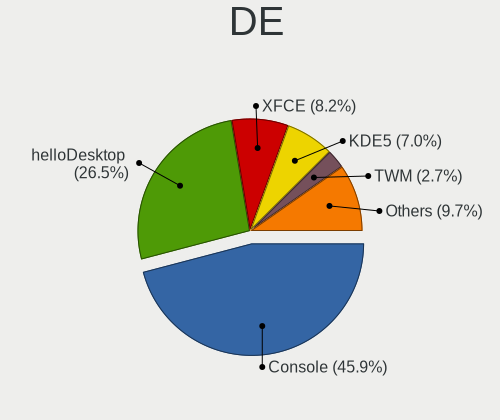

| Name         | Computers | Percent |
|--------------|-----------|---------|
| Console      | 62        | 42.47%  |
| helloDesktop | 42        | 28.77%  |
| XFCE         | 11        | 7.53%   |
| KDE5         | 11        | 7.53%   |
| i3           | 5         | 3.42%   |
| GNOME        | 5         | 3.42%   |
| Openbox      | 3         | 2.05%   |
| MATE         | 3         | 2.05%   |
| TWM          | 2         | 1.37%   |
| GNUstep      | 1         | 0.68%   |
| fvwm         | 1         | 0.68%   |

Display Server
--------------

X11 or Wayland

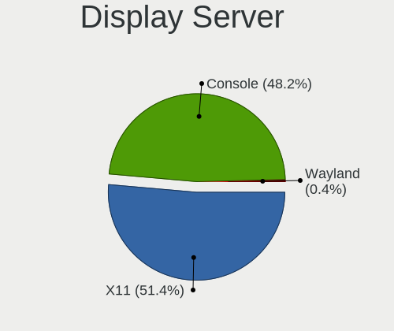

| Name    | Computers | Percent |
|---------|-----------|---------|
| X11     | 80        | 55.94%  |
| Console | 62        | 43.36%  |
| Wayland | 1         | 0.7%    |

Display Manager
---------------

SDDM, LightDM, etc.

| Name    | Computers | Percent |
|---------|-----------|---------|
| Console | 69        | 47.59%  |
| SLiM    | 52        | 35.86%  |
| SDDM    | 11        | 7.59%   |
| LightDM | 6         | 4.14%   |
| GDM     | 5         | 3.45%   |
| XDM     | 2         | 1.38%   |

OS Lang
-------

Language

| Lang         | Computers | Percent |
|--------------|-----------|---------|
| Unknown      | 63        | 43.45%  |
| en_US        | 46        | 31.72%  |
| zh_CN        | 18        | 12.41%  |
| C            | 17        | 11.72%  |
| zh_CN.GB2312 | 1         | 0.69%   |

Boot Mode
---------

EFI or BIOS

| Mode | Computers | Percent |
|------|-----------|---------|
| EFI  | 121       | 84.62%  |
| BIOS | 22        | 15.38%  |

Filesystem
----------

Type of filesystem

| Type   | Computers | Percent |
|--------|-----------|---------|
| Zfs    | 65        | 45.14%  |
| Ufs    | 62        | 43.06%  |
| Cd9660 | 16        | 11.11%  |
| Ffs    | 1         | 0.69%   |

Part. scheme
------------

Scheme of partitioning

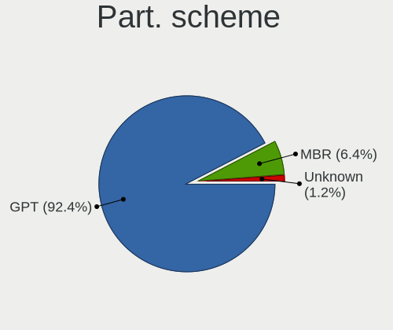

| Type    | Computers | Percent |
|---------|-----------|---------|
| GPT     | 127       | 88.81%  |
| MBR     | 14        | 9.79%   |
| Unknown | 2         | 1.4%    |

Board
-----

Vendor
------

Motherboard manufacturer

| Name                                       | Computers | Percent |
|--------------------------------------------|-----------|---------|
| Lenovo                                     | 31        | 21.99%  |
| Unknown                                    | 20        | 14.18%  |
| Dell                                       | 15        | 10.64%  |
| ASUSTek Computer                           | 9         | 6.38%   |
| Hewlett-Packard                            | 8         | 5.67%   |
| Gigabyte Technology                        | 5         | 3.55%   |
| MSI                                        | 4         | 2.84%   |
| Supermicro                                 | 3         | 2.13%   |
| ShenZhen MinWin Technology                 | 3         | 2.13%   |
| Intel                                      | 3         | 2.13%   |
| Sony                                       | 2         | 1.42%   |
| PAIQ                                       | 2         | 1.42%   |
| Notebook                                   | 2         | 1.42%   |
| NEC Computers                              | 2         | 1.42%   |
| HUAWEI                                     | 2         | 1.42%   |
| HASEE Computer                             | 2         | 1.42%   |
| Google                                     | 2         | 1.42%   |
| ASRock                                     | 2         | 1.42%   |
| AMI                                        | 2         | 1.42%   |
| YANYU                                      | 1         | 0.71%   |
| WOOKING                                    | 1         | 0.71%   |
| WlanCN                                     | 1         | 0.71%   |
| Toshiba                                    | 1         | 0.71%   |
| TOPFEEL                                    | 1         | 0.71%   |
| Timi                                       | 1         | 0.71%   |
| Techvision                                 | 1         | 0.71%   |
| Samsung Electronics                        | 1         | 0.71%   |
| Protectli                                  | 1         | 0.71%   |
| Panasonic                                  | 1         | 0.71%   |
| ONDA                                       | 1         | 0.71%   |
| OEM                                        | 1         | 0.71%   |
| MAXSUN                                     | 1         | 0.71%   |
| GuoGuang                                   | 1         | 0.71%   |
| Colorful YuGong Technology And Development | 1         | 0.71%   |
| Colorful Technology                        | 1         | 0.71%   |
| CNCTION-IAF-E3845                          | 1         | 0.71%   |
| Centerm                                    | 1         | 0.71%   |
| Apple                                      | 1         | 0.71%   |
| AMD                                        | 1         | 0.71%   |
| Acidanthera                                | 1         | 0.71%   |

Model
-----

Motherboard model

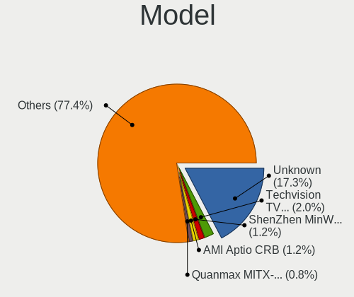

| Name                                        | Computers | Percent |
|---------------------------------------------|-----------|---------|
| Unknown                                     | 21        | 14.89%  |
| ShenZhen MinWin MW-NANO-APL-4L              | 3         | 2.13%   |
| PAIQ EC3-BT19D4L                            | 2         | 1.42%   |
| Lenovo ThinkPad X1 Carbon Gen 9 20XWA003CD  | 2         | 1.42%   |
| HP ProLiant DL320e Gen8 v2                  | 2         | 1.42%   |
| AMI Aptio CRB                               | 2         | 1.42%   |
| YANYU ITX-N29 VER:1.5 baytrail              | 1         | 0.71%   |
| WOOKING X5                                  | 1         | 0.71%   |
| WlanCN 6000 Series                          | 1         | 0.71%   |
| Toshiba Satellite Pro L510                  | 1         | 0.71%   |
| TOPFEEL Topone series                       | 1         | 0.71%   |
| Timi RedmiBook Pro 15                       | 1         | 0.71%   |
| Techvision TVI7309X                         | 1         | 0.71%   |
| Supermicro X10SRA                           | 1         | 0.71%   |
| Supermicro X10SL7-F                         | 1         | 0.71%   |
| Supermicro Super Server                     | 1         | 0.71%   |
| Sony SVS1511AJB                             | 1         | 0.71%   |
| Sony SVP13225SCBI                           | 1         | 0.71%   |
| Samsung 3570R/370R/470R/450R/510R/4450RV    | 1         | 0.71%   |
| Protectli FW6                               | 1         | 0.71%   |
| Panasonic CF-B11JWCYS                       | 1         | 0.71%   |
| ONDA N78G5D3 Ver:5.00                       | 1         | 0.71%   |
| OEM B85 JHS359                              | 1         | 0.71%   |
| Notebook W65KJ1_KK1                         | 1         | 0.71%   |
| Notebook W650DC,DD                          | 1         | 0.71%   |
| NEC Computers SHARKBAY                      | 1         | 0.71%   |
| NEC Computers PC-VK17HBBCD                  | 1         | 0.71%   |
| MSI MS-7C82                                 | 1         | 0.71%   |
| MSI MS-7C37                                 | 1         | 0.71%   |
| MSI MS-7A38                                 | 1         | 0.71%   |
| MSI MS-7972                                 | 1         | 0.71%   |
| MAXSUN MS-H110D4L FS M.2                    | 1         | 0.71%   |
| Lenovo ZhaoYang K4e-IML 81VQ                | 1         | 0.71%   |
| Lenovo YangTianW2090v-00                    | 1         | 0.71%   |
| Lenovo YangTianM6880N                       | 1         | 0.71%   |
| Lenovo YangTianA8800T                       | 1         | 0.71%   |
| Lenovo XiaoXinPro-13ARE 2020 82DM           | 1         | 0.71%   |
| Lenovo XiaoXinPro-13API 2019 81XD           | 1         | 0.71%   |
| Lenovo ThinkPad X230 23062S2                | 1         | 0.71%   |
| Lenovo ThinkPad X1 Extreme Gen 3 20TLA055CD | 1         | 0.71%   |

Model Family
------------

Motherboard model prefix

| Name                           | Computers | Percent |
|--------------------------------|-----------|---------|
| Unknown                        | 21        | 14.89%  |
| Lenovo ThinkPad                | 14        | 9.93%   |
| Dell Latitude                  | 4         | 2.84%   |
| ShenZhen MinWin MW-NANO-APL-4L | 3         | 2.13%   |
| Dell PowerEdge                 | 3         | 2.13%   |
| Dell OptiPlex                  | 3         | 2.13%   |
| PAIQ EC3-BT19D4L               | 2         | 1.42%   |
| Lenovo ThinkCentre             | 2         | 1.42%   |
| HP ProLiant                    | 2         | 1.42%   |
| HP ProBook                     | 2         | 1.42%   |
| Dell Precision                 | 2         | 1.42%   |
| Dell Inspiron                  | 2         | 1.42%   |
| ASUS TUF                       | 2         | 1.42%   |
| AMI Aptio                      | 2         | 1.42%   |
| YANYU ITX-N29                  | 1         | 0.71%   |
| WOOKING X5                     | 1         | 0.71%   |
| WlanCN 6000                    | 1         | 0.71%   |
| Toshiba Satellite              | 1         | 0.71%   |
| TOPFEEL Topone                 | 1         | 0.71%   |
| Timi RedmiBook                 | 1         | 0.71%   |
| Techvision TVI7309X            | 1         | 0.71%   |
| Supermicro X10SRA              | 1         | 0.71%   |
| Supermicro X10SL7-F            | 1         | 0.71%   |
| Supermicro Super               | 1         | 0.71%   |
| Sony SVS1511AJB                | 1         | 0.71%   |
| Sony SVP13225SCBI              | 1         | 0.71%   |
| Samsung 3570R                  | 1         | 0.71%   |
| Protectli FW6                  | 1         | 0.71%   |
| Panasonic CF-B11JWCYS          | 1         | 0.71%   |
| ONDA N78G5D3                   | 1         | 0.71%   |
| OEM B85                        | 1         | 0.71%   |
| Notebook W65KJ1                | 1         | 0.71%   |
| Notebook W650DC                | 1         | 0.71%   |
| NEC Computers SHARKBAY         | 1         | 0.71%   |
| NEC Computers PC-VK17HBBCD     | 1         | 0.71%   |
| MSI MS-7C82                    | 1         | 0.71%   |
| MSI MS-7C37                    | 1         | 0.71%   |
| MSI MS-7A38                    | 1         | 0.71%   |
| MSI MS-7972                    | 1         | 0.71%   |
| MAXSUN MS-H110D4L              | 1         | 0.71%   |

MFG Year
--------

Motherboard manufacture year

| Year    | Computers | Percent |
|---------|-----------|---------|
| 2021    | 19        | 13.48%  |
| 2019    | 17        | 12.06%  |
| 2017    | 16        | 11.35%  |
| 2012    | 14        | 9.93%   |
| 2020    | 12        | 8.51%   |
| 2022    | 10        | 7.09%   |
| 2018    | 10        | 7.09%   |
| 2013    | 9         | 6.38%   |
| 2016    | 8         | 5.67%   |
| 2014    | 7         | 4.96%   |
| 2011    | 6         | 4.26%   |
| 2015    | 5         | 3.55%   |
| 2010    | 3         | 2.13%   |
| 2009    | 2         | 1.42%   |
| 2008    | 1         | 0.71%   |
| 2007    | 1         | 0.71%   |
| Unknown | 1         | 0.71%   |

Form Factor
-----------

Physical design of the computer

| Name           | Computers | Percent |
|----------------|-----------|---------|
| Desktop        | 65        | 46.1%   |
| Notebook       | 58        | 41.13%  |
| Server         | 9         | 6.38%   |
| Mini pc        | 5         | 3.55%   |
| All in one     | 2         | 1.42%   |
| System on chip | 1         | 0.71%   |
| Convertible    | 1         | 0.71%   |

Coreboot
--------

Have coreboot on board

| Used | Computers | Percent |
|------|-----------|---------|
| No   | 138       | 97.87%  |
| Yes  | 3         | 2.13%   |

RAM Size
--------

Total RAM memory

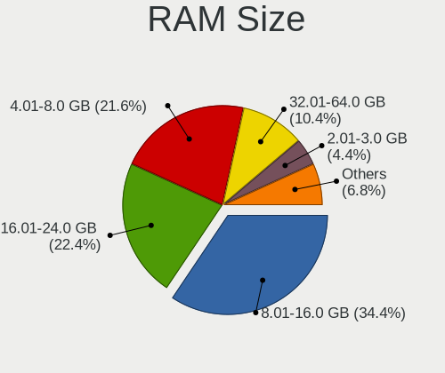

| Size in GB  | Computers | Percent |
|-------------|-----------|---------|
| 8.01-16.0   | 52        | 36.62%  |
| 4.01-8.0    | 36        | 25.35%  |
| 16.01-24.0  | 26        | 18.31%  |
| 32.01-64.0  | 11        | 7.75%   |
| 2.01-3.0    | 8         | 5.63%   |
| 24.01-32.0  | 4         | 2.82%   |
| 64.01-256.0 | 2         | 1.41%   |
| 0.51-1.0    | 2         | 1.41%   |
| 1.01-2.0    | 1         | 0.7%    |

RAM Used
--------

Used RAM memory

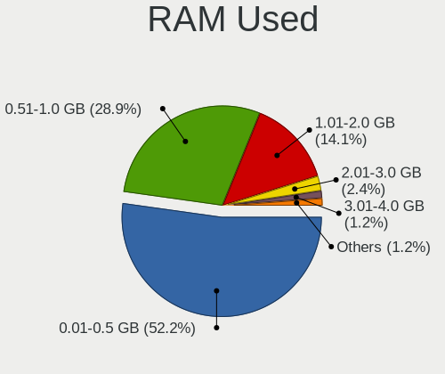

| Used GB  | Computers | Percent |
|----------|-----------|---------|
| 0.01-0.5 | 84        | 59.15%  |
| 0.51-1.0 | 36        | 25.35%  |
| 1.01-2.0 | 20        | 14.08%  |
| 3.01-4.0 | 1         | 0.7%    |
| 2.01-3.0 | 1         | 0.7%    |

Total Drives
------------

Number of drives on board

| Drives | Computers | Percent |
|--------|-----------|---------|
| 1      | 94        | 64.83%  |
| 2      | 24        | 16.55%  |
| 0      | 17        | 11.72%  |
| 3      | 6         | 4.14%   |
| 5      | 3         | 2.07%   |
| 4      | 1         | 0.69%   |

Has CD-ROM
----------

Has CD-ROM on board

| Presented | Computers | Percent |
|-----------|-----------|---------|
| No        | 115       | 80.99%  |
| Yes       | 27        | 19.01%  |

Has Ethernet
------------

Has Ethernet on board

| Presented | Computers | Percent |
|-----------|-----------|---------|
| Yes       | 127       | 90.07%  |
| No        | 14        | 9.93%   |

Has WiFi
--------

Has WiFi module

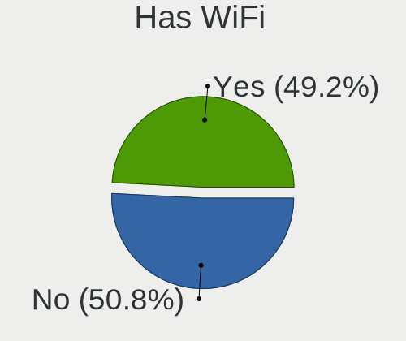

| Presented | Computers | Percent |
|-----------|-----------|---------|
| Yes       | 74        | 52.48%  |
| No        | 67        | 47.52%  |

Has Bluetooth
-------------

Has Bluetooth module

| Presented | Computers | Percent |
|-----------|-----------|---------|
| No        | 83        | 58.87%  |
| Yes       | 58        | 41.13%  |

Location
--------

Country
-------

Geographic location (country)

| Country | Computers | Percent |
|---------|-----------|---------|
| China   | 141       | 100%    |

City
----

Geographic location (city)

| City             | Computers | Percent |
|------------------|-----------|---------|
| Beijing          | 19        | 12.67%  |
| Shanghai         | 15        | 10%     |
| Shenzhen         | 13        | 8.67%   |
| Guangzhou        | 11        | 7.33%   |
| Chengdu          | 8         | 5.33%   |
| Zhengzhou        | 5         | 3.33%   |
| Hangzhou         | 4         | 2.67%   |
| Xi'an            | 3         | 2%      |
| Wuhan            | 3         | 2%      |
| Nanjing          | 3         | 2%      |
| Jinrongjie       | 3         | 2%      |
| Xiamen           | 2         | 1.33%   |
| Qinnan           | 2         | 1.33%   |
| Qingdao          | 2         | 1.33%   |
| Jiangbei         | 2         | 1.33%   |
| Changzhou        | 2         | 1.33%   |
| Changchun        | 2         | 1.33%   |
| Baiyun           | 2         | 1.33%   |
| Zhumadian        | 1         | 0.67%   |
| Zhongshan        | 1         | 0.67%   |
| Zhaoqing         | 1         | 0.67%   |
| Yuefeng          | 1         | 0.67%   |
| Yichun           | 1         | 0.67%   |
| Yangpu           | 1         | 0.67%   |
| Yancheng         | 1         | 0.67%   |
| Xicheng District | 1         | 0.67%   |
| Wuxi             | 1         | 0.67%   |
| Wenzhou          | 1         | 0.67%   |
| Weifang          | 1         | 0.67%   |
| Tongshan         | 1         | 0.67%   |
| Tongchuanshi     | 1         | 0.67%   |
| Tieling          | 1         | 0.67%   |
| Suzhou           | 1         | 0.67%   |
| Shizishan        | 1         | 0.67%   |
| Shantou          | 1         | 0.67%   |
| Shahekou         | 1         | 0.67%   |
| Qingpu           | 1         | 0.67%   |
| Putuo            | 1         | 0.67%   |
| Putian           | 1         | 0.67%   |
| Pudong           | 1         | 0.67%   |

Drives
------

Drive Vendor
------------

Hard drive vendors

| Vendor              | Computers | Drives | Percent |
|---------------------|-----------|--------|---------|
| Samsung Electronics | 27        | 38     | 16.27%  |
| Seagate             | 23        | 29     | 13.86%  |
| WDC                 | 21        | 35     | 12.65%  |
| Intel               | 13        | 14     | 7.83%   |
| Toshiba             | 10        | 11     | 6.02%   |
| SanDisk             | 7         | 8      | 4.22%   |
| Kingston            | 5         | 5      | 3.01%   |
| HGST                | 5         | 9      | 3.01%   |
| Hitachi             | 4         | 4      | 2.41%   |
| China               | 4         | 7      | 2.41%   |
| Plextor             | 3         | 4      | 1.81%   |
| Netac               | 3         | 3      | 1.81%   |
| Hikvision           | 3         | 3      | 1.81%   |
| Crucial             | 3         | 3      | 1.81%   |
| Transcend           | 2         | 2      | 1.2%    |
| SK hynix            | 2         | 2      | 1.2%    |
| Silicon Motion      | 2         | 2      | 1.2%    |
| Micron Technology   | 2         | 3      | 1.2%    |
| Lenovo              | 2         | 2      | 1.2%    |
| KIOXIA              | 2         | 2      | 1.2%    |
| KingSpec            | 2         | 2      | 1.2%    |
| Hewlett-Packard     | 2         | 2      | 1.2%    |
| Colorful            | 2         | 2      | 1.2%    |
| tigo                | 1         | 1      | 0.6%    |
| Ramsta              | 1         | 1      | 0.6%    |
| Pioneer             | 1         | 1      | 0.6%    |
| Phison              | 1         | 1      | 0.6%    |
| ORICO               | 1         | 1      | 0.6%    |
| LITEONIT            | 1         | 1      | 0.6%    |
| Lexar               | 1         | 1      | 0.6%    |
| KIOXIA-EXCERIA      | 1         | 2      | 0.6%    |
| Hoodisk             | 1         | 2      | 0.6%    |
| FREEBSD             | 1         | 1      | 0.6%    |
| FORESEE             | 1         | 1      | 0.6%    |
| Faspeed             | 1         | 1      | 0.6%    |
| BR                  | 1         | 1      | 0.6%    |
| BIWIN               | 1         | 3      | 0.6%    |
| Apple               | 1         | 1      | 0.6%    |
| Apacer              | 1         | 1      | 0.6%    |
| A-DATA Technology   | 1         | 1      | 0.6%    |

Drive Model
-----------

Hard drive models

| Model                           | Computers | Percent |
|---------------------------------|-----------|---------|
| Seagate ST1000DM003-1SB102 1TB  | 4         | 2.2%    |
| Samsung SSD 860 EVO 500GB       | 3         | 1.65%   |
| Toshiba MQ04ABF100 1TB          | 2         | 1.1%    |
| Seagate ST500DM002-1BD142 500GB | 2         | 1.1%    |
| Seagate ST2000LM007-1R8174 2TB  | 2         | 1.1%    |
| Seagate ST1000LM048-2E7172 1TB  | 2         | 1.1%    |
| SanDisk SSD U100 24GB           | 2         | 1.1%    |
| Samsung SSD 970 EVO Plus 1TB    | 2         | 1.1%    |
| Samsung SSD 870 EVO 1TB         | 2         | 1.1%    |
| Samsung MZVL21T0HCLR-00BL7 1TB  | 2         | 1.1%    |
| Samsung HM320II 320GB           | 2         | 1.1%    |
| Netac SSD 120GB                 | 2         | 1.1%    |
| Intel SSDSA2SH032G1GN 32GB      | 2         | 1.1%    |
| Intel SSDSA2CW120G3 120GB       | 2         | 1.1%    |
| Hikvision HS-SSD-C2000ECO 1024G | 2         | 1.1%    |
| HGST HTS541010B7E610 1TB        | 2         | 1.1%    |
| WDC WUH721414ALE6L4 14TB        | 1         | 0.55%   |
| WDC WDS500G2B0C-00PXH0 500GB    | 1         | 0.55%   |
| WDC WDS500G1B0C-00S6U0 500GB    | 1         | 0.55%   |
| WDC WDS480G2G0A-00JH30 480GB    | 1         | 0.55%   |
| WDC WDS120G2G0B-00EPW0 120GB    | 1         | 0.55%   |
| WDC WDS100T3X0C-00SJG0 1TB      | 1         | 0.55%   |
| WDC WDS100T2B0C-00PXH0 1TB      | 1         | 0.55%   |
| WDC WD7500LPCX-00KHST0 752GB    | 1         | 0.55%   |
| WDC WD5000LPCX-24C6HT0 500GB    | 1         | 0.55%   |
| WDC WD5000LPCX-00VHAT0 500GB    | 1         | 0.55%   |
| WDC WD40NPZZ-00A9JT0 4TB        | 1         | 0.55%   |
| WDC WD4005FZBX-00K5WB0 4TB      | 1         | 0.55%   |
| WDC WD3200BPVT-75ZEST0 320GB    | 1         | 0.55%   |
| WDC WD30EZRZ-00WN9B0 3TB        | 1         | 0.55%   |
| WDC WD2500BEVS-08VAT2 250GB     | 1         | 0.55%   |
| WDC WD20SPZX-75UA7T0 2TB        | 1         | 0.55%   |
| WDC WD20SPZX-22UA7T0 2TB        | 1         | 0.55%   |
| WDC WD2003FYYS-007BA0 2TB       | 1         | 0.55%   |
| WDC WD1600BEVT-22ZCT0 160GB     | 1         | 0.55%   |
| WDC WD1600AAJS-22L7A0 160GB     | 1         | 0.55%   |
| WDC WD120EMAZ-11BLFA0 12TB      | 1         | 0.55%   |
| WDC WD10SPZX-60Z10T0 1TB        | 1         | 0.55%   |
| WDC WD10SPZX-00Z10T0 1TB        | 1         | 0.55%   |
| WDC WD10SPCX-00KHST0 1TB        | 1         | 0.55%   |

HDD Vendor
----------

Hard disk drive vendors

| Vendor              | Computers | Drives | Percent |
|---------------------|-----------|--------|---------|
| Seagate             | 23        | 29     | 39.66%  |
| WDC                 | 16        | 25     | 27.59%  |
| Toshiba             | 7         | 7      | 12.07%  |
| HGST                | 5         | 9      | 8.62%   |
| Hitachi             | 4         | 4      | 6.9%    |
| Samsung Electronics | 2         | 4      | 3.45%   |
| Hewlett-Packard     | 1         | 1      | 1.72%   |

SSD Vendor
----------

Solid state drive vendors

| Vendor              | Computers | Drives | Percent |
|---------------------|-----------|--------|---------|
| Samsung Electronics | 15        | 16     | 19.23%  |
| Intel               | 12        | 13     | 15.38%  |
| SanDisk             | 7         | 8      | 8.97%   |
| Kingston            | 4         | 4      | 5.13%   |
| China               | 4         | 7      | 5.13%   |
| Netac               | 3         | 3      | 3.85%   |
| WDC                 | 2         | 2      | 2.56%   |
| Transcend           | 2         | 2      | 2.56%   |
| Toshiba             | 2         | 2      | 2.56%   |
| Plextor             | 2         | 2      | 2.56%   |
| Micron Technology   | 2         | 3      | 2.56%   |
| Lenovo              | 2         | 2      | 2.56%   |
| KingSpec            | 2         | 2      | 2.56%   |
| tigo                | 1         | 1      | 1.28%   |
| Ramsta              | 1         | 1      | 1.28%   |
| Phison              | 1         | 1      | 1.28%   |
| ORICO               | 1         | 1      | 1.28%   |
| LITEONIT            | 1         | 1      | 1.28%   |
| Lexar               | 1         | 1      | 1.28%   |
| KIOXIA-EXCERIA      | 1         | 2      | 1.28%   |
| Hoodisk             | 1         | 2      | 1.28%   |
| Hewlett-Packard     | 1         | 1      | 1.28%   |
| FREEBSD             | 1         | 1      | 1.28%   |
| FORESEE             | 1         | 1      | 1.28%   |
| Faspeed             | 1         | 1      | 1.28%   |
| Crucial             | 1         | 1      | 1.28%   |
| Colorful            | 1         | 1      | 1.28%   |
| BR                  | 1         | 1      | 1.28%   |
| BIWIN               | 1         | 3      | 1.28%   |
| Apple               | 1         | 1      | 1.28%   |
| Apacer              | 1         | 1      | 1.28%   |
| A-DATA Technology   | 1         | 1      | 1.28%   |

Drive Kind
----------

HDD or SSD

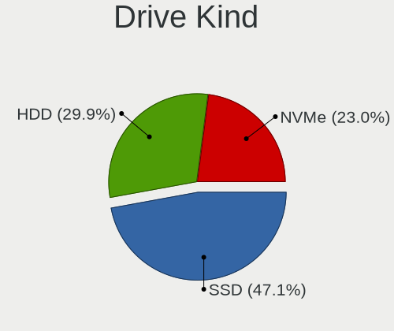

| Kind | Computers | Drives | Percent |
|------|-----------|--------|---------|
| SSD  | 74        | 89     | 46.84%  |
| HDD  | 51        | 79     | 32.28%  |
| NVMe | 33        | 45     | 20.89%  |

Drive Connector
---------------

SATA, SAS, NVMe, etc.

| Type | Computers | Drives | Percent |
|------|-----------|--------|---------|
| SATA | 110       | 168    | 76.92%  |
| NVMe | 33        | 45     | 23.08%  |

Drive Size
----------

Size of hard drive

| Size in TB | Computers | Drives | Percent |
|------------|-----------|--------|---------|
| 0.01-0.5   | 87        | 117    | 66.92%  |
| 0.51-1.0   | 29        | 33     | 22.31%  |
| 1.01-2.0   | 8         | 9      | 6.15%   |
| 3.01-4.0   | 2         | 2      | 1.54%   |
| 2.01-3.0   | 2         | 3      | 1.54%   |
| 10.01-20.0 | 1         | 2      | 0.77%   |
| 4.01-10.0  | 1         | 2      | 0.77%   |

Space Total
-----------

Amount of disk space available on the file system

| Size in GB | Computers | Percent |
|------------|-----------|---------|
| 1-20       | 41        | 27.89%  |
| 101-250    | 33        | 22.45%  |
| 251-500    | 31        | 21.09%  |
| 21-50      | 14        | 9.52%   |
| 51-100     | 12        | 8.16%   |
| 501-1000   | 9         | 6.12%   |
| 1001-2000  | 5         | 3.4%    |
| Unknown    | 2         | 1.36%   |

Space Used
----------

Amount of used disk space

| Used GB | Computers | Percent |
|---------|-----------|---------|
| 1-20    | 124       | 86.71%  |
| 21-50   | 11        | 7.69%   |
| 51-100  | 3         | 2.1%    |
| 251-500 | 2         | 1.4%    |
| Unknown | 2         | 1.4%    |
| 101-250 | 1         | 0.7%    |

Malfunc. Drives
---------------

Drive models with a malfunction

| Model                           | Computers | Drives | Percent |
|---------------------------------|-----------|--------|---------|
| WDC WD1600AAJS-22L7A0 160GB     | 1         | 1      | 5.88%   |
| WDC WD10SPZX-60Z10T0 1TB        | 1         | 1      | 5.88%   |
| WDC WD10EJRX-89N74Y0 1TB        | 1         | 1      | 5.88%   |
| Toshiba MQ02ABF050H-SSHD-8GB    | 1         | 1      | 5.88%   |
| Seagate ST500LT012-9WS142 500GB | 1         | 1      | 5.88%   |
| Seagate ST3320418AS 320GB       | 1         | 2      | 5.88%   |
| Seagate ST320LT007-9ZV142 320GB | 1         | 1      | 5.88%   |
| Seagate ST31500541AS 1.5TB      | 1         | 1      | 5.88%   |
| Seagate ST31000528AS 1TB        | 1         | 1      | 5.88%   |
| Intel SSDSA2M160G2GC 160GB      | 1         | 2      | 5.88%   |
| Intel SSDSA2M120G2GC 120GB      | 1         | 1      | 5.88%   |
| Hitachi HTS723232A7A364 320GB   | 1         | 1      | 5.88%   |
| HGST HTS725050A7E630 500GB      | 1         | 4      | 5.88%   |
| Colorful SL500 640GB            | 1         | 1      | 5.88%   |
| China XJH-32GB                  | 1         | 1      | 5.88%   |
| China JWX 16GB MSATA            | 1         | 2      | 5.88%   |
| BIWIN SSD 32GB                  | 1         | 3      | 5.88%   |

Malfunc. Drive Vendor
---------------------

Vendors of faulty drives

| Vendor   | Computers | Drives | Percent |
|----------|-----------|--------|---------|
| Seagate  | 5         | 6      | 29.41%  |
| WDC      | 3         | 3      | 17.65%  |
| Intel    | 2         | 3      | 11.76%  |
| China    | 2         | 3      | 11.76%  |
| Toshiba  | 1         | 1      | 5.88%   |
| Hitachi  | 1         | 1      | 5.88%   |
| HGST     | 1         | 4      | 5.88%   |
| Colorful | 1         | 1      | 5.88%   |
| BIWIN    | 1         | 3      | 5.88%   |

Malfunc. HDD Vendor
-------------------

Vendors of faulty HDD drives

| Vendor  | Computers | Drives | Percent |
|---------|-----------|--------|---------|
| Seagate | 5         | 6      | 45.45%  |
| WDC     | 3         | 3      | 27.27%  |
| Toshiba | 1         | 1      | 9.09%   |
| Hitachi | 1         | 1      | 9.09%   |
| HGST    | 1         | 4      | 9.09%   |

Malfunc. Drive Kind
-------------------

Kinds of faulty drives

| Kind | Computers | Drives | Percent |
|------|-----------|--------|---------|
| HDD  | 11        | 15     | 64.71%  |
| SSD  | 6         | 10     | 35.29%  |

Failed Drives
-------------

Failed drive models

Zero info for selected period =(

Failed Drive Vendor
-------------------

Failed drive vendors

Zero info for selected period =(

Drive Status
------------

Number of failed and malfunc. drives

| Status   | Computers | Drives | Percent |
|----------|-----------|--------|---------|
| Works    | 115       | 186    | 85.82%  |
| Malfunc  | 17        | 25     | 12.69%  |
| Detected | 2         | 2      | 1.49%   |

Storage controller
------------------

Storage Vendor
--------------

Storage controller vendors

| Vendor                       | Computers | Percent |
|------------------------------|-----------|---------|
| Intel                        | 112       | 66.67%  |
| Samsung Electronics          | 14        | 8.33%   |
| AMD                          | 13        | 7.74%   |
| SanDisk                      | 6         | 3.57%   |
| Silicon Motion               | 4         | 2.38%   |
| Broadcom / LSI               | 4         | 2.38%   |
| SK hynix                     | 2         | 1.19%   |
| Micron/Crucial Technology    | 2         | 1.19%   |
| MAXIO Technology (Hangzhou)  | 2         | 1.19%   |
| KIOXIA                       | 2         | 1.19%   |
| Toshiba                      | 1         | 0.6%    |
| Shenzhen Longsys Electronics | 1         | 0.6%    |
| Nvidia                       | 1         | 0.6%    |
| Lite-On Technology           | 1         | 0.6%    |
| Kingston Technology Company  | 1         | 0.6%    |
| JMicron Technology           | 1         | 0.6%    |
| ASMedia Technology           | 1         | 0.6%    |

Storage Model
-------------

Storage controller models

| Model                                                                            | Computers | Percent |
|----------------------------------------------------------------------------------|-----------|---------|
| Intel Sunrise Point-LP SATA Controller [AHCI mode]                               | 15        | 8.02%   |
| Intel 8 Series/C220 Series Chipset Family 6-port SATA Controller 1 [AHCI mode]   | 10        | 5.35%   |
| Intel Atom Processor E3800 Series SATA AHCI Controller                           | 9         | 4.81%   |
| Intel Q170/Q150/B150/H170/H110/Z170/CM236 Chipset SATA Controller [AHCI Mode]    | 8         | 4.28%   |
| Intel 7 Series Chipset Family 6-port SATA Controller [AHCI mode]                 | 8         | 4.28%   |
| Samsung NVMe SSD Controller SM981/PM981/PM983                                    | 7         | 3.74%   |
| AMD FCH SATA Controller [AHCI mode]                                              | 7         | 3.74%   |
| Intel 6 Series/C200 Series Chipset Family 6 port Mobile SATA AHCI Controller     | 5         | 2.67%   |
| Intel Celeron N3350/Pentium N4200/Atom E3900 Series SATA AHCI Controller         | 4         | 2.14%   |
| Silicon Motion SM2263EN/SM2263XT SSD Controller                                  | 3         | 1.6%    |
| SanDisk WD Black SN750 / PC SN730 NVMe SSD                                       | 3         | 1.6%    |
| Samsung NVMe SSD Controller PM9A1/PM9A3/980PRO                                   | 3         | 1.6%    |
| Intel HM170/QM170 Chipset SATA Controller [AHCI Mode]                            | 3         | 1.6%    |
| Intel Comet Lake SATA AHCI Controller                                            | 3         | 1.6%    |
| Intel Celeron/Pentium Silver Processor SATA Controller                           | 3         | 1.6%    |
| Intel 82801HM/HEM (ICH8M/ICH8M-E) SATA Controller [IDE mode]                     | 3         | 1.6%    |
| Intel 7 Series/C210 Series Chipset Family 6-port SATA Controller [AHCI mode]     | 3         | 1.6%    |
| Intel 400 Series Chipset Family SATA AHCI Controller                             | 3         | 1.6%    |
| Intel 200 Series PCH SATA controller [AHCI mode]                                 | 3         | 1.6%    |
| AMD SB7x0/SB8x0/SB9x0 IDE Controller                                             | 3         | 1.6%    |
| SanDisk WD Blue SN550 NVMe SSD                                                   | 2         | 1.07%   |
| Samsung NVMe SSD Controller SM961/PM961/SM963                                    | 2         | 1.07%   |
| MAXIO (Hangzhou) NVMe SSD Controller MAP1202                                     | 2         | 1.07%   |
| KIOXIA NVMe SSD Controller BG4                                                   | 2         | 1.07%   |
| Intel Wildcat Point-LP SATA Controller [AHCI Mode]                               | 2         | 1.07%   |
| Intel NM10/ICH7 Family SATA Controller [AHCI mode]                               | 2         | 1.07%   |
| Intel Cannon Point-LP SATA Controller [AHCI Mode]                                | 2         | 1.07%   |
| Intel Cannon Lake PCH SATA AHCI Controller                                       | 2         | 1.07%   |
| Intel Cannon Lake Mobile PCH SATA AHCI Controller                                | 2         | 1.07%   |
| Intel Atom/Celeron/Pentium Processor x5-E8000/J3xxx/N3xxx Series SATA Controller | 2         | 1.07%   |
| Intel 82801JI (ICH10 Family) 4 port SATA IDE Controller #1                       | 2         | 1.07%   |
| Intel 82801IBM/IEM (ICH9M/ICH9M-E) 4 port SATA Controller [AHCI mode]            | 2         | 1.07%   |
| Intel 82801HM/HEM (ICH8M/ICH8M-E) IDE Controller                                 | 2         | 1.07%   |
| Intel 82801 Mobile SATA Controller [RAID mode]                                   | 2         | 1.07%   |
| Intel 8 Series SATA Controller 1 [AHCI mode]                                     | 2         | 1.07%   |
| Broadcom / LSI SAS2308 PCI-Express Fusion-MPT SAS-2                              | 2         | 1.07%   |
| AMD SB7x0/SB8x0/SB9x0 SATA Controller [IDE mode]                                 | 2         | 1.07%   |
| AMD SB7x0/SB8x0/SB9x0 SATA Controller [AHCI mode]                                | 2         | 1.07%   |
| AMD 500 Series Chipset SATA Controller                                           | 2         | 1.07%   |
| Unknown                                                                          | 2         | 1.07%   |

Storage Kind
------------

Kind of storage controller (IDE, SATA, NVMe, SAS, ...)

| Kind | Computers | Percent |
|------|-----------|---------|
| SATA | 114       | 67.46%  |
| NVMe | 33        | 19.53%  |
| IDE  | 15        | 8.88%   |
| RAID | 5         | 2.96%   |
| SAS  | 2         | 1.18%   |

Processor
---------

CPU Vendor
----------

Processor vendors

| Vendor  | Computers | Percent |
|---------|-----------|---------|
| Intel   | 121       | 85.82%  |
| AMD     | 18        | 12.77%  |
| ARM     | 1         | 0.71%   |
| Unknown | 1         | 0.71%   |

CPU Model
---------

Processor models

| Model                                         | Computers | Percent |
|-----------------------------------------------|-----------|---------|
| Intel Celeron CPU J1900 @ 1.99GHz             | 8         | 5.67%   |
| Intel Xeon CPU E3-1220 v3 @ 3.10GHz           | 3         | 2.13%   |
| Intel Core i5-7200U CPU @ 2.50GHz             | 3         | 2.13%   |
| Intel Core i5-6200U CPU @ 2.30GHz             | 3         | 2.13%   |
| Intel Core i3-2350M CPU @ 2.30GHz             | 3         | 2.13%   |
| Intel Celeron CPU J3455 @ 1.50GHz             | 3         | 2.13%   |
| Intel Atom CPU D525 @ 1.80GHz                 | 3         | 2.13%   |
| Intel 11th Gen Core i7-1165G7 @ 2.80GHz       | 3         | 2.13%   |
| Intel Pentium CPU G3260T @ 2.90GHz            | 2         | 1.42%   |
| Intel Core i5-6300HQ CPU @ 2.30GHz            | 2         | 1.42%   |
| Intel Core i5-3320M CPU @ 2.60GHz             | 2         | 1.42%   |
| Intel Core i3-10105 CPU @ 3.70GHz             | 2         | 1.42%   |
| Intel Celeron J4125 CPU @ 2.00GHz             | 2         | 1.42%   |
| Intel Celeron CPU 3865U @ 1.80GHz             | 2         | 1.42%   |
| AMD Ryzen 9 5900X 12-Core Processor           | 2         | 1.42%   |
| AMD Ryzen 5 3550H with Radeon Vega Mobile Gfx | 2         | 1.42%   |
| Intel Xeon Silver 4210R CPU @ 2.40GHz         | 1         | 0.71%   |
| Intel Xeon CPU X5647 @ 2.93GHz                | 1         | 0.71%   |
| Intel Xeon CPU E5-2470 v2 @ 2.40GHz           | 1         | 0.71%   |
| Intel Xeon CPU E5-1650 v3 @ 3.50GHz           | 1         | 0.71%   |
| Intel Xeon CPU E3-1535M v6 @ 3.10GHz          | 1         | 0.71%   |
| Intel Xeon CPU E3-1230 v3 @ 3.30GHz           | 1         | 0.71%   |
| Intel Xeon CPU E3-1220 v5 @ 3.00GHz           | 1         | 0.71%   |
| Intel Xeon CPU D-1537 @ 1.70GHz               | 1         | 0.71%   |
| Intel Xeon                                    | 1         | 0.71%   |
| Intel Pentium Dual-Core CPU E6700 @ 3.20GHz   | 1         | 0.71%   |
| Intel Pentium CPU N3540 @ 2.16GHz             | 1         | 0.71%   |
| Intel Pentium CPU G4600 @ 3.60GHz             | 1         | 0.71%   |
| Intel Pentium CPU G4560 @ 3.50GHz             | 1         | 0.71%   |
| Intel Pentium CPU G3460T @ 3.00GHz            | 1         | 0.71%   |
| Intel Pentium CPU B950 @ 2.10GHz              | 1         | 0.71%   |
| Intel Genuine CPU 0000 @ 2.50GHz              | 1         | 0.71%   |
| Intel CPU Version                             | 1         | 0.71%   |
| Intel Core i7-9750H CPU @ 2.60GHz             | 1         | 0.71%   |
| Intel Core i7-8565U CPU @ 1.80GHz             | 1         | 0.71%   |
| Intel Core i7-8559U CPU @ 2.70GHz             | 1         | 0.71%   |
| Intel Core i7-7700K CPU @ 4.20GHz             | 1         | 0.71%   |
| Intel Core i7-7600U CPU @ 2.80GHz             | 1         | 0.71%   |
| Intel Core i7-7500U CPU @ 2.70GHz             | 1         | 0.71%   |
| Intel Core i7-6700 CPU @ 3.40GHz              | 1         | 0.71%   |

CPU Model Family
----------------

Processor model prefix

| Model                   | Computers | Percent |
|-------------------------|-----------|---------|
| Intel Core i5           | 28        | 19.86%  |
| Intel Celeron           | 26        | 18.44%  |
| Intel Core i7           | 17        | 12.06%  |
| Intel Core i3           | 14        | 9.93%   |
| Intel Xeon              | 11        | 7.8%    |
| Other                   | 7         | 4.96%   |
| Intel Pentium           | 7         | 4.96%   |
| Intel Atom              | 6         | 4.26%   |
| AMD Ryzen 5             | 6         | 4.26%   |
| Intel Core 2 Duo        | 3         | 2.13%   |
| AMD Ryzen 9             | 2         | 1.42%   |
| AMD Ryzen 7             | 2         | 1.42%   |
| AMD G                   | 2         | 1.42%   |
| Intel Xeon Silver       | 1         | 0.71%   |
| Intel Pentium Dual-Core | 1         | 0.71%   |
| Intel Genuine           | 1         | 0.71%   |
| Intel Celeron Dual-Core | 1         | 0.71%   |
| ARM Cortex              | 1         | 0.71%   |
| AMD Ryzen 3             | 1         | 0.71%   |
| AMD Phenom II X4        | 1         | 0.71%   |
| AMD GX                  | 1         | 0.71%   |
| AMD Athlon II X4        | 1         | 0.71%   |
| AMD A10                 | 1         | 0.71%   |

CPU Cores
---------

Number of processor cores

| Number  | Computers | Percent |
|---------|-----------|---------|
| 4       | 61        | 43.26%  |
| 2       | 57        | 40.43%  |
| 6       | 7         | 4.96%   |
| 8       | 4         | 2.84%   |
| 12      | 3         | 2.13%   |
| Unknown | 3         | 2.13%   |
| 24      | 2         | 1.42%   |
| 16      | 2         | 1.42%   |
| 20      | 1         | 0.71%   |
| 10      | 1         | 0.71%   |

CPU Sockets
-----------

Number of sockets

| Number  | Computers | Percent |
|---------|-----------|---------|
| 1       | 138       | 97.87%  |
| Unknown | 2         | 1.42%   |
| 2       | 1         | 0.71%   |

CPU Threads
-----------

Threads per core (Hyper-Threading)

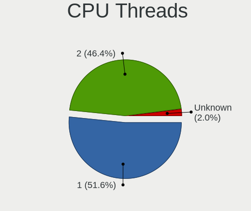

| Number  | Computers | Percent |
|---------|-----------|---------|
| 1       | 73        | 51.77%  |
| 2       | 65        | 46.1%   |
| Unknown | 3         | 2.13%   |

CPU Microarch
-------------

Microarchitecture

| Name          | Computers | Percent |
|---------------|-----------|---------|
| KabyLake      | 28        | 19.86%  |
| Haswell       | 14        | 9.93%   |
| Skylake       | 12        | 8.51%   |
| Silvermont    | 12        | 8.51%   |
| IvyBridge     | 10        | 7.09%   |
| SandyBridge   | 9         | 6.38%   |
| CometLake     | 6         | 4.26%   |
| Penryn        | 5         | 3.55%   |
| Goldmont      | 5         | 3.55%   |
| Bonnell       | 5         | 3.55%   |
| Zen 2         | 4         | 2.84%   |
| TigerLake     | 4         | 2.84%   |
| Zen+          | 3         | 2.13%   |
| Westmere      | 3         | 2.13%   |
| K10           | 3         | 2.13%   |
| Goldmont plus | 3         | 2.13%   |
| Broadwell     | 3         | 2.13%   |
| Unknown       | 3         | 2.13%   |
| Zen 3         | 2         | 1.42%   |
| Zen           | 2         | 1.42%   |
| Bobcat        | 2         | 1.42%   |
| Piledriver    | 1         | 0.71%   |
| Jaguar        | 1         | 0.71%   |
| Core          | 1         | 0.71%   |

Graphics
--------

GPU Vendor
----------

Vendors of graphics cards

| Vendor                     | Computers | Percent |
|----------------------------|-----------|---------|
| Intel                      | 101       | 62.35%  |
| Nvidia                     | 32        | 19.75%  |
| AMD                        | 21        | 12.96%  |
| Matrox Electronics Systems | 5         | 3.09%   |
| ASPEED Technology          | 3         | 1.85%   |

GPU Model
---------

Graphics card models

| Model                                                                                    | Computers | Percent |
|------------------------------------------------------------------------------------------|-----------|---------|
| Intel Atom Processor Z36xxx/Z37xxx Series Graphics & Display                             | 9         | 5.52%   |
| Intel 2nd Generation Core Processor Family Integrated Graphics Controller                | 8         | 4.91%   |
| Intel 3rd Gen Core processor Graphics Controller                                         | 7         | 4.29%   |
| Intel HD Graphics 620                                                                    | 6         | 3.68%   |
| Intel Xeon E3-1200 v3/4th Gen Core Processor Integrated Graphics Controller              | 4         | 2.45%   |
| Intel TigerLake-LP GT2 [Iris Xe Graphics]                                                | 4         | 2.45%   |
| Intel Skylake GT2 [HD Graphics 520]                                                      | 4         | 2.45%   |
| Intel HD Graphics 530                                                                    | 4         | 2.45%   |
| Intel HD Graphics 500                                                                    | 4         | 2.45%   |
| Intel CometLake-S GT2 [UHD Graphics 630]                                                 | 4         | 2.45%   |
| Intel CoffeeLake-S GT2 [UHD Graphics 630]                                                | 4         | 2.45%   |
| Intel HD Graphics 630                                                                    | 3         | 1.84%   |
| Intel HD Graphics 610                                                                    | 3         | 1.84%   |
| Intel GeminiLake [UHD Graphics 600]                                                      | 3         | 1.84%   |
| Intel CoffeeLake-H GT2 [UHD Graphics 630]                                                | 3         | 1.84%   |
| Intel Atom/Celeron/Pentium Processor x5-E8000/J3xxx/N3xxx Integrated Graphics Controller | 3         | 1.84%   |
| Intel Atom Processor D4xx/D5xx/N4xx/N5xx Integrated Graphics Controller                  | 3         | 1.84%   |
| ASPEED Technology ASPEED Graphics Family                                                 | 3         | 1.84%   |
| Nvidia GP107M [GeForce GTX 1050 Mobile]                                                  | 2         | 1.23%   |
| Nvidia GM206 [GeForce GTX 960]                                                           | 2         | 1.23%   |
| Nvidia GM107M [GeForce GTX 950M]                                                         | 2         | 1.23%   |
| Matrox Electronics Systems MGA G200EH                                                    | 2         | 1.23%   |
| Matrox Electronics Systems G200eR2                                                       | 2         | 1.23%   |
| Intel UHD Graphics 620                                                                   | 2         | 1.23%   |
| Intel HD Graphics 5500                                                                   | 2         | 1.23%   |
| Intel Haswell-ULT Integrated Graphics Controller                                         | 2         | 1.23%   |
| Intel CometLake-U GT2 [UHD Graphics]                                                     | 2         | 1.23%   |
| Intel Atom Processor D2xxx/N2xxx Integrated Graphics Controller                          | 2         | 1.23%   |
| AMD Sun XT [Radeon HD 8670A/8670M/8690M / R5 M330 / M430 / Radeon 520 Mobile]            | 2         | 1.23%   |
| AMD Seymour [Radeon HD 6400M/7400M Series]                                               | 2         | 1.23%   |
| AMD Renoir                                                                               | 2         | 1.23%   |
| AMD Picasso/Raven 2 [Radeon Vega Series / Radeon Vega Mobile Series]                     | 2         | 1.23%   |
| Nvidia TU117M [GeForce MX450]                                                            | 1         | 0.61%   |
| Nvidia TU117M [GeForce GTX 1650 Ti Mobile]                                               | 1         | 0.61%   |
| Nvidia TU116 [GeForce GTX 1660]                                                          | 1         | 0.61%   |
| Nvidia GT218 [GeForce 210]                                                               | 1         | 0.61%   |
| Nvidia GP108M [GeForce MX150]                                                            | 1         | 0.61%   |
| Nvidia GP108 [GeForce GT 1030]                                                           | 1         | 0.61%   |
| Nvidia GP107M [GeForce GTX 1050 Ti Mobile]                                               | 1         | 0.61%   |
| Nvidia GP107GLM [Quadro P620]                                                            | 1         | 0.61%   |

GPU Combo
---------

Combinations of graphics cards

| Name           | Computers | Percent |
|----------------|-----------|---------|
| 1 x Intel      | 71        | 50.35%  |
| Intel + Nvidia | 19        | 13.48%  |
| 1 x AMD        | 14        | 9.93%   |
| 1 x Nvidia     | 13        | 9.22%   |
| Intel + AMD    | 6         | 4.26%   |
| 2 x Intel      | 5         | 3.55%   |
| 1 x Matrox     | 5         | 3.55%   |
| Other          | 4         | 2.84%   |
| 1 x ASPEED     | 3         | 2.13%   |
| 2 x AMD        | 1         | 0.71%   |

GPU Driver
----------

Free vs proprietary

| Driver      | Computers | Percent |
|-------------|-----------|---------|
| Free        | 120       | 85.11%  |
| Proprietary | 13        | 9.22%   |
| Unknown     | 8         | 5.67%   |

GPU Memory
----------

Total video memory

| Size in GB | Computers | Percent |
|------------|-----------|---------|
| Unknown    | 124       | 87.32%  |
| 0.01-0.5   | 6         | 4.23%   |
| 0.51-1.0   | 4         | 2.82%   |
| 7.01-8.0   | 3         | 2.11%   |
| 1.01-2.0   | 2         | 1.41%   |
| 5.01-6.0   | 1         | 0.7%    |
| 3.01-4.0   | 1         | 0.7%    |
| 8.01-16.0  | 1         | 0.7%    |

Monitor
-------

Monitor Vendor
--------------

Monitor vendors

| Vendor                  | Computers | Percent |
|-------------------------|-----------|---------|
| LG Display              | 10        | 15.38%  |
| AU Optronics            | 8         | 12.31%  |
| Chimei Innolux          | 7         | 10.77%  |
| BOE                     | 7         | 10.77%  |
| Dell                    | 6         | 9.23%   |
| Lenovo                  | 4         | 6.15%   |
| AOC                     | 3         | 4.62%   |
| Samsung Electronics     | 2         | 3.08%   |
| Philips                 | 2         | 3.08%   |
| PANDA                   | 2         | 3.08%   |
| CSO                     | 2         | 3.08%   |
| ZL_                     | 1         | 1.54%   |
| TMX                     | 1         | 1.54%   |
| Panasonic               | 1         | 1.54%   |
| Mi                      | 1         | 1.54%   |
| Haier                   | 1         | 1.54%   |
| GRR                     | 1         | 1.54%   |
| CND                     | 1         | 1.54%   |
| Chi Mei Optoelectronics | 1         | 1.54%   |
| CAN                     | 1         | 1.54%   |
| BenQ                    | 1         | 1.54%   |
| Apple                   | 1         | 1.54%   |
| Acer                    | 1         | 1.54%   |

Monitor Model
-------------

Monitor models

| Model                                                                | Computers | Percent |
|----------------------------------------------------------------------|-----------|---------|
| PANDA LM156LF1L03 NCP001C 1920x1080 340x190mm 15.3-inch              | 2         | 3.08%   |
| Lenovo LCD Monitor LEN40A0 1366x768 310x170mm 13.9-inch              | 2         | 3.08%   |
| ZL_ zhuoyue-HDMI ZL_2716 2560x1440 600x330mm 27.0-inch               | 1         | 1.54%   |
| TMX LCD Monitor TMX1560 3200x2000 340x210mm 15.7-inch                | 1         | 1.54%   |
| Samsung Electronics LCD Monitor SEC544B 1600x900 310x170mm 13.9-inch | 1         | 1.54%   |
| Samsung Electronics LCD Monitor SDC324D 1366x768 310x170mm 13.9-inch | 1         | 1.54%   |
| Philips 237EQPH PHLC091 1920x1080 510x290mm 23.1-inch                | 1         | 1.54%   |
| Philips 190V PHL0081 1440x900 400x250mm 18.6-inch                    | 1         | 1.54%   |
| Panasonic VVX13F009G00 MEI96A2 1920x1080 290x170mm 13.2-inch         | 1         | 1.54%   |
| Mi Redmi 27 NQ XMIE001 2560x1440 600x330mm 27.0-inch                 | 1         | 1.54%   |
| LG Display LCD Monitor LGD05F1 1920x1080 310x170mm 13.9-inch         | 1         | 1.54%   |
| LG Display LCD Monitor LGD05CF 1920x1080 340x190mm 15.3-inch         | 1         | 1.54%   |
| LG Display LCD Monitor LGD04B6 1366x768 310x170mm 13.9-inch          | 1         | 1.54%   |
| LG Display LCD Monitor LGD04AF 1366x768 340x190mm 15.3-inch          | 1         | 1.54%   |
| LG Display LCD Monitor LGD0382 1600x900 310x170mm 13.9-inch          | 1         | 1.54%   |
| LG Display LCD Monitor LGD0362 1600x900 310x170mm 13.9-inch          | 1         | 1.54%   |
| LG Display LCD Monitor LGD0323 1920x1080 350x190mm 15.7-inch         | 1         | 1.54%   |
| LG Display LCD Monitor LGD02E9 1366x768 310x170mm 13.9-inch          | 1         | 1.54%   |
| LG Display LCD Monitor LGD02D8 1366x768 280x160mm 12.7-inch          | 1         | 1.54%   |
| LG Display LCD Monitor LGD01E6 1366x768 310x170mm 13.9-inch          | 1         | 1.54%   |
| Lenovo LCD Monitor LEN4000 1024x768 250x180mm 12.1-inch              | 1         | 1.54%   |
| Lenovo L197 Wide LEN1152 1440x900 410x260mm 19.1-inch                | 1         | 1.54%   |
| Haier HT-20216B(C) HAI2031 1920x1080 480x270mm 21.7-inch             | 1         | 1.54%   |
| GRR GRC GRR2400 1920x1080 520x310mm 23.8-inch                        | 1         | 1.54%   |
| Dell U2414H DELA0A4 1920x1080 530x300mm 24.0-inch                    | 1         | 1.54%   |
| Dell U2414H DELA0A2 1920x1080 530x300mm 24.0-inch                    | 1         | 1.54%   |
| Dell S2240M DELD055 1920x1080 480x270mm 21.7-inch                    | 1         | 1.54%   |
| Dell P2419H DELD0DA 1920x1080 530x300mm 24.0-inch                    | 1         | 1.54%   |
| Dell P2415Q DELA0C0 3840x2160 530x300mm 24.0-inch                    | 1         | 1.54%   |
| Dell E228WFP DELD015 1680x1050 470x300mm 22.0-inch                   | 1         | 1.54%   |
| CSO LCD Monitor CSO1404 1920x1200 300x190mm 14.0-inch                | 1         | 1.54%   |
| CSO LCD Monitor CSO076D 2560x1600 290x180mm 13.4-inch                | 1         | 1.54%   |
| CND HDMI CND2510 2560x1080 680x290mm 29.1-inch                       | 1         | 1.54%   |
| Chimei Innolux LCD Monitor CMN1604 1920x1080 360x200mm 16.2-inch     | 1         | 1.54%   |
| Chimei Innolux LCD Monitor CMN15B8 1366x768 340x190mm 15.3-inch      | 1         | 1.54%   |
| Chimei Innolux LCD Monitor CMN15B1 1920x1080 340x190mm 15.3-inch     | 1         | 1.54%   |
| Chimei Innolux LCD Monitor CMN150D 1920x1080 340x190mm 15.3-inch     | 1         | 1.54%   |
| Chimei Innolux LCD Monitor CMN1493 1366x768 310x170mm 13.9-inch      | 1         | 1.54%   |
| Chimei Innolux LCD Monitor CMN1470 1366x768 300x170mm 13.6-inch      | 1         | 1.54%   |
| Chimei Innolux LCD Monitor CMN1368 1366x768 290x160mm 13.0-inch      | 1         | 1.54%   |

Monitor Resolution
------------------

Monitor screen resolution

| Resolution         | Computers | Percent |
|--------------------|-----------|---------|
| 1920x1080 (FHD)    | 27        | 41.54%  |
| 1366x768 (WXGA)    | 17        | 26.15%  |
| 2560x1440 (QHD)    | 4         | 6.15%   |
| 1600x900 (HD+)     | 3         | 4.62%   |
| 1440x900 (WXGA+)   | 3         | 4.62%   |
| 3840x2160 (4K)     | 2         | 3.08%   |
| 2560x1600          | 2         | 3.08%   |
| 3200x2000          | 1         | 1.54%   |
| 2880x1800          | 1         | 1.54%   |
| 2880x1620          | 1         | 1.54%   |
| 2560x1080          | 1         | 1.54%   |
| 1920x1200 (WUXGA)  | 1         | 1.54%   |
| 1680x1050 (WSXGA+) | 1         | 1.54%   |
| 1280x1024 (SXGA)   | 1         | 1.54%   |

Monitor Diagonal
----------------

Diagonal size in inches

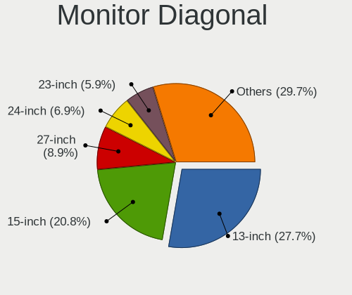

| Inches | Computers | Percent |
|--------|-----------|---------|
| 13     | 21        | 32.31%  |
| 15     | 18        | 27.69%  |
| 27     | 4         | 6.15%   |
| 24     | 4         | 6.15%   |
| 23     | 4         | 6.15%   |
| 19     | 3         | 4.62%   |
| 21     | 2         | 3.08%   |
| 12     | 2         | 3.08%   |
| 54     | 1         | 1.54%   |
| 29     | 1         | 1.54%   |
| 22     | 1         | 1.54%   |
| 18     | 1         | 1.54%   |
| 16     | 1         | 1.54%   |
| 14     | 1         | 1.54%   |
| 11     | 1         | 1.54%   |

Monitor Width
-------------

Physical width

| Width in mm | Computers | Percent |
|-------------|-----------|---------|
| 301-350     | 34        | 52.31%  |
| 501-600     | 12        | 18.46%  |
| 201-300     | 9         | 13.85%  |
| 401-500     | 5         | 7.69%   |
| 351-400     | 3         | 4.62%   |
| 601-700     | 1         | 1.54%   |
| 1001-1500   | 1         | 1.54%   |

Aspect Ratio
------------

Proportional relationship between the width and the height

| Ratio | Computers | Percent |
|-------|-----------|---------|
| 16/9  | 53        | 82.81%  |
| 16/10 | 9         | 14.06%  |
| 5/4   | 1         | 1.56%   |
| 21/9  | 1         | 1.56%   |

Monitor Area
------------

Area in inch

| Area in inch | Computers | Percent |
|----------------|-----------|---------|
| 81-90          | 19        | 29.23%  |
| 91-100         | 15        | 23.08%  |
| 201-250        | 11        | 16.92%  |
| 301-350        | 5         | 7.69%   |
| 151-200        | 4         | 6.15%   |
| 71-80          | 3         | 4.62%   |
| 61-70          | 2         | 3.08%   |
| 111-120        | 2         | 3.08%   |
| 101-110        | 2         | 3.08%   |
| More than 1000 | 1         | 1.54%   |
| 51-60          | 1         | 1.54%   |

Pixel Density
-------------

Pixels per inch

| Density | Computers | Percent |
|---------|-----------|---------|
| 121-160 | 23        | 35.38%  |
| 101-120 | 18        | 27.69%  |
| 51-100  | 15        | 23.08%  |
| 161-240 | 9         | 13.85%  |

Multiple Monitors
-----------------

Total monitors connected

| Total | Computers | Percent |
|-------|-----------|---------|
| 0     | 74        | 51.75%  |
| 1     | 68        | 47.55%  |
| 2     | 1         | 0.7%    |

Network
-------

Net Controller Vendor
---------------------

Controller vendors

| Vendor                   | Computers | Percent |
|--------------------------|-----------|---------|
| Intel                    | 92        | 49.2%   |
| Realtek Semiconductor    | 64        | 34.22%  |
| Qualcomm Atheros         | 14        | 7.49%   |
| Broadcom                 | 12        | 6.42%   |
| Ralink Technology        | 1         | 0.53%   |
| Qualcomm                 | 1         | 0.53%   |
| Mellanox Technologies    | 1         | 0.53%   |
| Marvell Technology Group | 1         | 0.53%   |
| Edimax Technology        | 1         | 0.53%   |

Net Controller Model
--------------------

Controller models

| Model                                                             | Computers | Percent |
|-------------------------------------------------------------------|-----------|---------|
| Realtek RTL8111/8168/8411 PCI Express Gigabit Ethernet Controller | 51        | 22.47%  |
| Intel I211 Gigabit Network Connection                             | 16        | 7.05%   |
| Realtek RTL810xE PCI Express Fast Ethernet controller             | 7         | 3.08%   |
| Intel 82579LM Gigabit Network Connection (Lewisville)             | 7         | 3.08%   |
| Intel I350 Gigabit Network Connection                             | 6         | 2.64%   |
| Intel 82583V Gigabit Network Connection                           | 6         | 2.64%   |
| Intel Wireless 8265 / 8275                                        | 5         | 2.2%    |
| Intel Wi-Fi 6 AX200                                               | 5         | 2.2%    |
| Intel I210 Gigabit Network Connection                             | 5         | 2.2%    |
| Broadcom NetXtreme BCM5720 Gigabit Ethernet PCIe                  | 5         | 2.2%    |
| Qualcomm Atheros AR9285 Wireless Network Adapter (PCI-Express)    | 4         | 1.76%   |
| Intel Wi-Fi 6 AX201                                               | 4         | 1.76%   |
| Intel Dual Band Wireless-AC 3165 Plus Bluetooth                   | 4         | 1.76%   |
| Qualcomm Atheros QCA9565 / AR9565 Wireless Network Adapter        | 3         | 1.32%   |
| Intel Wireless 8260                                               | 3         | 1.32%   |
| Intel Wireless 7260                                               | 3         | 1.32%   |
| Intel Wireless 3165                                               | 3         | 1.32%   |
| Intel Dual Band Wireless-AC 3168NGW [Stone Peak]                  | 3         | 1.32%   |
| Intel Centrino Advanced-N 6205 [Taylor Peak]                      | 3         | 1.32%   |
| Intel Cannon Lake PCH CNVi WiFi                                   | 3         | 1.32%   |
| Realtek RTL8822CE 802.11ac PCIe Wireless Network Adapter          | 2         | 0.88%   |
| Realtek RTL8821CE 802.11ac PCIe Wireless Network Adapter          | 2         | 0.88%   |
| Realtek RTL8188CE 802.11b/g/n WiFi Adapter                        | 2         | 0.88%   |
| Realtek RTL8125 2.5GbE Controller                                 | 2         | 0.88%   |
| Qualcomm Atheros AR9485 Wireless Network Adapter                  | 2         | 0.88%   |
| Qualcomm Atheros AR8152 v2.0 Fast Ethernet                        | 2         | 0.88%   |
| Intel Ethernet Controller I225-V                                  | 2         | 0.88%   |
| Intel Ethernet Connection I217-LM                                 | 2         | 0.88%   |
| Intel Ethernet Connection (7) I219-LM                             | 2         | 0.88%   |
| Intel Ethernet Connection (4) I219-V                              | 2         | 0.88%   |
| Intel Ethernet Connection (4) I219-LM                             | 2         | 0.88%   |
| Intel Comet Lake PCH-LP CNVi WiFi                                 | 2         | 0.88%   |
| Intel Centrino Wireless-N 1000 [Condor Peak]                      | 2         | 0.88%   |
| Intel 82576 Gigabit Network Connection                            | 2         | 0.88%   |
| Broadcom BCM4360 802.11ac Wireless Network Adapter                | 2         | 0.88%   |
| Realtek RTL8723BE PCIe Wireless Network Adapter                   | 1         | 0.44%   |
| Realtek RTL8192CU 802.11n WLAN Adapter                            | 1         | 0.44%   |
| Realtek RTL8191SU 802.11n WLAN Adapter                            | 1         | 0.44%   |
| Realtek RTL8188EE Wireless Network Adapter                        | 1         | 0.44%   |
| Realtek RTL8169 PCI Gigabit Ethernet Controller                   | 1         | 0.44%   |

Wireless Vendor
---------------

Wireless vendors

| Vendor                | Computers | Percent |
|-----------------------|-----------|---------|
| Intel                 | 47        | 61.04%  |
| Qualcomm Atheros      | 13        | 16.88%  |
| Realtek Semiconductor | 10        | 12.99%  |
| Broadcom              | 5         | 6.49%   |
| Ralink Technology     | 1         | 1.3%    |
| Edimax Technology     | 1         | 1.3%    |

Wireless Model
--------------

Wireless models

| Model                                                             | Computers | Percent |
|-------------------------------------------------------------------|-----------|---------|
| Intel Wireless 8265 / 8275                                        | 5         | 6.41%   |
| Intel Wi-Fi 6 AX200                                               | 5         | 6.41%   |
| Qualcomm Atheros AR9285 Wireless Network Adapter (PCI-Express)    | 4         | 5.13%   |
| Intel Wi-Fi 6 AX201                                               | 4         | 5.13%   |
| Intel Dual Band Wireless-AC 3165 Plus Bluetooth                   | 4         | 5.13%   |
| Qualcomm Atheros QCA9565 / AR9565 Wireless Network Adapter        | 3         | 3.85%   |
| Intel Wireless 8260                                               | 3         | 3.85%   |
| Intel Wireless 7260                                               | 3         | 3.85%   |
| Intel Wireless 3165                                               | 3         | 3.85%   |
| Intel Dual Band Wireless-AC 3168NGW [Stone Peak]                  | 3         | 3.85%   |
| Intel Centrino Advanced-N 6205 [Taylor Peak]                      | 3         | 3.85%   |
| Intel Cannon Lake PCH CNVi WiFi                                   | 3         | 3.85%   |
| Realtek RTL8822CE 802.11ac PCIe Wireless Network Adapter          | 2         | 2.56%   |
| Realtek RTL8821CE 802.11ac PCIe Wireless Network Adapter          | 2         | 2.56%   |
| Realtek RTL8188CE 802.11b/g/n WiFi Adapter                        | 2         | 2.56%   |
| Qualcomm Atheros AR9485 Wireless Network Adapter                  | 2         | 2.56%   |
| Intel Comet Lake PCH-LP CNVi WiFi                                 | 2         | 2.56%   |
| Intel Centrino Wireless-N 1000 [Condor Peak]                      | 2         | 2.56%   |
| Broadcom BCM4360 802.11ac Wireless Network Adapter                | 2         | 2.56%   |
| Realtek RTL8723BE PCIe Wireless Network Adapter                   | 1         | 1.28%   |
| Realtek RTL8192CU 802.11n WLAN Adapter                            | 1         | 1.28%   |
| Realtek RTL8191SU 802.11n WLAN Adapter                            | 1         | 1.28%   |
| Realtek RTL8188EE Wireless Network Adapter                        | 1         | 1.28%   |
| Ralink RT5370 Wireless Adapter                                    | 1         | 1.28%   |
| Qualcomm Atheros QCA986x/988x 802.11ac Wireless Network Adapter   | 1         | 1.28%   |
| Qualcomm Atheros QCA6174 802.11ac Wireless Network Adapter        | 1         | 1.28%   |
| Qualcomm Atheros AR928X Wireless Network Adapter (PCI-Express)    | 1         | 1.28%   |
| Qualcomm Atheros AR9287 Wireless Network Adapter (PCI-Express)    | 1         | 1.28%   |
| Intel Wireless-AC 9260                                            | 1         | 1.28%   |
| Intel Wireless 7265                                               | 1         | 1.28%   |
| Intel Wireless 3160                                               | 1         | 1.28%   |
| Intel Comet Lake PCH CNVi WiFi                                    | 1         | 1.28%   |
| Intel Centrino Wireless-N 6150                                    | 1         | 1.28%   |
| Intel Centrino Wireless-N 2200                                    | 1         | 1.28%   |
| Intel Centrino WiMAX 6150                                         | 1         | 1.28%   |
| Intel Cannon Point-LP CNVi [Wireless-AC]                          | 1         | 1.28%   |
| Edimax EW-7612UAn V2 802.11n Wireless Adapter [Realtek RTL8192CU] | 1         | 1.28%   |
| Broadcom BCM43602 802.11ac Wireless LAN SoC                       | 1         | 1.28%   |
| Broadcom BCM43142 802.11b/g/n                                     | 1         | 1.28%   |
| Broadcom BCM4313 802.11bgn Wireless Network Adapter               | 1         | 1.28%   |

Ethernet Vendor
---------------

Ethernet vendors

| Vendor                   | Computers | Percent |
|--------------------------|-----------|---------|
| Intel                    | 62        | 45.59%  |
| Realtek Semiconductor    | 60        | 44.12%  |
| Broadcom                 | 8         | 5.88%   |
| Qualcomm Atheros         | 4         | 2.94%   |
| Qualcomm                 | 1         | 0.74%   |
| Marvell Technology Group | 1         | 0.74%   |

Ethernet Model
--------------

Ethernet models

| Model                                                             | Computers | Percent |
|-------------------------------------------------------------------|-----------|---------|
| Realtek RTL8111/8168/8411 PCI Express Gigabit Ethernet Controller | 51        | 34.46%  |
| Intel I211 Gigabit Network Connection                             | 16        | 10.81%  |
| Realtek RTL810xE PCI Express Fast Ethernet controller             | 7         | 4.73%   |
| Intel 82579LM Gigabit Network Connection (Lewisville)             | 7         | 4.73%   |
| Intel I350 Gigabit Network Connection                             | 6         | 4.05%   |
| Intel 82583V Gigabit Network Connection                           | 6         | 4.05%   |
| Intel I210 Gigabit Network Connection                             | 5         | 3.38%   |
| Broadcom NetXtreme BCM5720 Gigabit Ethernet PCIe                  | 5         | 3.38%   |
| Realtek RTL8125 2.5GbE Controller                                 | 2         | 1.35%   |
| Qualcomm Atheros AR8152 v2.0 Fast Ethernet                        | 2         | 1.35%   |
| Intel Ethernet Controller I225-V                                  | 2         | 1.35%   |
| Intel Ethernet Connection I217-LM                                 | 2         | 1.35%   |
| Intel Ethernet Connection (7) I219-LM                             | 2         | 1.35%   |
| Intel Ethernet Connection (4) I219-V                              | 2         | 1.35%   |
| Intel Ethernet Connection (4) I219-LM                             | 2         | 1.35%   |
| Intel 82576 Gigabit Network Connection                            | 2         | 1.35%   |
| Realtek RTL8169 PCI Gigabit Ethernet Controller                   | 1         | 0.68%   |
| Qualcomm Atheros AR8162 Fast Ethernet                             | 1         | 0.68%   |
| Qualcomm Atheros AR8132 Fast Ethernet                             | 1         | 0.68%   |
| Qualcomm ALCATEL Composite RNDIS Interface                        | 1         | 0.68%   |
| Marvell Group 88E8056 PCI-E Gigabit Ethernet Controller           | 1         | 0.68%   |
| Intel Ethernet Controller X710 for 10GbE SFP+                     | 1         | 0.68%   |
| Intel Ethernet Connection X553 1GbE                               | 1         | 0.68%   |
| Intel Ethernet Connection X552 10 GbE SFP+                        | 1         | 0.68%   |
| Intel Ethernet Connection I219-V                                  | 1         | 0.68%   |
| Intel Ethernet Connection I219-LM                                 | 1         | 0.68%   |
| Intel Ethernet Connection I217-V                                  | 1         | 0.68%   |
| Intel Ethernet Connection (7) I219-V                              | 1         | 0.68%   |
| Intel Ethernet Connection (6) I219-V                              | 1         | 0.68%   |
| Intel Ethernet Connection (5) I219-V                              | 1         | 0.68%   |
| Intel Ethernet Connection (5) I219-LM                             | 1         | 0.68%   |
| Intel Ethernet Connection (2) I219-V                              | 1         | 0.68%   |
| Intel Ethernet Connection (13) I219-V                             | 1         | 0.68%   |
| Intel Ethernet Connection (11) I219-V                             | 1         | 0.68%   |
| Intel Ethernet Connection (10) I219-LM                            | 1         | 0.68%   |
| Intel 82580 Gigabit Network Connection                            | 1         | 0.68%   |
| Intel 82575GB Gigabit Network Connection                          | 1         | 0.68%   |
| Intel 82575EB Gigabit Network Connection                          | 1         | 0.68%   |
| Intel 82574L Gigabit Network Connection                           | 1         | 0.68%   |
| Intel 82566DM-2 Gigabit Network Connection                        | 1         | 0.68%   |

Net Controller Kind
-------------------

Ethernet, WiFi or modem

| Kind     | Computers | Percent |
|----------|-----------|---------|
| Ethernet | 127       | 62.87%  |
| WiFi     | 74        | 36.63%  |
| Unknown  | 1         | 0.5%    |

Used Controller
---------------

Currently used network controller

| Kind     | Computers | Percent |
|----------|-----------|---------|
| Ethernet | 119       | 73.01%  |
| WiFi     | 44        | 26.99%  |

NICs
----

Total network controllers on board

| Total | Computers | Percent |
|-------|-----------|---------|
| 2     | 79        | 55.63%  |
| 1     | 26        | 18.31%  |
| 6     | 14        | 9.86%   |
| 4     | 12        | 8.45%   |
| 5     | 5         | 3.52%   |
| 8     | 2         | 1.41%   |
| 7     | 2         | 1.41%   |
| 0     | 2         | 1.41%   |

IPv6
----

IPv6 vs IPv4

| Used | Computers | Percent |
|------|-----------|---------|
| No   | 121       | 84.03%  |
| Yes  | 23        | 15.97%  |

Bluetooth
---------

Bluetooth Vendor
----------------

Controller vendors

| Vendor                          | Computers | Percent |
|---------------------------------|-----------|---------|
| Intel                           | 36        | 62.07%  |
| Realtek Semiconductor           | 4         | 6.9%    |
| Qualcomm Atheros Communications | 3         | 5.17%   |
| Cambridge Silicon Radio         | 3         | 5.17%   |
| Broadcom                        | 3         | 5.17%   |
| Apple                           | 3         | 5.17%   |
| Lite-On Technology              | 2         | 3.45%   |
| Foxconn / Hon Hai               | 2         | 3.45%   |
| Realtek                         | 1         | 1.72%   |
| IMC Networks                    | 1         | 1.72%   |

Bluetooth Model
---------------

Controller models

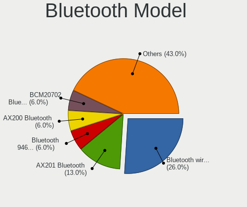

| Model                                                       | Computers | Percent |
|-------------------------------------------------------------|-----------|---------|
| Intel Bluetooth wireless interface                          | 16        | 27.59%  |
| Intel AX201 Bluetooth                                       | 6         | 10.34%  |
| Intel Bluetooth 9460/9560 Jefferson Peak (JfP)              | 5         | 8.62%   |
| Intel AX200 Bluetooth                                       | 5         | 8.62%   |
| Intel Wireless-AC 3168 Bluetooth                            | 3         | 5.17%   |
| Cambridge Silicon Radio Bluetooth Dongle (HCI mode)         | 3         | 5.17%   |
| Broadcom BCM20702 Bluetooth 4.0 [ThinkPad]                  | 3         | 5.17%   |
| Realtek  Bluetooth 4.0 Adapter                              | 2         | 3.45%   |
| Apple Apple Broadcom Built-in Bluetooth                     | 2         | 3.45%   |
| Realtek  Bluetooth Adapter                                  | 1         | 1.72%   |
| Realtek  Bluetooth 4.2 Adapter                              | 1         | 1.72%   |
| Realtek Bluetooth Radio                                     | 1         | 1.72%   |
| Qualcomm Atheros Dell Wireless 1820 Bluetooth 4.1LE         | 1         | 1.72%   |
| Qualcomm Atheros Dell Wireless 1707 Bluetooth 4.0 LE Device | 1         | 1.72%   |
| Qualcomm Atheros AR3012 Bluetooth 4.0                       | 1         | 1.72%   |
| Lite-On Qualcomm Atheros Bluetooth 4.0 + HS                 | 1         | 1.72%   |
| Lite-On BCM43142A0 Bluetooth Module                         | 1         | 1.72%   |
| Intel Wireless-AC 9260 Bluetooth Adapter                    | 1         | 1.72%   |
| IMC Networks Qualcomm Atheros Bluetooth 4.0 + HS            | 1         | 1.72%   |
| Foxconn / Hon Hai Broadcom Bluetooth 2.1 Device             | 1         | 1.72%   |
| Foxconn / Hon Hai Atheros AR3012 Bluetooth                  | 1         | 1.72%   |
| Apple Bluetooth Host Controller                             | 1         | 1.72%   |

Sound
-----

Sound Vendor
------------

Sound card vendors

| Vendor                 | Computers | Percent |
|------------------------|-----------|---------|
| Intel                  | 102       | 75.56%  |
| AMD                    | 18        | 13.33%  |
| Nvidia                 | 14        | 10.37%  |
| Generalplus Technology | 1         | 0.74%   |

Sound Model
-----------

Sound card models

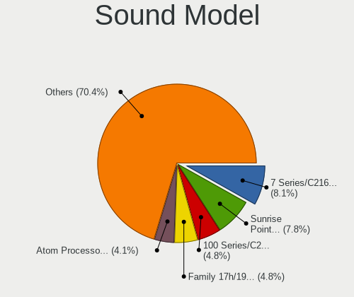

| Model                                                                                             | Computers | Percent |
|---------------------------------------------------------------------------------------------------|-----------|---------|
| Intel Sunrise Point-LP HD Audio                                                                   | 12        | 7.84%   |
| Intel 7 Series/C216 Chipset Family High Definition Audio Controller                               | 12        | 7.84%   |
| Intel 100 Series/C230 Series Chipset Family HD Audio Controller                                   | 8         | 5.23%   |
| Intel Atom Processor Z36xxx/Z37xxx Series High Definition Audio Controller                        | 7         | 4.58%   |
| Intel Xeon E3-1200 v3/4th Gen Core Processor HD Audio Controller                                  | 5         | 3.27%   |
| Intel Cannon Lake PCH cAVS                                                                        | 5         | 3.27%   |
| Intel 8 Series/C220 Series Chipset High Definition Audio Controller                               | 5         | 3.27%   |
| AMD Family 17h/19h HD Audio Controller                                                            | 5         | 3.27%   |
| Intel Tiger Lake-LP Smart Sound Technology Audio Controller                                       | 4         | 2.61%   |
| Intel Celeron N3350/Pentium N4200/Atom E3900 Series Audio Cluster                                 | 4         | 2.61%   |
| Intel 82801I (ICH9 Family) HD Audio Controller                                                    | 4         | 2.61%   |
| Intel 6 Series/C200 Series Chipset Family High Definition Audio Controller                        | 4         | 2.61%   |
| AMD Starship/Matisse HD Audio Controller                                                          | 4         | 2.61%   |
| AMD SBx00 Azalia (Intel HDA)                                                                      | 4         | 2.61%   |
| Intel NM10/ICH7 Family High Definition Audio Controller                                           | 3         | 1.96%   |
| Intel Comet Lake PCH-V cAVS                                                                       | 3         | 1.96%   |
| Intel Celeron/Pentium Silver Processor High Definition Audio                                      | 3         | 1.96%   |
| Intel Atom/Celeron/Pentium Processor x5-E8000/J3xxx/N3xxx Series High Definition Audio Controller | 3         | 1.96%   |
| Intel 82801JI (ICH10 Family) HD Audio Controller                                                  | 3         | 1.96%   |
| Intel 200 Series PCH HD Audio                                                                     | 3         | 1.96%   |
| AMD Raven/Raven2/Fenghuang HDMI/DP Audio Controller                                               | 3         | 1.96%   |
| Nvidia GP107GL High Definition Audio Controller                                                   | 2         | 1.31%   |
| Nvidia GM206 High Definition Audio Controller                                                     | 2         | 1.31%   |
| Intel Wildcat Point-LP High Definition Audio Controller                                           | 2         | 1.31%   |
| Intel Haswell-ULT HD Audio Controller                                                             | 2         | 1.31%   |
| Intel Comet Lake PCH-LP cAVS                                                                      | 2         | 1.31%   |
| Intel Comet Lake PCH cAVS                                                                         | 2         | 1.31%   |
| Intel CM238 HD Audio Controller                                                                   | 2         | 1.31%   |
| Intel Cannon Point-LP High Definition Audio Controller                                            | 2         | 1.31%   |
| Intel Broadwell-U Audio Controller                                                                | 2         | 1.31%   |
| AMD Wrestler HDMI Audio                                                                           | 2         | 1.31%   |
| AMD Renoir Radeon High Definition Audio Controller                                                | 2         | 1.31%   |
| AMD FCH Azalia Controller                                                                         | 2         | 1.31%   |
| AMD Family 17h (Models 00h-0fh) HD Audio Controller                                               | 2         | 1.31%   |
| AMD Caicos HDMI Audio [Radeon HD 6450 / 7450/8450/8490 OEM / R5 230/235/235X OEM]                 | 2         | 1.31%   |
| Nvidia TU116 High Definition Audio Controller                                                     | 1         | 0.65%   |
| Nvidia TU107 GeForce GTX 1650 High Definition Audio Controller                                    | 1         | 0.65%   |
| Nvidia MCP61 High Definition Audio                                                                | 1         | 0.65%   |
| Nvidia High Definition Audio Controller                                                           | 1         | 0.65%   |
| Nvidia GP108 High Definition Audio Controller                                                     | 1         | 0.65%   |

Memory
------

Memory Vendor
-------------

Memory module vendors

| Vendor              | Computers | Percent |
|---------------------|-----------|---------|
| Samsung Electronics | 44        | 26.83%  |
| Kingston            | 27        | 16.46%  |
| SK hynix            | 26        | 15.85%  |
| Micron Technology   | 17        | 10.37%  |
| Unknown             | 14        | 8.54%   |
| A-DATA Technology   | 7         | 4.27%   |
| Unknown             | 6         | 3.66%   |
| Ramaxel Technology  | 5         | 3.05%   |
| Nanya Technology    | 3         | 1.83%   |
| Transcend           | 2         | 1.22%   |
| Team                | 2         | 1.22%   |
| G.Skill             | 2         | 1.22%   |
| Elpida              | 2         | 1.22%   |
| Unknown (8AFD)      | 1         | 0.61%   |
| Unknown (08B5)      | 1         | 0.61%   |
| Ramsta              | 1         | 0.61%   |
| KingTiger           | 1         | 0.61%   |
| Innodisk            | 1         | 0.61%   |
| Crucial             | 1         | 0.61%   |
| Corsair             | 1         | 0.61%   |

Memory Model
------------

Memory module models

| Model                                                       | Computers | Percent |
|-------------------------------------------------------------|-----------|---------|
| Unknown                                                     | 6         | 3.43%   |
| SK hynix RAM HMA451S6AFR8N-TF 4GB SODIMM DDR4 2133MT/s      | 5         | 2.86%   |
| Samsung RAM M471B5273DH0-CH9 4GB SODIMM DDR3 1334MT/s       | 4         | 2.29%   |
| Samsung RAM M471A1K43BB1-CRC 8GB SODIMM DDR4 2400MT/s       | 3         | 1.71%   |
| Ramaxel RAM RMT3170MN68F9F1600 4GB SODIMM DDR3 1600MT/s     | 3         | 1.71%   |
| Unknown RAM Module 2GB DIMM DDR3 1333MT/s                   | 2         | 1.14%   |
| Unknown RAM Module 2GB DIMM DDR2 800MT/s                    | 2         | 1.14%   |
| SK hynix RAM HMT451S6BFR8A-PB 4GB SODIMM DDR3 1600MT/s      | 2         | 1.14%   |
| Samsung RAM M471B5173DB0-YK0 4GB SODIMM DDR3 1600MT/s       | 2         | 1.14%   |
| Samsung RAM M471A1K43CB1-CTD 8GB SODIMM DDR4 2667MT/s       | 2         | 1.14%   |
| Micron RAM 53E1G32D2NP-046 2GB Row Of Chips LPDDR4 4267MT/s | 2         | 1.14%   |
| Kingston RAM KHX3000C15D4/8GX 8GB DIMM DDR4 2933MT/s        | 2         | 1.14%   |
| A-DATA RAM Module 8GB SODIMM DDR4 2667MT/s                  | 2         | 1.14%   |
| Unknown RAM XinJuHuo 8GB SODIMM DDR3 1600MT/s               | 1         | 0.57%   |
| Unknown RAM TMKS8G68ALFBCH-266 8192MB SODIMM DDR4 2400MT/s  | 1         | 0.57%   |
| Unknown RAM Module 4GB SODIMM DDR3                          | 1         | 0.57%   |
| Unknown RAM Module 4GB DIMM DDR4 2133MT/s                   | 1         | 0.57%   |
| Unknown RAM Module 2GB SODIMM DDR3 800MT/s                  | 1         | 0.57%   |
| Unknown RAM Module 2GB SODIMM DDR3                          | 1         | 0.57%   |
| Unknown RAM Module 2GB SODIMM DDR2 800MT/s                  | 1         | 0.57%   |
| Unknown RAM Module 2048MB DIMM 1333MT/s                     | 1         | 0.57%   |
| Unknown RAM Module 1GB DIMM DDR2 667MT/s                    | 1         | 0.57%   |
| Unknown RAM IM38GS48A16-BBBHB0 8GB DIMM DDR3 1600MT/s       | 1         | 0.57%   |
| Unknown (8AFD) RAM SED2666S1908 8GB SODIMM DDR4 2667MT/s    | 1         | 0.57%   |
| Unknown (08B5) RAM IM416GU8N24 16384MB SODIMM DDR4 2400MT/s | 1         | 0.57%   |
| Transcend RAM TS512MSK64W6H 4GB SODIMM DDR3 1600MT/s        | 1         | 0.57%   |
| Transcend RAM JM1600KSH-8G 8192MB SODIMM DDR3 1333MT/s      | 1         | 0.57%   |
| Team RAM TEAMGROUP-UD4-2133 8GB DIMM DDR4 2133MT/s          | 1         | 0.57%   |
| Team RAM Elite-1333 4GB SODIMM DDR3 1333MT/s                | 1         | 0.57%   |
| SK hynix RAM Module 8GB SODIMM DDR3 1600MT/s                | 1         | 0.57%   |
| SK hynix RAM HMT451S6AFR8C-PB 4GB SODIMM DDR3 1600MT/s      | 1         | 0.57%   |
| SK hynix RAM HMT351S6EFR8C-PB 4GB SODIMM DDR3 1600MT/s      | 1         | 0.57%   |
| SK hynix RAM HMT325U6BFR8C-H9 2GB DIMM 1066MT/s             | 1         | 0.57%   |
| SK hynix RAM HMT325S6EFR8C-PB 2GB DIMM DDR3 1600MT/s        | 1         | 0.57%   |
| SK hynix RAM HMT325S6CFR8C-H9 2048MB SODIMM DDR3 1333MT/s   | 1         | 0.57%   |
| SK hynix RAM HMT325S6BFR8C-H9 2GB DIMM DDR3 1333MT/s        | 1         | 0.57%   |
| SK hynix RAM HMT125U6TFR8C-H9 2GB DIMM DDR3 1333MT/s        | 1         | 0.57%   |
| SK hynix RAM HMT125S6BFR8C-G7 2GB SODIMM DDR3 1067MT/s      | 1         | 0.57%   |
| SK hynix RAM HMT125S6BFR8C-G7 2048MB SODIMM 800MT/s         | 1         | 0.57%   |
| SK hynix RAM HMT112S6BFR6C-G7 1GB SODIMM DDR3 533MT/s       | 1         | 0.57%   |

Memory Kind
-----------

Memory module kinds

| Kind    | Computers | Percent |
|---------|-----------|---------|
| DDR4    | 62        | 45.26%  |
| DDR3    | 62        | 45.26%  |
| DDR2    | 4         | 2.92%   |
| Unknown | 4         | 2.92%   |
| LPDDR4  | 3         | 2.19%   |
| LPDDR3  | 2         | 1.46%   |

Memory Form Factor
------------------

Physical design of the memory module

| Name         | Computers | Percent |
|--------------|-----------|---------|
| SODIMM       | 77        | 55.8%   |
| DIMM         | 49        | 35.51%  |
| Row Of Chips | 8         | 5.8%    |
| Unknown      | 3         | 2.17%   |
| Chip         | 1         | 0.72%   |

Memory Size
-----------

Memory module size

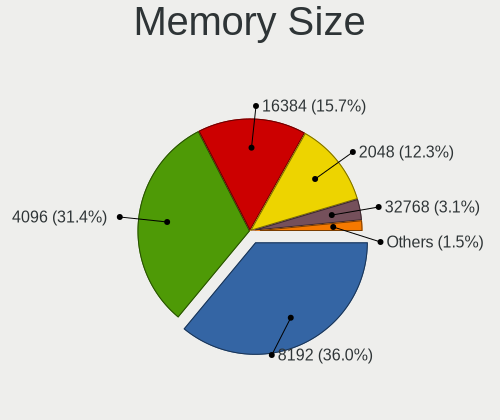

| Size  | Computers | Percent |
|-------|-----------|---------|
| 8192  | 54        | 35.29%  |
| 4096  | 51        | 33.33%  |
| 2048  | 26        | 16.99%  |
| 16384 | 18        | 11.76%  |
| 1024  | 3         | 1.96%   |
| 32768 | 1         | 0.65%   |

Memory Speed
------------

Memory module speed

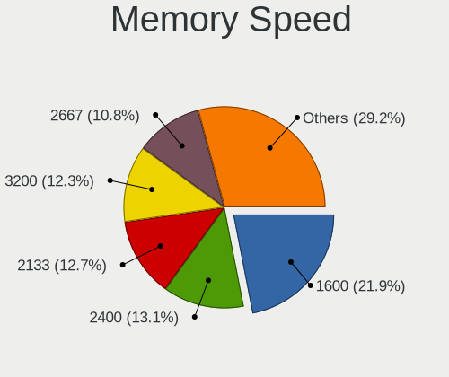

| Speed   | Computers | Percent |
|---------|-----------|---------|
| 1600    | 34        | 21.94%  |
| 1333    | 24        | 15.48%  |
| 2133    | 20        | 12.9%   |
| 2667    | 18        | 11.61%  |
| 2400    | 16        | 10.32%  |
| 3200    | 11        | 7.1%    |
| 800     | 7         | 4.52%   |
| 1334    | 6         | 3.87%   |
| 2666    | 4         | 2.58%   |
| 2933    | 3         | 1.94%   |
| 4267    | 2         | 1.29%   |
| 1867    | 2         | 1.29%   |
| 1067    | 2         | 1.29%   |
| 667     | 2         | 1.29%   |
| Unknown | 2         | 1.29%   |
| 1066    | 1         | 0.65%   |
| 533     | 1         | 0.65%   |

Printers & scanners
-------------------

Printer Vendor
--------------

Printer device vendors

Zero info for selected period =(

Printer Model
-------------

Printer device models

Zero info for selected period =(

Scanner Vendor
--------------

Scanner device vendors

Zero info for selected period =(

Scanner Model
-------------

Scanner device models

Zero info for selected period =(

Camera
------

Camera Vendor
-------------

Camera device vendors

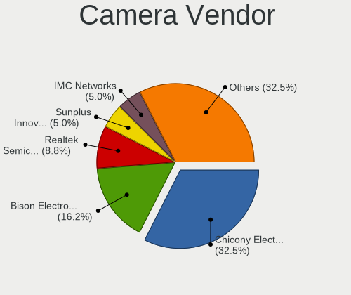

| Vendor                                 | Computers | Percent |
|----------------------------------------|-----------|---------|
| Chicony Electronics                    | 15        | 28.3%   |
| Acer                                   | 7         | 13.21%  |
| Realtek Semiconductor                  | 6         | 11.32%  |
| Syntek                                 | 3         | 5.66%   |
| Microdia                               | 3         | 5.66%   |
| IMC Networks                           | 3         | 5.66%   |
| Sunplus Innovation Technology          | 2         | 3.77%   |
| Quanta                                 | 2         | 3.77%   |
| Logitech                               | 2         | 3.77%   |
| Lite-On Technology                     | 2         | 3.77%   |
| Z-Star Microelectronics                | 1         | 1.89%   |
| Silicon Motion                         | 1         | 1.89%   |
| Lenovo                                 | 1         | 1.89%   |
| Importek                               | 1         | 1.89%   |
| Genesys Logic                          | 1         | 1.89%   |
| Foxconn / Hon Hai                      | 1         | 1.89%   |
| Cheng Uei Precision Industry (Foxlink) | 1         | 1.89%   |
| ALi                                    | 1         | 1.89%   |

Camera Model
------------

Camera device models

| Model                                                                      | Computers | Percent |
|----------------------------------------------------------------------------|-----------|---------|
| Chicony Integrated Camera                                                  | 5         | 9.26%   |
| Realtek Integrated_Webcam_HD                                               | 3         | 5.56%   |
| Chicony USB2.0 VGA UVC WebCam                                              | 3         | 5.56%   |
| Chicony Lenovo EasyCamera                                                  | 3         | 5.56%   |
| Syntek Lenovo EasyCamera                                                   | 2         | 3.7%    |
| IMC Networks Integrated Camera                                             | 2         | 3.7%    |
| Chicony Integrated Camera (1280x720@30)                                    | 2         | 3.7%    |
| Chicony Chicony USB2.0 Camera                                              | 2         | 3.7%    |
| Acer ThinkPad Integrated Camera                                            | 2         | 3.7%    |
| Acer Integrated Camera                                                     | 2         | 3.7%    |
| Z-Star Lenovo USB2.0 UVC Camera                                            | 1         | 1.85%   |
| Syntek Integrated Camera                                                   | 1         | 1.85%   |
| Sunplus XiaoMi USB 2.0 Webcam                                              | 1         | 1.85%   |
| Sunplus Integrated_Webcam_HD                                               | 1         | 1.85%   |
| Silicon Motion Realtek USB2.0 PC Camera                                    | 1         | 1.85%   |
| Realtek Realtek USB2.0 PC Camera                                           | 1         | 1.85%   |
| Realtek HD WebCam                                                          | 1         | 1.85%   |
| Realtek Front Camera                                                       | 1         | 1.85%   |
| Quanta Realtek DMFT - RGB                                                  | 1         | 1.85%   |
| Quanta ov9734_techfront_camera                                             | 1         | 1.85%   |
| Microdia Laptop_Integrated_Webcam_0.3M                                     | 1         | 1.85%   |
| Microdia Integrated_Webcam_HD                                              | 1         | 1.85%   |
| Microdia Camera                                                            | 1         | 1.85%   |
| Logitech Webcam C170                                                       | 1         | 1.85%   |
| Logitech C670i FHD Webcam                                                  | 1         | 1.85%   |
| Lite-On Integrated Camera                                                  | 1         | 1.85%   |
| Lite-On HP HD Camera                                                       | 1         | 1.85%   |
| Lenovo Integrated Webcam [R5U877]                                          | 1         | 1.85%   |
| Importek USB 2.0 Camera                                                    | 1         | 1.85%   |
| IMC Networks Integrated Webcam                                             | 1         | 1.85%   |
| Genesys Logic Camera                                                       | 1         | 1.85%   |
| Foxconn / Hon Hai USB2.0 Camera                                            | 1         | 1.85%   |
| Chicony Integrated IR Camera                                               | 1         | 1.85%   |
| Cheng Uei Precision Industry (Foxlink) HP Wide Vision HD Integrated Webcam | 1         | 1.85%   |
| ALi Gateway Webcam                                                         | 1         | 1.85%   |
| Acer Lenovo Integrated Webcam                                              | 1         | 1.85%   |
| Acer Lenovo EasyCamera                                                     | 1         | 1.85%   |
| Acer EasyCamera                                                            | 1         | 1.85%   |

Security
--------

Fingerprint Vendor
------------------

Fingerprint sensor vendors

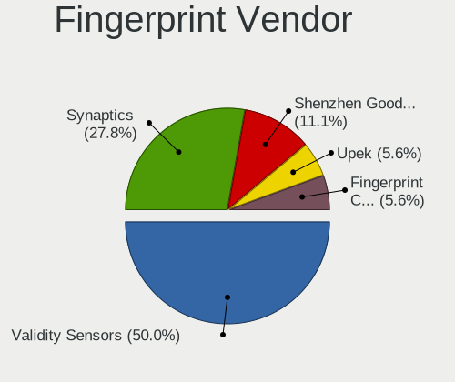

| Vendor                     | Computers | Percent |
|----------------------------|-----------|---------|
| Validity Sensors           | 6         | 60%     |
| Synaptics                  | 2         | 20%     |
| Upek                       | 1         | 10%     |
| Shenzhen Goodix Technology | 1         | 10%     |

Fingerprint Model
-----------------

Fingerprint sensor models

| Model                                                                      | Computers | Percent |
|----------------------------------------------------------------------------|-----------|---------|
| Validity Sensors Synaptics WBDI                                            | 3         | 30%     |
| Validity Sensors VFS5011 Fingerprint Reader                                | 1         | 10%     |
| Validity Sensors VFS495 Fingerprint Reader                                 | 1         | 10%     |
| Validity Sensors Synaptics VFS7552 Touch Fingerprint Sensor with PurePrint | 1         | 10%     |
| Upek Biometric Touchchip/Touchstrip Fingerprint Sensor                     | 1         | 10%     |
| Synaptics Prometheus MIS Touch Fingerprint Reader                          | 1         | 10%     |
| Synaptics Metallica MIS Touch Fingerprint Reader                           | 1         | 10%     |
| Shenzhen Goodix  Fingerprint Device                                        | 1         | 10%     |

Chipcard Vendor
---------------

Chipcard module vendors

Zero info for selected period =(

Chipcard Model
--------------

Chipcard module models

Zero info for selected period =(

Unsupported
-----------

Unsupported Devices
-------------------

Total unsupported devices on board

| Total | Computers | Percent |
|-------|-----------|---------|
| 1     | 48        | 33.8%   |
| 0     | 43        | 30.28%  |
| 2     | 31        | 21.83%  |
| 3     | 16        | 11.27%  |
| 4     | 4         | 2.82%   |

Unsupported Device Types
------------------------

Types of unsupported devices

| Type                     | Computers | Percent |
|--------------------------|-----------|---------|
| Communication controller | 90        | 56.25%  |
| Net/wireless             | 21        | 13.13%  |
| Bluetooth                | 18        | 11.25%  |
| Card reader              | 17        | 10.63%  |
| Fingerprint reader       | 10        | 6.25%   |
| Net/ethernet             | 2         | 1.25%   |
| Sound                    | 1         | 0.63%   |
| Network                  | 1         | 0.63%   |

