BSD in China - Tested Hardware & Statistics (Desktops)
------------------------------------------------------

A project to collect tested hardware configurations for BSD in China.

Anyone can contribute to this report by the [hw-probe](https://github.com/linuxhw/hw-probe/blob/master/INSTALL.BSD.md) tool:

    hw-probe -all -upload

Please contribute! Especially if your hardware is rare.

Contents
--------

* [ Test Cases ](#test-cases)

* [ System ](#system)
  - [ OS                       ](#os)
  - [ OS Family                ](#os-family)
  - [ Arch                     ](#arch)
  - [ DE                       ](#de)
  - [ Display Server           ](#display-server)
  - [ Display Manager          ](#display-manager)
  - [ OS Lang                  ](#os-lang)
  - [ Boot Mode                ](#boot-mode)
  - [ Filesystem               ](#filesystem)
  - [ Part. scheme             ](#part-scheme)

* [ Board ](#board)
  - [ Vendor                   ](#vendor)
  - [ Model                    ](#model)
  - [ Model Family             ](#model-family)
  - [ MFG Year                 ](#mfg-year)
  - [ Form Factor              ](#form-factor)
  - [ Coreboot                 ](#coreboot)
  - [ RAM Size                 ](#ram-size)
  - [ RAM Used                 ](#ram-used)
  - [ Total Drives             ](#total-drives)
  - [ Has CD-ROM               ](#has-cd-rom)
  - [ Has Ethernet             ](#has-ethernet)
  - [ Has WiFi                 ](#has-wifi)
  - [ Has Bluetooth            ](#has-bluetooth)

* [ Location ](#location)
  - [ Country                  ](#country)
  - [ City                     ](#city)

* [ Drives ](#drives)
  - [ Drive Vendor             ](#drive-vendor)
  - [ Drive Model              ](#drive-model)
  - [ HDD Vendor               ](#hdd-vendor)
  - [ SSD Vendor               ](#ssd-vendor)
  - [ Drive Kind               ](#drive-kind)
  - [ Drive Connector          ](#drive-connector)
  - [ Drive Size               ](#drive-size)
  - [ Space Total              ](#space-total)
  - [ Space Used               ](#space-used)
  - [ Malfunc. Drives          ](#malfunc-drives)
  - [ Malfunc. Drive Vendor    ](#malfunc-drive-vendor)
  - [ Malfunc. HDD Vendor      ](#malfunc-hdd-vendor)
  - [ Malfunc. Drive Kind      ](#malfunc-drive-kind)
  - [ Failed Drives            ](#failed-drives)
  - [ Failed Drive Vendor      ](#failed-drive-vendor)
  - [ Drive Status             ](#drive-status)

* [ Storage controller ](#storage-controller)
  - [ Storage Vendor           ](#storage-vendor)
  - [ Storage Model            ](#storage-model)
  - [ Storage Kind             ](#storage-kind)

* [ Processor ](#processor)
  - [ CPU Vendor               ](#cpu-vendor)
  - [ CPU Model                ](#cpu-model)
  - [ CPU Model Family         ](#cpu-model-family)
  - [ CPU Cores                ](#cpu-cores)
  - [ CPU Sockets              ](#cpu-sockets)
  - [ CPU Threads              ](#cpu-threads)
  - [ CPU Microarch            ](#cpu-microarch)

* [ Graphics ](#graphics)
  - [ GPU Vendor               ](#gpu-vendor)
  - [ GPU Model                ](#gpu-model)
  - [ GPU Combo                ](#gpu-combo)
  - [ GPU Driver               ](#gpu-driver)
  - [ GPU Memory               ](#gpu-memory)

* [ Monitor ](#monitor)
  - [ Monitor Vendor           ](#monitor-vendor)
  - [ Monitor Model            ](#monitor-model)
  - [ Monitor Resolution       ](#monitor-resolution)
  - [ Monitor Diagonal         ](#monitor-diagonal)
  - [ Monitor Width            ](#monitor-width)
  - [ Aspect Ratio             ](#aspect-ratio)
  - [ Monitor Area             ](#monitor-area)
  - [ Pixel Density            ](#pixel-density)
  - [ Multiple Monitors        ](#multiple-monitors)

* [ Network ](#network)
  - [ Net Controller Vendor    ](#net-controller-vendor)
  - [ Net Controller Model     ](#net-controller-model)
  - [ Wireless Vendor          ](#wireless-vendor)
  - [ Wireless Model           ](#wireless-model)
  - [ Ethernet Vendor          ](#ethernet-vendor)
  - [ Ethernet Model           ](#ethernet-model)
  - [ Net Controller Kind      ](#net-controller-kind)
  - [ Used Controller          ](#used-controller)
  - [ NICs                     ](#nics)
  - [ IPv6                     ](#ipv6)

* [ Bluetooth ](#bluetooth)
  - [ Bluetooth Vendor         ](#bluetooth-vendor)
  - [ Bluetooth Model          ](#bluetooth-model)

* [ Sound ](#sound)
  - [ Sound Vendor             ](#sound-vendor)
  - [ Sound Model              ](#sound-model)

* [ Memory ](#memory)
  - [ Memory Vendor            ](#memory-vendor)
  - [ Memory Model             ](#memory-model)
  - [ Memory Kind              ](#memory-kind)
  - [ Memory Form Factor       ](#memory-form-factor)
  - [ Memory Size              ](#memory-size)
  - [ Memory Speed             ](#memory-speed)

* [ Printers & scanners ](#printers--scanners)
  - [ Printer Vendor           ](#printer-vendor)
  - [ Printer Model            ](#printer-model)
  - [ Scanner Vendor           ](#scanner-vendor)
  - [ Scanner Model            ](#scanner-model)

* [ Camera ](#camera)
  - [ Camera Vendor            ](#camera-vendor)
  - [ Camera Model             ](#camera-model)

* [ Security ](#security)
  - [ Fingerprint Vendor       ](#fingerprint-vendor)
  - [ Fingerprint Model        ](#fingerprint-model)
  - [ Chipcard Vendor          ](#chipcard-vendor)
  - [ Chipcard Model           ](#chipcard-model)

* [ Unsupported ](#unsupported)
  - [ Unsupported Devices      ](#unsupported-devices)
  - [ Unsupported Device Types ](#unsupported-device-types)

Test Cases
----------

Total: 152

| Vendor        | Model                       | Probe                                                     | Date         |
|---------------|-----------------------------|-----------------------------------------------------------|--------------|
| BROUNION      | R86S                        | [752d83911f](https://bsd-hardware.info/?probe=752d83911f) | May 08, 2024 |
| Intel         | MAHOBAY                     | [c76dc714f2](https://bsd-hardware.info/?probe=c76dc714f2) | Apr 15, 2024 |
| Unknown       | Unknown                     | [75fccc1dbe](https://bsd-hardware.info/?probe=75fccc1dbe) | Apr 15, 2024 |
| Unknown       | Unknown                     | [ba545bb931](https://bsd-hardware.info/?probe=ba545bb931) | Apr 15, 2024 |
| ASUSTek       | TUF Gaming B650-PLUS        | [f960805584](https://bsd-hardware.info/?probe=f960805584) | Mar 26, 2024 |
| Unknown       | QDNV01                      | [72b182fa59](https://bsd-hardware.info/?probe=72b182fa59) | Mar 25, 2024 |
| MSI           | MPG X570 GAMING EDGE WIF... | [c2fcfcd39d](https://bsd-hardware.info/?probe=c2fcfcd39d) | Mar 24, 2024 |
| Intel         | MAHOBAY                     | [cf80a0db55](https://bsd-hardware.info/?probe=cf80a0db55) | Mar 19, 2024 |
| ASRock        | B360M Xtreme                | [e84af03816](https://bsd-hardware.info/?probe=e84af03816) | Feb 16, 2024 |
| Techvision    | TVI7309X B0                 | [0a384151b6](https://bsd-hardware.info/?probe=0a384151b6) | Jan 20, 2024 |
| Unknown       | Unknown                     | [609434dc71](https://bsd-hardware.info/?probe=609434dc71) | Jan 18, 2024 |
| Unknown       | Unknown                     | [ba78787dff](https://bsd-hardware.info/?probe=ba78787dff) | Dec 29, 2023 |
| MSI           | MPG X570 GAMING EDGE WIF... | [06457349dc](https://bsd-hardware.info/?probe=06457349dc) | Dec 22, 2023 |
| Intel         | SKYBAY                      | [6ad2ae72f1](https://bsd-hardware.info/?probe=6ad2ae72f1) | Dec 13, 2023 |
| MSI           | B450M MORTAR                | [4017ce5221](https://bsd-hardware.info/?probe=4017ce5221) | Nov 29, 2023 |
| Supermicro    | X9SCL-II/X9SCM-II           | [34833316ac](https://bsd-hardware.info/?probe=34833316ac) | Nov 27, 2023 |
| Silicom       | 80300-0214-G16 R310         | [34382c8f4b](https://bsd-hardware.info/?probe=34382c8f4b) | Nov 24, 2023 |
| Unknown       | Unknown                     | [456d5ad8bf](https://bsd-hardware.info/?probe=456d5ad8bf) | Nov 05, 2023 |
| YanRay Tec... | B1904                       | [7d194ae12b](https://bsd-hardware.info/?probe=7d194ae12b) | Oct 28, 2023 |
| MECHREVO      | Unknown                     | [2dac22205c](https://bsd-hardware.info/?probe=2dac22205c) | Oct 23, 2023 |
| Lenovo        | SHARKBAY SDK0A46860 WIN     | [da1e562510](https://bsd-hardware.info/?probe=da1e562510) | Oct 10, 2023 |
| Lenovo        | SHARKBAY SDK0A46860 WIN     | [d7cf15da0c](https://bsd-hardware.info/?probe=d7cf15da0c) | Oct 09, 2023 |
| Unknown       | Unknown                     | [c54bad3277](https://bsd-hardware.info/?probe=c54bad3277) | Oct 04, 2023 |
| Biostar       | A55MLC2                     | [fac0f247d0](https://bsd-hardware.info/?probe=fac0f247d0) | Sep 28, 2023 |
| Techvision    | TVI7309X B0                 | [93c70115bd](https://bsd-hardware.info/?probe=93c70115bd) | Aug 19, 2023 |
| Intel         | SKYBAY                      | [53fb653186](https://bsd-hardware.info/?probe=53fb653186) | Aug 18, 2023 |
| MSI           | MPG X570 GAMING EDGE WIF... | [2f6574d368](https://bsd-hardware.info/?probe=2f6574d368) | Aug 08, 2023 |
| Unknown       | Unknown                     | [75e009424e](https://bsd-hardware.info/?probe=75e009424e) | Aug 07, 2023 |
| Intel         | SKYBAY                      | [fde75b4094](https://bsd-hardware.info/?probe=fde75b4094) | Aug 04, 2023 |
| AZW           | EQ                          | [a581a63aae](https://bsd-hardware.info/?probe=a581a63aae) | Jul 29, 2023 |
| AZW           | EQ                          | [1feeda5ce9](https://bsd-hardware.info/?probe=1feeda5ce9) | Jul 29, 2023 |
| Unknown       | Unknown                     | [3ca61a6a18](https://bsd-hardware.info/?probe=3ca61a6a18) | Jul 24, 2023 |
| AZW           | EQ                          | [7d2884120c](https://bsd-hardware.info/?probe=7d2884120c) | Jul 23, 2023 |
| NEC Comput... | IS8XM                       | [9f50189f65](https://bsd-hardware.info/?probe=9f50189f65) | Jul 22, 2023 |
| OEM           | ITX-SC3 V1.1                | [a58b6ba2d4](https://bsd-hardware.info/?probe=a58b6ba2d4) | Jul 18, 2023 |
| OEM           | ITX-SC3 V1.1                | [7c550acc8c](https://bsd-hardware.info/?probe=7c550acc8c) | Jul 18, 2023 |
| Unknown       | Unknown                     | [4c5d9c5da3](https://bsd-hardware.info/?probe=4c5d9c5da3) | Jun 29, 2023 |
| WlanCN        | 6000 Series                 | [d2e71531b6](https://bsd-hardware.info/?probe=d2e71531b6) | Jun 05, 2023 |
| NORCO         | HB133                       | [1d59c53b9b](https://bsd-hardware.info/?probe=1d59c53b9b) | May 25, 2023 |
| DS            | FJ04D JHS60K                | [7561a5e28b](https://bsd-hardware.info/?probe=7561a5e28b) | May 11, 2023 |
| Colorful T... | C.J1900A-BTC PLUS V20       | [07add98717](https://bsd-hardware.info/?probe=07add98717) | May 03, 2023 |
| Colorful T... | C.J1900A-BTC PLUS V20       | [b718c75566](https://bsd-hardware.info/?probe=b718c75566) | May 01, 2023 |
| Dell          | 0VTC0D A02                  | [a807892254](https://bsd-hardware.info/?probe=a807892254) | Apr 19, 2023 |
| Lenovo        | YangTianM6880N              | [a567c3062c](https://bsd-hardware.info/?probe=a567c3062c) | Apr 18, 2023 |
| YENTEK        | ITX-B75R1                   | [7443f81ab1](https://bsd-hardware.info/?probe=7443f81ab1) | Apr 10, 2023 |
| Gigabyte      | M52L-S3P                    | [3a6baf7f2d](https://bsd-hardware.info/?probe=3a6baf7f2d) | Apr 09, 2023 |
| YENTEK        | ITX-B75R1                   | [3cab1716e0](https://bsd-hardware.info/?probe=3cab1716e0) | Apr 08, 2023 |
| Unknown       | Unknown                     | [0976c12353](https://bsd-hardware.info/?probe=0976c12353) | Apr 03, 2023 |
| Intel         | MAHOBAY                     | [6e8443e9f4](https://bsd-hardware.info/?probe=6e8443e9f4) | Apr 01, 2023 |
| Dell          | 0KYJ8C A02                  | [ea8759f206](https://bsd-hardware.info/?probe=ea8759f206) | Mar 09, 2023 |
| Unknown       | Unknown                     | [815cd70e71](https://bsd-hardware.info/?probe=815cd70e71) | Feb 25, 2023 |
| Unknown       | Unknown                     | [866ff788f9](https://bsd-hardware.info/?probe=866ff788f9) | Feb 23, 2023 |
| Lenovo        | SHARKBAY SDK0A46860 WIN     | [4cd5bcdfed](https://bsd-hardware.info/?probe=4cd5bcdfed) | Feb 18, 2023 |
| Dell          | 0KYJ8C A02                  | [854d373499](https://bsd-hardware.info/?probe=854d373499) | Feb 16, 2023 |
| Dell          | 0K240Y A01                  | [d9f16ef94b](https://bsd-hardware.info/?probe=d9f16ef94b) | Jan 18, 2023 |
| Dell          | 0KYJ8C A02                  | [490f20c93d](https://bsd-hardware.info/?probe=490f20c93d) | Dec 21, 2022 |
| ShenZhen M... | MW-NANO-APL-4L              | [108c9de5cc](https://bsd-hardware.info/?probe=108c9de5cc) | Dec 18, 2022 |
| Dell          | 0KYJ8C A02                  | [c0c4fa9349](https://bsd-hardware.info/?probe=c0c4fa9349) | Dec 02, 2022 |
| TOPFEEL       | H110D4-P1                   | [90b1dfc430](https://bsd-hardware.info/?probe=90b1dfc430) | Nov 19, 2022 |
| Dell          | 0KYJ8C A02                  | [7282ce8fe2](https://bsd-hardware.info/?probe=7282ce8fe2) | Nov 19, 2022 |
| ONDA          | N78G5D3 Ver:5.00            | [009bc44d12](https://bsd-hardware.info/?probe=009bc44d12) | Nov 07, 2022 |
| Lenovo        | YangTianM6880N              | [2e9c3b7368](https://bsd-hardware.info/?probe=2e9c3b7368) | Nov 04, 2022 |
| Centerm       | GA690-2 2                   | [9d6c3d67cd](https://bsd-hardware.info/?probe=9d6c3d67cd) | Oct 28, 2022 |
| MSI           | B450M PRO-VDH PLUS          | [54e4202bc7](https://bsd-hardware.info/?probe=54e4202bc7) | Oct 21, 2022 |
| MSI           | B450M PRO-VDH PLUS          | [c6ee09790d](https://bsd-hardware.info/?probe=c6ee09790d) | Oct 20, 2022 |
| AMD           | Inagua CRB                  | [59c41dcd31](https://bsd-hardware.info/?probe=59c41dcd31) | Oct 11, 2022 |
| AMD           | Inagua CRB                  | [ff4eccae8a](https://bsd-hardware.info/?probe=ff4eccae8a) | Oct 11, 2022 |
| Unknown       | Unknown                     | [a5cbd6786d](https://bsd-hardware.info/?probe=a5cbd6786d) | Oct 11, 2022 |
| Unknown       | Unknown                     | [f31f4c00cd](https://bsd-hardware.info/?probe=f31f4c00cd) | Oct 08, 2022 |
| Dell          | 0KYJ8C A02                  | [130a05a115](https://bsd-hardware.info/?probe=130a05a115) | Oct 07, 2022 |
| Dell          | 0KYJ8C A02                  | [12493c3802](https://bsd-hardware.info/?probe=12493c3802) | Sep 26, 2022 |
| Unknown       | Unknown                     | [199ad16750](https://bsd-hardware.info/?probe=199ad16750) | Sep 21, 2022 |
| Gigabyte      | H410M S2 V2                 | [8de53ac515](https://bsd-hardware.info/?probe=8de53ac515) | Sep 17, 2022 |
| Dell          | 0KYJ8C A02                  | [7e8d44c688](https://bsd-hardware.info/?probe=7e8d44c688) | Sep 10, 2022 |
| MSI           | MPG X570 GAMING EDGE WIF... | [df57940ad5](https://bsd-hardware.info/?probe=df57940ad5) | Sep 03, 2022 |
| Techvision    | TVI7309X B0                 | [9941ee7afb](https://bsd-hardware.info/?probe=9941ee7afb) | Sep 03, 2022 |
| Lenovo        | YangTianM6880N              | [f675498946](https://bsd-hardware.info/?probe=f675498946) | Sep 02, 2022 |
| Unknown       | DTB1168                     | [e924ba2a44](https://bsd-hardware.info/?probe=e924ba2a44) | Sep 01, 2022 |
| WlanCN        | 6000 Series                 | [7fda15ca84](https://bsd-hardware.info/?probe=7fda15ca84) | Aug 25, 2022 |
| Gigabyte      | AB350N-Gaming WIFI-CF       | [f50526a6d6](https://bsd-hardware.info/?probe=f50526a6d6) | Jul 27, 2022 |
| MAXSUN        | MS-H110D4L FS M.2           | [39d06b12fd](https://bsd-hardware.info/?probe=39d06b12fd) | Jul 25, 2022 |
| ASUSTek       | Maximus IX HERO             | [ea2f21a15f](https://bsd-hardware.info/?probe=ea2f21a15f) | Jul 12, 2022 |
| Techvision    | TVI7309X B0                 | [b2aa5f61e2](https://bsd-hardware.info/?probe=b2aa5f61e2) | Jul 11, 2022 |
| ASUSTek       | Maximus IX HERO             | [81668557c6](https://bsd-hardware.info/?probe=81668557c6) | Jul 08, 2022 |
| Unknown       | Unknown                     | [0f45bdf1ec](https://bsd-hardware.info/?probe=0f45bdf1ec) | Jun 14, 2022 |
| Unknown       | Unknown                     | [57a6f58607](https://bsd-hardware.info/?probe=57a6f58607) | Jun 09, 2022 |
| Gigabyte      | AB350N-Gaming WIFI-CF       | [d9c28e14df](https://bsd-hardware.info/?probe=d9c28e14df) | May 13, 2022 |
| Lenovo        | MAHOBAY                     | [b54df77b59](https://bsd-hardware.info/?probe=b54df77b59) | May 07, 2022 |
| OEM           | B85 JHS359                  | [c5d29cc6b3](https://bsd-hardware.info/?probe=c5d29cc6b3) | May 03, 2022 |
| PAIQ          | EC3-BT19D4L A1              | [9642cf3129](https://bsd-hardware.info/?probe=9642cf3129) | Mar 30, 2022 |
| ASRock        | Q1900M                      | [e2473b7f22](https://bsd-hardware.info/?probe=e2473b7f22) | Mar 29, 2022 |
| ShenZhen M... | MW-NANO-APL-4L              | [97f4960723](https://bsd-hardware.info/?probe=97f4960723) | Mar 28, 2022 |
| Unknown       | J3160-4L                    | [e2717ea0eb](https://bsd-hardware.info/?probe=e2717ea0eb) | Mar 24, 2022 |
| Unknown       | Unknown                     | [d08da1541a](https://bsd-hardware.info/?probe=d08da1541a) | Mar 14, 2022 |
| Lenovo        | IdeaCentre B545 10100       | [2f13d4a946](https://bsd-hardware.info/?probe=2f13d4a946) | Mar 12, 2022 |
| ASUSTek       | TUF GAMING X570-PRO         | [8307275b2e](https://bsd-hardware.info/?probe=8307275b2e) | Mar 07, 2022 |
| Unknown       | Unknown                     | [ce3fedcbaf](https://bsd-hardware.info/?probe=ce3fedcbaf) | Mar 07, 2022 |
| ShenZhen M... | MW-NANO-APL-4L              | [b54ace2a34](https://bsd-hardware.info/?probe=b54ace2a34) | Mar 03, 2022 |
| Intel         | X58                         | [f7075908f6](https://bsd-hardware.info/?probe=f7075908f6) | Feb 09, 2022 |
| Unknown       | Unknown                     | [8eda642f6a](https://bsd-hardware.info/?probe=8eda642f6a) | Jan 04, 2022 |
| Dell          | 0H9KW5 A00                  | [e962ca25b3](https://bsd-hardware.info/?probe=e962ca25b3) | Dec 28, 2021 |
| Colorful Y... | C.J1900A-BTC PLUS YV20      | [e115f87ef7](https://bsd-hardware.info/?probe=e115f87ef7) | Nov 30, 2021 |
| Unknown       | Unknown                     | [08f546f789](https://bsd-hardware.info/?probe=08f546f789) | Nov 21, 2021 |
| Unknown       | Unknown                     | [d958c5d8f1](https://bsd-hardware.info/?probe=d958c5d8f1) | Nov 18, 2021 |
| Unknown       | Unknown                     | [d3e799d3a6](https://bsd-hardware.info/?probe=d3e799d3a6) | Nov 13, 2021 |
| Unknown       | YL-SKUL6-7 Series           | [8c72c2f429](https://bsd-hardware.info/?probe=8c72c2f429) | Nov 12, 2021 |
| GuoGuang      | IC2M1028V-6                 | [1aa8bbd5b2](https://bsd-hardware.info/?probe=1aa8bbd5b2) | Nov 07, 2021 |
| Lenovo        | SHARKBAY SDK0A46860 PRO     | [9b545faf66](https://bsd-hardware.info/?probe=9b545faf66) | Oct 28, 2021 |
| Lenovo        | SHARKBAY SDK0A46860 PRO     | [f269216a0d](https://bsd-hardware.info/?probe=f269216a0d) | Oct 27, 2021 |
| MSI           | MAG B460M MORTAR            | [f9c5120643](https://bsd-hardware.info/?probe=f9c5120643) | Oct 22, 2021 |
| Gigabyte      | H410M S2 V2                 | [b106820e47](https://bsd-hardware.info/?probe=b106820e47) | Oct 21, 2021 |
| Dell          | 0DR845                      | [d8324d1639](https://bsd-hardware.info/?probe=d8324d1639) | Oct 21, 2021 |
| HP            | 3398                        | [892f19c9bd](https://bsd-hardware.info/?probe=892f19c9bd) | Oct 18, 2021 |
| Gigabyte      | H410M S2 V2                 | [9cf5948654](https://bsd-hardware.info/?probe=9cf5948654) | Oct 13, 2021 |
| Colorful Y... | C.J1900A-BTC PLUS YV20      | [84f06376e2](https://bsd-hardware.info/?probe=84f06376e2) | Oct 02, 2021 |
| NEC Comput... | SHARKBAY                    | [24229ed11f](https://bsd-hardware.info/?probe=24229ed11f) | Sep 22, 2021 |
| CNCTION-IA... | Unknown                     | [aad95eb2bf](https://bsd-hardware.info/?probe=aad95eb2bf) | Sep 21, 2021 |
| YANYU         | ITX-N29 VER:1.5 baytrail    | [c851a73aa5](https://bsd-hardware.info/?probe=c851a73aa5) | Sep 20, 2021 |
| Unknown       | Unknown                     | [0da457285c](https://bsd-hardware.info/?probe=0da457285c) | Aug 23, 2021 |
| Unknown       | J3160-4L                    | [3063e4b82f](https://bsd-hardware.info/?probe=3063e4b82f) | Aug 21, 2021 |
| ShenZhen M... | MW-NANO-APL-4L              | [cce0d947f1](https://bsd-hardware.info/?probe=cce0d947f1) | Aug 20, 2021 |
| PAIQ          | EC3-BT19D4L A1              | [1a438c7632](https://bsd-hardware.info/?probe=1a438c7632) | Aug 19, 2021 |
| CNCTION-IA... | Unknown                     | [7763f089a3](https://bsd-hardware.info/?probe=7763f089a3) | Aug 17, 2021 |
| Unknown       | J3160-4L                    | [dc1e25a4e0](https://bsd-hardware.info/?probe=dc1e25a4e0) | Aug 07, 2021 |
| Lenovo        | NOK                         | [de711c244f](https://bsd-hardware.info/?probe=de711c244f) | Aug 05, 2021 |
| Lenovo        | NOK                         | [5bd27802f0](https://bsd-hardware.info/?probe=5bd27802f0) | Aug 04, 2021 |
| GuoGuang      | IC2M1028V-6                 | [9bfe0dca00](https://bsd-hardware.info/?probe=9bfe0dca00) | Jul 21, 2021 |
| Unknown       | Unknown                     | [58f03a472f](https://bsd-hardware.info/?probe=58f03a472f) | Jul 03, 2021 |
| ShenZhen M... | MW-NANO-APL-4L              | [b8712916f2](https://bsd-hardware.info/?probe=b8712916f2) | Jun 29, 2021 |
| Colorful Y... | C.J1900A-BTC PLUS YV20      | [0b0951a048](https://bsd-hardware.info/?probe=0b0951a048) | Jun 23, 2021 |
| Lenovo        | SHARKBAY 0B98401 WIN        | [8fe29978c3](https://bsd-hardware.info/?probe=8fe29978c3) | Jun 22, 2021 |
| Protectli     | FW6                         | [7fe94af21a](https://bsd-hardware.info/?probe=7fe94af21a) | Jun 11, 2021 |
| CNCTION-IA... | Unknown                     | [ff1a657505](https://bsd-hardware.info/?probe=ff1a657505) | Jun 08, 2021 |
| Colorful Y... | C.J1900A-BTC PLUS YV20      | [c0b3c87810](https://bsd-hardware.info/?probe=c0b3c87810) | Jun 04, 2021 |
| Colorful T... | C.Q1900M PRO V20            | [5283765cbe](https://bsd-hardware.info/?probe=5283765cbe) | Apr 03, 2021 |
| Gigabyte      | MZBSWBP-00                  | [3623b04225](https://bsd-hardware.info/?probe=3623b04225) | Mar 31, 2021 |
| Dell          | 018D1Y A00                  | [13754ed4ee](https://bsd-hardware.info/?probe=13754ed4ee) | Mar 23, 2021 |
| Dell          | 0YXT71 A00                  | [cb3d9f12c6](https://bsd-hardware.info/?probe=cb3d9f12c6) | Mar 20, 2021 |
| Dell          | 0W2PJY A01                  | [f162510a27](https://bsd-hardware.info/?probe=f162510a27) | Mar 12, 2021 |
| MSI           | B150M MORTAR                | [19923e24d6](https://bsd-hardware.info/?probe=19923e24d6) | Mar 10, 2021 |
| Dell          | 0W2PJY A01                  | [d8c2f0b19f](https://bsd-hardware.info/?probe=d8c2f0b19f) | Mar 04, 2021 |
| ShenZhen M... | MW-NANO-APL-4L              | [9a23dee2ea](https://bsd-hardware.info/?probe=9a23dee2ea) | Mar 01, 2021 |
| Gigabyte      | GA-870-UD3P                 | [e228db2983](https://bsd-hardware.info/?probe=e228db2983) | Feb 20, 2021 |
| Dell          | 018D1Y A00                  | [a54f14d773](https://bsd-hardware.info/?probe=a54f14d773) | Feb 18, 2021 |
| Unknown       | Unknown                     | [22af66ce96](https://bsd-hardware.info/?probe=22af66ce96) | Feb 18, 2021 |
| Google        | Guado                       | [f6473eeb71](https://bsd-hardware.info/?probe=f6473eeb71) | Feb 16, 2021 |
| HP            | 8768 A                      | [f2be4b7b65](https://bsd-hardware.info/?probe=f2be4b7b65) | Feb 16, 2021 |
| ASUSTek       | EX-B85M-V                   | [54c319f2c0](https://bsd-hardware.info/?probe=54c319f2c0) | Feb 15, 2021 |
| Unknown       | Unknown                     | [bc823e0dfc](https://bsd-hardware.info/?probe=bc823e0dfc) | Feb 08, 2021 |
| ASUSTek       | TUF GAMING B550M-PLUS       | [12e20c2cb0](https://bsd-hardware.info/?probe=12e20c2cb0) | Jan 23, 2021 |
| ASRock        | A320M-ITX                   | [7fab9dd55a](https://bsd-hardware.info/?probe=7fab9dd55a) | Oct 31, 2020 |
| HP            | 213D A01                    | [b081e36525](https://bsd-hardware.info/?probe=b081e36525) | Oct 31, 2020 |

System
------

OS
--

Installed operating systems

| Name              | Desktops | Percent |
|-------------------|----------|---------|
| helloSystem 0.7.0 | 9        | 7.03%   |
| OPNsense 21.7.1   | 6        | 4.69%   |
| OPNsense 23.1.11  | 5        | 3.91%   |
| OPNsense 21.7.3   | 4        | 3.13%   |
| OPNsense 21.1.7   | 4        | 3.13%   |
| helloSystem 0.5.0 | 4        | 3.13%   |
| FreeBSD 13.1-p2   | 4        | 3.13%   |
| OPNsense 23.1.5   | 3        | 2.34%   |
| OPNsense 23.1.1   | 3        | 2.34%   |
| OPNsense 22.7.5   | 3        | 2.34%   |
| OPNsense 21.7.5   | 3        | 2.34%   |
| OPNsense 21.7.2   | 3        | 2.34%   |
| FreeBSD 13.2      | 3        | 2.34%   |
| OPNsense 23.7.9   | 2        | 1.56%   |
| OPNsense 23.7.7   | 2        | 1.56%   |
| OPNsense 23.7.5   | 2        | 1.56%   |
| OPNsense 23.7.12  | 2        | 1.56%   |
| OPNsense 23.7.1   | 2        | 1.56%   |
| OPNsense 23.1.7   | 2        | 1.56%   |
| OPNsense 22.7.2   | 2        | 1.56%   |
| OPNsense 22.1.4   | 2        | 1.56%   |
| OPNsense 22.1.2   | 2        | 1.56%   |
| OPNsense 22.1.10  | 2        | 1.56%   |
| OPNsense 21.1.6   | 2        | 1.56%   |
| OPNsense 21.1.3   | 2        | 1.56%   |
| OPNsense 21.1     | 2        | 1.56%   |
| helloSystem 0.8.1 | 2        | 1.56%   |
| helloSystem 0.6.0 | 2        | 1.56%   |
| helloSystem 0.4.0 | 2        | 1.56%   |
| FreeBSD 14.0-p5   | 2        | 1.56%   |
| FreeBSD 14.0      | 2        | 1.56%   |
| OPNsense 24.1.6   | 1        | 0.78%   |
| OPNsense 24.1.4   | 1        | 0.78%   |
| OPNsense 23.7.11  | 1        | 0.78%   |
| OPNsense 23.7     | 1        | 0.78%   |
| OPNsense 23.1.9   | 1        | 0.78%   |
| OPNsense 23.1.6   | 1        | 0.78%   |
| OPNsense 23.1.2   | 1        | 0.78%   |
| OPNsense 22.7.9   | 1        | 0.78%   |
| OPNsense 22.7.8   | 1        | 0.78%   |

OS Family
---------

OS without a version

| Name        | Desktops | Percent |
|-------------|----------|---------|
| OPNsense    | 61       | 59.8%   |
| helloSystem | 21       | 20.59%  |
| FreeBSD     | 18       | 17.65%  |
| OpenBSD     | 1        | 0.98%   |
| GhostBSD    | 1        | 0.98%   |

Arch
----

OS architecture (x86_64, i586, etc.)

| Name    | Desktops | Percent |
|---------|----------|---------|
| amd64   | 98       | 97.03%  |
| arm64   | 2        | 1.98%   |
| powerpc | 1        | 0.99%   |

DE
--

Desktop Environment

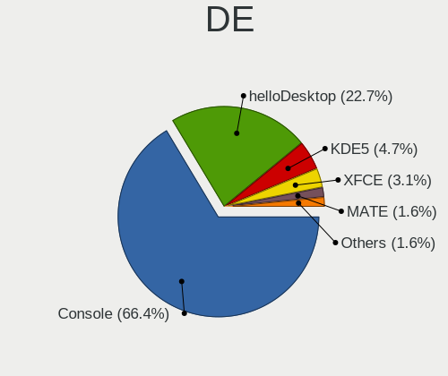

| Name         | Desktops | Percent |
|--------------|----------|---------|
| Console      | 70       | 68.63%  |
| helloDesktop | 22       | 21.57%  |
| KDE5         | 5        | 4.9%    |
| XFCE         | 2        | 1.96%   |
| MATE         | 1        | 0.98%   |
| i3           | 1        | 0.98%   |
| GNUstep      | 1        | 0.98%   |

Display Server
--------------

X11 or Wayland

| Name    | Desktops | Percent |
|---------|----------|---------|
| Console | 72       | 71.29%  |
| X11     | 29       | 28.71%  |

Display Manager
---------------

SDDM, LightDM, etc.

| Name    | Desktops | Percent |
|---------|----------|---------|
| Console | 72       | 70.59%  |
| SLiM    | 22       | 21.57%  |
| SDDM    | 6        | 5.88%   |
| LightDM | 2        | 1.96%   |

OS Lang
-------

Language

| Lang    | Desktops | Percent |
|---------|----------|---------|
| Unknown | 66       | 64.71%  |
| en_US   | 18       | 17.65%  |
| C       | 10       | 9.8%    |
| zh_CN   | 6        | 5.88%   |
| fr_FR   | 2        | 1.96%   |

Boot Mode
---------

EFI or BIOS

| Mode | Desktops | Percent |
|------|----------|---------|
| EFI  | 87       | 86.14%  |
| BIOS | 14       | 13.86%  |

Filesystem
----------

Type of filesystem

| Type   | Desktops | Percent |
|--------|----------|---------|
| Ufs    | 49       | 47.57%  |
| Zfs    | 45       | 43.69%  |
| Cd9660 | 8        | 7.77%   |
| Ffs    | 1        | 0.97%   |

Part. scheme
------------

Scheme of partitioning

| Type    | Desktops | Percent |
|---------|----------|---------|
| GPT     | 92       | 91.09%  |
| MBR     | 6        | 5.94%   |
| Unknown | 3        | 2.97%   |

Board
-----

Vendor
------

Motherboard manufacturer

| Name                                       | Desktops | Percent |
|--------------------------------------------|----------|---------|
| Unknown                                    | 25       | 24.75%  |
| Dell                                       | 8        | 7.92%   |
| Lenovo                                     | 7        | 6.93%   |
| MSI                                        | 5        | 4.95%   |
| Gigabyte Technology                        | 5        | 4.95%   |
| ASUSTek Computer                           | 5        | 4.95%   |
| Intel                                      | 4        | 3.96%   |
| Techvision                                 | 3        | 2.97%   |
| ShenZhen MinWin Technology                 | 3        | 2.97%   |
| Hewlett-Packard                            | 3        | 2.97%   |
| ASRock                                     | 3        | 2.97%   |
| PAIQ                                       | 2        | 1.98%   |
| OEM                                        | 2        | 1.98%   |
| NEC Computers                              | 2        | 1.98%   |
| Colorful Technology                        | 2        | 1.98%   |
| YENTEK                                     | 1        | 0.99%   |
| YANYU                                      | 1        | 0.99%   |
| YanRay Technology                          | 1        | 0.99%   |
| WlanCN                                     | 1        | 0.99%   |
| TOPFEEL                                    | 1        | 0.99%   |
| Supermicro                                 | 1        | 0.99%   |
| Silicom                                    | 1        | 0.99%   |
| Protectli                                  | 1        | 0.99%   |
| ONDA                                       | 1        | 0.99%   |
| NORCO                                      | 1        | 0.99%   |
| MECHREVO                                   | 1        | 0.99%   |
| MAXSUN                                     | 1        | 0.99%   |
| GuoGuang                                   | 1        | 0.99%   |
| Google                                     | 1        | 0.99%   |
| DS                                         | 1        | 0.99%   |
| Colorful YuGong Technology And Development | 1        | 0.99%   |
| CNCTION-IAF-E3845                          | 1        | 0.99%   |
| Centerm                                    | 1        | 0.99%   |
| BROUNION                                   | 1        | 0.99%   |
| Biostar                                    | 1        | 0.99%   |
| AZW                                        | 1        | 0.99%   |
| AMD                                        | 1        | 0.99%   |

Model
-----

Motherboard model

| Name                               | Desktops | Percent |
|------------------------------------|----------|---------|
| Unknown                            | 27       | 26.73%  |
| Techvision TVI7309X                | 3        | 2.97%   |
| ShenZhen MinWin MW-NANO-APL-4L     | 3        | 2.97%   |
| PAIQ EC3-BT19D4L                   | 2        | 1.98%   |
| Intel MAHOBAY                      | 2        | 1.98%   |
| YENTEK ITX-B75R1                   | 1        | 0.99%   |
| YANYU ITX-N29 VER:1.5 baytrail     | 1        | 0.99%   |
| YanRay B1904                       | 1        | 0.99%   |
| WlanCN 6000 Series                 | 1        | 0.99%   |
| TOPFEEL Topone series              | 1        | 0.99%   |
| Supermicro NS-EI36S                | 1        | 0.99%   |
| Silicom 6200                       | 1        | 0.99%   |
| Protectli FW6                      | 1        | 0.99%   |
| ONDA N78G5D3 Ver:5.00              | 1        | 0.99%   |
| OEM ITX-SC3                        | 1        | 0.99%   |
| OEM B85 JHS359                     | 1        | 0.99%   |
| NORCO HB133                        | 1        | 0.99%   |
| NEC Computers SHARKBAY             | 1        | 0.99%   |
| NEC Computers PC-MC32MBZCEECH      | 1        | 0.99%   |
| MSI MS-7C82                        | 1        | 0.99%   |
| MSI MS-7C37                        | 1        | 0.99%   |
| MSI MS-7B89                        | 1        | 0.99%   |
| MSI MS-7A38                        | 1        | 0.99%   |
| MSI MS-7972                        | 1        | 0.99%   |
| MAXSUN MS-H110D4L FS M.2           | 1        | 0.99%   |
| Lenovo YangTianW2090v-00           | 1        | 0.99%   |
| Lenovo YangTianM6880N              | 1        | 0.99%   |
| Lenovo YangTianA8800T              | 1        | 0.99%   |
| Lenovo ThinkCentre M93p 10AA0020CN | 1        | 0.99%   |
| Lenovo SHARKBAY SDK0A46860 WIN     | 1        | 0.99%   |
| Lenovo SHARKBAY 0B98401 WIN        | 1        | 0.99%   |
| Lenovo IdeaCentre B545 10100       | 1        | 0.99%   |
| Intel X58                          | 1        | 0.99%   |
| Intel SKYBAY                       | 1        | 0.99%   |
| HP t620 PLUS Quad Core TC          | 1        | 0.99%   |
| HP Slim Desktop S01-pF1xxx         | 1        | 0.99%   |
| HP Compaq Elite 8300 USDT          | 1        | 0.99%   |
| GuoGuang IC2M1028V-6               | 1        | 0.99%   |
| Google Guado                       | 1        | 0.99%   |
| Gigabyte M52L-S3P                  | 1        | 0.99%   |

Model Family
------------

Motherboard model prefix

| Name                           | Desktops | Percent |
|--------------------------------|----------|---------|
| Unknown                        | 27       | 26.73%  |
| Techvision TVI7309X            | 3        | 2.97%   |
| ShenZhen MinWin MW-NANO-APL-4L | 3        | 2.97%   |
| Dell Precision                 | 3        | 2.97%   |
| Dell OptiPlex                  | 3        | 2.97%   |
| ASUS TUF                       | 3        | 2.97%   |
| PAIQ EC3-BT19D4L               | 2        | 1.98%   |
| Lenovo SHARKBAY                | 2        | 1.98%   |
| Intel MAHOBAY                  | 2        | 1.98%   |
| YENTEK ITX-B75R1               | 1        | 0.99%   |
| YANYU ITX-N29                  | 1        | 0.99%   |
| YanRay B1904                   | 1        | 0.99%   |
| WlanCN 6000                    | 1        | 0.99%   |
| TOPFEEL Topone                 | 1        | 0.99%   |
| Supermicro NS-EI36S            | 1        | 0.99%   |
| Silicom 6200                   | 1        | 0.99%   |
| Protectli FW6                  | 1        | 0.99%   |
| ONDA N78G5D3                   | 1        | 0.99%   |
| OEM ITX-SC3                    | 1        | 0.99%   |
| OEM B85                        | 1        | 0.99%   |
| NORCO HB133                    | 1        | 0.99%   |
| NEC Computers SHARKBAY         | 1        | 0.99%   |
| NEC Computers PC-MC32MBZCEECH  | 1        | 0.99%   |
| MSI MS-7C82                    | 1        | 0.99%   |
| MSI MS-7C37                    | 1        | 0.99%   |
| MSI MS-7B89                    | 1        | 0.99%   |
| MSI MS-7A38                    | 1        | 0.99%   |
| MSI MS-7972                    | 1        | 0.99%   |
| MAXSUN MS-H110D4L              | 1        | 0.99%   |
| Lenovo YangTianW2090v-00       | 1        | 0.99%   |
| Lenovo YangTianM6880N          | 1        | 0.99%   |
| Lenovo YangTianA8800T          | 1        | 0.99%   |
| Lenovo ThinkCentre             | 1        | 0.99%   |
| Lenovo IdeaCentre              | 1        | 0.99%   |
| Intel X58                      | 1        | 0.99%   |
| Intel SKYBAY                   | 1        | 0.99%   |
| HP t620                        | 1        | 0.99%   |
| HP Slim                        | 1        | 0.99%   |
| HP Compaq                      | 1        | 0.99%   |
| GuoGuang IC2M1028V-6           | 1        | 0.99%   |

MFG Year
--------

Motherboard manufacture year

| Year    | Desktops | Percent |
|---------|----------|---------|
| 2021    | 12       | 11.88%  |
| 2022    | 10       | 9.9%    |
| 2019    | 10       | 9.9%    |
| 2023    | 9        | 8.91%   |
| 2020    | 8        | 7.92%   |
| 2018    | 8        | 7.92%   |
| 2017    | 8        | 7.92%   |
| 2012    | 7        | 6.93%   |
| 2014    | 5        | 4.95%   |
| 2013    | 5        | 4.95%   |
| 2016    | 4        | 3.96%   |
| 2015    | 4        | 3.96%   |
| 2010    | 3        | 2.97%   |
| 2011    | 2        | 1.98%   |
| 2008    | 2        | 1.98%   |
| Unknown | 2        | 1.98%   |
| 2024    | 1        | 0.99%   |
| 2007    | 1        | 0.99%   |

Form Factor
-----------

Physical design of the computer

| Name    | Desktops | Percent |
|---------|----------|---------|
| Desktop | 101      | 100%    |

Coreboot
--------

Have coreboot on board

| Used | Desktops | Percent |
|------|----------|---------|
| No   | 99       | 98.02%  |
| Yes  | 2        | 1.98%   |

RAM Size
--------

Total RAM memory

| Size in GB  | Desktops | Percent |
|-------------|----------|---------|
| 8.01-16.0   | 38       | 36.89%  |
| 4.01-8.0    | 21       | 20.39%  |
| 16.01-24.0  | 19       | 18.45%  |
| 2.01-3.0    | 11       | 10.68%  |
| 32.01-64.0  | 8        | 7.77%   |
| 24.01-32.0  | 2        | 1.94%   |
| 0.51-1.0    | 2        | 1.94%   |
| 64.01-256.0 | 1        | 0.97%   |
| 1.01-2.0    | 1        | 0.97%   |

RAM Used
--------

Used RAM memory

| Used GB  | Desktops | Percent |
|----------|----------|---------|
| 0.01-0.5 | 58       | 56.86%  |
| 0.51-1.0 | 31       | 30.39%  |
| 1.01-2.0 | 8        | 7.84%   |
| 2.01-3.0 | 3        | 2.94%   |
| 3.01-4.0 | 1        | 0.98%   |
| 0        | 1        | 0.98%   |

Total Drives
------------

Number of drives on board

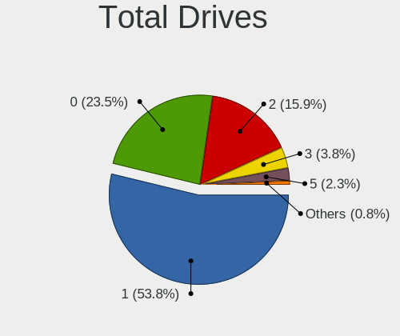

| Drives | Desktops | Percent |
|--------|----------|---------|
| 1      | 64       | 60.95%  |
| 0      | 18       | 17.14%  |
| 2      | 15       | 14.29%  |
| 3      | 4        | 3.81%   |
| 5      | 3        | 2.86%   |
| 4      | 1        | 0.95%   |

Has CD-ROM
----------

Has CD-ROM on board

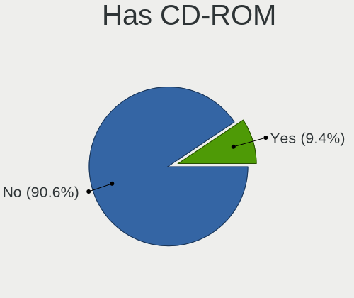

| Presented | Desktops | Percent |
|-----------|----------|---------|
| No        | 90       | 88.24%  |
| Yes       | 12       | 11.76%  |

Has Ethernet
------------

Has Ethernet on board

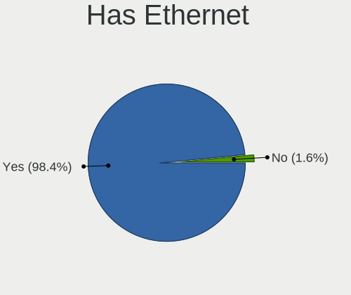

| Presented | Desktops | Percent |
|-----------|----------|---------|
| Yes       | 99       | 98.02%  |
| No        | 2        | 1.98%   |

Has WiFi
--------

Has WiFi module

| Presented | Desktops | Percent |
|-----------|----------|---------|
| No        | 82       | 81.19%  |
| Yes       | 19       | 18.81%  |

Has Bluetooth
-------------

Has Bluetooth module

| Presented | Desktops | Percent |
|-----------|----------|---------|
| No        | 87       | 86.14%  |
| Yes       | 14       | 13.86%  |

Location
--------

Country
-------

Geographic location (country)

| Country | Desktops | Percent |
|---------|----------|---------|
| China   | 101      | 100%    |

City
----

Geographic location (city)

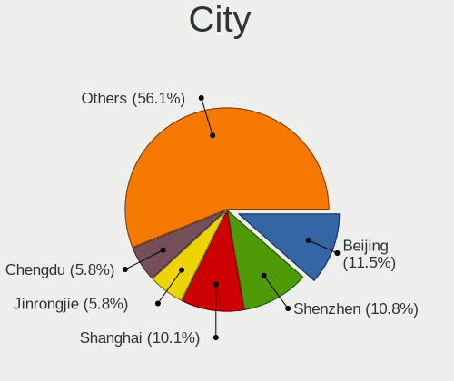

| City             | Desktops | Percent |
|------------------|----------|---------|
| Shenzhen         | 13       | 11.61%  |
| Beijing          | 11       | 9.82%   |
| Shanghai         | 10       | 8.93%   |
| Zhengzhou        | 7        | 6.25%   |
| Chengdu          | 7        | 6.25%   |
| Jinrongjie       | 6        | 5.36%   |
| Guangzhou        | 5        | 4.46%   |
| Xi'an            | 4        | 3.57%   |
| Suzhou           | 3        | 2.68%   |
| Chongqing        | 3        | 2.68%   |
| Yancheng         | 2        | 1.79%   |
| Shenyang         | 2        | 1.79%   |
| Qingdao          | 2        | 1.79%   |
| Ningbo           | 2        | 1.79%   |
| Hangzhou         | 2        | 1.79%   |
| Zhongshan        | 1        | 0.89%   |
| Zhangjiakou      | 1        | 0.89%   |
| Xicheng District | 1        | 0.89%   |
| Xiamen           | 1        | 0.89%   |
| Wuhan            | 1        | 0.89%   |
| Wenzhou          | 1        | 0.89%   |
| Tongshan         | 1        | 0.89%   |
| Tieling          | 1        | 0.89%   |
| Songjiang        | 1        | 0.89%   |
| Shiqiao          | 1        | 0.89%   |
| Shijiazhuang     | 1        | 0.89%   |
| Shahekou         | 1        | 0.89%   |
| Qinnan           | 1        | 0.89%   |
| Qingpu           | 1        | 0.89%   |
| Putuo            | 1        | 0.89%   |
| Nanjing          | 1        | 0.89%   |
| Liuzhou          | 1        | 0.89%   |
| Kunming          | 1        | 0.89%   |
| Kuiju            | 1        | 0.89%   |
| Jinhua           | 1        | 0.89%   |
| Jiangbei         | 1        | 0.89%   |
| Huangshi         | 1        | 0.89%   |
| Hongkou          | 1        | 0.89%   |
| Hechi            | 1        | 0.89%   |
| Guli             | 1        | 0.89%   |

Drives
------

Drive Vendor
------------

Hard drive vendors

| Vendor              | Desktops | Drives | Percent |
|---------------------|----------|--------|---------|
| WDC                 | 15       | 30     | 13.51%  |
| Seagate             | 15       | 21     | 13.51%  |
| Samsung Electronics | 15       | 25     | 13.51%  |
| Intel               | 11       | 11     | 9.91%   |
| Toshiba             | 7        | 7      | 6.31%   |
| SanDisk             | 7        | 9      | 6.31%   |
| China               | 4        | 6      | 3.6%    |
| Transcend           | 3        | 4      | 2.7%    |
| Kingston            | 3        | 4      | 2.7%    |
| Hitachi             | 3        | 3      | 2.7%    |
| KIOXIA-EXCERIA      | 2        | 3      | 1.8%    |
| HGST                | 2        | 7      | 1.8%    |
| FORESEE             | 2        | 2      | 1.8%    |
| tigo                | 1        | 1      | 0.9%    |
| SK hynix            | 1        | 1      | 0.9%    |
| Ramsta              | 1        | 1      | 0.9%    |
| Plextor             | 1        | 2      | 0.9%    |
| ORICO               | 1        | 1      | 0.9%    |
| NVMe                | 1        | 2      | 0.9%    |
| Netac               | 1        | 1      | 0.9%    |
| Micron Technology   | 1        | 2      | 0.9%    |
| LITEONIT            | 1        | 1      | 0.9%    |
| Lenovo              | 1        | 1      | 0.9%    |
| KingSpec            | 1        | 1      | 0.9%    |
| Hewlett-Packard     | 1        | 1      | 0.9%    |
| GLOWAY              | 1        | 1      | 0.9%    |
| FREEBSD             | 1        | 1      | 0.9%    |
| Faspeed             | 1        | 1      | 0.9%    |
| Crucial             | 1        | 2      | 0.9%    |
| Colorful            | 1        | 1      | 0.9%    |
| Centerm             | 1        | 1      | 0.9%    |
| BORY                | 1        | 2      | 0.9%    |
| BIWIN               | 1        | 3      | 0.9%    |
| Apacer              | 1        | 1      | 0.9%    |
| A-DATA Technology   | 1        | 2      | 0.9%    |

Drive Model
-----------

Hard drive models

| Model                             | Desktops | Percent |
|-----------------------------------|----------|---------|
| Seagate ST500DM002-1BD142 500GB   | 3        | 2.36%   |
| Seagate ST1000DM003-1SB102 1TB    | 3        | 2.36%   |
| Intel SSDSA2SH032G1GN 32GB        | 2        | 1.57%   |
| WDC WUH721414ALE6L4 14TB          | 1        | 0.79%   |
| WDC WDS500G2B0C-00PXH0 500GB      | 1        | 0.79%   |
| WDC WDS500G1B0C-00S6U0 500GB      | 1        | 0.79%   |
| WDC WDS100T2B0C-00PXH0 1TB        | 1        | 0.79%   |
| WDC WD7500LPCX-00KHST0 752GB      | 1        | 0.79%   |
| WDC WD5000LPCX-24C6HT0 500GB      | 1        | 0.79%   |
| WDC WD5000LPCX-00VHAT0 500GB      | 1        | 0.79%   |
| WDC WD5000AAKX-083CA0 500GB       | 1        | 0.79%   |
| WDC WD40EZAZ-00ZGHB0 4TB          | 1        | 0.79%   |
| WDC WD4005FZBX-00K5WB0 4TB        | 1        | 0.79%   |
| WDC WD3200AAJS-00L7A0 320GB       | 1        | 0.79%   |
| WDC WD30EZRZ-00WN9B0 3TB          | 1        | 0.79%   |
| WDC WD23PURZ-85C5HY0 2TB          | 1        | 0.79%   |
| WDC WD20SPZX-22UA7T0 2TB          | 1        | 0.79%   |
| WDC WD2003FYYS-007BA0 2TB         | 1        | 0.79%   |
| WDC WD1600BEVT-22ZCT0 160GB       | 1        | 0.79%   |
| WDC WD1600AAJS-22L7A0 160GB       | 1        | 0.79%   |
| WDC WD120EMAZ-11BLFA0 12TB        | 1        | 0.79%   |
| WDC WD10SPZX-00Z10T0 1TB          | 1        | 0.79%   |
| WDC WD10SPCX-00KHST0 1TB          | 1        | 0.79%   |
| WDC WD10EZEX-22MFCA0 1TB          | 1        | 0.79%   |
| WDC WD10EZEX-21WN4A0 1TB          | 1        | 0.79%   |
| WDC WD10EJRX-89N74Y0 1TB          | 1        | 0.79%   |
| WDC WD10EARS-003BB1 1TB           | 1        | 0.79%   |
| Transcend TS64GMSA230S 64GB       | 1        | 0.79%   |
| Transcend TS4GCF150 4GB           | 1        | 0.79%   |
| Transcend TS128GMTS400 128GB      | 1        | 0.79%   |
| Toshiba THNSFJ256GMCT 256GB       | 1        | 0.79%   |
| Toshiba MQ04ABF100 1TB            | 1        | 0.79%   |
| Toshiba MG06ACA10TE 10TB          | 1        | 0.79%   |
| Toshiba KBG40ZMT128G MEMORY 128GB | 1        | 0.79%   |
| Toshiba DT01ACA100 1TB            | 1        | 0.79%   |
| Toshiba DT01ACA050 500GB          | 1        | 0.79%   |
| Toshiba A100 240GB                | 1        | 0.79%   |
| tigo SSD 480GB                    | 1        | 0.79%   |
| SK hynix HFS064G3AMNB-2220A 64GB  | 1        | 0.79%   |
| Seagate ST940110A 40GB            | 1        | 0.79%   |

HDD Vendor
----------

Hard disk drive vendors

| Vendor              | Desktops | Drives | Percent |
|---------------------|----------|--------|---------|
| Seagate             | 15       | 21     | 37.5%   |
| WDC                 | 14       | 27     | 35%     |
| Toshiba             | 4        | 4      | 10%     |
| Hitachi             | 3        | 3      | 7.5%    |
| HGST                | 2        | 7      | 5%      |
| Samsung Electronics | 1        | 1      | 2.5%    |
| Hewlett-Packard     | 1        | 1      | 2.5%    |

SSD Vendor
----------

Solid state drive vendors

| Vendor              | Desktops | Drives | Percent |
|---------------------|----------|--------|---------|
| Samsung Electronics | 8        | 9      | 14.04%  |
| Intel               | 8        | 8      | 14.04%  |
| SanDisk             | 7        | 9      | 12.28%  |
| China               | 4        | 6      | 7.02%   |
| Transcend           | 3        | 4      | 5.26%   |
| Kingston            | 3        | 4      | 5.26%   |
| Toshiba             | 2        | 2      | 3.51%   |
| KIOXIA-EXCERIA      | 2        | 3      | 3.51%   |
| FORESEE             | 2        | 2      | 3.51%   |
| tigo                | 1        | 1      | 1.75%   |
| SK hynix            | 1        | 1      | 1.75%   |
| Ramsta              | 1        | 1      | 1.75%   |
| ORICO               | 1        | 1      | 1.75%   |
| NVMe                | 1        | 1      | 1.75%   |
| Netac               | 1        | 1      | 1.75%   |
| Micron Technology   | 1        | 2      | 1.75%   |
| LITEONIT            | 1        | 1      | 1.75%   |
| Lenovo              | 1        | 1      | 1.75%   |
| KingSpec            | 1        | 1      | 1.75%   |
| FREEBSD             | 1        | 1      | 1.75%   |
| Faspeed             | 1        | 1      | 1.75%   |
| Colorful            | 1        | 1      | 1.75%   |
| Centerm             | 1        | 1      | 1.75%   |
| BORY                | 1        | 2      | 1.75%   |
| BIWIN               | 1        | 3      | 1.75%   |
| Apacer              | 1        | 1      | 1.75%   |
| A-DATA Technology   | 1        | 2      | 1.75%   |

Drive Kind
----------

HDD or SSD

| Kind | Desktops | Drives | Percent |
|------|----------|--------|---------|
| SSD  | 53       | 70     | 50%     |
| HDD  | 34       | 64     | 32.08%  |
| NVMe | 19       | 28     | 17.92%  |

Drive Connector
---------------

SATA, SAS, NVMe, etc.

| Type | Desktops | Drives | Percent |
|------|----------|--------|---------|
| SATA | 76       | 134    | 80%     |
| NVMe | 19       | 28     | 20%     |

Drive Size
----------

Size of hard drive

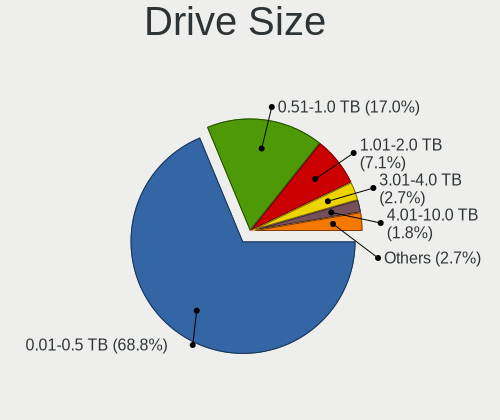

| Size in TB | Desktops | Drives | Percent |
|------------|----------|--------|---------|
| 0.01-0.5   | 66       | 94     | 68.75%  |
| 0.51-1.0   | 16       | 19     | 16.67%  |
| 1.01-2.0   | 7        | 8      | 7.29%   |
| 3.01-4.0   | 2        | 5      | 2.08%   |
| 2.01-3.0   | 2        | 3      | 2.08%   |
| 4.01-10.0  | 2        | 3      | 2.08%   |
| 10.01-20.0 | 1        | 2      | 1.04%   |

Space Total
-----------

Amount of disk space available on the file system

| Size in GB | Desktops | Percent |
|------------|----------|---------|
| 101-250    | 31       | 29.52%  |
| 1-20       | 27       | 25.71%  |
| 251-500    | 14       | 13.33%  |
| 21-50      | 13       | 12.38%  |
| 51-100     | 11       | 10.48%  |
| 501-1000   | 5        | 4.76%   |
| 1001-2000  | 4        | 3.81%   |

Space Used
----------

Amount of used disk space

| Used GB | Desktops | Percent |
|---------|----------|---------|
| 1-20    | 92       | 89.32%  |
| 21-50   | 7        | 6.8%    |
| 51-100  | 3        | 2.91%   |
| 101-250 | 1        | 0.97%   |

Malfunc. Drives
---------------

Drive models with a malfunction

| Model                             | Desktops | Drives | Percent |
|-----------------------------------|----------|--------|---------|
| WDC WD5000AAKX-083CA0 500GB       | 1        | 1      | 5.88%   |
| WDC WD1600AAJS-22L7A0 160GB       | 1        | 1      | 5.88%   |
| WDC WD10EJRX-89N74Y0 1TB          | 1        | 1      | 5.88%   |
| SK hynix HFS064G3AMNB-2220A 64GB  | 1        | 1      | 5.88%   |
| Seagate ST3320418AS 320GB         | 1        | 2      | 5.88%   |
| Seagate ST31500541AS 1.5TB        | 1        | 1      | 5.88%   |
| Seagate ST31000528AS 1TB          | 1        | 1      | 5.88%   |
| Samsung Electronics HM250HI 250GB | 1        | 1      | 5.88%   |
| Intel SSDSA2M120G2GC 120GB        | 1        | 1      | 5.88%   |
| Intel SSDPEKKW256G7 256GB         | 1        | 1      | 5.88%   |
| Hitachi HTS723232A7A364 320GB     | 1        | 1      | 5.88%   |
| HGST HTS725050A7E630 500GB        | 1        | 5      | 5.88%   |
| Colorful SL500 640GB              | 1        | 1      | 5.88%   |
| China XJH-32GB                    | 1        | 1      | 5.88%   |
| Centerm SSD 8GB                   | 1        | 1      | 5.88%   |
| BORY M500 16G                     | 1        | 2      | 5.88%   |
| BIWIN SSD 32GB                    | 1        | 3      | 5.88%   |

Malfunc. Drive Vendor
---------------------

Vendors of faulty drives

| Vendor              | Desktops | Drives | Percent |
|---------------------|----------|--------|---------|
| WDC                 | 3        | 3      | 17.65%  |
| Seagate             | 3        | 4      | 17.65%  |
| Intel               | 2        | 2      | 11.76%  |
| SK hynix            | 1        | 1      | 5.88%   |
| Samsung Electronics | 1        | 1      | 5.88%   |
| Hitachi             | 1        | 1      | 5.88%   |
| HGST                | 1        | 5      | 5.88%   |
| Colorful            | 1        | 1      | 5.88%   |
| China               | 1        | 1      | 5.88%   |
| Centerm             | 1        | 1      | 5.88%   |
| BORY                | 1        | 2      | 5.88%   |
| BIWIN               | 1        | 3      | 5.88%   |

Malfunc. HDD Vendor
-------------------

Vendors of faulty HDD drives

| Vendor              | Desktops | Drives | Percent |
|---------------------|----------|--------|---------|
| WDC                 | 3        | 3      | 33.33%  |
| Seagate             | 3        | 4      | 33.33%  |
| Samsung Electronics | 1        | 1      | 11.11%  |
| Hitachi             | 1        | 1      | 11.11%  |
| HGST                | 1        | 5      | 11.11%  |

Malfunc. Drive Kind
-------------------

Kinds of faulty drives

| Kind | Desktops | Drives | Percent |
|------|----------|--------|---------|
| HDD  | 9        | 14     | 52.94%  |
| SSD  | 7        | 10     | 41.18%  |
| NVMe | 1        | 1      | 5.88%   |

Failed Drives
-------------

Failed drive models

Zero info for selected period =(

Failed Drive Vendor
-------------------

Failed drive vendors

Zero info for selected period =(

Drive Status
------------

Number of failed and malfunc. drives

| Status   | Desktops | Drives | Percent |
|----------|----------|--------|---------|
| Works    | 71       | 133    | 78.02%  |
| Malfunc  | 17       | 25     | 18.68%  |
| Detected | 3        | 4      | 3.3%    |

Storage controller
------------------

Storage Vendor
--------------

Storage controller vendors

| Vendor                       | Desktops | Percent |
|------------------------------|----------|---------|
| Intel                        | 78       | 65%     |
| AMD                          | 15       | 12.5%   |
| Samsung Electronics          | 7        | 5.83%   |
| SanDisk                      | 4        | 3.33%   |
| Nvidia                       | 2        | 1.67%   |
| MAXIO Technology (Hangzhou)  | 2        | 1.67%   |
| KIOXIA                       | 2        | 1.67%   |
| Broadcom / LSI               | 2        | 1.67%   |
| Shenzhen Longsys Electronics | 1        | 0.83%   |
| Micron/Crucial Technology    | 1        | 0.83%   |
| Lite-On Technology           | 1        | 0.83%   |
| JMicron Technology           | 1        | 0.83%   |
| INNOGRIT                     | 1        | 0.83%   |
| Hosin Global Electronics     | 1        | 0.83%   |
| ASMedia Technology           | 1        | 0.83%   |
| Unknown                      | 1        | 0.83%   |

Storage Model
-------------

Storage controller models

| Model                                                                            | Desktops | Percent |
|----------------------------------------------------------------------------------|----------|---------|
| Intel Atom Processor E3800 Series SATA AHCI Controller                           | 10       | 7.04%   |
| AMD FCH SATA Controller [AHCI mode]                                              | 8        | 5.63%   |
| Intel Celeron/Pentium Silver Processor SATA Controller                           | 7        | 4.93%   |
| Intel 8 Series/C220 Series Chipset Family 6-port SATA Controller 1 [AHCI mode]   | 7        | 4.93%   |
| Intel Sunrise Point-LP SATA Controller [AHCI mode]                               | 6        | 4.23%   |
| Intel Q170/Q150/B150/H170/H110/Z170/CM236 Chipset SATA Controller [AHCI Mode]    | 5        | 3.52%   |
| Intel 7 Series/C210 Series Chipset Family 6-port SATA Controller [AHCI mode]     | 5        | 3.52%   |
| Intel Jasper Lake SATA AHCI Controller                                           | 4        | 2.82%   |
| Intel 82801HM/HEM (ICH8M/ICH8M-E) SATA Controller [IDE mode]                     | 4        | 2.82%   |
| Samsung NVMe SSD Controller SM981/PM981/PM983                                    | 3        | 2.11%   |
| Intel Celeron N3350/Pentium N4200/Atom E3900 Series SATA AHCI Controller         | 3        | 2.11%   |
| Intel 82801HM/HEM (ICH8M/ICH8M-E) IDE Controller                                 | 3        | 2.11%   |
| Intel 6 Series/C200 Series Chipset Family 6 port Desktop SATA AHCI Controller    | 3        | 2.11%   |
| AMD SB7x0/SB8x0/SB9x0 IDE Controller                                             | 3        | 2.11%   |
| Unknown                                                                          | 3        | 2.11%   |
| SanDisk Ultra 3D / WD Blue SN550 NVMe SSD                                        | 2        | 1.41%   |
| Samsung NVMe SSD Controller SM961/PM961/SM963                                    | 2        | 1.41%   |
| Nvidia MCP61 SATA Controller                                                     | 2        | 1.41%   |
| Nvidia MCP61 IDE                                                                 | 2        | 1.41%   |
| MAXIO (Hangzhou) NVMe SSD Controller MAP1202 (DRAM-less)                         | 2        | 1.41%   |
| Intel SATA Controller [RAID Mode]                                                | 2        | 1.41%   |
| Intel NM10/ICH7 Family SATA Controller [IDE mode]                                | 2        | 1.41%   |
| Intel NM10/ICH7 Family SATA Controller [AHCI mode]                               | 2        | 1.41%   |
| Intel Comet Lake SATA AHCI Controller                                            | 2        | 1.41%   |
| Intel Cannon Lake PCH SATA AHCI Controller                                       | 2        | 1.41%   |
| Intel Atom/Celeron/Pentium Processor x5-E8000/J3xxx/N3xxx Series SATA Controller | 2        | 1.41%   |
| Intel Atom Processor C3000 Series SATA Controller 1                              | 2        | 1.41%   |
| Intel Atom Processor C3000 Series SATA Controller 0                              | 2        | 1.41%   |
| Intel 82801JI (ICH10 Family) 4 port SATA IDE Controller #1                       | 2        | 1.41%   |
| Intel 400 Series Chipset Family SATA AHCI Controller                             | 2        | 1.41%   |
| Intel 200 Series PCH SATA controller [AHCI mode]                                 | 2        | 1.41%   |
| AMD SB7x0/SB8x0/SB9x0 SATA Controller [IDE mode]                                 | 2        | 1.41%   |
| AMD 400 Series Chipset SATA Controller                                           | 2        | 1.41%   |
| Shenzhen Longsys Lexar NM790 NVME SSD (DRAM-less)                                | 1        | 0.7%    |
| SanDisk WD Blue SN500 / PC SN520 x2 M.2 2280 NVMe SSD                            | 1        | 0.7%    |
| SanDisk Ultra 3D / WD Blue SN570 NVMe SSD (DRAM-less)                            | 1        | 0.7%    |
| SanDisk Extreme Pro / WD Black SN750 / PC SN730 / Red SN700 NVMe SSD             | 1        | 0.7%    |
| Samsung NVMe SSD Controller PM9A1/PM9A3/980PRO                                   | 1        | 0.7%    |
| Samsung NVMe SSD Controller 980 (DRAM-less)                                      | 1        | 0.7%    |
| Micron/Crucial P1 NVMe PCIe SSD[Frampton]                                        | 1        | 0.7%    |

Storage Kind
------------

Kind of storage controller (IDE, SATA, NVMe, SAS, ...)

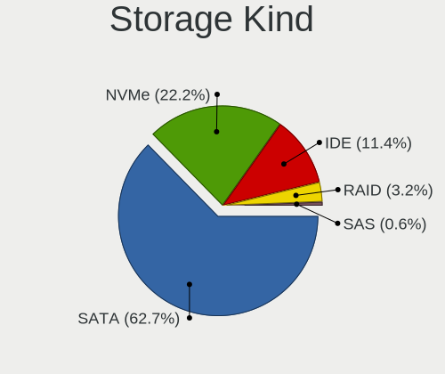

| Kind | Desktops | Percent |
|------|----------|---------|
| SATA | 80       | 65.57%  |
| NVMe | 22       | 18.03%  |
| IDE  | 16       | 13.11%  |
| RAID | 3        | 2.46%   |
| SAS  | 1        | 0.82%   |

Processor
---------

CPU Vendor
----------

Processor vendors

| Vendor  | Desktops | Percent |
|---------|----------|---------|
| Intel   | 80       | 79.21%  |
| AMD     | 18       | 17.82%  |
| ARM     | 2        | 1.98%   |
| Unknown | 1        | 0.99%   |

CPU Model
---------

Processor models

| Model                                       | Desktops | Percent |
|---------------------------------------------|----------|---------|
| Intel Celeron CPU J1900 @ 1.99GHz           | 9        | 8.82%   |
| Intel Celeron J4125 CPU @ 2.00GHz           | 6        | 5.88%   |
| Intel Celeron N5105 @ 2.00GHz               | 5        | 4.9%    |
| Intel Atom CPU D525 @ 1.80GHz               | 4        | 3.92%   |
| Intel Celeron CPU J3455 @ 1.50GHz           | 3        | 2.94%   |
| Intel Pentium CPU G3260T @ 2.90GHz          | 2        | 1.96%   |
| Intel Core i5-3470 CPU @ 3.20GHz            | 2        | 1.96%   |
| Intel Celeron CPU 3865U @ 1.80GHz           | 2        | 1.96%   |
| ARM Cortex-A53 r0p4                         | 2        | 1.96%   |
| Intel Xeon CPU X5647 @ 2.93GHz              | 1        | 0.98%   |
| Intel Xeon CPU E5-2676 v3 @ 2.40GHz         | 1        | 0.98%   |
| Intel Xeon CPU E3-1270 v5 @ 3.60GHz         | 1        | 0.98%   |
| Intel Xeon CPU E3-1230 v3 @ 3.30GHz         | 1        | 0.98%   |
| Intel Xeon CPU E3-1230 V2 @ 3.30GHz         | 1        | 0.98%   |
| Intel Xeon                                  | 1        | 0.98%   |
| Intel Pentium Dual-Core CPU E6700 @ 3.20GHz | 1        | 0.98%   |
| Intel Pentium CPU N3540 @ 2.16GHz           | 1        | 0.98%   |
| Intel Pentium CPU G4560 @ 3.50GHz           | 1        | 0.98%   |
| Intel Pentium CPU G3460T @ 3.00GHz          | 1        | 0.98%   |
| Intel Pentium CPU G2030 @ 3.00GHz           | 1        | 0.98%   |
| Intel Genuine CPU @ 2.40GHz                 | 1        | 0.98%   |
| Intel Genuine CPU 0000 @ 2.50GHz            | 1        | 0.98%   |
| Intel Core i7-7700K CPU @ 4.20GHz           | 1        | 0.98%   |
| Intel Core i7-7500U CPU @ 2.70GHz           | 1        | 0.98%   |
| Intel Core i7-6700 CPU @ 3.40GHz            | 1        | 0.98%   |
| Intel Core i7-4785T CPU @ 2.20GHz           | 1        | 0.98%   |
| Intel Core i7-3770 CPU @ 3.40GHz            | 1        | 0.98%   |
| Intel Core i7-10700 CPU @ 2.90GHz           | 1        | 0.98%   |
| Intel Core i5-9400 CPU @ 2.90GHz            | 1        | 0.98%   |
| Intel Core i5-8600K CPU @ 3.60GHz           | 1        | 0.98%   |
| Intel Core i5-7200U CPU @ 2.50GHz           | 1        | 0.98%   |
| Intel Core i5-6400 CPU @ 2.70GHz            | 1        | 0.98%   |
| Intel Core i5-6360U CPU @ 2.00GHz           | 1        | 0.98%   |
| Intel Core i5-4590T CPU @ 2.00GHz           | 1        | 0.98%   |
| Intel Core i5-2400S CPU @ 2.50GHz           | 1        | 0.98%   |
| Intel Core i5-2320 CPU @ 3.00GHz            | 1        | 0.98%   |
| Intel Core i3-N305                          | 1        | 0.98%   |
| Intel Core i3-8100T CPU @ 3.10GHz           | 1        | 0.98%   |
| Intel Core i3-7100 CPU @ 3.90GHz            | 1        | 0.98%   |
| Intel Core i3-5010U CPU @ 2.10GHz           | 1        | 0.98%   |

CPU Model Family
----------------

Processor model prefix

| Model                   | Desktops | Percent |
|-------------------------|----------|---------|
| Intel Celeron           | 32       | 31.37%  |
| Intel Core i5           | 10       | 9.8%    |
| Intel Atom              | 9        | 8.82%   |
| Intel Xeon              | 6        | 5.88%   |
| Intel Pentium           | 6        | 5.88%   |
| Intel Core i7           | 6        | 5.88%   |
| Intel Core i3           | 6        | 5.88%   |
| AMD Ryzen 5             | 5        | 4.9%    |
| Intel Genuine           | 2        | 1.96%   |
| Intel Core 2 Duo        | 2        | 1.96%   |
| ARM Cortex              | 2        | 1.96%   |
| AMD Ryzen 9             | 2        | 1.96%   |
| AMD Ryzen 7             | 2        | 1.96%   |
| AMD G                   | 2        | 1.96%   |
| AMD Athlon II X4        | 2        | 1.96%   |
| Other                   | 1        | 0.98%   |
| Intel Pentium Dual-Core | 1        | 0.98%   |
| Intel Core 2 Quad       | 1        | 0.98%   |
| AMD Ryzen 3             | 1        | 0.98%   |
| AMD Phenom II X4        | 1        | 0.98%   |
| AMD GX                  | 1        | 0.98%   |
| AMD Athlon X2           | 1        | 0.98%   |
| AMD A10                 | 1        | 0.98%   |

CPU Cores
---------

Number of processor cores

| Number  | Desktops | Percent |
|---------|----------|---------|
| 4       | 54       | 52.94%  |
| 2       | 30       | 29.41%  |
| 8       | 5        | 4.9%    |
| 12      | 4        | 3.92%   |
| 24      | 2        | 1.96%   |
| 16      | 2        | 1.96%   |
| 6       | 2        | 1.96%   |
| Unknown | 2        | 1.96%   |
| 1       | 1        | 0.98%   |

CPU Sockets
-----------

Number of sockets

| Number  | Desktops | Percent |
|---------|----------|---------|
| 1       | 98       | 97.03%  |
| Unknown | 3        | 2.97%   |

CPU Threads
-----------

Threads per core (Hyper-Threading)

| Number  | Desktops | Percent |
|---------|----------|---------|
| 1       | 74       | 73.27%  |
| 2       | 24       | 23.76%  |
| Unknown | 3        | 2.97%   |

CPU Microarch
-------------

Microarchitecture

| Name          | Desktops | Percent |
|---------------|----------|---------|
| Silvermont    | 12       | 11.76%  |
| KabyLake      | 11       | 10.78%  |
| Unknown       | 11       | 10.78%  |
| Haswell       | 9        | 8.82%   |
| IvyBridge     | 7        | 6.86%   |
| Goldmont plus | 7        | 6.86%   |
| Goldmont      | 6        | 5.88%   |
| Bonnell       | 6        | 5.88%   |
| Skylake       | 4        | 3.92%   |
| CometLake     | 4        | 3.92%   |
| Zen           | 3        | 2.94%   |
| Penryn        | 3        | 2.94%   |
| K10           | 3        | 2.94%   |
| Zen+          | 2        | 1.96%   |
| Zen 2         | 2        | 1.96%   |
| Westmere      | 2        | 1.96%   |
| SandyBridge   | 2        | 1.96%   |
| Bobcat        | 2        | 1.96%   |
| Zen 3         | 1        | 0.98%   |
| Piledriver    | 1        | 0.98%   |
| K10 Llano     | 1        | 0.98%   |
| Jaguar        | 1        | 0.98%   |
| Core          | 1        | 0.98%   |
| Broadwell     | 1        | 0.98%   |

Graphics
--------

GPU Vendor
----------

Vendors of graphics cards

| Vendor                     | Desktops | Percent |
|----------------------------|----------|---------|
| Intel                      | 65       | 67.71%  |
| AMD                        | 15       | 15.63%  |
| Nvidia                     | 14       | 14.58%  |
| Matrox Electronics Systems | 1        | 1.04%   |
| ASPEED Technology          | 1        | 1.04%   |

GPU Model
---------

Graphics card models

| Model                                                                                    | Desktops | Percent |
|------------------------------------------------------------------------------------------|----------|---------|
| Intel Atom Processor Z36xxx/Z37xxx Series Graphics & Display                             | 10       | 10.2%   |
| Intel GeminiLake [UHD Graphics 600]                                                      | 7        | 7.14%   |
| Intel Xeon E3-1200 v3/4th Gen Core Processor Integrated Graphics Controller              | 6        | 6.12%   |
| Intel Xeon E3-1200 v2/3rd Gen Core processor Graphics Controller                         | 5        | 5.1%    |
| Intel JasperLake [UHD Graphics]                                                          | 5        | 5.1%    |
| Intel Atom Processor D4xx/D5xx/N4xx/N5xx Integrated Graphics Controller                  | 4        | 4.08%   |
| Nvidia GM206 [GeForce GTX 960]                                                           | 3        | 3.06%   |
| Intel HD Graphics 610                                                                    | 3        | 3.06%   |
| Intel HD Graphics 500                                                                    | 3        | 3.06%   |
| Intel CometLake-S GT2 [UHD Graphics 630]                                                 | 3        | 3.06%   |
| Intel HD Graphics 620                                                                    | 2        | 2.04%   |
| Intel CoffeeLake-S GT2 [UHD Graphics 630]                                                | 2        | 2.04%   |
| Intel Atom/Celeron/Pentium Processor x5-E8000/J3xxx/N3xxx Integrated Graphics Controller | 2        | 2.04%   |
| Intel Atom Processor D2xxx/N2xxx Integrated Graphics Controller                          | 2        | 2.04%   |
| Intel 2nd Generation Core Processor Family Integrated Graphics Controller                | 2        | 2.04%   |
| AMD Raven Ridge [Radeon Vega Series / Radeon Vega Mobile Series]                         | 2        | 2.04%   |
| Nvidia TU116 [GeForce GTX 1660]                                                          | 1        | 1.02%   |
| Nvidia GT218 [GeForce 210]                                                               | 1        | 1.02%   |
| Nvidia GP108 [GeForce GT 1030]                                                           | 1        | 1.02%   |
| Nvidia GP107 [GeForce GTX 1050]                                                          | 1        | 1.02%   |
| Nvidia GP106 [GeForce GTX 1060 5GB]                                                      | 1        | 1.02%   |
| Nvidia GP104 [GeForce GTX 1070]                                                          | 1        | 1.02%   |
| Nvidia GP102 [GeForce GTX 1080 Ti]                                                       | 1        | 1.02%   |
| Nvidia GF108 [GeForce GT 630]                                                            | 1        | 1.02%   |
| Nvidia GF106 [GeForce GTS 450]                                                           | 1        | 1.02%   |
| Nvidia G94 [GeForce 9600 GT]                                                             | 1        | 1.02%   |
| Nvidia C61 [GeForce 7025 / nForce 630a]                                                  | 1        | 1.02%   |
| Matrox Electronics Systems MGA G200eW WPCM450                                            | 1        | 1.02%   |
| Intel IvyBridge GT2 [HD Graphics 4000]                                                   | 1        | 1.02%   |
| Intel Iris Graphics 540                                                                  | 1        | 1.02%   |
| Intel HD Graphics 630                                                                    | 1        | 1.02%   |
| Intel HD Graphics 5500                                                                   | 1        | 1.02%   |
| Intel HD Graphics 530                                                                    | 1        | 1.02%   |
| Intel Comet Lake UHD Graphics                                                            | 1        | 1.02%   |
| Intel Alder Lake-N [UHD Graphics]                                                        | 1        | 1.02%   |
| Intel 82Q35 Express Integrated Graphics Controller                                       | 1        | 1.02%   |
| Intel 82G33/G31 Express Integrated Graphics Controller                                   | 1        | 1.02%   |
| Intel 4 Series Chipset Integrated Graphics Controller                                    | 1        | 1.02%   |
| ASPEED Technology ASPEED Graphics Family                                                 | 1        | 1.02%   |
| AMD Wrestler [Radeon HD 6290]                                                            | 1        | 1.02%   |

GPU Combo
---------

Combinations of graphics cards

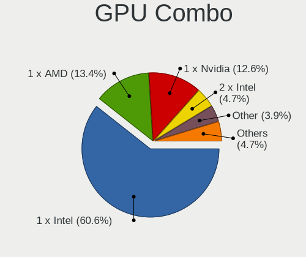

| Name       | Desktops | Percent |
|------------|----------|---------|
| 1 x Intel  | 60       | 59.41%  |
| 1 x Nvidia | 14       | 13.86%  |
| 1 x AMD    | 14       | 13.86%  |
| Other      | 5        | 4.95%   |
| 2 x Intel  | 5        | 4.95%   |
| 2 x AMD    | 1        | 0.99%   |
| 1 x Matrox | 1        | 0.99%   |
| 1 x ASPEED | 1        | 0.99%   |

GPU Driver
----------

Free vs proprietary

| Driver      | Desktops | Percent |
|-------------|----------|---------|
| Free        | 84       | 83.17%  |
| Proprietary | 10       | 9.9%    |
| Unknown     | 7        | 6.93%   |

GPU Memory
----------

Total video memory

| Size in GB | Desktops | Percent |
|------------|----------|---------|
| Unknown    | 89       | 88.12%  |
| 1.01-2.0   | 3        | 2.97%   |
| 7.01-8.0   | 2        | 1.98%   |
| 0.01-0.5   | 2        | 1.98%   |
| 5.01-6.0   | 1        | 0.99%   |
| 4.01-5.0   | 1        | 0.99%   |
| 3.01-4.0   | 1        | 0.99%   |
| 8.01-16.0  | 1        | 0.99%   |
| 0.51-1.0   | 1        | 0.99%   |

Monitor
-------

Monitor Vendor
--------------

Monitor vendors

| Vendor    | Desktops | Percent |
|-----------|----------|---------|
| Dell      | 5        | 23.81%  |
| AOC       | 4        | 19.05%  |
| Lenovo    | 2        | 9.52%   |
| ZL_       | 1        | 4.76%   |
| ViewSonic | 1        | 4.76%   |
| Philips   | 1        | 4.76%   |
| Mi        | 1        | 4.76%   |
| IPS       | 1        | 4.76%   |
| Haier     | 1        | 4.76%   |
| GRR       | 1        | 4.76%   |
| CAN       | 1        | 4.76%   |
| BenQ      | 1        | 4.76%   |
| Acer      | 1        | 4.76%   |

Monitor Model
-------------

Monitor models

| Model                                                         | Desktops | Percent |
|---------------------------------------------------------------|----------|---------|
| ZL_ zhuoyue-HDMI ZL_2716 2560x1440 600x330mm 27.0-inch        | 1        | 4.76%   |
| ViewSonic VX2880-4K-HDU VSCA33A 3840x2160 630x360mm 28.6-inch | 1        | 4.76%   |
| Philips 190V PHL0081 1440x900 400x250mm 18.6-inch             | 1        | 4.76%   |
| Mi Redmi 27 NQ XMIE001 2560x1440 600x330mm 27.0-inch          | 1        | 4.76%   |
| Lenovo LCD Monitor LEN4000 1024x768 250x180mm 12.1-inch       | 1        | 4.76%   |
| Lenovo L197 Wide LEN1152 1440x900 410x260mm 19.1-inch         | 1        | 4.76%   |
| IPS W220A IPS3150 3840x2160 700x390mm 31.5-inch               | 1        | 4.76%   |
| Haier HT-20216B(C) HAI2031 1920x1080 480x270mm 21.7-inch      | 1        | 4.76%   |
| GRR GRC GRR2400 1920x1080 520x310mm 23.8-inch                 | 1        | 4.76%   |
| Dell U2414H DELA0A4 1920x1080 530x300mm 24.0-inch             | 1        | 4.76%   |
| Dell S2240M DELD055 1920x1080 480x270mm 21.7-inch             | 1        | 4.76%   |
| Dell P2419H DELD0DA 1920x1080 530x300mm 24.0-inch             | 1        | 4.76%   |
| Dell P2415Q DELA0C0 3840x2160 530x300mm 24.0-inch             | 1        | 4.76%   |
| Dell E228WFP DELD015 1680x1050 470x300mm 22.0-inch            | 1        | 4.76%   |
| CAN F55C CAN0055 3840x2160 1210x680mm 54.6-inch               | 1        | 4.76%   |
| BenQ FP91G+ BNQ76A6 1280x1024 380x300mm 19.1-inch             | 1        | 4.76%   |
| AOC Q27T1G5 AOC2701 2560x1440 600x340mm 27.2-inch             | 1        | 4.76%   |
| AOC 2778X AOC2778 2560x1440 600x340mm 27.2-inch               | 1        | 4.76%   |
| AOC 2490W1 AOC2490 1920x1080 530x300mm 24.0-inch              | 1        | 4.76%   |
| AOC 2479W AOC2479 1920x1080 520x290mm 23.4-inch               | 1        | 4.76%   |
| Acer G195WV ACR0263 1440x900 410x260mm 19.1-inch              | 1        | 4.76%   |

Monitor Resolution
------------------

Monitor screen resolution

| Resolution         | Desktops | Percent |
|--------------------|----------|---------|
| 1920x1080 (FHD)    | 8        | 38.1%   |
| 3840x2160 (4K)     | 4        | 19.05%  |
| 2560x1440 (QHD)    | 4        | 19.05%  |
| 1440x900 (WXGA+)   | 3        | 14.29%  |
| 1680x1050 (WSXGA+) | 1        | 4.76%   |
| 1280x1024 (SXGA)   | 1        | 4.76%   |

Monitor Diagonal
----------------

Diagonal size in inches

| Inches | Desktops | Percent |
|--------|----------|---------|
| 27     | 4        | 19.05%  |
| 24     | 4        | 19.05%  |
| 23     | 3        | 14.29%  |
| 19     | 3        | 14.29%  |
| 21     | 2        | 9.52%   |
| 54     | 1        | 4.76%   |
| 31     | 1        | 4.76%   |
| 28     | 1        | 4.76%   |
| 22     | 1        | 4.76%   |
| 18     | 1        | 4.76%   |

Monitor Width
-------------

Physical width

| Width in mm | Desktops | Percent |
|-------------|----------|---------|
| 501-600     | 11       | 52.38%  |
| 401-500     | 5        | 23.81%  |
| 601-700     | 2        | 9.52%   |
| 351-400     | 2        | 9.52%   |
| 1001-1500   | 1        | 4.76%   |

Aspect Ratio
------------

Proportional relationship between the width and the height

| Ratio | Desktops | Percent |
|-------|----------|---------|
| 16/9  | 16       | 76.19%  |
| 16/10 | 4        | 19.05%  |
| 5/4   | 1        | 4.76%   |

Monitor Area
------------

Area in inch

| Area in inch | Desktops | Percent |
|----------------|----------|---------|
| 201-250        | 10       | 47.62%  |
| 301-350        | 4        | 19.05%  |
| 151-200        | 4        | 19.05%  |
| 351-500        | 2        | 9.52%   |
| More than 1000 | 1        | 4.76%   |

Pixel Density
-------------

Pixels per inch

| Density | Desktops | Percent |
|---------|----------|---------|
| 51-100  | 13       | 61.9%   |
| 101-120 | 5        | 23.81%  |
| 121-160 | 2        | 9.52%   |
| 161-240 | 1        | 4.76%   |

Multiple Monitors
-----------------

Total monitors connected

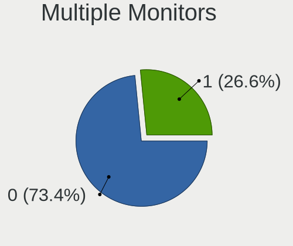

| Total | Desktops | Percent |
|-------|----------|---------|
| 0     | 79       | 77.45%  |
| 1     | 23       | 22.55%  |

Network
-------

Net Controller Vendor
---------------------

Controller vendors

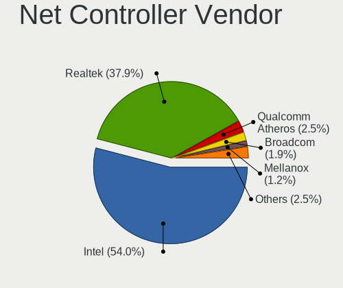

| Vendor                   | Desktops | Percent |
|--------------------------|----------|---------|
| Intel                    | 68       | 53.97%  |
| Realtek Semiconductor    | 49       | 38.89%  |
| Qualcomm Atheros         | 3        | 2.38%   |
| Broadcom                 | 2        | 1.59%   |
| Ralink Technology        | 1        | 0.79%   |
| Mellanox Technologies    | 1        | 0.79%   |
| Marvell Technology Group | 1        | 0.79%   |
| Apple                    | 1        | 0.79%   |

Net Controller Model
--------------------

Controller models

| Model                                                                  | Desktops | Percent |
|------------------------------------------------------------------------|----------|---------|
| Realtek RTL8111/8168/8211/8411 PCI Express Gigabit Ethernet Controller | 39       | 26.53%  |
| Intel I211 Gigabit Network Connection                                  | 16       | 10.88%  |
| Intel Ethernet Controller I226-V                                       | 7        | 4.76%   |
| Intel Ethernet Controller I225-V                                       | 7        | 4.76%   |
| Realtek RTL8125 2.5GbE Controller                                      | 5        | 3.4%    |
| Intel 82583V Gigabit Network Connection                                | 5        | 3.4%    |
| Intel I350 Gigabit Network Connection                                  | 4        | 2.72%   |
| Intel Ethernet Connection I217-LM                                      | 4        | 2.72%   |
| Realtek RTL810xE PCI Express Fast Ethernet controller                  | 3        | 2.04%   |
| Intel I210 Gigabit Network Connection                                  | 3        | 2.04%   |
| Intel 82579LM Gigabit Network Connection (Lewisville)                  | 3        | 2.04%   |
| Intel 82574L Gigabit Network Connection                                | 3        | 2.04%   |
| Intel Wireless 7260                                                    | 2        | 1.36%   |
| Intel Wireless 3165                                                    | 2        | 1.36%   |
| Intel Wi-Fi 6 AX200                                                    | 2        | 1.36%   |
| Intel Ethernet Connection X553 1GbE                                    | 2        | 1.36%   |
| Intel Ethernet Connection X553 10 GbE SFP+                             | 2        | 1.36%   |
| Intel Ethernet Connection I217-V                                       | 2        | 1.36%   |
| Intel 82576 Gigabit Network Connection                                 | 2        | 1.36%   |
| Intel 82575EB Gigabit Network Connection                               | 2        | 1.36%   |
| Realtek RTL8821CE 802.11ac PCIe Wireless Network Adapter               | 1        | 0.68%   |
| Realtek RTL8191SU 802.11n WLAN Adapter                                 | 1        | 0.68%   |
| Realtek RTL8188EE Wireless Network Adapter                             | 1        | 0.68%   |
| Realtek RTL8188CUS 802.11n WLAN Adapter                                | 1        | 0.68%   |
| Realtek RTL8188CE 802.11b/g/n WiFi Adapter                             | 1        | 0.68%   |
| Realtek RTL8169 PCI Gigabit Ethernet Controller                        | 1        | 0.68%   |
| Realtek RTL8111/8168/8411 PCI Express Gigabit Ethernet Controller      | 1        | 0.68%   |
| Ralink RT5370 Wireless Adapter                                         | 1        | 0.68%   |
| Qualcomm Atheros QCA986x/988x 802.11ac Wireless Network Adapter        | 1        | 0.68%   |
| Qualcomm Atheros QCA9565 / AR9565 Wireless Network Adapter             | 1        | 0.68%   |
| Qualcomm Atheros AR928X Wireless Network Adapter (PCI-Express)         | 1        | 0.68%   |
| Mellanox MT27500 Family [ConnectX-3]                                   | 1        | 0.68%   |
| Marvell Group 88E8056 PCI-E Gigabit Ethernet Controller                | 1        | 0.68%   |
| Intel Wireless 3160                                                    | 1        | 0.68%   |
| Intel Wi-Fi 6E(802.11ax) AX210/AX1675* 2x2 [Typhoon Peak]              | 1        | 0.68%   |
| Intel Wi-Fi 5(802.11ac) Wireless-AC 9x6x [Thunder Peak]                | 1        | 0.68%   |
| Intel NM10/ICH7 Family LAN Controller                                  | 1        | 0.68%   |
| Intel Ethernet Connection (7) I219-V                                   | 1        | 0.68%   |
| Intel Ethernet Connection (7) I219-LM                                  | 1        | 0.68%   |
| Intel Ethernet Connection (2) I219-V                                   | 1        | 0.68%   |

Wireless Vendor
---------------

Wireless vendors

| Vendor                | Desktops | Percent |
|-----------------------|----------|---------|
| Intel                 | 11       | 52.38%  |
| Realtek Semiconductor | 5        | 23.81%  |
| Qualcomm Atheros      | 3        | 14.29%  |
| Ralink Technology     | 1        | 4.76%   |
| Broadcom              | 1        | 4.76%   |

Wireless Model
--------------

Wireless models

| Model                                                           | Desktops | Percent |
|-----------------------------------------------------------------|----------|---------|
| Intel Wireless 7260                                             | 2        | 9.52%   |
| Intel Wireless 3165                                             | 2        | 9.52%   |
| Intel Wi-Fi 6 AX200                                             | 2        | 9.52%   |
| Realtek RTL8821CE 802.11ac PCIe Wireless Network Adapter        | 1        | 4.76%   |
| Realtek RTL8191SU 802.11n WLAN Adapter                          | 1        | 4.76%   |
| Realtek RTL8188EE Wireless Network Adapter                      | 1        | 4.76%   |
| Realtek RTL8188CUS 802.11n WLAN Adapter                         | 1        | 4.76%   |
| Realtek RTL8188CE 802.11b/g/n WiFi Adapter                      | 1        | 4.76%   |
| Ralink RT5370 Wireless Adapter                                  | 1        | 4.76%   |
| Qualcomm Atheros QCA986x/988x 802.11ac Wireless Network Adapter | 1        | 4.76%   |
| Qualcomm Atheros QCA9565 / AR9565 Wireless Network Adapter      | 1        | 4.76%   |
| Qualcomm Atheros AR928X Wireless Network Adapter (PCI-Express)  | 1        | 4.76%   |
| Intel Wireless 3160                                             | 1        | 4.76%   |
| Intel Wi-Fi 6E(802.11ax) AX210/AX1675* 2x2 [Typhoon Peak]       | 1        | 4.76%   |
| Intel Wi-Fi 5(802.11ac) Wireless-AC 9x6x [Thunder Peak]         | 1        | 4.76%   |
| Intel Dual Band Wireless-AC 3168NGW [Stone Peak]                | 1        | 4.76%   |
| Intel CNVi: Wi-Fi                                               | 1        | 4.76%   |
| Broadcom BCM4360 802.11ac Dual Band Wireless Network Adapter    | 1        | 4.76%   |

Ethernet Vendor
---------------

Ethernet vendors

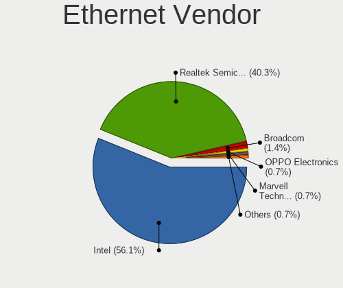

| Vendor                   | Desktops | Percent |
|--------------------------|----------|---------|
| Intel                    | 60       | 54.55%  |
| Realtek Semiconductor    | 47       | 42.73%  |
| Marvell Technology Group | 1        | 0.91%   |
| Broadcom                 | 1        | 0.91%   |
| Apple                    | 1        | 0.91%   |

Ethernet Model
--------------

Ethernet models

| Model                                                                  | Desktops | Percent |
|------------------------------------------------------------------------|----------|---------|
| Realtek RTL8111/8168/8211/8411 PCI Express Gigabit Ethernet Controller | 39       | 31.2%   |
| Intel I211 Gigabit Network Connection                                  | 16       | 12.8%   |
| Intel Ethernet Controller I226-V                                       | 7        | 5.6%    |
| Intel Ethernet Controller I225-V                                       | 7        | 5.6%    |
| Realtek RTL8125 2.5GbE Controller                                      | 5        | 4%      |
| Intel 82583V Gigabit Network Connection                                | 5        | 4%      |
| Intel I350 Gigabit Network Connection                                  | 4        | 3.2%    |
| Intel Ethernet Connection I217-LM                                      | 4        | 3.2%    |
| Realtek RTL810xE PCI Express Fast Ethernet controller                  | 3        | 2.4%    |
| Intel I210 Gigabit Network Connection                                  | 3        | 2.4%    |
| Intel 82579LM Gigabit Network Connection (Lewisville)                  | 3        | 2.4%    |
| Intel 82574L Gigabit Network Connection                                | 3        | 2.4%    |
| Intel Ethernet Connection X553 1GbE                                    | 2        | 1.6%    |
| Intel Ethernet Connection X553 10 GbE SFP+                             | 2        | 1.6%    |
| Intel Ethernet Connection I217-V                                       | 2        | 1.6%    |
| Intel 82576 Gigabit Network Connection                                 | 2        | 1.6%    |
| Intel 82575EB Gigabit Network Connection                               | 2        | 1.6%    |
| Realtek RTL8169 PCI Gigabit Ethernet Controller                        | 1        | 0.8%    |
| Realtek RTL8111/8168/8411 PCI Express Gigabit Ethernet Controller      | 1        | 0.8%    |
| Marvell Group 88E8056 PCI-E Gigabit Ethernet Controller                | 1        | 0.8%    |
| Intel NM10/ICH7 Family LAN Controller                                  | 1        | 0.8%    |
| Intel Ethernet Connection (7) I219-V                                   | 1        | 0.8%    |
| Intel Ethernet Connection (7) I219-LM                                  | 1        | 0.8%    |
| Intel Ethernet Connection (2) I219-V                                   | 1        | 0.8%    |
| Intel Ethernet Connection (2) I219-LM                                  | 1        | 0.8%    |
| Intel Ethernet Connection (11) I219-V                                  | 1        | 0.8%    |
| Intel 82599ES 10-Gigabit SFI/SFP+ Network Connection                   | 1        | 0.8%    |
| Intel 82580 Gigabit Network Connection                                 | 1        | 0.8%    |
| Intel 82575GB Gigabit Network Connection                               | 1        | 0.8%    |
| Intel 82572EI Gigabit Ethernet Controller (Copper)                     | 1        | 0.8%    |
| Intel 82566DM-2 Gigabit Network Connection                             | 1        | 0.8%    |
| Broadcom NetXtreme BCM5761 Gigabit Ethernet PCIe                       | 1        | 0.8%    |
| Apple UniNorth 2 GMAC (Sun GEM)                                        | 1        | 0.8%    |

Net Controller Kind
-------------------

Ethernet, WiFi or modem

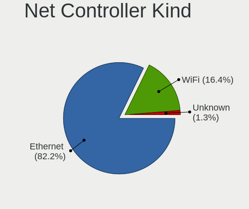

| Kind     | Desktops | Percent |
|----------|----------|---------|
| Ethernet | 99       | 83.19%  |
| WiFi     | 19       | 15.97%  |
| Unknown  | 1        | 0.84%   |

Used Controller
---------------

Currently used network controller

| Kind     | Desktops | Percent |
|----------|----------|---------|
| Ethernet | 96       | 94.12%  |
| WiFi     | 6        | 5.88%   |

NICs
----

Total network controllers on board

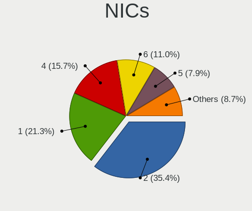

| Total | Desktops | Percent |
|-------|----------|---------|
| 2     | 37       | 36.63%  |
| 1     | 20       | 19.8%   |
| 4     | 17       | 16.83%  |
| 6     | 11       | 10.89%  |
| 5     | 6        | 5.94%   |
| 3     | 3        | 2.97%   |
| 7     | 2        | 1.98%   |
| 0     | 2        | 1.98%   |
| 10    | 1        | 0.99%   |
| 9     | 1        | 0.99%   |
| 8     | 1        | 0.99%   |

IPv6
----

IPv6 vs IPv4

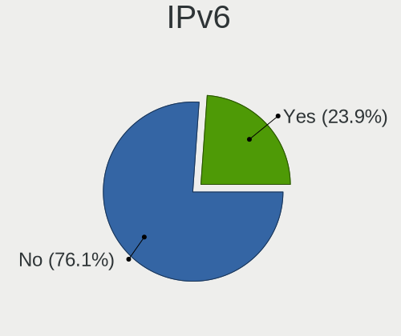

| Used | Desktops | Percent |
|------|----------|---------|
| No   | 83       | 77.57%  |
| Yes  | 24       | 22.43%  |

Bluetooth
---------

Bluetooth Vendor
----------------

Controller vendors

| Vendor                          | Desktops | Percent |
|---------------------------------|----------|---------|
| Intel                           | 9        | 64.29%  |
| Realtek Semiconductor           | 2        | 14.29%  |
| Qualcomm Atheros Communications | 1        | 7.14%   |
| Cambridge Silicon Radio         | 1        | 7.14%   |
| Apple                           | 1        | 7.14%   |

Bluetooth Model
---------------

Controller models

| Model                                                       | Desktops | Percent |
|-------------------------------------------------------------|----------|---------|
| Intel Bluetooth wireless interface                          | 3        | 21.43%  |
| Intel AX200 Bluetooth                                       | 2        | 14.29%  |
| Realtek  Bluetooth 4.2 Adapter                              | 1        | 7.14%   |
| Realtek Bluetooth 4.0 Adapter                               | 1        | 7.14%   |
| Qualcomm Atheros Dell Wireless 1707 Bluetooth 4.0 LE Device | 1        | 7.14%   |
| Intel Wireless-AC 9260 Bluetooth Adapter                    | 1        | 7.14%   |
| Intel Wireless-AC 3168 Bluetooth                            | 1        | 7.14%   |
| Intel AX210 Bluetooth                                       | 1        | 7.14%   |
| Intel AX201 Bluetooth                                       | 1        | 7.14%   |
| Cambridge Silicon Radio Bluetooth Dongle (HCI mode)         | 1        | 7.14%   |
| Apple Bluetooth Host Controller                             | 1        | 7.14%   |

Sound
-----

Sound Vendor
------------

Sound card vendors

| Vendor                 | Desktops | Percent |
|------------------------|----------|---------|
| Intel                  | 64       | 65.31%  |
| AMD                    | 18       | 18.37%  |
| Nvidia                 | 14       | 14.29%  |
| Generalplus Technology | 1        | 1.02%   |
| C-Media Electronics    | 1        | 1.02%   |

Sound Model
-----------

Sound card models

| Model                                                                                             | Desktops | Percent |
|---------------------------------------------------------------------------------------------------|----------|---------|
| Intel Celeron/Pentium Silver Processor High Definition Audio                                      | 7        | 6.25%   |
| Intel Xeon E3-1200 v3/4th Gen Core Processor HD Audio Controller                                  | 6        | 5.36%   |
| Intel Atom Processor Z36xxx/Z37xxx Series High Definition Audio Controller                        | 6        | 5.36%   |
| Intel Jasper Lake HD Audio                                                                        | 5        | 4.46%   |
| Intel 7 Series/C216 Chipset Family High Definition Audio Controller                               | 5        | 4.46%   |
| Intel 100 Series/C230 Series Chipset Family HD Audio Controller                                   | 5        | 4.46%   |
| AMD Family 17h/19h HD Audio Controller                                                            | 5        | 4.46%   |
| Intel 8 Series/C220 Series Chipset High Definition Audio Controller                               | 4        | 3.57%   |
| Nvidia GM206 High Definition Audio Controller                                                     | 3        | 2.68%   |
| Intel Sunrise Point-LP HD Audio                                                                   | 3        | 2.68%   |
| Intel NM10/ICH7 Family High Definition Audio Controller                                           | 3        | 2.68%   |
| Intel Celeron N3350/Pentium N4200/Atom E3900 Series Audio Cluster                                 | 3        | 2.68%   |
| Intel 82801JI (ICH10 Family) HD Audio Controller                                                  | 3        | 2.68%   |
| AMD Starship/Matisse HD Audio Controller                                                          | 3        | 2.68%   |
| AMD SBx00 Azalia (Intel HDA)                                                                      | 3        | 2.68%   |
| AMD Raven/Raven2/Fenghuang HDMI/DP Audio Controller                                               | 3        | 2.68%   |
| AMD FCH Azalia Controller                                                                         | 3        | 2.68%   |
| Nvidia MCP61 High Definition Audio                                                                | 2        | 1.79%   |
| Intel Comet Lake PCH-V cAVS                                                                       | 2        | 1.79%   |
| Intel Cannon Lake PCH cAVS                                                                        | 2        | 1.79%   |
| Intel Atom/Celeron/Pentium Processor x5-E8000/J3xxx/N3xxx Series High Definition Audio Controller | 2        | 1.79%   |
| Intel 6 Series/C200 Series Chipset Family High Definition Audio Controller                        | 2        | 1.79%   |
| Intel 200 Series PCH HD Audio                                                                     | 2        | 1.79%   |
| AMD Wrestler HDMI Audio                                                                           | 2        | 1.79%   |
| AMD Rembrandt Radeon High Definition Audio Controller                                             | 2        | 1.79%   |
| AMD Family 17h (Models 00h-0fh) HD Audio Controller                                               | 2        | 1.79%   |
| Nvidia TU116 High Definition Audio Controller                                                     | 1        | 0.89%   |
| Nvidia High Definition Audio Controller                                                           | 1        | 0.89%   |
| Nvidia GP108 High Definition Audio Controller                                                     | 1        | 0.89%   |
| Nvidia GP107GL High Definition Audio Controller                                                   | 1        | 0.89%   |
| Nvidia GP106 High Definition Audio Controller                                                     | 1        | 0.89%   |
| Nvidia GP104 High Definition Audio Controller                                                     | 1        | 0.89%   |
| Nvidia GP102 HDMI Audio Controller                                                                | 1        | 0.89%   |
| Nvidia GF108 High Definition Audio Controller                                                     | 1        | 0.89%   |
| Nvidia GF106 High Definition Audio Controller                                                     | 1        | 0.89%   |
| Intel Wildcat Point-LP High Definition Audio Controller                                           | 1        | 0.89%   |
| Intel Comet Lake PCH cAVS                                                                         | 1        | 0.89%   |
| Intel C610/X99 series chipset HD Audio Controller                                                 | 1        | 0.89%   |
| Intel Broadwell-U Audio Controller                                                                | 1        | 0.89%   |
| Intel Alder Lake-N PCH High Definition Audio Controller                                           | 1        | 0.89%   |

Memory
------

Memory Vendor
-------------

Memory module vendors

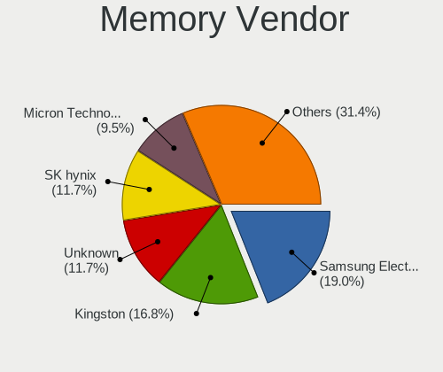

| Vendor              | Desktops | Percent |
|---------------------|----------|---------|
| Samsung Electronics | 23       | 21.7%   |
| Kingston            | 17       | 16.04%  |
| Unknown             | 15       | 14.15%  |
| SK hynix            | 11       | 10.38%  |
| Micron Technology   | 11       | 10.38%  |
| A-DATA Technology   | 8        | 7.55%   |
| Unknown             | 6        | 5.66%   |
| Corsair             | 3        | 2.83%   |
| Nanya Technology    | 2        | 1.89%   |
| G.Skill             | 2        | 1.89%   |
| Team                | 1        | 0.94%   |
| Ramsta              | 1        | 0.94%   |
| Ramaxel Technology  | 1        | 0.94%   |
| KINGBANK            | 1        | 0.94%   |
| Juhor               | 1        | 0.94%   |
| GeIL                | 1        | 0.94%   |
| Elpida              | 1        | 0.94%   |
| Crucial             | 1        | 0.94%   |

Memory Model
------------

Memory module models

| Model                                                      | Desktops | Percent |
|------------------------------------------------------------|----------|---------|
| Unknown                                                    | 6        | 5.31%   |
| Samsung RAM M471B5273DH0-CH9 4GB SODIMM DDR3 1334MT/s      | 3        | 2.65%   |
| Unknown RAM Module 2GB SODIMM DDR3 800MT/s                 | 2        | 1.77%   |
| Unknown RAM Module 2GB DIMM DDR2 800MT/s                   | 2        | 1.77%   |
| Samsung RAM M471A1K43CB1-CTD 8GB SODIMM DDR4 2667MT/s      | 2        | 1.77%   |
| Samsung RAM M378B5173QH0-CK0 4GB DIMM DDR3 1600MT/s        | 2        | 1.77%   |
| Kingston RAM KHX3200C16FB/8G 8GB SODIMM DDR4 2400MT/s      | 2        | 1.77%   |
| Kingston RAM KHX3000C15D4/8GX 8GB DIMM DDR4 2933MT/s       | 2        | 1.77%   |
| Unknown RAM XinJuHuo 8GB SODIMM DDR3 1600MT/s              | 1        | 0.88%   |
| Unknown RAM TMKS8G68ALFBCH-266 8192MB SODIMM DDR4 2400MT/s | 1        | 0.88%   |
| Unknown RAM Module 8GB DIMM DDR4 2400MT/s                  | 1        | 0.88%   |
| Unknown RAM Module 8GB DIMM DDR3 1600MT/s                  | 1        | 0.88%   |
| Unknown RAM Module 4GB DIMM DDR4 2133MT/s                  | 1        | 0.88%   |
| Unknown RAM Module 2GB SODIMM DDR2 800MT/s                 | 1        | 0.88%   |
| Unknown RAM Module 2GB DIMM 800MT/s                        | 1        | 0.88%   |
| Unknown RAM Module 2048MB DIMM 1333MT/s                    | 1        | 0.88%   |
| Unknown RAM Module 1GB DIMM SDRAM                          | 1        | 0.88%   |
| Unknown RAM Module 1GB DIMM DDR2 667MT/s                   | 1        | 0.88%   |
| Unknown RAM IM38GS48A16-BBBHB0 8GB DIMM DDR3 1600MT/s      | 1        | 0.88%   |
| Team RAM TEAMGROUP-UD4-2133 8GB DIMM DDR4 2133MT/s         | 1        | 0.88%   |
| SK hynix RAM Module 8GB DIMM DDR4 2400MT/s                 | 1        | 0.88%   |
| SK hynix RAM HMT325U6BFR8C-H9 2GB DIMM 1066MT/s            | 1        | 0.88%   |
| SK hynix RAM HMT325S6EFR8C-PB 2GB DIMM DDR3 1600MT/s       | 1        | 0.88%   |
| SK hynix RAM HMT325S6BFR8C-H9 2GB DIMM DDR3 1333MT/s       | 1        | 0.88%   |
| SK hynix RAM HMT125U6TFR8C-H9 2GB DIMM DDR3 1333MT/s       | 1        | 0.88%   |
| SK hynix RAM HMA81GU6AFR8N-UH 8GB DIMM DDR4 2400MT/s       | 1        | 0.88%   |
| SK hynix RAM HMA81GS7DJR8N-VK 8192MB SODIMM DDR4 2667MT/s  | 1        | 0.88%   |
| SK hynix RAM HMA81GS6JJR8N-VK 8GB SODIMM DDR4 2667MT/s     | 1        | 0.88%   |
| SK hynix RAM HMA451U6AFR8N-TF 4GB DIMM DDR4 2133MT/s       | 1        | 0.88%   |
| SK hynix RAM HMA451S6AFR8N-TF 4GB SODIMM DDR4 2133MT/s     | 1        | 0.88%   |
| SK hynix RAM HMA451R7MFR8N-TF 4GB RIMM DDR4 2133MT/s       | 1        | 0.88%   |
| SK hynix RAM 8ATF1G64HZ-2G3A1 8GB DIMM DDR4 2400MT/s       | 1        | 0.88%   |
| Samsung RAM M474A2K43BB1-CRC 16GB DIMM DDR4 2400MT/s       | 1        | 0.88%   |
| Samsung RAM M474A1G43EB1-CRC 8GB DIMM DDR4 2400MT/s        | 1        | 0.88%   |
| Samsung RAM M471B5673FH0-CH9 2GB DIMM DDR3 1333MT/s        | 1        | 0.88%   |
| Samsung RAM M471B5273DM0-CH9 4GB DIMM DDR3 1333MT/s        | 1        | 0.88%   |
| Samsung RAM M471B5273DH0-YK0 4GB DIMM DDR3 1600MT/s        | 1        | 0.88%   |
| Samsung RAM M471B5273DH0-CK0 4GB SODIMM DDR3 1600MT/s      | 1        | 0.88%   |
| Samsung RAM M471B5273DH0-CK0 4GB DIMM DDR3 1600MT/s        | 1        | 0.88%   |
| Samsung RAM M471B5173DB0-YK0 4GB SODIMM DDR3 1600MT/s      | 1        | 0.88%   |

Memory Kind
-----------

Memory module kinds

| Kind    | Desktops | Percent |
|---------|----------|---------|
| DDR4    | 42       | 44.21%  |
| DDR3    | 42       | 44.21%  |
| DDR2    | 4        | 4.21%   |
| Unknown | 3        | 3.16%   |
| DDR5    | 2        | 2.11%   |
| SDRAM   | 1        | 1.05%   |
| LPDDR4  | 1        | 1.05%   |

Memory Form Factor
------------------

Physical design of the memory module

| Name         | Desktops | Percent |
|--------------|----------|---------|
| DIMM         | 56       | 58.33%  |
| SODIMM       | 36       | 37.5%   |
| Unknown      | 2        | 2.08%   |
| Row Of Chips | 1        | 1.04%   |
| RIMM         | 1        | 1.04%   |

Memory Size
-----------

Memory module size

| Size  | Desktops | Percent |
|-------|----------|---------|
| 8192  | 38       | 36.89%  |
| 4096  | 35       | 33.98%  |
| 2048  | 15       | 14.56%  |
| 16384 | 12       | 11.65%  |
| 1024  | 2        | 1.94%   |
| 32768 | 1        | 0.97%   |

Memory Speed
------------

Memory module speed

| Speed   | Desktops | Percent |
|---------|----------|---------|
| 1600    | 25       | 24.27%  |
| 2400    | 16       | 15.53%  |
| 2133    | 13       | 12.62%  |
| 1333    | 12       | 11.65%  |
| 2667    | 8        | 7.77%   |
| 3200    | 7        | 6.8%    |
| 800     | 7        | 6.8%    |
| 2666    | 3        | 2.91%   |
| 1334    | 3        | 2.91%   |
| 4800    | 2        | 1.94%   |
| 2933    | 2        | 1.94%   |
| 667     | 2        | 1.94%   |
| 1867    | 1        | 0.97%   |
| 1066    | 1        | 0.97%   |
| Unknown | 1        | 0.97%   |

Printers & scanners
-------------------

Printer Vendor
--------------

Printer device vendors

Zero info for selected period =(

Printer Model
-------------

Printer device models

Zero info for selected period =(

Scanner Vendor
--------------

Scanner device vendors

Zero info for selected period =(

Scanner Model
-------------

Scanner device models

Zero info for selected period =(

Camera
------

Camera Vendor
-------------

Camera device vendors

| Vendor                  | Desktops | Percent |
|-------------------------|----------|---------|
| Logitech                | 2        | 50%     |
| Z-Star Microelectronics | 1        | 25%     |
| Microdia                | 1        | 25%     |

Camera Model
------------

Camera device models

| Model                            | Desktops | Percent |
|----------------------------------|----------|---------|
| Z-Star Lenovo USB 2.0 UVC Camera | 1        | 25%     |
| Microdia Camera                  | 1        | 25%     |
| Logitech Webcam C170             | 1        | 25%     |
| Logitech C670i FHD Webcam        | 1        | 25%     |

Security
--------

Fingerprint Vendor
------------------

Fingerprint sensor vendors

Zero info for selected period =(

Fingerprint Model
-----------------

Fingerprint sensor models

Zero info for selected period =(

Chipcard Vendor
---------------

Chipcard module vendors

Zero info for selected period =(

Chipcard Model
--------------

Chipcard module models

Zero info for selected period =(

Unsupported
-----------

Unsupported Devices
-------------------

Total unsupported devices on board

| Total | Desktops | Percent |
|-------|----------|---------|
| 1     | 46       | 45.54%  |
| 0     | 41       | 40.59%  |
| 2     | 13       | 12.87%  |
| 4     | 1        | 0.99%   |

Unsupported Device Types
------------------------

Types of unsupported devices

| Type                     | Desktops | Percent |
|--------------------------|----------|---------|
| Communication controller | 56       | 78.87%  |
| Net/wireless             | 7        | 9.86%   |
| Sound                    | 2        | 2.82%   |
| Net/ethernet             | 2        | 2.82%   |
| Card reader              | 2        | 2.82%   |
| Bluetooth                | 2        | 2.82%   |

