BSD in China - Tested Hardware & Statistics (Desktops)
------------------------------------------------------

A project to collect tested hardware configurations for BSD in China.

Anyone can contribute to this report by the [hw-probe](https://github.com/linuxhw/hw-probe/blob/master/INSTALL.BSD.md) tool:

    hw-probe -all -upload

Please contribute! Especially if your hardware is rare.

Contents
--------

* [ Test Cases ](#test-cases)

* [ System ](#system)
  - [ OS                       ](#os)
  - [ OS Family                ](#os-family)
  - [ Arch                     ](#arch)
  - [ DE                       ](#de)
  - [ Display Server           ](#display-server)
  - [ Display Manager          ](#display-manager)
  - [ OS Lang                  ](#os-lang)
  - [ Boot Mode                ](#boot-mode)
  - [ Filesystem               ](#filesystem)
  - [ Part. scheme             ](#part-scheme)

* [ Board ](#board)
  - [ Vendor                   ](#vendor)
  - [ Model                    ](#model)
  - [ Model Family             ](#model-family)
  - [ MFG Year                 ](#mfg-year)
  - [ Form Factor              ](#form-factor)
  - [ Coreboot                 ](#coreboot)
  - [ RAM Size                 ](#ram-size)
  - [ RAM Used                 ](#ram-used)
  - [ Total Drives             ](#total-drives)
  - [ Has CD-ROM               ](#has-cd-rom)
  - [ Has Ethernet             ](#has-ethernet)
  - [ Has WiFi                 ](#has-wifi)
  - [ Has Bluetooth            ](#has-bluetooth)

* [ Location ](#location)
  - [ Country                  ](#country)
  - [ City                     ](#city)

* [ Drives ](#drives)
  - [ Drive Vendor             ](#drive-vendor)
  - [ Drive Model              ](#drive-model)
  - [ HDD Vendor               ](#hdd-vendor)
  - [ SSD Vendor               ](#ssd-vendor)
  - [ Drive Kind               ](#drive-kind)
  - [ Drive Connector          ](#drive-connector)
  - [ Drive Size               ](#drive-size)
  - [ Space Total              ](#space-total)
  - [ Space Used               ](#space-used)
  - [ Malfunc. Drives          ](#malfunc-drives)
  - [ Malfunc. Drive Vendor    ](#malfunc-drive-vendor)
  - [ Malfunc. HDD Vendor      ](#malfunc-hdd-vendor)
  - [ Malfunc. Drive Kind      ](#malfunc-drive-kind)
  - [ Failed Drives            ](#failed-drives)
  - [ Failed Drive Vendor      ](#failed-drive-vendor)
  - [ Drive Status             ](#drive-status)

* [ Storage controller ](#storage-controller)
  - [ Storage Vendor           ](#storage-vendor)
  - [ Storage Model            ](#storage-model)
  - [ Storage Kind             ](#storage-kind)

* [ Processor ](#processor)
  - [ CPU Vendor               ](#cpu-vendor)
  - [ CPU Model                ](#cpu-model)
  - [ CPU Model Family         ](#cpu-model-family)
  - [ CPU Cores                ](#cpu-cores)
  - [ CPU Sockets              ](#cpu-sockets)
  - [ CPU Threads              ](#cpu-threads)
  - [ CPU Microarch            ](#cpu-microarch)

* [ Graphics ](#graphics)
  - [ GPU Vendor               ](#gpu-vendor)
  - [ GPU Model                ](#gpu-model)
  - [ GPU Combo                ](#gpu-combo)
  - [ GPU Driver               ](#gpu-driver)
  - [ GPU Memory               ](#gpu-memory)

* [ Monitor ](#monitor)
  - [ Monitor Vendor           ](#monitor-vendor)
  - [ Monitor Model            ](#monitor-model)
  - [ Monitor Resolution       ](#monitor-resolution)
  - [ Monitor Diagonal         ](#monitor-diagonal)
  - [ Monitor Width            ](#monitor-width)
  - [ Aspect Ratio             ](#aspect-ratio)
  - [ Monitor Area             ](#monitor-area)
  - [ Pixel Density            ](#pixel-density)
  - [ Multiple Monitors        ](#multiple-monitors)

* [ Network ](#network)
  - [ Net Controller Vendor    ](#net-controller-vendor)
  - [ Net Controller Model     ](#net-controller-model)
  - [ Wireless Vendor          ](#wireless-vendor)
  - [ Wireless Model           ](#wireless-model)
  - [ Ethernet Vendor          ](#ethernet-vendor)
  - [ Ethernet Model           ](#ethernet-model)
  - [ Net Controller Kind      ](#net-controller-kind)
  - [ Used Controller          ](#used-controller)
  - [ NICs                     ](#nics)
  - [ IPv6                     ](#ipv6)

* [ Bluetooth ](#bluetooth)
  - [ Bluetooth Vendor         ](#bluetooth-vendor)
  - [ Bluetooth Model          ](#bluetooth-model)

* [ Sound ](#sound)
  - [ Sound Vendor             ](#sound-vendor)
  - [ Sound Model              ](#sound-model)

* [ Memory ](#memory)
  - [ Memory Vendor            ](#memory-vendor)
  - [ Memory Model             ](#memory-model)
  - [ Memory Kind              ](#memory-kind)
  - [ Memory Form Factor       ](#memory-form-factor)
  - [ Memory Size              ](#memory-size)
  - [ Memory Speed             ](#memory-speed)

* [ Printers & scanners ](#printers--scanners)
  - [ Printer Vendor           ](#printer-vendor)
  - [ Printer Model            ](#printer-model)
  - [ Scanner Vendor           ](#scanner-vendor)
  - [ Scanner Model            ](#scanner-model)

* [ Camera ](#camera)
  - [ Camera Vendor            ](#camera-vendor)
  - [ Camera Model             ](#camera-model)

* [ Security ](#security)
  - [ Fingerprint Vendor       ](#fingerprint-vendor)
  - [ Fingerprint Model        ](#fingerprint-model)
  - [ Chipcard Vendor          ](#chipcard-vendor)
  - [ Chipcard Model           ](#chipcard-model)

* [ Unsupported ](#unsupported)
  - [ Unsupported Devices      ](#unsupported-devices)
  - [ Unsupported Device Types ](#unsupported-device-types)

Test Cases
----------

Total: 94

| Vendor        | Model                       | Probe                                                     | Date         |
|---------------|-----------------------------|-----------------------------------------------------------|--------------|
| TOPFEEL       | H110D4-P1                   | [90b1dfc430](https://bsd-hardware.info/?probe=90b1dfc430) | Nov 19, 2022 |
| Dell          | 0KYJ8C A02                  | [7282ce8fe2](https://bsd-hardware.info/?probe=7282ce8fe2) | Nov 19, 2022 |
| ONDA          | N78G5D3 Ver:5.00            | [009bc44d12](https://bsd-hardware.info/?probe=009bc44d12) | Nov 07, 2022 |
| Lenovo        | YangTianM6880N              | [2e9c3b7368](https://bsd-hardware.info/?probe=2e9c3b7368) | Nov 04, 2022 |
| Centerm       | GA690-2 2                   | [9d6c3d67cd](https://bsd-hardware.info/?probe=9d6c3d67cd) | Oct 28, 2022 |
| MSI           | B450M PRO-VDH PLUS          | [54e4202bc7](https://bsd-hardware.info/?probe=54e4202bc7) | Oct 21, 2022 |
| MSI           | B450M PRO-VDH PLUS          | [c6ee09790d](https://bsd-hardware.info/?probe=c6ee09790d) | Oct 20, 2022 |
| AMD           | Inagua CRB                  | [59c41dcd31](https://bsd-hardware.info/?probe=59c41dcd31) | Oct 11, 2022 |
| AMD           | Inagua CRB                  | [ff4eccae8a](https://bsd-hardware.info/?probe=ff4eccae8a) | Oct 11, 2022 |
| Unknown       | Unknown                     | [a5cbd6786d](https://bsd-hardware.info/?probe=a5cbd6786d) | Oct 11, 2022 |
| Unknown       | Unknown                     | [f31f4c00cd](https://bsd-hardware.info/?probe=f31f4c00cd) | Oct 08, 2022 |
| Dell          | 0KYJ8C A02                  | [130a05a115](https://bsd-hardware.info/?probe=130a05a115) | Oct 07, 2022 |
| Dell          | 0KYJ8C A02                  | [12493c3802](https://bsd-hardware.info/?probe=12493c3802) | Sep 26, 2022 |
| Unknown       | Unknown                     | [199ad16750](https://bsd-hardware.info/?probe=199ad16750) | Sep 21, 2022 |
| Gigabyte      | H410M S2 V2                 | [8de53ac515](https://bsd-hardware.info/?probe=8de53ac515) | Sep 17, 2022 |
| Dell          | 0KYJ8C A02                  | [7e8d44c688](https://bsd-hardware.info/?probe=7e8d44c688) | Sep 10, 2022 |
| MSI           | MPG X570 GAMING EDGE WIF... | [df57940ad5](https://bsd-hardware.info/?probe=df57940ad5) | Sep 03, 2022 |
| Techvision    | TVI7309X B0                 | [9941ee7afb](https://bsd-hardware.info/?probe=9941ee7afb) | Sep 03, 2022 |
| Lenovo        | YangTianM6880N              | [f675498946](https://bsd-hardware.info/?probe=f675498946) | Sep 02, 2022 |
| Unknown       | DTB1168                     | [e924ba2a44](https://bsd-hardware.info/?probe=e924ba2a44) | Sep 01, 2022 |
| WlanCN        | 6000 Series                 | [7fda15ca84](https://bsd-hardware.info/?probe=7fda15ca84) | Aug 25, 2022 |
| Gigabyte      | AB350N-Gaming WIFI-CF       | [f50526a6d6](https://bsd-hardware.info/?probe=f50526a6d6) | Jul 27, 2022 |
| MAXSUN        | MS-H110D4L FS M.2           | [39d06b12fd](https://bsd-hardware.info/?probe=39d06b12fd) | Jul 25, 2022 |
| ASUSTek       | Maximus IX HERO             | [ea2f21a15f](https://bsd-hardware.info/?probe=ea2f21a15f) | Jul 12, 2022 |
| Techvision    | TVI7309X B0                 | [b2aa5f61e2](https://bsd-hardware.info/?probe=b2aa5f61e2) | Jul 11, 2022 |
| ASUSTek       | Maximus IX HERO             | [81668557c6](https://bsd-hardware.info/?probe=81668557c6) | Jul 08, 2022 |
| Unknown       | Unknown                     | [0f45bdf1ec](https://bsd-hardware.info/?probe=0f45bdf1ec) | Jun 14, 2022 |
| Unknown       | Unknown                     | [57a6f58607](https://bsd-hardware.info/?probe=57a6f58607) | Jun 09, 2022 |
| Gigabyte      | AB350N-Gaming WIFI-CF       | [d9c28e14df](https://bsd-hardware.info/?probe=d9c28e14df) | May 13, 2022 |
| Lenovo        | MAHOBAY                     | [b54df77b59](https://bsd-hardware.info/?probe=b54df77b59) | May 07, 2022 |
| OEM           | B85 JHS359                  | [c5d29cc6b3](https://bsd-hardware.info/?probe=c5d29cc6b3) | May 03, 2022 |
| PAIQ          | EC3-BT19D4L A1              | [9642cf3129](https://bsd-hardware.info/?probe=9642cf3129) | Mar 30, 2022 |
| ASRock        | Q1900M                      | [e2473b7f22](https://bsd-hardware.info/?probe=e2473b7f22) | Mar 29, 2022 |
| ShenZhen M... | MW-NANO-APL-4L              | [97f4960723](https://bsd-hardware.info/?probe=97f4960723) | Mar 28, 2022 |
| Unknown       | J3160-4L                    | [e2717ea0eb](https://bsd-hardware.info/?probe=e2717ea0eb) | Mar 24, 2022 |
| Unknown       | Unknown                     | [d08da1541a](https://bsd-hardware.info/?probe=d08da1541a) | Mar 14, 2022 |
| Lenovo        | IdeaCentre B545 10100       | [2f13d4a946](https://bsd-hardware.info/?probe=2f13d4a946) | Mar 12, 2022 |
| ASUSTek       | TUF GAMING X570-PRO         | [8307275b2e](https://bsd-hardware.info/?probe=8307275b2e) | Mar 07, 2022 |
| Unknown       | Unknown                     | [ce3fedcbaf](https://bsd-hardware.info/?probe=ce3fedcbaf) | Mar 07, 2022 |
| ShenZhen M... | MW-NANO-APL-4L              | [b54ace2a34](https://bsd-hardware.info/?probe=b54ace2a34) | Mar 03, 2022 |
| Intel         | X58                         | [f7075908f6](https://bsd-hardware.info/?probe=f7075908f6) | Feb 09, 2022 |
| Unknown       | Unknown                     | [8eda642f6a](https://bsd-hardware.info/?probe=8eda642f6a) | Jan 04, 2022 |
| Dell          | 0H9KW5 A00                  | [e962ca25b3](https://bsd-hardware.info/?probe=e962ca25b3) | Dec 28, 2021 |
| Colorful Y... | C.J1900A-BTC PLUS YV20      | [e115f87ef7](https://bsd-hardware.info/?probe=e115f87ef7) | Nov 30, 2021 |
| Unknown       | Unknown                     | [08f546f789](https://bsd-hardware.info/?probe=08f546f789) | Nov 21, 2021 |
| Unknown       | Unknown                     | [d958c5d8f1](https://bsd-hardware.info/?probe=d958c5d8f1) | Nov 18, 2021 |
| Unknown       | Unknown                     | [d3e799d3a6](https://bsd-hardware.info/?probe=d3e799d3a6) | Nov 13, 2021 |
| Unknown       | YL-SKUL6-7 Series           | [8c72c2f429](https://bsd-hardware.info/?probe=8c72c2f429) | Nov 12, 2021 |
| GuoGuang      | IC2M1028V-6                 | [1aa8bbd5b2](https://bsd-hardware.info/?probe=1aa8bbd5b2) | Nov 07, 2021 |
| Lenovo        | SHARKBAY SDK0A46860 PRO     | [9b545faf66](https://bsd-hardware.info/?probe=9b545faf66) | Oct 28, 2021 |
| Lenovo        | SHARKBAY SDK0A46860 PRO     | [f269216a0d](https://bsd-hardware.info/?probe=f269216a0d) | Oct 27, 2021 |
| MSI           | MAG B460M MORTAR            | [f9c5120643](https://bsd-hardware.info/?probe=f9c5120643) | Oct 22, 2021 |
| Gigabyte      | H410M S2 V2                 | [b106820e47](https://bsd-hardware.info/?probe=b106820e47) | Oct 21, 2021 |
| Dell          | 0DR845                      | [d8324d1639](https://bsd-hardware.info/?probe=d8324d1639) | Oct 21, 2021 |
| HP            | 3398                        | [892f19c9bd](https://bsd-hardware.info/?probe=892f19c9bd) | Oct 18, 2021 |
| Gigabyte      | H410M S2 V2                 | [9cf5948654](https://bsd-hardware.info/?probe=9cf5948654) | Oct 13, 2021 |
| Colorful Y... | C.J1900A-BTC PLUS YV20      | [84f06376e2](https://bsd-hardware.info/?probe=84f06376e2) | Oct 02, 2021 |
| NEC Comput... | SHARKBAY                    | [24229ed11f](https://bsd-hardware.info/?probe=24229ed11f) | Sep 22, 2021 |
| CNCTION-IA... | Unknown                     | [aad95eb2bf](https://bsd-hardware.info/?probe=aad95eb2bf) | Sep 21, 2021 |
| YANYU         | ITX-N29 VER:1.5 baytrail    | [c851a73aa5](https://bsd-hardware.info/?probe=c851a73aa5) | Sep 20, 2021 |
| Unknown       | Unknown                     | [0da457285c](https://bsd-hardware.info/?probe=0da457285c) | Aug 23, 2021 |
| Unknown       | J3160-4L                    | [3063e4b82f](https://bsd-hardware.info/?probe=3063e4b82f) | Aug 21, 2021 |
| ShenZhen M... | MW-NANO-APL-4L              | [cce0d947f1](https://bsd-hardware.info/?probe=cce0d947f1) | Aug 20, 2021 |
| PAIQ          | EC3-BT19D4L A1              | [1a438c7632](https://bsd-hardware.info/?probe=1a438c7632) | Aug 19, 2021 |
| CNCTION-IA... | Unknown                     | [7763f089a3](https://bsd-hardware.info/?probe=7763f089a3) | Aug 17, 2021 |
| Unknown       | J3160-4L                    | [dc1e25a4e0](https://bsd-hardware.info/?probe=dc1e25a4e0) | Aug 07, 2021 |
| Lenovo        | NOK                         | [de711c244f](https://bsd-hardware.info/?probe=de711c244f) | Aug 05, 2021 |
| Lenovo        | NOK                         | [5bd27802f0](https://bsd-hardware.info/?probe=5bd27802f0) | Aug 04, 2021 |
| GuoGuang      | IC2M1028V-6                 | [9bfe0dca00](https://bsd-hardware.info/?probe=9bfe0dca00) | Jul 21, 2021 |
| Unknown       | Unknown                     | [58f03a472f](https://bsd-hardware.info/?probe=58f03a472f) | Jul 03, 2021 |
| ShenZhen M... | MW-NANO-APL-4L              | [b8712916f2](https://bsd-hardware.info/?probe=b8712916f2) | Jun 29, 2021 |
| Colorful Y... | C.J1900A-BTC PLUS YV20      | [0b0951a048](https://bsd-hardware.info/?probe=0b0951a048) | Jun 23, 2021 |
| Lenovo        | SHARKBAY 0B98401 WIN        | [8fe29978c3](https://bsd-hardware.info/?probe=8fe29978c3) | Jun 22, 2021 |
| Protectli     | FW6                         | [7fe94af21a](https://bsd-hardware.info/?probe=7fe94af21a) | Jun 11, 2021 |
| CNCTION-IA... | Unknown                     | [ff1a657505](https://bsd-hardware.info/?probe=ff1a657505) | Jun 08, 2021 |
| Colorful Y... | C.J1900A-BTC PLUS YV20      | [c0b3c87810](https://bsd-hardware.info/?probe=c0b3c87810) | Jun 04, 2021 |
| Colorful T... | C.Q1900M PRO V20            | [5283765cbe](https://bsd-hardware.info/?probe=5283765cbe) | Apr 03, 2021 |
| Gigabyte      | MZBSWBP-00                  | [3623b04225](https://bsd-hardware.info/?probe=3623b04225) | Mar 31, 2021 |
| Dell          | 018D1Y A00                  | [13754ed4ee](https://bsd-hardware.info/?probe=13754ed4ee) | Mar 23, 2021 |
| Dell          | 0YXT71 A00                  | [cb3d9f12c6](https://bsd-hardware.info/?probe=cb3d9f12c6) | Mar 20, 2021 |
| Dell          | 0W2PJY A01                  | [f162510a27](https://bsd-hardware.info/?probe=f162510a27) | Mar 12, 2021 |
| MSI           | B150M MORTAR                | [19923e24d6](https://bsd-hardware.info/?probe=19923e24d6) | Mar 10, 2021 |
| Dell          | 0W2PJY A01                  | [d8c2f0b19f](https://bsd-hardware.info/?probe=d8c2f0b19f) | Mar 04, 2021 |
| ShenZhen M... | MW-NANO-APL-4L              | [9a23dee2ea](https://bsd-hardware.info/?probe=9a23dee2ea) | Mar 01, 2021 |
| Gigabyte      | GA-870-UD3P                 | [e228db2983](https://bsd-hardware.info/?probe=e228db2983) | Feb 20, 2021 |
| Dell          | 018D1Y A00                  | [a54f14d773](https://bsd-hardware.info/?probe=a54f14d773) | Feb 18, 2021 |
| Unknown       | Unknown                     | [22af66ce96](https://bsd-hardware.info/?probe=22af66ce96) | Feb 18, 2021 |
| Google        | Guado                       | [f6473eeb71](https://bsd-hardware.info/?probe=f6473eeb71) | Feb 16, 2021 |
| HP            | 8768 A                      | [f2be4b7b65](https://bsd-hardware.info/?probe=f2be4b7b65) | Feb 16, 2021 |
| ASUSTek       | EX-B85M-V                   | [54c319f2c0](https://bsd-hardware.info/?probe=54c319f2c0) | Feb 15, 2021 |
| Unknown       | Unknown                     | [bc823e0dfc](https://bsd-hardware.info/?probe=bc823e0dfc) | Feb 08, 2021 |
| ASUSTek       | TUF GAMING B550M-PLUS       | [12e20c2cb0](https://bsd-hardware.info/?probe=12e20c2cb0) | Jan 23, 2021 |
| ASRock        | A320M-ITX                   | [7fab9dd55a](https://bsd-hardware.info/?probe=7fab9dd55a) | Oct 31, 2020 |
| HP            | 213D A01                    | [b081e36525](https://bsd-hardware.info/?probe=b081e36525) | Oct 31, 2020 |

System
------

OS
--

Installed operating systems

| Name              | Desktops | Percent |
|-------------------|----------|---------|
| helloSystem 0.7.0 | 8        | 10.13%  |
| OPNsense 21.7.1   | 6        | 7.59%   |
| OPNsense 21.7.3   | 4        | 5.06%   |
| OPNsense 21.1.7   | 4        | 5.06%   |
| helloSystem 0.5.0 | 4        | 5.06%   |
| FreeBSD 13.1-p2   | 4        | 5.06%   |
| OPNsense 22.7.5   | 3        | 3.8%    |
| OPNsense 21.7.5   | 3        | 3.8%    |
| OPNsense 21.7.2   | 3        | 3.8%    |
| OPNsense 22.7.2   | 2        | 2.53%   |
| OPNsense 22.1.4   | 2        | 2.53%   |
| OPNsense 22.1.2   | 2        | 2.53%   |
| OPNsense 22.1.10  | 2        | 2.53%   |
| OPNsense 21.1.6   | 2        | 2.53%   |
| OPNsense 21.1.3   | 2        | 2.53%   |
| OPNsense 21.1     | 2        | 2.53%   |
| helloSystem 0.6.0 | 2        | 2.53%   |
| helloSystem 0.4.0 | 2        | 2.53%   |
| OPNsense 22.7.8   | 1        | 1.27%   |
| OPNsense 22.7.6   | 1        | 1.27%   |
| OPNsense 22.7.4   | 1        | 1.27%   |
| OPNsense 22.7.3   | 1        | 1.27%   |
| OPNsense 22.1.8   | 1        | 1.27%   |
| OPNsense 22.1.3   | 1        | 1.27%   |
| OPNsense 21.7.8   | 1        | 1.27%   |
| OPNsense 21.7.7   | 1        | 1.27%   |
| OPNsense 21.7.6   | 1        | 1.27%   |
| OPNsense 21.7.4   | 1        | 1.27%   |
| OPNsense 21.1.4   | 1        | 1.27%   |
| OPNsense 21.1.2   | 1        | 1.27%   |
| OPNsense 21.1.1   | 1        | 1.27%   |
| helloSystem 0.8.0 | 1        | 1.27%   |
| GhostBSD 21.08.27 | 1        | 1.27%   |
| FreeBSD 13.1-RC4  | 1        | 1.27%   |
| FreeBSD 13.1-p3   | 1        | 1.27%   |
| FreeBSD 13.0-RC5  | 1        | 1.27%   |
| FreeBSD 12.2-p4   | 1        | 1.27%   |
| FreeBSD 12.2-p2   | 1        | 1.27%   |
| FreeBSD 12.2      | 1        | 1.27%   |
| FreeBSD 12.1      | 1        | 1.27%   |

OS Family
---------

OS without a version

| Name        | Desktops | Percent |
|-------------|----------|---------|
| OPNsense    | 37       | 56.92%  |
| helloSystem | 17       | 26.15%  |
| FreeBSD     | 10       | 15.38%  |
| GhostBSD    | 1        | 1.54%   |

Arch
----

OS architecture (x86_64, i586, etc.)

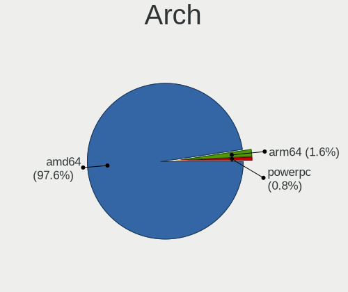

| Name  | Desktops | Percent |
|-------|----------|---------|
| amd64 | 63       | 98.44%  |
| arm64 | 1        | 1.56%   |

DE
--

Desktop Environment

| Name         | Desktops | Percent |
|--------------|----------|---------|
| Console      | 40       | 61.54%  |
| helloDesktop | 17       | 26.15%  |
| KDE5         | 4        | 6.15%   |
| XFCE         | 1        | 1.54%   |
| MATE         | 1        | 1.54%   |
| i3           | 1        | 1.54%   |
| GNUstep      | 1        | 1.54%   |

Display Server
--------------

X11 or Wayland

| Name    | Desktops | Percent |
|---------|----------|---------|
| Console | 40       | 62.5%   |
| X11     | 24       | 37.5%   |

Display Manager
---------------

SDDM, LightDM, etc.

| Name    | Desktops | Percent |
|---------|----------|---------|
| Console | 41       | 63.08%  |
| SLiM    | 18       | 27.69%  |
| SDDM    | 5        | 7.69%   |
| LightDM | 1        | 1.54%   |

OS Lang
-------

Language

| Lang    | Desktops | Percent |
|---------|----------|---------|
| Unknown | 40       | 61.54%  |
| en_US   | 17       | 26.15%  |
| zh_CN   | 4        | 6.15%   |
| C       | 4        | 6.15%   |

Boot Mode
---------

EFI or BIOS

| Mode | Desktops | Percent |
|------|----------|---------|
| EFI  | 54       | 84.38%  |
| BIOS | 10       | 15.63%  |

Filesystem
----------

Type of filesystem

| Type   | Desktops | Percent |
|--------|----------|---------|
| Ufs    | 34       | 52.31%  |
| Zfs    | 25       | 38.46%  |
| Cd9660 | 6        | 9.23%   |

Part. scheme
------------

Scheme of partitioning

| Type    | Desktops | Percent |
|---------|----------|---------|
| GPT     | 57       | 89.06%  |
| MBR     | 5        | 7.81%   |
| Unknown | 2        | 3.13%   |

Board
-----

Vendor
------

Motherboard manufacturer

| Name                                       | Desktops | Percent |
|--------------------------------------------|----------|---------|
| Unknown                                    | 14       | 21.88%  |
| Lenovo                                     | 6        | 9.38%   |
| Dell                                       | 6        | 9.38%   |
| MSI                                        | 4        | 6.25%   |
| Gigabyte Technology                        | 4        | 6.25%   |
| ASUSTek Computer                           | 4        | 6.25%   |
| Hewlett-Packard                            | 3        | 4.69%   |
| ShenZhen MinWin Technology                 | 2        | 3.13%   |
| PAIQ                                       | 2        | 3.13%   |
| ASRock                                     | 2        | 3.13%   |
| YANYU                                      | 1        | 1.56%   |
| WlanCN                                     | 1        | 1.56%   |
| TOPFEEL                                    | 1        | 1.56%   |
| Techvision                                 | 1        | 1.56%   |
| Protectli                                  | 1        | 1.56%   |
| ONDA                                       | 1        | 1.56%   |
| OEM                                        | 1        | 1.56%   |
| NEC Computers                              | 1        | 1.56%   |
| MAXSUN                                     | 1        | 1.56%   |
| Intel                                      | 1        | 1.56%   |
| GuoGuang                                   | 1        | 1.56%   |
| Google                                     | 1        | 1.56%   |
| Colorful YuGong Technology And Development | 1        | 1.56%   |
| Colorful Technology                        | 1        | 1.56%   |
| CNCTION-IAF-E3845                          | 1        | 1.56%   |
| Centerm                                    | 1        | 1.56%   |
| AMD                                        | 1        | 1.56%   |

Model
-----

Motherboard model

| Name                                                   | Desktops | Percent |
|--------------------------------------------------------|----------|---------|
| Unknown                                                | 15       | 23.44%  |
| ShenZhen MinWin MW-NANO-APL-4L                         | 2        | 3.13%   |
| PAIQ EC3-BT19D4L                                       | 2        | 3.13%   |
| YANYU ITX-N29 VER:1.5 baytrail                         | 1        | 1.56%   |
| WlanCN 6000 Series                                     | 1        | 1.56%   |
| TOPFEEL Topone series                                  | 1        | 1.56%   |
| Techvision TVI7309X                                    | 1        | 1.56%   |
| Protectli FW6                                          | 1        | 1.56%   |
| ONDA N78G5D3 Ver:5.00                                  | 1        | 1.56%   |
| OEM B85 JHS359                                         | 1        | 1.56%   |
| NEC Computers SHARKBAY                                 | 1        | 1.56%   |
| MSI MS-7C82                                            | 1        | 1.56%   |
| MSI MS-7C37                                            | 1        | 1.56%   |
| MSI MS-7A38                                            | 1        | 1.56%   |
| MSI MS-7972                                            | 1        | 1.56%   |
| MAXSUN MS-H110D4L FS M.2                               | 1        | 1.56%   |
| Lenovo YangTianW2090v-00                               | 1        | 1.56%   |
| Lenovo YangTianM6880N                                  | 1        | 1.56%   |
| Lenovo YangTianA8800T                                  | 1        | 1.56%   |
| Lenovo ThinkCentre M93p 10AA0020CN                     | 1        | 1.56%   |
| Lenovo SHARKBAY 0B98401 WIN                            | 1        | 1.56%   |
| Lenovo IdeaCentre B545 10100                           | 1        | 1.56%   |
| Intel X58                                              | 1        | 1.56%   |
| HP t620 PLUS Quad Core TC                              | 1        | 1.56%   |
| HP Slim Desktop S01-pF1xxx                             | 1        | 1.56%   |
| HP Compaq Elite 8300 USDT                              | 1        | 1.56%   |
| GuoGuang IC2M1028V-6                                   | 1        | 1.56%   |
| Google Guado                                           | 1        | 1.56%   |
| Gigabyte H410M S2 V2                                   | 1        | 1.56%   |
| Gigabyte GB-BACE-3150                                  | 1        | 1.56%   |
| Gigabyte GA-870-UD3P                                   | 1        | 1.56%   |
| Gigabyte AB350N-Gaming WIFI                            | 1        | 1.56%   |
| Dell Vostro 3667                                       | 1        | 1.56%   |
| Dell Precision WorkStation T5500                       | 1        | 1.56%   |
| Dell OptiPlex 755                                      | 1        | 1.56%   |
| Dell OptiPlex 7060                                     | 1        | 1.56%   |
| Dell OptiPlex 7010                                     | 1        | 1.56%   |
| Dell Inspiron 560s                                     | 1        | 1.56%   |
| Colorful YuGong And Development C.J1900A-BTC PLUS YV20 | 1        | 1.56%   |
| Colorful C.Q1900M PRO V20                              | 1        | 1.56%   |

Model Family
------------

Motherboard model prefix

| Name                                    | Desktops | Percent |
|-----------------------------------------|----------|---------|
| Unknown                                 | 15       | 23.44%  |
| Dell OptiPlex                           | 3        | 4.69%   |
| ShenZhen MinWin MW-NANO-APL-4L          | 2        | 3.13%   |
| PAIQ EC3-BT19D4L                        | 2        | 3.13%   |
| ASUS TUF                                | 2        | 3.13%   |
| YANYU ITX-N29                           | 1        | 1.56%   |
| WlanCN 6000                             | 1        | 1.56%   |
| TOPFEEL Topone                          | 1        | 1.56%   |
| Techvision TVI7309X                     | 1        | 1.56%   |
| Protectli FW6                           | 1        | 1.56%   |
| ONDA N78G5D3                            | 1        | 1.56%   |
| OEM B85                                 | 1        | 1.56%   |
| NEC Computers SHARKBAY                  | 1        | 1.56%   |
| MSI MS-7C82                             | 1        | 1.56%   |
| MSI MS-7C37                             | 1        | 1.56%   |
| MSI MS-7A38                             | 1        | 1.56%   |
| MSI MS-7972                             | 1        | 1.56%   |
| MAXSUN MS-H110D4L                       | 1        | 1.56%   |
| Lenovo YangTianW2090v-00                | 1        | 1.56%   |
| Lenovo YangTianM6880N                   | 1        | 1.56%   |
| Lenovo YangTianA8800T                   | 1        | 1.56%   |
| Lenovo ThinkCentre                      | 1        | 1.56%   |
| Lenovo SHARKBAY                         | 1        | 1.56%   |
| Lenovo IdeaCentre                       | 1        | 1.56%   |
| Intel X58                               | 1        | 1.56%   |
| HP t620                                 | 1        | 1.56%   |
| HP Slim                                 | 1        | 1.56%   |
| HP Compaq                               | 1        | 1.56%   |
| GuoGuang IC2M1028V-6                    | 1        | 1.56%   |
| Google Guado                            | 1        | 1.56%   |
| Gigabyte H410M                          | 1        | 1.56%   |
| Gigabyte GB-BACE-3150                   | 1        | 1.56%   |
| Gigabyte GA-870-UD3P                    | 1        | 1.56%   |
| Gigabyte AB350N-Gaming                  | 1        | 1.56%   |
| Dell Vostro                             | 1        | 1.56%   |
| Dell Precision                          | 1        | 1.56%   |
| Dell Inspiron                           | 1        | 1.56%   |
| Colorful YuGong And Development C.J1900 | 1        | 1.56%   |
| Colorful C.Q1900M                       | 1        | 1.56%   |
| Centerm GA690-2                         | 1        | 1.56%   |

MFG Year
--------

Motherboard manufacture year

| Year | Desktops | Percent |
|------|----------|---------|
| 2021 | 9        | 14.06%  |
| 2019 | 8        | 12.5%   |
| 2020 | 6        | 9.38%   |
| 2017 | 6        | 9.38%   |
| 2012 | 6        | 9.38%   |
| 2018 | 5        | 7.81%   |
| 2014 | 5        | 7.81%   |
| 2016 | 4        | 6.25%   |
| 2013 | 4        | 6.25%   |
| 2022 | 3        | 4.69%   |
| 2015 | 2        | 3.13%   |
| 2011 | 2        | 3.13%   |
| 2010 | 2        | 3.13%   |
| 2008 | 1        | 1.56%   |
| 2007 | 1        | 1.56%   |

Form Factor
-----------

Physical design of the computer

| Name    | Desktops | Percent |
|---------|----------|---------|
| Desktop | 64       | 100%    |

Coreboot
--------

Have coreboot on board

| Used | Desktops | Percent |
|------|----------|---------|
| No   | 62       | 96.88%  |
| Yes  | 2        | 3.13%   |

RAM Size
--------

Total RAM memory

| Size in GB | Desktops | Percent |
|------------|----------|---------|
| 8.01-16.0  | 23       | 35.38%  |
| 4.01-8.0   | 15       | 23.08%  |
| 16.01-24.0 | 11       | 16.92%  |
| 2.01-3.0   | 8        | 12.31%  |
| 32.01-64.0 | 6        | 9.23%   |
| 1.01-2.0   | 1        | 1.54%   |
| 0.51-1.0   | 1        | 1.54%   |

RAM Used
--------

Used RAM memory

| Used GB  | Desktops | Percent |
|----------|----------|---------|
| 0.01-0.5 | 40       | 61.54%  |
| 0.51-1.0 | 18       | 27.69%  |
| 1.01-2.0 | 6        | 9.23%   |
| 3.01-4.0 | 1        | 1.54%   |

Total Drives
------------

Number of drives on board

| Drives | Desktops | Percent |
|--------|----------|---------|
| 1      | 41       | 62.12%  |
| 2      | 10       | 15.15%  |
| 0      | 8        | 12.12%  |
| 5      | 3        | 4.55%   |
| 3      | 3        | 4.55%   |
| 4      | 1        | 1.52%   |

Has CD-ROM
----------

Has CD-ROM on board

| Presented | Desktops | Percent |
|-----------|----------|---------|
| No        | 55       | 84.62%  |
| Yes       | 10       | 15.38%  |

Has Ethernet
------------

Has Ethernet on board

| Presented | Desktops | Percent |
|-----------|----------|---------|
| Yes       | 63       | 98.44%  |
| No        | 1        | 1.56%   |

Has WiFi
--------

Has WiFi module

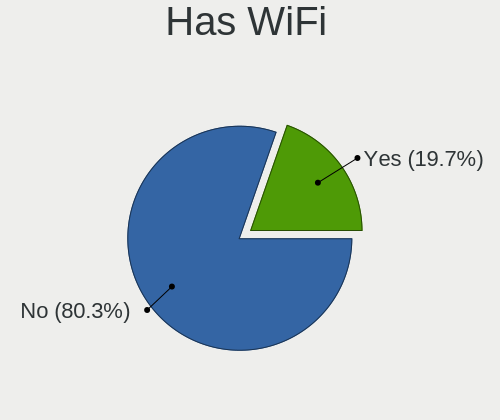

| Presented | Desktops | Percent |
|-----------|----------|---------|
| No        | 50       | 78.13%  |
| Yes       | 14       | 21.88%  |

Has Bluetooth
-------------

Has Bluetooth module

| Presented | Desktops | Percent |
|-----------|----------|---------|
| No        | 53       | 82.81%  |
| Yes       | 11       | 17.19%  |

Location
--------

Country
-------

Geographic location (country)

| Country | Desktops | Percent |
|---------|----------|---------|
| China   | 64       | 100%    |

City
----

Geographic location (city)

| City             | Desktops | Percent |
|------------------|----------|---------|
| Beijing          | 9        | 12.86%  |
| Shanghai         | 8        | 11.43%  |
| Shenzhen         | 5        | 7.14%   |
| Chengdu          | 5        | 7.14%   |
| Zhengzhou        | 3        | 4.29%   |
| Guangzhou        | 3        | 4.29%   |
| Xi'an            | 2        | 2.86%   |
| Qingdao          | 2        | 2.86%   |
| Jinrongjie       | 2        | 2.86%   |
| Hangzhou         | 2        | 2.86%   |
| Zhongshan        | 1        | 1.43%   |
| Yancheng         | 1        | 1.43%   |
| Xicheng District | 1        | 1.43%   |
| Xiamen           | 1        | 1.43%   |
| Wuhan            | 1        | 1.43%   |
| Tongshan         | 1        | 1.43%   |
| Tieling          | 1        | 1.43%   |
| Suzhou           | 1        | 1.43%   |
| Shahekou         | 1        | 1.43%   |
| Qinnan           | 1        | 1.43%   |
| Qingpu           | 1        | 1.43%   |
| Putuo            | 1        | 1.43%   |
| Ningbo           | 1        | 1.43%   |
| Nanjing          | 1        | 1.43%   |
| Liuzhou          | 1        | 1.43%   |
| Kunming          | 1        | 1.43%   |
| Kuiju            | 1        | 1.43%   |
| Jinhua           | 1        | 1.43%   |
| Jiangbei         | 1        | 1.43%   |
| Hongkou          | 1        | 1.43%   |
| Guli             | 1        | 1.43%   |
| Gaoqiao          | 1        | 1.43%   |
| Gaoleshan        | 1        | 1.43%   |
| Fuzhou           | 1        | 1.43%   |
| Dalian           | 1        | 1.43%   |
| Chaoyang Shi     | 1        | 1.43%   |
| Changchun        | 1        | 1.43%   |
| Bijie            | 1        | 1.43%   |
| Baiyun           | 1        | 1.43%   |

Drives
------

Drive Vendor
------------

Hard drive vendors

| Vendor              | Desktops | Drives | Percent |
|---------------------|----------|--------|---------|
| Seagate             | 12       | 17     | 15.19%  |
| WDC                 | 11       | 22     | 13.92%  |
| Samsung Electronics | 11       | 17     | 13.92%  |
| Intel               | 7        | 7      | 8.86%   |
| SanDisk             | 5        | 6      | 6.33%   |
| Toshiba             | 4        | 4      | 5.06%   |
| Hitachi             | 3        | 3      | 3.8%    |
| China               | 3        | 5      | 3.8%    |
| Transcend           | 2        | 2      | 2.53%   |
| HGST                | 2        | 5      | 2.53%   |
| tigo                | 1        | 1      | 1.27%   |
| Ramsta              | 1        | 1      | 1.27%   |
| Plextor             | 1        | 2      | 1.27%   |
| ORICO               | 1        | 1      | 1.27%   |
| Netac               | 1        | 1      | 1.27%   |
| Micron Technology   | 1        | 2      | 1.27%   |
| LITEONIT            | 1        | 1      | 1.27%   |
| Lenovo              | 1        | 1      | 1.27%   |
| KIOXIA-EXCERIA      | 1        | 2      | 1.27%   |
| Kingston            | 1        | 1      | 1.27%   |
| KingSpec            | 1        | 1      | 1.27%   |
| Hewlett-Packard     | 1        | 1      | 1.27%   |
| FREEBSD             | 1        | 1      | 1.27%   |
| FORESEE             | 1        | 1      | 1.27%   |
| Faspeed             | 1        | 1      | 1.27%   |
| Crucial             | 1        | 1      | 1.27%   |
| Colorful            | 1        | 1      | 1.27%   |
| BIWIN               | 1        | 3      | 1.27%   |
| Apacer              | 1        | 1      | 1.27%   |

Drive Model
-----------

Hard drive models

| Model                           | Desktops | Percent |
|---------------------------------|----------|---------|
| Seagate ST1000DM003-1SB102 1TB  | 3        | 3.3%    |
| Seagate ST500DM002-1BD142 500GB | 2        | 2.2%    |
| Intel SSDSA2SH032G1GN 32GB      | 2        | 2.2%    |
| WDC WUH721414ALE6L4 14TB        | 1        | 1.1%    |
| WDC WDS500G2B0C-00PXH0 500GB    | 1        | 1.1%    |
| WDC WDS500G1B0C-00S6U0 500GB    | 1        | 1.1%    |
| WDC WDS100T2B0C-00PXH0 1TB      | 1        | 1.1%    |
| WDC WD7500LPCX-00KHST0 752GB    | 1        | 1.1%    |
| WDC WD5000LPCX-24C6HT0 500GB    | 1        | 1.1%    |
| WDC WD5000LPCX-00VHAT0 500GB    | 1        | 1.1%    |
| WDC WD4005FZBX-00K5WB0 4TB      | 1        | 1.1%    |
| WDC WD30EZRZ-00WN9B0 3TB        | 1        | 1.1%    |
| WDC WD20SPZX-22UA7T0 2TB        | 1        | 1.1%    |
| WDC WD2003FYYS-007BA0 2TB       | 1        | 1.1%    |
| WDC WD1600BEVT-22ZCT0 160GB     | 1        | 1.1%    |
| WDC WD1600AAJS-22L7A0 160GB     | 1        | 1.1%    |
| WDC WD120EMAZ-11BLFA0 12TB      | 1        | 1.1%    |
| WDC WD10SPZX-00Z10T0 1TB        | 1        | 1.1%    |
| WDC WD10SPCX-00KHST0 1TB        | 1        | 1.1%    |
| WDC WD10EZEX-21WN4A0 1TB        | 1        | 1.1%    |
| WDC WD10EJRX-89N74Y0 1TB        | 1        | 1.1%    |
| WDC WD10EARS-003BB1 1TB         | 1        | 1.1%    |
| Transcend TS4GCF150 4GB         | 1        | 1.1%    |
| Transcend TS128GMTS400 128GB    | 1        | 1.1%    |
| Toshiba MQ04ABF100 1TB          | 1        | 1.1%    |
| Toshiba DT01ACA100 1TB          | 1        | 1.1%    |
| Toshiba DT01ACA050 500GB        | 1        | 1.1%    |
| Toshiba A100 240GB              | 1        | 1.1%    |
| tigo SSD 480GB                  | 1        | 1.1%    |
| Seagate ST500LM000-1EJ162 500GB | 1        | 1.1%    |
| Seagate ST500DM002-1SB10A 500GB | 1        | 1.1%    |
| Seagate ST3500418AS 500GB       | 1        | 1.1%    |
| Seagate ST3500312CS 500GB       | 1        | 1.1%    |
| Seagate ST3320418AS 320GB       | 1        | 1.1%    |
| Seagate ST31500541AS 1.5TB      | 1        | 1.1%    |
| Seagate ST31000528AS 1TB        | 1        | 1.1%    |
| Seagate ST3000DM007-1WY10G 3TB  | 1        | 1.1%    |
| Seagate ST2000VN004-2E4164 2TB  | 1        | 1.1%    |
| Seagate ST1000LM035-1RK172 1TB  | 1        | 1.1%    |
| SanDisk SSD G5 BICS4 1TB        | 1        | 1.1%    |

HDD Vendor
----------

Hard disk drive vendors

| Vendor          | Desktops | Drives | Percent |
|-----------------|----------|--------|---------|
| Seagate         | 12       | 17     | 38.71%  |
| WDC             | 10       | 19     | 32.26%  |
| Toshiba         | 3        | 3      | 9.68%   |
| Hitachi         | 3        | 3      | 9.68%   |
| HGST            | 2        | 5      | 6.45%   |
| Hewlett-Packard | 1        | 1      | 3.23%   |

SSD Vendor
----------

Solid state drive vendors

| Vendor              | Desktops | Drives | Percent |
|---------------------|----------|--------|---------|
| Samsung Electronics | 7        | 8      | 17.5%   |
| Intel               | 6        | 6      | 15%     |
| SanDisk             | 5        | 6      | 12.5%   |
| China               | 3        | 5      | 7.5%    |
| Transcend           | 2        | 2      | 5%      |
| Toshiba             | 1        | 1      | 2.5%    |
| tigo                | 1        | 1      | 2.5%    |
| Ramsta              | 1        | 1      | 2.5%    |
| ORICO               | 1        | 1      | 2.5%    |
| Netac               | 1        | 1      | 2.5%    |
| Micron Technology   | 1        | 2      | 2.5%    |
| LITEONIT            | 1        | 1      | 2.5%    |
| Lenovo              | 1        | 1      | 2.5%    |
| KIOXIA-EXCERIA      | 1        | 2      | 2.5%    |
| Kingston            | 1        | 1      | 2.5%    |
| KingSpec            | 1        | 1      | 2.5%    |
| FREEBSD             | 1        | 1      | 2.5%    |
| FORESEE             | 1        | 1      | 2.5%    |
| Faspeed             | 1        | 1      | 2.5%    |
| Colorful            | 1        | 1      | 2.5%    |
| BIWIN               | 1        | 3      | 2.5%    |
| Apacer              | 1        | 1      | 2.5%    |

Drive Kind
----------

HDD or SSD

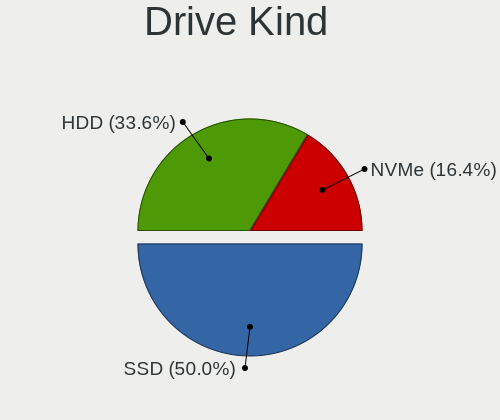

| Kind | Desktops | Drives | Percent |
|------|----------|--------|---------|
| SSD  | 38       | 48     | 50.67%  |
| HDD  | 26       | 48     | 34.67%  |
| NVMe | 11       | 16     | 14.67%  |

Drive Connector
---------------

SATA, SAS, NVMe, etc.

| Type | Desktops | Drives | Percent |
|------|----------|--------|---------|
| SATA | 55       | 96     | 83.33%  |
| NVMe | 11       | 16     | 16.67%  |

Drive Size
----------

Size of hard drive

| Size in TB | Desktops | Drives | Percent |
|------------|----------|--------|---------|
| 0.01-0.5   | 48       | 66     | 67.61%  |
| 0.51-1.0   | 14       | 17     | 19.72%  |
| 1.01-2.0   | 4        | 5      | 5.63%   |
| 2.01-3.0   | 2        | 3      | 2.82%   |
| 3.01-4.0   | 1        | 1      | 1.41%   |
| 10.01-20.0 | 1        | 2      | 1.41%   |
| 4.01-10.0  | 1        | 2      | 1.41%   |

Space Total
-----------

Amount of disk space available on the file system

| Size in GB | Desktops | Percent |
|------------|----------|---------|
| 1-20       | 20       | 29.85%  |
| 101-250    | 19       | 28.36%  |
| 251-500    | 9        | 13.43%  |
| 21-50      | 9        | 13.43%  |
| 51-100     | 7        | 10.45%  |
| 501-1000   | 2        | 2.99%   |
| 1001-2000  | 1        | 1.49%   |

Space Used
----------

Amount of used disk space

| Used GB | Desktops | Percent |
|---------|----------|---------|
| 1-20    | 59       | 90.77%  |
| 21-50   | 4        | 6.15%   |
| 51-100  | 2        | 3.08%   |

Malfunc. Drives
---------------

Drive models with a malfunction

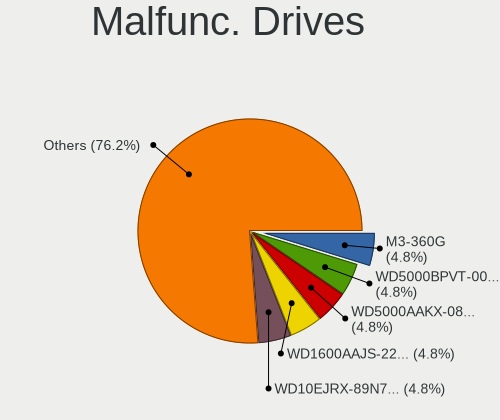

| Model                         | Desktops | Drives | Percent |
|-------------------------------|----------|--------|---------|
| WDC WD1600AAJS-22L7A0 160GB   | 1        | 1      | 9.09%   |
| WDC WD10EJRX-89N74Y0 1TB      | 1        | 1      | 9.09%   |
| Seagate ST3320418AS 320GB     | 1        | 2      | 9.09%   |
| Seagate ST31500541AS 1.5TB    | 1        | 1      | 9.09%   |
| Seagate ST31000528AS 1TB      | 1        | 1      | 9.09%   |
| Intel SSDSA2M120G2GC 120GB    | 1        | 1      | 9.09%   |
| Hitachi HTS723232A7A364 320GB | 1        | 1      | 9.09%   |
| HGST HTS725050A7E630 500GB    | 1        | 3      | 9.09%   |
| Colorful SL500 640GB          | 1        | 1      | 9.09%   |
| China XJH-32GB                | 1        | 1      | 9.09%   |
| BIWIN SSD 32GB                | 1        | 3      | 9.09%   |

Malfunc. Drive Vendor
---------------------

Vendors of faulty drives

| Vendor   | Desktops | Drives | Percent |
|----------|----------|--------|---------|
| Seagate  | 3        | 4      | 27.27%  |
| WDC      | 2        | 2      | 18.18%  |
| Intel    | 1        | 1      | 9.09%   |
| Hitachi  | 1        | 1      | 9.09%   |
| HGST     | 1        | 3      | 9.09%   |
| Colorful | 1        | 1      | 9.09%   |
| China    | 1        | 1      | 9.09%   |
| BIWIN    | 1        | 3      | 9.09%   |

Malfunc. HDD Vendor
-------------------

Vendors of faulty HDD drives

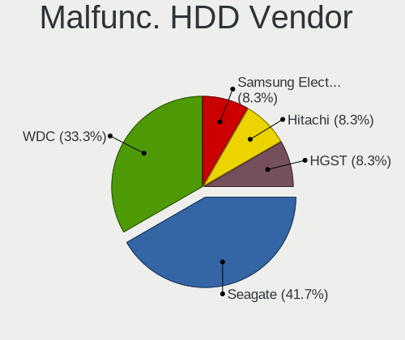

| Vendor  | Desktops | Drives | Percent |
|---------|----------|--------|---------|
| Seagate | 3        | 4      | 42.86%  |
| WDC     | 2        | 2      | 28.57%  |
| Hitachi | 1        | 1      | 14.29%  |
| HGST    | 1        | 3      | 14.29%  |

Malfunc. Drive Kind
-------------------

Kinds of faulty drives

| Kind | Desktops | Drives | Percent |
|------|----------|--------|---------|
| HDD  | 7        | 10     | 63.64%  |
| SSD  | 4        | 6      | 36.36%  |

Failed Drives
-------------

Failed drive models

Zero info for selected period =(

Failed Drive Vendor
-------------------

Failed drive vendors

Zero info for selected period =(

Drive Status
------------

Number of failed and malfunc. drives

| Status   | Desktops | Drives | Percent |
|----------|----------|--------|---------|
| Works    | 49       | 94     | 79.03%  |
| Malfunc  | 11       | 16     | 17.74%  |
| Detected | 2        | 2      | 3.23%   |

Storage controller
------------------

Storage Vendor
--------------

Storage controller vendors

| Vendor                    | Desktops | Percent |
|---------------------------|----------|---------|
| Intel                     | 51       | 67.11%  |
| AMD                       | 11       | 14.47%  |
| Samsung Electronics       | 5        | 6.58%   |
| SanDisk                   | 3        | 3.95%   |
| Broadcom / LSI            | 2        | 2.63%   |
| Nvidia                    | 1        | 1.32%   |
| Micron/Crucial Technology | 1        | 1.32%   |
| Lite-On Technology        | 1        | 1.32%   |
| ASMedia Technology        | 1        | 1.32%   |

Storage Model
-------------

Storage controller models

| Model                                                                            | Desktops | Percent |
|----------------------------------------------------------------------------------|----------|---------|
| Intel Atom Processor E3800 Series SATA AHCI Controller                           | 7        | 7.69%   |
| AMD FCH SATA Controller [AHCI mode]                                              | 7        | 7.69%   |
| Intel Sunrise Point-LP SATA Controller [AHCI mode]                               | 5        | 5.49%   |
| Intel 8 Series/C220 Series Chipset Family 6-port SATA Controller 1 [AHCI mode]   | 5        | 5.49%   |
| Intel Q170/Q150/B150/H170/H110/Z170/CM236 Chipset SATA Controller [AHCI Mode]    | 4        | 4.4%    |
| Intel Celeron/Pentium Silver Processor SATA Controller                           | 3        | 3.3%    |
| Intel 82801HM/HEM (ICH8M/ICH8M-E) SATA Controller [IDE mode]                     | 3        | 3.3%    |
| Intel 7 Series/C210 Series Chipset Family 6-port SATA Controller [AHCI mode]     | 3        | 3.3%    |
| AMD SB7x0/SB8x0/SB9x0 IDE Controller                                             | 3        | 3.3%    |
| SanDisk WD Blue SN550 NVMe SSD                                                   | 2        | 2.2%    |
| Samsung NVMe SSD Controller SM981/PM981/PM983                                    | 2        | 2.2%    |
| Samsung NVMe SSD Controller SM961/PM961/SM963                                    | 2        | 2.2%    |
| Intel NM10/ICH7 Family SATA Controller [AHCI mode]                               | 2        | 2.2%    |
| Intel Comet Lake SATA AHCI Controller                                            | 2        | 2.2%    |
| Intel Celeron N3350/Pentium N4200/Atom E3900 Series SATA AHCI Controller         | 2        | 2.2%    |
| Intel Atom/Celeron/Pentium Processor x5-E8000/J3xxx/N3xxx Series SATA Controller | 2        | 2.2%    |
| Intel 82801JI (ICH10 Family) 4 port SATA IDE Controller #1                       | 2        | 2.2%    |
| Intel 82801HM/HEM (ICH8M/ICH8M-E) IDE Controller                                 | 2        | 2.2%    |
| Intel 400 Series Chipset Family SATA AHCI Controller                             | 2        | 2.2%    |
| AMD SB7x0/SB8x0/SB9x0 SATA Controller [IDE mode]                                 | 2        | 2.2%    |
| SanDisk WD Blue SN570 NVMe SSD                                                   | 1        | 1.1%    |
| SanDisk WD Blue SN500 / PC SN520 NVMe SSD                                        | 1        | 1.1%    |
| Samsung NVMe SSD Controller PM9A1/PM9A3/980PRO                                   | 1        | 1.1%    |
| Nvidia MCP61 SATA Controller                                                     | 1        | 1.1%    |
| Nvidia MCP61 IDE                                                                 | 1        | 1.1%    |
| Micron/Crucial P1 NVMe PCIe SSD                                                  | 1        | 1.1%    |
| Intel Wildcat Point-LP SATA Controller [AHCI Mode]                               | 1        | 1.1%    |
| Intel SSD 660P Series                                                            | 1        | 1.1%    |
| Intel SATA Controller [RAID mode]                                                | 1        | 1.1%    |
| Intel NM10/ICH7 Family SATA Controller [IDE mode]                                | 1        | 1.1%    |
| Intel Jasper Lake SATA AHCI Controller                                           | 1        | 1.1%    |
| Intel Cannon Lake PCH SATA AHCI Controller                                       | 1        | 1.1%    |
| Intel Atom Processor C3000 Series SATA Controller 1                              | 1        | 1.1%    |
| Intel Atom Processor C3000 Series SATA Controller 0                              | 1        | 1.1%    |
| Intel 82Q35 Express PT IDER Controller                                           | 1        | 1.1%    |
| Intel 82801JI (ICH10 Family) SATA AHCI Controller                                | 1        | 1.1%    |
| Intel 82801JI (ICH10 Family) 2 port SATA IDE Controller #2                       | 1        | 1.1%    |
| Intel 82801IR/IO/IH (ICH9R/DO/DH) 6 port SATA Controller [AHCI mode]             | 1        | 1.1%    |
| Intel 8 Series/C220 Series Chipset Family 4-port SATA Controller 1 [IDE mode]    | 1        | 1.1%    |
| Intel 200 Series PCH SATA controller [AHCI mode]                                 | 1        | 1.1%    |

Storage Kind
------------

Kind of storage controller (IDE, SATA, NVMe, SAS, ...)

| Kind | Desktops | Percent |
|------|----------|---------|
| SATA | 53       | 67.09%  |
| IDE  | 12       | 15.19%  |
| NVMe | 11       | 13.92%  |
| RAID | 2        | 2.53%   |
| SAS  | 1        | 1.27%   |

Processor
---------

CPU Vendor
----------

Processor vendors

| Vendor | Desktops | Percent |
|--------|----------|---------|
| Intel  | 51       | 79.69%  |
| AMD    | 12       | 18.75%  |
| ARM    | 1        | 1.56%   |

CPU Model
---------

Processor models

| Model                                       | Desktops | Percent |
|---------------------------------------------|----------|---------|
| Intel Celeron CPU J1900 @ 1.99GHz           | 6        | 9.38%   |
| Intel Atom CPU D525 @ 1.80GHz               | 3        | 4.69%   |
| Intel Pentium CPU G3260T @ 2.90GHz          | 2        | 3.13%   |
| Intel Celeron J4125 CPU @ 2.00GHz           | 2        | 3.13%   |
| Intel Celeron CPU J3455 @ 1.50GHz           | 2        | 3.13%   |
| Intel Celeron CPU 3865U @ 1.80GHz           | 2        | 3.13%   |
| Intel Xeon CPU X5647 @ 2.93GHz              | 1        | 1.56%   |
| Intel Xeon CPU E3-1230 v3 @ 3.30GHz         | 1        | 1.56%   |
| Intel Xeon                                  | 1        | 1.56%   |
| Intel Pentium Dual-Core CPU E6700 @ 3.20GHz | 1        | 1.56%   |
| Intel Pentium CPU N3540 @ 2.16GHz           | 1        | 1.56%   |
| Intel Pentium CPU G4560 @ 3.50GHz           | 1        | 1.56%   |
| Intel Pentium CPU G3460T @ 3.00GHz          | 1        | 1.56%   |
| Intel Genuine CPU 0000 @ 2.50GHz            | 1        | 1.56%   |
| Intel Core i7-7700K CPU @ 4.20GHz           | 1        | 1.56%   |
| Intel Core i7-7500U CPU @ 2.70GHz           | 1        | 1.56%   |
| Intel Core i7-6700 CPU @ 3.40GHz            | 1        | 1.56%   |
| Intel Core i7-3770 CPU @ 3.40GHz            | 1        | 1.56%   |
| Intel Core i7-10700 CPU @ 2.90GHz           | 1        | 1.56%   |
| Intel Core i5-7200U CPU @ 2.50GHz           | 1        | 1.56%   |
| Intel Core i5-6400 CPU @ 2.70GHz            | 1        | 1.56%   |
| Intel Core i5-3470 CPU @ 3.20GHz            | 1        | 1.56%   |
| Intel Core i5-2320 CPU @ 3.00GHz            | 1        | 1.56%   |
| Intel Core i3-8100T CPU @ 3.10GHz           | 1        | 1.56%   |
| Intel Core i3-7100 CPU @ 3.90GHz            | 1        | 1.56%   |
| Intel Core i3-5010U CPU @ 2.10GHz           | 1        | 1.56%   |
| Intel Core i3-10105 CPU @ 3.70GHz           | 1        | 1.56%   |
| Intel Core i3-10100 CPU @ 3.60GHz           | 1        | 1.56%   |
| Intel Core 2 Duo CPU E7500 @ 2.93GHz        | 1        | 1.56%   |
| Intel Core 2 Duo                            | 1        | 1.56%   |
| Intel Celeron N5105 @ 2.00GHz               | 1        | 1.56%   |
| Intel Celeron J4105 CPU @ 1.50GHz           | 1        | 1.56%   |
| Intel Celeron CPU N3150 @ 1.60GHz           | 1        | 1.56%   |
| Intel Celeron CPU J3160 @ 1.60GHz           | 1        | 1.56%   |
| Intel Celeron CPU G1820 @ 2.70GHz           | 1        | 1.56%   |
| Intel Celeron CPU 5205U @ 1.90GHz           | 1        | 1.56%   |
| Intel Celeron CPU 3965U @ 2.20GHz           | 1        | 1.56%   |
| Intel Atom CPU N2600 @ 1.60GHz              | 1        | 1.56%   |
| Intel Atom CPU D2550 @ 1.86GHz              | 1        | 1.56%   |
| Intel Atom CPU C3336 @ 1.50GHz              | 1        | 1.56%   |

CPU Model Family
----------------

Processor model prefix

| Model                   | Desktops | Percent |
|-------------------------|----------|---------|
| Intel Celeron           | 19       | 29.69%  |
| Intel Atom              | 6        | 9.38%   |
| Intel Pentium           | 5        | 7.81%   |
| Intel Core i7           | 5        | 7.81%   |
| Intel Core i3           | 5        | 7.81%   |
| Intel Core i5           | 4        | 6.25%   |
| Intel Xeon              | 3        | 4.69%   |
| AMD Ryzen 5             | 3        | 4.69%   |
| Intel Core 2 Duo        | 2        | 3.13%   |
| AMD G                   | 2        | 3.13%   |
| Intel Pentium Dual-Core | 1        | 1.56%   |
| Intel Genuine           | 1        | 1.56%   |
| ARM Cortex              | 1        | 1.56%   |
| AMD Ryzen 9             | 1        | 1.56%   |
| AMD Ryzen 7             | 1        | 1.56%   |
| AMD Ryzen 3             | 1        | 1.56%   |
| AMD Phenom II X4        | 1        | 1.56%   |
| AMD GX                  | 1        | 1.56%   |
| AMD Athlon II X4        | 1        | 1.56%   |
| AMD A10                 | 1        | 1.56%   |

CPU Cores
---------

Number of processor cores

| Number  | Desktops | Percent |
|---------|----------|---------|
| 4       | 33       | 51.56%  |
| 2       | 24       | 37.5%   |
| 12      | 3        | 4.69%   |
| 24      | 1        | 1.56%   |
| 16      | 1        | 1.56%   |
| 8       | 1        | 1.56%   |
| Unknown | 1        | 1.56%   |

CPU Sockets
-----------

Number of sockets

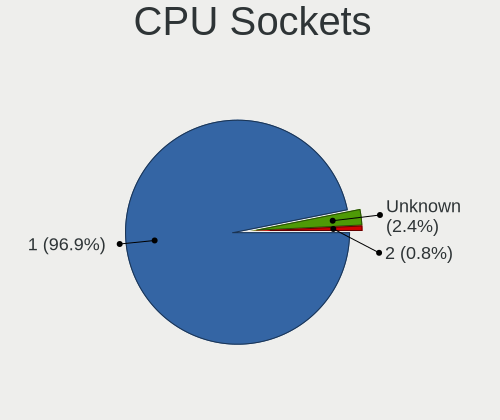

| Number  | Desktops | Percent |
|---------|----------|---------|
| 1       | 63       | 98.44%  |
| Unknown | 1        | 1.56%   |

CPU Threads
-----------

Threads per core (Hyper-Threading)

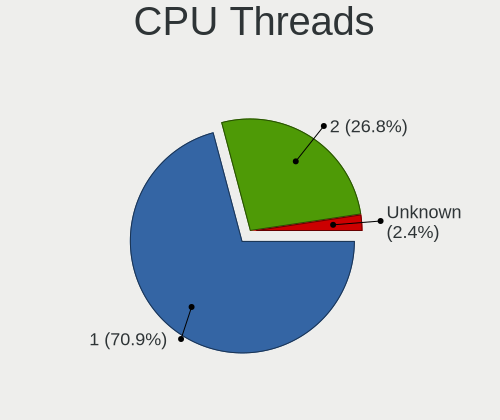

| Number  | Desktops | Percent |
|---------|----------|---------|
| 1       | 46       | 71.88%  |
| 2       | 17       | 26.56%  |
| Unknown | 1        | 1.56%   |

CPU Microarch
-------------

Microarchitecture

| Name          | Desktops | Percent |
|---------------|----------|---------|
| Silvermont    | 9        | 14.06%  |
| KabyLake      | 9        | 14.06%  |
| Haswell       | 6        | 9.38%   |
| Bonnell       | 5        | 7.81%   |
| CometLake     | 4        | 6.25%   |
| Goldmont plus | 3        | 4.69%   |
| Goldmont      | 3        | 4.69%   |
| Zen 2         | 2        | 3.13%   |
| Zen           | 2        | 3.13%   |
| Westmere      | 2        | 3.13%   |
| Skylake       | 2        | 3.13%   |
| Penryn        | 2        | 3.13%   |
| K10           | 2        | 3.13%   |
| IvyBridge     | 2        | 3.13%   |
| Bobcat        | 2        | 3.13%   |
| Unknown       | 2        | 3.13%   |
| Zen+          | 1        | 1.56%   |
| Zen 3         | 1        | 1.56%   |
| SandyBridge   | 1        | 1.56%   |
| Piledriver    | 1        | 1.56%   |
| Jaguar        | 1        | 1.56%   |
| Core          | 1        | 1.56%   |
| Broadwell     | 1        | 1.56%   |

Graphics
--------

GPU Vendor
----------

Vendors of graphics cards

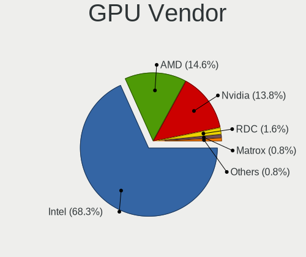

| Vendor | Desktops | Percent |
|--------|----------|---------|
| Intel  | 42       | 68.85%  |
| Nvidia | 10       | 16.39%  |
| AMD    | 9        | 14.75%  |

GPU Model
---------

Graphics card models

| Model                                                                                    | Desktops | Percent |
|------------------------------------------------------------------------------------------|----------|---------|
| Intel Atom Processor Z36xxx/Z37xxx Series Graphics & Display                             | 7        | 11.29%  |
| Intel Xeon E3-1200 v3/4th Gen Core Processor Integrated Graphics Controller              | 4        | 6.45%   |
| Intel HD Graphics 610                                                                    | 3        | 4.84%   |
| Intel GeminiLake [UHD Graphics 600]                                                      | 3        | 4.84%   |
| Intel CometLake-S GT2 [UHD Graphics 630]                                                 | 3        | 4.84%   |
| Intel Atom Processor D4xx/D5xx/N4xx/N5xx Integrated Graphics Controller                  | 3        | 4.84%   |
| Nvidia GM206 [GeForce GTX 960]                                                           | 2        | 3.23%   |
| Intel HD Graphics 620                                                                    | 2        | 3.23%   |
| Intel HD Graphics 500                                                                    | 2        | 3.23%   |
| Intel Atom/Celeron/Pentium Processor x5-E8000/J3xxx/N3xxx Integrated Graphics Controller | 2        | 3.23%   |
| Intel Atom Processor D2xxx/N2xxx Integrated Graphics Controller                          | 2        | 3.23%   |
| Nvidia TU116 [GeForce GTX 1660]                                                          | 1        | 1.61%   |
| Nvidia GT218 [GeForce 210]                                                               | 1        | 1.61%   |
| Nvidia GP108 [GeForce GT 1030]                                                           | 1        | 1.61%   |
| Nvidia GP107 [GeForce GTX 1050]                                                          | 1        | 1.61%   |
| Nvidia GP104 [GeForce GTX 1070]                                                          | 1        | 1.61%   |
| Nvidia GP102 [GeForce GTX 1080 Ti]                                                       | 1        | 1.61%   |
| Nvidia GF106 [GeForce GTS 450]                                                           | 1        | 1.61%   |
| Nvidia C61 [GeForce 7025 / nForce 630a]                                                  | 1        | 1.61%   |
| Intel Xeon E3-1200 v2/3rd Gen Core processor Graphics Controller                         | 1        | 1.61%   |
| Intel JasperLake [UHD Graphics]                                                          | 1        | 1.61%   |
| Intel IvyBridge GT2 [HD Graphics 4000]                                                   | 1        | 1.61%   |
| Intel HD Graphics 630                                                                    | 1        | 1.61%   |
| Intel HD Graphics 5500                                                                   | 1        | 1.61%   |
| Intel HD Graphics 530                                                                    | 1        | 1.61%   |
| Intel Comet Lake UHD Graphics                                                            | 1        | 1.61%   |
| Intel CoffeeLake-S GT2 [UHD Graphics 630]                                                | 1        | 1.61%   |
| Intel 82Q35 Express Integrated Graphics Controller                                       | 1        | 1.61%   |
| Intel 82G33/G31 Express Integrated Graphics Controller                                   | 1        | 1.61%   |
| Intel 2nd Generation Core Processor Family Integrated Graphics Controller                | 1        | 1.61%   |
| AMD Wrestler [Radeon HD 6290]                                                            | 1        | 1.61%   |
| AMD Wrestler [Radeon HD 6250]                                                            | 1        | 1.61%   |
| AMD Trinity [Radeon HD 7660D]                                                            | 1        | 1.61%   |
| AMD RV620 GL [FirePro 2260]                                                              | 1        | 1.61%   |
| AMD Raven Ridge [Radeon Vega Series / Radeon Vega Mobile Series]                         | 1        | 1.61%   |
| AMD Navi 10 [Radeon RX 5600 OEM/5600 XT / 5700/5700 XT]                                  | 1        | 1.61%   |
| AMD Lexa PRO [Radeon 540/540X/550/550X / RX 540X/550/550X]                               | 1        | 1.61%   |
| AMD Kabini [Radeon HD 8400E]                                                             | 1        | 1.61%   |
| AMD Caicos [Radeon HD 6450A/7450A]                                                       | 1        | 1.61%   |
| AMD Caicos [Radeon HD 6450/7450/8450 / R5 230 OEM]                                       | 1        | 1.61%   |

GPU Combo
---------

Combinations of graphics cards

| Name       | Desktops | Percent |
|------------|----------|---------|
| 1 x Intel  | 38       | 59.38%  |
| 1 x Nvidia | 10       | 15.63%  |
| 1 x AMD    | 8        | 12.5%   |
| 2 x Intel  | 4        | 6.25%   |
| Other      | 3        | 4.69%   |
| 2 x AMD    | 1        | 1.56%   |

GPU Driver
----------

Free vs proprietary

| Driver      | Desktops | Percent |
|-------------|----------|---------|
| Free        | 52       | 81.25%  |
| Proprietary | 7        | 10.94%  |
| Unknown     | 5        | 7.81%   |

GPU Memory
----------

Total video memory

| Size in GB | Desktops | Percent |
|------------|----------|---------|
| Unknown    | 55       | 85.94%  |
| 7.01-8.0   | 2        | 3.13%   |
| 0.01-0.5   | 2        | 3.13%   |
| 5.01-6.0   | 1        | 1.56%   |
| 3.01-4.0   | 1        | 1.56%   |
| 1.01-2.0   | 1        | 1.56%   |
| 8.01-16.0  | 1        | 1.56%   |
| 0.51-1.0   | 1        | 1.56%   |

Monitor
-------

Monitor Vendor
--------------

Monitor vendors

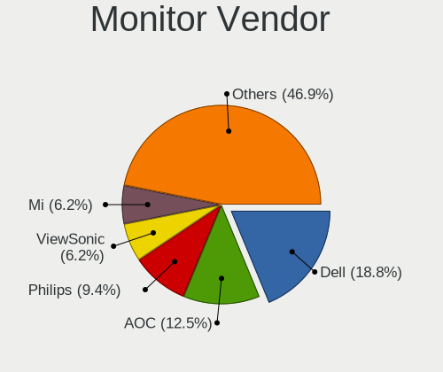

| Vendor  | Desktops | Percent |
|---------|----------|---------|
| Dell    | 5        | 27.78%  |
| AOC     | 3        | 16.67%  |
| Lenovo  | 2        | 11.11%  |
| ZL_     | 1        | 5.56%   |
| Philips | 1        | 5.56%   |
| Mi      | 1        | 5.56%   |
| Haier   | 1        | 5.56%   |
| GRR     | 1        | 5.56%   |
| CAN     | 1        | 5.56%   |
| BenQ    | 1        | 5.56%   |
| Acer    | 1        | 5.56%   |

Monitor Model
-------------

Monitor models

| Model                                                    | Desktops | Percent |
|----------------------------------------------------------|----------|---------|
| ZL_ zhuoyue-HDMI ZL_2716 2560x1440 600x330mm 27.0-inch   | 1        | 5.56%   |
| Philips 190V PHL0081 1440x900 400x250mm 18.6-inch        | 1        | 5.56%   |
| Mi Redmi 27 NQ XMIE001 2560x1440 600x330mm 27.0-inch     | 1        | 5.56%   |
| Lenovo LCD Monitor LEN4000 1024x768 250x180mm 12.1-inch  | 1        | 5.56%   |
| Lenovo L197 Wide LEN1152 1440x900 410x260mm 19.1-inch    | 1        | 5.56%   |
| Haier HT-20216B(C) HAI2031 1920x1080 480x270mm 21.7-inch | 1        | 5.56%   |
| GRR GRC GRR2400 1920x1080 520x310mm 23.8-inch            | 1        | 5.56%   |
| Dell U2414H DELA0A4 1920x1080 530x300mm 24.0-inch        | 1        | 5.56%   |
| Dell S2240M DELD055 1920x1080 480x270mm 21.7-inch        | 1        | 5.56%   |
| Dell P2419H DELD0DA 1920x1080 530x300mm 24.0-inch        | 1        | 5.56%   |
| Dell P2415Q DELA0C0 3840x2160 530x300mm 24.0-inch        | 1        | 5.56%   |
| Dell E228WFP DELD015 1680x1050 470x300mm 22.0-inch       | 1        | 5.56%   |
| CAN F55C CAN0055 3840x2160 1210x680mm 54.6-inch          | 1        | 5.56%   |
| BenQ FP91G+ BNQ76A6 1280x1024 380x300mm 19.1-inch        | 1        | 5.56%   |
| AOC Q27P1B AOC2701 1920x1080 600x340mm 27.2-inch         | 1        | 5.56%   |
| AOC 2778X AOC2778 2560x1440 600x340mm 27.2-inch          | 1        | 5.56%   |
| AOC 2479W AOC2479 1920x1080 520x290mm 23.4-inch          | 1        | 5.56%   |
| Acer G195WV ACR0263 1440x900 410x260mm 19.1-inch         | 1        | 5.56%   |

Monitor Resolution
------------------

Monitor screen resolution

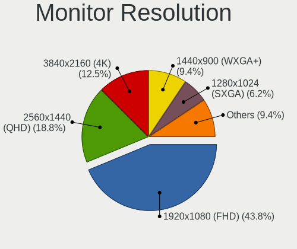

| Resolution         | Desktops | Percent |
|--------------------|----------|---------|
| 1920x1080 (FHD)    | 8        | 44.44%  |
| 2560x1440 (QHD)    | 3        | 16.67%  |
| 1440x900 (WXGA+)   | 3        | 16.67%  |
| 3840x2160 (4K)     | 2        | 11.11%  |
| 1680x1050 (WSXGA+) | 1        | 5.56%   |
| 1280x1024 (SXGA)   | 1        | 5.56%   |

Monitor Diagonal
----------------

Diagonal size in inches

| Inches | Desktops | Percent |
|--------|----------|---------|
| 27     | 4        | 22.22%  |
| 24     | 3        | 16.67%  |
| 23     | 3        | 16.67%  |
| 19     | 3        | 16.67%  |
| 21     | 2        | 11.11%  |
| 54     | 1        | 5.56%   |
| 22     | 1        | 5.56%   |
| 18     | 1        | 5.56%   |

Monitor Width
-------------

Physical width

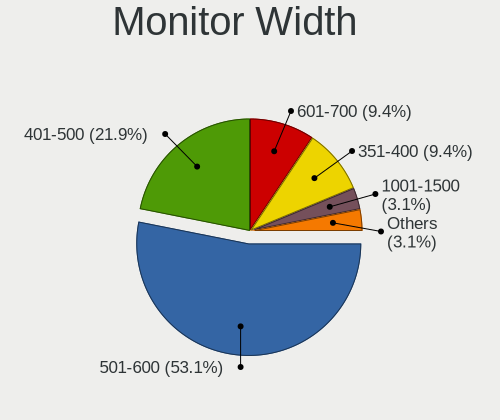

| Width in mm | Desktops | Percent |
|-------------|----------|---------|
| 501-600     | 10       | 55.56%  |
| 401-500     | 5        | 27.78%  |
| 351-400     | 2        | 11.11%  |
| 1001-1500   | 1        | 5.56%   |

Aspect Ratio
------------

Proportional relationship between the width and the height

| Ratio | Desktops | Percent |
|-------|----------|---------|
| 16/9  | 13       | 72.22%  |
| 16/10 | 4        | 22.22%  |
| 5/4   | 1        | 5.56%   |

Monitor Area
------------

Area in inch

| Area in inch | Desktops | Percent |
|----------------|----------|---------|
| 201-250        | 9        | 50%     |
| 301-350        | 4        | 22.22%  |
| 151-200        | 4        | 22.22%  |
| More than 1000 | 1        | 5.56%   |

Pixel Density
-------------

Pixels per inch

| Density | Desktops | Percent |
|---------|----------|---------|
| 51-100  | 12       | 66.67%  |
| 101-120 | 5        | 27.78%  |
| 161-240 | 1        | 5.56%   |

Multiple Monitors
-----------------

Total monitors connected

| Total | Desktops | Percent |
|-------|----------|---------|
| 0     | 46       | 70.77%  |
| 1     | 19       | 29.23%  |

Network
-------

Net Controller Vendor
---------------------

Controller vendors

| Vendor                   | Desktops | Percent |
|--------------------------|----------|---------|
| Intel                    | 40       | 49.38%  |
| Realtek Semiconductor    | 34       | 41.98%  |
| Qualcomm Atheros         | 3        | 3.7%    |
| Broadcom                 | 2        | 2.47%   |
| Ralink Technology        | 1        | 1.23%   |
| Marvell Technology Group | 1        | 1.23%   |

Net Controller Model
--------------------

Controller models

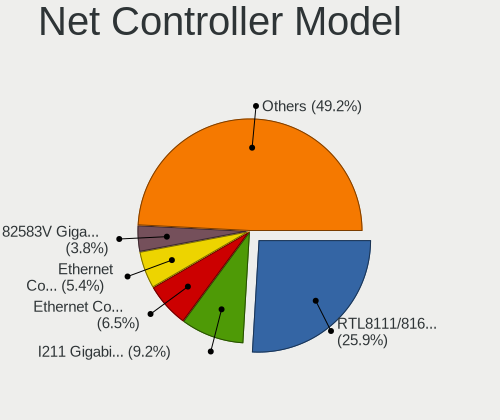

| Model                                                             | Desktops | Percent |
|-------------------------------------------------------------------|----------|---------|
| Realtek RTL8111/8168/8411 PCI Express Gigabit Ethernet Controller | 29       | 31.52%  |
| Intel I211 Gigabit Network Connection                             | 13       | 14.13%  |
| Intel 82583V Gigabit Network Connection                           | 4        | 4.35%   |
| Intel I350 Gigabit Network Connection                             | 3        | 3.26%   |
| Intel I210 Gigabit Network Connection                             | 3        | 3.26%   |
| Intel 82579LM Gigabit Network Connection (Lewisville)             | 3        | 3.26%   |
| Realtek RTL8125 2.5GbE Controller                                 | 2        | 2.17%   |
| Realtek RTL810xE PCI Express Fast Ethernet controller             | 2        | 2.17%   |
| Intel Wireless 7260                                               | 2        | 2.17%   |
| Intel Wireless 3165                                               | 2        | 2.17%   |
| Intel Wi-Fi 6 AX200                                               | 2        | 2.17%   |
| Intel Ethernet Controller I225-V                                  | 2        | 2.17%   |
| Intel Ethernet Connection I217-LM                                 | 2        | 2.17%   |
| Realtek RTL8821CE 802.11ac PCIe Wireless Network Adapter          | 1        | 1.09%   |
| Realtek RTL8191SU 802.11n WLAN Adapter                            | 1        | 1.09%   |
| Realtek RTL8188CE 802.11b/g/n WiFi Adapter                        | 1        | 1.09%   |
| Realtek RTL8169 PCI Gigabit Ethernet Controller                   | 1        | 1.09%   |
| Ralink RT5370 Wireless Adapter                                    | 1        | 1.09%   |
| Qualcomm Atheros QCA986x/988x 802.11ac Wireless Network Adapter   | 1        | 1.09%   |
| Qualcomm Atheros QCA9565 / AR9565 Wireless Network Adapter        | 1        | 1.09%   |
| Qualcomm Atheros AR928X Wireless Network Adapter (PCI-Express)    | 1        | 1.09%   |
| Marvell Group 88E8056 PCI-E Gigabit Ethernet Controller           | 1        | 1.09%   |
| Intel Wireless 3160                                               | 1        | 1.09%   |
| Intel Ethernet Connection X553 1GbE                               | 1        | 1.09%   |
| Intel Ethernet Connection I217-V                                  | 1        | 1.09%   |
| Intel Ethernet Connection (7) I219-LM                             | 1        | 1.09%   |
| Intel Ethernet Connection (2) I219-V                              | 1        | 1.09%   |
| Intel Ethernet Connection (11) I219-V                             | 1        | 1.09%   |
| Intel Dual Band Wireless-AC 3168NGW [Stone Peak]                  | 1        | 1.09%   |
| Intel 82580 Gigabit Network Connection                            | 1        | 1.09%   |
| Intel 82576 Gigabit Network Connection                            | 1        | 1.09%   |
| Intel 82575GB Gigabit Network Connection                          | 1        | 1.09%   |
| Intel 82575EB Gigabit Network Connection                          | 1        | 1.09%   |
| Intel 82566DM-2 Gigabit Network Connection                        | 1        | 1.09%   |
| Broadcom NetXtreme BCM5761 Gigabit Ethernet PCIe                  | 1        | 1.09%   |
| Broadcom BCM4360 802.11ac Wireless Network Adapter                | 1        | 1.09%   |

Wireless Vendor
---------------

Wireless vendors

| Vendor                | Desktops | Percent |
|-----------------------|----------|---------|
| Intel                 | 8        | 50%     |
| Realtek Semiconductor | 3        | 18.75%  |
| Qualcomm Atheros      | 3        | 18.75%  |
| Ralink Technology     | 1        | 6.25%   |
| Broadcom              | 1        | 6.25%   |

Wireless Model
--------------

Wireless models

| Model                                                           | Desktops | Percent |
|-----------------------------------------------------------------|----------|---------|
| Intel Wireless 7260                                             | 2        | 12.5%   |
| Intel Wireless 3165                                             | 2        | 12.5%   |
| Intel Wi-Fi 6 AX200                                             | 2        | 12.5%   |
| Realtek RTL8821CE 802.11ac PCIe Wireless Network Adapter        | 1        | 6.25%   |
| Realtek RTL8191SU 802.11n WLAN Adapter                          | 1        | 6.25%   |
| Realtek RTL8188CE 802.11b/g/n WiFi Adapter                      | 1        | 6.25%   |
| Ralink RT5370 Wireless Adapter                                  | 1        | 6.25%   |
| Qualcomm Atheros QCA986x/988x 802.11ac Wireless Network Adapter | 1        | 6.25%   |
| Qualcomm Atheros QCA9565 / AR9565 Wireless Network Adapter      | 1        | 6.25%   |
| Qualcomm Atheros AR928X Wireless Network Adapter (PCI-Express)  | 1        | 6.25%   |
| Intel Wireless 3160                                             | 1        | 6.25%   |
| Intel Dual Band Wireless-AC 3168NGW [Stone Peak]                | 1        | 6.25%   |
| Broadcom BCM4360 802.11ac Wireless Network Adapter              | 1        | 6.25%   |

Ethernet Vendor
---------------

Ethernet vendors

| Vendor                   | Desktops | Percent |
|--------------------------|----------|---------|
| Intel                    | 34       | 49.28%  |
| Realtek Semiconductor    | 33       | 47.83%  |
| Marvell Technology Group | 1        | 1.45%   |
| Broadcom                 | 1        | 1.45%   |

Ethernet Model
--------------

Ethernet models

| Model                                                             | Desktops | Percent |
|-------------------------------------------------------------------|----------|---------|
| Realtek RTL8111/8168/8411 PCI Express Gigabit Ethernet Controller | 29       | 38.16%  |
| Intel I211 Gigabit Network Connection                             | 13       | 17.11%  |
| Intel 82583V Gigabit Network Connection                           | 4        | 5.26%   |
| Intel I350 Gigabit Network Connection                             | 3        | 3.95%   |
| Intel I210 Gigabit Network Connection                             | 3        | 3.95%   |
| Intel 82579LM Gigabit Network Connection (Lewisville)             | 3        | 3.95%   |
| Realtek RTL8125 2.5GbE Controller                                 | 2        | 2.63%   |
| Realtek RTL810xE PCI Express Fast Ethernet controller             | 2        | 2.63%   |
| Intel Ethernet Controller I225-V                                  | 2        | 2.63%   |
| Intel Ethernet Connection I217-LM                                 | 2        | 2.63%   |
| Realtek RTL8169 PCI Gigabit Ethernet Controller                   | 1        | 1.32%   |
| Marvell Group 88E8056 PCI-E Gigabit Ethernet Controller           | 1        | 1.32%   |
| Intel Ethernet Connection X553 1GbE                               | 1        | 1.32%   |
| Intel Ethernet Connection I217-V                                  | 1        | 1.32%   |
| Intel Ethernet Connection (7) I219-LM                             | 1        | 1.32%   |
| Intel Ethernet Connection (2) I219-V                              | 1        | 1.32%   |
| Intel Ethernet Connection (11) I219-V                             | 1        | 1.32%   |
| Intel 82580 Gigabit Network Connection                            | 1        | 1.32%   |
| Intel 82576 Gigabit Network Connection                            | 1        | 1.32%   |
| Intel 82575GB Gigabit Network Connection                          | 1        | 1.32%   |
| Intel 82575EB Gigabit Network Connection                          | 1        | 1.32%   |
| Intel 82566DM-2 Gigabit Network Connection                        | 1        | 1.32%   |
| Broadcom NetXtreme BCM5761 Gigabit Ethernet PCIe                  | 1        | 1.32%   |

Net Controller Kind
-------------------

Ethernet, WiFi or modem

| Kind     | Desktops | Percent |
|----------|----------|---------|
| Ethernet | 63       | 81.82%  |
| WiFi     | 14       | 18.18%  |

Used Controller
---------------

Currently used network controller

| Kind     | Desktops | Percent |
|----------|----------|---------|
| Ethernet | 61       | 91.04%  |
| WiFi     | 6        | 8.96%   |

NICs
----

Total network controllers on board

| Total | Desktops | Percent |
|-------|----------|---------|
| 2     | 29       | 45.31%  |
| 1     | 12       | 18.75%  |
| 6     | 8        | 12.5%   |
| 4     | 8        | 12.5%   |
| 5     | 5        | 7.81%   |
| 7     | 1        | 1.56%   |
| 0     | 1        | 1.56%   |

IPv6
----

IPv6 vs IPv4

| Used | Desktops | Percent |
|------|----------|---------|
| No   | 52       | 77.61%  |
| Yes  | 15       | 22.39%  |

Bluetooth
---------

Bluetooth Vendor
----------------

Controller vendors

| Vendor                          | Desktops | Percent |
|---------------------------------|----------|---------|
| Intel                           | 6        | 54.55%  |
| Realtek Semiconductor           | 2        | 18.18%  |
| Qualcomm Atheros Communications | 1        | 9.09%   |
| Cambridge Silicon Radio         | 1        | 9.09%   |
| Apple                           | 1        | 9.09%   |

Bluetooth Model
---------------

Controller models

| Model                                                       | Desktops | Percent |
|-------------------------------------------------------------|----------|---------|
| Intel Bluetooth wireless interface                          | 3        | 27.27%  |
| Intel AX200 Bluetooth                                       | 2        | 18.18%  |
| Realtek  Bluetooth 4.2 Adapter                              | 1        | 9.09%   |
| Realtek  Bluetooth 4.0 Adapter                              | 1        | 9.09%   |
| Qualcomm Atheros Dell Wireless 1707 Bluetooth 4.0 LE Device | 1        | 9.09%   |
| Intel Wireless-AC 3168 Bluetooth                            | 1        | 9.09%   |
| Cambridge Silicon Radio Bluetooth Dongle (HCI mode)         | 1        | 9.09%   |
| Apple Apple Broadcom Built-in Bluetooth                     | 1        | 9.09%   |

Sound
-----

Sound Vendor
------------

Sound card vendors

| Vendor                 | Desktops | Percent |
|------------------------|----------|---------|
| Intel                  | 42       | 64.62%  |
| AMD                    | 12       | 18.46%  |
| Nvidia                 | 10       | 15.38%  |
| Generalplus Technology | 1        | 1.54%   |

Sound Model
-----------

Sound card models

| Model                                                                                             | Desktops | Percent |
|---------------------------------------------------------------------------------------------------|----------|---------|
| Intel Atom Processor Z36xxx/Z37xxx Series High Definition Audio Controller                        | 5        | 6.76%   |
| Intel Xeon E3-1200 v3/4th Gen Core Processor HD Audio Controller                                  | 4        | 5.41%   |
| Intel 100 Series/C230 Series Chipset Family HD Audio Controller                                   | 4        | 5.41%   |
| Intel NM10/ICH7 Family High Definition Audio Controller                                           | 3        | 4.05%   |
| Intel Celeron/Pentium Silver Processor High Definition Audio                                      | 3        | 4.05%   |
| Intel 82801JI (ICH10 Family) HD Audio Controller                                                  | 3        | 4.05%   |
| Intel 8 Series/C220 Series Chipset High Definition Audio Controller                               | 3        | 4.05%   |
| Intel 7 Series/C216 Chipset Family High Definition Audio Controller                               | 3        | 4.05%   |
| AMD Starship/Matisse HD Audio Controller                                                          | 3        | 4.05%   |
| AMD SBx00 Azalia (Intel HDA)                                                                      | 3        | 4.05%   |
| Nvidia GM206 High Definition Audio Controller                                                     | 2        | 2.7%    |
| Intel Sunrise Point-LP HD Audio                                                                   | 2        | 2.7%    |
| Intel Comet Lake PCH-V cAVS                                                                       | 2        | 2.7%    |
| Intel Celeron N3350/Pentium N4200/Atom E3900 Series Audio Cluster                                 | 2        | 2.7%    |
| Intel Atom/Celeron/Pentium Processor x5-E8000/J3xxx/N3xxx Series High Definition Audio Controller | 2        | 2.7%    |
| AMD Wrestler HDMI Audio                                                                           | 2        | 2.7%    |
| AMD FCH Azalia Controller                                                                         | 2        | 2.7%    |
| AMD Family 17h (Models 00h-0fh) HD Audio Controller                                               | 2        | 2.7%    |
| Nvidia TU116 High Definition Audio Controller                                                     | 1        | 1.35%   |
| Nvidia MCP61 High Definition Audio                                                                | 1        | 1.35%   |
| Nvidia High Definition Audio Controller                                                           | 1        | 1.35%   |
| Nvidia GP108 High Definition Audio Controller                                                     | 1        | 1.35%   |
| Nvidia GP107GL High Definition Audio Controller                                                   | 1        | 1.35%   |
| Nvidia GP104 High Definition Audio Controller                                                     | 1        | 1.35%   |
| Nvidia GP102 HDMI Audio Controller                                                                | 1        | 1.35%   |
| Nvidia GF106 High Definition Audio Controller                                                     | 1        | 1.35%   |
| Intel Wildcat Point-LP High Definition Audio Controller                                           | 1        | 1.35%   |
| Intel Jasper Lake HD Audio                                                                        | 1        | 1.35%   |
| Intel Comet Lake PCH cAVS                                                                         | 1        | 1.35%   |
| Intel Cannon Lake PCH cAVS                                                                        | 1        | 1.35%   |
| Intel Broadwell-U Audio Controller                                                                | 1        | 1.35%   |
| Intel 82801I (ICH9 Family) HD Audio Controller                                                    | 1        | 1.35%   |
| Intel 82801H (ICH8 Family) HD Audio Controller                                                    | 1        | 1.35%   |
| Intel 200 Series PCH HD Audio                                                                     | 1        | 1.35%   |
| Generalplus Technology USB Audio Device                                                           | 1        | 1.35%   |
| AMD Trinity HDMI Audio Controller                                                                 | 1        | 1.35%   |
| AMD Raven/Raven2/Fenghuang HDMI/DP Audio Controller                                               | 1        | 1.35%   |
| AMD Navi 10 HDMI Audio                                                                            | 1        | 1.35%   |
| AMD Kabini HDMI/DP Audio                                                                          | 1        | 1.35%   |
| AMD Family 17h/19h HD Audio Controller                                                            | 1        | 1.35%   |

Memory
------

Memory Vendor
-------------

Memory module vendors

| Vendor              | Desktops | Percent |
|---------------------|----------|---------|
| Samsung Electronics | 16       | 22.86%  |
| Kingston            | 11       | 15.71%  |
| Unknown             | 10       | 14.29%  |
| Micron Technology   | 9        | 12.86%  |
| SK hynix            | 6        | 8.57%   |
| A-DATA Technology   | 6        | 8.57%   |
| Unknown             | 3        | 4.29%   |
| Nanya Technology    | 2        | 2.86%   |
| G.Skill             | 2        | 2.86%   |
| Team                | 1        | 1.43%   |
| Ramsta              | 1        | 1.43%   |
| Ramaxel Technology  | 1        | 1.43%   |
| Elpida              | 1        | 1.43%   |
| Corsair             | 1        | 1.43%   |

Memory Model
------------

Memory module models

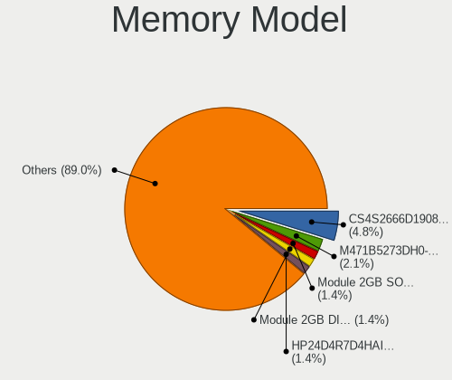

| Model                                                      | Desktops | Percent |
|------------------------------------------------------------|----------|---------|
| Samsung RAM M471B5273DH0-CH9 4GB SODIMM DDR3 1334MT/s      | 3        | 4.11%   |
| Unknown                                                    | 3        | 4.11%   |
| Unknown RAM Module 2GB DIMM DDR2 800MT/s                   | 2        | 2.74%   |
| Kingston RAM KHX3000C15D4/8GX 8GB DIMM DDR4 2933MT/s       | 2        | 2.74%   |
| Unknown RAM XinJuHuo 8GB SODIMM DDR3 1600MT/s              | 1        | 1.37%   |
| Unknown RAM TMKS8G68ALFBCH-266 8192MB SODIMM DDR4 2400MT/s | 1        | 1.37%   |
| Unknown RAM Module 4GB DIMM DDR4 2133MT/s                  | 1        | 1.37%   |
| Unknown RAM Module 2GB SODIMM DDR3 800MT/s                 | 1        | 1.37%   |
| Unknown RAM Module 2GB SODIMM DDR2 800MT/s                 | 1        | 1.37%   |
| Unknown RAM Module 2048MB DIMM 1333MT/s                    | 1        | 1.37%   |
| Unknown RAM Module 1GB DIMM DDR2 667MT/s                   | 1        | 1.37%   |
| Unknown RAM IM38GS48A16-BBBHB0 8GB DIMM DDR3 1600MT/s      | 1        | 1.37%   |
| Team RAM TEAMGROUP-UD4-2133 8GB DIMM DDR4 2133MT/s         | 1        | 1.37%   |
| SK hynix RAM HMT325U6BFR8C-H9 2GB DIMM 1066MT/s            | 1        | 1.37%   |
| SK hynix RAM HMT325S6EFR8C-PB 2GB DIMM DDR3 1600MT/s       | 1        | 1.37%   |
| SK hynix RAM HMT325S6BFR8C-H9 2GB DIMM DDR3 1333MT/s       | 1        | 1.37%   |
| SK hynix RAM HMT125U6TFR8C-H9 2GB DIMM DDR3 1333MT/s       | 1        | 1.37%   |
| SK hynix RAM HMA81GS6JJR8N-VK 8GB SODIMM DDR4 2667MT/s     | 1        | 1.37%   |
| SK hynix RAM HMA451S6AFR8N-TF 4GB SODIMM DDR4 2133MT/s     | 1        | 1.37%   |
| SK hynix RAM 8ATF1G64HZ-2G3A1 8GB DIMM DDR4 2400MT/s       | 1        | 1.37%   |
| Samsung RAM M471B5673FH0-CH9 2GB DIMM DDR3 1333MT/s        | 1        | 1.37%   |
| Samsung RAM M471B5273DM0-CH9 4GB DIMM DDR3 1333MT/s        | 1        | 1.37%   |
| Samsung RAM M471B5273DH0-YK0 4GB DIMM DDR3 1600MT/s        | 1        | 1.37%   |
| Samsung RAM M471B5273DH0-CK0 4GB SODIMM DDR3 1600MT/s      | 1        | 1.37%   |
| Samsung RAM M471B5273DH0-CK0 4GB DIMM DDR3 1333MT/s        | 1        | 1.37%   |
| Samsung RAM M471B5173DB0-YK0 4GB SODIMM DDR3 1600MT/s      | 1        | 1.37%   |
| Samsung RAM M471B1G73QHO-YKO 4GB SODIMM DDR3 1600MT/s      | 1        | 1.37%   |
| Samsung RAM M471B1G73EB0-YK0 8192MB DDR3 1600MT/s          | 1        | 1.37%   |
| Samsung RAM M471A5244CB0-CWE 4GB SODIMM DDR4 3200MT/s      | 1        | 1.37%   |
| Samsung RAM M471A1K43CB1-CTD 8GB SODIMM DDR4 2667MT/s      | 1        | 1.37%   |
| Samsung RAM M471A1K43BB1-CRC 8GB SODIMM DDR4 2400MT/s      | 1        | 1.37%   |
| Samsung RAM M391B5273DH0-YH9 4GB DIMM DDR3 1333MT/s        | 1        | 1.37%   |
| Samsung RAM M378B5173QH0-CK0 4GB DIMM DDR3 1600MT/s        | 1        | 1.37%   |
| Ramsta RAM Module 2GB DIMM DDR2 667MT/s                    | 1        | 1.37%   |
| Ramaxel RAM RMR5040ED58E9W1600 4GB DIMM DDR3 1600MT/s      | 1        | 1.37%   |
| Nanya RAM NT8GC64B8HB0NS-DI 8GB SODIMM DDR3 1600MT/s       | 1        | 1.37%   |
| Nanya RAM NT4GC64B8HG0NS-DI 4GB SODIMM DDR3 1600MT/s       | 1        | 1.37%   |
| Micron RAM Module 8192MB DIMM DDR4 3200MT/s                | 1        | 1.37%   |
| Micron RAM 8JTF51264AZ-1G6E1 4GB DIMM DDR3 1600MT/s        | 1        | 1.37%   |
| Micron RAM 8JTF25664AZ-1G4M1 2GB DIMM DDR3 1333MT/s        | 1        | 1.37%   |

Memory Kind
-----------

Memory module kinds

| Kind    | Desktops | Percent |
|---------|----------|---------|
| DDR3    | 30       | 48.39%  |
| DDR4    | 26       | 41.94%  |
| DDR2    | 4        | 6.45%   |
| Unknown | 2        | 3.23%   |

Memory Form Factor
------------------

Physical design of the memory module

| Name    | Desktops | Percent |
|---------|----------|---------|
| DIMM    | 37       | 58.73%  |
| SODIMM  | 24       | 38.1%   |
| Unknown | 2        | 3.17%   |

Memory Size
-----------

Memory module size

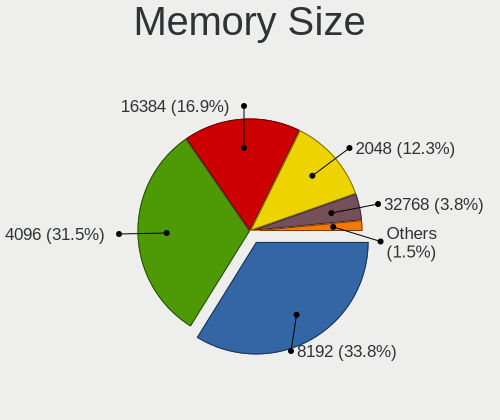

| Size  | Desktops | Percent |
|-------|----------|---------|
| 4096  | 25       | 37.31%  |
| 8192  | 20       | 29.85%  |
| 2048  | 13       | 19.4%   |
| 16384 | 8        | 11.94%  |
| 1024  | 1        | 1.49%   |

Memory Speed
------------

Memory module speed

| Speed | Desktops | Percent |
|-------|----------|---------|
| 1600  | 16       | 23.19%  |
| 1333  | 10       | 14.49%  |
| 2133  | 9        | 13.04%  |
| 2667  | 6        | 8.7%    |
| 2400  | 6        | 8.7%    |
| 800   | 5        | 7.25%   |
| 3200  | 4        | 5.8%    |
| 2933  | 3        | 4.35%   |
| 2666  | 3        | 4.35%   |
| 1334  | 3        | 4.35%   |
| 667   | 2        | 2.9%    |
| 1867  | 1        | 1.45%   |
| 1066  | 1        | 1.45%   |

Printers & scanners
-------------------

Printer Vendor
--------------

Printer device vendors

Zero info for selected period =(

Printer Model
-------------

Printer device models

Zero info for selected period =(

Scanner Vendor
--------------

Scanner device vendors

Zero info for selected period =(

Scanner Model
-------------

Scanner device models

Zero info for selected period =(

Camera
------

Camera Vendor
-------------

Camera device vendors

| Vendor                  | Desktops | Percent |
|-------------------------|----------|---------|
| Logitech                | 2        | 50%     |
| Z-Star Microelectronics | 1        | 25%     |
| Microdia                | 1        | 25%     |

Camera Model
------------

Camera device models

| Model                           | Desktops | Percent |
|---------------------------------|----------|---------|
| Z-Star Lenovo USB2.0 UVC Camera | 1        | 25%     |
| Microdia Camera                 | 1        | 25%     |
| Logitech Webcam C170            | 1        | 25%     |
| Logitech C670i FHD Webcam       | 1        | 25%     |

Security
--------

Fingerprint Vendor
------------------

Fingerprint sensor vendors

Zero info for selected period =(

Fingerprint Model
-----------------

Fingerprint sensor models

Zero info for selected period =(

Chipcard Vendor
---------------

Chipcard module vendors

Zero info for selected period =(

Chipcard Model
--------------

Chipcard module models

Zero info for selected period =(

Unsupported
-----------

Unsupported Devices
-------------------

Total unsupported devices on board

| Total | Desktops | Percent |
|-------|----------|---------|
| 0     | 28       | 43.75%  |
| 1     | 27       | 42.19%  |
| 2     | 9        | 14.06%  |

Unsupported Device Types
------------------------

Types of unsupported devices

| Type                     | Desktops | Percent |
|--------------------------|----------|---------|
| Communication controller | 32       | 74.42%  |
| Net/wireless             | 6        | 13.95%  |
| Card reader              | 2        | 4.65%   |
| Sound                    | 1        | 2.33%   |
| Net/ethernet             | 1        | 2.33%   |
| Bluetooth                | 1        | 2.33%   |

