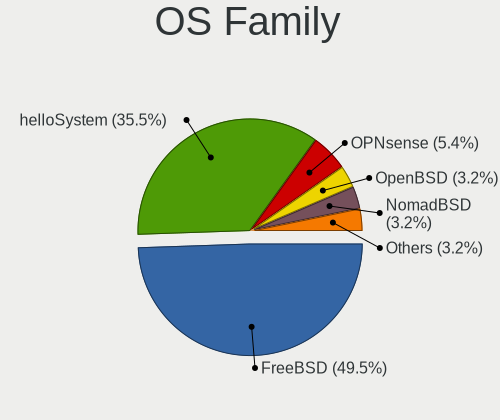
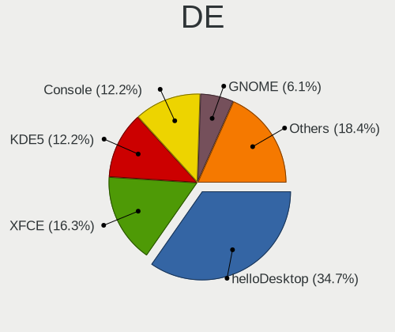
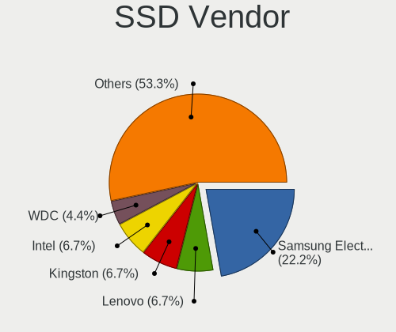
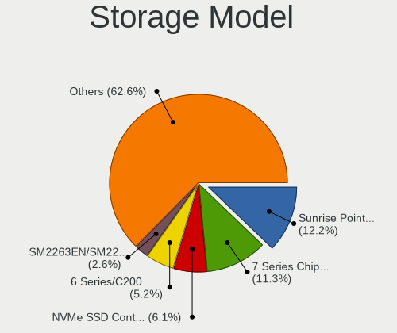
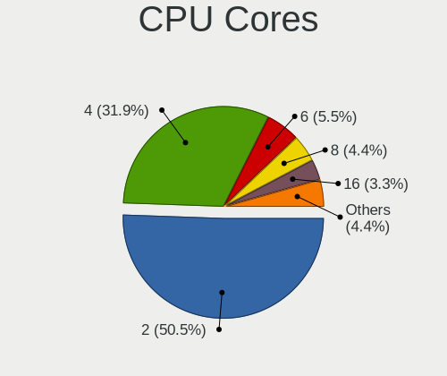
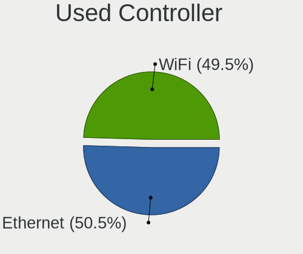
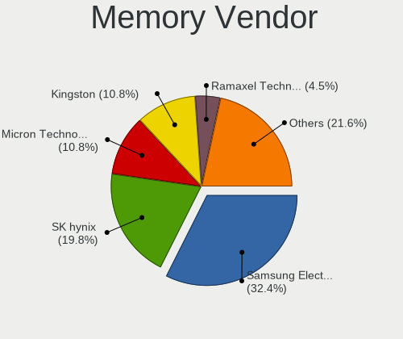
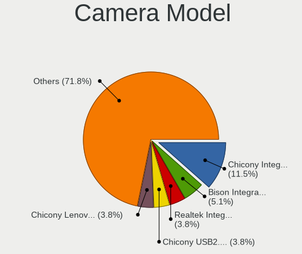
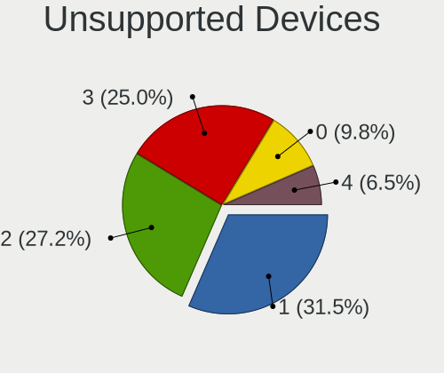

BSD in China - Tested Hardware & Statistics (Notebooks)
-------------------------------------------------------

A project to collect tested hardware configurations for BSD in China.

Anyone can contribute to this report by the [hw-probe](https://github.com/linuxhw/hw-probe/blob/master/INSTALL.BSD.md) tool:

    hw-probe -all -upload

Please contribute! Especially if your hardware is rare.

Contents
--------

* [ Test Cases ](#test-cases)

* [ System ](#system)
  - [ OS                       ](#os)
  - [ OS Family                ](#os-family)
  - [ Arch                     ](#arch)
  - [ DE                       ](#de)
  - [ Display Server           ](#display-server)
  - [ Display Manager          ](#display-manager)
  - [ OS Lang                  ](#os-lang)
  - [ Boot Mode                ](#boot-mode)
  - [ Filesystem               ](#filesystem)
  - [ Part. scheme             ](#part-scheme)

* [ Board ](#board)
  - [ Vendor                   ](#vendor)
  - [ Model                    ](#model)
  - [ Model Family             ](#model-family)
  - [ MFG Year                 ](#mfg-year)
  - [ Form Factor              ](#form-factor)
  - [ Coreboot                 ](#coreboot)
  - [ RAM Size                 ](#ram-size)
  - [ RAM Used                 ](#ram-used)
  - [ Total Drives             ](#total-drives)
  - [ Has CD-ROM               ](#has-cd-rom)
  - [ Has Ethernet             ](#has-ethernet)
  - [ Has WiFi                 ](#has-wifi)
  - [ Has Bluetooth            ](#has-bluetooth)

* [ Location ](#location)
  - [ Country                  ](#country)
  - [ City                     ](#city)

* [ Drives ](#drives)
  - [ Drive Vendor             ](#drive-vendor)
  - [ Drive Model              ](#drive-model)
  - [ HDD Vendor               ](#hdd-vendor)
  - [ SSD Vendor               ](#ssd-vendor)
  - [ Drive Kind               ](#drive-kind)
  - [ Drive Connector          ](#drive-connector)
  - [ Drive Size               ](#drive-size)
  - [ Space Total              ](#space-total)
  - [ Space Used               ](#space-used)
  - [ Malfunc. Drives          ](#malfunc-drives)
  - [ Malfunc. Drive Vendor    ](#malfunc-drive-vendor)
  - [ Malfunc. HDD Vendor      ](#malfunc-hdd-vendor)
  - [ Malfunc. Drive Kind      ](#malfunc-drive-kind)
  - [ Failed Drives            ](#failed-drives)
  - [ Failed Drive Vendor      ](#failed-drive-vendor)
  - [ Drive Status             ](#drive-status)

* [ Storage controller ](#storage-controller)
  - [ Storage Vendor           ](#storage-vendor)
  - [ Storage Model            ](#storage-model)
  - [ Storage Kind             ](#storage-kind)

* [ Processor ](#processor)
  - [ CPU Vendor               ](#cpu-vendor)
  - [ CPU Model                ](#cpu-model)
  - [ CPU Model Family         ](#cpu-model-family)
  - [ CPU Cores                ](#cpu-cores)
  - [ CPU Sockets              ](#cpu-sockets)
  - [ CPU Threads              ](#cpu-threads)
  - [ CPU Microarch            ](#cpu-microarch)

* [ Graphics ](#graphics)
  - [ GPU Vendor               ](#gpu-vendor)
  - [ GPU Model                ](#gpu-model)
  - [ GPU Combo                ](#gpu-combo)
  - [ GPU Driver               ](#gpu-driver)
  - [ GPU Memory               ](#gpu-memory)

* [ Monitor ](#monitor)
  - [ Monitor Vendor           ](#monitor-vendor)
  - [ Monitor Model            ](#monitor-model)
  - [ Monitor Resolution       ](#monitor-resolution)
  - [ Monitor Diagonal         ](#monitor-diagonal)
  - [ Monitor Width            ](#monitor-width)
  - [ Aspect Ratio             ](#aspect-ratio)
  - [ Monitor Area             ](#monitor-area)
  - [ Pixel Density            ](#pixel-density)
  - [ Multiple Monitors        ](#multiple-monitors)

* [ Network ](#network)
  - [ Net Controller Vendor    ](#net-controller-vendor)
  - [ Net Controller Model     ](#net-controller-model)
  - [ Wireless Vendor          ](#wireless-vendor)
  - [ Wireless Model           ](#wireless-model)
  - [ Ethernet Vendor          ](#ethernet-vendor)
  - [ Ethernet Model           ](#ethernet-model)
  - [ Net Controller Kind      ](#net-controller-kind)
  - [ Used Controller          ](#used-controller)
  - [ NICs                     ](#nics)
  - [ IPv6                     ](#ipv6)

* [ Bluetooth ](#bluetooth)
  - [ Bluetooth Vendor         ](#bluetooth-vendor)
  - [ Bluetooth Model          ](#bluetooth-model)

* [ Sound ](#sound)
  - [ Sound Vendor             ](#sound-vendor)
  - [ Sound Model              ](#sound-model)

* [ Memory ](#memory)
  - [ Memory Vendor            ](#memory-vendor)
  - [ Memory Model             ](#memory-model)
  - [ Memory Kind              ](#memory-kind)
  - [ Memory Form Factor       ](#memory-form-factor)
  - [ Memory Size              ](#memory-size)
  - [ Memory Speed             ](#memory-speed)

* [ Printers & scanners ](#printers--scanners)
  - [ Printer Vendor           ](#printer-vendor)
  - [ Printer Model            ](#printer-model)
  - [ Scanner Vendor           ](#scanner-vendor)
  - [ Scanner Model            ](#scanner-model)

* [ Camera ](#camera)
  - [ Camera Vendor            ](#camera-vendor)
  - [ Camera Model             ](#camera-model)

* [ Security ](#security)
  - [ Fingerprint Vendor       ](#fingerprint-vendor)
  - [ Fingerprint Model        ](#fingerprint-model)
  - [ Chipcard Vendor          ](#chipcard-vendor)
  - [ Chipcard Model           ](#chipcard-model)

* [ Unsupported ](#unsupported)
  - [ Unsupported Devices      ](#unsupported-devices)
  - [ Unsupported Device Types ](#unsupported-device-types)

Test Cases
----------

Total: 122

| Vendor        | Model                       | Probe                                                     | Date         |
|---------------|-----------------------------|-----------------------------------------------------------|--------------|
| HUAWEI        | MRGFG-XX                    | [e23afd3be3](https://bsd-hardware.info/?probe=e23afd3be3) | Dec 29, 2024 |
| HUAWEI        | MRGFG-XX                    | [6095e2193f](https://bsd-hardware.info/?probe=6095e2193f) | Dec 29, 2024 |
| GPD           | MicroPC                     | [dac20acac9](https://bsd-hardware.info/?probe=dac20acac9) | Nov 22, 2024 |
| Lenovo        | ThinkPad T430 2344DUC       | [63d0cde972](https://bsd-hardware.info/?probe=63d0cde972) | Nov 19, 2024 |
| Samsung       | 535U3C                      | [615b4a9430](https://bsd-hardware.info/?probe=615b4a9430) | Nov 18, 2024 |
| HP            | ProBook 455 15.6 inch G9... | [e76040ded0](https://bsd-hardware.info/?probe=e76040ded0) | Oct 25, 2024 |
| Lenovo        | ThinkPad X250 20CLA455CD    | [875eeb5304](https://bsd-hardware.info/?probe=875eeb5304) | Oct 14, 2024 |
| Unknown       | Unknown                     | [a76921a478](https://bsd-hardware.info/?probe=a76921a478) | Sep 16, 2024 |
| Acer          | E5-572G-57VZ                | [f4c2bf9852](https://bsd-hardware.info/?probe=f4c2bf9852) | Jul 27, 2024 |
| ASUSTek       | X550CC                      | [edd7342aa3](https://bsd-hardware.info/?probe=edd7342aa3) | Jul 16, 2024 |
| Lenovo        | ThinkPad X250 20CLA455CD    | [8efeb91994](https://bsd-hardware.info/?probe=8efeb91994) | Jun 07, 2024 |
| Lenovo        | Legion Y7000P 81HC          | [3dff76a9dd](https://bsd-hardware.info/?probe=3dff76a9dd) | Apr 27, 2024 |
| Lenovo        | IdeaPad 500-14ISK 80NS      | [34ab895e86](https://bsd-hardware.info/?probe=34ab895e86) | Mar 15, 2024 |
| Lenovo        | XiaoXinAir 14+ ACN 2021 ... | [5702ec8e8e](https://bsd-hardware.info/?probe=5702ec8e8e) | Feb 22, 2024 |
| Notebook      | N960Kx                      | [4e83c12f96](https://bsd-hardware.info/?probe=4e83c12f96) | Feb 12, 2024 |
| Dell          | Vostro 5470                 | [56472e8f51](https://bsd-hardware.info/?probe=56472e8f51) | Dec 30, 2023 |
| Google        | Kohaku                      | [0b945d8f38](https://bsd-hardware.info/?probe=0b945d8f38) | Dec 15, 2023 |
| Intel         | H81U                        | [b74cca91df](https://bsd-hardware.info/?probe=b74cca91df) | Dec 01, 2023 |
| Google        | Kohaku                      | [94c3c0f6b7](https://bsd-hardware.info/?probe=94c3c0f6b7) | Nov 26, 2023 |
| Google        | Kohaku                      | [198b445c4e](https://bsd-hardware.info/?probe=198b445c4e) | Nov 26, 2023 |
| Lenovo        | ThinkPad T480 20L5000UUS    | [20fe904881](https://bsd-hardware.info/?probe=20fe904881) | Oct 15, 2023 |
| Timi          | A34R                        | [3cd3f35eaa](https://bsd-hardware.info/?probe=3cd3f35eaa) | Oct 07, 2023 |
| Timi          | A34R                        | [03f00603f7](https://bsd-hardware.info/?probe=03f00603f7) | Oct 07, 2023 |
| Dell          | Inspiron 14-3467            | [5db7e9b7a1](https://bsd-hardware.info/?probe=5db7e9b7a1) | Aug 05, 2023 |
| Lenovo        | ThinkPad X270 20HNA04GCD    | [6547f4a73b](https://bsd-hardware.info/?probe=6547f4a73b) | Jul 31, 2023 |
| Lenovo        | B590 20208                  | [ce1aade2c0](https://bsd-hardware.info/?probe=ce1aade2c0) | Jul 24, 2023 |
| Lenovo        | B590 20208                  | [f734b93999](https://bsd-hardware.info/?probe=f734b93999) | Jul 16, 2023 |
| HP            | Laptop 15s-eq3xxx           | [ff4dbbacdf](https://bsd-hardware.info/?probe=ff4dbbacdf) | Jul 15, 2023 |
| Lenovo        | ThinkPad R14 Gen 4 21E5A... | [e0fc7135e5](https://bsd-hardware.info/?probe=e0fc7135e5) | Jul 15, 2023 |
| Lenovo        | ThinkPad X1 Carbon 6th 2... | [4841a6b1d2](https://bsd-hardware.info/?probe=4841a6b1d2) | Jun 14, 2023 |
| Lenovo        | B590 20208                  | [dc65d735c8](https://bsd-hardware.info/?probe=dc65d735c8) | Jun 04, 2023 |
| Panasonic     | CF-NX1GDHYS                 | [fb1f293997](https://bsd-hardware.info/?probe=fb1f293997) | Jun 02, 2023 |
| HP            | Unknown                     | [e2aa3620b4](https://bsd-hardware.info/?probe=e2aa3620b4) | Apr 23, 2023 |
| HP            | Unknown                     | [941c021569](https://bsd-hardware.info/?probe=941c021569) | Apr 18, 2023 |
| MECHREVO S... | S1 Series                   | [58ae2c4605](https://bsd-hardware.info/?probe=58ae2c4605) | Mar 19, 2023 |
| Lenovo        | ThinkPad X1 Carbon 3448A... | [eaaf0fc8c7](https://bsd-hardware.info/?probe=eaaf0fc8c7) | Mar 14, 2023 |
| Google        | Kohaku                      | [88491d298e](https://bsd-hardware.info/?probe=88491d298e) | Mar 12, 2023 |
| Lenovo        | ThinkPad X230 2324A14       | [124b3bdb95](https://bsd-hardware.info/?probe=124b3bdb95) | Mar 08, 2023 |
| Acer          | TravelMate TX50-G2          | [81ab6d240f](https://bsd-hardware.info/?probe=81ab6d240f) | Mar 05, 2023 |
| HP            | OMEN by Gaming Laptop 16... | [00142b4e4c](https://bsd-hardware.info/?probe=00142b4e4c) | Feb 14, 2023 |
| MECHREVO S... | S1 Series                   | [26c3b9bf4f](https://bsd-hardware.info/?probe=26c3b9bf4f) | Feb 14, 2023 |
| MECHREVO S... | S1 Series                   | [1d948a1a23](https://bsd-hardware.info/?probe=1d948a1a23) | Feb 14, 2023 |
| ASUSTek       | ASUS TUF Gaming A15 FA50... | [c176577762](https://bsd-hardware.info/?probe=c176577762) | Feb 14, 2023 |
| Lenovo        | ThinkPad X1 Carbon 3448A... | [80f8e59cab](https://bsd-hardware.info/?probe=80f8e59cab) | Feb 05, 2023 |
| Lenovo        | ThinkPad X1 Carbon 3448A... | [6da773c078](https://bsd-hardware.info/?probe=6da773c078) | Jan 29, 2023 |
| Lenovo        | ThinkPad T430 2342AG4       | [b5e972d19a](https://bsd-hardware.info/?probe=b5e972d19a) | Jan 24, 2023 |
| Lenovo        | B590 20208                  | [e4c2272546](https://bsd-hardware.info/?probe=e4c2272546) | Jan 15, 2023 |
| HASEE Comp... | N95XKP6                     | [0bc2996a6d](https://bsd-hardware.info/?probe=0bc2996a6d) | Dec 02, 2022 |
| Lenovo        | Legion Y7000P 81HC          | [57c3a4005a](https://bsd-hardware.info/?probe=57c3a4005a) | Dec 01, 2022 |
| Samsung       | 3570R/370R/470R/450R/510... | [7691355396](https://bsd-hardware.info/?probe=7691355396) | Nov 18, 2022 |
| Lenovo        | ThinkPad X1 Carbon 3448A... | [1d2be7d46a](https://bsd-hardware.info/?probe=1d2be7d46a) | Nov 13, 2022 |
| Google        | Edgar                       | [318a750368](https://bsd-hardware.info/?probe=318a750368) | Oct 22, 2022 |
| Lenovo        | XiaoXinPro-13API 2019 81... | [dfa08657fd](https://bsd-hardware.info/?probe=dfa08657fd) | Oct 16, 2022 |
| ASUSTek       | X455LJ                      | [431ad10ab2](https://bsd-hardware.info/?probe=431ad10ab2) | Sep 17, 2022 |
| Dell          | Latitude 5310               | [6edf4d34fe](https://bsd-hardware.info/?probe=6edf4d34fe) | Sep 07, 2022 |
| Acer          | Aspire 4552G                | [a8f8e41c91](https://bsd-hardware.info/?probe=a8f8e41c91) | Aug 14, 2022 |
| Unknown       | Unknown                     | [3efcb47333](https://bsd-hardware.info/?probe=3efcb47333) | Jul 31, 2022 |
| HP            | ProBook 430 G4              | [2a9d4e9b0b](https://bsd-hardware.info/?probe=2a9d4e9b0b) | Jul 30, 2022 |
| HP            | Pavilion Gaming Laptop 1... | [aaf7ed146a](https://bsd-hardware.info/?probe=aaf7ed146a) | Jun 16, 2022 |
| ASUSTek       | X441UV                      | [c8906b438b](https://bsd-hardware.info/?probe=c8906b438b) | Jun 03, 2022 |
| Unknown       | Unknown                     | [3ff577e111](https://bsd-hardware.info/?probe=3ff577e111) | May 26, 2022 |
| Unknown       | Unknown                     | [9e2f16664a](https://bsd-hardware.info/?probe=9e2f16664a) | May 26, 2022 |
| Dell          | Latitude 5520               | [cbc2c03fa1](https://bsd-hardware.info/?probe=cbc2c03fa1) | May 20, 2022 |
| Lenovo        | B470 HuronRiver Platform    | [e0ef68c720](https://bsd-hardware.info/?probe=e0ef68c720) | May 04, 2022 |
| Dell          | Latitude 5290               | [11c3db8f1b](https://bsd-hardware.info/?probe=11c3db8f1b) | Apr 23, 2022 |
| Notebook      | W650DC,DD                   | [0f474b9ebb](https://bsd-hardware.info/?probe=0f474b9ebb) | Apr 23, 2022 |
| HUAWEI        | NBLL-WXX9                   | [d259128717](https://bsd-hardware.info/?probe=d259128717) | Apr 16, 2022 |
| Panasonic     | CF-B11JWCYS                 | [6699d408ad](https://bsd-hardware.info/?probe=6699d408ad) | Apr 08, 2022 |
| Lenovo        | XiaoXinPro-13ARE 2020 82... | [859a429ad0](https://bsd-hardware.info/?probe=859a429ad0) | Mar 24, 2022 |
| HASEE Comp... | CW35S                       | [737c8bb48a](https://bsd-hardware.info/?probe=737c8bb48a) | Mar 14, 2022 |
| WOOKING       | X5                          | [1099e6c574](https://bsd-hardware.info/?probe=1099e6c574) | Feb 14, 2022 |
| Timi          | RedmiBook Pro 15            | [7716f59380](https://bsd-hardware.info/?probe=7716f59380) | Feb 14, 2022 |
| Timi          | RedmiBook Pro 15            | [fdd0ab95ed](https://bsd-hardware.info/?probe=fdd0ab95ed) | Feb 14, 2022 |
| Lenovo        | ThinkPad P51 20HHCTO1WW     | [e4f43cfcad](https://bsd-hardware.info/?probe=e4f43cfcad) | Feb 10, 2022 |
| Lenovo        | G480 20149                  | [adc6b44cc8](https://bsd-hardware.info/?probe=adc6b44cc8) | Jan 09, 2022 |
| HP            | ProBook 440 G6              | [7a8a66430a](https://bsd-hardware.info/?probe=7a8a66430a) | Dec 13, 2021 |
| Lenovo        | ThinkPad Edge E430 3254A... | [0215354bfc](https://bsd-hardware.info/?probe=0215354bfc) | Dec 13, 2021 |
| HP            | ProBook 440 G6              | [f3c014b120](https://bsd-hardware.info/?probe=f3c014b120) | Dec 12, 2021 |
| Lenovo        | ThinkPad Edge E430 3254A... | [990e05c219](https://bsd-hardware.info/?probe=990e05c219) | Dec 11, 2021 |
| Sony          | SVP13225SCBI                | [03ef84679c](https://bsd-hardware.info/?probe=03ef84679c) | Nov 27, 2021 |
| Lenovo        | ThinkPad X1 Carbon Gen 9... | [ddfd14ef31](https://bsd-hardware.info/?probe=ddfd14ef31) | Nov 17, 2021 |
| Lenovo        | ThinkPad X1 Carbon Gen 9... | [ad4f0d967d](https://bsd-hardware.info/?probe=ad4f0d967d) | Nov 17, 2021 |
| Toshiba       | Satellite Pro L510          | [52ce915b05](https://bsd-hardware.info/?probe=52ce915b05) | Nov 03, 2021 |
| Lenovo        | ThinkPad X1 Extreme Gen ... | [e54d79065e](https://bsd-hardware.info/?probe=e54d79065e) | Nov 02, 2021 |
| Lenovo        | ThinkPad X1 Extreme Gen ... | [a71d3392eb](https://bsd-hardware.info/?probe=a71d3392eb) | Nov 02, 2021 |
| Lenovo        | ThinkPad X1 Extreme Gen ... | [8ad7b068f4](https://bsd-hardware.info/?probe=8ad7b068f4) | Oct 26, 2021 |
| Lenovo        | ThinkPad X1 Extreme Gen ... | [c520513abd](https://bsd-hardware.info/?probe=c520513abd) | Oct 26, 2021 |
| Sony          | SVS1511AJB                  | [a366b5fab3](https://bsd-hardware.info/?probe=a366b5fab3) | Oct 24, 2021 |
| Sony          | SVS1511AJB                  | [2333f62192](https://bsd-hardware.info/?probe=2333f62192) | Oct 24, 2021 |
| Lenovo        | ThinkPad X1 Carbon Gen 9... | [abf8bb08a6](https://bsd-hardware.info/?probe=abf8bb08a6) | Oct 11, 2021 |
| ASUSTek       | F83VD                       | [5f2df13f5b](https://bsd-hardware.info/?probe=5f2df13f5b) | Oct 06, 2021 |
| HUAWEI        | HLY-WX9XX                   | [bd5b726e52](https://bsd-hardware.info/?probe=bd5b726e52) | Sep 19, 2021 |
| Lenovo        | ZhaoYang K4e-IML 81VQ       | [cd3ac84240](https://bsd-hardware.info/?probe=cd3ac84240) | Aug 21, 2021 |
| NEC Comput... | PC-VK17HBBCD                | [1e23da04c0](https://bsd-hardware.info/?probe=1e23da04c0) | Aug 08, 2021 |
| Lenovo        | ThinkPad X230 23062S2       | [bceadf5c66](https://bsd-hardware.info/?probe=bceadf5c66) | Aug 05, 2021 |
| Lenovo        | XiaoXinPro-13ARE 2020 82... | [bf56b2a81a](https://bsd-hardware.info/?probe=bf56b2a81a) | Aug 05, 2021 |
| Lenovo        | XiaoXinPro-13ARE 2020 82... | [b0da42c20d](https://bsd-hardware.info/?probe=b0da42c20d) | Jul 18, 2021 |
| Lenovo        | Rescuer-15ISK 80RQ          | [46d0d10dd8](https://bsd-hardware.info/?probe=46d0d10dd8) | Jul 03, 2021 |
| Lenovo        | ThinkPad T430 2349GCU       | [2b05811c5f](https://bsd-hardware.info/?probe=2b05811c5f) | Jun 18, 2021 |
| Lenovo        | ThinkPad T430 2349GCU       | [ca15c7d742](https://bsd-hardware.info/?probe=ca15c7d742) | Jun 13, 2021 |
| Unknown       | Unknown                     | [def6a6516d](https://bsd-hardware.info/?probe=def6a6516d) | Apr 30, 2021 |
| Lenovo        | ThinkPad X1 Carbon 5th 2... | [4993ad0feb](https://bsd-hardware.info/?probe=4993ad0feb) | Apr 25, 2021 |
| Notebook      | W65KJ1_KK1                  | [d4d0b819bc](https://bsd-hardware.info/?probe=d4d0b819bc) | Apr 24, 2021 |
| Dell          | Latitude E5570              | [da926f1065](https://bsd-hardware.info/?probe=da926f1065) | Apr 11, 2021 |
| ASUSTek       | X540UP                      | [a9c4506364](https://bsd-hardware.info/?probe=a9c4506364) | Mar 28, 2021 |
| Lenovo        | ThinkPad E460 20ETA00DCD    | [0a6985f078](https://bsd-hardware.info/?probe=0a6985f078) | Mar 13, 2021 |
| Lenovo        | B41-80 80LG                 | [d598cc6240](https://bsd-hardware.info/?probe=d598cc6240) | Mar 11, 2021 |
| Lenovo        | IdeaPad 700-15ISK 80RU      | [b03cb1f957](https://bsd-hardware.info/?probe=b03cb1f957) | Mar 05, 2021 |
| Lenovo        | IdeaPad 700-15ISK 80RU      | [d129752b43](https://bsd-hardware.info/?probe=d129752b43) | Mar 04, 2021 |
| Dell          | Precision 3541              | [d07a4dc2c7](https://bsd-hardware.info/?probe=d07a4dc2c7) | Mar 04, 2021 |
| Lenovo        | ThinkPad T470p 20J6A012C... | [cbaa19611e](https://bsd-hardware.info/?probe=cbaa19611e) | Feb 24, 2021 |
| Lenovo        | G470 20078                  | [b8e35aacdb](https://bsd-hardware.info/?probe=b8e35aacdb) | Feb 22, 2021 |
| Lenovo        | ThinkPad E420 1141A83       | [aa98e655f3](https://bsd-hardware.info/?probe=aa98e655f3) | Feb 20, 2021 |
| Lenovo        | ThinkPad E420 1141A83       | [a48872901d](https://bsd-hardware.info/?probe=a48872901d) | Feb 20, 2021 |
| Unknown       | Unknown                     | [5068d55701](https://bsd-hardware.info/?probe=5068d55701) | Feb 16, 2021 |
| Dell          | Inspiron N4030              | [419b61f1d8](https://bsd-hardware.info/?probe=419b61f1d8) | Feb 15, 2021 |
| Dell          | Inspiron N4030              | [62d7379d24](https://bsd-hardware.info/?probe=62d7379d24) | Feb 14, 2021 |
| Unknown       | Unknown                     | [5550236531](https://bsd-hardware.info/?probe=5550236531) | Feb 08, 2021 |
| Apple         | MacBookPro11,4              | [dad5d994a0](https://bsd-hardware.info/?probe=dad5d994a0) | Jan 20, 2021 |
| Lenovo        | ThinkPad T580 20L9000ECD    | [771d8ead80](https://bsd-hardware.info/?probe=771d8ead80) | Nov 10, 2020 |
| Lenovo        | ThinkPad SL410 28747GC      | [3b62dd9788](https://bsd-hardware.info/?probe=3b62dd9788) | Jul 19, 2020 |
| Unknown       | Unknown                     | [f9ed1dce06](https://bsd-hardware.info/?probe=f9ed1dce06) | Jul 05, 2020 |

System
------

OS
--

Installed operating systems

| Name                 | Notebooks | Percent |
|----------------------|-----------|---------|
| FreeBSD 13.1         | 9         | 9%      |
| helloSystem 0.8.0    | 8         | 8%      |
| helloSystem 0.7.0    | 8         | 8%      |
| helloSystem 0.8.1    | 7         | 7%      |
| helloSystem 0.5.0    | 5         | 5%      |
| FreeBSD 14.0-CURRENT | 5         | 5%      |
| FreeBSD 13.2         | 4         | 4%      |
| FreeBSD 12.2         | 4         | 4%      |
| helloSystem 0.6.0    | 3         | 3%      |
| helloSystem 0.4.0    | 3         | 3%      |
| FreeBSD 14.1         | 3         | 3%      |
| OPNsense 21.1.1      | 2         | 2%      |
| NomadBSD 5806f915    | 2         | 2%      |
| GhostBSD 21.08.27    | 2         | 2%      |
| FreeBSD 14.0         | 2         | 2%      |
| FreeBSD 13.0-p7      | 2         | 2%      |
| FreeBSD 13.0-p4      | 2         | 2%      |
| FreeBSD 13.0         | 2         | 2%      |
| OPNsense 24.7.4      | 1         | 1%      |
| OPNsense 22.7        | 1         | 1%      |
| OPNsense 21.1        | 1         | 1%      |
| OPNsense 20.7.8      | 1         | 1%      |
| OpenBSD 7.6          | 1         | 1%      |
| OpenBSD 7.3          | 1         | 1%      |
| OpenBSD 7.0          | 1         | 1%      |
| NomadBSD 1.3.1       | 1         | 1%      |
| NetBSD 9.3           | 1         | 1%      |
| helloSystem 0.9.0    | 1         | 1%      |
| FreeBSD 15.0-CURRENT | 1         | 1%      |
| FreeBSD 14.2-BETA2   | 1         | 1%      |
| FreeBSD 14.2         | 1         | 1%      |
| FreeBSD 14.1-p5      | 1         | 1%      |
| FreeBSD 14.0-p2      | 1         | 1%      |
| FreeBSD 14.0-BETA5   | 1         | 1%      |
| FreeBSD 13.2-p10     | 1         | 1%      |
| FreeBSD 13.1-STABLE  | 1         | 1%      |
| FreeBSD 13.1-RC3     | 1         | 1%      |
| FreeBSD 13.1-p5      | 1         | 1%      |
| FreeBSD 13.1-p2      | 1         | 1%      |
| FreeBSD 13.0-STABLE  | 1         | 1%      |

OS Family
---------

OS without a version

| Name        | Notebooks | Percent |
|-------------|-----------|---------|
| FreeBSD     | 46        | 49.46%  |
| helloSystem | 33        | 35.48%  |
| OPNsense    | 5         | 5.38%   |
| OpenBSD     | 3         | 3.23%   |
| NomadBSD    | 3         | 3.23%   |
| GhostBSD    | 2         | 2.15%   |
| NetBSD      | 1         | 1.08%   |

Arch
----

OS architecture (x86_64, i586, etc.)

| Name  | Notebooks | Percent |
|-------|-----------|---------|
| amd64 | 91        | 100%    |

DE
--

Desktop Environment

| Name         | Notebooks | Percent |
|--------------|-----------|---------|
| helloDesktop | 34        | 34.69%  |
| XFCE         | 16        | 16.33%  |
| KDE5         | 12        | 12.24%  |
| Console      | 12        | 12.24%  |
| GNOME        | 6         | 6.12%   |
| TWM          | 4         | 4.08%   |
| i3           | 4         | 4.08%   |
| Openbox      | 3         | 3.06%   |
| MATE         | 3         | 3.06%   |
| AwesomeWM    | 2         | 2.04%   |
| fvwm         | 1         | 1.02%   |
| DWM          | 1         | 1.02%   |

Display Server
--------------

X11 or Wayland

| Name    | Notebooks | Percent |
|---------|-----------|---------|
| X11     | 80        | 86.02%  |
| Console | 12        | 12.9%   |
| Wayland | 1         | 1.08%   |

Display Manager
---------------

SDDM, LightDM, etc.

| Name    | Notebooks | Percent |
|---------|-----------|---------|
| SLiM    | 43        | 45.26%  |
| Console | 23        | 24.21%  |
| SDDM    | 10        | 10.53%  |
| LightDM | 9         | 9.47%   |
| GDM     | 6         | 6.32%   |
| XDM     | 3         | 3.16%   |
| Ly      | 1         | 1.05%   |

OS Lang
-------

Language

| Lang         | Notebooks | Percent |
|--------------|-----------|---------|
| en_US        | 28        | 28.28%  |
| zh_CN        | 25        | 25.25%  |
| C            | 24        | 24.24%  |
| Unknown      | 19        | 19.19%  |
| en           | 2         | 2.02%   |
| zh_CN.GB2312 | 1         | 1.01%   |

Boot Mode
---------

EFI or BIOS

| Mode | Notebooks | Percent |
|------|-----------|---------|
| EFI  | 80        | 86.96%  |
| BIOS | 12        | 13.04%  |

Filesystem
----------

Type of filesystem

| Type   | Notebooks | Percent |
|--------|-----------|---------|
| Zfs    | 53        | 55.21%  |
| Ufs    | 26        | 27.08%  |
| Cd9660 | 14        | 14.58%  |
| Ffs    | 3         | 3.13%   |

Part. scheme
------------

Scheme of partitioning

| Type | Notebooks | Percent |
|------|-----------|---------|
| GPT  | 86        | 93.48%  |
| MBR  | 6         | 6.52%   |

Board
-----

Vendor
------

Motherboard manufacturer

| Name                | Notebooks | Percent |
|---------------------|-----------|---------|
| Lenovo              | 35        | 38.46%  |
| Dell                | 8         | 8.79%   |
| Hewlett-Packard     | 7         | 7.69%   |
| ASUSTek Computer    | 6         | 6.59%   |
| Unknown             | 5         | 5.49%   |
| Notebook            | 3         | 3.3%    |
| HUAWEI              | 3         | 3.3%    |
| Google              | 3         | 3.3%    |
| Acer                | 3         | 3.3%    |
| Timi                | 2         | 2.2%    |
| Sony                | 2         | 2.2%    |
| Samsung Electronics | 2         | 2.2%    |
| Panasonic           | 2         | 2.2%    |
| MECHREVO S1 Series  | 2         | 2.2%    |
| HASEE Computer      | 2         | 2.2%    |
| WOOKING             | 1         | 1.1%    |
| Toshiba             | 1         | 1.1%    |
| NEC Computers       | 1         | 1.1%    |
| Intel               | 1         | 1.1%    |
| GPD                 | 1         | 1.1%    |
| Apple               | 1         | 1.1%    |

Model
-----

Motherboard model

| Name                                        | Notebooks | Percent |
|---------------------------------------------|-----------|---------|
| Unknown                                     | 6         | 6.59%   |
| MECHREVO S1 Series S1 Series                | 2         | 2.2%    |
| Lenovo ThinkPad X1 Carbon Gen 9 20XWA003CD  | 2         | 2.2%    |
| Google Kohaku                               | 2         | 2.2%    |
| WOOKING X5                                  | 1         | 1.1%    |
| Toshiba Satellite Pro L510                  | 1         | 1.1%    |
| Timi RedmiBook Pro 15                       | 1         | 1.1%    |
| Timi A34R                                   | 1         | 1.1%    |
| Sony SVS1511AJB                             | 1         | 1.1%    |
| Sony SVP13225SCBI                           | 1         | 1.1%    |
| Samsung 535U3C                              | 1         | 1.1%    |
| Samsung 3570R/370R/470R/450R/510R/4450RV    | 1         | 1.1%    |
| Panasonic CF-NX1GDHYS                       | 1         | 1.1%    |
| Panasonic CF-B11JWCYS                       | 1         | 1.1%    |
| Notebook W65KJ1_KK1                         | 1         | 1.1%    |
| Notebook W650DC,DD                          | 1         | 1.1%    |
| Notebook N960Kx                             | 1         | 1.1%    |
| NEC Computers PC-VK17HBBCD                  | 1         | 1.1%    |
| Lenovo ZhaoYang K4e-IML 81VQ                | 1         | 1.1%    |
| Lenovo XiaoXinPro-13ARE 2020 82DM           | 1         | 1.1%    |
| Lenovo XiaoXinPro-13API 2019 81XD           | 1         | 1.1%    |
| Lenovo XiaoXinAir 14+ ACN 2021 82L7         | 1         | 1.1%    |
| Lenovo ThinkPad X270 20HNA04GCD             | 1         | 1.1%    |
| Lenovo ThinkPad X250 20CLA455CD             | 1         | 1.1%    |
| Lenovo ThinkPad X230 2324A14                | 1         | 1.1%    |
| Lenovo ThinkPad X230 23062S2                | 1         | 1.1%    |
| Lenovo ThinkPad X1 Extreme Gen 3 20TLA055CD | 1         | 1.1%    |
| Lenovo ThinkPad X1 Carbon 6th 20KH002LUS    | 1         | 1.1%    |
| Lenovo ThinkPad X1 Carbon 5th 20HQS1QC00    | 1         | 1.1%    |
| Lenovo ThinkPad X1 Carbon 3448AWU           | 1         | 1.1%    |
| Lenovo ThinkPad T580 20L9000ECD             | 1         | 1.1%    |
| Lenovo ThinkPad T480 20L5000UUS             | 1         | 1.1%    |
| Lenovo ThinkPad T470p 20J6A012CD            | 1         | 1.1%    |
| Lenovo ThinkPad T430 2349GCU                | 1         | 1.1%    |
| Lenovo ThinkPad T430 2344DUC                | 1         | 1.1%    |
| Lenovo ThinkPad T430 2342AG4                | 1         | 1.1%    |
| Lenovo ThinkPad SL410 28747GC               | 1         | 1.1%    |
| Lenovo ThinkPad R14 Gen 4 21E5A05RCD        | 1         | 1.1%    |
| Lenovo ThinkPad P51 20HHCTO1WW              | 1         | 1.1%    |
| Lenovo ThinkPad Edge E430 3254A68           | 1         | 1.1%    |

Model Family
------------

Motherboard model prefix

| Name                       | Notebooks | Percent |
|----------------------------|-----------|---------|
| Lenovo ThinkPad            | 22        | 24.18%  |
| Unknown                    | 6         | 6.59%   |
| Dell Latitude              | 4         | 4.4%    |
| HP ProBook                 | 3         | 3.3%    |
| MECHREVO S1 Series S1      | 2         | 2.2%    |
| Lenovo IdeaPad             | 2         | 2.2%    |
| Google Kohaku              | 2         | 2.2%    |
| Dell Inspiron              | 2         | 2.2%    |
| WOOKING X5                 | 1         | 1.1%    |
| Toshiba Satellite          | 1         | 1.1%    |
| Timi RedmiBook             | 1         | 1.1%    |
| Timi A34R                  | 1         | 1.1%    |
| Sony SVS1511AJB            | 1         | 1.1%    |
| Sony SVP13225SCBI          | 1         | 1.1%    |
| Samsung 535U3C             | 1         | 1.1%    |
| Samsung 3570R              | 1         | 1.1%    |
| Panasonic CF-NX1GDHYS      | 1         | 1.1%    |
| Panasonic CF-B11JWCYS      | 1         | 1.1%    |
| Notebook W65KJ1            | 1         | 1.1%    |
| Notebook W650DC            | 1         | 1.1%    |
| Notebook N960Kx            | 1         | 1.1%    |
| NEC Computers PC-VK17HBBCD | 1         | 1.1%    |
| Lenovo ZhaoYang            | 1         | 1.1%    |
| Lenovo XiaoXinPro-13ARE    | 1         | 1.1%    |
| Lenovo XiaoXinPro-13API    | 1         | 1.1%    |
| Lenovo XiaoXinAir          | 1         | 1.1%    |
| Lenovo Rescuer-15ISK       | 1         | 1.1%    |
| Lenovo Legion              | 1         | 1.1%    |
| Lenovo G480                | 1         | 1.1%    |
| Lenovo G470                | 1         | 1.1%    |
| Lenovo B590                | 1         | 1.1%    |
| Lenovo B470                | 1         | 1.1%    |
| Lenovo B41-80              | 1         | 1.1%    |
| Intel H81U                 | 1         | 1.1%    |
| HUAWEI NBLL-WXX9           | 1         | 1.1%    |
| HUAWEI MRGFG-XX            | 1         | 1.1%    |
| HUAWEI HLY-WX9XX           | 1         | 1.1%    |
| HP Pavilion                | 1         | 1.1%    |
| HP OMEN                    | 1         | 1.1%    |
| HP Laptop                  | 1         | 1.1%    |

MFG Year
--------

Motherboard manufacture year

| Year | Notebooks | Percent |
|------|-----------|---------|
| 2022 | 11        | 12.09%  |
| 2021 | 10        | 10.99%  |
| 2012 | 10        | 10.99%  |
| 2019 | 9         | 9.89%   |
| 2017 | 9         | 9.89%   |
| 2013 | 9         | 9.89%   |
| 2018 | 8         | 8.79%   |
| 2016 | 6         | 6.59%   |
| 2020 | 5         | 5.49%   |
| 2015 | 4         | 4.4%    |
| 2011 | 4         | 4.4%    |
| 2009 | 2         | 2.2%    |
| 2024 | 1         | 1.1%    |
| 2023 | 1         | 1.1%    |
| 2014 | 1         | 1.1%    |
| 2010 | 1         | 1.1%    |

Form Factor
-----------

Physical design of the computer

| Name     | Notebooks | Percent |
|----------|-----------|---------|
| Notebook | 91        | 100%    |

Coreboot
--------

Have coreboot on board

| Used | Notebooks | Percent |
|------|-----------|---------|
| No   | 88        | 96.7%   |
| Yes  | 3         | 3.3%    |

RAM Size
--------

Total RAM memory

| Size in GB  | Notebooks | Percent |
|-------------|-----------|---------|
| 8.01-16.0   | 35        | 38.46%  |
| 4.01-8.0    | 23        | 25.27%  |
| 16.01-24.0  | 20        | 21.98%  |
| 32.01-64.0  | 7         | 7.69%   |
| 24.01-32.0  | 5         | 5.49%   |
| 64.01-256.0 | 1         | 1.1%    |

RAM Used
--------

Used RAM memory

| Used GB  | Notebooks | Percent |
|----------|-----------|---------|
| 0.01-0.5 | 49        | 53.85%  |
| 0.51-1.0 | 22        | 24.18%  |
| 1.01-2.0 | 17        | 18.68%  |
| 2.01-3.0 | 2         | 2.2%    |
| Unknown  | 1         | 1.1%    |

Total Drives
------------

Number of drives on board

| Drives | Notebooks | Percent |
|--------|-----------|---------|
| 1      | 59        | 62.11%  |
| 2      | 21        | 22.11%  |
| 0      | 12        | 12.63%  |
| 3      | 3         | 3.16%   |

Has CD-ROM
----------

Has CD-ROM on board

| Presented | Notebooks | Percent |
|-----------|-----------|---------|
| No        | 74        | 80.43%  |
| Yes       | 18        | 19.57%  |

Has Ethernet
------------

Has Ethernet on board

| Presented | Notebooks | Percent |
|-----------|-----------|---------|
| Yes       | 72        | 79.12%  |
| No        | 19        | 20.88%  |

Has WiFi
--------

Has WiFi module

| Presented | Notebooks | Percent |
|-----------|-----------|---------|
| Yes       | 87        | 95.6%   |
| No        | 4         | 4.4%    |

Has Bluetooth
-------------

Has Bluetooth module

| Presented | Notebooks | Percent |
|-----------|-----------|---------|
| Yes       | 70        | 76.92%  |
| No        | 21        | 23.08%  |

Location
--------

Country
-------

Geographic location (country)

| Country | Notebooks | Percent |
|---------|-----------|---------|
| China   | 91        | 100%    |

City
----

Geographic location (city)

| City                  | Notebooks | Percent |
|-----------------------|-----------|---------|
| Shanghai              | 9         | 9.38%   |
| Guangzhou             | 8         | 8.33%   |
| Hangzhou              | 7         | 7.29%   |
| Shenzhen              | 6         | 6.25%   |
| Chengdu               | 6         | 6.25%   |
| Beijing               | 6         | 6.25%   |
| Xi'an                 | 4         | 4.17%   |
| Wuhan                 | 3         | 3.13%   |
| Zhengzhou             | 2         | 2.08%   |
| Yuzhong Chengguanzhen | 2         | 2.08%   |
| Qiqihar               | 2         | 2.08%   |
| Nanjing               | 2         | 2.08%   |
| Chongqing             | 2         | 2.08%   |
| Changzhou             | 2         | 2.08%   |
| Zhumadian             | 1         | 1.04%   |
| Zhaoqing              | 1         | 1.04%   |
| Yichun                | 1         | 1.04%   |
| Xiamen                | 1         | 1.04%   |
| Wuxi                  | 1         | 1.04%   |
| Wenzhou               | 1         | 1.04%   |
| Weifang               | 1         | 1.04%   |
| Taizhou               | 1         | 1.04%   |
| Shizishan             | 1         | 1.04%   |
| Shantou               | 1         | 1.04%   |
| Qinnan                | 1         | 1.04%   |
| Qingdao               | 1         | 1.04%   |
| Putian                | 1         | 1.04%   |
| Pudong                | 1         | 1.04%   |
| Nanning               | 1         | 1.04%   |
| Liuxiang              | 1         | 1.04%   |
| Linyi                 | 1         | 1.04%   |
| Lanzhou               | 1         | 1.04%   |
| Jinniu                | 1         | 1.04%   |
| Jinan                 | 1         | 1.04%   |
| Jilin City            | 1         | 1.04%   |
| Jiaxing               | 1         | 1.04%   |
| Jiangbei              | 1         | 1.04%   |
| Huangpu               | 1         | 1.04%   |
| Hongyuan              | 1         | 1.04%   |
| Hohhot                | 1         | 1.04%   |

Drives
------

Drive Vendor
------------

Hard drive vendors

| Vendor              | Notebooks | Drives | Percent |
|---------------------|-----------|--------|---------|
| Samsung Electronics | 19        | 21     | 18.27%  |
| WDC                 | 12        | 15     | 11.54%  |
| Seagate             | 10        | 12     | 9.62%   |
| Toshiba             | 7         | 8      | 6.73%   |
| HGST                | 4         | 4      | 3.85%   |
| Silicon Motion      | 3         | 3      | 2.88%   |
| SanDisk             | 3         | 3      | 2.88%   |
| Lenovo              | 3         | 3      | 2.88%   |
| Kingston            | 3         | 3      | 2.88%   |
| Intel               | 3         | 6      | 2.88%   |
| Hikvision           | 3         | 3      | 2.88%   |
| SK hynix            | 2         | 2      | 1.92%   |
| Plextor             | 2         | 3      | 1.92%   |
| Netac               | 2         | 2      | 1.92%   |
| KIOXIA              | 2         | 2      | 1.92%   |
| Hitachi             | 2         | 3      | 1.92%   |
| FORESEE             | 2         | 2      | 1.92%   |
| Crucial             | 2         | 2      | 1.92%   |
| UMIS                | 1         | 1      | 0.96%   |
| Topmore             | 1         | 1      | 0.96%   |
| Teclast             | 1         | 1      | 0.96%   |
| SSSTC               | 1         | 1      | 0.96%   |
| SemsoTai            | 1         | 1      | 0.96%   |
| Pioneer             | 1         | 1      | 0.96%   |
| Phison              | 1         | 1      | 0.96%   |
| Lexar               | 1         | 1      | 0.96%   |
| KIOXIA-EXCERIA      | 1         | 3      | 0.96%   |
| KingSpec            | 1         | 1      | 0.96%   |
| Hewlett-Packard     | 1         | 1      | 0.96%   |
| Getrich             | 1         | 1      | 0.96%   |
| faspeed             | 1         | 1      | 0.96%   |
| Fanxiang            | 1         | 2      | 0.96%   |
| Colorful            | 1         | 1      | 0.96%   |
| China               | 1         | 2      | 0.96%   |
| BR                  | 1         | 1      | 0.96%   |
| BIWIN               | 1         | 1      | 0.96%   |
| Apple               | 1         | 1      | 0.96%   |
| A-DATA Technology   | 1         | 1      | 0.96%   |

Drive Model
-----------

Hard drive models

| Model                                           | Notebooks | Percent |
|-------------------------------------------------|-----------|---------|
| Seagate ST1000LM048-2E7172 1TB                  | 2         | 1.83%   |
| SanDisk SSD U100 24GB                           | 2         | 1.83%   |
| Samsung SSD 970 EVO Plus 1TB                    | 2         | 1.83%   |
| Samsung SSD 870 EVO 1TB                         | 2         | 1.83%   |
| Samsung SSD 860 EVO 500GB                       | 2         | 1.83%   |
| Samsung SSD 850 EVO 120GB                       | 2         | 1.83%   |
| Samsung MZVLB512HBJQ-000L2 512GB                | 2         | 1.83%   |
| Samsung MZVL21T0HCLR-00BL7 1TB                  | 2         | 1.83%   |
| Hikvision HS-SSD-C2000ECO 1024G                 | 2         | 1.83%   |
| HGST HTS541010B7E610 1TB                        | 2         | 1.83%   |
| FORESEE P900F256GB                              | 2         | 1.83%   |
| WDC WDS480G2G0A-00JH30 480GB                    | 1         | 0.92%   |
| WDC WDS120G2G0A-00JH30 120GB                    | 1         | 0.92%   |
| WDC WDS100T3X0C-00SJG0 1TB                      | 1         | 0.92%   |
| WDC WD5000LPCX-00VHAT0 500GB                    | 1         | 0.92%   |
| WDC WD3200BPVT-75ZEST0 320GB                    | 1         | 0.92%   |
| WDC WD2500BEVS-08VAT2 250GB                     | 1         | 0.92%   |
| WDC WD20SPZX-75UA7T0 2TB                        | 1         | 0.92%   |
| WDC WD10SPZX-60Z10T0 1TB                        | 1         | 0.92%   |
| WDC WD10JPVX-00JC3T0 1TB                        | 1         | 0.92%   |
| WDC WD10JPCX-24UE4T0 1TB                        | 1         | 0.92%   |
| WDC PC SN730 SDBPNTY-512G-1101 512GB            | 1         | 0.92%   |
| WDC PC SN730 SDBPNTY-512G-1027 512GB            | 1         | 0.92%   |
| WDC PC SN530 SDBPNPZ-512G-1002 512GB            | 1         | 0.92%   |
| UMIS RPJYJ512MKN1QWQ 512GB                      | 1         | 0.92%   |
| Toshiba THNSNK128GVN8 128GB                     | 1         | 0.92%   |
| Toshiba THNSNF128GCSS 128GB                     | 1         | 0.92%   |
| Toshiba MQ04ABF100 1TB                          | 1         | 0.92%   |
| Toshiba MQ02ABF050H-SSHD-8GB                    | 1         | 0.92%   |
| Toshiba MQ01ACF050 500GB                        | 1         | 0.92%   |
| Toshiba MQ01ABF050 500GB                        | 1         | 0.92%   |
| Toshiba KXG6APNV2T04 2TB                        | 1         | 0.92%   |
| Topmore capricornus 2TB                         | 1         | 0.92%   |
| Teclast 256GB SSD                               | 1         | 0.92%   |
| SSSTC CL1-3D256 256GB                           | 1         | 0.92%   |
| SK hynix PC300 HFS512GD9MND-5510A 512GB         | 1         | 0.92%   |
| SK hynix BC511 NVMe 512GB                       | 1         | 0.92%   |
| Silicon Motion T70 2242 1TB                     | 1         | 0.92%   |
| Silicon Motion PCIe-8 SSD 512GB                 | 1         | 0.92%   |
| Silicon Motion Asgard AN2+ 256NVMe-M.2-80 256GB | 1         | 0.92%   |

HDD Vendor
----------

Hard disk drive vendors

| Vendor  | Notebooks | Drives | Percent |
|---------|-----------|--------|---------|
| Seagate | 10        | 12     | 37.04%  |
| WDC     | 7         | 7      | 25.93%  |
| Toshiba | 4         | 4      | 14.81%  |
| HGST    | 4         | 4      | 14.81%  |
| Hitachi | 2         | 3      | 7.41%   |

SSD Vendor
----------

Solid state drive vendors

| Vendor              | Notebooks | Drives | Percent |
|---------------------|-----------|--------|---------|
| Samsung Electronics | 10        | 10     | 22.22%  |
| Lenovo              | 3         | 3      | 6.67%   |
| Kingston            | 3         | 3      | 6.67%   |
| Intel               | 3         | 6      | 6.67%   |
| WDC                 | 2         | 2      | 4.44%   |
| Toshiba             | 2         | 2      | 4.44%   |
| SanDisk             | 2         | 2      | 4.44%   |
| Plextor             | 2         | 3      | 4.44%   |
| Netac               | 2         | 2      | 4.44%   |
| Teclast             | 1         | 1      | 2.22%   |
| SemsoTai            | 1         | 1      | 2.22%   |
| Phison              | 1         | 1      | 2.22%   |
| Lexar               | 1         | 1      | 2.22%   |
| KIOXIA-EXCERIA      | 1         | 3      | 2.22%   |
| KingSpec            | 1         | 1      | 2.22%   |
| Hewlett-Packard     | 1         | 1      | 2.22%   |
| Getrich             | 1         | 1      | 2.22%   |
| faspeed             | 1         | 1      | 2.22%   |
| Fanxiang            | 1         | 2      | 2.22%   |
| Crucial             | 1         | 1      | 2.22%   |
| China               | 1         | 2      | 2.22%   |
| BR                  | 1         | 1      | 2.22%   |
| BIWIN               | 1         | 1      | 2.22%   |
| Apple               | 1         | 1      | 2.22%   |
| A-DATA Technology   | 1         | 1      | 2.22%   |

Drive Kind
----------

HDD or SSD

| Kind | Notebooks | Drives | Percent |
|------|-----------|--------|---------|
| SSD  | 42        | 53     | 43.3%   |
| NVMe | 30        | 38     | 30.93%  |
| HDD  | 25        | 30     | 25.77%  |

Drive Connector
---------------

SATA, SAS, NVMe, etc.

| Type | Notebooks | Drives | Percent |
|------|-----------|--------|---------|
| SATA | 59        | 83     | 66.29%  |
| NVMe | 30        | 38     | 33.71%  |

Drive Size
----------

Size of hard drive

| Size in TB | Notebooks | Drives | Percent |
|------------|-----------|--------|---------|
| 0.01-0.5   | 44        | 61     | 68.75%  |
| 0.51-1.0   | 17        | 19     | 26.56%  |
| 1.01-2.0   | 3         | 3      | 4.69%   |

Space Total
-----------

Amount of disk space available on the file system

| Size in GB | Notebooks | Percent |
|------------|-----------|---------|
| 1-20       | 25        | 26.32%  |
| 251-500    | 23        | 24.21%  |
| 101-250    | 21        | 22.11%  |
| 501-1000   | 7         | 7.37%   |
| 51-100     | 7         | 7.37%   |
| 21-50      | 5         | 5.26%   |
| 1001-2000  | 5         | 5.26%   |
| Unknown    | 2         | 2.11%   |

Space Used
----------

Amount of used disk space

| Used GB | Notebooks | Percent |
|---------|-----------|---------|
| 1-20    | 76        | 81.72%  |
| 21-50   | 8         | 8.6%    |
| 251-500 | 3         | 3.23%   |
| 51-100  | 3         | 3.23%   |
| Unknown | 2         | 2.15%   |
| 101-250 | 1         | 1.08%   |

Malfunc. Drives
---------------

Drive models with a malfunction

| Model                           | Notebooks | Drives | Percent |
|---------------------------------|-----------|--------|---------|
| WDC WDS120G2G0A-00JH30 120GB    | 1         | 1      | 11.11%  |
| WDC WD10SPZX-60Z10T0 1TB        | 1         | 1      | 11.11%  |
| Toshiba MQ02ABF050H-SSHD-8GB    | 1         | 1      | 11.11%  |
| Seagate ST500LT012-9WS142 500GB | 1         | 1      | 11.11%  |
| Seagate ST500LM021-1KJ152 500GB | 1         | 2      | 11.11%  |
| Seagate ST320LT007-9ZV142 320GB | 1         | 1      | 11.11%  |
| Hitachi HTS725050A7E630 500GB   | 1         | 1      | 11.11%  |
| Fanxiang S101-240GB             | 1         | 1      | 11.11%  |
| China JWX 16GB MSATA            | 1         | 2      | 11.11%  |

Malfunc. Drive Vendor
---------------------

Vendors of faulty drives

| Vendor   | Notebooks | Drives | Percent |
|----------|-----------|--------|---------|
| Seagate  | 3         | 4      | 33.33%  |
| WDC      | 2         | 2      | 22.22%  |
| Toshiba  | 1         | 1      | 11.11%  |
| Hitachi  | 1         | 1      | 11.11%  |
| Fanxiang | 1         | 1      | 11.11%  |
| China    | 1         | 2      | 11.11%  |

Malfunc. HDD Vendor
-------------------

Vendors of faulty HDD drives

| Vendor  | Notebooks | Drives | Percent |
|---------|-----------|--------|---------|
| Seagate | 3         | 4      | 50%     |
| WDC     | 1         | 1      | 16.67%  |
| Toshiba | 1         | 1      | 16.67%  |
| Hitachi | 1         | 1      | 16.67%  |

Malfunc. Drive Kind
-------------------

Kinds of faulty drives

| Kind | Notebooks | Drives | Percent |
|------|-----------|--------|---------|
| HDD  | 6         | 7      | 66.67%  |
| SSD  | 3         | 4      | 33.33%  |

Failed Drives
-------------

Failed drive models

Zero info for selected period =(

Failed Drive Vendor
-------------------

Failed drive vendors

Zero info for selected period =(

Drive Status
------------

Number of failed and malfunc. drives

| Status  | Notebooks | Drives | Percent |
|---------|-----------|--------|---------|
| Works   | 76        | 110    | 89.41%  |
| Malfunc | 9         | 11     | 10.59%  |

Storage controller
------------------

Storage Vendor
--------------

Storage controller vendors

| Vendor                                  | Notebooks | Percent |
|-----------------------------------------|-----------|---------|
| Intel                                   | 64        | 57.14%  |
| Samsung Electronics                     | 12        | 10.71%  |
| SanDisk                                 | 8         | 7.14%   |
| Silicon Motion                          | 6         | 5.36%   |
| AMD                                     | 4         | 3.57%   |
| MAXIO Technology (Hangzhou)             | 3         | 2.68%   |
| INNOGRIT                                | 3         | 2.68%   |
| Solid State Storage Technology          | 2         | 1.79%   |
| SK hynix                                | 2         | 1.79%   |
| Marvell Technology Group                | 2         | 1.79%   |
| KIOXIA                                  | 2         | 1.79%   |
| Toshiba                                 | 1         | 0.89%   |
| Shenzhen Unionmemory Information System | 1         | 0.89%   |
| Shenzhen Longsys Electronics            | 1         | 0.89%   |
| Micron/Crucial Technology               | 1         | 0.89%   |

Storage Model
-------------

Storage controller models

| Model                                                                                       | Notebooks | Percent |
|---------------------------------------------------------------------------------------------|-----------|---------|
| Intel Sunrise Point-LP SATA Controller [AHCI mode]                                          | 14        | 12.17%  |
| Intel 7 Series Chipset Family 6-port SATA Controller [AHCI mode]                            | 13        | 11.3%   |
| Samsung NVMe SSD Controller SM981/PM981/PM983                                               | 7         | 6.09%   |
| Intel 6 Series/C200 Series Chipset Family 6 port Mobile SATA AHCI Controller                | 6         | 5.22%   |
| Silicon Motion SM2263EN/SM2263XT (DRAM-less) NVMe SSD Controllers                           | 3         | 2.61%   |
| SanDisk Extreme Pro / WD Black SN750 / PC SN730 / Red SN700 NVMe SSD                        | 3         | 2.61%   |
| MAXIO (Hangzhou) NVMe SSD Controller MAP1202 (DRAM-less)                                    | 3         | 2.61%   |
| Intel Wildcat Point-LP SATA Controller [AHCI Mode]                                          | 3         | 2.61%   |
| Intel Q170/Q150/B150/H170/H110/Z170/CM236 Chipset SATA Controller [AHCI Mode]               | 3         | 2.61%   |
| Intel HM170/QM170 Chipset SATA Controller [AHCI Mode]                                       | 3         | 2.61%   |
| Intel Comet Lake SATA AHCI Controller                                                       | 3         | 2.61%   |
| Intel 82801 Mobile SATA Controller [RAID mode]                                              | 3         | 2.61%   |
| Intel 8 Series SATA Controller 1 [AHCI mode]                                                | 3         | 2.61%   |
| Unknown                                                                                     | 3         | 2.61%   |
| Solid State Storage CL1-3D256-Q11 NVMe SSD M.2                                              | 2         | 1.74%   |
| Silicon Motion SM2262/SM2262EN SSD Controller                                               | 2         | 1.74%   |
| SanDisk Ultra 3D / WD PC SN530, IX SN530, Blue SN550 NVMe SSD (DRAM-less)                   | 2         | 1.74%   |
| Samsung NVMe SSD Controller PM9A1/PM9A3/980PRO                                              | 2         | 1.74%   |
| KIOXIA NVMe SSD Controller BG4 (DRAM-less)                                                  | 2         | 1.74%   |
| Intel Cannon Lake Mobile PCH SATA AHCI Controller                                           | 2         | 1.74%   |
| Intel 82801IBM/IEM (ICH9M/ICH9M-E) 4 port SATA Controller [AHCI mode]                       | 2         | 1.74%   |
| Intel 8 Series/C220 Series Chipset Family 6-port SATA Controller 1 [AHCI mode]              | 2         | 1.74%   |
| AMD FCH SATA Controller [AHCI mode]                                                         | 2         | 1.74%   |
| Toshiba XG6 NVMe SSD Controller                                                             | 1         | 0.87%   |
| SK hynix PC300 NVMe Solid State Drive 512GB                                                 | 1         | 0.87%   |
| SK hynix BC511 NVMe SSD                                                                     | 1         | 0.87%   |
| Shenzhen Unionmemory Information System RPJYJ512MKN1QWQ PCIe 4.0 NVMe SSD 512GB (DRAM-less) | 1         | 0.87%   |
| Shenzhen Longsys FORESEE P900 BGA NVMe SSD (DRAM-less)                                      | 1         | 0.87%   |
| SanDisk WD PC SN810 / Black SN850 NVMe SSD                                                  | 1         | 0.87%   |
| Sandisk WD Black SN770 / PC SN740 256GB / PC SN560 (DRAM-less) NVMe SSD                     | 1         | 0.87%   |
| Sandisk PC SN740 NVMe SSD (DRAM-less)                                                       | 1         | 0.87%   |
| Samsung S4LN058A01[SSUBX] AHCI SSD Controller (Apple slot)                                  | 1         | 0.87%   |
| Samsung NVMe SSD Controller PM9B1 (DRAM-less)                                               | 1         | 0.87%   |
| Samsung NVMe SSD Controller 980 (DRAM-less)                                                 | 1         | 0.87%   |
| Micron/Crucial P5 NVMe PCIe SSD[SlashP5]                                                    | 1         | 0.87%   |
| Intel Celeron/Pentium Silver Processor SATA Controller                                      | 1         | 0.87%   |
| Intel Cannon Point-LP SATA Controller [AHCI Mode]                                           | 1         | 0.87%   |
| Intel 82801IBM/IEM (ICH9M/ICH9M-E) 2 port SATA Controller [IDE mode]                        | 1         | 0.87%   |
| Intel 7 Series Chipset Family 4-port SATA Controller [IDE mode]                             | 1         | 0.87%   |
| Intel 7 Series Chipset Family 2-port SATA Controller [IDE mode]                             | 1         | 0.87%   |

Storage Kind
------------

Kind of storage controller (IDE, SATA, NVMe, SAS, ...)

| Kind | Notebooks | Percent |
|------|-----------|---------|
| SATA | 64        | 60.38%  |
| NVMe | 36        | 33.96%  |
| RAID | 3         | 2.83%   |
| IDE  | 3         | 2.83%   |

Processor
---------

CPU Vendor
----------

Processor vendors

| Vendor | Notebooks | Percent |
|--------|-----------|---------|
| Intel  | 81        | 89.01%  |
| AMD    | 10        | 10.99%  |

CPU Model
---------

Processor models

| Model                                         | Notebooks | Percent |
|-----------------------------------------------|-----------|---------|
| Intel Core i5-7200U CPU @ 2.50GHz             | 5         | 5.49%   |
| Intel Core i5-6200U CPU @ 2.30GHz             | 4         | 4.4%    |
| Intel Core i5-8250U CPU @ 1.60GHz             | 3         | 3.3%    |
| Intel Core i5-3320M CPU @ 2.60GHz             | 3         | 3.3%    |
| Intel Core i5-10210U CPU @ 1.60GHz            | 3         | 3.3%    |
| Intel Core i3-2350M CPU @ 2.30GHz             | 3         | 3.3%    |
| Intel 11th Gen Core i7-1165G7 @ 2.80GHz       | 3         | 3.3%    |
| Intel Core i5-6300HQ CPU @ 2.30GHz            | 2         | 2.2%    |
| Intel Core i5-4200U CPU @ 1.60GHz             | 2         | 2.2%    |
| Intel Core i5-2540M CPU @ 2.60GHz             | 2         | 2.2%    |
| Intel Core i5-2520M CPU @ 2.50GHz             | 2         | 2.2%    |
| AMD Ryzen 5 3550H with Radeon Vega Mobile Gfx | 2         | 2.2%    |
| Intel Xeon CPU E3-1535M v6 @ 3.10GHz          | 1         | 1.1%    |
| Intel Pentium CPU G4600 @ 3.60GHz             | 1         | 1.1%    |
| Intel Pentium CPU B950 @ 2.10GHz              | 1         | 1.1%    |
| Intel CPU Version                             | 1         | 1.1%    |
| Intel Core i7-9750H CPU @ 2.60GHz             | 1         | 1.1%    |
| Intel Core i7-8650U CPU @ 1.90GHz             | 1         | 1.1%    |
| Intel Core i7-8565U CPU @ 1.80GHz             | 1         | 1.1%    |
| Intel Core i7-8550U CPU @ 1.80GHz             | 1         | 1.1%    |
| Intel Core i7-7600U CPU @ 2.80GHz             | 1         | 1.1%    |
| Intel Core i7-5500U CPU @ 2.40GHz             | 1         | 1.1%    |
| Intel Core i7-4980HQ CPU @ 2.80GHz            | 1         | 1.1%    |
| Intel Core i7-4700MQ CPU @ 2.40GHz            | 1         | 1.1%    |
| Intel Core i7-3667U CPU @ 2.00GHz             | 1         | 1.1%    |
| Intel Core i7-3632QM CPU @ 2.20GHz            | 1         | 1.1%    |
| Intel Core i7-3537U CPU @ 2.00GHz             | 1         | 1.1%    |
| Intel Core i7-3520M CPU @ 2.90GHz             | 1         | 1.1%    |
| Intel Core i7-2637M CPU                       | 1         | 1.1%    |
| Intel Core i7-10750H CPU @ 2.60GHz            | 1         | 1.1%    |
| Intel Core i7-10610U CPU @ 1.80GHz            | 1         | 1.1%    |
| Intel Core i5-9300H CPU @ 2.40GHz             | 1         | 1.1%    |
| Intel Core i5-8400 CPU @ 2.80GHz              | 1         | 1.1%    |
| Intel Core i5-8300H CPU @ 2.30GHz             | 1         | 1.1%    |
| Intel Core i5-7300HQ CPU @ 2.50GHz            | 1         | 1.1%    |
| Intel Core i5-6500 CPU @ 3.20GHz              | 1         | 1.1%    |
| Intel Core i5-5200U CPU @ 2.20GHz             | 1         | 1.1%    |
| Intel Core i5-4210M CPU @ 2.60GHz             | 1         | 1.1%    |
| Intel Core i5-3337U CPU @ 1.80GHz             | 1         | 1.1%    |
| Intel Core i5-3230M CPU @ 2.60GHz             | 1         | 1.1%    |

CPU Model Family
----------------

Processor model prefix

| Model                   | Notebooks | Percent |
|-------------------------|-----------|---------|
| Intel Core i5           | 38        | 41.76%  |
| Intel Core i7           | 15        | 16.48%  |
| Other                   | 11        | 12.09%  |
| Intel Core i3           | 8         | 8.79%   |
| Intel Celeron           | 5         | 5.49%   |
| AMD Ryzen 5             | 4         | 4.4%    |
| AMD Ryzen 7             | 3         | 3.3%    |
| Intel Pentium           | 2         | 2.2%    |
| Intel Xeon              | 1         | 1.1%    |
| Intel Core 2 Duo        | 1         | 1.1%    |
| Intel Celeron Dual-Core | 1         | 1.1%    |
| AMD Ryzen 9             | 1         | 1.1%    |
| AMD A6                  | 1         | 1.1%    |

CPU Cores
---------

Number of processor cores

| Number  | Notebooks | Percent |
|---------|-----------|---------|
| 2       | 46        | 50.55%  |
| 4       | 29        | 31.87%  |
| 6       | 5         | 5.49%   |
| 8       | 4         | 4.4%    |
| 16      | 3         | 3.3%    |
| 24      | 1         | 1.1%    |
| 12      | 1         | 1.1%    |
| 10      | 1         | 1.1%    |
| Unknown | 1         | 1.1%    |

CPU Sockets
-----------

Number of sockets

| Number | Notebooks | Percent |
|--------|-----------|---------|
| 1      | 91        | 100%    |

CPU Threads
-----------

Threads per core (Hyper-Threading)

| Number  | Notebooks | Percent |
|---------|-----------|---------|
| 2       | 67        | 73.63%  |
| 1       | 23        | 25.27%  |
| Unknown | 1         | 1.1%    |

CPU Microarch
-------------

Microarchitecture

| Name          | Notebooks | Percent |
|---------------|-----------|---------|
| KabyLake      | 24        | 26.37%  |
| IvyBridge     | 12        | 13.19%  |
| Skylake       | 9         | 9.89%   |
| SandyBridge   | 9         | 9.89%   |
| TigerLake     | 6         | 6.59%   |
| Haswell       | 6         | 6.59%   |
| Zen 3         | 3         | 3.3%    |
| Zen 2         | 3         | 3.3%    |
| Penryn        | 3         | 3.3%    |
| CometLake     | 3         | 3.3%    |
| Broadwell     | 3         | 3.3%    |
| Unknown       | 3         | 3.3%    |
| Zen+          | 2         | 2.2%    |
| Westmere      | 1         | 1.1%    |
| Silvermont    | 1         | 1.1%    |
| Piledriver    | 1         | 1.1%    |
| K10           | 1         | 1.1%    |
| Goldmont plus | 1         | 1.1%    |

Graphics
--------

GPU Vendor
----------

Vendors of graphics cards

| Vendor | Notebooks | Percent |
|--------|-----------|---------|
| Intel  | 77        | 60.63%  |
| Nvidia | 33        | 25.98%  |
| AMD    | 17        | 13.39%  |

GPU Model
---------

Graphics card models

| Model                                                                         | Notebooks | Percent |
|-------------------------------------------------------------------------------|-----------|---------|
| Intel 3rd Gen Core processor Graphics Controller                              | 12        | 9.45%   |
| Intel 2nd Generation Core Processor Family Integrated Graphics Controller     | 8         | 6.3%    |
| Intel UHD Graphics 620                                                        | 6         | 4.72%   |
| Intel TigerLake-LP GT2 [Iris Xe Graphics]                                     | 6         | 4.72%   |
| Intel HD Graphics 620                                                         | 6         | 4.72%   |
| Intel Skylake GT2 [HD Graphics 520]                                           | 5         | 3.94%   |
| Intel CometLake-U GT2 [UHD Graphics]                                          | 4         | 3.15%   |
| Nvidia GP108M [GeForce MX150]                                                 | 3         | 2.36%   |
| Intel HD Graphics 5500                                                        | 3         | 2.36%   |
| Intel HD Graphics 530                                                         | 3         | 2.36%   |
| Intel Haswell-ULT Integrated Graphics Controller                              | 3         | 2.36%   |
| Intel CoffeeLake-H GT2 [UHD Graphics 630]                                     | 3         | 2.36%   |
| AMD Sun XT [Radeon HD 8670A/8670M/8690M / R5 M330 / M430 / Radeon 520 Mobile] | 3         | 2.36%   |
| AMD Renoir [Radeon Vega Series / Radeon Vega Mobile Series]                   | 3         | 2.36%   |
| Nvidia TU117M [GeForce MX450]                                                 | 2         | 1.57%   |
| Nvidia TU117M [GeForce GTX 1650 Ti Mobile]                                    | 2         | 1.57%   |
| Nvidia GP107M [GeForce GTX 1050 Mobile]                                       | 2         | 1.57%   |
| Nvidia GM107M [GeForce GTX 950M]                                              | 2         | 1.57%   |
| Nvidia GF108M [NVS 5400M]                                                     | 2         | 1.57%   |
| Nvidia GA104M [GeForce RTX 3070 Mobile / Max-Q]                               | 2         | 1.57%   |
| Intel HD Graphics 630                                                         | 2         | 1.57%   |
| Intel Alder Lake-P GT2 [Iris Xe Graphics]                                     | 2         | 1.57%   |
| Intel 4th Gen Core Processor Integrated Graphics Controller                   | 2         | 1.57%   |
| AMD Seymour [Radeon HD 6400M/7400M Series]                                    | 2         | 1.57%   |
| AMD Picasso/Raven 2 [Radeon Vega Series / Radeon Vega Mobile Series]          | 2         | 1.57%   |
| Nvidia TU106M [GeForce RTX 2070 Mobile / Max-Q Refresh]                       | 1         | 0.79%   |
| Nvidia GP107M [GeForce GTX 1050 Ti Mobile]                                    | 1         | 0.79%   |
| Nvidia GP107GLM [Quadro P620]                                                 | 1         | 0.79%   |
| Nvidia GP106M [GeForce GTX 1060 Mobile]                                       | 1         | 0.79%   |
| Nvidia GM206GLM [Quadro M2200 Mobile]                                         | 1         | 0.79%   |
| Nvidia GM108M [GeForce MX130]                                                 | 1         | 0.79%   |
| Nvidia GM108M [GeForce 940M]                                                  | 1         | 0.79%   |
| Nvidia GM108M [GeForce 940MX]                                                 | 1         | 0.79%   |
| Nvidia GM108M [GeForce 920MX]                                                 | 1         | 0.79%   |
| Nvidia GM107M [GeForce GTX 960M]                                              | 1         | 0.79%   |
| Nvidia GK208M [GeForce GT 740M]                                               | 1         | 0.79%   |
| Nvidia GK208M [GeForce GT 720M]                                               | 1         | 0.79%   |
| Nvidia GK208BM [GeForce 920M]                                                 | 1         | 0.79%   |
| Nvidia GK107M [GeForce GT 640M LE]                                            | 1         | 0.79%   |
| Nvidia GK106M [GeForce GTX 765M]                                              | 1         | 0.79%   |

GPU Combo
---------

Combinations of graphics cards

| Name           | Notebooks | Percent |
|----------------|-----------|---------|
| 1 x Intel      | 41        | 45.05%  |
| Intel + Nvidia | 28        | 30.77%  |
| 1 x AMD        | 9         | 9.89%   |
| Intel + AMD    | 7         | 7.69%   |
| 1 x Nvidia     | 4         | 4.4%    |
| 2 x Intel      | 1         | 1.1%    |
| AMD + Nvidia   | 1         | 1.1%    |

GPU Driver
----------

Free vs proprietary

| Driver      | Notebooks | Percent |
|-------------|-----------|---------|
| Free        | 77        | 84.62%  |
| Proprietary | 10        | 10.99%  |
| Unknown     | 4         | 4.4%    |

GPU Memory
----------

Total video memory

| Size in GB | Notebooks | Percent |
|------------|-----------|---------|
| Unknown    | 78        | 84.78%  |
| 0.01-0.5   | 6         | 6.52%   |
| 0.51-1.0   | 4         | 4.35%   |
| 7.01-8.0   | 2         | 2.17%   |
| 1.01-2.0   | 2         | 2.17%   |

Monitor
-------

Monitor Vendor
--------------

Monitor vendors

| Vendor                  | Notebooks | Percent |
|-------------------------|-----------|---------|
| LG Display              | 11        | 16.42%  |
| Chimei Innolux          | 10        | 14.93%  |
| AU Optronics            | 10        | 14.93%  |
| BOE                     | 9         | 13.43%  |
| Samsung Electronics     | 5         | 7.46%   |
| CSO                     | 4         | 5.97%   |
| PANDA                   | 2         | 2.99%   |
| Lenovo                  | 2         | 2.99%   |
| Dell                    | 2         | 2.99%   |
| Chi Mei Optoelectronics | 2         | 2.99%   |
| TMX                     | 1         | 1.49%   |
| SKY                     | 1         | 1.49%   |
| Panasonic               | 1         | 1.49%   |
| LGD                     | 1         | 1.49%   |
| InfoVision              | 1         | 1.49%   |
| HPN                     | 1         | 1.49%   |
| Hewlett-Packard         | 1         | 1.49%   |
| Daewoo                  | 1         | 1.49%   |
| Apple                   | 1         | 1.49%   |
| Unknown                 | 1         | 1.49%   |

Monitor Model
-------------

Monitor models

| Model                                                                 | Notebooks | Percent |
|-----------------------------------------------------------------------|-----------|---------|
| PANDA LM156LF1L03 NCP001C 1920x1080 340x190mm 15.3-inch               | 2         | 2.99%   |
| Lenovo LCD Monitor LEN40A0 1366x768 310x170mm 13.9-inch               | 2         | 2.99%   |
| TMX LCD Monitor TMX1560 3200x2000 340x210mm 15.7-inch                 | 1         | 1.49%   |
| SKY F24B40Q SKY0001 2560x1440 530x300mm 24.0-inch                     | 1         | 1.49%   |
| Samsung Electronics LCD Monitor SEC544B 1600x900 310x170mm 13.9-inch  | 1         | 1.49%   |
| Samsung Electronics LCD Monitor SEC324C 1600x900 310x170mm 13.9-inch  | 1         | 1.49%   |
| Samsung Electronics LCD Monitor SEC3246 1366x768 290x160mm 13.0-inch  | 1         | 1.49%   |
| Samsung Electronics LCD Monitor SDC4142 3840x2160 290x170mm 13.2-inch | 1         | 1.49%   |
| Samsung Electronics LCD Monitor SDC324D 1366x768 310x170mm 13.9-inch  | 1         | 1.49%   |
| Panasonic LCD Monitor MEI96A2 3840x2160 380x210mm 17.1-inch           | 1         | 1.49%   |
| LGD LCD Monitor 3840x1080                                             | 1         | 1.49%   |
| LG Display LCD Monitor LGD05F1 1920x1080 310x170mm 13.9-inch          | 1         | 1.49%   |
| LG Display LCD Monitor LGD05CF 1920x1080 340x190mm 15.3-inch          | 1         | 1.49%   |
| LG Display LCD Monitor LGD04B6 1366x768 310x170mm 13.9-inch           | 1         | 1.49%   |
| LG Display LCD Monitor LGD04AF 1366x768 340x190mm 15.3-inch           | 1         | 1.49%   |
| LG Display LCD Monitor LGD0382 1600x900 310x170mm 13.9-inch           | 1         | 1.49%   |
| LG Display LCD Monitor LGD0362 1600x900 310x170mm 13.9-inch           | 1         | 1.49%   |
| LG Display LCD Monitor LGD0335 1366x768 310x170mm 13.9-inch           | 1         | 1.49%   |
| LG Display LCD Monitor LGD0323 1920x1080 350x190mm 15.7-inch          | 1         | 1.49%   |
| LG Display LCD Monitor LGD02E9 1366x768 310x170mm 13.9-inch           | 1         | 1.49%   |
| LG Display LCD Monitor LGD02D8 1366x768 280x160mm 12.7-inch           | 1         | 1.49%   |
| LG Display LCD Monitor LGD01E6 1366x768 310x170mm 13.9-inch           | 1         | 1.49%   |
| InfoVision LCD Monitor IVO04E3 1366x768 280x160mm 12.7-inch           | 1         | 1.49%   |
| HPN LCD Monitor OMEN 25i                                              | 1         | 1.49%   |
| Hewlett-Packard LCD Monitor Inc. OMEN 25i                             | 1         | 1.49%   |
| Dell U2414H DELA0A2 1920x1080 530x300mm 24.0-inch                     | 1         | 1.49%   |
| Dell SE2018HV DELF09B 1600x900 430x240mm 19.4-inch                    | 1         | 1.49%   |
| Daewoo HDMI DWE2100 1280x1024 470x260mm 21.1-inch                     | 1         | 1.49%   |
| CSO LCD Monitor CSO1415 3120x2080 300x200mm 14.2-inch                 | 1         | 1.49%   |
| CSO LCD Monitor CSO1408 3120x2080 300x200mm 14.2-inch                 | 1         | 1.49%   |
| CSO LCD Monitor CSO1404 1920x1200 300x190mm 14.0-inch                 | 1         | 1.49%   |
| CSO LCD Monitor CSO076D 2560x1600 290x180mm 13.4-inch                 | 1         | 1.49%   |
| Chimei Innolux LCD Monitor CMN1604 1920x1080 360x200mm 16.2-inch      | 1         | 1.49%   |
| Chimei Innolux LCD Monitor CMN1602 1920x1080 360x200mm 16.2-inch      | 1         | 1.49%   |
| Chimei Innolux LCD Monitor CMN15B8 1366x768 340x190mm 15.3-inch       | 1         | 1.49%   |
| Chimei Innolux LCD Monitor CMN15B1 1920x1080 340x190mm 15.3-inch      | 1         | 1.49%   |
| Chimei Innolux LCD Monitor CMN150D 1920x1080 340x190mm 15.3-inch      | 1         | 1.49%   |
| Chimei Innolux LCD Monitor CMN14F2 1920x1080 310x170mm 13.9-inch      | 1         | 1.49%   |
| Chimei Innolux LCD Monitor CMN14B1 1920x1080 310x170mm 13.9-inch      | 1         | 1.49%   |
| Chimei Innolux LCD Monitor CMN1493 1366x768 310x170mm 13.9-inch       | 1         | 1.49%   |

Monitor Resolution
------------------

Monitor screen resolution

| Resolution        | Notebooks | Percent |
|-------------------|-----------|---------|
| 1920x1080 (FHD)   | 24        | 36.92%  |
| 1366x768 (WXGA)   | 21        | 32.31%  |
| 1600x900 (HD+)    | 5         | 7.69%   |
| 3840x2160 (4K)    | 2         | 3.08%   |
| 3120x2080         | 2         | 3.08%   |
| 2560x1600         | 2         | 3.08%   |
| 2560x1440 (QHD)   | 2         | 3.08%   |
| 3840x1080         | 1         | 1.54%   |
| 3200x2000         | 1         | 1.54%   |
| 2880x1800         | 1         | 1.54%   |
| 2240x1400         | 1         | 1.54%   |
| 1920x1200 (WUXGA) | 1         | 1.54%   |
| 1280x1024 (SXGA)  | 1         | 1.54%   |
| Unknown           | 1         | 1.54%   |

Monitor Diagonal
----------------

Diagonal size in inches

| Inches  | Notebooks | Percent |
|---------|-----------|---------|
| 13      | 28        | 43.75%  |
| 15      | 20        | 31.25%  |
| 14      | 4         | 6.25%   |
| 12      | 4         | 6.25%   |
| 24      | 2         | 3.13%   |
| 16      | 2         | 3.13%   |
| 21      | 1         | 1.56%   |
| 19      | 1         | 1.56%   |
| 17      | 1         | 1.56%   |
| Unknown | 1         | 1.56%   |

Monitor Width
-------------

Physical width

| Width in mm | Notebooks | Percent |
|-------------|-----------|---------|
| 301-350     | 41        | 64.06%  |
| 201-300     | 15        | 23.44%  |
| 351-400     | 3         | 4.69%   |
| 501-600     | 2         | 3.13%   |
| 401-500     | 2         | 3.13%   |
| Unknown     | 1         | 1.56%   |

Aspect Ratio
------------

Proportional relationship between the width and the height

| Ratio   | Notebooks | Percent |
|---------|-----------|---------|
| 16/9    | 53        | 85.48%  |
| 16/10   | 6         | 9.68%   |
| 3/2     | 2         | 3.23%   |
| Unknown | 1         | 1.61%   |

Monitor Area
------------

Area in inch

| Area in inch | Notebooks | Percent |
|----------------|-----------|---------|
| 81-90          | 25        | 39.06%  |
| 91-100         | 18        | 28.13%  |
| 71-80          | 5         | 7.81%   |
| 61-70          | 4         | 6.25%   |
| 111-120        | 3         | 4.69%   |
| 101-110        | 3         | 4.69%   |
| 201-250        | 2         | 3.13%   |
| 151-200        | 2         | 3.13%   |
| 121-130        | 1         | 1.56%   |
| Unknown        | 1         | 1.56%   |

Pixel Density
-------------

Pixels per inch

| Density       | Notebooks | Percent |
|---------------|-----------|---------|
| 121-160       | 32        | 50.79%  |
| 101-120       | 14        | 22.22%  |
| 161-240       | 8         | 12.7%   |
| More than 240 | 4         | 6.35%   |
| 51-100        | 4         | 6.35%   |
| Unknown       | 1         | 1.59%   |

Multiple Monitors
-----------------

Total monitors connected

| Total | Notebooks | Percent |
|-------|-----------|---------|
| 1     | 68        | 73.12%  |
| 0     | 22        | 23.66%  |
| 2     | 3         | 3.23%   |

Network
-------

Net Controller Vendor
---------------------

Controller vendors

| Vendor                | Notebooks | Percent |
|-----------------------|-----------|---------|
| Intel                 | 63        | 46.67%  |
| Realtek Semiconductor | 44        | 32.59%  |
| Qualcomm Atheros      | 17        | 12.59%  |
| Broadcom              | 6         | 4.44%   |
| Qualcomm Technologies | 2         | 1.48%   |
| Qualcomm              | 1         | 0.74%   |
| OPPO Electronics      | 1         | 0.74%   |
| Edimax Technology     | 1         | 0.74%   |

Net Controller Model
--------------------

Controller models

| Model                                                                  | Notebooks | Percent |
|------------------------------------------------------------------------|-----------|---------|
| Realtek RTL8111/8168/8211/8411 PCI Express Gigabit Ethernet Controller | 33        | 19.76%  |
| Intel 82579LM Gigabit Network Connection (Lewisville)                  | 8         | 4.79%   |
| Realtek RTL810xE PCI Express Fast Ethernet controller                  | 6         | 3.59%   |
| Intel Wireless 8265 / 8275                                             | 6         | 3.59%   |
| Intel Wi-Fi 6 AX201                                                    | 6         | 3.59%   |
| Qualcomm Atheros AR9285 Wireless Network Adapter (PCI-Express)         | 5         | 2.99%   |
| Intel Dual Band Wireless-AC 3165 Plus Bluetooth                        | 5         | 2.99%   |
| Intel Centrino Advanced-N 6205 [Taylor Peak]                           | 5         | 2.99%   |
| Intel Dual Band Wireless-AC 3168NGW [Stone Peak]                       | 4         | 2.4%    |
| Intel Comet Lake PCH-LP CNVi WiFi                                      | 4         | 2.4%    |
| Realtek RTL8822CE 802.11ac PCIe Wireless Network Adapter               | 3         | 1.8%    |
| Qualcomm Atheros QCA9565 / AR9565 Wireless Network Adapter             | 3         | 1.8%    |
| Qualcomm Atheros AR9485 Wireless Network Adapter                       | 3         | 1.8%    |
| Intel Wireless 8260                                                    | 3         | 1.8%    |
| Intel Wireless 7265                                                    | 3         | 1.8%    |
| Intel Wi-Fi 6 AX200                                                    | 3         | 1.8%    |
| Intel Ethernet Connection (4) I219-V                                   | 3         | 1.8%    |
| Intel Ethernet Connection (4) I219-LM                                  | 3         | 1.8%    |
| Intel Cannon Lake PCH CNVi WiFi                                        | 3         | 1.8%    |
| Intel 82583V Gigabit Network Connection                                | 3         | 1.8%    |
| Realtek RTL8192CU 802.11n WLAN Adapter                                 | 2         | 1.2%    |
| Qualcomm QCNFA765 Wireless Network Adapter                             | 2         | 1.2%    |
| Qualcomm Atheros AR9462 Wireless Network Adapter                       | 2         | 1.2%    |
| Qualcomm Atheros AR8152 v2.0 Fast Ethernet                             | 2         | 1.2%    |
| Intel Wireless 7260                                                    | 2         | 1.2%    |
| Intel Comet Lake PCH CNVi WiFi                                         | 2         | 1.2%    |
| Intel Centrino Wireless-N 2200                                         | 2         | 1.2%    |
| Intel Centrino Wireless-N 1000 [Condor Peak]                           | 2         | 1.2%    |
| Intel Alder Lake-P PCH CNVi WiFi                                       | 2         | 1.2%    |
| Broadcom BCM4313 802.11bgn Wireless Network Adapter                    | 2         | 1.2%    |
| Realtek RTL8852AE 802.11ax PCIe Wireless Network Adapter               | 1         | 0.6%    |
| Realtek RTL8723BE PCIe Wireless Network Adapter                        | 1         | 0.6%    |
| Realtek RTL8188EUS 802.11n Wireless Network Adapter                    | 1         | 0.6%    |
| Realtek RTL8188EE Wireless Network Adapter                             | 1         | 0.6%    |
| Realtek RTL8188CE 802.11b/g/n WiFi Adapter                             | 1         | 0.6%    |
| Qualcomm FP3                                                           | 1         | 0.6%    |
| Qualcomm Atheros QCA9377 802.11ac Wireless Network Adapter             | 1         | 0.6%    |
| Qualcomm Atheros QCA6174 802.11ac Wireless Network Adapter             | 1         | 0.6%    |
| Qualcomm Atheros AR9287 Wireless Network Adapter (PCI-Express)         | 1         | 0.6%    |
| Qualcomm Atheros AR8162 Fast Ethernet                                  | 1         | 0.6%    |

Wireless Vendor
---------------

Wireless vendors

| Vendor                | Notebooks | Percent |
|-----------------------|-----------|---------|
| Intel                 | 57        | 62.64%  |
| Qualcomm Atheros      | 16        | 17.58%  |
| Realtek Semiconductor | 10        | 10.99%  |
| Broadcom              | 5         | 5.49%   |
| Qualcomm Technologies | 2         | 2.2%    |
| Edimax Technology     | 1         | 1.1%    |

Wireless Model
--------------

Wireless models

| Model                                                             | Notebooks | Percent |
|-------------------------------------------------------------------|-----------|---------|
| Intel Wireless 8265 / 8275                                        | 6         | 6.45%   |
| Intel Wi-Fi 6 AX201                                               | 6         | 6.45%   |
| Qualcomm Atheros AR9285 Wireless Network Adapter (PCI-Express)    | 5         | 5.38%   |
| Intel Dual Band Wireless-AC 3165 Plus Bluetooth                   | 5         | 5.38%   |
| Intel Centrino Advanced-N 6205 [Taylor Peak]                      | 5         | 5.38%   |
| Intel Dual Band Wireless-AC 3168NGW [Stone Peak]                  | 4         | 4.3%    |
| Intel Comet Lake PCH-LP CNVi WiFi                                 | 4         | 4.3%    |
| Realtek RTL8822CE 802.11ac PCIe Wireless Network Adapter          | 3         | 3.23%   |
| Qualcomm Atheros QCA9565 / AR9565 Wireless Network Adapter        | 3         | 3.23%   |
| Qualcomm Atheros AR9485 Wireless Network Adapter                  | 3         | 3.23%   |
| Intel Wireless 8260                                               | 3         | 3.23%   |
| Intel Wireless 7265                                               | 3         | 3.23%   |
| Intel Wi-Fi 6 AX200                                               | 3         | 3.23%   |
| Intel Cannon Lake PCH CNVi WiFi                                   | 3         | 3.23%   |
| Realtek RTL8192CU 802.11n WLAN Adapter                            | 2         | 2.15%   |
| Qualcomm QCNFA765 Wireless Network Adapter                        | 2         | 2.15%   |
| Qualcomm Atheros AR9462 Wireless Network Adapter                  | 2         | 2.15%   |
| Intel Wireless 7260                                               | 2         | 2.15%   |
| Intel Comet Lake PCH CNVi WiFi                                    | 2         | 2.15%   |
| Intel Centrino Wireless-N 2200                                    | 2         | 2.15%   |
| Intel Centrino Wireless-N 1000 [Condor Peak]                      | 2         | 2.15%   |
| Intel Alder Lake-P PCH CNVi WiFi                                  | 2         | 2.15%   |
| Broadcom BCM4313 802.11bgn Wireless Network Adapter               | 2         | 2.15%   |
| Realtek RTL8852AE 802.11ax PCIe Wireless Network Adapter          | 1         | 1.08%   |
| Realtek RTL8723BE PCIe Wireless Network Adapter                   | 1         | 1.08%   |
| Realtek RTL8188EUS 802.11n Wireless Network Adapter               | 1         | 1.08%   |
| Realtek RTL8188EE Wireless Network Adapter                        | 1         | 1.08%   |
| Realtek RTL8188CE 802.11b/g/n WiFi Adapter                        | 1         | 1.08%   |
| Qualcomm Atheros QCA9377 802.11ac Wireless Network Adapter        | 1         | 1.08%   |
| Qualcomm Atheros QCA6174 802.11ac Wireless Network Adapter        | 1         | 1.08%   |
| Qualcomm Atheros AR9287 Wireless Network Adapter (PCI-Express)    | 1         | 1.08%   |
| Intel Wireless 3165                                               | 1         | 1.08%   |
| Intel Wi-Fi 6E(802.11ax) AX210/AX1675* 2x2 [Typhoon Peak]         | 1         | 1.08%   |
| Intel Wi-Fi 5(802.11ac) Wireless-AC 9x6x [Thunder Peak]           | 1         | 1.08%   |
| Intel Raptor Lake PCH CNVi WiFi                                   | 1         | 1.08%   |
| Intel Centrino Wireless-N 6150                                    | 1         | 1.08%   |
| Intel Centrino WiMAX 6150                                         | 1         | 1.08%   |
| Intel Centrino Ultimate-N 6300                                    | 1         | 1.08%   |
| Edimax EW-7612UAn V2 802.11n Wireless Adapter [Realtek RTL8192CU] | 1         | 1.08%   |
| Broadcom BCM43602 802.11ac Wireless LAN SoC                       | 1         | 1.08%   |

Ethernet Vendor
---------------

Ethernet vendors

| Vendor                | Notebooks | Percent |
|-----------------------|-----------|---------|
| Realtek Semiconductor | 39        | 52.7%   |
| Intel                 | 27        | 36.49%  |
| Qualcomm Atheros      | 4         | 5.41%   |
| Broadcom              | 2         | 2.7%    |
| Qualcomm              | 1         | 1.35%   |
| OPPO Electronics      | 1         | 1.35%   |

Ethernet Model
--------------

Ethernet models

| Model                                                                  | Notebooks | Percent |
|------------------------------------------------------------------------|-----------|---------|
| Realtek RTL8111/8168/8211/8411 PCI Express Gigabit Ethernet Controller | 33        | 44.59%  |
| Intel 82579LM Gigabit Network Connection (Lewisville)                  | 8         | 10.81%  |
| Realtek RTL810xE PCI Express Fast Ethernet controller                  | 6         | 8.11%   |
| Intel Ethernet Connection (4) I219-V                                   | 3         | 4.05%   |
| Intel Ethernet Connection (4) I219-LM                                  | 3         | 4.05%   |
| Intel 82583V Gigabit Network Connection                                | 3         | 4.05%   |
| Qualcomm Atheros AR8152 v2.0 Fast Ethernet                             | 2         | 2.7%    |
| Qualcomm FP3                                                           | 1         | 1.35%   |
| Qualcomm Atheros AR8162 Fast Ethernet                                  | 1         | 1.35%   |
| Qualcomm Atheros AR8132 Fast Ethernet                                  | 1         | 1.35%   |
| OPPO KALAMA-MTP_CID:0437_SN:B2767D06 RNDIS Control RNDIS Ethernet Data | 1         | 1.35%   |
| Intel I211 Gigabit Network Connection                                  | 1         | 1.35%   |
| Intel Ethernet Connection I219-V                                       | 1         | 1.35%   |
| Intel Ethernet Connection I219-LM                                      | 1         | 1.35%   |
| Intel Ethernet Connection (7) I219-V                                   | 1         | 1.35%   |
| Intel Ethernet Connection (5) I219-V                                   | 1         | 1.35%   |
| Intel Ethernet Connection (5) I219-LM                                  | 1         | 1.35%   |
| Intel Ethernet Connection (3) I218-LM                                  | 1         | 1.35%   |
| Intel Ethernet Connection (16) I219-V                                  | 1         | 1.35%   |
| Intel Ethernet Connection (13) I219-V                                  | 1         | 1.35%   |
| Intel Ethernet Connection (10) I219-LM                                 | 1         | 1.35%   |
| Broadcom NetXtreme BCM57762 Gigabit Ethernet PCIe                      | 1         | 1.35%   |
| Broadcom NetLink BCM57780 Gigabit Ethernet PCIe                        | 1         | 1.35%   |

Net Controller Kind
-------------------

Ethernet, WiFi or modem

| Kind     | Notebooks | Percent |
|----------|-----------|---------|
| WiFi     | 87        | 54.72%  |
| Ethernet | 72        | 45.28%  |

Used Controller
---------------

Currently used network controller

| Kind     | Notebooks | Percent |
|----------|-----------|---------|
| Ethernet | 54        | 50.47%  |
| WiFi     | 53        | 49.53%  |

NICs
----

Total network controllers on board

| Total | Notebooks | Percent |
|-------|-----------|---------|
| 2     | 66        | 72.53%  |
| 1     | 20        | 21.98%  |
| 6     | 4         | 4.4%    |
| 3     | 1         | 1.1%    |

IPv6
----

IPv6 vs IPv4

| Used | Notebooks | Percent |
|------|-----------|---------|
| No   | 86        | 94.51%  |
| Yes  | 5         | 5.49%   |

Bluetooth
---------

Bluetooth Vendor
----------------

Controller vendors

| Vendor                          | Notebooks | Percent |
|---------------------------------|-----------|---------|
| Intel                           | 43        | 61.43%  |
| Broadcom                        | 6         | 8.57%   |
| Qualcomm Atheros Communications | 4         | 5.71%   |
| Lite-On Technology              | 4         | 5.71%   |
| Foxconn / Hon Hai               | 4         | 5.71%   |
| Realtek Semiconductor           | 2         | 2.86%   |
| Cambridge Silicon Radio         | 2         | 2.86%   |
| Apple                           | 2         | 2.86%   |
| Skylight Digital                | 1         | 1.43%   |
| IMC Networks                    | 1         | 1.43%   |
| Alps Electric                   | 1         | 1.43%   |

Bluetooth Model
---------------

Controller models

| Model                                                | Notebooks | Percent |
|------------------------------------------------------|-----------|---------|
| Intel Bluetooth wireless interface                   | 18        | 25.35%  |
| Intel AX201 Bluetooth                                | 12        | 16.9%   |
| Broadcom BCM20702 Bluetooth 4.0 [ThinkPad]           | 6         | 8.45%   |
| Intel Wireless-AC 3168 Bluetooth                     | 4         | 5.63%   |
| Intel Bluetooth 9460/9560 Jefferson Peak (JfP)       | 4         | 5.63%   |
| Qualcomm Atheros AR3012 Bluetooth 4.0                | 3         | 4.23%   |
| Intel AX200 Bluetooth                                | 3         | 4.23%   |
| Foxconn / Hon Hai Qualcomm WCN685x Bluetooth Adapter | 2         | 2.82%   |
| Cambridge Silicon Radio Bluetooth Dongle (HCI mode)  | 2         | 2.82%   |
| Apple Bluetooth Host Controller                      | 2         | 2.82%   |
| Skylight Digital Realtek Bluetooth Adapter           | 1         | 1.41%   |
| Realtek Bluetooth Adapter                            | 1         | 1.41%   |
| Realtek Bluetooth 4.0 Adapter                        | 1         | 1.41%   |
| Qualcomm Atheros Dell Wireless 1820 Bluetooth 4.1LE  | 1         | 1.41%   |
| Lite-On Realtek Bluetooth Adapter                    | 1         | 1.41%   |
| Lite-On Qualcomm Atheros Bluetooth 4.0 + HS          | 1         | 1.41%   |
| Lite-On BCM43142A0 Bluetooth Module                  | 1         | 1.41%   |
| Lite-On Atheros AR3012 Bluetooth                     | 1         | 1.41%   |
| Intel Wireless-AC 9260 Bluetooth Adapter             | 1         | 1.41%   |
| Intel AX211 Bluetooth                                | 1         | 1.41%   |
| Intel AX210 Bluetooth                                | 1         | 1.41%   |
| IMC Networks Qualcomm Atheros Bluetooth 4.0 + HS     | 1         | 1.41%   |
| Foxconn / Hon Hai Broadcom Bluetooth 2.1 Device      | 1         | 1.41%   |
| Foxconn / Hon Hai Atheros AR3012 Bluetooth           | 1         | 1.41%   |
| Alps Electric UGTZ4 Bluetooth                        | 1         | 1.41%   |

Sound
-----

Sound Vendor
------------

Sound card vendors

| Vendor | Notebooks | Percent |
|--------|-----------|---------|
| Intel  | 78        | 81.25%  |
| AMD    | 10        | 10.42%  |
| Nvidia | 8         | 8.33%   |

Sound Model
-----------

Sound card models

| Model                                                                                             | Notebooks | Percent |
|---------------------------------------------------------------------------------------------------|-----------|---------|
| Intel Sunrise Point-LP HD Audio                                                                   | 17        | 15.04%  |
| Intel 7 Series/C216 Chipset Family High Definition Audio Controller                               | 14        | 12.39%  |
| AMD Family 17h/19h/1ah HD Audio Controller                                                        | 7         | 6.19%   |
| Intel Tiger Lake-LP Smart Sound Technology Audio Controller                                       | 6         | 5.31%   |
| Intel 6 Series/C200 Series Chipset Family High Definition Audio Controller                        | 5         | 4.42%   |
| AMD Renoir Radeon High Definition Audio Controller                                                | 5         | 4.42%   |
| Intel Comet Lake PCH-LP cAVS                                                                      | 4         | 3.54%   |
| Intel 100 Series/C230 Series Chipset Family HD Audio Controller                                   | 4         | 3.54%   |
| Intel Wildcat Point-LP High Definition Audio Controller                                           | 3         | 2.65%   |
| Intel Haswell-ULT HD Audio Controller                                                             | 3         | 2.65%   |
| Intel Cannon Lake PCH cAVS                                                                        | 3         | 2.65%   |
| Intel Broadwell-U Audio Controller                                                                | 3         | 2.65%   |
| Intel 82801I (ICH9 Family) HD Audio Controller                                                    | 3         | 2.65%   |
| Intel 8 Series/C220 Series Chipset High Definition Audio Controller                               | 3         | 2.65%   |
| Nvidia TU107 GeForce GTX 1650 High Definition Audio Controller                                    | 2         | 1.77%   |
| Nvidia GA104 High Definition Audio Controller                                                     | 2         | 1.77%   |
| Intel Xeon E3-1200 v3/4th Gen Core Processor HD Audio Controller                                  | 2         | 1.77%   |
| Intel Comet Lake PCH cAVS                                                                         | 2         | 1.77%   |
| Intel CM238 HD Audio Controller                                                                   | 2         | 1.77%   |
| Intel Alder Lake PCH-P High Definition Audio Controller                                           | 2         | 1.77%   |
| Intel 8 Series HD Audio Controller                                                                | 2         | 1.77%   |
| AMD Raven/Raven2/Fenghuang HDMI/DP Audio Controller                                               | 2         | 1.77%   |
| Nvidia TU106 High Definition Audio Controller                                                     | 1         | 0.88%   |
| Nvidia GP107GL High Definition Audio Controller                                                   | 1         | 0.88%   |
| Nvidia GF108 High Definition Audio Controller                                                     | 1         | 0.88%   |
| Nvidia GA106 High Definition Audio Controller                                                     | 1         | 0.88%   |
| Intel Smart Sound Technology (SST) Audio Controller                                               | 1         | 0.88%   |
| Intel Raptor Lake-P/U/H cAVS                                                                      | 1         | 0.88%   |
| Intel Crystal Well HD Audio Controller                                                            | 1         | 0.88%   |
| Intel Celeron/Pentium Silver Processor High Definition Audio                                      | 1         | 0.88%   |
| Intel Cannon Point-LP High Definition Audio Controller                                            | 1         | 0.88%   |
| Intel Atom/Celeron/Pentium Processor x5-E8000/J3xxx/N3xxx Series High Definition Audio Controller | 1         | 0.88%   |
| Intel 5 Series/3400 Series Chipset High Definition Audio                                          | 1         | 0.88%   |
| Intel 200 Series PCH HD Audio                                                                     | 1         | 0.88%   |
| AMD Trinity HDMI Audio Controller                                                                 | 1         | 0.88%   |
| AMD Starship/Matisse HD Audio Controller                                                          | 1         | 0.88%   |
| AMD SBx00 Azalia (Intel HDA)                                                                      | 1         | 0.88%   |
| AMD FCH Azalia Controller                                                                         | 1         | 0.88%   |
| AMD Caicos HDMI Audio [Radeon HD 6450 / 7450/8450/8490 OEM / R5 230/235/235X OEM]                 | 1         | 0.88%   |

Memory
------

Memory Vendor
-------------

Memory module vendors

| Vendor               | Notebooks | Percent |
|----------------------|-----------|---------|
| Samsung Electronics  | 36        | 32.43%  |
| SK hynix             | 22        | 19.82%  |
| Micron Technology    | 12        | 10.81%  |
| Kingston             | 12        | 10.81%  |
| Ramaxel Technology   | 5         | 4.5%    |
| Unknown              | 4         | 3.6%    |
| Unknown              | 3         | 2.7%    |
| Transcend            | 2         | 1.8%    |
| Elpida               | 2         | 1.8%    |
| Crucial              | 2         | 1.8%    |
| A-DATA Technology    | 2         | 1.8%    |
| Unknown (ABCD)       | 1         | 0.9%    |
| Unknown (8AFD)       | 1         | 0.9%    |
| Unknown (08B5)       | 1         | 0.9%    |
| Team                 | 1         | 0.9%    |
| SemsoTai             | 1         | 0.9%    |
| Nanya Technology     | 1         | 0.9%    |
| Lenovo               | 1         | 0.9%    |
| KingTiger            | 1         | 0.9%    |
| Guangzhou MiaoYuanJi | 1         | 0.9%    |

Memory Model
------------

Memory module models

| Model                                                            | Notebooks | Percent |
|------------------------------------------------------------------|-----------|---------|
| SK hynix RAM HMA451S6AFR8N-TF 4GB SODIMM DDR4 2133MT/s           | 4         | 3.31%   |
| Samsung RAM M471A1K43CB1-CRC 8GB SODIMM DDR4 2667MT/s            | 4         | 3.31%   |
| Ramaxel RAM RMT3170MN68F9F1600 4GB SODIMM DDR3 1600MT/s          | 4         | 3.31%   |
| Unknown                                                          | 4         | 3.31%   |
| Samsung RAM M471B5173DB0-YK0 4GB SODIMM DDR3 1600MT/s            | 3         | 2.48%   |
| Micron RAM 53E1G32D2NP-046 2GB Row Of Chips LPDDR4 4267MT/s      | 3         | 2.48%   |
| SK hynix RAM HMT451S6BFR8A-PB 4GB SODIMM DDR3 1600MT/s           | 2         | 1.65%   |
| Samsung RAM Module 4GB Row Of Chips LPDDR3 2133MT/s              | 2         | 1.65%   |
| Samsung RAM M471B5773DH0-CH9 2GB SODIMM DDR3 1334MT/s            | 2         | 1.65%   |
| Samsung RAM M471A1K43BB1-CRC 8GB SODIMM DDR4 2400MT/s            | 2         | 1.65%   |
| Samsung RAM M471A1G44AB0-CWE 8GB Row Of Chips DDR4 3200MT/s      | 2         | 1.65%   |
| Micron RAM 4ATF1G64HZ-3G2E1 8GB SODIMM DDR4 3200MT/s             | 2         | 1.65%   |
| Unknown RAM Module 4GB SODIMM DDR3 1067MT/s                      | 1         | 0.83%   |
| Unknown RAM Module 4GB SODIMM DDR3                               | 1         | 0.83%   |
| Unknown RAM Module 2GB SODIMM DDR3                               | 1         | 0.83%   |
| Unknown (ABCD) RAM 123456789012345678 4GB SODIMM LPDDR4 2400MT/s | 1         | 0.83%   |
| Unknown (8AFD) RAM SED2666S1908 8GB SODIMM DDR4 2667MT/s         | 1         | 0.83%   |
| Unknown (08B5) RAM IM416GU8N24 16384MB SODIMM DDR4 2400MT/s      | 1         | 0.83%   |
| Transcend RAM TS512MSK64W6H 4GB SODIMM DDR3 1600MT/s             | 1         | 0.83%   |
| Transcend RAM JM1600KSH-8G 8192MB SODIMM DDR3 1333MT/s           | 1         | 0.83%   |
| Team RAM Elite-1333 4GB SODIMM DDR3 1333MT/s                     | 1         | 0.83%   |
| SK hynix RAM Module 8GB SODIMM DDR3 1600MT/s                     | 1         | 0.83%   |
| SK hynix RAM HMT451S6AFR8C-PB 4GB SODIMM DDR3 1600MT/s           | 1         | 0.83%   |
| SK hynix RAM HMT351S6EFR8C-PB 4GB SODIMM DDR3 1600MT/s           | 1         | 0.83%   |
| SK hynix RAM HMT351S6CFR8C-PB 4GB SODIMM DDR3 1600MT/s           | 1         | 0.83%   |
| SK hynix RAM HMT325S6CFR8C-H9 2GB SODIMM DDR3 1333MT/s           | 1         | 0.83%   |
| SK hynix RAM HMT125S6BFR8C-G7 2GB SODIMM DDR3 1067MT/s           | 1         | 0.83%   |
| SK hynix RAM HMT125S6BFR8C-G7 2048MB SODIMM 800MT/s              | 1         | 0.83%   |
| SK hynix RAM HMT112S6BFR6C-G7 1GB SODIMM DDR3 533MT/s            | 1         | 0.83%   |
| SK hynix RAM HMCG66MEBSA092N 8GB SODIMM DDR5 4800MT/s            | 1         | 0.83%   |
| SK hynix RAM HMAA1GS6CMR6N-VK 8GB SODIMM DDR4 2667MT/s           | 1         | 0.83%   |
| SK hynix RAM HMAA1GS6CMR6N-VK 8GB Row Of Chips DDR4 2667MT/s     | 1         | 0.83%   |
| SK hynix RAM HMA851S6AFR6N-UH 4GB SODIMM DDR4 2400MT/s           | 1         | 0.83%   |
| SK hynix RAM HMA82GS6MFR8N-TF 16GB SODIMM DDR4 2133MT/s          | 1         | 0.83%   |
| SK hynix RAM HMA82GS6DJR8N-XN 16GB SODIMM DDR4 3200MT/s          | 1         | 0.83%   |
| SK hynix RAM HMA81GS6CJR8N-VK 8GB SODIMM DDR4 2667MT/s           | 1         | 0.83%   |
| SK hynix RAM HMA81GS6AFR8N-UH 8GB SODIMM DDR4 2400MT/s           | 1         | 0.83%   |
| SK hynix RAM H9CCNNN8JTBLAR-NUD 2GB LPDDR3 1600MT/s              | 1         | 0.83%   |
| SemsoTai RAM Module 16GB SODIMM DDR4 2400MT/s                    | 1         | 0.83%   |
| Samsung RAM Module 8GB SODIMM DDR4 3200MT/s                      | 1         | 0.83%   |

Memory Kind
-----------

Memory module kinds

| Kind    | Notebooks | Percent |
|---------|-----------|---------|
| DDR4    | 41        | 46.07%  |
| DDR3    | 35        | 39.33%  |
| LPDDR3  | 5         | 5.62%   |
| LPDDR4  | 4         | 4.49%   |
| Unknown | 2         | 2.25%   |
| LPDDR5  | 1         | 1.12%   |
| DDR5    | 1         | 1.12%   |

Memory Form Factor
------------------

Physical design of the memory module

| Name         | Notebooks | Percent |
|--------------|-----------|---------|
| SODIMM       | 72        | 81.82%  |
| Row Of Chips | 14        | 15.91%  |
| Chip         | 1         | 1.14%   |
| Unknown      | 1         | 1.14%   |

Memory Size
-----------

Memory module size

| Size  | Notebooks | Percent |
|-------|-----------|---------|
| 8192  | 41        | 39.42%  |
| 4096  | 35        | 33.65%  |
| 2048  | 14        | 13.46%  |
| 16384 | 11        | 10.58%  |
| 32768 | 2         | 1.92%   |
| 1024  | 1         | 0.96%   |

Memory Speed
------------

Memory module speed

| Speed   | Notebooks | Percent |
|---------|-----------|---------|
| 1600    | 23        | 23%     |
| 2667    | 15        | 15%     |
| 3200    | 13        | 13%     |
| 2400    | 11        | 11%     |
| 2133    | 10        | 10%     |
| 1333    | 10        | 10%     |
| 1334    | 4         | 4%      |
| 4267    | 3         | 3%      |
| 1067    | 3         | 3%      |
| 800     | 2         | 2%      |
| Unknown | 2         | 2%      |
| 6400    | 1         | 1%      |
| 4800    | 1         | 1%      |
| 1867    | 1         | 1%      |
| 533     | 1         | 1%      |

Printers & scanners
-------------------

Printer Vendor
--------------

Printer device vendors

Zero info for selected period =(

Printer Model
-------------

Printer device models

Zero info for selected period =(

Scanner Vendor
--------------

Scanner device vendors

Zero info for selected period =(

Scanner Model
-------------

Scanner device models

Zero info for selected period =(

Camera
------

Camera Vendor
-------------

Camera device vendors

| Vendor                                 | Notebooks | Percent |
|----------------------------------------|-----------|---------|
| Chicony Electronics                    | 26        | 35.14%  |
| Bison Electronics                      | 12        | 16.22%  |
| Realtek Semiconductor                  | 7         | 9.46%   |
| Sunplus Innovation Technology          | 4         | 5.41%   |
| IMC Networks                           | 4         | 5.41%   |
| Syntek                                 | 3         | 4.05%   |
| Unknown (3730304233343731345430)       | 2         | 2.7%    |
| Silicon Motion                         | 2         | 2.7%    |
| Quanta                                 | 2         | 2.7%    |
| Microdia                               | 2         | 2.7%    |
| Luxvisions Innotech Limited            | 2         | 2.7%    |
| Lite-On Technology                     | 2         | 2.7%    |
| Lenovo                                 | 1         | 1.35%   |
| Importek                               | 1         | 1.35%   |
| Genesys Logic                          | 1         | 1.35%   |
| Foxconn / Hon Hai                      | 1         | 1.35%   |
| Cheng Uei Precision Industry (Foxlink) | 1         | 1.35%   |
| ALi                                    | 1         | 1.35%   |

Camera Model
------------

Camera device models

| Model                                                | Notebooks | Percent |
|------------------------------------------------------|-----------|---------|
| Chicony Integrated Camera                            | 9         | 11.54%  |
| Bison Integrated Camera                              | 4         | 5.13%   |
| Realtek Integrated_Webcam_HD                         | 3         | 3.85%   |
| Chicony USB2.0 VGA UVC WebCam                        | 3         | 3.85%   |
| Chicony Lenovo EasyCamera                            | 3         | 3.85%   |
| Bison ThinkPad Integrated Camera                     | 3         | 3.85%   |
| Unknown (3730304233343731345430) USB Camera          | 2         | 2.56%   |
| Syntek Lenovo EasyCamera                             | 2         | 2.56%   |
| Sunplus XiaoMi USB 2.0 Webcam                        | 2         | 2.56%   |
| Sunplus Integrated_Webcam_HD                         | 2         | 2.56%   |
| Silicon Motion Realtek USB 2.0 PC Camera             | 2         | 2.56%   |
| Luxvisions Innotech Limited HP Wide Vision HD Camera | 2         | 2.56%   |
| IMC Networks Integrated Camera                       | 2         | 2.56%   |
| Chicony Realtek DMFT RGB                             | 2         | 2.56%   |
| Chicony Integrated IR Camera                         | 2         | 2.56%   |
| Chicony Integrated Camera (1280x720@30)              | 2         | 2.56%   |
| Chicony HD WebCam                                    | 2         | 2.56%   |
| Chicony 8M Camera                                    | 2         | 2.56%   |
| Chicony 720p HD Camera                               | 2         | 2.56%   |
| Bison Lenovo Integrated Webcam                       | 2         | 2.56%   |
| Bison Lenovo EasyCamera                              | 2         | 2.56%   |
| Syntek Integrated Camera                             | 1         | 1.28%   |
| Realtek USB 2.0 PC Camera                            | 1         | 1.28%   |
| Realtek Integrated Webcam                            | 1         | 1.28%   |
| Realtek HD WebCam                                    | 1         | 1.28%   |
| Realtek Front Camera                                 | 1         | 1.28%   |
| Quanta Realtek DMFT RGB                              | 1         | 1.28%   |
| Quanta ov9734_techfront_camera                       | 1         | 1.28%   |
| Microdia Laptop_Integrated_Webcam_0.3M               | 1         | 1.28%   |
| Microdia Integrated_Webcam_HD                        | 1         | 1.28%   |
| Lite-On Integrated Camera                            | 1         | 1.28%   |
| Lite-On HP HD Camera                                 | 1         | 1.28%   |
| Lenovo Integrated Webcam [R5U877]                    | 1         | 1.28%   |
| Importek USB 2.0 Camera                              | 1         | 1.28%   |
| IMC Networks Realtek PC Camera                       | 1         | 1.28%   |
| IMC Networks Integrated Webcam                       | 1         | 1.28%   |
| Genesys Logic Camera                                 | 1         | 1.28%   |
| Foxconn / Hon Hai USB2.0 Camera                      | 1         | 1.28%   |
| Chicony USB2.0 HD UVC WebCam                         | 1         | 1.28%   |
| Chicony thinkpad t430s camera                        | 1         | 1.28%   |

Security
--------

Fingerprint Vendor
------------------

Fingerprint sensor vendors

| Vendor                     | Notebooks | Percent |
|----------------------------|-----------|---------|
| Validity Sensors           | 9         | 50%     |
| Synaptics                  | 5         | 27.78%  |
| Shenzhen Goodix Technology | 2         | 11.11%  |
| Upek                       | 1         | 5.56%   |
| Fingerprint Cards          | 1         | 5.56%   |

Fingerprint Model
-----------------

Fingerprint sensor models

| Model                                                                      | Notebooks | Percent |
|----------------------------------------------------------------------------|-----------|---------|
| Validity Sensors Synaptics WBDI                                            | 4         | 22.22%  |
| Validity Sensors VFS5011 Fingerprint Reader                                | 2         | 11.11%  |
| Synaptics WBDI Fingerprint Reader USB 086                                  | 2         | 11.11%  |
| Synaptics Metallica MIS Touch Fingerprint Reader                           | 2         | 11.11%  |
| Shenzhen Goodix  Fingerprint Device                                        | 2         | 11.11%  |
| Validity Sensors VFS495 Fingerprint Reader                                 | 1         | 5.56%   |
| Validity Sensors VFS 5011 fingerprint sensor                               | 1         | 5.56%   |
| Validity Sensors Synaptics VFS7552 Touch Fingerprint Sensor with PurePrint | 1         | 5.56%   |
| Upek Biometric Touchchip/Touchstrip Fingerprint Sensor                     | 1         | 5.56%   |
| Synaptics Prometheus MIS Touch Fingerprint Reader                          | 1         | 5.56%   |
| Fingerprint Cards FPC Fingerprint Reader                                   | 1         | 5.56%   |

Chipcard Vendor
---------------

Chipcard module vendors

Zero info for selected period =(

Chipcard Model
--------------

Chipcard module models

Zero info for selected period =(

Unsupported
-----------

Unsupported Devices
-------------------

Total unsupported devices on board

| Total | Notebooks | Percent |
|-------|-----------|---------|
| 1     | 29        | 31.52%  |
| 2     | 25        | 27.17%  |
| 3     | 23        | 25%     |
| 0     | 9         | 9.78%   |
| 4     | 6         | 6.52%   |

Unsupported Device Types
------------------------

Types of unsupported devices

| Type                     | Notebooks | Percent |
|--------------------------|-----------|---------|
| Communication controller | 75        | 46.88%  |
| Bluetooth                | 26        | 16.25%  |
| Net/wireless             | 20        | 12.5%   |
| Fingerprint reader       | 18        | 11.25%  |
| Card reader              | 18        | 11.25%  |
| Sound                    | 3         | 1.88%   |

