BSD in France - Tested Hardware & Statistics
--------------------------------------------

A project to collect tested hardware configurations for BSD in France.

Anyone can contribute to this report by the [hw-probe](https://github.com/linuxhw/hw-probe/blob/master/INSTALL.BSD.md) tool:

    hw-probe -all -upload

Please contribute! Especially if your hardware is rare.

This is a report for all computer types. See also reports for [desktops](/Location/France/Desktop/README.md) and [notebooks](/Location/France/Notebook/README.md).

Contents
--------

* [ Test Cases ](#test-cases)

* [ System ](#system)
  - [ OS                       ](#os)
  - [ OS Family                ](#os-family)
  - [ Arch                     ](#arch)
  - [ DE                       ](#de)
  - [ Display Server           ](#display-server)
  - [ Display Manager          ](#display-manager)
  - [ OS Lang                  ](#os-lang)
  - [ Boot Mode                ](#boot-mode)
  - [ Filesystem               ](#filesystem)
  - [ Part. scheme             ](#part-scheme)

* [ Board ](#board)
  - [ Vendor                   ](#vendor)
  - [ Model                    ](#model)
  - [ Model Family             ](#model-family)
  - [ MFG Year                 ](#mfg-year)
  - [ Form Factor              ](#form-factor)
  - [ Coreboot                 ](#coreboot)
  - [ RAM Size                 ](#ram-size)
  - [ RAM Used                 ](#ram-used)
  - [ Total Drives             ](#total-drives)
  - [ Has CD-ROM               ](#has-cd-rom)
  - [ Has Ethernet             ](#has-ethernet)
  - [ Has WiFi                 ](#has-wifi)
  - [ Has Bluetooth            ](#has-bluetooth)

* [ Location ](#location)
  - [ Country                  ](#country)
  - [ City                     ](#city)

* [ Drives ](#drives)
  - [ Drive Vendor             ](#drive-vendor)
  - [ Drive Model              ](#drive-model)
  - [ HDD Vendor               ](#hdd-vendor)
  - [ SSD Vendor               ](#ssd-vendor)
  - [ Drive Kind               ](#drive-kind)
  - [ Drive Connector          ](#drive-connector)
  - [ Drive Size               ](#drive-size)
  - [ Space Total              ](#space-total)
  - [ Space Used               ](#space-used)
  - [ Malfunc. Drives          ](#malfunc-drives)
  - [ Malfunc. Drive Vendor    ](#malfunc-drive-vendor)
  - [ Malfunc. HDD Vendor      ](#malfunc-hdd-vendor)
  - [ Malfunc. Drive Kind      ](#malfunc-drive-kind)
  - [ Failed Drives            ](#failed-drives)
  - [ Failed Drive Vendor      ](#failed-drive-vendor)
  - [ Drive Status             ](#drive-status)

* [ Storage controller ](#storage-controller)
  - [ Storage Vendor           ](#storage-vendor)
  - [ Storage Model            ](#storage-model)
  - [ Storage Kind             ](#storage-kind)

* [ Processor ](#processor)
  - [ CPU Vendor               ](#cpu-vendor)
  - [ CPU Model                ](#cpu-model)
  - [ CPU Model Family         ](#cpu-model-family)
  - [ CPU Cores                ](#cpu-cores)
  - [ CPU Sockets              ](#cpu-sockets)
  - [ CPU Threads              ](#cpu-threads)
  - [ CPU Microarch            ](#cpu-microarch)

* [ Graphics ](#graphics)
  - [ GPU Vendor               ](#gpu-vendor)
  - [ GPU Model                ](#gpu-model)
  - [ GPU Combo                ](#gpu-combo)
  - [ GPU Driver               ](#gpu-driver)
  - [ GPU Memory               ](#gpu-memory)

* [ Monitor ](#monitor)
  - [ Monitor Vendor           ](#monitor-vendor)
  - [ Monitor Model            ](#monitor-model)
  - [ Monitor Resolution       ](#monitor-resolution)
  - [ Monitor Diagonal         ](#monitor-diagonal)
  - [ Monitor Width            ](#monitor-width)
  - [ Aspect Ratio             ](#aspect-ratio)
  - [ Monitor Area             ](#monitor-area)
  - [ Pixel Density            ](#pixel-density)
  - [ Multiple Monitors        ](#multiple-monitors)

* [ Network ](#network)
  - [ Net Controller Vendor    ](#net-controller-vendor)
  - [ Net Controller Model     ](#net-controller-model)
  - [ Wireless Vendor          ](#wireless-vendor)
  - [ Wireless Model           ](#wireless-model)
  - [ Ethernet Vendor          ](#ethernet-vendor)
  - [ Ethernet Model           ](#ethernet-model)
  - [ Net Controller Kind      ](#net-controller-kind)
  - [ Used Controller          ](#used-controller)
  - [ NICs                     ](#nics)
  - [ IPv6                     ](#ipv6)

* [ Bluetooth ](#bluetooth)
  - [ Bluetooth Vendor         ](#bluetooth-vendor)
  - [ Bluetooth Model          ](#bluetooth-model)

* [ Sound ](#sound)
  - [ Sound Vendor             ](#sound-vendor)
  - [ Sound Model              ](#sound-model)

* [ Memory ](#memory)
  - [ Memory Vendor            ](#memory-vendor)
  - [ Memory Model             ](#memory-model)
  - [ Memory Kind              ](#memory-kind)
  - [ Memory Form Factor       ](#memory-form-factor)
  - [ Memory Size              ](#memory-size)
  - [ Memory Speed             ](#memory-speed)

* [ Printers & scanners ](#printers--scanners)
  - [ Printer Vendor           ](#printer-vendor)
  - [ Printer Model            ](#printer-model)
  - [ Scanner Vendor           ](#scanner-vendor)
  - [ Scanner Model            ](#scanner-model)

* [ Camera ](#camera)
  - [ Camera Vendor            ](#camera-vendor)
  - [ Camera Model             ](#camera-model)

* [ Security ](#security)
  - [ Fingerprint Vendor       ](#fingerprint-vendor)
  - [ Fingerprint Model        ](#fingerprint-model)
  - [ Chipcard Vendor          ](#chipcard-vendor)
  - [ Chipcard Model           ](#chipcard-model)

* [ Unsupported ](#unsupported)
  - [ Unsupported Devices      ](#unsupported-devices)
  - [ Unsupported Device Types ](#unsupported-device-types)

Test Cases
----------

Total: 1262

| Vendor        | Model                       | Form-Factor | Probe                                                     | Date         |
|---------------|-----------------------------|-------------|-----------------------------------------------------------|--------------|
| Lenovo        | 312D SDK0J40697 WIN 3305... | Mini pc     | [58b2eee2d0](https://bsd-hardware.info/?probe=58b2eee2d0) | Jan 02, 2026 |
| PC Engines    | APU2                        | Desktop     | [6a6b0755a9](https://bsd-hardware.info/?probe=6a6b0755a9) | Jan 02, 2026 |
| Lenovo        | ThinkPad X260 20F6006XUK    | Notebook    | [4810c46069](https://bsd-hardware.info/?probe=4810c46069) | Dec 31, 2025 |
| ASRock        | C2750D4I                    | Desktop     | [7bcc9f9bdd](https://bsd-hardware.info/?probe=7bcc9f9bdd) | Dec 31, 2025 |
| ASUSTek       | X550MD                      | Notebook    | [99a920a6c2](https://bsd-hardware.info/?probe=99a920a6c2) | Dec 28, 2025 |
| ASUSTek       | X550MD                      | Notebook    | [02b8060e38](https://bsd-hardware.info/?probe=02b8060e38) | Dec 27, 2025 |
| PC Engines    | APU2                        | Desktop     | [0896f72a74](https://bsd-hardware.info/?probe=0896f72a74) | Dec 27, 2025 |
| Gigabyte      | B560M DS3H                  | Desktop     | [ab9b132a7a](https://bsd-hardware.info/?probe=ab9b132a7a) | Dec 26, 2025 |
| Biostar       | A68MD PRO                   | Desktop     | [5a20676e81](https://bsd-hardware.info/?probe=5a20676e81) | Dec 25, 2025 |
| ASRockRack    | E3C256D4I-2T                | Server      | [489d42b476](https://bsd-hardware.info/?probe=489d42b476) | Dec 24, 2025 |
| Lenovo        | ThinkPad T14s Gen 6 21QX... | Notebook    | [181d679221](https://bsd-hardware.info/?probe=181d679221) | Dec 24, 2025 |
| Lenovo        | 3136 SDK0J40697 WIN 3305... | Mini pc     | [cf6905bf6e](https://bsd-hardware.info/?probe=cf6905bf6e) | Dec 21, 2025 |
| Sophos        | XG                          | Firewall    | [4f5a936d36](https://bsd-hardware.info/?probe=4f5a936d36) | Dec 13, 2025 |
| NEC Comput... | NEC Versa Premium           | Desktop     | [ed974ec3ae](https://bsd-hardware.info/?probe=ed974ec3ae) | Dec 13, 2025 |
| ASRock        | A520M Phantom Gaming 4      | Desktop     | [3456daffa8](https://bsd-hardware.info/?probe=3456daffa8) | Dec 10, 2025 |
| Unknown       | Unknown                     | Desktop     | [50deb3943f](https://bsd-hardware.info/?probe=50deb3943f) | Dec 07, 2025 |
| Unknown       | Unknown                     | Desktop     | [bcf5c05b84](https://bsd-hardware.info/?probe=bcf5c05b84) | Dec 06, 2025 |
| SaiHua        | iAN09P                      | Mini pc     | [cb4ed319ed](https://bsd-hardware.info/?probe=cb4ed319ed) | Dec 03, 2025 |
| Lenovo        | ThinkStation S20 4157A5G    | Desktop     | [ed445f9da4](https://bsd-hardware.info/?probe=ed445f9da4) | Dec 01, 2025 |
| PC Engines    | apu1                        | Desktop     | [836bbe183c](https://bsd-hardware.info/?probe=836bbe183c) | Nov 29, 2025 |
| Unknown       | Unknown                     | Desktop     | [6342755e7a](https://bsd-hardware.info/?probe=6342755e7a) | Nov 28, 2025 |
| Sophos        | XG                          | Firewall    | [894672497c](https://bsd-hardware.info/?probe=894672497c) | Nov 27, 2025 |
| HP            | ProLiant MicroServer Gen... | Desktop     | [7b2aec3868](https://bsd-hardware.info/?probe=7b2aec3868) | Nov 24, 2025 |
| OEM           | PB-1900-A                   | Desktop     | [ed6055ab00](https://bsd-hardware.info/?probe=ed6055ab00) | Nov 23, 2025 |
| Supermicro    | X7SPA-HF                    | Desktop     | [967c8d1062](https://bsd-hardware.info/?probe=967c8d1062) | Nov 22, 2025 |
| Supermicro    | X11SDV-8C-TP8F              | Desktop     | [8871062a8e](https://bsd-hardware.info/?probe=8871062a8e) | Nov 22, 2025 |
| Intel         | JSL MRD                     | Desktop     | [e087e9c415](https://bsd-hardware.info/?probe=e087e9c415) | Nov 22, 2025 |
| Fujitsu       | D3313-E1 S26361-D3313-E1    | Desktop     | [c2323850a3](https://bsd-hardware.info/?probe=c2323850a3) | Nov 15, 2025 |
| Unknown       | Unknown                     | Desktop     | [92a2b0879e](https://bsd-hardware.info/?probe=92a2b0879e) | Nov 12, 2025 |
| Intel         | JSL MRD                     | Desktop     | [3ca63c37f7](https://bsd-hardware.info/?probe=3ca63c37f7) | Nov 11, 2025 |
| ASUSTek       | Zenbook UM5302LA_UM5302L... | Notebook    | [a913ee3de7](https://bsd-hardware.info/?probe=a913ee3de7) | Nov 10, 2025 |
| Unknown       | Unknown                     | Desktop     | [fa1bbcca2d](https://bsd-hardware.info/?probe=fa1bbcca2d) | Nov 08, 2025 |
| Unknown       | 6098002                     | Desktop     | [2f13f28f5c](https://bsd-hardware.info/?probe=2f13f28f5c) | Nov 05, 2025 |
| Pegatron      | 2A99                        | Desktop     | [3dd057a760](https://bsd-hardware.info/?probe=3dd057a760) | Oct 26, 2025 |
| Pegatron      | 2A99                        | Desktop     | [7324fbc91d](https://bsd-hardware.info/?probe=7324fbc91d) | Oct 26, 2025 |
| ASRock        | A520M Phantom Gaming 4      | Desktop     | [e6ab4d43e1](https://bsd-hardware.info/?probe=e6ab4d43e1) | Oct 24, 2025 |
| Unknown       | Unknown                     | Desktop     | [37b964adef](https://bsd-hardware.info/?probe=37b964adef) | Oct 24, 2025 |
| Intel         | QHSW02                      | Desktop     | [f01ffaf8e5](https://bsd-hardware.info/?probe=f01ffaf8e5) | Oct 23, 2025 |
| Unknown       | 6098003                     | Desktop     | [afcb2fe62d](https://bsd-hardware.info/?probe=afcb2fe62d) | Oct 20, 2025 |
| Apple         | MacBookPro14,1              | Notebook    | [082e78551a](https://bsd-hardware.info/?probe=082e78551a) | Oct 20, 2025 |
| PC Engines    | apu4                        | Desktop     | [18b793447d](https://bsd-hardware.info/?probe=18b793447d) | Oct 13, 2025 |
| Intel         | NUC12WSBi3 M36953-303       | Mini pc     | [fd5374a7be](https://bsd-hardware.info/?probe=fd5374a7be) | Oct 12, 2025 |
| Protectli     | FW4A Ver                    | Desktop     | [816e3524c9](https://bsd-hardware.info/?probe=816e3524c9) | Oct 12, 2025 |
| ASRock        | A520M Phantom Gaming 4      | Desktop     | [111501657e](https://bsd-hardware.info/?probe=111501657e) | Oct 10, 2025 |
| Unknown       | Unknown                     | Desktop     | [b4903f8131](https://bsd-hardware.info/?probe=b4903f8131) | Oct 07, 2025 |
| ASUSTek       | PRIME B660M-A D4            | Desktop     | [0924eb3aec](https://bsd-hardware.info/?probe=0924eb3aec) | Oct 06, 2025 |
| ASUSTek       | PRIME B660M-A D4            | Desktop     | [220280c784](https://bsd-hardware.info/?probe=220280c784) | Oct 06, 2025 |
| MSI           | MS-7D73                     | Desktop     | [d29930c054](https://bsd-hardware.info/?probe=d29930c054) | Oct 06, 2025 |
| Intel         | Q3XXG4-P V1.0               | Desktop     | [354f77dff9](https://bsd-hardware.info/?probe=354f77dff9) | Oct 04, 2025 |
| ASUSTek       | PRIME B650M-K               | Desktop     | [3a59bb574c](https://bsd-hardware.info/?probe=3a59bb574c) | Oct 01, 2025 |
| Pegatron      | 2A99                        | Desktop     | [fe0667c3c4](https://bsd-hardware.info/?probe=fe0667c3c4) | Oct 01, 2025 |
| HP            | 3031h                       | Desktop     | [60f120fcf5](https://bsd-hardware.info/?probe=60f120fcf5) | Oct 01, 2025 |
| AMI           | Aptio CRB                   | Mini pc     | [ed37e386ee](https://bsd-hardware.info/?probe=ed37e386ee) | Sep 28, 2025 |
| ASUSTek       | PRIME B760M-A D4            | Desktop     | [763ff5ec01](https://bsd-hardware.info/?probe=763ff5ec01) | Sep 26, 2025 |
| MSI           | H170M PRO-DH                | Desktop     | [76b6247bda](https://bsd-hardware.info/?probe=76b6247bda) | Sep 24, 2025 |
| Lenovo        | Yoga 510-14IKB 80VB         | Convertible | [0a389fda91](https://bsd-hardware.info/?probe=0a389fda91) | Sep 21, 2025 |
| Lenovo        | ThinkPad S1 Yoga 12 20DK... | Notebook    | [5498e09a7c](https://bsd-hardware.info/?probe=5498e09a7c) | Sep 21, 2025 |
| Lenovo        | ThinkPad S1 Yoga 12 20DK... | Notebook    | [92e349dd86](https://bsd-hardware.info/?probe=92e349dd86) | Sep 20, 2025 |
| PC Engines    | apu4                        | Desktop     | [71d5e21723](https://bsd-hardware.info/?probe=71d5e21723) | Sep 19, 2025 |
| Lenovo        | 30D2 SDK0J40697 WIN 3305... | Desktop     | [061875850c](https://bsd-hardware.info/?probe=061875850c) | Sep 14, 2025 |
| Fujitsu       | D3313-G1 S26361-D3313-G1    | Desktop     | [2e2bec92c7](https://bsd-hardware.info/?probe=2e2bec92c7) | Sep 04, 2025 |
| Unknown       | Unknown                     | Desktop     | [3c0c13607d](https://bsd-hardware.info/?probe=3c0c13607d) | Sep 03, 2025 |
| Quanta        | S210-X12RS V2 31S2RMB00H... | Server      | [50ee28f738](https://bsd-hardware.info/?probe=50ee28f738) | Aug 30, 2025 |
| Dell          | 075CGM A00                  | Mini pc     | [4685317b7f](https://bsd-hardware.info/?probe=4685317b7f) | Aug 30, 2025 |
| Dell          | 075CGM A00                  | Mini pc     | [1f02b84bed](https://bsd-hardware.info/?probe=1f02b84bed) | Aug 30, 2025 |
| Acer          | Aspire 5610Z                | Notebook    | [bfe6e40db2](https://bsd-hardware.info/?probe=bfe6e40db2) | Aug 30, 2025 |
| TianBei       | WTR PRO                     | Desktop     | [32673c7817](https://bsd-hardware.info/?probe=32673c7817) | Aug 30, 2025 |
| ASUSTek       | PN50-E1                     | Mini pc     | [4b91980131](https://bsd-hardware.info/?probe=4b91980131) | Aug 29, 2025 |
| MSI           | H170M PRO-DH                | Desktop     | [2583d9b37d](https://bsd-hardware.info/?probe=2583d9b37d) | Aug 25, 2025 |
| Unknown       | QDNV01                      | Desktop     | [ee1be4f683](https://bsd-hardware.info/?probe=ee1be4f683) | Aug 24, 2025 |
| Intel         | NUC5CPYB H61145-404         | Mini pc     | [b04c646d10](https://bsd-hardware.info/?probe=b04c646d10) | Aug 22, 2025 |
| Protectli     | FW6 Ver                     | Desktop     | [78294e3862](https://bsd-hardware.info/?probe=78294e3862) | Aug 21, 2025 |
| Unknown       | Unknown                     | Desktop     | [328b0eac55](https://bsd-hardware.info/?probe=328b0eac55) | Aug 20, 2025 |
| PC Engines    | APU3                        | Desktop     | [643dd27e15](https://bsd-hardware.info/?probe=643dd27e15) | Aug 18, 2025 |
| Lex           | 3I610C                      | Notebook    | [18d081937c](https://bsd-hardware.info/?probe=18d081937c) | Aug 18, 2025 |
| Apple         | Mac-F2268CC8                | All in one  | [94b981eec5](https://bsd-hardware.info/?probe=94b981eec5) | Aug 17, 2025 |
| PC Engines    | APU3                        | Desktop     | [05fd64a886](https://bsd-hardware.info/?probe=05fd64a886) | Aug 15, 2025 |
| Lenovo        | ThinkPad E14 Gen 3 20Y70... | Notebook    | [46654c0eef](https://bsd-hardware.info/?probe=46654c0eef) | Aug 13, 2025 |
| Apple         | PowerBook2,2                | Notebook    | [658c98d8be](https://bsd-hardware.info/?probe=658c98d8be) | Aug 11, 2025 |
| Protectli     | FW4A Ver                    | Desktop     | [42c90977ac](https://bsd-hardware.info/?probe=42c90977ac) | Aug 07, 2025 |
| Unknown       | Unknown                     | Desktop     | [2657def04b](https://bsd-hardware.info/?probe=2657def04b) | Aug 03, 2025 |
| Unknown       | Unknown                     | Desktop     | [c1a6e9d712](https://bsd-hardware.info/?probe=c1a6e9d712) | Aug 01, 2025 |
| Sophos        | XG                          | Firewall    | [a113e92d52](https://bsd-hardware.info/?probe=a113e92d52) | Jul 31, 2025 |
| Deciso        | NetBoard-A10                | Notebook    | [3d2e8e7786](https://bsd-hardware.info/?probe=3d2e8e7786) | Jul 30, 2025 |
| Unknown       | QDNV01                      | Desktop     | [f7c2803722](https://bsd-hardware.info/?probe=f7c2803722) | Jul 29, 2025 |
| Deciso        | NetBoard-A10                | Notebook    | [e28cb637d9](https://bsd-hardware.info/?probe=e28cb637d9) | Jul 28, 2025 |
| PC Engines    | APU2                        | Desktop     | [dd733b15fb](https://bsd-hardware.info/?probe=dd733b15fb) | Jul 27, 2025 |
| Gigabyte      | B450 AORUS PRO-CF           | Desktop     | [7cc563491d](https://bsd-hardware.info/?probe=7cc563491d) | Jul 24, 2025 |
| Unknown       | Unknown                     | Desktop     | [f9ae955ed6](https://bsd-hardware.info/?probe=f9ae955ed6) | Jul 23, 2025 |
| HP            | 3031h                       | Desktop     | [0ea19b405f](https://bsd-hardware.info/?probe=0ea19b405f) | Jul 23, 2025 |
| Dell          | 04Y8V0 A02                  | Desktop     | [676f268269](https://bsd-hardware.info/?probe=676f268269) | Jul 20, 2025 |
| Gigabyte      | B450 AORUS PRO-CF           | Desktop     | [fadd827f96](https://bsd-hardware.info/?probe=fadd827f96) | Jul 19, 2025 |
| HP            | 21EF                        | Desktop     | [e47ffa047c](https://bsd-hardware.info/?probe=e47ffa047c) | Jul 18, 2025 |
| HP            | 21EF                        | Desktop     | [ad89678ca6](https://bsd-hardware.info/?probe=ad89678ca6) | Jul 17, 2025 |
| PC Engines    | APU2                        | Desktop     | [8500f9d1c5](https://bsd-hardware.info/?probe=8500f9d1c5) | Jul 14, 2025 |
| Dell          | 0T7D40 A00                  | Desktop     | [6e794a0a02](https://bsd-hardware.info/?probe=6e794a0a02) | Jul 12, 2025 |
| Lenovo        | ThinkPad X230 23257D2       | Notebook    | [02a16f3adc](https://bsd-hardware.info/?probe=02a16f3adc) | Jul 11, 2025 |
| Apple         | Mac-8ED6AF5B48C039E1 Mac... | Mini pc     | [5890b3ef81](https://bsd-hardware.info/?probe=5890b3ef81) | Jul 08, 2025 |
| HP            | 21EF                        | Desktop     | [336bbc47d8](https://bsd-hardware.info/?probe=336bbc47d8) | Jul 06, 2025 |
| Raspberry ... | Raspberry Pi                | Soc         | [fa68ca9a77](https://bsd-hardware.info/?probe=fa68ca9a77) | Jul 06, 2025 |
| Lenovo        | 312D SDK0J40697 WIN 3305... | Mini pc     | [05c3655847](https://bsd-hardware.info/?probe=05c3655847) | Jun 30, 2025 |
| Unknown       | Unknown                     | Desktop     | [a5410461a7](https://bsd-hardware.info/?probe=a5410461a7) | Jun 28, 2025 |
| ASUSTek       | NUC12WSBI3 60AS00F0-MB5A... | Mini pc     | [ce313b2407](https://bsd-hardware.info/?probe=ce313b2407) | Jun 28, 2025 |
| Supermicro    | X10SDE-DF                   | Desktop     | [83e8966fbe](https://bsd-hardware.info/?probe=83e8966fbe) | Jun 25, 2025 |
| Protectli     | FW6 Ver                     | Desktop     | [a33d4df9ee](https://bsd-hardware.info/?probe=a33d4df9ee) | Jun 23, 2025 |
| Protectli     | FW6 Ver                     | Desktop     | [0f5aca114c](https://bsd-hardware.info/?probe=0f5aca114c) | Jun 22, 2025 |
| Unknown       | Unknown                     | Desktop     | [5430bb8019](https://bsd-hardware.info/?probe=5430bb8019) | Jun 21, 2025 |
| Dell          | 0T7D40 A00                  | Desktop     | [8d6550f7e2](https://bsd-hardware.info/?probe=8d6550f7e2) | Jun 21, 2025 |
| AMI           | Aptio CRB                   | Mini pc     | [73a286f822](https://bsd-hardware.info/?probe=73a286f822) | Jun 13, 2025 |
| Lanner Ele... | NCA-1515A-EK6               | Desktop     | [f62c5fefb2](https://bsd-hardware.info/?probe=f62c5fefb2) | Jun 11, 2025 |
| Supermicro    | X12STL-IF                   | Server      | [ab8d3a401b](https://bsd-hardware.info/?probe=ab8d3a401b) | Jun 10, 2025 |
| Intel         | NUC11TNBi3 M11908-403       | Mini pc     | [f97f4f6580](https://bsd-hardware.info/?probe=f97f4f6580) | Jun 10, 2025 |
| CWWK          | CW-AD4L-N V1                | Desktop     | [cb25ca97d4](https://bsd-hardware.info/?probe=cb25ca97d4) | Jun 04, 2025 |
| CWWK          | CW-AD4L-N V1                | Desktop     | [c05986f15f](https://bsd-hardware.info/?probe=c05986f15f) | Jun 04, 2025 |
| ASUSTek       | H81M-PLUS                   | Desktop     | [ea96f86242](https://bsd-hardware.info/?probe=ea96f86242) | Jun 02, 2025 |
| Lenovo        | 3111 SDK0J40697 WIN 3305... | Mini pc     | [6ccec8850b](https://bsd-hardware.info/?probe=6ccec8850b) | May 28, 2025 |
| Unknown       | Unknown                     | Desktop     | [ec316409e3](https://bsd-hardware.info/?probe=ec316409e3) | May 28, 2025 |
| ASUSTek       | 1015PEM                     | Notebook    | [8fa526616c](https://bsd-hardware.info/?probe=8fa526616c) | May 27, 2025 |
| Dell          | Latitude 7414               | Notebook    | [0d6031e0a3](https://bsd-hardware.info/?probe=0d6031e0a3) | May 27, 2025 |
| ASRockRack    | B550D4U-2T R1.00            | Desktop     | [8557dc9aee](https://bsd-hardware.info/?probe=8557dc9aee) | May 24, 2025 |
| Unknown       | Unknown                     | Desktop     | [d393da59af](https://bsd-hardware.info/?probe=d393da59af) | May 19, 2025 |
| Protectli     | VP6630                      | Desktop     | [c5d10d8cd8](https://bsd-hardware.info/?probe=c5d10d8cd8) | May 18, 2025 |
| Unknown       | Unknown                     | Desktop     | [ed36dbfb30](https://bsd-hardware.info/?probe=ed36dbfb30) | May 18, 2025 |
| TB            | WTR R1                      | Desktop     | [30ca4d57e7](https://bsd-hardware.info/?probe=30ca4d57e7) | May 17, 2025 |
| Shenzhen M... | AHWSA                       | Desktop     | [0d8e8a4db2](https://bsd-hardware.info/?probe=0d8e8a4db2) | May 15, 2025 |
| AMI           | Aptio CRB                   | Mini pc     | [c2a037640c](https://bsd-hardware.info/?probe=c2a037640c) | May 12, 2025 |
| Intel         | Q3XXG4-P V1.0               | Desktop     | [61dba8c36d](https://bsd-hardware.info/?probe=61dba8c36d) | May 10, 2025 |
| CWWK          | CW-AD4L-N V1                | Desktop     | [bfb8de3f15](https://bsd-hardware.info/?probe=bfb8de3f15) | May 07, 2025 |
| Sophos        | SG                          | Firewall    | [650f398752](https://bsd-hardware.info/?probe=650f398752) | May 06, 2025 |
| AMI           | Aptio CRB                   | Mini pc     | [bd6d910211](https://bsd-hardware.info/?probe=bd6d910211) | May 05, 2025 |
| HP            | EliteBook x360 1030 G8 N... | Convertible | [3230a673ce](https://bsd-hardware.info/?probe=3230a673ce) | May 04, 2025 |
| Unknown       | QDNV01                      | Desktop     | [a2e89f3eea](https://bsd-hardware.info/?probe=a2e89f3eea) | May 03, 2025 |
| MSI           | H170M PRO-DH                | Desktop     | [24c5a13d8a](https://bsd-hardware.info/?probe=24c5a13d8a) | May 03, 2025 |
| Lenovo        | ThinkPad X240 20AMS7M800    | Notebook    | [e39734e519](https://bsd-hardware.info/?probe=e39734e519) | May 01, 2025 |
| Intel         | Q3XXG4-P V1.0               | Desktop     | [f5a7bdf148](https://bsd-hardware.info/?probe=f5a7bdf148) | Apr 30, 2025 |
| AMI           | Aptio CRB                   | Mini pc     | [6e2570c5b6](https://bsd-hardware.info/?probe=6e2570c5b6) | Apr 30, 2025 |
| ASUSTek       | P11C-M-10G-2T Series        | Desktop     | [f8cf09267a](https://bsd-hardware.info/?probe=f8cf09267a) | Apr 29, 2025 |
| MSI           | H170M PRO-DH                | Desktop     | [79786044d1](https://bsd-hardware.info/?probe=79786044d1) | Apr 28, 2025 |
| Fujitsu Si... | D2824-A1 S26361-D2824-A1    | Desktop     | [a0387911a7](https://bsd-hardware.info/?probe=a0387911a7) | Apr 23, 2025 |
| Fujitsu Si... | D2824-A1 S26361-D2824-A1    | Desktop     | [f67a788bc0](https://bsd-hardware.info/?probe=f67a788bc0) | Apr 23, 2025 |
| Dell          | 0T7D40 A00                  | Desktop     | [ac31577c7d](https://bsd-hardware.info/?probe=ac31577c7d) | Apr 21, 2025 |
| Unknown       | Unknown                     | Desktop     | [70d10b3ca4](https://bsd-hardware.info/?probe=70d10b3ca4) | Apr 21, 2025 |
| Intel         | Q3XXG4-P V1.0               | Desktop     | [d16c2472b7](https://bsd-hardware.info/?probe=d16c2472b7) | Apr 20, 2025 |
| Supermicro    | X11SDV-8C-TP8F              | Desktop     | [0b5bbee8bb](https://bsd-hardware.info/?probe=0b5bbee8bb) | Apr 20, 2025 |
| Intel         | Q3XXG4-P V1.0               | Desktop     | [ed57fcb123](https://bsd-hardware.info/?probe=ed57fcb123) | Apr 19, 2025 |
| Fujitsu       | D3313-A1 S26361-D3313-A1    | Desktop     | [e6529f6ec9](https://bsd-hardware.info/?probe=e6529f6ec9) | Apr 19, 2025 |
| Deciso        | NetBoard-A10                | Notebook    | [9cc6ac34ef](https://bsd-hardware.info/?probe=9cc6ac34ef) | Apr 17, 2025 |
| HP            | 8592                        | Desktop     | [8cea5ea0de](https://bsd-hardware.info/?probe=8cea5ea0de) | Apr 17, 2025 |
| MSI           | PRO Z690-A DDR4             | Desktop     | [cbdaedd472](https://bsd-hardware.info/?probe=cbdaedd472) | Apr 15, 2025 |
| Unknown       | Unknown                     | Desktop     | [e8e97296e3](https://bsd-hardware.info/?probe=e8e97296e3) | Apr 14, 2025 |
| Intel         | Q3XXG4-P V1.0               | Desktop     | [64b76c8192](https://bsd-hardware.info/?probe=64b76c8192) | Apr 12, 2025 |
| Gigabyte      | B560M DS3H                  | Desktop     | [c02fb162bc](https://bsd-hardware.info/?probe=c02fb162bc) | Apr 12, 2025 |
| SJRC          | ADLN-6L                     | Desktop     | [c465bdf390](https://bsd-hardware.info/?probe=c465bdf390) | Apr 11, 2025 |
| Intel         | Q3XXG4-P V1.0               | Desktop     | [5acde91ab8](https://bsd-hardware.info/?probe=5acde91ab8) | Apr 06, 2025 |
| Intel         | Q3XXG4-P V1.0               | Desktop     | [094dbedc19](https://bsd-hardware.info/?probe=094dbedc19) | Apr 04, 2025 |
| ASUSTek       | P8Z77-V                     | Desktop     | [717b2af36a](https://bsd-hardware.info/?probe=717b2af36a) | Apr 04, 2025 |
| Unknown       | QDNV01                      | Desktop     | [f27ffa2a8b](https://bsd-hardware.info/?probe=f27ffa2a8b) | Apr 01, 2025 |
| Unknown       | Unknown                     | Desktop     | [39e75ac0e6](https://bsd-hardware.info/?probe=39e75ac0e6) | Mar 30, 2025 |
| Lenovo        | 312D SDK0J40697 WIN 3305... | Mini pc     | [c22e56c437](https://bsd-hardware.info/?probe=c22e56c437) | Mar 29, 2025 |
| ASUSTek       | PRIME H670-PLUS D4          | Desktop     | [0748cfb56e](https://bsd-hardware.info/?probe=0748cfb56e) | Mar 29, 2025 |
| Protectli     | V1410                       | Desktop     | [8824f0273d](https://bsd-hardware.info/?probe=8824f0273d) | Mar 27, 2025 |
| Supermicro    | X11SDV-8C-TP8F              | Desktop     | [acfc0dc5e4](https://bsd-hardware.info/?probe=acfc0dc5e4) | Mar 26, 2025 |
| Dell          | 0D28YY A00                  | Desktop     | [42baeaec08](https://bsd-hardware.info/?probe=42baeaec08) | Mar 24, 2025 |
| ASRockRack    | E3C236D2I                   | Desktop     | [11311b1851](https://bsd-hardware.info/?probe=11311b1851) | Mar 23, 2025 |
| Intel         | BKHD-1264-SFP               | Desktop     | [ee6a50203e](https://bsd-hardware.info/?probe=ee6a50203e) | Mar 21, 2025 |
| Unknown       | QDNV01                      | Desktop     | [a61fd01dd7](https://bsd-hardware.info/?probe=a61fd01dd7) | Mar 17, 2025 |
| Unknown       | QDNV01                      | Desktop     | [f5771e641a](https://bsd-hardware.info/?probe=f5771e641a) | Mar 16, 2025 |
| ASUSTek       | PRIME H670-PLUS D4          | Desktop     | [bc44360285](https://bsd-hardware.info/?probe=bc44360285) | Mar 16, 2025 |
| SJRC          | ADLN-6L                     | Desktop     | [127ec73487](https://bsd-hardware.info/?probe=127ec73487) | Mar 13, 2025 |
| Unknown       | Unknown                     | Desktop     | [5337206fa6](https://bsd-hardware.info/?probe=5337206fa6) | Mar 11, 2025 |
| Unknown       | Unknown                     | Desktop     | [ae493bf7c3](https://bsd-hardware.info/?probe=ae493bf7c3) | Mar 10, 2025 |
| Unknown       | QDNV01                      | Desktop     | [434444cd6b](https://bsd-hardware.info/?probe=434444cd6b) | Mar 07, 2025 |
| Raspberry ... | Raspberry Pi                | Soc         | [4b99e25746](https://bsd-hardware.info/?probe=4b99e25746) | Mar 07, 2025 |
| SJRC          | ADLN-6L                     | Desktop     | [dc020e94b3](https://bsd-hardware.info/?probe=dc020e94b3) | Mar 06, 2025 |
| Protectli     | V1410                       | Desktop     | [847f9d50a3](https://bsd-hardware.info/?probe=847f9d50a3) | Mar 04, 2025 |
| Unknown       | Unknown                     | Desktop     | [4d92e918b6](https://bsd-hardware.info/?probe=4d92e918b6) | Feb 23, 2025 |
| Unknown       | QDNV01                      | Desktop     | [744de7917d](https://bsd-hardware.info/?probe=744de7917d) | Feb 22, 2025 |
| Unknown       | Unknown                     | Desktop     | [19618f9e4c](https://bsd-hardware.info/?probe=19618f9e4c) | Feb 22, 2025 |
| MSI           | S3991                       | Server      | [116acf2f8d](https://bsd-hardware.info/?probe=116acf2f8d) | Feb 20, 2025 |
| Unknown       | Unknown                     | Desktop     | [c27e7ed670](https://bsd-hardware.info/?probe=c27e7ed670) | Feb 17, 2025 |
| HP            | 8053                        | Desktop     | [6f6a208164](https://bsd-hardware.info/?probe=6f6a208164) | Feb 16, 2025 |
| Lenovo        | 36FF SDK0J40709 WIN 3259... | All in one  | [1be4dda25e](https://bsd-hardware.info/?probe=1be4dda25e) | Feb 16, 2025 |
| Unknown       | Unknown                     | Desktop     | [41ea405d1e](https://bsd-hardware.info/?probe=41ea405d1e) | Feb 15, 2025 |
| MSI           | MAG B550M MORTAR            | Desktop     | [88fe5be4db](https://bsd-hardware.info/?probe=88fe5be4db) | Feb 15, 2025 |
| Unknown       | QDNV01                      | Desktop     | [72516a9523](https://bsd-hardware.info/?probe=72516a9523) | Feb 15, 2025 |
| Fujitsu       | ESPRIMO Q920                | Desktop     | [1ba76bf7e5](https://bsd-hardware.info/?probe=1ba76bf7e5) | Feb 15, 2025 |
| Dell          | 02YYK5 A01                  | Desktop     | [1456eb502e](https://bsd-hardware.info/?probe=1456eb502e) | Feb 14, 2025 |
| Unknown       | Unknown                     | Desktop     | [9a2fb62a0a](https://bsd-hardware.info/?probe=9a2fb62a0a) | Feb 14, 2025 |
| Gigabyte      | B560M DS3H                  | Desktop     | [e9bc0fa50d](https://bsd-hardware.info/?probe=e9bc0fa50d) | Feb 13, 2025 |
| Fujitsu Si... | D2824-A1 S26361-D2824-A1    | Desktop     | [4524681875](https://bsd-hardware.info/?probe=4524681875) | Feb 07, 2025 |
| CWWK          | CW-AD4L-N V1                | Desktop     | [4c65db84bd](https://bsd-hardware.info/?probe=4c65db84bd) | Feb 06, 2025 |
| ASUSTek       | PRIME B550-PLUS             | Desktop     | [5fac942f80](https://bsd-hardware.info/?probe=5fac942f80) | Feb 05, 2025 |
| Supermicro    | X11SDV-8C-TP8F              | Desktop     | [b0f53102fb](https://bsd-hardware.info/?probe=b0f53102fb) | Feb 05, 2025 |
| PC Engines    | APU2                        | Desktop     | [99f61eb0ac](https://bsd-hardware.info/?probe=99f61eb0ac) | Feb 02, 2025 |
| Unknown       | QDNV01                      | Desktop     | [26a9215b11](https://bsd-hardware.info/?probe=26a9215b11) | Feb 01, 2025 |
| Lenovo        | ThinkPad X270 W10DG 20K5... | Notebook    | [c7ac346691](https://bsd-hardware.info/?probe=c7ac346691) | Feb 01, 2025 |
| Sophos        | SG                          | Firewall    | [eb528a19b6](https://bsd-hardware.info/?probe=eb528a19b6) | Jan 31, 2025 |
| Protectli     | FW6 Ver                     | Desktop     | [88c7f61e55](https://bsd-hardware.info/?probe=88c7f61e55) | Jan 31, 2025 |
| Protectli     | V1410                       | Desktop     | [d8b31f16da](https://bsd-hardware.info/?probe=d8b31f16da) | Jan 31, 2025 |
| PC Engines    | APU2                        | Desktop     | [a489d7e0e9](https://bsd-hardware.info/?probe=a489d7e0e9) | Jan 30, 2025 |
| HP            | 83EE                        | Desktop     | [5e8c842748](https://bsd-hardware.info/?probe=5e8c842748) | Jan 29, 2025 |
| MSI           | S3661                       | Server      | [2456086d6a](https://bsd-hardware.info/?probe=2456086d6a) | Jan 28, 2025 |
| Dell          | 0FDT3J A01                  | Server      | [758b9afbea](https://bsd-hardware.info/?probe=758b9afbea) | Jan 26, 2025 |
| HP            | 83EE                        | Desktop     | [549104fedf](https://bsd-hardware.info/?probe=549104fedf) | Jan 25, 2025 |
| MSI           | S3991                       | Server      | [924442cedc](https://bsd-hardware.info/?probe=924442cedc) | Jan 23, 2025 |
| Fujitsu Si... | D2824-A1 S26361-D2824-A1    | Desktop     | [7c55fb63ca](https://bsd-hardware.info/?probe=7c55fb63ca) | Jan 21, 2025 |
| Techvision    | TVI7309X B0                 | Desktop     | [92602b982d](https://bsd-hardware.info/?probe=92602b982d) | Jan 20, 2025 |
| Unknown       | Unknown                     | Desktop     | [a4eb28d80f](https://bsd-hardware.info/?probe=a4eb28d80f) | Jan 20, 2025 |
| MSI           | H170M PRO-DH                | Desktop     | [aa8e034c7a](https://bsd-hardware.info/?probe=aa8e034c7a) | Jan 19, 2025 |
| Supermicro    | X7SLA                       | Desktop     | [2e5939ef83](https://bsd-hardware.info/?probe=2e5939ef83) | Jan 18, 2025 |
| Lenovo        | 312D SDK0J40697 WIN 3305... | Mini pc     | [3fd2f38368](https://bsd-hardware.info/?probe=3fd2f38368) | Jan 16, 2025 |
| Unknown       | Unknown                     | Desktop     | [842ab0b636](https://bsd-hardware.info/?probe=842ab0b636) | Jan 15, 2025 |
| Gigabyte      | H81M-D2V                    | Desktop     | [0d1dd7ceae](https://bsd-hardware.info/?probe=0d1dd7ceae) | Jan 15, 2025 |
| IBASE Tech... | MB967                       | Desktop     | [6aaacf3a10](https://bsd-hardware.info/?probe=6aaacf3a10) | Jan 14, 2025 |
| Techvision    | TVI7309X B0                 | Desktop     | [0841e5a169](https://bsd-hardware.info/?probe=0841e5a169) | Jan 13, 2025 |
| Unknown       | Unknown                     | Desktop     | [fc66c2787f](https://bsd-hardware.info/?probe=fc66c2787f) | Jan 12, 2025 |
| Techvision    | TVI7309X B0                 | Desktop     | [c3efeaafc9](https://bsd-hardware.info/?probe=c3efeaafc9) | Jan 11, 2025 |
| PC Engines    | APU2                        | Desktop     | [5757e83cec](https://bsd-hardware.info/?probe=5757e83cec) | Jan 11, 2025 |
| AZW           | EQ                          | Desktop     | [d4eb4c351d](https://bsd-hardware.info/?probe=d4eb4c351d) | Jan 08, 2025 |
| AZW           | EQ                          | Desktop     | [79c6c2f2fb](https://bsd-hardware.info/?probe=79c6c2f2fb) | Jan 05, 2025 |
| ASUSTek       | P8Z77-V                     | Desktop     | [d3e6e71d15](https://bsd-hardware.info/?probe=d3e6e71d15) | Jan 03, 2025 |
| Techvision    | TVI7309X B0                 | Desktop     | [e3b91fef39](https://bsd-hardware.info/?probe=e3b91fef39) | Jan 02, 2025 |
| Lenovo        | ThinkBook 15 G2 ITL 20VE    | Notebook    | [c6697164fc](https://bsd-hardware.info/?probe=c6697164fc) | Jan 02, 2025 |
| ASUSTek       | P8Z77-V                     | Desktop     | [657957bf41](https://bsd-hardware.info/?probe=657957bf41) | Jan 02, 2025 |
| PICO PC       | MNHO-113                    | Desktop     | [9ac6a7a9ad](https://bsd-hardware.info/?probe=9ac6a7a9ad) | Jan 02, 2025 |
| ASUSTek       | P8Z77-V                     | Desktop     | [ae387d9e4c](https://bsd-hardware.info/?probe=ae387d9e4c) | Dec 29, 2024 |
| Intel         | NUC11ATBC2 M53055-500       | Mini pc     | [691fb927f2](https://bsd-hardware.info/?probe=691fb927f2) | Dec 28, 2024 |
| NF533MS       | 1.0                         | Desktop     | [3f9b4a5c4f](https://bsd-hardware.info/?probe=3f9b4a5c4f) | Dec 28, 2024 |
| Intel         | NUC11TNBi3 M11908-403       | Mini pc     | [f28edc2c8b](https://bsd-hardware.info/?probe=f28edc2c8b) | Dec 28, 2024 |
| HUAWEI        | KPL-W0X                     | Notebook    | [51514fe0c0](https://bsd-hardware.info/?probe=51514fe0c0) | Dec 28, 2024 |
| HUAWEI        | KPL-W0X                     | Notebook    | [7d9a498768](https://bsd-hardware.info/?probe=7d9a498768) | Dec 28, 2024 |
| ASUSTek       | P8Z77-V                     | Desktop     | [548a9b376e](https://bsd-hardware.info/?probe=548a9b376e) | Dec 28, 2024 |
| Supermicro    | X10SDE-DF                   | Desktop     | [ce805c4c07](https://bsd-hardware.info/?probe=ce805c4c07) | Dec 27, 2024 |
| Unknown       | Unknown                     | Desktop     | [846b02424a](https://bsd-hardware.info/?probe=846b02424a) | Dec 25, 2024 |
| PC Engines    | apu4                        | Desktop     | [c9b7343baf](https://bsd-hardware.info/?probe=c9b7343baf) | Dec 25, 2024 |
| HUAWEI        | KPL-W0X                     | Notebook    | [ac7b8b09f0](https://bsd-hardware.info/?probe=ac7b8b09f0) | Dec 24, 2024 |
| Unknown       | QDNV01                      | Desktop     | [fcdc78df83](https://bsd-hardware.info/?probe=fcdc78df83) | Dec 24, 2024 |
| PC Engines    | apu4                        | Desktop     | [c41bf918c5](https://bsd-hardware.info/?probe=c41bf918c5) | Dec 22, 2024 |
| Supermicro    | X10SDE-DF                   | Desktop     | [d625d92899](https://bsd-hardware.info/?probe=d625d92899) | Dec 21, 2024 |
| Unknown       | Unknown                     | Desktop     | [19ffcf2c92](https://bsd-hardware.info/?probe=19ffcf2c92) | Dec 20, 2024 |
| Lenovo        | ThinkBook 15 G2 ITL 20VE    | Notebook    | [aa6a6969b9](https://bsd-hardware.info/?probe=aa6a6969b9) | Dec 12, 2024 |
| PC Engines    | APU2                        | Desktop     | [dfc440d7ec](https://bsd-hardware.info/?probe=dfc440d7ec) | Dec 11, 2024 |
| Lenovo        | ThinkBook 15 G2 ITL 20VE    | Notebook    | [cfc56b5602](https://bsd-hardware.info/?probe=cfc56b5602) | Dec 11, 2024 |
| ASUSTek       | P5KR                        | Desktop     | [9ee55170f1](https://bsd-hardware.info/?probe=9ee55170f1) | Dec 11, 2024 |
| ASUSTek       | P5KR                        | Desktop     | [8b47c8c93a](https://bsd-hardware.info/?probe=8b47c8c93a) | Dec 10, 2024 |
| BESSTAR Te... | GB7                         | Mini pc     | [2e959ea19a](https://bsd-hardware.info/?probe=2e959ea19a) | Dec 09, 2024 |
| HP            | 8055                        | Desktop     | [21547fc9c7](https://bsd-hardware.info/?probe=21547fc9c7) | Dec 09, 2024 |
| Deciso        | Netboard A20                | Notebook    | [7a9c98faa1](https://bsd-hardware.info/?probe=7a9c98faa1) | Dec 08, 2024 |
| Alienware     | m15 R6                      | Notebook    | [9060b1741b](https://bsd-hardware.info/?probe=9060b1741b) | Dec 08, 2024 |
| Notebook      | N7x0WU                      | Notebook    | [d9312fac72](https://bsd-hardware.info/?probe=d9312fac72) | Dec 05, 2024 |
| ASUSTek       | PRIME B650M-K               | Desktop     | [b75044f43a](https://bsd-hardware.info/?probe=b75044f43a) | Dec 04, 2024 |
| ASUSTek       | PRIME B450M-A II            | Desktop     | [1a6e076d9f](https://bsd-hardware.info/?probe=1a6e076d9f) | Dec 02, 2024 |
| Supermicro    | X11SPM-F                    | Server      | [3fdfe4a819](https://bsd-hardware.info/?probe=3fdfe4a819) | Dec 01, 2024 |
| ASUSTek       | PRIME B650M-K               | Desktop     | [cae7ae1e3f](https://bsd-hardware.info/?probe=cae7ae1e3f) | Nov 30, 2024 |
| Dell          | Precision 7730              | Notebook    | [57ea84435b](https://bsd-hardware.info/?probe=57ea84435b) | Nov 29, 2024 |
| Protectli     | V1410                       | Desktop     | [2d61c7d7cf](https://bsd-hardware.info/?probe=2d61c7d7cf) | Nov 23, 2024 |
| ASUSTek       | PRIME B650M-K               | Desktop     | [f4ba847672](https://bsd-hardware.info/?probe=f4ba847672) | Nov 18, 2024 |
| Lenovo        | Legion Pro 5 16IRX9 83DF    | Notebook    | [3fa8964010](https://bsd-hardware.info/?probe=3fa8964010) | Nov 18, 2024 |
| Apple         | Mac-F22C86C8                | Mini pc     | [4e7ca33867](https://bsd-hardware.info/?probe=4e7ca33867) | Nov 17, 2024 |
| Unknown       | Unknown                     | Desktop     | [a1a22fe34f](https://bsd-hardware.info/?probe=a1a22fe34f) | Nov 17, 2024 |
| Lenovo        | ThinkPad X270 W10DG 20K5... | Notebook    | [317947a879](https://bsd-hardware.info/?probe=317947a879) | Nov 16, 2024 |
| Gigabyte      | B560M DS3H                  | Desktop     | [4b237d329e](https://bsd-hardware.info/?probe=4b237d329e) | Nov 15, 2024 |
| Dell          | Precision M4800             | Notebook    | [437d5c965b](https://bsd-hardware.info/?probe=437d5c965b) | Nov 15, 2024 |
| Unknown       | QDNV01                      | Desktop     | [2cf695cde4](https://bsd-hardware.info/?probe=2cf695cde4) | Nov 15, 2024 |
| Dell          | Precision M4800             | Notebook    | [b586c78d26](https://bsd-hardware.info/?probe=b586c78d26) | Nov 15, 2024 |
| Unknown       | Unknown                     | Desktop     | [6a968626a1](https://bsd-hardware.info/?probe=6a968626a1) | Nov 15, 2024 |
| Unknown       | Unknown                     | Desktop     | [87f9bf6741](https://bsd-hardware.info/?probe=87f9bf6741) | Nov 15, 2024 |
| Raspberry ... | Raspberry Pi                | Soc         | [e883cc34cb](https://bsd-hardware.info/?probe=e883cc34cb) | Nov 11, 2024 |
| AMI           | Aptio CRB                   | Mini pc     | [270b6ddde9](https://bsd-hardware.info/?probe=270b6ddde9) | Nov 09, 2024 |
| Protectli     | V1410                       | Desktop     | [271becd723](https://bsd-hardware.info/?probe=271becd723) | Nov 08, 2024 |
| HP            | ProLiant DL360 Gen9         | Server      | [298cce5e54](https://bsd-hardware.info/?probe=298cce5e54) | Nov 08, 2024 |
| AMI           | Aptio CRB                   | Mini pc     | [e8605e6681](https://bsd-hardware.info/?probe=e8605e6681) | Nov 07, 2024 |
| ASUSTek       | PRIME B650M-K               | Desktop     | [45f3b7828e](https://bsd-hardware.info/?probe=45f3b7828e) | Nov 04, 2024 |
| Sony          | SVS1312J3EW                 | Notebook    | [3451ac064b](https://bsd-hardware.info/?probe=3451ac064b) | Nov 02, 2024 |
| Acer          | Veriton X490G               | Desktop     | [37ea6d5ae6](https://bsd-hardware.info/?probe=37ea6d5ae6) | Nov 02, 2024 |
| ASUSTek       | ROG STRIX B550-A GAMING     | Desktop     | [b140c0e1d4](https://bsd-hardware.info/?probe=b140c0e1d4) | Nov 01, 2024 |
| ASUSTek       | PRIME B650M-K               | Desktop     | [9a4c1afe1d](https://bsd-hardware.info/?probe=9a4c1afe1d) | Oct 31, 2024 |
| ASUSTek       | Z170I PRO GAMING            | Desktop     | [9fb0e16856](https://bsd-hardware.info/?probe=9fb0e16856) | Oct 31, 2024 |
| Lanner Ele... | NCA-1515A-EK6               | Desktop     | [54bd081ba6](https://bsd-hardware.info/?probe=54bd081ba6) | Oct 30, 2024 |
| Gigabyte      | B560M DS3H                  | Desktop     | [304412fe81](https://bsd-hardware.info/?probe=304412fe81) | Oct 29, 2024 |
| Intel         | Q3XXG4-P V1.0               | Desktop     | [e11b852da6](https://bsd-hardware.info/?probe=e11b852da6) | Oct 28, 2024 |
| Supermicro    | X7SLA                       | Desktop     | [af00bda6c0](https://bsd-hardware.info/?probe=af00bda6c0) | Oct 28, 2024 |
| Sony          | SVS1312J3EW                 | Notebook    | [c96da35c3f](https://bsd-hardware.info/?probe=c96da35c3f) | Oct 28, 2024 |
| Shenzhen M... | AHWSA                       | Desktop     | [c43c16b255](https://bsd-hardware.info/?probe=c43c16b255) | Oct 26, 2024 |
| Dell          | 0WMJ54 A01                  | Desktop     | [128ada95fb](https://bsd-hardware.info/?probe=128ada95fb) | Oct 23, 2024 |
| Intel         | Q3XXG4-P V1.0               | Desktop     | [ca9079b911](https://bsd-hardware.info/?probe=ca9079b911) | Oct 22, 2024 |
| HP            | 1495                        | Desktop     | [0cea5d989a](https://bsd-hardware.info/?probe=0cea5d989a) | Oct 22, 2024 |
| Unknown       | Unknown                     | Notebook    | [43c3d622d9](https://bsd-hardware.info/?probe=43c3d622d9) | Oct 21, 2024 |
| TB            | WTR R1                      | Desktop     | [6b88b2d0ec](https://bsd-hardware.info/?probe=6b88b2d0ec) | Oct 19, 2024 |
| Acer          | Veriton X490G               | Desktop     | [e5d4238378](https://bsd-hardware.info/?probe=e5d4238378) | Oct 17, 2024 |
| Lenovo        | 312D SDK0J40697 WIN 3305... | Mini pc     | [13e4335b5e](https://bsd-hardware.info/?probe=13e4335b5e) | Oct 15, 2024 |
| Lenovo        | ThinkSystem ST50 V2 7D8J... | Desktop     | [9664ad9928](https://bsd-hardware.info/?probe=9664ad9928) | Oct 14, 2024 |
| HP            | 1495                        | Desktop     | [47ab18f751](https://bsd-hardware.info/?probe=47ab18f751) | Oct 14, 2024 |
| ZOTAC         | NM10                        | Desktop     | [da50004d4b](https://bsd-hardware.info/?probe=da50004d4b) | Oct 12, 2024 |
| Unknown       | Unknown                     | Desktop     | [f3d5c45acc](https://bsd-hardware.info/?probe=f3d5c45acc) | Oct 12, 2024 |
| MW            | GMLK-2_5G4L                 | Desktop     | [2472627731](https://bsd-hardware.info/?probe=2472627731) | Oct 10, 2024 |
| Gigabyte      | AORUS 16X ASG               | Notebook    | [0a05bfa1e3](https://bsd-hardware.info/?probe=0a05bfa1e3) | Oct 08, 2024 |
| MSI           | MAG B550M MORTAR WIFI       | Desktop     | [97e0c04743](https://bsd-hardware.info/?probe=97e0c04743) | Oct 07, 2024 |
| Intel         | NUC5i5RYB H40999-502        | Mini pc     | [b1c8dd5749](https://bsd-hardware.info/?probe=b1c8dd5749) | Oct 04, 2024 |
| Intel         | JSL MRD                     | Desktop     | [1cf806399f](https://bsd-hardware.info/?probe=1cf806399f) | Oct 04, 2024 |
| HP            | 8591                        | Desktop     | [353f0a785f](https://bsd-hardware.info/?probe=353f0a785f) | Oct 03, 2024 |
| HP            | EliteBook 840 G3            | Notebook    | [b4f6d6a1f9](https://bsd-hardware.info/?probe=b4f6d6a1f9) | Oct 03, 2024 |
| HP            | EliteBook 840 G3            | Notebook    | [56d22f4ec1](https://bsd-hardware.info/?probe=56d22f4ec1) | Oct 03, 2024 |
| Dell          | 0TP412                      | Desktop     | [3bf5e8b493](https://bsd-hardware.info/?probe=3bf5e8b493) | Sep 30, 2024 |
| HP            | 8592                        | Desktop     | [7be46d228b](https://bsd-hardware.info/?probe=7be46d228b) | Sep 29, 2024 |
| HP            | ProLiant DL360 Gen9         | Server      | [e3f2347749](https://bsd-hardware.info/?probe=e3f2347749) | Sep 29, 2024 |
| Sony          | VGN-FZ19VN                  | Notebook    | [a5e398c41f](https://bsd-hardware.info/?probe=a5e398c41f) | Sep 28, 2024 |
| HP            | ProLiant DL360 Gen9         | Server      | [3cac5e22e2](https://bsd-hardware.info/?probe=3cac5e22e2) | Sep 28, 2024 |
| HP            | 8591                        | Desktop     | [f2bd252152](https://bsd-hardware.info/?probe=f2bd252152) | Sep 27, 2024 |
| Fujitsu       | D3375-A1 S26361-D3375-A1... | Server      | [1854fbf430](https://bsd-hardware.info/?probe=1854fbf430) | Sep 27, 2024 |
| Unknown       | Unknown                     | Desktop     | [61a1f4c2c6](https://bsd-hardware.info/?probe=61a1f4c2c6) | Sep 26, 2024 |
| Dell          | System XPS L702X            | Notebook    | [5a0e1971a2](https://bsd-hardware.info/?probe=5a0e1971a2) | Sep 26, 2024 |
| BOSGAME       | DNB10M                      | Desktop     | [bad0ba33fc](https://bsd-hardware.info/?probe=bad0ba33fc) | Sep 24, 2024 |
| HP            | EliteBook 8440p             | Notebook    | [4ca237f74c](https://bsd-hardware.info/?probe=4ca237f74c) | Sep 24, 2024 |
| Protectli     | FW6 Ver                     | Desktop     | [47d4fe3720](https://bsd-hardware.info/?probe=47d4fe3720) | Sep 23, 2024 |
| ASUSTek       | PN50                        | Mini pc     | [213143884b](https://bsd-hardware.info/?probe=213143884b) | Sep 21, 2024 |
| ASUSTek       | PRIME N100I-D D4            | Desktop     | [777503efcf](https://bsd-hardware.info/?probe=777503efcf) | Sep 21, 2024 |
| Unknown       | Unknown                     | Desktop     | [5d67218293](https://bsd-hardware.info/?probe=5d67218293) | Sep 19, 2024 |
| PC Engines    | APU2                        | Desktop     | [c37f7801e3](https://bsd-hardware.info/?probe=c37f7801e3) | Sep 19, 2024 |
| ASUSTek       | PRIME Z370-P II             | Desktop     | [5d6734e438](https://bsd-hardware.info/?probe=5d6734e438) | Sep 18, 2024 |
| ASUSTek       | PRIME N100I-D D4            | Desktop     | [b73c537570](https://bsd-hardware.info/?probe=b73c537570) | Sep 18, 2024 |
| MW            | GMLK-2_5G4L                 | Desktop     | [a57569240a](https://bsd-hardware.info/?probe=a57569240a) | Sep 17, 2024 |
| Protectli     | FW6 Ver                     | Desktop     | [ca3ea4135e](https://bsd-hardware.info/?probe=ca3ea4135e) | Sep 11, 2024 |
| Lenovo        | ThinkPad P17 Gen 1 20SN0... | Notebook    | [5c1dfe489a](https://bsd-hardware.info/?probe=5c1dfe489a) | Sep 08, 2024 |
| Unknown       | Unknown                     | Desktop     | [aad1ef7c1a](https://bsd-hardware.info/?probe=aad1ef7c1a) | Sep 07, 2024 |
| Protectli     | FW6 Ver                     | Desktop     | [c24161a3c6](https://bsd-hardware.info/?probe=c24161a3c6) | Sep 06, 2024 |
| Unknown       | Unknown                     | Desktop     | [b79e59a32d](https://bsd-hardware.info/?probe=b79e59a32d) | Sep 04, 2024 |
| Unknown       | Unknown                     | Desktop     | [56945d515b](https://bsd-hardware.info/?probe=56945d515b) | Sep 02, 2024 |
| PC Engines    | APU2                        | Desktop     | [4743399bdd](https://bsd-hardware.info/?probe=4743399bdd) | Sep 02, 2024 |
| Protectli     | V1410                       | Desktop     | [bbe0e6538e](https://bsd-hardware.info/?probe=bbe0e6538e) | Aug 31, 2024 |
| TB            | WTR R1                      | Desktop     | [2a27292fe0](https://bsd-hardware.info/?probe=2a27292fe0) | Aug 28, 2024 |
| Unknown       | Unknown                     | Desktop     | [9b4ba9b33f](https://bsd-hardware.info/?probe=9b4ba9b33f) | Aug 27, 2024 |
| Unknown       | QDNV01                      | Desktop     | [b8dbac11c3](https://bsd-hardware.info/?probe=b8dbac11c3) | Aug 26, 2024 |
| Unknown       | QDNV01                      | Desktop     | [28f44cfb5f](https://bsd-hardware.info/?probe=28f44cfb5f) | Aug 22, 2024 |
| PICO PC       | MNHO-113                    | Desktop     | [30cc7bad16](https://bsd-hardware.info/?probe=30cc7bad16) | Aug 20, 2024 |
| PICO PC       | MNHO-113                    | Desktop     | [365c21102e](https://bsd-hardware.info/?probe=365c21102e) | Aug 20, 2024 |
| ASUSTek       | P11C-M-10G-2T Series        | Desktop     | [905a642ee4](https://bsd-hardware.info/?probe=905a642ee4) | Aug 18, 2024 |
| SJRC          | ADLN-6L                     | Desktop     | [8b46918510](https://bsd-hardware.info/?probe=8b46918510) | Aug 15, 2024 |
| Protectli     | V1410                       | Desktop     | [fd2d9e9396](https://bsd-hardware.info/?probe=fd2d9e9396) | Aug 15, 2024 |
| HP            | EliteBook 8440p             | Notebook    | [d2e93eb2d7](https://bsd-hardware.info/?probe=d2e93eb2d7) | Aug 11, 2024 |
| Fujitsu       | D3313-A1 S26361-D3313-A1    | Desktop     | [fb46302147](https://bsd-hardware.info/?probe=fb46302147) | Aug 11, 2024 |
| Dell          | 07WP95 A02                  | Desktop     | [0475c7970c](https://bsd-hardware.info/?probe=0475c7970c) | Aug 11, 2024 |
| HP            | 8062                        | Desktop     | [b862eb308f](https://bsd-hardware.info/?probe=b862eb308f) | Aug 10, 2024 |
| TB            | WTR R1                      | Desktop     | [f096c6e244](https://bsd-hardware.info/?probe=f096c6e244) | Aug 10, 2024 |
| TB            | WTR R1                      | Desktop     | [5edd4a709c](https://bsd-hardware.info/?probe=5edd4a709c) | Aug 10, 2024 |
| PC Engines    | apu4                        | Desktop     | [561ce5e0bb](https://bsd-hardware.info/?probe=561ce5e0bb) | Aug 10, 2024 |
| Unknown       | QDNV01                      | Desktop     | [b1c461dcf2](https://bsd-hardware.info/?probe=b1c461dcf2) | Aug 09, 2024 |
| Protectli     | V1410                       | Desktop     | [9017db7df0](https://bsd-hardware.info/?probe=9017db7df0) | Aug 06, 2024 |
| Protectli     | V1410                       | Desktop     | [1d2e227469](https://bsd-hardware.info/?probe=1d2e227469) | Aug 05, 2024 |
| Impact Tec... | ITIUM 6050                  | Desktop     | [e3b7ac42b8](https://bsd-hardware.info/?probe=e3b7ac42b8) | Aug 02, 2024 |
| Intel         | QHSW02                      | Desktop     | [f1a8a972fc](https://bsd-hardware.info/?probe=f1a8a972fc) | Jul 28, 2024 |
| Unknown       | Unknown                     | Notebook    | [462a87d038](https://bsd-hardware.info/?probe=462a87d038) | Jul 24, 2024 |
| Unknown       | Unknown                     | Notebook    | [341bc14d4f](https://bsd-hardware.info/?probe=341bc14d4f) | Jul 22, 2024 |
| Unknown       | Unknown                     | Desktop     | [bc07108ffa](https://bsd-hardware.info/?probe=bc07108ffa) | Jul 21, 2024 |
| Fujitsu       | D3313-E1 S26361-D3313-E1    | Desktop     | [ec791ad8a1](https://bsd-hardware.info/?probe=ec791ad8a1) | Jul 21, 2024 |
| Intel         | JSL MRD                     | Desktop     | [defd2c363f](https://bsd-hardware.info/?probe=defd2c363f) | Jul 21, 2024 |
| Intel         | NUC12WSBi3 M36953-303       | Mini pc     | [80ae54023f](https://bsd-hardware.info/?probe=80ae54023f) | Jul 17, 2024 |
| Supermicro    | X11SDV-8C-TP8F              | Desktop     | [7947827711](https://bsd-hardware.info/?probe=7947827711) | Jul 08, 2024 |
| Intel         | Q3XXG4-P V1.0               | Desktop     | [ccbdbce9f9](https://bsd-hardware.info/?probe=ccbdbce9f9) | Jul 06, 2024 |
| Apple         | MacBookPro14,1              | Notebook    | [41adaa07be](https://bsd-hardware.info/?probe=41adaa07be) | Jun 30, 2024 |
| Advantech     | NAMB-3250 A102-1            | Desktop     | [9834762b2e](https://bsd-hardware.info/?probe=9834762b2e) | Jun 23, 2024 |
| Deciso        | NetBoard-A20                | Notebook    | [a6261fd253](https://bsd-hardware.info/?probe=a6261fd253) | Jun 20, 2024 |
| Dell          | 0KC9NP A01                  | Desktop     | [bb7ac1fa79](https://bsd-hardware.info/?probe=bb7ac1fa79) | Jun 19, 2024 |
| BESSTAR Te... | GB7                         | Mini pc     | [0ecfb11818](https://bsd-hardware.info/?probe=0ecfb11818) | Jun 18, 2024 |
| Intel(R) C... | NUC6CAYH                    | Mini pc     | [dbe33d4967](https://bsd-hardware.info/?probe=dbe33d4967) | Jun 18, 2024 |
| Supermicro    | X11SSL-F                    | Server      | [4f59953655](https://bsd-hardware.info/?probe=4f59953655) | Jun 15, 2024 |
| Lenovo        | 312D SDK0J40697 WIN 3305... | Mini pc     | [8788f8a710](https://bsd-hardware.info/?probe=8788f8a710) | Jun 10, 2024 |
| Unknown       | QDNV01                      | Desktop     | [61d644c0b5](https://bsd-hardware.info/?probe=61d644c0b5) | Jun 09, 2024 |
| Notebook      | W740SU                      | Notebook    | [31be7db967](https://bsd-hardware.info/?probe=31be7db967) | Jun 09, 2024 |
| Lenovo        | 312D SDK0J40697 WIN 3305... | Mini pc     | [01c3366bfb](https://bsd-hardware.info/?probe=01c3366bfb) | Jun 07, 2024 |
| Dell          | Precision 7520              | Notebook    | [48232bd1d6](https://bsd-hardware.info/?probe=48232bd1d6) | Jun 06, 2024 |
| Notebook      | N7x0WU                      | Notebook    | [61e6b811dd](https://bsd-hardware.info/?probe=61e6b811dd) | Jun 06, 2024 |
| Lenovo        | ThinkPad E14 Gen 5 21JK0... | Notebook    | [f07fafed9c](https://bsd-hardware.info/?probe=f07fafed9c) | Jun 04, 2024 |
| Intel         | S2600WT2R                   | Desktop     | [406818a434](https://bsd-hardware.info/?probe=406818a434) | Jun 03, 2024 |
| ADI Engine... | RCC-VE                      | Desktop     | [5a7f42f7bd](https://bsd-hardware.info/?probe=5a7f42f7bd) | Jun 03, 2024 |
| ADI Engine... | RCC-VE                      | Desktop     | [d2148f30f0](https://bsd-hardware.info/?probe=d2148f30f0) | May 29, 2024 |
| Supermicro    | X11SDV-8C-TP8F              | Desktop     | [29c6cd2aaf](https://bsd-hardware.info/?probe=29c6cd2aaf) | May 24, 2024 |
| Intel         | Q3XXG4-P V1.0               | Desktop     | [05a5e8f221](https://bsd-hardware.info/?probe=05a5e8f221) | May 23, 2024 |
| Advantech     | NAMB-3250 A102-1            | Desktop     | [8e32e2a7e9](https://bsd-hardware.info/?probe=8e32e2a7e9) | May 22, 2024 |
| Advantech     | NAMB-3250 A102-1            | Desktop     | [d6a82de164](https://bsd-hardware.info/?probe=d6a82de164) | May 22, 2024 |
| GEEKOM        | Mini IT13                   | Desktop     | [18e5e61859](https://bsd-hardware.info/?probe=18e5e61859) | May 18, 2024 |
| Unknown       | Unknown                     | Desktop     | [f1d0a3a306](https://bsd-hardware.info/?probe=f1d0a3a306) | May 18, 2024 |
| Advantech     | NAMB-3250 A102-1            | Desktop     | [0eaf743c54](https://bsd-hardware.info/?probe=0eaf743c54) | May 07, 2024 |
| ZOTAC         | ZBOX-EN760                  | Mini pc     | [42edfcecd6](https://bsd-hardware.info/?probe=42edfcecd6) | May 06, 2024 |
| Unknown       | QDNV01                      | Desktop     | [8b77bdf0b8](https://bsd-hardware.info/?probe=8b77bdf0b8) | May 04, 2024 |
| Advantech     | NAMB-3250 A102-1            | Desktop     | [708617284b](https://bsd-hardware.info/?probe=708617284b) | May 03, 2024 |
| Apple         | MacBookAir6,2               | Notebook    | [a9ec0cba48](https://bsd-hardware.info/?probe=a9ec0cba48) | May 02, 2024 |
| Dell          | Latitude 7490               | Notebook    | [e55889ef1e](https://bsd-hardware.info/?probe=e55889ef1e) | May 02, 2024 |
| HP            | 8062                        | Desktop     | [2669931060](https://bsd-hardware.info/?probe=2669931060) | May 01, 2024 |
| Apple         | MacBookAir6,2               | Notebook    | [26a2dbed23](https://bsd-hardware.info/?probe=26a2dbed23) | Apr 28, 2024 |
| Apple         | MacBookAir6,2               | Notebook    | [126d9918f3](https://bsd-hardware.info/?probe=126d9918f3) | Apr 28, 2024 |
| Apple         | MacBookAir6,2               | Notebook    | [5bb2644b89](https://bsd-hardware.info/?probe=5bb2644b89) | Apr 28, 2024 |
| Apple         | MacBookAir6,2               | Notebook    | [2b066c44b9](https://bsd-hardware.info/?probe=2b066c44b9) | Apr 26, 2024 |
| Apple         | MacBookAir6,2               | Notebook    | [a206641c60](https://bsd-hardware.info/?probe=a206641c60) | Apr 26, 2024 |
| Dell          | 03X6X0 A07                  | Server      | [fcb58713da](https://bsd-hardware.info/?probe=fcb58713da) | Apr 24, 2024 |
| Lenovo        | ThinkPad X280 20KFCTO1WW    | Notebook    | [d76cb40918](https://bsd-hardware.info/?probe=d76cb40918) | Apr 23, 2024 |
| Lenovo        | ThinkPad X220 429135G       | Notebook    | [b681d0b406](https://bsd-hardware.info/?probe=b681d0b406) | Apr 23, 2024 |
| Unknown       | Unknown                     | Desktop     | [ff6d7d0ae2](https://bsd-hardware.info/?probe=ff6d7d0ae2) | Apr 22, 2024 |
| Lenovo        | MAHOBAY NO DPK              | Desktop     | [8baf9d0ad0](https://bsd-hardware.info/?probe=8baf9d0ad0) | Apr 21, 2024 |
| ASUSTek       | Maximus VII HERO            | Desktop     | [909b53a869](https://bsd-hardware.info/?probe=909b53a869) | Apr 19, 2024 |
| Apple         | MacBookAir6,2               | Notebook    | [fc810b38b1](https://bsd-hardware.info/?probe=fc810b38b1) | Apr 16, 2024 |
| ASUSTek       | VivoBook S14 X430UA         | Notebook    | [12764b3dba](https://bsd-hardware.info/?probe=12764b3dba) | Apr 14, 2024 |
| Dell          | Latitude 7490               | Notebook    | [38f6023f20](https://bsd-hardware.info/?probe=38f6023f20) | Apr 14, 2024 |
| Unknown       | Unknown                     | Desktop     | [a4dc0d0ac8](https://bsd-hardware.info/?probe=a4dc0d0ac8) | Apr 13, 2024 |
| Unknown       | Unknown                     | Mini pc     | [c064a21fb3](https://bsd-hardware.info/?probe=c064a21fb3) | Apr 12, 2024 |
| ASRock        | H470M-ITX/ac                | Desktop     | [800c9334a3](https://bsd-hardware.info/?probe=800c9334a3) | Apr 08, 2024 |
| ASUSTek       | Z170I PRO GAMING            | Desktop     | [02c2198de1](https://bsd-hardware.info/?probe=02c2198de1) | Apr 01, 2024 |
| ASUSTek       | Z170I PRO GAMING            | Desktop     | [7c4f577a86](https://bsd-hardware.info/?probe=7c4f577a86) | Apr 01, 2024 |
| Deciso        | NetBoard-A20                | Notebook    | [0b84a8b2a6](https://bsd-hardware.info/?probe=0b84a8b2a6) | Mar 31, 2024 |
| Unknown       | Unknown                     | Desktop     | [111422d451](https://bsd-hardware.info/?probe=111422d451) | Mar 28, 2024 |
| ASUSTek       | ZenBook UX363EA_UX363EA     | Convertible | [c27c12203e](https://bsd-hardware.info/?probe=c27c12203e) | Mar 23, 2024 |
| Lenovo        | 310B SDK0J40697 WIN 3305... | Mini pc     | [8bcd2d01e2](https://bsd-hardware.info/?probe=8bcd2d01e2) | Mar 16, 2024 |
| Apple         | MacBookPro11,1              | Notebook    | [58369a2ff3](https://bsd-hardware.info/?probe=58369a2ff3) | Mar 16, 2024 |
| Fujitsu       | D3313-A1 S26361-D3313-A1    | Desktop     | [172b87ed37](https://bsd-hardware.info/?probe=172b87ed37) | Mar 15, 2024 |
| Lenovo        | ThinkPad X220 429147U       | Notebook    | [0644799933](https://bsd-hardware.info/?probe=0644799933) | Mar 15, 2024 |
| Gowin Solu... | GW-MB-U01                   | Desktop     | [94b9cc89bc](https://bsd-hardware.info/?probe=94b9cc89bc) | Mar 11, 2024 |
| Lenovo        | ThinkPad T420 4236JY2       | Notebook    | [0111e4442e](https://bsd-hardware.info/?probe=0111e4442e) | Mar 11, 2024 |
| GoWin Solu... | R86S                        | Desktop     | [106656a8a2](https://bsd-hardware.info/?probe=106656a8a2) | Mar 10, 2024 |
| GoWin Solu... | R86S                        | Desktop     | [254e4c652c](https://bsd-hardware.info/?probe=254e4c652c) | Mar 10, 2024 |
| HP            | 3031h                       | Desktop     | [cf973d0c2d](https://bsd-hardware.info/?probe=cf973d0c2d) | Mar 10, 2024 |
| ASUSTek       | P8P67                       | Desktop     | [1971d6c84c](https://bsd-hardware.info/?probe=1971d6c84c) | Feb 27, 2024 |
| Trigkey       | S5 V2.0                     | Mini pc     | [ec927cc965](https://bsd-hardware.info/?probe=ec927cc965) | Feb 27, 2024 |
| HP            | 8350                        | Desktop     | [0b372c4754](https://bsd-hardware.info/?probe=0b372c4754) | Feb 24, 2024 |
| Supermicro    | X7SPA-HF                    | Desktop     | [da90600890](https://bsd-hardware.info/?probe=da90600890) | Feb 23, 2024 |
| Lenovo        | 312D SDK0J40697 WIN 3305... | Mini pc     | [8f8526d883](https://bsd-hardware.info/?probe=8f8526d883) | Feb 22, 2024 |
| Raspberry ... | Raspberry Pi                | Soc         | [28e6ba3f75](https://bsd-hardware.info/?probe=28e6ba3f75) | Feb 22, 2024 |
| HP            | ProLiant MicroServer Gen... | Desktop     | [57e899e0d6](https://bsd-hardware.info/?probe=57e899e0d6) | Feb 20, 2024 |
| HP            | ProLiant MicroServer Gen... | Desktop     | [b2803a2372](https://bsd-hardware.info/?probe=b2803a2372) | Feb 20, 2024 |
| Dell          | 096JG8 A01                  | Desktop     | [5a03257c9a](https://bsd-hardware.info/?probe=5a03257c9a) | Feb 19, 2024 |
| Dell          | Precision 7520              | Notebook    | [bd40dd5305](https://bsd-hardware.info/?probe=bd40dd5305) | Feb 19, 2024 |
| Intel         | Jasper Lake Client Platf... | Notebook    | [6a041adf7a](https://bsd-hardware.info/?probe=6a041adf7a) | Feb 19, 2024 |
| Dell          | Latitude E6430              | Notebook    | [1f9f417c2f](https://bsd-hardware.info/?probe=1f9f417c2f) | Feb 18, 2024 |
| Lenovo        | ThinkPad T470 20HES0EV0A    | Notebook    | [05ecc99fe8](https://bsd-hardware.info/?probe=05ecc99fe8) | Feb 13, 2024 |
| Shenzhen M... | F6BFC                       | Desktop     | [ca7e1f0fae](https://bsd-hardware.info/?probe=ca7e1f0fae) | Feb 12, 2024 |
| Intel         | JSL MRD                     | Desktop     | [373f1bfecf](https://bsd-hardware.info/?probe=373f1bfecf) | Feb 10, 2024 |
| Intel         | Q3XXG4-P V1.0               | Desktop     | [b3e9bf8bcd](https://bsd-hardware.info/?probe=b3e9bf8bcd) | Feb 10, 2024 |
| Lenovo        | ThinkCentre M91p 7052C1G    | Desktop     | [3aeb926332](https://bsd-hardware.info/?probe=3aeb926332) | Feb 08, 2024 |
| Gigabyte      | H81M-D2V                    | Desktop     | [1b2b064c64](https://bsd-hardware.info/?probe=1b2b064c64) | Feb 08, 2024 |
| Supermicro    | X11SSL-CF                   | Server      | [8fcaaf3025](https://bsd-hardware.info/?probe=8fcaaf3025) | Feb 07, 2024 |
| HP            | ProLiant MicroServer Gen... | Desktop     | [d118552b57](https://bsd-hardware.info/?probe=d118552b57) | Feb 03, 2024 |
| Gigabyte      | GA-880GM-UD2H               | Desktop     | [a531acf3f8](https://bsd-hardware.info/?probe=a531acf3f8) | Feb 02, 2024 |
| Supermicro    | X11SDV-8C-TP8F              | Desktop     | [58701df17a](https://bsd-hardware.info/?probe=58701df17a) | Feb 01, 2024 |
| Dell          | 04MFRM A02                  | Desktop     | [d5eb2fb3f3](https://bsd-hardware.info/?probe=d5eb2fb3f3) | Feb 01, 2024 |
| ASRock        | H310CM-ITX/ac               | Desktop     | [e253bc0eb8](https://bsd-hardware.info/?probe=e253bc0eb8) | Feb 01, 2024 |
| Apple         | MacBookPro14,1              | Notebook    | [c8d68d0eec](https://bsd-hardware.info/?probe=c8d68d0eec) | Feb 01, 2024 |
| Acer          | TravelMate P645-SG          | Notebook    | [5765a3732f](https://bsd-hardware.info/?probe=5765a3732f) | Jan 31, 2024 |
| Acer          | TravelMate P645-SG          | Notebook    | [32dc9a4b1b](https://bsd-hardware.info/?probe=32dc9a4b1b) | Jan 31, 2024 |
| Lenovo        | ThinkBook 14 G6 IRL 21KG    | Notebook    | [a1fc491614](https://bsd-hardware.info/?probe=a1fc491614) | Jan 31, 2024 |
| Unknown       | Unknown                     | Desktop     | [4331604969](https://bsd-hardware.info/?probe=4331604969) | Jan 29, 2024 |
| Unknown       | Unknown                     | Desktop     | [d4be439e34](https://bsd-hardware.info/?probe=d4be439e34) | Jan 24, 2024 |
| ASRock        | B660M-STX                   | Desktop     | [5ee66bbf7a](https://bsd-hardware.info/?probe=5ee66bbf7a) | Jan 23, 2024 |
| Fujitsu       | D3313-A1 S26361-D3313-A1    | Desktop     | [9c3c718fd6](https://bsd-hardware.info/?probe=9c3c718fd6) | Jan 22, 2024 |
| Intel         | D33217GKE G76540-205        | Desktop     | [a4e9b38ce9](https://bsd-hardware.info/?probe=a4e9b38ce9) | Jan 22, 2024 |
| ASUSTek       | TUF Gaming B550-PLUS        | Desktop     | [86b81c8374](https://bsd-hardware.info/?probe=86b81c8374) | Jan 19, 2024 |
| Dell          | Precision 7510              | Notebook    | [b5d52d8750](https://bsd-hardware.info/?probe=b5d52d8750) | Jan 16, 2024 |
| Razer         | Blade 16 - RZ09-0483        | Notebook    | [d81973c8bc](https://bsd-hardware.info/?probe=d81973c8bc) | Jan 16, 2024 |
| Lenovo        | ThinkSystem ST50 V2 7D8J... | Desktop     | [8e68864915](https://bsd-hardware.info/?probe=8e68864915) | Jan 15, 2024 |
| Samsung       | N150/N210/N220              | Notebook    | [92c052e0d7](https://bsd-hardware.info/?probe=92c052e0d7) | Jan 14, 2024 |
| Unknown       | Unknown                     | Desktop     | [626aa9d90b](https://bsd-hardware.info/?probe=626aa9d90b) | Jan 14, 2024 |
| Dell          | 0WMJ54 A01                  | Desktop     | [ded0ee10a9](https://bsd-hardware.info/?probe=ded0ee10a9) | Jan 14, 2024 |
| AMI           | Aptio CRB                   | Mini pc     | [cd134cd4b9](https://bsd-hardware.info/?probe=cd134cd4b9) | Jan 13, 2024 |
| PC Engines    | APU2                        | Desktop     | [3c3e3a1426](https://bsd-hardware.info/?probe=3c3e3a1426) | Jan 10, 2024 |
| Gigabyte      | GA-880GM-UD2H               | Desktop     | [a09dcb6d22](https://bsd-hardware.info/?probe=a09dcb6d22) | Jan 09, 2024 |
| HP            | Pavilion g7                 | Notebook    | [25ccdb00f6](https://bsd-hardware.info/?probe=25ccdb00f6) | Jan 09, 2024 |
| Foxconn       | 2ABF                        | Desktop     | [69d3170ffd](https://bsd-hardware.info/?probe=69d3170ffd) | Jan 08, 2024 |
| Lenovo        | 312D SDK0J40697 WIN 3305... | Mini pc     | [36ab1d27f9](https://bsd-hardware.info/?probe=36ab1d27f9) | Jan 07, 2024 |
| MW            | GMLK-2_5G4L                 | Desktop     | [965838c7b3](https://bsd-hardware.info/?probe=965838c7b3) | Jan 06, 2024 |
| Intel         | JSL MRD                     | Desktop     | [6405a13f96](https://bsd-hardware.info/?probe=6405a13f96) | Jan 02, 2024 |
| ASUSTek       | VivoBook_ASUSLaptop X160... | Notebook    | [77d8cc2e7c](https://bsd-hardware.info/?probe=77d8cc2e7c) | Jan 02, 2024 |
| Dell          | Vostro V130                 | Notebook    | [44e78243c2](https://bsd-hardware.info/?probe=44e78243c2) | Dec 30, 2023 |
| Raspberry ... | Raspberry Pi                | Soc         | [fe3a4e49ee](https://bsd-hardware.info/?probe=fe3a4e49ee) | Dec 29, 2023 |
| Unknown       | Unknown                     | Desktop     | [f93ba42c7a](https://bsd-hardware.info/?probe=f93ba42c7a) | Dec 28, 2023 |
| Gigabyte      | B560M DS3H                  | Desktop     | [00abf2f109](https://bsd-hardware.info/?probe=00abf2f109) | Dec 27, 2023 |
| AZW           | Green G5                    | Desktop     | [a088cebb95](https://bsd-hardware.info/?probe=a088cebb95) | Dec 26, 2023 |
| Unknown       | Unknown                     | Desktop     | [f712f3c6c0](https://bsd-hardware.info/?probe=f712f3c6c0) | Dec 25, 2023 |
| Gigabyte      | GA-880GM-UD2H               | Desktop     | [76495a4c85](https://bsd-hardware.info/?probe=76495a4c85) | Dec 22, 2023 |
| Lenovo        | ThinkSystem ST50 V2 7D8J... | Desktop     | [a5eedba370](https://bsd-hardware.info/?probe=a5eedba370) | Dec 21, 2023 |
| Gigabyte      | B550 GAMING X V2            | Desktop     | [2ba0ee6609](https://bsd-hardware.info/?probe=2ba0ee6609) | Dec 21, 2023 |
| Lenovo        | 312D SDK0J40697 WIN 3305... | Mini pc     | [ad0f62cef1](https://bsd-hardware.info/?probe=ad0f62cef1) | Dec 18, 2023 |
| Intel         | JSL MRD                     | Desktop     | [29c4bae1f4](https://bsd-hardware.info/?probe=29c4bae1f4) | Dec 17, 2023 |
| ASRock        | IMB-181-L                   | Desktop     | [a81eb6eadf](https://bsd-hardware.info/?probe=a81eb6eadf) | Dec 15, 2023 |
| Dell          | 02YYK5 A01                  | Desktop     | [306f9c1b03](https://bsd-hardware.info/?probe=306f9c1b03) | Dec 14, 2023 |
| Intel         | Luna Pier CRB Revision D    | Desktop     | [44215d3b22](https://bsd-hardware.info/?probe=44215d3b22) | Dec 13, 2023 |
| Intel         | Luna Pier CRB Revision D    | Desktop     | [e47e6d56e8](https://bsd-hardware.info/?probe=e47e6d56e8) | Dec 13, 2023 |
| Dell          | Latitude 7414               | Notebook    | [2d57c22982](https://bsd-hardware.info/?probe=2d57c22982) | Dec 08, 2023 |
| Intel         | Q3XXG4-P V1.0               | Desktop     | [a6175a2d93](https://bsd-hardware.info/?probe=a6175a2d93) | Dec 05, 2023 |
| HP            | Pavilion g7                 | Notebook    | [4c1bc19902](https://bsd-hardware.info/?probe=4c1bc19902) | Dec 03, 2023 |
| Intel         | NUC12WSBi3 M36953-303       | Mini pc     | [ea8b5e1c14](https://bsd-hardware.info/?probe=ea8b5e1c14) | Dec 03, 2023 |
| Intel         | QHSW02                      | Desktop     | [00af22bad5](https://bsd-hardware.info/?probe=00af22bad5) | Dec 01, 2023 |
| Unknown       | Unknown                     | Desktop     | [906bc578c7](https://bsd-hardware.info/?probe=906bc578c7) | Nov 29, 2023 |
| Unknown       | Unknown                     | Desktop     | [933b042721](https://bsd-hardware.info/?probe=933b042721) | Nov 29, 2023 |
| ASRock        | FM2A55M-VG3+                | Desktop     | [ec250e722a](https://bsd-hardware.info/?probe=ec250e722a) | Nov 29, 2023 |
| Intel         | Q3XXG4-P V1.0               | Desktop     | [6ae043723c](https://bsd-hardware.info/?probe=6ae043723c) | Nov 26, 2023 |
| Fujitsu       | D3313-A1 S26361-D3313-A1    | Desktop     | [9f6d0c8539](https://bsd-hardware.info/?probe=9f6d0c8539) | Nov 22, 2023 |
| Unknown       | Unknown                     | Desktop     | [1bed6c30cd](https://bsd-hardware.info/?probe=1bed6c30cd) | Nov 22, 2023 |
| Fujitsu       | D3233-A1 S26361-D3233-A1    | Desktop     | [a37a33268d](https://bsd-hardware.info/?probe=a37a33268d) | Nov 21, 2023 |
| Fujitsu       | D3233-A1 S26361-D3233-A1    | Desktop     | [fb283e956a](https://bsd-hardware.info/?probe=fb283e956a) | Nov 21, 2023 |
| Supermicro    | X11SDV-8C-TP8F              | Desktop     | [2049a0d3db](https://bsd-hardware.info/?probe=2049a0d3db) | Nov 21, 2023 |
| Lenovo        | 312D SDK0J40697 WIN 3305... | Mini pc     | [87466d5ec0](https://bsd-hardware.info/?probe=87466d5ec0) | Nov 21, 2023 |
| ASRock        | H470M-ITX/ac                | Desktop     | [e54ba21f70](https://bsd-hardware.info/?probe=e54ba21f70) | Nov 20, 2023 |
| Dell          | 0Y5DDC A00                  | Desktop     | [07766d29fd](https://bsd-hardware.info/?probe=07766d29fd) | Nov 20, 2023 |
| Lenovo        | ThinkPad T470 20HES0EV0A    | Notebook    | [96562d6513](https://bsd-hardware.info/?probe=96562d6513) | Nov 20, 2023 |
| Lenovo        | ThinkPad T470 20HES0EV0A    | Notebook    | [5caaad73bd](https://bsd-hardware.info/?probe=5caaad73bd) | Nov 19, 2023 |
| MSI           | B560-A PRO                  | Desktop     | [cf9b5a14ce](https://bsd-hardware.info/?probe=cf9b5a14ce) | Nov 19, 2023 |
| Dell          | Latitude 5440               | Notebook    | [9daa44aacf](https://bsd-hardware.info/?probe=9daa44aacf) | Nov 18, 2023 |
| Unknown       | Unknown                     | Desktop     | [8f162077aa](https://bsd-hardware.info/?probe=8f162077aa) | Nov 18, 2023 |
| Intel         | CRESCENTBAY                 | Desktop     | [23b537c7a3](https://bsd-hardware.info/?probe=23b537c7a3) | Nov 16, 2023 |
| Lenovo        | ThinkPad X260 20F6006XUK    | Notebook    | [823bdd1b43](https://bsd-hardware.info/?probe=823bdd1b43) | Nov 10, 2023 |
| ASUSTek       | CROSSHAIR VI HERO           | Desktop     | [3c3b2abb3d](https://bsd-hardware.info/?probe=3c3b2abb3d) | Nov 09, 2023 |
| Dell          | Precision 7560              | Notebook    | [a0e5297849](https://bsd-hardware.info/?probe=a0e5297849) | Nov 09, 2023 |
| Unknown       | Unknown                     | Desktop     | [33d0fdd5bc](https://bsd-hardware.info/?probe=33d0fdd5bc) | Nov 07, 2023 |
| Intel         | NUC12WSBi3 M36953-303       | Mini pc     | [36a87f24f7](https://bsd-hardware.info/?probe=36a87f24f7) | Nov 06, 2023 |
| Shuttle       | NC10U                       | Desktop     | [8a3fd4b3ee](https://bsd-hardware.info/?probe=8a3fd4b3ee) | Nov 01, 2023 |
| CWWK          | CW-J6-6L                    | Desktop     | [7c9445a8f2](https://bsd-hardware.info/?probe=7c9445a8f2) | Oct 30, 2023 |
| Dell          | 0Y5DDC A00                  | Desktop     | [ff58ecae1d](https://bsd-hardware.info/?probe=ff58ecae1d) | Oct 28, 2023 |
| ASUSTek       | TUF Gaming Z490-PLUS        | Desktop     | [c2a5fe4d38](https://bsd-hardware.info/?probe=c2a5fe4d38) | Oct 28, 2023 |
| Unknown       | Unknown                     | Desktop     | [04349022d0](https://bsd-hardware.info/?probe=04349022d0) | Oct 26, 2023 |
| Unknown       | Unknown                     | Desktop     | [d78f6f9dd2](https://bsd-hardware.info/?probe=d78f6f9dd2) | Oct 25, 2023 |
| ASUSTek       | N73SV                       | Notebook    | [31fff3e92b](https://bsd-hardware.info/?probe=31fff3e92b) | Oct 21, 2023 |
| ASUSTek       | N73SV                       | Notebook    | [30726f25a0](https://bsd-hardware.info/?probe=30726f25a0) | Oct 21, 2023 |
| Lenovo        | ThinkSystem ST50 V2 7D8J... | Desktop     | [b8cb4d78ac](https://bsd-hardware.info/?probe=b8cb4d78ac) | Oct 20, 2023 |
| Lenovo        | ThinkPad X1 Carbon 3rd 2... | Notebook    | [0f3cd5aa25](https://bsd-hardware.info/?probe=0f3cd5aa25) | Oct 13, 2023 |
| MW            | GMLK-2_5G4L                 | Desktop     | [3842802079](https://bsd-hardware.info/?probe=3842802079) | Oct 11, 2023 |
| MW            | GMLK-2_5G4L                 | Desktop     | [814bbea3a1](https://bsd-hardware.info/?probe=814bbea3a1) | Oct 11, 2023 |
| Advantech     | NAMB-3250 A102-1            | Desktop     | [2ff1690bcd](https://bsd-hardware.info/?probe=2ff1690bcd) | Oct 05, 2023 |
| Fujitsu       | D3313-A1 S26361-D3313-A1    | Desktop     | [c4dfb2a41b](https://bsd-hardware.info/?probe=c4dfb2a41b) | Oct 04, 2023 |
| AMI           | Aptio CRB                   | Mini pc     | [0718d64bf8](https://bsd-hardware.info/?probe=0718d64bf8) | Oct 04, 2023 |
| Lenovo        | ThinkPad X260 20F6006XUK    | Notebook    | [25fecdaad5](https://bsd-hardware.info/?probe=25fecdaad5) | Oct 03, 2023 |
| Dell          | 0782GW A00                  | Desktop     | [dfb45f6202](https://bsd-hardware.info/?probe=dfb45f6202) | Sep 30, 2023 |
| Intel         | D33217GKE G76540-205        | Desktop     | [faef2ab5c6](https://bsd-hardware.info/?probe=faef2ab5c6) | Sep 28, 2023 |
| ASRock        | B760M-HDV/M.2 D4            | Desktop     | [886dc0272b](https://bsd-hardware.info/?probe=886dc0272b) | Sep 25, 2023 |
| Unknown       | Unknown                     | Desktop     | [312bc5d526](https://bsd-hardware.info/?probe=312bc5d526) | Sep 23, 2023 |
| Dell          | 0KP561                      | Desktop     | [cf15aea783](https://bsd-hardware.info/?probe=cf15aea783) | Sep 21, 2023 |
| Unknown       | Unknown                     | Desktop     | [39e1d38287](https://bsd-hardware.info/?probe=39e1d38287) | Sep 17, 2023 |
| Unknown       | Unknown                     | Desktop     | [8229339c2f](https://bsd-hardware.info/?probe=8229339c2f) | Sep 12, 2023 |
| Dell          | 0782GW A00                  | Desktop     | [f5f0e573fe](https://bsd-hardware.info/?probe=f5f0e573fe) | Sep 11, 2023 |
| Unknown       | Unknown                     | Desktop     | [7af171368a](https://bsd-hardware.info/?probe=7af171368a) | Sep 11, 2023 |
| Unknown       | Unknown                     | Desktop     | [2cfdb7cfa9](https://bsd-hardware.info/?probe=2cfdb7cfa9) | Sep 08, 2023 |
| ASUSTek       | ZenBook UX333FA_UX333FA     | Notebook    | [d331bd9a11](https://bsd-hardware.info/?probe=d331bd9a11) | Sep 08, 2023 |
| ASUSTek       | ASUS TUF Dash F15 FX517Z... | Notebook    | [cbde759aa2](https://bsd-hardware.info/?probe=cbde759aa2) | Sep 07, 2023 |
| ASUSTek       | ASUS TUF Dash F15 FX517Z... | Notebook    | [22ec8197cc](https://bsd-hardware.info/?probe=22ec8197cc) | Sep 07, 2023 |
| Unknown       | Unknown                     | Notebook    | [516b89740b](https://bsd-hardware.info/?probe=516b89740b) | Sep 06, 2023 |
| ASUSTek       | P8H61-M LE R2.0             | Desktop     | [7c08d4cfb1](https://bsd-hardware.info/?probe=7c08d4cfb1) | Sep 06, 2023 |
| Unknown       | Unknown                     | Notebook    | [084127fd8b](https://bsd-hardware.info/?probe=084127fd8b) | Sep 06, 2023 |
| Lenovo        | SHARKBAY SDK0E50510 WIN     | Desktop     | [1bde5a65b6](https://bsd-hardware.info/?probe=1bde5a65b6) | Sep 03, 2023 |
| Lenovo        | ThinkPad X260 20F6006XUK    | Notebook    | [e4f0ac6bb9](https://bsd-hardware.info/?probe=e4f0ac6bb9) | Sep 03, 2023 |
| Lenovo        | ThinkPad X260 20F6006XUK    | Notebook    | [4bce25bd89](https://bsd-hardware.info/?probe=4bce25bd89) | Sep 03, 2023 |
| Intel         | NUC11TNBi5 M11904-404       | Mini pc     | [d4a4a46409](https://bsd-hardware.info/?probe=d4a4a46409) | Aug 31, 2023 |
| Deciso        | NetBoard-A20                | Notebook    | [bf4ed827a5](https://bsd-hardware.info/?probe=bf4ed827a5) | Aug 31, 2023 |
| HP            | 802F                        | Desktop     | [1f64f7e11f](https://bsd-hardware.info/?probe=1f64f7e11f) | Aug 30, 2023 |
| Getac         | V110G2                      | Notebook    | [884803a6bd](https://bsd-hardware.info/?probe=884803a6bd) | Aug 25, 2023 |
| Lenovo        | SHARKBAY SDK0E50510 WIN     | Desktop     | [66f982c40b](https://bsd-hardware.info/?probe=66f982c40b) | Aug 23, 2023 |
| MW            | GMLK-2_5G4L                 | Desktop     | [dcfa60a51c](https://bsd-hardware.info/?probe=dcfa60a51c) | Aug 22, 2023 |
| Techvision    | TVI7309X B0                 | Desktop     | [9e31a91e15](https://bsd-hardware.info/?probe=9e31a91e15) | Aug 16, 2023 |
| Lenovo        | ThinkPad T460p 20FXS06A1... | Notebook    | [378d093019](https://bsd-hardware.info/?probe=378d093019) | Aug 15, 2023 |
| MW            | GMLK-2_5G4L                 | Desktop     | [bacf5acda2](https://bsd-hardware.info/?probe=bacf5acda2) | Aug 15, 2023 |
| Protectli     | VP2420                      | Desktop     | [53aac49eee](https://bsd-hardware.info/?probe=53aac49eee) | Aug 14, 2023 |
| Unknown       | Unknown                     | Notebook    | [4176afcb0d](https://bsd-hardware.info/?probe=4176afcb0d) | Aug 13, 2023 |
| Lenovo        | ThinkPad T60 1951CZ1        | Notebook    | [46766bc381](https://bsd-hardware.info/?probe=46766bc381) | Aug 11, 2023 |
| Notebook      | N7x0WU                      | Notebook    | [418b98798e](https://bsd-hardware.info/?probe=418b98798e) | Aug 09, 2023 |
| Notebook      | N7x0WU                      | Notebook    | [60d49b408a](https://bsd-hardware.info/?probe=60d49b408a) | Aug 09, 2023 |
| AMI           | Aptio CRB                   | Mini pc     | [891072999f](https://bsd-hardware.info/?probe=891072999f) | Aug 07, 2023 |
| HP            | 0AACh                       | Desktop     | [5997b1de3e](https://bsd-hardware.info/?probe=5997b1de3e) | Aug 06, 2023 |
| Supermicro    | X11SDV-8C-TP8F              | Desktop     | [0b5f437319](https://bsd-hardware.info/?probe=0b5f437319) | Aug 06, 2023 |
| Dell          | 0KP561                      | Desktop     | [bff2760640](https://bsd-hardware.info/?probe=bff2760640) | Aug 06, 2023 |
| Dell          | 07WP95 A02                  | Desktop     | [4213eff742](https://bsd-hardware.info/?probe=4213eff742) | Aug 05, 2023 |
| Intel         | NUC12WSBi3 M36953-303       | Mini pc     | [f809d834df](https://bsd-hardware.info/?probe=f809d834df) | Aug 03, 2023 |
| Chuwi         | CoreBook X                  | Notebook    | [2854f97c81](https://bsd-hardware.info/?probe=2854f97c81) | Aug 01, 2023 |
| Intel         | NUC11TNBi3 M11908-404       | Mini pc     | [54ab213a82](https://bsd-hardware.info/?probe=54ab213a82) | Aug 01, 2023 |
| ASUSTek       | P8H61-M LE R2.0             | Desktop     | [dc86bf45ba](https://bsd-hardware.info/?probe=dc86bf45ba) | Jul 30, 2023 |
| AZW           | Green G5                    | Desktop     | [97f934a02c](https://bsd-hardware.info/?probe=97f934a02c) | Jul 25, 2023 |
| Intel         | SKYBAY                      | Desktop     | [0c64b8a9be](https://bsd-hardware.info/?probe=0c64b8a9be) | Jul 24, 2023 |
| Deciso        | NetBoard-A20                | Notebook    | [c4a85b9853](https://bsd-hardware.info/?probe=c4a85b9853) | Jul 18, 2023 |
| Techvision    | TVI7309X B0                 | Desktop     | [0a4400e550](https://bsd-hardware.info/?probe=0a4400e550) | Jul 16, 2023 |
| Unknown       | Unknown                     | Desktop     | [916b2426e2](https://bsd-hardware.info/?probe=916b2426e2) | Jul 14, 2023 |
| MW            | GMLK-2_5G4L                 | Desktop     | [5f5422b060](https://bsd-hardware.info/?probe=5f5422b060) | Jul 08, 2023 |
| Fujitsu       | D3313-G1 S26361-D3313-G1    | Desktop     | [838746c38c](https://bsd-hardware.info/?probe=838746c38c) | Jul 01, 2023 |
| Intel         | NUC12WSBi3 M36953-303       | Mini pc     | [6823b41760](https://bsd-hardware.info/?probe=6823b41760) | Jun 27, 2023 |
| Unknown       | Unknown                     | Desktop     | [05925afd0a](https://bsd-hardware.info/?probe=05925afd0a) | Jun 19, 2023 |
| Unknown       | Unknown                     | Desktop     | [74d372e7a4](https://bsd-hardware.info/?probe=74d372e7a4) | Jun 19, 2023 |
| HP            | Stream Laptop 14-ds0xxx     | Notebook    | [81bbc73e72](https://bsd-hardware.info/?probe=81bbc73e72) | Jun 18, 2023 |
| Fujitsu       | D3313-G1 S26361-D3313-G1    | Desktop     | [c15bb7d984](https://bsd-hardware.info/?probe=c15bb7d984) | Jun 18, 2023 |
| Unknown       | ITX-M41E                    | Desktop     | [2e8c62d163](https://bsd-hardware.info/?probe=2e8c62d163) | Jun 16, 2023 |
| Unknown       | ITX-M41E                    | Desktop     | [671e67a42d](https://bsd-hardware.info/?probe=671e67a42d) | Jun 16, 2023 |
| AMI           | Aptio CRB                   | Mini pc     | [83c176517e](https://bsd-hardware.info/?probe=83c176517e) | Jun 11, 2023 |
| Supermicro    | A1SRi 123456789             | Mini pc     | [1c8e1c1e80](https://bsd-hardware.info/?probe=1c8e1c1e80) | Jun 11, 2023 |
| Unknown       | Unknown                     | Notebook    | [422b9d51a7](https://bsd-hardware.info/?probe=422b9d51a7) | Jun 06, 2023 |
| HP            | 3398                        | Desktop     | [980c0fc5a8](https://bsd-hardware.info/?probe=980c0fc5a8) | Jun 04, 2023 |
| Intel         | SKYBAY                      | Desktop     | [afe36b0540](https://bsd-hardware.info/?probe=afe36b0540) | Jun 04, 2023 |
| ASUSTek       | P8H61-M LE R2.0             | Desktop     | [d7f48dc5e3](https://bsd-hardware.info/?probe=d7f48dc5e3) | Jun 01, 2023 |
| ASUSTek       | P8H61-M LE R2.0             | Desktop     | [3eebac6c6a](https://bsd-hardware.info/?probe=3eebac6c6a) | Jun 01, 2023 |
| ASRock        | H470M-ITX/ac                | Desktop     | [50b2ac1b5f](https://bsd-hardware.info/?probe=50b2ac1b5f) | Jun 01, 2023 |
| HP            | 212B                        | Desktop     | [4623e0c5b4](https://bsd-hardware.info/?probe=4623e0c5b4) | May 31, 2023 |
| MW            | GMLK-2_5G4L                 | Desktop     | [b560671947](https://bsd-hardware.info/?probe=b560671947) | May 30, 2023 |
| Acer          | EG43M                       | Desktop     | [d58b8c242d](https://bsd-hardware.info/?probe=d58b8c242d) | May 29, 2023 |
| Unknown       | Unknown                     | Firewall    | [0183a5030d](https://bsd-hardware.info/?probe=0183a5030d) | May 29, 2023 |
| Dell          | System XPS L702X            | Notebook    | [f56d7090f9](https://bsd-hardware.info/?probe=f56d7090f9) | May 28, 2023 |
| YENTEK        | R250                        | Desktop     | [33ba1ec16a](https://bsd-hardware.info/?probe=33ba1ec16a) | May 26, 2023 |
| HP            | x360 310 G2 PC              | Convertible | [05bd720b57](https://bsd-hardware.info/?probe=05bd720b57) | May 26, 2023 |
| Unknown       | Unknown                     | Desktop     | [6ec9e0f7ab](https://bsd-hardware.info/?probe=6ec9e0f7ab) | May 25, 2023 |
| Deciso        | NetBoard-A20                | Notebook    | [0c5fd49340](https://bsd-hardware.info/?probe=0c5fd49340) | May 25, 2023 |
| Dell          | System XPS L702X            | Notebook    | [857016be75](https://bsd-hardware.info/?probe=857016be75) | May 24, 2023 |
| HP            | EliteBook 8570p             | Notebook    | [b5f17b6bf8](https://bsd-hardware.info/?probe=b5f17b6bf8) | May 23, 2023 |
| Intel         | JSL MRD                     | Desktop     | [d1525b459c](https://bsd-hardware.info/?probe=d1525b459c) | May 21, 2023 |
| Unknown       | Unknown                     | Desktop     | [93b82a3fdd](https://bsd-hardware.info/?probe=93b82a3fdd) | May 21, 2023 |
| Techvision    | TVI7309X B0                 | Desktop     | [6c9384395e](https://bsd-hardware.info/?probe=6c9384395e) | May 19, 2023 |
| Deciso        | NetBoard-A20                | Notebook    | [313796fd3e](https://bsd-hardware.info/?probe=313796fd3e) | May 18, 2023 |
| Techvision    | TVI7309X B0                 | Desktop     | [b39ccff319](https://bsd-hardware.info/?probe=b39ccff319) | May 15, 2023 |
| Alienware     | 17 R4                       | Notebook    | [df734c8e64](https://bsd-hardware.info/?probe=df734c8e64) | May 14, 2023 |
| Fujitsu       | D2990-A2 S26361-D2990-A2    | Desktop     | [47800f4d42](https://bsd-hardware.info/?probe=47800f4d42) | May 14, 2023 |
| HP            | 802F                        | Desktop     | [fdf293f78f](https://bsd-hardware.info/?probe=fdf293f78f) | May 14, 2023 |
| PC Engines    | APU3                        | Desktop     | [2e7b6f8719](https://bsd-hardware.info/?probe=2e7b6f8719) | May 13, 2023 |
| Unknown       | Unknown                     | Desktop     | [769820bf96](https://bsd-hardware.info/?probe=769820bf96) | May 11, 2023 |
| Intel         | CRESCENTBAY                 | Desktop     | [afbb775351](https://bsd-hardware.info/?probe=afbb775351) | May 10, 2023 |
| Intel         | CRESCENTBAY                 | Desktop     | [ff40ba0d4c](https://bsd-hardware.info/?probe=ff40ba0d4c) | May 09, 2023 |
| Notebook      | N7x0WU                      | Notebook    | [7a646e185a](https://bsd-hardware.info/?probe=7a646e185a) | May 09, 2023 |
| PC Engines    | apu4                        | Desktop     | [3ce8b4290e](https://bsd-hardware.info/?probe=3ce8b4290e) | May 01, 2023 |
| Unknown       | Unknown                     | Desktop     | [73fa910249](https://bsd-hardware.info/?probe=73fa910249) | Apr 29, 2023 |
| Unknown       | Unknown                     | Desktop     | [f061353360](https://bsd-hardware.info/?probe=f061353360) | Apr 26, 2023 |
| ASRock        | H110M-ITX                   | Desktop     | [ed0c2c1af7](https://bsd-hardware.info/?probe=ed0c2c1af7) | Apr 23, 2023 |
| Lenovo        | G500 20236                  | Notebook    | [e7387bfd6e](https://bsd-hardware.info/?probe=e7387bfd6e) | Apr 23, 2023 |
| Intel         | Q3XXG4-P V1.0               | Desktop     | [7891ca8e09](https://bsd-hardware.info/?probe=7891ca8e09) | Apr 23, 2023 |
| ASUSTek       | P8H77-V                     | Desktop     | [60f61f7ecb](https://bsd-hardware.info/?probe=60f61f7ecb) | Apr 22, 2023 |
| Unknown       | Unknown                     | Desktop     | [5cd7c515c9](https://bsd-hardware.info/?probe=5cd7c515c9) | Apr 21, 2023 |
| ASUSTek       | C8HM70-I/HDMI               | Desktop     | [2701240671](https://bsd-hardware.info/?probe=2701240671) | Apr 21, 2023 |
| Dell          | Latitude 7410               | Notebook    | [d5c047907d](https://bsd-hardware.info/?probe=d5c047907d) | Apr 19, 2023 |
| Intel         | SKYBAY                      | Desktop     | [99dc2ee0d7](https://bsd-hardware.info/?probe=99dc2ee0d7) | Apr 18, 2023 |
| Deciso        | Netboard A10                | Desktop     | [d9bdae8a74](https://bsd-hardware.info/?probe=d9bdae8a74) | Apr 12, 2023 |
| Unknown       | Unknown                     | Desktop     | [841a3fbc71](https://bsd-hardware.info/?probe=841a3fbc71) | Apr 10, 2023 |
| Kontron       | KT780/ATX 61810000          | Desktop     | [c7251f0149](https://bsd-hardware.info/?probe=c7251f0149) | Apr 10, 2023 |
| Intel         | SKYBAY                      | Desktop     | [39c55b0bdc](https://bsd-hardware.info/?probe=39c55b0bdc) | Apr 09, 2023 |
| Intel         | Q3XXG4-P V1.0               | Desktop     | [0d8abb3ec9](https://bsd-hardware.info/?probe=0d8abb3ec9) | Apr 07, 2023 |
| Intel         | Q3XXG4-P V1.0               | Desktop     | [23e6ec0d94](https://bsd-hardware.info/?probe=23e6ec0d94) | Apr 05, 2023 |
| PC Engines    | APU2                        | Desktop     | [a6397d6f8f](https://bsd-hardware.info/?probe=a6397d6f8f) | Apr 02, 2023 |
| Gigabyte      | GB-BSi3-1115G4              | Desktop     | [2a7e5e0e71](https://bsd-hardware.info/?probe=2a7e5e0e71) | Apr 02, 2023 |
| Lenovo        | SHARKBAY 0B98401 PRO        | Desktop     | [488b22a700](https://bsd-hardware.info/?probe=488b22a700) | Apr 01, 2023 |
| Intel         | SKYBAY                      | Desktop     | [bdce1ddf3e](https://bsd-hardware.info/?probe=bdce1ddf3e) | Apr 01, 2023 |
| MSI           | H81I                        | Desktop     | [b9d5bf4907](https://bsd-hardware.info/?probe=b9d5bf4907) | Apr 01, 2023 |
| Deciso        | NetBoard-A20                | Notebook    | [33ca458105](https://bsd-hardware.info/?probe=33ca458105) | Mar 30, 2023 |
| Unknown       | Unknown                     | Desktop     | [9696e7d17f](https://bsd-hardware.info/?probe=9696e7d17f) | Mar 29, 2023 |
| Apple         | Mac-F22C86C8                | Mini pc     | [7945f26073](https://bsd-hardware.info/?probe=7945f26073) | Mar 25, 2023 |
| Intel         | H81U                        | Notebook    | [af9a6469c9](https://bsd-hardware.info/?probe=af9a6469c9) | Mar 24, 2023 |
| Acer          | Revo 70                     | Desktop     | [50d93bea69](https://bsd-hardware.info/?probe=50d93bea69) | Mar 23, 2023 |
| MSI           | H81I                        | Desktop     | [4983a6a077](https://bsd-hardware.info/?probe=4983a6a077) | Mar 22, 2023 |
| HP            | 805A                        | Desktop     | [d90c74af40](https://bsd-hardware.info/?probe=d90c74af40) | Mar 21, 2023 |
| Lenovo        | G500 20236                  | Notebook    | [55dc82af1c](https://bsd-hardware.info/?probe=55dc82af1c) | Mar 20, 2023 |
| MSI           | H81I                        | Desktop     | [a1981bf557](https://bsd-hardware.info/?probe=a1981bf557) | Mar 19, 2023 |
| Unknown       | Unknown                     | Desktop     | [03cf8c47dc](https://bsd-hardware.info/?probe=03cf8c47dc) | Mar 17, 2023 |
| YENTEK        | R250                        | Desktop     | [fc42406b39](https://bsd-hardware.info/?probe=fc42406b39) | Mar 15, 2023 |
| Gigabyte      | H61M-S2P-B3                 | Desktop     | [864a4017cb](https://bsd-hardware.info/?probe=864a4017cb) | Mar 15, 2023 |
| Intel         | NUC8BEB J72692-308          | Mini pc     | [25256b1698](https://bsd-hardware.info/?probe=25256b1698) | Mar 14, 2023 |
| Unknown       | J3160-4L                    | Desktop     | [bc21ae472e](https://bsd-hardware.info/?probe=bc21ae472e) | Mar 13, 2023 |
| Acer          | Swift SF314-56              | Notebook    | [94c7da1b3f](https://bsd-hardware.info/?probe=94c7da1b3f) | Mar 13, 2023 |
| Gigabyte      | G31M-S2L                    | Desktop     | [d210b12607](https://bsd-hardware.info/?probe=d210b12607) | Mar 13, 2023 |
| Sony          | VGN-FZ19VN                  | Notebook    | [73809d943a](https://bsd-hardware.info/?probe=73809d943a) | Mar 13, 2023 |
| MW            | GMLK-2_5G4L                 | Desktop     | [ad6f854637](https://bsd-hardware.info/?probe=ad6f854637) | Mar 12, 2023 |
| Supermicro    | X11SSL-F                    | Server      | [c9ddd32406](https://bsd-hardware.info/?probe=c9ddd32406) | Mar 12, 2023 |
| Dell          | 07WP95 A02                  | Desktop     | [f45a92348a](https://bsd-hardware.info/?probe=f45a92348a) | Mar 12, 2023 |
| Dell          | Precision 7720              | Notebook    | [01f5f21b76](https://bsd-hardware.info/?probe=01f5f21b76) | Mar 12, 2023 |
| HP            | 3398                        | Desktop     | [20bcb682d8](https://bsd-hardware.info/?probe=20bcb682d8) | Mar 11, 2023 |
| ASUSTek       | TUF Gaming B550-PLUS        | Desktop     | [3548f4efa2](https://bsd-hardware.info/?probe=3548f4efa2) | Mar 11, 2023 |
| Intel         | Jasper Lake Client Platf... | Notebook    | [88de48013c](https://bsd-hardware.info/?probe=88de48013c) | Mar 10, 2023 |
| Intel         | Jasper Lake Client Platf... | Notebook    | [de93a79b7d](https://bsd-hardware.info/?probe=de93a79b7d) | Mar 10, 2023 |
| Lenovo        | ThinkPad T495 20NKS0HN1N    | Notebook    | [af190c38e9](https://bsd-hardware.info/?probe=af190c38e9) | Mar 10, 2023 |
| Lenovo        | ThinkPad T470 20HES0EV0A    | Notebook    | [dd6c3fa0f7](https://bsd-hardware.info/?probe=dd6c3fa0f7) | Mar 10, 2023 |
| Fujitsu       | CELSIUS H730                | Notebook    | [d2292bbcda](https://bsd-hardware.info/?probe=d2292bbcda) | Mar 10, 2023 |
| Fujitsu       | CELSIUS H730                | Notebook    | [223879138d](https://bsd-hardware.info/?probe=223879138d) | Mar 10, 2023 |
| HP            | EliteBook 2530p             | Notebook    | [e70d97f7d6](https://bsd-hardware.info/?probe=e70d97f7d6) | Mar 09, 2023 |
| Dell          | Latitude D620               | Notebook    | [8b3ad4e8b9](https://bsd-hardware.info/?probe=8b3ad4e8b9) | Mar 09, 2023 |
| Dell          | Latitude D620               | Notebook    | [d42a8ee079](https://bsd-hardware.info/?probe=d42a8ee079) | Mar 09, 2023 |
| ASRock        | H610M-HVS/M.2 R2.0          | Desktop     | [98fe8cc428](https://bsd-hardware.info/?probe=98fe8cc428) | Mar 09, 2023 |
| Intel         | CRESCENTBAY                 | Desktop     | [3c5f826544](https://bsd-hardware.info/?probe=3c5f826544) | Mar 07, 2023 |
| ASRock        | X300M-STX                   | Desktop     | [2a6207fb45](https://bsd-hardware.info/?probe=2a6207fb45) | Mar 07, 2023 |
| AMI           | Aptio CRB                   | Mini pc     | [8d052cbf4c](https://bsd-hardware.info/?probe=8d052cbf4c) | Mar 06, 2023 |
| MW            | GMLK-2_5G4L                 | Desktop     | [8e9e9d3ce2](https://bsd-hardware.info/?probe=8e9e9d3ce2) | Mar 05, 2023 |
| Unknown       | Unknown                     | Desktop     | [8c93a7e552](https://bsd-hardware.info/?probe=8c93a7e552) | Mar 04, 2023 |
| Intel         | D510MO AAE76523-403         | Desktop     | [0da634580f](https://bsd-hardware.info/?probe=0da634580f) | Mar 03, 2023 |
| Unknown       | Unknown                     | Desktop     | [85fdc49ec4](https://bsd-hardware.info/?probe=85fdc49ec4) | Mar 03, 2023 |
| HP            | 1496                        | Desktop     | [f2acf09862](https://bsd-hardware.info/?probe=f2acf09862) | Mar 02, 2023 |
| HP            | 212B                        | Desktop     | [185934706d](https://bsd-hardware.info/?probe=185934706d) | Mar 02, 2023 |
| ASUSTek       | PRIME A320I-K               | Desktop     | [9fa1054078](https://bsd-hardware.info/?probe=9fa1054078) | Mar 02, 2023 |
| AMI           | Aptio CRB                   | Mini pc     | [6d1d3ded0d](https://bsd-hardware.info/?probe=6d1d3ded0d) | Feb 28, 2023 |
| HP            | 8055                        | Desktop     | [faadcd3e41](https://bsd-hardware.info/?probe=faadcd3e41) | Feb 26, 2023 |
| Lenovo        | ThinkPad L14 Gen 3 21C5C... | Notebook    | [2ab690000c](https://bsd-hardware.info/?probe=2ab690000c) | Feb 25, 2023 |
| Lenovo        | ThinkPad L14 Gen 3 21C5C... | Notebook    | [ae0dc68ba6](https://bsd-hardware.info/?probe=ae0dc68ba6) | Feb 25, 2023 |
| Lenovo        | ThinkPad L14 Gen 3 21C5C... | Notebook    | [aef791947c](https://bsd-hardware.info/?probe=aef791947c) | Feb 23, 2023 |
| Lenovo        | ThinkPad X280 20KFCTO1WW    | Notebook    | [3dae7e3ebb](https://bsd-hardware.info/?probe=3dae7e3ebb) | Feb 23, 2023 |
| Lenovo        | ThinkPad L14 Gen 3 21C5C... | Notebook    | [6669622646](https://bsd-hardware.info/?probe=6669622646) | Feb 23, 2023 |
| Deciso        | NetBoard-A20                | Notebook    | [d23ae47425](https://bsd-hardware.info/?probe=d23ae47425) | Feb 23, 2023 |
| ASRock        | X300M-STX                   | Desktop     | [fb908ee344](https://bsd-hardware.info/?probe=fb908ee344) | Feb 23, 2023 |
| Techvision    | TVI7309X B0                 | Desktop     | [3e1b050969](https://bsd-hardware.info/?probe=3e1b050969) | Feb 22, 2023 |
| Techvision    | TVI7309X B0                 | Desktop     | [d23b2cfe5a](https://bsd-hardware.info/?probe=d23b2cfe5a) | Feb 17, 2023 |
| HP            | 198E                        | Desktop     | [1f9a7e4f9b](https://bsd-hardware.info/?probe=1f9a7e4f9b) | Feb 17, 2023 |
| Dell          | 04YP6J A02                  | Desktop     | [0f589ba9bf](https://bsd-hardware.info/?probe=0f589ba9bf) | Feb 16, 2023 |
| Dell          | 0782GW A00                  | Desktop     | [95a8784d4a](https://bsd-hardware.info/?probe=95a8784d4a) | Feb 16, 2023 |
| Deciso        | NetBoard-A20                | Notebook    | [ffc9e123b4](https://bsd-hardware.info/?probe=ffc9e123b4) | Feb 14, 2023 |
| Dell          | OptiPlex 9020               | Desktop     | [0c8a5f8dfa](https://bsd-hardware.info/?probe=0c8a5f8dfa) | Feb 13, 2023 |
| Intel         | NUC11TNBi5 M11904-404       | Mini pc     | [ba1b9f0010](https://bsd-hardware.info/?probe=ba1b9f0010) | Feb 12, 2023 |
| Unknown       | J3160-4L                    | Desktop     | [4c4e675427](https://bsd-hardware.info/?probe=4c4e675427) | Feb 10, 2023 |
| ChangWang     | CW56-58                     | Desktop     | [e376971bd6](https://bsd-hardware.info/?probe=e376971bd6) | Feb 09, 2023 |
| Lenovo        | ThinkPad P15 Gen 2i 20YQ... | Notebook    | [78a978a8d4](https://bsd-hardware.info/?probe=78a978a8d4) | Feb 06, 2023 |
| Toshiba       | PORTEGE Z930                | Notebook    | [5462140da0](https://bsd-hardware.info/?probe=5462140da0) | Feb 05, 2023 |
| HP            | 8350                        | Desktop     | [9ec1605295](https://bsd-hardware.info/?probe=9ec1605295) | Feb 04, 2023 |
| Unknown       | Unknown                     | Desktop     | [6096b00a0c](https://bsd-hardware.info/?probe=6096b00a0c) | Jan 29, 2023 |
| AMD           | Larne CRB                   | Desktop     | [8b9a301b47](https://bsd-hardware.info/?probe=8b9a301b47) | Jan 27, 2023 |
| Unknown       | Unknown                     | Desktop     | [d36217b166](https://bsd-hardware.info/?probe=d36217b166) | Jan 26, 2023 |
| ASUSTek       | PRIME A320I-K               | Desktop     | [0c75494953](https://bsd-hardware.info/?probe=0c75494953) | Jan 25, 2023 |
| Lenovo        | G500 20236                  | Notebook    | [081d22fbe2](https://bsd-hardware.info/?probe=081d22fbe2) | Jan 24, 2023 |
| Lenovo        | G500 20236                  | Notebook    | [a35053ad38](https://bsd-hardware.info/?probe=a35053ad38) | Jan 24, 2023 |
| Toshiba       | PORTEGE Z930                | Notebook    | [476203ee86](https://bsd-hardware.info/?probe=476203ee86) | Jan 23, 2023 |
| Toshiba       | PORTEGE Z930                | Notebook    | [4af2cc1909](https://bsd-hardware.info/?probe=4af2cc1909) | Jan 23, 2023 |
| Dell          | Latitude E6400              | Notebook    | [dcc804a61f](https://bsd-hardware.info/?probe=dcc804a61f) | Jan 22, 2023 |
| Dell          | Latitude E6400              | Notebook    | [9dd8d0184f](https://bsd-hardware.info/?probe=9dd8d0184f) | Jan 22, 2023 |
| Dell          | Precision 5540              | Notebook    | [683769b797](https://bsd-hardware.info/?probe=683769b797) | Jan 19, 2023 |
| Dell          | PowerEdge R710              | Desktop     | [720e99b25e](https://bsd-hardware.info/?probe=720e99b25e) | Jan 17, 2023 |
| Techvision    | TVI7309X B0                 | Desktop     | [7cbcb5b513](https://bsd-hardware.info/?probe=7cbcb5b513) | Jan 12, 2023 |
| Lenovo        | 3138                        | Desktop     | [14876c7561](https://bsd-hardware.info/?probe=14876c7561) | Jan 12, 2023 |
| Lenovo        | ThinkPad T480 20L5CTO1WW    | Notebook    | [4014cc42ed](https://bsd-hardware.info/?probe=4014cc42ed) | Jan 08, 2023 |
| Lenovo        | ThinkStation D20 415575G    | Desktop     | [0a15d989e3](https://bsd-hardware.info/?probe=0a15d989e3) | Jan 08, 2023 |
| Dell          | 08NPPY A00                  | Desktop     | [0d13116822](https://bsd-hardware.info/?probe=0d13116822) | Jan 06, 2023 |
| Deciso        | Netboard A20                | Notebook    | [3ff47d2ce0](https://bsd-hardware.info/?probe=3ff47d2ce0) | Jan 06, 2023 |
| Lenovo        | ThinkPad X280 20KFCTO1WW    | Notebook    | [a9b3805c0b](https://bsd-hardware.info/?probe=a9b3805c0b) | Jan 01, 2023 |
| ASUSTek       | PRIME A320I-K               | Desktop     | [334575b738](https://bsd-hardware.info/?probe=334575b738) | Dec 31, 2022 |
| Unknown       | Unknown                     | Firewall    | [72eaa7a90f](https://bsd-hardware.info/?probe=72eaa7a90f) | Dec 30, 2022 |
| Protectli     | FW6 Ver                     | Desktop     | [41094c24b2](https://bsd-hardware.info/?probe=41094c24b2) | Dec 27, 2022 |
| Protectli     | FW6 Ver                     | Desktop     | [d62deb9883](https://bsd-hardware.info/?probe=d62deb9883) | Dec 26, 2022 |
| Intel         | Q3XXG4-P V1.0               | Desktop     | [33c59c687d](https://bsd-hardware.info/?probe=33c59c687d) | Dec 24, 2022 |
| Supermicro    | X11SSL-F                    | Server      | [7bd99b62ab](https://bsd-hardware.info/?probe=7bd99b62ab) | Dec 19, 2022 |
| Inventec      | Dell Wyse Thin Client De... | Mini pc     | [c233fa7d25](https://bsd-hardware.info/?probe=c233fa7d25) | Dec 18, 2022 |
| ASUSTek       | X99-DELUXE                  | Desktop     | [abe21b9c9e](https://bsd-hardware.info/?probe=abe21b9c9e) | Dec 18, 2022 |
| MSI           | MS-98C8                     | Desktop     | [a6e45c8e5f](https://bsd-hardware.info/?probe=a6e45c8e5f) | Dec 17, 2022 |
| Lenovo        | ThinkCentre M93p 10A8S0C... | Desktop     | [11d5b82cdd](https://bsd-hardware.info/?probe=11d5b82cdd) | Dec 17, 2022 |
| Lenovo        | ThinkPad T440p 20AWS0Y40... | Notebook    | [ce2b20b3a9](https://bsd-hardware.info/?probe=ce2b20b3a9) | Dec 13, 2022 |
| Lenovo        | ThinkPad T440p 20AWS0Y40... | Notebook    | [7463e05c88](https://bsd-hardware.info/?probe=7463e05c88) | Dec 12, 2022 |
| Apple         | MacBookPro14,1              | Notebook    | [5234a39100](https://bsd-hardware.info/?probe=5234a39100) | Dec 10, 2022 |
| Fujitsu       | D3313-A1 S26361-D3313-A1    | Desktop     | [342c99d07d](https://bsd-hardware.info/?probe=342c99d07d) | Dec 10, 2022 |
| Protectli     | FW4B Ver                    | Desktop     | [dbbdd023e9](https://bsd-hardware.info/?probe=dbbdd023e9) | Dec 08, 2022 |
| ASUSTek       | G11CD                       | Desktop     | [7bc1746333](https://bsd-hardware.info/?probe=7bc1746333) | Dec 07, 2022 |
| ASUSTek       | PRIME B550-PLUS             | Desktop     | [c953c78309](https://bsd-hardware.info/?probe=c953c78309) | Dec 07, 2022 |
| Intel         | NUC6CAYB J23203-405         | Mini pc     | [7f6194b56e](https://bsd-hardware.info/?probe=7f6194b56e) | Dec 07, 2022 |
| Intel         | NUC6CAYB J23203-405         | Mini pc     | [218e00e7ea](https://bsd-hardware.info/?probe=218e00e7ea) | Dec 05, 2022 |
| ASUSTek       | PRIME B360M-K               | Desktop     | [90279b62b7](https://bsd-hardware.info/?probe=90279b62b7) | Dec 05, 2022 |
| Unknown       | Unknown                     | Desktop     | [54e89ef90b](https://bsd-hardware.info/?probe=54e89ef90b) | Dec 04, 2022 |
| Dell          | 0GXM1W A00                  | Desktop     | [9497657cb2](https://bsd-hardware.info/?probe=9497657cb2) | Dec 04, 2022 |
| Apple         | MacBookPro14,1              | Notebook    | [ddeb9befdf](https://bsd-hardware.info/?probe=ddeb9befdf) | Dec 03, 2022 |
| Dell          | 08NPPY A00                  | Desktop     | [6a1a5865cb](https://bsd-hardware.info/?probe=6a1a5865cb) | Nov 30, 2022 |
| Panasonic     | CF-31-5                     | Notebook    | [7047afaaf4](https://bsd-hardware.info/?probe=7047afaaf4) | Nov 30, 2022 |
| Supermicro    | X10SRG-F                    | Desktop     | [66b7819b2a](https://bsd-hardware.info/?probe=66b7819b2a) | Nov 27, 2022 |
| MW            | GMLK-2_5G4L                 | Desktop     | [787a2db2cd](https://bsd-hardware.info/?probe=787a2db2cd) | Nov 26, 2022 |
| Dell          | 0W13NR A07                  | Server      | [c5b09b219b](https://bsd-hardware.info/?probe=c5b09b219b) | Nov 24, 2022 |
| Medion        | E15415                      | Notebook    | [e467080570](https://bsd-hardware.info/?probe=e467080570) | Nov 13, 2022 |
| Shuttle       | FS35V5                      | Mini pc     | [8b634987b4](https://bsd-hardware.info/?probe=8b634987b4) | Nov 13, 2022 |
| HP            | 806A                        | Desktop     | [9567b6949c](https://bsd-hardware.info/?probe=9567b6949c) | Nov 11, 2022 |
| Unknown       | Unknown                     | Desktop     | [4adc5f7629](https://bsd-hardware.info/?probe=4adc5f7629) | Nov 09, 2022 |
| Unknown       | Unknown                     | Desktop     | [47efa8b4bc](https://bsd-hardware.info/?probe=47efa8b4bc) | Nov 06, 2022 |
| Intel         | CRESCENTBAY                 | Desktop     | [0312c464c4](https://bsd-hardware.info/?probe=0312c464c4) | Nov 05, 2022 |
| Dell          | 0G7WYD A01                  | Server      | [655a9e7af2](https://bsd-hardware.info/?probe=655a9e7af2) | Nov 04, 2022 |
| Dell          | Precision M4500             | Notebook    | [ab63467f38](https://bsd-hardware.info/?probe=ab63467f38) | Nov 03, 2022 |
| Deciso        | NetBoard-A20                | Notebook    | [9c133326c9](https://bsd-hardware.info/?probe=9c133326c9) | Nov 03, 2022 |
| BESSTAR Te... | GB7                         | Mini pc     | [14f174bd7c](https://bsd-hardware.info/?probe=14f174bd7c) | Oct 26, 2022 |
| Intel         | H81U                        | Notebook    | [b0e1f80338](https://bsd-hardware.info/?probe=b0e1f80338) | Oct 24, 2022 |
| Dell          | Precision M4500             | Notebook    | [66ded228ea](https://bsd-hardware.info/?probe=66ded228ea) | Oct 20, 2022 |
| ASUSTek       | E35M1-I DELUXE              | Desktop     | [2fdf1c6db6](https://bsd-hardware.info/?probe=2fdf1c6db6) | Oct 18, 2022 |
| Intel         | NUC8BEB J72692-308          | Mini pc     | [e67cb3a0c5](https://bsd-hardware.info/?probe=e67cb3a0c5) | Oct 14, 2022 |
| HP            | 260 G3 DM                   | Desktop     | [3ad5292d71](https://bsd-hardware.info/?probe=3ad5292d71) | Oct 13, 2022 |
| HP            | Compaq nw8440 (RND39ET)     | Desktop     | [55bef385e3](https://bsd-hardware.info/?probe=55bef385e3) | Oct 13, 2022 |
| Intel         | H81U                        | Notebook    | [9b212d2264](https://bsd-hardware.info/?probe=9b212d2264) | Oct 13, 2022 |
| Dell          | 0WC7KF A00                  | All in one  | [5f271a82bf](https://bsd-hardware.info/?probe=5f271a82bf) | Oct 11, 2022 |
| Dell          | 0WC7KF A00                  | All in one  | [0f87a99ca7](https://bsd-hardware.info/?probe=0f87a99ca7) | Oct 11, 2022 |
| Lenovo        | 316E NOK                    | Mini pc     | [2a7c8f55cb](https://bsd-hardware.info/?probe=2a7c8f55cb) | Oct 10, 2022 |
| Clevo         | R130T                       | Desktop     | [6f8a6bf77c](https://bsd-hardware.info/?probe=6f8a6bf77c) | Oct 10, 2022 |
| Soekris En... | net6501                     | Desktop     | [1cb23f6bda](https://bsd-hardware.info/?probe=1cb23f6bda) | Oct 08, 2022 |
| Soekris En... | net6501                     | Desktop     | [03ee772b1f](https://bsd-hardware.info/?probe=03ee772b1f) | Oct 08, 2022 |
| Lenovo        | ThinkPad T590 20N4CTO1WW    | Notebook    | [442a743538](https://bsd-hardware.info/?probe=442a743538) | Oct 08, 2022 |
| HP            | ProLiant MicroServer Gen... | Desktop     | [31ce3d5e46](https://bsd-hardware.info/?probe=31ce3d5e46) | Oct 07, 2022 |
| Intel         | CRESCENTBAY                 | Desktop     | [36fb81bec0](https://bsd-hardware.info/?probe=36fb81bec0) | Oct 07, 2022 |
| PC Engines    | apu1                        | Desktop     | [1a8ff34d31](https://bsd-hardware.info/?probe=1a8ff34d31) | Oct 06, 2022 |
| Toshiba       | NB300                       | Notebook    | [c18ae50101](https://bsd-hardware.info/?probe=c18ae50101) | Oct 03, 2022 |
| TUXEDO        | Aura 15 Gen1                | Notebook    | [e83d522905](https://bsd-hardware.info/?probe=e83d522905) | Oct 03, 2022 |
| Dell          | Precision M4500             | Notebook    | [6b987b43b1](https://bsd-hardware.info/?probe=6b987b43b1) | Oct 03, 2022 |
| Supermicro    | X11SSL-F                    | Server      | [d3c50c8d60](https://bsd-hardware.info/?probe=d3c50c8d60) | Oct 02, 2022 |
| Unknown       | Unknown                     | Desktop     | [16f6784862](https://bsd-hardware.info/?probe=16f6784862) | Sep 27, 2022 |
| Dell          | 0T10XW A02                  | Desktop     | [b8db4655e5](https://bsd-hardware.info/?probe=b8db4655e5) | Sep 26, 2022 |
| Techvision    | TVI7309X B0                 | Desktop     | [ae535b0b49](https://bsd-hardware.info/?probe=ae535b0b49) | Sep 25, 2022 |
| HP            | ProLiant MicroServer Gen... | Desktop     | [8f4900d0e6](https://bsd-hardware.info/?probe=8f4900d0e6) | Sep 25, 2022 |
| HP            | ProLiant MicroServer Gen... | Desktop     | [59886931c5](https://bsd-hardware.info/?probe=59886931c5) | Sep 24, 2022 |
| Intel         | Q3XXG4-P V1.0               | Desktop     | [5029142d61](https://bsd-hardware.info/?probe=5029142d61) | Sep 22, 2022 |
| HP            | ProLiant DL160 G5           | Server      | [1a754b2a9e](https://bsd-hardware.info/?probe=1a754b2a9e) | Sep 21, 2022 |
| HP            | 21D0                        | Desktop     | [43fa46655e](https://bsd-hardware.info/?probe=43fa46655e) | Sep 21, 2022 |
| HP            | 21D0                        | Desktop     | [463e2563d7](https://bsd-hardware.info/?probe=463e2563d7) | Sep 19, 2022 |
| HP            | ProLiant DL160 G5           | Server      | [77727b5832](https://bsd-hardware.info/?probe=77727b5832) | Sep 14, 2022 |
| PC Engines    | APU2                        | Desktop     | [95ae240b55](https://bsd-hardware.info/?probe=95ae240b55) | Sep 13, 2022 |
| HP            | ProLiant DL160 G5           | Server      | [130de630ad](https://bsd-hardware.info/?probe=130de630ad) | Sep 10, 2022 |
| Unknown       | J3160-4L                    | Desktop     | [4db37ff154](https://bsd-hardware.info/?probe=4db37ff154) | Sep 07, 2022 |
| AMD           | Larne CRB                   | Desktop     | [787a51fa78](https://bsd-hardware.info/?probe=787a51fa78) | Sep 03, 2022 |
| ASUSTek       | H81M-A                      | Desktop     | [11ac5a7932](https://bsd-hardware.info/?probe=11ac5a7932) | Sep 02, 2022 |
| AMI           | Aptio CRB                   | Mini pc     | [525631a32f](https://bsd-hardware.info/?probe=525631a32f) | Aug 28, 2022 |
| Dell          | 0T10XW A00                  | Desktop     | [d346cf971a](https://bsd-hardware.info/?probe=d346cf971a) | Aug 15, 2022 |
| Protectli     | FW6 Ver                     | Desktop     | [ab6603e750](https://bsd-hardware.info/?probe=ab6603e750) | Aug 13, 2022 |
| Supermicro    | A2SDi-4C-HLN4F              | Desktop     | [649021e20c](https://bsd-hardware.info/?probe=649021e20c) | Aug 13, 2022 |
| Intel         | Q3XXG4-P V1.0               | Desktop     | [870dface68](https://bsd-hardware.info/?probe=870dface68) | Aug 11, 2022 |
| Unknown       | Unknown                     | Desktop     | [5e2f93a960](https://bsd-hardware.info/?probe=5e2f93a960) | Aug 06, 2022 |
| Unknown       | Unknown                     | Desktop     | [66fefba790](https://bsd-hardware.info/?probe=66fefba790) | Aug 06, 2022 |
| HP            | ProLiant MicroServer Gen... | Desktop     | [81441a97b2](https://bsd-hardware.info/?probe=81441a97b2) | Aug 06, 2022 |
| HP            | 3397                        | Desktop     | [6111a627d6](https://bsd-hardware.info/?probe=6111a627d6) | Aug 05, 2022 |
| AMD           | Larne CRB                   | Desktop     | [db094f95af](https://bsd-hardware.info/?probe=db094f95af) | Aug 04, 2022 |
| AMI           | Aptio CRB                   | Mini pc     | [ac69a3ecef](https://bsd-hardware.info/?probe=ac69a3ecef) | Aug 03, 2022 |
| AMI           | Aptio CRB                   | Mini pc     | [1b794b3563](https://bsd-hardware.info/?probe=1b794b3563) | Aug 02, 2022 |
| Unknown       | Unknown                     | Desktop     | [5ac2fc150b](https://bsd-hardware.info/?probe=5ac2fc150b) | Aug 02, 2022 |
| HP            | 3397                        | Desktop     | [dac75fec6e](https://bsd-hardware.info/?probe=dac75fec6e) | Jul 31, 2022 |
| Dell          | 05XGC8 A01                  | Desktop     | [0eaaa31106](https://bsd-hardware.info/?probe=0eaaa31106) | Jul 31, 2022 |
| Dell          | 0RH817 A00                  | Server      | [7d7740d447](https://bsd-hardware.info/?probe=7d7740d447) | Jul 30, 2022 |
| Gigabyte      | GB-BSi3-1115G4              | Desktop     | [4cd0769d75](https://bsd-hardware.info/?probe=4cd0769d75) | Jul 30, 2022 |
| AMD           | Larne CRB                   | Desktop     | [794541e833](https://bsd-hardware.info/?probe=794541e833) | Jul 29, 2022 |
| Dell          | 0M877N A02                  | Server      | [c1623d6f23](https://bsd-hardware.info/?probe=c1623d6f23) | Jul 26, 2022 |
| Dell          | 0G7WYD A01                  | Server      | [81586f6d39](https://bsd-hardware.info/?probe=81586f6d39) | Jul 22, 2022 |
| Dell          | 0G7WYD A01                  | Server      | [ce43e9f067](https://bsd-hardware.info/?probe=ce43e9f067) | Jul 22, 2022 |
| Lenovo        | 312D SDK0J40697 WIN 3305... | Mini pc     | [59c576a4ba](https://bsd-hardware.info/?probe=59c576a4ba) | Jul 22, 2022 |
| MW            | GMLK-2_5G4L                 | Desktop     | [3fe3a46a7a](https://bsd-hardware.info/?probe=3fe3a46a7a) | Jul 21, 2022 |
| Intel         | Q3XXG4-P V1.0               | Desktop     | [bbca74a96f](https://bsd-hardware.info/?probe=bbca74a96f) | Jul 16, 2022 |
| Raspberry ... | Raspberry Pi                | Soc         | [070ccc68f8](https://bsd-hardware.info/?probe=070ccc68f8) | Jul 15, 2022 |
| Intel         | Q3XXG4-P V1.0               | Desktop     | [9e54e446ef](https://bsd-hardware.info/?probe=9e54e446ef) | Jul 14, 2022 |
| Intel         | S1200KP AAG34877-201        | Desktop     | [d43e397f02](https://bsd-hardware.info/?probe=d43e397f02) | Jul 10, 2022 |
| ASRock        | Z490M Pro4                  | Desktop     | [b57457834e](https://bsd-hardware.info/?probe=b57457834e) | Jul 04, 2022 |
| Dell          | Inspiron 5515               | Notebook    | [dca437b993](https://bsd-hardware.info/?probe=dca437b993) | Jul 01, 2022 |
| ASUSTek       | K53TA                       | Notebook    | [6ce39c5e61](https://bsd-hardware.info/?probe=6ce39c5e61) | Jun 27, 2022 |
| Intel         | Q3XXG4-P V1.0               | Desktop     | [ab2f42b567](https://bsd-hardware.info/?probe=ab2f42b567) | Jun 26, 2022 |
| Dell          | 0M877N A02                  | Server      | [c6f1ccfe6d](https://bsd-hardware.info/?probe=c6f1ccfe6d) | Jun 22, 2022 |
| Intel         | D945GCLF2 AAE46416-104      | Desktop     | [84f2afeff4](https://bsd-hardware.info/?probe=84f2afeff4) | Jun 21, 2022 |
| HP            | EliteBook 8440p             | Notebook    | [25d5a77b59](https://bsd-hardware.info/?probe=25d5a77b59) | Jun 17, 2022 |
| HP            | 86E9 A                      | Desktop     | [1d1ac2dd90](https://bsd-hardware.info/?probe=1d1ac2dd90) | Jun 16, 2022 |
| Alienware     | M18xR2                      | Notebook    | [6d55881f6a](https://bsd-hardware.info/?probe=6d55881f6a) | Jun 15, 2022 |
| Apple         | MacBook5,1                  | Notebook    | [8ba77d7208](https://bsd-hardware.info/?probe=8ba77d7208) | Jun 13, 2022 |
| Acer          | Aspire E5-571               | Notebook    | [4be2393c8d](https://bsd-hardware.info/?probe=4be2393c8d) | Jun 11, 2022 |
| Gigabyte      | B450 I AORUS PRO WIFI-CF    | Desktop     | [4e0a906acb](https://bsd-hardware.info/?probe=4e0a906acb) | Jun 11, 2022 |
| Gigabyte      | Z690I AORUS ULTRA           | Desktop     | [776a4892d0](https://bsd-hardware.info/?probe=776a4892d0) | Jun 10, 2022 |
| Lenovo        | ThinkPad T14 Gen 1 20S0C... | Notebook    | [56111732fd](https://bsd-hardware.info/?probe=56111732fd) | Jun 07, 2022 |
| Lenovo        | ThinkPad T14 Gen 1 20S0C... | Notebook    | [aeec87e07f](https://bsd-hardware.info/?probe=aeec87e07f) | Jun 06, 2022 |
| Dell          | Latitude 7490               | Notebook    | [18215740d1](https://bsd-hardware.info/?probe=18215740d1) | Jun 05, 2022 |
| Lenovo        | ThinkPad T590 20N4CTO1WW    | Notebook    | [f3ad761457](https://bsd-hardware.info/?probe=f3ad761457) | Jun 04, 2022 |
| Dell          | Latitude 7490               | Notebook    | [22224f46f4](https://bsd-hardware.info/?probe=22224f46f4) | Jun 02, 2022 |
| Acer          | Aspire E5-576               | Notebook    | [138e9fdeb4](https://bsd-hardware.info/?probe=138e9fdeb4) | May 31, 2022 |
| Gigabyte      | Z690I AORUS ULTRA           | Desktop     | [9bacfc2b0e](https://bsd-hardware.info/?probe=9bacfc2b0e) | May 29, 2022 |
| TUXEDO        | Aura 15 Gen1                | Notebook    | [20814a930a](https://bsd-hardware.info/?probe=20814a930a) | May 18, 2022 |
| TUXEDO        | Aura 15 Gen1                | Notebook    | [115de395dd](https://bsd-hardware.info/?probe=115de395dd) | May 17, 2022 |
| TUXEDO        | InfinityBook13V3            | Notebook    | [fd081a3636](https://bsd-hardware.info/?probe=fd081a3636) | May 17, 2022 |
| Intel         | DH67BL AAG10189-213         | Desktop     | [e8d2744812](https://bsd-hardware.info/?probe=e8d2744812) | May 12, 2022 |
| Lenovo        | ThinkPad X250 20CLS4WV08    | Notebook    | [0419c52079](https://bsd-hardware.info/?probe=0419c52079) | May 11, 2022 |
| ASRock        | A320M Pro4-F                | Desktop     | [f307756ddf](https://bsd-hardware.info/?probe=f307756ddf) | May 11, 2022 |
| Intel         | H81U                        | Notebook    | [550699602e](https://bsd-hardware.info/?probe=550699602e) | May 11, 2022 |
| Unknown       | Unknown                     | Desktop     | [6cf944b0ef](https://bsd-hardware.info/?probe=6cf944b0ef) | May 10, 2022 |
| ASUSTek       | ROG STRIX B550-I GAMING     | Desktop     | [cf58c679ef](https://bsd-hardware.info/?probe=cf58c679ef) | May 08, 2022 |
| Intel         | H81U                        | Notebook    | [04646d1cc7](https://bsd-hardware.info/?probe=04646d1cc7) | May 05, 2022 |
| ASUSTek       | TUF Gaming Z590-PLUS        | Desktop     | [5f9e266167](https://bsd-hardware.info/?probe=5f9e266167) | May 04, 2022 |
| ASUSTek       | TUF Gaming Z590-PLUS        | Desktop     | [7d4dd8ba29](https://bsd-hardware.info/?probe=7d4dd8ba29) | May 04, 2022 |
| Dell          | 0782GW A00                  | Desktop     | [3481513b0f](https://bsd-hardware.info/?probe=3481513b0f) | May 03, 2022 |
| Dell          | Latitude 7490               | Notebook    | [0d5b872ec1](https://bsd-hardware.info/?probe=0d5b872ec1) | May 02, 2022 |
| Dell          | Latitude 7490               | Notebook    | [03c97fe4d9](https://bsd-hardware.info/?probe=03c97fe4d9) | May 02, 2022 |
| Dell          | Precision 7730              | Notebook    | [bdb3e3d4ce](https://bsd-hardware.info/?probe=bdb3e3d4ce) | Apr 30, 2022 |
| Dell          | Latitude 7490               | Notebook    | [1586880dd7](https://bsd-hardware.info/?probe=1586880dd7) | Apr 30, 2022 |
| Intel         | NUC6CAYB J23203-405         | Mini pc     | [86ade7ce4b](https://bsd-hardware.info/?probe=86ade7ce4b) | Apr 30, 2022 |
| ASUSTek       | AM1I-A                      | Desktop     | [8fce57c9e4](https://bsd-hardware.info/?probe=8fce57c9e4) | Apr 25, 2022 |
| ASUSTek       | P5KR                        | Desktop     | [cf745ca0da](https://bsd-hardware.info/?probe=cf745ca0da) | Apr 23, 2022 |
| Dell          | Studio 1555                 | Notebook    | [6da8f97bcd](https://bsd-hardware.info/?probe=6da8f97bcd) | Apr 22, 2022 |
| MSI           | H310M PRO-VDH PLUS          | Desktop     | [875d6b2da3](https://bsd-hardware.info/?probe=875d6b2da3) | Apr 22, 2022 |
| Intel         | Q3XXG4-P V1.0               | Desktop     | [a278852381](https://bsd-hardware.info/?probe=a278852381) | Apr 21, 2022 |
| Dell          | 06JWJY A01                  | Desktop     | [16f4cc5d53](https://bsd-hardware.info/?probe=16f4cc5d53) | Apr 20, 2022 |
| ASUSTek       | CROSSHAIR V FORMULA-Z       | Desktop     | [ab8aea2f5c](https://bsd-hardware.info/?probe=ab8aea2f5c) | Apr 17, 2022 |
| Dell          | Latitude E5450              | Notebook    | [ca5eb083f9](https://bsd-hardware.info/?probe=ca5eb083f9) | Apr 16, 2022 |
| Deciso        | Netboard A10                | Desktop     | [6e0b916230](https://bsd-hardware.info/?probe=6e0b916230) | Apr 16, 2022 |
| HP            | 86E9 A                      | Desktop     | [be43a8efde](https://bsd-hardware.info/?probe=be43a8efde) | Apr 14, 2022 |
| Unknown       | J3160-4L                    | Desktop     | [4b981630d7](https://bsd-hardware.info/?probe=4b981630d7) | Apr 13, 2022 |
| Dell          | 0T10XW A02                  | Desktop     | [06720f3c57](https://bsd-hardware.info/?probe=06720f3c57) | Apr 13, 2022 |
| Unknown       | Unknown                     | Desktop     | [e6ba291c2d](https://bsd-hardware.info/?probe=e6ba291c2d) | Apr 12, 2022 |
| Jetway        | 1.0                         | Desktop     | [ac2ab09363](https://bsd-hardware.info/?probe=ac2ab09363) | Apr 11, 2022 |
| Unknown       | Unknown                     | Desktop     | [4e208e9425](https://bsd-hardware.info/?probe=4e208e9425) | Apr 10, 2022 |
| ASUSTek       | P5G41T-M LX3                | Desktop     | [ded0d1a114](https://bsd-hardware.info/?probe=ded0d1a114) | Apr 09, 2022 |
| ASUSTek       | P5G41T-M LX3                | Desktop     | [14a6449380](https://bsd-hardware.info/?probe=14a6449380) | Apr 09, 2022 |
| Unknown       | Unknown                     | Desktop     | [50833ab257](https://bsd-hardware.info/?probe=50833ab257) | Apr 07, 2022 |
| Sophos        | XG                          | Firewall    | [c98fff0cf2](https://bsd-hardware.info/?probe=c98fff0cf2) | Apr 06, 2022 |
| Intel         | Q3XXG4-P V1.0               | Desktop     | [e44ebcb340](https://bsd-hardware.info/?probe=e44ebcb340) | Apr 06, 2022 |
| Deciso        | Netboard A20                | Notebook    | [0829d5a85d](https://bsd-hardware.info/?probe=0829d5a85d) | Apr 06, 2022 |
| BESSTAR Te... | GB7                         | Mini pc     | [35dcbd74e9](https://bsd-hardware.info/?probe=35dcbd74e9) | Apr 05, 2022 |
| ASRock        | H110M-ITX                   | Desktop     | [946c8fd467](https://bsd-hardware.info/?probe=946c8fd467) | Apr 04, 2022 |
| PC Engines    | APU2                        | Desktop     | [5eb2e04d11](https://bsd-hardware.info/?probe=5eb2e04d11) | Apr 02, 2022 |
| BESSTAR Te... | GB7                         | Mini pc     | [43cbc2ef2c](https://bsd-hardware.info/?probe=43cbc2ef2c) | Apr 02, 2022 |
| Dell          | 0782GW A00                  | Desktop     | [c83fab9193](https://bsd-hardware.info/?probe=c83fab9193) | Apr 01, 2022 |
| Unknown       | Unknown                     | Firewall    | [b5c3949db8](https://bsd-hardware.info/?probe=b5c3949db8) | Mar 29, 2022 |
| HP            | ProLiant MicroServer Gen... | Desktop     | [7a991e2f31](https://bsd-hardware.info/?probe=7a991e2f31) | Mar 24, 2022 |
| Dell          | 0782GW A00                  | Desktop     | [acb99d63ce](https://bsd-hardware.info/?probe=acb99d63ce) | Mar 23, 2022 |
| Unknown       | Unknown                     | Desktop     | [05a81cb5d5](https://bsd-hardware.info/?probe=05a81cb5d5) | Mar 22, 2022 |
| Protectli     | FW6 Ver                     | Desktop     | [483cf54bfc](https://bsd-hardware.info/?probe=483cf54bfc) | Mar 21, 2022 |
| ASUSTek       | PRIME B550M-A               | Desktop     | [d0946bc53f](https://bsd-hardware.info/?probe=d0946bc53f) | Mar 21, 2022 |
| MSI           | B450 TOMAHAWK MAX           | Desktop     | [d2ecb6259c](https://bsd-hardware.info/?probe=d2ecb6259c) | Mar 20, 2022 |
| Protectli     | FW6 Ver                     | Desktop     | [a4a1c8e5ca](https://bsd-hardware.info/?probe=a4a1c8e5ca) | Mar 18, 2022 |
| ASUSTek       | PRIME B550M-A               | Desktop     | [b23ab09f52](https://bsd-hardware.info/?probe=b23ab09f52) | Mar 18, 2022 |
| ASUSTek       | PRIME B550M-A               | Desktop     | [545e5ebfc9](https://bsd-hardware.info/?probe=545e5ebfc9) | Mar 18, 2022 |
| Intel         | NUC8BEB J72692-308          | Mini pc     | [b137b25594](https://bsd-hardware.info/?probe=b137b25594) | Mar 15, 2022 |
| HP            | ProLiant MicroServer Gen... | Desktop     | [b652261bda](https://bsd-hardware.info/?probe=b652261bda) | Mar 14, 2022 |
| HP            | ProLiant MicroServer Gen... | Desktop     | [0a2a94839d](https://bsd-hardware.info/?probe=0a2a94839d) | Mar 13, 2022 |
| HP            | EliteBook 2530p             | Notebook    | [e5c8017afb](https://bsd-hardware.info/?probe=e5c8017afb) | Mar 12, 2022 |
| Supermicro    | X11SDV-8C-TLN2F             | Server      | [e1fceaabc0](https://bsd-hardware.info/?probe=e1fceaabc0) | Mar 08, 2022 |
| Lenovo        | Flex 2-15 20405             | Notebook    | [3b77055bd4](https://bsd-hardware.info/?probe=3b77055bd4) | Mar 07, 2022 |
| CNCTION-IA... | Unknown                     | Desktop     | [0051c86e4c](https://bsd-hardware.info/?probe=0051c86e4c) | Mar 07, 2022 |
| AAEON         | UP-CHT01 V0.4               | Desktop     | [9aaa7c7a32](https://bsd-hardware.info/?probe=9aaa7c7a32) | Mar 05, 2022 |
| Protectli     | VP2410                      | Desktop     | [1f650fc994](https://bsd-hardware.info/?probe=1f650fc994) | Mar 05, 2022 |
| Apple         | Mac-4BC72D62AD45599E Mac... | Mini pc     | [d73d3760ce](https://bsd-hardware.info/?probe=d73d3760ce) | Mar 04, 2022 |
| HP            | ProLiant DL360 G7           | Server      | [a3611d42bc](https://bsd-hardware.info/?probe=a3611d42bc) | Mar 04, 2022 |
| PC Engines    | apu1                        | Desktop     | [177dc1fbc8](https://bsd-hardware.info/?probe=177dc1fbc8) | Mar 03, 2022 |
| Fujitsu       | D3222-A1 S26361-D3222-A1    | Desktop     | [43bfceb19d](https://bsd-hardware.info/?probe=43bfceb19d) | Mar 02, 2022 |
| BESSTAR Te... | GB7                         | Mini pc     | [4367711bff](https://bsd-hardware.info/?probe=4367711bff) | Mar 01, 2022 |
| Dell          | Latitude E5440              | Notebook    | [b0314f9200](https://bsd-hardware.info/?probe=b0314f9200) | Feb 26, 2022 |
| Dell          | 0782GW A00                  | Desktop     | [7b19f71ce1](https://bsd-hardware.info/?probe=7b19f71ce1) | Feb 26, 2022 |
| PC Engines    | apu1                        | Desktop     | [d904aa7790](https://bsd-hardware.info/?probe=d904aa7790) | Feb 24, 2022 |
| Intel         | CARLOW                      | Desktop     | [d46b68cc28](https://bsd-hardware.info/?probe=d46b68cc28) | Feb 23, 2022 |
| HP            | 8169                        | Desktop     | [f449b4cd6c](https://bsd-hardware.info/?probe=f449b4cd6c) | Feb 23, 2022 |
| Dell          | 0W13NR A07                  | Server      | [22846d44fb](https://bsd-hardware.info/?probe=22846d44fb) | Feb 22, 2022 |
| Dell          | 0TY019 A00                  | Server      | [5f750e021e](https://bsd-hardware.info/?probe=5f750e021e) | Feb 20, 2022 |
| Intel         | CARLOW                      | Desktop     | [b64bf97293](https://bsd-hardware.info/?probe=b64bf97293) | Feb 19, 2022 |
| Dell          | 0782GW A00                  | Desktop     | [ef5cc6be72](https://bsd-hardware.info/?probe=ef5cc6be72) | Feb 17, 2022 |
| Supermicro    | X11SDV-8C-TP8F              | Desktop     | [18576ef86c](https://bsd-hardware.info/?probe=18576ef86c) | Feb 17, 2022 |
| Intel         | Q3XXG4-P V1.0               | Desktop     | [fbc24f90e5](https://bsd-hardware.info/?probe=fbc24f90e5) | Feb 17, 2022 |
| MSI           | MS-7253                     | Desktop     | [c4e971ea82](https://bsd-hardware.info/?probe=c4e971ea82) | Feb 16, 2022 |
| Intel         | Q3XXG4-P V1.0               | Desktop     | [df529a84b9](https://bsd-hardware.info/?probe=df529a84b9) | Feb 16, 2022 |
| Lenovo        | Legion 5 15ARH05 82B5       | Notebook    | [1a13b7bfd1](https://bsd-hardware.info/?probe=1a13b7bfd1) | Feb 16, 2022 |
| Lenovo        | Flex 2-15 20405             | Notebook    | [1e8904f4fc](https://bsd-hardware.info/?probe=1e8904f4fc) | Feb 15, 2022 |
| AMD           | X64                         | Desktop     | [e5a9ff1138](https://bsd-hardware.info/?probe=e5a9ff1138) | Feb 15, 2022 |
| BESSTAR Te... | GB7                         | Mini pc     | [ee3a7740ec](https://bsd-hardware.info/?probe=ee3a7740ec) | Feb 13, 2022 |
| Lenovo        | Flex 2-15 20405             | Notebook    | [b77b926f9b](https://bsd-hardware.info/?probe=b77b926f9b) | Feb 13, 2022 |
| Supermicro    | X11SDV-8C-TP8F              | Desktop     | [09a6920a4f](https://bsd-hardware.info/?probe=09a6920a4f) | Feb 12, 2022 |
| BESSTAR Te... | GB7                         | Mini pc     | [61c103f80d](https://bsd-hardware.info/?probe=61c103f80d) | Feb 11, 2022 |
| Deciso        | NetBoard-A20                | Notebook    | [4d8f19ba12](https://bsd-hardware.info/?probe=4d8f19ba12) | Feb 11, 2022 |
| Sophos        | XG                          | Firewall    | [31a8174933](https://bsd-hardware.info/?probe=31a8174933) | Feb 10, 2022 |
| Sophos        | XG                          | Firewall    | [365e4cfbea](https://bsd-hardware.info/?probe=365e4cfbea) | Feb 08, 2022 |
| BESSTAR Te... | GB7                         | Mini pc     | [8342bcccf5](https://bsd-hardware.info/?probe=8342bcccf5) | Feb 07, 2022 |
| Gigabyte      | X570 I AORUS PRO WIFI       | Desktop     | [91b1ec3b93](https://bsd-hardware.info/?probe=91b1ec3b93) | Feb 06, 2022 |
| Deciso        | NetBoard-A20                | Notebook    | [a6b7d2d5e8](https://bsd-hardware.info/?probe=a6b7d2d5e8) | Feb 06, 2022 |
| MSI           | H310M PRO-VDH PLUS          | Desktop     | [2accc42e21](https://bsd-hardware.info/?probe=2accc42e21) | Feb 06, 2022 |
| Dell          | 0T10XW A02                  | Desktop     | [9213769810](https://bsd-hardware.info/?probe=9213769810) | Feb 05, 2022 |
| BESSTAR Te... | GB7                         | Mini pc     | [00cabbe0bf](https://bsd-hardware.info/?probe=00cabbe0bf) | Feb 05, 2022 |
| Dell          | 0W13NR A07                  | Server      | [1582d0700a](https://bsd-hardware.info/?probe=1582d0700a) | Feb 03, 2022 |
| Deciso        | Netboard A20                | Notebook    | [8cd43fcfd1](https://bsd-hardware.info/?probe=8cd43fcfd1) | Feb 03, 2022 |
| Intel         | SKYBAY                      | Desktop     | [95c3231a3a](https://bsd-hardware.info/?probe=95c3231a3a) | Feb 03, 2022 |
| MSI           | MS-9A45 0A                  | Desktop     | [cfbfdf0e55](https://bsd-hardware.info/?probe=cfbfdf0e55) | Jan 31, 2022 |
| ASUSTek       | 1015PEM                     | Notebook    | [efea0efb2b](https://bsd-hardware.info/?probe=efea0efb2b) | Jan 31, 2022 |
| Intel         | NUC8BEB J72688-306          | Mini pc     | [ccda2302cf](https://bsd-hardware.info/?probe=ccda2302cf) | Jan 30, 2022 |
| Unknown       | J3160-4L                    | Desktop     | [9dc53740a9](https://bsd-hardware.info/?probe=9dc53740a9) | Jan 29, 2022 |
| Apple         | MacBook4,1                  | Notebook    | [e89404ebed](https://bsd-hardware.info/?probe=e89404ebed) | Jan 29, 2022 |
| AMD           | Larne CRB                   | Desktop     | [c6a85da1d5](https://bsd-hardware.info/?probe=c6a85da1d5) | Jan 28, 2022 |
| Dell          | 0PC5F7 A03                  | Desktop     | [7a5d842d33](https://bsd-hardware.info/?probe=7a5d842d33) | Jan 27, 2022 |
| Intel         | SKYBAY                      | Desktop     | [f1c7ee0712](https://bsd-hardware.info/?probe=f1c7ee0712) | Jan 26, 2022 |
| ASRock        | H110M-ITX                   | Desktop     | [5c58d01f2d](https://bsd-hardware.info/?probe=5c58d01f2d) | Jan 25, 2022 |
| RUNING        | B75M INTEL H3V              | Desktop     | [9a060df0a2](https://bsd-hardware.info/?probe=9a060df0a2) | Jan 23, 2022 |
| BESSTAR Te... | GB1B                        | Mini pc     | [cd745d6377](https://bsd-hardware.info/?probe=cd745d6377) | Jan 23, 2022 |
| AMD           | Larne CRB                   | Desktop     | [6c37b91111](https://bsd-hardware.info/?probe=6c37b91111) | Jan 22, 2022 |
| Dell          | 0T10XW A02                  | Desktop     | [b01e6eb706](https://bsd-hardware.info/?probe=b01e6eb706) | Jan 22, 2022 |
| Lenovo        | Legion Y540-15IRH 81SX      | Notebook    | [384d2f888b](https://bsd-hardware.info/?probe=384d2f888b) | Jan 18, 2022 |
| ASRock        | B365M Pro4                  | Desktop     | [8449bd20c1](https://bsd-hardware.info/?probe=8449bd20c1) | Jan 18, 2022 |
| ASUSTek       | PRIME X570-P                | Desktop     | [3dead218e1](https://bsd-hardware.info/?probe=3dead218e1) | Jan 16, 2022 |
| Unknown       | Unknown                     | Desktop     | [6baaab27fd](https://bsd-hardware.info/?probe=6baaab27fd) | Jan 15, 2022 |
| MSI           | MS-98C8                     | Desktop     | [0102557f05](https://bsd-hardware.info/?probe=0102557f05) | Jan 15, 2022 |
| PC Engines    | APU2                        | Desktop     | [7062b84459](https://bsd-hardware.info/?probe=7062b84459) | Jan 14, 2022 |
| AMI           | Aptio CRB                   | Mini pc     | [1ff4a66d03](https://bsd-hardware.info/?probe=1ff4a66d03) | Jan 12, 2022 |
| HP            | EliteBook 2530p             | Notebook    | [42eb986a58](https://bsd-hardware.info/?probe=42eb986a58) | Jan 11, 2022 |
| Dell          | Latitude E5450              | Notebook    | [a05fbe1c26](https://bsd-hardware.info/?probe=a05fbe1c26) | Jan 05, 2022 |
| Dell          | Latitude E5450              | Notebook    | [c2ef231757](https://bsd-hardware.info/?probe=c2ef231757) | Jan 04, 2022 |
| Supermicro    | A2SDi-8C-HLN4F              | Desktop     | [6aeb9adadb](https://bsd-hardware.info/?probe=6aeb9adadb) | Dec 31, 2021 |
| Dell          | 0V52N7 A00                  | Server      | [b6139f57b9](https://bsd-hardware.info/?probe=b6139f57b9) | Dec 30, 2021 |
| ASUSTek       | S550CA                      | Notebook    | [1263a5fb37](https://bsd-hardware.info/?probe=1263a5fb37) | Dec 29, 2021 |
| Gigabyte      | B550I AORUS PRO AX          | Desktop     | [8c3181ee8d](https://bsd-hardware.info/?probe=8c3181ee8d) | Dec 29, 2021 |
| Intel         | NUC8BEB J72693-306          | Mini pc     | [07221fc111](https://bsd-hardware.info/?probe=07221fc111) | Dec 28, 2021 |
| Intel         | Q3XXG4-P V1.0               | Desktop     | [cdb5578df8](https://bsd-hardware.info/?probe=cdb5578df8) | Dec 27, 2021 |
| Gigabyte      | X58A-UD5                    | Desktop     | [62b94dd372](https://bsd-hardware.info/?probe=62b94dd372) | Dec 21, 2021 |
| Samsung       | R720                        | Notebook    | [620195d4aa](https://bsd-hardware.info/?probe=620195d4aa) | Dec 20, 2021 |
| HP            | Compaq 15                   | Notebook    | [1e8b1ce39b](https://bsd-hardware.info/?probe=1e8b1ce39b) | Dec 20, 2021 |
| Supermicro    | X11SSL-F                    | Server      | [a5a440a7a7](https://bsd-hardware.info/?probe=a5a440a7a7) | Dec 20, 2021 |
| ASRock        | Z590M-ITX/ax                | Desktop     | [124ac672b0](https://bsd-hardware.info/?probe=124ac672b0) | Dec 20, 2021 |
| Lenovo        | G500 20236                  | Notebook    | [350def9eca](https://bsd-hardware.info/?probe=350def9eca) | Dec 19, 2021 |
| Lenovo        | ThinkPad T590 20N4CTO1WW    | Notebook    | [4147a5824d](https://bsd-hardware.info/?probe=4147a5824d) | Dec 16, 2021 |
| HP            | ProBook 650 G5              | Notebook    | [d4ffc24c6f](https://bsd-hardware.info/?probe=d4ffc24c6f) | Dec 15, 2021 |
| Unknown       | Unknown                     | Desktop     | [225298bcd6](https://bsd-hardware.info/?probe=225298bcd6) | Dec 12, 2021 |
| HPE           | ProLiant MicroServer Gen... | Server      | [26220d3f14](https://bsd-hardware.info/?probe=26220d3f14) | Dec 09, 2021 |
| Lenovo        | ThinkPad T590 20N4CTO1WW    | Notebook    | [eb69e83fbf](https://bsd-hardware.info/?probe=eb69e83fbf) | Dec 09, 2021 |
| RUNING        | B75M INTEL H3V              | Desktop     | [61312aa506](https://bsd-hardware.info/?probe=61312aa506) | Nov 30, 2021 |
| Dell          | VEP-4600-V930 034R2CA03     | Desktop     | [313d1b7032](https://bsd-hardware.info/?probe=313d1b7032) | Nov 25, 2021 |
| Gigabyte      | MZBSWBP-00                  | Desktop     | [9e7a72d920](https://bsd-hardware.info/?probe=9e7a72d920) | Nov 24, 2021 |
| Intel         | Q3XXG4-P V1.0               | Desktop     | [16206960c4](https://bsd-hardware.info/?probe=16206960c4) | Nov 24, 2021 |
| HP            | 3031h                       | Desktop     | [056352a663](https://bsd-hardware.info/?probe=056352a663) | Nov 21, 2021 |
| RUNING        | B75M INTEL H3V              | Desktop     | [5cfcc8c5f8](https://bsd-hardware.info/?probe=5cfcc8c5f8) | Nov 13, 2021 |
| HP            | 3031h                       | Desktop     | [d63bbcfceb](https://bsd-hardware.info/?probe=d63bbcfceb) | Oct 31, 2021 |
| HP            | 3031h                       | Desktop     | [c5e39a5e6d](https://bsd-hardware.info/?probe=c5e39a5e6d) | Oct 31, 2021 |
| MSI           | MS-9A45 0A                  | Desktop     | [e2db09bacb](https://bsd-hardware.info/?probe=e2db09bacb) | Oct 30, 2021 |
| ASRockRack    | C3558D4I-4L                 | Desktop     | [dfba84ce5a](https://bsd-hardware.info/?probe=dfba84ce5a) | Oct 29, 2021 |
| Intel         | Q3XXG4-P V1.0               | Desktop     | [e2167afc3b](https://bsd-hardware.info/?probe=e2167afc3b) | Oct 25, 2021 |
| BESSTAR Te... | VB9                         | All in one  | [ac1f5a3339](https://bsd-hardware.info/?probe=ac1f5a3339) | Oct 24, 2021 |
| Intel         | Q3XXG4-P V1.0               | Desktop     | [3f5b148e23](https://bsd-hardware.info/?probe=3f5b148e23) | Oct 22, 2021 |
| Intel         | Q3XXG4-P V1.0               | Desktop     | [6f019f05b6](https://bsd-hardware.info/?probe=6f019f05b6) | Oct 20, 2021 |
| PC Engines    | APU2                        | Desktop     | [4b8fb7992f](https://bsd-hardware.info/?probe=4b8fb7992f) | Oct 16, 2021 |
| Dell          | 0V52N7 A00                  | Server      | [c5226ff226](https://bsd-hardware.info/?probe=c5226ff226) | Oct 13, 2021 |
| ASRock        | AB350 Gaming-ITX/ac         | Desktop     | [e53866a5d9](https://bsd-hardware.info/?probe=e53866a5d9) | Oct 11, 2021 |
| ASUSTek       | P9X79                       | Desktop     | [be9d90602d](https://bsd-hardware.info/?probe=be9d90602d) | Oct 11, 2021 |

...

See full list of test cases in the file [Test_Cases.md](</Location/France/All/Test_Cases.md>).

System
------

OS
--

Installed operating systems

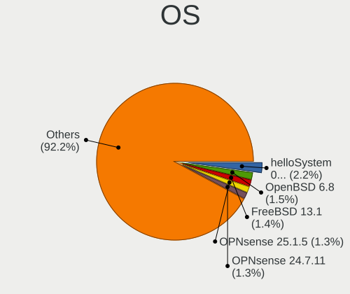

| Name              | Computers | Percent |
|-------------------|-----------|---------|
| helloSystem 0.8.1 | 23        | 2.19%   |
| OpenBSD 6.8       | 16        | 1.52%   |
| FreeBSD 13.1      | 15        | 1.43%   |
| OPNsense 25.1.5   | 14        | 1.33%   |
| OPNsense 24.7.11  | 14        | 1.33%   |
| OPNsense 21.1.5   | 14        | 1.33%   |
| OPNsense 24.7.12  | 13        | 1.24%   |
| OPNsense 21.7.7   | 13        | 1.24%   |
| OPNsense 23.7.10  | 12        | 1.14%   |
| OPNsense 23.1.11  | 12        | 1.14%   |
| OPNsense 22.1     | 12        | 1.14%   |
| OPNsense 23.1.1   | 11        | 1.05%   |
| helloSystem 0.7.0 | 11        | 1.05%   |
| helloSystem 0.4.0 | 11        | 1.05%   |
| OPNsense 23.1.5   | 10        | 0.95%   |
| OPNsense 22.1.6   | 10        | 0.95%   |
| OPNsense 22.1.10  | 10        | 0.95%   |
| OpenBSD 7.1       | 10        | 0.95%   |
| NomadBSD 1.3.2    | 10        | 0.95%   |
| GhostBSD 20.04.02 | 10        | 0.95%   |
| OPNsense 25.1.4   | 9         | 0.86%   |
| OPNsense 24.7.8   | 9         | 0.86%   |
| OPNsense 24.7.7   | 9         | 0.86%   |
| OPNsense 24.7.6   | 9         | 0.86%   |
| OPNsense 24.7.5   | 9         | 0.86%   |
| OPNsense 24.7.1   | 9         | 0.86%   |
| OPNsense 23.1.7   | 9         | 0.86%   |
| OPNsense 21.7.1   | 9         | 0.86%   |
| OPNsense 21.1     | 9         | 0.86%   |
| FreeBSD 13.1-p7   | 9         | 0.86%   |
| FreeBSD 13.0      | 9         | 0.86%   |
| OPNsense 25.7.7   | 8         | 0.76%   |
| OPNsense 23.7.12  | 8         | 0.76%   |
| OPNsense 23.7.11  | 8         | 0.76%   |
| OPNsense 22.7.9   | 8         | 0.76%   |
| OPNsense 22.7.4   | 8         | 0.76%   |
| OPNsense 22.7     | 8         | 0.76%   |
| OPNsense 22.1.1   | 8         | 0.76%   |
| OPNsense 21.1.3   | 8         | 0.76%   |
| helloSystem 0.9.0 | 8         | 0.76%   |

OS Family
---------

OS without a version

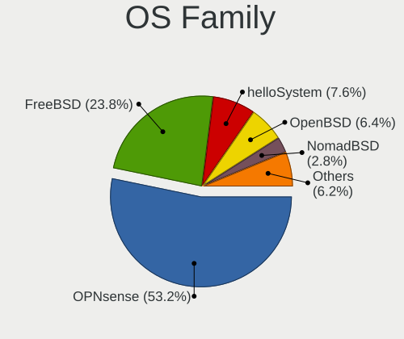

| Name        | Computers | Percent |
|-------------|-----------|---------|
| OPNsense    | 419       | 53.24%  |
| FreeBSD     | 187       | 23.76%  |
| helloSystem | 60        | 7.62%   |
| OpenBSD     | 50        | 6.35%   |
| NomadBSD    | 22        | 2.8%    |
| GhostBSD    | 22        | 2.8%    |
| NetBSD      | 15        | 1.91%   |
| TrueNAS     | 5         | 0.64%   |
| HardenedBSD | 2         | 0.25%   |
| ClonOS      | 2         | 0.25%   |
| MidnightBSD | 1         | 0.13%   |
| FuryBSD     | 1         | 0.13%   |
| FreeNAS     | 1         | 0.13%   |

Arch
----

OS architecture (x86_64, i586, etc.)

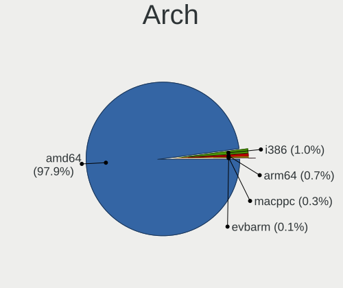

| Name   | Computers | Percent |
|--------|-----------|---------|
| amd64  | 753       | 97.92%  |
| i386   | 8         | 1.04%   |
| arm64  | 5         | 0.65%   |
| macppc | 2         | 0.26%   |
| evbarm | 1         | 0.13%   |

DE
--

Desktop Environment

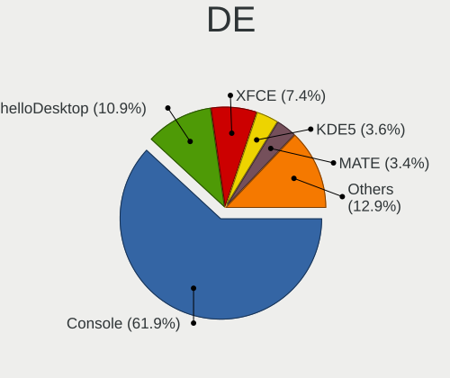

| Name          | Computers | Percent |
|---------------|-----------|---------|
| Console       | 495       | 61.88%  |
| helloDesktop  | 87        | 10.88%  |
| XFCE          | 59        | 7.38%   |
| KDE5          | 29        | 3.63%   |
| MATE          | 27        | 3.38%   |
| Openbox       | 21        | 2.63%   |
| fvwm          | 19        | 2.38%   |
| GNOME         | 16        | 2%      |
| TWM           | 14        | 1.75%   |
| i3            | 8         | 1%      |
| AwesomeWM     | 5         | 0.63%   |
| LXDE          | 4         | 0.5%    |
| xinitrc       | 3         | 0.38%   |
| LXQt          | 3         | 0.38%   |
| Window Maker  | 2         | 0.25%   |
| X-Cinnamon    | 1         | 0.13%   |
| WindowMaker   | 1         | 0.13%   |
| sway          | 1         | 0.13%   |
| iwm           | 1         | 0.13%   |
| Enlightenment | 1         | 0.13%   |
| Cinnamon      | 1         | 0.13%   |
| Budgie        | 1         | 0.13%   |
| Blackbox      | 1         | 0.13%   |

Display Server
--------------

X11 or Wayland

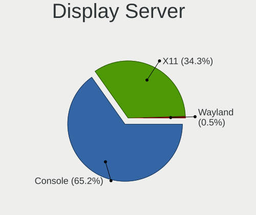

| Name    | Computers | Percent |
|---------|-----------|---------|
| Console | 504       | 65.2%   |
| X11     | 265       | 34.28%  |
| Wayland | 4         | 0.52%   |

Display Manager
---------------

SDDM, LightDM, etc.

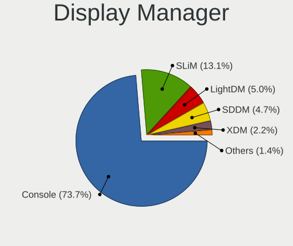

| Name    | Computers | Percent |
|---------|-----------|---------|
| Console | 579       | 73.66%  |
| SLiM    | 103       | 13.1%   |
| LightDM | 39        | 4.96%   |
| SDDM    | 37        | 4.71%   |
| XDM     | 17        | 2.16%   |
| GDM     | 8         | 1.02%   |
| WDM     | 2         | 0.25%   |
| Ly      | 1         | 0.13%   |

OS Lang
-------

Language

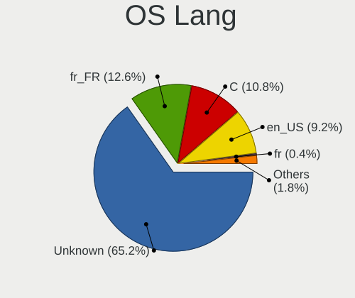

| Lang            | Computers | Percent |
|-----------------|-----------|---------|
| Unknown         | 518       | 65.24%  |
| fr_FR           | 100       | 12.59%  |
| C               | 86        | 10.83%  |
| en_US           | 73        | 9.19%   |
| fr              | 3         | 0.38%   |
| en_GB           | 3         | 0.38%   |
| de_DE           | 3         | 0.38%   |
| en_US.ISO8859-1 | 2         | 0.25%   |
| ja_JP           | 1         | 0.13%   |
| it_IT           | 1         | 0.13%   |
| fr_FR.UTF8      | 1         | 0.13%   |
| fr_FR.US-ASCII  | 1         | 0.13%   |
| es_ES           | 1         | 0.13%   |
| en              | 1         | 0.13%   |

Boot Mode
---------

EFI or BIOS

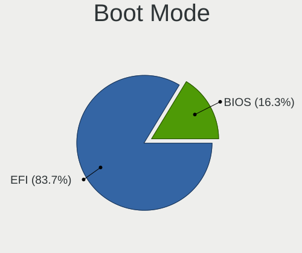

| Mode | Computers | Percent |
|------|-----------|---------|
| EFI  | 651       | 83.68%  |
| BIOS | 127       | 16.32%  |

Filesystem
----------

Type of filesystem

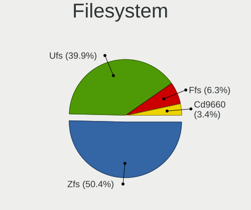

| Type   | Computers | Percent |
|--------|-----------|---------|
| Zfs    | 399       | 50.38%  |
| Ufs    | 316       | 39.9%   |
| Ffs    | 50        | 6.31%   |
| Cd9660 | 27        | 3.41%   |

Part. scheme
------------

Scheme of partitioning

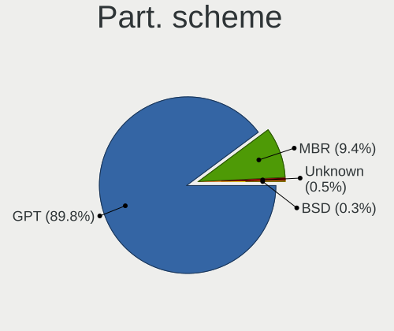

| Type    | Computers | Percent |
|---------|-----------|---------|
| GPT     | 698       | 89.83%  |
| MBR     | 73        | 9.4%    |
| Unknown | 4         | 0.51%   |
| BSD     | 2         | 0.26%   |

Board
-----

Vendor
------

Motherboard manufacturer

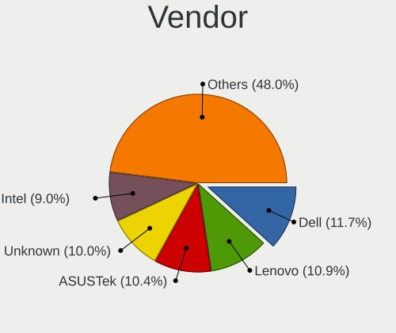

| Name                                 | Computers | Percent |
|--------------------------------------|-----------|---------|
| Dell                                 | 90        | 11.7%   |
| Lenovo                               | 84        | 10.92%  |
| ASUSTek Computer                     | 80        | 10.4%   |
| Unknown                              | 77        | 10.01%  |
| Intel                                | 69        | 8.97%   |
| Hewlett-Packard                      | 49        | 6.37%   |
| PC Engines                           | 28        | 3.64%   |
| Gigabyte Technology                  | 24        | 3.12%   |
| ASRock                               | 20        | 2.6%    |
| MSI                                  | 19        | 2.47%   |
| Supermicro                           | 18        | 2.34%   |
| Fujitsu                              | 18        | 2.34%   |
| Apple                                | 18        | 2.34%   |
| AMI                                  | 14        | 1.82%   |
| Techvision                           | 10        | 1.3%    |
| Deciso                               | 10        | 1.3%    |
| Protectli                            | 9         | 1.17%   |
| Acer                                 | 9         | 1.17%   |
| MW                                   | 6         | 0.78%   |
| Sophos                               | 5         | 0.65%   |
| Raspberry Pi Foundation              | 5         | 0.65%   |
| BESSTAR Tech                         | 5         | 0.65%   |
| ASRockRack                           | 5         | 0.65%   |
| Shuttle                              | 4         | 0.52%   |
| ZOTAC                                | 3         | 0.39%   |
| TUXEDO                               | 3         | 0.39%   |
| Toshiba                              | 3         | 0.39%   |
| TB                                   | 3         | 0.39%   |
| Sony                                 | 3         | 0.39%   |
| SJRC                                 | 3         | 0.39%   |
| Shenzhen Meigao Electronic Equipment | 3         | 0.39%   |
| Notebook                             | 3         | 0.39%   |
| CWWK                                 | 3         | 0.39%   |
| AZW                                  | 3         | 0.39%   |
| Alienware                            | 3         | 0.39%   |
| Advantech                            | 3         | 0.39%   |
| Samsung Electronics                  | 2         | 0.26%   |
| RUNING                               | 2         | 0.26%   |
| Pegatron                             | 2         | 0.26%   |
| Lanner Electronics                   | 2         | 0.26%   |

Model
-----

Motherboard model

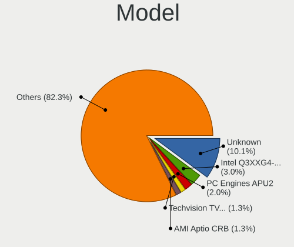

| Name                                              | Computers | Percent |
|---------------------------------------------------|-----------|---------|
| Unknown                                           | 78        | 10.14%  |
| Intel Q3XXG4-P V1.0                               | 23        | 2.99%   |
| PC Engines APU2                                   | 15        | 1.95%   |
| Techvision TVI7309X                               | 10        | 1.3%    |
| AMI Aptio CRB                                     | 10        | 1.3%    |
| Fujitsu FUTRO S920                                | 9         | 1.17%   |
| MW GMLK-2_5G4L                                    | 6         | 0.78%   |
| ASUS All Series                                   | 6         | 0.78%   |
| Supermicro Super Server                           | 5         | 0.65%   |
| RPi Raspberry Pi                                  | 5         | 0.65%   |
| PC Engines APU3                                   | 5         | 0.65%   |
| Intel CRESCENTBAY                                 | 5         | 0.65%   |
| Dell OptiPlex 9020                                | 5         | 0.65%   |
| PC Engines apu4                                   | 4         | 0.52%   |
| Intel Jasper Lake Client Platform                 | 4         | 0.52%   |
| Intel H81U                                        | 4         | 0.52%   |
| Deciso NetBoard-A20                               | 4         | 0.52%   |
| Apple MacBookAir6,2                               | 4         | 0.52%   |
| TB WTR R1                                         | 3         | 0.39%   |
| Sophos XG                                         | 3         | 0.39%   |
| SJRC ADLN-6L                                      | 3         | 0.39%   |
| PC Engines apu1                                   | 3         | 0.39%   |
| Intel QHSW02                                      | 3         | 0.39%   |
| Intel NUC11TNHi3                                  | 3         | 0.39%   |
| HP ProLiant MicroServer Gen8                      | 3         | 0.39%   |
| Dell Precision M4500                              | 3         | 0.39%   |
| Dell PowerEdge R710                               | 3         | 0.39%   |
| Dell OptiPlex 3020                                | 3         | 0.39%   |
| Deciso Netboard A20                               | 3         | 0.39%   |
| Apple MacBookPro14,1                              | 3         | 0.39%   |
| Advantech DTADB                                   | 3         | 0.39%   |
| TUXEDO InfinityBook13V3                           | 2         | 0.26%   |
| Toshiba PORTEGE Z930                              | 2         | 0.26%   |
| Supermicro X7SPA-HF                               | 2         | 0.26%   |
| Supermicro SYS-E300-9D-8CN8TP                     | 2         | 0.26%   |
| Sophos SG                                         | 2         | 0.26%   |
| Shuttle XS35V5                                    | 2         | 0.26%   |
| Shenzhen Meigao Electronic Equipment Venus Series | 2         | 0.26%   |
| RUNING B75M INTEL H3V                             | 2         | 0.26%   |
| Protectli V1410                                   | 2         | 0.26%   |

Model Family
------------

Motherboard model prefix

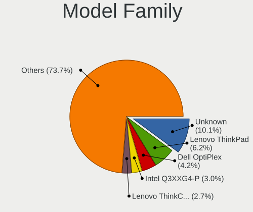

| Name                | Computers | Percent |
|---------------------|-----------|---------|
| Unknown             | 78        | 10.14%  |
| Lenovo ThinkPad     | 48        | 6.24%   |
| Dell OptiPlex       | 32        | 4.16%   |
| Intel Q3XXG4-P      | 23        | 2.99%   |
| Lenovo ThinkCentre  | 21        | 2.73%   |
| Dell PowerEdge      | 18        | 2.34%   |
| ASUS PRIME          | 18        | 2.34%   |
| Dell Latitude       | 16        | 2.08%   |
| PC Engines APU2     | 15        | 1.95%   |
| Dell Precision      | 13        | 1.69%   |
| Techvision TVI7309X | 10        | 1.3%    |
| HP Compaq           | 10        | 1.3%    |
| Fujitsu FUTRO       | 10        | 1.3%    |
| AMI Aptio           | 10        | 1.3%    |
| HP ProLiant         | 7         | 0.91%   |
| MW GMLK-2           | 6         | 0.78%   |
| HP ProDesk          | 6         | 0.78%   |
| HP EliteDesk        | 6         | 0.78%   |
| HP EliteBook        | 6         | 0.78%   |
| ASUS All            | 6         | 0.78%   |
| Supermicro Super    | 5         | 0.65%   |
| RPi Raspberry       | 5         | 0.65%   |
| PC Engines APU3     | 5         | 0.65%   |
| Intel CRESCENTBAY   | 5         | 0.65%   |
| Deciso Netboard     | 5         | 0.65%   |
| Acer Aspire         | 5         | 0.65%   |
| PC Engines apu4     | 4         | 0.52%   |
| Intel Jasper        | 4         | 0.52%   |
| Intel H81U          | 4         | 0.52%   |
| Fujitsu ESPRIMO     | 4         | 0.52%   |
| Deciso NetBoard-A20 | 4         | 0.52%   |
| Apple MacBookAir6   | 4         | 0.52%   |
| TB WTR              | 3         | 0.39%   |
| Sophos XG           | 3         | 0.39%   |
| SJRC ADLN-6L        | 3         | 0.39%   |
| PC Engines apu1     | 3         | 0.39%   |
| Lenovo ThinkSystem  | 3         | 0.39%   |
| Lenovo Legion       | 3         | 0.39%   |
| Intel QHSW02        | 3         | 0.39%   |
| Intel NUC11TNHi3    | 3         | 0.39%   |

MFG Year
--------

Motherboard manufacture year

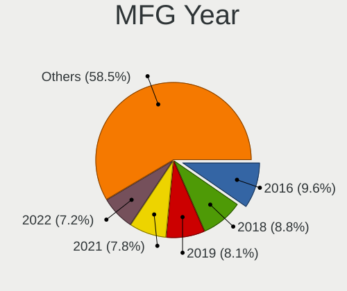

| Year    | Computers | Percent |
|---------|-----------|---------|
| 2016    | 74        | 9.62%   |
| 2018    | 68        | 8.84%   |
| 2019    | 62        | 8.06%   |
| 2021    | 60        | 7.8%    |
| 2022    | 55        | 7.15%   |
| 2020    | 53        | 6.89%   |
| 2023    | 51        | 6.63%   |
| 2014    | 51        | 6.63%   |
| 2024    | 44        | 5.72%   |
| 2017    | 34        | 4.42%   |
| 2013    | 34        | 4.42%   |
| 2012    | 34        | 4.42%   |
| 2015    | 33        | 4.29%   |
| 2011    | 28        | 3.64%   |
| 2010    | 23        | 2.99%   |
| Unknown | 17        | 2.21%   |
| 2008    | 15        | 1.95%   |
| 2009    | 14        | 1.82%   |
| 2025    | 9         | 1.17%   |
| 2007    | 7         | 0.91%   |
| 2006    | 2         | 0.26%   |
| 2004    | 1         | 0.13%   |

Form Factor
-----------

Physical design of the computer

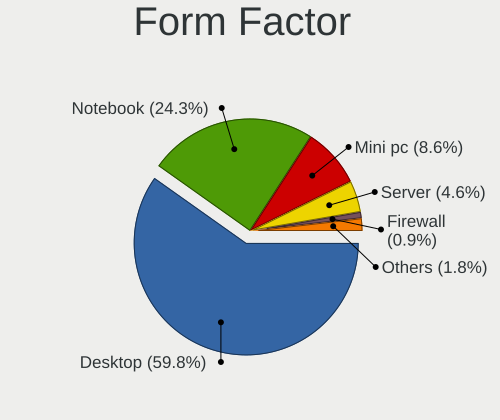

| Name           | Computers | Percent |
|----------------|-----------|---------|
| Desktop        | 460       | 59.82%  |
| Notebook       | 187       | 24.32%  |
| Mini pc        | 66        | 8.58%   |
| Server         | 35        | 4.55%   |
| Firewall       | 7         | 0.91%   |
| System on chip | 5         | 0.65%   |
| All in one     | 5         | 0.65%   |
| Convertible    | 4         | 0.52%   |

Coreboot
--------

Have coreboot on board

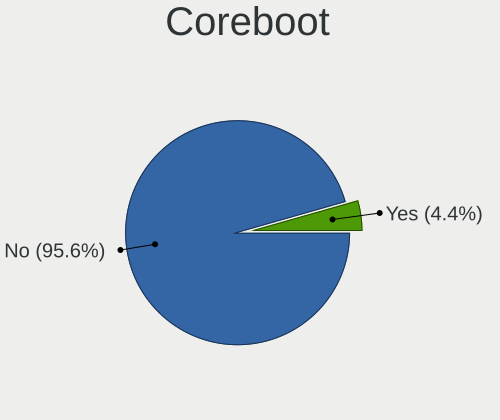

| Used | Computers | Percent |
|------|-----------|---------|
| No   | 735       | 95.58%  |
| Yes  | 34        | 4.42%   |

RAM Size
--------

Total RAM memory

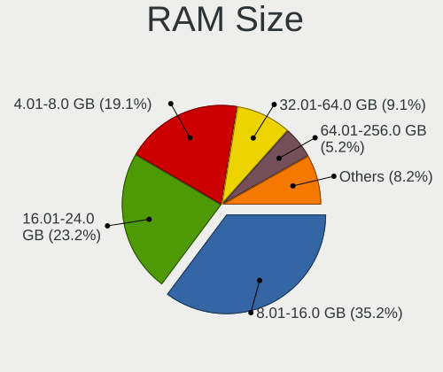

| Size in GB      | Computers | Percent |
|-----------------|-----------|---------|
| 8.01-16.0       | 276       | 35.2%   |
| 16.01-24.0      | 182       | 23.21%  |
| 4.01-8.0        | 150       | 19.13%  |
| 32.01-64.0      | 71        | 9.06%   |
| 64.01-256.0     | 41        | 5.23%   |
| 2.01-3.0        | 28        | 3.57%   |
| 3.01-4.0        | 11        | 1.4%    |
| 24.01-32.0      | 10        | 1.28%   |
| 1.01-2.0        | 8         | 1.02%   |
| 0.51-1.0        | 4         | 0.51%   |
| More than 256.0 | 2         | 0.26%   |
| 0.01-0.5        | 1         | 0.13%   |

RAM Used
--------

Used RAM memory

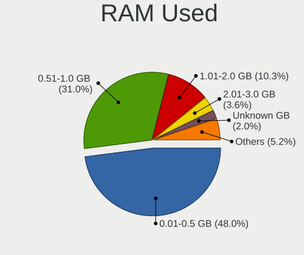

| Used GB     | Computers | Percent |
|-------------|-----------|---------|
| 0.01-0.5    | 378       | 47.97%  |
| 0.51-1.0    | 244       | 30.96%  |
| 1.01-2.0    | 81        | 10.28%  |
| 2.01-3.0    | 28        | 3.55%   |
| Unknown     | 16        | 2.03%   |
| 4.01-8.0    | 13        | 1.65%   |
| 3.01-4.0    | 9         | 1.14%   |
| 8.01-16.0   | 7         | 0.89%   |
| 0           | 4         | 0.51%   |
| 32.01-64.0  | 3         | 0.38%   |
| 24.01-32.0  | 2         | 0.25%   |
| 64.01-256.0 | 2         | 0.25%   |
| 16.01-24.0  | 1         | 0.13%   |

Total Drives
------------

Number of drives on board

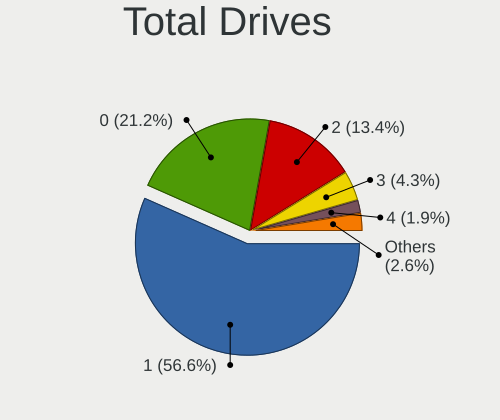

| Drives | Computers | Percent |
|--------|-----------|---------|
| 1      | 457       | 56.63%  |
| 0      | 171       | 21.19%  |
| 2      | 108       | 13.38%  |
| 3      | 35        | 4.34%   |
| 4      | 15        | 1.86%   |
| 5      | 8         | 0.99%   |
| 6      | 7         | 0.87%   |
| 25     | 2         | 0.25%   |
| 7      | 2         | 0.25%   |
| 10     | 1         | 0.12%   |
| 8      | 1         | 0.12%   |

Has CD-ROM
----------

Has CD-ROM on board

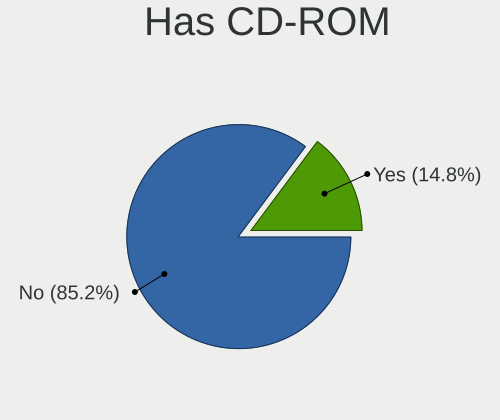

| Presented | Computers | Percent |
|-----------|-----------|---------|
| No        | 662       | 85.2%   |
| Yes       | 115       | 14.8%   |

Has Ethernet
------------

Has Ethernet on board

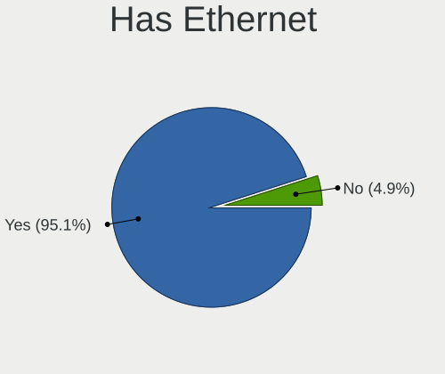

| Presented | Computers | Percent |
|-----------|-----------|---------|
| Yes       | 732       | 95.06%  |
| No        | 38        | 4.94%   |

Has WiFi
--------

Has WiFi module

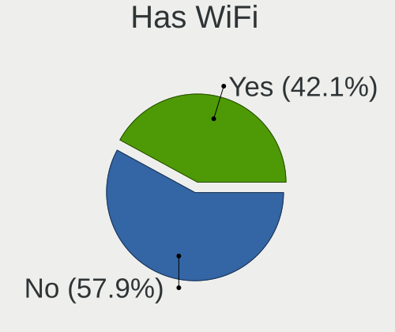

| Presented | Computers | Percent |
|-----------|-----------|---------|
| No        | 449       | 57.94%  |
| Yes       | 326       | 42.06%  |

Has Bluetooth
-------------

Has Bluetooth module

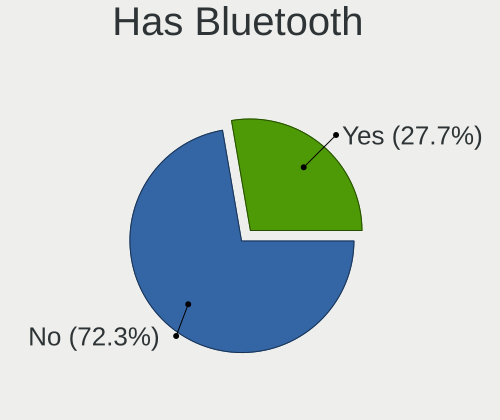

| Presented | Computers | Percent |
|-----------|-----------|---------|
| No        | 561       | 72.29%  |
| Yes       | 215       | 27.71%  |

Location
--------

Country
-------

Geographic location (country)

| Country | Computers | Percent |
|---------|-----------|---------|
| France  | 769       | 100%    |

City
----

Geographic location (city)

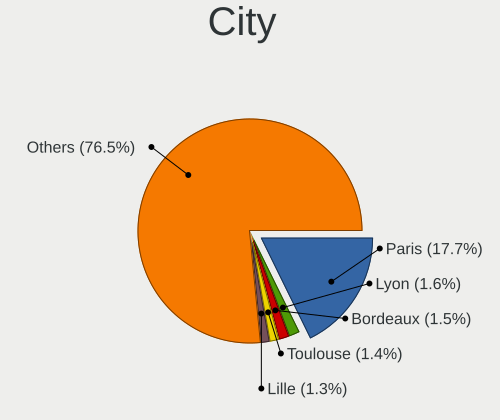

| City                 | Computers | Percent |
|----------------------|-----------|---------|
| Paris                | 155       | 17.73%  |
| Lyon                 | 14        | 1.6%    |
| Bordeaux             | 13        | 1.49%   |
| Toulouse             | 12        | 1.37%   |
| Lille                | 11        | 1.26%   |
| Strasbourg           | 10        | 1.14%   |
| Nantes               | 9         | 1.03%   |
| Colombes             | 9         | 1.03%   |
| Roubaix              | 8         | 0.92%   |
| Noisy-le-Grand       | 8         | 0.92%   |
| Marseille            | 8         | 0.92%   |
| Saint-Denis          | 7         | 0.8%    |
| Rosny-sous-Bois      | 7         | 0.8%    |
| Franconville         | 7         | 0.8%    |
| Urcuit               | 6         | 0.69%   |
| Rillieux-la-Pape     | 6         | 0.69%   |
| Dijon                | 6         | 0.69%   |
| Argenteuil           | 6         | 0.69%   |
| Villeurbanne         | 5         | 0.57%   |
| Soisy-sur-Seine      | 5         | 0.57%   |
| Rennes               | 5         | 0.57%   |
| Noyon                | 5         | 0.57%   |
| Nice                 | 5         | 0.57%   |
| Melun                | 5         | 0.57%   |
| Mâcon               | 5         | 0.57%   |
| Fontenay-sous-Bois   | 5         | 0.57%   |
| Courbevoie           | 5         | 0.57%   |
| Boulogne-Billancourt | 5         | 0.57%   |
| Agen                 | 5         | 0.57%   |
| Thionville           | 4         | 0.46%   |
| Poitiers             | 4         | 0.46%   |
| Nanterre             | 4         | 0.46%   |
| Lorient              | 4         | 0.46%   |
| Grenoble             | 4         | 0.46%   |
| Colmar               | 4         | 0.46%   |
| Clermont-Ferrand     | 4         | 0.46%   |
| Champigny-sur-Marne  | 4         | 0.46%   |
| Vitry-sur-Seine      | 3         | 0.34%   |
| Vauvillers           | 3         | 0.34%   |
| Vaulx-en-Velin       | 3         | 0.34%   |

Drives
------

Drive Vendor
------------

Hard drive vendors

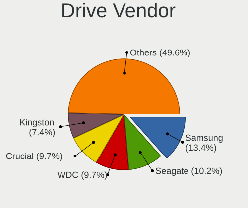

| Vendor              | Computers | Drives | Percent |
|---------------------|-----------|--------|---------|
| Samsung Electronics | 104       | 182    | 13.44%  |
| Seagate             | 79        | 129    | 10.21%  |
| WDC                 | 75        | 152    | 9.69%   |
| Crucial             | 75        | 125    | 9.69%   |
| Kingston            | 57        | 96     | 7.36%   |
| Toshiba             | 37        | 63     | 4.78%   |
| China               | 37        | 53     | 4.78%   |
| Transcend           | 34        | 56     | 4.39%   |
| SanDisk             | 30        | 45     | 3.88%   |
| Intel               | 25        | 34     | 3.23%   |
| Hoodisk             | 15        | 19     | 1.94%   |
| Phison              | 14        | 16     | 1.81%   |
| Micron Technology   | 13        | 22     | 1.68%   |
| HGST                | 13        | 21     | 1.68%   |
| PNY                 | 12        | 22     | 1.55%   |
| Hitachi             | 11        | 14     | 1.42%   |
| SK hynix            | 10        | 11     | 1.29%   |
| Apple               | 9         | 12     | 1.16%   |
| NVMe                | 7         | 7      | 0.9%    |
| Innodisk            | 7         | 8      | 0.9%    |
| Corsair             | 7         | 13     | 0.9%    |
| Hewlett-Packard     | 6         | 18     | 0.78%   |
| Fujitsu             | 6         | 7      | 0.78%   |
| FORESEE             | 6         | 12     | 0.78%   |
| OCZ                 | 4         | 5      | 0.52%   |
| A-DATA Technology   | 4         | 5      | 0.52%   |
| Maxtor              | 3         | 4      | 0.39%   |
| LITEON              | 3         | 4      | 0.39%   |
| LDLC                | 3         | 3      | 0.39%   |
| Generic             | 3         | 3      | 0.39%   |
| Fanxiang            | 3         | 3      | 0.39%   |
| Dell                | 3         | 48     | 0.39%   |
| YANSEN              | 2         | 2      | 0.26%   |
| TEXTORM             | 2         | 2      | 0.26%   |
| SPCC                | 2         | 2      | 0.26%   |
| Silicon Motion      | 2         | 2      | 0.26%   |
| ShiJi               | 2         | 3      | 0.26%   |
| Pccooler            | 2         | 2      | 0.26%   |
| Patriot             | 2         | 2      | 0.26%   |
| OPENBSD             | 2         | 3      | 0.26%   |

Drive Model
-----------

Hard drive models

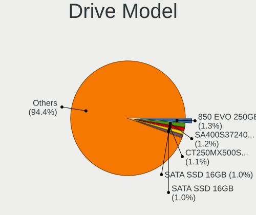

| Model                              | Computers | Percent |
|------------------------------------|-----------|---------|
| Samsung SSD 850 EVO 250GB          | 11        | 1.33%   |
| Kingston SA400S37240G 240GB        | 10        | 1.21%   |
| Crucial CT250MX500SSD1 250GB       | 9         | 1.09%   |
| Phison SATA SSD 16GB               | 8         | 0.97%   |
| China SATA SSD 16GB                | 8         | 0.97%   |
| Kingston SV300S37A120G 120GB       | 7         | 0.85%   |
| China MSATA 32GB SSD               | 7         | 0.85%   |
| PNY CS900 120GB SSD                | 6         | 0.72%   |
| Hoodisk SSD 32GB                   | 6         | 0.72%   |
| Crucial CT500MX500SSD1 500GB       | 6         | 0.72%   |
| Crucial CT240BX500SSD1 240GB       | 6         | 0.72%   |
| Crucial CT120BX500SSD1 120GB       | 6         | 0.72%   |
| Crucial CT1000P1SSD8 1TB           | 6         | 0.72%   |
| Transcend TS256GMTS952T2 256GB     | 5         | 0.6%    |
| Seagate ST1000LM024 HN-M101MBB 1TB | 5         | 0.6%    |
| Samsung SSD 870 EVO 500GB          | 5         | 0.6%    |
| Samsung SSD 860 EVO 1TB            | 5         | 0.6%    |
| Kingston SA400S37120G 120GB        | 5         | 0.6%    |
| Hoodisk SSD 64GB                   | 5         | 0.6%    |
| WDC WDS240G2G0A-00JH30 240GB       | 4         | 0.48%   |
| WDC WD10EZEX-08WN4A0 1TB           | 4         | 0.48%   |
| Transcend TS128GMSA230S 128GB      | 4         | 0.48%   |
| Toshiba MQ01ABD050 500GB           | 4         | 0.48%   |
| Seagate ST1000LM035-1RK172 1TB     | 4         | 0.48%   |
| SanDisk SSD PLUS 120GB             | 4         | 0.48%   |
| Micron 1100 SATA 256GB             | 4         | 0.48%   |
| Kingston SUV500MS120G 120GB        | 4         | 0.48%   |
| FORESEE 64GB SSD                   | 4         | 0.48%   |
| Crucial M4-CT128M4SSD2 128GB       | 4         | 0.48%   |
| Crucial CT1000BX500SSD1 1TB        | 4         | 0.48%   |
| China MSATA 64GB SSD               | 4         | 0.48%   |
| Apple SSD SD0128F 121GB            | 4         | 0.48%   |
| Transcend TS64GMTS400SD 64GB       | 3         | 0.36%   |
| Transcend TS128GSSD420K 128GB      | 3         | 0.36%   |
| Seagate ST3500418AS 500GB          | 3         | 0.36%   |
| Seagate ST1000NM0033-9ZM173 1TB    | 3         | 0.36%   |
| Seagate ST1000LM049-2GH172 1TB     | 3         | 0.36%   |
| Seagate ST1000DM010-2EP102 1TB     | 3         | 0.36%   |
| SanDisk SD8SB8U128G1001 128GB      | 3         | 0.36%   |
| Samsung SSD 860 EVO 500GB          | 3         | 0.36%   |

HDD Vendor
----------

Hard disk drive vendors

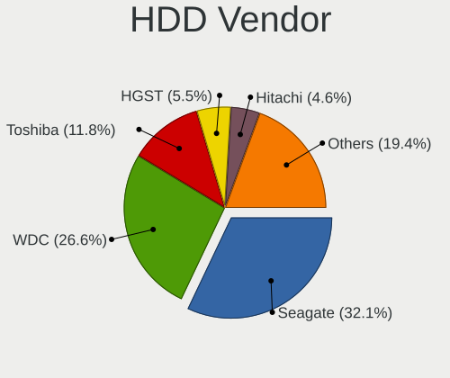

| Vendor              | Computers | Drives | Percent |
|---------------------|-----------|--------|---------|
| Seagate             | 76        | 125    | 32.07%  |
| WDC                 | 63        | 132    | 26.58%  |
| Toshiba             | 28        | 48     | 11.81%  |
| HGST                | 13        | 21     | 5.49%   |
| Hitachi             | 11        | 14     | 4.64%   |
| Samsung Electronics | 9         | 16     | 3.8%    |
| Fujitsu             | 6         | 7      | 2.53%   |
| NVMe                | 5         | 5      | 2.11%   |
| Maxtor              | 3         | 4      | 1.27%   |
| Hewlett-Packard     | 3         | 8      | 1.27%   |
| Generic             | 3         | 3      | 1.27%   |
| Dell                | 3         | 48     | 1.27%   |
| OPENBSD             | 2         | 3      | 0.84%   |
| NETAPP              | 2         | 4      | 0.84%   |
| LSI                 | 2         | 2      | 0.84%   |
| Apple               | 2         | 4      | 0.84%   |
| SABRENT             | 1         | 1      | 0.42%   |
| Lexar               | 1         | 2      | 0.42%   |
| LDLC F6+            | 1         | 1      | 0.42%   |
| IBM                 | 1         | 1      | 0.42%   |
| ASMT                | 1         | 1      | 0.42%   |
| ASMedia             | 1         | 1      | 0.42%   |

SSD Vendor
----------

Solid state drive vendors

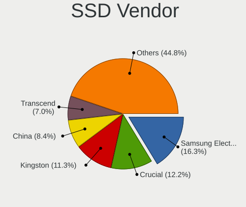

| Vendor              | Computers | Drives | Percent |
|---------------------|-----------|--------|---------|
| Samsung Electronics | 72        | 125    | 16.29%  |
| Crucial             | 54        | 85     | 12.22%  |
| Kingston            | 50        | 86     | 11.31%  |
| China               | 37        | 53     | 8.37%   |
| Transcend           | 31        | 52     | 7.01%   |
| SanDisk             | 30        | 45     | 6.79%   |
| Intel               | 18        | 22     | 4.07%   |
| Hoodisk             | 15        | 19     | 3.39%   |
| PNY                 | 11        | 20     | 2.49%   |
| WDC                 | 9         | 14     | 2.04%   |
| Toshiba             | 8         | 13     | 1.81%   |
| Phison              | 8         | 9      | 1.81%   |
| Micron Technology   | 7         | 14     | 1.58%   |
| Innodisk            | 7         | 8      | 1.58%   |
| Apple               | 7         | 8      | 1.58%   |
| FORESEE             | 6         | 12     | 1.36%   |
| Corsair             | 6         | 9      | 1.36%   |
| SK hynix            | 5         | 5      | 1.13%   |
| Hewlett-Packard     | 5         | 10     | 1.13%   |
| OCZ                 | 4         | 5      | 0.9%    |
| A-DATA Technology   | 4         | 5      | 0.9%    |
| LITEON              | 3         | 4      | 0.68%   |
| YANSEN              | 2         | 2      | 0.45%   |
| TEXTORM             | 2         | 2      | 0.45%   |
| SPCC                | 2         | 2      | 0.45%   |
| ShiJi               | 2         | 3      | 0.45%   |
| Pccooler            | 2         | 2      | 0.45%   |
| NVMe                | 2         | 2      | 0.45%   |
| Integral            | 2         | 2      | 0.45%   |
| Apacer              | 2         | 2      | 0.45%   |
| Wicgtyp             | 1         | 1      | 0.23%   |
| VICKTER             | 1         | 1      | 0.23%   |
| VICK                | 1         | 2      | 0.23%   |
| Verbatim            | 1         | 1      | 0.23%   |
| Vaseky              | 1         | 4      | 0.23%   |
| Terabit             | 1         | 1      | 0.23%   |
| TCSUNBOW            | 1         | 3      | 0.23%   |
| Supermicro          | 1         | 1      | 0.23%   |
| Silicon Power       | 1         | 2      | 0.23%   |
| SHAREVDI            | 1         | 1      | 0.23%   |

Drive Kind
----------

HDD or SSD

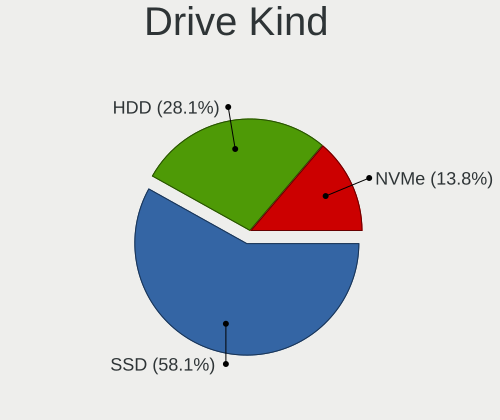

| Kind | Computers | Drives | Percent |
|------|-----------|--------|---------|
| SSD  | 409       | 686    | 58.1%   |
| HDD  | 198       | 451    | 28.13%  |
| NVMe | 97        | 155    | 13.78%  |

Drive Connector
---------------

SATA, SAS, NVMe, etc.

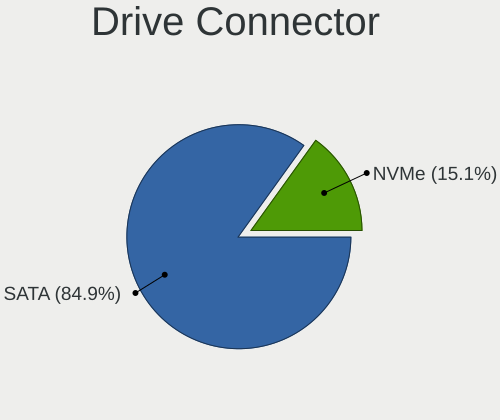

| Type | Computers | Drives | Percent |
|------|-----------|--------|---------|
| SATA | 546       | 1137   | 84.91%  |
| NVMe | 97        | 155    | 15.09%  |

Drive Size
----------

Size of hard drive

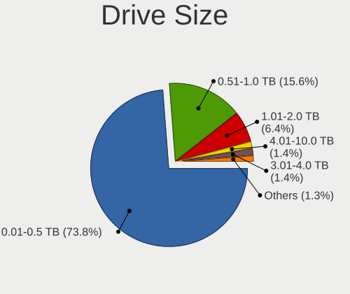

| Size in TB | Computers | Drives | Percent |
|------------|-----------|--------|---------|
| 0.01-0.5   | 459       | 833    | 73.79%  |
| 0.51-1.0   | 97        | 161    | 15.59%  |
| 1.01-2.0   | 40        | 83     | 6.43%   |
| 3.01-4.0   | 9         | 23     | 1.45%   |
| 4.01-10.0  | 9         | 17     | 1.45%   |
| 2.01-3.0   | 6         | 12     | 0.96%   |
| 10.01-20.0 | 2         | 8      | 0.32%   |

Space Total
-----------

Amount of disk space available on the file system

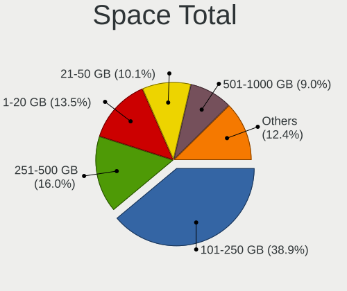

| Size in GB     | Computers | Percent |
|----------------|-----------|---------|
| 101-250        | 311       | 38.92%  |
| 251-500        | 128       | 16.02%  |
| 1-20           | 108       | 13.52%  |
| 21-50          | 81        | 10.14%  |
| 501-1000       | 72        | 9.01%   |
| 51-100         | 57        | 7.13%   |
| 1001-2000      | 22        | 2.75%   |
| More than 3000 | 8         | 1%      |
| 2001-3000      | 7         | 0.88%   |
| Unknown        | 5         | 0.63%   |

Space Used
----------

Amount of used disk space

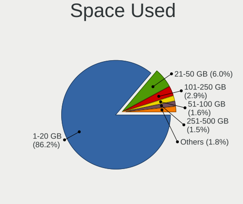

| Used GB        | Computers | Percent |
|----------------|-----------|---------|
| 1-20           | 679       | 86.17%  |
| 21-50          | 47        | 5.96%   |
| 101-250        | 23        | 2.92%   |
| 51-100         | 13        | 1.65%   |
| 251-500        | 12        | 1.52%   |
| 501-1000       | 5         | 0.63%   |
| Unknown        | 5         | 0.63%   |
| More than 3000 | 3         | 0.38%   |
| 1001-2000      | 1         | 0.13%   |

Malfunc. Drives
---------------

Drive models with a malfunction

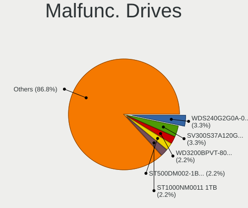

| Model                              | Computers | Drives | Percent |
|------------------------------------|-----------|--------|---------|
| WDC WDS240G2G0A-00JH30 240GB       | 3         | 4      | 3.3%    |
| Kingston SV300S37A120G 120GB       | 3         | 4      | 3.3%    |
| WDC WD3200BPVT-80JJ5T0 320GB       | 2         | 2      | 2.2%    |
| Seagate ST500DM002-1BD142 500GB    | 2         | 4      | 2.2%    |
| Seagate ST1000NM0011 1TB           | 2         | 3      | 2.2%    |
| Seagate ST1000LM024 HN-M101MBB 1TB | 2         | 3      | 2.2%    |
| Samsung Electronics HD501LJ 500GB  | 2         | 2      | 2.2%    |
| Crucial CT525MX300SSD1 528GB       | 2         | 2      | 2.2%    |
| WDC WD6400BPVT-22HXZT3 640GB       | 1         | 1      | 1.1%    |
| WDC WD6400AAKS-22A7B0 640GB        | 1         | 1      | 1.1%    |
| WDC WD5002ABYS-18B1B0 500GB        | 1         | 1      | 1.1%    |
| WDC WD5002AALX-00J37A0 500GB       | 1         | 3      | 1.1%    |
| WDC WD5000AAKS-00UU3A0 500GB       | 1         | 2      | 1.1%    |
| WDC WD30EFRX-68AX9N0 3TB           | 1         | 4      | 1.1%    |
| WDC WD2500BEVS-60UST0 250GB        | 1         | 1      | 1.1%    |
| WDC WD20EZRX-00D8PB0 2TB           | 1         | 1      | 1.1%    |
| WDC WD2002FYPS-02W3B0 2TB          | 1         | 1      | 1.1%    |
| WDC WD15EADS-00P8B0 1.5TB          | 1         | 1      | 1.1%    |
| WDC WD10JPVX-22JC3T0 1TB           | 1         | 1      | 1.1%    |
| WDC WD10EZEX-60M2NA0 1TB           | 1         | 1      | 1.1%    |
| WDC WD10EZEX-21M2NA0 1TB           | 1         | 1      | 1.1%    |
| WDC WD10EZEX-08WN4A0 1TB           | 1         | 1      | 1.1%    |
| WDC WD10EAVS-00D7B0 1TB            | 1         | 1      | 1.1%    |
| WDC WD10EARS-00Y5B1 1TB            | 1         | 1      | 1.1%    |
| WDC WD1001FAES-75W7A0 1TB          | 1         | 1      | 1.1%    |
| Toshiba MQ01ABD075 752GB           | 1         | 1      | 1.1%    |
| Toshiba MQ01ABD050 500GB           | 1         | 2      | 1.1%    |
| Toshiba MK5065GSX 500GB            | 1         | 1      | 1.1%    |
| Toshiba MK3261GSY 320GB            | 1         | 1      | 1.1%    |
| Toshiba MK1629GSGF 160GB           | 1         | 3      | 1.1%    |
| Toshiba DT01ACA100 1TB             | 1         | 1      | 1.1%    |
| TEXTORM BM5 480GB                  | 1         | 1      | 1.1%    |
| Seagate ST9500325AS 500GB          | 1         | 1      | 1.1%    |
| Seagate ST9320423AS 320GB          | 1         | 3      | 1.1%    |
| Seagate ST9320325AS 320GB          | 1         | 1      | 1.1%    |
| Seagate ST500VT000-1DK142 500GB    | 1         | 1      | 1.1%    |
| Seagate ST500LM000-SSHD-8GB        | 1         | 2      | 1.1%    |
| Seagate ST380013AS 80GB            | 1         | 2      | 1.1%    |
| Seagate ST3500320AS 500GB          | 1         | 1      | 1.1%    |
| Seagate ST3250620AS 250GB          | 1         | 1      | 1.1%    |

Malfunc. Drive Vendor
---------------------

Vendors of faulty drives

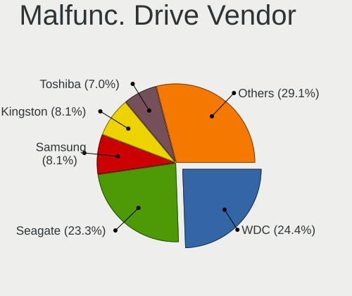

| Vendor              | Computers | Drives | Percent |
|---------------------|-----------|--------|---------|
| WDC                 | 21        | 29     | 24.42%  |
| Seagate             | 20        | 35     | 23.26%  |
| Samsung Electronics | 7         | 22     | 8.14%   |
| Kingston            | 7         | 10     | 8.14%   |
| Toshiba             | 6         | 9      | 6.98%   |
| SanDisk             | 3         | 3      | 3.49%   |
| HGST                | 3         | 4      | 3.49%   |
| Crucial             | 3         | 3      | 3.49%   |
| A-DATA Technology   | 3         | 4      | 3.49%   |
| Micron Technology   | 2         | 2      | 2.33%   |
| Maxtor              | 2         | 2      | 2.33%   |
| Intel               | 2         | 2      | 2.33%   |
| Hitachi             | 2         | 2      | 2.33%   |
| TEXTORM             | 1         | 1      | 1.16%   |
| OCZ                 | 1         | 2      | 1.16%   |
| Innodisk            | 1         | 1      | 1.16%   |
| IBM                 | 1         | 1      | 1.16%   |
| Corsair             | 1         | 2      | 1.16%   |

Malfunc. HDD Vendor
-------------------

Vendors of faulty HDD drives

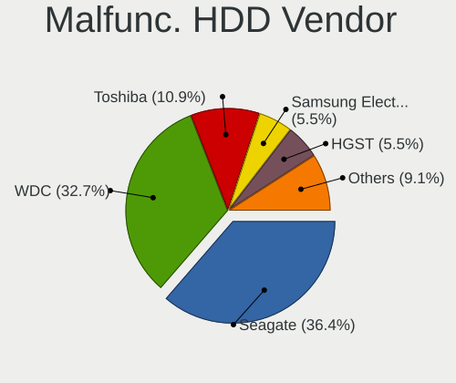

| Vendor              | Computers | Drives | Percent |
|---------------------|-----------|--------|---------|
| Seagate             | 20        | 35     | 36.36%  |
| WDC                 | 18        | 25     | 32.73%  |
| Toshiba             | 6         | 9      | 10.91%  |
| Samsung Electronics | 3         | 5      | 5.45%   |
| HGST                | 3         | 4      | 5.45%   |
| Maxtor              | 2         | 2      | 3.64%   |
| Hitachi             | 2         | 2      | 3.64%   |
| IBM                 | 1         | 1      | 1.82%   |

Malfunc. Drive Kind
-------------------

Kinds of faulty drives

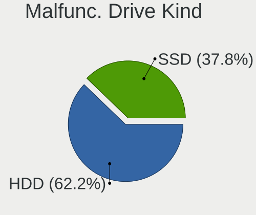

| Kind | Computers | Drives | Percent |
|------|-----------|--------|---------|
| HDD  | 51        | 83     | 62.2%   |
| SSD  | 31        | 51     | 37.8%   |

Failed Drives
-------------

Failed drive models

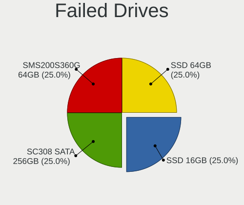

| Model                     | Computers | Drives | Percent |
|---------------------------|-----------|--------|---------|
| Supermicro SSD 16GB       | 1         | 1      | 25%     |
| SK hynix SC308 SATA 256GB | 1         | 1      | 25%     |
| Kingston SMS200S360G 64GB | 1         | 1      | 25%     |
| Hoodisk SSD 64GB          | 1         | 1      | 25%     |

Failed Drive Vendor
-------------------

Failed drive vendors

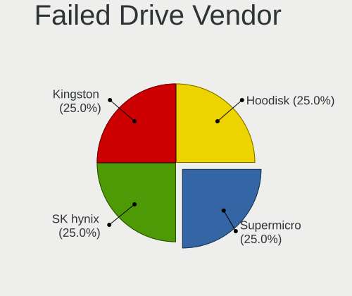

| Vendor     | Computers | Drives | Percent |
|------------|-----------|--------|---------|
| Supermicro | 1         | 1      | 25%     |
| SK hynix   | 1         | 1      | 25%     |
| Kingston   | 1         | 1      | 25%     |
| Hoodisk    | 1         | 1      | 25%     |

Drive Status
------------

Number of failed and malfunc. drives

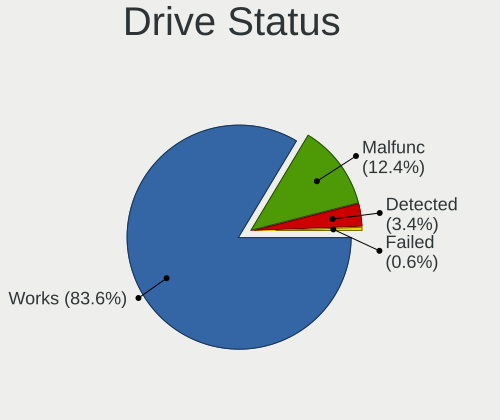

| Status   | Computers | Drives | Percent |
|----------|-----------|--------|---------|
| Works    | 546       | 1121   | 83.61%  |
| Malfunc  | 81        | 134    | 12.4%   |
| Detected | 22        | 33     | 3.37%   |
| Failed   | 4         | 4      | 0.61%   |

Storage controller
------------------

Storage Vendor
--------------

Storage controller vendors

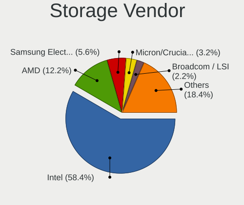

| Vendor                                  | Computers | Percent |
|-----------------------------------------|-----------|---------|
| Intel                                   | 564       | 58.39%  |
| AMD                                     | 118       | 12.22%  |
| Samsung Electronics                     | 54        | 5.59%   |
| Micron/Crucial Technology               | 31        | 3.21%   |
| Broadcom / LSI                          | 21        | 2.17%   |
| Phison Electronics                      | 19        | 1.97%   |
| SanDisk                                 | 17        | 1.76%   |
| Silicon Motion                          | 16        | 1.66%   |
| ASMedia Technology                      | 14        | 1.45%   |
| MAXIO Technology (Hangzhou)             | 12        | 1.24%   |
| Kingston Technology Company             | 12        | 1.24%   |
| SK hynix                                | 11        | 1.14%   |
| Micron Technology                       | 11        | 1.14%   |
| Marvell Technology Group                | 10        | 1.04%   |
| Transcend                               | 6         | 0.62%   |
| Toshiba                                 | 6         | 0.62%   |
| Realtek Semiconductor                   | 6         | 0.62%   |
| Nvidia                                  | 6         | 0.62%   |
| Hewlett-Packard                         | 5         | 0.52%   |
| Hosin Global Electronics                | 4         | 0.41%   |
| Yangtze Memory Technologies             | 3         | 0.31%   |
| VIA Technologies                        | 3         | 0.31%   |
| Seagate Technology                      | 3         | 0.31%   |
| KIOXIA                                  | 3         | 0.31%   |
| JMicron Technology                      | 3         | 0.31%   |
| Chelsio Communications                  | 2         | 0.21%   |
| Union Memory (Shenzhen)                 | 1         | 0.1%    |
| Solid State Storage Technology          | 1         | 0.1%    |
| Silicon Image                           | 1         | 0.1%    |
| Shenzhen Unionmemory Information System | 1         | 0.1%    |
| Shenzhen Longsys Electronics            | 1         | 0.1%    |
| Integrated Technology Express           | 1         | 0.1%    |

Storage Model
-------------

Storage controller models

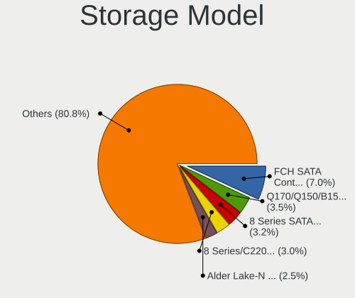

| Model                                                                            | Computers | Percent |
|----------------------------------------------------------------------------------|-----------|---------|
| AMD FCH SATA Controller [AHCI mode]                                              | 75        | 6.96%   |
| Intel Q170/Q150/B150/H170/H110/Z170/CM236 Chipset SATA Controller [AHCI Mode]    | 38        | 3.53%   |
| Intel 8 Series SATA Controller 1 [AHCI mode]                                     | 35        | 3.25%   |
| Intel 8 Series/C220 Series Chipset Family 6-port SATA Controller 1 [AHCI mode]   | 32        | 2.97%   |
| Intel Alder Lake-N SATA AHCI Controller                                          | 27        | 2.5%    |
| Intel 6 Series/C200 Series Chipset Family 6 port Desktop SATA AHCI Controller    | 27        | 2.5%    |
| Intel Sunrise Point-LP SATA Controller [AHCI mode]                               | 25        | 2.32%   |
| Intel Wildcat Point-LP SATA Controller [AHCI Mode]                               | 22        | 2.04%   |
| Intel Cannon Lake PCH SATA AHCI Controller                                       | 22        | 2.04%   |
| Intel Celeron/Pentium Silver Processor SATA Controller                           | 20        | 1.86%   |
| Intel Jasper Lake SATA AHCI Controller                                           | 19        | 1.76%   |
| Micron/Crucial P2 [Nick P2] / P3 / P3 Plus NVMe PCIe SSD (DRAM-less)             | 18        | 1.67%   |
| Intel Atom Processor E3800 Series SATA AHCI Controller                           | 18        | 1.67%   |
| Samsung NVMe SSD Controller SM981/PM981/PM983                                    | 17        | 1.58%   |
| Intel SATA Controller [RAID mode]                                                | 17        | 1.58%   |
| AMD FCH SATA Controller [IDE mode]                                               | 16        | 1.48%   |
| Silicon Motion SM2263EN/SM2263XT (DRAM-less) NVMe SSD Controllers                | 15        | 1.39%   |
| Intel 7 Series Chipset Family 6-port SATA Controller [AHCI mode]                 | 15        | 1.39%   |
| Samsung NVMe SSD Controller 980 (DRAM-less)                                      | 14        | 1.3%    |
| Intel Atom/Celeron/Pentium Processor x5-E8000/J3xxx/N3xxx Series SATA Controller | 14        | 1.3%    |
| Intel Atom Processor C3000 Series SATA Controller 1                              | 14        | 1.3%    |
| Intel 6 Series/C200 Series Chipset Family 6 port Mobile SATA AHCI Controller     | 14        | 1.3%    |
| Samsung NVMe SSD Controller PM9A1/PM9A3/980PRO                                   | 13        | 1.21%   |
| Intel Atom Processor C3000 Series SATA Controller 0                              | 13        | 1.21%   |
| Intel 7 Series/C210 Series Chipset Family 6-port SATA Controller [AHCI mode]     | 13        | 1.21%   |
| MAXIO (Hangzhou) NVMe SSD Controller MAP1202 (DRAM-less)                         | 12        | 1.11%   |
| Intel 200 Series PCH SATA controller [AHCI mode]                                 | 11        | 1.02%   |
| ASMedia ASM1061/ASM1062 Serial ATA Controller                                    | 11        | 1.02%   |
| AMD 500 Series Chipset SATA Controller                                           | 11        | 1.02%   |
| Intel NM10/ICH7 Family SATA Controller [AHCI mode]                               | 10        | 0.93%   |
| Intel 82801 Mobile SATA Controller [RAID mode]                                   | 10        | 0.93%   |
| Phison PS5013-E13 PCIe3 NVMe Controller (DRAM-less)                              | 9         | 0.83%   |
| Intel 500 Series Chipset Family SATA AHCI Controller                             | 9         | 0.83%   |
| Intel 5 Series/3400 Series Chipset 6 port SATA AHCI Controller                   | 9         | 0.83%   |
| AMD SB7x0/SB8x0/SB9x0 SATA Controller [AHCI mode]                                | 8         | 0.74%   |
| AMD 400 Series Chipset SATA Controller                                           | 8         | 0.74%   |
| Intel Volume Management Device NVMe RAID Controller                              | 7         | 0.65%   |
| Intel SSD 660P Series                                                            | 7         | 0.65%   |
| Intel Celeron N3350/Pentium N4200/Atom E3900 Series SATA AHCI Controller         | 7         | 0.65%   |
| Intel Cannon Point-LP SATA Controller [AHCI Mode]                                | 7         | 0.65%   |

Storage Kind
------------

Kind of storage controller (IDE, SATA, NVMe, SAS, ...)

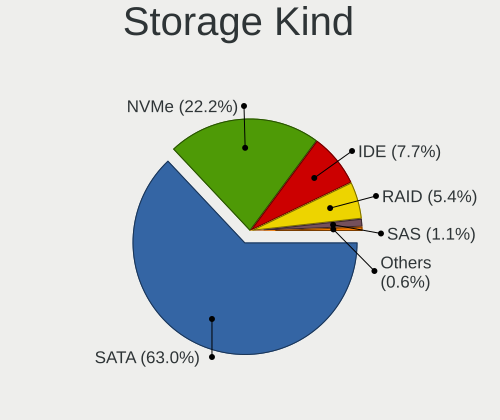

| Kind | Computers | Percent |
|------|-----------|---------|
| SATA | 611       | 62.99%  |
| NVMe | 215       | 22.16%  |
| IDE  | 75        | 7.73%   |
| RAID | 52        | 5.36%   |
| SAS  | 11        | 1.13%   |
| SCSI | 6         | 0.62%   |

Processor
---------

CPU Vendor
----------

Processor vendors

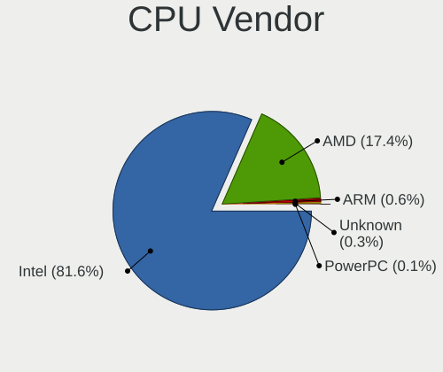

| Vendor  | Computers | Percent |
|---------|-----------|---------|
| Intel   | 629       | 81.58%  |
| AMD     | 134       | 17.38%  |
| ARM     | 5         | 0.65%   |
| Unknown | 2         | 0.26%   |
| PowerPC | 1         | 0.13%   |

CPU Model
---------

Processor models

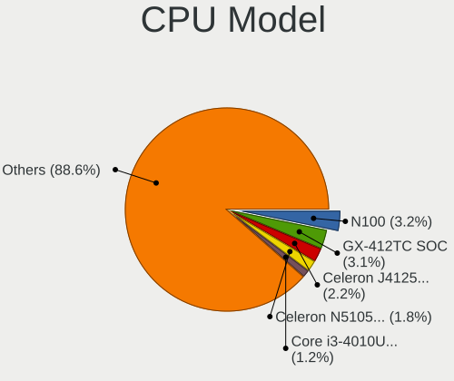

| Model                                    | Computers | Percent |
|------------------------------------------|-----------|---------|
| Intel N100                               | 25        | 3.21%   |
| AMD GX-412TC SOC                         | 24        | 3.08%   |
| Intel Celeron J4125 CPU @ 2.00GHz        | 17        | 2.19%   |
| Intel Celeron N5105 @ 2.00GHz            | 14        | 1.8%    |
| Intel Core i3-4010U CPU @ 1.70GHz        | 9         | 1.16%   |
| Intel Celeron CPU J1900 @ 1.99GHz        | 9         | 1.16%   |
| Intel Core i5-6500T CPU @ 2.50GHz        | 7         | 0.9%    |
| Intel Core i5-5300U CPU @ 2.30GHz        | 7         | 0.9%    |
| Intel Core i5-4300Y CPU @ 1.60GHz        | 7         | 0.9%    |
| Intel Core i3-8100T CPU @ 3.10GHz        | 7         | 0.9%    |
| Intel Atom CPU C3758R @ 2.40GHz          | 7         | 0.9%    |
| Intel Core i5-2520M CPU @ 2.50GHz        | 6         | 0.77%   |
| AMD GX-415GA SOC with Radeon HD Graphics | 6         | 0.77%   |
| Intel N150                               | 5         | 0.64%   |
| Intel Core i5-9500 CPU @ 3.00GHz         | 5         | 0.64%   |
| Intel Core i5-7200U CPU @ 2.50GHz        | 5         | 0.64%   |
| Intel Core i5-5250U CPU @ 1.60GHz        | 5         | 0.64%   |
| Intel Core i5-4590T CPU @ 2.00GHz        | 5         | 0.64%   |
| Intel Core i3-N305                       | 5         | 0.64%   |
| Intel Celeron CPU N3160 @ 1.60GHz        | 5         | 0.64%   |
| Intel Celeron CPU J3455 @ 1.50GHz        | 5         | 0.64%   |
| Intel Atom CPU D525 @ 1.80GHz            | 5         | 0.64%   |
| Intel Xeon CPU E3-1220 V2 @ 3.10GHz      | 4         | 0.51%   |
| Intel N95                                | 4         | 0.51%   |
| Intel Core i7-9700 CPU @ 3.00GHz         | 4         | 0.51%   |
| Intel Core i7-7500U CPU @ 2.70GHz        | 4         | 0.51%   |
| Intel Core i7-6700 CPU @ 3.40GHz         | 4         | 0.51%   |
| Intel Core i5-8265U CPU @ 1.60GHz        | 4         | 0.51%   |
| Intel Core i5-5200U CPU @ 2.20GHz        | 4         | 0.51%   |
| Intel Core i5-4570 CPU @ 3.20GHz         | 4         | 0.51%   |
| Intel Core i5-4250U CPU @ 1.30GHz        | 4         | 0.51%   |
| Intel Core i5-4200U CPU @ 1.60GHz        | 4         | 0.51%   |
| Intel Core i5-3470 CPU @ 3.20GHz         | 4         | 0.51%   |
| Intel Celeron CPU N3050 @ 1.60GHz        | 4         | 0.51%   |
| Intel Atom CPU C3758 @ 2.20GHz           | 4         | 0.51%   |
| Intel 11th Gen Core i5-1135G7 @ 2.40GHz  | 4         | 0.51%   |
| Intel 11th Gen Core i3-1115G4 @ 3.00GHz  | 4         | 0.51%   |
| AMD Ryzen 7 3700X 8-Core Processor       | 4         | 0.51%   |
| AMD G-T40E Processor                     | 4         | 0.51%   |
| AMD EPYC 3201 8-Core Processor           | 4         | 0.51%   |

CPU Model Family
----------------

Processor model prefix

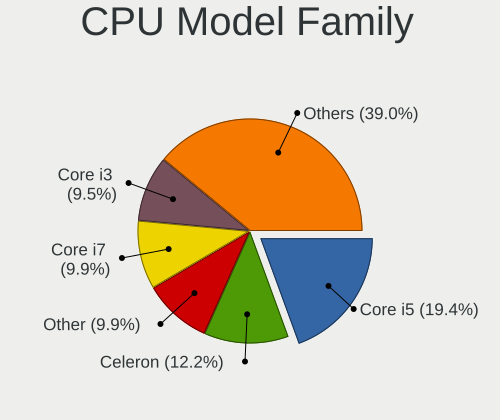

| Model                   | Computers | Percent |
|-------------------------|-----------|---------|
| Intel Core i5           | 151       | 19.43%  |
| Intel Celeron           | 95        | 12.23%  |
| Other                   | 77        | 9.91%   |
| Intel Core i7           | 77        | 9.91%   |
| Intel Core i3           | 74        | 9.52%   |
| Intel Xeon              | 58        | 7.46%   |
| Intel Atom              | 45        | 5.79%   |
| AMD GX                  | 39        | 5.02%   |
| AMD Ryzen 7             | 21        | 2.7%    |
| AMD Ryzen 5             | 20        | 2.57%   |
| Intel Core 2 Duo        | 16        | 2.06%   |
| Intel Pentium           | 15        | 1.93%   |
| AMD EPYC                | 8         | 1.03%   |
| Intel Core 2 Quad       | 7         | 0.9%    |
| Intel Pentium Gold      | 5         | 0.64%   |
| ARM Cortex              | 5         | 0.64%   |
| Intel Core i9           | 4         | 0.51%   |
| AMD Ryzen 7 PRO         | 4         | 0.51%   |
| AMD Ryzen 3             | 4         | 0.51%   |
| AMD G                   | 4         | 0.51%   |
| AMD A8                  | 4         | 0.51%   |
| Intel Xeon Silver       | 3         | 0.39%   |
| Intel 686-class         | 3         | 0.39%   |
| AMD Opteron             | 3         | 0.39%   |
| AMD Athlon              | 3         | 0.39%   |
| Intel Pentium Silver    | 2         | 0.26%   |
| Intel Genuine           | 2         | 0.26%   |
| Intel Core 2            | 2         | 0.26%   |
| AMD Ryzen 9             | 2         | 0.26%   |
| AMD E1                  | 2         | 0.26%   |
| AMD E                   | 2         | 0.26%   |
| AMD Athlon II X2        | 2         | 0.26%   |
| AMD Athlon 64 X2        | 2         | 0.26%   |
| AMD A4                  | 2         | 0.26%   |
| AMD A10                 | 2         | 0.26%   |
| Intel Pentium M         | 1         | 0.13%   |
| Intel Pentium Dual-Core | 1         | 0.13%   |
| Intel Pentium Dual      | 1         | 0.13%   |
| Intel Core M            | 1         | 0.13%   |
| Intel Core              | 1         | 0.13%   |

CPU Cores
---------

Number of processor cores

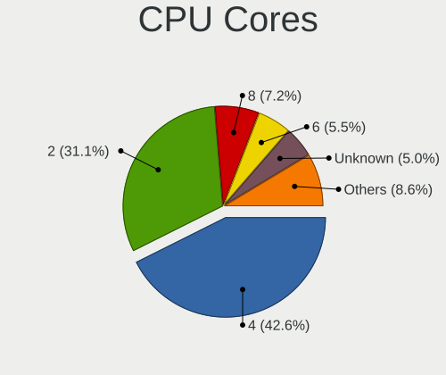

| Number  | Computers | Percent |
|---------|-----------|---------|
| 4       | 332       | 42.62%  |
| 2       | 242       | 31.07%  |
| 8       | 56        | 7.19%   |
| 6       | 43        | 5.52%   |
| Unknown | 39        | 5.01%   |
| 12      | 23        | 2.95%   |
| 16      | 20        | 2.57%   |
| 10      | 9         | 1.16%   |
| 32      | 4         | 0.51%   |
| 1       | 4         | 0.51%   |
| 64      | 2         | 0.26%   |
| 3       | 2         | 0.26%   |
| 28      | 1         | 0.13%   |
| 24      | 1         | 0.13%   |
| 20      | 1         | 0.13%   |

CPU Sockets
-----------

Number of sockets

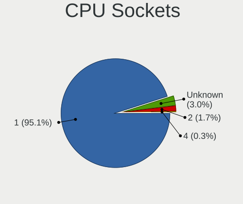

| Number  | Computers | Percent |
|---------|-----------|---------|
| 1       | 731       | 95.06%  |
| Unknown | 23        | 2.99%   |
| 2       | 13        | 1.69%   |
| 4       | 2         | 0.26%   |

CPU Threads
-----------

Threads per core (Hyper-Threading)

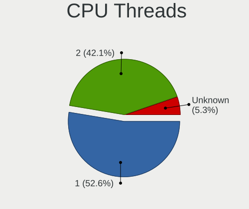

| Number  | Computers | Percent |
|---------|-----------|---------|
| 1       | 409       | 52.64%  |
| 2       | 327       | 42.08%  |
| Unknown | 41        | 5.28%   |

CPU Microarch
-------------

Microarchitecture

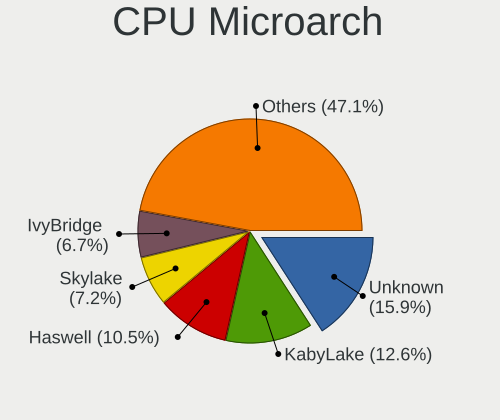

| Name          | Computers | Percent |
|---------------|-----------|---------|
| Unknown       | 123       | 15.87%  |
| KabyLake      | 98        | 12.65%  |
| Haswell       | 81        | 10.45%  |
| Skylake       | 56        | 7.23%   |
| IvyBridge     | 52        | 6.71%   |
| Silvermont    | 41        | 5.29%   |
| SandyBridge   | 41        | 5.29%   |
| Puma          | 31        | 4%      |
| Broadwell     | 25        | 3.23%   |
| Goldmont      | 23        | 2.97%   |
| Penryn        | 22        | 2.84%   |
| Goldmont plus | 20        | 2.58%   |
| Zen 3         | 16        | 2.06%   |
| Bonnell       | 16        | 2.06%   |
| Zen 2         | 15        | 1.94%   |
| Zen           | 14        | 1.81%   |
| Westmere      | 13        | 1.68%   |
| Jaguar        | 12        | 1.55%   |
| Core          | 11        | 1.42%   |
| TigerLake     | 10        | 1.29%   |
| CometLake     | 10        | 1.29%   |
| Zen+          | 8         | 1.03%   |
| Nehalem       | 8         | 1.03%   |
| Bobcat        | 7         | 0.9%    |
| Piledriver    | 6         | 0.77%   |
| K10           | 4         | 0.52%   |
| Steamroller   | 3         | 0.39%   |
| Excavator     | 3         | 0.39%   |
| P6            | 2         | 0.26%   |
| K10 Llano     | 2         | 0.26%   |
| K8 Hammer     | 1         | 0.13%   |
| K6            | 1         | 0.13%   |

Graphics
--------

GPU Vendor
----------

Vendors of graphics cards

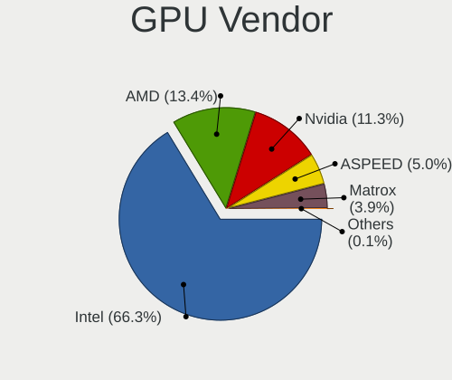

| Vendor                     | Computers | Percent |
|----------------------------|-----------|---------|
| Intel                      | 494       | 66.31%  |
| AMD                        | 100       | 13.42%  |
| Nvidia                     | 84        | 11.28%  |
| ASPEED Technology          | 37        | 4.97%   |
| Matrox Electronics Systems | 29        | 3.89%   |
| S3 Graphics                | 1         | 0.13%   |

GPU Model
---------

Graphics card models

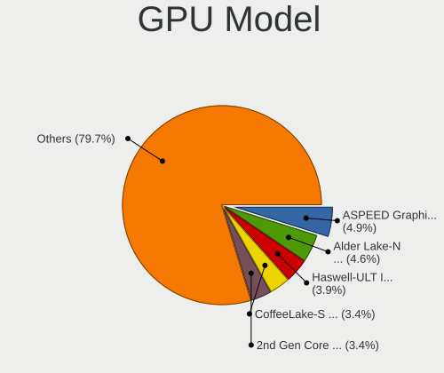

| Model                                                                                    | Computers | Percent |
|------------------------------------------------------------------------------------------|-----------|---------|
| ASPEED Technology ASPEED Graphics Family                                                 | 37        | 4.87%   |
| Intel Alder Lake-N [UHD Graphics]                                                        | 35        | 4.61%   |
| Intel Haswell-ULT Integrated Graphics Controller                                         | 30        | 3.95%   |
| Intel CoffeeLake-S GT2 [UHD Graphics 630]                                                | 26        | 3.42%   |
| Intel 2nd Generation Core Processor Family Integrated Graphics Controller                | 26        | 3.42%   |
| Intel Skylake-S GT2 [HD Graphics 530]                                                    | 25        | 3.29%   |
| Intel JasperLake [UHD Graphics]                                                          | 24        | 3.16%   |
| Intel GeminiLake [UHD Graphics 600]                                                      | 20        | 2.63%   |
| Intel Xeon E3-1200 v3/4th Gen Core Processor Integrated Graphics Controller              | 18        | 2.37%   |
| Intel Atom/Celeron/Pentium Processor x5-E8000/J3xxx/N3xxx Integrated Graphics Controller | 18        | 2.37%   |
| Intel Atom Processor Z36xxx/Z37xxx Series Graphics & Display                             | 17        | 2.24%   |
| Intel 3rd Gen Core processor Graphics Controller                                         | 17        | 2.24%   |
| Intel Kaby Lake-U GT2 [HD Graphics 620]                                                  | 15        | 1.97%   |
| Intel Broadwell-U GT2 [HD Graphics 5500]                                                 | 15        | 1.97%   |
| Matrox Electronics Systems MGA G200eW WPCM450                                            | 14        | 1.84%   |
| Intel Xeon E3-1200 v2/3rd Gen Core processor Graphics Controller                         | 14        | 1.84%   |
| Intel Skylake-U GT2 [HD Graphics 520]                                                    | 9         | 1.18%   |
| Intel Haswell-ULT Integrated Graphics Controller [HD Graphics]                           | 9         | 1.18%   |
| Intel WhiskeyLake-U GT2 [UHD Graphics 620]                                               | 7         | 0.92%   |
| Intel Skylake-S GT1 [HD Graphics 510]                                                    | 7         | 0.92%   |
| Intel CometLake-S GT2 [UHD Graphics 630]                                                 | 7         | 0.92%   |
| Intel Atom Processor D4xx/D5xx/N4xx/N5xx Integrated Graphics Controller                  | 7         | 0.92%   |
| Intel Apollo Lake GT1 [HD Graphics 500]                                                  | 7         | 0.92%   |
| AMD Renoir [Radeon Vega Series / Radeon Vega Mobile Series]                              | 7         | 0.92%   |
| Intel TigerLake-LP GT2 [Iris Xe Graphics]                                                | 6         | 0.79%   |
| Intel Kaby Lake-S GT2 [HD Graphics 630]                                                  | 6         | 0.79%   |
| Intel Kaby Lake-R GT2 [UHD Graphics 620]                                                 | 6         | 0.79%   |
| Intel CometLake-U GT2 [UHD Graphics]                                                     | 6         | 0.79%   |
| AMD Kabini [Radeon HD 8330E]                                                             | 6         | 0.79%   |
| AMD Cezanne [Radeon Vega Series / Radeon Vega Mobile Series]                             | 6         | 0.79%   |
| Nvidia GT218 [GeForce 210]                                                               | 5         | 0.66%   |
| Matrox Electronics Systems MGA G200EH                                                    | 5         | 0.66%   |
| Intel Broadwell-U GT3 [HD Graphics 6000]                                                 | 5         | 0.66%   |
| Intel Alder Lake-UP3 GT1 [UHD Graphics]                                                  | 5         | 0.66%   |
| Intel Alder Lake-N [Intel Graphics]                                                      | 5         | 0.66%   |
| Intel 4th Generation Core Processor Family Integrated Graphics Controller                | 5         | 0.66%   |
| AMD Raven Ridge [Radeon Vega Series / Radeon Vega Mobile Series]                         | 5         | 0.66%   |
| AMD Mullins [Radeon R4/R5 Graphics]                                                      | 5         | 0.66%   |
| AMD ES1000                                                                               | 5         | 0.66%   |
| Nvidia GK208B [GeForce GT 710]                                                           | 4         | 0.53%   |

GPU Combo
---------

Combinations of graphics cards

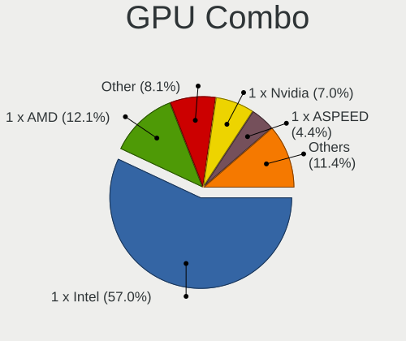

| Name                     | Computers | Percent |
|--------------------------|-----------|---------|
| 1 x Intel                | 441       | 56.98%  |
| 1 x AMD                  | 94        | 12.14%  |
| Other                    | 63        | 8.14%   |
| 1 x Nvidia               | 54        | 6.98%   |
| 1 x ASPEED               | 34        | 4.39%   |
| 1 x Matrox               | 29        | 3.75%   |
| Intel + Nvidia           | 27        | 3.49%   |
| 2 x Intel                | 21        | 2.71%   |
| 2 x AMD                  | 2         | 0.26%   |
| Intel + ASPEED           | 2         | 0.26%   |
| Intel + AMD              | 2         | 0.26%   |
| 2 x Nvidia               | 1         | 0.13%   |
| 1 x S3 Graphics          | 1         | 0.13%   |
| Nvidia + ASPEED          | 1         | 0.13%   |
| Intel + AMD + 1 x Nvidia | 1         | 0.13%   |
| AMD + Nvidia             | 1         | 0.13%   |

GPU Driver
----------

Free vs proprietary

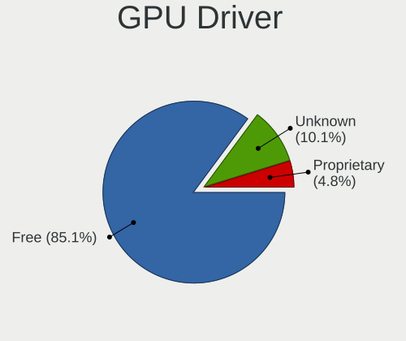

| Driver      | Computers | Percent |
|-------------|-----------|---------|
| Free        | 659       | 85.14%  |
| Unknown     | 78        | 10.08%  |
| Proprietary | 37        | 4.78%   |

GPU Memory
----------

Total video memory

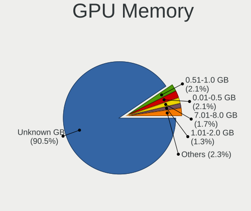

| Size in GB | Computers | Percent |
|------------|-----------|---------|
| Unknown    | 699       | 90.54%  |
| 0.51-1.0   | 16        | 2.07%   |
| 0.01-0.5   | 16        | 2.07%   |
| 7.01-8.0   | 13        | 1.68%   |
| 1.01-2.0   | 10        | 1.3%    |
| 5.01-6.0   | 8         | 1.04%   |
| 3.01-4.0   | 6         | 0.78%   |
| 8.01-16.0  | 2         | 0.26%   |
| 2.01-3.0   | 1         | 0.13%   |
| 16.01-24.0 | 1         | 0.13%   |

Monitor
-------

Monitor Vendor
--------------

Monitor vendors

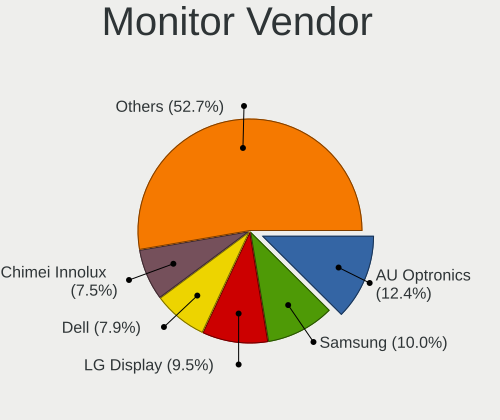

| Vendor                  | Computers | Percent |
|-------------------------|-----------|---------|
| AU Optronics            | 30        | 12.45%  |
| Samsung Electronics     | 24        | 9.96%   |
| LG Display              | 23        | 9.54%   |
| Dell                    | 19        | 7.88%   |
| Chimei Innolux          | 18        | 7.47%   |
| Iiyama                  | 13        | 5.39%   |
| BOE                     | 13        | 5.39%   |
| Apple                   | 13        | 5.39%   |
| Hewlett-Packard         | 8         | 3.32%   |
| Goldstar                | 8         | 3.32%   |
| BenQ                    | 7         | 2.9%    |
| Chi Mei Optoelectronics | 6         | 2.49%   |
| ViewSonic               | 5         | 2.07%   |
| Philips                 | 5         | 2.07%   |
| Idek Iiyama             | 5         | 2.07%   |
| Acer                    | 5         | 2.07%   |
| AOC                     | 4         | 1.66%   |
| Ancor Communications    | 4         | 1.66%   |
| Sharp                   | 3         | 1.24%   |
| Lenovo                  | 3         | 1.24%   |
| CSO                     | 3         | 1.24%   |
| LGD                     | 2         | 0.83%   |
| HUAWEI                  | 2         | 0.83%   |
| ASUSTek Computer        | 2         | 0.83%   |
| Unknown                 | 1         | 0.41%   |
| Toshiba                 | 1         | 0.41%   |
| Sony                    | 1         | 0.41%   |
| RS                      | 1         | 0.41%   |
| PRI                     | 1         | 0.41%   |
| PKB                     | 1         | 0.41%   |
| Packard Bell            | 1         | 0.41%   |
| Nvidia                  | 1         | 0.41%   |
| LG Electronics          | 1         | 0.41%   |
| Lenovo Group Limited    | 1         | 0.41%   |
| IBM                     | 1         | 0.41%   |
| HannStar                | 1         | 0.41%   |
| CPT                     | 1         | 0.41%   |
| CKL                     | 1         | 0.41%   |
| BOE Technology Group    | 1         | 0.41%   |
| Unknown                 | 1         | 0.41%   |

Monitor Model
-------------

Monitor models

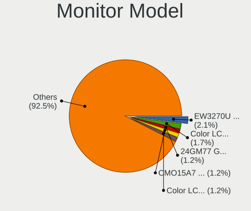

| Model                                                                    | Computers | Percent |
|--------------------------------------------------------------------------|-----------|---------|
| BenQ EW3270U BNQ7950 3840x2160 700x390mm 31.5-inch                       | 5         | 2.07%   |
| Apple Color LCD APP9CF0 1440x900 290x180mm 13.4-inch                     | 4         | 1.66%   |
| Goldstar 24GM77 GSM5A91 1920x1080 530x300mm 24.0-inch                    | 3         | 1.24%   |
| Chi Mei Optoelectronics LCD Monitor CMO15A7 1366x768 350x190mm 15.7-inch | 3         | 1.24%   |
| AU Optronics LCD Monitor AUO226D 1920x1080 280x160mm 12.7-inch           | 3         | 1.24%   |
| AU Optronics LCD Monitor AUO106C 1366x768 280x160mm 12.7-inch            | 3         | 1.24%   |
| Apple Color LCD APPA034 2880x1800 290x180mm 13.4-inch                    | 3         | 1.24%   |
| ViewSonic TD2420 SERIES VSC452D 1920x1080 520x290mm 23.4-inch            | 2         | 0.83%   |
| Samsung Electronics LCD Monitor S24R35x 1920x1080                        | 2         | 0.83%   |
| Philips PHL 241B8Q PHL0929 1920x1080 530x300mm 24.0-inch                 | 2         | 0.83%   |
| LGD LCD Monitor 1600x900                                                 | 2         | 0.83%   |
| LG Display LCD Monitor LGD03A3 1366x768 280x160mm 12.7-inch              | 2         | 0.83%   |
| LG Display LCD Monitor LGD02D8 1366x768 280x160mm 12.7-inch              | 2         | 0.83%   |
| Iiyama PL2474H IVM6146 1920x1080 520x290mm 23.4-inch                     | 2         | 0.83%   |
| Iiyama PL2474H IVM6137 1920x1080 520x290mm 23.4-inch                     | 2         | 0.83%   |
| Idek Iiyama LCD Monitor PLX2783H 1920x1080                               | 2         | 0.83%   |
| HUAWEI AD80HW HWV2402 1920x1080 530x300mm 24.0-inch                      | 2         | 0.83%   |
| Dell SE2417HGX DELD0F7 1920x1080 520x290mm 23.4-inch                     | 2         | 0.83%   |
| Dell P2214H DELA098 1920x1080 480x270mm 21.7-inch                        | 2         | 0.83%   |
| Chimei Innolux LCD Monitor CMN14C3 1366x768 310x170mm 13.9-inch          | 2         | 0.83%   |
| Chimei Innolux LCD Monitor CMN1343 1920x1080 280x160mm 12.7-inch         | 2         | 0.83%   |
| BOE LCD Monitor BOE0700 1920x1080 340x190mm 15.3-inch                    | 2         | 0.83%   |
| AU Optronics LCD Monitor AUO34ED 1920x1080 340x190mm 15.3-inch           | 2         | 0.83%   |
| AU Optronics LCD Monitor AUO313C 1366x768 310x170mm 13.9-inch            | 2         | 0.83%   |
| AU Optronics LCD Monitor AUO113D 1920x1080 310x170mm 13.9-inch           | 2         | 0.83%   |
| AOC 24G1WG4 AOC2401 1920x1080 520x290mm 23.4-inch                        | 2         | 0.83%   |
| Acer V223HQ ACR0070 1920x1080 470x270mm 21.3-inch                        | 2         | 0.83%   |
| ViewSonic VA2403-FHD VSCF136 1920x1080 520x290mm 23.4-inch               | 1         | 0.41%   |
| ViewSonic VA2223-FHD VSC9239 1920x1080 480x270mm 21.7-inch               | 1         | 0.41%   |
| ViewSonic VA1916w-6 VSCF91F 1440x900 410x260mm 19.1-inch                 | 1         | 0.41%   |
| Unknown LCD Monitor Sharp 3840x2160                                      | 1         | 0.41%   |
| Toshiba TV TSB0108 1360x768 890x500mm 40.2-inch                          | 1         | 0.41%   |
| Sony TV  *00 SNYF903 3840x2160 1080x610mm 48.8-inch                      | 1         | 0.41%   |
| Sharp LCD Monitor SHP14B9 3840x2160 340x190mm 15.3-inch                  | 1         | 0.41%   |
| Sharp LCD Monitor SHP1416 1366x768 310x170mm 13.9-inch                   | 1         | 0.41%   |
| Sharp LCD Monitor SHP13F9 3200x1800 350x190mm 15.7-inch                  | 1         | 0.41%   |
| Samsung Electronics U28E590 SAM0C4E 3840x2160 610x350mm 27.7-inch        | 1         | 0.41%   |
| Samsung Electronics SyncMaster SAM05CD 1920x1080                         | 1         | 0.41%   |
| Samsung Electronics SyncMaster SAM036F 1440x900 410x260mm 19.1-inch      | 1         | 0.41%   |
| Samsung Electronics SyncMaster SAM027E 1680x1050 470x300mm 22.0-inch     | 1         | 0.41%   |

Monitor Resolution
------------------

Monitor screen resolution

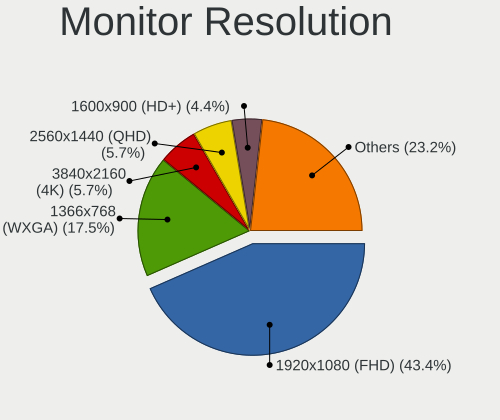

| Resolution         | Computers | Percent |
|--------------------|-----------|---------|
| 1920x1080 (FHD)    | 99        | 43.42%  |
| 1366x768 (WXGA)    | 40        | 17.54%  |
| 3840x2160 (4K)     | 13        | 5.7%    |
| 2560x1440 (QHD)    | 13        | 5.7%    |
| 1600x900 (HD+)     | 10        | 4.39%   |
| 1440x900 (WXGA+)   | 10        | 4.39%   |
| 1680x1050 (WSXGA+) | 7         | 3.07%   |
| 1280x1024 (SXGA)   | 7         | 3.07%   |
| 1280x800 (WXGA)    | 6         | 2.63%   |
| 2880x1800          | 4         | 1.75%   |
| 1920x1200 (WUXGA)  | 4         | 1.75%   |
| 1024x600           | 4         | 1.75%   |
| 2560x1600          | 3         | 1.32%   |
| 2560x1080          | 2         | 0.88%   |
| 3520x1200          | 1         | 0.44%   |
| 3200x1800 (QHD+)   | 1         | 0.44%   |
| 1920x540           | 1         | 0.44%   |
| 1440x960           | 1         | 0.44%   |
| 1400x1050          | 1         | 0.44%   |
| Unknown            | 1         | 0.44%   |

Monitor Diagonal
----------------

Diagonal size in inches

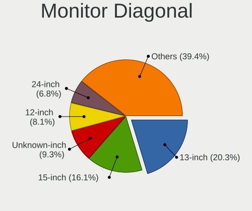

| Inches  | Computers | Percent |
|---------|-----------|---------|
| 13      | 48        | 20.34%  |
| 15      | 38        | 16.1%   |
| Unknown | 22        | 9.32%   |
| 12      | 19        | 8.05%   |
| 24      | 16        | 6.78%   |
| 23      | 16        | 6.78%   |
| 27      | 15        | 6.36%   |
| 21      | 12        | 5.08%   |
| 19      | 10        | 4.24%   |
| 17      | 10        | 4.24%   |
| 31      | 6         | 2.54%   |
| 14      | 4         | 1.69%   |
| 10      | 4         | 1.69%   |
| 11      | 3         | 1.27%   |
| 52      | 2         | 0.85%   |
| 26      | 2         | 0.85%   |
| 22      | 2         | 0.85%   |
| 48      | 1         | 0.42%   |
| 42      | 1         | 0.42%   |
| 40      | 1         | 0.42%   |
| 28      | 1         | 0.42%   |
| 20      | 1         | 0.42%   |
| 18      | 1         | 0.42%   |
| 9       | 1         | 0.42%   |

Monitor Width
-------------

Physical width

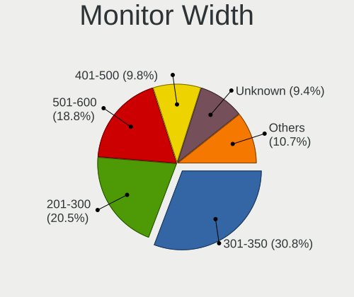

| Width in mm | Computers | Percent |
|-------------|-----------|---------|
| 301-350     | 72        | 30.77%  |
| 201-300     | 48        | 20.51%  |
| 501-600     | 44        | 18.8%   |
| 401-500     | 23        | 9.83%   |
| Unknown     | 22        | 9.4%    |
| 351-400     | 11        | 4.7%    |
| 601-700     | 9         | 3.85%   |
| 1001-1500   | 3         | 1.28%   |
| 801-900     | 1         | 0.43%   |
| 901-1000    | 1         | 0.43%   |

Aspect Ratio
------------

Proportional relationship between the width and the height

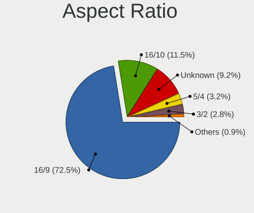

| Ratio   | Computers | Percent |
|---------|-----------|---------|
| 16/9    | 158       | 72.48%  |
| 16/10   | 25        | 11.47%  |
| Unknown | 20        | 9.17%   |
| 5/4     | 7         | 3.21%   |
| 3/2     | 6         | 2.75%   |
| 4/3     | 1         | 0.46%   |
| 21/9    | 1         | 0.46%   |

Monitor Area
------------

Area in inch²

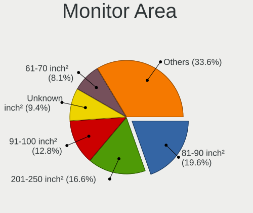

| Area in inch² | Computers | Percent |
|----------------|-----------|---------|
| 81-90          | 46        | 19.57%  |
| 201-250        | 39        | 16.6%   |
| 91-100         | 30        | 12.77%  |
| Unknown        | 22        | 9.36%   |
| 61-70          | 19        | 8.09%   |
| 301-350        | 17        | 7.23%   |
| 151-200        | 14        | 5.96%   |
| 121-130        | 7         | 2.98%   |
| 101-110        | 7         | 2.98%   |
| 351-500        | 6         | 2.55%   |
| 71-80          | 5         | 2.13%   |
| 41-50          | 5         | 2.13%   |
| 251-300        | 4         | 1.7%    |
| 141-150        | 4         | 1.7%    |
| More than 1000 | 3         | 1.28%   |
| 51-60          | 3         | 1.28%   |
| 111-120        | 2         | 0.85%   |
| 501-1000       | 2         | 0.85%   |

Pixel Density
-------------

Pixels per inch

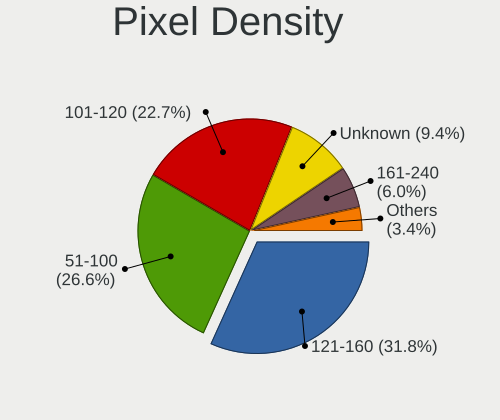

| Density       | Computers | Percent |
|---------------|-----------|---------|
| 121-160       | 74        | 31.76%  |
| 51-100        | 62        | 26.61%  |
| 101-120       | 53        | 22.75%  |
| Unknown       | 22        | 9.44%   |
| 161-240       | 14        | 6.01%   |
| More than 240 | 6         | 2.58%   |
| 1-50          | 2         | 0.86%   |

Multiple Monitors
-----------------

Total monitors connected

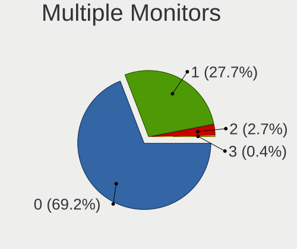

| Total | Computers | Percent |
|-------|-----------|---------|
| 0     | 541       | 69.18%  |
| 1     | 217       | 27.75%  |
| 2     | 21        | 2.69%   |
| 3     | 3         | 0.38%   |

Network
-------

Net Controller Vendor
---------------------

Controller vendors

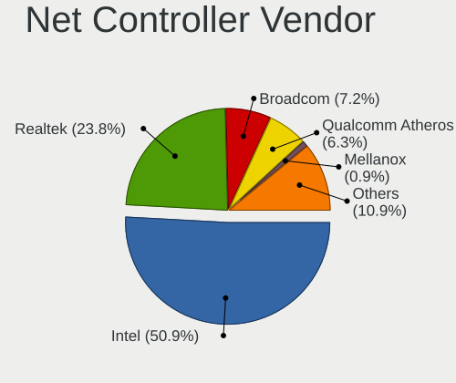

| Vendor                            | Computers | Percent |
|-----------------------------------|-----------|---------|
| Intel                             | 563       | 50.86%  |
| Realtek Semiconductor             | 263       | 23.76%  |
| Broadcom                          | 80        | 7.23%   |
| Qualcomm Atheros                  | 70        | 6.32%   |
| Mellanox Technologies             | 10        | 0.9%    |
| AMD                               | 9         | 0.81%   |
| TP-Link                           | 7         | 0.63%   |
| MediaTek                          | 7         | 0.63%   |
| Marvell Technology Group          | 6         | 0.54%   |
| D-Link System                     | 6         | 0.54%   |
| American Megatrends               | 6         | 0.54%   |
| VIA Technologies                  | 5         | 0.45%   |
| Sierra Wireless                   | 5         | 0.45%   |
| Ralink Technology                 | 5         | 0.45%   |
| IMC Networks                      | 5         | 0.45%   |
| Ralink                            | 4         | 0.36%   |
| Nvidia                            | 4         | 0.36%   |
| Dell                              | 4         | 0.36%   |
| Apple                             | 4         | 0.36%   |
| Xiaomi                            | 3         | 0.27%   |
| Qualcomm                          | 3         | 0.27%   |
| Microchip Technology              | 3         | 0.27%   |
| Huawei Technologies               | 3         | 0.27%   |
| Edimax Technology                 | 3         | 0.27%   |
| Chelsio Communications            | 3         | 0.27%   |
| Aquantia                          | 3         | 0.27%   |
| 3Com                              | 3         | 0.27%   |
| Samsung Electronics               | 2         | 0.18%   |
| Qualcomm Atheros Communications   | 2         | 0.18%   |
| QLogic                            | 2         | 0.18%   |
| Ericsson Business Mobile Networks | 2         | 0.18%   |
| Emulex                            | 2         | 0.18%   |
| Solarflare Communications         | 1         | 0.09%   |
| Silicom                           | 1         | 0.09%   |
| Sagem                             | 1         | 0.09%   |
| OPPO Electronics                  | 1         | 0.09%   |
| National Semiconductor            | 1         | 0.09%   |
| Mobile                            | 1         | 0.09%   |
| Linksys                           | 1         | 0.09%   |
| Insyde Software                   | 1         | 0.09%   |

Net Controller Model
--------------------

Controller models

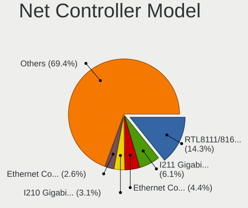

| Model                                                                         | Computers | Percent |
|-------------------------------------------------------------------------------|-----------|---------|
| Realtek RTL8111/8168/8211/8411 PCI Express Gigabit Ethernet Controller        | 200       | 14.26%  |
| Intel I211 Gigabit Network Connection                                         | 86        | 6.13%   |
| Intel Ethernet Controller I226-V                                              | 62        | 4.42%   |
| Intel I210 Gigabit Network Connection                                         | 44        | 3.14%   |
| Intel Ethernet Controller I225-V                                              | 37        | 2.64%   |
| Intel 82579LM Gigabit Network Connection (Lewisville)                         | 32        | 2.28%   |
| Realtek RTL8125 2.5GbE Controller                                             | 28        | 2%      |
| Intel 82574L Gigabit Network Connection                                       | 28        | 2%      |
| Intel I350 Gigabit Network Connection                                         | 27        | 1.92%   |
| Intel 82599ES 10-Gigabit SFI/SFP+ Network Connection                          | 26        | 1.85%   |
| Intel Ethernet Connection I217-LM                                             | 21        | 1.5%    |
| Intel Ethernet Connection (2) I219-LM                                         | 19        | 1.35%   |
| Intel Wi-Fi 6 AX200                                                           | 16        | 1.14%   |
| Intel Wireless 8265 / 8275                                                    | 15        | 1.07%   |
| Intel Wireless 7265                                                           | 15        | 1.07%   |
| Intel Ethernet Connection (7) I219-V                                          | 13        | 0.93%   |
| Qualcomm Atheros AR928X Wireless Network Adapter (PCI-Express)                | 11        | 0.78%   |
| Intel Wireless 8260                                                           | 11        | 0.78%   |
| Intel Ethernet Controller X710 for 10GbE SFP+                                 | 11        | 0.78%   |
| Intel Centrino Advanced-N 6205 [Taylor Peak]                                  | 11        | 0.78%   |
| Broadcom NetXtreme BCM5720 Gigabit Ethernet PCIe                              | 11        | 0.78%   |
| Qualcomm Atheros AR9285 Wireless Network Adapter (PCI-Express)                | 10        | 0.71%   |
| Intel Wireless 7260                                                           | 10        | 0.71%   |
| Intel Ethernet Connection (7) I219-LM                                         | 10        | 0.71%   |
| Realtek RTL8821CE 802.11ac PCIe Wireless Network Adapter                      | 9         | 0.64%   |
| Realtek RTL8111/8168/8411 PCI Express Gigabit Ethernet Controller             | 9         | 0.64%   |
| Qualcomm Atheros AR9485 Wireless Network Adapter                              | 9         | 0.64%   |
| Intel Ethernet Connection X553 10 GbE SFP+                                    | 9         | 0.64%   |
| Intel Ethernet Connection (2) I219-V                                          | 9         | 0.64%   |
| Intel Dual Band Wireless-AC 3168NGW [Stone Peak]                              | 9         | 0.64%   |
| Intel 82576 Gigabit Network Connection                                        | 9         | 0.64%   |
| Intel 82571EB/82571GB Gigabit Ethernet Controller D0/D1 (copper applications) | 9         | 0.64%   |
| Broadcom NetXtreme II BCM57810 10 Gigabit Ethernet                            | 9         | 0.64%   |
| Realtek RTL8188EUS 802.11n Wireless Network Adapter                           | 8         | 0.57%   |
| Intel Wireless 3165                                                           | 8         | 0.57%   |
| Intel Wi-Fi 6E(802.11ax) AX210/AX1675* 2x2 [Typhoon Peak]                     | 8         | 0.57%   |
| Intel Wi-Fi 6 AX201                                                           | 8         | 0.57%   |
| Intel Cannon Point-LP CNVi [Wireless-AC]                                      | 8         | 0.57%   |
| Broadcom NetXtreme II BCM5709 Gigabit Ethernet                                | 8         | 0.57%   |
| AMD XGMAC 10GbE Controller                                                    | 8         | 0.57%   |

Wireless Vendor
---------------

Wireless vendors

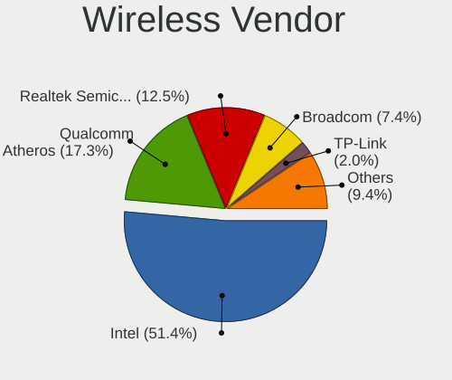

| Vendor                          | Computers | Percent |
|---------------------------------|-----------|---------|
| Intel                           | 181       | 51.42%  |
| Qualcomm Atheros                | 61        | 17.33%  |
| Realtek Semiconductor           | 44        | 12.5%   |
| Broadcom                        | 26        | 7.39%   |
| TP-Link                         | 7         | 1.99%   |
| MediaTek                        | 7         | 1.99%   |
| Ralink Technology               | 5         | 1.42%   |
| IMC Networks                    | 5         | 1.42%   |
| Ralink                          | 4         | 1.14%   |
| Edimax Technology               | 3         | 0.85%   |
| Sierra Wireless                 | 2         | 0.57%   |
| Qualcomm Atheros Communications | 2         | 0.57%   |
| Dell                            | 2         | 0.57%   |
| Sagem                           | 1         | 0.28%   |
| Linksys                         | 1         | 0.28%   |
| Accton Technology               | 1         | 0.28%   |

Wireless Model
--------------

Wireless models

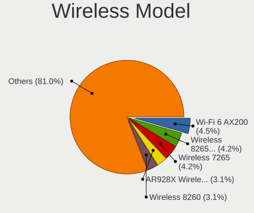

| Model                                                           | Computers | Percent |
|-----------------------------------------------------------------|-----------|---------|
| Intel Wi-Fi 6 AX200                                             | 16        | 4.48%   |
| Intel Wireless 8265 / 8275                                      | 15        | 4.2%    |
| Intel Wireless 7265                                             | 15        | 4.2%    |
| Qualcomm Atheros AR928X Wireless Network Adapter (PCI-Express)  | 11        | 3.08%   |
| Intel Wireless 8260                                             | 11        | 3.08%   |
| Intel Centrino Advanced-N 6205 [Taylor Peak]                    | 11        | 3.08%   |
| Qualcomm Atheros AR9285 Wireless Network Adapter (PCI-Express)  | 10        | 2.8%    |
| Intel Wireless 7260                                             | 10        | 2.8%    |
| Realtek RTL8821CE 802.11ac PCIe Wireless Network Adapter        | 9         | 2.52%   |
| Qualcomm Atheros AR9485 Wireless Network Adapter                | 9         | 2.52%   |
| Intel Dual Band Wireless-AC 3168NGW [Stone Peak]                | 9         | 2.52%   |
| Realtek RTL8188EUS 802.11n Wireless Network Adapter             | 8         | 2.24%   |
| Intel Wireless 3165                                             | 8         | 2.24%   |
| Intel Wi-Fi 6E(802.11ax) AX210/AX1675* 2x2 [Typhoon Peak]       | 8         | 2.24%   |
| Intel Wi-Fi 6 AX201                                             | 8         | 2.24%   |
| Intel Cannon Point-LP CNVi [Wireless-AC]                        | 8         | 2.24%   |
| Qualcomm Atheros QCA9377 802.11ac Wireless Network Adapter      | 7         | 1.96%   |
| Intel Wi-Fi 5(802.11ac) Wireless-AC 9x6x [Thunder Peak]         | 7         | 1.96%   |
| Broadcom BCM4360 802.11ac Dual Band Wireless Network Adapter    | 7         | 1.96%   |
| Realtek RTL8852BE PCIe 802.11ax Wireless Network Controller     | 6         | 1.68%   |
| Intel Comet Lake PCH-LP CNVi WiFi                               | 6         | 1.68%   |
| Intel Centrino Advanced-N 6235                                  | 6         | 1.68%   |
| Realtek RTL8812AE 802.11ac PCIe Wireless Network Adapter        | 5         | 1.4%    |
| Qualcomm Atheros AR9287 Wireless Network Adapter (PCI-Express)  | 5         | 1.4%    |
| MediaTek MT7922 802.11ax PCI Express Wireless Network Adapter   | 5         | 1.4%    |
| Intel Alder Lake-P PCH CNVi WiFi                                | 5         | 1.4%    |
| IMC Networks 802.11 n/g/b Wireless LAN USB Mini-Card            | 5         | 1.4%    |
| Qualcomm Atheros QCA986x/988x 802.11ac Wireless Network Adapter | 4         | 1.12%   |
| Qualcomm Atheros AR9462 Wireless Network Adapter                | 4         | 1.12%   |
| Intel PRO/Wireless 3945ABG [Golan] Network Connection           | 4         | 1.12%   |
| Intel Cannon Lake PCH CNVi WiFi                                 | 4         | 1.12%   |
| Broadcom BCM43224 802.11a/b/g/n                                 | 4         | 1.12%   |
| Ralink RT3090 Wireless 802.11n 1T/1R PCIe                       | 3         | 0.84%   |
| Intel Raptor Lake PCH CNVi WiFi                                 | 3         | 0.84%   |
| Intel PRO/Wireless 5100 AGN [Shiloh] Network Connection         | 3         | 0.84%   |
| Intel Jasper Lake PCH CNVi WiFi                                 | 3         | 0.84%   |
| Edimax EW-7811Un 802.11n Wireless Adapter [Realtek RTL8188CUS]  | 3         | 0.84%   |
| Broadcom BCM4350 802.11ac Wireless Network Adapter              | 3         | 0.84%   |
| Broadcom BCM4331 802.11a/b/g/n                                  | 3         | 0.84%   |
| Broadcom BCM4321 802.11a/b/g/n                                  | 3         | 0.84%   |

Ethernet Vendor
---------------

Ethernet vendors

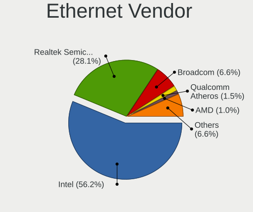

| Vendor                    | Computers | Percent |
|---------------------------|-----------|---------|
| Intel                     | 487       | 56.24%  |
| Realtek Semiconductor     | 243       | 28.06%  |
| Broadcom                  | 57        | 6.58%   |
| Qualcomm Atheros          | 13        | 1.5%    |
| AMD                       | 9         | 1.04%   |
| Marvell Technology Group  | 6         | 0.69%   |
| D-Link System             | 6         | 0.69%   |
| American Megatrends       | 6         | 0.69%   |
| VIA Technologies          | 5         | 0.58%   |
| Nvidia                    | 4         | 0.46%   |
| Xiaomi                    | 3         | 0.35%   |
| Qualcomm                  | 3         | 0.35%   |
| Aquantia                  | 3         | 0.35%   |
| 3Com                      | 3         | 0.35%   |
| Samsung Electronics       | 2         | 0.23%   |
| QLogic                    | 2         | 0.23%   |
| Microchip Technology      | 2         | 0.23%   |
| Emulex                    | 2         | 0.23%   |
| Chelsio Communications    | 2         | 0.23%   |
| Apple                     | 2         | 0.23%   |
| Solarflare Communications | 1         | 0.12%   |
| Silicom                   | 1         | 0.12%   |
| OPPO Electronics          | 1         | 0.12%   |
| National Semiconductor    | 1         | 0.12%   |
| Mobile                    | 1         | 0.12%   |
| Insyde Software           | 1         | 0.12%   |

Ethernet Model
--------------

Ethernet models

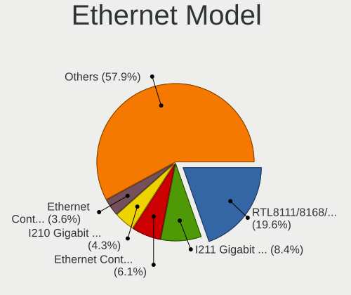

| Model                                                                         | Computers | Percent |
|-------------------------------------------------------------------------------|-----------|---------|
| Realtek RTL8111/8168/8211/8411 PCI Express Gigabit Ethernet Controller        | 200       | 19.63%  |
| Intel I211 Gigabit Network Connection                                         | 86        | 8.44%   |
| Intel Ethernet Controller I226-V                                              | 62        | 6.08%   |
| Intel I210 Gigabit Network Connection                                         | 44        | 4.32%   |
| Intel Ethernet Controller I225-V                                              | 37        | 3.63%   |
| Intel 82579LM Gigabit Network Connection (Lewisville)                         | 32        | 3.14%   |
| Realtek RTL8125 2.5GbE Controller                                             | 28        | 2.75%   |
| Intel 82574L Gigabit Network Connection                                       | 28        | 2.75%   |
| Intel I350 Gigabit Network Connection                                         | 27        | 2.65%   |
| Intel 82599ES 10-Gigabit SFI/SFP+ Network Connection                          | 26        | 2.55%   |
| Intel Ethernet Connection I217-LM                                             | 21        | 2.06%   |
| Intel Ethernet Connection (2) I219-LM                                         | 19        | 1.86%   |
| Intel Ethernet Connection (7) I219-V                                          | 13        | 1.28%   |
| Intel Ethernet Controller X710 for 10GbE SFP+                                 | 11        | 1.08%   |
| Broadcom NetXtreme BCM5720 Gigabit Ethernet PCIe                              | 11        | 1.08%   |
| Intel Ethernet Connection (7) I219-LM                                         | 10        | 0.98%   |
| Realtek RTL8111/8168/8411 PCI Express Gigabit Ethernet Controller             | 9         | 0.88%   |
| Intel Ethernet Connection X553 10 GbE SFP+                                    | 9         | 0.88%   |
| Intel Ethernet Connection (2) I219-V                                          | 9         | 0.88%   |
| Intel 82576 Gigabit Network Connection                                        | 9         | 0.88%   |
| Intel 82571EB/82571GB Gigabit Ethernet Controller D0/D1 (copper applications) | 9         | 0.88%   |
| Broadcom NetXtreme II BCM57810 10 Gigabit Ethernet                            | 9         | 0.88%   |
| Broadcom NetXtreme II BCM5709 Gigabit Ethernet                                | 8         | 0.79%   |
| AMD XGMAC 10GbE Controller                                                    | 8         | 0.79%   |
| Realtek RTL810xE PCI Express Fast Ethernet controller                         | 7         | 0.69%   |
| Intel Ethernet Controller X550                                                | 7         | 0.69%   |
| Intel Ethernet Connection X553 1GbE                                           | 7         | 0.69%   |
| Intel Ethernet Connection (3) I218-LM                                         | 7         | 0.69%   |
| Intel 82583V Gigabit Network Connection                                       | 7         | 0.69%   |
| Intel 82579V Gigabit Network Connection                                       | 7         | 0.69%   |
| Realtek USB 2.5GbE Controller                                                 | 6         | 0.59%   |
| Intel Ethernet Controller I225-LM                                             | 6         | 0.59%   |
| Intel Ethernet Connection I219-LM                                             | 6         | 0.59%   |
| Intel Ethernet Connection (6) I219-V                                          | 6         | 0.59%   |
| Intel Ethernet Connection (11) I219-V                                         | 6         | 0.59%   |
| D-Link System DGE-528T Gigabit Ethernet Adapter                               | 6         | 0.59%   |
| American Megatrends Virtual Ethernet                                          | 6         | 0.59%   |
| Realtek RTL-8100/8101L/8139 PCI Fast Ethernet Adapter                         | 5         | 0.49%   |
| Qualcomm Atheros AR8151 v2.0 Gigabit Ethernet                                 | 5         | 0.49%   |
| Intel Ethernet Controller 10-Gigabit X540-AT2                                 | 5         | 0.49%   |

Net Controller Kind
-------------------

Ethernet, WiFi or modem

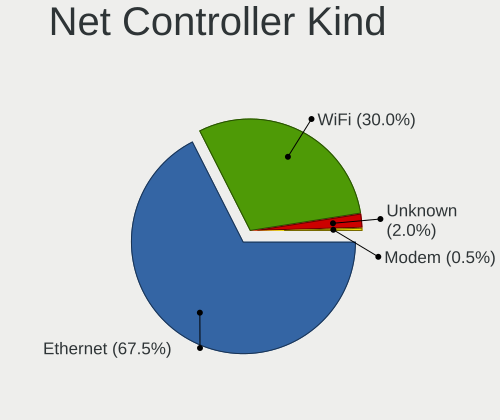

| Kind     | Computers | Percent |
|----------|-----------|---------|
| Ethernet | 732       | 67.53%  |
| WiFi     | 325       | 29.98%  |
| Unknown  | 22        | 2.03%   |
| Modem    | 5         | 0.46%   |

Used Controller
---------------

Currently used network controller

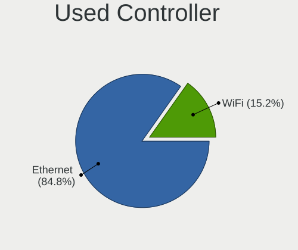

| Kind     | Computers | Percent |
|----------|-----------|---------|
| Ethernet | 658       | 84.79%  |
| WiFi     | 118       | 15.21%  |

NICs
----

Total network controllers on board

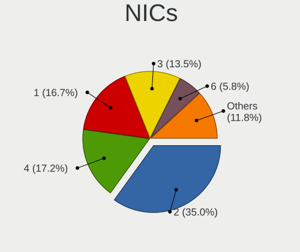

| Total | Computers | Percent |
|-------|-----------|---------|
| 2     | 272       | 34.96%  |
| 4     | 134       | 17.22%  |
| 1     | 130       | 16.71%  |
| 3     | 105       | 13.5%   |
| 6     | 45        | 5.78%   |
| 5     | 42        | 5.4%    |
| 8     | 15        | 1.93%   |
| 9     | 12        | 1.54%   |
| 0     | 7         | 0.9%    |
| 7     | 6         | 0.77%   |
| 10    | 4         | 0.51%   |
| 12    | 2         | 0.26%   |
| 11    | 2         | 0.26%   |
| 14    | 1         | 0.13%   |
| 13    | 1         | 0.13%   |

IPv6
----

IPv6 vs IPv4

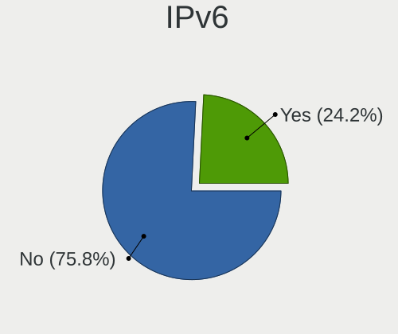

| Used | Computers | Percent |
|------|-----------|---------|
| No   | 610       | 75.78%  |
| Yes  | 195       | 24.22%  |

Bluetooth
---------

Bluetooth Vendor
----------------

Controller vendors

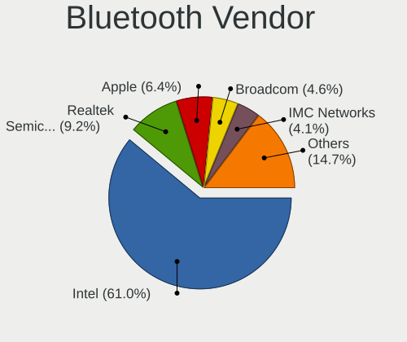

| Vendor                          | Computers | Percent |
|---------------------------------|-----------|---------|
| Intel                           | 133       | 61.01%  |
| Realtek Semiconductor           | 20        | 9.17%   |
| Apple                           | 14        | 6.42%   |
| Broadcom                        | 10        | 4.59%   |
| IMC Networks                    | 9         | 4.13%   |
| Qualcomm Atheros Communications | 7         | 3.21%   |
| MediaTek                        | 5         | 2.29%   |
| Cambridge Silicon Radio         | 4         | 1.83%   |
| Foxconn / Hon Hai               | 3         | 1.38%   |
| Dell                            | 3         | 1.38%   |
| Hewlett-Packard                 | 2         | 0.92%   |
| AMPAK Technology                | 2         | 0.92%   |
| TP-Link                         | 1         | 0.46%   |
| Sino Wealth Electronic          | 1         | 0.46%   |
| Lite-On Technology              | 1         | 0.46%   |
| HTC (High Tech Computer)        | 1         | 0.46%   |
| Creative Technology             | 1         | 0.46%   |
| ASUSTek Computer                | 1         | 0.46%   |

Bluetooth Model
---------------

Controller models

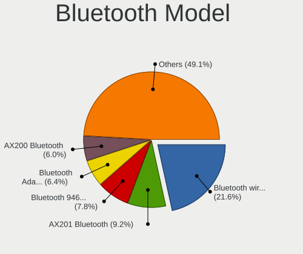

| Model                                                | Computers | Percent |
|------------------------------------------------------|-----------|---------|
| Intel Bluetooth wireless interface                   | 47        | 21.56%  |
| Intel AX201 Bluetooth                                | 20        | 9.17%   |
| Intel Bluetooth 9460/9560 Jefferson Peak (JfP)       | 17        | 7.8%    |
| Realtek Bluetooth Adapter                            | 14        | 6.42%   |
| Intel AX200 Bluetooth                                | 13        | 5.96%   |
| Intel Wireless-AC 3168 Bluetooth                     | 8         | 3.67%   |
| Intel AX211 Bluetooth                                | 7         | 3.21%   |
| Intel AX210 Bluetooth                                | 7         | 3.21%   |
| Intel Centrino Bluetooth Wireless Transceiver        | 6         | 2.75%   |
| Apple Bluetooth Host Controller                      | 6         | 2.75%   |
| Intel Wireless-AC 9260 Bluetooth Adapter             | 5         | 2.29%   |
| IMC Networks Qualcomm Atheros Bluetooth 4.1          | 4         | 1.83%   |
| Cambridge Silicon Radio Bluetooth Dongle (HCI mode)  | 4         | 1.83%   |
| Apple Broadcom Built-in Bluetooth                    | 4         | 1.83%   |
| Broadcom BCM2045B (BDC-2.1)                          | 3         | 1.38%   |
| Realtek  Bluetooth 4.2 Adapter                       | 2         | 0.92%   |
| Qualcomm Atheros QCA9377 Bluetooth 4.1               | 2         | 0.92%   |
| MediaTek Wireless_Device                             | 2         | 0.92%   |
| Intel BE200 Bluetooth                                | 2         | 0.92%   |
| HP Bluetooth 2.0 Interface [Broadcom BCM2045]        | 2         | 0.92%   |
| Foxconn / Hon Hai Bluetooth USB Module               | 2         | 0.92%   |
| Dell Dell Wireless 380 Bluetooth 4.0 Module          | 2         | 0.92%   |
| Broadcom BCM20702A0 Bluetooth 4.0                    | 2         | 0.92%   |
| Broadcom BCM20702 Bluetooth 4.0 [ThinkPad]           | 2         | 0.92%   |
| Apple Bluetooth USB Host Controller                  | 2         | 0.92%   |
| AMPAK Bluetooth USB module                           | 2         | 0.92%   |
| TP-Link Bluetooth 5.0 USB Adapter                    | 1         | 0.46%   |
| Sino Wealth Electronic RK Bluetooth Keyboar          | 1         | 0.46%   |
| Realtek Bluetooth Radio                              | 1         | 0.46%   |
| Realtek Bluetooth 5.1 Adapter                        | 1         | 0.46%   |
| Realtek Bluetooth 4.0 Adapter                        | 1         | 0.46%   |
| Realtek Bluetooth 4.0 + High Speed Chip              | 1         | 0.46%   |
| Qualcomm Atheros QCA61x4 Bluetooth 4.0               | 1         | 0.46%   |
| Qualcomm Atheros Dell Wireless 1901 Bluetooth        | 1         | 0.46%   |
| Qualcomm Atheros Dell Wireless 1601 Bluetooth Device | 1         | 0.46%   |
| Qualcomm Atheros Bluetooth                           | 1         | 0.46%   |
| Qualcomm Atheros AR3011 Bluetooth                    | 1         | 0.46%   |
| MediaTek RZ616 Bluetooth Adapter                     | 1         | 0.46%   |
| MediaTek RZ608 Bluetooth Adapter                     | 1         | 0.46%   |
| MediaTek Bluetooth Adapter                           | 1         | 0.46%   |

Sound
-----

Sound Vendor
------------

Sound card vendors

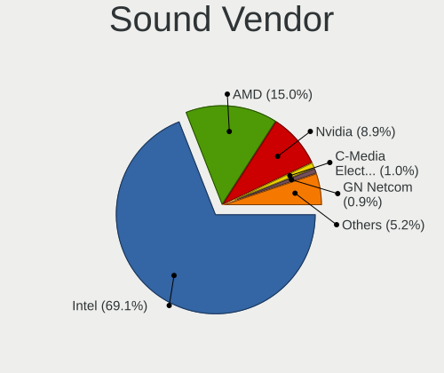

| Vendor                                       | Computers | Percent |
|----------------------------------------------|-----------|---------|
| Intel                                        | 482       | 69.05%  |
| AMD                                          | 105       | 15.04%  |
| Nvidia                                       | 62        | 8.88%   |
| C-Media Electronics                          | 7         | 1%      |
| GN Netcom                                    | 6         | 0.86%   |
| Zoran Co. Personal Media Division (Nogatech) | 5         | 0.72%   |
| Logitech                                     | 4         | 0.57%   |
| Lenovo                                       | 4         | 0.57%   |
| Creative Labs                                | 3         | 0.43%   |
| VIA Technologies                             | 2         | 0.29%   |
| Texas Instruments                            | 2         | 0.29%   |
| Kingston Technology                          | 2         | 0.29%   |
| Focusrite-Novation                           | 2         | 0.29%   |
| ASUSTek Computer                             | 2         | 0.29%   |
| Sony                                         | 1         | 0.14%   |
| Realtek Semiconductor                        | 1         | 0.14%   |
| MOONDROP                                     | 1         | 0.14%   |
| Micronas                                     | 1         | 0.14%   |
| Mark of the Unicorn                          | 1         | 0.14%   |
| iCreate Technologies                         | 1         | 0.14%   |
| Hewlett-Packard                              | 1         | 0.14%   |
| Giga-Byte Technology                         | 1         | 0.14%   |
| ESS Technology                               | 1         | 0.14%   |
| DSEA A/S                                     | 1         | 0.14%   |

Sound Model
-----------

Sound card models

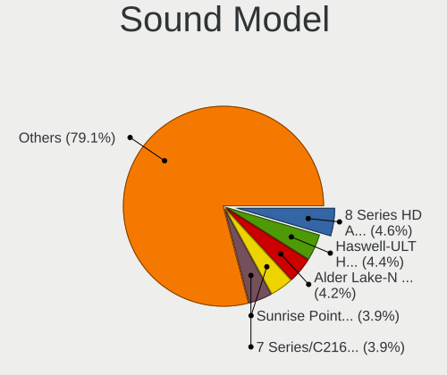

| Model                                                                                             | Computers | Percent |
|---------------------------------------------------------------------------------------------------|-----------|---------|
| Intel 8 Series HD Audio Controller                                                                | 39        | 4.59%   |
| Intel Haswell-ULT HD Audio Controller                                                             | 37        | 4.35%   |
| Intel Alder Lake-N PCH High Definition Audio Controller                                           | 36        | 4.24%   |
| Intel Sunrise Point-LP HD Audio                                                                   | 33        | 3.88%   |
| Intel 7 Series/C216 Chipset Family High Definition Audio Controller                               | 33        | 3.88%   |
| Intel 6 Series/C200 Series Chipset Family High Definition Audio Controller                        | 32        | 3.76%   |
| AMD Ryzen HD Audio Controller                                                                     | 32        | 3.76%   |
| Intel Cannon Lake PCH cAVS                                                                        | 30        | 3.53%   |
| Intel 8 Series/C220 Series Chipset High Definition Audio Controller                               | 30        | 3.53%   |
| Intel 100 Series/C230 Series Chipset Family HD Audio Controller                                   | 29        | 3.41%   |
| Intel Xeon E3-1200 v3/4th Gen Core Processor HD Audio Controller                                  | 26        | 3.06%   |
| Intel Jasper Lake HD Audio                                                                        | 22        | 2.59%   |
| AMD FCH Azalia Controller                                                                         | 21        | 2.47%   |
| Intel Wildcat Point-LP High Definition Audio Controller                                           | 20        | 2.35%   |
| Intel Broadwell-U Audio Controller                                                                | 20        | 2.35%   |
| AMD Renoir/Cezanne HDMI/DP Audio Controller                                                       | 19        | 2.24%   |
| Intel Celeron/Pentium Silver Processor High Definition Audio                                      | 18        | 2.12%   |
| AMD Kabini HDMI/DP Audio                                                                          | 17        | 2%      |
| Intel NM10/ICH7 Family High Definition Audio Controller                                           | 15        | 1.76%   |
| Intel 200 Series PCH HD Audio                                                                     | 15        | 1.76%   |
| AMD Starship/Matisse HD Audio Controller                                                          | 13        | 1.53%   |
| Intel Cannon Point-LP High Definition Audio Controller                                            | 12        | 1.41%   |
| Intel Atom/Celeron/Pentium Processor x5-E8000/J3xxx/N3xxx Series High Definition Audio Controller | 12        | 1.41%   |
| Intel Tiger Lake-LP Smart Sound Technology Audio Controller                                       | 10        | 1.18%   |
| Intel Alder Lake PCH-P High Definition Audio Controller                                           | 10        | 1.18%   |
| AMD Family 17h (Models 00h-0fh) HD Audio Controller                                               | 10        | 1.18%   |
| Intel 82801I (ICH9 Family) HD Audio Controller                                                    | 9         | 1.06%   |
| Intel Atom Processor Z36xxx/Z37xxx Series High Definition Audio Controller                        | 8         | 0.94%   |
| Intel 5 Series/3400 Series Chipset High Definition Audio                                          | 8         | 0.94%   |
| Nvidia High Definition Audio Controller                                                           | 7         | 0.82%   |
| AMD SBx00 Azalia (Intel HDA)                                                                      | 7         | 0.82%   |
| AMD Raven/Raven2/Fenghuang HDMI/DP Audio Controller                                               | 7         | 0.82%   |
| Intel Comet Lake PCH-LP cAVS                                                                      | 6         | 0.71%   |
| Intel Comet Lake PCH cAVS                                                                         | 6         | 0.71%   |
| Zoran Co. Personal Media Division (Nogatech) USB Audio and HID                                    | 5         | 0.59%   |
| Nvidia TU107 GeForce GTX 1650 High Definition Audio Controller                                    | 5         | 0.59%   |
| Intel Tiger Lake-H HD Audio Controller                                                            | 5         | 0.59%   |
| Intel Raptor Lake High Definition Audio Controller                                                | 5         | 0.59%   |
| Intel Celeron N3350/Pentium N4200/Atom E3900 Series Audio Cluster                                 | 5         | 0.59%   |
| Intel Alder Lake-S HD Audio Controller                                                            | 5         | 0.59%   |

Memory
------

Memory Vendor
-------------

Memory module vendors

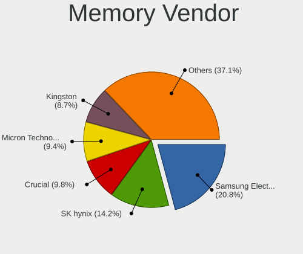

| Vendor              | Computers | Percent |
|---------------------|-----------|---------|
| Samsung Electronics | 159       | 20.84%  |
| SK hynix            | 108       | 14.15%  |
| Crucial             | 75        | 9.83%   |
| Micron Technology   | 72        | 9.44%   |
| Kingston            | 66        | 8.65%   |
| Corsair             | 65        | 8.52%   |
| Unknown             | 63        | 8.26%   |
| G.Skill             | 37        | 4.85%   |
| Unknown             | 15        | 1.97%   |
| Transcend           | 13        | 1.7%    |
| Nanya Technology    | 11        | 1.44%   |
| Elpida              | 10        | 1.31%   |
| Ramaxel Technology  | 8         | 1.05%   |
| Unknown (ABCD)      | 7         | 0.92%   |
| A-DATA Technology   | 7         | 0.92%   |
| Kimtigo             | 6         | 0.79%   |
| Wodposit            | 3         | 0.39%   |
| Patriot             | 3         | 0.39%   |
| ATP                 | 3         | 0.39%   |
| Lexar Co Limited    | 2         | 0.26%   |
| Lexar               | 2         | 0.26%   |
| Hewlett-Packard     | 2         | 0.26%   |
| Avant               | 2         | 0.26%   |
| Atermiter           | 2         | 0.26%   |
| Apacer              | 2         | 0.26%   |
| 48spaces            | 2         | 0.26%   |
| V-Color             | 1         | 0.13%   |
| Unknown (0x0FBA)    | 1         | 0.13%   |
| Unknown (0x0CAB)    | 1         | 0.13%   |
| Unknown (0x0C97)    | 1         | 0.13%   |
| Unknown (0x0C6E)    | 1         | 0.13%   |
| Unknown (0x0080)    | 1         | 0.13%   |
| Unknown (0B38)      | 1         | 0.13%   |
| Toshiba             | 1         | 0.13%   |
| Teikon              | 1         | 0.13%   |
| TakeMS              | 1         | 0.13%   |
| SHARETRONIC         | 1         | 0.13%   |
| OCZ                 | 1         | 0.13%   |
| Kllisre             | 1         | 0.13%   |
| KingFast            | 1         | 0.13%   |

Memory Model
------------

Memory module models

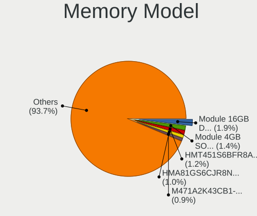

| Model                                                        | Computers | Percent |
|--------------------------------------------------------------|-----------|---------|
| Unknown                                                      | 15        | 1.86%   |
| Unknown RAM Module 4GB SODIMM DDR3 1333MT/s                  | 11        | 1.36%   |
| SK hynix RAM HMT451S6BFR8A-PB 4GB SODIMM DDR3 1600MT/s       | 10        | 1.24%   |
| SK hynix RAM HMA81GS6CJR8N-VK 8GB SODIMM DDR4 2667MT/s       | 8         | 0.99%   |
| Samsung RAM M471A2K43CB1-CTD 16GB SODIMM DDR4 2667MT/s       | 7         | 0.87%   |
| Unknown (ABCD) RAM 123456789012345678 8GB DIMM DDR4 2400MT/s | 6         | 0.74%   |
| Corsair RAM CMK16GX4M2B3200C16 8GB DIMM DDR4 3200MT/s        | 6         | 0.74%   |
| SK hynix RAM HMT41GS6BFR8A-PB 8GB SODIMM DDR3 1600MT/s       | 5         | 0.62%   |
| SK hynix RAM HMT351S6CFR8C-H9 4GB SODIMM DDR3 1333MT/s       | 5         | 0.62%   |
| Samsung RAM M471B5173QH0-YK0 4GB SODIMM DDR3 1600MT/s        | 5         | 0.62%   |
| Elpida RAM Module 4GB SODIMM DDR3 1600MT/s                   | 5         | 0.62%   |
| Unknown RAM Module 2GB SODIMM DDR3 1333MT/s                  | 4         | 0.5%    |
| Transcend RAM TS1GLH64V6BL 8GB SODIMM DDR4 2667MT/s          | 4         | 0.5%    |
| SK hynix RAM HMA81GS6AFR8N-UH 8GB SODIMM DDR4 2400MT/s       | 4         | 0.5%    |
| Samsung RAM M471B5273DH0-CH9 4GB SODIMM DDR3 1334MT/s        | 4         | 0.5%    |
| Samsung RAM M471B5173EB0-YK0 4GB SODIMM DDR3 1600MT/s        | 4         | 0.5%    |
| Samsung RAM M471B5173DB0-YK0 4GB SODIMM DDR3 1600MT/s        | 4         | 0.5%    |
| Samsung RAM M471B1G73DB0-YK0 8GB SODIMM DDR3 1600MT/s        | 4         | 0.5%    |
| Samsung RAM M471A1K43DB1-CTD 8GB SODIMM DDR4 2667MT/s        | 4         | 0.5%    |
| Samsung RAM M471A1K43CB1-CTD 8GB SODIMM DDR4 3200MT/s        | 4         | 0.5%    |
| Samsung RAM M425R1GB4BB0-CQKOL 8GB SODIMM DDR5 4800MT/s      | 4         | 0.5%    |
| Samsung RAM M393A4K40CB2-CTD 32GB DIMM DDR4 2667MT/s         | 4         | 0.5%    |
| Kingston RAM KHX1600C9S3L/4G 4GB SODIMM DDR3 1600MT/s        | 4         | 0.5%    |
| Kimtigo RAM KT8GS3EDF 8GB SODIMM DDR3 1600MT/s               | 4         | 0.5%    |
| Crucial RAM CT16G56C46S5.M8G1 16GB SODIMM DDR5 5600MT/s      | 4         | 0.5%    |
| Crucial RAM CT102464BF160B.C16 8GB SODIMM DDR3 1600MT/s      | 4         | 0.5%    |
| Corsair RAM CMSX16GX5M1A4800C40 16GB SODIMM DDR5 4800MT/s    | 4         | 0.5%    |
| Corsair RAM CMSX16GX4M1A3200C22 16GB SODIMM DDR4 3200MT/s    | 4         | 0.5%    |
| Unknown RAM Module 8GB DIMM DDR3 1600MT/s                    | 3         | 0.37%   |
| Unknown RAM Module 4GB DIMM 1333MT/s                         | 3         | 0.37%   |
| Unknown RAM Module 2GB SODIMM DDR3 800MT/s                   | 3         | 0.37%   |
| Unknown RAM Module 2GB SODIMM DDR2                           | 3         | 0.37%   |
| Unknown RAM Module 1GB SODIMM DDR2                           | 3         | 0.37%   |
| Transcend RAM TS1GLH64V6B3 8GB SODIMM DDR4 1333MT/s          | 3         | 0.37%   |
| SK hynix RAM HMT351S6BFR8C-H9 4GB SODIMM DDR3 1334MT/s       | 3         | 0.37%   |
| SK hynix RAM HMA851S6CJR6N-VK 4GB SODIMM DDR4 2667MT/s       | 3         | 0.37%   |
| SK hynix RAM HMA81GU6AFR8N-UH 8GB DIMM DDR4 2400MT/s         | 3         | 0.37%   |
| Samsung RAM Module 8GB SODIMM DDR4 2133MT/s                  | 3         | 0.37%   |
| Samsung RAM Module 2GB Row Of Chips LPDDR5 6400MT/s          | 3         | 0.37%   |
| Samsung RAM M471B5173BH0-YK0 4GB SODIMM DDR3 1600MT/s        | 3         | 0.37%   |

Memory Kind
-----------

Memory module kinds

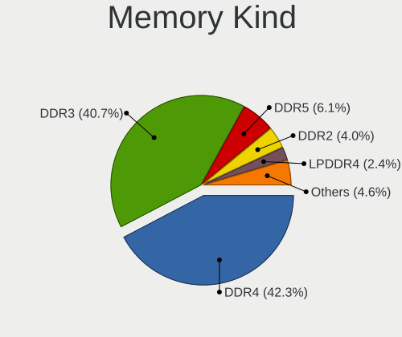

| Kind    | Computers | Percent |
|---------|-----------|---------|
| DDR4    | 286       | 42.31%  |
| DDR3    | 275       | 40.68%  |
| DDR5    | 41        | 6.07%   |
| DDR2    | 27        | 3.99%   |
| LPDDR4  | 16        | 2.37%   |
| Unknown | 14        | 2.07%   |
| LPDDR3  | 8         | 1.18%   |
| LPDDR5  | 7         | 1.04%   |
| SDRAM   | 2         | 0.3%    |

Memory Form Factor
------------------

Physical design of the memory module

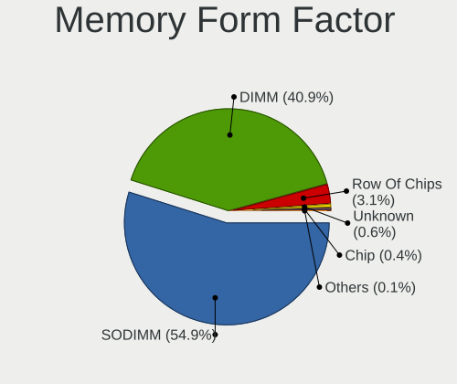

| Name         | Computers | Percent |
|--------------|-----------|---------|
| SODIMM       | 372       | 54.87%  |
| DIMM         | 277       | 40.86%  |
| Row Of Chips | 21        | 3.1%    |
| Unknown      | 4         | 0.59%   |
| Chip         | 3         | 0.44%   |
| FB-DIMM      | 1         | 0.15%   |

Memory Size
-----------

Memory module size

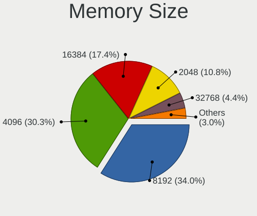

| Size  | Computers | Percent |
|-------|-----------|---------|
| 8192  | 248       | 34.02%  |
| 4096  | 221       | 30.32%  |
| 16384 | 127       | 17.42%  |
| 2048  | 79        | 10.84%  |
| 32768 | 32        | 4.39%   |
| 1024  | 18        | 2.47%   |
| 49152 | 2         | 0.27%   |
| 32767 | 2         | 0.27%   |

Memory Speed
------------

Memory module speed

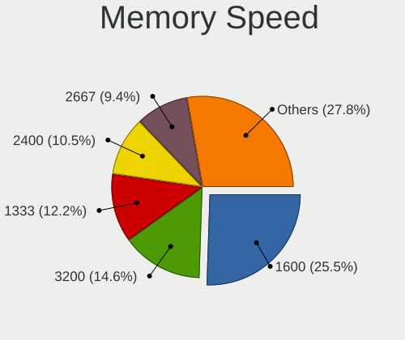

| Speed   | Computers | Percent |
|---------|-----------|---------|
| 1600    | 182       | 25.53%  |
| 3200    | 104       | 14.59%  |
| 1333    | 87        | 12.2%   |
| 2400    | 75        | 10.52%  |
| 2667    | 67        | 9.4%    |
| 2133    | 42        | 5.89%   |
| 4800    | 25        | 3.51%   |
| 800     | 20        | 2.81%   |
| 5600    | 16        | 2.24%   |
| 2666    | 15        | 2.1%    |
| 1334    | 13        | 1.82%   |
| 667     | 13        | 1.82%   |
| 6400    | 6         | 0.84%   |
| 1867    | 6         | 0.84%   |
| Unknown | 6         | 0.84%   |
| 1066    | 5         | 0.7%    |
| 1067    | 4         | 0.56%   |
| 4267    | 3         | 0.42%   |
| 3733    | 3         | 0.42%   |
| 3600    | 3         | 0.42%   |
| 2933    | 3         | 0.42%   |
| 1866    | 3         | 0.42%   |
| 5200    | 2         | 0.28%   |
| 975     | 2         | 0.28%   |
| 533     | 2         | 0.28%   |
| 8533    | 1         | 0.14%   |
| 3000    | 1         | 0.14%   |
| 1400    | 1         | 0.14%   |
| 1332    | 1         | 0.14%   |
| 1200    | 1         | 0.14%   |
| 400     | 1         | 0.14%   |

Printers & scanners
-------------------

Printer Vendor
--------------

Printer device vendors

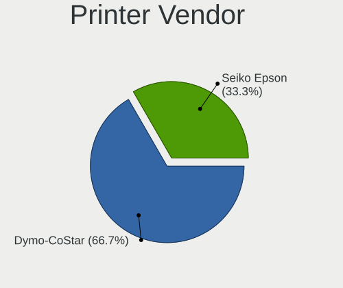

| Vendor      | Computers | Percent |
|-------------|-----------|---------|
| Dymo-CoStar | 2         | 66.67%  |
| Seiko Epson | 1         | 33.33%  |

Printer Model
-------------

Printer device models

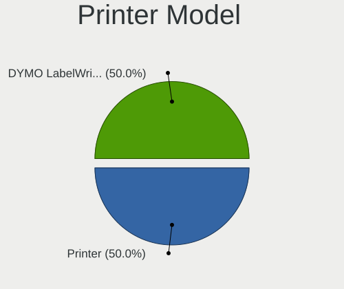

| Model                                | Computers | Percent |
|--------------------------------------|-----------|---------|
| Seiko Epson Printer                  | 1         | 33.33%  |
| Dymo-CoStar LabelWriter 450          | 1         | 33.33%  |
| Dymo-CoStar DYMO LabelWriter 450 DUO | 1         | 33.33%  |

Scanner Vendor
--------------

Scanner device vendors

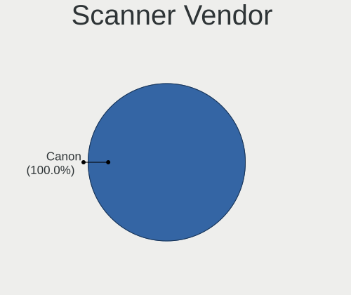

| Vendor | Computers | Percent |
|--------|-----------|---------|
| Canon  | 2         | 100%    |

Scanner Model
-------------

Scanner device models

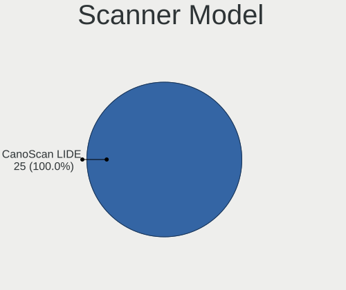

| Model                  | Computers | Percent |
|------------------------|-----------|---------|
| Canon CanoScan LIDE 25 | 1         | 50%     |
| Canon CanoScan 9000F   | 1         | 50%     |

Camera
------

Camera Vendor
-------------

Camera device vendors

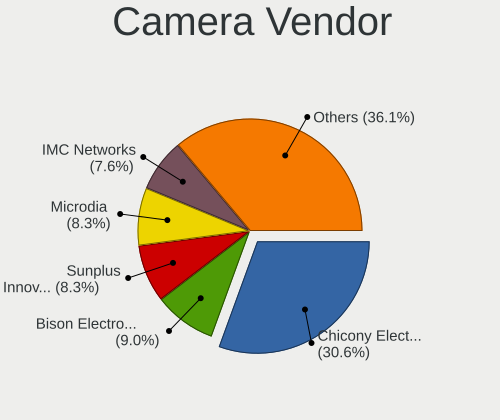

| Vendor                                 | Computers | Percent |
|----------------------------------------|-----------|---------|
| Chicony Electronics                    | 44        | 30.56%  |
| Bison Electronics                      | 13        | 9.03%   |
| Sunplus Innovation Technology          | 12        | 8.33%   |
| Microdia                               | 12        | 8.33%   |
| IMC Networks                           | 11        | 7.64%   |
| Realtek Semiconductor                  | 10        | 6.94%   |
| Logitech                               | 7         | 4.86%   |
| Syntek                                 | 6         | 4.17%   |
| Lite-On Technology                     | 5         | 3.47%   |
| Cheng Uei Precision Industry (Foxlink) | 5         | 3.47%   |
| ARC International                      | 4         | 2.78%   |
| Quanta                                 | 3         | 2.08%   |
| Suyin                                  | 2         | 1.39%   |
| Alcor Micro                            | 2         | 1.39%   |
| Z-Star Microelectronics                | 1         | 0.69%   |
| ValueHD                                | 1         | 0.69%   |
| SIMPLO Technology                      | 1         | 0.69%   |
| Shenzhen Kingcome Optoelectronic       | 1         | 0.69%   |
| Novatek Microelectronics               | 1         | 0.69%   |
| Jiangxi Shinetech Optical              | 1         | 0.69%   |
| Foxconn / Hon Hai                      | 1         | 0.69%   |
| Apple                                  | 1         | 0.69%   |

Camera Model
------------

Camera device models

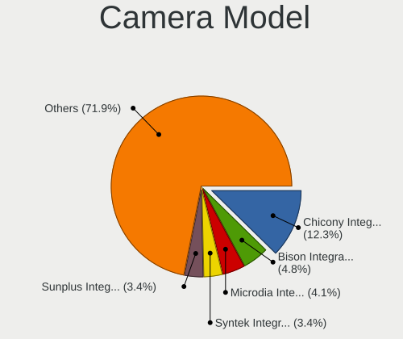

| Model                                                 | Computers | Percent |
|-------------------------------------------------------|-----------|---------|
| Chicony Integrated Camera                             | 18        | 12.33%  |
| Bison Integrated Camera                               | 7         | 4.79%   |
| Microdia Integrated_Webcam_HD                         | 6         | 4.11%   |
| Syntek Integrated Camera                              | 5         | 3.42%   |
| Sunplus Integrated_Webcam_HD                          | 5         | 3.42%   |
| Logitech Webcam C270                                  | 5         | 3.42%   |
| Realtek Integrated_Webcam_HD                          | 4         | 2.74%   |
| Microdia Integrated Webcam                            | 4         | 2.74%   |
| Chicony HD WebCam                                     | 4         | 2.74%   |
| ARC International Camera                              | 4         | 2.74%   |
| Lite-On Integrated Camera                             | 3         | 2.05%   |
| Chicony Lenovo Integrated Camera (0.3MP)              | 3         | 2.05%   |
| Realtek USB Camera                                    | 2         | 1.37%   |
| Logitech C922 Pro Stream Webcam                       | 2         | 1.37%   |
| IMC Networks UVC VGA Webcam                           | 2         | 1.37%   |
| IMC Networks USB2.0 HD UVC WebCam                     | 2         | 1.37%   |
| IMC Networks Realtek PC Camera                        | 2         | 1.37%   |
| IMC Networks Integrated Camera                        | 2         | 1.37%   |
| IMC Networks EasyCamera                               | 2         | 1.37%   |
| Chicony TOSHIBA Web Camera - HD                       | 2         | 1.37%   |
| Chicony Realtek DMFT RGB                              | 2         | 1.37%   |
| Cheng Uei Precision Industry (Foxlink) HP HD Webcam   | 2         | 1.37%   |
| Bison SunplusIT Integrated Camera                     | 2         | 1.37%   |
| Z-Star Webcam                                         | 1         | 0.68%   |
| ValueHD HD Camera                                     | 1         | 0.68%   |
| Syntek Lenovo EasyCamera                              | 1         | 0.68%   |
| Suyin USB 2.0 Camera                                  | 1         | 0.68%   |
| Suyin Laptop_Integrated_Webcam_FHD                    | 1         | 0.68%   |
| Sunplus Laptop_Integrated_Webcam_HD                   | 1         | 0.68%   |
| Sunplus Laptop_Integrated_Webcam_FHD                  | 1         | 0.68%   |
| Sunplus Integrated_Webcam_FHD                         | 1         | 0.68%   |
| Sunplus Integrated HD Webcam                          | 1         | 0.68%   |
| Sunplus Hy HD Camera                                  | 1         | 0.68%   |
| Sunplus Dell Integrated Webcam                        | 1         | 0.68%   |
| Sunplus Asus Webcam                                   | 1         | 0.68%   |
| SIMPLO USB 2.0 Camera                                 | 1         | 0.68%   |
| Shenzhen Kingcome Optoelectronic USB2.0 HD UVC WebCam | 1         | 0.68%   |
| Realtek USB 2.0 PC Camera                             | 1         | 0.68%   |
| Realtek Lenovo EasyCamera                             | 1         | 0.68%   |
| Realtek Integrated_Webcam_FHD                         | 1         | 0.68%   |

Security
--------

Fingerprint Vendor
------------------

Fingerprint sensor vendors

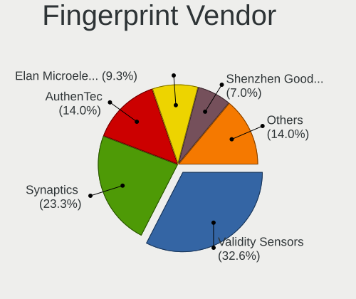

| Vendor                     | Computers | Percent |
|----------------------------|-----------|---------|
| Validity Sensors           | 14        | 32.56%  |
| Synaptics                  | 10        | 23.26%  |
| AuthenTec                  | 6         | 13.95%  |
| Elan Microelectronics      | 4         | 9.3%    |
| Shenzhen Goodix Technology | 3         | 6.98%   |
| LighTuning Technology      | 3         | 6.98%   |
| Upek                       | 2         | 4.65%   |
| Broadcom                   | 1         | 2.33%   |

Fingerprint Model
-----------------

Fingerprint sensor models

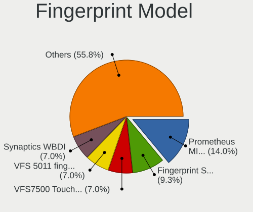

| Model                                                                        | Computers | Percent |
|------------------------------------------------------------------------------|-----------|---------|
| Synaptics Prometheus MIS Touch Fingerprint Reader                            | 6         | 13.95%  |
| Elan Fingerprint Sensor                                                      | 4         | 9.3%    |
| Validity Sensors VFS7500 Touch Fingerprint Sensor                            | 3         | 6.98%   |
| Validity Sensors VFS 5011 fingerprint sensor                                 | 3         | 6.98%   |
| Validity Sensors Synaptics WBDI                                              | 3         | 6.98%   |
| Shenzhen Goodix Fingerprint Reader                                           | 3         | 6.98%   |
| Validity Sensors VFS495 Fingerprint Reader                                   | 2         | 4.65%   |
| Upek Biometric Touchchip/Touchstrip Fingerprint Sensor                       | 2         | 4.65%   |
| Synaptics UWP WBDI Device                                                    | 2         | 4.65%   |
| LighTuning ES603 Swipe Fingerprint Sensor                                    | 2         | 4.65%   |
| AuthenTec AES2810                                                            | 2         | 4.65%   |
| AuthenTec AES1660                                                            | 2         | 4.65%   |
| Validity Sensors VFS491                                                      | 1         | 2.33%   |
| Validity Sensors VFS451 Fingerprint Reader                                   | 1         | 2.33%   |
| Validity Sensors VFS Fingerprint sensor                                      | 1         | 2.33%   |
| Synaptics Metallica MIS Touch Fingerprint Reader                             | 1         | 2.33%   |
| Synaptics FS7604 Touch Fingerprint Sensor with PurePrint                     | 1         | 2.33%   |
| LighTuning EgisTec Touch Fingerprint Sensor                                  | 1         | 2.33%   |
| Broadcom BCM5880 Secure Applications Processor with fingerprint swipe sensor | 1         | 2.33%   |
| AuthenTec AES2550 Fingerprint Sensor                                         | 1         | 2.33%   |
| AuthenTec AES2501 Fingerprint Sensor                                         | 1         | 2.33%   |

Chipcard Vendor
---------------

Chipcard module vendors

Zero info for selected period =(

Chipcard Model
--------------

Chipcard module models

Zero info for selected period =(

Unsupported
-----------

Unsupported Devices
-------------------

Total unsupported devices on board

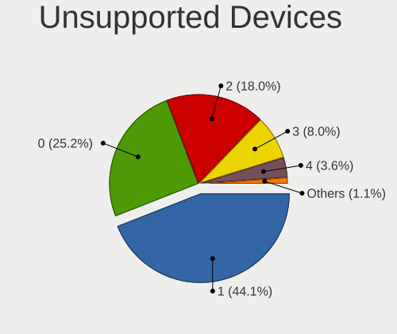

| Total | Computers | Percent |
|-------|-----------|---------|
| 1     | 352       | 44.06%  |
| 0     | 201       | 25.16%  |
| 2     | 144       | 18.02%  |
| 3     | 64        | 8.01%   |
| 4     | 29        | 3.63%   |
| 6     | 4         | 0.5%    |
| 5     | 4         | 0.5%    |
| 7     | 1         | 0.13%   |

Unsupported Device Types
------------------------

Types of unsupported devices

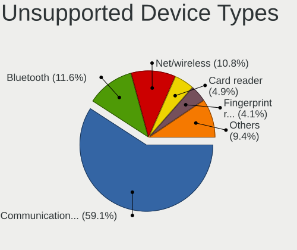

| Type                     | Computers | Percent |
|--------------------------|-----------|---------|
| Communication controller | 508       | 59.14%  |
| Bluetooth                | 100       | 11.64%  |
| Net/wireless             | 93        | 10.83%  |
| Card reader              | 42        | 4.89%   |
| Fingerprint reader       | 35        | 4.07%   |
| Firewire controller      | 30        | 3.49%   |
| Net/ethernet             | 17        | 1.98%   |
| Sound                    | 11        | 1.28%   |
| Graphics card            | 8         | 0.93%   |
| Storage                  | 6         | 0.7%    |
| Network                  | 4         | 0.47%   |
| Storage/raid             | 3         | 0.35%   |
| Storage/ata              | 1         | 0.12%   |
| Modem                    | 1         | 0.12%   |

