BSD in France - Tested Hardware & Statistics
--------------------------------------------

A project to collect tested hardware configurations for BSD in France.

Anyone can contribute to this report by the [hw-probe](https://github.com/linuxhw/hw-probe/blob/master/INSTALL.BSD.md) tool:

    hw-probe -all -upload

Please contribute! Especially if your hardware is rare.

This is a report for all computer types. See also reports for [desktops](/Location/France/Desktop/README.md) and [notebooks](/Location/France/Notebook/README.md).

Contents
--------

* [ Test Cases ](#test-cases)

* [ System ](#system)
  - [ OS                       ](#os)
  - [ OS Family                ](#os-family)
  - [ Arch                     ](#arch)
  - [ DE                       ](#de)
  - [ Display Server           ](#display-server)
  - [ Display Manager          ](#display-manager)
  - [ OS Lang                  ](#os-lang)
  - [ Boot Mode                ](#boot-mode)
  - [ Filesystem               ](#filesystem)
  - [ Part. scheme             ](#part-scheme)

* [ Board ](#board)
  - [ Vendor                   ](#vendor)
  - [ Model                    ](#model)
  - [ Model Family             ](#model-family)
  - [ MFG Year                 ](#mfg-year)
  - [ Form Factor              ](#form-factor)
  - [ Coreboot                 ](#coreboot)
  - [ RAM Size                 ](#ram-size)
  - [ RAM Used                 ](#ram-used)
  - [ Total Drives             ](#total-drives)
  - [ Has CD-ROM               ](#has-cd-rom)
  - [ Has Ethernet             ](#has-ethernet)
  - [ Has WiFi                 ](#has-wifi)
  - [ Has Bluetooth            ](#has-bluetooth)

* [ Location ](#location)
  - [ Country                  ](#country)
  - [ City                     ](#city)

* [ Drives ](#drives)
  - [ Drive Vendor             ](#drive-vendor)
  - [ Drive Model              ](#drive-model)
  - [ HDD Vendor               ](#hdd-vendor)
  - [ SSD Vendor               ](#ssd-vendor)
  - [ Drive Kind               ](#drive-kind)
  - [ Drive Connector          ](#drive-connector)
  - [ Drive Size               ](#drive-size)
  - [ Space Total              ](#space-total)
  - [ Space Used               ](#space-used)
  - [ Malfunc. Drives          ](#malfunc-drives)
  - [ Malfunc. Drive Vendor    ](#malfunc-drive-vendor)
  - [ Malfunc. HDD Vendor      ](#malfunc-hdd-vendor)
  - [ Malfunc. Drive Kind      ](#malfunc-drive-kind)
  - [ Failed Drives            ](#failed-drives)
  - [ Failed Drive Vendor      ](#failed-drive-vendor)
  - [ Drive Status             ](#drive-status)

* [ Storage controller ](#storage-controller)
  - [ Storage Vendor           ](#storage-vendor)
  - [ Storage Model            ](#storage-model)
  - [ Storage Kind             ](#storage-kind)

* [ Processor ](#processor)
  - [ CPU Vendor               ](#cpu-vendor)
  - [ CPU Model                ](#cpu-model)
  - [ CPU Model Family         ](#cpu-model-family)
  - [ CPU Cores                ](#cpu-cores)
  - [ CPU Sockets              ](#cpu-sockets)
  - [ CPU Threads              ](#cpu-threads)
  - [ CPU Microarch            ](#cpu-microarch)

* [ Graphics ](#graphics)
  - [ GPU Vendor               ](#gpu-vendor)
  - [ GPU Model                ](#gpu-model)
  - [ GPU Combo                ](#gpu-combo)
  - [ GPU Driver               ](#gpu-driver)
  - [ GPU Memory               ](#gpu-memory)

* [ Monitor ](#monitor)
  - [ Monitor Vendor           ](#monitor-vendor)
  - [ Monitor Model            ](#monitor-model)
  - [ Monitor Resolution       ](#monitor-resolution)
  - [ Monitor Diagonal         ](#monitor-diagonal)
  - [ Monitor Width            ](#monitor-width)
  - [ Aspect Ratio             ](#aspect-ratio)
  - [ Monitor Area             ](#monitor-area)
  - [ Pixel Density            ](#pixel-density)
  - [ Multiple Monitors        ](#multiple-monitors)

* [ Network ](#network)
  - [ Net Controller Vendor    ](#net-controller-vendor)
  - [ Net Controller Model     ](#net-controller-model)
  - [ Wireless Vendor          ](#wireless-vendor)
  - [ Wireless Model           ](#wireless-model)
  - [ Ethernet Vendor          ](#ethernet-vendor)
  - [ Ethernet Model           ](#ethernet-model)
  - [ Net Controller Kind      ](#net-controller-kind)
  - [ Used Controller          ](#used-controller)
  - [ NICs                     ](#nics)
  - [ IPv6                     ](#ipv6)

* [ Bluetooth ](#bluetooth)
  - [ Bluetooth Vendor         ](#bluetooth-vendor)
  - [ Bluetooth Model          ](#bluetooth-model)

* [ Sound ](#sound)
  - [ Sound Vendor             ](#sound-vendor)
  - [ Sound Model              ](#sound-model)

* [ Memory ](#memory)
  - [ Memory Vendor            ](#memory-vendor)
  - [ Memory Model             ](#memory-model)
  - [ Memory Kind              ](#memory-kind)
  - [ Memory Form Factor       ](#memory-form-factor)
  - [ Memory Size              ](#memory-size)
  - [ Memory Speed             ](#memory-speed)

* [ Printers & scanners ](#printers--scanners)
  - [ Printer Vendor           ](#printer-vendor)
  - [ Printer Model            ](#printer-model)
  - [ Scanner Vendor           ](#scanner-vendor)
  - [ Scanner Model            ](#scanner-model)

* [ Camera ](#camera)
  - [ Camera Vendor            ](#camera-vendor)
  - [ Camera Model             ](#camera-model)

* [ Security ](#security)
  - [ Fingerprint Vendor       ](#fingerprint-vendor)
  - [ Fingerprint Model        ](#fingerprint-model)
  - [ Chipcard Vendor          ](#chipcard-vendor)
  - [ Chipcard Model           ](#chipcard-model)

* [ Unsupported ](#unsupported)
  - [ Unsupported Devices      ](#unsupported-devices)
  - [ Unsupported Device Types ](#unsupported-device-types)

Test Cases
----------

Total: 880

| Vendor        | Model                       | Form-Factor | Probe                                                     | Date         |
|---------------|-----------------------------|-------------|-----------------------------------------------------------|--------------|
| Advantech     | NAMB-3250 A102-1            | Desktop     | [0eaf743c54](https://bsd-hardware.info/?probe=0eaf743c54) | May 07, 2024 |
| ZOTAC         | ZBOX-EN760                  | Mini pc     | [42edfcecd6](https://bsd-hardware.info/?probe=42edfcecd6) | May 06, 2024 |
| Unknown       | QDNV01                      | Desktop     | [8b77bdf0b8](https://bsd-hardware.info/?probe=8b77bdf0b8) | May 04, 2024 |
| Advantech     | NAMB-3250 A102-1            | Desktop     | [708617284b](https://bsd-hardware.info/?probe=708617284b) | May 03, 2024 |
| Apple         | MacBookAir6,2               | Notebook    | [a9ec0cba48](https://bsd-hardware.info/?probe=a9ec0cba48) | May 02, 2024 |
| Dell          | Latitude 7490               | Notebook    | [e55889ef1e](https://bsd-hardware.info/?probe=e55889ef1e) | May 02, 2024 |
| HP            | 8062                        | Desktop     | [2669931060](https://bsd-hardware.info/?probe=2669931060) | May 01, 2024 |
| Apple         | MacBookAir6,2               | Notebook    | [26a2dbed23](https://bsd-hardware.info/?probe=26a2dbed23) | Apr 28, 2024 |
| Apple         | MacBookAir6,2               | Notebook    | [126d9918f3](https://bsd-hardware.info/?probe=126d9918f3) | Apr 28, 2024 |
| Apple         | MacBookAir6,2               | Notebook    | [5bb2644b89](https://bsd-hardware.info/?probe=5bb2644b89) | Apr 28, 2024 |
| Apple         | MacBookAir6,2               | Notebook    | [2b066c44b9](https://bsd-hardware.info/?probe=2b066c44b9) | Apr 26, 2024 |
| Apple         | MacBookAir6,2               | Notebook    | [a206641c60](https://bsd-hardware.info/?probe=a206641c60) | Apr 26, 2024 |
| Dell          | 03X6X0 A07                  | Server      | [fcb58713da](https://bsd-hardware.info/?probe=fcb58713da) | Apr 24, 2024 |
| Lenovo        | ThinkPad X280 20KFCTO1WW    | Notebook    | [d76cb40918](https://bsd-hardware.info/?probe=d76cb40918) | Apr 23, 2024 |
| Lenovo        | ThinkPad X220 429135G       | Notebook    | [b681d0b406](https://bsd-hardware.info/?probe=b681d0b406) | Apr 23, 2024 |
| Unknown       | Unknown                     | Desktop     | [ff6d7d0ae2](https://bsd-hardware.info/?probe=ff6d7d0ae2) | Apr 22, 2024 |
| Lenovo        | MAHOBAY NO DPK              | Desktop     | [8baf9d0ad0](https://bsd-hardware.info/?probe=8baf9d0ad0) | Apr 21, 2024 |
| ASUSTek       | Maximus VII HERO            | Desktop     | [909b53a869](https://bsd-hardware.info/?probe=909b53a869) | Apr 19, 2024 |
| Apple         | MacBookAir6,2               | Notebook    | [fc810b38b1](https://bsd-hardware.info/?probe=fc810b38b1) | Apr 16, 2024 |
| ASUSTek       | VivoBook S14 X430UA         | Notebook    | [12764b3dba](https://bsd-hardware.info/?probe=12764b3dba) | Apr 14, 2024 |
| Dell          | Latitude 7490               | Notebook    | [38f6023f20](https://bsd-hardware.info/?probe=38f6023f20) | Apr 14, 2024 |
| Unknown       | Unknown                     | Desktop     | [a4dc0d0ac8](https://bsd-hardware.info/?probe=a4dc0d0ac8) | Apr 13, 2024 |
| Unknown       | Unknown                     | Mini pc     | [c064a21fb3](https://bsd-hardware.info/?probe=c064a21fb3) | Apr 12, 2024 |
| ASRock        | H470M-ITX/ac                | Desktop     | [800c9334a3](https://bsd-hardware.info/?probe=800c9334a3) | Apr 08, 2024 |
| ASUSTek       | Z170I PRO GAMING            | Desktop     | [02c2198de1](https://bsd-hardware.info/?probe=02c2198de1) | Apr 01, 2024 |
| ASUSTek       | Z170I PRO GAMING            | Desktop     | [7c4f577a86](https://bsd-hardware.info/?probe=7c4f577a86) | Apr 01, 2024 |
| Deciso        | NetBoard-A20                | Notebook    | [0b84a8b2a6](https://bsd-hardware.info/?probe=0b84a8b2a6) | Mar 31, 2024 |
| Unknown       | Unknown                     | Desktop     | [111422d451](https://bsd-hardware.info/?probe=111422d451) | Mar 28, 2024 |
| ASUSTek       | ZenBook UX363EA_UX363EA     | Convertible | [c27c12203e](https://bsd-hardware.info/?probe=c27c12203e) | Mar 23, 2024 |
| Lenovo        | 310B SDK0J40697 WIN 3305... | Mini pc     | [8bcd2d01e2](https://bsd-hardware.info/?probe=8bcd2d01e2) | Mar 16, 2024 |
| Apple         | MacBookPro11,1              | Notebook    | [58369a2ff3](https://bsd-hardware.info/?probe=58369a2ff3) | Mar 16, 2024 |
| Fujitsu       | D3313-A1 S26361-D3313-A1    | Desktop     | [172b87ed37](https://bsd-hardware.info/?probe=172b87ed37) | Mar 15, 2024 |
| Lenovo        | ThinkPad X220 429147U       | Notebook    | [0644799933](https://bsd-hardware.info/?probe=0644799933) | Mar 15, 2024 |
| Gowin Solu... | GW-MB-U01                   | Desktop     | [94b9cc89bc](https://bsd-hardware.info/?probe=94b9cc89bc) | Mar 11, 2024 |
| Lenovo        | ThinkPad T420 4236JY2       | Notebook    | [0111e4442e](https://bsd-hardware.info/?probe=0111e4442e) | Mar 11, 2024 |
| GoWin Solu... | R86S                        | Desktop     | [106656a8a2](https://bsd-hardware.info/?probe=106656a8a2) | Mar 10, 2024 |
| GoWin Solu... | R86S                        | Desktop     | [254e4c652c](https://bsd-hardware.info/?probe=254e4c652c) | Mar 10, 2024 |
| HP            | 3031h                       | Desktop     | [cf973d0c2d](https://bsd-hardware.info/?probe=cf973d0c2d) | Mar 10, 2024 |
| ASUSTek       | P8P67                       | Desktop     | [1971d6c84c](https://bsd-hardware.info/?probe=1971d6c84c) | Feb 27, 2024 |
| Trigkey       | S5 V2.0                     | Mini pc     | [ec927cc965](https://bsd-hardware.info/?probe=ec927cc965) | Feb 27, 2024 |
| HP            | 8350                        | Desktop     | [0b372c4754](https://bsd-hardware.info/?probe=0b372c4754) | Feb 24, 2024 |
| Supermicro    | X7SPA-HF                    | Desktop     | [da90600890](https://bsd-hardware.info/?probe=da90600890) | Feb 23, 2024 |
| Lenovo        | 3168 SDK0J40697 WIN 3305... | Desktop     | [8f8526d883](https://bsd-hardware.info/?probe=8f8526d883) | Feb 22, 2024 |
| Raspberry ... | Raspberry Pi                | Soc         | [28e6ba3f75](https://bsd-hardware.info/?probe=28e6ba3f75) | Feb 22, 2024 |
| HP            | ProLiant MicroServer Gen... | Desktop     | [57e899e0d6](https://bsd-hardware.info/?probe=57e899e0d6) | Feb 20, 2024 |
| HP            | ProLiant MicroServer Gen... | Desktop     | [b2803a2372](https://bsd-hardware.info/?probe=b2803a2372) | Feb 20, 2024 |
| Dell          | 096JG8 A01                  | Desktop     | [5a03257c9a](https://bsd-hardware.info/?probe=5a03257c9a) | Feb 19, 2024 |
| Dell          | Precision 7520              | Notebook    | [bd40dd5305](https://bsd-hardware.info/?probe=bd40dd5305) | Feb 19, 2024 |
| Intel         | Jasper Lake Client Platf... | Notebook    | [6a041adf7a](https://bsd-hardware.info/?probe=6a041adf7a) | Feb 19, 2024 |
| Dell          | Latitude E6430              | Notebook    | [1f9f417c2f](https://bsd-hardware.info/?probe=1f9f417c2f) | Feb 18, 2024 |
| Lenovo        | ThinkPad T470 20HES0EV0A    | Notebook    | [05ecc99fe8](https://bsd-hardware.info/?probe=05ecc99fe8) | Feb 13, 2024 |
| Shenzhen M... | F6BFC                       | Desktop     | [ca7e1f0fae](https://bsd-hardware.info/?probe=ca7e1f0fae) | Feb 12, 2024 |
| Intel         | JSL MRD                     | Desktop     | [373f1bfecf](https://bsd-hardware.info/?probe=373f1bfecf) | Feb 10, 2024 |
| Intel         | Q3XXG4-P V1.0               | Desktop     | [b3e9bf8bcd](https://bsd-hardware.info/?probe=b3e9bf8bcd) | Feb 10, 2024 |
| Lenovo        | ThinkCentre M91p 7052C1G    | Desktop     | [3aeb926332](https://bsd-hardware.info/?probe=3aeb926332) | Feb 08, 2024 |
| Gigabyte      | H81M-D2V                    | Desktop     | [1b2b064c64](https://bsd-hardware.info/?probe=1b2b064c64) | Feb 08, 2024 |
| Supermicro    | X11SSL-CF                   | Server      | [8fcaaf3025](https://bsd-hardware.info/?probe=8fcaaf3025) | Feb 07, 2024 |
| HP            | ProLiant MicroServer Gen... | Desktop     | [d118552b57](https://bsd-hardware.info/?probe=d118552b57) | Feb 03, 2024 |
| Gigabyte      | GA-880GM-UD2H               | Desktop     | [a531acf3f8](https://bsd-hardware.info/?probe=a531acf3f8) | Feb 02, 2024 |
| Supermicro    | X11SDV-8C-TP8F              | Desktop     | [58701df17a](https://bsd-hardware.info/?probe=58701df17a) | Feb 01, 2024 |
| Dell          | 04MFRM A02                  | Desktop     | [d5eb2fb3f3](https://bsd-hardware.info/?probe=d5eb2fb3f3) | Feb 01, 2024 |
| ASRock        | H310CM-ITX/ac               | Desktop     | [e253bc0eb8](https://bsd-hardware.info/?probe=e253bc0eb8) | Feb 01, 2024 |
| Apple         | MacBookPro14,1              | Notebook    | [c8d68d0eec](https://bsd-hardware.info/?probe=c8d68d0eec) | Feb 01, 2024 |
| Acer          | TravelMate P645-SG          | Notebook    | [5765a3732f](https://bsd-hardware.info/?probe=5765a3732f) | Jan 31, 2024 |
| Acer          | TravelMate P645-SG          | Notebook    | [32dc9a4b1b](https://bsd-hardware.info/?probe=32dc9a4b1b) | Jan 31, 2024 |
| Lenovo        | ThinkBook 14 G6 IRL 21KG    | Notebook    | [a1fc491614](https://bsd-hardware.info/?probe=a1fc491614) | Jan 31, 2024 |
| Unknown       | Unknown                     | Desktop     | [4331604969](https://bsd-hardware.info/?probe=4331604969) | Jan 29, 2024 |
| Unknown       | Unknown                     | Desktop     | [d4be439e34](https://bsd-hardware.info/?probe=d4be439e34) | Jan 24, 2024 |
| ASRock        | B660M-STX                   | Desktop     | [5ee66bbf7a](https://bsd-hardware.info/?probe=5ee66bbf7a) | Jan 23, 2024 |
| Fujitsu       | D3313-A1 S26361-D3313-A1    | Desktop     | [9c3c718fd6](https://bsd-hardware.info/?probe=9c3c718fd6) | Jan 22, 2024 |
| Intel         | D33217GKE G76540-205        | Desktop     | [a4e9b38ce9](https://bsd-hardware.info/?probe=a4e9b38ce9) | Jan 22, 2024 |
| ASUSTek       | TUF Gaming B550-PLUS        | Desktop     | [86b81c8374](https://bsd-hardware.info/?probe=86b81c8374) | Jan 19, 2024 |
| Dell          | Precision 7510              | Notebook    | [b5d52d8750](https://bsd-hardware.info/?probe=b5d52d8750) | Jan 16, 2024 |
| Razer         | Blade 16 - RZ09-0483        | Notebook    | [d81973c8bc](https://bsd-hardware.info/?probe=d81973c8bc) | Jan 16, 2024 |
| Lenovo        | ThinkSystem ST50 V2 7D8J... | Desktop     | [8e68864915](https://bsd-hardware.info/?probe=8e68864915) | Jan 15, 2024 |
| Samsung       | N150/N210/N220              | Notebook    | [92c052e0d7](https://bsd-hardware.info/?probe=92c052e0d7) | Jan 14, 2024 |
| Unknown       | Unknown                     | Desktop     | [626aa9d90b](https://bsd-hardware.info/?probe=626aa9d90b) | Jan 14, 2024 |
| Dell          | 0WMJ54 A01                  | Desktop     | [ded0ee10a9](https://bsd-hardware.info/?probe=ded0ee10a9) | Jan 14, 2024 |
| AMI           | Aptio CRB                   | Mini pc     | [cd134cd4b9](https://bsd-hardware.info/?probe=cd134cd4b9) | Jan 13, 2024 |
| PC Engines    | APU2                        | Desktop     | [3c3e3a1426](https://bsd-hardware.info/?probe=3c3e3a1426) | Jan 10, 2024 |
| Gigabyte      | GA-880GM-UD2H               | Desktop     | [a09dcb6d22](https://bsd-hardware.info/?probe=a09dcb6d22) | Jan 09, 2024 |
| HP            | Pavilion g7                 | Notebook    | [25ccdb00f6](https://bsd-hardware.info/?probe=25ccdb00f6) | Jan 09, 2024 |
| Foxconn       | 2ABF                        | Desktop     | [69d3170ffd](https://bsd-hardware.info/?probe=69d3170ffd) | Jan 08, 2024 |
| Lenovo        | 312D SDK0J40697 WIN 3305... | Mini pc     | [36ab1d27f9](https://bsd-hardware.info/?probe=36ab1d27f9) | Jan 07, 2024 |
| MW            | GMLK-2_5G4L                 | Desktop     | [965838c7b3](https://bsd-hardware.info/?probe=965838c7b3) | Jan 06, 2024 |
| Intel         | JSL MRD                     | Desktop     | [6405a13f96](https://bsd-hardware.info/?probe=6405a13f96) | Jan 02, 2024 |
| ASUSTek       | VivoBook_ASUSLaptop X160... | Notebook    | [77d8cc2e7c](https://bsd-hardware.info/?probe=77d8cc2e7c) | Jan 02, 2024 |
| Dell          | Vostro V130                 | Notebook    | [44e78243c2](https://bsd-hardware.info/?probe=44e78243c2) | Dec 30, 2023 |
| Raspberry ... | Raspberry Pi                | Soc         | [fe3a4e49ee](https://bsd-hardware.info/?probe=fe3a4e49ee) | Dec 29, 2023 |
| Unknown       | Unknown                     | Desktop     | [f93ba42c7a](https://bsd-hardware.info/?probe=f93ba42c7a) | Dec 28, 2023 |
| Gigabyte      | B560M DS3H                  | Desktop     | [00abf2f109](https://bsd-hardware.info/?probe=00abf2f109) | Dec 27, 2023 |
| AZW           | Green G5                    | Desktop     | [a088cebb95](https://bsd-hardware.info/?probe=a088cebb95) | Dec 26, 2023 |
| Unknown       | Unknown                     | Desktop     | [f712f3c6c0](https://bsd-hardware.info/?probe=f712f3c6c0) | Dec 25, 2023 |
| Gigabyte      | GA-880GM-UD2H               | Desktop     | [76495a4c85](https://bsd-hardware.info/?probe=76495a4c85) | Dec 22, 2023 |
| Lenovo        | ThinkSystem ST50 V2 7D8J... | Desktop     | [a5eedba370](https://bsd-hardware.info/?probe=a5eedba370) | Dec 21, 2023 |
| Gigabyte      | B550 GAMING X V2            | Desktop     | [2ba0ee6609](https://bsd-hardware.info/?probe=2ba0ee6609) | Dec 21, 2023 |
| Lenovo        | 312D SDK0J40697 WIN 3305... | Mini pc     | [ad0f62cef1](https://bsd-hardware.info/?probe=ad0f62cef1) | Dec 18, 2023 |
| Intel         | JSL MRD                     | Desktop     | [29c4bae1f4](https://bsd-hardware.info/?probe=29c4bae1f4) | Dec 17, 2023 |
| ASRock        | IMB-181-L                   | Desktop     | [a81eb6eadf](https://bsd-hardware.info/?probe=a81eb6eadf) | Dec 15, 2023 |
| Dell          | 02YYK5 A01                  | Desktop     | [306f9c1b03](https://bsd-hardware.info/?probe=306f9c1b03) | Dec 14, 2023 |
| Intel         | Luna Pier CRB Revision D    | Desktop     | [44215d3b22](https://bsd-hardware.info/?probe=44215d3b22) | Dec 13, 2023 |
| Intel         | Luna Pier CRB Revision D    | Desktop     | [e47e6d56e8](https://bsd-hardware.info/?probe=e47e6d56e8) | Dec 13, 2023 |
| Dell          | Latitude 7414               | Notebook    | [2d57c22982](https://bsd-hardware.info/?probe=2d57c22982) | Dec 08, 2023 |
| Intel         | Q3XXG4-P V1.0               | Desktop     | [a6175a2d93](https://bsd-hardware.info/?probe=a6175a2d93) | Dec 05, 2023 |
| HP            | Pavilion g7                 | Notebook    | [4c1bc19902](https://bsd-hardware.info/?probe=4c1bc19902) | Dec 03, 2023 |
| Intel         | NUC12WSBi3 M36953-303       | Mini pc     | [ea8b5e1c14](https://bsd-hardware.info/?probe=ea8b5e1c14) | Dec 03, 2023 |
| Intel         | QHSW02                      | Desktop     | [00af22bad5](https://bsd-hardware.info/?probe=00af22bad5) | Dec 01, 2023 |
| Unknown       | Unknown                     | Desktop     | [906bc578c7](https://bsd-hardware.info/?probe=906bc578c7) | Nov 29, 2023 |
| Unknown       | Unknown                     | Desktop     | [933b042721](https://bsd-hardware.info/?probe=933b042721) | Nov 29, 2023 |
| ASRock        | FM2A55M-VG3+                | Desktop     | [ec250e722a](https://bsd-hardware.info/?probe=ec250e722a) | Nov 29, 2023 |
| Intel         | Q3XXG4-P V1.0               | Desktop     | [6ae043723c](https://bsd-hardware.info/?probe=6ae043723c) | Nov 26, 2023 |
| Fujitsu       | D3313-A1 S26361-D3313-A1    | Desktop     | [9f6d0c8539](https://bsd-hardware.info/?probe=9f6d0c8539) | Nov 22, 2023 |
| Unknown       | Unknown                     | Desktop     | [1bed6c30cd](https://bsd-hardware.info/?probe=1bed6c30cd) | Nov 22, 2023 |
| Fujitsu       | D3233-A1 S26361-D3233-A1    | Desktop     | [a37a33268d](https://bsd-hardware.info/?probe=a37a33268d) | Nov 21, 2023 |
| Fujitsu       | D3233-A1 S26361-D3233-A1    | Desktop     | [fb283e956a](https://bsd-hardware.info/?probe=fb283e956a) | Nov 21, 2023 |
| Supermicro    | X11SDV-8C-TP8F              | Desktop     | [2049a0d3db](https://bsd-hardware.info/?probe=2049a0d3db) | Nov 21, 2023 |
| Lenovo        | 312D SDK0J40697 WIN 3305... | Mini pc     | [87466d5ec0](https://bsd-hardware.info/?probe=87466d5ec0) | Nov 21, 2023 |
| ASRock        | H470M-ITX/ac                | Desktop     | [e54ba21f70](https://bsd-hardware.info/?probe=e54ba21f70) | Nov 20, 2023 |
| Dell          | 0Y5DDC A00                  | Desktop     | [07766d29fd](https://bsd-hardware.info/?probe=07766d29fd) | Nov 20, 2023 |
| Lenovo        | ThinkPad T470 20HES0EV0A    | Notebook    | [96562d6513](https://bsd-hardware.info/?probe=96562d6513) | Nov 20, 2023 |
| Lenovo        | ThinkPad T470 20HES0EV0A    | Notebook    | [5caaad73bd](https://bsd-hardware.info/?probe=5caaad73bd) | Nov 19, 2023 |
| MSI           | B560-A PRO                  | Desktop     | [cf9b5a14ce](https://bsd-hardware.info/?probe=cf9b5a14ce) | Nov 19, 2023 |
| Dell          | Latitude 5440               | Notebook    | [9daa44aacf](https://bsd-hardware.info/?probe=9daa44aacf) | Nov 18, 2023 |
| Unknown       | Unknown                     | Desktop     | [8f162077aa](https://bsd-hardware.info/?probe=8f162077aa) | Nov 18, 2023 |
| Intel         | CRESCENTBAY                 | Desktop     | [23b537c7a3](https://bsd-hardware.info/?probe=23b537c7a3) | Nov 16, 2023 |
| Lenovo        | ThinkPad X260 20F6006XUK    | Notebook    | [823bdd1b43](https://bsd-hardware.info/?probe=823bdd1b43) | Nov 10, 2023 |
| ASUSTek       | CROSSHAIR VI HERO           | Desktop     | [3c3b2abb3d](https://bsd-hardware.info/?probe=3c3b2abb3d) | Nov 09, 2023 |
| Dell          | Precision 7560              | Notebook    | [a0e5297849](https://bsd-hardware.info/?probe=a0e5297849) | Nov 09, 2023 |
| Unknown       | Unknown                     | Desktop     | [33d0fdd5bc](https://bsd-hardware.info/?probe=33d0fdd5bc) | Nov 07, 2023 |
| Intel         | NUC12WSBi3 M36953-303       | Mini pc     | [36a87f24f7](https://bsd-hardware.info/?probe=36a87f24f7) | Nov 06, 2023 |
| Shuttle       | NC10U                       | Desktop     | [8a3fd4b3ee](https://bsd-hardware.info/?probe=8a3fd4b3ee) | Nov 01, 2023 |
| CWWK          | CW-J6-6L                    | Desktop     | [7c9445a8f2](https://bsd-hardware.info/?probe=7c9445a8f2) | Oct 30, 2023 |
| Dell          | 0Y5DDC A00                  | Desktop     | [ff58ecae1d](https://bsd-hardware.info/?probe=ff58ecae1d) | Oct 28, 2023 |
| ASUSTek       | TUF Gaming Z490-PLUS        | Desktop     | [c2a5fe4d38](https://bsd-hardware.info/?probe=c2a5fe4d38) | Oct 28, 2023 |
| Unknown       | Unknown                     | Desktop     | [04349022d0](https://bsd-hardware.info/?probe=04349022d0) | Oct 26, 2023 |
| Unknown       | Unknown                     | Desktop     | [d78f6f9dd2](https://bsd-hardware.info/?probe=d78f6f9dd2) | Oct 25, 2023 |
| ASUSTek       | N73SV                       | Notebook    | [31fff3e92b](https://bsd-hardware.info/?probe=31fff3e92b) | Oct 21, 2023 |
| ASUSTek       | N73SV                       | Notebook    | [30726f25a0](https://bsd-hardware.info/?probe=30726f25a0) | Oct 21, 2023 |
| Lenovo        | ThinkSystem ST50 V2 7D8J... | Desktop     | [b8cb4d78ac](https://bsd-hardware.info/?probe=b8cb4d78ac) | Oct 20, 2023 |
| Lenovo        | ThinkPad X1 Carbon 3rd 2... | Notebook    | [0f3cd5aa25](https://bsd-hardware.info/?probe=0f3cd5aa25) | Oct 13, 2023 |
| MW            | GMLK-2_5G4L                 | Desktop     | [3842802079](https://bsd-hardware.info/?probe=3842802079) | Oct 11, 2023 |
| MW            | GMLK-2_5G4L                 | Desktop     | [814bbea3a1](https://bsd-hardware.info/?probe=814bbea3a1) | Oct 11, 2023 |
| Advantech     | NAMB-3250 A102-1            | Desktop     | [2ff1690bcd](https://bsd-hardware.info/?probe=2ff1690bcd) | Oct 05, 2023 |
| Fujitsu       | D3313-A1 S26361-D3313-A1    | Desktop     | [c4dfb2a41b](https://bsd-hardware.info/?probe=c4dfb2a41b) | Oct 04, 2023 |
| AMI           | Aptio CRB                   | Mini pc     | [0718d64bf8](https://bsd-hardware.info/?probe=0718d64bf8) | Oct 04, 2023 |
| Lenovo        | ThinkPad X260 20F6006XUK    | Notebook    | [25fecdaad5](https://bsd-hardware.info/?probe=25fecdaad5) | Oct 03, 2023 |
| Dell          | 0782GW A00                  | Desktop     | [dfb45f6202](https://bsd-hardware.info/?probe=dfb45f6202) | Sep 30, 2023 |
| Intel         | D33217GKE G76540-205        | Desktop     | [faef2ab5c6](https://bsd-hardware.info/?probe=faef2ab5c6) | Sep 28, 2023 |
| ASRock        | B760M-HDV/M.2 D4            | Desktop     | [886dc0272b](https://bsd-hardware.info/?probe=886dc0272b) | Sep 25, 2023 |
| Unknown       | Unknown                     | Desktop     | [312bc5d526](https://bsd-hardware.info/?probe=312bc5d526) | Sep 23, 2023 |
| Dell          | 0KP561                      | Desktop     | [cf15aea783](https://bsd-hardware.info/?probe=cf15aea783) | Sep 21, 2023 |
| Unknown       | Unknown                     | Desktop     | [39e1d38287](https://bsd-hardware.info/?probe=39e1d38287) | Sep 17, 2023 |
| Unknown       | Unknown                     | Desktop     | [8229339c2f](https://bsd-hardware.info/?probe=8229339c2f) | Sep 12, 2023 |
| Dell          | 0782GW A00                  | Desktop     | [f5f0e573fe](https://bsd-hardware.info/?probe=f5f0e573fe) | Sep 11, 2023 |
| Unknown       | Unknown                     | Desktop     | [7af171368a](https://bsd-hardware.info/?probe=7af171368a) | Sep 11, 2023 |
| Unknown       | Unknown                     | Desktop     | [2cfdb7cfa9](https://bsd-hardware.info/?probe=2cfdb7cfa9) | Sep 08, 2023 |
| ASUSTek       | ZenBook UX333FA_UX333FA     | Notebook    | [d331bd9a11](https://bsd-hardware.info/?probe=d331bd9a11) | Sep 08, 2023 |
| ASUSTek       | ASUS TUF Dash F15 FX517Z... | Notebook    | [cbde759aa2](https://bsd-hardware.info/?probe=cbde759aa2) | Sep 07, 2023 |
| ASUSTek       | ASUS TUF Dash F15 FX517Z... | Notebook    | [22ec8197cc](https://bsd-hardware.info/?probe=22ec8197cc) | Sep 07, 2023 |
| Unknown       | Unknown                     | Notebook    | [516b89740b](https://bsd-hardware.info/?probe=516b89740b) | Sep 06, 2023 |
| ASUSTek       | P8H61-M LE R2.0             | Desktop     | [7c08d4cfb1](https://bsd-hardware.info/?probe=7c08d4cfb1) | Sep 06, 2023 |
| Unknown       | Unknown                     | Notebook    | [084127fd8b](https://bsd-hardware.info/?probe=084127fd8b) | Sep 06, 2023 |
| Lenovo        | SHARKBAY SDK0E50510 WIN     | Desktop     | [1bde5a65b6](https://bsd-hardware.info/?probe=1bde5a65b6) | Sep 03, 2023 |
| Lenovo        | ThinkPad X260 20F6006XUK    | Notebook    | [e4f0ac6bb9](https://bsd-hardware.info/?probe=e4f0ac6bb9) | Sep 03, 2023 |
| Lenovo        | ThinkPad X260 20F6006XUK    | Notebook    | [4bce25bd89](https://bsd-hardware.info/?probe=4bce25bd89) | Sep 03, 2023 |
| Intel         | NUC11TNBi5 M11904-404       | Mini pc     | [d4a4a46409](https://bsd-hardware.info/?probe=d4a4a46409) | Aug 31, 2023 |
| Deciso        | NetBoard-A20                | Notebook    | [bf4ed827a5](https://bsd-hardware.info/?probe=bf4ed827a5) | Aug 31, 2023 |
| HP            | 802F                        | Desktop     | [1f64f7e11f](https://bsd-hardware.info/?probe=1f64f7e11f) | Aug 30, 2023 |
| Getac         | V110G2                      | Notebook    | [884803a6bd](https://bsd-hardware.info/?probe=884803a6bd) | Aug 25, 2023 |
| Lenovo        | SHARKBAY SDK0E50510 WIN     | Desktop     | [66f982c40b](https://bsd-hardware.info/?probe=66f982c40b) | Aug 23, 2023 |
| MW            | GMLK-2_5G4L                 | Desktop     | [dcfa60a51c](https://bsd-hardware.info/?probe=dcfa60a51c) | Aug 22, 2023 |
| Techvision    | TVI7309X B0                 | Desktop     | [9e31a91e15](https://bsd-hardware.info/?probe=9e31a91e15) | Aug 16, 2023 |
| Lenovo        | ThinkPad T460p 20FXS06A1... | Notebook    | [378d093019](https://bsd-hardware.info/?probe=378d093019) | Aug 15, 2023 |
| MW            | GMLK-2_5G4L                 | Desktop     | [bacf5acda2](https://bsd-hardware.info/?probe=bacf5acda2) | Aug 15, 2023 |
| Protectli     | VP2420                      | Desktop     | [53aac49eee](https://bsd-hardware.info/?probe=53aac49eee) | Aug 14, 2023 |
| Unknown       | Unknown                     | Notebook    | [4176afcb0d](https://bsd-hardware.info/?probe=4176afcb0d) | Aug 13, 2023 |
| Lenovo        | ThinkPad T60 1951CZ1        | Notebook    | [46766bc381](https://bsd-hardware.info/?probe=46766bc381) | Aug 11, 2023 |
| Notebook      | N7x0WU                      | Notebook    | [418b98798e](https://bsd-hardware.info/?probe=418b98798e) | Aug 09, 2023 |
| Notebook      | N7x0WU                      | Notebook    | [60d49b408a](https://bsd-hardware.info/?probe=60d49b408a) | Aug 09, 2023 |
| AMI           | Aptio CRB                   | Mini pc     | [891072999f](https://bsd-hardware.info/?probe=891072999f) | Aug 07, 2023 |
| HP            | 0AACh                       | Desktop     | [5997b1de3e](https://bsd-hardware.info/?probe=5997b1de3e) | Aug 06, 2023 |
| Supermicro    | X11SDV-8C-TP8F              | Desktop     | [0b5f437319](https://bsd-hardware.info/?probe=0b5f437319) | Aug 06, 2023 |
| Dell          | 0KP561                      | Desktop     | [bff2760640](https://bsd-hardware.info/?probe=bff2760640) | Aug 06, 2023 |
| Dell          | 07WP95 A02                  | Desktop     | [4213eff742](https://bsd-hardware.info/?probe=4213eff742) | Aug 05, 2023 |
| Intel         | NUC12WSBi3 M36953-303       | Mini pc     | [f809d834df](https://bsd-hardware.info/?probe=f809d834df) | Aug 03, 2023 |
| Chuwi         | CoreBook X                  | Notebook    | [2854f97c81](https://bsd-hardware.info/?probe=2854f97c81) | Aug 01, 2023 |
| Intel         | NUC11TNBi3 M11908-404       | Mini pc     | [54ab213a82](https://bsd-hardware.info/?probe=54ab213a82) | Aug 01, 2023 |
| ASUSTek       | P8H61-M LE R2.0             | Desktop     | [dc86bf45ba](https://bsd-hardware.info/?probe=dc86bf45ba) | Jul 30, 2023 |
| AZW           | Green G5                    | Desktop     | [97f934a02c](https://bsd-hardware.info/?probe=97f934a02c) | Jul 25, 2023 |
| Intel         | SKYBAY                      | Desktop     | [0c64b8a9be](https://bsd-hardware.info/?probe=0c64b8a9be) | Jul 24, 2023 |
| Deciso        | NetBoard-A20                | Notebook    | [c4a85b9853](https://bsd-hardware.info/?probe=c4a85b9853) | Jul 18, 2023 |
| Techvision    | TVI7309X B0                 | Desktop     | [0a4400e550](https://bsd-hardware.info/?probe=0a4400e550) | Jul 16, 2023 |
| Unknown       | Unknown                     | Desktop     | [916b2426e2](https://bsd-hardware.info/?probe=916b2426e2) | Jul 14, 2023 |
| MW            | GMLK-2_5G4L                 | Desktop     | [5f5422b060](https://bsd-hardware.info/?probe=5f5422b060) | Jul 08, 2023 |
| Fujitsu       | D3313-G1 S26361-D3313-G1    | Desktop     | [838746c38c](https://bsd-hardware.info/?probe=838746c38c) | Jul 01, 2023 |
| Intel         | NUC12WSBi3 M36953-303       | Mini pc     | [6823b41760](https://bsd-hardware.info/?probe=6823b41760) | Jun 27, 2023 |
| Unknown       | Unknown                     | Desktop     | [05925afd0a](https://bsd-hardware.info/?probe=05925afd0a) | Jun 19, 2023 |
| Unknown       | Unknown                     | Desktop     | [74d372e7a4](https://bsd-hardware.info/?probe=74d372e7a4) | Jun 19, 2023 |
| HP            | Stream Laptop 14-ds0xxx     | Notebook    | [81bbc73e72](https://bsd-hardware.info/?probe=81bbc73e72) | Jun 18, 2023 |
| Fujitsu       | D3313-G1 S26361-D3313-G1    | Desktop     | [c15bb7d984](https://bsd-hardware.info/?probe=c15bb7d984) | Jun 18, 2023 |
| Unknown       | ITX-M41E                    | Desktop     | [2e8c62d163](https://bsd-hardware.info/?probe=2e8c62d163) | Jun 16, 2023 |
| Unknown       | ITX-M41E                    | Desktop     | [671e67a42d](https://bsd-hardware.info/?probe=671e67a42d) | Jun 16, 2023 |
| AMI           | Aptio CRB                   | Mini pc     | [83c176517e](https://bsd-hardware.info/?probe=83c176517e) | Jun 11, 2023 |
| Supermicro    | A1SRi 123456789             | Mini pc     | [1c8e1c1e80](https://bsd-hardware.info/?probe=1c8e1c1e80) | Jun 11, 2023 |
| Unknown       | Unknown                     | Notebook    | [422b9d51a7](https://bsd-hardware.info/?probe=422b9d51a7) | Jun 06, 2023 |
| HP            | 3398                        | Desktop     | [980c0fc5a8](https://bsd-hardware.info/?probe=980c0fc5a8) | Jun 04, 2023 |
| Intel         | SKYBAY                      | Desktop     | [afe36b0540](https://bsd-hardware.info/?probe=afe36b0540) | Jun 04, 2023 |
| ASUSTek       | P8H61-M LE R2.0             | Desktop     | [d7f48dc5e3](https://bsd-hardware.info/?probe=d7f48dc5e3) | Jun 01, 2023 |
| ASUSTek       | P8H61-M LE R2.0             | Desktop     | [3eebac6c6a](https://bsd-hardware.info/?probe=3eebac6c6a) | Jun 01, 2023 |
| ASRock        | H470M-ITX/ac                | Desktop     | [50b2ac1b5f](https://bsd-hardware.info/?probe=50b2ac1b5f) | Jun 01, 2023 |
| HP            | 212B                        | Desktop     | [4623e0c5b4](https://bsd-hardware.info/?probe=4623e0c5b4) | May 31, 2023 |
| MW            | GMLK-2_5G4L                 | Desktop     | [b560671947](https://bsd-hardware.info/?probe=b560671947) | May 30, 2023 |
| Acer          | EG43M                       | Desktop     | [d58b8c242d](https://bsd-hardware.info/?probe=d58b8c242d) | May 29, 2023 |
| Unknown       | Unknown                     | Firewall    | [0183a5030d](https://bsd-hardware.info/?probe=0183a5030d) | May 29, 2023 |
| Dell          | System XPS L702X            | Notebook    | [f56d7090f9](https://bsd-hardware.info/?probe=f56d7090f9) | May 28, 2023 |
| YENTEK        | R250                        | Desktop     | [33ba1ec16a](https://bsd-hardware.info/?probe=33ba1ec16a) | May 26, 2023 |
| HP            | x360 310 G2 PC              | Convertible | [05bd720b57](https://bsd-hardware.info/?probe=05bd720b57) | May 26, 2023 |
| Unknown       | Unknown                     | Desktop     | [6ec9e0f7ab](https://bsd-hardware.info/?probe=6ec9e0f7ab) | May 25, 2023 |
| Deciso        | NetBoard-A20                | Notebook    | [0c5fd49340](https://bsd-hardware.info/?probe=0c5fd49340) | May 25, 2023 |
| Dell          | System XPS L702X            | Notebook    | [857016be75](https://bsd-hardware.info/?probe=857016be75) | May 24, 2023 |
| HP            | EliteBook 8570p             | Notebook    | [b5f17b6bf8](https://bsd-hardware.info/?probe=b5f17b6bf8) | May 23, 2023 |
| Intel         | JSL MRD                     | Desktop     | [d1525b459c](https://bsd-hardware.info/?probe=d1525b459c) | May 21, 2023 |
| Unknown       | Unknown                     | Desktop     | [93b82a3fdd](https://bsd-hardware.info/?probe=93b82a3fdd) | May 21, 2023 |
| Techvision    | TVI7309X B0                 | Desktop     | [6c9384395e](https://bsd-hardware.info/?probe=6c9384395e) | May 19, 2023 |
| Deciso        | NetBoard-A20                | Notebook    | [313796fd3e](https://bsd-hardware.info/?probe=313796fd3e) | May 18, 2023 |
| Techvision    | TVI7309X B0                 | Desktop     | [b39ccff319](https://bsd-hardware.info/?probe=b39ccff319) | May 15, 2023 |
| Alienware     | 17 R4                       | Notebook    | [df734c8e64](https://bsd-hardware.info/?probe=df734c8e64) | May 14, 2023 |
| Fujitsu       | D2990-A2 S26361-D2990-A2    | Desktop     | [47800f4d42](https://bsd-hardware.info/?probe=47800f4d42) | May 14, 2023 |
| HP            | 802F                        | Desktop     | [fdf293f78f](https://bsd-hardware.info/?probe=fdf293f78f) | May 14, 2023 |
| PC Engines    | APU3                        | Desktop     | [2e7b6f8719](https://bsd-hardware.info/?probe=2e7b6f8719) | May 13, 2023 |
| Unknown       | Unknown                     | Desktop     | [769820bf96](https://bsd-hardware.info/?probe=769820bf96) | May 11, 2023 |
| Intel         | CRESCENTBAY                 | Desktop     | [afbb775351](https://bsd-hardware.info/?probe=afbb775351) | May 10, 2023 |
| Intel         | CRESCENTBAY                 | Desktop     | [ff40ba0d4c](https://bsd-hardware.info/?probe=ff40ba0d4c) | May 09, 2023 |
| Notebook      | N7x0WU                      | Notebook    | [7a646e185a](https://bsd-hardware.info/?probe=7a646e185a) | May 09, 2023 |
| PC Engines    | apu4                        | Desktop     | [3ce8b4290e](https://bsd-hardware.info/?probe=3ce8b4290e) | May 01, 2023 |
| Unknown       | Unknown                     | Desktop     | [73fa910249](https://bsd-hardware.info/?probe=73fa910249) | Apr 29, 2023 |
| Unknown       | Unknown                     | Desktop     | [f061353360](https://bsd-hardware.info/?probe=f061353360) | Apr 26, 2023 |
| ASRock        | H110M-ITX                   | Desktop     | [ed0c2c1af7](https://bsd-hardware.info/?probe=ed0c2c1af7) | Apr 23, 2023 |
| Lenovo        | G500 20236                  | Notebook    | [e7387bfd6e](https://bsd-hardware.info/?probe=e7387bfd6e) | Apr 23, 2023 |
| Intel         | Q3XXG4-P V1.0               | Desktop     | [7891ca8e09](https://bsd-hardware.info/?probe=7891ca8e09) | Apr 23, 2023 |
| ASUSTek       | P8H77-V                     | Desktop     | [60f61f7ecb](https://bsd-hardware.info/?probe=60f61f7ecb) | Apr 22, 2023 |
| Unknown       | Unknown                     | Desktop     | [5cd7c515c9](https://bsd-hardware.info/?probe=5cd7c515c9) | Apr 21, 2023 |
| ASUSTek       | C8HM70-I/HDMI               | Desktop     | [2701240671](https://bsd-hardware.info/?probe=2701240671) | Apr 21, 2023 |
| Dell          | Latitude 7410               | Notebook    | [d5c047907d](https://bsd-hardware.info/?probe=d5c047907d) | Apr 19, 2023 |
| Intel         | SKYBAY                      | Desktop     | [99dc2ee0d7](https://bsd-hardware.info/?probe=99dc2ee0d7) | Apr 18, 2023 |
| Deciso        | Netboard A10                | Desktop     | [d9bdae8a74](https://bsd-hardware.info/?probe=d9bdae8a74) | Apr 12, 2023 |
| Unknown       | Unknown                     | Desktop     | [841a3fbc71](https://bsd-hardware.info/?probe=841a3fbc71) | Apr 10, 2023 |
| Kontron       | KT780/ATX 61810000          | Desktop     | [c7251f0149](https://bsd-hardware.info/?probe=c7251f0149) | Apr 10, 2023 |
| Intel         | SKYBAY                      | Desktop     | [39c55b0bdc](https://bsd-hardware.info/?probe=39c55b0bdc) | Apr 09, 2023 |
| Intel         | Q3XXG4-P V1.0               | Desktop     | [0d8abb3ec9](https://bsd-hardware.info/?probe=0d8abb3ec9) | Apr 07, 2023 |
| Intel         | Q3XXG4-P V1.0               | Desktop     | [23e6ec0d94](https://bsd-hardware.info/?probe=23e6ec0d94) | Apr 05, 2023 |
| PC Engines    | APU2                        | Desktop     | [a6397d6f8f](https://bsd-hardware.info/?probe=a6397d6f8f) | Apr 02, 2023 |
| Gigabyte      | GB-BSi3-1115G4              | Desktop     | [2a7e5e0e71](https://bsd-hardware.info/?probe=2a7e5e0e71) | Apr 02, 2023 |
| Lenovo        | SHARKBAY 0B98401 PRO        | Desktop     | [488b22a700](https://bsd-hardware.info/?probe=488b22a700) | Apr 01, 2023 |
| Intel         | SKYBAY                      | Desktop     | [bdce1ddf3e](https://bsd-hardware.info/?probe=bdce1ddf3e) | Apr 01, 2023 |
| MSI           | H81I                        | Desktop     | [b9d5bf4907](https://bsd-hardware.info/?probe=b9d5bf4907) | Apr 01, 2023 |
| Deciso        | NetBoard-A20                | Notebook    | [33ca458105](https://bsd-hardware.info/?probe=33ca458105) | Mar 30, 2023 |
| Unknown       | Unknown                     | Desktop     | [9696e7d17f](https://bsd-hardware.info/?probe=9696e7d17f) | Mar 29, 2023 |
| Apple         | Mac-F22C86C8                | Mini pc     | [7945f26073](https://bsd-hardware.info/?probe=7945f26073) | Mar 25, 2023 |
| Intel         | H81U                        | Notebook    | [af9a6469c9](https://bsd-hardware.info/?probe=af9a6469c9) | Mar 24, 2023 |
| Acer          | Revo 70                     | Desktop     | [50d93bea69](https://bsd-hardware.info/?probe=50d93bea69) | Mar 23, 2023 |
| MSI           | H81I                        | Desktop     | [4983a6a077](https://bsd-hardware.info/?probe=4983a6a077) | Mar 22, 2023 |
| HP            | 805A                        | Desktop     | [d90c74af40](https://bsd-hardware.info/?probe=d90c74af40) | Mar 21, 2023 |
| Lenovo        | G500 20236                  | Notebook    | [55dc82af1c](https://bsd-hardware.info/?probe=55dc82af1c) | Mar 20, 2023 |
| MSI           | H81I                        | Desktop     | [a1981bf557](https://bsd-hardware.info/?probe=a1981bf557) | Mar 19, 2023 |
| Unknown       | Unknown                     | Desktop     | [03cf8c47dc](https://bsd-hardware.info/?probe=03cf8c47dc) | Mar 17, 2023 |
| YENTEK        | R250                        | Desktop     | [fc42406b39](https://bsd-hardware.info/?probe=fc42406b39) | Mar 15, 2023 |
| Gigabyte      | H61M-S2P-B3                 | Desktop     | [864a4017cb](https://bsd-hardware.info/?probe=864a4017cb) | Mar 15, 2023 |
| Intel         | NUC8BEB J72692-308          | Mini pc     | [25256b1698](https://bsd-hardware.info/?probe=25256b1698) | Mar 14, 2023 |
| Unknown       | J3160-4L                    | Desktop     | [bc21ae472e](https://bsd-hardware.info/?probe=bc21ae472e) | Mar 13, 2023 |
| Acer          | Swift SF314-56              | Notebook    | [94c7da1b3f](https://bsd-hardware.info/?probe=94c7da1b3f) | Mar 13, 2023 |
| Gigabyte      | G31M-S2L                    | Desktop     | [d210b12607](https://bsd-hardware.info/?probe=d210b12607) | Mar 13, 2023 |
| Sony          | VGN-FZ19VN                  | Notebook    | [73809d943a](https://bsd-hardware.info/?probe=73809d943a) | Mar 13, 2023 |
| MW            | GMLK-2_5G4L                 | Desktop     | [ad6f854637](https://bsd-hardware.info/?probe=ad6f854637) | Mar 12, 2023 |
| Supermicro    | X11SSL-F                    | Server      | [c9ddd32406](https://bsd-hardware.info/?probe=c9ddd32406) | Mar 12, 2023 |
| Dell          | 07WP95 A02                  | Desktop     | [f45a92348a](https://bsd-hardware.info/?probe=f45a92348a) | Mar 12, 2023 |
| Dell          | Precision 7720              | Notebook    | [01f5f21b76](https://bsd-hardware.info/?probe=01f5f21b76) | Mar 12, 2023 |
| HP            | 3398                        | Desktop     | [20bcb682d8](https://bsd-hardware.info/?probe=20bcb682d8) | Mar 11, 2023 |
| ASUSTek       | TUF Gaming B550-PLUS        | Desktop     | [3548f4efa2](https://bsd-hardware.info/?probe=3548f4efa2) | Mar 11, 2023 |
| Intel         | Jasper Lake Client Platf... | Notebook    | [88de48013c](https://bsd-hardware.info/?probe=88de48013c) | Mar 10, 2023 |
| Intel         | Jasper Lake Client Platf... | Notebook    | [de93a79b7d](https://bsd-hardware.info/?probe=de93a79b7d) | Mar 10, 2023 |
| Lenovo        | ThinkPad T495 20NKS0HN1N    | Notebook    | [af190c38e9](https://bsd-hardware.info/?probe=af190c38e9) | Mar 10, 2023 |
| Lenovo        | ThinkPad T470 20HES0EV0A    | Notebook    | [dd6c3fa0f7](https://bsd-hardware.info/?probe=dd6c3fa0f7) | Mar 10, 2023 |
| Fujitsu       | CELSIUS H730                | Notebook    | [d2292bbcda](https://bsd-hardware.info/?probe=d2292bbcda) | Mar 10, 2023 |
| Fujitsu       | CELSIUS H730                | Notebook    | [223879138d](https://bsd-hardware.info/?probe=223879138d) | Mar 10, 2023 |
| HP            | EliteBook 2530p             | Notebook    | [e70d97f7d6](https://bsd-hardware.info/?probe=e70d97f7d6) | Mar 09, 2023 |
| Dell          | Latitude D620               | Notebook    | [8b3ad4e8b9](https://bsd-hardware.info/?probe=8b3ad4e8b9) | Mar 09, 2023 |
| Dell          | Latitude D620               | Notebook    | [d42a8ee079](https://bsd-hardware.info/?probe=d42a8ee079) | Mar 09, 2023 |
| ASRock        | H610M-HVS/M.2 R2.0          | Desktop     | [98fe8cc428](https://bsd-hardware.info/?probe=98fe8cc428) | Mar 09, 2023 |
| Intel         | CRESCENTBAY                 | Desktop     | [3c5f826544](https://bsd-hardware.info/?probe=3c5f826544) | Mar 07, 2023 |
| ASRock        | X300M-STX                   | Desktop     | [2a6207fb45](https://bsd-hardware.info/?probe=2a6207fb45) | Mar 07, 2023 |
| AMI           | Aptio CRB                   | Mini pc     | [8d052cbf4c](https://bsd-hardware.info/?probe=8d052cbf4c) | Mar 06, 2023 |
| MW            | GMLK-2_5G4L                 | Desktop     | [8e9e9d3ce2](https://bsd-hardware.info/?probe=8e9e9d3ce2) | Mar 05, 2023 |
| Unknown       | Unknown                     | Desktop     | [8c93a7e552](https://bsd-hardware.info/?probe=8c93a7e552) | Mar 04, 2023 |
| Intel         | D510MO AAE76523-403         | Desktop     | [0da634580f](https://bsd-hardware.info/?probe=0da634580f) | Mar 03, 2023 |
| Unknown       | Unknown                     | Desktop     | [85fdc49ec4](https://bsd-hardware.info/?probe=85fdc49ec4) | Mar 03, 2023 |
| HP            | 1496                        | Desktop     | [f2acf09862](https://bsd-hardware.info/?probe=f2acf09862) | Mar 02, 2023 |
| HP            | 212B                        | Desktop     | [185934706d](https://bsd-hardware.info/?probe=185934706d) | Mar 02, 2023 |
| ASUSTek       | PRIME A320I-K               | Desktop     | [9fa1054078](https://bsd-hardware.info/?probe=9fa1054078) | Mar 02, 2023 |
| AMI           | Aptio CRB                   | Mini pc     | [6d1d3ded0d](https://bsd-hardware.info/?probe=6d1d3ded0d) | Feb 28, 2023 |
| HP            | 8055                        | Desktop     | [faadcd3e41](https://bsd-hardware.info/?probe=faadcd3e41) | Feb 26, 2023 |
| Lenovo        | ThinkPad L14 Gen 3 21C5C... | Notebook    | [2ab690000c](https://bsd-hardware.info/?probe=2ab690000c) | Feb 25, 2023 |
| Lenovo        | ThinkPad L14 Gen 3 21C5C... | Notebook    | [ae0dc68ba6](https://bsd-hardware.info/?probe=ae0dc68ba6) | Feb 25, 2023 |
| Lenovo        | ThinkPad L14 Gen 3 21C5C... | Notebook    | [aef791947c](https://bsd-hardware.info/?probe=aef791947c) | Feb 23, 2023 |
| Lenovo        | ThinkPad X280 20KFCTO1WW    | Notebook    | [3dae7e3ebb](https://bsd-hardware.info/?probe=3dae7e3ebb) | Feb 23, 2023 |
| Lenovo        | ThinkPad L14 Gen 3 21C5C... | Notebook    | [6669622646](https://bsd-hardware.info/?probe=6669622646) | Feb 23, 2023 |
| Deciso        | NetBoard-A20                | Notebook    | [d23ae47425](https://bsd-hardware.info/?probe=d23ae47425) | Feb 23, 2023 |
| ASRock        | X300M-STX                   | Desktop     | [fb908ee344](https://bsd-hardware.info/?probe=fb908ee344) | Feb 23, 2023 |
| Techvision    | TVI7309X B0                 | Desktop     | [3e1b050969](https://bsd-hardware.info/?probe=3e1b050969) | Feb 22, 2023 |
| Techvision    | TVI7309X B0                 | Desktop     | [d23b2cfe5a](https://bsd-hardware.info/?probe=d23b2cfe5a) | Feb 17, 2023 |
| HP            | 198E                        | Desktop     | [1f9a7e4f9b](https://bsd-hardware.info/?probe=1f9a7e4f9b) | Feb 17, 2023 |
| Dell          | 04YP6J A02                  | Desktop     | [0f589ba9bf](https://bsd-hardware.info/?probe=0f589ba9bf) | Feb 16, 2023 |
| Dell          | 0782GW A00                  | Desktop     | [95a8784d4a](https://bsd-hardware.info/?probe=95a8784d4a) | Feb 16, 2023 |
| Deciso        | NetBoard-A20                | Notebook    | [ffc9e123b4](https://bsd-hardware.info/?probe=ffc9e123b4) | Feb 14, 2023 |
| Dell          | OptiPlex 9020               | Desktop     | [0c8a5f8dfa](https://bsd-hardware.info/?probe=0c8a5f8dfa) | Feb 13, 2023 |
| Intel         | NUC11TNBi5 M11904-404       | Mini pc     | [ba1b9f0010](https://bsd-hardware.info/?probe=ba1b9f0010) | Feb 12, 2023 |
| Unknown       | J3160-4L                    | Desktop     | [4c4e675427](https://bsd-hardware.info/?probe=4c4e675427) | Feb 10, 2023 |
| ChangWang     | CW56-58                     | Desktop     | [e376971bd6](https://bsd-hardware.info/?probe=e376971bd6) | Feb 09, 2023 |
| Lenovo        | ThinkPad P15 Gen 2i 20YQ... | Notebook    | [78a978a8d4](https://bsd-hardware.info/?probe=78a978a8d4) | Feb 06, 2023 |
| Toshiba       | PORTEGE Z930                | Notebook    | [5462140da0](https://bsd-hardware.info/?probe=5462140da0) | Feb 05, 2023 |
| HP            | 8350                        | Desktop     | [9ec1605295](https://bsd-hardware.info/?probe=9ec1605295) | Feb 04, 2023 |
| Unknown       | Unknown                     | Desktop     | [6096b00a0c](https://bsd-hardware.info/?probe=6096b00a0c) | Jan 29, 2023 |
| AMD           | Larne CRB                   | Desktop     | [8b9a301b47](https://bsd-hardware.info/?probe=8b9a301b47) | Jan 27, 2023 |
| Unknown       | Unknown                     | Desktop     | [d36217b166](https://bsd-hardware.info/?probe=d36217b166) | Jan 26, 2023 |
| ASUSTek       | PRIME A320I-K               | Desktop     | [0c75494953](https://bsd-hardware.info/?probe=0c75494953) | Jan 25, 2023 |
| Lenovo        | G500 20236                  | Notebook    | [081d22fbe2](https://bsd-hardware.info/?probe=081d22fbe2) | Jan 24, 2023 |
| Lenovo        | G500 20236                  | Notebook    | [a35053ad38](https://bsd-hardware.info/?probe=a35053ad38) | Jan 24, 2023 |
| Toshiba       | PORTEGE Z930                | Notebook    | [476203ee86](https://bsd-hardware.info/?probe=476203ee86) | Jan 23, 2023 |
| Toshiba       | PORTEGE Z930                | Notebook    | [4af2cc1909](https://bsd-hardware.info/?probe=4af2cc1909) | Jan 23, 2023 |
| Dell          | Latitude E6400              | Notebook    | [dcc804a61f](https://bsd-hardware.info/?probe=dcc804a61f) | Jan 22, 2023 |
| Dell          | Latitude E6400              | Notebook    | [9dd8d0184f](https://bsd-hardware.info/?probe=9dd8d0184f) | Jan 22, 2023 |
| Dell          | Precision 5540              | Notebook    | [683769b797](https://bsd-hardware.info/?probe=683769b797) | Jan 19, 2023 |
| Dell          | PowerEdge R710              | Desktop     | [720e99b25e](https://bsd-hardware.info/?probe=720e99b25e) | Jan 17, 2023 |
| Techvision    | TVI7309X B0                 | Desktop     | [7cbcb5b513](https://bsd-hardware.info/?probe=7cbcb5b513) | Jan 12, 2023 |
| Lenovo        | 3138                        | Desktop     | [14876c7561](https://bsd-hardware.info/?probe=14876c7561) | Jan 12, 2023 |
| Lenovo        | ThinkPad T480 20L5CTO1WW    | Notebook    | [4014cc42ed](https://bsd-hardware.info/?probe=4014cc42ed) | Jan 08, 2023 |
| Lenovo        | ThinkStation D20 415575G    | Desktop     | [0a15d989e3](https://bsd-hardware.info/?probe=0a15d989e3) | Jan 08, 2023 |
| Dell          | 08NPPY A00                  | Desktop     | [0d13116822](https://bsd-hardware.info/?probe=0d13116822) | Jan 06, 2023 |
| Deciso        | Netboard A20                | Notebook    | [3ff47d2ce0](https://bsd-hardware.info/?probe=3ff47d2ce0) | Jan 06, 2023 |
| Lenovo        | ThinkPad X280 20KFCTO1WW    | Notebook    | [a9b3805c0b](https://bsd-hardware.info/?probe=a9b3805c0b) | Jan 01, 2023 |
| ASUSTek       | PRIME A320I-K               | Desktop     | [334575b738](https://bsd-hardware.info/?probe=334575b738) | Dec 31, 2022 |
| Unknown       | Unknown                     | Firewall    | [72eaa7a90f](https://bsd-hardware.info/?probe=72eaa7a90f) | Dec 30, 2022 |
| Protectli     | FW6 Ver                     | Desktop     | [41094c24b2](https://bsd-hardware.info/?probe=41094c24b2) | Dec 27, 2022 |
| Protectli     | FW6 Ver                     | Desktop     | [d62deb9883](https://bsd-hardware.info/?probe=d62deb9883) | Dec 26, 2022 |
| Intel         | Q3XXG4-P V1.0               | Desktop     | [33c59c687d](https://bsd-hardware.info/?probe=33c59c687d) | Dec 24, 2022 |
| Supermicro    | X11SSL-F                    | Server      | [7bd99b62ab](https://bsd-hardware.info/?probe=7bd99b62ab) | Dec 19, 2022 |
| Inventec      | Dell Wyse Thin Client De... | Mini pc     | [c233fa7d25](https://bsd-hardware.info/?probe=c233fa7d25) | Dec 18, 2022 |
| ASUSTek       | X99-DELUXE                  | Desktop     | [abe21b9c9e](https://bsd-hardware.info/?probe=abe21b9c9e) | Dec 18, 2022 |
| MSI           | MS-98C8                     | Desktop     | [a6e45c8e5f](https://bsd-hardware.info/?probe=a6e45c8e5f) | Dec 17, 2022 |
| Lenovo        | ThinkCentre M93p 10A8S0C... | Desktop     | [11d5b82cdd](https://bsd-hardware.info/?probe=11d5b82cdd) | Dec 17, 2022 |
| Lenovo        | ThinkPad T440p 20AWS0Y40... | Notebook    | [ce2b20b3a9](https://bsd-hardware.info/?probe=ce2b20b3a9) | Dec 13, 2022 |
| Lenovo        | ThinkPad T440p 20AWS0Y40... | Notebook    | [7463e05c88](https://bsd-hardware.info/?probe=7463e05c88) | Dec 12, 2022 |
| Apple         | MacBookPro14,1              | Notebook    | [5234a39100](https://bsd-hardware.info/?probe=5234a39100) | Dec 10, 2022 |
| Fujitsu       | D3313-A1 S26361-D3313-A1    | Desktop     | [342c99d07d](https://bsd-hardware.info/?probe=342c99d07d) | Dec 10, 2022 |
| Protectli     | FW4B Ver                    | Desktop     | [dbbdd023e9](https://bsd-hardware.info/?probe=dbbdd023e9) | Dec 08, 2022 |
| ASUSTek       | G11CD                       | Desktop     | [7bc1746333](https://bsd-hardware.info/?probe=7bc1746333) | Dec 07, 2022 |
| ASUSTek       | PRIME B550-PLUS             | Desktop     | [c953c78309](https://bsd-hardware.info/?probe=c953c78309) | Dec 07, 2022 |
| Intel         | NUC6CAYB J23203-405         | Mini pc     | [7f6194b56e](https://bsd-hardware.info/?probe=7f6194b56e) | Dec 07, 2022 |
| Intel         | NUC6CAYB J23203-405         | Mini pc     | [218e00e7ea](https://bsd-hardware.info/?probe=218e00e7ea) | Dec 05, 2022 |
| ASUSTek       | PRIME B360M-K               | Desktop     | [90279b62b7](https://bsd-hardware.info/?probe=90279b62b7) | Dec 05, 2022 |
| Unknown       | Unknown                     | Desktop     | [54e89ef90b](https://bsd-hardware.info/?probe=54e89ef90b) | Dec 04, 2022 |
| Dell          | 0GXM1W A00                  | Desktop     | [9497657cb2](https://bsd-hardware.info/?probe=9497657cb2) | Dec 04, 2022 |
| Apple         | MacBookPro14,1              | Notebook    | [ddeb9befdf](https://bsd-hardware.info/?probe=ddeb9befdf) | Dec 03, 2022 |
| Dell          | 08NPPY A00                  | Desktop     | [6a1a5865cb](https://bsd-hardware.info/?probe=6a1a5865cb) | Nov 30, 2022 |
| Panasonic     | CF-31-5                     | Notebook    | [7047afaaf4](https://bsd-hardware.info/?probe=7047afaaf4) | Nov 30, 2022 |
| Supermicro    | X10SRG-F                    | Desktop     | [66b7819b2a](https://bsd-hardware.info/?probe=66b7819b2a) | Nov 27, 2022 |
| MW            | GMLK-2_5G4L                 | Desktop     | [787a2db2cd](https://bsd-hardware.info/?probe=787a2db2cd) | Nov 26, 2022 |
| Dell          | 0W13NR A07                  | Server      | [c5b09b219b](https://bsd-hardware.info/?probe=c5b09b219b) | Nov 24, 2022 |
| Medion        | E15415                      | Notebook    | [e467080570](https://bsd-hardware.info/?probe=e467080570) | Nov 13, 2022 |
| Shuttle       | FS35V5                      | Mini pc     | [8b634987b4](https://bsd-hardware.info/?probe=8b634987b4) | Nov 13, 2022 |
| HP            | 806A                        | Desktop     | [9567b6949c](https://bsd-hardware.info/?probe=9567b6949c) | Nov 11, 2022 |
| Unknown       | Unknown                     | Desktop     | [4adc5f7629](https://bsd-hardware.info/?probe=4adc5f7629) | Nov 09, 2022 |
| Unknown       | Unknown                     | Desktop     | [47efa8b4bc](https://bsd-hardware.info/?probe=47efa8b4bc) | Nov 06, 2022 |
| Intel         | CRESCENTBAY                 | Desktop     | [0312c464c4](https://bsd-hardware.info/?probe=0312c464c4) | Nov 05, 2022 |
| Dell          | 0G7WYD A01                  | Server      | [655a9e7af2](https://bsd-hardware.info/?probe=655a9e7af2) | Nov 04, 2022 |
| Dell          | Precision M4500             | Notebook    | [ab63467f38](https://bsd-hardware.info/?probe=ab63467f38) | Nov 03, 2022 |
| Deciso        | NetBoard-A20                | Notebook    | [9c133326c9](https://bsd-hardware.info/?probe=9c133326c9) | Nov 03, 2022 |
| BESSTAR Te... | GB7                         | Mini pc     | [14f174bd7c](https://bsd-hardware.info/?probe=14f174bd7c) | Oct 26, 2022 |
| Intel         | H81U                        | Notebook    | [b0e1f80338](https://bsd-hardware.info/?probe=b0e1f80338) | Oct 24, 2022 |
| Dell          | Precision M4500             | Notebook    | [66ded228ea](https://bsd-hardware.info/?probe=66ded228ea) | Oct 20, 2022 |
| ASUSTek       | E35M1-I DELUXE              | Desktop     | [2fdf1c6db6](https://bsd-hardware.info/?probe=2fdf1c6db6) | Oct 18, 2022 |
| Intel         | NUC8BEB J72692-308          | Mini pc     | [e67cb3a0c5](https://bsd-hardware.info/?probe=e67cb3a0c5) | Oct 14, 2022 |
| HP            | 260 G3 DM                   | Desktop     | [3ad5292d71](https://bsd-hardware.info/?probe=3ad5292d71) | Oct 13, 2022 |
| HP            | Compaq nw8440 (RND39ET)     | Desktop     | [55bef385e3](https://bsd-hardware.info/?probe=55bef385e3) | Oct 13, 2022 |
| Intel         | H81U                        | Notebook    | [9b212d2264](https://bsd-hardware.info/?probe=9b212d2264) | Oct 13, 2022 |
| Dell          | 0WC7KF A00                  | All in one  | [5f271a82bf](https://bsd-hardware.info/?probe=5f271a82bf) | Oct 11, 2022 |
| Dell          | 0WC7KF A00                  | All in one  | [0f87a99ca7](https://bsd-hardware.info/?probe=0f87a99ca7) | Oct 11, 2022 |
| Lenovo        | 316E NOK                    | Mini pc     | [2a7c8f55cb](https://bsd-hardware.info/?probe=2a7c8f55cb) | Oct 10, 2022 |
| Clevo         | R130T                       | Desktop     | [6f8a6bf77c](https://bsd-hardware.info/?probe=6f8a6bf77c) | Oct 10, 2022 |
| Soekris En... | net6501                     | Desktop     | [1cb23f6bda](https://bsd-hardware.info/?probe=1cb23f6bda) | Oct 08, 2022 |
| Soekris En... | net6501                     | Desktop     | [03ee772b1f](https://bsd-hardware.info/?probe=03ee772b1f) | Oct 08, 2022 |
| Lenovo        | ThinkPad T590 20N4CTO1WW    | Notebook    | [442a743538](https://bsd-hardware.info/?probe=442a743538) | Oct 08, 2022 |
| HP            | ProLiant MicroServer Gen... | Desktop     | [31ce3d5e46](https://bsd-hardware.info/?probe=31ce3d5e46) | Oct 07, 2022 |
| Intel         | CRESCENTBAY                 | Desktop     | [36fb81bec0](https://bsd-hardware.info/?probe=36fb81bec0) | Oct 07, 2022 |
| PC Engines    | apu1                        | Desktop     | [1a8ff34d31](https://bsd-hardware.info/?probe=1a8ff34d31) | Oct 06, 2022 |
| Toshiba       | NB300                       | Notebook    | [c18ae50101](https://bsd-hardware.info/?probe=c18ae50101) | Oct 03, 2022 |
| TUXEDO        | Aura 15 Gen1                | Notebook    | [e83d522905](https://bsd-hardware.info/?probe=e83d522905) | Oct 03, 2022 |
| Dell          | Precision M4500             | Notebook    | [6b987b43b1](https://bsd-hardware.info/?probe=6b987b43b1) | Oct 03, 2022 |
| Supermicro    | X11SSL-F                    | Server      | [d3c50c8d60](https://bsd-hardware.info/?probe=d3c50c8d60) | Oct 02, 2022 |
| Unknown       | Unknown                     | Desktop     | [16f6784862](https://bsd-hardware.info/?probe=16f6784862) | Sep 27, 2022 |
| Dell          | 0T10XW A02                  | Desktop     | [b8db4655e5](https://bsd-hardware.info/?probe=b8db4655e5) | Sep 26, 2022 |
| Techvision    | TVI7309X B0                 | Desktop     | [ae535b0b49](https://bsd-hardware.info/?probe=ae535b0b49) | Sep 25, 2022 |
| HP            | ProLiant MicroServer Gen... | Desktop     | [8f4900d0e6](https://bsd-hardware.info/?probe=8f4900d0e6) | Sep 25, 2022 |
| HP            | ProLiant MicroServer Gen... | Desktop     | [59886931c5](https://bsd-hardware.info/?probe=59886931c5) | Sep 24, 2022 |
| Intel         | Q3XXG4-P V1.0               | Desktop     | [5029142d61](https://bsd-hardware.info/?probe=5029142d61) | Sep 22, 2022 |
| HP            | ProLiant DL160 G5           | Server      | [1a754b2a9e](https://bsd-hardware.info/?probe=1a754b2a9e) | Sep 21, 2022 |
| HP            | 21D0                        | Desktop     | [43fa46655e](https://bsd-hardware.info/?probe=43fa46655e) | Sep 21, 2022 |
| HP            | 21D0                        | Desktop     | [463e2563d7](https://bsd-hardware.info/?probe=463e2563d7) | Sep 19, 2022 |
| HP            | ProLiant DL160 G5           | Server      | [77727b5832](https://bsd-hardware.info/?probe=77727b5832) | Sep 14, 2022 |
| PC Engines    | APU2                        | Desktop     | [95ae240b55](https://bsd-hardware.info/?probe=95ae240b55) | Sep 13, 2022 |
| HP            | ProLiant DL160 G5           | Server      | [130de630ad](https://bsd-hardware.info/?probe=130de630ad) | Sep 10, 2022 |
| Unknown       | J3160-4L                    | Desktop     | [4db37ff154](https://bsd-hardware.info/?probe=4db37ff154) | Sep 07, 2022 |
| AMD           | Larne CRB                   | Desktop     | [787a51fa78](https://bsd-hardware.info/?probe=787a51fa78) | Sep 03, 2022 |
| ASUSTek       | H81M-A                      | Desktop     | [11ac5a7932](https://bsd-hardware.info/?probe=11ac5a7932) | Sep 02, 2022 |
| AMI           | Aptio CRB                   | Mini pc     | [525631a32f](https://bsd-hardware.info/?probe=525631a32f) | Aug 28, 2022 |
| Dell          | 0T10XW A00                  | Desktop     | [d346cf971a](https://bsd-hardware.info/?probe=d346cf971a) | Aug 15, 2022 |
| Protectli     | FW6 Ver                     | Desktop     | [ab6603e750](https://bsd-hardware.info/?probe=ab6603e750) | Aug 13, 2022 |
| Supermicro    | A2SDi-4C-HLN4F              | Desktop     | [649021e20c](https://bsd-hardware.info/?probe=649021e20c) | Aug 13, 2022 |
| Intel         | Q3XXG4-P V1.0               | Desktop     | [870dface68](https://bsd-hardware.info/?probe=870dface68) | Aug 11, 2022 |
| Unknown       | Unknown                     | Desktop     | [5e2f93a960](https://bsd-hardware.info/?probe=5e2f93a960) | Aug 06, 2022 |
| Unknown       | Unknown                     | Desktop     | [66fefba790](https://bsd-hardware.info/?probe=66fefba790) | Aug 06, 2022 |
| HP            | ProLiant MicroServer Gen... | Desktop     | [81441a97b2](https://bsd-hardware.info/?probe=81441a97b2) | Aug 06, 2022 |
| HP            | 3397                        | Desktop     | [6111a627d6](https://bsd-hardware.info/?probe=6111a627d6) | Aug 05, 2022 |
| AMD           | Larne CRB                   | Desktop     | [db094f95af](https://bsd-hardware.info/?probe=db094f95af) | Aug 04, 2022 |
| AMI           | Aptio CRB                   | Mini pc     | [ac69a3ecef](https://bsd-hardware.info/?probe=ac69a3ecef) | Aug 03, 2022 |
| AMI           | Aptio CRB                   | Mini pc     | [1b794b3563](https://bsd-hardware.info/?probe=1b794b3563) | Aug 02, 2022 |
| Unknown       | Unknown                     | Desktop     | [5ac2fc150b](https://bsd-hardware.info/?probe=5ac2fc150b) | Aug 02, 2022 |
| HP            | 3397                        | Desktop     | [dac75fec6e](https://bsd-hardware.info/?probe=dac75fec6e) | Jul 31, 2022 |
| Dell          | 05XGC8 A01                  | Desktop     | [0eaaa31106](https://bsd-hardware.info/?probe=0eaaa31106) | Jul 31, 2022 |
| Dell          | 0RH817 A00                  | Server      | [7d7740d447](https://bsd-hardware.info/?probe=7d7740d447) | Jul 30, 2022 |
| Gigabyte      | GB-BSi3-1115G4              | Desktop     | [4cd0769d75](https://bsd-hardware.info/?probe=4cd0769d75) | Jul 30, 2022 |
| AMD           | Larne CRB                   | Desktop     | [794541e833](https://bsd-hardware.info/?probe=794541e833) | Jul 29, 2022 |
| Dell          | 0M877N A02                  | Server      | [c1623d6f23](https://bsd-hardware.info/?probe=c1623d6f23) | Jul 26, 2022 |
| Dell          | 0G7WYD A01                  | Server      | [81586f6d39](https://bsd-hardware.info/?probe=81586f6d39) | Jul 22, 2022 |
| Dell          | 0G7WYD A01                  | Server      | [ce43e9f067](https://bsd-hardware.info/?probe=ce43e9f067) | Jul 22, 2022 |
| Lenovo        | 312D SDK0J40697 WIN 3305... | Mini pc     | [59c576a4ba](https://bsd-hardware.info/?probe=59c576a4ba) | Jul 22, 2022 |
| MW            | GMLK-2_5G4L                 | Desktop     | [3fe3a46a7a](https://bsd-hardware.info/?probe=3fe3a46a7a) | Jul 21, 2022 |
| Intel         | Q3XXG4-P V1.0               | Desktop     | [bbca74a96f](https://bsd-hardware.info/?probe=bbca74a96f) | Jul 16, 2022 |
| Raspberry ... | Raspberry Pi                | Soc         | [070ccc68f8](https://bsd-hardware.info/?probe=070ccc68f8) | Jul 15, 2022 |
| Intel         | Q3XXG4-P V1.0               | Desktop     | [9e54e446ef](https://bsd-hardware.info/?probe=9e54e446ef) | Jul 14, 2022 |
| Intel         | S1200KP AAG34877-201        | Desktop     | [d43e397f02](https://bsd-hardware.info/?probe=d43e397f02) | Jul 10, 2022 |
| ASRock        | Z490M Pro4                  | Desktop     | [b57457834e](https://bsd-hardware.info/?probe=b57457834e) | Jul 04, 2022 |
| Dell          | Inspiron 5515               | Notebook    | [dca437b993](https://bsd-hardware.info/?probe=dca437b993) | Jul 01, 2022 |
| ASUSTek       | K53TA                       | Notebook    | [6ce39c5e61](https://bsd-hardware.info/?probe=6ce39c5e61) | Jun 27, 2022 |
| Intel         | Q3XXG4-P V1.0               | Desktop     | [ab2f42b567](https://bsd-hardware.info/?probe=ab2f42b567) | Jun 26, 2022 |
| Dell          | 0M877N A02                  | Server      | [c6f1ccfe6d](https://bsd-hardware.info/?probe=c6f1ccfe6d) | Jun 22, 2022 |
| Intel         | D945GCLF2 AAE46416-104      | Desktop     | [84f2afeff4](https://bsd-hardware.info/?probe=84f2afeff4) | Jun 21, 2022 |
| HP            | EliteBook 8440p             | Notebook    | [25d5a77b59](https://bsd-hardware.info/?probe=25d5a77b59) | Jun 17, 2022 |
| HP            | 86E9 A                      | Desktop     | [1d1ac2dd90](https://bsd-hardware.info/?probe=1d1ac2dd90) | Jun 16, 2022 |
| Alienware     | M18xR2                      | Notebook    | [6d55881f6a](https://bsd-hardware.info/?probe=6d55881f6a) | Jun 15, 2022 |
| Apple         | MacBook5,1                  | Notebook    | [8ba77d7208](https://bsd-hardware.info/?probe=8ba77d7208) | Jun 13, 2022 |
| Acer          | Aspire E5-571               | Notebook    | [4be2393c8d](https://bsd-hardware.info/?probe=4be2393c8d) | Jun 11, 2022 |
| Gigabyte      | B450 I AORUS PRO WIFI-CF    | Desktop     | [4e0a906acb](https://bsd-hardware.info/?probe=4e0a906acb) | Jun 11, 2022 |
| Gigabyte      | Z690I AORUS ULTRA           | Desktop     | [776a4892d0](https://bsd-hardware.info/?probe=776a4892d0) | Jun 10, 2022 |
| Lenovo        | ThinkPad T14 Gen 1 20S0C... | Notebook    | [56111732fd](https://bsd-hardware.info/?probe=56111732fd) | Jun 07, 2022 |
| Lenovo        | ThinkPad T14 Gen 1 20S0C... | Notebook    | [aeec87e07f](https://bsd-hardware.info/?probe=aeec87e07f) | Jun 06, 2022 |
| Dell          | Latitude 7490               | Notebook    | [18215740d1](https://bsd-hardware.info/?probe=18215740d1) | Jun 05, 2022 |
| Lenovo        | ThinkPad T590 20N4CTO1WW    | Notebook    | [f3ad761457](https://bsd-hardware.info/?probe=f3ad761457) | Jun 04, 2022 |
| Dell          | Latitude 7490               | Notebook    | [22224f46f4](https://bsd-hardware.info/?probe=22224f46f4) | Jun 02, 2022 |
| Acer          | Aspire E5-576               | Notebook    | [138e9fdeb4](https://bsd-hardware.info/?probe=138e9fdeb4) | May 31, 2022 |
| Gigabyte      | Z690I AORUS ULTRA           | Desktop     | [9bacfc2b0e](https://bsd-hardware.info/?probe=9bacfc2b0e) | May 29, 2022 |
| TUXEDO        | Aura 15 Gen1                | Notebook    | [20814a930a](https://bsd-hardware.info/?probe=20814a930a) | May 18, 2022 |
| TUXEDO        | Aura 15 Gen1                | Notebook    | [115de395dd](https://bsd-hardware.info/?probe=115de395dd) | May 17, 2022 |
| TUXEDO        | InfinityBook13V3            | Notebook    | [fd081a3636](https://bsd-hardware.info/?probe=fd081a3636) | May 17, 2022 |
| Intel         | DH67BL AAG10189-213         | Desktop     | [e8d2744812](https://bsd-hardware.info/?probe=e8d2744812) | May 12, 2022 |
| Lenovo        | ThinkPad X250 20CLS4WV08    | Notebook    | [0419c52079](https://bsd-hardware.info/?probe=0419c52079) | May 11, 2022 |
| ASRock        | A320M Pro4-F                | Desktop     | [f307756ddf](https://bsd-hardware.info/?probe=f307756ddf) | May 11, 2022 |
| Intel         | H81U                        | Notebook    | [550699602e](https://bsd-hardware.info/?probe=550699602e) | May 11, 2022 |
| Unknown       | Unknown                     | Desktop     | [6cf944b0ef](https://bsd-hardware.info/?probe=6cf944b0ef) | May 10, 2022 |
| ASUSTek       | ROG STRIX B550-I GAMING     | Desktop     | [cf58c679ef](https://bsd-hardware.info/?probe=cf58c679ef) | May 08, 2022 |
| Intel         | H81U                        | Notebook    | [04646d1cc7](https://bsd-hardware.info/?probe=04646d1cc7) | May 05, 2022 |
| ASUSTek       | TUF Gaming Z590-PLUS        | Desktop     | [5f9e266167](https://bsd-hardware.info/?probe=5f9e266167) | May 04, 2022 |
| ASUSTek       | TUF Gaming Z590-PLUS        | Desktop     | [7d4dd8ba29](https://bsd-hardware.info/?probe=7d4dd8ba29) | May 04, 2022 |
| Dell          | 0782GW A00                  | Desktop     | [3481513b0f](https://bsd-hardware.info/?probe=3481513b0f) | May 03, 2022 |
| Dell          | Latitude 7490               | Notebook    | [0d5b872ec1](https://bsd-hardware.info/?probe=0d5b872ec1) | May 02, 2022 |
| Dell          | Latitude 7490               | Notebook    | [03c97fe4d9](https://bsd-hardware.info/?probe=03c97fe4d9) | May 02, 2022 |
| Dell          | Precision 7730              | Notebook    | [bdb3e3d4ce](https://bsd-hardware.info/?probe=bdb3e3d4ce) | Apr 30, 2022 |
| Dell          | Latitude 7490               | Notebook    | [1586880dd7](https://bsd-hardware.info/?probe=1586880dd7) | Apr 30, 2022 |
| Intel         | NUC6CAYB J23203-405         | Mini pc     | [86ade7ce4b](https://bsd-hardware.info/?probe=86ade7ce4b) | Apr 30, 2022 |
| ASUSTek       | AM1I-A                      | Desktop     | [8fce57c9e4](https://bsd-hardware.info/?probe=8fce57c9e4) | Apr 25, 2022 |
| ASUSTek       | P5KR                        | Desktop     | [cf745ca0da](https://bsd-hardware.info/?probe=cf745ca0da) | Apr 23, 2022 |
| Dell          | Studio 1555                 | Notebook    | [6da8f97bcd](https://bsd-hardware.info/?probe=6da8f97bcd) | Apr 22, 2022 |
| MSI           | H310M PRO-VDH PLUS          | Desktop     | [875d6b2da3](https://bsd-hardware.info/?probe=875d6b2da3) | Apr 22, 2022 |
| Intel         | Q3XXG4-P V1.0               | Desktop     | [a278852381](https://bsd-hardware.info/?probe=a278852381) | Apr 21, 2022 |
| Dell          | 06JWJY A01                  | Desktop     | [16f4cc5d53](https://bsd-hardware.info/?probe=16f4cc5d53) | Apr 20, 2022 |
| ASUSTek       | CROSSHAIR V FORMULA-Z       | Desktop     | [ab8aea2f5c](https://bsd-hardware.info/?probe=ab8aea2f5c) | Apr 17, 2022 |
| Dell          | Latitude E5450              | Notebook    | [ca5eb083f9](https://bsd-hardware.info/?probe=ca5eb083f9) | Apr 16, 2022 |
| Deciso        | Netboard A10                | Desktop     | [6e0b916230](https://bsd-hardware.info/?probe=6e0b916230) | Apr 16, 2022 |
| HP            | 86E9 A                      | Desktop     | [be43a8efde](https://bsd-hardware.info/?probe=be43a8efde) | Apr 14, 2022 |
| Unknown       | J3160-4L                    | Desktop     | [4b981630d7](https://bsd-hardware.info/?probe=4b981630d7) | Apr 13, 2022 |
| Dell          | 0T10XW A02                  | Desktop     | [06720f3c57](https://bsd-hardware.info/?probe=06720f3c57) | Apr 13, 2022 |
| Unknown       | Unknown                     | Desktop     | [e6ba291c2d](https://bsd-hardware.info/?probe=e6ba291c2d) | Apr 12, 2022 |
| Jetway        | 1.0                         | Desktop     | [ac2ab09363](https://bsd-hardware.info/?probe=ac2ab09363) | Apr 11, 2022 |
| Unknown       | Unknown                     | Desktop     | [4e208e9425](https://bsd-hardware.info/?probe=4e208e9425) | Apr 10, 2022 |
| ASUSTek       | P5G41T-M LX3                | Desktop     | [ded0d1a114](https://bsd-hardware.info/?probe=ded0d1a114) | Apr 09, 2022 |
| ASUSTek       | P5G41T-M LX3                | Desktop     | [14a6449380](https://bsd-hardware.info/?probe=14a6449380) | Apr 09, 2022 |
| Unknown       | Unknown                     | Desktop     | [50833ab257](https://bsd-hardware.info/?probe=50833ab257) | Apr 07, 2022 |
| Sophos        | XG                          | Firewall    | [c98fff0cf2](https://bsd-hardware.info/?probe=c98fff0cf2) | Apr 06, 2022 |
| Intel         | Q3XXG4-P V1.0               | Desktop     | [e44ebcb340](https://bsd-hardware.info/?probe=e44ebcb340) | Apr 06, 2022 |
| Deciso        | Netboard A20                | Notebook    | [0829d5a85d](https://bsd-hardware.info/?probe=0829d5a85d) | Apr 06, 2022 |
| BESSTAR Te... | GB7                         | Mini pc     | [35dcbd74e9](https://bsd-hardware.info/?probe=35dcbd74e9) | Apr 05, 2022 |
| ASRock        | H110M-ITX                   | Desktop     | [946c8fd467](https://bsd-hardware.info/?probe=946c8fd467) | Apr 04, 2022 |
| PC Engines    | APU2                        | Desktop     | [5eb2e04d11](https://bsd-hardware.info/?probe=5eb2e04d11) | Apr 02, 2022 |
| BESSTAR Te... | GB7                         | Mini pc     | [43cbc2ef2c](https://bsd-hardware.info/?probe=43cbc2ef2c) | Apr 02, 2022 |
| Dell          | 0782GW A00                  | Desktop     | [c83fab9193](https://bsd-hardware.info/?probe=c83fab9193) | Apr 01, 2022 |
| Unknown       | Unknown                     | Firewall    | [b5c3949db8](https://bsd-hardware.info/?probe=b5c3949db8) | Mar 29, 2022 |
| HP            | ProLiant MicroServer Gen... | Desktop     | [7a991e2f31](https://bsd-hardware.info/?probe=7a991e2f31) | Mar 24, 2022 |
| Dell          | 0782GW A00                  | Desktop     | [acb99d63ce](https://bsd-hardware.info/?probe=acb99d63ce) | Mar 23, 2022 |
| Unknown       | Unknown                     | Desktop     | [05a81cb5d5](https://bsd-hardware.info/?probe=05a81cb5d5) | Mar 22, 2022 |
| Protectli     | FW6 Ver                     | Desktop     | [483cf54bfc](https://bsd-hardware.info/?probe=483cf54bfc) | Mar 21, 2022 |
| ASUSTek       | PRIME B550M-A               | Desktop     | [d0946bc53f](https://bsd-hardware.info/?probe=d0946bc53f) | Mar 21, 2022 |
| MSI           | B450 TOMAHAWK MAX           | Desktop     | [d2ecb6259c](https://bsd-hardware.info/?probe=d2ecb6259c) | Mar 20, 2022 |
| Protectli     | FW6 Ver                     | Desktop     | [a4a1c8e5ca](https://bsd-hardware.info/?probe=a4a1c8e5ca) | Mar 18, 2022 |
| ASUSTek       | PRIME B550M-A               | Desktop     | [b23ab09f52](https://bsd-hardware.info/?probe=b23ab09f52) | Mar 18, 2022 |
| ASUSTek       | PRIME B550M-A               | Desktop     | [545e5ebfc9](https://bsd-hardware.info/?probe=545e5ebfc9) | Mar 18, 2022 |
| Intel         | NUC8BEB J72692-308          | Mini pc     | [b137b25594](https://bsd-hardware.info/?probe=b137b25594) | Mar 15, 2022 |
| HP            | ProLiant MicroServer Gen... | Desktop     | [b652261bda](https://bsd-hardware.info/?probe=b652261bda) | Mar 14, 2022 |
| HP            | ProLiant MicroServer Gen... | Desktop     | [0a2a94839d](https://bsd-hardware.info/?probe=0a2a94839d) | Mar 13, 2022 |
| HP            | EliteBook 2530p             | Notebook    | [e5c8017afb](https://bsd-hardware.info/?probe=e5c8017afb) | Mar 12, 2022 |
| Supermicro    | X11SDV-8C-TLN2F             | Server      | [e1fceaabc0](https://bsd-hardware.info/?probe=e1fceaabc0) | Mar 08, 2022 |
| Lenovo        | Flex 2-15 20405             | Notebook    | [3b77055bd4](https://bsd-hardware.info/?probe=3b77055bd4) | Mar 07, 2022 |
| CNCTION-IA... | Unknown                     | Desktop     | [0051c86e4c](https://bsd-hardware.info/?probe=0051c86e4c) | Mar 07, 2022 |
| AAEON         | UP-CHT01 V0.4               | Desktop     | [9aaa7c7a32](https://bsd-hardware.info/?probe=9aaa7c7a32) | Mar 05, 2022 |
| Protectli     | VP2410                      | Desktop     | [1f650fc994](https://bsd-hardware.info/?probe=1f650fc994) | Mar 05, 2022 |
| Apple         | Mac-4BC72D62AD45599E Mac... | Mini pc     | [d73d3760ce](https://bsd-hardware.info/?probe=d73d3760ce) | Mar 04, 2022 |
| HP            | ProLiant DL360 G7           | Server      | [a3611d42bc](https://bsd-hardware.info/?probe=a3611d42bc) | Mar 04, 2022 |
| PC Engines    | apu1                        | Desktop     | [177dc1fbc8](https://bsd-hardware.info/?probe=177dc1fbc8) | Mar 03, 2022 |
| Fujitsu       | D3222-A1 S26361-D3222-A1    | Desktop     | [43bfceb19d](https://bsd-hardware.info/?probe=43bfceb19d) | Mar 02, 2022 |
| BESSTAR Te... | GB7                         | Mini pc     | [4367711bff](https://bsd-hardware.info/?probe=4367711bff) | Mar 01, 2022 |
| Dell          | Latitude E5440              | Notebook    | [b0314f9200](https://bsd-hardware.info/?probe=b0314f9200) | Feb 26, 2022 |
| Dell          | 0782GW A00                  | Desktop     | [7b19f71ce1](https://bsd-hardware.info/?probe=7b19f71ce1) | Feb 26, 2022 |
| PC Engines    | apu1                        | Desktop     | [d904aa7790](https://bsd-hardware.info/?probe=d904aa7790) | Feb 24, 2022 |
| Intel         | CARLOW                      | Desktop     | [d46b68cc28](https://bsd-hardware.info/?probe=d46b68cc28) | Feb 23, 2022 |
| HP            | 8169                        | Desktop     | [f449b4cd6c](https://bsd-hardware.info/?probe=f449b4cd6c) | Feb 23, 2022 |
| Dell          | 0W13NR A07                  | Server      | [22846d44fb](https://bsd-hardware.info/?probe=22846d44fb) | Feb 22, 2022 |
| Dell          | 0TY019 A00                  | Server      | [5f750e021e](https://bsd-hardware.info/?probe=5f750e021e) | Feb 20, 2022 |
| Intel         | CARLOW                      | Desktop     | [b64bf97293](https://bsd-hardware.info/?probe=b64bf97293) | Feb 19, 2022 |
| Dell          | 0782GW A00                  | Desktop     | [ef5cc6be72](https://bsd-hardware.info/?probe=ef5cc6be72) | Feb 17, 2022 |
| Supermicro    | X11SDV-8C-TP8F              | Desktop     | [18576ef86c](https://bsd-hardware.info/?probe=18576ef86c) | Feb 17, 2022 |
| Intel         | Q3XXG4-P V1.0               | Desktop     | [fbc24f90e5](https://bsd-hardware.info/?probe=fbc24f90e5) | Feb 17, 2022 |
| MSI           | MS-7253                     | Desktop     | [c4e971ea82](https://bsd-hardware.info/?probe=c4e971ea82) | Feb 16, 2022 |
| Intel         | Q3XXG4-P V1.0               | Desktop     | [df529a84b9](https://bsd-hardware.info/?probe=df529a84b9) | Feb 16, 2022 |
| Lenovo        | Legion 5 15ARH05 82B5       | Notebook    | [1a13b7bfd1](https://bsd-hardware.info/?probe=1a13b7bfd1) | Feb 16, 2022 |
| Lenovo        | Flex 2-15 20405             | Notebook    | [1e8904f4fc](https://bsd-hardware.info/?probe=1e8904f4fc) | Feb 15, 2022 |
| AMD           | X64                         | Desktop     | [e5a9ff1138](https://bsd-hardware.info/?probe=e5a9ff1138) | Feb 15, 2022 |
| BESSTAR Te... | GB7                         | Mini pc     | [ee3a7740ec](https://bsd-hardware.info/?probe=ee3a7740ec) | Feb 13, 2022 |
| Lenovo        | Flex 2-15 20405             | Notebook    | [b77b926f9b](https://bsd-hardware.info/?probe=b77b926f9b) | Feb 13, 2022 |
| Supermicro    | X11SDV-8C-TP8F              | Desktop     | [09a6920a4f](https://bsd-hardware.info/?probe=09a6920a4f) | Feb 12, 2022 |
| BESSTAR Te... | GB7                         | Mini pc     | [61c103f80d](https://bsd-hardware.info/?probe=61c103f80d) | Feb 11, 2022 |
| Deciso        | NetBoard-A20                | Notebook    | [4d8f19ba12](https://bsd-hardware.info/?probe=4d8f19ba12) | Feb 11, 2022 |
| Sophos        | XG                          | Firewall    | [31a8174933](https://bsd-hardware.info/?probe=31a8174933) | Feb 10, 2022 |
| Sophos        | XG                          | Firewall    | [365e4cfbea](https://bsd-hardware.info/?probe=365e4cfbea) | Feb 08, 2022 |
| BESSTAR Te... | GB7                         | Mini pc     | [8342bcccf5](https://bsd-hardware.info/?probe=8342bcccf5) | Feb 07, 2022 |
| Gigabyte      | X570 I AORUS PRO WIFI       | Desktop     | [91b1ec3b93](https://bsd-hardware.info/?probe=91b1ec3b93) | Feb 06, 2022 |
| Deciso        | NetBoard-A20                | Notebook    | [a6b7d2d5e8](https://bsd-hardware.info/?probe=a6b7d2d5e8) | Feb 06, 2022 |
| MSI           | H310M PRO-VDH PLUS          | Desktop     | [2accc42e21](https://bsd-hardware.info/?probe=2accc42e21) | Feb 06, 2022 |
| Dell          | 0T10XW A02                  | Desktop     | [9213769810](https://bsd-hardware.info/?probe=9213769810) | Feb 05, 2022 |
| BESSTAR Te... | GB7                         | Mini pc     | [00cabbe0bf](https://bsd-hardware.info/?probe=00cabbe0bf) | Feb 05, 2022 |
| Dell          | 0W13NR A07                  | Server      | [1582d0700a](https://bsd-hardware.info/?probe=1582d0700a) | Feb 03, 2022 |
| Deciso        | Netboard A20                | Notebook    | [8cd43fcfd1](https://bsd-hardware.info/?probe=8cd43fcfd1) | Feb 03, 2022 |
| Intel         | SKYBAY                      | Desktop     | [95c3231a3a](https://bsd-hardware.info/?probe=95c3231a3a) | Feb 03, 2022 |
| MSI           | MS-9A45 0A                  | Desktop     | [cfbfdf0e55](https://bsd-hardware.info/?probe=cfbfdf0e55) | Jan 31, 2022 |
| ASUSTek       | 1015PEM                     | Notebook    | [efea0efb2b](https://bsd-hardware.info/?probe=efea0efb2b) | Jan 31, 2022 |
| Intel         | NUC8BEB J72688-306          | Mini pc     | [ccda2302cf](https://bsd-hardware.info/?probe=ccda2302cf) | Jan 30, 2022 |
| Unknown       | J3160-4L                    | Desktop     | [9dc53740a9](https://bsd-hardware.info/?probe=9dc53740a9) | Jan 29, 2022 |
| Apple         | MacBook4,1                  | Notebook    | [e89404ebed](https://bsd-hardware.info/?probe=e89404ebed) | Jan 29, 2022 |
| AMD           | Larne CRB                   | Desktop     | [c6a85da1d5](https://bsd-hardware.info/?probe=c6a85da1d5) | Jan 28, 2022 |
| Dell          | 0PC5F7 A03                  | Desktop     | [7a5d842d33](https://bsd-hardware.info/?probe=7a5d842d33) | Jan 27, 2022 |
| Intel         | SKYBAY                      | Desktop     | [f1c7ee0712](https://bsd-hardware.info/?probe=f1c7ee0712) | Jan 26, 2022 |
| ASRock        | H110M-ITX                   | Desktop     | [5c58d01f2d](https://bsd-hardware.info/?probe=5c58d01f2d) | Jan 25, 2022 |
| RUNING        | B75M INTEL H3V              | Desktop     | [9a060df0a2](https://bsd-hardware.info/?probe=9a060df0a2) | Jan 23, 2022 |
| BESSTAR Te... | GB1B                        | Mini pc     | [cd745d6377](https://bsd-hardware.info/?probe=cd745d6377) | Jan 23, 2022 |
| AMD           | Larne CRB                   | Desktop     | [6c37b91111](https://bsd-hardware.info/?probe=6c37b91111) | Jan 22, 2022 |
| Dell          | 0T10XW A02                  | Desktop     | [b01e6eb706](https://bsd-hardware.info/?probe=b01e6eb706) | Jan 22, 2022 |
| Lenovo        | Legion Y540-15IRH 81SX      | Notebook    | [384d2f888b](https://bsd-hardware.info/?probe=384d2f888b) | Jan 18, 2022 |
| ASRock        | B365M Pro4                  | Desktop     | [8449bd20c1](https://bsd-hardware.info/?probe=8449bd20c1) | Jan 18, 2022 |
| ASUSTek       | PRIME X570-P                | Desktop     | [3dead218e1](https://bsd-hardware.info/?probe=3dead218e1) | Jan 16, 2022 |
| Unknown       | Unknown                     | Desktop     | [6baaab27fd](https://bsd-hardware.info/?probe=6baaab27fd) | Jan 15, 2022 |
| MSI           | MS-98C8                     | Desktop     | [0102557f05](https://bsd-hardware.info/?probe=0102557f05) | Jan 15, 2022 |
| PC Engines    | APU2                        | Desktop     | [7062b84459](https://bsd-hardware.info/?probe=7062b84459) | Jan 14, 2022 |
| AMI           | Aptio CRB                   | Mini pc     | [1ff4a66d03](https://bsd-hardware.info/?probe=1ff4a66d03) | Jan 12, 2022 |
| HP            | EliteBook 2530p             | Notebook    | [42eb986a58](https://bsd-hardware.info/?probe=42eb986a58) | Jan 11, 2022 |
| Dell          | Latitude E5450              | Notebook    | [a05fbe1c26](https://bsd-hardware.info/?probe=a05fbe1c26) | Jan 05, 2022 |
| Dell          | Latitude E5450              | Notebook    | [c2ef231757](https://bsd-hardware.info/?probe=c2ef231757) | Jan 04, 2022 |
| Supermicro    | A2SDi-8C-HLN4F              | Desktop     | [6aeb9adadb](https://bsd-hardware.info/?probe=6aeb9adadb) | Dec 31, 2021 |
| Dell          | 0V52N7 A00                  | Server      | [b6139f57b9](https://bsd-hardware.info/?probe=b6139f57b9) | Dec 30, 2021 |
| ASUSTek       | S550CA                      | Notebook    | [1263a5fb37](https://bsd-hardware.info/?probe=1263a5fb37) | Dec 29, 2021 |
| Gigabyte      | B550I AORUS PRO AX          | Desktop     | [8c3181ee8d](https://bsd-hardware.info/?probe=8c3181ee8d) | Dec 29, 2021 |
| Intel         | NUC8BEB J72693-306          | Mini pc     | [07221fc111](https://bsd-hardware.info/?probe=07221fc111) | Dec 28, 2021 |
| Intel         | Q3XXG4-P V1.0               | Desktop     | [cdb5578df8](https://bsd-hardware.info/?probe=cdb5578df8) | Dec 27, 2021 |
| Gigabyte      | X58A-UD5                    | Desktop     | [62b94dd372](https://bsd-hardware.info/?probe=62b94dd372) | Dec 21, 2021 |
| Samsung       | R720                        | Notebook    | [620195d4aa](https://bsd-hardware.info/?probe=620195d4aa) | Dec 20, 2021 |
| HP            | Compaq 15                   | Notebook    | [1e8b1ce39b](https://bsd-hardware.info/?probe=1e8b1ce39b) | Dec 20, 2021 |
| Supermicro    | X11SSL-F                    | Server      | [a5a440a7a7](https://bsd-hardware.info/?probe=a5a440a7a7) | Dec 20, 2021 |
| ASRock        | Z590M-ITX/ax                | Desktop     | [124ac672b0](https://bsd-hardware.info/?probe=124ac672b0) | Dec 20, 2021 |
| Lenovo        | G500 20236                  | Notebook    | [350def9eca](https://bsd-hardware.info/?probe=350def9eca) | Dec 19, 2021 |
| Lenovo        | ThinkPad T590 20N4CTO1WW    | Notebook    | [4147a5824d](https://bsd-hardware.info/?probe=4147a5824d) | Dec 16, 2021 |
| HP            | ProBook 650 G5              | Notebook    | [d4ffc24c6f](https://bsd-hardware.info/?probe=d4ffc24c6f) | Dec 15, 2021 |
| Unknown       | Unknown                     | Desktop     | [225298bcd6](https://bsd-hardware.info/?probe=225298bcd6) | Dec 12, 2021 |
| HPE           | ProLiant MicroServer Gen... | Server      | [26220d3f14](https://bsd-hardware.info/?probe=26220d3f14) | Dec 09, 2021 |
| Lenovo        | ThinkPad T590 20N4CTO1WW    | Notebook    | [eb69e83fbf](https://bsd-hardware.info/?probe=eb69e83fbf) | Dec 09, 2021 |
| RUNING        | B75M INTEL H3V              | Desktop     | [61312aa506](https://bsd-hardware.info/?probe=61312aa506) | Nov 30, 2021 |
| Dell          | VEP-4600-V930 034R2CA03     | Desktop     | [313d1b7032](https://bsd-hardware.info/?probe=313d1b7032) | Nov 25, 2021 |
| Gigabyte      | MZBSWBP-00                  | Desktop     | [9e7a72d920](https://bsd-hardware.info/?probe=9e7a72d920) | Nov 24, 2021 |
| Intel         | Q3XXG4-P V1.0               | Desktop     | [16206960c4](https://bsd-hardware.info/?probe=16206960c4) | Nov 24, 2021 |
| HP            | 3031h                       | Desktop     | [056352a663](https://bsd-hardware.info/?probe=056352a663) | Nov 21, 2021 |
| RUNING        | B75M INTEL H3V              | Desktop     | [5cfcc8c5f8](https://bsd-hardware.info/?probe=5cfcc8c5f8) | Nov 13, 2021 |
| HP            | 3031h                       | Desktop     | [d63bbcfceb](https://bsd-hardware.info/?probe=d63bbcfceb) | Oct 31, 2021 |
| HP            | 3031h                       | Desktop     | [c5e39a5e6d](https://bsd-hardware.info/?probe=c5e39a5e6d) | Oct 31, 2021 |
| MSI           | MS-9A45 0A                  | Desktop     | [e2db09bacb](https://bsd-hardware.info/?probe=e2db09bacb) | Oct 30, 2021 |
| ASRockRack    | C3558D4I-4L                 | Desktop     | [dfba84ce5a](https://bsd-hardware.info/?probe=dfba84ce5a) | Oct 29, 2021 |
| Intel         | Q3XXG4-P V1.0               | Desktop     | [e2167afc3b](https://bsd-hardware.info/?probe=e2167afc3b) | Oct 25, 2021 |
| BESSTAR Te... | VB9                         | All in one  | [ac1f5a3339](https://bsd-hardware.info/?probe=ac1f5a3339) | Oct 24, 2021 |
| Intel         | Q3XXG4-P V1.0               | Desktop     | [3f5b148e23](https://bsd-hardware.info/?probe=3f5b148e23) | Oct 22, 2021 |
| Intel         | Q3XXG4-P V1.0               | Desktop     | [6f019f05b6](https://bsd-hardware.info/?probe=6f019f05b6) | Oct 20, 2021 |
| PC Engines    | APU2                        | Desktop     | [4b8fb7992f](https://bsd-hardware.info/?probe=4b8fb7992f) | Oct 16, 2021 |
| Dell          | 0V52N7 A00                  | Server      | [c5226ff226](https://bsd-hardware.info/?probe=c5226ff226) | Oct 13, 2021 |
| ASRock        | AB350 Gaming-ITX/ac         | Desktop     | [e53866a5d9](https://bsd-hardware.info/?probe=e53866a5d9) | Oct 11, 2021 |
| ASUSTek       | P9X79                       | Desktop     | [be9d90602d](https://bsd-hardware.info/?probe=be9d90602d) | Oct 11, 2021 |
| Dell          | 04JN2K A04                  | Server      | [f529f87cea](https://bsd-hardware.info/?probe=f529f87cea) | Oct 11, 2021 |
| Dell          | 0V52N7 A00                  | Server      | [4ad37c1848](https://bsd-hardware.info/?probe=4ad37c1848) | Oct 10, 2021 |
| Google        | Terra                       | Notebook    | [9ba239a4a3](https://bsd-hardware.info/?probe=9ba239a4a3) | Oct 10, 2021 |
| Unknown       | Unknown                     | Desktop     | [2fd62acb45](https://bsd-hardware.info/?probe=2fd62acb45) | Oct 10, 2021 |
| Lenovo        | 3138                        | Desktop     | [8b5cf892d0](https://bsd-hardware.info/?probe=8b5cf892d0) | Oct 04, 2021 |
| Lenovo        | ThinkPad X220 4290W42       | Notebook    | [8be5183e21](https://bsd-hardware.info/?probe=8be5183e21) | Sep 25, 2021 |
| Lenovo        | ThinkPad T500 2056Y2Z       | Notebook    | [88b86ecf8b](https://bsd-hardware.info/?probe=88b86ecf8b) | Sep 25, 2021 |
| ASUSTek       | F2A85-M                     | Desktop     | [5b7623f03b](https://bsd-hardware.info/?probe=5b7623f03b) | Sep 21, 2021 |
| Unknown       | Unknown                     | Desktop     | [1b8ce81945](https://bsd-hardware.info/?probe=1b8ce81945) | Sep 19, 2021 |
| MSI           | P65 Creator 8RE             | Notebook    | [2684b5021c](https://bsd-hardware.info/?probe=2684b5021c) | Sep 18, 2021 |
| Lenovo        | ThinkPad E14 Gen 3 20Y7C... | Notebook    | [8611fbfd97](https://bsd-hardware.info/?probe=8611fbfd97) | Sep 14, 2021 |
| Apple         | MacBookPro8,2               | Notebook    | [5f78c3411f](https://bsd-hardware.info/?probe=5f78c3411f) | Sep 13, 2021 |
| ASRock        | B460M Pro4                  | Desktop     | [cfc7818691](https://bsd-hardware.info/?probe=cfc7818691) | Sep 10, 2021 |
| Gigabyte      | F2A88XM-D3H                 | Desktop     | [d5750a95a4](https://bsd-hardware.info/?probe=d5750a95a4) | Sep 08, 2021 |
| Packard Be... | imedia S2110A               | Desktop     | [d62a38660c](https://bsd-hardware.info/?probe=d62a38660c) | Sep 08, 2021 |
| ASUSTek       | P8Z68-V LX                  | Desktop     | [29cfd33c5e](https://bsd-hardware.info/?probe=29cfd33c5e) | Sep 06, 2021 |
| ASUSTek       | P8B-X series                | Server      | [1e7d58cd40](https://bsd-hardware.info/?probe=1e7d58cd40) | Aug 29, 2021 |
| Lenovo        | ThinkPad P14s Gen 1 20Y1... | Notebook    | [d028fc63d4](https://bsd-hardware.info/?probe=d028fc63d4) | Aug 29, 2021 |
| ASRockRack    | X470D4U                     | Desktop     | [827c50f77b](https://bsd-hardware.info/?probe=827c50f77b) | Aug 28, 2021 |
| Dell          | 0G3HR7 A00                  | Desktop     | [7f75f30b75](https://bsd-hardware.info/?probe=7f75f30b75) | Aug 27, 2021 |
| Lenovo        | ThinkPad P14s Gen 1 20Y1... | Notebook    | [76f004bd26](https://bsd-hardware.info/?probe=76f004bd26) | Aug 26, 2021 |
| PC Engines    | APU2                        | Desktop     | [0a35da2af7](https://bsd-hardware.info/?probe=0a35da2af7) | Aug 24, 2021 |
| Gigabyte      | X570 I AORUS PRO WIFI       | Desktop     | [3e088c942b](https://bsd-hardware.info/?probe=3e088c942b) | Aug 22, 2021 |
| Fujitsu       | LIFEBOOK NH570              | Notebook    | [51b5325c85](https://bsd-hardware.info/?probe=51b5325c85) | Aug 13, 2021 |
| Unknown       | Unknown                     | Desktop     | [1dd499d54c](https://bsd-hardware.info/?probe=1dd499d54c) | Aug 12, 2021 |
| Dell          | 0XCR8D A03                  | Desktop     | [11526a150b](https://bsd-hardware.info/?probe=11526a150b) | Aug 10, 2021 |
| Shuttle       | FS61                        | Desktop     | [b1fbaa8a6b](https://bsd-hardware.info/?probe=b1fbaa8a6b) | Aug 09, 2021 |
| ASUSTek       | H81M-A                      | Desktop     | [bb65c30be3](https://bsd-hardware.info/?probe=bb65c30be3) | Aug 07, 2021 |
| ASUSTek       | H81M-A                      | Desktop     | [9e0c8e8024](https://bsd-hardware.info/?probe=9e0c8e8024) | Aug 07, 2021 |
| Apple         | Mac-4BC72D62AD45599E Mac... | Mini pc     | [5f9c53366b](https://bsd-hardware.info/?probe=5f9c53366b) | Aug 05, 2021 |
| Unknown       | YL-SKUL6-7 Series           | Desktop     | [b9ef180b73](https://bsd-hardware.info/?probe=b9ef180b73) | Aug 04, 2021 |
| MSI           | H310M PRO-VDH PLUS          | Desktop     | [3ff984316b](https://bsd-hardware.info/?probe=3ff984316b) | Aug 04, 2021 |
| Dell          | 0G261D A00                  | Desktop     | [2ce00e9f6b](https://bsd-hardware.info/?probe=2ce00e9f6b) | Aug 02, 2021 |
| AMI           | Aptio CRB                   | Mini pc     | [2a1251b320](https://bsd-hardware.info/?probe=2a1251b320) | Aug 02, 2021 |
| Unknown       | Unknown                     | Desktop     | [34d448e1d1](https://bsd-hardware.info/?probe=34d448e1d1) | Jul 30, 2021 |
| Unknown       | Unknown                     | Desktop     | [846b6cca20](https://bsd-hardware.info/?probe=846b6cca20) | Jul 30, 2021 |
| Unknown       | Unknown                     | Desktop     | [8aaf18daa1](https://bsd-hardware.info/?probe=8aaf18daa1) | Jul 28, 2021 |
| Lenovo        | G500 20236                  | Notebook    | [d15eff8bcc](https://bsd-hardware.info/?probe=d15eff8bcc) | Jul 21, 2021 |
| ASRock        | D1800B-ITX                  | Desktop     | [4831cc5183](https://bsd-hardware.info/?probe=4831cc5183) | Jul 21, 2021 |
| BESSTAR Te... | GB1B                        | Mini pc     | [2484df8d38](https://bsd-hardware.info/?probe=2484df8d38) | Jul 18, 2021 |
| Lenovo        | ThinkPad T420 42368A3       | Notebook    | [0a3b5c9c27](https://bsd-hardware.info/?probe=0a3b5c9c27) | Jul 12, 2021 |
| HP            | 2B4B                        | Desktop     | [456625c82f](https://bsd-hardware.info/?probe=456625c82f) | Jul 04, 2021 |
| Notebook      | W510LU                      | Notebook    | [3d6de69bda](https://bsd-hardware.info/?probe=3d6de69bda) | Jul 02, 2021 |
| Dell          | 0XR1GT A00                  | Desktop     | [1e66c42238](https://bsd-hardware.info/?probe=1e66c42238) | Jul 02, 2021 |
| Shuttle       | NC10U                       | Desktop     | [5d2d20dd04](https://bsd-hardware.info/?probe=5d2d20dd04) | Jul 02, 2021 |
| ASUSTek       | PRIME B350M-E               | Desktop     | [bde8057846](https://bsd-hardware.info/?probe=bde8057846) | Jun 29, 2021 |
| Lenovo        | G500 20236                  | Notebook    | [7ae63d4c6c](https://bsd-hardware.info/?probe=7ae63d4c6c) | Jun 27, 2021 |
| AWOW          | PC BOX                      | Mini pc     | [661d3349cb](https://bsd-hardware.info/?probe=661d3349cb) | Jun 26, 2021 |
| Dell          | Vostro 5481                 | Notebook    | [bb318fbc50](https://bsd-hardware.info/?probe=bb318fbc50) | Jun 26, 2021 |
| AWOW          | PC BOX                      | Mini pc     | [95b0c9a6a3](https://bsd-hardware.info/?probe=95b0c9a6a3) | Jun 25, 2021 |
| Lenovo        | ThinkPad T450s 20BWS0L60... | Notebook    | [6ea6f6ffe7](https://bsd-hardware.info/?probe=6ea6f6ffe7) | Jun 20, 2021 |
| Wistron       | ProLiant ML110 G6           | Desktop     | [8f336c0fa3](https://bsd-hardware.info/?probe=8f336c0fa3) | Jun 19, 2021 |
| Wistron       | ProLiant ML110 G6           | Desktop     | [dc619f203f](https://bsd-hardware.info/?probe=dc619f203f) | Jun 19, 2021 |
| ASRock        | H110M-ITX                   | Desktop     | [124c75ba7c](https://bsd-hardware.info/?probe=124c75ba7c) | Jun 17, 2021 |
| HP            | ProLiant DL360 G7           | Server      | [007ce2b6ce](https://bsd-hardware.info/?probe=007ce2b6ce) | Jun 17, 2021 |
| Fujitsu       | D3009-B1 S26361-D3009-B1    | Desktop     | [e6cbfc417b](https://bsd-hardware.info/?probe=e6cbfc417b) | Jun 10, 2021 |
| Supermicro    | X10SLH-N6-ST031             | Desktop     | [e54175f99f](https://bsd-hardware.info/?probe=e54175f99f) | Jun 06, 2021 |
| Lenovo        | ThinkPad X250 20CLS7WY04    | Notebook    | [b60f4a19ee](https://bsd-hardware.info/?probe=b60f4a19ee) | Jun 06, 2021 |
| Dell          | 0TY019 A01                  | Server      | [411477e260](https://bsd-hardware.info/?probe=411477e260) | Jun 04, 2021 |
| Unknown       | YL-J3160L4                  | Desktop     | [24f3dbd372](https://bsd-hardware.info/?probe=24f3dbd372) | Jun 04, 2021 |
| Shuttle       | FS35V5                      | Mini pc     | [bfd71efa3b](https://bsd-hardware.info/?probe=bfd71efa3b) | May 31, 2021 |
| Dell          | 0T10XW A02                  | Desktop     | [cec18015ba](https://bsd-hardware.info/?probe=cec18015ba) | May 30, 2021 |
| Apple         | MacBookPro8,2               | Notebook    | [193936b5ca](https://bsd-hardware.info/?probe=193936b5ca) | May 30, 2021 |
| Lenovo        | ThinkPad T450s 20BWS0L60... | Notebook    | [ac567bd12d](https://bsd-hardware.info/?probe=ac567bd12d) | May 28, 2021 |
| Lenovo        | ThinkPad A485 20MVS0FD00    | Notebook    | [2f1ba02130](https://bsd-hardware.info/?probe=2f1ba02130) | May 28, 2021 |
| Dell          | 0T10XW A02                  | Desktop     | [16f36a045f](https://bsd-hardware.info/?probe=16f36a045f) | May 26, 2021 |
| Acer          | Aspire E5-571P              | Notebook    | [7c8c842fa7](https://bsd-hardware.info/?probe=7c8c842fa7) | May 24, 2021 |
| Fujitsu       | D3009-B1 S26361-D3009-B1    | Desktop     | [3e650be93d](https://bsd-hardware.info/?probe=3e650be93d) | May 24, 2021 |
| ASUSTek       | AM1I-A                      | Desktop     | [aafc52d6a1](https://bsd-hardware.info/?probe=aafc52d6a1) | May 24, 2021 |
| Google        | Guado                       | Desktop     | [54f01f821d](https://bsd-hardware.info/?probe=54f01f821d) | May 21, 2021 |
| MSI           | Z77A-G41                    | Desktop     | [c471a8f2fe](https://bsd-hardware.info/?probe=c471a8f2fe) | May 16, 2021 |
| Unknown       | YL-J3160L4                  | Desktop     | [3468faf656](https://bsd-hardware.info/?probe=3468faf656) | May 07, 2021 |
| ASRockRack    | X470D4U                     | Desktop     | [421da89770](https://bsd-hardware.info/?probe=421da89770) | May 06, 2021 |
| ASUSTek       | P8H77-M PRO                 | Desktop     | [87e5651fd1](https://bsd-hardware.info/?probe=87e5651fd1) | May 06, 2021 |
| PC Engines    | APU2                        | Desktop     | [c99a0b0e4d](https://bsd-hardware.info/?probe=c99a0b0e4d) | May 05, 2021 |
| MSI           | MS-9A45 0A                  | Desktop     | [e930fac60b](https://bsd-hardware.info/?probe=e930fac60b) | May 05, 2021 |
| Supermicro    | X8STi                       | Desktop     | [c615ef1edf](https://bsd-hardware.info/?probe=c615ef1edf) | May 04, 2021 |
| ASUSTek       | Rampage II GENE             | Desktop     | [4eac97c85c](https://bsd-hardware.info/?probe=4eac97c85c) | May 04, 2021 |
| Lenovo        | ThinkPad T590 20N4CTO1WW    | Notebook    | [7c642e5e7d](https://bsd-hardware.info/?probe=7c642e5e7d) | Apr 30, 2021 |
| Lenovo        | ThinkPad T590 20N4CTO1WW    | Notebook    | [2e2e69cb9e](https://bsd-hardware.info/?probe=2e2e69cb9e) | Apr 29, 2021 |
| Unknown       | Unknown                     | Desktop     | [4368de8d34](https://bsd-hardware.info/?probe=4368de8d34) | Apr 28, 2021 |
| PC Engines    | APU3                        | Desktop     | [1d6ca07c5a](https://bsd-hardware.info/?probe=1d6ca07c5a) | Apr 27, 2021 |
| PC Engines    | APU3                        | Desktop     | [8fc426b107](https://bsd-hardware.info/?probe=8fc426b107) | Apr 22, 2021 |
| Dell          | 0PC5F7 A03                  | Desktop     | [e262812b4d](https://bsd-hardware.info/?probe=e262812b4d) | Apr 21, 2021 |
| Lenovo        | ThinkPad T430 23495P8       | Notebook    | [2c985c22ef](https://bsd-hardware.info/?probe=2c985c22ef) | Apr 10, 2021 |
| Lenovo        | ThinkPad T420 4236NUG       | Notebook    | [4ff3fa22ff](https://bsd-hardware.info/?probe=4ff3fa22ff) | Apr 07, 2021 |
| Unknown       | J3160-4L                    | Desktop     | [354dc80671](https://bsd-hardware.info/?probe=354dc80671) | Apr 07, 2021 |
| AMI           | Aptio CRB                   | Mini pc     | [7901474a09](https://bsd-hardware.info/?probe=7901474a09) | Apr 07, 2021 |
| PC Engines    | apu4                        | Desktop     | [160a01d9e1](https://bsd-hardware.info/?probe=160a01d9e1) | Apr 03, 2021 |
| Supermicro    | X7SPA-HF                    | Desktop     | [f3b6d4d5c4](https://bsd-hardware.info/?probe=f3b6d4d5c4) | Apr 03, 2021 |
| ASUSTek       | P8B-X series                | Server      | [f60388bf6a](https://bsd-hardware.info/?probe=f60388bf6a) | Apr 03, 2021 |
| HP            | ProLiant DL360 G7           | Server      | [7031b0ed1e](https://bsd-hardware.info/?probe=7031b0ed1e) | Mar 31, 2021 |
| PC Engines    | APU2                        | Desktop     | [97554df75d](https://bsd-hardware.info/?probe=97554df75d) | Mar 30, 2021 |
| Lenovo        | ThinkPad X220 4290EE8       | Notebook    | [f46976d85d](https://bsd-hardware.info/?probe=f46976d85d) | Mar 29, 2021 |
| Lenovo        | ThinkPad T490 20N20009FR    | Notebook    | [e1f691ac78](https://bsd-hardware.info/?probe=e1f691ac78) | Mar 29, 2021 |
| Lenovo        | ThinkPad T590 20N4CTO1WW    | Notebook    | [dec8aa97f5](https://bsd-hardware.info/?probe=dec8aa97f5) | Mar 26, 2021 |
| Lenovo        | ThinkPad T590 20N4CTO1WW    | Notebook    | [83ed58b4d0](https://bsd-hardware.info/?probe=83ed58b4d0) | Mar 26, 2021 |
| HPE           | ProLiant MicroServer Gen... | Server      | [e789c55f2e](https://bsd-hardware.info/?probe=e789c55f2e) | Mar 26, 2021 |
| HP            | Pavilion Gaming Laptop 1... | Notebook    | [3cb0e979f8](https://bsd-hardware.info/?probe=3cb0e979f8) | Mar 26, 2021 |
| ASUSTek       | P8Z68-V LX                  | Desktop     | [0263b0e32e](https://bsd-hardware.info/?probe=0263b0e32e) | Mar 26, 2021 |
| Lenovo        | 3138                        | Desktop     | [f12dd68efb](https://bsd-hardware.info/?probe=f12dd68efb) | Mar 25, 2021 |
| Dell          | 0KRC95 A02                  | Desktop     | [68354c00cf](https://bsd-hardware.info/?probe=68354c00cf) | Mar 25, 2021 |
| Dell          | 0NW6H5 A00                  | Desktop     | [1499695aae](https://bsd-hardware.info/?probe=1499695aae) | Mar 25, 2021 |
| Dell          | 0NW6H5 A00                  | Desktop     | [650cd9b653](https://bsd-hardware.info/?probe=650cd9b653) | Mar 24, 2021 |
| Dell          | 0D28YY A00                  | Desktop     | [bef38bd379](https://bsd-hardware.info/?probe=bef38bd379) | Mar 23, 2021 |
| MSI           | MS-N033                     | Notebook    | [650f6a1b70](https://bsd-hardware.info/?probe=650f6a1b70) | Mar 21, 2021 |
| Dell          | Inspiron 7566               | Notebook    | [183ac9b791](https://bsd-hardware.info/?probe=183ac9b791) | Mar 17, 2021 |
| Dell          | Inspiron 7566               | Notebook    | [b4a35aa7b0](https://bsd-hardware.info/?probe=b4a35aa7b0) | Mar 17, 2021 |
| ASRock        | Z490M Pro4                  | Desktop     | [c0df245c1b](https://bsd-hardware.info/?probe=c0df245c1b) | Mar 13, 2021 |
| SECO          | UDOO x86                    | Notebook    | [f8310915b6](https://bsd-hardware.info/?probe=f8310915b6) | Mar 13, 2021 |
| HP            | EliteBook 820 G1            | Notebook    | [565343b334](https://bsd-hardware.info/?probe=565343b334) | Mar 13, 2021 |
| Dell          | 0PC5F7 A03                  | Desktop     | [24b657e7ba](https://bsd-hardware.info/?probe=24b657e7ba) | Mar 12, 2021 |
| Dell          | 05XKKK A05                  | Server      | [d3fe07511a](https://bsd-hardware.info/?probe=d3fe07511a) | Mar 12, 2021 |
| AMI           | Aptio CRB                   | Mini pc     | [bbcc01d2ce](https://bsd-hardware.info/?probe=bbcc01d2ce) | Mar 11, 2021 |
| MSI           | B360M BAZOOKA               | Desktop     | [17a763a917](https://bsd-hardware.info/?probe=17a763a917) | Mar 11, 2021 |
| ASUSTek       | AM1I-A                      | Desktop     | [835842d361](https://bsd-hardware.info/?probe=835842d361) | Mar 10, 2021 |
| Lenovo        | ThinkPad T400 6475P1G       | Notebook    | [6a0907b5e8](https://bsd-hardware.info/?probe=6a0907b5e8) | Mar 06, 2021 |
| Clevo         | W240EU/W250EUQ/W270EUQ      | Notebook    | [17ed006376](https://bsd-hardware.info/?probe=17ed006376) | Mar 05, 2021 |
| ASRock        | Z490M Pro4                  | Desktop     | [348d592fab](https://bsd-hardware.info/?probe=348d592fab) | Mar 05, 2021 |
| Dell          | 03CDJK A01                  | All in one  | [9468eeef92](https://bsd-hardware.info/?probe=9468eeef92) | Mar 04, 2021 |
| Dell          | 03CDJK A01                  | All in one  | [fc655524ab](https://bsd-hardware.info/?probe=fc655524ab) | Mar 04, 2021 |
| VeryPC        | S400                        | Desktop     | [77b744169b](https://bsd-hardware.info/?probe=77b744169b) | Mar 04, 2021 |
| VeryPC        | S400                        | Desktop     | [edcea11cb7](https://bsd-hardware.info/?probe=edcea11cb7) | Mar 04, 2021 |
| HP            | EliteBook 820 G1            | Notebook    | [de98cd5952](https://bsd-hardware.info/?probe=de98cd5952) | Mar 04, 2021 |
| HP            | EliteBook 820 G1            | Notebook    | [03c5808adf](https://bsd-hardware.info/?probe=03c5808adf) | Mar 04, 2021 |
| Dell          | Latitude 5280               | Notebook    | [b84364959d](https://bsd-hardware.info/?probe=b84364959d) | Mar 04, 2021 |
| Lenovo        | IdeaPad S145-15API 81UT     | Notebook    | [1f226262cc](https://bsd-hardware.info/?probe=1f226262cc) | Mar 04, 2021 |
| ASUSTek       | X550LC                      | Notebook    | [e056f1c77c](https://bsd-hardware.info/?probe=e056f1c77c) | Mar 03, 2021 |
| HP            | 86E9 A                      | Desktop     | [215398b88f](https://bsd-hardware.info/?probe=215398b88f) | Feb 28, 2021 |
| Lenovo        | ThinkPad X280 20KFCTO1WW    | Notebook    | [9bdf9ecec8](https://bsd-hardware.info/?probe=9bdf9ecec8) | Feb 25, 2021 |
| Lenovo        | IdeaPad S145-15API 81UT     | Notebook    | [7def696a61](https://bsd-hardware.info/?probe=7def696a61) | Feb 22, 2021 |
| Lenovo        | IdeaPad S145-15API 81UT     | Notebook    | [0dc468c860](https://bsd-hardware.info/?probe=0dc468c860) | Feb 22, 2021 |
| ASUSTek       | M4A88TD-V EVO/USB3          | Desktop     | [b1f1b3cd82](https://bsd-hardware.info/?probe=b1f1b3cd82) | Feb 22, 2021 |
| ASUSTek       | M4A88TD-V EVO/USB3          | Desktop     | [929bda8001](https://bsd-hardware.info/?probe=929bda8001) | Feb 22, 2021 |
| ASUSTek       | X751LN                      | Notebook    | [fe7d72b06a](https://bsd-hardware.info/?probe=fe7d72b06a) | Feb 21, 2021 |
| ASUSTek       | X751LN                      | Notebook    | [a88cfd7fdd](https://bsd-hardware.info/?probe=a88cfd7fdd) | Feb 21, 2021 |
| Acer          | EG43M                       | Desktop     | [22552918ee](https://bsd-hardware.info/?probe=22552918ee) | Feb 21, 2021 |
| Gigabyte      | P15FR7                      | Notebook    | [c65b4d297a](https://bsd-hardware.info/?probe=c65b4d297a) | Feb 21, 2021 |
| ASUSTek       | PRIME B450-PLUS             | Desktop     | [ade306695d](https://bsd-hardware.info/?probe=ade306695d) | Feb 20, 2021 |
| Lenovo        | ThinkPad X1 Carbon 4th 2... | Notebook    | [71cfece3a7](https://bsd-hardware.info/?probe=71cfece3a7) | Feb 18, 2021 |
| Supermicro    | X9DRT                       | Server      | [a3bcb2fcf1](https://bsd-hardware.info/?probe=a3bcb2fcf1) | Feb 18, 2021 |
| AMI           | Aptio CRB                   | Mini pc     | [261756a327](https://bsd-hardware.info/?probe=261756a327) | Feb 17, 2021 |
| ASUSTek       | X75VC                       | Notebook    | [4a0982db2b](https://bsd-hardware.info/?probe=4a0982db2b) | Feb 15, 2021 |
| ASRock        | H370M-ITX/ac                | Desktop     | [5d39657098](https://bsd-hardware.info/?probe=5d39657098) | Feb 14, 2021 |
| Clevo         | W240EU/W250EUQ/W270EUQ      | Notebook    | [4f646f53e9](https://bsd-hardware.info/?probe=4f646f53e9) | Feb 14, 2021 |
| Lenovo        | ThinkPad T580 20LAS2TG00    | Notebook    | [d5a1c088b3](https://bsd-hardware.info/?probe=d5a1c088b3) | Feb 13, 2021 |
| ASUSTek       | PRIME B450M-A               | Desktop     | [ba7f82b343](https://bsd-hardware.info/?probe=ba7f82b343) | Feb 12, 2021 |
| ASUSTek       | E200HA                      | Notebook    | [5781a8b561](https://bsd-hardware.info/?probe=5781a8b561) | Feb 12, 2021 |
| Lenovo        | G500 20236                  | Notebook    | [9b149fcd68](https://bsd-hardware.info/?probe=9b149fcd68) | Feb 12, 2021 |
| ASUSTek       | PRIME H310I-PLUS R2.0       | Desktop     | [5965bc8a1d](https://bsd-hardware.info/?probe=5965bc8a1d) | Feb 11, 2021 |
| PC Engines    | APU                         | Desktop     | [282a9596c6](https://bsd-hardware.info/?probe=282a9596c6) | Feb 11, 2021 |
| Dell          | Latitude 3410               | Notebook    | [465dd01c0d](https://bsd-hardware.info/?probe=465dd01c0d) | Feb 11, 2021 |
| Dell          | 0H28RR A02                  | Server      | [0bbf4a51bb](https://bsd-hardware.info/?probe=0bbf4a51bb) | Feb 10, 2021 |
| Dell          | 0H28RR A02                  | Server      | [eaac725443](https://bsd-hardware.info/?probe=eaac725443) | Feb 10, 2021 |
| Dell          | 030VXY A01                  | Desktop     | [23e7163f58](https://bsd-hardware.info/?probe=23e7163f58) | Feb 10, 2021 |
| Gigabyte      | Z97P-D3                     | Desktop     | [a3bd8f5772](https://bsd-hardware.info/?probe=a3bd8f5772) | Feb 10, 2021 |
| Dell          | Latitude E6230              | Notebook    | [696e95fc08](https://bsd-hardware.info/?probe=696e95fc08) | Feb 10, 2021 |
| Dell          | 0PC5F7 A03                  | Desktop     | [94bcab24a8](https://bsd-hardware.info/?probe=94bcab24a8) | Feb 09, 2021 |
| ASUSTek       | X550LC                      | Notebook    | [b3cf6f9142](https://bsd-hardware.info/?probe=b3cf6f9142) | Feb 09, 2021 |
| Lenovo        | IdeaPad S145-15API 81UT     | Notebook    | [7e5ce355e7](https://bsd-hardware.info/?probe=7e5ce355e7) | Feb 08, 2021 |
| Dell          | Latitude 5280               | Notebook    | [73fca8b178](https://bsd-hardware.info/?probe=73fca8b178) | Feb 08, 2021 |
| PC Engines    | APU3                        | Desktop     | [e21438c3cc](https://bsd-hardware.info/?probe=e21438c3cc) | Feb 07, 2021 |
| Lenovo        | ThinkPad T420 42368A3       | Notebook    | [5d7840d28e](https://bsd-hardware.info/?probe=5d7840d28e) | Feb 07, 2021 |
| Dell          | Latitude 3410               | Notebook    | [f81c1e338f](https://bsd-hardware.info/?probe=f81c1e338f) | Feb 07, 2021 |
| MSI           | Z77A-G41                    | Desktop     | [35bae50659](https://bsd-hardware.info/?probe=35bae50659) | Feb 06, 2021 |
| Unknown       | Unknown                     | Desktop     | [8ef7071a3f](https://bsd-hardware.info/?probe=8ef7071a3f) | Feb 04, 2021 |
| Unknown       | YL-J3160L4                  | Desktop     | [857c5aade9](https://bsd-hardware.info/?probe=857c5aade9) | Feb 04, 2021 |
| CompuLab      | fitlet2                     | Mini pc     | [7ff0034c98](https://bsd-hardware.info/?probe=7ff0034c98) | Feb 03, 2021 |
| AMI           | Aptio CRB                   | Mini pc     | [b005d61a99](https://bsd-hardware.info/?probe=b005d61a99) | Feb 03, 2021 |
| MSI           | MS-9A45 0A                  | Desktop     | [f66ccf2f33](https://bsd-hardware.info/?probe=f66ccf2f33) | Feb 03, 2021 |
| MSI           | MS-9A45 0A                  | Desktop     | [c384535b6f](https://bsd-hardware.info/?probe=c384535b6f) | Feb 02, 2021 |
| AMI           | Aptio CRB                   | Mini pc     | [a7494d60a5](https://bsd-hardware.info/?probe=a7494d60a5) | Jan 31, 2021 |
| Dell          | 0JD6X3 A05                  | Server      | [27a3bb8503](https://bsd-hardware.info/?probe=27a3bb8503) | Jan 31, 2021 |
| Lenovo        | ThinkCentre M93p 10A8S0C... | Desktop     | [c8af335c01](https://bsd-hardware.info/?probe=c8af335c01) | Jan 29, 2021 |
| ASUSTek       | M2NPV-MX                    | Desktop     | [dae16641bb](https://bsd-hardware.info/?probe=dae16641bb) | Jan 23, 2021 |
| Unknown       | Unknown                     | Desktop     | [4c4d549584](https://bsd-hardware.info/?probe=4c4d549584) | Jan 22, 2021 |
| ASUSTek       | M2NPV-MX                    | Desktop     | [80edc8dae6](https://bsd-hardware.info/?probe=80edc8dae6) | Jan 22, 2021 |
| PC Engines    | apu4                        | Desktop     | [3507544d2e](https://bsd-hardware.info/?probe=3507544d2e) | Jan 20, 2021 |
| Lenovo        | ThinkPad P50 20EQS0U60C     | Notebook    | [d8cf9e878e](https://bsd-hardware.info/?probe=d8cf9e878e) | Jan 19, 2021 |
| Dell          | 0NW6H5 A00                  | Desktop     | [f6df3820b5](https://bsd-hardware.info/?probe=f6df3820b5) | Jan 18, 2021 |
| ASUSTek       | X550LC                      | Notebook    | [f7c32488e9](https://bsd-hardware.info/?probe=f7c32488e9) | Jan 15, 2021 |
| Lenovo        | IdeaPad S145-15API 81UT     | Notebook    | [06cbb5cd5f](https://bsd-hardware.info/?probe=06cbb5cd5f) | Jan 15, 2021 |
| Dell          | Latitude 5280               | Notebook    | [c9bfb73262](https://bsd-hardware.info/?probe=c9bfb73262) | Jan 15, 2021 |
| Dell          | 0KC9NP A01                  | Desktop     | [a9228fa7c3](https://bsd-hardware.info/?probe=a9228fa7c3) | Jan 15, 2021 |
| Dell          | 030VXY A01                  | Desktop     | [5af442bf61](https://bsd-hardware.info/?probe=5af442bf61) | Jan 15, 2021 |
| HP            | 3399                        | Desktop     | [b11946a41a](https://bsd-hardware.info/?probe=b11946a41a) | Jan 13, 2021 |
| Pegatron      | 2AB5                        | Desktop     | [8093f75ea2](https://bsd-hardware.info/?probe=8093f75ea2) | Jan 13, 2021 |
| Dell          | Latitude 5400               | Notebook    | [f242897c33](https://bsd-hardware.info/?probe=f242897c33) | Jan 13, 2021 |
| Dell          | Latitude 5490               | Notebook    | [3fba47b07f](https://bsd-hardware.info/?probe=3fba47b07f) | Jan 12, 2021 |
| ASUSTek       | N75SF                       | Notebook    | [7efb6557a2](https://bsd-hardware.info/?probe=7efb6557a2) | Jan 10, 2021 |
| Lenovo        | IdeaPad S145-15API 81UT     | Notebook    | [9ccf63e228](https://bsd-hardware.info/?probe=9ccf63e228) | Jan 09, 2021 |
| Lenovo        | IdeaPad S145-15API 81UT     | Notebook    | [e18df4623a](https://bsd-hardware.info/?probe=e18df4623a) | Jan 09, 2021 |
| Dell          | 03CDJK A01                  | All in one  | [d894ae5d09](https://bsd-hardware.info/?probe=d894ae5d09) | Jan 07, 2021 |
| Dell          | 0NW6H5 A00                  | Desktop     | [d54f451ea5](https://bsd-hardware.info/?probe=d54f451ea5) | Jan 07, 2021 |
| HP            | 3032h                       | Desktop     | [13648fd22d](https://bsd-hardware.info/?probe=13648fd22d) | Jan 07, 2021 |
| Dell          | 0KC9NP A01                  | Desktop     | [ee2d5f3289](https://bsd-hardware.info/?probe=ee2d5f3289) | Jan 07, 2021 |
| Dell          | 030VXY A01                  | Desktop     | [c117ffdc98](https://bsd-hardware.info/?probe=c117ffdc98) | Jan 07, 2021 |
| Lenovo        | ThinkCentre M93p 10A8S0C... | Desktop     | [36ef631bfe](https://bsd-hardware.info/?probe=36ef631bfe) | Jan 05, 2021 |
| Dell          | Latitude 5280               | Notebook    | [1ae6e6ee2d](https://bsd-hardware.info/?probe=1ae6e6ee2d) | Jan 05, 2021 |
| ASUSTek       | X102BA                      | Notebook    | [893b9111c6](https://bsd-hardware.info/?probe=893b9111c6) | Dec 27, 2020 |
| Gigabyte      | X79-UD3                     | Desktop     | [a8baf509d9](https://bsd-hardware.info/?probe=a8baf509d9) | Dec 26, 2020 |
| Apple         | PowerBook5,8                | Notebook    | [96f550a537](https://bsd-hardware.info/?probe=96f550a537) | Dec 24, 2020 |
| ASUSTek       | PRIME B450M-A               | Desktop     | [d13e0a1749](https://bsd-hardware.info/?probe=d13e0a1749) | Dec 15, 2020 |
| Clevo         | W240EU/W250EUQ/W270EUQ      | Notebook    | [2544123f79](https://bsd-hardware.info/?probe=2544123f79) | Dec 06, 2020 |
| Dell          | Latitude 5280               | Notebook    | [d1be72cc7e](https://bsd-hardware.info/?probe=d1be72cc7e) | Nov 21, 2020 |
| Dell          | Latitude 5280               | Notebook    | [fd4e8756b4](https://bsd-hardware.info/?probe=fd4e8756b4) | Nov 21, 2020 |
| Lenovo        | ThinkPad X1 Carbon 6th 2... | Notebook    | [9b6b24708e](https://bsd-hardware.info/?probe=9b6b24708e) | Nov 03, 2020 |
| Dell          | 03X6X0 A03                  | Server      | [7d7b8ca054](https://bsd-hardware.info/?probe=7d7b8ca054) | Oct 29, 2020 |
| Lenovo        | ThinkPad X1 Carbon 5th 2... | Notebook    | [7c8972f650](https://bsd-hardware.info/?probe=7c8972f650) | Oct 29, 2020 |
| ASRock        | J3455-ITX                   | Desktop     | [1d5bd18d14](https://bsd-hardware.info/?probe=1d5bd18d14) | Oct 29, 2020 |
| Supermicro    | X8STi                       | Desktop     | [1b64902781](https://bsd-hardware.info/?probe=1b64902781) | Oct 26, 2020 |
| AZW           | Z83 II                      | Desktop     | [9416876f20](https://bsd-hardware.info/?probe=9416876f20) | Oct 24, 2020 |
| AZW           | Z83 II                      | Desktop     | [19b1b4d85d](https://bsd-hardware.info/?probe=19b1b4d85d) | Oct 24, 2020 |
| Intel         | D2500HN                     | Desktop     | [6dbc4dfa33](https://bsd-hardware.info/?probe=6dbc4dfa33) | Oct 21, 2020 |
| PC Engines    | APU2                        | Desktop     | [d1ca549fe7](https://bsd-hardware.info/?probe=d1ca549fe7) | Oct 21, 2020 |
| Lenovo        | ThinkPad X230 2325AJ9       | Notebook    | [176044b6b8](https://bsd-hardware.info/?probe=176044b6b8) | Oct 21, 2020 |
| Lenovo        | ThinkPad S5-S540 20B3001... | Notebook    | [7e6cb69989](https://bsd-hardware.info/?probe=7e6cb69989) | Oct 21, 2020 |
| ZOTAC         | XXXXXX                      | Desktop     | [0f8960bdd3](https://bsd-hardware.info/?probe=0f8960bdd3) | Oct 21, 2020 |
| Lenovo        | ThinkPad W540 20BG001KUK    | Notebook    | [1b1327ac93](https://bsd-hardware.info/?probe=1b1327ac93) | Oct 21, 2020 |
| Intel         | D2500HN                     | Desktop     | [4b432dcb3d](https://bsd-hardware.info/?probe=4b432dcb3d) | Oct 20, 2020 |
| PC Engines    | APU2                        | Desktop     | [b95ef9962d](https://bsd-hardware.info/?probe=b95ef9962d) | Oct 20, 2020 |
| PC Engines    | APU2                        | Desktop     | [aecf376503](https://bsd-hardware.info/?probe=aecf376503) | Oct 20, 2020 |
| ASUSTek       | X102BA                      | Notebook    | [47e04c9378](https://bsd-hardware.info/?probe=47e04c9378) | Oct 19, 2020 |
| ASUSTek       | UX305FA                     | Notebook    | [4ecb1e9cd3](https://bsd-hardware.info/?probe=4ecb1e9cd3) | Sep 25, 2020 |
| HP            | ProLiant MicroServer Gen... | Desktop     | [88f2d98930](https://bsd-hardware.info/?probe=88f2d98930) | Sep 12, 2020 |
| Lenovo        | ThinkPad W540 20BG001KUK    | Notebook    | [986575086d](https://bsd-hardware.info/?probe=986575086d) | Sep 05, 2020 |
| Lenovo        | ThinkPad W540 20BG001KUK    | Notebook    | [f95de56bcd](https://bsd-hardware.info/?probe=f95de56bcd) | Sep 03, 2020 |
| Intel         | DH61AG AAG23736-505         | Desktop     | [3f99489a19](https://bsd-hardware.info/?probe=3f99489a19) | Aug 19, 2020 |
| ASUSTek       | Maximus VIII RANGER         | Desktop     | [42de38c478](https://bsd-hardware.info/?probe=42de38c478) | Aug 19, 2020 |
| Intel         | DN2800MT AAG81515-900       | Desktop     | [bcfec367a9](https://bsd-hardware.info/?probe=bcfec367a9) | Aug 14, 2020 |
| TUXEDO        | InfinityBook13V3            | Notebook    | [d508fb472b](https://bsd-hardware.info/?probe=d508fb472b) | Aug 10, 2020 |
| Gigabyte      | P35-DS3R                    | Desktop     | [4ed0c89a67](https://bsd-hardware.info/?probe=4ed0c89a67) | Aug 07, 2020 |
| Dell          | 081N4V A07                  | Server      | [2d835336d9](https://bsd-hardware.info/?probe=2d835336d9) | Aug 07, 2020 |
| Dell          | 081N4V A07                  | Server      | [14a20876f4](https://bsd-hardware.info/?probe=14a20876f4) | Aug 07, 2020 |
| HP            | ProLiant DL120 G7           | Server      | [f873647eb9](https://bsd-hardware.info/?probe=f873647eb9) | Aug 07, 2020 |
| ASUSTek       | Z170-P D3                   | Desktop     | [7b8885caf3](https://bsd-hardware.info/?probe=7b8885caf3) | Aug 07, 2020 |
| ASUSTek       | Z170-P D3                   | Desktop     | [2e9821f90f](https://bsd-hardware.info/?probe=2e9821f90f) | Aug 07, 2020 |
| Gigabyte      | EP45-DS4                    | Desktop     | [a56a9c50fc](https://bsd-hardware.info/?probe=a56a9c50fc) | Aug 07, 2020 |
| Sony          | VGN-AR630E                  | Notebook    | [b417df513f](https://bsd-hardware.info/?probe=b417df513f) | Aug 07, 2020 |
| Gigabyte      | P35-DS3R                    | Desktop     | [0b111b137c](https://bsd-hardware.info/?probe=0b111b137c) | Aug 07, 2020 |
| MSI           | P65 Creator 8RE             | Notebook    | [4031d186c2](https://bsd-hardware.info/?probe=4031d186c2) | Aug 06, 2020 |
| Lenovo        | ThinkPad X280 20KFCTO1WW    | Notebook    | [82de136ad3](https://bsd-hardware.info/?probe=82de136ad3) | Aug 06, 2020 |
| Lenovo        | ThinkPad W540 20BG001KUK    | Notebook    | [f3e2acbb66](https://bsd-hardware.info/?probe=f3e2acbb66) | Jul 31, 2020 |
| Lenovo        | ThinkPad W540 20BG001KUK    | Notebook    | [7ae8c247e9](https://bsd-hardware.info/?probe=7ae8c247e9) | Jul 31, 2020 |
| Intel         | DH61AGL G71256-202          | Desktop     | [666757a826](https://bsd-hardware.info/?probe=666757a826) | Jun 14, 2020 |
| PC Engines    | APU2                        | Desktop     | [dc1c86095f](https://bsd-hardware.info/?probe=dc1c86095f) | Jun 14, 2020 |
| Lenovo        | ThinkPad T590 20N4CTO1WW    | Notebook    | [90e2b57f16](https://bsd-hardware.info/?probe=90e2b57f16) | Jun 14, 2020 |
| HPE           | ProLiant MicroServer Gen... | Server      | [be41b5cd29](https://bsd-hardware.info/?probe=be41b5cd29) | Jun 14, 2020 |
| Lenovo        | ThinkPad T590 20N4CTO1WW    | Notebook    | [9ad34ffa59](https://bsd-hardware.info/?probe=9ad34ffa59) | Jun 14, 2020 |
| Intel         | NUC7i3DNB J57625-508        | Mini pc     | [06beb9ad2c](https://bsd-hardware.info/?probe=06beb9ad2c) | Jun 12, 2020 |
| CompuLab      | fitlet2                     | Mini pc     | [00c1939eac](https://bsd-hardware.info/?probe=00c1939eac) | Jun 03, 2020 |
| Gigabyte      | H77N-WIFI                   | Desktop     | [48dd406069](https://bsd-hardware.info/?probe=48dd406069) | May 30, 2020 |
| Dell          | 0MD99X A12                  | Server      | [e2ab2682cb](https://bsd-hardware.info/?probe=e2ab2682cb) | May 27, 2020 |
| ASUSTek       | P8H61 PRO                   | Desktop     | [94c4617d4e](https://bsd-hardware.info/?probe=94c4617d4e) | May 27, 2020 |
| Dell          | Latitude E6420              | Notebook    | [7c8a68918a](https://bsd-hardware.info/?probe=7c8a68918a) | May 27, 2020 |
| MSI           | Z87I GAMING AC              | Desktop     | [5d38b05178](https://bsd-hardware.info/?probe=5d38b05178) | May 25, 2020 |
| Lenovo        | ThinkPad X1 Carbon 5th 2... | Notebook    | [bb2fcf8d92](https://bsd-hardware.info/?probe=bb2fcf8d92) | May 25, 2020 |
| Unknown       | Unknown                     | Desktop     | [3bcdac5d97](https://bsd-hardware.info/?probe=3bcdac5d97) | May 24, 2020 |
| HP            | ZBook 15                    | Notebook    | [3e9076f244](https://bsd-hardware.info/?probe=3e9076f244) | May 23, 2020 |
| HP            | ZBook 15                    | Notebook    | [23ec663f87](https://bsd-hardware.info/?probe=23ec663f87) | May 23, 2020 |
| Lenovo        | ThinkPad T495 20NJCTO1WW    | Notebook    | [fa71e5839a](https://bsd-hardware.info/?probe=fa71e5839a) | May 23, 2020 |

...

See full list of test cases in the file [Test_Cases.md](</Location/France/All/Test_Cases.md>).

System
------

OS
--

Installed operating systems

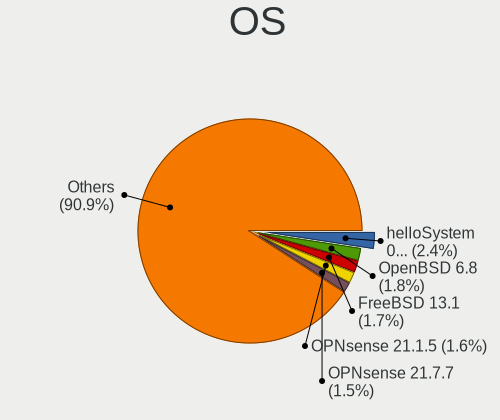

| Name              | Computers | Percent |
|-------------------|-----------|---------|
| helloSystem 0.8.1 | 19        | 2.59%   |
| OpenBSD 6.8       | 16        | 2.18%   |
| FreeBSD 13.1      | 15        | 2.04%   |
| OPNsense 21.1.5   | 14        | 1.91%   |
| OPNsense 21.7.7   | 13        | 1.77%   |
| OPNsense 23.7.10  | 12        | 1.63%   |
| OPNsense 23.1.11  | 12        | 1.63%   |
| OPNsense 22.1     | 12        | 1.63%   |
| OPNsense 23.1.1   | 11        | 1.5%    |
| helloSystem 0.7.0 | 11        | 1.5%    |
| helloSystem 0.4.0 | 11        | 1.5%    |
| OPNsense 23.1.5   | 10        | 1.36%   |
| OPNsense 22.1.6   | 10        | 1.36%   |
| OPNsense 22.1.10  | 10        | 1.36%   |
| NomadBSD 1.3.2    | 10        | 1.36%   |
| GhostBSD 20.04.02 | 10        | 1.36%   |
| OPNsense 23.1.7   | 9         | 1.23%   |
| OPNsense 21.7.1   | 9         | 1.23%   |
| OPNsense 21.1     | 9         | 1.23%   |
| FreeBSD 13.1-p7   | 9         | 1.23%   |
| FreeBSD 13.0      | 9         | 1.23%   |
| OPNsense 23.7.12  | 8         | 1.09%   |
| OPNsense 23.7.11  | 8         | 1.09%   |
| OPNsense 22.7.9   | 8         | 1.09%   |
| OPNsense 22.7.4   | 8         | 1.09%   |
| OPNsense 22.7     | 8         | 1.09%   |
| OPNsense 22.1.1   | 8         | 1.09%   |
| OPNsense 21.1.3   | 8         | 1.09%   |
| OpenBSD 7.1       | 8         | 1.09%   |
| FreeBSD 12.1-p8   | 8         | 1.09%   |
| OPNsense 23.1.9   | 7         | 0.95%   |
| OPNsense 23.1     | 7         | 0.95%   |
| OPNsense 22.7.7   | 7         | 0.95%   |
| OPNsense 21.7.8   | 7         | 0.95%   |
| OpenBSD 7.0       | 7         | 0.95%   |
| helloSystem 0.8.0 | 7         | 0.95%   |
| FreeBSD 14.0-p6   | 7         | 0.95%   |
| OPNsense 24.1.6   | 6         | 0.82%   |
| OPNsense 23.7.8   | 6         | 0.82%   |
| OPNsense 23.1.8   | 6         | 0.82%   |

OS Family
---------

OS without a version

| Name        | Computers | Percent |
|-------------|-----------|---------|
| OPNsense    | 280       | 48.53%  |
| FreeBSD     | 150       | 26%     |
| helloSystem | 52        | 9.01%   |
| OpenBSD     | 42        | 7.28%   |
| NomadBSD    | 21        | 3.64%   |
| GhostBSD    | 16        | 2.77%   |
| NetBSD      | 9         | 1.56%   |
| TrueNAS     | 4         | 0.69%   |
| HardenedBSD | 1         | 0.17%   |
| FuryBSD     | 1         | 0.17%   |
| FreeNAS     | 1         | 0.17%   |

Arch
----

OS architecture (x86_64, i586, etc.)

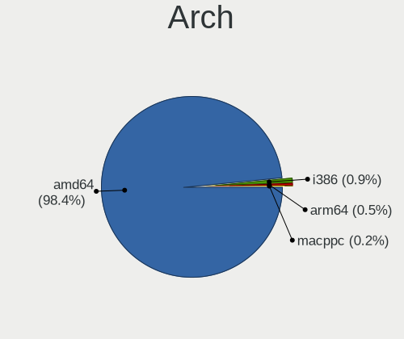

| Name   | Computers | Percent |
|--------|-----------|---------|
| amd64  | 551       | 98.22%  |
| i386   | 6         | 1.07%   |
| arm64  | 3         | 0.53%   |
| macppc | 1         | 0.18%   |

DE
--

Desktop Environment

| Name          | Computers | Percent |
|---------------|-----------|---------|
| Console       | 336       | 57.34%  |
| helloDesktop  | 70        | 11.95%  |
| XFCE          | 48        | 8.19%   |
| KDE5          | 26        | 4.44%   |
| Openbox       | 20        | 3.41%   |
| fvwm          | 19        | 3.24%   |
| MATE          | 17        | 2.9%    |
| TWM           | 13        | 2.22%   |
| GNOME         | 13        | 2.22%   |
| i3            | 7         | 1.19%   |
| AwesomeWM     | 4         | 0.68%   |
| xinitrc       | 3         | 0.51%   |
| LXDE          | 3         | 0.51%   |
| X-Cinnamon    | 1         | 0.17%   |
| sway          | 1         | 0.17%   |
| LXQt          | 1         | 0.17%   |
| Enlightenment | 1         | 0.17%   |
| Cinnamon      | 1         | 0.17%   |
| Budgie        | 1         | 0.17%   |
| Blackbox      | 1         | 0.17%   |

Display Server
--------------

X11 or Wayland

| Name    | Computers | Percent |
|---------|-----------|---------|
| Console | 344       | 60.99%  |
| X11     | 217       | 38.48%  |
| Wayland | 3         | 0.53%   |

Display Manager
---------------

SDDM, LightDM, etc.

| Name    | Computers | Percent |
|---------|-----------|---------|
| Console | 402       | 69.91%  |
| SLiM    | 95        | 16.52%  |
| SDDM    | 28        | 4.87%   |
| LightDM | 27        | 4.7%    |
| XDM     | 16        | 2.78%   |
| GDM     | 7         | 1.22%   |

OS Lang
-------

Language

| Lang            | Computers | Percent |
|-----------------|-----------|---------|
| Unknown         | 359       | 62.11%  |
| fr_FR           | 76        | 13.15%  |
| en_US           | 64        | 11.07%  |
| C               | 63        | 10.9%   |
| fr              | 3         | 0.52%   |
| en_GB           | 3         | 0.52%   |
| de_DE           | 3         | 0.52%   |
| en_US.ISO8859-1 | 2         | 0.35%   |
| ja_JP           | 1         | 0.17%   |
| it_IT           | 1         | 0.17%   |
| fr_FR.US-ASCII  | 1         | 0.17%   |
| es_ES           | 1         | 0.17%   |
| en              | 1         | 0.17%   |

Boot Mode
---------

EFI or BIOS

| Mode | Computers | Percent |
|------|-----------|---------|
| EFI  | 455       | 80.11%  |
| BIOS | 113       | 19.89%  |

Filesystem
----------

Type of filesystem

| Type   | Computers | Percent |
|--------|-----------|---------|
| Ufs    | 268       | 46.37%  |
| Zfs    | 247       | 42.73%  |
| Ffs    | 42        | 7.27%   |
| Cd9660 | 21        | 3.63%   |

Part. scheme
------------

Scheme of partitioning

| Type    | Computers | Percent |
|---------|-----------|---------|
| GPT     | 495       | 87.3%   |
| MBR     | 66        | 11.64%  |
| Unknown | 4         | 0.71%   |
| BSD     | 2         | 0.35%   |

Board
-----

Vendor
------

Motherboard manufacturer

| Name                    | Computers | Percent |
|-------------------------|-----------|---------|
| Dell                    | 80        | 14.26%  |
| Lenovo                  | 62        | 11.05%  |
| ASUSTek Computer        | 61        | 10.87%  |
| Intel                   | 52        | 9.27%   |
| Unknown                 | 43        | 7.66%   |
| Hewlett-Packard         | 38        | 6.77%   |
| PC Engines              | 21        | 3.74%   |
| Gigabyte Technology     | 21        | 3.74%   |
| ASRock                  | 18        | 3.21%   |
| Supermicro              | 13        | 2.32%   |
| Fujitsu                 | 13        | 2.32%   |
| Apple                   | 13        | 2.32%   |
| MSI                     | 12        | 2.14%   |
| AMI                     | 11        | 1.96%   |
| Techvision              | 8         | 1.43%   |
| Deciso                  | 8         | 1.43%   |
| Acer                    | 7         | 1.25%   |
| MW                      | 5         | 0.89%   |
| BESSTAR Tech            | 5         | 0.89%   |
| Shuttle                 | 4         | 0.71%   |
| Protectli               | 4         | 0.71%   |
| TUXEDO                  | 3         | 0.53%   |
| Toshiba                 | 3         | 0.53%   |
| Raspberry Pi Foundation | 3         | 0.53%   |
| ZOTAC                   | 2         | 0.36%   |
| Sony                    | 2         | 0.36%   |
| Samsung Electronics     | 2         | 0.36%   |
| RUNING                  | 2         | 0.36%   |
| Notebook                | 2         | 0.36%   |
| GoWin Solution          | 2         | 0.36%   |
| Google                  | 2         | 0.36%   |
| Clevo                   | 2         | 0.36%   |
| AZW                     | 2         | 0.36%   |
| AWOW                    | 2         | 0.36%   |
| ASRockRack              | 2         | 0.36%   |
| AMD                     | 2         | 0.36%   |
| Alienware               | 2         | 0.36%   |
| Advantech               | 2         | 0.36%   |
| YENTEK                  | 1         | 0.18%   |
| Wistron                 | 1         | 0.18%   |

Model
-----

Motherboard model

| Name                                  | Computers | Percent |
|---------------------------------------|-----------|---------|
| Unknown                               | 44        | 7.84%   |
| Intel Q3XXG4-P V1.0                   | 15        | 2.67%   |
| PC Engines APU2                       | 12        | 2.14%   |
| Techvision TVI7309X                   | 8         | 1.43%   |
| AMI Aptio CRB                         | 8         | 1.43%   |
| Fujitsu FUTRO S920                    | 7         | 1.25%   |
| MW GMLK-2_5G4L                        | 5         | 0.89%   |
| Intel CRESCENTBAY                     | 5         | 0.89%   |
| ASUS All Series                       | 5         | 0.89%   |
| PC Engines APU3                       | 4         | 0.71%   |
| Intel Jasper Lake Client Platform     | 4         | 0.71%   |
| Intel H81U                            | 4         | 0.71%   |
| Dell OptiPlex 9020                    | 4         | 0.71%   |
| Apple MacBookAir6,2                   | 4         | 0.71%   |
| Supermicro Super Server               | 3         | 0.53%   |
| RPi Raspberry Pi                      | 3         | 0.53%   |
| HP ProLiant MicroServer Gen8          | 3         | 0.53%   |
| Dell Precision M4500                  | 3         | 0.53%   |
| Dell PowerEdge R710                   | 3         | 0.53%   |
| Deciso NetBoard-A20                   | 3         | 0.53%   |
| Deciso Netboard A20                   | 3         | 0.53%   |
| TUXEDO InfinityBook13V3               | 2         | 0.36%   |
| Toshiba PORTEGE Z930                  | 2         | 0.36%   |
| Supermicro SYS-E300-9D-8CN8TP         | 2         | 0.36%   |
| Shuttle XS35V5                        | 2         | 0.36%   |
| RUNING B75M INTEL H3V                 | 2         | 0.36%   |
| PC Engines apu4                       | 2         | 0.36%   |
| PC Engines apu1                       | 2         | 0.36%   |
| Lenovo ThinkSystem ST50 V2 7D8JCTO1WW | 2         | 0.36%   |
| Lenovo ThinkCentre M93p 10AAS4EN00    | 2         | 0.36%   |
| Intel AmITX-SL-G                      | 2         | 0.36%   |
| Gigabyte X570 I AORUS PRO WIFI        | 2         | 0.36%   |
| Dell PowerEdge R815                   | 2         | 0.36%   |
| Dell PowerEdge R220                   | 2         | 0.36%   |
| Dell PowerEdge R210 II                | 2         | 0.36%   |
| Dell PowerEdge R200                   | 2         | 0.36%   |
| Dell OptiPlex 7010                    | 2         | 0.36%   |
| Dell OptiPlex 3070                    | 2         | 0.36%   |
| Dell OptiPlex 3050                    | 2         | 0.36%   |
| Dell OptiPlex 3020                    | 2         | 0.36%   |

Model Family
------------

Motherboard model prefix

| Name                          | Computers | Percent |
|-------------------------------|-----------|---------|
| Unknown                       | 44        | 7.84%   |
| Lenovo ThinkPad               | 39        | 6.95%   |
| Dell OptiPlex                 | 27        | 4.81%   |
| Dell PowerEdge                | 17        | 3.03%   |
| Dell Latitude                 | 16        | 2.85%   |
| Intel Q3XXG4-P                | 15        | 2.67%   |
| Lenovo ThinkCentre            | 13        | 2.32%   |
| PC Engines APU2               | 12        | 2.14%   |
| Dell Precision                | 10        | 1.78%   |
| ASUS PRIME                    | 10        | 1.78%   |
| HP Compaq                     | 9         | 1.6%    |
| Techvision TVI7309X           | 8         | 1.43%   |
| AMI Aptio                     | 8         | 1.43%   |
| Fujitsu FUTRO                 | 7         | 1.25%   |
| HP ProLiant                   | 6         | 1.07%   |
| MW GMLK-2                     | 5         | 0.89%   |
| Intel CRESCENTBAY             | 5         | 0.89%   |
| HP ProDesk                    | 5         | 0.89%   |
| Deciso Netboard               | 5         | 0.89%   |
| ASUS All                      | 5         | 0.89%   |
| PC Engines APU3               | 4         | 0.71%   |
| Intel Jasper                  | 4         | 0.71%   |
| Intel H81U                    | 4         | 0.71%   |
| HP EliteBook                  | 4         | 0.71%   |
| Apple MacBookAir6             | 4         | 0.71%   |
| Acer Aspire                   | 4         | 0.71%   |
| Supermicro Super              | 3         | 0.53%   |
| RPi Raspberry                 | 3         | 0.53%   |
| Lenovo ThinkSystem            | 3         | 0.53%   |
| Fujitsu ESPRIMO               | 3         | 0.53%   |
| Dell Vostro                   | 3         | 0.53%   |
| Deciso NetBoard-A20           | 3         | 0.53%   |
| ASUS TUF                      | 3         | 0.53%   |
| TUXEDO InfinityBook13V3       | 2         | 0.36%   |
| Toshiba PORTEGE               | 2         | 0.36%   |
| Supermicro SYS-E300-9D-8CN8TP | 2         | 0.36%   |
| Shuttle XS35V5                | 2         | 0.36%   |
| RUNING B75M                   | 2         | 0.36%   |
| PC Engines apu4               | 2         | 0.36%   |
| PC Engines apu1               | 2         | 0.36%   |

MFG Year
--------

Motherboard manufacture year

| Year    | Computers | Percent |
|---------|-----------|---------|
| 2016    | 58        | 10.34%  |
| 2019    | 56        | 9.98%   |
| 2018    | 50        | 8.91%   |
| 2021    | 48        | 8.56%   |
| 2022    | 45        | 8.02%   |
| 2020    | 45        | 8.02%   |
| 2014    | 38        | 6.77%   |
| 2013    | 34        | 6.06%   |
| 2012    | 28        | 4.99%   |
| 2017    | 26        | 4.63%   |
| 2015    | 24        | 4.28%   |
| 2011    | 24        | 4.28%   |
| 2023    | 23        | 4.1%    |
| 2010    | 19        | 3.39%   |
| 2008    | 12        | 2.14%   |
| Unknown | 12        | 2.14%   |
| 2009    | 9         | 1.6%    |
| 2007    | 7         | 1.25%   |
| 2006    | 2         | 0.36%   |
| 2024    | 1         | 0.18%   |

Form Factor
-----------

Physical design of the computer

| Name           | Computers | Percent |
|----------------|-----------|---------|
| Desktop        | 325       | 57.93%  |
| Notebook       | 157       | 27.99%  |
| Mini pc        | 42        | 7.49%   |
| Server         | 26        | 4.63%   |
| System on chip | 3         | 0.53%   |
| Firewall       | 3         | 0.53%   |
| All in one     | 3         | 0.53%   |
| Convertible    | 2         | 0.36%   |

Coreboot
--------

Have coreboot on board

| Used | Computers | Percent |
|------|-----------|---------|
| No   | 535       | 95.37%  |
| Yes  | 26        | 4.63%   |

RAM Size
--------

Total RAM memory

| Size in GB      | Computers | Percent |
|-----------------|-----------|---------|
| 8.01-16.0       | 206       | 36.01%  |
| 16.01-24.0      | 129       | 22.55%  |
| 4.01-8.0        | 122       | 21.33%  |
| 32.01-64.0      | 45        | 7.87%   |
| 2.01-3.0        | 24        | 4.2%    |
| 64.01-256.0     | 22        | 3.85%   |
| 3.01-4.0        | 7         | 1.22%   |
| 24.01-32.0      | 6         | 1.05%   |
| 1.01-2.0        | 6         | 1.05%   |
| 0.51-1.0        | 3         | 0.52%   |
| More than 256.0 | 2         | 0.35%   |

RAM Used
--------

Used RAM memory

| Used GB     | Computers | Percent |
|-------------|-----------|---------|
| 0.01-0.5    | 301       | 52.26%  |
| 0.51-1.0    | 167       | 28.99%  |
| 1.01-2.0    | 51        | 8.85%   |
| 2.01-3.0    | 18        | 3.13%   |
| 4.01-8.0    | 9         | 1.56%   |
| Unknown     | 9         | 1.56%   |
| 8.01-16.0   | 7         | 1.22%   |
| 3.01-4.0    | 5         | 0.87%   |
| 32.01-64.0  | 3         | 0.52%   |
| 64.01-256.0 | 2         | 0.35%   |
| 0           | 2         | 0.35%   |
| 24.01-32.0  | 1         | 0.17%   |
| 16.01-24.0  | 1         | 0.17%   |

Total Drives
------------

Number of drives on board

| Drives | Computers | Percent |
|--------|-----------|---------|
| 1      | 371       | 63.97%  |
| 2      | 92        | 15.86%  |
| 0      | 64        | 11.03%  |
| 3      | 27        | 4.66%   |
| 4      | 9         | 1.55%   |
| 5      | 7         | 1.21%   |
| 6      | 5         | 0.86%   |
| 25     | 2         | 0.34%   |
| 10     | 1         | 0.17%   |
| 8      | 1         | 0.17%   |
| 7      | 1         | 0.17%   |

Has CD-ROM
----------

Has CD-ROM on board

| Presented | Computers | Percent |
|-----------|-----------|---------|
| No        | 472       | 83.25%  |
| Yes       | 95        | 16.75%  |

Has Ethernet
------------

Has Ethernet on board

| Presented | Computers | Percent |
|-----------|-----------|---------|
| Yes       | 532       | 94.66%  |
| No        | 30        | 5.34%   |

Has WiFi
--------

Has WiFi module

| Presented | Computers | Percent |
|-----------|-----------|---------|
| No        | 314       | 55.67%  |
| Yes       | 250       | 44.33%  |

Has Bluetooth
-------------

Has Bluetooth module

| Presented | Computers | Percent |
|-----------|-----------|---------|
| No        | 408       | 71.96%  |
| Yes       | 159       | 28.04%  |

Location
--------

Country
-------

Geographic location (country)

| Country | Computers | Percent |
|---------|-----------|---------|
| France  | 561       | 100%    |

City
----

Geographic location (city)

| City                  | Computers | Percent |
|-----------------------|-----------|---------|
| Paris                 | 115       | 18.05%  |
| Bordeaux              | 12        | 1.88%   |
| Toulouse              | 9         | 1.41%   |
| Lille                 | 8         | 1.26%   |
| Colombes              | 8         | 1.26%   |
| Saint-Denis           | 7         | 1.1%    |
| Roubaix               | 7         | 1.1%    |
| Lyon                  | 7         | 1.1%    |
| Franconville          | 7         | 1.1%    |
| Urcuit                | 6         | 0.94%   |
| Marseille             | 6         | 0.94%   |
| Soisy-sur-Seine       | 5         | 0.78%   |
| Rosny-sous-Bois       | 5         | 0.78%   |
| Noyon                 | 5         | 0.78%   |
| Melun                 | 5         | 0.78%   |
| Fontenay-sous-Bois    | 5         | 0.78%   |
| Courbevoie            | 5         | 0.78%   |
| Agen                  | 5         | 0.78%   |
| Villeurbanne          | 4         | 0.63%   |
| Rillieux-la-Pape      | 4         | 0.63%   |
| Rennes                | 4         | 0.63%   |
| Noisy-le-Grand        | 4         | 0.63%   |
| Mcon                | 4         | 0.63%   |
| Grenoble              | 4         | 0.63%   |
| Dijon                 | 4         | 0.63%   |
| Colmar                | 4         | 0.63%   |
| Vauvillers            | 3         | 0.47%   |
| Vaulx-en-Velin        | 3         | 0.47%   |
| Thionville            | 3         | 0.47%   |
| Sarcelles             | 3         | 0.47%   |
| Saint-Germain-en-Laye | 3         | 0.47%   |
| Orlans              | 3         | 0.47%   |
| Nantes                | 3         | 0.47%   |
| Montfermeil           | 3         | 0.47%   |
| Marcq-en-Baroeul      | 3         | 0.47%   |
| Cognac                | 3         | 0.47%   |
| Clermont-Ferrand      | 3         | 0.47%   |
| Chatou                | 3         | 0.47%   |
| Champigny-sur-Marne   | 3         | 0.47%   |
| Carry-le-Rouet        | 3         | 0.47%   |

Drives
------

Drive Vendor
------------

Hard drive vendors

| Vendor              | Computers | Drives | Percent |
|---------------------|-----------|--------|---------|
| Samsung Electronics | 86        | 135    | 13.56%  |
| Seagate             | 68        | 105    | 10.73%  |
| Crucial             | 62        | 87     | 9.78%   |
| WDC                 | 61        | 116    | 9.62%   |
| Kingston            | 46        | 72     | 7.26%   |
| Toshiba             | 31        | 54     | 4.89%   |
| Transcend           | 29        | 44     | 4.57%   |
| China               | 28        | 42     | 4.42%   |
| SanDisk             | 22        | 34     | 3.47%   |
| Intel               | 20        | 27     | 3.15%   |
| Phison              | 14        | 15     | 2.21%   |
| Micron Technology   | 12        | 20     | 1.89%   |
| HGST                | 12        | 19     | 1.89%   |
| PNY                 | 11        | 21     | 1.74%   |
| Hoodisk             | 10        | 11     | 1.58%   |
| Apple               | 9         | 12     | 1.42%   |
| SK hynix            | 8         | 8      | 1.26%   |
| NVMe                | 7         | 7      | 1.1%    |
| Hitachi             | 7         | 7      | 1.1%    |
| Innodisk            | 6         | 6      | 0.95%   |
| Corsair             | 6         | 10     | 0.95%   |
| Fujitsu             | 5         | 5      | 0.79%   |
| FORESEE             | 5         | 6      | 0.79%   |
| OCZ                 | 4         | 5      | 0.63%   |
| Maxtor              | 3         | 4      | 0.47%   |
| LITEON              | 3         | 4      | 0.47%   |
| LDLC                | 3         | 3      | 0.47%   |
| Hewlett-Packard     | 3         | 6      | 0.47%   |
| Generic             | 3         | 3      | 0.47%   |
| Fanxiang            | 3         | 3      | 0.47%   |
| Dell                | 3         | 48     | 0.47%   |
| A-DATA Technology   | 3         | 4      | 0.47%   |
| SPCC                | 2         | 2      | 0.32%   |
| Silicon Motion      | 2         | 2      | 0.32%   |
| Pccooler            | 2         | 2      | 0.32%   |
| NETAPP              | 2         | 4      | 0.32%   |
| LSI                 | 2         | 2      | 0.32%   |
| Integral            | 2         | 2      | 0.32%   |
| VICKTER             | 1         | 1      | 0.16%   |
| Vaseky              | 1         | 4      | 0.16%   |

Drive Model
-----------

Hard drive models

| Model                              | Computers | Percent |
|------------------------------------|-----------|---------|
| Samsung SSD 850 EVO 250GB          | 9         | 1.32%   |
| Phison SATA SSD 16GB               | 8         | 1.18%   |
| Kingston SA400S37240G 240GB        | 8         | 1.18%   |
| Crucial CT250MX500SSD1 250GB       | 8         | 1.18%   |
| PNY CS900 120GB SSD                | 6         | 0.88%   |
| Kingston SV300S37A120G 120GB       | 6         | 0.88%   |
| Crucial CT1000P1SSD8 1TB           | 6         | 0.88%   |
| China MSATA 32GB SSD               | 6         | 0.88%   |
| Transcend TS256GMTS952T2 256GB     | 5         | 0.74%   |
| Seagate ST1000LM024 HN-M101MBB 1TB | 5         | 0.74%   |
| Hoodisk SSD 32GB                   | 5         | 0.74%   |
| Crucial CT500MX500SSD1 500GB       | 5         | 0.74%   |
| Crucial CT240BX500SSD1 240GB       | 5         | 0.74%   |
| WDC WD10EZEX-08WN4A0 1TB           | 4         | 0.59%   |
| SanDisk SSD PLUS 120GB             | 4         | 0.59%   |
| Samsung SSD 860 EVO 1TB            | 4         | 0.59%   |
| Micron 1100 SATA 256GB             | 4         | 0.59%   |
| Kingston SUV500MS120G 120GB        | 4         | 0.59%   |
| Crucial CT120BX500SSD1 120GB       | 4         | 0.59%   |
| Crucial CT1000BX500SSD1 1TB        | 4         | 0.59%   |
| China SATA SSD 16GB                | 4         | 0.59%   |
| China MSATA 64GB SSD               | 4         | 0.59%   |
| Apple SSD SD0128F 121GB            | 4         | 0.59%   |
| WDC WDS240G2G0A-00JH30 240GB       | 3         | 0.44%   |
| Transcend TS128GSSD420K 128GB      | 3         | 0.44%   |
| Transcend TS128GMSA230S 128GB      | 3         | 0.44%   |
| Seagate ST3500418AS 500GB          | 3         | 0.44%   |
| Seagate ST1000LM049-2GH172 1TB     | 3         | 0.44%   |
| Seagate ST1000LM035-1RK172 1TB     | 3         | 0.44%   |
| Samsung SSD 860 EVO 250GB          | 3         | 0.44%   |
| Samsung SSD 850 EVO 1TB            | 3         | 0.44%   |
| Kingston SA400S37120G 120GB        | 3         | 0.44%   |
| Intel SSDSA2CT040G3 40GB           | 3         | 0.44%   |
| HGST HUS724020ALA640 2TB           | 3         | 0.44%   |
| HGST HTS721010A9E630 1TB           | 3         | 0.44%   |
| HP RAID 1(1+0) 73GB                | 3         | 0.44%   |
| FORESEE 64GB SSD                   | 3         | 0.44%   |
| Crucial CT250P2SSD8 250GB          | 3         | 0.44%   |
| Crucial CT1050MX300SSD1 1TB        | 3         | 0.44%   |
| China SATA SSD 256GB               | 3         | 0.44%   |

HDD Vendor
----------

Hard disk drive vendors

| Vendor              | Computers | Drives | Percent |
|---------------------|-----------|--------|---------|
| Seagate             | 65        | 101    | 32.34%  |
| WDC                 | 51        | 101    | 25.37%  |
| Toshiba             | 24        | 41     | 11.94%  |
| HGST                | 12        | 19     | 5.97%   |
| Samsung Electronics | 9         | 16     | 4.48%   |
| Hitachi             | 7         | 7      | 3.48%   |
| NVMe                | 5         | 5      | 2.49%   |
| Fujitsu             | 5         | 5      | 2.49%   |
| Maxtor              | 3         | 4      | 1.49%   |
| Hewlett-Packard     | 3         | 6      | 1.49%   |
| Generic             | 3         | 3      | 1.49%   |
| Dell                | 3         | 48     | 1.49%   |
| NETAPP              | 2         | 4      | 1%      |
| LSI                 | 2         | 2      | 1%      |
| Apple               | 2         | 4      | 1%      |
| SABRENT             | 1         | 1      | 0.5%    |
| OPENBSD             | 1         | 2      | 0.5%    |
| Lexar               | 1         | 2      | 0.5%    |
| LDLC F6+            | 1         | 1      | 0.5%    |
| External            | 1         | 1      | 0.5%    |

SSD Vendor
----------

Solid state drive vendors

| Vendor              | Computers | Drives | Percent |
|---------------------|-----------|--------|---------|
| Samsung Electronics | 54        | 81     | 15.88%  |
| Crucial             | 42        | 50     | 12.35%  |
| Kingston            | 40        | 63     | 11.76%  |
| China               | 28        | 42     | 8.24%   |
| Transcend           | 27        | 41     | 7.94%   |
| SanDisk             | 22        | 34     | 6.47%   |
| Intel               | 13        | 15     | 3.82%   |
| PNY                 | 10        | 19     | 2.94%   |
| Hoodisk             | 10        | 11     | 2.94%   |
| WDC                 | 8         | 11     | 2.35%   |
| Phison              | 8         | 9      | 2.35%   |
| Apple               | 7         | 8      | 2.06%   |
| Toshiba             | 6         | 11     | 1.76%   |
| Micron Technology   | 6         | 12     | 1.76%   |
| Innodisk            | 6         | 6      | 1.76%   |
| FORESEE             | 5         | 6      | 1.47%   |
| Corsair             | 5         | 6      | 1.47%   |
| OCZ                 | 4         | 5      | 1.18%   |
| SK hynix            | 3         | 3      | 0.88%   |
| LITEON              | 3         | 4      | 0.88%   |
| A-DATA Technology   | 3         | 4      | 0.88%   |
| SPCC                | 2         | 2      | 0.59%   |
| Pccooler            | 2         | 2      | 0.59%   |
| NVMe                | 2         | 2      | 0.59%   |
| Integral            | 2         | 2      | 0.59%   |
| VICKTER             | 1         | 1      | 0.29%   |
| Vaseky              | 1         | 4      | 0.29%   |
| TEXTORM             | 1         | 1      | 0.29%   |
| TCSUNBOW            | 1         | 3      | 0.29%   |
| Supermicro          | 1         | 1      | 0.29%   |
| Silicon Power       | 1         | 2      | 0.29%   |
| ShiJi               | 1         | 2      | 0.29%   |
| SHAREVDI            | 1         | 1      | 0.29%   |
| Seagate             | 1         | 2      | 0.29%   |
| Protectli           | 1         | 1      | 0.29%   |
| Kston               | 1         | 1      | 0.29%   |
| KingSpec            | 1         | 1      | 0.29%   |
| Kingchuxing         | 1         | 2      | 0.29%   |
| KeepData            | 1         | 1      | 0.29%   |
| INNOVATION IT       | 1         | 1      | 0.29%   |

Drive Kind
----------

HDD or SSD

| Kind | Computers | Drives | Percent |
|------|-----------|--------|---------|
| SSD  | 316       | 488    | 54.77%  |
| HDD  | 168       | 373    | 29.12%  |
| NVMe | 93        | 143    | 16.12%  |

Drive Connector
---------------

SATA, SAS, NVMe, etc.

| Type | Computers | Drives | Percent |
|------|-----------|--------|---------|
| SATA | 439       | 861    | 82.52%  |
| NVMe | 93        | 143    | 17.48%  |

Drive Size
----------

Size of hard drive

| Size in TB | Computers | Drives | Percent |
|------------|-----------|--------|---------|
| 0.01-0.5   | 365       | 621    | 72.28%  |
| 0.51-1.0   | 85        | 124    | 16.83%  |
| 1.01-2.0   | 37        | 79     | 7.33%   |
| 4.01-10.0  | 7         | 12     | 1.39%   |
| 3.01-4.0   | 6         | 15     | 1.19%   |
| 2.01-3.0   | 5         | 10     | 0.99%   |

Space Total
-----------

Amount of disk space available on the file system

| Size in GB     | Computers | Percent |
|----------------|-----------|---------|
| 101-250        | 211       | 36.44%  |
| 1-20           | 89        | 15.37%  |
| 251-500        | 88        | 15.2%   |
| 21-50          | 64        | 11.05%  |
| 501-1000       | 52        | 8.98%   |
| 51-100         | 43        | 7.43%   |
| 1001-2000      | 17        | 2.94%   |
| 2001-3000      | 7         | 1.21%   |
| More than 3000 | 5         | 0.86%   |
| Unknown        | 3         | 0.52%   |

Space Used
----------

Amount of used disk space

| Used GB        | Computers | Percent |
|----------------|-----------|---------|
| 1-20           | 484       | 84.91%  |
| 21-50          | 39        | 6.84%   |
| 101-250        | 18        | 3.16%   |
| 251-500        | 11        | 1.93%   |
| 51-100         | 8         | 1.4%    |
| 501-1000       | 4         | 0.7%    |
| Unknown        | 3         | 0.53%   |
| More than 3000 | 2         | 0.35%   |
| 1001-2000      | 1         | 0.18%   |

Malfunc. Drives
---------------

Drive models with a malfunction

| Model                              | Computers | Drives | Percent |
|------------------------------------|-----------|--------|---------|
| Kingston SV300S37A120G 120GB       | 3         | 4      | 3.85%   |
| WDC WDS240G2G0A-00JH30 240GB       | 2         | 3      | 2.56%   |
| WDC WD3200BPVT-80JJ5T0 320GB       | 2         | 2      | 2.56%   |
| Seagate ST500DM002-1BD142 500GB    | 2         | 4      | 2.56%   |
| Seagate ST1000NM0011 1TB           | 2         | 3      | 2.56%   |
| Seagate ST1000LM024 HN-M101MBB 1TB | 2         | 3      | 2.56%   |
| Samsung Electronics HD501LJ 500GB  | 2         | 2      | 2.56%   |
| WDC WD6400BPVT-22HXZT3 640GB       | 1         | 1      | 1.28%   |
| WDC WD6400AAKS-22A7B0 640GB        | 1         | 1      | 1.28%   |
| WDC WD5002ABYS-18B1B0 500GB        | 1         | 1      | 1.28%   |
| WDC WD30EFRX-68AX9N0 3TB           | 1         | 4      | 1.28%   |
| WDC WD2500BEVS-60UST0 250GB        | 1         | 1      | 1.28%   |
| WDC WD20EZRX-00D8PB0 2TB           | 1         | 1      | 1.28%   |
| WDC WD2002FYPS-02W3B0 2TB          | 1         | 1      | 1.28%   |
| WDC WD15EADS-00P8B0 1.5TB          | 1         | 1      | 1.28%   |
| WDC WD10JPVX-22JC3T0 1TB           | 1         | 1      | 1.28%   |
| WDC WD10EZEX-60M2NA0 1TB           | 1         | 1      | 1.28%   |
| WDC WD10EZEX-08WN4A0 1TB           | 1         | 1      | 1.28%   |
| WDC WD10EAVS-00D7B0 1TB            | 1         | 1      | 1.28%   |
| WDC WD10EARS-00Y5B1 1TB            | 1         | 1      | 1.28%   |
| WDC WD1001FAES-75W7A0 1TB          | 1         | 1      | 1.28%   |
| Toshiba MQ01ABD075 752GB           | 1         | 1      | 1.28%   |
| Toshiba MK5065GSX 500GB            | 1         | 1      | 1.28%   |
| Toshiba MK3261GSY 320GB            | 1         | 1      | 1.28%   |
| Toshiba MK1629GSGF 160GB           | 1         | 3      | 1.28%   |
| Toshiba DT01ACA100 1TB             | 1         | 1      | 1.28%   |
| Seagate ST9500325AS 500GB          | 1         | 1      | 1.28%   |
| Seagate ST9320423AS 320GB          | 1         | 1      | 1.28%   |
| Seagate ST9320325AS 320GB          | 1         | 1      | 1.28%   |
| Seagate ST500VT000-1DK142 500GB    | 1         | 1      | 1.28%   |
| Seagate ST500LM000-SSHD-8GB        | 1         | 2      | 1.28%   |
| Seagate ST380013AS 80GB            | 1         | 2      | 1.28%   |
| Seagate ST3250620AS 250GB          | 1         | 1      | 1.28%   |
| Seagate ST320LT012-9WS14C 320GB    | 1         | 7      | 1.28%   |
| Seagate ST320LT007-9ZV142 320GB    | 1         | 1      | 1.28%   |
| Seagate ST3160212AS 160GB          | 1         | 1      | 1.28%   |
| Seagate ST3160023AS 160GB          | 1         | 1      | 1.28%   |
| Seagate ST31000524AS 1TB           | 1         | 1      | 1.28%   |
| Seagate ST1000LM014-1EJ164 1TB     | 1         | 1      | 1.28%   |
| SanDisk SSD PLUS 480GB             | 1         | 1      | 1.28%   |

Malfunc. Drive Vendor
---------------------

Vendors of faulty drives

| Vendor              | Computers | Drives | Percent |
|---------------------|-----------|--------|---------|
| WDC                 | 18        | 22     | 24.32%  |
| Seagate             | 18        | 31     | 24.32%  |
| Samsung Electronics | 6         | 11     | 8.11%   |
| Kingston            | 6         | 9      | 8.11%   |
| Toshiba             | 5         | 7      | 6.76%   |
| SanDisk             | 3         | 3      | 4.05%   |
| HGST                | 3         | 4      | 4.05%   |
| A-DATA Technology   | 3         | 4      | 4.05%   |
| Maxtor              | 2         | 2      | 2.7%    |
| Intel               | 2         | 2      | 2.7%    |
| Hitachi             | 2         | 2      | 2.7%    |
| Crucial             | 2         | 2      | 2.7%    |
| OCZ                 | 1         | 2      | 1.35%   |
| Micron Technology   | 1         | 1      | 1.35%   |
| Innodisk            | 1         | 1      | 1.35%   |
| Corsair             | 1         | 2      | 1.35%   |

Malfunc. HDD Vendor
-------------------

Vendors of faulty HDD drives

| Vendor              | Computers | Drives | Percent |
|---------------------|-----------|--------|---------|
| Seagate             | 18        | 31     | 36.73%  |
| WDC                 | 16        | 19     | 32.65%  |
| Toshiba             | 5         | 7      | 10.2%   |
| Samsung Electronics | 3         | 5      | 6.12%   |
| HGST                | 3         | 4      | 6.12%   |
| Maxtor              | 2         | 2      | 4.08%   |
| Hitachi             | 2         | 2      | 4.08%   |

Malfunc. Drive Kind
-------------------

Kinds of faulty drives

| Kind | Computers | Drives | Percent |
|------|-----------|--------|---------|
| HDD  | 45        | 70     | 64.29%  |
| SSD  | 25        | 35     | 35.71%  |

Failed Drives
-------------

Failed drive models

| Model                     | Computers | Drives | Percent |
|---------------------------|-----------|--------|---------|
| Supermicro SSD 16GB       | 1         | 1      | 33.33%  |
| Kingston SMS200S360G 64GB | 1         | 1      | 33.33%  |
| Hoodisk SSD 64GB          | 1         | 1      | 33.33%  |

Failed Drive Vendor
-------------------

Failed drive vendors

| Vendor     | Computers | Drives | Percent |
|------------|-----------|--------|---------|
| Supermicro | 1         | 1      | 33.33%  |
| Kingston   | 1         | 1      | 33.33%  |
| Hoodisk    | 1         | 1      | 33.33%  |

Drive Status
------------

Number of failed and malfunc. drives

| Status   | Computers | Drives | Percent |
|----------|-----------|--------|---------|
| Works    | 445       | 864    | 82.71%  |
| Malfunc  | 69        | 105    | 12.83%  |
| Detected | 21        | 32     | 3.9%    |
| Failed   | 3         | 3      | 0.56%   |

Storage controller
------------------

Storage Vendor
--------------

Storage controller vendors

| Vendor                         | Computers | Percent |
|--------------------------------|-----------|---------|
| Intel                          | 422       | 62.7%   |
| AMD                            | 90        | 13.37%  |
| Samsung Electronics            | 33        | 4.9%    |
| Micron/Crucial Technology      | 24        | 3.57%   |
| Broadcom / LSI                 | 17        | 2.53%   |
| Marvell Technology Group       | 10        | 1.49%   |
| Silicon Motion                 | 8         | 1.19%   |
| Phison Electronics             | 8         | 1.19%   |
| SanDisk                        | 7         | 1.04%   |
| ASMedia Technology             | 7         | 1.04%   |
| Kingston Technology Company    | 6         | 0.89%   |
| SK hynix                       | 5         | 0.74%   |
| Micron Technology              | 5         | 0.74%   |
| MAXIO Technology (Hangzhou)    | 5         | 0.74%   |
| Hewlett-Packard                | 4         | 0.59%   |
| Nvidia                         | 3         | 0.45%   |
| JMicron Technology             | 3         | 0.45%   |
| VIA Technologies               | 2         | 0.3%    |
| Transcend                      | 2         | 0.3%    |
| Toshiba                        | 2         | 0.3%    |
| Seagate Technology             | 2         | 0.3%    |
| KIOXIA                         | 2         | 0.3%    |
| Chelsio Communications         | 2         | 0.3%    |
| Solid State Storage Technology | 1         | 0.15%   |
| Silicon Image                  | 1         | 0.15%   |
| Realtek Semiconductor          | 1         | 0.15%   |
| Integrated Technology Express  | 1         | 0.15%   |

Storage Model
-------------

Storage controller models

| Model                                                                            | Computers | Percent |
|----------------------------------------------------------------------------------|-----------|---------|
| AMD FCH SATA Controller [AHCI mode]                                              | 61        | 8.09%   |
| Intel Q170/Q150/B150/H170/H110/Z170/CM236 Chipset SATA Controller [AHCI Mode]    | 29        | 3.85%   |
| Intel 8 Series SATA Controller 1 [AHCI mode]                                     | 27        | 3.58%   |
| Intel 8 Series/C220 Series Chipset Family 6-port SATA Controller 1 [AHCI mode]   | 26        | 3.45%   |
| Intel 6 Series/C200 Series Chipset Family 6 port Desktop SATA AHCI Controller    | 25        | 3.32%   |
| Intel Sunrise Point-LP SATA Controller [AHCI mode]                               | 20        | 2.65%   |
| Intel Wildcat Point-LP SATA Controller [AHCI Mode]                               | 18        | 2.39%   |
| Intel Celeron/Pentium Silver Processor SATA Controller                           | 16        | 2.12%   |
| Micron/Crucial P2 [Nick P2] / P3 / P3 Plus NVMe PCIe SSD (DRAM-less)             | 14        | 1.86%   |
| Intel SATA Controller [RAID mode]                                                | 14        | 1.86%   |
| Intel Jasper Lake SATA AHCI Controller                                           | 14        | 1.86%   |
| Intel 7 Series Chipset Family 6-port SATA Controller [AHCI mode]                 | 13        | 1.72%   |
| Intel 6 Series/C200 Series Chipset Family 6 port Mobile SATA AHCI Controller     | 13        | 1.72%   |
| Samsung NVMe SSD Controller SM981/PM981/PM983                                    | 12        | 1.59%   |
| Intel Atom/Celeron/Pentium Processor x5-E8000/J3xxx/N3xxx Series SATA Controller | 12        | 1.59%   |
| Intel Atom Processor E3800 Series SATA AHCI Controller                           | 11        | 1.46%   |
| Intel 7 Series/C210 Series Chipset Family 6-port SATA Controller [AHCI mode]     | 11        | 1.46%   |
| AMD FCH SATA Controller [IDE mode]                                               | 11        | 1.46%   |
| Intel Cannon Lake PCH SATA AHCI Controller                                       | 9         | 1.19%   |
| Intel 82801 Mobile SATA Controller [RAID mode]                                   | 9         | 1.19%   |
| Samsung NVMe SSD Controller 980 (DRAM-less)                                      | 8         | 1.06%   |
| Intel NM10/ICH7 Family SATA Controller [AHCI mode]                               | 8         | 1.06%   |
| Intel 5 Series/3400 Series Chipset 6 port SATA AHCI Controller                   | 8         | 1.06%   |
| Intel 200 Series PCH SATA controller [AHCI mode]                                 | 8         | 1.06%   |
| Silicon Motion SM2263EN/SM2263XT (DRAM-less) NVMe SSD Controllers                | 7         | 0.93%   |
| ASMedia ASM1061/ASM1062 Serial ATA Controller                                    | 7         | 0.93%   |
| AMD SB7x0/SB8x0/SB9x0 SATA Controller [AHCI mode]                                | 7         | 0.93%   |
| Intel unknown                                                                    | 6         | 0.8%    |
| Intel Comet Lake SATA AHCI Controller                                            | 6         | 0.8%    |
| Intel Cannon Point-LP SATA Controller [AHCI Mode]                                | 6         | 0.8%    |
| Intel C620 Series Chipset Family SSATA Controller [AHCI mode]                    | 6         | 0.8%    |
| Intel 82801IBM/IEM (ICH9M/ICH9M-E) 4 port SATA Controller [AHCI mode]            | 6         | 0.8%    |
| Intel 500 Series Chipset Family SATA AHCI Controller                             | 6         | 0.8%    |
| AMD 500 Series Chipset SATA Controller                                           | 6         | 0.8%    |
| AMD 400 Series Chipset SATA Controller                                           | 6         | 0.8%    |
| Samsung NVMe SSD Controller PM9A1/PM9A3/980PRO                                   | 5         | 0.66%   |
| Phison PS5013-E13 PCIe3 NVMe Controller (DRAM-less)                              | 5         | 0.66%   |
| Micron/Crucial P5 Plus NVMe PCIe SSD                                             | 5         | 0.66%   |
| Micron/Crucial P1 NVMe PCIe SSD[Frampton]                                        | 5         | 0.66%   |
| MAXIO (Hangzhou) NVMe SSD Controller MAP1202 (DRAM-less)                         | 5         | 0.66%   |

Storage Kind
------------

Kind of storage controller (IDE, SATA, NVMe, SAS, ...)

| Kind | Computers | Percent |
|------|-----------|---------|
| SATA | 451       | 65.94%  |
| NVMe | 114       | 16.67%  |
| IDE  | 63        | 9.21%   |
| RAID | 41        | 5.99%   |
| SAS  | 9         | 1.32%   |
| SCSI | 6         | 0.88%   |

Processor
---------

CPU Vendor
----------

Processor vendors

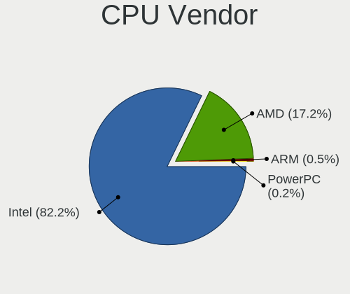

| Vendor  | Computers | Percent |
|---------|-----------|---------|
| Intel   | 459       | 81.67%  |
| AMD     | 99        | 17.62%  |
| ARM     | 3         | 0.53%   |
| PowerPC | 1         | 0.18%   |

CPU Model
---------

Processor models

| Model                                    | Computers | Percent |
|------------------------------------------|-----------|---------|
| AMD GX-412TC SOC                         | 18        | 3.18%   |
| Intel Celeron J4125 CPU @ 2.00GHz        | 14        | 2.47%   |
| Intel Celeron N5105 @ 2.00GHz            | 10        | 1.77%   |
| Intel Core i3-4010U CPU @ 1.70GHz        | 8         | 1.41%   |
| Intel Core i5-6500T CPU @ 2.50GHz        | 6         | 1.06%   |
| Intel Core i5-2520M CPU @ 2.50GHz        | 6         | 1.06%   |
| Intel Celeron CPU J1900 @ 1.99GHz        | 6         | 1.06%   |
| Intel Core i5-5300U CPU @ 2.30GHz        | 5         | 0.88%   |
| Intel Core i5-4300Y CPU @ 1.60GHz        | 5         | 0.88%   |
| AMD GX-415GA SOC with Radeon HD Graphics | 5         | 0.88%   |
| Intel Xeon CPU E3-1220 V2 @ 3.10GHz      | 4         | 0.71%   |
| Intel N95                                | 4         | 0.71%   |
| Intel Core i7-7500U CPU @ 2.70GHz        | 4         | 0.71%   |
| Intel Core i5-8265U CPU @ 1.60GHz        | 4         | 0.71%   |
| Intel Core i5-7200U CPU @ 2.50GHz        | 4         | 0.71%   |
| Intel Core i5-5250U CPU @ 1.60GHz        | 4         | 0.71%   |
| Intel Core i5-4590T CPU @ 2.00GHz        | 4         | 0.71%   |
| Intel Core i5-4570 CPU @ 3.20GHz         | 4         | 0.71%   |
| Intel Core i5-4250U CPU @ 1.30GHz        | 4         | 0.71%   |
| Intel Core i5-3470 CPU @ 3.20GHz         | 4         | 0.71%   |
| Intel Core i3-8100T CPU @ 3.10GHz        | 4         | 0.71%   |
| Intel Celeron CPU N3160 @ 1.60GHz        | 4         | 0.71%   |
| Intel Celeron CPU J3455 @ 1.50GHz        | 4         | 0.71%   |
| AMD Ryzen 7 3700X 8-Core Processor       | 4         | 0.71%   |
| Intel Xeon CPU E3-1265L V2 @ 2.50GHz     | 3         | 0.53%   |
| Intel N100                               | 3         | 0.53%   |
| Intel Core i7-6700 CPU @ 3.40GHz         | 3         | 0.53%   |
| Intel Core i7-6500U CPU @ 2.50GHz        | 3         | 0.53%   |
| Intel Core i5-9500 CPU @ 3.00GHz         | 3         | 0.53%   |
| Intel Core i5-7500 CPU @ 3.40GHz         | 3         | 0.53%   |
| Intel Core i5-5200U CPU @ 2.20GHz        | 3         | 0.53%   |
| Intel Core i5-4590 CPU @ 3.30GHz         | 3         | 0.53%   |
| Intel Core i5-4200U CPU @ 1.60GHz        | 3         | 0.53%   |
| Intel Core i5-2500K CPU @ 3.30GHz        | 3         | 0.53%   |
| Intel Core i5-10210U CPU @ 1.60GHz       | 3         | 0.53%   |
| Intel Core i5 CPU M 560 @ 2.67GH         | 3         | 0.53%   |
| Intel Core i3-3225 CPU @ 3.30GHz         | 3         | 0.53%   |
| Intel Core i3-3220 CPU @ 3.30GHz         | 3         | 0.53%   |
| Intel Core 2 Quad CPU                    | 3         | 0.53%   |
| Intel Celeron N5095 @ 2.00GHz            | 3         | 0.53%   |

CPU Model Family
----------------

Processor model prefix

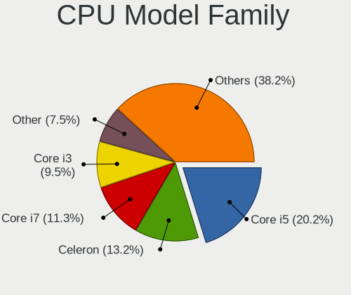

| Model                   | Computers | Percent |
|-------------------------|-----------|---------|
| Intel Core i5           | 119       | 21.06%  |
| Intel Celeron           | 74        | 13.1%   |
| Intel Core i7           | 68        | 12.04%  |
| Intel Core i3           | 56        | 9.91%   |
| Intel Xeon              | 42        | 7.43%   |
| Other                   | 32        | 5.66%   |
| AMD GX                  | 29        | 5.13%   |
| Intel Atom              | 25        | 4.42%   |
| AMD Ryzen 7             | 16        | 2.83%   |
| Intel Core 2 Duo        | 13        | 2.3%    |
| Intel Pentium           | 11        | 1.95%   |
| AMD Ryzen 5             | 11        | 1.95%   |
| Intel Core 2 Quad       | 7         | 1.24%   |
| AMD EPYC                | 6         | 1.06%   |
| Intel Pentium Gold      | 4         | 0.71%   |
| AMD Ryzen 7 PRO         | 4         | 0.71%   |
| Intel 686-class         | 3         | 0.53%   |
| ARM Cortex              | 3         | 0.53%   |
| AMD Opteron             | 3         | 0.53%   |
| AMD G                   | 3         | 0.53%   |
| AMD A8                  | 3         | 0.53%   |
| Intel Xeon Silver       | 2         | 0.35%   |
| Intel Core 2            | 2         | 0.35%   |
| AMD Ryzen 3             | 2         | 0.35%   |
| AMD E1                  | 2         | 0.35%   |
| AMD E                   | 2         | 0.35%   |
| AMD Athlon 64 X2        | 2         | 0.35%   |
| AMD Athlon              | 2         | 0.35%   |
| AMD A4                  | 2         | 0.35%   |
| AMD A10                 | 2         | 0.35%   |
| Intel Pentium Silver    | 1         | 0.18%   |
| Intel Pentium M         | 1         | 0.18%   |
| Intel Pentium Dual-Core | 1         | 0.18%   |
| Intel Pentium Dual      | 1         | 0.18%   |
| Intel Genuine           | 1         | 0.18%   |
| Intel Core M            | 1         | 0.18%   |
| Intel Core i9           | 1         | 0.18%   |
| AMD Ryzen 9             | 1         | 0.18%   |
| AMD Ryzen 5 PRO         | 1         | 0.18%   |
| AMD Phenom II X4        | 1         | 0.18%   |

CPU Cores
---------

Number of processor cores

| Number  | Computers | Percent |
|---------|-----------|---------|
| 4       | 249       | 44.07%  |
| 2       | 191       | 33.81%  |
| Unknown | 30        | 5.31%   |
| 8       | 26        | 4.6%    |
| 6       | 22        | 3.89%   |
| 16      | 18        | 3.19%   |
| 12      | 16        | 2.83%   |
| 32      | 3         | 0.53%   |
| 10      | 3         | 0.53%   |
| 1       | 3         | 0.53%   |
| 64      | 2         | 0.35%   |
| 24      | 1         | 0.18%   |
| 3       | 1         | 0.18%   |

CPU Sockets
-----------

Number of sockets

| Number  | Computers | Percent |
|---------|-----------|---------|
| 1       | 533       | 95.01%  |
| Unknown | 17        | 3.03%   |
| 2       | 9         | 1.6%    |
| 4       | 2         | 0.36%   |

CPU Threads
-----------

Threads per core (Hyper-Threading)

| Number  | Computers | Percent |
|---------|-----------|---------|
| 1       | 289       | 51.33%  |
| 2       | 243       | 43.16%  |
| Unknown | 31        | 5.51%   |

CPU Microarch
-------------

Microarchitecture

| Name          | Computers | Percent |
|---------------|-----------|---------|
| KabyLake      | 77        | 13.65%  |
| Haswell       | 66        | 11.7%   |
| Unknown       | 56        | 9.93%   |
| IvyBridge     | 45        | 7.98%   |
| Skylake       | 39        | 6.91%   |
| SandyBridge   | 37        | 6.56%   |
| Silvermont    | 30        | 5.32%   |
| Puma          | 22        | 3.9%    |
| Penryn        | 18        | 3.19%   |
| Broadwell     | 18        | 3.19%   |
| Goldmont plus | 16        | 2.84%   |
| Zen 2         | 12        | 2.13%   |
| Westmere      | 12        | 2.13%   |
| Bonnell       | 12        | 2.13%   |
| Jaguar        | 11        | 1.95%   |
| Core          | 11        | 1.95%   |
| Zen 3         | 10        | 1.77%   |
| Goldmont      | 10        | 1.77%   |
| Zen           | 9         | 1.6%    |
| Zen+          | 8         | 1.42%   |
| CometLake     | 8         | 1.42%   |
| Nehalem       | 7         | 1.24%   |
| TigerLake     | 6         | 1.06%   |
| Piledriver    | 6         | 1.06%   |
| Bobcat        | 6         | 1.06%   |
| K10           | 3         | 0.53%   |
| Excavator     | 3         | 0.53%   |
| Steamroller   | 2         | 0.35%   |
| K10 Llano     | 2         | 0.35%   |
| P6            | 1         | 0.18%   |
| K8 Hammer     | 1         | 0.18%   |

Graphics
--------

GPU Vendor
----------

Vendors of graphics cards

| Vendor                     | Computers | Percent |
|----------------------------|-----------|---------|
| Intel                      | 361       | 66.24%  |
| AMD                        | 76        | 13.94%  |
| Nvidia                     | 69        | 12.66%  |
| Matrox Electronics Systems | 24        | 4.4%    |
| ASPEED Technology          | 15        | 2.75%   |

GPU Model
---------

Graphics card models

| Model                                                                                    | Computers | Percent |
|------------------------------------------------------------------------------------------|-----------|---------|
| Intel Haswell-ULT Integrated Graphics Controller                                         | 25        | 4.5%    |
| Intel 2nd Generation Core Processor Family Integrated Graphics Controller                | 23        | 4.14%   |
| Intel HD Graphics 530                                                                    | 22        | 3.96%   |
| Intel JasperLake [UHD Graphics]                                                          | 17        | 3.06%   |
| Intel Xeon E3-1200 v3/4th Gen Core Processor Integrated Graphics Controller              | 16        | 2.88%   |
| Intel GeminiLake [UHD Graphics 600]                                                      | 16        | 2.88%   |
| Intel Atom/Celeron/Pentium Processor x5-E8000/J3xxx/N3xxx Integrated Graphics Controller | 16        | 2.88%   |
| ASPEED Technology ASPEED Graphics Family                                                 | 15        | 2.7%    |
| Intel CoffeeLake-S GT2 [UHD Graphics 630]                                                | 14        | 2.52%   |
| Intel 3rd Gen Core processor Graphics Controller                                         | 14        | 2.52%   |
| Matrox Electronics Systems MGA G200eW WPCM450                                            | 13        | 2.34%   |
| Intel Xeon E3-1200 v2/3rd Gen Core processor Graphics Controller                         | 13        | 2.34%   |
| Intel HD Graphics 620                                                                    | 13        | 2.34%   |
| Intel HD Graphics 5500                                                                   | 11        | 1.98%   |
| Intel HD Graphics 630                                                                    | 10        | 1.8%    |
| Intel Atom Processor Z36xxx/Z37xxx Series Graphics & Display                             | 10        | 1.8%    |
| Intel Alder Lake-N [UHD Graphics]                                                        | 8         | 1.44%   |
| Intel WhiskeyLake-U GT2 [UHD Graphics 620]                                               | 7         | 1.26%   |
| Intel UHD Graphics 620                                                                   | 6         | 1.08%   |
| Intel Skylake GT2 [HD Graphics 520]                                                      | 6         | 1.08%   |
| Intel Haswell-ULT Integrated Graphics Controller [HD Graphics]                           | 6         | 1.08%   |
| Intel CometLake-U GT2 [UHD Graphics]                                                     | 6         | 1.08%   |
| Intel CometLake-S GT2 [UHD Graphics 630]                                                 | 6         | 1.08%   |
| Intel Atom Processor D4xx/D5xx/N4xx/N5xx Integrated Graphics Controller                  | 6         | 1.08%   |
| Intel HD Graphics 510                                                                    | 5         | 0.9%    |
| Intel HD Graphics 500                                                                    | 5         | 0.9%    |
| AMD Kabini [Radeon HD 8330E]                                                             | 5         | 0.9%    |
| AMD ES1000                                                                               | 5         | 0.9%    |
| AMD Cezanne [Radeon Vega Series / Radeon Vega Mobile Series]                             | 5         | 0.9%    |
| Nvidia GT218 [GeForce 210]                                                               | 4         | 0.72%   |
| Matrox Electronics Systems MGA G200EH                                                    | 4         | 0.72%   |
| Intel TigerLake-LP GT2 [Iris Xe Graphics]                                                | 4         | 0.72%   |
| Intel Mobile 4 Series Chipset Integrated Graphics Controller                             | 4         | 0.72%   |
| Intel IvyBridge GT2 [HD Graphics 4000]                                                   | 4         | 0.72%   |
| Intel HD Graphics 6000                                                                   | 4         | 0.72%   |
| Intel CoffeeLake-H GT2 [UHD Graphics 630]                                                | 4         | 0.72%   |
| Intel 4th Gen Core Processor Integrated Graphics Controller                              | 4         | 0.72%   |
| AMD Renoir [Radeon RX Vega 6 (Ryzen 4000/5000 Mobile Series)]                            | 4         | 0.72%   |
| Nvidia TU116 [GeForce GTX 1660 Ti]                                                       | 3         | 0.54%   |
| Nvidia GT216GLM [Quadro FX 880M]                                                         | 3         | 0.54%   |

GPU Combo
---------

Combinations of graphics cards

| Name                     | Computers | Percent |
|--------------------------|-----------|---------|
| 1 x Intel                | 317       | 56.21%  |
| 1 x AMD                  | 70        | 12.41%  |
| Other                    | 47        | 8.33%   |
| 1 x Nvidia               | 44        | 7.8%    |
| 1 x Matrox               | 24        | 4.26%   |
| Intel + Nvidia           | 22        | 3.9%    |
| 2 x Intel                | 19        | 3.37%   |
| 1 x ASPEED               | 14        | 2.48%   |
| 2 x AMD                  | 2         | 0.35%   |
| Intel + AMD              | 2         | 0.35%   |
| Nvidia + ASPEED          | 1         | 0.18%   |
| Intel + AMD + 1 x Nvidia | 1         | 0.18%   |
| AMD + Nvidia             | 1         | 0.18%   |

GPU Driver
----------

Free vs proprietary

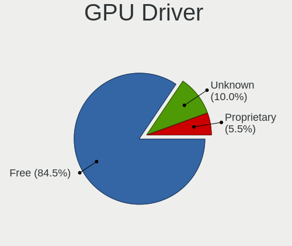

| Driver      | Computers | Percent |
|-------------|-----------|---------|
| Free        | 476       | 84.1%   |
| Unknown     | 57        | 10.07%  |
| Proprietary | 33        | 5.83%   |

GPU Memory
----------

Total video memory

| Size in GB | Computers | Percent |
|------------|-----------|---------|
| Unknown    | 503       | 89.34%  |
| 0.51-1.0   | 15        | 2.66%   |
| 0.01-0.5   | 11        | 1.95%   |
| 7.01-8.0   | 10        | 1.78%   |
| 1.01-2.0   | 9         | 1.6%    |
| 5.01-6.0   | 7         | 1.24%   |
| 3.01-4.0   | 5         | 0.89%   |
| 8.01-16.0  | 2         | 0.36%   |
| 2.01-3.0   | 1         | 0.18%   |

Monitor
-------

Monitor Vendor
--------------

Monitor vendors

| Vendor                  | Computers | Percent |
|-------------------------|-----------|---------|
| AU Optronics            | 24        | 12.18%  |
| Dell                    | 18        | 9.14%   |
| LG Display              | 17        | 8.63%   |
| Samsung Electronics     | 16        | 8.12%   |
| Chimei Innolux          | 16        | 8.12%   |
| BOE                     | 12        | 6.09%   |
| Apple                   | 12        | 6.09%   |
| Iiyama                  | 10        | 5.08%   |
| Goldstar                | 8         | 4.06%   |
| Hewlett-Packard         | 7         | 3.55%   |
| Idek Iiyama             | 5         | 2.54%   |
| Chi Mei Optoelectronics | 5         | 2.54%   |
| Acer                    | 5         | 2.54%   |
| ViewSonic               | 4         | 2.03%   |
| Philips                 | 4         | 2.03%   |
| BenQ                    | 4         | 2.03%   |
| Lenovo                  | 3         | 1.52%   |
| AOC                     | 3         | 1.52%   |
| Ancor Communications    | 3         | 1.52%   |
| Sharp                   | 2         | 1.02%   |
| LGD                     | 2         | 1.02%   |
| HUAWEI                  | 2         | 1.02%   |
| CSO                     | 2         | 1.02%   |
| Toshiba                 | 1         | 0.51%   |
| Sony                    | 1         | 0.51%   |
| PRI                     | 1         | 0.51%   |
| PKB                     | 1         | 0.51%   |
| Packard Bell            | 1         | 0.51%   |
| Nvidia                  | 1         | 0.51%   |
| LG Electronics          | 1         | 0.51%   |
| Lenovo Group Limited    | 1         | 0.51%   |
| IBM                     | 1         | 0.51%   |
| CPT                     | 1         | 0.51%   |
| CKL                     | 1         | 0.51%   |
| BOE Technology Group    | 1         | 0.51%   |
| ASUSTek Computer        | 1         | 0.51%   |

Monitor Model
-------------

Monitor models

| Model                                                                    | Computers | Percent |
|--------------------------------------------------------------------------|-----------|---------|
| Apple Color LCD APP9CF0 1440x900 290x180mm 13.4-inch                     | 4         | 2.03%   |
| Goldstar 24GM77 GSM5A91 1920x1080 530x300mm 24.0-inch                    | 3         | 1.52%   |
| BenQ EW3270U BNQ7950 3840x2160 700x390mm 31.5-inch                       | 3         | 1.52%   |
| AU Optronics LCD Monitor AUO106C 1366x768 280x160mm 12.7-inch            | 3         | 1.52%   |
| ViewSonic TD2420 SERIES VSC452D 1920x1080 520x290mm 23.4-inch            | 2         | 1.02%   |
| Philips PHL 241B8Q PHL0929 1920x1080 530x300mm 24.0-inch                 | 2         | 1.02%   |
| LGD LCD Monitor 1600x900                                                 | 2         | 1.02%   |
| LG Display LCD Monitor LGD02D8 1366x768 280x160mm 12.7-inch              | 2         | 1.02%   |
| Iiyama PL2474H IVM6146 1920x1080 520x290mm 23.4-inch                     | 2         | 1.02%   |
| Iiyama PL2474H IVM6137 1920x1080 520x290mm 23.4-inch                     | 2         | 1.02%   |
| Idek Iiyama LCD Monitor PLX2783H 1920x1080                               | 2         | 1.02%   |
| HUAWEI AD80HW HWV2402 1920x1080 530x300mm 24.0-inch                      | 2         | 1.02%   |
| Dell SE2417HGX DELD0F7 1920x1080 520x290mm 23.4-inch                     | 2         | 1.02%   |
| Dell P2214H DELA098 1920x1080 480x270mm 21.7-inch                        | 2         | 1.02%   |
| Chimei Innolux LCD Monitor CMN1343 1920x1080 280x160mm 12.7-inch         | 2         | 1.02%   |
| Chi Mei Optoelectronics LCD Monitor CMO15A7 1366x768 350x190mm 15.7-inch | 2         | 1.02%   |
| BOE LCD Monitor BOE0700 1920x1080 340x190mm 15.3-inch                    | 2         | 1.02%   |
| AU Optronics LCD Monitor AUO34ED 1920x1080 340x190mm 15.3-inch           | 2         | 1.02%   |
| AU Optronics LCD Monitor AUO313C 1366x768 310x170mm 13.9-inch            | 2         | 1.02%   |
| AU Optronics LCD Monitor AUO226D 1920x1080 280x160mm 12.7-inch           | 2         | 1.02%   |
| Apple Color LCD APPA034 2880x1800 290x180mm 13.4-inch                    | 2         | 1.02%   |
| AOC 24G1WG4 AOC2401 1920x1080 520x290mm 23.4-inch                        | 2         | 1.02%   |
| Acer V223HQ ACR0070 1920x1080 470x270mm 21.3-inch                        | 2         | 1.02%   |
| ViewSonic VA2403-FHD VSCF136 1920x1080 520x290mm 23.4-inch               | 1         | 0.51%   |
| ViewSonic VA2223-FHD VSC9239 1920x1080 480x270mm 21.7-inch               | 1         | 0.51%   |
| Toshiba TV TSB0108 1360x768 890x500mm 40.2-inch                          | 1         | 0.51%   |
| Sony TV  *00 SNYF903 3840x2160 950x540mm 43.0-inch                       | 1         | 0.51%   |
| Sharp LCD Monitor SHP14B9 3840x2160 340x190mm 15.3-inch                  | 1         | 0.51%   |
| Sharp LCD Monitor SHP1416 1366x768 310x170mm 13.9-inch                   | 1         | 0.51%   |
| Samsung Electronics SyncMaster SAM036F 1440x900 410x260mm 19.1-inch      | 1         | 0.51%   |
| Samsung Electronics LCD Monitor SyncMaster 3520x1200                     | 1         | 0.51%   |
| Samsung Electronics LCD Monitor SEC544E 1024x600 220x130mm 10.1-inch     | 1         | 0.51%   |
| Samsung Electronics LCD Monitor SEC544B 1600x900 310x170mm 13.9-inch     | 1         | 0.51%   |
| Samsung Electronics LCD Monitor SEC5448 1920x1080 410x230mm 18.5-inch    | 1         | 0.51%   |
| Samsung Electronics LCD Monitor SEC5442 1440x900 300x190mm 14.0-inch     | 1         | 0.51%   |
| Samsung Electronics LCD Monitor SEC3659 1600x900 340x190mm 15.3-inch     | 1         | 0.51%   |
| Samsung Electronics LCD Monitor SEC334A 1366x768 340x190mm 15.3-inch     | 1         | 0.51%   |
| Samsung Electronics LCD Monitor SEC3047 1366x768 280x160mm 12.7-inch     | 1         | 0.51%   |
| Samsung Electronics LCD Monitor SDC5441 1366x768 340x190mm 15.3-inch     | 1         | 0.51%   |
| Samsung Electronics LCD Monitor SDC4852 1366x768 340x190mm 15.3-inch     | 1         | 0.51%   |

Monitor Resolution
------------------

Monitor screen resolution

| Resolution         | Computers | Percent |
|--------------------|-----------|---------|
| 1920x1080 (FHD)    | 79        | 42.47%  |
| 1366x768 (WXGA)    | 35        | 18.82%  |
| 2560x1440 (QHD)    | 10        | 5.38%   |
| 1600x900 (HD+)     | 10        | 5.38%   |
| 3840x2160 (4K)     | 9         | 4.84%   |
| 1440x900 (WXGA+)   | 8         | 4.3%    |
| 1280x1024 (SXGA)   | 7         | 3.76%   |
| 1680x1050 (WSXGA+) | 6         | 3.23%   |
| 1280x800 (WXGA)    | 5         | 2.69%   |
| 1920x1200 (WUXGA)  | 4         | 2.15%   |
| 1024x600           | 3         | 1.61%   |
| 2880x1800          | 2         | 1.08%   |
| 2560x1080          | 2         | 1.08%   |
| 3520x1200          | 1         | 0.54%   |
| 2560x1600          | 1         | 0.54%   |
| 1920x540           | 1         | 0.54%   |
| 1440x960           | 1         | 0.54%   |
| 1400x1050          | 1         | 0.54%   |
| Unknown            | 1         | 0.54%   |

Monitor Diagonal
----------------

Diagonal size in inches

| Inches  | Computers | Percent |
|---------|-----------|---------|
| 13      | 40        | 20.73%  |
| 15      | 31        | 16.06%  |
| Unknown | 17        | 8.81%   |
| 24      | 15        | 7.77%   |
| 23      | 15        | 7.77%   |
| 12      | 15        | 7.77%   |
| 21      | 10        | 5.18%   |
| 27      | 9         | 4.66%   |
| 17      | 9         | 4.66%   |
| 19      | 8         | 4.15%   |
| 14      | 4         | 2.07%   |
| 31      | 3         | 1.55%   |
| 11      | 3         | 1.55%   |
| 10      | 3         | 1.55%   |
| 52      | 2         | 1.04%   |
| 43      | 1         | 0.52%   |
| 42      | 1         | 0.52%   |
| 40      | 1         | 0.52%   |
| 28      | 1         | 0.52%   |
| 26      | 1         | 0.52%   |
| 22      | 1         | 0.52%   |
| 20      | 1         | 0.52%   |
| 18      | 1         | 0.52%   |
| 9       | 1         | 0.52%   |

Monitor Width
-------------

Physical width

| Width in mm | Computers | Percent |
|-------------|-----------|---------|
| 301-350     | 61        | 31.94%  |
| 201-300     | 39        | 20.42%  |
| 501-600     | 36        | 18.85%  |
| 401-500     | 18        | 9.42%   |
| Unknown     | 17        | 8.9%    |
| 351-400     | 10        | 5.24%   |
| 601-700     | 5         | 2.62%   |
| 1001-1500   | 2         | 1.05%   |
| 901-1000    | 2         | 1.05%   |
| 801-900     | 1         | 0.52%   |

Aspect Ratio
------------

Proportional relationship between the width and the height

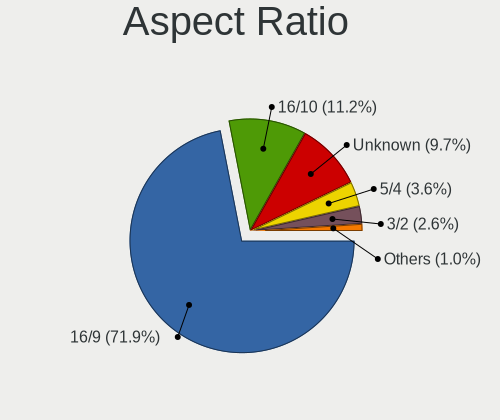

| Ratio   | Computers | Percent |
|---------|-----------|---------|
| 16/9    | 128       | 71.91%  |
| 16/10   | 20        | 11.24%  |
| Unknown | 17        | 9.55%   |
| 5/4     | 7         | 3.93%   |
| 3/2     | 4         | 2.25%   |
| 4/3     | 1         | 0.56%   |
| 21/9    | 1         | 0.56%   |

Monitor Area
------------

Area in inch

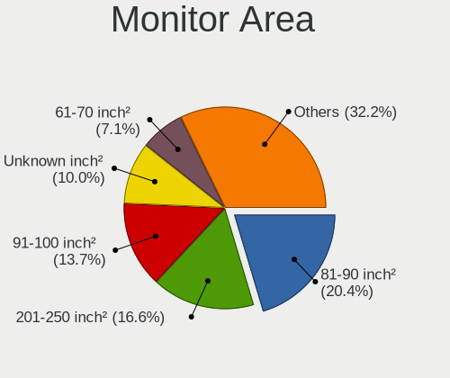

| Area in inch | Computers | Percent |
|----------------|-----------|---------|
| 81-90          | 40        | 20.83%  |
| 201-250        | 34        | 17.71%  |
| 91-100         | 27        | 14.06%  |
| Unknown        | 17        | 8.85%   |
| 61-70          | 15        | 7.81%   |
| 151-200        | 12        | 6.25%   |
| 301-350        | 10        | 5.21%   |
| 121-130        | 6         | 3.13%   |
| 41-50          | 4         | 2.08%   |
| 251-300        | 4         | 2.08%   |
| 141-150        | 4         | 2.08%   |
| 101-110        | 4         | 2.08%   |
| 71-80          | 3         | 1.56%   |
| 51-60          | 3         | 1.56%   |
| 351-500        | 3         | 1.56%   |
| 501-1000       | 3         | 1.56%   |
| More than 1000 | 2         | 1.04%   |
| 111-120        | 1         | 0.52%   |

Pixel Density
-------------

Pixels per inch

| Density       | Computers | Percent |
|---------------|-----------|---------|
| 121-160       | 62        | 32.63%  |
| 101-120       | 48        | 25.26%  |
| 51-100        | 48        | 25.26%  |
| Unknown       | 17        | 8.95%   |
| 161-240       | 9         | 4.74%   |
| More than 240 | 4         | 2.11%   |
| 1-50          | 2         | 1.05%   |

Multiple Monitors
-----------------

Total monitors connected

| Total | Computers | Percent |
|-------|-----------|---------|
| 0     | 372       | 65.03%  |
| 1     | 181       | 31.64%  |
| 2     | 16        | 2.8%    |
| 3     | 3         | 0.52%   |

Network
-------

Net Controller Vendor
---------------------

Controller vendors

| Vendor                            | Computers | Percent |
|-----------------------------------|-----------|---------|
| Intel                             | 393       | 49.13%  |
| Realtek Semiconductor             | 202       | 25.25%  |
| Broadcom                          | 59        | 7.38%   |
| Qualcomm Atheros                  | 52        | 6.5%    |
| Mellanox Technologies             | 9         | 1.13%   |
| AMD                               | 7         | 0.88%   |
| TP-Link                           | 6         | 0.75%   |
| Marvell Technology Group          | 6         | 0.75%   |
| Ralink Technology                 | 5         | 0.63%   |
| Sierra Wireless                   | 4         | 0.5%    |
| IMC Networks                      | 4         | 0.5%    |
| Xiaomi                            | 3         | 0.38%   |
| VIA Technologies                  | 3         | 0.38%   |
| Ralink                            | 3         | 0.38%   |
| Qualcomm                          | 3         | 0.38%   |
| MediaTek                          | 3         | 0.38%   |
| Huawei Technologies               | 3         | 0.38%   |
| Edimax Technology                 | 3         | 0.38%   |
| Dell                              | 3         | 0.38%   |
| D-Link System                     | 3         | 0.38%   |
| Chelsio Communications            | 3         | 0.38%   |
| Apple                             | 3         | 0.38%   |
| Samsung Electronics               | 2         | 0.25%   |
| Qualcomm Atheros Communications   | 2         | 0.25%   |
| QLogic                            | 2         | 0.25%   |
| Nvidia                            | 2         | 0.25%   |
| 3Com                              | 2         | 0.25%   |
| Silicom                           | 1         | 0.13%   |
| Sagem                             | 1         | 0.13%   |
| National Semiconductor            | 1         | 0.13%   |
| Microchip Technology              | 1         | 0.13%   |
| Hewlett-Packard                   | 1         | 0.13%   |
| Ericsson Business Mobile Networks | 1         | 0.13%   |
| Emulex                            | 1         | 0.13%   |
| Aquantia                          | 1         | 0.13%   |
| American Megatrends               | 1         | 0.13%   |
| Accton Technology                 | 1         | 0.13%   |

Net Controller Model
--------------------

Controller models

| Model                                                                         | Computers | Percent |
|-------------------------------------------------------------------------------|-----------|---------|
| Realtek RTL8111/8168/8211/8411 PCI Express Gigabit Ethernet Controller        | 164       | 16.14%  |
| Intel I211 Gigabit Network Connection                                         | 63        | 6.2%    |
| Intel I210 Gigabit Network Connection                                         | 32        | 3.15%   |
| Intel 82579LM Gigabit Network Connection (Lewisville)                         | 28        | 2.76%   |
| Intel 82574L Gigabit Network Connection                                       | 26        | 2.56%   |
| Intel Ethernet Controller I225-V                                              | 23        | 2.26%   |
| Intel Ethernet Controller I226-V                                              | 18        | 1.77%   |
| Intel Ethernet Connection I217-LM                                             | 18        | 1.77%   |
| Intel I350 Gigabit Network Connection                                         | 17        | 1.67%   |
| Realtek RTL8125 2.5GbE Controller                                             | 15        | 1.48%   |
| Intel 82599ES 10-Gigabit SFI/SFP+ Network Connection                          | 15        | 1.48%   |
| Intel Wi-Fi 6 AX200                                                           | 14        | 1.38%   |
| Intel Ethernet Connection (2) I219-LM                                         | 14        | 1.38%   |
| Intel Wireless 7265                                                           | 13        | 1.28%   |
| Intel Wireless 8265 / 8275                                                    | 12        | 1.18%   |
| Intel Centrino Advanced-N 6205 [Taylor Peak]                                  | 10        | 0.98%   |
| Qualcomm Atheros AR9485 Wireless Network Adapter                              | 9         | 0.89%   |
| Qualcomm Atheros AR9285 Wireless Network Adapter (PCI-Express)                | 9         | 0.89%   |
| Intel Wireless 7260                                                           | 9         | 0.89%   |
| Intel Wireless 8260                                                           | 8         | 0.79%   |
| Intel Dual Band Wireless-AC 3168NGW [Stone Peak]                              | 8         | 0.79%   |
| Intel Cannon Point-LP CNVi [Wireless-AC]                                      | 8         | 0.79%   |
| Intel 82576 Gigabit Network Connection                                        | 8         | 0.79%   |
| Intel 82571EB/82571GB Gigabit Ethernet Controller D0/D1 (copper applications) | 8         | 0.79%   |
| Broadcom NetXtreme II BCM5709 Gigabit Ethernet                                | 8         | 0.79%   |
| Broadcom NetXtreme BCM5720 Gigabit Ethernet PCIe                              | 8         | 0.79%   |
| Realtek RTL8821CE 802.11ac PCIe Wireless Network Adapter                      | 7         | 0.69%   |
| Realtek RTL8188EUS 802.11n Wireless Network Adapter                           | 7         | 0.69%   |
| Realtek RTL8111/8168/8411 PCI Express Gigabit Ethernet Controller             | 7         | 0.69%   |
| Qualcomm Atheros AR928X Wireless Network Adapter (PCI-Express)                | 7         | 0.69%   |
| Mellanox MT27500 Family [ConnectX-3]                                          | 7         | 0.69%   |
| Intel Ethernet Connection (7) I219-V                                          | 7         | 0.69%   |
| Intel Ethernet Connection (3) I218-LM                                         | 7         | 0.69%   |
| Broadcom BCM4360 802.11ac Dual Band Wireless Network Adapter                  | 7         | 0.69%   |
| Realtek RTL810xE PCI Express Fast Ethernet controller                         | 6         | 0.59%   |
| Qualcomm Atheros QCA9377 802.11ac Wireless Network Adapter                    | 6         | 0.59%   |
| Intel Wireless 3165                                                           | 6         | 0.59%   |
| Intel Wi-Fi 5(802.11ac) Wireless-AC 9x6x [Thunder Peak]                       | 6         | 0.59%   |
| Intel Ethernet Controller X710 for 10GbE SFP+                                 | 6         | 0.59%   |
| Intel Ethernet Connection (6) I219-V                                          | 6         | 0.59%   |

Wireless Vendor
---------------

Wireless vendors

| Vendor                          | Computers | Percent |
|---------------------------------|-----------|---------|
| Intel                           | 146       | 53.28%  |
| Qualcomm Atheros                | 44        | 16.06%  |
| Realtek Semiconductor           | 34        | 12.41%  |
| Broadcom                        | 19        | 6.93%   |
| TP-Link                         | 6         | 2.19%   |
| Ralink Technology               | 5         | 1.82%   |
| IMC Networks                    | 4         | 1.46%   |
| Ralink                          | 3         | 1.09%   |
| MediaTek                        | 3         | 1.09%   |
| Edimax Technology               | 3         | 1.09%   |
| Qualcomm Atheros Communications | 2         | 0.73%   |
| Dell                            | 2         | 0.73%   |
| Sierra Wireless                 | 1         | 0.36%   |
| Sagem                           | 1         | 0.36%   |
| Accton Technology               | 1         | 0.36%   |

Wireless Model
--------------

Wireless models

| Model                                                          | Computers | Percent |
|----------------------------------------------------------------|-----------|---------|
| Intel Wi-Fi 6 AX200                                            | 14        | 5.05%   |
| Intel Wireless 7265                                            | 13        | 4.69%   |
| Intel Wireless 8265 / 8275                                     | 12        | 4.33%   |
| Intel Centrino Advanced-N 6205 [Taylor Peak]                   | 10        | 3.61%   |
| Qualcomm Atheros AR9485 Wireless Network Adapter               | 9         | 3.25%   |
| Qualcomm Atheros AR9285 Wireless Network Adapter (PCI-Express) | 9         | 3.25%   |
| Intel Wireless 7260                                            | 9         | 3.25%   |
| Intel Wireless 8260                                            | 8         | 2.89%   |
| Intel Dual Band Wireless-AC 3168NGW [Stone Peak]               | 8         | 2.89%   |
| Intel Cannon Point-LP CNVi [Wireless-AC]                       | 8         | 2.89%   |
| Realtek RTL8821CE 802.11ac PCIe Wireless Network Adapter       | 7         | 2.53%   |
| Realtek RTL8188EUS 802.11n Wireless Network Adapter            | 7         | 2.53%   |
| Qualcomm Atheros AR928X Wireless Network Adapter (PCI-Express) | 7         | 2.53%   |
| Broadcom BCM4360 802.11ac Dual Band Wireless Network Adapter   | 7         | 2.53%   |
| Qualcomm Atheros QCA9377 802.11ac Wireless Network Adapter     | 6         | 2.17%   |
| Intel Wireless 3165                                            | 6         | 2.17%   |
| Intel Wi-Fi 5(802.11ac) Wireless-AC 9x6x [Thunder Peak]        | 6         | 2.17%   |
| Intel Comet Lake PCH-LP CNVi WiFi                              | 6         | 2.17%   |
| Intel Wi-Fi 6E(802.11ax) AX210/AX1675* 2x2 [Typhoon Peak]      | 5         | 1.81%   |
| Intel Centrino Advanced-N 6235                                 | 5         | 1.81%   |
| Realtek RTL8812AE 802.11ac PCIe Wireless Network Adapter       | 4         | 1.44%   |
| Intel Wi-Fi 6 AX201                                            | 4         | 1.44%   |
| Intel PRO/Wireless 3945ABG [Golan] Network Connection          | 4         | 1.44%   |
| Intel Cannon Lake PCH CNVi WiFi                                | 4         | 1.44%   |
| Intel Alder Lake-P PCH CNVi WiFi                               | 4         | 1.44%   |
| IMC Networks 802.11 n/g/b Wireless LAN USB Mini-Card           | 4         | 1.44%   |
| Realtek RTL8852BE PCIe 802.11ax Wireless Network Controller    | 3         | 1.08%   |
| Intel PRO/Wireless 5100 AGN [Shiloh] Network Connection        | 3         | 1.08%   |
| Edimax EW-7811Un 802.11n Wireless Adapter [Realtek RTL8188CUS] | 3         | 1.08%   |
| Broadcom BCM43224 802.11a/b/g/n                                | 3         | 1.08%   |
| TP-Link TL-WN722N v2/v3 [Realtek RTL8188EUS]                   | 2         | 0.72%   |
| TP-Link Archer T3U [Realtek RTL8812BU]                         | 2         | 0.72%   |
| Realtek RTL88x2bu [AC1200 Techkey]                             | 2         | 0.72%   |
| Realtek RTL8191SU 802.11n WLAN Adapter                         | 2         | 0.72%   |
| Realtek RTL8188EE Wireless Network Adapter                     | 2         | 0.72%   |
| Ralink RT5370 Wireless Adapter                                 | 2         | 0.72%   |
| Ralink RT3090 Wireless 802.11n 1T/1R PCIe                      | 2         | 0.72%   |
| Qualcomm Atheros QCA9565 / AR9565 Wireless Network Adapter     | 2         | 0.72%   |
| Qualcomm Atheros AR9271 802.11n                                | 2         | 0.72%   |
| Qualcomm Atheros AR93xx Wireless Network Adapter               | 2         | 0.72%   |

Ethernet Vendor
---------------

Ethernet vendors

| Vendor                   | Computers | Percent |
|--------------------------|-----------|---------|
| Intel                    | 336       | 54.19%  |
| Realtek Semiconductor    | 188       | 30.32%  |
| Broadcom                 | 42        | 6.77%   |
| Qualcomm Atheros         | 12        | 1.94%   |
| AMD                      | 7         | 1.13%   |
| Marvell Technology Group | 6         | 0.97%   |
| Xiaomi                   | 3         | 0.48%   |
| VIA Technologies         | 3         | 0.48%   |
| Qualcomm                 | 3         | 0.48%   |
| D-Link System            | 3         | 0.48%   |
| Samsung Electronics      | 2         | 0.32%   |
| QLogic                   | 2         | 0.32%   |
| Nvidia                   | 2         | 0.32%   |
| Chelsio Communications   | 2         | 0.32%   |
| Apple                    | 2         | 0.32%   |
| 3Com                     | 2         | 0.32%   |
| Silicom                  | 1         | 0.16%   |
| National Semiconductor   | 1         | 0.16%   |
| Emulex                   | 1         | 0.16%   |
| Aquantia                 | 1         | 0.16%   |
| American Megatrends      | 1         | 0.16%   |

Ethernet Model
--------------

Ethernet models

| Model                                                                         | Computers | Percent |
|-------------------------------------------------------------------------------|-----------|---------|
| Realtek RTL8111/8168/8211/8411 PCI Express Gigabit Ethernet Controller        | 164       | 22.91%  |
| Intel I211 Gigabit Network Connection                                         | 63        | 8.8%    |
| Intel I210 Gigabit Network Connection                                         | 32        | 4.47%   |
| Intel 82579LM Gigabit Network Connection (Lewisville)                         | 28        | 3.91%   |
| Intel 82574L Gigabit Network Connection                                       | 26        | 3.63%   |
| Intel Ethernet Controller I225-V                                              | 23        | 3.21%   |
| Intel Ethernet Controller I226-V                                              | 18        | 2.51%   |
| Intel Ethernet Connection I217-LM                                             | 18        | 2.51%   |
| Intel I350 Gigabit Network Connection                                         | 17        | 2.37%   |
| Realtek RTL8125 2.5GbE Controller                                             | 15        | 2.09%   |
| Intel 82599ES 10-Gigabit SFI/SFP+ Network Connection                          | 15        | 2.09%   |
| Intel Ethernet Connection (2) I219-LM                                         | 14        | 1.96%   |
| Intel 82576 Gigabit Network Connection                                        | 8         | 1.12%   |
| Intel 82571EB/82571GB Gigabit Ethernet Controller D0/D1 (copper applications) | 8         | 1.12%   |
| Broadcom NetXtreme II BCM5709 Gigabit Ethernet                                | 8         | 1.12%   |
| Broadcom NetXtreme BCM5720 Gigabit Ethernet PCIe                              | 8         | 1.12%   |
| Realtek RTL8111/8168/8411 PCI Express Gigabit Ethernet Controller             | 7         | 0.98%   |
| Intel Ethernet Connection (7) I219-V                                          | 7         | 0.98%   |
| Intel Ethernet Connection (3) I218-LM                                         | 7         | 0.98%   |
| Realtek RTL810xE PCI Express Fast Ethernet controller                         | 6         | 0.84%   |
| Intel Ethernet Controller X710 for 10GbE SFP+                                 | 6         | 0.84%   |
| Intel Ethernet Connection (6) I219-V                                          | 6         | 0.84%   |
| Intel Ethernet Connection (2) I219-V                                          | 6         | 0.84%   |
| Intel 82579V Gigabit Network Connection                                       | 6         | 0.84%   |
| AMD XGMAC 10GbE Controller                                                    | 6         | 0.84%   |
| Qualcomm Atheros AR8151 v2.0 Gigabit Ethernet                                 | 5         | 0.7%    |
| Intel Ethernet Connection (4) I219-V                                          | 5         | 0.7%    |
| Intel Ethernet Connection (11) I219-V                                         | 5         | 0.7%    |
| Broadcom NetXtreme II BCM57810 10 Gigabit Ethernet                            | 5         | 0.7%    |
| Realtek USB 2.5GbE Controller                                                 | 4         | 0.56%   |
| Intel Ethernet Controller I225-LM                                             | 4         | 0.56%   |
| Intel Ethernet Connection X553 1GbE                                           | 4         | 0.56%   |
| Intel Ethernet Connection I219-LM                                             | 4         | 0.56%   |
| Intel Ethernet Connection (7) I219-LM                                         | 4         | 0.56%   |
| Intel Ethernet Connection (5) I219-LM                                         | 4         | 0.56%   |
| Intel Ethernet Connection (4) I219-LM                                         | 4         | 0.56%   |
| Intel 82583V Gigabit Network Connection                                       | 4         | 0.56%   |
| Intel 82567LM Gigabit Network Connection                                      | 4         | 0.56%   |
| Broadcom NetXtreme II BCM5716 Gigabit Ethernet                                | 4         | 0.56%   |
| Broadcom NetXtreme BCM5722 Gigabit Ethernet PCI Express                       | 4         | 0.56%   |

Net Controller Kind
-------------------

Ethernet, WiFi or modem

| Kind     | Computers | Percent |
|----------|-----------|---------|
| Ethernet | 532       | 66.09%  |
| WiFi     | 250       | 31.06%  |
| Unknown  | 19        | 2.36%   |
| Modem    | 4         | 0.5%    |

Used Controller
---------------

Currently used network controller

| Kind     | Computers | Percent |
|----------|-----------|---------|
| Ethernet | 476       | 82.78%  |
| WiFi     | 99        | 17.22%  |

NICs
----

Total network controllers on board

| Total | Computers | Percent |
|-------|-----------|---------|
| 2     | 205       | 36.28%  |
| 1     | 110       | 19.47%  |
| 4     | 94        | 16.64%  |
| 3     | 73        | 12.92%  |
| 6     | 30        | 5.31%   |
| 5     | 26        | 4.6%    |
| 8     | 9         | 1.59%   |
| 7     | 5         | 0.88%   |
| 0     | 5         | 0.88%   |
| 12    | 2         | 0.35%   |
| 9     | 2         | 0.35%   |
| 14    | 1         | 0.18%   |
| 13    | 1         | 0.18%   |
| 11    | 1         | 0.18%   |
| 10    | 1         | 0.18%   |

IPv6
----

IPv6 vs IPv4

| Used | Computers | Percent |
|------|-----------|---------|
| No   | 457       | 77.85%  |
| Yes  | 130       | 22.15%  |

Bluetooth
---------

Bluetooth Vendor
----------------

Controller vendors

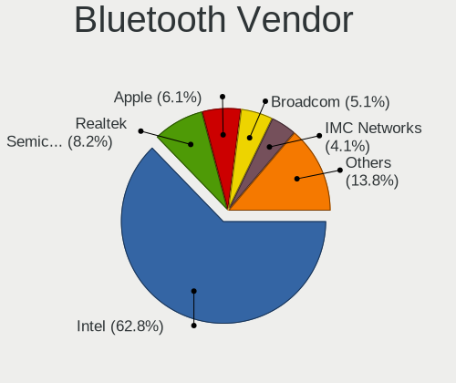

| Vendor                          | Computers | Percent |
|---------------------------------|-----------|---------|
| Intel                           | 100       | 61.73%  |
| Realtek Semiconductor           | 12        | 7.41%   |
| Apple                           | 11        | 6.79%   |
| Broadcom                        | 10        | 6.17%   |
| IMC Networks                    | 7         | 4.32%   |
| Qualcomm Atheros Communications | 4         | 2.47%   |
| Cambridge Silicon Radio         | 4         | 2.47%   |
| Foxconn / Hon Hai               | 3         | 1.85%   |
| Dell                            | 3         | 1.85%   |
| Hewlett-Packard                 | 2         | 1.23%   |
| TP-Link                         | 1         | 0.62%   |
| Sino Wealth Electronic          | 1         | 0.62%   |
| MediaTek                        | 1         | 0.62%   |
| HTC (High Tech Computer)        | 1         | 0.62%   |
| Creative Technology             | 1         | 0.62%   |
| ASUSTek Computer                | 1         | 0.62%   |

Bluetooth Model
---------------

Controller models

| Model                                                                | Computers | Percent |
|----------------------------------------------------------------------|-----------|---------|
| Intel Bluetooth wireless interface                                   | 36        | 22.22%  |
| Intel Bluetooth 9460/9560 Jefferson Peak (JfP)                       | 16        | 9.88%   |
| Intel AX200 Bluetooth                                                | 12        | 7.41%   |
| Intel AX201 Bluetooth                                                | 11        | 6.79%   |
| Realtek Bluetooth Adapter                                            | 9         | 5.56%   |
| Intel Wireless-AC 3168 Bluetooth                                     | 7         | 4.32%   |
| Intel Centrino Bluetooth Wireless Transceiver                        | 5         | 3.09%   |
| Intel AX210 Bluetooth                                                | 5         | 3.09%   |
| Apple Bluetooth Host Controller                                      | 5         | 3.09%   |
| Intel Wireless-AC 9260 Bluetooth Adapter                             | 4         | 2.47%   |
| Intel AX211 Bluetooth                                                | 4         | 2.47%   |
| IMC Networks Qualcomm Atheros Bluetooth 4.1                          | 4         | 2.47%   |
| Cambridge Silicon Radio Bluetooth Dongle (HCI mode)                  | 4         | 2.47%   |
| Apple Broadcom Built-in Bluetooth                                    | 4         | 2.47%   |
| Broadcom BCM2045B (BDC-2.1)                                          | 3         | 1.85%   |
| Realtek  Bluetooth 4.2 Adapter                                       | 2         | 1.23%   |
| HP Bluetooth 2.0 Interface [Broadcom BCM2045]                        | 2         | 1.23%   |
| Foxconn / Hon Hai Bluetooth USB Module                               | 2         | 1.23%   |
| Dell Dell Wireless 380 Bluetooth 4.0 Module                          | 2         | 1.23%   |
| Broadcom BCM20702A0 Bluetooth 4.0                                    | 2         | 1.23%   |
| Broadcom BCM20702 Bluetooth 4.0 [ThinkPad]                           | 2         | 1.23%   |
| TP-Link Bluetooth 5.0 USB Adapter                                    | 1         | 0.62%   |
| Sino Wealth Electronic RK Bluetooth Keyboar                          | 1         | 0.62%   |
| Realtek Bluetooth 4.0 Adapter                                        | 1         | 0.62%   |
| Qualcomm Atheros QCA9377 Bluetooth 4.1                               | 1         | 0.62%   |
| Qualcomm Atheros QCA61x4 Bluetooth 4.0                               | 1         | 0.62%   |
| Qualcomm Atheros Bluetooth                                           | 1         | 0.62%   |
| Qualcomm Atheros AR3011 Bluetooth                                    | 1         | 0.62%   |
| MediaTek RZ608 Bluetooth Adapter                                     | 1         | 0.62%   |
| IMC Networks Realtek Bluetooth Adapter                               | 1         | 0.62%   |
| IMC Networks Qualcomm Atheros Bluetooth 4.0 + HS                     | 1         | 0.62%   |
| IMC Networks Bluetooth Radio                                         | 1         | 0.62%   |
| HTC (High Tech Computer) Vive Hub Bluetooth 4.1 (Broadcom BCM920703) | 1         | 0.62%   |
| Foxconn / Hon Hai Bluetooth 5.2 Adapter [MediaTek MT7922]            | 1         | 0.62%   |
| Dell DW375 Bluetooth Module                                          | 1         | 0.62%   |
| Creative Creative Bluetooth Audio W2                                 | 1         | 0.62%   |
| Broadcom BCM43142A0 Bluetooth Module                                 | 1         | 0.62%   |
| Broadcom BCM2045B (BDC-2.1) [Bluetooth Controller]                   | 1         | 0.62%   |
| Broadcom BCM2045B (BDC-2) [Bluetooth Controller]                     | 1         | 0.62%   |
| ASUS Broadcom BCM20702 Single-Chip Bluetooth 4.0 + LE                | 1         | 0.62%   |

Sound
-----

Sound Vendor
------------

Sound card vendors

| Vendor                                       | Computers | Percent |
|----------------------------------------------|-----------|---------|
| Intel                                        | 360       | 68.31%  |
| AMD                                          | 80        | 15.18%  |
| Nvidia                                       | 47        | 8.92%   |
| C-Media Electronics                          | 6         | 1.14%   |
| Zoran Co. Personal Media Division (Nogatech) | 5         | 0.95%   |
| GN Netcom                                    | 5         | 0.95%   |
| Logitech                                     | 4         | 0.76%   |
| Texas Instruments                            | 2         | 0.38%   |
| Lenovo                                       | 2         | 0.38%   |
| Kingston Technology                          | 2         | 0.38%   |
| Focusrite-Novation                           | 2         | 0.38%   |
| Creative Labs                                | 2         | 0.38%   |
| ASUSTek Computer                             | 2         | 0.38%   |
| VIA Technologies                             | 1         | 0.19%   |
| Sony                                         | 1         | 0.19%   |
| MOONDROP                                     | 1         | 0.19%   |
| Micronas                                     | 1         | 0.19%   |
| iCreate Technologies                         | 1         | 0.19%   |
| Giga-Byte Technology                         | 1         | 0.19%   |
| ESS Technology                               | 1         | 0.19%   |
| DSEA A/S                                     | 1         | 0.19%   |

Sound Model
-----------

Sound card models

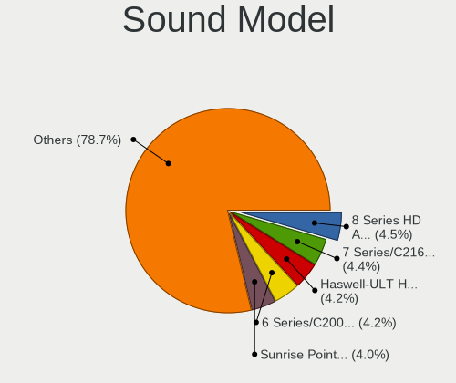

| Model                                                                                             | Computers | Percent |
|---------------------------------------------------------------------------------------------------|-----------|---------|
| Intel 8 Series HD Audio Controller                                                                | 31        | 4.85%   |
| Intel 6 Series/C200 Series Chipset Family High Definition Audio Controller                        | 30        | 4.69%   |
| Intel Haswell-ULT HD Audio Controller                                                             | 29        | 4.54%   |
| Intel 7 Series/C216 Chipset Family High Definition Audio Controller                               | 29        | 4.54%   |
| Intel Sunrise Point-LP HD Audio                                                                   | 27        | 4.23%   |
| Intel 8 Series/C220 Series Chipset High Definition Audio Controller                               | 24        | 3.76%   |
| Intel Xeon E3-1200 v3/4th Gen Core Processor HD Audio Controller                                  | 22        | 3.44%   |
| Intel 100 Series/C230 Series Chipset Family HD Audio Controller                                   | 21        | 3.29%   |
| Intel Cannon Lake PCH cAVS                                                                        | 18        | 2.82%   |
| AMD FCH Azalia Controller                                                                         | 18        | 2.82%   |
| AMD Family 17h/19h HD Audio Controller                                                            | 17        | 2.66%   |
| Intel Wildcat Point-LP High Definition Audio Controller                                           | 16        | 2.5%    |
| Intel Jasper Lake HD Audio                                                                        | 16        | 2.5%    |
| Intel Celeron/Pentium Silver Processor High Definition Audio                                      | 15        | 2.35%   |
| Intel Broadwell-U Audio Controller                                                                | 15        | 2.35%   |
| Intel NM10/ICH7 Family High Definition Audio Controller                                           | 13        | 2.03%   |
| AMD Kabini HDMI/DP Audio                                                                          | 13        | 2.03%   |
| Intel 200 Series PCH HD Audio                                                                     | 12        | 1.88%   |
| AMD Renoir Radeon High Definition Audio Controller                                                | 12        | 1.88%   |
| Intel Cannon Point-LP High Definition Audio Controller                                            | 11        | 1.72%   |
| Intel Atom/Celeron/Pentium Processor x5-E8000/J3xxx/N3xxx Series High Definition Audio Controller | 10        | 1.56%   |
| AMD Starship/Matisse HD Audio Controller                                                          | 10        | 1.56%   |
| AMD Family 17h (Models 00h-0fh) HD Audio Controller                                               | 10        | 1.56%   |
| Intel Alder Lake-N PCH High Definition Audio Controller                                           | 8         | 1.25%   |
| Intel 82801I (ICH9 Family) HD Audio Controller                                                    | 8         | 1.25%   |
| Intel 5 Series/3400 Series Chipset High Definition Audio                                          | 7         | 1.1%    |
| AMD SBx00 Azalia (Intel HDA)                                                                      | 7         | 1.1%    |
| Intel Tiger Lake-LP Smart Sound Technology Audio Controller                                       | 6         | 0.94%   |
| Intel Comet Lake PCH-LP cAVS                                                                      | 6         | 0.94%   |
| Zoran Co. Personal Media Division (Nogatech) USB Audio and HID                                    | 5         | 0.78%   |
| Nvidia High Definition Audio Controller                                                           | 5         | 0.78%   |
| Intel Comet Lake PCH cAVS                                                                         | 5         | 0.78%   |
| Intel Atom Processor Z36xxx/Z37xxx Series High Definition Audio Controller                        | 5         | 0.78%   |
| Intel Alder Lake PCH-P High Definition Audio Controller                                           | 5         | 0.78%   |
| Nvidia TU116 High Definition Audio Controller                                                     | 4         | 0.63%   |
| Nvidia GT216 HDMI Audio Controller                                                                | 4         | 0.63%   |
| Intel Tiger Lake-H HD Audio Controller                                                            | 4         | 0.63%   |
| Intel CM238 HD Audio Controller                                                                   | 4         | 0.63%   |
| Intel Celeron N3350/Pentium N4200/Atom E3900 Series Audio Cluster                                 | 4         | 0.63%   |
| AMD Turks HDMI Audio [Radeon HD 6500/6600 / 6700M Series]                                         | 4         | 0.63%   |

Memory
------

Memory Vendor
-------------

Memory module vendors

| Vendor              | Computers | Percent |
|---------------------|-----------|---------|
| Samsung Electronics | 114       | 20.77%  |
| SK hynix            | 83        | 15.12%  |
| Kingston            | 52        | 9.47%   |
| Crucial             | 52        | 9.47%   |
| Unknown             | 49        | 8.93%   |
| Micron Technology   | 44        | 8.01%   |
| Corsair             | 43        | 7.83%   |
| G.Skill             | 28        | 5.1%    |
| Transcend           | 10        | 1.82%   |
| Nanya Technology    | 10        | 1.82%   |
| Elpida              | 10        | 1.82%   |
| Unknown             | 10        | 1.82%   |
| Unknown (ABCD)      | 7         | 1.28%   |
| Kimtigo             | 5         | 0.91%   |
| A-DATA Technology   | 4         | 0.73%   |
| Wodposit            | 3         | 0.55%   |
| Patriot             | 2         | 0.36%   |
| ATP                 | 2         | 0.36%   |
| Atermiter           | 2         | 0.36%   |
| Apacer              | 2         | 0.36%   |
| 48spaces            | 2         | 0.36%   |
| V-Color             | 1         | 0.18%   |
| Unknown (0x0080)    | 1         | 0.18%   |
| Unknown (0B38)      | 1         | 0.18%   |
| Toshiba             | 1         | 0.18%   |
| Teikon              | 1         | 0.18%   |
| TakeMS              | 1         | 0.18%   |
| SHARETRONIC         | 1         | 0.18%   |
| Ramaxel Technology  | 1         | 0.18%   |
| OCZ                 | 1         | 0.18%   |
| KingFast            | 1         | 0.18%   |
| Hewlett-Packard     | 1         | 0.18%   |
| Goldenmars          | 1         | 0.18%   |
| CSX                 | 1         | 0.18%   |
| Avant               | 1         | 0.18%   |
| 2B0B00000000        | 1         | 0.18%   |

Memory Model
------------

Memory module models

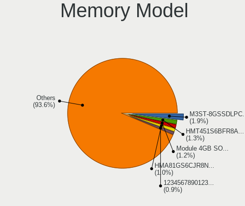

| Model                                                          | Computers | Percent |
|----------------------------------------------------------------|-----------|---------|
| Unknown                                                        | 10        | 1.71%   |
| Unknown RAM Module 4GB SODIMM DDR3 1333MT/s                    | 8         | 1.37%   |
| SK hynix RAM HMT451S6BFR8A-PB 4GB SODIMM DDR3 1600MT/s         | 8         | 1.37%   |
| SK hynix RAM HMA81GS6CJR8N-VK 8GB SODIMM DDR4 2667MT/s         | 7         | 1.2%    |
| Unknown (ABCD) RAM 123456789012345678 4GB DIMM DDR4 2400MT/s   | 6         | 1.03%   |
| Samsung RAM M471A2K43CB1-CTD 16GB SODIMM DDR4 2667MT/s         | 6         | 1.03%   |
| SK hynix RAM HMT351S6CFR8C-H9 4GB SODIMM DDR3 1333MT/s         | 5         | 0.85%   |
| Samsung RAM M471B5173QH0-YK0 4GB SODIMM DDR3 1600MT/s          | 5         | 0.85%   |
| Elpida RAM Module 4GB SODIMM DDR3 1600MT/s                     | 5         | 0.85%   |
| Corsair RAM CMK16GX4M2B3200C16 8GB DIMM DDR4 3200MT/s          | 5         | 0.85%   |
| SK hynix RAM HMA81GS6AFR8N-UH 8GB SODIMM DDR4 2400MT/s         | 4         | 0.68%   |
| Samsung RAM M471B5273DH0-CH9 4GB SODIMM DDR3 1334MT/s          | 4         | 0.68%   |
| Samsung RAM M471A1K43DB1-CTD 8GB SODIMM DDR4 2667MT/s          | 4         | 0.68%   |
| Crucial RAM CT102464BF160B.C16 8GB SODIMM DDR3 1600MT/s        | 4         | 0.68%   |
| Unknown RAM Module 8GB DIMM DDR3 1600MT/s                      | 3         | 0.51%   |
| Unknown RAM Module 4GB DIMM 1333MT/s                           | 3         | 0.51%   |
| Unknown RAM Module 2GB SODIMM DDR3 1333MT/s                    | 3         | 0.51%   |
| Transcend RAM TS1GLH64V6B3 8GB SODIMM DDR4 1333MT/s            | 3         | 0.51%   |
| SK hynix RAM HMT41GS6BFR8A-PB 8GB SODIMM DDR3 1600MT/s         | 3         | 0.51%   |
| SK hynix RAM HMT351S6BFR8C-H9 4GB SODIMM DDR3 1334MT/s         | 3         | 0.51%   |
| SK hynix RAM HMA81GU6AFR8N-UH 8GB DIMM DDR4 2400MT/s           | 3         | 0.51%   |
| Samsung RAM Module 2GB Row Of Chips LPDDR5 6400MT/s            | 3         | 0.51%   |
| Samsung RAM M471B5173EB0-YK0 4GB SODIMM DDR3 1600MT/s          | 3         | 0.51%   |
| Samsung RAM M471B5173DB0-YK0 4GB SODIMM DDR3 1600MT/s          | 3         | 0.51%   |
| Samsung RAM M471B5173BH0-YK0 4GB SODIMM DDR3 1600MT/s          | 3         | 0.51%   |
| Samsung RAM M471B1G73DB0-YK0 8GB SODIMM DDR3 1600MT/s          | 3         | 0.51%   |
| Samsung RAM M471A2K43CB1-CRC 16GB SODIMM DDR4 2400MT/s         | 3         | 0.51%   |
| Samsung RAM M471A1K43CB1-CTD 8GB SODIMM DDR4 2667MT/s          | 3         | 0.51%   |
| Samsung RAM M393A4K40CB2-CTD 32GB DIMM DDR4 2667MT/s           | 3         | 0.51%   |
| Samsung RAM M378B5273CH0-CK0 4GB DIMM DDR3 1600MT/s            | 3         | 0.51%   |
| Samsung RAM M378B5173QH0-CK0 4GB DIMM DDR3 1600MT/s            | 3         | 0.51%   |
| Samsung RAM 53D512M64D4RQ-046 4GB Row Of Chips LPDDR4 3200MT/s | 3         | 0.51%   |
| Kimtigo RAM KT8GS3EDF 8GB SODIMM DDR3 1600MT/s                 | 3         | 0.51%   |
| Wodposit RAM WPBH26D408SWA-8G 8GB SODIMM DDR4 2400MT/s         | 2         | 0.34%   |
| Unknown RAM Module 4GB DIMM DDR3 1333MT/s                      | 2         | 0.34%   |
| Unknown RAM Module 2GB SODIMM DDR3 800MT/s                     | 2         | 0.34%   |
| Unknown RAM Module 2GB SODIMM DDR2 667MT/s                     | 2         | 0.34%   |
| Unknown RAM Module 2GB SODIMM DDR2                             | 2         | 0.34%   |
| Unknown RAM Module 2GB DIMM 1333MT/s                           | 2         | 0.34%   |
| Unknown RAM Module 2048MB DIMM 800MT/s                         | 2         | 0.34%   |

Memory Kind
-----------

Memory module kinds

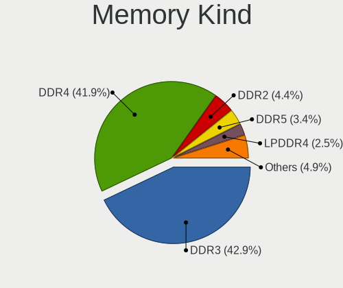

| Kind    | Computers | Percent |
|---------|-----------|---------|
| DDR3    | 223       | 45.6%   |
| DDR4    | 198       | 40.49%  |
| DDR2    | 23        | 4.7%    |
| Unknown | 14        | 2.86%   |
| LPDDR4  | 12        | 2.45%   |
| LPDDR3  | 7         | 1.43%   |
| DDR5    | 6         | 1.23%   |
| LPDDR5  | 5         | 1.02%   |
| SDRAM   | 1         | 0.2%    |

Memory Form Factor
------------------

Physical design of the memory module

| Name         | Computers | Percent |
|--------------|-----------|---------|
| SODIMM       | 263       | 53.46%  |
| DIMM         | 208       | 42.28%  |
| Row Of Chips | 13        | 2.64%   |
| Unknown      | 4         | 0.81%   |
| Chip         | 3         | 0.61%   |
| FB-DIMM      | 1         | 0.2%    |

Memory Size
-----------

Memory module size

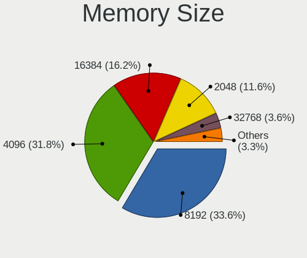

| Size  | Computers | Percent |
|-------|-----------|---------|
| 8192  | 179       | 34.16%  |
| 4096  | 175       | 33.4%   |
| 16384 | 73        | 13.93%  |
| 2048  | 65        | 12.4%   |
| 32768 | 16        | 3.05%   |
| 1024  | 14        | 2.67%   |
| 32767 | 2         | 0.38%   |

Memory Speed
------------

Memory module speed

| Speed   | Computers | Percent |
|---------|-----------|---------|
| 1600    | 146       | 28.46%  |
| 1333    | 72        | 14.04%  |
| 3200    | 65        | 12.67%  |
| 2400    | 56        | 10.92%  |
| 2667    | 49        | 9.55%   |
| 2133    | 34        | 6.63%   |
| 800     | 17        | 3.31%   |
| 1334    | 12        | 2.34%   |
| 2666    | 11        | 2.14%   |
| 667     | 11        | 2.14%   |
| 6400    | 5         | 0.97%   |
| 1867    | 5         | 0.97%   |
| 4800    | 4         | 0.78%   |
| 1066    | 4         | 0.78%   |
| Unknown | 4         | 0.78%   |
| 5600    | 2         | 0.39%   |
| 4267    | 2         | 0.39%   |
| 1067    | 2         | 0.39%   |
| 533     | 2         | 0.39%   |
| 5200    | 1         | 0.19%   |
| 3600    | 1         | 0.19%   |
| 3000    | 1         | 0.19%   |
| 2933    | 1         | 0.19%   |
| 1866    | 1         | 0.19%   |
| 1400    | 1         | 0.19%   |
| 1332    | 1         | 0.19%   |
| 1200    | 1         | 0.19%   |
| 975     | 1         | 0.19%   |
| 400     | 1         | 0.19%   |

Printers & scanners
-------------------

Printer Vendor
--------------

Printer device vendors

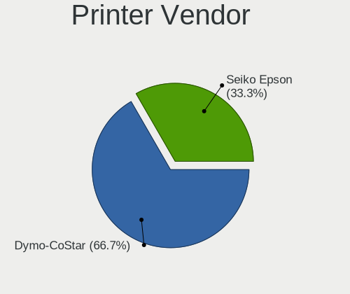

| Vendor      | Computers | Percent |
|-------------|-----------|---------|
| Dymo-CoStar | 2         | 66.67%  |
| Seiko Epson | 1         | 33.33%  |

Printer Model
-------------

Printer device models

| Model                                | Computers | Percent |
|--------------------------------------|-----------|---------|
| Seiko Epson Printer                  | 1         | 33.33%  |
| Dymo-CoStar LabelWriter 450          | 1         | 33.33%  |
| Dymo-CoStar DYMO LabelWriter 450 DUO | 1         | 33.33%  |

Scanner Vendor
--------------

Scanner device vendors

| Vendor | Computers | Percent |
|--------|-----------|---------|
| Canon  | 1         | 100%    |

Scanner Model
-------------

Scanner device models

| Model                  | Computers | Percent |
|------------------------|-----------|---------|
| Canon CanoScan LIDE 25 | 1         | 100%    |

Camera
------

Camera Vendor
-------------

Camera device vendors

| Vendor                                 | Computers | Percent |
|----------------------------------------|-----------|---------|
| Chicony Electronics                    | 35        | 29.17%  |
| Sunplus Innovation Technology          | 12        | 10%     |
| Realtek Semiconductor                  | 10        | 8.33%   |
| Bison Electronics                      | 10        | 8.33%   |
| Microdia                               | 9         | 7.5%    |
| IMC Networks                           | 9         | 7.5%    |
| Logitech                               | 6         | 5%      |
| Cheng Uei Precision Industry (Foxlink) | 5         | 4.17%   |
| Syntek                                 | 4         | 3.33%   |
| Lite-On Technology                     | 4         | 3.33%   |
| Quanta                                 | 3         | 2.5%    |
| ARC International                      | 3         | 2.5%    |
| Suyin                                  | 2         | 1.67%   |
| Alcor Micro                            | 2         | 1.67%   |
| Z-Star Microelectronics                | 1         | 0.83%   |
| ValueHD                                | 1         | 0.83%   |
| SIMPLO Technology                      | 1         | 0.83%   |
| Shenzhen Kingcome Optoelectronic       | 1         | 0.83%   |
| Novatek Microelectronics               | 1         | 0.83%   |
| Apple                                  | 1         | 0.83%   |

Camera Model
------------

Camera device models

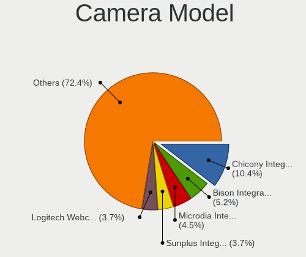

| Model                                                 | Computers | Percent |
|-------------------------------------------------------|-----------|---------|
| Chicony Integrated Camera                             | 11        | 9.09%   |
| Bison Integrated Camera                               | 7         | 5.79%   |
| Sunplus Integrated_Webcam_HD                          | 5         | 4.13%   |
| Realtek Integrated_Webcam_HD                          | 4         | 3.31%   |
| Microdia Integrated_Webcam_HD                         | 4         | 3.31%   |
| Logitech Webcam C270                                  | 4         | 3.31%   |
| Chicony HD WebCam                                     | 4         | 3.31%   |
| Syntek Integrated Camera                              | 3         | 2.48%   |
| Microdia Integrated Webcam                            | 3         | 2.48%   |
| Lite-On Integrated Camera                             | 3         | 2.48%   |
| Chicony Lenovo Integrated Camera (0.3MP)              | 3         | 2.48%   |
| ARC International Camera                              | 3         | 2.48%   |
| Realtek USB Camera                                    | 2         | 1.65%   |
| Logitech C922 Pro Stream Webcam                       | 2         | 1.65%   |
| IMC Networks USB2.0 HD UVC WebCam                     | 2         | 1.65%   |
| IMC Networks Realtek PC Camera                        | 2         | 1.65%   |
| IMC Networks EasyCamera                               | 2         | 1.65%   |
| Chicony TOSHIBA Web Camera - HD                       | 2         | 1.65%   |
| Chicony Realtek DMFT RGB                              | 2         | 1.65%   |
| Cheng Uei Precision Industry (Foxlink) HP HD Webcam   | 2         | 1.65%   |
| Bison SunplusIT Integrated Camera                     | 2         | 1.65%   |
| Z-Star Webcam                                         | 1         | 0.83%   |
| ValueHD HD Camera                                     | 1         | 0.83%   |
| Syntek Lenovo EasyCamera                              | 1         | 0.83%   |
| Suyin USB 2.0 Camera                                  | 1         | 0.83%   |
| Suyin Laptop_Integrated_Webcam_FHD                    | 1         | 0.83%   |
| Sunplus Laptop_Integrated_Webcam_HD                   | 1         | 0.83%   |
| Sunplus Laptop_Integrated_Webcam_FHD                  | 1         | 0.83%   |
| Sunplus Integrated_Webcam_FHD                         | 1         | 0.83%   |
| Sunplus Integrated HD Webcam                          | 1         | 0.83%   |
| Sunplus Hy HD Camera                                  | 1         | 0.83%   |
| Sunplus Dell Integrated Webcam                        | 1         | 0.83%   |
| Sunplus Asus Webcam                                   | 1         | 0.83%   |
| SIMPLO USB 2.0 Camera                                 | 1         | 0.83%   |
| Shenzhen Kingcome Optoelectronic USB2.0 HD UVC WebCam | 1         | 0.83%   |
| Realtek USB 2.0 PC Camera                             | 1         | 0.83%   |
| Realtek Lenovo EasyCamera                             | 1         | 0.83%   |
| Realtek Integrated_Webcam_FHD                         | 1         | 0.83%   |
| Realtek Integrated Webcam HD                          | 1         | 0.83%   |
| Quanta Realtek DMFT RGB                               | 1         | 0.83%   |

Security
--------

Fingerprint Vendor
------------------

Fingerprint sensor vendors

| Vendor                     | Computers | Percent |
|----------------------------|-----------|---------|
| Validity Sensors           | 12        | 33.33%  |
| Synaptics                  | 7         | 19.44%  |
| AuthenTec                  | 6         | 16.67%  |
| Shenzhen Goodix Technology | 3         | 8.33%   |
| LighTuning Technology      | 3         | 8.33%   |
| Upek                       | 2         | 5.56%   |
| Elan Microelectronics      | 2         | 5.56%   |
| Broadcom                   | 1         | 2.78%   |

Fingerprint Model
-----------------

Fingerprint sensor models

| Model                                                                        | Computers | Percent |
|------------------------------------------------------------------------------|-----------|---------|
| Synaptics Prometheus MIS Touch Fingerprint Reader                            | 5         | 13.89%  |
| Validity Sensors VFS7500 Touch Fingerprint Sensor                            | 3         | 8.33%   |
| Validity Sensors VFS 5011 fingerprint sensor                                 | 3         | 8.33%   |
| Shenzhen Goodix Fingerprint Reader                                           | 3         | 8.33%   |
| Validity Sensors Synaptics WBDI                                              | 2         | 5.56%   |
| Upek Biometric Touchchip/Touchstrip Fingerprint Sensor                       | 2         | 5.56%   |
| LighTuning ES603 Swipe Fingerprint Sensor                                    | 2         | 5.56%   |
| Elan Fingerprint Sensor                                                      | 2         | 5.56%   |
| AuthenTec AES2810                                                            | 2         | 5.56%   |
| AuthenTec AES1660                                                            | 2         | 5.56%   |
| Validity Sensors VFS495 Fingerprint Reader                                   | 1         | 2.78%   |
| Validity Sensors VFS491                                                      | 1         | 2.78%   |
| Validity Sensors VFS451 Fingerprint Reader                                   | 1         | 2.78%   |
| Validity Sensors VFS Fingerprint sensor                                      | 1         | 2.78%   |
| Synaptics UWP WBDI Device                                                    | 1         | 2.78%   |
| Synaptics Metallica MIS Touch Fingerprint Reader                             | 1         | 2.78%   |
| LighTuning EgisTec Touch Fingerprint Sensor                                  | 1         | 2.78%   |
| Broadcom BCM5880 Secure Applications Processor with fingerprint swipe sensor | 1         | 2.78%   |
| AuthenTec AES2550 Fingerprint Sensor                                         | 1         | 2.78%   |
| AuthenTec AES2501 Fingerprint Sensor                                         | 1         | 2.78%   |

Chipcard Vendor
---------------

Chipcard module vendors

Zero info for selected period =(

Chipcard Model
--------------

Chipcard module models

Zero info for selected period =(

Unsupported
-----------

Unsupported Devices
-------------------

Total unsupported devices on board

| Total | Computers | Percent |
|-------|-----------|---------|
| 1     | 250       | 42.52%  |
| 0     | 152       | 25.85%  |
| 2     | 110       | 18.71%  |
| 3     | 48        | 8.16%   |
| 4     | 21        | 3.57%   |
| 6     | 4         | 0.68%   |
| 5     | 2         | 0.34%   |
| 7     | 1         | 0.17%   |

Unsupported Device Types
------------------------

Types of unsupported devices

| Type                     | Computers | Percent |
|--------------------------|-----------|---------|
| Communication controller | 362       | 56.74%  |
| Net/wireless             | 75        | 11.76%  |
| Bluetooth                | 73        | 11.44%  |
| Card reader              | 36        | 5.64%   |
| Fingerprint reader       | 28        | 4.39%   |
| Firewire controller      | 25        | 3.92%   |
| Sound                    | 10        | 1.57%   |
| Net/ethernet             | 10        | 1.57%   |
| Graphics card            | 7         | 1.1%    |
| Storage                  | 5         | 0.78%   |
| Storage/raid             | 3         | 0.47%   |
| Network                  | 3         | 0.47%   |
| Modem                    | 1         | 0.16%   |

