BSD in France - Tested Hardware & Statistics (Desktops)
-------------------------------------------------------

A project to collect tested hardware configurations for BSD in France.

Anyone can contribute to this report by the [hw-probe](https://github.com/linuxhw/hw-probe/blob/master/INSTALL.BSD.md) tool:

    hw-probe -all -upload

Please contribute! Especially if your hardware is rare.

Contents
--------

* [ Test Cases ](#test-cases)

* [ System ](#system)
  - [ OS                       ](#os)
  - [ OS Family                ](#os-family)
  - [ Arch                     ](#arch)
  - [ DE                       ](#de)
  - [ Display Server           ](#display-server)
  - [ Display Manager          ](#display-manager)
  - [ OS Lang                  ](#os-lang)
  - [ Boot Mode                ](#boot-mode)
  - [ Filesystem               ](#filesystem)
  - [ Part. scheme             ](#part-scheme)

* [ Board ](#board)
  - [ Vendor                   ](#vendor)
  - [ Model                    ](#model)
  - [ Model Family             ](#model-family)
  - [ MFG Year                 ](#mfg-year)
  - [ Form Factor              ](#form-factor)
  - [ Coreboot                 ](#coreboot)
  - [ RAM Size                 ](#ram-size)
  - [ RAM Used                 ](#ram-used)
  - [ Total Drives             ](#total-drives)
  - [ Has CD-ROM               ](#has-cd-rom)
  - [ Has Ethernet             ](#has-ethernet)
  - [ Has WiFi                 ](#has-wifi)
  - [ Has Bluetooth            ](#has-bluetooth)

* [ Location ](#location)
  - [ Country                  ](#country)
  - [ City                     ](#city)

* [ Drives ](#drives)
  - [ Drive Vendor             ](#drive-vendor)
  - [ Drive Model              ](#drive-model)
  - [ HDD Vendor               ](#hdd-vendor)
  - [ SSD Vendor               ](#ssd-vendor)
  - [ Drive Kind               ](#drive-kind)
  - [ Drive Connector          ](#drive-connector)
  - [ Drive Size               ](#drive-size)
  - [ Space Total              ](#space-total)
  - [ Space Used               ](#space-used)
  - [ Malfunc. Drives          ](#malfunc-drives)
  - [ Malfunc. Drive Vendor    ](#malfunc-drive-vendor)
  - [ Malfunc. HDD Vendor      ](#malfunc-hdd-vendor)
  - [ Malfunc. Drive Kind      ](#malfunc-drive-kind)
  - [ Failed Drives            ](#failed-drives)
  - [ Failed Drive Vendor      ](#failed-drive-vendor)
  - [ Drive Status             ](#drive-status)

* [ Storage controller ](#storage-controller)
  - [ Storage Vendor           ](#storage-vendor)
  - [ Storage Model            ](#storage-model)
  - [ Storage Kind             ](#storage-kind)

* [ Processor ](#processor)
  - [ CPU Vendor               ](#cpu-vendor)
  - [ CPU Model                ](#cpu-model)
  - [ CPU Model Family         ](#cpu-model-family)
  - [ CPU Cores                ](#cpu-cores)
  - [ CPU Sockets              ](#cpu-sockets)
  - [ CPU Threads              ](#cpu-threads)
  - [ CPU Microarch            ](#cpu-microarch)

* [ Graphics ](#graphics)
  - [ GPU Vendor               ](#gpu-vendor)
  - [ GPU Model                ](#gpu-model)
  - [ GPU Combo                ](#gpu-combo)
  - [ GPU Driver               ](#gpu-driver)
  - [ GPU Memory               ](#gpu-memory)

* [ Monitor ](#monitor)
  - [ Monitor Vendor           ](#monitor-vendor)
  - [ Monitor Model            ](#monitor-model)
  - [ Monitor Resolution       ](#monitor-resolution)
  - [ Monitor Diagonal         ](#monitor-diagonal)
  - [ Monitor Width            ](#monitor-width)
  - [ Aspect Ratio             ](#aspect-ratio)
  - [ Monitor Area             ](#monitor-area)
  - [ Pixel Density            ](#pixel-density)
  - [ Multiple Monitors        ](#multiple-monitors)

* [ Network ](#network)
  - [ Net Controller Vendor    ](#net-controller-vendor)
  - [ Net Controller Model     ](#net-controller-model)
  - [ Wireless Vendor          ](#wireless-vendor)
  - [ Wireless Model           ](#wireless-model)
  - [ Ethernet Vendor          ](#ethernet-vendor)
  - [ Ethernet Model           ](#ethernet-model)
  - [ Net Controller Kind      ](#net-controller-kind)
  - [ Used Controller          ](#used-controller)
  - [ NICs                     ](#nics)
  - [ IPv6                     ](#ipv6)

* [ Bluetooth ](#bluetooth)
  - [ Bluetooth Vendor         ](#bluetooth-vendor)
  - [ Bluetooth Model          ](#bluetooth-model)

* [ Sound ](#sound)
  - [ Sound Vendor             ](#sound-vendor)
  - [ Sound Model              ](#sound-model)

* [ Memory ](#memory)
  - [ Memory Vendor            ](#memory-vendor)
  - [ Memory Model             ](#memory-model)
  - [ Memory Kind              ](#memory-kind)
  - [ Memory Form Factor       ](#memory-form-factor)
  - [ Memory Size              ](#memory-size)
  - [ Memory Speed             ](#memory-speed)

* [ Printers & scanners ](#printers--scanners)
  - [ Printer Vendor           ](#printer-vendor)
  - [ Printer Model            ](#printer-model)
  - [ Scanner Vendor           ](#scanner-vendor)
  - [ Scanner Model            ](#scanner-model)

* [ Camera ](#camera)
  - [ Camera Vendor            ](#camera-vendor)
  - [ Camera Model             ](#camera-model)

* [ Security ](#security)
  - [ Fingerprint Vendor       ](#fingerprint-vendor)
  - [ Fingerprint Model        ](#fingerprint-model)
  - [ Chipcard Vendor          ](#chipcard-vendor)
  - [ Chipcard Model           ](#chipcard-model)

* [ Unsupported ](#unsupported)
  - [ Unsupported Devices      ](#unsupported-devices)
  - [ Unsupported Device Types ](#unsupported-device-types)

Test Cases
----------

Total: 766

| Vendor        | Model                       | Probe                                                     | Date         |
|---------------|-----------------------------|-----------------------------------------------------------|--------------|
| PC Engines    | APU2                        | [6a6b0755a9](https://bsd-hardware.info/?probe=6a6b0755a9) | Jan 02, 2026 |
| ASRock        | C2750D4I                    | [7bcc9f9bdd](https://bsd-hardware.info/?probe=7bcc9f9bdd) | Dec 31, 2025 |
| PC Engines    | APU2                        | [0896f72a74](https://bsd-hardware.info/?probe=0896f72a74) | Dec 27, 2025 |
| Gigabyte      | B560M DS3H                  | [ab9b132a7a](https://bsd-hardware.info/?probe=ab9b132a7a) | Dec 26, 2025 |
| Biostar       | A68MD PRO                   | [5a20676e81](https://bsd-hardware.info/?probe=5a20676e81) | Dec 25, 2025 |
| NEC Comput... | NEC Versa Premium           | [ed974ec3ae](https://bsd-hardware.info/?probe=ed974ec3ae) | Dec 13, 2025 |
| ASRock        | A520M Phantom Gaming 4      | [3456daffa8](https://bsd-hardware.info/?probe=3456daffa8) | Dec 10, 2025 |
| Unknown       | Unknown                     | [50deb3943f](https://bsd-hardware.info/?probe=50deb3943f) | Dec 07, 2025 |
| Unknown       | Unknown                     | [bcf5c05b84](https://bsd-hardware.info/?probe=bcf5c05b84) | Dec 06, 2025 |
| Lenovo        | ThinkStation S20 4157A5G    | [ed445f9da4](https://bsd-hardware.info/?probe=ed445f9da4) | Dec 01, 2025 |
| PC Engines    | apu1                        | [836bbe183c](https://bsd-hardware.info/?probe=836bbe183c) | Nov 29, 2025 |
| Unknown       | Unknown                     | [6342755e7a](https://bsd-hardware.info/?probe=6342755e7a) | Nov 28, 2025 |
| HP            | ProLiant MicroServer Gen... | [7b2aec3868](https://bsd-hardware.info/?probe=7b2aec3868) | Nov 24, 2025 |
| OEM           | PB-1900-A                   | [ed6055ab00](https://bsd-hardware.info/?probe=ed6055ab00) | Nov 23, 2025 |
| Supermicro    | X7SPA-HF                    | [967c8d1062](https://bsd-hardware.info/?probe=967c8d1062) | Nov 22, 2025 |
| Supermicro    | X11SDV-8C-TP8F              | [8871062a8e](https://bsd-hardware.info/?probe=8871062a8e) | Nov 22, 2025 |
| Intel         | JSL MRD                     | [e087e9c415](https://bsd-hardware.info/?probe=e087e9c415) | Nov 22, 2025 |
| Fujitsu       | D3313-E1 S26361-D3313-E1    | [c2323850a3](https://bsd-hardware.info/?probe=c2323850a3) | Nov 15, 2025 |
| Unknown       | Unknown                     | [92a2b0879e](https://bsd-hardware.info/?probe=92a2b0879e) | Nov 12, 2025 |
| Intel         | JSL MRD                     | [3ca63c37f7](https://bsd-hardware.info/?probe=3ca63c37f7) | Nov 11, 2025 |
| Unknown       | Unknown                     | [fa1bbcca2d](https://bsd-hardware.info/?probe=fa1bbcca2d) | Nov 08, 2025 |
| Unknown       | 6098002                     | [2f13f28f5c](https://bsd-hardware.info/?probe=2f13f28f5c) | Nov 05, 2025 |
| Pegatron      | 2A99                        | [3dd057a760](https://bsd-hardware.info/?probe=3dd057a760) | Oct 26, 2025 |
| Pegatron      | 2A99                        | [7324fbc91d](https://bsd-hardware.info/?probe=7324fbc91d) | Oct 26, 2025 |
| ASRock        | A520M Phantom Gaming 4      | [e6ab4d43e1](https://bsd-hardware.info/?probe=e6ab4d43e1) | Oct 24, 2025 |
| Unknown       | Unknown                     | [37b964adef](https://bsd-hardware.info/?probe=37b964adef) | Oct 24, 2025 |
| Intel         | QHSW02                      | [f01ffaf8e5](https://bsd-hardware.info/?probe=f01ffaf8e5) | Oct 23, 2025 |
| Unknown       | 6098003                     | [afcb2fe62d](https://bsd-hardware.info/?probe=afcb2fe62d) | Oct 20, 2025 |
| PC Engines    | apu4                        | [18b793447d](https://bsd-hardware.info/?probe=18b793447d) | Oct 13, 2025 |
| Protectli     | FW4A Ver                    | [816e3524c9](https://bsd-hardware.info/?probe=816e3524c9) | Oct 12, 2025 |
| ASRock        | A520M Phantom Gaming 4      | [111501657e](https://bsd-hardware.info/?probe=111501657e) | Oct 10, 2025 |
| Unknown       | Unknown                     | [b4903f8131](https://bsd-hardware.info/?probe=b4903f8131) | Oct 07, 2025 |
| ASUSTek       | PRIME B660M-A D4            | [0924eb3aec](https://bsd-hardware.info/?probe=0924eb3aec) | Oct 06, 2025 |
| ASUSTek       | PRIME B660M-A D4            | [220280c784](https://bsd-hardware.info/?probe=220280c784) | Oct 06, 2025 |
| MSI           | MS-7D73                     | [d29930c054](https://bsd-hardware.info/?probe=d29930c054) | Oct 06, 2025 |
| Intel         | Q3XXG4-P V1.0               | [354f77dff9](https://bsd-hardware.info/?probe=354f77dff9) | Oct 04, 2025 |
| ASUSTek       | PRIME B650M-K               | [3a59bb574c](https://bsd-hardware.info/?probe=3a59bb574c) | Oct 01, 2025 |
| Pegatron      | 2A99                        | [fe0667c3c4](https://bsd-hardware.info/?probe=fe0667c3c4) | Oct 01, 2025 |
| HP            | 3031h                       | [60f120fcf5](https://bsd-hardware.info/?probe=60f120fcf5) | Oct 01, 2025 |
| ASUSTek       | PRIME B760M-A D4            | [763ff5ec01](https://bsd-hardware.info/?probe=763ff5ec01) | Sep 26, 2025 |
| MSI           | H170M PRO-DH                | [76b6247bda](https://bsd-hardware.info/?probe=76b6247bda) | Sep 24, 2025 |
| PC Engines    | apu4                        | [71d5e21723](https://bsd-hardware.info/?probe=71d5e21723) | Sep 19, 2025 |
| Lenovo        | 30D2 SDK0J40697 WIN 3305... | [061875850c](https://bsd-hardware.info/?probe=061875850c) | Sep 14, 2025 |
| Fujitsu       | D3313-G1 S26361-D3313-G1    | [2e2bec92c7](https://bsd-hardware.info/?probe=2e2bec92c7) | Sep 04, 2025 |
| Unknown       | Unknown                     | [3c0c13607d](https://bsd-hardware.info/?probe=3c0c13607d) | Sep 03, 2025 |
| TianBei       | WTR PRO                     | [32673c7817](https://bsd-hardware.info/?probe=32673c7817) | Aug 30, 2025 |
| MSI           | H170M PRO-DH                | [2583d9b37d](https://bsd-hardware.info/?probe=2583d9b37d) | Aug 25, 2025 |
| Unknown       | QDNV01                      | [ee1be4f683](https://bsd-hardware.info/?probe=ee1be4f683) | Aug 24, 2025 |
| Protectli     | FW6 Ver                     | [78294e3862](https://bsd-hardware.info/?probe=78294e3862) | Aug 21, 2025 |
| Unknown       | Unknown                     | [328b0eac55](https://bsd-hardware.info/?probe=328b0eac55) | Aug 20, 2025 |
| PC Engines    | APU3                        | [643dd27e15](https://bsd-hardware.info/?probe=643dd27e15) | Aug 18, 2025 |
| PC Engines    | APU3                        | [05fd64a886](https://bsd-hardware.info/?probe=05fd64a886) | Aug 15, 2025 |
| Protectli     | FW4A Ver                    | [42c90977ac](https://bsd-hardware.info/?probe=42c90977ac) | Aug 07, 2025 |
| Unknown       | Unknown                     | [2657def04b](https://bsd-hardware.info/?probe=2657def04b) | Aug 03, 2025 |
| Unknown       | Unknown                     | [c1a6e9d712](https://bsd-hardware.info/?probe=c1a6e9d712) | Aug 01, 2025 |
| Unknown       | QDNV01                      | [f7c2803722](https://bsd-hardware.info/?probe=f7c2803722) | Jul 29, 2025 |
| PC Engines    | APU2                        | [dd733b15fb](https://bsd-hardware.info/?probe=dd733b15fb) | Jul 27, 2025 |
| Gigabyte      | B450 AORUS PRO-CF           | [7cc563491d](https://bsd-hardware.info/?probe=7cc563491d) | Jul 24, 2025 |
| Unknown       | Unknown                     | [f9ae955ed6](https://bsd-hardware.info/?probe=f9ae955ed6) | Jul 23, 2025 |
| HP            | 3031h                       | [0ea19b405f](https://bsd-hardware.info/?probe=0ea19b405f) | Jul 23, 2025 |
| Dell          | 04Y8V0 A02                  | [676f268269](https://bsd-hardware.info/?probe=676f268269) | Jul 20, 2025 |
| Gigabyte      | B450 AORUS PRO-CF           | [fadd827f96](https://bsd-hardware.info/?probe=fadd827f96) | Jul 19, 2025 |
| HP            | 21EF                        | [e47ffa047c](https://bsd-hardware.info/?probe=e47ffa047c) | Jul 18, 2025 |
| HP            | 21EF                        | [ad89678ca6](https://bsd-hardware.info/?probe=ad89678ca6) | Jul 17, 2025 |
| PC Engines    | APU2                        | [8500f9d1c5](https://bsd-hardware.info/?probe=8500f9d1c5) | Jul 14, 2025 |
| Dell          | 0T7D40 A00                  | [6e794a0a02](https://bsd-hardware.info/?probe=6e794a0a02) | Jul 12, 2025 |
| HP            | 21EF                        | [336bbc47d8](https://bsd-hardware.info/?probe=336bbc47d8) | Jul 06, 2025 |
| Unknown       | Unknown                     | [a5410461a7](https://bsd-hardware.info/?probe=a5410461a7) | Jun 28, 2025 |
| Supermicro    | X10SDE-DF                   | [83e8966fbe](https://bsd-hardware.info/?probe=83e8966fbe) | Jun 25, 2025 |
| Protectli     | FW6 Ver                     | [a33d4df9ee](https://bsd-hardware.info/?probe=a33d4df9ee) | Jun 23, 2025 |
| Protectli     | FW6 Ver                     | [0f5aca114c](https://bsd-hardware.info/?probe=0f5aca114c) | Jun 22, 2025 |
| Unknown       | Unknown                     | [5430bb8019](https://bsd-hardware.info/?probe=5430bb8019) | Jun 21, 2025 |
| Dell          | 0T7D40 A00                  | [8d6550f7e2](https://bsd-hardware.info/?probe=8d6550f7e2) | Jun 21, 2025 |
| Lanner Ele... | NCA-1515A-EK6               | [f62c5fefb2](https://bsd-hardware.info/?probe=f62c5fefb2) | Jun 11, 2025 |
| CWWK          | CW-AD4L-N V1                | [cb25ca97d4](https://bsd-hardware.info/?probe=cb25ca97d4) | Jun 04, 2025 |
| CWWK          | CW-AD4L-N V1                | [c05986f15f](https://bsd-hardware.info/?probe=c05986f15f) | Jun 04, 2025 |
| ASUSTek       | H81M-PLUS                   | [ea96f86242](https://bsd-hardware.info/?probe=ea96f86242) | Jun 02, 2025 |
| Unknown       | Unknown                     | [ec316409e3](https://bsd-hardware.info/?probe=ec316409e3) | May 28, 2025 |
| ASRockRack    | B550D4U-2T R1.00            | [8557dc9aee](https://bsd-hardware.info/?probe=8557dc9aee) | May 24, 2025 |
| Unknown       | Unknown                     | [d393da59af](https://bsd-hardware.info/?probe=d393da59af) | May 19, 2025 |
| Protectli     | VP6630                      | [c5d10d8cd8](https://bsd-hardware.info/?probe=c5d10d8cd8) | May 18, 2025 |
| Unknown       | Unknown                     | [ed36dbfb30](https://bsd-hardware.info/?probe=ed36dbfb30) | May 18, 2025 |
| TB            | WTR R1                      | [30ca4d57e7](https://bsd-hardware.info/?probe=30ca4d57e7) | May 17, 2025 |
| Shenzhen M... | AHWSA                       | [0d8e8a4db2](https://bsd-hardware.info/?probe=0d8e8a4db2) | May 15, 2025 |
| Intel         | Q3XXG4-P V1.0               | [61dba8c36d](https://bsd-hardware.info/?probe=61dba8c36d) | May 10, 2025 |
| CWWK          | CW-AD4L-N V1                | [bfb8de3f15](https://bsd-hardware.info/?probe=bfb8de3f15) | May 07, 2025 |
| Unknown       | QDNV01                      | [a2e89f3eea](https://bsd-hardware.info/?probe=a2e89f3eea) | May 03, 2025 |
| MSI           | H170M PRO-DH                | [24c5a13d8a](https://bsd-hardware.info/?probe=24c5a13d8a) | May 03, 2025 |
| Intel         | Q3XXG4-P V1.0               | [f5a7bdf148](https://bsd-hardware.info/?probe=f5a7bdf148) | Apr 30, 2025 |
| ASUSTek       | P11C-M-10G-2T Series        | [f8cf09267a](https://bsd-hardware.info/?probe=f8cf09267a) | Apr 29, 2025 |
| MSI           | H170M PRO-DH                | [79786044d1](https://bsd-hardware.info/?probe=79786044d1) | Apr 28, 2025 |
| Fujitsu Si... | D2824-A1 S26361-D2824-A1    | [a0387911a7](https://bsd-hardware.info/?probe=a0387911a7) | Apr 23, 2025 |
| Fujitsu Si... | D2824-A1 S26361-D2824-A1    | [f67a788bc0](https://bsd-hardware.info/?probe=f67a788bc0) | Apr 23, 2025 |
| Dell          | 0T7D40 A00                  | [ac31577c7d](https://bsd-hardware.info/?probe=ac31577c7d) | Apr 21, 2025 |
| Unknown       | Unknown                     | [70d10b3ca4](https://bsd-hardware.info/?probe=70d10b3ca4) | Apr 21, 2025 |
| Intel         | Q3XXG4-P V1.0               | [d16c2472b7](https://bsd-hardware.info/?probe=d16c2472b7) | Apr 20, 2025 |
| Supermicro    | X11SDV-8C-TP8F              | [0b5bbee8bb](https://bsd-hardware.info/?probe=0b5bbee8bb) | Apr 20, 2025 |
| Intel         | Q3XXG4-P V1.0               | [ed57fcb123](https://bsd-hardware.info/?probe=ed57fcb123) | Apr 19, 2025 |
| Fujitsu       | D3313-A1 S26361-D3313-A1    | [e6529f6ec9](https://bsd-hardware.info/?probe=e6529f6ec9) | Apr 19, 2025 |
| HP            | 8592                        | [8cea5ea0de](https://bsd-hardware.info/?probe=8cea5ea0de) | Apr 17, 2025 |
| MSI           | PRO Z690-A DDR4             | [cbdaedd472](https://bsd-hardware.info/?probe=cbdaedd472) | Apr 15, 2025 |
| Unknown       | Unknown                     | [e8e97296e3](https://bsd-hardware.info/?probe=e8e97296e3) | Apr 14, 2025 |
| Intel         | Q3XXG4-P V1.0               | [64b76c8192](https://bsd-hardware.info/?probe=64b76c8192) | Apr 12, 2025 |
| Gigabyte      | B560M DS3H                  | [c02fb162bc](https://bsd-hardware.info/?probe=c02fb162bc) | Apr 12, 2025 |
| SJRC          | ADLN-6L                     | [c465bdf390](https://bsd-hardware.info/?probe=c465bdf390) | Apr 11, 2025 |
| Intel         | Q3XXG4-P V1.0               | [5acde91ab8](https://bsd-hardware.info/?probe=5acde91ab8) | Apr 06, 2025 |
| Intel         | Q3XXG4-P V1.0               | [094dbedc19](https://bsd-hardware.info/?probe=094dbedc19) | Apr 04, 2025 |
| ASUSTek       | P8Z77-V                     | [717b2af36a](https://bsd-hardware.info/?probe=717b2af36a) | Apr 04, 2025 |
| Unknown       | QDNV01                      | [f27ffa2a8b](https://bsd-hardware.info/?probe=f27ffa2a8b) | Apr 01, 2025 |
| Unknown       | Unknown                     | [39e75ac0e6](https://bsd-hardware.info/?probe=39e75ac0e6) | Mar 30, 2025 |
| ASUSTek       | PRIME H670-PLUS D4          | [0748cfb56e](https://bsd-hardware.info/?probe=0748cfb56e) | Mar 29, 2025 |
| Protectli     | V1410                       | [8824f0273d](https://bsd-hardware.info/?probe=8824f0273d) | Mar 27, 2025 |
| Supermicro    | X11SDV-8C-TP8F              | [acfc0dc5e4](https://bsd-hardware.info/?probe=acfc0dc5e4) | Mar 26, 2025 |
| Dell          | 0D28YY A00                  | [42baeaec08](https://bsd-hardware.info/?probe=42baeaec08) | Mar 24, 2025 |
| ASRockRack    | E3C236D2I                   | [11311b1851](https://bsd-hardware.info/?probe=11311b1851) | Mar 23, 2025 |
| Intel         | BKHD-1264-SFP               | [ee6a50203e](https://bsd-hardware.info/?probe=ee6a50203e) | Mar 21, 2025 |
| Unknown       | QDNV01                      | [a61fd01dd7](https://bsd-hardware.info/?probe=a61fd01dd7) | Mar 17, 2025 |
| Unknown       | QDNV01                      | [f5771e641a](https://bsd-hardware.info/?probe=f5771e641a) | Mar 16, 2025 |
| ASUSTek       | PRIME H670-PLUS D4          | [bc44360285](https://bsd-hardware.info/?probe=bc44360285) | Mar 16, 2025 |
| SJRC          | ADLN-6L                     | [127ec73487](https://bsd-hardware.info/?probe=127ec73487) | Mar 13, 2025 |
| Unknown       | Unknown                     | [5337206fa6](https://bsd-hardware.info/?probe=5337206fa6) | Mar 11, 2025 |
| Unknown       | Unknown                     | [ae493bf7c3](https://bsd-hardware.info/?probe=ae493bf7c3) | Mar 10, 2025 |
| Unknown       | QDNV01                      | [434444cd6b](https://bsd-hardware.info/?probe=434444cd6b) | Mar 07, 2025 |
| SJRC          | ADLN-6L                     | [dc020e94b3](https://bsd-hardware.info/?probe=dc020e94b3) | Mar 06, 2025 |
| Protectli     | V1410                       | [847f9d50a3](https://bsd-hardware.info/?probe=847f9d50a3) | Mar 04, 2025 |
| Unknown       | Unknown                     | [4d92e918b6](https://bsd-hardware.info/?probe=4d92e918b6) | Feb 23, 2025 |
| Unknown       | QDNV01                      | [744de7917d](https://bsd-hardware.info/?probe=744de7917d) | Feb 22, 2025 |
| Unknown       | Unknown                     | [19618f9e4c](https://bsd-hardware.info/?probe=19618f9e4c) | Feb 22, 2025 |
| Unknown       | Unknown                     | [c27e7ed670](https://bsd-hardware.info/?probe=c27e7ed670) | Feb 17, 2025 |
| HP            | 8053                        | [6f6a208164](https://bsd-hardware.info/?probe=6f6a208164) | Feb 16, 2025 |
| Unknown       | Unknown                     | [41ea405d1e](https://bsd-hardware.info/?probe=41ea405d1e) | Feb 15, 2025 |
| MSI           | MAG B550M MORTAR            | [88fe5be4db](https://bsd-hardware.info/?probe=88fe5be4db) | Feb 15, 2025 |
| Unknown       | QDNV01                      | [72516a9523](https://bsd-hardware.info/?probe=72516a9523) | Feb 15, 2025 |
| Fujitsu       | ESPRIMO Q920                | [1ba76bf7e5](https://bsd-hardware.info/?probe=1ba76bf7e5) | Feb 15, 2025 |
| Dell          | 02YYK5 A01                  | [1456eb502e](https://bsd-hardware.info/?probe=1456eb502e) | Feb 14, 2025 |
| Unknown       | Unknown                     | [9a2fb62a0a](https://bsd-hardware.info/?probe=9a2fb62a0a) | Feb 14, 2025 |
| Gigabyte      | B560M DS3H                  | [e9bc0fa50d](https://bsd-hardware.info/?probe=e9bc0fa50d) | Feb 13, 2025 |
| Fujitsu Si... | D2824-A1 S26361-D2824-A1    | [4524681875](https://bsd-hardware.info/?probe=4524681875) | Feb 07, 2025 |
| CWWK          | CW-AD4L-N V1                | [4c65db84bd](https://bsd-hardware.info/?probe=4c65db84bd) | Feb 06, 2025 |
| ASUSTek       | PRIME B550-PLUS             | [5fac942f80](https://bsd-hardware.info/?probe=5fac942f80) | Feb 05, 2025 |
| Supermicro    | X11SDV-8C-TP8F              | [b0f53102fb](https://bsd-hardware.info/?probe=b0f53102fb) | Feb 05, 2025 |
| PC Engines    | APU2                        | [99f61eb0ac](https://bsd-hardware.info/?probe=99f61eb0ac) | Feb 02, 2025 |
| Unknown       | QDNV01                      | [26a9215b11](https://bsd-hardware.info/?probe=26a9215b11) | Feb 01, 2025 |
| Protectli     | FW6 Ver                     | [88c7f61e55](https://bsd-hardware.info/?probe=88c7f61e55) | Jan 31, 2025 |
| Protectli     | V1410                       | [d8b31f16da](https://bsd-hardware.info/?probe=d8b31f16da) | Jan 31, 2025 |
| PC Engines    | APU2                        | [a489d7e0e9](https://bsd-hardware.info/?probe=a489d7e0e9) | Jan 30, 2025 |
| HP            | 83EE                        | [5e8c842748](https://bsd-hardware.info/?probe=5e8c842748) | Jan 29, 2025 |
| HP            | 83EE                        | [549104fedf](https://bsd-hardware.info/?probe=549104fedf) | Jan 25, 2025 |
| Fujitsu Si... | D2824-A1 S26361-D2824-A1    | [7c55fb63ca](https://bsd-hardware.info/?probe=7c55fb63ca) | Jan 21, 2025 |
| Techvision    | TVI7309X B0                 | [92602b982d](https://bsd-hardware.info/?probe=92602b982d) | Jan 20, 2025 |
| Unknown       | Unknown                     | [a4eb28d80f](https://bsd-hardware.info/?probe=a4eb28d80f) | Jan 20, 2025 |
| MSI           | H170M PRO-DH                | [aa8e034c7a](https://bsd-hardware.info/?probe=aa8e034c7a) | Jan 19, 2025 |
| Supermicro    | X7SLA                       | [2e5939ef83](https://bsd-hardware.info/?probe=2e5939ef83) | Jan 18, 2025 |
| Unknown       | Unknown                     | [842ab0b636](https://bsd-hardware.info/?probe=842ab0b636) | Jan 15, 2025 |
| Gigabyte      | H81M-D2V                    | [0d1dd7ceae](https://bsd-hardware.info/?probe=0d1dd7ceae) | Jan 15, 2025 |
| IBASE Tech... | MB967                       | [6aaacf3a10](https://bsd-hardware.info/?probe=6aaacf3a10) | Jan 14, 2025 |
| Techvision    | TVI7309X B0                 | [0841e5a169](https://bsd-hardware.info/?probe=0841e5a169) | Jan 13, 2025 |
| Unknown       | Unknown                     | [fc66c2787f](https://bsd-hardware.info/?probe=fc66c2787f) | Jan 12, 2025 |
| Techvision    | TVI7309X B0                 | [c3efeaafc9](https://bsd-hardware.info/?probe=c3efeaafc9) | Jan 11, 2025 |
| PC Engines    | APU2                        | [5757e83cec](https://bsd-hardware.info/?probe=5757e83cec) | Jan 11, 2025 |
| AZW           | EQ                          | [d4eb4c351d](https://bsd-hardware.info/?probe=d4eb4c351d) | Jan 08, 2025 |
| AZW           | EQ                          | [79c6c2f2fb](https://bsd-hardware.info/?probe=79c6c2f2fb) | Jan 05, 2025 |
| ASUSTek       | P8Z77-V                     | [d3e6e71d15](https://bsd-hardware.info/?probe=d3e6e71d15) | Jan 03, 2025 |
| Techvision    | TVI7309X B0                 | [e3b91fef39](https://bsd-hardware.info/?probe=e3b91fef39) | Jan 02, 2025 |
| ASUSTek       | P8Z77-V                     | [657957bf41](https://bsd-hardware.info/?probe=657957bf41) | Jan 02, 2025 |
| PICO PC       | MNHO-113                    | [9ac6a7a9ad](https://bsd-hardware.info/?probe=9ac6a7a9ad) | Jan 02, 2025 |
| ASUSTek       | P8Z77-V                     | [ae387d9e4c](https://bsd-hardware.info/?probe=ae387d9e4c) | Dec 29, 2024 |
| NF533MS       | 1.0                         | [3f9b4a5c4f](https://bsd-hardware.info/?probe=3f9b4a5c4f) | Dec 28, 2024 |
| ASUSTek       | P8Z77-V                     | [548a9b376e](https://bsd-hardware.info/?probe=548a9b376e) | Dec 28, 2024 |
| Supermicro    | X10SDE-DF                   | [ce805c4c07](https://bsd-hardware.info/?probe=ce805c4c07) | Dec 27, 2024 |
| Unknown       | Unknown                     | [846b02424a](https://bsd-hardware.info/?probe=846b02424a) | Dec 25, 2024 |
| PC Engines    | apu4                        | [c9b7343baf](https://bsd-hardware.info/?probe=c9b7343baf) | Dec 25, 2024 |
| Unknown       | QDNV01                      | [fcdc78df83](https://bsd-hardware.info/?probe=fcdc78df83) | Dec 24, 2024 |
| PC Engines    | apu4                        | [c41bf918c5](https://bsd-hardware.info/?probe=c41bf918c5) | Dec 22, 2024 |
| Supermicro    | X10SDE-DF                   | [d625d92899](https://bsd-hardware.info/?probe=d625d92899) | Dec 21, 2024 |
| Unknown       | Unknown                     | [19ffcf2c92](https://bsd-hardware.info/?probe=19ffcf2c92) | Dec 20, 2024 |
| PC Engines    | APU2                        | [dfc440d7ec](https://bsd-hardware.info/?probe=dfc440d7ec) | Dec 11, 2024 |
| ASUSTek       | P5KR                        | [9ee55170f1](https://bsd-hardware.info/?probe=9ee55170f1) | Dec 11, 2024 |
| ASUSTek       | P5KR                        | [8b47c8c93a](https://bsd-hardware.info/?probe=8b47c8c93a) | Dec 10, 2024 |
| HP            | 8055                        | [21547fc9c7](https://bsd-hardware.info/?probe=21547fc9c7) | Dec 09, 2024 |
| ASUSTek       | PRIME B650M-K               | [b75044f43a](https://bsd-hardware.info/?probe=b75044f43a) | Dec 04, 2024 |
| ASUSTek       | PRIME B450M-A II            | [1a6e076d9f](https://bsd-hardware.info/?probe=1a6e076d9f) | Dec 02, 2024 |
| ASUSTek       | PRIME B650M-K               | [cae7ae1e3f](https://bsd-hardware.info/?probe=cae7ae1e3f) | Nov 30, 2024 |
| Protectli     | V1410                       | [2d61c7d7cf](https://bsd-hardware.info/?probe=2d61c7d7cf) | Nov 23, 2024 |
| ASUSTek       | PRIME B650M-K               | [f4ba847672](https://bsd-hardware.info/?probe=f4ba847672) | Nov 18, 2024 |
| Unknown       | Unknown                     | [a1a22fe34f](https://bsd-hardware.info/?probe=a1a22fe34f) | Nov 17, 2024 |
| Gigabyte      | B560M DS3H                  | [4b237d329e](https://bsd-hardware.info/?probe=4b237d329e) | Nov 15, 2024 |
| Unknown       | QDNV01                      | [2cf695cde4](https://bsd-hardware.info/?probe=2cf695cde4) | Nov 15, 2024 |
| Unknown       | Unknown                     | [6a968626a1](https://bsd-hardware.info/?probe=6a968626a1) | Nov 15, 2024 |
| Unknown       | Unknown                     | [87f9bf6741](https://bsd-hardware.info/?probe=87f9bf6741) | Nov 15, 2024 |
| Protectli     | V1410                       | [271becd723](https://bsd-hardware.info/?probe=271becd723) | Nov 08, 2024 |
| ASUSTek       | PRIME B650M-K               | [45f3b7828e](https://bsd-hardware.info/?probe=45f3b7828e) | Nov 04, 2024 |
| Acer          | Veriton X490G               | [37ea6d5ae6](https://bsd-hardware.info/?probe=37ea6d5ae6) | Nov 02, 2024 |
| ASUSTek       | ROG STRIX B550-A GAMING     | [b140c0e1d4](https://bsd-hardware.info/?probe=b140c0e1d4) | Nov 01, 2024 |
| ASUSTek       | PRIME B650M-K               | [9a4c1afe1d](https://bsd-hardware.info/?probe=9a4c1afe1d) | Oct 31, 2024 |
| ASUSTek       | Z170I PRO GAMING            | [9fb0e16856](https://bsd-hardware.info/?probe=9fb0e16856) | Oct 31, 2024 |
| Lanner Ele... | NCA-1515A-EK6               | [54bd081ba6](https://bsd-hardware.info/?probe=54bd081ba6) | Oct 30, 2024 |
| Gigabyte      | B560M DS3H                  | [304412fe81](https://bsd-hardware.info/?probe=304412fe81) | Oct 29, 2024 |
| Intel         | Q3XXG4-P V1.0               | [e11b852da6](https://bsd-hardware.info/?probe=e11b852da6) | Oct 28, 2024 |
| Supermicro    | X7SLA                       | [af00bda6c0](https://bsd-hardware.info/?probe=af00bda6c0) | Oct 28, 2024 |
| Shenzhen M... | AHWSA                       | [c43c16b255](https://bsd-hardware.info/?probe=c43c16b255) | Oct 26, 2024 |
| Dell          | 0WMJ54 A01                  | [128ada95fb](https://bsd-hardware.info/?probe=128ada95fb) | Oct 23, 2024 |
| Intel         | Q3XXG4-P V1.0               | [ca9079b911](https://bsd-hardware.info/?probe=ca9079b911) | Oct 22, 2024 |
| HP            | 1495                        | [0cea5d989a](https://bsd-hardware.info/?probe=0cea5d989a) | Oct 22, 2024 |
| TB            | WTR R1                      | [6b88b2d0ec](https://bsd-hardware.info/?probe=6b88b2d0ec) | Oct 19, 2024 |
| Acer          | Veriton X490G               | [e5d4238378](https://bsd-hardware.info/?probe=e5d4238378) | Oct 17, 2024 |
| Lenovo        | ThinkSystem ST50 V2 7D8J... | [9664ad9928](https://bsd-hardware.info/?probe=9664ad9928) | Oct 14, 2024 |
| HP            | 1495                        | [47ab18f751](https://bsd-hardware.info/?probe=47ab18f751) | Oct 14, 2024 |
| ZOTAC         | NM10                        | [da50004d4b](https://bsd-hardware.info/?probe=da50004d4b) | Oct 12, 2024 |
| Unknown       | Unknown                     | [f3d5c45acc](https://bsd-hardware.info/?probe=f3d5c45acc) | Oct 12, 2024 |
| MW            | GMLK-2_5G4L                 | [2472627731](https://bsd-hardware.info/?probe=2472627731) | Oct 10, 2024 |
| MSI           | MAG B550M MORTAR WIFI       | [97e0c04743](https://bsd-hardware.info/?probe=97e0c04743) | Oct 07, 2024 |
| Intel         | JSL MRD                     | [1cf806399f](https://bsd-hardware.info/?probe=1cf806399f) | Oct 04, 2024 |
| HP            | 8591                        | [353f0a785f](https://bsd-hardware.info/?probe=353f0a785f) | Oct 03, 2024 |
| Dell          | 0TP412                      | [3bf5e8b493](https://bsd-hardware.info/?probe=3bf5e8b493) | Sep 30, 2024 |
| HP            | 8592                        | [7be46d228b](https://bsd-hardware.info/?probe=7be46d228b) | Sep 29, 2024 |
| HP            | 8591                        | [f2bd252152](https://bsd-hardware.info/?probe=f2bd252152) | Sep 27, 2024 |
| Unknown       | Unknown                     | [61a1f4c2c6](https://bsd-hardware.info/?probe=61a1f4c2c6) | Sep 26, 2024 |
| BOSGAME       | DNB10M                      | [bad0ba33fc](https://bsd-hardware.info/?probe=bad0ba33fc) | Sep 24, 2024 |
| Protectli     | FW6 Ver                     | [47d4fe3720](https://bsd-hardware.info/?probe=47d4fe3720) | Sep 23, 2024 |
| ASUSTek       | PRIME N100I-D D4            | [777503efcf](https://bsd-hardware.info/?probe=777503efcf) | Sep 21, 2024 |
| Unknown       | Unknown                     | [5d67218293](https://bsd-hardware.info/?probe=5d67218293) | Sep 19, 2024 |
| PC Engines    | APU2                        | [c37f7801e3](https://bsd-hardware.info/?probe=c37f7801e3) | Sep 19, 2024 |
| ASUSTek       | PRIME Z370-P II             | [5d6734e438](https://bsd-hardware.info/?probe=5d6734e438) | Sep 18, 2024 |
| ASUSTek       | PRIME N100I-D D4            | [b73c537570](https://bsd-hardware.info/?probe=b73c537570) | Sep 18, 2024 |
| MW            | GMLK-2_5G4L                 | [a57569240a](https://bsd-hardware.info/?probe=a57569240a) | Sep 17, 2024 |
| Protectli     | FW6 Ver                     | [ca3ea4135e](https://bsd-hardware.info/?probe=ca3ea4135e) | Sep 11, 2024 |
| Unknown       | Unknown                     | [aad1ef7c1a](https://bsd-hardware.info/?probe=aad1ef7c1a) | Sep 07, 2024 |
| Protectli     | FW6 Ver                     | [c24161a3c6](https://bsd-hardware.info/?probe=c24161a3c6) | Sep 06, 2024 |
| Unknown       | Unknown                     | [b79e59a32d](https://bsd-hardware.info/?probe=b79e59a32d) | Sep 04, 2024 |
| Unknown       | Unknown                     | [56945d515b](https://bsd-hardware.info/?probe=56945d515b) | Sep 02, 2024 |
| PC Engines    | APU2                        | [4743399bdd](https://bsd-hardware.info/?probe=4743399bdd) | Sep 02, 2024 |
| Protectli     | V1410                       | [bbe0e6538e](https://bsd-hardware.info/?probe=bbe0e6538e) | Aug 31, 2024 |
| TB            | WTR R1                      | [2a27292fe0](https://bsd-hardware.info/?probe=2a27292fe0) | Aug 28, 2024 |
| Unknown       | Unknown                     | [9b4ba9b33f](https://bsd-hardware.info/?probe=9b4ba9b33f) | Aug 27, 2024 |
| Unknown       | QDNV01                      | [b8dbac11c3](https://bsd-hardware.info/?probe=b8dbac11c3) | Aug 26, 2024 |
| Unknown       | QDNV01                      | [28f44cfb5f](https://bsd-hardware.info/?probe=28f44cfb5f) | Aug 22, 2024 |
| PICO PC       | MNHO-113                    | [30cc7bad16](https://bsd-hardware.info/?probe=30cc7bad16) | Aug 20, 2024 |
| PICO PC       | MNHO-113                    | [365c21102e](https://bsd-hardware.info/?probe=365c21102e) | Aug 20, 2024 |
| ASUSTek       | P11C-M-10G-2T Series        | [905a642ee4](https://bsd-hardware.info/?probe=905a642ee4) | Aug 18, 2024 |
| SJRC          | ADLN-6L                     | [8b46918510](https://bsd-hardware.info/?probe=8b46918510) | Aug 15, 2024 |
| Protectli     | V1410                       | [fd2d9e9396](https://bsd-hardware.info/?probe=fd2d9e9396) | Aug 15, 2024 |
| Fujitsu       | D3313-A1 S26361-D3313-A1    | [fb46302147](https://bsd-hardware.info/?probe=fb46302147) | Aug 11, 2024 |
| Dell          | 07WP95 A02                  | [0475c7970c](https://bsd-hardware.info/?probe=0475c7970c) | Aug 11, 2024 |
| HP            | 8062                        | [b862eb308f](https://bsd-hardware.info/?probe=b862eb308f) | Aug 10, 2024 |
| TB            | WTR R1                      | [f096c6e244](https://bsd-hardware.info/?probe=f096c6e244) | Aug 10, 2024 |
| TB            | WTR R1                      | [5edd4a709c](https://bsd-hardware.info/?probe=5edd4a709c) | Aug 10, 2024 |
| PC Engines    | apu4                        | [561ce5e0bb](https://bsd-hardware.info/?probe=561ce5e0bb) | Aug 10, 2024 |
| Unknown       | QDNV01                      | [b1c461dcf2](https://bsd-hardware.info/?probe=b1c461dcf2) | Aug 09, 2024 |
| Protectli     | V1410                       | [9017db7df0](https://bsd-hardware.info/?probe=9017db7df0) | Aug 06, 2024 |
| Protectli     | V1410                       | [1d2e227469](https://bsd-hardware.info/?probe=1d2e227469) | Aug 05, 2024 |
| Impact Tec... | ITIUM 6050                  | [e3b7ac42b8](https://bsd-hardware.info/?probe=e3b7ac42b8) | Aug 02, 2024 |
| Intel         | QHSW02                      | [f1a8a972fc](https://bsd-hardware.info/?probe=f1a8a972fc) | Jul 28, 2024 |
| Unknown       | Unknown                     | [bc07108ffa](https://bsd-hardware.info/?probe=bc07108ffa) | Jul 21, 2024 |
| Fujitsu       | D3313-E1 S26361-D3313-E1    | [ec791ad8a1](https://bsd-hardware.info/?probe=ec791ad8a1) | Jul 21, 2024 |
| Intel         | JSL MRD                     | [defd2c363f](https://bsd-hardware.info/?probe=defd2c363f) | Jul 21, 2024 |
| Supermicro    | X11SDV-8C-TP8F              | [7947827711](https://bsd-hardware.info/?probe=7947827711) | Jul 08, 2024 |
| Intel         | Q3XXG4-P V1.0               | [ccbdbce9f9](https://bsd-hardware.info/?probe=ccbdbce9f9) | Jul 06, 2024 |
| Advantech     | NAMB-3250 A102-1            | [9834762b2e](https://bsd-hardware.info/?probe=9834762b2e) | Jun 23, 2024 |
| Dell          | 0KC9NP A01                  | [bb7ac1fa79](https://bsd-hardware.info/?probe=bb7ac1fa79) | Jun 19, 2024 |
| Unknown       | QDNV01                      | [61d644c0b5](https://bsd-hardware.info/?probe=61d644c0b5) | Jun 09, 2024 |
| Intel         | S2600WT2R                   | [406818a434](https://bsd-hardware.info/?probe=406818a434) | Jun 03, 2024 |
| ADI Engine... | RCC-VE                      | [5a7f42f7bd](https://bsd-hardware.info/?probe=5a7f42f7bd) | Jun 03, 2024 |
| ADI Engine... | RCC-VE                      | [d2148f30f0](https://bsd-hardware.info/?probe=d2148f30f0) | May 29, 2024 |
| Supermicro    | X11SDV-8C-TP8F              | [29c6cd2aaf](https://bsd-hardware.info/?probe=29c6cd2aaf) | May 24, 2024 |
| Intel         | Q3XXG4-P V1.0               | [05a5e8f221](https://bsd-hardware.info/?probe=05a5e8f221) | May 23, 2024 |
| Advantech     | NAMB-3250 A102-1            | [8e32e2a7e9](https://bsd-hardware.info/?probe=8e32e2a7e9) | May 22, 2024 |
| Advantech     | NAMB-3250 A102-1            | [d6a82de164](https://bsd-hardware.info/?probe=d6a82de164) | May 22, 2024 |
| GEEKOM        | Mini IT13                   | [18e5e61859](https://bsd-hardware.info/?probe=18e5e61859) | May 18, 2024 |
| Unknown       | Unknown                     | [f1d0a3a306](https://bsd-hardware.info/?probe=f1d0a3a306) | May 18, 2024 |
| Advantech     | NAMB-3250 A102-1            | [0eaf743c54](https://bsd-hardware.info/?probe=0eaf743c54) | May 07, 2024 |
| Unknown       | QDNV01                      | [8b77bdf0b8](https://bsd-hardware.info/?probe=8b77bdf0b8) | May 04, 2024 |
| Advantech     | NAMB-3250 A102-1            | [708617284b](https://bsd-hardware.info/?probe=708617284b) | May 03, 2024 |
| HP            | 8062                        | [2669931060](https://bsd-hardware.info/?probe=2669931060) | May 01, 2024 |
| Unknown       | Unknown                     | [ff6d7d0ae2](https://bsd-hardware.info/?probe=ff6d7d0ae2) | Apr 22, 2024 |
| Lenovo        | MAHOBAY NO DPK              | [8baf9d0ad0](https://bsd-hardware.info/?probe=8baf9d0ad0) | Apr 21, 2024 |
| ASUSTek       | Maximus VII HERO            | [909b53a869](https://bsd-hardware.info/?probe=909b53a869) | Apr 19, 2024 |
| Unknown       | Unknown                     | [a4dc0d0ac8](https://bsd-hardware.info/?probe=a4dc0d0ac8) | Apr 13, 2024 |
| ASRock        | H470M-ITX/ac                | [800c9334a3](https://bsd-hardware.info/?probe=800c9334a3) | Apr 08, 2024 |
| ASUSTek       | Z170I PRO GAMING            | [02c2198de1](https://bsd-hardware.info/?probe=02c2198de1) | Apr 01, 2024 |
| ASUSTek       | Z170I PRO GAMING            | [7c4f577a86](https://bsd-hardware.info/?probe=7c4f577a86) | Apr 01, 2024 |
| Unknown       | Unknown                     | [111422d451](https://bsd-hardware.info/?probe=111422d451) | Mar 28, 2024 |
| Fujitsu       | D3313-A1 S26361-D3313-A1    | [172b87ed37](https://bsd-hardware.info/?probe=172b87ed37) | Mar 15, 2024 |
| Gowin Solu... | GW-MB-U01                   | [94b9cc89bc](https://bsd-hardware.info/?probe=94b9cc89bc) | Mar 11, 2024 |
| GoWin Solu... | R86S                        | [106656a8a2](https://bsd-hardware.info/?probe=106656a8a2) | Mar 10, 2024 |
| GoWin Solu... | R86S                        | [254e4c652c](https://bsd-hardware.info/?probe=254e4c652c) | Mar 10, 2024 |
| HP            | 3031h                       | [cf973d0c2d](https://bsd-hardware.info/?probe=cf973d0c2d) | Mar 10, 2024 |
| ASUSTek       | P8P67                       | [1971d6c84c](https://bsd-hardware.info/?probe=1971d6c84c) | Feb 27, 2024 |
| HP            | 8350                        | [0b372c4754](https://bsd-hardware.info/?probe=0b372c4754) | Feb 24, 2024 |
| Supermicro    | X7SPA-HF                    | [da90600890](https://bsd-hardware.info/?probe=da90600890) | Feb 23, 2024 |
| HP            | ProLiant MicroServer Gen... | [57e899e0d6](https://bsd-hardware.info/?probe=57e899e0d6) | Feb 20, 2024 |
| HP            | ProLiant MicroServer Gen... | [b2803a2372](https://bsd-hardware.info/?probe=b2803a2372) | Feb 20, 2024 |
| Dell          | 096JG8 A01                  | [5a03257c9a](https://bsd-hardware.info/?probe=5a03257c9a) | Feb 19, 2024 |
| Shenzhen M... | F6BFC                       | [ca7e1f0fae](https://bsd-hardware.info/?probe=ca7e1f0fae) | Feb 12, 2024 |
| Intel         | JSL MRD                     | [373f1bfecf](https://bsd-hardware.info/?probe=373f1bfecf) | Feb 10, 2024 |
| Intel         | Q3XXG4-P V1.0               | [b3e9bf8bcd](https://bsd-hardware.info/?probe=b3e9bf8bcd) | Feb 10, 2024 |
| Lenovo        | ThinkCentre M91p 7052C1G    | [3aeb926332](https://bsd-hardware.info/?probe=3aeb926332) | Feb 08, 2024 |
| Gigabyte      | H81M-D2V                    | [1b2b064c64](https://bsd-hardware.info/?probe=1b2b064c64) | Feb 08, 2024 |
| HP            | ProLiant MicroServer Gen... | [d118552b57](https://bsd-hardware.info/?probe=d118552b57) | Feb 03, 2024 |
| Gigabyte      | GA-880GM-UD2H               | [a531acf3f8](https://bsd-hardware.info/?probe=a531acf3f8) | Feb 02, 2024 |
| Supermicro    | X11SDV-8C-TP8F              | [58701df17a](https://bsd-hardware.info/?probe=58701df17a) | Feb 01, 2024 |
| Dell          | 04MFRM A02                  | [d5eb2fb3f3](https://bsd-hardware.info/?probe=d5eb2fb3f3) | Feb 01, 2024 |
| ASRock        | H310CM-ITX/ac               | [e253bc0eb8](https://bsd-hardware.info/?probe=e253bc0eb8) | Feb 01, 2024 |
| Unknown       | Unknown                     | [4331604969](https://bsd-hardware.info/?probe=4331604969) | Jan 29, 2024 |
| Unknown       | Unknown                     | [d4be439e34](https://bsd-hardware.info/?probe=d4be439e34) | Jan 24, 2024 |
| ASRock        | B660M-STX                   | [5ee66bbf7a](https://bsd-hardware.info/?probe=5ee66bbf7a) | Jan 23, 2024 |
| Fujitsu       | D3313-A1 S26361-D3313-A1    | [9c3c718fd6](https://bsd-hardware.info/?probe=9c3c718fd6) | Jan 22, 2024 |
| Intel         | D33217GKE G76540-205        | [a4e9b38ce9](https://bsd-hardware.info/?probe=a4e9b38ce9) | Jan 22, 2024 |
| ASUSTek       | TUF Gaming B550-PLUS        | [86b81c8374](https://bsd-hardware.info/?probe=86b81c8374) | Jan 19, 2024 |
| Lenovo        | ThinkSystem ST50 V2 7D8J... | [8e68864915](https://bsd-hardware.info/?probe=8e68864915) | Jan 15, 2024 |
| Unknown       | Unknown                     | [626aa9d90b](https://bsd-hardware.info/?probe=626aa9d90b) | Jan 14, 2024 |
| Dell          | 0WMJ54 A01                  | [ded0ee10a9](https://bsd-hardware.info/?probe=ded0ee10a9) | Jan 14, 2024 |
| PC Engines    | APU2                        | [3c3e3a1426](https://bsd-hardware.info/?probe=3c3e3a1426) | Jan 10, 2024 |
| Gigabyte      | GA-880GM-UD2H               | [a09dcb6d22](https://bsd-hardware.info/?probe=a09dcb6d22) | Jan 09, 2024 |
| Foxconn       | 2ABF                        | [69d3170ffd](https://bsd-hardware.info/?probe=69d3170ffd) | Jan 08, 2024 |
| MW            | GMLK-2_5G4L                 | [965838c7b3](https://bsd-hardware.info/?probe=965838c7b3) | Jan 06, 2024 |
| Intel         | JSL MRD                     | [6405a13f96](https://bsd-hardware.info/?probe=6405a13f96) | Jan 02, 2024 |
| Unknown       | Unknown                     | [f93ba42c7a](https://bsd-hardware.info/?probe=f93ba42c7a) | Dec 28, 2023 |
| Gigabyte      | B560M DS3H                  | [00abf2f109](https://bsd-hardware.info/?probe=00abf2f109) | Dec 27, 2023 |
| AZW           | Green G5                    | [a088cebb95](https://bsd-hardware.info/?probe=a088cebb95) | Dec 26, 2023 |
| Unknown       | Unknown                     | [f712f3c6c0](https://bsd-hardware.info/?probe=f712f3c6c0) | Dec 25, 2023 |
| Gigabyte      | GA-880GM-UD2H               | [76495a4c85](https://bsd-hardware.info/?probe=76495a4c85) | Dec 22, 2023 |
| Lenovo        | ThinkSystem ST50 V2 7D8J... | [a5eedba370](https://bsd-hardware.info/?probe=a5eedba370) | Dec 21, 2023 |
| Gigabyte      | B550 GAMING X V2            | [2ba0ee6609](https://bsd-hardware.info/?probe=2ba0ee6609) | Dec 21, 2023 |
| Intel         | JSL MRD                     | [29c4bae1f4](https://bsd-hardware.info/?probe=29c4bae1f4) | Dec 17, 2023 |
| ASRock        | IMB-181-L                   | [a81eb6eadf](https://bsd-hardware.info/?probe=a81eb6eadf) | Dec 15, 2023 |
| Dell          | 02YYK5 A01                  | [306f9c1b03](https://bsd-hardware.info/?probe=306f9c1b03) | Dec 14, 2023 |
| Intel         | Luna Pier CRB Revision D    | [44215d3b22](https://bsd-hardware.info/?probe=44215d3b22) | Dec 13, 2023 |
| Intel         | Luna Pier CRB Revision D    | [e47e6d56e8](https://bsd-hardware.info/?probe=e47e6d56e8) | Dec 13, 2023 |
| Intel         | Q3XXG4-P V1.0               | [a6175a2d93](https://bsd-hardware.info/?probe=a6175a2d93) | Dec 05, 2023 |
| Intel         | QHSW02                      | [00af22bad5](https://bsd-hardware.info/?probe=00af22bad5) | Dec 01, 2023 |
| Unknown       | Unknown                     | [906bc578c7](https://bsd-hardware.info/?probe=906bc578c7) | Nov 29, 2023 |
| Unknown       | Unknown                     | [933b042721](https://bsd-hardware.info/?probe=933b042721) | Nov 29, 2023 |
| ASRock        | FM2A55M-VG3+                | [ec250e722a](https://bsd-hardware.info/?probe=ec250e722a) | Nov 29, 2023 |
| Intel         | Q3XXG4-P V1.0               | [6ae043723c](https://bsd-hardware.info/?probe=6ae043723c) | Nov 26, 2023 |
| Fujitsu       | D3313-A1 S26361-D3313-A1    | [9f6d0c8539](https://bsd-hardware.info/?probe=9f6d0c8539) | Nov 22, 2023 |
| Unknown       | Unknown                     | [1bed6c30cd](https://bsd-hardware.info/?probe=1bed6c30cd) | Nov 22, 2023 |
| Fujitsu       | D3233-A1 S26361-D3233-A1    | [a37a33268d](https://bsd-hardware.info/?probe=a37a33268d) | Nov 21, 2023 |
| Fujitsu       | D3233-A1 S26361-D3233-A1    | [fb283e956a](https://bsd-hardware.info/?probe=fb283e956a) | Nov 21, 2023 |
| Supermicro    | X11SDV-8C-TP8F              | [2049a0d3db](https://bsd-hardware.info/?probe=2049a0d3db) | Nov 21, 2023 |
| ASRock        | H470M-ITX/ac                | [e54ba21f70](https://bsd-hardware.info/?probe=e54ba21f70) | Nov 20, 2023 |
| Dell          | 0Y5DDC A00                  | [07766d29fd](https://bsd-hardware.info/?probe=07766d29fd) | Nov 20, 2023 |
| MSI           | B560-A PRO                  | [cf9b5a14ce](https://bsd-hardware.info/?probe=cf9b5a14ce) | Nov 19, 2023 |
| Unknown       | Unknown                     | [8f162077aa](https://bsd-hardware.info/?probe=8f162077aa) | Nov 18, 2023 |
| Intel         | CRESCENTBAY                 | [23b537c7a3](https://bsd-hardware.info/?probe=23b537c7a3) | Nov 16, 2023 |
| ASUSTek       | CROSSHAIR VI HERO           | [3c3b2abb3d](https://bsd-hardware.info/?probe=3c3b2abb3d) | Nov 09, 2023 |
| Unknown       | Unknown                     | [33d0fdd5bc](https://bsd-hardware.info/?probe=33d0fdd5bc) | Nov 07, 2023 |
| Shuttle       | NC10U                       | [8a3fd4b3ee](https://bsd-hardware.info/?probe=8a3fd4b3ee) | Nov 01, 2023 |
| CWWK          | CW-J6-6L                    | [7c9445a8f2](https://bsd-hardware.info/?probe=7c9445a8f2) | Oct 30, 2023 |
| Dell          | 0Y5DDC A00                  | [ff58ecae1d](https://bsd-hardware.info/?probe=ff58ecae1d) | Oct 28, 2023 |
| ASUSTek       | TUF Gaming Z490-PLUS        | [c2a5fe4d38](https://bsd-hardware.info/?probe=c2a5fe4d38) | Oct 28, 2023 |
| Unknown       | Unknown                     | [04349022d0](https://bsd-hardware.info/?probe=04349022d0) | Oct 26, 2023 |
| Unknown       | Unknown                     | [d78f6f9dd2](https://bsd-hardware.info/?probe=d78f6f9dd2) | Oct 25, 2023 |
| Lenovo        | ThinkSystem ST50 V2 7D8J... | [b8cb4d78ac](https://bsd-hardware.info/?probe=b8cb4d78ac) | Oct 20, 2023 |
| MW            | GMLK-2_5G4L                 | [3842802079](https://bsd-hardware.info/?probe=3842802079) | Oct 11, 2023 |
| MW            | GMLK-2_5G4L                 | [814bbea3a1](https://bsd-hardware.info/?probe=814bbea3a1) | Oct 11, 2023 |
| Advantech     | NAMB-3250 A102-1            | [2ff1690bcd](https://bsd-hardware.info/?probe=2ff1690bcd) | Oct 05, 2023 |
| Fujitsu       | D3313-A1 S26361-D3313-A1    | [c4dfb2a41b](https://bsd-hardware.info/?probe=c4dfb2a41b) | Oct 04, 2023 |
| Dell          | 0782GW A00                  | [dfb45f6202](https://bsd-hardware.info/?probe=dfb45f6202) | Sep 30, 2023 |
| Intel         | D33217GKE G76540-205        | [faef2ab5c6](https://bsd-hardware.info/?probe=faef2ab5c6) | Sep 28, 2023 |
| ASRock        | B760M-HDV/M.2 D4            | [886dc0272b](https://bsd-hardware.info/?probe=886dc0272b) | Sep 25, 2023 |
| Unknown       | Unknown                     | [312bc5d526](https://bsd-hardware.info/?probe=312bc5d526) | Sep 23, 2023 |
| Dell          | 0KP561                      | [cf15aea783](https://bsd-hardware.info/?probe=cf15aea783) | Sep 21, 2023 |
| Unknown       | Unknown                     | [39e1d38287](https://bsd-hardware.info/?probe=39e1d38287) | Sep 17, 2023 |
| Unknown       | Unknown                     | [8229339c2f](https://bsd-hardware.info/?probe=8229339c2f) | Sep 12, 2023 |
| Dell          | 0782GW A00                  | [f5f0e573fe](https://bsd-hardware.info/?probe=f5f0e573fe) | Sep 11, 2023 |
| Unknown       | Unknown                     | [7af171368a](https://bsd-hardware.info/?probe=7af171368a) | Sep 11, 2023 |
| Unknown       | Unknown                     | [2cfdb7cfa9](https://bsd-hardware.info/?probe=2cfdb7cfa9) | Sep 08, 2023 |
| ASUSTek       | P8H61-M LE R2.0             | [7c08d4cfb1](https://bsd-hardware.info/?probe=7c08d4cfb1) | Sep 06, 2023 |
| Lenovo        | SHARKBAY SDK0E50510 WIN     | [1bde5a65b6](https://bsd-hardware.info/?probe=1bde5a65b6) | Sep 03, 2023 |
| HP            | 802F                        | [1f64f7e11f](https://bsd-hardware.info/?probe=1f64f7e11f) | Aug 30, 2023 |
| Lenovo        | SHARKBAY SDK0E50510 WIN     | [66f982c40b](https://bsd-hardware.info/?probe=66f982c40b) | Aug 23, 2023 |
| MW            | GMLK-2_5G4L                 | [dcfa60a51c](https://bsd-hardware.info/?probe=dcfa60a51c) | Aug 22, 2023 |
| Techvision    | TVI7309X B0                 | [9e31a91e15](https://bsd-hardware.info/?probe=9e31a91e15) | Aug 16, 2023 |
| MW            | GMLK-2_5G4L                 | [bacf5acda2](https://bsd-hardware.info/?probe=bacf5acda2) | Aug 15, 2023 |
| Protectli     | VP2420                      | [53aac49eee](https://bsd-hardware.info/?probe=53aac49eee) | Aug 14, 2023 |
| HP            | 0AACh                       | [5997b1de3e](https://bsd-hardware.info/?probe=5997b1de3e) | Aug 06, 2023 |
| Supermicro    | X11SDV-8C-TP8F              | [0b5f437319](https://bsd-hardware.info/?probe=0b5f437319) | Aug 06, 2023 |
| Dell          | 0KP561                      | [bff2760640](https://bsd-hardware.info/?probe=bff2760640) | Aug 06, 2023 |
| Dell          | 07WP95 A02                  | [4213eff742](https://bsd-hardware.info/?probe=4213eff742) | Aug 05, 2023 |
| ASUSTek       | P8H61-M LE R2.0             | [dc86bf45ba](https://bsd-hardware.info/?probe=dc86bf45ba) | Jul 30, 2023 |
| AZW           | Green G5                    | [97f934a02c](https://bsd-hardware.info/?probe=97f934a02c) | Jul 25, 2023 |
| Intel         | SKYBAY                      | [0c64b8a9be](https://bsd-hardware.info/?probe=0c64b8a9be) | Jul 24, 2023 |
| Techvision    | TVI7309X B0                 | [0a4400e550](https://bsd-hardware.info/?probe=0a4400e550) | Jul 16, 2023 |
| Unknown       | Unknown                     | [916b2426e2](https://bsd-hardware.info/?probe=916b2426e2) | Jul 14, 2023 |
| MW            | GMLK-2_5G4L                 | [5f5422b060](https://bsd-hardware.info/?probe=5f5422b060) | Jul 08, 2023 |
| Fujitsu       | D3313-G1 S26361-D3313-G1    | [838746c38c](https://bsd-hardware.info/?probe=838746c38c) | Jul 01, 2023 |
| Unknown       | Unknown                     | [05925afd0a](https://bsd-hardware.info/?probe=05925afd0a) | Jun 19, 2023 |
| Unknown       | Unknown                     | [74d372e7a4](https://bsd-hardware.info/?probe=74d372e7a4) | Jun 19, 2023 |
| Fujitsu       | D3313-G1 S26361-D3313-G1    | [c15bb7d984](https://bsd-hardware.info/?probe=c15bb7d984) | Jun 18, 2023 |
| Unknown       | ITX-M41E                    | [2e8c62d163](https://bsd-hardware.info/?probe=2e8c62d163) | Jun 16, 2023 |
| Unknown       | ITX-M41E                    | [671e67a42d](https://bsd-hardware.info/?probe=671e67a42d) | Jun 16, 2023 |
| HP            | 3398                        | [980c0fc5a8](https://bsd-hardware.info/?probe=980c0fc5a8) | Jun 04, 2023 |
| Intel         | SKYBAY                      | [afe36b0540](https://bsd-hardware.info/?probe=afe36b0540) | Jun 04, 2023 |
| ASUSTek       | P8H61-M LE R2.0             | [d7f48dc5e3](https://bsd-hardware.info/?probe=d7f48dc5e3) | Jun 01, 2023 |
| ASUSTek       | P8H61-M LE R2.0             | [3eebac6c6a](https://bsd-hardware.info/?probe=3eebac6c6a) | Jun 01, 2023 |
| ASRock        | H470M-ITX/ac                | [50b2ac1b5f](https://bsd-hardware.info/?probe=50b2ac1b5f) | Jun 01, 2023 |
| HP            | 212B                        | [4623e0c5b4](https://bsd-hardware.info/?probe=4623e0c5b4) | May 31, 2023 |
| MW            | GMLK-2_5G4L                 | [b560671947](https://bsd-hardware.info/?probe=b560671947) | May 30, 2023 |
| Acer          | EG43M                       | [d58b8c242d](https://bsd-hardware.info/?probe=d58b8c242d) | May 29, 2023 |
| YENTEK        | R250                        | [33ba1ec16a](https://bsd-hardware.info/?probe=33ba1ec16a) | May 26, 2023 |
| Unknown       | Unknown                     | [6ec9e0f7ab](https://bsd-hardware.info/?probe=6ec9e0f7ab) | May 25, 2023 |
| Intel         | JSL MRD                     | [d1525b459c](https://bsd-hardware.info/?probe=d1525b459c) | May 21, 2023 |
| Unknown       | Unknown                     | [93b82a3fdd](https://bsd-hardware.info/?probe=93b82a3fdd) | May 21, 2023 |
| Techvision    | TVI7309X B0                 | [6c9384395e](https://bsd-hardware.info/?probe=6c9384395e) | May 19, 2023 |
| Techvision    | TVI7309X B0                 | [b39ccff319](https://bsd-hardware.info/?probe=b39ccff319) | May 15, 2023 |
| Fujitsu       | D2990-A2 S26361-D2990-A2    | [47800f4d42](https://bsd-hardware.info/?probe=47800f4d42) | May 14, 2023 |
| HP            | 802F                        | [fdf293f78f](https://bsd-hardware.info/?probe=fdf293f78f) | May 14, 2023 |
| PC Engines    | APU3                        | [2e7b6f8719](https://bsd-hardware.info/?probe=2e7b6f8719) | May 13, 2023 |
| Unknown       | Unknown                     | [769820bf96](https://bsd-hardware.info/?probe=769820bf96) | May 11, 2023 |
| Intel         | CRESCENTBAY                 | [afbb775351](https://bsd-hardware.info/?probe=afbb775351) | May 10, 2023 |
| Intel         | CRESCENTBAY                 | [ff40ba0d4c](https://bsd-hardware.info/?probe=ff40ba0d4c) | May 09, 2023 |
| PC Engines    | apu4                        | [3ce8b4290e](https://bsd-hardware.info/?probe=3ce8b4290e) | May 01, 2023 |
| Unknown       | Unknown                     | [73fa910249](https://bsd-hardware.info/?probe=73fa910249) | Apr 29, 2023 |
| Unknown       | Unknown                     | [f061353360](https://bsd-hardware.info/?probe=f061353360) | Apr 26, 2023 |
| ASRock        | H110M-ITX                   | [ed0c2c1af7](https://bsd-hardware.info/?probe=ed0c2c1af7) | Apr 23, 2023 |
| Intel         | Q3XXG4-P V1.0               | [7891ca8e09](https://bsd-hardware.info/?probe=7891ca8e09) | Apr 23, 2023 |
| ASUSTek       | P8H77-V                     | [60f61f7ecb](https://bsd-hardware.info/?probe=60f61f7ecb) | Apr 22, 2023 |
| Unknown       | Unknown                     | [5cd7c515c9](https://bsd-hardware.info/?probe=5cd7c515c9) | Apr 21, 2023 |
| ASUSTek       | C8HM70-I/HDMI               | [2701240671](https://bsd-hardware.info/?probe=2701240671) | Apr 21, 2023 |
| Intel         | SKYBAY                      | [99dc2ee0d7](https://bsd-hardware.info/?probe=99dc2ee0d7) | Apr 18, 2023 |
| Deciso        | Netboard A10                | [d9bdae8a74](https://bsd-hardware.info/?probe=d9bdae8a74) | Apr 12, 2023 |
| Unknown       | Unknown                     | [841a3fbc71](https://bsd-hardware.info/?probe=841a3fbc71) | Apr 10, 2023 |
| Kontron       | KT780/ATX 61810000          | [c7251f0149](https://bsd-hardware.info/?probe=c7251f0149) | Apr 10, 2023 |
| Intel         | SKYBAY                      | [39c55b0bdc](https://bsd-hardware.info/?probe=39c55b0bdc) | Apr 09, 2023 |
| Intel         | Q3XXG4-P V1.0               | [0d8abb3ec9](https://bsd-hardware.info/?probe=0d8abb3ec9) | Apr 07, 2023 |
| Intel         | Q3XXG4-P V1.0               | [23e6ec0d94](https://bsd-hardware.info/?probe=23e6ec0d94) | Apr 05, 2023 |
| PC Engines    | APU2                        | [a6397d6f8f](https://bsd-hardware.info/?probe=a6397d6f8f) | Apr 02, 2023 |
| Gigabyte      | GB-BSi3-1115G4              | [2a7e5e0e71](https://bsd-hardware.info/?probe=2a7e5e0e71) | Apr 02, 2023 |
| Lenovo        | SHARKBAY 0B98401 PRO        | [488b22a700](https://bsd-hardware.info/?probe=488b22a700) | Apr 01, 2023 |
| Intel         | SKYBAY                      | [bdce1ddf3e](https://bsd-hardware.info/?probe=bdce1ddf3e) | Apr 01, 2023 |
| MSI           | H81I                        | [b9d5bf4907](https://bsd-hardware.info/?probe=b9d5bf4907) | Apr 01, 2023 |
| Unknown       | Unknown                     | [9696e7d17f](https://bsd-hardware.info/?probe=9696e7d17f) | Mar 29, 2023 |
| Acer          | Revo 70                     | [50d93bea69](https://bsd-hardware.info/?probe=50d93bea69) | Mar 23, 2023 |
| MSI           | H81I                        | [4983a6a077](https://bsd-hardware.info/?probe=4983a6a077) | Mar 22, 2023 |
| HP            | 805A                        | [d90c74af40](https://bsd-hardware.info/?probe=d90c74af40) | Mar 21, 2023 |
| MSI           | H81I                        | [a1981bf557](https://bsd-hardware.info/?probe=a1981bf557) | Mar 19, 2023 |
| Unknown       | Unknown                     | [03cf8c47dc](https://bsd-hardware.info/?probe=03cf8c47dc) | Mar 17, 2023 |
| YENTEK        | R250                        | [fc42406b39](https://bsd-hardware.info/?probe=fc42406b39) | Mar 15, 2023 |
| Gigabyte      | H61M-S2P-B3                 | [864a4017cb](https://bsd-hardware.info/?probe=864a4017cb) | Mar 15, 2023 |
| Unknown       | J3160-4L                    | [bc21ae472e](https://bsd-hardware.info/?probe=bc21ae472e) | Mar 13, 2023 |
| Gigabyte      | G31M-S2L                    | [d210b12607](https://bsd-hardware.info/?probe=d210b12607) | Mar 13, 2023 |
| MW            | GMLK-2_5G4L                 | [ad6f854637](https://bsd-hardware.info/?probe=ad6f854637) | Mar 12, 2023 |
| Dell          | 07WP95 A02                  | [f45a92348a](https://bsd-hardware.info/?probe=f45a92348a) | Mar 12, 2023 |
| HP            | 3398                        | [20bcb682d8](https://bsd-hardware.info/?probe=20bcb682d8) | Mar 11, 2023 |
| ASUSTek       | TUF Gaming B550-PLUS        | [3548f4efa2](https://bsd-hardware.info/?probe=3548f4efa2) | Mar 11, 2023 |
| ASRock        | H610M-HVS/M.2 R2.0          | [98fe8cc428](https://bsd-hardware.info/?probe=98fe8cc428) | Mar 09, 2023 |
| Intel         | CRESCENTBAY                 | [3c5f826544](https://bsd-hardware.info/?probe=3c5f826544) | Mar 07, 2023 |
| ASRock        | X300M-STX                   | [2a6207fb45](https://bsd-hardware.info/?probe=2a6207fb45) | Mar 07, 2023 |
| MW            | GMLK-2_5G4L                 | [8e9e9d3ce2](https://bsd-hardware.info/?probe=8e9e9d3ce2) | Mar 05, 2023 |
| Unknown       | Unknown                     | [8c93a7e552](https://bsd-hardware.info/?probe=8c93a7e552) | Mar 04, 2023 |
| Intel         | D510MO AAE76523-403         | [0da634580f](https://bsd-hardware.info/?probe=0da634580f) | Mar 03, 2023 |
| Unknown       | Unknown                     | [85fdc49ec4](https://bsd-hardware.info/?probe=85fdc49ec4) | Mar 03, 2023 |
| HP            | 1496                        | [f2acf09862](https://bsd-hardware.info/?probe=f2acf09862) | Mar 02, 2023 |
| HP            | 212B                        | [185934706d](https://bsd-hardware.info/?probe=185934706d) | Mar 02, 2023 |
| ASUSTek       | PRIME A320I-K               | [9fa1054078](https://bsd-hardware.info/?probe=9fa1054078) | Mar 02, 2023 |
| HP            | 8055                        | [faadcd3e41](https://bsd-hardware.info/?probe=faadcd3e41) | Feb 26, 2023 |
| ASRock        | X300M-STX                   | [fb908ee344](https://bsd-hardware.info/?probe=fb908ee344) | Feb 23, 2023 |
| Techvision    | TVI7309X B0                 | [3e1b050969](https://bsd-hardware.info/?probe=3e1b050969) | Feb 22, 2023 |
| Techvision    | TVI7309X B0                 | [d23b2cfe5a](https://bsd-hardware.info/?probe=d23b2cfe5a) | Feb 17, 2023 |
| HP            | 198E                        | [1f9a7e4f9b](https://bsd-hardware.info/?probe=1f9a7e4f9b) | Feb 17, 2023 |
| Dell          | 04YP6J A02                  | [0f589ba9bf](https://bsd-hardware.info/?probe=0f589ba9bf) | Feb 16, 2023 |
| Dell          | 0782GW A00                  | [95a8784d4a](https://bsd-hardware.info/?probe=95a8784d4a) | Feb 16, 2023 |
| Dell          | OptiPlex 9020               | [0c8a5f8dfa](https://bsd-hardware.info/?probe=0c8a5f8dfa) | Feb 13, 2023 |
| Unknown       | J3160-4L                    | [4c4e675427](https://bsd-hardware.info/?probe=4c4e675427) | Feb 10, 2023 |
| ChangWang     | CW56-58                     | [e376971bd6](https://bsd-hardware.info/?probe=e376971bd6) | Feb 09, 2023 |
| HP            | 8350                        | [9ec1605295](https://bsd-hardware.info/?probe=9ec1605295) | Feb 04, 2023 |
| Unknown       | Unknown                     | [6096b00a0c](https://bsd-hardware.info/?probe=6096b00a0c) | Jan 29, 2023 |
| AMD           | Larne CRB                   | [8b9a301b47](https://bsd-hardware.info/?probe=8b9a301b47) | Jan 27, 2023 |
| Unknown       | Unknown                     | [d36217b166](https://bsd-hardware.info/?probe=d36217b166) | Jan 26, 2023 |
| ASUSTek       | PRIME A320I-K               | [0c75494953](https://bsd-hardware.info/?probe=0c75494953) | Jan 25, 2023 |
| Dell          | PowerEdge R710              | [720e99b25e](https://bsd-hardware.info/?probe=720e99b25e) | Jan 17, 2023 |
| Techvision    | TVI7309X B0                 | [7cbcb5b513](https://bsd-hardware.info/?probe=7cbcb5b513) | Jan 12, 2023 |
| Lenovo        | 3138                        | [14876c7561](https://bsd-hardware.info/?probe=14876c7561) | Jan 12, 2023 |
| Lenovo        | ThinkStation D20 415575G    | [0a15d989e3](https://bsd-hardware.info/?probe=0a15d989e3) | Jan 08, 2023 |
| Dell          | 08NPPY A00                  | [0d13116822](https://bsd-hardware.info/?probe=0d13116822) | Jan 06, 2023 |
| ASUSTek       | PRIME A320I-K               | [334575b738](https://bsd-hardware.info/?probe=334575b738) | Dec 31, 2022 |
| Protectli     | FW6 Ver                     | [41094c24b2](https://bsd-hardware.info/?probe=41094c24b2) | Dec 27, 2022 |
| Protectli     | FW6 Ver                     | [d62deb9883](https://bsd-hardware.info/?probe=d62deb9883) | Dec 26, 2022 |
| Intel         | Q3XXG4-P V1.0               | [33c59c687d](https://bsd-hardware.info/?probe=33c59c687d) | Dec 24, 2022 |
| ASUSTek       | X99-DELUXE                  | [abe21b9c9e](https://bsd-hardware.info/?probe=abe21b9c9e) | Dec 18, 2022 |
| MSI           | MS-98C8                     | [a6e45c8e5f](https://bsd-hardware.info/?probe=a6e45c8e5f) | Dec 17, 2022 |
| Lenovo        | ThinkCentre M93p 10A8S0C... | [11d5b82cdd](https://bsd-hardware.info/?probe=11d5b82cdd) | Dec 17, 2022 |
| Fujitsu       | D3313-A1 S26361-D3313-A1    | [342c99d07d](https://bsd-hardware.info/?probe=342c99d07d) | Dec 10, 2022 |
| Protectli     | FW4B Ver                    | [dbbdd023e9](https://bsd-hardware.info/?probe=dbbdd023e9) | Dec 08, 2022 |
| ASUSTek       | G11CD                       | [7bc1746333](https://bsd-hardware.info/?probe=7bc1746333) | Dec 07, 2022 |
| ASUSTek       | PRIME B550-PLUS             | [c953c78309](https://bsd-hardware.info/?probe=c953c78309) | Dec 07, 2022 |
| ASUSTek       | PRIME B360M-K               | [90279b62b7](https://bsd-hardware.info/?probe=90279b62b7) | Dec 05, 2022 |
| Unknown       | Unknown                     | [54e89ef90b](https://bsd-hardware.info/?probe=54e89ef90b) | Dec 04, 2022 |
| Dell          | 0GXM1W A00                  | [9497657cb2](https://bsd-hardware.info/?probe=9497657cb2) | Dec 04, 2022 |
| Dell          | 08NPPY A00                  | [6a1a5865cb](https://bsd-hardware.info/?probe=6a1a5865cb) | Nov 30, 2022 |
| Supermicro    | X10SRG-F                    | [66b7819b2a](https://bsd-hardware.info/?probe=66b7819b2a) | Nov 27, 2022 |
| MW            | GMLK-2_5G4L                 | [787a2db2cd](https://bsd-hardware.info/?probe=787a2db2cd) | Nov 26, 2022 |
| HP            | 806A                        | [9567b6949c](https://bsd-hardware.info/?probe=9567b6949c) | Nov 11, 2022 |
| Unknown       | Unknown                     | [4adc5f7629](https://bsd-hardware.info/?probe=4adc5f7629) | Nov 09, 2022 |
| Unknown       | Unknown                     | [47efa8b4bc](https://bsd-hardware.info/?probe=47efa8b4bc) | Nov 06, 2022 |
| Intel         | CRESCENTBAY                 | [0312c464c4](https://bsd-hardware.info/?probe=0312c464c4) | Nov 05, 2022 |
| ASUSTek       | E35M1-I DELUXE              | [2fdf1c6db6](https://bsd-hardware.info/?probe=2fdf1c6db6) | Oct 18, 2022 |
| HP            | 260 G3 DM                   | [3ad5292d71](https://bsd-hardware.info/?probe=3ad5292d71) | Oct 13, 2022 |
| HP            | Compaq nw8440 (RND39ET)     | [55bef385e3](https://bsd-hardware.info/?probe=55bef385e3) | Oct 13, 2022 |
| Clevo         | R130T                       | [6f8a6bf77c](https://bsd-hardware.info/?probe=6f8a6bf77c) | Oct 10, 2022 |
| Soekris En... | net6501                     | [1cb23f6bda](https://bsd-hardware.info/?probe=1cb23f6bda) | Oct 08, 2022 |
| Soekris En... | net6501                     | [03ee772b1f](https://bsd-hardware.info/?probe=03ee772b1f) | Oct 08, 2022 |
| HP            | ProLiant MicroServer Gen... | [31ce3d5e46](https://bsd-hardware.info/?probe=31ce3d5e46) | Oct 07, 2022 |
| Intel         | CRESCENTBAY                 | [36fb81bec0](https://bsd-hardware.info/?probe=36fb81bec0) | Oct 07, 2022 |
| PC Engines    | apu1                        | [1a8ff34d31](https://bsd-hardware.info/?probe=1a8ff34d31) | Oct 06, 2022 |
| Unknown       | Unknown                     | [16f6784862](https://bsd-hardware.info/?probe=16f6784862) | Sep 27, 2022 |
| Dell          | 0T10XW A02                  | [b8db4655e5](https://bsd-hardware.info/?probe=b8db4655e5) | Sep 26, 2022 |
| Techvision    | TVI7309X B0                 | [ae535b0b49](https://bsd-hardware.info/?probe=ae535b0b49) | Sep 25, 2022 |
| HP            | ProLiant MicroServer Gen... | [8f4900d0e6](https://bsd-hardware.info/?probe=8f4900d0e6) | Sep 25, 2022 |
| HP            | ProLiant MicroServer Gen... | [59886931c5](https://bsd-hardware.info/?probe=59886931c5) | Sep 24, 2022 |
| Intel         | Q3XXG4-P V1.0               | [5029142d61](https://bsd-hardware.info/?probe=5029142d61) | Sep 22, 2022 |
| HP            | 21D0                        | [43fa46655e](https://bsd-hardware.info/?probe=43fa46655e) | Sep 21, 2022 |
| HP            | 21D0                        | [463e2563d7](https://bsd-hardware.info/?probe=463e2563d7) | Sep 19, 2022 |
| PC Engines    | APU2                        | [95ae240b55](https://bsd-hardware.info/?probe=95ae240b55) | Sep 13, 2022 |
| Unknown       | J3160-4L                    | [4db37ff154](https://bsd-hardware.info/?probe=4db37ff154) | Sep 07, 2022 |
| AMD           | Larne CRB                   | [787a51fa78](https://bsd-hardware.info/?probe=787a51fa78) | Sep 03, 2022 |
| ASUSTek       | H81M-A                      | [11ac5a7932](https://bsd-hardware.info/?probe=11ac5a7932) | Sep 02, 2022 |
| Dell          | 0T10XW A00                  | [d346cf971a](https://bsd-hardware.info/?probe=d346cf971a) | Aug 15, 2022 |
| Protectli     | FW6 Ver                     | [ab6603e750](https://bsd-hardware.info/?probe=ab6603e750) | Aug 13, 2022 |
| Supermicro    | A2SDi-4C-HLN4F              | [649021e20c](https://bsd-hardware.info/?probe=649021e20c) | Aug 13, 2022 |
| Intel         | Q3XXG4-P V1.0               | [870dface68](https://bsd-hardware.info/?probe=870dface68) | Aug 11, 2022 |
| Unknown       | Unknown                     | [5e2f93a960](https://bsd-hardware.info/?probe=5e2f93a960) | Aug 06, 2022 |
| Unknown       | Unknown                     | [66fefba790](https://bsd-hardware.info/?probe=66fefba790) | Aug 06, 2022 |
| HP            | ProLiant MicroServer Gen... | [81441a97b2](https://bsd-hardware.info/?probe=81441a97b2) | Aug 06, 2022 |
| HP            | 3397                        | [6111a627d6](https://bsd-hardware.info/?probe=6111a627d6) | Aug 05, 2022 |
| AMD           | Larne CRB                   | [db094f95af](https://bsd-hardware.info/?probe=db094f95af) | Aug 04, 2022 |
| Unknown       | Unknown                     | [5ac2fc150b](https://bsd-hardware.info/?probe=5ac2fc150b) | Aug 02, 2022 |
| HP            | 3397                        | [dac75fec6e](https://bsd-hardware.info/?probe=dac75fec6e) | Jul 31, 2022 |
| Dell          | 05XGC8 A01                  | [0eaaa31106](https://bsd-hardware.info/?probe=0eaaa31106) | Jul 31, 2022 |
| Gigabyte      | GB-BSi3-1115G4              | [4cd0769d75](https://bsd-hardware.info/?probe=4cd0769d75) | Jul 30, 2022 |
| AMD           | Larne CRB                   | [794541e833](https://bsd-hardware.info/?probe=794541e833) | Jul 29, 2022 |
| MW            | GMLK-2_5G4L                 | [3fe3a46a7a](https://bsd-hardware.info/?probe=3fe3a46a7a) | Jul 21, 2022 |
| Intel         | Q3XXG4-P V1.0               | [bbca74a96f](https://bsd-hardware.info/?probe=bbca74a96f) | Jul 16, 2022 |
| Intel         | Q3XXG4-P V1.0               | [9e54e446ef](https://bsd-hardware.info/?probe=9e54e446ef) | Jul 14, 2022 |
| Intel         | S1200KP AAG34877-201        | [d43e397f02](https://bsd-hardware.info/?probe=d43e397f02) | Jul 10, 2022 |
| ASRock        | Z490M Pro4                  | [b57457834e](https://bsd-hardware.info/?probe=b57457834e) | Jul 04, 2022 |
| Intel         | Q3XXG4-P V1.0               | [ab2f42b567](https://bsd-hardware.info/?probe=ab2f42b567) | Jun 26, 2022 |
| Intel         | D945GCLF2 AAE46416-104      | [84f2afeff4](https://bsd-hardware.info/?probe=84f2afeff4) | Jun 21, 2022 |
| HP            | 86E9 A                      | [1d1ac2dd90](https://bsd-hardware.info/?probe=1d1ac2dd90) | Jun 16, 2022 |
| Gigabyte      | B450 I AORUS PRO WIFI-CF    | [4e0a906acb](https://bsd-hardware.info/?probe=4e0a906acb) | Jun 11, 2022 |
| Gigabyte      | Z690I AORUS ULTRA           | [776a4892d0](https://bsd-hardware.info/?probe=776a4892d0) | Jun 10, 2022 |
| Gigabyte      | Z690I AORUS ULTRA           | [9bacfc2b0e](https://bsd-hardware.info/?probe=9bacfc2b0e) | May 29, 2022 |
| Intel         | DH67BL AAG10189-213         | [e8d2744812](https://bsd-hardware.info/?probe=e8d2744812) | May 12, 2022 |
| ASRock        | A320M Pro4-F                | [f307756ddf](https://bsd-hardware.info/?probe=f307756ddf) | May 11, 2022 |
| Unknown       | Unknown                     | [6cf944b0ef](https://bsd-hardware.info/?probe=6cf944b0ef) | May 10, 2022 |
| ASUSTek       | ROG STRIX B550-I GAMING     | [cf58c679ef](https://bsd-hardware.info/?probe=cf58c679ef) | May 08, 2022 |
| ASUSTek       | TUF Gaming Z590-PLUS        | [5f9e266167](https://bsd-hardware.info/?probe=5f9e266167) | May 04, 2022 |
| ASUSTek       | TUF Gaming Z590-PLUS        | [7d4dd8ba29](https://bsd-hardware.info/?probe=7d4dd8ba29) | May 04, 2022 |
| Dell          | 0782GW A00                  | [3481513b0f](https://bsd-hardware.info/?probe=3481513b0f) | May 03, 2022 |
| ASUSTek       | AM1I-A                      | [8fce57c9e4](https://bsd-hardware.info/?probe=8fce57c9e4) | Apr 25, 2022 |
| ASUSTek       | P5KR                        | [cf745ca0da](https://bsd-hardware.info/?probe=cf745ca0da) | Apr 23, 2022 |
| MSI           | H310M PRO-VDH PLUS          | [875d6b2da3](https://bsd-hardware.info/?probe=875d6b2da3) | Apr 22, 2022 |
| Intel         | Q3XXG4-P V1.0               | [a278852381](https://bsd-hardware.info/?probe=a278852381) | Apr 21, 2022 |
| Dell          | 06JWJY A01                  | [16f4cc5d53](https://bsd-hardware.info/?probe=16f4cc5d53) | Apr 20, 2022 |
| ASUSTek       | CROSSHAIR V FORMULA-Z       | [ab8aea2f5c](https://bsd-hardware.info/?probe=ab8aea2f5c) | Apr 17, 2022 |
| Deciso        | Netboard A10                | [6e0b916230](https://bsd-hardware.info/?probe=6e0b916230) | Apr 16, 2022 |
| HP            | 86E9 A                      | [be43a8efde](https://bsd-hardware.info/?probe=be43a8efde) | Apr 14, 2022 |
| Unknown       | J3160-4L                    | [4b981630d7](https://bsd-hardware.info/?probe=4b981630d7) | Apr 13, 2022 |
| Dell          | 0T10XW A02                  | [06720f3c57](https://bsd-hardware.info/?probe=06720f3c57) | Apr 13, 2022 |
| Unknown       | Unknown                     | [e6ba291c2d](https://bsd-hardware.info/?probe=e6ba291c2d) | Apr 12, 2022 |
| Jetway        | 1.0                         | [ac2ab09363](https://bsd-hardware.info/?probe=ac2ab09363) | Apr 11, 2022 |
| Unknown       | Unknown                     | [4e208e9425](https://bsd-hardware.info/?probe=4e208e9425) | Apr 10, 2022 |
| ASUSTek       | P5G41T-M LX3                | [ded0d1a114](https://bsd-hardware.info/?probe=ded0d1a114) | Apr 09, 2022 |
| ASUSTek       | P5G41T-M LX3                | [14a6449380](https://bsd-hardware.info/?probe=14a6449380) | Apr 09, 2022 |
| Unknown       | Unknown                     | [50833ab257](https://bsd-hardware.info/?probe=50833ab257) | Apr 07, 2022 |
| Intel         | Q3XXG4-P V1.0               | [e44ebcb340](https://bsd-hardware.info/?probe=e44ebcb340) | Apr 06, 2022 |
| ASRock        | H110M-ITX                   | [946c8fd467](https://bsd-hardware.info/?probe=946c8fd467) | Apr 04, 2022 |
| PC Engines    | APU2                        | [5eb2e04d11](https://bsd-hardware.info/?probe=5eb2e04d11) | Apr 02, 2022 |
| Dell          | 0782GW A00                  | [c83fab9193](https://bsd-hardware.info/?probe=c83fab9193) | Apr 01, 2022 |
| HP            | ProLiant MicroServer Gen... | [7a991e2f31](https://bsd-hardware.info/?probe=7a991e2f31) | Mar 24, 2022 |
| Dell          | 0782GW A00                  | [acb99d63ce](https://bsd-hardware.info/?probe=acb99d63ce) | Mar 23, 2022 |
| Unknown       | Unknown                     | [05a81cb5d5](https://bsd-hardware.info/?probe=05a81cb5d5) | Mar 22, 2022 |
| Protectli     | FW6 Ver                     | [483cf54bfc](https://bsd-hardware.info/?probe=483cf54bfc) | Mar 21, 2022 |
| ASUSTek       | PRIME B550M-A               | [d0946bc53f](https://bsd-hardware.info/?probe=d0946bc53f) | Mar 21, 2022 |
| MSI           | B450 TOMAHAWK MAX           | [d2ecb6259c](https://bsd-hardware.info/?probe=d2ecb6259c) | Mar 20, 2022 |
| Protectli     | FW6 Ver                     | [a4a1c8e5ca](https://bsd-hardware.info/?probe=a4a1c8e5ca) | Mar 18, 2022 |
| ASUSTek       | PRIME B550M-A               | [b23ab09f52](https://bsd-hardware.info/?probe=b23ab09f52) | Mar 18, 2022 |
| ASUSTek       | PRIME B550M-A               | [545e5ebfc9](https://bsd-hardware.info/?probe=545e5ebfc9) | Mar 18, 2022 |
| HP            | ProLiant MicroServer Gen... | [b652261bda](https://bsd-hardware.info/?probe=b652261bda) | Mar 14, 2022 |
| HP            | ProLiant MicroServer Gen... | [0a2a94839d](https://bsd-hardware.info/?probe=0a2a94839d) | Mar 13, 2022 |
| CNCTION-IA... | Unknown                     | [0051c86e4c](https://bsd-hardware.info/?probe=0051c86e4c) | Mar 07, 2022 |
| AAEON         | UP-CHT01 V0.4               | [9aaa7c7a32](https://bsd-hardware.info/?probe=9aaa7c7a32) | Mar 05, 2022 |
| Protectli     | VP2410                      | [1f650fc994](https://bsd-hardware.info/?probe=1f650fc994) | Mar 05, 2022 |
| PC Engines    | apu1                        | [177dc1fbc8](https://bsd-hardware.info/?probe=177dc1fbc8) | Mar 03, 2022 |
| Fujitsu       | D3222-A1 S26361-D3222-A1    | [43bfceb19d](https://bsd-hardware.info/?probe=43bfceb19d) | Mar 02, 2022 |
| Dell          | 0782GW A00                  | [7b19f71ce1](https://bsd-hardware.info/?probe=7b19f71ce1) | Feb 26, 2022 |
| PC Engines    | apu1                        | [d904aa7790](https://bsd-hardware.info/?probe=d904aa7790) | Feb 24, 2022 |
| Intel         | CARLOW                      | [d46b68cc28](https://bsd-hardware.info/?probe=d46b68cc28) | Feb 23, 2022 |
| HP            | 8169                        | [f449b4cd6c](https://bsd-hardware.info/?probe=f449b4cd6c) | Feb 23, 2022 |
| Intel         | CARLOW                      | [b64bf97293](https://bsd-hardware.info/?probe=b64bf97293) | Feb 19, 2022 |
| Dell          | 0782GW A00                  | [ef5cc6be72](https://bsd-hardware.info/?probe=ef5cc6be72) | Feb 17, 2022 |
| Supermicro    | X11SDV-8C-TP8F              | [18576ef86c](https://bsd-hardware.info/?probe=18576ef86c) | Feb 17, 2022 |
| Intel         | Q3XXG4-P V1.0               | [fbc24f90e5](https://bsd-hardware.info/?probe=fbc24f90e5) | Feb 17, 2022 |
| MSI           | MS-7253                     | [c4e971ea82](https://bsd-hardware.info/?probe=c4e971ea82) | Feb 16, 2022 |
| Intel         | Q3XXG4-P V1.0               | [df529a84b9](https://bsd-hardware.info/?probe=df529a84b9) | Feb 16, 2022 |
| AMD           | X64                         | [e5a9ff1138](https://bsd-hardware.info/?probe=e5a9ff1138) | Feb 15, 2022 |
| Supermicro    | X11SDV-8C-TP8F              | [09a6920a4f](https://bsd-hardware.info/?probe=09a6920a4f) | Feb 12, 2022 |
| Gigabyte      | X570 I AORUS PRO WIFI       | [91b1ec3b93](https://bsd-hardware.info/?probe=91b1ec3b93) | Feb 06, 2022 |
| MSI           | H310M PRO-VDH PLUS          | [2accc42e21](https://bsd-hardware.info/?probe=2accc42e21) | Feb 06, 2022 |
| Dell          | 0T10XW A02                  | [9213769810](https://bsd-hardware.info/?probe=9213769810) | Feb 05, 2022 |
| Intel         | SKYBAY                      | [95c3231a3a](https://bsd-hardware.info/?probe=95c3231a3a) | Feb 03, 2022 |
| MSI           | MS-9A45 0A                  | [cfbfdf0e55](https://bsd-hardware.info/?probe=cfbfdf0e55) | Jan 31, 2022 |
| Unknown       | J3160-4L                    | [9dc53740a9](https://bsd-hardware.info/?probe=9dc53740a9) | Jan 29, 2022 |
| AMD           | Larne CRB                   | [c6a85da1d5](https://bsd-hardware.info/?probe=c6a85da1d5) | Jan 28, 2022 |
| Dell          | 0PC5F7 A03                  | [7a5d842d33](https://bsd-hardware.info/?probe=7a5d842d33) | Jan 27, 2022 |
| Intel         | SKYBAY                      | [f1c7ee0712](https://bsd-hardware.info/?probe=f1c7ee0712) | Jan 26, 2022 |
| ASRock        | H110M-ITX                   | [5c58d01f2d](https://bsd-hardware.info/?probe=5c58d01f2d) | Jan 25, 2022 |
| RUNING        | B75M INTEL H3V              | [9a060df0a2](https://bsd-hardware.info/?probe=9a060df0a2) | Jan 23, 2022 |
| AMD           | Larne CRB                   | [6c37b91111](https://bsd-hardware.info/?probe=6c37b91111) | Jan 22, 2022 |
| Dell          | 0T10XW A02                  | [b01e6eb706](https://bsd-hardware.info/?probe=b01e6eb706) | Jan 22, 2022 |
| ASRock        | B365M Pro4                  | [8449bd20c1](https://bsd-hardware.info/?probe=8449bd20c1) | Jan 18, 2022 |
| ASUSTek       | PRIME X570-P                | [3dead218e1](https://bsd-hardware.info/?probe=3dead218e1) | Jan 16, 2022 |
| Unknown       | Unknown                     | [6baaab27fd](https://bsd-hardware.info/?probe=6baaab27fd) | Jan 15, 2022 |
| MSI           | MS-98C8                     | [0102557f05](https://bsd-hardware.info/?probe=0102557f05) | Jan 15, 2022 |
| PC Engines    | APU2                        | [7062b84459](https://bsd-hardware.info/?probe=7062b84459) | Jan 14, 2022 |
| Supermicro    | A2SDi-8C-HLN4F              | [6aeb9adadb](https://bsd-hardware.info/?probe=6aeb9adadb) | Dec 31, 2021 |
| Gigabyte      | B550I AORUS PRO AX          | [8c3181ee8d](https://bsd-hardware.info/?probe=8c3181ee8d) | Dec 29, 2021 |
| Intel         | Q3XXG4-P V1.0               | [cdb5578df8](https://bsd-hardware.info/?probe=cdb5578df8) | Dec 27, 2021 |
| Gigabyte      | X58A-UD5                    | [62b94dd372](https://bsd-hardware.info/?probe=62b94dd372) | Dec 21, 2021 |
| ASRock        | Z590M-ITX/ax                | [124ac672b0](https://bsd-hardware.info/?probe=124ac672b0) | Dec 20, 2021 |
| Unknown       | Unknown                     | [225298bcd6](https://bsd-hardware.info/?probe=225298bcd6) | Dec 12, 2021 |
| RUNING        | B75M INTEL H3V              | [61312aa506](https://bsd-hardware.info/?probe=61312aa506) | Nov 30, 2021 |
| Dell          | VEP-4600-V930 034R2CA03     | [313d1b7032](https://bsd-hardware.info/?probe=313d1b7032) | Nov 25, 2021 |
| Gigabyte      | MZBSWBP-00                  | [9e7a72d920](https://bsd-hardware.info/?probe=9e7a72d920) | Nov 24, 2021 |
| Intel         | Q3XXG4-P V1.0               | [16206960c4](https://bsd-hardware.info/?probe=16206960c4) | Nov 24, 2021 |
| HP            | 3031h                       | [056352a663](https://bsd-hardware.info/?probe=056352a663) | Nov 21, 2021 |
| RUNING        | B75M INTEL H3V              | [5cfcc8c5f8](https://bsd-hardware.info/?probe=5cfcc8c5f8) | Nov 13, 2021 |
| HP            | 3031h                       | [d63bbcfceb](https://bsd-hardware.info/?probe=d63bbcfceb) | Oct 31, 2021 |
| HP            | 3031h                       | [c5e39a5e6d](https://bsd-hardware.info/?probe=c5e39a5e6d) | Oct 31, 2021 |
| MSI           | MS-9A45 0A                  | [e2db09bacb](https://bsd-hardware.info/?probe=e2db09bacb) | Oct 30, 2021 |
| ASRockRack    | C3558D4I-4L                 | [dfba84ce5a](https://bsd-hardware.info/?probe=dfba84ce5a) | Oct 29, 2021 |
| Intel         | Q3XXG4-P V1.0               | [e2167afc3b](https://bsd-hardware.info/?probe=e2167afc3b) | Oct 25, 2021 |
| Intel         | Q3XXG4-P V1.0               | [3f5b148e23](https://bsd-hardware.info/?probe=3f5b148e23) | Oct 22, 2021 |
| Intel         | Q3XXG4-P V1.0               | [6f019f05b6](https://bsd-hardware.info/?probe=6f019f05b6) | Oct 20, 2021 |
| PC Engines    | APU2                        | [4b8fb7992f](https://bsd-hardware.info/?probe=4b8fb7992f) | Oct 16, 2021 |
| ASRock        | AB350 Gaming-ITX/ac         | [e53866a5d9](https://bsd-hardware.info/?probe=e53866a5d9) | Oct 11, 2021 |
| ASUSTek       | P9X79                       | [be9d90602d](https://bsd-hardware.info/?probe=be9d90602d) | Oct 11, 2021 |
| Unknown       | Unknown                     | [2fd62acb45](https://bsd-hardware.info/?probe=2fd62acb45) | Oct 10, 2021 |
| Lenovo        | 3138                        | [8b5cf892d0](https://bsd-hardware.info/?probe=8b5cf892d0) | Oct 04, 2021 |
| ASUSTek       | F2A85-M                     | [5b7623f03b](https://bsd-hardware.info/?probe=5b7623f03b) | Sep 21, 2021 |
| Unknown       | Unknown                     | [1b8ce81945](https://bsd-hardware.info/?probe=1b8ce81945) | Sep 19, 2021 |
| ASRock        | B460M Pro4                  | [cfc7818691](https://bsd-hardware.info/?probe=cfc7818691) | Sep 10, 2021 |
| Gigabyte      | F2A88XM-D3H                 | [d5750a95a4](https://bsd-hardware.info/?probe=d5750a95a4) | Sep 08, 2021 |
| Packard Be... | imedia S2110A               | [d62a38660c](https://bsd-hardware.info/?probe=d62a38660c) | Sep 08, 2021 |
| ASUSTek       | P8Z68-V LX                  | [29cfd33c5e](https://bsd-hardware.info/?probe=29cfd33c5e) | Sep 06, 2021 |
| ASRockRack    | X470D4U                     | [827c50f77b](https://bsd-hardware.info/?probe=827c50f77b) | Aug 28, 2021 |
| Dell          | 0G3HR7 A00                  | [7f75f30b75](https://bsd-hardware.info/?probe=7f75f30b75) | Aug 27, 2021 |
| PC Engines    | APU2                        | [0a35da2af7](https://bsd-hardware.info/?probe=0a35da2af7) | Aug 24, 2021 |
| Gigabyte      | X570 I AORUS PRO WIFI       | [3e088c942b](https://bsd-hardware.info/?probe=3e088c942b) | Aug 22, 2021 |
| Unknown       | Unknown                     | [1dd499d54c](https://bsd-hardware.info/?probe=1dd499d54c) | Aug 12, 2021 |
| Dell          | 0XCR8D A03                  | [11526a150b](https://bsd-hardware.info/?probe=11526a150b) | Aug 10, 2021 |
| Shuttle       | FS61                        | [b1fbaa8a6b](https://bsd-hardware.info/?probe=b1fbaa8a6b) | Aug 09, 2021 |
| ASUSTek       | H81M-A                      | [bb65c30be3](https://bsd-hardware.info/?probe=bb65c30be3) | Aug 07, 2021 |
| ASUSTek       | H81M-A                      | [9e0c8e8024](https://bsd-hardware.info/?probe=9e0c8e8024) | Aug 07, 2021 |
| Unknown       | YL-SKUL6-7 Series           | [b9ef180b73](https://bsd-hardware.info/?probe=b9ef180b73) | Aug 04, 2021 |
| MSI           | H310M PRO-VDH PLUS          | [3ff984316b](https://bsd-hardware.info/?probe=3ff984316b) | Aug 04, 2021 |
| Dell          | 0G261D A00                  | [2ce00e9f6b](https://bsd-hardware.info/?probe=2ce00e9f6b) | Aug 02, 2021 |
| Unknown       | Unknown                     | [34d448e1d1](https://bsd-hardware.info/?probe=34d448e1d1) | Jul 30, 2021 |
| Unknown       | Unknown                     | [846b6cca20](https://bsd-hardware.info/?probe=846b6cca20) | Jul 30, 2021 |
| Unknown       | Unknown                     | [8aaf18daa1](https://bsd-hardware.info/?probe=8aaf18daa1) | Jul 28, 2021 |
| ASRock        | D1800B-ITX                  | [4831cc5183](https://bsd-hardware.info/?probe=4831cc5183) | Jul 21, 2021 |
| HP            | 2B4B                        | [456625c82f](https://bsd-hardware.info/?probe=456625c82f) | Jul 04, 2021 |
| Dell          | 0XR1GT A00                  | [1e66c42238](https://bsd-hardware.info/?probe=1e66c42238) | Jul 02, 2021 |
| Shuttle       | NC10U                       | [5d2d20dd04](https://bsd-hardware.info/?probe=5d2d20dd04) | Jul 02, 2021 |
| ASUSTek       | PRIME B350M-E               | [bde8057846](https://bsd-hardware.info/?probe=bde8057846) | Jun 29, 2021 |
| Wistron       | ProLiant ML110 G6           | [8f336c0fa3](https://bsd-hardware.info/?probe=8f336c0fa3) | Jun 19, 2021 |
| Wistron       | ProLiant ML110 G6           | [dc619f203f](https://bsd-hardware.info/?probe=dc619f203f) | Jun 19, 2021 |
| ASRock        | H110M-ITX                   | [124c75ba7c](https://bsd-hardware.info/?probe=124c75ba7c) | Jun 17, 2021 |
| Fujitsu       | D3009-B1 S26361-D3009-B1    | [e6cbfc417b](https://bsd-hardware.info/?probe=e6cbfc417b) | Jun 10, 2021 |
| Supermicro    | X10SLH-N6-ST031             | [e54175f99f](https://bsd-hardware.info/?probe=e54175f99f) | Jun 06, 2021 |
| Unknown       | YL-J3160L4                  | [24f3dbd372](https://bsd-hardware.info/?probe=24f3dbd372) | Jun 04, 2021 |
| Dell          | 0T10XW A02                  | [cec18015ba](https://bsd-hardware.info/?probe=cec18015ba) | May 30, 2021 |
| Dell          | 0T10XW A02                  | [16f36a045f](https://bsd-hardware.info/?probe=16f36a045f) | May 26, 2021 |
| Fujitsu       | D3009-B1 S26361-D3009-B1    | [3e650be93d](https://bsd-hardware.info/?probe=3e650be93d) | May 24, 2021 |
| ASUSTek       | AM1I-A                      | [aafc52d6a1](https://bsd-hardware.info/?probe=aafc52d6a1) | May 24, 2021 |
| Google        | Guado                       | [54f01f821d](https://bsd-hardware.info/?probe=54f01f821d) | May 21, 2021 |
| MSI           | Z77A-G41                    | [c471a8f2fe](https://bsd-hardware.info/?probe=c471a8f2fe) | May 16, 2021 |
| Unknown       | YL-J3160L4                  | [3468faf656](https://bsd-hardware.info/?probe=3468faf656) | May 07, 2021 |
| ASRockRack    | X470D4U                     | [421da89770](https://bsd-hardware.info/?probe=421da89770) | May 06, 2021 |
| ASUSTek       | P8H77-M PRO                 | [87e5651fd1](https://bsd-hardware.info/?probe=87e5651fd1) | May 06, 2021 |
| PC Engines    | APU2                        | [c99a0b0e4d](https://bsd-hardware.info/?probe=c99a0b0e4d) | May 05, 2021 |
| MSI           | MS-9A45 0A                  | [e930fac60b](https://bsd-hardware.info/?probe=e930fac60b) | May 05, 2021 |
| Supermicro    | X8STi                       | [c615ef1edf](https://bsd-hardware.info/?probe=c615ef1edf) | May 04, 2021 |
| ASUSTek       | Rampage II GENE             | [4eac97c85c](https://bsd-hardware.info/?probe=4eac97c85c) | May 04, 2021 |
| Unknown       | Unknown                     | [4368de8d34](https://bsd-hardware.info/?probe=4368de8d34) | Apr 28, 2021 |
| PC Engines    | APU3                        | [1d6ca07c5a](https://bsd-hardware.info/?probe=1d6ca07c5a) | Apr 27, 2021 |
| PC Engines    | APU3                        | [8fc426b107](https://bsd-hardware.info/?probe=8fc426b107) | Apr 22, 2021 |
| Dell          | 0PC5F7 A03                  | [e262812b4d](https://bsd-hardware.info/?probe=e262812b4d) | Apr 21, 2021 |
| Unknown       | J3160-4L                    | [354dc80671](https://bsd-hardware.info/?probe=354dc80671) | Apr 07, 2021 |
| PC Engines    | apu4                        | [160a01d9e1](https://bsd-hardware.info/?probe=160a01d9e1) | Apr 03, 2021 |
| Supermicro    | X7SPA-HF                    | [f3b6d4d5c4](https://bsd-hardware.info/?probe=f3b6d4d5c4) | Apr 03, 2021 |
| PC Engines    | APU2                        | [97554df75d](https://bsd-hardware.info/?probe=97554df75d) | Mar 30, 2021 |
| ASUSTek       | P8Z68-V LX                  | [0263b0e32e](https://bsd-hardware.info/?probe=0263b0e32e) | Mar 26, 2021 |
| Lenovo        | 3138                        | [f12dd68efb](https://bsd-hardware.info/?probe=f12dd68efb) | Mar 25, 2021 |
| Dell          | 0KRC95 A02                  | [68354c00cf](https://bsd-hardware.info/?probe=68354c00cf) | Mar 25, 2021 |
| Dell          | 0NW6H5 A00                  | [1499695aae](https://bsd-hardware.info/?probe=1499695aae) | Mar 25, 2021 |
| Dell          | 0NW6H5 A00                  | [650cd9b653](https://bsd-hardware.info/?probe=650cd9b653) | Mar 24, 2021 |
| Dell          | 0D28YY A00                  | [bef38bd379](https://bsd-hardware.info/?probe=bef38bd379) | Mar 23, 2021 |
| ASRock        | Z490M Pro4                  | [c0df245c1b](https://bsd-hardware.info/?probe=c0df245c1b) | Mar 13, 2021 |
| Dell          | 0PC5F7 A03                  | [24b657e7ba](https://bsd-hardware.info/?probe=24b657e7ba) | Mar 12, 2021 |
| MSI           | B360M BAZOOKA               | [17a763a917](https://bsd-hardware.info/?probe=17a763a917) | Mar 11, 2021 |
| ASUSTek       | AM1I-A                      | [835842d361](https://bsd-hardware.info/?probe=835842d361) | Mar 10, 2021 |
| ASRock        | Z490M Pro4                  | [348d592fab](https://bsd-hardware.info/?probe=348d592fab) | Mar 05, 2021 |
| VeryPC        | S400                        | [77b744169b](https://bsd-hardware.info/?probe=77b744169b) | Mar 04, 2021 |
| VeryPC        | S400                        | [edcea11cb7](https://bsd-hardware.info/?probe=edcea11cb7) | Mar 04, 2021 |
| HP            | 86E9 A                      | [215398b88f](https://bsd-hardware.info/?probe=215398b88f) | Feb 28, 2021 |
| ASUSTek       | M4A88TD-V EVO/USB3          | [b1f1b3cd82](https://bsd-hardware.info/?probe=b1f1b3cd82) | Feb 22, 2021 |
| ASUSTek       | M4A88TD-V EVO/USB3          | [929bda8001](https://bsd-hardware.info/?probe=929bda8001) | Feb 22, 2021 |
| Acer          | EG43M                       | [22552918ee](https://bsd-hardware.info/?probe=22552918ee) | Feb 21, 2021 |
| ASUSTek       | PRIME B450-PLUS             | [ade306695d](https://bsd-hardware.info/?probe=ade306695d) | Feb 20, 2021 |
| ASRock        | H370M-ITX/ac                | [5d39657098](https://bsd-hardware.info/?probe=5d39657098) | Feb 14, 2021 |
| ASUSTek       | PRIME B450M-A               | [ba7f82b343](https://bsd-hardware.info/?probe=ba7f82b343) | Feb 12, 2021 |
| ASUSTek       | PRIME H310I-PLUS R2.0       | [5965bc8a1d](https://bsd-hardware.info/?probe=5965bc8a1d) | Feb 11, 2021 |
| PC Engines    | APU                         | [282a9596c6](https://bsd-hardware.info/?probe=282a9596c6) | Feb 11, 2021 |
| Dell          | 030VXY A01                  | [23e7163f58](https://bsd-hardware.info/?probe=23e7163f58) | Feb 10, 2021 |
| Gigabyte      | Z97P-D3                     | [a3bd8f5772](https://bsd-hardware.info/?probe=a3bd8f5772) | Feb 10, 2021 |
| Dell          | 0PC5F7 A03                  | [94bcab24a8](https://bsd-hardware.info/?probe=94bcab24a8) | Feb 09, 2021 |
| PC Engines    | APU3                        | [e21438c3cc](https://bsd-hardware.info/?probe=e21438c3cc) | Feb 07, 2021 |
| MSI           | Z77A-G41                    | [35bae50659](https://bsd-hardware.info/?probe=35bae50659) | Feb 06, 2021 |
| Unknown       | Unknown                     | [8ef7071a3f](https://bsd-hardware.info/?probe=8ef7071a3f) | Feb 04, 2021 |
| Unknown       | YL-J3160L4                  | [857c5aade9](https://bsd-hardware.info/?probe=857c5aade9) | Feb 04, 2021 |
| MSI           | MS-9A45 0A                  | [f66ccf2f33](https://bsd-hardware.info/?probe=f66ccf2f33) | Feb 03, 2021 |
| MSI           | MS-9A45 0A                  | [c384535b6f](https://bsd-hardware.info/?probe=c384535b6f) | Feb 02, 2021 |
| Lenovo        | ThinkCentre M93p 10A8S0C... | [c8af335c01](https://bsd-hardware.info/?probe=c8af335c01) | Jan 29, 2021 |
| ASUSTek       | M2NPV-MX                    | [dae16641bb](https://bsd-hardware.info/?probe=dae16641bb) | Jan 23, 2021 |
| Unknown       | Unknown                     | [4c4d549584](https://bsd-hardware.info/?probe=4c4d549584) | Jan 22, 2021 |
| ASUSTek       | M2NPV-MX                    | [80edc8dae6](https://bsd-hardware.info/?probe=80edc8dae6) | Jan 22, 2021 |
| PC Engines    | apu4                        | [3507544d2e](https://bsd-hardware.info/?probe=3507544d2e) | Jan 20, 2021 |
| Dell          | 0NW6H5 A00                  | [f6df3820b5](https://bsd-hardware.info/?probe=f6df3820b5) | Jan 18, 2021 |
| Dell          | 0KC9NP A01                  | [a9228fa7c3](https://bsd-hardware.info/?probe=a9228fa7c3) | Jan 15, 2021 |
| Dell          | 030VXY A01                  | [5af442bf61](https://bsd-hardware.info/?probe=5af442bf61) | Jan 15, 2021 |
| HP            | 3399                        | [b11946a41a](https://bsd-hardware.info/?probe=b11946a41a) | Jan 13, 2021 |
| Pegatron      | 2AB5                        | [8093f75ea2](https://bsd-hardware.info/?probe=8093f75ea2) | Jan 13, 2021 |
| Dell          | 0NW6H5 A00                  | [d54f451ea5](https://bsd-hardware.info/?probe=d54f451ea5) | Jan 07, 2021 |
| HP            | 3032h                       | [13648fd22d](https://bsd-hardware.info/?probe=13648fd22d) | Jan 07, 2021 |
| Dell          | 0KC9NP A01                  | [ee2d5f3289](https://bsd-hardware.info/?probe=ee2d5f3289) | Jan 07, 2021 |
| Dell          | 030VXY A01                  | [c117ffdc98](https://bsd-hardware.info/?probe=c117ffdc98) | Jan 07, 2021 |
| Lenovo        | ThinkCentre M93p 10A8S0C... | [36ef631bfe](https://bsd-hardware.info/?probe=36ef631bfe) | Jan 05, 2021 |
| Gigabyte      | X79-UD3                     | [a8baf509d9](https://bsd-hardware.info/?probe=a8baf509d9) | Dec 26, 2020 |
| ASUSTek       | PRIME B450M-A               | [d13e0a1749](https://bsd-hardware.info/?probe=d13e0a1749) | Dec 15, 2020 |
| ASRock        | J3455-ITX                   | [1d5bd18d14](https://bsd-hardware.info/?probe=1d5bd18d14) | Oct 29, 2020 |
| Supermicro    | X8STi                       | [1b64902781](https://bsd-hardware.info/?probe=1b64902781) | Oct 26, 2020 |
| AZW           | Z83 II                      | [9416876f20](https://bsd-hardware.info/?probe=9416876f20) | Oct 24, 2020 |
| AZW           | Z83 II                      | [19b1b4d85d](https://bsd-hardware.info/?probe=19b1b4d85d) | Oct 24, 2020 |
| Intel         | D2500HN                     | [6dbc4dfa33](https://bsd-hardware.info/?probe=6dbc4dfa33) | Oct 21, 2020 |
| PC Engines    | APU2                        | [d1ca549fe7](https://bsd-hardware.info/?probe=d1ca549fe7) | Oct 21, 2020 |
| ZOTAC         | XXXXXX                      | [0f8960bdd3](https://bsd-hardware.info/?probe=0f8960bdd3) | Oct 21, 2020 |
| Intel         | D2500HN                     | [4b432dcb3d](https://bsd-hardware.info/?probe=4b432dcb3d) | Oct 20, 2020 |
| PC Engines    | APU2                        | [b95ef9962d](https://bsd-hardware.info/?probe=b95ef9962d) | Oct 20, 2020 |
| PC Engines    | APU2                        | [aecf376503](https://bsd-hardware.info/?probe=aecf376503) | Oct 20, 2020 |
| HP            | ProLiant MicroServer Gen... | [88f2d98930](https://bsd-hardware.info/?probe=88f2d98930) | Sep 12, 2020 |
| Intel         | DH61AG AAG23736-505         | [3f99489a19](https://bsd-hardware.info/?probe=3f99489a19) | Aug 19, 2020 |
| ASUSTek       | Maximus VIII RANGER         | [42de38c478](https://bsd-hardware.info/?probe=42de38c478) | Aug 19, 2020 |
| Intel         | DN2800MT AAG81515-900       | [bcfec367a9](https://bsd-hardware.info/?probe=bcfec367a9) | Aug 14, 2020 |
| Gigabyte      | P35-DS3R                    | [4ed0c89a67](https://bsd-hardware.info/?probe=4ed0c89a67) | Aug 07, 2020 |
| ASUSTek       | Z170-P D3                   | [7b8885caf3](https://bsd-hardware.info/?probe=7b8885caf3) | Aug 07, 2020 |
| ASUSTek       | Z170-P D3                   | [2e9821f90f](https://bsd-hardware.info/?probe=2e9821f90f) | Aug 07, 2020 |
| Gigabyte      | EP45-DS4                    | [a56a9c50fc](https://bsd-hardware.info/?probe=a56a9c50fc) | Aug 07, 2020 |
| Gigabyte      | P35-DS3R                    | [0b111b137c](https://bsd-hardware.info/?probe=0b111b137c) | Aug 07, 2020 |
| Intel         | DH61AGL G71256-202          | [666757a826](https://bsd-hardware.info/?probe=666757a826) | Jun 14, 2020 |
| PC Engines    | APU2                        | [dc1c86095f](https://bsd-hardware.info/?probe=dc1c86095f) | Jun 14, 2020 |
| Gigabyte      | H77N-WIFI                   | [48dd406069](https://bsd-hardware.info/?probe=48dd406069) | May 30, 2020 |
| ASUSTek       | P8H61 PRO                   | [94c4617d4e](https://bsd-hardware.info/?probe=94c4617d4e) | May 27, 2020 |
| MSI           | Z87I GAMING AC              | [5d38b05178](https://bsd-hardware.info/?probe=5d38b05178) | May 25, 2020 |
| Unknown       | Unknown                     | [3bcdac5d97](https://bsd-hardware.info/?probe=3bcdac5d97) | May 24, 2020 |

...

See full list of test cases in the file [Test_Cases.md](</Location/France/Desktop/Test_Cases.md>).

System
------

OS
--

Installed operating systems

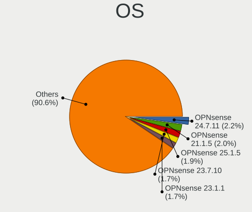

| Name              | Desktops | Percent |
|-------------------|----------|---------|
| OPNsense 24.7.11  | 14       | 2.16%   |
| OPNsense 21.1.5   | 13       | 2.01%   |
| OPNsense 25.1.5   | 12       | 1.85%   |
| OPNsense 23.7.10  | 11       | 1.7%    |
| OPNsense 23.1.1   | 11       | 1.7%    |
| OPNsense 21.7.7   | 10       | 1.55%   |
| OPNsense 23.1.7   | 9        | 1.39%   |
| OPNsense 23.1.5   | 9        | 1.39%   |
| OPNsense 23.1.11  | 9        | 1.39%   |
| OPNsense 22.1.6   | 9        | 1.39%   |
| OpenBSD 6.8       | 9        | 1.39%   |
| helloSystem 0.8.1 | 9        | 1.39%   |
| OPNsense 25.7.7   | 8        | 1.24%   |
| OPNsense 25.1.4   | 8        | 1.24%   |
| OPNsense 24.7.7   | 8        | 1.24%   |
| OPNsense 24.7.6   | 8        | 1.24%   |
| OPNsense 24.7.12  | 8        | 1.24%   |
| OPNsense 24.7.1   | 8        | 1.24%   |
| OPNsense 23.7.12  | 8        | 1.24%   |
| OPNsense 23.1     | 7        | 1.08%   |
| OPNsense 25.1.1   | 6        | 0.93%   |
| OPNsense 24.7.5   | 6        | 0.93%   |
| OPNsense 24.7.4   | 6        | 0.93%   |
| OPNsense 24.1.10  | 6        | 0.93%   |
| OPNsense 23.7.11  | 6        | 0.93%   |
| OPNsense 22.7.9   | 6        | 0.93%   |
| OPNsense 22.7.4   | 6        | 0.93%   |
| OPNsense 22.7     | 6        | 0.93%   |
| OPNsense 22.1.10  | 6        | 0.93%   |
| OPNsense 22.1.1   | 6        | 0.93%   |
| OPNsense 22.1     | 6        | 0.93%   |
| OPNsense 21.7.1   | 6        | 0.93%   |
| OPNsense 21.1.3   | 6        | 0.93%   |
| OPNsense 21.1     | 6        | 0.93%   |
| OPNsense 25.1.7   | 5        | 0.77%   |
| OPNsense 25.1.3   | 5        | 0.77%   |
| OPNsense 25.1     | 5        | 0.77%   |
| OPNsense 24.1.6   | 5        | 0.77%   |
| OPNsense 23.7.9   | 5        | 0.77%   |
| OPNsense 23.7.8   | 5        | 0.77%   |

OS Family
---------

OS without a version

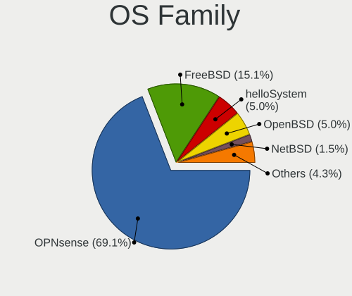

| Name        | Desktops | Percent |
|-------------|----------|---------|
| OPNsense    | 320      | 69.11%  |
| FreeBSD     | 70       | 15.12%  |
| OpenBSD     | 23       | 4.97%   |
| helloSystem | 23       | 4.97%   |
| NetBSD      | 7        | 1.51%   |
| GhostBSD    | 6        | 1.3%    |
| TrueNAS     | 5        | 1.08%   |
| NomadBSD    | 4        | 0.86%   |
| ClonOS      | 2        | 0.43%   |
| MidnightBSD | 1        | 0.22%   |
| HardenedBSD | 1        | 0.22%   |
| FreeNAS     | 1        | 0.22%   |

Arch
----

OS architecture (x86_64, i586, etc.)

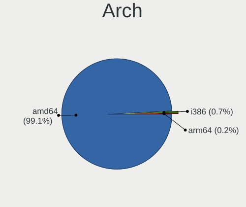

| Name  | Desktops | Percent |
|-------|----------|---------|
| amd64 | 456      | 99.13%  |
| i386  | 3        | 0.65%   |
| arm64 | 1        | 0.22%   |

DE
--

Desktop Environment

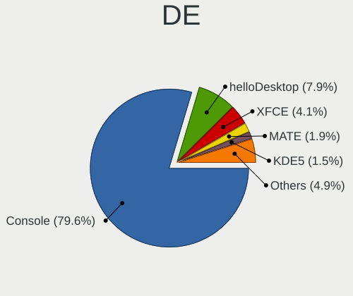

| Name         | Desktops | Percent |
|--------------|----------|---------|
| Console      | 371      | 79.61%  |
| helloDesktop | 37       | 7.94%   |
| XFCE         | 19       | 4.08%   |
| MATE         | 9        | 1.93%   |
| KDE5         | 7        | 1.5%    |
| Openbox      | 5        | 1.07%   |
| GNOME        | 4        | 0.86%   |
| fvwm         | 3        | 0.64%   |
| TWM          | 2        | 0.43%   |
| LXQt         | 2        | 0.43%   |
| i3           | 2        | 0.43%   |
| WindowMaker  | 1        | 0.21%   |
| LXDE         | 1        | 0.21%   |
| Cinnamon     | 1        | 0.21%   |
| Budgie       | 1        | 0.21%   |
| AwesomeWM    | 1        | 0.21%   |

Display Server
--------------

X11 or Wayland

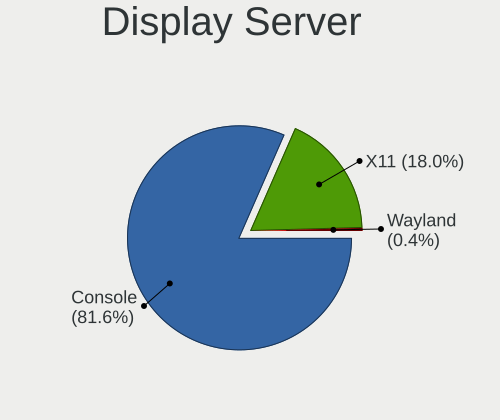

| Name    | Desktops | Percent |
|---------|----------|---------|
| Console | 376      | 81.56%  |
| X11     | 83       | 18%     |
| Wayland | 2        | 0.43%   |

Display Manager
---------------

SDDM, LightDM, etc.

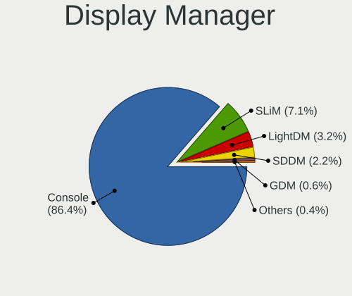

| Name    | Desktops | Percent |
|---------|----------|---------|
| Console | 400      | 86.39%  |
| SLiM    | 33       | 7.13%   |
| LightDM | 15       | 3.24%   |
| SDDM    | 10       | 2.16%   |
| GDM     | 3        | 0.65%   |
| XDM     | 2        | 0.43%   |

OS Lang
-------

Language

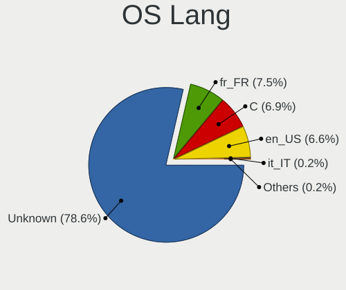

| Lang           | Desktops | Percent |
|----------------|----------|---------|
| Unknown        | 367      | 78.59%  |
| fr_FR          | 35       | 7.49%   |
| C              | 32       | 6.85%   |
| en_US          | 31       | 6.64%   |
| it_IT          | 1        | 0.21%   |
| fr_FR.US-ASCII | 1        | 0.21%   |

Boot Mode
---------

EFI or BIOS

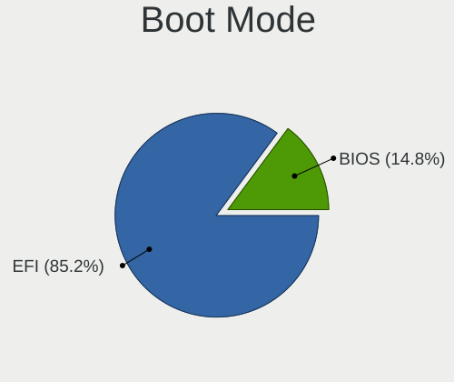

| Mode | Desktops | Percent |
|------|----------|---------|
| EFI  | 396      | 85.16%  |
| BIOS | 69       | 14.84%  |

Filesystem
----------

Type of filesystem

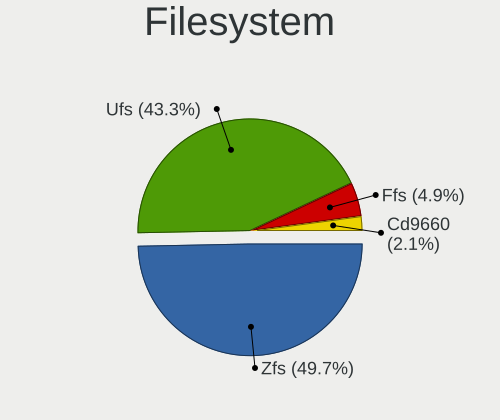

| Type   | Desktops | Percent |
|--------|----------|---------|
| Zfs    | 234      | 49.68%  |
| Ufs    | 204      | 43.31%  |
| Ffs    | 23       | 4.88%   |
| Cd9660 | 10       | 2.12%   |

Part. scheme
------------

Scheme of partitioning

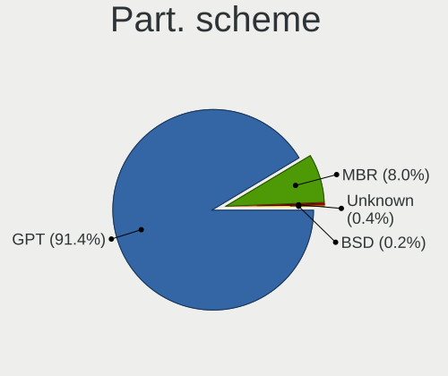

| Type    | Desktops | Percent |
|---------|----------|---------|
| GPT     | 425      | 91.4%   |
| MBR     | 37       | 7.96%   |
| Unknown | 2        | 0.43%   |
| BSD     | 1        | 0.22%   |

Board
-----

Vendor
------

Motherboard manufacturer

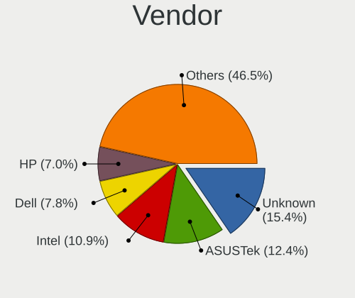

| Name                                 | Desktops | Percent |
|--------------------------------------|----------|---------|
| Unknown                              | 71       | 15.43%  |
| ASUSTek Computer                     | 57       | 12.39%  |
| Intel                                | 50       | 10.87%  |
| Dell                                 | 36       | 7.83%   |
| Hewlett-Packard                      | 32       | 6.96%   |
| PC Engines                           | 28       | 6.09%   |
| Gigabyte Technology                  | 22       | 4.78%   |
| ASRock                               | 20       | 4.35%   |
| MSI                                  | 15       | 3.26%   |
| Fujitsu                              | 15       | 3.26%   |
| Lenovo                               | 12       | 2.61%   |
| Supermicro                           | 11       | 2.39%   |
| Techvision                           | 10       | 2.17%   |
| Protectli                            | 9        | 1.96%   |
| MW                                   | 6        | 1.3%    |
| ASRockRack                           | 4        | 0.87%   |
| TB                                   | 3        | 0.65%   |
| SJRC                                 | 3        | 0.65%   |
| Shenzhen Meigao Electronic Equipment | 3        | 0.65%   |
| CWWK                                 | 3        | 0.65%   |
| AZW                                  | 3        | 0.65%   |
| Advantech                            | 3        | 0.65%   |
| Acer                                 | 3        | 0.65%   |
| ZOTAC                                | 2        | 0.43%   |
| Shuttle                              | 2        | 0.43%   |
| RUNING                               | 2        | 0.43%   |
| Pegatron                             | 2        | 0.43%   |
| Lanner Electronics                   | 2        | 0.43%   |
| GoWin Solution                       | 2        | 0.43%   |
| Deciso                               | 2        | 0.43%   |
| AMD                                  | 2        | 0.43%   |
| YENTEK                               | 1        | 0.22%   |
| Wistron                              | 1        | 0.22%   |
| VeryPC                               | 1        | 0.22%   |
| TianBei                              | 1        | 0.22%   |
| Soekris Engineering                  | 1        | 0.22%   |
| PICO PC                              | 1        | 0.22%   |
| Packard Bell                         | 1        | 0.22%   |
| OEM                                  | 1        | 0.22%   |
| NF533MS                              | 1        | 0.22%   |

Model
-----

Motherboard model

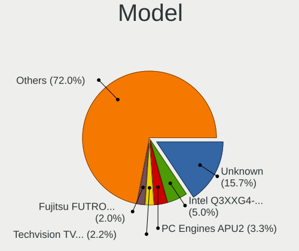

| Name                                              | Desktops | Percent |
|---------------------------------------------------|----------|---------|
| Unknown                                           | 72       | 15.65%  |
| Intel Q3XXG4-P V1.0                               | 23       | 5%      |
| PC Engines APU2                                   | 15       | 3.26%   |
| Techvision TVI7309X                               | 10       | 2.17%   |
| Fujitsu FUTRO S920                                | 9        | 1.96%   |
| MW GMLK-2_5G4L                                    | 6        | 1.3%    |
| ASUS All Series                                   | 6        | 1.3%    |
| PC Engines APU3                                   | 5        | 1.09%   |
| Intel CRESCENTBAY                                 | 5        | 1.09%   |
| Dell OptiPlex 9020                                | 5        | 1.09%   |
| PC Engines apu4                                   | 4        | 0.87%   |
| TB WTR R1                                         | 3        | 0.65%   |
| SJRC ADLN-6L                                      | 3        | 0.65%   |
| PC Engines apu1                                   | 3        | 0.65%   |
| Intel QHSW02                                      | 3        | 0.65%   |
| Intel Jasper Lake Client Platform                 | 3        | 0.65%   |
| HP ProLiant MicroServer Gen8                      | 3        | 0.65%   |
| Dell OptiPlex 3020                                | 3        | 0.65%   |
| Advantech DTADB                                   | 3        | 0.65%   |
| Supermicro X7SPA-HF                               | 2        | 0.43%   |
| Supermicro SYS-E300-9D-8CN8TP                     | 2        | 0.43%   |
| Shenzhen Meigao Electronic Equipment Venus Series | 2        | 0.43%   |
| RUNING B75M INTEL H3V                             | 2        | 0.43%   |
| Protectli V1410                                   | 2        | 0.43%   |
| Protectli FW6                                     | 2        | 0.43%   |
| MSI MS-7C94                                       | 2        | 0.43%   |
| Lenovo ThinkSystem ST50 V2 7D8JCTO1WW             | 2        | 0.43%   |
| Lenovo ThinkCentre M93p 10AAS4EN00                | 2        | 0.43%   |
| Lanner NCA-1515A-EK6                              | 2        | 0.43%   |
| Intel AmITX-SL-G                                  | 2        | 0.43%   |
| HP EliteDesk 800 G5 SFF                           | 2        | 0.43%   |
| HP EliteDesk 800 G2 DM 35W                        | 2        | 0.43%   |
| Gigabyte X570 I AORUS PRO WIFI                    | 2        | 0.43%   |
| Gigabyte B560M DS3H                               | 2        | 0.43%   |
| Fujitsu ESPRIMO Q920                              | 2        | 0.43%   |
| Dell OptiPlex 790                                 | 2        | 0.43%   |
| Dell OptiPlex 7010                                | 2        | 0.43%   |
| Dell OptiPlex 3070                                | 2        | 0.43%   |
| Dell OptiPlex 3050                                | 2        | 0.43%   |
| Dell OptiPlex 3010                                | 2        | 0.43%   |

Model Family
------------

Motherboard model prefix

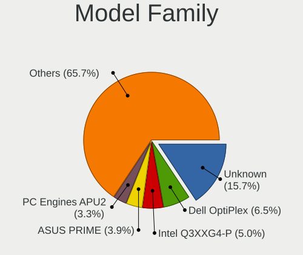

| Name                                       | Desktops | Percent |
|--------------------------------------------|----------|---------|
| Unknown                                    | 72       | 15.65%  |
| Dell OptiPlex                              | 30       | 6.52%   |
| Intel Q3XXG4-P                             | 23       | 5%      |
| ASUS PRIME                                 | 18       | 3.91%   |
| PC Engines APU2                            | 15       | 3.26%   |
| Techvision TVI7309X                        | 10       | 2.17%   |
| Fujitsu FUTRO                              | 10       | 2.17%   |
| HP Compaq                                  | 9        | 1.96%   |
| Lenovo ThinkCentre                         | 7        | 1.52%   |
| MW GMLK-2                                  | 6        | 1.3%    |
| HP ProDesk                                 | 6        | 1.3%    |
| HP EliteDesk                               | 6        | 1.3%    |
| ASUS All                                   | 6        | 1.3%    |
| PC Engines APU3                            | 5        | 1.09%   |
| Intel CRESCENTBAY                          | 5        | 1.09%   |
| PC Engines apu4                            | 4        | 0.87%   |
| Fujitsu ESPRIMO                            | 4        | 0.87%   |
| TB WTR                                     | 3        | 0.65%   |
| SJRC ADLN-6L                               | 3        | 0.65%   |
| PC Engines apu1                            | 3        | 0.65%   |
| Lenovo ThinkSystem                         | 3        | 0.65%   |
| Intel QHSW02                               | 3        | 0.65%   |
| Intel Jasper                               | 3        | 0.65%   |
| HP ProLiant                                | 3        | 0.65%   |
| ASUS TUF                                   | 3        | 0.65%   |
| Advantech DTADB                            | 3        | 0.65%   |
| Supermicro X7SPA-HF                        | 2        | 0.43%   |
| Supermicro SYS-E300-9D-8CN8TP              | 2        | 0.43%   |
| Shenzhen Meigao Electronic Equipment Venus | 2        | 0.43%   |
| RUNING B75M                                | 2        | 0.43%   |
| Protectli V1410                            | 2        | 0.43%   |
| Protectli FW6                              | 2        | 0.43%   |
| MSI MS-7C94                                | 2        | 0.43%   |
| Lenovo ThinkStation                        | 2        | 0.43%   |
| Lanner NCA-1515A-EK6                       | 2        | 0.43%   |
| Intel AmITX-SL-G                           | 2        | 0.43%   |
| Gigabyte X570                              | 2        | 0.43%   |
| Gigabyte B560M                             | 2        | 0.43%   |
| Gigabyte B450                              | 2        | 0.43%   |
| Dell Precision                             | 2        | 0.43%   |

MFG Year
--------

Motherboard manufacture year

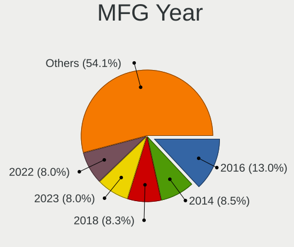

| Year    | Desktops | Percent |
|---------|----------|---------|
| 2016    | 60       | 13.04%  |
| 2014    | 39       | 8.48%   |
| 2018    | 38       | 8.26%   |
| 2023    | 37       | 8.04%   |
| 2022    | 37       | 8.04%   |
| 2021    | 30       | 6.52%   |
| 2024    | 29       | 6.3%    |
| 2019    | 29       | 6.3%    |
| 2012    | 28       | 6.09%   |
| 2020    | 22       | 4.78%   |
| 2017    | 18       | 3.91%   |
| 2013    | 18       | 3.91%   |
| 2015    | 15       | 3.26%   |
| 2010    | 13       | 2.83%   |
| 2011    | 11       | 2.39%   |
| Unknown | 10       | 2.17%   |
| 2008    | 8        | 1.74%   |
| 2009    | 7        | 1.52%   |
| 2025    | 5        | 1.09%   |
| 2007    | 4        | 0.87%   |
| 2006    | 1        | 0.22%   |
| 2004    | 1        | 0.22%   |

Form Factor
-----------

Physical design of the computer

| Name    | Desktops | Percent |
|---------|----------|---------|
| Desktop | 460      | 100%    |

Coreboot
--------

Have coreboot on board

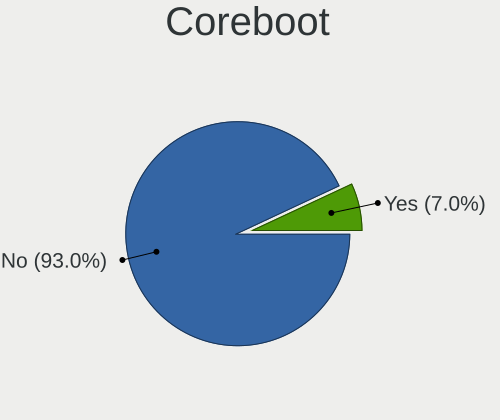

| Used | Desktops | Percent |
|------|----------|---------|
| No   | 428      | 93.04%  |
| Yes  | 32       | 6.96%   |

RAM Size
--------

Total RAM memory

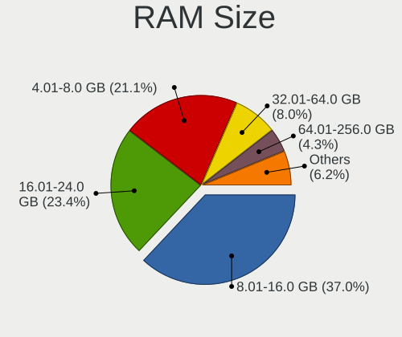

| Size in GB  | Desktops | Percent |
|-------------|----------|---------|
| 8.01-16.0   | 172      | 36.99%  |
| 16.01-24.0  | 109      | 23.44%  |
| 4.01-8.0    | 98       | 21.08%  |
| 32.01-64.0  | 37       | 7.96%   |
| 64.01-256.0 | 20       | 4.3%    |
| 2.01-3.0    | 14       | 3.01%   |
| 1.01-2.0    | 6        | 1.29%   |
| 24.01-32.0  | 5        | 1.08%   |
| 3.01-4.0    | 3        | 0.65%   |
| 0.51-1.0    | 1        | 0.22%   |

RAM Used
--------

Used RAM memory

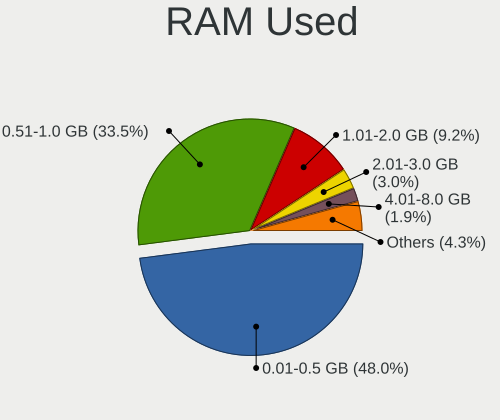

| Used GB    | Desktops | Percent |
|------------|----------|---------|
| 0.01-0.5   | 223      | 47.96%  |
| 0.51-1.0   | 156      | 33.55%  |
| 1.01-2.0   | 43       | 9.25%   |
| 2.01-3.0   | 14       | 3.01%   |
| 4.01-8.0   | 9        | 1.94%   |
| Unknown    | 8        | 1.72%   |
| 3.01-4.0   | 6        | 1.29%   |
| 8.01-16.0  | 2        | 0.43%   |
| 0          | 2        | 0.43%   |
| 24.01-32.0 | 1        | 0.22%   |
| 16.01-24.0 | 1        | 0.22%   |

Total Drives
------------

Number of drives on board

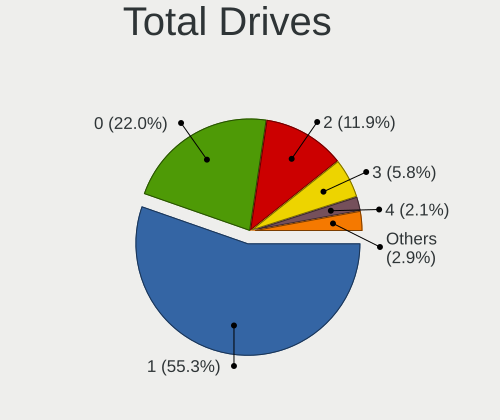

| Drives | Desktops | Percent |
|--------|----------|---------|
| 1      | 269      | 55.35%  |
| 0      | 107      | 22.02%  |
| 2      | 58       | 11.93%  |
| 3      | 28       | 5.76%   |
| 4      | 10       | 2.06%   |
| 5      | 7        | 1.44%   |
| 6      | 3        | 0.62%   |
| 7      | 2        | 0.41%   |
| 10     | 1        | 0.21%   |
| 8      | 1        | 0.21%   |

Has CD-ROM
----------

Has CD-ROM on board

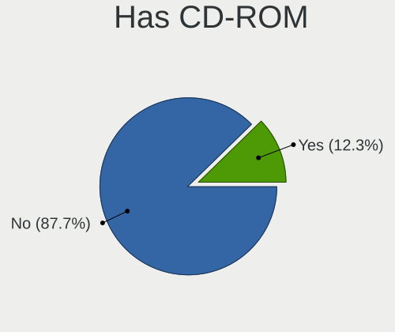

| Presented | Desktops | Percent |
|-----------|----------|---------|
| No        | 407      | 87.72%  |
| Yes       | 57       | 12.28%  |

Has Ethernet
------------

Has Ethernet on board

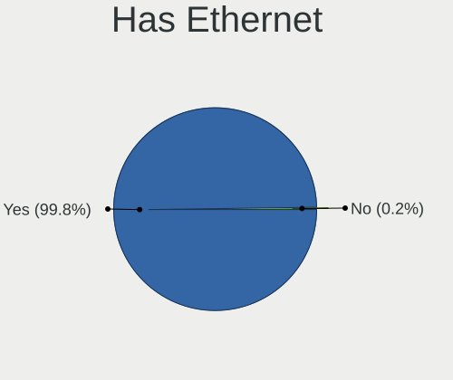

| Presented | Desktops | Percent |
|-----------|----------|---------|
| Yes       | 459      | 99.78%  |
| No        | 1        | 0.22%   |

Has WiFi
--------

Has WiFi module

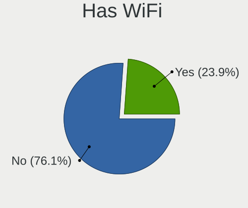

| Presented | Desktops | Percent |
|-----------|----------|---------|
| No        | 354      | 76.13%  |
| Yes       | 111      | 23.87%  |

Has Bluetooth
-------------

Has Bluetooth module

| Presented | Desktops | Percent |
|-----------|----------|---------|
| No        | 401      | 86.8%   |
| Yes       | 61       | 13.2%   |

Location
--------

Country
-------

Geographic location (country)

| Country | Desktops | Percent |
|---------|----------|---------|
| France  | 460      | 100%    |

City
----

Geographic location (city)

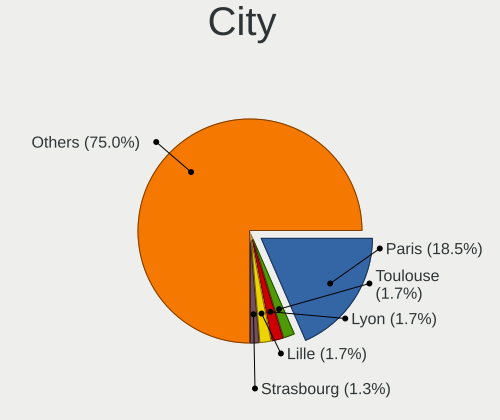

| City                    | Desktops | Percent |
|-------------------------|----------|---------|
| Paris                   | 96       | 18.46%  |
| Toulouse                | 9        | 1.73%   |
| Lyon                    | 9        | 1.73%   |
| Lille                   | 9        | 1.73%   |
| Strasbourg              | 7        | 1.35%   |
| Roubaix                 | 5        | 0.96%   |
| Rillieux-la-Pape        | 5        | 0.96%   |
| Nantes                  | 5        | 0.96%   |
| Marseille               | 5        | 0.96%   |
| Bordeaux                | 5        | 0.96%   |
| Villeurbanne            | 4        | 0.77%   |
| Thionville              | 4        | 0.77%   |
| Soisy-sur-Seine         | 4        | 0.77%   |
| Saint-Denis             | 4        | 0.77%   |
| Rosny-sous-Bois         | 4        | 0.77%   |
| Noisy-le-Grand          | 4        | 0.77%   |
| Nice                    | 4        | 0.77%   |
| Lorient                 | 4        | 0.77%   |
| Argenteuil              | 4        | 0.77%   |
| Agen                    | 4        | 0.77%   |
| Vaulx-en-Velin          | 3        | 0.58%   |
| Seyssinet-Pariset       | 3        | 0.58%   |
| Sable-sur-Sarthe        | 3        | 0.58%   |
| Rennes                  | 3        | 0.58%   |
| Poitiers                | 3        | 0.58%   |
| Montfermeil             | 3        | 0.58%   |
| Irmstett                | 3        | 0.58%   |
| Grenoble                | 3        | 0.58%   |
| Gravelines              | 3        | 0.58%   |
| Dijon                   | 3        | 0.58%   |
| Chatou                  | 3        | 0.58%   |
| Champigny-sur-Marne     | 3        | 0.58%   |
| Boulogne-Billancourt    | 3        | 0.58%   |
| Bonson                  | 3        | 0.58%   |
| Bagnolet                | 3        | 0.58%   |
| Г‰chirolles          | 2        | 0.38%   |
| Urcuit                  | 2        | 0.38%   |
| Saint-Nazaire           | 2        | 0.38%   |
| Saint-Martin-d'HГЁres | 2        | 0.38%   |
| Saint-Herblain          | 2        | 0.38%   |

Drives
------

Drive Vendor
------------

Hard drive vendors

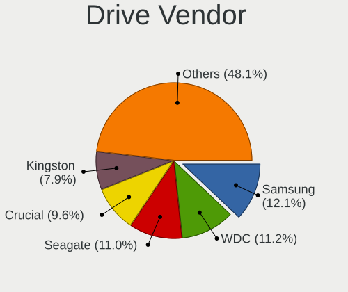

| Vendor              | Desktops | Drives | Percent |
|---------------------|----------|--------|---------|
| Samsung Electronics | 58       | 107    | 12.08%  |
| WDC                 | 54       | 101    | 11.25%  |
| Seagate             | 53       | 85     | 11.04%  |
| Crucial             | 46       | 85     | 9.58%   |
| Kingston            | 38       | 73     | 7.92%   |
| China               | 28       | 43     | 5.83%   |
| Intel               | 18       | 24     | 3.75%   |
| Toshiba             | 16       | 29     | 3.33%   |
| Transcend           | 15       | 24     | 3.13%   |
| SanDisk             | 13       | 24     | 2.71%   |
| Phison              | 12       | 14     | 2.5%    |
| Hoodisk             | 12       | 14     | 2.5%    |
| PNY                 | 11       | 21     | 2.29%   |
| Hitachi             | 8        | 11     | 1.67%   |
| Corsair             | 7        | 13     | 1.46%   |
| Innodisk            | 6        | 7      | 1.25%   |
| HGST                | 6        | 9      | 1.25%   |
| Micron Technology   | 5        | 8      | 1.04%   |
| SK hynix            | 4        | 4      | 0.83%   |
| OCZ                 | 4        | 5      | 0.83%   |
| Apple               | 4        | 6      | 0.83%   |
| Maxtor              | 3        | 4      | 0.63%   |
| LITEON              | 3        | 4      | 0.63%   |
| LDLC                | 3        | 3      | 0.63%   |
| Fujitsu             | 3        | 3      | 0.63%   |
| Fanxiang            | 3        | 3      | 0.63%   |
| YANSEN              | 2        | 2      | 0.42%   |
| TEXTORM             | 2        | 2      | 0.42%   |
| Silicon Motion      | 2        | 2      | 0.42%   |
| ShiJi               | 2        | 3      | 0.42%   |
| Pccooler            | 2        | 2      | 0.42%   |
| OPENBSD             | 2        | 3      | 0.42%   |
| NVMe                | 2        | 2      | 0.42%   |
| Generic             | 2        | 2      | 0.42%   |
| FORESEE             | 2        | 7      | 0.42%   |
| A-DATA Technology   | 2        | 3      | 0.42%   |
| Wicgtyp             | 1        | 1      | 0.21%   |
| VICKTER             | 1        | 1      | 0.21%   |
| Verbatim            | 1        | 1      | 0.21%   |
| Vaseky              | 1        | 4      | 0.21%   |

Drive Model
-----------

Hard drive models

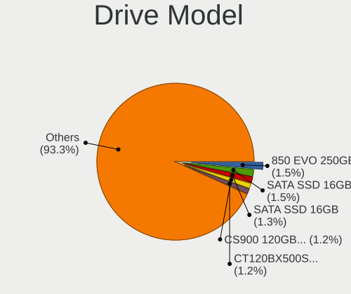

| Model                              | Desktops | Percent |
|------------------------------------|----------|---------|
| Samsung SSD 850 EVO 250GB          | 8        | 1.54%   |
| Phison SATA SSD 16GB               | 8        | 1.54%   |
| China SATA SSD 16GB                | 7        | 1.35%   |
| PNY CS900 120GB SSD                | 6        | 1.16%   |
| Crucial CT120BX500SSD1 120GB       | 6        | 1.16%   |
| Kingston SA400S37240G 240GB        | 5        | 0.96%   |
| Crucial CT500MX500SSD1 500GB       | 5        | 0.96%   |
| Crucial CT250MX500SSD1 250GB       | 5        | 0.96%   |
| Crucial CT240BX500SSD1 240GB       | 5        | 0.96%   |
| WDC WD10EZEX-08WN4A0 1TB           | 4        | 0.77%   |
| Samsung SSD 870 EVO 500GB          | 4        | 0.77%   |
| Samsung SSD 860 EVO 1TB            | 4        | 0.77%   |
| Kingston SUV500MS120G 120GB        | 4        | 0.77%   |
| Kingston SA400S37120G 120GB        | 4        | 0.77%   |
| Hoodisk SSD 64GB                   | 4        | 0.77%   |
| Hoodisk SSD 32GB                   | 4        | 0.77%   |
| China MSATA 64GB SSD               | 4        | 0.77%   |
| WDC WDS240G2G0A-00JH30 240GB       | 3        | 0.58%   |
| Transcend TS128GSSD420K 128GB      | 3        | 0.58%   |
| Transcend TS128GMSA230S 128GB      | 3        | 0.58%   |
| Toshiba MQ01ABD050 500GB           | 3        | 0.58%   |
| Seagate ST3500418AS 500GB          | 3        | 0.58%   |
| Seagate ST1000LM024 HN-M101MBB 1TB | 3        | 0.58%   |
| Seagate ST1000DM010-2EP102 1TB     | 3        | 0.58%   |
| SanDisk SSD PLUS 120GB             | 3        | 0.58%   |
| Micron 1100 SATA 256GB             | 3        | 0.58%   |
| Kingston SV300S37A120G 120GB       | 3        | 0.58%   |
| HGST HUS724020ALA640 2TB           | 3        | 0.58%   |
| Crucial M4-CT128M4SSD2 128GB       | 3        | 0.58%   |
| Crucial CT1000P1SSD8 1TB           | 3        | 0.58%   |
| Crucial CT1000BX500SSD1 1TB        | 3        | 0.58%   |
| China SATA SSD 32GB                | 3        | 0.58%   |
| China SATA SSD 256GB               | 3        | 0.58%   |
| China MSATA 32GB SSD               | 3        | 0.58%   |
| WDC WD5000LPLX-75ZNTT0 500GB       | 2        | 0.39%   |
| WDC WD20EZRX-00D8PB0 2TB           | 2        | 0.39%   |
| WDC WD1003FBYX-01Y7B1 1TB          | 2        | 0.39%   |
| Toshiba MG04ACA200N 2TB            | 2        | 0.39%   |
| Toshiba HDWD120 2TB                | 2        | 0.39%   |
| Toshiba DT01ACA100 1TB             | 2        | 0.39%   |

HDD Vendor
----------

Hard disk drive vendors

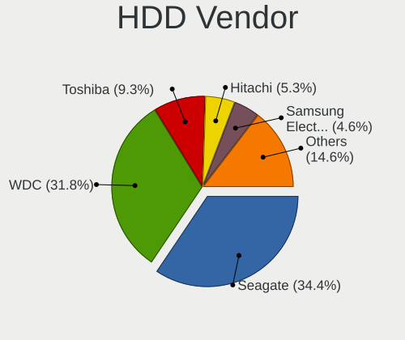

| Vendor              | Desktops | Drives | Percent |
|---------------------|----------|--------|---------|
| Seagate             | 52       | 83     | 34.44%  |
| WDC                 | 48       | 92     | 31.79%  |
| Toshiba             | 14       | 27     | 9.27%   |
| Hitachi             | 8        | 11     | 5.3%    |
| Samsung Electronics | 7        | 13     | 4.64%   |
| HGST                | 6        | 9      | 3.97%   |
| Maxtor              | 3        | 4      | 1.99%   |
| Fujitsu             | 3        | 3      | 1.99%   |
| OPENBSD             | 2        | 3      | 1.32%   |
| Generic             | 2        | 2      | 1.32%   |
| Apple               | 2        | 4      | 1.32%   |
| SABRENT             | 1        | 1      | 0.66%   |
| LSI                 | 1        | 1      | 0.66%   |
| Hewlett-Packard     | 1        | 3      | 0.66%   |
| Dell                | 1        | 2      | 0.66%   |

SSD Vendor
----------

Solid state drive vendors

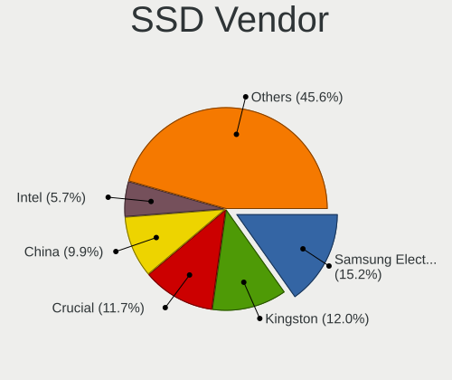

| Vendor              | Desktops | Drives | Percent |
|---------------------|----------|--------|---------|
| Samsung Electronics | 43       | 82     | 15.19%  |
| Kingston            | 34       | 67     | 12.01%  |
| Crucial             | 33       | 64     | 11.66%  |
| China               | 28       | 43     | 9.89%   |
| Intel               | 16       | 20     | 5.65%   |
| Transcend           | 14       | 22     | 4.95%   |
| SanDisk             | 13       | 24     | 4.59%   |
| Hoodisk             | 12       | 14     | 4.24%   |
| PNY                 | 10       | 19     | 3.53%   |
| Phison              | 8        | 9      | 2.83%   |
| Innodisk            | 6        | 7      | 2.12%   |
| Corsair             | 6        | 9      | 2.12%   |
| WDC                 | 5        | 7      | 1.77%   |
| OCZ                 | 4        | 5      | 1.41%   |
| Micron Technology   | 4        | 5      | 1.41%   |
| SK hynix            | 3        | 3      | 1.06%   |
| LITEON              | 3        | 4      | 1.06%   |
| YANSEN              | 2        | 2      | 0.71%   |
| Toshiba             | 2        | 2      | 0.71%   |
| TEXTORM             | 2        | 2      | 0.71%   |
| ShiJi               | 2        | 3      | 0.71%   |
| Pccooler            | 2        | 2      | 0.71%   |
| NVMe                | 2        | 2      | 0.71%   |
| FORESEE             | 2        | 7      | 0.71%   |
| Apple               | 2        | 2      | 0.71%   |
| A-DATA Technology   | 2        | 3      | 0.71%   |
| Wicgtyp             | 1        | 1      | 0.35%   |
| VICKTER             | 1        | 1      | 0.35%   |
| Verbatim            | 1        | 1      | 0.35%   |
| Vaseky              | 1        | 4      | 0.35%   |
| Terabit             | 1        | 1      | 0.35%   |
| SPCC                | 1        | 1      | 0.35%   |
| Silicon Power       | 1        | 2      | 0.35%   |
| SHAREVDI            | 1        | 1      | 0.35%   |
| Seagate             | 1        | 2      | 0.35%   |
| Protectli           | 1        | 1      | 0.35%   |
| LITEONIT            | 1        | 1      | 0.35%   |
| KingDian            | 1        | 1      | 0.35%   |
| Kingchuxing         | 1        | 2      | 0.35%   |
| Kimtigo             | 1        | 1      | 0.35%   |

Drive Kind
----------

HDD or SSD

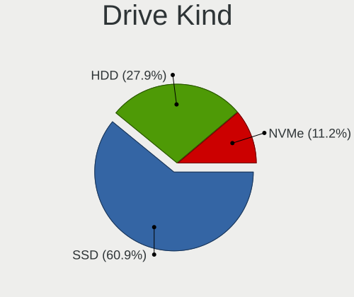

| Kind | Desktops | Drives | Percent |
|------|----------|--------|---------|
| SSD  | 262      | 466    | 60.93%  |
| HDD  | 120      | 258    | 27.91%  |
| NVMe | 48       | 71     | 11.16%  |

Drive Connector
---------------

SATA, SAS, NVMe, etc.

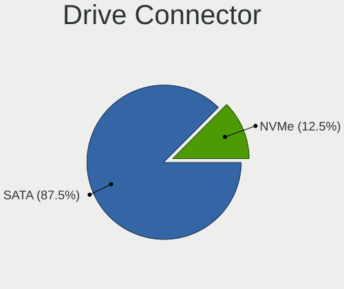

| Type | Desktops | Drives | Percent |
|------|----------|--------|---------|
| SATA | 335      | 724    | 87.47%  |
| NVMe | 48       | 71     | 12.53%  |

Drive Size
----------

Size of hard drive

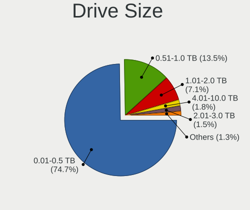

| Size in TB | Desktops | Drives | Percent |
|------------|----------|--------|---------|
| 0.01-0.5   | 293      | 534    | 74.74%  |
| 0.51-1.0   | 53       | 94     | 13.52%  |
| 1.01-2.0   | 28       | 62     | 7.14%   |
| 4.01-10.0  | 7        | 11     | 1.79%   |
| 2.01-3.0   | 6        | 12     | 1.53%   |
| 3.01-4.0   | 4        | 9      | 1.02%   |
| 10.01-20.0 | 1        | 2      | 0.26%   |

Space Total
-----------

Amount of disk space available on the file system

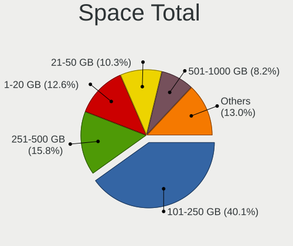

| Size in GB     | Desktops | Percent |
|----------------|----------|---------|
| 101-250        | 191      | 40.13%  |
| 251-500        | 75       | 15.76%  |
| 1-20           | 60       | 12.61%  |
| 21-50          | 49       | 10.29%  |
| 501-1000       | 39       | 8.19%   |
| 51-100         | 39       | 8.19%   |
| 1001-2000      | 9        | 1.89%   |
| 2001-3000      | 6        | 1.26%   |
| More than 3000 | 5        | 1.05%   |
| Unknown        | 3        | 0.63%   |

Space Used
----------

Amount of used disk space

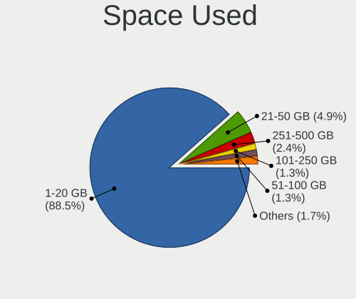

| Used GB        | Desktops | Percent |
|----------------|----------|---------|
| 1-20           | 414      | 88.46%  |
| 21-50          | 23       | 4.91%   |
| 251-500        | 11       | 2.35%   |
| 101-250        | 6        | 1.28%   |
| 51-100         | 6        | 1.28%   |
| Unknown        | 3        | 0.64%   |
| More than 3000 | 2        | 0.43%   |
| 501-1000       | 2        | 0.43%   |
| 1001-2000      | 1        | 0.21%   |

Malfunc. Drives
---------------

Drive models with a malfunction

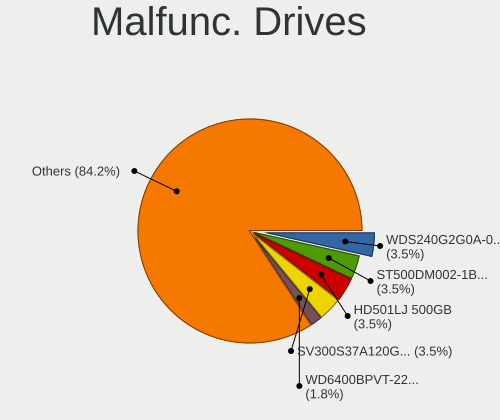

| Model                                 | Desktops | Drives | Percent |
|---------------------------------------|----------|--------|---------|
| WDC WDS240G2G0A-00JH30 240GB          | 2        | 3      | 3.51%   |
| Seagate ST500DM002-1BD142 500GB       | 2        | 4      | 3.51%   |
| Samsung Electronics HD501LJ 500GB     | 2        | 2      | 3.51%   |
| Kingston SV300S37A120G 120GB          | 2        | 3      | 3.51%   |
| WDC WD6400BPVT-22HXZT3 640GB          | 1        | 1      | 1.75%   |
| WDC WD6400AAKS-22A7B0 640GB           | 1        | 1      | 1.75%   |
| WDC WD5002ABYS-18B1B0 500GB           | 1        | 1      | 1.75%   |
| WDC WD5002AALX-00J37A0 500GB          | 1        | 3      | 1.75%   |
| WDC WD5000AAKS-00UU3A0 500GB          | 1        | 2      | 1.75%   |
| WDC WD30EFRX-68AX9N0 3TB              | 1        | 4      | 1.75%   |
| WDC WD2500BEVS-60UST0 250GB           | 1        | 1      | 1.75%   |
| WDC WD20EZRX-00D8PB0 2TB              | 1        | 1      | 1.75%   |
| WDC WD2002FYPS-02W3B0 2TB             | 1        | 1      | 1.75%   |
| WDC WD15EADS-00P8B0 1.5TB             | 1        | 1      | 1.75%   |
| WDC WD10EZEX-60M2NA0 1TB              | 1        | 1      | 1.75%   |
| WDC WD10EZEX-21M2NA0 1TB              | 1        | 1      | 1.75%   |
| WDC WD10EZEX-08WN4A0 1TB              | 1        | 1      | 1.75%   |
| WDC WD10EAVS-00D7B0 1TB               | 1        | 1      | 1.75%   |
| WDC WD10EARS-00Y5B1 1TB               | 1        | 1      | 1.75%   |
| WDC WD1001FAES-75W7A0 1TB             | 1        | 1      | 1.75%   |
| Toshiba MK5065GSX 500GB               | 1        | 1      | 1.75%   |
| Toshiba DT01ACA100 1TB                | 1        | 1      | 1.75%   |
| TEXTORM BM5 480GB                     | 1        | 1      | 1.75%   |
| Seagate ST9500325AS 500GB             | 1        | 1      | 1.75%   |
| Seagate ST500VT000-1DK142 500GB       | 1        | 1      | 1.75%   |
| Seagate ST500LM000-SSHD-8GB           | 1        | 2      | 1.75%   |
| Seagate ST380013AS 80GB               | 1        | 2      | 1.75%   |
| Seagate ST3500320AS 500GB             | 1        | 1      | 1.75%   |
| Seagate ST3250620AS 250GB             | 1        | 1      | 1.75%   |
| Seagate ST3250312AS 250GB             | 1        | 1      | 1.75%   |
| Seagate ST3160023AS 160GB             | 1        | 1      | 1.75%   |
| Seagate ST31000524AS 1TB              | 1        | 1      | 1.75%   |
| Seagate ST1000NM0011 1TB              | 1        | 1      | 1.75%   |
| Seagate ST1000LM024 HN-M101MBB 1TB    | 1        | 1      | 1.75%   |
| SanDisk SSD PLUS 480GB                | 1        | 1      | 1.75%   |
| Samsung Electronics SSD 870 EVO 500GB | 1        | 12     | 1.75%   |
| Samsung Electronics HD322GJ 320GB     | 1        | 1      | 1.75%   |
| Samsung Electronics HD256GJ 250GB     | 1        | 1      | 1.75%   |
| Samsung Electronics HD103UJ 1TB       | 1        | 1      | 1.75%   |
| OCZ VERTEX-TURBO 32GB                 | 1        | 2      | 1.75%   |

Malfunc. Drive Vendor
---------------------

Vendors of faulty drives

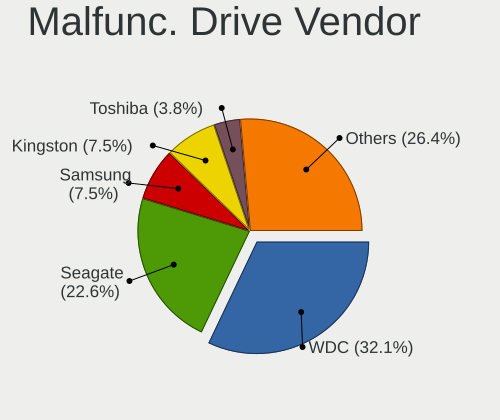

| Vendor              | Desktops | Drives | Percent |
|---------------------|----------|--------|---------|
| WDC                 | 17       | 25     | 32.08%  |
| Seagate             | 12       | 17     | 22.64%  |
| Samsung Electronics | 4        | 17     | 7.55%   |
| Kingston            | 4        | 7      | 7.55%   |
| Toshiba             | 2        | 2      | 3.77%   |
| Maxtor              | 2        | 2      | 3.77%   |
| Intel               | 2        | 2      | 3.77%   |
| Hitachi             | 2        | 2      | 3.77%   |
| A-DATA Technology   | 2        | 3      | 3.77%   |
| TEXTORM             | 1        | 1      | 1.89%   |
| SanDisk             | 1        | 1      | 1.89%   |
| OCZ                 | 1        | 2      | 1.89%   |
| Micron Technology   | 1        | 1      | 1.89%   |
| HGST                | 1        | 1      | 1.89%   |
| Corsair             | 1        | 2      | 1.89%   |

Malfunc. HDD Vendor
-------------------

Vendors of faulty HDD drives

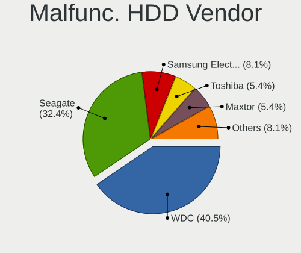

| Vendor              | Desktops | Drives | Percent |
|---------------------|----------|--------|---------|
| WDC                 | 15       | 22     | 40.54%  |
| Seagate             | 12       | 17     | 32.43%  |
| Samsung Electronics | 3        | 5      | 8.11%   |
| Toshiba             | 2        | 2      | 5.41%   |
| Maxtor              | 2        | 2      | 5.41%   |
| Hitachi             | 2        | 2      | 5.41%   |
| HGST                | 1        | 1      | 2.7%    |

Malfunc. Drive Kind
-------------------

Kinds of faulty drives

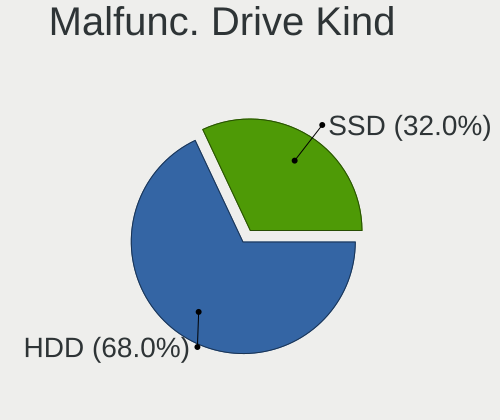

| Kind | Desktops | Drives | Percent |
|------|----------|--------|---------|
| HDD  | 34       | 51     | 68%     |
| SSD  | 16       | 34     | 32%     |

Failed Drives
-------------

Failed drive models

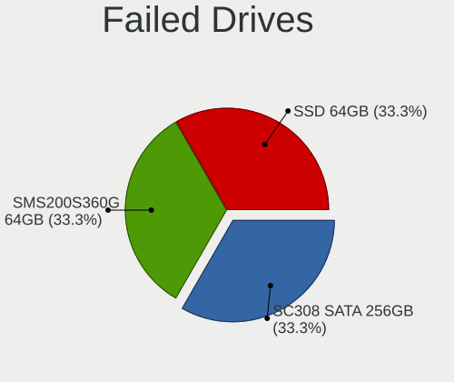

| Model                     | Desktops | Drives | Percent |
|---------------------------|----------|--------|---------|
| SK hynix SC308 SATA 256GB | 1        | 1      | 33.33%  |
| Kingston SMS200S360G 64GB | 1        | 1      | 33.33%  |
| Hoodisk SSD 64GB          | 1        | 1      | 33.33%  |

Failed Drive Vendor
-------------------

Failed drive vendors

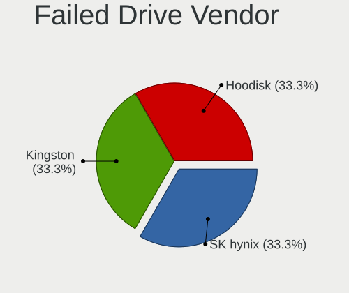

| Vendor   | Desktops | Drives | Percent |
|----------|----------|--------|---------|
| SK hynix | 1        | 1      | 33.33%  |
| Kingston | 1        | 1      | 33.33%  |
| Hoodisk  | 1        | 1      | 33.33%  |

Drive Status
------------

Number of failed and malfunc. drives

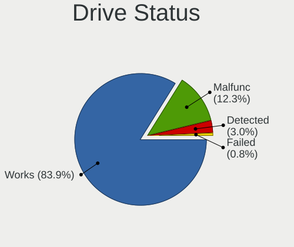

| Status   | Desktops | Drives | Percent |
|----------|----------|--------|---------|
| Works    | 333      | 688    | 83.88%  |
| Malfunc  | 49       | 85     | 12.34%  |
| Detected | 12       | 19     | 3.02%   |
| Failed   | 3        | 3      | 0.76%   |

Storage controller
------------------

Storage Vendor
--------------

Storage controller vendors

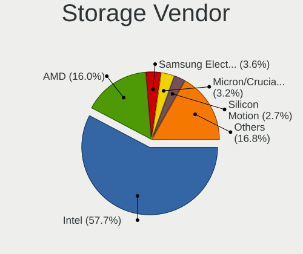

| Vendor                                  | Desktops | Percent |
|-----------------------------------------|----------|---------|
| Intel                                   | 340      | 57.72%  |
| AMD                                     | 94       | 15.96%  |
| Samsung Electronics                     | 21       | 3.57%   |
| Micron/Crucial Technology               | 19       | 3.23%   |
| Silicon Motion                          | 16       | 2.72%   |
| Phison Electronics                      | 13       | 2.21%   |
| ASMedia Technology                      | 12       | 2.04%   |
| MAXIO Technology (Hangzhou)             | 10       | 1.7%    |
| SanDisk                                 | 8        | 1.36%   |
| Kingston Technology Company             | 8        | 1.36%   |
| Micron Technology                       | 6        | 1.02%   |
| Realtek Semiconductor                   | 5        | 0.85%   |
| Marvell Technology Group                | 5        | 0.85%   |
| Broadcom / LSI                          | 5        | 0.85%   |
| SK hynix                                | 4        | 0.68%   |
| Yangtze Memory Technologies             | 3        | 0.51%   |
| VIA Technologies                        | 3        | 0.51%   |
| JMicron Technology                      | 3        | 0.51%   |
| Hosin Global Electronics                | 3        | 0.51%   |
| Transcend                               | 2        | 0.34%   |
| Nvidia                                  | 2        | 0.34%   |
| Chelsio Communications                  | 2        | 0.34%   |
| Silicon Image                           | 1        | 0.17%   |
| Shenzhen Unionmemory Information System | 1        | 0.17%   |
| Shenzhen Longsys Electronics            | 1        | 0.17%   |
| Integrated Technology Express           | 1        | 0.17%   |
| Hewlett-Packard                         | 1        | 0.17%   |

Storage Model
-------------

Storage controller models

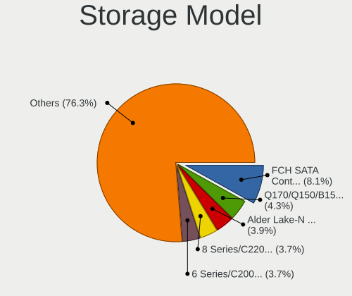

| Model                                                                            | Desktops | Percent |
|----------------------------------------------------------------------------------|----------|---------|
| AMD FCH SATA Controller [AHCI mode]                                              | 54       | 8.06%   |
| Intel Q170/Q150/B150/H170/H110/Z170/CM236 Chipset SATA Controller [AHCI Mode]    | 29       | 4.33%   |
| Intel Alder Lake-N SATA AHCI Controller                                          | 26       | 3.88%   |
| Intel 8 Series/C220 Series Chipset Family 6-port SATA Controller 1 [AHCI mode]   | 25       | 3.73%   |
| Intel 6 Series/C200 Series Chipset Family 6 port Desktop SATA AHCI Controller    | 25       | 3.73%   |
| Intel 8 Series SATA Controller 1 [AHCI mode]                                     | 21       | 3.13%   |
| Intel Jasper Lake SATA AHCI Controller                                           | 17       | 2.54%   |
| AMD FCH SATA Controller [IDE mode]                                               | 16       | 2.39%   |
| Silicon Motion SM2263EN/SM2263XT (DRAM-less) NVMe SSD Controllers                | 15       | 2.24%   |
| Intel SATA Controller [RAID mode]                                                | 15       | 2.24%   |
| Intel Celeron/Pentium Silver Processor SATA Controller                           | 14       | 2.09%   |
| Intel Atom Processor C3000 Series SATA Controller 1                              | 14       | 2.09%   |
| Intel 7 Series/C210 Series Chipset Family 6-port SATA Controller [AHCI mode]     | 13       | 1.94%   |
| Micron/Crucial P2 [Nick P2] / P3 / P3 Plus NVMe PCIe SSD (DRAM-less)             | 11       | 1.64%   |
| Intel Wildcat Point-LP SATA Controller [AHCI Mode]                               | 11       | 1.64%   |
| Intel Sunrise Point-LP SATA Controller [AHCI mode]                               | 11       | 1.64%   |
| Intel Cannon Lake PCH SATA AHCI Controller                                       | 11       | 1.64%   |
| Intel Atom Processor C3000 Series SATA Controller 0                              | 11       | 1.64%   |
| AMD 500 Series Chipset SATA Controller                                           | 11       | 1.64%   |
| MAXIO (Hangzhou) NVMe SSD Controller MAP1202 (DRAM-less)                         | 10       | 1.49%   |
| ASMedia ASM1061/ASM1062 Serial ATA Controller                                    | 10       | 1.49%   |
| Intel 200 Series PCH SATA controller [AHCI mode]                                 | 9        | 1.34%   |
| Samsung NVMe SSD Controller 980 (DRAM-less)                                      | 8        | 1.19%   |
| AMD SB7x0/SB8x0/SB9x0 SATA Controller [AHCI mode]                                | 8        | 1.19%   |
| AMD 400 Series Chipset SATA Controller                                           | 8        | 1.19%   |
| Samsung NVMe SSD Controller PM9A1/PM9A3/980PRO                                   | 7        | 1.04%   |
| Intel 500 Series Chipset Family SATA AHCI Controller                             | 7        | 1.04%   |
| Intel NM10/ICH7 Family SATA Controller [AHCI mode]                               | 6        | 0.9%    |
| Intel Atom/Celeron/Pentium Processor x5-E8000/J3xxx/N3xxx Series SATA Controller | 6        | 0.9%    |
| Intel Atom Processor E3800 Series SATA AHCI Controller                           | 6        | 0.9%    |
| Intel Alder Lake-S PCH SATA Controller [AHCI Mode]                               | 6        | 0.9%    |
| Intel 82801JI (ICH10 Family) SATA AHCI Controller                                | 6        | 0.9%    |
| Phison PS5013-E13 PCIe3 NVMe Controller (DRAM-less)                              | 5        | 0.75%   |
| Intel SSD 660P Series                                                            | 5        | 0.75%   |
| AMD SB7x0/SB8x0/SB9x0 IDE Controller                                             | 5        | 0.75%   |
| Samsung NVMe SSD Controller SM981/PM981/PM983                                    | 4        | 0.6%    |
| Realtek RTS5765DL NVMe SSD Controller (DRAM-less)                                | 4        | 0.6%    |
| Micron 2550 NVMe SSD (DRAM-less)                                                 | 4        | 0.6%    |
| Intel Volume Management Device NVMe RAID Controller                              | 4        | 0.6%    |
| Intel NM10/ICH7 Family SATA Controller [IDE mode]                                | 4        | 0.6%    |

Storage Kind
------------

Kind of storage controller (IDE, SATA, NVMe, SAS, ...)

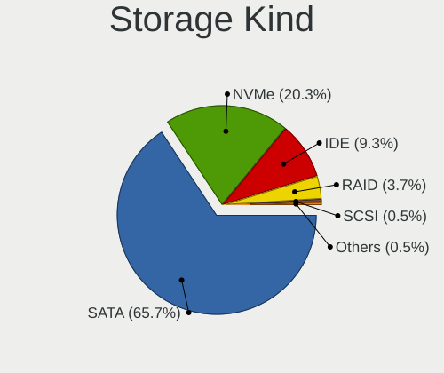

| Kind | Desktops | Percent |
|------|----------|---------|
| SATA | 389      | 65.71%  |
| NVMe | 120      | 20.27%  |
| IDE  | 55       | 9.29%   |
| RAID | 22       | 3.72%   |
| SAS  | 3        | 0.51%   |
| SCSI | 3        | 0.51%   |

Processor
---------

CPU Vendor
----------

Processor vendors

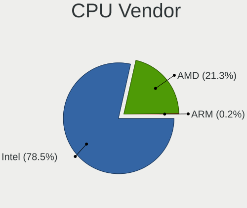

| Vendor | Desktops | Percent |
|--------|----------|---------|
| Intel  | 362      | 78.52%  |
| AMD    | 98       | 21.26%  |
| ARM    | 1        | 0.22%   |

CPU Model
---------

Processor models

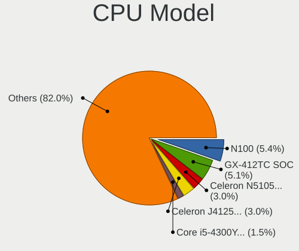

| Model                                    | Desktops | Percent |
|------------------------------------------|----------|---------|
| Intel N100                               | 25       | 5.35%   |
| AMD GX-412TC SOC                         | 24       | 5.14%   |
| Intel Celeron N5105 @ 2.00GHz            | 14       | 3%      |
| Intel Celeron J4125 CPU @ 2.00GHz        | 14       | 3%      |
| Intel Core i5-4300Y CPU @ 1.60GHz        | 7        | 1.5%    |
| Intel Atom CPU C3758R @ 2.40GHz          | 7        | 1.5%    |
| Intel Core i5-6500T CPU @ 2.50GHz        | 6        | 1.28%   |
| Intel Core i3-4010U CPU @ 1.70GHz        | 6        | 1.28%   |
| AMD GX-415GA SOC with Radeon HD Graphics | 6        | 1.28%   |
| Intel Core i5-4590T CPU @ 2.00GHz        | 5        | 1.07%   |
| Intel Core i3-N305                       | 5        | 1.07%   |
| Intel Atom CPU D525 @ 1.80GHz            | 5        | 1.07%   |
| Intel N150                               | 4        | 0.86%   |
| Intel Core i7-9700 CPU @ 3.00GHz         | 4        | 0.86%   |
| Intel Core i7-6700 CPU @ 3.40GHz         | 4        | 0.86%   |
| Intel Core i5-9500 CPU @ 3.00GHz         | 4        | 0.86%   |
| Intel Core i5-5250U CPU @ 1.60GHz        | 4        | 0.86%   |
| Intel Core i5-4570 CPU @ 3.20GHz         | 4        | 0.86%   |
| Intel Core i5-3470 CPU @ 3.20GHz         | 4        | 0.86%   |
| Intel Atom CPU C3758 @ 2.20GHz           | 4        | 0.86%   |
| AMD Ryzen 7 3700X 8-Core Processor       | 4        | 0.86%   |
| AMD G-T40E Processor                     | 4        | 0.86%   |
| Intel Xeon CPU E3-1265L V2 @ 2.50GHz     | 3        | 0.64%   |
| Intel Pentium CPU @ 2.00GHz              | 3        | 0.64%   |
| Intel N95                                | 3        | 0.64%   |
| Intel Core i5-7500 CPU @ 3.40GHz         | 3        | 0.64%   |
| Intel Core i5-6500 CPU @ 3.20GHz         | 3        | 0.64%   |
| Intel Core i5-6400 CPU @ 2.70GHz         | 3        | 0.64%   |
| Intel Core i5-5200U CPU @ 2.20GHz        | 3        | 0.64%   |
| Intel Core i5-4590 CPU @ 3.30GHz         | 3        | 0.64%   |
| Intel Core i5-2500K CPU @ 3.30GHz        | 3        | 0.64%   |
| Intel Core i3-3225 CPU @ 3.30GHz         | 3        | 0.64%   |
| Intel Core i3-3220 CPU @ 3.30GHz         | 3        | 0.64%   |
| Intel Core 2 Quad CPU                    | 3        | 0.64%   |
| Intel Celeron N5095 @ 2.00GHz            | 3        | 0.64%   |
| Intel Celeron CPU J3160 @ 1.60GHz        | 3        | 0.64%   |
| Intel Celeron CPU G3900 @ 2.80GHz        | 3        | 0.64%   |
| Intel 686-class                          | 3        | 0.64%   |
| AMD Ryzen 7 5700G with Radeon Graphics   | 3        | 0.64%   |
| AMD Ryzen 5 5600G with Radeon Graphics   | 3        | 0.64%   |

CPU Model Family
----------------

Processor model prefix

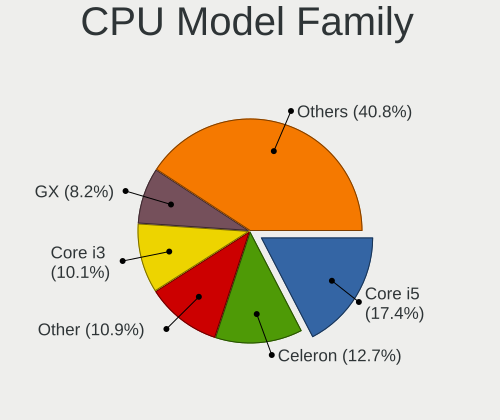

| Model                   | Desktops | Percent |
|-------------------------|----------|---------|
| Intel Core i5           | 81       | 17.38%  |
| Intel Celeron           | 59       | 12.66%  |
| Other                   | 51       | 10.94%  |
| Intel Core i3           | 47       | 10.09%  |
| AMD GX                  | 38       | 8.15%   |
| Intel Core i7           | 33       | 7.08%   |
| Intel Xeon              | 32       | 6.87%   |
| Intel Atom              | 31       | 6.65%   |
| AMD Ryzen 5             | 15       | 3.22%   |
| AMD Ryzen 7             | 14       | 3%      |
| Intel Pentium           | 11       | 2.36%   |
| Intel Core 2 Quad       | 7        | 1.5%    |
| Intel Pentium Gold      | 4        | 0.86%   |
| Intel Core 2 Duo        | 4        | 0.86%   |
| AMD G                   | 4        | 0.86%   |
| AMD A8                  | 4        | 0.86%   |
| Intel 686-class         | 3        | 0.64%   |
| AMD Ryzen 3             | 3        | 0.64%   |
| AMD Athlon              | 3        | 0.64%   |
| Intel Pentium Silver    | 2        | 0.43%   |
| Intel Core i9           | 2        | 0.43%   |
| AMD Ryzen 9             | 2        | 0.43%   |
| AMD E                   | 2        | 0.43%   |
| AMD Athlon II X2        | 2        | 0.43%   |
| AMD Athlon 64 X2        | 2        | 0.43%   |
| AMD A10                 | 2        | 0.43%   |
| Intel Pentium Dual-Core | 1        | 0.21%   |
| Intel Genuine           | 1        | 0.21%   |
| Intel Core 2            | 1        | 0.21%   |
| ARM Cortex              | 1        | 0.21%   |
| AMD Phenom II X4        | 1        | 0.21%   |
| AMD FX                  | 1        | 0.21%   |
| AMD E1                  | 1        | 0.21%   |
| AMD Athlon II X3        | 1        | 0.21%   |

CPU Cores
---------

Number of processor cores

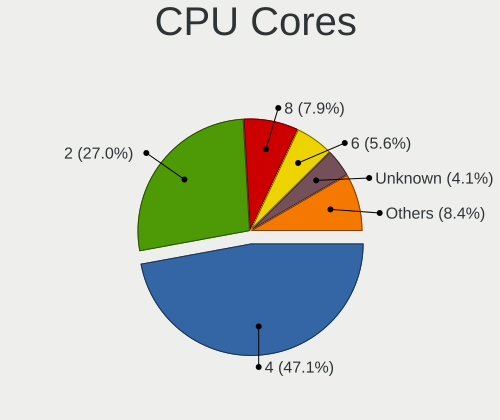

| Number  | Desktops | Percent |
|---------|----------|---------|
| 4       | 220      | 47.11%  |
| 2       | 126      | 26.98%  |
| 8       | 37       | 7.92%   |
| 6       | 26       | 5.57%   |
| Unknown | 19       | 4.07%   |
| 12      | 16       | 3.43%   |
| 16      | 13       | 2.78%   |
| 10      | 5        | 1.07%   |
| 32      | 2        | 0.43%   |
| 3       | 2        | 0.43%   |
| 28      | 1        | 0.21%   |

CPU Sockets
-----------

Number of sockets

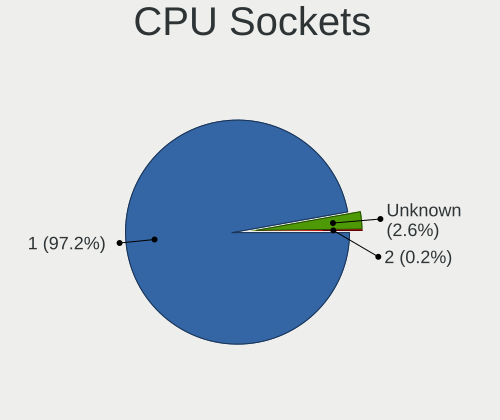

| Number  | Desktops | Percent |
|---------|----------|---------|
| 1       | 447      | 97.17%  |
| Unknown | 12       | 2.61%   |
| 2       | 1        | 0.22%   |

CPU Threads
-----------

Threads per core (Hyper-Threading)

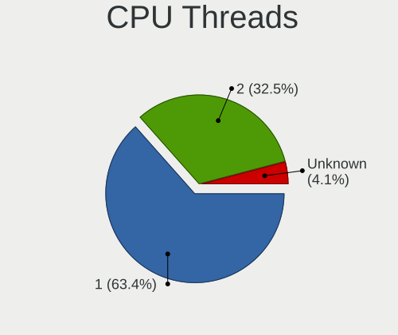

| Number  | Desktops | Percent |
|---------|----------|---------|
| 1       | 295      | 63.44%  |
| 2       | 151      | 32.47%  |
| Unknown | 19       | 4.09%   |

CPU Microarch
-------------

Microarchitecture

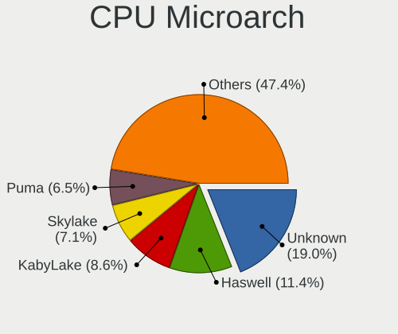

| Name          | Desktops | Percent |
|---------------|----------|---------|
| Unknown       | 88       | 18.97%  |
| Haswell       | 53       | 11.42%  |
| KabyLake      | 40       | 8.62%   |
| Skylake       | 33       | 7.11%   |
| Puma          | 30       | 6.47%   |
| IvyBridge     | 30       | 6.47%   |
| SandyBridge   | 24       | 5.17%   |
| Silvermont    | 16       | 3.45%   |
| Goldmont      | 15       | 3.23%   |
| Zen 3         | 14       | 3.02%   |
| Goldmont plus | 14       | 3.02%   |
| Broadwell     | 13       | 2.8%    |
| Bonnell       | 12       | 2.59%   |
| Zen 2         | 10       | 2.16%   |
| Penryn        | 10       | 2.16%   |
| Jaguar        | 10       | 2.16%   |
| CometLake     | 7        | 1.51%   |
| Bobcat        | 7        | 1.51%   |
| Zen+          | 5        | 1.08%   |
| Nehalem       | 5        | 1.08%   |
| Core          | 5        | 1.08%   |
| Westmere      | 4        | 0.86%   |
| Piledriver    | 4        | 0.86%   |
| K10           | 4        | 0.86%   |
| Zen           | 3        | 0.65%   |
| Steamroller   | 3        | 0.65%   |
| TigerLake     | 2        | 0.43%   |
| K8 Hammer     | 1        | 0.22%   |
| K6            | 1        | 0.22%   |
| Excavator     | 1        | 0.22%   |

Graphics
--------

GPU Vendor
----------

Vendors of graphics cards

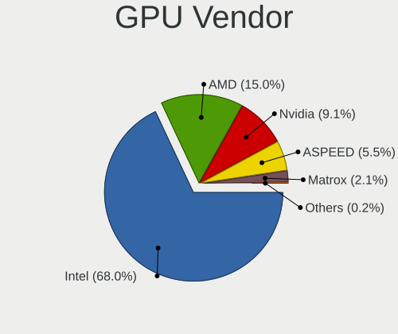

| Vendor                     | Desktops | Percent |
|----------------------------|----------|---------|
| Intel                      | 285      | 68.02%  |
| AMD                        | 63       | 15.04%  |
| Nvidia                     | 38       | 9.07%   |
| ASPEED Technology          | 23       | 5.49%   |
| Matrox Electronics Systems | 9        | 2.15%   |
| S3 Graphics                | 1        | 0.24%   |

GPU Model
---------

Graphics card models

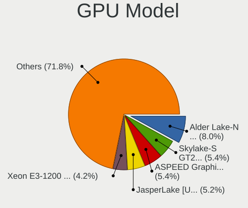

| Model                                                                                    | Desktops | Percent |
|------------------------------------------------------------------------------------------|----------|---------|
| Intel Alder Lake-N [UHD Graphics]                                                        | 34       | 8%      |
| Intel Skylake-S GT2 [HD Graphics 530]                                                    | 23       | 5.41%   |
| ASPEED Technology ASPEED Graphics Family                                                 | 23       | 5.41%   |
| Intel JasperLake [UHD Graphics]                                                          | 22       | 5.18%   |
| Intel Xeon E3-1200 v3/4th Gen Core Processor Integrated Graphics Controller              | 18       | 4.24%   |
| Intel CoffeeLake-S GT2 [UHD Graphics 630]                                                | 15       | 3.53%   |
| Intel Xeon E3-1200 v2/3rd Gen Core processor Graphics Controller                         | 14       | 3.29%   |
| Intel GeminiLake [UHD Graphics 600]                                                      | 14       | 3.29%   |
| Intel 2nd Generation Core Processor Family Integrated Graphics Controller                | 13       | 3.06%   |
| Intel Haswell-ULT Integrated Graphics Controller                                         | 12       | 2.82%   |
| Intel Haswell-ULT Integrated Graphics Controller [HD Graphics]                           | 9        | 2.12%   |
| Intel Atom/Celeron/Pentium Processor x5-E8000/J3xxx/N3xxx Integrated Graphics Controller | 8        | 1.88%   |
| Intel Kaby Lake-U GT2 [HD Graphics 620]                                                  | 7        | 1.65%   |
| Intel Skylake-S GT1 [HD Graphics 510]                                                    | 6        | 1.41%   |
| Intel Kaby Lake-S GT2 [HD Graphics 630]                                                  | 6        | 1.41%   |
| Intel Broadwell-U GT2 [HD Graphics 5500]                                                 | 6        | 1.41%   |
| Intel Atom Processor Z36xxx/Z37xxx Series Graphics & Display                             | 6        | 1.41%   |
| AMD Kabini [Radeon HD 8330E]                                                             | 6        | 1.41%   |
| Intel CometLake-S GT2 [UHD Graphics 630]                                                 | 5        | 1.18%   |
| Intel 4th Generation Core Processor Family Integrated Graphics Controller                | 5        | 1.18%   |
| AMD Cezanne [Radeon Vega Series / Radeon Vega Mobile Series]                             | 5        | 1.18%   |
| Nvidia GT218 [GeForce 210]                                                               | 4        | 0.94%   |
| Nvidia GK208B [GeForce GT 710]                                                           | 4        | 0.94%   |
| Matrox Electronics Systems MGA G200eW WPCM450                                            | 4        | 0.94%   |
| Intel IvyBridge GT2 [HD Graphics 4000]                                                   | 4        | 0.94%   |
| Intel Broadwell-U GT3 [HD Graphics 6000]                                                 | 4        | 0.94%   |
| Intel Alder Lake-N [Intel Graphics]                                                      | 4        | 0.94%   |
| Intel 4 Series Chipset Integrated Graphics Controller                                    | 4        | 0.94%   |
| AMD Mullins [Radeon R4/R5 Graphics]                                                      | 4        | 0.94%   |
| Nvidia TU116 [GeForce GTX 1660 Ti]                                                       | 3        | 0.71%   |
| Nvidia GP108 [GeForce GT 1030]                                                           | 3        | 0.71%   |
| Matrox Electronics Systems MGA G200EH                                                    | 3        | 0.71%   |
| Intel Atom Processor D4xx/D5xx/N4xx/N5xx Integrated Graphics Controller                  | 3        | 0.71%   |
| Intel Atom Processor D2xxx/N2xxx Integrated Graphics Controller                          | 3        | 0.71%   |
| Intel 3rd Gen Core processor Graphics Controller                                         | 3        | 0.71%   |
| Nvidia GF119 [GeForce GT 610]                                                            | 2        | 0.47%   |
| Matrox Electronics Systems MGA G200e [Pilot] ServerEngines (SEP1)                        | 2        | 0.47%   |
| Intel RocketLake-S [UHD Graphics]                                                        | 2        | 0.47%   |
| Intel Raptor Lake-S GT1 [UHD Graphics 770]                                               | 2        | 0.47%   |
| Intel Elkhart Lake [UHD Graphics Gen11 16EU]                                             | 2        | 0.47%   |

GPU Combo
---------

Combinations of graphics cards

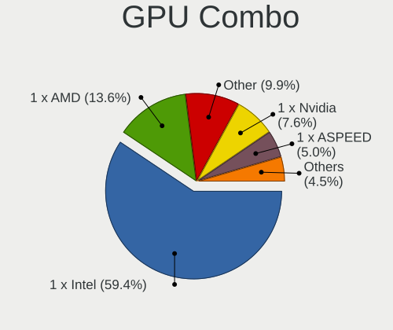

| Name            | Desktops | Percent |
|-----------------|----------|---------|
| 1 x Intel       | 275      | 59.4%   |
| 1 x AMD         | 63       | 13.61%  |
| Other           | 46       | 9.94%   |
| 1 x Nvidia      | 35       | 7.56%   |
| 1 x ASPEED      | 23       | 4.97%   |
| 1 x Matrox      | 9        | 1.94%   |
| 2 x Intel       | 8        | 1.73%   |
| Intel + Nvidia  | 2        | 0.43%   |
| 2 x Nvidia      | 1        | 0.22%   |
| 1 x S3 Graphics | 1        | 0.22%   |

GPU Driver
----------

Free vs proprietary

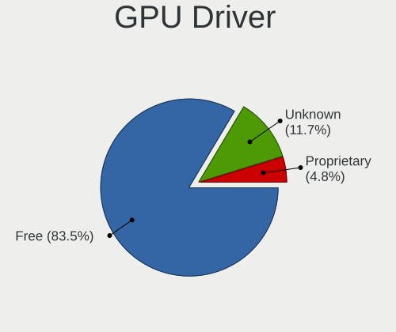

| Driver      | Desktops | Percent |
|-------------|----------|---------|
| Free        | 386      | 83.55%  |
| Unknown     | 54       | 11.69%  |
| Proprietary | 22       | 4.76%   |

GPU Memory
----------

Total video memory

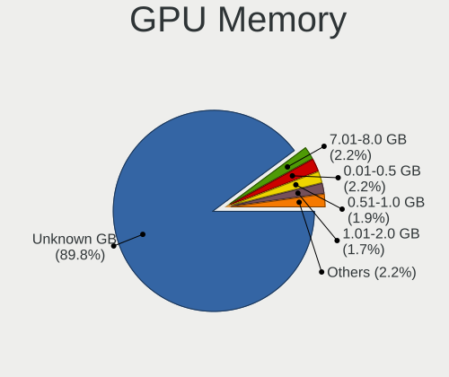

| Size in GB | Desktops | Percent |
|------------|----------|---------|
| Unknown    | 415      | 89.83%  |
| 7.01-8.0   | 10       | 2.16%   |
| 0.01-0.5   | 10       | 2.16%   |
| 0.51-1.0   | 9        | 1.95%   |
| 1.01-2.0   | 8        | 1.73%   |
| 5.01-6.0   | 5        | 1.08%   |
| 3.01-4.0   | 3        | 0.65%   |
| 16.01-24.0 | 1        | 0.22%   |
| 8.01-16.0  | 1        | 0.22%   |

Monitor
-------

Monitor Vendor
--------------

Monitor vendors

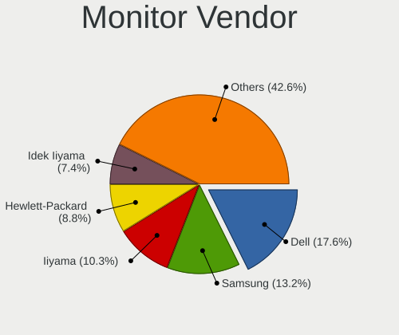

| Vendor               | Desktops | Percent |
|----------------------|----------|---------|
| Dell                 | 12       | 17.65%  |
| Samsung Electronics  | 9        | 13.24%  |
| Iiyama               | 7        | 10.29%  |
| Hewlett-Packard      | 6        | 8.82%   |
| Idek Iiyama          | 5        | 7.35%   |
| Acer                 | 4        | 5.88%   |
| ViewSonic            | 3        | 4.41%   |
| Goldstar             | 3        | 4.41%   |
| BenQ                 | 3        | 4.41%   |
| Ancor Communications | 3        | 4.41%   |
| Philips              | 2        | 2.94%   |
| AOC                  | 2        | 2.94%   |
| Sony                 | 1        | 1.47%   |
| RS                   | 1        | 1.47%   |
| PRI                  | 1        | 1.47%   |
| PKB                  | 1        | 1.47%   |
| Packard Bell         | 1        | 1.47%   |
| LG Electronics       | 1        | 1.47%   |
| Lenovo Group Limited | 1        | 1.47%   |
| CKL                  | 1        | 1.47%   |
| Apple                | 1        | 1.47%   |

Monitor Model
-------------

Monitor models

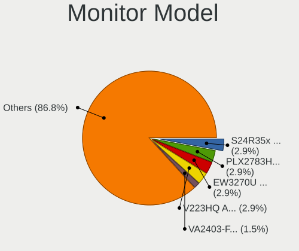

| Model                                                               | Desktops | Percent |
|---------------------------------------------------------------------|----------|---------|
| Samsung Electronics LCD Monitor S24R35x 1920x1080                   | 2        | 2.94%   |
| Idek Iiyama LCD Monitor PLX2783H 1920x1080                          | 2        | 2.94%   |
| BenQ EW3270U BNQ7950 3840x2160 700x390mm 31.5-inch                  | 2        | 2.94%   |
| Acer V223HQ ACR0070 1920x1080 470x270mm 21.3-inch                   | 2        | 2.94%   |
| ViewSonic VA2403-FHD VSCF136 1920x1080 520x290mm 23.4-inch          | 1        | 1.47%   |
| ViewSonic VA1916w-6 VSCF91F 1440x900 410x260mm 19.1-inch            | 1        | 1.47%   |
| ViewSonic TD2420 SERIES VSC452D 1920x1080 520x290mm 23.4-inch       | 1        | 1.47%   |
| Sony TV  *00 SNYF903 3840x2160 1080x610mm 48.8-inch                 | 1        | 1.47%   |
| Samsung Electronics U28E590 SAM0C4E 3840x2160 610x350mm 27.7-inch   | 1        | 1.47%   |
| Samsung Electronics SyncMaster SAM05CD 1920x1080                    | 1        | 1.47%   |
| Samsung Electronics SyncMaster SAM036F 1440x900 410x260mm 19.1-inch | 1        | 1.47%   |
| Samsung Electronics S22C450 SAM09C5 1920x1080 480x270mm 21.7-inch   | 1        | 1.47%   |
| Samsung Electronics LCD Monitor SyncMaster 3520x1200                | 1        | 1.47%   |
| Samsung Electronics LCD Monitor S24D330 1920x1080                   | 1        | 1.47%   |
| Samsung Electronics LCD Monitor B2430L 1920x1080                    | 1        | 1.47%   |
| RS LE1940 BTC1940 1440x900 410x260mm 19.1-inch                      | 1        | 1.47%   |
| PRI LED-MONITOR PRI0828 3840x2160 1150x650mm 52.0-inch              | 1        | 1.47%   |
| PKB LCD Monitor MAE200W 1680x1050                                   | 1        | 1.47%   |
| Philips LCD Monitor PHLC00B 1280x1024 340x270mm 17.1-inch           | 1        | 1.47%   |
| Philips 221B PHL08A1 1920x1080 480x270mm 21.7-inch                  | 1        | 1.47%   |
| Packard Bell Viseo 200Ws PKB00C2 1600x900 440x250mm 19.9-inch       | 1        | 1.47%   |
| LG Electronics LCD Monitor LG ULTRAWIDE 2560x1080                   | 1        | 1.47%   |
| Lenovo Group Limited LCD Monitor LEN P27h-10 2560x1440              | 1        | 1.47%   |
| Iiyama X2483_2481 IVM6128 1920x1080 530x300mm 24.0-inch             | 1        | 1.47%   |
| Iiyama PLX2783H IVM6648 1920x1080 600x340mm 27.2-inch               | 1        | 1.47%   |
| Iiyama PLX2483H IVM6114 1920x1080 530x300mm 24.0-inch               | 1        | 1.47%   |
| Iiyama PL2783Q IVM661F 2560x1440 600x340mm 27.2-inch                | 1        | 1.47%   |
| Iiyama PL2770H IVM665D 1920x1080 600x340mm 27.2-inch                | 1        | 1.47%   |
| Iiyama PL2483H IVM6138 1920x1080 530x300mm 24.0-inch                | 1        | 1.47%   |
| Iiyama PL2474H IVM6137 1920x1080 520x290mm 23.4-inch                | 1        | 1.47%   |
| Idek Iiyama LCD Monitor PL2473HD 1920x1080                          | 1        | 1.47%   |
| Idek Iiyama LCD Monitor PL2409HD 1920x1080                          | 1        | 1.47%   |
| Idek Iiyama LCD Monitor PL2206W 1680x1050                           | 1        | 1.47%   |
| Hewlett-Packard Z24i HWP309F 1920x1200 520x320mm 24.0-inch          | 1        | 1.47%   |
| Hewlett-Packard w2207 HWP26A9 1680x1050 470x300mm 22.0-inch         | 1        | 1.47%   |
| Hewlett-Packard w2007 HWP26A6 1680x1050 430x270mm 20.0-inch         | 1        | 1.47%   |
| Hewlett-Packard HPQ 8300 AiO HWP4212 1920x1080 510x290mm 23.1-inch  | 1        | 1.47%   |
| Hewlett-Packard 2310e HWP2909 1920x1080 510x290mm 23.1-inch         | 1        | 1.47%   |
| Hewlett-Packard 2211 HWP2938 1920x1080 480x270mm 21.7-inch          | 1        | 1.47%   |
| Goldstar L1730S GSM438D 1280x1024 340x270mm 17.1-inch               | 1        | 1.47%   |

Monitor Resolution
------------------

Monitor screen resolution

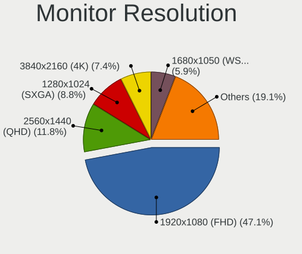

| Resolution         | Desktops | Percent |
|--------------------|----------|---------|
| 1920x1080 (FHD)    | 32       | 47.06%  |
| 2560x1440 (QHD)    | 8        | 11.76%  |
| 1280x1024 (SXGA)   | 6        | 8.82%   |
| 3840x2160 (4K)     | 5        | 7.35%   |
| 1680x1050 (WSXGA+) | 4        | 5.88%   |
| 1440x900 (WXGA+)   | 4        | 5.88%   |
| 2560x1080          | 2        | 2.94%   |
| 1920x1200 (WUXGA)  | 2        | 2.94%   |
| 1600x900 (HD+)     | 2        | 2.94%   |
| 3520x1200          | 1        | 1.47%   |
| 1280x800 (WXGA)    | 1        | 1.47%   |
| Unknown            | 1        | 1.47%   |

Monitor Diagonal
----------------

Diagonal size in inches

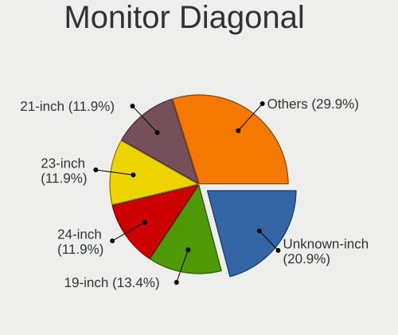

| Inches  | Desktops | Percent |
|---------|----------|---------|
| Unknown | 14       | 20.9%   |
| 19      | 9        | 13.43%  |
| 24      | 8        | 11.94%  |
| 23      | 8        | 11.94%  |
| 21      | 8        | 11.94%  |
| 27      | 6        | 8.96%   |
| 17      | 3        | 4.48%   |
| 52      | 2        | 2.99%   |
| 31      | 2        | 2.99%   |
| 26      | 2        | 2.99%   |
| 48      | 1        | 1.49%   |
| 28      | 1        | 1.49%   |
| 22      | 1        | 1.49%   |
| 20      | 1        | 1.49%   |
| 13      | 1        | 1.49%   |

Monitor Width
-------------

Physical width

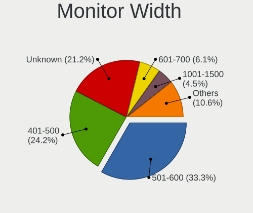

| Width in mm | Desktops | Percent |
|-------------|----------|---------|
| 501-600     | 22       | 33.33%  |
| 401-500     | 16       | 24.24%  |
| Unknown     | 14       | 21.21%  |
| 601-700     | 4        | 6.06%   |
| 351-400     | 3        | 4.55%   |
| 301-350     | 3        | 4.55%   |
| 1001-1500   | 3        | 4.55%   |
| 201-300     | 1        | 1.52%   |

Aspect Ratio
------------

Proportional relationship between the width and the height

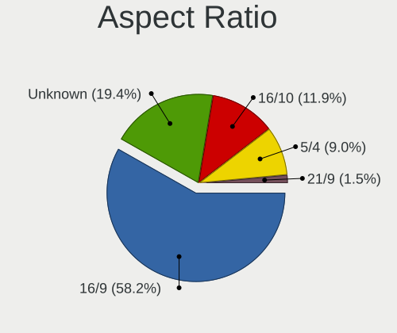

| Ratio   | Desktops | Percent |
|---------|----------|---------|
| 16/9    | 39       | 58.21%  |
| Unknown | 13       | 19.4%   |
| 16/10   | 8        | 11.94%  |
| 5/4     | 6        | 8.96%   |
| 21/9    | 1        | 1.49%   |

Monitor Area
------------

Area in inch²

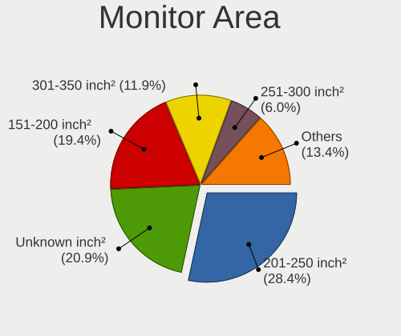

| Area in inch² | Desktops | Percent |
|----------------|----------|---------|
| 201-250        | 19       | 28.36%  |
| Unknown        | 14       | 20.9%   |
| 151-200        | 13       | 19.4%   |
| 301-350        | 8        | 11.94%  |
| 251-300        | 4        | 5.97%   |
| More than 1000 | 3        | 4.48%   |
| 141-150        | 3        | 4.48%   |
| 351-500        | 2        | 2.99%   |
| 81-90          | 1        | 1.49%   |

Pixel Density
-------------

Pixels per inch

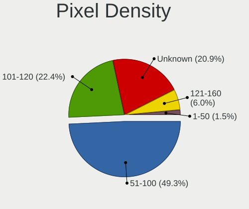

| Density | Desktops | Percent |
|---------|----------|---------|
| 51-100  | 33       | 49.25%  |
| 101-120 | 15       | 22.39%  |
| Unknown | 14       | 20.9%   |
| 121-160 | 4        | 5.97%   |
| 1-50    | 1        | 1.49%   |

Multiple Monitors
-----------------

Total monitors connected

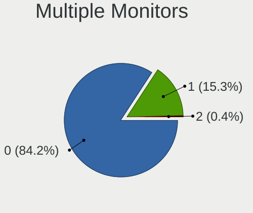

| Total | Desktops | Percent |
|-------|----------|---------|
| 0     | 390      | 84.23%  |
| 1     | 71       | 15.33%  |
| 2     | 2        | 0.43%   |

Network
-------

Net Controller Vendor
---------------------

Controller vendors

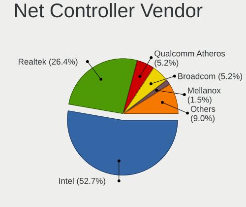

| Vendor                          | Desktops | Percent |
|---------------------------------|----------|---------|
| Intel                           | 347      | 52.74%  |
| Realtek Semiconductor           | 174      | 26.44%  |
| Qualcomm Atheros                | 34       | 5.17%   |
| Broadcom                        | 34       | 5.17%   |
| Mellanox Technologies           | 10       | 1.52%   |
| MediaTek                        | 6        | 0.91%   |
| D-Link System                   | 6        | 0.91%   |
| VIA Technologies                | 4        | 0.61%   |
| Ralink Technology               | 4        | 0.61%   |
| American Megatrends             | 4        | 0.61%   |
| Chelsio Communications          | 3        | 0.46%   |
| Aquantia                        | 3        | 0.46%   |
| 3Com                            | 3        | 0.46%   |
| TP-Link                         | 2        | 0.3%    |
| Ralink                          | 2        | 0.3%    |
| Qualcomm Atheros Communications | 2        | 0.3%    |
| Qualcomm                        | 2        | 0.3%    |
| IMC Networks                    | 2        | 0.3%    |
| Huawei Technologies             | 2        | 0.3%    |
| Solarflare Communications       | 1        | 0.15%   |
| Sierra Wireless                 | 1        | 0.15%   |
| Samsung Electronics             | 1        | 0.15%   |
| QLogic                          | 1        | 0.15%   |
| OPPO Electronics                | 1        | 0.15%   |
| National Semiconductor          | 1        | 0.15%   |
| Mobile                          | 1        | 0.15%   |
| Microchip Technology            | 1        | 0.15%   |
| Marvell Technology Group        | 1        | 0.15%   |
| Linksys                         | 1        | 0.15%   |
| Emulex                          | 1        | 0.15%   |
| Edimax Technology               | 1        | 0.15%   |
| AMD                             | 1        | 0.15%   |
| Accton Technology               | 1        | 0.15%   |

Net Controller Model
--------------------

Controller models

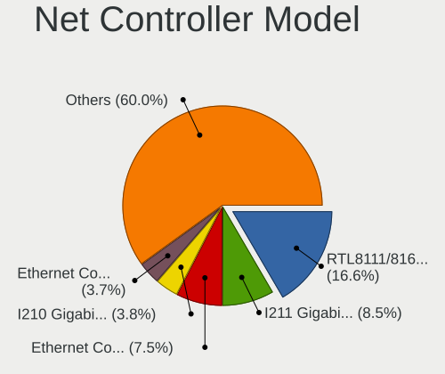

| Model                                                                         | Desktops | Percent |
|-------------------------------------------------------------------------------|----------|---------|
| Realtek RTL8111/8168/8211/8411 PCI Express Gigabit Ethernet Controller        | 135      | 16.58%  |
| Intel I211 Gigabit Network Connection                                         | 69       | 8.48%   |
| Intel Ethernet Controller I226-V                                              | 61       | 7.49%   |
| Intel I210 Gigabit Network Connection                                         | 31       | 3.81%   |
| Intel Ethernet Controller I225-V                                              | 30       | 3.69%   |
| Realtek RTL8125 2.5GbE Controller                                             | 24       | 2.95%   |
| Intel 82574L Gigabit Network Connection                                       | 24       | 2.95%   |
| Intel I350 Gigabit Network Connection                                         | 22       | 2.7%    |
| Intel 82599ES 10-Gigabit SFI/SFP+ Network Connection                          | 17       | 2.09%   |
| Intel Ethernet Connection I217-LM                                             | 16       | 1.97%   |
| Intel 82579LM Gigabit Network Connection (Lewisville)                         | 16       | 1.97%   |
| Intel Ethernet Connection (2) I219-LM                                         | 14       | 1.72%   |
| Intel Ethernet Controller X710 for 10GbE SFP+                                 | 10       | 1.23%   |
| Realtek RTL8111/8168/8411 PCI Express Gigabit Ethernet Controller             | 9        | 1.11%   |
| Qualcomm Atheros AR928X Wireless Network Adapter (PCI-Express)                | 9        | 1.11%   |
| Intel Ethernet Connection X553 10 GbE SFP+                                    | 9        | 1.11%   |
| Intel Wi-Fi 6 AX200                                                           | 8        | 0.98%   |
| Intel Ethernet Connection (2) I219-V                                          | 8        | 0.98%   |
| Intel 82571EB/82571GB Gigabit Ethernet Controller D0/D1 (copper applications) | 8        | 0.98%   |
| Mellanox MT27500 Family [ConnectX-3]                                          | 7        | 0.86%   |
| Intel 82579V Gigabit Network Connection                                       | 7        | 0.86%   |
| Realtek RTL8852BE PCIe 802.11ax Wireless Network Controller                   | 6        | 0.74%   |
| Intel Ethernet Controller X550                                                | 6        | 0.74%   |
| Intel Ethernet Connection (7) I219-LM                                         | 6        | 0.74%   |
| Intel 82583V Gigabit Network Connection                                       | 6        | 0.74%   |
| Intel 82576 Gigabit Network Connection                                        | 6        | 0.74%   |
| D-Link System DGE-528T Gigabit Ethernet Adapter                               | 6        | 0.74%   |
| Broadcom NetXtreme II BCM57810 10 Gigabit Ethernet                            | 6        | 0.74%   |
| Realtek RTL8821CE 802.11ac PCIe Wireless Network Adapter                      | 5        | 0.61%   |
| Realtek RTL8812AE 802.11ac PCIe Wireless Network Adapter                      | 5        | 0.61%   |
| Realtek RTL-8100/8101L/8139 PCI Fast Ethernet Adapter                         | 5        | 0.61%   |
| Intel Ethernet Connection X553 1GbE                                           | 5        | 0.61%   |
| Intel Dual Band Wireless-AC 3168NGW [Stone Peak]                              | 5        | 0.61%   |
| Broadcom NetXtreme BCM5720 Gigabit Ethernet PCIe                              | 5        | 0.61%   |
| Realtek RTL8169 PCI Gigabit Ethernet Controller                               | 4        | 0.49%   |
| Qualcomm Atheros AR9287 Wireless Network Adapter (PCI-Express)                | 4        | 0.49%   |
| Qualcomm Atheros AR9285 Wireless Network Adapter (PCI-Express)                | 4        | 0.49%   |
| MediaTek MT7922 802.11ax PCI Express Wireless Network Adapter                 | 4        | 0.49%   |
| Broadcom NetXtreme BCM5719 Gigabit Ethernet PCIe                              | 4        | 0.49%   |
| American Megatrends Virtual Ethernet                                          | 4        | 0.49%   |

Wireless Vendor
---------------

Wireless vendors

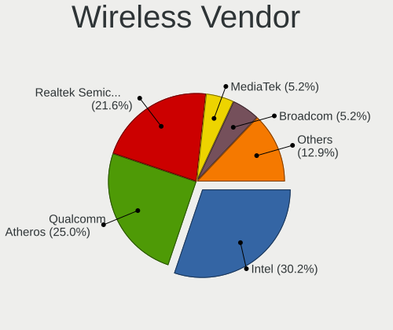

| Vendor                          | Desktops | Percent |
|---------------------------------|----------|---------|
| Intel                           | 35       | 30.17%  |
| Qualcomm Atheros                | 29       | 25%     |
| Realtek Semiconductor           | 25       | 21.55%  |
| MediaTek                        | 6        | 5.17%   |
| Broadcom                        | 6        | 5.17%   |
| Ralink Technology               | 4        | 3.45%   |
| TP-Link                         | 2        | 1.72%   |
| Ralink                          | 2        | 1.72%   |
| Qualcomm Atheros Communications | 2        | 1.72%   |
| IMC Networks                    | 2        | 1.72%   |
| Linksys                         | 1        | 0.86%   |
| Edimax Technology               | 1        | 0.86%   |
| Accton Technology               | 1        | 0.86%   |

Wireless Model
--------------

Wireless models

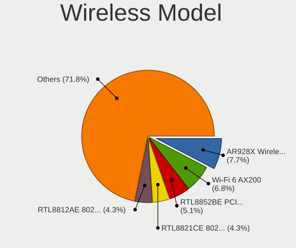

| Model                                                           | Desktops | Percent |
|-----------------------------------------------------------------|----------|---------|
| Qualcomm Atheros AR928X Wireless Network Adapter (PCI-Express)  | 9        | 7.69%   |
| Intel Wi-Fi 6 AX200                                             | 8        | 6.84%   |
| Realtek RTL8852BE PCIe 802.11ax Wireless Network Controller     | 6        | 5.13%   |
| Realtek RTL8821CE 802.11ac PCIe Wireless Network Adapter        | 5        | 4.27%   |
| Realtek RTL8812AE 802.11ac PCIe Wireless Network Adapter        | 5        | 4.27%   |
| Intel Dual Band Wireless-AC 3168NGW [Stone Peak]                | 5        | 4.27%   |
| Qualcomm Atheros AR9287 Wireless Network Adapter (PCI-Express)  | 4        | 3.42%   |
| Qualcomm Atheros AR9285 Wireless Network Adapter (PCI-Express)  | 4        | 3.42%   |
| MediaTek MT7922 802.11ax PCI Express Wireless Network Adapter   | 4        | 3.42%   |
| Qualcomm Atheros QCA986x/988x 802.11ac Wireless Network Adapter | 3        | 2.56%   |
| Intel Wi-Fi 6E(802.11ax) AX210/AX1675* 2x2 [Typhoon Peak]       | 3        | 2.56%   |
| TP-Link Archer T3U [Realtek RTL8812BU]                          | 2        | 1.71%   |
| Realtek RTL8188EUS 802.11n Wireless Network Adapter             | 2        | 1.71%   |
| Ralink RT5370 Wireless Adapter                                  | 2        | 1.71%   |
| Qualcomm Atheros AR9271 802.11n                                 | 2        | 1.71%   |
| Qualcomm Atheros AR9485 Wireless Network Adapter                | 2        | 1.71%   |
| Qualcomm Atheros AR9462 Wireless Network Adapter                | 2        | 1.71%   |
| Qualcomm Atheros AR93xx Wireless Network Adapter                | 2        | 1.71%   |
| Qualcomm Atheros AR5212/5213/2414 Wireless Network Adapter      | 2        | 1.71%   |
| Intel Wireless 7260                                             | 2        | 1.71%   |
| Intel Wireless 3165                                             | 2        | 1.71%   |
| Intel Wi-Fi 5(802.11ac) Wireless-AC 9x6x [Thunder Peak]         | 2        | 1.71%   |
| Intel Jasper Lake PCH CNVi WiFi                                 | 2        | 1.71%   |
| Intel Centrino Advanced-N 6235                                  | 2        | 1.71%   |
| Intel Centrino Advanced-N 6200                                  | 2        | 1.71%   |
| Intel Alder Lake-N PCH CNVi WiFi                                | 2        | 1.71%   |
| IMC Networks 802.11 n/g/b Wireless LAN USB Mini-Card            | 2        | 1.71%   |
| Broadcom BCM4360 802.11ac Dual Band Wireless Network Adapter    | 2        | 1.71%   |
| Broadcom BCM4356 802.11ac Wireless Network Adapter              | 2        | 1.71%   |
| Broadcom BCM43224 802.11a/b/g/n                                 | 2        | 1.71%   |
| Realtek RTL88x2bu [AC1200 Techkey]                              | 1        | 0.85%   |
| Realtek RTL8812AU 802.11a/b/g/n/ac 2T2R DB WLAN Adapter         | 1        | 0.85%   |
| Realtek RTL8192EU 802.11b/g/n WLAN Adapter                      | 1        | 0.85%   |
| Realtek RTL8191SU 802.11n WLAN Adapter                          | 1        | 0.85%   |
| Realtek RTL8191SEvB Wireless LAN Controller                     | 1        | 0.85%   |
| Realtek RTL8191SEvA Wireless LAN Controller                     | 1        | 0.85%   |
| Realtek RTL8188FTV 802.11b/g/n 1T1R 2.4G WLAN Adapter           | 1        | 0.85%   |
| Realtek RTL8188EE Wireless Network Adapter                      | 1        | 0.85%   |
| Ralink RT2870 Wireless Adapter                                  | 1        | 0.85%   |
| Ralink MT7601U Wireless Adapter                                 | 1        | 0.85%   |

Ethernet Vendor
---------------

Ethernet vendors

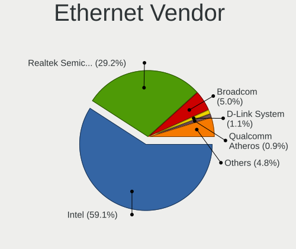

| Vendor                    | Desktops | Percent |
|---------------------------|----------|---------|
| Intel                     | 334      | 59.12%  |
| Realtek Semiconductor     | 165      | 29.2%   |
| Broadcom                  | 28       | 4.96%   |
| D-Link System             | 6        | 1.06%   |
| Qualcomm Atheros          | 5        | 0.88%   |
| VIA Technologies          | 4        | 0.71%   |
| American Megatrends       | 4        | 0.71%   |
| Aquantia                  | 3        | 0.53%   |
| 3Com                      | 3        | 0.53%   |
| Qualcomm                  | 2        | 0.35%   |
| Chelsio Communications    | 2        | 0.35%   |
| Solarflare Communications | 1        | 0.18%   |
| Samsung Electronics       | 1        | 0.18%   |
| QLogic                    | 1        | 0.18%   |
| OPPO Electronics          | 1        | 0.18%   |
| National Semiconductor    | 1        | 0.18%   |
| Mobile                    | 1        | 0.18%   |
| Marvell Technology Group  | 1        | 0.18%   |
| Emulex                    | 1        | 0.18%   |
| AMD                       | 1        | 0.18%   |

Ethernet Model
--------------

Ethernet models

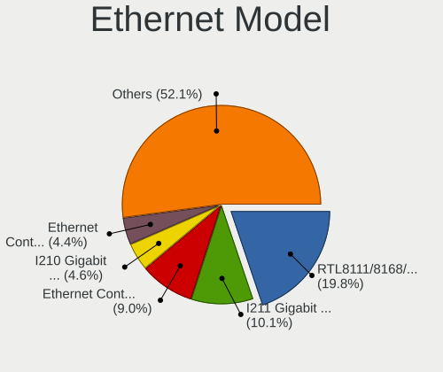

| Model                                                                         | Desktops | Percent |
|-------------------------------------------------------------------------------|----------|---------|
| Realtek RTL8111/8168/8211/8411 PCI Express Gigabit Ethernet Controller        | 135      | 19.82%  |
| Intel I211 Gigabit Network Connection                                         | 69       | 10.13%  |
| Intel Ethernet Controller I226-V                                              | 61       | 8.96%   |
| Intel I210 Gigabit Network Connection                                         | 31       | 4.55%   |
| Intel Ethernet Controller I225-V                                              | 30       | 4.41%   |
| Realtek RTL8125 2.5GbE Controller                                             | 24       | 3.52%   |
| Intel 82574L Gigabit Network Connection                                       | 24       | 3.52%   |
| Intel I350 Gigabit Network Connection                                         | 22       | 3.23%   |
| Intel 82599ES 10-Gigabit SFI/SFP+ Network Connection                          | 17       | 2.5%    |
| Intel Ethernet Connection I217-LM                                             | 16       | 2.35%   |
| Intel 82579LM Gigabit Network Connection (Lewisville)                         | 16       | 2.35%   |
| Intel Ethernet Connection (2) I219-LM                                         | 14       | 2.06%   |
| Intel Ethernet Controller X710 for 10GbE SFP+                                 | 10       | 1.47%   |
| Realtek RTL8111/8168/8411 PCI Express Gigabit Ethernet Controller             | 9        | 1.32%   |
| Intel Ethernet Connection X553 10 GbE SFP+                                    | 9        | 1.32%   |
| Intel Ethernet Connection (2) I219-V                                          | 8        | 1.17%   |
| Intel 82571EB/82571GB Gigabit Ethernet Controller D0/D1 (copper applications) | 8        | 1.17%   |
| Intel 82579V Gigabit Network Connection                                       | 7        | 1.03%   |
| Intel Ethernet Controller X550                                                | 6        | 0.88%   |
| Intel Ethernet Connection (7) I219-LM                                         | 6        | 0.88%   |
| Intel 82583V Gigabit Network Connection                                       | 6        | 0.88%   |
| Intel 82576 Gigabit Network Connection                                        | 6        | 0.88%   |
| D-Link System DGE-528T Gigabit Ethernet Adapter                               | 6        | 0.88%   |
| Broadcom NetXtreme II BCM57810 10 Gigabit Ethernet                            | 6        | 0.88%   |
| Realtek RTL-8100/8101L/8139 PCI Fast Ethernet Adapter                         | 5        | 0.73%   |
| Intel Ethernet Connection X553 1GbE                                           | 5        | 0.73%   |
| Broadcom NetXtreme BCM5720 Gigabit Ethernet PCIe                              | 5        | 0.73%   |
| Realtek RTL8169 PCI Gigabit Ethernet Controller                               | 4        | 0.59%   |
| Broadcom NetXtreme BCM5719 Gigabit Ethernet PCIe                              | 4        | 0.59%   |
| American Megatrends Virtual Ethernet                                          | 4        | 0.59%   |
| Intel I350 Gigabit Fiber Network Connection                                   | 3        | 0.44%   |
| Intel Ethernet Controller 10-Gigabit X540-AT2                                 | 3        | 0.44%   |
| Intel Ethernet Connection X722 for 10GbE SFP+                                 | 3        | 0.44%   |
| Intel Ethernet Connection (11) I219-V                                         | 3        | 0.44%   |
| Intel DH8900CC Series Gigabit Network Connection                              | 3        | 0.44%   |
| Intel 82567LM-3 Gigabit Network Connection                                    | 3        | 0.44%   |
| VIA VT6105/VT6106S [Rhine-III]                                                | 2        | 0.29%   |
| VIA VT6102/VT6103 [Rhine-II]                                                  | 2        | 0.29%   |
| Realtek USB 2.5GbE Controller                                                 | 2        | 0.29%   |
| Qualcomm Atheros AR8151 v2.0 Gigabit Ethernet                                 | 2        | 0.29%   |

Net Controller Kind
-------------------

Ethernet, WiFi or modem

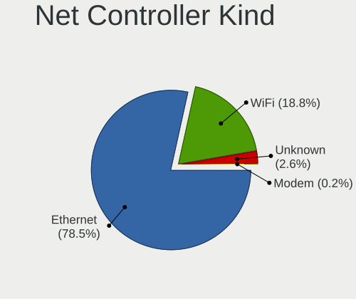

| Kind     | Desktops | Percent |
|----------|----------|---------|
| Ethernet | 459      | 78.46%  |
| WiFi     | 110      | 18.8%   |
| Unknown  | 15       | 2.56%   |
| Modem    | 1        | 0.17%   |

Used Controller
---------------

Currently used network controller

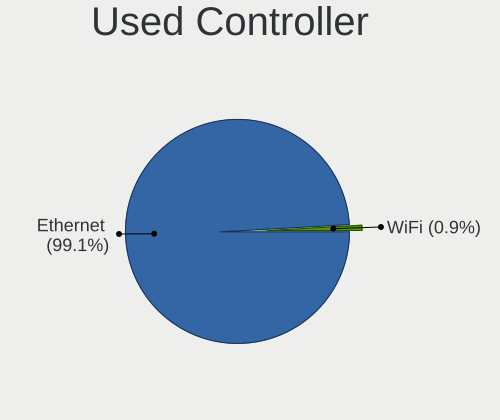

| Kind     | Desktops | Percent |
|----------|----------|---------|
| Ethernet | 439      | 99.1%   |
| WiFi     | 4        | 0.9%    |

NICs
----

Total network controllers on board

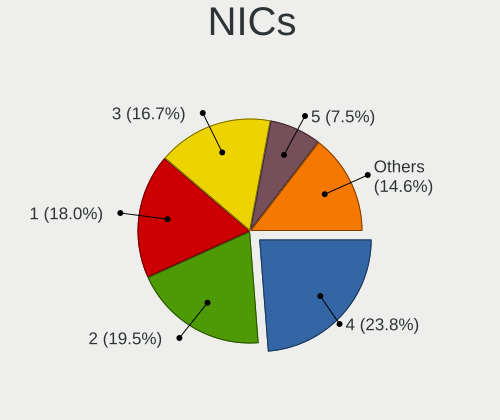

| Total | Desktops | Percent |
|-------|----------|---------|
| 4     | 111      | 23.77%  |
| 2     | 91       | 19.49%  |
| 1     | 84       | 17.99%  |
| 3     | 78       | 16.7%   |
| 5     | 35       | 7.49%   |
| 6     | 33       | 7.07%   |
| 8     | 11       | 2.36%   |
| 9     | 10       | 2.14%   |
| 7     | 6        | 1.28%   |
| 10    | 3        | 0.64%   |
| 11    | 2        | 0.43%   |
| 13    | 1        | 0.21%   |
| 12    | 1        | 0.21%   |
| 0     | 1        | 0.21%   |

IPv6
----

IPv6 vs IPv4

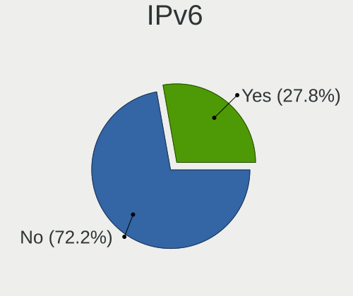

| Used | Desktops | Percent |
|------|----------|---------|
| No   | 348      | 72.2%   |
| Yes  | 134      | 27.8%   |

Bluetooth
---------

Bluetooth Vendor
----------------

Controller vendors

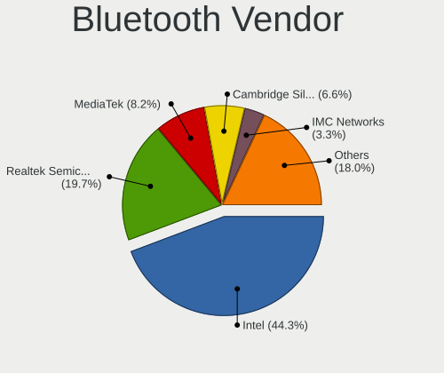

| Vendor                          | Desktops | Percent |
|---------------------------------|----------|---------|
| Intel                           | 27       | 44.26%  |
| Realtek Semiconductor           | 12       | 19.67%  |
| MediaTek                        | 5        | 8.2%    |
| Cambridge Silicon Radio         | 4        | 6.56%   |
| IMC Networks                    | 2        | 3.28%   |
| Broadcom                        | 2        | 3.28%   |
| AMPAK Technology                | 2        | 3.28%   |
| Sino Wealth Electronic          | 1        | 1.64%   |
| Qualcomm Atheros Communications | 1        | 1.64%   |
| Lite-On Technology              | 1        | 1.64%   |
| HTC (High Tech Computer)        | 1        | 1.64%   |
| Hewlett-Packard                 | 1        | 1.64%   |
| ASUSTek Computer                | 1        | 1.64%   |
| Apple                           | 1        | 1.64%   |

Bluetooth Model
---------------

Controller models

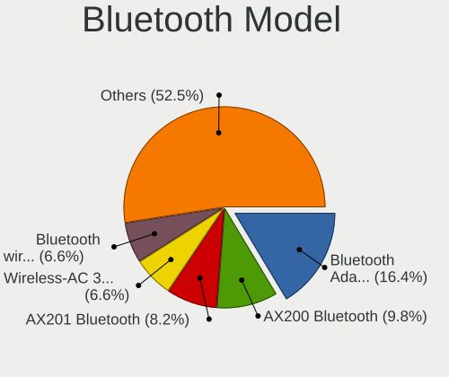

| Model                                                                | Desktops | Percent |
|----------------------------------------------------------------------|----------|---------|
| Realtek Bluetooth Adapter                                            | 10       | 16.39%  |
| Intel AX200 Bluetooth                                                | 6        | 9.84%   |
| Intel AX201 Bluetooth                                                | 5        | 8.2%    |
| Intel Wireless-AC 3168 Bluetooth                                     | 4        | 6.56%   |
| Intel Bluetooth wireless interface                                   | 4        | 6.56%   |
| Cambridge Silicon Radio Bluetooth Dongle (HCI mode)                  | 4        | 6.56%   |
| Intel Centrino Bluetooth Wireless Transceiver                        | 3        | 4.92%   |
| Intel AX210 Bluetooth                                                | 3        | 4.92%   |
| MediaTek Wireless_Device                                             | 2        | 3.28%   |
| Broadcom BCM20702A0 Bluetooth 4.0                                    | 2        | 3.28%   |
| AMPAK Bluetooth USB module                                           | 2        | 3.28%   |
| Sino Wealth Electronic RK Bluetooth Keyboar                          | 1        | 1.64%   |
| Realtek  Bluetooth 4.2 Adapter                                       | 1        | 1.64%   |
| Realtek Bluetooth 5.1 Adapter                                        | 1        | 1.64%   |
| Qualcomm Atheros Dell Wireless 1901 Bluetooth                        | 1        | 1.64%   |
| MediaTek RZ616 Bluetooth Adapter                                     | 1        | 1.64%   |
| MediaTek RZ608 Bluetooth Adapter                                     | 1        | 1.64%   |
| MediaTek Bluetooth Adapter                                           | 1        | 1.64%   |
| Lite-On Atheros AR3012 Bluetooth                                     | 1        | 1.64%   |
| Intel Wireless-AC 9260 Bluetooth Adapter                             | 1        | 1.64%   |
| Intel Bluetooth 9460/9560 Jefferson Peak (JfP)                       | 1        | 1.64%   |
| IMC Networks MediaTek Bluetooth Adapter                              | 1        | 1.64%   |
| IMC Networks Bluetooth Module                                        | 1        | 1.64%   |
| HTC (High Tech Computer) Vive Hub Bluetooth 4.1 (Broadcom BCM920703) | 1        | 1.64%   |
| HP Bluetooth 2.0 Interface [Broadcom BCM2045]                        | 1        | 1.64%   |
| ASUS Broadcom BCM20702 Single-Chip Bluetooth 4.0 + LE                | 1        | 1.64%   |
| Apple Bluetooth Host Controller                                      | 1        | 1.64%   |

Sound
-----

Sound Vendor
------------

Sound card vendors

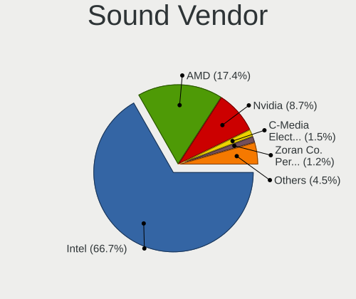

| Vendor                                       | Desktops | Percent |
|----------------------------------------------|----------|---------|
| Intel                                        | 269      | 66.75%  |
| AMD                                          | 70       | 17.37%  |
| Nvidia                                       | 35       | 8.68%   |
| C-Media Electronics                          | 6        | 1.49%   |
| Zoran Co. Personal Media Division (Nogatech) | 5        | 1.24%   |
| Creative Labs                                | 3        | 0.74%   |
| VIA Technologies                             | 2        | 0.5%    |
| Focusrite-Novation                           | 2        | 0.5%    |
| Texas Instruments                            | 1        | 0.25%   |
| Sony                                         | 1        | 0.25%   |
| Micronas                                     | 1        | 0.25%   |
| Mark of the Unicorn                          | 1        | 0.25%   |
| Logitech                                     | 1        | 0.25%   |
| Kingston Technology                          | 1        | 0.25%   |
| iCreate Technologies                         | 1        | 0.25%   |
| Hewlett-Packard                              | 1        | 0.25%   |
| GN Netcom                                    | 1        | 0.25%   |
| Giga-Byte Technology                         | 1        | 0.25%   |
| ESS Technology                               | 1        | 0.25%   |

Sound Model
-----------

Sound card models

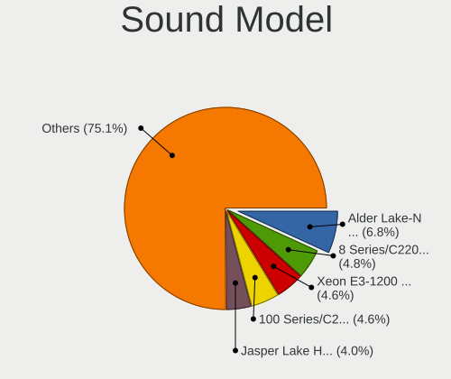

| Model                                                                                             | Desktops | Percent |
|---------------------------------------------------------------------------------------------------|----------|---------|
| Intel Alder Lake-N PCH High Definition Audio Controller                                           | 34       | 6.83%   |
| Intel 8 Series/C220 Series Chipset High Definition Audio Controller                               | 24       | 4.82%   |
| Intel Xeon E3-1200 v3/4th Gen Core Processor HD Audio Controller                                  | 23       | 4.62%   |
| Intel 100 Series/C230 Series Chipset Family HD Audio Controller                                   | 23       | 4.62%   |
| Intel Jasper Lake HD Audio                                                                        | 20       | 4.02%   |
| Intel 8 Series HD Audio Controller                                                                | 20       | 4.02%   |
| Intel Haswell-ULT HD Audio Controller                                                             | 19       | 3.82%   |
| Intel 7 Series/C216 Chipset Family High Definition Audio Controller                               | 18       | 3.61%   |
| Intel 6 Series/C200 Series Chipset Family High Definition Audio Controller                        | 18       | 3.61%   |
| AMD FCH Azalia Controller                                                                         | 16       | 3.21%   |
| AMD Ryzen HD Audio Controller                                                                     | 14       | 2.81%   |
| AMD Kabini HDMI/DP Audio                                                                          | 14       | 2.81%   |
| Intel Celeron/Pentium Silver Processor High Definition Audio                                      | 13       | 2.61%   |
| Intel 200 Series PCH HD Audio                                                                     | 13       | 2.61%   |
| AMD Starship/Matisse HD Audio Controller                                                          | 13       | 2.61%   |
| Intel Cannon Lake PCH cAVS                                                                        | 12       | 2.41%   |
| AMD Renoir/Cezanne HDMI/DP Audio Controller                                                       | 10       | 2.01%   |
| Intel Wildcat Point-LP High Definition Audio Controller                                           | 9        | 1.81%   |
| Intel NM10/ICH7 Family High Definition Audio Controller                                           | 8        | 1.61%   |
| Intel Broadwell-U Audio Controller                                                                | 8        | 1.61%   |
| Intel Sunrise Point-LP HD Audio                                                                   | 7        | 1.41%   |
| AMD SBx00 Azalia (Intel HDA)                                                                      | 7        | 1.41%   |
| Zoran Co. Personal Media Division (Nogatech) USB Audio and HID                                    | 5        | 1%      |
| Nvidia High Definition Audio Controller                                                           | 5        | 1%      |
| Intel Atom/Celeron/Pentium Processor x5-E8000/J3xxx/N3xxx Series High Definition Audio Controller | 5        | 1%      |
| Intel Alder Lake-S HD Audio Controller                                                            | 5        | 1%      |
| Intel Alder Lake PCH-P High Definition Audio Controller                                           | 5        | 1%      |
| AMD Family 17h (Models 00h-0fh) HD Audio Controller                                               | 5        | 1%      |
| Nvidia GK208 HDMI/DP Audio Controller                                                             | 4        | 0.8%    |
| Intel 82801JI (ICH10 Family) HD Audio Controller                                                  | 4        | 0.8%    |
| Intel 82801JD/DO (ICH10 Family) HD Audio Controller                                               | 4        | 0.8%    |
| C-Media Electronics Audio Adapter (Unitek Y-247A)                                                 | 4        | 0.8%    |
| AMD Navi 31 HDMI/DP Audio                                                                         | 4        | 0.8%    |
| Nvidia TU116 High Definition Audio Controller                                                     | 3        | 0.6%    |
| Nvidia GP108 High Definition Audio Controller                                                     | 3        | 0.6%    |
| Intel Comet Lake PCH cAVS                                                                         | 3        | 0.6%    |
| Intel 82801I (ICH9 Family) HD Audio Controller                                                    | 3        | 0.6%    |
| AMD Wrestler HDMI Audio                                                                           | 3        | 0.6%    |
| AMD Navi 10 HDMI Audio                                                                            | 3        | 0.6%    |
| AMD Kaveri HDMI/DP Audio Controller                                                               | 3        | 0.6%    |

Memory
------

Memory Vendor
-------------

Memory module vendors

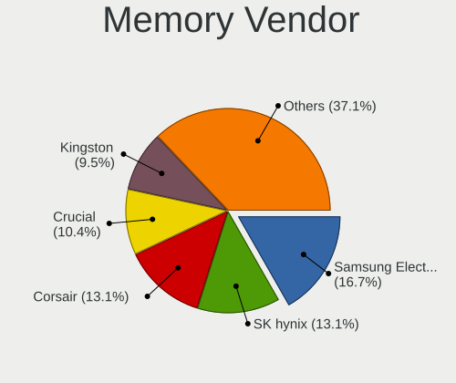

| Vendor              | Desktops | Percent |
|---------------------|----------|---------|
| Samsung Electronics | 74       | 16.74%  |
| SK hynix            | 58       | 13.12%  |
| Corsair             | 58       | 13.12%  |
| Crucial             | 46       | 10.41%  |
| Kingston            | 42       | 9.5%    |
| Unknown             | 38       | 8.6%    |
| Micron Technology   | 37       | 8.37%   |
| G.Skill             | 31       | 7.01%   |
| Unknown             | 11       | 2.49%   |
| Nanya Technology    | 5        | 1.13%   |
| Kimtigo             | 5        | 1.13%   |
| Transcend           | 4        | 0.9%    |
| Wodposit            | 3        | 0.68%   |
| Ramaxel Technology  | 3        | 0.68%   |
| ATP                 | 3        | 0.68%   |
| Patriot             | 2        | 0.45%   |
| Lexar Co Limited    | 2        | 0.45%   |
| Elpida              | 2        | 0.45%   |
| Atermiter           | 2        | 0.45%   |
| Unknown (0x0FBA)    | 1        | 0.23%   |
| Unknown (0x0C97)    | 1        | 0.23%   |
| Unknown (0x0C6E)    | 1        | 0.23%   |
| Unknown (0B38)      | 1        | 0.23%   |
| Teikon              | 1        | 0.23%   |
| TakeMS              | 1        | 0.23%   |
| OCZ                 | 1        | 0.23%   |
| Lexar               | 1        | 0.23%   |
| KingFast            | 1        | 0.23%   |
| Kembona             | 1        | 0.23%   |
| Hewlett-Packard     | 1        | 0.23%   |
| Goldenmars          | 1        | 0.23%   |
| Avant               | 1        | 0.23%   |
| Apacer              | 1        | 0.23%   |
| A-DATA Technology   | 1        | 0.23%   |
| 48spaces            | 1        | 0.23%   |

Memory Model
------------

Memory module models

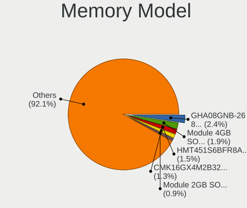

| Model                                                          | Desktops | Percent |
|----------------------------------------------------------------|----------|---------|
| Unknown                                                        | 11       | 2.36%   |
| Unknown RAM Module 4GB SODIMM DDR3 1333MT/s                    | 9        | 1.93%   |
| SK hynix RAM HMT451S6BFR8A-PB 4GB SODIMM DDR3 1600MT/s         | 7        | 1.5%    |
| Corsair RAM CMK16GX4M2B3200C16 8GB DIMM DDR4 3200MT/s          | 6        | 1.29%   |
| Unknown RAM Module 2GB SODIMM DDR3 1333MT/s                    | 4        | 0.86%   |
| Samsung RAM M471A2K43CB1-CTD 16GB SODIMM DDR4 2667MT/s         | 4        | 0.86%   |
| Samsung RAM M425R1GB4BB0-CQKOL 8GB SODIMM DDR5 4800MT/s        | 4        | 0.86%   |
| Kimtigo RAM KT8GS3EDF 8GB SODIMM DDR3 1600MT/s                 | 4        | 0.86%   |
| Crucial RAM CT16G56C46S5.M8G1 16GB SODIMM DDR5 5600MT/s        | 4        | 0.86%   |
| Corsair RAM CMSX16GX5M1A4800C40 16GB SODIMM DDR5 4800MT/s      | 4        | 0.86%   |
| Corsair RAM CMSX16GX4M1A3200C22 16GB SODIMM DDR4 3200MT/s      | 4        | 0.86%   |
| Unknown RAM Module 8GB DIMM DDR3 1600MT/s                      | 3        | 0.64%   |
| Unknown RAM Module 4GB DIMM 1333MT/s                           | 3        | 0.64%   |
| Unknown RAM Module 2GB SODIMM DDR3 800MT/s                     | 3        | 0.64%   |
| SK hynix RAM HMT41GS6BFR8A-PB 8GB SODIMM DDR3 1600MT/s         | 3        | 0.64%   |
| SK hynix RAM HMA81GU6AFR8N-UH 8GB DIMM DDR4 2400MT/s           | 3        | 0.64%   |
| Samsung RAM Module 8GB SODIMM DDR4 2133MT/s                    | 3        | 0.64%   |
| Samsung RAM Module 2GB Row Of Chips LPDDR5 6400MT/s            | 3        | 0.64%   |
| Samsung RAM M471B5173EB0-YK0 4GB SODIMM DDR3 1600MT/s          | 3        | 0.64%   |
| Samsung RAM M378B5273CH0-CK0 4GB DIMM DDR3 1600MT/s            | 3        | 0.64%   |
| Samsung RAM M378B5173QH0-CK0 4GB DIMM DDR3 1600MT/s            | 3        | 0.64%   |
| Samsung RAM 53D512M64D4RQ-046 4GB Row Of Chips LPDDR4 3733MT/s | 3        | 0.64%   |
| Crucial RAM CT8G48C40S5.M4A1 8GB SODIMM DDR5 4800MT/s          | 3        | 0.64%   |
| Corsair RAM CMK64GX4M2E3200C16 32GB DIMM DDR4 3200MT/s         | 3        | 0.64%   |
| ATP RAM XQ13D8E2GM-K-RB 2GB DIMM DDR3 1333MT/s                 | 3        | 0.64%   |
| Wodposit RAM WPBH26D408SWA-8G 8GB SODIMM DDR4 2400MT/s         | 2        | 0.43%   |
| Unknown RAM Module 2GB DIMM 1333MT/s                           | 2        | 0.43%   |
| Unknown RAM Module 2048MB DIMM 800MT/s                         | 2        | 0.43%   |
| SK hynix RAM HMT451U6DFR8A-PB 4GB DIMM DDR3 1600MT/s           | 2        | 0.43%   |
| SK hynix RAM HMT451U6BFR8C-PB 4GB DIMM DDR3 1600MT/s           | 2        | 0.43%   |
| SK hynix RAM HMT351U6CFR8C-PB 4GB DIMM DDR3 1600MT/s           | 2        | 0.43%   |
| SK hynix RAM HMT351S6CFR8C-H9 4GB SODIMM DDR3 1333MT/s         | 2        | 0.43%   |
| SK hynix RAM HMA851S6AFR6N-UH 4GB SODIMM DDR4 2400MT/s         | 2        | 0.43%   |
| SK hynix RAM HMA82GU6JJR8N-VK 16GB DIMM DDR4 2666MT/s          | 2        | 0.43%   |
| SK hynix RAM HMA81GU7DJR8N-XN 8GB DIMM DDR4 3200MT/s           | 2        | 0.43%   |
| SK hynix RAM HMA81GU6JJR8N-VK 8GB DIMM DDR4 2667MT/s           | 2        | 0.43%   |
| Samsung RAM Module 16GB DIMM DDR4 2667MT/s                     | 2        | 0.43%   |
| Samsung RAM M471B1G73DB0-YK0 8GB SODIMM DDR3 1600MT/s          | 2        | 0.43%   |
| Samsung RAM M471A1K43BB1-CRC 8GB SODIMM DDR4 2400MT/s          | 2        | 0.43%   |
| Samsung RAM M393A4K40CB2-CTD 32GB DIMM DDR4 2667MT/s           | 2        | 0.43%   |

Memory Kind
-----------

Memory module kinds

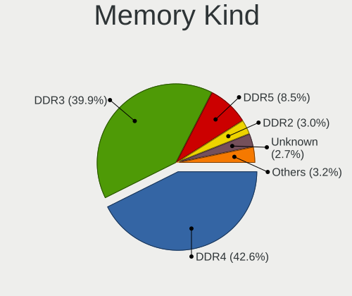

| Kind    | Desktops | Percent |
|---------|----------|---------|
| DDR4    | 171      | 42.64%  |
| DDR3    | 160      | 39.9%   |
| DDR5    | 34       | 8.48%   |
| DDR2    | 12       | 2.99%   |
| Unknown | 11       | 2.74%   |
| LPDDR4  | 7        | 1.75%   |
| LPDDR5  | 4        | 1%      |
| SDRAM   | 2        | 0.5%    |

Memory Form Factor
------------------

Physical design of the memory module

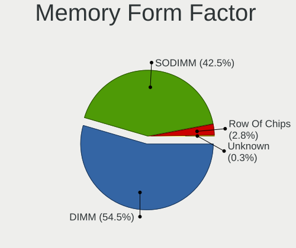

| Name         | Desktops | Percent |
|--------------|----------|---------|
| DIMM         | 217      | 54.52%  |
| SODIMM       | 169      | 42.46%  |
| Row Of Chips | 11       | 2.76%   |
| Unknown      | 1        | 0.25%   |

Memory Size
-----------

Memory module size

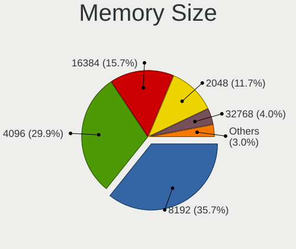

| Size  | Desktops | Percent |
|-------|----------|---------|
| 8192  | 153      | 35.75%  |
| 4096  | 128      | 29.91%  |
| 16384 | 67       | 15.65%  |
| 2048  | 50       | 11.68%  |
| 32768 | 17       | 3.97%   |
| 1024  | 11       | 2.57%   |
| 49152 | 2        | 0.47%   |

Memory Speed
------------

Memory module speed

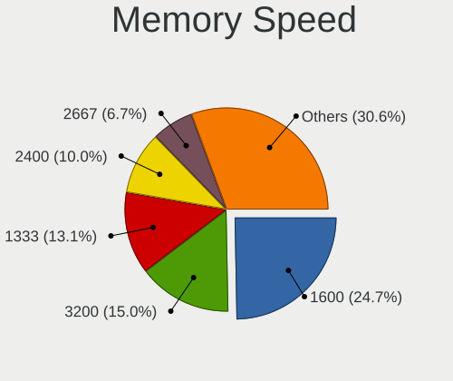

| Speed   | Desktops | Percent |
|---------|----------|---------|
| 1600    | 104      | 24.7%   |
| 3200    | 63       | 14.96%  |
| 1333    | 55       | 13.06%  |
| 2400    | 42       | 9.98%   |
| 2667    | 28       | 6.65%   |
| 2133    | 26       | 6.18%   |
| 4800    | 24       | 5.7%    |
| 800     | 17       | 4.04%   |
| 2666    | 15       | 3.56%   |
| 5600    | 10       | 2.38%   |
| 667     | 6        | 1.43%   |
| 1066    | 5        | 1.19%   |
| 6400    | 4        | 0.95%   |
| 3733    | 3        | 0.71%   |
| 3600    | 3        | 0.71%   |
| 1334    | 3        | 0.71%   |
| 5200    | 2        | 0.48%   |
| 2933    | 2        | 0.48%   |
| 4267    | 1        | 0.24%   |
| 3000    | 1        | 0.24%   |
| 1867    | 1        | 0.24%   |
| 1400    | 1        | 0.24%   |
| 1332    | 1        | 0.24%   |
| 1067    | 1        | 0.24%   |
| 533     | 1        | 0.24%   |
| 400     | 1        | 0.24%   |
| Unknown | 1        | 0.24%   |

Printers & scanners
-------------------

Printer Vendor
--------------

Printer device vendors

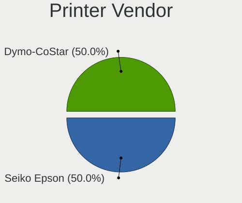

| Vendor      | Desktops | Percent |
|-------------|----------|---------|
| Seiko Epson | 1        | 50%     |
| Dymo-CoStar | 1        | 50%     |

Printer Model
-------------

Printer device models

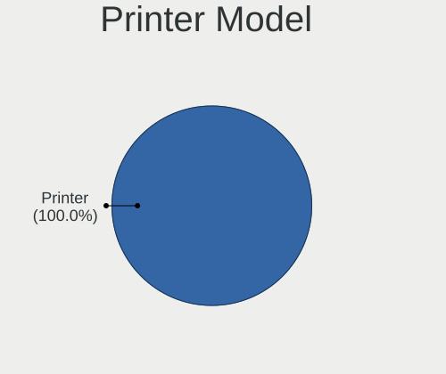

| Model                       | Desktops | Percent |
|-----------------------------|----------|---------|
| Seiko Epson Printer         | 1        | 50%     |
| Dymo-CoStar LabelWriter 450 | 1        | 50%     |

Scanner Vendor
--------------

Scanner device vendors

| Vendor | Desktops | Percent |
|--------|----------|---------|
| Canon  | 2        | 100%    |

Scanner Model
-------------

Scanner device models

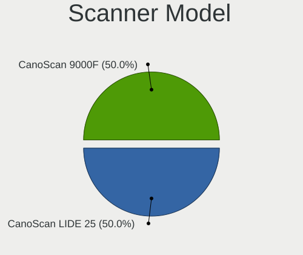

| Model                  | Desktops | Percent |
|------------------------|----------|---------|
| Canon CanoScan LIDE 25 | 1        | 50%     |
| Canon CanoScan 9000F   | 1        | 50%     |

Camera
------

Camera Vendor
-------------

Camera device vendors

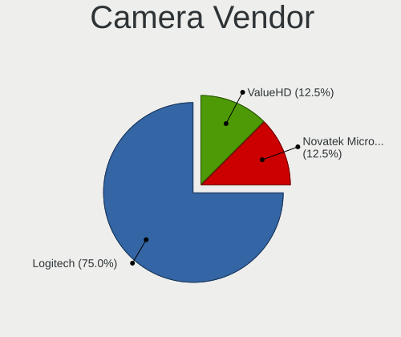

| Vendor                   | Desktops | Percent |
|--------------------------|----------|---------|
| Logitech                 | 7        | 70%     |
| ValueHD                  | 1        | 10%     |
| Novatek Microelectronics | 1        | 10%     |
| ARC International        | 1        | 10%     |

Camera Model
------------

Camera device models

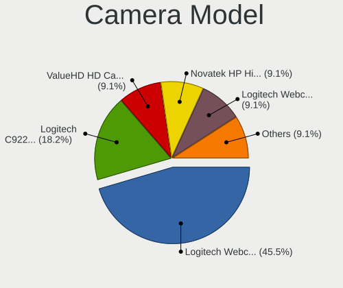

| Model                                 | Desktops | Percent |
|---------------------------------------|----------|---------|
| Logitech Webcam C270                  | 5        | 45.45%  |
| Logitech C922 Pro Stream Webcam       | 2        | 18.18%  |
| ValueHD HD Camera                     | 1        | 9.09%   |
| Novatek HP High Definition 2MP Webcam | 1        | 9.09%   |
| Logitech Webcam C930e                 | 1        | 9.09%   |
| ARC International Camera              | 1        | 9.09%   |

Security
--------

Fingerprint Vendor
------------------

Fingerprint sensor vendors

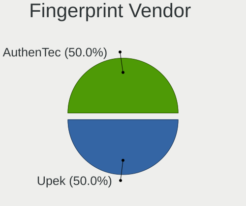

| Vendor    | Desktops | Percent |
|-----------|----------|---------|
| Upek      | 1        | 50%     |
| AuthenTec | 1        | 50%     |

Fingerprint Model
-----------------

Fingerprint sensor models

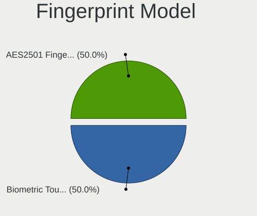

| Model                                                  | Desktops | Percent |
|--------------------------------------------------------|----------|---------|
| Upek Biometric Touchchip/Touchstrip Fingerprint Sensor | 1        | 50%     |
| AuthenTec AES2501 Fingerprint Sensor                   | 1        | 50%     |

Chipcard Vendor
---------------

Chipcard module vendors

Zero info for selected period =(

Chipcard Model
--------------

Chipcard module models

Zero info for selected period =(

Unsupported
-----------

Unsupported Devices
-------------------

Total unsupported devices on board

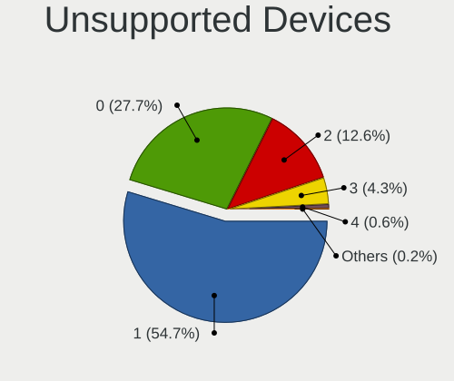

| Total | Desktops | Percent |
|-------|----------|---------|
| 1     | 257      | 54.68%  |
| 0     | 130      | 27.66%  |
| 2     | 59       | 12.55%  |
| 3     | 20       | 4.26%   |
| 4     | 3        | 0.64%   |
| 5     | 1        | 0.21%   |

Unsupported Device Types
------------------------

Types of unsupported devices

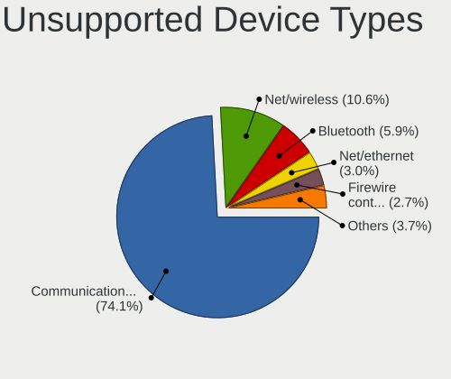

| Type                     | Desktops | Percent |
|--------------------------|----------|---------|
| Communication controller | 301      | 74.14%  |
| Net/wireless             | 43       | 10.59%  |
| Bluetooth                | 24       | 5.91%   |
| Net/ethernet             | 12       | 2.96%   |
| Firewire controller      | 11       | 2.71%   |
| Sound                    | 4        | 0.99%   |
| Card reader              | 4        | 0.99%   |
| Graphics card            | 3        | 0.74%   |
| Storage/ata              | 1        | 0.25%   |
| Storage                  | 1        | 0.25%   |
| Network                  | 1        | 0.25%   |
| Modem                    | 1        | 0.25%   |

