BSD in France - Tested Hardware & Statistics (Desktops)
-------------------------------------------------------

A project to collect tested hardware configurations for BSD in France.

Anyone can contribute to this report by the [hw-probe](https://github.com/linuxhw/hw-probe/blob/master/INSTALL.BSD.md) tool:

    hw-probe -all -upload

Please contribute! Especially if your hardware is rare.

Contents
--------

* [ Test Cases ](#test-cases)

* [ System ](#system)
  - [ OS                       ](#os)
  - [ OS Family                ](#os-family)
  - [ Arch                     ](#arch)
  - [ DE                       ](#de)
  - [ Display Server           ](#display-server)
  - [ Display Manager          ](#display-manager)
  - [ OS Lang                  ](#os-lang)
  - [ Boot Mode                ](#boot-mode)
  - [ Filesystem               ](#filesystem)
  - [ Part. scheme             ](#part-scheme)

* [ Board ](#board)
  - [ Vendor                   ](#vendor)
  - [ Model                    ](#model)
  - [ Model Family             ](#model-family)
  - [ MFG Year                 ](#mfg-year)
  - [ Form Factor              ](#form-factor)
  - [ Coreboot                 ](#coreboot)
  - [ RAM Size                 ](#ram-size)
  - [ RAM Used                 ](#ram-used)
  - [ Total Drives             ](#total-drives)
  - [ Has CD-ROM               ](#has-cd-rom)
  - [ Has Ethernet             ](#has-ethernet)
  - [ Has WiFi                 ](#has-wifi)
  - [ Has Bluetooth            ](#has-bluetooth)

* [ Location ](#location)
  - [ Country                  ](#country)
  - [ City                     ](#city)

* [ Drives ](#drives)
  - [ Drive Vendor             ](#drive-vendor)
  - [ Drive Model              ](#drive-model)
  - [ HDD Vendor               ](#hdd-vendor)
  - [ SSD Vendor               ](#ssd-vendor)
  - [ Drive Kind               ](#drive-kind)
  - [ Drive Connector          ](#drive-connector)
  - [ Drive Size               ](#drive-size)
  - [ Space Total              ](#space-total)
  - [ Space Used               ](#space-used)
  - [ Malfunc. Drives          ](#malfunc-drives)
  - [ Malfunc. Drive Vendor    ](#malfunc-drive-vendor)
  - [ Malfunc. HDD Vendor      ](#malfunc-hdd-vendor)
  - [ Malfunc. Drive Kind      ](#malfunc-drive-kind)
  - [ Failed Drives            ](#failed-drives)
  - [ Failed Drive Vendor      ](#failed-drive-vendor)
  - [ Drive Status             ](#drive-status)

* [ Storage controller ](#storage-controller)
  - [ Storage Vendor           ](#storage-vendor)
  - [ Storage Model            ](#storage-model)
  - [ Storage Kind             ](#storage-kind)

* [ Processor ](#processor)
  - [ CPU Vendor               ](#cpu-vendor)
  - [ CPU Model                ](#cpu-model)
  - [ CPU Model Family         ](#cpu-model-family)
  - [ CPU Cores                ](#cpu-cores)
  - [ CPU Sockets              ](#cpu-sockets)
  - [ CPU Threads              ](#cpu-threads)
  - [ CPU Microarch            ](#cpu-microarch)

* [ Graphics ](#graphics)
  - [ GPU Vendor               ](#gpu-vendor)
  - [ GPU Model                ](#gpu-model)
  - [ GPU Combo                ](#gpu-combo)
  - [ GPU Driver               ](#gpu-driver)
  - [ GPU Memory               ](#gpu-memory)

* [ Monitor ](#monitor)
  - [ Monitor Vendor           ](#monitor-vendor)
  - [ Monitor Model            ](#monitor-model)
  - [ Monitor Resolution       ](#monitor-resolution)
  - [ Monitor Diagonal         ](#monitor-diagonal)
  - [ Monitor Width            ](#monitor-width)
  - [ Aspect Ratio             ](#aspect-ratio)
  - [ Monitor Area             ](#monitor-area)
  - [ Pixel Density            ](#pixel-density)
  - [ Multiple Monitors        ](#multiple-monitors)

* [ Network ](#network)
  - [ Net Controller Vendor    ](#net-controller-vendor)
  - [ Net Controller Model     ](#net-controller-model)
  - [ Wireless Vendor          ](#wireless-vendor)
  - [ Wireless Model           ](#wireless-model)
  - [ Ethernet Vendor          ](#ethernet-vendor)
  - [ Ethernet Model           ](#ethernet-model)
  - [ Net Controller Kind      ](#net-controller-kind)
  - [ Used Controller          ](#used-controller)
  - [ NICs                     ](#nics)
  - [ IPv6                     ](#ipv6)

* [ Bluetooth ](#bluetooth)
  - [ Bluetooth Vendor         ](#bluetooth-vendor)
  - [ Bluetooth Model          ](#bluetooth-model)

* [ Sound ](#sound)
  - [ Sound Vendor             ](#sound-vendor)
  - [ Sound Model              ](#sound-model)

* [ Memory ](#memory)
  - [ Memory Vendor            ](#memory-vendor)
  - [ Memory Model             ](#memory-model)
  - [ Memory Kind              ](#memory-kind)
  - [ Memory Form Factor       ](#memory-form-factor)
  - [ Memory Size              ](#memory-size)
  - [ Memory Speed             ](#memory-speed)

* [ Printers & scanners ](#printers--scanners)
  - [ Printer Vendor           ](#printer-vendor)
  - [ Printer Model            ](#printer-model)
  - [ Scanner Vendor           ](#scanner-vendor)
  - [ Scanner Model            ](#scanner-model)

* [ Camera ](#camera)
  - [ Camera Vendor            ](#camera-vendor)
  - [ Camera Model             ](#camera-model)

* [ Security ](#security)
  - [ Fingerprint Vendor       ](#fingerprint-vendor)
  - [ Fingerprint Model        ](#fingerprint-model)
  - [ Chipcard Vendor          ](#chipcard-vendor)
  - [ Chipcard Model           ](#chipcard-model)

* [ Unsupported ](#unsupported)
  - [ Unsupported Devices      ](#unsupported-devices)
  - [ Unsupported Device Types ](#unsupported-device-types)

Test Cases
----------

Total: 408

| Vendor        | Model                       | Probe                                                     | Date         |
|---------------|-----------------------------|-----------------------------------------------------------|--------------|
| Dell          | 0782GW A00                  | [dfb45f6202](https://bsd-hardware.info/?probe=dfb45f6202) | Sep 30, 2023 |
| Intel         | D33217GKE G76540-205        | [faef2ab5c6](https://bsd-hardware.info/?probe=faef2ab5c6) | Sep 28, 2023 |
| ASRock        | B760M-HDV/M.2 D4            | [886dc0272b](https://bsd-hardware.info/?probe=886dc0272b) | Sep 25, 2023 |
| Unknown       | Unknown                     | [312bc5d526](https://bsd-hardware.info/?probe=312bc5d526) | Sep 23, 2023 |
| Dell          | 0KP561                      | [cf15aea783](https://bsd-hardware.info/?probe=cf15aea783) | Sep 21, 2023 |
| Unknown       | Unknown                     | [39e1d38287](https://bsd-hardware.info/?probe=39e1d38287) | Sep 17, 2023 |
| Unknown       | Unknown                     | [8229339c2f](https://bsd-hardware.info/?probe=8229339c2f) | Sep 12, 2023 |
| Dell          | 0782GW A00                  | [f5f0e573fe](https://bsd-hardware.info/?probe=f5f0e573fe) | Sep 11, 2023 |
| Unknown       | Unknown                     | [7af171368a](https://bsd-hardware.info/?probe=7af171368a) | Sep 11, 2023 |
| Unknown       | Unknown                     | [2cfdb7cfa9](https://bsd-hardware.info/?probe=2cfdb7cfa9) | Sep 08, 2023 |
| ASUSTek       | P8H61-M LE R2.0             | [7c08d4cfb1](https://bsd-hardware.info/?probe=7c08d4cfb1) | Sep 06, 2023 |
| Lenovo        | SHARKBAY SDK0E50510 WIN     | [1bde5a65b6](https://bsd-hardware.info/?probe=1bde5a65b6) | Sep 03, 2023 |
| HP            | 802F                        | [1f64f7e11f](https://bsd-hardware.info/?probe=1f64f7e11f) | Aug 30, 2023 |
| Lenovo        | SHARKBAY SDK0E50510 WIN     | [66f982c40b](https://bsd-hardware.info/?probe=66f982c40b) | Aug 23, 2023 |
| MW            | GMLK-2_5G4L                 | [dcfa60a51c](https://bsd-hardware.info/?probe=dcfa60a51c) | Aug 22, 2023 |
| Techvision    | TVI7309X B0                 | [9e31a91e15](https://bsd-hardware.info/?probe=9e31a91e15) | Aug 16, 2023 |
| MW            | GMLK-2_5G4L                 | [bacf5acda2](https://bsd-hardware.info/?probe=bacf5acda2) | Aug 15, 2023 |
| Protectli     | VP2420                      | [53aac49eee](https://bsd-hardware.info/?probe=53aac49eee) | Aug 14, 2023 |
| HP            | 0AACh                       | [5997b1de3e](https://bsd-hardware.info/?probe=5997b1de3e) | Aug 06, 2023 |
| Supermicro    | X11SDV-8C-TP8F              | [0b5f437319](https://bsd-hardware.info/?probe=0b5f437319) | Aug 06, 2023 |
| Dell          | 0KP561                      | [bff2760640](https://bsd-hardware.info/?probe=bff2760640) | Aug 06, 2023 |
| Dell          | 07WP95 A02                  | [4213eff742](https://bsd-hardware.info/?probe=4213eff742) | Aug 05, 2023 |
| ASUSTek       | P8H61-M LE R2.0             | [dc86bf45ba](https://bsd-hardware.info/?probe=dc86bf45ba) | Jul 30, 2023 |
| AZW           | Green G5                    | [97f934a02c](https://bsd-hardware.info/?probe=97f934a02c) | Jul 25, 2023 |
| Intel         | SKYBAY                      | [0c64b8a9be](https://bsd-hardware.info/?probe=0c64b8a9be) | Jul 24, 2023 |
| Techvision    | TVI7309X B0                 | [0a4400e550](https://bsd-hardware.info/?probe=0a4400e550) | Jul 16, 2023 |
| Unknown       | Unknown                     | [916b2426e2](https://bsd-hardware.info/?probe=916b2426e2) | Jul 14, 2023 |
| MW            | GMLK-2_5G4L                 | [5f5422b060](https://bsd-hardware.info/?probe=5f5422b060) | Jul 08, 2023 |
| Fujitsu       | D3313-G1 S26361-D3313-G1    | [838746c38c](https://bsd-hardware.info/?probe=838746c38c) | Jul 01, 2023 |
| Unknown       | Unknown                     | [05925afd0a](https://bsd-hardware.info/?probe=05925afd0a) | Jun 19, 2023 |
| Unknown       | Unknown                     | [74d372e7a4](https://bsd-hardware.info/?probe=74d372e7a4) | Jun 19, 2023 |
| Fujitsu       | D3313-G1 S26361-D3313-G1    | [c15bb7d984](https://bsd-hardware.info/?probe=c15bb7d984) | Jun 18, 2023 |
| Unknown       | ITX-M41E                    | [2e8c62d163](https://bsd-hardware.info/?probe=2e8c62d163) | Jun 16, 2023 |
| Unknown       | ITX-M41E                    | [671e67a42d](https://bsd-hardware.info/?probe=671e67a42d) | Jun 16, 2023 |
| HP            | 3398                        | [980c0fc5a8](https://bsd-hardware.info/?probe=980c0fc5a8) | Jun 04, 2023 |
| Intel         | SKYBAY                      | [afe36b0540](https://bsd-hardware.info/?probe=afe36b0540) | Jun 04, 2023 |
| ASUSTek       | P8H61-M LE R2.0             | [d7f48dc5e3](https://bsd-hardware.info/?probe=d7f48dc5e3) | Jun 01, 2023 |
| ASUSTek       | P8H61-M LE R2.0             | [3eebac6c6a](https://bsd-hardware.info/?probe=3eebac6c6a) | Jun 01, 2023 |
| ASRock        | H470M-ITX/ac                | [50b2ac1b5f](https://bsd-hardware.info/?probe=50b2ac1b5f) | Jun 01, 2023 |
| HP            | 212B                        | [4623e0c5b4](https://bsd-hardware.info/?probe=4623e0c5b4) | May 31, 2023 |
| MW            | GMLK-2_5G4L                 | [b560671947](https://bsd-hardware.info/?probe=b560671947) | May 30, 2023 |
| Acer          | EG43M                       | [d58b8c242d](https://bsd-hardware.info/?probe=d58b8c242d) | May 29, 2023 |
| YENTEK        | R250                        | [33ba1ec16a](https://bsd-hardware.info/?probe=33ba1ec16a) | May 26, 2023 |
| Unknown       | Unknown                     | [6ec9e0f7ab](https://bsd-hardware.info/?probe=6ec9e0f7ab) | May 25, 2023 |
| Intel         | JSL MRD                     | [d1525b459c](https://bsd-hardware.info/?probe=d1525b459c) | May 21, 2023 |
| Unknown       | Unknown                     | [93b82a3fdd](https://bsd-hardware.info/?probe=93b82a3fdd) | May 21, 2023 |
| Techvision    | TVI7309X B0                 | [6c9384395e](https://bsd-hardware.info/?probe=6c9384395e) | May 19, 2023 |
| Techvision    | TVI7309X B0                 | [b39ccff319](https://bsd-hardware.info/?probe=b39ccff319) | May 15, 2023 |
| Fujitsu       | D2990-A2 S26361-D2990-A2    | [47800f4d42](https://bsd-hardware.info/?probe=47800f4d42) | May 14, 2023 |
| HP            | 802F                        | [fdf293f78f](https://bsd-hardware.info/?probe=fdf293f78f) | May 14, 2023 |
| PC Engines    | APU3                        | [2e7b6f8719](https://bsd-hardware.info/?probe=2e7b6f8719) | May 13, 2023 |
| Unknown       | Unknown                     | [769820bf96](https://bsd-hardware.info/?probe=769820bf96) | May 11, 2023 |
| Intel         | CRESCENTBAY                 | [afbb775351](https://bsd-hardware.info/?probe=afbb775351) | May 10, 2023 |
| Intel         | CRESCENTBAY                 | [ff40ba0d4c](https://bsd-hardware.info/?probe=ff40ba0d4c) | May 09, 2023 |
| PC Engines    | apu4                        | [3ce8b4290e](https://bsd-hardware.info/?probe=3ce8b4290e) | May 01, 2023 |
| Unknown       | Unknown                     | [73fa910249](https://bsd-hardware.info/?probe=73fa910249) | Apr 29, 2023 |
| Unknown       | Unknown                     | [f061353360](https://bsd-hardware.info/?probe=f061353360) | Apr 26, 2023 |
| ASRock        | H110M-ITX                   | [ed0c2c1af7](https://bsd-hardware.info/?probe=ed0c2c1af7) | Apr 23, 2023 |
| Intel         | Q3XXG4-P V1.0               | [7891ca8e09](https://bsd-hardware.info/?probe=7891ca8e09) | Apr 23, 2023 |
| ASUSTek       | P8H77-V                     | [60f61f7ecb](https://bsd-hardware.info/?probe=60f61f7ecb) | Apr 22, 2023 |
| Unknown       | Unknown                     | [5cd7c515c9](https://bsd-hardware.info/?probe=5cd7c515c9) | Apr 21, 2023 |
| ASUSTek       | C8HM70-I/HDMI               | [2701240671](https://bsd-hardware.info/?probe=2701240671) | Apr 21, 2023 |
| Intel         | SKYBAY                      | [99dc2ee0d7](https://bsd-hardware.info/?probe=99dc2ee0d7) | Apr 18, 2023 |
| Deciso        | Netboard A10                | [d9bdae8a74](https://bsd-hardware.info/?probe=d9bdae8a74) | Apr 12, 2023 |
| Unknown       | Unknown                     | [841a3fbc71](https://bsd-hardware.info/?probe=841a3fbc71) | Apr 10, 2023 |
| Kontron       | KT780/ATX 61810000          | [c7251f0149](https://bsd-hardware.info/?probe=c7251f0149) | Apr 10, 2023 |
| Intel         | SKYBAY                      | [39c55b0bdc](https://bsd-hardware.info/?probe=39c55b0bdc) | Apr 09, 2023 |
| Intel         | Q3XXG4-P V1.0               | [0d8abb3ec9](https://bsd-hardware.info/?probe=0d8abb3ec9) | Apr 07, 2023 |
| Intel         | Q3XXG4-P V1.0               | [23e6ec0d94](https://bsd-hardware.info/?probe=23e6ec0d94) | Apr 05, 2023 |
| PC Engines    | APU2                        | [a6397d6f8f](https://bsd-hardware.info/?probe=a6397d6f8f) | Apr 02, 2023 |
| Gigabyte      | GB-BSi3-1115G4              | [2a7e5e0e71](https://bsd-hardware.info/?probe=2a7e5e0e71) | Apr 02, 2023 |
| Lenovo        | SHARKBAY 0B98401 PRO        | [488b22a700](https://bsd-hardware.info/?probe=488b22a700) | Apr 01, 2023 |
| Intel         | SKYBAY                      | [bdce1ddf3e](https://bsd-hardware.info/?probe=bdce1ddf3e) | Apr 01, 2023 |
| MSI           | H81I                        | [b9d5bf4907](https://bsd-hardware.info/?probe=b9d5bf4907) | Apr 01, 2023 |
| Unknown       | Unknown                     | [9696e7d17f](https://bsd-hardware.info/?probe=9696e7d17f) | Mar 29, 2023 |
| Acer          | Revo 70                     | [50d93bea69](https://bsd-hardware.info/?probe=50d93bea69) | Mar 23, 2023 |
| MSI           | H81I                        | [4983a6a077](https://bsd-hardware.info/?probe=4983a6a077) | Mar 22, 2023 |
| HP            | 805A                        | [d90c74af40](https://bsd-hardware.info/?probe=d90c74af40) | Mar 21, 2023 |
| MSI           | H81I                        | [a1981bf557](https://bsd-hardware.info/?probe=a1981bf557) | Mar 19, 2023 |
| Unknown       | Unknown                     | [03cf8c47dc](https://bsd-hardware.info/?probe=03cf8c47dc) | Mar 17, 2023 |
| YENTEK        | R250                        | [fc42406b39](https://bsd-hardware.info/?probe=fc42406b39) | Mar 15, 2023 |
| Gigabyte      | H61M-S2P-B3                 | [864a4017cb](https://bsd-hardware.info/?probe=864a4017cb) | Mar 15, 2023 |
| Unknown       | J3160-4L                    | [bc21ae472e](https://bsd-hardware.info/?probe=bc21ae472e) | Mar 13, 2023 |
| Gigabyte      | G31M-S2L                    | [d210b12607](https://bsd-hardware.info/?probe=d210b12607) | Mar 13, 2023 |
| MW            | GMLK-2_5G4L                 | [ad6f854637](https://bsd-hardware.info/?probe=ad6f854637) | Mar 12, 2023 |
| Dell          | 07WP95 A02                  | [f45a92348a](https://bsd-hardware.info/?probe=f45a92348a) | Mar 12, 2023 |
| HP            | 3398                        | [20bcb682d8](https://bsd-hardware.info/?probe=20bcb682d8) | Mar 11, 2023 |
| ASUSTek       | TUF Gaming B550-PLUS        | [3548f4efa2](https://bsd-hardware.info/?probe=3548f4efa2) | Mar 11, 2023 |
| ASRock        | H610M-HVS/M.2 R2.0          | [98fe8cc428](https://bsd-hardware.info/?probe=98fe8cc428) | Mar 09, 2023 |
| Intel         | CRESCENTBAY                 | [3c5f826544](https://bsd-hardware.info/?probe=3c5f826544) | Mar 07, 2023 |
| ASRock        | X300M-STX                   | [2a6207fb45](https://bsd-hardware.info/?probe=2a6207fb45) | Mar 07, 2023 |
| MW            | GMLK-2_5G4L                 | [8e9e9d3ce2](https://bsd-hardware.info/?probe=8e9e9d3ce2) | Mar 05, 2023 |
| Unknown       | Unknown                     | [8c93a7e552](https://bsd-hardware.info/?probe=8c93a7e552) | Mar 04, 2023 |
| Intel         | D510MO AAE76523-403         | [0da634580f](https://bsd-hardware.info/?probe=0da634580f) | Mar 03, 2023 |
| Unknown       | Unknown                     | [85fdc49ec4](https://bsd-hardware.info/?probe=85fdc49ec4) | Mar 03, 2023 |
| HP            | 1496                        | [f2acf09862](https://bsd-hardware.info/?probe=f2acf09862) | Mar 02, 2023 |
| HP            | 212B                        | [185934706d](https://bsd-hardware.info/?probe=185934706d) | Mar 02, 2023 |
| ASUSTek       | PRIME A320I-K               | [9fa1054078](https://bsd-hardware.info/?probe=9fa1054078) | Mar 02, 2023 |
| HP            | 8055                        | [faadcd3e41](https://bsd-hardware.info/?probe=faadcd3e41) | Feb 26, 2023 |
| ASRock        | X300M-STX                   | [fb908ee344](https://bsd-hardware.info/?probe=fb908ee344) | Feb 23, 2023 |
| Techvision    | TVI7309X B0                 | [3e1b050969](https://bsd-hardware.info/?probe=3e1b050969) | Feb 22, 2023 |
| Techvision    | TVI7309X B0                 | [d23b2cfe5a](https://bsd-hardware.info/?probe=d23b2cfe5a) | Feb 17, 2023 |
| HP            | 198E                        | [1f9a7e4f9b](https://bsd-hardware.info/?probe=1f9a7e4f9b) | Feb 17, 2023 |
| Dell          | 04YP6J A02                  | [0f589ba9bf](https://bsd-hardware.info/?probe=0f589ba9bf) | Feb 16, 2023 |
| Dell          | 0782GW A00                  | [95a8784d4a](https://bsd-hardware.info/?probe=95a8784d4a) | Feb 16, 2023 |
| Dell          | OptiPlex 9020               | [0c8a5f8dfa](https://bsd-hardware.info/?probe=0c8a5f8dfa) | Feb 13, 2023 |
| Unknown       | J3160-4L                    | [4c4e675427](https://bsd-hardware.info/?probe=4c4e675427) | Feb 10, 2023 |
| ChangWang     | CW56-58                     | [e376971bd6](https://bsd-hardware.info/?probe=e376971bd6) | Feb 09, 2023 |
| HP            | 8350                        | [9ec1605295](https://bsd-hardware.info/?probe=9ec1605295) | Feb 04, 2023 |
| Unknown       | Unknown                     | [6096b00a0c](https://bsd-hardware.info/?probe=6096b00a0c) | Jan 29, 2023 |
| AMD           | Larne CRB                   | [8b9a301b47](https://bsd-hardware.info/?probe=8b9a301b47) | Jan 27, 2023 |
| Unknown       | Unknown                     | [d36217b166](https://bsd-hardware.info/?probe=d36217b166) | Jan 26, 2023 |
| ASUSTek       | PRIME A320I-K               | [0c75494953](https://bsd-hardware.info/?probe=0c75494953) | Jan 25, 2023 |
| Dell          | PowerEdge R710              | [720e99b25e](https://bsd-hardware.info/?probe=720e99b25e) | Jan 17, 2023 |
| Techvision    | TVI7309X B0                 | [7cbcb5b513](https://bsd-hardware.info/?probe=7cbcb5b513) | Jan 12, 2023 |
| Lenovo        | 3138                        | [14876c7561](https://bsd-hardware.info/?probe=14876c7561) | Jan 12, 2023 |
| Lenovo        | ThinkStation D20 415575G    | [0a15d989e3](https://bsd-hardware.info/?probe=0a15d989e3) | Jan 08, 2023 |
| Dell          | 08NPPY A00                  | [0d13116822](https://bsd-hardware.info/?probe=0d13116822) | Jan 06, 2023 |
| ASUSTek       | PRIME A320I-K               | [334575b738](https://bsd-hardware.info/?probe=334575b738) | Dec 31, 2022 |
| Protectli     | FW6 Ver                     | [41094c24b2](https://bsd-hardware.info/?probe=41094c24b2) | Dec 27, 2022 |
| Protectli     | FW6 Ver                     | [d62deb9883](https://bsd-hardware.info/?probe=d62deb9883) | Dec 26, 2022 |
| Intel         | Q3XXG4-P V1.0               | [33c59c687d](https://bsd-hardware.info/?probe=33c59c687d) | Dec 24, 2022 |
| ASUSTek       | X99-DELUXE                  | [abe21b9c9e](https://bsd-hardware.info/?probe=abe21b9c9e) | Dec 18, 2022 |
| MSI           | MS-98C8                     | [a6e45c8e5f](https://bsd-hardware.info/?probe=a6e45c8e5f) | Dec 17, 2022 |
| Lenovo        | ThinkCentre M93p 10A8S0C... | [11d5b82cdd](https://bsd-hardware.info/?probe=11d5b82cdd) | Dec 17, 2022 |
| Fujitsu       | D3313-A1 S26361-D3313-A1    | [342c99d07d](https://bsd-hardware.info/?probe=342c99d07d) | Dec 10, 2022 |
| Protectli     | FW4B Ver                    | [dbbdd023e9](https://bsd-hardware.info/?probe=dbbdd023e9) | Dec 08, 2022 |
| ASUSTek       | G11CD                       | [7bc1746333](https://bsd-hardware.info/?probe=7bc1746333) | Dec 07, 2022 |
| ASUSTek       | PRIME B550-PLUS             | [c953c78309](https://bsd-hardware.info/?probe=c953c78309) | Dec 07, 2022 |
| ASUSTek       | PRIME B360M-K               | [90279b62b7](https://bsd-hardware.info/?probe=90279b62b7) | Dec 05, 2022 |
| Unknown       | Unknown                     | [54e89ef90b](https://bsd-hardware.info/?probe=54e89ef90b) | Dec 04, 2022 |
| Dell          | 0GXM1W A00                  | [9497657cb2](https://bsd-hardware.info/?probe=9497657cb2) | Dec 04, 2022 |
| Dell          | 08NPPY A00                  | [6a1a5865cb](https://bsd-hardware.info/?probe=6a1a5865cb) | Nov 30, 2022 |
| Supermicro    | X10SRG-F                    | [66b7819b2a](https://bsd-hardware.info/?probe=66b7819b2a) | Nov 27, 2022 |
| MW            | GMLK-2_5G4L                 | [787a2db2cd](https://bsd-hardware.info/?probe=787a2db2cd) | Nov 26, 2022 |
| HP            | 806A                        | [9567b6949c](https://bsd-hardware.info/?probe=9567b6949c) | Nov 11, 2022 |
| Unknown       | Unknown                     | [4adc5f7629](https://bsd-hardware.info/?probe=4adc5f7629) | Nov 09, 2022 |
| Unknown       | Unknown                     | [47efa8b4bc](https://bsd-hardware.info/?probe=47efa8b4bc) | Nov 06, 2022 |
| Intel         | CRESCENTBAY                 | [0312c464c4](https://bsd-hardware.info/?probe=0312c464c4) | Nov 05, 2022 |
| ASUSTek       | E35M1-I DELUXE              | [2fdf1c6db6](https://bsd-hardware.info/?probe=2fdf1c6db6) | Oct 18, 2022 |
| HP            | 260 G3 DM                   | [3ad5292d71](https://bsd-hardware.info/?probe=3ad5292d71) | Oct 13, 2022 |
| HP            | Compaq nw8440 (RND39ET)     | [55bef385e3](https://bsd-hardware.info/?probe=55bef385e3) | Oct 13, 2022 |
| Clevo         | R130T                       | [6f8a6bf77c](https://bsd-hardware.info/?probe=6f8a6bf77c) | Oct 10, 2022 |
| Soekris En... | net6501                     | [1cb23f6bda](https://bsd-hardware.info/?probe=1cb23f6bda) | Oct 08, 2022 |
| Soekris En... | net6501                     | [03ee772b1f](https://bsd-hardware.info/?probe=03ee772b1f) | Oct 08, 2022 |
| HP            | ProLiant MicroServer Gen... | [31ce3d5e46](https://bsd-hardware.info/?probe=31ce3d5e46) | Oct 07, 2022 |
| Intel         | CRESCENTBAY                 | [36fb81bec0](https://bsd-hardware.info/?probe=36fb81bec0) | Oct 07, 2022 |
| PC Engines    | apu1                        | [1a8ff34d31](https://bsd-hardware.info/?probe=1a8ff34d31) | Oct 06, 2022 |
| Unknown       | Unknown                     | [16f6784862](https://bsd-hardware.info/?probe=16f6784862) | Sep 27, 2022 |
| Dell          | 0T10XW A02                  | [b8db4655e5](https://bsd-hardware.info/?probe=b8db4655e5) | Sep 26, 2022 |
| Techvision    | TVI7309X B0                 | [ae535b0b49](https://bsd-hardware.info/?probe=ae535b0b49) | Sep 25, 2022 |
| HP            | ProLiant MicroServer Gen... | [8f4900d0e6](https://bsd-hardware.info/?probe=8f4900d0e6) | Sep 25, 2022 |
| HP            | ProLiant MicroServer Gen... | [59886931c5](https://bsd-hardware.info/?probe=59886931c5) | Sep 24, 2022 |
| Intel         | Q3XXG4-P V1.0               | [5029142d61](https://bsd-hardware.info/?probe=5029142d61) | Sep 22, 2022 |
| HP            | 21D0                        | [43fa46655e](https://bsd-hardware.info/?probe=43fa46655e) | Sep 21, 2022 |
| HP            | 21D0                        | [463e2563d7](https://bsd-hardware.info/?probe=463e2563d7) | Sep 19, 2022 |
| PC Engines    | APU2                        | [95ae240b55](https://bsd-hardware.info/?probe=95ae240b55) | Sep 13, 2022 |
| Unknown       | J3160-4L                    | [4db37ff154](https://bsd-hardware.info/?probe=4db37ff154) | Sep 07, 2022 |
| AMD           | Larne CRB                   | [787a51fa78](https://bsd-hardware.info/?probe=787a51fa78) | Sep 03, 2022 |
| ASUSTek       | H81M-A                      | [11ac5a7932](https://bsd-hardware.info/?probe=11ac5a7932) | Sep 02, 2022 |
| Dell          | 0T10XW A00                  | [d346cf971a](https://bsd-hardware.info/?probe=d346cf971a) | Aug 15, 2022 |
| Protectli     | FW6 Ver                     | [ab6603e750](https://bsd-hardware.info/?probe=ab6603e750) | Aug 13, 2022 |
| Supermicro    | A2SDi-4C-HLN4F              | [649021e20c](https://bsd-hardware.info/?probe=649021e20c) | Aug 13, 2022 |
| Intel         | Q3XXG4-P V1.0               | [870dface68](https://bsd-hardware.info/?probe=870dface68) | Aug 11, 2022 |
| Unknown       | Unknown                     | [5e2f93a960](https://bsd-hardware.info/?probe=5e2f93a960) | Aug 06, 2022 |
| Unknown       | Unknown                     | [66fefba790](https://bsd-hardware.info/?probe=66fefba790) | Aug 06, 2022 |
| HP            | ProLiant MicroServer Gen... | [81441a97b2](https://bsd-hardware.info/?probe=81441a97b2) | Aug 06, 2022 |
| HP            | 3397                        | [6111a627d6](https://bsd-hardware.info/?probe=6111a627d6) | Aug 05, 2022 |
| AMD           | Larne CRB                   | [db094f95af](https://bsd-hardware.info/?probe=db094f95af) | Aug 04, 2022 |
| Unknown       | Unknown                     | [5ac2fc150b](https://bsd-hardware.info/?probe=5ac2fc150b) | Aug 02, 2022 |
| HP            | 3397                        | [dac75fec6e](https://bsd-hardware.info/?probe=dac75fec6e) | Jul 31, 2022 |
| Dell          | 05XGC8 A01                  | [0eaaa31106](https://bsd-hardware.info/?probe=0eaaa31106) | Jul 31, 2022 |
| Gigabyte      | GB-BSi3-1115G4              | [4cd0769d75](https://bsd-hardware.info/?probe=4cd0769d75) | Jul 30, 2022 |
| AMD           | Larne CRB                   | [794541e833](https://bsd-hardware.info/?probe=794541e833) | Jul 29, 2022 |
| MW            | GMLK-2_5G4L                 | [3fe3a46a7a](https://bsd-hardware.info/?probe=3fe3a46a7a) | Jul 21, 2022 |
| Intel         | Q3XXG4-P V1.0               | [bbca74a96f](https://bsd-hardware.info/?probe=bbca74a96f) | Jul 16, 2022 |
| Intel         | Q3XXG4-P V1.0               | [9e54e446ef](https://bsd-hardware.info/?probe=9e54e446ef) | Jul 14, 2022 |
| Intel         | S1200KP AAG34877-201        | [d43e397f02](https://bsd-hardware.info/?probe=d43e397f02) | Jul 10, 2022 |
| ASRock        | Z490M Pro4                  | [b57457834e](https://bsd-hardware.info/?probe=b57457834e) | Jul 04, 2022 |
| Intel         | Q3XXG4-P V1.0               | [ab2f42b567](https://bsd-hardware.info/?probe=ab2f42b567) | Jun 26, 2022 |
| Intel         | D945GCLF2 AAE46416-104      | [84f2afeff4](https://bsd-hardware.info/?probe=84f2afeff4) | Jun 21, 2022 |
| HP            | 86E9 A                      | [1d1ac2dd90](https://bsd-hardware.info/?probe=1d1ac2dd90) | Jun 16, 2022 |
| Gigabyte      | B450 I AORUS PRO WIFI-CF    | [4e0a906acb](https://bsd-hardware.info/?probe=4e0a906acb) | Jun 11, 2022 |
| Gigabyte      | Z690I AORUS ULTRA           | [776a4892d0](https://bsd-hardware.info/?probe=776a4892d0) | Jun 10, 2022 |
| Gigabyte      | Z690I AORUS ULTRA           | [9bacfc2b0e](https://bsd-hardware.info/?probe=9bacfc2b0e) | May 29, 2022 |
| Intel         | DH67BL AAG10189-213         | [e8d2744812](https://bsd-hardware.info/?probe=e8d2744812) | May 12, 2022 |
| ASRock        | A320M Pro4-F                | [f307756ddf](https://bsd-hardware.info/?probe=f307756ddf) | May 11, 2022 |
| Unknown       | Unknown                     | [6cf944b0ef](https://bsd-hardware.info/?probe=6cf944b0ef) | May 10, 2022 |
| ASUSTek       | ROG STRIX B550-I GAMING     | [cf58c679ef](https://bsd-hardware.info/?probe=cf58c679ef) | May 08, 2022 |
| ASUSTek       | TUF Gaming Z590-PLUS        | [5f9e266167](https://bsd-hardware.info/?probe=5f9e266167) | May 04, 2022 |
| ASUSTek       | TUF Gaming Z590-PLUS        | [7d4dd8ba29](https://bsd-hardware.info/?probe=7d4dd8ba29) | May 04, 2022 |
| Dell          | 0782GW A00                  | [3481513b0f](https://bsd-hardware.info/?probe=3481513b0f) | May 03, 2022 |
| ASUSTek       | AM1I-A                      | [8fce57c9e4](https://bsd-hardware.info/?probe=8fce57c9e4) | Apr 25, 2022 |
| ASUSTek       | P5KR                        | [cf745ca0da](https://bsd-hardware.info/?probe=cf745ca0da) | Apr 23, 2022 |
| MSI           | H310M PRO-VDH PLUS          | [875d6b2da3](https://bsd-hardware.info/?probe=875d6b2da3) | Apr 22, 2022 |
| Intel         | Q3XXG4-P V1.0               | [a278852381](https://bsd-hardware.info/?probe=a278852381) | Apr 21, 2022 |
| Dell          | 06JWJY A01                  | [16f4cc5d53](https://bsd-hardware.info/?probe=16f4cc5d53) | Apr 20, 2022 |
| ASUSTek       | CROSSHAIR V FORMULA-Z       | [ab8aea2f5c](https://bsd-hardware.info/?probe=ab8aea2f5c) | Apr 17, 2022 |
| Deciso        | Netboard A10                | [6e0b916230](https://bsd-hardware.info/?probe=6e0b916230) | Apr 16, 2022 |
| HP            | 86E9 A                      | [be43a8efde](https://bsd-hardware.info/?probe=be43a8efde) | Apr 14, 2022 |
| Unknown       | J3160-4L                    | [4b981630d7](https://bsd-hardware.info/?probe=4b981630d7) | Apr 13, 2022 |
| Dell          | 0T10XW A02                  | [06720f3c57](https://bsd-hardware.info/?probe=06720f3c57) | Apr 13, 2022 |
| Unknown       | Unknown                     | [e6ba291c2d](https://bsd-hardware.info/?probe=e6ba291c2d) | Apr 12, 2022 |
| Jetway        | 1.0                         | [ac2ab09363](https://bsd-hardware.info/?probe=ac2ab09363) | Apr 11, 2022 |
| Unknown       | Unknown                     | [4e208e9425](https://bsd-hardware.info/?probe=4e208e9425) | Apr 10, 2022 |
| ASUSTek       | P5G41T-M LX3                | [ded0d1a114](https://bsd-hardware.info/?probe=ded0d1a114) | Apr 09, 2022 |
| ASUSTek       | P5G41T-M LX3                | [14a6449380](https://bsd-hardware.info/?probe=14a6449380) | Apr 09, 2022 |
| Unknown       | Unknown                     | [50833ab257](https://bsd-hardware.info/?probe=50833ab257) | Apr 07, 2022 |
| Intel         | Q3XXG4-P V1.0               | [e44ebcb340](https://bsd-hardware.info/?probe=e44ebcb340) | Apr 06, 2022 |
| ASRock        | H110M-ITX                   | [946c8fd467](https://bsd-hardware.info/?probe=946c8fd467) | Apr 04, 2022 |
| PC Engines    | APU2                        | [5eb2e04d11](https://bsd-hardware.info/?probe=5eb2e04d11) | Apr 02, 2022 |
| Dell          | 0782GW A00                  | [c83fab9193](https://bsd-hardware.info/?probe=c83fab9193) | Apr 01, 2022 |
| HP            | ProLiant MicroServer Gen... | [7a991e2f31](https://bsd-hardware.info/?probe=7a991e2f31) | Mar 24, 2022 |
| Dell          | 0782GW A00                  | [acb99d63ce](https://bsd-hardware.info/?probe=acb99d63ce) | Mar 23, 2022 |
| Unknown       | Unknown                     | [05a81cb5d5](https://bsd-hardware.info/?probe=05a81cb5d5) | Mar 22, 2022 |
| Protectli     | FW6 Ver                     | [483cf54bfc](https://bsd-hardware.info/?probe=483cf54bfc) | Mar 21, 2022 |
| ASUSTek       | PRIME B550M-A               | [d0946bc53f](https://bsd-hardware.info/?probe=d0946bc53f) | Mar 21, 2022 |
| MSI           | B450 TOMAHAWK MAX           | [d2ecb6259c](https://bsd-hardware.info/?probe=d2ecb6259c) | Mar 20, 2022 |
| Protectli     | FW6 Ver                     | [a4a1c8e5ca](https://bsd-hardware.info/?probe=a4a1c8e5ca) | Mar 18, 2022 |
| ASUSTek       | PRIME B550M-A               | [b23ab09f52](https://bsd-hardware.info/?probe=b23ab09f52) | Mar 18, 2022 |
| ASUSTek       | PRIME B550M-A               | [545e5ebfc9](https://bsd-hardware.info/?probe=545e5ebfc9) | Mar 18, 2022 |
| HP            | ProLiant MicroServer Gen... | [b652261bda](https://bsd-hardware.info/?probe=b652261bda) | Mar 14, 2022 |
| HP            | ProLiant MicroServer Gen... | [0a2a94839d](https://bsd-hardware.info/?probe=0a2a94839d) | Mar 13, 2022 |
| CNCTION-IA... | Unknown                     | [0051c86e4c](https://bsd-hardware.info/?probe=0051c86e4c) | Mar 07, 2022 |
| AAEON         | UP-CHT01 V0.4               | [9aaa7c7a32](https://bsd-hardware.info/?probe=9aaa7c7a32) | Mar 05, 2022 |
| Protectli     | VP2410                      | [1f650fc994](https://bsd-hardware.info/?probe=1f650fc994) | Mar 05, 2022 |
| PC Engines    | apu1                        | [177dc1fbc8](https://bsd-hardware.info/?probe=177dc1fbc8) | Mar 03, 2022 |
| Fujitsu       | D3222-A1 S26361-D3222-A1    | [43bfceb19d](https://bsd-hardware.info/?probe=43bfceb19d) | Mar 02, 2022 |
| Dell          | 0782GW A00                  | [7b19f71ce1](https://bsd-hardware.info/?probe=7b19f71ce1) | Feb 26, 2022 |
| PC Engines    | apu1                        | [d904aa7790](https://bsd-hardware.info/?probe=d904aa7790) | Feb 24, 2022 |
| Intel         | CARLOW                      | [d46b68cc28](https://bsd-hardware.info/?probe=d46b68cc28) | Feb 23, 2022 |
| HP            | 8169                        | [f449b4cd6c](https://bsd-hardware.info/?probe=f449b4cd6c) | Feb 23, 2022 |
| Intel         | CARLOW                      | [b64bf97293](https://bsd-hardware.info/?probe=b64bf97293) | Feb 19, 2022 |
| Dell          | 0782GW A00                  | [ef5cc6be72](https://bsd-hardware.info/?probe=ef5cc6be72) | Feb 17, 2022 |
| Supermicro    | X11SDV-8C-TP8F              | [18576ef86c](https://bsd-hardware.info/?probe=18576ef86c) | Feb 17, 2022 |
| Intel         | Q3XXG4-P V1.0               | [fbc24f90e5](https://bsd-hardware.info/?probe=fbc24f90e5) | Feb 17, 2022 |
| MSI           | MS-7253                     | [c4e971ea82](https://bsd-hardware.info/?probe=c4e971ea82) | Feb 16, 2022 |
| Intel         | Q3XXG4-P V1.0               | [df529a84b9](https://bsd-hardware.info/?probe=df529a84b9) | Feb 16, 2022 |
| AMD           | X64                         | [e5a9ff1138](https://bsd-hardware.info/?probe=e5a9ff1138) | Feb 15, 2022 |
| Supermicro    | X11SDV-8C-TP8F              | [09a6920a4f](https://bsd-hardware.info/?probe=09a6920a4f) | Feb 12, 2022 |
| Gigabyte      | X570 I AORUS PRO WIFI       | [91b1ec3b93](https://bsd-hardware.info/?probe=91b1ec3b93) | Feb 06, 2022 |
| MSI           | H310M PRO-VDH PLUS          | [2accc42e21](https://bsd-hardware.info/?probe=2accc42e21) | Feb 06, 2022 |
| Dell          | 0T10XW A02                  | [9213769810](https://bsd-hardware.info/?probe=9213769810) | Feb 05, 2022 |
| Intel         | SKYBAY                      | [95c3231a3a](https://bsd-hardware.info/?probe=95c3231a3a) | Feb 03, 2022 |
| MSI           | MS-9A45 0A                  | [cfbfdf0e55](https://bsd-hardware.info/?probe=cfbfdf0e55) | Jan 31, 2022 |
| Unknown       | J3160-4L                    | [9dc53740a9](https://bsd-hardware.info/?probe=9dc53740a9) | Jan 29, 2022 |
| AMD           | Larne CRB                   | [c6a85da1d5](https://bsd-hardware.info/?probe=c6a85da1d5) | Jan 28, 2022 |
| Dell          | 0PC5F7 A03                  | [7a5d842d33](https://bsd-hardware.info/?probe=7a5d842d33) | Jan 27, 2022 |
| Intel         | SKYBAY                      | [f1c7ee0712](https://bsd-hardware.info/?probe=f1c7ee0712) | Jan 26, 2022 |
| ASRock        | H110M-ITX                   | [5c58d01f2d](https://bsd-hardware.info/?probe=5c58d01f2d) | Jan 25, 2022 |
| RUNING        | B75M INTEL H3V              | [9a060df0a2](https://bsd-hardware.info/?probe=9a060df0a2) | Jan 23, 2022 |
| AMD           | Larne CRB                   | [6c37b91111](https://bsd-hardware.info/?probe=6c37b91111) | Jan 22, 2022 |
| Dell          | 0T10XW A02                  | [b01e6eb706](https://bsd-hardware.info/?probe=b01e6eb706) | Jan 22, 2022 |
| ASRock        | B365M Pro4                  | [8449bd20c1](https://bsd-hardware.info/?probe=8449bd20c1) | Jan 18, 2022 |
| ASUSTek       | PRIME X570-P                | [3dead218e1](https://bsd-hardware.info/?probe=3dead218e1) | Jan 16, 2022 |
| Unknown       | Unknown                     | [6baaab27fd](https://bsd-hardware.info/?probe=6baaab27fd) | Jan 15, 2022 |
| MSI           | MS-98C8                     | [0102557f05](https://bsd-hardware.info/?probe=0102557f05) | Jan 15, 2022 |
| PC Engines    | APU2                        | [7062b84459](https://bsd-hardware.info/?probe=7062b84459) | Jan 14, 2022 |
| Supermicro    | A2SDi-8C-HLN4F              | [6aeb9adadb](https://bsd-hardware.info/?probe=6aeb9adadb) | Dec 31, 2021 |
| Gigabyte      | B550I AORUS PRO AX          | [8c3181ee8d](https://bsd-hardware.info/?probe=8c3181ee8d) | Dec 29, 2021 |
| Intel         | Q3XXG4-P V1.0               | [cdb5578df8](https://bsd-hardware.info/?probe=cdb5578df8) | Dec 27, 2021 |
| Gigabyte      | X58A-UD5                    | [62b94dd372](https://bsd-hardware.info/?probe=62b94dd372) | Dec 21, 2021 |
| ASRock        | Z590M-ITX/ax                | [124ac672b0](https://bsd-hardware.info/?probe=124ac672b0) | Dec 20, 2021 |
| Unknown       | Unknown                     | [225298bcd6](https://bsd-hardware.info/?probe=225298bcd6) | Dec 12, 2021 |
| RUNING        | B75M INTEL H3V              | [61312aa506](https://bsd-hardware.info/?probe=61312aa506) | Nov 30, 2021 |
| Dell          | VEP-4600-V930 034R2CA03     | [313d1b7032](https://bsd-hardware.info/?probe=313d1b7032) | Nov 25, 2021 |
| Gigabyte      | MZBSWBP-00                  | [9e7a72d920](https://bsd-hardware.info/?probe=9e7a72d920) | Nov 24, 2021 |
| Intel         | Q3XXG4-P V1.0               | [16206960c4](https://bsd-hardware.info/?probe=16206960c4) | Nov 24, 2021 |
| HP            | 3031h                       | [056352a663](https://bsd-hardware.info/?probe=056352a663) | Nov 21, 2021 |
| RUNING        | B75M INTEL H3V              | [5cfcc8c5f8](https://bsd-hardware.info/?probe=5cfcc8c5f8) | Nov 13, 2021 |
| HP            | 3031h                       | [d63bbcfceb](https://bsd-hardware.info/?probe=d63bbcfceb) | Oct 31, 2021 |
| HP            | 3031h                       | [c5e39a5e6d](https://bsd-hardware.info/?probe=c5e39a5e6d) | Oct 31, 2021 |
| MSI           | MS-9A45 0A                  | [e2db09bacb](https://bsd-hardware.info/?probe=e2db09bacb) | Oct 30, 2021 |
| ASRockRack    | C3558D4I-4L                 | [dfba84ce5a](https://bsd-hardware.info/?probe=dfba84ce5a) | Oct 29, 2021 |
| Intel         | Q3XXG4-P V1.0               | [e2167afc3b](https://bsd-hardware.info/?probe=e2167afc3b) | Oct 25, 2021 |
| Intel         | Q3XXG4-P V1.0               | [3f5b148e23](https://bsd-hardware.info/?probe=3f5b148e23) | Oct 22, 2021 |
| Intel         | Q3XXG4-P V1.0               | [6f019f05b6](https://bsd-hardware.info/?probe=6f019f05b6) | Oct 20, 2021 |
| PC Engines    | APU2                        | [4b8fb7992f](https://bsd-hardware.info/?probe=4b8fb7992f) | Oct 16, 2021 |
| ASRock        | AB350 Gaming-ITX/ac         | [e53866a5d9](https://bsd-hardware.info/?probe=e53866a5d9) | Oct 11, 2021 |
| ASUSTek       | P9X79                       | [be9d90602d](https://bsd-hardware.info/?probe=be9d90602d) | Oct 11, 2021 |
| Unknown       | Unknown                     | [2fd62acb45](https://bsd-hardware.info/?probe=2fd62acb45) | Oct 10, 2021 |
| Lenovo        | 3138                        | [8b5cf892d0](https://bsd-hardware.info/?probe=8b5cf892d0) | Oct 04, 2021 |
| ASUSTek       | F2A85-M                     | [5b7623f03b](https://bsd-hardware.info/?probe=5b7623f03b) | Sep 21, 2021 |
| Unknown       | Unknown                     | [1b8ce81945](https://bsd-hardware.info/?probe=1b8ce81945) | Sep 19, 2021 |
| ASRock        | B460M Pro4                  | [cfc7818691](https://bsd-hardware.info/?probe=cfc7818691) | Sep 10, 2021 |
| Gigabyte      | F2A88XM-D3H                 | [d5750a95a4](https://bsd-hardware.info/?probe=d5750a95a4) | Sep 08, 2021 |
| Packard Be... | imedia S2110A               | [d62a38660c](https://bsd-hardware.info/?probe=d62a38660c) | Sep 08, 2021 |
| ASUSTek       | P8Z68-V LX                  | [29cfd33c5e](https://bsd-hardware.info/?probe=29cfd33c5e) | Sep 06, 2021 |
| ASRockRack    | X470D4U                     | [827c50f77b](https://bsd-hardware.info/?probe=827c50f77b) | Aug 28, 2021 |
| Dell          | 0G3HR7 A00                  | [7f75f30b75](https://bsd-hardware.info/?probe=7f75f30b75) | Aug 27, 2021 |
| PC Engines    | APU2                        | [0a35da2af7](https://bsd-hardware.info/?probe=0a35da2af7) | Aug 24, 2021 |
| Gigabyte      | X570 I AORUS PRO WIFI       | [3e088c942b](https://bsd-hardware.info/?probe=3e088c942b) | Aug 22, 2021 |
| Unknown       | Unknown                     | [1dd499d54c](https://bsd-hardware.info/?probe=1dd499d54c) | Aug 12, 2021 |
| Dell          | 0XCR8D A03                  | [11526a150b](https://bsd-hardware.info/?probe=11526a150b) | Aug 10, 2021 |
| Shuttle       | FS61                        | [b1fbaa8a6b](https://bsd-hardware.info/?probe=b1fbaa8a6b) | Aug 09, 2021 |
| ASUSTek       | H81M-A                      | [bb65c30be3](https://bsd-hardware.info/?probe=bb65c30be3) | Aug 07, 2021 |
| ASUSTek       | H81M-A                      | [9e0c8e8024](https://bsd-hardware.info/?probe=9e0c8e8024) | Aug 07, 2021 |
| Unknown       | YL-SKUL6-7 Series           | [b9ef180b73](https://bsd-hardware.info/?probe=b9ef180b73) | Aug 04, 2021 |
| MSI           | H310M PRO-VDH PLUS          | [3ff984316b](https://bsd-hardware.info/?probe=3ff984316b) | Aug 04, 2021 |
| Dell          | 0G261D A00                  | [2ce00e9f6b](https://bsd-hardware.info/?probe=2ce00e9f6b) | Aug 02, 2021 |
| Unknown       | Unknown                     | [34d448e1d1](https://bsd-hardware.info/?probe=34d448e1d1) | Jul 30, 2021 |
| Unknown       | Unknown                     | [846b6cca20](https://bsd-hardware.info/?probe=846b6cca20) | Jul 30, 2021 |
| Unknown       | Unknown                     | [8aaf18daa1](https://bsd-hardware.info/?probe=8aaf18daa1) | Jul 28, 2021 |
| ASRock        | D1800B-ITX                  | [4831cc5183](https://bsd-hardware.info/?probe=4831cc5183) | Jul 21, 2021 |
| HP            | 2B4B                        | [456625c82f](https://bsd-hardware.info/?probe=456625c82f) | Jul 04, 2021 |
| Dell          | 0XR1GT A00                  | [1e66c42238](https://bsd-hardware.info/?probe=1e66c42238) | Jul 02, 2021 |
| Shuttle       | NC10U                       | [5d2d20dd04](https://bsd-hardware.info/?probe=5d2d20dd04) | Jul 02, 2021 |
| ASUSTek       | PRIME B350M-E               | [bde8057846](https://bsd-hardware.info/?probe=bde8057846) | Jun 29, 2021 |
| Wistron       | ProLiant ML110 G6           | [8f336c0fa3](https://bsd-hardware.info/?probe=8f336c0fa3) | Jun 19, 2021 |
| Wistron       | ProLiant ML110 G6           | [dc619f203f](https://bsd-hardware.info/?probe=dc619f203f) | Jun 19, 2021 |
| ASRock        | H110M-ITX                   | [124c75ba7c](https://bsd-hardware.info/?probe=124c75ba7c) | Jun 17, 2021 |
| Fujitsu       | D3009-B1 S26361-D3009-B1    | [e6cbfc417b](https://bsd-hardware.info/?probe=e6cbfc417b) | Jun 10, 2021 |
| Supermicro    | X10SLH-N6-ST031             | [e54175f99f](https://bsd-hardware.info/?probe=e54175f99f) | Jun 06, 2021 |
| Unknown       | YL-J3160L4                  | [24f3dbd372](https://bsd-hardware.info/?probe=24f3dbd372) | Jun 04, 2021 |
| Dell          | 0T10XW A02                  | [cec18015ba](https://bsd-hardware.info/?probe=cec18015ba) | May 30, 2021 |
| Dell          | 0T10XW A02                  | [16f36a045f](https://bsd-hardware.info/?probe=16f36a045f) | May 26, 2021 |
| Fujitsu       | D3009-B1 S26361-D3009-B1    | [3e650be93d](https://bsd-hardware.info/?probe=3e650be93d) | May 24, 2021 |
| ASUSTek       | AM1I-A                      | [aafc52d6a1](https://bsd-hardware.info/?probe=aafc52d6a1) | May 24, 2021 |
| Google        | Guado                       | [54f01f821d](https://bsd-hardware.info/?probe=54f01f821d) | May 21, 2021 |
| MSI           | Z77A-G41                    | [c471a8f2fe](https://bsd-hardware.info/?probe=c471a8f2fe) | May 16, 2021 |
| Unknown       | YL-J3160L4                  | [3468faf656](https://bsd-hardware.info/?probe=3468faf656) | May 07, 2021 |
| ASRockRack    | X470D4U                     | [421da89770](https://bsd-hardware.info/?probe=421da89770) | May 06, 2021 |
| ASUSTek       | P8H77-M PRO                 | [87e5651fd1](https://bsd-hardware.info/?probe=87e5651fd1) | May 06, 2021 |
| PC Engines    | APU2                        | [c99a0b0e4d](https://bsd-hardware.info/?probe=c99a0b0e4d) | May 05, 2021 |
| MSI           | MS-9A45 0A                  | [e930fac60b](https://bsd-hardware.info/?probe=e930fac60b) | May 05, 2021 |
| Supermicro    | X8STi                       | [c615ef1edf](https://bsd-hardware.info/?probe=c615ef1edf) | May 04, 2021 |
| ASUSTek       | Rampage II GENE             | [4eac97c85c](https://bsd-hardware.info/?probe=4eac97c85c) | May 04, 2021 |
| Unknown       | Unknown                     | [4368de8d34](https://bsd-hardware.info/?probe=4368de8d34) | Apr 28, 2021 |
| PC Engines    | APU3                        | [1d6ca07c5a](https://bsd-hardware.info/?probe=1d6ca07c5a) | Apr 27, 2021 |
| PC Engines    | APU3                        | [8fc426b107](https://bsd-hardware.info/?probe=8fc426b107) | Apr 22, 2021 |
| Dell          | 0PC5F7 A03                  | [e262812b4d](https://bsd-hardware.info/?probe=e262812b4d) | Apr 21, 2021 |
| Unknown       | J3160-4L                    | [354dc80671](https://bsd-hardware.info/?probe=354dc80671) | Apr 07, 2021 |
| PC Engines    | apu4                        | [160a01d9e1](https://bsd-hardware.info/?probe=160a01d9e1) | Apr 03, 2021 |
| Supermicro    | X7SPA-HF                    | [f3b6d4d5c4](https://bsd-hardware.info/?probe=f3b6d4d5c4) | Apr 03, 2021 |
| PC Engines    | APU2                        | [97554df75d](https://bsd-hardware.info/?probe=97554df75d) | Mar 30, 2021 |
| ASUSTek       | P8Z68-V LX                  | [0263b0e32e](https://bsd-hardware.info/?probe=0263b0e32e) | Mar 26, 2021 |
| Lenovo        | 3138                        | [f12dd68efb](https://bsd-hardware.info/?probe=f12dd68efb) | Mar 25, 2021 |
| Dell          | 0KRC95 A02                  | [68354c00cf](https://bsd-hardware.info/?probe=68354c00cf) | Mar 25, 2021 |
| Dell          | 0NW6H5 A00                  | [1499695aae](https://bsd-hardware.info/?probe=1499695aae) | Mar 25, 2021 |
| Dell          | 0NW6H5 A00                  | [650cd9b653](https://bsd-hardware.info/?probe=650cd9b653) | Mar 24, 2021 |
| Dell          | 0D28YY A00                  | [bef38bd379](https://bsd-hardware.info/?probe=bef38bd379) | Mar 23, 2021 |
| ASRock        | Z490M Pro4                  | [c0df245c1b](https://bsd-hardware.info/?probe=c0df245c1b) | Mar 13, 2021 |
| Dell          | 0PC5F7 A03                  | [24b657e7ba](https://bsd-hardware.info/?probe=24b657e7ba) | Mar 12, 2021 |
| MSI           | B360M BAZOOKA               | [17a763a917](https://bsd-hardware.info/?probe=17a763a917) | Mar 11, 2021 |
| ASUSTek       | AM1I-A                      | [835842d361](https://bsd-hardware.info/?probe=835842d361) | Mar 10, 2021 |
| ASRock        | Z490M Pro4                  | [348d592fab](https://bsd-hardware.info/?probe=348d592fab) | Mar 05, 2021 |
| VeryPC        | S400                        | [77b744169b](https://bsd-hardware.info/?probe=77b744169b) | Mar 04, 2021 |
| VeryPC        | S400                        | [edcea11cb7](https://bsd-hardware.info/?probe=edcea11cb7) | Mar 04, 2021 |
| HP            | 86E9 A                      | [215398b88f](https://bsd-hardware.info/?probe=215398b88f) | Feb 28, 2021 |
| ASUSTek       | M4A88TD-V EVO/USB3          | [b1f1b3cd82](https://bsd-hardware.info/?probe=b1f1b3cd82) | Feb 22, 2021 |
| ASUSTek       | M4A88TD-V EVO/USB3          | [929bda8001](https://bsd-hardware.info/?probe=929bda8001) | Feb 22, 2021 |
| Acer          | EG43M                       | [22552918ee](https://bsd-hardware.info/?probe=22552918ee) | Feb 21, 2021 |
| ASUSTek       | PRIME B450-PLUS             | [ade306695d](https://bsd-hardware.info/?probe=ade306695d) | Feb 20, 2021 |
| ASRock        | H370M-ITX/ac                | [5d39657098](https://bsd-hardware.info/?probe=5d39657098) | Feb 14, 2021 |
| ASUSTek       | PRIME B450M-A               | [ba7f82b343](https://bsd-hardware.info/?probe=ba7f82b343) | Feb 12, 2021 |
| ASUSTek       | PRIME H310I-PLUS R2.0       | [5965bc8a1d](https://bsd-hardware.info/?probe=5965bc8a1d) | Feb 11, 2021 |
| PC Engines    | APU                         | [282a9596c6](https://bsd-hardware.info/?probe=282a9596c6) | Feb 11, 2021 |
| Dell          | 030VXY A01                  | [23e7163f58](https://bsd-hardware.info/?probe=23e7163f58) | Feb 10, 2021 |
| Gigabyte      | Z97P-D3                     | [a3bd8f5772](https://bsd-hardware.info/?probe=a3bd8f5772) | Feb 10, 2021 |
| Dell          | 0PC5F7 A03                  | [94bcab24a8](https://bsd-hardware.info/?probe=94bcab24a8) | Feb 09, 2021 |
| PC Engines    | APU3                        | [e21438c3cc](https://bsd-hardware.info/?probe=e21438c3cc) | Feb 07, 2021 |
| MSI           | Z77A-G41                    | [35bae50659](https://bsd-hardware.info/?probe=35bae50659) | Feb 06, 2021 |
| Unknown       | Unknown                     | [8ef7071a3f](https://bsd-hardware.info/?probe=8ef7071a3f) | Feb 04, 2021 |
| Unknown       | YL-J3160L4                  | [857c5aade9](https://bsd-hardware.info/?probe=857c5aade9) | Feb 04, 2021 |
| MSI           | MS-9A45 0A                  | [f66ccf2f33](https://bsd-hardware.info/?probe=f66ccf2f33) | Feb 03, 2021 |
| MSI           | MS-9A45 0A                  | [c384535b6f](https://bsd-hardware.info/?probe=c384535b6f) | Feb 02, 2021 |
| Lenovo        | ThinkCentre M93p 10A8S0C... | [c8af335c01](https://bsd-hardware.info/?probe=c8af335c01) | Jan 29, 2021 |
| ASUSTek       | M2NPV-MX                    | [dae16641bb](https://bsd-hardware.info/?probe=dae16641bb) | Jan 23, 2021 |
| Unknown       | Unknown                     | [4c4d549584](https://bsd-hardware.info/?probe=4c4d549584) | Jan 22, 2021 |
| ASUSTek       | M2NPV-MX                    | [80edc8dae6](https://bsd-hardware.info/?probe=80edc8dae6) | Jan 22, 2021 |
| PC Engines    | apu4                        | [3507544d2e](https://bsd-hardware.info/?probe=3507544d2e) | Jan 20, 2021 |
| Dell          | 0NW6H5 A00                  | [f6df3820b5](https://bsd-hardware.info/?probe=f6df3820b5) | Jan 18, 2021 |
| Dell          | 0KC9NP A01                  | [a9228fa7c3](https://bsd-hardware.info/?probe=a9228fa7c3) | Jan 15, 2021 |
| Dell          | 030VXY A01                  | [5af442bf61](https://bsd-hardware.info/?probe=5af442bf61) | Jan 15, 2021 |
| HP            | 3399                        | [b11946a41a](https://bsd-hardware.info/?probe=b11946a41a) | Jan 13, 2021 |
| Pegatron      | 2AB5                        | [8093f75ea2](https://bsd-hardware.info/?probe=8093f75ea2) | Jan 13, 2021 |
| Dell          | 0NW6H5 A00                  | [d54f451ea5](https://bsd-hardware.info/?probe=d54f451ea5) | Jan 07, 2021 |
| HP            | 3032h                       | [13648fd22d](https://bsd-hardware.info/?probe=13648fd22d) | Jan 07, 2021 |
| Dell          | 0KC9NP A01                  | [ee2d5f3289](https://bsd-hardware.info/?probe=ee2d5f3289) | Jan 07, 2021 |
| Dell          | 030VXY A01                  | [c117ffdc98](https://bsd-hardware.info/?probe=c117ffdc98) | Jan 07, 2021 |
| Lenovo        | ThinkCentre M93p 10A8S0C... | [36ef631bfe](https://bsd-hardware.info/?probe=36ef631bfe) | Jan 05, 2021 |
| Gigabyte      | X79-UD3                     | [a8baf509d9](https://bsd-hardware.info/?probe=a8baf509d9) | Dec 26, 2020 |
| ASUSTek       | PRIME B450M-A               | [d13e0a1749](https://bsd-hardware.info/?probe=d13e0a1749) | Dec 15, 2020 |
| ASRock        | J3455-ITX                   | [1d5bd18d14](https://bsd-hardware.info/?probe=1d5bd18d14) | Oct 29, 2020 |
| Supermicro    | X8STi                       | [1b64902781](https://bsd-hardware.info/?probe=1b64902781) | Oct 26, 2020 |
| AZW           | Z83 II                      | [9416876f20](https://bsd-hardware.info/?probe=9416876f20) | Oct 24, 2020 |
| AZW           | Z83 II                      | [19b1b4d85d](https://bsd-hardware.info/?probe=19b1b4d85d) | Oct 24, 2020 |
| Intel         | D2500HN                     | [6dbc4dfa33](https://bsd-hardware.info/?probe=6dbc4dfa33) | Oct 21, 2020 |
| PC Engines    | APU2                        | [d1ca549fe7](https://bsd-hardware.info/?probe=d1ca549fe7) | Oct 21, 2020 |
| ZOTAC         | XXXXXX                      | [0f8960bdd3](https://bsd-hardware.info/?probe=0f8960bdd3) | Oct 21, 2020 |
| Intel         | D2500HN                     | [4b432dcb3d](https://bsd-hardware.info/?probe=4b432dcb3d) | Oct 20, 2020 |
| PC Engines    | APU2                        | [b95ef9962d](https://bsd-hardware.info/?probe=b95ef9962d) | Oct 20, 2020 |
| PC Engines    | APU2                        | [aecf376503](https://bsd-hardware.info/?probe=aecf376503) | Oct 20, 2020 |
| HP            | ProLiant MicroServer Gen... | [88f2d98930](https://bsd-hardware.info/?probe=88f2d98930) | Sep 12, 2020 |
| Intel         | DH61AG AAG23736-505         | [3f99489a19](https://bsd-hardware.info/?probe=3f99489a19) | Aug 19, 2020 |
| ASUSTek       | Maximus VIII RANGER         | [42de38c478](https://bsd-hardware.info/?probe=42de38c478) | Aug 19, 2020 |
| Intel         | DN2800MT AAG81515-900       | [bcfec367a9](https://bsd-hardware.info/?probe=bcfec367a9) | Aug 14, 2020 |
| Gigabyte      | P35-DS3R                    | [4ed0c89a67](https://bsd-hardware.info/?probe=4ed0c89a67) | Aug 07, 2020 |
| ASUSTek       | Z170-P D3                   | [7b8885caf3](https://bsd-hardware.info/?probe=7b8885caf3) | Aug 07, 2020 |
| ASUSTek       | Z170-P D3                   | [2e9821f90f](https://bsd-hardware.info/?probe=2e9821f90f) | Aug 07, 2020 |
| Gigabyte      | EP45-DS4                    | [a56a9c50fc](https://bsd-hardware.info/?probe=a56a9c50fc) | Aug 07, 2020 |
| Gigabyte      | P35-DS3R                    | [0b111b137c](https://bsd-hardware.info/?probe=0b111b137c) | Aug 07, 2020 |
| Intel         | DH61AGL G71256-202          | [666757a826](https://bsd-hardware.info/?probe=666757a826) | Jun 14, 2020 |
| PC Engines    | APU2                        | [dc1c86095f](https://bsd-hardware.info/?probe=dc1c86095f) | Jun 14, 2020 |
| Gigabyte      | H77N-WIFI                   | [48dd406069](https://bsd-hardware.info/?probe=48dd406069) | May 30, 2020 |
| ASUSTek       | P8H61 PRO                   | [94c4617d4e](https://bsd-hardware.info/?probe=94c4617d4e) | May 27, 2020 |
| MSI           | Z87I GAMING AC              | [5d38b05178](https://bsd-hardware.info/?probe=5d38b05178) | May 25, 2020 |
| Unknown       | Unknown                     | [3bcdac5d97](https://bsd-hardware.info/?probe=3bcdac5d97) | May 24, 2020 |

System
------

OS
--

Installed operating systems

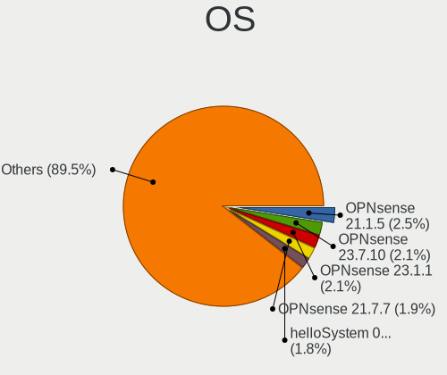

| Name              | Desktops | Percent |
|-------------------|----------|---------|
| OPNsense 21.1.5   | 13       | 3.71%   |
| OPNsense 23.1.1   | 11       | 3.14%   |
| OPNsense 21.7.7   | 10       | 2.86%   |
| OPNsense 23.1.7   | 9        | 2.57%   |
| OPNsense 23.1.5   | 9        | 2.57%   |
| OPNsense 23.1.11  | 9        | 2.57%   |
| OPNsense 22.1.6   | 9        | 2.57%   |
| OpenBSD 6.8       | 9        | 2.57%   |
| OPNsense 23.1     | 7        | 2%      |
| OPNsense 22.7.9   | 6        | 1.71%   |
| OPNsense 22.7.4   | 6        | 1.71%   |
| OPNsense 22.7     | 6        | 1.71%   |
| OPNsense 22.1.10  | 6        | 1.71%   |
| OPNsense 22.1.1   | 6        | 1.71%   |
| OPNsense 22.1     | 6        | 1.71%   |
| OPNsense 21.7.1   | 6        | 1.71%   |
| OPNsense 21.1.3   | 6        | 1.71%   |
| OPNsense 21.1     | 6        | 1.71%   |
| OPNsense 23.1.9   | 5        | 1.43%   |
| OPNsense 22.1.2   | 5        | 1.43%   |
| helloSystem 0.8.1 | 5        | 1.43%   |
| helloSystem 0.5.0 | 5        | 1.43%   |
| GhostBSD 20.04.02 | 5        | 1.43%   |
| FreeBSD 13.1      | 5        | 1.43%   |
| OPNsense 23.7.4   | 4        | 1.14%   |
| OPNsense 23.7.3   | 4        | 1.14%   |
| OPNsense 23.1.8   | 4        | 1.14%   |
| OPNsense 23.1.6   | 4        | 1.14%   |
| OPNsense 23.1.3   | 4        | 1.14%   |
| OPNsense 22.7.7   | 4        | 1.14%   |
| OPNsense 22.7.11  | 4        | 1.14%   |
| OPNsense 22.7.10  | 4        | 1.14%   |
| OPNsense 22.1.3   | 4        | 1.14%   |
| OPNsense 21.7.8   | 4        | 1.14%   |
| OPNsense 21.7.5   | 4        | 1.14%   |
| OPNsense 21.7.3   | 4        | 1.14%   |
| OPNsense 21.7     | 4        | 1.14%   |
| OPNsense 20.7.8   | 4        | 1.14%   |
| OpenBSD 7.2       | 4        | 1.14%   |
| OpenBSD 7.1       | 4        | 1.14%   |

OS Family
---------

OS without a version

| Name        | Desktops | Percent |
|-------------|----------|---------|
| OPNsense    | 166      | 62.17%  |
| FreeBSD     | 47       | 17.6%   |
| helloSystem | 19       | 7.12%   |
| OpenBSD     | 18       | 6.74%   |
| GhostBSD    | 5        | 1.87%   |
| NomadBSD    | 4        | 1.5%    |
| TrueNAS     | 3        | 1.12%   |
| NetBSD      | 3        | 1.12%   |
| HardenedBSD | 1        | 0.37%   |
| FreeNAS     | 1        | 0.37%   |

Arch
----

OS architecture (x86_64, i586, etc.)

| Name  | Desktops | Percent |
|-------|----------|---------|
| amd64 | 264      | 99.25%  |
| i386  | 2        | 0.75%   |

DE
--

Desktop Environment

| Name         | Desktops | Percent |
|--------------|----------|---------|
| Console      | 201      | 74.72%  |
| helloDesktop | 29       | 10.78%  |
| XFCE         | 14       | 5.2%    |
| MATE         | 5        | 1.86%   |
| KDE5         | 5        | 1.86%   |
| Openbox      | 4        | 1.49%   |
| GNOME        | 3        | 1.12%   |
| fvwm         | 3        | 1.12%   |
| TWM          | 2        | 0.74%   |
| LXDE         | 1        | 0.37%   |
| Cinnamon     | 1        | 0.37%   |
| AwesomeWM    | 1        | 0.37%   |

Display Server
--------------

X11 or Wayland

| Name    | Desktops | Percent |
|---------|----------|---------|
| Console | 205      | 77.07%  |
| X11     | 60       | 22.56%  |
| Wayland | 1        | 0.38%   |

Display Manager
---------------

SDDM, LightDM, etc.

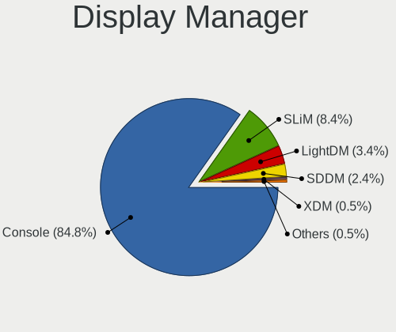

| Name    | Desktops | Percent |
|---------|----------|---------|
| Console | 220      | 82.4%   |
| SLiM    | 27       | 10.11%  |
| LightDM | 10       | 3.75%   |
| SDDM    | 6        | 2.25%   |
| XDM     | 2        | 0.75%   |
| GDM     | 2        | 0.75%   |

OS Lang
-------

Language

| Lang           | Desktops | Percent |
|----------------|----------|---------|
| Unknown        | 202      | 75.66%  |
| fr_FR          | 22       | 8.24%   |
| en_US          | 22       | 8.24%   |
| C              | 20       | 7.49%   |
| fr_FR.US-ASCII | 1        | 0.37%   |

Boot Mode
---------

EFI or BIOS

| Mode | Desktops | Percent |
|------|----------|---------|
| EFI  | 209      | 77.99%  |
| BIOS | 59       | 22.01%  |

Filesystem
----------

Type of filesystem

| Type   | Desktops | Percent |
|--------|----------|---------|
| Ufs    | 141      | 51.84%  |
| Zfs    | 105      | 38.6%   |
| Ffs    | 18       | 6.62%   |
| Cd9660 | 8        | 2.94%   |

Part. scheme
------------

Scheme of partitioning

| Type    | Desktops | Percent |
|---------|----------|---------|
| GPT     | 233      | 86.94%  |
| MBR     | 33       | 12.31%  |
| Unknown | 2        | 0.75%   |

Board
-----

Vendor
------

Motherboard manufacturer

| Name                | Desktops | Percent |
|---------------------|----------|---------|
| ASUSTek Computer    | 38       | 14.29%  |
| Intel               | 31       | 11.65%  |
| Unknown             | 28       | 10.53%  |
| Dell                | 25       | 9.4%    |
| Hewlett-Packard     | 22       | 8.27%   |
| PC Engines          | 20       | 7.52%   |
| Gigabyte Technology | 16       | 6.02%   |
| ASRock              | 14       | 5.26%   |
| MSI                 | 9        | 3.38%   |
| Techvision          | 8        | 3.01%   |
| Supermicro          | 7        | 2.63%   |
| Lenovo              | 6        | 2.26%   |
| Fujitsu             | 6        | 2.26%   |
| Protectli           | 4        | 1.5%    |
| MW                  | 4        | 1.5%    |
| Shuttle             | 2        | 0.75%   |
| RUNING              | 2        | 0.75%   |
| Deciso              | 2        | 0.75%   |
| AZW                 | 2        | 0.75%   |
| ASRockRack          | 2        | 0.75%   |
| AMD                 | 2        | 0.75%   |
| Acer                | 2        | 0.75%   |
| ZOTAC               | 1        | 0.38%   |
| YENTEK              | 1        | 0.38%   |
| Wistron             | 1        | 0.38%   |
| VeryPC              | 1        | 0.38%   |
| Soekris Engineering | 1        | 0.38%   |
| Pegatron            | 1        | 0.38%   |
| Packard Bell        | 1        | 0.38%   |
| Kontron             | 1        | 0.38%   |
| Jetway              | 1        | 0.38%   |
| Google              | 1        | 0.38%   |
| CNCTION-IAF-E3845   | 1        | 0.38%   |
| Clevo               | 1        | 0.38%   |
| ChangWang           | 1        | 0.38%   |
| AAEON               | 1        | 0.38%   |

Model
-----

Motherboard model

| Name                               | Desktops | Percent |
|------------------------------------|----------|---------|
| Unknown                            | 29       | 10.9%   |
| Intel Q3XXG4-P V1.0                | 13       | 4.89%   |
| PC Engines APU2                    | 11       | 4.14%   |
| Techvision TVI7309X                | 8        | 3.01%   |
| PC Engines APU3                    | 4        | 1.5%    |
| MW GMLK-2_5G4L                     | 4        | 1.5%    |
| Intel CRESCENTBAY                  | 4        | 1.5%    |
| Dell OptiPlex 9020                 | 4        | 1.5%    |
| ASUS All Series                    | 4        | 1.5%    |
| Fujitsu FUTRO S920                 | 3        | 1.13%   |
| RUNING B75M INTEL H3V              | 2        | 0.75%   |
| PC Engines apu4                    | 2        | 0.75%   |
| PC Engines apu1                    | 2        | 0.75%   |
| Lenovo ThinkCentre M93p 10AAS4EN00 | 2        | 0.75%   |
| Intel AmITX-SL-G                   | 2        | 0.75%   |
| HP ProLiant MicroServer Gen8       | 2        | 0.75%   |
| Gigabyte X570 I AORUS PRO WIFI     | 2        | 0.75%   |
| Dell OptiPlex 7010                 | 2        | 0.75%   |
| Dell OptiPlex 3070                 | 2        | 0.75%   |
| Dell OptiPlex 3050                 | 2        | 0.75%   |
| Dell OptiPlex 3010                 | 2        | 0.75%   |
| Deciso Netboard A10                | 2        | 0.75%   |
| ASUS Z170-P D3                     | 2        | 0.75%   |
| ASUS PRIME B450M-A                 | 2        | 0.75%   |
| ASUS PRIME A320I-K                 | 2        | 0.75%   |
| ASUS P8Z68-V LX                    | 2        | 0.75%   |
| ZOTAC XXXXXX                       | 1        | 0.38%   |
| YENTEK R250                        | 1        | 0.38%   |
| Wistron ProLiant ML110 G6          | 1        | 0.38%   |
| VeryPC S400-K7-N-O                 | 1        | 0.38%   |
| Supermicro X8STi                   | 1        | 0.38%   |
| Supermicro X7SPA-HF                | 1        | 0.38%   |
| Supermicro X10SLH-N6-ST031         | 1        | 0.38%   |
| Supermicro SYS-E300-9D-8CN8TP      | 1        | 0.38%   |
| Supermicro SYS-E300-9A-4C          | 1        | 0.38%   |
| Supermicro SYS-5019A-FTN4          | 1        | 0.38%   |
| Supermicro SYS-1018GR-TA02-CG009   | 1        | 0.38%   |
| Soekris Engineering net6501        | 1        | 0.38%   |
| Shuttle NC10U                      | 1        | 0.38%   |
| Shuttle DS61                       | 1        | 0.38%   |

Model Family
------------

Motherboard model prefix

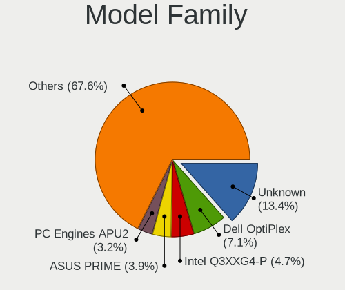

| Name                             | Desktops | Percent |
|----------------------------------|----------|---------|
| Unknown                          | 29       | 10.9%   |
| Dell OptiPlex                    | 20       | 7.52%   |
| Intel Q3XXG4-P                   | 13       | 4.89%   |
| PC Engines APU2                  | 11       | 4.14%   |
| ASUS PRIME                       | 10       | 3.76%   |
| Techvision TVI7309X              | 8        | 3.01%   |
| HP Compaq                        | 8        | 3.01%   |
| PC Engines APU3                  | 4        | 1.5%    |
| MW GMLK-2                        | 4        | 1.5%    |
| Lenovo ThinkCentre               | 4        | 1.5%    |
| Intel CRESCENTBAY                | 4        | 1.5%    |
| HP ProDesk                       | 4        | 1.5%    |
| ASUS All                         | 4        | 1.5%    |
| Fujitsu FUTRO                    | 3        | 1.13%   |
| RUNING B75M                      | 2        | 0.75%   |
| PC Engines apu4                  | 2        | 0.75%   |
| PC Engines apu1                  | 2        | 0.75%   |
| Intel AmITX-SL-G                 | 2        | 0.75%   |
| HP ProLiant                      | 2        | 0.75%   |
| HP EliteDesk                     | 2        | 0.75%   |
| Gigabyte X570                    | 2        | 0.75%   |
| Fujitsu ESPRIMO                  | 2        | 0.75%   |
| Deciso Netboard                  | 2        | 0.75%   |
| ASUS Z170-P                      | 2        | 0.75%   |
| ASUS TUF                         | 2        | 0.75%   |
| ASUS P8Z68-V                     | 2        | 0.75%   |
| ZOTAC XXXXXX                     | 1        | 0.38%   |
| YENTEK R250                      | 1        | 0.38%   |
| Wistron ProLiant                 | 1        | 0.38%   |
| VeryPC S400-K7-N-O               | 1        | 0.38%   |
| Supermicro X8STi                 | 1        | 0.38%   |
| Supermicro X7SPA-HF              | 1        | 0.38%   |
| Supermicro X10SLH-N6-ST031       | 1        | 0.38%   |
| Supermicro SYS-E300-9D-8CN8TP    | 1        | 0.38%   |
| Supermicro SYS-E300-9A-4C        | 1        | 0.38%   |
| Supermicro SYS-5019A-FTN4        | 1        | 0.38%   |
| Supermicro SYS-1018GR-TA02-CG009 | 1        | 0.38%   |
| Soekris Engineering net6501      | 1        | 0.38%   |
| Shuttle NC10U                    | 1        | 0.38%   |
| Shuttle DS61                     | 1        | 0.38%   |

MFG Year
--------

Motherboard manufacture year

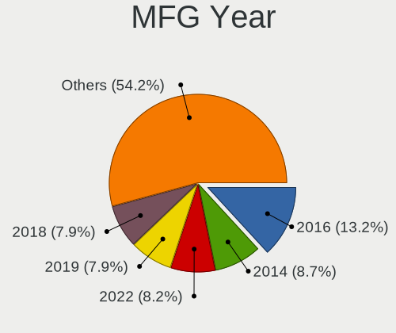

| Year    | Desktops | Percent |
|---------|----------|---------|
| 2016    | 40       | 15.04%  |
| 2019    | 28       | 10.53%  |
| 2018    | 25       | 9.4%    |
| 2012    | 24       | 9.02%   |
| 2022    | 21       | 7.89%   |
| 2021    | 18       | 6.77%   |
| 2014    | 17       | 6.39%   |
| 2020    | 16       | 6.02%   |
| 2013    | 16       | 6.02%   |
| 2017    | 12       | 4.51%   |
| 2015    | 10       | 3.76%   |
| 2010    | 8        | 3.01%   |
| 2011    | 7        | 2.63%   |
| Unknown | 7        | 2.63%   |
| 2009    | 5        | 1.88%   |
| 2008    | 4        | 1.5%    |
| 2007    | 4        | 1.5%    |
| 2023    | 3        | 1.13%   |
| 2006    | 1        | 0.38%   |

Form Factor
-----------

Physical design of the computer

| Name    | Desktops | Percent |
|---------|----------|---------|
| Desktop | 266      | 100%    |

Coreboot
--------

Have coreboot on board

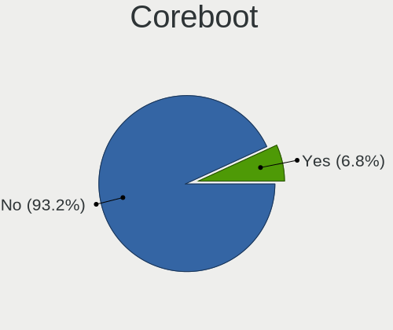

| Used | Desktops | Percent |
|------|----------|---------|
| No   | 243      | 91.35%  |
| Yes  | 23       | 8.65%   |

RAM Size
--------

Total RAM memory

| Size in GB  | Desktops | Percent |
|-------------|----------|---------|
| 8.01-16.0   | 96       | 35.82%  |
| 4.01-8.0    | 71       | 26.49%  |
| 16.01-24.0  | 59       | 22.01%  |
| 32.01-64.0  | 14       | 5.22%   |
| 2.01-3.0    | 12       | 4.48%   |
| 64.01-256.0 | 7        | 2.61%   |
| 1.01-2.0    | 4        | 1.49%   |
| 3.01-4.0    | 2        | 0.75%   |
| 24.01-32.0  | 2        | 0.75%   |
| 0.51-1.0    | 1        | 0.37%   |

RAM Used
--------

Used RAM memory

| Used GB    | Desktops | Percent |
|------------|----------|---------|
| 0.01-0.5   | 146      | 54.68%  |
| 0.51-1.0   | 76       | 28.46%  |
| 1.01-2.0   | 23       | 8.61%   |
| 2.01-3.0   | 7        | 2.62%   |
| 4.01-8.0   | 5        | 1.87%   |
| 3.01-4.0   | 3        | 1.12%   |
| Unknown    | 3        | 1.12%   |
| 8.01-16.0  | 2        | 0.75%   |
| 16.01-24.0 | 1        | 0.37%   |
| 0          | 1        | 0.37%   |

Total Drives
------------

Number of drives on board

| Drives | Desktops | Percent |
|--------|----------|---------|
| 1      | 177      | 64.36%  |
| 2      | 37       | 13.45%  |
| 0      | 25       | 9.09%   |
| 3      | 19       | 6.91%   |
| 5      | 6        | 2.18%   |
| 4      | 6        | 2.18%   |
| 6      | 3        | 1.09%   |
| 10     | 1        | 0.36%   |
| 8      | 1        | 0.36%   |

Has CD-ROM
----------

Has CD-ROM on board

| Presented | Desktops | Percent |
|-----------|----------|---------|
| No        | 228      | 85.07%  |
| Yes       | 40       | 14.93%  |

Has Ethernet
------------

Has Ethernet on board

| Presented | Desktops | Percent |
|-----------|----------|---------|
| Yes       | 265      | 99.62%  |
| No        | 1        | 0.38%   |

Has WiFi
--------

Has WiFi module

| Presented | Desktops | Percent |
|-----------|----------|---------|
| No        | 199      | 74.25%  |
| Yes       | 69       | 25.75%  |

Has Bluetooth
-------------

Has Bluetooth module

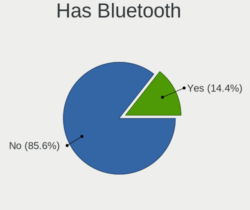

| Presented | Desktops | Percent |
|-----------|----------|---------|
| No        | 235      | 88.01%  |
| Yes       | 32       | 11.99%  |

Location
--------

Country
-------

Geographic location (country)

| Country | Desktops | Percent |
|---------|----------|---------|
| France  | 266      | 100%    |

City
----

Geographic location (city)

| City                    | Desktops | Percent |
|-------------------------|----------|---------|
| Paris                   | 59       | 19.8%   |
| Toulouse                | 6        | 2.01%   |
| Roubaix                 | 5        | 1.68%   |
| Soisy-sur-Seine         | 4        | 1.34%   |
| Saint-Denis             | 4        | 1.34%   |
| Lyon                    | 4        | 1.34%   |
| Agen                    | 4        | 1.34%   |
| Vaulx-en-Velin          | 3        | 1.01%   |
| Thionville              | 3        | 1.01%   |
| Montfermeil             | 3        | 1.01%   |
| Marseille               | 3        | 1.01%   |
| Lille                   | 3        | 1.01%   |
| Bordeaux                | 3        | 1.01%   |
| Bonson                  | 3        | 1.01%   |
| chirolles          | 2        | 0.67%   |
| Villeurbanne            | 2        | 0.67%   |
| Seyssinet-Pariset       | 2        | 0.67%   |
| Saint-Nazaire           | 2        | 0.67%   |
| Saint-Martin-d'Hres | 2        | 0.67%   |
| Sable-sur-Sarthe        | 2        | 0.67%   |
| Rillieux-la-Pape        | 2        | 0.67%   |
| Rennes                  | 2        | 0.67%   |
| Pau                     | 2        | 0.67%   |
| Orlans                | 2        | 0.67%   |
| Noisy-le-Grand          | 2        | 0.67%   |
| Nice                    | 2        | 0.67%   |
| Nantes                  | 2        | 0.67%   |
| Montauban               | 2        | 0.67%   |
| Lorient                 | 2        | 0.67%   |
| Grenoble                | 2        | 0.67%   |
| Fougeres                | 2        | 0.67%   |
| Escaudain               | 2        | 0.67%   |
| Courbevoie              | 2        | 0.67%   |
| Cognac                  | 2        | 0.67%   |
| Clermont-Ferrand        | 2        | 0.67%   |
| tampes             | 2        | 0.67%   |
| Annecy                  | 2        | 0.67%   |
| Anglet                  | 2        | 0.67%   |
| Yerres                  | 1        | 0.34%   |
| Wasquehal               | 1        | 0.34%   |

Drives
------

Drive Vendor
------------

Hard drive vendors

| Vendor              | Desktops | Drives | Percent |
|---------------------|----------|--------|---------|
| Seagate             | 42       | 60     | 12.96%  |
| WDC                 | 40       | 70     | 12.35%  |
| Samsung Electronics | 36       | 54     | 11.11%  |
| Crucial             | 30       | 38     | 9.26%   |
| Kingston            | 28       | 48     | 8.64%   |
| China               | 14       | 26     | 4.32%   |
| Transcend           | 13       | 18     | 4.01%   |
| Intel               | 11       | 15     | 3.4%    |
| Toshiba             | 10       | 20     | 3.09%   |
| Phison              | 9        | 10     | 2.78%   |
| PNY                 | 8        | 15     | 2.47%   |
| Hoodisk             | 8        | 8      | 2.47%   |
| SanDisk             | 7        | 15     | 2.16%   |
| Hitachi             | 5        | 5      | 1.54%   |
| HGST                | 5        | 8      | 1.54%   |
| Corsair             | 5        | 9      | 1.54%   |
| OCZ                 | 4        | 5      | 1.23%   |
| Apple               | 4        | 6      | 1.23%   |
| Maxtor              | 3        | 4      | 0.93%   |
| LDLC                | 3        | 3      | 0.93%   |
| Innodisk            | 3        | 3      | 0.93%   |
| SK hynix            | 2        | 2      | 0.62%   |
| NVMe                | 2        | 2      | 0.62%   |
| Micron Technology   | 2        | 4      | 0.62%   |
| LITEON              | 2        | 3      | 0.62%   |
| Fujitsu             | 2        | 2      | 0.62%   |
| Fanxiang            | 2        | 2      | 0.62%   |
| A-DATA Technology   | 2        | 2      | 0.62%   |
| VICKTER             | 1        | 1      | 0.31%   |
| Vaseky              | 1        | 3      | 0.31%   |
| TEXTORM             | 1        | 1      | 0.31%   |
| SPCC                | 1        | 1      | 0.31%   |
| Silicon Power       | 1        | 2      | 0.31%   |
| Silicon Motion      | 1        | 1      | 0.31%   |
| ShiJi               | 1        | 2      | 0.31%   |
| SHAREVDI            | 1        | 1      | 0.31%   |
| SABRENT             | 1        | 1      | 0.31%   |
| Protectli           | 1        | 1      | 0.31%   |
| Pccooler            | 1        | 1      | 0.31%   |
| Patriot             | 1        | 1      | 0.31%   |

Drive Model
-----------

Hard drive models

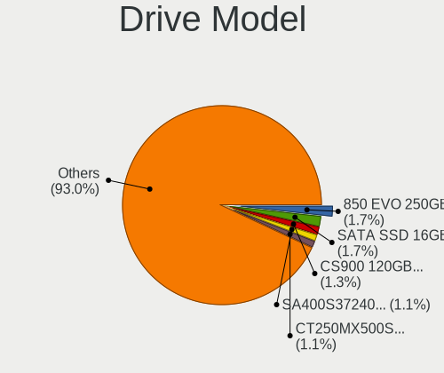

| Model                              | Desktops | Percent |
|------------------------------------|----------|---------|
| Phison SATA SSD 16GB               | 8        | 2.28%   |
| Samsung SSD 850 EVO 250GB          | 6        | 1.71%   |
| WDC WD10EZEX-08WN4A0 1TB           | 4        | 1.14%   |
| PNY CS900 120GB SSD                | 4        | 1.14%   |
| Kingston SUV500MS120G 120GB        | 4        | 1.14%   |
| Crucial CT120BX500SSD1 120GB       | 4        | 1.14%   |
| China MSATA 64GB SSD               | 4        | 1.14%   |
| WDC WDS240G2G0A-00JH30 240GB       | 3        | 0.85%   |
| Transcend TS128GSSD420K 128GB      | 3        | 0.85%   |
| Seagate ST3500418AS 500GB          | 3        | 0.85%   |
| Seagate ST1000LM024 HN-M101MBB 1TB | 3        | 0.85%   |
| SanDisk SSD PLUS 120GB             | 3        | 0.85%   |
| Kingston SV300S37A120G 120GB       | 3        | 0.85%   |
| Kingston SA400S37240G 240GB        | 3        | 0.85%   |
| Kingston SA400S37120G 120GB        | 3        | 0.85%   |
| Hoodisk SSD 32GB                   | 3        | 0.85%   |
| HGST HUS724020ALA640 2TB           | 3        | 0.85%   |
| Crucial CT500MX500SSD1 500GB       | 3        | 0.85%   |
| Crucial CT250MX500SSD1 250GB       | 3        | 0.85%   |
| Crucial CT240BX500SSD1 240GB       | 3        | 0.85%   |
| Crucial CT1000P1SSD8 1TB           | 3        | 0.85%   |
| Crucial CT1000BX500SSD1 1TB        | 3        | 0.85%   |
| China SATA SSD 16GB                | 3        | 0.85%   |
| WDC WD1003FBYX-01Y7B1 1TB          | 2        | 0.57%   |
| Transcend TS128GMSA230S 128GB      | 2        | 0.57%   |
| Toshiba HDWD120 2TB                | 2        | 0.57%   |
| SK hynix SC311 SATA 256GB          | 2        | 0.57%   |
| Seagate ST500DM002-1BD142 500GB    | 2        | 0.57%   |
| Seagate ST31000524AS 1TB           | 2        | 0.57%   |
| Seagate ST2000NM000A-2J2100 2TB    | 2        | 0.57%   |
| Seagate ST2000DM008-2FR102 2TB     | 2        | 0.57%   |
| Seagate ST2000DM001-9YN164 2TB     | 2        | 0.57%   |
| Seagate ST1000DM010-2EP102 1TB     | 2        | 0.57%   |
| Seagate ST1000DM003-1SB102 1TB     | 2        | 0.57%   |
| Seagate ST1000DM003-1ER162 1TB     | 2        | 0.57%   |
| Samsung SSD PM871 mSATA 128GB      | 2        | 0.57%   |
| Samsung SSD 860 EVO 1TB            | 2        | 0.57%   |
| Samsung PM991 NVMe 256GB           | 2        | 0.57%   |
| Samsung HD501LJ 500GB              | 2        | 0.57%   |
| PNY 120GB SATA SSD                 | 2        | 0.57%   |

HDD Vendor
----------

Hard disk drive vendors

| Vendor              | Desktops | Drives | Percent |
|---------------------|----------|--------|---------|
| Seagate             | 41       | 58     | 36.28%  |
| WDC                 | 35       | 64     | 30.97%  |
| Toshiba             | 9        | 19     | 7.96%   |
| Samsung Electronics | 7        | 13     | 6.19%   |
| Hitachi             | 5        | 5      | 4.42%   |
| HGST                | 5        | 8      | 4.42%   |
| Maxtor              | 3        | 4      | 2.65%   |
| Fujitsu             | 2        | 2      | 1.77%   |
| Apple               | 2        | 4      | 1.77%   |
| SABRENT             | 1        | 1      | 0.88%   |
| OPENBSD             | 1        | 2      | 0.88%   |
| Generic             | 1        | 1      | 0.88%   |
| Dell                | 1        | 2      | 0.88%   |

SSD Vendor
----------

Solid state drive vendors

| Vendor              | Desktops | Drives | Percent |
|---------------------|----------|--------|---------|
| Kingston            | 25       | 45     | 14.12%  |
| Samsung Electronics | 22       | 32     | 12.43%  |
| Crucial             | 21       | 25     | 11.86%  |
| China               | 14       | 26     | 7.91%   |
| Transcend           | 12       | 16     | 6.78%   |
| Intel               | 9        | 11     | 5.08%   |
| Phison              | 8        | 9      | 4.52%   |
| Hoodisk             | 8        | 8      | 4.52%   |
| SanDisk             | 7        | 15     | 3.95%   |
| PNY                 | 7        | 14     | 3.95%   |
| WDC                 | 5        | 6      | 2.82%   |
| OCZ                 | 4        | 5      | 2.26%   |
| Corsair             | 4        | 5      | 2.26%   |
| Innodisk            | 3        | 3      | 1.69%   |
| SK hynix            | 2        | 2      | 1.13%   |
| NVMe                | 2        | 2      | 1.13%   |
| LITEON              | 2        | 3      | 1.13%   |
| Apple               | 2        | 2      | 1.13%   |
| A-DATA Technology   | 2        | 2      | 1.13%   |
| VICKTER             | 1        | 1      | 0.56%   |
| Vaseky              | 1        | 3      | 0.56%   |
| Toshiba             | 1        | 1      | 0.56%   |
| TEXTORM             | 1        | 1      | 0.56%   |
| SPCC                | 1        | 1      | 0.56%   |
| Silicon Power       | 1        | 2      | 0.56%   |
| ShiJi               | 1        | 2      | 0.56%   |
| SHAREVDI            | 1        | 1      | 0.56%   |
| Seagate             | 1        | 2      | 0.56%   |
| Protectli           | 1        | 1      | 0.56%   |
| Pccooler            | 1        | 1      | 0.56%   |
| Micron Technology   | 1        | 2      | 0.56%   |
| LSI                 | 1        | 1      | 0.56%   |
| Kingchuxing         | 1        | 2      | 0.56%   |
| Indilinx            | 1        | 7      | 0.56%   |
| FORESEE             | 1        | 2      | 0.56%   |
| BORY                | 1        | 3      | 0.56%   |
| BIWIN               | 1        | 1      | 0.56%   |

Drive Kind
----------

HDD or SSD

| Kind | Desktops | Drives | Percent |
|------|----------|--------|---------|
| SSD  | 164      | 265    | 57.14%  |
| HDD  | 88       | 183    | 30.66%  |
| NVMe | 35       | 47     | 12.2%   |

Drive Connector
---------------

SATA, SAS, NVMe, etc.

| Type | Desktops | Drives | Percent |
|------|----------|--------|---------|
| SATA | 223      | 448    | 86.43%  |
| NVMe | 35       | 47     | 13.57%  |

Drive Size
----------

Size of hard drive

| Size in TB | Desktops | Drives | Percent |
|------------|----------|--------|---------|
| 0.01-0.5   | 193      | 316    | 72.83%  |
| 0.51-1.0   | 38       | 59     | 14.34%  |
| 1.01-2.0   | 21       | 47     | 7.92%   |
| 4.01-10.0  | 6        | 10     | 2.26%   |
| 2.01-3.0   | 5        | 10     | 1.89%   |
| 3.01-4.0   | 2        | 6      | 0.75%   |

Space Total
-----------

Amount of disk space available on the file system

| Size in GB     | Desktops | Percent |
|----------------|----------|---------|
| 101-250        | 91       | 33.7%   |
| 1-20           | 47       | 17.41%  |
| 21-50          | 35       | 12.96%  |
| 251-500        | 33       | 12.22%  |
| 51-100         | 26       | 9.63%   |
| 501-1000       | 23       | 8.52%   |
| 1001-2000      | 7        | 2.59%   |
| 2001-3000      | 4        | 1.48%   |
| More than 3000 | 3        | 1.11%   |
| Unknown        | 1        | 0.37%   |

Space Used
----------

Amount of used disk space

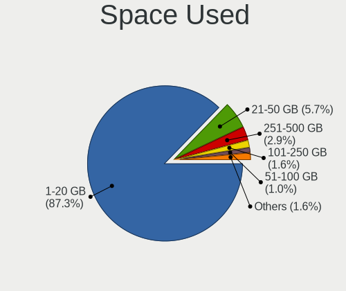

| Used GB        | Desktops | Percent |
|----------------|----------|---------|
| 1-20           | 229      | 85.13%  |
| 21-50          | 17       | 6.32%   |
| 251-500        | 9        | 3.35%   |
| 101-250        | 5        | 1.86%   |
| 51-100         | 4        | 1.49%   |
| 501-1000       | 2        | 0.74%   |
| More than 3000 | 1        | 0.37%   |
| 1001-2000      | 1        | 0.37%   |
| Unknown        | 1        | 0.37%   |

Malfunc. Drives
---------------

Drive models with a malfunction

| Model                              | Desktops | Drives | Percent |
|------------------------------------|----------|--------|---------|
| WDC WDS240G2G0A-00JH30 240GB       | 2        | 3      | 4.55%   |
| Seagate ST500DM002-1BD142 500GB    | 2        | 4      | 4.55%   |
| Samsung Electronics HD501LJ 500GB  | 2        | 2      | 4.55%   |
| WDC WD6400BPVT-22HXZT3 640GB       | 1        | 1      | 2.27%   |
| WDC WD6400AAKS-22A7B0 640GB        | 1        | 1      | 2.27%   |
| WDC WD5002ABYS-18B1B0 500GB        | 1        | 1      | 2.27%   |
| WDC WD30EFRX-68AX9N0 3TB           | 1        | 4      | 2.27%   |
| WDC WD2500BEVS-60UST0 250GB        | 1        | 1      | 2.27%   |
| WDC WD2002FYPS-02W3B0 2TB          | 1        | 1      | 2.27%   |
| WDC WD15EADS-00P8B0 1.5TB          | 1        | 1      | 2.27%   |
| WDC WD10EZEX-08WN4A0 1TB           | 1        | 1      | 2.27%   |
| WDC WD10EAVS-00D7B0 1TB            | 1        | 1      | 2.27%   |
| WDC WD10EARS-00Y5B1 1TB            | 1        | 1      | 2.27%   |
| WDC WD1001FAES-75W7A0 1TB          | 1        | 1      | 2.27%   |
| Toshiba MK5065GSX 500GB            | 1        | 1      | 2.27%   |
| Toshiba DT01ACA100 1TB             | 1        | 1      | 2.27%   |
| Seagate ST9500325AS 500GB          | 1        | 1      | 2.27%   |
| Seagate ST500VT000-1DK142 500GB    | 1        | 1      | 2.27%   |
| Seagate ST500LM000-SSHD-8GB        | 1        | 2      | 2.27%   |
| Seagate ST380013AS 80GB            | 1        | 2      | 2.27%   |
| Seagate ST3250620AS 250GB          | 1        | 1      | 2.27%   |
| Seagate ST3160023AS 160GB          | 1        | 1      | 2.27%   |
| Seagate ST31000524AS 1TB           | 1        | 1      | 2.27%   |
| Seagate ST1000NM0011 1TB           | 1        | 1      | 2.27%   |
| Seagate ST1000LM024 HN-M101MBB 1TB | 1        | 1      | 2.27%   |
| Samsung Electronics HD322GJ 320GB  | 1        | 1      | 2.27%   |
| Samsung Electronics HD256GJ 250GB  | 1        | 1      | 2.27%   |
| Samsung Electronics HD103UJ 1TB    | 1        | 1      | 2.27%   |
| OCZ VERTEX-TURBO 32GB              | 1        | 2      | 2.27%   |
| Maxtor 7B300S0 304GB               | 1        | 1      | 2.27%   |
| Maxtor 6Y080M0 82GB                | 1        | 1      | 2.27%   |
| Kingston SV300S37A60G 64GB         | 1        | 2      | 2.27%   |
| Kingston SV300S37A120G 120GB       | 1        | 2      | 2.27%   |
| Kingston SMS200S330G 32GB          | 1        | 1      | 2.27%   |
| Intel SSDSA2M080G2GN 80GB          | 1        | 1      | 2.27%   |
| Hitachi HTS727575A9E364 752GB      | 1        | 1      | 2.27%   |
| Hitachi HTS542525K9SA00 250GB      | 1        | 1      | 2.27%   |
| HGST HTS721010A9E630 1TB           | 1        | 1      | 2.27%   |
| Corsair Force 3 SSD 120GB          | 1        | 2      | 2.27%   |
| A-DATA Technology SX300 128GB      | 1        | 1      | 2.27%   |

Malfunc. Drive Vendor
---------------------

Vendors of faulty drives

| Vendor              | Desktops | Drives | Percent |
|---------------------|----------|--------|---------|
| WDC                 | 13       | 17     | 31.71%  |
| Seagate             | 10       | 15     | 24.39%  |
| Samsung Electronics | 3        | 5      | 7.32%   |
| Kingston            | 3        | 5      | 7.32%   |
| Toshiba             | 2        | 2      | 4.88%   |
| Maxtor              | 2        | 2      | 4.88%   |
| Hitachi             | 2        | 2      | 4.88%   |
| A-DATA Technology   | 2        | 2      | 4.88%   |
| OCZ                 | 1        | 2      | 2.44%   |
| Intel               | 1        | 1      | 2.44%   |
| HGST                | 1        | 1      | 2.44%   |
| Corsair             | 1        | 2      | 2.44%   |

Malfunc. HDD Vendor
-------------------

Vendors of faulty HDD drives

| Vendor              | Desktops | Drives | Percent |
|---------------------|----------|--------|---------|
| WDC                 | 11       | 14     | 35.48%  |
| Seagate             | 10       | 15     | 32.26%  |
| Samsung Electronics | 3        | 5      | 9.68%   |
| Toshiba             | 2        | 2      | 6.45%   |
| Maxtor              | 2        | 2      | 6.45%   |
| Hitachi             | 2        | 2      | 6.45%   |
| HGST                | 1        | 1      | 3.23%   |

Malfunc. Drive Kind
-------------------

Kinds of faulty drives

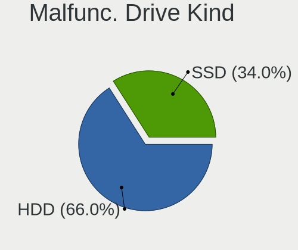

| Kind | Desktops | Drives | Percent |
|------|----------|--------|---------|
| HDD  | 28       | 41     | 73.68%  |
| SSD  | 10       | 15     | 26.32%  |

Failed Drives
-------------

Failed drive models

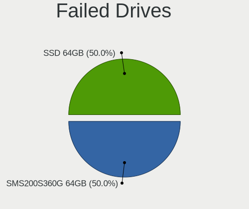

| Model                     | Desktops | Drives | Percent |
|---------------------------|----------|--------|---------|
| Kingston SMS200S360G 64GB | 1        | 1      | 50%     |
| Hoodisk SSD 64GB          | 1        | 1      | 50%     |

Failed Drive Vendor
-------------------

Failed drive vendors

| Vendor   | Desktops | Drives | Percent |
|----------|----------|--------|---------|
| Kingston | 1        | 1      | 50%     |
| Hoodisk  | 1        | 1      | 50%     |

Drive Status
------------

Number of failed and malfunc. drives

| Status   | Desktops | Drives | Percent |
|----------|----------|--------|---------|
| Works    | 219      | 423    | 82.02%  |
| Malfunc  | 37       | 56     | 13.86%  |
| Detected | 9        | 14     | 3.37%   |
| Failed   | 2        | 2      | 0.75%   |

Storage controller
------------------

Storage Vendor
--------------

Storage controller vendors

| Vendor                        | Desktops | Percent |
|-------------------------------|----------|---------|
| Intel                         | 198      | 61.68%  |
| AMD                           | 61       | 19%     |
| Micron/Crucial Technology     | 11       | 3.43%   |
| Samsung Electronics           | 8        | 2.49%   |
| ASMedia Technology            | 7        | 2.18%   |
| Silicon Motion                | 6        | 1.87%   |
| Broadcom / LSI                | 5        | 1.56%   |
| MAXIO Technology (Hangzhou)   | 3        | 0.93%   |
| Marvell Technology Group      | 3        | 0.93%   |
| Kingston Technology Company   | 3        | 0.93%   |
| JMicron Technology            | 3        | 0.93%   |
| VIA Technologies              | 2        | 0.62%   |
| Phison Electronics            | 2        | 0.62%   |
| Chelsio Communications        | 2        | 0.62%   |
| Transcend                     | 1        | 0.31%   |
| Silicon Image                 | 1        | 0.31%   |
| SanDisk                       | 1        | 0.31%   |
| Nvidia                        | 1        | 0.31%   |
| Micron Technology             | 1        | 0.31%   |
| Integrated Technology Express | 1        | 0.31%   |
| Hewlett-Packard               | 1        | 0.31%   |

Storage Model
-------------

Storage controller models

| Model                                                                                   | Desktops | Percent |
|-----------------------------------------------------------------------------------------|----------|---------|
| AMD FCH SATA Controller [AHCI mode]                                                     | 36       | 9.76%   |
| Intel Q170/Q150/B150/H170/H110/Z170/CM236 Chipset SATA Controller [AHCI Mode]           | 19       | 5.15%   |
| Intel 6 Series/C200 Series Chipset Family 6 port Desktop SATA AHCI Controller           | 18       | 4.88%   |
| Intel 8 Series/C220 Series Chipset Family 6-port SATA Controller 1 [AHCI mode]          | 14       | 3.79%   |
| Intel Jasper Lake SATA AHCI Controller                                                  | 11       | 2.98%   |
| Intel 8 Series SATA Controller 1 [AHCI mode]                                            | 11       | 2.98%   |
| AMD FCH SATA Controller [IDE mode]                                                      | 11       | 2.98%   |
| Intel Celeron/Pentium Silver Processor SATA Controller                                  | 10       | 2.71%   |
| Intel 7 Series/C210 Series Chipset Family 6-port SATA Controller [AHCI mode]            | 10       | 2.71%   |
| Intel Sunrise Point-LP SATA Controller [AHCI mode]                                      | 9        | 2.44%   |
| Intel SATA Controller [RAID mode]                                                       | 9        | 2.44%   |
| Intel Wildcat Point-LP SATA Controller [AHCI Mode]                                      | 7        | 1.9%    |
| ASMedia ASM1062 Serial ATA Controller                                                   | 7        | 1.9%    |
| AMD SB7x0/SB8x0/SB9x0 SATA Controller [AHCI mode]                                       | 7        | 1.9%    |
| Micron/Crucial P2 [Nick P2] / P3 / P3 Plus NVMe PCIe SSD (DRAM-less)                    | 6        | 1.63%   |
| Intel 200 Series PCH SATA controller [AHCI mode]                                        | 6        | 1.63%   |
| AMD 400 Series Chipset SATA Controller                                                  | 6        | 1.63%   |
| Silicon Motion SM2263EN/SM2263XT (DRAM-less) NVMe SSD Controllers                       | 5        | 1.36%   |
| Intel NM10/ICH7 Family SATA Controller [AHCI mode]                                      | 5        | 1.36%   |
| Intel Cannon Lake PCH SATA AHCI Controller                                              | 5        | 1.36%   |
| Intel Atom/Celeron/Pentium Processor x5-E8000/J3xxx/N3xxx Series SATA Controller        | 5        | 1.36%   |
| Intel 82801JI (ICH10 Family) SATA AHCI Controller                                       | 5        | 1.36%   |
| AMD 500 Series Chipset SATA Controller                                                  | 5        | 1.36%   |
| Samsung NVMe SSD Controller 980                                                         | 4        | 1.08%   |
| AMD SB7x0/SB8x0/SB9x0 IDE Controller                                                    | 4        | 1.08%   |
| AMD FCH SATA Controller D                                                               | 4        | 1.08%   |
| MAXIO (Hangzhou) NVMe SSD Controller MAP1202                                            | 3        | 0.81%   |
| JMicron JMB363 SATA/IDE Controller                                                      | 3        | 0.81%   |
| Intel NM10/ICH7 Family SATA Controller [IDE mode]                                       | 3        | 0.81%   |
| Intel Atom Processor E3800 Series SATA AHCI Controller                                  | 3        | 0.81%   |
| Intel Atom Processor C3000 Series SATA Controller 1                                     | 3        | 0.81%   |
| Intel 82801JD/DO (ICH10 Family) SATA AHCI Controller                                    | 3        | 0.81%   |
| Intel 82801G (ICH7 Family) IDE Controller                                               | 3        | 0.81%   |
| Intel 7 Series Chipset Family 6-port SATA Controller [AHCI mode]                        | 3        | 0.81%   |
| Intel 6 Series/C200 Series Chipset Family Desktop SATA Controller (IDE mode, ports 4-5) | 3        | 0.81%   |
| Intel 6 Series/C200 Series Chipset Family Desktop SATA Controller (IDE mode, ports 0-3) | 3        | 0.81%   |
| Intel 4 Series Chipset PT IDER Controller                                               | 3        | 0.81%   |
| Unknown                                                                                 | 3        | 0.81%   |
| Samsung NVMe SSD Controller SM981/PM981/PM983                                           | 2        | 0.54%   |
| Samsung NVMe SSD Controller PM9A1/PM9A3/980PRO                                          | 2        | 0.54%   |

Storage Kind
------------

Kind of storage controller (IDE, SATA, NVMe, SAS, ...)

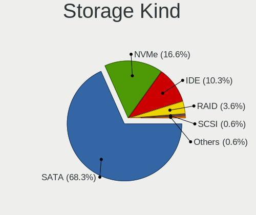

| Kind | Desktops | Percent |
|------|----------|---------|
| SATA | 225      | 68.81%  |
| IDE  | 42       | 12.84%  |
| NVMe | 39       | 11.93%  |
| RAID | 15       | 4.59%   |
| SAS  | 3        | 0.92%   |
| SCSI | 3        | 0.92%   |

Processor
---------

CPU Vendor
----------

Processor vendors

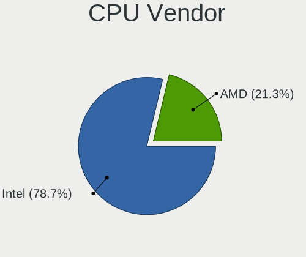

| Vendor | Desktops | Percent |
|--------|----------|---------|
| Intel  | 203      | 76.32%  |
| AMD    | 63       | 23.68%  |

CPU Model
---------

Processor models

| Model                                     | Desktops | Percent |
|-------------------------------------------|----------|---------|
| AMD GX-412TC SOC                          | 17       | 6.3%    |
| Intel Celeron J4125 CPU @ 2.00GHz         | 10       | 3.7%    |
| Intel Celeron N5105 @ 2.00GHz             | 9        | 3.33%   |
| Intel Core i3-4010U CPU @ 1.70GHz         | 5        | 1.85%   |
| Intel Core i5-4570 CPU @ 3.20GHz          | 4        | 1.48%   |
| Intel Core i5-4300Y CPU @ 1.60GHz         | 4        | 1.48%   |
| Intel Core i5-3470 CPU @ 3.20GHz          | 4        | 1.48%   |
| Intel Core i5-7500 CPU @ 3.40GHz          | 3        | 1.11%   |
| Intel Core i5-6500T CPU @ 2.50GHz         | 3        | 1.11%   |
| Intel Core i5-5250U CPU @ 1.60GHz         | 3        | 1.11%   |
| Intel Core i5-2500K CPU @ 3.30GHz         | 3        | 1.11%   |
| Intel Core i3-3225 CPU @ 3.30GHz          | 3        | 1.11%   |
| Intel Core i3-3220 CPU @ 3.30GHz          | 3        | 1.11%   |
| Intel Core 2 Quad CPU                     | 3        | 1.11%   |
| Intel Celeron CPU J3160 @ 1.60GHz         | 3        | 1.11%   |
| Intel 686-class                           | 3        | 1.11%   |
| AMD Ryzen 7 3700X 8-Core Processor        | 3        | 1.11%   |
| AMD Ryzen 5 5600G with Radeon Graphics    | 3        | 1.11%   |
| AMD Ryzen 5 2600 Six-Core Processor       | 3        | 1.11%   |
| AMD G-T40E Processor                      | 3        | 1.11%   |
| Intel Xeon CPU E3-1265L V2 @ 2.50GHz      | 2        | 0.74%   |
| Intel Xeon CPU E3-1220 V2 @ 3.10GHz       | 2        | 0.74%   |
| Intel Core i7-9700 CPU @ 3.00GHz          | 2        | 0.74%   |
| Intel Core i5-9500 CPU @ 3.00GHz          | 2        | 0.74%   |
| Intel Core i5-7200U CPU @ 2.50GHz         | 2        | 0.74%   |
| Intel Core i5-6500 CPU @ 3.20GHz          | 2        | 0.74%   |
| Intel Core i5-6400 CPU @ 2.70GHz          | 2        | 0.74%   |
| Intel Core i5-5200U CPU @ 2.20GHz         | 2        | 0.74%   |
| Intel Core i5-4590T CPU @ 2.00GHz         | 2        | 0.74%   |
| Intel Core i5-4590 CPU @ 3.30GHz          | 2        | 0.74%   |
| Intel Core i3-6100 CPU @ 3.70GHz          | 2        | 0.74%   |
| Intel Core 2 Quad CPU Q8300 @ 2.50GHz     | 2        | 0.74%   |
| Intel Atom x5-Z8350 CPU @ 1.44GHz         | 2        | 0.74%   |
| Intel Atom CPU D525 @ 1.80GHz             | 2        | 0.74%   |
| Intel Atom CPU C3558 @ 2.20GHz            | 2        | 0.74%   |
| Intel 12th Gen Core i5-12400              | 2        | 0.74%   |
| AMD Ryzen 7 5800X 8-Core Processor        | 2        | 0.74%   |
| AMD Ryzen 5 3600 6-Core Processor         | 2        | 0.74%   |
| AMD GX-416RA SOC                          | 2        | 0.74%   |
| AMD GX-222GC SOC with Radeon R5E Graphics | 2        | 0.74%   |

CPU Model Family
----------------

Processor model prefix

| Model                   | Desktops | Percent |
|-------------------------|----------|---------|
| Intel Core i5           | 53       | 19.7%   |
| Intel Celeron           | 40       | 14.87%  |
| Intel Core i3           | 28       | 10.41%  |
| AMD GX                  | 23       | 8.55%   |
| Intel Xeon              | 19       | 7.06%   |
| Intel Core i7           | 19       | 7.06%   |
| Intel Atom              | 13       | 4.83%   |
| Other                   | 10       | 3.72%   |
| AMD Ryzen 5             | 10       | 3.72%   |
| AMD Ryzen 7             | 8        | 2.97%   |
| Intel Pentium           | 7        | 2.6%    |
| Intel Core 2 Quad       | 7        | 2.6%    |
| Intel Core 2 Duo        | 3        | 1.12%   |
| Intel 686-class         | 3        | 1.12%   |
| AMD G                   | 3        | 1.12%   |
| AMD A8                  | 3        | 1.12%   |
| Intel Pentium Gold      | 2        | 0.74%   |
| AMD Ryzen 3             | 2        | 0.74%   |
| AMD E                   | 2        | 0.74%   |
| AMD Athlon 64 X2        | 2        | 0.74%   |
| AMD Athlon              | 2        | 0.74%   |
| Intel Pentium Silver    | 1        | 0.37%   |
| Intel Pentium Dual-Core | 1        | 0.37%   |
| Intel Genuine           | 1        | 0.37%   |
| Intel Core 2            | 1        | 0.37%   |
| AMD Ryzen 9             | 1        | 0.37%   |
| AMD Phenom II X4        | 1        | 0.37%   |
| AMD FX                  | 1        | 0.37%   |
| AMD E1                  | 1        | 0.37%   |
| AMD Athlon II X2        | 1        | 0.37%   |
| AMD A10                 | 1        | 0.37%   |

CPU Cores
---------

Number of processor cores

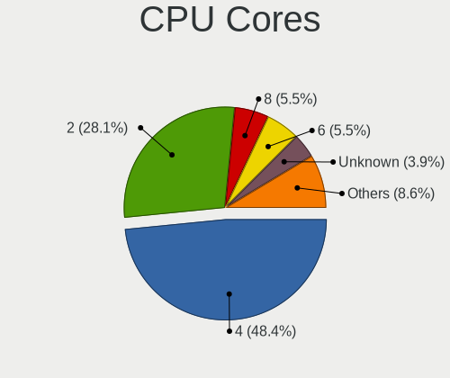

| Number  | Desktops | Percent |
|---------|----------|---------|
| 4       | 125      | 46.64%  |
| 2       | 84       | 31.34%  |
| Unknown | 14       | 5.22%   |
| 6       | 13       | 4.85%   |
| 12      | 10       | 3.73%   |
| 8       | 10       | 3.73%   |
| 16      | 9        | 3.36%   |
| 32      | 2        | 0.75%   |
| 10      | 1        | 0.37%   |

CPU Sockets
-----------

Number of sockets

| Number  | Desktops | Percent |
|---------|----------|---------|
| 1       | 257      | 96.62%  |
| Unknown | 8        | 3.01%   |
| 2       | 1        | 0.38%   |

CPU Threads
-----------

Threads per core (Hyper-Threading)

| Number  | Desktops | Percent |
|---------|----------|---------|
| 1       | 170      | 63.91%  |
| 2       | 82       | 30.83%  |
| Unknown | 14       | 5.26%   |

CPU Microarch
-------------

Microarchitecture

| Name          | Desktops | Percent |
|---------------|----------|---------|
| Haswell       | 32       | 11.94%  |
| KabyLake      | 26       | 9.7%    |
| Unknown       | 24       | 8.96%   |
| IvyBridge     | 23       | 8.58%   |
| Skylake       | 20       | 7.46%   |
| Puma          | 20       | 7.46%   |
| SandyBridge   | 18       | 6.72%   |
| Silvermont    | 10       | 3.73%   |
| Goldmont plus | 10       | 3.73%   |
| Penryn        | 8        | 2.99%   |
| Bonnell       | 8        | 2.99%   |
| Zen 3         | 7        | 2.61%   |
| Zen 2         | 7        | 2.61%   |
| Broadwell     | 7        | 2.61%   |
| Bobcat        | 6        | 2.24%   |
| Zen+          | 5        | 1.87%   |
| Jaguar        | 5        | 1.87%   |
| Core          | 5        | 1.87%   |
| Nehalem       | 4        | 1.49%   |
| Goldmont      | 4        | 1.49%   |
| Westmere      | 3        | 1.12%   |
| Piledriver    | 3        | 1.12%   |
| CometLake     | 3        | 1.12%   |
| Zen           | 2        | 0.75%   |
| TigerLake     | 2        | 0.75%   |
| Steamroller   | 2        | 0.75%   |
| K10           | 2        | 0.75%   |
| K8 Hammer     | 1        | 0.37%   |
| Excavator     | 1        | 0.37%   |

Graphics
--------

GPU Vendor
----------

Vendors of graphics cards

| Vendor                     | Desktops | Percent |
|----------------------------|----------|---------|
| Intel                      | 160      | 67.23%  |
| AMD                        | 37       | 15.55%  |
| Nvidia                     | 28       | 11.76%  |
| ASPEED Technology          | 7        | 2.94%   |
| Matrox Electronics Systems | 6        | 2.52%   |

GPU Model
---------

Graphics card models

| Model                                                                                    | Desktops | Percent |
|------------------------------------------------------------------------------------------|----------|---------|
| Intel HD Graphics 530                                                                    | 14       | 5.81%   |
| Intel JasperLake [UHD Graphics]                                                          | 13       | 5.39%   |
| Intel Xeon E3-1200 v3/4th Gen Core Processor Integrated Graphics Controller              | 12       | 4.98%   |
| Intel Xeon E3-1200 v2/3rd Gen Core processor Graphics Controller                         | 11       | 4.56%   |
| Intel GeminiLake [UHD Graphics 600]                                                      | 10       | 4.15%   |
| Intel 2nd Generation Core Processor Family Integrated Graphics Controller                | 10       | 4.15%   |
| Intel Haswell-ULT Integrated Graphics Controller                                         | 7        | 2.9%    |
| Intel CoffeeLake-S GT2 [UHD Graphics 630]                                                | 7        | 2.9%    |
| Intel Atom/Celeron/Pentium Processor x5-E8000/J3xxx/N3xxx Integrated Graphics Controller | 7        | 2.9%    |
| ASPEED Technology ASPEED Graphics Family                                                 | 7        | 2.9%    |
| Intel HD Graphics 630                                                                    | 6        | 2.49%   |
| Intel HD Graphics 620                                                                    | 5        | 2.07%   |
| Intel HD Graphics 510                                                                    | 5        | 2.07%   |
| Intel IvyBridge GT2 [HD Graphics 4000]                                                   | 4        | 1.66%   |
| Intel Haswell-ULT Integrated Graphics Controller [HD Graphics]                           | 4        | 1.66%   |
| AMD Cezanne [Radeon Vega Series / Radeon Vega Mobile Series]                             | 4        | 1.66%   |
| Nvidia TU116 [GeForce GTX 1660 Ti]                                                       | 3        | 1.24%   |
| Nvidia GT218 [GeForce 210]                                                               | 3        | 1.24%   |
| Nvidia GK208B [GeForce GT 710]                                                           | 3        | 1.24%   |
| Matrox Electronics Systems MGA G200eW WPCM450                                            | 3        | 1.24%   |
| Intel HD Graphics 6000                                                                   | 3        | 1.24%   |
| Intel HD Graphics 5500                                                                   | 3        | 1.24%   |
| Intel Atom Processor Z36xxx/Z37xxx Series Graphics & Display                             | 3        | 1.24%   |
| Intel Atom Processor D2xxx/N2xxx Integrated Graphics Controller                          | 3        | 1.24%   |
| Intel 4 Series Chipset Integrated Graphics Controller                                    | 3        | 1.24%   |
| Intel 3rd Gen Core processor Graphics Controller                                         | 3        | 1.24%   |
| Nvidia GF119 [GeForce GT 610]                                                            | 2        | 0.83%   |
| Matrox Electronics Systems MGA G200EH                                                    | 2        | 0.83%   |
| Intel CometLake-S GT2 [UHD Graphics 630]                                                 | 2        | 0.83%   |
| Intel CoffeeLake-S GT1 [UHD Graphics 610]                                                | 2        | 0.83%   |
| Intel Atom Processor D4xx/D5xx/N4xx/N5xx Integrated Graphics Controller                  | 2        | 0.83%   |
| Intel Alder Lake-S GT1 [UHD Graphics 730]                                                | 2        | 0.83%   |
| Intel 4th Generation Core Processor Family Integrated Graphics Controller                | 2        | 0.83%   |
| AMD Navi 10 [Radeon RX 5600 OEM/5600 XT / 5700/5700 XT]                                  | 2        | 0.83%   |
| AMD Mullins [Radeon R4/R5 Graphics]                                                      | 2        | 0.83%   |
| AMD Kabini [Radeon HD 8400 / R3 Series]                                                  | 2        | 0.83%   |
| AMD Ellesmere [Radeon RX 470/480/570/570X/580/580X/590]                                  | 2        | 0.83%   |
| Nvidia TU106 [GeForce RTX 2060 Rev. A]                                                   | 1        | 0.41%   |
| Nvidia TU104 [GeForce RTX 2080]                                                          | 1        | 0.41%   |
| Nvidia GP108 [GeForce GT 1030]                                                           | 1        | 0.41%   |

GPU Combo
---------

Combinations of graphics cards

| Name           | Desktops | Percent |
|----------------|----------|---------|
| 1 x Intel      | 152      | 56.72%  |
| 1 x AMD        | 37       | 13.81%  |
| Other          | 31       | 11.57%  |
| 1 x Nvidia     | 27       | 10.07%  |
| 2 x Intel      | 7        | 2.61%   |
| 1 x ASPEED     | 7        | 2.61%   |
| 1 x Matrox     | 6        | 2.24%   |
| Intel + Nvidia | 1        | 0.37%   |

GPU Driver
----------

Free vs proprietary

| Driver      | Desktops | Percent |
|-------------|----------|---------|
| Free        | 213      | 79.48%  |
| Unknown     | 36       | 13.43%  |
| Proprietary | 19       | 7.09%   |

GPU Memory
----------

Total video memory

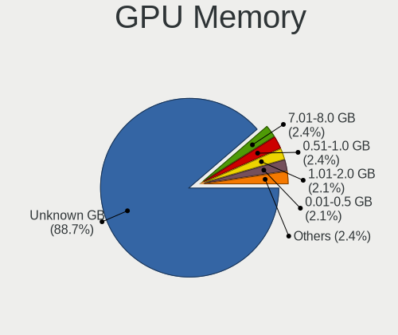

| Size in GB | Desktops | Percent |
|------------|----------|---------|
| Unknown    | 231      | 86.52%  |
| 0.51-1.0   | 9        | 3.37%   |
| 1.01-2.0   | 7        | 2.62%   |
| 7.01-8.0   | 6        | 2.25%   |
| 0.01-0.5   | 6        | 2.25%   |
| 5.01-6.0   | 5        | 1.87%   |
| 3.01-4.0   | 2        | 0.75%   |
| 8.01-16.0  | 1        | 0.37%   |

Monitor
-------

Monitor Vendor
--------------

Monitor vendors

| Vendor               | Desktops | Percent |
|----------------------|----------|---------|
| Dell                 | 9        | 17.65%  |
| Hewlett-Packard      | 6        | 11.76%  |
| Idek Iiyama          | 5        | 9.8%    |
| Iiyama               | 4        | 7.84%   |
| Acer                 | 4        | 7.84%   |
| Samsung Electronics  | 3        | 5.88%   |
| Goldstar             | 3        | 5.88%   |
| Ancor Communications | 3        | 5.88%   |
| ViewSonic            | 2        | 3.92%   |
| AOC                  | 2        | 3.92%   |
| Sony                 | 1        | 1.96%   |
| PRI                  | 1        | 1.96%   |
| PKB                  | 1        | 1.96%   |
| Philips              | 1        | 1.96%   |
| Packard Bell         | 1        | 1.96%   |
| LG Electronics       | 1        | 1.96%   |
| Lenovo Group Limited | 1        | 1.96%   |
| CKL                  | 1        | 1.96%   |
| BenQ                 | 1        | 1.96%   |
| Apple                | 1        | 1.96%   |

Monitor Model
-------------

Monitor models

| Model                                                               | Desktops | Percent |
|---------------------------------------------------------------------|----------|---------|
| Idek Iiyama LCD Monitor PLX2783H 1920x1080                          | 2        | 3.92%   |
| Acer V223HQ ACR0070 1920x1080 470x270mm 21.3-inch                   | 2        | 3.92%   |
| ViewSonic VA2403-FHD VSCF136 1920x1080 520x290mm 23.4-inch          | 1        | 1.96%   |
| ViewSonic TD2420 SERIES VSC452D 1920x1080 520x290mm 23.4-inch       | 1        | 1.96%   |
| Sony TV  *00 SNYF903 3840x2160 950x540mm 43.0-inch                  | 1        | 1.96%   |
| Samsung Electronics SyncMaster SAM036F 1440x900 410x260mm 19.1-inch | 1        | 1.96%   |
| Samsung Electronics LCD Monitor SyncMaster 3520x1200                | 1        | 1.96%   |
| Samsung Electronics LCD Monitor S24R35x 1920x1080                   | 1        | 1.96%   |
| PRI LED-MONITOR PRI0828 3840x2160 1150x650mm 52.0-inch              | 1        | 1.96%   |
| PKB LCD Monitor MAE200W 1680x1050                                   | 1        | 1.96%   |
| Philips LCD Monitor PHLC00B 1280x1024 340x270mm 17.1-inch           | 1        | 1.96%   |
| Packard Bell Viseo 200Ws PKB00C2 1600x900 440x250mm 19.9-inch       | 1        | 1.96%   |
| LG Electronics LCD Monitor LG ULTRAWIDE 2560x1080                   | 1        | 1.96%   |
| Lenovo Group Limited LCD Monitor LEN P27h-10 2560x1440              | 1        | 1.96%   |
| Iiyama PLX2483H IVM6114 1920x1080 530x300mm 24.0-inch               | 1        | 1.96%   |
| Iiyama PL2783Q IVM661F 2560x1440 600x340mm 27.2-inch                | 1        | 1.96%   |
| Iiyama PL2483H IVM6138 1920x1080 530x300mm 24.0-inch                | 1        | 1.96%   |
| Iiyama PL2474H IVM6137 1920x1080 520x290mm 23.4-inch                | 1        | 1.96%   |
| Idek Iiyama LCD Monitor PL2473HD 1920x1080                          | 1        | 1.96%   |
| Idek Iiyama LCD Monitor PL2409HD 1920x1080                          | 1        | 1.96%   |
| Idek Iiyama LCD Monitor PL2206W 1680x1050                           | 1        | 1.96%   |
| Hewlett-Packard Z24i HWP309F 1920x1200 520x320mm 24.0-inch          | 1        | 1.96%   |
| Hewlett-Packard w2207 HWP26A9 1680x1050 470x300mm 22.0-inch         | 1        | 1.96%   |
| Hewlett-Packard w2007 HWP26A6 1680x1050 430x270mm 20.0-inch         | 1        | 1.96%   |
| Hewlett-Packard HPQ 8300 AiO HWP4212 1920x1080 510x290mm 23.1-inch  | 1        | 1.96%   |
| Hewlett-Packard 2310e HWP2909 1920x1080 510x290mm 23.1-inch         | 1        | 1.96%   |
| Hewlett-Packard 2211 HWP2938 1920x1080 480x270mm 21.7-inch          | 1        | 1.96%   |
| Goldstar L1730S GSM438D 1280x1024 340x270mm 17.1-inch               | 1        | 1.96%   |
| Goldstar 27GK750F GSM770F 1920x1080 600x340mm 27.2-inch             | 1        | 1.96%   |
| Goldstar 19MB35 GSM4C23 1280x1024 380x300mm 19.1-inch               | 1        | 1.96%   |
| Dell U2515H DELD06F 2560x1440 550x310mm 24.9-inch                   | 1        | 1.96%   |
| Dell S2721DS DELA19C 2560x1440 590x330mm 26.6-inch                  | 1        | 1.96%   |
| Dell P2418D DELD0C2 2560x1440 530x300mm 24.0-inch                   | 1        | 1.96%   |
| Dell P1917S DELD092 1280x1024 380x300mm 19.1-inch                   | 1        | 1.96%   |
| Dell P1917S DELD091 1280x1024 380x300mm 19.1-inch                   | 1        | 1.96%   |
| Dell P1911 DELA073 1440x900 410x260mm 19.1-inch                     | 1        | 1.96%   |
| Dell LCD Monitor U2414H                                             | 1        | 1.96%   |
| Dell E2014H DELD03B 1600x900 430x240mm 19.4-inch                    | 1        | 1.96%   |
| Dell E1715S DELD062 1280x1024 340x270mm 17.1-inch                   | 1        | 1.96%   |
| CKL LCD Monitor CKL0001 1920x1200 1150x650mm 52.0-inch              | 1        | 1.96%   |

Monitor Resolution
------------------

Monitor screen resolution

| Resolution         | Desktops | Percent |
|--------------------|----------|---------|
| 1920x1080 (FHD)    | 22       | 43.14%  |
| 2560x1440 (QHD)    | 7        | 13.73%  |
| 1280x1024 (SXGA)   | 6        | 11.76%  |
| 1680x1050 (WSXGA+) | 4        | 7.84%   |
| 3840x2160 (4K)     | 2        | 3.92%   |
| 1920x1200 (WUXGA)  | 2        | 3.92%   |
| 1600x900 (HD+)     | 2        | 3.92%   |
| 1440x900 (WXGA+)   | 2        | 3.92%   |
| 3520x1200          | 1        | 1.96%   |
| 2560x1080          | 1        | 1.96%   |
| 1280x800 (WXGA)    | 1        | 1.96%   |
| Unknown            | 1        | 1.96%   |

Monitor Diagonal
----------------

Diagonal size in inches

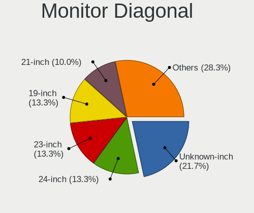

| Inches  | Desktops | Percent |
|---------|----------|---------|
| Unknown | 10       | 20%     |
| 23      | 8        | 16%     |
| 24      | 7        | 14%     |
| 19      | 7        | 14%     |
| 21      | 5        | 10%     |
| 27      | 3        | 6%      |
| 17      | 3        | 6%      |
| 52      | 2        | 4%      |
| 43      | 1        | 2%      |
| 26      | 1        | 2%      |
| 22      | 1        | 2%      |
| 20      | 1        | 2%      |
| 13      | 1        | 2%      |

Monitor Width
-------------

Physical width

| Width in mm | Desktops | Percent |
|-------------|----------|---------|
| 501-600     | 18       | 36.73%  |
| 401-500     | 11       | 22.45%  |
| Unknown     | 10       | 20.41%  |
| 351-400     | 3        | 6.12%   |
| 301-350     | 3        | 6.12%   |
| 1001-1500   | 2        | 4.08%   |
| 201-300     | 1        | 2.04%   |
| 901-1000    | 1        | 2.04%   |

Aspect Ratio
------------

Proportional relationship between the width and the height

| Ratio   | Desktops | Percent |
|---------|----------|---------|
| 16/9    | 28       | 56%     |
| Unknown | 10       | 20%     |
| 5/4     | 6        | 12%     |
| 16/10   | 6        | 12%     |

Monitor Area
------------

Area in inch

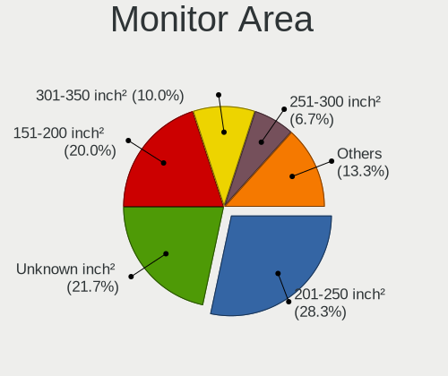

| Area in inch | Desktops | Percent |
|----------------|----------|---------|
| 201-250        | 15       | 30%     |
| 151-200        | 11       | 22%     |
| Unknown        | 10       | 20%     |
| 301-350        | 4        | 8%      |
| 251-300        | 3        | 6%      |
| 141-150        | 3        | 6%      |
| More than 1000 | 2        | 4%      |
| 81-90          | 1        | 2%      |
| 501-1000       | 1        | 2%      |

Pixel Density
-------------

Pixels per inch

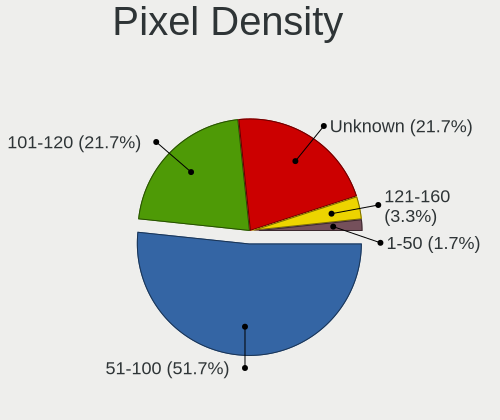

| Density | Desktops | Percent |
|---------|----------|---------|
| 51-100  | 26       | 52%     |
| 101-120 | 12       | 24%     |
| Unknown | 10       | 20%     |
| 1-50    | 1        | 2%      |
| 121-160 | 1        | 2%      |

Multiple Monitors
-----------------

Total monitors connected

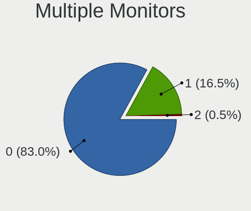

| Total | Desktops | Percent |
|-------|----------|---------|
| 0     | 213      | 79.48%  |
| 1     | 53       | 19.78%  |
| 2     | 2        | 0.75%   |

Network
-------

Net Controller Vendor
---------------------

Controller vendors

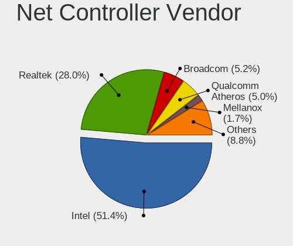

| Vendor                          | Desktops | Percent |
|---------------------------------|----------|---------|
| Intel                           | 189      | 50.27%  |
| Realtek Semiconductor           | 110      | 29.26%  |
| Qualcomm Atheros                | 20       | 5.32%   |
| Broadcom                        | 18       | 4.79%   |
| Mellanox Technologies           | 4        | 1.06%   |
| Ralink Technology               | 3        | 0.8%    |
| D-Link System                   | 3        | 0.8%    |
| VIA Technologies                | 2        | 0.53%   |
| Ralink                          | 2        | 0.53%   |
| Qualcomm Atheros Communications | 2        | 0.53%   |
| Qualcomm                        | 2        | 0.53%   |
| IMC Networks                    | 2        | 0.53%   |
| Huawei Technologies             | 2        | 0.53%   |
| Chelsio Communications          | 2        | 0.53%   |
| 3Com                            | 2        | 0.53%   |
| TP-Link                         | 1        | 0.27%   |
| Samsung Electronics             | 1        | 0.27%   |
| QLogic                          | 1        | 0.27%   |
| National Semiconductor          | 1        | 0.27%   |
| Microchip Technology            | 1        | 0.27%   |
| MediaTek                        | 1        | 0.27%   |
| Marvell Technology Group        | 1        | 0.27%   |
| Emulex                          | 1        | 0.27%   |
| Edimax Technology               | 1        | 0.27%   |
| Aquantia                        | 1        | 0.27%   |
| American Megatrends             | 1        | 0.27%   |
| AMD                             | 1        | 0.27%   |
| Accton Technology               | 1        | 0.27%   |

Net Controller Model
--------------------

Controller models

| Model                                                                         | Desktops | Percent |
|-------------------------------------------------------------------------------|----------|---------|
| Realtek RTL8111/8168/8411 PCI Express Gigabit Ethernet Controller             | 99       | 21.62%  |
| Intel I211 Gigabit Network Connection                                         | 46       | 10.04%  |
| Intel 82574L Gigabit Network Connection                                       | 22       | 4.8%    |
| Intel I210 Gigabit Network Connection                                         | 19       | 4.15%   |
| Intel Ethernet Controller I225-V                                              | 17       | 3.71%   |
| Intel I350 Gigabit Network Connection                                         | 10       | 2.18%   |
| Intel Ethernet Connection I217-LM                                             | 10       | 2.18%   |
| Intel 82579LM Gigabit Network Connection (Lewisville)                         | 10       | 2.18%   |
| Realtek RTL8125 2.5GbE Controller                                             | 9        | 1.97%   |
| Intel Ethernet Controller I226-V                                              | 9        | 1.97%   |
| Intel Ethernet Connection (2) I219-LM                                         | 9        | 1.97%   |
| Intel 82599ES 10-Gigabit SFI/SFP+ Network Connection                          | 9        | 1.97%   |
| Intel Wi-Fi 6 AX200                                                           | 8        | 1.75%   |
| Intel 82571EB/82571GB Gigabit Ethernet Controller D0/D1 (copper applications) | 7        | 1.53%   |
| Intel 82579V Gigabit Network Connection                                       | 6        | 1.31%   |
| Qualcomm Atheros AR928X Wireless Network Adapter (PCI-Express)                | 5        | 1.09%   |
| Realtek RTL8812AE 802.11ac PCIe Wireless Network Adapter                      | 4        | 0.87%   |
| Intel Ethernet Controller X710 for 10GbE SFP+                                 | 4        | 0.87%   |
| Intel Dual Band Wireless-AC 3168NGW [Stone Peak]                              | 4        | 0.87%   |
| Qualcomm Atheros AR9285 Wireless Network Adapter (PCI-Express)                | 3        | 0.66%   |
| Mellanox MT27500 Family [ConnectX-3]                                          | 3        | 0.66%   |
| Intel Ethernet Connection X553 1GbE                                           | 3        | 0.66%   |
| Intel Ethernet Connection (2) I219-V                                          | 3        | 0.66%   |
| Intel 82576 Gigabit Network Connection                                        | 3        | 0.66%   |
| Intel 82567LM-3 Gigabit Network Connection                                    | 3        | 0.66%   |
| D-Link System DGE-528T Gigabit Ethernet Adapter                               | 3        | 0.66%   |
| Broadcom NetXtreme II BCM57810 10 Gigabit Ethernet                            | 3        | 0.66%   |
| Realtek RTL8821CE 802.11ac PCIe Wireless Network Adapter                      | 2        | 0.44%   |
| Realtek RTL8169 PCI Gigabit Ethernet Controller                               | 2        | 0.44%   |
| Realtek RTL-8100/8101L/8139 PCI Fast Ethernet Adapter                         | 2        | 0.44%   |
| Ralink RT5370 Wireless Adapter                                                | 2        | 0.44%   |
| Qualcomm Atheros AR9271 802.11n                                               | 2        | 0.44%   |
| Qualcomm Atheros AR9485 Wireless Network Adapter                              | 2        | 0.44%   |
| Qualcomm Atheros AR93xx Wireless Network Adapter                              | 2        | 0.44%   |
| Qualcomm Atheros AR8151 v2.0 Gigabit Ethernet                                 | 2        | 0.44%   |
| Qualcomm ALCATEL RNDIS Interface                                              | 2        | 0.44%   |
| Intel Wireless-AC 9260                                                        | 2        | 0.44%   |
| Intel Wireless 7260                                                           | 2        | 0.44%   |
| Intel Wireless 3165                                                           | 2        | 0.44%   |
| Intel Wi-Fi 6 AX210/AX211/AX411 160MHz                                        | 2        | 0.44%   |

Wireless Vendor
---------------

Wireless vendors

| Vendor                          | Desktops | Percent |
|---------------------------------|----------|---------|
| Intel                           | 30       | 41.1%   |
| Qualcomm Atheros                | 15       | 20.55%  |
| Realtek Semiconductor           | 13       | 17.81%  |
| Ralink Technology               | 3        | 4.11%   |
| Ralink                          | 2        | 2.74%   |
| Qualcomm Atheros Communications | 2        | 2.74%   |
| IMC Networks                    | 2        | 2.74%   |
| Broadcom                        | 2        | 2.74%   |
| TP-Link                         | 1        | 1.37%   |
| MediaTek                        | 1        | 1.37%   |
| Edimax Technology               | 1        | 1.37%   |
| Accton Technology               | 1        | 1.37%   |

Wireless Model
--------------

Wireless models

| Model                                                                                 | Desktops | Percent |
|---------------------------------------------------------------------------------------|----------|---------|
| Intel Wi-Fi 6 AX200                                                                   | 8        | 10.96%  |
| Qualcomm Atheros AR928X Wireless Network Adapter (PCI-Express)                        | 5        | 6.85%   |
| Realtek RTL8812AE 802.11ac PCIe Wireless Network Adapter                              | 4        | 5.48%   |
| Intel Dual Band Wireless-AC 3168NGW [Stone Peak]                                      | 4        | 5.48%   |
| Qualcomm Atheros AR9285 Wireless Network Adapter (PCI-Express)                        | 3        | 4.11%   |
| Realtek RTL8821CE 802.11ac PCIe Wireless Network Adapter                              | 2        | 2.74%   |
| Ralink RT5370 Wireless Adapter                                                        | 2        | 2.74%   |
| Qualcomm Atheros AR9271 802.11n                                                       | 2        | 2.74%   |
| Qualcomm Atheros AR9485 Wireless Network Adapter                                      | 2        | 2.74%   |
| Qualcomm Atheros AR93xx Wireless Network Adapter                                      | 2        | 2.74%   |
| Intel Wireless-AC 9260                                                                | 2        | 2.74%   |
| Intel Wireless 7260                                                                   | 2        | 2.74%   |
| Intel Wireless 3165                                                                   | 2        | 2.74%   |
| Intel Wi-Fi 6 AX210/AX211/AX411 160MHz                                                | 2        | 2.74%   |
| Intel Centrino Advanced-N 6235                                                        | 2        | 2.74%   |
| Intel Centrino Advanced-N 6200                                                        | 2        | 2.74%   |
| IMC Networks 802.11 n/g/b Wireless LAN USB Mini-Card                                  | 2        | 2.74%   |
| TP-Link Archer T3U [Realtek RTL8812BU]                                                | 1        | 1.37%   |
| Realtek RTL88x2bu [AC1200 Techkey]                                                    | 1        | 1.37%   |
| Realtek RTL8812AU 802.11a/b/g/n/ac 2T2R DB WLAN Adapter                               | 1        | 1.37%   |
| Realtek RTL8191SU 802.11n WLAN Adapter                                                | 1        | 1.37%   |
| Realtek RTL8191SEvB Wireless LAN Controller                                           | 1        | 1.37%   |
| Realtek RTL8191SEvA Wireless LAN Controller                                           | 1        | 1.37%   |
| Realtek RTL8188EUS 802.11n Wireless Network Adapter                                   | 1        | 1.37%   |
| Realtek RTL8188EE Wireless Network Adapter                                            | 1        | 1.37%   |
| Ralink MT7601U Wireless Adapter                                                       | 1        | 1.37%   |
| Ralink RT3090 Wireless 802.11n 1T/1R PCIe                                             | 1        | 1.37%   |
| Ralink RT2500 Wireless 802.11bg                                                       | 1        | 1.37%   |
| Qualcomm Atheros QCA986x/988x 802.11ac Wireless Network Adapter                       | 1        | 1.37%   |
| Qualcomm Atheros AR5418 Wireless Network Adapter [AR5008E 802.11(a)bgn] (PCI-Express) | 1        | 1.37%   |
| Qualcomm Atheros AR5212/5213/2414 Wireless Network Adapter                            | 1        | 1.37%   |
| MediaTek 802.11ac Wireless LAN Card                                                   | 1        | 1.37%   |
| Intel Wireless 7265                                                                   | 1        | 1.37%   |
| Intel Wireless 3160                                                                   | 1        | 1.37%   |
| Intel Wi-Fi 6 AX201 160MHz                                                            | 1        | 1.37%   |
| Intel Wi-Fi 6 AX201                                                                   | 1        | 1.37%   |
| Intel PRO/Wireless 3945ABG [Golan] Network Connection                                 | 1        | 1.37%   |
| Intel Alder Lake-S PCH CNVi WiFi                                                      | 1        | 1.37%   |
| Edimax EW-7811Un 802.11n Wireless Adapter [Realtek RTL8188CUS]                        | 1        | 1.37%   |
| Broadcom BCM4360 802.11ac Wireless Network Adapter                                    | 1        | 1.37%   |

Ethernet Vendor
---------------

Ethernet vendors

| Vendor                   | Desktops | Percent |
|--------------------------|----------|---------|
| Intel                    | 178      | 54.94%  |
| Realtek Semiconductor    | 106      | 32.72%  |
| Broadcom                 | 16       | 4.94%   |
| Qualcomm Atheros         | 5        | 1.54%   |
| D-Link System            | 3        | 0.93%   |
| VIA Technologies         | 2        | 0.62%   |
| Qualcomm                 | 2        | 0.62%   |
| Chelsio Communications   | 2        | 0.62%   |
| 3Com                     | 2        | 0.62%   |
| Samsung Electronics      | 1        | 0.31%   |
| QLogic                   | 1        | 0.31%   |
| National Semiconductor   | 1        | 0.31%   |
| Marvell Technology Group | 1        | 0.31%   |
| Emulex                   | 1        | 0.31%   |
| Aquantia                 | 1        | 0.31%   |
| American Megatrends      | 1        | 0.31%   |
| AMD                      | 1        | 0.31%   |

Ethernet Model
--------------

Ethernet models

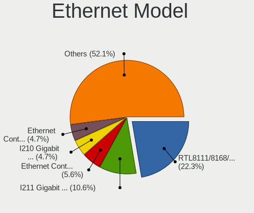

| Model                                                                         | Desktops | Percent |
|-------------------------------------------------------------------------------|----------|---------|
| Realtek RTL8111/8168/8411 PCI Express Gigabit Ethernet Controller             | 99       | 26.26%  |
| Intel I211 Gigabit Network Connection                                         | 46       | 12.2%   |
| Intel 82574L Gigabit Network Connection                                       | 22       | 5.84%   |
| Intel I210 Gigabit Network Connection                                         | 19       | 5.04%   |
| Intel Ethernet Controller I225-V                                              | 17       | 4.51%   |
| Intel I350 Gigabit Network Connection                                         | 10       | 2.65%   |
| Intel Ethernet Connection I217-LM                                             | 10       | 2.65%   |
| Intel 82579LM Gigabit Network Connection (Lewisville)                         | 10       | 2.65%   |
| Realtek RTL8125 2.5GbE Controller                                             | 9        | 2.39%   |
| Intel Ethernet Controller I226-V                                              | 9        | 2.39%   |
| Intel Ethernet Connection (2) I219-LM                                         | 9        | 2.39%   |
| Intel 82599ES 10-Gigabit SFI/SFP+ Network Connection                          | 9        | 2.39%   |
| Intel 82571EB/82571GB Gigabit Ethernet Controller D0/D1 (copper applications) | 7        | 1.86%   |
| Intel 82579V Gigabit Network Connection                                       | 6        | 1.59%   |
| Intel Ethernet Controller X710 for 10GbE SFP+                                 | 4        | 1.06%   |
| Intel Ethernet Connection X553 1GbE                                           | 3        | 0.8%    |
| Intel Ethernet Connection (2) I219-V                                          | 3        | 0.8%    |
| Intel 82576 Gigabit Network Connection                                        | 3        | 0.8%    |
| Intel 82567LM-3 Gigabit Network Connection                                    | 3        | 0.8%    |
| D-Link System DGE-528T Gigabit Ethernet Adapter                               | 3        | 0.8%    |
| Broadcom NetXtreme II BCM57810 10 Gigabit Ethernet                            | 3        | 0.8%    |
| Realtek RTL8169 PCI Gigabit Ethernet Controller                               | 2        | 0.53%   |
| Realtek RTL-8100/8101L/8139 PCI Fast Ethernet Adapter                         | 2        | 0.53%   |
| Qualcomm Atheros AR8151 v2.0 Gigabit Ethernet                                 | 2        | 0.53%   |
| Qualcomm ALCATEL RNDIS Interface                                              | 2        | 0.53%   |
| Intel Ethernet Controller X550                                                | 2        | 0.53%   |
| Intel Ethernet Connection X722 for 10GbE SFP+                                 | 2        | 0.53%   |
| Intel Ethernet Connection (7) I219-V                                          | 2        | 0.53%   |
| Intel Ethernet Connection (5) I219-LM                                         | 2        | 0.53%   |
| Intel Ethernet Connection (11) I219-V                                         | 2        | 0.53%   |
| Intel 82583V Gigabit Network Connection                                       | 2        | 0.53%   |
| Broadcom NetXtreme BCM5761 Gigabit Ethernet PCIe                              | 2        | 0.53%   |
| Broadcom NetXtreme BCM5722 Gigabit Ethernet PCI Express                       | 2        | 0.53%   |
| Broadcom NetXtreme BCM5720 Gigabit Ethernet PCIe                              | 2        | 0.53%   |
| VIA VT6105/VT6106S [Rhine-III]                                                | 1        | 0.27%   |
| VIA VT6102/VT6103 [Rhine-II]                                                  | 1        | 0.27%   |
| Samsung Galaxy series, misc. (tethering mode)                                 | 1        | 0.27%   |
| Qualcomm Atheros Killer E220x Gigabit Ethernet Controller                     | 1        | 0.27%   |
| Qualcomm Atheros Attansic L1 Gigabit Ethernet                                 | 1        | 0.27%   |
| Qualcomm Atheros AR8161 Gigabit Ethernet                                      | 1        | 0.27%   |

Net Controller Kind
-------------------

Ethernet, WiFi or modem

| Kind     | Desktops | Percent |
|----------|----------|---------|
| Ethernet | 265      | 77.49%  |
| WiFi     | 69       | 20.18%  |
| Unknown  | 7        | 2.05%   |
| Modem    | 1        | 0.29%   |

Used Controller
---------------

Currently used network controller

| Kind     | Desktops | Percent |
|----------|----------|---------|
| Ethernet | 250      | 98.43%  |
| WiFi     | 4        | 1.57%   |

NICs
----

Total network controllers on board

| Total | Desktops | Percent |
|-------|----------|---------|
| 4     | 63       | 23.42%  |
| 1     | 60       | 22.3%   |
| 2     | 57       | 21.19%  |
| 3     | 47       | 17.47%  |
| 5     | 17       | 6.32%   |
| 6     | 10       | 3.72%   |
| 8     | 5        | 1.86%   |
| 7     | 5        | 1.86%   |
| 13    | 1        | 0.37%   |
| 12    | 1        | 0.37%   |
| 11    | 1        | 0.37%   |
| 10    | 1        | 0.37%   |
| 0     | 1        | 0.37%   |

IPv6
----

IPv6 vs IPv4

| Used | Desktops | Percent |
|------|----------|---------|
| No   | 204      | 73.91%  |
| Yes  | 72       | 26.09%  |

Bluetooth
---------

Bluetooth Vendor
----------------

Controller vendors

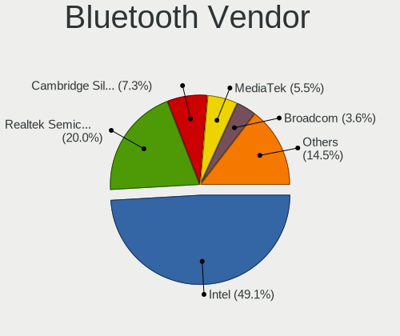

| Vendor                   | Desktops | Percent |
|--------------------------|----------|---------|
| Intel                    | 22       | 68.75%  |
| Cambridge Silicon Radio  | 3        | 9.38%   |
| Realtek Semiconductor    | 2        | 6.25%   |
| Broadcom                 | 2        | 6.25%   |
| HTC (High Tech Computer) | 1        | 3.13%   |
| Hewlett-Packard          | 1        | 3.13%   |
| ASUSTek Computer         | 1        | 3.13%   |

Bluetooth Model
---------------

Controller models

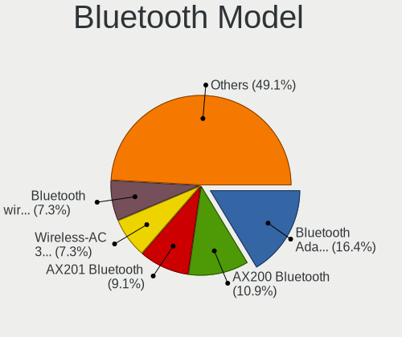

| Model                                                                | Desktops | Percent |
|----------------------------------------------------------------------|----------|---------|
| Intel AX200 Bluetooth                                                | 6        | 18.75%  |
| Intel Bluetooth wireless interface                                   | 4        | 12.5%   |
| Intel Wireless-AC 3168 Bluetooth                                     | 3        | 9.38%   |
| Intel Centrino Bluetooth Wireless Transceiver                        | 3        | 9.38%   |
| Cambridge Silicon Radio Bluetooth Dongle (HCI mode)                  | 3        | 9.38%   |
| Intel AX210 Bluetooth                                                | 2        | 6.25%   |
| Intel AX201 Bluetooth                                                | 2        | 6.25%   |
| Broadcom BCM20702A0 Bluetooth 4.0                                    | 2        | 6.25%   |
| Realtek  Bluetooth 4.2 Adapter                                       | 1        | 3.13%   |
| Realtek Bluetooth Adapter                                            | 1        | 3.13%   |
| Intel Wireless-AC 9260 Bluetooth Adapter                             | 1        | 3.13%   |
| Intel Bluetooth 9460/9560 Jefferson Peak (JfP)                       | 1        | 3.13%   |
| HTC (High Tech Computer) Vive Hub Bluetooth 4.1 (Broadcom BCM920703) | 1        | 3.13%   |
| HP Bluetooth 2.0 Interface [Broadcom BCM2045]                        | 1        | 3.13%   |
| ASUS Broadcom BCM20702 Single-Chip Bluetooth 4.0 + LE                | 1        | 3.13%   |

Sound
-----

Sound Vendor
------------

Sound card vendors

| Vendor                                       | Desktops | Percent |
|----------------------------------------------|----------|---------|
| Intel                                        | 157      | 64.34%  |
| AMD                                          | 44       | 18.03%  |
| Nvidia                                       | 25       | 10.25%  |
| C-Media Electronics                          | 3        | 1.23%   |
| Zoran Co. Personal Media Division (Nogatech) | 2        | 0.82%   |
| Focusrite-Novation                           | 2        | 0.82%   |
| Creative Labs                                | 2        | 0.82%   |
| VIA Technologies                             | 1        | 0.41%   |
| Texas Instruments                            | 1        | 0.41%   |
| Sony                                         | 1        | 0.41%   |
| Micronas                                     | 1        | 0.41%   |
| Logitech                                     | 1        | 0.41%   |
| Kingston Technology                          | 1        | 0.41%   |
| iCreate Technologies                         | 1        | 0.41%   |
| Giga-Byte Technology                         | 1        | 0.41%   |
| ESS Technology                               | 1        | 0.41%   |

Sound Model
-----------

Sound card models

| Model                                                                                             | Desktops | Percent |
|---------------------------------------------------------------------------------------------------|----------|---------|
| Intel 7 Series/C216 Chipset Family High Definition Audio Controller                               | 16       | 5.42%   |
| Intel 8 Series/C220 Series Chipset High Definition Audio Controller                               | 15       | 5.08%   |
| Intel 6 Series/C200 Series Chipset Family High Definition Audio Controller                        | 15       | 5.08%   |
| Intel 100 Series/C230 Series Chipset Family HD Audio Controller                                   | 15       | 5.08%   |
| Intel Xeon E3-1200 v3/4th Gen Core Processor HD Audio Controller                                  | 13       | 4.41%   |
| Intel Jasper Lake HD Audio                                                                        | 12       | 4.07%   |
| Intel Haswell-ULT HD Audio Controller                                                             | 10       | 3.39%   |
| Intel 8 Series HD Audio Controller                                                                | 10       | 3.39%   |
| Intel 200 Series PCH HD Audio                                                                     | 10       | 3.39%   |
| AMD FCH Azalia Controller                                                                         | 10       | 3.39%   |
| Intel Celeron/Pentium Silver Processor High Definition Audio                                      | 9        | 3.05%   |
| AMD Starship/Matisse HD Audio Controller                                                          | 8        | 2.71%   |
| Intel NM10/ICH7 Family High Definition Audio Controller                                           | 7        | 2.37%   |
| Intel Sunrise Point-LP HD Audio                                                                   | 6        | 2.03%   |
| Intel Cannon Lake PCH cAVS                                                                        | 6        | 2.03%   |
| AMD SBx00 Azalia (Intel HDA)                                                                      | 6        | 2.03%   |
| AMD Kabini HDMI/DP Audio                                                                          | 6        | 2.03%   |
| Intel Wildcat Point-LP High Definition Audio Controller                                           | 5        | 1.69%   |
| Intel Broadwell-U Audio Controller                                                                | 5        | 1.69%   |
| AMD Renoir Radeon High Definition Audio Controller                                                | 5        | 1.69%   |
| AMD Family 17h/19h HD Audio Controller                                                            | 5        | 1.69%   |
| AMD Family 17h (Models 00h-0fh) HD Audio Controller                                               | 5        | 1.69%   |
| Intel Atom/Celeron/Pentium Processor x5-E8000/J3xxx/N3xxx Series High Definition Audio Controller | 4        | 1.36%   |
| Nvidia TU116 High Definition Audio Controller                                                     | 3        | 1.02%   |
| Nvidia High Definition Audio Controller                                                           | 3        | 1.02%   |
| Nvidia GK208 HDMI/DP Audio Controller                                                             | 3        | 1.02%   |
| Intel 82801JI (ICH10 Family) HD Audio Controller                                                  | 3        | 1.02%   |
| Intel 82801JD/DO (ICH10 Family) HD Audio Controller                                               | 3        | 1.02%   |
| AMD Wrestler HDMI Audio                                                                           | 3        | 1.02%   |
| Zoran Co. Personal Media Division (Nogatech) USB Audio and HID                                    | 2        | 0.68%   |
| Nvidia GK107 HDMI Audio Controller                                                                | 2        | 0.68%   |
| Nvidia GF114 HDMI Audio Controller                                                                | 2        | 0.68%   |
| Intel Tiger Lake-LP Smart Sound Technology Audio Controller                                       | 2        | 0.68%   |
| Intel Tiger Lake-H HD Audio Controller                                                            | 2        | 0.68%   |
| Intel Comet Lake PCH cAVS                                                                         | 2        | 0.68%   |
| Intel C610/X99 series chipset HD Audio Controller                                                 | 2        | 0.68%   |
| Intel Alder Lake-S HD Audio Controller                                                            | 2        | 0.68%   |
| Intel 82801I (ICH9 Family) HD Audio Controller                                                    | 2        | 0.68%   |
| AMD Oland/Hainan/Cape Verde/Pitcairn HDMI Audio [Radeon HD 7000 Series]                           | 2        | 0.68%   |
| AMD Navi 10 HDMI Audio                                                                            | 2        | 0.68%   |

Memory
------

Memory Vendor
-------------

Memory module vendors

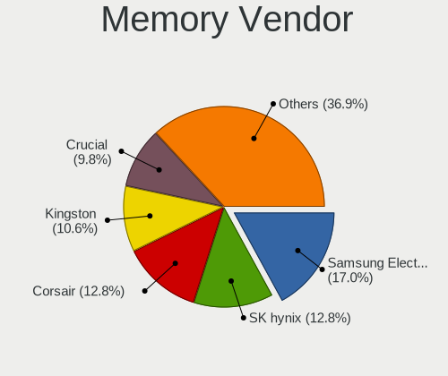

| Vendor              | Desktops | Percent |
|---------------------|----------|---------|
| Samsung Electronics | 38       | 15.64%  |
| SK hynix            | 32       | 13.17%  |
| Kingston            | 31       | 12.76%  |
| Corsair             | 30       | 12.35%  |
| Crucial             | 27       | 11.11%  |
| Unknown             | 25       | 10.29%  |
| G.Skill             | 19       | 7.82%   |
| Micron Technology   | 12       | 4.94%   |
| Unknown             | 5        | 2.06%   |
| Nanya Technology    | 4        | 1.65%   |
| Kimtigo             | 4        | 1.65%   |
| Transcend           | 3        | 1.23%   |
| Elpida              | 2        | 0.82%   |
| Atermiter           | 2        | 0.82%   |
| Wodposit            | 1        | 0.41%   |
| Unknown (0B38)      | 1        | 0.41%   |
| Teikon              | 1        | 0.41%   |
| TakeMS              | 1        | 0.41%   |
| Patriot             | 1        | 0.41%   |
| OCZ                 | 1        | 0.41%   |
| Hewlett-Packard     | 1        | 0.41%   |
| Goldenmars          | 1        | 0.41%   |
| Apacer              | 1        | 0.41%   |

Memory Model
------------

Memory module models

| Model                                                   | Desktops | Percent |
|---------------------------------------------------------|----------|---------|
| Unknown RAM Module 4GB SODIMM DDR3 1333MT/s             | 5        | 1.95%   |
| Unknown                                                 | 5        | 1.95%   |
| Corsair RAM CMK16GX4M2B3200C16 8GB DIMM DDR4 3200MT/s   | 4        | 1.56%   |
| Unknown RAM Module 2GB SODIMM DDR3 1333MT/s             | 3        | 1.17%   |
| SK hynix RAM HMA81GU6AFR8N-UH 8GB DIMM DDR4 2400MT/s    | 3        | 1.17%   |
| Samsung RAM M378B5273CH0-CK0 4GB DIMM DDR3 1600MT/s     | 3        | 1.17%   |
| Samsung RAM M378B5173QH0-CK0 4GB DIMM DDR3 1600MT/s     | 3        | 1.17%   |
| Kimtigo RAM KT8GS3EDF 8GB SODIMM DDR3 1600MT/s          | 3        | 1.17%   |
| Unknown RAM Module 8GB DIMM DDR3 1600MT/s               | 2        | 0.78%   |
| Unknown RAM Module 4GB DIMM 1333MT/s                    | 2        | 0.78%   |
| Unknown RAM Module 2GB SODIMM DDR3 800MT/s              | 2        | 0.78%   |
| Unknown RAM Module 2048MB DIMM 800MT/s                  | 2        | 0.78%   |
| SK hynix RAM HMT451S6BFR8A-PB 4GB SODIMM DDR3 1600MT/s  | 2        | 0.78%   |
| SK hynix RAM HMT41GS6BFR8A-PB 8GB SODIMM DDR3 1600MT/s  | 2        | 0.78%   |
| SK hynix RAM HMT351U6CFR8C-PB 4GB DIMM DDR3 1600MT/s    | 2        | 0.78%   |
| SK hynix RAM HMT351S6CFR8C-H9 4GB SODIMM DDR3 1333MT/s  | 2        | 0.78%   |
| SK hynix RAM HMA82GU6JJR8N-VK 16GB DIMM DDR4 2666MT/s   | 2        | 0.78%   |
| Samsung RAM Module 8GB SODIMM DDR4 2133MT/s             | 2        | 0.78%   |
| Samsung RAM M471B5173EB0-YK0 4GB SODIMM DDR3 1600MT/s   | 2        | 0.78%   |
| Samsung RAM M471A2K43CB1-CTD 16GB SODIMM DDR4 2667MT/s  | 2        | 0.78%   |
| Samsung RAM M393A4K40CB2-CTD 32GB DIMM DDR4 2667MT/s    | 2        | 0.78%   |
| Samsung RAM M378B5673EH1-CH9 2GB DIMM DDR3 1333MT/s     | 2        | 0.78%   |
| Samsung RAM M378B5173EB0-YK0 4GB DIMM DDR3 1600MT/s     | 2        | 0.78%   |
| Nanya RAM NT2GT64U8HD0BY-AD 2GB DIMM DDR2 800MT/s       | 2        | 0.78%   |
| Micron RAM 8HTF12864AZ-800H1 1GB DIMM DDR2 800MT/s      | 2        | 0.78%   |
| Kingston RAM KHX2666C16/16G 16GB DIMM DDR4 2666MT/s     | 2        | 0.78%   |
| Kingston RAM KHX1600C9D3/4GX 4GB DIMM DDR3 1600MT/s     | 2        | 0.78%   |
| Kingston RAM 99U5471-054.A00LF 8GB DIMM DDR3 1600MT/s   | 2        | 0.78%   |
| G.Skill RAM F4-3200C16-16GIS 16GB DIMM DDR4 3200MT/s    | 2        | 0.78%   |
| Crucial RAM CT4G4SFS824A.M8FF 4GB SODIMM DDR4 2400MT/s  | 2        | 0.78%   |
| Crucial RAM CT102464BF160B.M16 8GB SODIMM DDR3 1600MT/s | 2        | 0.78%   |
| Corsair RAM CMZ8GX3M2A1600C9 4GB DIMM DDR3 1600MT/s     | 2        | 0.78%   |
| Corsair RAM CMV8GX4M1A2133C15 8GB DIMM DDR4 2133MT/s    | 2        | 0.78%   |
| Corsair RAM CMV4GX3M1A1333C9 4GB DIMM DDR3 1333MT/s     | 2        | 0.78%   |
| Corsair RAM CMK64GX4M2E3200C16 32GB DIMM DDR4 2133MT/s  | 2        | 0.78%   |
| Atermiter RAM Module 8GB DIMM DDR3 800MT/s              | 2        | 0.78%   |
| Wodposit RAM WPBH26D408SWA-8G 8GB SODIMM DDR4 2400MT/s  | 1        | 0.39%   |
| Unknown RAM Module 8192MB DIMM DDR3 1600MT/s            | 1        | 0.39%   |
| Unknown RAM Module 2GB DIMM DDR3 1332MT/s               | 1        | 0.39%   |
| Unknown RAM Module 2GB DIMM 800MT/s                     | 1        | 0.39%   |

Memory Kind
-----------

Memory module kinds

| Kind    | Desktops | Percent |
|---------|----------|---------|
| DDR3    | 105      | 47.09%  |
| DDR4    | 96       | 43.05%  |
| Unknown | 11       | 4.93%   |
| DDR2    | 8        | 3.59%   |
| SDRAM   | 1        | 0.45%   |
| LPDDR4  | 1        | 0.45%   |
| DDR5    | 1        | 0.45%   |

Memory Form Factor
------------------

Physical design of the memory module

| Name         | Desktops | Percent |
|--------------|----------|---------|
| DIMM         | 136      | 61.26%  |
| SODIMM       | 84       | 37.84%  |
| Row Of Chips | 1        | 0.45%   |
| Unknown      | 1        | 0.45%   |

Memory Size
-----------

Memory module size

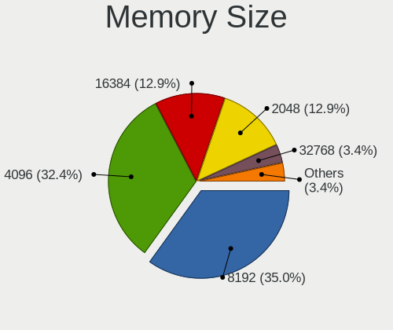

| Size  | Desktops | Percent |
|-------|----------|---------|
| 8192  | 86       | 36.6%   |
| 4096  | 81       | 34.47%  |
| 2048  | 33       | 14.04%  |
| 16384 | 22       | 9.36%   |
| 1024  | 8        | 3.4%    |
| 32768 | 5        | 2.13%   |

Memory Speed
------------

Memory module speed

| Speed | Desktops | Percent |
|-------|----------|---------|
| 1600  | 64       | 27.83%  |
| 1333  | 38       | 16.52%  |
| 2400  | 29       | 12.61%  |
| 3200  | 24       | 10.43%  |
| 2667  | 17       | 7.39%   |
| 2133  | 17       | 7.39%   |
| 800   | 12       | 5.22%   |
| 2666  | 9        | 3.91%   |
| 667   | 5        | 2.17%   |
| 1066  | 4        | 1.74%   |
| 1334  | 2        | 0.87%   |
| 5200  | 1        | 0.43%   |
| 4800  | 1        | 0.43%   |
| 3600  | 1        | 0.43%   |
| 3000  | 1        | 0.43%   |
| 1400  | 1        | 0.43%   |
| 1332  | 1        | 0.43%   |
| 1067  | 1        | 0.43%   |
| 533   | 1        | 0.43%   |
| 400   | 1        | 0.43%   |

Printers & scanners
-------------------

Printer Vendor
--------------

Printer device vendors

| Vendor      | Desktops | Percent |
|-------------|----------|---------|
| Seiko Epson | 1        | 50%     |
| Dymo-CoStar | 1        | 50%     |

Printer Model
-------------

Printer device models

| Model                       | Desktops | Percent |
|-----------------------------|----------|---------|
| Seiko Epson Printer         | 1        | 50%     |
| Dymo-CoStar LabelWriter 450 | 1        | 50%     |

Scanner Vendor
--------------

Scanner device vendors

| Vendor | Desktops | Percent |
|--------|----------|---------|
| Canon  | 1        | 100%    |

Scanner Model
-------------

Scanner device models

| Model                  | Desktops | Percent |
|------------------------|----------|---------|
| Canon CanoScan LIDE 25 | 1        | 100%    |

Camera
------

Camera Vendor
-------------

Camera device vendors

| Vendor                   | Desktops | Percent |
|--------------------------|----------|---------|
| Logitech                 | 5        | 71.43%  |
| ValueHD                  | 1        | 14.29%  |
| Novatek Microelectronics | 1        | 14.29%  |

Camera Model
------------

Camera device models

| Model                                 | Desktops | Percent |
|---------------------------------------|----------|---------|
| Logitech Webcam C270                  | 3        | 42.86%  |
| Logitech C922 Pro Stream Webcam       | 2        | 28.57%  |
| ValueHD HD Camera                     | 1        | 14.29%  |
| Novatek HP High Definition 2MP Webcam | 1        | 14.29%  |

Security
--------

Fingerprint Vendor
------------------

Fingerprint sensor vendors

| Vendor    | Desktops | Percent |
|-----------|----------|---------|
| Upek      | 1        | 50%     |
| AuthenTec | 1        | 50%     |

Fingerprint Model
-----------------

Fingerprint sensor models

| Model                                                  | Desktops | Percent |
|--------------------------------------------------------|----------|---------|
| Upek Biometric Touchchip/Touchstrip Fingerprint Sensor | 1        | 50%     |
| AuthenTec AES2501 Fingerprint Sensor                   | 1        | 50%     |

Chipcard Vendor
---------------

Chipcard module vendors

Zero info for selected period =(

Chipcard Model
--------------

Chipcard module models

Zero info for selected period =(

Unsupported
-----------

Unsupported Devices
-------------------

Total unsupported devices on board

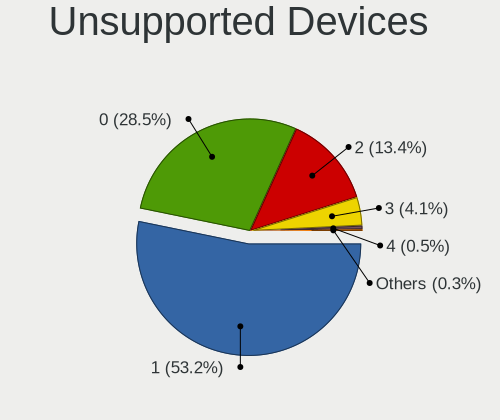

| Total | Desktops | Percent |
|-------|----------|---------|
| 1     | 145      | 53.31%  |
| 0     | 83       | 30.51%  |
| 2     | 32       | 11.76%  |
| 3     | 11       | 4.04%   |
| 4     | 1        | 0.37%   |

Unsupported Device Types
------------------------

Types of unsupported devices

| Type                     | Desktops | Percent |
|--------------------------|----------|---------|
| Communication controller | 162      | 71.68%  |
| Net/wireless             | 26       | 11.5%   |
| Bluetooth                | 15       | 6.64%   |
| Firewire controller      | 8        | 3.54%   |
| Net/ethernet             | 5        | 2.21%   |
| Sound                    | 4        | 1.77%   |
| Graphics card            | 2        | 0.88%   |
| Storage                  | 1        | 0.44%   |
| Network                  | 1        | 0.44%   |
| Modem                    | 1        | 0.44%   |
| Card reader              | 1        | 0.44%   |

