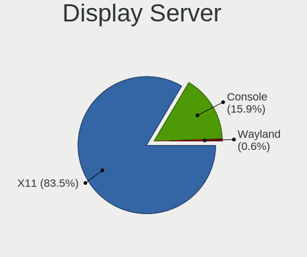
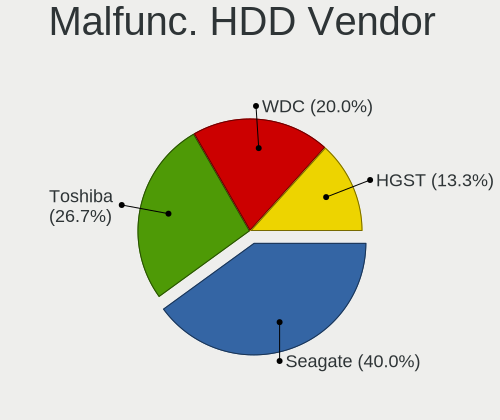
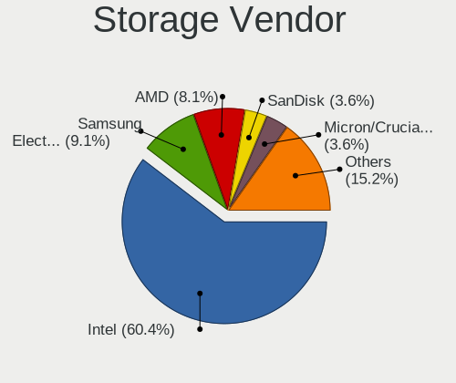
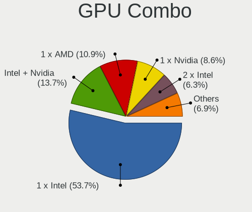
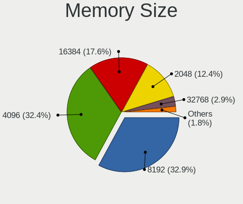
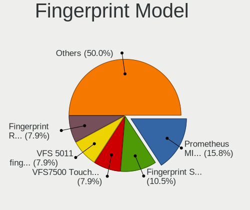

BSD in France - Tested Hardware & Statistics (Notebooks)
--------------------------------------------------------

A project to collect tested hardware configurations for BSD in France.

Anyone can contribute to this report by the [hw-probe](https://github.com/linuxhw/hw-probe/blob/master/INSTALL.BSD.md) tool:

    hw-probe -all -upload

Please contribute! Especially if your hardware is rare.

Contents
--------

* [ Test Cases ](#test-cases)

* [ System ](#system)
  - [ OS                       ](#os)
  - [ OS Family                ](#os-family)
  - [ Arch                     ](#arch)
  - [ DE                       ](#de)
  - [ Display Server           ](#display-server)
  - [ Display Manager          ](#display-manager)
  - [ OS Lang                  ](#os-lang)
  - [ Boot Mode                ](#boot-mode)
  - [ Filesystem               ](#filesystem)
  - [ Part. scheme             ](#part-scheme)

* [ Board ](#board)
  - [ Vendor                   ](#vendor)
  - [ Model                    ](#model)
  - [ Model Family             ](#model-family)
  - [ MFG Year                 ](#mfg-year)
  - [ Form Factor              ](#form-factor)
  - [ Coreboot                 ](#coreboot)
  - [ RAM Size                 ](#ram-size)
  - [ RAM Used                 ](#ram-used)
  - [ Total Drives             ](#total-drives)
  - [ Has CD-ROM               ](#has-cd-rom)
  - [ Has Ethernet             ](#has-ethernet)
  - [ Has WiFi                 ](#has-wifi)
  - [ Has Bluetooth            ](#has-bluetooth)

* [ Location ](#location)
  - [ Country                  ](#country)
  - [ City                     ](#city)

* [ Drives ](#drives)
  - [ Drive Vendor             ](#drive-vendor)
  - [ Drive Model              ](#drive-model)
  - [ HDD Vendor               ](#hdd-vendor)
  - [ SSD Vendor               ](#ssd-vendor)
  - [ Drive Kind               ](#drive-kind)
  - [ Drive Connector          ](#drive-connector)
  - [ Drive Size               ](#drive-size)
  - [ Space Total              ](#space-total)
  - [ Space Used               ](#space-used)
  - [ Malfunc. Drives          ](#malfunc-drives)
  - [ Malfunc. Drive Vendor    ](#malfunc-drive-vendor)
  - [ Malfunc. HDD Vendor      ](#malfunc-hdd-vendor)
  - [ Malfunc. Drive Kind      ](#malfunc-drive-kind)
  - [ Failed Drives            ](#failed-drives)
  - [ Failed Drive Vendor      ](#failed-drive-vendor)
  - [ Drive Status             ](#drive-status)

* [ Storage controller ](#storage-controller)
  - [ Storage Vendor           ](#storage-vendor)
  - [ Storage Model            ](#storage-model)
  - [ Storage Kind             ](#storage-kind)

* [ Processor ](#processor)
  - [ CPU Vendor               ](#cpu-vendor)
  - [ CPU Model                ](#cpu-model)
  - [ CPU Model Family         ](#cpu-model-family)
  - [ CPU Cores                ](#cpu-cores)
  - [ CPU Sockets              ](#cpu-sockets)
  - [ CPU Threads              ](#cpu-threads)
  - [ CPU Microarch            ](#cpu-microarch)

* [ Graphics ](#graphics)
  - [ GPU Vendor               ](#gpu-vendor)
  - [ GPU Model                ](#gpu-model)
  - [ GPU Combo                ](#gpu-combo)
  - [ GPU Driver               ](#gpu-driver)
  - [ GPU Memory               ](#gpu-memory)

* [ Monitor ](#monitor)
  - [ Monitor Vendor           ](#monitor-vendor)
  - [ Monitor Model            ](#monitor-model)
  - [ Monitor Resolution       ](#monitor-resolution)
  - [ Monitor Diagonal         ](#monitor-diagonal)
  - [ Monitor Width            ](#monitor-width)
  - [ Aspect Ratio             ](#aspect-ratio)
  - [ Monitor Area             ](#monitor-area)
  - [ Pixel Density            ](#pixel-density)
  - [ Multiple Monitors        ](#multiple-monitors)

* [ Network ](#network)
  - [ Net Controller Vendor    ](#net-controller-vendor)
  - [ Net Controller Model     ](#net-controller-model)
  - [ Wireless Vendor          ](#wireless-vendor)
  - [ Wireless Model           ](#wireless-model)
  - [ Ethernet Vendor          ](#ethernet-vendor)
  - [ Ethernet Model           ](#ethernet-model)
  - [ Net Controller Kind      ](#net-controller-kind)
  - [ Used Controller          ](#used-controller)
  - [ NICs                     ](#nics)
  - [ IPv6                     ](#ipv6)

* [ Bluetooth ](#bluetooth)
  - [ Bluetooth Vendor         ](#bluetooth-vendor)
  - [ Bluetooth Model          ](#bluetooth-model)

* [ Sound ](#sound)
  - [ Sound Vendor             ](#sound-vendor)
  - [ Sound Model              ](#sound-model)

* [ Memory ](#memory)
  - [ Memory Vendor            ](#memory-vendor)
  - [ Memory Model             ](#memory-model)
  - [ Memory Kind              ](#memory-kind)
  - [ Memory Form Factor       ](#memory-form-factor)
  - [ Memory Size              ](#memory-size)
  - [ Memory Speed             ](#memory-speed)

* [ Printers & scanners ](#printers--scanners)
  - [ Printer Vendor           ](#printer-vendor)
  - [ Printer Model            ](#printer-model)
  - [ Scanner Vendor           ](#scanner-vendor)
  - [ Scanner Model            ](#scanner-model)

* [ Camera ](#camera)
  - [ Camera Vendor            ](#camera-vendor)
  - [ Camera Model             ](#camera-model)

* [ Security ](#security)
  - [ Fingerprint Vendor       ](#fingerprint-vendor)
  - [ Fingerprint Model        ](#fingerprint-model)
  - [ Chipcard Vendor          ](#chipcard-vendor)
  - [ Chipcard Model           ](#chipcard-model)

* [ Unsupported ](#unsupported)
  - [ Unsupported Devices      ](#unsupported-devices)
  - [ Unsupported Device Types ](#unsupported-device-types)

Test Cases
----------

Total: 233

| Vendor    | Model                       | Probe                                                     | Date         |
|-----------|-----------------------------|-----------------------------------------------------------|--------------|
| ASUSTek   | VivoBook_ASUSLaptop X160... | [77d8cc2e7c](https://bsd-hardware.info/?probe=77d8cc2e7c) | Jan 02, 2024 |
| Dell      | Vostro V130                 | [44e78243c2](https://bsd-hardware.info/?probe=44e78243c2) | Dec 30, 2023 |
| Dell      | Latitude 7414               | [2d57c22982](https://bsd-hardware.info/?probe=2d57c22982) | Dec 08, 2023 |
| HP        | Pavilion g7                 | [4c1bc19902](https://bsd-hardware.info/?probe=4c1bc19902) | Dec 03, 2023 |
| Lenovo    | ThinkPad T470 20HES0EV0A    | [96562d6513](https://bsd-hardware.info/?probe=96562d6513) | Nov 20, 2023 |
| Lenovo    | ThinkPad T470 20HES0EV0A    | [5caaad73bd](https://bsd-hardware.info/?probe=5caaad73bd) | Nov 19, 2023 |
| Dell      | Latitude 5440               | [9daa44aacf](https://bsd-hardware.info/?probe=9daa44aacf) | Nov 18, 2023 |
| Lenovo    | ThinkPad X260 20F6006XUK    | [823bdd1b43](https://bsd-hardware.info/?probe=823bdd1b43) | Nov 10, 2023 |
| Dell      | Precision 7560              | [a0e5297849](https://bsd-hardware.info/?probe=a0e5297849) | Nov 09, 2023 |
| ASUSTek   | N73SV                       | [31fff3e92b](https://bsd-hardware.info/?probe=31fff3e92b) | Oct 21, 2023 |
| ASUSTek   | N73SV                       | [30726f25a0](https://bsd-hardware.info/?probe=30726f25a0) | Oct 21, 2023 |
| Lenovo    | ThinkPad X1 Carbon 3rd 2... | [0f3cd5aa25](https://bsd-hardware.info/?probe=0f3cd5aa25) | Oct 13, 2023 |
| Lenovo    | ThinkPad X260 20F6006XUK    | [25fecdaad5](https://bsd-hardware.info/?probe=25fecdaad5) | Oct 03, 2023 |
| ASUSTek   | ZenBook UX333FA_UX333FA     | [d331bd9a11](https://bsd-hardware.info/?probe=d331bd9a11) | Sep 08, 2023 |
| ASUSTek   | ASUS TUF Dash F15 FX517Z... | [cbde759aa2](https://bsd-hardware.info/?probe=cbde759aa2) | Sep 07, 2023 |
| ASUSTek   | ASUS TUF Dash F15 FX517Z... | [22ec8197cc](https://bsd-hardware.info/?probe=22ec8197cc) | Sep 07, 2023 |
| Unknown   | Unknown                     | [516b89740b](https://bsd-hardware.info/?probe=516b89740b) | Sep 06, 2023 |
| Unknown   | Unknown                     | [084127fd8b](https://bsd-hardware.info/?probe=084127fd8b) | Sep 06, 2023 |
| Lenovo    | ThinkPad X260 20F6006XUK    | [e4f0ac6bb9](https://bsd-hardware.info/?probe=e4f0ac6bb9) | Sep 03, 2023 |
| Lenovo    | ThinkPad X260 20F6006XUK    | [4bce25bd89](https://bsd-hardware.info/?probe=4bce25bd89) | Sep 03, 2023 |
| Deciso    | NetBoard-A20                | [bf4ed827a5](https://bsd-hardware.info/?probe=bf4ed827a5) | Aug 31, 2023 |
| Getac     | V110G2                      | [884803a6bd](https://bsd-hardware.info/?probe=884803a6bd) | Aug 25, 2023 |
| Lenovo    | ThinkPad T460p 20FXS06A1... | [378d093019](https://bsd-hardware.info/?probe=378d093019) | Aug 15, 2023 |
| Unknown   | Unknown                     | [4176afcb0d](https://bsd-hardware.info/?probe=4176afcb0d) | Aug 13, 2023 |
| Lenovo    | ThinkPad T60 1951CZ1        | [46766bc381](https://bsd-hardware.info/?probe=46766bc381) | Aug 11, 2023 |
| Notebook  | N7x0WU                      | [418b98798e](https://bsd-hardware.info/?probe=418b98798e) | Aug 09, 2023 |
| Notebook  | N7x0WU                      | [60d49b408a](https://bsd-hardware.info/?probe=60d49b408a) | Aug 09, 2023 |
| Chuwi     | CoreBook X                  | [2854f97c81](https://bsd-hardware.info/?probe=2854f97c81) | Aug 01, 2023 |
| Deciso    | NetBoard-A20                | [c4a85b9853](https://bsd-hardware.info/?probe=c4a85b9853) | Jul 18, 2023 |
| HP        | Stream Laptop 14-ds0xxx     | [81bbc73e72](https://bsd-hardware.info/?probe=81bbc73e72) | Jun 18, 2023 |
| Unknown   | Unknown                     | [422b9d51a7](https://bsd-hardware.info/?probe=422b9d51a7) | Jun 06, 2023 |
| Dell      | System XPS L702X            | [f56d7090f9](https://bsd-hardware.info/?probe=f56d7090f9) | May 28, 2023 |
| Deciso    | NetBoard-A20                | [0c5fd49340](https://bsd-hardware.info/?probe=0c5fd49340) | May 25, 2023 |
| Dell      | System XPS L702X            | [857016be75](https://bsd-hardware.info/?probe=857016be75) | May 24, 2023 |
| HP        | EliteBook 8570p             | [b5f17b6bf8](https://bsd-hardware.info/?probe=b5f17b6bf8) | May 23, 2023 |
| Deciso    | NetBoard-A20                | [313796fd3e](https://bsd-hardware.info/?probe=313796fd3e) | May 18, 2023 |
| Alienware | 17 R4                       | [df734c8e64](https://bsd-hardware.info/?probe=df734c8e64) | May 14, 2023 |
| Notebook  | N7x0WU                      | [7a646e185a](https://bsd-hardware.info/?probe=7a646e185a) | May 09, 2023 |
| Lenovo    | G500 20236                  | [e7387bfd6e](https://bsd-hardware.info/?probe=e7387bfd6e) | Apr 23, 2023 |
| Dell      | Latitude 7410               | [d5c047907d](https://bsd-hardware.info/?probe=d5c047907d) | Apr 19, 2023 |
| Deciso    | NetBoard-A20                | [33ca458105](https://bsd-hardware.info/?probe=33ca458105) | Mar 30, 2023 |
| Intel     | H81U                        | [af9a6469c9](https://bsd-hardware.info/?probe=af9a6469c9) | Mar 24, 2023 |
| Lenovo    | G500 20236                  | [55dc82af1c](https://bsd-hardware.info/?probe=55dc82af1c) | Mar 20, 2023 |
| Acer      | Swift SF314-56              | [94c7da1b3f](https://bsd-hardware.info/?probe=94c7da1b3f) | Mar 13, 2023 |
| Sony      | VGN-FZ19VN                  | [73809d943a](https://bsd-hardware.info/?probe=73809d943a) | Mar 13, 2023 |
| Dell      | Precision 7720              | [01f5f21b76](https://bsd-hardware.info/?probe=01f5f21b76) | Mar 12, 2023 |
| Intel     | Jasper Lake Client Platf... | [88de48013c](https://bsd-hardware.info/?probe=88de48013c) | Mar 10, 2023 |
| Intel     | Jasper Lake Client Platf... | [de93a79b7d](https://bsd-hardware.info/?probe=de93a79b7d) | Mar 10, 2023 |
| Lenovo    | ThinkPad T495 20NKS0HN1N    | [af190c38e9](https://bsd-hardware.info/?probe=af190c38e9) | Mar 10, 2023 |
| Lenovo    | ThinkPad T470 20HES0EV0A    | [dd6c3fa0f7](https://bsd-hardware.info/?probe=dd6c3fa0f7) | Mar 10, 2023 |
| Fujitsu   | CELSIUS H730                | [d2292bbcda](https://bsd-hardware.info/?probe=d2292bbcda) | Mar 10, 2023 |
| Fujitsu   | CELSIUS H730                | [223879138d](https://bsd-hardware.info/?probe=223879138d) | Mar 10, 2023 |
| HP        | EliteBook 2530p             | [e70d97f7d6](https://bsd-hardware.info/?probe=e70d97f7d6) | Mar 09, 2023 |
| Dell      | Latitude D620               | [8b3ad4e8b9](https://bsd-hardware.info/?probe=8b3ad4e8b9) | Mar 09, 2023 |
| Dell      | Latitude D620               | [d42a8ee079](https://bsd-hardware.info/?probe=d42a8ee079) | Mar 09, 2023 |
| Lenovo    | ThinkPad L14 Gen 3 21C5C... | [2ab690000c](https://bsd-hardware.info/?probe=2ab690000c) | Feb 25, 2023 |
| Lenovo    | ThinkPad L14 Gen 3 21C5C... | [ae0dc68ba6](https://bsd-hardware.info/?probe=ae0dc68ba6) | Feb 25, 2023 |
| Lenovo    | ThinkPad L14 Gen 3 21C5C... | [aef791947c](https://bsd-hardware.info/?probe=aef791947c) | Feb 23, 2023 |
| Lenovo    | ThinkPad X280 20KFCTO1WW    | [3dae7e3ebb](https://bsd-hardware.info/?probe=3dae7e3ebb) | Feb 23, 2023 |
| Lenovo    | ThinkPad L14 Gen 3 21C5C... | [6669622646](https://bsd-hardware.info/?probe=6669622646) | Feb 23, 2023 |
| Deciso    | NetBoard-A20                | [d23ae47425](https://bsd-hardware.info/?probe=d23ae47425) | Feb 23, 2023 |
| Deciso    | NetBoard-A20                | [ffc9e123b4](https://bsd-hardware.info/?probe=ffc9e123b4) | Feb 14, 2023 |
| Lenovo    | ThinkPad P15 Gen 2i 20YQ... | [78a978a8d4](https://bsd-hardware.info/?probe=78a978a8d4) | Feb 06, 2023 |
| Toshiba   | PORTEGE Z930                | [5462140da0](https://bsd-hardware.info/?probe=5462140da0) | Feb 05, 2023 |
| Lenovo    | G500 20236                  | [081d22fbe2](https://bsd-hardware.info/?probe=081d22fbe2) | Jan 24, 2023 |
| Lenovo    | G500 20236                  | [a35053ad38](https://bsd-hardware.info/?probe=a35053ad38) | Jan 24, 2023 |
| Toshiba   | PORTEGE Z930                | [476203ee86](https://bsd-hardware.info/?probe=476203ee86) | Jan 23, 2023 |
| Toshiba   | PORTEGE Z930                | [4af2cc1909](https://bsd-hardware.info/?probe=4af2cc1909) | Jan 23, 2023 |
| Dell      | Latitude E6400              | [dcc804a61f](https://bsd-hardware.info/?probe=dcc804a61f) | Jan 22, 2023 |
| Dell      | Latitude E6400              | [9dd8d0184f](https://bsd-hardware.info/?probe=9dd8d0184f) | Jan 22, 2023 |
| Dell      | Precision 5540              | [683769b797](https://bsd-hardware.info/?probe=683769b797) | Jan 19, 2023 |
| Lenovo    | ThinkPad T480 20L5CTO1WW    | [4014cc42ed](https://bsd-hardware.info/?probe=4014cc42ed) | Jan 08, 2023 |
| Deciso    | Netboard A20                | [3ff47d2ce0](https://bsd-hardware.info/?probe=3ff47d2ce0) | Jan 06, 2023 |
| Lenovo    | ThinkPad X280 20KFCTO1WW    | [a9b3805c0b](https://bsd-hardware.info/?probe=a9b3805c0b) | Jan 01, 2023 |
| Lenovo    | ThinkPad T440p 20AWS0Y40... | [ce2b20b3a9](https://bsd-hardware.info/?probe=ce2b20b3a9) | Dec 13, 2022 |
| Lenovo    | ThinkPad T440p 20AWS0Y40... | [7463e05c88](https://bsd-hardware.info/?probe=7463e05c88) | Dec 12, 2022 |
| Apple     | MacBookPro14,1              | [5234a39100](https://bsd-hardware.info/?probe=5234a39100) | Dec 10, 2022 |
| Apple     | MacBookPro14,1              | [ddeb9befdf](https://bsd-hardware.info/?probe=ddeb9befdf) | Dec 03, 2022 |
| Panasonic | CF-31-5                     | [7047afaaf4](https://bsd-hardware.info/?probe=7047afaaf4) | Nov 30, 2022 |
| Medion    | E15415                      | [e467080570](https://bsd-hardware.info/?probe=e467080570) | Nov 13, 2022 |
| Dell      | Precision M4500             | [ab63467f38](https://bsd-hardware.info/?probe=ab63467f38) | Nov 03, 2022 |
| Deciso    | NetBoard-A20                | [9c133326c9](https://bsd-hardware.info/?probe=9c133326c9) | Nov 03, 2022 |
| Intel     | H81U                        | [b0e1f80338](https://bsd-hardware.info/?probe=b0e1f80338) | Oct 24, 2022 |
| Dell      | Precision M4500             | [66ded228ea](https://bsd-hardware.info/?probe=66ded228ea) | Oct 20, 2022 |
| Intel     | H81U                        | [9b212d2264](https://bsd-hardware.info/?probe=9b212d2264) | Oct 13, 2022 |
| Lenovo    | ThinkPad T590 20N4CTO1WW    | [442a743538](https://bsd-hardware.info/?probe=442a743538) | Oct 08, 2022 |
| Toshiba   | NB300                       | [c18ae50101](https://bsd-hardware.info/?probe=c18ae50101) | Oct 03, 2022 |
| TUXEDO    | Aura 15 Gen1                | [e83d522905](https://bsd-hardware.info/?probe=e83d522905) | Oct 03, 2022 |
| Dell      | Precision M4500             | [6b987b43b1](https://bsd-hardware.info/?probe=6b987b43b1) | Oct 03, 2022 |
| Dell      | Inspiron 5515               | [dca437b993](https://bsd-hardware.info/?probe=dca437b993) | Jul 01, 2022 |
| ASUSTek   | K53TA                       | [6ce39c5e61](https://bsd-hardware.info/?probe=6ce39c5e61) | Jun 27, 2022 |
| HP        | EliteBook 8440p             | [25d5a77b59](https://bsd-hardware.info/?probe=25d5a77b59) | Jun 17, 2022 |
| Alienware | M18xR2                      | [6d55881f6a](https://bsd-hardware.info/?probe=6d55881f6a) | Jun 15, 2022 |
| Apple     | MacBook5,1                  | [8ba77d7208](https://bsd-hardware.info/?probe=8ba77d7208) | Jun 13, 2022 |
| Acer      | Aspire E5-571               | [4be2393c8d](https://bsd-hardware.info/?probe=4be2393c8d) | Jun 11, 2022 |
| Lenovo    | ThinkPad T14 Gen 1 20S0C... | [56111732fd](https://bsd-hardware.info/?probe=56111732fd) | Jun 07, 2022 |
| Lenovo    | ThinkPad T14 Gen 1 20S0C... | [aeec87e07f](https://bsd-hardware.info/?probe=aeec87e07f) | Jun 06, 2022 |
| Dell      | Latitude 7490               | [18215740d1](https://bsd-hardware.info/?probe=18215740d1) | Jun 05, 2022 |
| Lenovo    | ThinkPad T590 20N4CTO1WW    | [f3ad761457](https://bsd-hardware.info/?probe=f3ad761457) | Jun 04, 2022 |
| Dell      | Latitude 7490               | [22224f46f4](https://bsd-hardware.info/?probe=22224f46f4) | Jun 02, 2022 |
| Acer      | Aspire E5-576               | [138e9fdeb4](https://bsd-hardware.info/?probe=138e9fdeb4) | May 31, 2022 |
| TUXEDO    | Aura 15 Gen1                | [20814a930a](https://bsd-hardware.info/?probe=20814a930a) | May 18, 2022 |
| TUXEDO    | Aura 15 Gen1                | [115de395dd](https://bsd-hardware.info/?probe=115de395dd) | May 17, 2022 |
| TUXEDO    | InfinityBook13V3            | [fd081a3636](https://bsd-hardware.info/?probe=fd081a3636) | May 17, 2022 |
| Lenovo    | ThinkPad X250 20CLS4WV08    | [0419c52079](https://bsd-hardware.info/?probe=0419c52079) | May 11, 2022 |
| Intel     | H81U                        | [550699602e](https://bsd-hardware.info/?probe=550699602e) | May 11, 2022 |
| Intel     | H81U                        | [04646d1cc7](https://bsd-hardware.info/?probe=04646d1cc7) | May 05, 2022 |
| Dell      | Latitude 7490               | [0d5b872ec1](https://bsd-hardware.info/?probe=0d5b872ec1) | May 02, 2022 |
| Dell      | Latitude 7490               | [03c97fe4d9](https://bsd-hardware.info/?probe=03c97fe4d9) | May 02, 2022 |
| Dell      | Precision 7730              | [bdb3e3d4ce](https://bsd-hardware.info/?probe=bdb3e3d4ce) | Apr 30, 2022 |
| Dell      | Latitude 7490               | [1586880dd7](https://bsd-hardware.info/?probe=1586880dd7) | Apr 30, 2022 |
| Dell      | Studio 1555                 | [6da8f97bcd](https://bsd-hardware.info/?probe=6da8f97bcd) | Apr 22, 2022 |
| Dell      | Latitude E5450              | [ca5eb083f9](https://bsd-hardware.info/?probe=ca5eb083f9) | Apr 16, 2022 |
| Deciso    | Netboard A20                | [0829d5a85d](https://bsd-hardware.info/?probe=0829d5a85d) | Apr 06, 2022 |
| HP        | EliteBook 2530p             | [e5c8017afb](https://bsd-hardware.info/?probe=e5c8017afb) | Mar 12, 2022 |
| Lenovo    | Flex 2-15 20405             | [3b77055bd4](https://bsd-hardware.info/?probe=3b77055bd4) | Mar 07, 2022 |
| Dell      | Latitude E5440              | [b0314f9200](https://bsd-hardware.info/?probe=b0314f9200) | Feb 26, 2022 |
| Lenovo    | Legion 5 15ARH05 82B5       | [1a13b7bfd1](https://bsd-hardware.info/?probe=1a13b7bfd1) | Feb 16, 2022 |
| Lenovo    | Flex 2-15 20405             | [1e8904f4fc](https://bsd-hardware.info/?probe=1e8904f4fc) | Feb 15, 2022 |
| Lenovo    | Flex 2-15 20405             | [b77b926f9b](https://bsd-hardware.info/?probe=b77b926f9b) | Feb 13, 2022 |
| Deciso    | NetBoard-A20                | [4d8f19ba12](https://bsd-hardware.info/?probe=4d8f19ba12) | Feb 11, 2022 |
| Deciso    | NetBoard-A20                | [a6b7d2d5e8](https://bsd-hardware.info/?probe=a6b7d2d5e8) | Feb 06, 2022 |
| Deciso    | Netboard A20                | [8cd43fcfd1](https://bsd-hardware.info/?probe=8cd43fcfd1) | Feb 03, 2022 |
| ASUSTek   | 1015PEM                     | [efea0efb2b](https://bsd-hardware.info/?probe=efea0efb2b) | Jan 31, 2022 |
| Apple     | MacBook4,1                  | [e89404ebed](https://bsd-hardware.info/?probe=e89404ebed) | Jan 29, 2022 |
| Lenovo    | Legion Y540-15IRH 81SX      | [384d2f888b](https://bsd-hardware.info/?probe=384d2f888b) | Jan 18, 2022 |
| HP        | EliteBook 2530p             | [42eb986a58](https://bsd-hardware.info/?probe=42eb986a58) | Jan 11, 2022 |
| Dell      | Latitude E5450              | [a05fbe1c26](https://bsd-hardware.info/?probe=a05fbe1c26) | Jan 05, 2022 |
| Dell      | Latitude E5450              | [c2ef231757](https://bsd-hardware.info/?probe=c2ef231757) | Jan 04, 2022 |
| ASUSTek   | S550CA                      | [1263a5fb37](https://bsd-hardware.info/?probe=1263a5fb37) | Dec 29, 2021 |
| Samsung   | R720                        | [620195d4aa](https://bsd-hardware.info/?probe=620195d4aa) | Dec 20, 2021 |
| HP        | Compaq 15                   | [1e8b1ce39b](https://bsd-hardware.info/?probe=1e8b1ce39b) | Dec 20, 2021 |
| Lenovo    | G500 20236                  | [350def9eca](https://bsd-hardware.info/?probe=350def9eca) | Dec 19, 2021 |
| Lenovo    | ThinkPad T590 20N4CTO1WW    | [4147a5824d](https://bsd-hardware.info/?probe=4147a5824d) | Dec 16, 2021 |
| HP        | ProBook 650 G5              | [d4ffc24c6f](https://bsd-hardware.info/?probe=d4ffc24c6f) | Dec 15, 2021 |
| Lenovo    | ThinkPad T590 20N4CTO1WW    | [eb69e83fbf](https://bsd-hardware.info/?probe=eb69e83fbf) | Dec 09, 2021 |
| Google    | Terra                       | [9ba239a4a3](https://bsd-hardware.info/?probe=9ba239a4a3) | Oct 10, 2021 |
| Lenovo    | ThinkPad X220 4290W42       | [8be5183e21](https://bsd-hardware.info/?probe=8be5183e21) | Sep 25, 2021 |
| Lenovo    | ThinkPad T500 2056Y2Z       | [88b86ecf8b](https://bsd-hardware.info/?probe=88b86ecf8b) | Sep 25, 2021 |
| MSI       | P65 Creator 8RE             | [2684b5021c](https://bsd-hardware.info/?probe=2684b5021c) | Sep 18, 2021 |
| Lenovo    | ThinkPad E14 Gen 3 20Y7C... | [8611fbfd97](https://bsd-hardware.info/?probe=8611fbfd97) | Sep 14, 2021 |
| Apple     | MacBookPro8,2               | [5f78c3411f](https://bsd-hardware.info/?probe=5f78c3411f) | Sep 13, 2021 |
| Lenovo    | ThinkPad P14s Gen 1 20Y1... | [d028fc63d4](https://bsd-hardware.info/?probe=d028fc63d4) | Aug 29, 2021 |
| Lenovo    | ThinkPad P14s Gen 1 20Y1... | [76f004bd26](https://bsd-hardware.info/?probe=76f004bd26) | Aug 26, 2021 |
| Fujitsu   | LIFEBOOK NH570              | [51b5325c85](https://bsd-hardware.info/?probe=51b5325c85) | Aug 13, 2021 |
| Lenovo    | G500 20236                  | [d15eff8bcc](https://bsd-hardware.info/?probe=d15eff8bcc) | Jul 21, 2021 |
| Lenovo    | ThinkPad T420 42368A3       | [0a3b5c9c27](https://bsd-hardware.info/?probe=0a3b5c9c27) | Jul 12, 2021 |
| Notebook  | W510LU                      | [3d6de69bda](https://bsd-hardware.info/?probe=3d6de69bda) | Jul 02, 2021 |
| Lenovo    | G500 20236                  | [7ae63d4c6c](https://bsd-hardware.info/?probe=7ae63d4c6c) | Jun 27, 2021 |
| Dell      | Vostro 5481                 | [bb318fbc50](https://bsd-hardware.info/?probe=bb318fbc50) | Jun 26, 2021 |
| Lenovo    | ThinkPad T450s 20BWS0L60... | [6ea6f6ffe7](https://bsd-hardware.info/?probe=6ea6f6ffe7) | Jun 20, 2021 |
| Lenovo    | ThinkPad X250 20CLS7WY04    | [b60f4a19ee](https://bsd-hardware.info/?probe=b60f4a19ee) | Jun 06, 2021 |
| Apple     | MacBookPro8,2               | [193936b5ca](https://bsd-hardware.info/?probe=193936b5ca) | May 30, 2021 |
| Lenovo    | ThinkPad T450s 20BWS0L60... | [ac567bd12d](https://bsd-hardware.info/?probe=ac567bd12d) | May 28, 2021 |
| Lenovo    | ThinkPad A485 20MVS0FD00    | [2f1ba02130](https://bsd-hardware.info/?probe=2f1ba02130) | May 28, 2021 |
| Acer      | Aspire E5-571P              | [7c8c842fa7](https://bsd-hardware.info/?probe=7c8c842fa7) | May 24, 2021 |
| Lenovo    | ThinkPad T590 20N4CTO1WW    | [7c642e5e7d](https://bsd-hardware.info/?probe=7c642e5e7d) | Apr 30, 2021 |
| Lenovo    | ThinkPad T590 20N4CTO1WW    | [2e2e69cb9e](https://bsd-hardware.info/?probe=2e2e69cb9e) | Apr 29, 2021 |
| Lenovo    | ThinkPad T430 23495P8       | [2c985c22ef](https://bsd-hardware.info/?probe=2c985c22ef) | Apr 10, 2021 |
| Lenovo    | ThinkPad T420 4236NUG       | [4ff3fa22ff](https://bsd-hardware.info/?probe=4ff3fa22ff) | Apr 07, 2021 |
| Lenovo    | ThinkPad X220 4290EE8       | [f46976d85d](https://bsd-hardware.info/?probe=f46976d85d) | Mar 29, 2021 |
| Lenovo    | ThinkPad T490 20N20009FR    | [e1f691ac78](https://bsd-hardware.info/?probe=e1f691ac78) | Mar 29, 2021 |
| Lenovo    | ThinkPad T590 20N4CTO1WW    | [dec8aa97f5](https://bsd-hardware.info/?probe=dec8aa97f5) | Mar 26, 2021 |
| Lenovo    | ThinkPad T590 20N4CTO1WW    | [83ed58b4d0](https://bsd-hardware.info/?probe=83ed58b4d0) | Mar 26, 2021 |
| HP        | Pavilion Gaming Laptop 1... | [3cb0e979f8](https://bsd-hardware.info/?probe=3cb0e979f8) | Mar 26, 2021 |
| MSI       | MS-N033                     | [650f6a1b70](https://bsd-hardware.info/?probe=650f6a1b70) | Mar 21, 2021 |
| Dell      | Inspiron 7566               | [183ac9b791](https://bsd-hardware.info/?probe=183ac9b791) | Mar 17, 2021 |
| Dell      | Inspiron 7566               | [b4a35aa7b0](https://bsd-hardware.info/?probe=b4a35aa7b0) | Mar 17, 2021 |
| SECO      | UDOO x86                    | [f8310915b6](https://bsd-hardware.info/?probe=f8310915b6) | Mar 13, 2021 |
| HP        | EliteBook 820 G1            | [565343b334](https://bsd-hardware.info/?probe=565343b334) | Mar 13, 2021 |
| Lenovo    | ThinkPad T400 6475P1G       | [6a0907b5e8](https://bsd-hardware.info/?probe=6a0907b5e8) | Mar 06, 2021 |
| Clevo     | W240EU/W250EUQ/W270EUQ      | [17ed006376](https://bsd-hardware.info/?probe=17ed006376) | Mar 05, 2021 |
| HP        | EliteBook 820 G1            | [de98cd5952](https://bsd-hardware.info/?probe=de98cd5952) | Mar 04, 2021 |
| HP        | EliteBook 820 G1            | [03c5808adf](https://bsd-hardware.info/?probe=03c5808adf) | Mar 04, 2021 |
| Dell      | Latitude 5280               | [b84364959d](https://bsd-hardware.info/?probe=b84364959d) | Mar 04, 2021 |
| Lenovo    | IdeaPad S145-15API 81UT     | [1f226262cc](https://bsd-hardware.info/?probe=1f226262cc) | Mar 04, 2021 |
| ASUSTek   | X550LC                      | [e056f1c77c](https://bsd-hardware.info/?probe=e056f1c77c) | Mar 03, 2021 |
| Lenovo    | ThinkPad X280 20KFCTO1WW    | [9bdf9ecec8](https://bsd-hardware.info/?probe=9bdf9ecec8) | Feb 25, 2021 |
| Lenovo    | IdeaPad S145-15API 81UT     | [7def696a61](https://bsd-hardware.info/?probe=7def696a61) | Feb 22, 2021 |
| Lenovo    | IdeaPad S145-15API 81UT     | [0dc468c860](https://bsd-hardware.info/?probe=0dc468c860) | Feb 22, 2021 |
| ASUSTek   | X751LN                      | [fe7d72b06a](https://bsd-hardware.info/?probe=fe7d72b06a) | Feb 21, 2021 |
| ASUSTek   | X751LN                      | [a88cfd7fdd](https://bsd-hardware.info/?probe=a88cfd7fdd) | Feb 21, 2021 |
| Gigabyte  | P15FR7                      | [c65b4d297a](https://bsd-hardware.info/?probe=c65b4d297a) | Feb 21, 2021 |
| Lenovo    | ThinkPad X1 Carbon 4th 2... | [71cfece3a7](https://bsd-hardware.info/?probe=71cfece3a7) | Feb 18, 2021 |
| ASUSTek   | X75VC                       | [4a0982db2b](https://bsd-hardware.info/?probe=4a0982db2b) | Feb 15, 2021 |
| Clevo     | W240EU/W250EUQ/W270EUQ      | [4f646f53e9](https://bsd-hardware.info/?probe=4f646f53e9) | Feb 14, 2021 |
| Lenovo    | ThinkPad T580 20LAS2TG00    | [d5a1c088b3](https://bsd-hardware.info/?probe=d5a1c088b3) | Feb 13, 2021 |
| ASUSTek   | E200HA                      | [5781a8b561](https://bsd-hardware.info/?probe=5781a8b561) | Feb 12, 2021 |
| Lenovo    | G500 20236                  | [9b149fcd68](https://bsd-hardware.info/?probe=9b149fcd68) | Feb 12, 2021 |
| Dell      | Latitude 3410               | [465dd01c0d](https://bsd-hardware.info/?probe=465dd01c0d) | Feb 11, 2021 |
| Dell      | Latitude E6230              | [696e95fc08](https://bsd-hardware.info/?probe=696e95fc08) | Feb 10, 2021 |
| ASUSTek   | X550LC                      | [b3cf6f9142](https://bsd-hardware.info/?probe=b3cf6f9142) | Feb 09, 2021 |
| Lenovo    | IdeaPad S145-15API 81UT     | [7e5ce355e7](https://bsd-hardware.info/?probe=7e5ce355e7) | Feb 08, 2021 |
| Dell      | Latitude 5280               | [73fca8b178](https://bsd-hardware.info/?probe=73fca8b178) | Feb 08, 2021 |
| Lenovo    | ThinkPad T420 42368A3       | [5d7840d28e](https://bsd-hardware.info/?probe=5d7840d28e) | Feb 07, 2021 |
| Dell      | Latitude 3410               | [f81c1e338f](https://bsd-hardware.info/?probe=f81c1e338f) | Feb 07, 2021 |
| Lenovo    | ThinkPad P50 20EQS0U60C     | [d8cf9e878e](https://bsd-hardware.info/?probe=d8cf9e878e) | Jan 19, 2021 |
| ASUSTek   | X550LC                      | [f7c32488e9](https://bsd-hardware.info/?probe=f7c32488e9) | Jan 15, 2021 |
| Lenovo    | IdeaPad S145-15API 81UT     | [06cbb5cd5f](https://bsd-hardware.info/?probe=06cbb5cd5f) | Jan 15, 2021 |
| Dell      | Latitude 5280               | [c9bfb73262](https://bsd-hardware.info/?probe=c9bfb73262) | Jan 15, 2021 |
| Dell      | Latitude 5400               | [f242897c33](https://bsd-hardware.info/?probe=f242897c33) | Jan 13, 2021 |
| Dell      | Latitude 5490               | [3fba47b07f](https://bsd-hardware.info/?probe=3fba47b07f) | Jan 12, 2021 |
| ASUSTek   | N75SF                       | [7efb6557a2](https://bsd-hardware.info/?probe=7efb6557a2) | Jan 10, 2021 |
| Lenovo    | IdeaPad S145-15API 81UT     | [9ccf63e228](https://bsd-hardware.info/?probe=9ccf63e228) | Jan 09, 2021 |
| Lenovo    | IdeaPad S145-15API 81UT     | [e18df4623a](https://bsd-hardware.info/?probe=e18df4623a) | Jan 09, 2021 |
| Dell      | Latitude 5280               | [1ae6e6ee2d](https://bsd-hardware.info/?probe=1ae6e6ee2d) | Jan 05, 2021 |
| ASUSTek   | X102BA                      | [893b9111c6](https://bsd-hardware.info/?probe=893b9111c6) | Dec 27, 2020 |
| Apple     | PowerBook5,8                | [96f550a537](https://bsd-hardware.info/?probe=96f550a537) | Dec 24, 2020 |
| Clevo     | W240EU/W250EUQ/W270EUQ      | [2544123f79](https://bsd-hardware.info/?probe=2544123f79) | Dec 06, 2020 |
| Dell      | Latitude 5280               | [d1be72cc7e](https://bsd-hardware.info/?probe=d1be72cc7e) | Nov 21, 2020 |
| Dell      | Latitude 5280               | [fd4e8756b4](https://bsd-hardware.info/?probe=fd4e8756b4) | Nov 21, 2020 |
| Lenovo    | ThinkPad X1 Carbon 6th 2... | [9b6b24708e](https://bsd-hardware.info/?probe=9b6b24708e) | Nov 03, 2020 |
| Lenovo    | ThinkPad X1 Carbon 5th 2... | [7c8972f650](https://bsd-hardware.info/?probe=7c8972f650) | Oct 29, 2020 |
| Lenovo    | ThinkPad X230 2325AJ9       | [176044b6b8](https://bsd-hardware.info/?probe=176044b6b8) | Oct 21, 2020 |
| Lenovo    | ThinkPad S5-S540 20B3001... | [7e6cb69989](https://bsd-hardware.info/?probe=7e6cb69989) | Oct 21, 2020 |
| Lenovo    | ThinkPad W540 20BG001KUK    | [1b1327ac93](https://bsd-hardware.info/?probe=1b1327ac93) | Oct 21, 2020 |
| ASUSTek   | X102BA                      | [47e04c9378](https://bsd-hardware.info/?probe=47e04c9378) | Oct 19, 2020 |
| ASUSTek   | UX305FA                     | [4ecb1e9cd3](https://bsd-hardware.info/?probe=4ecb1e9cd3) | Sep 25, 2020 |
| Lenovo    | ThinkPad W540 20BG001KUK    | [986575086d](https://bsd-hardware.info/?probe=986575086d) | Sep 05, 2020 |
| Lenovo    | ThinkPad W540 20BG001KUK    | [f95de56bcd](https://bsd-hardware.info/?probe=f95de56bcd) | Sep 03, 2020 |
| TUXEDO    | InfinityBook13V3            | [d508fb472b](https://bsd-hardware.info/?probe=d508fb472b) | Aug 10, 2020 |
| Sony      | VGN-AR630E                  | [b417df513f](https://bsd-hardware.info/?probe=b417df513f) | Aug 07, 2020 |
| MSI       | P65 Creator 8RE             | [4031d186c2](https://bsd-hardware.info/?probe=4031d186c2) | Aug 06, 2020 |
| Lenovo    | ThinkPad X280 20KFCTO1WW    | [82de136ad3](https://bsd-hardware.info/?probe=82de136ad3) | Aug 06, 2020 |
| Lenovo    | ThinkPad W540 20BG001KUK    | [f3e2acbb66](https://bsd-hardware.info/?probe=f3e2acbb66) | Jul 31, 2020 |
| Lenovo    | ThinkPad W540 20BG001KUK    | [7ae8c247e9](https://bsd-hardware.info/?probe=7ae8c247e9) | Jul 31, 2020 |
| Lenovo    | ThinkPad T590 20N4CTO1WW    | [90e2b57f16](https://bsd-hardware.info/?probe=90e2b57f16) | Jun 14, 2020 |
| Lenovo    | ThinkPad T590 20N4CTO1WW    | [9ad34ffa59](https://bsd-hardware.info/?probe=9ad34ffa59) | Jun 14, 2020 |
| Dell      | Latitude E6420              | [7c8a68918a](https://bsd-hardware.info/?probe=7c8a68918a) | May 27, 2020 |
| Lenovo    | ThinkPad X1 Carbon 5th 2... | [bb2fcf8d92](https://bsd-hardware.info/?probe=bb2fcf8d92) | May 25, 2020 |
| HP        | ZBook 15                    | [3e9076f244](https://bsd-hardware.info/?probe=3e9076f244) | May 23, 2020 |
| HP        | ZBook 15                    | [23ec663f87](https://bsd-hardware.info/?probe=23ec663f87) | May 23, 2020 |
| Lenovo    | ThinkPad T495 20NJCTO1WW    | [fa71e5839a](https://bsd-hardware.info/?probe=fa71e5839a) | May 23, 2020 |

System
------

OS
--

Installed operating systems

| Name                 | Notebooks | Percent |
|----------------------|-----------|---------|
| OpenBSD 6.8          | 7         | 3.93%   |
| helloSystem 0.4.0    | 7         | 3.93%   |
| OpenBSD 7.0          | 6         | 3.37%   |
| NomadBSD 1.3.2       | 6         | 3.37%   |
| helloSystem 0.8.1    | 6         | 3.37%   |
| helloSystem 0.7.0    | 6         | 3.37%   |
| FreeBSD 13.1         | 6         | 3.37%   |
| NomadBSD 20221130    | 5         | 2.81%   |
| GhostBSD 20.04.02    | 5         | 2.81%   |
| FreeBSD 13.1-p7      | 5         | 2.81%   |
| FreeBSD 13.0         | 5         | 2.81%   |
| OpenBSD 7.1          | 4         | 2.25%   |
| NomadBSD 1.4         | 4         | 2.25%   |
| helloSystem 0.8.0    | 4         | 2.25%   |
| FreeBSD 12.2-p2      | 4         | 2.25%   |
| OpenBSD 6.9          | 3         | 1.69%   |
| FreeBSD 13.2         | 3         | 1.69%   |
| FreeBSD 13.1-p3      | 3         | 1.69%   |
| FreeBSD 13.0-STABLE  | 3         | 1.69%   |
| FreeBSD 12.2-p4      | 3         | 1.69%   |
| FreeBSD 12.2         | 3         | 1.69%   |
| OPNsense 23.1.11     | 2         | 1.12%   |
| OPNsense 22.7.6      | 2         | 1.12%   |
| OPNsense 22.10       | 2         | 1.12%   |
| OPNsense 22.1        | 2         | 1.12%   |
| OpenBSD 7.2          | 2         | 1.12%   |
| OpenBSD 6.7          | 2         | 1.12%   |
| GhostBSD 22.01.12    | 2         | 1.12%   |
| FreeBSD 14.0-RC4     | 2         | 1.12%   |
| FreeBSD 14.0-CURRENT | 2         | 1.12%   |
| FreeBSD 13.2-p3      | 2         | 1.12%   |
| FreeBSD 13.2-p2      | 2         | 1.12%   |
| FreeBSD 13.1-STABLE  | 2         | 1.12%   |
| FreeBSD 13.0-RC5     | 2         | 1.12%   |
| FreeBSD 13.0-p6      | 2         | 1.12%   |
| FreeBSD 13.0-p3      | 2         | 1.12%   |
| FreeBSD 13.0-p1      | 2         | 1.12%   |
| FreeBSD 12.1-p10     | 2         | 1.12%   |
| OPNsense 23.7.6      | 1         | 0.56%   |
| OPNsense 23.7.3      | 1         | 0.56%   |

OS Family
---------

OS without a version

| Name        | Notebooks | Percent |
|-------------|-----------|---------|
| FreeBSD     | 67        | 44.37%  |
| OpenBSD     | 22        | 14.57%  |
| helloSystem | 21        | 13.91%  |
| NomadBSD    | 16        | 10.6%   |
| OPNsense    | 14        | 9.27%   |
| GhostBSD    | 9         | 5.96%   |
| NetBSD      | 1         | 0.66%   |
| FuryBSD     | 1         | 0.66%   |

Arch
----

OS architecture (x86_64, i586, etc.)

| Name   | Notebooks | Percent |
|--------|-----------|---------|
| amd64  | 135       | 97.12%  |
| i386   | 3         | 2.16%   |
| macppc | 1         | 0.72%   |

DE
--

Desktop Environment

| Name         | Notebooks | Percent |
|--------------|-----------|---------|
| helloDesktop | 28        | 18.06%  |
| XFCE         | 22        | 14.19%  |
| Console      | 19        | 12.26%  |
| KDE5         | 17        | 10.97%  |
| fvwm         | 16        | 10.32%  |
| Openbox      | 14        | 9.03%   |
| MATE         | 10        | 6.45%   |
| GNOME        | 9         | 5.81%   |
| TWM          | 7         | 4.52%   |
| i3           | 5         | 3.23%   |
| xinitrc      | 3         | 1.94%   |
| AwesomeWM    | 2         | 1.29%   |
| X-Cinnamon   | 1         | 0.65%   |
| sway         | 1         | 0.65%   |
| LXDE         | 1         | 0.65%   |

Display Server
--------------

X11 or Wayland

| Name    | Notebooks | Percent |
|---------|-----------|---------|
| X11     | 119       | 83.8%   |
| Console | 22        | 15.49%  |
| Wayland | 1         | 0.7%    |

Display Manager
---------------

SDDM, LightDM, etc.

| Name    | Notebooks | Percent |
|---------|-----------|---------|
| Console | 56        | 37.84%  |
| SLiM    | 47        | 31.76%  |
| SDDM    | 19        | 12.84%  |
| LightDM | 13        | 8.78%   |
| XDM     | 8         | 5.41%   |
| GDM     | 5         | 3.38%   |

OS Lang
-------

Language

| Lang            | Notebooks | Percent |
|-----------------|-----------|---------|
| Unknown         | 45        | 30%     |
| fr_FR           | 39        | 26%     |
| en_US           | 30        | 20%     |
| C               | 27        | 18%     |
| de_DE           | 3         | 2%      |
| fr              | 2         | 1.33%   |
| en_GB           | 2         | 1.33%   |
| en_US.ISO8859-1 | 1         | 0.67%   |
| en              | 1         | 0.67%   |

Boot Mode
---------

EFI or BIOS

| Mode | Notebooks | Percent |
|------|-----------|---------|
| EFI  | 110       | 78.57%  |
| BIOS | 30        | 21.43%  |

Filesystem
----------

Type of filesystem

| Type   | Notebooks | Percent |
|--------|-----------|---------|
| Zfs    | 78        | 53.79%  |
| Ufs    | 38        | 26.21%  |
| Ffs    | 22        | 15.17%  |
| Cd9660 | 7         | 4.83%   |

Part. scheme
------------

Scheme of partitioning

| Type    | Notebooks | Percent |
|---------|-----------|---------|
| GPT     | 115       | 80.99%  |
| MBR     | 25        | 17.61%  |
| BSD     | 1         | 0.7%    |
| Unknown | 1         | 0.7%    |

Board
-----

Vendor
------

Motherboard manufacturer

| Name                | Notebooks | Percent |
|---------------------|-----------|---------|
| Lenovo              | 41        | 29.5%   |
| Dell                | 28        | 20.14%  |
| ASUSTek Computer    | 14        | 10.07%  |
| Hewlett-Packard     | 10        | 7.19%   |
| Intel               | 5         | 3.6%    |
| Deciso              | 5         | 3.6%    |
| Apple               | 5         | 3.6%    |
| Acer                | 4         | 2.88%   |
| TUXEDO              | 3         | 2.16%   |
| Toshiba             | 3         | 2.16%   |
| Sony                | 2         | 1.44%   |
| Notebook            | 2         | 1.44%   |
| MSI                 | 2         | 1.44%   |
| Fujitsu             | 2         | 1.44%   |
| Alienware           | 2         | 1.44%   |
| Unknown             | 2         | 1.44%   |
| SECO                | 1         | 0.72%   |
| Samsung Electronics | 1         | 0.72%   |
| Panasonic           | 1         | 0.72%   |
| Medion              | 1         | 0.72%   |
| Google              | 1         | 0.72%   |
| Gigabyte Technology | 1         | 0.72%   |
| Getac               | 1         | 0.72%   |
| Clevo               | 1         | 0.72%   |
| Chuwi               | 1         | 0.72%   |

Model
-----

Motherboard model

| Name                                     | Notebooks | Percent |
|------------------------------------------|-----------|---------|
| Intel H81U                               | 4         | 2.88%   |
| Dell Precision M4500                     | 3         | 2.16%   |
| Deciso Netboard A20                      | 3         | 2.16%   |
| TUXEDO InfinityBook13V3                  | 2         | 1.44%   |
| Toshiba PORTEGE Z930                     | 2         | 1.44%   |
| Dell Latitude 3410                       | 2         | 1.44%   |
| Deciso NetBoard-A20                      | 2         | 1.44%   |
| Unknown                                  | 2         | 1.44%   |
| TUXEDO Aura 15 Gen1                      | 1         | 0.72%   |
| Toshiba NB300                            | 1         | 0.72%   |
| Sony VGN-FZ19VN                          | 1         | 0.72%   |
| Sony VGN-AR630E                          | 1         | 0.72%   |
| SECO UDOO x86                            | 1         | 0.72%   |
| Samsung R720                             | 1         | 0.72%   |
| Panasonic CF-31-5                        | 1         | 0.72%   |
| Notebook W510LU                          | 1         | 0.72%   |
| Notebook N7x0WU                          | 1         | 0.72%   |
| MSI P65 Creator 8RE                      | 1         | 0.72%   |
| MSI MS-N033                              | 1         | 0.72%   |
| Medion E15415                            | 1         | 0.72%   |
| Lenovo ThinkPad X280 20KFCTO1WW          | 1         | 0.72%   |
| Lenovo ThinkPad X260 20F6006XUK          | 1         | 0.72%   |
| Lenovo ThinkPad X250 20CLS7WY04          | 1         | 0.72%   |
| Lenovo ThinkPad X250 20CLS4WV08          | 1         | 0.72%   |
| Lenovo ThinkPad X230 2325AJ9             | 1         | 0.72%   |
| Lenovo ThinkPad X220 4290W42             | 1         | 0.72%   |
| Lenovo ThinkPad X220 4290EE8             | 1         | 0.72%   |
| Lenovo ThinkPad X1 Carbon 6th 20KHS1TG00 | 1         | 0.72%   |
| Lenovo ThinkPad X1 Carbon 5th 20HRCTO1WW | 1         | 0.72%   |
| Lenovo ThinkPad X1 Carbon 4th 20FCS2K000 | 1         | 0.72%   |
| Lenovo ThinkPad X1 Carbon 3rd 20BS003LFR | 1         | 0.72%   |
| Lenovo ThinkPad W540 20BG001KUK          | 1         | 0.72%   |
| Lenovo ThinkPad T60 1951CZ1              | 1         | 0.72%   |
| Lenovo ThinkPad T590 20N4CTO1WW          | 1         | 0.72%   |
| Lenovo ThinkPad T580 20LAS2TG00          | 1         | 0.72%   |
| Lenovo ThinkPad T500 2056Y2Z             | 1         | 0.72%   |
| Lenovo ThinkPad T495 20NKS0HN1N          | 1         | 0.72%   |
| Lenovo ThinkPad T495 20NJCTO1WW          | 1         | 0.72%   |
| Lenovo ThinkPad T490 20N20009FR          | 1         | 0.72%   |
| Lenovo ThinkPad T480 20L5CTO1WW          | 1         | 0.72%   |

Model Family
------------

Motherboard model prefix

| Name                    | Notebooks | Percent |
|-------------------------|-----------|---------|
| Lenovo ThinkPad         | 36        | 25.9%   |
| Dell Latitude           | 15        | 10.79%  |
| Dell Precision          | 7         | 5.04%   |
| Intel H81U              | 4         | 2.88%   |
| HP EliteBook            | 4         | 2.88%   |
| Deciso Netboard         | 3         | 2.16%   |
| Acer Aspire             | 3         | 2.16%   |
| TUXEDO InfinityBook13V3 | 2         | 1.44%   |
| Toshiba PORTEGE         | 2         | 1.44%   |
| Lenovo Legion           | 2         | 1.44%   |
| HP Pavilion             | 2         | 1.44%   |
| Dell Vostro             | 2         | 1.44%   |
| Dell Inspiron           | 2         | 1.44%   |
| Deciso NetBoard-A20     | 2         | 1.44%   |
| Unknown                 | 2         | 1.44%   |
| TUXEDO Aura             | 1         | 0.72%   |
| Toshiba NB300           | 1         | 0.72%   |
| Sony VGN-FZ19VN         | 1         | 0.72%   |
| Sony VGN-AR630E         | 1         | 0.72%   |
| SECO UDOO               | 1         | 0.72%   |
| Samsung R720            | 1         | 0.72%   |
| Panasonic CF-31-5       | 1         | 0.72%   |
| Notebook W510LU         | 1         | 0.72%   |
| Notebook N7x0WU         | 1         | 0.72%   |
| MSI P65                 | 1         | 0.72%   |
| MSI MS-N033             | 1         | 0.72%   |
| Medion E15415           | 1         | 0.72%   |
| Lenovo IdeaPad          | 1         | 0.72%   |
| Lenovo G500             | 1         | 0.72%   |
| Lenovo Flex             | 1         | 0.72%   |
| Intel Jasper            | 1         | 0.72%   |
| HP ZBook                | 1         | 0.72%   |
| HP Stream               | 1         | 0.72%   |
| HP ProBook              | 1         | 0.72%   |
| HP Compaq               | 1         | 0.72%   |
| Google Terra            | 1         | 0.72%   |
| Gigabyte P15FR7         | 1         | 0.72%   |
| Getac V110G2            | 1         | 0.72%   |
| Fujitsu LIFEBOOK        | 1         | 0.72%   |
| Fujitsu CELSIUS         | 1         | 0.72%   |

MFG Year
--------

Motherboard manufacture year

| Year    | Notebooks | Percent |
|---------|-----------|---------|
| 2019    | 18        | 12.95%  |
| 2020    | 15        | 10.79%  |
| 2022    | 12        | 8.63%   |
| 2013    | 12        | 8.63%   |
| 2021    | 10        | 7.19%   |
| 2018    | 10        | 7.19%   |
| 2015    | 10        | 7.19%   |
| 2011    | 10        | 7.19%   |
| 2010    | 8         | 5.76%   |
| 2016    | 7         | 5.04%   |
| 2014    | 7         | 5.04%   |
| 2017    | 4         | 2.88%   |
| 2023    | 3         | 2.16%   |
| 2012    | 3         | 2.16%   |
| 2009    | 3         | 2.16%   |
| 2008    | 3         | 2.16%   |
| 2007    | 2         | 1.44%   |
| 2006    | 1         | 0.72%   |
| Unknown | 1         | 0.72%   |

Form Factor
-----------

Physical design of the computer

| Name     | Notebooks | Percent |
|----------|-----------|---------|
| Notebook | 139       | 100%    |

Coreboot
--------

Have coreboot on board

| Used | Notebooks | Percent |
|------|-----------|---------|
| No   | 137       | 98.56%  |
| Yes  | 2         | 1.44%   |

RAM Size
--------

Total RAM memory

| Size in GB  | Notebooks | Percent |
|-------------|-----------|---------|
| 8.01-16.0   | 46        | 32.62%  |
| 16.01-24.0  | 35        | 24.82%  |
| 4.01-8.0    | 25        | 17.73%  |
| 32.01-64.0  | 12        | 8.51%   |
| 2.01-3.0    | 9         | 6.38%   |
| 64.01-256.0 | 5         | 3.55%   |
| 3.01-4.0    | 4         | 2.84%   |
| 24.01-32.0  | 3         | 2.13%   |
| 1.01-2.0    | 2         | 1.42%   |

RAM Used
--------

Used RAM memory

| Used GB    | Notebooks | Percent |
|------------|-----------|---------|
| 0.01-0.5   | 78        | 53.42%  |
| 0.51-1.0   | 40        | 27.4%   |
| 1.01-2.0   | 15        | 10.27%  |
| 2.01-3.0   | 7         | 4.79%   |
| 8.01-16.0  | 4         | 2.74%   |
| 32.01-64.0 | 1         | 0.68%   |
| Unknown    | 1         | 0.68%   |

Total Drives
------------

Number of drives on board

| Drives | Notebooks | Percent |
|--------|-----------|---------|
| 1      | 90        | 63.83%  |
| 2      | 28        | 19.86%  |
| 0      | 16        | 11.35%  |
| 3      | 5         | 3.55%   |
| 4      | 2         | 1.42%   |

Has CD-ROM
----------

Has CD-ROM on board

| Presented | Notebooks | Percent |
|-----------|-----------|---------|
| No        | 107       | 75.35%  |
| Yes       | 35        | 24.65%  |

Has Ethernet
------------

Has Ethernet on board

| Presented | Notebooks | Percent |
|-----------|-----------|---------|
| Yes       | 122       | 87.14%  |
| No        | 18        | 12.86%  |

Has WiFi
--------

Has WiFi module

| Presented | Notebooks | Percent |
|-----------|-----------|---------|
| Yes       | 126       | 90.65%  |
| No        | 13        | 9.35%   |

Has Bluetooth
-------------

Has Bluetooth module

| Presented | Notebooks | Percent |
|-----------|-----------|---------|
| Yes       | 85        | 59.86%  |
| No        | 57        | 40.14%  |

Location
--------

Country
-------

Geographic location (country)

| Country | Notebooks | Percent |
|---------|-----------|---------|
| France  | 139       | 100%    |

City
----

Geographic location (city)

| City                     | Notebooks | Percent |
|--------------------------|-----------|---------|
| Paris                    | 24        | 15.09%  |
| Franconville             | 7         | 4.4%    |
| Bordeaux                 | 6         | 3.77%   |
| Urcuit                   | 4         | 2.52%   |
| Melun                    | 4         | 2.52%   |
| Marcq-en-Baroeul         | 3         | 1.89%   |
| Mâcon                   | 3         | 1.89%   |
| Fontenay-sous-Bois       | 3         | 1.89%   |
| Carry-le-Rouet           | 3         | 1.89%   |
| Stiring-Wendel           | 2         | 1.26%   |
| Saint-Raphaël           | 2         | 1.26%   |
| Saint-Germain-en-Laye    | 2         | 1.26%   |
| Saint-Denis              | 2         | 1.26%   |
| Rosny-sous-Bois          | 2         | 1.26%   |
| Rennes                   | 2         | 1.26%   |
| Noisy-le-Grand           | 2         | 1.26%   |
| Dijon                    | 2         | 1.26%   |
| Colombes                 | 2         | 1.26%   |
| Colmar                   | 2         | 1.26%   |
| Asnieres-sur-Seine       | 2         | 1.26%   |
| Villeneuve-Saint-Georges | 1         | 0.63%   |
| Villemomble              | 1         | 0.63%   |
| Villejuif                | 1         | 0.63%   |
| Villefontaine            | 1         | 0.63%   |
| Vertou                   | 1         | 0.63%   |
| Tulle                    | 1         | 0.63%   |
| Tournon-sur-Rhône     | 1         | 0.63%   |
| Toulouse                 | 1         | 0.63%   |
| St-Malo                  | 1         | 0.63%   |
| Soisy-sur-Seine          | 1         | 0.63%   |
| Sartrouville             | 1         | 0.63%   |
| Sarcelles                | 1         | 0.63%   |
| Samatan                  | 1         | 0.63%   |
| Sallanches               | 1         | 0.63%   |
| Saint-Saulge             | 1         | 0.63%   |
| Saint-Martin-d'Hères    | 1         | 0.63%   |
| Saint-Herblain           | 1         | 0.63%   |
| Saint-Genest-Lerpt       | 1         | 0.63%   |
| Roubaix                  | 1         | 0.63%   |
| Quimper                  | 1         | 0.63%   |

Drives
------

Drive Vendor
------------

Hard drive vendors

| Vendor              | Notebooks | Drives | Percent |
|---------------------|-----------|--------|---------|
| Samsung Electronics | 27        | 38     | 17.42%  |
| Toshiba             | 15        | 21     | 9.68%   |
| Crucial             | 15        | 19     | 9.68%   |
| Seagate             | 14        | 26     | 9.03%   |
| WDC                 | 10        | 14     | 6.45%   |
| Kingston            | 10        | 12     | 6.45%   |
| Transcend           | 9         | 15     | 5.81%   |
| SanDisk             | 9         | 12     | 5.81%   |
| China               | 7         | 7      | 4.52%   |
| Micron Technology   | 6         | 11     | 3.87%   |
| Intel               | 6         | 9      | 3.87%   |
| NVMe                | 5         | 5      | 3.23%   |
| HGST                | 5         | 8      | 3.23%   |
| SK hynix            | 3         | 3      | 1.94%   |
| Fujitsu             | 3         | 3      | 1.94%   |
| Phison              | 2         | 2      | 1.29%   |
| SPCC                | 1         | 1      | 0.65%   |
| Lexar               | 1         | 2      | 0.65%   |
| LDLC F6+            | 1         | 1      | 0.65%   |
| Integral            | 1         | 1      | 0.65%   |
| Hitachi             | 1         | 1      | 0.65%   |
| Generic             | 1         | 1      | 0.65%   |
| EMTEC               | 1         | 1      | 0.65%   |
| BHT                 | 1         | 1      | 0.65%   |
| AirDisk             | 1         | 1      | 0.65%   |

Drive Model
-----------

Hard drive models

| Model                                | Notebooks | Percent |
|--------------------------------------|-----------|---------|
| Transcend TS256GMTS952T2 256GB       | 5         | 3.14%   |
| China MSATA 32GB SSD                 | 4         | 2.52%   |
| Seagate ST1000LM035-1RK172 1TB       | 3         | 1.89%   |
| Kingston SA400S37240G 240GB          | 3         | 1.89%   |
| Crucial CT1000P1SSD8 1TB             | 3         | 1.89%   |
| WDC WD3200BPVT-80JJ5T0 320GB         | 2         | 1.26%   |
| Transcend TS256GMTS430S 256GB        | 2         | 1.26%   |
| Toshiba MK2556GSY 250GB              | 2         | 1.26%   |
| Toshiba KSG60ZMV256G M.2 2280 256GB  | 2         | 1.26%   |
| Samsung SSD 970 EVO Plus 2TB         | 2         | 1.26%   |
| Samsung SSD 950 PRO 512GB            | 2         | 1.26%   |
| NVMe WDC PC SN720 SDA 512GB          | 2         | 1.26%   |
| Intel SSDPEKKF256G8L 256GB           | 2         | 1.26%   |
| HGST HTS725050A7E630 500GB           | 2         | 1.26%   |
| HGST HTS721010A9E630 1TB             | 2         | 1.26%   |
| Crucial CT960M500SSD1 960GB          | 2         | 1.26%   |
| Crucial CT1050MX300SSD1 1TB          | 2         | 1.26%   |
| Crucial CT1000MX500SSD1 1TB          | 2         | 1.26%   |
| China SH00M240GB                     | 2         | 1.26%   |
| WDC WDS240G2G0B-00EPW0 240GB         | 1         | 0.63%   |
| WDC WDS120G2G0B-00EPW0 120GB         | 1         | 0.63%   |
| WDC WD3200BEVT-75ZCT2 320GB          | 1         | 0.63%   |
| WDC WD20SDRW-11VUUS0 2TB             | 1         | 0.63%   |
| WDC WD10SPZX-21Z10T0 1TB             | 1         | 0.63%   |
| WDC WD10JPVX-22JC3T0 1TB             | 1         | 0.63%   |
| WDC PC SN730 SDBQNTY-256G-1001 256GB | 1         | 0.63%   |
| WDC PC SN520 SDAPMUW-128G-1101 128GB | 1         | 0.63%   |
| Transcend TS256GMTS800 256GB         | 1         | 0.63%   |
| Transcend TS128GMTS400 128GB         | 1         | 0.63%   |
| Toshiba THNSNJ256GCSY 256GB          | 1         | 0.63%   |
| Toshiba THNSNF128GMCS 128GB          | 1         | 0.63%   |
| Toshiba THNSN51T02DUK NVMe 1024GB    | 1         | 0.63%   |
| Toshiba MQ04ABF100 1TB               | 1         | 0.63%   |
| Toshiba MQ01ACF032 320GB             | 1         | 0.63%   |
| Toshiba MQ01ABD100 1TB               | 1         | 0.63%   |
| Toshiba MQ01ABD075 752GB             | 1         | 0.63%   |
| Toshiba MK5076GSX 500GB              | 1         | 0.63%   |
| Toshiba MK3261GSY 320GB              | 1         | 0.63%   |
| Toshiba MK2555GSX 250GB              | 1         | 0.63%   |
| Toshiba MK2546GSX_200 200GB          | 1         | 0.63%   |

HDD Vendor
----------

Hard disk drive vendors

| Vendor              | Notebooks | Drives | Percent |
|---------------------|-----------|--------|---------|
| Seagate             | 14        | 26     | 29.17%  |
| Toshiba             | 10        | 13     | 20.83%  |
| WDC                 | 6         | 7      | 12.5%   |
| NVMe                | 5         | 5      | 10.42%  |
| HGST                | 5         | 8      | 10.42%  |
| Fujitsu             | 3         | 3      | 6.25%   |
| Samsung Electronics | 1         | 1      | 2.08%   |
| Lexar               | 1         | 2      | 2.08%   |
| LDLC F6+            | 1         | 1      | 2.08%   |
| Hitachi             | 1         | 1      | 2.08%   |
| Generic             | 1         | 1      | 2.08%   |

SSD Vendor
----------

Solid state drive vendors

| Vendor              | Notebooks | Drives | Percent |
|---------------------|-----------|--------|---------|
| Samsung Electronics | 15        | 21     | 21.13%  |
| Crucial             | 10        | 10     | 14.08%  |
| Transcend           | 9         | 15     | 12.68%  |
| SanDisk             | 9         | 12     | 12.68%  |
| Kingston            | 8         | 9      | 11.27%  |
| China               | 7         | 7      | 9.86%   |
| Toshiba             | 4         | 6      | 5.63%   |
| WDC                 | 2         | 3      | 2.82%   |
| Micron Technology   | 2         | 7      | 2.82%   |
| SPCC                | 1         | 1      | 1.41%   |
| Intel               | 1         | 1      | 1.41%   |
| Integral            | 1         | 1      | 1.41%   |
| EMTEC               | 1         | 1      | 1.41%   |
| BHT                 | 1         | 1      | 1.41%   |

Drive Kind
----------

HDD or SSD

| Kind | Notebooks | Drives | Percent |
|------|-----------|--------|---------|
| SSD  | 63        | 95     | 44.68%  |
| HDD  | 45        | 68     | 31.91%  |
| NVMe | 33        | 52     | 23.4%   |

Drive Connector
---------------

SATA, SAS, NVMe, etc.

| Type | Notebooks | Drives | Percent |
|------|-----------|--------|---------|
| SATA | 101       | 163    | 75.37%  |
| NVMe | 33        | 52     | 24.63%  |

Drive Size
----------

Size of hard drive

| Size in TB | Notebooks | Drives | Percent |
|------------|-----------|--------|---------|
| 0.01-0.5   | 77        | 116    | 68.14%  |
| 0.51-1.0   | 31        | 41     | 27.43%  |
| 1.01-2.0   | 5         | 6      | 4.42%   |

Space Total
-----------

Amount of disk space available on the file system

| Size in GB | Notebooks | Percent |
|------------|-----------|---------|
| 101-250    | 47        | 31.76%  |
| 1-20       | 29        | 19.59%  |
| 251-500    | 25        | 16.89%  |
| 21-50      | 18        | 12.16%  |
| 501-1000   | 16        | 10.81%  |
| 51-100     | 9         | 6.08%   |
| 1001-2000  | 3         | 2.03%   |
| Unknown    | 1         | 0.68%   |

Space Used
----------

Amount of used disk space

| Used GB  | Notebooks | Percent |
|----------|-----------|---------|
| 1-20     | 115       | 81.56%  |
| 21-50    | 12        | 8.51%   |
| 101-250  | 9         | 6.38%   |
| 51-100   | 3         | 2.13%   |
| 501-1000 | 1         | 0.71%   |
| Unknown  | 1         | 0.71%   |

Malfunc. Drives
---------------

Drive models with a malfunction

| Model                                 | Notebooks | Drives | Percent |
|---------------------------------------|-----------|--------|---------|
| WDC WD3200BPVT-80JJ5T0 320GB          | 2         | 2      | 11.76%  |
| WDC WD10JPVX-22JC3T0 1TB              | 1         | 1      | 5.88%   |
| Toshiba MQ01ABD075 752GB              | 1         | 1      | 5.88%   |
| Toshiba MK3261GSY 320GB               | 1         | 1      | 5.88%   |
| Toshiba MK1629GSGF 160GB              | 1         | 3      | 5.88%   |
| Seagate ST9320423AS 320GB             | 1         | 1      | 5.88%   |
| Seagate ST9320325AS 320GB             | 1         | 1      | 5.88%   |
| Seagate ST320LT012-9WS14C 320GB       | 1         | 7      | 5.88%   |
| Seagate ST3160212AS 160GB             | 1         | 1      | 5.88%   |
| Seagate ST1000LM014-1EJ164 1TB        | 1         | 1      | 5.88%   |
| SanDisk SD7UB3Q256G1001 256GB         | 1         | 1      | 5.88%   |
| Samsung Electronics SSD 840 EVO 500GB | 1         | 2      | 5.88%   |
| Kingston SUV500MS480G 480GB           | 1         | 1      | 5.88%   |
| HGST HTS725050A7E630 500GB            | 1         | 1      | 5.88%   |
| HGST HTS545050A7E660 500GB            | 1         | 2      | 5.88%   |
| Crucial CT525MX300SSD1 528GB          | 1         | 1      | 5.88%   |

Malfunc. Drive Vendor
---------------------

Vendors of faulty drives

| Vendor              | Notebooks | Drives | Percent |
|---------------------|-----------|--------|---------|
| Seagate             | 5         | 11     | 29.41%  |
| WDC                 | 3         | 3      | 17.65%  |
| Toshiba             | 3         | 5      | 17.65%  |
| HGST                | 2         | 3      | 11.76%  |
| SanDisk             | 1         | 1      | 5.88%   |
| Samsung Electronics | 1         | 2      | 5.88%   |
| Kingston            | 1         | 1      | 5.88%   |
| Crucial             | 1         | 1      | 5.88%   |

Malfunc. HDD Vendor
-------------------

Vendors of faulty HDD drives

| Vendor  | Notebooks | Drives | Percent |
|---------|-----------|--------|---------|
| Seagate | 5         | 11     | 38.46%  |
| WDC     | 3         | 3      | 23.08%  |
| Toshiba | 3         | 5      | 23.08%  |
| HGST    | 2         | 3      | 15.38%  |

Malfunc. Drive Kind
-------------------

Kinds of faulty drives

| Kind | Notebooks | Drives | Percent |
|------|-----------|--------|---------|
| HDD  | 12        | 22     | 75%     |
| SSD  | 4         | 5      | 25%     |

Failed Drives
-------------

Failed drive models

Zero info for selected period =(

Failed Drive Vendor
-------------------

Failed drive vendors

Zero info for selected period =(

Drive Status
------------

Number of failed and malfunc. drives

| Status   | Notebooks | Drives | Percent |
|----------|-----------|--------|---------|
| Works    | 108       | 182    | 83.72%  |
| Malfunc  | 16        | 27     | 12.4%   |
| Detected | 5         | 6      | 3.88%   |

Storage controller
------------------

Storage Vendor
--------------

Storage controller vendors

| Vendor                      | Notebooks | Percent |
|-----------------------------|-----------|---------|
| Intel                       | 102       | 65.81%  |
| AMD                         | 14        | 9.03%   |
| Samsung Electronics         | 13        | 8.39%   |
| Micron/Crucial Technology   | 5         | 3.23%   |
| SanDisk                     | 4         | 2.58%   |
| Micron Technology           | 4         | 2.58%   |
| SK hynix                    | 3         | 1.94%   |
| Phison Electronics          | 2         | 1.29%   |
| KIOXIA                      | 2         | 1.29%   |
| Kingston Technology Company | 2         | 1.29%   |
| Toshiba                     | 1         | 0.65%   |
| Realtek Semiconductor       | 1         | 0.65%   |
| Nvidia                      | 1         | 0.65%   |
| MAXIO Technology (Hangzhou) | 1         | 0.65%   |

Storage Model
-------------

Storage controller models

| Model                                                                            | Notebooks | Percent |
|----------------------------------------------------------------------------------|-----------|---------|
| AMD FCH SATA Controller [AHCI mode]                                              | 14        | 8.38%   |
| Intel 8 Series SATA Controller 1 [AHCI mode]                                     | 12        | 7.19%   |
| Intel Sunrise Point-LP SATA Controller [AHCI mode]                               | 9         | 5.39%   |
| Intel 7 Series Chipset Family 6-port SATA Controller [AHCI mode]                 | 9         | 5.39%   |
| Intel 6 Series/C200 Series Chipset Family 6 port Mobile SATA AHCI Controller     | 9         | 5.39%   |
| Intel Wildcat Point-LP SATA Controller [AHCI Mode]                               | 8         | 4.79%   |
| Intel 82801 Mobile SATA Controller [RAID mode]                                   | 8         | 4.79%   |
| Samsung NVMe SSD Controller SM981/PM981/PM983                                    | 7         | 4.19%   |
| Intel 82801IBM/IEM (ICH9M/ICH9M-E) 4 port SATA Controller [AHCI mode]            | 6         | 3.59%   |
| Intel 5 Series/3400 Series Chipset 6 port SATA AHCI Controller                   | 5         | 2.99%   |
| Intel 8 Series/C220 Series Chipset Family 6-port SATA Controller 1 [AHCI mode]   | 4         | 2.4%    |
| Samsung NVMe SSD Controller 980 (DRAM-less)                                      | 3         | 1.8%    |
| Micron/Crucial P1 NVMe PCIe SSD[Frampton]                                        | 3         | 1.8%    |
| Intel SSD DC P4101/Pro 7600p/760p/E 6100p Series                                 | 3         | 1.8%    |
| Intel Q170/Q150/B150/H170/H110/Z170/CM236 Chipset SATA Controller [AHCI Mode]    | 3         | 1.8%    |
| Intel HM170/QM170 Chipset SATA Controller [AHCI Mode]                            | 3         | 1.8%    |
| Intel Comet Lake RAID Controller                                                 | 3         | 1.8%    |
| Intel 82801HM/HEM (ICH8M/ICH8M-E) SATA Controller [AHCI mode]                    | 3         | 1.8%    |
| Intel 82801HM/HEM (ICH8M/ICH8M-E) IDE Controller                                 | 3         | 1.8%    |
| SK hynix BC511 NVMe SSD                                                          | 2         | 1.2%    |
| SanDisk Extreme Pro / WD Black 2018/SN750/PC SN720 NVMe SSD                      | 2         | 1.2%    |
| Samsung NVMe SSD Controller SM951/PM951                                          | 2         | 1.2%    |
| Micron/Crucial P2 [Nick P2] / P3 / P3 Plus NVMe PCIe SSD (DRAM-less)             | 2         | 1.2%    |
| Micron 2200S NVMe SSD [Cassandra]                                                | 2         | 1.2%    |
| Intel SSD 670p Series [Keystone Harbor]                                          | 2         | 1.2%    |
| Intel NM10/ICH7 Family SATA Controller [AHCI mode]                               | 2         | 1.2%    |
| Intel Cannon Lake Mobile PCH SATA AHCI Controller                                | 2         | 1.2%    |
| Intel Atom/Celeron/Pentium Processor x5-E8000/J3xxx/N3xxx Series SATA Controller | 2         | 1.2%    |
| Intel 82801GBM/GHM (ICH7-M Family) SATA Controller [AHCI mode]                   | 2         | 1.2%    |
| Toshiba XG4 NVMe SSD Controller                                                  | 1         | 0.6%    |
| SK hynix Gold P31/BC711/PC711 NVMe Solid State Drive                             | 1         | 0.6%    |
| SanDisk PC SN520 x2 M.2 2242 NVMe SSD                                            | 1         | 0.6%    |
| SanDisk Extreme Pro / WD Black SN750 / PC SN730 / Red SN700 NVMe SSD             | 1         | 0.6%    |
| Samsung NVMe SSD Controller SM961/PM961/SM963                                    | 1         | 0.6%    |
| Samsung NVMe SSD Controller PM9A1/PM9A3/980PRO                                   | 1         | 0.6%    |
| Realtek RTS5765DL NVMe SSD Controller (DRAM-less)                                | 1         | 0.6%    |
| Phison PS5019-E19 PCIe4 NVMe Controller (DRAM-less)                              | 1         | 0.6%    |
| Phison PS5013-E13 PCIe3 NVMe Controller (DRAM-less)                              | 1         | 0.6%    |
| Nvidia MCP79 AHCI Controller                                                     | 1         | 0.6%    |
| Micron 2450 NVMe SSD [HendrixV] (DRAM-less)                                      | 1         | 0.6%    |

Storage Kind
------------

Kind of storage controller (IDE, SATA, NVMe, SAS, ...)

| Kind | Notebooks | Percent |
|------|-----------|---------|
| SATA | 98        | 61.64%  |
| NVMe | 40        | 25.16%  |
| RAID | 12        | 7.55%   |
| IDE  | 9         | 5.66%   |

Processor
---------

CPU Vendor
----------

Processor vendors

| Vendor  | Notebooks | Percent |
|---------|-----------|---------|
| Intel   | 119       | 85%     |
| AMD     | 20        | 14.29%  |
| PowerPC | 1         | 0.71%   |

CPU Model
---------

Processor models

| Model                                | Notebooks | Percent |
|--------------------------------------|-----------|---------|
| Intel Core i5-5300U CPU @ 2.30GHz    | 5         | 3.57%   |
| Intel Core i5-8265U CPU @ 1.60GHz    | 4         | 2.86%   |
| Intel Core i5-2520M CPU @ 2.50GHz    | 4         | 2.86%   |
| Intel Core i7-6500U CPU @ 2.50GHz    | 3         | 2.14%   |
| Intel Core i5-10210U CPU @ 1.60GHz   | 3         | 2.14%   |
| Intel Core i5 CPU M 560 @ 2.67GH     | 3         | 2.14%   |
| Intel Core i3-4010U CPU @ 1.70GHz    | 3         | 2.14%   |
| AMD EPYC 3101 4-Core Processor       | 3         | 2.14%   |
| Intel Core i7-8565U CPU @ 1.80GHz    | 2         | 1.43%   |
| Intel Core i7-8550U CPU @ 1.80GHz    | 2         | 1.43%   |
| Intel Core i7-7500U CPU @ 2.70GHz    | 2         | 1.43%   |
| Intel Core i7-6600U CPU @ 2.60GHz    | 2         | 1.43%   |
| Intel Core i5-9300H CPU @ 2.40GHz    | 2         | 1.43%   |
| Intel Core i5-8250U CPU @ 1.60GHz    | 2         | 1.43%   |
| Intel Core i5-7300U CPU @ 2.60GHz    | 2         | 1.43%   |
| Intel Core i5-7200U CPU @ 2.50GHz    | 2         | 1.43%   |
| Intel Core i5-4200U CPU @ 1.60GHz    | 2         | 1.43%   |
| Intel Core i5-3437U CPU @ 1.90GHz    | 2         | 1.43%   |
| Intel Core i3-4025U CPU @ 1.90GHz    | 2         | 1.43%   |
| Intel Core i3-4005U CPU @ 1.70GHz    | 2         | 1.43%   |
| Intel Core 2 Duo CPU P8600 @ 2.40GHz | 2         | 1.43%   |
| Intel Celeron CPU N3160 @ 1.60GHz    | 2         | 1.43%   |
| AMD EPYC 3201 8-Core Processor       | 2         | 1.43%   |
| PowerPC 7447A (Revision 0x105)       | 1         | 0.71%   |
| Intel Xeon W-11855M CPU @ 3.20GHz    | 1         | 0.71%   |
| Intel Pentium M                      | 1         | 0.71%   |
| Intel CPU Version                    | 1         | 0.71%   |
| Intel Core M-5Y10c CPU @ 0.80GHz     | 1         | 0.71%   |
| Intel Core i7-9850H CPU @ 2.60GHz    | 1         | 0.71%   |
| Intel Core i7-8750H CPU @ 2.20GHz    | 1         | 0.71%   |
| Intel Core i7-8665U CPU @ 1.90GHz    | 1         | 0.71%   |
| Intel Core i7-7820HQ CPU @ 2.90GHz   | 1         | 0.71%   |
| Intel Core i7-7820HK CPU @ 2.90GHz   | 1         | 0.71%   |
| Intel Core i7-7700HQ CPU @ 2.80GHz   | 1         | 0.71%   |
| Intel Core i7-6820HQ CPU @ 2.70GHz   | 1         | 0.71%   |
| Intel Core i7-6700HQ CPU @ 2.60GHz   | 1         | 0.71%   |
| Intel Core i7-5500U CPU @ 2.40GHz    | 1         | 0.71%   |
| Intel Core i7-4910MQ CPU @ 2.90GHz   | 1         | 0.71%   |
| Intel Core i7-4900MQ CPU @ 2.80GHz   | 1         | 0.71%   |
| Intel Core i7-4712MQ CPU @ 2.30GHz   | 1         | 0.71%   |

CPU Model Family
----------------

Processor model prefix

| Model            | Notebooks | Percent |
|------------------|-----------|---------|
| Intel Core i5    | 42        | 30%     |
| Intel Core i7    | 34        | 24.29%  |
| Intel Core i3    | 12        | 8.57%   |
| Intel Core 2 Duo | 9         | 6.43%   |
| Other            | 8         | 5.71%   |
| Intel Celeron    | 8         | 5.71%   |
| AMD EPYC         | 5         | 3.57%   |
| AMD Ryzen 7 PRO  | 4         | 2.86%   |
| AMD Ryzen 7      | 4         | 2.86%   |
| Intel Atom       | 3         | 2.14%   |
| AMD A4           | 2         | 1.43%   |
| Intel Xeon       | 1         | 0.71%   |
| Intel Pentium M  | 1         | 0.71%   |
| Intel Core M     | 1         | 0.71%   |
| Intel Core 2     | 1         | 0.71%   |
| AMD Ryzen 5 PRO  | 1         | 0.71%   |
| AMD Ryzen 5      | 1         | 0.71%   |
| AMD E2           | 1         | 0.71%   |
| AMD E1           | 1         | 0.71%   |
| AMD A6           | 1         | 0.71%   |

CPU Cores
---------

Number of processor cores

| Number  | Notebooks | Percent |
|---------|-----------|---------|
| 2       | 62        | 44.29%  |
| 4       | 47        | 33.57%  |
| Unknown | 10        | 7.14%   |
| 8       | 9         | 6.43%   |
| 16      | 4         | 2.86%   |
| 6       | 4         | 2.86%   |
| 12      | 2         | 1.43%   |
| 1       | 2         | 1.43%   |

CPU Sockets
-----------

Number of sockets

| Number  | Notebooks | Percent |
|---------|-----------|---------|
| 1       | 133       | 95.68%  |
| Unknown | 4         | 2.88%   |
| 2       | 2         | 1.44%   |

CPU Threads
-----------

Threads per core (Hyper-Threading)

| Number  | Notebooks | Percent |
|---------|-----------|---------|
| 2       | 94        | 67.14%  |
| 1       | 35        | 25%     |
| Unknown | 11        | 7.86%   |

CPU Microarch
-------------

Microarchitecture

| Name          | Notebooks | Percent |
|---------------|-----------|---------|
| KabyLake      | 33        | 23.57%  |
| Haswell       | 16        | 11.43%  |
| IvyBridge     | 12        | 8.57%   |
| SandyBridge   | 9         | 6.43%   |
| Unknown       | 9         | 6.43%   |
| Skylake       | 8         | 5.71%   |
| Penryn        | 8         | 5.71%   |
| Broadwell     | 8         | 5.71%   |
| Zen           | 6         | 4.29%   |
| Westmere      | 6         | 4.29%   |
| Silvermont    | 4         | 2.86%   |
| Zen+          | 3         | 2.14%   |
| Zen 2         | 3         | 2.14%   |
| Core          | 3         | 2.14%   |
| Bonnell       | 3         | 2.14%   |
| K10 Llano     | 2         | 1.43%   |
| Jaguar        | 2         | 1.43%   |
| Zen 3         | 1         | 0.71%   |
| TigerLake     | 1         | 0.71%   |
| P6            | 1         | 0.71%   |
| Goldmont plus | 1         | 0.71%   |
| Excavator     | 1         | 0.71%   |

Graphics
--------

GPU Vendor
----------

Vendors of graphics cards

| Vendor | Notebooks | Percent |
|--------|-----------|---------|
| Intel  | 104       | 66.24%  |
| Nvidia | 31        | 19.75%  |
| AMD    | 22        | 14.01%  |

GPU Model
---------

Graphics card models

| Model                                                                                    | Notebooks | Percent |
|------------------------------------------------------------------------------------------|-----------|---------|
| Intel Haswell-ULT Integrated Graphics Controller                                         | 12        | 7.32%   |
| Intel 3rd Gen Core processor Graphics Controller                                         | 10        | 6.1%    |
| Intel 2nd Generation Core Processor Family Integrated Graphics Controller                | 8         | 4.88%   |
| Intel WhiskeyLake-U GT2 [UHD Graphics 620]                                               | 7         | 4.27%   |
| Intel HD Graphics 5500                                                                   | 7         | 4.27%   |
| Intel HD Graphics 620                                                                    | 6         | 3.66%   |
| Intel CometLake-U GT2 [UHD Graphics]                                                     | 6         | 3.66%   |
| Intel UHD Graphics 620                                                                   | 5         | 3.05%   |
| Intel Skylake GT2 [HD Graphics 520]                                                      | 5         | 3.05%   |
| Intel CoffeeLake-H GT2 [UHD Graphics 630]                                                | 4         | 2.44%   |
| Intel Atom/Celeron/Pentium Processor x5-E8000/J3xxx/N3xxx Integrated Graphics Controller | 4         | 2.44%   |
| Intel 4th Gen Core Processor Integrated Graphics Controller                              | 4         | 2.44%   |
| Nvidia GT216GLM [Quadro FX 880M]                                                         | 3         | 1.83%   |
| Nvidia GF117M [GeForce 610M/710M/810M/820M / GT 620M/625M/630M/720M]                     | 3         | 1.83%   |
| Intel Mobile 945GM/GMS/GME, 943/940GML Express Integrated Graphics Controller            | 3         | 1.83%   |
| Intel Mobile 4 Series Chipset Integrated Graphics Controller                             | 3         | 1.83%   |
| Intel HD Graphics 630                                                                    | 3         | 1.83%   |
| Intel HD Graphics 530                                                                    | 3         | 1.83%   |
| AMD Renoir [Radeon RX Vega 6 (Ryzen 4000/5000 Mobile Series)]                            | 3         | 1.83%   |
| AMD Picasso/Raven 2 [Radeon Vega Series / Radeon Vega Mobile Series]                     | 3         | 1.83%   |
| Nvidia TU117M [GeForce GTX 1650 Mobile / Max-Q]                                          | 2         | 1.22%   |
| Intel Mobile GM965/GL960 Integrated Graphics Controller (secondary)                      | 2         | 1.22%   |
| Intel Mobile GM965/GL960 Integrated Graphics Controller (primary)                        | 2         | 1.22%   |
| Intel Mobile 945GM/GMS, 943/940GML Express Integrated Graphics Controller                | 2         | 1.22%   |
| Intel Atom Processor D4xx/D5xx/N4xx/N5xx Integrated Graphics Controller                  | 2         | 1.22%   |
| AMD Whistler [Radeon HD 6630M/6650M/6750M/7670M/7690M]                                   | 2         | 1.22%   |
| AMD Lucienne                                                                             | 2         | 1.22%   |
| Nvidia TU117GLM [T1200 Laptop GPU]                                                       | 1         | 0.61%   |
| Nvidia TU117GLM [Quadro T1000 Mobile]                                                    | 1         | 0.61%   |
| Nvidia TU116M [GeForce GTX 1660 Ti Mobile]                                               | 1         | 0.61%   |
| Nvidia GT218M [NVS 3100M]                                                                | 1         | 0.61%   |
| Nvidia GT216M [GeForce GT 330M]                                                          | 1         | 0.61%   |
| Nvidia GP106M [GeForce GTX 1060 Mobile]                                                  | 1         | 0.61%   |
| Nvidia GP104GLM [Quadro P3000 Mobile]                                                    | 1         | 0.61%   |
| Nvidia GP104BM [GeForce GTX 1080 Mobile]                                                 | 1         | 0.61%   |
| Nvidia GM108M [GeForce 840M]                                                             | 1         | 0.61%   |
| Nvidia GM107M [GeForce GTX 960M]                                                         | 1         | 0.61%   |
| Nvidia GM107M [GeForce GTX 950M]                                                         | 1         | 0.61%   |
| Nvidia GM107GLM [Quadro M1000M]                                                          | 1         | 0.61%   |
| Nvidia GK107GLM [Quadro K1100M]                                                          | 1         | 0.61%   |

GPU Combo
---------

Combinations of graphics cards

| Name                     | Notebooks | Percent |
|--------------------------|-----------|---------|
| 1 x Intel                | 74        | 52.86%  |
| Intel + Nvidia           | 18        | 12.86%  |
| 1 x AMD                  | 17        | 12.14%  |
| 1 x Nvidia               | 11        | 7.86%   |
| 2 x Intel                | 10        | 7.14%   |
| Other                    | 5         | 3.57%   |
| 2 x AMD                  | 2         | 1.43%   |
| Intel + AMD + 1 x Nvidia | 1         | 0.71%   |
| Intel + AMD              | 1         | 0.71%   |
| AMD + Nvidia             | 1         | 0.71%   |

GPU Driver
----------

Free vs proprietary

| Driver      | Notebooks | Percent |
|-------------|-----------|---------|
| Free        | 122       | 86.52%  |
| Proprietary | 11        | 7.8%    |
| Unknown     | 8         | 5.67%   |

GPU Memory
----------

Total video memory

| Size in GB | Notebooks | Percent |
|------------|-----------|---------|
| Unknown    | 124       | 88.57%  |
| 0.51-1.0   | 5         | 3.57%   |
| 0.01-0.5   | 4         | 2.86%   |
| 7.01-8.0   | 2         | 1.43%   |
| 5.01-6.0   | 2         | 1.43%   |
| 3.01-4.0   | 1         | 0.71%   |
| 1.01-2.0   | 1         | 0.71%   |
| 8.01-16.0  | 1         | 0.71%   |

Monitor
-------

Monitor Vendor
--------------

Monitor vendors

| Vendor                  | Notebooks | Percent |
|-------------------------|-----------|---------|
| AU Optronics            | 21        | 20%     |
| LG Display              | 16        | 15.24%  |
| Chimei Innolux          | 16        | 15.24%  |
| BOE                     | 10        | 9.52%   |
| Samsung Electronics     | 8         | 7.62%   |
| Apple                   | 5         | 4.76%   |
| Chi Mei Optoelectronics | 4         | 3.81%   |
| Philips                 | 3         | 2.86%   |
| Lenovo                  | 3         | 2.86%   |
| ViewSonic               | 2         | 1.9%    |
| Sharp                   | 2         | 1.9%    |
| LGD                     | 2         | 1.9%    |
| Iiyama                  | 2         | 1.9%    |
| Goldstar                | 2         | 1.9%    |
| Nvidia                  | 1         | 0.95%   |
| IBM                     | 1         | 0.95%   |
| Hewlett-Packard         | 1         | 0.95%   |
| Dell                    | 1         | 0.95%   |
| CSO                     | 1         | 0.95%   |
| CPT                     | 1         | 0.95%   |
| BOE Technology Group    | 1         | 0.95%   |
| ASUSTek Computer        | 1         | 0.95%   |
| Acer                    | 1         | 0.95%   |

Monitor Model
-------------

Monitor models

| Model                                                                    | Notebooks | Percent |
|--------------------------------------------------------------------------|-----------|---------|
| AU Optronics LCD Monitor AUO106C 1366x768 280x160mm 12.7-inch            | 3         | 2.86%   |
| Philips PHL 241B8Q PHL0929 1920x1080 530x300mm 24.0-inch                 | 2         | 1.9%    |
| LGD LCD Monitor 1600x900                                                 | 2         | 1.9%    |
| Chimei Innolux LCD Monitor CMN1343 1920x1080 280x160mm 12.7-inch         | 2         | 1.9%    |
| Chi Mei Optoelectronics LCD Monitor CMO15A7 1366x768 350x190mm 15.7-inch | 2         | 1.9%    |
| BOE LCD Monitor BOE0700 1920x1080 340x190mm 15.3-inch                    | 2         | 1.9%    |
| AU Optronics LCD Monitor AUO34ED 1920x1080 340x190mm 15.3-inch           | 2         | 1.9%    |
| AU Optronics LCD Monitor AUO313C 1366x768 310x170mm 13.9-inch            | 2         | 1.9%    |
| AU Optronics LCD Monitor AUO226D 1920x1080 280x160mm 12.7-inch           | 2         | 1.9%    |
| ViewSonic VA2223-FHD VSC9239 1920x1080 480x270mm 21.7-inch               | 1         | 0.95%   |
| ViewSonic TD2420 SERIES VSC452D 1920x1080 520x290mm 23.4-inch            | 1         | 0.95%   |
| Sharp LCD Monitor SHP14B9 3840x2160 340x190mm 15.3-inch                  | 1         | 0.95%   |
| Sharp LCD Monitor SHP1416 1366x768 310x170mm 13.9-inch                   | 1         | 0.95%   |
| Samsung Electronics LCD Monitor SEC544E 1024x600 220x130mm 10.1-inch     | 1         | 0.95%   |
| Samsung Electronics LCD Monitor SEC5448 1920x1080 410x230mm 18.5-inch    | 1         | 0.95%   |
| Samsung Electronics LCD Monitor SEC5442 1440x900 300x190mm 14.0-inch     | 1         | 0.95%   |
| Samsung Electronics LCD Monitor SEC3659 1600x900 340x190mm 15.3-inch     | 1         | 0.95%   |
| Samsung Electronics LCD Monitor SEC334A 1366x768 340x190mm 15.3-inch     | 1         | 0.95%   |
| Samsung Electronics LCD Monitor SDC5441 1366x768 340x190mm 15.3-inch     | 1         | 0.95%   |
| Samsung Electronics LCD Monitor SDC4852 1366x768 340x190mm 15.3-inch     | 1         | 0.95%   |
| Samsung Electronics C24F390 SAM0D2C 1920x1080 520x290mm 23.4-inch        | 1         | 0.95%   |
| Philips PHL 439P1 PHL0973 3840x2160 940x530mm 42.5-inch                  | 1         | 0.95%   |
| Nvidia LCD Monitor Default Flat Panel 1440x900                           | 1         | 0.95%   |
| LG Display LCD Monitor LGD7001 1366x768 340x190mm 15.3-inch              | 1         | 0.95%   |
| LG Display LCD Monitor LGD063F 1920x1080 380x210mm 17.1-inch             | 1         | 0.95%   |
| LG Display LCD Monitor LGD05FA 1920x1080 310x170mm 13.9-inch             | 1         | 0.95%   |
| LG Display LCD Monitor LGD0521 1920x1080 310x170mm 13.9-inch             | 1         | 0.95%   |
| LG Display LCD Monitor LGD04F9 1920x1080 310x170mm 13.9-inch             | 1         | 0.95%   |
| LG Display LCD Monitor LGD0438 1366x768 340x190mm 15.3-inch              | 1         | 0.95%   |
| LG Display LCD Monitor LGD03EE 1366x768 280x160mm 12.7-inch              | 1         | 0.95%   |
| LG Display LCD Monitor LGD03CD 1366x768 280x160mm 12.7-inch              | 1         | 0.95%   |
| LG Display LCD Monitor LGD03A3 1366x768 280x160mm 12.7-inch              | 1         | 0.95%   |
| LG Display LCD Monitor LGD0390 1600x900 380x210mm 17.1-inch              | 1         | 0.95%   |
| LG Display LCD Monitor LGD036C 1366x768 280x160mm 12.7-inch              | 1         | 0.95%   |
| LG Display LCD Monitor LGD0366 1600x900 310x170mm 13.9-inch              | 1         | 0.95%   |
| LG Display LCD Monitor LGD02EC 1366x768 290x160mm 13.0-inch              | 1         | 0.95%   |
| LG Display LCD Monitor LGD02EB 1366x768 310x170mm 13.9-inch              | 1         | 0.95%   |
| LG Display LCD Monitor LGD02D8 1366x768 280x160mm 12.7-inch              | 1         | 0.95%   |
| LG Display LCD Monitor LGD029E 1600x900 340x190mm 15.3-inch              | 1         | 0.95%   |
| Lenovo LCD Monitor LEN40BA 1920x1080 340x190mm 15.3-inch                 | 1         | 0.95%   |

Monitor Resolution
------------------

Monitor screen resolution

| Resolution         | Notebooks | Percent |
|--------------------|-----------|---------|
| 1920x1080 (FHD)    | 43        | 43%     |
| 1366x768 (WXGA)    | 30        | 30%     |
| 1600x900 (HD+)     | 7         | 7%      |
| 3840x2160 (4K)     | 4         | 4%      |
| 1280x800 (WXGA)    | 4         | 4%      |
| 2560x1440 (QHD)    | 3         | 3%      |
| 1440x900 (WXGA+)   | 2         | 2%      |
| 1024x600           | 2         | 2%      |
| 2880x1800          | 1         | 1%      |
| 1920x1200 (WUXGA)  | 1         | 1%      |
| 1680x1050 (WSXGA+) | 1         | 1%      |
| 1440x960           | 1         | 1%      |
| 1400x1050          | 1         | 1%      |

Monitor Diagonal
----------------

Diagonal size in inches

| Inches  | Notebooks | Percent |
|---------|-----------|---------|
| 15      | 30        | 28.57%  |
| 13      | 28        | 26.67%  |
| 12      | 13        | 12.38%  |
| 17      | 6         | 5.71%   |
| Unknown | 5         | 4.76%   |
| 24      | 4         | 3.81%   |
| 23      | 4         | 3.81%   |
| 27      | 3         | 2.86%   |
| 14      | 3         | 2.86%   |
| 10      | 3         | 2.86%   |
| 21      | 2         | 1.9%    |
| 11      | 2         | 1.9%    |
| 42      | 1         | 0.95%   |
| 18      | 1         | 0.95%   |

Monitor Width
-------------

Physical width

| Width in mm | Notebooks | Percent |
|-------------|-----------|---------|
| 301-350     | 53        | 50.48%  |
| 201-300     | 26        | 24.76%  |
| 501-600     | 10        | 9.52%   |
| 351-400     | 6         | 5.71%   |
| Unknown     | 5         | 4.76%   |
| 401-500     | 3         | 2.86%   |
| 601-700     | 1         | 0.95%   |
| 901-1000    | 1         | 0.95%   |

Aspect Ratio
------------

Proportional relationship between the width and the height

| Ratio   | Notebooks | Percent |
|---------|-----------|---------|
| 16/9    | 77        | 82.8%   |
| 16/10   | 7         | 7.53%   |
| Unknown | 5         | 5.38%   |
| 3/2     | 3         | 3.23%   |
| 4/3     | 1         | 1.08%   |

Monitor Area
------------

Area in inch²

| Area in inch² | Notebooks | Percent |
|----------------|-----------|---------|
| 81-90          | 28        | 26.67%  |
| 91-100         | 26        | 24.76%  |
| 61-70          | 13        | 12.38%  |
| 201-250        | 10        | 9.52%   |
| 121-130        | 6         | 5.71%   |
| Unknown        | 5         | 4.76%   |
| 101-110        | 4         | 3.81%   |
| 41-50          | 3         | 2.86%   |
| 301-350        | 3         | 2.86%   |
| 71-80          | 2         | 1.9%    |
| 51-60          | 2         | 1.9%    |
| 141-150        | 1         | 0.95%   |
| 111-120        | 1         | 0.95%   |
| 501-1000       | 1         | 0.95%   |

Pixel Density
-------------

Pixels per inch

| Density       | Notebooks | Percent |
|---------------|-----------|---------|
| 121-160       | 47        | 45.63%  |
| 101-120       | 31        | 30.1%   |
| 51-100        | 11        | 10.68%  |
| 161-240       | 6         | 5.83%   |
| Unknown       | 5         | 4.85%   |
| More than 240 | 3         | 2.91%   |

Multiple Monitors
-----------------

Total monitors connected

| Total | Notebooks | Percent |
|-------|-----------|---------|
| 1     | 97        | 66.44%  |
| 0     | 36        | 24.66%  |
| 2     | 13        | 8.9%    |

Network
-------

Net Controller Vendor
---------------------

Controller vendors

| Vendor                   | Notebooks | Percent |
|--------------------------|-----------|---------|
| Intel                    | 100       | 46.51%  |
| Realtek Semiconductor    | 48        | 22.33%  |
| Qualcomm Atheros         | 25        | 11.63%  |
| Broadcom                 | 11        | 5.12%   |
| AMD                      | 5         | 2.33%   |
| Marvell Technology Group | 4         | 1.86%   |
| TP-Link                  | 3         | 1.4%    |
| Sierra Wireless          | 3         | 1.4%    |
| Xiaomi                   | 2         | 0.93%   |
| Edimax Technology        | 2         | 0.93%   |
| Dell                     | 2         | 0.93%   |
| Apple                    | 2         | 0.93%   |
| Sagem                    | 1         | 0.47%   |
| Ralink Technology        | 1         | 0.47%   |
| Ralink                   | 1         | 0.47%   |
| Qualcomm                 | 1         | 0.47%   |
| Nvidia                   | 1         | 0.47%   |
| MediaTek                 | 1         | 0.47%   |
| Huawei Technologies      | 1         | 0.47%   |
| Hewlett-Packard          | 1         | 0.47%   |

Net Controller Model
--------------------

Controller models

| Model                                                             | Notebooks | Percent |
|-------------------------------------------------------------------|-----------|---------|
| Realtek RTL8111/8168/8411 PCI Express Gigabit Ethernet Controller | 36        | 12.95%  |
| Intel Wireless 8265 / 8275                                        | 11        | 3.96%   |
| Intel 82579LM Gigabit Network Connection (Lewisville)             | 11        | 3.96%   |
| Intel Wireless 7265                                               | 10        | 3.6%    |
| Intel Centrino Advanced-N 6205 [Taylor Peak]                      | 8         | 2.88%   |
| Qualcomm Atheros AR9485 Wireless Network Adapter                  | 7         | 2.52%   |
| Intel Wireless 8260                                               | 7         | 2.52%   |
| Realtek RTL810xE PCI Express Fast Ethernet controller             | 6         | 2.16%   |
| Intel Wireless 7260                                               | 6         | 2.16%   |
| Intel Ethernet Connection (3) I218-LM                             | 6         | 2.16%   |
| Intel Comet Lake PCH-LP CNVi WiFi                                 | 6         | 2.16%   |
| Intel Cannon Point-LP CNVi [Wireless-AC]                          | 6         | 2.16%   |
| Intel Wi-Fi 6 AX200                                               | 5         | 1.8%    |
| Intel I210 Gigabit Network Connection                             | 5         | 1.8%    |
| Intel Ethernet Connection (4) I219-V                              | 5         | 1.8%    |
| AMD XGMAC 10GbE Controller                                        | 5         | 1.8%    |
| Qualcomm Atheros AR9285 Wireless Network Adapter (PCI-Express)    | 4         | 1.44%   |
| Intel Wireless-AC 9260                                            | 4         | 1.44%   |
| Intel Ethernet Connection I217-LM                                 | 4         | 1.44%   |
| Intel Ethernet Connection (4) I219-LM                             | 4         | 1.44%   |
| Intel 82567LM Gigabit Network Connection                          | 4         | 1.44%   |
| Realtek RTL8188EUS 802.11n Wireless Network Adapter               | 3         | 1.08%   |
| Qualcomm Atheros QCA9377 802.11ac Wireless Network Adapter        | 3         | 1.08%   |
| Qualcomm Atheros AR8151 v2.0 Gigabit Ethernet                     | 3         | 1.08%   |
| Intel Wi-Fi 6 AX210/AX211/AX411 160MHz                            | 3         | 1.08%   |
| Intel PRO/Wireless 5100 AGN [Shiloh] Network Connection           | 3         | 1.08%   |
| Intel PRO/Wireless 3945ABG [Golan] Network Connection             | 3         | 1.08%   |
| Intel Ethernet Connection (6) I219-V                              | 3         | 1.08%   |
| Intel Centrino Advanced-N 6235                                    | 3         | 1.08%   |
| Intel Cannon Lake PCH CNVi WiFi                                   | 3         | 1.08%   |
| Xiaomi Mi/Redmi series (RNDIS)                                    | 2         | 0.72%   |
| TP-Link TL-WN722N v2/v3 [Realtek RTL8188EUS]                      | 2         | 0.72%   |
| Sierra Wireless EM7305 Modem                                      | 2         | 0.72%   |
| Realtek RTL8821CE 802.11ac PCIe Wireless Network Adapter          | 2         | 0.72%   |
| Qualcomm Atheros QCA9565 / AR9565 Wireless Network Adapter        | 2         | 0.72%   |
| Intel Wireless 3165                                               | 2         | 0.72%   |
| Intel WiFi Link 5100                                              | 2         | 0.72%   |
| Intel Ethernet Connection I219-LM                                 | 2         | 0.72%   |
| Intel Ethernet Connection I218-LM                                 | 2         | 0.72%   |
| Intel Ethernet Connection (2) I219-LM                             | 2         | 0.72%   |

Wireless Vendor
---------------

Wireless vendors

| Vendor                | Notebooks | Percent |
|-----------------------|-----------|---------|
| Intel                 | 92        | 65.25%  |
| Qualcomm Atheros      | 22        | 15.6%   |
| Broadcom              | 8         | 5.67%   |
| Realtek Semiconductor | 7         | 4.96%   |
| TP-Link               | 3         | 2.13%   |
| Edimax Technology     | 2         | 1.42%   |
| Dell                  | 2         | 1.42%   |
| Sierra Wireless       | 1         | 0.71%   |
| Sagem                 | 1         | 0.71%   |
| Ralink Technology     | 1         | 0.71%   |
| Ralink                | 1         | 0.71%   |
| MediaTek              | 1         | 0.71%   |

Wireless Model
--------------

Wireless models

| Model                                                                   | Notebooks | Percent |
|-------------------------------------------------------------------------|-----------|---------|
| Intel Wireless 8265 / 8275                                              | 11        | 7.75%   |
| Intel Wireless 7265                                                     | 10        | 7.04%   |
| Intel Centrino Advanced-N 6205 [Taylor Peak]                            | 8         | 5.63%   |
| Qualcomm Atheros AR9485 Wireless Network Adapter                        | 7         | 4.93%   |
| Intel Wireless 8260                                                     | 7         | 4.93%   |
| Intel Wireless 7260                                                     | 6         | 4.23%   |
| Intel Comet Lake PCH-LP CNVi WiFi                                       | 6         | 4.23%   |
| Intel Cannon Point-LP CNVi [Wireless-AC]                                | 6         | 4.23%   |
| Intel Wi-Fi 6 AX200                                                     | 5         | 3.52%   |
| Qualcomm Atheros AR9285 Wireless Network Adapter (PCI-Express)          | 4         | 2.82%   |
| Intel Wireless-AC 9260                                                  | 4         | 2.82%   |
| Realtek RTL8188EUS 802.11n Wireless Network Adapter                     | 3         | 2.11%   |
| Qualcomm Atheros QCA9377 802.11ac Wireless Network Adapter              | 3         | 2.11%   |
| Intel Wi-Fi 6 AX210/AX211/AX411 160MHz                                  | 3         | 2.11%   |
| Intel PRO/Wireless 5100 AGN [Shiloh] Network Connection                 | 3         | 2.11%   |
| Intel PRO/Wireless 3945ABG [Golan] Network Connection                   | 3         | 2.11%   |
| Intel Centrino Advanced-N 6235                                          | 3         | 2.11%   |
| Intel Cannon Lake PCH CNVi WiFi                                         | 3         | 2.11%   |
| TP-Link TL-WN722N v2/v3 [Realtek RTL8188EUS]                            | 2         | 1.41%   |
| Realtek RTL8821CE 802.11ac PCIe Wireless Network Adapter                | 2         | 1.41%   |
| Qualcomm Atheros QCA9565 / AR9565 Wireless Network Adapter              | 2         | 1.41%   |
| Intel Wireless 3165                                                     | 2         | 1.41%   |
| Intel WiFi Link 5100                                                    | 2         | 1.41%   |
| Intel Dual Band Wireless-AC 3168NGW [Stone Peak]                        | 2         | 1.41%   |
| Intel Alder Lake-P PCH CNVi WiFi                                        | 2         | 1.41%   |
| Edimax EW-7811Un 802.11n Wireless Adapter [Realtek RTL8188CUS]          | 2         | 1.41%   |
| Broadcom BCM43224 802.11a/b/g/n                                         | 2         | 1.41%   |
| TP-Link TL-WN823N v2/v3 [Realtek RTL8192EU]                             | 1         | 0.7%    |
| Sierra Wireless EM7345 4G LTE                                           | 1         | 0.7%    |
| Sagem XG-76NA 802.11bg                                                  | 1         | 0.7%    |
| Realtek 8811CU Wireless LAN 802.11ac USB NIC                            | 1         | 0.7%    |
| Realtek 802.11n WLAN Adapter                                            | 1         | 0.7%    |
| Ralink RT2870/RT3070 Wireless Adapter                                   | 1         | 0.7%    |
| Ralink RT3090 Wireless 802.11n 1T/1R PCIe                               | 1         | 0.7%    |
| Qualcomm Atheros QCA6174 802.11ac Wireless Network Adapter              | 1         | 0.7%    |
| Qualcomm Atheros AR9462 Wireless Network Adapter                        | 1         | 0.7%    |
| Qualcomm Atheros AR928X Wireless Network Adapter (PCI-Express)          | 1         | 0.7%    |
| Qualcomm Atheros AR9287 Wireless Network Adapter (PCI-Express)          | 1         | 0.7%    |
| Qualcomm Atheros AR5212 802.11abg NIC                                   | 1         | 0.7%    |
| Qualcomm Atheros AR242x / AR542x Wireless Network Adapter (PCI-Express) | 1         | 0.7%    |

Ethernet Vendor
---------------

Ethernet vendors

| Vendor                   | Notebooks | Percent |
|--------------------------|-----------|---------|
| Intel                    | 62        | 47.69%  |
| Realtek Semiconductor    | 43        | 33.08%  |
| Qualcomm Atheros         | 7         | 5.38%   |
| AMD                      | 5         | 3.85%   |
| Marvell Technology Group | 4         | 3.08%   |
| Broadcom                 | 4         | 3.08%   |
| Xiaomi                   | 2         | 1.54%   |
| Qualcomm                 | 1         | 0.77%   |
| Nvidia                   | 1         | 0.77%   |
| Apple                    | 1         | 0.77%   |

Ethernet Model
--------------

Ethernet models

| Model                                                             | Notebooks | Percent |
|-------------------------------------------------------------------|-----------|---------|
| Realtek RTL8111/8168/8411 PCI Express Gigabit Ethernet Controller | 36        | 27.69%  |
| Intel 82579LM Gigabit Network Connection (Lewisville)             | 11        | 8.46%   |
| Realtek RTL810xE PCI Express Fast Ethernet controller             | 6         | 4.62%   |
| Intel Ethernet Connection (3) I218-LM                             | 6         | 4.62%   |
| Intel I210 Gigabit Network Connection                             | 5         | 3.85%   |
| Intel Ethernet Connection (4) I219-V                              | 5         | 3.85%   |
| AMD XGMAC 10GbE Controller                                        | 5         | 3.85%   |
| Intel Ethernet Connection I217-LM                                 | 4         | 3.08%   |
| Intel Ethernet Connection (4) I219-LM                             | 4         | 3.08%   |
| Intel 82567LM Gigabit Network Connection                          | 4         | 3.08%   |
| Qualcomm Atheros AR8151 v2.0 Gigabit Ethernet                     | 3         | 2.31%   |
| Intel Ethernet Connection (6) I219-V                              | 3         | 2.31%   |
| Xiaomi Mi/Redmi series (RNDIS)                                    | 2         | 1.54%   |
| Intel Ethernet Connection I219-LM                                 | 2         | 1.54%   |
| Intel Ethernet Connection I218-LM                                 | 2         | 1.54%   |
| Intel Ethernet Connection (2) I219-LM                             | 2         | 1.54%   |
| Realtek RTL8125 2.5GbE Controller                                 | 1         | 0.77%   |
| Qualcomm Atheros QCA8172 Fast Ethernet                            | 1         | 0.77%   |
| Qualcomm Atheros Killer E2500 Gigabit Ethernet Controller         | 1         | 0.77%   |
| Qualcomm Atheros AR8161 Gigabit Ethernet                          | 1         | 0.77%   |
| Qualcomm Atheros AR8132 Fast Ethernet                             | 1         | 0.77%   |
| Qualcomm ALCATEL RNDIS Interface                                  | 1         | 0.77%   |
| Nvidia MCP79 Ethernet                                             | 1         | 0.77%   |
| Marvell Group 88E8058 PCI-E Gigabit Ethernet Controller           | 1         | 0.77%   |
| Marvell Group 88E8057 PCI-E Gigabit Ethernet Controller           | 1         | 0.77%   |
| Marvell Group 88E8055 PCI-E Gigabit Ethernet Controller           | 1         | 0.77%   |
| Marvell Group 88E8036 PCI-E Fast Ethernet Controller              | 1         | 0.77%   |
| Intel Ethernet Controller I225-V                                  | 1         | 0.77%   |
| Intel Ethernet Connection I219-V                                  | 1         | 0.77%   |
| Intel Ethernet Connection (7) I219-LM                             | 1         | 0.77%   |
| Intel Ethernet Connection (6) I219-LM                             | 1         | 0.77%   |
| Intel Ethernet Connection (5) I219-LM                             | 1         | 0.77%   |
| Intel Ethernet Connection (3) I218-V                              | 1         | 0.77%   |
| Intel Ethernet Connection (23) I219-LM                            | 1         | 0.77%   |
| Intel Ethernet Connection (16) I219-LM                            | 1         | 0.77%   |
| Intel Ethernet Connection (14) I219-LM                            | 1         | 0.77%   |
| Intel Ethernet Connection (10) I219-V                             | 1         | 0.77%   |
| Intel Ethernet Connection (10) I219-LM                            | 1         | 0.77%   |
| Intel 82583V Gigabit Network Connection                           | 1         | 0.77%   |
| Intel 82577LM Gigabit Network Connection                          | 1         | 0.77%   |

Net Controller Kind
-------------------

Ethernet, WiFi or modem

| Kind     | Notebooks | Percent |
|----------|-----------|---------|
| WiFi     | 126       | 49.61%  |
| Ethernet | 122       | 48.03%  |
| Modem    | 3         | 1.18%   |
| Unknown  | 3         | 1.18%   |

Used Controller
---------------

Currently used network controller

| Kind     | Notebooks | Percent |
|----------|-----------|---------|
| Ethernet | 92        | 50.55%  |
| WiFi     | 90        | 49.45%  |

NICs
----

Total network controllers on board

| Total | Notebooks | Percent |
|-------|-----------|---------|
| 2     | 107       | 76.43%  |
| 1     | 20        | 14.29%  |
| 6     | 6         | 4.29%   |
| 3     | 6         | 4.29%   |
| 0     | 1         | 0.71%   |

IPv6
----

IPv6 vs IPv4

| Used | Notebooks | Percent |
|------|-----------|---------|
| No   | 123       | 84.83%  |
| Yes  | 22        | 15.17%  |

Bluetooth
---------

Bluetooth Vendor
----------------

Controller vendors

| Vendor                          | Notebooks | Percent |
|---------------------------------|-----------|---------|
| Intel                           | 61        | 70.11%  |
| Broadcom                        | 7         | 8.05%   |
| Qualcomm Atheros Communications | 4         | 4.6%    |
| Realtek Semiconductor           | 3         | 3.45%   |
| Foxconn / Hon Hai               | 3         | 3.45%   |
| Apple                           | 3         | 3.45%   |
| IMC Networks                    | 2         | 2.3%    |
| Dell                            | 2         | 2.3%    |
| Hewlett-Packard                 | 1         | 1.15%   |
| Creative Technology             | 1         | 1.15%   |

Bluetooth Model
---------------

Controller models

| Model                                              | Notebooks | Percent |
|----------------------------------------------------|-----------|---------|
| Intel Bluetooth wireless interface                 | 27        | 31.03%  |
| Intel Bluetooth 9460/9560 Jefferson Peak (JfP)     | 11        | 12.64%  |
| Intel AX201 Bluetooth                              | 7         | 8.05%   |
| Intel AX200 Bluetooth                              | 5         | 5.75%   |
| Intel Wireless-AC 9260 Bluetooth Adapter           | 3         | 3.45%   |
| Intel AX210 Bluetooth                              | 3         | 3.45%   |
| Realtek Bluetooth Adapter                          | 2         | 2.3%    |
| Intel Wireless-AC 3168 Bluetooth                   | 2         | 2.3%    |
| Intel Centrino Bluetooth Wireless Transceiver      | 2         | 2.3%    |
| Foxconn / Hon Hai Bluetooth USB Module             | 2         | 2.3%    |
| Broadcom BCM20702 Bluetooth 4.0 [ThinkPad]         | 2         | 2.3%    |
| Broadcom BCM2045B (BDC-2.1)                        | 2         | 2.3%    |
| Apple Bluetooth Host Controller                    | 2         | 2.3%    |
| Realtek  Bluetooth 4.2 Adapter                     | 1         | 1.15%   |
| Qualcomm Atheros QCA9377 Bluetooth 4.1             | 1         | 1.15%   |
| Qualcomm Atheros QCA61x4 Bluetooth 4.0             | 1         | 1.15%   |
| Qualcomm Atheros Bluetooth                         | 1         | 1.15%   |
| Qualcomm Atheros AR3011 Bluetooth                  | 1         | 1.15%   |
| Intel AX211 Bluetooth                              | 1         | 1.15%   |
| IMC Networks Qualcomm Atheros Bluetooth 4.1        | 1         | 1.15%   |
| IMC Networks Qualcomm Atheros Bluetooth 4.0 + HS   | 1         | 1.15%   |
| HP Bluetooth 2.0 Interface [Broadcom BCM2045]      | 1         | 1.15%   |
| Foxconn / Hon Hai Bluetooth Adapter                | 1         | 1.15%   |
| Dell DW375 Bluetooth Module                        | 1         | 1.15%   |
| Dell Dell Wireless 380 Bluetooth 4.0 Module        | 1         | 1.15%   |
| Creative Creative Bluetooth Audio W2               | 1         | 1.15%   |
| Broadcom BCM43142A0 Bluetooth Module               | 1         | 1.15%   |
| Broadcom BCM2045B (BDC-2.1) [Bluetooth Controller] | 1         | 1.15%   |
| Broadcom BCM2045B (BDC-2) [Bluetooth Controller]   | 1         | 1.15%   |
| Apple Built-in iSight (no firmware loaded)         | 1         | 1.15%   |

Sound
-----

Sound Vendor
------------

Sound card vendors

| Vendor              | Notebooks | Percent |
|---------------------|-----------|---------|
| Intel               | 116       | 70.3%   |
| AMD                 | 25        | 15.15%  |
| Nvidia              | 14        | 8.48%   |
| Logitech            | 2         | 1.21%   |
| Lenovo              | 2         | 1.21%   |
| ASUSTek Computer    | 2         | 1.21%   |
| Texas Instruments   | 1         | 0.61%   |
| Kingston Technology | 1         | 0.61%   |
| GN Netcom           | 1         | 0.61%   |
| DSEA A/S            | 1         | 0.61%   |

Sound Model
-----------

Sound card models

| Model                                                                                             | Notebooks | Percent |
|---------------------------------------------------------------------------------------------------|-----------|---------|
| Intel Sunrise Point-LP HD Audio                                                                   | 17        | 8.37%   |
| Intel Haswell-ULT HD Audio Controller                                                             | 12        | 5.91%   |
| Intel 8 Series HD Audio Controller                                                                | 12        | 5.91%   |
| Intel 7 Series/C216 Chipset Family High Definition Audio Controller                               | 11        | 5.42%   |
| AMD Family 17h/19h HD Audio Controller                                                            | 10        | 4.93%   |
| Intel 6 Series/C200 Series Chipset Family High Definition Audio Controller                        | 9         | 4.43%   |
| Intel Wildcat Point-LP High Definition Audio Controller                                           | 8         | 3.94%   |
| Intel Broadwell-U Audio Controller                                                                | 8         | 3.94%   |
| Intel Cannon Point-LP High Definition Audio Controller                                            | 7         | 3.45%   |
| Intel Comet Lake PCH-LP cAVS                                                                      | 6         | 2.96%   |
| Intel 82801I (ICH9 Family) HD Audio Controller                                                    | 6         | 2.96%   |
| Intel 5 Series/3400 Series Chipset High Definition Audio                                          | 6         | 2.96%   |
| Intel NM10/ICH7 Family High Definition Audio Controller                                           | 5         | 2.46%   |
| Intel Cannon Lake PCH cAVS                                                                        | 5         | 2.46%   |
| AMD Renoir Radeon High Definition Audio Controller                                                | 5         | 2.46%   |
| AMD Family 17h (Models 00h-0fh) HD Audio Controller                                               | 5         | 2.46%   |
| Nvidia GT216 HDMI Audio Controller                                                                | 4         | 1.97%   |
| Intel 8 Series/C220 Series Chipset High Definition Audio Controller                               | 4         | 1.97%   |
| AMD Raven/Raven2/Fenghuang HDMI/DP Audio Controller                                               | 4         | 1.97%   |
| AMD FCH Azalia Controller                                                                         | 4         | 1.97%   |
| Nvidia TU107 GeForce GTX 1650 High Definition Audio Controller                                    | 3         | 1.48%   |
| Intel Xeon E3-1200 v3/4th Gen Core Processor HD Audio Controller                                  | 3         | 1.48%   |
| Intel CM238 HD Audio Controller                                                                   | 3         | 1.48%   |
| Intel Atom/Celeron/Pentium Processor x5-E8000/J3xxx/N3xxx Series High Definition Audio Controller | 3         | 1.48%   |
| Intel 82801H (ICH8 Family) HD Audio Controller                                                    | 3         | 1.48%   |
| Intel 100 Series/C230 Series Chipset Family HD Audio Controller                                   | 3         | 1.48%   |
| Lenovo Realtek USB Audio                                                                          | 2         | 0.99%   |
| Intel Tiger Lake-H HD Audio Controller                                                            | 2         | 0.99%   |
| Intel Alder Lake PCH-P High Definition Audio Controller                                           | 2         | 0.99%   |
| AMD Turks HDMI Audio [Radeon HD 6500/6600 / 6700M Series]                                         | 2         | 0.99%   |
| AMD RV710/730 HDMI Audio [Radeon HD 4000 series]                                                  | 2         | 0.99%   |
| AMD Kabini HDMI/DP Audio                                                                          | 2         | 0.99%   |
| AMD BeaverCreek HDMI Audio [Radeon HD 6500D and 6400G-6600G series]                               | 2         | 0.99%   |
| Texas Instruments PCM2706 stereo audio DAC                                                        | 1         | 0.49%   |
| Nvidia TU116 High Definition Audio Controller                                                     | 1         | 0.49%   |
| Nvidia MCP79 High Definition Audio                                                                | 1         | 0.49%   |
| Nvidia High Definition Audio Controller                                                           | 1         | 0.49%   |
| Nvidia GK104 HDMI Audio Controller                                                                | 1         | 0.49%   |
| Nvidia GF119 HDMI Audio Controller                                                                | 1         | 0.49%   |
| Nvidia GA104 High Definition Audio Controller                                                     | 1         | 0.49%   |

Memory
------

Memory Vendor
-------------

Memory module vendors

| Vendor              | Notebooks | Percent |
|---------------------|-----------|---------|
| Samsung Electronics | 42        | 28.77%  |
| SK hynix            | 30        | 20.55%  |
| Micron Technology   | 14        | 9.59%   |
| Unknown             | 12        | 8.22%   |
| Crucial             | 10        | 6.85%   |
| Kingston            | 9         | 6.16%   |
| Transcend           | 4         | 2.74%   |
| Elpida              | 4         | 2.74%   |
| Nanya Technology    | 3         | 2.05%   |
| Corsair             | 3         | 2.05%   |
| Unknown             | 3         | 2.05%   |
| G.Skill             | 2         | 1.37%   |
| A-DATA Technology   | 2         | 1.37%   |
| V-Color             | 1         | 0.68%   |
| Unknown (ABCD)      | 1         | 0.68%   |
| SHARETRONIC         | 1         | 0.68%   |
| Ramaxel Technology  | 1         | 0.68%   |
| Patriot             | 1         | 0.68%   |
| CSX                 | 1         | 0.68%   |
| Avant               | 1         | 0.68%   |
| 2B0B00000000        | 1         | 0.68%   |

Memory Model
------------

Memory module models

| Model                                                            | Notebooks | Percent |
|------------------------------------------------------------------|-----------|---------|
| SK hynix RAM HMA81GS6CJR8N-VK 8GB SODIMM DDR4 2667MT/s           | 4         | 2.52%   |
| Samsung RAM M471B5173QH0-YK0 4GB SODIMM DDR3 1600MT/s            | 4         | 2.52%   |
| Transcend RAM TS1GLH64V6B3 8GB SODIMM DDR4 1333MT/s              | 3         | 1.89%   |
| SK hynix RAM HMT351S6BFR8C-H9 4GB SODIMM DDR3 1334MT/s           | 3         | 1.89%   |
| SK hynix RAM HMA81GS6AFR8N-UH 8GB SODIMM DDR4 2400MT/s           | 3         | 1.89%   |
| Samsung RAM M471B5273DH0-CH9 4GB SODIMM DDR3 1334MT/s            | 3         | 1.89%   |
| Samsung RAM M471B5173DB0-YK0 4GB SODIMM DDR3 1600MT/s            | 3         | 1.89%   |
| Unknown                                                          | 3         | 1.89%   |
| Unknown RAM Module 2GB SODIMM DDR2 667MT/s                       | 2         | 1.26%   |
| Unknown RAM Module 2GB SODIMM DDR2                               | 2         | 1.26%   |
| Unknown RAM Module 1GB SODIMM DDR2                               | 2         | 1.26%   |
| SK hynix RAM HMT451S6BFR8A-PB 4GB SODIMM DDR3 1600MT/s           | 2         | 1.26%   |
| SK hynix RAM HMT351S6CFR8C-PB 4GB SODIMM DDR3 1600MT/s           | 2         | 1.26%   |
| SK hynix RAM HMT351S6CFR8C-H9 4GB SODIMM DDR3 1333MT/s           | 2         | 1.26%   |
| SK hynix RAM HMAA2GS6CJR8N-XN 16GB SODIMM DDR4 3200MT/s          | 2         | 1.26%   |
| SK hynix RAM HMA851S6CJR6N-VK 4GB SODIMM DDR4 2667MT/s           | 2         | 1.26%   |
| Samsung RAM M471B5773CHS-CK0 2GB DDR3 1600MT/s                   | 2         | 1.26%   |
| Samsung RAM M471B5273CH0-CH9 4GB SODIMM DDR3 1334MT/s            | 2         | 1.26%   |
| Samsung RAM M471A2K43CB1-CRC 16GB SODIMM DDR4 2400MT/s           | 2         | 1.26%   |
| Samsung RAM M471A1K43DB1-CTD 8GB SODIMM DDR4 2667MT/s            | 2         | 1.26%   |
| Elpida RAM Module 4096MB SODIMM DDR3 1600MT/s                    | 2         | 1.26%   |
| Crucial RAM CT204864BF160B.C16 16GB SODIMM DDR3 1600MT/s         | 2         | 1.26%   |
| Crucial RAM CT102464BF160B.C16 8GB SODIMM DDR3 1600MT/s          | 2         | 1.26%   |
| A-DATA RAM AO1P32NCST2-BZ6SHD 16384MB SODIMM DDR4 3200MT/s       | 2         | 1.26%   |
| V-Color RAM TN48G24S817-VHA/R 8GB SODIMM DDR4 2400MT/s           | 1         | 0.63%   |
| Unknown RAM Module 8GB SODIMM DDR4 2400MT/s                      | 1         | 0.63%   |
| Unknown RAM Module 8192MB SODIMM DDR4 2400MT/s                   | 1         | 0.63%   |
| Unknown RAM Module 4GB SODIMM DDR3 1333MT/s                      | 1         | 0.63%   |
| Unknown RAM Module 4GB SODIMM 533MT/s                            | 1         | 0.63%   |
| Unknown RAM Module 4096MB SODIMM LPDDR3 1600MT/s                 | 1         | 0.63%   |
| Unknown RAM Module 2GB SODIMM DDR3 1600MT/s                      | 1         | 0.63%   |
| Unknown RAM Module 2GB SODIMM 667MT/s                            | 1         | 0.63%   |
| Unknown RAM Module 1024MB SODIMM DDR2                            | 1         | 0.63%   |
| Unknown (ABCD) RAM 123456789012345678 2GB SODIMM LPDDR4 2400MT/s | 1         | 0.63%   |
| Transcend RAM TS1GLH64V6BL 8GB SODIMM DDR4 2667MT/s              | 1         | 0.63%   |
| SK hynix RAM Module 2GB SODIMM DDR3 1600MT/s                     | 1         | 0.63%   |
| SK hynix RAM HYMP125S64CP8-S6 2GB SODIMM DDR2 975MT/s            | 1         | 0.63%   |
| SK hynix RAM HMT451S6AFR8A-PB 4GB SODIMM DDR3 1600MT/s           | 1         | 0.63%   |
| SK hynix RAM HMT41GS6BFR8A-PB 8GB SODIMM DDR3 1600MT/s           | 1         | 0.63%   |
| SK hynix RAM HMT351S6EFR8A-PB 4GB SODIMM DDR3 1600MT/s           | 1         | 0.63%   |

Memory Kind
-----------

Memory module kinds

| Kind    | Notebooks | Percent |
|---------|-----------|---------|
| DDR4    | 50        | 42.02%  |
| DDR3    | 49        | 41.18%  |
| DDR2    | 9         | 7.56%   |
| LPDDR3  | 6         | 5.04%   |
| Unknown | 2         | 1.68%   |
| LPDDR5  | 1         | 0.84%   |
| LPDDR4  | 1         | 0.84%   |
| DDR5    | 1         | 0.84%   |

Memory Form Factor
------------------

Physical design of the memory module

| Name         | Notebooks | Percent |
|--------------|-----------|---------|
| SODIMM       | 113       | 91.87%  |
| Row Of Chips | 4         | 3.25%   |
| Chip         | 3         | 2.44%   |
| Unknown      | 3         | 2.44%   |

Memory Size
-----------

Memory module size

| Size  | Notebooks | Percent |
|-------|-----------|---------|
| 4096  | 44        | 32.84%  |
| 8192  | 43        | 32.09%  |
| 16384 | 20        | 14.93%  |
| 2048  | 19        | 14.18%  |
| 32768 | 5         | 3.73%   |
| 1024  | 3         | 2.24%   |

Memory Speed
------------

Memory module speed

| Speed   | Notebooks | Percent |
|---------|-----------|---------|
| 1600    | 34        | 26.56%  |
| 2667    | 18        | 14.06%  |
| 3200    | 15        | 11.72%  |
| 2400    | 13        | 10.16%  |
| 1333    | 12        | 9.38%   |
| 1334    | 9         | 7.03%   |
| 2133    | 8         | 6.25%   |
| 1867    | 4         | 3.13%   |
| Unknown | 4         | 3.13%   |
| 667     | 3         | 2.34%   |
| 800     | 2         | 1.56%   |
| 6400    | 1         | 0.78%   |
| 4800    | 1         | 0.78%   |
| 1200    | 1         | 0.78%   |
| 1067    | 1         | 0.78%   |
| 975     | 1         | 0.78%   |
| 533     | 1         | 0.78%   |

Printers & scanners
-------------------

Printer Vendor
--------------

Printer device vendors

Zero info for selected period =(

Printer Model
-------------

Printer device models

Zero info for selected period =(

Scanner Vendor
--------------

Scanner device vendors

Zero info for selected period =(

Scanner Model
-------------

Scanner device models

Zero info for selected period =(

Camera
------

Camera Vendor
-------------

Camera device vendors

| Vendor                                 | Notebooks | Percent |
|----------------------------------------|-----------|---------|
| Chicony Electronics                    | 32        | 33.33%  |
| Bison Electronics                      | 10        | 10.42%  |
| Sunplus Innovation Technology          | 9         | 9.38%   |
| Microdia                               | 9         | 9.38%   |
| Realtek Semiconductor                  | 7         | 7.29%   |
| IMC Networks                           | 7         | 7.29%   |
| Cheng Uei Precision Industry (Foxlink) | 5         | 5.21%   |
| Lite-On Technology                     | 4         | 4.17%   |
| Syntek                                 | 3         | 3.13%   |
| Quanta                                 | 3         | 3.13%   |
| Suyin                                  | 2         | 2.08%   |
| Alcor Micro                            | 2         | 2.08%   |
| SIMPLO Technology                      | 1         | 1.04%   |
| Shenzhen Kingcome Optoelectronic       | 1         | 1.04%   |
| Apple                                  | 1         | 1.04%   |

Camera Model
------------

Camera device models

| Model                                                 | Notebooks | Percent |
|-------------------------------------------------------|-----------|---------|
| Chicony Integrated Camera                             | 11        | 11.34%  |
| Bison Integrated Camera                               | 7         | 7.22%   |
| Microdia Integrated_Webcam_HD                         | 4         | 4.12%   |
| Realtek Integrated_Webcam_HD                          | 3         | 3.09%   |
| Microdia Integrated Webcam                            | 3         | 3.09%   |
| Lite-On Integrated Camera                             | 3         | 3.09%   |
| Chicony HD WebCam                                     | 3         | 3.09%   |
| Syntek Integrated Camera                              | 2         | 2.06%   |
| Sunplus Integrated_Webcam_HD                          | 2         | 2.06%   |
| Sunplus hama C-600 Pro Webcam                         | 2         | 2.06%   |
| Realtek USB Camera                                    | 2         | 2.06%   |
| IMC Networks Realtek PC Camera                        | 2         | 2.06%   |
| IMC Networks EasyCamera                               | 2         | 2.06%   |
| Chicony TOSHIBA Web Camera - HD                       | 2         | 2.06%   |
| Chicony Realtek DMFT RGB                              | 2         | 2.06%   |
| Cheng Uei Precision Industry (Foxlink) HP HD Webcam   | 2         | 2.06%   |
| Bison SunplusIT Integrated Camera                     | 2         | 2.06%   |
| Syntek Lenovo EasyCamera                              | 1         | 1.03%   |
| Suyin USB 2.0 Camera                                  | 1         | 1.03%   |
| Suyin Laptop_Integrated_Webcam_FHD                    | 1         | 1.03%   |
| Sunplus Laptop_Integrated_Webcam_HD                   | 1         | 1.03%   |
| Sunplus Laptop_Integrated_Webcam_FHD                  | 1         | 1.03%   |
| Sunplus Integrated HD Webcam                          | 1         | 1.03%   |
| Sunplus Hy HD Camera                                  | 1         | 1.03%   |
| Sunplus Asus Webcam                                   | 1         | 1.03%   |
| SIMPLO USB 2.0 Camera                                 | 1         | 1.03%   |
| Shenzhen Kingcome Optoelectronic USB2.0 HD UVC WebCam | 1         | 1.03%   |
| Realtek Integrated_Webcam_FHD                         | 1         | 1.03%   |
| Realtek Integrated Webcam HD                          | 1         | 1.03%   |
| Quanta Realtek DMFT RGB                               | 1         | 1.03%   |
| Quanta Integrated Webcam                              | 1         | 1.03%   |
| Quanta HD WebCam                                      | 1         | 1.03%   |
| Microdia Integrated_Webcam_FHD                        | 1         | 1.03%   |
| Microdia Dell Integrated HD Webcam                    | 1         | 1.03%   |
| Lite-On Realtek DMFT RGB                              | 1         | 1.03%   |
| IMC Networks UVC VGA Webcam                           | 1         | 1.03%   |
| IMC Networks USB2.0 HD UVC WebCam                     | 1         | 1.03%   |
| IMC Networks Integrated Camera                        | 1         | 1.03%   |
| Chicony UVC 1.00 device HD UVC WebCam                 | 1         | 1.03%   |
| Chicony USB2.0 VGA UVC WebCam                         | 1         | 1.03%   |

Security
--------

Fingerprint Vendor
------------------

Fingerprint sensor vendors

| Vendor                     | Notebooks | Percent |
|----------------------------|-----------|---------|
| Validity Sensors           | 12        | 37.5%   |
| Synaptics                  | 7         | 21.88%  |
| AuthenTec                  | 5         | 15.63%  |
| Shenzhen Goodix Technology | 2         | 6.25%   |
| LighTuning Technology      | 2         | 6.25%   |
| Elan Microelectronics      | 2         | 6.25%   |
| Upek                       | 1         | 3.13%   |
| Broadcom                   | 1         | 3.13%   |

Fingerprint Model
-----------------

Fingerprint sensor models

| Model                                                                        | Notebooks | Percent |
|------------------------------------------------------------------------------|-----------|---------|
| Synaptics Prometheus MIS Touch Fingerprint Reader                            | 5         | 15.63%  |
| Validity Sensors VFS7500 Touch Fingerprint Sensor                            | 3         | 9.38%   |
| Validity Sensors VFS 5011 fingerprint sensor                                 | 3         | 9.38%   |
| Validity Sensors Synaptics WBDI                                              | 2         | 6.25%   |
| Shenzhen Goodix Fingerprint Reader                                           | 2         | 6.25%   |
| Elan Fingerprint Sensor                                                      | 2         | 6.25%   |
| AuthenTec AES2810                                                            | 2         | 6.25%   |
| AuthenTec AES1660                                                            | 2         | 6.25%   |
| Validity Sensors VFS495 Fingerprint Reader                                   | 1         | 3.13%   |
| Validity Sensors VFS491                                                      | 1         | 3.13%   |
| Validity Sensors VFS451 Fingerprint Reader                                   | 1         | 3.13%   |
| Validity Sensors VFS Fingerprint sensor                                      | 1         | 3.13%   |
| Upek Biometric Touchchip/Touchstrip Fingerprint Sensor                       | 1         | 3.13%   |
| Synaptics UWP WBDI Device                                                    | 1         | 3.13%   |
| Synaptics Metallica MIS Touch Fingerprint Reader                             | 1         | 3.13%   |
| LighTuning ES603 Swipe Fingerprint Sensor                                    | 1         | 3.13%   |
| LighTuning EgisTec Touch Fingerprint Sensor                                  | 1         | 3.13%   |
| Broadcom BCM5880 Secure Applications Processor with fingerprint swipe sensor | 1         | 3.13%   |
| AuthenTec AES2550 Fingerprint Sensor                                         | 1         | 3.13%   |

Chipcard Vendor
---------------

Chipcard module vendors

Zero info for selected period =(

Chipcard Model
--------------

Chipcard module models

Zero info for selected period =(

Unsupported
-----------

Unsupported Devices
-------------------

Total unsupported devices on board

| Total | Notebooks | Percent |
|-------|-----------|---------|
| 1     | 45        | 30%     |
| 2     | 43        | 28.67%  |
| 3     | 24        | 16%     |
| 0     | 17        | 11.33%  |
| 4     | 14        | 9.33%   |
| 6     | 4         | 2.67%   |
| 5     | 2         | 1.33%   |
| 7     | 1         | 0.67%   |

Unsupported Device Types
------------------------

Types of unsupported devices

| Type                     | Notebooks | Percent |
|--------------------------|-----------|---------|
| Communication controller | 102       | 40.16%  |
| Bluetooth                | 44        | 17.32%  |
| Fingerprint reader       | 26        | 10.24%  |
| Net/wireless             | 25        | 9.84%   |
| Card reader              | 25        | 9.84%   |
| Firewire controller      | 14        | 5.51%   |
| Storage                  | 4         | 1.57%   |
| Sound                    | 4         | 1.57%   |
| Graphics card            | 4         | 1.57%   |
| Storage/raid             | 3         | 1.18%   |
| Network                  | 2         | 0.79%   |
| Net/ethernet             | 1         | 0.39%   |

