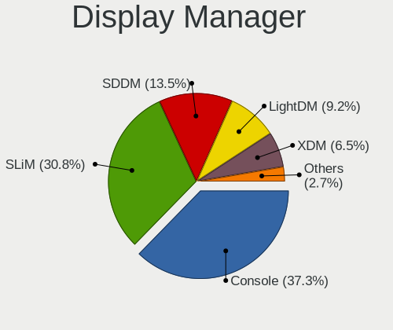
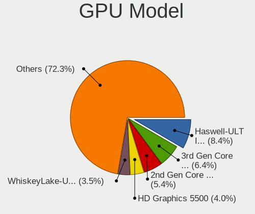
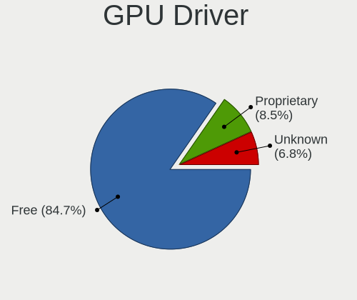
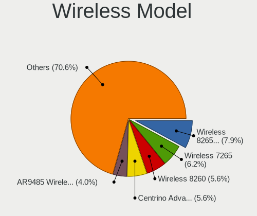
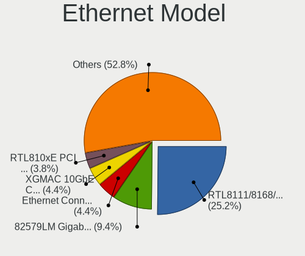
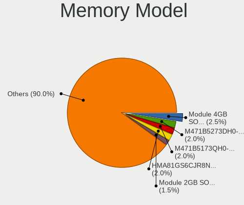
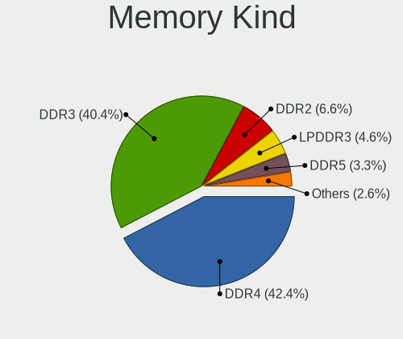

BSD in France - Tested Hardware & Statistics (Notebooks)
--------------------------------------------------------

A project to collect tested hardware configurations for BSD in France.

Anyone can contribute to this report by the [hw-probe](https://github.com/linuxhw/hw-probe/blob/master/INSTALL.BSD.md) tool:

    hw-probe -all -upload

Please contribute! Especially if your hardware is rare.

Contents
--------

* [ Test Cases ](#test-cases)

* [ System ](#system)
  - [ OS                       ](#os)
  - [ OS Family                ](#os-family)
  - [ Arch                     ](#arch)
  - [ DE                       ](#de)
  - [ Display Server           ](#display-server)
  - [ Display Manager          ](#display-manager)
  - [ OS Lang                  ](#os-lang)
  - [ Boot Mode                ](#boot-mode)
  - [ Filesystem               ](#filesystem)
  - [ Part. scheme             ](#part-scheme)

* [ Board ](#board)
  - [ Vendor                   ](#vendor)
  - [ Model                    ](#model)
  - [ Model Family             ](#model-family)
  - [ MFG Year                 ](#mfg-year)
  - [ Form Factor              ](#form-factor)
  - [ Coreboot                 ](#coreboot)
  - [ RAM Size                 ](#ram-size)
  - [ RAM Used                 ](#ram-used)
  - [ Total Drives             ](#total-drives)
  - [ Has CD-ROM               ](#has-cd-rom)
  - [ Has Ethernet             ](#has-ethernet)
  - [ Has WiFi                 ](#has-wifi)
  - [ Has Bluetooth            ](#has-bluetooth)

* [ Location ](#location)
  - [ Country                  ](#country)
  - [ City                     ](#city)

* [ Drives ](#drives)
  - [ Drive Vendor             ](#drive-vendor)
  - [ Drive Model              ](#drive-model)
  - [ HDD Vendor               ](#hdd-vendor)
  - [ SSD Vendor               ](#ssd-vendor)
  - [ Drive Kind               ](#drive-kind)
  - [ Drive Connector          ](#drive-connector)
  - [ Drive Size               ](#drive-size)
  - [ Space Total              ](#space-total)
  - [ Space Used               ](#space-used)
  - [ Malfunc. Drives          ](#malfunc-drives)
  - [ Malfunc. Drive Vendor    ](#malfunc-drive-vendor)
  - [ Malfunc. HDD Vendor      ](#malfunc-hdd-vendor)
  - [ Malfunc. Drive Kind      ](#malfunc-drive-kind)
  - [ Failed Drives            ](#failed-drives)
  - [ Failed Drive Vendor      ](#failed-drive-vendor)
  - [ Drive Status             ](#drive-status)

* [ Storage controller ](#storage-controller)
  - [ Storage Vendor           ](#storage-vendor)
  - [ Storage Model            ](#storage-model)
  - [ Storage Kind             ](#storage-kind)

* [ Processor ](#processor)
  - [ CPU Vendor               ](#cpu-vendor)
  - [ CPU Model                ](#cpu-model)
  - [ CPU Model Family         ](#cpu-model-family)
  - [ CPU Cores                ](#cpu-cores)
  - [ CPU Sockets              ](#cpu-sockets)
  - [ CPU Threads              ](#cpu-threads)
  - [ CPU Microarch            ](#cpu-microarch)

* [ Graphics ](#graphics)
  - [ GPU Vendor               ](#gpu-vendor)
  - [ GPU Model                ](#gpu-model)
  - [ GPU Combo                ](#gpu-combo)
  - [ GPU Driver               ](#gpu-driver)
  - [ GPU Memory               ](#gpu-memory)

* [ Monitor ](#monitor)
  - [ Monitor Vendor           ](#monitor-vendor)
  - [ Monitor Model            ](#monitor-model)
  - [ Monitor Resolution       ](#monitor-resolution)
  - [ Monitor Diagonal         ](#monitor-diagonal)
  - [ Monitor Width            ](#monitor-width)
  - [ Aspect Ratio             ](#aspect-ratio)
  - [ Monitor Area             ](#monitor-area)
  - [ Pixel Density            ](#pixel-density)
  - [ Multiple Monitors        ](#multiple-monitors)

* [ Network ](#network)
  - [ Net Controller Vendor    ](#net-controller-vendor)
  - [ Net Controller Model     ](#net-controller-model)
  - [ Wireless Vendor          ](#wireless-vendor)
  - [ Wireless Model           ](#wireless-model)
  - [ Ethernet Vendor          ](#ethernet-vendor)
  - [ Ethernet Model           ](#ethernet-model)
  - [ Net Controller Kind      ](#net-controller-kind)
  - [ Used Controller          ](#used-controller)
  - [ NICs                     ](#nics)
  - [ IPv6                     ](#ipv6)

* [ Bluetooth ](#bluetooth)
  - [ Bluetooth Vendor         ](#bluetooth-vendor)
  - [ Bluetooth Model          ](#bluetooth-model)

* [ Sound ](#sound)
  - [ Sound Vendor             ](#sound-vendor)
  - [ Sound Model              ](#sound-model)

* [ Memory ](#memory)
  - [ Memory Vendor            ](#memory-vendor)
  - [ Memory Model             ](#memory-model)
  - [ Memory Kind              ](#memory-kind)
  - [ Memory Form Factor       ](#memory-form-factor)
  - [ Memory Size              ](#memory-size)
  - [ Memory Speed             ](#memory-speed)

* [ Printers & scanners ](#printers--scanners)
  - [ Printer Vendor           ](#printer-vendor)
  - [ Printer Model            ](#printer-model)
  - [ Scanner Vendor           ](#scanner-vendor)
  - [ Scanner Model            ](#scanner-model)

* [ Camera ](#camera)
  - [ Camera Vendor            ](#camera-vendor)
  - [ Camera Model             ](#camera-model)

* [ Security ](#security)
  - [ Fingerprint Vendor       ](#fingerprint-vendor)
  - [ Fingerprint Model        ](#fingerprint-model)
  - [ Chipcard Vendor          ](#chipcard-vendor)
  - [ Chipcard Model           ](#chipcard-model)

* [ Unsupported ](#unsupported)
  - [ Unsupported Devices      ](#unsupported-devices)
  - [ Unsupported Device Types ](#unsupported-device-types)

Test Cases
----------

Total: 138

| Vendor   | Model                       | Probe                                                     | Date         |
|----------|-----------------------------|-----------------------------------------------------------|--------------|
| Acer     | Aspire E5-576               | [138e9fdeb4](https://bsd-hardware.info/?probe=138e9fdeb4) | May 31, 2022 |
| TUXEDO   | Aura 15 Gen1                | [20814a930a](https://bsd-hardware.info/?probe=20814a930a) | May 18, 2022 |
| TUXEDO   | Aura 15 Gen1                | [115de395dd](https://bsd-hardware.info/?probe=115de395dd) | May 17, 2022 |
| TUXEDO   | InfinityBook13V3            | [fd081a3636](https://bsd-hardware.info/?probe=fd081a3636) | May 17, 2022 |
| Lenovo   | ThinkPad X250 20CLS4WV08    | [0419c52079](https://bsd-hardware.info/?probe=0419c52079) | May 11, 2022 |
| Intel    | H81U                        | [550699602e](https://bsd-hardware.info/?probe=550699602e) | May 11, 2022 |
| Intel    | H81U                        | [04646d1cc7](https://bsd-hardware.info/?probe=04646d1cc7) | May 05, 2022 |
| Dell     | Latitude 7490               | [0d5b872ec1](https://bsd-hardware.info/?probe=0d5b872ec1) | May 02, 2022 |
| Dell     | Latitude 7490               | [03c97fe4d9](https://bsd-hardware.info/?probe=03c97fe4d9) | May 02, 2022 |
| Dell     | Precision 7730              | [bdb3e3d4ce](https://bsd-hardware.info/?probe=bdb3e3d4ce) | Apr 30, 2022 |
| Dell     | Latitude 7490               | [1586880dd7](https://bsd-hardware.info/?probe=1586880dd7) | Apr 30, 2022 |
| Dell     | Studio 1555                 | [6da8f97bcd](https://bsd-hardware.info/?probe=6da8f97bcd) | Apr 22, 2022 |
| Dell     | Latitude E5450              | [ca5eb083f9](https://bsd-hardware.info/?probe=ca5eb083f9) | Apr 16, 2022 |
| Deciso   | Netboard A20                | [0829d5a85d](https://bsd-hardware.info/?probe=0829d5a85d) | Apr 06, 2022 |
| HP       | EliteBook 2530p             | [e5c8017afb](https://bsd-hardware.info/?probe=e5c8017afb) | Mar 12, 2022 |
| Lenovo   | Flex 2-15 20405             | [3b77055bd4](https://bsd-hardware.info/?probe=3b77055bd4) | Mar 07, 2022 |
| Dell     | Latitude E5440              | [b0314f9200](https://bsd-hardware.info/?probe=b0314f9200) | Feb 26, 2022 |
| Lenovo   | Legion 5 15ARH05 82B5       | [1a13b7bfd1](https://bsd-hardware.info/?probe=1a13b7bfd1) | Feb 16, 2022 |
| Lenovo   | Flex 2-15 20405             | [1e8904f4fc](https://bsd-hardware.info/?probe=1e8904f4fc) | Feb 15, 2022 |
| HP       | EliteBook 2530p             | [dd52bb1163](https://bsd-hardware.info/?probe=dd52bb1163) | Feb 15, 2022 |
| Lenovo   | Flex 2-15 20405             | [b77b926f9b](https://bsd-hardware.info/?probe=b77b926f9b) | Feb 13, 2022 |
| Deciso   | Netboard A20                | [4d8f19ba12](https://bsd-hardware.info/?probe=4d8f19ba12) | Feb 11, 2022 |
| Deciso   | Netboard A20                | [a6b7d2d5e8](https://bsd-hardware.info/?probe=a6b7d2d5e8) | Feb 06, 2022 |
| Deciso   | Netboard A20                | [8cd43fcfd1](https://bsd-hardware.info/?probe=8cd43fcfd1) | Feb 03, 2022 |
| ASUSTek  | 1015PEM                     | [efea0efb2b](https://bsd-hardware.info/?probe=efea0efb2b) | Jan 31, 2022 |
| Apple    | MacBook4,1                  | [e89404ebed](https://bsd-hardware.info/?probe=e89404ebed) | Jan 29, 2022 |
| Lenovo   | Legion Y540-15IRH 81SX      | [384d2f888b](https://bsd-hardware.info/?probe=384d2f888b) | Jan 18, 2022 |
| HP       | EliteBook 2530p             | [42eb986a58](https://bsd-hardware.info/?probe=42eb986a58) | Jan 11, 2022 |
| Dell     | Latitude E5450              | [a05fbe1c26](https://bsd-hardware.info/?probe=a05fbe1c26) | Jan 05, 2022 |
| Dell     | Latitude E5450              | [c2ef231757](https://bsd-hardware.info/?probe=c2ef231757) | Jan 04, 2022 |
| ASUSTek  | S550CA                      | [1263a5fb37](https://bsd-hardware.info/?probe=1263a5fb37) | Dec 29, 2021 |
| Samsung  | R720                        | [620195d4aa](https://bsd-hardware.info/?probe=620195d4aa) | Dec 20, 2021 |
| HP       | Compaq 15                   | [1e8b1ce39b](https://bsd-hardware.info/?probe=1e8b1ce39b) | Dec 20, 2021 |
| Lenovo   | G500 20236                  | [350def9eca](https://bsd-hardware.info/?probe=350def9eca) | Dec 19, 2021 |
| Lenovo   | ThinkPad T590 20N4CTO1WW    | [4147a5824d](https://bsd-hardware.info/?probe=4147a5824d) | Dec 16, 2021 |
| HP       | ProBook 650 G5              | [d4ffc24c6f](https://bsd-hardware.info/?probe=d4ffc24c6f) | Dec 15, 2021 |
| Lenovo   | ThinkPad T590 20N4CTO1WW    | [eb69e83fbf](https://bsd-hardware.info/?probe=eb69e83fbf) | Dec 09, 2021 |
| Google   | Terra                       | [9ba239a4a3](https://bsd-hardware.info/?probe=9ba239a4a3) | Oct 10, 2021 |
| Lenovo   | ThinkPad X220 4290W42       | [8be5183e21](https://bsd-hardware.info/?probe=8be5183e21) | Sep 25, 2021 |
| Lenovo   | ThinkPad T500 2056Y2Z       | [88b86ecf8b](https://bsd-hardware.info/?probe=88b86ecf8b) | Sep 25, 2021 |
| MSI      | P65 Creator 8RE             | [2684b5021c](https://bsd-hardware.info/?probe=2684b5021c) | Sep 18, 2021 |
| Lenovo   | ThinkPad E14 Gen 3 20Y7C... | [8611fbfd97](https://bsd-hardware.info/?probe=8611fbfd97) | Sep 14, 2021 |
| Apple    | MacBookPro8,2               | [5f78c3411f](https://bsd-hardware.info/?probe=5f78c3411f) | Sep 13, 2021 |
| Lenovo   | ThinkPad P14s Gen 1 20Y1... | [d028fc63d4](https://bsd-hardware.info/?probe=d028fc63d4) | Aug 29, 2021 |
| Lenovo   | ThinkPad P14s Gen 1 20Y1... | [76f004bd26](https://bsd-hardware.info/?probe=76f004bd26) | Aug 26, 2021 |
| Fujitsu  | LIFEBOOK NH570              | [51b5325c85](https://bsd-hardware.info/?probe=51b5325c85) | Aug 13, 2021 |
| Lenovo   | G500 20236                  | [d15eff8bcc](https://bsd-hardware.info/?probe=d15eff8bcc) | Jul 21, 2021 |
| Lenovo   | ThinkPad T420 42368A3       | [0a3b5c9c27](https://bsd-hardware.info/?probe=0a3b5c9c27) | Jul 12, 2021 |
| Notebook | W510LU                      | [3d6de69bda](https://bsd-hardware.info/?probe=3d6de69bda) | Jul 02, 2021 |
| Lenovo   | G500 20236                  | [6e96d4c26f](https://bsd-hardware.info/?probe=6e96d4c26f) | Jun 28, 2021 |
| Lenovo   | G500 20236                  | [7ae63d4c6c](https://bsd-hardware.info/?probe=7ae63d4c6c) | Jun 27, 2021 |
| Dell     | Vostro 5481                 | [bb318fbc50](https://bsd-hardware.info/?probe=bb318fbc50) | Jun 26, 2021 |
| Lenovo   | ThinkPad T450s 20BWS0L60... | [6ea6f6ffe7](https://bsd-hardware.info/?probe=6ea6f6ffe7) | Jun 20, 2021 |
| Lenovo   | ThinkPad X250 20CLS7WY04    | [b60f4a19ee](https://bsd-hardware.info/?probe=b60f4a19ee) | Jun 06, 2021 |
| Apple    | MacBookPro8,2               | [193936b5ca](https://bsd-hardware.info/?probe=193936b5ca) | May 30, 2021 |
| Lenovo   | ThinkPad T450s 20BWS0L60... | [ac567bd12d](https://bsd-hardware.info/?probe=ac567bd12d) | May 28, 2021 |
| Lenovo   | ThinkPad A485 20MVS0FD00    | [2f1ba02130](https://bsd-hardware.info/?probe=2f1ba02130) | May 28, 2021 |
| Acer     | Aspire E5-571P              | [7c8c842fa7](https://bsd-hardware.info/?probe=7c8c842fa7) | May 24, 2021 |
| Lenovo   | ThinkPad T590 20N4CTO1WW    | [7c642e5e7d](https://bsd-hardware.info/?probe=7c642e5e7d) | Apr 30, 2021 |
| Lenovo   | ThinkPad T590 20N4CTO1WW    | [2e2e69cb9e](https://bsd-hardware.info/?probe=2e2e69cb9e) | Apr 29, 2021 |
| Lenovo   | ThinkPad T430 23495P8       | [2c985c22ef](https://bsd-hardware.info/?probe=2c985c22ef) | Apr 10, 2021 |
| Lenovo   | ThinkPad T420 4236NUG       | [4ff3fa22ff](https://bsd-hardware.info/?probe=4ff3fa22ff) | Apr 07, 2021 |
| Lenovo   | ThinkPad X220 4290EE8       | [f46976d85d](https://bsd-hardware.info/?probe=f46976d85d) | Mar 29, 2021 |
| Lenovo   | ThinkPad T490 20N20009FR    | [e1f691ac78](https://bsd-hardware.info/?probe=e1f691ac78) | Mar 29, 2021 |
| Lenovo   | ThinkPad T590 20N4CTO1WW    | [dec8aa97f5](https://bsd-hardware.info/?probe=dec8aa97f5) | Mar 26, 2021 |
| Lenovo   | ThinkPad T590 20N4CTO1WW    | [83ed58b4d0](https://bsd-hardware.info/?probe=83ed58b4d0) | Mar 26, 2021 |
| HP       | Pavilion Gaming Laptop 1... | [3cb0e979f8](https://bsd-hardware.info/?probe=3cb0e979f8) | Mar 26, 2021 |
| MSI      | MS-N033                     | [650f6a1b70](https://bsd-hardware.info/?probe=650f6a1b70) | Mar 21, 2021 |
| Dell     | Inspiron 7566               | [183ac9b791](https://bsd-hardware.info/?probe=183ac9b791) | Mar 17, 2021 |
| Dell     | Inspiron 7566               | [b4a35aa7b0](https://bsd-hardware.info/?probe=b4a35aa7b0) | Mar 17, 2021 |
| SECO     | UDOO x86                    | [f8310915b6](https://bsd-hardware.info/?probe=f8310915b6) | Mar 13, 2021 |
| HP       | EliteBook 820 G1            | [565343b334](https://bsd-hardware.info/?probe=565343b334) | Mar 13, 2021 |
| Lenovo   | ThinkPad T400 6475P1G       | [6a0907b5e8](https://bsd-hardware.info/?probe=6a0907b5e8) | Mar 06, 2021 |
| Clevo    | W240EU/W250EUQ/W270EUQ      | [17ed006376](https://bsd-hardware.info/?probe=17ed006376) | Mar 05, 2021 |
| HP       | EliteBook 820 G1            | [de98cd5952](https://bsd-hardware.info/?probe=de98cd5952) | Mar 04, 2021 |
| HP       | EliteBook 820 G1            | [03c5808adf](https://bsd-hardware.info/?probe=03c5808adf) | Mar 04, 2021 |
| Dell     | Latitude 5280               | [b84364959d](https://bsd-hardware.info/?probe=b84364959d) | Mar 04, 2021 |
| Lenovo   | IdeaPad S145-15API 81UT     | [1f226262cc](https://bsd-hardware.info/?probe=1f226262cc) | Mar 04, 2021 |
| ASUSTek  | X550LC                      | [e056f1c77c](https://bsd-hardware.info/?probe=e056f1c77c) | Mar 03, 2021 |
| Lenovo   | ThinkPad X280 20KFCTO1WW    | [9bdf9ecec8](https://bsd-hardware.info/?probe=9bdf9ecec8) | Feb 25, 2021 |
| Lenovo   | IdeaPad S145-15API 81UT     | [7def696a61](https://bsd-hardware.info/?probe=7def696a61) | Feb 22, 2021 |
| Lenovo   | IdeaPad S145-15API 81UT     | [0dc468c860](https://bsd-hardware.info/?probe=0dc468c860) | Feb 22, 2021 |
| ASUSTek  | X751LN                      | [fe7d72b06a](https://bsd-hardware.info/?probe=fe7d72b06a) | Feb 21, 2021 |
| ASUSTek  | X751LN                      | [a88cfd7fdd](https://bsd-hardware.info/?probe=a88cfd7fdd) | Feb 21, 2021 |
| Gigabyte | P15FR7                      | [c65b4d297a](https://bsd-hardware.info/?probe=c65b4d297a) | Feb 21, 2021 |
| Lenovo   | ThinkPad X1 Carbon 4th 2... | [71cfece3a7](https://bsd-hardware.info/?probe=71cfece3a7) | Feb 18, 2021 |
| ASUSTek  | X75VC                       | [4a0982db2b](https://bsd-hardware.info/?probe=4a0982db2b) | Feb 15, 2021 |
| Clevo    | W240EU/W250EUQ/W270EUQ      | [4f646f53e9](https://bsd-hardware.info/?probe=4f646f53e9) | Feb 14, 2021 |
| Lenovo   | ThinkPad T580 20LAS2TG00    | [d5a1c088b3](https://bsd-hardware.info/?probe=d5a1c088b3) | Feb 13, 2021 |
| ASUSTek  | E200HA                      | [5781a8b561](https://bsd-hardware.info/?probe=5781a8b561) | Feb 12, 2021 |
| Lenovo   | G500 20236                  | [9b149fcd68](https://bsd-hardware.info/?probe=9b149fcd68) | Feb 12, 2021 |
| Dell     | Latitude 3410               | [465dd01c0d](https://bsd-hardware.info/?probe=465dd01c0d) | Feb 11, 2021 |
| Dell     | Latitude E6230              | [696e95fc08](https://bsd-hardware.info/?probe=696e95fc08) | Feb 10, 2021 |
| ASUSTek  | X550LC                      | [b3cf6f9142](https://bsd-hardware.info/?probe=b3cf6f9142) | Feb 09, 2021 |
| Lenovo   | IdeaPad S145-15API 81UT     | [7e5ce355e7](https://bsd-hardware.info/?probe=7e5ce355e7) | Feb 08, 2021 |
| Dell     | Latitude 5280               | [73fca8b178](https://bsd-hardware.info/?probe=73fca8b178) | Feb 08, 2021 |
| Lenovo   | ThinkPad T420 42368A3       | [5d7840d28e](https://bsd-hardware.info/?probe=5d7840d28e) | Feb 07, 2021 |
| Dell     | Latitude 3410               | [f81c1e338f](https://bsd-hardware.info/?probe=f81c1e338f) | Feb 07, 2021 |
| Lenovo   | ThinkPad P50 20EQS0U60C     | [d8cf9e878e](https://bsd-hardware.info/?probe=d8cf9e878e) | Jan 19, 2021 |
| ASUSTek  | X550LC                      | [f7c32488e9](https://bsd-hardware.info/?probe=f7c32488e9) | Jan 15, 2021 |
| Lenovo   | IdeaPad S145-15API 81UT     | [06cbb5cd5f](https://bsd-hardware.info/?probe=06cbb5cd5f) | Jan 15, 2021 |
| Dell     | Latitude 5280               | [c9bfb73262](https://bsd-hardware.info/?probe=c9bfb73262) | Jan 15, 2021 |
| Dell     | Latitude 5400               | [f242897c33](https://bsd-hardware.info/?probe=f242897c33) | Jan 13, 2021 |
| Dell     | Latitude 5490               | [3fba47b07f](https://bsd-hardware.info/?probe=3fba47b07f) | Jan 12, 2021 |
| ASUSTek  | N75SF                       | [7efb6557a2](https://bsd-hardware.info/?probe=7efb6557a2) | Jan 10, 2021 |
| Lenovo   | IdeaPad S145-15API 81UT     | [9ccf63e228](https://bsd-hardware.info/?probe=9ccf63e228) | Jan 09, 2021 |
| Lenovo   | IdeaPad S145-15API 81UT     | [e18df4623a](https://bsd-hardware.info/?probe=e18df4623a) | Jan 09, 2021 |
| Dell     | Latitude 5280               | [1ae6e6ee2d](https://bsd-hardware.info/?probe=1ae6e6ee2d) | Jan 05, 2021 |
| ASUSTek  | X102BA                      | [893b9111c6](https://bsd-hardware.info/?probe=893b9111c6) | Dec 27, 2020 |
| Apple    | PowerBook5,8                | [96f550a537](https://bsd-hardware.info/?probe=96f550a537) | Dec 24, 2020 |
| Clevo    | W240EU/W250EUQ/W270EUQ      | [2544123f79](https://bsd-hardware.info/?probe=2544123f79) | Dec 06, 2020 |
| Dell     | Latitude 5280               | [d1be72cc7e](https://bsd-hardware.info/?probe=d1be72cc7e) | Nov 21, 2020 |
| Dell     | Latitude 5280               | [fd4e8756b4](https://bsd-hardware.info/?probe=fd4e8756b4) | Nov 21, 2020 |
| Lenovo   | ThinkPad X1 Carbon 6th 2... | [9b6b24708e](https://bsd-hardware.info/?probe=9b6b24708e) | Nov 03, 2020 |
| ASUSTek  | X102BA                      | [9156250b96](https://bsd-hardware.info/?probe=9156250b96) | Oct 31, 2020 |
| Lenovo   | ThinkPad X1 Carbon 5th 2... | [7c8972f650](https://bsd-hardware.info/?probe=7c8972f650) | Oct 29, 2020 |
| Lenovo   | ThinkPad X230 2325AJ9       | [176044b6b8](https://bsd-hardware.info/?probe=176044b6b8) | Oct 21, 2020 |
| Lenovo   | ThinkPad S5-S540 20B3001... | [7e6cb69989](https://bsd-hardware.info/?probe=7e6cb69989) | Oct 21, 2020 |
| Lenovo   | ThinkPad W540 20BG001KUK    | [1b1327ac93](https://bsd-hardware.info/?probe=1b1327ac93) | Oct 21, 2020 |
| ASUSTek  | X102BA                      | [47e04c9378](https://bsd-hardware.info/?probe=47e04c9378) | Oct 19, 2020 |
| ASUSTek  | UX305FA                     | [4ecb1e9cd3](https://bsd-hardware.info/?probe=4ecb1e9cd3) | Sep 25, 2020 |
| Lenovo   | ThinkPad W540 20BG001KUK    | [986575086d](https://bsd-hardware.info/?probe=986575086d) | Sep 05, 2020 |
| Lenovo   | ThinkPad W540 20BG001KUK    | [152377b2ea](https://bsd-hardware.info/?probe=152377b2ea) | Sep 05, 2020 |
| Lenovo   | ThinkPad W540 20BG001KUK    | [f95de56bcd](https://bsd-hardware.info/?probe=f95de56bcd) | Sep 03, 2020 |
| TUXEDO   | InfinityBook13V3            | [d508fb472b](https://bsd-hardware.info/?probe=d508fb472b) | Aug 10, 2020 |
| Sony     | VGN-AR630E                  | [b417df513f](https://bsd-hardware.info/?probe=b417df513f) | Aug 07, 2020 |
| MSI      | P65 Creator 8RE             | [4031d186c2](https://bsd-hardware.info/?probe=4031d186c2) | Aug 06, 2020 |
| Lenovo   | ThinkPad X280 20KFCTO1WW    | [82de136ad3](https://bsd-hardware.info/?probe=82de136ad3) | Aug 06, 2020 |
| Lenovo   | ThinkPad W540 20BG001KUK    | [f3e2acbb66](https://bsd-hardware.info/?probe=f3e2acbb66) | Jul 31, 2020 |
| Lenovo   | ThinkPad W540 20BG001KUK    | [7ae8c247e9](https://bsd-hardware.info/?probe=7ae8c247e9) | Jul 31, 2020 |
| Lenovo   | ThinkPad T590 20N4CTO1WW    | [90e2b57f16](https://bsd-hardware.info/?probe=90e2b57f16) | Jun 14, 2020 |
| Lenovo   | ThinkPad T590 20N4CTO1WW    | [5b35ada62a](https://bsd-hardware.info/?probe=5b35ada62a) | Jun 14, 2020 |
| Lenovo   | ThinkPad T590 20N4CTO1WW    | [9ad34ffa59](https://bsd-hardware.info/?probe=9ad34ffa59) | Jun 14, 2020 |
| Dell     | Latitude E6420              | [7c8a68918a](https://bsd-hardware.info/?probe=7c8a68918a) | May 27, 2020 |
| Lenovo   | ThinkPad X1 Carbon 5th 2... | [bb2fcf8d92](https://bsd-hardware.info/?probe=bb2fcf8d92) | May 25, 2020 |
| HP       | ZBook 15                    | [3e9076f244](https://bsd-hardware.info/?probe=3e9076f244) | May 23, 2020 |
| HP       | ZBook 15                    | [23ec663f87](https://bsd-hardware.info/?probe=23ec663f87) | May 23, 2020 |
| Lenovo   | ThinkPad T495 20NJCTO1WW    | [fa71e5839a](https://bsd-hardware.info/?probe=fa71e5839a) | May 23, 2020 |

System
------

OS
--

Installed operating systems

| Name                  | Notebooks | Percent |
|-----------------------|-----------|---------|
| OpenBSD 6.8           | 7         | 6.86%   |
| helloSystem 0.4.0     | 7         | 6.86%   |
| NomadBSD 1.3.2        | 6         | 5.88%   |
| GhostBSD 20.04.02     | 5         | 4.9%    |
| OpenBSD 7.0           | 4         | 3.92%   |
| NomadBSD 1.4          | 4         | 3.92%   |
| FreeBSD 13.0          | 4         | 3.92%   |
| FreeBSD 12.2-p2       | 4         | 3.92%   |
| OpenBSD 6.9           | 3         | 2.94%   |
| helloSystem 0.7.0     | 3         | 2.94%   |
| FreeBSD 13.0-STABLE   | 3         | 2.94%   |
| FreeBSD 12.2-p4       | 3         | 2.94%   |
| FreeBSD 12.2          | 3         | 2.94%   |
| OPNsense 22.1         | 2         | 1.96%   |
| OpenBSD 6.7           | 2         | 1.96%   |
| GhostBSD 22.01.12     | 2         | 1.96%   |
| FreeBSD 13.0-RC5      | 2         | 1.96%   |
| FreeBSD 13.0-p6       | 2         | 1.96%   |
| FreeBSD 13.0-p3       | 2         | 1.96%   |
| FreeBSD 13.0-p1       | 2         | 1.96%   |
| FreeBSD 12.1-p10      | 2         | 1.96%   |
| OPNsense 22.1.7       | 1         | 0.98%   |
| OPNsense 21.7.2       | 1         | 0.98%   |
| OPNsense 21.7.1       | 1         | 0.98%   |
| OPNsense 21.1.6       | 1         | 0.98%   |
| OPNsense 21.1.3       | 1         | 0.98%   |
| OpenBSD 7.1           | 1         | 0.98%   |
| NomadBSD 5806f915     | 1         | 0.98%   |
| helloSystem 0.8.0     | 1         | 0.98%   |
| helloSystem 0.6.0     | 1         | 0.98%   |
| helloSystem 0.5.0     | 1         | 0.98%   |
| GhostBSD 22.04.30     | 1         | 0.98%   |
| GhostBSD 22.04.06     | 1         | 0.98%   |
| GhostBSD 21.08.27     | 1         | 0.98%   |
| FuryBSD 12.1-p6       | 1         | 0.98%   |
| FreeBSD 13.1-STABLE   | 1         | 0.98%   |
| FreeBSD 13.1          | 1         | 0.98%   |
| FreeBSD 13.0-RC3      | 1         | 0.98%   |
| FreeBSD 13.0-p5       | 1         | 0.98%   |
| FreeBSD 13.0-p2       | 1         | 0.98%   |
| FreeBSD 13.0-CURRENT  | 1         | 0.98%   |
| FreeBSD 12.2-STABLE   | 1         | 0.98%   |
| FreeBSD 12.2-p3       | 1         | 0.98%   |
| FreeBSD 12.1-STABLE   | 1         | 0.98%   |
| FreeBSD 12.1-p9       | 1         | 0.98%   |
| FreeBSD 12.1-p8       | 1         | 0.98%   |
| FreeBSD 12.1-p7       | 1         | 0.98%   |
| FreeBSD 12.1-p5       | 1         | 0.98%   |
| FreeBSD 12.1-p22-HBSD | 1         | 0.98%   |
| FreeBSD 12.1          | 1         | 0.98%   |
| FreeBSD 11.3-p6       | 1         | 0.98%   |

OS Family
---------

OS without a version

| Name        | Notebooks | Percent |
|-------------|-----------|---------|
| FreeBSD     | 38        | 42.22%  |
| OpenBSD     | 15        | 16.67%  |
| helloSystem | 11        | 12.22%  |
| NomadBSD    | 10        | 11.11%  |
| GhostBSD    | 9         | 10%     |
| OPNsense    | 6         | 6.67%   |
| FuryBSD     | 1         | 1.11%   |

Arch
----

OS architecture (x86_64, i586, etc.)

| Name   | Notebooks | Percent |
|--------|-----------|---------|
| amd64  | 78        | 97.5%   |
| macppc | 1         | 1.25%   |
| i386   | 1         | 1.25%   |

DE
--

Desktop Environment

| Name         | Notebooks | Percent |
|--------------|-----------|---------|
| XFCE         | 15        | 16.3%   |
| fvwm         | 14        | 15.22%  |
| helloDesktop | 12        | 13.04%  |
| Openbox      | 11        | 11.96%  |
| KDE5         | 10        | 10.87%  |
| Console      | 9         | 9.78%   |
| MATE         | 6         | 6.52%   |
| TWM          | 4         | 4.35%   |
| GNOME        | 4         | 4.35%   |
| i3           | 3         | 3.26%   |
| AwesomeWM    | 2         | 2.17%   |
| X-Cinnamon   | 1         | 1.09%   |
| LXDE         | 1         | 1.09%   |

Display Server
--------------

X11 or Wayland

| Name    | Notebooks | Percent |
|---------|-----------|---------|
| X11     | 70        | 86.42%  |
| Console | 11        | 13.58%  |

Display Manager
---------------

SDDM, LightDM, etc.

| Name    | Notebooks | Percent |
|---------|-----------|---------|
| Console | 33        | 38.37%  |
| SLiM    | 28        | 32.56%  |
| LightDM | 12        | 13.95%  |
| XDM     | 5         | 5.81%   |
| SDDM    | 4         | 4.65%   |
| GDM     | 4         | 4.65%   |

OS Lang
-------

Language

| Lang            | Notebooks | Percent |
|-----------------|-----------|---------|
| Unknown         | 30        | 34.48%  |
| fr_FR           | 21        | 24.14%  |
| en_US           | 19        | 21.84%  |
| C               | 12        | 13.79%  |
| en_GB           | 2         | 2.3%    |
| de_DE           | 2         | 2.3%    |
| en_US.ISO8859-1 | 1         | 1.15%   |

Boot Mode
---------

EFI or BIOS

| Mode | Notebooks | Percent |
|------|-----------|---------|
| EFI  | 65        | 80.25%  |
| BIOS | 16        | 19.75%  |

Filesystem
----------

Type of filesystem

| Type   | Notebooks | Percent |
|--------|-----------|---------|
| Zfs    | 44        | 51.16%  |
| Ufs    | 24        | 27.91%  |
| Ffs    | 15        | 17.44%  |
| Cd9660 | 3         | 3.49%   |

Part. scheme
------------

Scheme of partitioning

| Type    | Notebooks | Percent |
|---------|-----------|---------|
| GPT     | 64        | 78.05%  |
| MBR     | 17        | 20.73%  |
| Unknown | 1         | 1.22%   |

Board
-----

Vendor
------

Motherboard manufacturer

| Name                | Notebooks | Percent |
|---------------------|-----------|---------|
| Lenovo              | 30        | 37.5%   |
| Dell                | 14        | 17.5%   |
| ASUSTek Computer    | 9         | 11.25%  |
| Hewlett-Packard     | 6         | 7.5%    |
| Deciso              | 3         | 3.75%   |
| Apple               | 3         | 3.75%   |
| TUXEDO              | 2         | 2.5%    |
| MSI                 | 2         | 2.5%    |
| Acer                | 2         | 2.5%    |
| Sony                | 1         | 1.25%   |
| SECO                | 1         | 1.25%   |
| Samsung Electronics | 1         | 1.25%   |
| Notebook            | 1         | 1.25%   |
| Intel               | 1         | 1.25%   |
| Google              | 1         | 1.25%   |
| Gigabyte Technology | 1         | 1.25%   |
| Fujitsu             | 1         | 1.25%   |
| Clevo               | 1         | 1.25%   |

Model
-----

Motherboard model

| Name                                     | Notebooks | Percent |
|------------------------------------------|-----------|---------|
| Deciso Netboard A20                      | 3         | 3.75%   |
| TUXEDO InfinityBook13V3                  | 2         | 2.5%    |
| Dell Latitude 3410                       | 2         | 2.5%    |
| Sony VGN-AR630E                          | 1         | 1.25%   |
| SECO UDOO x86                            | 1         | 1.25%   |
| Samsung R720                             | 1         | 1.25%   |
| Notebook W510LU                          | 1         | 1.25%   |
| MSI P65 Creator 8RE                      | 1         | 1.25%   |
| MSI MS-N033                              | 1         | 1.25%   |
| Lenovo ThinkPad X280 20KFCTO1WW          | 1         | 1.25%   |
| Lenovo ThinkPad X250 20CLS7WY04          | 1         | 1.25%   |
| Lenovo ThinkPad X250 20CLS4WV08          | 1         | 1.25%   |
| Lenovo ThinkPad X230 2325AJ9             | 1         | 1.25%   |
| Lenovo ThinkPad X220 4290W42             | 1         | 1.25%   |
| Lenovo ThinkPad X220 4290EE8             | 1         | 1.25%   |
| Lenovo ThinkPad X1 Carbon 6th 20KHS1TG00 | 1         | 1.25%   |
| Lenovo ThinkPad X1 Carbon 5th 20HRCTO1WW | 1         | 1.25%   |
| Lenovo ThinkPad X1 Carbon 4th 20FCS2K000 | 1         | 1.25%   |
| Lenovo ThinkPad W540 20BG001KUK          | 1         | 1.25%   |
| Lenovo ThinkPad T590 20N4CTO1WW          | 1         | 1.25%   |
| Lenovo ThinkPad T580 20LAS2TG00          | 1         | 1.25%   |
| Lenovo ThinkPad T500 2056Y2Z             | 1         | 1.25%   |
| Lenovo ThinkPad T495 20NJCTO1WW          | 1         | 1.25%   |
| Lenovo ThinkPad T490 20N20009FR          | 1         | 1.25%   |
| Lenovo ThinkPad T450s 20BWS0L600         | 1         | 1.25%   |
| Lenovo ThinkPad T430 23495P8             | 1         | 1.25%   |
| Lenovo ThinkPad T420 4236NUG             | 1         | 1.25%   |
| Lenovo ThinkPad T420 42368A3             | 1         | 1.25%   |
| Lenovo ThinkPad T400 6475P1G             | 1         | 1.25%   |
| Lenovo ThinkPad S5-S540 20B3001XFR       | 1         | 1.25%   |
| Lenovo ThinkPad P50 20EQS0U60C           | 1         | 1.25%   |
| Lenovo ThinkPad P14s Gen 1 20Y1002AFR    | 1         | 1.25%   |
| Lenovo ThinkPad E14 Gen 3 20Y7CTO1WW     | 1         | 1.25%   |
| Lenovo ThinkPad A485 20MVS0FD00          | 1         | 1.25%   |
| Lenovo Legion Y540-15IRH 81SX            | 1         | 1.25%   |
| Lenovo Legion 5 15ARH05 82B5             | 1         | 1.25%   |
| Lenovo IdeaPad S145-15API 81UT           | 1         | 1.25%   |
| Lenovo G500 20236                        | 1         | 1.25%   |
| Lenovo Flex 2-15 20405                   | 1         | 1.25%   |
| Intel H81U                               | 1         | 1.25%   |
| HP ZBook 15                              | 1         | 1.25%   |
| HP ProBook 650 G5                        | 1         | 1.25%   |
| HP Pavilion Gaming Laptop 17-cd0xxx      | 1         | 1.25%   |
| HP EliteBook 820 G1                      | 1         | 1.25%   |
| HP EliteBook 2530p                       | 1         | 1.25%   |
| HP Compaq 15                             | 1         | 1.25%   |
| Google Terra                             | 1         | 1.25%   |
| Gigabyte P15FR7                          | 1         | 1.25%   |
| Fujitsu LIFEBOOK NH570                   | 1         | 1.25%   |
| Dell Vostro 5481                         | 1         | 1.25%   |
| Dell Studio 1555                         | 1         | 1.25%   |
| Dell Precision 7730                      | 1         | 1.25%   |
| Dell Latitude E6420                      | 1         | 1.25%   |
| Dell Latitude E6230                      | 1         | 1.25%   |
| Dell Latitude E5450                      | 1         | 1.25%   |
| Dell Latitude E5440                      | 1         | 1.25%   |
| Dell Latitude 7490                       | 1         | 1.25%   |
| Dell Latitude 5490                       | 1         | 1.25%   |
| Dell Latitude 5400                       | 1         | 1.25%   |
| Dell Latitude 5280                       | 1         | 1.25%   |

Model Family
------------

Motherboard model prefix

| Name                    | Notebooks | Percent |
|-------------------------|-----------|---------|
| Lenovo ThinkPad         | 25        | 31.25%  |
| Dell Latitude           | 10        | 12.5%   |
| Deciso Netboard         | 3         | 3.75%   |
| TUXEDO InfinityBook13V3 | 2         | 2.5%    |
| Lenovo Legion           | 2         | 2.5%    |
| HP EliteBook            | 2         | 2.5%    |
| Acer Aspire             | 2         | 2.5%    |
| Sony VGN-AR630E         | 1         | 1.25%   |
| SECO UDOO               | 1         | 1.25%   |
| Samsung R720            | 1         | 1.25%   |
| Notebook W510LU         | 1         | 1.25%   |
| MSI P65                 | 1         | 1.25%   |
| MSI MS-N033             | 1         | 1.25%   |
| Lenovo IdeaPad          | 1         | 1.25%   |
| Lenovo G500             | 1         | 1.25%   |
| Lenovo Flex             | 1         | 1.25%   |
| Intel H81U              | 1         | 1.25%   |
| HP ZBook                | 1         | 1.25%   |
| HP ProBook              | 1         | 1.25%   |
| HP Pavilion             | 1         | 1.25%   |
| HP Compaq               | 1         | 1.25%   |
| Google Terra            | 1         | 1.25%   |
| Gigabyte P15FR7         | 1         | 1.25%   |
| Fujitsu LIFEBOOK        | 1         | 1.25%   |
| Dell Vostro             | 1         | 1.25%   |
| Dell Studio             | 1         | 1.25%   |
| Dell Precision          | 1         | 1.25%   |
| Dell Inspiron           | 1         | 1.25%   |
| Clevo W240EU            | 1         | 1.25%   |
| ASUS X75VC              | 1         | 1.25%   |
| ASUS X751LN             | 1         | 1.25%   |
| ASUS X550LC             | 1         | 1.25%   |
| ASUS X102BA             | 1         | 1.25%   |
| ASUS UX305FA            | 1         | 1.25%   |
| ASUS S550CA             | 1         | 1.25%   |
| ASUS N75SF              | 1         | 1.25%   |
| ASUS E200HA             | 1         | 1.25%   |
| ASUS 1015PEM            | 1         | 1.25%   |
| Apple PowerBook5        | 1         | 1.25%   |
| Apple MacBookPro8       | 1         | 1.25%   |
| Apple MacBook4          | 1         | 1.25%   |

MFG Year
--------

Motherboard manufacture year

| Year    | Notebooks | Percent |
|---------|-----------|---------|
| 2019    | 13        | 16.25%  |
| 2020    | 12        | 15%     |
| 2015    | 7         | 8.75%   |
| 2011    | 7         | 8.75%   |
| 2021    | 6         | 7.5%    |
| 2013    | 6         | 7.5%    |
| 2018    | 4         | 5%      |
| 2017    | 4         | 5%      |
| 2016    | 4         | 5%      |
| 2014    | 4         | 5%      |
| 2010    | 4         | 5%      |
| 2009    | 3         | 3.75%   |
| 2012    | 2         | 2.5%    |
| 2022    | 1         | 1.25%   |
| 2008    | 1         | 1.25%   |
| 2007    | 1         | 1.25%   |
| Unknown | 1         | 1.25%   |

Form Factor
-----------

Physical design of the computer

| Name     | Notebooks | Percent |
|----------|-----------|---------|
| Notebook | 80        | 100%    |

Coreboot
--------

Have coreboot on board

| Used | Notebooks | Percent |
|------|-----------|---------|
| No   | 78        | 97.5%   |
| Yes  | 2         | 2.5%    |

RAM Size
--------

Total RAM memory

| Size in GB | Notebooks | Percent |
|------------|-----------|---------|
| 8.01-16.0  | 32        | 39.02%  |
| 16.01-24.0 | 23        | 28.05%  |
| 4.01-8.0   | 11        | 13.41%  |
| 32.01-64.0 | 6         | 7.32%   |
| 2.01-3.0   | 5         | 6.1%    |
| 3.01-4.0   | 2         | 2.44%   |
| 1.01-2.0   | 2         | 2.44%   |
| 24.01-32.0 | 1         | 1.22%   |

RAM Used
--------

Used RAM memory

| Used GB    | Notebooks | Percent |
|------------|-----------|---------|
| 0.01-0.5   | 46        | 53.49%  |
| 0.51-1.0   | 25        | 29.07%  |
| 1.01-2.0   | 9         | 10.47%  |
| 8.01-16.0  | 3         | 3.49%   |
| 2.01-3.0   | 2         | 2.33%   |
| 32.01-64.0 | 1         | 1.16%   |

Total Drives
------------

Number of drives on board

| Drives | Notebooks | Percent |
|--------|-----------|---------|
| 1      | 45        | 54.88%  |
| 2      | 24        | 29.27%  |
| 0      | 9         | 10.98%  |
| 3      | 3         | 3.66%   |
| 4      | 1         | 1.22%   |

Has CD-ROM
----------

Has CD-ROM on board

| Presented | Notebooks | Percent |
|-----------|-----------|---------|
| No        | 62        | 74.7%   |
| Yes       | 21        | 25.3%   |

Has Ethernet
------------

Has Ethernet on board

| Presented | Notebooks | Percent |
|-----------|-----------|---------|
| Yes       | 74        | 91.36%  |
| No        | 7         | 8.64%   |

Has WiFi
--------

Has WiFi module

| Presented | Notebooks | Percent |
|-----------|-----------|---------|
| Yes       | 75        | 93.75%  |
| No        | 5         | 6.25%   |

Has Bluetooth
-------------

Has Bluetooth module

| Presented | Notebooks | Percent |
|-----------|-----------|---------|
| Yes       | 48        | 59.26%  |
| No        | 33        | 40.74%  |

Location
--------

Country
-------

Geographic location (country)

| Country | Notebooks | Percent |
|---------|-----------|---------|
| France  | 80        | 100%    |

City
----

Geographic location (city)

| City                     | Notebooks | Percent |
|--------------------------|-----------|---------|
| Paris                    | 16        | 17.58%  |
| Franconville             | 7         | 7.69%   |
| Fontenay-sous-Bois       | 3         | 3.3%    |
| Bordeaux                 | 3         | 3.3%    |
| Stiring-Wendel           | 2         | 2.2%    |
| Saint-Denis              | 2         | 2.2%    |
| Dijon                    | 2         | 2.2%    |
| Asnieres-sur-Seine       | 2         | 2.2%    |
| Villeneuve-Saint-Georges | 1         | 1.1%    |
| Villejuif                | 1         | 1.1%    |
| Vertou                   | 1         | 1.1%    |
| Tulle                    | 1         | 1.1%    |
| Tournon-sur-Rhône     | 1         | 1.1%    |
| Toulouse                 | 1         | 1.1%    |
| St-Malo                  | 1         | 1.1%    |
| Soisy-sur-Seine          | 1         | 1.1%    |
| Sallanches               | 1         | 1.1%    |
| Saint-Saulge             | 1         | 1.1%    |
| Saint-Herblain           | 1         | 1.1%    |
| Saint-Germain-en-Laye    | 1         | 1.1%    |
| Saint-Genest-Lerpt       | 1         | 1.1%    |
| Rosny-sous-Bois          | 1         | 1.1%    |
| Rennes                   | 1         | 1.1%    |
| Poncins                  | 1         | 1.1%    |
| Noisy-le-Grand           | 1         | 1.1%    |
| Noirmoutier-en-l'Ile     | 1         | 1.1%    |
| Nogent-sur-Marne         | 1         | 1.1%    |
| Neuilly-sur-Marne        | 1         | 1.1%    |
| Nantes                   | 1         | 1.1%    |
| Nancy                    | 1         | 1.1%    |
| Montreuil                | 1         | 1.1%    |
| Montgeron                | 1         | 1.1%    |
| Montesquiu d'Albera      | 1         | 1.1%    |
| Modane                   | 1         | 1.1%    |
| Mirepeix                 | 1         | 1.1%    |
| Mions                    | 1         | 1.1%    |
| Marseille                | 1         | 1.1%    |
| Lyon                     | 1         | 1.1%    |
| Lanton                   | 1         | 1.1%    |
| Lamothe-Goas             | 1         | 1.1%    |
| Lalinde                  | 1         | 1.1%    |
| Guyancourt               | 1         | 1.1%    |
| Groslay                  | 1         | 1.1%    |
| Gretz-Armainvilliers     | 1         | 1.1%    |
| Fleury-Merogis           | 1         | 1.1%    |
| Corbarieu                | 1         | 1.1%    |
| Colombes                 | 1         | 1.1%    |
| Colmar                   | 1         | 1.1%    |
| Cognac                   | 1         | 1.1%    |
| Clichy-sous-Bois         | 1         | 1.1%    |
| Clermont                 | 1         | 1.1%    |
| Chaudeney-sur-Moselle    | 1         | 1.1%    |
| Chalon-sur-Saône      | 1         | 1.1%    |
| Castillon-de-Castets     | 1         | 1.1%    |
| Castelginest             | 1         | 1.1%    |
| Biot                     | 1         | 1.1%    |
| Beaumes-de-Venise        | 1         | 1.1%    |
| Basse-Goulaine           | 1         | 1.1%    |
| Balaruc-les-Bains        | 1         | 1.1%    |
| Bage-la-Ville            | 1         | 1.1%    |

Drives
------

Drive Vendor
------------

Hard drive vendors

| Vendor              | Notebooks | Drives | Percent |
|---------------------|-----------|--------|---------|
| Samsung Electronics | 17        | 24     | 18.09%  |
| Seagate             | 12        | 20     | 12.77%  |
| Crucial             | 10        | 12     | 10.64%  |
| Toshiba             | 8         | 12     | 8.51%   |
| SanDisk             | 7         | 9      | 7.45%   |
| Kingston            | 7         | 9      | 7.45%   |
| WDC                 | 5         | 7      | 5.32%   |
| Transcend           | 5         | 6      | 5.32%   |
| Intel               | 4         | 7      | 4.26%   |
| Micron Technology   | 3         | 6      | 3.19%   |
| HGST                | 3         | 6      | 3.19%   |
| China               | 3         | 3      | 3.19%   |
| SK Hynix            | 2         | 2      | 2.13%   |
| NVMe                | 2         | 2      | 2.13%   |
| SPCC                | 1         | 1      | 1.06%   |
| LDLC F6+            | 1         | 1      | 1.06%   |
| Integral            | 1         | 1      | 1.06%   |
| Generic             | 1         | 1      | 1.06%   |
| Fujitsu             | 1         | 1      | 1.06%   |
| EMTEC               | 1         | 1      | 1.06%   |

Drive Model
-----------

Hard drive models

| Model                                     | Notebooks | Percent |
|-------------------------------------------|-----------|---------|
| Transcend TS256GMTS952T2 256GB            | 3         | 3.09%   |
| Seagate ST1000LM035-1RK172 1TB            | 3         | 3.09%   |
| Kingston SA400S37240G 240GB               | 3         | 3.09%   |
| Crucial CT1000P1SSD8 1TB                  | 3         | 3.09%   |
| Toshiba MK2556GSY 250GB                   | 2         | 2.06%   |
| Toshiba KSG60ZMV256G M.2 2280 256GB       | 2         | 2.06%   |
| Samsung SSD 950 PRO 512GB                 | 2         | 2.06%   |
| Intel SSDPEKKF256G8L 256GB                | 2         | 2.06%   |
| Crucial CT960M500SSD1 960GB               | 2         | 2.06%   |
| Crucial CT1050MX300SSD1 1TB               | 2         | 2.06%   |
| China SH00M240GB                          | 2         | 2.06%   |
| WDC WDS240G2G0B-00EPW0 240GB              | 1         | 1.03%   |
| WDC WD3200BEVT-75ZCT2 320GB               | 1         | 1.03%   |
| WDC WD20SDRW-11VUUS0 2TB                  | 1         | 1.03%   |
| WDC WD10SPZX-21Z10T0 1TB                  | 1         | 1.03%   |
| WDC PC SN520 SDAPMUW-128G-1101 128GB      | 1         | 1.03%   |
| Transcend TS256GMTS800 256GB              | 1         | 1.03%   |
| Transcend TS256GMTS430S 256GB             | 1         | 1.03%   |
| Toshiba MQ01ACF032 320GB                  | 1         | 1.03%   |
| Toshiba MQ01ABD100 1TB                    | 1         | 1.03%   |
| Toshiba MQ01ABD075 752GB                  | 1         | 1.03%   |
| Toshiba MK2546GSX_200 200GB               | 1         | 1.03%   |
| Toshiba MK1629GSGF 160GB                  | 1         | 1.03%   |
| SPCC Solid State Disk 512GB               | 1         | 1.03%   |
| SK Hynix SKHynix_HFS001TDE9X081N 1TB      | 1         | 1.03%   |
| SK Hynix SKHynix_HFM512GDHTNI-87A0B 512GB | 1         | 1.03%   |
| Seagate ST9750423AS 752GB                 | 1         | 1.03%   |
| Seagate ST95005620AS 500GB                | 1         | 1.03%   |
| Seagate ST9320325AS 320GB                 | 1         | 1.03%   |
| Seagate ST9250827AS 250GB                 | 1         | 1.03%   |
| Seagate ST320LT012-9WS14C 320GB           | 1         | 1.03%   |
| Seagate ST1000LM049-2GH172 1TB            | 1         | 1.03%   |
| Seagate ST1000LM048-2E7172 1TB            | 1         | 1.03%   |
| Seagate ST1000LM024 HN-M101MBB 1TB        | 1         | 1.03%   |
| Seagate ST1000LM014-1EJ164 1TB            | 1         | 1.03%   |
| SanDisk SSD U110 16GB                     | 1         | 1.03%   |
| SanDisk SSD PLUS 120GB                    | 1         | 1.03%   |
| SanDisk SDSSDXP120G 120GB                 | 1         | 1.03%   |
| SanDisk SDSSDH3 500G                      | 1         | 1.03%   |
| SanDisk SDSSDA240G 240GB                  | 1         | 1.03%   |
| SanDisk SD7UB3Q256G1001 256GB             | 1         | 1.03%   |
| SanDisk SD7SN3Q128G1002 128GB             | 1         | 1.03%   |
| Samsung SSD PM830 FDE 2.5-inch 7mm 256GB  | 1         | 1.03%   |
| Samsung SSD 970 EVO Plus 2TB              | 1         | 1.03%   |
| Samsung SSD 960 PRO 512GB                 | 1         | 1.03%   |
| Samsung SSD 860 PRO 512GB                 | 1         | 1.03%   |
| Samsung SSD 860 EVO 250GB                 | 1         | 1.03%   |
| Samsung SSD 860 EVO 1TB                   | 1         | 1.03%   |
| Samsung SSD 850 EVO 250GB                 | 1         | 1.03%   |
| Samsung SSD 850 EVO 1TB                   | 1         | 1.03%   |
| Samsung SSD 840 EVO 500GB                 | 1         | 1.03%   |
| Samsung PM981 NVMe 256GB                  | 1         | 1.03%   |
| Samsung MZVLB512HAJQ-000L7 512GB          | 1         | 1.03%   |
| Samsung MZVLB512HAJQ-000H1 512GB          | 1         | 1.03%   |
| Samsung MZNLN256HCHP-000L7 256GB          | 1         | 1.03%   |
| Samsung MZALQ512HBLU-00BL1 512GB          | 1         | 1.03%   |
| Samsung MZ7TD256HAFV-000L7 256GB          | 1         | 1.03%   |
| Samsung MZ7LN128HCHP-000L1 128GB          | 1         | 1.03%   |
| Samsung HM251JI 250GB                     | 1         | 1.03%   |
| NVMe WDC PC SN720 SDA 1TB                 | 1         | 1.03%   |

HDD Vendor
----------

Hard disk drive vendors

| Vendor              | Notebooks | Drives | Percent |
|---------------------|-----------|--------|---------|
| Seagate             | 12        | 20     | 40%     |
| Toshiba             | 6         | 9      | 20%     |
| WDC                 | 3         | 3      | 10%     |
| HGST                | 3         | 6      | 10%     |
| NVMe                | 2         | 2      | 6.67%   |
| Samsung Electronics | 1         | 1      | 3.33%   |
| LDLC F6+            | 1         | 1      | 3.33%   |
| Generic             | 1         | 1      | 3.33%   |
| Fujitsu             | 1         | 1      | 3.33%   |

SSD Vendor
----------

Solid state drive vendors

| Vendor              | Notebooks | Drives | Percent |
|---------------------|-----------|--------|---------|
| Samsung Electronics | 9         | 15     | 20.45%  |
| SanDisk             | 7         | 9      | 15.91%  |
| Crucial             | 7         | 7      | 15.91%  |
| Kingston            | 6         | 7      | 13.64%  |
| Transcend           | 5         | 6      | 11.36%  |
| China               | 3         | 3      | 6.82%   |
| Toshiba             | 2         | 3      | 4.55%   |
| WDC                 | 1         | 1      | 2.27%   |
| SPCC                | 1         | 1      | 2.27%   |
| Micron Technology   | 1         | 4      | 2.27%   |
| Integral            | 1         | 1      | 2.27%   |
| EMTEC               | 1         | 1      | 2.27%   |

Drive Kind
----------

HDD or SSD

| Kind | Notebooks | Drives | Percent |
|------|-----------|--------|---------|
| SSD  | 39        | 58     | 45.88%  |
| HDD  | 28        | 44     | 32.94%  |
| NVMe | 18        | 29     | 21.18%  |

Drive Connector
---------------

SATA, SAS, NVMe, etc.

| Type | Notebooks | Drives | Percent |
|------|-----------|--------|---------|
| SATA | 61        | 102    | 77.22%  |
| NVMe | 18        | 29     | 22.78%  |

Drive Size
----------

Size of hard drive

| Size in TB | Notebooks | Drives | Percent |
|------------|-----------|--------|---------|
| 0.01-0.5   | 47        | 72     | 67.14%  |
| 0.51-1.0   | 19        | 26     | 27.14%  |
| 1.01-2.0   | 4         | 4      | 5.71%   |

Space Total
-----------

Amount of disk space available on the file system

| Size in GB | Notebooks | Percent |
|------------|-----------|---------|
| 101-250    | 29        | 33.33%  |
| 1-20       | 21        | 24.14%  |
| 251-500    | 12        | 13.79%  |
| 21-50      | 9         | 10.34%  |
| 501-1000   | 7         | 8.05%   |
| 51-100     | 6         | 6.9%    |
| 1001-2000  | 2         | 2.3%    |
| Unknown    | 1         | 1.15%   |

Space Used
----------

Amount of used disk space

| Used GB  | Notebooks | Percent |
|----------|-----------|---------|
| 1-20     | 67        | 81.71%  |
| 101-250  | 6         | 7.32%   |
| 21-50    | 5         | 6.1%    |
| 51-100   | 2         | 2.44%   |
| 501-1000 | 1         | 1.22%   |
| Unknown  | 1         | 1.22%   |

Malfunc. Drives
---------------

Drive models with a malfunction

| Model                                 | Notebooks | Drives | Percent |
|---------------------------------------|-----------|--------|---------|
| Toshiba MQ01ABD075 752GB              | 1         | 1      | 11.11%  |
| Toshiba MK1629GSGF 160GB              | 1         | 3      | 11.11%  |
| Seagate ST9320325AS 320GB             | 1         | 1      | 11.11%  |
| Seagate ST320LT012-9WS14C 320GB       | 1         | 4      | 11.11%  |
| Seagate ST1000LM014-1EJ164 1TB        | 1         | 1      | 11.11%  |
| SanDisk SD7UB3Q256G1001 256GB         | 1         | 1      | 11.11%  |
| Samsung Electronics SSD 840 EVO 500GB | 1         | 2      | 11.11%  |
| HGST HTS545050A7E660 500GB            | 1         | 2      | 11.11%  |
| Crucial CT525MX300SSD1 528GB          | 1         | 1      | 11.11%  |

Malfunc. Drive Vendor
---------------------

Vendors of faulty drives

| Vendor              | Notebooks | Drives | Percent |
|---------------------|-----------|--------|---------|
| Seagate             | 3         | 6      | 33.33%  |
| Toshiba             | 2         | 4      | 22.22%  |
| SanDisk             | 1         | 1      | 11.11%  |
| Samsung Electronics | 1         | 2      | 11.11%  |
| HGST                | 1         | 2      | 11.11%  |
| Crucial             | 1         | 1      | 11.11%  |

Malfunc. HDD Vendor
-------------------

Vendors of faulty HDD drives

| Vendor  | Notebooks | Drives | Percent |
|---------|-----------|--------|---------|
| Seagate | 3         | 6      | 50%     |
| Toshiba | 2         | 4      | 33.33%  |
| HGST    | 1         | 2      | 16.67%  |

Malfunc. Drive Kind
-------------------

Kinds of faulty drives

| Kind | Notebooks | Drives | Percent |
|------|-----------|--------|---------|
| HDD  | 6         | 12     | 66.67%  |
| SSD  | 3         | 4      | 33.33%  |

Failed Drives
-------------

Failed drive models

Zero info for selected period =(

Failed Drive Vendor
-------------------

Failed drive vendors

Zero info for selected period =(

Drive Status
------------

Number of failed and malfunc. drives

| Status   | Notebooks | Drives | Percent |
|----------|-----------|--------|---------|
| Works    | 65        | 114    | 86.67%  |
| Malfunc  | 9         | 16     | 12%     |
| Detected | 1         | 1      | 1.33%   |

Storage controller
------------------

Storage Vendor
--------------

Storage controller vendors

| Vendor                      | Notebooks | Percent |
|-----------------------------|-----------|---------|
| Intel                       | 62        | 69.66%  |
| Samsung Electronics         | 9         | 10.11%  |
| AMD                         | 8         | 8.99%   |
| Micron/Crucial Technology   | 3         | 3.37%   |
| SK Hynix                    | 2         | 2.25%   |
| Sandisk                     | 2         | 2.25%   |
| Micron Technology           | 2         | 2.25%   |
| Kingston Technology Company | 1         | 1.12%   |

Storage Model
-------------

Storage controller models

| Model                                                                            | Notebooks | Percent |
|----------------------------------------------------------------------------------|-----------|---------|
| Intel 8 Series SATA Controller 1 [AHCI mode]                                     | 8         | 8.33%   |
| AMD FCH SATA Controller [AHCI mode]                                              | 8         | 8.33%   |
| Intel 82801 Mobile SATA Controller [RAID mode]                                   | 7         | 7.29%   |
| Intel 6 Series/C200 Series Chipset Family 6 port Mobile SATA AHCI Controller     | 7         | 7.29%   |
| Samsung NVMe SSD Controller SM981/PM981/PM983                                    | 5         | 5.21%   |
| Intel Wildcat Point-LP SATA Controller [AHCI Mode]                               | 5         | 5.21%   |
| Intel Sunrise Point-LP SATA Controller [AHCI mode]                               | 5         | 5.21%   |
| Intel 82801IBM/IEM (ICH9M/ICH9M-E) 4 port SATA Controller [AHCI mode]            | 5         | 5.21%   |
| Intel 7 Series Chipset Family 6-port SATA Controller [AHCI mode]                 | 5         | 5.21%   |
| Micron/Crucial P1 NVMe PCIe SSD                                                  | 3         | 3.13%   |
| Intel SSD Pro 7600p/760p/E 6100p Series                                          | 3         | 3.13%   |
| Intel Comet Lake PCH-LP SATA RAID Premium Controller                             | 3         | 3.13%   |
| Samsung NVMe SSD Controller SM951/PM951                                          | 2         | 2.08%   |
| Intel HM170/QM170 Chipset SATA Controller [AHCI Mode]                            | 2         | 2.08%   |
| Intel Atom/Celeron/Pentium Processor x5-E8000/J3xxx/N3xxx Series SATA Controller | 2         | 2.08%   |
| Intel 82801HM/HEM (ICH8M/ICH8M-E) SATA Controller [AHCI mode]                    | 2         | 2.08%   |
| Intel 82801HM/HEM (ICH8M/ICH8M-E) IDE Controller                                 | 2         | 2.08%   |
| Intel 8 Series/C220 Series Chipset Family 6-port SATA Controller 1 [AHCI mode]   | 2         | 2.08%   |
| Unknown                                                                          | 2         | 2.08%   |
| SK Hynix Gold P31 SSD                                                            | 1         | 1.04%   |
| SK Hynix BC511                                                                   | 1         | 1.04%   |
| Sandisk WD Black 2018/SN750 / PC SN720 NVMe SSD                                  | 1         | 1.04%   |
| Sandisk PC SN520 NVMe SSD                                                        | 1         | 1.04%   |
| Samsung NVMe SSD Controller SM961/PM961/SM963                                    | 1         | 1.04%   |
| Samsung NVMe SSD Controller 980                                                  | 1         | 1.04%   |
| Kingston Company U-SNS8154P3 NVMe SSD                                            | 1         | 1.04%   |
| Intel SSD 660P Series                                                            | 1         | 1.04%   |
| Intel Q170/Q150/B150/H170/H110/Z170/CM236 Chipset SATA Controller [AHCI Mode]    | 1         | 1.04%   |
| Intel NM10/ICH7 Family SATA Controller [AHCI mode]                               | 1         | 1.04%   |
| Intel Mobile 4 Series Chipset PT IDER Controller                                 | 1         | 1.04%   |
| Intel Cannon Point-LP SATA Controller [AHCI Mode]                                | 1         | 1.04%   |
| Intel Cannon Lake Mobile PCH SATA AHCI Controller                                | 1         | 1.04%   |
| Intel 82801GBM/GHM (ICH7-M Family) SATA Controller [AHCI mode]                   | 1         | 1.04%   |
| Intel 7 Series Chipset Family 4-port SATA Controller [IDE mode]                  | 1         | 1.04%   |
| Intel 7 Series Chipset Family 2-port SATA Controller [IDE mode]                  | 1         | 1.04%   |
| Intel 5 Series/3400 Series Chipset 4 port SATA IDE Controller                    | 1         | 1.04%   |
| Intel 5 Series/3400 Series Chipset 2 port SATA IDE Controller                    | 1         | 1.04%   |

Storage Kind
------------

Kind of storage controller (IDE, SATA, NVMe, SAS, ...)

| Kind | Notebooks | Percent |
|------|-----------|---------|
| SATA | 56        | 61.54%  |
| NVMe | 20        | 21.98%  |
| RAID | 10        | 10.99%  |
| IDE  | 5         | 5.49%   |

Processor
---------

CPU Vendor
----------

Processor vendors

| Vendor  | Notebooks | Percent |
|---------|-----------|---------|
| Intel   | 69        | 85.19%  |
| AMD     | 11        | 13.58%  |
| PowerPC | 1         | 1.23%   |

CPU Model
---------

Processor models

| Model                                           | Notebooks | Percent |
|-------------------------------------------------|-----------|---------|
| Intel Core i5-5300U CPU @ 2.30GHz               | 4         | 4.94%   |
| Intel Core i5-2520M CPU @ 2.50GHz               | 4         | 4.94%   |
| Intel Core i5-8265U CPU @ 1.60GHz               | 3         | 3.7%    |
| Intel Core i7-7500U CPU @ 2.70GHz               | 2         | 2.47%   |
| Intel Core i7-6500U CPU @ 2.50GHz               | 2         | 2.47%   |
| Intel Core i5-9300H CPU @ 2.40GHz               | 2         | 2.47%   |
| Intel Core i5-8250U CPU @ 1.60GHz               | 2         | 2.47%   |
| Intel Core i5-7200U CPU @ 2.50GHz               | 2         | 2.47%   |
| Intel Core i5-4200U CPU @ 1.60GHz               | 2         | 2.47%   |
| Intel Core i5-10210U CPU @ 1.60GHz              | 2         | 2.47%   |
| Intel Celeron CPU N3160 @ 1.60GHz               | 2         | 2.47%   |
| AMD EPYC 3201 8-Core Processor                  | 2         | 2.47%   |
| PowerPC 7447A (Revision 0x105)                  | 1         | 1.23%   |
| Intel CPU Version                               | 1         | 1.23%   |
| Intel Core M-5Y10c CPU @ 0.80GHz                | 1         | 1.23%   |
| Intel Core i7-8750H CPU @ 2.20GHz               | 1         | 1.23%   |
| Intel Core i7-8665U CPU @ 1.90GHz               | 1         | 1.23%   |
| Intel Core i7-8565U CPU @ 1.80GHz               | 1         | 1.23%   |
| Intel Core i7-8550U CPU @ 1.80GHz               | 1         | 1.23%   |
| Intel Core i7-7700HQ CPU @ 2.80GHz              | 1         | 1.23%   |
| Intel Core i7-6820HQ CPU @ 2.70GHz              | 1         | 1.23%   |
| Intel Core i7-6700HQ CPU @ 2.60GHz              | 1         | 1.23%   |
| Intel Core i7-6600U CPU @ 2.60GHz               | 1         | 1.23%   |
| Intel Core i7-4900MQ CPU @ 2.80GHz              | 1         | 1.23%   |
| Intel Core i7-4700MQ CPU @ 2.40GHz              | 1         | 1.23%   |
| Intel Core i7-4510U CPU @ 2.00GHz               | 1         | 1.23%   |
| Intel Core i7-4500U CPU @ 1.80GHz               | 1         | 1.23%   |
| Intel Core i7-3740QM CPU @ 2.70GHz              | 1         | 1.23%   |
| Intel Core i7-2675QM CPU @ 2.20GHz              | 1         | 1.23%   |
| Intel Core i7-2630QM CPU @ 2.00GHz              | 1         | 1.23%   |
| Intel Core i5-8400H CPU @ 2.50GHz               | 1         | 1.23%   |
| Intel Core i5-7300U CPU @ 2.60GHz               | 1         | 1.23%   |
| Intel Core i5-4300U CPU @ 1.90GHz               | 1         | 1.23%   |
| Intel Core i5-3340M CPU @ 2.70GHz               | 1         | 1.23%   |
| Intel Core i5-3320M CPU @ 2.60GHz               | 1         | 1.23%   |
| Intel Core i5-2540M CPU @ 2.60GH                | 1         | 1.23%   |
| Intel Core i5-10310U CPU @ 1.70GHz              | 1         | 1.23%   |
| Intel Core i3-4025U CPU @ 1.90GHz               | 1         | 1.23%   |
| Intel Core i3-4010U CPU @ 1.70GHz               | 1         | 1.23%   |
| Intel Core i3-4005U CPU @ 1.70GHz               | 1         | 1.23%   |
| Intel Core i3-3217U CPU @ 1.80GHz               | 1         | 1.23%   |
| Intel Core i3-3130M CPU @ 2.60GHz               | 1         | 1.23%   |
| Intel Core i3-3110M CPU @ 2.40GHz               | 1         | 1.23%   |
| Intel Core i3 CPU M 330 @ 2.13GHz               | 1         | 1.23%   |
| Intel Core 2 Duo CPU T9400 @ 2.53GHz            | 1         | 1.23%   |
| Intel Core 2 Duo CPU T8300 @ 2.40GHz            | 1         | 1.23%   |
| Intel Core 2 Duo CPU T7250 @ 2.00GHz            | 1         | 1.23%   |
| Intel Core 2 Duo CPU T6500 @ 2.10GHz            | 1         | 1.23%   |
| Intel Core 2 Duo CPU P8600 @ 2.40GHz            | 1         | 1.23%   |
| Intel Core 2 Duo CPU L9600 @ 2.13GHz            | 1         | 1.23%   |
| Intel Celeron CPU N3150 @ 1.60GHz               | 1         | 1.23%   |
| Intel Celeron CPU 1005M @ 1.90GHz               | 1         | 1.23%   |
| Intel Atom x5-Z8350 CPU @ 1.44GHz               | 1         | 1.23%   |
| Intel Atom CPU N550 @ 1.50GHz                   | 1         | 1.23%   |
| Intel Atom CPU N280 @ 1.66GH                    | 1         | 1.23%   |
| AMD Ryzen 7 PRO 4750U with Radeon Graphics      | 1         | 1.23%   |
| AMD Ryzen 7 PRO 3700U w/ Radeon Vega Mobile Gfx | 1         | 1.23%   |
| AMD Ryzen 7 PRO 2700U w/ Radeon Vega Mobile Gfx | 1         | 1.23%   |
| AMD Ryzen 7 5700U with Radeon Graphics          | 1         | 1.23%   |
| AMD Ryzen 7 4800H with Radeon Graphics          | 1         | 1.23%   |

CPU Model Family
----------------

Processor model prefix

| Model            | Notebooks | Percent |
|------------------|-----------|---------|
| Intel Core i5    | 28        | 34.57%  |
| Intel Core i7    | 19        | 23.46%  |
| Intel Core i3    | 7         | 8.64%   |
| Intel Core 2 Duo | 6         | 7.41%   |
| Intel Celeron    | 4         | 4.94%   |
| Intel Atom       | 3         | 3.7%    |
| AMD Ryzen 7 PRO  | 3         | 3.7%    |
| AMD Ryzen 7      | 3         | 3.7%    |
| AMD EPYC         | 3         | 3.7%    |
| Other            | 2         | 2.47%   |
| Intel Core M     | 1         | 1.23%   |
| AMD E1           | 1         | 1.23%   |
| AMD A4           | 1         | 1.23%   |

CPU Cores
---------

Number of processor cores

| Number  | Notebooks | Percent |
|---------|-----------|---------|
| 2       | 37        | 45.68%  |
| 4       | 27        | 33.33%  |
| Unknown | 7         | 8.64%   |
| 8       | 5         | 6.17%   |
| 16      | 3         | 3.7%    |
| 6       | 1         | 1.23%   |
| 1       | 1         | 1.23%   |

CPU Sockets
-----------

Number of sockets

| Number  | Notebooks | Percent |
|---------|-----------|---------|
| 1       | 75        | 93.75%  |
| Unknown | 4         | 5%      |
| 2       | 1         | 1.25%   |

CPU Threads
-----------

Threads per core (Hyper-Threading)

| Number  | Notebooks | Percent |
|---------|-----------|---------|
| 2       | 56        | 69.14%  |
| 1       | 17        | 20.99%  |
| Unknown | 8         | 9.88%   |

CPU Microarch
-------------

Microarchitecture

| Name        | Notebooks | Percent |
|-------------|-----------|---------|
| KabyLake    | 21        | 25.93%  |
| Haswell     | 10        | 12.35%  |
| SandyBridge | 7         | 8.64%   |
| IvyBridge   | 7         | 8.64%   |
| Penryn      | 6         | 7.41%   |
| Skylake     | 5         | 6.17%   |
| Broadwell   | 5         | 6.17%   |
| Zen         | 4         | 4.94%   |
| Silvermont  | 4         | 4.94%   |
| Zen+        | 2         | 2.47%   |
| Zen 2       | 2         | 2.47%   |
| Jaguar      | 2         | 2.47%   |
| Bonnell     | 2         | 2.47%   |
| Unknown     | 2         | 2.47%   |
| Westmere    | 1         | 1.23%   |
| Core        | 1         | 1.23%   |

Graphics
--------

GPU Vendor
----------

Vendors of graphics cards

| Vendor | Notebooks | Percent |
|--------|-----------|---------|
| Intel  | 62        | 68.13%  |
| Nvidia | 16        | 17.58%  |
| AMD    | 13        | 14.29%  |

GPU Model
---------

Graphics card models

| Model                                                                                    | Notebooks | Percent |
|------------------------------------------------------------------------------------------|-----------|---------|
| Intel Haswell-ULT Integrated Graphics Controller                                         | 8         | 8.6%    |
| Intel 3rd Gen Core processor Graphics Controller                                         | 7         | 7.53%   |
| Intel 2nd Generation Core Processor Family Integrated Graphics Controller                | 6         | 6.45%   |
| Intel WhiskeyLake-U GT2 [UHD Graphics 620]                                               | 5         | 5.38%   |
| Intel HD Graphics 620                                                                    | 5         | 5.38%   |
| Intel HD Graphics 5500                                                                   | 4         | 4.3%    |
| Intel Atom/Celeron/Pentium Processor x5-E8000/J3xxx/N3xxx Integrated Graphics Controller | 4         | 4.3%    |
| Nvidia GF117M [GeForce 610M/710M/810M/820M / GT 620M/625M/630M/720M]                     | 3         | 3.23%   |
| Intel UHD Graphics 620                                                                   | 3         | 3.23%   |
| Intel Skylake GT2 [HD Graphics 520]                                                      | 3         | 3.23%   |
| Intel CometLake-U GT2 [UHD Graphics]                                                     | 3         | 3.23%   |
| Intel CoffeeLake-H GT2 [UHD Graphics 630]                                                | 3         | 3.23%   |
| Intel Mobile 4 Series Chipset Integrated Graphics Controller                             | 2         | 2.15%   |
| Intel HD Graphics 530                                                                    | 2         | 2.15%   |
| Intel 4th Gen Core Processor Integrated Graphics Controller                              | 2         | 2.15%   |
| AMD Renoir                                                                               | 2         | 2.15%   |
| AMD Picasso/Raven 2 [Radeon Vega Series / Radeon Vega Mobile Series]                     | 2         | 2.15%   |
| Nvidia TU117M [GeForce GTX 1650 Mobile / Max-Q]                                          | 1         | 1.08%   |
| Nvidia TU117M                                                                            | 1         | 1.08%   |
| Nvidia TU116M [GeForce GTX 1660 Ti Mobile]                                               | 1         | 1.08%   |
| Nvidia GT216M [GeForce GT 330M]                                                          | 1         | 1.08%   |
| Nvidia GP106M [GeForce GTX 1060 Mobile]                                                  | 1         | 1.08%   |
| Nvidia GM108M [GeForce 840M]                                                             | 1         | 1.08%   |
| Nvidia GM107M [GeForce GTX 960M]                                                         | 1         | 1.08%   |
| Nvidia GM107M [GeForce GTX 950M]                                                         | 1         | 1.08%   |
| Nvidia GM107GLM [Quadro M1000M]                                                          | 1         | 1.08%   |
| Nvidia GK107GLM [Quadro K1100M]                                                          | 1         | 1.08%   |
| Nvidia GF119M [NVS 4200M]                                                                | 1         | 1.08%   |
| Nvidia GF116M [GeForce GT 555M/635M]                                                     | 1         | 1.08%   |
| Nvidia G86M [GeForce 8400M GT]                                                           | 1         | 1.08%   |
| Intel Mobile GM965/GL960 Integrated Graphics Controller (secondary)                      | 1         | 1.08%   |
| Intel Mobile GM965/GL960 Integrated Graphics Controller (primary)                        | 1         | 1.08%   |
| Intel Mobile 945GSE Express Integrated Graphics Controller                               | 1         | 1.08%   |
| Intel Mobile 945GM/GMS/GME, 943/940GML Express Integrated Graphics Controller            | 1         | 1.08%   |
| Intel HD Graphics 630                                                                    | 1         | 1.08%   |
| Intel HD Graphics 5300                                                                   | 1         | 1.08%   |
| Intel Atom Processor D4xx/D5xx/N4xx/N5xx Integrated Graphics Controller                  | 1         | 1.08%   |
| AMD Whistler [Radeon HD 6630M/6650M/6750M/7670M/7690M]                                   | 1         | 1.08%   |
| AMD RV730/M96 [Mobility Radeon HD 4650/5165]                                             | 1         | 1.08%   |
| AMD RV710/M92 [Mobility Radeon HD 4530/4570/545v]                                        | 1         | 1.08%   |
| AMD RV635/M86 [Mobility Radeon HD 3650]                                                  | 1         | 1.08%   |
| AMD RV350/M10 / RV360/M11 [Mobility Radeon 9600 (PRO) / 9700]                            | 1         | 1.08%   |
| AMD Raven Ridge [Radeon Vega Series / Radeon Vega Mobile Series]                         | 1         | 1.08%   |
| AMD Lucienne                                                                             | 1         | 1.08%   |
| AMD Kabini [Radeon HD 8210]                                                              | 1         | 1.08%   |
| AMD Kabini [Radeon HD 8180]                                                              | 1         | 1.08%   |

GPU Combo
---------

Combinations of graphics cards

| Name           | Notebooks | Percent |
|----------------|-----------|---------|
| 1 x Intel      | 45        | 55.56%  |
| Intel + Nvidia | 11        | 13.58%  |
| 1 x AMD        | 11        | 13.58%  |
| 2 x Intel      | 5         | 6.17%   |
| 1 x Nvidia     | 4         | 4.94%   |
| Other          | 3         | 3.7%    |
| Intel + AMD    | 1         | 1.23%   |
| AMD + Nvidia   | 1         | 1.23%   |

GPU Driver
----------

Free vs proprietary

| Driver      | Notebooks | Percent |
|-------------|-----------|---------|
| Free        | 72        | 87.8%   |
| Unknown     | 6         | 7.32%   |
| Proprietary | 4         | 4.88%   |

GPU Memory
----------

Total video memory

| Size in GB | Notebooks | Percent |
|------------|-----------|---------|
| Unknown    | 76        | 93.83%  |
| 5.01-6.0   | 2         | 2.47%   |
| 0.01-0.5   | 2         | 2.47%   |
| 0.51-1.0   | 1         | 1.23%   |

Monitor
-------

Monitor Vendor
--------------

Monitor vendors

| Vendor                  | Notebooks | Percent |
|-------------------------|-----------|---------|
| AU Optronics            | 15        | 21.74%  |
| LG Display              | 13        | 18.84%  |
| Chimei Innolux          | 12        | 17.39%  |
| BOE                     | 7         | 10.14%  |
| Samsung Electronics     | 4         | 5.8%    |
| Chi Mei Optoelectronics | 3         | 4.35%   |
| Philips                 | 2         | 2.9%    |
| Lenovo                  | 2         | 2.9%    |
| Iiyama                  | 2         | 2.9%    |
| Apple                   | 2         | 2.9%    |
| Nvidia                  | 1         | 1.45%   |
| IBM                     | 1         | 1.45%   |
| Hewlett-Packard         | 1         | 1.45%   |
| Goldstar                | 1         | 1.45%   |
| Dell                    | 1         | 1.45%   |
| CPT                     | 1         | 1.45%   |
| Acer                    | 1         | 1.45%   |

Monitor Model
-------------

Monitor models

| Model                                                                     | Notebooks | Percent |
|---------------------------------------------------------------------------|-----------|---------|
| AU Optronics LCD Monitor AUO106C 1366x768 280x160mm 12.7-inch             | 3         | 4.35%   |
| Philips PHL 241B8Q PHL0929 1920x1080 530x300mm 24.0-inch                  | 2         | 2.9%    |
| Chimei Innolux LCD Monitor CMN1343 1920x1080 280x160mm 12.7-inch          | 2         | 2.9%    |
| AU Optronics LCD Monitor AUO34ED 1920x1080 340x190mm 15.3-inch            | 2         | 2.9%    |
| AU Optronics LCD Monitor AUO313C 1366x768 310x170mm 13.9-inch             | 2         | 2.9%    |
| Samsung Electronics LCD Monitor SEC334A 1366x768 340x190mm 15.3-inch      | 1         | 1.45%   |
| Samsung Electronics LCD Monitor SDC5441 1366x768 310x170mm 13.9-inch      | 1         | 1.45%   |
| Samsung Electronics LCD Monitor SDC4852 1366x768 340x190mm 15.3-inch      | 1         | 1.45%   |
| Samsung Electronics C24F390 SAM0D2C 1920x1080 520x290mm 23.4-inch         | 1         | 1.45%   |
| Nvidia LCD Monitor Default Flat Panel 1440x900                            | 1         | 1.45%   |
| LG Display LCD Monitor LGD7001 1366x768 340x190mm 15.3-inch               | 1         | 1.45%   |
| LG Display LCD Monitor LGD063F 1920x1080 380x210mm 17.1-inch              | 1         | 1.45%   |
| LG Display LCD Monitor LGD05FA 1920x1080 310x170mm 13.9-inch              | 1         | 1.45%   |
| LG Display LCD Monitor LGD0521 1920x1080 310x170mm 13.9-inch              | 1         | 1.45%   |
| LG Display LCD Monitor LGD0438 1366x768 340x190mm 15.3-inch               | 1         | 1.45%   |
| LG Display LCD Monitor LGD03EE 1366x768 280x160mm 12.7-inch               | 1         | 1.45%   |
| LG Display LCD Monitor LGD03CD 1366x768 280x160mm 12.7-inch               | 1         | 1.45%   |
| LG Display LCD Monitor LGD03A3 1366x768 280x160mm 12.7-inch               | 1         | 1.45%   |
| LG Display LCD Monitor LGD0390 1600x900 380x210mm 17.1-inch               | 1         | 1.45%   |
| LG Display LCD Monitor LGD036C 1366x768 280x160mm 12.7-inch               | 1         | 1.45%   |
| LG Display LCD Monitor LGD0366 1600x900 310x170mm 13.9-inch               | 1         | 1.45%   |
| LG Display LCD Monitor LGD02EB 1366x768 310x170mm 13.9-inch               | 1         | 1.45%   |
| LG Display LCD Monitor LGD02D8 1366x768 280x160mm 12.7-inch               | 1         | 1.45%   |
| Lenovo LCD Monitor LEN40BA 1920x1080 340x190mm 15.3-inch                  | 1         | 1.45%   |
| Lenovo LCD Monitor LEN4031 1280x800 290x180mm 13.4-inch                   | 1         | 1.45%   |
| Iiyama PL2474H IVM6146 1920x1080 520x290mm 23.4-inch                      | 1         | 1.45%   |
| Iiyama PL2474H IVM6137 1920x1080 520x290mm 23.4-inch                      | 1         | 1.45%   |
| IBM LCD Monitor IBM2887 1680x1050 330x210mm 15.4-inch                     | 1         | 1.45%   |
| Hewlett-Packard M27f FHD HPN370A 1920x1080 610x360mm 27.9-inch            | 1         | 1.45%   |
| Goldstar LG Ultra HD GSM5B08 3840x2160 600x340mm 27.2-inch                | 1         | 1.45%   |
| Dell U2414H DELA0A2 1920x1080 530x300mm 24.0-inch                         | 1         | 1.45%   |
| CPT LCD Monitor CPT04C4 1024x600 230x140mm 10.6-inch                      | 1         | 1.45%   |
| Chimei Innolux LCD Monitor CMN1738 1920x1080 380x210mm 17.1-inch          | 1         | 1.45%   |
| Chimei Innolux LCD Monitor CMN15E8 1920x1080 340x190mm 15.3-inch          | 1         | 1.45%   |
| Chimei Innolux LCD Monitor CMN15D5 1920x1080 340x190mm 15.3-inch          | 1         | 1.45%   |
| Chimei Innolux LCD Monitor CMN15C4 1920x1080 340x190mm 15.3-inch          | 1         | 1.45%   |
| Chimei Innolux LCD Monitor CMN15C2 1920x1080 340x190mm 15.3-inch          | 1         | 1.45%   |
| Chimei Innolux LCD Monitor CMN14F2 1920x1080 310x170mm 13.9-inch          | 1         | 1.45%   |
| Chimei Innolux LCD Monitor CMN14D7 1920x1080 310x170mm 13.9-inch          | 1         | 1.45%   |
| Chimei Innolux LCD Monitor CMN14D2 1920x1080 310x170mm 13.9-inch          | 1         | 1.45%   |
| Chimei Innolux LCD Monitor CMN14C3 1366x768 310x170mm 13.9-inch           | 1         | 1.45%   |
| Chimei Innolux LCD Monitor CMN1372 1920x1080 290x170mm 13.2-inch          | 1         | 1.45%   |
| Chi Mei Optoelectronics LCD Monitor CMO1726 1920x1080 380x210mm 17.1-inch | 1         | 1.45%   |
| Chi Mei Optoelectronics LCD Monitor CMO1720 1920x1080 380x210mm 17.1-inch | 1         | 1.45%   |
| Chi Mei Optoelectronics LCD Monitor CMO15A7 1366x768 350x190mm 15.7-inch  | 1         | 1.45%   |
| BOE LCD Monitor BOE0812 1920x1080 340x190mm 15.3-inch                     | 1         | 1.45%   |
| BOE LCD Monitor BOE0806 1920x1080 310x170mm 13.9-inch                     | 1         | 1.45%   |
| BOE LCD Monitor BOE07E8 1366x768 310x170mm 13.9-inch                      | 1         | 1.45%   |
| BOE LCD Monitor BOE070D 1366x768 310x170mm 13.9-inch                      | 1         | 1.45%   |
| BOE LCD Monitor BOE0700 1920x1080 340x190mm 15.3-inch                     | 1         | 1.45%   |
| BOE LCD Monitor BOE06EE 1920x1080 310x170mm 13.9-inch                     | 1         | 1.45%   |
| BOE LCD Monitor BOE06A5 1366x768 340x190mm 15.3-inch                      | 1         | 1.45%   |
| AU Optronics LCD Monitor AUO9314 1280x800 260x160mm 12.0-inch             | 1         | 1.45%   |
| AU Optronics LCD Monitor AUO48EC 1366x768 340x190mm 15.3-inch             | 1         | 1.45%   |
| AU Optronics LCD Monitor AUO313D 1920x1080 310x170mm 13.9-inch            | 1         | 1.45%   |
| AU Optronics LCD Monitor AUO235C 1366x768 260x140mm 11.6-inch             | 1         | 1.45%   |
| AU Optronics LCD Monitor AUO226D 1920x1080 280x160mm 12.7-inch            | 1         | 1.45%   |
| AU Optronics LCD Monitor AUO173D 1920x1080 310x170mm 13.9-inch            | 1         | 1.45%   |
| AU Optronics LCD Monitor AUO11EC 1366x768 340x190mm 15.3-inch             | 1         | 1.45%   |
| AU Optronics LCD Monitor AUO10DC 1366x768 220x130mm 10.1-inch             | 1         | 1.45%   |

Monitor Resolution
------------------

Monitor screen resolution

| Resolution         | Notebooks | Percent |
|--------------------|-----------|---------|
| 1920x1080 (FHD)    | 32        | 48.48%  |
| 1366x768 (WXGA)    | 24        | 36.36%  |
| 1280x800 (WXGA)    | 3         | 4.55%   |
| 1600x900 (HD+)     | 2         | 3.03%   |
| 3840x2160 (4K)     | 1         | 1.52%   |
| 1680x1050 (WSXGA+) | 1         | 1.52%   |
| 1440x960           | 1         | 1.52%   |
| 1440x900 (WXGA+)   | 1         | 1.52%   |
| 1024x600           | 1         | 1.52%   |

Monitor Diagonal
----------------

Diagonal size in inches

| Inches  | Notebooks | Percent |
|---------|-----------|---------|
| 15      | 20        | 28.99%  |
| 13      | 18        | 26.09%  |
| 12      | 12        | 17.39%  |
| 17      | 5         | 7.25%   |
| 24      | 3         | 4.35%   |
| 23      | 3         | 4.35%   |
| 27      | 2         | 2.9%    |
| 10      | 2         | 2.9%    |
| 21      | 1         | 1.45%   |
| 14      | 1         | 1.45%   |
| 11      | 1         | 1.45%   |
| Unknown | 1         | 1.45%   |

Monitor Width
-------------

Physical width

| Width in mm | Notebooks | Percent |
|-------------|-----------|---------|
| 301-350     | 36        | 52.17%  |
| 201-300     | 18        | 26.09%  |
| 501-600     | 7         | 10.14%  |
| 351-400     | 5         | 7.25%   |
| 601-700     | 1         | 1.45%   |
| 401-500     | 1         | 1.45%   |
| Unknown     | 1         | 1.45%   |

Aspect Ratio
------------

Proportional relationship between the width and the height

| Ratio   | Notebooks | Percent |
|---------|-----------|---------|
| 16/9    | 54        | 88.52%  |
| 16/10   | 4         | 6.56%   |
| 3/2     | 2         | 3.28%   |
| Unknown | 1         | 1.64%   |

Monitor Area
------------

Area in inch²

| Area in inch² | Notebooks | Percent |
|----------------|-----------|---------|
| 81-90          | 18        | 26.09%  |
| 91-100         | 17        | 24.64%  |
| 61-70          | 12        | 17.39%  |
| 201-250        | 7         | 10.14%  |
| 121-130        | 5         | 7.25%   |
| 101-110        | 3         | 4.35%   |
| 41-50          | 2         | 2.9%    |
| 301-350        | 2         | 2.9%    |
| 71-80          | 1         | 1.45%   |
| 51-60          | 1         | 1.45%   |
| Unknown        | 1         | 1.45%   |

Pixel Density
-------------

Pixels per inch

| Density | Notebooks | Percent |
|---------|-----------|---------|
| 121-160 | 35        | 52.24%  |
| 101-120 | 19        | 28.36%  |
| 51-100  | 8         | 11.94%  |
| 161-240 | 4         | 5.97%   |
| Unknown | 1         | 1.49%   |

Multiple Monitors
-----------------

Total monitors connected

| Total | Notebooks | Percent |
|-------|-----------|---------|
| 1     | 55        | 64.71%  |
| 0     | 21        | 24.71%  |
| 2     | 9         | 10.59%  |

Network
-------

Net Controller Vendor
---------------------

Controller vendors

| Vendor                   | Notebooks | Percent |
|--------------------------|-----------|---------|
| Intel                    | 61        | 48.41%  |
| Realtek Semiconductor    | 30        | 23.81%  |
| Qualcomm Atheros         | 16        | 12.7%   |
| Broadcom                 | 5         | 3.97%   |
| Marvell Technology Group | 3         | 2.38%   |
| AMD                      | 3         | 2.38%   |
| Edimax Technology        | 2         | 1.59%   |
| Xiaomi                   | 1         | 0.79%   |
| Ralink Technology        | 1         | 0.79%   |
| Ralink                   | 1         | 0.79%   |
| Qualcomm                 | 1         | 0.79%   |
| Dell                     | 1         | 0.79%   |
| Apple                    | 1         | 0.79%   |

Net Controller Model
--------------------

Controller models

| Model                                                                   | Notebooks | Percent |
|-------------------------------------------------------------------------|-----------|---------|
| Realtek RTL8111/8168/8411 PCI Express Gigabit Ethernet Controller       | 23        | 14.02%  |
| Intel Wireless 8265 / 8275                                              | 8         | 4.88%   |
| Intel 82579LM Gigabit Network Connection (Lewisville)                   | 8         | 4.88%   |
| Intel Wireless 7265                                                     | 7         | 4.27%   |
| Intel Centrino Advanced-N 6205 [Taylor Peak]                            | 7         | 4.27%   |
| Qualcomm Atheros AR9485 Wireless Network Adapter                        | 6         | 3.66%   |
| Realtek RTL810xE PCI Express Fast Ethernet controller                   | 4         | 2.44%   |
| Intel Wireless 8260                                                     | 4         | 2.44%   |
| Intel Wireless 7260                                                     | 4         | 2.44%   |
| Intel Wi-Fi 6 AX200                                                     | 4         | 2.44%   |
| Intel Ethernet Connection (4) I219-V                                    | 4         | 2.44%   |
| Intel Ethernet Connection (3) I218-LM                                   | 4         | 2.44%   |
| Intel Cannon Point-LP CNVi [Wireless-AC]                                | 4         | 2.44%   |
| Qualcomm Atheros QCA9377 802.11ac Wireless Network Adapter              | 3         | 1.83%   |
| Intel PRO/Wireless 5100 AGN [Shiloh] Network Connection                 | 3         | 1.83%   |
| Intel I210 Gigabit Network Connection                                   | 3         | 1.83%   |
| Intel Ethernet Connection (6) I219-V                                    | 3         | 1.83%   |
| Intel Ethernet Connection (4) I219-LM                                   | 3         | 1.83%   |
| Intel Comet Lake PCH-LP CNVi WiFi                                       | 3         | 1.83%   |
| Intel Cannon Lake PCH CNVi WiFi                                         | 3         | 1.83%   |
| Intel 82567LM Gigabit Network Connection                                | 3         | 1.83%   |
| AMD Family 17h Processor 10 Gb Ethernet Controller Port 0               | 3         | 1.83%   |
| Qualcomm Atheros QCA9565 / AR9565 Wireless Network Adapter              | 2         | 1.22%   |
| Intel Wireless-AC 9260                                                  | 2         | 1.22%   |
| Intel Wireless 3165                                                     | 2         | 1.22%   |
| Intel Ethernet Connection I218-LM                                       | 2         | 1.22%   |
| Intel Ethernet Connection I217-LM                                       | 2         | 1.22%   |
| Edimax EW-7811Un 802.11n Wireless Adapter [Realtek RTL8188CUS]          | 2         | 1.22%   |
| Xiaomi Mi/Redmi series (RNDIS)                                          | 1         | 0.61%   |
| Realtek RTL8188EUS 802.11n Wireless Network Adapter                     | 1         | 0.61%   |
| Realtek Realtek 8811CU Wireless LAN 802.11ac USB NIC                    | 1         | 0.61%   |
| Realtek 802.11n WLAN Adapter                                            | 1         | 0.61%   |
| Ralink RT2870/RT3070 Wireless Adapter                                   | 1         | 0.61%   |
| Ralink RT3090 Wireless 802.11n 1T/1R PCIe                               | 1         | 0.61%   |
| Qualcomm Atheros QCA8172 Fast Ethernet                                  | 1         | 0.61%   |
| Qualcomm Atheros AR928X Wireless Network Adapter (PCI-Express)          | 1         | 0.61%   |
| Qualcomm Atheros AR9287 Wireless Network Adapter (PCI-Express)          | 1         | 0.61%   |
| Qualcomm Atheros AR9285 Wireless Network Adapter (PCI-Express)          | 1         | 0.61%   |
| Qualcomm Atheros AR8161 Gigabit Ethernet                                | 1         | 0.61%   |
| Qualcomm Atheros AR8151 v2.0 Gigabit Ethernet                           | 1         | 0.61%   |
| Qualcomm Atheros AR8132 Fast Ethernet                                   | 1         | 0.61%   |
| Qualcomm Atheros AR242x / AR542x Wireless Network Adapter (PCI-Express) | 1         | 0.61%   |
| Qualcomm ALCATEL Composite RNDIS Interface                              | 1         | 0.61%   |
| Marvell Group 88E8058 PCI-E Gigabit Ethernet Controller                 | 1         | 0.61%   |
| Marvell Group 88E8057 PCI-E Gigabit Ethernet Controller                 | 1         | 0.61%   |
| Marvell Group 88E8055 PCI-E Gigabit Ethernet Controller                 | 1         | 0.61%   |
| Intel WiFi Link 5100                                                    | 1         | 0.61%   |
| Intel PRO/Wireless 4965 AG or AGN [Kedron] Network Connection           | 1         | 0.61%   |
| Intel Ethernet Connection I219-LM                                       | 1         | 0.61%   |
| Intel Ethernet Connection (7) I219-LM                                   | 1         | 0.61%   |
| Intel Ethernet Connection (6) I219-LM                                   | 1         | 0.61%   |
| Intel Ethernet Connection (2) I219-LM                                   | 1         | 0.61%   |
| Intel Ethernet Connection (10) I219-LM                                  | 1         | 0.61%   |
| Intel Dual Band Wireless-AC 3168NGW [Stone Peak]                        | 1         | 0.61%   |
| Intel Centrino Wireless-N 2230                                          | 1         | 0.61%   |
| Intel Centrino Wireless-N 2200                                          | 1         | 0.61%   |
| Intel Centrino Advanced-N 6235                                          | 1         | 0.61%   |
| Intel Arduino 101 USB Composite Device                                  | 1         | 0.61%   |
| Dell Hub of E-Port Replicator                                           | 1         | 0.61%   |
| Broadcom NetXtreme BCM57765 Gigabit Ethernet PCIe                       | 1         | 0.61%   |

Wireless Vendor
---------------

Wireless vendors

| Vendor                | Notebooks | Percent |
|-----------------------|-----------|---------|
| Intel                 | 57        | 68.67%  |
| Qualcomm Atheros      | 15        | 18.07%  |
| Realtek Semiconductor | 3         | 3.61%   |
| Broadcom              | 3         | 3.61%   |
| Edimax Technology     | 2         | 2.41%   |
| Ralink Technology     | 1         | 1.2%    |
| Ralink                | 1         | 1.2%    |
| Dell                  | 1         | 1.2%    |

Wireless Model
--------------

Wireless models

| Model                                                                   | Notebooks | Percent |
|-------------------------------------------------------------------------|-----------|---------|
| Intel Wireless 8265 / 8275                                              | 8         | 9.64%   |
| Intel Wireless 7265                                                     | 7         | 8.43%   |
| Intel Centrino Advanced-N 6205 [Taylor Peak]                            | 7         | 8.43%   |
| Qualcomm Atheros AR9485 Wireless Network Adapter                        | 6         | 7.23%   |
| Intel Wireless 8260                                                     | 4         | 4.82%   |
| Intel Wireless 7260                                                     | 4         | 4.82%   |
| Intel Wi-Fi 6 AX200                                                     | 4         | 4.82%   |
| Intel Cannon Point-LP CNVi [Wireless-AC]                                | 4         | 4.82%   |
| Qualcomm Atheros QCA9377 802.11ac Wireless Network Adapter              | 3         | 3.61%   |
| Intel PRO/Wireless 5100 AGN [Shiloh] Network Connection                 | 3         | 3.61%   |
| Intel Comet Lake PCH-LP CNVi WiFi                                       | 3         | 3.61%   |
| Intel Cannon Lake PCH CNVi WiFi                                         | 3         | 3.61%   |
| Qualcomm Atheros QCA9565 / AR9565 Wireless Network Adapter              | 2         | 2.41%   |
| Intel Wireless-AC 9260                                                  | 2         | 2.41%   |
| Intel Wireless 3165                                                     | 2         | 2.41%   |
| Edimax EW-7811Un 802.11n Wireless Adapter [Realtek RTL8188CUS]          | 2         | 2.41%   |
| Realtek RTL8188EUS 802.11n Wireless Network Adapter                     | 1         | 1.2%    |
| Realtek Realtek 8811CU Wireless LAN 802.11ac USB NIC                    | 1         | 1.2%    |
| Realtek 802.11n WLAN Adapter                                            | 1         | 1.2%    |
| Ralink RT2870/RT3070 Wireless Adapter                                   | 1         | 1.2%    |
| Ralink RT3090 Wireless 802.11n 1T/1R PCIe                               | 1         | 1.2%    |
| Qualcomm Atheros AR928X Wireless Network Adapter (PCI-Express)          | 1         | 1.2%    |
| Qualcomm Atheros AR9287 Wireless Network Adapter (PCI-Express)          | 1         | 1.2%    |
| Qualcomm Atheros AR9285 Wireless Network Adapter (PCI-Express)          | 1         | 1.2%    |
| Qualcomm Atheros AR242x / AR542x Wireless Network Adapter (PCI-Express) | 1         | 1.2%    |
| Intel WiFi Link 5100                                                    | 1         | 1.2%    |
| Intel PRO/Wireless 4965 AG or AGN [Kedron] Network Connection           | 1         | 1.2%    |
| Intel Dual Band Wireless-AC 3168NGW [Stone Peak]                        | 1         | 1.2%    |
| Intel Centrino Wireless-N 2230                                          | 1         | 1.2%    |
| Intel Centrino Wireless-N 2200                                          | 1         | 1.2%    |
| Intel Centrino Advanced-N 6235                                          | 1         | 1.2%    |
| Dell Hub of E-Port Replicator                                           | 1         | 1.2%    |
| Broadcom BCM4331 802.11a/b/g/n                                          | 1         | 1.2%    |
| Broadcom BCM4321 802.11a/b/g/n                                          | 1         | 1.2%    |
| Broadcom BCM43142 802.11b/g/n                                           | 1         | 1.2%    |

Ethernet Vendor
---------------

Ethernet vendors

| Vendor                   | Notebooks | Percent |
|--------------------------|-----------|---------|
| Intel                    | 37        | 46.84%  |
| Realtek Semiconductor    | 27        | 34.18%  |
| Qualcomm Atheros         | 4         | 5.06%   |
| Marvell Technology Group | 3         | 3.8%    |
| Broadcom                 | 3         | 3.8%    |
| AMD                      | 3         | 3.8%    |
| Xiaomi                   | 1         | 1.27%   |
| Qualcomm                 | 1         | 1.27%   |

Ethernet Model
--------------

Ethernet models

| Model                                                             | Notebooks | Percent |
|-------------------------------------------------------------------|-----------|---------|
| Realtek RTL8111/8168/8411 PCI Express Gigabit Ethernet Controller | 23        | 29.11%  |
| Intel 82579LM Gigabit Network Connection (Lewisville)             | 8         | 10.13%  |
| Realtek RTL810xE PCI Express Fast Ethernet controller             | 4         | 5.06%   |
| Intel Ethernet Connection (4) I219-V                              | 4         | 5.06%   |
| Intel Ethernet Connection (3) I218-LM                             | 4         | 5.06%   |
| Intel I210 Gigabit Network Connection                             | 3         | 3.8%    |
| Intel Ethernet Connection (6) I219-V                              | 3         | 3.8%    |
| Intel Ethernet Connection (4) I219-LM                             | 3         | 3.8%    |
| Intel 82567LM Gigabit Network Connection                          | 3         | 3.8%    |
| AMD Family 17h Processor 10 Gb Ethernet Controller Port 0         | 3         | 3.8%    |
| Intel Ethernet Connection I218-LM                                 | 2         | 2.53%   |
| Intel Ethernet Connection I217-LM                                 | 2         | 2.53%   |
| Xiaomi Mi/Redmi series (RNDIS)                                    | 1         | 1.27%   |
| Qualcomm Atheros QCA8172 Fast Ethernet                            | 1         | 1.27%   |
| Qualcomm Atheros AR8161 Gigabit Ethernet                          | 1         | 1.27%   |
| Qualcomm Atheros AR8151 v2.0 Gigabit Ethernet                     | 1         | 1.27%   |
| Qualcomm Atheros AR8132 Fast Ethernet                             | 1         | 1.27%   |
| Qualcomm ALCATEL Composite RNDIS Interface                        | 1         | 1.27%   |
| Marvell Group 88E8058 PCI-E Gigabit Ethernet Controller           | 1         | 1.27%   |
| Marvell Group 88E8057 PCI-E Gigabit Ethernet Controller           | 1         | 1.27%   |
| Marvell Group 88E8055 PCI-E Gigabit Ethernet Controller           | 1         | 1.27%   |
| Intel Ethernet Connection I219-LM                                 | 1         | 1.27%   |
| Intel Ethernet Connection (7) I219-LM                             | 1         | 1.27%   |
| Intel Ethernet Connection (6) I219-LM                             | 1         | 1.27%   |
| Intel Ethernet Connection (2) I219-LM                             | 1         | 1.27%   |
| Intel Ethernet Connection (10) I219-LM                            | 1         | 1.27%   |
| Broadcom NetXtreme BCM57765 Gigabit Ethernet PCIe                 | 1         | 1.27%   |
| Broadcom NetLink BCM5784M Gigabit Ethernet PCIe                   | 1         | 1.27%   |
| Broadcom NetLink BCM57780 Gigabit Ethernet PCIe                   | 1         | 1.27%   |

Net Controller Kind
-------------------

Ethernet, WiFi or modem

| Kind     | Notebooks | Percent |
|----------|-----------|---------|
| WiFi     | 75        | 49.67%  |
| Ethernet | 74        | 49.01%  |
| Modem    | 1         | 0.66%   |
| Unknown  | 1         | 0.66%   |

Used Controller
---------------

Currently used network controller

| Kind     | Notebooks | Percent |
|----------|-----------|---------|
| Ethernet | 62        | 50.82%  |
| WiFi     | 60        | 49.18%  |

NICs
----

Total network controllers on board

| Total | Notebooks | Percent |
|-------|-----------|---------|
| 2     | 68        | 83.95%  |
| 1     | 7         | 8.64%   |
| 6     | 3         | 3.7%    |
| 3     | 3         | 3.7%    |

IPv6
----

IPv6 vs IPv4

| Used | Notebooks | Percent |
|------|-----------|---------|
| No   | 73        | 86.9%   |
| Yes  | 11        | 13.1%   |

Bluetooth
---------

Bluetooth Vendor
----------------

Controller vendors

| Vendor                          | Notebooks | Percent |
|---------------------------------|-----------|---------|
| Intel                           | 35        | 71.43%  |
| Broadcom                        | 6         | 12.24%  |
| IMC Networks                    | 2         | 4.08%   |
| Dell                            | 2         | 4.08%   |
| Apple                           | 2         | 4.08%   |
| Qualcomm Atheros Communications | 1         | 2.04%   |
| Foxconn / Hon Hai               | 1         | 2.04%   |

Bluetooth Model
---------------

Controller models

| Model                                              | Notebooks | Percent |
|----------------------------------------------------|-----------|---------|
| Intel Bluetooth wireless interface                 | 17        | 34.69%  |
| Intel Bluetooth 9460/9560 Jefferson Peak (JfP)     | 7         | 14.29%  |
| Intel AX200 Bluetooth                              | 4         | 8.16%   |
| Intel AX201 Bluetooth                              | 3         | 6.12%   |
| Intel Centrino Bluetooth Wireless Transceiver      | 2         | 4.08%   |
| Broadcom BCM20702 Bluetooth 4.0 [ThinkPad]         | 2         | 4.08%   |
| Broadcom BCM2045B (BDC-2.1)                        | 2         | 4.08%   |
| Qualcomm Atheros  QCA9377 Bluetooth 4.1            | 1         | 2.04%   |
| Intel Wireless-AC 9260 Bluetooth Adapter           | 1         | 2.04%   |
| Intel Wireless-AC 3168 Bluetooth                   | 1         | 2.04%   |
| IMC Networks Qualcomm Atheros Bluetooth 4.1        | 1         | 2.04%   |
| IMC Networks Qualcomm Atheros Bluetooth 4.0 + HS   | 1         | 2.04%   |
| Foxconn / Hon Hai Bluetooth USB Module             | 1         | 2.04%   |
| Dell DW375 Bluetooth Module                        | 1         | 2.04%   |
| Dell Dell Wireless 380 Bluetooth 4.0 Module        | 1         | 2.04%   |
| Broadcom BCM43142A0 Bluetooth Module               | 1         | 2.04%   |
| Broadcom BCM2045B (BDC-2.1) [Bluetooth Controller] | 1         | 2.04%   |
| Apple Built-in iSight (no firmware loaded)         | 1         | 2.04%   |
| Apple Bluetooth Host Controller                    | 1         | 2.04%   |

Sound
-----

Sound Vendor
------------

Sound card vendors

| Vendor   | Notebooks | Percent |
|----------|-----------|---------|
| Intel    | 68        | 74.73%  |
| AMD      | 14        | 15.38%  |
| Nvidia   | 5         | 5.49%   |
| Lenovo   | 2         | 2.2%    |
| Logitech | 1         | 1.1%    |
| DSEA A/S | 1         | 1.1%    |

Sound Model
-----------

Sound card models

| Model                                                                                             | Notebooks | Percent |
|---------------------------------------------------------------------------------------------------|-----------|---------|
| Intel Sunrise Point-LP HD Audio                                                                   | 11        | 9.82%   |
| Intel Haswell-ULT HD Audio Controller                                                             | 8         | 7.14%   |
| Intel 8 Series HD Audio Controller                                                                | 8         | 7.14%   |
| Intel 7 Series/C216 Chipset Family High Definition Audio Controller                               | 7         | 6.25%   |
| Intel 6 Series/C200 Series Chipset Family High Definition Audio Controller                        | 7         | 6.25%   |
| AMD Family 17h/19h HD Audio Controller                                                            | 6         | 5.36%   |
| Intel Wildcat Point-LP High Definition Audio Controller                                           | 5         | 4.46%   |
| Intel Cannon Point-LP High Definition Audio Controller                                            | 5         | 4.46%   |
| Intel Broadwell-U Audio Controller                                                                | 5         | 4.46%   |
| Intel 82801I (ICH9 Family) HD Audio Controller                                                    | 5         | 4.46%   |
| Intel Cannon Lake PCH cAVS                                                                        | 4         | 3.57%   |
| Intel Comet Lake PCH-LP cAVS                                                                      | 3         | 2.68%   |
| Intel Atom/Celeron/Pentium Processor x5-E8000/J3xxx/N3xxx Series High Definition Audio Controller | 3         | 2.68%   |
| AMD Raven/Raven2/Fenghuang HDMI/DP Audio Controller                                               | 3         | 2.68%   |
| AMD Family 17h (Models 00h-0fh) HD Audio Controller                                               | 3         | 2.68%   |
| Nvidia TU107 GeForce GTX 1650 High Definition Audio Controller                                    | 2         | 1.79%   |
| Lenovo Realtek USB Audio                                                                          | 2         | 1.79%   |
| Intel NM10/ICH7 Family High Definition Audio Controller                                           | 2         | 1.79%   |
| Intel 82801H (ICH8 Family) HD Audio Controller                                                    | 2         | 1.79%   |
| Intel 8 Series/C220 Series Chipset High Definition Audio Controller                               | 2         | 1.79%   |
| Intel 100 Series/C230 Series Chipset Family HD Audio Controller                                   | 2         | 1.79%   |
| AMD RV710/730 HDMI Audio [Radeon HD 4000 series]                                                  | 2         | 1.79%   |
| AMD Renoir Radeon High Definition Audio Controller                                                | 2         | 1.79%   |
| AMD Kabini HDMI/DP Audio                                                                          | 2         | 1.79%   |
| AMD FCH Azalia Controller                                                                         | 2         | 1.79%   |
| Nvidia TU116 High Definition Audio Controller                                                     | 1         | 0.89%   |
| Nvidia GT216 HDMI Audio Controller                                                                | 1         | 0.89%   |
| Nvidia GF119 HDMI Audio Controller                                                                | 1         | 0.89%   |
| Logitech Logitech Stereo H650e                                                                    | 1         | 0.89%   |
| Intel Xeon E3-1200 v3/4th Gen Core Processor HD Audio Controller                                  | 1         | 0.89%   |
| Intel CM238 HD Audio Controller                                                                   | 1         | 0.89%   |
| Intel 5 Series/3400 Series Chipset High Definition Audio                                          | 1         | 0.89%   |
| DSEA A/S EPOS BTD 800                                                                             | 1         | 0.89%   |
| AMD Turks HDMI Audio [Radeon HD 6500/6600 / 6700M Series]                                         | 1         | 0.89%   |

Memory
------

Memory Vendor
-------------

Memory module vendors

| Vendor              | Notebooks | Percent |
|---------------------|-----------|---------|
| Samsung Electronics | 29        | 33.72%  |
| SK Hynix            | 14        | 16.28%  |
| Unknown             | 9         | 10.47%  |
| Crucial             | 7         | 8.14%   |
| Micron Technology   | 6         | 6.98%   |
| Kingston            | 5         | 5.81%   |
| Elpida              | 3         | 3.49%   |
| Corsair             | 3         | 3.49%   |
| Transcend           | 2         | 2.33%   |
| A-DATA Technology   | 2         | 2.33%   |
| V-Color             | 1         | 1.16%   |
| SHARETRONIC         | 1         | 1.16%   |
| Patriot             | 1         | 1.16%   |
| Nanya Technology    | 1         | 1.16%   |
| G.Skill             | 1         | 1.16%   |
| CSX                 | 1         | 1.16%   |

Memory Model
------------

Memory module models

| Model                                                        | Notebooks | Percent |
|--------------------------------------------------------------|-----------|---------|
| SK Hynix RAM HMA81GS6AFR8N-UH 8GB SODIMM DDR4 2400MT/s       | 3         | 3.23%   |
| Samsung RAM M471B5273DH0-CH9 4GB SODIMM DDR3 1334MT/s        | 3         | 3.23%   |
| Samsung RAM M471B5173DB0-YK0 4GB SODIMM DDR3 1600MT/s        | 3         | 3.23%   |
| Transcend RAM TS1GLH64V6B3 8GB SODIMM DDR4 1333MT/s          | 2         | 2.15%   |
| SK Hynix RAM HMT351S6CFR8C-H9 4GB SODIMM DDR3 1333MT/s       | 2         | 2.15%   |
| SK Hynix RAM HMA81GS6CJR8N-VK 8GB SODIMM DDR4 2667MT/s       | 2         | 2.15%   |
| Samsung RAM M471B5273CH0-CH9 4GB SODIMM DDR3 1334MT/s        | 2         | 2.15%   |
| Samsung RAM M471B5173QH0-YK0 4GB SODIMM DDR3 1600MT/s        | 2         | 2.15%   |
| Elpida RAM Module 4096MB SODIMM DDR3 1600MT/s                | 2         | 2.15%   |
| Crucial RAM CT204864BF160B.C16 16GB SODIMM DDR3 1600MT/s     | 2         | 2.15%   |
| Crucial RAM CT102464BF160B.C16 8GB SODIMM DDR3 1600MT/s      | 2         | 2.15%   |
| A-DATA RAM AO1P32NCST2-BZ6SHD 16384MB SODIMM DDR4 3200MT/s   | 2         | 2.15%   |
| V-Color RAM TN48G24S817-VHA/R 8GB SODIMM DDR4 2400MT/s       | 1         | 1.08%   |
| Unknown RAM Module 8GB SODIMM DDR4 2400MT/s                  | 1         | 1.08%   |
| Unknown RAM Module 8192MB SODIMM DDR4 2400MT/s               | 1         | 1.08%   |
| Unknown RAM Module 4GB SODIMM DDR3 1333MT/s                  | 1         | 1.08%   |
| Unknown RAM Module 4GB SODIMM 533MT/s                        | 1         | 1.08%   |
| Unknown RAM Module 4096MB SODIMM LPDDR3 1600MT/s             | 1         | 1.08%   |
| Unknown RAM Module 2GB SODIMM DDR3 1600MT/s                  | 1         | 1.08%   |
| Unknown RAM Module 2GB SODIMM DDR2 667MT/s                   | 1         | 1.08%   |
| Unknown RAM Module 2GB SODIMM DDR2                           | 1         | 1.08%   |
| Unknown RAM Module 2GB SODIMM 667MT/s                        | 1         | 1.08%   |
| Unknown RAM Module 1024MB SODIMM DDR2                        | 1         | 1.08%   |
| SK Hynix RAM Module 2GB SODIMM DDR3 1600MT/s                 | 1         | 1.08%   |
| SK Hynix RAM HYMP125S64CP8-S6 2GB SODIMM DDR2 975MT/s        | 1         | 1.08%   |
| SK Hynix RAM HMT451S6AFR8A-PB 4GB SODIMM DDR3 1600MT/s       | 1         | 1.08%   |
| SK Hynix RAM HMT41GS6BFR8A-PB 8GB SODIMM DDR3 1600MT/s       | 1         | 1.08%   |
| SK Hynix RAM HMT351S6EFR8A-PB 4GB SODIMM DDR3 1600MT/s       | 1         | 1.08%   |
| SK Hynix RAM HMAA2GS6CJR8N-XN 16GB SODIMM DDR4 3200MT/s      | 1         | 1.08%   |
| SK Hynix RAM HMAA1GS6CJR6N-XN 8GB SODIMM DDR4 3200MT/s       | 1         | 1.08%   |
| SK Hynix RAM HMA82GS6JJR8N-VK 16GB SODIMM DDR4 2667MT/s      | 1         | 1.08%   |
| SK Hynix RAM HMA81GS6DJR8N-XN 8GB SODIMM DDR4 3200MT/s       | 1         | 1.08%   |
| SHARETRONIC RAM Module 2GB SODIMM DDR3 1600MT/s              | 1         | 1.08%   |
| SHARETRONIC RAM Module 2048MB SODIMM DDR3 1600MT/s           | 1         | 1.08%   |
| Samsung RAM M471B5173BH0-YK0 4GB SODIMM DDR3 1600MT/s        | 1         | 1.08%   |
| Samsung RAM M471B5173BH0-CK0 4GB SODIMM DDR3 1600MT/s        | 1         | 1.08%   |
| Samsung RAM M471B1G73QH0-YK0 8GB SODIMM DDR3 1867MT/s        | 1         | 1.08%   |
| Samsung RAM M471B1G73QH0-CH9 8GB SODIMM DDR3 1333MT/s        | 1         | 1.08%   |
| Samsung RAM M471B1G73DB0-YK0 8GB SODIMM DDR3 1600MT/s        | 1         | 1.08%   |
| Samsung RAM M471A5244CB0-CTD 4GB SODIMM DDR4 2667MT/s        | 1         | 1.08%   |
| Samsung RAM M471A2K43CB1-CTD 16GB SODIMM DDR4 2667MT/s       | 1         | 1.08%   |
| Samsung RAM M471A2K43CB1-CRC 16GB SODIMM DDR4 2400MT/s       | 1         | 1.08%   |
| Samsung RAM M471A2G44AM0-CTD 16GB SODIMM DDR4 2667MT/s       | 1         | 1.08%   |
| Samsung RAM M471A1K43DB1-CWE 8GB SODIMM DDR4 3200MT/s        | 1         | 1.08%   |
| Samsung RAM M471A1K43DB1-CTD 8GB SODIMM DDR4 2667MT/s        | 1         | 1.08%   |
| Samsung RAM M471A1K43CB1-CTD 8GB SODIMM DDR4 2667MT/s        | 1         | 1.08%   |
| Samsung RAM M471A1K43BB1-CTD 8GB SODIMM DDR4 2667MT/s        | 1         | 1.08%   |
| Samsung RAM M471A1K43BB0-CPB 8GB SODIMM DDR4 2133MT/s        | 1         | 1.08%   |
| Samsung RAM M471A1G44AB0-CWE 8GB SODIMM DDR4 3200MT/s        | 1         | 1.08%   |
| Samsung RAM K4EBE304EB-EGCF 8GB Row Of Chips LPDDR3 1867MT/s | 1         | 1.08%   |
| Samsung RAM K4E8E324EB-EGCF 2GB LPDDR3 1600MT/s              | 1         | 1.08%   |
| Samsung RAM K4E6E304EE-EGCF 4GB SODIMM LPDDR3 1867MT/s       | 1         | 1.08%   |
| Samsung RAM K4E6E304EE-EGCF 4GB Chip LPDDR3 1867MT/s         | 1         | 1.08%   |
| Samsung RAM K4B8G1646B-MYK0 4GB SODIMM DDR3 1600MT/s         | 1         | 1.08%   |
| Patriot RAM Module 8GB SODIMM DDR3 1333MT/s                  | 1         | 1.08%   |
| Nanya RAM NT4GC64B8HG0NS-DI 4GB SODIMM DDR3 1600MT/s         | 1         | 1.08%   |
| Micron RAM Module 8GB SODIMM DDR4 3200MT/s                   | 1         | 1.08%   |
| Micron RAM Module 4096MB SODIMM DDR3 1600MT/s                | 1         | 1.08%   |
| Micron RAM M471B5173DB0-YK0 4096MB SODIMM DDR3 1600MT/s      | 1         | 1.08%   |
| Micron RAM 8ATF1G64HZ-3G2J1 8GB SODIMM DDR4 3200MT/s         | 1         | 1.08%   |

Memory Kind
-----------

Memory module kinds

| Kind    | Notebooks | Percent |
|---------|-----------|---------|
| DDR3    | 30        | 44.78%  |
| DDR4    | 27        | 40.3%   |
| LPDDR3  | 4         | 5.97%   |
| DDR2    | 4         | 5.97%   |
| Unknown | 2         | 2.99%   |

Memory Form Factor
------------------

Physical design of the memory module

| Name         | Notebooks | Percent |
|--------------|-----------|---------|
| SODIMM       | 65        | 95.59%  |
| Row Of Chips | 1         | 1.47%   |
| Chip         | 1         | 1.47%   |
| Unknown      | 1         | 1.47%   |

Memory Size
-----------

Memory module size

| Size  | Notebooks | Percent |
|-------|-----------|---------|
| 8192  | 28        | 37.84%  |
| 4096  | 25        | 33.78%  |
| 16384 | 11        | 14.86%  |
| 2048  | 8         | 10.81%  |
| 32768 | 1         | 1.35%   |
| 1024  | 1         | 1.35%   |

Memory Speed
------------

Memory module speed

| Speed   | Notebooks | Percent |
|---------|-----------|---------|
| 1600    | 24        | 32.88%  |
| 2667    | 9         | 12.33%  |
| 2400    | 8         | 10.96%  |
| 3200    | 7         | 9.59%   |
| 1333    | 7         | 9.59%   |
| 1334    | 5         | 6.85%   |
| 2133    | 3         | 4.11%   |
| 1867    | 3         | 4.11%   |
| 667     | 2         | 2.74%   |
| Unknown | 2         | 2.74%   |
| 1200    | 1         | 1.37%   |
| 975     | 1         | 1.37%   |
| 533     | 1         | 1.37%   |

Printers & scanners
-------------------

Printer Vendor
--------------

Printer device vendors

Zero info for selected period =(

Printer Model
-------------

Printer device models

Zero info for selected period =(

Scanner Vendor
--------------

Scanner device vendors

Zero info for selected period =(

Scanner Model
-------------

Scanner device models

Zero info for selected period =(

Camera
------

Camera Vendor
-------------

Camera device vendors

| Vendor                                 | Notebooks | Percent |
|----------------------------------------|-----------|---------|
| Chicony Electronics                    | 20        | 34.48%  |
| Sunplus Innovation Technology          | 7         | 12.07%  |
| Acer                                   | 6         | 10.34%  |
| Realtek Semiconductor                  | 5         | 8.62%   |
| IMC Networks                           | 5         | 8.62%   |
| Microdia                               | 4         | 6.9%    |
| Cheng Uei Precision Industry (Foxlink) | 3         | 5.17%   |
| Syntek                                 | 2         | 3.45%   |
| Lite-On Technology                     | 2         | 3.45%   |
| Sonix Technology                       | 1         | 1.72%   |
| Quanta                                 | 1         | 1.72%   |
| Apple                                  | 1         | 1.72%   |
| Alcor Micro                            | 1         | 1.72%   |

Camera Model
------------

Camera device models

| Model                                                                      | Notebooks | Percent |
|----------------------------------------------------------------------------|-----------|---------|
| Chicony Integrated Camera                                                  | 7         | 12.07%  |
| Sunplus Integrated_Webcam_HD                                               | 4         | 6.9%    |
| Acer Integrated Camera                                                     | 3         | 5.17%   |
| Realtek USB Camera                                                         | 2         | 3.45%   |
| Realtek Integrated_Webcam_HD                                               | 2         | 3.45%   |
| Microdia Integrated_Webcam_HD                                              | 2         | 3.45%   |
| IMC Networks EasyCamera                                                    | 2         | 3.45%   |
| Cheng Uei Precision Industry (Foxlink) HP HD Webcam                        | 2         | 3.45%   |
| Syntek Lenovo EasyCamera                                                   | 1         | 1.72%   |
| Syntek Integrated Camera                                                   | 1         | 1.72%   |
| Sunplus Laptop_Integrated_Webcam_HD                                        | 1         | 1.72%   |
| Sunplus Laptop_Integrated_Webcam_FHD                                       | 1         | 1.72%   |
| Sunplus Asus Webcam                                                        | 1         | 1.72%   |
| Sonix USB 2.0 Camera                                                       | 1         | 1.72%   |
| Realtek Integrated Webcam HD                                               | 1         | 1.72%   |
| Quanta HD WebCam                                                           | 1         | 1.72%   |
| Microdia Integrated Webcam                                                 | 1         | 1.72%   |
| Microdia Dell Integrated HD Webcam                                         | 1         | 1.72%   |
| Lite-On Realtek DMFT - RGB                                                 | 1         | 1.72%   |
| Lite-On Integrated Camera                                                  | 1         | 1.72%   |
| IMC Networks UVC VGA Webcam                                                | 1         | 1.72%   |
| IMC Networks USB2.0 HD UVC WebCam                                          | 1         | 1.72%   |
| IMC Networks Integrated Camera                                             | 1         | 1.72%   |
| Chicony UVC 1.00 device HD UVC WebCam                                      | 1         | 1.72%   |
| Chicony USB2.0 VGA UVC WebCam                                              | 1         | 1.72%   |
| Chicony USB2.0 HD UVC WebCam                                               | 1         | 1.72%   |
| Chicony ThinkPad T490 Webcam                                               | 1         | 1.72%   |
| Chicony Sonix ST50220 USB Video Camera                                     | 1         | 1.72%   |
| Chicony Ltd., USB2.0 HD UVC WebCam                                         | 1         | 1.72%   |
| Chicony Ltd., Integrated Camera                                            | 1         | 1.72%   |
| Chicony Lenovo Integrated Camera (0.3MP)                                   | 1         | 1.72%   |
| Chicony Integrated Camera (1280x720@30)                                    | 1         | 1.72%   |
| Chicony HP Webcam [2 MP]                                                   | 1         | 1.72%   |
| Chicony HD WebCam                                                          | 1         | 1.72%   |
| Chicony Chicony USB2.0 Camera                                              | 1         | 1.72%   |
| Chicony Chicony USB 2.0 Camera                                             | 1         | 1.72%   |
| Cheng Uei Precision Industry (Foxlink) HP Wide Vision HD Integrated Webcam | 1         | 1.72%   |
| Apple FaceTime HD Camera                                                   | 1         | 1.72%   |
| Alcor Micro USB 2.0 Camera                                                 | 1         | 1.72%   |
| Acer SunplusIT Integrated Camera                                           | 1         | 1.72%   |
| Acer Lenovo EasyCamera                                                     | 1         | 1.72%   |
| Acer HD Webcam                                                             | 1         | 1.72%   |

Security
--------

Fingerprint Vendor
------------------

Fingerprint sensor vendors

| Vendor                     | Notebooks | Percent |
|----------------------------|-----------|---------|
| Validity Sensors           | 5         | 33.33%  |
| Synaptics                  | 3         | 20%     |
| AuthenTec                  | 3         | 20%     |
| Upek                       | 1         | 6.67%   |
| Shenzhen Goodix Technology | 1         | 6.67%   |
| Elan Microelectronics      | 1         | 6.67%   |
| Broadcom                   | 1         | 6.67%   |

Fingerprint Model
-----------------

Fingerprint sensor models

| Model                                                                        | Notebooks | Percent |
|------------------------------------------------------------------------------|-----------|---------|
| Synaptics Prometheus MIS Touch Fingerprint Reader                            | 3         | 20%     |
| Validity Sensors VFS7500 Touch Fingerprint Sensor                            | 2         | 13.33%  |
| AuthenTec AES2810                                                            | 2         | 13.33%  |
| Validity Sensors VFS495 Fingerprint Reader                                   | 1         | 6.67%   |
| Validity Sensors VFS 5011 fingerprint sensor                                 | 1         | 6.67%   |
| Validity Sensors Synaptics WBDI                                              | 1         | 6.67%   |
| Upek Biometric Touchchip/Touchstrip Fingerprint Sensor                       | 1         | 6.67%   |
| Shenzhen Goodix Fingerprint Reader                                           | 1         | 6.67%   |
| Elan ELAN WBF Fingerprint Sensor                                             | 1         | 6.67%   |
| Broadcom BCM5880 Secure Applications Processor with fingerprint swipe sensor | 1         | 6.67%   |
| AuthenTec AES2550 Fingerprint Sensor                                         | 1         | 6.67%   |

Chipcard Vendor
---------------

Chipcard module vendors

Zero info for selected period =(

Chipcard Model
--------------

Chipcard module models

Zero info for selected period =(

Unsupported
-----------

Unsupported Devices
-------------------

Total unsupported devices on board

| Total | Notebooks | Percent |
|-------|-----------|---------|
| 1     | 29        | 32.22%  |
| 2     | 23        | 25.56%  |
| 3     | 16        | 17.78%  |
| 4     | 8         | 8.89%   |
| 0     | 8         | 8.89%   |
| 6     | 4         | 4.44%   |
| 7     | 1         | 1.11%   |
| 5     | 1         | 1.11%   |

Unsupported Device Types
------------------------

Types of unsupported devices

| Type                     | Notebooks | Percent |
|--------------------------|-----------|---------|
| Communication controller | 60        | 37.97%  |
| Bluetooth                | 25        | 15.82%  |
| Card reader              | 20        | 12.66%  |
| Net/wireless             | 16        | 10.13%  |
| Fingerprint reader       | 13        | 8.23%   |
| Firewire controller      | 9         | 5.7%    |
| Graphics card            | 4         | 2.53%   |
| Storage/raid             | 3         | 1.9%    |
| Storage                  | 3         | 1.9%    |
| Sound                    | 3         | 1.9%    |
| Network                  | 1         | 0.63%   |
| Net/ethernet             | 1         | 0.63%   |

