BSD in France - Tested Hardware & Statistics
--------------------------------------------

A project to collect tested hardware configurations for BSD in France.

Anyone can contribute to this report by the [hw-probe](https://github.com/linuxhw/hw-probe/blob/master/INSTALL.BSD.md) tool:

    hw-probe -all -upload

Please contribute! Especially if your hardware is rare.

This is a report for all computer types. See also reports for [desktops](/Location/France/Desktop/README.md) and [notebooks](/Location/France/Notebook/README.md).

Contents
--------

* [ Test Cases ](#test-cases)

* [ System ](#system)
  - [ OS                       ](#os)
  - [ OS Family                ](#os-family)
  - [ Arch                     ](#arch)
  - [ DE                       ](#de)
  - [ Display Server           ](#display-server)
  - [ Display Manager          ](#display-manager)
  - [ OS Lang                  ](#os-lang)
  - [ Boot Mode                ](#boot-mode)
  - [ Filesystem               ](#filesystem)
  - [ Part. scheme             ](#part-scheme)

* [ Board ](#board)
  - [ Vendor                   ](#vendor)
  - [ Model                    ](#model)
  - [ Model Family             ](#model-family)
  - [ MFG Year                 ](#mfg-year)
  - [ Form Factor              ](#form-factor)
  - [ Coreboot                 ](#coreboot)
  - [ RAM Size                 ](#ram-size)
  - [ RAM Used                 ](#ram-used)
  - [ Total Drives             ](#total-drives)
  - [ Has CD-ROM               ](#has-cd-rom)
  - [ Has Ethernet             ](#has-ethernet)
  - [ Has WiFi                 ](#has-wifi)
  - [ Has Bluetooth            ](#has-bluetooth)

* [ Location ](#location)
  - [ Country                  ](#country)
  - [ City                     ](#city)

* [ Drives ](#drives)
  - [ Drive Vendor             ](#drive-vendor)
  - [ Drive Model              ](#drive-model)
  - [ HDD Vendor               ](#hdd-vendor)
  - [ SSD Vendor               ](#ssd-vendor)
  - [ Drive Kind               ](#drive-kind)
  - [ Drive Connector          ](#drive-connector)
  - [ Drive Size               ](#drive-size)
  - [ Space Total              ](#space-total)
  - [ Space Used               ](#space-used)
  - [ Malfunc. Drives          ](#malfunc-drives)
  - [ Malfunc. Drive Vendor    ](#malfunc-drive-vendor)
  - [ Malfunc. HDD Vendor      ](#malfunc-hdd-vendor)
  - [ Malfunc. Drive Kind      ](#malfunc-drive-kind)
  - [ Failed Drives            ](#failed-drives)
  - [ Failed Drive Vendor      ](#failed-drive-vendor)
  - [ Drive Status             ](#drive-status)

* [ Storage controller ](#storage-controller)
  - [ Storage Vendor           ](#storage-vendor)
  - [ Storage Model            ](#storage-model)
  - [ Storage Kind             ](#storage-kind)

* [ Processor ](#processor)
  - [ CPU Vendor               ](#cpu-vendor)
  - [ CPU Model                ](#cpu-model)
  - [ CPU Model Family         ](#cpu-model-family)
  - [ CPU Cores                ](#cpu-cores)
  - [ CPU Sockets              ](#cpu-sockets)
  - [ CPU Threads              ](#cpu-threads)
  - [ CPU Microarch            ](#cpu-microarch)

* [ Graphics ](#graphics)
  - [ GPU Vendor               ](#gpu-vendor)
  - [ GPU Model                ](#gpu-model)
  - [ GPU Combo                ](#gpu-combo)
  - [ GPU Driver               ](#gpu-driver)
  - [ GPU Memory               ](#gpu-memory)

* [ Monitor ](#monitor)
  - [ Monitor Vendor           ](#monitor-vendor)
  - [ Monitor Model            ](#monitor-model)
  - [ Monitor Resolution       ](#monitor-resolution)
  - [ Monitor Diagonal         ](#monitor-diagonal)
  - [ Monitor Width            ](#monitor-width)
  - [ Aspect Ratio             ](#aspect-ratio)
  - [ Monitor Area             ](#monitor-area)
  - [ Pixel Density            ](#pixel-density)
  - [ Multiple Monitors        ](#multiple-monitors)

* [ Network ](#network)
  - [ Net Controller Vendor    ](#net-controller-vendor)
  - [ Net Controller Model     ](#net-controller-model)
  - [ Wireless Vendor          ](#wireless-vendor)
  - [ Wireless Model           ](#wireless-model)
  - [ Ethernet Vendor          ](#ethernet-vendor)
  - [ Ethernet Model           ](#ethernet-model)
  - [ Net Controller Kind      ](#net-controller-kind)
  - [ Used Controller          ](#used-controller)
  - [ NICs                     ](#nics)
  - [ IPv6                     ](#ipv6)

* [ Bluetooth ](#bluetooth)
  - [ Bluetooth Vendor         ](#bluetooth-vendor)
  - [ Bluetooth Model          ](#bluetooth-model)

* [ Sound ](#sound)
  - [ Sound Vendor             ](#sound-vendor)
  - [ Sound Model              ](#sound-model)

* [ Memory ](#memory)
  - [ Memory Vendor            ](#memory-vendor)
  - [ Memory Model             ](#memory-model)
  - [ Memory Kind              ](#memory-kind)
  - [ Memory Form Factor       ](#memory-form-factor)
  - [ Memory Size              ](#memory-size)
  - [ Memory Speed             ](#memory-speed)

* [ Printers & scanners ](#printers--scanners)
  - [ Printer Vendor           ](#printer-vendor)
  - [ Printer Model            ](#printer-model)
  - [ Scanner Vendor           ](#scanner-vendor)
  - [ Scanner Model            ](#scanner-model)

* [ Camera ](#camera)
  - [ Camera Vendor            ](#camera-vendor)
  - [ Camera Model             ](#camera-model)

* [ Security ](#security)
  - [ Fingerprint Vendor       ](#fingerprint-vendor)
  - [ Fingerprint Model        ](#fingerprint-model)
  - [ Chipcard Vendor          ](#chipcard-vendor)
  - [ Chipcard Model           ](#chipcard-model)

* [ Unsupported ](#unsupported)
  - [ Unsupported Devices      ](#unsupported-devices)
  - [ Unsupported Device Types ](#unsupported-device-types)

Test Cases
----------

Total: 685

| Vendor        | Model                       | Form-Factor | Probe                                                     | Date         |
|---------------|-----------------------------|-------------|-----------------------------------------------------------|--------------|
| Intel         | NUC12WSBi3 M36953-303       | Mini pc     | [6823b41760](https://bsd-hardware.info/?probe=6823b41760) | Jun 27, 2023 |
| Unknown       | Unknown                     | Desktop     | [05925afd0a](https://bsd-hardware.info/?probe=05925afd0a) | Jun 19, 2023 |
| Unknown       | Unknown                     | Desktop     | [74d372e7a4](https://bsd-hardware.info/?probe=74d372e7a4) | Jun 19, 2023 |
| HP            | Stream Laptop 14-ds0xxx     | Notebook    | [81bbc73e72](https://bsd-hardware.info/?probe=81bbc73e72) | Jun 18, 2023 |
| Fujitsu       | D3313-G1 S26361-D3313-G1    | Desktop     | [c15bb7d984](https://bsd-hardware.info/?probe=c15bb7d984) | Jun 18, 2023 |
| Unknown       | ITX-M41E                    | Desktop     | [2e8c62d163](https://bsd-hardware.info/?probe=2e8c62d163) | Jun 16, 2023 |
| Unknown       | ITX-M41E                    | Desktop     | [671e67a42d](https://bsd-hardware.info/?probe=671e67a42d) | Jun 16, 2023 |
| AMI           | Aptio CRB                   | Mini pc     | [83c176517e](https://bsd-hardware.info/?probe=83c176517e) | Jun 11, 2023 |
| Supermicro    | A1SRi 123456789             | Mini pc     | [1c8e1c1e80](https://bsd-hardware.info/?probe=1c8e1c1e80) | Jun 11, 2023 |
| Unknown       | Unknown                     | Notebook    | [422b9d51a7](https://bsd-hardware.info/?probe=422b9d51a7) | Jun 06, 2023 |
| HP            | 3398                        | Desktop     | [980c0fc5a8](https://bsd-hardware.info/?probe=980c0fc5a8) | Jun 04, 2023 |
| Intel         | SKYBAY                      | Desktop     | [afe36b0540](https://bsd-hardware.info/?probe=afe36b0540) | Jun 04, 2023 |
| ASUSTek       | P8H61-M LE R2.0             | Desktop     | [d7f48dc5e3](https://bsd-hardware.info/?probe=d7f48dc5e3) | Jun 01, 2023 |
| ASUSTek       | P8H61-M LE R2.0             | Desktop     | [3eebac6c6a](https://bsd-hardware.info/?probe=3eebac6c6a) | Jun 01, 2023 |
| ASRock        | H470M-ITX/ac                | Desktop     | [50b2ac1b5f](https://bsd-hardware.info/?probe=50b2ac1b5f) | Jun 01, 2023 |
| HP            | 212B                        | Desktop     | [4623e0c5b4](https://bsd-hardware.info/?probe=4623e0c5b4) | May 31, 2023 |
| MW            | GMLK-2_5G4L                 | Desktop     | [b560671947](https://bsd-hardware.info/?probe=b560671947) | May 30, 2023 |
| Acer          | EG43M                       | Desktop     | [d58b8c242d](https://bsd-hardware.info/?probe=d58b8c242d) | May 29, 2023 |
| Unknown       | Unknown                     | Firewall    | [0183a5030d](https://bsd-hardware.info/?probe=0183a5030d) | May 29, 2023 |
| Dell          | System XPS L702X            | Notebook    | [f56d7090f9](https://bsd-hardware.info/?probe=f56d7090f9) | May 28, 2023 |
| YENTEK        | R250                        | Desktop     | [33ba1ec16a](https://bsd-hardware.info/?probe=33ba1ec16a) | May 26, 2023 |
| HP            | x360 310 G2 PC              | Convertible | [05bd720b57](https://bsd-hardware.info/?probe=05bd720b57) | May 26, 2023 |
| Unknown       | Unknown                     | Desktop     | [6ec9e0f7ab](https://bsd-hardware.info/?probe=6ec9e0f7ab) | May 25, 2023 |
| Deciso        | NetBoard-A20                | Notebook    | [0c5fd49340](https://bsd-hardware.info/?probe=0c5fd49340) | May 25, 2023 |
| Dell          | System XPS L702X            | Notebook    | [857016be75](https://bsd-hardware.info/?probe=857016be75) | May 24, 2023 |
| HP            | EliteBook 8570p             | Notebook    | [b5f17b6bf8](https://bsd-hardware.info/?probe=b5f17b6bf8) | May 23, 2023 |
| Intel         | JSL MRD                     | Desktop     | [d1525b459c](https://bsd-hardware.info/?probe=d1525b459c) | May 21, 2023 |
| Unknown       | Unknown                     | Desktop     | [93b82a3fdd](https://bsd-hardware.info/?probe=93b82a3fdd) | May 21, 2023 |
| Techvision    | TVI7309X B0                 | Desktop     | [6c9384395e](https://bsd-hardware.info/?probe=6c9384395e) | May 19, 2023 |
| Deciso        | NetBoard-A20                | Notebook    | [313796fd3e](https://bsd-hardware.info/?probe=313796fd3e) | May 18, 2023 |
| Techvision    | TVI7309X B0                 | Desktop     | [b39ccff319](https://bsd-hardware.info/?probe=b39ccff319) | May 15, 2023 |
| Alienware     | 17 R4                       | Notebook    | [df734c8e64](https://bsd-hardware.info/?probe=df734c8e64) | May 14, 2023 |
| Fujitsu       | D2990-A2 S26361-D2990-A2    | Desktop     | [47800f4d42](https://bsd-hardware.info/?probe=47800f4d42) | May 14, 2023 |
| HP            | 802F                        | Desktop     | [fdf293f78f](https://bsd-hardware.info/?probe=fdf293f78f) | May 14, 2023 |
| PC Engines    | APU3                        | Desktop     | [2e7b6f8719](https://bsd-hardware.info/?probe=2e7b6f8719) | May 13, 2023 |
| Unknown       | Unknown                     | Desktop     | [769820bf96](https://bsd-hardware.info/?probe=769820bf96) | May 11, 2023 |
| Intel         | CRESCENTBAY                 | Desktop     | [afbb775351](https://bsd-hardware.info/?probe=afbb775351) | May 10, 2023 |
| Intel         | CRESCENTBAY                 | Desktop     | [ff40ba0d4c](https://bsd-hardware.info/?probe=ff40ba0d4c) | May 09, 2023 |
| Notebook      | N7x0WU                      | Notebook    | [7a646e185a](https://bsd-hardware.info/?probe=7a646e185a) | May 09, 2023 |
| PC Engines    | apu4                        | Desktop     | [3ce8b4290e](https://bsd-hardware.info/?probe=3ce8b4290e) | May 01, 2023 |
| Unknown       | Unknown                     | Desktop     | [73fa910249](https://bsd-hardware.info/?probe=73fa910249) | Apr 29, 2023 |
| Unknown       | Unknown                     | Desktop     | [f061353360](https://bsd-hardware.info/?probe=f061353360) | Apr 26, 2023 |
| ASRock        | H110M-ITX                   | Desktop     | [ed0c2c1af7](https://bsd-hardware.info/?probe=ed0c2c1af7) | Apr 23, 2023 |
| Lenovo        | G500 20236                  | Notebook    | [e7387bfd6e](https://bsd-hardware.info/?probe=e7387bfd6e) | Apr 23, 2023 |
| Intel         | Q3XXG4-P V1.0               | Desktop     | [7891ca8e09](https://bsd-hardware.info/?probe=7891ca8e09) | Apr 23, 2023 |
| ASUSTek       | P8H77-V                     | Desktop     | [60f61f7ecb](https://bsd-hardware.info/?probe=60f61f7ecb) | Apr 22, 2023 |
| Unknown       | Unknown                     | Desktop     | [5cd7c515c9](https://bsd-hardware.info/?probe=5cd7c515c9) | Apr 21, 2023 |
| ASUSTek       | C8HM70-I/HDMI               | Desktop     | [2701240671](https://bsd-hardware.info/?probe=2701240671) | Apr 21, 2023 |
| Dell          | Latitude 7410               | Notebook    | [d5c047907d](https://bsd-hardware.info/?probe=d5c047907d) | Apr 19, 2023 |
| Intel         | SKYBAY                      | Desktop     | [99dc2ee0d7](https://bsd-hardware.info/?probe=99dc2ee0d7) | Apr 18, 2023 |
| Deciso        | Netboard A10                | Desktop     | [d9bdae8a74](https://bsd-hardware.info/?probe=d9bdae8a74) | Apr 12, 2023 |
| Unknown       | Unknown                     | Desktop     | [841a3fbc71](https://bsd-hardware.info/?probe=841a3fbc71) | Apr 10, 2023 |
| Kontron       | KT780/ATX 61810000          | Desktop     | [c7251f0149](https://bsd-hardware.info/?probe=c7251f0149) | Apr 10, 2023 |
| Intel         | SKYBAY                      | Desktop     | [39c55b0bdc](https://bsd-hardware.info/?probe=39c55b0bdc) | Apr 09, 2023 |
| Intel         | Q3XXG4-P V1.0               | Desktop     | [0d8abb3ec9](https://bsd-hardware.info/?probe=0d8abb3ec9) | Apr 07, 2023 |
| Intel         | Q3XXG4-P V1.0               | Desktop     | [23e6ec0d94](https://bsd-hardware.info/?probe=23e6ec0d94) | Apr 05, 2023 |
| PC Engines    | APU2                        | Desktop     | [a6397d6f8f](https://bsd-hardware.info/?probe=a6397d6f8f) | Apr 02, 2023 |
| Gigabyte      | GB-BSi3-1115G4              | Desktop     | [2a7e5e0e71](https://bsd-hardware.info/?probe=2a7e5e0e71) | Apr 02, 2023 |
| Lenovo        | SHARKBAY 0B98401 PRO        | Desktop     | [488b22a700](https://bsd-hardware.info/?probe=488b22a700) | Apr 01, 2023 |
| Intel         | SKYBAY                      | Desktop     | [bdce1ddf3e](https://bsd-hardware.info/?probe=bdce1ddf3e) | Apr 01, 2023 |
| MSI           | H81I                        | Desktop     | [b9d5bf4907](https://bsd-hardware.info/?probe=b9d5bf4907) | Apr 01, 2023 |
| Deciso        | NetBoard-A20                | Notebook    | [33ca458105](https://bsd-hardware.info/?probe=33ca458105) | Mar 30, 2023 |
| Unknown       | Unknown                     | Desktop     | [9696e7d17f](https://bsd-hardware.info/?probe=9696e7d17f) | Mar 29, 2023 |
| Apple         | Mac-F22C86C8                | Mini pc     | [7945f26073](https://bsd-hardware.info/?probe=7945f26073) | Mar 25, 2023 |
| Intel         | H81U                        | Notebook    | [af9a6469c9](https://bsd-hardware.info/?probe=af9a6469c9) | Mar 24, 2023 |
| Acer          | Revo 70                     | Desktop     | [50d93bea69](https://bsd-hardware.info/?probe=50d93bea69) | Mar 23, 2023 |
| MSI           | H81I                        | Desktop     | [4983a6a077](https://bsd-hardware.info/?probe=4983a6a077) | Mar 22, 2023 |
| HP            | 805A                        | Desktop     | [d90c74af40](https://bsd-hardware.info/?probe=d90c74af40) | Mar 21, 2023 |
| Lenovo        | G500 20236                  | Notebook    | [55dc82af1c](https://bsd-hardware.info/?probe=55dc82af1c) | Mar 20, 2023 |
| MSI           | H81I                        | Desktop     | [a1981bf557](https://bsd-hardware.info/?probe=a1981bf557) | Mar 19, 2023 |
| Unknown       | Unknown                     | Desktop     | [03cf8c47dc](https://bsd-hardware.info/?probe=03cf8c47dc) | Mar 17, 2023 |
| YENTEK        | R250                        | Desktop     | [fc42406b39](https://bsd-hardware.info/?probe=fc42406b39) | Mar 15, 2023 |
| Gigabyte      | H61M-S2P-B3                 | Desktop     | [864a4017cb](https://bsd-hardware.info/?probe=864a4017cb) | Mar 15, 2023 |
| Intel         | NUC8BEB J72692-308          | Mini pc     | [25256b1698](https://bsd-hardware.info/?probe=25256b1698) | Mar 14, 2023 |
| Unknown       | J3160-4L                    | Desktop     | [bc21ae472e](https://bsd-hardware.info/?probe=bc21ae472e) | Mar 13, 2023 |
| Acer          | Swift SF314-56              | Notebook    | [94c7da1b3f](https://bsd-hardware.info/?probe=94c7da1b3f) | Mar 13, 2023 |
| Gigabyte      | G31M-S2L                    | Desktop     | [d210b12607](https://bsd-hardware.info/?probe=d210b12607) | Mar 13, 2023 |
| Sony          | VGN-FZ19VN                  | Notebook    | [73809d943a](https://bsd-hardware.info/?probe=73809d943a) | Mar 13, 2023 |
| MW            | GMLK-2_5G4L                 | Desktop     | [ad6f854637](https://bsd-hardware.info/?probe=ad6f854637) | Mar 12, 2023 |
| Supermicro    | X11SSL-F                    | Server      | [c9ddd32406](https://bsd-hardware.info/?probe=c9ddd32406) | Mar 12, 2023 |
| Dell          | 07WP95 A02                  | Desktop     | [f45a92348a](https://bsd-hardware.info/?probe=f45a92348a) | Mar 12, 2023 |
| Dell          | Precision 7720              | Notebook    | [01f5f21b76](https://bsd-hardware.info/?probe=01f5f21b76) | Mar 12, 2023 |
| HP            | 3398                        | Desktop     | [20bcb682d8](https://bsd-hardware.info/?probe=20bcb682d8) | Mar 11, 2023 |
| ASUSTek       | TUF Gaming B550-PLUS        | Desktop     | [3548f4efa2](https://bsd-hardware.info/?probe=3548f4efa2) | Mar 11, 2023 |
| Intel         | Jasper Lake Client Platf... | Notebook    | [88de48013c](https://bsd-hardware.info/?probe=88de48013c) | Mar 10, 2023 |
| Intel         | Jasper Lake Client Platf... | Notebook    | [de93a79b7d](https://bsd-hardware.info/?probe=de93a79b7d) | Mar 10, 2023 |
| Lenovo        | ThinkPad T495 20NKS0HN1N    | Notebook    | [af190c38e9](https://bsd-hardware.info/?probe=af190c38e9) | Mar 10, 2023 |
| Lenovo        | ThinkPad T470 20HES0EV0A    | Notebook    | [dd6c3fa0f7](https://bsd-hardware.info/?probe=dd6c3fa0f7) | Mar 10, 2023 |
| Fujitsu       | CELSIUS H730                | Notebook    | [d2292bbcda](https://bsd-hardware.info/?probe=d2292bbcda) | Mar 10, 2023 |
| Fujitsu       | CELSIUS H730                | Notebook    | [223879138d](https://bsd-hardware.info/?probe=223879138d) | Mar 10, 2023 |
| HP            | EliteBook 2530p             | Notebook    | [e70d97f7d6](https://bsd-hardware.info/?probe=e70d97f7d6) | Mar 09, 2023 |
| Dell          | Latitude D620               | Notebook    | [8b3ad4e8b9](https://bsd-hardware.info/?probe=8b3ad4e8b9) | Mar 09, 2023 |
| Dell          | Latitude D620               | Notebook    | [d42a8ee079](https://bsd-hardware.info/?probe=d42a8ee079) | Mar 09, 2023 |
| ASRock        | H610M-HVS/M.2 R2.0          | Desktop     | [98fe8cc428](https://bsd-hardware.info/?probe=98fe8cc428) | Mar 09, 2023 |
| Intel         | CRESCENTBAY                 | Desktop     | [3c5f826544](https://bsd-hardware.info/?probe=3c5f826544) | Mar 07, 2023 |
| ASRock        | X300M-STX                   | Desktop     | [2a6207fb45](https://bsd-hardware.info/?probe=2a6207fb45) | Mar 07, 2023 |
| AMI           | Aptio CRB                   | Mini pc     | [8d052cbf4c](https://bsd-hardware.info/?probe=8d052cbf4c) | Mar 06, 2023 |
| MW            | GMLK-2_5G4L                 | Desktop     | [8e9e9d3ce2](https://bsd-hardware.info/?probe=8e9e9d3ce2) | Mar 05, 2023 |
| Unknown       | Unknown                     | Desktop     | [8c93a7e552](https://bsd-hardware.info/?probe=8c93a7e552) | Mar 04, 2023 |
| Intel         | D510MO AAE76523-403         | Desktop     | [0da634580f](https://bsd-hardware.info/?probe=0da634580f) | Mar 03, 2023 |
| Unknown       | Unknown                     | Desktop     | [85fdc49ec4](https://bsd-hardware.info/?probe=85fdc49ec4) | Mar 03, 2023 |
| HP            | 1496                        | Desktop     | [f2acf09862](https://bsd-hardware.info/?probe=f2acf09862) | Mar 02, 2023 |
| HP            | 212B                        | Desktop     | [185934706d](https://bsd-hardware.info/?probe=185934706d) | Mar 02, 2023 |
| ASUSTek       | PRIME A320I-K               | Desktop     | [9fa1054078](https://bsd-hardware.info/?probe=9fa1054078) | Mar 02, 2023 |
| AMI           | Aptio CRB                   | Mini pc     | [6d1d3ded0d](https://bsd-hardware.info/?probe=6d1d3ded0d) | Feb 28, 2023 |
| HP            | 8055                        | Desktop     | [faadcd3e41](https://bsd-hardware.info/?probe=faadcd3e41) | Feb 26, 2023 |
| Lenovo        | ThinkPad L14 Gen 3 21C5C... | Notebook    | [2ab690000c](https://bsd-hardware.info/?probe=2ab690000c) | Feb 25, 2023 |
| Lenovo        | ThinkPad L14 Gen 3 21C5C... | Notebook    | [ae0dc68ba6](https://bsd-hardware.info/?probe=ae0dc68ba6) | Feb 25, 2023 |
| Lenovo        | ThinkPad L14 Gen 3 21C5C... | Notebook    | [aef791947c](https://bsd-hardware.info/?probe=aef791947c) | Feb 23, 2023 |
| Lenovo        | ThinkPad X280 20KFCTO1WW    | Notebook    | [3dae7e3ebb](https://bsd-hardware.info/?probe=3dae7e3ebb) | Feb 23, 2023 |
| Lenovo        | ThinkPad L14 Gen 3 21C5C... | Notebook    | [6669622646](https://bsd-hardware.info/?probe=6669622646) | Feb 23, 2023 |
| Deciso        | NetBoard-A20                | Notebook    | [d23ae47425](https://bsd-hardware.info/?probe=d23ae47425) | Feb 23, 2023 |
| ASRock        | X300M-STX                   | Desktop     | [fb908ee344](https://bsd-hardware.info/?probe=fb908ee344) | Feb 23, 2023 |
| Techvision    | TVI7309X B0                 | Desktop     | [3e1b050969](https://bsd-hardware.info/?probe=3e1b050969) | Feb 22, 2023 |
| Techvision    | TVI7309X B0                 | Desktop     | [d23b2cfe5a](https://bsd-hardware.info/?probe=d23b2cfe5a) | Feb 17, 2023 |
| HP            | 198E                        | Desktop     | [1f9a7e4f9b](https://bsd-hardware.info/?probe=1f9a7e4f9b) | Feb 17, 2023 |
| Dell          | 04YP6J A02                  | Desktop     | [0f589ba9bf](https://bsd-hardware.info/?probe=0f589ba9bf) | Feb 16, 2023 |
| Dell          | 0782GW A00                  | Desktop     | [95a8784d4a](https://bsd-hardware.info/?probe=95a8784d4a) | Feb 16, 2023 |
| Deciso        | NetBoard-A20                | Notebook    | [ffc9e123b4](https://bsd-hardware.info/?probe=ffc9e123b4) | Feb 14, 2023 |
| Dell          | OptiPlex 9020               | Desktop     | [0c8a5f8dfa](https://bsd-hardware.info/?probe=0c8a5f8dfa) | Feb 13, 2023 |
| Intel         | NUC11TNBi5 M11904-404       | Mini pc     | [ba1b9f0010](https://bsd-hardware.info/?probe=ba1b9f0010) | Feb 12, 2023 |
| Unknown       | J3160-4L                    | Desktop     | [4c4e675427](https://bsd-hardware.info/?probe=4c4e675427) | Feb 10, 2023 |
| ChangWang     | CW56-58                     | Desktop     | [e376971bd6](https://bsd-hardware.info/?probe=e376971bd6) | Feb 09, 2023 |
| Lenovo        | ThinkPad P15 Gen 2i 20YQ... | Notebook    | [78a978a8d4](https://bsd-hardware.info/?probe=78a978a8d4) | Feb 06, 2023 |
| Toshiba       | PORTEGE Z930                | Notebook    | [5462140da0](https://bsd-hardware.info/?probe=5462140da0) | Feb 05, 2023 |
| HP            | 8350                        | Desktop     | [9ec1605295](https://bsd-hardware.info/?probe=9ec1605295) | Feb 04, 2023 |
| Unknown       | Unknown                     | Desktop     | [6096b00a0c](https://bsd-hardware.info/?probe=6096b00a0c) | Jan 29, 2023 |
| AMD           | Larne CRB                   | Desktop     | [8b9a301b47](https://bsd-hardware.info/?probe=8b9a301b47) | Jan 27, 2023 |
| Unknown       | Unknown                     | Desktop     | [d36217b166](https://bsd-hardware.info/?probe=d36217b166) | Jan 26, 2023 |
| ASUSTek       | PRIME A320I-K               | Desktop     | [0c75494953](https://bsd-hardware.info/?probe=0c75494953) | Jan 25, 2023 |
| Lenovo        | G500 20236                  | Notebook    | [081d22fbe2](https://bsd-hardware.info/?probe=081d22fbe2) | Jan 24, 2023 |
| Lenovo        | G500 20236                  | Notebook    | [a35053ad38](https://bsd-hardware.info/?probe=a35053ad38) | Jan 24, 2023 |
| Toshiba       | PORTEGE Z930                | Notebook    | [476203ee86](https://bsd-hardware.info/?probe=476203ee86) | Jan 23, 2023 |
| Toshiba       | PORTEGE Z930                | Notebook    | [4af2cc1909](https://bsd-hardware.info/?probe=4af2cc1909) | Jan 23, 2023 |
| Dell          | Latitude E6400              | Notebook    | [dcc804a61f](https://bsd-hardware.info/?probe=dcc804a61f) | Jan 22, 2023 |
| Dell          | Latitude E6400              | Notebook    | [9dd8d0184f](https://bsd-hardware.info/?probe=9dd8d0184f) | Jan 22, 2023 |
| Dell          | Precision 5540              | Notebook    | [683769b797](https://bsd-hardware.info/?probe=683769b797) | Jan 19, 2023 |
| Dell          | PowerEdge R710              | Desktop     | [720e99b25e](https://bsd-hardware.info/?probe=720e99b25e) | Jan 17, 2023 |
| Techvision    | TVI7309X B0                 | Desktop     | [7cbcb5b513](https://bsd-hardware.info/?probe=7cbcb5b513) | Jan 12, 2023 |
| Lenovo        | 3138                        | Desktop     | [14876c7561](https://bsd-hardware.info/?probe=14876c7561) | Jan 12, 2023 |
| Lenovo        | ThinkPad T480 20L5CTO1WW    | Notebook    | [4014cc42ed](https://bsd-hardware.info/?probe=4014cc42ed) | Jan 08, 2023 |
| Lenovo        | ThinkStation D20 415575G    | Desktop     | [0a15d989e3](https://bsd-hardware.info/?probe=0a15d989e3) | Jan 08, 2023 |
| Dell          | 08NPPY A00                  | Desktop     | [0d13116822](https://bsd-hardware.info/?probe=0d13116822) | Jan 06, 2023 |
| Deciso        | Netboard A20                | Notebook    | [3ff47d2ce0](https://bsd-hardware.info/?probe=3ff47d2ce0) | Jan 06, 2023 |
| Lenovo        | ThinkPad X280 20KFCTO1WW    | Notebook    | [a9b3805c0b](https://bsd-hardware.info/?probe=a9b3805c0b) | Jan 01, 2023 |
| ASUSTek       | PRIME A320I-K               | Desktop     | [334575b738](https://bsd-hardware.info/?probe=334575b738) | Dec 31, 2022 |
| Unknown       | Unknown                     | Firewall    | [72eaa7a90f](https://bsd-hardware.info/?probe=72eaa7a90f) | Dec 30, 2022 |
| Protectli     | FW6 Ver                     | Desktop     | [41094c24b2](https://bsd-hardware.info/?probe=41094c24b2) | Dec 27, 2022 |
| Protectli     | FW6 Ver                     | Desktop     | [d62deb9883](https://bsd-hardware.info/?probe=d62deb9883) | Dec 26, 2022 |
| Intel         | Q3XXG4-P V1.0               | Desktop     | [33c59c687d](https://bsd-hardware.info/?probe=33c59c687d) | Dec 24, 2022 |
| Supermicro    | X11SSL-F                    | Server      | [7bd99b62ab](https://bsd-hardware.info/?probe=7bd99b62ab) | Dec 19, 2022 |
| Inventec      | Dell Wyse Thin Client De... | Mini pc     | [c233fa7d25](https://bsd-hardware.info/?probe=c233fa7d25) | Dec 18, 2022 |
| ASUSTek       | X99-DELUXE                  | Desktop     | [abe21b9c9e](https://bsd-hardware.info/?probe=abe21b9c9e) | Dec 18, 2022 |
| MSI           | MS-98C8                     | Desktop     | [a6e45c8e5f](https://bsd-hardware.info/?probe=a6e45c8e5f) | Dec 17, 2022 |
| Lenovo        | ThinkCentre M93p 10A8S0C... | Desktop     | [11d5b82cdd](https://bsd-hardware.info/?probe=11d5b82cdd) | Dec 17, 2022 |
| Lenovo        | ThinkPad T440p 20AWS0Y40... | Notebook    | [ce2b20b3a9](https://bsd-hardware.info/?probe=ce2b20b3a9) | Dec 13, 2022 |
| Lenovo        | ThinkPad T440p 20AWS0Y40... | Notebook    | [7463e05c88](https://bsd-hardware.info/?probe=7463e05c88) | Dec 12, 2022 |
| Apple         | MacBookPro14,1              | Notebook    | [5234a39100](https://bsd-hardware.info/?probe=5234a39100) | Dec 10, 2022 |
| Fujitsu       | D3313-A1 S26361-D3313-A1    | Desktop     | [342c99d07d](https://bsd-hardware.info/?probe=342c99d07d) | Dec 10, 2022 |
| Protectli     | FW4B Ver                    | Desktop     | [dbbdd023e9](https://bsd-hardware.info/?probe=dbbdd023e9) | Dec 08, 2022 |
| ASUSTek       | G11CD                       | Desktop     | [7bc1746333](https://bsd-hardware.info/?probe=7bc1746333) | Dec 07, 2022 |
| ASUSTek       | PRIME B550-PLUS             | Desktop     | [c953c78309](https://bsd-hardware.info/?probe=c953c78309) | Dec 07, 2022 |
| Intel         | NUC6CAYB J23203-405         | Mini pc     | [7f6194b56e](https://bsd-hardware.info/?probe=7f6194b56e) | Dec 07, 2022 |
| Intel         | NUC6CAYB J23203-405         | Mini pc     | [218e00e7ea](https://bsd-hardware.info/?probe=218e00e7ea) | Dec 05, 2022 |
| ASUSTek       | PRIME B360M-K               | Desktop     | [90279b62b7](https://bsd-hardware.info/?probe=90279b62b7) | Dec 05, 2022 |
| Unknown       | Unknown                     | Desktop     | [54e89ef90b](https://bsd-hardware.info/?probe=54e89ef90b) | Dec 04, 2022 |
| Dell          | 0GXM1W A00                  | Desktop     | [9497657cb2](https://bsd-hardware.info/?probe=9497657cb2) | Dec 04, 2022 |
| Apple         | MacBookPro14,1              | Notebook    | [ddeb9befdf](https://bsd-hardware.info/?probe=ddeb9befdf) | Dec 03, 2022 |
| Dell          | 08NPPY A00                  | Desktop     | [6a1a5865cb](https://bsd-hardware.info/?probe=6a1a5865cb) | Nov 30, 2022 |
| Panasonic     | CF-31-5                     | Notebook    | [7047afaaf4](https://bsd-hardware.info/?probe=7047afaaf4) | Nov 30, 2022 |
| Supermicro    | X10SRG-F                    | Desktop     | [66b7819b2a](https://bsd-hardware.info/?probe=66b7819b2a) | Nov 27, 2022 |
| MW            | GMLK-2_5G4L                 | Desktop     | [787a2db2cd](https://bsd-hardware.info/?probe=787a2db2cd) | Nov 26, 2022 |
| Dell          | 0W13NR A07                  | Server      | [c5b09b219b](https://bsd-hardware.info/?probe=c5b09b219b) | Nov 24, 2022 |
| Medion        | E15415                      | Notebook    | [e467080570](https://bsd-hardware.info/?probe=e467080570) | Nov 13, 2022 |
| Shuttle       | FS35V5                      | Mini pc     | [8b634987b4](https://bsd-hardware.info/?probe=8b634987b4) | Nov 13, 2022 |
| HP            | 806A                        | Desktop     | [9567b6949c](https://bsd-hardware.info/?probe=9567b6949c) | Nov 11, 2022 |
| Unknown       | Unknown                     | Desktop     | [4adc5f7629](https://bsd-hardware.info/?probe=4adc5f7629) | Nov 09, 2022 |
| Unknown       | Unknown                     | Desktop     | [47efa8b4bc](https://bsd-hardware.info/?probe=47efa8b4bc) | Nov 06, 2022 |
| Intel         | CRESCENTBAY                 | Desktop     | [0312c464c4](https://bsd-hardware.info/?probe=0312c464c4) | Nov 05, 2022 |
| Dell          | 0G7WYD A01                  | Server      | [655a9e7af2](https://bsd-hardware.info/?probe=655a9e7af2) | Nov 04, 2022 |
| Dell          | Precision M4500             | Notebook    | [ab63467f38](https://bsd-hardware.info/?probe=ab63467f38) | Nov 03, 2022 |
| Deciso        | NetBoard-A20                | Notebook    | [9c133326c9](https://bsd-hardware.info/?probe=9c133326c9) | Nov 03, 2022 |
| BESSTAR Te... | GB7                         | Mini pc     | [14f174bd7c](https://bsd-hardware.info/?probe=14f174bd7c) | Oct 26, 2022 |
| Intel         | H81U                        | Notebook    | [b0e1f80338](https://bsd-hardware.info/?probe=b0e1f80338) | Oct 24, 2022 |
| Dell          | Precision M4500             | Notebook    | [66ded228ea](https://bsd-hardware.info/?probe=66ded228ea) | Oct 20, 2022 |
| ASUSTek       | E35M1-I DELUXE              | Desktop     | [2fdf1c6db6](https://bsd-hardware.info/?probe=2fdf1c6db6) | Oct 18, 2022 |
| Intel         | NUC8BEB J72692-308          | Mini pc     | [e67cb3a0c5](https://bsd-hardware.info/?probe=e67cb3a0c5) | Oct 14, 2022 |
| HP            | 260 G3 DM                   | Desktop     | [3ad5292d71](https://bsd-hardware.info/?probe=3ad5292d71) | Oct 13, 2022 |
| HP            | Compaq nw8440 (RND39ET)     | Desktop     | [55bef385e3](https://bsd-hardware.info/?probe=55bef385e3) | Oct 13, 2022 |
| Intel         | H81U                        | Notebook    | [9b212d2264](https://bsd-hardware.info/?probe=9b212d2264) | Oct 13, 2022 |
| Dell          | 0WC7KF A00                  | All in one  | [5f271a82bf](https://bsd-hardware.info/?probe=5f271a82bf) | Oct 11, 2022 |
| Dell          | 0WC7KF A00                  | All in one  | [0f87a99ca7](https://bsd-hardware.info/?probe=0f87a99ca7) | Oct 11, 2022 |
| Lenovo        | 316E NOK                    | Mini pc     | [2a7c8f55cb](https://bsd-hardware.info/?probe=2a7c8f55cb) | Oct 10, 2022 |
| Clevo         | R130T                       | Desktop     | [6f8a6bf77c](https://bsd-hardware.info/?probe=6f8a6bf77c) | Oct 10, 2022 |
| Soekris En... | net6501                     | Desktop     | [1cb23f6bda](https://bsd-hardware.info/?probe=1cb23f6bda) | Oct 08, 2022 |
| Soekris En... | net6501                     | Desktop     | [03ee772b1f](https://bsd-hardware.info/?probe=03ee772b1f) | Oct 08, 2022 |
| Lenovo        | ThinkPad T590 20N4CTO1WW    | Notebook    | [442a743538](https://bsd-hardware.info/?probe=442a743538) | Oct 08, 2022 |
| HP            | ProLiant MicroServer Gen... | Desktop     | [31ce3d5e46](https://bsd-hardware.info/?probe=31ce3d5e46) | Oct 07, 2022 |
| Intel         | CRESCENTBAY                 | Desktop     | [36fb81bec0](https://bsd-hardware.info/?probe=36fb81bec0) | Oct 07, 2022 |
| PC Engines    | apu1                        | Desktop     | [1a8ff34d31](https://bsd-hardware.info/?probe=1a8ff34d31) | Oct 06, 2022 |
| Toshiba       | NB300                       | Notebook    | [c18ae50101](https://bsd-hardware.info/?probe=c18ae50101) | Oct 03, 2022 |
| TUXEDO        | Aura 15 Gen1                | Notebook    | [e83d522905](https://bsd-hardware.info/?probe=e83d522905) | Oct 03, 2022 |
| Dell          | Precision M4500             | Notebook    | [6b987b43b1](https://bsd-hardware.info/?probe=6b987b43b1) | Oct 03, 2022 |
| Supermicro    | X11SSL-F                    | Server      | [d3c50c8d60](https://bsd-hardware.info/?probe=d3c50c8d60) | Oct 02, 2022 |
| Unknown       | Unknown                     | Desktop     | [16f6784862](https://bsd-hardware.info/?probe=16f6784862) | Sep 27, 2022 |
| Dell          | 0T10XW A02                  | Desktop     | [b8db4655e5](https://bsd-hardware.info/?probe=b8db4655e5) | Sep 26, 2022 |
| Techvision    | TVI7309X B0                 | Desktop     | [ae535b0b49](https://bsd-hardware.info/?probe=ae535b0b49) | Sep 25, 2022 |
| HP            | ProLiant MicroServer Gen... | Desktop     | [8f4900d0e6](https://bsd-hardware.info/?probe=8f4900d0e6) | Sep 25, 2022 |
| HP            | ProLiant MicroServer Gen... | Desktop     | [59886931c5](https://bsd-hardware.info/?probe=59886931c5) | Sep 24, 2022 |
| Intel         | Q3XXG4-P V1.0               | Desktop     | [5029142d61](https://bsd-hardware.info/?probe=5029142d61) | Sep 22, 2022 |
| HP            | ProLiant DL160 G5           | Server      | [1a754b2a9e](https://bsd-hardware.info/?probe=1a754b2a9e) | Sep 21, 2022 |
| HP            | 21D0                        | Desktop     | [43fa46655e](https://bsd-hardware.info/?probe=43fa46655e) | Sep 21, 2022 |
| HP            | 21D0                        | Desktop     | [463e2563d7](https://bsd-hardware.info/?probe=463e2563d7) | Sep 19, 2022 |
| HP            | ProLiant DL160 G5           | Server      | [77727b5832](https://bsd-hardware.info/?probe=77727b5832) | Sep 14, 2022 |
| PC Engines    | APU2                        | Desktop     | [95ae240b55](https://bsd-hardware.info/?probe=95ae240b55) | Sep 13, 2022 |
| HP            | ProLiant DL160 G5           | Server      | [130de630ad](https://bsd-hardware.info/?probe=130de630ad) | Sep 10, 2022 |
| Unknown       | J3160-4L                    | Desktop     | [4db37ff154](https://bsd-hardware.info/?probe=4db37ff154) | Sep 07, 2022 |
| AMD           | Larne CRB                   | Desktop     | [787a51fa78](https://bsd-hardware.info/?probe=787a51fa78) | Sep 03, 2022 |
| ASUSTek       | H81M-A                      | Desktop     | [11ac5a7932](https://bsd-hardware.info/?probe=11ac5a7932) | Sep 02, 2022 |
| AMI           | Aptio CRB                   | Mini pc     | [525631a32f](https://bsd-hardware.info/?probe=525631a32f) | Aug 28, 2022 |
| Dell          | 0T10XW A00                  | Desktop     | [d346cf971a](https://bsd-hardware.info/?probe=d346cf971a) | Aug 15, 2022 |
| Protectli     | FW6 Ver                     | Desktop     | [ab6603e750](https://bsd-hardware.info/?probe=ab6603e750) | Aug 13, 2022 |
| Supermicro    | A2SDi-4C-HLN4F              | Desktop     | [649021e20c](https://bsd-hardware.info/?probe=649021e20c) | Aug 13, 2022 |
| Intel         | Q3XXG4-P V1.0               | Desktop     | [870dface68](https://bsd-hardware.info/?probe=870dface68) | Aug 11, 2022 |
| Unknown       | Unknown                     | Desktop     | [5e2f93a960](https://bsd-hardware.info/?probe=5e2f93a960) | Aug 06, 2022 |
| Unknown       | Unknown                     | Desktop     | [66fefba790](https://bsd-hardware.info/?probe=66fefba790) | Aug 06, 2022 |
| HP            | ProLiant MicroServer Gen... | Desktop     | [81441a97b2](https://bsd-hardware.info/?probe=81441a97b2) | Aug 06, 2022 |
| HP            | 3397                        | Desktop     | [6111a627d6](https://bsd-hardware.info/?probe=6111a627d6) | Aug 05, 2022 |
| AMD           | Larne CRB                   | Desktop     | [db094f95af](https://bsd-hardware.info/?probe=db094f95af) | Aug 04, 2022 |
| AMI           | Aptio CRB                   | Mini pc     | [ac69a3ecef](https://bsd-hardware.info/?probe=ac69a3ecef) | Aug 03, 2022 |
| AMI           | Aptio CRB                   | Mini pc     | [1b794b3563](https://bsd-hardware.info/?probe=1b794b3563) | Aug 02, 2022 |
| Unknown       | Unknown                     | Desktop     | [5ac2fc150b](https://bsd-hardware.info/?probe=5ac2fc150b) | Aug 02, 2022 |
| HP            | 3397                        | Desktop     | [dac75fec6e](https://bsd-hardware.info/?probe=dac75fec6e) | Jul 31, 2022 |
| Dell          | 05XGC8 A01                  | Desktop     | [0eaaa31106](https://bsd-hardware.info/?probe=0eaaa31106) | Jul 31, 2022 |
| Dell          | 0RH817 A00                  | Server      | [7d7740d447](https://bsd-hardware.info/?probe=7d7740d447) | Jul 30, 2022 |
| Gigabyte      | GB-BSi3-1115G4              | Desktop     | [4cd0769d75](https://bsd-hardware.info/?probe=4cd0769d75) | Jul 30, 2022 |
| AMD           | Larne CRB                   | Desktop     | [794541e833](https://bsd-hardware.info/?probe=794541e833) | Jul 29, 2022 |
| Dell          | 0M877N A02                  | Server      | [c1623d6f23](https://bsd-hardware.info/?probe=c1623d6f23) | Jul 26, 2022 |
| Dell          | 0G7WYD A01                  | Server      | [81586f6d39](https://bsd-hardware.info/?probe=81586f6d39) | Jul 22, 2022 |
| Dell          | 0G7WYD A01                  | Server      | [ce43e9f067](https://bsd-hardware.info/?probe=ce43e9f067) | Jul 22, 2022 |
| Lenovo        | 312D SDK0J40697 WIN 3305... | Mini pc     | [59c576a4ba](https://bsd-hardware.info/?probe=59c576a4ba) | Jul 22, 2022 |
| MW            | GMLK-2_5G4L                 | Desktop     | [3fe3a46a7a](https://bsd-hardware.info/?probe=3fe3a46a7a) | Jul 21, 2022 |
| Intel         | Q3XXG4-P V1.0               | Desktop     | [bbca74a96f](https://bsd-hardware.info/?probe=bbca74a96f) | Jul 16, 2022 |
| Raspberry ... | Raspberry Pi                | Soc         | [070ccc68f8](https://bsd-hardware.info/?probe=070ccc68f8) | Jul 15, 2022 |
| Intel         | Q3XXG4-P V1.0               | Desktop     | [9e54e446ef](https://bsd-hardware.info/?probe=9e54e446ef) | Jul 14, 2022 |
| Intel         | S1200KP AAG34877-201        | Desktop     | [d43e397f02](https://bsd-hardware.info/?probe=d43e397f02) | Jul 10, 2022 |
| ASRock        | Z490M Pro4                  | Desktop     | [b57457834e](https://bsd-hardware.info/?probe=b57457834e) | Jul 04, 2022 |
| Dell          | Inspiron 5515               | Notebook    | [dca437b993](https://bsd-hardware.info/?probe=dca437b993) | Jul 01, 2022 |
| ASUSTek       | K53TA                       | Notebook    | [6ce39c5e61](https://bsd-hardware.info/?probe=6ce39c5e61) | Jun 27, 2022 |
| Intel         | Q3XXG4-P V1.0               | Desktop     | [ab2f42b567](https://bsd-hardware.info/?probe=ab2f42b567) | Jun 26, 2022 |
| Dell          | 0M877N A02                  | Server      | [c6f1ccfe6d](https://bsd-hardware.info/?probe=c6f1ccfe6d) | Jun 22, 2022 |
| Intel         | D945GCLF2 AAE46416-104      | Desktop     | [84f2afeff4](https://bsd-hardware.info/?probe=84f2afeff4) | Jun 21, 2022 |
| HP            | EliteBook 8440p             | Notebook    | [25d5a77b59](https://bsd-hardware.info/?probe=25d5a77b59) | Jun 17, 2022 |
| HP            | 86E9 A                      | Desktop     | [1d1ac2dd90](https://bsd-hardware.info/?probe=1d1ac2dd90) | Jun 16, 2022 |
| Alienware     | M18xR2                      | Notebook    | [6d55881f6a](https://bsd-hardware.info/?probe=6d55881f6a) | Jun 15, 2022 |
| Apple         | MacBook5,1                  | Notebook    | [8ba77d7208](https://bsd-hardware.info/?probe=8ba77d7208) | Jun 13, 2022 |
| Acer          | Aspire E5-571               | Notebook    | [4be2393c8d](https://bsd-hardware.info/?probe=4be2393c8d) | Jun 11, 2022 |
| Gigabyte      | B450 I AORUS PRO WIFI-CF    | Desktop     | [4e0a906acb](https://bsd-hardware.info/?probe=4e0a906acb) | Jun 11, 2022 |
| Gigabyte      | Z690I AORUS ULTRA           | Desktop     | [776a4892d0](https://bsd-hardware.info/?probe=776a4892d0) | Jun 10, 2022 |
| Lenovo        | ThinkPad T14 Gen 1 20S0C... | Notebook    | [56111732fd](https://bsd-hardware.info/?probe=56111732fd) | Jun 07, 2022 |
| Lenovo        | ThinkPad T14 Gen 1 20S0C... | Notebook    | [aeec87e07f](https://bsd-hardware.info/?probe=aeec87e07f) | Jun 06, 2022 |
| Dell          | Latitude 7490               | Notebook    | [18215740d1](https://bsd-hardware.info/?probe=18215740d1) | Jun 05, 2022 |
| Lenovo        | ThinkPad T590 20N4CTO1WW    | Notebook    | [f3ad761457](https://bsd-hardware.info/?probe=f3ad761457) | Jun 04, 2022 |
| Dell          | Latitude 7490               | Notebook    | [22224f46f4](https://bsd-hardware.info/?probe=22224f46f4) | Jun 02, 2022 |
| Acer          | Aspire E5-576               | Notebook    | [138e9fdeb4](https://bsd-hardware.info/?probe=138e9fdeb4) | May 31, 2022 |
| Gigabyte      | Z690I AORUS ULTRA           | Desktop     | [9bacfc2b0e](https://bsd-hardware.info/?probe=9bacfc2b0e) | May 29, 2022 |
| TUXEDO        | Aura 15 Gen1                | Notebook    | [20814a930a](https://bsd-hardware.info/?probe=20814a930a) | May 18, 2022 |
| TUXEDO        | Aura 15 Gen1                | Notebook    | [115de395dd](https://bsd-hardware.info/?probe=115de395dd) | May 17, 2022 |
| TUXEDO        | InfinityBook13V3            | Notebook    | [fd081a3636](https://bsd-hardware.info/?probe=fd081a3636) | May 17, 2022 |
| Intel         | DH67BL AAG10189-213         | Desktop     | [e8d2744812](https://bsd-hardware.info/?probe=e8d2744812) | May 12, 2022 |
| Lenovo        | ThinkPad X250 20CLS4WV08    | Notebook    | [0419c52079](https://bsd-hardware.info/?probe=0419c52079) | May 11, 2022 |
| ASRock        | A320M Pro4-F                | Desktop     | [f307756ddf](https://bsd-hardware.info/?probe=f307756ddf) | May 11, 2022 |
| Intel         | H81U                        | Notebook    | [550699602e](https://bsd-hardware.info/?probe=550699602e) | May 11, 2022 |
| Unknown       | Unknown                     | Desktop     | [6cf944b0ef](https://bsd-hardware.info/?probe=6cf944b0ef) | May 10, 2022 |
| ASUSTek       | ROG STRIX B550-I GAMING     | Desktop     | [cf58c679ef](https://bsd-hardware.info/?probe=cf58c679ef) | May 08, 2022 |
| Intel         | H81U                        | Notebook    | [04646d1cc7](https://bsd-hardware.info/?probe=04646d1cc7) | May 05, 2022 |
| ASUSTek       | TUF Gaming Z590-PLUS        | Desktop     | [5f9e266167](https://bsd-hardware.info/?probe=5f9e266167) | May 04, 2022 |
| ASUSTek       | TUF Gaming Z590-PLUS        | Desktop     | [7d4dd8ba29](https://bsd-hardware.info/?probe=7d4dd8ba29) | May 04, 2022 |
| Dell          | 0782GW A00                  | Desktop     | [3481513b0f](https://bsd-hardware.info/?probe=3481513b0f) | May 03, 2022 |
| Dell          | Latitude 7490               | Notebook    | [0d5b872ec1](https://bsd-hardware.info/?probe=0d5b872ec1) | May 02, 2022 |
| Dell          | Latitude 7490               | Notebook    | [03c97fe4d9](https://bsd-hardware.info/?probe=03c97fe4d9) | May 02, 2022 |
| Dell          | Precision 7730              | Notebook    | [bdb3e3d4ce](https://bsd-hardware.info/?probe=bdb3e3d4ce) | Apr 30, 2022 |
| Dell          | Latitude 7490               | Notebook    | [1586880dd7](https://bsd-hardware.info/?probe=1586880dd7) | Apr 30, 2022 |
| Intel         | NUC6CAYB J23203-405         | Mini pc     | [86ade7ce4b](https://bsd-hardware.info/?probe=86ade7ce4b) | Apr 30, 2022 |
| ASUSTek       | AM1I-A                      | Desktop     | [8fce57c9e4](https://bsd-hardware.info/?probe=8fce57c9e4) | Apr 25, 2022 |
| ASUSTek       | P5KR                        | Desktop     | [cf745ca0da](https://bsd-hardware.info/?probe=cf745ca0da) | Apr 23, 2022 |
| Dell          | Studio 1555                 | Notebook    | [6da8f97bcd](https://bsd-hardware.info/?probe=6da8f97bcd) | Apr 22, 2022 |
| MSI           | H310M PRO-VDH PLUS          | Desktop     | [875d6b2da3](https://bsd-hardware.info/?probe=875d6b2da3) | Apr 22, 2022 |
| Intel         | Q3XXG4-P V1.0               | Desktop     | [a278852381](https://bsd-hardware.info/?probe=a278852381) | Apr 21, 2022 |
| Dell          | 06JWJY A01                  | Desktop     | [16f4cc5d53](https://bsd-hardware.info/?probe=16f4cc5d53) | Apr 20, 2022 |
| ASUSTek       | CROSSHAIR V FORMULA-Z       | Desktop     | [ab8aea2f5c](https://bsd-hardware.info/?probe=ab8aea2f5c) | Apr 17, 2022 |
| Dell          | Latitude E5450              | Notebook    | [ca5eb083f9](https://bsd-hardware.info/?probe=ca5eb083f9) | Apr 16, 2022 |
| Deciso        | Netboard A10                | Desktop     | [6e0b916230](https://bsd-hardware.info/?probe=6e0b916230) | Apr 16, 2022 |
| HP            | 86E9 A                      | Desktop     | [be43a8efde](https://bsd-hardware.info/?probe=be43a8efde) | Apr 14, 2022 |
| Unknown       | J3160-4L                    | Desktop     | [4b981630d7](https://bsd-hardware.info/?probe=4b981630d7) | Apr 13, 2022 |
| Dell          | 0T10XW A02                  | Desktop     | [06720f3c57](https://bsd-hardware.info/?probe=06720f3c57) | Apr 13, 2022 |
| Unknown       | Unknown                     | Desktop     | [e6ba291c2d](https://bsd-hardware.info/?probe=e6ba291c2d) | Apr 12, 2022 |
| Jetway        | 1.0                         | Desktop     | [ac2ab09363](https://bsd-hardware.info/?probe=ac2ab09363) | Apr 11, 2022 |
| Unknown       | Unknown                     | Desktop     | [4e208e9425](https://bsd-hardware.info/?probe=4e208e9425) | Apr 10, 2022 |
| ASUSTek       | P5G41T-M LX3                | Desktop     | [ded0d1a114](https://bsd-hardware.info/?probe=ded0d1a114) | Apr 09, 2022 |
| ASUSTek       | P5G41T-M LX3                | Desktop     | [14a6449380](https://bsd-hardware.info/?probe=14a6449380) | Apr 09, 2022 |
| Unknown       | Unknown                     | Desktop     | [50833ab257](https://bsd-hardware.info/?probe=50833ab257) | Apr 07, 2022 |
| Sophos        | XG                          | Firewall    | [c98fff0cf2](https://bsd-hardware.info/?probe=c98fff0cf2) | Apr 06, 2022 |
| Intel         | Q3XXG4-P V1.0               | Desktop     | [e44ebcb340](https://bsd-hardware.info/?probe=e44ebcb340) | Apr 06, 2022 |
| Deciso        | Netboard A20                | Notebook    | [0829d5a85d](https://bsd-hardware.info/?probe=0829d5a85d) | Apr 06, 2022 |
| BESSTAR Te... | GB7                         | Mini pc     | [35dcbd74e9](https://bsd-hardware.info/?probe=35dcbd74e9) | Apr 05, 2022 |
| ASRock        | H110M-ITX                   | Desktop     | [946c8fd467](https://bsd-hardware.info/?probe=946c8fd467) | Apr 04, 2022 |
| PC Engines    | APU2                        | Desktop     | [5eb2e04d11](https://bsd-hardware.info/?probe=5eb2e04d11) | Apr 02, 2022 |
| BESSTAR Te... | GB7                         | Mini pc     | [43cbc2ef2c](https://bsd-hardware.info/?probe=43cbc2ef2c) | Apr 02, 2022 |
| Dell          | 0782GW A00                  | Desktop     | [c83fab9193](https://bsd-hardware.info/?probe=c83fab9193) | Apr 01, 2022 |
| Unknown       | Unknown                     | Firewall    | [b5c3949db8](https://bsd-hardware.info/?probe=b5c3949db8) | Mar 29, 2022 |
| HP            | ProLiant MicroServer Gen... | Desktop     | [7a991e2f31](https://bsd-hardware.info/?probe=7a991e2f31) | Mar 24, 2022 |
| Dell          | 0782GW A00                  | Desktop     | [acb99d63ce](https://bsd-hardware.info/?probe=acb99d63ce) | Mar 23, 2022 |
| Unknown       | Unknown                     | Desktop     | [05a81cb5d5](https://bsd-hardware.info/?probe=05a81cb5d5) | Mar 22, 2022 |
| Protectli     | FW6 Ver                     | Desktop     | [483cf54bfc](https://bsd-hardware.info/?probe=483cf54bfc) | Mar 21, 2022 |
| ASUSTek       | PRIME B550M-A               | Desktop     | [d0946bc53f](https://bsd-hardware.info/?probe=d0946bc53f) | Mar 21, 2022 |
| MSI           | B450 TOMAHAWK MAX           | Desktop     | [d2ecb6259c](https://bsd-hardware.info/?probe=d2ecb6259c) | Mar 20, 2022 |
| Protectli     | FW6 Ver                     | Desktop     | [a4a1c8e5ca](https://bsd-hardware.info/?probe=a4a1c8e5ca) | Mar 18, 2022 |
| ASUSTek       | PRIME B550M-A               | Desktop     | [b23ab09f52](https://bsd-hardware.info/?probe=b23ab09f52) | Mar 18, 2022 |
| ASUSTek       | PRIME B550M-A               | Desktop     | [545e5ebfc9](https://bsd-hardware.info/?probe=545e5ebfc9) | Mar 18, 2022 |
| Intel         | NUC8BEB J72692-308          | Mini pc     | [b137b25594](https://bsd-hardware.info/?probe=b137b25594) | Mar 15, 2022 |
| HP            | ProLiant MicroServer Gen... | Desktop     | [b652261bda](https://bsd-hardware.info/?probe=b652261bda) | Mar 14, 2022 |
| HP            | ProLiant MicroServer Gen... | Desktop     | [0a2a94839d](https://bsd-hardware.info/?probe=0a2a94839d) | Mar 13, 2022 |
| HP            | EliteBook 2530p             | Notebook    | [e5c8017afb](https://bsd-hardware.info/?probe=e5c8017afb) | Mar 12, 2022 |
| Supermicro    | X11SDV-8C-TLN2F             | Server      | [e1fceaabc0](https://bsd-hardware.info/?probe=e1fceaabc0) | Mar 08, 2022 |
| Lenovo        | Flex 2-15 20405             | Notebook    | [3b77055bd4](https://bsd-hardware.info/?probe=3b77055bd4) | Mar 07, 2022 |
| CNCTION-IA... | Unknown                     | Desktop     | [0051c86e4c](https://bsd-hardware.info/?probe=0051c86e4c) | Mar 07, 2022 |
| AAEON         | UP-CHT01 V0.4               | Desktop     | [9aaa7c7a32](https://bsd-hardware.info/?probe=9aaa7c7a32) | Mar 05, 2022 |
| Protectli     | VP2410                      | Desktop     | [1f650fc994](https://bsd-hardware.info/?probe=1f650fc994) | Mar 05, 2022 |
| Apple         | Mac-4BC72D62AD45599E Mac... | Mini pc     | [d73d3760ce](https://bsd-hardware.info/?probe=d73d3760ce) | Mar 04, 2022 |
| HP            | ProLiant DL360 G7           | Server      | [a3611d42bc](https://bsd-hardware.info/?probe=a3611d42bc) | Mar 04, 2022 |
| PC Engines    | apu1                        | Desktop     | [177dc1fbc8](https://bsd-hardware.info/?probe=177dc1fbc8) | Mar 03, 2022 |
| Fujitsu       | D3222-A1 S26361-D3222-A1    | Desktop     | [43bfceb19d](https://bsd-hardware.info/?probe=43bfceb19d) | Mar 02, 2022 |
| BESSTAR Te... | GB7                         | Mini pc     | [4367711bff](https://bsd-hardware.info/?probe=4367711bff) | Mar 01, 2022 |
| Dell          | Latitude E5440              | Notebook    | [b0314f9200](https://bsd-hardware.info/?probe=b0314f9200) | Feb 26, 2022 |
| Dell          | 0782GW A00                  | Desktop     | [7b19f71ce1](https://bsd-hardware.info/?probe=7b19f71ce1) | Feb 26, 2022 |
| PC Engines    | apu1                        | Desktop     | [d904aa7790](https://bsd-hardware.info/?probe=d904aa7790) | Feb 24, 2022 |
| Intel         | CARLOW                      | Desktop     | [d46b68cc28](https://bsd-hardware.info/?probe=d46b68cc28) | Feb 23, 2022 |
| HP            | 8169                        | Desktop     | [f449b4cd6c](https://bsd-hardware.info/?probe=f449b4cd6c) | Feb 23, 2022 |
| Dell          | 0W13NR A07                  | Server      | [22846d44fb](https://bsd-hardware.info/?probe=22846d44fb) | Feb 22, 2022 |
| Dell          | 0TY019 A00                  | Server      | [5f750e021e](https://bsd-hardware.info/?probe=5f750e021e) | Feb 20, 2022 |
| Intel         | CARLOW                      | Desktop     | [b64bf97293](https://bsd-hardware.info/?probe=b64bf97293) | Feb 19, 2022 |
| Dell          | 0782GW A00                  | Desktop     | [ef5cc6be72](https://bsd-hardware.info/?probe=ef5cc6be72) | Feb 17, 2022 |
| Supermicro    | X11SDV-8C-TP8F              | Desktop     | [18576ef86c](https://bsd-hardware.info/?probe=18576ef86c) | Feb 17, 2022 |
| Intel         | Q3XXG4-P V1.0               | Desktop     | [fbc24f90e5](https://bsd-hardware.info/?probe=fbc24f90e5) | Feb 17, 2022 |
| MSI           | MS-7253                     | Desktop     | [c4e971ea82](https://bsd-hardware.info/?probe=c4e971ea82) | Feb 16, 2022 |
| Intel         | Q3XXG4-P V1.0               | Desktop     | [df529a84b9](https://bsd-hardware.info/?probe=df529a84b9) | Feb 16, 2022 |
| Lenovo        | Legion 5 15ARH05 82B5       | Notebook    | [1a13b7bfd1](https://bsd-hardware.info/?probe=1a13b7bfd1) | Feb 16, 2022 |
| Lenovo        | Flex 2-15 20405             | Notebook    | [1e8904f4fc](https://bsd-hardware.info/?probe=1e8904f4fc) | Feb 15, 2022 |
| AMD           | X64                         | Desktop     | [e5a9ff1138](https://bsd-hardware.info/?probe=e5a9ff1138) | Feb 15, 2022 |
| BESSTAR Te... | GB7                         | Mini pc     | [ee3a7740ec](https://bsd-hardware.info/?probe=ee3a7740ec) | Feb 13, 2022 |
| Lenovo        | Flex 2-15 20405             | Notebook    | [b77b926f9b](https://bsd-hardware.info/?probe=b77b926f9b) | Feb 13, 2022 |
| Supermicro    | X11SDV-8C-TP8F              | Desktop     | [09a6920a4f](https://bsd-hardware.info/?probe=09a6920a4f) | Feb 12, 2022 |
| BESSTAR Te... | GB7                         | Mini pc     | [61c103f80d](https://bsd-hardware.info/?probe=61c103f80d) | Feb 11, 2022 |
| Deciso        | NetBoard-A20                | Notebook    | [4d8f19ba12](https://bsd-hardware.info/?probe=4d8f19ba12) | Feb 11, 2022 |
| Sophos        | XG                          | Firewall    | [31a8174933](https://bsd-hardware.info/?probe=31a8174933) | Feb 10, 2022 |
| Sophos        | XG                          | Firewall    | [365e4cfbea](https://bsd-hardware.info/?probe=365e4cfbea) | Feb 08, 2022 |
| BESSTAR Te... | GB7                         | Mini pc     | [8342bcccf5](https://bsd-hardware.info/?probe=8342bcccf5) | Feb 07, 2022 |
| Gigabyte      | X570 I AORUS PRO WIFI       | Desktop     | [91b1ec3b93](https://bsd-hardware.info/?probe=91b1ec3b93) | Feb 06, 2022 |
| Deciso        | NetBoard-A20                | Notebook    | [a6b7d2d5e8](https://bsd-hardware.info/?probe=a6b7d2d5e8) | Feb 06, 2022 |
| MSI           | H310M PRO-VDH PLUS          | Desktop     | [2accc42e21](https://bsd-hardware.info/?probe=2accc42e21) | Feb 06, 2022 |
| Dell          | 0T10XW A02                  | Desktop     | [9213769810](https://bsd-hardware.info/?probe=9213769810) | Feb 05, 2022 |
| BESSTAR Te... | GB7                         | Mini pc     | [00cabbe0bf](https://bsd-hardware.info/?probe=00cabbe0bf) | Feb 05, 2022 |
| Dell          | 0W13NR A07                  | Server      | [1582d0700a](https://bsd-hardware.info/?probe=1582d0700a) | Feb 03, 2022 |
| Deciso        | Netboard A20                | Notebook    | [8cd43fcfd1](https://bsd-hardware.info/?probe=8cd43fcfd1) | Feb 03, 2022 |
| Intel         | SKYBAY                      | Desktop     | [95c3231a3a](https://bsd-hardware.info/?probe=95c3231a3a) | Feb 03, 2022 |
| MSI           | MS-9A45 0A                  | Desktop     | [cfbfdf0e55](https://bsd-hardware.info/?probe=cfbfdf0e55) | Jan 31, 2022 |
| ASUSTek       | 1015PEM                     | Notebook    | [efea0efb2b](https://bsd-hardware.info/?probe=efea0efb2b) | Jan 31, 2022 |
| Intel         | NUC8BEB J72688-306          | Mini pc     | [ccda2302cf](https://bsd-hardware.info/?probe=ccda2302cf) | Jan 30, 2022 |
| Unknown       | J3160-4L                    | Desktop     | [9dc53740a9](https://bsd-hardware.info/?probe=9dc53740a9) | Jan 29, 2022 |
| Apple         | MacBook4,1                  | Notebook    | [e89404ebed](https://bsd-hardware.info/?probe=e89404ebed) | Jan 29, 2022 |
| AMD           | Larne CRB                   | Desktop     | [c6a85da1d5](https://bsd-hardware.info/?probe=c6a85da1d5) | Jan 28, 2022 |
| Dell          | 0PC5F7 A03                  | Desktop     | [7a5d842d33](https://bsd-hardware.info/?probe=7a5d842d33) | Jan 27, 2022 |
| Intel         | SKYBAY                      | Desktop     | [f1c7ee0712](https://bsd-hardware.info/?probe=f1c7ee0712) | Jan 26, 2022 |
| ASRock        | H110M-ITX                   | Desktop     | [5c58d01f2d](https://bsd-hardware.info/?probe=5c58d01f2d) | Jan 25, 2022 |
| RUNING        | B75M INTEL H3V              | Desktop     | [9a060df0a2](https://bsd-hardware.info/?probe=9a060df0a2) | Jan 23, 2022 |
| BESSTAR Te... | GB1B                        | Mini pc     | [cd745d6377](https://bsd-hardware.info/?probe=cd745d6377) | Jan 23, 2022 |
| AMD           | Larne CRB                   | Desktop     | [6c37b91111](https://bsd-hardware.info/?probe=6c37b91111) | Jan 22, 2022 |
| Dell          | 0T10XW A02                  | Desktop     | [b01e6eb706](https://bsd-hardware.info/?probe=b01e6eb706) | Jan 22, 2022 |
| Lenovo        | Legion Y540-15IRH 81SX      | Notebook    | [384d2f888b](https://bsd-hardware.info/?probe=384d2f888b) | Jan 18, 2022 |
| ASRock        | B365M Pro4                  | Desktop     | [8449bd20c1](https://bsd-hardware.info/?probe=8449bd20c1) | Jan 18, 2022 |
| ASUSTek       | PRIME X570-P                | Desktop     | [3dead218e1](https://bsd-hardware.info/?probe=3dead218e1) | Jan 16, 2022 |
| Unknown       | Unknown                     | Desktop     | [6baaab27fd](https://bsd-hardware.info/?probe=6baaab27fd) | Jan 15, 2022 |
| MSI           | MS-98C8                     | Desktop     | [0102557f05](https://bsd-hardware.info/?probe=0102557f05) | Jan 15, 2022 |
| PC Engines    | APU2                        | Desktop     | [7062b84459](https://bsd-hardware.info/?probe=7062b84459) | Jan 14, 2022 |
| AMI           | Aptio CRB                   | Mini pc     | [1ff4a66d03](https://bsd-hardware.info/?probe=1ff4a66d03) | Jan 12, 2022 |
| HP            | EliteBook 2530p             | Notebook    | [42eb986a58](https://bsd-hardware.info/?probe=42eb986a58) | Jan 11, 2022 |
| Dell          | Latitude E5450              | Notebook    | [a05fbe1c26](https://bsd-hardware.info/?probe=a05fbe1c26) | Jan 05, 2022 |
| Dell          | Latitude E5450              | Notebook    | [c2ef231757](https://bsd-hardware.info/?probe=c2ef231757) | Jan 04, 2022 |
| Supermicro    | A2SDi-8C-HLN4F              | Desktop     | [6aeb9adadb](https://bsd-hardware.info/?probe=6aeb9adadb) | Dec 31, 2021 |
| Dell          | 0V52N7 A00                  | Server      | [b6139f57b9](https://bsd-hardware.info/?probe=b6139f57b9) | Dec 30, 2021 |
| ASUSTek       | S550CA                      | Notebook    | [1263a5fb37](https://bsd-hardware.info/?probe=1263a5fb37) | Dec 29, 2021 |
| Gigabyte      | B550I AORUS PRO AX          | Desktop     | [8c3181ee8d](https://bsd-hardware.info/?probe=8c3181ee8d) | Dec 29, 2021 |
| Intel         | NUC8BEB J72693-306          | Mini pc     | [07221fc111](https://bsd-hardware.info/?probe=07221fc111) | Dec 28, 2021 |
| Intel         | Q3XXG4-P V1.0               | Desktop     | [cdb5578df8](https://bsd-hardware.info/?probe=cdb5578df8) | Dec 27, 2021 |
| Gigabyte      | X58A-UD5                    | Desktop     | [62b94dd372](https://bsd-hardware.info/?probe=62b94dd372) | Dec 21, 2021 |
| Samsung       | R720                        | Notebook    | [620195d4aa](https://bsd-hardware.info/?probe=620195d4aa) | Dec 20, 2021 |
| HP            | Compaq 15                   | Notebook    | [1e8b1ce39b](https://bsd-hardware.info/?probe=1e8b1ce39b) | Dec 20, 2021 |
| Supermicro    | X11SSL-F                    | Server      | [a5a440a7a7](https://bsd-hardware.info/?probe=a5a440a7a7) | Dec 20, 2021 |
| ASRock        | Z590M-ITX/ax                | Desktop     | [124ac672b0](https://bsd-hardware.info/?probe=124ac672b0) | Dec 20, 2021 |
| Lenovo        | G500 20236                  | Notebook    | [350def9eca](https://bsd-hardware.info/?probe=350def9eca) | Dec 19, 2021 |
| Lenovo        | ThinkPad T590 20N4CTO1WW    | Notebook    | [4147a5824d](https://bsd-hardware.info/?probe=4147a5824d) | Dec 16, 2021 |
| HP            | ProBook 650 G5              | Notebook    | [d4ffc24c6f](https://bsd-hardware.info/?probe=d4ffc24c6f) | Dec 15, 2021 |
| Unknown       | Unknown                     | Desktop     | [225298bcd6](https://bsd-hardware.info/?probe=225298bcd6) | Dec 12, 2021 |
| HPE           | ProLiant MicroServer Gen... | Server      | [26220d3f14](https://bsd-hardware.info/?probe=26220d3f14) | Dec 09, 2021 |
| Lenovo        | ThinkPad T590 20N4CTO1WW    | Notebook    | [eb69e83fbf](https://bsd-hardware.info/?probe=eb69e83fbf) | Dec 09, 2021 |
| RUNING        | B75M INTEL H3V              | Desktop     | [61312aa506](https://bsd-hardware.info/?probe=61312aa506) | Nov 30, 2021 |
| Dell          | VEP-4600-V930 034R2CA03     | Desktop     | [313d1b7032](https://bsd-hardware.info/?probe=313d1b7032) | Nov 25, 2021 |
| Gigabyte      | MZBSWBP-00                  | Desktop     | [9e7a72d920](https://bsd-hardware.info/?probe=9e7a72d920) | Nov 24, 2021 |
| Intel         | Q3XXG4-P V1.0               | Desktop     | [16206960c4](https://bsd-hardware.info/?probe=16206960c4) | Nov 24, 2021 |
| HP            | 3031h                       | Desktop     | [056352a663](https://bsd-hardware.info/?probe=056352a663) | Nov 21, 2021 |
| RUNING        | B75M INTEL H3V              | Desktop     | [5cfcc8c5f8](https://bsd-hardware.info/?probe=5cfcc8c5f8) | Nov 13, 2021 |
| HP            | 3031h                       | Desktop     | [d63bbcfceb](https://bsd-hardware.info/?probe=d63bbcfceb) | Oct 31, 2021 |
| HP            | 3031h                       | Desktop     | [c5e39a5e6d](https://bsd-hardware.info/?probe=c5e39a5e6d) | Oct 31, 2021 |
| MSI           | MS-9A45 0A                  | Desktop     | [e2db09bacb](https://bsd-hardware.info/?probe=e2db09bacb) | Oct 30, 2021 |
| ASRockRack    | C3558D4I-4L                 | Desktop     | [dfba84ce5a](https://bsd-hardware.info/?probe=dfba84ce5a) | Oct 29, 2021 |
| Intel         | Q3XXG4-P V1.0               | Desktop     | [e2167afc3b](https://bsd-hardware.info/?probe=e2167afc3b) | Oct 25, 2021 |
| BESSTAR Te... | VB9                         | All in one  | [ac1f5a3339](https://bsd-hardware.info/?probe=ac1f5a3339) | Oct 24, 2021 |
| Intel         | Q3XXG4-P V1.0               | Desktop     | [3f5b148e23](https://bsd-hardware.info/?probe=3f5b148e23) | Oct 22, 2021 |
| Intel         | Q3XXG4-P V1.0               | Desktop     | [6f019f05b6](https://bsd-hardware.info/?probe=6f019f05b6) | Oct 20, 2021 |
| PC Engines    | APU2                        | Desktop     | [4b8fb7992f](https://bsd-hardware.info/?probe=4b8fb7992f) | Oct 16, 2021 |
| Dell          | 0V52N7 A00                  | Server      | [c5226ff226](https://bsd-hardware.info/?probe=c5226ff226) | Oct 13, 2021 |
| ASRock        | AB350 Gaming-ITX/ac         | Desktop     | [e53866a5d9](https://bsd-hardware.info/?probe=e53866a5d9) | Oct 11, 2021 |
| ASUSTek       | P9X79                       | Desktop     | [be9d90602d](https://bsd-hardware.info/?probe=be9d90602d) | Oct 11, 2021 |
| Dell          | 04JN2K A04                  | Server      | [f529f87cea](https://bsd-hardware.info/?probe=f529f87cea) | Oct 11, 2021 |
| Dell          | 0V52N7 A00                  | Server      | [4ad37c1848](https://bsd-hardware.info/?probe=4ad37c1848) | Oct 10, 2021 |
| Google        | Terra                       | Notebook    | [9ba239a4a3](https://bsd-hardware.info/?probe=9ba239a4a3) | Oct 10, 2021 |
| Unknown       | Unknown                     | Desktop     | [2fd62acb45](https://bsd-hardware.info/?probe=2fd62acb45) | Oct 10, 2021 |
| Lenovo        | 3138                        | Desktop     | [8b5cf892d0](https://bsd-hardware.info/?probe=8b5cf892d0) | Oct 04, 2021 |
| Lenovo        | ThinkPad X220 4290W42       | Notebook    | [8be5183e21](https://bsd-hardware.info/?probe=8be5183e21) | Sep 25, 2021 |
| Lenovo        | ThinkPad T500 2056Y2Z       | Notebook    | [88b86ecf8b](https://bsd-hardware.info/?probe=88b86ecf8b) | Sep 25, 2021 |
| ASUSTek       | F2A85-M                     | Desktop     | [5b7623f03b](https://bsd-hardware.info/?probe=5b7623f03b) | Sep 21, 2021 |
| Unknown       | Unknown                     | Desktop     | [1b8ce81945](https://bsd-hardware.info/?probe=1b8ce81945) | Sep 19, 2021 |
| MSI           | P65 Creator 8RE             | Notebook    | [2684b5021c](https://bsd-hardware.info/?probe=2684b5021c) | Sep 18, 2021 |
| Lenovo        | ThinkPad E14 Gen 3 20Y7C... | Notebook    | [8611fbfd97](https://bsd-hardware.info/?probe=8611fbfd97) | Sep 14, 2021 |
| Apple         | MacBookPro8,2               | Notebook    | [5f78c3411f](https://bsd-hardware.info/?probe=5f78c3411f) | Sep 13, 2021 |
| ASRock        | B460M Pro4                  | Desktop     | [cfc7818691](https://bsd-hardware.info/?probe=cfc7818691) | Sep 10, 2021 |
| Gigabyte      | F2A88XM-D3H                 | Desktop     | [d5750a95a4](https://bsd-hardware.info/?probe=d5750a95a4) | Sep 08, 2021 |
| Packard Be... | imedia S2110A               | Desktop     | [d62a38660c](https://bsd-hardware.info/?probe=d62a38660c) | Sep 08, 2021 |
| ASUSTek       | P8Z68-V LX                  | Desktop     | [29cfd33c5e](https://bsd-hardware.info/?probe=29cfd33c5e) | Sep 06, 2021 |
| ASUSTek       | P8B-X series                | Server      | [1e7d58cd40](https://bsd-hardware.info/?probe=1e7d58cd40) | Aug 29, 2021 |
| Lenovo        | ThinkPad P14s Gen 1 20Y1... | Notebook    | [d028fc63d4](https://bsd-hardware.info/?probe=d028fc63d4) | Aug 29, 2021 |
| ASRockRack    | X470D4U                     | Desktop     | [827c50f77b](https://bsd-hardware.info/?probe=827c50f77b) | Aug 28, 2021 |
| Dell          | 0G3HR7 A00                  | Desktop     | [7f75f30b75](https://bsd-hardware.info/?probe=7f75f30b75) | Aug 27, 2021 |
| Lenovo        | ThinkPad P14s Gen 1 20Y1... | Notebook    | [76f004bd26](https://bsd-hardware.info/?probe=76f004bd26) | Aug 26, 2021 |
| PC Engines    | APU2                        | Desktop     | [0a35da2af7](https://bsd-hardware.info/?probe=0a35da2af7) | Aug 24, 2021 |
| Gigabyte      | X570 I AORUS PRO WIFI       | Desktop     | [3e088c942b](https://bsd-hardware.info/?probe=3e088c942b) | Aug 22, 2021 |
| Fujitsu       | LIFEBOOK NH570              | Notebook    | [51b5325c85](https://bsd-hardware.info/?probe=51b5325c85) | Aug 13, 2021 |
| Unknown       | Unknown                     | Desktop     | [1dd499d54c](https://bsd-hardware.info/?probe=1dd499d54c) | Aug 12, 2021 |
| Dell          | 0XCR8D A03                  | Desktop     | [11526a150b](https://bsd-hardware.info/?probe=11526a150b) | Aug 10, 2021 |
| Shuttle       | FS61                        | Desktop     | [b1fbaa8a6b](https://bsd-hardware.info/?probe=b1fbaa8a6b) | Aug 09, 2021 |
| ASUSTek       | H81M-A                      | Desktop     | [bb65c30be3](https://bsd-hardware.info/?probe=bb65c30be3) | Aug 07, 2021 |
| ASUSTek       | H81M-A                      | Desktop     | [9e0c8e8024](https://bsd-hardware.info/?probe=9e0c8e8024) | Aug 07, 2021 |
| Apple         | Mac-4BC72D62AD45599E Mac... | Mini pc     | [5f9c53366b](https://bsd-hardware.info/?probe=5f9c53366b) | Aug 05, 2021 |
| Unknown       | YL-SKUL6-7 Series           | Desktop     | [b9ef180b73](https://bsd-hardware.info/?probe=b9ef180b73) | Aug 04, 2021 |
| MSI           | H310M PRO-VDH PLUS          | Desktop     | [3ff984316b](https://bsd-hardware.info/?probe=3ff984316b) | Aug 04, 2021 |
| Dell          | 0G261D A00                  | Desktop     | [2ce00e9f6b](https://bsd-hardware.info/?probe=2ce00e9f6b) | Aug 02, 2021 |
| AMI           | Aptio CRB                   | Mini pc     | [2a1251b320](https://bsd-hardware.info/?probe=2a1251b320) | Aug 02, 2021 |
| Unknown       | Unknown                     | Desktop     | [34d448e1d1](https://bsd-hardware.info/?probe=34d448e1d1) | Jul 30, 2021 |
| Unknown       | Unknown                     | Desktop     | [846b6cca20](https://bsd-hardware.info/?probe=846b6cca20) | Jul 30, 2021 |
| Unknown       | Unknown                     | Desktop     | [8aaf18daa1](https://bsd-hardware.info/?probe=8aaf18daa1) | Jul 28, 2021 |
| Lenovo        | G500 20236                  | Notebook    | [d15eff8bcc](https://bsd-hardware.info/?probe=d15eff8bcc) | Jul 21, 2021 |
| ASRock        | D1800B-ITX                  | Desktop     | [4831cc5183](https://bsd-hardware.info/?probe=4831cc5183) | Jul 21, 2021 |
| BESSTAR Te... | GB1B                        | Mini pc     | [2484df8d38](https://bsd-hardware.info/?probe=2484df8d38) | Jul 18, 2021 |
| Lenovo        | ThinkPad T420 42368A3       | Notebook    | [0a3b5c9c27](https://bsd-hardware.info/?probe=0a3b5c9c27) | Jul 12, 2021 |
| HP            | 2B4B                        | Desktop     | [456625c82f](https://bsd-hardware.info/?probe=456625c82f) | Jul 04, 2021 |
| Notebook      | W510LU                      | Notebook    | [3d6de69bda](https://bsd-hardware.info/?probe=3d6de69bda) | Jul 02, 2021 |
| Dell          | 0XR1GT A00                  | Desktop     | [1e66c42238](https://bsd-hardware.info/?probe=1e66c42238) | Jul 02, 2021 |
| Shuttle       | NC10U                       | Desktop     | [5d2d20dd04](https://bsd-hardware.info/?probe=5d2d20dd04) | Jul 02, 2021 |
| ASUSTek       | PRIME B350M-E               | Desktop     | [bde8057846](https://bsd-hardware.info/?probe=bde8057846) | Jun 29, 2021 |
| Lenovo        | G500 20236                  | Notebook    | [7ae63d4c6c](https://bsd-hardware.info/?probe=7ae63d4c6c) | Jun 27, 2021 |
| AWOW          | PC BOX                      | Mini pc     | [661d3349cb](https://bsd-hardware.info/?probe=661d3349cb) | Jun 26, 2021 |
| Dell          | Vostro 5481                 | Notebook    | [bb318fbc50](https://bsd-hardware.info/?probe=bb318fbc50) | Jun 26, 2021 |
| AWOW          | PC BOX                      | Mini pc     | [95b0c9a6a3](https://bsd-hardware.info/?probe=95b0c9a6a3) | Jun 25, 2021 |
| Lenovo        | ThinkPad T450s 20BWS0L60... | Notebook    | [6ea6f6ffe7](https://bsd-hardware.info/?probe=6ea6f6ffe7) | Jun 20, 2021 |
| Wistron       | ProLiant ML110 G6           | Desktop     | [8f336c0fa3](https://bsd-hardware.info/?probe=8f336c0fa3) | Jun 19, 2021 |
| Wistron       | ProLiant ML110 G6           | Desktop     | [dc619f203f](https://bsd-hardware.info/?probe=dc619f203f) | Jun 19, 2021 |
| ASRock        | H110M-ITX                   | Desktop     | [124c75ba7c](https://bsd-hardware.info/?probe=124c75ba7c) | Jun 17, 2021 |
| HP            | ProLiant DL360 G7           | Server      | [007ce2b6ce](https://bsd-hardware.info/?probe=007ce2b6ce) | Jun 17, 2021 |
| Fujitsu       | D3009-B1 S26361-D3009-B1    | Desktop     | [e6cbfc417b](https://bsd-hardware.info/?probe=e6cbfc417b) | Jun 10, 2021 |
| Supermicro    | X10SLH-N6-ST031             | Desktop     | [e54175f99f](https://bsd-hardware.info/?probe=e54175f99f) | Jun 06, 2021 |
| Lenovo        | ThinkPad X250 20CLS7WY04    | Notebook    | [b60f4a19ee](https://bsd-hardware.info/?probe=b60f4a19ee) | Jun 06, 2021 |
| Dell          | 0TY019 A01                  | Server      | [411477e260](https://bsd-hardware.info/?probe=411477e260) | Jun 04, 2021 |
| Unknown       | YL-J3160L4                  | Desktop     | [24f3dbd372](https://bsd-hardware.info/?probe=24f3dbd372) | Jun 04, 2021 |
| Shuttle       | FS35V5                      | Mini pc     | [bfd71efa3b](https://bsd-hardware.info/?probe=bfd71efa3b) | May 31, 2021 |
| Dell          | 0T10XW A02                  | Desktop     | [cec18015ba](https://bsd-hardware.info/?probe=cec18015ba) | May 30, 2021 |
| Apple         | MacBookPro8,2               | Notebook    | [193936b5ca](https://bsd-hardware.info/?probe=193936b5ca) | May 30, 2021 |
| Lenovo        | ThinkPad T450s 20BWS0L60... | Notebook    | [ac567bd12d](https://bsd-hardware.info/?probe=ac567bd12d) | May 28, 2021 |
| Lenovo        | ThinkPad A485 20MVS0FD00    | Notebook    | [2f1ba02130](https://bsd-hardware.info/?probe=2f1ba02130) | May 28, 2021 |
| Dell          | 0T10XW A02                  | Desktop     | [16f36a045f](https://bsd-hardware.info/?probe=16f36a045f) | May 26, 2021 |
| Acer          | Aspire E5-571P              | Notebook    | [7c8c842fa7](https://bsd-hardware.info/?probe=7c8c842fa7) | May 24, 2021 |
| Fujitsu       | D3009-B1 S26361-D3009-B1    | Desktop     | [3e650be93d](https://bsd-hardware.info/?probe=3e650be93d) | May 24, 2021 |
| ASUSTek       | AM1I-A                      | Desktop     | [aafc52d6a1](https://bsd-hardware.info/?probe=aafc52d6a1) | May 24, 2021 |
| Google        | Guado                       | Desktop     | [54f01f821d](https://bsd-hardware.info/?probe=54f01f821d) | May 21, 2021 |
| MSI           | Z77A-G41                    | Desktop     | [c471a8f2fe](https://bsd-hardware.info/?probe=c471a8f2fe) | May 16, 2021 |
| Unknown       | YL-J3160L4                  | Desktop     | [3468faf656](https://bsd-hardware.info/?probe=3468faf656) | May 07, 2021 |
| ASRockRack    | X470D4U                     | Desktop     | [421da89770](https://bsd-hardware.info/?probe=421da89770) | May 06, 2021 |
| ASUSTek       | P8H77-M PRO                 | Desktop     | [87e5651fd1](https://bsd-hardware.info/?probe=87e5651fd1) | May 06, 2021 |
| PC Engines    | APU2                        | Desktop     | [c99a0b0e4d](https://bsd-hardware.info/?probe=c99a0b0e4d) | May 05, 2021 |
| MSI           | MS-9A45 0A                  | Desktop     | [e930fac60b](https://bsd-hardware.info/?probe=e930fac60b) | May 05, 2021 |
| Supermicro    | X8STi                       | Desktop     | [c615ef1edf](https://bsd-hardware.info/?probe=c615ef1edf) | May 04, 2021 |
| ASUSTek       | Rampage II GENE             | Desktop     | [4eac97c85c](https://bsd-hardware.info/?probe=4eac97c85c) | May 04, 2021 |
| Lenovo        | ThinkPad T590 20N4CTO1WW    | Notebook    | [7c642e5e7d](https://bsd-hardware.info/?probe=7c642e5e7d) | Apr 30, 2021 |
| Lenovo        | ThinkPad T590 20N4CTO1WW    | Notebook    | [2e2e69cb9e](https://bsd-hardware.info/?probe=2e2e69cb9e) | Apr 29, 2021 |
| Unknown       | Unknown                     | Desktop     | [4368de8d34](https://bsd-hardware.info/?probe=4368de8d34) | Apr 28, 2021 |
| PC Engines    | APU3                        | Desktop     | [1d6ca07c5a](https://bsd-hardware.info/?probe=1d6ca07c5a) | Apr 27, 2021 |
| PC Engines    | APU3                        | Desktop     | [8fc426b107](https://bsd-hardware.info/?probe=8fc426b107) | Apr 22, 2021 |
| Dell          | 0PC5F7 A03                  | Desktop     | [e262812b4d](https://bsd-hardware.info/?probe=e262812b4d) | Apr 21, 2021 |
| Lenovo        | ThinkPad T430 23495P8       | Notebook    | [2c985c22ef](https://bsd-hardware.info/?probe=2c985c22ef) | Apr 10, 2021 |
| Lenovo        | ThinkPad T420 4236NUG       | Notebook    | [4ff3fa22ff](https://bsd-hardware.info/?probe=4ff3fa22ff) | Apr 07, 2021 |
| Unknown       | J3160-4L                    | Desktop     | [354dc80671](https://bsd-hardware.info/?probe=354dc80671) | Apr 07, 2021 |
| AMI           | Aptio CRB                   | Mini pc     | [7901474a09](https://bsd-hardware.info/?probe=7901474a09) | Apr 07, 2021 |
| PC Engines    | apu4                        | Desktop     | [160a01d9e1](https://bsd-hardware.info/?probe=160a01d9e1) | Apr 03, 2021 |
| Supermicro    | X7SPA-HF                    | Desktop     | [f3b6d4d5c4](https://bsd-hardware.info/?probe=f3b6d4d5c4) | Apr 03, 2021 |
| ASUSTek       | P8B-X series                | Server      | [f60388bf6a](https://bsd-hardware.info/?probe=f60388bf6a) | Apr 03, 2021 |
| HP            | ProLiant DL360 G7           | Server      | [7031b0ed1e](https://bsd-hardware.info/?probe=7031b0ed1e) | Mar 31, 2021 |
| PC Engines    | APU2                        | Desktop     | [97554df75d](https://bsd-hardware.info/?probe=97554df75d) | Mar 30, 2021 |
| Lenovo        | ThinkPad X220 4290EE8       | Notebook    | [f46976d85d](https://bsd-hardware.info/?probe=f46976d85d) | Mar 29, 2021 |
| Lenovo        | ThinkPad T490 20N20009FR    | Notebook    | [e1f691ac78](https://bsd-hardware.info/?probe=e1f691ac78) | Mar 29, 2021 |
| Lenovo        | ThinkPad T590 20N4CTO1WW    | Notebook    | [dec8aa97f5](https://bsd-hardware.info/?probe=dec8aa97f5) | Mar 26, 2021 |
| Lenovo        | ThinkPad T590 20N4CTO1WW    | Notebook    | [83ed58b4d0](https://bsd-hardware.info/?probe=83ed58b4d0) | Mar 26, 2021 |
| HPE           | ProLiant MicroServer Gen... | Server      | [e789c55f2e](https://bsd-hardware.info/?probe=e789c55f2e) | Mar 26, 2021 |
| HP            | Pavilion Gaming Laptop 1... | Notebook    | [3cb0e979f8](https://bsd-hardware.info/?probe=3cb0e979f8) | Mar 26, 2021 |
| ASUSTek       | P8Z68-V LX                  | Desktop     | [0263b0e32e](https://bsd-hardware.info/?probe=0263b0e32e) | Mar 26, 2021 |
| Lenovo        | 3138                        | Desktop     | [f12dd68efb](https://bsd-hardware.info/?probe=f12dd68efb) | Mar 25, 2021 |
| Dell          | 0KRC95 A02                  | Desktop     | [68354c00cf](https://bsd-hardware.info/?probe=68354c00cf) | Mar 25, 2021 |
| Dell          | 0NW6H5 A00                  | Desktop     | [1499695aae](https://bsd-hardware.info/?probe=1499695aae) | Mar 25, 2021 |
| Dell          | 0NW6H5 A00                  | Desktop     | [650cd9b653](https://bsd-hardware.info/?probe=650cd9b653) | Mar 24, 2021 |
| Dell          | 0D28YY A00                  | Desktop     | [bef38bd379](https://bsd-hardware.info/?probe=bef38bd379) | Mar 23, 2021 |
| MSI           | MS-N033                     | Notebook    | [650f6a1b70](https://bsd-hardware.info/?probe=650f6a1b70) | Mar 21, 2021 |
| Dell          | Inspiron 7566               | Notebook    | [183ac9b791](https://bsd-hardware.info/?probe=183ac9b791) | Mar 17, 2021 |
| Dell          | Inspiron 7566               | Notebook    | [b4a35aa7b0](https://bsd-hardware.info/?probe=b4a35aa7b0) | Mar 17, 2021 |
| ASRock        | Z490M Pro4                  | Desktop     | [c0df245c1b](https://bsd-hardware.info/?probe=c0df245c1b) | Mar 13, 2021 |
| SECO          | UDOO x86                    | Notebook    | [f8310915b6](https://bsd-hardware.info/?probe=f8310915b6) | Mar 13, 2021 |
| HP            | EliteBook 820 G1            | Notebook    | [565343b334](https://bsd-hardware.info/?probe=565343b334) | Mar 13, 2021 |
| Dell          | 0PC5F7 A03                  | Desktop     | [24b657e7ba](https://bsd-hardware.info/?probe=24b657e7ba) | Mar 12, 2021 |
| Dell          | 05XKKK A05                  | Server      | [d3fe07511a](https://bsd-hardware.info/?probe=d3fe07511a) | Mar 12, 2021 |
| AMI           | Aptio CRB                   | Mini pc     | [bbcc01d2ce](https://bsd-hardware.info/?probe=bbcc01d2ce) | Mar 11, 2021 |
| MSI           | B360M BAZOOKA               | Desktop     | [17a763a917](https://bsd-hardware.info/?probe=17a763a917) | Mar 11, 2021 |
| ASUSTek       | AM1I-A                      | Desktop     | [835842d361](https://bsd-hardware.info/?probe=835842d361) | Mar 10, 2021 |
| Lenovo        | ThinkPad T400 6475P1G       | Notebook    | [6a0907b5e8](https://bsd-hardware.info/?probe=6a0907b5e8) | Mar 06, 2021 |
| Clevo         | W240EU/W250EUQ/W270EUQ      | Notebook    | [17ed006376](https://bsd-hardware.info/?probe=17ed006376) | Mar 05, 2021 |
| ASRock        | Z490M Pro4                  | Desktop     | [348d592fab](https://bsd-hardware.info/?probe=348d592fab) | Mar 05, 2021 |
| Dell          | 03CDJK A01                  | All in one  | [9468eeef92](https://bsd-hardware.info/?probe=9468eeef92) | Mar 04, 2021 |
| Dell          | 03CDJK A01                  | All in one  | [fc655524ab](https://bsd-hardware.info/?probe=fc655524ab) | Mar 04, 2021 |
| VeryPC        | S400                        | Desktop     | [77b744169b](https://bsd-hardware.info/?probe=77b744169b) | Mar 04, 2021 |
| VeryPC        | S400                        | Desktop     | [edcea11cb7](https://bsd-hardware.info/?probe=edcea11cb7) | Mar 04, 2021 |
| HP            | EliteBook 820 G1            | Notebook    | [de98cd5952](https://bsd-hardware.info/?probe=de98cd5952) | Mar 04, 2021 |
| HP            | EliteBook 820 G1            | Notebook    | [03c5808adf](https://bsd-hardware.info/?probe=03c5808adf) | Mar 04, 2021 |
| Dell          | Latitude 5280               | Notebook    | [b84364959d](https://bsd-hardware.info/?probe=b84364959d) | Mar 04, 2021 |
| Lenovo        | IdeaPad S145-15API 81UT     | Notebook    | [1f226262cc](https://bsd-hardware.info/?probe=1f226262cc) | Mar 04, 2021 |
| ASUSTek       | X550LC                      | Notebook    | [e056f1c77c](https://bsd-hardware.info/?probe=e056f1c77c) | Mar 03, 2021 |
| HP            | 86E9 A                      | Desktop     | [215398b88f](https://bsd-hardware.info/?probe=215398b88f) | Feb 28, 2021 |
| Lenovo        | ThinkPad X280 20KFCTO1WW    | Notebook    | [9bdf9ecec8](https://bsd-hardware.info/?probe=9bdf9ecec8) | Feb 25, 2021 |
| Lenovo        | IdeaPad S145-15API 81UT     | Notebook    | [7def696a61](https://bsd-hardware.info/?probe=7def696a61) | Feb 22, 2021 |
| Lenovo        | IdeaPad S145-15API 81UT     | Notebook    | [0dc468c860](https://bsd-hardware.info/?probe=0dc468c860) | Feb 22, 2021 |
| ASUSTek       | M4A88TD-V EVO/USB3          | Desktop     | [b1f1b3cd82](https://bsd-hardware.info/?probe=b1f1b3cd82) | Feb 22, 2021 |
| ASUSTek       | M4A88TD-V EVO/USB3          | Desktop     | [929bda8001](https://bsd-hardware.info/?probe=929bda8001) | Feb 22, 2021 |
| ASUSTek       | X751LN                      | Notebook    | [fe7d72b06a](https://bsd-hardware.info/?probe=fe7d72b06a) | Feb 21, 2021 |
| ASUSTek       | X751LN                      | Notebook    | [a88cfd7fdd](https://bsd-hardware.info/?probe=a88cfd7fdd) | Feb 21, 2021 |
| Acer          | EG43M                       | Desktop     | [22552918ee](https://bsd-hardware.info/?probe=22552918ee) | Feb 21, 2021 |
| Gigabyte      | P15FR7                      | Notebook    | [c65b4d297a](https://bsd-hardware.info/?probe=c65b4d297a) | Feb 21, 2021 |
| ASUSTek       | PRIME B450-PLUS             | Desktop     | [ade306695d](https://bsd-hardware.info/?probe=ade306695d) | Feb 20, 2021 |
| Lenovo        | ThinkPad X1 Carbon 4th 2... | Notebook    | [71cfece3a7](https://bsd-hardware.info/?probe=71cfece3a7) | Feb 18, 2021 |
| Supermicro    | X9DRT                       | Server      | [a3bcb2fcf1](https://bsd-hardware.info/?probe=a3bcb2fcf1) | Feb 18, 2021 |
| AMI           | Aptio CRB                   | Mini pc     | [261756a327](https://bsd-hardware.info/?probe=261756a327) | Feb 17, 2021 |
| ASUSTek       | X75VC                       | Notebook    | [4a0982db2b](https://bsd-hardware.info/?probe=4a0982db2b) | Feb 15, 2021 |
| ASRock        | H370M-ITX/ac                | Desktop     | [5d39657098](https://bsd-hardware.info/?probe=5d39657098) | Feb 14, 2021 |
| Clevo         | W240EU/W250EUQ/W270EUQ      | Notebook    | [4f646f53e9](https://bsd-hardware.info/?probe=4f646f53e9) | Feb 14, 2021 |
| Lenovo        | ThinkPad T580 20LAS2TG00    | Notebook    | [d5a1c088b3](https://bsd-hardware.info/?probe=d5a1c088b3) | Feb 13, 2021 |
| ASUSTek       | PRIME B450M-A               | Desktop     | [ba7f82b343](https://bsd-hardware.info/?probe=ba7f82b343) | Feb 12, 2021 |
| ASUSTek       | E200HA                      | Notebook    | [5781a8b561](https://bsd-hardware.info/?probe=5781a8b561) | Feb 12, 2021 |
| Lenovo        | G500 20236                  | Notebook    | [9b149fcd68](https://bsd-hardware.info/?probe=9b149fcd68) | Feb 12, 2021 |
| ASUSTek       | PRIME H310I-PLUS R2.0       | Desktop     | [5965bc8a1d](https://bsd-hardware.info/?probe=5965bc8a1d) | Feb 11, 2021 |
| PC Engines    | APU                         | Desktop     | [282a9596c6](https://bsd-hardware.info/?probe=282a9596c6) | Feb 11, 2021 |
| Dell          | Latitude 3410               | Notebook    | [465dd01c0d](https://bsd-hardware.info/?probe=465dd01c0d) | Feb 11, 2021 |
| Dell          | 0H28RR A02                  | Server      | [0bbf4a51bb](https://bsd-hardware.info/?probe=0bbf4a51bb) | Feb 10, 2021 |
| Dell          | 0H28RR A02                  | Server      | [eaac725443](https://bsd-hardware.info/?probe=eaac725443) | Feb 10, 2021 |
| Dell          | 030VXY A01                  | Desktop     | [23e7163f58](https://bsd-hardware.info/?probe=23e7163f58) | Feb 10, 2021 |
| Gigabyte      | Z97P-D3                     | Desktop     | [a3bd8f5772](https://bsd-hardware.info/?probe=a3bd8f5772) | Feb 10, 2021 |
| Dell          | Latitude E6230              | Notebook    | [696e95fc08](https://bsd-hardware.info/?probe=696e95fc08) | Feb 10, 2021 |
| Dell          | 0PC5F7 A03                  | Desktop     | [94bcab24a8](https://bsd-hardware.info/?probe=94bcab24a8) | Feb 09, 2021 |
| ASUSTek       | X550LC                      | Notebook    | [b3cf6f9142](https://bsd-hardware.info/?probe=b3cf6f9142) | Feb 09, 2021 |
| Lenovo        | IdeaPad S145-15API 81UT     | Notebook    | [7e5ce355e7](https://bsd-hardware.info/?probe=7e5ce355e7) | Feb 08, 2021 |
| Dell          | Latitude 5280               | Notebook    | [73fca8b178](https://bsd-hardware.info/?probe=73fca8b178) | Feb 08, 2021 |
| PC Engines    | APU3                        | Desktop     | [e21438c3cc](https://bsd-hardware.info/?probe=e21438c3cc) | Feb 07, 2021 |
| Lenovo        | ThinkPad T420 42368A3       | Notebook    | [5d7840d28e](https://bsd-hardware.info/?probe=5d7840d28e) | Feb 07, 2021 |
| Dell          | Latitude 3410               | Notebook    | [f81c1e338f](https://bsd-hardware.info/?probe=f81c1e338f) | Feb 07, 2021 |
| MSI           | Z77A-G41                    | Desktop     | [35bae50659](https://bsd-hardware.info/?probe=35bae50659) | Feb 06, 2021 |
| Unknown       | Unknown                     | Desktop     | [8ef7071a3f](https://bsd-hardware.info/?probe=8ef7071a3f) | Feb 04, 2021 |
| Unknown       | YL-J3160L4                  | Desktop     | [857c5aade9](https://bsd-hardware.info/?probe=857c5aade9) | Feb 04, 2021 |
| CompuLab      | fitlet2                     | Mini pc     | [7ff0034c98](https://bsd-hardware.info/?probe=7ff0034c98) | Feb 03, 2021 |
| AMI           | Aptio CRB                   | Mini pc     | [b005d61a99](https://bsd-hardware.info/?probe=b005d61a99) | Feb 03, 2021 |
| MSI           | MS-9A45 0A                  | Desktop     | [f66ccf2f33](https://bsd-hardware.info/?probe=f66ccf2f33) | Feb 03, 2021 |
| MSI           | MS-9A45 0A                  | Desktop     | [c384535b6f](https://bsd-hardware.info/?probe=c384535b6f) | Feb 02, 2021 |
| AMI           | Aptio CRB                   | Mini pc     | [a7494d60a5](https://bsd-hardware.info/?probe=a7494d60a5) | Jan 31, 2021 |
| Dell          | 0JD6X3 A05                  | Server      | [27a3bb8503](https://bsd-hardware.info/?probe=27a3bb8503) | Jan 31, 2021 |
| Lenovo        | ThinkCentre M93p 10A8S0C... | Desktop     | [c8af335c01](https://bsd-hardware.info/?probe=c8af335c01) | Jan 29, 2021 |
| ASUSTek       | M2NPV-MX                    | Desktop     | [dae16641bb](https://bsd-hardware.info/?probe=dae16641bb) | Jan 23, 2021 |
| Unknown       | Unknown                     | Desktop     | [4c4d549584](https://bsd-hardware.info/?probe=4c4d549584) | Jan 22, 2021 |
| ASUSTek       | M2NPV-MX                    | Desktop     | [80edc8dae6](https://bsd-hardware.info/?probe=80edc8dae6) | Jan 22, 2021 |
| PC Engines    | apu4                        | Desktop     | [3507544d2e](https://bsd-hardware.info/?probe=3507544d2e) | Jan 20, 2021 |
| Lenovo        | ThinkPad P50 20EQS0U60C     | Notebook    | [d8cf9e878e](https://bsd-hardware.info/?probe=d8cf9e878e) | Jan 19, 2021 |
| Dell          | 0NW6H5 A00                  | Desktop     | [f6df3820b5](https://bsd-hardware.info/?probe=f6df3820b5) | Jan 18, 2021 |
| ASUSTek       | X550LC                      | Notebook    | [f7c32488e9](https://bsd-hardware.info/?probe=f7c32488e9) | Jan 15, 2021 |
| Lenovo        | IdeaPad S145-15API 81UT     | Notebook    | [06cbb5cd5f](https://bsd-hardware.info/?probe=06cbb5cd5f) | Jan 15, 2021 |
| Dell          | Latitude 5280               | Notebook    | [c9bfb73262](https://bsd-hardware.info/?probe=c9bfb73262) | Jan 15, 2021 |
| Dell          | 0KC9NP A01                  | Desktop     | [a9228fa7c3](https://bsd-hardware.info/?probe=a9228fa7c3) | Jan 15, 2021 |
| Dell          | 030VXY A01                  | Desktop     | [5af442bf61](https://bsd-hardware.info/?probe=5af442bf61) | Jan 15, 2021 |
| HP            | 3399                        | Desktop     | [b11946a41a](https://bsd-hardware.info/?probe=b11946a41a) | Jan 13, 2021 |
| Pegatron      | 2AB5                        | Desktop     | [8093f75ea2](https://bsd-hardware.info/?probe=8093f75ea2) | Jan 13, 2021 |
| Dell          | Latitude 5400               | Notebook    | [f242897c33](https://bsd-hardware.info/?probe=f242897c33) | Jan 13, 2021 |
| Dell          | Latitude 5490               | Notebook    | [3fba47b07f](https://bsd-hardware.info/?probe=3fba47b07f) | Jan 12, 2021 |
| ASUSTek       | N75SF                       | Notebook    | [7efb6557a2](https://bsd-hardware.info/?probe=7efb6557a2) | Jan 10, 2021 |
| Lenovo        | IdeaPad S145-15API 81UT     | Notebook    | [9ccf63e228](https://bsd-hardware.info/?probe=9ccf63e228) | Jan 09, 2021 |
| Lenovo        | IdeaPad S145-15API 81UT     | Notebook    | [e18df4623a](https://bsd-hardware.info/?probe=e18df4623a) | Jan 09, 2021 |
| Dell          | 03CDJK A01                  | All in one  | [d894ae5d09](https://bsd-hardware.info/?probe=d894ae5d09) | Jan 07, 2021 |
| Dell          | 0NW6H5 A00                  | Desktop     | [d54f451ea5](https://bsd-hardware.info/?probe=d54f451ea5) | Jan 07, 2021 |
| HP            | 3032h                       | Desktop     | [13648fd22d](https://bsd-hardware.info/?probe=13648fd22d) | Jan 07, 2021 |
| Dell          | 0KC9NP A01                  | Desktop     | [ee2d5f3289](https://bsd-hardware.info/?probe=ee2d5f3289) | Jan 07, 2021 |
| Dell          | 030VXY A01                  | Desktop     | [c117ffdc98](https://bsd-hardware.info/?probe=c117ffdc98) | Jan 07, 2021 |
| Lenovo        | ThinkCentre M93p 10A8S0C... | Desktop     | [36ef631bfe](https://bsd-hardware.info/?probe=36ef631bfe) | Jan 05, 2021 |
| Dell          | Latitude 5280               | Notebook    | [1ae6e6ee2d](https://bsd-hardware.info/?probe=1ae6e6ee2d) | Jan 05, 2021 |
| ASUSTek       | X102BA                      | Notebook    | [893b9111c6](https://bsd-hardware.info/?probe=893b9111c6) | Dec 27, 2020 |
| Gigabyte      | X79-UD3                     | Desktop     | [a8baf509d9](https://bsd-hardware.info/?probe=a8baf509d9) | Dec 26, 2020 |
| Apple         | PowerBook5,8                | Notebook    | [96f550a537](https://bsd-hardware.info/?probe=96f550a537) | Dec 24, 2020 |
| ASUSTek       | PRIME B450M-A               | Desktop     | [d13e0a1749](https://bsd-hardware.info/?probe=d13e0a1749) | Dec 15, 2020 |
| Clevo         | W240EU/W250EUQ/W270EUQ      | Notebook    | [2544123f79](https://bsd-hardware.info/?probe=2544123f79) | Dec 06, 2020 |
| Dell          | Latitude 5280               | Notebook    | [d1be72cc7e](https://bsd-hardware.info/?probe=d1be72cc7e) | Nov 21, 2020 |
| Dell          | Latitude 5280               | Notebook    | [fd4e8756b4](https://bsd-hardware.info/?probe=fd4e8756b4) | Nov 21, 2020 |
| Lenovo        | ThinkPad X1 Carbon 6th 2... | Notebook    | [9b6b24708e](https://bsd-hardware.info/?probe=9b6b24708e) | Nov 03, 2020 |
| Dell          | 03X6X0 A03                  | Server      | [7d7b8ca054](https://bsd-hardware.info/?probe=7d7b8ca054) | Oct 29, 2020 |
| Lenovo        | ThinkPad X1 Carbon 5th 2... | Notebook    | [7c8972f650](https://bsd-hardware.info/?probe=7c8972f650) | Oct 29, 2020 |
| ASRock        | J3455-ITX                   | Desktop     | [1d5bd18d14](https://bsd-hardware.info/?probe=1d5bd18d14) | Oct 29, 2020 |
| Supermicro    | X8STi                       | Desktop     | [1b64902781](https://bsd-hardware.info/?probe=1b64902781) | Oct 26, 2020 |
| AZW           | Z83 II                      | Desktop     | [9416876f20](https://bsd-hardware.info/?probe=9416876f20) | Oct 24, 2020 |
| AZW           | Z83 II                      | Desktop     | [19b1b4d85d](https://bsd-hardware.info/?probe=19b1b4d85d) | Oct 24, 2020 |
| Intel         | D2500HN                     | Desktop     | [6dbc4dfa33](https://bsd-hardware.info/?probe=6dbc4dfa33) | Oct 21, 2020 |
| PC Engines    | APU2                        | Desktop     | [d1ca549fe7](https://bsd-hardware.info/?probe=d1ca549fe7) | Oct 21, 2020 |
| Lenovo        | ThinkPad X230 2325AJ9       | Notebook    | [176044b6b8](https://bsd-hardware.info/?probe=176044b6b8) | Oct 21, 2020 |
| Lenovo        | ThinkPad S5-S540 20B3001... | Notebook    | [7e6cb69989](https://bsd-hardware.info/?probe=7e6cb69989) | Oct 21, 2020 |
| ZOTAC         | XXXXXX                      | Desktop     | [0f8960bdd3](https://bsd-hardware.info/?probe=0f8960bdd3) | Oct 21, 2020 |
| Lenovo        | ThinkPad W540 20BG001KUK    | Notebook    | [1b1327ac93](https://bsd-hardware.info/?probe=1b1327ac93) | Oct 21, 2020 |
| Intel         | D2500HN                     | Desktop     | [4b432dcb3d](https://bsd-hardware.info/?probe=4b432dcb3d) | Oct 20, 2020 |
| PC Engines    | APU2                        | Desktop     | [b95ef9962d](https://bsd-hardware.info/?probe=b95ef9962d) | Oct 20, 2020 |
| PC Engines    | APU2                        | Desktop     | [aecf376503](https://bsd-hardware.info/?probe=aecf376503) | Oct 20, 2020 |
| ASUSTek       | X102BA                      | Notebook    | [47e04c9378](https://bsd-hardware.info/?probe=47e04c9378) | Oct 19, 2020 |
| ASUSTek       | UX305FA                     | Notebook    | [4ecb1e9cd3](https://bsd-hardware.info/?probe=4ecb1e9cd3) | Sep 25, 2020 |
| HP            | ProLiant MicroServer Gen... | Desktop     | [88f2d98930](https://bsd-hardware.info/?probe=88f2d98930) | Sep 12, 2020 |
| Lenovo        | ThinkPad W540 20BG001KUK    | Notebook    | [986575086d](https://bsd-hardware.info/?probe=986575086d) | Sep 05, 2020 |
| Lenovo        | ThinkPad W540 20BG001KUK    | Notebook    | [f95de56bcd](https://bsd-hardware.info/?probe=f95de56bcd) | Sep 03, 2020 |
| Intel         | DH61AG AAG23736-505         | Desktop     | [3f99489a19](https://bsd-hardware.info/?probe=3f99489a19) | Aug 19, 2020 |
| ASUSTek       | Maximus VIII RANGER         | Desktop     | [42de38c478](https://bsd-hardware.info/?probe=42de38c478) | Aug 19, 2020 |
| Intel         | DN2800MT AAG81515-900       | Desktop     | [bcfec367a9](https://bsd-hardware.info/?probe=bcfec367a9) | Aug 14, 2020 |
| TUXEDO        | InfinityBook13V3            | Notebook    | [d508fb472b](https://bsd-hardware.info/?probe=d508fb472b) | Aug 10, 2020 |
| Gigabyte      | P35-DS3R                    | Desktop     | [4ed0c89a67](https://bsd-hardware.info/?probe=4ed0c89a67) | Aug 07, 2020 |
| Dell          | 081N4V A07                  | Server      | [2d835336d9](https://bsd-hardware.info/?probe=2d835336d9) | Aug 07, 2020 |
| Dell          | 081N4V A07                  | Server      | [14a20876f4](https://bsd-hardware.info/?probe=14a20876f4) | Aug 07, 2020 |
| HP            | ProLiant DL120 G7           | Server      | [f873647eb9](https://bsd-hardware.info/?probe=f873647eb9) | Aug 07, 2020 |
| ASUSTek       | Z170-P D3                   | Desktop     | [7b8885caf3](https://bsd-hardware.info/?probe=7b8885caf3) | Aug 07, 2020 |
| ASUSTek       | Z170-P D3                   | Desktop     | [2e9821f90f](https://bsd-hardware.info/?probe=2e9821f90f) | Aug 07, 2020 |
| Gigabyte      | EP45-DS4                    | Desktop     | [a56a9c50fc](https://bsd-hardware.info/?probe=a56a9c50fc) | Aug 07, 2020 |
| Sony          | VGN-AR630E                  | Notebook    | [b417df513f](https://bsd-hardware.info/?probe=b417df513f) | Aug 07, 2020 |
| Gigabyte      | P35-DS3R                    | Desktop     | [0b111b137c](https://bsd-hardware.info/?probe=0b111b137c) | Aug 07, 2020 |
| MSI           | P65 Creator 8RE             | Notebook    | [4031d186c2](https://bsd-hardware.info/?probe=4031d186c2) | Aug 06, 2020 |
| Lenovo        | ThinkPad X280 20KFCTO1WW    | Notebook    | [82de136ad3](https://bsd-hardware.info/?probe=82de136ad3) | Aug 06, 2020 |
| Lenovo        | ThinkPad W540 20BG001KUK    | Notebook    | [f3e2acbb66](https://bsd-hardware.info/?probe=f3e2acbb66) | Jul 31, 2020 |
| Lenovo        | ThinkPad W540 20BG001KUK    | Notebook    | [7ae8c247e9](https://bsd-hardware.info/?probe=7ae8c247e9) | Jul 31, 2020 |
| Intel         | DH61AGL G71256-202          | Desktop     | [666757a826](https://bsd-hardware.info/?probe=666757a826) | Jun 14, 2020 |
| PC Engines    | APU2                        | Desktop     | [dc1c86095f](https://bsd-hardware.info/?probe=dc1c86095f) | Jun 14, 2020 |
| Lenovo        | ThinkPad T590 20N4CTO1WW    | Notebook    | [90e2b57f16](https://bsd-hardware.info/?probe=90e2b57f16) | Jun 14, 2020 |
| HPE           | ProLiant MicroServer Gen... | Server      | [be41b5cd29](https://bsd-hardware.info/?probe=be41b5cd29) | Jun 14, 2020 |
| Lenovo        | ThinkPad T590 20N4CTO1WW    | Notebook    | [9ad34ffa59](https://bsd-hardware.info/?probe=9ad34ffa59) | Jun 14, 2020 |
| Intel         | NUC7i3DNB J57625-508        | Mini pc     | [06beb9ad2c](https://bsd-hardware.info/?probe=06beb9ad2c) | Jun 12, 2020 |
| CompuLab      | fitlet2                     | Mini pc     | [00c1939eac](https://bsd-hardware.info/?probe=00c1939eac) | Jun 03, 2020 |
| Gigabyte      | H77N-WIFI                   | Desktop     | [48dd406069](https://bsd-hardware.info/?probe=48dd406069) | May 30, 2020 |
| Dell          | 0MD99X A12                  | Server      | [e2ab2682cb](https://bsd-hardware.info/?probe=e2ab2682cb) | May 27, 2020 |
| ASUSTek       | P8H61 PRO                   | Desktop     | [94c4617d4e](https://bsd-hardware.info/?probe=94c4617d4e) | May 27, 2020 |
| Dell          | Latitude E6420              | Notebook    | [7c8a68918a](https://bsd-hardware.info/?probe=7c8a68918a) | May 27, 2020 |
| MSI           | Z87I GAMING AC              | Desktop     | [5d38b05178](https://bsd-hardware.info/?probe=5d38b05178) | May 25, 2020 |
| Lenovo        | ThinkPad X1 Carbon 5th 2... | Notebook    | [bb2fcf8d92](https://bsd-hardware.info/?probe=bb2fcf8d92) | May 25, 2020 |
| Unknown       | Unknown                     | Desktop     | [3bcdac5d97](https://bsd-hardware.info/?probe=3bcdac5d97) | May 24, 2020 |
| HP            | ZBook 15                    | Notebook    | [3e9076f244](https://bsd-hardware.info/?probe=3e9076f244) | May 23, 2020 |
| HP            | ZBook 15                    | Notebook    | [23ec663f87](https://bsd-hardware.info/?probe=23ec663f87) | May 23, 2020 |
| Lenovo        | ThinkPad T495 20NJCTO1WW    | Notebook    | [fa71e5839a](https://bsd-hardware.info/?probe=fa71e5839a) | May 23, 2020 |

...

See full list of test cases in the file [Test_Cases.md](</Location/France/All/Test_Cases.md>).

System
------

OS
--

Installed operating systems

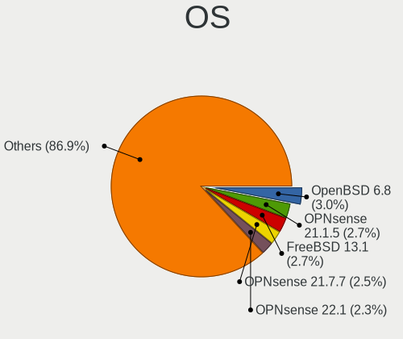

| Name              | Computers | Percent |
|-------------------|-----------|---------|
| OpenBSD 6.8       | 16        | 2.85%   |
| OPNsense 21.1.5   | 14        | 2.49%   |
| FreeBSD 13.1      | 14        | 2.49%   |
| OPNsense 21.7.7   | 13        | 2.31%   |
| OPNsense 22.1     | 12        | 2.14%   |
| OPNsense 23.1.1   | 11        | 1.96%   |
| helloSystem 0.8.1 | 11        | 1.96%   |
| helloSystem 0.7.0 | 11        | 1.96%   |
| helloSystem 0.4.0 | 11        | 1.96%   |
| OPNsense 23.1.5   | 10        | 1.78%   |
| OPNsense 22.1.6   | 10        | 1.78%   |
| OPNsense 22.1.10  | 10        | 1.78%   |
| NomadBSD 1.3.2    | 10        | 1.78%   |
| GhostBSD 20.04.02 | 10        | 1.78%   |
| OPNsense 23.1.7   | 9         | 1.6%    |
| OPNsense 21.7.1   | 9         | 1.6%    |
| OPNsense 21.1     | 9         | 1.6%    |
| FreeBSD 13.1-p7   | 9         | 1.6%    |
| FreeBSD 13.0      | 9         | 1.6%    |
| OPNsense 22.7.9   | 8         | 1.42%   |
| OPNsense 22.7.4   | 8         | 1.42%   |
| OPNsense 22.7     | 8         | 1.42%   |
| OPNsense 22.1.1   | 8         | 1.42%   |
| OPNsense 21.1.3   | 8         | 1.42%   |
| OpenBSD 7.1       | 8         | 1.42%   |
| FreeBSD 12.1-p8   | 8         | 1.42%   |
| OPNsense 23.1.9   | 7         | 1.25%   |
| OPNsense 23.1     | 7         | 1.25%   |
| OPNsense 22.7.7   | 7         | 1.25%   |
| OPNsense 21.7.8   | 7         | 1.25%   |
| helloSystem 0.8.0 | 7         | 1.25%   |
| OPNsense 23.1.8   | 6         | 1.07%   |
| OPNsense 23.1.3   | 6         | 1.07%   |
| OPNsense 22.1.2   | 6         | 1.07%   |
| OPNsense 21.7.3   | 6         | 1.07%   |
| OPNsense 21.1.4   | 6         | 1.07%   |
| OpenBSD 7.2       | 6         | 1.07%   |
| OpenBSD 7.0       | 6         | 1.07%   |
| OpenBSD 6.9       | 6         | 1.07%   |
| helloSystem 0.5.0 | 6         | 1.07%   |

OS Family
---------

OS without a version

| Name        | Computers | Percent |
|-------------|-----------|---------|
| OPNsense    | 209       | 46.65%  |
| FreeBSD     | 117       | 26.12%  |
| helloSystem | 42        | 9.38%   |
| OpenBSD     | 38        | 8.48%   |
| NomadBSD    | 18        | 4.02%   |
| GhostBSD    | 14        | 3.13%   |
| NetBSD      | 4         | 0.89%   |
| TrueNAS     | 3         | 0.67%   |
| HardenedBSD | 1         | 0.22%   |
| FuryBSD     | 1         | 0.22%   |
| FreeNAS     | 1         | 0.22%   |

Arch
----

OS architecture (x86_64, i586, etc.)

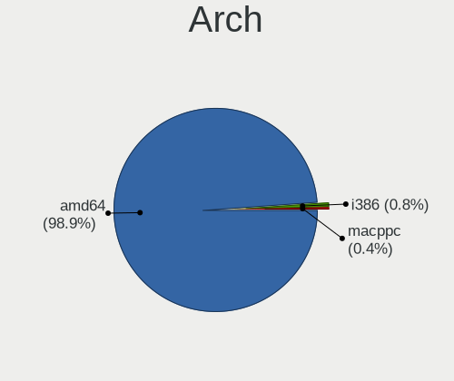

| Name   | Computers | Percent |
|--------|-----------|---------|
| amd64  | 428       | 98.39%  |
| i386   | 5         | 1.15%   |
| macppc | 1         | 0.23%   |
| arm64  | 1         | 0.23%   |

DE
--

Desktop Environment

| Name          | Computers | Percent |
|---------------|-----------|---------|
| Console       | 255       | 56.17%  |
| helloDesktop  | 57        | 12.56%  |
| XFCE          | 34        | 7.49%   |
| KDE5          | 22        | 4.85%   |
| fvwm          | 18        | 3.96%   |
| Openbox       | 16        | 3.52%   |
| MATE          | 15        | 3.3%    |
| TWM           | 11        | 2.42%   |
| GNOME         | 9         | 1.98%   |
| i3            | 4         | 0.88%   |
| xinitrc       | 3         | 0.66%   |
| LXDE          | 3         | 0.66%   |
| AwesomeWM     | 3         | 0.66%   |
| X-Cinnamon    | 1         | 0.22%   |
| sway          | 1         | 0.22%   |
| Enlightenment | 1         | 0.22%   |
| Cinnamon      | 1         | 0.22%   |

Display Server
--------------

X11 or Wayland

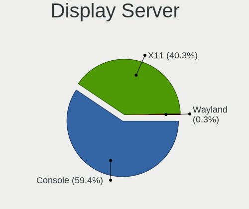

| Name    | Computers | Percent |
|---------|-----------|---------|
| Console | 262       | 59.95%  |
| X11     | 174       | 39.82%  |
| Wayland | 1         | 0.23%   |

Display Manager
---------------

SDDM, LightDM, etc.

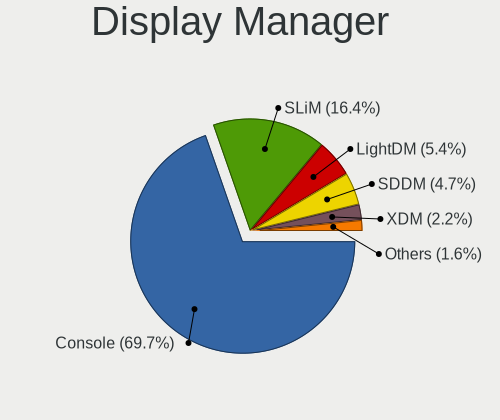

| Name    | Computers | Percent |
|---------|-----------|---------|
| Console | 310       | 69.66%  |
| SLiM    | 73        | 16.4%   |
| LightDM | 24        | 5.39%   |
| SDDM    | 21        | 4.72%   |
| XDM     | 10        | 2.25%   |
| GDM     | 7         | 1.57%   |

OS Lang
-------

Language

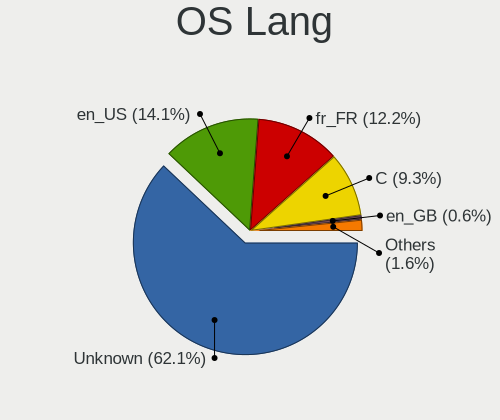

| Lang            | Computers | Percent |
|-----------------|-----------|---------|
| Unknown         | 278       | 62.05%  |
| fr_FR           | 61        | 13.62%  |
| en_US           | 51        | 11.38%  |
| C               | 46        | 10.27%  |
| fr              | 3         | 0.67%   |
| de_DE           | 3         | 0.67%   |
| en_GB           | 2         | 0.45%   |
| fr_FR.US-ASCII  | 1         | 0.22%   |
| es_ES           | 1         | 0.22%   |
| en_US.ISO8859-1 | 1         | 0.22%   |
| en              | 1         | 0.22%   |

Boot Mode
---------

EFI or BIOS

| Mode | Computers | Percent |
|------|-----------|---------|
| EFI  | 341       | 77.68%  |
| BIOS | 98        | 22.32%  |

Filesystem
----------

Type of filesystem

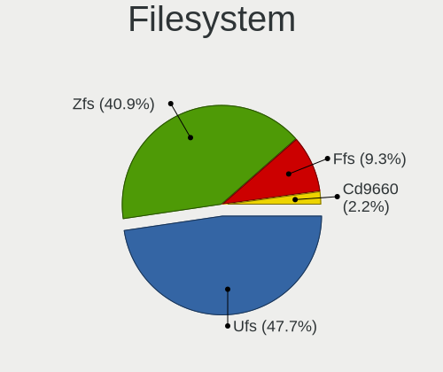

| Type   | Computers | Percent |
|--------|-----------|---------|
| Ufs    | 207       | 46.1%   |
| Zfs    | 190       | 42.32%  |
| Ffs    | 38        | 8.46%   |
| Cd9660 | 14        | 3.12%   |

Part. scheme
------------

Scheme of partitioning

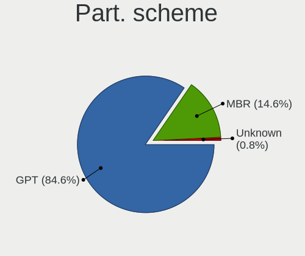

| Type    | Computers | Percent |
|---------|-----------|---------|
| GPT     | 375       | 85.42%  |
| MBR     | 60        | 13.67%  |
| Unknown | 3         | 0.68%   |
| BSD     | 1         | 0.23%   |

Board
-----

Vendor
------

Motherboard manufacturer

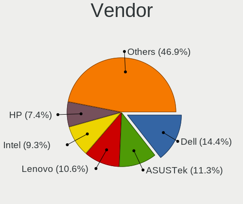

| Name                | Computers | Percent |
|---------------------|-----------|---------|
| Dell                | 65        | 14.94%  |
| ASUSTek Computer    | 49        | 11.26%  |
| Lenovo              | 43        | 9.89%   |
| Intel               | 42        | 9.66%   |
| Hewlett-Packard     | 34        | 7.82%   |
| Unknown             | 28        | 6.44%   |
| PC Engines          | 20        | 4.6%    |
| Gigabyte Technology | 17        | 3.91%   |
| ASRock              | 13        | 2.99%   |
| Supermicro          | 11        | 2.53%   |
| MSI                 | 11        | 2.53%   |
| AMI                 | 9         | 2.07%   |
| Fujitsu             | 7         | 1.61%   |
| Apple               | 7         | 1.61%   |
| Techvision          | 6         | 1.38%   |
| Deciso              | 6         | 1.38%   |
| Acer                | 6         | 1.38%   |
| BESSTAR Tech        | 5         | 1.15%   |
| Shuttle             | 4         | 0.92%   |
| TUXEDO              | 3         | 0.69%   |
| Toshiba             | 3         | 0.69%   |
| Protectli           | 3         | 0.69%   |
| MW                  | 3         | 0.69%   |
| Sony                | 2         | 0.46%   |
| RUNING              | 2         | 0.46%   |
| Notebook            | 2         | 0.46%   |
| Google              | 2         | 0.46%   |
| Clevo               | 2         | 0.46%   |
| AWOW                | 2         | 0.46%   |
| ASRockRack          | 2         | 0.46%   |
| AMD                 | 2         | 0.46%   |
| Alienware           | 2         | 0.46%   |
| ZOTAC               | 1         | 0.23%   |
| YENTEK              | 1         | 0.23%   |
| Wistron             | 1         | 0.23%   |
| VeryPC              | 1         | 0.23%   |
| Sophos              | 1         | 0.23%   |
| Soekris Engineering | 1         | 0.23%   |
| SECO                | 1         | 0.23%   |
| Samsung Electronics | 1         | 0.23%   |

Model
-----

Motherboard model

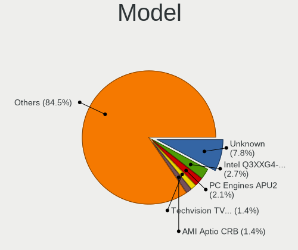

| Name                              | Computers | Percent |
|-----------------------------------|-----------|---------|
| Unknown                           | 29        | 6.67%   |
| Intel Q3XXG4-P V1.0               | 13        | 2.99%   |
| PC Engines APU2                   | 11        | 2.53%   |
| AMI Aptio CRB                     | 7         | 1.61%   |
| Techvision TVI7309X               | 6         | 1.38%   |
| PC Engines APU3                   | 4         | 0.92%   |
| Intel H81U                        | 4         | 0.92%   |
| Intel CRESCENTBAY                 | 4         | 0.92%   |
| Dell OptiPlex 9020                | 4         | 0.92%   |
| ASUS All Series                   | 4         | 0.92%   |
| MW GMLK-2_5G4L                    | 3         | 0.69%   |
| Dell Precision M4500              | 3         | 0.69%   |
| Dell PowerEdge R710               | 3         | 0.69%   |
| Deciso Netboard A20               | 3         | 0.69%   |
| TUXEDO InfinityBook13V3           | 2         | 0.46%   |
| Toshiba PORTEGE Z930              | 2         | 0.46%   |
| Supermicro Super Server           | 2         | 0.46%   |
| Shuttle XS35V5                    | 2         | 0.46%   |
| RUNING B75M INTEL H3V             | 2         | 0.46%   |
| PC Engines apu4                   | 2         | 0.46%   |
| PC Engines apu1                   | 2         | 0.46%   |
| Intel Jasper Lake Client Platform | 2         | 0.46%   |
| Intel AmITX-SL-G                  | 2         | 0.46%   |
| HP ProLiant MicroServer Gen8      | 2         | 0.46%   |
| Gigabyte X570 I AORUS PRO WIFI    | 2         | 0.46%   |
| Fujitsu FUTRO S920                | 2         | 0.46%   |
| Dell PowerEdge R815               | 2         | 0.46%   |
| Dell PowerEdge R220               | 2         | 0.46%   |
| Dell PowerEdge R200               | 2         | 0.46%   |
| Dell OptiPlex 7010                | 2         | 0.46%   |
| Dell OptiPlex 3050                | 2         | 0.46%   |
| Dell OptiPlex 3010                | 2         | 0.46%   |
| Dell Latitude 3410                | 2         | 0.46%   |
| Deciso Netboard A10               | 2         | 0.46%   |
| BESSTAR Tech N40                  | 2         | 0.46%   |
| BESSTAR Tech GK41                 | 2         | 0.46%   |
| AWOW PC BOX                       | 2         | 0.46%   |
| ASUS Z170-P D3                    | 2         | 0.46%   |
| ASUS PRIME B450M-A                | 2         | 0.46%   |
| ASUS PRIME A320I-K                | 2         | 0.46%   |

Model Family
------------

Motherboard model prefix

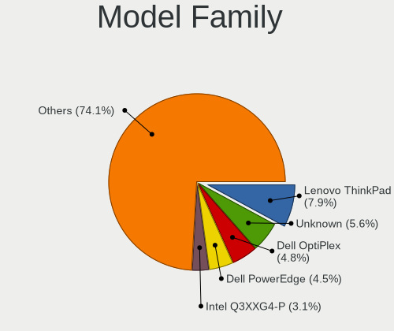

| Name                    | Computers | Percent |
|-------------------------|-----------|---------|
| Lenovo ThinkPad         | 32        | 7.36%   |
| Unknown                 | 29        | 6.67%   |
| Dell OptiPlex           | 20        | 4.6%    |
| Dell PowerEdge          | 16        | 3.68%   |
| Intel Q3XXG4-P          | 13        | 2.99%   |
| Dell Latitude           | 13        | 2.99%   |
| PC Engines APU2         | 11        | 2.53%   |
| ASUS PRIME              | 10        | 2.3%    |
| HP Compaq               | 8         | 1.84%   |
| Dell Precision          | 7         | 1.61%   |
| AMI Aptio               | 7         | 1.61%   |
| Techvision TVI7309X     | 6         | 1.38%   |
| HP ProLiant             | 5         | 1.15%   |
| Deciso Netboard         | 5         | 1.15%   |
| PC Engines APU3         | 4         | 0.92%   |
| Lenovo ThinkCentre      | 4         | 0.92%   |
| Intel H81U              | 4         | 0.92%   |
| Intel CRESCENTBAY       | 4         | 0.92%   |
| HP ProDesk              | 4         | 0.92%   |
| HP EliteBook            | 4         | 0.92%   |
| ASUS All                | 4         | 0.92%   |
| Acer Aspire             | 4         | 0.92%   |
| MW GMLK-2               | 3         | 0.69%   |
| TUXEDO InfinityBook13V3 | 2         | 0.46%   |
| Toshiba PORTEGE         | 2         | 0.46%   |
| Supermicro Super        | 2         | 0.46%   |
| Shuttle XS35V5          | 2         | 0.46%   |
| RUNING B75M             | 2         | 0.46%   |
| PC Engines apu4         | 2         | 0.46%   |
| PC Engines apu1         | 2         | 0.46%   |
| Lenovo Legion           | 2         | 0.46%   |
| Intel Jasper            | 2         | 0.46%   |
| Intel AmITX-SL-G        | 2         | 0.46%   |
| HP EliteDesk            | 2         | 0.46%   |
| Gigabyte X570           | 2         | 0.46%   |
| Fujitsu FUTRO           | 2         | 0.46%   |
| Fujitsu ESPRIMO         | 2         | 0.46%   |
| Dell Vostro             | 2         | 0.46%   |
| Dell Studio             | 2         | 0.46%   |
| Dell Inspiron           | 2         | 0.46%   |

MFG Year
--------

Motherboard manufacture year

| Year    | Computers | Percent |
|---------|-----------|---------|
| 2016    | 48        | 11.03%  |
| 2019    | 47        | 10.8%   |
| 2018    | 45        | 10.34%  |
| 2020    | 44        | 10.11%  |
| 2021    | 32        | 7.36%   |
| 2013    | 30        | 6.9%    |
| 2022    | 29        | 6.67%   |
| 2012    | 26        | 5.98%   |
| 2014    | 24        | 5.52%   |
| 2015    | 20        | 4.6%    |
| 2017    | 19        | 4.37%   |
| 2011    | 17        | 3.91%   |
| 2010    | 17        | 3.91%   |
| 2008    | 10        | 2.3%    |
| 2009    | 9         | 2.07%   |
| Unknown | 9         | 2.07%   |
| 2007    | 6         | 1.38%   |
| 2023    | 2         | 0.46%   |
| 2006    | 1         | 0.23%   |

Form Factor
-----------

Physical design of the computer

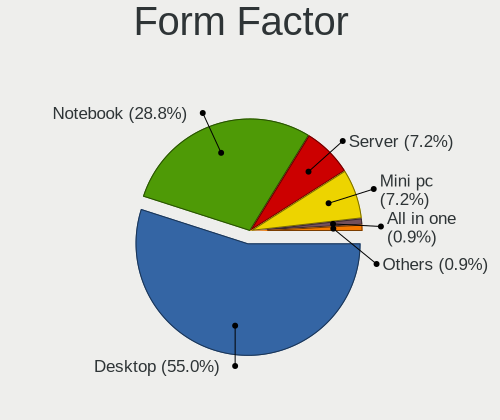

| Name           | Computers | Percent |
|----------------|-----------|---------|
| Desktop        | 250       | 57.47%  |
| Notebook       | 122       | 28.05%  |
| Mini pc        | 31        | 7.13%   |
| Server         | 24        | 5.52%   |
| Firewall       | 3         | 0.69%   |
| All in one     | 3         | 0.69%   |
| System on chip | 1         | 0.23%   |
| Convertible    | 1         | 0.23%   |

Coreboot
--------

Have coreboot on board

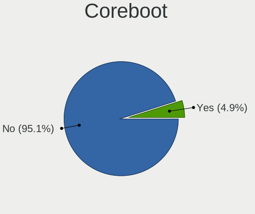

| Used | Computers | Percent |
|------|-----------|---------|
| No   | 410       | 94.25%  |
| Yes  | 25        | 5.75%   |

RAM Size
--------

Total RAM memory

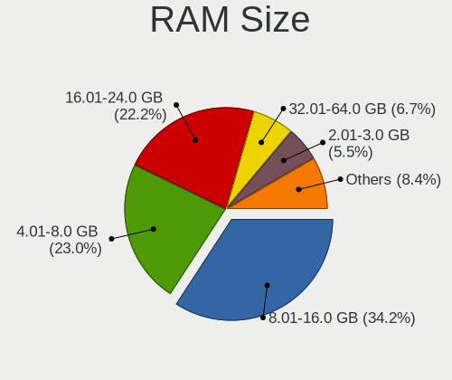

| Size in GB      | Computers | Percent |
|-----------------|-----------|---------|
| 8.01-16.0       | 152       | 34.31%  |
| 4.01-8.0        | 105       | 23.7%   |
| 16.01-24.0      | 97        | 21.9%   |
| 32.01-64.0      | 31        | 7%      |
| 2.01-3.0        | 23        | 5.19%   |
| 64.01-256.0     | 16        | 3.61%   |
| 1.01-2.0        | 6         | 1.35%   |
| 3.01-4.0        | 5         | 1.13%   |
| 24.01-32.0      | 5         | 1.13%   |
| More than 256.0 | 2         | 0.45%   |
| 0.51-1.0        | 1         | 0.23%   |

RAM Used
--------

Used RAM memory

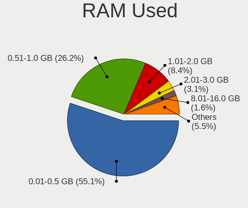

| Used GB     | Computers | Percent |
|-------------|-----------|---------|
| 0.01-0.5    | 240       | 53.93%  |
| 0.51-1.0    | 121       | 27.19%  |
| 1.01-2.0    | 39        | 8.76%   |
| 2.01-3.0    | 15        | 3.37%   |
| 4.01-8.0    | 7         | 1.57%   |
| 8.01-16.0   | 7         | 1.57%   |
| 3.01-4.0    | 4         | 0.9%    |
| Unknown     | 4         | 0.9%    |
| 32.01-64.0  | 3         | 0.67%   |
| 64.01-256.0 | 2         | 0.45%   |
| 24.01-32.0  | 1         | 0.22%   |
| 16.01-24.0  | 1         | 0.22%   |
| 0           | 1         | 0.22%   |

Total Drives
------------

Number of drives on board

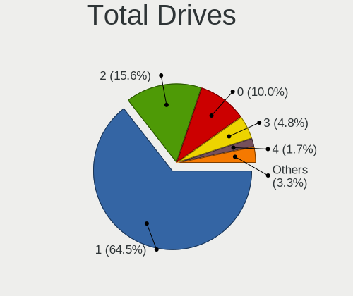

| Drives | Computers | Percent |
|--------|-----------|---------|
| 1      | 285       | 63.9%   |
| 2      | 74        | 16.59%  |
| 0      | 40        | 8.97%   |
| 3      | 24        | 5.38%   |
| 4      | 8         | 1.79%   |
| 5      | 7         | 1.57%   |
| 6      | 4         | 0.9%    |
| 25     | 2         | 0.45%   |
| 10     | 1         | 0.22%   |
| 8      | 1         | 0.22%   |

Has CD-ROM
----------

Has CD-ROM on board

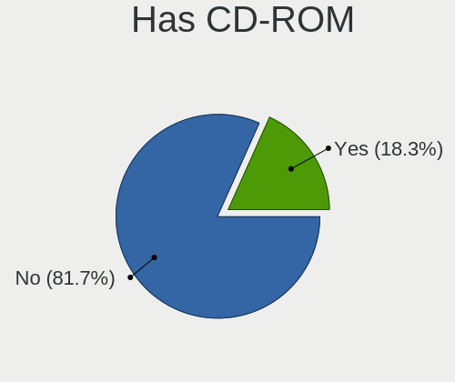

| Presented | Computers | Percent |
|-----------|-----------|---------|
| No        | 359       | 81.59%  |
| Yes       | 81        | 18.41%  |

Has Ethernet
------------

Has Ethernet on board

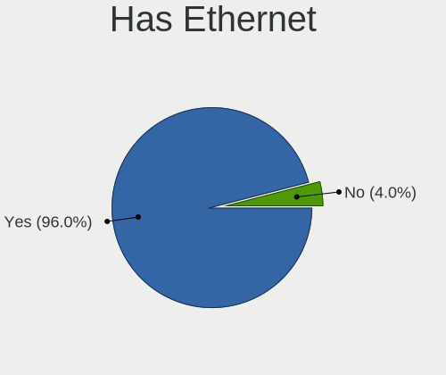

| Presented | Computers | Percent |
|-----------|-----------|---------|
| Yes       | 419       | 96.1%   |
| No        | 17        | 3.9%    |

Has WiFi
--------

Has WiFi module

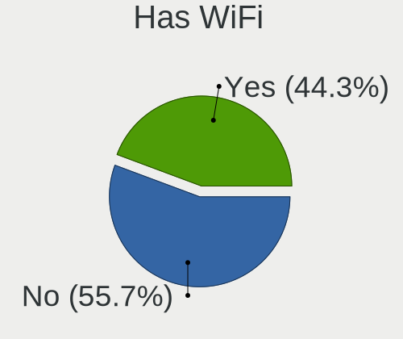

| Presented | Computers | Percent |
|-----------|-----------|---------|
| No        | 240       | 55.05%  |
| Yes       | 196       | 44.95%  |

Has Bluetooth
-------------

Has Bluetooth module

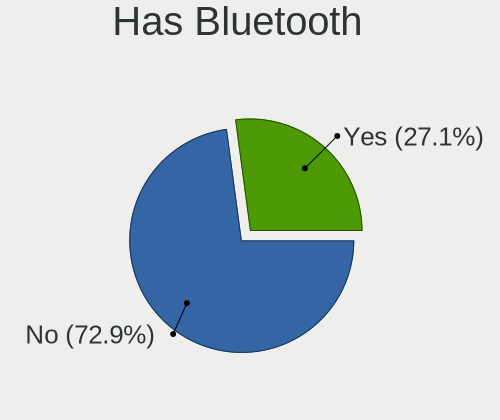

| Presented | Computers | Percent |
|-----------|-----------|---------|
| No        | 322       | 73.35%  |
| Yes       | 117       | 26.65%  |

Location
--------

Country
-------

Geographic location (country)

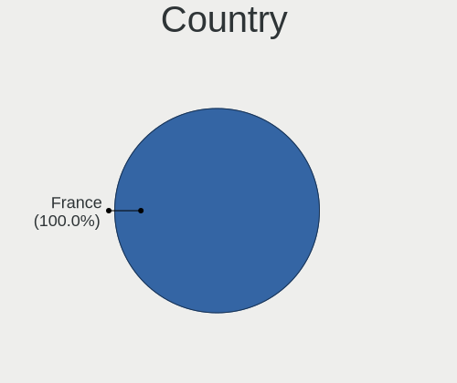

| Country | Computers | Percent |
|---------|-----------|---------|
| France  | 435       | 100%    |

City
----

Geographic location (city)

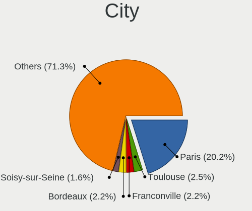

| City                     | Computers | Percent |
|--------------------------|-----------|---------|
| Paris                    | 93        | 18.79%  |
| Bordeaux                 | 11        | 2.22%   |
| Toulouse                 | 8         | 1.62%   |
| Saint-Denis              | 7         | 1.41%   |
| Roubaix                  | 7         | 1.41%   |
| Franconville             | 7         | 1.41%   |
| Marseille                | 6         | 1.21%   |
| Soisy-sur-Seine          | 5         | 1.01%   |
| Melun                    | 5         | 1.01%   |
| Lyon                     | 5         | 1.01%   |
| Agen                     | 5         | 1.01%   |
| Rennes                   | 4         | 0.81%   |
| Noisy-le-Grand           | 4         | 0.81%   |
| Lille                    | 4         | 0.81%   |
| Colmar                   | 4         | 0.81%   |
| Villeurbanne             | 3         | 0.61%   |
| Vauvillers               | 3         | 0.61%   |
| Vaulx-en-Velin           | 3         | 0.61%   |
| Thionville               | 3         | 0.61%   |
| Sarcelles                | 3         | 0.61%   |
| Rosny-sous-Bois          | 3         | 0.61%   |
| Nantes                   | 3         | 0.61%   |
| Montfermeil              | 3         | 0.61%   |
| Marcq-en-Baroeul         | 3         | 0.61%   |
| Mâcon                   | 3         | 0.61%   |
| Fontenay-sous-Bois       | 3         | 0.61%   |
| Dijon                    | 3         | 0.61%   |
| Cognac                   | 3         | 0.61%   |
| Clermont-Ferrand         | 3         | 0.61%   |
| Carry-le-Rouet           | 3         | 0.61%   |
| Bonson                   | 3         | 0.61%   |
| Asnieres-sur-Seine       | 3         | 0.61%   |
| Г‰chirolles           | 2         | 0.4%    |
| Villeneuve-Saint-Georges | 2         | 0.4%    |
| Villejuif                | 2         | 0.4%    |
| Vichy                    | 2         | 0.4%    |
| Stiring-Wendel           | 2         | 0.4%    |
| Seyssinet-Pariset        | 2         | 0.4%    |
| Sallanches               | 2         | 0.4%    |
| Saint-Raphaël           | 2         | 0.4%    |

Drives
------

Drive Vendor
------------

Hard drive vendors

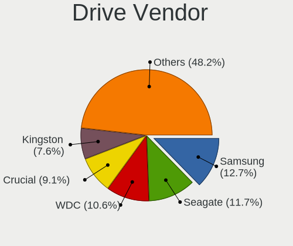

| Vendor              | Computers | Drives | Percent |
|---------------------|-----------|--------|---------|
| Samsung Electronics | 66        | 97     | 12.99%  |
| Seagate             | 61        | 93     | 12.01%  |
| WDC                 | 55        | 106    | 10.83%  |
| Crucial             | 44        | 57     | 8.66%   |
| Kingston            | 35        | 55     | 6.89%   |
| Transcend           | 26        | 39     | 5.12%   |
| Toshiba             | 26        | 45     | 5.12%   |
| China               | 22        | 34     | 4.33%   |
| SanDisk             | 19        | 29     | 3.74%   |
| Intel               | 15        | 22     | 2.95%   |
| Phison              | 11        | 12     | 2.17%   |
| HGST                | 11        | 18     | 2.17%   |
| PNY                 | 9         | 16     | 1.77%   |
| Hoodisk             | 9         | 9      | 1.77%   |
| Micron Technology   | 8         | 12     | 1.57%   |
| NVMe                | 7         | 7      | 1.38%   |
| SK hynix            | 6         | 6      | 1.18%   |
| Hitachi             | 6         | 6      | 1.18%   |
| Corsair             | 5         | 9      | 0.98%   |
| OCZ                 | 4         | 5      | 0.79%   |
| Fujitsu             | 4         | 4      | 0.79%   |
| FORESEE             | 4         | 5      | 0.79%   |
| Apple               | 4         | 6      | 0.79%   |
| Maxtor              | 3         | 4      | 0.59%   |
| LDLC                | 3         | 3      | 0.59%   |
| Innodisk            | 3         | 3      | 0.59%   |
| Hewlett-Packard     | 3         | 6      | 0.59%   |
| Dell                | 3         | 48     | 0.59%   |
| A-DATA Technology   | 3         | 3      | 0.59%   |
| SPCC                | 2         | 2      | 0.39%   |
| NETAPP              | 2         | 4      | 0.39%   |
| Generic             | 2         | 2      | 0.39%   |
| Fanxiang            | 2         | 2      | 0.39%   |
| Vaseky              | 1         | 2      | 0.2%    |
| TEXTORM             | 1         | 1      | 0.2%    |
| TCSUNBOW            | 1         | 3      | 0.2%    |
| Supermicro          | 1         | 1      | 0.2%    |
| Silicon Power       | 1         | 2      | 0.2%    |
| ShiJi               | 1         | 2      | 0.2%    |
| SHAREVDI            | 1         | 1      | 0.2%    |

Drive Model
-----------

Hard drive models

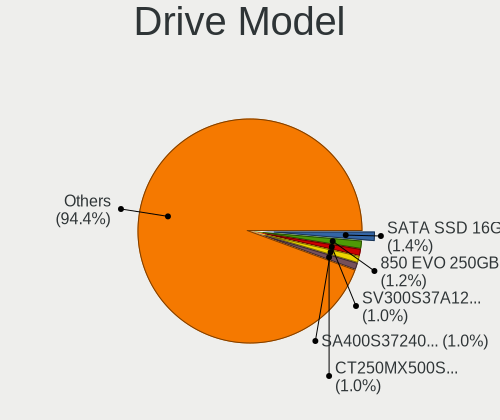

| Model                               | Computers | Percent |
|-------------------------------------|-----------|---------|
| Phison SATA SSD 16GB                | 8         | 1.47%   |
| Samsung SSD 850 EVO 250GB           | 7         | 1.29%   |
| Kingston SV300S37A120G 120GB        | 6         | 1.1%    |
| Kingston SA400S37240G 240GB         | 6         | 1.1%    |
| China MSATA 32GB SSD                | 6         | 1.1%    |
| Seagate ST1000LM024 HN-M101MBB 1TB  | 5         | 0.92%   |
| Hoodisk SSD 32GB                    | 5         | 0.92%   |
| Crucial CT250MX500SSD1 250GB        | 5         | 0.92%   |
| Crucial CT1000P1SSD8 1TB            | 5         | 0.92%   |
| WDC WD10EZEX-08WN4A0 1TB            | 4         | 0.74%   |
| Transcend TS256GMTS952T2 256GB      | 4         | 0.74%   |
| SanDisk SSD PLUS 120GB              | 4         | 0.74%   |
| PNY CS900 120GB SSD                 | 4         | 0.74%   |
| Kingston SUV500MS120G 120GB         | 4         | 0.74%   |
| Crucial CT500MX500SSD1 500GB        | 4         | 0.74%   |
| Crucial CT120BX500SSD1 120GB        | 4         | 0.74%   |
| Crucial CT1000BX500SSD1 1TB         | 4         | 0.74%   |
| China SATA SSD 16GB                 | 4         | 0.74%   |
| China MSATA 64GB SSD                | 4         | 0.74%   |
| WDC WDS240G2G0A-00JH30 240GB        | 3         | 0.55%   |
| Transcend TS128GSSD420K 128GB       | 3         | 0.55%   |
| Transcend TS128GMSA230S 128GB       | 3         | 0.55%   |
| Seagate ST3500418AS 500GB           | 3         | 0.55%   |
| Seagate ST1000LM049-2GH172 1TB      | 3         | 0.55%   |
| Seagate ST1000LM035-1RK172 1TB      | 3         | 0.55%   |
| Kingston SA400S37120G 120GB         | 3         | 0.55%   |
| HGST HUS724020ALA640 2TB            | 3         | 0.55%   |
| HGST HTS721010A9E630 1TB            | 3         | 0.55%   |
| HP RAID 1(1+0) 1TB                  | 3         | 0.55%   |
| Crucial CT250P2SSD8 250GB           | 3         | 0.55%   |
| Crucial CT240BX500SSD1 240GB        | 3         | 0.55%   |
| Crucial CT1050MX300SSD1 1TB         | 3         | 0.55%   |
| WDC WD40EFRX-68N32N0 4TB            | 2         | 0.37%   |
| WDC WD3200BPVT-80JJ5T0 320GB        | 2         | 0.37%   |
| WDC WD2000FYYX 2TB                  | 2         | 0.37%   |
| Transcend TS256GSSD230S 256GB       | 2         | 0.37%   |
| Transcend TS256GMTS430S 256GB       | 2         | 0.37%   |
| Transcend TS120GMTS420S 120GB       | 2         | 0.37%   |
| Toshiba MK2556GSY 250GB             | 2         | 0.37%   |
| Toshiba KSG60ZMV256G M.2 2280 256GB | 2         | 0.37%   |

HDD Vendor
----------

Hard disk drive vendors

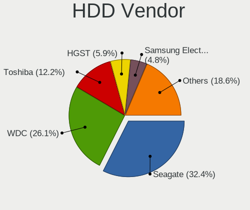

| Vendor              | Computers | Drives | Percent |
|---------------------|-----------|--------|---------|
| Seagate             | 59        | 90     | 33.15%  |
| WDC                 | 46        | 94     | 25.84%  |
| Toshiba             | 19        | 34     | 10.67%  |
| HGST                | 11        | 18     | 6.18%   |
| Samsung Electronics | 9         | 16     | 5.06%   |
| Hitachi             | 6         | 6      | 3.37%   |
| NVMe                | 5         | 5      | 2.81%   |
| Fujitsu             | 4         | 4      | 2.25%   |
| Maxtor              | 3         | 4      | 1.69%   |
| Hewlett-Packard     | 3         | 6      | 1.69%   |
| Dell                | 3         | 48     | 1.69%   |
| NETAPP              | 2         | 4      | 1.12%   |
| Generic             | 2         | 2      | 1.12%   |
| Apple               | 2         | 4      | 1.12%   |
| SABRENT             | 1         | 1      | 0.56%   |
| OPENBSD             | 1         | 2      | 0.56%   |
| Lexar               | 1         | 1      | 0.56%   |
| LDLC F6+            | 1         | 1      | 0.56%   |

SSD Vendor
----------

Solid state drive vendors

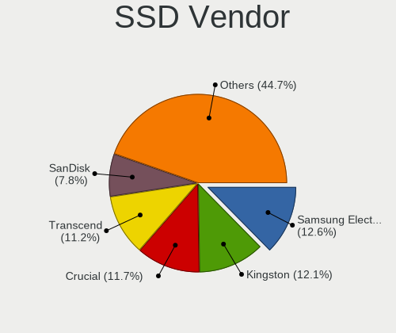

| Vendor              | Computers | Drives | Percent |
|---------------------|-----------|--------|---------|
| Samsung Electronics | 37        | 50     | 14.18%  |
| Kingston            | 31        | 50     | 11.88%  |
| Crucial             | 31        | 35     | 11.88%  |
| Transcend           | 25        | 37     | 9.58%   |
| China               | 22        | 34     | 8.43%   |
| SanDisk             | 19        | 29     | 7.28%   |
| Intel               | 9         | 11     | 3.45%   |
| Hoodisk             | 9         | 9      | 3.45%   |
| PNY                 | 8         | 15     | 3.07%   |
| Phison              | 8         | 9      | 3.07%   |
| WDC                 | 7         | 8      | 2.68%   |
| Toshiba             | 6         | 9      | 2.3%    |
| OCZ                 | 4         | 5      | 1.53%   |
| FORESEE             | 4         | 5      | 1.53%   |
| Corsair             | 4         | 5      | 1.53%   |
| SK hynix            | 3         | 3      | 1.15%   |
| Innodisk            | 3         | 3      | 1.15%   |
| A-DATA Technology   | 3         | 3      | 1.15%   |
| SPCC                | 2         | 2      | 0.77%   |
| NVMe                | 2         | 2      | 0.77%   |
| Micron Technology   | 2         | 6      | 0.77%   |
| Apple               | 2         | 2      | 0.77%   |
| Vaseky              | 1         | 2      | 0.38%   |
| TEXTORM             | 1         | 1      | 0.38%   |
| TCSUNBOW            | 1         | 3      | 0.38%   |
| Supermicro          | 1         | 1      | 0.38%   |
| Silicon Power       | 1         | 2      | 0.38%   |
| ShiJi               | 1         | 2      | 0.38%   |
| SHAREVDI            | 1         | 1      | 0.38%   |
| Seagate             | 1         | 2      | 0.38%   |
| Pccooler            | 1         | 1      | 0.38%   |
| LSI                 | 1         | 1      | 0.38%   |
| LITEON              | 1         | 2      | 0.38%   |
| Kston               | 1         | 1      | 0.38%   |
| Kingchuxing         | 1         | 2      | 0.38%   |
| Integral            | 1         | 1      | 0.38%   |
| Indilinx            | 1         | 7      | 0.38%   |
| EMTEC               | 1         | 1      | 0.38%   |
| BORY                | 1         | 2      | 0.38%   |
| BIWIN               | 1         | 1      | 0.38%   |

Drive Kind
----------

HDD or SSD

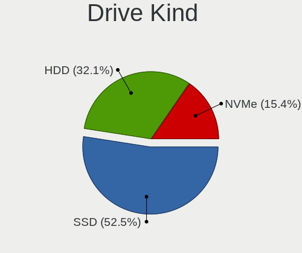

| Kind | Computers | Drives | Percent |
|------|-----------|--------|---------|
| SSD  | 240       | 367    | 52.86%  |
| HDD  | 147       | 340    | 32.38%  |
| NVMe | 67        | 102    | 14.76%  |

Drive Connector
---------------

SATA, SAS, NVMe, etc.

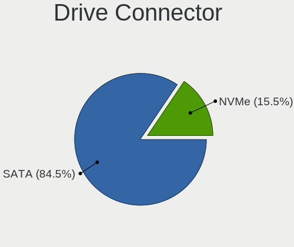

| Type | Computers | Drives | Percent |
|------|-----------|--------|---------|
| SATA | 350       | 707    | 83.93%  |
| NVMe | 67        | 102    | 16.07%  |

Drive Size
----------

Size of hard drive

| Size in TB | Computers | Drives | Percent |
|------------|-----------|--------|---------|
| 0.01-0.5   | 288       | 497    | 70.76%  |
| 0.51-1.0   | 71        | 108    | 17.44%  |
| 1.01-2.0   | 31        | 67     | 7.62%   |
| 4.01-10.0  | 7         | 12     | 1.72%   |
| 3.01-4.0   | 5         | 13     | 1.23%   |
| 2.01-3.0   | 5         | 10     | 1.23%   |

Space Total
-----------

Amount of disk space available on the file system

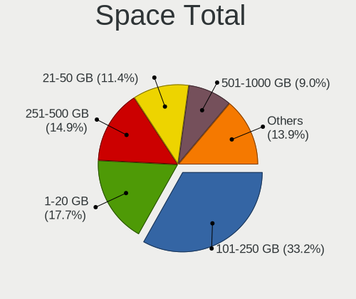

| Size in GB     | Computers | Percent |
|----------------|-----------|---------|
| 101-250        | 151       | 33.78%  |
| 1-20           | 74        | 16.55%  |
| 251-500        | 64        | 14.32%  |
| 21-50          | 54        | 12.08%  |
| 501-1000       | 40        | 8.95%   |
| 51-100         | 40        | 8.95%   |
| 1001-2000      | 12        | 2.68%   |
| More than 3000 | 5         | 1.12%   |
| 2001-3000      | 5         | 1.12%   |
| Unknown        | 2         | 0.45%   |

Space Used
----------

Amount of used disk space

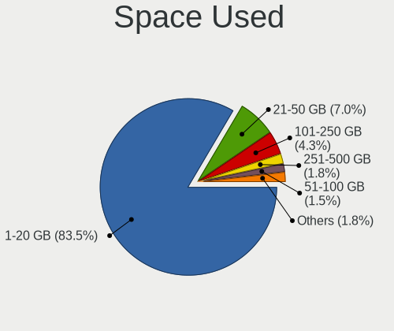

| Used GB        | Computers | Percent |
|----------------|-----------|---------|
| 1-20           | 374       | 84.62%  |
| 21-50          | 29        | 6.56%   |
| 101-250        | 14        | 3.17%   |
| 251-500        | 9         | 2.04%   |
| 51-100         | 8         | 1.81%   |
| 501-1000       | 3         | 0.68%   |
| More than 3000 | 2         | 0.45%   |
| Unknown        | 2         | 0.45%   |
| 1001-2000      | 1         | 0.23%   |

Malfunc. Drives
---------------

Drive models with a malfunction

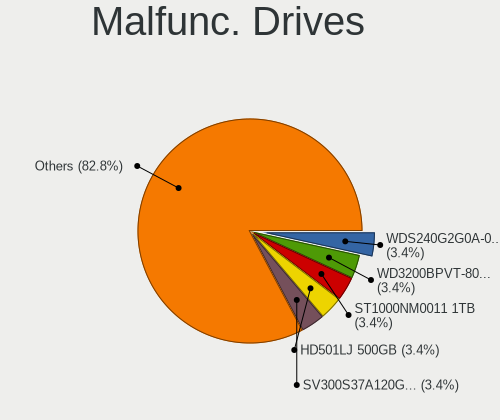

| Model                                 | Computers | Drives | Percent |
|---------------------------------------|-----------|--------|---------|
| WDC WDS240G2G0A-00JH30 240GB          | 2         | 3      | 3.13%   |
| WDC WD3200BPVT-80JJ5T0 320GB          | 2         | 2      | 3.13%   |
| Seagate ST500DM002-1BD142 500GB       | 2         | 2      | 3.13%   |
| Seagate ST1000NM0011 1TB              | 2         | 3      | 3.13%   |
| Seagate ST1000LM024 HN-M101MBB 1TB    | 2         | 3      | 3.13%   |
| Samsung Electronics HD501LJ 500GB     | 2         | 2      | 3.13%   |
| Kingston SV300S37A120G 120GB          | 2         | 3      | 3.13%   |
| WDC WD6400BPVT-22HXZT3 640GB          | 1         | 1      | 1.56%   |
| WDC WD6400AAKS-22A7B0 640GB           | 1         | 1      | 1.56%   |
| WDC WD5002ABYS-18B1B0 500GB           | 1         | 1      | 1.56%   |
| WDC WD30EFRX-68AX9N0 3TB              | 1         | 4      | 1.56%   |
| WDC WD2500BEVS-60UST0 250GB           | 1         | 1      | 1.56%   |
| WDC WD2002FYPS-02W3B0 2TB             | 1         | 1      | 1.56%   |
| WDC WD15EADS-00P8B0 1.5TB             | 1         | 1      | 1.56%   |
| WDC WD10JPVX-22JC3T0 1TB              | 1         | 1      | 1.56%   |
| WDC WD10EZEX-08WN4A0 1TB              | 1         | 1      | 1.56%   |
| WDC WD10EAVS-00D7B0 1TB               | 1         | 1      | 1.56%   |
| WDC WD10EARS-00Y5B1 1TB               | 1         | 1      | 1.56%   |
| WDC WD1001FAES-75W7A0 1TB             | 1         | 1      | 1.56%   |
| Toshiba MQ01ABD075 752GB              | 1         | 1      | 1.56%   |
| Toshiba MK5065GSX 500GB               | 1         | 1      | 1.56%   |
| Toshiba MK1629GSGF 160GB              | 1         | 3      | 1.56%   |
| Toshiba DT01ACA100 1TB                | 1         | 1      | 1.56%   |
| Seagate ST9500325AS 500GB             | 1         | 1      | 1.56%   |
| Seagate ST9320423AS 320GB             | 1         | 1      | 1.56%   |
| Seagate ST9320325AS 320GB             | 1         | 1      | 1.56%   |
| Seagate ST500VT000-1DK142 500GB       | 1         | 1      | 1.56%   |
| Seagate ST500LM000-SSHD-8GB           | 1         | 2      | 1.56%   |
| Seagate ST380013AS 80GB               | 1         | 2      | 1.56%   |
| Seagate ST3250620AS 250GB             | 1         | 1      | 1.56%   |
| Seagate ST320LT012-9WS14C 320GB       | 1         | 7      | 1.56%   |
| Seagate ST3160212AS 160GB             | 1         | 1      | 1.56%   |
| Seagate ST3160023AS 160GB             | 1         | 1      | 1.56%   |
| Seagate ST31000524AS 1TB              | 1         | 1      | 1.56%   |
| Seagate ST1000LM014-1EJ164 1TB        | 1         | 1      | 1.56%   |
| SanDisk SDSSDA240G 240GB              | 1         | 1      | 1.56%   |
| SanDisk SD7UB3Q256G1001 256GB         | 1         | 1      | 1.56%   |
| Samsung Electronics SSD 840 EVO 500GB | 1         | 2      | 1.56%   |
| Samsung Electronics HD322GJ 320GB     | 1         | 1      | 1.56%   |
| Samsung Electronics HD256GJ 250GB     | 1         | 1      | 1.56%   |

Malfunc. Drive Vendor
---------------------

Vendors of faulty drives

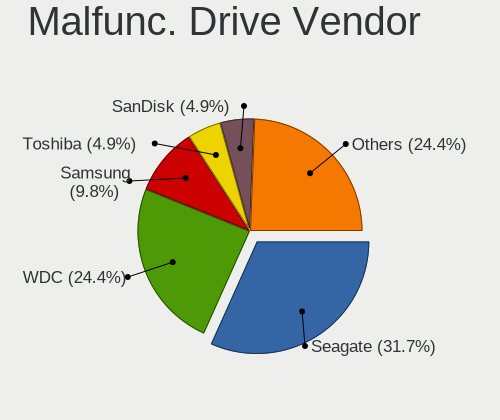

| Vendor              | Computers | Drives | Percent |
|---------------------|-----------|--------|---------|
| Seagate             | 17        | 28     | 27.87%  |
| WDC                 | 16        | 20     | 26.23%  |
| Toshiba             | 4         | 6      | 6.56%   |
| Samsung Electronics | 4         | 7      | 6.56%   |
| Kingston            | 3         | 4      | 4.92%   |
| HGST                | 3         | 4      | 4.92%   |
| A-DATA Technology   | 3         | 3      | 4.92%   |
| SanDisk             | 2         | 2      | 3.28%   |
| Maxtor              | 2         | 2      | 3.28%   |
| Hitachi             | 2         | 2      | 3.28%   |
| OCZ                 | 1         | 2      | 1.64%   |
| Intel               | 1         | 1      | 1.64%   |
| Innodisk            | 1         | 1      | 1.64%   |
| Crucial             | 1         | 1      | 1.64%   |
| Corsair             | 1         | 2      | 1.64%   |

Malfunc. HDD Vendor
-------------------

Vendors of faulty HDD drives

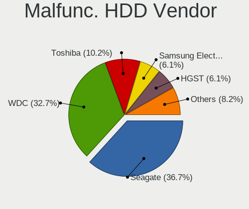

| Vendor              | Computers | Drives | Percent |
|---------------------|-----------|--------|---------|
| Seagate             | 17        | 28     | 37.78%  |
| WDC                 | 14        | 17     | 31.11%  |
| Toshiba             | 4         | 6      | 8.89%   |
| Samsung Electronics | 3         | 5      | 6.67%   |
| HGST                | 3         | 4      | 6.67%   |
| Maxtor              | 2         | 2      | 4.44%   |
| Hitachi             | 2         | 2      | 4.44%   |

Malfunc. Drive Kind
-------------------

Kinds of faulty drives

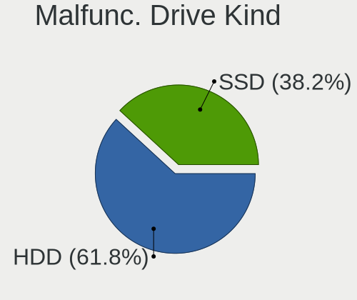

| Kind | Computers | Drives | Percent |
|------|-----------|--------|---------|
| HDD  | 41        | 64     | 71.93%  |
| SSD  | 16        | 21     | 28.07%  |

Failed Drives
-------------

Failed drive models

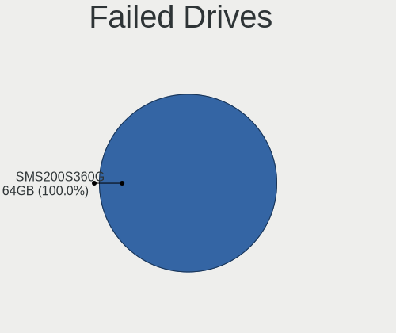

| Model                     | Computers | Drives | Percent |
|---------------------------|-----------|--------|---------|
| Supermicro SSD 16GB       | 1         | 1      | 50%     |
| Kingston SMS200S360G 64GB | 1         | 1      | 50%     |

Failed Drive Vendor
-------------------

Failed drive vendors

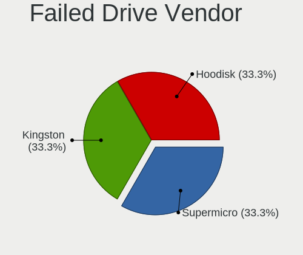

| Vendor     | Computers | Drives | Percent |
|------------|-----------|--------|---------|
| Supermicro | 1         | 1      | 50%     |
| Kingston   | 1         | 1      | 50%     |

Drive Status
------------

Number of failed and malfunc. drives

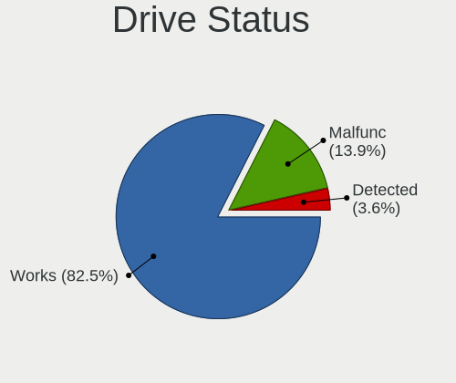

| Status   | Computers | Drives | Percent |
|----------|-----------|--------|---------|
| Works    | 351       | 697    | 82.39%  |
| Malfunc  | 56        | 85     | 13.15%  |
| Detected | 17        | 25     | 3.99%   |
| Failed   | 2         | 2      | 0.47%   |

Storage controller
------------------

Storage Vendor
--------------

Storage controller vendors

| Vendor                        | Computers | Percent |
|-------------------------------|-----------|---------|
| Intel                         | 328       | 63.57%  |
| AMD                           | 76        | 14.73%  |
| Samsung Electronics           | 23        | 4.46%   |
| Micron/Crucial Technology     | 15        | 2.91%   |
| Broadcom / LSI                | 15        | 2.91%   |
| ASMedia Technology            | 7         | 1.36%   |
| SanDisk                       | 5         | 0.97%   |
| Micron Technology             | 5         | 0.97%   |
| Silicon Motion                | 4         | 0.78%   |
| Phison Electronics            | 4         | 0.78%   |
| Marvell Technology Group      | 4         | 0.78%   |
| Kingston Technology Company   | 4         | 0.78%   |
| Hewlett-Packard               | 4         | 0.78%   |
| SK hynix                      | 3         | 0.58%   |
| Nvidia                        | 3         | 0.58%   |
| MAXIO Technology (Hangzhou)   | 3         | 0.58%   |
| JMicron Technology            | 3         | 0.58%   |
| VIA Technologies              | 2         | 0.39%   |
| Chelsio Communications        | 2         | 0.39%   |
| Transcend                     | 1         | 0.19%   |
| Toshiba                       | 1         | 0.19%   |
| Silicon Image                 | 1         | 0.19%   |
| Seagate Technology            | 1         | 0.19%   |
| KIOXIA                        | 1         | 0.19%   |
| Integrated Technology Express | 1         | 0.19%   |

Storage Model
-------------

Storage controller models

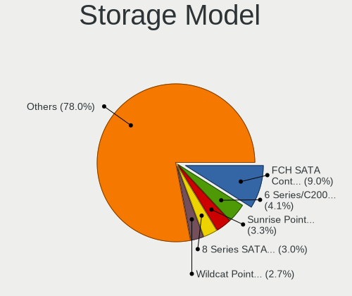

| Model                                                                            | Computers | Percent |
|----------------------------------------------------------------------------------|-----------|---------|
| AMD FCH SATA Controller [AHCI mode]                                              | 49        | 8.4%    |
| Intel Q170/Q150/B150/H170/H110/Z170/CM236 Chipset SATA Controller [AHCI Mode]    | 23        | 3.95%   |
| Intel 8 Series SATA Controller 1 [AHCI mode]                                     | 23        | 3.95%   |
| Intel 6 Series/C200 Series Chipset Family 6 port Desktop SATA AHCI Controller    | 19        | 3.26%   |
| Intel 8 Series/C220 Series Chipset Family 6-port SATA Controller 1 [AHCI mode]   | 18        | 3.09%   |
| Intel Sunrise Point-LP SATA Controller [AHCI mode]                               | 16        | 2.74%   |
| Intel Wildcat Point-LP SATA Controller [AHCI Mode]                               | 14        | 2.4%    |
| Intel Celeron/Pentium Silver Processor SATA Controller                           | 13        | 2.23%   |
| Samsung NVMe SSD Controller SM981/PM981/PM983                                    | 11        | 1.89%   |
| Intel SATA Controller [RAID mode]                                                | 11        | 1.89%   |
| Intel Atom/Celeron/Pentium Processor x5-E8000/J3xxx/N3xxx Series SATA Controller | 11        | 1.89%   |
| Intel 7 Series Chipset Family 6-port SATA Controller [AHCI mode]                 | 11        | 1.89%   |
| AMD FCH SATA Controller [IDE mode]                                               | 11        | 1.89%   |
| Intel Atom Processor E3800 Series SATA AHCI Controller                           | 10        | 1.72%   |
| Intel 7 Series/C210 Series Chipset Family 6-port SATA Controller [AHCI mode]     | 10        | 1.72%   |
| Intel Jasper Lake SATA AHCI Controller                                           | 9         | 1.54%   |
| Intel 6 Series/C200 Series Chipset Family 6 port Mobile SATA AHCI Controller     | 9         | 1.54%   |
| Micron/Crucial P2 NVMe PCIe SSD                                                  | 8         | 1.37%   |
| Intel 82801 Mobile SATA Controller [RAID mode]                                   | 8         | 1.37%   |
| Intel 5 Series/3400 Series Chipset 6 port SATA AHCI Controller                   | 7         | 1.2%    |
| ASMedia ASM1062 Serial ATA Controller                                            | 7         | 1.2%    |
| AMD SB7x0/SB8x0/SB9x0 SATA Controller [AHCI mode]                                | 7         | 1.2%    |
| Samsung NVMe SSD Controller 980                                                  | 6         | 1.03%   |
| Intel NM10/ICH7 Family SATA Controller [AHCI mode]                               | 6         | 1.03%   |
| Intel 82801IBM/IEM (ICH9M/ICH9M-E) 4 port SATA Controller [AHCI mode]            | 6         | 1.03%   |
| Intel 200 Series PCH SATA controller [AHCI mode]                                 | 6         | 1.03%   |
| AMD 400 Series Chipset SATA Controller                                           | 6         | 1.03%   |
| Intel Celeron N3350/Pentium N4200/Atom E3900 Series SATA AHCI Controller         | 5         | 0.86%   |
| Intel Cannon Point-LP SATA Controller [AHCI Mode]                                | 5         | 0.86%   |
| Intel Cannon Lake PCH SATA AHCI Controller                                       | 5         | 0.86%   |
| Intel C620 Series Chipset Family SSATA Controller [AHCI mode]                    | 5         | 0.86%   |
| Intel 82801JI (ICH10 Family) SATA AHCI Controller                                | 5         | 0.86%   |
| AMD 500 Series Chipset SATA Controller                                           | 5         | 0.86%   |
| Samsung NVMe SSD Controller PM9A1/PM9A3/980PRO                                   | 4         | 0.69%   |
| Micron/Crucial P1 NVMe PCIe SSD                                                  | 4         | 0.69%   |
| Intel NM10/ICH7 Family SATA Controller [IDE mode]                                | 4         | 0.69%   |
| Intel Comet Lake SATA AHCI Controller                                            | 4         | 0.69%   |
| Intel C620 Series Chipset Family SATA Controller [AHCI mode]                     | 4         | 0.69%   |
| Intel C600/X79 series chipset 6-Port SATA AHCI Controller                        | 4         | 0.69%   |
| Intel 82801HM/HEM (ICH8M/ICH8M-E) SATA Controller [AHCI mode]                    | 4         | 0.69%   |

Storage Kind
------------

Kind of storage controller (IDE, SATA, NVMe, SAS, ...)

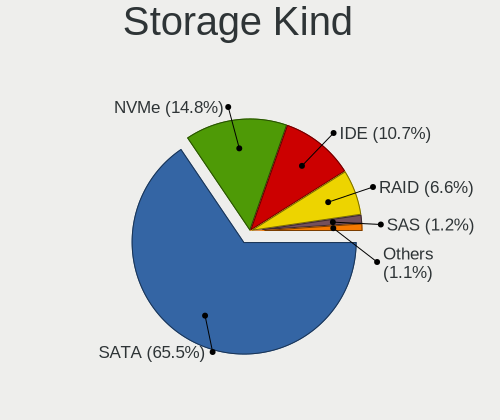

| Kind | Computers | Percent |
|------|-----------|---------|
| SATA | 346       | 66.03%  |
| NVMe | 73        | 13.93%  |
| IDE  | 55        | 10.5%   |
| RAID | 37        | 7.06%   |
| SAS  | 7         | 1.34%   |
| SCSI | 6         | 1.15%   |

Processor
---------

CPU Vendor
----------

Processor vendors

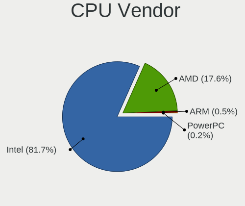

| Vendor  | Computers | Percent |
|---------|-----------|---------|
| Intel   | 350       | 80.28%  |
| AMD     | 84        | 19.27%  |
| PowerPC | 1         | 0.23%   |
| ARM     | 1         | 0.23%   |

CPU Model
---------

Processor models

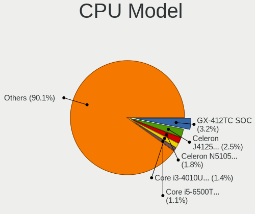

| Model                                  | Computers | Percent |
|----------------------------------------|-----------|---------|
| AMD GX-412TC SOC                       | 17        | 3.87%   |
| Intel Celeron J4125 CPU @ 2.00GHz      | 11        | 2.51%   |
| Intel Core i3-4010U CPU @ 1.70GHz      | 8         | 1.82%   |
| Intel Celeron N5105 @ 2.00GHz          | 7         | 1.59%   |
| Intel Celeron CPU J1900 @ 1.99GHz      | 6         | 1.37%   |
| Intel Core i5-5300U CPU @ 2.30GHz      | 5         | 1.14%   |
| Intel Core i5-2520M CPU @ 2.50GHz      | 5         | 1.14%   |
| Intel Core i5-8265U CPU @ 1.60GHz      | 4         | 0.91%   |
| Intel Core i5-4570 CPU @ 3.20GHz       | 4         | 0.91%   |
| Intel Core i5-4300Y CPU @ 1.60GHz      | 4         | 0.91%   |
| Intel Core i5-3470 CPU @ 3.20GHz       | 4         | 0.91%   |
| Intel Celeron CPU J3455 @ 1.50GHz      | 4         | 0.91%   |
| Intel Xeon CPU E3-1220 V2 @ 3.10GHz    | 3         | 0.68%   |
| Intel Core i7-7500U CPU @ 2.70GHz      | 3         | 0.68%   |
| Intel Core i5-7500 CPU @ 3.40GHz       | 3         | 0.68%   |
| Intel Core i5-7200U CPU @ 2.50GHz      | 3         | 0.68%   |
| Intel Core i5-6500T CPU @ 2.50GHz      | 3         | 0.68%   |
| Intel Core i5-5250U CPU @ 1.60GHz      | 3         | 0.68%   |
| Intel Core i5-2500K CPU @ 3.30GHz      | 3         | 0.68%   |
| Intel Core i5-10210U CPU @ 1.60GHz     | 3         | 0.68%   |
| Intel Core i5 CPU M 560 @ 2.67GH       | 3         | 0.68%   |
| Intel Core i3-3225 CPU @ 3.30GHz       | 3         | 0.68%   |
| Intel Core i3-3220 CPU @ 3.30GHz       | 3         | 0.68%   |
| Intel Core 2 Quad CPU                  | 3         | 0.68%   |
| Intel Celeron CPU N3160 @ 1.60GHz      | 3         | 0.68%   |
| Intel Celeron CPU N3150 @ 1.60GHz      | 3         | 0.68%   |
| Intel Celeron CPU N3050 @ 1.60GHz      | 3         | 0.68%   |
| Intel Celeron CPU J3160 @ 1.60GHz      | 3         | 0.68%   |
| Intel Atom x5-Z8350 CPU @ 1.44GHz      | 3         | 0.68%   |
| Intel 686-class                        | 3         | 0.68%   |
| AMD Ryzen 7 3700X 8-Core Processor     | 3         | 0.68%   |
| AMD Ryzen 5 5600G with Radeon Graphics | 3         | 0.68%   |
| AMD Ryzen 5 2600 Six-Core Processor    | 3         | 0.68%   |
| AMD G-T40E Processor                   | 3         | 0.68%   |
| Intel Xeon CPU E3-1265L V2 @ 2.50GHz   | 2         | 0.46%   |
| Intel Xeon CPU E3-1231 v3 @ 3.40GHz    | 2         | 0.46%   |
| Intel Xeon CPU E3-1225 V2 @ 3.20GHz    | 2         | 0.46%   |
| Intel Core i7-9700 CPU @ 3.00GHz       | 2         | 0.46%   |
| Intel Core i7-8700 CPU @ 3.20GHz       | 2         | 0.46%   |
| Intel Core i7-8550U CPU @ 1.80GHz      | 2         | 0.46%   |

CPU Model Family
----------------

Processor model prefix

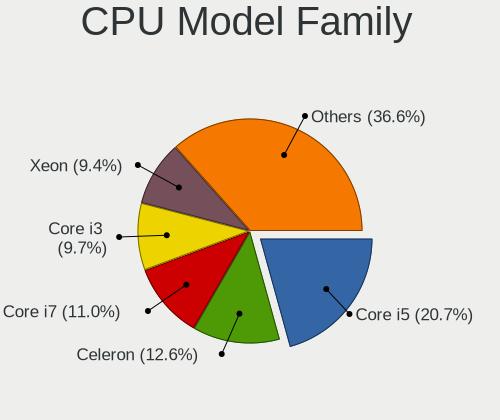

| Model                   | Computers | Percent |
|-------------------------|-----------|---------|
| Intel Core i5           | 92        | 21%     |
| Intel Celeron           | 59        | 13.47%  |
| Intel Core i7           | 50        | 11.42%  |
| Intel Core i3           | 45        | 10.27%  |
| Intel Xeon              | 33        | 7.53%   |
| AMD GX                  | 23        | 5.25%   |
| Intel Atom              | 21        | 4.79%   |
| Other                   | 14        | 3.2%    |
| Intel Core 2 Duo        | 12        | 2.74%   |
| AMD Ryzen 7             | 12        | 2.74%   |
| AMD Ryzen 5             | 11        | 2.51%   |
| Intel Pentium           | 8         | 1.83%   |
| Intel Core 2 Quad       | 7         | 1.6%    |
| AMD Ryzen 7 PRO         | 4         | 0.91%   |
| AMD EPYC                | 4         | 0.91%   |
| Intel 686-class         | 3         | 0.68%   |
| AMD Opteron             | 3         | 0.68%   |
| AMD G                   | 3         | 0.68%   |
| AMD A8                  | 3         | 0.68%   |
| Intel Xeon Silver       | 2         | 0.46%   |
| Intel Pentium Gold      | 2         | 0.46%   |
| AMD Ryzen 3             | 2         | 0.46%   |
| AMD E1                  | 2         | 0.46%   |
| AMD E                   | 2         | 0.46%   |
| AMD Athlon 64 X2        | 2         | 0.46%   |
| AMD Athlon              | 2         | 0.46%   |
| AMD A4                  | 2         | 0.46%   |
| Intel Pentium Silver    | 1         | 0.23%   |
| Intel Pentium M         | 1         | 0.23%   |
| Intel Pentium Dual-Core | 1         | 0.23%   |
| Intel Pentium Dual      | 1         | 0.23%   |
| Intel Genuine           | 1         | 0.23%   |
| Intel Core M            | 1         | 0.23%   |
| Intel Core 2            | 1         | 0.23%   |
| ARM Cortex              | 1         | 0.23%   |
| AMD Ryzen 9             | 1         | 0.23%   |
| AMD Ryzen 5 PRO         | 1         | 0.23%   |
| AMD Phenom II X4        | 1         | 0.23%   |
| AMD FX                  | 1         | 0.23%   |
| AMD Athlon II X2        | 1         | 0.23%   |

CPU Cores
---------

Number of processor cores

| Number  | Computers | Percent |
|---------|-----------|---------|
| 4       | 189       | 43.25%  |
| 2       | 150       | 34.32%  |
| Unknown | 25        | 5.72%   |
| 8       | 21        | 4.81%   |
| 6       | 15        | 3.43%   |
| 16      | 14        | 3.2%    |
| 12      | 14        | 3.2%    |
| 1       | 3         | 0.69%   |
| 64      | 2         | 0.46%   |
| 32      | 2         | 0.46%   |
| 24      | 1         | 0.23%   |
| 10      | 1         | 0.23%   |

CPU Sockets
-----------

Number of sockets

| Number  | Computers | Percent |
|---------|-----------|---------|
| 1       | 411       | 94.48%  |
| Unknown | 13        | 2.99%   |
| 2       | 9         | 2.07%   |
| 4       | 2         | 0.46%   |

CPU Threads
-----------

Threads per core (Hyper-Threading)

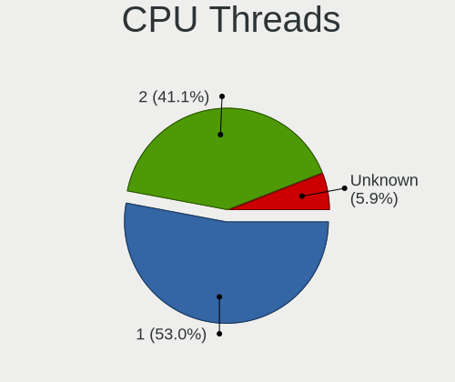

| Number  | Computers | Percent |
|---------|-----------|---------|
| 1       | 227       | 52.06%  |
| 2       | 183       | 41.97%  |
| Unknown | 26        | 5.96%   |

CPU Microarch
-------------

Microarchitecture

| Name          | Computers | Percent |
|---------------|-----------|---------|
| KabyLake      | 64        | 14.61%  |
| Haswell       | 48        | 10.96%  |
| IvyBridge     | 36        | 8.22%   |
| SandyBridge   | 30        | 6.85%   |
| Skylake       | 28        | 6.39%   |
| Silvermont    | 28        | 6.39%   |
| Unknown       | 25        | 5.71%   |
| Puma          | 20        | 4.57%   |
| Penryn        | 17        | 3.88%   |
| Broadwell     | 14        | 3.2%    |
| Goldmont plus | 13        | 2.97%   |
| Westmere      | 11        | 2.51%   |
| Bonnell       | 11        | 2.51%   |
| Zen 2         | 10        | 2.28%   |
| Goldmont      | 9         | 2.05%   |
| Core          | 9         | 2.05%   |
| Zen+          | 8         | 1.83%   |
| Zen 3         | 8         | 1.83%   |
| Zen           | 7         | 1.6%    |
| Nehalem       | 7         | 1.6%    |
| Jaguar        | 7         | 1.6%    |
| Bobcat        | 6         | 1.37%   |
| Piledriver    | 5         | 1.14%   |
| CometLake     | 4         | 0.91%   |
| TigerLake     | 3         | 0.68%   |
| Excavator     | 3         | 0.68%   |
| Steamroller   | 2         | 0.46%   |
| K10           | 2         | 0.46%   |
| P6            | 1         | 0.23%   |
| K8 Hammer     | 1         | 0.23%   |
| K10 Llano     | 1         | 0.23%   |

Graphics
--------

GPU Vendor
----------

Vendors of graphics cards

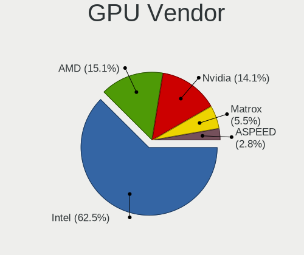

| Vendor                     | Computers | Percent |
|----------------------------|-----------|---------|
| Intel                      | 266       | 63.03%  |
| AMD                        | 64        | 15.17%  |
| Nvidia                     | 58        | 13.74%  |
| Matrox Electronics Systems | 22        | 5.21%   |
| ASPEED Technology          | 12        | 2.84%   |

GPU Model
---------

Graphics card models

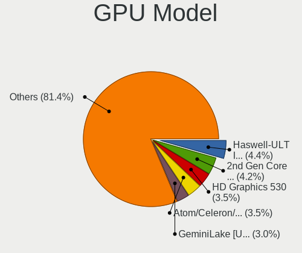

| Model                                                                                    | Computers | Percent |
|------------------------------------------------------------------------------------------|-----------|---------|
| Intel Haswell-ULT Integrated Graphics Controller                                         | 19        | 4.43%   |
| Intel 2nd Generation Core Processor Family Integrated Graphics Controller                | 18        | 4.2%    |
| Intel HD Graphics 530                                                                    | 15        | 3.5%    |
| Intel Atom/Celeron/Pentium Processor x5-E8000/J3xxx/N3xxx Integrated Graphics Controller | 15        | 3.5%    |
| Intel GeminiLake [UHD Graphics 600]                                                      | 13        | 3.03%   |
| Matrox Electronics Systems MGA G200eW WPCM450                                            | 12        | 2.8%    |
| ASPEED Technology ASPEED Graphics Family                                                 | 12        | 2.8%    |
| Intel Xeon E3-1200 v2/3rd Gen Core processor Graphics Controller                         | 11        | 2.56%   |
| Intel JasperLake [UHD Graphics]                                                          | 11        | 2.56%   |
| Intel HD Graphics 620                                                                    | 11        | 2.56%   |
| Intel 3rd Gen Core processor Graphics Controller                                         | 11        | 2.56%   |
| Intel Xeon E3-1200 v3/4th Gen Core Processor Integrated Graphics Controller              | 10        | 2.33%   |
| Intel Atom Processor Z36xxx/Z37xxx Series Graphics & Display                             | 10        | 2.33%   |
| Intel HD Graphics 630                                                                    | 9         | 2.1%    |
| Intel CoffeeLake-S GT2 [UHD Graphics 630]                                                | 9         | 2.1%    |
| Intel HD Graphics 5500                                                                   | 8         | 1.86%   |
| Intel WhiskeyLake-U GT2 [UHD Graphics 620]                                               | 6         | 1.4%    |
| Intel CometLake-U GT2 [UHD Graphics]                                                     | 6         | 1.4%    |
| Intel UHD Graphics 620                                                                   | 5         | 1.17%   |
| Intel HD Graphics 510                                                                    | 5         | 1.17%   |
| Intel HD Graphics 500                                                                    | 5         | 1.17%   |
| AMD ES1000                                                                               | 5         | 1.17%   |
| Nvidia GT218 [GeForce 210]                                                               | 4         | 0.93%   |
| Intel Skylake GT2 [HD Graphics 520]                                                      | 4         | 0.93%   |
| Intel Mobile 4 Series Chipset Integrated Graphics Controller                             | 4         | 0.93%   |
| Intel IvyBridge GT2 [HD Graphics 4000]                                                   | 4         | 0.93%   |
| Intel Haswell-ULT Integrated Graphics Controller [HD Graphics]                           | 4         | 0.93%   |
| Intel CoffeeLake-H GT2 [UHD Graphics 630]                                                | 4         | 0.93%   |
| Intel Atom Processor D4xx/D5xx/N4xx/N5xx Integrated Graphics Controller                  | 4         | 0.93%   |
| Intel 4th Gen Core Processor Integrated Graphics Controller                              | 4         | 0.93%   |
| AMD Cezanne [Radeon Vega Series / Radeon Vega Mobile Series]                             | 4         | 0.93%   |
| Nvidia TU116 [GeForce GTX 1660 Ti]                                                       | 3         | 0.7%    |
| Nvidia GT216GLM [Quadro FX 880M]                                                         | 3         | 0.7%    |
| Nvidia GK208B [GeForce GT 710]                                                           | 3         | 0.7%    |
| Nvidia GF117M [GeForce 610M/710M/810M/820M / GT 620M/625M/630M/720M]                     | 3         | 0.7%    |
| Matrox Electronics Systems MGA G200EH                                                    | 3         | 0.7%    |
| Matrox Electronics Systems G200eR2                                                       | 3         | 0.7%    |
| Intel HD Graphics 6000                                                                   | 3         | 0.7%    |
| Intel CometLake-S GT2 [UHD Graphics 630]                                                 | 3         | 0.7%    |
| Intel CoffeeLake-U GT3e [Iris Plus Graphics 655]                                         | 3         | 0.7%    |

GPU Combo
---------

Combinations of graphics cards

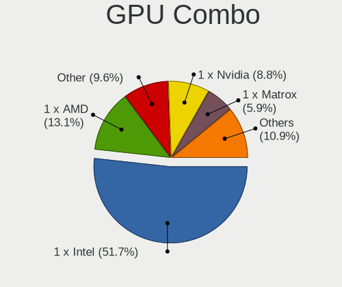

| Name                     | Computers | Percent |
|--------------------------|-----------|---------|
| 1 x Intel                | 232       | 52.97%  |
| 1 x AMD                  | 59        | 13.47%  |
| Other                    | 39        | 8.9%    |
| 1 x Nvidia               | 38        | 8.68%   |
| 1 x Matrox               | 22        | 5.02%   |
| Intel + Nvidia           | 17        | 3.88%   |
| 2 x Intel                | 14        | 3.2%    |
| 1 x ASPEED               | 11        | 2.51%   |
| Intel + AMD              | 2         | 0.46%   |
| 2 x AMD                  | 1         | 0.23%   |
| Nvidia + ASPEED          | 1         | 0.23%   |
| Intel + AMD + 1 x Nvidia | 1         | 0.23%   |
| AMD + Nvidia             | 1         | 0.23%   |

GPU Driver
----------

Free vs proprietary

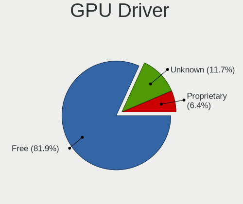

| Driver      | Computers | Percent |
|-------------|-----------|---------|
| Free        | 364       | 82.92%  |
| Unknown     | 47        | 10.71%  |
| Proprietary | 28        | 6.38%   |

GPU Memory
----------

Total video memory

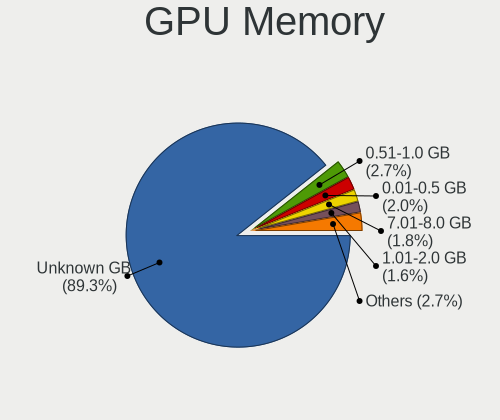

| Size in GB | Computers | Percent |
|------------|-----------|---------|
| Unknown    | 385       | 88.1%   |
| 0.51-1.0   | 15        | 3.43%   |
| 0.01-0.5   | 10        | 2.29%   |
| 1.01-2.0   | 8         | 1.83%   |
| 7.01-8.0   | 7         | 1.6%    |
| 5.01-6.0   | 7         | 1.6%    |
| 3.01-4.0   | 3         | 0.69%   |
| 8.01-16.0  | 2         | 0.46%   |

Monitor
-------

Monitor Vendor
--------------

Monitor vendors

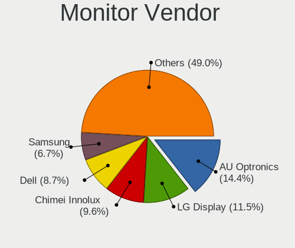

| Vendor                  | Computers | Percent |
|-------------------------|-----------|---------|
| AU Optronics            | 20        | 13.33%  |
| LG Display              | 14        | 9.33%   |
| Chimei Innolux          | 14        | 9.33%   |
| Dell                    | 13        | 8.67%   |
| Samsung Electronics     | 11        | 7.33%   |
| BOE                     | 10        | 6.67%   |
| Iiyama                  | 7         | 4.67%   |
| Hewlett-Packard         | 6         | 4%      |
| Idek Iiyama             | 5         | 3.33%   |
| Apple                   | 5         | 3.33%   |
| Acer                    | 5         | 3.33%   |
| Philips                 | 4         | 2.67%   |
| Goldstar                | 4         | 2.67%   |
| Chi Mei Optoelectronics | 4         | 2.67%   |
| BenQ                    | 3         | 2%      |
| AOC                     | 3         | 2%      |
| Ancor Communications    | 3         | 2%      |
| ViewSonic               | 2         | 1.33%   |
| LGD                     | 2         | 1.33%   |
| Lenovo                  | 2         | 1.33%   |
| Sony                    | 1         | 0.67%   |
| Sharp                   | 1         | 0.67%   |
| PRI                     | 1         | 0.67%   |
| PKB                     | 1         | 0.67%   |
| Packard Bell            | 1         | 0.67%   |
| Nvidia                  | 1         | 0.67%   |
| LG Electronics          | 1         | 0.67%   |
| Lenovo Group Limited    | 1         | 0.67%   |
| IBM                     | 1         | 0.67%   |
| CSO                     | 1         | 0.67%   |
| CPT                     | 1         | 0.67%   |
| CKL                     | 1         | 0.67%   |
| ASUSTek Computer        | 1         | 0.67%   |

Monitor Model
-------------

Monitor models

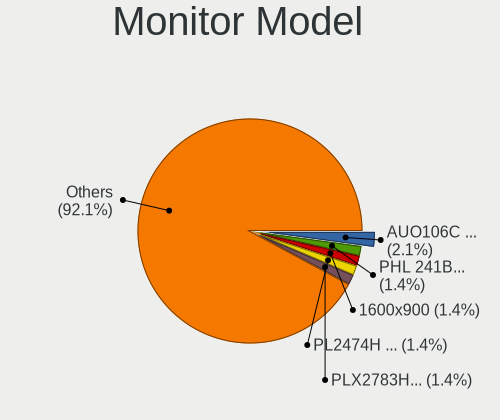

| Model                                                                    | Computers | Percent |
|--------------------------------------------------------------------------|-----------|---------|
| AU Optronics LCD Monitor AUO106C 1366x768 280x160mm 12.7-inch            | 3         | 2%      |
| Philips PHL 241B8Q PHL0929 1920x1080 530x300mm 24.0-inch                 | 2         | 1.33%   |
| LGD LCD Monitor 1600x900                                                 | 2         | 1.33%   |
| Iiyama PL2474H IVM6137 1920x1080 520x290mm 23.4-inch                     | 2         | 1.33%   |
| Idek Iiyama LCD Monitor PLX2783H 1920x1080                               | 2         | 1.33%   |
| Chimei Innolux LCD Monitor CMN1343 1920x1080 280x160mm 12.7-inch         | 2         | 1.33%   |
| Chi Mei Optoelectronics LCD Monitor CMO15A7 1366x768 350x190mm 15.7-inch | 2         | 1.33%   |
| BOE LCD Monitor BOE0700 1920x1080 340x190mm 15.3-inch                    | 2         | 1.33%   |
| BenQ EW3270U BNQ7950 3840x2160 700x390mm 31.5-inch                       | 2         | 1.33%   |
| AU Optronics LCD Monitor AUO34ED 1920x1080 340x190mm 15.3-inch           | 2         | 1.33%   |
| AU Optronics LCD Monitor AUO313C 1366x768 310x170mm 13.9-inch            | 2         | 1.33%   |
| AOC 24G1WG4 AOC2401 1920x1080 520x290mm 23.4-inch                        | 2         | 1.33%   |
| Acer V223HQ ACR0070 1920x1080 470x270mm 21.3-inch                        | 2         | 1.33%   |
| ViewSonic VA2403-FHD VSCF136 1920x1080 520x290mm 23.4-inch               | 1         | 0.67%   |
| ViewSonic VA2223-FHD VSC9239 1920x1080 480x270mm 21.7-inch               | 1         | 0.67%   |
| Sony TV  *00 SNYF903 3840x2160 950x540mm 43.0-inch                       | 1         | 0.67%   |
| Sharp LCD Monitor SHP14B9 3840x2160 340x190mm 15.3-inch                  | 1         | 0.67%   |
| Samsung Electronics SyncMaster SAM036F 1440x900 410x260mm 19.1-inch      | 1         | 0.67%   |
| Samsung Electronics LCD Monitor SyncMaster 3520x1200                     | 1         | 0.67%   |
| Samsung Electronics LCD Monitor SEC544E 1024x600 220x130mm 10.1-inch     | 1         | 0.67%   |
| Samsung Electronics LCD Monitor SEC5448 1920x1080 410x230mm 18.5-inch    | 1         | 0.67%   |
| Samsung Electronics LCD Monitor SEC5442 1440x900 300x190mm 14.0-inch     | 1         | 0.67%   |
| Samsung Electronics LCD Monitor SEC3659 1600x900 340x190mm 15.3-inch     | 1         | 0.67%   |
| Samsung Electronics LCD Monitor SEC334A 1366x768 340x190mm 15.3-inch     | 1         | 0.67%   |
| Samsung Electronics LCD Monitor SDC5441 1366x768 310x170mm 13.9-inch     | 1         | 0.67%   |
| Samsung Electronics LCD Monitor SDC4852 1366x768 340x190mm 15.3-inch     | 1         | 0.67%   |
| Samsung Electronics LCD Monitor S24R35x 1920x1080                        | 1         | 0.67%   |
| Samsung Electronics C24F390 SAM0D2C 1920x1080 520x290mm 23.4-inch        | 1         | 0.67%   |
| PRI LED-MONITOR PRI0828 3840x2160 1150x650mm 52.0-inch                   | 1         | 0.67%   |
| PKB LCD Monitor MAE200W 1680x1050                                        | 1         | 0.67%   |
| Philips PHL 439P1 PHL0973 3840x2160 940x530mm 42.5-inch                  | 1         | 0.67%   |
| Philips LCD Monitor PHLC00B 1280x1024 340x270mm 17.1-inch                | 1         | 0.67%   |
| Packard Bell Viseo 200Ws PKB00C2 1600x900 440x250mm 19.9-inch            | 1         | 0.67%   |
| Nvidia LCD Monitor Default Flat Panel 1440x900                           | 1         | 0.67%   |
| LG Electronics LCD Monitor LG ULTRAWIDE 2560x1080                        | 1         | 0.67%   |
| LG Display LCD Monitor LGD7001 1366x768 340x190mm 15.3-inch              | 1         | 0.67%   |
| LG Display LCD Monitor LGD063F 1920x1080 380x210mm 17.1-inch             | 1         | 0.67%   |
| LG Display LCD Monitor LGD05FA 1920x1080 310x170mm 13.9-inch             | 1         | 0.67%   |
| LG Display LCD Monitor LGD0521 1920x1080 310x170mm 13.9-inch             | 1         | 0.67%   |
| LG Display LCD Monitor LGD0438 1366x768 340x190mm 15.3-inch              | 1         | 0.67%   |

Monitor Resolution
------------------

Monitor screen resolution

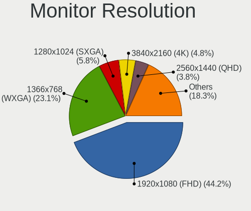

| Resolution         | Computers | Percent |
|--------------------|-----------|---------|
| 1920x1080 (FHD)    | 63        | 43.15%  |
| 1366x768 (WXGA)    | 28        | 19.18%  |
| 2560x1440 (QHD)    | 10        | 6.85%   |
| 3840x2160 (4K)     | 8         | 5.48%   |
| 1600x900 (HD+)     | 8         | 5.48%   |
| 1280x1024 (SXGA)   | 7         | 4.79%   |
| 1280x800 (WXGA)    | 5         | 3.42%   |
| 1680x1050 (WSXGA+) | 4         | 2.74%   |
| 1440x900 (WXGA+)   | 4         | 2.74%   |
| 1920x1200 (WUXGA)  | 2         | 1.37%   |
| 1024x600           | 2         | 1.37%   |
| 3520x1200          | 1         | 0.68%   |
| 2880x1800          | 1         | 0.68%   |
| 2560x1080          | 1         | 0.68%   |
| 1440x960           | 1         | 0.68%   |
| Unknown            | 1         | 0.68%   |

Monitor Diagonal
----------------

Diagonal size in inches

| Inches  | Computers | Percent |
|---------|-----------|---------|
| 15      | 29        | 19.46%  |
| 13      | 25        | 16.78%  |
| Unknown | 14        | 9.4%    |
| 12      | 12        | 8.05%   |
| 24      | 11        | 7.38%   |
| 23      | 10        | 6.71%   |
| 27      | 8         | 5.37%   |
| 21      | 8         | 5.37%   |
| 19      | 8         | 5.37%   |
| 17      | 8         | 5.37%   |
| 10      | 3         | 2.01%   |
| 52      | 2         | 1.34%   |
| 31      | 2         | 1.34%   |
| 14      | 2         | 1.34%   |
| 11      | 2         | 1.34%   |
| 43      | 1         | 0.67%   |
| 42      | 1         | 0.67%   |
| 26      | 1         | 0.67%   |
| 22      | 1         | 0.67%   |
| 18      | 1         | 0.67%   |

Monitor Width
-------------

Physical width

| Width in mm | Computers | Percent |
|-------------|-----------|---------|
| 301-350     | 52        | 35.14%  |
| 501-600     | 28        | 18.92%  |
| 201-300     | 24        | 16.22%  |
| 401-500     | 14        | 9.46%   |
| Unknown     | 14        | 9.46%   |
| 351-400     | 9         | 6.08%   |
| 601-700     | 3         | 2.03%   |
| 1001-1500   | 2         | 1.35%   |
| 901-1000    | 2         | 1.35%   |

Aspect Ratio
------------

Proportional relationship between the width and the height

| Ratio   | Computers | Percent |
|---------|-----------|---------|
| 16/9    | 103       | 74.64%  |
| Unknown | 14        | 10.14%  |
| 16/10   | 12        | 8.7%    |
| 5/4     | 7         | 5.07%   |
| 3/2     | 2         | 1.45%   |

Monitor Area
------------

Area in inch²

| Area in inch² | Computers | Percent |
|----------------|-----------|---------|
| 81-90          | 26        | 17.45%  |
| 91-100         | 25        | 16.78%  |
| 201-250        | 24        | 16.11%  |
| Unknown        | 14        | 9.4%    |
| 61-70          | 12        | 8.05%   |
| 151-200        | 11        | 7.38%   |
| 301-350        | 9         | 6.04%   |
| 121-130        | 5         | 3.36%   |
| 141-150        | 4         | 2.68%   |
| 101-110        | 4         | 2.68%   |
| 41-50          | 3         | 2.01%   |
| 251-300        | 3         | 2.01%   |
| More than 1000 | 2         | 1.34%   |
| 51-60          | 2         | 1.34%   |
| 351-500        | 2         | 1.34%   |
| 501-1000       | 2         | 1.34%   |
| 71-80          | 1         | 0.67%   |

Pixel Density
-------------

Pixels per inch

| Density       | Computers | Percent |
|---------------|-----------|---------|
| 121-160       | 45        | 30.61%  |
| 101-120       | 42        | 28.57%  |
| 51-100        | 37        | 25.17%  |
| Unknown       | 14        | 9.52%   |
| 161-240       | 5         | 3.4%    |
| More than 240 | 3         | 2.04%   |
| 1-50          | 1         | 0.68%   |

Multiple Monitors
-----------------

Total monitors connected

| Total | Computers | Percent |
|-------|-----------|---------|
| 0     | 281       | 63.43%  |
| 1     | 148       | 33.41%  |
| 2     | 14        | 3.16%   |

Network
-------

Net Controller Vendor
---------------------

Controller vendors

| Vendor                          | Computers | Percent |
|---------------------------------|-----------|---------|
| Intel                           | 302       | 48.24%  |
| Realtek Semiconductor           | 162       | 25.88%  |
| Broadcom                        | 48        | 7.67%   |
| Qualcomm Atheros                | 45        | 7.19%   |
| TP-Link                         | 5         | 0.8%    |
| Marvell Technology Group        | 5         | 0.8%    |
| AMD                             | 5         | 0.8%    |
| VIA Technologies                | 3         | 0.48%   |
| Ralink Technology               | 3         | 0.48%   |
| Qualcomm                        | 3         | 0.48%   |
| Mellanox Technologies           | 3         | 0.48%   |
| IMC Networks                    | 3         | 0.48%   |
| Huawei Technologies             | 3         | 0.48%   |
| Edimax Technology               | 3         | 0.48%   |
| D-Link System                   | 3         | 0.48%   |
| Apple                           | 3         | 0.48%   |
| Xiaomi                          | 2         | 0.32%   |
| Sierra Wireless                 | 2         | 0.32%   |
| Ralink                          | 2         | 0.32%   |
| QLogic                          | 2         | 0.32%   |
| Nvidia                          | 2         | 0.32%   |
| MediaTek                        | 2         | 0.32%   |
| Chelsio Communications          | 2         | 0.32%   |
| 3Com                            | 2         | 0.32%   |
| Silicom                         | 1         | 0.16%   |
| Samsung Electronics             | 1         | 0.16%   |
| Sagem                           | 1         | 0.16%   |
| Qualcomm Atheros Communications | 1         | 0.16%   |
| Microchip Technology            | 1         | 0.16%   |
| Hewlett-Packard                 | 1         | 0.16%   |
| Emulex                          | 1         | 0.16%   |
| Dell                            | 1         | 0.16%   |
| Aquantia                        | 1         | 0.16%   |
| American Megatrends             | 1         | 0.16%   |
| Accton Technology               | 1         | 0.16%   |

Net Controller Model
--------------------

Controller models

| Model                                                                         | Computers | Percent |
|-------------------------------------------------------------------------------|-----------|---------|
| Realtek RTL8111/8168/8411 PCI Express Gigabit Ethernet Controller             | 139       | 17.68%  |
| Intel I211 Gigabit Network Connection                                         | 56        | 7.12%   |
| Intel I210 Gigabit Network Connection                                         | 25        | 3.18%   |
| Intel 82574L Gigabit Network Connection                                       | 25        | 3.18%   |
| Intel 82579LM Gigabit Network Connection (Lewisville)                         | 21        | 2.67%   |
| Intel Ethernet Controller I225-V                                              | 15        | 1.91%   |
| Intel Wi-Fi 6 AX200                                                           | 12        | 1.53%   |
| Intel I350 Gigabit Network Connection                                         | 12        | 1.53%   |
| Intel Ethernet Connection I217-LM                                             | 12        | 1.53%   |
| Intel Wireless 8265 / 8275                                                    | 11        | 1.4%    |
| Realtek RTL8125 2.5GbE Controller                                             | 10        | 1.27%   |
| Intel Wireless 7265                                                           | 10        | 1.27%   |
| Intel Ethernet Connection (2) I219-LM                                         | 10        | 1.27%   |
| Intel Wireless 7260                                                           | 9         | 1.15%   |
| Intel 82599ES 10-Gigabit SFI/SFP+ Network Connection                          | 9         | 1.15%   |
| Qualcomm Atheros AR9485 Wireless Network Adapter                              | 8         | 1.02%   |
| Intel Centrino Advanced-N 6205 [Taylor Peak]                                  | 8         | 1.02%   |
| Intel 82571EB/82571GB Gigabit Ethernet Controller D0/D1 (copper applications) | 8         | 1.02%   |
| Broadcom NetXtreme II BCM5709 Gigabit Ethernet                                | 8         | 1.02%   |
| Qualcomm Atheros AR9285 Wireless Network Adapter (PCI-Express)                | 7         | 0.89%   |
| Intel Ethernet Controller I226-V                                              | 7         | 0.89%   |
| Intel Dual Band Wireless-AC 3168NGW [Stone Peak]                              | 7         | 0.89%   |
| Intel Cannon Point-LP CNVi [Wireless-AC]                                      | 7         | 0.89%   |
| Broadcom NetXtreme BCM5720 Gigabit Ethernet PCIe                              | 7         | 0.89%   |
| Qualcomm Atheros QCA9377 802.11ac Wireless Network Adapter                    | 6         | 0.76%   |
| Qualcomm Atheros AR928X Wireless Network Adapter (PCI-Express)                | 6         | 0.76%   |
| Intel Wireless-AC 9260                                                        | 6         | 0.76%   |
| Intel Wireless 3165                                                           | 6         | 0.76%   |
| Intel Ethernet Connection (6) I219-V                                          | 6         | 0.76%   |
| Intel Comet Lake PCH-LP CNVi WiFi                                             | 6         | 0.76%   |
| Intel 82576 Gigabit Network Connection                                        | 6         | 0.76%   |
| Realtek RTL810xE PCI Express Fast Ethernet controller                         | 5         | 0.64%   |
| Intel Ethernet Controller X710 for 10GbE SFP+                                 | 5         | 0.64%   |
| Intel Ethernet Connection (4) I219-V                                          | 5         | 0.64%   |
| Intel Ethernet Connection (3) I218-LM                                         | 5         | 0.64%   |
| Intel Centrino Advanced-N 6235                                                | 5         | 0.64%   |
| Intel 82579V Gigabit Network Connection                                       | 5         | 0.64%   |
| Broadcom NetXtreme II BCM57810 10 Gigabit Ethernet                            | 5         | 0.64%   |
| Realtek RTL8821CE 802.11ac PCIe Wireless Network Adapter                      | 4         | 0.51%   |
| Realtek RTL8812AE 802.11ac PCIe Wireless Network Adapter                      | 4         | 0.51%   |

Wireless Vendor
---------------

Wireless vendors

| Vendor                          | Computers | Percent |
|---------------------------------|-----------|---------|
| Intel                           | 118       | 55.4%   |
| Qualcomm Atheros                | 38        | 17.84%  |
| Realtek Semiconductor           | 23        | 10.8%   |
| Broadcom                        | 12        | 5.63%   |
| TP-Link                         | 5         | 2.35%   |
| Ralink Technology               | 3         | 1.41%   |
| IMC Networks                    | 3         | 1.41%   |
| Edimax Technology               | 3         | 1.41%   |
| Ralink                          | 2         | 0.94%   |
| MediaTek                        | 2         | 0.94%   |
| Sagem                           | 1         | 0.47%   |
| Qualcomm Atheros Communications | 1         | 0.47%   |
| Dell                            | 1         | 0.47%   |
| Accton Technology               | 1         | 0.47%   |

Wireless Model
--------------

Wireless models

| Model                                                          | Computers | Percent |
|----------------------------------------------------------------|-----------|---------|
| Intel Wi-Fi 6 AX200                                            | 12        | 5.56%   |
| Intel Wireless 8265 / 8275                                     | 11        | 5.09%   |
| Intel Wireless 7265                                            | 10        | 4.63%   |
| Intel Wireless 7260                                            | 9         | 4.17%   |
| Qualcomm Atheros AR9485 Wireless Network Adapter               | 8         | 3.7%    |
| Intel Centrino Advanced-N 6205 [Taylor Peak]                   | 8         | 3.7%    |
| Qualcomm Atheros AR9285 Wireless Network Adapter (PCI-Express) | 7         | 3.24%   |
| Intel Dual Band Wireless-AC 3168NGW [Stone Peak]               | 7         | 3.24%   |
| Intel Cannon Point-LP CNVi [Wireless-AC]                       | 7         | 3.24%   |
| Qualcomm Atheros QCA9377 802.11ac Wireless Network Adapter     | 6         | 2.78%   |
| Qualcomm Atheros AR928X Wireless Network Adapter (PCI-Express) | 6         | 2.78%   |
| Intel Wireless-AC 9260                                         | 6         | 2.78%   |
| Intel Wireless 3165                                            | 6         | 2.78%   |
| Intel Comet Lake PCH-LP CNVi WiFi                              | 6         | 2.78%   |
| Intel Centrino Advanced-N 6235                                 | 5         | 2.31%   |
| Realtek RTL8821CE 802.11ac PCIe Wireless Network Adapter       | 4         | 1.85%   |
| Realtek RTL8812AE 802.11ac PCIe Wireless Network Adapter       | 4         | 1.85%   |
| Realtek RTL8188EUS 802.11n Wireless Network Adapter            | 4         | 1.85%   |
| Intel Wireless 8260                                            | 4         | 1.85%   |
| Intel Wi-Fi 6 AX210/AX211/AX411 160MHz                         | 4         | 1.85%   |
| Intel PRO/Wireless 3945ABG [Golan] Network Connection          | 4         | 1.85%   |
| Intel Cannon Lake PCH CNVi WiFi                                | 4         | 1.85%   |
| Intel PRO/Wireless 5100 AGN [Shiloh] Network Connection        | 3         | 1.39%   |
| IMC Networks 802.11 n/g/b Wireless LAN USB Mini-Card           | 3         | 1.39%   |
| Edimax EW-7811Un 802.11n Wireless Adapter [Realtek RTL8188CUS] | 3         | 1.39%   |
| Broadcom BCM43224 802.11a/b/g/n                                | 3         | 1.39%   |
| TP-Link TL-WN722N v2/v3 [Realtek RTL8188EUS]                   | 2         | 0.93%   |
| Realtek RTL88x2bu [AC1200 Techkey]                             | 2         | 0.93%   |
| Realtek RTL8191SU 802.11n WLAN Adapter                         | 2         | 0.93%   |
| Realtek RTL8188EE Wireless Network Adapter                     | 2         | 0.93%   |
| Ralink RT5370 Wireless Adapter                                 | 2         | 0.93%   |
| Ralink RT3090 Wireless 802.11n 1T/1R PCIe                      | 2         | 0.93%   |
| Qualcomm Atheros QCA9565 / AR9565 Wireless Network Adapter     | 2         | 0.93%   |
| Qualcomm Atheros AR93xx Wireless Network Adapter               | 2         | 0.93%   |
| Intel WiFi Link 5100                                           | 2         | 0.93%   |
| Broadcom BCM4331 802.11a/b/g/n                                 | 2         | 0.93%   |
| Broadcom BCM4321 802.11a/b/g/n                                 | 2         | 0.93%   |
| TP-Link Wireless MU-MIMO USB Adapter                           | 1         | 0.46%   |
| TP-Link TL-WN823N v2/v3 [Realtek RTL8192EU]                    | 1         | 0.46%   |
| TP-Link TL-WN821N v5/v6 [RTL8192EU]                            | 1         | 0.46%   |

Ethernet Vendor
---------------

Ethernet vendors

| Vendor                   | Computers | Percent |
|--------------------------|-----------|---------|
| Intel                    | 252       | 51.53%  |
| Realtek Semiconductor    | 152       | 31.08%  |
| Broadcom                 | 38        | 7.77%   |
| Qualcomm Atheros         | 11        | 2.25%   |
| Marvell Technology Group | 5         | 1.02%   |
| AMD                      | 5         | 1.02%   |
| VIA Technologies         | 3         | 0.61%   |
| Qualcomm                 | 3         | 0.61%   |
| D-Link System            | 3         | 0.61%   |
| Xiaomi                   | 2         | 0.41%   |
| QLogic                   | 2         | 0.41%   |
| Nvidia                   | 2         | 0.41%   |
| Chelsio Communications   | 2         | 0.41%   |
| Apple                    | 2         | 0.41%   |
| 3Com                     | 2         | 0.41%   |
| Silicom                  | 1         | 0.2%    |
| Samsung Electronics      | 1         | 0.2%    |
| Emulex                   | 1         | 0.2%    |
| Aquantia                 | 1         | 0.2%    |
| American Megatrends      | 1         | 0.2%    |

Ethernet Model
--------------

Ethernet models

| Model                                                                         | Computers | Percent |
|-------------------------------------------------------------------------------|-----------|---------|
| Realtek RTL8111/8168/8411 PCI Express Gigabit Ethernet Controller             | 139       | 24.96%  |
| Intel I211 Gigabit Network Connection                                         | 56        | 10.05%  |
| Intel I210 Gigabit Network Connection                                         | 25        | 4.49%   |
| Intel 82574L Gigabit Network Connection                                       | 25        | 4.49%   |
| Intel 82579LM Gigabit Network Connection (Lewisville)                         | 21        | 3.77%   |
| Intel Ethernet Controller I225-V                                              | 15        | 2.69%   |
| Intel I350 Gigabit Network Connection                                         | 12        | 2.15%   |
| Intel Ethernet Connection I217-LM                                             | 12        | 2.15%   |
| Realtek RTL8125 2.5GbE Controller                                             | 10        | 1.8%    |
| Intel Ethernet Connection (2) I219-LM                                         | 10        | 1.8%    |
| Intel 82599ES 10-Gigabit SFI/SFP+ Network Connection                          | 9         | 1.62%   |
| Intel 82571EB/82571GB Gigabit Ethernet Controller D0/D1 (copper applications) | 8         | 1.44%   |
| Broadcom NetXtreme II BCM5709 Gigabit Ethernet                                | 8         | 1.44%   |
| Intel Ethernet Controller I226-V                                              | 7         | 1.26%   |
| Broadcom NetXtreme BCM5720 Gigabit Ethernet PCIe                              | 7         | 1.26%   |
| Intel Ethernet Connection (6) I219-V                                          | 6         | 1.08%   |
| Intel 82576 Gigabit Network Connection                                        | 6         | 1.08%   |
| Realtek RTL810xE PCI Express Fast Ethernet controller                         | 5         | 0.9%    |
| Intel Ethernet Controller X710 for 10GbE SFP+                                 | 5         | 0.9%    |
| Intel Ethernet Connection (4) I219-V                                          | 5         | 0.9%    |
| Intel Ethernet Connection (3) I218-LM                                         | 5         | 0.9%    |
| Intel 82579V Gigabit Network Connection                                       | 5         | 0.9%    |
| Broadcom NetXtreme II BCM57810 10 Gigabit Ethernet                            | 5         | 0.9%    |
| Qualcomm Atheros AR8151 v2.0 Gigabit Ethernet                                 | 4         | 0.72%   |
| Intel Ethernet Connection X553 1GbE                                           | 4         | 0.72%   |
| Intel Ethernet Connection (7) I219-V                                          | 4         | 0.72%   |
| Intel Ethernet Connection (4) I219-LM                                         | 4         | 0.72%   |
| Intel 82567LM Gigabit Network Connection                                      | 4         | 0.72%   |
| Broadcom NetXtreme BCM5722 Gigabit Ethernet PCI Express                       | 4         | 0.72%   |
| AMD Family 17h Processor 10 Gb Ethernet Controller Port 0                     | 4         | 0.72%   |
| Qualcomm ALCATEL RNDIS Interface                                              | 3         | 0.54%   |
| Intel Ethernet Connection I354                                                | 3         | 0.54%   |
| Intel Ethernet Connection I219-LM                                             | 3         | 0.54%   |
| Intel Ethernet Connection (7) I219-LM                                         | 3         | 0.54%   |
| Intel Ethernet Connection (5) I219-LM                                         | 3         | 0.54%   |
| Intel Ethernet Connection (2) I219-V                                          | 3         | 0.54%   |
| Intel Ethernet Connection (11) I219-V                                         | 3         | 0.54%   |
| Intel 82583V Gigabit Network Connection                                       | 3         | 0.54%   |
| Intel 82567LM-3 Gigabit Network Connection                                    | 3         | 0.54%   |
| D-Link System DGE-528T Gigabit Ethernet Adapter                               | 3         | 0.54%   |

Net Controller Kind
-------------------

Ethernet, WiFi or modem

| Kind     | Computers | Percent |
|----------|-----------|---------|
| Ethernet | 419       | 66.72%  |
| WiFi     | 196       | 31.21%  |
| Unknown  | 9         | 1.43%   |
| Modem    | 4         | 0.64%   |

Used Controller
---------------

Currently used network controller

| Kind     | Computers | Percent |
|----------|-----------|---------|
| Ethernet | 375       | 81.34%  |
| WiFi     | 86        | 18.66%  |

NICs
----

Total network controllers on board

| Total | Computers | Percent |
|-------|-----------|---------|
| 2     | 170       | 38.81%  |
| 1     | 79        | 18.04%  |
| 4     | 75        | 17.12%  |
| 3     | 56        | 12.79%  |
| 6     | 18        | 4.11%   |
| 5     | 18        | 4.11%   |
| 8     | 7         | 1.6%    |
| 7     | 5         | 1.14%   |
| 0     | 3         | 0.68%   |
| 12    | 2         | 0.46%   |
| 14    | 1         | 0.23%   |
| 13    | 1         | 0.23%   |
| 11    | 1         | 0.23%   |
| 10    | 1         | 0.23%   |
| 9     | 1         | 0.23%   |

IPv6
----

IPv6 vs IPv4

| Used | Computers | Percent |
|------|-----------|---------|
| No   | 357       | 78.29%  |
| Yes  | 99        | 21.71%  |

Bluetooth
---------

Bluetooth Vendor
----------------

Controller vendors

| Vendor                          | Computers | Percent |
|---------------------------------|-----------|---------|
| Intel                           | 80        | 67.23%  |
| Broadcom                        | 8         | 6.72%   |
| IMC Networks                    | 6         | 5.04%   |
| Realtek Semiconductor           | 5         | 4.2%    |
| Apple                           | 5         | 4.2%    |
| Foxconn / Hon Hai               | 3         | 2.52%   |
| Cambridge Silicon Radio         | 3         | 2.52%   |
| Qualcomm Atheros Communications | 2         | 1.68%   |
| Hewlett-Packard                 | 2         | 1.68%   |
| Dell                            | 2         | 1.68%   |
| HTC (High Tech Computer)        | 1         | 0.84%   |
| Creative Technology             | 1         | 0.84%   |
| ASUSTek Computer                | 1         | 0.84%   |

Bluetooth Model
---------------

Controller models

| Model                                                                | Computers | Percent |
|----------------------------------------------------------------------|-----------|---------|
| Intel Bluetooth wireless interface                                   | 29        | 24.37%  |
| Intel Bluetooth 9460/9560 Jefferson Peak (JfP)                       | 14        | 11.76%  |
| Intel AX200 Bluetooth                                                | 10        | 8.4%    |
| Intel AX201 Bluetooth                                                | 7         | 5.88%   |
| Intel Wireless-AC 3168 Bluetooth                                     | 6         | 5.04%   |
| Intel Centrino Bluetooth Wireless Transceiver                        | 5         | 4.2%    |
| Intel Wireless-AC 9260 Bluetooth Adapter                             | 4         | 3.36%   |
| Intel AX210 Bluetooth                                                | 4         | 3.36%   |
| IMC Networks Qualcomm Atheros Bluetooth 4.1                          | 4         | 3.36%   |
| Cambridge Silicon Radio Bluetooth Dongle (HCI mode)                  | 3         | 2.52%   |
| Apple Bluetooth Host Controller                                      | 3         | 2.52%   |
| Realtek  Bluetooth 4.2 Adapter                                       | 2         | 1.68%   |
| Realtek Bluetooth Adapter                                            | 2         | 1.68%   |
| HP Bluetooth 2.0 Interface [Broadcom BCM2045]                        | 2         | 1.68%   |
| Foxconn / Hon Hai Bluetooth USB Module                               | 2         | 1.68%   |
| Broadcom BCM20702A0 Bluetooth 4.0                                    | 2         | 1.68%   |
| Broadcom BCM20702 Bluetooth 4.0 [ThinkPad]                           | 2         | 1.68%   |
| Broadcom BCM2045B (BDC-2.1)                                          | 2         | 1.68%   |
| Realtek Bluetooth 4.0 Adapter                                        | 1         | 0.84%   |
| Qualcomm Atheros QCA9377 Bluetooth 4.1                               | 1         | 0.84%   |
| Qualcomm Atheros QCA61x4 Bluetooth 4.0                               | 1         | 0.84%   |
| Intel Wireless Bluetooth                                             | 1         | 0.84%   |
| IMC Networks Realtek Bluetooth Adapter                               | 1         | 0.84%   |
| IMC Networks Qualcomm Atheros Bluetooth 4.0 + HS                     | 1         | 0.84%   |
| HTC (High Tech Computer) Vive Hub Bluetooth 4.1 (Broadcom BCM920703) | 1         | 0.84%   |
| Foxconn / Hon Hai RZ616 Bluetooth Adapter                            | 1         | 0.84%   |
| Dell DW375 Bluetooth Module                                          | 1         | 0.84%   |
| Dell Dell Wireless 380 Bluetooth 4.0 Module                          | 1         | 0.84%   |
| Creative Creative Bluetooth Audio W2                                 | 1         | 0.84%   |
| Broadcom BCM43142A0 Bluetooth Module                                 | 1         | 0.84%   |
| Broadcom BCM2045B (BDC-2.1) [Bluetooth Controller]                   | 1         | 0.84%   |
| ASUS Broadcom BCM20702 Single-Chip Bluetooth 4.0 + LE                | 1         | 0.84%   |
| Apple Built-in iSight (no firmware loaded)                           | 1         | 0.84%   |
| Apple Bluetooth USB Host Controller                                  | 1         | 0.84%   |

Sound
-----

Sound Vendor
------------

Sound card vendors

| Vendor                                       | Computers | Percent |
|----------------------------------------------|-----------|---------|
| Intel                                        | 268       | 66.34%  |
| AMD                                          | 68        | 16.83%  |
| Nvidia                                       | 39        | 9.65%   |
| GN Netcom                                    | 4         | 0.99%   |
| C-Media Electronics                          | 4         | 0.99%   |
| Zoran Co. Personal Media Division (Nogatech) | 2         | 0.5%    |
| Texas Instruments                            | 2         | 0.5%    |
| Logitech                                     | 2         | 0.5%    |
| Lenovo                                       | 2         | 0.5%    |
| Kingston Technology                          | 2         | 0.5%    |
| Focusrite-Novation                           | 2         | 0.5%    |
| Creative Labs                                | 2         | 0.5%    |
| VIA Technologies                             | 1         | 0.25%   |
| Sony                                         | 1         | 0.25%   |
| Micronas                                     | 1         | 0.25%   |
| iCreate Technologies                         | 1         | 0.25%   |
| Giga-Byte Technology                         | 1         | 0.25%   |
| ESS Technology                               | 1         | 0.25%   |
| DSEA A/S                                     | 1         | 0.25%   |

Sound Model
-----------

Sound card models

| Model                                                                                             | Computers | Percent |
|---------------------------------------------------------------------------------------------------|-----------|---------|
| Intel 7 Series/C216 Chipset Family High Definition Audio Controller                               | 25        | 5.1%    |
| Intel 6 Series/C200 Series Chipset Family High Definition Audio Controller                        | 24        | 4.9%    |
| Intel Haswell-ULT HD Audio Controller                                                             | 22        | 4.49%   |
| Intel 8 Series HD Audio Controller                                                                | 22        | 4.49%   |
| Intel Sunrise Point-LP HD Audio                                                                   | 21        | 4.29%   |
| Intel 8 Series/C220 Series Chipset High Definition Audio Controller                               | 17        | 3.47%   |
| Intel 100 Series/C230 Series Chipset Family HD Audio Controller                                   | 17        | 3.47%   |
| AMD Family 17h/19h HD Audio Controller                                                            | 15        | 3.06%   |
| Intel Xeon E3-1200 v3/4th Gen Core Processor HD Audio Controller                                  | 14        | 2.86%   |
| AMD FCH Azalia Controller                                                                         | 14        | 2.86%   |
| Intel Cannon Lake PCH cAVS                                                                        | 13        | 2.65%   |
| Intel Wildcat Point-LP High Definition Audio Controller                                           | 12        | 2.45%   |
| Intel Celeron/Pentium Silver Processor High Definition Audio                                      | 12        | 2.45%   |
| Intel Broadwell-U Audio Controller                                                                | 12        | 2.45%   |
| Intel NM10/ICH7 Family High Definition Audio Controller                                           | 10        | 2.04%   |
| Intel Jasper Lake HD Audio                                                                        | 10        | 2.04%   |
| Intel 200 Series PCH HD Audio                                                                     | 10        | 2.04%   |
| AMD Renoir Radeon High Definition Audio Controller                                                | 10        | 2.04%   |
| Intel Cannon Point-LP High Definition Audio Controller                                            | 9         | 1.84%   |
| Intel Atom/Celeron/Pentium Processor x5-E8000/J3xxx/N3xxx Series High Definition Audio Controller | 9         | 1.84%   |
| AMD Family 17h (Models 00h-0fh) HD Audio Controller                                               | 9         | 1.84%   |
| AMD Starship/Matisse HD Audio Controller                                                          | 8         | 1.63%   |
| AMD Kabini HDMI/DP Audio                                                                          | 8         | 1.63%   |
| Intel 82801I (ICH9 Family) HD Audio Controller                                                    | 7         | 1.43%   |
| Intel Comet Lake PCH-LP cAVS                                                                      | 6         | 1.22%   |
| Intel 5 Series/3400 Series Chipset High Definition Audio                                          | 6         | 1.22%   |
| AMD SBx00 Azalia (Intel HDA)                                                                      | 6         | 1.22%   |
| Nvidia High Definition Audio Controller                                                           | 5         | 1.02%   |
| Intel Atom Processor Z36xxx/Z37xxx Series High Definition Audio Controller                        | 5         | 1.02%   |
| Nvidia TU116 High Definition Audio Controller                                                     | 4         | 0.82%   |
| Nvidia GT216 HDMI Audio Controller                                                                | 4         | 0.82%   |
| Intel Celeron N3350/Pentium N4200/Atom E3900 Series Audio Cluster                                 | 4         | 0.82%   |
| AMD Turks HDMI Audio [Radeon HD 6500/6600 / 6700M Series]                                         | 4         | 0.82%   |
| AMD Raven/Raven2/Fenghuang HDMI/DP Audio Controller                                               | 4         | 0.82%   |
| Nvidia TU107 GeForce GTX 1650 High Definition Audio Controller                                    | 3         | 0.61%   |
| Nvidia GK208 HDMI/DP Audio Controller                                                             | 3         | 0.61%   |
| Intel Tiger Lake-LP Smart Sound Technology Audio Controller                                       | 3         | 0.61%   |
| Intel Tiger Lake-H HD Audio Controller                                                            | 3         | 0.61%   |
| Intel Comet Lake PCH cAVS                                                                         | 3         | 0.61%   |
| Intel CM238 HD Audio Controller                                                                   | 3         | 0.61%   |

Memory
------

Memory Vendor
-------------

Memory module vendors

| Vendor              | Computers | Percent |
|---------------------|-----------|---------|
| Samsung Electronics | 87        | 20.52%  |
| SK hynix            | 62        | 14.62%  |
| Kingston            | 44        | 10.38%  |
| Crucial             | 44        | 10.38%  |
| Unknown             | 43        | 10.14%  |
| Corsair             | 34        | 8.02%   |
| Micron Technology   | 29        | 6.84%   |
| G.Skill             | 20        | 4.72%   |
| Unknown             | 9         | 2.12%   |
| Transcend           | 8         | 1.89%   |
| Nanya Technology    | 8         | 1.89%   |
| Unknown (ABCD)      | 6         | 1.42%   |
| Kimtigo             | 5         | 1.18%   |
| Elpida              | 5         | 1.18%   |
| A-DATA Technology   | 3         | 0.71%   |
| Patriot             | 2         | 0.47%   |
| Atermiter           | 2         | 0.47%   |
| Apacer              | 2         | 0.47%   |
| V-Color             | 1         | 0.24%   |
| Unknown (0B38)      | 1         | 0.24%   |
| Toshiba             | 1         | 0.24%   |
| Teikon              | 1         | 0.24%   |
| SHARETRONIC         | 1         | 0.24%   |
| Ramaxel Technology  | 1         | 0.24%   |
| OCZ                 | 1         | 0.24%   |
| Hewlett-Packard     | 1         | 0.24%   |
| Goldenmars          | 1         | 0.24%   |
| CSX                 | 1         | 0.24%   |
| Avant               | 1         | 0.24%   |

Memory Model
------------

Memory module models

| Model                                                        | Computers | Percent |
|--------------------------------------------------------------|-----------|---------|
| Unknown                                                      | 9         | 2.01%   |
| Unknown RAM Module 4GB SODIMM DDR3 1333MT/s                  | 7         | 1.57%   |
| Unknown (ABCD) RAM 123456789012345678 4GB DIMM DDR4 2400MT/s | 6         | 1.34%   |
| SK hynix RAM HMA81GS6CJR8N-VK 8GB SODIMM DDR4 2667MT/s       | 5         | 1.12%   |
| SK hynix RAM HMT451S6BFR8A-PB 4GB SODIMM DDR3 1600MT/s       | 4         | 0.89%   |
| SK hynix RAM HMT351S6CFR8C-H9 4GB SODIMM DDR3 1333MT/s       | 4         | 0.89%   |
| Samsung RAM M471B5173QH0-YK0 4GB SODIMM DDR3 1600MT/s        | 4         | 0.89%   |
| Corsair RAM CMK16GX4M2B3200C16 8GB DIMM DDR4 3200MT/s        | 4         | 0.89%   |
| Unknown RAM Module 2GB SODIMM DDR3 1333MT/s                  | 3         | 0.67%   |
| SK hynix RAM HMT351S6BFR8C-H9 4GB SODIMM DDR3 1334MT/s       | 3         | 0.67%   |
| SK hynix RAM HMA81GU6AFR8N-UH 8GB DIMM DDR4 2400MT/s         | 3         | 0.67%   |
| SK hynix RAM HMA81GS6AFR8N-UH 8GB SODIMM DDR4 2400MT/s       | 3         | 0.67%   |
| Samsung RAM M471B5273DH0-CH9 4GB SODIMM DDR3 1334MT/s        | 3         | 0.67%   |
| Samsung RAM M471B5173DB0-YK0 4GB SODIMM DDR3 1600MT/s        | 3         | 0.67%   |
| Samsung RAM M471A1K43DB1-CTD 8GB SODIMM DDR4 2667MT/s        | 3         | 0.67%   |
| Samsung RAM M471A1K43CB1-CTD 8GB SODIMM DDR4 2667MT/s        | 3         | 0.67%   |
| Samsung RAM M393A4K40CB2-CTD 32GB DIMM DDR4 2667MT/s         | 3         | 0.67%   |
| Samsung RAM M378B5273CH0-CK0 4GB DIMM DDR3 1600MT/s          | 3         | 0.67%   |
| Samsung RAM M378B5173QH0-CK0 4GB DIMM DDR3 1600MT/s          | 3         | 0.67%   |
| Kimtigo RAM KT8GS3EDF 8GB SODIMM DDR3 1600MT/s               | 3         | 0.67%   |
| Crucial RAM CT102464BF160B.C16 8GB SODIMM DDR3 1600MT/s      | 3         | 0.67%   |
| Unknown RAM Module 8GB DIMM DDR3 1600MT/s                    | 2         | 0.45%   |
| Unknown RAM Module 4GB DIMM DDR3 1333MT/s                    | 2         | 0.45%   |
| Unknown RAM Module 4GB DIMM 1333MT/s                         | 2         | 0.45%   |
| Unknown RAM Module 2GB SODIMM DDR3 800MT/s                   | 2         | 0.45%   |
| Unknown RAM Module 2GB SODIMM DDR2 667MT/s                   | 2         | 0.45%   |
| Unknown RAM Module 2048MB DIMM 800MT/s                       | 2         | 0.45%   |
| Transcend RAM TS1GLH64V6B3 8GB SODIMM DDR4 1333MT/s          | 2         | 0.45%   |
| SK hynix RAM HMT41GU7BFR8A-PB 8GB DIMM DDR3 1600MT/s         | 2         | 0.45%   |
| SK hynix RAM HMT41GS6BFR8A-PB 8GB SODIMM DDR3 1600MT/s       | 2         | 0.45%   |
| SK hynix RAM HMT351U6CFR8C-PB 4GB DIMM DDR3 1600MT/s         | 2         | 0.45%   |
| SK hynix RAM HMT351S6CFR8C-PB 4GB SODIMM DDR3 1600MT/s       | 2         | 0.45%   |
| SK hynix RAM HMA851S6CJR6N-VK 4GB SODIMM DDR4 2667MT/s       | 2         | 0.45%   |
| Samsung RAM Module 8GB SODIMM DDR4 2133MT/s                  | 2         | 0.45%   |
| Samsung RAM M471B5773DH0-CH9 2GB SODIMM DDR3 1334MT/s        | 2         | 0.45%   |
| Samsung RAM M471B5773CHS-CK0 2GB DDR3 1600MT/s               | 2         | 0.45%   |
| Samsung RAM M471B5273CH0-CH9 4GB SODIMM DDR3 1334MT/s        | 2         | 0.45%   |
| Samsung RAM M471B5173EB0-YK0 4GB SODIMM DDR3 1600MT/s        | 2         | 0.45%   |
| Samsung RAM M471B5173BH0-YK0 4GB SODIMM DDR3 1600MT/s        | 2         | 0.45%   |
| Samsung RAM M471A2K43CB1-CTD 16GB SODIMM DDR4 2667MT/s       | 2         | 0.45%   |

Memory Kind
-----------

Memory module kinds

| Kind    | Computers | Percent |
|---------|-----------|---------|
| DDR3    | 181       | 48.53%  |
| DDR4    | 147       | 39.41%  |
| DDR2    | 18        | 4.83%   |
| Unknown | 14        | 3.75%   |
| LPDDR4  | 7         | 1.88%   |
| LPDDR3  | 5         | 1.34%   |
| SDRAM   | 1         | 0.27%   |

Memory Form Factor
------------------

Physical design of the memory module

| Name         | Computers | Percent |
|--------------|-----------|---------|
| SODIMM       | 190       | 50.8%   |
| DIMM         | 175       | 46.79%  |
| Unknown      | 4         | 1.07%   |
| Row Of Chips | 3         | 0.8%    |
| FB-DIMM      | 1         | 0.27%   |
| Chip         | 1         | 0.27%   |

Memory Size
-----------

Memory module size

| Size  | Computers | Percent |
|-------|-----------|---------|
| 4096  | 139       | 34.92%  |
| 8192  | 134       | 33.67%  |
| 2048  | 51        | 12.81%  |
| 16384 | 49        | 12.31%  |
| 1024  | 12        | 3.02%   |
| 32768 | 11        | 2.76%   |
| 32767 | 2         | 0.5%    |

Memory Speed
------------

Memory module speed

| Speed   | Computers | Percent |
|---------|-----------|---------|
| 1600    | 110       | 28.35%  |
| 1333    | 64        | 16.49%  |
| 2400    | 48        | 12.37%  |
| 3200    | 40        | 10.31%  |
| 2667    | 39        | 10.05%  |
| 2133    | 22        | 5.67%   |
| 800     | 14        | 3.61%   |
| 1334    | 11        | 2.84%   |
| 667     | 9         | 2.32%   |
| 2666    | 7         | 1.8%    |
| 1867    | 5         | 1.29%   |
| 1066    | 4         | 1.03%   |
| Unknown | 3         | 0.77%   |
| 1067    | 2         | 0.52%   |
| 533     | 2         | 0.52%   |
| 5200    | 1         | 0.26%   |
| 3000    | 1         | 0.26%   |
| 1866    | 1         | 0.26%   |
| 1400    | 1         | 0.26%   |
| 1332    | 1         | 0.26%   |
| 1200    | 1         | 0.26%   |
| 975     | 1         | 0.26%   |
| 400     | 1         | 0.26%   |

Printers & scanners
-------------------

Printer Vendor
--------------

Printer device vendors

| Vendor      | Computers | Percent |
|-------------|-----------|---------|
| Dymo-CoStar | 2         | 66.67%  |
| Seiko Epson | 1         | 33.33%  |

Printer Model
-------------

Printer device models

| Model                                | Computers | Percent |
|--------------------------------------|-----------|---------|
| Seiko Epson Printer                  | 1         | 33.33%  |
| Dymo-CoStar LabelWriter 450          | 1         | 33.33%  |
| Dymo-CoStar DYMO LabelWriter 450 DUO | 1         | 33.33%  |

Scanner Vendor
--------------

Scanner device vendors

| Vendor | Computers | Percent |
|--------|-----------|---------|
| Canon  | 1         | 100%    |

Scanner Model
-------------

Scanner device models

| Model                  | Computers | Percent |
|------------------------|-----------|---------|
| Canon CanoScan LIDE 25 | 1         | 100%    |

Camera
------

Camera Vendor
-------------

Camera device vendors

| Vendor                                 | Computers | Percent |
|----------------------------------------|-----------|---------|
| Chicony Electronics                    | 30        | 31.58%  |
| Sunplus Innovation Technology          | 9         | 9.47%   |
| Bison Electronics                      | 9         | 9.47%   |
| Microdia                               | 8         | 8.42%   |
| Realtek Semiconductor                  | 7         | 7.37%   |
| IMC Networks                           | 5         | 5.26%   |
| Logitech                               | 4         | 4.21%   |
| Syntek                                 | 3         | 3.16%   |
| Quanta                                 | 3         | 3.16%   |
| Lite-On Technology                     | 3         | 3.16%   |
| Cheng Uei Precision Industry (Foxlink) | 3         | 3.16%   |
| ARC International                      | 3         | 3.16%   |
| Suyin                                  | 2         | 2.11%   |
| Alcor Micro                            | 2         | 2.11%   |
| ValueHD                                | 1         | 1.05%   |
| SIMPLO Technology                      | 1         | 1.05%   |
| Novatek Microelectronics               | 1         | 1.05%   |
| Apple                                  | 1         | 1.05%   |

Camera Model
------------

Camera device models

| Model                                               | Computers | Percent |
|-----------------------------------------------------|-----------|---------|
| Chicony Integrated Camera                           | 10        | 10.42%  |
| Bison Integrated Camera                             | 6         | 6.25%   |
| Realtek Integrated_Webcam_HD                        | 3         | 3.13%   |
| Microdia Integrated_Webcam_HD                       | 3         | 3.13%   |
| Microdia Integrated Webcam                          | 3         | 3.13%   |
| Logitech Webcam C270                                | 3         | 3.13%   |
| Chicony HD WebCam                                   | 3         | 3.13%   |
| ARC International Camera                            | 3         | 3.13%   |
| Syntek Integrated Camera                            | 2         | 2.08%   |
| Sunplus SPCA2650 AV Camera                          | 2         | 2.08%   |
| Sunplus Integrated_Webcam_HD                        | 2         | 2.08%   |
| Realtek USB Camera                                  | 2         | 2.08%   |
| Lite-On Integrated Camera                           | 2         | 2.08%   |
| IMC Networks EasyCamera                             | 2         | 2.08%   |
| Chicony TOSHIBA Web Camera - HD                     | 2         | 2.08%   |
| Chicony Realtek DMFT RGB                            | 2         | 2.08%   |
| Cheng Uei Precision Industry (Foxlink) HP HD Webcam | 2         | 2.08%   |
| Bison SunplusIT Integrated Camera                   | 2         | 2.08%   |
| ValueHD HD Camera                                   | 1         | 1.04%   |
| Syntek Lenovo EasyCamera                            | 1         | 1.04%   |
| Suyin USB 2.0 Camera                                | 1         | 1.04%   |
| Suyin Laptop_Integrated_Webcam_FHD                  | 1         | 1.04%   |
| Sunplus Laptop_Integrated_Webcam_HD                 | 1         | 1.04%   |
| Sunplus Laptop_Integrated_Webcam_FHD                | 1         | 1.04%   |
| Sunplus Integrated_Webcam_FHD                       | 1         | 1.04%   |
| Sunplus Integrated HD Webcam                        | 1         | 1.04%   |
| Sunplus Asus Webcam                                 | 1         | 1.04%   |
| SIMPLO USB 2.0 Camera                               | 1         | 1.04%   |
| Realtek Lenovo EasyCamera                           | 1         | 1.04%   |
| Realtek Integrated Webcam HD                        | 1         | 1.04%   |
| Quanta Realtek DMFT RGB                             | 1         | 1.04%   |
| Quanta Integrated Webcam                            | 1         | 1.04%   |
| Quanta HD WebCam                                    | 1         | 1.04%   |
| Novatek HP High Definition 2MP Webcam               | 1         | 1.04%   |
| Microdia Integrated_Webcam_FHD                      | 1         | 1.04%   |
| Microdia Dell Integrated HD Webcam                  | 1         | 1.04%   |
| Logitech C922 Pro Stream Webcam                     | 1         | 1.04%   |
| Lite-On Realtek DMFT RGB                            | 1         | 1.04%   |
| IMC Networks UVC VGA Webcam                         | 1         | 1.04%   |
| IMC Networks USB2.0 HD UVC WebCam                   | 1         | 1.04%   |

Security
--------

Fingerprint Vendor
------------------

Fingerprint sensor vendors

| Vendor                     | Computers | Percent |
|----------------------------|-----------|---------|
| Validity Sensors           | 9         | 30%     |
| Synaptics                  | 7         | 23.33%  |
| AuthenTec                  | 6         | 20%     |
| Upek                       | 2         | 6.67%   |
| Shenzhen Goodix Technology | 2         | 6.67%   |
| Elan Microelectronics      | 2         | 6.67%   |
| LighTuning Technology      | 1         | 3.33%   |
| Broadcom                   | 1         | 3.33%   |

Fingerprint Model
-----------------

Fingerprint sensor models

| Model                                                                        | Computers | Percent |
|------------------------------------------------------------------------------|-----------|---------|
| Synaptics Prometheus MIS Touch Fingerprint Reader                            | 5         | 16.67%  |
| Validity Sensors VFS7500 Touch Fingerprint Sensor                            | 2         | 6.67%   |
| Validity Sensors Synaptics WBDI                                              | 2         | 6.67%   |
| Upek Biometric Touchchip/Touchstrip Fingerprint Sensor                       | 2         | 6.67%   |
| Shenzhen Goodix Fingerprint Reader                                           | 2         | 6.67%   |
| Elan Fingerprint Sensor                                                      | 2         | 6.67%   |
| AuthenTec AES2810                                                            | 2         | 6.67%   |
| AuthenTec AES1660                                                            | 2         | 6.67%   |
| Validity Sensors VFS495 Fingerprint Reader                                   | 1         | 3.33%   |
| Validity Sensors VFS491                                                      | 1         | 3.33%   |
| Validity Sensors VFS451 Fingerprint Reader                                   | 1         | 3.33%   |
| Validity Sensors VFS Fingerprint sensor                                      | 1         | 3.33%   |
| Validity Sensors VFS 5011 fingerprint sensor                                 | 1         | 3.33%   |
| Synaptics UWP WBDI Device                                                    | 1         | 3.33%   |
| Synaptics Metallica MIS Touch Fingerprint Reader                             | 1         | 3.33%   |
| LighTuning EgisTec Touch Fingerprint Sensor                                  | 1         | 3.33%   |
| Broadcom BCM5880 Secure Applications Processor with fingerprint swipe sensor | 1         | 3.33%   |
| AuthenTec AES2550 Fingerprint Sensor                                         | 1         | 3.33%   |
| AuthenTec AES2501 Fingerprint Sensor                                         | 1         | 3.33%   |

Chipcard Vendor
---------------

Chipcard module vendors

Zero info for selected period =(

Chipcard Model
--------------

Chipcard module models

Zero info for selected period =(

Unsupported
-----------

Unsupported Devices
-------------------

Total unsupported devices on board

| Total | Computers | Percent |
|-------|-----------|---------|
| 1     | 187       | 41.1%   |
| 0     | 130       | 28.57%  |
| 2     | 76        | 16.7%   |
| 3     | 38        | 8.35%   |
| 4     | 17        | 3.74%   |
| 6     | 4         | 0.88%   |
| 5     | 2         | 0.44%   |
| 7     | 1         | 0.22%   |

Unsupported Device Types
------------------------

Types of unsupported devices

| Type                     | Computers | Percent |
|--------------------------|-----------|---------|
| Communication controller | 264       | 54.21%  |
| Bluetooth                | 56        | 11.5%   |
| Net/wireless             | 54        | 11.09%  |
| Card reader              | 32        | 6.57%   |
| Firewire controller      | 23        | 4.72%   |
| Fingerprint reader       | 23        | 4.72%   |
| Sound                    | 9         | 1.85%   |
| Net/ethernet             | 8         | 1.64%   |
| Graphics card            | 6         | 1.23%   |
| Storage                  | 5         | 1.03%   |
| Storage/raid             | 3         | 0.62%   |
| Network                  | 3         | 0.62%   |
| Modem                    | 1         | 0.21%   |

