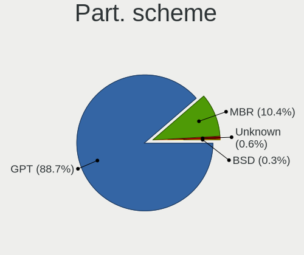
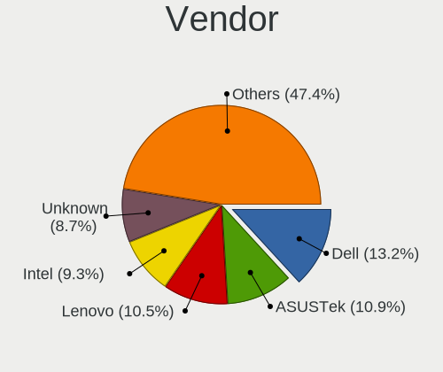
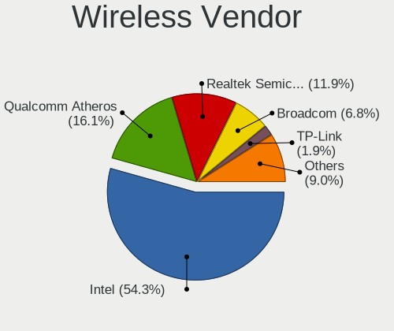
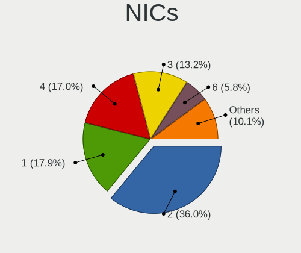
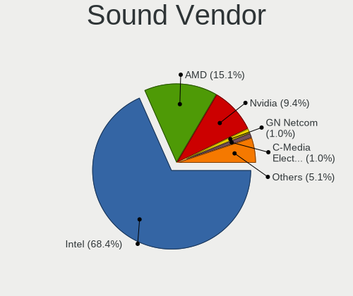
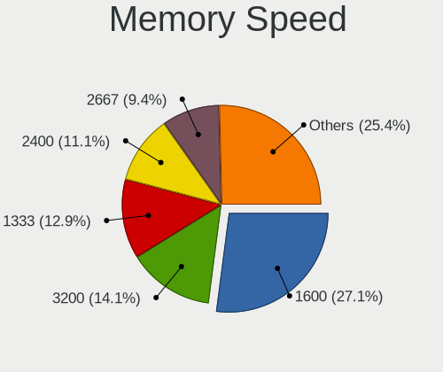

BSD in France - Tested Hardware & Statistics
--------------------------------------------

A project to collect tested hardware configurations for BSD in France.

Anyone can contribute to this report by the [hw-probe](https://github.com/linuxhw/hw-probe/blob/master/INSTALL.BSD.md) tool:

    hw-probe -all -upload

Please contribute! Especially if your hardware is rare.

This is a report for all computer types. See also reports for [desktops](/Location/France/Desktop/README.md) and [notebooks](/Location/France/Notebook/README.md).

Contents
--------

* [ Test Cases ](#test-cases)

* [ System ](#system)
  - [ OS                       ](#os)
  - [ OS Family                ](#os-family)
  - [ Arch                     ](#arch)
  - [ DE                       ](#de)
  - [ Display Server           ](#display-server)
  - [ Display Manager          ](#display-manager)
  - [ OS Lang                  ](#os-lang)
  - [ Boot Mode                ](#boot-mode)
  - [ Filesystem               ](#filesystem)
  - [ Part. scheme             ](#part-scheme)

* [ Board ](#board)
  - [ Vendor                   ](#vendor)
  - [ Model                    ](#model)
  - [ Model Family             ](#model-family)
  - [ MFG Year                 ](#mfg-year)
  - [ Form Factor              ](#form-factor)
  - [ Coreboot                 ](#coreboot)
  - [ RAM Size                 ](#ram-size)
  - [ RAM Used                 ](#ram-used)
  - [ Total Drives             ](#total-drives)
  - [ Has CD-ROM               ](#has-cd-rom)
  - [ Has Ethernet             ](#has-ethernet)
  - [ Has WiFi                 ](#has-wifi)
  - [ Has Bluetooth            ](#has-bluetooth)

* [ Location ](#location)
  - [ Country                  ](#country)
  - [ City                     ](#city)

* [ Drives ](#drives)
  - [ Drive Vendor             ](#drive-vendor)
  - [ Drive Model              ](#drive-model)
  - [ HDD Vendor               ](#hdd-vendor)
  - [ SSD Vendor               ](#ssd-vendor)
  - [ Drive Kind               ](#drive-kind)
  - [ Drive Connector          ](#drive-connector)
  - [ Drive Size               ](#drive-size)
  - [ Space Total              ](#space-total)
  - [ Space Used               ](#space-used)
  - [ Malfunc. Drives          ](#malfunc-drives)
  - [ Malfunc. Drive Vendor    ](#malfunc-drive-vendor)
  - [ Malfunc. HDD Vendor      ](#malfunc-hdd-vendor)
  - [ Malfunc. Drive Kind      ](#malfunc-drive-kind)
  - [ Failed Drives            ](#failed-drives)
  - [ Failed Drive Vendor      ](#failed-drive-vendor)
  - [ Drive Status             ](#drive-status)

* [ Storage controller ](#storage-controller)
  - [ Storage Vendor           ](#storage-vendor)
  - [ Storage Model            ](#storage-model)
  - [ Storage Kind             ](#storage-kind)

* [ Processor ](#processor)
  - [ CPU Vendor               ](#cpu-vendor)
  - [ CPU Model                ](#cpu-model)
  - [ CPU Model Family         ](#cpu-model-family)
  - [ CPU Cores                ](#cpu-cores)
  - [ CPU Sockets              ](#cpu-sockets)
  - [ CPU Threads              ](#cpu-threads)
  - [ CPU Microarch            ](#cpu-microarch)

* [ Graphics ](#graphics)
  - [ GPU Vendor               ](#gpu-vendor)
  - [ GPU Model                ](#gpu-model)
  - [ GPU Combo                ](#gpu-combo)
  - [ GPU Driver               ](#gpu-driver)
  - [ GPU Memory               ](#gpu-memory)

* [ Monitor ](#monitor)
  - [ Monitor Vendor           ](#monitor-vendor)
  - [ Monitor Model            ](#monitor-model)
  - [ Monitor Resolution       ](#monitor-resolution)
  - [ Monitor Diagonal         ](#monitor-diagonal)
  - [ Monitor Width            ](#monitor-width)
  - [ Aspect Ratio             ](#aspect-ratio)
  - [ Monitor Area             ](#monitor-area)
  - [ Pixel Density            ](#pixel-density)
  - [ Multiple Monitors        ](#multiple-monitors)

* [ Network ](#network)
  - [ Net Controller Vendor    ](#net-controller-vendor)
  - [ Net Controller Model     ](#net-controller-model)
  - [ Wireless Vendor          ](#wireless-vendor)
  - [ Wireless Model           ](#wireless-model)
  - [ Ethernet Vendor          ](#ethernet-vendor)
  - [ Ethernet Model           ](#ethernet-model)
  - [ Net Controller Kind      ](#net-controller-kind)
  - [ Used Controller          ](#used-controller)
  - [ NICs                     ](#nics)
  - [ IPv6                     ](#ipv6)

* [ Bluetooth ](#bluetooth)
  - [ Bluetooth Vendor         ](#bluetooth-vendor)
  - [ Bluetooth Model          ](#bluetooth-model)

* [ Sound ](#sound)
  - [ Sound Vendor             ](#sound-vendor)
  - [ Sound Model              ](#sound-model)

* [ Memory ](#memory)
  - [ Memory Vendor            ](#memory-vendor)
  - [ Memory Model             ](#memory-model)
  - [ Memory Kind              ](#memory-kind)
  - [ Memory Form Factor       ](#memory-form-factor)
  - [ Memory Size              ](#memory-size)
  - [ Memory Speed             ](#memory-speed)

* [ Printers & scanners ](#printers--scanners)
  - [ Printer Vendor           ](#printer-vendor)
  - [ Printer Model            ](#printer-model)
  - [ Scanner Vendor           ](#scanner-vendor)
  - [ Scanner Model            ](#scanner-model)

* [ Camera ](#camera)
  - [ Camera Vendor            ](#camera-vendor)
  - [ Camera Model             ](#camera-model)

* [ Security ](#security)
  - [ Fingerprint Vendor       ](#fingerprint-vendor)
  - [ Fingerprint Model        ](#fingerprint-model)
  - [ Chipcard Vendor          ](#chipcard-vendor)
  - [ Chipcard Model           ](#chipcard-model)

* [ Unsupported ](#unsupported)
  - [ Unsupported Devices      ](#unsupported-devices)
  - [ Unsupported Device Types ](#unsupported-device-types)

Test Cases
----------

Total: 435

| Vendor        | Model                       | Form-Factor | Probe                                                     | Date         |
|---------------|-----------------------------|-------------|-----------------------------------------------------------|--------------|
| Acer          | Aspire E5-576               | Notebook    | [138e9fdeb4](https://bsd-hardware.info/?probe=138e9fdeb4) | May 31, 2022 |
| Gigabyte      | Z690I AORUS ULTRA           | Desktop     | [9bacfc2b0e](https://bsd-hardware.info/?probe=9bacfc2b0e) | May 29, 2022 |
| TUXEDO        | Aura 15 Gen1                | Notebook    | [20814a930a](https://bsd-hardware.info/?probe=20814a930a) | May 18, 2022 |
| TUXEDO        | Aura 15 Gen1                | Notebook    | [115de395dd](https://bsd-hardware.info/?probe=115de395dd) | May 17, 2022 |
| TUXEDO        | InfinityBook13V3            | Notebook    | [fd081a3636](https://bsd-hardware.info/?probe=fd081a3636) | May 17, 2022 |
| Intel         | DH67BL AAG10189-213         | Desktop     | [e8d2744812](https://bsd-hardware.info/?probe=e8d2744812) | May 12, 2022 |
| Lenovo        | ThinkPad X250 20CLS4WV08    | Notebook    | [0419c52079](https://bsd-hardware.info/?probe=0419c52079) | May 11, 2022 |
| ASRock        | A320M Pro4-F                | Desktop     | [f307756ddf](https://bsd-hardware.info/?probe=f307756ddf) | May 11, 2022 |
| Intel         | H81U                        | Notebook    | [550699602e](https://bsd-hardware.info/?probe=550699602e) | May 11, 2022 |
| Unknown       | Unknown                     | Desktop     | [6cf944b0ef](https://bsd-hardware.info/?probe=6cf944b0ef) | May 10, 2022 |
| ASUSTek       | ROG STRIX B550-I GAMING     | Desktop     | [cf58c679ef](https://bsd-hardware.info/?probe=cf58c679ef) | May 08, 2022 |
| Intel         | H81U                        | Notebook    | [04646d1cc7](https://bsd-hardware.info/?probe=04646d1cc7) | May 05, 2022 |
| ASUSTek       | TUF Gaming Z590-PLUS        | Desktop     | [5f9e266167](https://bsd-hardware.info/?probe=5f9e266167) | May 04, 2022 |
| ASUSTek       | TUF Gaming Z590-PLUS        | Desktop     | [7d4dd8ba29](https://bsd-hardware.info/?probe=7d4dd8ba29) | May 04, 2022 |
| Dell          | 0782GW A00                  | Desktop     | [3481513b0f](https://bsd-hardware.info/?probe=3481513b0f) | May 03, 2022 |
| Dell          | Latitude 7490               | Notebook    | [0d5b872ec1](https://bsd-hardware.info/?probe=0d5b872ec1) | May 02, 2022 |
| Dell          | Latitude 7490               | Notebook    | [03c97fe4d9](https://bsd-hardware.info/?probe=03c97fe4d9) | May 02, 2022 |
| Dell          | Precision 7730              | Notebook    | [bdb3e3d4ce](https://bsd-hardware.info/?probe=bdb3e3d4ce) | Apr 30, 2022 |
| Dell          | Latitude 7490               | Notebook    | [1586880dd7](https://bsd-hardware.info/?probe=1586880dd7) | Apr 30, 2022 |
| Intel         | NUC6CAYB J23203-405         | Mini pc     | [86ade7ce4b](https://bsd-hardware.info/?probe=86ade7ce4b) | Apr 30, 2022 |
| ASUSTek       | AM1I-A                      | Desktop     | [8fce57c9e4](https://bsd-hardware.info/?probe=8fce57c9e4) | Apr 25, 2022 |
| ASUSTek       | P5KR                        | Desktop     | [cf745ca0da](https://bsd-hardware.info/?probe=cf745ca0da) | Apr 23, 2022 |
| Dell          | Studio 1555                 | Notebook    | [6da8f97bcd](https://bsd-hardware.info/?probe=6da8f97bcd) | Apr 22, 2022 |
| MSI           | H310M PRO-VDH PLUS          | Desktop     | [875d6b2da3](https://bsd-hardware.info/?probe=875d6b2da3) | Apr 22, 2022 |
| Intel         | Q3XXG4-P V1.0               | Desktop     | [a278852381](https://bsd-hardware.info/?probe=a278852381) | Apr 21, 2022 |
| Dell          | 06JWJY A01                  | Desktop     | [16f4cc5d53](https://bsd-hardware.info/?probe=16f4cc5d53) | Apr 20, 2022 |
| ASUSTek       | CROSSHAIR V FORMULA-Z       | Desktop     | [ab8aea2f5c](https://bsd-hardware.info/?probe=ab8aea2f5c) | Apr 17, 2022 |
| Dell          | Latitude E5450              | Notebook    | [ca5eb083f9](https://bsd-hardware.info/?probe=ca5eb083f9) | Apr 16, 2022 |
| Deciso        | Netboard A10                | Desktop     | [6e0b916230](https://bsd-hardware.info/?probe=6e0b916230) | Apr 16, 2022 |
| HP            | 86E9 A                      | Desktop     | [be43a8efde](https://bsd-hardware.info/?probe=be43a8efde) | Apr 14, 2022 |
| Unknown       | J3160-4L                    | Desktop     | [4b981630d7](https://bsd-hardware.info/?probe=4b981630d7) | Apr 13, 2022 |
| Dell          | 0T10XW A02                  | Desktop     | [06720f3c57](https://bsd-hardware.info/?probe=06720f3c57) | Apr 13, 2022 |
| Unknown       | Unknown                     | Desktop     | [e6ba291c2d](https://bsd-hardware.info/?probe=e6ba291c2d) | Apr 12, 2022 |
| Jetway        | 1.0                         | Desktop     | [ac2ab09363](https://bsd-hardware.info/?probe=ac2ab09363) | Apr 11, 2022 |
| Unknown       | Unknown                     | Desktop     | [4e208e9425](https://bsd-hardware.info/?probe=4e208e9425) | Apr 10, 2022 |
| ASUSTek       | P5G41T-M LX3                | Desktop     | [ded0d1a114](https://bsd-hardware.info/?probe=ded0d1a114) | Apr 09, 2022 |
| ASUSTek       | P5G41T-M LX3                | Desktop     | [14a6449380](https://bsd-hardware.info/?probe=14a6449380) | Apr 09, 2022 |
| Unknown       | Unknown                     | Desktop     | [50833ab257](https://bsd-hardware.info/?probe=50833ab257) | Apr 07, 2022 |
| Sophos        | XG                          | Firewall    | [c98fff0cf2](https://bsd-hardware.info/?probe=c98fff0cf2) | Apr 06, 2022 |
| Intel         | Q3XXG4-P V1.0               | Desktop     | [e44ebcb340](https://bsd-hardware.info/?probe=e44ebcb340) | Apr 06, 2022 |
| Deciso        | Netboard A20                | Notebook    | [0829d5a85d](https://bsd-hardware.info/?probe=0829d5a85d) | Apr 06, 2022 |
| BESSTAR Te... | GB7                         | Mini pc     | [35dcbd74e9](https://bsd-hardware.info/?probe=35dcbd74e9) | Apr 05, 2022 |
| ASRock        | H110M-ITX                   | Desktop     | [946c8fd467](https://bsd-hardware.info/?probe=946c8fd467) | Apr 04, 2022 |
| PC Engines    | APU2                        | Desktop     | [5eb2e04d11](https://bsd-hardware.info/?probe=5eb2e04d11) | Apr 02, 2022 |
| BESSTAR Te... | GB7                         | Mini pc     | [43cbc2ef2c](https://bsd-hardware.info/?probe=43cbc2ef2c) | Apr 02, 2022 |
| Dell          | 0782GW A00                  | Desktop     | [c83fab9193](https://bsd-hardware.info/?probe=c83fab9193) | Apr 01, 2022 |
| Unknown       | Unknown                     | Firewall    | [b5c3949db8](https://bsd-hardware.info/?probe=b5c3949db8) | Mar 29, 2022 |
| HP            | ProLiant MicroServer Gen... | Desktop     | [7a991e2f31](https://bsd-hardware.info/?probe=7a991e2f31) | Mar 24, 2022 |
| Dell          | 0782GW A00                  | Desktop     | [acb99d63ce](https://bsd-hardware.info/?probe=acb99d63ce) | Mar 23, 2022 |
| Unknown       | Unknown                     | Desktop     | [05a81cb5d5](https://bsd-hardware.info/?probe=05a81cb5d5) | Mar 22, 2022 |
| Protectli     | FW6 Ver                     | Desktop     | [483cf54bfc](https://bsd-hardware.info/?probe=483cf54bfc) | Mar 21, 2022 |
| ASUSTek       | PRIME B550M-A               | Desktop     | [d0946bc53f](https://bsd-hardware.info/?probe=d0946bc53f) | Mar 21, 2022 |
| MSI           | B450 TOMAHAWK MAX           | Desktop     | [d2ecb6259c](https://bsd-hardware.info/?probe=d2ecb6259c) | Mar 20, 2022 |
| ASUSTek       | PRIME B550M-A               | Desktop     | [40cd6d1472](https://bsd-hardware.info/?probe=40cd6d1472) | Mar 19, 2022 |
| Protectli     | FW6 Ver                     | Desktop     | [a4a1c8e5ca](https://bsd-hardware.info/?probe=a4a1c8e5ca) | Mar 18, 2022 |
| ASUSTek       | PRIME B550M-A               | Desktop     | [b23ab09f52](https://bsd-hardware.info/?probe=b23ab09f52) | Mar 18, 2022 |
| ASUSTek       | PRIME B550M-A               | Desktop     | [545e5ebfc9](https://bsd-hardware.info/?probe=545e5ebfc9) | Mar 18, 2022 |
| Intel         | NUC8BEB J72692-308          | Mini pc     | [b137b25594](https://bsd-hardware.info/?probe=b137b25594) | Mar 15, 2022 |
| HP            | ProLiant MicroServer Gen... | Desktop     | [b652261bda](https://bsd-hardware.info/?probe=b652261bda) | Mar 14, 2022 |
| HP            | ProLiant MicroServer Gen... | Desktop     | [0a2a94839d](https://bsd-hardware.info/?probe=0a2a94839d) | Mar 13, 2022 |
| HP            | EliteBook 2530p             | Notebook    | [e5c8017afb](https://bsd-hardware.info/?probe=e5c8017afb) | Mar 12, 2022 |
| Supermicro    | X11SDV-8C-TLN2F             | Server      | [e1fceaabc0](https://bsd-hardware.info/?probe=e1fceaabc0) | Mar 08, 2022 |
| Lenovo        | Flex 2-15 20405             | Notebook    | [3b77055bd4](https://bsd-hardware.info/?probe=3b77055bd4) | Mar 07, 2022 |
| CNCTION-IA... | Unknown                     | Desktop     | [0051c86e4c](https://bsd-hardware.info/?probe=0051c86e4c) | Mar 07, 2022 |
| AAEON         | UP-CHT01 V0.4               | Desktop     | [9aaa7c7a32](https://bsd-hardware.info/?probe=9aaa7c7a32) | Mar 05, 2022 |
| Protectli     | VP2410                      | Desktop     | [1f650fc994](https://bsd-hardware.info/?probe=1f650fc994) | Mar 05, 2022 |
| Apple         | Mac-4BC72D62AD45599E Mac... | Mini pc     | [d73d3760ce](https://bsd-hardware.info/?probe=d73d3760ce) | Mar 04, 2022 |
| HP            | ProLiant DL360 G7           | Server      | [a3611d42bc](https://bsd-hardware.info/?probe=a3611d42bc) | Mar 04, 2022 |
| PC Engines    | apu1                        | Desktop     | [177dc1fbc8](https://bsd-hardware.info/?probe=177dc1fbc8) | Mar 03, 2022 |
| Fujitsu       | D3222-A1 S26361-D3222-A1    | Desktop     | [43bfceb19d](https://bsd-hardware.info/?probe=43bfceb19d) | Mar 02, 2022 |
| BESSTAR Te... | GB7                         | Mini pc     | [4367711bff](https://bsd-hardware.info/?probe=4367711bff) | Mar 01, 2022 |
| Dell          | Latitude E5440              | Notebook    | [b0314f9200](https://bsd-hardware.info/?probe=b0314f9200) | Feb 26, 2022 |
| Dell          | 0782GW A00                  | Desktop     | [7b19f71ce1](https://bsd-hardware.info/?probe=7b19f71ce1) | Feb 26, 2022 |
| PC Engines    | apu1                        | Desktop     | [d904aa7790](https://bsd-hardware.info/?probe=d904aa7790) | Feb 24, 2022 |
| Intel         | CARLOW                      | Desktop     | [d46b68cc28](https://bsd-hardware.info/?probe=d46b68cc28) | Feb 23, 2022 |
| HP            | 8169                        | Desktop     | [f449b4cd6c](https://bsd-hardware.info/?probe=f449b4cd6c) | Feb 23, 2022 |
| Dell          | 0W13NR A07                  | Server      | [22846d44fb](https://bsd-hardware.info/?probe=22846d44fb) | Feb 22, 2022 |
| Dell          | 0TY019 A00                  | Server      | [5f750e021e](https://bsd-hardware.info/?probe=5f750e021e) | Feb 20, 2022 |
| Intel         | CARLOW                      | Desktop     | [b64bf97293](https://bsd-hardware.info/?probe=b64bf97293) | Feb 19, 2022 |
| Dell          | 0782GW A00                  | Desktop     | [ef5cc6be72](https://bsd-hardware.info/?probe=ef5cc6be72) | Feb 17, 2022 |
| Supermicro    | X11SDV-8C-TP8F              | Desktop     | [18576ef86c](https://bsd-hardware.info/?probe=18576ef86c) | Feb 17, 2022 |
| Intel         | Q3XXG4-P V1.0               | Desktop     | [fbc24f90e5](https://bsd-hardware.info/?probe=fbc24f90e5) | Feb 17, 2022 |
| MSI           | MS-7253                     | Desktop     | [c4e971ea82](https://bsd-hardware.info/?probe=c4e971ea82) | Feb 16, 2022 |
| Intel         | Q3XXG4-P V1.0               | Desktop     | [df529a84b9](https://bsd-hardware.info/?probe=df529a84b9) | Feb 16, 2022 |
| Lenovo        | Legion 5 15ARH05 82B5       | Notebook    | [1a13b7bfd1](https://bsd-hardware.info/?probe=1a13b7bfd1) | Feb 16, 2022 |
| Lenovo        | Flex 2-15 20405             | Notebook    | [1e8904f4fc](https://bsd-hardware.info/?probe=1e8904f4fc) | Feb 15, 2022 |
| AMD           | X64                         | Desktop     | [e5a9ff1138](https://bsd-hardware.info/?probe=e5a9ff1138) | Feb 15, 2022 |
| HP            | EliteBook 2530p             | Notebook    | [dd52bb1163](https://bsd-hardware.info/?probe=dd52bb1163) | Feb 15, 2022 |
| BESSTAR Te... | GB7                         | Mini pc     | [ee3a7740ec](https://bsd-hardware.info/?probe=ee3a7740ec) | Feb 13, 2022 |
| Lenovo        | Flex 2-15 20405             | Notebook    | [b77b926f9b](https://bsd-hardware.info/?probe=b77b926f9b) | Feb 13, 2022 |
| Supermicro    | X11SDV-8C-TP8F              | Desktop     | [09a6920a4f](https://bsd-hardware.info/?probe=09a6920a4f) | Feb 12, 2022 |
| BESSTAR Te... | GB7                         | Mini pc     | [61c103f80d](https://bsd-hardware.info/?probe=61c103f80d) | Feb 11, 2022 |
| Deciso        | Netboard A20                | Notebook    | [4d8f19ba12](https://bsd-hardware.info/?probe=4d8f19ba12) | Feb 11, 2022 |
| Sophos        | XG                          | Firewall    | [31a8174933](https://bsd-hardware.info/?probe=31a8174933) | Feb 10, 2022 |
| Sophos        | XG                          | Firewall    | [365e4cfbea](https://bsd-hardware.info/?probe=365e4cfbea) | Feb 08, 2022 |
| BESSTAR Te... | GB7                         | Mini pc     | [8342bcccf5](https://bsd-hardware.info/?probe=8342bcccf5) | Feb 07, 2022 |
| Gigabyte      | X570 I AORUS PRO WIFI       | Desktop     | [91b1ec3b93](https://bsd-hardware.info/?probe=91b1ec3b93) | Feb 06, 2022 |
| Deciso        | Netboard A20                | Notebook    | [a6b7d2d5e8](https://bsd-hardware.info/?probe=a6b7d2d5e8) | Feb 06, 2022 |
| MSI           | H310M PRO-VDH PLUS          | Desktop     | [2accc42e21](https://bsd-hardware.info/?probe=2accc42e21) | Feb 06, 2022 |
| Dell          | 0T10XW A02                  | Desktop     | [9213769810](https://bsd-hardware.info/?probe=9213769810) | Feb 05, 2022 |
| BESSTAR Te... | GB7                         | Mini pc     | [c0d2abfe5c](https://bsd-hardware.info/?probe=c0d2abfe5c) | Feb 05, 2022 |
| BESSTAR Te... | GB7                         | Mini pc     | [00cabbe0bf](https://bsd-hardware.info/?probe=00cabbe0bf) | Feb 05, 2022 |
| Dell          | 0W13NR A07                  | Server      | [1582d0700a](https://bsd-hardware.info/?probe=1582d0700a) | Feb 03, 2022 |
| Deciso        | Netboard A20                | Notebook    | [8cd43fcfd1](https://bsd-hardware.info/?probe=8cd43fcfd1) | Feb 03, 2022 |
| Intel         | SKYBAY                      | Desktop     | [95c3231a3a](https://bsd-hardware.info/?probe=95c3231a3a) | Feb 03, 2022 |
| MSI           | MS-9A45 0A                  | Desktop     | [cfbfdf0e55](https://bsd-hardware.info/?probe=cfbfdf0e55) | Jan 31, 2022 |
| ASUSTek       | 1015PEM                     | Notebook    | [efea0efb2b](https://bsd-hardware.info/?probe=efea0efb2b) | Jan 31, 2022 |
| Intel         | NUC8BEB J72688-306          | Mini pc     | [ccda2302cf](https://bsd-hardware.info/?probe=ccda2302cf) | Jan 30, 2022 |
| Unknown       | J3160-4L                    | Desktop     | [9dc53740a9](https://bsd-hardware.info/?probe=9dc53740a9) | Jan 29, 2022 |
| Apple         | MacBook4,1                  | Notebook    | [e89404ebed](https://bsd-hardware.info/?probe=e89404ebed) | Jan 29, 2022 |
| AMD           | Larne CRB                   | Desktop     | [c6a85da1d5](https://bsd-hardware.info/?probe=c6a85da1d5) | Jan 28, 2022 |
| Dell          | 0PC5F7 A03                  | Desktop     | [7a5d842d33](https://bsd-hardware.info/?probe=7a5d842d33) | Jan 27, 2022 |
| Intel         | SKYBAY                      | Desktop     | [f1c7ee0712](https://bsd-hardware.info/?probe=f1c7ee0712) | Jan 26, 2022 |
| ASRock        | H110M-ITX                   | Desktop     | [5c58d01f2d](https://bsd-hardware.info/?probe=5c58d01f2d) | Jan 25, 2022 |
| RUNING        | B75M INTEL H3V              | Desktop     | [9a060df0a2](https://bsd-hardware.info/?probe=9a060df0a2) | Jan 23, 2022 |
| BESSTAR Te... | GB1B                        | Mini pc     | [cd745d6377](https://bsd-hardware.info/?probe=cd745d6377) | Jan 23, 2022 |
| AMD           | Larne CRB                   | Desktop     | [6c37b91111](https://bsd-hardware.info/?probe=6c37b91111) | Jan 22, 2022 |
| Dell          | 0T10XW A02                  | Desktop     | [b01e6eb706](https://bsd-hardware.info/?probe=b01e6eb706) | Jan 22, 2022 |
| Lenovo        | Legion Y540-15IRH 81SX      | Notebook    | [384d2f888b](https://bsd-hardware.info/?probe=384d2f888b) | Jan 18, 2022 |
| ASRock        | B365M Pro4                  | Desktop     | [8449bd20c1](https://bsd-hardware.info/?probe=8449bd20c1) | Jan 18, 2022 |
| ASUSTek       | PRIME X570-P                | Desktop     | [3dead218e1](https://bsd-hardware.info/?probe=3dead218e1) | Jan 16, 2022 |
| Unknown       | Unknown                     | Desktop     | [6baaab27fd](https://bsd-hardware.info/?probe=6baaab27fd) | Jan 15, 2022 |
| MSI           | MS-98C8                     | Desktop     | [0102557f05](https://bsd-hardware.info/?probe=0102557f05) | Jan 15, 2022 |
| PC Engines    | APU2                        | Desktop     | [7062b84459](https://bsd-hardware.info/?probe=7062b84459) | Jan 14, 2022 |
| AMI           | Aptio CRB                   | Mini pc     | [1ff4a66d03](https://bsd-hardware.info/?probe=1ff4a66d03) | Jan 12, 2022 |
| HP            | EliteBook 2530p             | Notebook    | [42eb986a58](https://bsd-hardware.info/?probe=42eb986a58) | Jan 11, 2022 |
| Dell          | Latitude E5450              | Notebook    | [a05fbe1c26](https://bsd-hardware.info/?probe=a05fbe1c26) | Jan 05, 2022 |
| Dell          | Latitude E5450              | Notebook    | [c2ef231757](https://bsd-hardware.info/?probe=c2ef231757) | Jan 04, 2022 |
| Supermicro    | A2SDi-8C-HLN4F              | Desktop     | [6aeb9adadb](https://bsd-hardware.info/?probe=6aeb9adadb) | Dec 31, 2021 |
| Dell          | 0V52N7 A00                  | Server      | [b6139f57b9](https://bsd-hardware.info/?probe=b6139f57b9) | Dec 30, 2021 |
| ASUSTek       | S550CA                      | Notebook    | [1263a5fb37](https://bsd-hardware.info/?probe=1263a5fb37) | Dec 29, 2021 |
| Gigabyte      | B550I AORUS PRO AX          | Desktop     | [8c3181ee8d](https://bsd-hardware.info/?probe=8c3181ee8d) | Dec 29, 2021 |
| Intel         | NUC8BEB J72693-306          | Mini pc     | [07221fc111](https://bsd-hardware.info/?probe=07221fc111) | Dec 28, 2021 |
| Intel         | Q3XXG4-P V1.0               | Desktop     | [cdb5578df8](https://bsd-hardware.info/?probe=cdb5578df8) | Dec 27, 2021 |
| Gigabyte      | X58A-UD5                    | Desktop     | [62b94dd372](https://bsd-hardware.info/?probe=62b94dd372) | Dec 21, 2021 |
| Samsung       | R720                        | Notebook    | [620195d4aa](https://bsd-hardware.info/?probe=620195d4aa) | Dec 20, 2021 |
| HP            | Compaq 15                   | Notebook    | [1e8b1ce39b](https://bsd-hardware.info/?probe=1e8b1ce39b) | Dec 20, 2021 |
| Supermicro    | X11SSL-F                    | Server      | [a5a440a7a7](https://bsd-hardware.info/?probe=a5a440a7a7) | Dec 20, 2021 |
| ASRock        | Z590M-ITX/ax                | Desktop     | [124ac672b0](https://bsd-hardware.info/?probe=124ac672b0) | Dec 20, 2021 |
| Lenovo        | G500 20236                  | Notebook    | [350def9eca](https://bsd-hardware.info/?probe=350def9eca) | Dec 19, 2021 |
| Lenovo        | ThinkPad T590 20N4CTO1WW    | Notebook    | [4147a5824d](https://bsd-hardware.info/?probe=4147a5824d) | Dec 16, 2021 |
| HP            | ProBook 650 G5              | Notebook    | [d4ffc24c6f](https://bsd-hardware.info/?probe=d4ffc24c6f) | Dec 15, 2021 |
| Unknown       | Unknown                     | Desktop     | [225298bcd6](https://bsd-hardware.info/?probe=225298bcd6) | Dec 12, 2021 |
| HPE           | ProLiant MicroServer Gen... | Server      | [26220d3f14](https://bsd-hardware.info/?probe=26220d3f14) | Dec 09, 2021 |
| Lenovo        | ThinkPad T590 20N4CTO1WW    | Notebook    | [eb69e83fbf](https://bsd-hardware.info/?probe=eb69e83fbf) | Dec 09, 2021 |
| RUNING        | B75M INTEL H3V              | Desktop     | [61312aa506](https://bsd-hardware.info/?probe=61312aa506) | Nov 30, 2021 |
| Dell          | VEP-4600-V930 034R2CA03     | Desktop     | [313d1b7032](https://bsd-hardware.info/?probe=313d1b7032) | Nov 25, 2021 |
| Gigabyte      | MZBSWBP-00                  | Desktop     | [9e7a72d920](https://bsd-hardware.info/?probe=9e7a72d920) | Nov 24, 2021 |
| Intel         | Q3XXG4-P V1.0               | Desktop     | [16206960c4](https://bsd-hardware.info/?probe=16206960c4) | Nov 24, 2021 |
| HP            | 3031h                       | Desktop     | [056352a663](https://bsd-hardware.info/?probe=056352a663) | Nov 21, 2021 |
| RUNING        | B75M INTEL H3V              | Desktop     | [5cfcc8c5f8](https://bsd-hardware.info/?probe=5cfcc8c5f8) | Nov 13, 2021 |
| HP            | 3031h                       | Desktop     | [d63bbcfceb](https://bsd-hardware.info/?probe=d63bbcfceb) | Oct 31, 2021 |
| HP            | 3031h                       | Desktop     | [c5e39a5e6d](https://bsd-hardware.info/?probe=c5e39a5e6d) | Oct 31, 2021 |
| MSI           | MS-9A45 0A                  | Desktop     | [e2db09bacb](https://bsd-hardware.info/?probe=e2db09bacb) | Oct 30, 2021 |
| ASRockRack    | C3558D4I-4L                 | Desktop     | [dfba84ce5a](https://bsd-hardware.info/?probe=dfba84ce5a) | Oct 29, 2021 |
| Intel         | Q3XXG4-P V1.0               | Desktop     | [e2167afc3b](https://bsd-hardware.info/?probe=e2167afc3b) | Oct 25, 2021 |
| BESSTAR Te... | VB9                         | All in one  | [ac1f5a3339](https://bsd-hardware.info/?probe=ac1f5a3339) | Oct 24, 2021 |
| Intel         | Q3XXG4-P V1.0               | Desktop     | [3f5b148e23](https://bsd-hardware.info/?probe=3f5b148e23) | Oct 22, 2021 |
| Intel         | Q3XXG4-P V1.0               | Desktop     | [6f019f05b6](https://bsd-hardware.info/?probe=6f019f05b6) | Oct 20, 2021 |
| PC Engines    | APU2                        | Desktop     | [4b8fb7992f](https://bsd-hardware.info/?probe=4b8fb7992f) | Oct 16, 2021 |
| Dell          | 0V52N7 A00                  | Server      | [c5226ff226](https://bsd-hardware.info/?probe=c5226ff226) | Oct 13, 2021 |
| ASRock        | AB350 Gaming-ITX/ac         | Desktop     | [e53866a5d9](https://bsd-hardware.info/?probe=e53866a5d9) | Oct 11, 2021 |
| ASUSTek       | P9X79                       | Desktop     | [be9d90602d](https://bsd-hardware.info/?probe=be9d90602d) | Oct 11, 2021 |
| Dell          | 04JN2K A04                  | Server      | [f529f87cea](https://bsd-hardware.info/?probe=f529f87cea) | Oct 11, 2021 |
| Dell          | 0V52N7 A00                  | Server      | [4ad37c1848](https://bsd-hardware.info/?probe=4ad37c1848) | Oct 10, 2021 |
| Google        | Terra                       | Notebook    | [9ba239a4a3](https://bsd-hardware.info/?probe=9ba239a4a3) | Oct 10, 2021 |
| Unknown       | Unknown                     | Desktop     | [2fd62acb45](https://bsd-hardware.info/?probe=2fd62acb45) | Oct 10, 2021 |
| Lenovo        | 3138                        | Desktop     | [8b5cf892d0](https://bsd-hardware.info/?probe=8b5cf892d0) | Oct 04, 2021 |
| Lenovo        | ThinkPad X220 4290W42       | Notebook    | [8be5183e21](https://bsd-hardware.info/?probe=8be5183e21) | Sep 25, 2021 |
| Lenovo        | ThinkPad T500 2056Y2Z       | Notebook    | [88b86ecf8b](https://bsd-hardware.info/?probe=88b86ecf8b) | Sep 25, 2021 |
| ASUSTek       | F2A85-M                     | Desktop     | [5b7623f03b](https://bsd-hardware.info/?probe=5b7623f03b) | Sep 21, 2021 |
| Unknown       | Unknown                     | Desktop     | [1b8ce81945](https://bsd-hardware.info/?probe=1b8ce81945) | Sep 19, 2021 |
| MSI           | P65 Creator 8RE             | Notebook    | [2684b5021c](https://bsd-hardware.info/?probe=2684b5021c) | Sep 18, 2021 |
| Lenovo        | ThinkPad E14 Gen 3 20Y7C... | Notebook    | [8611fbfd97](https://bsd-hardware.info/?probe=8611fbfd97) | Sep 14, 2021 |
| Apple         | MacBookPro8,2               | Notebook    | [5f78c3411f](https://bsd-hardware.info/?probe=5f78c3411f) | Sep 13, 2021 |
| ASRock        | B460M Pro4                  | Desktop     | [cfc7818691](https://bsd-hardware.info/?probe=cfc7818691) | Sep 10, 2021 |
| Gigabyte      | F2A88XM-D3H                 | Desktop     | [d5750a95a4](https://bsd-hardware.info/?probe=d5750a95a4) | Sep 08, 2021 |
| Packard Be... | imedia S2110A               | Desktop     | [d62a38660c](https://bsd-hardware.info/?probe=d62a38660c) | Sep 08, 2021 |
| ASUSTek       | P8Z68-V LX                  | Desktop     | [29cfd33c5e](https://bsd-hardware.info/?probe=29cfd33c5e) | Sep 06, 2021 |
| ASUSTek       | P8B-X series                | Server      | [1e7d58cd40](https://bsd-hardware.info/?probe=1e7d58cd40) | Aug 29, 2021 |
| Lenovo        | ThinkPad P14s Gen 1 20Y1... | Notebook    | [d028fc63d4](https://bsd-hardware.info/?probe=d028fc63d4) | Aug 29, 2021 |
| ASRockRack    | X470D4U                     | Desktop     | [827c50f77b](https://bsd-hardware.info/?probe=827c50f77b) | Aug 28, 2021 |
| Dell          | 0G3HR7 A00                  | Desktop     | [7f75f30b75](https://bsd-hardware.info/?probe=7f75f30b75) | Aug 27, 2021 |
| Lenovo        | ThinkPad P14s Gen 1 20Y1... | Notebook    | [76f004bd26](https://bsd-hardware.info/?probe=76f004bd26) | Aug 26, 2021 |
| PC Engines    | APU2                        | Desktop     | [0a35da2af7](https://bsd-hardware.info/?probe=0a35da2af7) | Aug 24, 2021 |
| Gigabyte      | X570 I AORUS PRO WIFI       | Desktop     | [3e088c942b](https://bsd-hardware.info/?probe=3e088c942b) | Aug 22, 2021 |
| Fujitsu       | LIFEBOOK NH570              | Notebook    | [51b5325c85](https://bsd-hardware.info/?probe=51b5325c85) | Aug 13, 2021 |
| Unknown       | Unknown                     | Desktop     | [1dd499d54c](https://bsd-hardware.info/?probe=1dd499d54c) | Aug 12, 2021 |
| Dell          | 0XCR8D A03                  | Desktop     | [11526a150b](https://bsd-hardware.info/?probe=11526a150b) | Aug 10, 2021 |
| Shuttle       | FS61                        | Desktop     | [b1fbaa8a6b](https://bsd-hardware.info/?probe=b1fbaa8a6b) | Aug 09, 2021 |
| ASUSTek       | H81M-A                      | Desktop     | [bb65c30be3](https://bsd-hardware.info/?probe=bb65c30be3) | Aug 07, 2021 |
| ASUSTek       | H81M-A                      | Desktop     | [9e0c8e8024](https://bsd-hardware.info/?probe=9e0c8e8024) | Aug 07, 2021 |
| Apple         | Mac-4BC72D62AD45599E Mac... | Mini pc     | [5f9c53366b](https://bsd-hardware.info/?probe=5f9c53366b) | Aug 05, 2021 |
| Unknown       | YL-SKUL6-7 Series           | Desktop     | [b9ef180b73](https://bsd-hardware.info/?probe=b9ef180b73) | Aug 04, 2021 |
| MSI           | H310M PRO-VDH PLUS          | Desktop     | [3ff984316b](https://bsd-hardware.info/?probe=3ff984316b) | Aug 04, 2021 |
| Dell          | 0G261D A00                  | Desktop     | [2ce00e9f6b](https://bsd-hardware.info/?probe=2ce00e9f6b) | Aug 02, 2021 |
| AMI           | Aptio CRB                   | Mini pc     | [2a1251b320](https://bsd-hardware.info/?probe=2a1251b320) | Aug 02, 2021 |
| Unknown       | Unknown                     | Desktop     | [34d448e1d1](https://bsd-hardware.info/?probe=34d448e1d1) | Jul 30, 2021 |
| Unknown       | Unknown                     | Desktop     | [846b6cca20](https://bsd-hardware.info/?probe=846b6cca20) | Jul 30, 2021 |
| Unknown       | Unknown                     | Desktop     | [8aaf18daa1](https://bsd-hardware.info/?probe=8aaf18daa1) | Jul 28, 2021 |
| Lenovo        | G500 20236                  | Notebook    | [d15eff8bcc](https://bsd-hardware.info/?probe=d15eff8bcc) | Jul 21, 2021 |
| ASRock        | D1800B-ITX                  | Desktop     | [4831cc5183](https://bsd-hardware.info/?probe=4831cc5183) | Jul 21, 2021 |
| BESSTAR Te... | GB1B                        | Mini pc     | [2484df8d38](https://bsd-hardware.info/?probe=2484df8d38) | Jul 18, 2021 |
| Lenovo        | ThinkPad T420 42368A3       | Notebook    | [0a3b5c9c27](https://bsd-hardware.info/?probe=0a3b5c9c27) | Jul 12, 2021 |
| HP            | 2B4B                        | Desktop     | [456625c82f](https://bsd-hardware.info/?probe=456625c82f) | Jul 04, 2021 |
| Notebook      | W510LU                      | Notebook    | [3d6de69bda](https://bsd-hardware.info/?probe=3d6de69bda) | Jul 02, 2021 |
| Dell          | 0XR1GT A00                  | Desktop     | [1e66c42238](https://bsd-hardware.info/?probe=1e66c42238) | Jul 02, 2021 |
| Shuttle       | NC10U                       | Desktop     | [5d2d20dd04](https://bsd-hardware.info/?probe=5d2d20dd04) | Jul 02, 2021 |
| ASUSTek       | PRIME B350M-E               | Desktop     | [bde8057846](https://bsd-hardware.info/?probe=bde8057846) | Jun 29, 2021 |
| Lenovo        | G500 20236                  | Notebook    | [6e96d4c26f](https://bsd-hardware.info/?probe=6e96d4c26f) | Jun 28, 2021 |
| Lenovo        | G500 20236                  | Notebook    | [7ae63d4c6c](https://bsd-hardware.info/?probe=7ae63d4c6c) | Jun 27, 2021 |
| AWOW          | PC BOX                      | Mini pc     | [661d3349cb](https://bsd-hardware.info/?probe=661d3349cb) | Jun 26, 2021 |
| Dell          | Vostro 5481                 | Notebook    | [bb318fbc50](https://bsd-hardware.info/?probe=bb318fbc50) | Jun 26, 2021 |
| AWOW          | PC BOX                      | Mini pc     | [95b0c9a6a3](https://bsd-hardware.info/?probe=95b0c9a6a3) | Jun 25, 2021 |
| Lenovo        | ThinkPad T450s 20BWS0L60... | Notebook    | [6ea6f6ffe7](https://bsd-hardware.info/?probe=6ea6f6ffe7) | Jun 20, 2021 |
| Wistron       | ProLiant ML110 G6           | Desktop     | [8f336c0fa3](https://bsd-hardware.info/?probe=8f336c0fa3) | Jun 19, 2021 |
| Wistron       | ProLiant ML110 G6           | Desktop     | [dc619f203f](https://bsd-hardware.info/?probe=dc619f203f) | Jun 19, 2021 |
| ASRock        | H110M-ITX                   | Desktop     | [124c75ba7c](https://bsd-hardware.info/?probe=124c75ba7c) | Jun 17, 2021 |
| HP            | ProLiant DL360 G7           | Server      | [007ce2b6ce](https://bsd-hardware.info/?probe=007ce2b6ce) | Jun 17, 2021 |
| Fujitsu       | D3009-B1 S26361-D3009-B1    | Desktop     | [e6cbfc417b](https://bsd-hardware.info/?probe=e6cbfc417b) | Jun 10, 2021 |
| Supermicro    | X10SLH-N6-ST031             | Desktop     | [e54175f99f](https://bsd-hardware.info/?probe=e54175f99f) | Jun 06, 2021 |
| Lenovo        | ThinkPad X250 20CLS7WY04    | Notebook    | [b60f4a19ee](https://bsd-hardware.info/?probe=b60f4a19ee) | Jun 06, 2021 |
| Dell          | 0TY019 A01                  | Server      | [411477e260](https://bsd-hardware.info/?probe=411477e260) | Jun 04, 2021 |
| Unknown       | YL-J3160L4                  | Desktop     | [24f3dbd372](https://bsd-hardware.info/?probe=24f3dbd372) | Jun 04, 2021 |
| Shuttle       | FS35V5                      | Mini pc     | [bfd71efa3b](https://bsd-hardware.info/?probe=bfd71efa3b) | May 31, 2021 |
| Dell          | 0T10XW A02                  | Desktop     | [cec18015ba](https://bsd-hardware.info/?probe=cec18015ba) | May 30, 2021 |
| Apple         | MacBookPro8,2               | Notebook    | [193936b5ca](https://bsd-hardware.info/?probe=193936b5ca) | May 30, 2021 |
| Lenovo        | ThinkPad T450s 20BWS0L60... | Notebook    | [ac567bd12d](https://bsd-hardware.info/?probe=ac567bd12d) | May 28, 2021 |
| Lenovo        | ThinkPad A485 20MVS0FD00    | Notebook    | [2f1ba02130](https://bsd-hardware.info/?probe=2f1ba02130) | May 28, 2021 |
| Dell          | 0T10XW A02                  | Desktop     | [16f36a045f](https://bsd-hardware.info/?probe=16f36a045f) | May 26, 2021 |
| Acer          | Aspire E5-571P              | Notebook    | [7c8c842fa7](https://bsd-hardware.info/?probe=7c8c842fa7) | May 24, 2021 |
| Fujitsu       | D3009-B1 S26361-D3009-B1    | Desktop     | [3e650be93d](https://bsd-hardware.info/?probe=3e650be93d) | May 24, 2021 |
| ASUSTek       | AM1I-A                      | Desktop     | [aafc52d6a1](https://bsd-hardware.info/?probe=aafc52d6a1) | May 24, 2021 |
| Google        | Guado                       | Desktop     | [54f01f821d](https://bsd-hardware.info/?probe=54f01f821d) | May 21, 2021 |
| MSI           | Z77A-G41                    | Desktop     | [c471a8f2fe](https://bsd-hardware.info/?probe=c471a8f2fe) | May 16, 2021 |
| Unknown       | YL-J3160L4                  | Desktop     | [3468faf656](https://bsd-hardware.info/?probe=3468faf656) | May 07, 2021 |
| ASRockRack    | X470D4U                     | Desktop     | [421da89770](https://bsd-hardware.info/?probe=421da89770) | May 06, 2021 |
| ASUSTek       | P8H77-M PRO                 | Desktop     | [87e5651fd1](https://bsd-hardware.info/?probe=87e5651fd1) | May 06, 2021 |
| PC Engines    | APU2                        | Desktop     | [c99a0b0e4d](https://bsd-hardware.info/?probe=c99a0b0e4d) | May 05, 2021 |
| MSI           | MS-9A45 0A                  | Desktop     | [e930fac60b](https://bsd-hardware.info/?probe=e930fac60b) | May 05, 2021 |
| Supermicro    | X8STi                       | Desktop     | [c615ef1edf](https://bsd-hardware.info/?probe=c615ef1edf) | May 04, 2021 |
| ASUSTek       | Rampage II GENE             | Desktop     | [4eac97c85c](https://bsd-hardware.info/?probe=4eac97c85c) | May 04, 2021 |
| Lenovo        | ThinkPad T590 20N4CTO1WW    | Notebook    | [7c642e5e7d](https://bsd-hardware.info/?probe=7c642e5e7d) | Apr 30, 2021 |
| HPE           | ProLiant MicroServer Gen... | Server      | [105c13acca](https://bsd-hardware.info/?probe=105c13acca) | Apr 29, 2021 |
| Lenovo        | ThinkPad T590 20N4CTO1WW    | Notebook    | [2e2e69cb9e](https://bsd-hardware.info/?probe=2e2e69cb9e) | Apr 29, 2021 |
| Unknown       | Unknown                     | Desktop     | [4368de8d34](https://bsd-hardware.info/?probe=4368de8d34) | Apr 28, 2021 |
| PC Engines    | APU3                        | Desktop     | [1d6ca07c5a](https://bsd-hardware.info/?probe=1d6ca07c5a) | Apr 27, 2021 |
| PC Engines    | apu3                        | Desktop     | [8fc426b107](https://bsd-hardware.info/?probe=8fc426b107) | Apr 22, 2021 |
| Dell          | 0PC5F7 A03                  | Desktop     | [e262812b4d](https://bsd-hardware.info/?probe=e262812b4d) | Apr 21, 2021 |
| Lenovo        | ThinkPad T430 23495P8       | Notebook    | [2c985c22ef](https://bsd-hardware.info/?probe=2c985c22ef) | Apr 10, 2021 |
| Lenovo        | ThinkPad T420 4236NUG       | Notebook    | [4ff3fa22ff](https://bsd-hardware.info/?probe=4ff3fa22ff) | Apr 07, 2021 |
| Unknown       | J3160-4L                    | Desktop     | [354dc80671](https://bsd-hardware.info/?probe=354dc80671) | Apr 07, 2021 |
| AMI           | Aptio CRB                   | Mini pc     | [7901474a09](https://bsd-hardware.info/?probe=7901474a09) | Apr 07, 2021 |
| PC Engines    | apu4                        | Desktop     | [160a01d9e1](https://bsd-hardware.info/?probe=160a01d9e1) | Apr 03, 2021 |
| Supermicro    | X7SPA-HF                    | Desktop     | [f3b6d4d5c4](https://bsd-hardware.info/?probe=f3b6d4d5c4) | Apr 03, 2021 |
| ASUSTek       | P8B-X series                | Server      | [f60388bf6a](https://bsd-hardware.info/?probe=f60388bf6a) | Apr 03, 2021 |
| HP            | ProLiant DL360 G7           | Server      | [7031b0ed1e](https://bsd-hardware.info/?probe=7031b0ed1e) | Mar 31, 2021 |
| PC Engines    | APU2                        | Desktop     | [97554df75d](https://bsd-hardware.info/?probe=97554df75d) | Mar 30, 2021 |
| Lenovo        | ThinkPad X220 4290EE8       | Notebook    | [f46976d85d](https://bsd-hardware.info/?probe=f46976d85d) | Mar 29, 2021 |
| Lenovo        | ThinkPad T490 20N20009FR    | Notebook    | [e1f691ac78](https://bsd-hardware.info/?probe=e1f691ac78) | Mar 29, 2021 |
| Lenovo        | ThinkPad T590 20N4CTO1WW    | Notebook    | [dec8aa97f5](https://bsd-hardware.info/?probe=dec8aa97f5) | Mar 26, 2021 |
| Lenovo        | ThinkPad T590 20N4CTO1WW    | Notebook    | [83ed58b4d0](https://bsd-hardware.info/?probe=83ed58b4d0) | Mar 26, 2021 |
| HPE           | ProLiant MicroServer Gen... | Server      | [e789c55f2e](https://bsd-hardware.info/?probe=e789c55f2e) | Mar 26, 2021 |
| HP            | Pavilion Gaming Laptop 1... | Notebook    | [3cb0e979f8](https://bsd-hardware.info/?probe=3cb0e979f8) | Mar 26, 2021 |
| ASUSTek       | P8Z68-V LX                  | Desktop     | [0263b0e32e](https://bsd-hardware.info/?probe=0263b0e32e) | Mar 26, 2021 |
| Lenovo        | 3138                        | Desktop     | [f12dd68efb](https://bsd-hardware.info/?probe=f12dd68efb) | Mar 25, 2021 |
| Dell          | 0KRC95 A02                  | Desktop     | [68354c00cf](https://bsd-hardware.info/?probe=68354c00cf) | Mar 25, 2021 |
| Dell          | 0NW6H5 A00                  | Desktop     | [1499695aae](https://bsd-hardware.info/?probe=1499695aae) | Mar 25, 2021 |
| Dell          | 0NW6H5 A00                  | Desktop     | [650cd9b653](https://bsd-hardware.info/?probe=650cd9b653) | Mar 24, 2021 |
| Dell          | 0D28YY A00                  | Desktop     | [bef38bd379](https://bsd-hardware.info/?probe=bef38bd379) | Mar 23, 2021 |
| MSI           | MS-N033                     | Notebook    | [650f6a1b70](https://bsd-hardware.info/?probe=650f6a1b70) | Mar 21, 2021 |
| Dell          | Inspiron 7566               | Notebook    | [183ac9b791](https://bsd-hardware.info/?probe=183ac9b791) | Mar 17, 2021 |
| Dell          | Inspiron 7566               | Notebook    | [b4a35aa7b0](https://bsd-hardware.info/?probe=b4a35aa7b0) | Mar 17, 2021 |
| ASRock        | Z490M Pro4                  | Desktop     | [c0df245c1b](https://bsd-hardware.info/?probe=c0df245c1b) | Mar 13, 2021 |
| SECO          | UDOO x86                    | Notebook    | [f8310915b6](https://bsd-hardware.info/?probe=f8310915b6) | Mar 13, 2021 |
| HP            | EliteBook 820 G1            | Notebook    | [565343b334](https://bsd-hardware.info/?probe=565343b334) | Mar 13, 2021 |
| Dell          | 0PC5F7 A03                  | Desktop     | [24b657e7ba](https://bsd-hardware.info/?probe=24b657e7ba) | Mar 12, 2021 |
| Dell          | 05XKKK A05                  | Server      | [d3fe07511a](https://bsd-hardware.info/?probe=d3fe07511a) | Mar 12, 2021 |
| AMI           | Aptio CRB                   | Mini pc     | [bbcc01d2ce](https://bsd-hardware.info/?probe=bbcc01d2ce) | Mar 11, 2021 |
| MSI           | B360M BAZOOKA               | Desktop     | [17a763a917](https://bsd-hardware.info/?probe=17a763a917) | Mar 11, 2021 |
| ASUSTek       | AM1I-A                      | Desktop     | [835842d361](https://bsd-hardware.info/?probe=835842d361) | Mar 10, 2021 |
| Lenovo        | ThinkPad T400 6475P1G       | Notebook    | [6a0907b5e8](https://bsd-hardware.info/?probe=6a0907b5e8) | Mar 06, 2021 |
| Clevo         | W240EU/W250EUQ/W270EUQ      | Notebook    | [17ed006376](https://bsd-hardware.info/?probe=17ed006376) | Mar 05, 2021 |
| ASRock        | Z490M Pro4                  | Desktop     | [348d592fab](https://bsd-hardware.info/?probe=348d592fab) | Mar 05, 2021 |
| Dell          | 03CDJK A01                  | All in one  | [9468eeef92](https://bsd-hardware.info/?probe=9468eeef92) | Mar 04, 2021 |
| Dell          | 03CDJK A01                  | All in one  | [fc655524ab](https://bsd-hardware.info/?probe=fc655524ab) | Mar 04, 2021 |
| VeryPC        | S400                        | Desktop     | [77b744169b](https://bsd-hardware.info/?probe=77b744169b) | Mar 04, 2021 |
| VeryPC        | S400                        | Desktop     | [edcea11cb7](https://bsd-hardware.info/?probe=edcea11cb7) | Mar 04, 2021 |
| HP            | EliteBook 820 G1            | Notebook    | [de98cd5952](https://bsd-hardware.info/?probe=de98cd5952) | Mar 04, 2021 |
| HP            | EliteBook 820 G1            | Notebook    | [03c5808adf](https://bsd-hardware.info/?probe=03c5808adf) | Mar 04, 2021 |
| Dell          | Latitude 5280               | Notebook    | [b84364959d](https://bsd-hardware.info/?probe=b84364959d) | Mar 04, 2021 |
| Lenovo        | IdeaPad S145-15API 81UT     | Notebook    | [1f226262cc](https://bsd-hardware.info/?probe=1f226262cc) | Mar 04, 2021 |
| ASUSTek       | X550LC                      | Notebook    | [e056f1c77c](https://bsd-hardware.info/?probe=e056f1c77c) | Mar 03, 2021 |
| HP            | 86E9 A                      | Desktop     | [215398b88f](https://bsd-hardware.info/?probe=215398b88f) | Feb 28, 2021 |
| Lenovo        | ThinkPad X280 20KFCTO1WW    | Notebook    | [9bdf9ecec8](https://bsd-hardware.info/?probe=9bdf9ecec8) | Feb 25, 2021 |
| Lenovo        | IdeaPad S145-15API 81UT     | Notebook    | [7def696a61](https://bsd-hardware.info/?probe=7def696a61) | Feb 22, 2021 |
| Lenovo        | IdeaPad S145-15API 81UT     | Notebook    | [0dc468c860](https://bsd-hardware.info/?probe=0dc468c860) | Feb 22, 2021 |
| ASUSTek       | M4A88TD-V EVO/USB3          | Desktop     | [b1f1b3cd82](https://bsd-hardware.info/?probe=b1f1b3cd82) | Feb 22, 2021 |
| ASUSTek       | M4A88TD-V EVO/USB3          | Desktop     | [929bda8001](https://bsd-hardware.info/?probe=929bda8001) | Feb 22, 2021 |
| ASUSTek       | X751LN                      | Notebook    | [fe7d72b06a](https://bsd-hardware.info/?probe=fe7d72b06a) | Feb 21, 2021 |
| ASUSTek       | X751LN                      | Notebook    | [a88cfd7fdd](https://bsd-hardware.info/?probe=a88cfd7fdd) | Feb 21, 2021 |
| Acer          | EG43M                       | Desktop     | [22552918ee](https://bsd-hardware.info/?probe=22552918ee) | Feb 21, 2021 |
| Gigabyte      | P15FR7                      | Notebook    | [c65b4d297a](https://bsd-hardware.info/?probe=c65b4d297a) | Feb 21, 2021 |
| ASUSTek       | PRIME B450-PLUS             | Desktop     | [ade306695d](https://bsd-hardware.info/?probe=ade306695d) | Feb 20, 2021 |
| Lenovo        | ThinkPad X1 Carbon 4th 2... | Notebook    | [71cfece3a7](https://bsd-hardware.info/?probe=71cfece3a7) | Feb 18, 2021 |
| Supermicro    | X9DRT                       | Server      | [a3bcb2fcf1](https://bsd-hardware.info/?probe=a3bcb2fcf1) | Feb 18, 2021 |
| AMI           | Aptio CRB                   | Mini pc     | [5fec969088](https://bsd-hardware.info/?probe=5fec969088) | Feb 17, 2021 |
| AMI           | Aptio CRB                   | Mini pc     | [42538553ee](https://bsd-hardware.info/?probe=42538553ee) | Feb 17, 2021 |
| AMI           | Aptio CRB                   | Mini pc     | [261756a327](https://bsd-hardware.info/?probe=261756a327) | Feb 17, 2021 |
| ASUSTek       | X75VC                       | Notebook    | [4a0982db2b](https://bsd-hardware.info/?probe=4a0982db2b) | Feb 15, 2021 |
| ASRock        | H370M-ITX/ac                | Desktop     | [5d39657098](https://bsd-hardware.info/?probe=5d39657098) | Feb 14, 2021 |
| Clevo         | W240EU/W250EUQ/W270EUQ      | Notebook    | [4f646f53e9](https://bsd-hardware.info/?probe=4f646f53e9) | Feb 14, 2021 |
| Lenovo        | ThinkPad T580 20LAS2TG00    | Notebook    | [d5a1c088b3](https://bsd-hardware.info/?probe=d5a1c088b3) | Feb 13, 2021 |
| ASUSTek       | PRIME B450M-A               | Desktop     | [ba7f82b343](https://bsd-hardware.info/?probe=ba7f82b343) | Feb 12, 2021 |
| ASUSTek       | E200HA                      | Notebook    | [5781a8b561](https://bsd-hardware.info/?probe=5781a8b561) | Feb 12, 2021 |
| Lenovo        | G500 20236                  | Notebook    | [9b149fcd68](https://bsd-hardware.info/?probe=9b149fcd68) | Feb 12, 2021 |
| ASUSTek       | PRIME H310I-PLUS R2.0       | Desktop     | [5965bc8a1d](https://bsd-hardware.info/?probe=5965bc8a1d) | Feb 11, 2021 |
| PC Engines    | APU                         | Desktop     | [282a9596c6](https://bsd-hardware.info/?probe=282a9596c6) | Feb 11, 2021 |
| Dell          | Latitude 3410               | Notebook    | [465dd01c0d](https://bsd-hardware.info/?probe=465dd01c0d) | Feb 11, 2021 |
| Dell          | 0H28RR A02                  | Server      | [0bbf4a51bb](https://bsd-hardware.info/?probe=0bbf4a51bb) | Feb 10, 2021 |
| Dell          | 0H28RR A02                  | Server      | [eaac725443](https://bsd-hardware.info/?probe=eaac725443) | Feb 10, 2021 |
| Dell          | 030VXY A01                  | Desktop     | [23e7163f58](https://bsd-hardware.info/?probe=23e7163f58) | Feb 10, 2021 |
| Gigabyte      | Z97P-D3                     | Desktop     | [a3bd8f5772](https://bsd-hardware.info/?probe=a3bd8f5772) | Feb 10, 2021 |
| Dell          | Latitude E6230              | Notebook    | [696e95fc08](https://bsd-hardware.info/?probe=696e95fc08) | Feb 10, 2021 |
| Dell          | 0PC5F7 A03                  | Desktop     | [94bcab24a8](https://bsd-hardware.info/?probe=94bcab24a8) | Feb 09, 2021 |
| ASUSTek       | X550LC                      | Notebook    | [b3cf6f9142](https://bsd-hardware.info/?probe=b3cf6f9142) | Feb 09, 2021 |
| Lenovo        | IdeaPad S145-15API 81UT     | Notebook    | [7e5ce355e7](https://bsd-hardware.info/?probe=7e5ce355e7) | Feb 08, 2021 |
| Dell          | Latitude 5280               | Notebook    | [73fca8b178](https://bsd-hardware.info/?probe=73fca8b178) | Feb 08, 2021 |
| PC Engines    | apu3                        | Desktop     | [e21438c3cc](https://bsd-hardware.info/?probe=e21438c3cc) | Feb 07, 2021 |
| Lenovo        | ThinkPad T420 42368A3       | Notebook    | [5d7840d28e](https://bsd-hardware.info/?probe=5d7840d28e) | Feb 07, 2021 |
| Dell          | Latitude 3410               | Notebook    | [f81c1e338f](https://bsd-hardware.info/?probe=f81c1e338f) | Feb 07, 2021 |
| MSI           | Z77A-G41                    | Desktop     | [35bae50659](https://bsd-hardware.info/?probe=35bae50659) | Feb 06, 2021 |
| Unknown       | Unknown                     | Desktop     | [8ef7071a3f](https://bsd-hardware.info/?probe=8ef7071a3f) | Feb 04, 2021 |
| Unknown       | YL-J3160L4                  | Desktop     | [857c5aade9](https://bsd-hardware.info/?probe=857c5aade9) | Feb 04, 2021 |
| Compulab      | fitlet2                     | Mini pc     | [7ff0034c98](https://bsd-hardware.info/?probe=7ff0034c98) | Feb 03, 2021 |
| AMI           | Aptio CRB                   | Mini pc     | [b005d61a99](https://bsd-hardware.info/?probe=b005d61a99) | Feb 03, 2021 |
| MSI           | MS-9A45 0A                  | Desktop     | [f66ccf2f33](https://bsd-hardware.info/?probe=f66ccf2f33) | Feb 03, 2021 |
| MSI           | MS-9A45 0A                  | Desktop     | [c384535b6f](https://bsd-hardware.info/?probe=c384535b6f) | Feb 02, 2021 |
| AMI           | Aptio CRB                   | Mini pc     | [a7494d60a5](https://bsd-hardware.info/?probe=a7494d60a5) | Jan 31, 2021 |
| Dell          | 0JD6X3 A05                  | Server      | [27a3bb8503](https://bsd-hardware.info/?probe=27a3bb8503) | Jan 31, 2021 |
| Lenovo        | ThinkCentre M93p 10A8S0C... | Desktop     | [c8af335c01](https://bsd-hardware.info/?probe=c8af335c01) | Jan 29, 2021 |
| ASUSTek       | M2NPV-MX                    | Desktop     | [dae16641bb](https://bsd-hardware.info/?probe=dae16641bb) | Jan 23, 2021 |
| ASUSTek       | M2NPV-MX                    | Desktop     | [45e53e33d8](https://bsd-hardware.info/?probe=45e53e33d8) | Jan 23, 2021 |
| Unknown       | Unknown                     | Desktop     | [4c4d549584](https://bsd-hardware.info/?probe=4c4d549584) | Jan 22, 2021 |
| ASUSTek       | M2NPV-MX                    | Desktop     | [ae29fe5691](https://bsd-hardware.info/?probe=ae29fe5691) | Jan 22, 2021 |
| ASUSTek       | M2NPV-MX                    | Desktop     | [bdd89d655d](https://bsd-hardware.info/?probe=bdd89d655d) | Jan 22, 2021 |
| ASUSTek       | M2NPV-MX                    | Desktop     | [006cafaa6b](https://bsd-hardware.info/?probe=006cafaa6b) | Jan 22, 2021 |
| ASUSTek       | M2NPV-MX                    | Desktop     | [80edc8dae6](https://bsd-hardware.info/?probe=80edc8dae6) | Jan 22, 2021 |
| PC Engines    | apu4                        | Desktop     | [3507544d2e](https://bsd-hardware.info/?probe=3507544d2e) | Jan 20, 2021 |
| Lenovo        | ThinkPad P50 20EQS0U60C     | Notebook    | [d8cf9e878e](https://bsd-hardware.info/?probe=d8cf9e878e) | Jan 19, 2021 |
| Dell          | 0NW6H5 A00                  | Desktop     | [f6df3820b5](https://bsd-hardware.info/?probe=f6df3820b5) | Jan 18, 2021 |
| ASUSTek       | X550LC                      | Notebook    | [f7c32488e9](https://bsd-hardware.info/?probe=f7c32488e9) | Jan 15, 2021 |
| Lenovo        | IdeaPad S145-15API 81UT     | Notebook    | [06cbb5cd5f](https://bsd-hardware.info/?probe=06cbb5cd5f) | Jan 15, 2021 |
| Dell          | Latitude 5280               | Notebook    | [c9bfb73262](https://bsd-hardware.info/?probe=c9bfb73262) | Jan 15, 2021 |
| Dell          | 0KC9NP A01                  | Desktop     | [a9228fa7c3](https://bsd-hardware.info/?probe=a9228fa7c3) | Jan 15, 2021 |
| Dell          | 030VXY A01                  | Desktop     | [5af442bf61](https://bsd-hardware.info/?probe=5af442bf61) | Jan 15, 2021 |
| HP            | 3399                        | Desktop     | [b11946a41a](https://bsd-hardware.info/?probe=b11946a41a) | Jan 13, 2021 |
| Pegatron      | 2AB5                        | Desktop     | [8093f75ea2](https://bsd-hardware.info/?probe=8093f75ea2) | Jan 13, 2021 |
| Dell          | Latitude 5400               | Notebook    | [f242897c33](https://bsd-hardware.info/?probe=f242897c33) | Jan 13, 2021 |
| Dell          | Latitude 5490               | Notebook    | [3fba47b07f](https://bsd-hardware.info/?probe=3fba47b07f) | Jan 12, 2021 |
| ASUSTek       | N75SF                       | Notebook    | [7efb6557a2](https://bsd-hardware.info/?probe=7efb6557a2) | Jan 10, 2021 |
| Lenovo        | IdeaPad S145-15API 81UT     | Notebook    | [9ccf63e228](https://bsd-hardware.info/?probe=9ccf63e228) | Jan 09, 2021 |
| Lenovo        | IdeaPad S145-15API 81UT     | Notebook    | [e18df4623a](https://bsd-hardware.info/?probe=e18df4623a) | Jan 09, 2021 |
| Dell          | 03CDJK A01                  | All in one  | [d894ae5d09](https://bsd-hardware.info/?probe=d894ae5d09) | Jan 07, 2021 |
| Dell          | 0NW6H5 A00                  | Desktop     | [d54f451ea5](https://bsd-hardware.info/?probe=d54f451ea5) | Jan 07, 2021 |
| HP            | 3032h                       | Desktop     | [13648fd22d](https://bsd-hardware.info/?probe=13648fd22d) | Jan 07, 2021 |
| Dell          | 0KC9NP A01                  | Desktop     | [ee2d5f3289](https://bsd-hardware.info/?probe=ee2d5f3289) | Jan 07, 2021 |
| Dell          | 030VXY A01                  | Desktop     | [c117ffdc98](https://bsd-hardware.info/?probe=c117ffdc98) | Jan 07, 2021 |
| Lenovo        | ThinkCentre M93p 10A8S0C... | Desktop     | [36ef631bfe](https://bsd-hardware.info/?probe=36ef631bfe) | Jan 05, 2021 |
| Dell          | Latitude 5280               | Notebook    | [1ae6e6ee2d](https://bsd-hardware.info/?probe=1ae6e6ee2d) | Jan 05, 2021 |
| ASUSTek       | X102BA                      | Notebook    | [893b9111c6](https://bsd-hardware.info/?probe=893b9111c6) | Dec 27, 2020 |
| Gigabyte      | X79-UD3                     | Desktop     | [a8baf509d9](https://bsd-hardware.info/?probe=a8baf509d9) | Dec 26, 2020 |
| Apple         | PowerBook5,8                | Notebook    | [96f550a537](https://bsd-hardware.info/?probe=96f550a537) | Dec 24, 2020 |
| ASUSTek       | PRIME B450M-A               | Desktop     | [d13e0a1749](https://bsd-hardware.info/?probe=d13e0a1749) | Dec 15, 2020 |
| Clevo         | W240EU/W250EUQ/W270EUQ      | Notebook    | [2544123f79](https://bsd-hardware.info/?probe=2544123f79) | Dec 06, 2020 |
| Dell          | Latitude 5280               | Notebook    | [d1be72cc7e](https://bsd-hardware.info/?probe=d1be72cc7e) | Nov 21, 2020 |
| Dell          | Latitude 5280               | Notebook    | [fd4e8756b4](https://bsd-hardware.info/?probe=fd4e8756b4) | Nov 21, 2020 |
| Lenovo        | ThinkPad X1 Carbon 6th 2... | Notebook    | [9b6b24708e](https://bsd-hardware.info/?probe=9b6b24708e) | Nov 03, 2020 |
| ASUSTek       | X102BA                      | Notebook    | [9156250b96](https://bsd-hardware.info/?probe=9156250b96) | Oct 31, 2020 |
| Dell          | 03X6X0 A03                  | Server      | [7d7b8ca054](https://bsd-hardware.info/?probe=7d7b8ca054) | Oct 29, 2020 |
| Lenovo        | ThinkPad X1 Carbon 5th 2... | Notebook    | [7c8972f650](https://bsd-hardware.info/?probe=7c8972f650) | Oct 29, 2020 |
| ASRock        | J3455-ITX                   | Desktop     | [1d5bd18d14](https://bsd-hardware.info/?probe=1d5bd18d14) | Oct 29, 2020 |
| Supermicro    | X8STi                       | Desktop     | [1b64902781](https://bsd-hardware.info/?probe=1b64902781) | Oct 26, 2020 |
| AZW           | Z83 II                      | Desktop     | [9416876f20](https://bsd-hardware.info/?probe=9416876f20) | Oct 24, 2020 |
| AZW           | Z83 II                      | Desktop     | [19b1b4d85d](https://bsd-hardware.info/?probe=19b1b4d85d) | Oct 24, 2020 |
| Intel         | D2500HN                     | Desktop     | [6dbc4dfa33](https://bsd-hardware.info/?probe=6dbc4dfa33) | Oct 21, 2020 |
| PC Engines    | apu2                        | Desktop     | [d1ca549fe7](https://bsd-hardware.info/?probe=d1ca549fe7) | Oct 21, 2020 |
| Lenovo        | ThinkPad X230 2325AJ9       | Notebook    | [176044b6b8](https://bsd-hardware.info/?probe=176044b6b8) | Oct 21, 2020 |
| Lenovo        | ThinkPad S5-S540 20B3001... | Notebook    | [7e6cb69989](https://bsd-hardware.info/?probe=7e6cb69989) | Oct 21, 2020 |
| ZOTAC         | XXXXXX                      | Desktop     | [0f8960bdd3](https://bsd-hardware.info/?probe=0f8960bdd3) | Oct 21, 2020 |
| Lenovo        | ThinkPad W540 20BG001KUK    | Notebook    | [1b1327ac93](https://bsd-hardware.info/?probe=1b1327ac93) | Oct 21, 2020 |
| Intel         | D2500HN                     | Desktop     | [4b432dcb3d](https://bsd-hardware.info/?probe=4b432dcb3d) | Oct 20, 2020 |
| PC Engines    | APU2                        | Desktop     | [b95ef9962d](https://bsd-hardware.info/?probe=b95ef9962d) | Oct 20, 2020 |
| PC Engines    | APU2                        | Desktop     | [aecf376503](https://bsd-hardware.info/?probe=aecf376503) | Oct 20, 2020 |
| ASUSTek       | X102BA                      | Notebook    | [47e04c9378](https://bsd-hardware.info/?probe=47e04c9378) | Oct 19, 2020 |
| ASUSTek       | UX305FA                     | Notebook    | [4ecb1e9cd3](https://bsd-hardware.info/?probe=4ecb1e9cd3) | Sep 25, 2020 |
| HP            | ProLiant MicroServer Gen... | Desktop     | [88f2d98930](https://bsd-hardware.info/?probe=88f2d98930) | Sep 12, 2020 |
| Lenovo        | ThinkPad W540 20BG001KUK    | Notebook    | [986575086d](https://bsd-hardware.info/?probe=986575086d) | Sep 05, 2020 |
| Lenovo        | ThinkPad W540 20BG001KUK    | Notebook    | [152377b2ea](https://bsd-hardware.info/?probe=152377b2ea) | Sep 05, 2020 |
| Lenovo        | ThinkPad W540 20BG001KUK    | Notebook    | [f95de56bcd](https://bsd-hardware.info/?probe=f95de56bcd) | Sep 03, 2020 |
| Intel         | DH61AG AAG23736-505         | Desktop     | [3f99489a19](https://bsd-hardware.info/?probe=3f99489a19) | Aug 19, 2020 |
| ASUSTek       | Maximus VIII RANGER         | Desktop     | [42de38c478](https://bsd-hardware.info/?probe=42de38c478) | Aug 19, 2020 |
| Intel         | DN2800MT AAG81515-900       | Desktop     | [bcfec367a9](https://bsd-hardware.info/?probe=bcfec367a9) | Aug 14, 2020 |
| TUXEDO        | InfinityBook13V3            | Notebook    | [d508fb472b](https://bsd-hardware.info/?probe=d508fb472b) | Aug 10, 2020 |
| Gigabyte      | P35-DS3R                    | Desktop     | [4ed0c89a67](https://bsd-hardware.info/?probe=4ed0c89a67) | Aug 07, 2020 |
| Dell          | 081N4V A07                  | Server      | [2d835336d9](https://bsd-hardware.info/?probe=2d835336d9) | Aug 07, 2020 |
| Dell          | 081N4V A07                  | Server      | [14a20876f4](https://bsd-hardware.info/?probe=14a20876f4) | Aug 07, 2020 |
| HP            | ProLiant DL120 G7           | Server      | [f873647eb9](https://bsd-hardware.info/?probe=f873647eb9) | Aug 07, 2020 |
| ASUSTek       | Z170-P D3                   | Desktop     | [7b8885caf3](https://bsd-hardware.info/?probe=7b8885caf3) | Aug 07, 2020 |
| ASUSTek       | Z170-P D3                   | Desktop     | [2e9821f90f](https://bsd-hardware.info/?probe=2e9821f90f) | Aug 07, 2020 |
| Gigabyte      | EP45-DS4                    | Desktop     | [a56a9c50fc](https://bsd-hardware.info/?probe=a56a9c50fc) | Aug 07, 2020 |
| Sony          | VGN-AR630E                  | Notebook    | [b417df513f](https://bsd-hardware.info/?probe=b417df513f) | Aug 07, 2020 |
| Gigabyte      | P35-DS3R                    | Desktop     | [0b111b137c](https://bsd-hardware.info/?probe=0b111b137c) | Aug 07, 2020 |
| MSI           | P65 Creator 8RE             | Notebook    | [4031d186c2](https://bsd-hardware.info/?probe=4031d186c2) | Aug 06, 2020 |
| Lenovo        | ThinkPad X280 20KFCTO1WW    | Notebook    | [82de136ad3](https://bsd-hardware.info/?probe=82de136ad3) | Aug 06, 2020 |
| Lenovo        | ThinkPad W540 20BG001KUK    | Notebook    | [f3e2acbb66](https://bsd-hardware.info/?probe=f3e2acbb66) | Jul 31, 2020 |
| Lenovo        | ThinkPad W540 20BG001KUK    | Notebook    | [7ae8c247e9](https://bsd-hardware.info/?probe=7ae8c247e9) | Jul 31, 2020 |
| Intel         | DH61AGL G71256-202          | Desktop     | [666757a826](https://bsd-hardware.info/?probe=666757a826) | Jun 14, 2020 |
| PC Engines    | APU2                        | Desktop     | [dc1c86095f](https://bsd-hardware.info/?probe=dc1c86095f) | Jun 14, 2020 |
| Lenovo        | ThinkPad T590 20N4CTO1WW    | Notebook    | [90e2b57f16](https://bsd-hardware.info/?probe=90e2b57f16) | Jun 14, 2020 |
| Lenovo        | ThinkPad T590 20N4CTO1WW    | Notebook    | [5b35ada62a](https://bsd-hardware.info/?probe=5b35ada62a) | Jun 14, 2020 |
| HPE           | ProLiant MicroServer Gen... | Server      | [be41b5cd29](https://bsd-hardware.info/?probe=be41b5cd29) | Jun 14, 2020 |
| Lenovo        | ThinkPad T590 20N4CTO1WW    | Notebook    | [9ad34ffa59](https://bsd-hardware.info/?probe=9ad34ffa59) | Jun 14, 2020 |
| Intel         | NUC7i3DNB J57625-508        | Mini pc     | [06beb9ad2c](https://bsd-hardware.info/?probe=06beb9ad2c) | Jun 12, 2020 |
| Compulab      | fitlet2                     | Mini pc     | [00c1939eac](https://bsd-hardware.info/?probe=00c1939eac) | Jun 03, 2020 |
| Gigabyte      | H77N-WIFI                   | Desktop     | [48dd406069](https://bsd-hardware.info/?probe=48dd406069) | May 30, 2020 |
| Dell          | 0MD99X A12                  | Server      | [e2ab2682cb](https://bsd-hardware.info/?probe=e2ab2682cb) | May 27, 2020 |
| ASUSTek       | P8H61 PRO                   | Desktop     | [94c4617d4e](https://bsd-hardware.info/?probe=94c4617d4e) | May 27, 2020 |
| Dell          | Latitude E6420              | Notebook    | [7c8a68918a](https://bsd-hardware.info/?probe=7c8a68918a) | May 27, 2020 |
| MSI           | Z87I GAMING AC              | Desktop     | [5d38b05178](https://bsd-hardware.info/?probe=5d38b05178) | May 25, 2020 |
| Lenovo        | ThinkPad X1 Carbon 5th 2... | Notebook    | [bb2fcf8d92](https://bsd-hardware.info/?probe=bb2fcf8d92) | May 25, 2020 |
| Unknown       | Unknown                     | Desktop     | [3bcdac5d97](https://bsd-hardware.info/?probe=3bcdac5d97) | May 24, 2020 |
| HP            | ZBook 15                    | Notebook    | [3e9076f244](https://bsd-hardware.info/?probe=3e9076f244) | May 23, 2020 |
| HP            | ZBook 15                    | Notebook    | [23ec663f87](https://bsd-hardware.info/?probe=23ec663f87) | May 23, 2020 |
| Lenovo        | ThinkPad T495 20NJCTO1WW    | Notebook    | [fa71e5839a](https://bsd-hardware.info/?probe=fa71e5839a) | May 23, 2020 |

System
------

OS
--

Installed operating systems

| Name                | Computers | Percent |
|---------------------|-----------|---------|
| OpenBSD 6.8         | 16        | 4.69%   |
| OPNsense 21.1.5     | 14        | 4.11%   |
| OPNsense 21.7.7     | 13        | 3.81%   |
| OPNsense 22.1       | 12        | 3.52%   |
| helloSystem 0.4.0   | 11        | 3.23%   |
| NomadBSD 1.3.2      | 10        | 2.93%   |
| GhostBSD 20.04.02   | 10        | 2.93%   |
| OPNsense 22.1.6     | 9         | 2.64%   |
| OPNsense 21.7.1     | 9         | 2.64%   |
| OPNsense 21.1       | 9         | 2.64%   |
| OPNsense 22.1.1     | 8         | 2.35%   |
| OPNsense 21.1.3     | 8         | 2.35%   |
| FreeBSD 12.1-p8     | 8         | 2.35%   |
| helloSystem 0.7.0   | 7         | 2.05%   |
| FreeBSD 13.0        | 7         | 2.05%   |
| OPNsense 22.1.2     | 6         | 1.76%   |
| OPNsense 21.7.8     | 6         | 1.76%   |
| OPNsense 21.7.3     | 6         | 1.76%   |
| OPNsense 21.1.4     | 6         | 1.76%   |
| OpenBSD 6.9         | 6         | 1.76%   |
| helloSystem 0.5.0   | 6         | 1.76%   |
| OPNsense 22.1.4     | 5         | 1.47%   |
| OPNsense 21.7       | 5         | 1.47%   |
| OPNsense 21.1.7     | 5         | 1.47%   |
| OPNsense 21.1.6     | 5         | 1.47%   |
| OPNsense 21.1.1     | 5         | 1.47%   |
| OPNsense 20.7.8     | 5         | 1.47%   |
| OpenBSD 7.0         | 5         | 1.47%   |
| NomadBSD 1.4        | 5         | 1.47%   |
| FreeBSD 13.0-STABLE | 5         | 1.47%   |
| FreeBSD 12.2-p4     | 5         | 1.47%   |
| FreeBSD 12.2-p2     | 5         | 1.47%   |
| FreeBSD 12.1-STABLE | 5         | 1.47%   |
| OPNsense 22.1.3     | 4         | 1.17%   |
| OPNsense 21.7.5     | 4         | 1.17%   |
| FreeBSD 12.2        | 4         | 1.17%   |
| FreeBSD 12.1-p10    | 4         | 1.17%   |
| OPNsense 22.1.5     | 3         | 0.88%   |
| OPNsense 21.7.4     | 3         | 0.88%   |
| helloSystem 0.8.0   | 3         | 0.88%   |
| FreeBSD 13.0-p4     | 3         | 0.88%   |
| FreeBSD 13.0-p11    | 3         | 0.88%   |
| OPNsense 21.7.2     | 2         | 0.59%   |
| OPNsense 21.1.8     | 2         | 0.59%   |
| OpenBSD 6.7         | 2         | 0.59%   |
| GhostBSD 22.01.12   | 2         | 0.59%   |
| FreeBSD 13.1-STABLE | 2         | 0.59%   |
| FreeBSD 13.1-BETA2  | 2         | 0.59%   |
| FreeBSD 13.0-RC5    | 2         | 0.59%   |
| FreeBSD 13.0-p6     | 2         | 0.59%   |
| FreeBSD 13.0-p5     | 2         | 0.59%   |
| FreeBSD 13.0-p3     | 2         | 0.59%   |
| FreeBSD 13.0-p1     | 2         | 0.59%   |
| FreeBSD 12.2-p3     | 2         | 0.59%   |
| FreeBSD 12.2-p10    | 2         | 0.59%   |
| FreeBSD 12.1-p9     | 2         | 0.59%   |
| FreeBSD 12.1-p7     | 2         | 0.59%   |
| FreeBSD 12.1-p5     | 2         | 0.59%   |
| FreeBSD 11.3-p5     | 2         | 0.59%   |
| TrueNAS 12.2-p11    | 1         | 0.29%   |

OS Family
---------

OS without a version

| Name        | Computers | Percent |
|-------------|-----------|---------|
| OPNsense    | 117       | 41.34%  |
| FreeBSD     | 82        | 28.98%  |
| OpenBSD     | 26        | 9.19%   |
| helloSystem | 26        | 9.19%   |
| NomadBSD    | 14        | 4.95%   |
| GhostBSD    | 14        | 4.95%   |
| TrueNAS     | 1         | 0.35%   |
| HardenedBSD | 1         | 0.35%   |
| FuryBSD     | 1         | 0.35%   |
| FreeNAS     | 1         | 0.35%   |

Arch
----

OS architecture (x86_64, i586, etc.)

| Name   | Computers | Percent |
|--------|-----------|---------|
| amd64  | 269       | 98.9%   |
| i386   | 2         | 0.74%   |
| macppc | 1         | 0.37%   |

DE
--

Desktop Environment

| Name         | Computers | Percent |
|--------------|-----------|---------|
| Console      | 155       | 54.2%   |
| helloDesktop | 27        | 9.44%   |
| XFCE         | 26        | 9.09%   |
| fvwm         | 17        | 5.94%   |
| Openbox      | 15        | 5.24%   |
| KDE5         | 14        | 4.9%    |
| MATE         | 11        | 3.85%   |
| TWM          | 6         | 2.1%    |
| GNOME        | 6         | 2.1%    |
| i3           | 3         | 1.05%   |
| AwesomeWM    | 3         | 1.05%   |
| X-Cinnamon   | 1         | 0.35%   |
| LXDE         | 1         | 0.35%   |
| Cinnamon     | 1         | 0.35%   |

Display Server
--------------

X11 or Wayland

| Name    | Computers | Percent |
|---------|-----------|---------|
| Console | 159       | 58.24%  |
| X11     | 113       | 41.39%  |
| Wayland | 1         | 0.37%   |

Display Manager
---------------

SDDM, LightDM, etc.

| Name    | Computers | Percent |
|---------|-----------|---------|
| Console | 188       | 67.38%  |
| SLiM    | 50        | 17.92%  |
| LightDM | 20        | 7.17%   |
| SDDM    | 9         | 3.23%   |
| XDM     | 7         | 2.51%   |
| GDM     | 5         | 1.79%   |

OS Lang
-------

Language

| Lang            | Computers | Percent |
|-----------------|-----------|---------|
| Unknown         | 172       | 61.43%  |
| en_US           | 42        | 15%     |
| fr_FR           | 34        | 12.14%  |
| C               | 25        | 8.93%   |
| en_GB           | 2         | 0.71%   |
| de_DE           | 2         | 0.71%   |
| fr_FR.US-ASCII  | 1         | 0.36%   |
| es_ES           | 1         | 0.36%   |
| en_US.ISO8859-1 | 1         | 0.36%   |

Boot Mode
---------

EFI or BIOS

| Mode | Computers | Percent |
|------|-----------|---------|
| EFI  | 211       | 77.01%  |
| BIOS | 63        | 22.99%  |

Filesystem
----------

Type of filesystem

| Type   | Computers | Percent |
|--------|-----------|---------|
| Ufs    | 133       | 47.67%  |
| Zfs    | 114       | 40.86%  |
| Ffs    | 26        | 9.32%   |
| Cd9660 | 6         | 2.15%   |

Part. scheme
------------

Scheme of partitioning

| Type    | Computers | Percent |
|---------|-----------|---------|
| GPT     | 231       | 84%     |
| MBR     | 42        | 15.27%  |
| Unknown | 2         | 0.73%   |

Board
-----

Vendor
------

Motherboard manufacturer

| Name                | Computers | Percent |
|---------------------|-----------|---------|
| Dell                | 41        | 15.07%  |
| ASUSTek Computer    | 37        | 13.6%   |
| Lenovo              | 32        | 11.76%  |
| Intel               | 19        | 6.99%   |
| PC Engines          | 16        | 5.88%   |
| Hewlett-Packard     | 16        | 5.88%   |
| Gigabyte Technology | 13        | 4.78%   |
| Unknown             | 13        | 4.78%   |
| MSI                 | 10        | 3.68%   |
| ASRock              | 9         | 3.31%   |
| Supermicro          | 8         | 2.94%   |
| BESSTAR Tech        | 5         | 1.84%   |
| AMI                 | 5         | 1.84%   |
| Deciso              | 4         | 1.47%   |
| Apple               | 4         | 1.47%   |
| Shuttle             | 3         | 1.1%    |
| Fujitsu             | 3         | 1.1%    |
| Acer                | 3         | 1.1%    |
| TUXEDO              | 2         | 0.74%   |
| RUNING              | 2         | 0.74%   |
| Protectli           | 2         | 0.74%   |
| Google              | 2         | 0.74%   |
| AWOW                | 2         | 0.74%   |
| ASRockRack          | 2         | 0.74%   |
| AMD                 | 2         | 0.74%   |
| ZOTAC               | 1         | 0.37%   |
| Wistron             | 1         | 0.37%   |
| VeryPC              | 1         | 0.37%   |
| Sophos              | 1         | 0.37%   |
| Sony                | 1         | 0.37%   |
| SECO                | 1         | 0.37%   |
| Samsung Electronics | 1         | 0.37%   |
| Pegatron            | 1         | 0.37%   |
| Packard Bell        | 1         | 0.37%   |
| Notebook            | 1         | 0.37%   |
| Jetway              | 1         | 0.37%   |
| HPE                 | 1         | 0.37%   |
| Compulab            | 1         | 0.37%   |
| CNCTION-IAF-E3845   | 1         | 0.37%   |
| Clevo               | 1         | 0.37%   |
| AZW                 | 1         | 0.37%   |
| AAEON               | 1         | 0.37%   |

Model
-----

Motherboard model

| Name                               | Computers | Percent |
|------------------------------------|-----------|---------|
| Unknown                            | 14        | 5.15%   |
| PC Engines APU2                    | 9         | 3.31%   |
| Intel Q3XXG4-P V1.0                | 6         | 2.21%   |
| AMI Aptio CRB                      | 5         | 1.84%   |
| PC Engines APU3                    | 3         | 1.1%    |
| Dell OptiPlex 9020                 | 3         | 1.1%    |
| Deciso Netboard A20                | 3         | 1.1%    |
| ASUS All Series                    | 3         | 1.1%    |
| TUXEDO InfinityBook13V3            | 2         | 0.74%   |
| Supermicro Super Server            | 2         | 0.74%   |
| RUNING B75M INTEL H3V              | 2         | 0.74%   |
| PC Engines apu4                    | 2         | 0.74%   |
| HP ProLiant MicroServer Gen8       | 2         | 0.74%   |
| Gigabyte X570 I AORUS PRO WIFI     | 2         | 0.74%   |
| Dell PowerEdge R220                | 2         | 0.74%   |
| Dell PowerEdge R200                | 2         | 0.74%   |
| Dell Latitude 3410                 | 2         | 0.74%   |
| BESSTAR Tech N40                   | 2         | 0.74%   |
| BESSTAR Tech GK41                  | 2         | 0.74%   |
| AWOW PC BOX                        | 2         | 0.74%   |
| ASUS Z170-P D3                     | 2         | 0.74%   |
| ASUS PRIME B450M-A                 | 2         | 0.74%   |
| ASUS P8Z68-V LX                    | 2         | 0.74%   |
| ZOTAC XXXXXX                       | 1         | 0.37%   |
| Wistron ProLiant ML110 G6          | 1         | 0.37%   |
| VeryPC S400-K7-N-O                 | 1         | 0.37%   |
| Supermicro X8STi                   | 1         | 0.37%   |
| Supermicro X7SPA-HF                | 1         | 0.37%   |
| Supermicro X10SLH-N6-ST031         | 1         | 0.37%   |
| Supermicro SYS-E300-9D-8CN8TP      | 1         | 0.37%   |
| Supermicro SYS-5019A-FTN4          | 1         | 0.37%   |
| Supermicro bullx                   | 1         | 0.37%   |
| Sophos XG                          | 1         | 0.37%   |
| Sony VGN-AR630E                    | 1         | 0.37%   |
| Shuttle XS35V5                     | 1         | 0.37%   |
| Shuttle NC10U                      | 1         | 0.37%   |
| Shuttle DS61                       | 1         | 0.37%   |
| SECO UDOO x86                      | 1         | 0.37%   |
| Samsung R720                       | 1         | 0.37%   |
| Protectli VP2410                   | 1         | 0.37%   |
| Protectli FW6                      | 1         | 0.37%   |
| Pegatron Elite 7300 Series MT      | 1         | 0.37%   |
| PC Engines apu1                    | 1         | 0.37%   |
| PC Engines APU                     | 1         | 0.37%   |
| Packard Bell imedia S2110          | 1         | 0.37%   |
| Notebook W510LU                    | 1         | 0.37%   |
| MSI P65 Creator 8RE                | 1         | 0.37%   |
| MSI MS-N033                        | 1         | 0.37%   |
| MSI MS-9A68                        | 1         | 0.37%   |
| MSI MS-9A45                        | 1         | 0.37%   |
| MSI MS-7C09                        | 1         | 0.37%   |
| MSI MS-7C02                        | 1         | 0.37%   |
| MSI MS-7B24                        | 1         | 0.37%   |
| MSI MS-7887                        | 1         | 0.37%   |
| MSI MS-7758                        | 1         | 0.37%   |
| MSI MS-7253                        | 1         | 0.37%   |
| Lenovo ThinkSystem ST50 7Y48CTO1WW | 1         | 0.37%   |
| Lenovo ThinkPad X280 20KFCTO1WW    | 1         | 0.37%   |
| Lenovo ThinkPad X250 20CLS7WY04    | 1         | 0.37%   |
| Lenovo ThinkPad X250 20CLS4WV08    | 1         | 0.37%   |

Model Family
------------

Motherboard model prefix

| Name                          | Computers | Percent |
|-------------------------------|-----------|---------|
| Lenovo ThinkPad               | 25        | 9.19%   |
| Unknown                       | 14        | 5.15%   |
| Dell PowerEdge                | 12        | 4.41%   |
| Dell OptiPlex                 | 11        | 4.04%   |
| Dell Latitude                 | 10        | 3.68%   |
| PC Engines APU2               | 9         | 3.31%   |
| Intel Q3XXG4-P                | 6         | 2.21%   |
| ASUS PRIME                    | 6         | 2.21%   |
| AMI Aptio                     | 5         | 1.84%   |
| HP ProLiant                   | 4         | 1.47%   |
| HP Compaq                     | 4         | 1.47%   |
| Deciso Netboard               | 4         | 1.47%   |
| PC Engines apu3               | 3         | 1.1%    |
| ASUS All                      | 3         | 1.1%    |
| Acer Aspire                   | 3         | 1.1%    |
| TUXEDO InfinityBook13V3       | 2         | 0.74%   |
| Supermicro Super              | 2         | 0.74%   |
| RUNING B75M                   | 2         | 0.74%   |
| PC Engines apu4               | 2         | 0.74%   |
| Lenovo Legion                 | 2         | 0.74%   |
| HP EliteBook                  | 2         | 0.74%   |
| Gigabyte X570                 | 2         | 0.74%   |
| Dell Vostro                   | 2         | 0.74%   |
| Dell Studio                   | 2         | 0.74%   |
| Dell Precision                | 2         | 0.74%   |
| BESSTAR Tech N40              | 2         | 0.74%   |
| BESSTAR Tech GK41             | 2         | 0.74%   |
| AWOW PC                       | 2         | 0.74%   |
| ASUS Z170-P                   | 2         | 0.74%   |
| ASUS P8Z68-V                  | 2         | 0.74%   |
| ZOTAC XXXXXX                  | 1         | 0.37%   |
| Wistron ProLiant              | 1         | 0.37%   |
| VeryPC S400-K7-N-O            | 1         | 0.37%   |
| Supermicro X8STi              | 1         | 0.37%   |
| Supermicro X7SPA-HF           | 1         | 0.37%   |
| Supermicro X10SLH-N6-ST031    | 1         | 0.37%   |
| Supermicro SYS-E300-9D-8CN8TP | 1         | 0.37%   |
| Supermicro SYS-5019A-FTN4     | 1         | 0.37%   |
| Supermicro bullx              | 1         | 0.37%   |
| Sophos XG                     | 1         | 0.37%   |
| Sony VGN-AR630E               | 1         | 0.37%   |
| Shuttle XS35V5                | 1         | 0.37%   |
| Shuttle NC10U                 | 1         | 0.37%   |
| Shuttle DS61                  | 1         | 0.37%   |
| SECO UDOO                     | 1         | 0.37%   |
| Samsung R720                  | 1         | 0.37%   |
| Protectli VP2410              | 1         | 0.37%   |
| Protectli FW6                 | 1         | 0.37%   |
| Pegatron Elite                | 1         | 0.37%   |
| PC Engines apu1               | 1         | 0.37%   |
| PC Engines APU                | 1         | 0.37%   |
| Packard Bell imedia           | 1         | 0.37%   |
| Notebook W510LU               | 1         | 0.37%   |
| MSI P65                       | 1         | 0.37%   |
| MSI MS-N033                   | 1         | 0.37%   |
| MSI MS-9A68                   | 1         | 0.37%   |
| MSI MS-9A45                   | 1         | 0.37%   |
| MSI MS-7C09                   | 1         | 0.37%   |
| MSI MS-7C02                   | 1         | 0.37%   |
| MSI MS-7B24                   | 1         | 0.37%   |

MFG Year
--------

Motherboard manufacture year

| Year    | Computers | Percent |
|---------|-----------|---------|
| 2019    | 36        | 13.24%  |
| 2020    | 33        | 12.13%  |
| 2016    | 33        | 12.13%  |
| 2018    | 30        | 11.03%  |
| 2013    | 21        | 7.72%   |
| 2021    | 19        | 6.99%   |
| 2015    | 16        | 5.88%   |
| 2012    | 15        | 5.51%   |
| 2017    | 14        | 5.15%   |
| 2011    | 13        | 4.78%   |
| 2014    | 12        | 4.41%   |
| 2010    | 10        | 3.68%   |
| 2009    | 7         | 2.57%   |
| 2008    | 5         | 1.84%   |
| 2007    | 3         | 1.1%    |
| 2022    | 2         | 0.74%   |
| Unknown | 2         | 0.74%   |
| 2006    | 1         | 0.37%   |

Form Factor
-----------

Physical design of the computer

| Name       | Computers | Percent |
|------------|-----------|---------|
| Desktop    | 150       | 55.15%  |
| Notebook   | 80        | 29.41%  |
| Mini pc    | 19        | 6.99%   |
| Server     | 19        | 6.99%   |
| Firewall   | 2         | 0.74%   |
| All in one | 2         | 0.74%   |

Coreboot
--------

Have coreboot on board

| Used | Computers | Percent |
|------|-----------|---------|
| No   | 252       | 92.65%  |
| Yes  | 20        | 7.35%   |

RAM Size
--------

Total RAM memory

| Size in GB      | Computers | Percent |
|-----------------|-----------|---------|
| 8.01-16.0       | 92        | 33.45%  |
| 4.01-8.0        | 66        | 24%     |
| 16.01-24.0      | 64        | 23.27%  |
| 32.01-64.0      | 22        | 8%      |
| 2.01-3.0        | 13        | 4.73%   |
| 64.01-256.0     | 8         | 2.91%   |
| 1.01-2.0        | 5         | 1.82%   |
| 3.01-4.0        | 3         | 1.09%   |
| More than 256.0 | 1         | 0.36%   |
| 24.01-32.0      | 1         | 0.36%   |

RAM Used
--------

Used RAM memory

| Used GB     | Computers | Percent |
|-------------|-----------|---------|
| 0.01-0.5    | 152       | 54.09%  |
| 0.51-1.0    | 76        | 27.05%  |
| 1.01-2.0    | 25        | 8.9%    |
| 2.01-3.0    | 9         | 3.2%    |
| 4.01-8.0    | 5         | 1.78%   |
| 8.01-16.0   | 5         | 1.78%   |
| 32.01-64.0  | 3         | 1.07%   |
| 3.01-4.0    | 3         | 1.07%   |
| 24.01-32.0  | 1         | 0.36%   |
| 64.01-256.0 | 1         | 0.36%   |
| 16.01-24.0  | 1         | 0.36%   |

Total Drives
------------

Number of drives on board

| Drives | Computers | Percent |
|--------|-----------|---------|
| 1      | 165       | 59.57%  |
| 2      | 53        | 19.13%  |
| 0      | 26        | 9.39%   |
| 3      | 19        | 6.86%   |
| 4      | 6         | 2.17%   |
| 5      | 5         | 1.81%   |
| 25     | 1         | 0.36%   |
| 10     | 1         | 0.36%   |
| 6      | 1         | 0.36%   |

Has CD-ROM
----------

Has CD-ROM on board

| Presented | Computers | Percent |
|-----------|-----------|---------|
| No        | 224       | 80.87%  |
| Yes       | 53        | 19.13%  |

Has Ethernet
------------

Has Ethernet on board

| Presented | Computers | Percent |
|-----------|-----------|---------|
| Yes       | 265       | 97.07%  |
| No        | 8         | 2.93%   |

Has WiFi
--------

Has WiFi module

| Presented | Computers | Percent |
|-----------|-----------|---------|
| No        | 145       | 53.31%  |
| Yes       | 127       | 46.69%  |

Has Bluetooth
-------------

Has Bluetooth module

| Presented | Computers | Percent |
|-----------|-----------|---------|
| No        | 196       | 71.79%  |
| Yes       | 77        | 28.21%  |

Location
--------

Country
-------

Geographic location (country)

| Country | Computers | Percent |
|---------|-----------|---------|
| France  | 272       | 100%    |

City
----

Geographic location (city)

| City                         | Computers | Percent |
|------------------------------|-----------|---------|
| Paris                        | 63        | 20.66%  |
| Toulouse                     | 8         | 2.62%   |
| Franconville                 | 7         | 2.3%    |
| Soisy-sur-Seine              | 5         | 1.64%   |
| Saint-Denis                  | 5         | 1.64%   |
| Roubaix                      | 5         | 1.64%   |
| Bordeaux                     | 5         | 1.64%   |
| Marseille                    | 4         | 1.31%   |
| Lyon                         | 4         | 1.31%   |
| Agen                         | 4         | 1.31%   |
| Villeurbanne                 | 3         | 0.98%   |
| Vauvillers                   | 3         | 0.98%   |
| Rennes                       | 3         | 0.98%   |
| Montfermeil                  | 3         | 0.98%   |
| Fontenay-sous-Bois           | 3         | 0.98%   |
| Asnieres-sur-Seine           | 3         | 0.98%   |
| chirolles               | 2         | 0.66%   |
| Villeneuve-Saint-Georges     | 2         | 0.66%   |
| Villejuif                    | 2         | 0.66%   |
| Vichy                        | 2         | 0.66%   |
| Vaulx-en-Velin               | 2         | 0.66%   |
| Stiring-Wendel               | 2         | 0.66%   |
| Seyssinet-Pariset            | 2         | 0.66%   |
| Sallanches                   | 2         | 0.66%   |
| Saint-Martin-d'Hres      | 2         | 0.66%   |
| Saint-Herblain               | 2         | 0.66%   |
| Rosny-sous-Bois              | 2         | 0.66%   |
| Pau                          | 2         | 0.66%   |
| Noisy-le-Grand               | 2         | 0.66%   |
| Nantes                       | 2         | 0.66%   |
| Montgeron                    | 2         | 0.66%   |
| Limonest                     | 2         | 0.66%   |
| Levallois-Perret             | 2         | 0.66%   |
| Le Relecq-Kerhuon            | 2         | 0.66%   |
| Lamothe-Goas                 | 2         | 0.66%   |
| Dijon                        | 2         | 0.66%   |
| Colmar                       | 2         | 0.66%   |
| Cognac                       | 2         | 0.66%   |
| Beaumes-de-Venise            | 2         | 0.66%   |
| tampes                  | 2         | 0.66%   |
| Yerres                       | 1         | 0.33%   |
| Vitry-sur-Seine              | 1         | 0.33%   |
| Villaz                       | 1         | 0.33%   |
| Viarmes                      | 1         | 0.33%   |
| Vertou                       | 1         | 0.33%   |
| Vnissieux                  | 1         | 0.33%   |
| Vauclerc                     | 1         | 0.33%   |
| Tulle                        | 1         | 0.33%   |
| Tournon-sur-Rhne         | 1         | 0.33%   |
| Thionville                   | 1         | 0.33%   |
| Teteghem                     | 1         | 0.33%   |
| Strasbourg                   | 1         | 0.33%   |
| St-Malo                      | 1         | 0.33%   |
| Schiltigheim                 | 1         | 0.33%   |
| Salagnon                     | 1         | 0.33%   |
| Sainte-Foy-les-Lyon          | 1         | 0.33%   |
| Saint-tienne-du-Rouvray | 1         | 0.33%   |
| Saint-Saulge                 | 1         | 0.33%   |
| Saint-Pee-sur-Nivelle        | 1         | 0.33%   |
| Saint-Martin-sur-Oust        | 1         | 0.33%   |

Drives
------

Drive Vendor
------------

Hard drive vendors

| Vendor              | Computers | Drives | Percent |
|---------------------|-----------|--------|---------|
| Seagate             | 47        | 67     | 15.02%  |
| Samsung Electronics | 40        | 54     | 12.78%  |
| WDC                 | 36        | 78     | 11.5%   |
| Crucial             | 26        | 32     | 8.31%   |
| Kingston            | 21        | 33     | 6.71%   |
| Transcend           | 19        | 23     | 6.07%   |
| Toshiba             | 17        | 28     | 5.43%   |
| SanDisk             | 14        | 22     | 4.47%   |
| Phison              | 9         | 10     | 2.88%   |
| Intel               | 8         | 13     | 2.56%   |
| HGST                | 8         | 15     | 2.56%   |
| China               | 6         | 11     | 1.92%   |
| Micron Technology   | 5         | 9      | 1.6%    |
| Hoodisk             | 4         | 4      | 1.28%   |
| FORESEE             | 4         | 5      | 1.28%   |
| SK Hynix            | 3         | 3      | 0.96%   |
| PNY                 | 3         | 4      | 0.96%   |
| NVMe                | 3         | 3      | 0.96%   |
| LDLC                | 3         | 3      | 0.96%   |
| Hitachi             | 3         | 3      | 0.96%   |
| Corsair             | 3         | 4      | 0.96%   |
| Apple               | 3         | 5      | 0.96%   |
| SPCC                | 2         | 2      | 0.64%   |
| OCZ                 | 2         | 3      | 0.64%   |
| Innodisk            | 2         | 2      | 0.64%   |
| Hewlett-Packard     | 2         | 4      | 0.64%   |
| Generic             | 2         | 2      | 0.64%   |
| Fujitsu             | 2         | 2      | 0.64%   |
| TCSUNBOW            | 1         | 3      | 0.32%   |
| Silicon Power       | 1         | 1      | 0.32%   |
| ShiJi               | 1         | 2      | 0.32%   |
| SABRENT             | 1         | 1      | 0.32%   |
| Pccooler            | 1         | 1      | 0.32%   |
| NETAPP              | 1         | 2      | 0.32%   |
| MAXTOR              | 1         | 2      | 0.32%   |
| LITEON              | 1         | 2      | 0.32%   |
| LDLC F6+            | 1         | 1      | 0.32%   |
| Kston               | 1         | 1      | 0.32%   |
| Kingchuxing         | 1         | 1      | 0.32%   |
| Integral            | 1         | 1      | 0.32%   |
| Indilinx            | 1         | 5      | 0.32%   |
| EMTEC               | 1         | 1      | 0.32%   |
| Dell                | 1         | 23     | 0.32%   |
| A-DATA Technology   | 1         | 1      | 0.32%   |

Drive Model
-----------

Hard drive models

| Model                               | Computers | Percent |
|-------------------------------------|-----------|---------|
| Phison SATA SSD 16GB                | 8         | 2.38%   |
| Crucial CT1000P1SSD8 1TB            | 5         | 1.49%   |
| Seagate ST1000LM024 HN-M101MBB 1TB  | 4         | 1.19%   |
| SanDisk SSD PLUS 120GB              | 4         | 1.19%   |
| Samsung SSD 850 EVO 250GB           | 4         | 1.19%   |
| Kingston SV300S37A120G 120GB        | 4         | 1.19%   |
| Kingston SA400S37240G 240GB         | 4         | 1.19%   |
| Crucial CT120BX500SSD1 120GB        | 4         | 1.19%   |
| Transcend TS256GMTS952T2 256GB      | 3         | 0.89%   |
| Seagate ST1000LM049-2GH172 1TB      | 3         | 0.89%   |
| Seagate ST1000LM035-1RK172 1TB      | 3         | 0.89%   |
| HGST HUS724020ALA640 2TB            | 3         | 0.89%   |
| Crucial CT1050MX300SSD1 1TB         | 3         | 0.89%   |
| WDC WD40EFRX-68N32N0 4TB            | 2         | 0.6%    |
| WDC WD2000FYYX 2TB                  | 2         | 0.6%    |
| WDC WD10EZEX-08WN4A0 1TB            | 2         | 0.6%    |
| Transcend TS128GSSD420K 128GB       | 2         | 0.6%    |
| Transcend TS128GMSA230S 128GB       | 2         | 0.6%    |
| Transcend TS120GMTS420S 120GB       | 2         | 0.6%    |
| Toshiba MK2556GSY 250GB             | 2         | 0.6%    |
| Toshiba KSG60ZMV256G M.2 2280 256GB | 2         | 0.6%    |
| SPCC Solid State Disk 512GB         | 2         | 0.6%    |
| Seagate ST3500418AS 500GB           | 2         | 0.6%    |
| Seagate ST31000524AS 1TB            | 2         | 0.6%    |
| Seagate ST1000NM0011 1TB            | 2         | 0.6%    |
| Seagate ST1000DM010-2EP102 1TB      | 2         | 0.6%    |
| Seagate ST1000DM003-1SB102 1TB      | 2         | 0.6%    |
| Seagate ST1000DM003-1ER162 1TB      | 2         | 0.6%    |
| SanDisk SDSSDA240G 240GB            | 2         | 0.6%    |
| Samsung SSD 950 PRO 512GB           | 2         | 0.6%    |
| Samsung SSD 860 EVO 1TB             | 2         | 0.6%    |
| Samsung SSD 850 EVO 1TB             | 2         | 0.6%    |
| Samsung HD501LJ 500GB               | 2         | 0.6%    |
| Micron 1100 SATA 256GB              | 2         | 0.6%    |
| LDLC F8+M.2 240 240GB               | 2         | 0.6%    |
| Kingston SUV500MS120G 120GB         | 2         | 0.6%    |
| Kingston SUV400S37240G 240GB        | 2         | 0.6%    |
| Kingston SA400S37480G 480GB         | 2         | 0.6%    |
| Kingston SA400S37120G 120GB         | 2         | 0.6%    |
| Intel SSDPEKNW512G8H 512GB          | 2         | 0.6%    |
| Intel SSDPEKKF256G8L 256GB          | 2         | 0.6%    |
| HGST HUS726020ALA610 2TB            | 2         | 0.6%    |
| HP RAID 1(1+0) 146GB                | 2         | 0.6%    |
| Generic Flash Disk 32GB             | 2         | 0.6%    |
| FORESEE 64GB SSD                    | 2         | 0.6%    |
| FORESEE 128GB SSD                   | 2         | 0.6%    |
| Crucial CT960M500SSD1 960GB         | 2         | 0.6%    |
| Crucial CT500MX500SSD1 500GB        | 2         | 0.6%    |
| Crucial CT250P2SSD8 250GB           | 2         | 0.6%    |
| Crucial CT250MX500SSD1 250GB        | 2         | 0.6%    |
| Crucial CT240BX500SSD1 240GB        | 2         | 0.6%    |
| Crucial CT1000BX500SSD1 1TB         | 2         | 0.6%    |
| China SH00M240GB                    | 2         | 0.6%    |
| Apple SSD SM256E 256GB              | 2         | 0.6%    |
| WDC WDS240G2G0B-00EPW0 240GB        | 1         | 0.3%    |
| WDC WDS240G2G0A-00JH30 240GB        | 1         | 0.3%    |
| WDC WDS100T2G0A-00JH30 1TB          | 1         | 0.3%    |
| WDC WD80EZAZ-11TDBA0 8TB            | 1         | 0.3%    |
| WDC WD800BEVT-75ZCT2 80GB           | 1         | 0.3%    |
| WDC WD6400AAKS-22A7B0 640GB         | 1         | 0.3%    |

HDD Vendor
----------

Hard disk drive vendors

| Vendor              | Computers | Drives | Percent |
|---------------------|-----------|--------|---------|
| Seagate             | 46        | 66     | 37.4%   |
| WDC                 | 32        | 72     | 26.02%  |
| Toshiba             | 14        | 24     | 11.38%  |
| HGST                | 8         | 15     | 6.5%    |
| Samsung Electronics | 6         | 9      | 4.88%   |
| Hitachi             | 3         | 3      | 2.44%   |
| NVMe                | 2         | 2      | 1.63%   |
| Hewlett-Packard     | 2         | 4      | 1.63%   |
| Generic             | 2         | 2      | 1.63%   |
| Fujitsu             | 2         | 2      | 1.63%   |
| SABRENT             | 1         | 1      | 0.81%   |
| NETAPP              | 1         | 2      | 0.81%   |
| MAXTOR              | 1         | 2      | 0.81%   |
| LDLC F6+            | 1         | 1      | 0.81%   |
| Dell                | 1         | 23     | 0.81%   |
| Apple               | 1         | 3      | 0.81%   |

SSD Vendor
----------

Solid state drive vendors

| Vendor              | Computers | Drives | Percent |
|---------------------|-----------|--------|---------|
| Samsung Electronics | 21        | 29     | 13.82%  |
| Kingston            | 20        | 31     | 13.16%  |
| Crucial             | 19        | 22     | 12.5%   |
| Transcend           | 18        | 21     | 11.84%  |
| SanDisk             | 14        | 22     | 9.21%   |
| Phison              | 8         | 9      | 5.26%   |
| China               | 6         | 11     | 3.95%   |
| Hoodisk             | 4         | 4      | 2.63%   |
| FORESEE             | 4         | 5      | 2.63%   |
| WDC                 | 3         | 3      | 1.97%   |
| Toshiba             | 3         | 4      | 1.97%   |
| PNY                 | 3         | 4      | 1.97%   |
| Intel               | 3         | 4      | 1.97%   |
| Corsair             | 3         | 4      | 1.97%   |
| SPCC                | 2         | 2      | 1.32%   |
| OCZ                 | 2         | 3      | 1.32%   |
| Micron Technology   | 2         | 6      | 1.32%   |
| Innodisk            | 2         | 2      | 1.32%   |
| Apple               | 2         | 2      | 1.32%   |
| TCSUNBOW            | 1         | 3      | 0.66%   |
| SK Hynix            | 1         | 1      | 0.66%   |
| Silicon Power       | 1         | 1      | 0.66%   |
| ShiJi               | 1         | 2      | 0.66%   |
| Pccooler            | 1         | 1      | 0.66%   |
| NVMe                | 1         | 1      | 0.66%   |
| LITEON              | 1         | 2      | 0.66%   |
| Kston               | 1         | 1      | 0.66%   |
| Kingchuxing         | 1         | 1      | 0.66%   |
| Integral            | 1         | 1      | 0.66%   |
| Indilinx            | 1         | 5      | 0.66%   |
| EMTEC               | 1         | 1      | 0.66%   |
| A-DATA Technology   | 1         | 1      | 0.66%   |

Drive Kind
----------

HDD or SSD

| Kind | Computers | Drives | Percent |
|------|-----------|--------|---------|
| SSD  | 142       | 209    | 50.18%  |
| HDD  | 104       | 231    | 36.75%  |
| NVMe | 37        | 52     | 13.07%  |

Drive Connector
---------------

SATA, SAS, NVMe, etc.

| Type | Computers | Drives | Percent |
|------|-----------|--------|---------|
| SATA | 221       | 440    | 85.66%  |
| NVMe | 37        | 52     | 14.34%  |

Drive Size
----------

Size of hard drive

| Size in TB | Computers | Drives | Percent |
|------------|-----------|--------|---------|
| 0.01-0.5   | 178       | 295    | 68.73%  |
| 0.51-1.0   | 46        | 73     | 17.76%  |
| 1.01-2.0   | 22        | 43     | 8.49%   |
| 4.01-10.0  | 5         | 9      | 1.93%   |
| 3.01-4.0   | 4         | 11     | 1.54%   |
| 2.01-3.0   | 4         | 9      | 1.54%   |

Space Total
-----------

Amount of disk space available on the file system

| Size in GB     | Computers | Percent |
|----------------|-----------|---------|
| 101-250        | 87        | 31.07%  |
| 1-20           | 55        | 19.64%  |
| 251-500        | 37        | 13.21%  |
| 21-50          | 31        | 11.07%  |
| 51-100         | 28        | 10%     |
| 501-1000       | 26        | 9.29%   |
| 1001-2000      | 9         | 3.21%   |
| More than 3000 | 3         | 1.07%   |
| 2001-3000      | 3         | 1.07%   |
| Unknown        | 1         | 0.36%   |

Space Used
----------

Amount of used disk space

| Used GB   | Computers | Percent |
|-----------|-----------|---------|
| 1-20      | 230       | 83.33%  |
| 21-50     | 21        | 7.61%   |
| 101-250   | 11        | 3.99%   |
| 251-500   | 5         | 1.81%   |
| 51-100    | 5         | 1.81%   |
| 501-1000  | 2         | 0.72%   |
| 1001-2000 | 1         | 0.36%   |
| Unknown   | 1         | 0.36%   |

Malfunc. Drives
---------------

Drive models with a malfunction

| Model                                 | Computers | Drives | Percent |
|---------------------------------------|-----------|--------|---------|
| Seagate ST1000NM0011 1TB              | 2         | 3      | 4.55%   |
| Samsung Electronics HD501LJ 500GB     | 2         | 2      | 4.55%   |
| Kingston SV300S37A120G 120GB          | 2         | 2      | 4.55%   |
| WDC WD6400AAKS-22A7B0 640GB           | 1         | 1      | 2.27%   |
| WDC WD5002ABYS-18B1B0 500GB           | 1         | 1      | 2.27%   |
| WDC WD30EFRX-68AX9N0 3TB              | 1         | 4      | 2.27%   |
| WDC WD2500BEVS-60UST0 250GB           | 1         | 1      | 2.27%   |
| WDC WD2002FYPS-02W3B0 2TB             | 1         | 1      | 2.27%   |
| WDC WD15EADS-00P8B0 1.5TB             | 1         | 1      | 2.27%   |
| WDC WD10EZEX-08WN4A0 1TB              | 1         | 1      | 2.27%   |
| WDC WD10EAVS-00D7B0 1TB               | 1         | 1      | 2.27%   |
| WDC WD10EARS-00Y5B1 1TB               | 1         | 1      | 2.27%   |
| WDC WD1001FAES-75W7A0 1TB             | 1         | 1      | 2.27%   |
| Toshiba MQ01ABD075 752GB              | 1         | 1      | 2.27%   |
| Toshiba MK1629GSGF 160GB              | 1         | 3      | 2.27%   |
| Seagate ST9500325AS 500GB             | 1         | 1      | 2.27%   |
| Seagate ST9320325AS 320GB             | 1         | 1      | 2.27%   |
| Seagate ST500VT000-1DK142 500GB       | 1         | 1      | 2.27%   |
| Seagate ST500LM000-SSHD-8GB           | 1         | 2      | 2.27%   |
| Seagate ST500DM002-1BD142 500GB       | 1         | 1      | 2.27%   |
| Seagate ST380013AS 80GB               | 1         | 2      | 2.27%   |
| Seagate ST3250620AS 250GB             | 1         | 1      | 2.27%   |
| Seagate ST320LT012-9WS14C 320GB       | 1         | 4      | 2.27%   |
| Seagate ST3160023AS 160GB             | 1         | 1      | 2.27%   |
| Seagate ST31000524AS 1TB              | 1         | 1      | 2.27%   |
| Seagate ST1000LM024 HN-M101MBB 1TB    | 1         | 1      | 2.27%   |
| Seagate ST1000LM014-1EJ164 1TB        | 1         | 1      | 2.27%   |
| SanDisk SDSSDA240G 240GB              | 1         | 1      | 2.27%   |
| SanDisk SD7UB3Q256G1001 256GB         | 1         | 1      | 2.27%   |
| Samsung Electronics SSD 840 EVO 500GB | 1         | 2      | 2.27%   |
| Samsung Electronics HD322GJ 320GB     | 1         | 1      | 2.27%   |
| Samsung Electronics HD256GJ 250GB     | 1         | 1      | 2.27%   |
| Samsung Electronics HD103UJ 1TB       | 1         | 1      | 2.27%   |
| OCZ VERTEX-TURBO 32GB                 | 1         | 2      | 2.27%   |
| Intel SSDSA2M080G2GN 80GB             | 1         | 1      | 2.27%   |
| Innodisk 2.5-inch SATA SSD 3ME2 128GB | 1         | 1      | 2.27%   |
| Hitachi HTS542525K9SA00 250GB         | 1         | 1      | 2.27%   |
| HGST HTS545050A7E660 500GB            | 1         | 2      | 2.27%   |
| Crucial CT525MX300SSD1 528GB          | 1         | 1      | 2.27%   |
| Corsair Force 3 SSD 120GB             | 1         | 2      | 2.27%   |
| A-DATA Technology SU650 120GB         | 1         | 1      | 2.27%   |

Malfunc. Drive Vendor
---------------------

Vendors of faulty drives

| Vendor              | Computers | Drives | Percent |
|---------------------|-----------|--------|---------|
| Seagate             | 13        | 20     | 31.71%  |
| WDC                 | 10        | 13     | 24.39%  |
| Samsung Electronics | 4         | 7      | 9.76%   |
| Toshiba             | 2         | 4      | 4.88%   |
| SanDisk             | 2         | 2      | 4.88%   |
| Kingston            | 2         | 2      | 4.88%   |
| OCZ                 | 1         | 2      | 2.44%   |
| Intel               | 1         | 1      | 2.44%   |
| Innodisk            | 1         | 1      | 2.44%   |
| Hitachi             | 1         | 1      | 2.44%   |
| HGST                | 1         | 2      | 2.44%   |
| Crucial             | 1         | 1      | 2.44%   |
| Corsair             | 1         | 2      | 2.44%   |
| A-DATA Technology   | 1         | 1      | 2.44%   |

Malfunc. HDD Vendor
-------------------

Vendors of faulty HDD drives

| Vendor              | Computers | Drives | Percent |
|---------------------|-----------|--------|---------|
| Seagate             | 13        | 20     | 43.33%  |
| WDC                 | 10        | 13     | 33.33%  |
| Samsung Electronics | 3         | 5      | 10%     |
| Toshiba             | 2         | 4      | 6.67%   |
| Hitachi             | 1         | 1      | 3.33%   |
| HGST                | 1         | 2      | 3.33%   |

Malfunc. Drive Kind
-------------------

Kinds of faulty drives

| Kind | Computers | Drives | Percent |
|------|-----------|--------|---------|
| HDD  | 27        | 45     | 71.05%  |
| SSD  | 11        | 14     | 28.95%  |

Failed Drives
-------------

Failed drive models

Zero info for selected period =(

Failed Drive Vendor
-------------------

Failed drive vendors

Zero info for selected period =(

Drive Status
------------

Number of failed and malfunc. drives

| Status   | Computers | Drives | Percent |
|----------|-----------|--------|---------|
| Works    | 220       | 423    | 83.33%  |
| Malfunc  | 37        | 59     | 14.02%  |
| Detected | 7         | 10     | 2.65%   |

Storage controller
------------------

Storage Vendor
--------------

Storage controller vendors

| Vendor                        | Computers | Percent |
|-------------------------------|-----------|---------|
| Intel                         | 204       | 62.58%  |
| AMD                           | 51        | 15.64%  |
| Samsung Electronics           | 16        | 4.91%   |
| Broadcom / LSI                | 11        | 3.37%   |
| Micron/Crucial Technology     | 8         | 2.45%   |
| ASMedia Technology            | 6         | 1.84%   |
| Marvell Technology Group      | 4         | 1.23%   |
| Silicon Motion                | 3         | 0.92%   |
| Micron Technology             | 3         | 0.92%   |
| JMicron Technology            | 3         | 0.92%   |
| Hewlett-Packard               | 3         | 0.92%   |
| VIA Technologies              | 2         | 0.61%   |
| SK Hynix                      | 2         | 0.61%   |
| Sandisk                       | 2         | 0.61%   |
| Chelsio Communications        | 2         | 0.61%   |
| Seagate Technology            | 1         | 0.31%   |
| Phison Electronics            | 1         | 0.31%   |
| Nvidia                        | 1         | 0.31%   |
| Kingston Technology Company   | 1         | 0.31%   |
| Integrated Technology Express | 1         | 0.31%   |
| Unknown                       | 1         | 0.31%   |

Storage Model
-------------

Storage controller models

| Model                                                                                   | Computers | Percent |
|-----------------------------------------------------------------------------------------|-----------|---------|
| AMD FCH SATA Controller [AHCI mode]                                                     | 33        | 8.97%   |
| Intel 6 Series/C200 Series Chipset Family 6 port Desktop SATA AHCI Controller           | 15        | 4.08%   |
| Intel Sunrise Point-LP SATA Controller [AHCI mode]                                      | 12        | 3.26%   |
| Intel 8 Series SATA Controller 1 [AHCI mode]                                            | 11        | 2.99%   |
| Intel Wildcat Point-LP SATA Controller [AHCI Mode]                                      | 10        | 2.72%   |
| Intel Q170/Q150/B150/H170/H110/Z170/CM236 Chipset SATA Controller [AHCI Mode]           | 10        | 2.72%   |
| Intel 8 Series/C220 Series Chipset Family 6-port SATA Controller 1 [AHCI mode]          | 10        | 2.72%   |
| Samsung NVMe SSD Controller SM981/PM981/PM983                                           | 9         | 2.45%   |
| AMD FCH SATA Controller [IDE mode]                                                      | 9         | 2.45%   |
| Intel Atom/Celeron/Pentium Processor x5-E8000/J3xxx/N3xxx Series SATA Controller        | 8         | 2.17%   |
| Intel 6 Series/C200 Series Chipset Family 6 port Mobile SATA AHCI Controller            | 8         | 2.17%   |
| Intel Celeron/Pentium Silver Processor SATA Controller                                  | 7         | 1.9%    |
| Intel Atom Processor E3800 Series SATA AHCI Controller                                  | 7         | 1.9%    |
| Intel 82801 Mobile SATA Controller [RAID mode]                                          | 7         | 1.9%    |
| Intel 7 Series/C210 Series Chipset Family 6-port SATA Controller [AHCI mode]            | 7         | 1.9%    |
| Intel SATA Controller [RAID mode]                                                       | 6         | 1.63%   |
| Intel 7 Series Chipset Family 6-port SATA Controller [AHCI mode]                        | 6         | 1.63%   |
| ASMedia ASM1062 Serial ATA Controller                                                   | 6         | 1.63%   |
| Intel Celeron N3350/Pentium N4200/Atom E3900 Series SATA AHCI Controller                | 5         | 1.36%   |
| Intel Cannon Point-LP SATA Controller [AHCI Mode]                                       | 5         | 1.36%   |
| Intel C620 Series Chipset Family SSATA Controller [AHCI mode]                           | 5         | 1.36%   |
| Intel 82801IBM/IEM (ICH9M/ICH9M-E) 4 port SATA Controller [AHCI mode]                   | 5         | 1.36%   |
| Intel 200 Series PCH SATA controller [AHCI mode]                                        | 5         | 1.36%   |
| AMD SB7x0/SB8x0/SB9x0 SATA Controller [AHCI mode]                                       | 5         | 1.36%   |
| AMD 400 Series Chipset SATA Controller                                                  | 5         | 1.36%   |
| Unknown                                                                                 | 5         | 1.36%   |
| Micron/Crucial P1 NVMe PCIe SSD                                                         | 4         | 1.09%   |
| Intel NM10/ICH7 Family SATA Controller [AHCI mode]                                      | 4         | 1.09%   |
| Intel C620 Series Chipset Family SATA Controller [AHCI mode]                            | 4         | 1.09%   |
| Intel C600/X79 series chipset 6-Port SATA AHCI Controller                               | 4         | 1.09%   |
| Intel 82801JI (ICH10 Family) SATA AHCI Controller                                       | 4         | 1.09%   |
| Silicon Motion SM2263EN/SM2263XT SSD Controller                                         | 3         | 0.82%   |
| JMicron JMB363 SATA/IDE Controller                                                      | 3         | 0.82%   |
| Intel SSD Pro 7600p/760p/E 6100p Series                                                 | 3         | 0.82%   |
| Intel Comet Lake PCH-LP SATA RAID Premium Controller                                    | 3         | 0.82%   |
| Intel 82801JD/DO (ICH10 Family) SATA AHCI Controller                                    | 3         | 0.82%   |
| Intel 82801HM/HEM (ICH8M/ICH8M-E) SATA Controller [AHCI mode]                           | 3         | 0.82%   |
| Intel 82801HM/HEM (ICH8M/ICH8M-E) IDE Controller                                        | 3         | 0.82%   |
| Intel 4 Series Chipset PT IDER Controller                                               | 3         | 0.82%   |
| HP Smart Array G6 controllers                                                           | 3         | 0.82%   |
| Broadcom / LSI SAS2008 PCI-Express Fusion-MPT SAS-2 [Falcon]                            | 3         | 0.82%   |
| Broadcom / LSI SAS1068E PCI-Express Fusion-MPT SAS                                      | 3         | 0.82%   |
| AMD 500 Series Chipset SATA Controller                                                  | 3         | 0.82%   |
| Samsung NVMe SSD Controller SM951/PM951                                                 | 2         | 0.54%   |
| Samsung NVMe SSD Controller PM9A1/PM9A3/980PRO                                          | 2         | 0.54%   |
| Samsung NVMe SSD Controller 980                                                         | 2         | 0.54%   |
| Micron/Crucial P2 NVMe PCIe SSD                                                         | 2         | 0.54%   |
| Marvell Group 88SE9172 SATA 6Gb/s Controller                                            | 2         | 0.54%   |
| Intel SSD 660P Series                                                                   | 2         | 0.54%   |
| Intel HM170/QM170 Chipset SATA Controller [AHCI Mode]                                   | 2         | 0.54%   |
| Intel Cannon Lake PCH SATA AHCI Controller                                              | 2         | 0.54%   |
| Intel C600/X79 series chipset SATA RAID Controller                                      | 2         | 0.54%   |
| Intel Atom Processor C3000 Series SATA Controller 1                                     | 2         | 0.54%   |
| Intel Atom Processor C3000 Series SATA Controller 0                                     | 2         | 0.54%   |
| Intel 82801JI (ICH10 Family) 4 port SATA IDE Controller #1                              | 2         | 0.54%   |
| Intel 82801IR/IO/IH (ICH9R/DO/DH) 6 port SATA Controller [AHCI mode]                    | 2         | 0.54%   |
| Intel 82801IR/IO/IH (ICH9R/DO/DH) 4 port SATA Controller [IDE mode]                     | 2         | 0.54%   |
| Intel 6 Series/C200 Series Chipset Family Desktop SATA Controller (IDE mode, ports 4-5) | 2         | 0.54%   |
| Intel 6 Series/C200 Series Chipset Family Desktop SATA Controller (IDE mode, ports 0-3) | 2         | 0.54%   |
| Intel 500 Series Chipset Family SATA AHCI Controller                                    | 2         | 0.54%   |

Storage Kind
------------

Kind of storage controller (IDE, SATA, NVMe, SAS, ...)

| Kind | Computers | Percent |
|------|-----------|---------|
| SATA | 216       | 65.65%  |
| NVMe | 40        | 12.16%  |
| IDE  | 37        | 11.25%  |
| RAID | 25        | 7.6%    |
| SCSI | 6         | 1.82%   |
| SAS  | 5         | 1.52%   |

Processor
---------

CPU Vendor
----------

Processor vendors

| Vendor  | Computers | Percent |
|---------|-----------|---------|
| Intel   | 216       | 79.12%  |
| AMD     | 56        | 20.51%  |
| PowerPC | 1         | 0.37%   |

CPU Model
---------

Processor models

| Model                                 | Computers | Percent |
|---------------------------------------|-----------|---------|
| AMD GX-412TC SOC                      | 14        | 5.09%   |
| Intel Core i5-2520M CPU @ 2.50GHz     | 5         | 1.82%   |
| Intel Celeron J4125 CPU @ 2.00GHz     | 5         | 1.82%   |
| Intel Core i5-5300U CPU @ 2.30GHz     | 4         | 1.45%   |
| Intel Celeron CPU J3455 @ 1.50GHz     | 4         | 1.45%   |
| Intel Celeron CPU J1900 @ 1.99GHz     | 4         | 1.45%   |
| Intel Xeon CPU E3-1220 V2 @ 3.10GHz   | 3         | 1.09%   |
| Intel Core i7-7500U CPU @ 2.70GHz     | 3         | 1.09%   |
| Intel Core i5-8265U CPU @ 1.60GHz     | 3         | 1.09%   |
| Intel Core i5-7200U CPU @ 2.50GHz     | 3         | 1.09%   |
| Intel Core i5-4300Y CPU @ 1.60GHz     | 3         | 1.09%   |
| Intel Core i5-2500K CPU @ 3.30GHz     | 3         | 1.09%   |
| Intel Core i3-3225 CPU @ 3.30GHz      | 3         | 1.09%   |
| Intel Celeron CPU N3160 @ 1.60GHz     | 3         | 1.09%   |
| Intel Celeron CPU N3150 @ 1.60GHz     | 3         | 1.09%   |
| Intel Atom x5-Z8350 CPU @ 1.44GHz     | 3         | 1.09%   |
| AMD Ryzen 7 3700X 8-Core Processor    | 3         | 1.09%   |
| AMD Ryzen 5 2600 Six-Core Processor   | 3         | 1.09%   |
| Intel Xeon CPU E3-1231 v3 @ 3.40GHz   | 2         | 0.73%   |
| Intel Xeon CPU E3-1225 V2 @ 3.20GHz   | 2         | 0.73%   |
| Intel Core i7-8700 CPU @ 3.20GHz      | 2         | 0.73%   |
| Intel Core i7-6500U CPU @ 2.50GHz     | 2         | 0.73%   |
| Intel Core i5-9300H CPU @ 2.40GHz     | 2         | 0.73%   |
| Intel Core i5-8250U CPU @ 1.60GHz     | 2         | 0.73%   |
| Intel Core i5-6500 CPU @ 3.20GHz      | 2         | 0.73%   |
| Intel Core i5-4590 CPU @ 3.30GHz      | 2         | 0.73%   |
| Intel Core i5-4570 CPU @ 3.20GHz      | 2         | 0.73%   |
| Intel Core i5-4200U CPU @ 1.60GHz     | 2         | 0.73%   |
| Intel Core i5-10210U CPU @ 1.60GHz    | 2         | 0.73%   |
| Intel Core i3-7100U CPU @ 2.40GHz     | 2         | 0.73%   |
| Intel Core 2 Quad CPU Q8300 @ 2.50GHz | 2         | 0.73%   |
| Intel Core 2 Quad CPU                 | 2         | 0.73%   |
| Intel Celeron N4020 CPU @ 1.10GHz     | 2         | 0.73%   |
| Intel Celeron CPU J3160 @ 1.60GHz     | 2         | 0.73%   |
| Intel Atom CPU D525 @ 1.80GHz         | 2         | 0.73%   |
| AMD G-T40E Processor                  | 2         | 0.73%   |
| AMD EPYC 3201 8-Core Processor        | 2         | 0.73%   |
| AMD Athlon 5350 APU with Radeon R3    | 2         | 0.73%   |
| PowerPC 7447A (Revision 0x105)        | 1         | 0.36%   |
| Intel Xeon W-2255 CPU @ 3.70GHz       | 1         | 0.36%   |
| Intel Xeon Silver 4214R CPU @ 2.40GHz | 1         | 0.36%   |
| Intel Xeon Silver 4208 CPU @ 2.10GHz  | 1         | 0.36%   |
| Intel Xeon E-2124G CPU @ 3.40GHz      | 1         | 0.36%   |
| Intel Xeon D-2187NT CPU @ 2.00GHz     | 1         | 0.36%   |
| Intel Xeon D-2146NT CPU @ 2.30GHz     | 1         | 0.36%   |
| Intel Xeon D-2141I CPU @ 2.20GHz      | 1         | 0.36%   |
| Intel Xeon CPU X3430 @ 2.40GHz        | 1         | 0.36%   |
| Intel Xeon CPU X3210 @ 2.13GHz        | 1         | 0.36%   |
| Intel Xeon CPU W3530 @ 2.80GHz        | 1         | 0.36%   |
| Intel Xeon CPU E5504 @ 2.00GHz        | 1         | 0.36%   |
| Intel Xeon CPU E5503 @ 2.00GHz        | 1         | 0.36%   |
| Intel Xeon CPU E5-2660 0 @ 2.20GHz    | 1         | 0.36%   |
| Intel Xeon CPU E5-2430L v2 @ 2.40GHz  | 1         | 0.36%   |
| Intel Xeon CPU E31260L @ 2.40GHz      | 1         | 0.36%   |
| Intel Xeon CPU E31220 @ 3.10GHz       | 1         | 0.36%   |
| Intel Xeon CPU E3-1275 V2 @ 3.50GHz   | 1         | 0.36%   |
| Intel Xeon CPU E3-1270 v6 @ 3.80GHz   | 1         | 0.36%   |
| Intel Xeon CPU E3-1270 v3 @ 3.50GHz   | 1         | 0.36%   |
| Intel Xeon CPU E3-1265L V2 @ 2.50GHz  | 1         | 0.36%   |
| Intel Xeon CPU E3-1225 v5 @ 3.30GHz   | 1         | 0.36%   |

CPU Model Family
----------------

Processor model prefix

| Model                   | Computers | Percent |
|-------------------------|-----------|---------|
| Intel Core i5           | 60        | 21.82%  |
| Intel Celeron           | 36        | 13.09%  |
| Intel Core i7           | 32        | 11.64%  |
| Intel Xeon              | 26        | 9.45%   |
| Intel Core i3           | 22        | 8%      |
| AMD GX                  | 16        | 5.82%   |
| Intel Atom              | 15        | 5.45%   |
| AMD Ryzen 7             | 9         | 3.27%   |
| Intel Core 2 Duo        | 7         | 2.55%   |
| Other                   | 6         | 2.18%   |
| Intel Core 2 Quad       | 6         | 2.18%   |
| AMD Ryzen 5             | 6         | 2.18%   |
| Intel Pentium           | 4         | 1.45%   |
| AMD Ryzen 7 PRO         | 3         | 1.09%   |
| AMD EPYC                | 3         | 1.09%   |
| Intel Xeon Silver       | 2         | 0.73%   |
| Intel Pentium Gold      | 2         | 0.73%   |
| AMD Opteron             | 2         | 0.73%   |
| AMD G                   | 2         | 0.73%   |
| AMD E1                  | 2         | 0.73%   |
| AMD Athlon 64 X2        | 2         | 0.73%   |
| AMD Athlon              | 2         | 0.73%   |
| AMD A8                  | 2         | 0.73%   |
| Intel Pentium Dual-Core | 1         | 0.36%   |
| Intel Core M            | 1         | 0.36%   |
| AMD Ryzen 9             | 1         | 0.36%   |
| AMD Ryzen 3             | 1         | 0.36%   |
| AMD Phenom II X4        | 1         | 0.36%   |
| AMD FX                  | 1         | 0.36%   |
| AMD A4                  | 1         | 0.36%   |
| AMD A10                 | 1         | 0.36%   |

CPU Cores
---------

Number of processor cores

| Number  | Computers | Percent |
|---------|-----------|---------|
| 4       | 120       | 43.8%   |
| 2       | 94        | 34.31%  |
| 8       | 15        | 5.47%   |
| Unknown | 12        | 4.38%   |
| 16      | 11        | 4.01%   |
| 6       | 10        | 3.65%   |
| 12      | 6         | 2.19%   |
| 1       | 2         | 0.73%   |
| 64      | 1         | 0.36%   |
| 32      | 1         | 0.36%   |
| 24      | 1         | 0.36%   |
| 10      | 1         | 0.36%   |

CPU Sockets
-----------

Number of sockets

| Number  | Computers | Percent |
|---------|-----------|---------|
| 1       | 260       | 95.59%  |
| Unknown | 6         | 2.21%   |
| 2       | 5         | 1.84%   |
| 4       | 1         | 0.37%   |

CPU Threads
-----------

Threads per core (Hyper-Threading)

| Number  | Computers | Percent |
|---------|-----------|---------|
| 1       | 142       | 52.01%  |
| 2       | 118       | 43.22%  |
| Unknown | 13        | 4.76%   |

CPU Microarch
-------------

Microarchitecture

| Name          | Computers | Percent |
|---------------|-----------|---------|
| KabyLake      | 41        | 14.96%  |
| Haswell       | 25        | 9.12%   |
| SandyBridge   | 23        | 8.39%   |
| IvyBridge     | 23        | 8.39%   |
| Skylake       | 22        | 8.03%   |
| Silvermont    | 20        | 7.3%    |
| Puma          | 15        | 5.47%   |
| Penryn        | 12        | 4.38%   |
| Broadwell     | 10        | 3.65%   |
| Goldmont      | 8         | 2.92%   |
| Zen 2         | 7         | 2.55%   |
| Goldmont plus | 7         | 2.55%   |
| Bonnell       | 7         | 2.55%   |
| Unknown       | 7         | 2.55%   |
| Zen+          | 6         | 2.19%   |
| Zen           | 6         | 2.19%   |
| Nehalem       | 6         | 2.19%   |
| Jaguar        | 5         | 1.82%   |
| Core          | 5         | 1.82%   |
| Westmere      | 4         | 1.46%   |
| Zen 3         | 3         | 1.09%   |
| Piledriver    | 3         | 1.09%   |
| Bobcat        | 3         | 1.09%   |
| Excavator     | 2         | 0.73%   |
| Steamroller   | 1         | 0.36%   |
| K8 Hammer     | 1         | 0.36%   |
| K10           | 1         | 0.36%   |
| CometLake     | 1         | 0.36%   |

Graphics
--------

GPU Vendor
----------

Vendors of graphics cards

| Vendor                     | Computers | Percent |
|----------------------------|-----------|---------|
| Intel                      | 159       | 60.23%  |
| AMD                        | 40        | 15.15%  |
| Nvidia                     | 39        | 14.77%  |
| Matrox Electronics Systems | 17        | 6.44%   |
| ASPEED Technology          | 9         | 3.41%   |

GPU Model
---------

Graphics card models

| Model                                                                                    | Computers | Percent |
|------------------------------------------------------------------------------------------|-----------|---------|
| Intel 2nd Generation Core Processor Family Integrated Graphics Controller                | 13        | 4.87%   |
| Intel Atom/Celeron/Pentium Processor x5-E8000/J3xxx/N3xxx Integrated Graphics Controller | 12        | 4.49%   |
| Intel HD Graphics 620                                                                    | 9         | 3.37%   |
| ASPEED Technology ASPEED Graphics Family                                                 | 9         | 3.37%   |
| Matrox Electronics Systems MGA G200eW WPCM450                                            | 8         | 3%      |
| Intel Haswell-ULT Integrated Graphics Controller                                         | 8         | 3%      |
| Intel 3rd Gen Core processor Graphics Controller                                         | 8         | 3%      |
| Intel HD Graphics 530                                                                    | 7         | 2.62%   |
| Intel GeminiLake [UHD Graphics 600]                                                      | 7         | 2.62%   |
| Intel Atom Processor Z36xxx/Z37xxx Series Graphics & Display                             | 7         | 2.62%   |
| Intel Xeon E3-1200 v2/3rd Gen Core processor Graphics Controller                         | 6         | 2.25%   |
| Intel HD Graphics 5500                                                                   | 6         | 2.25%   |
| Intel Xeon E3-1200 v3/4th Gen Core Processor Integrated Graphics Controller              | 5         | 1.87%   |
| Intel WhiskeyLake-U GT2 [UHD Graphics 620]                                               | 5         | 1.87%   |
| Intel HD Graphics 500                                                                    | 5         | 1.87%   |
| Nvidia GT218 [GeForce 210]                                                               | 4         | 1.5%    |
| Intel Skylake GT2 [HD Graphics 520]                                                      | 4         | 1.5%    |
| Intel IvyBridge GT2 [HD Graphics 4000]                                                   | 4         | 1.5%    |
| Intel HD Graphics 510                                                                    | 4         | 1.5%    |
| Intel CoffeeLake-S GT2 [UHD Graphics 630]                                                | 4         | 1.5%    |
| AMD ES1000                                                                               | 4         | 1.5%    |
| Nvidia GK208B [GeForce GT 710]                                                           | 3         | 1.12%   |
| Nvidia GF117M [GeForce 610M/710M/810M/820M / GT 620M/625M/630M/720M]                     | 3         | 1.12%   |
| Matrox Electronics Systems MGA G200EH                                                    | 3         | 1.12%   |
| Matrox Electronics Systems G200eR2                                                       | 3         | 1.12%   |
| Intel UHD Graphics 620                                                                   | 3         | 1.12%   |
| Intel Haswell-ULT High Definition Audio Controller [HD Graphics]                         | 3         | 1.12%   |
| Intel CometLake-U GT2 [UHD Graphics]                                                     | 3         | 1.12%   |
| Intel CoffeeLake-U GT3e [Iris Plus Graphics 655]                                         | 3         | 1.12%   |
| Intel CoffeeLake-H GT2 [UHD Graphics 630]                                                | 3         | 1.12%   |
| Intel Atom Processor D2xxx/N2xxx Integrated Graphics Controller                          | 3         | 1.12%   |
| Intel 4 Series Chipset Integrated Graphics Controller                                    | 3         | 1.12%   |
| Nvidia TU116 [GeForce GTX 1660 Ti]                                                       | 2         | 0.75%   |
| Matrox Electronics Systems Integrated Matrox G200eW3 Graphics Controller                 | 2         | 0.75%   |
| Intel Mobile 4 Series Chipset Integrated Graphics Controller                             | 2         | 0.75%   |
| Intel HD Graphics 630                                                                    | 2         | 0.75%   |
| Intel CoffeeLake-S GT1 [UHD Graphics 610]                                                | 2         | 0.75%   |
| Intel Atom Processor D4xx/D5xx/N4xx/N5xx Integrated Graphics Controller                  | 2         | 0.75%   |
| Intel 4th Gen Core Processor Integrated Graphics Controller                              | 2         | 0.75%   |
| AMD Whistler [Radeon HD 6630M/6650M/6750M/7670M/7690M]                                   | 2         | 0.75%   |
| AMD Wani [Radeon R5/R6/R7 Graphics]                                                      | 2         | 0.75%   |
| AMD Renoir                                                                               | 2         | 0.75%   |
| AMD Raven Ridge [Radeon Vega Series / Radeon Vega Mobile Series]                         | 2         | 0.75%   |
| AMD Picasso/Raven 2 [Radeon Vega Series / Radeon Vega Mobile Series]                     | 2         | 0.75%   |
| AMD Navi 10 [Radeon RX 5600 OEM/5600 XT / 5700/5700 XT]                                  | 2         | 0.75%   |
| AMD Kabini [Radeon HD 8400 / R3 Series]                                                  | 2         | 0.75%   |
| AMD Ellesmere [Radeon RX 470/480/570/570X/580/580X/590]                                  | 2         | 0.75%   |
| AMD Cezanne                                                                              | 2         | 0.75%   |
| Nvidia TU117M [GeForce GTX 1650 Mobile / Max-Q]                                          | 1         | 0.37%   |
| Nvidia TU117M                                                                            | 1         | 0.37%   |
| Nvidia TU116M [GeForce GTX 1660 Ti Mobile]                                               | 1         | 0.37%   |
| Nvidia TU104 [GeForce RTX 2080]                                                          | 1         | 0.37%   |
| Nvidia GT216M [GeForce GT 330M]                                                          | 1         | 0.37%   |
| Nvidia GP108 [GeForce GT 1030]                                                           | 1         | 0.37%   |
| Nvidia GP107 [GeForce GTX 1050]                                                          | 1         | 0.37%   |
| Nvidia GP106M [GeForce GTX 1060 Mobile]                                                  | 1         | 0.37%   |
| Nvidia GM206 [GeForce GTX 960]                                                           | 1         | 0.37%   |
| Nvidia GM108M [GeForce 840M]                                                             | 1         | 0.37%   |
| Nvidia GM107M [GeForce GTX 960M]                                                         | 1         | 0.37%   |
| Nvidia GM107M [GeForce GTX 950M]                                                         | 1         | 0.37%   |

GPU Combo
---------

Combinations of graphics cards

| Name            | Computers | Percent |
|-----------------|-----------|---------|
| 1 x Intel       | 137       | 50%     |
| 1 x AMD         | 37        | 13.5%   |
| 1 x Nvidia      | 26        | 9.49%   |
| Other           | 25        | 9.12%   |
| 1 x Matrox      | 17        | 6.2%    |
| Intel + Nvidia  | 11        | 4.01%   |
| 2 x Intel       | 9         | 3.28%   |
| 1 x ASPEED      | 8         | 2.92%   |
| Intel + AMD     | 2         | 0.73%   |
| Nvidia + ASPEED | 1         | 0.36%   |
| AMD + Nvidia    | 1         | 0.36%   |

GPU Driver
----------

Free vs proprietary

| Driver      | Computers | Percent |
|-------------|-----------|---------|
| Free        | 225       | 81.82%  |
| Unknown     | 31        | 11.27%  |
| Proprietary | 19        | 6.91%   |

GPU Memory
----------

Total video memory

| Size in GB | Computers | Percent |
|------------|-----------|---------|
| Unknown    | 242       | 88.64%  |
| 1.01-2.0   | 7         | 2.56%   |
| 0.51-1.0   | 7         | 2.56%   |
| 7.01-8.0   | 6         | 2.2%    |
| 0.01-0.5   | 6         | 2.2%    |
| 5.01-6.0   | 4         | 1.47%   |
| 8.01-16.0  | 1         | 0.37%   |

Monitor
-------

Monitor Vendor
--------------

Monitor vendors

| Vendor                  | Computers | Percent |
|-------------------------|-----------|---------|
| AU Optronics            | 15        | 14.02%  |
| LG Display              | 13        | 12.15%  |
| Chimei Innolux          | 12        | 11.21%  |
| Dell                    | 9         | 8.41%   |
| Samsung Electronics     | 7         | 6.54%   |
| BOE                     | 7         | 6.54%   |
| Iiyama                  | 6         | 5.61%   |
| Hewlett-Packard         | 5         | 4.67%   |
| Goldstar                | 4         | 3.74%   |
| Philips                 | 3         | 2.8%    |
| Idek Iiyama             | 3         | 2.8%    |
| Chi Mei Optoelectronics | 3         | 2.8%    |
| BenQ                    | 3         | 2.8%    |
| Ancor Communications    | 3         | 2.8%    |
| Lenovo                  | 2         | 1.87%   |
| Apple                   | 2         | 1.87%   |
| Sony                    | 1         | 0.93%   |
| PRI                     | 1         | 0.93%   |
| Packard Bell            | 1         | 0.93%   |
| Nvidia                  | 1         | 0.93%   |
| LG Electronics          | 1         | 0.93%   |
| IBM                     | 1         | 0.93%   |
| CPT                     | 1         | 0.93%   |
| CKL                     | 1         | 0.93%   |
| AOC                     | 1         | 0.93%   |
| Acer                    | 1         | 0.93%   |

Monitor Model
-------------

Monitor models

| Model                                                                | Computers | Percent |
|----------------------------------------------------------------------|-----------|---------|
| AU Optronics LCD Monitor AUO106C 1366x768 280x160mm 12.7-inch        | 3         | 2.8%    |
| Philips PHL 241B8Q PHL0929 1920x1080 530x300mm 24.0-inch             | 2         | 1.87%   |
| Iiyama PL2474H IVM6137 1920x1080 520x290mm 23.4-inch                 | 2         | 1.87%   |
| Chimei Innolux LCD Monitor CMN1343 1920x1080 280x160mm 12.7-inch     | 2         | 1.87%   |
| BenQ EW3270U BNQ7950 3840x2160 700x390mm 31.5-inch                   | 2         | 1.87%   |
| AU Optronics LCD Monitor AUO34ED 1920x1080 340x190mm 15.3-inch       | 2         | 1.87%   |
| AU Optronics LCD Monitor AUO313C 1366x768 310x170mm 13.9-inch        | 2         | 1.87%   |
| Sony TV  *00 SNYF903 3840x2160 950x540mm 43.0-inch                   | 1         | 0.93%   |
| Samsung Electronics SyncMaster SAM036F 1440x900 410x260mm 19.1-inch  | 1         | 0.93%   |
| Samsung Electronics LCD Monitor SyncMaster 3520x1200                 | 1         | 0.93%   |
| Samsung Electronics LCD Monitor SEC334A 1366x768 340x190mm 15.3-inch | 1         | 0.93%   |
| Samsung Electronics LCD Monitor SDC5441 1366x768 310x170mm 13.9-inch | 1         | 0.93%   |
| Samsung Electronics LCD Monitor SDC4852 1366x768 340x190mm 15.3-inch | 1         | 0.93%   |
| Samsung Electronics LCD Monitor S24R35x 1920x1080                    | 1         | 0.93%   |
| Samsung Electronics C24F390 SAM0D2C 1920x1080 520x290mm 23.4-inch    | 1         | 0.93%   |
| PRI LED-MONITOR PRI0828 3840x2160 1150x650mm 52.0-inch               | 1         | 0.93%   |
| Philips LCD Monitor PHLC00B 1280x1024 340x270mm 17.1-inch            | 1         | 0.93%   |
| Packard Bell Viseo 200Ws PKB00C2 1600x900 440x250mm 19.9-inch        | 1         | 0.93%   |
| Nvidia LCD Monitor Default Flat Panel 1440x900                       | 1         | 0.93%   |
| LG Electronics LCD Monitor LG ULTRAWIDE 2560x1080                    | 1         | 0.93%   |
| LG Display LCD Monitor LGD7001 1366x768 340x190mm 15.3-inch          | 1         | 0.93%   |
| LG Display LCD Monitor LGD063F 1920x1080 380x210mm 17.1-inch         | 1         | 0.93%   |
| LG Display LCD Monitor LGD05FA 1920x1080 310x170mm 13.9-inch         | 1         | 0.93%   |
| LG Display LCD Monitor LGD0521 1920x1080 310x170mm 13.9-inch         | 1         | 0.93%   |
| LG Display LCD Monitor LGD0438 1366x768 340x190mm 15.3-inch          | 1         | 0.93%   |
| LG Display LCD Monitor LGD03EE 1366x768 280x160mm 12.7-inch          | 1         | 0.93%   |
| LG Display LCD Monitor LGD03CD 1366x768 280x160mm 12.7-inch          | 1         | 0.93%   |
| LG Display LCD Monitor LGD03A3 1366x768 280x160mm 12.7-inch          | 1         | 0.93%   |
| LG Display LCD Monitor LGD0390 1600x900 380x210mm 17.1-inch          | 1         | 0.93%   |
| LG Display LCD Monitor LGD036C 1366x768 280x160mm 12.7-inch          | 1         | 0.93%   |
| LG Display LCD Monitor LGD0366 1600x900 310x170mm 13.9-inch          | 1         | 0.93%   |
| LG Display LCD Monitor LGD02EB 1366x768 310x170mm 13.9-inch          | 1         | 0.93%   |
| LG Display LCD Monitor LGD02D8 1366x768 280x160mm 12.7-inch          | 1         | 0.93%   |
| Lenovo LCD Monitor LEN40BA 1920x1080 340x190mm 15.3-inch             | 1         | 0.93%   |
| Lenovo LCD Monitor LEN4031 1280x800 290x180mm 13.4-inch              | 1         | 0.93%   |
| Iiyama PLX2783H IVM6611 1920x1080 600x340mm 27.2-inch                | 1         | 0.93%   |
| Iiyama PLX2483H IVM6114 1920x1080 530x300mm 24.0-inch                | 1         | 0.93%   |
| Iiyama PL2783Q IVM661F 2560x1440 600x340mm 27.2-inch                 | 1         | 0.93%   |
| Iiyama PL2474H IVM6146 1920x1080 520x290mm 23.4-inch                 | 1         | 0.93%   |
| Idek Iiyama LCD Monitor PLX2783H 1920x1080                           | 1         | 0.93%   |
| Idek Iiyama LCD Monitor PL2409HD 1920x1080                           | 1         | 0.93%   |
| Idek Iiyama LCD Monitor PL2206W 1680x1050                            | 1         | 0.93%   |
| IBM LCD Monitor IBM2887 1680x1050 330x210mm 15.4-inch                | 1         | 0.93%   |
| Hewlett-Packard w2207 HWP26A9 1680x1050 470x300mm 22.0-inch          | 1         | 0.93%   |
| Hewlett-Packard M27f FHD HPN370A 1920x1080 610x360mm 27.9-inch       | 1         | 0.93%   |
| Hewlett-Packard HPQ 8300 AiO HWP4212 1920x1080 510x290mm 23.1-inch   | 1         | 0.93%   |
| Hewlett-Packard 2310e HWP2909 1920x1080 510x290mm 23.1-inch          | 1         | 0.93%   |
| Hewlett-Packard 2211 HWP2938 1920x1080 480x270mm 21.7-inch           | 1         | 0.93%   |
| Goldstar LG Ultra HD GSM5B08 3840x2160 600x340mm 27.2-inch           | 1         | 0.93%   |
| Goldstar L1730S GSM438D 1280x1024 340x270mm 17.1-inch                | 1         | 0.93%   |
| Goldstar 27GK750F GSM770F 1920x1080 600x340mm 27.2-inch              | 1         | 0.93%   |
| Goldstar 19MB35 GSM4C23 1280x1024 380x300mm 19.1-inch                | 1         | 0.93%   |
| Dell U2414H DELA0A2 1920x1080 530x300mm 24.0-inch                    | 1         | 0.93%   |
| Dell P2418D DELD0C2 2560x1440 530x300mm 24.0-inch                    | 1         | 0.93%   |
| Dell P1917S DELD092 1280x1024 380x300mm 19.1-inch                    | 1         | 0.93%   |
| Dell P1917S DELD091 1280x1024 380x300mm 19.1-inch                    | 1         | 0.93%   |
| Dell P1911 DELA073 1440x900 410x260mm 19.1-inch                      | 1         | 0.93%   |
| Dell LCD Monitor U2414H                                              | 1         | 0.93%   |
| Dell LCD Monitor DEL93F2 1920x1080 480x270mm 21.7-inch               | 1         | 0.93%   |
| Dell E2014H DELD03B 1600x900 430x240mm 19.4-inch                     | 1         | 0.93%   |

Monitor Resolution
------------------

Monitor screen resolution

| Resolution         | Computers | Percent |
|--------------------|-----------|---------|
| 1920x1080 (FHD)    | 46        | 44.23%  |
| 1366x768 (WXGA)    | 24        | 23.08%  |
| 1280x1024 (SXGA)   | 6         | 5.77%   |
| 3840x2160 (4K)     | 5         | 4.81%   |
| 2560x1440 (QHD)    | 4         | 3.85%   |
| 1600x900 (HD+)     | 4         | 3.85%   |
| 1680x1050 (WSXGA+) | 3         | 2.88%   |
| 1440x900 (WXGA+)   | 3         | 2.88%   |
| 1280x800 (WXGA)    | 3         | 2.88%   |
| 3520x1200          | 1         | 0.96%   |
| 2560x1080          | 1         | 0.96%   |
| 1920x1200 (WUXGA)  | 1         | 0.96%   |
| 1440x960           | 1         | 0.96%   |
| 1024x600           | 1         | 0.96%   |
| Unknown            | 1         | 0.96%   |

Monitor Diagonal
----------------

Diagonal size in inches

| Inches  | Computers | Percent |
|---------|-----------|---------|
| 15      | 20        | 18.87%  |
| 13      | 18        | 16.98%  |
| 12      | 12        | 11.32%  |
| 23      | 8         | 7.55%   |
| 17      | 8         | 7.55%   |
| 19      | 7         | 6.6%    |
| Unknown | 7         | 6.6%    |
| 27      | 6         | 5.66%   |
| 24      | 6         | 5.66%   |
| 21      | 4         | 3.77%   |
| 52      | 2         | 1.89%   |
| 31      | 2         | 1.89%   |
| 10      | 2         | 1.89%   |
| 43      | 1         | 0.94%   |
| 22      | 1         | 0.94%   |
| 14      | 1         | 0.94%   |
| 11      | 1         | 0.94%   |

Monitor Width
-------------

Physical width

| Width in mm | Computers | Percent |
|-------------|-----------|---------|
| 301-350     | 39        | 36.79%  |
| 501-600     | 19        | 17.92%  |
| 201-300     | 18        | 16.98%  |
| 401-500     | 9         | 8.49%   |
| 351-400     | 8         | 7.55%   |
| Unknown     | 7         | 6.6%    |
| 601-700     | 3         | 2.83%   |
| 1001-1500   | 2         | 1.89%   |
| 901-1000    | 1         | 0.94%   |

Aspect Ratio
------------

Proportional relationship between the width and the height

| Ratio   | Computers | Percent |
|---------|-----------|---------|
| 16/9    | 76        | 77.55%  |
| 16/10   | 7         | 7.14%   |
| Unknown | 7         | 7.14%   |
| 5/4     | 6         | 6.12%   |
| 3/2     | 2         | 2.04%   |

Monitor Area
------------

Area in inch

| Area in inch | Computers | Percent |
|----------------|-----------|---------|
| 81-90          | 18        | 16.98%  |
| 201-250        | 18        | 16.98%  |
| 91-100         | 17        | 16.04%  |
| 61-70          | 12        | 11.32%  |
| 151-200        | 7         | 6.6%    |
| Unknown        | 7         | 6.6%    |
| 301-350        | 6         | 5.66%   |
| 121-130        | 5         | 4.72%   |
| 141-150        | 3         | 2.83%   |
| 101-110        | 3         | 2.83%   |
| More than 1000 | 2         | 1.89%   |
| 351-500        | 2         | 1.89%   |
| 41-50          | 2         | 1.89%   |
| 71-80          | 1         | 0.94%   |
| 51-60          | 1         | 0.94%   |
| 251-300        | 1         | 0.94%   |
| 501-1000       | 1         | 0.94%   |

Pixel Density
-------------

Pixels per inch

| Density | Computers | Percent |
|---------|-----------|---------|
| 121-160 | 38        | 36.54%  |
| 51-100  | 28        | 26.92%  |
| 101-120 | 26        | 25%     |
| Unknown | 7         | 6.73%   |
| 161-240 | 4         | 3.85%   |
| 1-50    | 1         | 0.96%   |

Multiple Monitors
-----------------

Total monitors connected

| Total | Computers | Percent |
|-------|-----------|---------|
| 0     | 176       | 63.31%  |
| 1     | 92        | 33.09%  |
| 2     | 10        | 3.6%    |

Network
-------

Net Controller Vendor
---------------------

Controller vendors

| Vendor                          | Computers | Percent |
|---------------------------------|-----------|---------|
| Intel                           | 196       | 49.75%  |
| Realtek Semiconductor           | 104       | 26.4%   |
| Qualcomm Atheros                | 32        | 8.12%   |
| Broadcom                        | 26        | 6.6%    |
| AMD                             | 4         | 1.02%   |
| Ralink Technology               | 3         | 0.76%   |
| Qualcomm                        | 3         | 0.76%   |
| Marvell Technology Group        | 3         | 0.76%   |
| Edimax Technology               | 3         | 0.76%   |
| VIA Technologies                | 2         | 0.51%   |
| TP-Link                         | 2         | 0.51%   |
| D-Link System                   | 2         | 0.51%   |
| Chelsio Communications          | 2         | 0.51%   |
| Apple                           | 2         | 0.51%   |
| Xiaomi                          | 1         | 0.25%   |
| Ralink                          | 1         | 0.25%   |
| Qualcomm Atheros Communications | 1         | 0.25%   |
| Microchip Technology            | 1         | 0.25%   |
| MediaTek                        | 1         | 0.25%   |
| IMC Networks                    | 1         | 0.25%   |
| Huawei Technologies             | 1         | 0.25%   |
| Dell                            | 1         | 0.25%   |
| American Megatrends             | 1         | 0.25%   |
| 3Com                            | 1         | 0.25%   |

Net Controller Model
--------------------

Controller models

| Model                                                                         | Computers | Percent |
|-------------------------------------------------------------------------------|-----------|---------|
| Realtek RTL8111/8168/8411 PCI Express Gigabit Ethernet Controller             | 89        | 17.94%  |
| Intel I211 Gigabit Network Connection                                         | 32        | 6.45%   |
| Intel I210 Gigabit Network Connection                                         | 20        | 4.03%   |
| Intel 82574L Gigabit Network Connection                                       | 18        | 3.63%   |
| Intel 82579LM Gigabit Network Connection (Lewisville)                         | 13        | 2.62%   |
| Intel Wi-Fi 6 AX200                                                           | 11        | 2.22%   |
| Intel Wireless 7265                                                           | 9         | 1.81%   |
| Intel I350 Gigabit Network Connection                                         | 9         | 1.81%   |
| Qualcomm Atheros AR9485 Wireless Network Adapter                              | 8         | 1.61%   |
| Intel Wireless 8265 / 8275                                                    | 8         | 1.61%   |
| Realtek RTL8125 2.5GbE Controller                                             | 7         | 1.41%   |
| Intel Ethernet Connection I217-LM                                             | 7         | 1.41%   |
| Intel Centrino Advanced-N 6205 [Taylor Peak]                                  | 7         | 1.41%   |
| Intel 82599ES 10-Gigabit SFI/SFP+ Network Connection                          | 7         | 1.41%   |
| Broadcom NetXtreme BCM5720 Gigabit Ethernet PCIe                              | 7         | 1.41%   |
| Qualcomm Atheros QCA9377 802.11ac Wireless Network Adapter                    | 6         | 1.21%   |
| Intel Wireless 7260                                                           | 6         | 1.21%   |
| Intel Wireless 3165                                                           | 6         | 1.21%   |
| Intel Ethernet Connection (6) I219-V                                          | 6         | 1.21%   |
| Intel Cannon Point-LP CNVi [Wireless-AC]                                      | 6         | 1.21%   |
| Broadcom NetXtreme II BCM5709 Gigabit Ethernet                                | 6         | 1.21%   |
| Qualcomm Atheros AR928X Wireless Network Adapter (PCI-Express)                | 5         | 1.01%   |
| Intel 82579V Gigabit Network Connection                                       | 5         | 1.01%   |
| Intel 82576 Gigabit Network Connection                                        | 5         | 1.01%   |
| Realtek RTL810xE PCI Express Fast Ethernet controller                         | 4         | 0.81%   |
| Intel Wireless 8260                                                           | 4         | 0.81%   |
| Intel Ethernet Connection (4) I219-V                                          | 4         | 0.81%   |
| Intel Ethernet Connection (3) I218-LM                                         | 4         | 0.81%   |
| Intel Dual Band Wireless-AC 3168NGW [Stone Peak]                              | 4         | 0.81%   |
| Qualcomm Atheros AR9285 Wireless Network Adapter (PCI-Express)                | 3         | 0.6%    |
| Qualcomm ALCATEL Composite RNDIS Interface                                    | 3         | 0.6%    |
| Intel PRO/Wireless 5100 AGN [Shiloh] Network Connection                       | 3         | 0.6%    |
| Intel Ethernet Controller X710 for 10GbE SFP+                                 | 3         | 0.6%    |
| Intel Ethernet Controller I225-V                                              | 3         | 0.6%    |
| Intel Ethernet Connection X553 1GbE                                           | 3         | 0.6%    |
| Intel Ethernet Connection I219-LM                                             | 3         | 0.6%    |
| Intel Ethernet Connection (7) I219-V                                          | 3         | 0.6%    |
| Intel Ethernet Connection (4) I219-LM                                         | 3         | 0.6%    |
| Intel Ethernet Connection (2) I219-V                                          | 3         | 0.6%    |
| Intel Ethernet Connection (2) I219-LM                                         | 3         | 0.6%    |
| Intel Comet Lake PCH-LP CNVi WiFi                                             | 3         | 0.6%    |
| Intel Cannon Lake PCH CNVi WiFi                                               | 3         | 0.6%    |
| Intel 82571EB/82571GB Gigabit Ethernet Controller D0/D1 (copper applications) | 3         | 0.6%    |
| Intel 82567LM-3 Gigabit Network Connection                                    | 3         | 0.6%    |
| Intel 82567LM Gigabit Network Connection                                      | 3         | 0.6%    |
| Edimax EW-7811Un 802.11n Wireless Adapter [Realtek RTL8188CUS]                | 3         | 0.6%    |
| AMD Family 17h Processor 10 Gb Ethernet Controller Port 0                     | 3         | 0.6%    |
| Realtek RTL88x2bu [AC1200 Techkey]                                            | 2         | 0.4%    |
| Realtek RTL8188EE Wireless Network Adapter                                    | 2         | 0.4%    |
| Realtek RTL8169 PCI Gigabit Ethernet Controller                               | 2         | 0.4%    |
| Ralink RT5370 Wireless Adapter                                                | 2         | 0.4%    |
| Qualcomm Atheros QCA9565 / AR9565 Wireless Network Adapter                    | 2         | 0.4%    |
| Qualcomm Atheros AR8151 v2.0 Gigabit Ethernet                                 | 2         | 0.4%    |
| Intel Wireless-AC 9260                                                        | 2         | 0.4%    |
| Intel Ethernet Controller X550                                                | 2         | 0.4%    |
| Intel Ethernet Connection X722 for 10GbE SFP+                                 | 2         | 0.4%    |
| Intel Ethernet Connection X722 for 10GBASE-T                                  | 2         | 0.4%    |
| Intel Ethernet Connection I218-LM                                             | 2         | 0.4%    |
| Intel Ethernet Connection (7) I219-LM                                         | 2         | 0.4%    |
| Intel Ethernet Connection (5) I219-LM                                         | 2         | 0.4%    |

Wireless Vendor
---------------

Wireless vendors

| Vendor                          | Computers | Percent |
|---------------------------------|-----------|---------|
| Intel                           | 81        | 58.7%   |
| Qualcomm Atheros                | 28        | 20.29%  |
| Realtek Semiconductor           | 12        | 8.7%    |
| Broadcom                        | 4         | 2.9%    |
| Ralink Technology               | 3         | 2.17%   |
| Edimax Technology               | 3         | 2.17%   |
| TP-Link                         | 2         | 1.45%   |
| Ralink                          | 1         | 0.72%   |
| Qualcomm Atheros Communications | 1         | 0.72%   |
| MediaTek                        | 1         | 0.72%   |
| IMC Networks                    | 1         | 0.72%   |
| Dell                            | 1         | 0.72%   |

Wireless Model
--------------

Wireless models

| Model                                                                   | Computers | Percent |
|-------------------------------------------------------------------------|-----------|---------|
| Intel Wi-Fi 6 AX200                                                     | 11        | 7.91%   |
| Intel Wireless 7265                                                     | 9         | 6.47%   |
| Qualcomm Atheros AR9485 Wireless Network Adapter                        | 8         | 5.76%   |
| Intel Wireless 8265 / 8275                                              | 8         | 5.76%   |
| Intel Centrino Advanced-N 6205 [Taylor Peak]                            | 7         | 5.04%   |
| Qualcomm Atheros QCA9377 802.11ac Wireless Network Adapter              | 6         | 4.32%   |
| Intel Wireless 7260                                                     | 6         | 4.32%   |
| Intel Wireless 3165                                                     | 6         | 4.32%   |
| Intel Cannon Point-LP CNVi [Wireless-AC]                                | 6         | 4.32%   |
| Qualcomm Atheros AR928X Wireless Network Adapter (PCI-Express)          | 5         | 3.6%    |
| Intel Wireless 8260                                                     | 4         | 2.88%   |
| Intel Dual Band Wireless-AC 3168NGW [Stone Peak]                        | 4         | 2.88%   |
| Qualcomm Atheros AR9285 Wireless Network Adapter (PCI-Express)          | 3         | 2.16%   |
| Intel PRO/Wireless 5100 AGN [Shiloh] Network Connection                 | 3         | 2.16%   |
| Intel Comet Lake PCH-LP CNVi WiFi                                       | 3         | 2.16%   |
| Intel Cannon Lake PCH CNVi WiFi                                         | 3         | 2.16%   |
| Edimax EW-7811Un 802.11n Wireless Adapter [Realtek RTL8188CUS]          | 3         | 2.16%   |
| Realtek RTL88x2bu [AC1200 Techkey]                                      | 2         | 1.44%   |
| Realtek RTL8188EE Wireless Network Adapter                              | 2         | 1.44%   |
| Ralink RT5370 Wireless Adapter                                          | 2         | 1.44%   |
| Qualcomm Atheros QCA9565 / AR9565 Wireless Network Adapter              | 2         | 1.44%   |
| Intel Wireless-AC 9260                                                  | 2         | 1.44%   |
| Intel Centrino Advanced-N 6235                                          | 2         | 1.44%   |
| Broadcom BCM4331 802.11a/b/g/n                                          | 2         | 1.44%   |
| TP-Link TP-Link Wireless MU-MIMO USB Adapter                            | 1         | 0.72%   |
| TP-Link TL-WN821N v5/v6 [RTL8192EU]                                     | 1         | 0.72%   |
| TP-Link Archer T3U [Realtek RTL8812BU]                                  | 1         | 0.72%   |
| Realtek RTL8822CE 802.11ac PCIe Wireless Network Adapter                | 1         | 0.72%   |
| Realtek RTL8821CE 802.11ac PCIe Wireless Network Adapter                | 1         | 0.72%   |
| Realtek RTL8812AE 802.11ac PCIe Wireless Network Adapter                | 1         | 0.72%   |
| Realtek RTL8191SU 802.11n WLAN Adapter                                  | 1         | 0.72%   |
| Realtek RTL8191SEvA Wireless LAN Controller                             | 1         | 0.72%   |
| Realtek RTL8188EUS 802.11n Wireless Network Adapter                     | 1         | 0.72%   |
| Realtek Realtek 8811CU Wireless LAN 802.11ac USB NIC                    | 1         | 0.72%   |
| Realtek 802.11n WLAN Adapter                                            | 1         | 0.72%   |
| Ralink RT2870/RT3070 Wireless Adapter                                   | 1         | 0.72%   |
| Ralink RT3090 Wireless 802.11n 1T/1R PCIe                               | 1         | 0.72%   |
| Qualcomm Atheros QCA986x/988x 802.11ac Wireless Network Adapter         | 1         | 0.72%   |
| Qualcomm Atheros AR9271 802.11n                                         | 1         | 0.72%   |
| Qualcomm Atheros AR93xx Wireless Network Adapter                        | 1         | 0.72%   |
| Qualcomm Atheros AR9287 Wireless Network Adapter (PCI-Express)          | 1         | 0.72%   |
| Qualcomm Atheros AR242x / AR542x Wireless Network Adapter (PCI-Express) | 1         | 0.72%   |
| MediaTek 802.11ac Wireless LAN Card                                     | 1         | 0.72%   |
| Intel Wireless 3160                                                     | 1         | 0.72%   |
| Intel WiFi Link 5100                                                    | 1         | 0.72%   |
| Intel Wi-Fi 6 AX210/AX211/AX411 160MHz                                  | 1         | 0.72%   |
| Intel PRO/Wireless 4965 AG or AGN [Kedron] Network Connection           | 1         | 0.72%   |
| Intel Centrino Wireless-N 2230                                          | 1         | 0.72%   |
| Intel Centrino Wireless-N 2200                                          | 1         | 0.72%   |
| Intel Alder Lake-S PCH CNVi WiFi                                        | 1         | 0.72%   |
| IMC Networks 802.11 n/g/b Wireless LAN USB Mini-Card                    | 1         | 0.72%   |
| Dell Hub of E-Port Replicator                                           | 1         | 0.72%   |
| Broadcom BCM4321 802.11a/b/g/n                                          | 1         | 0.72%   |
| Broadcom BCM43142 802.11b/g/n                                           | 1         | 0.72%   |

Ethernet Vendor
---------------

Ethernet vendors

| Vendor                   | Computers | Percent |
|--------------------------|-----------|---------|
| Intel                    | 161       | 51.94%  |
| Realtek Semiconductor    | 98        | 31.61%  |
| Broadcom                 | 24        | 7.74%   |
| Qualcomm Atheros         | 7         | 2.26%   |
| AMD                      | 4         | 1.29%   |
| Qualcomm                 | 3         | 0.97%   |
| Marvell Technology Group | 3         | 0.97%   |
| VIA Technologies         | 2         | 0.65%   |
| D-Link System            | 2         | 0.65%   |
| Chelsio Communications   | 2         | 0.65%   |
| Xiaomi                   | 1         | 0.32%   |
| Apple                    | 1         | 0.32%   |
| American Megatrends      | 1         | 0.32%   |
| 3Com                     | 1         | 0.32%   |

Ethernet Model
--------------

Ethernet models

| Model                                                                         | Computers | Percent |
|-------------------------------------------------------------------------------|-----------|---------|
| Realtek RTL8111/8168/8411 PCI Express Gigabit Ethernet Controller             | 89        | 25.28%  |
| Intel I211 Gigabit Network Connection                                         | 32        | 9.09%   |
| Intel I210 Gigabit Network Connection                                         | 20        | 5.68%   |
| Intel 82574L Gigabit Network Connection                                       | 18        | 5.11%   |
| Intel 82579LM Gigabit Network Connection (Lewisville)                         | 13        | 3.69%   |
| Intel I350 Gigabit Network Connection                                         | 9         | 2.56%   |
| Realtek RTL8125 2.5GbE Controller                                             | 7         | 1.99%   |
| Intel Ethernet Connection I217-LM                                             | 7         | 1.99%   |
| Intel 82599ES 10-Gigabit SFI/SFP+ Network Connection                          | 7         | 1.99%   |
| Broadcom NetXtreme BCM5720 Gigabit Ethernet PCIe                              | 7         | 1.99%   |
| Intel Ethernet Connection (6) I219-V                                          | 6         | 1.7%    |
| Broadcom NetXtreme II BCM5709 Gigabit Ethernet                                | 6         | 1.7%    |
| Intel 82579V Gigabit Network Connection                                       | 5         | 1.42%   |
| Intel 82576 Gigabit Network Connection                                        | 5         | 1.42%   |
| Realtek RTL810xE PCI Express Fast Ethernet controller                         | 4         | 1.14%   |
| Intel Ethernet Connection (4) I219-V                                          | 4         | 1.14%   |
| Intel Ethernet Connection (3) I218-LM                                         | 4         | 1.14%   |
| Qualcomm ALCATEL Composite RNDIS Interface                                    | 3         | 0.85%   |
| Intel Ethernet Controller X710 for 10GbE SFP+                                 | 3         | 0.85%   |
| Intel Ethernet Controller I225-V                                              | 3         | 0.85%   |
| Intel Ethernet Connection X553 1GbE                                           | 3         | 0.85%   |
| Intel Ethernet Connection I219-LM                                             | 3         | 0.85%   |
| Intel Ethernet Connection (7) I219-V                                          | 3         | 0.85%   |
| Intel Ethernet Connection (4) I219-LM                                         | 3         | 0.85%   |
| Intel Ethernet Connection (2) I219-V                                          | 3         | 0.85%   |
| Intel Ethernet Connection (2) I219-LM                                         | 3         | 0.85%   |
| Intel 82571EB/82571GB Gigabit Ethernet Controller D0/D1 (copper applications) | 3         | 0.85%   |
| Intel 82567LM-3 Gigabit Network Connection                                    | 3         | 0.85%   |
| Intel 82567LM Gigabit Network Connection                                      | 3         | 0.85%   |
| AMD Family 17h Processor 10 Gb Ethernet Controller Port 0                     | 3         | 0.85%   |
| Realtek RTL8169 PCI Gigabit Ethernet Controller                               | 2         | 0.57%   |
| Qualcomm Atheros AR8151 v2.0 Gigabit Ethernet                                 | 2         | 0.57%   |
| Intel Ethernet Controller X550                                                | 2         | 0.57%   |
| Intel Ethernet Connection X722 for 10GbE SFP+                                 | 2         | 0.57%   |
| Intel Ethernet Connection X722 for 10GBASE-T                                  | 2         | 0.57%   |
| Intel Ethernet Connection I218-LM                                             | 2         | 0.57%   |
| Intel Ethernet Connection (7) I219-LM                                         | 2         | 0.57%   |
| Intel Ethernet Connection (5) I219-LM                                         | 2         | 0.57%   |
| Intel 82583V Gigabit Network Connection                                       | 2         | 0.57%   |
| D-Link System DGE-528T Gigabit Ethernet Adapter                               | 2         | 0.57%   |
| Broadcom NetXtreme II BCM57810 10 Gigabit Ethernet                            | 2         | 0.57%   |
| Broadcom NetXtreme II BCM5716 Gigabit Ethernet                                | 2         | 0.57%   |
| Broadcom NetXtreme BCM57765 Gigabit Ethernet PCIe                             | 2         | 0.57%   |
| Broadcom NetXtreme BCM5721 Gigabit Ethernet PCI Express                       | 2         | 0.57%   |
| Broadcom NetLink BCM57780 Gigabit Ethernet PCIe                               | 2         | 0.57%   |
| Xiaomi Mi/Redmi series (RNDIS)                                                | 1         | 0.28%   |
| VIA VT6105/VT6106S [Rhine-III]                                                | 1         | 0.28%   |
| VIA VT6102/VT6103 [Rhine-II]                                                  | 1         | 0.28%   |
| Qualcomm Atheros QCA8172 Fast Ethernet                                        | 1         | 0.28%   |
| Qualcomm Atheros Killer E220x Gigabit Ethernet Controller                     | 1         | 0.28%   |
| Qualcomm Atheros Attansic L1 Gigabit Ethernet                                 | 1         | 0.28%   |
| Qualcomm Atheros AR8161 Gigabit Ethernet                                      | 1         | 0.28%   |
| Qualcomm Atheros AR8132 Fast Ethernet                                         | 1         | 0.28%   |
| Marvell Group 88E8058 PCI-E Gigabit Ethernet Controller                       | 1         | 0.28%   |
| Marvell Group 88E8057 PCI-E Gigabit Ethernet Controller                       | 1         | 0.28%   |
| Marvell Group 88E8055 PCI-E Gigabit Ethernet Controller                       | 1         | 0.28%   |
| Intel I350 Gigabit Fiber Network Connection                                   | 1         | 0.28%   |
| Intel I210 Gigabit Fiber Network Connection                                   | 1         | 0.28%   |
| Intel Ethernet Controller I225-LM                                             | 1         | 0.28%   |
| Intel Ethernet Controller 10-Gigabit X540-AT2                                 | 1         | 0.28%   |

Net Controller Kind
-------------------

Ethernet, WiFi or modem

| Kind     | Computers | Percent |
|----------|-----------|---------|
| Ethernet | 265       | 66.75%  |
| WiFi     | 127       | 31.99%  |
| Unknown  | 3         | 0.76%   |
| Modem    | 2         | 0.5%    |

Used Controller
---------------

Currently used network controller

| Kind     | Computers | Percent |
|----------|-----------|---------|
| Ethernet | 240       | 78.69%  |
| WiFi     | 65        | 21.31%  |

NICs
----

Total network controllers on board

| Total | Computers | Percent |
|-------|-----------|---------|
| 2     | 117       | 42.7%   |
| 1     | 51        | 18.61%  |
| 4     | 41        | 14.96%  |
| 3     | 33        | 12.04%  |
| 5     | 9         | 3.28%   |
| 6     | 7         | 2.55%   |
| 8     | 4         | 1.46%   |
| 7     | 4         | 1.46%   |
| 12    | 2         | 0.73%   |
| 14    | 1         | 0.36%   |
| 13    | 1         | 0.36%   |
| 11    | 1         | 0.36%   |
| 10    | 1         | 0.36%   |
| 9     | 1         | 0.36%   |
| 0     | 1         | 0.36%   |

IPv6
----

IPv6 vs IPv4

| Used | Computers | Percent |
|------|-----------|---------|
| No   | 231       | 80.49%  |
| Yes  | 56        | 19.51%  |

Bluetooth
---------

Bluetooth Vendor
----------------

Controller vendors

| Vendor                          | Computers | Percent |
|---------------------------------|-----------|---------|
| Intel                           | 53        | 67.95%  |
| Broadcom                        | 8         | 10.26%  |
| IMC Networks                    | 6         | 7.69%   |
| Apple                           | 3         | 3.85%   |
| Dell                            | 2         | 2.56%   |
| Cambridge Silicon Radio         | 2         | 2.56%   |
| Realtek Semiconductor           | 1         | 1.28%   |
| Qualcomm Atheros Communications | 1         | 1.28%   |
| HTC (High Tech Computer)        | 1         | 1.28%   |
| Foxconn / Hon Hai               | 1         | 1.28%   |

Bluetooth Model
---------------

Controller models

| Model                                                                | Computers | Percent |
|----------------------------------------------------------------------|-----------|---------|
| Intel Bluetooth wireless interface                                   | 23        | 29.49%  |
| Intel Bluetooth 9460/9560 Jefferson Peak (JfP)                       | 9         | 11.54%  |
| Intel AX200 Bluetooth                                                | 9         | 11.54%  |
| Intel AX201 Bluetooth                                                | 4         | 5.13%   |
| IMC Networks Qualcomm Atheros Bluetooth 4.1                          | 4         | 5.13%   |
| Intel Wireless-AC 3168 Bluetooth                                     | 3         | 3.85%   |
| Intel Centrino Bluetooth Wireless Transceiver                        | 3         | 3.85%   |
| Cambridge Silicon Radio Bluetooth Dongle (HCI mode)                  | 2         | 2.56%   |
| Broadcom BCM20702A0 Bluetooth 4.0                                    | 2         | 2.56%   |
| Broadcom BCM20702 Bluetooth 4.0 [ThinkPad]                           | 2         | 2.56%   |
| Broadcom BCM2045B (BDC-2.1)                                          | 2         | 2.56%   |
| Apple Bluetooth Host Controller                                      | 2         | 2.56%   |
| Realtek  Bluetooth 4.2 Adapter                                       | 1         | 1.28%   |
| Qualcomm Atheros  QCA9377 Bluetooth 4.1                              | 1         | 1.28%   |
| Intel Wireless-AC 9260 Bluetooth Adapter                             | 1         | 1.28%   |
| Intel AX210 Bluetooth                                                | 1         | 1.28%   |
| IMC Networks Qualcomm Atheros Bluetooth 4.0 + HS                     | 1         | 1.28%   |
| IMC Networks Bluetooth Radio                                         | 1         | 1.28%   |
| HTC (High Tech Computer) Vive Hub Bluetooth 4.1 (Broadcom BCM920703) | 1         | 1.28%   |
| Foxconn / Hon Hai Bluetooth USB Module                               | 1         | 1.28%   |
| Dell DW375 Bluetooth Module                                          | 1         | 1.28%   |
| Dell Dell Wireless 380 Bluetooth 4.0 Module                          | 1         | 1.28%   |
| Broadcom BCM43142A0 Bluetooth Module                                 | 1         | 1.28%   |
| Broadcom BCM2045B (BDC-2.1) [Bluetooth Controller]                   | 1         | 1.28%   |
| Apple Built-in iSight (no firmware loaded)                           | 1         | 1.28%   |

Sound
-----

Sound Vendor
------------

Sound card vendors

| Vendor                                       | Computers | Percent |
|----------------------------------------------|-----------|---------|
| Intel                                        | 156       | 63.93%  |
| AMD                                          | 41        | 16.8%   |
| Nvidia                                       | 26        | 10.66%  |
| C-Media Electronics                          | 3         | 1.23%   |
| Lenovo                                       | 2         | 0.82%   |
| GN Netcom                                    | 2         | 0.82%   |
| Focusrite-Novation                           | 2         | 0.82%   |
| Creative Labs                                | 2         | 0.82%   |
| Zoran Co. Personal Media Division (Nogatech) | 1         | 0.41%   |
| VIA Technologies                             | 1         | 0.41%   |
| Texas Instruments                            | 1         | 0.41%   |
| Sony                                         | 1         | 0.41%   |
| Micronas                                     | 1         | 0.41%   |
| Logitech                                     | 1         | 0.41%   |
| Kingston Technology                          | 1         | 0.41%   |
| iCreate Technologies                         | 1         | 0.41%   |
| Giga-Byte Technology                         | 1         | 0.41%   |
| DSEA A/S                                     | 1         | 0.41%   |

Sound Model
-----------

Sound card models

| Model                                                                                             | Computers | Percent |
|---------------------------------------------------------------------------------------------------|-----------|---------|
| Intel 6 Series/C200 Series Chipset Family High Definition Audio Controller                        | 18        | 6.14%   |
| Intel 7 Series/C216 Chipset Family High Definition Audio Controller                               | 16        | 5.46%   |
| Intel Sunrise Point-LP HD Audio                                                                   | 15        | 5.12%   |
| Intel Haswell-ULT HD Audio Controller                                                             | 11        | 3.75%   |
| Intel 8 Series HD Audio Controller                                                                | 10        | 3.41%   |
| Intel Wildcat Point-LP High Definition Audio Controller                                           | 9         | 3.07%   |
| Intel Broadwell-U Audio Controller                                                                | 9         | 3.07%   |
| Intel 8 Series/C220 Series Chipset High Definition Audio Controller                               | 9         | 3.07%   |
| AMD FCH Azalia Controller                                                                         | 9         | 3.07%   |
| Intel Cannon Point-LP High Definition Audio Controller                                            | 8         | 2.73%   |
| Intel Cannon Lake PCH cAVS                                                                        | 8         | 2.73%   |
| AMD Family 17h/19h HD Audio Controller                                                            | 8         | 2.73%   |
| Intel Xeon E3-1200 v3/4th Gen Core Processor HD Audio Controller                                  | 7         | 2.39%   |
| Intel Celeron/Pentium Silver Processor High Definition Audio                                      | 7         | 2.39%   |
| Intel Atom/Celeron/Pentium Processor x5-E8000/J3xxx/N3xxx Series High Definition Audio Controller | 7         | 2.39%   |
| Intel 200 Series PCH HD Audio                                                                     | 7         | 2.39%   |
| Intel 100 Series/C230 Series Chipset Family HD Audio Controller                                   | 7         | 2.39%   |
| AMD Family 17h (Models 00h-0fh) HD Audio Controller                                               | 7         | 2.39%   |
| Intel 82801I (ICH9 Family) HD Audio Controller                                                    | 5         | 1.71%   |
| AMD Starship/Matisse HD Audio Controller                                                          | 5         | 1.71%   |
| AMD Kabini HDMI/DP Audio                                                                          | 5         | 1.71%   |
| Nvidia High Definition Audio Controller                                                           | 4         | 1.37%   |
| Intel NM10/ICH7 Family High Definition Audio Controller                                           | 4         | 1.37%   |
| Intel Celeron N3350/Pentium N4200/Atom E3900 Series Audio Cluster                                 | 4         | 1.37%   |
| AMD Renoir Radeon High Definition Audio Controller                                                | 4         | 1.37%   |
| Nvidia TU116 High Definition Audio Controller                                                     | 3         | 1.02%   |
| Nvidia GK208 HDMI/DP Audio Controller                                                             | 3         | 1.02%   |
| Intel Comet Lake PCH-LP cAVS                                                                      | 3         | 1.02%   |
| Intel Atom Processor Z36xxx/Z37xxx Series High Definition Audio Controller                        | 3         | 1.02%   |
| Intel 82801JD/DO (ICH10 Family) HD Audio Controller                                               | 3         | 1.02%   |
| AMD Turks HDMI Audio [Radeon HD 6500/6600 / 6700M Series]                                         | 3         | 1.02%   |
| AMD SBx00 Azalia (Intel HDA)                                                                      | 3         | 1.02%   |
| AMD RV710/730 HDMI Audio [Radeon HD 4000 series]                                                  | 3         | 1.02%   |
| AMD Raven/Raven2/Fenghuang HDMI/DP Audio Controller                                               | 3         | 1.02%   |
| Nvidia TU107 GeForce GTX 1650 High Definition Audio Controller                                    | 2         | 0.68%   |
| Nvidia GF119 HDMI Audio Controller                                                                | 2         | 0.68%   |
| Nvidia GF114 HDMI Audio Controller                                                                | 2         | 0.68%   |
| Lenovo Realtek USB Audio                                                                          | 2         | 0.68%   |
| Intel Tiger Lake-H HD Audio Controller                                                            | 2         | 0.68%   |
| Intel 82801JI (ICH10 Family) HD Audio Controller                                                  | 2         | 0.68%   |
| Intel 82801H (ICH8 Family) HD Audio Controller                                                    | 2         | 0.68%   |
| Intel 5 Series/3400 Series Chipset High Definition Audio                                          | 2         | 0.68%   |
| GN Netcom Jabra Speak 710                                                                         | 2         | 0.68%   |
| AMD Navi 10 HDMI Audio                                                                            | 2         | 0.68%   |
| AMD Ellesmere HDMI Audio [Radeon RX 470/480 / 570/580/590]                                        | 2         | 0.68%   |
| AMD Baffin HDMI/DP Audio [Radeon RX 550 640SP / RX 560/560X]                                      | 2         | 0.68%   |
| Unknown                                                                                           | 2         | 0.68%   |
| Zoran Co. Personal Media Division (Nogatech) USB Audio and HID                                    | 1         | 0.34%   |
| VIA Technologies VX900/VT8xxx High Definition Audio Controller                                    | 1         | 0.34%   |
| Texas Instruments PCM2704 16-bit stereo audio DAC                                                 | 1         | 0.34%   |
| Sony DualShock 4 [CUH-ZCT2x]                                                                      | 1         | 0.34%   |
| Nvidia TU104 HD Audio Controller                                                                  | 1         | 0.34%   |
| Nvidia MCP51 High Definition Audio                                                                | 1         | 0.34%   |
| Nvidia GT216 HDMI Audio Controller                                                                | 1         | 0.34%   |
| Nvidia GP108 High Definition Audio Controller                                                     | 1         | 0.34%   |
| Nvidia GP107GL High Definition Audio Controller                                                   | 1         | 0.34%   |
| Nvidia GM206 High Definition Audio Controller                                                     | 1         | 0.34%   |
| Nvidia GK107 HDMI Audio Controller                                                                | 1         | 0.34%   |
| Nvidia GF110 High Definition Audio Controller                                                     | 1         | 0.34%   |
| Nvidia GA102 High Definition Audio Controller                                                     | 1         | 0.34%   |

Memory
------

Memory Vendor
-------------

Memory module vendors

| Vendor              | Computers | Percent |
|---------------------|-----------|---------|
| Samsung Electronics | 54        | 20.15%  |
| Unknown             | 36        | 13.43%  |
| SK Hynix            | 34        | 12.69%  |
| Kingston            | 28        | 10.45%  |
| Crucial             | 25        | 9.33%   |
| Corsair             | 22        | 8.21%   |
| Micron Technology   | 19        | 7.09%   |
| G.Skill             | 13        | 4.85%   |
| Unknown (ABCD)      | 6         | 2.24%   |
| Transcend           | 6         | 2.24%   |
| Nanya Technology    | 5         | 1.87%   |
| Elpida              | 4         | 1.49%   |
| A-DATA Technology   | 3         | 1.12%   |
| Patriot             | 2         | 0.75%   |
| Atermiter           | 2         | 0.75%   |
| V-Color             | 1         | 0.37%   |
| Teikon              | 1         | 0.37%   |
| SHARETRONIC         | 1         | 0.37%   |
| OCZ                 | 1         | 0.37%   |
| Kimtigo             | 1         | 0.37%   |
| Hewlett-Packard     | 1         | 0.37%   |
| Goldenmars          | 1         | 0.37%   |
| CSX                 | 1         | 0.37%   |
| Apacer              | 1         | 0.37%   |

Memory Model
------------

Memory module models

| Model                                                          | Computers | Percent |
|----------------------------------------------------------------|-----------|---------|
| Unknown RAM Module 4GB SODIMM DDR3 1333MT/s                    | 6         | 2.1%    |
| Unknown (ABCD) RAM 123456789012345678 2GB DIMM LPDDR4 2400MT/s | 6         | 2.1%    |
| Corsair RAM CMK16GX4M2B3200C16 8GB DIMM DDR4 3200MT/s          | 4         | 1.4%    |
| SK Hynix RAM HMT351S6CFR8C-H9 4GB SODIMM DDR3 1333MT/s         | 3         | 1.05%   |
| SK Hynix RAM HMA81GS6CJR8N-VK 8GB SODIMM DDR4 2667MT/s         | 3         | 1.05%   |
| SK Hynix RAM HMA81GS6AFR8N-UH 8GB SODIMM DDR4 2400MT/s         | 3         | 1.05%   |
| Samsung RAM M471B5273DH0-CH9 4GB SODIMM DDR3 1334MT/s          | 3         | 1.05%   |
| Samsung RAM M471B5173DB0-YK0 4GB SODIMM DDR3 1600MT/s          | 3         | 1.05%   |
| Samsung RAM M393A4K40CB2-CTD 32GB DIMM DDR4 2667MT/s           | 3         | 1.05%   |
| Unknown RAM Module 8GB DIMM DDR3 1600MT/s                      | 2         | 0.7%    |
| Unknown RAM Module 4GB DIMM DDR3 1333MT/s                      | 2         | 0.7%    |
| Unknown RAM Module 2GB SODIMM DDR3 800MT/s                     | 2         | 0.7%    |
| Unknown RAM Module 2GB SODIMM DDR3 1333MT/s                    | 2         | 0.7%    |
| Unknown RAM Module 2048MB DIMM 800MT/s                         | 2         | 0.7%    |
| Transcend RAM TS1GLH64V6B3 8GB SODIMM DDR4 1333MT/s            | 2         | 0.7%    |
| SK Hynix RAM HMT41GU7BFR8A-PB 8GB DIMM DDR3 1600MT/s           | 2         | 0.7%    |
| Samsung RAM M471B5273CH0-CH9 4GB SODIMM DDR3 1334MT/s          | 2         | 0.7%    |
| Samsung RAM M471B5173QH0-YK0 4GB SODIMM DDR3 1600MT/s          | 2         | 0.7%    |
| Samsung RAM M471A2K43CB1-CTD 16GB SODIMM DDR4 2667MT/s         | 2         | 0.7%    |
| Samsung RAM M378B5273CH0-CK0 4GB DIMM DDR3 1600MT/s            | 2         | 0.7%    |
| Samsung RAM M378B5173QH0-CK0 4GB DIMM DDR3 1600MT/s            | 2         | 0.7%    |
| Micron RAM 8HTF12864AZ-800H1 1GB DIMM DDR2 800MT/s             | 2         | 0.7%    |
| Kingston RAM KHX1600C9D3/4GX 4GB DIMM DDR3 1600MT/s            | 2         | 0.7%    |
| Kingston RAM 99U5471-054.A00LF 8GB DIMM DDR3 1600MT/s          | 2         | 0.7%    |
| G.Skill RAM F4-3200C16-16GIS 16GB DIMM DDR4 3200MT/s           | 2         | 0.7%    |
| Elpida RAM Module 4096MB SODIMM DDR3 1600MT/s                  | 2         | 0.7%    |
| Crucial RAM CT51264BF160BJ.M8F 4GB DIMM DDR3 1600MT/s          | 2         | 0.7%    |
| Crucial RAM CT204864BF160B.C16 16GB SODIMM DDR3 1600MT/s       | 2         | 0.7%    |
| Crucial RAM CT102464BF160B.M16 8GB SODIMM DDR3 1600MT/s        | 2         | 0.7%    |
| Crucial RAM CT102464BF160B.C16 8GB SODIMM DDR3 1600MT/s        | 2         | 0.7%    |
| Corsair RAM CMZ8GX3M2A1600C9 4GB DIMM DDR3 1600MT/s            | 2         | 0.7%    |
| Corsair RAM CMV4GX3M1A1333C9 4GB DIMM DDR3 1333MT/s            | 2         | 0.7%    |
| Atermiter RAM Module 8GB DIMM DDR3 800MT/s                     | 2         | 0.7%    |
| A-DATA RAM AO1P32NCST2-BZ6SHD 16384MB SODIMM DDR4 3200MT/s     | 2         | 0.7%    |
| V-Color RAM TN48G24S817-VHA/R 8GB SODIMM DDR4 2400MT/s         | 1         | 0.35%   |
| Unknown RAM Module 8GB SODIMM DDR4 2400MT/s                    | 1         | 0.35%   |
| Unknown RAM Module 8192MB SODIMM DDR4 2400MT/s                 | 1         | 0.35%   |
| Unknown RAM Module 8192MB DIMM DDR3 1600MT/s                   | 1         | 0.35%   |
| Unknown RAM Module 4GB SODIMM 533MT/s                          | 1         | 0.35%   |
| Unknown RAM Module 4GB DIMM 1333MT/s                           | 1         | 0.35%   |
| Unknown RAM Module 4096MB SODIMM LPDDR3 1600MT/s               | 1         | 0.35%   |
| Unknown RAM Module 4096MB DIMM DDR3 1333MT/s                   | 1         | 0.35%   |
| Unknown RAM Module 2GB SODIMM DDR3 1600MT/s                    | 1         | 0.35%   |
| Unknown RAM Module 2GB SODIMM DDR2 667MT/s                     | 1         | 0.35%   |
| Unknown RAM Module 2GB SODIMM DDR2                             | 1         | 0.35%   |
| Unknown RAM Module 2GB SODIMM 667MT/s                          | 1         | 0.35%   |
| Unknown RAM Module 2GB DIMM DDR3 1332MT/s                      | 1         | 0.35%   |
| Unknown RAM Module 2GB DIMM 667MT/s                            | 1         | 0.35%   |
| Unknown RAM Module 2GB DIMM 400MT/s                            | 1         | 0.35%   |
| Unknown RAM Module 2GB DIMM 1333MT/s                           | 1         | 0.35%   |
| Unknown RAM Module 2GB DIMM 1066MT/s                           | 1         | 0.35%   |
| Unknown RAM Module 2048MB DIMM DDR3 1066MT/s                   | 1         | 0.35%   |
| Unknown RAM Module 1GB DIMM DDR2 800MT/s                       | 1         | 0.35%   |
| Unknown RAM Module 1GB DIMM 667MT/s                            | 1         | 0.35%   |
| Unknown RAM Module 1024MB SODIMM DDR2                          | 1         | 0.35%   |
| Unknown RAM JINJIANGXIN 4GB 4GB DIMM DDR3 1600MT/s             | 1         | 0.35%   |
| Unknown RAM DDR3 NB 4G 1600 4GB DIMM DDR3 1600MT/s             | 1         | 0.35%   |
| Transcend RAM TS512MSK64V3H 4GB SODIMM DDR3 667MT/s            | 1         | 0.35%   |
| Transcend RAM TS1GLK72V6H 8GB DIMM DDR3 1600MT/s               | 1         | 0.35%   |
| Transcend RAM TS1GLH64V1H 8GB DIMM DDR4 2133MT/s               | 1         | 0.35%   |

Memory Kind
-----------

Memory module kinds

| Kind    | Computers | Percent |
|---------|-----------|---------|
| DDR3    | 122       | 51.69%  |
| DDR4    | 82        | 34.75%  |
| Unknown | 12        | 5.08%   |
| DDR2    | 10        | 4.24%   |
| LPDDR4  | 6         | 2.54%   |
| LPDDR3  | 4         | 1.69%   |

Memory Form Factor
------------------

Physical design of the memory module

| Name         | Computers | Percent |
|--------------|-----------|---------|
| DIMM         | 127       | 53.81%  |
| SODIMM       | 105       | 44.49%  |
| Unknown      | 2         | 0.85%   |
| Row Of Chips | 1         | 0.42%   |
| Chip         | 1         | 0.42%   |

Memory Size
-----------

Memory module size

| Size  | Computers | Percent |
|-------|-----------|---------|
| 4096  | 88        | 35.06%  |
| 8192  | 81        | 32.27%  |
| 16384 | 36        | 14.34%  |
| 2048  | 31        | 12.35%  |
| 1024  | 8         | 3.19%   |
| 32768 | 6         | 2.39%   |
| 32767 | 1         | 0.4%    |

Memory Speed
------------

Memory module speed

| Speed   | Computers | Percent |
|---------|-----------|---------|
| 1600    | 74        | 30.2%   |
| 1333    | 43        | 17.55%  |
| 2400    | 29        | 11.84%  |
| 2667    | 25        | 10.2%   |
| 3200    | 17        | 6.94%   |
| 2133    | 12        | 4.9%    |
| 800     | 11        | 4.49%   |
| 1334    | 7         | 2.86%   |
| 667     | 5         | 2.04%   |
| 1867    | 4         | 1.63%   |
| 1066    | 4         | 1.63%   |
| 2666    | 3         | 1.22%   |
| Unknown | 2         | 0.82%   |
| 5200    | 1         | 0.41%   |
| 2933    | 1         | 0.41%   |
| 1866    | 1         | 0.41%   |
| 1400    | 1         | 0.41%   |
| 1332    | 1         | 0.41%   |
| 1200    | 1         | 0.41%   |
| 975     | 1         | 0.41%   |
| 533     | 1         | 0.41%   |
| 400     | 1         | 0.41%   |

Printers & scanners
-------------------

Printer Vendor
--------------

Printer device vendors

| Vendor      | Computers | Percent |
|-------------|-----------|---------|
| Seiko Epson | 1         | 50%     |
| Dymo-CoStar | 1         | 50%     |

Printer Model
-------------

Printer device models

| Model                                | Computers | Percent |
|--------------------------------------|-----------|---------|
| Seiko Epson Printer                  | 1         | 50%     |
| Dymo-CoStar DYMO LabelWriter 450 DUO | 1         | 50%     |

Scanner Vendor
--------------

Scanner device vendors

| Vendor | Computers | Percent |
|--------|-----------|---------|
| Canon  | 1         | 100%    |

Scanner Model
-------------

Scanner device models

| Model                  | Computers | Percent |
|------------------------|-----------|---------|
| Canon CanoScan LIDE 25 | 1         | 100%    |

Camera
------

Camera Vendor
-------------

Camera device vendors

| Vendor                                 | Computers | Percent |
|----------------------------------------|-----------|---------|
| Chicony Electronics                    | 20        | 30.77%  |
| Sunplus Innovation Technology          | 7         | 10.77%  |
| Realtek Semiconductor                  | 6         | 9.23%   |
| Acer                                   | 6         | 9.23%   |
| IMC Networks                           | 5         | 7.69%   |
| Microdia                               | 4         | 6.15%   |
| Cheng Uei Precision Industry (Foxlink) | 3         | 4.62%   |
| Syntek                                 | 2         | 3.08%   |
| Logitech                               | 2         | 3.08%   |
| Lite-On Technology                     | 2         | 3.08%   |
| ARC International                      | 2         | 3.08%   |
| Sonix Technology                       | 1         | 1.54%   |
| Quanta                                 | 1         | 1.54%   |
| Novatek Microelectronics               | 1         | 1.54%   |
| Linux Foundation                       | 1         | 1.54%   |
| Apple                                  | 1         | 1.54%   |
| Alcor Micro                            | 1         | 1.54%   |

Camera Model
------------

Camera device models

| Model                                                                      | Computers | Percent |
|----------------------------------------------------------------------------|-----------|---------|
| Chicony Integrated Camera                                                  | 7         | 10.77%  |
| Sunplus Integrated_Webcam_HD                                               | 4         | 6.15%   |
| Acer Integrated Camera                                                     | 3         | 4.62%   |
| Realtek USB Camera                                                         | 2         | 3.08%   |
| Realtek Integrated_Webcam_HD                                               | 2         | 3.08%   |
| Microdia Integrated_Webcam_HD                                              | 2         | 3.08%   |
| IMC Networks EasyCamera                                                    | 2         | 3.08%   |
| Cheng Uei Precision Industry (Foxlink) HP HD Webcam                        | 2         | 3.08%   |
| ARC International Camera                                                   | 2         | 3.08%   |
| Syntek Lenovo EasyCamera                                                   | 1         | 1.54%   |
| Syntek Integrated Camera                                                   | 1         | 1.54%   |
| Sunplus Laptop_Integrated_Webcam_HD                                        | 1         | 1.54%   |
| Sunplus Laptop_Integrated_Webcam_FHD                                       | 1         | 1.54%   |
| Sunplus Asus Webcam                                                        | 1         | 1.54%   |
| Sonix USB 2.0 Camera                                                       | 1         | 1.54%   |
| Realtek Lenovo EasyCamera                                                  | 1         | 1.54%   |
| Realtek Integrated Webcam HD                                               | 1         | 1.54%   |
| Quanta HD WebCam                                                           | 1         | 1.54%   |
| Novatek HP High Definition 2MP Webcam                                      | 1         | 1.54%   |
| Microdia Integrated Webcam                                                 | 1         | 1.54%   |
| Microdia Dell Integrated HD Webcam                                         | 1         | 1.54%   |
| Logitech Webcam C270                                                       | 1         | 1.54%   |
| Logitech C922 Pro Stream Webcam                                            | 1         | 1.54%   |
| Lite-On Realtek DMFT - RGB                                                 | 1         | 1.54%   |
| Lite-On Integrated Camera                                                  | 1         | 1.54%   |
| Linux Foundation HD Camera                                                 | 1         | 1.54%   |
| IMC Networks UVC VGA Webcam                                                | 1         | 1.54%   |
| IMC Networks USB2.0 HD UVC WebCam                                          | 1         | 1.54%   |
| IMC Networks Integrated Camera                                             | 1         | 1.54%   |
| Chicony UVC 1.00 device HD UVC WebCam                                      | 1         | 1.54%   |
| Chicony USB2.0 VGA UVC WebCam                                              | 1         | 1.54%   |
| Chicony USB2.0 HD UVC WebCam                                               | 1         | 1.54%   |
| Chicony ThinkPad T490 Webcam                                               | 1         | 1.54%   |
| Chicony Sonix ST50220 USB Video Camera                                     | 1         | 1.54%   |
| Chicony Ltd., USB2.0 HD UVC WebCam                                         | 1         | 1.54%   |
| Chicony Ltd., Integrated Camera                                            | 1         | 1.54%   |
| Chicony Lenovo Integrated Camera (0.3MP)                                   | 1         | 1.54%   |
| Chicony Integrated Camera (1280x720@30)                                    | 1         | 1.54%   |
| Chicony HP Webcam [2 MP]                                                   | 1         | 1.54%   |
| Chicony HD WebCam                                                          | 1         | 1.54%   |
| Chicony Chicony USB2.0 Camera                                              | 1         | 1.54%   |
| Chicony Chicony USB 2.0 Camera                                             | 1         | 1.54%   |
| Cheng Uei Precision Industry (Foxlink) HP Wide Vision HD Integrated Webcam | 1         | 1.54%   |
| Apple FaceTime HD Camera                                                   | 1         | 1.54%   |
| Alcor Micro USB 2.0 Camera                                                 | 1         | 1.54%   |
| Acer SunplusIT Integrated Camera                                           | 1         | 1.54%   |
| Acer Lenovo EasyCamera                                                     | 1         | 1.54%   |
| Acer HD Webcam                                                             | 1         | 1.54%   |

Security
--------

Fingerprint Vendor
------------------

Fingerprint sensor vendors

| Vendor                     | Computers | Percent |
|----------------------------|-----------|---------|
| Validity Sensors           | 5         | 33.33%  |
| Synaptics                  | 3         | 20%     |
| AuthenTec                  | 3         | 20%     |
| Upek                       | 1         | 6.67%   |
| Shenzhen Goodix Technology | 1         | 6.67%   |
| Elan Microelectronics      | 1         | 6.67%   |
| Broadcom                   | 1         | 6.67%   |

Fingerprint Model
-----------------

Fingerprint sensor models

| Model                                                                        | Computers | Percent |
|------------------------------------------------------------------------------|-----------|---------|
| Synaptics Prometheus MIS Touch Fingerprint Reader                            | 3         | 20%     |
| Validity Sensors VFS7500 Touch Fingerprint Sensor                            | 2         | 13.33%  |
| AuthenTec AES2810                                                            | 2         | 13.33%  |
| Validity Sensors VFS495 Fingerprint Reader                                   | 1         | 6.67%   |
| Validity Sensors VFS 5011 fingerprint sensor                                 | 1         | 6.67%   |
| Validity Sensors Synaptics WBDI                                              | 1         | 6.67%   |
| Upek Biometric Touchchip/Touchstrip Fingerprint Sensor                       | 1         | 6.67%   |
| Shenzhen Goodix Fingerprint Reader                                           | 1         | 6.67%   |
| Elan ELAN WBF Fingerprint Sensor                                             | 1         | 6.67%   |
| Broadcom BCM5880 Secure Applications Processor with fingerprint swipe sensor | 1         | 6.67%   |
| AuthenTec AES2550 Fingerprint Sensor                                         | 1         | 6.67%   |

Chipcard Vendor
---------------

Chipcard module vendors

Zero info for selected period =(

Chipcard Model
--------------

Chipcard module models

Zero info for selected period =(

Unsupported
-----------

Unsupported Devices
-------------------

Total unsupported devices on board

| Total | Computers | Percent |
|-------|-----------|---------|
| 1     | 110       | 38.33%  |
| 0     | 82        | 28.57%  |
| 2     | 48        | 16.72%  |
| 3     | 27        | 9.41%   |
| 4     | 14        | 4.88%   |
| 6     | 4         | 1.39%   |
| 7     | 1         | 0.35%   |
| 5     | 1         | 0.35%   |

Unsupported Device Types
------------------------

Types of unsupported devices

| Type                     | Computers | Percent |
|--------------------------|-----------|---------|
| Communication controller | 163       | 51.26%  |
| Net/wireless             | 37        | 11.64%  |
| Bluetooth                | 37        | 11.64%  |
| Card reader              | 28        | 8.81%   |
| Firewire controller      | 16        | 5.03%   |
| Fingerprint reader       | 13        | 4.09%   |
| Sound                    | 7         | 2.2%    |
| Graphics card            | 5         | 1.57%   |
| Storage/raid             | 3         | 0.94%   |
| Storage                  | 3         | 0.94%   |
| Net/ethernet             | 3         | 0.94%   |
| Network                  | 2         | 0.63%   |
| Modem                    | 1         | 0.31%   |

