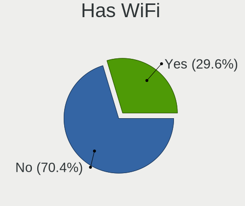
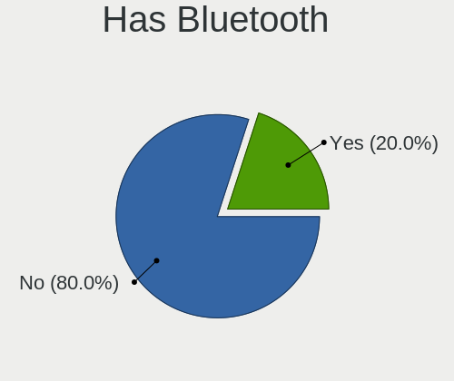
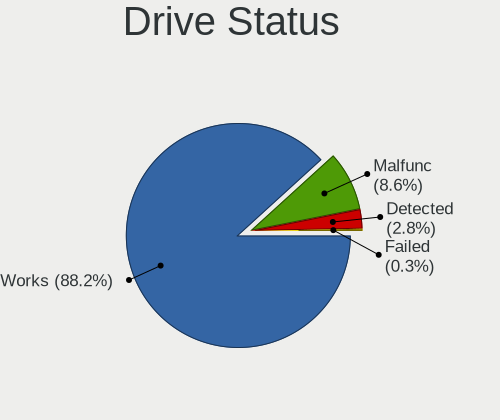
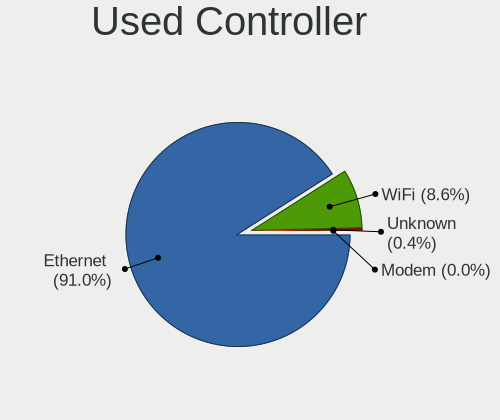
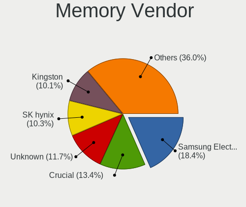

BSD in Germany - Tested Hardware & Statistics
---------------------------------------------

A project to collect tested hardware configurations for BSD in Germany.

Anyone can contribute to this report by the [hw-probe](https://github.com/linuxhw/hw-probe/blob/master/INSTALL.BSD.md) tool:

    hw-probe -all -upload

Please contribute! Especially if your hardware is rare.

This is a report for all computer types. See also reports for [desktops](/Location/Germany/Desktop/README.md) and [notebooks](/Location/Germany/Notebook/README.md).

Contents
--------

* [ Test Cases ](#test-cases)

* [ System ](#system)
  - [ OS                       ](#os)
  - [ OS Family                ](#os-family)
  - [ Arch                     ](#arch)
  - [ DE                       ](#de)
  - [ Display Server           ](#display-server)
  - [ Display Manager          ](#display-manager)
  - [ OS Lang                  ](#os-lang)
  - [ Boot Mode                ](#boot-mode)
  - [ Filesystem               ](#filesystem)
  - [ Part. scheme             ](#part-scheme)

* [ Board ](#board)
  - [ Vendor                   ](#vendor)
  - [ Model                    ](#model)
  - [ Model Family             ](#model-family)
  - [ MFG Year                 ](#mfg-year)
  - [ Form Factor              ](#form-factor)
  - [ Coreboot                 ](#coreboot)
  - [ RAM Size                 ](#ram-size)
  - [ RAM Used                 ](#ram-used)
  - [ Total Drives             ](#total-drives)
  - [ Has CD-ROM               ](#has-cd-rom)
  - [ Has Ethernet             ](#has-ethernet)
  - [ Has WiFi                 ](#has-wifi)
  - [ Has Bluetooth            ](#has-bluetooth)

* [ Location ](#location)
  - [ Country                  ](#country)
  - [ City                     ](#city)

* [ Drives ](#drives)
  - [ Drive Vendor             ](#drive-vendor)
  - [ Drive Model              ](#drive-model)
  - [ HDD Vendor               ](#hdd-vendor)
  - [ SSD Vendor               ](#ssd-vendor)
  - [ Drive Kind               ](#drive-kind)
  - [ Drive Connector          ](#drive-connector)
  - [ Drive Size               ](#drive-size)
  - [ Space Total              ](#space-total)
  - [ Space Used               ](#space-used)
  - [ Malfunc. Drives          ](#malfunc-drives)
  - [ Malfunc. Drive Vendor    ](#malfunc-drive-vendor)
  - [ Malfunc. HDD Vendor      ](#malfunc-hdd-vendor)
  - [ Malfunc. Drive Kind      ](#malfunc-drive-kind)
  - [ Failed Drives            ](#failed-drives)
  - [ Failed Drive Vendor      ](#failed-drive-vendor)
  - [ Drive Status             ](#drive-status)

* [ Storage controller ](#storage-controller)
  - [ Storage Vendor           ](#storage-vendor)
  - [ Storage Model            ](#storage-model)
  - [ Storage Kind             ](#storage-kind)

* [ Processor ](#processor)
  - [ CPU Vendor               ](#cpu-vendor)
  - [ CPU Model                ](#cpu-model)
  - [ CPU Model Family         ](#cpu-model-family)
  - [ CPU Cores                ](#cpu-cores)
  - [ CPU Sockets              ](#cpu-sockets)
  - [ CPU Threads              ](#cpu-threads)
  - [ CPU Microarch            ](#cpu-microarch)

* [ Graphics ](#graphics)
  - [ GPU Vendor               ](#gpu-vendor)
  - [ GPU Model                ](#gpu-model)
  - [ GPU Combo                ](#gpu-combo)
  - [ GPU Driver               ](#gpu-driver)
  - [ GPU Memory               ](#gpu-memory)

* [ Monitor ](#monitor)
  - [ Monitor Vendor           ](#monitor-vendor)
  - [ Monitor Model            ](#monitor-model)
  - [ Monitor Resolution       ](#monitor-resolution)
  - [ Monitor Diagonal         ](#monitor-diagonal)
  - [ Monitor Width            ](#monitor-width)
  - [ Aspect Ratio             ](#aspect-ratio)
  - [ Monitor Area             ](#monitor-area)
  - [ Pixel Density            ](#pixel-density)
  - [ Multiple Monitors        ](#multiple-monitors)

* [ Network ](#network)
  - [ Net Controller Vendor    ](#net-controller-vendor)
  - [ Net Controller Model     ](#net-controller-model)
  - [ Wireless Vendor          ](#wireless-vendor)
  - [ Wireless Model           ](#wireless-model)
  - [ Ethernet Vendor          ](#ethernet-vendor)
  - [ Ethernet Model           ](#ethernet-model)
  - [ Net Controller Kind      ](#net-controller-kind)
  - [ Used Controller          ](#used-controller)
  - [ NICs                     ](#nics)
  - [ IPv6                     ](#ipv6)

* [ Bluetooth ](#bluetooth)
  - [ Bluetooth Vendor         ](#bluetooth-vendor)
  - [ Bluetooth Model          ](#bluetooth-model)

* [ Sound ](#sound)
  - [ Sound Vendor             ](#sound-vendor)
  - [ Sound Model              ](#sound-model)

* [ Memory ](#memory)
  - [ Memory Vendor            ](#memory-vendor)
  - [ Memory Model             ](#memory-model)
  - [ Memory Kind              ](#memory-kind)
  - [ Memory Form Factor       ](#memory-form-factor)
  - [ Memory Size              ](#memory-size)
  - [ Memory Speed             ](#memory-speed)

* [ Printers & scanners ](#printers--scanners)
  - [ Printer Vendor           ](#printer-vendor)
  - [ Printer Model            ](#printer-model)
  - [ Scanner Vendor           ](#scanner-vendor)
  - [ Scanner Model            ](#scanner-model)

* [ Camera ](#camera)
  - [ Camera Vendor            ](#camera-vendor)
  - [ Camera Model             ](#camera-model)

* [ Security ](#security)
  - [ Fingerprint Vendor       ](#fingerprint-vendor)
  - [ Fingerprint Model        ](#fingerprint-model)
  - [ Chipcard Vendor          ](#chipcard-vendor)
  - [ Chipcard Model           ](#chipcard-model)

* [ Unsupported ](#unsupported)
  - [ Unsupported Devices      ](#unsupported-devices)
  - [ Unsupported Device Types ](#unsupported-device-types)

Test Cases
----------

Total: 2702

| Vendor        | Model                       | Form-Factor | Probe                                                     | Date         |
|---------------|-----------------------------|-------------|-----------------------------------------------------------|--------------|
| PC Engines    | apu4                        | Desktop     | [62f0b60653](https://bsd-hardware.info/?probe=62f0b60653) | Jun 30, 2023 |
| Dell          | 00V62H A01                  | Desktop     | [d60c967edb](https://bsd-hardware.info/?probe=d60c967edb) | Jun 29, 2023 |
| Unknown       | Unknown                     | Desktop     | [075deef24f](https://bsd-hardware.info/?probe=075deef24f) | Jun 28, 2023 |
| CncTion       | J4125-4L-I225               | Desktop     | [1785cb2fa3](https://bsd-hardware.info/?probe=1785cb2fa3) | Jun 28, 2023 |
| Deciso        | NetBoard-A10                | Notebook    | [2eff359d8f](https://bsd-hardware.info/?probe=2eff359d8f) | Jun 28, 2023 |
| Fujitsu       | D3313-G1 S26361-D3313-G1    | Desktop     | [bcad942162](https://bsd-hardware.info/?probe=bcad942162) | Jun 26, 2023 |
| Unknown       | YL-SKUL6                    | Desktop     | [1512f63972](https://bsd-hardware.info/?probe=1512f63972) | Jun 26, 2023 |
| Protectli     | FW6 Ver                     | Desktop     | [fa177a2538](https://bsd-hardware.info/?probe=fa177a2538) | Jun 26, 2023 |
| Protectli     | FW6 Ver                     | Desktop     | [54ef7dc131](https://bsd-hardware.info/?probe=54ef7dc131) | Jun 26, 2023 |
| Protectli     | FW6 Ver                     | Desktop     | [b056cd0426](https://bsd-hardware.info/?probe=b056cd0426) | Jun 26, 2023 |
| Unknown       | J3160-4L                    | Desktop     | [5ad411cd6b](https://bsd-hardware.info/?probe=5ad411cd6b) | Jun 25, 2023 |
| Hardkernel    | ODROID-H3                   | Desktop     | [8a2ea60929](https://bsd-hardware.info/?probe=8a2ea60929) | Jun 25, 2023 |
| Sophos        | SG                          | Firewall    | [11e1176b5e](https://bsd-hardware.info/?probe=11e1176b5e) | Jun 24, 2023 |
| Techvision    | TVI7309X B0                 | Desktop     | [18cf91f3a4](https://bsd-hardware.info/?probe=18cf91f3a4) | Jun 23, 2023 |
| Intel         | Q3XXG4-P V1.0               | Desktop     | [bb4dc2b1a2](https://bsd-hardware.info/?probe=bb4dc2b1a2) | Jun 23, 2023 |
| Unknown       | Unknown                     | Desktop     | [16ceade742](https://bsd-hardware.info/?probe=16ceade742) | Jun 23, 2023 |
| Unknown       | Unknown                     | Desktop     | [508aa0bdb4](https://bsd-hardware.info/?probe=508aa0bdb4) | Jun 23, 2023 |
| Sophos        | SG                          | Firewall    | [6763145000](https://bsd-hardware.info/?probe=6763145000) | Jun 22, 2023 |
| BESSTAR Te... | GB7                         | Mini pc     | [4f80d81bbe](https://bsd-hardware.info/?probe=4f80d81bbe) | Jun 20, 2023 |
| Lenovo        | ThinkPad T430 2347A45       | Notebook    | [6969cd9e1a](https://bsd-hardware.info/?probe=6969cd9e1a) | Jun 20, 2023 |
| Lenovo        | ThinkPad T430 2347A45       | Notebook    | [461a92a1a2](https://bsd-hardware.info/?probe=461a92a1a2) | Jun 20, 2023 |
| Yanling       | YL-KBRL2 Series Ver:1.02    | Desktop     | [9e8d6110f4](https://bsd-hardware.info/?probe=9e8d6110f4) | Jun 19, 2023 |
| LANCOM Sys... | UF-60                       | Desktop     | [96904b8bdd](https://bsd-hardware.info/?probe=96904b8bdd) | Jun 19, 2023 |
| Unknown       | Unknown                     | Desktop     | [5fc629699d](https://bsd-hardware.info/?probe=5fc629699d) | Jun 18, 2023 |
| Intel         | NUC11PABi5 K90634-305       | Mini pc     | [9f41fa4740](https://bsd-hardware.info/?probe=9f41fa4740) | Jun 18, 2023 |
| Intel         | NUC11PABi5 K90634-305       | Mini pc     | [8eb0be633d](https://bsd-hardware.info/?probe=8eb0be633d) | Jun 18, 2023 |
| Dell          | Latitude E6520              | Notebook    | [98868960d5](https://bsd-hardware.info/?probe=98868960d5) | Jun 18, 2023 |
| ASRock        | Z97 Professional            | Desktop     | [c978ddda86](https://bsd-hardware.info/?probe=c978ddda86) | Jun 18, 2023 |
| Sophos        | SG                          | Firewall    | [94a6b615cb](https://bsd-hardware.info/?probe=94a6b615cb) | Jun 17, 2023 |
| Samsung       | NC210/NC110                 | Notebook    | [06f5a9210b](https://bsd-hardware.info/?probe=06f5a9210b) | Jun 17, 2023 |
| Apple         | MacBook7,1                  | Notebook    | [6412e6fb23](https://bsd-hardware.info/?probe=6412e6fb23) | Jun 16, 2023 |
| AMD           | Kabini CRB                  | Desktop     | [b774a8b586](https://bsd-hardware.info/?probe=b774a8b586) | Jun 16, 2023 |
| CncTion       | N5105-4L B0                 | Desktop     | [b9c5b6ec05](https://bsd-hardware.info/?probe=b9c5b6ec05) | Jun 15, 2023 |
| Fujitsu Si... | D2804-A1 S26361-D2804-A1    | Desktop     | [70b0e8172d](https://bsd-hardware.info/?probe=70b0e8172d) | Jun 14, 2023 |
| PC Engines    | apu4                        | Desktop     | [ea036662ca](https://bsd-hardware.info/?probe=ea036662ca) | Jun 14, 2023 |
| Unknown       | J3160-4L                    | Desktop     | [4a6667249e](https://bsd-hardware.info/?probe=4a6667249e) | Jun 13, 2023 |
| Lenovo        | ThinkPad T530 2429AP0       | Notebook    | [ddf37e7b17](https://bsd-hardware.info/?probe=ddf37e7b17) | Jun 13, 2023 |
| Samsung       | NC210/NC110                 | Notebook    | [dad27d6099](https://bsd-hardware.info/?probe=dad27d6099) | Jun 13, 2023 |
| Fujitsu       | D3313-E1 S26361-D3313-E1    | Desktop     | [015a5d839a](https://bsd-hardware.info/?probe=015a5d839a) | Jun 13, 2023 |
| Unknown       | Unknown                     | Desktop     | [27617e1ca6](https://bsd-hardware.info/?probe=27617e1ca6) | Jun 13, 2023 |
| HP            | 3397                        | Desktop     | [a918ce0c4b](https://bsd-hardware.info/?probe=a918ce0c4b) | Jun 12, 2023 |
| CWWK          | MINIPC-G12                  | Desktop     | [04ae7435e5](https://bsd-hardware.info/?probe=04ae7435e5) | Jun 12, 2023 |
| MSI           | A320M GRENADE               | Desktop     | [6e0b1f598f](https://bsd-hardware.info/?probe=6e0b1f598f) | Jun 12, 2023 |
| Fujitsu       | D3313-A1 S26361-D3313-A1    | Desktop     | [02509df772](https://bsd-hardware.info/?probe=02509df772) | Jun 12, 2023 |
| Sophos        | UTM                         | Firewall    | [d4856d7798](https://bsd-hardware.info/?probe=d4856d7798) | Jun 11, 2023 |
| ASUSTek       | TUF Gaming B650M-PLUS       | Desktop     | [2d2052de27](https://bsd-hardware.info/?probe=2d2052de27) | Jun 11, 2023 |
| HP            | 15                          | Notebook    | [4664b4c93f](https://bsd-hardware.info/?probe=4664b4c93f) | Jun 11, 2023 |
| Unknown       | Unknown                     | Desktop     | [8988baa83b](https://bsd-hardware.info/?probe=8988baa83b) | Jun 10, 2023 |
| Unknown       | Unknown                     | Desktop     | [40bb474319](https://bsd-hardware.info/?probe=40bb474319) | Jun 10, 2023 |
| ASRock        | B85M-HDS                    | Desktop     | [09a4700a14](https://bsd-hardware.info/?probe=09a4700a14) | Jun 09, 2023 |
| HP            | ProLiant DL360 Gen9         | Server      | [d21bdf0cdb](https://bsd-hardware.info/?probe=d21bdf0cdb) | Jun 09, 2023 |
| Wortmann      | terra Nettop 2700           | Desktop     | [e4a90ea530](https://bsd-hardware.info/?probe=e4a90ea530) | Jun 08, 2023 |
| Intel         | Q3XXG4-P V1.0               | Desktop     | [1ae49c4706](https://bsd-hardware.info/?probe=1ae49c4706) | Jun 08, 2023 |
| Sophos        | SG                          | Firewall    | [6cf087f800](https://bsd-hardware.info/?probe=6cf087f800) | Jun 08, 2023 |
| Intel         | SKYBAY                      | Desktop     | [f1b649ed11](https://bsd-hardware.info/?probe=f1b649ed11) | Jun 08, 2023 |
| Lanner        | FW-7543 B-GA                | Desktop     | [ee85efd1c0](https://bsd-hardware.info/?probe=ee85efd1c0) | Jun 08, 2023 |
| LANCOM Sys... | UF-60                       | Desktop     | [204f10b60f](https://bsd-hardware.info/?probe=204f10b60f) | Jun 07, 2023 |
| Intel         | Q3XXG4-P V1.0               | Desktop     | [4e57bbcdb5](https://bsd-hardware.info/?probe=4e57bbcdb5) | Jun 06, 2023 |
| Intel         | DENLOW_WS                   | Desktop     | [ce3bef7b5a](https://bsd-hardware.info/?probe=ce3bef7b5a) | Jun 06, 2023 |
| CncTion       | N6000-4L B0                 | Desktop     | [c9ec51aa84](https://bsd-hardware.info/?probe=c9ec51aa84) | Jun 05, 2023 |
| HP            | 3397                        | Desktop     | [6783902b93](https://bsd-hardware.info/?probe=6783902b93) | Jun 05, 2023 |
| Toshiba       | Satellite C70-B             | Notebook    | [cf9ed85e65](https://bsd-hardware.info/?probe=cf9ed85e65) | Jun 05, 2023 |
| Toshiba       | Satellite C70-B             | Notebook    | [fc66ebba25](https://bsd-hardware.info/?probe=fc66ebba25) | Jun 05, 2023 |
| Hardkernel    | ODROID-H3                   | Desktop     | [42e80f8003](https://bsd-hardware.info/?probe=42e80f8003) | Jun 05, 2023 |
| Sophos        | UTM                         | Firewall    | [05ee8903b5](https://bsd-hardware.info/?probe=05ee8903b5) | Jun 04, 2023 |
| Deciso        | NetBoard-A10                | Notebook    | [ab3919bc32](https://bsd-hardware.info/?probe=ab3919bc32) | Jun 04, 2023 |
| Dell          | 0PC5F7 A03                  | Desktop     | [23bd5ef252](https://bsd-hardware.info/?probe=23bd5ef252) | Jun 04, 2023 |
| Fujitsu       | D3313-A1 S26361-D3313-A1    | Desktop     | [56a9981ff3](https://bsd-hardware.info/?probe=56a9981ff3) | Jun 03, 2023 |
| PC Engines    | APU2                        | Desktop     | [31c697459b](https://bsd-hardware.info/?probe=31c697459b) | Jun 02, 2023 |
| HP            | ProLiant DL360p Gen8        | Server      | [300b958d60](https://bsd-hardware.info/?probe=300b958d60) | May 30, 2023 |
| HP            | 3397                        | Desktop     | [1f8a9a4f27](https://bsd-hardware.info/?probe=1f8a9a4f27) | May 29, 2023 |
| ASRock        | H410M/ac                    | Desktop     | [d3e3d20cc4](https://bsd-hardware.info/?probe=d3e3d20cc4) | May 29, 2023 |
| ASRockRack    | X470D4U2-2T                 | Desktop     | [2827d90215](https://bsd-hardware.info/?probe=2827d90215) | May 28, 2023 |
| Tactus        | GeoFlex 110                 | Notebook    | [df93ad7e83](https://bsd-hardware.info/?probe=df93ad7e83) | May 27, 2023 |
| HP            | 3397                        | Desktop     | [036d4e087c](https://bsd-hardware.info/?probe=036d4e087c) | May 27, 2023 |
| HP            | 3397                        | Desktop     | [19abd8768e](https://bsd-hardware.info/?probe=19abd8768e) | May 27, 2023 |
| ASRock        | X570 Phantom Gaming 4       | Desktop     | [81775d5ca1](https://bsd-hardware.info/?probe=81775d5ca1) | May 26, 2023 |
| AMI           | Aptio CRB                   | Mini pc     | [aad8268158](https://bsd-hardware.info/?probe=aad8268158) | May 24, 2023 |
| Nitrokey      | NitroWall                   | Desktop     | [1b3b451dee](https://bsd-hardware.info/?probe=1b3b451dee) | May 24, 2023 |
| AMI           | Aptio CRB                   | Mini pc     | [fff8a7a86f](https://bsd-hardware.info/?probe=fff8a7a86f) | May 24, 2023 |
| Unknown       | Unknown                     | Desktop     | [4c7e1d476d](https://bsd-hardware.info/?probe=4c7e1d476d) | May 23, 2023 |
| Nitrokey      | NitroWall                   | Desktop     | [ef701f3991](https://bsd-hardware.info/?probe=ef701f3991) | May 23, 2023 |
| HP            | ProLiant DL360 Gen9         | Server      | [14583f30e3](https://bsd-hardware.info/?probe=14583f30e3) | May 22, 2023 |
| Unknown       | QD-WHLU01                   | Desktop     | [700bcad7cc](https://bsd-hardware.info/?probe=700bcad7cc) | May 22, 2023 |
| HP            | 158B                        | Desktop     | [1ef3762103](https://bsd-hardware.info/?probe=1ef3762103) | May 20, 2023 |
| HP            | 158B                        | Desktop     | [a9c63041a6](https://bsd-hardware.info/?probe=a9c63041a6) | May 20, 2023 |
| ZOTAC         | Unknown                     | Desktop     | [8156e3fede](https://bsd-hardware.info/?probe=8156e3fede) | May 19, 2023 |
| ASUSTek       | TUF Gaming B650M-PLUS       | Desktop     | [612e3a21d4](https://bsd-hardware.info/?probe=612e3a21d4) | May 19, 2023 |
| ASUSTek       | PRIME A320M-K               | Desktop     | [8f3c5de741](https://bsd-hardware.info/?probe=8f3c5de741) | May 19, 2023 |
| VIA Techno... | VT82C597                    | Desktop     | [d73db58e48](https://bsd-hardware.info/?probe=d73db58e48) | May 19, 2023 |
| Sophos        | SG                          | Firewall    | [a27da0f165](https://bsd-hardware.info/?probe=a27da0f165) | May 19, 2023 |
| ASUSTek       | PRO B460M-C                 | Desktop     | [9350bb37db](https://bsd-hardware.info/?probe=9350bb37db) | May 18, 2023 |
| Medion        | MS-7633                     | Desktop     | [c01f7b9894](https://bsd-hardware.info/?probe=c01f7b9894) | May 18, 2023 |
| Lenovo        | ThinkPad T560 20FJS03Q00    | Notebook    | [a2110471aa](https://bsd-hardware.info/?probe=a2110471aa) | May 18, 2023 |
| Supermicro    | H8DM8-2                     | Desktop     | [68c51b6006](https://bsd-hardware.info/?probe=68c51b6006) | May 18, 2023 |
| CncTion       | N5105-4L-I226 B0            | Desktop     | [75f5674d44](https://bsd-hardware.info/?probe=75f5674d44) | May 18, 2023 |
| HP            | 3397                        | Desktop     | [d405f14bb9](https://bsd-hardware.info/?probe=d405f14bb9) | May 18, 2023 |
| Unknown       | Unknown                     | Desktop     | [fff8127c3f](https://bsd-hardware.info/?probe=fff8127c3f) | May 17, 2023 |
| Unknown       | Unknown                     | Desktop     | [cc27c738be](https://bsd-hardware.info/?probe=cc27c738be) | May 17, 2023 |
| PC Engines    | apu4                        | Desktop     | [7fe2bf9ad6](https://bsd-hardware.info/?probe=7fe2bf9ad6) | May 16, 2023 |
| PC Engines    | apu4                        | Desktop     | [7723fe0a0a](https://bsd-hardware.info/?probe=7723fe0a0a) | May 16, 2023 |
| ASUSTek       | H110I-PLUS                  | Desktop     | [37922a69a6](https://bsd-hardware.info/?probe=37922a69a6) | May 15, 2023 |
| Lenovo        | SHARKBAY NOK                | Desktop     | [2b4ece70c9](https://bsd-hardware.info/?probe=2b4ece70c9) | May 15, 2023 |
| ASRock        | AM1B-ITX                    | Desktop     | [8ad16a1805](https://bsd-hardware.info/?probe=8ad16a1805) | May 15, 2023 |
| Supermicro    | X10SDV-6C-TLN4F             | Server      | [acf561c8dd](https://bsd-hardware.info/?probe=acf561c8dd) | May 15, 2023 |
| PC Engines    | APU2                        | Desktop     | [62fef2616b](https://bsd-hardware.info/?probe=62fef2616b) | May 15, 2023 |
| MSI           | B85M-G43                    | Desktop     | [6d2160dcee](https://bsd-hardware.info/?probe=6d2160dcee) | May 14, 2023 |
| Intel         | NUC8BEB J72692-309          | Mini pc     | [31beba4f9c](https://bsd-hardware.info/?probe=31beba4f9c) | May 14, 2023 |
| Intel         | NUC8BEB J72692-309          | Mini pc     | [41cf5e3d74](https://bsd-hardware.info/?probe=41cf5e3d74) | May 14, 2023 |
| Fujitsu       | D3313-A1 S26361-D3313-A1    | Desktop     | [7332aba586](https://bsd-hardware.info/?probe=7332aba586) | May 14, 2023 |
| Lenovo        | 3136 SDK0J40697 WIN 3305... | Mini pc     | [2eb7679f0a](https://bsd-hardware.info/?probe=2eb7679f0a) | May 13, 2023 |
| Supermicro    | X10SDV-6C-TLN4F             | Server      | [bced2662cd](https://bsd-hardware.info/?probe=bced2662cd) | May 13, 2023 |
| Supermicro    | X10SDV-6C-TLN4F             | Server      | [819210fd5f](https://bsd-hardware.info/?probe=819210fd5f) | May 12, 2023 |
| Supermicro    | X11SBA-LN4FA                | Server      | [66569d2c7d](https://bsd-hardware.info/?probe=66569d2c7d) | May 12, 2023 |
| Intel         | NUC6i5SYB H81131-503        | Mini pc     | [4eea72e4a6](https://bsd-hardware.info/?probe=4eea72e4a6) | May 11, 2023 |
| Fujitsu       | D3823-A2 S26361-D3823-Ax... | Desktop     | [2528087de1](https://bsd-hardware.info/?probe=2528087de1) | May 11, 2023 |
| Unknown       | Unknown                     | Desktop     | [eee23dec87](https://bsd-hardware.info/?probe=eee23dec87) | May 11, 2023 |
| ASUSTek       | H110I-PLUS                  | Desktop     | [2543ed83b9](https://bsd-hardware.info/?probe=2543ed83b9) | May 10, 2023 |
| Sophos        | SG                          | Firewall    | [420ac95a25](https://bsd-hardware.info/?probe=420ac95a25) | May 10, 2023 |
| Fujitsu       | D3644-B1 S26361-D3644-B1    | Desktop     | [b2e52b5677](https://bsd-hardware.info/?probe=b2e52b5677) | May 10, 2023 |
| Techvision    | TVI7309X B0                 | Desktop     | [fbf3fde510](https://bsd-hardware.info/?probe=fbf3fde510) | May 09, 2023 |
| Fujitsu       | D3313-A1 S26361-D3313-A1    | Desktop     | [96abd89bab](https://bsd-hardware.info/?probe=96abd89bab) | May 09, 2023 |
| Deciso        | NetBoard-A10                | Notebook    | [37ee98e0b6](https://bsd-hardware.info/?probe=37ee98e0b6) | May 09, 2023 |
| Fujitsu       | D3313-A1 S26361-D3313-A1    | Desktop     | [38243e0313](https://bsd-hardware.info/?probe=38243e0313) | May 09, 2023 |
| Apple         | MacBook5,1                  | Notebook    | [da07885adb](https://bsd-hardware.info/?probe=da07885adb) | May 09, 2023 |
| PC Engines    | APU2                        | Desktop     | [6aff35010a](https://bsd-hardware.info/?probe=6aff35010a) | May 08, 2023 |
| Hardkernel    | ODROID-H3                   | Desktop     | [5b669f261f](https://bsd-hardware.info/?probe=5b669f261f) | May 08, 2023 |
| Unknown       | T100                        | Desktop     | [fb9c6bff7b](https://bsd-hardware.info/?probe=fb9c6bff7b) | May 07, 2023 |
| BESSTAR Te... | GB7                         | Mini pc     | [45a1c497b6](https://bsd-hardware.info/?probe=45a1c497b6) | May 07, 2023 |
| Supermicro    | X12STN-C-WOHS               | Desktop     | [d8cf344aee](https://bsd-hardware.info/?probe=d8cf344aee) | May 06, 2023 |
| Unknown       | Unknown                     | Desktop     | [349e1709cd](https://bsd-hardware.info/?probe=349e1709cd) | May 06, 2023 |
| Fujitsu       | D3313-A1 S26361-D3313-A1    | Desktop     | [c29d140ee6](https://bsd-hardware.info/?probe=c29d140ee6) | May 06, 2023 |
| AMI           | Aptio CRB                   | Mini pc     | [deeed22abd](https://bsd-hardware.info/?probe=deeed22abd) | May 04, 2023 |
| Lanner        | FW-7543 B-GA                | Desktop     | [8346fdf608](https://bsd-hardware.info/?probe=8346fdf608) | May 03, 2023 |
| HP            | 1589                        | Desktop     | [4aee1909c8](https://bsd-hardware.info/?probe=4aee1909c8) | May 03, 2023 |
| Apple         | MacBook5,1                  | Notebook    | [a5a1ca2ee6](https://bsd-hardware.info/?probe=a5a1ca2ee6) | May 02, 2023 |
| ASRock        | A520M-ITX/ac                | Desktop     | [70b09db335](https://bsd-hardware.info/?probe=70b09db335) | May 02, 2023 |
| ASRock        | A520M-ITX/ac                | Desktop     | [eb61af55d5](https://bsd-hardware.info/?probe=eb61af55d5) | May 01, 2023 |
| Fujitsu       | D3313-G1 S26361-D3313-G1    | Desktop     | [8227d6d32c](https://bsd-hardware.info/?probe=8227d6d32c) | Apr 30, 2023 |
| ASUSTek       | M5A78L-M/USB3               | Desktop     | [f86a94eb66](https://bsd-hardware.info/?probe=f86a94eb66) | Apr 30, 2023 |
| Protectli     | VP2420                      | Desktop     | [4ea8453453](https://bsd-hardware.info/?probe=4ea8453453) | Apr 30, 2023 |
| Protectli     | VP2420                      | Desktop     | [46a00b21d9](https://bsd-hardware.info/?probe=46a00b21d9) | Apr 30, 2023 |
| Supermicro    | A1SAi 123456789             | Mini pc     | [38dc0b126e](https://bsd-hardware.info/?probe=38dc0b126e) | Apr 29, 2023 |
| AMI           | Aptio CRB                   | Mini pc     | [ec520be044](https://bsd-hardware.info/?probe=ec520be044) | Apr 29, 2023 |
| Supermicro    | A2SDi-H-TF                  | Server      | [cae933d56e](https://bsd-hardware.info/?probe=cae933d56e) | Apr 29, 2023 |
| Protectli     | FW4B                        | Desktop     | [048da71e18](https://bsd-hardware.info/?probe=048da71e18) | Apr 29, 2023 |
| Sophos        | SG                          | Firewall    | [b0c4592563](https://bsd-hardware.info/?probe=b0c4592563) | Apr 29, 2023 |
| Deciso        | NetBoard-A10                | Notebook    | [79c36f752c](https://bsd-hardware.info/?probe=79c36f752c) | Apr 28, 2023 |
| Supermicro    | A2SDi-4C-HLN4F              | Server      | [9dc9ca0768](https://bsd-hardware.info/?probe=9dc9ca0768) | Apr 28, 2023 |
| PC Engines    | apu1                        | Desktop     | [1a37e9d978](https://bsd-hardware.info/?probe=1a37e9d978) | Apr 27, 2023 |
| Supermicro    | X11SCM-LN8F                 | Server      | [32afb6ef58](https://bsd-hardware.info/?probe=32afb6ef58) | Apr 27, 2023 |
| Apple         | MacBook5,1                  | Notebook    | [52174cc0ba](https://bsd-hardware.info/?probe=52174cc0ba) | Apr 27, 2023 |
| Fujitsu       | D3313-A1 S26361-D3313-A1    | Desktop     | [989f3b44bf](https://bsd-hardware.info/?probe=989f3b44bf) | Apr 26, 2023 |
| Supermicro    | X11SDW-8C-TP13F             | Desktop     | [94316d20c8](https://bsd-hardware.info/?probe=94316d20c8) | Apr 26, 2023 |
| Apple         | MacBook5,1                  | Notebook    | [4c7f33d6a9](https://bsd-hardware.info/?probe=4c7f33d6a9) | Apr 25, 2023 |
| MiTAC         | PH13CMI                     | Desktop     | [5d3e954049](https://bsd-hardware.info/?probe=5d3e954049) | Apr 24, 2023 |
| ZOTAC         | ZBOX-CI323NANO              | Mini pc     | [c452485a00](https://bsd-hardware.info/?probe=c452485a00) | Apr 24, 2023 |
| ASUSTek       | TUF Gaming B650M-PLUS       | Desktop     | [0c8a0100c5](https://bsd-hardware.info/?probe=0c8a0100c5) | Apr 23, 2023 |
| Techvision    | TVI7309X B0                 | Desktop     | [ad73cda832](https://bsd-hardware.info/?probe=ad73cda832) | Apr 23, 2023 |
| ASUSTek       | TUF Gaming B650M-PLUS       | Desktop     | [775424cbff](https://bsd-hardware.info/?probe=775424cbff) | Apr 22, 2023 |
| HP            | 8103 A01                    | Mini pc     | [e9c239c897](https://bsd-hardware.info/?probe=e9c239c897) | Apr 21, 2023 |
| ASUSTek       | TUF Gaming B550-PLUS        | Desktop     | [c26c1111c6](https://bsd-hardware.info/?probe=c26c1111c6) | Apr 21, 2023 |
| Techvision    | TVI7309X B0                 | Desktop     | [215364d870](https://bsd-hardware.info/?probe=215364d870) | Apr 21, 2023 |
| Dell          | Latitude 7280               | Notebook    | [254acb5df8](https://bsd-hardware.info/?probe=254acb5df8) | Apr 20, 2023 |
| Techvision    | TVI7309X B0                 | Desktop     | [fdbbde509c](https://bsd-hardware.info/?probe=fdbbde509c) | Apr 20, 2023 |
| Sophos        | SG                          | Firewall    | [c05ad03e84](https://bsd-hardware.info/?probe=c05ad03e84) | Apr 19, 2023 |
| Lenovo        | ThinkPad X201 3626WNP       | Notebook    | [d642970071](https://bsd-hardware.info/?probe=d642970071) | Apr 19, 2023 |
| PC Engines    | APU2                        | Desktop     | [59b3a3eebf](https://bsd-hardware.info/?probe=59b3a3eebf) | Apr 19, 2023 |
| Sophos        | UTM                         | Firewall    | [d45ac19cd1](https://bsd-hardware.info/?probe=d45ac19cd1) | Apr 19, 2023 |
| ASUSTek       | Pro B560M-C                 | Desktop     | [b341a9c9c9](https://bsd-hardware.info/?probe=b341a9c9c9) | Apr 19, 2023 |
| Dell          | 060J9C A00                  | Mini pc     | [1cec8655b7](https://bsd-hardware.info/?probe=1cec8655b7) | Apr 19, 2023 |
| Dell          | 060J9C A00                  | Mini pc     | [92b99c6f08](https://bsd-hardware.info/?probe=92b99c6f08) | Apr 19, 2023 |
| Unknown       | Unknown                     | Desktop     | [311e89be7a](https://bsd-hardware.info/?probe=311e89be7a) | Apr 18, 2023 |
| CncTion       | J4125-4L-I225               | Desktop     | [b4fd4e35b2](https://bsd-hardware.info/?probe=b4fd4e35b2) | Apr 18, 2023 |
| Supermicro    | X11SDW-8C-TP13F             | Desktop     | [20fac0b7a5](https://bsd-hardware.info/?probe=20fac0b7a5) | Apr 18, 2023 |
| Sophos        | SG                          | Firewall    | [fa6f321ece](https://bsd-hardware.info/?probe=fa6f321ece) | Apr 17, 2023 |
| Unknown       | Unknown                     | Desktop     | [f5153e1b18](https://bsd-hardware.info/?probe=f5153e1b18) | Apr 17, 2023 |
| CncTion       | N5105-4L B0                 | Desktop     | [6de7890035](https://bsd-hardware.info/?probe=6de7890035) | Apr 17, 2023 |
| Sophos        | SG                          | Firewall    | [4280767cdb](https://bsd-hardware.info/?probe=4280767cdb) | Apr 17, 2023 |
| Unknown       | Unknown                     | Desktop     | [56505e8956](https://bsd-hardware.info/?probe=56505e8956) | Apr 16, 2023 |
| Intel         | Q3XXG4-P V1.0               | Desktop     | [4fbc5291d9](https://bsd-hardware.info/?probe=4fbc5291d9) | Apr 16, 2023 |
| Lenovo        | Larne CRB 31900002 WIN      | All in one  | [1f18ec4466](https://bsd-hardware.info/?probe=1f18ec4466) | Apr 16, 2023 |
| Fujitsu       | D3313-A1 S26361-D3313-A1    | Desktop     | [a29966f9ee](https://bsd-hardware.info/?probe=a29966f9ee) | Apr 16, 2023 |
| Unknown       | Unknown                     | Notebook    | [c221bccd5d](https://bsd-hardware.info/?probe=c221bccd5d) | Apr 14, 2023 |
| Unknown       | Unknown                     | Desktop     | [94151c41f1](https://bsd-hardware.info/?probe=94151c41f1) | Apr 14, 2023 |
| Unknown       | YL-SKUL6-7 Series           | Desktop     | [627e7a86c6](https://bsd-hardware.info/?probe=627e7a86c6) | Apr 13, 2023 |
| CncTion       | N5105-4L-I226 B0            | Desktop     | [0c7855ee11](https://bsd-hardware.info/?probe=0c7855ee11) | Apr 13, 2023 |
| Intel         | S3420GP E51974-403          | Server      | [e65290edd3](https://bsd-hardware.info/?probe=e65290edd3) | Apr 12, 2023 |
| Intel         | S3420GP E51974-403          | Server      | [00c76c0db0](https://bsd-hardware.info/?probe=00c76c0db0) | Apr 12, 2023 |
| Advantech     | UNO-2271G_V2                | Desktop     | [23e4b8d9b1](https://bsd-hardware.info/?probe=23e4b8d9b1) | Apr 12, 2023 |
| ASUSTek       | P10S-M Series               | Desktop     | [0b060edc48](https://bsd-hardware.info/?probe=0b060edc48) | Apr 12, 2023 |
| MW            | GMLK-2_5G4L                 | Desktop     | [9b1dbe0b9a](https://bsd-hardware.info/?probe=9b1dbe0b9a) | Apr 11, 2023 |
| Unknown       | Unknown                     | Desktop     | [cfa755bf6d](https://bsd-hardware.info/?probe=cfa755bf6d) | Apr 11, 2023 |
| Sophos        | SG                          | Firewall    | [3a2796626e](https://bsd-hardware.info/?probe=3a2796626e) | Apr 11, 2023 |
| CncTion       | N5105-4L-I226 B0            | Desktop     | [65d80d8aeb](https://bsd-hardware.info/?probe=65d80d8aeb) | Apr 09, 2023 |
| Gigabyte      | H610I DDR4                  | Desktop     | [59d65282c3](https://bsd-hardware.info/?probe=59d65282c3) | Apr 08, 2023 |
| ASRock        | A520M-ITX/ac                | Desktop     | [7a0ca560df](https://bsd-hardware.info/?probe=7a0ca560df) | Apr 08, 2023 |
| Lenovo        | ThinkPad X1 Carbon 34487... | Notebook    | [cec90ddd1b](https://bsd-hardware.info/?probe=cec90ddd1b) | Apr 08, 2023 |
| Lenovo        | Legion 5 Pro 16ACH6H 82J... | Notebook    | [f3ac765863](https://bsd-hardware.info/?probe=f3ac765863) | Apr 08, 2023 |
| Unknown       | MANIFOLD 2-C                | Desktop     | [8fb3cbee23](https://bsd-hardware.info/?probe=8fb3cbee23) | Apr 07, 2023 |
| Fujitsu       | D3313-A1 S26361-D3313-A1    | Desktop     | [f1cabdb067](https://bsd-hardware.info/?probe=f1cabdb067) | Apr 06, 2023 |
| Dell          | 04Y8V0 A02                  | Desktop     | [b4dab62ac2](https://bsd-hardware.info/?probe=b4dab62ac2) | Apr 05, 2023 |
| Dell          | 04Y8V0 A02                  | Desktop     | [24d7b97629](https://bsd-hardware.info/?probe=24d7b97629) | Apr 05, 2023 |
| Lanner        | FW-8771 C-GA                | Desktop     | [90d7028263](https://bsd-hardware.info/?probe=90d7028263) | Apr 05, 2023 |
| IGEL Techn... | M340C                       | Notebook    | [6c8b2b7af7](https://bsd-hardware.info/?probe=6c8b2b7af7) | Apr 05, 2023 |
| PC Engines    | apu4                        | Desktop     | [e91a75d782](https://bsd-hardware.info/?probe=e91a75d782) | Apr 05, 2023 |
| Intel         | SKYBAY                      | Desktop     | [81655c4fd5](https://bsd-hardware.info/?probe=81655c4fd5) | Apr 05, 2023 |
| Sophos        | SG                          | Firewall    | [c2a2d9d6c9](https://bsd-hardware.info/?probe=c2a2d9d6c9) | Apr 04, 2023 |
| maiyunda      | www.maiyunda.com            | Desktop     | [7cf52a3977](https://bsd-hardware.info/?probe=7cf52a3977) | Apr 03, 2023 |
| Supermicro    | X10SDV-TP8F                 | Server      | [70a4d74b1a](https://bsd-hardware.info/?probe=70a4d74b1a) | Apr 03, 2023 |
| Supermicro    | X10SLH-N6-ST031             | Server      | [828e914b59](https://bsd-hardware.info/?probe=828e914b59) | Apr 03, 2023 |
| Techvision    | TVI7309X B0                 | Desktop     | [ca1360b939](https://bsd-hardware.info/?probe=ca1360b939) | Apr 03, 2023 |
| Lenovo        | 30BE SDK0J40697 WIN 3305... | Desktop     | [bea5641594](https://bsd-hardware.info/?probe=bea5641594) | Apr 02, 2023 |
| MSI           | B450M MORTAR MAX            | Desktop     | [01bf5e8678](https://bsd-hardware.info/?probe=01bf5e8678) | Apr 02, 2023 |
| Supermicro    | X10SLH-N6-ST031             | Server      | [6ef5047d5a](https://bsd-hardware.info/?probe=6ef5047d5a) | Apr 01, 2023 |
| Sophos        | SG                          | Firewall    | [de22e4dd72](https://bsd-hardware.info/?probe=de22e4dd72) | Apr 01, 2023 |
| ZOTAC         | ZBOX-ID91                   | Mini pc     | [d7bb801369](https://bsd-hardware.info/?probe=d7bb801369) | Mar 31, 2023 |
| Gigabyte      | H55M-S2H                    | Desktop     | [60c66c5066](https://bsd-hardware.info/?probe=60c66c5066) | Mar 30, 2023 |
| Lenovo        | 30D0 SDK0J40697 WIN 3305... | Desktop     | [bde9fd671b](https://bsd-hardware.info/?probe=bde9fd671b) | Mar 30, 2023 |
| Fujitsu       | D3313-A1 S26361-D3313-A1    | Desktop     | [a160027cc2](https://bsd-hardware.info/?probe=a160027cc2) | Mar 30, 2023 |
| Dell          | 0VG93V A00                  | Desktop     | [1f3e086401](https://bsd-hardware.info/?probe=1f3e086401) | Mar 30, 2023 |
| BESSTAR Te... | GB7                         | Mini pc     | [3a5111c467](https://bsd-hardware.info/?probe=3a5111c467) | Mar 29, 2023 |
| Intel         | S2600GZ G29051-355          | Server      | [6bc00cde60](https://bsd-hardware.info/?probe=6bc00cde60) | Mar 28, 2023 |
| Intel         | JSL MRD                     | Desktop     | [07adf23a3d](https://bsd-hardware.info/?probe=07adf23a3d) | Mar 28, 2023 |
| Sophos        | SG                          | Firewall    | [b3346fe828](https://bsd-hardware.info/?probe=b3346fe828) | Mar 27, 2023 |
| CncTion       | N5105-4L B0                 | Desktop     | [b6fd7cd6ae](https://bsd-hardware.info/?probe=b6fd7cd6ae) | Mar 27, 2023 |
| Shuttle       | FS81                        | Desktop     | [b80626e045](https://bsd-hardware.info/?probe=b80626e045) | Mar 26, 2023 |
| Lanner        | FW-7543 B-GA                | Desktop     | [3ed4cfc9c8](https://bsd-hardware.info/?probe=3ed4cfc9c8) | Mar 26, 2023 |
| Sophos        | UTM                         | Firewall    | [99af1f0a15](https://bsd-hardware.info/?probe=99af1f0a15) | Mar 26, 2023 |
| ASUSTek       | TUF Gaming B650M-PLUS       | Desktop     | [15e452d25d](https://bsd-hardware.info/?probe=15e452d25d) | Mar 26, 2023 |
| Intel         | Q3XXG4-P V1.0               | Desktop     | [2f16e29f78](https://bsd-hardware.info/?probe=2f16e29f78) | Mar 26, 2023 |
| Protectli     | FW4B Ver                    | Desktop     | [fc5ab682fc](https://bsd-hardware.info/?probe=fc5ab682fc) | Mar 26, 2023 |
| Protectli     | FW4B Ver                    | Desktop     | [5082d62025](https://bsd-hardware.info/?probe=5082d62025) | Mar 25, 2023 |
| Lenovo        | ThinkPad X220 4291AN9       | Notebook    | [1646bb53ab](https://bsd-hardware.info/?probe=1646bb53ab) | Mar 25, 2023 |
| MW            | GMLK-2_5G4L                 | Desktop     | [41fa3f51d3](https://bsd-hardware.info/?probe=41fa3f51d3) | Mar 25, 2023 |
| Unknown       | Unknown                     | Desktop     | [387c27f1d7](https://bsd-hardware.info/?probe=387c27f1d7) | Mar 25, 2023 |
| PC Engines    | APU2                        | Desktop     | [4e4a81e456](https://bsd-hardware.info/?probe=4e4a81e456) | Mar 24, 2023 |
| Lex           | Pineview-D                  | Desktop     | [ca2fbb614d](https://bsd-hardware.info/?probe=ca2fbb614d) | Mar 24, 2023 |
| CncTion       | N5105-4L B0                 | Desktop     | [9561c72b9c](https://bsd-hardware.info/?probe=9561c72b9c) | Mar 24, 2023 |
| Intel         | Q3XXG4-P V1.0               | Desktop     | [083d2e65da](https://bsd-hardware.info/?probe=083d2e65da) | Mar 24, 2023 |
| ASRock        | A520M-ITX/ac                | Desktop     | [18877701a6](https://bsd-hardware.info/?probe=18877701a6) | Mar 24, 2023 |
| HP            | 8103 A01                    | Mini pc     | [23f893285e](https://bsd-hardware.info/?probe=23f893285e) | Mar 24, 2023 |
| Protectli     | VP2420                      | Desktop     | [f07553b02c](https://bsd-hardware.info/?probe=f07553b02c) | Mar 23, 2023 |
| Protectli     | VP2420                      | Desktop     | [dfad78899e](https://bsd-hardware.info/?probe=dfad78899e) | Mar 23, 2023 |
| ShenZhen M... | MW-GMLK-2.5G6L              | Desktop     | [720f15a1ce](https://bsd-hardware.info/?probe=720f15a1ce) | Mar 23, 2023 |
| Sony          | VAIO                        | All in one  | [ef7c622d8d](https://bsd-hardware.info/?probe=ef7c622d8d) | Mar 23, 2023 |
| Sony          | VAIO                        | All in one  | [ededfcfd39](https://bsd-hardware.info/?probe=ededfcfd39) | Mar 23, 2023 |
| ASUSTek       | CROSSHAIR V FORMULA-Z       | Desktop     | [491c0ca78a](https://bsd-hardware.info/?probe=491c0ca78a) | Mar 22, 2023 |
| Intel         | Q3XXG4-P V1.0               | Desktop     | [680002292e](https://bsd-hardware.info/?probe=680002292e) | Mar 22, 2023 |
| MW            | GMLK-2_5G4L                 | Desktop     | [b3f0879ebf](https://bsd-hardware.info/?probe=b3f0879ebf) | Mar 22, 2023 |
| Intel         | SKYBAY                      | Desktop     | [83ea0b27b1](https://bsd-hardware.info/?probe=83ea0b27b1) | Mar 21, 2023 |
| Sophos        | SG                          | Firewall    | [4f818307ff](https://bsd-hardware.info/?probe=4f818307ff) | Mar 21, 2023 |
| Fujitsu Si... | D2824-A1 S26361-D2824-A1    | Desktop     | [bcada44b09](https://bsd-hardware.info/?probe=bcada44b09) | Mar 21, 2023 |
| Lenovo        | ThinkPad X230 232578G       | Notebook    | [edf47cb2d4](https://bsd-hardware.info/?probe=edf47cb2d4) | Mar 21, 2023 |
| Supermicro    | X11SDV-8C-TP8F              | Desktop     | [7ae004c035](https://bsd-hardware.info/?probe=7ae004c035) | Mar 21, 2023 |
| AMI           | Aptio CRB                   | Mini pc     | [5193764df7](https://bsd-hardware.info/?probe=5193764df7) | Mar 20, 2023 |
| Lenovo        | ThinkPad T61 7659CA1        | Notebook    | [bba228ddc9](https://bsd-hardware.info/?probe=bba228ddc9) | Mar 20, 2023 |
| Sophos        | SG                          | Firewall    | [e0ac090471](https://bsd-hardware.info/?probe=e0ac090471) | Mar 20, 2023 |
| Unknown       | Unknown                     | Desktop     | [e4365dfa60](https://bsd-hardware.info/?probe=e4365dfa60) | Mar 20, 2023 |
| ASRock        | B550M Pro4                  | Desktop     | [4dc54510d2](https://bsd-hardware.info/?probe=4dc54510d2) | Mar 19, 2023 |
| ASUSTek       | PRO B460M-C                 | Desktop     | [cab50cddd5](https://bsd-hardware.info/?probe=cab50cddd5) | Mar 19, 2023 |
| ASUSTek       | PRO B460M-C                 | Desktop     | [ff4dda40eb](https://bsd-hardware.info/?probe=ff4dda40eb) | Mar 19, 2023 |
| ASUSTek       | G750JS                      | Notebook    | [bb6117addd](https://bsd-hardware.info/?probe=bb6117addd) | Mar 19, 2023 |
| Intel         | SKYBAY                      | Desktop     | [7bd7f393b1](https://bsd-hardware.info/?probe=7bd7f393b1) | Mar 18, 2023 |
| AMI           | Aptio CRB                   | Mini pc     | [e726d886c8](https://bsd-hardware.info/?probe=e726d886c8) | Mar 18, 2023 |
| Intel         | SKYBAY                      | Desktop     | [a8f1d29e24](https://bsd-hardware.info/?probe=a8f1d29e24) | Mar 18, 2023 |
| MSI           | X299 PRO                    | Desktop     | [a26d096ecb](https://bsd-hardware.info/?probe=a26d096ecb) | Mar 18, 2023 |
| ZOTAC         | ZBOX-ID91                   | Mini pc     | [4bbec4b82a](https://bsd-hardware.info/?probe=4bbec4b82a) | Mar 18, 2023 |
| Fujitsu       | D3313-S3 S26361-D3313-S3    | Desktop     | [1bf34a929a](https://bsd-hardware.info/?probe=1bf34a929a) | Mar 18, 2023 |
| ASUSTek       | TUF Gaming X570-PLUS        | Desktop     | [2ceda5b586](https://bsd-hardware.info/?probe=2ceda5b586) | Mar 17, 2023 |
| Supermicro    | X10SLH-F/X10SLM+-F          | Server      | [17516fffcf](https://bsd-hardware.info/?probe=17516fffcf) | Mar 17, 2023 |
| Lenovo        | ThinkPad X1 Carbon 6th 2... | Notebook    | [6d9c564a33](https://bsd-hardware.info/?probe=6d9c564a33) | Mar 17, 2023 |
| Lenovo        | ThinkPad X61s 7667WQS       | Notebook    | [f1351003d1](https://bsd-hardware.info/?probe=f1351003d1) | Mar 17, 2023 |
| ASRock        | J5040-ITX                   | Desktop     | [435dc7ee7b](https://bsd-hardware.info/?probe=435dc7ee7b) | Mar 15, 2023 |
| Unknown       | Unknown                     | Desktop     | [68b45d5083](https://bsd-hardware.info/?probe=68b45d5083) | Mar 15, 2023 |
| ASRock        | A520M-ITX/ac                | Desktop     | [1ccc8081fd](https://bsd-hardware.info/?probe=1ccc8081fd) | Mar 15, 2023 |
| Acer          | Aspire V3-112P              | Notebook    | [104c10f9b0](https://bsd-hardware.info/?probe=104c10f9b0) | Mar 14, 2023 |
| Foxconn       | H61M/H61M-S                 | Desktop     | [865fbff42a](https://bsd-hardware.info/?probe=865fbff42a) | Mar 14, 2023 |
| ASRock        | Q1900M                      | Desktop     | [9570525d52](https://bsd-hardware.info/?probe=9570525d52) | Mar 14, 2023 |
| MW            | GMLK-2_5G4L                 | Desktop     | [5211185a2a](https://bsd-hardware.info/?probe=5211185a2a) | Mar 14, 2023 |
| Lenovo        | ThinkPad P51 20HH001RMX     | Notebook    | [d9d7368322](https://bsd-hardware.info/?probe=d9d7368322) | Mar 13, 2023 |
| Sophos        | SG                          | Firewall    | [77db75effb](https://bsd-hardware.info/?probe=77db75effb) | Mar 13, 2023 |
| HP            | 8056                        | Desktop     | [e1d2423153](https://bsd-hardware.info/?probe=e1d2423153) | Mar 13, 2023 |
| HP            | 8056                        | Desktop     | [d89b45ea6d](https://bsd-hardware.info/?probe=d89b45ea6d) | Mar 13, 2023 |
| Dell          | 0W0CHX A00                  | Desktop     | [85a9fddd44](https://bsd-hardware.info/?probe=85a9fddd44) | Mar 12, 2023 |
| MW            | GMLK-2_5G4L                 | Desktop     | [fee0ff7804](https://bsd-hardware.info/?probe=fee0ff7804) | Mar 12, 2023 |
| Lenovo        | ZIUS6                       | Notebook    | [d387825f01](https://bsd-hardware.info/?probe=d387825f01) | Mar 12, 2023 |
| Dell          | Latitude E6330              | Notebook    | [5c60cd3d04](https://bsd-hardware.info/?probe=5c60cd3d04) | Mar 12, 2023 |
| Acer          | Veriton N2620G              | Desktop     | [fa57448331](https://bsd-hardware.info/?probe=fa57448331) | Mar 12, 2023 |
| Lenovo        | ThinkPad T460s 20FAS2BR0... | Notebook    | [56fa0d4656](https://bsd-hardware.info/?probe=56fa0d4656) | Mar 11, 2023 |
| ASUSTek       | P8Z68-V                     | Desktop     | [3d8ef63e18](https://bsd-hardware.info/?probe=3d8ef63e18) | Mar 11, 2023 |
| ASUSTek       | H110I-PLUS                  | Desktop     | [8736b12c9a](https://bsd-hardware.info/?probe=8736b12c9a) | Mar 11, 2023 |
| MSI           | X299 PRO                    | Desktop     | [0cebc094ca](https://bsd-hardware.info/?probe=0cebc094ca) | Mar 10, 2023 |
| Unknown       | Unknown                     | Desktop     | [2a55137e71](https://bsd-hardware.info/?probe=2a55137e71) | Mar 10, 2023 |
| CheckPoint    | PH-30-00                    | Desktop     | [ec7a5f05fd](https://bsd-hardware.info/?probe=ec7a5f05fd) | Mar 09, 2023 |
| CompuLab      | fitlet2                     | Mini pc     | [2e616f1ad4](https://bsd-hardware.info/?probe=2e616f1ad4) | Mar 09, 2023 |
| Unknown       | Unknown                     | Desktop     | [d7b171d0bb](https://bsd-hardware.info/?probe=d7b171d0bb) | Mar 09, 2023 |
| Protectli     | VP2420                      | Desktop     | [21d2214da6](https://bsd-hardware.info/?probe=21d2214da6) | Mar 08, 2023 |
| Fujitsu       | D3544-Sx S26361-D3544-Sx... | Mini pc     | [3ad95b9444](https://bsd-hardware.info/?probe=3ad95b9444) | Mar 08, 2023 |
| Unknown       | Unknown                     | Desktop     | [86c132c242](https://bsd-hardware.info/?probe=86c132c242) | Mar 07, 2023 |
| Fujitsu       | D3049-A1 S26361-D3049-A1... | Server      | [b077e8e71a](https://bsd-hardware.info/?probe=b077e8e71a) | Mar 06, 2023 |
| Lenovo        | ThinkPad T16 Gen 1 21BVC... | Notebook    | [1a2543f92f](https://bsd-hardware.info/?probe=1a2543f92f) | Mar 06, 2023 |
| MW            | GMLK-2_5G4L                 | Desktop     | [b91b7cf52d](https://bsd-hardware.info/?probe=b91b7cf52d) | Mar 06, 2023 |
| Techvision    | TVI7309X B0                 | Desktop     | [789ae683f7](https://bsd-hardware.info/?probe=789ae683f7) | Mar 05, 2023 |
| Apple         | Mac-F2268CC8                | All in one  | [2ba0e18863](https://bsd-hardware.info/?probe=2ba0e18863) | Mar 05, 2023 |
| ASUSTek       | PRO B460M-C                 | Desktop     | [a3f77b82cc](https://bsd-hardware.info/?probe=a3f77b82cc) | Mar 05, 2023 |
| Dell          | VEP-4600-V910 0PDG1JA02     | Desktop     | [5070c11c54](https://bsd-hardware.info/?probe=5070c11c54) | Mar 05, 2023 |
| Fujitsu       | D3313-A1 S26361-D3313-A1    | Desktop     | [3d912f92aa](https://bsd-hardware.info/?probe=3d912f92aa) | Mar 05, 2023 |
| ASRock        | E350M1                      | Desktop     | [461f8cca23](https://bsd-hardware.info/?probe=461f8cca23) | Mar 04, 2023 |
| HP            | 8158 A01                    | Mini pc     | [021f9a6e74](https://bsd-hardware.info/?probe=021f9a6e74) | Mar 04, 2023 |
| Fujitsu       | D3049-A1 S26361-D3049-A1... | Server      | [5416a8e0b5](https://bsd-hardware.info/?probe=5416a8e0b5) | Mar 03, 2023 |
| Techvision    | TVI7309X B0                 | Desktop     | [6067b3f58d](https://bsd-hardware.info/?probe=6067b3f58d) | Mar 03, 2023 |
| Techvision    | TVI7309X B0                 | Desktop     | [bbbd05a4c3](https://bsd-hardware.info/?probe=bbbd05a4c3) | Mar 03, 2023 |
| Techvision    | TVI7309X B0                 | Desktop     | [9ab07ae7f1](https://bsd-hardware.info/?probe=9ab07ae7f1) | Mar 03, 2023 |
| Techvision    | TVI7309X B0                 | Desktop     | [228816d44e](https://bsd-hardware.info/?probe=228816d44e) | Mar 03, 2023 |
| Unknown       | Unknown                     | Desktop     | [81bf3cf726](https://bsd-hardware.info/?probe=81bf3cf726) | Mar 03, 2023 |
| Intel         | DENLOW_WS                   | Desktop     | [2b70fdb96a](https://bsd-hardware.info/?probe=2b70fdb96a) | Mar 02, 2023 |
| Sophos        | SG                          | Firewall    | [19b95b3238](https://bsd-hardware.info/?probe=19b95b3238) | Mar 01, 2023 |
| Sophos        | SG                          | Firewall    | [26cd20e559](https://bsd-hardware.info/?probe=26cd20e559) | Mar 01, 2023 |
| Gigabyte      | GA-78LMT-S2P                | Desktop     | [29290b1b9c](https://bsd-hardware.info/?probe=29290b1b9c) | Mar 01, 2023 |
| Gigabyte      | GA-78LMT-S2P                | Desktop     | [5eb87a21db](https://bsd-hardware.info/?probe=5eb87a21db) | Mar 01, 2023 |
| Fujitsu       | D3313-E1 S26361-D3313-E1    | Desktop     | [39d5f658ce](https://bsd-hardware.info/?probe=39d5f658ce) | Feb 28, 2023 |
| Deciso        | NetBoard-A10                | Notebook    | [ca59a5e6f4](https://bsd-hardware.info/?probe=ca59a5e6f4) | Feb 28, 2023 |
| Fujitsu       | D3313-E1 S26361-D3313-E1    | Desktop     | [dcf3f03ddc](https://bsd-hardware.info/?probe=dcf3f03ddc) | Feb 28, 2023 |
| Intel         | NUC7i3BNB J22859-307        | Mini pc     | [aca9e2885d](https://bsd-hardware.info/?probe=aca9e2885d) | Feb 28, 2023 |
| Supermicro    | PDSBM                       | Desktop     | [1dea83dd64](https://bsd-hardware.info/?probe=1dea83dd64) | Feb 26, 2023 |
| Fujitsu       | D3313-A1 S26361-D3313-A1    | Desktop     | [27e756f63d](https://bsd-hardware.info/?probe=27e756f63d) | Feb 26, 2023 |
| Foxconn       | 2A8Ch                       | Desktop     | [96a8673b26](https://bsd-hardware.info/?probe=96a8673b26) | Feb 26, 2023 |
| Sophos        | SG                          | Firewall    | [6f8d299ffb](https://bsd-hardware.info/?probe=6f8d299ffb) | Feb 26, 2023 |
| NF541         | 1.0                         | Desktop     | [863e6235d4](https://bsd-hardware.info/?probe=863e6235d4) | Feb 26, 2023 |
| Lenovo        | ThinkPad P51 20HH001RMX     | Notebook    | [59e609fbb2](https://bsd-hardware.info/?probe=59e609fbb2) | Feb 26, 2023 |
| Intel         | NUC11PABi5 K90634-305       | Mini pc     | [33330ade31](https://bsd-hardware.info/?probe=33330ade31) | Feb 25, 2023 |
| Unknown       | YL-J3160L4                  | Desktop     | [b774e80761](https://bsd-hardware.info/?probe=b774e80761) | Feb 25, 2023 |
| Sophos        | SG                          | Firewall    | [7e05fcaf2b](https://bsd-hardware.info/?probe=7e05fcaf2b) | Feb 25, 2023 |
| AWOW          | PC BOX                      | Mini pc     | [54d8b7446b](https://bsd-hardware.info/?probe=54d8b7446b) | Feb 25, 2023 |
| ASRock        | X470 Gaming K4              | Desktop     | [fbff29a62a](https://bsd-hardware.info/?probe=fbff29a62a) | Feb 25, 2023 |
| Unknown       | Unknown                     | Desktop     | [87ad08a144](https://bsd-hardware.info/?probe=87ad08a144) | Feb 25, 2023 |
| Lenovo        | ThinkCentre M91p 7033A2G    | Desktop     | [25528a00f3](https://bsd-hardware.info/?probe=25528a00f3) | Feb 24, 2023 |
| MSI           | X299 PRO                    | Desktop     | [3ca12f88d9](https://bsd-hardware.info/?probe=3ca12f88d9) | Feb 24, 2023 |
| Unknown       | Unknown                     | Desktop     | [efab6dedba](https://bsd-hardware.info/?probe=efab6dedba) | Feb 24, 2023 |
| Protectli     | VP2420                      | Desktop     | [ac2228fa2b](https://bsd-hardware.info/?probe=ac2228fa2b) | Feb 24, 2023 |
| Supermicro    | X10SBAA                     | Server      | [d22806833a](https://bsd-hardware.info/?probe=d22806833a) | Feb 23, 2023 |
| Dell          | 0C27VV A02                  | Desktop     | [5899533edd](https://bsd-hardware.info/?probe=5899533edd) | Feb 23, 2023 |
| Fujitsu       | D3543-A2 S26361-D3543-A2... | Desktop     | [68165a639f](https://bsd-hardware.info/?probe=68165a639f) | Feb 22, 2023 |
| PC Engines    | APU2                        | Desktop     | [05966fb4dc](https://bsd-hardware.info/?probe=05966fb4dc) | Feb 22, 2023 |
| Protectli     | VP2420                      | Desktop     | [541c13b778](https://bsd-hardware.info/?probe=541c13b778) | Feb 22, 2023 |
| Dell          | 0C27VV A02                  | Desktop     | [a10df954b7](https://bsd-hardware.info/?probe=a10df954b7) | Feb 22, 2023 |
| Intel         | QHSW02                      | Desktop     | [6bec4024a8](https://bsd-hardware.info/?probe=6bec4024a8) | Feb 22, 2023 |
| Fujitsu       | D3543-A1 S26361-D3543-A1... | Desktop     | [3f78b1a6c7](https://bsd-hardware.info/?probe=3f78b1a6c7) | Feb 20, 2023 |
| Protectli     | VP2420                      | Desktop     | [5d8285d184](https://bsd-hardware.info/?probe=5d8285d184) | Feb 19, 2023 |
| CncTion       | J4125-4L-I225               | Desktop     | [6d2c693305](https://bsd-hardware.info/?probe=6d2c693305) | Feb 19, 2023 |
| Yanling       | YL-CLU6L-V1                 | Desktop     | [8d1fa6606b](https://bsd-hardware.info/?probe=8d1fa6606b) | Feb 19, 2023 |
| Lenovo        | ThinkPad T520 4243F39       | Notebook    | [d8ba5b3157](https://bsd-hardware.info/?probe=d8ba5b3157) | Feb 19, 2023 |
| Lenovo        | ThinkPad T520 4243F39       | Notebook    | [820596f359](https://bsd-hardware.info/?probe=820596f359) | Feb 18, 2023 |
| Lenovo        | ThinkPad X1 Carbon Gen 9... | Notebook    | [63b73012e6](https://bsd-hardware.info/?probe=63b73012e6) | Feb 18, 2023 |
| AMI           | Aptio CRB                   | Mini pc     | [cffec30b6b](https://bsd-hardware.info/?probe=cffec30b6b) | Feb 18, 2023 |
| Unknown       | Unknown                     | Desktop     | [1478bc453d](https://bsd-hardware.info/?probe=1478bc453d) | Feb 17, 2023 |
| Unknown       | Unknown                     | Desktop     | [ac4b0186ff](https://bsd-hardware.info/?probe=ac4b0186ff) | Feb 17, 2023 |
| ZOTAC         | Unknown                     | Desktop     | [0adf0ca671](https://bsd-hardware.info/?probe=0adf0ca671) | Feb 17, 2023 |
| ASUSTek       | N3050M-E                    | Desktop     | [7d6e696fb4](https://bsd-hardware.info/?probe=7d6e696fb4) | Feb 17, 2023 |
| Unknown       | Unknown                     | Desktop     | [71cc084a9c](https://bsd-hardware.info/?probe=71cc084a9c) | Feb 16, 2023 |
| PC Engines    | APU                         | Desktop     | [1162545537](https://bsd-hardware.info/?probe=1162545537) | Feb 15, 2023 |
| ASUSTek       | PRIME A320M-K               | Desktop     | [35aa7d7f04](https://bsd-hardware.info/?probe=35aa7d7f04) | Feb 15, 2023 |
| Intel         | S3420GP E51974-403          | Server      | [c7b82f8e59](https://bsd-hardware.info/?probe=c7b82f8e59) | Feb 14, 2023 |
| Intel         | S3420GP E51974-403          | Server      | [9d0765df2e](https://bsd-hardware.info/?probe=9d0765df2e) | Feb 14, 2023 |
| Supermicro    | X7SPA-HF                    | Desktop     | [6a91635684](https://bsd-hardware.info/?probe=6a91635684) | Feb 14, 2023 |
| Fujitsu       | D3313-A1 S26361-D3313-A1    | Desktop     | [a9d6421d3c](https://bsd-hardware.info/?probe=a9d6421d3c) | Feb 14, 2023 |
| Yanling       | YL-CLU6L-V1                 | Desktop     | [9c12ee263f](https://bsd-hardware.info/?probe=9c12ee263f) | Feb 14, 2023 |
| Fujitsu       | D3413-A1 S26361-D3413-A1    | Desktop     | [d69aba5432](https://bsd-hardware.info/?probe=d69aba5432) | Feb 14, 2023 |
| BESSTAR Te... | GB7                         | Mini pc     | [c258b4972c](https://bsd-hardware.info/?probe=c258b4972c) | Feb 13, 2023 |
| AMI           | Aptio CRB                   | Mini pc     | [d7080f05ef](https://bsd-hardware.info/?probe=d7080f05ef) | Feb 13, 2023 |
| Lenovo        | ThinkPad T520 4243F39       | Notebook    | [9137c7933c](https://bsd-hardware.info/?probe=9137c7933c) | Feb 13, 2023 |
| Unknown       | Unknown                     | Desktop     | [98819b1db5](https://bsd-hardware.info/?probe=98819b1db5) | Feb 13, 2023 |
| ZOTAC         | ZBOX-ID88/ID89/ID90         | Mini pc     | [cb4c316a05](https://bsd-hardware.info/?probe=cb4c316a05) | Feb 13, 2023 |
| Shuttle       | DS437T                      | Notebook    | [9a16ad9fec](https://bsd-hardware.info/?probe=9a16ad9fec) | Feb 12, 2023 |
| Alienware     | m15                         | Notebook    | [3ab3e4b671](https://bsd-hardware.info/?probe=3ab3e4b671) | Feb 12, 2023 |
| Unknown       | Unknown                     | Desktop     | [dbe1c51575](https://bsd-hardware.info/?probe=dbe1c51575) | Feb 12, 2023 |
| IBM           | 00AL980                     | Server      | [80fa278909](https://bsd-hardware.info/?probe=80fa278909) | Feb 11, 2023 |
| ASUSTek       | P8Z68-V                     | Desktop     | [74ebc950e2](https://bsd-hardware.info/?probe=74ebc950e2) | Feb 11, 2023 |
| Yanling       | YL-KBR6L Ver:1.00           | Desktop     | [516c778d65](https://bsd-hardware.info/?probe=516c778d65) | Feb 11, 2023 |
| Foxconn       | 2A8Ch                       | Desktop     | [2874f7a7fa](https://bsd-hardware.info/?probe=2874f7a7fa) | Feb 11, 2023 |
| Sophos        | UTM                         | Firewall    | [806a078730](https://bsd-hardware.info/?probe=806a078730) | Feb 11, 2023 |
| Gigabyte      | Z490 VISION G               | Desktop     | [6f8ad1a8b9](https://bsd-hardware.info/?probe=6f8ad1a8b9) | Feb 11, 2023 |
| Techvision    | TVI7309X B0                 | Desktop     | [c4c07aec07](https://bsd-hardware.info/?probe=c4c07aec07) | Feb 11, 2023 |
| Unknown       | Unknown                     | Desktop     | [18362d0f11](https://bsd-hardware.info/?probe=18362d0f11) | Feb 10, 2023 |
| Sophos        | SG                          | Firewall    | [643f5cb10f](https://bsd-hardware.info/?probe=643f5cb10f) | Feb 10, 2023 |
| Fujitsu       | D3313-A1 S26361-D3313-A1    | Desktop     | [12e4e26e40](https://bsd-hardware.info/?probe=12e4e26e40) | Feb 10, 2023 |
| Foxconn       | 2A8Ch                       | Desktop     | [84c0208f8d](https://bsd-hardware.info/?probe=84c0208f8d) | Feb 10, 2023 |
| MSI           | GF76 12UE                   | Notebook    | [371f734e07](https://bsd-hardware.info/?probe=371f734e07) | Feb 10, 2023 |
| Supermicro    | X10SLH-N6-ST031             | Server      | [ef0a4a4744](https://bsd-hardware.info/?probe=ef0a4a4744) | Feb 10, 2023 |
| Supermicro    | X10SLH-N6-ST031             | Server      | [c1b4617895](https://bsd-hardware.info/?probe=c1b4617895) | Feb 10, 2023 |
| ASUSTek       | P7P55D DELUXE               | Desktop     | [dd9685a909](https://bsd-hardware.info/?probe=dd9685a909) | Feb 09, 2023 |
| ASUSTek       | H110I-PLUS                  | Desktop     | [4347c8c716](https://bsd-hardware.info/?probe=4347c8c716) | Feb 09, 2023 |
| ASRock        | A520M-ITX/ac                | Desktop     | [e5b2e1bb9d](https://bsd-hardware.info/?probe=e5b2e1bb9d) | Feb 09, 2023 |
| ASRock        | A520M-ITX/ac                | Desktop     | [f66883c5c2](https://bsd-hardware.info/?probe=f66883c5c2) | Feb 09, 2023 |
| ASUSTek       | P10S-M Series               | Desktop     | [78975e45b7](https://bsd-hardware.info/?probe=78975e45b7) | Feb 09, 2023 |
| Unknown       | MANIFOLD 2-C                | Desktop     | [1a23b05eca](https://bsd-hardware.info/?probe=1a23b05eca) | Feb 07, 2023 |
| Unknown       | Unknown                     | Desktop     | [f4978c3575](https://bsd-hardware.info/?probe=f4978c3575) | Feb 07, 2023 |
| ASUSTek       | P10S-M Series               | Desktop     | [24b74b8ce3](https://bsd-hardware.info/?probe=24b74b8ce3) | Feb 07, 2023 |
| MW            | GMLK-2_5G4L                 | Desktop     | [39fa7db109](https://bsd-hardware.info/?probe=39fa7db109) | Feb 07, 2023 |
| Unknown       | MANIFOLD 2-C                | Desktop     | [923b6d85fd](https://bsd-hardware.info/?probe=923b6d85fd) | Feb 06, 2023 |
| PC Engines    | APU2                        | Desktop     | [e4e00e259c](https://bsd-hardware.info/?probe=e4e00e259c) | Feb 06, 2023 |
| ASUSTek       | P8Z77-M                     | Desktop     | [627bdfafb7](https://bsd-hardware.info/?probe=627bdfafb7) | Feb 06, 2023 |
| MSI           | B450M MORTAR MAX            | Desktop     | [ec37957aed](https://bsd-hardware.info/?probe=ec37957aed) | Feb 05, 2023 |
| Sophos        | SG                          | Firewall    | [0b353acc9f](https://bsd-hardware.info/?probe=0b353acc9f) | Feb 05, 2023 |
| Notebook      | NV4XMB,ME,MZ                | Notebook    | [8a2bba8635](https://bsd-hardware.info/?probe=8a2bba8635) | Feb 05, 2023 |
| Intel         | QHSW02                      | Desktop     | [16722b7429](https://bsd-hardware.info/?probe=16722b7429) | Feb 04, 2023 |
| Unknown       | Unknown                     | Desktop     | [8fdace282e](https://bsd-hardware.info/?probe=8fdace282e) | Feb 04, 2023 |
| Lenovo        | ThinkPad P50 20EN0008GE     | Notebook    | [8cb09e34ec](https://bsd-hardware.info/?probe=8cb09e34ec) | Feb 04, 2023 |
| Lenovo        | G70-70 80HW006AGE           | Notebook    | [a52e13cf4e](https://bsd-hardware.info/?probe=a52e13cf4e) | Feb 04, 2023 |
| Supermicro    | X10SDV-2C-TP4F              | Server      | [e766835ab5](https://bsd-hardware.info/?probe=e766835ab5) | Feb 04, 2023 |
| Lenovo        | ThinkPad T520 4243F39       | Notebook    | [c0a6490fc8](https://bsd-hardware.info/?probe=c0a6490fc8) | Feb 03, 2023 |
| ASUSTek       | P10S-M Series               | Desktop     | [c6fc0a639d](https://bsd-hardware.info/?probe=c6fc0a639d) | Feb 03, 2023 |
| Fujitsu       | D3313-A1 S26361-D3313-A1    | Desktop     | [77c7c36f87](https://bsd-hardware.info/?probe=77c7c36f87) | Feb 03, 2023 |
| Lenovo        | ThinkPad T460 20FMS04200    | Notebook    | [3178015cd3](https://bsd-hardware.info/?probe=3178015cd3) | Feb 02, 2023 |
| Intel         | NUC8BEB J72692-309          | Mini pc     | [b2784f4025](https://bsd-hardware.info/?probe=b2784f4025) | Feb 01, 2023 |
| Unknown       | Unknown                     | Desktop     | [433e29e7bd](https://bsd-hardware.info/?probe=433e29e7bd) | Feb 01, 2023 |
| Supermicro    | X7SPA-HF                    | Desktop     | [2d410c6882](https://bsd-hardware.info/?probe=2d410c6882) | Feb 01, 2023 |
| IceWhale T... | ZimaBoard 832 ZMB           | Desktop     | [9fa25e53f1](https://bsd-hardware.info/?probe=9fa25e53f1) | Feb 01, 2023 |
| PC Engines    | apu4                        | Desktop     | [0d1561fea9](https://bsd-hardware.info/?probe=0d1561fea9) | Jan 31, 2023 |
| Intel         | Q3XXG4-P V1.0               | Desktop     | [418694e14d](https://bsd-hardware.info/?probe=418694e14d) | Jan 31, 2023 |
| AMI           | Aptio CRB                   | Mini pc     | [6ed22671aa](https://bsd-hardware.info/?probe=6ed22671aa) | Jan 31, 2023 |
| Lanner        | FW-7543 B-GA                | Desktop     | [149345d14c](https://bsd-hardware.info/?probe=149345d14c) | Jan 30, 2023 |
| HP            | 1825                        | Desktop     | [717279c19f](https://bsd-hardware.info/?probe=717279c19f) | Jan 29, 2023 |
| Apple         | MacBookAir5,1               | Notebook    | [eeed92ab62](https://bsd-hardware.info/?probe=eeed92ab62) | Jan 29, 2023 |
| ASUSTek       | TUF Gaming B550-PLUS        | Desktop     | [4c25e80924](https://bsd-hardware.info/?probe=4c25e80924) | Jan 29, 2023 |
| Shenzhen M... | F4BHD                       | Desktop     | [b2540f3beb](https://bsd-hardware.info/?probe=b2540f3beb) | Jan 29, 2023 |
| HP            | 21B4 A01                    | Desktop     | [8df824afd4](https://bsd-hardware.info/?probe=8df824afd4) | Jan 28, 2023 |
| Gigabyte      | B550 AORUS PRO              | Desktop     | [8fd7f80256](https://bsd-hardware.info/?probe=8fd7f80256) | Jan 28, 2023 |
| HP            | ProLiant DL160 Gen9         | Server      | [3797cbf278](https://bsd-hardware.info/?probe=3797cbf278) | Jan 28, 2023 |
| HP            | Laptop 14s-fq1xxx           | Notebook    | [1603f38c4c](https://bsd-hardware.info/?probe=1603f38c4c) | Jan 28, 2023 |
| ZOTAC         | ZBOX-CI321NANO              | Mini pc     | [47bbed6ae7](https://bsd-hardware.info/?probe=47bbed6ae7) | Jan 28, 2023 |
| ASUSTek       | M4A89TD PRO USB3            | Desktop     | [1328d01296](https://bsd-hardware.info/?probe=1328d01296) | Jan 28, 2023 |
| Dell          | 03X6X0 A07                  | Server      | [e93b47ed87](https://bsd-hardware.info/?probe=e93b47ed87) | Jan 28, 2023 |
| Techvision    | TVI7309X B0                 | Desktop     | [937a255571](https://bsd-hardware.info/?probe=937a255571) | Jan 28, 2023 |
| CncTion       | N5105-4L B0                 | Desktop     | [a7fe868f42](https://bsd-hardware.info/?probe=a7fe868f42) | Jan 27, 2023 |
| Unknown       | Unknown                     | Desktop     | [d3750005c2](https://bsd-hardware.info/?probe=d3750005c2) | Jan 27, 2023 |
| ASUSTek       | PRIME X570-P                | Desktop     | [232a81d2ed](https://bsd-hardware.info/?probe=232a81d2ed) | Jan 27, 2023 |
| ASRock        | H570M-ITX/ac                | Desktop     | [4ebeac2699](https://bsd-hardware.info/?probe=4ebeac2699) | Jan 26, 2023 |
| PC Engines    | APU2                        | Desktop     | [436e596f40](https://bsd-hardware.info/?probe=436e596f40) | Jan 26, 2023 |
| Sophos        | SG                          | Firewall    | [f21b92f971](https://bsd-hardware.info/?probe=f21b92f971) | Jan 25, 2023 |
| AMI           | Aptio CRB                   | Mini pc     | [8ba06cd5d3](https://bsd-hardware.info/?probe=8ba06cd5d3) | Jan 24, 2023 |
| AMI           | Aptio CRB                   | Mini pc     | [3698389ce4](https://bsd-hardware.info/?probe=3698389ce4) | Jan 24, 2023 |
| Fujitsu       | LIFEBOOK S935               | Notebook    | [5c07c1a47e](https://bsd-hardware.info/?probe=5c07c1a47e) | Jan 24, 2023 |
| Dell          | XPS 13 9310                 | Notebook    | [7319560506](https://bsd-hardware.info/?probe=7319560506) | Jan 24, 2023 |
| Medion        | S14409                      | Notebook    | [9a44efb64c](https://bsd-hardware.info/?probe=9a44efb64c) | Jan 23, 2023 |
| ASUSTek       | PRIME A320M-K               | Desktop     | [cdad2f0001](https://bsd-hardware.info/?probe=cdad2f0001) | Jan 23, 2023 |
| AWOW          | AK50                        | Desktop     | [8c983f91e4](https://bsd-hardware.info/?probe=8c983f91e4) | Jan 22, 2023 |
| Lenovo        | ThinkPad T440p 20AN007FG... | Notebook    | [0883806434](https://bsd-hardware.info/?probe=0883806434) | Jan 22, 2023 |
| PC Engines    | APU2                        | Desktop     | [658569ae16](https://bsd-hardware.info/?probe=658569ae16) | Jan 22, 2023 |
| Lenovo        | ThinkPad P51 20HH001RMX     | Notebook    | [ab38c51298](https://bsd-hardware.info/?probe=ab38c51298) | Jan 22, 2023 |
| HP            | 1825                        | Desktop     | [2705218636](https://bsd-hardware.info/?probe=2705218636) | Jan 21, 2023 |
| Fujitsu       | D3313-A1 S26361-D3313-A1    | Desktop     | [59c83cb9ee](https://bsd-hardware.info/?probe=59c83cb9ee) | Jan 21, 2023 |
| Fujitsu       | D3243-S1 S26361-D3243-S1    | Desktop     | [d69c3cae4c](https://bsd-hardware.info/?probe=d69c3cae4c) | Jan 21, 2023 |
| ASRock        | A520M-ITX/ac                | Desktop     | [e6873fe42f](https://bsd-hardware.info/?probe=e6873fe42f) | Jan 21, 2023 |
| Techvision    | TVI7309X B0                 | Desktop     | [495563926c](https://bsd-hardware.info/?probe=495563926c) | Jan 21, 2023 |
| ASRock        | A520M-ITX/ac                | Desktop     | [f862df1689](https://bsd-hardware.info/?probe=f862df1689) | Jan 20, 2023 |
| Techvision    | TVI7309X B0                 | Desktop     | [d4018ae0f3](https://bsd-hardware.info/?probe=d4018ae0f3) | Jan 20, 2023 |
| Fujitsu       | PRIMERGY RX200 S6           | Desktop     | [4bcc8752f4](https://bsd-hardware.info/?probe=4bcc8752f4) | Jan 20, 2023 |
| Sophos        | SG                          | Firewall    | [324882f1d6](https://bsd-hardware.info/?probe=324882f1d6) | Jan 20, 2023 |
| ShenZhen M... | MW-NANO-APL-4L              | Desktop     | [48206a7d4a](https://bsd-hardware.info/?probe=48206a7d4a) | Jan 19, 2023 |
| Sophos        | SG                          | Firewall    | [f10f04a5b1](https://bsd-hardware.info/?probe=f10f04a5b1) | Jan 19, 2023 |
| Sophos        | SG                          | Firewall    | [9275bbae4e](https://bsd-hardware.info/?probe=9275bbae4e) | Jan 19, 2023 |
| Unknown       | Unknown                     | Desktop     | [35e269ef1c](https://bsd-hardware.info/?probe=35e269ef1c) | Jan 19, 2023 |
| ASUSTek       | ROG Maximus XI HERO         | Desktop     | [b528c0bbe3](https://bsd-hardware.info/?probe=b528c0bbe3) | Jan 18, 2023 |
| BESSTAR Te... | TH50                        | Desktop     | [b9de543167](https://bsd-hardware.info/?probe=b9de543167) | Jan 18, 2023 |
| CncTion       | N5105-4L B0                 | Desktop     | [11948a0ab1](https://bsd-hardware.info/?probe=11948a0ab1) | Jan 18, 2023 |
| Fujitsu       | D3031 S26361-D3031-A100-... | Server      | [ed566c9a5c](https://bsd-hardware.info/?probe=ed566c9a5c) | Jan 18, 2023 |
| Fujitsu       | PRIMERGY RX200 S6           | Desktop     | [f7de27b0ca](https://bsd-hardware.info/?probe=f7de27b0ca) | Jan 18, 2023 |
| Fujitsu       | D3031 S26361-D3031-A100-... | Server      | [cfb839082b](https://bsd-hardware.info/?probe=cfb839082b) | Jan 18, 2023 |
| Sophos        | UTM                         | Firewall    | [4b0eace553](https://bsd-hardware.info/?probe=4b0eace553) | Jan 18, 2023 |
| Fujitsu       | PRIMERGY RX200 S6           | Desktop     | [9eee9cc526](https://bsd-hardware.info/?probe=9eee9cc526) | Jan 18, 2023 |
| CncTion       | N5105-4L B0                 | Desktop     | [46178567ff](https://bsd-hardware.info/?probe=46178567ff) | Jan 18, 2023 |
| Wortmann      | terra MiniPC                | Desktop     | [be22193265](https://bsd-hardware.info/?probe=be22193265) | Jan 17, 2023 |
| MSI           | MS-9897                     | Desktop     | [8aa91d17fa](https://bsd-hardware.info/?probe=8aa91d17fa) | Jan 17, 2023 |
| MSI           | MS-9897                     | Desktop     | [0ccc361bd9](https://bsd-hardware.info/?probe=0ccc361bd9) | Jan 17, 2023 |
| Fujitsu       | D3313-G1 S26361-D3313-G1    | Desktop     | [1ef7026e21](https://bsd-hardware.info/?probe=1ef7026e21) | Jan 15, 2023 |
| Supermicro    | X11SCM-LN8F                 | Server      | [9e102da483](https://bsd-hardware.info/?probe=9e102da483) | Jan 15, 2023 |
| Deciso        | NetBoard-A10                | Notebook    | [624bfd62b5](https://bsd-hardware.info/?probe=624bfd62b5) | Jan 15, 2023 |
| Techvision    | TVI7309X B0                 | Desktop     | [8aebf3b22a](https://bsd-hardware.info/?probe=8aebf3b22a) | Jan 15, 2023 |
| Lenovo        | ThinkPad E14 Gen 4 21EB0... | Notebook    | [ced6c29193](https://bsd-hardware.info/?probe=ced6c29193) | Jan 14, 2023 |
| Fujitsu       | D3313-G1 S26361-D3313-G1    | Desktop     | [17d73c4d40](https://bsd-hardware.info/?probe=17d73c4d40) | Jan 14, 2023 |
| Fujitsu       | D3313-G1 S26361-D3313-G1    | Desktop     | [ad7329411a](https://bsd-hardware.info/?probe=ad7329411a) | Jan 14, 2023 |
| HP            | ProLiant DL160 Gen9         | Server      | [f8a84dbf0c](https://bsd-hardware.info/?probe=f8a84dbf0c) | Jan 13, 2023 |
| Unknown       | Unknown                     | Desktop     | [fba3e00878](https://bsd-hardware.info/?probe=fba3e00878) | Jan 13, 2023 |
| HP            | 82A1                        | Desktop     | [567894a0bb](https://bsd-hardware.info/?probe=567894a0bb) | Jan 12, 2023 |
| PC Engines    | APU3                        | Desktop     | [b080710198](https://bsd-hardware.info/?probe=b080710198) | Jan 12, 2023 |
| ASRockRack    | X470D4U2/1N1                | Desktop     | [07f15d0014](https://bsd-hardware.info/?probe=07f15d0014) | Jan 11, 2023 |
| CncTion       | J4125-4L-I225               | Desktop     | [56a5c0de6e](https://bsd-hardware.info/?probe=56a5c0de6e) | Jan 11, 2023 |
| PC Engines    | APU2                        | Desktop     | [1e65573dfa](https://bsd-hardware.info/?probe=1e65573dfa) | Jan 10, 2023 |
| Unknown       | Unknown                     | Desktop     | [e870cfc473](https://bsd-hardware.info/?probe=e870cfc473) | Jan 10, 2023 |
| MW            | GMLK-2_5G4L                 | Desktop     | [55bd6297fa](https://bsd-hardware.info/?probe=55bd6297fa) | Jan 10, 2023 |
| BESSTAR Te... | GB7                         | Mini pc     | [76ce0f8e69](https://bsd-hardware.info/?probe=76ce0f8e69) | Jan 09, 2023 |
| MSI           | X299 PRO                    | Desktop     | [a1f37f69d9](https://bsd-hardware.info/?probe=a1f37f69d9) | Jan 08, 2023 |
| Dell          | 03X6X0 A07                  | Server      | [dea6b95d26](https://bsd-hardware.info/?probe=dea6b95d26) | Jan 08, 2023 |
| Dell          | 0YNVJG A01                  | Desktop     | [8bb9472e6b](https://bsd-hardware.info/?probe=8bb9472e6b) | Jan 08, 2023 |
| Unknown       | Unknown                     | Desktop     | [7b5333020a](https://bsd-hardware.info/?probe=7b5333020a) | Jan 08, 2023 |
| Unknown       | Unknown                     | Desktop     | [1e3ebde983](https://bsd-hardware.info/?probe=1e3ebde983) | Jan 07, 2023 |
| ASUSTek       | F2A85-M                     | Desktop     | [e25da8b10a](https://bsd-hardware.info/?probe=e25da8b10a) | Jan 06, 2023 |
| ASUSTek       | PRIME X470-PRO              | Desktop     | [fa12ea67eb](https://bsd-hardware.info/?probe=fa12ea67eb) | Jan 06, 2023 |
| ShenZhen M... | MW-GMLK-2.5G6L              | Desktop     | [92c2e73bd4](https://bsd-hardware.info/?probe=92c2e73bd4) | Jan 06, 2023 |
| Unknown       | Unknown                     | Desktop     | [cc8588d977](https://bsd-hardware.info/?probe=cc8588d977) | Jan 05, 2023 |
| MW            | GMLK-2_5G4L                 | Desktop     | [39149acdbd](https://bsd-hardware.info/?probe=39149acdbd) | Jan 04, 2023 |
| Sophos        | SG                          | Firewall    | [4f105d12b8](https://bsd-hardware.info/?probe=4f105d12b8) | Jan 03, 2023 |
| Unknown       | J3160-4L                    | Desktop     | [849af12174](https://bsd-hardware.info/?probe=849af12174) | Jan 02, 2023 |
| CncTion       | N5105-4L B0                 | Desktop     | [70b1ca485d](https://bsd-hardware.info/?probe=70b1ca485d) | Jan 02, 2023 |
| ASRock        | E350M1                      | Desktop     | [6a7e5c8d0c](https://bsd-hardware.info/?probe=6a7e5c8d0c) | Jan 01, 2023 |
| BESSTAR Te... | GB7                         | Mini pc     | [b3ac391a7e](https://bsd-hardware.info/?probe=b3ac391a7e) | Jan 01, 2023 |
| Supermicro    | A1SAi 123456789             | Mini pc     | [d179977442](https://bsd-hardware.info/?probe=d179977442) | Jan 01, 2023 |
| HP            | 1825                        | Desktop     | [f7e94decd0](https://bsd-hardware.info/?probe=f7e94decd0) | Dec 31, 2022 |
| HP            | 1825                        | Desktop     | [afc1259508](https://bsd-hardware.info/?probe=afc1259508) | Dec 31, 2022 |
| Supermicro    | X10SDV-TP8F                 | Server      | [16daca3076](https://bsd-hardware.info/?probe=16daca3076) | Dec 31, 2022 |
| Supermicro    | X10SDV-TP8F                 | Server      | [5967766127](https://bsd-hardware.info/?probe=5967766127) | Dec 30, 2022 |
| CncTion       | N5105-4L B0                 | Desktop     | [cd3e4f7122](https://bsd-hardware.info/?probe=cd3e4f7122) | Dec 30, 2022 |
| Protectli     | FW4B                        | Desktop     | [406fe72c22](https://bsd-hardware.info/?probe=406fe72c22) | Dec 30, 2022 |
| AMI           | Aptio CRB                   | Mini pc     | [126bde2444](https://bsd-hardware.info/?probe=126bde2444) | Dec 30, 2022 |
| PC Engines    | APU2                        | Desktop     | [7aaf2d91ba](https://bsd-hardware.info/?probe=7aaf2d91ba) | Dec 29, 2022 |
| Lanner        | FW-7543 B-GA                | Desktop     | [6c145361a3](https://bsd-hardware.info/?probe=6c145361a3) | Dec 29, 2022 |
| AMI           | Aptio CRB                   | Mini pc     | [d3b1e89901](https://bsd-hardware.info/?probe=d3b1e89901) | Dec 29, 2022 |
| Supermicro    | X10SDV-TP8F                 | Server      | [fa3c5f6504](https://bsd-hardware.info/?probe=fa3c5f6504) | Dec 28, 2022 |
| AMI           | Aptio CRB                   | Mini pc     | [9954c0abee](https://bsd-hardware.info/?probe=9954c0abee) | Dec 28, 2022 |
| Unknown       | Unknown                     | Desktop     | [5b8ad02694](https://bsd-hardware.info/?probe=5b8ad02694) | Dec 28, 2022 |
| Unknown       | Unknown                     | Desktop     | [c3b95220d7](https://bsd-hardware.info/?probe=c3b95220d7) | Dec 28, 2022 |
| ZOTAC         | ZBOX-CI341                  | Mini pc     | [79d8b1477f](https://bsd-hardware.info/?probe=79d8b1477f) | Dec 28, 2022 |
| Apple         | MacBookAir5,1               | Notebook    | [0d398d5c59](https://bsd-hardware.info/?probe=0d398d5c59) | Dec 27, 2022 |
| Deciso        | NetBoard-A10                | Notebook    | [b09ff8826c](https://bsd-hardware.info/?probe=b09ff8826c) | Dec 26, 2022 |
| ASUSTek       | H97-PLUS                    | Desktop     | [f2a248dcfe](https://bsd-hardware.info/?probe=f2a248dcfe) | Dec 26, 2022 |
| HP            | 8062                        | Desktop     | [f4d3eb024d](https://bsd-hardware.info/?probe=f4d3eb024d) | Dec 25, 2022 |
| Tactus        | GeoFlex 110                 | Notebook    | [955c355b47](https://bsd-hardware.info/?probe=955c355b47) | Dec 23, 2022 |
| Biostar       | A10N-8800E                  | Desktop     | [d3d1107f77](https://bsd-hardware.info/?probe=d3d1107f77) | Dec 23, 2022 |
| Intel         | Q3XXG4-P V1.0               | Desktop     | [58b47341c9](https://bsd-hardware.info/?probe=58b47341c9) | Dec 23, 2022 |
| TUXEDO        | InfinityBook Pro 14 Gen6    | Notebook    | [b38d32b139](https://bsd-hardware.info/?probe=b38d32b139) | Dec 23, 2022 |
| ASRock        | B75M R2.0                   | Desktop     | [3a8d5c61b6](https://bsd-hardware.info/?probe=3a8d5c61b6) | Dec 23, 2022 |
| Unknown       | QD-WHLU01                   | Desktop     | [a0fb185069](https://bsd-hardware.info/?probe=a0fb185069) | Dec 23, 2022 |
| Acer          | Aspire ES1-533              | Notebook    | [570b96d0f7](https://bsd-hardware.info/?probe=570b96d0f7) | Dec 23, 2022 |
| ZOTAC         | ZBOX-CI329NANO              | Mini pc     | [91a89db2ab](https://bsd-hardware.info/?probe=91a89db2ab) | Dec 23, 2022 |
| Unknown       | MANIFOLD 2-C                | Desktop     | [bc2c536004](https://bsd-hardware.info/?probe=bc2c536004) | Dec 23, 2022 |
| ZOTAC         | ZBOX-CI329NANO              | Mini pc     | [58ca7ca7d4](https://bsd-hardware.info/?probe=58ca7ca7d4) | Dec 23, 2022 |
| ZOTAC         | ZBOX-CI329NANO              | Mini pc     | [dfd3e7acb1](https://bsd-hardware.info/?probe=dfd3e7acb1) | Dec 23, 2022 |
| HP            | ProLiant MicroServer Gen... | Desktop     | [daaad6a386](https://bsd-hardware.info/?probe=daaad6a386) | Dec 23, 2022 |
| HP            | ProLiant MicroServer Gen... | Desktop     | [67bc182d1d](https://bsd-hardware.info/?probe=67bc182d1d) | Dec 23, 2022 |
| CncTion       | N5105-4L B0                 | Desktop     | [78bcccda01](https://bsd-hardware.info/?probe=78bcccda01) | Dec 22, 2022 |
| ASRock        | A75M-HVS                    | Desktop     | [01d8e43ee1](https://bsd-hardware.info/?probe=01d8e43ee1) | Dec 22, 2022 |
| AAEON         | FWS-2251 V1.0               | Desktop     | [a4ff0a7ec5](https://bsd-hardware.info/?probe=a4ff0a7ec5) | Dec 22, 2022 |
| ZOTAC         | ZBOX-MI640/MI660/MI620NA... | Mini pc     | [9e817a9114](https://bsd-hardware.info/?probe=9e817a9114) | Dec 22, 2022 |
| ZOTAC         | ZBOX-CI329NANO              | Mini pc     | [90dfe8ee6b](https://bsd-hardware.info/?probe=90dfe8ee6b) | Dec 22, 2022 |
| Fujitsu       | D3313-A1 S26361-D3313-A1    | Desktop     | [2ac107df0f](https://bsd-hardware.info/?probe=2ac107df0f) | Dec 22, 2022 |
| AMI           | Cherry Trail CR             | Mini pc     | [cc9eb40ce1](https://bsd-hardware.info/?probe=cc9eb40ce1) | Dec 22, 2022 |
| Dell          | 0WR7PY A02                  | Desktop     | [0c3fea5eb0](https://bsd-hardware.info/?probe=0c3fea5eb0) | Dec 22, 2022 |
| ZOTAC         | ZBOX-MI640/MI660/MI620NA... | Mini pc     | [16589e2878](https://bsd-hardware.info/?probe=16589e2878) | Dec 21, 2022 |
| ASRock        | 4X4-4000 Series             | Desktop     | [009ef73bd1](https://bsd-hardware.info/?probe=009ef73bd1) | Dec 20, 2022 |
| Fujitsu       | D3224-A1 S26361-D3224-A1    | Desktop     | [2ea413db31](https://bsd-hardware.info/?probe=2ea413db31) | Dec 20, 2022 |
| HP            | ProLiant MicroServer Gen... | Desktop     | [8de4ff8626](https://bsd-hardware.info/?probe=8de4ff8626) | Dec 20, 2022 |
| TUXEDO        | Pulse 15 Gen1               | Notebook    | [af2a9d1a42](https://bsd-hardware.info/?probe=af2a9d1a42) | Dec 20, 2022 |
| Unknown       | Unknown                     | Notebook    | [364b3758b6](https://bsd-hardware.info/?probe=364b3758b6) | Dec 20, 2022 |
| Sophos        | SG                          | Firewall    | [5536740301](https://bsd-hardware.info/?probe=5536740301) | Dec 20, 2022 |
| BESSTAR Te... | GB7                         | Mini pc     | [3c36f8db41](https://bsd-hardware.info/?probe=3c36f8db41) | Dec 20, 2022 |
| Unknown       | Unknown                     | Desktop     | [5d37a0669c](https://bsd-hardware.info/?probe=5d37a0669c) | Dec 19, 2022 |
| Dell          | 0WR7PY A02                  | Desktop     | [67baacfc7d](https://bsd-hardware.info/?probe=67baacfc7d) | Dec 19, 2022 |
| ASUSTek       | H97-PLUS                    | Desktop     | [c9de65beeb](https://bsd-hardware.info/?probe=c9de65beeb) | Dec 19, 2022 |
| PC Engines    | APU2                        | Desktop     | [5de84cb508](https://bsd-hardware.info/?probe=5de84cb508) | Dec 19, 2022 |
| Gigabyte      | J3455N-D3H                  | Desktop     | [fc7928dfe9](https://bsd-hardware.info/?probe=fc7928dfe9) | Dec 18, 2022 |
| MSI           | X299 PRO                    | Desktop     | [beec8001a1](https://bsd-hardware.info/?probe=beec8001a1) | Dec 17, 2022 |
| Intel         | CRESCENTBAY                 | Desktop     | [7981529337](https://bsd-hardware.info/?probe=7981529337) | Dec 17, 2022 |
| ASRock        | Q2900M                      | Desktop     | [42a53e5201](https://bsd-hardware.info/?probe=42a53e5201) | Dec 16, 2022 |
| ASRock        | A75M-HVS                    | Desktop     | [fa8c102cfd](https://bsd-hardware.info/?probe=fa8c102cfd) | Dec 16, 2022 |
| ASUSTek       | PRIME X470-PRO              | Desktop     | [3faaaa8209](https://bsd-hardware.info/?probe=3faaaa8209) | Dec 16, 2022 |
| Unknown       | Unknown                     | Desktop     | [01e26ec145](https://bsd-hardware.info/?probe=01e26ec145) | Dec 15, 2022 |
| Fujitsu       | D3313-E1 S26361-D3313-E1    | Desktop     | [40911b66e2](https://bsd-hardware.info/?probe=40911b66e2) | Dec 15, 2022 |
| Supermicro    | X11SBA-LN4F                 | Server      | [649d525fdb](https://bsd-hardware.info/?probe=649d525fdb) | Dec 15, 2022 |
| Unknown       | Unknown                     | Desktop     | [e3508ce360](https://bsd-hardware.info/?probe=e3508ce360) | Dec 15, 2022 |
| Sophos        | SG                          | Firewall    | [16753b9090](https://bsd-hardware.info/?probe=16753b9090) | Dec 15, 2022 |
| Fujitsu       | D3313-G1 S26361-D3313-G1    | Desktop     | [35ecaf0406](https://bsd-hardware.info/?probe=35ecaf0406) | Dec 15, 2022 |
| ZOTAC         | ZBOX-MI640/MI660/MI620NA... | Mini pc     | [9d71e35375](https://bsd-hardware.info/?probe=9d71e35375) | Dec 15, 2022 |
| ZOTAC         | ZBOX-MI640/MI660/MI620NA... | Mini pc     | [98621b669c](https://bsd-hardware.info/?probe=98621b669c) | Dec 15, 2022 |
| ZOTAC         | ZBOX-MI640/MI660/MI620NA... | Mini pc     | [b0639c3d01](https://bsd-hardware.info/?probe=b0639c3d01) | Dec 15, 2022 |
| ZOTAC         | ZBOX-MI640/MI660/MI620NA... | Mini pc     | [52fbc8ccf7](https://bsd-hardware.info/?probe=52fbc8ccf7) | Dec 15, 2022 |
| Unknown       | Unknown                     | Desktop     | [210418cc84](https://bsd-hardware.info/?probe=210418cc84) | Dec 15, 2022 |
| MW            | GMLK-2_5G4L                 | Desktop     | [cb16bb9431](https://bsd-hardware.info/?probe=cb16bb9431) | Dec 14, 2022 |
| NF541         | 1.0                         | Desktop     | [b0644bada6](https://bsd-hardware.info/?probe=b0644bada6) | Dec 14, 2022 |
| Unknown       | Unknown                     | Desktop     | [ec6827e543](https://bsd-hardware.info/?probe=ec6827e543) | Dec 13, 2022 |
| Techvision    | TVI7309X B0                 | Desktop     | [af9df0d2c9](https://bsd-hardware.info/?probe=af9df0d2c9) | Dec 13, 2022 |
| Unknown       | Unknown                     | Desktop     | [9ee8d1082b](https://bsd-hardware.info/?probe=9ee8d1082b) | Dec 12, 2022 |
| Shuttle       | DH370                       | Desktop     | [1b938aa1a4](https://bsd-hardware.info/?probe=1b938aa1a4) | Dec 12, 2022 |
| Unknown       | MANIFOLD 2-C                | Desktop     | [ba191bd994](https://bsd-hardware.info/?probe=ba191bd994) | Dec 12, 2022 |
| Sophos        | XG                          | Firewall    | [e35b3151a3](https://bsd-hardware.info/?probe=e35b3151a3) | Dec 11, 2022 |
| Acer          | Swift SF114-34              | Notebook    | [0be43b76d1](https://bsd-hardware.info/?probe=0be43b76d1) | Dec 11, 2022 |
| Fujitsu       | D3313-A1 S26361-D3313-A1    | Desktop     | [3124aaaf95](https://bsd-hardware.info/?probe=3124aaaf95) | Dec 11, 2022 |
| Fujitsu       | D3313-A1 S26361-D3313-A1    | Desktop     | [b1bd01549a](https://bsd-hardware.info/?probe=b1bd01549a) | Dec 11, 2022 |
| Unknown       | Unknown                     | Desktop     | [def65f518e](https://bsd-hardware.info/?probe=def65f518e) | Dec 10, 2022 |
| MSI           | B450M MORTAR MAX            | Desktop     | [d8d6af9e56](https://bsd-hardware.info/?probe=d8d6af9e56) | Dec 10, 2022 |
| Protectli     | FW4B Ver                    | Desktop     | [33395e819a](https://bsd-hardware.info/?probe=33395e819a) | Dec 10, 2022 |
| Hardkernel    | ODROID-H3                   | Desktop     | [cd6aa62212](https://bsd-hardware.info/?probe=cd6aa62212) | Dec 09, 2022 |
| Unknown       | Unknown                     | Desktop     | [493df1f529](https://bsd-hardware.info/?probe=493df1f529) | Dec 09, 2022 |
| PC Engines    | apu4                        | Desktop     | [3e3ab7f196](https://bsd-hardware.info/?probe=3e3ab7f196) | Dec 09, 2022 |
| MW            | GMLK-2_5G4L                 | Desktop     | [84f8198c18](https://bsd-hardware.info/?probe=84f8198c18) | Dec 08, 2022 |
| Dell          | 0G261D A00                  | Desktop     | [24b9490c77](https://bsd-hardware.info/?probe=24b9490c77) | Dec 06, 2022 |
| Protectli     | FW4B Ver                    | Desktop     | [eaa3b9783e](https://bsd-hardware.info/?probe=eaa3b9783e) | Dec 05, 2022 |
| PC Engines    | apu4                        | Desktop     | [72061eb254](https://bsd-hardware.info/?probe=72061eb254) | Dec 05, 2022 |
| Fujitsu       | D3313-A1 S26361-D3313-A1    | Desktop     | [aa9482884f](https://bsd-hardware.info/?probe=aa9482884f) | Dec 05, 2022 |
| Shuttle       | FS77U                       | Desktop     | [4172b79cfc](https://bsd-hardware.info/?probe=4172b79cfc) | Dec 04, 2022 |
| Unknown       | Unknown                     | Desktop     | [af4f0984ae](https://bsd-hardware.info/?probe=af4f0984ae) | Dec 04, 2022 |
| ASUSTek       | E35M1-I DELUXE              | Desktop     | [1a183385c7](https://bsd-hardware.info/?probe=1a183385c7) | Dec 04, 2022 |
| Unknown       | Unknown                     | Desktop     | [d9113585f0](https://bsd-hardware.info/?probe=d9113585f0) | Dec 04, 2022 |
| Intel         | D33217CK G76541-300         | Desktop     | [545a39b1e4](https://bsd-hardware.info/?probe=545a39b1e4) | Dec 02, 2022 |
| Thomas-Kre... | P9A-I/2550/4L               | Firewall    | [6bec1ec37d](https://bsd-hardware.info/?probe=6bec1ec37d) | Dec 01, 2022 |
| Lenovo        | 312D SDK0J40697 WIN 3305... | Mini pc     | [a7c2e16f5c](https://bsd-hardware.info/?probe=a7c2e16f5c) | Dec 01, 2022 |
| AWOW          | PC BOX                      | Mini pc     | [ac4f4b181a](https://bsd-hardware.info/?probe=ac4f4b181a) | Nov 30, 2022 |
| Intel         | D33217CK G76541-300         | Desktop     | [bbdd9a1b98](https://bsd-hardware.info/?probe=bbdd9a1b98) | Nov 30, 2022 |
| Sophos        | SG                          | Firewall    | [357c380b7c](https://bsd-hardware.info/?probe=357c380b7c) | Nov 29, 2022 |
| Fujitsu       | D3313-G1 S26361-D3313-G1    | Desktop     | [ae55a799e8](https://bsd-hardware.info/?probe=ae55a799e8) | Nov 28, 2022 |
| PC Engines    | apu6                        | Desktop     | [13dcbe5748](https://bsd-hardware.info/?probe=13dcbe5748) | Nov 27, 2022 |
| HP            | ProLiant DL360p Gen8        | Server      | [a5514d3f4b](https://bsd-hardware.info/?probe=a5514d3f4b) | Nov 26, 2022 |
| Sophos        | SG                          | Firewall    | [d0fc510660](https://bsd-hardware.info/?probe=d0fc510660) | Nov 26, 2022 |
| Dell          | 0F0XJ6 A13                  | Server      | [1d71d3c9e7](https://bsd-hardware.info/?probe=1d71d3c9e7) | Nov 25, 2022 |
| Dell          | 0F0XJ6 A13                  | Server      | [1fb28aaef2](https://bsd-hardware.info/?probe=1fb28aaef2) | Nov 25, 2022 |
| HP            | ProLiant DL360p Gen8        | Server      | [7bb8186465](https://bsd-hardware.info/?probe=7bb8186465) | Nov 25, 2022 |
| Dell          | Latitude D610               | Notebook    | [6ef8d8137b](https://bsd-hardware.info/?probe=6ef8d8137b) | Nov 24, 2022 |
| Unknown       | Unknown                     | Desktop     | [d4246caa0f](https://bsd-hardware.info/?probe=d4246caa0f) | Nov 24, 2022 |
| MW            | GMLK-2_5G4L                 | Desktop     | [b6bbaa13e8](https://bsd-hardware.info/?probe=b6bbaa13e8) | Nov 24, 2022 |
| IceWhale T... | ZimaBoard 832 ZMB           | Desktop     | [1860d18e39](https://bsd-hardware.info/?probe=1860d18e39) | Nov 23, 2022 |
| PC Engines    | apu6                        | Desktop     | [bc334caa03](https://bsd-hardware.info/?probe=bc334caa03) | Nov 23, 2022 |
| Sophos        | UTM                         | Firewall    | [1c0805f9ae](https://bsd-hardware.info/?probe=1c0805f9ae) | Nov 23, 2022 |
| HP            | ProLiant DL360 G7           | Server      | [b666129e73](https://bsd-hardware.info/?probe=b666129e73) | Nov 22, 2022 |
| ASUSTek       | ROG STRIX B550-F GAMING     | Desktop     | [d893e02d90](https://bsd-hardware.info/?probe=d893e02d90) | Nov 21, 2022 |
| ASUSTek       | ROG STRIX B550-F GAMING     | Desktop     | [7518e4f06a](https://bsd-hardware.info/?probe=7518e4f06a) | Nov 21, 2022 |
| Fujitsu       | D3313-A1 S26361-D3313-A1    | Desktop     | [298fde4e33](https://bsd-hardware.info/?probe=298fde4e33) | Nov 21, 2022 |
| HP            | ProLiant DL380 G6           | Server      | [3e3b056cdf](https://bsd-hardware.info/?probe=3e3b056cdf) | Nov 20, 2022 |
| Sophos        | XG                          | Firewall    | [3868856b34](https://bsd-hardware.info/?probe=3868856b34) | Nov 20, 2022 |
| IceWhale T... | ZimaBoard 832 ZMB           | Desktop     | [f6491f1950](https://bsd-hardware.info/?probe=f6491f1950) | Nov 20, 2022 |
| Dell          | 0YNVJG A01                  | Desktop     | [15d32e1e36](https://bsd-hardware.info/?probe=15d32e1e36) | Nov 20, 2022 |
| Dell          | 060J9C A00                  | Mini pc     | [efcae22b58](https://bsd-hardware.info/?probe=efcae22b58) | Nov 19, 2022 |
| PC Engines    | apu6                        | Desktop     | [1e9acc3ae6](https://bsd-hardware.info/?probe=1e9acc3ae6) | Nov 18, 2022 |
| Fujitsu       | D3289-A1 S26361-D3289-A1... | Desktop     | [dae7027898](https://bsd-hardware.info/?probe=dae7027898) | Nov 18, 2022 |
| ASRock        | N3150M                      | Desktop     | [d3b3be7936](https://bsd-hardware.info/?probe=d3b3be7936) | Nov 17, 2022 |
| ASUSTek       | H110I-PLUS                  | Desktop     | [f1f56fe86c](https://bsd-hardware.info/?probe=f1f56fe86c) | Nov 17, 2022 |
| Fujitsu       | D3313-A1 S26361-D3313-A1    | Desktop     | [64d8291a91](https://bsd-hardware.info/?probe=64d8291a91) | Nov 17, 2022 |
| PC Engines    | apu4                        | Desktop     | [212f27d85a](https://bsd-hardware.info/?probe=212f27d85a) | Nov 17, 2022 |
| Intel         | NUC8BEB J72692-309          | Mini pc     | [f362b4c2ea](https://bsd-hardware.info/?probe=f362b4c2ea) | Nov 17, 2022 |
| MSI           | X299 PRO                    | Desktop     | [d615157be7](https://bsd-hardware.info/?probe=d615157be7) | Nov 16, 2022 |
| ASRock        | J5040-ITX                   | Desktop     | [753c68cfb9](https://bsd-hardware.info/?probe=753c68cfb9) | Nov 16, 2022 |
| MSI           | B450M MORTAR MAX            | Desktop     | [15657b37e2](https://bsd-hardware.info/?probe=15657b37e2) | Nov 15, 2022 |
| MSI           | B450M MORTAR MAX            | Desktop     | [f4a8c42773](https://bsd-hardware.info/?probe=f4a8c42773) | Nov 15, 2022 |
| PC Engines    | apu4                        | Desktop     | [589dec199e](https://bsd-hardware.info/?probe=589dec199e) | Nov 15, 2022 |
| Shuttle       | FH61V                       | Desktop     | [012a5c0fcc](https://bsd-hardware.info/?probe=012a5c0fcc) | Nov 14, 2022 |
| Lenovo        | Yoga Slim 7 Pro 14ACH5 O... | Notebook    | [4c83122cc0](https://bsd-hardware.info/?probe=4c83122cc0) | Nov 14, 2022 |
| ASUSTek       | H110I-PLUS                  | Desktop     | [0079838512](https://bsd-hardware.info/?probe=0079838512) | Nov 13, 2022 |
| Sophos        | SG                          | Firewall    | [3d17d672bd](https://bsd-hardware.info/?probe=3d17d672bd) | Nov 13, 2022 |
| Fujitsu       | D3313-G1 S26361-D3313-G1    | Desktop     | [ee16ad1ffb](https://bsd-hardware.info/?probe=ee16ad1ffb) | Nov 12, 2022 |
| PC Engines    | APU2                        | Desktop     | [34960ed27c](https://bsd-hardware.info/?probe=34960ed27c) | Nov 12, 2022 |
| Google        | Akemi                       | Notebook    | [2d8e99f0c2](https://bsd-hardware.info/?probe=2d8e99f0c2) | Nov 12, 2022 |
| Supermicro    | X10SDV-TP8F                 | Server      | [cb88c3311a](https://bsd-hardware.info/?probe=cb88c3311a) | Nov 12, 2022 |
| Unknown       | Unknown                     | Firewall    | [2d2b5ee614](https://bsd-hardware.info/?probe=2d2b5ee614) | Nov 12, 2022 |
| HP            | ProLiant DL360p Gen8        | Server      | [863c472910](https://bsd-hardware.info/?probe=863c472910) | Nov 12, 2022 |
| ASUSTek       | H110I-PLUS                  | Desktop     | [e3161d12c5](https://bsd-hardware.info/?probe=e3161d12c5) | Nov 11, 2022 |
| IceWhale T... | ZimaBoard 832 ZMB           | Desktop     | [0fcbc68304](https://bsd-hardware.info/?probe=0fcbc68304) | Nov 11, 2022 |
| Intel         | NUC8BEB J72692-309          | Mini pc     | [5a5e24fdf7](https://bsd-hardware.info/?probe=5a5e24fdf7) | Nov 11, 2022 |
| HP            | 18E9                        | Desktop     | [b9df70f7eb](https://bsd-hardware.info/?probe=b9df70f7eb) | Nov 11, 2022 |
| Fujitsu       | D3313-G1 S26361-D3313-G1    | Desktop     | [569d5b0cca](https://bsd-hardware.info/?probe=569d5b0cca) | Nov 10, 2022 |
| CheckPoint    | PH-30-00                    | Desktop     | [e42768cd01](https://bsd-hardware.info/?probe=e42768cd01) | Nov 10, 2022 |
| BESSTAR Te... | GB7                         | Mini pc     | [c741b2fbfa](https://bsd-hardware.info/?probe=c741b2fbfa) | Nov 10, 2022 |
| Deciso        | NetBoard-A20                | Notebook    | [61157ac2b6](https://bsd-hardware.info/?probe=61157ac2b6) | Nov 10, 2022 |
| HP            | 21B4 A01                    | Desktop     | [c064c50fea](https://bsd-hardware.info/?probe=c064c50fea) | Nov 09, 2022 |
| HP            | 21B4 A01                    | Desktop     | [e5c599dfab](https://bsd-hardware.info/?probe=e5c599dfab) | Nov 09, 2022 |
| HP            | 21B4 A01                    | Desktop     | [0a3ba5478b](https://bsd-hardware.info/?probe=0a3ba5478b) | Nov 09, 2022 |
| Fujitsu       | D3313-G1 S26361-D3313-G1    | Desktop     | [c32a7b407d](https://bsd-hardware.info/?probe=c32a7b407d) | Nov 09, 2022 |
| ASRock        | H570M-ITX/ac                | Desktop     | [8addd09aa7](https://bsd-hardware.info/?probe=8addd09aa7) | Nov 09, 2022 |
| Sophos        | SG                          | Firewall    | [04b1bf9b24](https://bsd-hardware.info/?probe=04b1bf9b24) | Nov 09, 2022 |
| HP            | 1632                        | Desktop     | [96d60382b7](https://bsd-hardware.info/?probe=96d60382b7) | Nov 09, 2022 |
| Deciso        | NetBoard-A10                | Notebook    | [1fc6403341](https://bsd-hardware.info/?probe=1fc6403341) | Nov 08, 2022 |
| Thomas-Kre... | P9A-I/2550/4L               | Firewall    | [d63fd6f7bd](https://bsd-hardware.info/?probe=d63fd6f7bd) | Nov 08, 2022 |
| Dell          | 0G261D A00                  | Desktop     | [c3eb1a6caf](https://bsd-hardware.info/?probe=c3eb1a6caf) | Nov 08, 2022 |
| HP            | ProLiant ML310e Gen8        | Desktop     | [cb5bb2c3b5](https://bsd-hardware.info/?probe=cb5bb2c3b5) | Nov 07, 2022 |
| ASUSTek       | A88XM-E                     | Desktop     | [fde1fa45b8](https://bsd-hardware.info/?probe=fde1fa45b8) | Nov 07, 2022 |
| Sophos        | SG                          | Firewall    | [4547062398](https://bsd-hardware.info/?probe=4547062398) | Nov 07, 2022 |
| Unknown       | Unknown                     | Desktop     | [659ec0b365](https://bsd-hardware.info/?probe=659ec0b365) | Nov 07, 2022 |
| PC Engines    | APU2                        | Desktop     | [2a913e7a43](https://bsd-hardware.info/?probe=2a913e7a43) | Nov 06, 2022 |
| Protectli     | VP2410                      | Desktop     | [de5de1ca21](https://bsd-hardware.info/?probe=de5de1ca21) | Nov 06, 2022 |
| ASUSTek       | PRIME B560M-A               | Desktop     | [95d5580fd7](https://bsd-hardware.info/?probe=95d5580fd7) | Nov 05, 2022 |
| ASUSTek       | ROG STRIX B550-F GAMING     | Desktop     | [d27fd3b1a7](https://bsd-hardware.info/?probe=d27fd3b1a7) | Nov 04, 2022 |
| MW            | GMLK-2_5G4L                 | Desktop     | [73230496b2](https://bsd-hardware.info/?probe=73230496b2) | Nov 04, 2022 |
| Fujitsu       | D3049-A1 S26361-D3049-A1... | Server      | [1b27159e27](https://bsd-hardware.info/?probe=1b27159e27) | Nov 04, 2022 |
| Unknown       | 1.0                         | Desktop     | [9fe6ac4e68](https://bsd-hardware.info/?probe=9fe6ac4e68) | Nov 03, 2022 |
| Hardkernel    | ODROID-H2                   | Desktop     | [f0e3f3177a](https://bsd-hardware.info/?probe=f0e3f3177a) | Nov 02, 2022 |
| Supermicro    | X10SDV-TP8F                 | Server      | [09cb46f6bf](https://bsd-hardware.info/?probe=09cb46f6bf) | Oct 31, 2022 |
| Protectli     | FW6 Ver                     | Desktop     | [6f21c02bba](https://bsd-hardware.info/?probe=6f21c02bba) | Oct 31, 2022 |
| Unknown       | Unknown                     | Desktop     | [9737a80a1c](https://bsd-hardware.info/?probe=9737a80a1c) | Oct 31, 2022 |
| Protectli     | FW6 Ver                     | Desktop     | [a52d7dda08](https://bsd-hardware.info/?probe=a52d7dda08) | Oct 30, 2022 |
| Intel         | NUC8BEB J72692-309          | Mini pc     | [af6807035f](https://bsd-hardware.info/?probe=af6807035f) | Oct 30, 2022 |
| Protectli     | FW6 Ver                     | Desktop     | [4aecc55dcc](https://bsd-hardware.info/?probe=4aecc55dcc) | Oct 30, 2022 |
| Thomas-Kre... | LES network 6L              | Desktop     | [0816f2da97](https://bsd-hardware.info/?probe=0816f2da97) | Oct 30, 2022 |
| Sophos        | SG                          | Firewall    | [03633cdc2e](https://bsd-hardware.info/?probe=03633cdc2e) | Oct 29, 2022 |
| ASRock        | N68-GS4 FX R2.0             | Desktop     | [85be4177d6](https://bsd-hardware.info/?probe=85be4177d6) | Oct 29, 2022 |
| Acer          | JM11-MS                     | Notebook    | [3ff8b20107](https://bsd-hardware.info/?probe=3ff8b20107) | Oct 29, 2022 |
| Lenovo        | 310B SDK0J40697 WIN 3305... | Mini pc     | [484e5520b7](https://bsd-hardware.info/?probe=484e5520b7) | Oct 28, 2022 |
| Unknown       | Unknown                     | Desktop     | [c483de83a9](https://bsd-hardware.info/?probe=c483de83a9) | Oct 28, 2022 |
| Unknown       | Unknown                     | Desktop     | [c03e63a0a8](https://bsd-hardware.info/?probe=c03e63a0a8) | Oct 28, 2022 |
| ASUSTek       | P5BV-M                      | Desktop     | [c5277ae3cd](https://bsd-hardware.info/?probe=c5277ae3cd) | Oct 27, 2022 |
| CncTion       | N5105-4L B0                 | Desktop     | [d2adcc8230](https://bsd-hardware.info/?probe=d2adcc8230) | Oct 26, 2022 |
| Fujitsu       | LIFEBOOK E752               | Notebook    | [06e6c07e90](https://bsd-hardware.info/?probe=06e6c07e90) | Oct 25, 2022 |
| PC Engines    | apu1                        | Desktop     | [b8643f364d](https://bsd-hardware.info/?probe=b8643f364d) | Oct 25, 2022 |
| BESSTAR Te... | GB7                         | Mini pc     | [0e2cd201d0](https://bsd-hardware.info/?probe=0e2cd201d0) | Oct 24, 2022 |
| Gigabyte      | B450M DS3H-CF               | Desktop     | [51ec4ce710](https://bsd-hardware.info/?probe=51ec4ce710) | Oct 24, 2022 |
| ZOTAC         | ZBOX-MI522NANO/MI542NANO    | Mini pc     | [0d6e868d9c](https://bsd-hardware.info/?probe=0d6e868d9c) | Oct 24, 2022 |
| Sophos        | SG                          | Firewall    | [bb50acf083](https://bsd-hardware.info/?probe=bb50acf083) | Oct 24, 2022 |
| ASUSTek       | P5BV-M                      | Desktop     | [f7bfa3deed](https://bsd-hardware.info/?probe=f7bfa3deed) | Oct 23, 2022 |
| CncTion       | N5105-4L B0                 | Desktop     | [6f0d5a7497](https://bsd-hardware.info/?probe=6f0d5a7497) | Oct 23, 2022 |
| Dell          | Latitude 5591               | Notebook    | [58b577382a](https://bsd-hardware.info/?probe=58b577382a) | Oct 23, 2022 |
| CncTion       | N5105-4L B0                 | Desktop     | [d7829c8f35](https://bsd-hardware.info/?probe=d7829c8f35) | Oct 22, 2022 |
| Alienware     | m15                         | Notebook    | [3304a767ba](https://bsd-hardware.info/?probe=3304a767ba) | Oct 22, 2022 |
| Fujitsu       | D3313-G1 S26361-D3313-G1    | Desktop     | [a1b0ef3b39](https://bsd-hardware.info/?probe=a1b0ef3b39) | Oct 22, 2022 |
| Unknown       | Unknown                     | Desktop     | [410283dd4f](https://bsd-hardware.info/?probe=410283dd4f) | Oct 22, 2022 |
| Sophos        | UTM                         | Firewall    | [bae9180e3f](https://bsd-hardware.info/?probe=bae9180e3f) | Oct 22, 2022 |
| Protectli     | FW6 Ver                     | Desktop     | [d04ef8c45b](https://bsd-hardware.info/?probe=d04ef8c45b) | Oct 21, 2022 |
| ASUSTek       | TUF Gaming B550-PLUS        | Desktop     | [7ecffc1ca3](https://bsd-hardware.info/?probe=7ecffc1ca3) | Oct 20, 2022 |
| ASUSTek       | TUF Gaming B550-PLUS        | Desktop     | [eb6eda641d](https://bsd-hardware.info/?probe=eb6eda641d) | Oct 20, 2022 |
| Hardkernel    | ODROID-H3                   | Desktop     | [304db9bbbf](https://bsd-hardware.info/?probe=304db9bbbf) | Oct 20, 2022 |
| Sophos        | SG                          | Firewall    | [a8593e1424](https://bsd-hardware.info/?probe=a8593e1424) | Oct 20, 2022 |
| PC Engines    | APU2                        | Desktop     | [c2e7b76bdf](https://bsd-hardware.info/?probe=c2e7b76bdf) | Oct 20, 2022 |
| PC Engines    | APU2                        | Desktop     | [ade8432e80](https://bsd-hardware.info/?probe=ade8432e80) | Oct 20, 2022 |
| Protectli     | FW6                         | Desktop     | [a7dabc97b0](https://bsd-hardware.info/?probe=a7dabc97b0) | Oct 19, 2022 |
| Protectli     | FW4B                        | Desktop     | [0acd6e1143](https://bsd-hardware.info/?probe=0acd6e1143) | Oct 19, 2022 |
| Unknown       | MANIFOLD 2-C                | Desktop     | [a6c8096599](https://bsd-hardware.info/?probe=a6c8096599) | Oct 19, 2022 |
| Supermicro    | X10SDV-TP8F                 | Server      | [8c6555d6be](https://bsd-hardware.info/?probe=8c6555d6be) | Oct 18, 2022 |
| Lenovo        | 30D0 NOK                    | Desktop     | [d1fab8bd54](https://bsd-hardware.info/?probe=d1fab8bd54) | Oct 18, 2022 |
| Fujitsu       | D3313-A1 S26361-D3313-A1    | Desktop     | [c7971db0b8](https://bsd-hardware.info/?probe=c7971db0b8) | Oct 18, 2022 |
| Dell          | 03X6X0 A00                  | Server      | [7024873a21](https://bsd-hardware.info/?probe=7024873a21) | Oct 17, 2022 |
| NF541         | 1.0                         | Desktop     | [6f4f72398d](https://bsd-hardware.info/?probe=6f4f72398d) | Oct 17, 2022 |
| Unknown       | Unknown                     | Desktop     | [83ceb2fb33](https://bsd-hardware.info/?probe=83ceb2fb33) | Oct 15, 2022 |
| PC Engines    | apu4                        | Desktop     | [cefbafec73](https://bsd-hardware.info/?probe=cefbafec73) | Oct 15, 2022 |
| Sophos        | SG                          | Firewall    | [885bf4ef1e](https://bsd-hardware.info/?probe=885bf4ef1e) | Oct 15, 2022 |
| Fujitsu       | D3313-G1 S26361-D3313-G1    | Desktop     | [a8bdbe4d1b](https://bsd-hardware.info/?probe=a8bdbe4d1b) | Oct 15, 2022 |
| Sophos        | SG                          | Firewall    | [4fbe0156a8](https://bsd-hardware.info/?probe=4fbe0156a8) | Oct 15, 2022 |
| Intel         | Q3XXG4-P V1.0               | Desktop     | [5a56504b92](https://bsd-hardware.info/?probe=5a56504b92) | Oct 15, 2022 |
| Sophos        | XG                          | Firewall    | [e80ccac6ff](https://bsd-hardware.info/?probe=e80ccac6ff) | Oct 15, 2022 |
| BESSTAR Te... | GB7                         | Mini pc     | [27d7eb468e](https://bsd-hardware.info/?probe=27d7eb468e) | Oct 14, 2022 |
| Dell          | 0WMJ54 A01                  | Desktop     | [5acdcd628d](https://bsd-hardware.info/?probe=5acdcd628d) | Oct 14, 2022 |
| PC Engines    | APU2                        | Desktop     | [0e09ac984a](https://bsd-hardware.info/?probe=0e09ac984a) | Oct 14, 2022 |
| PC Engines    | APU2                        | Desktop     | [a06a344954](https://bsd-hardware.info/?probe=a06a344954) | Oct 12, 2022 |
| ASUSTek       | P8Z68-V                     | Desktop     | [6674bbf7f3](https://bsd-hardware.info/?probe=6674bbf7f3) | Oct 11, 2022 |
| maiyunda      | www.maiyunda.com            | Desktop     | [869687f6f0](https://bsd-hardware.info/?probe=869687f6f0) | Oct 11, 2022 |
| maiyunda      | www.maiyunda.com            | Desktop     | [f4b5bf9026](https://bsd-hardware.info/?probe=f4b5bf9026) | Oct 11, 2022 |
| CncTion       | Jasper-4L B0                | Desktop     | [53c643dc95](https://bsd-hardware.info/?probe=53c643dc95) | Oct 10, 2022 |
| ShenZhen M... | MW-NANO-APL-4L              | Desktop     | [5d929362ca](https://bsd-hardware.info/?probe=5d929362ca) | Oct 09, 2022 |
| Hardkernel    | ODROID-H2                   | Desktop     | [73c9bfe38b](https://bsd-hardware.info/?probe=73c9bfe38b) | Oct 09, 2022 |
| HP            | 84F5                        | Mini pc     | [99c0387102](https://bsd-hardware.info/?probe=99c0387102) | Oct 09, 2022 |
| HP            | 84F5                        | Mini pc     | [ecdab22807](https://bsd-hardware.info/?probe=ecdab22807) | Oct 08, 2022 |
| TUXEDO        | InfinityBook S 15 Gen6      | Notebook    | [17d766d55a](https://bsd-hardware.info/?probe=17d766d55a) | Oct 08, 2022 |
| Unknown       | Unknown                     | Desktop     | [d6396a74dd](https://bsd-hardware.info/?probe=d6396a74dd) | Oct 08, 2022 |
| ZOTAC         | ZBOX-CI527/CI547            | Mini pc     | [231a0f9ce0](https://bsd-hardware.info/?probe=231a0f9ce0) | Oct 08, 2022 |
| Unknown       | Unknown                     | Desktop     | [d25832111e](https://bsd-hardware.info/?probe=d25832111e) | Oct 07, 2022 |
| Unknown       | Unknown                     | Desktop     | [a34c1b8ccd](https://bsd-hardware.info/?probe=a34c1b8ccd) | Oct 07, 2022 |
| Unknown       | Unknown                     | Desktop     | [7658e5e20d](https://bsd-hardware.info/?probe=7658e5e20d) | Oct 06, 2022 |
| PC Engines    | APU2                        | Desktop     | [02416f3157](https://bsd-hardware.info/?probe=02416f3157) | Oct 06, 2022 |
| CncTion       | J4125-4L-I225               | Desktop     | [eb746dc4a1](https://bsd-hardware.info/?probe=eb746dc4a1) | Oct 05, 2022 |
| Sophos        | SG                          | Firewall    | [44ca915943](https://bsd-hardware.info/?probe=44ca915943) | Oct 05, 2022 |
| ZOTAC         | ZBOX-CI341                  | Mini pc     | [724c70cfa3](https://bsd-hardware.info/?probe=724c70cfa3) | Oct 04, 2022 |
| ASRock        | Z77 Extreme4                | Desktop     | [459c674b3b](https://bsd-hardware.info/?probe=459c674b3b) | Oct 04, 2022 |
| Neousys Te... | NVS-5000 Rev. A3            | Server      | [49d9f0e06a](https://bsd-hardware.info/?probe=49d9f0e06a) | Oct 04, 2022 |
| Sophos        | XG                          | Firewall    | [4b62b03461](https://bsd-hardware.info/?probe=4b62b03461) | Oct 03, 2022 |
| Protectli     | FW4B                        | Desktop     | [36c62d7ffe](https://bsd-hardware.info/?probe=36c62d7ffe) | Oct 03, 2022 |
| Unknown       | Unknown                     | Desktop     | [dac9b93a46](https://bsd-hardware.info/?probe=dac9b93a46) | Oct 03, 2022 |
| Gigabyte      | X570 I AORUS PRO WIFI       | Desktop     | [bb4a59dd43](https://bsd-hardware.info/?probe=bb4a59dd43) | Oct 03, 2022 |
| HP            | 255 G8 Notebook PC          | Notebook    | [f9851a3257](https://bsd-hardware.info/?probe=f9851a3257) | Oct 01, 2022 |
| Protectli     | FW6 Ver                     | Desktop     | [23450789e4](https://bsd-hardware.info/?probe=23450789e4) | Oct 01, 2022 |
| AMI           | PICO PC                     | Desktop     | [ab45092607](https://bsd-hardware.info/?probe=ab45092607) | Oct 01, 2022 |
| Unknown       | Unknown                     | Desktop     | [c4e771c07c](https://bsd-hardware.info/?probe=c4e771c07c) | Oct 01, 2022 |
| BESSTAR Te... | IB9                         | Desktop     | [0cb7bacc88](https://bsd-hardware.info/?probe=0cb7bacc88) | Oct 01, 2022 |
| Supermicro    | X10SLH-F/X10SLM+-F          | Server      | [6f95477df3](https://bsd-hardware.info/?probe=6f95477df3) | Sep 30, 2022 |
| BESSTAR Te... | IB9                         | Desktop     | [eb0e449150](https://bsd-hardware.info/?probe=eb0e449150) | Sep 29, 2022 |
| Tactus        | GeoFlex 110                 | Notebook    | [0b93b5f915](https://bsd-hardware.info/?probe=0b93b5f915) | Sep 28, 2022 |
| AMI           | MNHO-048                    | Desktop     | [2ec6e55a75](https://bsd-hardware.info/?probe=2ec6e55a75) | Sep 28, 2022 |
| Sophos        | SG                          | Firewall    | [6511e9620b](https://bsd-hardware.info/?probe=6511e9620b) | Sep 28, 2022 |
| ASRock        | Z97 Professional            | Desktop     | [8936497eed](https://bsd-hardware.info/?probe=8936497eed) | Sep 27, 2022 |
| MSI           | A520M-A PRO                 | Desktop     | [7e75a1888b](https://bsd-hardware.info/?probe=7e75a1888b) | Sep 27, 2022 |
| Fujitsu       | D3313-E1 S26361-D3313-E1    | Desktop     | [a605b4582c](https://bsd-hardware.info/?probe=a605b4582c) | Sep 27, 2022 |
| Sophos        | SG                          | Firewall    | [fdd950a5e8](https://bsd-hardware.info/?probe=fdd950a5e8) | Sep 26, 2022 |
| Lenovo        | ThinkPad P53 20QNCTO1WW     | Notebook    | [b2024820d1](https://bsd-hardware.info/?probe=b2024820d1) | Sep 26, 2022 |
| CncTion       | Jasper-4L B0                | Desktop     | [2998faa879](https://bsd-hardware.info/?probe=2998faa879) | Sep 25, 2022 |
| Pegatron      | H81-X1                      | Desktop     | [a27c76c490](https://bsd-hardware.info/?probe=a27c76c490) | Sep 25, 2022 |
| ASUSTek       | P9D-X Series                | Server      | [3494695f54](https://bsd-hardware.info/?probe=3494695f54) | Sep 25, 2022 |
| Gigabyte      | GB-BSi5A-6200               | Notebook    | [c947635b8f](https://bsd-hardware.info/?probe=c947635b8f) | Sep 25, 2022 |
| Gigabyte      | GB-BSi5A-6200               | Notebook    | [533c7f35f1](https://bsd-hardware.info/?probe=533c7f35f1) | Sep 25, 2022 |
| Supermicro    | X10SRi-FB                   | Server      | [59ff2014e5](https://bsd-hardware.info/?probe=59ff2014e5) | Sep 25, 2022 |
| Intel         | S1200SP H57532-210          | Server      | [ab6e70abca](https://bsd-hardware.info/?probe=ab6e70abca) | Sep 25, 2022 |
| Supermicro    | X8DT3                       | Server      | [eda1df037b](https://bsd-hardware.info/?probe=eda1df037b) | Sep 25, 2022 |
| Supermicro    | X7DB8                       | Desktop     | [6ebc173873](https://bsd-hardware.info/?probe=6ebc173873) | Sep 25, 2022 |
| Deciso        | Netboard A10 V2.1           | Desktop     | [8bbf714f6d](https://bsd-hardware.info/?probe=8bbf714f6d) | Sep 25, 2022 |
| Deciso        | Netboard A10 V2.1           | Desktop     | [60d4585ece](https://bsd-hardware.info/?probe=60d4585ece) | Sep 25, 2022 |
| IBM           | ThinkPad T40 23737CG        | Notebook    | [dfc9b64da2](https://bsd-hardware.info/?probe=dfc9b64da2) | Sep 25, 2022 |
| IceWhale T... | ZimaBoard 832 ZMB           | Desktop     | [6e2d053e1c](https://bsd-hardware.info/?probe=6e2d053e1c) | Sep 25, 2022 |
| Gigabyte      | X570 I AORUS PRO WIFI       | Desktop     | [8ed018c141](https://bsd-hardware.info/?probe=8ed018c141) | Sep 24, 2022 |
| ASUSTek       | M5A78L-M/USB3               | Desktop     | [a0672c6af1](https://bsd-hardware.info/?probe=a0672c6af1) | Sep 23, 2022 |
| Sophos        | UTM                         | Firewall    | [fe6cf3c1ab](https://bsd-hardware.info/?probe=fe6cf3c1ab) | Sep 22, 2022 |
| ZOTAC         | ZBOX-MI522NANO/MI542NANO    | Mini pc     | [495b0dfebd](https://bsd-hardware.info/?probe=495b0dfebd) | Sep 22, 2022 |
| Protectli     | FW4B Ver                    | Desktop     | [036004bbfe](https://bsd-hardware.info/?probe=036004bbfe) | Sep 22, 2022 |
| PC Engines    | APU                         | Desktop     | [a65b17ba04](https://bsd-hardware.info/?probe=a65b17ba04) | Sep 21, 2022 |
| AMI           | Aptio CRB                   | Mini pc     | [37acdfe51c](https://bsd-hardware.info/?probe=37acdfe51c) | Sep 20, 2022 |
| Fujitsu       | D3313-E1 S26361-D3313-E1    | Desktop     | [3c74fc1690](https://bsd-hardware.info/?probe=3c74fc1690) | Sep 20, 2022 |
| Gigabyte      | Z590I AORUS ULTRA           | Desktop     | [c057b7ab09](https://bsd-hardware.info/?probe=c057b7ab09) | Sep 20, 2022 |
| BESSTAR Te... | GB7                         | Mini pc     | [80e1559386](https://bsd-hardware.info/?probe=80e1559386) | Sep 19, 2022 |
| Supermicro    | A2SDi-8C-HLN4F              | Desktop     | [393da0c00c](https://bsd-hardware.info/?probe=393da0c00c) | Sep 19, 2022 |
| ASUSTek       | PRIME X570-P                | Desktop     | [a2f56848a9](https://bsd-hardware.info/?probe=a2f56848a9) | Sep 19, 2022 |
| ASUSTek       | M5A78L-M/USB3               | Desktop     | [cad2b5fd02](https://bsd-hardware.info/?probe=cad2b5fd02) | Sep 18, 2022 |
| Sophos        | XG                          | Firewall    | [e8aca06194](https://bsd-hardware.info/?probe=e8aca06194) | Sep 18, 2022 |
| BESSTAR Te... | TH50                        | Desktop     | [d027a503a5](https://bsd-hardware.info/?probe=d027a503a5) | Sep 18, 2022 |
| AMI           | Aptio CRB                   | Mini pc     | [55c82d4dd0](https://bsd-hardware.info/?probe=55c82d4dd0) | Sep 18, 2022 |
| Fujitsu       | LIFEBOOK A532               | Notebook    | [91e0f723ea](https://bsd-hardware.info/?probe=91e0f723ea) | Sep 18, 2022 |
| Unknown       | Unknown                     | Desktop     | [af8f180c2c](https://bsd-hardware.info/?probe=af8f180c2c) | Sep 17, 2022 |
| Gigabyte      | X570 I AORUS PRO WIFI       | Desktop     | [a9da12dec0](https://bsd-hardware.info/?probe=a9da12dec0) | Sep 17, 2022 |
| ASUSTek       | PRIME X570-P                | Desktop     | [9fc1f66fcc](https://bsd-hardware.info/?probe=9fc1f66fcc) | Sep 16, 2022 |
| Fujitsu       | D3544-A1 S26361-D3544-A1... | Desktop     | [eb09d789de](https://bsd-hardware.info/?probe=eb09d789de) | Sep 16, 2022 |
| Unknown       | Unknown                     | Desktop     | [3b66741f97](https://bsd-hardware.info/?probe=3b66741f97) | Sep 16, 2022 |
| Unknown       | Unknown                     | Desktop     | [83e48aa232](https://bsd-hardware.info/?probe=83e48aa232) | Sep 16, 2022 |
| Deciso        | DEC2700 - OPNsense Appli... | Notebook    | [eee7bdda02](https://bsd-hardware.info/?probe=eee7bdda02) | Sep 15, 2022 |
| Intel         | ChiefRiver                  | Desktop     | [5361453e6a](https://bsd-hardware.info/?probe=5361453e6a) | Sep 15, 2022 |
| Lenovo        | ThinkPad X270 20HMS2LL00    | Notebook    | [12f6a8866f](https://bsd-hardware.info/?probe=12f6a8866f) | Sep 14, 2022 |
| Deciso        | DEC2700 - OPNsense Appli... | Notebook    | [9e6bd1263d](https://bsd-hardware.info/?probe=9e6bd1263d) | Sep 13, 2022 |
| Intel         | Q3XXG4-P V1.0               | Desktop     | [e8848edf41](https://bsd-hardware.info/?probe=e8848edf41) | Sep 13, 2022 |
| BESSTAR Te... | GB7                         | Mini pc     | [d3ee67f09b](https://bsd-hardware.info/?probe=d3ee67f09b) | Sep 13, 2022 |
| HP            | 18E7                        | Desktop     | [f09635a7ee](https://bsd-hardware.info/?probe=f09635a7ee) | Sep 12, 2022 |
| BESSTAR Te... | GB7                         | Mini pc     | [66e543ee47](https://bsd-hardware.info/?probe=66e543ee47) | Sep 12, 2022 |
| Fujitsu       | D3313-G1 S26361-D3313-G1    | Desktop     | [2b4e2212dc](https://bsd-hardware.info/?probe=2b4e2212dc) | Sep 12, 2022 |
| BESSTAR Te... | TH50                        | Desktop     | [71e53af7f9](https://bsd-hardware.info/?probe=71e53af7f9) | Sep 12, 2022 |
| HP            | ProLiant DL20 Gen9          | Server      | [32e9f95095](https://bsd-hardware.info/?probe=32e9f95095) | Sep 11, 2022 |
| Unknown       | Unknown                     | Desktop     | [37588a8565](https://bsd-hardware.info/?probe=37588a8565) | Sep 11, 2022 |
| Fujitsu       | D3313-G1 S26361-D3313-G1    | Desktop     | [836927cf63](https://bsd-hardware.info/?probe=836927cf63) | Sep 10, 2022 |
| ASUSTek       | PRIME X570-P                | Desktop     | [8eb8bf52d4](https://bsd-hardware.info/?probe=8eb8bf52d4) | Sep 10, 2022 |
| Sophos        | SG                          | Firewall    | [0213c8bb69](https://bsd-hardware.info/?probe=0213c8bb69) | Sep 09, 2022 |
| ASRock        | H81M-DGS                    | Desktop     | [3c2b784001](https://bsd-hardware.info/?probe=3c2b784001) | Sep 09, 2022 |
| ASRock        | H81M-DGS                    | Desktop     | [581219cbc5](https://bsd-hardware.info/?probe=581219cbc5) | Sep 09, 2022 |
| Intel         | NUC6i3SYB H81132-505        | Mini pc     | [c25d3df4e2](https://bsd-hardware.info/?probe=c25d3df4e2) | Sep 09, 2022 |
| ASRockRack    | X470D4U2/1N1                | Desktop     | [f91afdb2f3](https://bsd-hardware.info/?probe=f91afdb2f3) | Sep 09, 2022 |
| ASRockRack    | X470D4U2/1N1                | Desktop     | [b0965df7e1](https://bsd-hardware.info/?probe=b0965df7e1) | Sep 08, 2022 |
| BESSTAR Te... | GB7                         | Mini pc     | [6130d9c1d0](https://bsd-hardware.info/?probe=6130d9c1d0) | Sep 07, 2022 |
| Techvision    | TVI7309X B0                 | Desktop     | [1d81b77310](https://bsd-hardware.info/?probe=1d81b77310) | Sep 07, 2022 |
| Intel         | SYS-2USM03-6M01E            | Desktop     | [d4f98f18b9](https://bsd-hardware.info/?probe=d4f98f18b9) | Sep 07, 2022 |
| Techvision    | TVI7309X B0                 | Desktop     | [b803a767af](https://bsd-hardware.info/?probe=b803a767af) | Sep 06, 2022 |
| Sophos        | SG                          | Firewall    | [4b393a08cd](https://bsd-hardware.info/?probe=4b393a08cd) | Sep 06, 2022 |
| CncTion       | N5105-4L                    | Desktop     | [2a34dc3fe0](https://bsd-hardware.info/?probe=2a34dc3fe0) | Sep 05, 2022 |
| BESSTAR Te... | TH50                        | Desktop     | [734a8e61c4](https://bsd-hardware.info/?probe=734a8e61c4) | Sep 05, 2022 |
| Unknown       | Unknown                     | Desktop     | [c1967c7cf8](https://bsd-hardware.info/?probe=c1967c7cf8) | Sep 04, 2022 |
| CompuLab      | fitlet                      | Mini pc     | [9772776314](https://bsd-hardware.info/?probe=9772776314) | Sep 03, 2022 |
| Lenovo        | 30D9 SDK0J40705 WIN 3425... | Desktop     | [72cdc4123c](https://bsd-hardware.info/?probe=72cdc4123c) | Sep 03, 2022 |
| Lenovo        | ThinkCentre M70e 0833A29    | Desktop     | [b7c5b9a51d](https://bsd-hardware.info/?probe=b7c5b9a51d) | Sep 03, 2022 |
| Lenovo        | 30D9 SDK0J40705 WIN 3425... | Desktop     | [1e05b51bf1](https://bsd-hardware.info/?probe=1e05b51bf1) | Sep 02, 2022 |
| Intel         | QHSW02                      | Desktop     | [b0ad128162](https://bsd-hardware.info/?probe=b0ad128162) | Sep 02, 2022 |
| Intel         | NUC8BEB J72692-309          | Mini pc     | [43a7b45df6](https://bsd-hardware.info/?probe=43a7b45df6) | Sep 01, 2022 |
| CompuLab      | fitlet2                     | Mini pc     | [ebedb51d2f](https://bsd-hardware.info/?probe=ebedb51d2f) | Aug 31, 2022 |
| Dell          | 0G261D A00                  | Desktop     | [c77b23d1a7](https://bsd-hardware.info/?probe=c77b23d1a7) | Aug 31, 2022 |
| Intel         | DENLOW_WS                   | Desktop     | [067a217959](https://bsd-hardware.info/?probe=067a217959) | Aug 30, 2022 |
| Fujitsu       | D3313-E1 S26361-D3313-E1    | Desktop     | [df3df2855b](https://bsd-hardware.info/?probe=df3df2855b) | Aug 28, 2022 |
| ASUSTek       | PRIME X570-P                | Desktop     | [0f1eabf01e](https://bsd-hardware.info/?probe=0f1eabf01e) | Aug 27, 2022 |
| Intel         | QHSW02                      | Desktop     | [184a8697e9](https://bsd-hardware.info/?probe=184a8697e9) | Aug 27, 2022 |
| Intel         | QHSW02                      | Desktop     | [1765bd0426](https://bsd-hardware.info/?probe=1765bd0426) | Aug 27, 2022 |
| Sophos        | SG                          | Firewall    | [2d90401126](https://bsd-hardware.info/?probe=2d90401126) | Aug 26, 2022 |
| Supermicro    | X10SLH-F/X10SLM+-F          | Server      | [10ca365b40](https://bsd-hardware.info/?probe=10ca365b40) | Aug 26, 2022 |
| Lenovo        | 3106 SDK0J40697 WIN 3305... | Desktop     | [3465c46b7d](https://bsd-hardware.info/?probe=3465c46b7d) | Aug 26, 2022 |
| PC Engines    | APU2                        | Desktop     | [97da53ff14](https://bsd-hardware.info/?probe=97da53ff14) | Aug 25, 2022 |
| Supermicro    | X10SLL-F                    | Server      | [a760a87c5d](https://bsd-hardware.info/?probe=a760a87c5d) | Aug 25, 2022 |
| ASRock        | AD2550-ITX                  | Desktop     | [43d0101ac4](https://bsd-hardware.info/?probe=43d0101ac4) | Aug 24, 2022 |
| Dell          | 012KND A00                  | Mini pc     | [8ca6b71124](https://bsd-hardware.info/?probe=8ca6b71124) | Aug 22, 2022 |
| Deciso        | Netboard A20                | Notebook    | [164274c6b4](https://bsd-hardware.info/?probe=164274c6b4) | Aug 22, 2022 |
| HP            | 82B4                        | Desktop     | [5e07fc9831](https://bsd-hardware.info/?probe=5e07fc9831) | Aug 22, 2022 |
| Unknown       | Unknown                     | Desktop     | [7d059d1d0a](https://bsd-hardware.info/?probe=7d059d1d0a) | Aug 22, 2022 |
| Supermicro    | X10SBA-LA                   | Server      | [5a733d841d](https://bsd-hardware.info/?probe=5a733d841d) | Aug 22, 2022 |
| Gigabyte      | H310M S2H                   | Desktop     | [b32f197fe9](https://bsd-hardware.info/?probe=b32f197fe9) | Aug 21, 2022 |
| PC Engines    | APU2                        | Desktop     | [92bff81bb5](https://bsd-hardware.info/?probe=92bff81bb5) | Aug 20, 2022 |
| PC Engines    | APU2                        | Desktop     | [ccdff6fbea](https://bsd-hardware.info/?probe=ccdff6fbea) | Aug 20, 2022 |
| Supermicro    | X12STL-IF                   | Server      | [295fc511a6](https://bsd-hardware.info/?probe=295fc511a6) | Aug 20, 2022 |
| Lenovo        | ThinkPad T480 20L50000GE    | Notebook    | [cd7d7d83ba](https://bsd-hardware.info/?probe=cd7d7d83ba) | Aug 20, 2022 |
| Intel         | NUC7i3BNB J22859-313        | Mini pc     | [1a666e04d4](https://bsd-hardware.info/?probe=1a666e04d4) | Aug 19, 2022 |
| Protectli     | FW4B                        | Desktop     | [8eb0c6ffbe](https://bsd-hardware.info/?probe=8eb0c6ffbe) | Aug 19, 2022 |
| Fujitsu       | D3313-A1 S26361-D3313-A1    | Desktop     | [fb02323793](https://bsd-hardware.info/?probe=fb02323793) | Aug 19, 2022 |
| Inventec      | Z CLASS A02                 | Desktop     | [290a94a907](https://bsd-hardware.info/?probe=290a94a907) | Aug 18, 2022 |
| Dell          | 0VG93V A00                  | Desktop     | [8de9fa2319](https://bsd-hardware.info/?probe=8de9fa2319) | Aug 18, 2022 |
| Sophos        | SG                          | Firewall    | [bed863a141](https://bsd-hardware.info/?probe=bed863a141) | Aug 17, 2022 |
| Dell          | 0FDY5C A00                  | Desktop     | [2c0bb11a7b](https://bsd-hardware.info/?probe=2c0bb11a7b) | Aug 17, 2022 |
| Sophos        | UTM                         | Firewall    | [b70e2c4189](https://bsd-hardware.info/?probe=b70e2c4189) | Aug 17, 2022 |
| Dell          | 042P49 A00                  | Desktop     | [7130975fe3](https://bsd-hardware.info/?probe=7130975fe3) | Aug 17, 2022 |
| Fujitsu       | D3313-A1 S26361-D3313-A1    | Desktop     | [e67200aee1](https://bsd-hardware.info/?probe=e67200aee1) | Aug 15, 2022 |
| Unknown       | Unknown                     | Desktop     | [ef2a61855a](https://bsd-hardware.info/?probe=ef2a61855a) | Aug 15, 2022 |
| Unknown       | Unknown                     | Desktop     | [e23ed854ed](https://bsd-hardware.info/?probe=e23ed854ed) | Aug 14, 2022 |
| AMI           | Aptio CRB                   | Mini pc     | [70ae301a10](https://bsd-hardware.info/?probe=70ae301a10) | Aug 14, 2022 |
| AMI           | Aptio CRB                   | Mini pc     | [90612a700d](https://bsd-hardware.info/?probe=90612a700d) | Aug 14, 2022 |
| Samsung       | NC210/NC110                 | Notebook    | [6c697b3312](https://bsd-hardware.info/?probe=6c697b3312) | Aug 13, 2022 |
| Fujitsu       | PRIMERGY RX200 S6           | Desktop     | [9267873961](https://bsd-hardware.info/?probe=9267873961) | Aug 13, 2022 |
| Supermicro    | X9SCI/X9SCA                 | Desktop     | [6e7e782b00](https://bsd-hardware.info/?probe=6e7e782b00) | Aug 13, 2022 |
| Fujitsu       | D3031 S26361-D3031-A100-... | Server      | [3d46e0eace](https://bsd-hardware.info/?probe=3d46e0eace) | Aug 13, 2022 |
| Fujitsu       | D3031 S26361-D3031-A100-... | Server      | [c961cea235](https://bsd-hardware.info/?probe=c961cea235) | Aug 13, 2022 |
| Fujitsu       | PRIMERGY RX200 S6           | Desktop     | [6884e940a1](https://bsd-hardware.info/?probe=6884e940a1) | Aug 13, 2022 |
| Dell          | 012KND A00                  | Mini pc     | [557cf9cb1b](https://bsd-hardware.info/?probe=557cf9cb1b) | Aug 12, 2022 |
| Fujitsu       | D3031 S26361-D3031-A100-... | Server      | [5ceace59c1](https://bsd-hardware.info/?probe=5ceace59c1) | Aug 12, 2022 |
| Sophos        | SG                          | Firewall    | [96d3e064b2](https://bsd-hardware.info/?probe=96d3e064b2) | Aug 12, 2022 |
| Dell          | 0T7D40 A01                  | Desktop     | [d06e05c67a](https://bsd-hardware.info/?probe=d06e05c67a) | Aug 12, 2022 |
| Intel         | NUC8BEB J72688-304          | Mini pc     | [3de3724488](https://bsd-hardware.info/?probe=3de3724488) | Aug 12, 2022 |
| HP            | 82B4                        | Desktop     | [d3fd85a7b6](https://bsd-hardware.info/?probe=d3fd85a7b6) | Aug 12, 2022 |
| Fujitsu       | D3313-A1 S26361-D3313-A1    | Desktop     | [fe8deedda3](https://bsd-hardware.info/?probe=fe8deedda3) | Aug 11, 2022 |
| Intel         | Q3XXG4-P V1.0               | Desktop     | [d3f51a01b1](https://bsd-hardware.info/?probe=d3f51a01b1) | Aug 11, 2022 |
| Unknown       | Unknown                     | Desktop     | [80e867e04c](https://bsd-hardware.info/?probe=80e867e04c) | Aug 10, 2022 |
| TUXEDO        | Pulse 14 Gen1               | Notebook    | [5edf8a1bef](https://bsd-hardware.info/?probe=5edf8a1bef) | Aug 09, 2022 |
| BESSTAR Te... | TH50                        | Desktop     | [afca16a0bd](https://bsd-hardware.info/?probe=afca16a0bd) | Aug 09, 2022 |
| NF541         | 1.0                         | Desktop     | [dcde0e7a44](https://bsd-hardware.info/?probe=dcde0e7a44) | Aug 09, 2022 |
| Dell          | 042P49 A00                  | Desktop     | [a38375fa97](https://bsd-hardware.info/?probe=a38375fa97) | Aug 08, 2022 |
| Dell          | 042P49 A00                  | Desktop     | [81a5e313cd](https://bsd-hardware.info/?probe=81a5e313cd) | Aug 08, 2022 |
| ASUSTek       | F6A                         | Notebook    | [6626d18284](https://bsd-hardware.info/?probe=6626d18284) | Aug 08, 2022 |
| HP            | 8103 A01                    | Mini pc     | [720f185f7b](https://bsd-hardware.info/?probe=720f185f7b) | Aug 07, 2022 |
| Unknown       | Unknown                     | Desktop     | [64768cfe88](https://bsd-hardware.info/?probe=64768cfe88) | Aug 07, 2022 |
| BESSTAR Te... | DMAF5 V1.0                  | Desktop     | [75ffbbae85](https://bsd-hardware.info/?probe=75ffbbae85) | Aug 07, 2022 |
| HP            | 18E4                        | Desktop     | [7408fe969c](https://bsd-hardware.info/?probe=7408fe969c) | Aug 07, 2022 |
| HP            | 213D A01                    | Desktop     | [383712cf94](https://bsd-hardware.info/?probe=383712cf94) | Aug 06, 2022 |
| HP            | 213D A01                    | Desktop     | [e28886f86e](https://bsd-hardware.info/?probe=e28886f86e) | Aug 06, 2022 |
| Gigabyte      | H97M-HD3                    | Desktop     | [4a7705414f](https://bsd-hardware.info/?probe=4a7705414f) | Aug 06, 2022 |
| BESSTAR Te... | TH50                        | Desktop     | [9e69d3a39f](https://bsd-hardware.info/?probe=9e69d3a39f) | Aug 06, 2022 |
| BESSTAR Te... | TH50                        | Desktop     | [e68fb8c88e](https://bsd-hardware.info/?probe=e68fb8c88e) | Aug 06, 2022 |
| AMI           | Aptio CRB                   | Mini pc     | [b36e9a7b2e](https://bsd-hardware.info/?probe=b36e9a7b2e) | Aug 05, 2022 |
| Unknown       | Unknown                     | Desktop     | [ae62a89080](https://bsd-hardware.info/?probe=ae62a89080) | Aug 05, 2022 |
| ASUSTek       | PRIME Z270-A                | Desktop     | [69214b0c79](https://bsd-hardware.info/?probe=69214b0c79) | Aug 04, 2022 |
| PC Engines    | apu4                        | Desktop     | [2ae838d489](https://bsd-hardware.info/?probe=2ae838d489) | Aug 02, 2022 |
| Supermicro    | X10SDV-TP8F                 | Server      | [0b2d0398cd](https://bsd-hardware.info/?probe=0b2d0398cd) | Aug 01, 2022 |
| ASUSTek       | M5A78L-M/USB3               | Desktop     | [f2590dea4b](https://bsd-hardware.info/?probe=f2590dea4b) | Aug 01, 2022 |
| Gigabyte      | H610I DDR4                  | Desktop     | [d50ffab1cc](https://bsd-hardware.info/?probe=d50ffab1cc) | Aug 01, 2022 |
| ASUSTek       | P5W64 WS Pro                | Desktop     | [f05a901a30](https://bsd-hardware.info/?probe=f05a901a30) | Aug 01, 2022 |
| Unknown       | Unknown                     | Desktop     | [f891511390](https://bsd-hardware.info/?probe=f891511390) | Jul 30, 2022 |
| AMD           | Inagua CRB                  | Desktop     | [0d0b0c3f9e](https://bsd-hardware.info/?probe=0d0b0c3f9e) | Jul 29, 2022 |
| Apple         | MacBook6,1                  | Notebook    | [55ab4bc8d6](https://bsd-hardware.info/?probe=55ab4bc8d6) | Jul 29, 2022 |
| AWOW          | PC BOX                      | Mini pc     | [6cac72ef69](https://bsd-hardware.info/?probe=6cac72ef69) | Jul 28, 2022 |
| Dell          | 0PC5F7 A03                  | Desktop     | [7cc4f8754f](https://bsd-hardware.info/?probe=7cc4f8754f) | Jul 27, 2022 |
| AMI           | Aptio CRB                   | Mini pc     | [fa1e69b519](https://bsd-hardware.info/?probe=fa1e69b519) | Jul 27, 2022 |
| CNCTION-IA... | Unknown                     | Desktop     | [91165a8899](https://bsd-hardware.info/?probe=91165a8899) | Jul 27, 2022 |
| ASUSTek       | M5A78L-M/USB3               | Desktop     | [9df3c644b9](https://bsd-hardware.info/?probe=9df3c644b9) | Jul 27, 2022 |
| MW            | GMLK-2_5G4L                 | Desktop     | [fd67eb14ae](https://bsd-hardware.info/?probe=fd67eb14ae) | Jul 26, 2022 |
| ZOTAC         | Unknown                     | Desktop     | [2f701b55fc](https://bsd-hardware.info/?probe=2f701b55fc) | Jul 25, 2022 |
| Sophos        | SG                          | Firewall    | [8e461fa0e9](https://bsd-hardware.info/?probe=8e461fa0e9) | Jul 24, 2022 |
| Unknown       | Unknown                     | Desktop     | [8830b5ba19](https://bsd-hardware.info/?probe=8830b5ba19) | Jul 24, 2022 |
| ASRock        | J3455B-ITX                  | Desktop     | [37ce098399](https://bsd-hardware.info/?probe=37ce098399) | Jul 23, 2022 |
| Sophos        | UTM                         | Firewall    | [4ba42eb6db](https://bsd-hardware.info/?probe=4ba42eb6db) | Jul 23, 2022 |
| Intel         | DH77KC AAG39641-400         | Desktop     | [df31840a7e](https://bsd-hardware.info/?probe=df31840a7e) | Jul 22, 2022 |
| Intel         | QHSW02                      | Desktop     | [8f910e599b](https://bsd-hardware.info/?probe=8f910e599b) | Jul 21, 2022 |
| ASRock        | A520M-ITX/ac                | Desktop     | [48854ed05e](https://bsd-hardware.info/?probe=48854ed05e) | Jul 21, 2022 |
| Biostar       | J4105NHU                    | Desktop     | [1b6748d4f7](https://bsd-hardware.info/?probe=1b6748d4f7) | Jul 19, 2022 |
| ASRock        | H570M-ITX/ac                | Desktop     | [4b0bdf58dd](https://bsd-hardware.info/?probe=4b0bdf58dd) | Jul 18, 2022 |
| Fujitsu       | D3401-H2 S26361-D3401-H2    | Desktop     | [e3461d0ff8](https://bsd-hardware.info/?probe=e3461d0ff8) | Jul 17, 2022 |
| Supermicro    | A2SAP-HA                    | Desktop     | [27c6228555](https://bsd-hardware.info/?probe=27c6228555) | Jul 17, 2022 |
| YANYU         | H87SL VER:1.3               | Desktop     | [fda62409ee](https://bsd-hardware.info/?probe=fda62409ee) | Jul 17, 2022 |
| MSI           | B85M-E45                    | Desktop     | [80f2d74d1a](https://bsd-hardware.info/?probe=80f2d74d1a) | Jul 16, 2022 |
| PC Engines    | APU3                        | Desktop     | [2b20f47024](https://bsd-hardware.info/?probe=2b20f47024) | Jul 15, 2022 |
| Dell          | 0DVNTK A00                  | Mini pc     | [747bebe8d4](https://bsd-hardware.info/?probe=747bebe8d4) | Jul 14, 2022 |
| Fujitsu       | D3313-G1 S26361-D3313-G1    | Desktop     | [2a52f27ffe](https://bsd-hardware.info/?probe=2a52f27ffe) | Jul 13, 2022 |
| ASRock        | A520M-ITX/ac                | Desktop     | [be86d81d29](https://bsd-hardware.info/?probe=be86d81d29) | Jul 13, 2022 |
| Fujitsu       | D3401-H2 S26361-D3401-H2    | Desktop     | [75132f9078](https://bsd-hardware.info/?probe=75132f9078) | Jul 13, 2022 |
| ASRock        | Z97 Professional            | Desktop     | [c1c177fbb0](https://bsd-hardware.info/?probe=c1c177fbb0) | Jul 12, 2022 |
| HP            | 1790                        | Desktop     | [bc5988d764](https://bsd-hardware.info/?probe=bc5988d764) | Jul 11, 2022 |
| NF541         | 1.0                         | Desktop     | [00cab93f40](https://bsd-hardware.info/?probe=00cab93f40) | Jul 10, 2022 |
| Unknown       | Unknown                     | Desktop     | [947d413e10](https://bsd-hardware.info/?probe=947d413e10) | Jul 09, 2022 |
| Unknown       | Unknown                     | Desktop     | [e42f50fe0f](https://bsd-hardware.info/?probe=e42f50fe0f) | Jul 09, 2022 |
| Unknown       | Unknown                     | Desktop     | [b0380fb22c](https://bsd-hardware.info/?probe=b0380fb22c) | Jul 09, 2022 |
| Supermicro    | X11SCH-F                    | Server      | [1ad1a2496b](https://bsd-hardware.info/?probe=1ad1a2496b) | Jul 08, 2022 |
| Intel         | QHSW02                      | Desktop     | [e7d923f138](https://bsd-hardware.info/?probe=e7d923f138) | Jul 07, 2022 |
| Shuttle       | DS437                       | Notebook    | [d7b076918a](https://bsd-hardware.info/?probe=d7b076918a) | Jul 07, 2022 |
| Shuttle       | DS437                       | Notebook    | [9fe84a8c9d](https://bsd-hardware.info/?probe=9fe84a8c9d) | Jul 07, 2022 |
| Supermicro    | X11SCH-LN4F                 | Server      | [db74ee9bf8](https://bsd-hardware.info/?probe=db74ee9bf8) | Jul 07, 2022 |
| Lenovo        | IdeaPad S12 20021,2959      | Notebook    | [c1bf998d6a](https://bsd-hardware.info/?probe=c1bf998d6a) | Jul 07, 2022 |
| Intel         | CRESCENTBAY                 | Desktop     | [71efa2b0b9](https://bsd-hardware.info/?probe=71efa2b0b9) | Jul 06, 2022 |
| ASUSTek       | H110I-PLUS                  | Desktop     | [342ef61cdc](https://bsd-hardware.info/?probe=342ef61cdc) | Jul 05, 2022 |
| NF541S        | 1.0                         | Desktop     | [937fe3af39](https://bsd-hardware.info/?probe=937fe3af39) | Jul 04, 2022 |
| Deciso        | NetBoard-A10                | Notebook    | [681bb27fbc](https://bsd-hardware.info/?probe=681bb27fbc) | Jul 04, 2022 |
| ASUSTek       | PRIME X570-P                | Desktop     | [c8a69b3805](https://bsd-hardware.info/?probe=c8a69b3805) | Jul 04, 2022 |
| Sophos        | SG                          | Firewall    | [d293fb6146](https://bsd-hardware.info/?probe=d293fb6146) | Jul 03, 2022 |
| ASUSTek       | TUF B450-PLUS GAMING        | Desktop     | [aeee3a91e6](https://bsd-hardware.info/?probe=aeee3a91e6) | Jul 03, 2022 |
| Sophos        | SG                          | Firewall    | [13a5a5972e](https://bsd-hardware.info/?probe=13a5a5972e) | Jul 03, 2022 |
| ASRock        | H310CM-DVS                  | Desktop     | [907e22dbb6](https://bsd-hardware.info/?probe=907e22dbb6) | Jul 03, 2022 |
| Fujitsu       | D3313-A1 S26361-D3313-A1    | Desktop     | [40c8fdfafa](https://bsd-hardware.info/?probe=40c8fdfafa) | Jul 02, 2022 |
| HP            | 213D A01                    | Desktop     | [21af8c270f](https://bsd-hardware.info/?probe=21af8c270f) | Jul 01, 2022 |
| Unknown       | J3160-4L                    | Desktop     | [adaa197bf6](https://bsd-hardware.info/?probe=adaa197bf6) | Jul 01, 2022 |
| ASUSTek       | TUF Gaming B550-PLUS        | Desktop     | [77acc9f5cf](https://bsd-hardware.info/?probe=77acc9f5cf) | Jul 01, 2022 |
| ASUSTek       | TUF Gaming B550-PLUS        | Desktop     | [ffa0086c70](https://bsd-hardware.info/?probe=ffa0086c70) | Jul 01, 2022 |
| Unknown       | Unknown                     | Desktop     | [35f24d802a](https://bsd-hardware.info/?probe=35f24d802a) | Jun 30, 2022 |
| ASUSTek       | H110I-PLUS                  | Desktop     | [e8f496791d](https://bsd-hardware.info/?probe=e8f496791d) | Jun 30, 2022 |
| Unknown       | Unknown                     | Desktop     | [8e6519f26f](https://bsd-hardware.info/?probe=8e6519f26f) | Jun 30, 2022 |
| Unknown       | Unknown                     | Desktop     | [85c0c08d91](https://bsd-hardware.info/?probe=85c0c08d91) | Jun 29, 2022 |
| ASRock        | N3700M                      | Desktop     | [3896fd5bc2](https://bsd-hardware.info/?probe=3896fd5bc2) | Jun 29, 2022 |
| Intel         | QHSW02                      | Desktop     | [28928d9ad4](https://bsd-hardware.info/?probe=28928d9ad4) | Jun 28, 2022 |
| Intel         | S5500BC E25124-452          | Server      | [801632fa6f](https://bsd-hardware.info/?probe=801632fa6f) | Jun 27, 2022 |
| Supermicro    | X10SBAA                     | Server      | [588a497894](https://bsd-hardware.info/?probe=588a497894) | Jun 27, 2022 |
| Intel         | Q3XXG4-P V1.0               | Desktop     | [7fcdb93a4b](https://bsd-hardware.info/?probe=7fcdb93a4b) | Jun 27, 2022 |
| Unknown       | Unknown                     | Desktop     | [8ab4302d97](https://bsd-hardware.info/?probe=8ab4302d97) | Jun 26, 2022 |
| Sophos        | SG                          | Firewall    | [3c15c394b7](https://bsd-hardware.info/?probe=3c15c394b7) | Jun 26, 2022 |
| Lenovo        | 312D SDK0J40697 WIN 3305... | Mini pc     | [a8b0c828f8](https://bsd-hardware.info/?probe=a8b0c828f8) | Jun 26, 2022 |
| PC Engines    | APU2                        | Desktop     | [3e4fbe09f1](https://bsd-hardware.info/?probe=3e4fbe09f1) | Jun 26, 2022 |
| AWOW          | AK34Pro                     | Mini pc     | [ce4dc5e6ab](https://bsd-hardware.info/?probe=ce4dc5e6ab) | Jun 25, 2022 |
| MSI           | MS-B120                     | Mini pc     | [aa27c1dfd0](https://bsd-hardware.info/?probe=aa27c1dfd0) | Jun 25, 2022 |
| Biostar       | J4105NHU                    | Desktop     | [9419973ba0](https://bsd-hardware.info/?probe=9419973ba0) | Jun 25, 2022 |
| AMI           | Aptio CRB                   | Mini pc     | [ab15560f42](https://bsd-hardware.info/?probe=ab15560f42) | Jun 25, 2022 |
| Dell          | 04JN2K A09                  | Server      | [ff8f57ee67](https://bsd-hardware.info/?probe=ff8f57ee67) | Jun 25, 2022 |
| Dell          | 0H5N7P A02                  | Server      | [7713da37a9](https://bsd-hardware.info/?probe=7713da37a9) | Jun 25, 2022 |
| Sophos        | SG                          | Firewall    | [532927ba49](https://bsd-hardware.info/?probe=532927ba49) | Jun 24, 2022 |
| Fujitsu       | D3313-A1 S26361-D3313-A1    | Desktop     | [6c72a0dca7](https://bsd-hardware.info/?probe=6c72a0dca7) | Jun 24, 2022 |
| Gigabyte      | H610I DDR4                  | Desktop     | [bfcc8f1f66](https://bsd-hardware.info/?probe=bfcc8f1f66) | Jun 24, 2022 |
| Supermicro    | X10SLH-F/X10SLM+-F          | Server      | [af1a9cf253](https://bsd-hardware.info/?probe=af1a9cf253) | Jun 24, 2022 |
| ASUSTek       | PRIME X570-P                | Desktop     | [18f9e5bf9c](https://bsd-hardware.info/?probe=18f9e5bf9c) | Jun 23, 2022 |

...

See full list of test cases in the file [Test_Cases.md](</Location/Germany/All/Test_Cases.md>).

System
------

OS
--

Installed operating systems

| Name              | Computers | Percent |
|-------------------|-----------|---------|
| OPNsense 21.7.7   | 65        | 2.92%   |
| OPNsense 21.1     | 64        | 2.87%   |
| OPNsense 22.7.10  | 59        | 2.65%   |
| OPNsense 21.1.5   | 56        | 2.51%   |
| OPNsense 22.1     | 54        | 2.42%   |
| OPNsense 20.7.8   | 54        | 2.42%   |
| OPNsense 21.7.3   | 52        | 2.33%   |
| OPNsense 21.7.1   | 51        | 2.29%   |
| OPNsense 21.1.3   | 45        | 2.02%   |
| OPNsense 21.7.6   | 43        | 1.93%   |
| OPNsense 21.1.2   | 43        | 1.93%   |
| OPNsense 23.1     | 42        | 1.88%   |
| OPNsense 22.7.4   | 42        | 1.88%   |
| OPNsense 22.1.8   | 42        | 1.88%   |
| OPNsense 21.1.1   | 42        | 1.88%   |
| OPNsense 22.7.6   | 41        | 1.84%   |
| OPNsense 23.1.5   | 40        | 1.79%   |
| OPNsense 22.1.6   | 40        | 1.79%   |
| OPNsense 21.1.4   | 39        | 1.75%   |
| OPNsense 22.7.9   | 38        | 1.7%    |
| OPNsense 23.1.1   | 35        | 1.57%   |
| helloSystem 0.4.0 | 34        | 1.53%   |
| OPNsense 23.1.7   | 32        | 1.44%   |
| OPNsense 23.1.9   | 30        | 1.35%   |
| OPNsense 22.1.10  | 28        | 1.26%   |
| OpenBSD 6.8       | 28        | 1.26%   |
| OPNsense 22.7.7   | 26        | 1.17%   |
| OPNsense 22.1.9   | 26        | 1.17%   |
| OPNsense 22.1.1   | 26        | 1.17%   |
| OPNsense 21.7.5   | 26        | 1.17%   |
| OPNsense 21.1.7   | 26        | 1.17%   |
| OPNsense 22.7.11  | 25        | 1.12%   |
| helloSystem 0.7.0 | 25        | 1.12%   |
| OPNsense 22.1.4   | 24        | 1.08%   |
| OPNsense 22.1.2   | 24        | 1.08%   |
| OPNsense 22.7.8   | 23        | 1.03%   |
| helloSystem 0.8.1 | 23        | 1.03%   |
| OPNsense 23.1.6   | 21        | 0.94%   |
| OPNsense 23.1.4   | 21        | 0.94%   |
| OPNsense 22.7.2   | 21        | 0.94%   |

OS Family
---------

OS without a version

| Name        | Computers | Percent |
|-------------|-----------|---------|
| OPNsense    | 1227      | 70.64%  |
| FreeBSD     | 228       | 13.13%  |
| helloSystem | 134       | 7.71%   |
| OpenBSD     | 68        | 3.91%   |
| GhostBSD    | 35        | 2.01%   |
| NomadBSD    | 21        | 1.21%   |
| NetBSD      | 6         | 0.35%   |
| TrueNAS     | 5         | 0.29%   |
| MyBee       | 3         | 0.17%   |
| pfSense     | 2         | 0.12%   |
| HardenedBSD | 2         | 0.12%   |
| PC-BSD      | 1         | 0.06%   |
| MidnightBSD | 1         | 0.06%   |
| FuryBSD     | 1         | 0.06%   |
| FreeNAS     | 1         | 0.06%   |
| DragonFly   | 1         | 0.06%   |
| ClonOS      | 1         | 0.06%   |

Arch
----

OS architecture (x86_64, i586, etc.)

| Name    | Computers | Percent |
|---------|-----------|---------|
| amd64   | 1693      | 98.49%  |
| i386    | 12        | 0.7%    |
| arm64   | 9         | 0.52%   |
| arm     | 3         | 0.17%   |
| sparc64 | 1         | 0.06%   |
| macppc  | 1         | 0.06%   |

DE
--

Desktop Environment

| Name          | Computers | Percent |
|---------------|-----------|---------|
| Console       | 1345      | 76.95%  |
| helloDesktop  | 149       | 8.52%   |
| MATE          | 50        | 2.86%   |
| fvwm          | 38        | 2.17%   |
| XFCE          | 36        | 2.06%   |
| KDE5          | 34        | 1.95%   |
| GNOME         | 22        | 1.26%   |
| Openbox       | 19        | 1.09%   |
| TWM           | 18        | 1.03%   |
| AwesomeWM     | 11        | 0.63%   |
| i3            | 7         | 0.4%    |
| LXQt          | 3         | 0.17%   |
| Enlightenment | 3         | 0.17%   |
| Cinnamon      | 3         | 0.17%   |
| LXDE          | 2         | 0.11%   |
| Fluxbox       | 2         | 0.11%   |
| Picom         | 1         | 0.06%   |
| iwm           | 1         | 0.06%   |
| IceWM         | 1         | 0.06%   |
| GNUstep       | 1         | 0.06%   |
| filer         | 1         | 0.06%   |
| Compton       | 1         | 0.06%   |

Display Server
--------------

X11 or Wayland

| Name    | Computers | Percent |
|---------|-----------|---------|
| Console | 1361      | 78.9%   |
| X11     | 361       | 20.93%  |
| Wayland | 2         | 0.12%   |
| Tty     | 1         | 0.06%   |

Display Manager
---------------

SDDM, LightDM, etc.

| Name    | Computers | Percent |
|---------|-----------|---------|
| Console | 1436      | 82.25%  |
| SLiM    | 180       | 10.31%  |
| LightDM | 46        | 2.63%   |
| SDDM    | 37        | 2.12%   |
| XDM     | 23        | 1.32%   |
| GDM     | 19        | 1.09%   |
| Ly      | 5         | 0.29%   |

OS Lang
-------

Language

| Lang             | Computers | Percent |
|------------------|-----------|---------|
| Unknown          | 1356      | 77.44%  |
| en_US            | 140       | 8%      |
| C                | 118       | 6.74%   |
| de_DE            | 100       | 5.71%   |
| en_GB            | 8         | 0.46%   |
| de               | 7         | 0.4%    |
| fr_FR            | 6         | 0.34%   |
| en               | 4         | 0.23%   |
| de_DE.ISO8859-1  | 3         | 0.17%   |
| ru_RU            | 1         | 0.06%   |
| pl_PL            | 1         | 0.06%   |
| ISO8859-15       | 1         | 0.06%   |
| fr               | 1         | 0.06%   |
| en_IE            | 1         | 0.06%   |
| en_GB.ISO8859-1  | 1         | 0.06%   |
| en_DE            | 1         | 0.06%   |
| en_CA            | 1         | 0.06%   |
| de_DE.ISO8859-15 | 1         | 0.06%   |

Boot Mode
---------

EFI or BIOS

| Mode | Computers | Percent |
|------|-----------|---------|
| EFI  | 1492      | 86.04%  |
| BIOS | 242       | 13.96%  |

Filesystem
----------

Type of filesystem

| Type    | Computers | Percent |
|---------|-----------|---------|
| Ufs     | 1041      | 59.18%  |
| Zfs     | 605       | 34.39%  |
| Ffs     | 68        | 3.87%   |
| Cd9660  | 44        | 2.5%    |
| Hammer2 | 1         | 0.06%   |

Part. scheme
------------

Scheme of partitioning

| Type    | Computers | Percent |
|---------|-----------|---------|
| GPT     | 1596      | 92.2%   |
| MBR     | 114       | 6.59%   |
| Unknown | 20        | 1.16%   |
| BSD     | 1         | 0.06%   |

Board
-----

Vendor
------

Motherboard manufacturer

| Name                | Computers | Percent |
|---------------------|-----------|---------|
| Unknown             | 193       | 11.23%  |
| Lenovo              | 129       | 7.5%    |
| Supermicro          | 115       | 6.69%   |
| PC Engines          | 111       | 6.46%   |
| Fujitsu             | 100       | 5.82%   |
| Hewlett-Packard     | 98        | 5.7%    |
| Dell                | 94        | 5.47%   |
| ASUSTek Computer    | 85        | 4.94%   |
| Sophos              | 79        | 4.6%    |
| Intel               | 79        | 4.6%    |
| ASRock              | 66        | 3.84%   |
| ZOTAC               | 50        | 2.91%   |
| Gigabyte Technology | 49        | 2.85%   |
| MSI                 | 44        | 2.56%   |
| AMI                 | 37        | 2.15%   |
| BESSTAR Tech        | 35        | 2.04%   |
| Apple               | 27        | 1.57%   |
| Protectli           | 24        | 1.4%    |
| Deciso              | 22        | 1.28%   |
| Shuttle             | 20        | 1.16%   |
| CncTion             | 18        | 1.05%   |
| Acer                | 18        | 1.05%   |
| Techvision          | 14        | 0.81%   |
| HARDKERNEL          | 13        | 0.76%   |
| AWOW                | 12        | 0.7%    |
| Thomas-Krenn.AG     | 11        | 0.64%   |
| MW                  | 9         | 0.52%   |
| CheckPoint          | 9         | 0.52%   |
| TUXEDO              | 8         | 0.47%   |
| ASRockRack          | 8         | 0.47%   |
| NF541               | 7         | 0.41%   |
| IBM                 | 7         | 0.41%   |
| Biostar             | 6         | 0.35%   |
| Medion              | 5         | 0.29%   |
| Lanner              | 5         | 0.29%   |
| Beckhoff Automation | 5         | 0.29%   |
| Sony                | 4         | 0.23%   |
| Notebook            | 4         | 0.23%   |
| NEXCOM              | 4         | 0.23%   |
| Lex                 | 4         | 0.23%   |

Model
-----

Motherboard model

| Name                                             | Computers | Percent |
|--------------------------------------------------|-----------|---------|
| Unknown                                          | 199       | 11.58%  |
| PC Engines APU2                                  | 55        | 3.2%    |
| Sophos SG                                        | 48        | 2.79%   |
| Fujitsu FUTRO S920                               | 40        | 2.33%   |
| Supermicro Super Server                          | 39        | 2.27%   |
| PC Engines apu4                                  | 36        | 2.09%   |
| AMI Aptio CRB                                    | 21        | 1.22%   |
| Intel Q3XXG4-P V1.0                              | 18        | 1.05%   |
| Sophos UTM                                       | 17        | 0.99%   |
| Techvision TVI7309X                              | 14        | 0.81%   |
| Sophos XG                                        | 14        | 0.81%   |
| HARDKERNEL ODROID-H2                             | 12        | 0.7%    |
| ZOTAC ZBOX-CI329NANO                             | 11        | 0.64%   |
| ZOTAC ZBOX-CI327NANO-GS-01                       | 10        | 0.58%   |
| Protectli FW4B                                   | 9         | 0.52%   |
| PC Engines APU                                   | 9         | 0.52%   |
| MW GMLK-2_5G4L                                   | 9         | 0.52%   |
| HP ProLiant MicroServer Gen8                     | 9         | 0.52%   |
| Dell PowerEdge R210 II                           | 9         | 0.52%   |
| CncTion N5105-4L                                 | 9         | 0.52%   |
| BESSTAR Tech X35G                                | 9         | 0.52%   |
| BESSTAR Tech GK41                                | 9         | 0.52%   |
| Supermicro A1SAi                                 | 8         | 0.47%   |
| Protectli FW6                                    | 8         | 0.47%   |
| PC Engines APU3                                  | 8         | 0.47%   |
| Deciso NetBoard-A10                              | 8         | 0.47%   |
| Supermicro 1HE Intel Single-CPU RI1102D-F Server | 7         | 0.41%   |
| NF541 1.0                                        | 7         | 0.41%   |
| AWOW PC BOX                                      | 7         | 0.41%   |
| HP t620 PLUS Quad Core TC                        | 6         | 0.35%   |
| Fujitsu FUTRO S930                               | 6         | 0.35%   |
| AMI SG                                           | 6         | 0.35%   |
| ZOTAC ZBOX-MI640/MI660/MI620NANO                 | 5         | 0.29%   |
| Thomas-Krenn.AG LES network+                     | 5         | 0.29%   |
| Deciso Netboard A20                              | 5         | 0.29%   |
| CncTion J4125-4L-I225                            | 5         | 0.29%   |
| ASUS All Series                                  | 5         | 0.29%   |
| ZOTAC ZBOX-CI323NANO                             | 4         | 0.23%   |
| Supermicro X7SPA-HF                              | 4         | 0.23%   |
| Protectli VP2420                                 | 4         | 0.23%   |

Model Family
------------

Motherboard model prefix

| Name                       | Computers | Percent |
|----------------------------|-----------|---------|
| Unknown                    | 199       | 11.58%  |
| Lenovo ThinkPad            | 86        | 5%      |
| PC Engines APU2            | 55        | 3.2%    |
| Fujitsu FUTRO              | 55        | 3.2%    |
| Sophos SG                  | 48        | 2.79%   |
| Supermicro Super           | 39        | 2.27%   |
| PC Engines apu4            | 36        | 2.09%   |
| Dell OptiPlex              | 32        | 1.86%   |
| HP ProLiant                | 30        | 1.75%   |
| Dell PowerEdge             | 23        | 1.34%   |
| AMI Aptio                  | 21        | 1.22%   |
| Dell Latitude              | 20        | 1.16%   |
| Lenovo ThinkCentre         | 18        | 1.05%   |
| Intel Q3XXG4-P             | 18        | 1.05%   |
| Supermicro 1HE             | 17        | 0.99%   |
| Sophos UTM                 | 17        | 0.99%   |
| Techvision TVI7309X        | 14        | 0.81%   |
| Sophos XG                  | 14        | 0.81%   |
| HP Compaq                  | 13        | 0.76%   |
| HARDKERNEL ODROID-H2       | 12        | 0.7%    |
| ZOTAC ZBOX-CI329NANO       | 11        | 0.64%   |
| HP t620                    | 11        | 0.64%   |
| HP ProDesk                 | 11        | 0.64%   |
| Fujitsu ESPRIMO            | 11        | 0.64%   |
| ASUS TUF                   | 11        | 0.64%   |
| ZOTAC ZBOX-CI327NANO-GS-01 | 10        | 0.58%   |
| Fujitsu PRIMERGY           | 10        | 0.58%   |
| Fujitsu LIFEBOOK           | 10        | 0.58%   |
| Deciso Netboard            | 10        | 0.58%   |
| ASUS PRIME                 | 10        | 0.58%   |
| Protectli FW4B             | 9         | 0.52%   |
| PC Engines APU             | 9         | 0.52%   |
| MW GMLK-2                  | 9         | 0.52%   |
| CncTion N5105-4L           | 9         | 0.52%   |
| BESSTAR Tech X35G          | 9         | 0.52%   |
| BESSTAR Tech GK41          | 9         | 0.52%   |
| Thomas-Krenn.AG LES        | 8         | 0.47%   |
| Supermicro A1SAi           | 8         | 0.47%   |
| Protectli FW6              | 8         | 0.47%   |
| PC Engines APU3            | 8         | 0.47%   |

MFG Year
--------

Motherboard manufacture year

| Year    | Computers | Percent |
|---------|-----------|---------|
| 2018    | 208       | 12.1%   |
| 2020    | 194       | 11.29%  |
| 2021    | 173       | 10.06%  |
| 2019    | 162       | 9.42%   |
| 2016    | 159       | 9.25%   |
| 2014    | 142       | 8.26%   |
| 2022    | 120       | 6.98%   |
| 2017    | 119       | 6.92%   |
| 2013    | 98        | 5.7%    |
| 2012    | 74        | 4.3%    |
| 2011    | 71        | 4.13%   |
| 2015    | 61        | 3.55%   |
| 2010    | 46        | 2.68%   |
| 2009    | 34        | 1.98%   |
| 2008    | 20        | 1.16%   |
| Unknown | 16        | 0.93%   |
| 2007    | 9         | 0.52%   |
| 2006    | 5         | 0.29%   |
| 2023    | 4         | 0.23%   |
| 2003    | 2         | 0.12%   |
| 2005    | 1         | 0.06%   |
| 2002    | 1         | 0.06%   |

Form Factor
-----------

Physical design of the computer

| Name           | Computers | Percent |
|----------------|-----------|---------|
| Desktop        | 1042      | 60.62%  |
| Notebook       | 269       | 15.65%  |
| Mini pc        | 159       | 9.25%   |
| Server         | 141       | 8.2%    |
| Firewall       | 84        | 4.89%   |
| All in one     | 11        | 0.64%   |
| Convertible    | 7         | 0.41%   |
| System on chip | 6         | 0.35%   |

Coreboot
--------

Have coreboot on board

| Used | Computers | Percent |
|------|-----------|---------|
| No   | 1593      | 92.67%  |
| Yes  | 126       | 7.33%   |

RAM Size
--------

Total RAM memory

| Size in GB      | Computers | Percent |
|-----------------|-----------|---------|
| 8.01-16.0       | 648       | 37.07%  |
| 4.01-8.0        | 418       | 23.91%  |
| 16.01-24.0      | 366       | 20.94%  |
| 32.01-64.0      | 144       | 8.24%   |
| 2.01-3.0        | 73        | 4.18%   |
| 64.01-256.0     | 49        | 2.8%    |
| 3.01-4.0        | 13        | 0.74%   |
| 24.01-32.0      | 12        | 0.69%   |
| 0.51-1.0        | 9         | 0.51%   |
| 1.01-2.0        | 7         | 0.4%    |
| 0.01-0.5        | 5         | 0.29%   |
| More than 256.0 | 3         | 0.17%   |
| 0               | 1         | 0.06%   |

RAM Used
--------

Used RAM memory

| Used GB     | Computers | Percent |
|-------------|-----------|---------|
| 0.01-0.5    | 990       | 55.71%  |
| 0.51-1.0    | 525       | 29.54%  |
| 1.01-2.0    | 144       | 8.1%    |
| 2.01-3.0    | 40        | 2.25%   |
| 4.01-8.0    | 22        | 1.24%   |
| 3.01-4.0    | 18        | 1.01%   |
| 0           | 10        | 0.56%   |
| 8.01-16.0   | 8         | 0.45%   |
| Unknown     | 8         | 0.45%   |
| 16.01-24.0  | 6         | 0.34%   |
| 24.01-32.0  | 3         | 0.17%   |
| 64.01-256.0 | 2         | 0.11%   |
| 32.01-64.0  | 1         | 0.06%   |

Total Drives
------------

Number of drives on board

| Drives | Computers | Percent |
|--------|-----------|---------|
| 1      | 1305      | 74.02%  |
| 2      | 202       | 11.46%  |
| 0      | 133       | 7.54%   |
| 3      | 51        | 2.89%   |
| 4      | 34        | 1.93%   |
| 5      | 13        | 0.74%   |
| 6      | 9         | 0.51%   |
| 8      | 6         | 0.34%   |
| 7      | 5         | 0.28%   |
| 9      | 2         | 0.11%   |
| 14     | 1         | 0.06%   |
| 11     | 1         | 0.06%   |
| 10     | 1         | 0.06%   |

Has CD-ROM
----------

Has CD-ROM on board

| Presented | Computers | Percent |
|-----------|-----------|---------|
| No        | 1466      | 84.74%  |
| Yes       | 264       | 15.26%  |

Has Ethernet
------------

Has Ethernet on board

| Presented | Computers | Percent |
|-----------|-----------|---------|
| Yes       | 1678      | 97.61%  |
| No        | 41        | 2.39%   |

Has WiFi
--------

Has WiFi module

| Presented | Computers | Percent |
|-----------|-----------|---------|
| No        | 1186      | 68.48%  |
| Yes       | 546       | 31.52%  |

Has Bluetooth
-------------

Has Bluetooth module

| Presented | Computers | Percent |
|-----------|-----------|---------|
| No        | 1383      | 79.94%  |
| Yes       | 347       | 20.06%  |

Location
--------

Country
-------

Geographic location (country)

| Country | Computers | Percent |
|---------|-----------|---------|
| Germany | 1719      | 100%    |

City
----

Geographic location (city)

| City              | Computers | Percent |
|-------------------|-----------|---------|
| Berlin            | 159       | 8.36%   |
| Munich            | 72        | 3.79%   |
| Hamburg           | 63        | 3.31%   |
| Cologne           | 46        | 2.42%   |
| Frankfurt am Main | 45        | 2.37%   |
| Stuttgart         | 32        | 1.68%   |
| Ludwigsburg       | 25        | 1.32%   |
| Karlsruhe         | 22        | 1.16%   |
| Hanover           | 18        | 0.95%   |
| Bonn              | 17        | 0.89%   |
| Nuremberg         | 16        | 0.84%   |
| Dresden           | 16        | 0.84%   |
| Dortmund          | 16        | 0.84%   |
| Leipzig           | 13        | 0.68%   |
| Falkenstein       | 13        | 0.68%   |
| Bochum            | 13        | 0.68%   |
| Mannheim          | 12        | 0.63%   |
| Bielefeld         | 12        | 0.63%   |
| Wuppertal         | 10        | 0.53%   |
| Wiesbaden         | 10        | 0.53%   |
| Chemnitz          | 10        | 0.53%   |
| Reutlingen        | 9         | 0.47%   |
| Heidelberg        | 9         | 0.47%   |
| Halle             | 9         | 0.47%   |
| Tamm              | 8         | 0.42%   |
| Potsdam           | 8         | 0.42%   |
| Paderborn         | 8         | 0.42%   |
| Magdeburg         | 8         | 0.42%   |
| Lingen            | 8         | 0.42%   |
| Kassel            | 8         | 0.42%   |
| Gifhorn           | 8         | 0.42%   |
| Essen             | 8         | 0.42%   |
| Erlangen          | 8         | 0.42%   |
| Dsseldorf       | 8         | 0.42%   |
| Duisburg          | 8         | 0.42%   |
| Darmstadt         | 8         | 0.42%   |
| Aachen            | 8         | 0.42%   |
| Wernigerode       | 7         | 0.37%   |
| Ulm               | 7         | 0.37%   |
| Solingen          | 7         | 0.37%   |

Drives
------

Drive Vendor
------------

Hard drive vendors

| Vendor              | Computers | Drives | Percent |
|---------------------|-----------|--------|---------|
| Samsung Electronics | 325       | 504    | 17.1%   |
| Transcend           | 166       | 218    | 8.73%   |
| WDC                 | 160       | 272    | 8.42%   |
| Kingston            | 129       | 212    | 6.79%   |
| SanDisk             | 114       | 155    | 6%      |
| Intel               | 109       | 173    | 5.73%   |
| Crucial             | 105       | 156    | 5.52%   |
| Seagate             | 101       | 173    | 5.31%   |
| Toshiba             | 64        | 114    | 3.37%   |
| China               | 42        | 49     | 2.21%   |
| Phison              | 40        | 57     | 2.1%    |
| Intenso             | 38        | 57     | 2%      |
| Hitachi             | 38        | 68     | 2%      |
| HGST                | 34        | 67     | 1.79%   |
| A-DATA Technology   | 34        | 41     | 1.79%   |
| Hoodisk             | 33        | 54     | 1.74%   |
| Micron Technology   | 26        | 40     | 1.37%   |
| NVMe                | 24        | 41     | 1.26%   |
| FORESEE             | 22        | 31     | 1.16%   |
| Innodisk            | 19        | 20     | 1%      |
| ATP                 | 17        | 20     | 0.89%   |
| OCZ                 | 15        | 23     | 0.79%   |
| Hewlett-Packard     | 15        | 21     | 0.79%   |
| SPCC                | 13        | 19     | 0.68%   |
| Apacer              | 12        | 17     | 0.63%   |
| Corsair             | 11        | 17     | 0.58%   |
| Apple               | 11        | 11     | 0.58%   |
| SK hynix            | 10        | 11     | 0.53%   |
| Patriot             | 8         | 10     | 0.42%   |
| Dogfish             | 8         | 10     | 0.42%   |
| Verbatim            | 7         | 13     | 0.37%   |
| LITEON              | 7         | 7      | 0.37%   |
| KIOXIA              | 7         | 8      | 0.37%   |
| TCSUNBOW            | 6         | 7      | 0.32%   |
| Protectli           | 6         | 8      | 0.32%   |
| Gigabyte Technology | 6         | 7      | 0.32%   |
| Fujitsu             | 6         | 6      | 0.32%   |
| LITEONIT            | 5         | 6      | 0.26%   |
| KIOXIA-EXCERIA      | 5         | 11     | 0.26%   |
| BAITITON            | 5         | 6      | 0.26%   |

Drive Model
-----------

Hard drive models

| Model                            | Computers | Percent |
|----------------------------------|-----------|---------|
| Phison SATA SSD 16GB             | 31        | 1.55%   |
| Transcend TS128GMSA230S 128GB    | 26        | 1.3%    |
| Samsung SSD 850 EVO 250GB        | 20        | 1%      |
| China SATA SSD 16GB              | 19        | 0.95%   |
| Crucial CT240BX500SSD1 240GB     | 18        | 0.9%    |
| Samsung SSD 860 EVO 500GB        | 17        | 0.85%   |
| Kingston SA400S37120G 120GB      | 17        | 0.85%   |
| Transcend TS64GMSA230S 64GB      | 14        | 0.7%    |
| Samsung SSD 840 EVO 250GB        | 14        | 0.7%    |
| Transcend TS256GMSA230S 256GB    | 13        | 0.65%   |
| Crucial CT120BX500SSD1 120GB     | 13        | 0.65%   |
| Samsung SSD 840 EVO 120GB        | 12        | 0.6%    |
| FORESEE 128GB SSD                | 12        | 0.6%    |
| Transcend TS64GSSD370 64GB       | 11        | 0.55%   |
| SanDisk SSD PLUS 240GB           | 11        | 0.55%   |
| SanDisk SSD PLUS 120GB           | 11        | 0.55%   |
| Samsung SSD 870 EVO 250GB        | 11        | 0.55%   |
| Kingston SUV500MS120G 120GB      | 11        | 0.55%   |
| A-DATA IM2S3134N-064GM 64GB      | 11        | 0.55%   |
| SanDisk SDSSDA120G 120GB         | 10        | 0.5%    |
| Hoodisk SSD 64GB                 | 10        | 0.5%    |
| Hoodisk SSD 128GB                | 10        | 0.5%    |
| Crucial CT500MX500SSD1 500GB     | 10        | 0.5%    |
| Transcend TS32GSSD370S 32GB      | 9         | 0.45%   |
| Transcend TS128GMSA370 128GB     | 9         | 0.45%   |
| Samsung SSD 850 EVO 500GB        | 9         | 0.45%   |
| Kingston SV300S37A120G 120GB     | 9         | 0.45%   |
| Kingston SA400S37240G 240GB      | 9         | 0.45%   |
| Innodisk DEMSR- 08GB mSATA 3ME3  | 9         | 0.45%   |
| WDC WD40EFRX-68N32N0 4TB         | 8         | 0.4%    |
| Transcend TS32GMSA370 32GB       | 8         | 0.4%    |
| Samsung SSD 860 EVO 250GB        | 8         | 0.4%    |
| Samsung SSD 850 EVO 120GB        | 8         | 0.4%    |
| Samsung SSD 840 PRO Series 256GB | 8         | 0.4%    |
| Intenso SSD 120GB                | 8         | 0.4%    |
| Intel SSDSC2BB120G4 120GB        | 8         | 0.4%    |
| HP RAID 1(1+0) 1TB               | 8         | 0.4%    |
| Transcend TS256GMTE652T2 256GB   | 7         | 0.35%   |
| Samsung SSD 970 EVO Plus 500GB   | 7         | 0.35%   |
| Samsung SSD 850 PRO 256GB        | 7         | 0.35%   |

HDD Vendor
----------

Hard disk drive vendors

| Vendor              | Computers | Drives | Percent |
|---------------------|-----------|--------|---------|
| WDC                 | 118       | 215    | 29.8%   |
| Seagate             | 96        | 163    | 24.24%  |
| Toshiba             | 40        | 69     | 10.1%   |
| Hitachi             | 36        | 63     | 9.09%   |
| HGST                | 34        | 67     | 8.59%   |
| Samsung Electronics | 18        | 23     | 4.55%   |
| NVMe                | 16        | 27     | 4.04%   |
| Hewlett-Packard     | 13        | 18     | 3.28%   |
| Fujitsu             | 6         | 6      | 1.52%   |
| OPENBSD             | 3         | 5      | 0.76%   |
| LSILOGIC            | 2         | 5      | 0.51%   |
| JetFlash            | 2         | 2      | 0.51%   |
| Apple               | 2         | 2      | 0.51%   |
| WD MediaMax         | 1         | 2      | 0.25%   |
| Product:            | 1         | 1      | 0.25%   |
| Maxtor              | 1         | 1      | 0.25%   |
| LSI                 | 1         | 1      | 0.25%   |
| Intenso             | 1         | 1      | 0.25%   |
| IBM/Hitachi         | 1         | 1      | 0.25%   |
| IBM                 | 1         | 1      | 0.25%   |
| Generic             | 1         | 1      | 0.25%   |
| General             | 1         | 1      | 0.25%   |
| ASMT                | 1         | 1      | 0.25%   |

SSD Vendor
----------

Solid state drive vendors

| Vendor              | Computers | Drives | Percent |
|---------------------|-----------|--------|---------|
| Samsung Electronics | 237       | 357    | 18.49%  |
| Transcend           | 152       | 202    | 11.86%  |
| SanDisk             | 113       | 154    | 8.81%   |
| Kingston            | 101       | 165    | 7.88%   |
| Intel               | 99        | 158    | 7.72%   |
| Crucial             | 97        | 142    | 7.57%   |
| China               | 42        | 49     | 3.28%   |
| Intenso             | 37        | 56     | 2.89%   |
| Phison              | 36        | 52     | 2.81%   |
| Hoodisk             | 33        | 54     | 2.57%   |
| A-DATA Technology   | 33        | 39     | 2.57%   |
| WDC                 | 24        | 27     | 1.87%   |
| FORESEE             | 20        | 28     | 1.56%   |
| Innodisk            | 19        | 20     | 1.48%   |
| Micron Technology   | 18        | 30     | 1.4%    |
| Toshiba             | 16        | 22     | 1.25%   |
| OCZ                 | 15        | 23     | 1.17%   |
| ATP                 | 15        | 15     | 1.17%   |
| Apacer              | 12        | 17     | 0.94%   |
| SPCC                | 10        | 15     | 0.78%   |
| NVMe                | 9         | 12     | 0.7%    |
| Apple               | 9         | 9      | 0.7%    |
| Dogfish             | 8         | 10     | 0.62%   |
| Verbatim            | 7         | 13     | 0.55%   |
| LITEON              | 7         | 7      | 0.55%   |
| TCSUNBOW            | 6         | 7      | 0.47%   |
| Protectli           | 6         | 8      | 0.47%   |
| Patriot             | 6         | 8      | 0.47%   |
| Corsair             | 6         | 10     | 0.47%   |
| SK hynix            | 5         | 6      | 0.39%   |
| LITEONIT            | 5         | 6      | 0.39%   |
| ShiJi               | 4         | 5      | 0.31%   |
| Seagate             | 4         | 9      | 0.31%   |
| Kston               | 4         | 5      | 0.31%   |
| KingDian            | 4         | 9      | 0.31%   |
| BAITITON            | 4         | 5      | 0.31%   |
| Vaseky              | 3         | 3      | 0.23%   |
| Team                | 3         | 3      | 0.23%   |
| PNY                 | 3         | 3      | 0.23%   |
| Plextor             | 3         | 3      | 0.23%   |

Drive Kind
----------

HDD or SSD

| Kind | Computers | Drives | Percent |
|------|-----------|--------|---------|
| SSD  | 1194      | 1832   | 67.61%  |
| HDD  | 336       | 676    | 19.03%  |
| NVMe | 236       | 361    | 13.36%  |

Drive Connector
---------------

SATA, SAS, NVMe, etc.

| Type | Computers | Drives | Percent |
|------|-----------|--------|---------|
| SATA | 1420      | 2508   | 85.75%  |
| NVMe | 236       | 361    | 14.25%  |

Drive Size
----------

Size of hard drive

| Size in TB      | Computers | Drives | Percent |
|-----------------|-----------|--------|---------|
| 0.01-0.5        | 1288      | 1964   | 82.67%  |
| 0.51-1.0        | 148       | 237    | 9.5%    |
| 1.01-2.0        | 61        | 141    | 3.92%   |
| 3.01-4.0        | 28        | 89     | 1.8%    |
| 4.01-10.0       | 15        | 27     | 0.96%   |
| 2.01-3.0        | 14        | 38     | 0.9%    |
| 10.01-20.0      | 3         | 11     | 0.19%   |
| More than 100.0 | 1         | 1      | 0.06%   |

Space Total
-----------

Amount of disk space available on the file system

| Size in GB     | Computers | Percent |
|----------------|-----------|---------|
| 101-250        | 748       | 42.28%  |
| 1-20           | 248       | 14.02%  |
| 251-500        | 242       | 13.68%  |
| 51-100         | 206       | 11.64%  |
| 21-50          | 192       | 10.85%  |
| 501-1000       | 84        | 4.75%   |
| More than 3000 | 16        | 0.9%    |
| 1001-2000      | 16        | 0.9%    |
| Unknown        | 11        | 0.62%   |
| 2001-3000      | 6         | 0.34%   |

Space Used
----------

Amount of used disk space

| Used GB        | Computers | Percent |
|----------------|-----------|---------|
| 1-20           | 1610      | 90.81%  |
| 21-50          | 78        | 4.4%    |
| 51-100         | 28        | 1.58%   |
| 101-250        | 23        | 1.3%    |
| Unknown        | 11        | 0.62%   |
| 251-500        | 8         | 0.45%   |
| 1001-2000      | 5         | 0.28%   |
| 501-1000       | 5         | 0.28%   |
| More than 3000 | 3         | 0.17%   |
| 2001-3000      | 2         | 0.11%   |

Malfunc. Drives
---------------

Drive models with a malfunction

| Model                                        | Computers | Drives | Percent |
|----------------------------------------------|-----------|--------|---------|
| Kingston SV300S37A60G 64GB                   | 4         | 6      | 2.47%   |
| WDC WD2000FYYZ-01UL1B2 2TB                   | 3         | 5      | 1.85%   |
| Samsung Electronics SSD 840 PRO Series 256GB | 3         | 5      | 1.85%   |
| Kingston SMS200S360G 64GB                    | 3         | 3      | 1.85%   |
| WDC WDS240G2G0A-00JH30 240GB                 | 2         | 3      | 1.23%   |
| WDC WD30EFRX-68EUZN0 3TB                     | 2         | 7      | 1.23%   |
| WDC WD2000FYYZ-01UL1B1 2TB                   | 2         | 4      | 1.23%   |
| WDC WD1600AAJS-75M0A0 160GB                  | 2         | 2      | 1.23%   |
| Toshiba THNSNK128GCS8 SATA 128GB             | 2         | 2      | 1.23%   |
| Seagate ST9320325AS 320GB                    | 2         | 2      | 1.23%   |
| Seagate ST3160318AS 160GB                    | 2         | 2      | 1.23%   |
| Seagate ST1000LM024 HN-M101MBB 1TB           | 2         | 2      | 1.23%   |
| Seagate ST1000DX001-1CM162 1TB               | 2         | 2      | 1.23%   |
| SanDisk SSD PLUS 240GB                       | 2         | 2      | 1.23%   |
| Samsung Electronics HD501LJ 500GB            | 2         | 2      | 1.23%   |
| Micron Technology 1100_MTFDDAK512TBN 512GB   | 2         | 4      | 1.23%   |
| Micron Technology 1100 SATA 256GB            | 2         | 2      | 1.23%   |
| Kingston SMS200S3120G 120GB                  | 2         | 3      | 1.23%   |
| Kingston SHFS37A120G 120GB                   | 2         | 3      | 1.23%   |
| Intenso SSD SATAIII 120GB                    | 2         | 2      | 1.23%   |
| Intel SSDSC2CT180A3 180GB                    | 2         | 2      | 1.23%   |
| Intel SSDSC2CT120A3 120GB                    | 2         | 2      | 1.23%   |
| Intel SSDSC2BF180A4L 180GB                   | 2         | 2      | 1.23%   |
| Hitachi HTS545032B9A300 320GB                | 2         | 4      | 1.23%   |
| Hitachi HTS543232L9SA02 320GB                | 2         | 3      | 1.23%   |
| Hitachi HTS543225L9A300 250GB                | 2         | 2      | 1.23%   |
| HGST HTS541010A9E680 1TB                     | 2         | 3      | 1.23%   |
| HGST HTS541010A7E630 1TB                     | 2         | 4      | 1.23%   |
| Crucial CT275MX300SSD1 275GB                 | 2         | 2      | 1.23%   |
| Apacer 8GB SATA Flash Drive                  | 2         | 2      | 1.23%   |
| WDC WD60EFRX-68TGBN1 6TB                     | 1         | 3      | 0.62%   |
| WDC WD5000LPVX-22V0TT0 500GB                 | 1         | 1      | 0.62%   |
| WDC WD3200BEVT-22ZCT0 320GB                  | 1         | 1      | 0.62%   |
| WDC WD3000BLFS-60YBU2 304GB                  | 1         | 2      | 0.62%   |
| WDC WD2503ABYX-01WERA1 256GB                 | 1         | 2      | 0.62%   |
| WDC WD2503ABYX-01WERA0 256GB                 | 1         | 2      | 0.62%   |
| WDC WD20EFRX-68EUZN0 2TB                     | 1         | 2      | 0.62%   |
| WDC WD1600BEVS-07RST0 160GB                  | 1         | 1      | 0.62%   |
| WDC WD1600AAJS-08L7A0 160GB                  | 1         | 1      | 0.62%   |
| WDC WD1600AABS-00PRA0 160GB                  | 1         | 1      | 0.62%   |

Malfunc. Drive Vendor
---------------------

Vendors of faulty drives

| Vendor              | Computers | Drives | Percent |
|---------------------|-----------|--------|---------|
| Seagate             | 26        | 32     | 16.15%  |
| WDC                 | 25        | 42     | 15.53%  |
| Kingston            | 16        | 21     | 9.94%   |
| Samsung Electronics | 14        | 17     | 8.7%    |
| Intel               | 14        | 16     | 8.7%    |
| Hitachi             | 13        | 18     | 8.07%   |
| Crucial             | 9         | 20     | 5.59%   |
| HGST                | 8         | 12     | 4.97%   |
| SanDisk             | 7         | 10     | 4.35%   |
| Toshiba             | 5         | 12     | 3.11%   |
| Micron Technology   | 5         | 7      | 3.11%   |
| Apacer              | 4         | 4      | 2.48%   |
| Intenso             | 3         | 3      | 1.86%   |
| A-DATA Technology   | 3         | 4      | 1.86%   |
| OCZ                 | 2         | 2      | 1.24%   |
| Corsair             | 2         | 4      | 1.24%   |
| SMI                 | 1         | 1      | 0.62%   |
| Maxtor              | 1         | 1      | 0.62%   |
| KingSpec            | 1         | 1      | 0.62%   |
| KingDian            | 1         | 2      | 0.62%   |
| Fujitsu             | 1         | 1      | 0.62%   |

Malfunc. HDD Vendor
-------------------

Vendors of faulty HDD drives

| Vendor              | Computers | Drives | Percent |
|---------------------|-----------|--------|---------|
| Seagate             | 26        | 32     | 32.91%  |
| WDC                 | 23        | 39     | 29.11%  |
| Hitachi             | 13        | 18     | 16.46%  |
| HGST                | 8         | 12     | 10.13%  |
| Samsung Electronics | 5         | 6      | 6.33%   |
| Toshiba             | 2         | 5      | 2.53%   |
| Maxtor              | 1         | 1      | 1.27%   |
| Fujitsu             | 1         | 1      | 1.27%   |

Malfunc. Drive Kind
-------------------

Kinds of faulty drives

| Kind | Computers | Drives | Percent |
|------|-----------|--------|---------|
| SSD  | 80        | 114    | 50.31%  |
| HDD  | 77        | 114    | 48.43%  |
| NVMe | 2         | 2      | 1.26%   |

Failed Drives
-------------

Failed drive models

| Model                                      | Computers | Drives | Percent |
|--------------------------------------------|-----------|--------|---------|
| WDC WD3200BPVT-16JJ5T0 320GB               | 1         | 1      | 16.67%  |
| Transcend TS32GSSD370S 32GB                | 1         | 1      | 16.67%  |
| Samsung Electronics SSD 980 250GB          | 1         | 2      | 16.67%  |
| Micron Technology 1100_MTFDDAV256TBN 256GB | 1         | 1      | 16.67%  |
| Kingston SV300S37A60G 64GB                 | 1         | 1      | 16.67%  |
| Intel SSDSC2BW120H6 120GB                  | 1         | 1      | 16.67%  |

Failed Drive Vendor
-------------------

Failed drive vendors

| Vendor              | Computers | Drives | Percent |
|---------------------|-----------|--------|---------|
| WDC                 | 1         | 1      | 16.67%  |
| Transcend           | 1         | 1      | 16.67%  |
| Samsung Electronics | 1         | 2      | 16.67%  |
| Micron Technology   | 1         | 1      | 16.67%  |
| Kingston            | 1         | 1      | 16.67%  |
| Intel               | 1         | 1      | 16.67%  |

Drive Status
------------

Number of failed and malfunc. drives

| Status   | Computers | Drives | Percent |
|----------|-----------|--------|---------|
| Works    | 1454      | 2535   | 86.7%   |
| Malfunc  | 157       | 230    | 9.36%   |
| Detected | 60        | 97     | 3.58%   |
| Failed   | 6         | 7      | 0.36%   |

Storage controller
------------------

Storage Vendor
--------------

Storage controller vendors

| Vendor                           | Computers | Percent |
|----------------------------------|-----------|---------|
| Intel                            | 1294      | 64.09%  |
| AMD                              | 317       | 15.7%   |
| Samsung Electronics              | 103       | 5.1%    |
| Broadcom / LSI                   | 42        | 2.08%   |
| SanDisk                          | 38        | 1.88%   |
| Kingston Technology Company      | 27        | 1.34%   |
| ASMedia Technology               | 23        | 1.14%   |
| Phison Electronics               | 22        | 1.09%   |
| Nvidia                           | 14        | 0.69%   |
| Hewlett-Packard                  | 14        | 0.69%   |
| Silicon Motion                   | 12        | 0.59%   |
| Marvell Technology Group         | 12        | 0.59%   |
| Transcend                        | 11        | 0.54%   |
| Toshiba                          | 9         | 0.45%   |
| Micron/Crucial Technology        | 9         | 0.45%   |
| Micron Technology                | 9         | 0.45%   |
| KIOXIA                           | 9         | 0.45%   |
| SK hynix                         | 6         | 0.3%    |
| VIA Technologies                 | 5         | 0.25%   |
| MAXIO Technology (Hangzhou)      | 5         | 0.25%   |
| Adaptec                          | 5         | 0.25%   |
| JMicron Technology               | 4         | 0.2%    |
| ATP ELECTRONICS                  | 4         | 0.2%    |
| Silicon Image                    | 3         | 0.15%   |
| Shenzhen Longsys Electronics     | 3         | 0.15%   |
| 3ware                            | 3         | 0.15%   |
| Yangtze Memory Technologies      | 2         | 0.1%    |
| ULi Electronics                  | 2         | 0.1%    |
| ADATA Technology                 | 2         | 0.1%    |
| Solid State Storage Technology   | 1         | 0.05%   |
| Silicon Integrated Systems [SiS] | 1         | 0.05%   |
| Seagate Technology               | 1         | 0.05%   |
| Realtek Semiconductor            | 1         | 0.05%   |
| Lenovo                           | 1         | 0.05%   |
| Integrated Technology Express    | 1         | 0.05%   |
| Enmotus                          | 1         | 0.05%   |
| Chelsio Communications           | 1         | 0.05%   |
| Artop Electronic                 | 1         | 0.05%   |
| Unknown                          | 1         | 0.05%   |

Storage Model
-------------

Storage controller models

| Model                                                                            | Computers | Percent |
|----------------------------------------------------------------------------------|-----------|---------|
| AMD FCH SATA Controller [AHCI mode]                                              | 214       | 9.4%    |
| Intel 8 Series/C220 Series Chipset Family 6-port SATA Controller 1 [AHCI mode]   | 116       | 5.1%    |
| Intel Celeron/Pentium Silver Processor SATA Controller                           | 115       | 5.05%   |
| Intel Sunrise Point-LP SATA Controller [AHCI mode]                               | 110       | 4.83%   |
| Intel Atom/Celeron/Pentium Processor x5-E8000/J3xxx/N3xxx Series SATA Controller | 68        | 2.99%   |
| Intel Q170/Q150/B150/H170/H110/Z170/CM236 Chipset SATA Controller [AHCI Mode]    | 67        | 2.94%   |
| Intel Atom Processor E3800 Series SATA AHCI Controller                           | 60        | 2.64%   |
| Intel Celeron N3350/Pentium N4200/Atom E3900 Series SATA AHCI Controller         | 59        | 2.59%   |
| Samsung NVMe SSD Controller SM981/PM981/PM983                                    | 52        | 2.28%   |
| AMD FCH SATA Controller [IDE mode]                                               | 50        | 2.2%    |
| Intel 6 Series/C200 Series Chipset Family 6 port Desktop SATA AHCI Controller    | 46        | 2.02%   |
| Intel Cannon Lake PCH SATA AHCI Controller                                       | 43        | 1.89%   |
| AMD SB7x0/SB8x0/SB9x0 SATA Controller [AHCI mode]                                | 40        | 1.76%   |
| Intel 82801G (ICH7 Family) IDE Controller                                        | 39        | 1.71%   |
| Intel 7 Series Chipset Family 6-port SATA Controller [AHCI mode]                 | 39        | 1.71%   |
| Intel Jasper Lake SATA AHCI Controller                                           | 38        | 1.67%   |
| Intel 8 Series SATA Controller 1 [AHCI mode]                                     | 38        | 1.67%   |
| Intel 82801HM/HEM (ICH8M/ICH8M-E) IDE Controller                                 | 33        | 1.45%   |
| Intel Wildcat Point-LP SATA Controller [AHCI Mode]                               | 26        | 1.14%   |
| Intel NM10/ICH7 Family SATA Controller [IDE mode]                                | 26        | 1.14%   |
| Intel Cannon Point-LP SATA Controller [AHCI Mode]                                | 26        | 1.14%   |
| Unknown                                                                          | 26        | 1.14%   |
| Intel NM10/ICH7 Family SATA Controller [AHCI mode]                               | 25        | 1.1%    |
| Intel Atom processor C2000 AHCI SATA3 Controller                                 | 24        | 1.05%   |
| Intel 6 Series/C200 Series Chipset Family 6 port Mobile SATA AHCI Controller     | 24        | 1.05%   |
| Intel Atom Processor C3000 Series SATA Controller 0                              | 23        | 1.01%   |
| Intel 5 Series/3400 Series Chipset 6 port SATA AHCI Controller                   | 23        | 1.01%   |
| Intel Atom Processor C3000 Series SATA Controller 1                              | 22        | 0.97%   |
| ASMedia ASM1062 Serial ATA Controller                                            | 22        | 0.97%   |
| Intel 7 Series/C210 Series Chipset Family 6-port SATA Controller [AHCI mode]     | 21        | 0.92%   |
| AMD 400 Series Chipset SATA Controller                                           | 20        | 0.88%   |
| Samsung NVMe SSD Controller PM9A1/PM9A3/980PRO                                   | 19        | 0.83%   |
| Intel 82801HM/HEM (ICH8M/ICH8M-E) SATA Controller [AHCI mode]                    | 19        | 0.83%   |
| Intel 200 Series PCH SATA controller [AHCI mode]                                 | 18        | 0.79%   |
| Samsung NVMe SSD Controller SM961/PM961/SM963                                    | 17        | 0.75%   |
| Intel 82801 Mobile SATA Controller [RAID mode]                                   | 17        | 0.75%   |
| AMD SB7x0/SB8x0/SB9x0 IDE Controller                                             | 17        | 0.75%   |
| Intel Comet Lake SATA AHCI Controller                                            | 15        | 0.66%   |
| Intel 82801HM/HEM (ICH8M/ICH8M-E) SATA Controller [IDE mode]                     | 15        | 0.66%   |
| Intel SATA Controller [RAID mode]                                                | 14        | 0.62%   |

Storage Kind
------------

Kind of storage controller (IDE, SATA, NVMe, SAS, ...)

| Kind | Computers | Percent |
|------|-----------|---------|
| SATA | 1447      | 69.9%   |
| NVMe | 271       | 13.09%  |
| IDE  | 227       | 10.97%  |
| RAID | 91        | 4.4%    |
| SAS  | 18        | 0.87%   |
| SCSI | 16        | 0.77%   |

Processor
---------

CPU Vendor
----------

Processor vendors

| Vendor  | Computers | Percent |
|---------|-----------|---------|
| Intel   | 1362      | 79.09%  |
| AMD     | 343       | 19.92%  |
| ARM     | 12        | 0.7%    |
| VIA     | 2         | 0.12%   |
| Sun     | 1         | 0.06%   |
| PowerPC | 1         | 0.06%   |
| Unknown | 1         | 0.06%   |

CPU Model
---------

Processor models

| Model                                     | Computers | Percent |
|-------------------------------------------|-----------|---------|
| AMD GX-412TC SOC                          | 100       | 5.76%   |
| Intel Celeron J4125 CPU @ 2.00GHz         | 59        | 3.4%    |
| Intel Celeron CPU J1900 @ 1.99GHz         | 36        | 2.07%   |
| Intel Celeron N5105 @ 2.00GHz             | 32        | 1.84%   |
| Intel Celeron CPU J3160 @ 1.60GHz         | 29        | 1.67%   |
| AMD GX-415GA SOC with Radeon HD Graphics  | 29        | 1.67%   |
| Intel Celeron CPU N3450 @ 1.10GHz         | 24        | 1.38%   |
| AMD GX-222GC SOC with Radeon R5E Graphics | 17        | 0.98%   |
| Intel Atom CPU D525 @ 1.80GHz             | 16        | 0.92%   |
| Intel Atom CPU C3558 @ 2.20GHz            | 16        | 0.92%   |
| Intel Xeon CPU D-1518 @ 2.20GHz           | 15        | 0.86%   |
| Intel Core i5-7200U CPU @ 2.50GHz         | 15        | 0.86%   |
| Intel Core i5-6500 CPU @ 3.20GHz          | 15        | 0.86%   |
| Intel Core i7-7500U CPU @ 2.70GHz         | 14        | 0.81%   |
| Intel Celeron J4105 CPU @ 1.50GHz         | 14        | 0.81%   |
| Intel Celeron CPU N3150 @ 1.60GHz         | 14        | 0.81%   |
| Intel Celeron CPU J3455 @ 1.50GHz         | 14        | 0.81%   |
| Intel Core i7-8550U CPU @ 1.80GHz         | 13        | 0.75%   |
| Intel Celeron N4100 CPU @ 1.10GHz         | 13        | 0.75%   |
| Intel Atom CPU C2558 @ 2.40GHz            | 12        | 0.69%   |
| Intel Core i5-8250U CPU @ 1.60GHz         | 11        | 0.63%   |
| Intel Core i5-6300U CPU @ 2.40GHz         | 11        | 0.63%   |
| AMD Ryzen Embedded V1500B                 | 11        | 0.63%   |
| AMD G-T40E Processor                      | 11        | 0.63%   |
| Intel Core i5-6200U CPU @ 2.30GHz         | 10        | 0.58%   |
| Intel Core i5-2520M CPU @ 2.50GHz         | 10        | 0.58%   |
| Intel Core i3-7100U CPU @ 2.40GHz         | 10        | 0.58%   |
| Intel Pentium Silver J5005 CPU @ 1.50GHz  | 9         | 0.52%   |
| Intel Core i5-3470 CPU @ 3.20GHz          | 9         | 0.52%   |
| Intel Core i3-1005G1 CPU @ 1.20GHz        | 9         | 0.52%   |
| Intel Celeron CPU N3160 @ 1.60GHz         | 9         | 0.52%   |
| Intel Celeron                             | 9         | 0.52%   |
| Intel Xeon CPU E3-1220 V2 @ 3.10GHz       | 8         | 0.46%   |
| Intel Core i5-8365U CPU @ 1.60GHz         | 8         | 0.46%   |
| Intel Celeron J4115 CPU @ 1.80GHz         | 8         | 0.46%   |
| Intel Atom CPU N450 @ 1.66GHz             | 8         | 0.46%   |
| AMD GX-420CA SOC with Radeon HD Graphics  | 8         | 0.46%   |
| Intel Xeon CPU E3-1225 v3 @ 3.20GHz       | 7         | 0.4%    |
| Intel Xeon CPU E3-1220 v3 @ 3.10GHz       | 7         | 0.4%    |
| Intel Pentium CPU N3710 @ 1.60GHz         | 7         | 0.4%    |

CPU Model Family
----------------

Processor model prefix

| Model                   | Computers | Percent |
|-------------------------|-----------|---------|
| Intel Celeron           | 347       | 20.06%  |
| Intel Core i5           | 283       | 16.36%  |
| AMD GX                  | 169       | 9.77%   |
| Intel Xeon              | 167       | 9.65%   |
| Intel Core i7           | 130       | 7.51%   |
| Intel Core i3           | 128       | 7.4%    |
| Intel Atom              | 128       | 7.4%    |
| Other                   | 50        | 2.89%   |
| Intel Pentium           | 43        | 2.49%   |
| AMD Ryzen 7             | 32        | 1.85%   |
| Intel Core 2 Duo        | 29        | 1.68%   |
| AMD Ryzen 5             | 27        | 1.56%   |
| Intel Pentium Silver    | 23        | 1.33%   |
| AMD G                   | 17        | 0.98%   |
| AMD FX                  | 15        | 0.87%   |
| AMD Ryzen Embedded      | 14        | 0.81%   |
| Intel Pentium Dual-Core | 10        | 0.58%   |
| ARM Cortex              | 10        | 0.58%   |
| AMD EPYC                | 10        | 0.58%   |
| Intel Core 2 Quad       | 9         | 0.52%   |
| Intel Pentium Gold      | 8         | 0.46%   |
| AMD Ryzen 5 PRO         | 6         | 0.35%   |
| AMD Ryzen 3             | 6         | 0.35%   |
| AMD Ryzen 9             | 5         | 0.29%   |
| AMD E                   | 4         | 0.23%   |
| Intel Xeon Silver       | 3         | 0.17%   |
| Intel Xeon Gold         | 3         | 0.17%   |
| Intel Pentium M         | 3         | 0.17%   |
| Intel Pentium Dual      | 3         | 0.17%   |
| Intel Genuine           | 3         | 0.17%   |
| Intel Core i9           | 3         | 0.17%   |
| Intel Core 2            | 3         | 0.17%   |
| AMD Turion II Neo       | 3         | 0.17%   |
| AMD Ryzen 7 PRO         | 3         | 0.17%   |
| AMD Athlon 64 X2        | 3         | 0.17%   |
| AMD Athlon              | 3         | 0.17%   |
| AMD A4                  | 3         | 0.17%   |
| AMD A10                 | 3         | 0.17%   |
| Intel Pentium 4         | 2         | 0.12%   |
| AMD Ryzen Threadripper  | 2         | 0.12%   |

CPU Cores
---------

Number of processor cores

| Number  | Computers | Percent |
|---------|-----------|---------|
| 4       | 904       | 52.22%  |
| 2       | 511       | 29.52%  |
| 8       | 87        | 5.03%   |
| Unknown | 59        | 3.41%   |
| 6       | 58        | 3.35%   |
| 16      | 41        | 2.37%   |
| 12      | 34        | 1.96%   |
| 1       | 25        | 1.44%   |
| 32      | 5         | 0.29%   |
| 10      | 3         | 0.17%   |
| 128     | 1         | 0.06%   |
| 36      | 1         | 0.06%   |
| 24      | 1         | 0.06%   |
| 20      | 1         | 0.06%   |

CPU Sockets
-----------

Number of sockets

| Number  | Computers | Percent |
|---------|-----------|---------|
| 1       | 1649      | 95.71%  |
| 2       | 51        | 2.96%   |
| Unknown | 23        | 1.33%   |

CPU Threads
-----------

Threads per core (Hyper-Threading)

| Number  | Computers | Percent |
|---------|-----------|---------|
| 1       | 1041      | 60.35%  |
| 2       | 616       | 35.71%  |
| Unknown | 68        | 3.94%   |

CPU Microarch
-------------

Microarchitecture

| Name          | Computers | Percent |
|---------------|-----------|---------|
| KabyLake      | 222       | 12.85%  |
| Silvermont    | 160       | 9.26%   |
| Haswell       | 154       | 8.92%   |
| Puma          | 130       | 7.53%   |
| Goldmont plus | 116       | 6.72%   |
| Skylake       | 102       | 5.91%   |
| IvyBridge     | 99        | 5.73%   |
| Unknown       | 95        | 5.5%    |
| Goldmont      | 86        | 4.98%   |
| SandyBridge   | 67        | 3.88%   |
| Penryn        | 56        | 3.24%   |
| Broadwell     | 53        | 3.07%   |
| Bonnell       | 46        | 2.66%   |
| Jaguar        | 44        | 2.55%   |
| Zen           | 37        | 2.14%   |
| Westmere      | 32        | 1.85%   |
| Core          | 29        | 1.68%   |
| Zen 2         | 27        | 1.56%   |
| Zen+          | 24        | 1.39%   |
| Bobcat        | 22        | 1.27%   |
| CometLake     | 19        | 1.1%    |
| TigerLake     | 17        | 0.98%   |
| Nehalem       | 17        | 0.98%   |
| Piledriver    | 16        | 0.93%   |
| Zen 3         | 13        | 0.75%   |
| IceLake       | 10        | 0.58%   |
| K8 Hammer     | 7         | 0.41%   |
| K10           | 5         | 0.29%   |
| Steamroller   | 4         | 0.23%   |
| P6            | 4         | 0.23%   |
| NetBurst      | 4         | 0.23%   |
| Bulldozer     | 4         | 0.23%   |
| Excavator     | 3         | 0.17%   |
| Geode         | 2         | 0.12%   |
| K10 Llano     | 1         | 0.06%   |

Graphics
--------

GPU Vendor
----------

Vendors of graphics cards

| Vendor                                       | Computers | Percent |
|----------------------------------------------|-----------|---------|
| Intel                                        | 1051      | 65.4%   |
| AMD                                          | 200       | 12.45%  |
| ASPEED Technology                            | 138       | 8.59%   |
| Nvidia                                       | 135       | 8.4%    |
| Matrox Electronics Systems                   | 78        | 4.85%   |
| VIA Technologies                             | 2         | 0.12%   |
| XGI Technology (eXtreme Graphics Innovation) | 1         | 0.06%   |
| Trident Microsystems                         | 1         | 0.06%   |
| Silicon Integrated Systems [SiS]             | 1         | 0.06%   |

GPU Model
---------

Graphics card models

| Model                                                                                    | Computers | Percent |
|------------------------------------------------------------------------------------------|-----------|---------|
| ASPEED Technology ASPEED Graphics Family                                                 | 138       | 8.46%   |
| Intel GeminiLake [UHD Graphics 600]                                                      | 100       | 6.13%   |
| Intel Atom/Celeron/Pentium Processor x5-E8000/J3xxx/N3xxx Integrated Graphics Controller | 70        | 4.29%   |
| Intel Atom Processor Z36xxx/Z37xxx Series Graphics & Display                             | 64        | 3.92%   |
| Intel HD Graphics 500                                                                    | 58        | 3.56%   |
| Intel Xeon E3-1200 v3/4th Gen Core Processor Integrated Graphics Controller              | 54        | 3.31%   |
| Intel JasperLake [UHD Graphics]                                                          | 45        | 2.76%   |
| Intel HD Graphics 620                                                                    | 44        | 2.7%    |
| Intel 2nd Generation Core Processor Family Integrated Graphics Controller                | 40        | 2.45%   |
| Intel 3rd Gen Core processor Graphics Controller                                         | 39        | 2.39%   |
| Intel HD Graphics 530                                                                    | 34        | 2.08%   |
| Intel UHD Graphics 620                                                                   | 33        | 2.02%   |
| Intel Haswell-ULT Integrated Graphics Controller                                         | 32        | 1.96%   |
| Intel 4 Series Chipset Integrated Graphics Controller                                    | 31        | 1.9%    |
| Intel Atom Processor D4xx/D5xx/N4xx/N5xx Integrated Graphics Controller                  | 30        | 1.84%   |
| AMD Kabini [Radeon HD 8330E]                                                             | 29        | 1.78%   |
| Intel Skylake GT2 [HD Graphics 520]                                                      | 28        | 1.72%   |
| Matrox Electronics Systems MGA G200eW WPCM450                                            | 26        | 1.59%   |
| AMD Mullins [Radeon R4/R5 Graphics]                                                      | 25        | 1.53%   |
| Intel CoffeeLake-S GT2 [UHD Graphics 630]                                                | 24        | 1.47%   |
| Matrox Electronics Systems MGA G200EH                                                    | 21        | 1.29%   |
| Intel HD Graphics 5500                                                                   | 21        | 1.29%   |
| Intel WhiskeyLake-U GT2 [UHD Graphics 620]                                               | 20        | 1.23%   |
| Intel Xeon E3-1200 v2/3rd Gen Core processor Graphics Controller                         | 18        | 1.1%    |
| Intel Core Processor Integrated Graphics Controller                                      | 17        | 1.04%   |
| Matrox Electronics Systems MGA G200e [Pilot] ServerEngines (SEP1)                        | 16        | 0.98%   |
| Intel TigerLake-LP GT2 [Iris Xe Graphics]                                                | 16        | 0.98%   |
| Intel GeminiLake [UHD Graphics 605]                                                      | 16        | 0.98%   |
| Intel 4th Generation Core Processor Family Integrated Graphics Controller                | 15        | 0.92%   |
| Intel HD Graphics 630                                                                    | 14        | 0.86%   |
| Intel CometLake-S GT2 [UHD Graphics 630]                                                 | 13        | 0.8%    |
| AMD Picasso/Raven 2 [Radeon Vega Series / Radeon Vega Mobile Series]                     | 13        | 0.8%    |
| Intel Xeon E3-1200 v3 Processor Integrated Graphics Controller                           | 11        | 0.67%   |
| Intel HD Graphics 510                                                                    | 11        | 0.67%   |
| Intel CometLake-U GT2 [UHD Graphics]                                                     | 11        | 0.67%   |
| Intel 4th Gen Core Processor Integrated Graphics Controller                              | 11        | 0.67%   |
| AMD Renoir                                                                               | 11        | 0.67%   |
| AMD ES1000                                                                               | 11        | 0.67%   |
| Intel CoffeeLake-H GT2 [UHD Graphics 630]                                                | 10        | 0.61%   |
| Nvidia GP108 [GeForce GT 1030]                                                           | 9         | 0.55%   |

GPU Combo
---------

Combinations of graphics cards

| Name                     | Computers | Percent |
|--------------------------|-----------|---------|
| 1 x Intel                | 929       | 53.86%  |
| 1 x AMD                  | 190       | 11.01%  |
| Other                    | 177       | 10.26%  |
| 1 x ASPEED               | 126       | 7.3%    |
| 1 x Nvidia               | 95        | 5.51%   |
| 1 x Matrox               | 76        | 4.41%   |
| 2 x Intel                | 66        | 3.83%   |
| Intel + Nvidia           | 37        | 2.14%   |
| Intel + ASPEED           | 11        | 0.64%   |
| Intel + AMD              | 6         | 0.35%   |
| AMD + Nvidia             | 3         | 0.17%   |
| 1 x VIA                  | 2         | 0.12%   |
| Intel + Matrox           | 2         | 0.12%   |
| 2 x AMD                  | 1         | 0.06%   |
| 1 x XGI                  | 1         | 0.06%   |
| 1 x Trident Microsystems | 1         | 0.06%   |
| 1 x SiS                  | 1         | 0.06%   |
| Nvidia + ASPEED          | 1         | 0.06%   |

GPU Driver
----------

Free vs proprietary

| Driver      | Computers | Percent |
|-------------|-----------|---------|
| Free        | 1456      | 84.31%  |
| Unknown     | 198       | 11.46%  |
| Proprietary | 73        | 4.23%   |

GPU Memory
----------

Total video memory

| Size in GB | Computers | Percent |
|------------|-----------|---------|
| Unknown    | 1625      | 93.71%  |
| 1.01-2.0   | 32        | 1.85%   |
| 0.01-0.5   | 27        | 1.56%   |
| 3.01-4.0   | 17        | 0.98%   |
| 7.01-8.0   | 12        | 0.69%   |
| 0.51-1.0   | 9         | 0.52%   |
| 5.01-6.0   | 8         | 0.46%   |
| 2.01-3.0   | 4         | 0.23%   |

Monitor
-------

Monitor Vendor
--------------

Monitor vendors

| Vendor                  | Computers | Percent |
|-------------------------|-----------|---------|
| LG Display              | 35        | 11.18%  |
| AU Optronics            | 33        | 10.54%  |
| Samsung Electronics     | 32        | 10.22%  |
| Dell                    | 21        | 6.71%   |
| Apple                   | 19        | 6.07%   |
| Goldstar                | 18        | 5.75%   |
| Chimei Innolux          | 17        | 5.43%   |
| BenQ                    | 15        | 4.79%   |
| Lenovo                  | 14        | 4.47%   |
| BOE                     | 13        | 4.15%   |
| Ancor Communications    | 10        | 3.19%   |
| Hewlett-Packard         | 8         | 2.56%   |
| Acer                    | 8         | 2.56%   |
| Iiyama                  | 7         | 2.24%   |
| Eizo                    | 7         | 2.24%   |
| Sharp                   | 6         | 1.92%   |
| LG Electronics          | 6         | 1.92%   |
| NEC Computers           | 5         | 1.6%    |
| AOC                     | 5         | 1.6%    |
| Philips                 | 3         | 0.96%   |
| PANDA                   | 3         | 0.96%   |
| InfoVision              | 3         | 0.96%   |
| Idek Iiyama             | 3         | 0.96%   |
| HannStar                | 2         | 0.64%   |
| Fujitsu Siemens         | 2         | 0.64%   |
| Belinea                 | 2         | 0.64%   |
| ASUSTek Computer        | 2         | 0.64%   |
| Unknown                 | 2         | 0.64%   |
| WYT                     | 1         | 0.32%   |
| TRU                     | 1         | 0.32%   |
| Toshiba                 | 1         | 0.32%   |
| Panasonic               | 1         | 0.32%   |
| Mi                      | 1         | 0.32%   |
| Medion                  | 1         | 0.32%   |
| LTM                     | 1         | 0.32%   |
| LG Philips              | 1         | 0.32%   |
| JDI                     | 1         | 0.32%   |
| CSO                     | 1         | 0.32%   |
| Chi Mei Optoelectronics | 1         | 0.32%   |
| CHD                     | 1         | 0.32%   |

Monitor Model
-------------

Monitor models

| Model                                                                | Computers | Percent |
|----------------------------------------------------------------------|-----------|---------|
| Apple Color LCD APP9CF3 1366x768 260x140mm 11.6-inch                 | 5         | 1.53%   |
| Goldstar LG Ultra HD GSM5B08 3840x2160 600x340mm 27.2-inch           | 4         | 1.23%   |
| Samsung Electronics LCD Monitor SEC3047 1366x768 280x160mm 12.7-inch | 3         | 0.92%   |
| Lenovo LCD Monitor LEN4036 1440x900 300x190mm 14.0-inch              | 3         | 0.92%   |
| AU Optronics LCD Monitor AUO226D 1920x1080 280x160mm 12.7-inch       | 3         | 0.92%   |
| AU Optronics LCD Monitor AUO213E 1600x900 310x170mm 13.9-inch        | 3         | 0.92%   |
| Sharp LQ133M1JW01 SHP141B 1920x1080 290x170mm 13.2-inch              | 2         | 0.61%   |
| Samsung Electronics U28E590 SAM0C4E 3840x2160 610x350mm 27.7-inch    | 2         | 0.61%   |
| Samsung Electronics C32JG5x SAM0FDE 2560x1440 700x390mm 31.5-inch    | 2         | 0.61%   |
| PANDA LCD Monitor NCP002D 1920x1080 340x190mm 15.3-inch              | 2         | 0.61%   |
| LG Display LCD Monitor LGD057E 1920x1080 340x190mm 15.3-inch         | 2         | 0.61%   |
| LG Display LCD Monitor LGD04A3 1366x768 280x160mm 12.7-inch          | 2         | 0.61%   |
| LG Display LCD Monitor LGD045E 1366x768 310x170mm 13.9-inch          | 2         | 0.61%   |
| LG Display LCD Monitor LGD0437 1920x1080 280x160mm 12.7-inch         | 2         | 0.61%   |
| LG Display LCD Monitor LGD03CD 1366x768 280x160mm 12.7-inch          | 2         | 0.61%   |
| LG Display LCD Monitor LGD0353 1366x768 350x190mm 15.7-inch          | 2         | 0.61%   |
| LG Display LCD Monitor LGD02D8 1366x768 280x160mm 12.7-inch          | 2         | 0.61%   |
| Lenovo LCD Monitor LEN40B2 1920x1080 340x190mm 15.3-inch             | 2         | 0.61%   |
| Lenovo LCD Monitor LEN40B0 1366x768 340x190mm 15.3-inch              | 2         | 0.61%   |
| Hewlett-Packard LP2475w HWP26F9 1920x1200 540x350mm 25.3-inch        | 2         | 0.61%   |
| Hewlett-Packard LP2475w HWP26F8 1920x1200 540x350mm 25.3-inch        | 2         | 0.61%   |
| Hewlett-Packard LA2405 HWP284B 1920x1200 520x320mm 24.0-inch         | 2         | 0.61%   |
| Goldstar W2261 GSM56CF 1920x1080 530x300mm 24.0-inch                 | 2         | 0.61%   |
| Goldstar LG Ultra HD GSM5B09 3840x2160 600x340mm 27.2-inch           | 2         | 0.61%   |
| Goldstar E2441 GSM581F 1920x1080 530x300mm 24.0-inch                 | 2         | 0.61%   |
| Eizo EV2450 ENC2530 1920x1080 530x300mm 24.0-inch                    | 2         | 0.61%   |
| Dell U2414H DELA0A2 1920x1080 530x300mm 24.0-inch                    | 2         | 0.61%   |
| Dell LCD Monitor U2412M 3840x1200                                    | 2         | 0.61%   |
| Dell LCD Monitor U2412M                                              | 2         | 0.61%   |
| Chimei Innolux LCD Monitor CMN14C9 1920x1080 310x170mm 13.9-inch     | 2         | 0.61%   |
| BOE LCD Monitor BOE05E0 1366x768 280x160mm 12.7-inch                 | 2         | 0.61%   |
| BenQ GW2765 BNQ78D6 2560x1440 600x340mm 27.2-inch                    | 2         | 0.61%   |
| BenQ GW2260 BNQ78C4 1920x1080 480x270mm 21.7-inch                    | 2         | 0.61%   |
| BenQ GL2760 BNQ78D5 1920x1080 600x340mm 27.2-inch                    | 2         | 0.61%   |
| BenQ GL2450H BNQ78A6 1920x1080 530x300mm 24.0-inch                   | 2         | 0.61%   |
| BenQ BL2405 BNQ8016 1920x1080 530x300mm 24.0-inch                    | 2         | 0.61%   |
| Belinea LCD Monitor MAX0776 1280x1024 380x300mm 19.1-inch            | 2         | 0.61%   |
| AU Optronics LCD Monitor AUO8074 1280x800 330x210mm 15.4-inch        | 2         | 0.61%   |
| AU Optronics LCD Monitor AUO243D 1920x1080 310x170mm 13.9-inch       | 2         | 0.61%   |
| AU Optronics LCD Monitor AUO21ED 1920x1080 340x190mm 15.3-inch       | 2         | 0.61%   |

Monitor Resolution
------------------

Monitor screen resolution

| Resolution         | Computers | Percent |
|--------------------|-----------|---------|
| 1920x1080 (FHD)    | 112       | 36.01%  |
| 1366x768 (WXGA)    | 49        | 15.76%  |
| 2560x1440 (QHD)    | 30        | 9.65%   |
| 3840x2160 (4K)     | 24        | 7.72%   |
| 1920x1200 (WUXGA)  | 20        | 6.43%   |
| 1680x1050 (WSXGA+) | 11        | 3.54%   |
| 1600x900 (HD+)     | 10        | 3.22%   |
| 1280x800 (WXGA)    | 10        | 3.22%   |
| 1280x1024 (SXGA)   | 10        | 3.22%   |
| 1440x900 (WXGA+)   | 7         | 2.25%   |
| 3440x1440          | 4         | 1.29%   |
| 2560x1600          | 3         | 0.96%   |
| 2560x1080          | 3         | 0.96%   |
| Unknown            | 3         | 0.96%   |
| 3840x1200          | 2         | 0.64%   |
| 3200x1800 (QHD+)   | 2         | 0.64%   |
| 2880x1800          | 2         | 0.64%   |
| 1024x768 (XGA)     | 2         | 0.64%   |
| 9600x2160          | 1         | 0.32%   |
| 720x1280           | 1         | 0.32%   |
| 3840x1080          | 1         | 0.32%   |
| 3600x1080          | 1         | 0.32%   |
| 3000x2000          | 1         | 0.32%   |
| 2880x1620          | 1         | 0.32%   |
| 1920x540           | 1         | 0.32%   |

Monitor Diagonal
----------------

Diagonal size in inches

| Inches  | Computers | Percent |
|---------|-----------|---------|
| 13      | 59        | 18.91%  |
| 15      | 46        | 14.74%  |
| 24      | 37        | 11.86%  |
| 27      | 35        | 11.22%  |
| Unknown | 26        | 8.33%   |
| 12      | 23        | 7.37%   |
| 23      | 15        | 4.81%   |
| 21      | 12        | 3.85%   |
| 11      | 8         | 2.56%   |
| 22      | 7         | 2.24%   |
| 17      | 7         | 2.24%   |
| 14      | 7         | 2.24%   |
| 19      | 6         | 1.92%   |
| 34      | 5         | 1.6%    |
| 31      | 4         | 1.28%   |
| 25      | 3         | 0.96%   |
| 20      | 3         | 0.96%   |
| 32      | 2         | 0.64%   |
| 46      | 1         | 0.32%   |
| 39      | 1         | 0.32%   |
| 29      | 1         | 0.32%   |
| 26      | 1         | 0.32%   |
| 18      | 1         | 0.32%   |
| 16      | 1         | 0.32%   |
| 6       | 1         | 0.32%   |

Monitor Width
-------------

Physical width

| Width in mm | Computers | Percent |
|-------------|-----------|---------|
| 301-350     | 87        | 27.97%  |
| 501-600     | 85        | 27.33%  |
| 201-300     | 59        | 18.97%  |
| Unknown     | 26        | 8.36%   |
| 401-500     | 23        | 7.4%    |
| 351-400     | 11        | 3.54%   |
| 601-700     | 10        | 3.22%   |
| 701-800     | 7         | 2.25%   |
| 801-900     | 1         | 0.32%   |
| 101-200     | 1         | 0.32%   |
| 1001-1500   | 1         | 0.32%   |

Aspect Ratio
------------

Proportional relationship between the width and the height

| Ratio   | Computers | Percent |
|---------|-----------|---------|
| 16/9    | 205       | 68.56%  |
| 16/10   | 49        | 16.39%  |
| Unknown | 25        | 8.36%   |
| 5/4     | 7         | 2.34%   |
| 21/9    | 5         | 1.67%   |
| 3/2     | 4         | 1.34%   |
| 4/3     | 3         | 1%      |
| 6/5     | 1         | 0.33%   |

Monitor Area
------------

Area in inch

| Area in inch | Computers | Percent |
|----------------|-----------|---------|
| 201-250        | 53        | 16.99%  |
| 81-90          | 52        | 16.67%  |
| 301-350        | 36        | 11.54%  |
| 91-100         | 33        | 10.58%  |
| Unknown        | 26        | 8.33%   |
| 61-70          | 23        | 7.37%   |
| 251-300        | 20        | 6.41%   |
| 101-110        | 14        | 4.49%   |
| 71-80          | 13        | 4.17%   |
| 351-500        | 12        | 3.85%   |
| 151-200        | 11        | 3.53%   |
| 51-60          | 8         | 2.56%   |
| 121-130        | 5         | 1.6%    |
| 141-150        | 2         | 0.64%   |
| 501-1000       | 2         | 0.64%   |
| 1-40           | 1         | 0.32%   |
| 131-140        | 1         | 0.32%   |

Pixel Density
-------------

Pixels per inch

| Density       | Computers | Percent |
|---------------|-----------|---------|
| 51-100        | 96        | 31.27%  |
| 121-160       | 85        | 27.69%  |
| 101-120       | 60        | 19.54%  |
| 161-240       | 29        | 9.45%   |
| Unknown       | 26        | 8.47%   |
| More than 240 | 10        | 3.26%   |
| 1-50          | 1         | 0.33%   |

Multiple Monitors
-----------------

Total monitors connected

| Total | Computers | Percent |
|-------|-----------|---------|
| 0     | 1412      | 81.52%  |
| 1     | 288       | 16.63%  |
| 2     | 30        | 1.73%   |
| 3     | 2         | 0.12%   |

Network
-------

Net Controller Vendor
---------------------

Controller vendors

| Vendor                            | Computers | Percent |
|-----------------------------------|-----------|---------|
| Intel                             | 1372      | 58.11%  |
| Realtek Semiconductor             | 544       | 23.04%  |
| Broadcom                          | 132       | 5.59%   |
| Qualcomm Atheros                  | 110       | 4.66%   |
| AMD                               | 17        | 0.72%   |
| IMC Networks                      | 15        | 0.64%   |
| Ericsson Business Mobile Networks | 13        | 0.55%   |
| Ralink Technology                 | 12        | 0.51%   |
| Marvell Technology Group          | 11        | 0.47%   |
| Mellanox Technologies             | 10        | 0.42%   |
| Edimax Technology                 | 10        | 0.42%   |
| TP-Link                           | 9         | 0.38%   |
| Nvidia                            | 9         | 0.38%   |
| Ralink                            | 8         | 0.34%   |
| D-Link System                     | 7         | 0.3%    |
| American Megatrends               | 7         | 0.3%    |
| Sierra Wireless                   | 5         | 0.21%   |
| MediaTek                          | 5         | 0.21%   |
| Google                            | 5         | 0.21%   |
| U-Blox                            | 4         | 0.17%   |
| IBM                               | 4         | 0.17%   |
| Emulex                            | 4         | 0.17%   |
| Dell                              | 4         | 0.17%   |
| Chelsio Communications            | 3         | 0.13%   |
| ASUSTek Computer                  | 3         | 0.13%   |
| Aquantia                          | 3         | 0.13%   |
| Samsung Electronics               | 2         | 0.08%   |
| Qualcomm Atheros Communications   | 2         | 0.08%   |
| NetXen Incorporated               | 2         | 0.08%   |
| ICS Advent                        | 2         | 0.08%   |
| Huawei Technologies               | 2         | 0.08%   |
| Hewlett-Packard                   | 2         | 0.08%   |
| Dresden Elektronik                | 2         | 0.08%   |
| ZTE WCDMA Technologies MSM        | 1         | 0.04%   |
| Xiaomi                            | 1         | 0.04%   |
| ULi Electronics                   | 1         | 0.04%   |
| T & A Mobile Phones               | 1         | 0.04%   |
| SysKonnect                        | 1         | 0.04%   |
| Standard Microsystems [SMC]       | 1         | 0.04%   |
| Silicon Integrated Systems [SiS]  | 1         | 0.04%   |

Net Controller Model
--------------------

Controller models

| Model                                                                         | Computers | Percent |
|-------------------------------------------------------------------------------|-----------|---------|
| Realtek RTL8111/8168/8411 PCI Express Gigabit Ethernet Controller             | 477       | 16.33%  |
| Intel I211 Gigabit Network Connection                                         | 298       | 10.2%   |
| Intel I210 Gigabit Network Connection                                         | 235       | 8.05%   |
| Intel I350 Gigabit Network Connection                                         | 120       | 4.11%   |
| Intel 82574L Gigabit Network Connection                                       | 76        | 2.6%    |
| Intel Ethernet Controller I225-V                                              | 73        | 2.5%    |
| Intel 82579LM Gigabit Network Connection (Lewisville)                         | 69        | 2.36%   |
| Intel 82580 Gigabit Network Connection                                        | 39        | 1.34%   |
| Intel 82583V Gigabit Network Connection                                       | 35        | 1.2%    |
| Intel 82576 Gigabit Network Connection                                        | 35        | 1.2%    |
| Intel Wireless 3165                                                           | 32        | 1.1%    |
| Intel Wi-Fi 6 AX200                                                           | 32        | 1.1%    |
| Intel 82599ES 10-Gigabit SFI/SFP+ Network Connection                          | 29        | 0.99%   |
| Realtek RTL8125 2.5GbE Controller                                             | 28        | 0.96%   |
| Intel Wireless 7265                                                           | 28        | 0.96%   |
| Intel Ethernet Controller I226-V                                              | 27        | 0.92%   |
| Intel Ethernet Connection I217-LM                                             | 27        | 0.92%   |
| Intel I210 Gigabit Fiber Network Connection                                   | 25        | 0.86%   |
| Intel Ethernet Connection I354                                                | 25        | 0.86%   |
| Intel Wireless 8265 / 8275                                                    | 24        | 0.82%   |
| Intel Ethernet Connection X553 1GbE                                           | 24        | 0.82%   |
| Intel 82571EB/82571GB Gigabit Ethernet Controller (Copper)                    | 24        | 0.82%   |
| Intel Ethernet Connection I219-LM                                             | 22        | 0.75%   |
| Broadcom NetXtreme BCM5720 Gigabit Ethernet PCIe                              | 22        | 0.75%   |
| Intel Centrino Advanced-N 6205 [Taylor Peak]                                  | 21        | 0.72%   |
| Intel 82571EB/82571GB Gigabit Ethernet Controller D0/D1 (copper applications) | 21        | 0.72%   |
| Intel Gemini Lake PCH CNVi WiFi                                               | 19        | 0.65%   |
| Intel Ethernet Connection (2) I219-LM                                         | 19        | 0.65%   |
| Qualcomm Atheros AR928X Wireless Network Adapter (PCI-Express)                | 18        | 0.62%   |
| Intel Wireless 8260                                                           | 17        | 0.58%   |
| AMD Family 17h Processor 10 Gb Ethernet Controller Port 0                     | 17        | 0.58%   |
| Qualcomm Atheros QCA9377 802.11ac Wireless Network Adapter                    | 16        | 0.55%   |
| Intel Wireless 7260                                                           | 16        | 0.55%   |
| Intel Wireless 3160                                                           | 16        | 0.55%   |
| Broadcom NetXtreme BCM5719 Gigabit Ethernet PCIe                              | 16        | 0.55%   |
| Intel Ethernet Connection X552 10 GbE SFP+                                    | 15        | 0.51%   |
| Intel Ethernet Connection (2) I219-V                                          | 15        | 0.51%   |
| Intel Ethernet Connection (7) I219-LM                                         | 14        | 0.48%   |
| Intel Centrino Ultimate-N 6300                                                | 14        | 0.48%   |
| IMC Networks 802.11 n/g/b Wireless LAN USB Mini-Card                          | 14        | 0.48%   |

Wireless Vendor
---------------

Wireless vendors

| Vendor                          | Computers | Percent |
|---------------------------------|-----------|---------|
| Intel                           | 316       | 53.83%  |
| Qualcomm Atheros                | 97        | 16.52%  |
| Realtek Semiconductor           | 60        | 10.22%  |
| Broadcom                        | 42        | 7.16%   |
| IMC Networks                    | 15        | 2.56%   |
| Ralink Technology               | 12        | 2.04%   |
| Edimax Technology               | 10        | 1.7%    |
| TP-Link                         | 9         | 1.53%   |
| Ralink                          | 8         | 1.36%   |
| Sierra Wireless                 | 5         | 0.85%   |
| MediaTek                        | 5         | 0.85%   |
| ASUSTek Computer                | 3         | 0.51%   |
| Qualcomm Atheros Communications | 2         | 0.34%   |
| Micro Star International        | 1         | 0.17%   |
| Dell                            | 1         | 0.17%   |
| Accton Technology               | 1         | 0.17%   |

Wireless Model
--------------

Wireless models

| Model                                                           | Computers | Percent |
|-----------------------------------------------------------------|-----------|---------|
| Intel Wireless 3165                                             | 32        | 5.41%   |
| Intel Wi-Fi 6 AX200                                             | 32        | 5.41%   |
| Intel Wireless 7265                                             | 28        | 4.74%   |
| Intel Wireless 8265 / 8275                                      | 24        | 4.06%   |
| Intel Centrino Advanced-N 6205 [Taylor Peak]                    | 21        | 3.55%   |
| Intel Gemini Lake PCH CNVi WiFi                                 | 19        | 3.21%   |
| Qualcomm Atheros AR928X Wireless Network Adapter (PCI-Express)  | 18        | 3.05%   |
| Intel Wireless 8260                                             | 17        | 2.88%   |
| Qualcomm Atheros QCA9377 802.11ac Wireless Network Adapter      | 16        | 2.71%   |
| Intel Wireless 7260                                             | 16        | 2.71%   |
| Intel Wireless 3160                                             | 16        | 2.71%   |
| Intel Centrino Ultimate-N 6300                                  | 14        | 2.37%   |
| IMC Networks 802.11 n/g/b Wireless LAN USB Mini-Card            | 14        | 2.37%   |
| Intel Wireless-AC 9260                                          | 12        | 2.03%   |
| Intel Centrino Advanced-N 6235                                  | 11        | 1.86%   |
| Qualcomm Atheros QCA9565 / AR9565 Wireless Network Adapter      | 10        | 1.69%   |
| Broadcom BCM43224 802.11a/b/g/n                                 | 10        | 1.69%   |
| Qualcomm Atheros AR9485 Wireless Network Adapter                | 9         | 1.52%   |
| Qualcomm Atheros AR93xx Wireless Network Adapter                | 9         | 1.52%   |
| Intel Wi-Fi 6 AX210/AX211/AX411 160MHz                          | 9         | 1.52%   |
| Intel Dual Band Wireless-AC 3168NGW [Stone Peak]                | 9         | 1.52%   |
| Realtek RTL8821CE 802.11ac PCIe Wireless Network Adapter        | 8         | 1.35%   |
| Qualcomm Atheros AR9285 Wireless Network Adapter (PCI-Express)  | 8         | 1.35%   |
| Realtek RTL8821AE 802.11ac PCIe Wireless Network Adapter        | 7         | 1.18%   |
| Realtek RTL8188CE 802.11b/g/n WiFi Adapter                      | 7         | 1.18%   |
| Qualcomm Atheros QCA986x/988x 802.11ac Wireless Network Adapter | 7         | 1.18%   |
| Intel Wi-Fi 6 AX201                                             | 7         | 1.18%   |
| Broadcom BCM4321 802.11a/b/g/n                                  | 7         | 1.18%   |
| Qualcomm Atheros QCA6174 802.11ac Wireless Network Adapter      | 6         | 1.02%   |
| Qualcomm Atheros AR9462 Wireless Network Adapter                | 6         | 1.02%   |
| Realtek RTL8822CE 802.11ac PCIe Wireless Network Adapter        | 5         | 0.85%   |
| Realtek RTL8188EUS 802.11n Wireless Network Adapter             | 5         | 0.85%   |
| Intel PRO/Wireless 3945ABG [Golan] Network Connection           | 5         | 0.85%   |
| Intel Cannon Lake PCH CNVi WiFi                                 | 5         | 0.85%   |
| Edimax EW-7811Un 802.11n Wireless Adapter [Realtek RTL8188CUS]  | 5         | 0.85%   |
| Broadcom BCM4322 802.11a/b/g/n Wireless LAN Controller          | 5         | 0.85%   |
| Sierra Wireless EM7455                                          | 4         | 0.68%   |
| Realtek RTL8723BE PCIe Wireless Network Adapter                 | 4         | 0.68%   |
| Realtek RTL8192CU 802.11n WLAN Adapter                          | 4         | 0.68%   |
| Ralink RT5572 Wireless Adapter                                  | 4         | 0.68%   |

Ethernet Vendor
---------------

Ethernet vendors

| Vendor                      | Computers | Percent |
|-----------------------------|-----------|---------|
| Intel                       | 1205      | 62.89%  |
| Realtek Semiconductor       | 522       | 27.24%  |
| Broadcom                    | 98        | 5.11%   |
| AMD                         | 17        | 0.89%   |
| Qualcomm Atheros            | 16        | 0.84%   |
| Marvell Technology Group    | 11        | 0.57%   |
| Nvidia                      | 9         | 0.47%   |
| American Megatrends         | 7         | 0.37%   |
| Google                      | 5         | 0.26%   |
| D-Link System               | 4         | 0.21%   |
| Emulex                      | 3         | 0.16%   |
| Aquantia                    | 3         | 0.16%   |
| Samsung Electronics         | 2         | 0.1%    |
| ICS Advent                  | 2         | 0.1%    |
| Xiaomi                      | 1         | 0.05%   |
| T & A Mobile Phones         | 1         | 0.05%   |
| SysKonnect                  | 1         | 0.05%   |
| Standard Microsystems [SMC] | 1         | 0.05%   |
| QLogic                      | 1         | 0.05%   |
| National Semiconductor      | 1         | 0.05%   |
| JMicron Technology          | 1         | 0.05%   |
| Insyde Software             | 1         | 0.05%   |
| Digital Equipment           | 1         | 0.05%   |
| Davicom Semiconductor       | 1         | 0.05%   |
| Chelsio Communications      | 1         | 0.05%   |
| Apple                       | 1         | 0.05%   |

Ethernet Model
--------------

Ethernet models

| Model                                                                         | Computers | Percent |
|-------------------------------------------------------------------------------|-----------|---------|
| Realtek RTL8111/8168/8411 PCI Express Gigabit Ethernet Controller             | 477       | 21.08%  |
| Intel I211 Gigabit Network Connection                                         | 298       | 13.17%  |
| Intel I210 Gigabit Network Connection                                         | 235       | 10.38%  |
| Intel I350 Gigabit Network Connection                                         | 120       | 5.3%    |
| Intel 82574L Gigabit Network Connection                                       | 76        | 3.36%   |
| Intel Ethernet Controller I225-V                                              | 73        | 3.23%   |
| Intel 82579LM Gigabit Network Connection (Lewisville)                         | 69        | 3.05%   |
| Intel 82580 Gigabit Network Connection                                        | 39        | 1.72%   |
| Intel 82583V Gigabit Network Connection                                       | 35        | 1.55%   |
| Intel 82576 Gigabit Network Connection                                        | 35        | 1.55%   |
| Intel 82599ES 10-Gigabit SFI/SFP+ Network Connection                          | 29        | 1.28%   |
| Realtek RTL8125 2.5GbE Controller                                             | 27        | 1.19%   |
| Intel Ethernet Controller I226-V                                              | 27        | 1.19%   |
| Intel Ethernet Connection I217-LM                                             | 27        | 1.19%   |
| Intel I210 Gigabit Fiber Network Connection                                   | 25        | 1.1%    |
| Intel Ethernet Connection I354                                                | 25        | 1.1%    |
| Intel Ethernet Connection X553 1GbE                                           | 24        | 1.06%   |
| Intel 82571EB/82571GB Gigabit Ethernet Controller (Copper)                    | 24        | 1.06%   |
| Intel Ethernet Connection I219-LM                                             | 22        | 0.97%   |
| Broadcom NetXtreme BCM5720 Gigabit Ethernet PCIe                              | 22        | 0.97%   |
| Intel 82571EB/82571GB Gigabit Ethernet Controller D0/D1 (copper applications) | 21        | 0.93%   |
| Intel Ethernet Connection (2) I219-LM                                         | 19        | 0.84%   |
| AMD Family 17h Processor 10 Gb Ethernet Controller Port 0                     | 17        | 0.75%   |
| Broadcom NetXtreme BCM5719 Gigabit Ethernet PCIe                              | 16        | 0.71%   |
| Intel Ethernet Connection X552 10 GbE SFP+                                    | 15        | 0.66%   |
| Intel Ethernet Connection (2) I219-V                                          | 15        | 0.66%   |
| Intel Ethernet Connection (7) I219-LM                                         | 14        | 0.62%   |
| Intel Ethernet Controller X710 for 10GbE SFP+                                 | 13        | 0.57%   |
| Intel Ethernet Controller X550                                                | 13        | 0.57%   |
| Intel Ethernet Controller 10-Gigabit X540-AT2                                 | 13        | 0.57%   |
| Realtek RTL-8100/8101L/8139 PCI Fast Ethernet Adapter                         | 12        | 0.53%   |
| Intel Ethernet Connection (7) I219-V                                          | 12        | 0.53%   |
| Broadcom NetXtreme II BCM5709 Gigabit Ethernet                                | 12        | 0.53%   |
| Realtek RTL810xE PCI Express Fast Ethernet controller                         | 11        | 0.49%   |
| Intel Ethernet Connection (4) I219-V                                          | 11        | 0.49%   |
| Broadcom NetXtreme II BCM5716 Gigabit Ethernet                                | 11        | 0.49%   |
| Intel 82577LM Gigabit Network Connection                                      | 10        | 0.44%   |
| Intel I350 Gigabit Fiber Network Connection                                   | 9         | 0.4%    |
| Intel Ethernet Connection I217-V                                              | 9         | 0.4%    |
| Nvidia MCP79 Ethernet                                                         | 8         | 0.35%   |

Net Controller Kind
-------------------

Ethernet, WiFi or modem

| Kind     | Computers | Percent |
|----------|-----------|---------|
| Ethernet | 1678      | 73.34%  |
| WiFi     | 546       | 23.86%  |
| Unknown  | 39        | 1.7%    |
| Modem    | 25        | 1.09%   |

Used Controller
---------------

Currently used network controller

| Kind     | Computers | Percent |
|----------|-----------|---------|
| Ethernet | 1605      | 89.02%  |
| WiFi     | 187       | 10.37%  |
| Unknown  | 10        | 0.55%   |
| Modem    | 1         | 0.06%   |

NICs
----

Total network controllers on board

| Total | Computers | Percent |
|-------|-----------|---------|
| 2     | 428       | 24.56%  |
| 4     | 335       | 19.22%  |
| 3     | 274       | 15.72%  |
| 1     | 209       | 11.99%  |
| 6     | 192       | 11.02%  |
| 5     | 132       | 7.57%   |
| 8     | 76        | 4.36%   |
| 10    | 29        | 1.66%   |
| 7     | 22        | 1.26%   |
| 0     | 17        | 0.98%   |
| 9     | 13        | 0.75%   |
| 12    | 8         | 0.46%   |
| 14    | 4         | 0.23%   |
| 20    | 1         | 0.06%   |
| 17    | 1         | 0.06%   |
| 16    | 1         | 0.06%   |
| 11    | 1         | 0.06%   |

IPv6
----

IPv6 vs IPv4

| Used | Computers | Percent |
|------|-----------|---------|
| No   | 1415      | 78.92%  |
| Yes  | 378       | 21.08%  |

Bluetooth
---------

Bluetooth Vendor
----------------

Controller vendors

| Vendor                          | Computers | Percent |
|---------------------------------|-----------|---------|
| Intel                           | 206       | 58.36%  |
| IMC Networks                    | 26        | 7.37%   |
| Apple                           | 26        | 7.37%   |
| Qualcomm Atheros Communications | 25        | 7.08%   |
| Broadcom                        | 22        | 6.23%   |
| Realtek Semiconductor           | 16        | 4.53%   |
| Foxconn / Hon Hai               | 8         | 2.27%   |
| ASUSTek Computer                | 7         | 1.98%   |
| Cambridge Silicon Radio         | 4         | 1.13%   |
| MediaTek                        | 3         | 0.85%   |
| Lite-On Technology              | 3         | 0.85%   |
| Dell                            | 3         | 0.85%   |
| Alps Electric                   | 2         | 0.57%   |
| Micro Star International        | 1         | 0.28%   |
| Hewlett-Packard                 | 1         | 0.28%   |

Bluetooth Model
---------------

Controller models

| Model                                                       | Computers | Percent |
|-------------------------------------------------------------|-----------|---------|
| Intel Bluetooth wireless interface                          | 91        | 25.71%  |
| Intel AX200 Bluetooth                                       | 34        | 9.6%    |
| Intel Bluetooth 9460/9560 Jefferson Peak (JfP)              | 26        | 7.34%   |
| Intel Centrino Bluetooth Wireless Transceiver               | 15        | 4.24%   |
| Intel Wireless-AC 9260 Bluetooth Adapter                    | 12        | 3.39%   |
| Intel AX201 Bluetooth                                       | 12        | 3.39%   |
| IMC Networks Qualcomm Atheros Bluetooth 4.1                 | 12        | 3.39%   |
| Apple Bluetooth Host Controller                             | 10        | 2.82%   |
| Intel Wireless-AC 3168 Bluetooth                            | 9         | 2.54%   |
| Apple Built-in Bluetooth 2.0+EDR HCI                        | 9         | 2.54%   |
| Qualcomm Atheros AR3012 Bluetooth 4.0                       | 8         | 2.26%   |
| Broadcom BCM2045B (BDC-2.1)                                 | 8         | 2.26%   |
| Intel AX210 Bluetooth                                       | 7         | 1.98%   |
| Broadcom BCM20702 Bluetooth 4.0 [ThinkPad]                  | 7         | 1.98%   |
| Realtek Bluetooth Adapter                                   | 6         | 1.69%   |
| IMC Networks Realtek Bluetooth 4.0 + High Speed Chip        | 6         | 1.69%   |
| IMC Networks Realtek Bluetooth Adapter                      | 4         | 1.13%   |
| Cambridge Silicon Radio Bluetooth Dongle (HCI mode)         | 4         | 1.13%   |
| Realtek  Bluetooth 4.2 Adapter                              | 3         | 0.85%   |
| Qualcomm Atheros QCA61x4 Bluetooth 4.0                      | 3         | 0.85%   |
| Qualcomm Atheros AR9462 Bluetooth                           | 3         | 0.85%   |
| MediaTek RZ608 Bluetooth Adapter                            | 3         | 0.85%   |
| Lite-On Atheros AR3012 Bluetooth                            | 3         | 0.85%   |
| ASUS USB-BT500                                              | 3         | 0.85%   |
| Realtek Bluetooth 4.2 Adapter                               | 2         | 0.56%   |
| Qualcomm Atheros QCA9377 Bluetooth 4.1                      | 2         | 0.56%   |
| Qualcomm Atheros Dell Wireless 1820 Bluetooth 4.1LE         | 2         | 0.56%   |
| Qualcomm Atheros AR3011 Bluetooth (no firmware)             | 2         | 0.56%   |
| Foxconn / Hon Hai Qualcomm Atheros AR3012 Bluetooth Adapter | 2         | 0.56%   |
| Foxconn / Hon Hai MediaTek Bluetooth Adapter                | 2         | 0.56%   |
| Dell Dell Wireless 380 Bluetooth 4.0 Module                 | 2         | 0.56%   |
| Broadcom BCM2045 Bluetooth                                  | 2         | 0.56%   |
| Apple Broadcom Built-in Bluetooth                           | 2         | 0.56%   |
| Apple Bluetooth USB Host Controller                         | 2         | 0.56%   |
| Apple Bluetooth HCI                                         | 2         | 0.56%   |
| Realtek RTL8822BE Bluetooth 4.2 Adapter                     | 1         | 0.28%   |
| Realtek RTL8821A Bluetooth                                  | 1         | 0.28%   |
| Realtek RTL8723B Bluetooth                                  | 1         | 0.28%   |
| Realtek RTL8723A Bluetooth                                  | 1         | 0.28%   |
| Realtek Bluetooth 4.0 + High Speed Chip                     | 1         | 0.28%   |

Sound
-----

Sound Vendor
------------

Sound card vendors

| Vendor                                       | Computers | Percent |
|----------------------------------------------|-----------|---------|
| Intel                                        | 928       | 70.84%  |
| AMD                                          | 223       | 17.02%  |
| Nvidia                                       | 95        | 7.25%   |
| C-Media Electronics                          | 13        | 0.99%   |
| Logitech                                     | 6         | 0.46%   |
| GN Netcom                                    | 5         | 0.38%   |
| Texas Instruments                            | 4         | 0.31%   |
| JMTek                                        | 4         | 0.31%   |
| VIA Technologies                             | 3         | 0.23%   |
| Tenx Technology                              | 3         | 0.23%   |
| Creative Labs                                | 3         | 0.23%   |
| Zoran Co. Personal Media Division (Nogatech) | 2         | 0.15%   |
| Kingston Technology                          | 2         | 0.15%   |
| Corsair                                      | 2         | 0.15%   |
| ZOOM                                         | 1         | 0.08%   |
| Yamaha                                       | 1         | 0.08%   |
| ULi Electronics                              | 1         | 0.08%   |
| Trust                                        | 1         | 0.08%   |
| Silicon Integrated Systems [SiS]             | 1         | 0.08%   |
| RME                                          | 1         | 0.08%   |
| Phison Electronics                           | 1         | 0.08%   |
| Native Instruments                           | 1         | 0.08%   |
| M-Audio                                      | 1         | 0.08%   |
| Lenovo                                       | 1         | 0.08%   |
| Hewlett-Packard                              | 1         | 0.08%   |
| Generalplus Technology                       | 1         | 0.08%   |
| ESS Technology                               | 1         | 0.08%   |
| Creative Technology                          | 1         | 0.08%   |
| Blue Microphones                             | 1         | 0.08%   |
| AudioQuest                                   | 1         | 0.08%   |
| Audient                                      | 1         | 0.08%   |

Sound Model
-----------

Sound card models

| Model                                                                                             | Computers | Percent |
|---------------------------------------------------------------------------------------------------|-----------|---------|
| Intel Sunrise Point-LP HD Audio                                                                   | 105       | 6.83%   |
| Intel Celeron/Pentium Silver Processor High Definition Audio                                      | 101       | 6.57%   |
| Intel Xeon E3-1200 v3/4th Gen Core Processor HD Audio Controller                                  | 74        | 4.81%   |
| AMD Kabini HDMI/DP Audio                                                                          | 68        | 4.42%   |
| Intel 7 Series/C216 Chipset Family High Definition Audio Controller                               | 60        | 3.9%    |
| Intel Atom/Celeron/Pentium Processor x5-E8000/J3xxx/N3xxx Series High Definition Audio Controller | 58        | 3.77%   |
| AMD FCH Azalia Controller                                                                         | 55        | 3.58%   |
| AMD Family 17h/19h HD Audio Controller                                                            | 54        | 3.51%   |
| Intel 8 Series/C220 Series Chipset High Definition Audio Controller                               | 46        | 2.99%   |
| Intel 6 Series/C200 Series Chipset Family High Definition Audio Controller                        | 46        | 2.99%   |
| Intel Jasper Lake HD Audio                                                                        | 45        | 2.93%   |
| Intel Celeron N3350/Pentium N4200/Atom E3900 Series Audio Cluster                                 | 42        | 2.73%   |
| Intel 100 Series/C230 Series Chipset Family HD Audio Controller                                   | 41        | 2.67%   |
| Intel Haswell-ULT HD Audio Controller                                                             | 36        | 2.34%   |
| Intel 8 Series HD Audio Controller                                                                | 36        | 2.34%   |
| Intel Cannon Lake PCH cAVS                                                                        | 35        | 2.28%   |
| Intel Atom Processor Z36xxx/Z37xxx Series High Definition Audio Controller                        | 34        | 2.21%   |
| Intel Wildcat Point-LP High Definition Audio Controller                                           | 28        | 1.82%   |
| Intel Broadwell-U Audio Controller                                                                | 27        | 1.76%   |
| Intel NM10/ICH7 Family High Definition Audio Controller                                           | 26        | 1.69%   |
| Intel Cannon Point-LP High Definition Audio Controller                                            | 26        | 1.69%   |
| AMD Family 17h (Models 00h-0fh) HD Audio Controller                                               | 24        | 1.56%   |
| Intel 82801H (ICH8 Family) HD Audio Controller                                                    | 21        | 1.37%   |
| Intel 5 Series/3400 Series Chipset High Definition Audio                                          | 21        | 1.37%   |
| AMD Renoir Radeon High Definition Audio Controller                                                | 21        | 1.37%   |
| AMD Raven/Raven2/Fenghuang HDMI/DP Audio Controller                                               | 20        | 1.3%    |
| AMD Starship/Matisse HD Audio Controller                                                          | 18        | 1.17%   |
| AMD SBx00 Azalia (Intel HDA)                                                                      | 18        | 1.17%   |
| Intel Tiger Lake-LP Smart Sound Technology Audio Controller                                       | 17        | 1.11%   |
| Intel 200 Series PCH HD Audio                                                                     | 16        | 1.04%   |
| Intel 82801I (ICH9 Family) HD Audio Controller                                                    | 13        | 0.85%   |
| Intel Comet Lake PCH-LP cAVS                                                                      | 12        | 0.78%   |
| Nvidia GK208 HDMI/DP Audio Controller                                                             | 11        | 0.72%   |
| Intel Ice Lake-LP Smart Sound Technology Audio Controller                                         | 10        | 0.65%   |
| Nvidia GP108 High Definition Audio Controller                                                     | 9         | 0.59%   |
| AMD Wrestler HDMI Audio                                                                           | 9         | 0.59%   |
| AMD Ellesmere HDMI Audio [Radeon RX 470/480 / 570/580/590]                                        | 9         | 0.59%   |
| Nvidia MCP79 High Definition Audio                                                                | 8         | 0.52%   |
| Nvidia GP107GL High Definition Audio Controller                                                   | 8         | 0.52%   |
| Intel Elkhart Lake High Density Audio bus interface                                               | 7         | 0.46%   |

Memory
------

Memory Vendor
-------------

Memory module vendors

| Vendor                       | Computers | Percent |
|------------------------------|-----------|---------|
| Samsung Electronics          | 318       | 18.46%  |
| Unknown                      | 243       | 14.1%   |
| Kingston                     | 204       | 11.84%  |
| Crucial                      | 194       | 11.26%  |
| SK hynix                     | 172       | 9.98%   |
| Micron Technology            | 130       | 7.54%   |
| G.Skill                      | 83        | 4.82%   |
| Corsair                      | 57        | 3.31%   |
| Unknown                      | 57        | 3.31%   |
| Transcend                    | 39        | 2.26%   |
| Unknown (ABCD)               | 38        | 2.21%   |
| A-DATA Technology            | 30        | 1.74%   |
| Nanya Technology             | 22        | 1.28%   |
| ATP                          | 20        | 1.16%   |
| Ramaxel Technology           | 15        | 0.87%   |
| Hewlett-Packard              | 14        | 0.81%   |
| Apacer                       | 11        | 0.64%   |
| Elpida                       | 8         | 0.46%   |
| Toshiba                      | 6         | 0.35%   |
| Kimtigo                      | 6         | 0.35%   |
| Shenzhen Jinge Information   | 4         | 0.23%   |
| Patriot                      | 4         | 0.23%   |
| Innodisk                     | 3         | 0.17%   |
| Avant                        | 3         | 0.17%   |
| Unknown (0x7F7F7F94FFFFFFFF) | 2         | 0.12%   |
| Unknown (09C7)               | 2         | 0.12%   |
| Timetec                      | 2         | 0.12%   |
| Tigo                         | 2         | 0.12%   |
| Teikon                       | 2         | 0.12%   |
| SK_Hynix                     | 2         | 0.12%   |
| PNY                          | 2         | 0.12%   |
| HPE                          | 2         | 0.12%   |
| GeIL                         | 2         | 0.12%   |
| 019400B300CE                 | 2         | 0.12%   |
| Wodposit                     | 1         | 0.06%   |
| Vasekey                      | 1         | 0.06%   |
| Unknown (8A5D)               | 1         | 0.06%   |
| Unknown (8A02)               | 1         | 0.06%   |
| Unknown (7F7F7F94FFFFFFFF)   | 1         | 0.06%   |
| Unknown (0x1636)             | 1         | 0.06%   |

Memory Model
------------

Memory module models

| Model                                                        | Computers | Percent |
|--------------------------------------------------------------|-----------|---------|
| Unknown                                                      | 57        | 3.14%   |
| Unknown RAM Module 4GB SODIMM DDR3 1333MT/s                  | 42        | 2.32%   |
| Unknown (ABCD) RAM 123456789012345678 4GB DIMM DDR4 2400MT/s | 38        | 2.1%    |
| SK hynix RAM HMT451S6BFR8A-PB 4GB SODIMM DDR3 1600MT/s       | 16        | 0.88%   |
| Samsung RAM M471B5173QH0-YK0 4GB SODIMM DDR3 1600MT/s        | 16        | 0.88%   |
| Unknown RAM Module 2GB DIMM DDR2 800MT/s                     | 12        | 0.66%   |
| Unknown RAM Module 4GB DIMM DDR3 1333MT/s                    | 11        | 0.61%   |
| Samsung RAM M471B5173DB0-YK0 4GB SODIMM DDR3 1600MT/s        | 11        | 0.61%   |
| Samsung RAM M471A1K43CB1-CTD 8GB SODIMM DDR4 2667MT/s        | 11        | 0.61%   |
| Unknown RAM Module 8GB DIMM DDR3 1600MT/s                    | 10        | 0.55%   |
| Unknown RAM Module 2GB SODIMM DDR2 667MT/s                   | 10        | 0.55%   |
| Unknown RAM Module 2GB DIMM SDRAM                            | 9         | 0.5%    |
| Transcend RAM TS1GLH64V6BL 8GB SODIMM DDR4 2667MT/s          | 9         | 0.5%    |
| Samsung RAM M471B1G73QH0-YK0 8GB SODIMM DDR3 1867MT/s        | 9         | 0.5%    |
| Micron RAM Module 8GB Row Of Chips LPDDR4 3200MT/s           | 9         | 0.5%    |
| G.Skill RAM F4-2400C16-8GRS 8GB SODIMM DDR4 2400MT/s         | 9         | 0.5%    |
| Crucial RAM CT102464BF160B.M16 8GB SODIMM DDR3 1600MT/s      | 9         | 0.5%    |
| Samsung RAM M471B5273DH0-CH9 4GB SODIMM DDR3 1334MT/s        | 8         | 0.44%   |
| Samsung RAM M471A1K43CB1-CRC 8GB SODIMM DDR4 2667MT/s        | 8         | 0.44%   |
| Micron RAM 8KTF51264HZ-1G9P1 4GB SODIMM DDR3 1867MT/s        | 8         | 0.44%   |
| Crucial RAM CT102464BF160B.C16 8GB DIMM DDR3 1600MT/s        | 8         | 0.44%   |
| Corsair RAM CMK16GX4M2B3200C16 8GB DIMM DDR4 3200MT/s        | 8         | 0.44%   |
| Unknown RAM Module 4GB SODIMM DDR3 667MT/s                   | 7         | 0.39%   |
| Unknown RAM Module 4GB DIMM DDR2 800MT/s                     | 7         | 0.39%   |
| Unknown RAM Module 2GB SODIMM DDR2 800MT/s                   | 7         | 0.39%   |
| Samsung RAM M471B5173EB0-YK0 4GB SODIMM DDR3 1600MT/s        | 7         | 0.39%   |
| Samsung RAM M391B1G73QH0-YK0 8GB DIMM DDR3 1600MT/s          | 7         | 0.39%   |
| Samsung RAM M391A2K43BB1-CTD 16GB DIMM DDR4 3200MT/s         | 7         | 0.39%   |
| Crucial RAM CT102464BF160B.M16 8GB DIMM DDR3 1600MT/s        | 7         | 0.39%   |
| Unknown RAM Module 8GB DIMM DDR3 1333MT/s                    | 6         | 0.33%   |
| Unknown RAM Module 4GB DIMM DDR3 1600MT/s                    | 6         | 0.33%   |
| Unknown RAM Module 1GB DIMM SDRAM                            | 6         | 0.33%   |
| SK hynix RAM Module 2GB SODIMM DDR3 1600MT/s                 | 6         | 0.33%   |
| SK hynix RAM HMT41GS6BFR8A-PB 8GB SODIMM DDR3 1600MT/s       | 6         | 0.33%   |
| SK hynix RAM HMA81GS6AFR8N-UH 8GB SODIMM DDR4 2400MT/s       | 6         | 0.33%   |
| Samsung RAM M471B1G73EB0-YK0 8GB SODIMM DDR3 1600MT/s        | 6         | 0.33%   |
| Micron RAM 8KTF51264HZ-1G6E1 4GB SODIMM DDR3 1600MT/s        | 6         | 0.33%   |
| Kingston RAM KHX2400C15/8G 8GB DIMM DDR4 2400MT/s            | 6         | 0.33%   |
| G.Skill RAM F4-2400C16-4GRS 4GB SODIMM DDR4 2400MT/s         | 6         | 0.33%   |
| Crucial RAM CT8G4SFRA266.C8FJ 8GB SODIMM DDR4 2667MT/s       | 6         | 0.33%   |

Memory Kind
-----------

Memory module kinds

| Kind    | Computers | Percent |
|---------|-----------|---------|
| DDR3    | 737       | 46.94%  |
| DDR4    | 622       | 39.62%  |
| DDR2    | 78        | 4.97%   |
| LPDDR4  | 54        | 3.44%   |
| Unknown | 36        | 2.29%   |
| SDRAM   | 22        | 1.4%    |
| DDR     | 10        | 0.64%   |
| LPDDR3  | 7         | 0.45%   |
| RAM     | 1         | 0.06%   |
| LPDDR5  | 1         | 0.06%   |
| DRAM    | 1         | 0.06%   |
| DDR5    | 1         | 0.06%   |

Memory Form Factor
------------------

Physical design of the memory module

| Name         | Computers | Percent |
|--------------|-----------|---------|
| SODIMM       | 789       | 50.58%  |
| DIMM         | 731       | 46.86%  |
| Row Of Chips | 26        | 1.67%   |
| Unknown      | 7         | 0.45%   |
| Chip         | 6         | 0.38%   |
| FB-DIMM      | 1         | 0.06%   |

Memory Size
-----------

Memory module size

| Size  | Computers | Percent |
|-------|-----------|---------|
| 8192  | 607       | 36.7%   |
| 4096  | 537       | 32.47%  |
| 16384 | 233       | 14.09%  |
| 2048  | 209       | 12.64%  |
| 1024  | 33        | 2%      |
| 32768 | 28        | 1.69%   |
| 512   | 4         | 0.24%   |
| 256   | 2         | 0.12%   |
| 65536 | 1         | 0.06%   |

Memory Speed
------------

Memory module speed

| Speed   | Computers | Percent |
|---------|-----------|---------|
| 1600    | 466       | 28.48%  |
| 2400    | 231       | 14.12%  |
| 1333    | 213       | 13.02%  |
| 2667    | 179       | 10.94%  |
| 3200    | 145       | 8.86%   |
| 2133    | 87        | 5.32%   |
| 667     | 57        | 3.48%   |
| 800     | 56        | 3.42%   |
| Unknown | 30        | 1.83%   |
| 1867    | 28        | 1.71%   |
| 2666    | 22        | 1.34%   |
| 1334    | 20        | 1.22%   |
| 1066    | 20        | 1.22%   |
| 1866    | 18        | 1.1%    |
| 1067    | 18        | 1.1%    |
| 3000    | 11        | 0.67%   |
| 2933    | 10        | 0.61%   |
| 3600    | 5         | 0.31%   |
| 4267    | 4         | 0.24%   |
| 533     | 4         | 0.24%   |
| 333     | 2         | 0.12%   |
| 65535   | 1         | 0.06%   |
| 6400    | 1         | 0.06%   |
| 4800    | 1         | 0.06%   |
| 3534    | 1         | 0.06%   |
| 3500    | 1         | 0.06%   |
| 2600    | 1         | 0.06%   |
| 1419    | 1         | 0.06%   |
| 1033    | 1         | 0.06%   |
| 975     | 1         | 0.06%   |
| 400     | 1         | 0.06%   |

Printers & scanners
-------------------

Printer Vendor
--------------

Printer device vendors

| Vendor              | Computers | Percent |
|---------------------|-----------|---------|
| Brother Industries  | 3         | 42.86%  |
| Ricoh               | 1         | 14.29%  |
| QinHeng Electronics | 1         | 14.29%  |
| Prolific Technology | 1         | 14.29%  |
| Hewlett-Packard     | 1         | 14.29%  |

Printer Model
-------------

Printer device models

| Model                         | Computers | Percent |
|-------------------------------|-----------|---------|
| Brother MFC-7360N             | 2         | 28.57%  |
| Ricoh SP 112                  | 1         | 14.29%  |
| QinHeng CH340S                | 1         | 14.29%  |
| Prolific PL2305 Parallel Port | 1         | 14.29%  |
| HP HP LaserJet P2035 HP Print | 1         | 14.29%  |
| Brother HL-L2310D series      | 1         | 14.29%  |

Scanner Vendor
--------------

Scanner device vendors

| Vendor      | Computers | Percent |
|-------------|-----------|---------|
| Canon       | 3         | 75%     |
| Seiko Epson | 1         | 25%     |

Scanner Model
-------------

Scanner device models

| Model                                                                               | Computers | Percent |
|-------------------------------------------------------------------------------------|-----------|---------|
| Canon CanoScan LiDE 110                                                             | 2         | 50%     |
| Seiko Epson WF-2860 Series EPSON Scanner USB2.0 Printer EPSON Utility USB2.0 Faxout | 1         | 25%     |
| Canon CanoScan LiDE 120                                                             | 1         | 25%     |

Camera
------

Camera Vendor
-------------

Camera device vendors

| Vendor                                 | Computers | Percent |
|----------------------------------------|-----------|---------|
| Chicony Electronics                    | 59        | 32.78%  |
| Bison Electronics                      | 20        | 11.11%  |
| Microdia                               | 12        | 6.67%   |
| Realtek Semiconductor                  | 11        | 6.11%   |
| IMC Networks                           | 11        | 6.11%   |
| Logitech                               | 10        | 5.56%   |
| Suyin                                  | 9         | 5%      |
| Lite-On Technology                     | 8         | 4.44%   |
| Sunplus Innovation Technology          | 7         | 3.89%   |
| Apple                                  | 6         | 3.33%   |
| Syntek                                 | 4         | 2.22%   |
| Lenovo                                 | 4         | 2.22%   |
| Alcor Micro                            | 4         | 2.22%   |
| Z-Star Microelectronics                | 2         | 1.11%   |
| Quanta                                 | 2         | 1.11%   |
| ARC International                      | 2         | 1.11%   |
| Trust                                  | 1         | 0.56%   |
| Tripath Technology                     | 1         | 0.56%   |
| Silicon Motion                         | 1         | 0.56%   |
| Ricoh                                  | 1         | 0.56%   |
| Pixart Imaging                         | 1         | 0.56%   |
| Luxvisions Innotech Limited            | 1         | 0.56%   |
| Intel                                  | 1         | 0.56%   |
| Cubeternet                             | 1         | 0.56%   |
| Cheng Uei Precision Industry (Foxlink) | 1         | 0.56%   |

Camera Model
------------

Camera device models

| Model                                    | Computers | Percent |
|------------------------------------------|-----------|---------|
| Chicony Integrated Camera                | 27        | 14.92%  |
| Bison Integrated Camera                  | 9         | 4.97%   |
| IMC Networks Integrated Camera           | 6         | 3.31%   |
| Chicony Lenovo Integrated Camera (0.3MP) | 6         | 3.31%   |
| Microdia Integrated Webcam               | 5         | 2.76%   |
| Lite-On Integrated Camera                | 5         | 2.76%   |
| Chicony FJ Camera                        | 5         | 2.76%   |
| Chicony HD Webcam                        | 4         | 2.21%   |
| Apple FaceTime HD Camera (Built-in)      | 4         | 2.21%   |
| Suyin RGBIR Camera                       | 3         | 1.66%   |
| Realtek USB 2.0 PC Camera                | 3         | 1.66%   |
| Syntek Integrated Camera                 | 2         | 1.1%    |
| Realtek Integrated_Webcam_HD             | 2         | 1.1%    |
| Quanta HP TrueVision HD Camera           | 2         | 1.1%    |
| Microdia Integrated_Webcam_HD            | 2         | 1.1%    |
| Logitech Webcam C270                     | 2         | 1.1%    |
| Logitech HD Pro Webcam C920              | 2         | 1.1%    |
| Logitech C920 PRO HD Webcam              | 2         | 1.1%    |
| Logitech C920 HD Pro Webcam              | 2         | 1.1%    |
| Lite-On Realtek PC Camera                | 2         | 1.1%    |
| Lenovo Integrated Webcam [R5U877]        | 2         | 1.1%    |
| IMC Networks Realtek PC Camera           | 2         | 1.1%    |
| Chicony Integrated Camera [ThinkPad]     | 2         | 1.1%    |
| Chicony HP HD Webcam [Fixed]             | 2         | 1.1%    |
| Chicony HD WebCam (Acer)                 | 2         | 1.1%    |
| Chicony Chicony USB2.0 Camera            | 2         | 1.1%    |
| Bison ThinkPad Integrated Camera         | 2         | 1.1%    |
| Bison SunplusIT Integrated Camera        | 2         | 1.1%    |
| Bison SunplusIT INC. Integrated Camera   | 2         | 1.1%    |
| Bison Lenovo EasyCamera                  | 2         | 1.1%    |
| ARC International Camera                 | 2         | 1.1%    |
| Alcor Micro Lenovo EasyCamera            | 2         | 1.1%    |
| Z-Star Venus USB2.0 Camera               | 1         | 0.55%   |
| Z-Star Lenovo USB 2.0 UVC Camera         | 1         | 0.55%   |
| Trust Trust USB Camera                   | 1         | 0.55%   |
| Tripath PC Camera                        | 1         | 0.55%   |
| Syntek Lenovo EasyCamera                 | 1         | 0.55%   |
| Syntek EasyCamera                        | 1         | 0.55%   |
| Suyin Sony Visual Communication Camera   | 1         | 0.55%   |
| Suyin Integrated Webcam                  | 1         | 0.55%   |

Security
--------

Fingerprint Vendor
------------------

Fingerprint sensor vendors

| Vendor                     | Computers | Percent |
|----------------------------|-----------|---------|
| Validity Sensors           | 23        | 35.94%  |
| Synaptics                  | 11        | 17.19%  |
| Upek                       | 9         | 14.06%  |
| AuthenTec                  | 5         | 7.81%   |
| LighTuning Technology      | 4         | 6.25%   |
| Shenzhen Goodix Technology | 3         | 4.69%   |
| Broadcom                   | 3         | 4.69%   |
| STMicroelectronics         | 2         | 3.13%   |
| Elan Microelectronics      | 2         | 3.13%   |
| Next Biometrics            | 1         | 1.56%   |
| DigitalPersona             | 1         | 1.56%   |

Fingerprint Model
-----------------

Fingerprint sensor models

| Model                                                                        | Computers | Percent |
|------------------------------------------------------------------------------|-----------|---------|
| Validity Sensors VFS 5011 fingerprint sensor                                 | 8         | 12.5%   |
| Upek Biometric Touchchip/Touchstrip Fingerprint Sensor                       | 8         | 12.5%   |
| Validity Sensors Synaptics WBDI                                              | 7         | 10.94%  |
| Synaptics Metallica MIS Touch Fingerprint Reader                             | 5         | 7.81%   |
| Shenzhen Goodix Fingerprint Reader                                           | 3         | 4.69%   |
| Broadcom BCM5880 Secure Applications Processor with fingerprint swipe sensor | 3         | 4.69%   |
| Validity Sensors VFS495 Fingerprint Reader                                   | 2         | 3.13%   |
| Validity Sensors VFS471 Fingerprint Reader                                   | 2         | 3.13%   |
| Validity Sensors Swipe Fingerprint Sensor                                    | 2         | 3.13%   |
| Synaptics Prometheus MIS Touch Fingerprint Reader                            | 2         | 3.13%   |
| STMicroelectronics Fingerprint Reader                                        | 2         | 3.13%   |
| LighTuning ES603 Swipe Fingerprint Sensor                                    | 2         | 3.13%   |
| LighTuning EgisTec Touch Fingerprint Sensor                                  | 2         | 3.13%   |
| Elan Fingerprint Sensor                                                      | 2         | 3.13%   |
| Validity Sensors VFS7500 Touch Fingerprint Sensor                            | 1         | 1.56%   |
| Validity Sensors VFS5011 Fingerprint Reader                                  | 1         | 1.56%   |
| Upek TCS5B Fingerprint sensor                                                | 1         | 1.56%   |
| Synaptics WBDI                                                               | 1         | 1.56%   |
| Synaptics UWP WBDI                                                           | 1         | 1.56%   |
| Synaptics Metallica MOH Touch Fingerprint Reader                             | 1         | 1.56%   |
| Next Biometrics NB-2020-U Fingerprint Reader                                 | 1         | 1.56%   |
| DigitalPersona Fingerprint Reader                                            | 1         | 1.56%   |
| AuthenTec AES2660                                                            | 1         | 1.56%   |
| AuthenTec AES2550 Fingerprint Sensor                                         | 1         | 1.56%   |
| AuthenTec AES2501 Fingerprint Sensor                                         | 1         | 1.56%   |
| AuthenTec AES1660                                                            | 1         | 1.56%   |
| AuthenTec AES1600                                                            | 1         | 1.56%   |
| Unknown                                                                      | 1         | 1.56%   |

Chipcard Vendor
---------------

Chipcard module vendors

Zero info for selected period =(

Chipcard Model
--------------

Chipcard module models

Zero info for selected period =(

Unsupported
-----------

Unsupported Devices
-------------------

Total unsupported devices on board

| Total | Computers | Percent |
|-------|-----------|---------|
| 1     | 664       | 37.62%  |
| 0     | 652       | 36.94%  |
| 2     | 255       | 14.45%  |
| 3     | 124       | 7.03%   |
| 4     | 50        | 2.83%   |
| 5     | 16        | 0.91%   |
| 6     | 3         | 0.17%   |
| 7     | 1         | 0.06%   |

Unsupported Device Types
------------------------

Types of unsupported devices

| Type                     | Computers | Percent |
|--------------------------|-----------|---------|
| Communication controller | 954       | 61%     |
| Bluetooth                | 158       | 10.1%   |
| Net/wireless             | 146       | 9.34%   |
| Card reader              | 111       | 7.1%    |
| Fingerprint reader       | 55        | 3.52%   |
| Firewire controller      | 39        | 2.49%   |
| Network                  | 25        | 1.6%    |
| Net/ethernet             | 24        | 1.53%   |
| Sound                    | 23        | 1.47%   |
| Graphics card            | 13        | 0.83%   |
| Modem                    | 5         | 0.32%   |
| Storage                  | 4         | 0.26%   |
| Storage/ide              | 2         | 0.13%   |
| Storage/ata              | 2         | 0.13%   |
| Storage/raid             | 1         | 0.06%   |
| Storage/nvme             | 1         | 0.06%   |
| Dvb card                 | 1         | 0.06%   |

