BSD in Germany - Tested Hardware & Statistics
---------------------------------------------

A project to collect tested hardware configurations for BSD in Germany.

Anyone can contribute to this report by the [hw-probe](https://github.com/linuxhw/hw-probe/blob/master/INSTALL.BSD.md) tool:

    hw-probe -all -upload

Please contribute! Especially if your hardware is rare.

This is a report for all computer types. See also reports for [desktops](/Location/Germany/Desktop/README.md) and [notebooks](/Location/Germany/Notebook/README.md).

Contents
--------

* [ Test Cases ](#test-cases)

* [ System ](#system)
  - [ OS                       ](#os)
  - [ OS Family                ](#os-family)
  - [ Arch                     ](#arch)
  - [ DE                       ](#de)
  - [ Display Server           ](#display-server)
  - [ Display Manager          ](#display-manager)
  - [ OS Lang                  ](#os-lang)
  - [ Boot Mode                ](#boot-mode)
  - [ Filesystem               ](#filesystem)
  - [ Part. scheme             ](#part-scheme)

* [ Board ](#board)
  - [ Vendor                   ](#vendor)
  - [ Model                    ](#model)
  - [ Model Family             ](#model-family)
  - [ MFG Year                 ](#mfg-year)
  - [ Form Factor              ](#form-factor)
  - [ Coreboot                 ](#coreboot)
  - [ RAM Size                 ](#ram-size)
  - [ RAM Used                 ](#ram-used)
  - [ Total Drives             ](#total-drives)
  - [ Has CD-ROM               ](#has-cd-rom)
  - [ Has Ethernet             ](#has-ethernet)
  - [ Has WiFi                 ](#has-wifi)
  - [ Has Bluetooth            ](#has-bluetooth)

* [ Location ](#location)
  - [ Country                  ](#country)
  - [ City                     ](#city)

* [ Drives ](#drives)
  - [ Drive Vendor             ](#drive-vendor)
  - [ Drive Model              ](#drive-model)
  - [ HDD Vendor               ](#hdd-vendor)
  - [ SSD Vendor               ](#ssd-vendor)
  - [ Drive Kind               ](#drive-kind)
  - [ Drive Connector          ](#drive-connector)
  - [ Drive Size               ](#drive-size)
  - [ Space Total              ](#space-total)
  - [ Space Used               ](#space-used)
  - [ Malfunc. Drives          ](#malfunc-drives)
  - [ Malfunc. Drive Vendor    ](#malfunc-drive-vendor)
  - [ Malfunc. HDD Vendor      ](#malfunc-hdd-vendor)
  - [ Malfunc. Drive Kind      ](#malfunc-drive-kind)
  - [ Failed Drives            ](#failed-drives)
  - [ Failed Drive Vendor      ](#failed-drive-vendor)
  - [ Drive Status             ](#drive-status)

* [ Storage controller ](#storage-controller)
  - [ Storage Vendor           ](#storage-vendor)
  - [ Storage Model            ](#storage-model)
  - [ Storage Kind             ](#storage-kind)

* [ Processor ](#processor)
  - [ CPU Vendor               ](#cpu-vendor)
  - [ CPU Model                ](#cpu-model)
  - [ CPU Model Family         ](#cpu-model-family)
  - [ CPU Cores                ](#cpu-cores)
  - [ CPU Sockets              ](#cpu-sockets)
  - [ CPU Threads              ](#cpu-threads)
  - [ CPU Microarch            ](#cpu-microarch)

* [ Graphics ](#graphics)
  - [ GPU Vendor               ](#gpu-vendor)
  - [ GPU Model                ](#gpu-model)
  - [ GPU Combo                ](#gpu-combo)
  - [ GPU Driver               ](#gpu-driver)
  - [ GPU Memory               ](#gpu-memory)

* [ Monitor ](#monitor)
  - [ Monitor Vendor           ](#monitor-vendor)
  - [ Monitor Model            ](#monitor-model)
  - [ Monitor Resolution       ](#monitor-resolution)
  - [ Monitor Diagonal         ](#monitor-diagonal)
  - [ Monitor Width            ](#monitor-width)
  - [ Aspect Ratio             ](#aspect-ratio)
  - [ Monitor Area             ](#monitor-area)
  - [ Pixel Density            ](#pixel-density)
  - [ Multiple Monitors        ](#multiple-monitors)

* [ Network ](#network)
  - [ Net Controller Vendor    ](#net-controller-vendor)
  - [ Net Controller Model     ](#net-controller-model)
  - [ Wireless Vendor          ](#wireless-vendor)
  - [ Wireless Model           ](#wireless-model)
  - [ Ethernet Vendor          ](#ethernet-vendor)
  - [ Ethernet Model           ](#ethernet-model)
  - [ Net Controller Kind      ](#net-controller-kind)
  - [ Used Controller          ](#used-controller)
  - [ NICs                     ](#nics)
  - [ IPv6                     ](#ipv6)

* [ Bluetooth ](#bluetooth)
  - [ Bluetooth Vendor         ](#bluetooth-vendor)
  - [ Bluetooth Model          ](#bluetooth-model)

* [ Sound ](#sound)
  - [ Sound Vendor             ](#sound-vendor)
  - [ Sound Model              ](#sound-model)

* [ Memory ](#memory)
  - [ Memory Vendor            ](#memory-vendor)
  - [ Memory Model             ](#memory-model)
  - [ Memory Kind              ](#memory-kind)
  - [ Memory Form Factor       ](#memory-form-factor)
  - [ Memory Size              ](#memory-size)
  - [ Memory Speed             ](#memory-speed)

* [ Printers & scanners ](#printers--scanners)
  - [ Printer Vendor           ](#printer-vendor)
  - [ Printer Model            ](#printer-model)
  - [ Scanner Vendor           ](#scanner-vendor)
  - [ Scanner Model            ](#scanner-model)

* [ Camera ](#camera)
  - [ Camera Vendor            ](#camera-vendor)
  - [ Camera Model             ](#camera-model)

* [ Security ](#security)
  - [ Fingerprint Vendor       ](#fingerprint-vendor)
  - [ Fingerprint Model        ](#fingerprint-model)
  - [ Chipcard Vendor          ](#chipcard-vendor)
  - [ Chipcard Model           ](#chipcard-model)

* [ Unsupported ](#unsupported)
  - [ Unsupported Devices      ](#unsupported-devices)
  - [ Unsupported Device Types ](#unsupported-device-types)

Test Cases
----------

Total: 4351

| Vendor        | Model                       | Form-Factor | Probe                                                     | Date         |
|---------------|-----------------------------|-------------|-----------------------------------------------------------|--------------|
| Unknown       | Unknown                     | Desktop     | [07d989d275](https://bsd-hardware.info/?probe=07d989d275) | Jan 06, 2025 |
| Sophos        | SG                          | Firewall    | [4befb4b39e](https://bsd-hardware.info/?probe=4befb4b39e) | Jan 05, 2025 |
| Lenovo        | 3106 SDK0J40697 WIN 3305... | Desktop     | [25f299d953](https://bsd-hardware.info/?probe=25f299d953) | Jan 05, 2025 |
| ASUSTek       | P10S-E Series               | Desktop     | [689f54b56f](https://bsd-hardware.info/?probe=689f54b56f) | Jan 05, 2025 |
| PC Engines    | APU2                        | Desktop     | [4548693f59](https://bsd-hardware.info/?probe=4548693f59) | Jan 05, 2025 |
| Sophos        | SG                          | Firewall    | [0f1b34d89c](https://bsd-hardware.info/?probe=0f1b34d89c) | Jan 04, 2025 |
| Sophos        | XG                          | Firewall    | [acc9b2772a](https://bsd-hardware.info/?probe=acc9b2772a) | Jan 04, 2025 |
| MiTAC         | E220                        | Desktop     | [f869a33762](https://bsd-hardware.info/?probe=f869a33762) | Jan 03, 2025 |
| ASUSTek       | Q87M-E                      | Desktop     | [845a04a779](https://bsd-hardware.info/?probe=845a04a779) | Jan 03, 2025 |
| ASRock        | N100DC-ITX                  | Desktop     | [16cfe5b33f](https://bsd-hardware.info/?probe=16cfe5b33f) | Jan 03, 2025 |
| Unknown       | Unknown                     | Desktop     | [89041bb816](https://bsd-hardware.info/?probe=89041bb816) | Jan 03, 2025 |
| ASUSTek       | ROG STRIX B650-A GAMING ... | Desktop     | [20976f758a](https://bsd-hardware.info/?probe=20976f758a) | Jan 02, 2025 |
| Deciso        | NetBoard-A10                | Notebook    | [3ce7f19f0b](https://bsd-hardware.info/?probe=3ce7f19f0b) | Jan 02, 2025 |
| Lenovo        | 312D SDK0J40697 WIN 3305... | Mini pc     | [85f2416827](https://bsd-hardware.info/?probe=85f2416827) | Jan 01, 2025 |
| Sophos        | XG                          | Firewall    | [996007cc63](https://bsd-hardware.info/?probe=996007cc63) | Jan 01, 2025 |
| Intel         | SKYBAY                      | Desktop     | [d3adf28494](https://bsd-hardware.info/?probe=d3adf28494) | Dec 31, 2024 |
| ASRock        | N100DC-ITX                  | Desktop     | [766a7f64f0](https://bsd-hardware.info/?probe=766a7f64f0) | Dec 31, 2024 |
| BESSTAR Te... | IB9                         | Desktop     | [3dfca3d175](https://bsd-hardware.info/?probe=3dfca3d175) | Dec 31, 2024 |
| Unknown       | Unknown                     | Desktop     | [d3e2ebffab](https://bsd-hardware.info/?probe=d3e2ebffab) | Dec 31, 2024 |
| IceWhale T... | ZimaBoard 832 ZMB           | Desktop     | [02de1482a6](https://bsd-hardware.info/?probe=02de1482a6) | Dec 31, 2024 |
| ASUSTek       | P8H67-M PRO                 | Desktop     | [002e1aabfa](https://bsd-hardware.info/?probe=002e1aabfa) | Dec 30, 2024 |
| ASUSTek       | P11C-E Series               | Desktop     | [01492d552c](https://bsd-hardware.info/?probe=01492d552c) | Dec 30, 2024 |
| Unknown       | Unknown                     | Desktop     | [8b06420b87](https://bsd-hardware.info/?probe=8b06420b87) | Dec 29, 2024 |
| Sophos        | UTM                         | Firewall    | [7aa2380626](https://bsd-hardware.info/?probe=7aa2380626) | Dec 29, 2024 |
| EXTRA Comp... | Pokini Firewall 4P          | Firewall    | [84369f2593](https://bsd-hardware.info/?probe=84369f2593) | Dec 29, 2024 |
| Sophos        | UTM                         | Firewall    | [a4fb95d9e1](https://bsd-hardware.info/?probe=a4fb95d9e1) | Dec 29, 2024 |
| Fujitsu       | D3313-B1 S26361-D3313-B1    | Desktop     | [95345d4887](https://bsd-hardware.info/?probe=95345d4887) | Dec 29, 2024 |
| Unknown       | Unknown                     | Desktop     | [a93b8e4a89](https://bsd-hardware.info/?probe=a93b8e4a89) | Dec 28, 2024 |
| Unknown       | Unknown                     | Desktop     | [f9f7981d89](https://bsd-hardware.info/?probe=f9f7981d89) | Dec 28, 2024 |
| ASRockRack    | W680D4U-2L2T/G5             | Server      | [3b35f35036](https://bsd-hardware.info/?probe=3b35f35036) | Dec 28, 2024 |
| Unknown       | Unknown                     | Desktop     | [392370d6f2](https://bsd-hardware.info/?probe=392370d6f2) | Dec 27, 2024 |
| Unknown       | Unknown                     | Desktop     | [7649637b96](https://bsd-hardware.info/?probe=7649637b96) | Dec 27, 2024 |
| Fujitsu       | D3544-Sx S26361-D3544-Sx... | Desktop     | [0dcc64e192](https://bsd-hardware.info/?probe=0dcc64e192) | Dec 27, 2024 |
| Unknown       | Unknown                     | Desktop     | [0d44758f02](https://bsd-hardware.info/?probe=0d44758f02) | Dec 27, 2024 |
| Techvision    | TVI7309X B0                 | Desktop     | [9c1b74e17e](https://bsd-hardware.info/?probe=9c1b74e17e) | Dec 27, 2024 |
| Sophos        | UTM                         | Firewall    | [9a8c35f467](https://bsd-hardware.info/?probe=9a8c35f467) | Dec 27, 2024 |
| Intel         | Q3XXG4-P V1.0               | Desktop     | [fe167a9e36](https://bsd-hardware.info/?probe=fe167a9e36) | Dec 27, 2024 |
| AZW           | EQ                          | Desktop     | [45a01b3cb6](https://bsd-hardware.info/?probe=45a01b3cb6) | Dec 26, 2024 |
| Fujitsu       | D3313-A1 S26361-D3313-A1    | Desktop     | [60caaaf52b](https://bsd-hardware.info/?probe=60caaaf52b) | Dec 26, 2024 |
| AMI           | Aptio CRB                   | Mini pc     | [19959aeb9f](https://bsd-hardware.info/?probe=19959aeb9f) | Dec 26, 2024 |
| Protectli     | VP2420                      | Desktop     | [afa30d870b](https://bsd-hardware.info/?probe=afa30d870b) | Dec 26, 2024 |
| Unknown       | Unknown                     | Desktop     | [78aee3d790](https://bsd-hardware.info/?probe=78aee3d790) | Dec 26, 2024 |
| Dell          | 0GK35Y A00                  | Desktop     | [48c856834f](https://bsd-hardware.info/?probe=48c856834f) | Dec 25, 2024 |
| Protectli     | VP6630                      | Desktop     | [4a4726113b](https://bsd-hardware.info/?probe=4a4726113b) | Dec 24, 2024 |
| BESSTAR Te... | IB9                         | Desktop     | [b54b487e6a](https://bsd-hardware.info/?probe=b54b487e6a) | Dec 24, 2024 |
| Deciso        | OPNsense Appliance          | Notebook    | [5185740988](https://bsd-hardware.info/?probe=5185740988) | Dec 24, 2024 |
| Fujitsu       | D3313-G1 S26361-D3313-G1    | Desktop     | [338d76f96f](https://bsd-hardware.info/?probe=338d76f96f) | Dec 24, 2024 |
| Lenovo        | ThinkPad X1 Yoga 3rd 20L... | Convertible | [b6c70a48ea](https://bsd-hardware.info/?probe=b6c70a48ea) | Dec 24, 2024 |
| Sophos        | UTM                         | Firewall    | [8d1a7ecb6c](https://bsd-hardware.info/?probe=8d1a7ecb6c) | Dec 22, 2024 |
| PC Engines    | APU2                        | Desktop     | [4f7eeb78f6](https://bsd-hardware.info/?probe=4f7eeb78f6) | Dec 22, 2024 |
| Unknown       | MANIFOLD 2-C                | Desktop     | [652d97d116](https://bsd-hardware.info/?probe=652d97d116) | Dec 20, 2024 |
| Unknown       | Unknown                     | Desktop     | [9925fe2a58](https://bsd-hardware.info/?probe=9925fe2a58) | Dec 20, 2024 |
| ASRock        | N100DC-ITX                  | Desktop     | [c43b796867](https://bsd-hardware.info/?probe=c43b796867) | Dec 19, 2024 |
| Protectli     | FW4C Ver                    | Desktop     | [97feee6904](https://bsd-hardware.info/?probe=97feee6904) | Dec 18, 2024 |
| Gigabyte      | P67A-UD3-B3                 | Desktop     | [a4c1e32308](https://bsd-hardware.info/?probe=a4c1e32308) | Dec 18, 2024 |
| PC Engines    | apu4                        | Desktop     | [93fbf8a948](https://bsd-hardware.info/?probe=93fbf8a948) | Dec 18, 2024 |
| Shenzhen M... | F4BHD                       | Desktop     | [9bf5dfe95c](https://bsd-hardware.info/?probe=9bf5dfe95c) | Dec 17, 2024 |
| Fujitsu       | D3600-A1 S26361-D3600-A1    | Desktop     | [3474ea7f6b](https://bsd-hardware.info/?probe=3474ea7f6b) | Dec 17, 2024 |
| AZW           | EQ                          | Desktop     | [9f5e6afa05](https://bsd-hardware.info/?probe=9f5e6afa05) | Dec 17, 2024 |
| Unknown       | Unknown                     | Desktop     | [c5fbbd0d6e](https://bsd-hardware.info/?probe=c5fbbd0d6e) | Dec 17, 2024 |
| Unknown       | Unknown                     | Desktop     | [c522c98609](https://bsd-hardware.info/?probe=c522c98609) | Dec 17, 2024 |
| Protectli     | VP2420                      | Desktop     | [382e7903c2](https://bsd-hardware.info/?probe=382e7903c2) | Dec 17, 2024 |
| Intel         | JSL MRD                     | Desktop     | [f6604db757](https://bsd-hardware.info/?probe=f6604db757) | Dec 17, 2024 |
| BESSTAR Te... | GB7                         | Mini pc     | [07d0fa2add](https://bsd-hardware.info/?probe=07d0fa2add) | Dec 17, 2024 |
| Fujitsu       | D3544-A1 S26361-D3544-A1... | Desktop     | [4255ac5657](https://bsd-hardware.info/?probe=4255ac5657) | Dec 17, 2024 |
| Fujitsu       | D3544-A1 S26361-D3544-A1... | Desktop     | [98197d2139](https://bsd-hardware.info/?probe=98197d2139) | Dec 16, 2024 |
| Protectli     | VP2420                      | Desktop     | [0d08c397dc](https://bsd-hardware.info/?probe=0d08c397dc) | Dec 16, 2024 |
| BESSTAR Te... | GB7                         | Mini pc     | [d963e6e8b6](https://bsd-hardware.info/?probe=d963e6e8b6) | Dec 15, 2024 |
| Unknown       | Unknown                     | Desktop     | [fb58e59524](https://bsd-hardware.info/?probe=fb58e59524) | Dec 15, 2024 |
| Fujitsu       | D3600-A1 S26361-D3600-A1    | Desktop     | [6d52e1dac9](https://bsd-hardware.info/?probe=6d52e1dac9) | Dec 15, 2024 |
| EXTRA Comp... | Pokini Firewall 4P          | Firewall    | [05b0094eeb](https://bsd-hardware.info/?probe=05b0094eeb) | Dec 14, 2024 |
| Gigabyte      | H97M-HD3                    | Desktop     | [b916e546ab](https://bsd-hardware.info/?probe=b916e546ab) | Dec 14, 2024 |
| HP            | 213D A01                    | Desktop     | [9d6c8369c5](https://bsd-hardware.info/?probe=9d6c8369c5) | Dec 14, 2024 |
| Lenovo        | 312D SDK0J40697 WIN 3305... | Mini pc     | [d513a44bf8](https://bsd-hardware.info/?probe=d513a44bf8) | Dec 14, 2024 |
| Lenovo        | ThinkStation E30 7783RR8    | Desktop     | [65fdcf73df](https://bsd-hardware.info/?probe=65fdcf73df) | Dec 14, 2024 |
| Deciso        | NetBoard-A10_Gen.3          | Notebook    | [9f6f476877](https://bsd-hardware.info/?probe=9f6f476877) | Dec 14, 2024 |
| Gigabyte      | A520I AC                    | Desktop     | [124adee472](https://bsd-hardware.info/?probe=124adee472) | Dec 12, 2024 |
| BESSTAR Te... | IB9                         | Desktop     | [6918b9ed8d](https://bsd-hardware.info/?probe=6918b9ed8d) | Dec 12, 2024 |
| Unknown       | QCML02                      | Desktop     | [8d92456bd9](https://bsd-hardware.info/?probe=8d92456bd9) | Dec 12, 2024 |
| Techvision    | TVI7309X B0                 | Desktop     | [e3793b6d53](https://bsd-hardware.info/?probe=e3793b6d53) | Dec 12, 2024 |
| Unknown       | Unknown                     | Desktop     | [d2d0edc563](https://bsd-hardware.info/?probe=d2d0edc563) | Dec 11, 2024 |
| HP            | ProLiant DL360 Gen9         | Server      | [1482aa1063](https://bsd-hardware.info/?probe=1482aa1063) | Dec 11, 2024 |
| Dell          | 0KCJ3G A00                  | Mini pc     | [455eb0cd2a](https://bsd-hardware.info/?probe=455eb0cd2a) | Dec 11, 2024 |
| Unknown       | Unknown                     | Desktop     | [3d5becd141](https://bsd-hardware.info/?probe=3d5becd141) | Dec 11, 2024 |
| Dell          | 0T7D40 A00                  | Desktop     | [84fb65d887](https://bsd-hardware.info/?probe=84fb65d887) | Dec 10, 2024 |
| MSI           | H110M ECO                   | Desktop     | [1a319ab9cb](https://bsd-hardware.info/?probe=1a319ab9cb) | Dec 10, 2024 |
| AMI           | Aptio CRB                   | Mini pc     | [9a23532e0a](https://bsd-hardware.info/?probe=9a23532e0a) | Dec 10, 2024 |
| AMI           | Aptio CRB                   | Mini pc     | [af6b1bbdb9](https://bsd-hardware.info/?probe=af6b1bbdb9) | Dec 10, 2024 |
| Lenovo        | ThinkPad T495 20NKS01Y00    | Notebook    | [08608b8653](https://bsd-hardware.info/?probe=08608b8653) | Dec 10, 2024 |
| Unknown       | Unknown                     | Notebook    | [0fa7499053](https://bsd-hardware.info/?probe=0fa7499053) | Dec 09, 2024 |
| Quanmax       | KEEX-1660 B1                | Desktop     | [e965dc9713](https://bsd-hardware.info/?probe=e965dc9713) | Dec 09, 2024 |
| SJRC          | ADLN-6L                     | Desktop     | [a600ba22b2](https://bsd-hardware.info/?probe=a600ba22b2) | Dec 09, 2024 |
| Sophos        | SG                          | Firewall    | [bb3256eef8](https://bsd-hardware.info/?probe=bb3256eef8) | Dec 09, 2024 |
| Unknown       | Unknown                     | Desktop     | [ee2c8960a2](https://bsd-hardware.info/?probe=ee2c8960a2) | Dec 08, 2024 |
| Unknown       | Unknown                     | Desktop     | [af42fdfbde](https://bsd-hardware.info/?probe=af42fdfbde) | Dec 08, 2024 |
| BESSTAR Te... | GB7                         | Mini pc     | [d434e3a571](https://bsd-hardware.info/?probe=d434e3a571) | Dec 08, 2024 |
| Unknown       | Unknown                     | Desktop     | [ccaad34955](https://bsd-hardware.info/?probe=ccaad34955) | Dec 07, 2024 |
| Unknown       | Unknown                     | Desktop     | [33069a50a3](https://bsd-hardware.info/?probe=33069a50a3) | Dec 07, 2024 |
| Sophos        | XG                          | Firewall    | [10b1989db1](https://bsd-hardware.info/?probe=10b1989db1) | Dec 06, 2024 |
| Lenovo        | ThinkPad T495 20NKS01Y00    | Notebook    | [4e006e39f5](https://bsd-hardware.info/?probe=4e006e39f5) | Dec 06, 2024 |
| MSI           | B550M PRO-VDH               | Desktop     | [2bd3d72cbb](https://bsd-hardware.info/?probe=2bd3d72cbb) | Dec 06, 2024 |
| Unknown       | Unknown                     | Desktop     | [a485fb61cf](https://bsd-hardware.info/?probe=a485fb61cf) | Dec 06, 2024 |
| ASRock        | A520M-ITX/ac                | Desktop     | [4bc73334bc](https://bsd-hardware.info/?probe=4bc73334bc) | Dec 04, 2024 |
| Dell          | Latitude 5591               | Notebook    | [fd917cf2f0](https://bsd-hardware.info/?probe=fd917cf2f0) | Dec 04, 2024 |
| Unknown       | Unknown                     | Desktop     | [8c4864ab24](https://bsd-hardware.info/?probe=8c4864ab24) | Dec 04, 2024 |
| HP            | 250 G3                      | Notebook    | [102fa9b597](https://bsd-hardware.info/?probe=102fa9b597) | Dec 04, 2024 |
| SJRC          | ADLN-6L                     | Desktop     | [c0b65456f2](https://bsd-hardware.info/?probe=c0b65456f2) | Dec 04, 2024 |
| ZOTAC         | ZBOX-CI331NANO              | Mini pc     | [d403025ca9](https://bsd-hardware.info/?probe=d403025ca9) | Dec 03, 2024 |
| Shenzhen M... | AHWSA                       | Desktop     | [51b951d5b3](https://bsd-hardware.info/?probe=51b951d5b3) | Dec 03, 2024 |
| Shenzhen M... | AHWSA                       | Desktop     | [fc7a91a826](https://bsd-hardware.info/?probe=fc7a91a826) | Dec 03, 2024 |
| Dell          | Latitude E6540              | Notebook    | [7e1c664559](https://bsd-hardware.info/?probe=7e1c664559) | Dec 03, 2024 |
| Dell          | Latitude 5591               | Notebook    | [9515359a66](https://bsd-hardware.info/?probe=9515359a66) | Dec 03, 2024 |
| Unknown       | Unknown                     | Desktop     | [deb68a93e0](https://bsd-hardware.info/?probe=deb68a93e0) | Dec 03, 2024 |
| Sophos        | SG                          | Firewall    | [6cd8acdd05](https://bsd-hardware.info/?probe=6cd8acdd05) | Dec 03, 2024 |
| HP            | 213D A01                    | Desktop     | [a005929c96](https://bsd-hardware.info/?probe=a005929c96) | Dec 02, 2024 |
| Fujitsu       | LIFEBOOK U727               | Notebook    | [804be89553](https://bsd-hardware.info/?probe=804be89553) | Dec 02, 2024 |
| Intel         | QHSW02                      | Desktop     | [0815e2b553](https://bsd-hardware.info/?probe=0815e2b553) | Dec 02, 2024 |
| Unknown       | Unknown                     | Desktop     | [bac0d075d9](https://bsd-hardware.info/?probe=bac0d075d9) | Dec 02, 2024 |
| Sophos        | SG                          | Firewall    | [a870c9860d](https://bsd-hardware.info/?probe=a870c9860d) | Dec 01, 2024 |
| Quanmax       | KEEX-1660 B1                | Desktop     | [4943149603](https://bsd-hardware.info/?probe=4943149603) | Dec 01, 2024 |
| ASUSTek       | Pro B560M-C                 | Desktop     | [d459b88a7a](https://bsd-hardware.info/?probe=d459b88a7a) | Nov 30, 2024 |
| Techvision    | TVI7309X B0                 | Desktop     | [528aaeeba1](https://bsd-hardware.info/?probe=528aaeeba1) | Nov 30, 2024 |
| Unknown       | Unknown                     | Desktop     | [14ff86c47b](https://bsd-hardware.info/?probe=14ff86c47b) | Nov 29, 2024 |
| Unknown       | Unknown                     | Desktop     | [6c64235fcd](https://bsd-hardware.info/?probe=6c64235fcd) | Nov 29, 2024 |
| Unknown       | Unknown                     | Desktop     | [9c1cc3a80d](https://bsd-hardware.info/?probe=9c1cc3a80d) | Nov 29, 2024 |
| HP            | 21B4 A01                    | Desktop     | [8540ec3124](https://bsd-hardware.info/?probe=8540ec3124) | Nov 29, 2024 |
| Deciso        | NetBoard-A10_Gen.3          | Notebook    | [c97d6bf769](https://bsd-hardware.info/?probe=c97d6bf769) | Nov 29, 2024 |
| Framework     | Laptop 13 (Intel Core Ul... | Notebook    | [2bd04e188a](https://bsd-hardware.info/?probe=2bd04e188a) | Nov 29, 2024 |
| Framework     | Laptop 13 (Intel Core Ul... | Notebook    | [41ab1da986](https://bsd-hardware.info/?probe=41ab1da986) | Nov 29, 2024 |
| Unknown       | Unknown                     | Desktop     | [7bb427cd81](https://bsd-hardware.info/?probe=7bb427cd81) | Nov 28, 2024 |
| MSI           | B450M MORTAR MAX            | Desktop     | [f1ade048b2](https://bsd-hardware.info/?probe=f1ade048b2) | Nov 28, 2024 |
| MSI           | B450M MORTAR MAX            | Desktop     | [b7056e45fd](https://bsd-hardware.info/?probe=b7056e45fd) | Nov 27, 2024 |
| MSI           | B450M MORTAR MAX            | Desktop     | [8c4222d88e](https://bsd-hardware.info/?probe=8c4222d88e) | Nov 27, 2024 |
| Lex           | Pineview-D                  | Desktop     | [6f71f5ede3](https://bsd-hardware.info/?probe=6f71f5ede3) | Nov 27, 2024 |
| SJRC          | ADLN-6L                     | Desktop     | [3791b6b9f6](https://bsd-hardware.info/?probe=3791b6b9f6) | Nov 27, 2024 |
| PC Engines    | APU                         | Desktop     | [71452ad950](https://bsd-hardware.info/?probe=71452ad950) | Nov 26, 2024 |
| MW            | GMLK-2_5G4L                 | Desktop     | [ae71831e6c](https://bsd-hardware.info/?probe=ae71831e6c) | Nov 26, 2024 |
| Unknown       | Unknown                     | Desktop     | [9fe8114bf0](https://bsd-hardware.info/?probe=9fe8114bf0) | Nov 26, 2024 |
| ASRock        | A520M-ITX/ac                | Desktop     | [3caad40c2a](https://bsd-hardware.info/?probe=3caad40c2a) | Nov 25, 2024 |
| NU591         | 1.0                         | Desktop     | [4d0ba5d745](https://bsd-hardware.info/?probe=4d0ba5d745) | Nov 25, 2024 |
| Deciso        | NetBoard-A20                | Notebook    | [5ab919a780](https://bsd-hardware.info/?probe=5ab919a780) | Nov 25, 2024 |
| Intel         | SKYBAY                      | Desktop     | [7e0118128c](https://bsd-hardware.info/?probe=7e0118128c) | Nov 24, 2024 |
| Unknown       | Unknown                     | Desktop     | [984986d630](https://bsd-hardware.info/?probe=984986d630) | Nov 24, 2024 |
| Dell          | 08NPPY A00                  | Desktop     | [89939b2c85](https://bsd-hardware.info/?probe=89939b2c85) | Nov 24, 2024 |
| PC Engines    | APU2                        | Desktop     | [8b9f47de00](https://bsd-hardware.info/?probe=8b9f47de00) | Nov 23, 2024 |
| Sophos        | SG                          | Firewall    | [4014fa281a](https://bsd-hardware.info/?probe=4014fa281a) | Nov 23, 2024 |
| Unknown       | Unknown                     | Desktop     | [7484fd56ed](https://bsd-hardware.info/?probe=7484fd56ed) | Nov 23, 2024 |
| Dell          | 02YYK5 A00                  | Desktop     | [250074e8ce](https://bsd-hardware.info/?probe=250074e8ce) | Nov 22, 2024 |
| Deciso        | NetBoard-A20                | Notebook    | [3ec1ba816d](https://bsd-hardware.info/?probe=3ec1ba816d) | Nov 22, 2024 |
| PC Engines    | apu4                        | Desktop     | [127cbf9c1e](https://bsd-hardware.info/?probe=127cbf9c1e) | Nov 21, 2024 |
| Shenzhen M... | AHWSA                       | Desktop     | [9662bec2ec](https://bsd-hardware.info/?probe=9662bec2ec) | Nov 21, 2024 |
| AMI           | Aptio CRB                   | Mini pc     | [3424525cd7](https://bsd-hardware.info/?probe=3424525cd7) | Nov 21, 2024 |
| Lenovo        | 312D SDK0J40697 WIN 3305... | Mini pc     | [f1401d5aee](https://bsd-hardware.info/?probe=f1401d5aee) | Nov 21, 2024 |
| Protectli     | VP6630                      | Desktop     | [b0ab6a5c54](https://bsd-hardware.info/?probe=b0ab6a5c54) | Nov 20, 2024 |
| Unknown       | Unknown                     | Desktop     | [00cdcaf301](https://bsd-hardware.info/?probe=00cdcaf301) | Nov 20, 2024 |
| Unknown       | Unknown                     | Desktop     | [c44306e40a](https://bsd-hardware.info/?probe=c44306e40a) | Nov 20, 2024 |
| HP            | 21B4 A01                    | Desktop     | [53fb142fb3](https://bsd-hardware.info/?probe=53fb142fb3) | Nov 20, 2024 |
| ZX            | H610ITXG                    | Desktop     | [9a06de614c](https://bsd-hardware.info/?probe=9a06de614c) | Nov 19, 2024 |
| CncTion       | J4125-4L-I225               | Desktop     | [a9a6c5847e](https://bsd-hardware.info/?probe=a9a6c5847e) | Nov 18, 2024 |
| Unknown       | Unknown                     | Desktop     | [42cf75c4b6](https://bsd-hardware.info/?probe=42cf75c4b6) | Nov 18, 2024 |
| Unknown       | Unknown                     | Desktop     | [1e2b735b1d](https://bsd-hardware.info/?probe=1e2b735b1d) | Nov 18, 2024 |
| CWWK          | CW-ADLN-6L                  | Desktop     | [f27cc16c09](https://bsd-hardware.info/?probe=f27cc16c09) | Nov 17, 2024 |
| Fujitsu       | D3313-B1 S26361-D3313-B1    | Desktop     | [71bb455b8e](https://bsd-hardware.info/?probe=71bb455b8e) | Nov 16, 2024 |
| Fujitsu       | D3313-E1 S26361-D3313-E1    | Desktop     | [116b3e2fd4](https://bsd-hardware.info/?probe=116b3e2fd4) | Nov 16, 2024 |
| Dell          | 01PXF9 A00                  | Mini pc     | [c55a88e041](https://bsd-hardware.info/?probe=c55a88e041) | Nov 16, 2024 |
| CompuLab      | Intense-PC                  | Mini pc     | [02f1f514ae](https://bsd-hardware.info/?probe=02f1f514ae) | Nov 15, 2024 |
| Fujitsu       | D3313-E1 S26361-D3313-E1    | Desktop     | [e089d473ad](https://bsd-hardware.info/?probe=e089d473ad) | Nov 15, 2024 |
| Supermicro    | X10SDV-TP8F                 | Server      | [f764b90e3d](https://bsd-hardware.info/?probe=f764b90e3d) | Nov 14, 2024 |
| CompuLab      | Intense-PC                  | Mini pc     | [c8222dd17e](https://bsd-hardware.info/?probe=c8222dd17e) | Nov 14, 2024 |
| Unknown       | Unknown                     | Desktop     | [5968379d4e](https://bsd-hardware.info/?probe=5968379d4e) | Nov 14, 2024 |
| Deciso        | NetBoard-A10_Gen.3          | Notebook    | [8b34dd537f](https://bsd-hardware.info/?probe=8b34dd537f) | Nov 13, 2024 |
| Supermicro    | A2SDi-4C-HLN4F              | Server      | [ad327ec109](https://bsd-hardware.info/?probe=ad327ec109) | Nov 13, 2024 |
| Unknown       | Unknown                     | Desktop     | [debe1da53c](https://bsd-hardware.info/?probe=debe1da53c) | Nov 13, 2024 |
| PC Engines    | apu4                        | Desktop     | [0dcd7d17ac](https://bsd-hardware.info/?probe=0dcd7d17ac) | Nov 12, 2024 |
| CncTion       | N4505-4L B0                 | Desktop     | [949d78a500](https://bsd-hardware.info/?probe=949d78a500) | Nov 11, 2024 |
| SJRC          | ADLN-6L                     | Desktop     | [03ac4a08b7](https://bsd-hardware.info/?probe=03ac4a08b7) | Nov 11, 2024 |
| Intel         | NUC7i5BNB J31144-307        | Mini pc     | [513f1b1ab4](https://bsd-hardware.info/?probe=513f1b1ab4) | Nov 11, 2024 |
| CWWK          | CW-AD4L-N V1                | Desktop     | [42691f38a8](https://bsd-hardware.info/?probe=42691f38a8) | Nov 10, 2024 |
| Sophos        | SG                          | Firewall    | [e00c057a7c](https://bsd-hardware.info/?probe=e00c057a7c) | Nov 10, 2024 |
| ASUSTek       | PRIME H410M-E               | Desktop     | [7ad337c4a2](https://bsd-hardware.info/?probe=7ad337c4a2) | Nov 10, 2024 |
| Supermicro    | A2SDi-8C-HLN4F              | Desktop     | [17944148de](https://bsd-hardware.info/?probe=17944148de) | Nov 10, 2024 |
| Supermicro    | A2SDi-4C-HLN4F              | Server      | [8ab7c0ed54](https://bsd-hardware.info/?probe=8ab7c0ed54) | Nov 10, 2024 |
| Protectli     | VP2410                      | Desktop     | [8cd8e34dba](https://bsd-hardware.info/?probe=8cd8e34dba) | Nov 10, 2024 |
| SJRC          | ADLN-6L                     | Desktop     | [8ed7287af5](https://bsd-hardware.info/?probe=8ed7287af5) | Nov 09, 2024 |
| Fujitsu       | D3313-E1 S26361-D3313-E1    | Desktop     | [764b2fbd4e](https://bsd-hardware.info/?probe=764b2fbd4e) | Nov 09, 2024 |
| Fujitsu       | D3313-E1 S26361-D3313-E1    | Desktop     | [4073d4f1a9](https://bsd-hardware.info/?probe=4073d4f1a9) | Nov 09, 2024 |
| Seeed Stud... | ODYSSEY-X86J4105 SD-BS-C... | Desktop     | [74adaa4081](https://bsd-hardware.info/?probe=74adaa4081) | Nov 08, 2024 |
| Sophos        | SG                          | Firewall    | [96cde0eb08](https://bsd-hardware.info/?probe=96cde0eb08) | Nov 08, 2024 |
| Unknown       | Unknown                     | Desktop     | [36d06049c4](https://bsd-hardware.info/?probe=36d06049c4) | Nov 07, 2024 |
| Unknown       | QD-CMU01                    | Desktop     | [0b562320be](https://bsd-hardware.info/?probe=0b562320be) | Nov 07, 2024 |
| PC Engines    | apu4                        | Desktop     | [3544aa6114](https://bsd-hardware.info/?probe=3544aa6114) | Nov 07, 2024 |
| Protectli     | VP2420                      | Desktop     | [bc01ba83fc](https://bsd-hardware.info/?probe=bc01ba83fc) | Nov 07, 2024 |
| Lenovo        | ThinkPad T470p 20J6003DG... | Notebook    | [aa3a0567b3](https://bsd-hardware.info/?probe=aa3a0567b3) | Nov 07, 2024 |
| Sophos        | SG                          | Firewall    | [e712a6e91d](https://bsd-hardware.info/?probe=e712a6e91d) | Nov 06, 2024 |
| Supermicro    | X11SDV-8C-TP8F              | Server      | [4537aebb8e](https://bsd-hardware.info/?probe=4537aebb8e) | Nov 05, 2024 |
| Fujitsu       | D3313-E1 S26361-D3313-E1    | Desktop     | [4450dc5646](https://bsd-hardware.info/?probe=4450dc5646) | Nov 05, 2024 |
| Sophos        | XG                          | Firewall    | [f6f30046a5](https://bsd-hardware.info/?probe=f6f30046a5) | Nov 05, 2024 |
| Supermicro    | X13SCH-LN4F                 | Desktop     | [10d7a813dd](https://bsd-hardware.info/?probe=10d7a813dd) | Nov 04, 2024 |
| Deciso        | NetBoard-A20                | Notebook    | [6161c59ddd](https://bsd-hardware.info/?probe=6161c59ddd) | Nov 04, 2024 |
| ASUSTek       | P10S-E Series               | Desktop     | [e261eb341d](https://bsd-hardware.info/?probe=e261eb341d) | Nov 04, 2024 |
| ZOTAC         | ION                         | Desktop     | [12de8cd5e1](https://bsd-hardware.info/?probe=12de8cd5e1) | Nov 03, 2024 |
| Sophos        | XG                          | Firewall    | [d4ce52eb0c](https://bsd-hardware.info/?probe=d4ce52eb0c) | Nov 03, 2024 |
| Unknown       | Unknown                     | Desktop     | [a37685bc52](https://bsd-hardware.info/?probe=a37685bc52) | Nov 03, 2024 |
| Unknown       | MANIFOLD 2-C                | Desktop     | [2bd6ae74bb](https://bsd-hardware.info/?probe=2bd6ae74bb) | Nov 02, 2024 |
| Deciso        | NetBoard-A20                | Notebook    | [48f5da11ca](https://bsd-hardware.info/?probe=48f5da11ca) | Nov 02, 2024 |
| PC Engines    | apu4                        | Desktop     | [a0f9f79fe2](https://bsd-hardware.info/?probe=a0f9f79fe2) | Nov 02, 2024 |
| Seco          | UDOO x86                    | Notebook    | [16eb7b7498](https://bsd-hardware.info/?probe=16eb7b7498) | Nov 02, 2024 |
| HP            | 829A                        | Mini pc     | [1e9a5a3b34](https://bsd-hardware.info/?probe=1e9a5a3b34) | Nov 02, 2024 |
| Unknown       | Unknown                     | Desktop     | [a17450bbd2](https://bsd-hardware.info/?probe=a17450bbd2) | Nov 01, 2024 |
| Supermicro    | A2SDi-2C-HLN4F              | Server      | [a8a829b9b9](https://bsd-hardware.info/?probe=a8a829b9b9) | Oct 31, 2024 |
| Unknown       | Unknown                     | Desktop     | [90d63ac391](https://bsd-hardware.info/?probe=90d63ac391) | Oct 31, 2024 |
| Supermicro    | A2SDi-4C-HLN4F              | Server      | [0f3f42dcae](https://bsd-hardware.info/?probe=0f3f42dcae) | Oct 31, 2024 |
| Protectli     | VP2420                      | Desktop     | [47bfc36d1e](https://bsd-hardware.info/?probe=47bfc36d1e) | Oct 31, 2024 |
| Deciso        | NetBoard-A10_Gen.3          | Notebook    | [42d346a4b2](https://bsd-hardware.info/?probe=42d346a4b2) | Oct 31, 2024 |
| Deciso        | NetBoard-A10_Gen.3          | Notebook    | [0f2bd2dd8a](https://bsd-hardware.info/?probe=0f2bd2dd8a) | Oct 30, 2024 |
| HP            | Pavilion Notebook           | Notebook    | [4609004e3e](https://bsd-hardware.info/?probe=4609004e3e) | Oct 30, 2024 |
| Shenzhen M... | AHWSA                       | Desktop     | [03cf413a7e](https://bsd-hardware.info/?probe=03cf413a7e) | Oct 30, 2024 |
| Unknown       | Unknown                     | Desktop     | [f1bee3ae02](https://bsd-hardware.info/?probe=f1bee3ae02) | Oct 30, 2024 |
| ZOTAC         | ZBOX-CI620/CI640/CI660      | Mini pc     | [be6948aa2b](https://bsd-hardware.info/?probe=be6948aa2b) | Oct 30, 2024 |
| Supermicro    | X11SBA-LN4F                 | Server      | [ae7b054f5c](https://bsd-hardware.info/?probe=ae7b054f5c) | Oct 30, 2024 |
| Lex           | Pineview-D                  | Desktop     | [29f5de9d58](https://bsd-hardware.info/?probe=29f5de9d58) | Oct 29, 2024 |
| Unknown       | Unknown                     | Desktop     | [5a2bd8bf9b](https://bsd-hardware.info/?probe=5a2bd8bf9b) | Oct 29, 2024 |
| Unknown       | QCML02                      | Desktop     | [bcb851fe15](https://bsd-hardware.info/?probe=bcb851fe15) | Oct 28, 2024 |
| Schenker      | SLIM15 SSL15L19             | Notebook    | [e2f93ce841](https://bsd-hardware.info/?probe=e2f93ce841) | Oct 28, 2024 |
| PC Engines    | apu4                        | Desktop     | [8f9058ee8b](https://bsd-hardware.info/?probe=8f9058ee8b) | Oct 28, 2024 |
| Unknown       | YL-J3160L4                  | Desktop     | [d081dedbb3](https://bsd-hardware.info/?probe=d081dedbb3) | Oct 27, 2024 |
| Chuwi         | LarkBox X                   | Mini pc     | [7ebfabb864](https://bsd-hardware.info/?probe=7ebfabb864) | Oct 27, 2024 |
| Unknown       | Unknown                     | Desktop     | [ffaf474e3a](https://bsd-hardware.info/?probe=ffaf474e3a) | Oct 27, 2024 |
| Unknown       | Unknown                     | Desktop     | [1680321155](https://bsd-hardware.info/?probe=1680321155) | Oct 27, 2024 |
| AMI           | Aptio CRB                   | Mini pc     | [89ff5c0071](https://bsd-hardware.info/?probe=89ff5c0071) | Oct 27, 2024 |
| Supermicro    | X10SLH-N6-ST031             | Server      | [dcfe27fed9](https://bsd-hardware.info/?probe=dcfe27fed9) | Oct 27, 2024 |
| Gigabyte      | B550 AORUS ELITE V2         | Desktop     | [477a6004be](https://bsd-hardware.info/?probe=477a6004be) | Oct 26, 2024 |
| Protectli     | FW6                         | Desktop     | [f240ed9679](https://bsd-hardware.info/?probe=f240ed9679) | Oct 26, 2024 |
| Unknown       | Unknown                     | Desktop     | [521b781cbb](https://bsd-hardware.info/?probe=521b781cbb) | Oct 26, 2024 |
| PC Engines    | APU2                        | Desktop     | [7bfd38bc5b](https://bsd-hardware.info/?probe=7bfd38bc5b) | Oct 25, 2024 |
| Gigabyte      | H55M-UD2H                   | Desktop     | [273712e14f](https://bsd-hardware.info/?probe=273712e14f) | Oct 25, 2024 |
| HP            | 18E7                        | Desktop     | [dbdd29df9f](https://bsd-hardware.info/?probe=dbdd29df9f) | Oct 25, 2024 |
| Deciso        | NetBoard-A20                | Notebook    | [503208f52b](https://bsd-hardware.info/?probe=503208f52b) | Oct 25, 2024 |
| Deciso        | NetBoard-A20                | Notebook    | [8bede3f5d2](https://bsd-hardware.info/?probe=8bede3f5d2) | Oct 25, 2024 |
| AZW           | EQ13                        | Mini pc     | [9ff16a4563](https://bsd-hardware.info/?probe=9ff16a4563) | Oct 25, 2024 |
| MSI           | H110M ECO                   | Desktop     | [ddd74f8f5d](https://bsd-hardware.info/?probe=ddd74f8f5d) | Oct 24, 2024 |
| Deciso        | NetBoard-A10_Gen.3          | Notebook    | [bd9a89adda](https://bsd-hardware.info/?probe=bd9a89adda) | Oct 24, 2024 |
| PC Engines    | APU2                        | Desktop     | [ca73690291](https://bsd-hardware.info/?probe=ca73690291) | Oct 24, 2024 |
| ASUSTek       | X99-A/USB                   | Desktop     | [92261cfa8a](https://bsd-hardware.info/?probe=92261cfa8a) | Oct 24, 2024 |
| AMI           | Aptio CRB                   | Mini pc     | [8dbab4bb27](https://bsd-hardware.info/?probe=8dbab4bb27) | Oct 23, 2024 |
| Fujitsu       | D3313-A1 S26361-D3313-A1    | Desktop     | [2f960dd2b8](https://bsd-hardware.info/?probe=2f960dd2b8) | Oct 23, 2024 |
| HP            | 829D                        | Desktop     | [c4867af236](https://bsd-hardware.info/?probe=c4867af236) | Oct 22, 2024 |
| Unknown       | MANIFOLD 2-C                | Desktop     | [be3217f216](https://bsd-hardware.info/?probe=be3217f216) | Oct 22, 2024 |
| SJRC          | ADLN-6L                     | Desktop     | [086727c6e2](https://bsd-hardware.info/?probe=086727c6e2) | Oct 22, 2024 |
| Sophos        | SG                          | Firewall    | [58c84e5390](https://bsd-hardware.info/?probe=58c84e5390) | Oct 22, 2024 |
| Shenzhen M... | AHWSA                       | Desktop     | [f40531e228](https://bsd-hardware.info/?probe=f40531e228) | Oct 22, 2024 |
| Fujitsu       | D3067-A1 S26361-D3067-A1    | Desktop     | [a0f4574341](https://bsd-hardware.info/?probe=a0f4574341) | Oct 22, 2024 |
| Unknown       | Unknown                     | Desktop     | [6f8f6d5074](https://bsd-hardware.info/?probe=6f8f6d5074) | Oct 21, 2024 |
| Lenovo        | 3130 SDK0J40697 WIN 3305... | Mini pc     | [3a6c668df7](https://bsd-hardware.info/?probe=3a6c668df7) | Oct 20, 2024 |
| Gigabyte      | B450 GAMING X               | Desktop     | [10f816de15](https://bsd-hardware.info/?probe=10f816de15) | Oct 19, 2024 |
| Gigabyte      | B450 GAMING X               | Desktop     | [780249c60b](https://bsd-hardware.info/?probe=780249c60b) | Oct 19, 2024 |
| Intel         | CRESCENTBAY                 | Desktop     | [111ca8584c](https://bsd-hardware.info/?probe=111ca8584c) | Oct 19, 2024 |
| Sophos        | SG                          | Firewall    | [da9c5e5b2a](https://bsd-hardware.info/?probe=da9c5e5b2a) | Oct 18, 2024 |
| Unknown       | Unknown                     | Desktop     | [54406ac5a3](https://bsd-hardware.info/?probe=54406ac5a3) | Oct 18, 2024 |
| Fujitsu       | ESPRIMO_P556                | Desktop     | [acfba13c5e](https://bsd-hardware.info/?probe=acfba13c5e) | Oct 18, 2024 |
| Unknown       | Unknown                     | Desktop     | [1f7db6fcb1](https://bsd-hardware.info/?probe=1f7db6fcb1) | Oct 18, 2024 |
| Supermicro    | X11SDV-4C-TP8F              | Server      | [e4dccd948f](https://bsd-hardware.info/?probe=e4dccd948f) | Oct 17, 2024 |
| OEM           | 1.0                         | Desktop     | [29343b8ca9](https://bsd-hardware.info/?probe=29343b8ca9) | Oct 17, 2024 |
| PC Engines    | APU2                        | Desktop     | [686a5c37b2](https://bsd-hardware.info/?probe=686a5c37b2) | Oct 17, 2024 |
| Techvision    | TVI7309X B0                 | Desktop     | [6098902f08](https://bsd-hardware.info/?probe=6098902f08) | Oct 17, 2024 |
| PC Engines    | apu4                        | Desktop     | [3230253f0f](https://bsd-hardware.info/?probe=3230253f0f) | Oct 17, 2024 |
| Fujitsu       | D3313-A1 S26361-D3313-A1    | Desktop     | [7a00645e68](https://bsd-hardware.info/?probe=7a00645e68) | Oct 16, 2024 |
| Unknown       | Unknown                     | Desktop     | [ba18b6a768](https://bsd-hardware.info/?probe=ba18b6a768) | Oct 16, 2024 |
| Unknown       | Unknown                     | Desktop     | [1df344db4f](https://bsd-hardware.info/?probe=1df344db4f) | Oct 16, 2024 |
| Unknown       | Unknown                     | Desktop     | [d1dfd1d4f0](https://bsd-hardware.info/?probe=d1dfd1d4f0) | Oct 16, 2024 |
| Unknown       | Unknown                     | Desktop     | [2acdbd0abe](https://bsd-hardware.info/?probe=2acdbd0abe) | Oct 16, 2024 |
| Unknown       | Unknown                     | Desktop     | [3a43a3999a](https://bsd-hardware.info/?probe=3a43a3999a) | Oct 16, 2024 |
| Unknown       | Unknown                     | Desktop     | [543b73e4c3](https://bsd-hardware.info/?probe=543b73e4c3) | Oct 16, 2024 |
| PC Engines    | APU2                        | Desktop     | [3134e52fbc](https://bsd-hardware.info/?probe=3134e52fbc) | Oct 15, 2024 |
| PC Engines    | APU2                        | Desktop     | [67cf62410d](https://bsd-hardware.info/?probe=67cf62410d) | Oct 14, 2024 |
| HP            | EliteBook 840 G3            | Notebook    | [4e4e2da2fc](https://bsd-hardware.info/?probe=4e4e2da2fc) | Oct 14, 2024 |
| Sophos        | SG                          | Firewall    | [4385fec80d](https://bsd-hardware.info/?probe=4385fec80d) | Oct 14, 2024 |
| Sophos        | SG                          | Firewall    | [936ce2b6f0](https://bsd-hardware.info/?probe=936ce2b6f0) | Oct 14, 2024 |
| Unknown       | Unknown                     | Desktop     | [376d29854f](https://bsd-hardware.info/?probe=376d29854f) | Oct 14, 2024 |
| Gigabyte      | A520I AC                    | Desktop     | [36c6088f47](https://bsd-hardware.info/?probe=36c6088f47) | Oct 14, 2024 |
| AMI           | Aptio CRB                   | Mini pc     | [361068c6c2](https://bsd-hardware.info/?probe=361068c6c2) | Oct 14, 2024 |
| ASRock        | H470M-ITX/ac                | Desktop     | [1fccdbc599](https://bsd-hardware.info/?probe=1fccdbc599) | Oct 13, 2024 |
| Protectli     | VP2420                      | Desktop     | [4c2d85b7a5](https://bsd-hardware.info/?probe=4c2d85b7a5) | Oct 13, 2024 |
| Sophos        | SG                          | Firewall    | [43eb02534f](https://bsd-hardware.info/?probe=43eb02534f) | Oct 13, 2024 |
| Unknown       | Unknown                     | Desktop     | [fa3e8baf1e](https://bsd-hardware.info/?probe=fa3e8baf1e) | Oct 13, 2024 |
| PC Engines    | APU2                        | Desktop     | [811d119e23](https://bsd-hardware.info/?probe=811d119e23) | Oct 13, 2024 |
| Sophos        | SG                          | Firewall    | [2639efbf37](https://bsd-hardware.info/?probe=2639efbf37) | Oct 12, 2024 |
| Unknown       | Unknown                     | Desktop     | [e5ea93344f](https://bsd-hardware.info/?probe=e5ea93344f) | Oct 12, 2024 |
| ZOTAC         | ZBOX-CI327NANO-GS-01        | Mini pc     | [2d4780b786](https://bsd-hardware.info/?probe=2d4780b786) | Oct 12, 2024 |
| CncTion       | N4505-4L B0                 | Desktop     | [df7d45f79a](https://bsd-hardware.info/?probe=df7d45f79a) | Oct 12, 2024 |
| Unknown       | Unknown                     | Desktop     | [a66292f526](https://bsd-hardware.info/?probe=a66292f526) | Oct 11, 2024 |
| Protectli     | V1410                       | Desktop     | [0c532b9415](https://bsd-hardware.info/?probe=0c532b9415) | Oct 11, 2024 |
| Unknown       | Unknown                     | Desktop     | [5be84b4403](https://bsd-hardware.info/?probe=5be84b4403) | Oct 11, 2024 |
| SJRC          | ADLN-6L                     | Desktop     | [69ff775aba](https://bsd-hardware.info/?probe=69ff775aba) | Oct 11, 2024 |
| Unknown       | Unknown                     | Desktop     | [09686360eb](https://bsd-hardware.info/?probe=09686360eb) | Oct 10, 2024 |
| Shuttle       | DS77U                       | Desktop     | [9386a947f0](https://bsd-hardware.info/?probe=9386a947f0) | Oct 10, 2024 |
| Acer          | Veriton X2632G V:1.0        | Desktop     | [4f2017a322](https://bsd-hardware.info/?probe=4f2017a322) | Oct 10, 2024 |
| Fujitsu       | D3313-A1 S26361-D3313-A1    | Desktop     | [f4f88d0391](https://bsd-hardware.info/?probe=f4f88d0391) | Oct 10, 2024 |
| Sophos        | SG                          | Firewall    | [a6517cf3bc](https://bsd-hardware.info/?probe=a6517cf3bc) | Oct 10, 2024 |
| ZOTAC         | ZBOX-CI329NANO              | Mini pc     | [af53b20222](https://bsd-hardware.info/?probe=af53b20222) | Oct 09, 2024 |
| Lenovo        | 3111 SDK0J40697 WIN 3305... | Mini pc     | [93398d6735](https://bsd-hardware.info/?probe=93398d6735) | Oct 09, 2024 |
| Fujitsu       | D3049-A1 S26361-D3049-A1... | Server      | [68d01e67d2](https://bsd-hardware.info/?probe=68d01e67d2) | Oct 09, 2024 |
| Sophos        | SG                          | Firewall    | [3301bbe4d7](https://bsd-hardware.info/?probe=3301bbe4d7) | Oct 07, 2024 |
| Unknown       | YL-J1900L4-V2               | Desktop     | [753726e343](https://bsd-hardware.info/?probe=753726e343) | Oct 07, 2024 |
| Dell          | 02YYK5 A00                  | Desktop     | [ec9ef0a0b9](https://bsd-hardware.info/?probe=ec9ef0a0b9) | Oct 07, 2024 |
| Dell          | 02YYK5 A00                  | Desktop     | [f848108a4a](https://bsd-hardware.info/?probe=f848108a4a) | Oct 07, 2024 |
| PC Engines    | APU2                        | Desktop     | [6dbe35a1b4](https://bsd-hardware.info/?probe=6dbe35a1b4) | Oct 07, 2024 |
| Lanner        | FW-7543 B-GA                | Desktop     | [66a89d1654](https://bsd-hardware.info/?probe=66a89d1654) | Oct 07, 2024 |
| Sophos        | SG                          | Firewall    | [387ee0f2d1](https://bsd-hardware.info/?probe=387ee0f2d1) | Oct 06, 2024 |
| ASRock        | H470M-ITX/ac                | Desktop     | [cfabfdaebf](https://bsd-hardware.info/?probe=cfabfdaebf) | Oct 06, 2024 |
| Unknown       | Unknown                     | Desktop     | [c45f779526](https://bsd-hardware.info/?probe=c45f779526) | Oct 05, 2024 |
| Unknown       | Unknown                     | Desktop     | [eb2852dc4f](https://bsd-hardware.info/?probe=eb2852dc4f) | Oct 05, 2024 |
| MW            | GMLK-2_5G4L                 | Desktop     | [68ec914c4c](https://bsd-hardware.info/?probe=68ec914c4c) | Oct 05, 2024 |
| CncTion       | N5105-4L B0                 | Desktop     | [4fc2aa7a7e](https://bsd-hardware.info/?probe=4fc2aa7a7e) | Oct 05, 2024 |
| BESSTAR Te... | GB7                         | Mini pc     | [663e5fc6af](https://bsd-hardware.info/?probe=663e5fc6af) | Oct 04, 2024 |
| ASUSTek       | Pro B560M-C                 | Desktop     | [a19e1fcd0e](https://bsd-hardware.info/?probe=a19e1fcd0e) | Oct 04, 2024 |
| ASRock        | H570M-ITX/ac                | Desktop     | [45af7cd9b4](https://bsd-hardware.info/?probe=45af7cd9b4) | Oct 04, 2024 |
| ASUSTek       | PRIME N100I-D D4            | Desktop     | [bd6c6399a9](https://bsd-hardware.info/?probe=bd6c6399a9) | Oct 03, 2024 |
| MSI           | B450M PRO-VDH MAX           | Desktop     | [54719a13c6](https://bsd-hardware.info/?probe=54719a13c6) | Oct 03, 2024 |
| Sophos        | SG                          | Firewall    | [182dc3badc](https://bsd-hardware.info/?probe=182dc3badc) | Oct 02, 2024 |
| Unknown       | Unknown                     | Notebook    | [52b783d430](https://bsd-hardware.info/?probe=52b783d430) | Oct 01, 2024 |
| Biostar       | J4105NHU                    | Desktop     | [571ac4d716](https://bsd-hardware.info/?probe=571ac4d716) | Oct 01, 2024 |
| Sophos        | SG                          | Firewall    | [4aab8e388c](https://bsd-hardware.info/?probe=4aab8e388c) | Sep 30, 2024 |
| Unknown       | Unknown                     | Desktop     | [6592fa69db](https://bsd-hardware.info/?probe=6592fa69db) | Sep 29, 2024 |
| Apple         | MacBookPro11,1              | Notebook    | [b9eba86e8e](https://bsd-hardware.info/?probe=b9eba86e8e) | Sep 29, 2024 |
| Acer          | Aspire VN7-571G             | Notebook    | [e67b6464df](https://bsd-hardware.info/?probe=e67b6464df) | Sep 29, 2024 |
| AZW           | EQ13                        | Mini pc     | [17e06e89df](https://bsd-hardware.info/?probe=17e06e89df) | Sep 28, 2024 |
| Unknown       | Unknown                     | Desktop     | [4d2ef92304](https://bsd-hardware.info/?probe=4d2ef92304) | Sep 28, 2024 |
| ASUSTek       | Pro B650M-CT                | Desktop     | [4b79ab887d](https://bsd-hardware.info/?probe=4b79ab887d) | Sep 28, 2024 |
| Dell          | 04Y8V0 A02                  | Desktop     | [4cf945227f](https://bsd-hardware.info/?probe=4cf945227f) | Sep 28, 2024 |
| Unknown       | YL-J3160L4                  | Desktop     | [a1bf3d9e99](https://bsd-hardware.info/?probe=a1bf3d9e99) | Sep 28, 2024 |
| Lenovo        | 312D SDK0J40697 WIN 3305... | Mini pc     | [53eab14bb2](https://bsd-hardware.info/?probe=53eab14bb2) | Sep 27, 2024 |
| Unknown       | Unknown                     | Desktop     | [45c61e3a2e](https://bsd-hardware.info/?probe=45c61e3a2e) | Sep 27, 2024 |
| Yanling       | YL-CLU6L-V1                 | Desktop     | [7f961e4341](https://bsd-hardware.info/?probe=7f961e4341) | Sep 26, 2024 |
| Fujitsu       | D3313-A1 S26361-D3313-A1    | Desktop     | [6adfad53d5](https://bsd-hardware.info/?probe=6adfad53d5) | Sep 26, 2024 |
| AWOW          | PC BOX                      | Mini pc     | [2021cece9c](https://bsd-hardware.info/?probe=2021cece9c) | Sep 26, 2024 |
| Gigabyte      | A520I AC                    | Desktop     | [a750ce840c](https://bsd-hardware.info/?probe=a750ce840c) | Sep 26, 2024 |
| Barracuda ... | Barracuda NG Firewall F2... | Firewall    | [dd0b398ef6](https://bsd-hardware.info/?probe=dd0b398ef6) | Sep 26, 2024 |
| Techvision    | TVI7309X B0                 | Desktop     | [28089f819d](https://bsd-hardware.info/?probe=28089f819d) | Sep 26, 2024 |
| Techvision    | TVI7309X B0                 | Desktop     | [5419f10359](https://bsd-hardware.info/?probe=5419f10359) | Sep 26, 2024 |
| Gigabyte      | X670E AORUS XTREME          | Desktop     | [3a93bb7f24](https://bsd-hardware.info/?probe=3a93bb7f24) | Sep 26, 2024 |
| ASUSTek       | Pro B650M-CT                | Desktop     | [4e1100979e](https://bsd-hardware.info/?probe=4e1100979e) | Sep 26, 2024 |
| Framework     | Laptop                      | Notebook    | [db5ecf38bc](https://bsd-hardware.info/?probe=db5ecf38bc) | Sep 25, 2024 |
| PICO PC       | MNHO-113                    | Desktop     | [c156da207a](https://bsd-hardware.info/?probe=c156da207a) | Sep 25, 2024 |
| Supermicro    | X10SDV-TP8F                 | Server      | [d9a3db5d0f](https://bsd-hardware.info/?probe=d9a3db5d0f) | Sep 25, 2024 |
| MiTAC         | PH13CMI                     | Desktop     | [b9191adfc2](https://bsd-hardware.info/?probe=b9191adfc2) | Sep 24, 2024 |
| Intel         | NUC7i5BNB J31144-307        | Mini pc     | [85c65ba0a6](https://bsd-hardware.info/?probe=85c65ba0a6) | Sep 24, 2024 |
| Unknown       | Unknown                     | Desktop     | [42749b2ca5](https://bsd-hardware.info/?probe=42749b2ca5) | Sep 24, 2024 |
| Supermicro    | X10SBA-LA                   | Desktop     | [a7e9a6eb7d](https://bsd-hardware.info/?probe=a7e9a6eb7d) | Sep 24, 2024 |
| Supermicro    | X10SBA-LA                   | Desktop     | [fe926b6e1c](https://bsd-hardware.info/?probe=fe926b6e1c) | Sep 24, 2024 |
| Cisco         | ASA5525 A0                  | Desktop     | [e049b4443f](https://bsd-hardware.info/?probe=e049b4443f) | Sep 23, 2024 |
| NEC Comput... | PC-LL750HS6R                | Notebook    | [edd3f8e3e6](https://bsd-hardware.info/?probe=edd3f8e3e6) | Sep 23, 2024 |
| Sophos        | SG                          | Firewall    | [bdb0467c86](https://bsd-hardware.info/?probe=bdb0467c86) | Sep 22, 2024 |
| Dell          | Latitude 5591               | Notebook    | [7f45ab1b0c](https://bsd-hardware.info/?probe=7f45ab1b0c) | Sep 21, 2024 |
| Sophos        | XG                          | Firewall    | [de6ef87e57](https://bsd-hardware.info/?probe=de6ef87e57) | Sep 21, 2024 |
| BESSTAR Te... | GB7                         | Mini pc     | [595f410809](https://bsd-hardware.info/?probe=595f410809) | Sep 21, 2024 |
| Sophos        | SG                          | Firewall    | [4668cbbaab](https://bsd-hardware.info/?probe=4668cbbaab) | Sep 21, 2024 |
| Micro Comp... | Venus series                | Notebook    | [ccd74590c5](https://bsd-hardware.info/?probe=ccd74590c5) | Sep 20, 2024 |
| Unknown       | Unknown                     | Desktop     | [eead7a2d2f](https://bsd-hardware.info/?probe=eead7a2d2f) | Sep 19, 2024 |
| Fujitsu       | D3313-G1 S26361-D3313-G1    | Desktop     | [2155b6a422](https://bsd-hardware.info/?probe=2155b6a422) | Sep 19, 2024 |
| Dell          | Latitude E6540              | Notebook    | [e8bdb7007b](https://bsd-hardware.info/?probe=e8bdb7007b) | Sep 19, 2024 |
| Lenovo        | ThinkPad L14 Gen 1 20U50... | Notebook    | [8657f5a0d9](https://bsd-hardware.info/?probe=8657f5a0d9) | Sep 19, 2024 |
| Sophos        | SG                          | Firewall    | [80081a8404](https://bsd-hardware.info/?probe=80081a8404) | Sep 18, 2024 |
| Unknown       | Unknown                     | Desktop     | [d8e4137c95](https://bsd-hardware.info/?probe=d8e4137c95) | Sep 18, 2024 |
| Unknown       | Unknown                     | Desktop     | [55cddde718](https://bsd-hardware.info/?probe=55cddde718) | Sep 18, 2024 |
| Unknown       | Unknown                     | Notebook    | [74eaa92b4b](https://bsd-hardware.info/?probe=74eaa92b4b) | Sep 17, 2024 |
| Sophos        | SG                          | Firewall    | [170e8c3af3](https://bsd-hardware.info/?probe=170e8c3af3) | Sep 17, 2024 |
| CncTion       | N5105-4L B0                 | Desktop     | [7cfea1206c](https://bsd-hardware.info/?probe=7cfea1206c) | Sep 17, 2024 |
| Lenovo        | IdeaPad 1 15AMN7 82VG       | Notebook    | [f2a74cd513](https://bsd-hardware.info/?probe=f2a74cd513) | Sep 17, 2024 |
| Gigabyte      | N3150ND3V                   | Desktop     | [de68ea2f6e](https://bsd-hardware.info/?probe=de68ea2f6e) | Sep 16, 2024 |
| Unknown       | Unknown                     | Desktop     | [bda2cdb68d](https://bsd-hardware.info/?probe=bda2cdb68d) | Sep 16, 2024 |
| MSI           | Z270 PC MATE                | Desktop     | [44a45cae73](https://bsd-hardware.info/?probe=44a45cae73) | Sep 16, 2024 |
| AAEON         | FWS-2280 V1.001             | Desktop     | [c2cc388543](https://bsd-hardware.info/?probe=c2cc388543) | Sep 16, 2024 |
| Fujitsu       | D3600-A1 S26361-D3600-A1    | Desktop     | [b7b731d6fa](https://bsd-hardware.info/?probe=b7b731d6fa) | Sep 16, 2024 |
| Unknown       | Unknown                     | Desktop     | [4ad75d1d66](https://bsd-hardware.info/?probe=4ad75d1d66) | Sep 15, 2024 |
| Cisco         | ASA5525 A0                  | Desktop     | [1ad0f9a64f](https://bsd-hardware.info/?probe=1ad0f9a64f) | Sep 15, 2024 |
| Unknown       | Unknown                     | Desktop     | [ae03f73800](https://bsd-hardware.info/?probe=ae03f73800) | Sep 15, 2024 |
| Supermicro    | X9SCI/X9SCA                 | Desktop     | [8352ae7dd5](https://bsd-hardware.info/?probe=8352ae7dd5) | Sep 15, 2024 |
| Supermicro    | X9SCL/X9SCM                 | Desktop     | [2324421352](https://bsd-hardware.info/?probe=2324421352) | Sep 14, 2024 |
| Unknown       | Unknown                     | Desktop     | [920ea6ab70](https://bsd-hardware.info/?probe=920ea6ab70) | Sep 14, 2024 |
| Unknown       | J3160-4L                    | Desktop     | [f89e6f83f3](https://bsd-hardware.info/?probe=f89e6f83f3) | Sep 14, 2024 |
| Unknown       | Unknown                     | Notebook    | [7bf84c291d](https://bsd-hardware.info/?probe=7bf84c291d) | Sep 14, 2024 |
| Unknown       | Unknown                     | Desktop     | [74671eb9c6](https://bsd-hardware.info/?probe=74671eb9c6) | Sep 14, 2024 |
| Fujitsu       | D3403-A1 S26361-D3403-A1    | Desktop     | [7fd8e4f735](https://bsd-hardware.info/?probe=7fd8e4f735) | Sep 14, 2024 |
| Fujitsu       | D3403-A1 S26361-D3403-A1    | Desktop     | [91c0b794d3](https://bsd-hardware.info/?probe=91c0b794d3) | Sep 14, 2024 |
| Techvision    | TVI7309X B0                 | Desktop     | [f4c675517e](https://bsd-hardware.info/?probe=f4c675517e) | Sep 14, 2024 |
| MSI           | Z170I GAMING PRO AC         | Desktop     | [373dba44f0](https://bsd-hardware.info/?probe=373dba44f0) | Sep 13, 2024 |
| Unknown       | Unknown                     | Desktop     | [b604745ff1](https://bsd-hardware.info/?probe=b604745ff1) | Sep 12, 2024 |
| Gigabyte      | B550 AORUS ELITE V2         | Desktop     | [a8e16611f0](https://bsd-hardware.info/?probe=a8e16611f0) | Sep 12, 2024 |
| Sophos        | XG                          | Firewall    | [28069676b7](https://bsd-hardware.info/?probe=28069676b7) | Sep 11, 2024 |
| Fujitsu       | D3313-G1 S26361-D3313-G1    | Desktop     | [c170953b86](https://bsd-hardware.info/?probe=c170953b86) | Sep 11, 2024 |
| Yanling       | YL-CLU6L-V1                 | Desktop     | [9d84fd5a18](https://bsd-hardware.info/?probe=9d84fd5a18) | Sep 11, 2024 |
| Sophos        | SG                          | Firewall    | [545428fecc](https://bsd-hardware.info/?probe=545428fecc) | Sep 11, 2024 |
| Shenzhen D... | MP80                        | Mini pc     | [68a93aa7a3](https://bsd-hardware.info/?probe=68a93aa7a3) | Sep 11, 2024 |
| CWWK          | CW-AD4L-N V1                | Desktop     | [4e52b821c4](https://bsd-hardware.info/?probe=4e52b821c4) | Sep 11, 2024 |
| Fujitsu       | D3049-A1 S26361-D3049-A1... | Server      | [43a52fee7e](https://bsd-hardware.info/?probe=43a52fee7e) | Sep 10, 2024 |
| PC Engines    | APU2                        | Desktop     | [b9a00511aa](https://bsd-hardware.info/?probe=b9a00511aa) | Sep 10, 2024 |
| Unknown       | Unknown                     | Desktop     | [a3d7cd46cd](https://bsd-hardware.info/?probe=a3d7cd46cd) | Sep 09, 2024 |
| PC Engines    | APU2                        | Desktop     | [48be5fd5a0](https://bsd-hardware.info/?probe=48be5fd5a0) | Sep 09, 2024 |
| Unknown       | Unknown                     | Desktop     | [4e8a30fe22](https://bsd-hardware.info/?probe=4e8a30fe22) | Sep 08, 2024 |
| Shenzhen D... | MP80                        | Mini pc     | [740adc7e4e](https://bsd-hardware.info/?probe=740adc7e4e) | Sep 07, 2024 |
| Shuttle       | FH61V                       | Desktop     | [5980fdb8ae](https://bsd-hardware.info/?probe=5980fdb8ae) | Sep 07, 2024 |
| Supermicro    | A1SAi 123456789             | Mini pc     | [152ed6847d](https://bsd-hardware.info/?probe=152ed6847d) | Sep 07, 2024 |
| ASUSTek       | NUC13ANB-M 60AS0040-MB2A... | Mini pc     | [d2e58fe9c8](https://bsd-hardware.info/?probe=d2e58fe9c8) | Sep 07, 2024 |
| Fujitsu       | D3313-G1 S26361-D3313-G1    | Desktop     | [341753646d](https://bsd-hardware.info/?probe=341753646d) | Sep 07, 2024 |
| Protectli     | VP2420                      | Desktop     | [0b84b35282](https://bsd-hardware.info/?probe=0b84b35282) | Sep 06, 2024 |
| Sophos        | XG                          | Firewall    | [0c14ce7859](https://bsd-hardware.info/?probe=0c14ce7859) | Sep 06, 2024 |
| Intel         | SKYBAY                      | Desktop     | [1180cd355c](https://bsd-hardware.info/?probe=1180cd355c) | Sep 06, 2024 |
| Supermicro    | X12SDV-4C-SP6F              | Desktop     | [e31ec9074a](https://bsd-hardware.info/?probe=e31ec9074a) | Sep 05, 2024 |
| SJRC          | ADLN-6L                     | Desktop     | [82e32ecacb](https://bsd-hardware.info/?probe=82e32ecacb) | Sep 05, 2024 |
| Fujitsu       | D3313-E1 S26361-D3313-E1    | Desktop     | [985fd03001](https://bsd-hardware.info/?probe=985fd03001) | Sep 05, 2024 |
| HP            | 8717                        | Desktop     | [e31e40eef7](https://bsd-hardware.info/?probe=e31e40eef7) | Sep 04, 2024 |
| Sophos        | SG                          | Firewall    | [c8d926f1f8](https://bsd-hardware.info/?probe=c8d926f1f8) | Sep 03, 2024 |
| Sophos        | SG                          | Firewall    | [2d1c99f310](https://bsd-hardware.info/?probe=2d1c99f310) | Sep 03, 2024 |
| Fujitsu       | D3223-A1 S26361-D3223-A1    | Desktop     | [47a54b7d65](https://bsd-hardware.info/?probe=47a54b7d65) | Sep 03, 2024 |
| Fujitsu       | D3223-A1 S26361-D3223-A1    | Desktop     | [744d72071e](https://bsd-hardware.info/?probe=744d72071e) | Sep 03, 2024 |
| Unknown       | Unknown                     | Desktop     | [8e872af91b](https://bsd-hardware.info/?probe=8e872af91b) | Sep 03, 2024 |
| Gigabyte      | N3150ND3V                   | Desktop     | [2908c89869](https://bsd-hardware.info/?probe=2908c89869) | Sep 02, 2024 |
| Unknown       | Unknown                     | Desktop     | [553fe341f7](https://bsd-hardware.info/?probe=553fe341f7) | Sep 02, 2024 |
| ASUSTek       | PRIME B650M-A WIFI II       | Desktop     | [9b18fc2e82](https://bsd-hardware.info/?probe=9b18fc2e82) | Sep 01, 2024 |
| Sophos        | SG                          | Firewall    | [6b926c3442](https://bsd-hardware.info/?probe=6b926c3442) | Sep 01, 2024 |
| ASUSTek       | P12R-M Series 60SB09X0-S... | Server      | [05865b6e11](https://bsd-hardware.info/?probe=05865b6e11) | Sep 01, 2024 |
| Cisco         | ASA5525 A0                  | Desktop     | [8ab5afb637](https://bsd-hardware.info/?probe=8ab5afb637) | Sep 01, 2024 |
| Lenovo        | ThinkPad T580 20L90024GE    | Notebook    | [5fcf7e4608](https://bsd-hardware.info/?probe=5fcf7e4608) | Sep 01, 2024 |
| Unknown       | Unknown                     | Desktop     | [53a38efbe1](https://bsd-hardware.info/?probe=53a38efbe1) | Aug 31, 2024 |
| ASRock        | A520M-ITX/ac                | Desktop     | [1cd5979be7](https://bsd-hardware.info/?probe=1cd5979be7) | Aug 31, 2024 |
| Sophos        | SG                          | Firewall    | [f00340b0e7](https://bsd-hardware.info/?probe=f00340b0e7) | Aug 30, 2024 |
| ZOTAC         | ZBOX-CI329NANO              | Mini pc     | [9336db3eea](https://bsd-hardware.info/?probe=9336db3eea) | Aug 30, 2024 |
| Unknown       | Unknown                     | Desktop     | [50b2222c80](https://bsd-hardware.info/?probe=50b2222c80) | Aug 30, 2024 |
| Techvision    | TVI7309X B0                 | Desktop     | [dfcd854b8d](https://bsd-hardware.info/?probe=dfcd854b8d) | Aug 30, 2024 |
| Unknown       | Unknown                     | Desktop     | [2b3906b214](https://bsd-hardware.info/?probe=2b3906b214) | Aug 29, 2024 |
| ASUSTek       | M5A78L LE                   | Desktop     | [ce3bee8f61](https://bsd-hardware.info/?probe=ce3bee8f61) | Aug 29, 2024 |
| CncTion       | N5105-4L B0                 | Desktop     | [295ef71532](https://bsd-hardware.info/?probe=295ef71532) | Aug 29, 2024 |
| Unknown       | Unknown                     | Desktop     | [86be44794c](https://bsd-hardware.info/?probe=86be44794c) | Aug 29, 2024 |
| PC Engines    | APU2                        | Desktop     | [14f4223148](https://bsd-hardware.info/?probe=14f4223148) | Aug 29, 2024 |
| Unknown       | Unknown                     | Desktop     | [75c9017b41](https://bsd-hardware.info/?probe=75c9017b41) | Aug 28, 2024 |
| Sophos        | SG                          | Firewall    | [3f3ea760dd](https://bsd-hardware.info/?probe=3f3ea760dd) | Aug 27, 2024 |
| Lenovo        | 312D NOK                    | Mini pc     | [626caf4b52](https://bsd-hardware.info/?probe=626caf4b52) | Aug 27, 2024 |
| Unknown       | QD-CMU01                    | Desktop     | [38917bd9a8](https://bsd-hardware.info/?probe=38917bd9a8) | Aug 27, 2024 |
| HP            | EliteBook 840 G1            | Notebook    | [d2acf5ba58](https://bsd-hardware.info/?probe=d2acf5ba58) | Aug 27, 2024 |
| Unknown       | Unknown                     | Desktop     | [888fa51069](https://bsd-hardware.info/?probe=888fa51069) | Aug 27, 2024 |
| Lanner        | FW-7543 B-GA                | Desktop     | [abc20e7c90](https://bsd-hardware.info/?probe=abc20e7c90) | Aug 27, 2024 |
| PC Engines    | APU2                        | Desktop     | [031ebc4b99](https://bsd-hardware.info/?probe=031ebc4b99) | Aug 27, 2024 |
| Unknown       | Unknown                     | Desktop     | [4ed75b1093](https://bsd-hardware.info/?probe=4ed75b1093) | Aug 27, 2024 |
| Shenzhen M... | AHWSA                       | Desktop     | [7f2500ce6d](https://bsd-hardware.info/?probe=7f2500ce6d) | Aug 27, 2024 |
| Framework     | Laptop (13th Gen Intel C... | Notebook    | [beffed77d6](https://bsd-hardware.info/?probe=beffed77d6) | Aug 26, 2024 |
| iEi           | B650                        | Desktop     | [893c040a18](https://bsd-hardware.info/?probe=893c040a18) | Aug 26, 2024 |
| Unknown       | Unknown                     | Desktop     | [a9aa2a56cd](https://bsd-hardware.info/?probe=a9aa2a56cd) | Aug 26, 2024 |
| Dell          | 06X1TJ A01                  | Desktop     | [a3a44c5d03](https://bsd-hardware.info/?probe=a3a44c5d03) | Aug 26, 2024 |
| Thomas-Kre... | LES v4                      | Desktop     | [784b28b203](https://bsd-hardware.info/?probe=784b28b203) | Aug 26, 2024 |
| Deciso        | NetBoard-A30 R1.1           | Server      | [6e821dd4ca](https://bsd-hardware.info/?probe=6e821dd4ca) | Aug 26, 2024 |
| Deciso        | NetBoard-A30 R1.1           | Server      | [03cabd8ee4](https://bsd-hardware.info/?probe=03cabd8ee4) | Aug 26, 2024 |
| Sophos        | SG                          | Firewall    | [473f60cc00](https://bsd-hardware.info/?probe=473f60cc00) | Aug 26, 2024 |
| Sophos        | SG                          | Firewall    | [bbf6dadf2b](https://bsd-hardware.info/?probe=bbf6dadf2b) | Aug 25, 2024 |
| Intel         | NUC5i7RYB H73774-105        | Mini pc     | [e2315f8577](https://bsd-hardware.info/?probe=e2315f8577) | Aug 25, 2024 |
| Cisco         | ASA5525 A0                  | Desktop     | [7f32d73751](https://bsd-hardware.info/?probe=7f32d73751) | Aug 25, 2024 |
| MSI           | B85M-G43                    | Desktop     | [54097f5004](https://bsd-hardware.info/?probe=54097f5004) | Aug 25, 2024 |
| Unknown       | Unknown                     | Notebook    | [d5ae4936d4](https://bsd-hardware.info/?probe=d5ae4936d4) | Aug 24, 2024 |
| Protectli     | VP2410 10                   | Desktop     | [eed8f432cd](https://bsd-hardware.info/?probe=eed8f432cd) | Aug 23, 2024 |
| Protectli     | VP4630                      | Desktop     | [b1656ff6d8](https://bsd-hardware.info/?probe=b1656ff6d8) | Aug 23, 2024 |
| SJRC          | ADLN-6L                     | Desktop     | [d7a60355a4](https://bsd-hardware.info/?probe=d7a60355a4) | Aug 23, 2024 |
| Techvision    | TVI7309X B0                 | Desktop     | [7ad953e5f4](https://bsd-hardware.info/?probe=7ad953e5f4) | Aug 23, 2024 |
| Unknown       | Unknown                     | Desktop     | [fb629c8097](https://bsd-hardware.info/?probe=fb629c8097) | Aug 22, 2024 |
| AAEON         | FWS-2251 V1.0               | Desktop     | [de2b12c1ad](https://bsd-hardware.info/?probe=de2b12c1ad) | Aug 21, 2024 |
| ASRockRack    | W680D4U-2L2T/G5             | Server      | [a8280673fb](https://bsd-hardware.info/?probe=a8280673fb) | Aug 21, 2024 |
| Unknown       | Unknown                     | Desktop     | [d981fed75b](https://bsd-hardware.info/?probe=d981fed75b) | Aug 21, 2024 |
| Lenovo        | 3111 SDK0J40697 WIN 3305... | Mini pc     | [47c03a33d8](https://bsd-hardware.info/?probe=47c03a33d8) | Aug 20, 2024 |
| MW            | GMLK-2_5G4L                 | Desktop     | [bee23042ca](https://bsd-hardware.info/?probe=bee23042ca) | Aug 19, 2024 |
| Shenzhen M... | AHWSA                       | Desktop     | [075f37a9ba](https://bsd-hardware.info/?probe=075f37a9ba) | Aug 19, 2024 |
| Fujitsu       | D3313-B1 S26361-D3313-B1    | Desktop     | [ae10343abb](https://bsd-hardware.info/?probe=ae10343abb) | Aug 18, 2024 |
| Fujitsu       | D3313-B1 S26361-D3313-B1    | Desktop     | [ea9ff9871f](https://bsd-hardware.info/?probe=ea9ff9871f) | Aug 18, 2024 |
| Unknown       | Unknown                     | Desktop     | [e911cb1f16](https://bsd-hardware.info/?probe=e911cb1f16) | Aug 18, 2024 |
| Fujitsu       | D3441-S2 S26361-D3441-S2    | Desktop     | [2d7125e442](https://bsd-hardware.info/?probe=2d7125e442) | Aug 17, 2024 |
| Sophos        | SG                          | Firewall    | [8e0a64f089](https://bsd-hardware.info/?probe=8e0a64f089) | Aug 17, 2024 |
| ZOTAC         | ZBOX-CI329NANO              | Mini pc     | [2868756bb0](https://bsd-hardware.info/?probe=2868756bb0) | Aug 17, 2024 |
| Unknown       | Unknown                     | Desktop     | [10d403854c](https://bsd-hardware.info/?probe=10d403854c) | Aug 16, 2024 |
| CheckPoint    | T-120-00                    | Desktop     | [4c03cbfa78](https://bsd-hardware.info/?probe=4c03cbfa78) | Aug 16, 2024 |
| Protectli     | VP2420                      | Desktop     | [f0b13f667b](https://bsd-hardware.info/?probe=f0b13f667b) | Aug 16, 2024 |
| MSI           | B450M MORTAR MAX            | Desktop     | [75313c09d5](https://bsd-hardware.info/?probe=75313c09d5) | Aug 16, 2024 |
| Intel         | MAHOBAY                     | Desktop     | [511e680324](https://bsd-hardware.info/?probe=511e680324) | Aug 16, 2024 |
| Acer          | TravelMate P653-MG          | Notebook    | [dc474eaaca](https://bsd-hardware.info/?probe=dc474eaaca) | Aug 16, 2024 |
| Sophos        | XG                          | Firewall    | [666773ea07](https://bsd-hardware.info/?probe=666773ea07) | Aug 16, 2024 |
| Unknown       | Unknown                     | Desktop     | [efc3ac5427](https://bsd-hardware.info/?probe=efc3ac5427) | Aug 16, 2024 |
| Hardkernel    | ODROID-H4                   | Desktop     | [c0f40b7937](https://bsd-hardware.info/?probe=c0f40b7937) | Aug 15, 2024 |
| GEEKOM        | MiniAir 11                  | Server      | [d861dd29ff](https://bsd-hardware.info/?probe=d861dd29ff) | Aug 14, 2024 |
| GEEKOM        | MiniAir 11                  | Server      | [c982fa3aca](https://bsd-hardware.info/?probe=c982fa3aca) | Aug 14, 2024 |
| Fujitsu       | D3601-A1 S26361-D3601-A1    | Desktop     | [38f29aa721](https://bsd-hardware.info/?probe=38f29aa721) | Aug 14, 2024 |
| Fujitsu       | LIFEBOOK U727               | Notebook    | [d3eb2cd128](https://bsd-hardware.info/?probe=d3eb2cd128) | Aug 14, 2024 |
| NU591         | 1.0                         | Desktop     | [189742067e](https://bsd-hardware.info/?probe=189742067e) | Aug 14, 2024 |
| CWWK          | CW-ADLN-6L                  | Desktop     | [3c13d7136f](https://bsd-hardware.info/?probe=3c13d7136f) | Aug 13, 2024 |
| Fujitsu       | D3501-A1 S26361-D3501-A1    | Desktop     | [830cd768f6](https://bsd-hardware.info/?probe=830cd768f6) | Aug 13, 2024 |
| Supermicro    | X11SDV-8C-TP8F              | Server      | [c3dc4316eb](https://bsd-hardware.info/?probe=c3dc4316eb) | Aug 13, 2024 |
| Unknown       | Unknown                     | Desktop     | [46f9e8c624](https://bsd-hardware.info/?probe=46f9e8c624) | Aug 13, 2024 |
| Unknown       | Unknown                     | Desktop     | [d63c75ca54](https://bsd-hardware.info/?probe=d63c75ca54) | Aug 12, 2024 |
| Protectli     | FW6 Ver                     | Desktop     | [232c3451fe](https://bsd-hardware.info/?probe=232c3451fe) | Aug 12, 2024 |
| AMD           | Kabini CRB                  | Desktop     | [dfa4b07afa](https://bsd-hardware.info/?probe=dfa4b07afa) | Aug 12, 2024 |
| AAEON         | FWS-2251 V1.0               | Desktop     | [94c4f89899](https://bsd-hardware.info/?probe=94c4f89899) | Aug 12, 2024 |
| Apple         | MacBookAir7,2               | Notebook    | [a7587990e0](https://bsd-hardware.info/?probe=a7587990e0) | Aug 11, 2024 |
| Unknown       | Unknown                     | Desktop     | [df8cab9f87](https://bsd-hardware.info/?probe=df8cab9f87) | Aug 11, 2024 |
| Fujitsu       | D3313-A1 S26361-D3313-A1    | Desktop     | [ad75b91207](https://bsd-hardware.info/?probe=ad75b91207) | Aug 11, 2024 |
| Unknown       | Unknown                     | Desktop     | [78785cf92f](https://bsd-hardware.info/?probe=78785cf92f) | Aug 11, 2024 |
| Sophos        | SG                          | Firewall    | [f0f3a54d26](https://bsd-hardware.info/?probe=f0f3a54d26) | Aug 10, 2024 |
| Lenovo        | 334A NOK                    | Mini pc     | [a173938fb3](https://bsd-hardware.info/?probe=a173938fb3) | Aug 10, 2024 |
| Sophos        | SG                          | Firewall    | [7774c2b4f1](https://bsd-hardware.info/?probe=7774c2b4f1) | Aug 10, 2024 |
| Unknown       | Unknown                     | Desktop     | [409fda9723](https://bsd-hardware.info/?probe=409fda9723) | Aug 09, 2024 |
| Unknown       | Unknown                     | Desktop     | [fbfe70d6b0](https://bsd-hardware.info/?probe=fbfe70d6b0) | Aug 09, 2024 |
| Unknown       | Unknown                     | Desktop     | [76d0326075](https://bsd-hardware.info/?probe=76d0326075) | Aug 09, 2024 |
| Sophos        | XG                          | Firewall    | [be929a6ac8](https://bsd-hardware.info/?probe=be929a6ac8) | Aug 09, 2024 |
| Sophos        | XG                          | Firewall    | [5735771b0f](https://bsd-hardware.info/?probe=5735771b0f) | Aug 09, 2024 |
| Sophos        | XG                          | Firewall    | [67e9b5bf3f](https://bsd-hardware.info/?probe=67e9b5bf3f) | Aug 09, 2024 |
| Sophos        | SG                          | Firewall    | [b0cf0156e6](https://bsd-hardware.info/?probe=b0cf0156e6) | Aug 08, 2024 |
| Gigabyte      | N3150ND3V                   | Desktop     | [659e944a6c](https://bsd-hardware.info/?probe=659e944a6c) | Aug 08, 2024 |
| ASRock        | A520M-ITX/ac                | Desktop     | [c46d8e5b31](https://bsd-hardware.info/?probe=c46d8e5b31) | Aug 08, 2024 |
| Hardkernel    | ODROID-H4                   | Desktop     | [09d799b51c](https://bsd-hardware.info/?probe=09d799b51c) | Aug 08, 2024 |
| Deciso        | Netboard A20                | Notebook    | [2d3c497337](https://bsd-hardware.info/?probe=2d3c497337) | Aug 07, 2024 |
| Dell          | 0YXT71 A03                  | Desktop     | [d1f27f0ada](https://bsd-hardware.info/?probe=d1f27f0ada) | Aug 07, 2024 |
| ASUSTek       | CROSSHAIR V FORMULA-Z       | Desktop     | [191c693d1d](https://bsd-hardware.info/?probe=191c693d1d) | Aug 06, 2024 |
| Unknown       | Unknown                     | Desktop     | [48a4bbba38](https://bsd-hardware.info/?probe=48a4bbba38) | Aug 06, 2024 |
| Gigabyte      | N3150ND3V                   | Desktop     | [40b5a73f5f](https://bsd-hardware.info/?probe=40b5a73f5f) | Aug 05, 2024 |
| Intel         | CRESCENTBAY                 | Desktop     | [9cae86d90e](https://bsd-hardware.info/?probe=9cae86d90e) | Aug 05, 2024 |
| Unknown       | Unknown                     | Desktop     | [5ae3cd13a6](https://bsd-hardware.info/?probe=5ae3cd13a6) | Aug 05, 2024 |
| Unknown       | Unknown                     | Desktop     | [36f19b867d](https://bsd-hardware.info/?probe=36f19b867d) | Aug 05, 2024 |
| ASUSTek       | TUF Gaming B550-PLUS        | Desktop     | [3a97ebc128](https://bsd-hardware.info/?probe=3a97ebc128) | Aug 05, 2024 |
| Dell          | 08NPPY A00                  | Desktop     | [1460aaf265](https://bsd-hardware.info/?probe=1460aaf265) | Aug 02, 2024 |
| Unknown       | YL-J1900L4-V2               | Desktop     | [d5c64651f4](https://bsd-hardware.info/?probe=d5c64651f4) | Jul 31, 2024 |
| Supermicro    | X12STL-F                    | Server      | [eebc08f33d](https://bsd-hardware.info/?probe=eebc08f33d) | Jul 31, 2024 |
| SJRC          | ADLN-6L                     | Desktop     | [0f89183676](https://bsd-hardware.info/?probe=0f89183676) | Jul 31, 2024 |
| Protectli     | VP2420                      | Desktop     | [c3a080884f](https://bsd-hardware.info/?probe=c3a080884f) | Jul 31, 2024 |
| iKOOLCORE ... | R2                          | Desktop     | [95ffc36495](https://bsd-hardware.info/?probe=95ffc36495) | Jul 31, 2024 |
| PC Engines    | APU2                        | Desktop     | [6d72fd0ebc](https://bsd-hardware.info/?probe=6d72fd0ebc) | Jul 31, 2024 |
| Unknown       | QD-CMU01                    | Desktop     | [2cd3cded60](https://bsd-hardware.info/?probe=2cd3cded60) | Jul 30, 2024 |
| Unknown       | MANIFOLD 2-C                | Desktop     | [b39f7f9e2e](https://bsd-hardware.info/?probe=b39f7f9e2e) | Jul 30, 2024 |
| Protectli     | FW4C Ver                    | Desktop     | [04b6d86ed7](https://bsd-hardware.info/?probe=04b6d86ed7) | Jul 30, 2024 |
| ZOTAC         | ZBOX-CI329NANO              | Mini pc     | [1db2f0a53f](https://bsd-hardware.info/?probe=1db2f0a53f) | Jul 30, 2024 |
| Unknown       | Unknown                     | Desktop     | [9090872c68](https://bsd-hardware.info/?probe=9090872c68) | Jul 29, 2024 |
| Unknown       | Unknown                     | Desktop     | [53a702ed9a](https://bsd-hardware.info/?probe=53a702ed9a) | Jul 29, 2024 |
| Shenzhen D... | MP80                        | Mini pc     | [6846803d51](https://bsd-hardware.info/?probe=6846803d51) | Jul 29, 2024 |
| PC Engines    | APU2                        | Desktop     | [b23d3a37e9](https://bsd-hardware.info/?probe=b23d3a37e9) | Jul 29, 2024 |
| Unknown       | Unknown                     | Desktop     | [8e7d152c26](https://bsd-hardware.info/?probe=8e7d152c26) | Jul 29, 2024 |
| Supermicro    | X13SCH-LN4F                 | Desktop     | [820ef1df4f](https://bsd-hardware.info/?probe=820ef1df4f) | Jul 28, 2024 |
| Lenovo        | ThinkPad T580 20LAS1KA00    | Notebook    | [7809ec60bf](https://bsd-hardware.info/?probe=7809ec60bf) | Jul 28, 2024 |
| ASRock        | C2550D4I                    | Desktop     | [2eaa4d9c12](https://bsd-hardware.info/?probe=2eaa4d9c12) | Jul 28, 2024 |
| CncTion       | N5105-4L-I226 B0            | Desktop     | [87bf9821b7](https://bsd-hardware.info/?probe=87bf9821b7) | Jul 28, 2024 |
| Unknown       | YL-E3845L4-V2               | Desktop     | [c1ea7e1512](https://bsd-hardware.info/?probe=c1ea7e1512) | Jul 28, 2024 |
| PC Engines    | APU2                        | Desktop     | [85f5f7b96b](https://bsd-hardware.info/?probe=85f5f7b96b) | Jul 27, 2024 |
| Fujitsu       | D3313-A1 S26361-D3313-A1    | Desktop     | [aff69584d9](https://bsd-hardware.info/?probe=aff69584d9) | Jul 27, 2024 |
| Supermicro    | X10SDV-TP8F                 | Server      | [6c12dc3336](https://bsd-hardware.info/?probe=6c12dc3336) | Jul 26, 2024 |
| Unknown       | Unknown                     | Desktop     | [ca83998b93](https://bsd-hardware.info/?probe=ca83998b93) | Jul 26, 2024 |
| CncTion       | N4505-4L B0                 | Desktop     | [daf3b20b0d](https://bsd-hardware.info/?probe=daf3b20b0d) | Jul 26, 2024 |
| Gigabyte      | B550 AORUS ELITE V2         | Desktop     | [ffae10529c](https://bsd-hardware.info/?probe=ffae10529c) | Jul 26, 2024 |
| Fujitsu       | D3600-A1 S26361-D3600-A1    | Desktop     | [35430d1963](https://bsd-hardware.info/?probe=35430d1963) | Jul 24, 2024 |
| Fujitsu       | LIFEBOOK U727               | Notebook    | [9987b28027](https://bsd-hardware.info/?probe=9987b28027) | Jul 24, 2024 |
| Deciso        | NetBoard-A10_Gen.3          | Notebook    | [8bae65bb0d](https://bsd-hardware.info/?probe=8bae65bb0d) | Jul 24, 2024 |
| Supermicro    | X10SDV-TP8F                 | Server      | [bf110bc5a5](https://bsd-hardware.info/?probe=bf110bc5a5) | Jul 24, 2024 |
| Supermicro    | X10SDV-TP8F                 | Server      | [030b0ac570](https://bsd-hardware.info/?probe=030b0ac570) | Jul 24, 2024 |
| Unknown       | Unknown                     | Desktop     | [c95acc133c](https://bsd-hardware.info/?probe=c95acc133c) | Jul 23, 2024 |
| Google        | Akemi                       | Notebook    | [039591ce70](https://bsd-hardware.info/?probe=039591ce70) | Jul 23, 2024 |
| Unknown       | Unknown                     | Desktop     | [405a0a179b](https://bsd-hardware.info/?probe=405a0a179b) | Jul 23, 2024 |
| Shenzhen M... | AHWSA                       | Desktop     | [c8e5aa4d6b](https://bsd-hardware.info/?probe=c8e5aa4d6b) | Jul 21, 2024 |
| Lenovo        | ThinkPad P1 Gen 6 21FWS2... | Notebook    | [bf0783a496](https://bsd-hardware.info/?probe=bf0783a496) | Jul 20, 2024 |
| Lenovo        | ThinkPad E14 Gen 5 21JK0... | Notebook    | [3183ea3c76](https://bsd-hardware.info/?probe=3183ea3c76) | Jul 20, 2024 |
| Techvision    | TVI7309X B0                 | Desktop     | [d7567e1d13](https://bsd-hardware.info/?probe=d7567e1d13) | Jul 19, 2024 |
| Sophos        | SG                          | Firewall    | [489b762da4](https://bsd-hardware.info/?probe=489b762da4) | Jul 18, 2024 |
| Sophos        | SG                          | Firewall    | [35d0081e59](https://bsd-hardware.info/?probe=35d0081e59) | Jul 18, 2024 |
| ASUSTek       | AM1I-A                      | Desktop     | [d6a5f645e7](https://bsd-hardware.info/?probe=d6a5f645e7) | Jul 18, 2024 |
| AZW           | SER V1.0                    | Mini pc     | [388efa9ea9](https://bsd-hardware.info/?probe=388efa9ea9) | Jul 18, 2024 |
| Unknown       | Unknown                     | Desktop     | [fd869a103a](https://bsd-hardware.info/?probe=fd869a103a) | Jul 18, 2024 |
| Shenzhen M... | AHWSA                       | Desktop     | [1b460a1449](https://bsd-hardware.info/?probe=1b460a1449) | Jul 18, 2024 |
| ASUSTek       | P11C-M Series               | Desktop     | [f0f614599f](https://bsd-hardware.info/?probe=f0f614599f) | Jul 17, 2024 |
| Unknown       | Unknown                     | Desktop     | [c078166382](https://bsd-hardware.info/?probe=c078166382) | Jul 17, 2024 |
| ASUSTek       | W680/MB DC                  | Desktop     | [3122ee1c77](https://bsd-hardware.info/?probe=3122ee1c77) | Jul 16, 2024 |
| Unknown       | Unknown                     | Desktop     | [49288f477c](https://bsd-hardware.info/?probe=49288f477c) | Jul 16, 2024 |
| Fujitsu       | D3600-A1 S26361-D3600-A1    | Desktop     | [effccca243](https://bsd-hardware.info/?probe=effccca243) | Jul 16, 2024 |
| PC Engines    | APU2                        | Desktop     | [49533331e4](https://bsd-hardware.info/?probe=49533331e4) | Jul 15, 2024 |
| Supermicro    | X10SDV-TP8F                 | Server      | [162527c8bf](https://bsd-hardware.info/?probe=162527c8bf) | Jul 15, 2024 |
| Gigabyte      | MP32-AR1-00 01010101        | Server      | [7eed45e354](https://bsd-hardware.info/?probe=7eed45e354) | Jul 14, 2024 |
| Lenovo        | FALCON SB27A42854           | Server      | [e0b9a15ecd](https://bsd-hardware.info/?probe=e0b9a15ecd) | Jul 14, 2024 |
| Gigabyte      | MP32-AR1-00 01010101        | Server      | [930b346dd0](https://bsd-hardware.info/?probe=930b346dd0) | Jul 14, 2024 |
| Lenovo        | FALCON SB27A42854           | Server      | [7f0bfb6be8](https://bsd-hardware.info/?probe=7f0bfb6be8) | Jul 14, 2024 |
| Sophos        | SG                          | Firewall    | [6fef3808b4](https://bsd-hardware.info/?probe=6fef3808b4) | Jul 14, 2024 |
| Sophos        | SG                          | Firewall    | [bd96f6b964](https://bsd-hardware.info/?probe=bd96f6b964) | Jul 13, 2024 |
| Supermicro    | A1SAi 123456789             | Mini pc     | [1bc51afc2f](https://bsd-hardware.info/?probe=1bc51afc2f) | Jul 13, 2024 |
| Lenovo        | ThinkBook 14-IIL 20SL       | Notebook    | [0232a3609d](https://bsd-hardware.info/?probe=0232a3609d) | Jul 12, 2024 |
| Lenovo        | ThinkBook 14-IIL 20SL       | Notebook    | [3f63a359bd](https://bsd-hardware.info/?probe=3f63a359bd) | Jul 12, 2024 |
| CWWK          | CW-J6-6L                    | Desktop     | [9e505ee0af](https://bsd-hardware.info/?probe=9e505ee0af) | Jul 12, 2024 |
| HP            | EliteBook 820 G1            | Notebook    | [0de2223643](https://bsd-hardware.info/?probe=0de2223643) | Jul 11, 2024 |
| Gigabyte      | B550 AORUS ELITE V2         | Desktop     | [4a3e5cb985](https://bsd-hardware.info/?probe=4a3e5cb985) | Jul 11, 2024 |
| Techvision    | TVI7309X B0                 | Desktop     | [85f3437980](https://bsd-hardware.info/?probe=85f3437980) | Jul 10, 2024 |
| NF541         | 1.0                         | Desktop     | [8870aacd4d](https://bsd-hardware.info/?probe=8870aacd4d) | Jul 10, 2024 |
| Fujitsu       | D3313-A1 S26361-D3313-A1    | Desktop     | [e83a55c17b](https://bsd-hardware.info/?probe=e83a55c17b) | Jul 10, 2024 |
| Techvision    | TVI7309X B0                 | Desktop     | [00452875c3](https://bsd-hardware.info/?probe=00452875c3) | Jul 09, 2024 |
| Sophos        | UTM                         | Firewall    | [5709a5d9a9](https://bsd-hardware.info/?probe=5709a5d9a9) | Jul 09, 2024 |
| Unknown       | Unknown                     | Desktop     | [04dc1c9bb3](https://bsd-hardware.info/?probe=04dc1c9bb3) | Jul 07, 2024 |
| ASUSTek       | AM1I-A                      | Desktop     | [fc3ec10247](https://bsd-hardware.info/?probe=fc3ec10247) | Jul 07, 2024 |
| Shenzhen M... | AHWSA                       | Desktop     | [bd1764abce](https://bsd-hardware.info/?probe=bd1764abce) | Jul 06, 2024 |
| Sophos        | SG                          | Firewall    | [bd408bb658](https://bsd-hardware.info/?probe=bd408bb658) | Jul 06, 2024 |
| Fujitsu       | D3313-E1 S26361-D3313-E1    | Desktop     | [6f7f294620](https://bsd-hardware.info/?probe=6f7f294620) | Jul 06, 2024 |
| Fujitsu       | D3313-E1 S26361-D3313-E1    | Desktop     | [e569adde5b](https://bsd-hardware.info/?probe=e569adde5b) | Jul 06, 2024 |
| Shenzhen M... | AHWSA                       | Desktop     | [3901510004](https://bsd-hardware.info/?probe=3901510004) | Jul 06, 2024 |
| Unknown       | Unknown                     | Desktop     | [22abce8b57](https://bsd-hardware.info/?probe=22abce8b57) | Jul 05, 2024 |
| Techvision    | TVI7309X B0                 | Desktop     | [3f03268c3c](https://bsd-hardware.info/?probe=3f03268c3c) | Jul 05, 2024 |
| ASRock        | J3455-ITX                   | Desktop     | [3b31af23f2](https://bsd-hardware.info/?probe=3b31af23f2) | Jul 05, 2024 |
| Unknown       | YL-1900L4-V2                | Desktop     | [a0fe600e8e](https://bsd-hardware.info/?probe=a0fe600e8e) | Jul 04, 2024 |
| CWWK          | CW-AD4L-N V1                | Desktop     | [a1341b2256](https://bsd-hardware.info/?probe=a1341b2256) | Jul 04, 2024 |
| Fujitsu       | D3675-A1 S26361-D3675-A1... | Server      | [cc316eefc1](https://bsd-hardware.info/?probe=cc316eefc1) | Jul 03, 2024 |
| CncTion       | Tiger Lake-6L B0            | Desktop     | [3b5d2c73c4](https://bsd-hardware.info/?probe=3b5d2c73c4) | Jul 03, 2024 |
| Supermicro    | A2SDi-4C-HLN4F              | Server      | [c6b1b19fef](https://bsd-hardware.info/?probe=c6b1b19fef) | Jul 03, 2024 |
| FUJI wortm... | D1547                       | Desktop     | [b0c75a2f48](https://bsd-hardware.info/?probe=b0c75a2f48) | Jul 01, 2024 |
| Unknown       | Unknown                     | Desktop     | [decc98e6b5](https://bsd-hardware.info/?probe=decc98e6b5) | Jul 01, 2024 |
| HP            | 18E7                        | Desktop     | [ece3f5dee1](https://bsd-hardware.info/?probe=ece3f5dee1) | Jul 01, 2024 |
| HP            | 18E7                        | Desktop     | [87f79e3014](https://bsd-hardware.info/?probe=87f79e3014) | Jul 01, 2024 |
| Supermicro    | X7DVL-3                     | Desktop     | [313f351075](https://bsd-hardware.info/?probe=313f351075) | Jun 30, 2024 |
| MSI           | H110M ECO                   | Desktop     | [98f818e7f3](https://bsd-hardware.info/?probe=98f818e7f3) | Jun 27, 2024 |
| ASUSTek       | N3050M-E                    | Desktop     | [9aab0833bb](https://bsd-hardware.info/?probe=9aab0833bb) | Jun 27, 2024 |
| Gigabyte      | B85M-HD3G                   | Desktop     | [1a3f6ccce5](https://bsd-hardware.info/?probe=1a3f6ccce5) | Jun 27, 2024 |
| CWWK          | CW-AD4L-N V1                | Desktop     | [97426f5ca7](https://bsd-hardware.info/?probe=97426f5ca7) | Jun 26, 2024 |
| Firebat_Co... | T8_Plus                     | Desktop     | [ec1da05bca](https://bsd-hardware.info/?probe=ec1da05bca) | Jun 26, 2024 |
| Unknown       | Unknown                     | Desktop     | [cfb90fa129](https://bsd-hardware.info/?probe=cfb90fa129) | Jun 26, 2024 |
| CWWK          | CW-AD4L-N V1                | Desktop     | [7bb60834b4](https://bsd-hardware.info/?probe=7bb60834b4) | Jun 25, 2024 |
| ZOTAC         | ZBOX-CI331NANO              | Mini pc     | [1734838192](https://bsd-hardware.info/?probe=1734838192) | Jun 25, 2024 |
| SHANGZHAOY... | B85M-PRO V1.1               | Desktop     | [d809bc4125](https://bsd-hardware.info/?probe=d809bc4125) | Jun 25, 2024 |
| IGEL Techn... | H830C                       | Notebook    | [8f800ac3ac](https://bsd-hardware.info/?probe=8f800ac3ac) | Jun 25, 2024 |
| Sophos        | UTM                         | Firewall    | [3569230219](https://bsd-hardware.info/?probe=3569230219) | Jun 24, 2024 |
| Fujitsu       | D3600-A1 S26361-D3600-A1    | Desktop     | [041b7cd352](https://bsd-hardware.info/?probe=041b7cd352) | Jun 24, 2024 |
| Techvision    | TVI7309X B0                 | Desktop     | [dec7e05c91](https://bsd-hardware.info/?probe=dec7e05c91) | Jun 23, 2024 |
| Unknown       | Unknown                     | Desktop     | [8dee2a3821](https://bsd-hardware.info/?probe=8dee2a3821) | Jun 23, 2024 |
| MiTAC         | PD11BI-300                  | Desktop     | [91f5c173f6](https://bsd-hardware.info/?probe=91f5c173f6) | Jun 23, 2024 |
| Acer          | Aspire V3-372               | Notebook    | [aa282936fa](https://bsd-hardware.info/?probe=aa282936fa) | Jun 22, 2024 |
| Unknown       | Unknown                     | Desktop     | [9dcb169546](https://bsd-hardware.info/?probe=9dcb169546) | Jun 22, 2024 |
| MiTAC         | E220                        | Desktop     | [4e4caae4ae](https://bsd-hardware.info/?probe=4e4caae4ae) | Jun 21, 2024 |
| Deciso        | Netboard A20                | Notebook    | [e8bddba50c](https://bsd-hardware.info/?probe=e8bddba50c) | Jun 20, 2024 |
| Lenovo        | 0x30F617AA SDK0J40697 WI... | Desktop     | [20e79dc28f](https://bsd-hardware.info/?probe=20e79dc28f) | Jun 20, 2024 |
| Supermicro    | X10SLM+-LN4F                | Server      | [66ffebf82b](https://bsd-hardware.info/?probe=66ffebf82b) | Jun 19, 2024 |
| Intel         | QHSW02                      | Desktop     | [595b2e5343](https://bsd-hardware.info/?probe=595b2e5343) | Jun 18, 2024 |
| Micro Comp... | Venus series                | Notebook    | [4194358814](https://bsd-hardware.info/?probe=4194358814) | Jun 17, 2024 |
| Supermicro    | X7DVL-3                     | Desktop     | [95818d3364](https://bsd-hardware.info/?probe=95818d3364) | Jun 17, 2024 |
| Advantech     | NAMB-1010VC A103            | Desktop     | [b5e5c4b8e2](https://bsd-hardware.info/?probe=b5e5c4b8e2) | Jun 17, 2024 |
| Deciso        | Netboard A10                | Desktop     | [8cde0020b1](https://bsd-hardware.info/?probe=8cde0020b1) | Jun 16, 2024 |
| Lenovo        | ThinkPad X260 20F5A28AUK    | Notebook    | [e41fe01667](https://bsd-hardware.info/?probe=e41fe01667) | Jun 16, 2024 |
| Unknown       | Unknown                     | Desktop     | [4d58b7b5bd](https://bsd-hardware.info/?probe=4d58b7b5bd) | Jun 16, 2024 |
| ASUSTek       | P9D-I Series                | Server      | [d467be9689](https://bsd-hardware.info/?probe=d467be9689) | Jun 16, 2024 |
| PC Engines    | apu4                        | Desktop     | [feaa3e1d71](https://bsd-hardware.info/?probe=feaa3e1d71) | Jun 15, 2024 |
| PC Engines    | apu4                        | Desktop     | [2bb7c24328](https://bsd-hardware.info/?probe=2bb7c24328) | Jun 15, 2024 |
| SJRC          | SJ-ADLN-6L                  | Desktop     | [acb83db1ae](https://bsd-hardware.info/?probe=acb83db1ae) | Jun 14, 2024 |
| MSI           | B85M-G43                    | Desktop     | [933e4d7430](https://bsd-hardware.info/?probe=933e4d7430) | Jun 14, 2024 |
| Unknown       | Unknown                     | Firewall    | [8ba5bce1ba](https://bsd-hardware.info/?probe=8ba5bce1ba) | Jun 14, 2024 |
| Unknown       | Unknown                     | Firewall    | [4e3621826a](https://bsd-hardware.info/?probe=4e3621826a) | Jun 14, 2024 |
| CWWK          | MINIPC-G12                  | Desktop     | [cf7259f546](https://bsd-hardware.info/?probe=cf7259f546) | Jun 13, 2024 |
| Supermicro    | X10SDV-TP8F                 | Server      | [0e0e66fd48](https://bsd-hardware.info/?probe=0e0e66fd48) | Jun 13, 2024 |
| Fujitsu       | D3513-A1 S26361-D3513-A1    | Desktop     | [2278e91e7d](https://bsd-hardware.info/?probe=2278e91e7d) | Jun 13, 2024 |
| BESSTAR Te... | GB7                         | Mini pc     | [269d6d283e](https://bsd-hardware.info/?probe=269d6d283e) | Jun 12, 2024 |
| BESSTAR Te... | GB7                         | Mini pc     | [6d3a456401](https://bsd-hardware.info/?probe=6d3a456401) | Jun 12, 2024 |
| Deciso        | Netboard A20                | Notebook    | [c9880ca7ee](https://bsd-hardware.info/?probe=c9880ca7ee) | Jun 12, 2024 |
| Unknown       | Unknown                     | Desktop     | [2a1c3cdaf9](https://bsd-hardware.info/?probe=2a1c3cdaf9) | Jun 12, 2024 |
| Dell          | 0H1TJT A03                  | Server      | [80f11c7f2b](https://bsd-hardware.info/?probe=80f11c7f2b) | Jun 11, 2024 |
| Shenzhen M... | DNBID                       | Desktop     | [a1f6ff74c1](https://bsd-hardware.info/?probe=a1f6ff74c1) | Jun 09, 2024 |
| CWWK          | CW-AD4L-N V1                | Desktop     | [88d3cc4614](https://bsd-hardware.info/?probe=88d3cc4614) | Jun 09, 2024 |
| Shenzhen M... | AHWSA                       | Desktop     | [48a170e859](https://bsd-hardware.info/?probe=48a170e859) | Jun 08, 2024 |
| Unknown       | Unknown                     | Desktop     | [0f5ceba61d](https://bsd-hardware.info/?probe=0f5ceba61d) | Jun 07, 2024 |
| TYAN Compu... | Intel 440BX/GX Rev. 4       | Desktop     | [84ad498f3e](https://bsd-hardware.info/?probe=84ad498f3e) | Jun 07, 2024 |
| HP            | ProLiant DL360 Gen9         | Server      | [dc7bfa12ee](https://bsd-hardware.info/?probe=dc7bfa12ee) | Jun 06, 2024 |
| SJRC          | SJ-ADLN-6L                  | Desktop     | [12e6b2f2d2](https://bsd-hardware.info/?probe=12e6b2f2d2) | Jun 05, 2024 |
| Protectli     | FW4B Ver                    | Desktop     | [26a0dc1fa9](https://bsd-hardware.info/?probe=26a0dc1fa9) | Jun 05, 2024 |
| Acer          | TravelMate P653-MG          | Notebook    | [f00a8363c2](https://bsd-hardware.info/?probe=f00a8363c2) | Jun 05, 2024 |
| HP            | 8717                        | Desktop     | [1db03fcdd0](https://bsd-hardware.info/?probe=1db03fcdd0) | Jun 05, 2024 |
| HP            | ProLiant DL360 Gen9         | Server      | [1bbc8d3660](https://bsd-hardware.info/?probe=1bbc8d3660) | Jun 04, 2024 |
| Unknown       | Unknown                     | Desktop     | [b33ab026c0](https://bsd-hardware.info/?probe=b33ab026c0) | Jun 04, 2024 |
| Supermicro    | X11SDW-8C-TP13F             | Desktop     | [40913717cd](https://bsd-hardware.info/?probe=40913717cd) | Jun 04, 2024 |
| Lenovo        | ThinkPad T470 20HD000EMX    | Notebook    | [40ab3ce43b](https://bsd-hardware.info/?probe=40ab3ce43b) | Jun 03, 2024 |
| MSI           | A520M-A PRO                 | Desktop     | [403fce848d](https://bsd-hardware.info/?probe=403fce848d) | Jun 02, 2024 |
| Lenovo        | ThinkPad E495 20NECTO1WW    | Notebook    | [b11a20d476](https://bsd-hardware.info/?probe=b11a20d476) | Jun 02, 2024 |
| Intel         | Q3XXG4-P V1.0               | Desktop     | [de13cdac99](https://bsd-hardware.info/?probe=de13cdac99) | Jun 02, 2024 |
| Intel         | Q3XXG4-P V1.0               | Desktop     | [20e669a1ec](https://bsd-hardware.info/?probe=20e669a1ec) | Jun 02, 2024 |
| Supermicro    | X10SDV-TP8F                 | Server      | [2d0ebe8d63](https://bsd-hardware.info/?probe=2d0ebe8d63) | Jun 02, 2024 |
| ZOTAC         | ZBOX-CI329NANO              | Mini pc     | [3c54051d38](https://bsd-hardware.info/?probe=3c54051d38) | Jun 01, 2024 |
| Micro Comp... | Venus series                | Notebook    | [474260b268](https://bsd-hardware.info/?probe=474260b268) | Jun 01, 2024 |
| Lenovo        | ThinkPad T460 20FMA09CGE    | Notebook    | [f65532b888](https://bsd-hardware.info/?probe=f65532b888) | Jun 01, 2024 |
| Supermicro    | X10SDV-2C-TP4F              | Server      | [e2d448d4e6](https://bsd-hardware.info/?probe=e2d448d4e6) | Jun 01, 2024 |
| TUXEDO        | Pulse 15 Gen1               | Notebook    | [76cd424940](https://bsd-hardware.info/?probe=76cd424940) | May 31, 2024 |
| Unknown       | Unknown                     | Desktop     | [868365e9b0](https://bsd-hardware.info/?probe=868365e9b0) | May 31, 2024 |
| MSI           | MS-7369                     | Desktop     | [fd4979e0ee](https://bsd-hardware.info/?probe=fd4979e0ee) | May 30, 2024 |
| ASUSTek       | PRIME N100I-D D4            | Desktop     | [20963ed324](https://bsd-hardware.info/?probe=20963ed324) | May 30, 2024 |
| MSI           | H110M PRO-D                 | Desktop     | [3f2aaa6b19](https://bsd-hardware.info/?probe=3f2aaa6b19) | May 29, 2024 |
| Unknown       | Unknown                     | Desktop     | [9966e0c797](https://bsd-hardware.info/?probe=9966e0c797) | May 29, 2024 |
| Unknown       | Unknown                     | Desktop     | [e7befea745](https://bsd-hardware.info/?probe=e7befea745) | May 29, 2024 |
| Unknown       | Unknown                     | Desktop     | [248a47fbdd](https://bsd-hardware.info/?probe=248a47fbdd) | May 29, 2024 |
| Lenovo        | ThinkPad E495 20NECTO1WW    | Notebook    | [e8b73c0891](https://bsd-hardware.info/?probe=e8b73c0891) | May 29, 2024 |
| Unknown       | Unknown                     | Desktop     | [a899053435](https://bsd-hardware.info/?probe=a899053435) | May 29, 2024 |
| ASUSTek       | H81M-PLUS                   | Desktop     | [4ef7bc553e](https://bsd-hardware.info/?probe=4ef7bc553e) | May 28, 2024 |
| Unknown       | Unknown                     | Desktop     | [763be61734](https://bsd-hardware.info/?probe=763be61734) | May 28, 2024 |
| HP            | ProLiant DL380p Gen8        | Server      | [11a420b169](https://bsd-hardware.info/?probe=11a420b169) | May 28, 2024 |
| Unknown       | Unknown                     | Desktop     | [8e51a09240](https://bsd-hardware.info/?probe=8e51a09240) | May 28, 2024 |
| ASUSTek       | N50Vc                       | Notebook    | [69d37366c1](https://bsd-hardware.info/?probe=69d37366c1) | May 27, 2024 |
| Chuwi         | LarkBox X                   | Mini pc     | [912f07365b](https://bsd-hardware.info/?probe=912f07365b) | May 27, 2024 |
| Lenovo        | ThinkPad YOGA260 20FES2X... | Notebook    | [e49d3164c9](https://bsd-hardware.info/?probe=e49d3164c9) | May 26, 2024 |
| Intel         | NUC13ANBi5 M89647-203       | Mini pc     | [86a944edc8](https://bsd-hardware.info/?probe=86a944edc8) | May 26, 2024 |
| Shenzhen M... | AHWSA                       | Desktop     | [435f0f62c3](https://bsd-hardware.info/?probe=435f0f62c3) | May 26, 2024 |
| PC Engines    | APU2                        | Desktop     | [dcc158883a](https://bsd-hardware.info/?probe=dcc158883a) | May 26, 2024 |
| Unknown       | Unknown                     | Desktop     | [3149f1cf36](https://bsd-hardware.info/?probe=3149f1cf36) | May 26, 2024 |
| Fujitsu       | D3313-A1 S26361-D3313-A1    | Desktop     | [613a6ccaca](https://bsd-hardware.info/?probe=613a6ccaca) | May 25, 2024 |
| Lenovo        | ThinkPad T460 20FMA09CGE    | Notebook    | [0ce512e3ba](https://bsd-hardware.info/?probe=0ce512e3ba) | May 25, 2024 |
| ASRock        | B365 Phantom Gaming 4       | Desktop     | [b91782c228](https://bsd-hardware.info/?probe=b91782c228) | May 25, 2024 |
| Deciso        | Netboard A8                 | Desktop     | [2944a5b780](https://bsd-hardware.info/?probe=2944a5b780) | May 23, 2024 |
| Unknown       | Unknown                     | Desktop     | [78f754c534](https://bsd-hardware.info/?probe=78f754c534) | May 23, 2024 |
| Unknown       | Unknown                     | Desktop     | [d7d4c15b40](https://bsd-hardware.info/?probe=d7d4c15b40) | May 23, 2024 |
| Unknown       | Unknown                     | Desktop     | [c54e1320fa](https://bsd-hardware.info/?probe=c54e1320fa) | May 22, 2024 |
| Unknown       | Unknown                     | Desktop     | [7f8bb8046c](https://bsd-hardware.info/?probe=7f8bb8046c) | May 21, 2024 |
| Shenzhen M... | AHWSA                       | Desktop     | [a69c2e5bdb](https://bsd-hardware.info/?probe=a69c2e5bdb) | May 21, 2024 |
| HP            | 8594                        | Desktop     | [39702449a8](https://bsd-hardware.info/?probe=39702449a8) | May 20, 2024 |
| CncTion       | N5105-4L B0                 | Desktop     | [cae4cfdd04](https://bsd-hardware.info/?probe=cae4cfdd04) | May 20, 2024 |
| Shenzhen M... | AHBNB OEM                   | Desktop     | [86bb3b198f](https://bsd-hardware.info/?probe=86bb3b198f) | May 19, 2024 |
| Unknown       | Unknown                     | Desktop     | [aa9b2bbb29](https://bsd-hardware.info/?probe=aa9b2bbb29) | May 19, 2024 |
| Supermicro    | A2SDi-4C-HLN4F              | Server      | [b55f51ba68](https://bsd-hardware.info/?probe=b55f51ba68) | May 18, 2024 |
| Firewalla     | FirewallaGold               | Firewall    | [f6004e1fae](https://bsd-hardware.info/?probe=f6004e1fae) | May 18, 2024 |
| Supermicro    | A2SDi-4C-HLN4F              | Server      | [5f02a37a6b](https://bsd-hardware.info/?probe=5f02a37a6b) | May 17, 2024 |
| Unknown       | Unknown                     | Notebook    | [483c709b6c](https://bsd-hardware.info/?probe=483c709b6c) | May 17, 2024 |
| Unknown       | Unknown                     | Desktop     | [08a82aac45](https://bsd-hardware.info/?probe=08a82aac45) | May 17, 2024 |
| HP            | 8594                        | Desktop     | [209ddea7e7](https://bsd-hardware.info/?probe=209ddea7e7) | May 17, 2024 |
| Advantech     | NAMB-1112VCMB A103          | Desktop     | [9e1f3c1e2f](https://bsd-hardware.info/?probe=9e1f3c1e2f) | May 16, 2024 |
| Dell          | 055H3G A01                  | Desktop     | [5d0cd53384](https://bsd-hardware.info/?probe=5d0cd53384) | May 16, 2024 |
| AZW           | SER V2.0                    | Mini pc     | [c6a56bab91](https://bsd-hardware.info/?probe=c6a56bab91) | May 16, 2024 |
| ASRock        | A520M-ITX/ac                | Desktop     | [3e08739a2f](https://bsd-hardware.info/?probe=3e08739a2f) | May 16, 2024 |
| Lenovo        | 3136 NOK                    | Mini pc     | [b9552d38f2](https://bsd-hardware.info/?probe=b9552d38f2) | May 15, 2024 |
| Techvision    | TVI7309X B0                 | Desktop     | [813029ca3a](https://bsd-hardware.info/?probe=813029ca3a) | May 15, 2024 |
| Fujitsu       | D3543-A1 S26361-D3543-A1... | Desktop     | [09e16b2b2d](https://bsd-hardware.info/?probe=09e16b2b2d) | May 15, 2024 |
| Intel         | DENLOW_WS                   | Desktop     | [c3df908d50](https://bsd-hardware.info/?probe=c3df908d50) | May 15, 2024 |
| Supermicro    | A2SDi-8C-HLN4F              | Server      | [f912308796](https://bsd-hardware.info/?probe=f912308796) | May 14, 2024 |
| Unknown       | Unknown                     | Desktop     | [c94bd1f6eb](https://bsd-hardware.info/?probe=c94bd1f6eb) | May 14, 2024 |
| Supermicro    | X11DPi-NT                   | Server      | [3b32165bd7](https://bsd-hardware.info/?probe=3b32165bd7) | May 13, 2024 |
| Sophos        | SG                          | Firewall    | [275884ebef](https://bsd-hardware.info/?probe=275884ebef) | May 13, 2024 |
| Unknown       | Unknown                     | Desktop     | [05fcabb1f4](https://bsd-hardware.info/?probe=05fcabb1f4) | May 13, 2024 |
| Unknown       | Unknown                     | Desktop     | [7a1e41103d](https://bsd-hardware.info/?probe=7a1e41103d) | May 13, 2024 |
| Lenovo        | 312D NOK                    | Mini pc     | [8c356cd1ab](https://bsd-hardware.info/?probe=8c356cd1ab) | May 13, 2024 |
| Unknown       | Unknown                     | Desktop     | [5de7fde389](https://bsd-hardware.info/?probe=5de7fde389) | May 12, 2024 |
| Dell          | 0WMJ54 A01                  | Desktop     | [639d20d3e9](https://bsd-hardware.info/?probe=639d20d3e9) | May 11, 2024 |
| Gigabyte      | H110N-CF                    | Desktop     | [85ba34453a](https://bsd-hardware.info/?probe=85ba34453a) | May 09, 2024 |
| Unknown       | Unknown                     | Desktop     | [34a49030f6](https://bsd-hardware.info/?probe=34a49030f6) | May 09, 2024 |
| Protectli     | FW4B                        | Desktop     | [c9c0a511f1](https://bsd-hardware.info/?probe=c9c0a511f1) | May 09, 2024 |
| Unknown       | Unknown                     | Desktop     | [8ce1eec4ef](https://bsd-hardware.info/?probe=8ce1eec4ef) | May 09, 2024 |
| Unknown       | Unknown                     | Desktop     | [0aee6a395a](https://bsd-hardware.info/?probe=0aee6a395a) | May 08, 2024 |
| Supermicro    | X10SBA-LA                   | Server      | [8c25508656](https://bsd-hardware.info/?probe=8c25508656) | May 07, 2024 |
| AAEON         | FWS-2365 V1.0               | Desktop     | [e7f5d7ff38](https://bsd-hardware.info/?probe=e7f5d7ff38) | May 07, 2024 |
| Protectli     | FW6 Ver                     | Desktop     | [b56fbf51c6](https://bsd-hardware.info/?probe=b56fbf51c6) | May 07, 2024 |
| Dell          | 0DR845                      | Desktop     | [03e1ebc97e](https://bsd-hardware.info/?probe=03e1ebc97e) | May 07, 2024 |
| Unknown       | Unknown                     | Desktop     | [676aa9858a](https://bsd-hardware.info/?probe=676aa9858a) | May 06, 2024 |
| Unknown       | Unknown                     | Firewall    | [f480571196](https://bsd-hardware.info/?probe=f480571196) | May 06, 2024 |
| Unknown       | Unknown                     | Firewall    | [121ff6feae](https://bsd-hardware.info/?probe=121ff6feae) | May 06, 2024 |
| MSI           | MS-7369                     | Desktop     | [65686a6412](https://bsd-hardware.info/?probe=65686a6412) | May 05, 2024 |
| SHANGZHAOY... | B85M-PRO V1.1               | Desktop     | [873fd32471](https://bsd-hardware.info/?probe=873fd32471) | May 05, 2024 |
| MiTAC         | E220                        | Desktop     | [6541261a86](https://bsd-hardware.info/?probe=6541261a86) | May 05, 2024 |
| BESSTAR Te... | GB7                         | Mini pc     | [9f494db2bd](https://bsd-hardware.info/?probe=9f494db2bd) | May 04, 2024 |
| Unknown       | Unknown                     | Desktop     | [5dc8d187ee](https://bsd-hardware.info/?probe=5dc8d187ee) | May 04, 2024 |
| Lenovo        | ThinkPad X1 Yoga 2nd 20J... | Convertible | [d87059c342](https://bsd-hardware.info/?probe=d87059c342) | May 04, 2024 |
| Lenovo        | ThinkPad X1 Yoga 2nd 20J... | Convertible | [35ab248dd4](https://bsd-hardware.info/?probe=35ab248dd4) | May 04, 2024 |
| Apple         | MacBookPro5,5               | Notebook    | [ffd31a143f](https://bsd-hardware.info/?probe=ffd31a143f) | May 04, 2024 |
| Lanner        | FW-7543 B-GA                | Desktop     | [d999a95489](https://bsd-hardware.info/?probe=d999a95489) | May 03, 2024 |
| Protectli     | FW4B                        | Desktop     | [db66e06618](https://bsd-hardware.info/?probe=db66e06618) | May 02, 2024 |
| ASUSTek       | PRIME N100I-D D4            | Desktop     | [a8fbc35162](https://bsd-hardware.info/?probe=a8fbc35162) | May 01, 2024 |
| HP            | 255 G8 Notebook PC          | Notebook    | [4878c18c8a](https://bsd-hardware.info/?probe=4878c18c8a) | May 01, 2024 |
| Gigabyte      | B760I AORUS PRO DDR4        | Desktop     | [f6606ff3aa](https://bsd-hardware.info/?probe=f6606ff3aa) | May 01, 2024 |
| MSI           | AM1I                        | Desktop     | [148d52d171](https://bsd-hardware.info/?probe=148d52d171) | May 01, 2024 |
| Sophos        | SG                          | Firewall    | [aa116c84a7](https://bsd-hardware.info/?probe=aa116c84a7) | May 01, 2024 |
| Deciso        | NetBoard-A20                | Notebook    | [c04565ec24](https://bsd-hardware.info/?probe=c04565ec24) | Apr 30, 2024 |
| Unknown       | Unknown                     | Desktop     | [39e9c3ddd2](https://bsd-hardware.info/?probe=39e9c3ddd2) | Apr 30, 2024 |
| PC Engines    | APU2                        | Desktop     | [a6953a27eb](https://bsd-hardware.info/?probe=a6953a27eb) | Apr 29, 2024 |
| ASRock        | Q1900M                      | Desktop     | [7f61d481a6](https://bsd-hardware.info/?probe=7f61d481a6) | Apr 29, 2024 |
| PC Engines    | APU2                        | Desktop     | [f18a73e413](https://bsd-hardware.info/?probe=f18a73e413) | Apr 28, 2024 |
| Unknown       | Unknown                     | Desktop     | [d45b3d4001](https://bsd-hardware.info/?probe=d45b3d4001) | Apr 27, 2024 |
| Unknown       | Unknown                     | Desktop     | [4da784940c](https://bsd-hardware.info/?probe=4da784940c) | Apr 27, 2024 |
| HP            | 859B                        | Desktop     | [5d8024a661](https://bsd-hardware.info/?probe=5d8024a661) | Apr 27, 2024 |
| Unknown       | Unknown                     | Desktop     | [2945a5ee0f](https://bsd-hardware.info/?probe=2945a5ee0f) | Apr 27, 2024 |
| ASUSTek       | PRIME N100I-D D4            | Desktop     | [efb7761dc3](https://bsd-hardware.info/?probe=efb7761dc3) | Apr 26, 2024 |
| SJRC          | SJ-ADLN-6L                  | Desktop     | [eba48b51e7](https://bsd-hardware.info/?probe=eba48b51e7) | Apr 26, 2024 |
| System76      | Pangolin                    | Notebook    | [d47c9a5d44](https://bsd-hardware.info/?probe=d47c9a5d44) | Apr 26, 2024 |
| Silicom       | 80300-0214-G01 R306         | Desktop     | [1fda8df8d0](https://bsd-hardware.info/?probe=1fda8df8d0) | Apr 25, 2024 |
| Fujitsu       | D3313-A1 S26361-D3313-A1    | Desktop     | [328e9b0321](https://bsd-hardware.info/?probe=328e9b0321) | Apr 25, 2024 |
| Techvision    | TVI7309X B0                 | Desktop     | [f92008b628](https://bsd-hardware.info/?probe=f92008b628) | Apr 25, 2024 |
| Sophos        | SG                          | Firewall    | [071c26cca5](https://bsd-hardware.info/?probe=071c26cca5) | Apr 24, 2024 |
| Protectli     | VP2420                      | Desktop     | [540090badd](https://bsd-hardware.info/?probe=540090badd) | Apr 24, 2024 |
| CncTion       | N4505-4L B0                 | Desktop     | [ada59fa5ed](https://bsd-hardware.info/?probe=ada59fa5ed) | Apr 24, 2024 |
| Gigabyte      | N3150ND3V                   | Desktop     | [9e0cb28c91](https://bsd-hardware.info/?probe=9e0cb28c91) | Apr 24, 2024 |
| ASUSTek       | H81M-PLUS                   | Desktop     | [b549100edf](https://bsd-hardware.info/?probe=b549100edf) | Apr 23, 2024 |
| ASRock        | A320M Pro4-F                | Desktop     | [b02849b872](https://bsd-hardware.info/?probe=b02849b872) | Apr 23, 2024 |
| Sophos        | XG                          | Firewall    | [023d1a9570](https://bsd-hardware.info/?probe=023d1a9570) | Apr 22, 2024 |
| Dell          | 0NW6H5 A00                  | Desktop     | [565275ac34](https://bsd-hardware.info/?probe=565275ac34) | Apr 22, 2024 |
| Intel         | BOX-J41L4A V3.01            | Desktop     | [62124a50da](https://bsd-hardware.info/?probe=62124a50da) | Apr 22, 2024 |
| AAEON         | FWS-2280 V1.0               | Desktop     | [071a27c302](https://bsd-hardware.info/?probe=071a27c302) | Apr 22, 2024 |
| Unknown       | Unknown                     | Desktop     | [c3bd100494](https://bsd-hardware.info/?probe=c3bd100494) | Apr 22, 2024 |
| Lanner        | FW-7543 B-GA                | Desktop     | [02a165d26f](https://bsd-hardware.info/?probe=02a165d26f) | Apr 22, 2024 |
| Sophos        | XG                          | Firewall    | [ade17f08b9](https://bsd-hardware.info/?probe=ade17f08b9) | Apr 22, 2024 |
| Fujitsu       | D3543-A1 S26361-D3543-A1... | Desktop     | [072d422490](https://bsd-hardware.info/?probe=072d422490) | Apr 22, 2024 |
| Lenovo        | ThinkPad T400 6474E18       | Notebook    | [fcd3339ec5](https://bsd-hardware.info/?probe=fcd3339ec5) | Apr 21, 2024 |
| NF541         | 1.0                         | Desktop     | [25cc14f6c9](https://bsd-hardware.info/?probe=25cc14f6c9) | Apr 21, 2024 |
| AAEON         | FWS-2280 V1.0               | Desktop     | [003dbde912](https://bsd-hardware.info/?probe=003dbde912) | Apr 21, 2024 |
| Advantech     | NAMB-1010VC A101            | Desktop     | [e2a9d0cbff](https://bsd-hardware.info/?probe=e2a9d0cbff) | Apr 21, 2024 |
| CWWK          | MINIPC-G12                  | Desktop     | [9e0cee5f8e](https://bsd-hardware.info/?probe=9e0cee5f8e) | Apr 20, 2024 |
| Unknown       | Unknown                     | Desktop     | [71ac1fd7c5](https://bsd-hardware.info/?probe=71ac1fd7c5) | Apr 20, 2024 |
| Sophos        | SG                          | Firewall    | [d97decf8c5](https://bsd-hardware.info/?probe=d97decf8c5) | Apr 18, 2024 |
| Protectli     | FW4B                        | Desktop     | [a5c17e61f1](https://bsd-hardware.info/?probe=a5c17e61f1) | Apr 18, 2024 |
| Deciso        | NetBoard-A20                | Notebook    | [82519e798c](https://bsd-hardware.info/?probe=82519e798c) | Apr 18, 2024 |
| SHANGZHAOY... | B85M-PRO V1.1               | Desktop     | [111bf86a64](https://bsd-hardware.info/?probe=111bf86a64) | Apr 18, 2024 |
| Unknown       | Unknown                     | Desktop     | [5dfaef985e](https://bsd-hardware.info/?probe=5dfaef985e) | Apr 18, 2024 |
| Unknown       | Unknown                     | Notebook    | [5886bb9659](https://bsd-hardware.info/?probe=5886bb9659) | Apr 18, 2024 |
| Protectli     | FW6 Ver                     | Desktop     | [f8c9b99afe](https://bsd-hardware.info/?probe=f8c9b99afe) | Apr 17, 2024 |
| ASRock        | N68-GS3 UCC                 | Desktop     | [8da917c311](https://bsd-hardware.info/?probe=8da917c311) | Apr 16, 2024 |
| Gigabyte      | Q670M D3H                   | Desktop     | [923a7e28d2](https://bsd-hardware.info/?probe=923a7e28d2) | Apr 16, 2024 |
| ASUSTek       | TUF Gaming B550-PLUS        | Desktop     | [44758d3d74](https://bsd-hardware.info/?probe=44758d3d74) | Apr 16, 2024 |
| PC Engines    | APU2                        | Desktop     | [a0db25b377](https://bsd-hardware.info/?probe=a0db25b377) | Apr 16, 2024 |
| ASRock        | H310CM-DVS                  | Desktop     | [61e73f301e](https://bsd-hardware.info/?probe=61e73f301e) | Apr 15, 2024 |
| AMI           | Aptio CRB                   | Mini pc     | [63b60ab68e](https://bsd-hardware.info/?probe=63b60ab68e) | Apr 15, 2024 |
| Lenovo        | ThinkPad T460 20FMA09CGE    | Notebook    | [c7219eb82e](https://bsd-hardware.info/?probe=c7219eb82e) | Apr 15, 2024 |
| Unknown       | Unknown                     | Desktop     | [c02b232857](https://bsd-hardware.info/?probe=c02b232857) | Apr 15, 2024 |
| Unknown       | J3160-4L                    | Desktop     | [1f2e61cf7d](https://bsd-hardware.info/?probe=1f2e61cf7d) | Apr 14, 2024 |
| Fujitsu       | D3375-A1 S26361-D3375-A1... | Server      | [7f5d08b02b](https://bsd-hardware.info/?probe=7f5d08b02b) | Apr 13, 2024 |
| Gigabyte      | N3150ND3V                   | Desktop     | [50cdb5f1c0](https://bsd-hardware.info/?probe=50cdb5f1c0) | Apr 13, 2024 |
| Dell          | 0GM819                      | Desktop     | [6140b5e6ad](https://bsd-hardware.info/?probe=6140b5e6ad) | Apr 12, 2024 |
| Dell          | 0NW6H5 A00                  | Desktop     | [850c749c00](https://bsd-hardware.info/?probe=850c749c00) | Apr 12, 2024 |
| Supermicro    | X11SCL-IF                   | Server      | [72613481e7](https://bsd-hardware.info/?probe=72613481e7) | Apr 11, 2024 |
| Intel         | NUC7i7BNB J31145-306        | Mini pc     | [1ba0813950](https://bsd-hardware.info/?probe=1ba0813950) | Apr 11, 2024 |
| HP            | 8298                        | Desktop     | [c9d7df4ade](https://bsd-hardware.info/?probe=c9d7df4ade) | Apr 08, 2024 |
| Supermicro    | X10SLM+-LN4F                | Server      | [640918e28a](https://bsd-hardware.info/?probe=640918e28a) | Apr 08, 2024 |
| Dell          | 0C27VV A02                  | Desktop     | [838d1cbd76](https://bsd-hardware.info/?probe=838d1cbd76) | Apr 08, 2024 |
| Lenovo        | 3181 SDK0J40697 WIN 3305... | Mini pc     | [da774945c3](https://bsd-hardware.info/?probe=da774945c3) | Apr 08, 2024 |
| CWWK          | CW-ADLN-6L                  | Desktop     | [adb3e3abb5](https://bsd-hardware.info/?probe=adb3e3abb5) | Apr 07, 2024 |
| Foxconn       | H61MXV/H67MXV               | Desktop     | [53663c4ae5](https://bsd-hardware.info/?probe=53663c4ae5) | Apr 07, 2024 |
| Sophos        | SG                          | Firewall    | [07510a2576](https://bsd-hardware.info/?probe=07510a2576) | Apr 07, 2024 |
| Fujitsu       | D3313-A1 S26361-D3313-A1    | Desktop     | [8df08d4eb9](https://bsd-hardware.info/?probe=8df08d4eb9) | Apr 06, 2024 |
| HP            | 2B28                        | Desktop     | [b4f2207b5d](https://bsd-hardware.info/?probe=b4f2207b5d) | Apr 06, 2024 |
| Gigabyte      | B550 AORUS ELITE V2         | Desktop     | [b2c5d9efea](https://bsd-hardware.info/?probe=b2c5d9efea) | Apr 06, 2024 |
| Fujitsu       | D3313-A1 S26361-D3313-A1    | Desktop     | [f454e745a8](https://bsd-hardware.info/?probe=f454e745a8) | Apr 06, 2024 |
| ASUSTek       | TUF Gaming B550-PLUS        | Desktop     | [d0ce6ee00b](https://bsd-hardware.info/?probe=d0ce6ee00b) | Apr 05, 2024 |
| Dell          | 02C2CP A03                  | Server      | [b93ac9480b](https://bsd-hardware.info/?probe=b93ac9480b) | Apr 05, 2024 |
| Unknown       | Unknown                     | Desktop     | [db63931af3](https://bsd-hardware.info/?probe=db63931af3) | Apr 05, 2024 |
| Sophos        | SG                          | Firewall    | [0af8e67986](https://bsd-hardware.info/?probe=0af8e67986) | Apr 05, 2024 |
| HP            | 2B28                        | Desktop     | [5a64d57e01](https://bsd-hardware.info/?probe=5a64d57e01) | Apr 05, 2024 |
| Gigabyte      | X570 I AORUS PRO WIFI       | Desktop     | [3208fef860](https://bsd-hardware.info/?probe=3208fef860) | Apr 04, 2024 |
| Deciso        | NetBoard-A20                | Notebook    | [f6d9d3eaf2](https://bsd-hardware.info/?probe=f6d9d3eaf2) | Apr 03, 2024 |
| OEM           | 1.0                         | Desktop     | [a84e4f90a7](https://bsd-hardware.info/?probe=a84e4f90a7) | Apr 03, 2024 |
| Gigabyte      | X570 I AORUS PRO WIFI       | Desktop     | [767ef499db](https://bsd-hardware.info/?probe=767ef499db) | Apr 03, 2024 |
| Intel         | NUC6i3SYB H81132-503        | Mini pc     | [666b875723](https://bsd-hardware.info/?probe=666b875723) | Apr 02, 2024 |
| Gigabyte      | X570 I AORUS PRO WIFI       | Desktop     | [0ab49168ee](https://bsd-hardware.info/?probe=0ab49168ee) | Apr 02, 2024 |
| ASRock        | B365 Phantom Gaming 4       | Desktop     | [002a5c4b4b](https://bsd-hardware.info/?probe=002a5c4b4b) | Apr 02, 2024 |
| PC Engines    | APU2                        | Desktop     | [8bc45e08fd](https://bsd-hardware.info/?probe=8bc45e08fd) | Apr 01, 2024 |
| Unknown       | Unknown                     | Desktop     | [141a02f122](https://bsd-hardware.info/?probe=141a02f122) | Apr 01, 2024 |
| Fujitsu       | D3313-A1 S26361-D3313-A1    | Desktop     | [cc791d5d6b](https://bsd-hardware.info/?probe=cc791d5d6b) | Apr 01, 2024 |
| Sophos        | SG                          | Firewall    | [349351476b](https://bsd-hardware.info/?probe=349351476b) | Apr 01, 2024 |
| Fujitsu       | D3513-A1 S26361-D3513-A1    | Desktop     | [2b8b6454a6](https://bsd-hardware.info/?probe=2b8b6454a6) | Mar 31, 2024 |
| Unknown       | Unknown                     | Desktop     | [9c12506b38](https://bsd-hardware.info/?probe=9c12506b38) | Mar 31, 2024 |
| Unknown       | MANIFOLD 2-C                | Desktop     | [791f0e10d0](https://bsd-hardware.info/?probe=791f0e10d0) | Mar 31, 2024 |
| Apple         | MacBookAir7,2               | Notebook    | [a596a6f2fc](https://bsd-hardware.info/?probe=a596a6f2fc) | Mar 30, 2024 |
| Unknown       | Unknown                     | Desktop     | [19cd39be18](https://bsd-hardware.info/?probe=19cd39be18) | Mar 30, 2024 |
| Sophos        | XG                          | Firewall    | [62f04db1ac](https://bsd-hardware.info/?probe=62f04db1ac) | Mar 29, 2024 |
| Yanling       | YL-CLU6L-V1                 | Desktop     | [6b02f9805c](https://bsd-hardware.info/?probe=6b02f9805c) | Mar 29, 2024 |
| Unknown       | Unknown                     | Firewall    | [324b4f864d](https://bsd-hardware.info/?probe=324b4f864d) | Mar 29, 2024 |
| Fujitsu       | D3313-E1 S26361-D3313-E1    | Desktop     | [fd5f6eb3b6](https://bsd-hardware.info/?probe=fd5f6eb3b6) | Mar 29, 2024 |
| Gigabyte      | B550 AORUS ELITE V2         | Desktop     | [007b6f4e9d](https://bsd-hardware.info/?probe=007b6f4e9d) | Mar 29, 2024 |
| ASRock        | Q1900-ITX                   | Desktop     | [cfceb60c9e](https://bsd-hardware.info/?probe=cfceb60c9e) | Mar 28, 2024 |
| ASRock        | Q1900-ITX                   | Desktop     | [d29def9398](https://bsd-hardware.info/?probe=d29def9398) | Mar 28, 2024 |
| Unknown       | Unknown                     | Desktop     | [88c73f9aac](https://bsd-hardware.info/?probe=88c73f9aac) | Mar 28, 2024 |
| Intel         | ChiefRiver                  | Desktop     | [cad5b112a4](https://bsd-hardware.info/?probe=cad5b112a4) | Mar 28, 2024 |
| PC Engines    | apu4                        | Desktop     | [22943891fe](https://bsd-hardware.info/?probe=22943891fe) | Mar 28, 2024 |
| AAEON         | FWS-2251 V1.0               | Desktop     | [5b53955547](https://bsd-hardware.info/?probe=5b53955547) | Mar 28, 2024 |
| Shuttle       | DS77U                       | Notebook    | [b065bf5918](https://bsd-hardware.info/?probe=b065bf5918) | Mar 27, 2024 |
| Fujitsu       | LIFEBOOK U727               | Notebook    | [76e6dff995](https://bsd-hardware.info/?probe=76e6dff995) | Mar 27, 2024 |
| Fujitsu       | D3644-B1 S26361-D3644-B1    | Desktop     | [ab7e9eb3b3](https://bsd-hardware.info/?probe=ab7e9eb3b3) | Mar 27, 2024 |
| Unknown       | Unknown                     | Desktop     | [32c0457508](https://bsd-hardware.info/?probe=32c0457508) | Mar 27, 2024 |
| AZW           | EQ                          | Desktop     | [720bbb4fce](https://bsd-hardware.info/?probe=720bbb4fce) | Mar 27, 2024 |
| Fujitsu       | D3067-A1 S26361-D3067-A1    | Desktop     | [efa43f3297](https://bsd-hardware.info/?probe=efa43f3297) | Mar 27, 2024 |
| Techvision    | TVI7309X B0                 | Desktop     | [e777acccde](https://bsd-hardware.info/?probe=e777acccde) | Mar 26, 2024 |
| Fujitsu       | D3513-A1 S26361-D3513-A1    | Desktop     | [c01d223879](https://bsd-hardware.info/?probe=c01d223879) | Mar 26, 2024 |
| ASRock        | A520M-ITX/ac                | Desktop     | [ae88fbe955](https://bsd-hardware.info/?probe=ae88fbe955) | Mar 25, 2024 |
| Apple         | MacBookAir7,2               | Notebook    | [a5003ca56a](https://bsd-hardware.info/?probe=a5003ca56a) | Mar 25, 2024 |
| CWWK          | CW-AD4L-N V1                | Desktop     | [e5f412499d](https://bsd-hardware.info/?probe=e5f412499d) | Mar 25, 2024 |
| HP            | 8103 A01                    | Mini pc     | [0559e8b0a3](https://bsd-hardware.info/?probe=0559e8b0a3) | Mar 25, 2024 |
| MSI           | B450M MORTAR MAX            | Desktop     | [ca39a53bd3](https://bsd-hardware.info/?probe=ca39a53bd3) | Mar 25, 2024 |
| Unknown       | Unknown                     | Desktop     | [83e699ca56](https://bsd-hardware.info/?probe=83e699ca56) | Mar 25, 2024 |
| Fujitsu       | D3313-A1 S26361-D3313-A1    | Desktop     | [c4f7c92b3a](https://bsd-hardware.info/?probe=c4f7c92b3a) | Mar 24, 2024 |
| Fujitsu       | D3067-A1 S26361-D3067-A1    | Desktop     | [d437c9f3ec](https://bsd-hardware.info/?probe=d437c9f3ec) | Mar 24, 2024 |
| Supermicro    | X11SCM-LN8F                 | Server      | [b29ef3bce7](https://bsd-hardware.info/?probe=b29ef3bce7) | Mar 24, 2024 |
| Fujitsu       | D3313-A1 S26361-D3313-A1    | Desktop     | [5b299b5bb4](https://bsd-hardware.info/?probe=5b299b5bb4) | Mar 24, 2024 |
| Dell          | 060J9C A00                  | Mini pc     | [e7e4920292](https://bsd-hardware.info/?probe=e7e4920292) | Mar 24, 2024 |
| CWWK          | CW-ADLN-6L                  | Desktop     | [0e7756d928](https://bsd-hardware.info/?probe=0e7756d928) | Mar 23, 2024 |
| Unknown       | YL-J3160L4                  | Desktop     | [17e05ff99b](https://bsd-hardware.info/?probe=17e05ff99b) | Mar 23, 2024 |
| ASUSTek       | P8H67-I                     | Desktop     | [70e83653e3](https://bsd-hardware.info/?probe=70e83653e3) | Mar 23, 2024 |
| Unknown       | Unknown                     | Desktop     | [5772e3f865](https://bsd-hardware.info/?probe=5772e3f865) | Mar 22, 2024 |
| MW            | GMLK-2_5G4L                 | Desktop     | [220edbe827](https://bsd-hardware.info/?probe=220edbe827) | Mar 22, 2024 |
| Fujitsu       | D3313-A1 S26361-D3313-A1    | Desktop     | [f0f1bda4c6](https://bsd-hardware.info/?probe=f0f1bda4c6) | Mar 21, 2024 |
| Unknown       | Unknown                     | Desktop     | [31d2e2ad77](https://bsd-hardware.info/?probe=31d2e2ad77) | Mar 19, 2024 |
| Sophos        | SG                          | Firewall    | [8a25744371](https://bsd-hardware.info/?probe=8a25744371) | Mar 19, 2024 |
| Deciso        | DEC2700 - OPNsense Appli... | Notebook    | [7617a6faa1](https://bsd-hardware.info/?probe=7617a6faa1) | Mar 19, 2024 |
| MI05          | 1.0                         | Desktop     | [15144d304e](https://bsd-hardware.info/?probe=15144d304e) | Mar 19, 2024 |
| Fujitsu       | D3313-A1 S26361-D3313-A1    | Desktop     | [da7c40ce91](https://bsd-hardware.info/?probe=da7c40ce91) | Mar 18, 2024 |
| Dell          | Latitude D830               | Notebook    | [832440d0c3](https://bsd-hardware.info/?probe=832440d0c3) | Mar 17, 2024 |
| HP            | 213D A01                    | Desktop     | [d86065a205](https://bsd-hardware.info/?probe=d86065a205) | Mar 17, 2024 |
| Google        | Cave                        | Notebook    | [d9df48c781](https://bsd-hardware.info/?probe=d9df48c781) | Mar 16, 2024 |
| HP            | 8425                        | Desktop     | [9d64ad4ed7](https://bsd-hardware.info/?probe=9d64ad4ed7) | Mar 15, 2024 |
| ASRock        | H310CM-DVS                  | Desktop     | [3f2a641be5](https://bsd-hardware.info/?probe=3f2a641be5) | Mar 15, 2024 |
| Sophos        | XG                          | Firewall    | [d638c018a7](https://bsd-hardware.info/?probe=d638c018a7) | Mar 14, 2024 |
| ASRock        | J5040-ITX                   | Desktop     | [046fab7e1e](https://bsd-hardware.info/?probe=046fab7e1e) | Mar 14, 2024 |
| MSI           | B450M MORTAR MAX            | Desktop     | [e89e238ce9](https://bsd-hardware.info/?probe=e89e238ce9) | Mar 14, 2024 |
| Apple         | MacBookAir7,2               | Notebook    | [58cc0f695b](https://bsd-hardware.info/?probe=58cc0f695b) | Mar 14, 2024 |
| Supermicro    | X11SDV-4C-TP8F              | Server      | [1729736b2c](https://bsd-hardware.info/?probe=1729736b2c) | Mar 14, 2024 |
| AMI           | Aptio CRB                   | Mini pc     | [97982c9486](https://bsd-hardware.info/?probe=97982c9486) | Mar 13, 2024 |
| Gigabyte      | X570S UD                    | Desktop     | [c28339af88](https://bsd-hardware.info/?probe=c28339af88) | Mar 13, 2024 |
| AAEON         | FWS-2362 V1.0               | Desktop     | [ecb6ef08ca](https://bsd-hardware.info/?probe=ecb6ef08ca) | Mar 13, 2024 |
| TULPAR        | A5 V20.3                    | Notebook    | [476d91b2cf](https://bsd-hardware.info/?probe=476d91b2cf) | Mar 13, 2024 |
| Lenovo        | Legion Pro 5 16ARX8 82WM    | Notebook    | [4b52e91e24](https://bsd-hardware.info/?probe=4b52e91e24) | Mar 13, 2024 |
| Unknown       | Unknown                     | Desktop     | [180c13e49f](https://bsd-hardware.info/?probe=180c13e49f) | Mar 13, 2024 |
| ASUSTek       | H81M-PLUS                   | Desktop     | [a77269ec67](https://bsd-hardware.info/?probe=a77269ec67) | Mar 12, 2024 |
| Acer          | Aspire V5-573G              | Notebook    | [59445c5f19](https://bsd-hardware.info/?probe=59445c5f19) | Mar 12, 2024 |
| ASUSTek       | P8H61-M PRO                 | Desktop     | [cdf413f137](https://bsd-hardware.info/?probe=cdf413f137) | Mar 12, 2024 |
| OEM_MB        | 2A72                        | Desktop     | [ae3340833c](https://bsd-hardware.info/?probe=ae3340833c) | Mar 11, 2024 |
| Dell          | 0T7D40 A01                  | Desktop     | [da1d8cff5b](https://bsd-hardware.info/?probe=da1d8cff5b) | Mar 11, 2024 |
| Unknown       | Unknown                     | Desktop     | [eb78b18ceb](https://bsd-hardware.info/?probe=eb78b18ceb) | Mar 11, 2024 |
| Intel         | BOX-J41L4A V3.01            | Desktop     | [91980ca805](https://bsd-hardware.info/?probe=91980ca805) | Mar 10, 2024 |
| Unknown       | Unknown                     | Desktop     | [646ddc0a68](https://bsd-hardware.info/?probe=646ddc0a68) | Mar 10, 2024 |
| Lenovo        | ThinkPad T470s W10DG 20J... | Notebook    | [0ceb5cfbf8](https://bsd-hardware.info/?probe=0ceb5cfbf8) | Mar 10, 2024 |
| Sophos        | SG                          | Firewall    | [1c326d8911](https://bsd-hardware.info/?probe=1c326d8911) | Mar 10, 2024 |
| PC Engines    | APU2                        | Desktop     | [fa374c2fa0](https://bsd-hardware.info/?probe=fa374c2fa0) | Mar 10, 2024 |
| Supermicro    | X10SDV-TP8F                 | Server      | [9684c7dad2](https://bsd-hardware.info/?probe=9684c7dad2) | Mar 10, 2024 |
| ASRock        | Z97 Professional            | Desktop     | [f00b2738c3](https://bsd-hardware.info/?probe=f00b2738c3) | Mar 10, 2024 |
| ZOTAC         | ZBOX-CI329NANO              | Mini pc     | [5108629879](https://bsd-hardware.info/?probe=5108629879) | Mar 09, 2024 |
| ZOTAC         | ZBOX-CI329NANO              | Mini pc     | [fe33b788e7](https://bsd-hardware.info/?probe=fe33b788e7) | Mar 09, 2024 |
| PC Engines    | apu4                        | Desktop     | [6a8595a3ef](https://bsd-hardware.info/?probe=6a8595a3ef) | Mar 08, 2024 |
| Protectli     | FW6 Ver                     | Desktop     | [8363fabd39](https://bsd-hardware.info/?probe=8363fabd39) | Mar 08, 2024 |
| Unknown       | Unknown                     | Desktop     | [58d203b730](https://bsd-hardware.info/?probe=58d203b730) | Mar 08, 2024 |
| Deciso        | NetBoard-A20                | Notebook    | [2e0ce432cb](https://bsd-hardware.info/?probe=2e0ce432cb) | Mar 07, 2024 |
| Sophos        | SG                          | Firewall    | [ba4e694ead](https://bsd-hardware.info/?probe=ba4e694ead) | Mar 07, 2024 |
| HP            | 213D A01                    | Desktop     | [964aa8199e](https://bsd-hardware.info/?probe=964aa8199e) | Mar 07, 2024 |
| Supermicro    | X10SRG-F                    | Desktop     | [293c884b40](https://bsd-hardware.info/?probe=293c884b40) | Mar 06, 2024 |
| PC Engines    | APU2                        | Desktop     | [2c64bf49b7](https://bsd-hardware.info/?probe=2c64bf49b7) | Mar 05, 2024 |
| Gigabyte      | IMB1900TN                   | Desktop     | [df5fd8934f](https://bsd-hardware.info/?probe=df5fd8934f) | Mar 04, 2024 |
| Protectli     | FW4B Ver                    | Desktop     | [ac0668a6e3](https://bsd-hardware.info/?probe=ac0668a6e3) | Mar 04, 2024 |
| Fujitsu       | D3373-B1 S26361-D3373-B1... | Server      | [89f705df50](https://bsd-hardware.info/?probe=89f705df50) | Mar 03, 2024 |
| Unknown       | Unknown                     | Desktop     | [1e20066df1](https://bsd-hardware.info/?probe=1e20066df1) | Mar 03, 2024 |
| PC Engines    | apu4                        | Desktop     | [ba31193999](https://bsd-hardware.info/?probe=ba31193999) | Mar 02, 2024 |
| Seco          | 0D02 A                      | Desktop     | [4aedb9a14f](https://bsd-hardware.info/?probe=4aedb9a14f) | Mar 02, 2024 |
| Seco          | 0D02 A                      | Desktop     | [3c0fb33c35](https://bsd-hardware.info/?probe=3c0fb33c35) | Mar 02, 2024 |
| Sophos        | UTM                         | Firewall    | [0d201eab65](https://bsd-hardware.info/?probe=0d201eab65) | Feb 29, 2024 |
| Intel         | Q3XXG4-P V1.0               | Desktop     | [5119d898d7](https://bsd-hardware.info/?probe=5119d898d7) | Feb 28, 2024 |
| AMI           | Aptio CRB                   | Mini pc     | [7159414a44](https://bsd-hardware.info/?probe=7159414a44) | Feb 28, 2024 |
| AMI           | Aptio CRB                   | Mini pc     | [4ef66ebe1f](https://bsd-hardware.info/?probe=4ef66ebe1f) | Feb 27, 2024 |
| Supermicro    | X9SCL/X9SCM                 | Desktop     | [5a91ab5fef](https://bsd-hardware.info/?probe=5a91ab5fef) | Feb 26, 2024 |
| Deciso        | NetBoard-A20                | Notebook    | [7c73382c9d](https://bsd-hardware.info/?probe=7c73382c9d) | Feb 26, 2024 |
| Unknown       | Unknown                     | Desktop     | [1ea892bfd7](https://bsd-hardware.info/?probe=1ea892bfd7) | Feb 26, 2024 |
| Unknown       | Unknown                     | Desktop     | [ecae7c493f](https://bsd-hardware.info/?probe=ecae7c493f) | Feb 25, 2024 |
| Unknown       | QCML03                      | Desktop     | [da0d43e31b](https://bsd-hardware.info/?probe=da0d43e31b) | Feb 25, 2024 |
| HP            | ProLiant DL120 Gen9         | Server      | [66b078de20](https://bsd-hardware.info/?probe=66b078de20) | Feb 24, 2024 |
| Fujitsu       | D3313-G1 S26361-D3313-G1    | Desktop     | [5c5ee30a7a](https://bsd-hardware.info/?probe=5c5ee30a7a) | Feb 24, 2024 |
| Fujitsu       | D3313-G1 S26361-D3313-G1    | Desktop     | [4ea9c8a781](https://bsd-hardware.info/?probe=4ea9c8a781) | Feb 24, 2024 |
| Fujitsu       | D3313-G1 S26361-D3313-G1    | Desktop     | [8139f2fb4a](https://bsd-hardware.info/?probe=8139f2fb4a) | Feb 24, 2024 |
| Dell          | 0DR845                      | Desktop     | [1f5c710591](https://bsd-hardware.info/?probe=1f5c710591) | Feb 24, 2024 |
| Unknown       | Unknown                     | Desktop     | [b812f56645](https://bsd-hardware.info/?probe=b812f56645) | Feb 23, 2024 |
| Lenovo        | 312D SDK0J40697 WIN 3305... | Mini pc     | [b305fd520f](https://bsd-hardware.info/?probe=b305fd520f) | Feb 22, 2024 |
| Lenovo        | 312D SDK0J40697 WIN 3305... | Mini pc     | [be7a457bac](https://bsd-hardware.info/?probe=be7a457bac) | Feb 22, 2024 |
| Lenovo        | 312D SDK0J40697 WIN 3305... | Mini pc     | [9c469850bb](https://bsd-hardware.info/?probe=9c469850bb) | Feb 22, 2024 |
| ZOTAC         | ZBOX-ID91                   | Mini pc     | [1977ce2e44](https://bsd-hardware.info/?probe=1977ce2e44) | Feb 22, 2024 |
| Gigabyte      | B360N WIFI-CF               | Desktop     | [9105a79b01](https://bsd-hardware.info/?probe=9105a79b01) | Feb 22, 2024 |
| Unknown       | Unknown                     | Desktop     | [6a06080810](https://bsd-hardware.info/?probe=6a06080810) | Feb 20, 2024 |
| AMI           | Aptio CRB                   | Mini pc     | [93c97119b6](https://bsd-hardware.info/?probe=93c97119b6) | Feb 20, 2024 |
| AMI           | Aptio CRB                   | Mini pc     | [b763a1f3b5](https://bsd-hardware.info/?probe=b763a1f3b5) | Feb 20, 2024 |
| Unknown       | Unknown                     | Desktop     | [2d81dec0b1](https://bsd-hardware.info/?probe=2d81dec0b1) | Feb 20, 2024 |
| PC Engines    | apu4                        | Desktop     | [a81bdf4af4](https://bsd-hardware.info/?probe=a81bdf4af4) | Feb 20, 2024 |
| Unknown       | Unknown                     | Firewall    | [cc7f166eb2](https://bsd-hardware.info/?probe=cc7f166eb2) | Feb 19, 2024 |
| Gigabyte      | IMB1900TN                   | Desktop     | [676b767621](https://bsd-hardware.info/?probe=676b767621) | Feb 19, 2024 |
| HP            | ProLiant DL120 Gen9         | Server      | [876428bf36](https://bsd-hardware.info/?probe=876428bf36) | Feb 19, 2024 |
| Dell          | Latitude E5510              | Notebook    | [4155c54a6c](https://bsd-hardware.info/?probe=4155c54a6c) | Feb 19, 2024 |
| Dell          | Latitude E5510              | Notebook    | [1bc1ac66c3](https://bsd-hardware.info/?probe=1bc1ac66c3) | Feb 18, 2024 |
| Supermicro    | A1SAi 123456789             | Mini pc     | [246fac4a14](https://bsd-hardware.info/?probe=246fac4a14) | Feb 18, 2024 |
| ASRock        | H670M-ITX/ax                | Desktop     | [c67ba39d84](https://bsd-hardware.info/?probe=c67ba39d84) | Feb 18, 2024 |
| ASRock        | H670M-ITX/ax                | Desktop     | [712b7feb38](https://bsd-hardware.info/?probe=712b7feb38) | Feb 18, 2024 |
| Fujitsu       | D3401-H2 S26361-D3401-H2    | Desktop     | [057ab23bee](https://bsd-hardware.info/?probe=057ab23bee) | Feb 18, 2024 |
| PC Engines    | apu4                        | Desktop     | [2ddf4760e4](https://bsd-hardware.info/?probe=2ddf4760e4) | Feb 18, 2024 |
| Unknown       | J3160-4L                    | Desktop     | [e4b6344125](https://bsd-hardware.info/?probe=e4b6344125) | Feb 18, 2024 |
| Gigabyte      | Z590I VISION D              | Desktop     | [95add8c57a](https://bsd-hardware.info/?probe=95add8c57a) | Feb 18, 2024 |
| Unknown       | Unknown                     | Desktop     | [0d6264dd51](https://bsd-hardware.info/?probe=0d6264dd51) | Feb 17, 2024 |
| Unknown       | Unknown                     | Desktop     | [ac788598a6](https://bsd-hardware.info/?probe=ac788598a6) | Feb 17, 2024 |
| ASUSTek       | B85M-G                      | Desktop     | [0fc891ba64](https://bsd-hardware.info/?probe=0fc891ba64) | Feb 17, 2024 |
| Biostar       | B450NH                      | Desktop     | [9f4dedfcd6](https://bsd-hardware.info/?probe=9f4dedfcd6) | Feb 17, 2024 |
| Sophos        | SG                          | Firewall    | [5224c7efa3](https://bsd-hardware.info/?probe=5224c7efa3) | Feb 16, 2024 |
| Sophos        | SG                          | Firewall    | [6c3e05ea48](https://bsd-hardware.info/?probe=6c3e05ea48) | Feb 16, 2024 |
| HP            | 8AC4                        | Desktop     | [524b8cae7c](https://bsd-hardware.info/?probe=524b8cae7c) | Feb 16, 2024 |
| Biostar       | B450NH                      | Desktop     | [2db279db1d](https://bsd-hardware.info/?probe=2db279db1d) | Feb 16, 2024 |
| Unknown       | Unknown                     | Desktop     | [a4781efc54](https://bsd-hardware.info/?probe=a4781efc54) | Feb 16, 2024 |
| Gigabyte      | B360N WIFI-CF               | Desktop     | [65cc201af1](https://bsd-hardware.info/?probe=65cc201af1) | Feb 15, 2024 |
| AMI           | Aptio CRB                   | Mini pc     | [947eabeecc](https://bsd-hardware.info/?probe=947eabeecc) | Feb 15, 2024 |
| Fujitsu       | D3031 S26361-D3031-A100-... | Server      | [7fcc4087e9](https://bsd-hardware.info/?probe=7fcc4087e9) | Feb 15, 2024 |
| Fujitsu       | D3031 S26361-D3031-A100-... | Server      | [f9ad9d25e3](https://bsd-hardware.info/?probe=f9ad9d25e3) | Feb 14, 2024 |
| ASUSTek       | Pro B560M-C                 | Desktop     | [fdeb2cee9d](https://bsd-hardware.info/?probe=fdeb2cee9d) | Feb 14, 2024 |
| Supermicro    | X11SDV-8C-TP8F              | Desktop     | [6a026289ce](https://bsd-hardware.info/?probe=6a026289ce) | Feb 14, 2024 |
| Gigabyte      | IMB1900TN                   | Desktop     | [d0c6d1e44b](https://bsd-hardware.info/?probe=d0c6d1e44b) | Feb 14, 2024 |
| Unknown       | Unknown                     | Desktop     | [5da46d2f84](https://bsd-hardware.info/?probe=5da46d2f84) | Feb 14, 2024 |
| Sophos        | SG                          | Firewall    | [b23c7b93a3](https://bsd-hardware.info/?probe=b23c7b93a3) | Feb 13, 2024 |
| ASRock        | A520M-ITX/ac                | Desktop     | [63408627d9](https://bsd-hardware.info/?probe=63408627d9) | Feb 13, 2024 |
| Gigabyte      | B760I AORUS PRO DDR4        | Desktop     | [0074d80aa1](https://bsd-hardware.info/?probe=0074d80aa1) | Feb 12, 2024 |
| Unknown       | YL-J3160L4                  | Desktop     | [7bb2930dfa](https://bsd-hardware.info/?probe=7bb2930dfa) | Feb 11, 2024 |
| Supermicro    | X10SLL-F                    | Server      | [d08cceec12](https://bsd-hardware.info/?probe=d08cceec12) | Feb 11, 2024 |
| Gigabyte      | B760I AORUS PRO DDR4        | Desktop     | [ab109fa386](https://bsd-hardware.info/?probe=ab109fa386) | Feb 10, 2024 |
| Unknown       | Unknown                     | Desktop     | [ea4fe7a8cf](https://bsd-hardware.info/?probe=ea4fe7a8cf) | Feb 10, 2024 |
| Deciso        | NetBoard-A10                | Notebook    | [8403713b4f](https://bsd-hardware.info/?probe=8403713b4f) | Feb 10, 2024 |
| Sophos        | SG                          | Firewall    | [06bd59ff02](https://bsd-hardware.info/?probe=06bd59ff02) | Feb 10, 2024 |

...

See full list of test cases in the file [Test_Cases.md](</Location/Germany/All/Test_Cases.md>).

System
------

OS
--

Installed operating systems

| Name              | Computers | Percent |
|-------------------|-----------|---------|
| OPNsense 21.7.7   | 65        | 1.79%   |
| OPNsense 21.1     | 64        | 1.77%   |
| OPNsense 22.7.10  | 59        | 1.63%   |
| OPNsense 21.1.5   | 56        | 1.55%   |
| OPNsense 24.1.6   | 55        | 1.52%   |
| OPNsense 22.1     | 54        | 1.49%   |
| OPNsense 20.7.8   | 54        | 1.49%   |
| OPNsense 23.1.11  | 53        | 1.46%   |
| OPNsense 21.7.3   | 52        | 1.43%   |
| OPNsense 21.7.1   | 51        | 1.41%   |
| OPNsense 21.1.3   | 45        | 1.24%   |
| OPNsense 24.7.11  | 44        | 1.21%   |
| OPNsense 23.7.12  | 44        | 1.21%   |
| OPNsense 21.7.6   | 43        | 1.19%   |
| OPNsense 21.1.2   | 43        | 1.19%   |
| OPNsense 23.1.5   | 42        | 1.16%   |
| OPNsense 23.1     | 42        | 1.16%   |
| OPNsense 22.7.6   | 42        | 1.16%   |
| OPNsense 22.7.4   | 42        | 1.16%   |
| OPNsense 22.1.8   | 42        | 1.16%   |
| OPNsense 21.1.1   | 42        | 1.16%   |
| OPNsense 23.7.10  | 41        | 1.13%   |
| helloSystem 0.8.1 | 41        | 1.13%   |
| OPNsense 22.1.6   | 40        | 1.1%    |
| OPNsense 24.7.6   | 39        | 1.08%   |
| OPNsense 21.1.4   | 39        | 1.08%   |
| OPNsense 22.7.9   | 38        | 1.05%   |
| OPNsense 24.7.4   | 37        | 1.02%   |
| OPNsense 24.7.3   | 36        | 0.99%   |
| OPNsense 24.1.4   | 36        | 0.99%   |
| OPNsense 23.7.9   | 35        | 0.97%   |
| OPNsense 23.1.1   | 35        | 0.97%   |
| OPNsense 24.7     | 34        | 0.94%   |
| OPNsense 24.1.10  | 34        | 0.94%   |
| OPNsense 23.7.7   | 34        | 0.94%   |
| helloSystem 0.4.0 | 34        | 0.94%   |
| OPNsense 24.7.10  | 33        | 0.91%   |
| OPNsense 23.7.6   | 33        | 0.91%   |
| OPNsense 23.1.7   | 33        | 0.91%   |
| OPNsense 24.7.7   | 32        | 0.88%   |

OS Family
---------

OS without a version

| Name        | Computers | Percent |
|-------------|-----------|---------|
| OPNsense    | 2031      | 75.19%  |
| FreeBSD     | 309       | 11.44%  |
| helloSystem | 163       | 6.03%   |
| OpenBSD     | 82        | 3.04%   |
| GhostBSD    | 53        | 1.96%   |
| NomadBSD    | 30        | 1.11%   |
| NetBSD      | 11        | 0.41%   |
| TrueNAS     | 8         | 0.3%    |
| pfSense     | 3         | 0.11%   |
| MyBee       | 3         | 0.11%   |
| HardenedBSD | 2         | 0.07%   |
| PC-BSD      | 1         | 0.04%   |
| MidnightBSD | 1         | 0.04%   |
| FuryBSD     | 1         | 0.04%   |
| FreeNAS     | 1         | 0.04%   |
| DragonFly   | 1         | 0.04%   |
| ClonOS      | 1         | 0.04%   |

Arch
----

OS architecture (x86_64, i586, etc.)

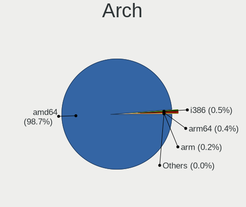

| Name    | Computers | Percent |
|---------|-----------|---------|
| amd64   | 2637      | 98.73%  |
| i386    | 14        | 0.52%   |
| arm64   | 12        | 0.45%   |
| arm     | 5         | 0.19%   |
| macppc  | 2         | 0.07%   |
| sparc64 | 1         | 0.04%   |

DE
--

Desktop Environment

| Name          | Computers | Percent |
|---------------|-----------|---------|
| Console       | 2186      | 80.52%  |
| helloDesktop  | 189       | 6.96%   |
| MATE          | 67        | 2.47%   |
| KDE5          | 60        | 2.21%   |
| XFCE          | 57        | 2.1%    |
| fvwm          | 38        | 1.4%    |
| GNOME         | 26        | 0.96%   |
| Openbox       | 23        | 0.85%   |
| TWM           | 22        | 0.81%   |
| AwesomeWM     | 12        | 0.44%   |
| i3            | 9         | 0.33%   |
| LXQt          | 3         | 0.11%   |
| Enlightenment | 3         | 0.11%   |
| Cinnamon      | 3         | 0.11%   |
| LXDE          | 2         | 0.07%   |
| IceWM         | 2         | 0.07%   |
| Fluxbox       | 2         | 0.07%   |
| Compton       | 2         | 0.07%   |
| sway          | 1         | 0.04%   |
| spectrwm      | 1         | 0.04%   |
| Picom         | 1         | 0.04%   |
| JWM           | 1         | 0.04%   |
| iwm           | 1         | 0.04%   |
| GNUstep       | 1         | 0.04%   |
| filer         | 1         | 0.04%   |
| EXWM          | 1         | 0.04%   |
| CDE           | 1         | 0.04%   |

Display Server
--------------

X11 or Wayland

| Name    | Computers | Percent |
|---------|-----------|---------|
| Console | 2200      | 82.09%  |
| X11     | 469       | 17.5%   |
| Wayland | 10        | 0.37%   |
| Tty     | 1         | 0.04%   |

Display Manager
---------------

SDDM, LightDM, etc.

| Name    | Computers | Percent |
|---------|-----------|---------|
| Console | 2301      | 84.97%  |
| SLiM    | 215       | 7.94%   |
| LightDM | 69        | 2.55%   |
| SDDM    | 67        | 2.47%   |
| XDM     | 29        | 1.07%   |
| GDM     | 19        | 0.7%    |
| Ly      | 8         | 0.3%    |

OS Lang
-------

Language

| Lang             | Computers | Percent |
|------------------|-----------|---------|
| Unknown          | 2183      | 80.08%  |
| C                | 200       | 7.34%   |
| en_US            | 152       | 5.58%   |
| de_DE            | 145       | 5.32%   |
| fr_FR            | 10        | 0.37%   |
| de               | 9         | 0.33%   |
| en_GB            | 8         | 0.29%   |
| en               | 4         | 0.15%   |
| de_DE.ISO8859-1  | 3         | 0.11%   |
| ru_RU            | 2         | 0.07%   |
| pl_PL            | 1         | 0.04%   |
| it_IT            | 1         | 0.04%   |
| ISO8859-15       | 1         | 0.04%   |
| fr               | 1         | 0.04%   |
| en_IE            | 1         | 0.04%   |
| en_GB.ISO8859-1  | 1         | 0.04%   |
| en_DE            | 1         | 0.04%   |
| en_CA            | 1         | 0.04%   |
| de_DE.ISO8859-15 | 1         | 0.04%   |
| de.DE            | 1         | 0.04%   |

Boot Mode
---------

EFI or BIOS

| Mode | Computers | Percent |
|------|-----------|---------|
| EFI  | 2397      | 89.11%  |
| BIOS | 293       | 10.89%  |

Filesystem
----------

Type of filesystem

| Type    | Computers | Percent |
|---------|-----------|---------|
| Ufs     | 1465      | 53.37%  |
| Zfs     | 1133      | 41.28%  |
| Ffs     | 82        | 2.99%   |
| Cd9660  | 63        | 2.3%    |
| Msdosfs | 1         | 0.04%   |
| Hammer2 | 1         | 0.04%   |

Part. scheme
------------

Scheme of partitioning

| Type    | Computers | Percent |
|---------|-----------|---------|
| GPT     | 2517      | 93.74%  |
| MBR     | 135       | 5.03%   |
| Unknown | 31        | 1.15%   |
| BSD     | 2         | 0.07%   |

Board
-----

Vendor
------

Motherboard manufacturer

| Name                                 | Computers | Percent |
|--------------------------------------|-----------|---------|
| Unknown                              | 384       | 14.38%  |
| Lenovo                               | 184       | 6.89%   |
| Fujitsu                              | 168       | 6.29%   |
| Sophos                               | 163       | 6.1%    |
| PC Engines                           | 157       | 5.88%   |
| Supermicro                           | 154       | 5.77%   |
| Dell                                 | 134       | 5.02%   |
| Hewlett-Packard                      | 131       | 4.9%    |
| ASUSTek Computer                     | 112       | 4.19%   |
| Intel                                | 101       | 3.78%   |
| ASRock                               | 84        | 3.14%   |
| Gigabyte Technology                  | 77        | 2.88%   |
| ZOTAC                                | 64        | 2.4%    |
| MSI                                  | 58        | 2.17%   |
| Deciso                               | 55        | 2.06%   |
| Protectli                            | 54        | 2.02%   |
| AMI                                  | 51        | 1.91%   |
| BESSTAR Tech                         | 42        | 1.57%   |
| Apple                                | 35        | 1.31%   |
| CncTion                              | 30        | 1.12%   |
| Techvision                           | 28        | 1.05%   |
| Acer                                 | 24        | 0.9%    |
| Shuttle                              | 23        | 0.86%   |
| MW                                   | 15        | 0.56%   |
| HARDKERNEL                           | 15        | 0.56%   |
| AWOW                                 | 15        | 0.56%   |
| Thomas-Krenn.AG                      | 13        | 0.49%   |
| SJRC                                 | 12        | 0.45%   |
| AAEON                                | 12        | 0.45%   |
| Shenzhen Meigao Electronic Equipment | 11        | 0.41%   |
| CWWK                                 | 11        | 0.41%   |
| Yanling                              | 10        | 0.37%   |
| TUXEDO                               | 10        | 0.37%   |
| ASRockRack                           | 10        | 0.37%   |
| IceWhale Technology                  | 9         | 0.34%   |
| CheckPoint                           | 9         | 0.34%   |
| NF541                                | 8         | 0.3%    |
| Biostar                              | 8         | 0.3%    |
| Lanner                               | 7         | 0.26%   |
| IBM                                  | 7         | 0.26%   |

Model
-----

Motherboard model

| Name                                              | Computers | Percent |
|---------------------------------------------------|-----------|---------|
| Unknown                                           | 389       | 14.56%  |
| Sophos SG                                         | 103       | 3.86%   |
| PC Engines APU2                                   | 77        | 2.88%   |
| Fujitsu FUTRO S920                                | 62        | 2.32%   |
| PC Engines apu4                                   | 53        | 1.98%   |
| Supermicro Super Server                           | 52        | 1.95%   |
| Sophos XG                                         | 31        | 1.16%   |
| Sophos UTM                                        | 29        | 1.09%   |
| Techvision TVI7309X                               | 28        | 1.05%   |
| AMI Aptio CRB                                     | 25        | 0.94%   |
| Intel Q3XXG4-P V1.0                               | 19        | 0.71%   |
| ZOTAC ZBOX-CI329NANO                              | 17        | 0.64%   |
| Protectli FW6                                     | 16        | 0.6%    |
| MW GMLK-2_5G4L                                    | 15        | 0.56%   |
| BESSTAR Tech GK41                                 | 15        | 0.56%   |
| Deciso NetBoard-A10                               | 14        | 0.52%   |
| Protectli FW4B                                    | 13        | 0.49%   |
| HARDKERNEL ODROID-H2                              | 13        | 0.49%   |
| Fujitsu FUTRO S930                                | 13        | 0.49%   |
| Supermicro A1SAi                                  | 12        | 0.45%   |
| CncTion N5105-4L                                  | 12        | 0.45%   |
| PC Engines APU3                                   | 11        | 0.41%   |
| PC Engines APU                                    | 11        | 0.41%   |
| ZOTAC ZBOX-CI327NANO-GS-01                        | 10        | 0.37%   |
| Shenzhen Meigao Electronic Equipment Venus Series | 10        | 0.37%   |
| Protectli VP2420                                  | 10        | 0.37%   |
| Deciso NetBoard-A20                               | 10        | 0.37%   |
| ASUS All Series                                   | 10        | 0.37%   |
| AMI LES compact 4L                                | 10        | 0.37%   |
| Supermicro 1HE Intel Single-CPU RI1102D-F Server  | 9         | 0.34%   |
| SJRC ADLN-6L                                      | 9         | 0.34%   |
| HP ProLiant MicroServer Gen8                      | 9         | 0.34%   |
| Dell PowerEdge R210 II                            | 9         | 0.34%   |
| Deciso Netboard A20                               | 9         | 0.34%   |
| BESSTAR Tech X35G                                 | 9         | 0.34%   |
| AMI SG                                            | 9         | 0.34%   |
| MSI MS-7B89                                       | 8         | 0.3%    |
| HP t620 PLUS Quad Core TC                         | 8         | 0.3%    |
| NF541 1.0                                         | 7         | 0.26%   |
| IceWhale ZimaBoard 832 ZMB                        | 7         | 0.26%   |

Model Family
------------

Motherboard model prefix

| Name                       | Computers | Percent |
|----------------------------|-----------|---------|
| Unknown                    | 389       | 14.56%  |
| Lenovo ThinkPad            | 112       | 4.19%   |
| Sophos SG                  | 103       | 3.86%   |
| Fujitsu FUTRO              | 96        | 3.59%   |
| PC Engines APU2            | 77        | 2.88%   |
| PC Engines apu4            | 53        | 1.98%   |
| Supermicro Super           | 52        | 1.95%   |
| Dell OptiPlex              | 48        | 1.8%    |
| Lenovo ThinkCentre         | 37        | 1.39%   |
| HP ProLiant                | 35        | 1.31%   |
| Dell PowerEdge             | 32        | 1.2%    |
| Sophos XG                  | 31        | 1.16%   |
| Sophos UTM                 | 29        | 1.09%   |
| Techvision TVI7309X        | 28        | 1.05%   |
| Dell Latitude              | 26        | 0.97%   |
| AMI Aptio                  | 25        | 0.94%   |
| Fujitsu ESPRIMO            | 24        | 0.9%    |
| Supermicro 1HE             | 22        | 0.82%   |
| Intel Q3XXG4-P             | 19        | 0.71%   |
| Deciso NetBoard-A10        | 19        | 0.71%   |
| Deciso Netboard            | 18        | 0.67%   |
| ZOTAC ZBOX-CI329NANO       | 17        | 0.64%   |
| Protectli FW6              | 16        | 0.6%    |
| Fujitsu PRIMERGY           | 16        | 0.6%    |
| MW GMLK-2                  | 15        | 0.56%   |
| HP ProDesk                 | 15        | 0.56%   |
| BESSTAR Tech GK41          | 15        | 0.56%   |
| ASUS PRIME                 | 15        | 0.56%   |
| HP Compaq                  | 14        | 0.52%   |
| Protectli FW4B             | 13        | 0.49%   |
| HP t620                    | 13        | 0.49%   |
| HARDKERNEL ODROID-H2       | 13        | 0.49%   |
| ASUS TUF                   | 13        | 0.49%   |
| Supermicro A1SAi           | 12        | 0.45%   |
| Fujitsu LIFEBOOK           | 12        | 0.45%   |
| CncTion N5105-4L           | 12        | 0.45%   |
| PC Engines APU3            | 11        | 0.41%   |
| PC Engines APU             | 11        | 0.41%   |
| ZOTAC ZBOX-CI327NANO-GS-01 | 10        | 0.37%   |
| Thomas-Krenn.AG LES        | 10        | 0.37%   |

MFG Year
--------

Motherboard manufacture year

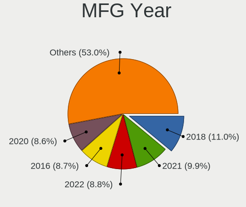

| Year    | Computers | Percent |
|---------|-----------|---------|
| 2018    | 294       | 11.01%  |
| 2021    | 265       | 9.92%   |
| 2022    | 235       | 8.8%    |
| 2016    | 233       | 8.72%   |
| 2020    | 229       | 8.57%   |
| 2019    | 220       | 8.24%   |
| 2014    | 214       | 8.01%   |
| 2017    | 178       | 6.66%   |
| 2023    | 168       | 6.29%   |
| 2013    | 123       | 4.61%   |
| 2011    | 103       | 3.86%   |
| 2012    | 92        | 3.44%   |
| 2015    | 87        | 3.26%   |
| 2024    | 69        | 2.58%   |
| 2010    | 52        | 1.95%   |
| 2009    | 37        | 1.39%   |
| 2008    | 27        | 1.01%   |
| Unknown | 20        | 0.75%   |
| 2007    | 15        | 0.56%   |
| 2006    | 5         | 0.19%   |
| 2003    | 3         | 0.11%   |
| 2005    | 1         | 0.04%   |
| 2002    | 1         | 0.04%   |

Form Factor
-----------

Physical design of the computer

| Name           | Computers | Percent |
|----------------|-----------|---------|
| Desktop        | 1644      | 61.55%  |
| Notebook       | 390       | 14.6%   |
| Mini pc        | 239       | 8.95%   |
| Server         | 195       | 7.3%    |
| Firewall       | 175       | 6.55%   |
| All in one     | 12        | 0.45%   |
| Convertible    | 9         | 0.34%   |
| System on chip | 7         | 0.26%   |

Coreboot
--------

Have coreboot on board

| Used | Computers | Percent |
|------|-----------|---------|
| No   | 2491      | 93.26%  |
| Yes  | 180       | 6.74%   |

RAM Size
--------

Total RAM memory

| Size in GB      | Computers | Percent |
|-----------------|-----------|---------|
| 8.01-16.0       | 996       | 36.59%  |
| 16.01-24.0      | 626       | 23%     |
| 4.01-8.0        | 583       | 21.42%  |
| 32.01-64.0      | 262       | 9.63%   |
| 2.01-3.0        | 97        | 3.56%   |
| 64.01-256.0     | 94        | 3.45%   |
| 24.01-32.0      | 17        | 0.62%   |
| 3.01-4.0        | 16        | 0.59%   |
| 0.51-1.0        | 10        | 0.37%   |
| 1.01-2.0        | 8         | 0.29%   |
| 0.01-0.5        | 8         | 0.29%   |
| More than 256.0 | 4         | 0.15%   |
| 0               | 1         | 0.04%   |

RAM Used
--------

Used RAM memory

| Used GB     | Computers | Percent |
|-------------|-----------|---------|
| 0.01-0.5    | 1394      | 50.65%  |
| 0.51-1.0    | 915       | 33.25%  |
| 1.01-2.0    | 273       | 9.92%   |
| 2.01-3.0    | 66        | 2.4%    |
| 4.01-8.0    | 28        | 1.02%   |
| 3.01-4.0    | 28        | 1.02%   |
| 0           | 14        | 0.51%   |
| Unknown     | 13        | 0.47%   |
| 8.01-16.0   | 9         | 0.33%   |
| 16.01-24.0  | 6         | 0.22%   |
| 24.01-32.0  | 3         | 0.11%   |
| 64.01-256.0 | 2         | 0.07%   |
| 32.01-64.0  | 1         | 0.04%   |

Total Drives
------------

Number of drives on board

| Drives | Computers | Percent |
|--------|-----------|---------|
| 1      | 1963      | 70.92%  |
| 0      | 372       | 13.44%  |
| 2      | 287       | 10.37%  |
| 3      | 62        | 2.24%   |
| 4      | 42        | 1.52%   |
| 5      | 15        | 0.54%   |
| 6      | 10        | 0.36%   |
| 8      | 6         | 0.22%   |
| 7      | 5         | 0.18%   |
| 9      | 3         | 0.11%   |
| 14     | 1         | 0.04%   |
| 11     | 1         | 0.04%   |
| 10     | 1         | 0.04%   |

Has CD-ROM
----------

Has CD-ROM on board

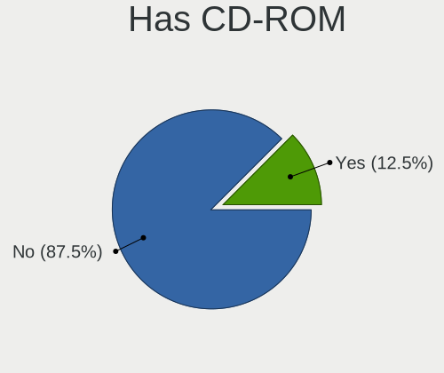

| Presented | Computers | Percent |
|-----------|-----------|---------|
| No        | 2350      | 87.49%  |
| Yes       | 336       | 12.51%  |

Has Ethernet
------------

Has Ethernet on board

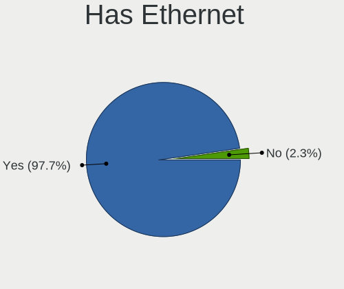

| Presented | Computers | Percent |
|-----------|-----------|---------|
| Yes       | 2610      | 97.72%  |
| No        | 61        | 2.28%   |

Has WiFi
--------

Has WiFi module

| Presented | Computers | Percent |
|-----------|-----------|---------|
| No        | 1899      | 70.36%  |
| Yes       | 800       | 29.64%  |

Has Bluetooth
-------------

Has Bluetooth module

| Presented | Computers | Percent |
|-----------|-----------|---------|
| No        | 2153      | 79.98%  |
| Yes       | 539       | 20.02%  |

Location
--------

Country
-------

Geographic location (country)

| Country | Computers | Percent |
|---------|-----------|---------|
| Germany | 2671      | 100%    |

City
----

Geographic location (city)

| City              | Computers | Percent |
|-------------------|-----------|---------|
| Berlin            | 231       | 7.6%    |
| Munich            | 106       | 3.49%   |
| Hamburg           | 96        | 3.16%   |
| Cologne           | 79        | 2.6%    |
| Frankfurt am Main | 75        | 2.47%   |
| Stuttgart         | 50        | 1.65%   |
| Hanover           | 34        | 1.12%   |
| Nuremberg         | 30        | 0.99%   |
| Ludwigsburg       | 30        | 0.99%   |
| Karlsruhe         | 28        | 0.92%   |
| Dortmund          | 28        | 0.92%   |
| Bonn              | 27        | 0.89%   |
| Mannheim          | 26        | 0.86%   |
| Leipzig           | 26        | 0.86%   |
| Dresden           | 24        | 0.79%   |
| Dsseldorf       | 21        | 0.69%   |
| Bochum            | 21        | 0.69%   |
| Wiesbaden         | 18        | 0.59%   |
| Essen             | 17        | 0.56%   |
| Darmstadt         | 17        | 0.56%   |
| Bremen            | 17        | 0.56%   |
| Wuppertal         | 15        | 0.49%   |
| Bielefeld         | 15        | 0.49%   |
| Falkenstein       | 14        | 0.46%   |
| Chemnitz          | 14        | 0.46%   |
| Nottuln           | 13        | 0.43%   |
| Magdeburg         | 13        | 0.43%   |
| Braunschweig      | 13        | 0.43%   |
| Aachen            | 13        | 0.43%   |
| Ulm               | 12        | 0.39%   |
| Reutlingen        | 12        | 0.39%   |
| Mainz             | 12        | 0.39%   |
| Kassel            | 12        | 0.39%   |
| Heilbronn         | 12        | 0.39%   |
| Heidelberg        | 12        | 0.39%   |
| Halle             | 11        | 0.36%   |
| Erlangen          | 11        | 0.36%   |
| Augsburg          | 11        | 0.36%   |
| Mnster          | 10        | 0.33%   |
| Lingen            | 10        | 0.33%   |

Drives
------

Drive Vendor
------------

Hard drive vendors

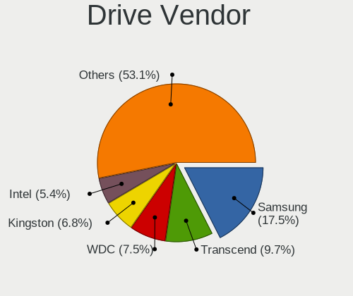

| Vendor              | Computers | Drives | Percent |
|---------------------|-----------|--------|---------|
| Samsung Electronics | 482       | 763    | 17.52%  |
| Transcend           | 268       | 373    | 9.74%   |
| WDC                 | 205       | 352    | 7.45%   |
| Kingston            | 186       | 307    | 6.76%   |
| Intel               | 148       | 257    | 5.38%   |
| SanDisk             | 147       | 204    | 5.34%   |
| Crucial             | 144       | 224    | 5.23%   |
| Seagate             | 125       | 206    | 4.54%   |
| China               | 86        | 107    | 3.13%   |
| Toshiba             | 78        | 145    | 2.84%   |
| A-DATA Technology   | 73        | 92     | 2.65%   |
| Intenso             | 64        | 98     | 2.33%   |
| Micron Technology   | 46        | 68     | 1.67%   |
| Hitachi             | 45        | 94     | 1.64%   |
| Phison              | 43        | 64     | 1.56%   |
| Innodisk            | 40        | 46     | 1.45%   |
| HGST                | 38        | 72     | 1.38%   |
| Hoodisk             | 36        | 62     | 1.31%   |
| FORESEE             | 32        | 47     | 1.16%   |
| ATP                 | 29        | 35     | 1.05%   |
| NVMe                | 28        | 47     | 1.02%   |
| Patriot             | 23        | 38     | 0.84%   |
| Protectli           | 21        | 27     | 0.76%   |
| Hewlett-Packard     | 20        | 28     | 0.73%   |
| SK hynix            | 18        | 23     | 0.65%   |
| OCZ                 | 18        | 29     | 0.65%   |
| Apple               | 16        | 19     | 0.58%   |
| Apacer              | 16        | 27     | 0.58%   |
| SPCC                | 14        | 20     | 0.51%   |
| Verbatim            | 13        | 19     | 0.47%   |
| KIOXIA              | 13        | 15     | 0.47%   |
| Corsair             | 12        | 19     | 0.44%   |
| ShiJi               | 9         | 11     | 0.33%   |
| LITEON              | 9         | 10     | 0.33%   |
| Dogfish             | 9         | 11     | 0.33%   |
| TCSUNBOW            | 8         | 9      | 0.29%   |
| PNY                 | 8         | 10     | 0.29%   |
| LITEONIT            | 7         | 10     | 0.25%   |
| Lexar               | 7         | 7      | 0.25%   |
| Gigabyte Technology | 7         | 8      | 0.25%   |

Drive Model
-----------

Hard drive models

| Model                           | Computers | Percent |
|---------------------------------|-----------|---------|
| Transcend TS128GMSA230S 128GB   | 40        | 1.39%   |
| China SATA SSD 16GB             | 35        | 1.22%   |
| A-DATA IM2S3134N-064GM 64GB     | 32        | 1.11%   |
| Phison SATA SSD 16GB            | 31        | 1.08%   |
| Samsung SSD 850 EVO 250GB       | 28        | 0.98%   |
| Transcend TS64GMSA230S 64GB     | 22        | 0.77%   |
| Samsung SSD 860 EVO 500GB       | 22        | 0.77%   |
| Crucial CT240BX500SSD1 240GB    | 21        | 0.73%   |
| Samsung SSD 870 EVO 250GB       | 20        | 0.7%    |
| Samsung SSD 840 EVO 250GB       | 20        | 0.7%    |
| Kingston SA400S37120G 120GB     | 20        | 0.7%    |
| Transcend TS64GSSD370 64GB      | 18        | 0.63%   |
| Transcend TS256GMSA230S 256GB   | 17        | 0.59%   |
| FORESEE 128GB SSD               | 15        | 0.52%   |
| Crucial CT250MX500SSD1 250GB    | 15        | 0.52%   |
| Crucial CT120BX500SSD1 120GB    | 15        | 0.52%   |
| Transcend TS32GMSA370 32GB      | 14        | 0.49%   |
| Samsung SSD 840 EVO 120GB       | 14        | 0.49%   |
| SanDisk SSD PLUS 120GB          | 13        | 0.45%   |
| Samsung SSD 860 EVO 250GB       | 13        | 0.45%   |
| Kingston SUV500MS120G 120GB     | 13        | 0.45%   |
| Intenso SSD 128GB               | 13        | 0.45%   |
| Innodisk DEMSR- 08GB mSATA 3ME3 | 13        | 0.45%   |
| SanDisk SSD PLUS 240GB          | 12        | 0.42%   |
| Kingston SKC600MS256G 256GB     | 12        | 0.42%   |
| Transcend TS32GSSD370S 32GB     | 11        | 0.38%   |
| SanDisk SDSSDA120G 120GB        | 11        | 0.38%   |
| Samsung SSD 970 EVO Plus 500GB  | 11        | 0.38%   |
| Kingston SA400S37240G 240GB     | 11        | 0.38%   |
| Intel SSDSC2BW180A4 180GB       | 11        | 0.38%   |
| Hoodisk SSD 64GB                | 11        | 0.38%   |
| Hoodisk SSD 128GB               | 11        | 0.38%   |
| FORESEE 64GB SSD                | 11        | 0.38%   |
| Crucial CT500MX500SSD1 500GB    | 11        | 0.38%   |
| WDC WD40EFRX-68N32N0 4TB        | 10        | 0.35%   |
| Transcend TS256GMTS952T2 256GB  | 10        | 0.35%   |
| Transcend TS256GMTE710T 256GB   | 10        | 0.35%   |
| Samsung SSD 850 PRO 256GB       | 10        | 0.35%   |
| Samsung SSD 850 EVO 500GB       | 10        | 0.35%   |
| Kingston SV300S37A120G 120GB    | 10        | 0.35%   |

HDD Vendor
----------

Hard disk drive vendors

| Vendor              | Computers | Drives | Percent |
|---------------------|-----------|--------|---------|
| WDC                 | 142       | 263    | 30.15%  |
| Seagate             | 118       | 192    | 25.05%  |
| Toshiba             | 50        | 88     | 10.62%  |
| Hitachi             | 42        | 83     | 8.92%   |
| HGST                | 38        | 72     | 8.07%   |
| Samsung Electronics | 24        | 35     | 5.1%    |
| NVMe                | 19        | 30     | 4.03%   |
| Hewlett-Packard     | 6         | 9      | 1.27%   |
| Fujitsu             | 6         | 6      | 1.27%   |
| LSI                 | 5         | 5      | 1.06%   |
| OPENBSD             | 3         | 7      | 0.64%   |
| Maxtor              | 2         | 2      | 0.42%   |
| LSILOGIC            | 2         | 5      | 0.42%   |
| JetFlash            | 2         | 2      | 0.42%   |
| Intenso             | 2         | 2      | 0.42%   |
| Generic             | 2         | 2      | 0.42%   |
| Apple               | 2         | 2      | 0.42%   |
| WD MediaMax         | 1         | 4      | 0.21%   |
| Product:            | 1         | 1      | 0.21%   |
| IBM/Hitachi         | 1         | 1      | 0.21%   |
| IBM                 | 1         | 1      | 0.21%   |
| General             | 1         | 1      | 0.21%   |
| ASMT                | 1         | 1      | 0.21%   |

SSD Vendor
----------

Solid state drive vendors

| Vendor              | Computers | Drives | Percent |
|---------------------|-----------|--------|---------|
| Samsung Electronics | 337       | 526    | 17.83%  |
| Transcend           | 237       | 337    | 12.54%  |
| SanDisk             | 146       | 203    | 7.72%   |
| Kingston            | 146       | 245    | 7.72%   |
| Intel               | 130       | 234    | 6.88%   |
| Crucial             | 126       | 194    | 6.67%   |
| China               | 86        | 107    | 4.55%   |
| A-DATA Technology   | 72        | 90     | 3.81%   |
| Intenso             | 56        | 85     | 2.96%   |
| Innodisk            | 40        | 46     | 2.12%   |
| WDC                 | 37        | 47     | 1.96%   |
| Phison              | 36        | 52     | 1.9%    |
| Micron Technology   | 36        | 53     | 1.9%    |
| Hoodisk             | 36        | 62     | 1.9%    |
| FORESEE             | 27        | 40     | 1.43%   |
| ATP                 | 25        | 28     | 1.32%   |
| Protectli           | 21        | 27     | 1.11%   |
| Toshiba             | 19        | 31     | 1.01%   |
| OCZ                 | 18        | 29     | 0.95%   |
| Apacer              | 16        | 27     | 0.85%   |
| Hewlett-Packard     | 14        | 19     | 0.74%   |
| Apple               | 14        | 17     | 0.74%   |
| Verbatim            | 13        | 19     | 0.69%   |
| SPCC                | 10        | 15     | 0.53%   |
| SK hynix            | 10        | 14     | 0.53%   |
| Patriot             | 10        | 17     | 0.53%   |
| NVMe                | 10        | 15     | 0.53%   |
| LITEON              | 9         | 10     | 0.48%   |
| Dogfish             | 9         | 11     | 0.48%   |
| TCSUNBOW            | 8         | 9      | 0.42%   |
| ShiJi               | 7         | 9      | 0.37%   |
| PNY                 | 7         | 9      | 0.37%   |
| LITEONIT            | 7         | 10     | 0.37%   |
| Corsair             | 7         | 11     | 0.37%   |
| VICKTER             | 6         | 6      | 0.32%   |
| KingSpec            | 6         | 8      | 0.32%   |
| BORY                | 6         | 9      | 0.32%   |
| Seagate             | 5         | 12     | 0.26%   |
| Leven               | 5         | 7      | 0.26%   |
| KingDian            | 5         | 12     | 0.26%   |

Drive Kind
----------

HDD or SSD

| Kind | Computers | Drives | Percent |
|------|-----------|--------|---------|
| SSD  | 1760      | 2806   | 68.75%  |
| NVMe | 400       | 608    | 15.63%  |
| HDD  | 400       | 814    | 15.63%  |

Drive Connector
---------------

SATA, SAS, NVMe, etc.

| Type | Computers | Drives | Percent |
|------|-----------|--------|---------|
| SATA | 2026      | 3620   | 83.51%  |
| NVMe | 400       | 608    | 16.49%  |

Drive Size
----------

Size of hard drive

| Size in TB      | Computers | Drives | Percent |
|-----------------|-----------|--------|---------|
| 0.01-0.5        | 1833      | 2894   | 83.36%  |
| 0.51-1.0        | 216       | 333    | 9.82%   |
| 1.01-2.0        | 79        | 197    | 3.59%   |
| 3.01-4.0        | 32        | 99     | 1.46%   |
| 4.01-10.0       | 17        | 33     | 0.77%   |
| 2.01-3.0        | 16        | 47     | 0.73%   |
| 10.01-20.0      | 5         | 16     | 0.23%   |
| More than 100.0 | 1         | 1      | 0.05%   |

Space Total
-----------

Amount of disk space available on the file system

| Size in GB     | Computers | Percent |
|----------------|-----------|---------|
| 101-250        | 1222      | 44.24%  |
| 251-500        | 408       | 14.77%  |
| 1-20           | 323       | 11.69%  |
| 51-100         | 285       | 10.32%  |
| 21-50          | 280       | 10.14%  |
| 501-1000       | 168       | 6.08%   |
| 1001-2000      | 38        | 1.38%   |
| More than 3000 | 19        | 0.69%   |
| Unknown        | 13        | 0.47%   |
| 2001-3000      | 6         | 0.22%   |

Space Used
----------

Amount of used disk space

| Used GB        | Computers | Percent |
|----------------|-----------|---------|
| 1-20           | 2515      | 91.02%  |
| 21-50          | 126       | 4.56%   |
| 51-100         | 48        | 1.74%   |
| 101-250        | 30        | 1.09%   |
| Unknown        | 13        | 0.47%   |
| 251-500        | 10        | 0.36%   |
| 501-1000       | 9         | 0.33%   |
| 1001-2000      | 5         | 0.18%   |
| 2001-3000      | 4         | 0.14%   |
| More than 3000 | 3         | 0.11%   |

Malfunc. Drives
---------------

Drive models with a malfunction

| Model                                        | Computers | Drives | Percent |
|----------------------------------------------|-----------|--------|---------|
| Kingston SV300S37A60G 64GB                   | 4         | 6      | 1.83%   |
| Kingston SMS200S360G 64GB                    | 4         | 5      | 1.83%   |
| WDC WD2000FYYZ-01UL1B2 2TB                   | 3         | 9      | 1.37%   |
| Samsung Electronics SSD 840 PRO Series 256GB | 3         | 6      | 1.37%   |
| WDC WDS240G2G0A-00JH30 240GB                 | 2         | 3      | 0.91%   |
| WDC WD30EFRX-68EUZN0 3TB                     | 2         | 7      | 0.91%   |
| WDC WD2000FYYZ-01UL1B1 2TB                   | 2         | 4      | 0.91%   |
| WDC WD1600AAJS-75M0A0 160GB                  | 2         | 2      | 0.91%   |
| Toshiba THNSNK256GVN8 M.2 2280 256GB         | 2         | 10     | 0.91%   |
| Toshiba THNSNK128GCS8 SATA 128GB             | 2         | 2      | 0.91%   |
| Seagate ST9320325AS 320GB                    | 2         | 2      | 0.91%   |
| Seagate ST3160318AS 160GB                    | 2         | 2      | 0.91%   |
| Seagate ST1000LM024 HN-M101MBB 1TB           | 2         | 2      | 0.91%   |
| Seagate ST1000DX001-1CM162 1TB               | 2         | 2      | 0.91%   |
| SanDisk SSD PLUS 240GB                       | 2         | 2      | 0.91%   |
| Samsung Electronics HD501LJ 500GB            | 2         | 2      | 0.91%   |
| Micron Technology 1100_MTFDDAK512TBN 512GB   | 2         | 4      | 0.91%   |
| Micron Technology 1100 SATA 256GB            | 2         | 2      | 0.91%   |
| Kingston SMS200S3120G 120GB                  | 2         | 8      | 0.91%   |
| Kingston SHFS37A120G 120GB                   | 2         | 3      | 0.91%   |
| Intenso SSD SATAIII 512GB                    | 2         | 2      | 0.91%   |
| Intel SSDSC2KW256G8 256GB                    | 2         | 2      | 0.91%   |
| Intel SSDSC2CT180A3 180GB                    | 2         | 2      | 0.91%   |
| Intel SSDSC2CT120A3 120GB                    | 2         | 2      | 0.91%   |
| Intel SSDSC2BF180A4L 180GB                   | 2         | 2      | 0.91%   |
| Hitachi HTS545032B9A300 320GB                | 2         | 4      | 0.91%   |
| Hitachi HTS543232L9SA02 320GB                | 2         | 3      | 0.91%   |
| Hitachi HTS543225L9A300 250GB                | 2         | 2      | 0.91%   |
| HGST HTS541010A9E680 1TB                     | 2         | 3      | 0.91%   |
| HGST HTS541010A7E630 1TB                     | 2         | 4      | 0.91%   |
| Crucial CT275MX300SSD1 275GB                 | 2         | 2      | 0.91%   |
| Crucial CT128MX100SSD1 128GB                 | 2         | 4      | 0.91%   |
| Apacer 8GB SATA Flash Drive                  | 2         | 2      | 0.91%   |
| WDC WD6400AAKS-65A7B2 640GB                  | 1         | 1      | 0.46%   |
| WDC WD60EFRX-68TGBN1 6TB                     | 1         | 3      | 0.46%   |
| WDC WD5003ABYX-01WERA0 500GB                 | 1         | 1      | 0.46%   |
| WDC WD5000LPVX-22V0TT0 500GB                 | 1         | 1      | 0.46%   |
| WDC WD3200BEVT-22ZCT0 320GB                  | 1         | 1      | 0.46%   |
| WDC WD30EZRX-00D8PB0 3TB                     | 1         | 1      | 0.46%   |
| WDC WD3000BLFS-60YBU2 304GB                  | 1         | 2      | 0.46%   |

Malfunc. Drive Vendor
---------------------

Vendors of faulty drives

| Vendor              | Computers | Drives | Percent |
|---------------------|-----------|--------|---------|
| WDC                 | 30        | 53     | 13.82%  |
| Seagate             | 30        | 36     | 13.82%  |
| Kingston            | 21        | 33     | 9.68%   |
| Samsung Electronics | 19        | 30     | 8.76%   |
| Intel               | 17        | 19     | 7.83%   |
| Hitachi             | 16        | 23     | 7.37%   |
| SanDisk             | 11        | 14     | 5.07%   |
| Crucial             | 11        | 27     | 5.07%   |
| Toshiba             | 10        | 22     | 4.61%   |
| HGST                | 9         | 13     | 4.15%   |
| Micron Technology   | 6         | 9      | 2.76%   |
| A-DATA Technology   | 6         | 8      | 2.76%   |
| Apacer              | 5         | 5      | 2.3%    |
| China               | 4         | 5      | 1.84%   |
| Transcend           | 3         | 4      | 1.38%   |
| Intenso             | 3         | 3      | 1.38%   |
| OCZ                 | 2         | 2      | 0.92%   |
| Maxtor              | 2         | 2      | 0.92%   |
| Corsair             | 2         | 4      | 0.92%   |
| SPCC                | 1         | 1      | 0.46%   |
| SMI                 | 1         | 1      | 0.46%   |
| SK hynix            | 1         | 1      | 0.46%   |
| Netac               | 1         | 1      | 0.46%   |
| Mushkin             | 1         | 1      | 0.46%   |
| Leven               | 1         | 1      | 0.46%   |
| KingSpec            | 1         | 1      | 0.46%   |
| KingDian            | 1         | 4      | 0.46%   |
| Fujitsu             | 1         | 1      | 0.46%   |
| Apple               | 1         | 1      | 0.46%   |

Malfunc. HDD Vendor
-------------------

Vendors of faulty HDD drives

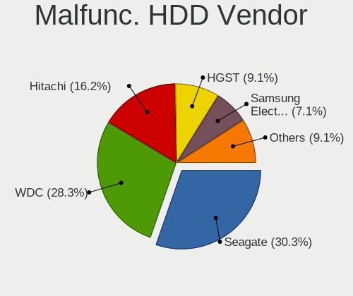

| Vendor              | Computers | Drives | Percent |
|---------------------|-----------|--------|---------|
| Seagate             | 30        | 36     | 30.3%   |
| WDC                 | 28        | 50     | 28.28%  |
| Hitachi             | 16        | 23     | 16.16%  |
| HGST                | 9         | 13     | 9.09%   |
| Samsung Electronics | 7         | 11     | 7.07%   |
| Toshiba             | 6         | 10     | 6.06%   |
| Maxtor              | 2         | 2      | 2.02%   |
| Fujitsu             | 1         | 1      | 1.01%   |

Malfunc. Drive Kind
-------------------

Kinds of faulty drives

| Kind | Computers | Drives | Percent |
|------|-----------|--------|---------|
| SSD  | 113       | 174    | 52.8%   |
| HDD  | 96        | 146    | 44.86%  |
| NVMe | 5         | 5      | 2.34%   |

Failed Drives
-------------

Failed drive models

| Model                                      | Computers | Drives | Percent |
|--------------------------------------------|-----------|--------|---------|
| WDC WD3200BPVT-16JJ5T0 320GB               | 1         | 1      | 12.5%   |
| Transcend TS32GSSD370S 32GB                | 1         | 4      | 12.5%   |
| Samsung Electronics SSD 980 250GB          | 1         | 2      | 12.5%   |
| Micron Technology 1100_MTFDDAV256TBN 256GB | 1         | 1      | 12.5%   |
| Kingston SV300S37A60G 64GB                 | 1         | 1      | 12.5%   |
| Kingston SMS200S330G 32GB                  | 1         | 1      | 12.5%   |
| KingDian S200 60GB                         | 1         | 1      | 12.5%   |
| Intel SSDSC2BW120H6 120GB                  | 1         | 1      | 12.5%   |

Failed Drive Vendor
-------------------

Failed drive vendors

| Vendor              | Computers | Drives | Percent |
|---------------------|-----------|--------|---------|
| Kingston            | 2         | 2      | 25%     |
| WDC                 | 1         | 1      | 12.5%   |
| Transcend           | 1         | 4      | 12.5%   |
| Samsung Electronics | 1         | 2      | 12.5%   |
| Micron Technology   | 1         | 1      | 12.5%   |
| KingDian            | 1         | 1      | 12.5%   |
| Intel               | 1         | 1      | 12.5%   |

Drive Status
------------

Number of failed and malfunc. drives

| Status   | Computers | Drives | Percent |
|----------|-----------|--------|---------|
| Works    | 2170      | 3777   | 88.25%  |
| Malfunc  | 212       | 325    | 8.62%   |
| Detected | 69        | 114    | 2.81%   |
| Failed   | 8         | 12     | 0.33%   |

Storage controller
------------------

Storage Vendor
--------------

Storage controller vendors

| Vendor                                  | Computers | Percent |
|-----------------------------------------|-----------|---------|
| Intel                                   | 1986      | 61.51%  |
| AMD                                     | 455       | 14.09%  |
| Samsung Electronics                     | 191       | 5.92%   |
| SanDisk                                 | 79        | 2.45%   |
| Broadcom / LSI                          | 55        | 1.7%    |
| Silicon Motion                          | 46        | 1.42%   |
| Kingston Technology Company             | 45        | 1.39%   |
| MAXIO Technology (Hangzhou)             | 43        | 1.33%   |
| Transcend                               | 36        | 1.11%   |
| ASMedia Technology                      | 34        | 1.05%   |
| Phison Electronics                      | 31        | 0.96%   |
| Micron/Crucial Technology               | 26        | 0.81%   |
| Micron Technology                       | 25        | 0.77%   |
| Nvidia                                  | 20        | 0.62%   |
| KIOXIA                                  | 18        | 0.56%   |
| Hewlett-Packard                         | 17        | 0.53%   |
| Marvell Technology Group                | 16        | 0.5%    |
| Toshiba                                 | 14        | 0.43%   |
| SK hynix                                | 12        | 0.37%   |
| Shenzhen Longsys Electronics            | 11        | 0.34%   |
| JMicron Technology                      | 7         | 0.22%   |
| ATP ELECTRONICS                         | 6         | 0.19%   |
| VIA Technologies                        | 5         | 0.15%   |
| Realtek Semiconductor                   | 5         | 0.15%   |
| Hosin Global Electronics                | 5         | 0.15%   |
| Chelsio Communications                  | 5         | 0.15%   |
| Adaptec                                 | 5         | 0.15%   |
| ADATA Technology                        | 4         | 0.12%   |
| Solid State Storage Technology          | 3         | 0.09%   |
| Silicon Image                           | 3         | 0.09%   |
| Seagate Technology                      | 3         | 0.09%   |
| 3ware                                   | 3         | 0.09%   |
| Unknown                                 | 3         | 0.09%   |
| Yangtze Memory Technologies             | 2         | 0.06%   |
| ULi Electronics                         | 2         | 0.06%   |
| Silicon Integrated Systems [SiS]        | 1         | 0.03%   |
| Shenzhen Unionmemory Information System | 1         | 0.03%   |
| Netac Technology                        | 1         | 0.03%   |
| Lenovo                                  | 1         | 0.03%   |
| Integrated Technology Express           | 1         | 0.03%   |

Storage Model
-------------

Storage controller models

| Model                                                                            | Computers | Percent |
|----------------------------------------------------------------------------------|-----------|---------|
| AMD FCH SATA Controller [AHCI mode]                                              | 317       | 8.85%   |
| Intel Celeron/Pentium Silver Processor SATA Controller                           | 181       | 5.05%   |
| Intel 8 Series/C220 Series Chipset Family 6-port SATA Controller 1 [AHCI mode]   | 165       | 4.61%   |
| Intel Sunrise Point-LP SATA Controller [AHCI mode]                               | 148       | 4.13%   |
| Intel Q170/Q150/B150/H170/H110/Z170/CM236 Chipset SATA Controller [AHCI Mode]    | 113       | 3.15%   |
| Intel Alder Lake-N SATA AHCI Controller                                          | 110       | 3.07%   |
| Intel Atom/Celeron/Pentium Processor x5-E8000/J3xxx/N3xxx Series SATA Controller | 95        | 2.65%   |
| Samsung NVMe SSD Controller SM981/PM981/PM983                                    | 89        | 2.48%   |
| Intel Atom Processor E3800 Series SATA AHCI Controller                           | 87        | 2.43%   |
| Intel Celeron N3350/Pentium N4200/Atom E3900 Series SATA AHCI Controller         | 81        | 2.26%   |
| Intel Jasper Lake SATA AHCI Controller                                           | 75        | 2.09%   |
| AMD FCH SATA Controller [IDE mode]                                               | 72        | 2.01%   |
| Intel Cannon Lake PCH SATA AHCI Controller                                       | 68        | 1.9%    |
| Intel 6 Series/C200 Series Chipset Family 6 port Desktop SATA AHCI Controller    | 57        | 1.59%   |
| Intel 7 Series Chipset Family 6-port SATA Controller [AHCI mode]                 | 47        | 1.31%   |
| Intel Atom Processor C3000 Series SATA Controller 0                              | 45        | 1.26%   |
| AMD SB7x0/SB8x0/SB9x0 SATA Controller [AHCI mode]                                | 45        | 1.26%   |
| Silicon Motion SM2263EN/SM2263XT (DRAM-less) NVMe SSD Controllers                | 44        | 1.23%   |
| Intel Atom processor C2000 AHCI SATA3 Controller                                 | 44        | 1.23%   |
| Intel 8 Series SATA Controller 1 [AHCI mode]                                     | 44        | 1.23%   |
| Intel 82801HM/HEM (ICH8M/ICH8M-E) IDE Controller                                 | 43        | 1.2%    |
| Intel 82801G (ICH7 Family) IDE Controller                                        | 43        | 1.2%    |
| MAXIO (Hangzhou) NVMe SSD Controller MAP1202 (DRAM-less)                         | 42        | 1.17%   |
| Intel Comet Lake SATA AHCI Controller                                            | 35        | 0.98%   |
| Intel Wildcat Point-LP SATA Controller [AHCI Mode]                               | 34        | 0.95%   |
| Intel 200 Series PCH SATA controller [AHCI mode]                                 | 34        | 0.95%   |
| Intel NM10/ICH7 Family SATA Controller [AHCI mode]                               | 33        | 0.92%   |
| Samsung NVMe SSD Controller PM9A1/PM9A3/980PRO                                   | 31        | 0.87%   |
| Samsung NVMe SSD Controller 980 (DRAM-less)                                      | 31        | 0.87%   |
| AMD 400 Series Chipset SATA Controller                                           | 31        | 0.87%   |
| Intel Cannon Point-LP SATA Controller [AHCI Mode]                                | 30        | 0.84%   |
| Intel Atom Processor C3000 Series SATA Controller 1                              | 30        | 0.84%   |
| ASMedia ASM1061/ASM1062 Serial ATA Controller                                    | 30        | 0.84%   |
| Intel NM10/ICH7 Family SATA Controller [IDE mode]                                | 29        | 0.81%   |
| Intel 82801HM/HEM (ICH8M/ICH8M-E) SATA Controller [AHCI mode]                    | 29        | 0.81%   |
| Intel 6 Series/C200 Series Chipset Family 6 port Mobile SATA AHCI Controller     | 29        | 0.81%   |
| Intel SATA Controller [RAID mode]                                                | 27        | 0.75%   |
| Intel 5 Series/3400 Series Chipset 6 port SATA AHCI Controller                   | 26        | 0.73%   |
| Samsung NVMe SSD Controller SM961/PM961/SM963                                    | 25        | 0.7%    |
| Intel 7 Series/C210 Series Chipset Family 6-port SATA Controller [AHCI mode]     | 25        | 0.7%    |

Storage Kind
------------

Kind of storage controller (IDE, SATA, NVMe, SAS, ...)

| Kind | Computers | Percent |
|------|-----------|---------|
| SATA | 2237      | 68.1%   |
| NVMe | 595       | 18.11%  |
| IDE  | 295       | 8.98%   |
| RAID | 117       | 3.56%   |
| SCSI | 22        | 0.67%   |
| SAS  | 19        | 0.58%   |

Processor
---------

CPU Vendor
----------

Processor vendors

| Vendor  | Computers | Percent |
|---------|-----------|---------|
| Intel   | 2134      | 79.63%  |
| AMD     | 522       | 19.48%  |
| ARM     | 16        | 0.6%    |
| VIA     | 2         | 0.07%   |
| Unknown | 2         | 0.07%   |
| Sun     | 1         | 0.04%   |
| PowerPC | 1         | 0.04%   |
| i       | 1         | 0.04%   |
| Ampere  | 1         | 0.04%   |

CPU Model
---------

Processor models

| Model                                     | Computers | Percent |
|-------------------------------------------|-----------|---------|
| AMD GX-412TC SOC                          | 142       | 5.25%   |
| Intel N100                                | 110       | 4.07%   |
| Intel Celeron J4125 CPU @ 2.00GHz         | 100       | 3.7%    |
| Intel Celeron N5105 @ 2.00GHz             | 55        | 2.03%   |
| Intel Celeron CPU J1900 @ 1.99GHz         | 50        | 1.85%   |
| Intel Celeron CPU J3160 @ 1.60GHz         | 45        | 1.66%   |
| AMD GX-415GA SOC with Radeon HD Graphics  | 43        | 1.59%   |
| Intel Atom CPU C3558 @ 2.20GHz            | 33        | 1.22%   |
| Intel Celeron CPU N3450 @ 1.10GHz         | 27        | 1%      |
| AMD GX-222GC SOC with Radeon R5E Graphics | 26        | 0.96%   |
| AMD Ryzen Embedded V1500B                 | 25        | 0.92%   |
| Intel Core i5-6500 CPU @ 3.20GHz          | 22        | 0.81%   |
| Intel Xeon CPU D-1518 @ 2.20GHz           | 21        | 0.78%   |
| Intel Celeron N4100 CPU @ 1.10GHz         | 20        | 0.74%   |
| Intel Celeron J4105 CPU @ 1.50GHz         | 20        | 0.74%   |
| Intel Celeron CPU J3455 @ 1.50GHz         | 20        | 0.74%   |
| Intel Core i7-8550U CPU @ 1.80GHz         | 19        | 0.7%    |
| Intel Atom CPU C2558 @ 2.40GHz            | 19        | 0.7%    |
| Intel Pentium Silver J5005 CPU @ 1.50GHz  | 18        | 0.67%   |
| Intel Core i5-7200U CPU @ 2.50GHz         | 18        | 0.67%   |
| Intel Celeron J6412 @ 2.00GHz             | 18        | 0.67%   |
| Intel Core i7-7500U CPU @ 2.70GHz         | 17        | 0.63%   |
| Intel Core i5-8250U CPU @ 1.60GHz         | 17        | 0.63%   |
| Intel Core i3-6100 CPU @ 3.70GHz          | 17        | 0.63%   |
| Intel Atom CPU D525 @ 1.80GHz             | 17        | 0.63%   |
| Intel Core i5-6200U CPU @ 2.30GHz         | 16        | 0.59%   |
| Intel Core i5-10210U CPU @ 1.60GHz        | 16        | 0.59%   |
| Intel Celeron CPU N3150 @ 1.60GHz         | 16        | 0.59%   |
| AMD GX-424CC SOC with Radeon R5E Graphics | 16        | 0.59%   |
| AMD G-T40E Processor                      | 15        | 0.55%   |
| AMD EPYC 3201 8-Core Processor            | 15        | 0.55%   |
| Intel Core i3-N305                        | 14        | 0.52%   |
| Intel Pentium CPU G4400 @ 3.30GHz         | 13        | 0.48%   |
| Intel Core i5-6300U CPU @ 2.40GHz         | 13        | 0.48%   |
| Intel Celeron CPU N3160 @ 1.60GHz         | 13        | 0.48%   |
| Intel Atom Processor E3940 @ 1.60GHz      | 13        | 0.48%   |
| Intel Atom CPU N450 @ 1.66GHz             | 13        | 0.48%   |
| Intel Core i5-3470 CPU @ 3.20GHz          | 12        | 0.44%   |
| Intel Core i5-2520M CPU @ 2.50GHz         | 12        | 0.44%   |
| Intel Core i3-7100U CPU @ 2.40GHz         | 11        | 0.41%   |

CPU Model Family
----------------

Processor model prefix

| Model                   | Computers | Percent |
|-------------------------|-----------|---------|
| Intel Celeron           | 522       | 19.36%  |
| Intel Core i5           | 391       | 14.5%   |
| AMD GX                  | 256       | 9.5%    |
| Other                   | 229       | 8.49%   |
| Intel Xeon              | 218       | 8.09%   |
| Intel Atom              | 209       | 7.75%   |
| Intel Core i3           | 208       | 7.72%   |
| Intel Core i7           | 183       | 6.79%   |
| Intel Pentium           | 66        | 2.45%   |
| AMD Ryzen 7             | 46        | 1.71%   |
| AMD Ryzen 5             | 40        | 1.48%   |
| Intel Core 2 Duo        | 38        | 1.41%   |
| Intel Pentium Silver    | 35        | 1.3%    |
| AMD Ryzen Embedded      | 28        | 1.04%   |
| AMD EPYC                | 28        | 1.04%   |
| AMD G                   | 21        | 0.78%   |
| AMD FX                  | 16        | 0.59%   |
| Intel Pentium Dual-Core | 13        | 0.48%   |
| Intel Pentium Gold      | 12        | 0.45%   |
| Intel Core 2 Quad       | 11        | 0.41%   |
| ARM Cortex              | 11        | 0.41%   |
| AMD Ryzen 7 PRO         | 9         | 0.33%   |
| AMD Ryzen 5 PRO         | 9         | 0.33%   |
| AMD Ryzen 3             | 9         | 0.33%   |
| AMD Ryzen 9             | 8         | 0.3%    |
| AMD Athlon              | 8         | 0.3%    |
| Intel Xeon Silver       | 5         | 0.19%   |
| AMD Athlon 64 X2        | 5         | 0.19%   |
| Intel Xeon Gold         | 4         | 0.15%   |
| AMD E                   | 4         | 0.15%   |
| Intel Pentium M         | 3         | 0.11%   |
| Intel Pentium Dual      | 3         | 0.11%   |
| Intel Pentium 4         | 3         | 0.11%   |
| Intel Genuine           | 3         | 0.11%   |
| Intel Core i9           | 3         | 0.11%   |
| Intel Core 2            | 3         | 0.11%   |
| AMD Turion II Neo       | 3         | 0.11%   |
| AMD Ryzen Threadripper  | 3         | 0.11%   |
| AMD Athlon Dual Core    | 3         | 0.11%   |
| AMD A4                  | 3         | 0.11%   |

CPU Cores
---------

Number of processor cores

| Number  | Computers | Percent |
|---------|-----------|---------|
| 4       | 1497      | 55.49%  |
| 2       | 713       | 26.43%  |
| 8       | 146       | 5.41%   |
| 6       | 88        | 3.26%   |
| Unknown | 70        | 2.59%   |
| 16      | 61        | 2.26%   |
| 12      | 51        | 1.89%   |
| 1       | 36        | 1.33%   |
| 10      | 11        | 0.41%   |
| 32      | 9         | 0.33%   |
| 24      | 4         | 0.15%   |
| 20      | 4         | 0.15%   |
| 128     | 2         | 0.07%   |
| 3       | 2         | 0.07%   |
| 36      | 1         | 0.04%   |
| 22      | 1         | 0.04%   |
| 14      | 1         | 0.04%   |
| 9       | 1         | 0.04%   |

CPU Sockets
-----------

Number of sockets

| Number  | Computers | Percent |
|---------|-----------|---------|
| 1       | 2587      | 96.67%  |
| 2       | 59        | 2.2%    |
| Unknown | 30        | 1.12%   |

CPU Threads
-----------

Threads per core (Hyper-Threading)

| Number  | Computers | Percent |
|---------|-----------|---------|
| 1       | 1707      | 63.55%  |
| 2       | 899       | 33.47%  |
| Unknown | 80        | 2.98%   |

CPU Microarch
-------------

Microarchitecture

| Name          | Computers | Percent |
|---------------|-----------|---------|
| Unknown       | 349       | 12.97%  |
| KabyLake      | 324       | 12.04%  |
| Silvermont    | 237       | 8.81%   |
| Haswell       | 207       | 7.7%    |
| Puma          | 195       | 7.25%   |
| Goldmont plus | 183       | 6.8%    |
| Skylake       | 171       | 6.36%   |
| Goldmont      | 135       | 5.02%   |
| IvyBridge     | 113       | 4.2%    |
| SandyBridge   | 93        | 3.46%   |
| Broadwell     | 77        | 2.86%   |
| Zen           | 72        | 2.68%   |
| Penryn        | 69        | 2.57%   |
| Jaguar        | 69        | 2.57%   |
| Bonnell       | 58        | 2.16%   |
| Westmere      | 38        | 1.41%   |
| Zen 2         | 37        | 1.38%   |
| Zen+          | 36        | 1.34%   |
| Core          | 34        | 1.26%   |
| TigerLake     | 30        | 1.12%   |
| CometLake     | 28        | 1.04%   |
| Bobcat        | 26        | 0.97%   |
| Zen 3         | 19        | 0.71%   |
| Nehalem       | 19        | 0.71%   |
| Piledriver    | 16        | 0.59%   |
| IceLake       | 11        | 0.41%   |
| K8 Hammer     | 10        | 0.37%   |
| Steamroller   | 7         | 0.26%   |
| K10           | 6         | 0.22%   |
| P6            | 5         | 0.19%   |
| NetBurst      | 5         | 0.19%   |
| Bulldozer     | 5         | 0.19%   |
| Excavator     | 3         | 0.11%   |
| Geode         | 2         | 0.07%   |
| K10 Llano     | 1         | 0.04%   |

Graphics
--------

GPU Vendor
----------

Vendors of graphics cards

| Vendor                                       | Computers | Percent |
|----------------------------------------------|-----------|---------|
| Intel                                        | 1708      | 68.73%  |
| AMD                                          | 301       | 12.11%  |
| ASPEED Technology                            | 207       | 8.33%   |
| Nvidia                                       | 164       | 6.6%    |
| Matrox Electronics Systems                   | 99        | 3.98%   |
| XGI Technology (eXtreme Graphics Innovation) | 2         | 0.08%   |
| VIA Technologies                             | 2         | 0.08%   |
| Trident Microsystems                         | 1         | 0.04%   |
| Silicon Integrated Systems [SiS]             | 1         | 0.04%   |

GPU Model
---------

Graphics card models

| Model                                                                                    | Computers | Percent |
|------------------------------------------------------------------------------------------|-----------|---------|
| ASPEED Technology ASPEED Graphics Family                                                 | 207       | 8.19%   |
| Intel GeminiLake [UHD Graphics 600]                                                      | 157       | 6.21%   |
| Intel Alder Lake-N [UHD Graphics]                                                        | 139       | 5.5%    |
| Intel Atom/Celeron/Pentium Processor x5-E8000/J3xxx/N3xxx Integrated Graphics Controller | 97        | 3.84%   |
| Intel Atom Processor Z36xxx/Z37xxx Series Graphics & Display                             | 94        | 3.72%   |
| Intel JasperLake [UHD Graphics]                                                          | 87        | 3.44%   |
| Intel HD Graphics 500                                                                    | 79        | 3.13%   |
| Intel Xeon E3-1200 v3/4th Gen Core Processor Integrated Graphics Controller              | 77        | 3.05%   |
| Intel HD Graphics 530                                                                    | 66        | 2.61%   |
| Intel 2nd Generation Core Processor Family Integrated Graphics Controller                | 57        | 2.25%   |
| Intel HD Graphics 620                                                                    | 54        | 2.14%   |
| Intel UHD Graphics 620                                                                   | 48        | 1.9%    |
| Intel CoffeeLake-S GT2 [UHD Graphics 630]                                                | 47        | 1.86%   |
| Intel 3rd Gen Core processor Graphics Controller                                         | 46        | 1.82%   |
| AMD Mullins [Radeon R4/R5 Graphics]                                                      | 44        | 1.74%   |
| AMD Kabini [Radeon HD 8330E]                                                             | 43        | 1.7%    |
| Intel Haswell-ULT Integrated Graphics Controller                                         | 41        | 1.62%   |
| Intel Skylake GT2 [HD Graphics 520]                                                      | 39        | 1.54%   |
| Intel 4 Series Chipset Integrated Graphics Controller                                    | 38        | 1.5%    |
| Intel Atom Processor D4xx/D5xx/N4xx/N5xx Integrated Graphics Controller                  | 37        | 1.46%   |
| Matrox Electronics Systems MGA G200eW WPCM450                                            | 30        | 1.19%   |
| Intel HD Graphics 5500                                                                   | 29        | 1.15%   |
| Intel HD Graphics 630                                                                    | 28        | 1.11%   |
| Intel TigerLake-LP GT2 [Iris Xe Graphics]                                                | 27        | 1.07%   |
| Intel GeminiLake [UHD Graphics 605]                                                      | 26        | 1.03%   |
| Matrox Electronics Systems MGA G200EH                                                    | 25        | 0.99%   |
| Intel HD Graphics 510                                                                    | 25        | 0.99%   |
| Intel WhiskeyLake-U GT2 [UHD Graphics 620]                                               | 23        | 0.91%   |
| Intel Elkhart Lake [UHD Graphics Gen11 16EU]                                             | 23        | 0.91%   |
| Intel Xeon E3-1200 v2/3rd Gen Core processor Graphics Controller                         | 22        | 0.87%   |
| AMD Picasso/Raven 2 [Radeon Vega Series / Radeon Vega Mobile Series]                     | 22        | 0.87%   |
| Matrox Electronics Systems MGA G200e [Pilot] ServerEngines (SEP1)                        | 21        | 0.83%   |
| Intel Core Processor Integrated Graphics Controller                                      | 20        | 0.79%   |
| Intel CometLake-U GT2 [UHD Graphics]                                                     | 20        | 0.79%   |
| Intel 4th Generation Core Processor Family Integrated Graphics Controller                | 20        | 0.79%   |
| Intel Xeon E3-1200 v3 Processor Integrated Graphics Controller                           | 17        | 0.67%   |
| Intel CometLake-S GT2 [UHD Graphics 630]                                                 | 17        | 0.67%   |
| AMD Renoir [Radeon Vega Series / Radeon Vega Mobile Series]                              | 15        | 0.59%   |
| Intel 4th Gen Core Processor Integrated Graphics Controller                              | 14        | 0.55%   |
| Intel HD Graphics 610                                                                    | 13        | 0.51%   |

GPU Combo
---------

Combinations of graphics cards

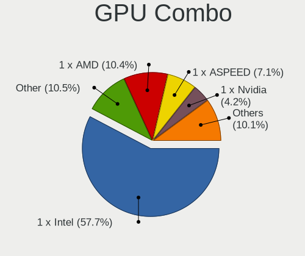

| Name                     | Computers | Percent |
|--------------------------|-----------|---------|
| 1 x Intel                | 1550      | 57.71%  |
| Other                    | 281       | 10.46%  |
| 1 x AMD                  | 280       | 10.42%  |
| 1 x ASPEED               | 190       | 7.07%   |
| 1 x Nvidia               | 113       | 4.21%   |
| 1 x Matrox               | 97        | 3.61%   |
| 2 x Intel                | 84        | 3.13%   |
| Intel + Nvidia           | 46        | 1.71%   |
| Intel + ASPEED           | 15        | 0.56%   |
| Intel + AMD              | 11        | 0.41%   |
| AMD + Nvidia             | 5         | 0.19%   |
| 2 x AMD                  | 4         | 0.15%   |
| 1 x XGI                  | 2         | 0.07%   |
| 1 x VIA                  | 2         | 0.07%   |
| Intel + Matrox           | 2         | 0.07%   |
| 1 x Trident Microsystems | 1         | 0.04%   |
| 1 x SiS                  | 1         | 0.04%   |
| Nvidia + ASPEED          | 1         | 0.04%   |
| AMD + ASPEED             | 1         | 0.04%   |

GPU Driver
----------

Free vs proprietary

| Driver      | Computers | Percent |
|-------------|-----------|---------|
| Free        | 2298      | 85.62%  |
| Unknown     | 305       | 11.36%  |
| Proprietary | 81        | 3.02%   |

GPU Memory
----------

Total video memory

| Size in GB | Computers | Percent |
|------------|-----------|---------|
| Unknown    | 2558      | 95.09%  |
| 1.01-2.0   | 36        | 1.34%   |
| 0.01-0.5   | 32        | 1.19%   |
| 3.01-4.0   | 19        | 0.71%   |
| 7.01-8.0   | 16        | 0.59%   |
| 0.51-1.0   | 11        | 0.41%   |
| 5.01-6.0   | 10        | 0.37%   |
| 2.01-3.0   | 6         | 0.22%   |
| 8.01-16.0  | 2         | 0.07%   |

Monitor
-------

Monitor Vendor
--------------

Monitor vendors

| Vendor               | Computers | Percent |
|----------------------|-----------|---------|
| LG Display           | 50        | 11.93%  |
| AU Optronics         | 45        | 10.74%  |
| Samsung Electronics  | 43        | 10.26%  |
| Dell                 | 26        | 6.21%   |
| BOE                  | 24        | 5.73%   |
| Apple                | 24        | 5.73%   |
| Goldstar             | 23        | 5.49%   |
| Chimei Innolux       | 23        | 5.49%   |
| BenQ                 | 18        | 4.3%    |
| Lenovo               | 16        | 3.82%   |
| Hewlett-Packard      | 11        | 2.63%   |
| Acer                 | 11        | 2.63%   |
| Eizo                 | 10        | 2.39%   |
| Ancor Communications | 10        | 2.39%   |
| Iiyama               | 9         | 2.15%   |
| Philips              | 7         | 1.67%   |
| Fujitsu Siemens      | 7         | 1.67%   |
| Sharp                | 6         | 1.43%   |
| NEC Computers        | 6         | 1.43%   |
| LG Electronics       | 6         | 1.43%   |
| AOC                  | 5         | 1.19%   |
| InfoVision           | 4         | 0.95%   |
| PANDA                | 3         | 0.72%   |
| Idek Iiyama          | 3         | 0.72%   |
| Unknown              | 3         | 0.72%   |
| LG Philips           | 2         | 0.48%   |
| HannStar             | 2         | 0.48%   |
| Belinea              | 2         | 0.48%   |
| ASUSTek Computer     | 2         | 0.48%   |
| WYT                  | 1         | 0.24%   |
| ViewSonic            | 1         | 0.24%   |
| Vestel Elektronik    | 1         | 0.24%   |
| TRU                  | 1         | 0.24%   |
| Toshiba              | 1         | 0.24%   |
| Quanta Display       | 1         | 0.24%   |
| Panasonic            | 1         | 0.24%   |
| MSI                  | 1         | 0.24%   |
| Mi                   | 1         | 0.24%   |
| Medion               | 1         | 0.24%   |
| LTM                  | 1         | 0.24%   |

Monitor Model
-------------

Monitor models

| Model                                                                | Computers | Percent |
|----------------------------------------------------------------------|-----------|---------|
| Apple Color LCD APP9CF3 1366x768 260x140mm 11.6-inch                 | 5         | 1.15%   |
| Goldstar LG Ultra HD GSM5B08 3840x2160 600x340mm 27.2-inch           | 4         | 0.92%   |
| AU Optronics LCD Monitor AUO243D 1920x1080 310x170mm 13.9-inch       | 4         | 0.92%   |
| AU Optronics LCD Monitor AUO226D 1920x1080 280x160mm 12.7-inch       | 4         | 0.92%   |
| Samsung Electronics LCD Monitor SEC3047 1366x768 280x160mm 12.7-inch | 3         | 0.69%   |
| LG Display LCD Monitor LGD02D8 1366x768 280x160mm 12.7-inch          | 3         | 0.69%   |
| Lenovo LCD Monitor LEN4036 1440x900 300x190mm 14.0-inch              | 3         | 0.69%   |
| Fujitsu Siemens B24-9 WE FUS08C3 1920x1200 520x320mm 24.0-inch       | 3         | 0.69%   |
| BOE LCD Monitor BOE05E0 1366x768 280x160mm 12.7-inch                 | 3         | 0.69%   |
| AU Optronics LCD Monitor AUO213E 1600x900 310x170mm 13.9-inch        | 3         | 0.69%   |
| AU Optronics LCD Monitor AUO106C 1366x768 280x160mm 12.7-inch        | 3         | 0.69%   |
| Apple Color LCD APPA01B 1440x900 290x180mm 13.4-inch                 | 3         | 0.69%   |
| Unknown                                                              | 3         | 0.69%   |
| Sharp LQ133M1JW01 SHP141B 1920x1080 290x170mm 13.2-inch              | 2         | 0.46%   |
| Samsung Electronics U28E590 SAM0C4E 3840x2160 610x350mm 27.7-inch    | 2         | 0.46%   |
| Samsung Electronics C32JG5x SAM0FDE 2560x1440 700x390mm 31.5-inch    | 2         | 0.46%   |
| Samsung Electronics C27FG7x SAM0E41 1920x1080 600x340mm 27.2-inch    | 2         | 0.46%   |
| Samsung Electronics C24F390 SAM0D2C 1920x1080 520x290mm 23.4-inch    | 2         | 0.46%   |
| PANDA LCD Monitor NCP002D 1920x1080 340x190mm 15.3-inch              | 2         | 0.46%   |
| NEC Computers EX341R NEC2C7A 3440x1440 800x330mm 34.1-inch           | 2         | 0.46%   |
| LG Display LCD Monitor LGD057E 1920x1080 340x190mm 15.3-inch         | 2         | 0.46%   |
| LG Display LCD Monitor LGD0521 1920x1080 310x170mm 13.9-inch         | 2         | 0.46%   |
| LG Display LCD Monitor LGD04A3 1366x768 280x160mm 12.7-inch          | 2         | 0.46%   |
| LG Display LCD Monitor LGD046F 1920x1080 350x190mm 15.7-inch         | 2         | 0.46%   |
| LG Display LCD Monitor LGD045E 1366x768 310x170mm 13.9-inch          | 2         | 0.46%   |
| LG Display LCD Monitor LGD0437 1920x1080 280x160mm 12.7-inch         | 2         | 0.46%   |
| LG Display LCD Monitor LGD03CD 1366x768 280x160mm 12.7-inch          | 2         | 0.46%   |
| LG Display LCD Monitor LGD0353 1366x768 350x190mm 15.7-inch          | 2         | 0.46%   |
| Lenovo LCD Monitor LEN40B2 1920x1080 340x190mm 15.3-inch             | 2         | 0.46%   |
| Lenovo LCD Monitor LEN40B0 1366x768 340x190mm 15.3-inch              | 2         | 0.46%   |
| Hewlett-Packard LP2475w HWP26F9 1920x1200 540x350mm 25.3-inch        | 2         | 0.46%   |
| Hewlett-Packard LP2475w HWP26F8 1920x1200 540x350mm 25.3-inch        | 2         | 0.46%   |
| Hewlett-Packard LA2405 HWP284B 1920x1200 520x320mm 24.0-inch         | 2         | 0.46%   |
| Hewlett-Packard E272q HWP326A 2560x1440 600x340mm 27.2-inch          | 2         | 0.46%   |
| Goldstar W2261 GSM56CF 1920x1080 530x300mm 24.0-inch                 | 2         | 0.46%   |
| Goldstar LG ULTRAGEAR GSM5B70 1920x1080 600x340mm 27.2-inch          | 2         | 0.46%   |
| Goldstar LG Ultra HD GSM5B09 3840x2160 600x340mm 27.2-inch           | 2         | 0.46%   |
| Goldstar LG HDR 4K GSM7707 3840x2160 600x340mm 27.2-inch             | 2         | 0.46%   |
| Goldstar E2441 GSM581F 1920x1080 530x300mm 24.0-inch                 | 2         | 0.46%   |
| Eizo EV2450 ENC2530 1920x1080 530x300mm 24.0-inch                    | 2         | 0.46%   |

Monitor Resolution
------------------

Monitor screen resolution

| Resolution         | Computers | Percent |
|--------------------|-----------|---------|
| 1920x1080 (FHD)    | 161       | 38.7%   |
| 1366x768 (WXGA)    | 61        | 14.66%  |
| 2560x1440 (QHD)    | 37        | 8.89%   |
| 3840x2160 (4K)     | 32        | 7.69%   |
| 1920x1200 (WUXGA)  | 26        | 6.25%   |
| 1680x1050 (WSXGA+) | 13        | 3.13%   |
| 1600x900 (HD+)     | 13        | 3.13%   |
| 1280x800 (WXGA)    | 13        | 3.13%   |
| 1440x900 (WXGA+)   | 12        | 2.88%   |
| 1280x1024 (SXGA)   | 11        | 2.64%   |
| 3440x1440          | 7         | 1.68%   |
| 2560x1600          | 6         | 1.44%   |
| 2560x1080          | 3         | 0.72%   |
| Unknown            | 3         | 0.72%   |
| 3840x1200          | 2         | 0.48%   |
| 3200x1800 (QHD+)   | 2         | 0.48%   |
| 2880x1800          | 2         | 0.48%   |
| 2256x1504          | 2         | 0.48%   |
| 1920x540           | 2         | 0.48%   |
| 1024x768 (XGA)     | 2         | 0.48%   |
| 9600x2160          | 1         | 0.24%   |
| 720x1280           | 1         | 0.24%   |
| 3840x1080          | 1         | 0.24%   |
| 3600x1080          | 1         | 0.24%   |
| 3000x2000          | 1         | 0.24%   |
| 2048x1152          | 1         | 0.24%   |

Monitor Diagonal
----------------

Diagonal size in inches

| Inches  | Computers | Percent |
|---------|-----------|---------|
| 13      | 83        | 19.9%   |
| 15      | 64        | 15.35%  |
| 27      | 55        | 13.19%  |
| 24      | 45        | 10.79%  |
| 12      | 30        | 7.19%   |
| Unknown | 29        | 6.95%   |
| 23      | 20        | 4.8%    |
| 21      | 16        | 3.84%   |
| 17      | 10        | 2.4%    |
| 19      | 9         | 2.16%   |
| 14      | 9         | 2.16%   |
| 11      | 9         | 2.16%   |
| 22      | 8         | 1.92%   |
| 34      | 7         | 1.68%   |
| 31      | 4         | 0.96%   |
| 32      | 3         | 0.72%   |
| 25      | 3         | 0.72%   |
| 20      | 3         | 0.72%   |
| 46      | 1         | 0.24%   |
| 42      | 1         | 0.24%   |
| 40      | 1         | 0.24%   |
| 39      | 1         | 0.24%   |
| 33      | 1         | 0.24%   |
| 29      | 1         | 0.24%   |
| 26      | 1         | 0.24%   |
| 18      | 1         | 0.24%   |
| 16      | 1         | 0.24%   |
| 6       | 1         | 0.24%   |

Monitor Width
-------------

Physical width

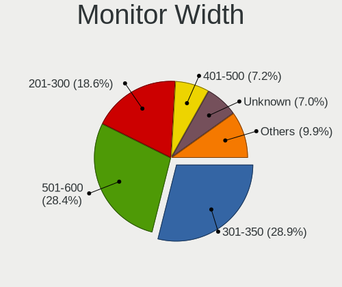

| Width in mm | Computers | Percent |
|-------------|-----------|---------|
| 301-350     | 120       | 28.92%  |
| 501-600     | 118       | 28.43%  |
| 201-300     | 77        | 18.55%  |
| 401-500     | 30        | 7.23%   |
| Unknown     | 29        | 6.99%   |
| 351-400     | 15        | 3.61%   |
| 701-800     | 11        | 2.65%   |
| 601-700     | 10        | 2.41%   |
| 801-900     | 2         | 0.48%   |
| 101-200     | 1         | 0.24%   |
| 1001-1500   | 1         | 0.24%   |
| 901-1000    | 1         | 0.24%   |

Aspect Ratio
------------

Proportional relationship between the width and the height

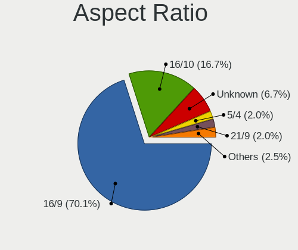

| Ratio   | Computers | Percent |
|---------|-----------|---------|
| 16/9    | 281       | 70.07%  |
| 16/10   | 67        | 16.71%  |
| Unknown | 27        | 6.73%   |
| 5/4     | 8         | 2%      |
| 21/9    | 8         | 2%      |
| 3/2     | 6         | 1.5%    |
| 4/3     | 3         | 0.75%   |
| 6/5     | 1         | 0.25%   |

Monitor Area
------------

Area in inch

| Area in inch | Computers | Percent |
|----------------|-----------|---------|
| 81-90          | 77        | 18.42%  |
| 201-250        | 66        | 15.79%  |
| 301-350        | 56        | 13.4%   |
| 91-100         | 43        | 10.29%  |
| 61-70          | 30        | 7.18%   |
| Unknown        | 29        | 6.94%   |
| 251-300        | 25        | 5.98%   |
| 101-110        | 22        | 5.26%   |
| 351-500        | 16        | 3.83%   |
| 151-200        | 15        | 3.59%   |
| 71-80          | 14        | 3.35%   |
| 51-60          | 9         | 2.15%   |
| 121-130        | 8         | 1.91%   |
| 501-1000       | 4         | 0.96%   |
| 141-150        | 2         | 0.48%   |
| 1-40           | 1         | 0.24%   |
| 131-140        | 1         | 0.24%   |

Pixel Density
-------------

Pixels per inch

| Density       | Computers | Percent |
|---------------|-----------|---------|
| 51-100        | 123       | 29.85%  |
| 121-160       | 121       | 29.37%  |
| 101-120       | 81        | 19.66%  |
| 161-240       | 45        | 10.92%  |
| Unknown       | 29        | 7.04%   |
| More than 240 | 11        | 2.67%   |
| 1-50          | 2         | 0.49%   |

Multiple Monitors
-----------------

Total monitors connected

| Total | Computers | Percent |
|-------|-----------|---------|
| 0     | 2273      | 84.53%  |
| 1     | 378       | 14.06%  |
| 2     | 36        | 1.34%   |
| 3     | 2         | 0.07%   |

Network
-------

Net Controller Vendor
---------------------

Controller vendors

| Vendor                            | Computers | Percent |
|-----------------------------------|-----------|---------|
| Intel                             | 2176      | 59.4%   |
| Realtek Semiconductor             | 800       | 21.84%  |
| Broadcom                          | 184       | 5.02%   |
| Qualcomm Atheros                  | 160       | 4.37%   |
| AMD                               | 46        | 1.26%   |
| Mellanox Technologies             | 25        | 0.68%   |
| IMC Networks                      | 19        | 0.52%   |
| Ralink Technology                 | 17        | 0.46%   |
| MediaTek                          | 15        | 0.41%   |
| Ericsson Business Mobile Networks | 15        | 0.41%   |
| Marvell Technology Group          | 14        | 0.38%   |
| TP-Link                           | 13        | 0.35%   |
| Edimax Technology                 | 13        | 0.35%   |
| U-Blox                            | 12        | 0.33%   |
| Sierra Wireless                   | 12        | 0.33%   |
| Nvidia                            | 12        | 0.33%   |
| American Megatrends               | 10        | 0.27%   |
| D-Link System                     | 9         | 0.25%   |
| Chelsio Communications            | 9         | 0.25%   |
| Ralink                            | 8         | 0.22%   |
| Huawei Technologies               | 7         | 0.19%   |
| Emulex                            | 6         | 0.16%   |
| Insyde Software                   | 5         | 0.14%   |
| Hewlett-Packard                   | 5         | 0.14%   |
| Google                            | 5         | 0.14%   |
| Dell                              | 5         | 0.14%   |
| Aquantia                          | 5         | 0.14%   |
| Samsung Electronics               | 4         | 0.11%   |
| IBM                               | 4         | 0.11%   |
| ASUSTek Computer                  | 4         | 0.11%   |
| ZTE WCDMA Technologies MSM        | 2         | 0.05%   |
| Xiaomi                            | 2         | 0.05%   |
| Qualcomm Technologies             | 2         | 0.05%   |
| Qualcomm Atheros Communications   | 2         | 0.05%   |
| QLogic                            | 2         | 0.05%   |
| NetXen Incorporated               | 2         | 0.05%   |
| ICS Advent                        | 2         | 0.05%   |
| Fibocom                           | 2         | 0.05%   |
| Dresden Elektronik                | 2         | 0.05%   |
| Davicom Semiconductor             | 2         | 0.05%   |

Net Controller Model
--------------------

Controller models

| Model                                                                         | Computers | Percent |
|-------------------------------------------------------------------------------|-----------|---------|
| Realtek RTL8111/8168/8211/8411 PCI Express Gigabit Ethernet Controller        | 687       | 14.89%  |
| Intel I211 Gigabit Network Connection                                         | 451       | 9.77%   |
| Intel I210 Gigabit Network Connection                                         | 344       | 7.45%   |
| Intel Ethernet Controller I226-V                                              | 213       | 4.62%   |
| Intel I350 Gigabit Network Connection                                         | 170       | 3.68%   |
| Intel Ethernet Controller I225-V                                              | 153       | 3.32%   |
| Intel 82574L Gigabit Network Connection                                       | 101       | 2.19%   |
| Intel 82579LM Gigabit Network Connection (Lewisville)                         | 80        | 1.73%   |
| Intel I210 Gigabit Fiber Network Connection                                   | 68        | 1.47%   |
| Intel 82599ES 10-Gigabit SFI/SFP+ Network Connection                          | 68        | 1.47%   |
| Intel 82580 Gigabit Network Connection                                        | 55        | 1.19%   |
| Intel Ethernet Connection X553 1GbE                                           | 49        | 1.06%   |
| Realtek RTL8125 2.5GbE Controller                                             | 47        | 1.02%   |
| Intel Wi-Fi 6 AX200                                                           | 47        | 1.02%   |
| Intel 82583V Gigabit Network Connection                                       | 46        | 1%      |
| AMD XGMAC 10GbE Controller                                                    | 46        | 1%      |
| Intel Ethernet Connection I354                                                | 44        | 0.95%   |
| Intel 82576 Gigabit Network Connection                                        | 43        | 0.93%   |
| Intel Wireless 7265                                                           | 39        | 0.85%   |
| Intel Ethernet Connection I217-LM                                             | 39        | 0.85%   |
| Intel Wireless 3165                                                           | 38        | 0.82%   |
| Intel 82571EB/82571GB Gigabit Ethernet Controller D0/D1 (copper applications) | 35        | 0.76%   |
| Broadcom NetXtreme BCM5720 Gigabit Ethernet PCIe                              | 35        | 0.76%   |
| Intel Wireless 8265 / 8275                                                    | 33        | 0.72%   |
| Intel 82571EB/82571GB Gigabit Ethernet Controller (Copper)                    | 32        | 0.69%   |
| Realtek RTL8821CE 802.11ac PCIe Wireless Network Adapter                      | 30        | 0.65%   |
| Qualcomm Atheros AR928X Wireless Network Adapter (PCI-Express)                | 30        | 0.65%   |
| Intel Ethernet Connection (2) I219-V                                          | 29        | 0.63%   |
| Broadcom NetXtreme BCM5719 Gigabit Ethernet PCIe                              | 29        | 0.63%   |
| Intel Wireless 8260                                                           | 28        | 0.61%   |
| Intel Ethernet Controller X710 for 10GbE SFP+                                 | 28        | 0.61%   |
| Intel Ethernet Connection I219-LM                                             | 28        | 0.61%   |
| Intel Gemini Lake PCH CNVi WiFi                                               | 25        | 0.54%   |
| Qualcomm Atheros QCA9377 802.11ac Wireless Network Adapter                    | 24        | 0.52%   |
| Intel Ethernet Connection (7) I219-V                                          | 24        | 0.52%   |
| Intel Ethernet Connection (2) I219-LM                                         | 24        | 0.52%   |
| Intel Centrino Advanced-N 6205 [Taylor Peak]                                  | 24        | 0.52%   |
| Intel Wireless 7260                                                           | 23        | 0.5%    |
| Intel Ethernet Controller 10-Gigabit X540-AT2                                 | 23        | 0.5%    |
| Intel Ethernet Connection X552 10 GbE SFP+                                    | 22        | 0.48%   |

Wireless Vendor
---------------

Wireless vendors

| Vendor                          | Computers | Percent |
|---------------------------------|-----------|---------|
| Intel                           | 445       | 51.68%  |
| Qualcomm Atheros                | 146       | 16.96%  |
| Realtek Semiconductor           | 105       | 12.2%   |
| Broadcom                        | 56        | 6.5%    |
| IMC Networks                    | 19        | 2.21%   |
| Ralink Technology               | 17        | 1.97%   |
| MediaTek                        | 15        | 1.74%   |
| TP-Link                         | 13        | 1.51%   |
| Edimax Technology               | 13        | 1.51%   |
| Sierra Wireless                 | 9         | 1.05%   |
| Ralink                          | 8         | 0.93%   |
| ASUSTek Computer                | 4         | 0.46%   |
| Qualcomm Technologies           | 2         | 0.23%   |
| Qualcomm Atheros Communications | 2         | 0.23%   |
| Marvell Technology Group        | 2         | 0.23%   |
| Dell                            | 2         | 0.23%   |
| NetGear                         | 1         | 0.12%   |
| Micro Star International        | 1         | 0.12%   |
| Accton Technology               | 1         | 0.12%   |

Wireless Model
--------------

Wireless models

| Model                                                           | Computers | Percent |
|-----------------------------------------------------------------|-----------|---------|
| Intel Wi-Fi 6 AX200                                             | 47        | 5.41%   |
| Intel Wireless 7265                                             | 39        | 4.49%   |
| Intel Wireless 3165                                             | 38        | 4.37%   |
| Intel Wireless 8265 / 8275                                      | 33        | 3.8%    |
| Realtek RTL8821CE 802.11ac PCIe Wireless Network Adapter        | 30        | 3.45%   |
| Qualcomm Atheros AR928X Wireless Network Adapter (PCI-Express)  | 30        | 3.45%   |
| Intel Wireless 8260                                             | 28        | 3.22%   |
| Intel Gemini Lake PCH CNVi WiFi                                 | 25        | 2.88%   |
| Qualcomm Atheros QCA9377 802.11ac Wireless Network Adapter      | 24        | 2.76%   |
| Intel Centrino Advanced-N 6205 [Taylor Peak]                    | 24        | 2.76%   |
| Intel Wireless 7260                                             | 23        | 2.65%   |
| Intel Wi-Fi 6E(802.11ax) AX210/AX1675* 2x2 [Typhoon Peak]       | 19        | 2.19%   |
| IMC Networks 802.11 n/g/b Wireless LAN USB Mini-Card            | 18        | 2.07%   |
| Intel Wireless 3160                                             | 17        | 1.96%   |
| Intel Wi-Fi 5(802.11ac) Wireless-AC 9x6x [Thunder Peak]         | 16        | 1.84%   |
| Intel Centrino Advanced-N 6235                                  | 16        | 1.84%   |
| Qualcomm Atheros QCA986x/988x 802.11ac Wireless Network Adapter | 15        | 1.73%   |
| Intel Centrino Ultimate-N 6300                                  | 15        | 1.73%   |
| Qualcomm Atheros AR9462 Wireless Network Adapter                | 14        | 1.61%   |
| Qualcomm Atheros AR93xx Wireless Network Adapter                | 13        | 1.5%    |
| Qualcomm Atheros QCA6174 802.11ac Wireless Network Adapter      | 12        | 1.38%   |
| Qualcomm Atheros QCA9565 / AR9565 Wireless Network Adapter      | 11        | 1.27%   |
| Intel Wi-Fi 6 AX201                                             | 11        | 1.27%   |
| Intel Dual Band Wireless-AC 3168NGW [Stone Peak]                | 11        | 1.27%   |
| Broadcom BCM43224 802.11a/b/g/n                                 | 11        | 1.27%   |
| Qualcomm Atheros AR9485 Wireless Network Adapter                | 10        | 1.15%   |
| Broadcom BCM4360 802.11ac Dual Band Wireless Network Adapter    | 10        | 1.15%   |
| Realtek RTL8188EUS 802.11n Wireless Network Adapter             | 9         | 1.04%   |
| Qualcomm Atheros AR9285 Wireless Network Adapter (PCI-Express)  | 9         | 1.04%   |
| Sierra Wireless EM7455                                          | 8         | 0.92%   |
| Realtek RTL8821AE 802.11ac PCIe Wireless Network Adapter        | 7         | 0.81%   |
| Realtek RTL8188CE 802.11b/g/n WiFi Adapter                      | 7         | 0.81%   |
| MediaTek MT7922 802.11ax PCI Express Wireless Network Adapter   | 7         | 0.81%   |
| Intel PRO/Wireless 4965 AG or AGN [Kedron] Network Connection   | 7         | 0.81%   |
| Intel Comet Lake PCH-LP CNVi WiFi                               | 7         | 0.81%   |
| Intel Cannon Lake PCH CNVi WiFi                                 | 7         | 0.81%   |
| Edimax EW-7811Un 802.11n Wireless Adapter [Realtek RTL8188CUS]  | 7         | 0.81%   |
| Broadcom BCM4321 802.11a/b/g/n                                  | 7         | 0.81%   |
| Realtek RTL8852BE PCIe 802.11ax Wireless Network Controller     | 6         | 0.69%   |
| Intel PRO/Wireless 3945ABG [Golan] Network Connection           | 6         | 0.69%   |

Ethernet Vendor
---------------

Ethernet vendors

| Vendor                      | Computers | Percent |
|-----------------------------|-----------|---------|
| Intel                       | 1952      | 64.83%  |
| Realtek Semiconductor       | 762       | 25.31%  |
| Broadcom                    | 138       | 4.58%   |
| AMD                         | 46        | 1.53%   |
| Qualcomm Atheros            | 17        | 0.56%   |
| Nvidia                      | 12        | 0.4%    |
| Marvell Technology Group    | 12        | 0.4%    |
| American Megatrends         | 10        | 0.33%   |
| D-Link System               | 6         | 0.2%    |
| Insyde Software             | 5         | 0.17%   |
| Google                      | 5         | 0.17%   |
| Emulex                      | 5         | 0.17%   |
| Chelsio Communications      | 5         | 0.17%   |
| Aquantia                    | 5         | 0.17%   |
| Samsung Electronics         | 4         | 0.13%   |
| IBM                         | 4         | 0.13%   |
| ZTE WCDMA Technologies MSM  | 2         | 0.07%   |
| Xiaomi                      | 2         | 0.07%   |
| QLogic                      | 2         | 0.07%   |
| ICS Advent                  | 2         | 0.07%   |
| Davicom Semiconductor       | 2         | 0.07%   |
| Apple                       | 2         | 0.07%   |
| T & A Mobile Phones         | 1         | 0.03%   |
| SysKonnect                  | 1         | 0.03%   |
| Standard Microsystems [SMC] | 1         | 0.03%   |
| National Semiconductor      | 1         | 0.03%   |
| MYRICOM                     | 1         | 0.03%   |
| Mobile                      | 1         | 0.03%   |
| Lenovo                      | 1         | 0.03%   |
| JMicron Technology          | 1         | 0.03%   |
| Huawei Technologies         | 1         | 0.03%   |
| Digital Equipment           | 1         | 0.03%   |
| 3Com                        | 1         | 0.03%   |

Ethernet Model
--------------

Ethernet models

| Model                                                                         | Computers | Percent |
|-------------------------------------------------------------------------------|-----------|---------|
| Realtek RTL8111/8168/8211/8411 PCI Express Gigabit Ethernet Controller        | 687       | 18.89%  |
| Intel I211 Gigabit Network Connection                                         | 451       | 12.4%   |
| Intel I210 Gigabit Network Connection                                         | 344       | 9.46%   |
| Intel Ethernet Controller I226-V                                              | 213       | 5.86%   |
| Intel I350 Gigabit Network Connection                                         | 170       | 4.68%   |
| Intel Ethernet Controller I225-V                                              | 153       | 4.21%   |
| Intel 82574L Gigabit Network Connection                                       | 101       | 2.78%   |
| Intel 82579LM Gigabit Network Connection (Lewisville)                         | 80        | 2.2%    |
| Intel I210 Gigabit Fiber Network Connection                                   | 68        | 1.87%   |
| Intel 82599ES 10-Gigabit SFI/SFP+ Network Connection                          | 68        | 1.87%   |
| Intel 82580 Gigabit Network Connection                                        | 55        | 1.51%   |
| Intel Ethernet Connection X553 1GbE                                           | 49        | 1.35%   |
| Realtek RTL8125 2.5GbE Controller                                             | 46        | 1.27%   |
| Intel 82583V Gigabit Network Connection                                       | 46        | 1.27%   |
| AMD XGMAC 10GbE Controller                                                    | 46        | 1.27%   |
| Intel Ethernet Connection I354                                                | 44        | 1.21%   |
| Intel 82576 Gigabit Network Connection                                        | 43        | 1.18%   |
| Intel Ethernet Connection I217-LM                                             | 39        | 1.07%   |
| Intel 82571EB/82571GB Gigabit Ethernet Controller D0/D1 (copper applications) | 35        | 0.96%   |
| Broadcom NetXtreme BCM5720 Gigabit Ethernet PCIe                              | 35        | 0.96%   |
| Intel 82571EB/82571GB Gigabit Ethernet Controller (Copper)                    | 32        | 0.88%   |
| Intel Ethernet Connection (2) I219-V                                          | 29        | 0.8%    |
| Broadcom NetXtreme BCM5719 Gigabit Ethernet PCIe                              | 29        | 0.8%    |
| Intel Ethernet Controller X710 for 10GbE SFP+                                 | 28        | 0.77%   |
| Intel Ethernet Connection I219-LM                                             | 28        | 0.77%   |
| Intel Ethernet Connection (7) I219-V                                          | 24        | 0.66%   |
| Intel Ethernet Connection (2) I219-LM                                         | 24        | 0.66%   |
| Intel Ethernet Controller 10-Gigabit X540-AT2                                 | 23        | 0.63%   |
| Intel Ethernet Connection X552 10 GbE SFP+                                    | 22        | 0.61%   |
| Intel Ethernet Connection (7) I219-LM                                         | 22        | 0.61%   |
| Intel I350 Gigabit Fiber Network Connection                                   | 18        | 0.5%    |
| Realtek RTL810xE PCI Express Fast Ethernet controller                         | 16        | 0.44%   |
| Intel Ethernet Controller X550                                                | 16        | 0.44%   |
| Realtek RTL-8100/8101L/8139 PCI Fast Ethernet Adapter                         | 15        | 0.41%   |
| Intel Ethernet Connection (4) I219-V                                          | 15        | 0.41%   |
| Realtek USB 2.5GbE Controller                                                 | 14        | 0.39%   |
| Broadcom NetXtreme II BCM5709 Gigabit Ethernet                                | 14        | 0.39%   |
| Intel Ethernet Connection I217-V                                              | 13        | 0.36%   |
| Intel Ethernet Connection X722 for 10GBASE-T                                  | 11        | 0.3%    |
| Intel 82579V Gigabit Network Connection                                       | 11        | 0.3%    |

Net Controller Kind
-------------------

Ethernet, WiFi or modem

| Kind     | Computers | Percent |
|----------|-----------|---------|
| Ethernet | 2610      | 74.23%  |
| WiFi     | 800       | 22.75%  |
| Unknown  | 72        | 2.05%   |
| Modem    | 34        | 0.97%   |

Used Controller
---------------

Currently used network controller

| Kind     | Computers | Percent |
|----------|-----------|---------|
| Ethernet | 2490      | 90.98%  |
| WiFi     | 236       | 8.62%   |
| Unknown  | 10        | 0.37%   |
| Modem    | 1         | 0.04%   |

NICs
----

Total network controllers on board

| Total | Computers | Percent |
|-------|-----------|---------|
| 2     | 583       | 21.47%  |
| 4     | 582       | 21.43%  |
| 3     | 392       | 14.43%  |
| 6     | 345       | 12.7%   |
| 1     | 289       | 10.64%  |
| 5     | 223       | 8.21%   |
| 8     | 133       | 4.9%    |
| 10    | 48        | 1.77%   |
| 7     | 36        | 1.33%   |
| 9     | 33        | 1.22%   |
| 0     | 20        | 0.74%   |
| 12    | 19        | 0.7%    |
| 14    | 5         | 0.18%   |
| 16    | 3         | 0.11%   |
| 20    | 2         | 0.07%   |
| 11    | 2         | 0.07%   |
| 17    | 1         | 0.04%   |

IPv6
----

IPv6 vs IPv4

| Used | Computers | Percent |
|------|-----------|---------|
| No   | 2136      | 76.23%  |
| Yes  | 666       | 23.77%  |

Bluetooth
---------

Bluetooth Vendor
----------------

Controller vendors

| Vendor                          | Computers | Percent |
|---------------------------------|-----------|---------|
| Intel                           | 318       | 58.03%  |
| Realtek Semiconductor           | 47        | 8.58%   |
| Qualcomm Atheros Communications | 34        | 6.2%    |
| IMC Networks                    | 34        | 6.2%    |
| Apple                           | 34        | 6.2%    |
| Broadcom                        | 26        | 4.74%   |
| MediaTek                        | 11        | 2.01%   |
| Foxconn / Hon Hai               | 11        | 2.01%   |
| Lite-On Technology              | 7         | 1.28%   |
| ASUSTek Computer                | 7         | 1.28%   |
| Cambridge Silicon Radio         | 6         | 1.09%   |
| Dell                            | 4         | 0.73%   |
| Hewlett-Packard                 | 3         | 0.55%   |
| USI                             | 2         | 0.36%   |
| Alps Electric                   | 2         | 0.36%   |
| Micro Star International        | 1         | 0.18%   |
| Unknown                         | 1         | 0.18%   |

Bluetooth Model
---------------

Controller models

| Model                                                       | Computers | Percent |
|-------------------------------------------------------------|-----------|---------|
| Intel Bluetooth wireless interface                          | 137       | 24.82%  |
| Intel AX200 Bluetooth                                       | 48        | 8.7%    |
| Intel Bluetooth 9460/9560 Jefferson Peak (JfP)              | 42        | 7.61%   |
| Realtek Bluetooth Adapter                                   | 33        | 5.98%   |
| Intel AX201 Bluetooth                                       | 27        | 4.89%   |
| Intel Centrino Bluetooth Wireless Transceiver               | 21        | 3.8%    |
| IMC Networks Qualcomm Atheros Bluetooth 4.1                 | 18        | 3.26%   |
| Intel Wireless-AC 9260 Bluetooth Adapter                    | 16        | 2.9%    |
| Apple Bluetooth Host Controller                             | 16        | 2.9%    |
| Qualcomm Atheros AR3012 Bluetooth 4.0                       | 15        | 2.72%   |
| Intel AX210 Bluetooth                                       | 14        | 2.54%   |
| Intel Wireless-AC 3168 Bluetooth                            | 11        | 1.99%   |
| Apple Built-in Bluetooth 2.0+EDR HCI                        | 10        | 1.81%   |
| Broadcom BCM2045B (BDC-2.1)                                 | 9         | 1.63%   |
| Broadcom BCM20702 Bluetooth 4.0 [ThinkPad]                  | 8         | 1.45%   |
| MediaTek Wireless_Device                                    | 7         | 1.27%   |
| IMC Networks Realtek Bluetooth Adapter                      | 6         | 1.09%   |
| IMC Networks Realtek Bluetooth 4.0 + High Speed Chip        | 6         | 1.09%   |
| Cambridge Silicon Radio Bluetooth Dongle (HCI mode)         | 6         | 1.09%   |
| Apple Broadcom Built-in Bluetooth                           | 5         | 0.91%   |
| Realtek Bluetooth 4.2 Adapter                               | 4         | 0.72%   |
| Qualcomm Atheros QCA61x4 Bluetooth 4.0                      | 4         | 0.72%   |
| Intel AX211 Bluetooth                                       | 4         | 0.72%   |
| Realtek  Bluetooth 4.2 Adapter                              | 3         | 0.54%   |
| Qualcomm Atheros QCA9377 Bluetooth 4.1                      | 3         | 0.54%   |
| Qualcomm Atheros AR9462 Bluetooth                           | 3         | 0.54%   |
| MediaTek RZ608 Bluetooth Adapter                            | 3         | 0.54%   |
| Lite-On Bluetooth USB Module                                | 3         | 0.54%   |
| Lite-On Atheros AR3012 Bluetooth                            | 3         | 0.54%   |
| Foxconn / Hon Hai Bluetooth USB Module                      | 3         | 0.54%   |
| ASUS USB-BT500                                              | 3         | 0.54%   |
| USI Qualcomm WCN685x Bluetooth Adapter                      | 2         | 0.36%   |
| Realtek RTL8723B Bluetooth                                  | 2         | 0.36%   |
| Realtek RTL8723A Bluetooth                                  | 2         | 0.36%   |
| Qualcomm Atheros Dell Wireless 1820 Bluetooth 4.1LE         | 2         | 0.36%   |
| Qualcomm Atheros AR3011 Bluetooth (no firmware)             | 2         | 0.36%   |
| Foxconn / Hon Hai Qualcomm Atheros AR3012 Bluetooth Adapter | 2         | 0.36%   |
| Foxconn / Hon Hai MediaTek Bluetooth Adapter                | 2         | 0.36%   |
| Dell DW375 Bluetooth Module                                 | 2         | 0.36%   |
| Dell Dell Wireless 380 Bluetooth 4.0 Module                 | 2         | 0.36%   |

Sound
-----

Sound Vendor
------------

Sound card vendors

| Vendor                                       | Computers | Percent |
|----------------------------------------------|-----------|---------|
| Intel                                        | 1490      | 72.47%  |
| AMD                                          | 345       | 16.78%  |
| Nvidia                                       | 113       | 5.5%    |
| C-Media Electronics                          | 21        | 1.02%   |
| Zoran Co. Personal Media Division (Nogatech) | 14        | 0.68%   |
| Logitech                                     | 10        | 0.49%   |
| JMTek                                        | 6         | 0.29%   |
| GN Netcom                                    | 6         | 0.29%   |
| Texas Instruments                            | 4         | 0.19%   |
| Creative Labs                                | 4         | 0.19%   |
| VIA Technologies                             | 3         | 0.15%   |
| Tenx Technology                              | 3         | 0.15%   |
| Realtek Semiconductor                        | 3         | 0.15%   |
| Lenovo                                       | 3         | 0.15%   |
| ESS Technology                               | 3         | 0.15%   |
| Kingston Technology                          | 2         | 0.1%    |
| Creative Technology                          | 2         | 0.1%    |
| Corsair                                      | 2         | 0.1%    |
| Audient                                      | 2         | 0.1%    |
| ZOOM                                         | 1         | 0.05%   |
| Yamaha                                       | 1         | 0.05%   |
| Walmart                                      | 1         | 0.05%   |
| ULi Electronics                              | 1         | 0.05%   |
| Trust                                        | 1         | 0.05%   |
| SteelSeries ApS                              | 1         | 0.05%   |
| Silicon Integrated Systems [SiS]             | 1         | 0.05%   |
| RME                                          | 1         | 0.05%   |
| Razer USA                                    | 1         | 0.05%   |
| Phison Electronics                           | 1         | 0.05%   |
| Native Instruments                           | 1         | 0.05%   |
| MosArt Semiconductor                         | 1         | 0.05%   |
| M-Audio                                      | 1         | 0.05%   |
| Hewlett-Packard                              | 1         | 0.05%   |
| Generalplus Technology                       | 1         | 0.05%   |
| Focusrite-Novation                           | 1         | 0.05%   |
| DSEA A/S                                     | 1         | 0.05%   |
| Blue Microphones                             | 1         | 0.05%   |
| AudioQuest                                   | 1         | 0.05%   |
| ASUSTek Computer                             | 1         | 0.05%   |

Sound Model
-----------

Sound card models

| Model                                                                                             | Computers | Percent |
|---------------------------------------------------------------------------------------------------|-----------|---------|
| Intel Celeron/Pentium Silver Processor High Definition Audio                                      | 159       | 6.62%   |
| Intel Sunrise Point-LP HD Audio                                                                   | 145       | 6.04%   |
| Intel Alder Lake-N PCH High Definition Audio Controller                                           | 131       | 5.46%   |
| AMD Kabini HDMI/DP Audio                                                                          | 111       | 4.62%   |
| Intel Xeon E3-1200 v3/4th Gen Core Processor HD Audio Controller                                  | 103       | 4.29%   |
| AMD Family 17h/19h/1ah HD Audio Controller                                                        | 97        | 4.04%   |
| AMD FCH Azalia Controller                                                                         | 93        | 3.87%   |
| Intel Jasper Lake HD Audio                                                                        | 87        | 3.62%   |
| Intel Atom/Celeron/Pentium Processor x5-E8000/J3xxx/N3xxx Series High Definition Audio Controller | 81        | 3.37%   |
| Intel 100 Series/C230 Series Chipset Family HD Audio Controller                                   | 81        | 3.37%   |
| Intel 7 Series/C216 Chipset Family High Definition Audio Controller                               | 74        | 3.08%   |
| Intel 8 Series/C220 Series Chipset High Definition Audio Controller                               | 63        | 2.62%   |
| Intel 6 Series/C200 Series Chipset Family High Definition Audio Controller                        | 60        | 2.5%    |
| Intel Celeron N3350/Pentium N4200/Atom E3900 Series Audio Cluster                                 | 52        | 2.17%   |
| Intel Atom Processor Z36xxx/Z37xxx Series High Definition Audio Controller                        | 52        | 2.17%   |
| Intel Cannon Lake PCH cAVS                                                                        | 51        | 2.12%   |
| Intel Haswell-ULT HD Audio Controller                                                             | 45        | 1.87%   |
| Intel 8 Series HD Audio Controller                                                                | 45        | 1.87%   |
| Intel Wildcat Point-LP High Definition Audio Controller                                           | 39        | 1.62%   |
| Intel Broadwell-U Audio Controller                                                                | 39        | 1.62%   |
| AMD Family 17h (Models 00h-0fh) HD Audio Controller                                               | 37        | 1.54%   |
| AMD Renoir Radeon High Definition Audio Controller                                                | 34        | 1.42%   |
| Intel Cannon Point-LP High Definition Audio Controller                                            | 32        | 1.33%   |
| Intel Comet Lake PCH-LP cAVS                                                                      | 31        | 1.29%   |
| AMD Raven/Raven2/Fenghuang HDMI/DP Audio Controller                                               | 31        | 1.29%   |
| Intel Tiger Lake-LP Smart Sound Technology Audio Controller                                       | 30        | 1.25%   |
| Intel 200 Series PCH HD Audio                                                                     | 28        | 1.17%   |
| Intel NM10/ICH7 Family High Definition Audio Controller                                           | 27        | 1.12%   |
| Intel 82801H (ICH8 Family) HD Audio Controller                                                    | 25        | 1.04%   |
| Intel 5 Series/3400 Series Chipset High Definition Audio                                          | 24        | 1%      |
| AMD Starship/Matisse HD Audio Controller                                                          | 23        | 0.96%   |
| AMD SBx00 Azalia (Intel HDA)                                                                      | 19        | 0.79%   |
| Intel Elkhart Lake High Density Audio bus interface                                               | 18        | 0.75%   |
| Intel 82801I (ICH9 Family) HD Audio Controller                                                    | 18        | 0.75%   |
| Zoran Co. Personal Media Division (Nogatech) USB Audio and HID                                    | 14        | 0.58%   |
| Intel Alder Lake PCH-P High Definition Audio Controller                                           | 13        | 0.54%   |
| AMD Ellesmere HDMI Audio [Radeon RX 470/480 / 570/580/590]                                        | 13        | 0.54%   |
| Nvidia GK208 HDMI/DP Audio Controller                                                             | 12        | 0.5%    |
| C-Media Electronics Audio Adapter (Unitek Y-247A)                                                 | 12        | 0.5%    |
| Nvidia GP108 High Definition Audio Controller                                                     | 11        | 0.46%   |

Memory
------

Memory Vendor
-------------

Memory module vendors

| Vendor                       | Computers | Percent |
|------------------------------|-----------|---------|
| Samsung Electronics          | 495       | 18.41%  |
| Crucial                      | 361       | 13.43%  |
| Unknown                      | 315       | 11.71%  |
| SK hynix                     | 278       | 10.34%  |
| Kingston                     | 271       | 10.08%  |
| Micron Technology            | 221       | 8.22%   |
| G.Skill                      | 113       | 4.2%    |
| Unknown                      | 95        | 3.53%   |
| Corsair                      | 89        | 3.31%   |
| Transcend                    | 84        | 3.12%   |
| A-DATA Technology            | 64        | 2.38%   |
| Unknown (ABCD)               | 53        | 1.97%   |
| ATP                          | 34        | 1.26%   |
| Nanya Technology             | 32        | 1.19%   |
| Ramaxel Technology           | 26        | 0.97%   |
| Apacer                       | 20        | 0.74%   |
| Hewlett-Packard              | 17        | 0.63%   |
| Elpida                       | 12        | 0.45%   |
| Toshiba                      | 8         | 0.3%    |
| Kimtigo                      | 7         | 0.26%   |
| Shenzhen Jinge Information   | 6         | 0.22%   |
| Patriot                      | 6         | 0.22%   |
| Team                         | 4         | 0.15%   |
| Lexar Co Limited             | 4         | 0.15%   |
| Innodisk                     | 4         | 0.15%   |
| Avant                        | 4         | 0.15%   |
| Wodposit                     | 3         | 0.11%   |
| SK_Hynix                     | 3         | 0.11%   |
| Mushkin                      | 3         | 0.11%   |
| Unknown (AB)                 | 2         | 0.07%   |
| Unknown (89EC)               | 2         | 0.07%   |
| Unknown (0x7F7F7F94FFFFFFFF) | 2         | 0.07%   |
| Unknown (09C7)               | 2         | 0.07%   |
| Timetec                      | 2         | 0.07%   |
| Tigo                         | 2         | 0.07%   |
| Teikon                       | 2         | 0.07%   |
| Qimonda                      | 2         | 0.07%   |
| PNY                          | 2         | 0.07%   |
| Juhor                        | 2         | 0.07%   |
| HPE                          | 2         | 0.07%   |

Memory Model
------------

Memory module models

| Model                                                          | Computers | Percent |
|----------------------------------------------------------------|-----------|---------|
| Unknown                                                        | 95        | 3.36%   |
| Unknown RAM Module 4GB SODIMM DDR3 1333MT/s                    | 63        | 2.23%   |
| Unknown (ABCD) RAM 123456789012345678 2GB DIMM LPDDR4 2133MT/s | 53        | 1.88%   |
| SK hynix RAM HMT451S6BFR8A-PB 4GB SODIMM DDR3 1600MT/s         | 29        | 1.03%   |
| Samsung RAM M471B5173QH0-YK0 4GB SODIMM DDR3 1600MT/s          | 29        | 1.03%   |
| Transcend RAM TS1GLH64V6BL 8GB SODIMM DDR4 2667MT/s            | 25        | 0.88%   |
| Samsung RAM M471A1K43CB1-CTD 8GB SODIMM DDR4 2667MT/s          | 21        | 0.74%   |
| Crucial RAM CT16G48C40S5.M8A1 16GB SODIMM DDR5 4800MT/s        | 20        | 0.71%   |
| Samsung RAM M471B5173DB0-YK0 4GB SODIMM DDR3 1600MT/s          | 17        | 0.6%    |
| Unknown RAM Module 4GB DIMM DDR3 1333MT/s                      | 16        | 0.57%   |
| Micron RAM 8KTF51264HZ-1G9P1 4GB SODIMM DDR3 1867MT/s          | 16        | 0.57%   |
| Unknown RAM Module 8GB DIMM DDR3 1600MT/s                      | 15        | 0.53%   |
| Unknown RAM Module 2GB SODIMM DDR2 667MT/s                     | 15        | 0.53%   |
| Samsung RAM M471B5173EB0-YK0 4GB SODIMM DDR3 1600MT/s          | 14        | 0.5%    |
| Unknown RAM Module 4GB SODIMM DDR3 667MT/s                     | 13        | 0.46%   |
| Unknown RAM Module 2GB DIMM DDR2 800MT/s                       | 13        | 0.46%   |
| Samsung RAM M471A1K43CB1-CRC 8GB SODIMM DDR4 2667MT/s          | 13        | 0.46%   |
| SK hynix RAM HMA81GS6AFR8N-UH 8GB SODIMM DDR4 2400MT/s         | 12        | 0.42%   |
| Samsung RAM M425R1GB4BB0-CQKOL 8GB SODIMM DDR5 4800MT/s        | 12        | 0.42%   |
| Crucial RAM CT102464BF160B.M16 8GB SODIMM DDR3 1600MT/s        | 12        | 0.42%   |
| ATP RAM X4G08QA8BNWESO-7-TO1 8GB SODIMM DDR4 3200MT/s          | 12        | 0.42%   |
| Micron RAM 8ATF1G64HZ-3G2R1 8GB SODIMM DDR4 3200MT/s           | 11        | 0.39%   |
| G.Skill RAM F4-2400C16-8GRS 8GB SODIMM DDR4 2400MT/s           | 11        | 0.39%   |
| Unknown RAM Module 4GB DIMM DDR2 800MT/s                       | 10        | 0.35%   |
| Unknown RAM Module 2GB DIMM SDRAM                              | 10        | 0.35%   |
| Micron RAM Module 8GB Row Of Chips LPDDR4 3200MT/s             | 10        | 0.35%   |
| Crucial RAM CT8G4SFRA266.M8FRS 8GB SODIMM DDR4 2667MT/s        | 10        | 0.35%   |
| Crucial RAM CT8G48C40S5.M4A1 8GB SODIMM DDR5 4800MT/s          | 10        | 0.35%   |
| Crucial RAM CT102464BF160B.C16 8GB DIMM DDR3 1600MT/s          | 10        | 0.35%   |
| ATP RAM AW12P6438BLK0S 4GB DIMM DDR3 1600MT/s                  | 10        | 0.35%   |
| Transcend RAM TS512MSK64W6H 4GB DIMM DDR3 1600MT/s             | 9         | 0.32%   |
| SK hynix RAM HMT351S6CFR8C-PB 4GB SODIMM DDR3 1600MT/s         | 9         | 0.32%   |
| Samsung RAM M471B5273DH0-CH9 4GB SODIMM DDR3 1334MT/s          | 9         | 0.32%   |
| Samsung RAM M471B1G73QH0-YK0 8GB SODIMM DDR3 1867MT/s          | 9         | 0.32%   |
| Samsung RAM M471B1G73DB0-YK0 8GB SODIMM DDR3 1600MT/s          | 9         | 0.32%   |
| Samsung RAM M471A5244CB0-CTD 4GB SODIMM DDR4 2667MT/s          | 9         | 0.32%   |
| Samsung RAM M471A2K43DB1-CWE 16GB SODIMM DDR4 3200MT/s         | 9         | 0.32%   |
| Crucial RAM CT16G4SFRA32A.M16FR 16GB SODIMM DDR4 3200MT/s      | 9         | 0.32%   |
| Corsair RAM CMK16GX4M2B3200C16 8GB DIMM DDR4 3200MT/s          | 9         | 0.32%   |
| A-DATA RAM Module 4GB SODIMM DDR3 1600MT/s                     | 9         | 0.32%   |

Memory Kind
-----------

Memory module kinds

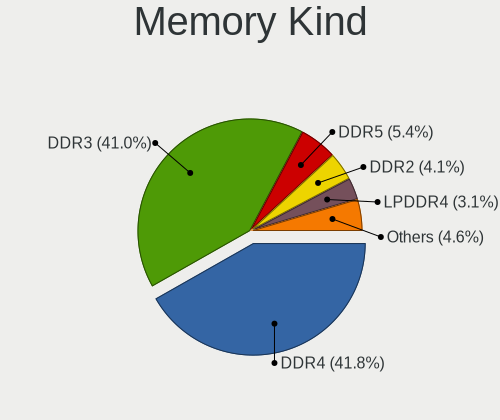

| Kind    | Computers | Percent |
|---------|-----------|---------|
| DDR4    | 1027      | 41.78%  |
| DDR3    | 1007      | 40.97%  |
| DDR5    | 133       | 5.41%   |
| DDR2    | 101       | 4.11%   |
| LPDDR4  | 77        | 3.13%   |
| Unknown | 42        | 1.71%   |
| SDRAM   | 26        | 1.06%   |
| LPDDR5  | 22        | 0.9%    |
| DDR     | 11        | 0.45%   |
| LPDDR3  | 10        | 0.41%   |
| RAM     | 1         | 0.04%   |
| DRAM    | 1         | 0.04%   |

Memory Form Factor
------------------

Physical design of the memory module

| Name         | Computers | Percent |
|--------------|-----------|---------|
| SODIMM       | 1339      | 54.81%  |
| DIMM         | 1033      | 42.28%  |
| Row Of Chips | 52        | 2.13%   |
| Unknown      | 11        | 0.45%   |
| Chip         | 6         | 0.25%   |
| FB-DIMM      | 2         | 0.08%   |

Memory Size
-----------

Memory module size

| Size  | Computers | Percent |
|-------|-----------|---------|
| 8192  | 909       | 35.16%  |
| 4096  | 770       | 29.79%  |
| 16384 | 471       | 18.22%  |
| 2048  | 284       | 10.99%  |
| 32768 | 100       | 3.87%   |
| 1024  | 39        | 1.51%   |
| 512   | 4         | 0.15%   |
| 49152 | 3         | 0.12%   |
| 3072  | 2         | 0.08%   |
| 256   | 2         | 0.08%   |
| 65536 | 1         | 0.04%   |

Memory Speed
------------

Memory module speed

| Speed   | Computers | Percent |
|---------|-----------|---------|
| 1600    | 663       | 25.84%  |
| 2400    | 338       | 13.17%  |
| 2667    | 292       | 11.38%  |
| 3200    | 287       | 11.18%  |
| 1333    | 285       | 11.11%  |
| 2133    | 130       | 5.07%   |
| 4800    | 101       | 3.94%   |
| 800     | 71        | 2.77%   |
| 667     | 71        | 2.77%   |
| 1867    | 41        | 1.6%    |
| 2666    | 38        | 1.48%   |
| Unknown | 35        | 1.36%   |
| 5600    | 31        | 1.21%   |
| 1866    | 26        | 1.01%   |
| 1067    | 23        | 0.9%    |
| 1334    | 22        | 0.86%   |
| 1066    | 22        | 0.86%   |
| 6400    | 18        | 0.7%    |
| 3000    | 16        | 0.62%   |
| 2933    | 16        | 0.62%   |
| 4267    | 5         | 0.19%   |
| 3600    | 5         | 0.19%   |
| 533     | 4         | 0.16%   |
| 5200    | 3         | 0.12%   |
| 4000    | 3         | 0.12%   |
| 1033    | 3         | 0.12%   |
| 400     | 3         | 0.12%   |
| 333     | 3         | 0.12%   |
| 975     | 2         | 0.08%   |
| 65535   | 1         | 0.04%   |
| 4400    | 1         | 0.04%   |
| 3534    | 1         | 0.04%   |
| 3500    | 1         | 0.04%   |
| 2800    | 1         | 0.04%   |
| 2600    | 1         | 0.04%   |
| 2048    | 1         | 0.04%   |
| 1639    | 1         | 0.04%   |
| 1419    | 1         | 0.04%   |

Printers & scanners
-------------------

Printer Vendor
--------------

Printer device vendors

| Vendor              | Computers | Percent |
|---------------------|-----------|---------|
| Brother Industries  | 3         | 42.86%  |
| Ricoh               | 1         | 14.29%  |
| QinHeng Electronics | 1         | 14.29%  |
| Prolific Technology | 1         | 14.29%  |
| Hewlett-Packard     | 1         | 14.29%  |

Printer Model
-------------

Printer device models

| Model                         | Computers | Percent |
|-------------------------------|-----------|---------|
| Brother MFC-7360N             | 2         | 28.57%  |
| Ricoh SP 112                  | 1         | 14.29%  |
| QinHeng CH340S                | 1         | 14.29%  |
| Prolific PL2305 Parallel Port | 1         | 14.29%  |
| HP HP LaserJet P2035 HP Print | 1         | 14.29%  |
| Brother HL-L2310D series      | 1         | 14.29%  |

Scanner Vendor
--------------

Scanner device vendors

| Vendor      | Computers | Percent |
|-------------|-----------|---------|
| Canon       | 3         | 60%     |
| Seiko Epson | 2         | 40%     |

Scanner Model
-------------

Scanner device models

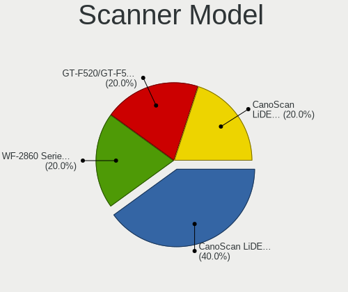

| Model                                                                               | Computers | Percent |
|-------------------------------------------------------------------------------------|-----------|---------|
| Canon CanoScan LiDE 110                                                             | 2         | 40%     |
| Seiko Epson WF-2860 Series EPSON Scanner USB2.0 Printer EPSON Utility USB2.0 Faxout | 1         | 20%     |
| Seiko Epson GT-F520/GT-F570 [Perfection 3590 PHOTO]                                 | 1         | 20%     |
| Canon CanoScan LiDE 120                                                             | 1         | 20%     |

Camera
------

Camera Vendor
-------------

Camera device vendors

| Vendor                                 | Computers | Percent |
|----------------------------------------|-----------|---------|
| Chicony Electronics                    | 82        | 32.67%  |
| Bison Electronics                      | 32        | 12.75%  |
| Realtek Semiconductor                  | 16        | 6.37%   |
| Logitech                               | 15        | 5.98%   |
| IMC Networks                           | 15        | 5.98%   |
| Microdia                               | 13        | 5.18%   |
| Sunplus Innovation Technology          | 11        | 4.38%   |
| Lite-On Technology                     | 10        | 3.98%   |
| Suyin                                  | 9         | 3.59%   |
| Apple                                  | 8         | 3.19%   |
| Syntek                                 | 7         | 2.79%   |
| Lenovo                                 | 5         | 1.99%   |
| Cheng Uei Precision Industry (Foxlink) | 4         | 1.59%   |
| Alcor Micro                            | 4         | 1.59%   |
| Quanta                                 | 3         | 1.2%    |
| Z-Star Microelectronics                | 2         | 0.8%    |
| Silicon Motion                         | 2         | 0.8%    |
| Luxvisions Innotech Limited            | 2         | 0.8%    |
| ARC International                      | 2         | 0.8%    |
| Trust                                  | 1         | 0.4%    |
| Tripath Technology                     | 1         | 0.4%    |
| SunplusIT                              | 1         | 0.4%    |
| Shenzhen Kingcome Optoelectronic       | 1         | 0.4%    |
| Ricoh                                  | 1         | 0.4%    |
| Pixart Imaging                         | 1         | 0.4%    |
| Intel                                  | 1         | 0.4%    |
| Framework                              | 1         | 0.4%    |
| Cubeternet                             | 1         | 0.4%    |

Camera Model
------------

Camera device models

| Model                                    | Computers | Percent |
|------------------------------------------|-----------|---------|
| Chicony Integrated Camera                | 35        | 13.89%  |
| Bison Integrated Camera                  | 17        | 6.75%   |
| IMC Networks Integrated Camera           | 8         | 3.17%   |
| Chicony Lenovo Integrated Camera (0.3MP) | 7         | 2.78%   |
| Chicony HD WebCam                        | 7         | 2.78%   |
| Realtek USB 2.0 PC Camera                | 6         | 2.38%   |
| Lite-On Integrated Camera                | 6         | 2.38%   |
| Chicony FJ Camera                        | 6         | 2.38%   |
| Microdia Integrated Webcam               | 5         | 1.98%   |
| Logitech HD Pro Webcam C920              | 4         | 1.59%   |
| Bison SunplusIT Integrated Camera        | 4         | 1.59%   |
| Apple FaceTime HD Camera (Built-in)      | 4         | 1.59%   |
| Syntek Integrated Camera                 | 3         | 1.19%   |
| Suyin RGBIR Camera                       | 3         | 1.19%   |
| Sunplus Integrated_Webcam_HD             | 3         | 1.19%   |
| Microdia Integrated_Webcam_HD            | 3         | 1.19%   |
| Logitech Webcam C270                     | 3         | 1.19%   |
| Logitech C920 PRO HD Webcam              | 3         | 1.19%   |
| Lite-On Realtek PC Camera                | 3         | 1.19%   |
| Chicony Integrated Camera [ThinkPad]     | 3         | 1.19%   |
| Chicony HP HD Webcam [Fixed]             | 3         | 1.19%   |
| Chicony Chicony USB2.0 Camera            | 3         | 1.19%   |
| Bison ThinkPad Integrated Camera         | 3         | 1.19%   |
| Alcor Micro USB 2.0 Camera               | 3         | 1.19%   |
| Syntek Lenovo EasyCamera                 | 2         | 0.79%   |
| Syntek EasyCamera                        | 2         | 0.79%   |
| Realtek Laptop Camera                    | 2         | 0.79%   |
| Realtek Integrated_Webcam_HD             | 2         | 0.79%   |
| Quanta HP TrueVision HD Camera           | 2         | 0.79%   |
| Logitech C920 HD Pro Webcam              | 2         | 0.79%   |
| Lenovo Integrated Webcam [R5U877]        | 2         | 0.79%   |
| Lenovo Integrated Camera                 | 2         | 0.79%   |
| IMC Networks XHC Camera                  | 2         | 0.79%   |
| IMC Networks Realtek PC Camera           | 2         | 0.79%   |
| Chicony Integrated IR Camera             | 2         | 0.79%   |
| Chicony HD WebCam (Acer)                 | 2         | 0.79%   |
| Bison SunplusIT INC. Integrated Camera   | 2         | 0.79%   |
| Bison Lenovo EasyCamera                  | 2         | 0.79%   |
| ARC International Camera                 | 2         | 0.79%   |
| Apple FaceTime HD Camera                 | 2         | 0.79%   |

Security
--------

Fingerprint Vendor
------------------

Fingerprint sensor vendors

| Vendor                     | Computers | Percent |
|----------------------------|-----------|---------|
| Validity Sensors           | 33        | 35.87%  |
| Synaptics                  | 18        | 19.57%  |
| Upek                       | 11        | 11.96%  |
| Shenzhen Goodix Technology | 7         | 7.61%   |
| LighTuning Technology      | 6         | 6.52%   |
| AuthenTec                  | 6         | 6.52%   |
| Elan Microelectronics      | 3         | 3.26%   |
| Broadcom                   | 3         | 3.26%   |
| STMicroelectronics         | 2         | 2.17%   |
| Next Biometrics            | 1         | 1.09%   |
| FocalTech Systems          | 1         | 1.09%   |
| DigitalPersona             | 1         | 1.09%   |

Fingerprint Model
-----------------

Fingerprint sensor models

| Model                                                                        | Computers | Percent |
|------------------------------------------------------------------------------|-----------|---------|
| Validity Sensors VFS 5011 fingerprint sensor                                 | 12        | 13.04%  |
| Validity Sensors Synaptics WBDI                                              | 11        | 11.96%  |
| Upek Biometric Touchchip/Touchstrip Fingerprint Sensor                       | 10        | 10.87%  |
| Synaptics Metallica MIS Touch Fingerprint Reader                             | 7         | 7.61%   |
| Synaptics Prometheus MIS Touch Fingerprint Reader                            | 5         | 5.43%   |
| Shenzhen Goodix Fingerprint Reader                                           | 5         | 5.43%   |
| LighTuning ES603 Swipe Fingerprint Sensor                                    | 4         | 4.35%   |
| Elan Fingerprint Sensor                                                      | 3         | 3.26%   |
| Broadcom BCM5880 Secure Applications Processor with fingerprint swipe sensor | 3         | 3.26%   |
| Validity Sensors VFS7500 Touch Fingerprint Sensor                            | 2         | 2.17%   |
| Validity Sensors VFS495 Fingerprint Reader                                   | 2         | 2.17%   |
| Validity Sensors VFS471 Fingerprint Reader                                   | 2         | 2.17%   |
| Validity Sensors Swipe Fingerprint Sensor                                    | 2         | 2.17%   |
| Synaptics WBDI                                                               | 2         | 2.17%   |
| STMicroelectronics Fingerprint Reader                                        | 2         | 2.17%   |
| Shenzhen Goodix Fingerprint Reader SGX                                       | 2         | 2.17%   |
| LighTuning EgisTec Touch Fingerprint Sensor                                  | 2         | 2.17%   |
| AuthenTec AES2501 Fingerprint Sensor                                         | 2         | 2.17%   |
| Unknown                                                                      | 2         | 2.17%   |
| Validity Sensors VFS5011 Fingerprint Reader                                  | 1         | 1.09%   |
| Validity Sensors VFS Fingerprint sensor                                      | 1         | 1.09%   |
| Upek TCS5B Fingerprint sensor                                                | 1         | 1.09%   |
| Synaptics TouchPad                                                           | 1         | 1.09%   |
| Synaptics Metallica MOH Touch Fingerprint Reader                             | 1         | 1.09%   |
| Next Biometrics NB-2020-U Fingerprint Reader                                 | 1         | 1.09%   |
| FocalTech Systems Fingerprint Reader                                         | 1         | 1.09%   |
| DigitalPersona Fingerprint Reader                                            | 1         | 1.09%   |
| AuthenTec AES2660                                                            | 1         | 1.09%   |
| AuthenTec AES2550 Fingerprint Sensor                                         | 1         | 1.09%   |
| AuthenTec AES1660                                                            | 1         | 1.09%   |
| AuthenTec AES1600                                                            | 1         | 1.09%   |

Chipcard Vendor
---------------

Chipcard module vendors

Zero info for selected period =(

Chipcard Model
--------------

Chipcard module models

Zero info for selected period =(

Unsupported
-----------

Unsupported Devices
-------------------

Total unsupported devices on board

| Total | Computers | Percent |
|-------|-----------|---------|
| 1     | 1120      | 40.64%  |
| 0     | 928       | 33.67%  |
| 2     | 427       | 15.49%  |
| 3     | 190       | 6.89%   |
| 4     | 65        | 2.36%   |
| 5     | 22        | 0.8%    |
| 6     | 3         | 0.11%   |
| 7     | 1         | 0.04%   |

Unsupported Device Types
------------------------

Types of unsupported devices

| Type                     | Computers | Percent |
|--------------------------|-----------|---------|
| Communication controller | 1587      | 64.62%  |
| Bluetooth                | 249       | 10.14%  |
| Net/wireless             | 227       | 9.24%   |
| Card reader              | 140       | 5.7%    |
| Fingerprint reader       | 82        | 3.34%   |
| Firewire controller      | 45        | 1.83%   |
| Network                  | 36        | 1.47%   |
| Net/ethernet             | 33        | 1.34%   |
| Sound                    | 27        | 1.1%    |
| Graphics card            | 14        | 0.57%   |
| Modem                    | 5         | 0.2%    |
| Storage                  | 4         | 0.16%   |
| Storage/ide              | 2         | 0.08%   |
| Storage/ata              | 2         | 0.08%   |
| Storage/raid             | 1         | 0.04%   |
| Storage/nvme             | 1         | 0.04%   |
| Dvb card                 | 1         | 0.04%   |

