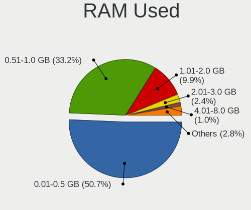
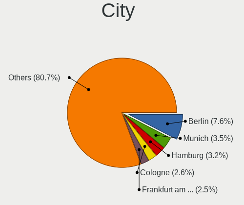
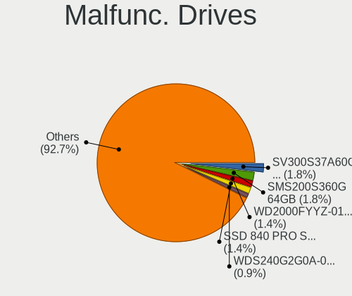
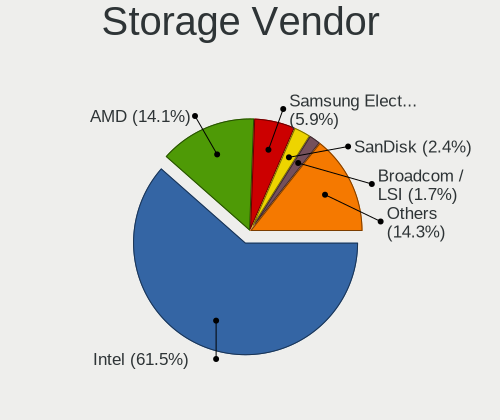
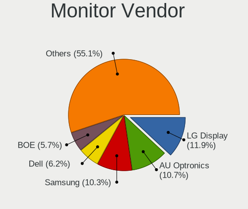
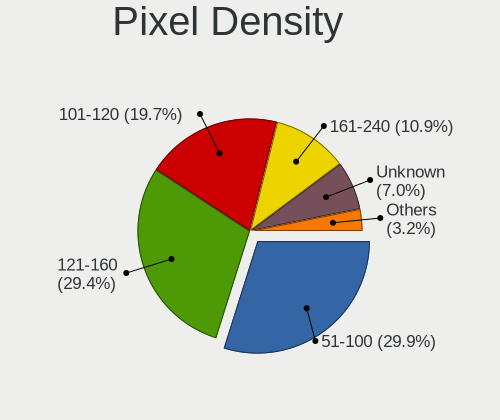
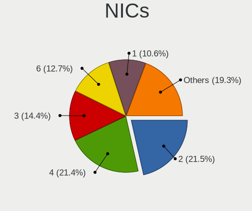
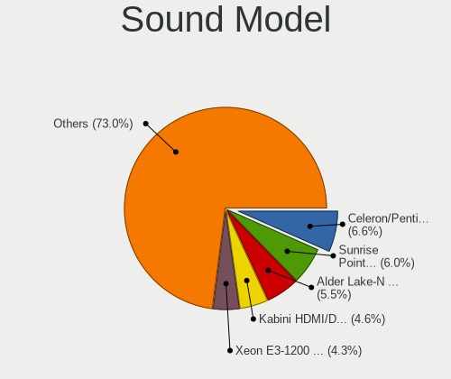
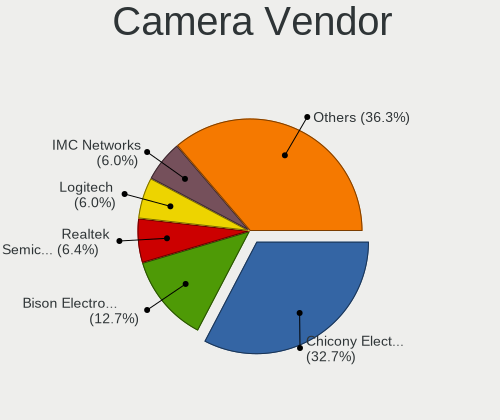

BSD in Germany - Tested Hardware & Statistics
---------------------------------------------

A project to collect tested hardware configurations for BSD in Germany.

Anyone can contribute to this report by the [hw-probe](https://github.com/linuxhw/hw-probe/blob/master/INSTALL.BSD.md) tool:

    hw-probe -all -upload

Please contribute! Especially if your hardware is rare.

This is a report for all computer types. See also reports for [desktops](/Location/Germany/Desktop/README.md) and [notebooks](/Location/Germany/Notebook/README.md).

Contents
--------

* [ Test Cases ](#test-cases)

* [ System ](#system)
  - [ OS                       ](#os)
  - [ OS Family                ](#os-family)
  - [ Arch                     ](#arch)
  - [ DE                       ](#de)
  - [ Display Server           ](#display-server)
  - [ Display Manager          ](#display-manager)
  - [ OS Lang                  ](#os-lang)
  - [ Boot Mode                ](#boot-mode)
  - [ Filesystem               ](#filesystem)
  - [ Part. scheme             ](#part-scheme)

* [ Board ](#board)
  - [ Vendor                   ](#vendor)
  - [ Model                    ](#model)
  - [ Model Family             ](#model-family)
  - [ MFG Year                 ](#mfg-year)
  - [ Form Factor              ](#form-factor)
  - [ Coreboot                 ](#coreboot)
  - [ RAM Size                 ](#ram-size)
  - [ RAM Used                 ](#ram-used)
  - [ Total Drives             ](#total-drives)
  - [ Has CD-ROM               ](#has-cd-rom)
  - [ Has Ethernet             ](#has-ethernet)
  - [ Has WiFi                 ](#has-wifi)
  - [ Has Bluetooth            ](#has-bluetooth)

* [ Location ](#location)
  - [ Country                  ](#country)
  - [ City                     ](#city)

* [ Drives ](#drives)
  - [ Drive Vendor             ](#drive-vendor)
  - [ Drive Model              ](#drive-model)
  - [ HDD Vendor               ](#hdd-vendor)
  - [ SSD Vendor               ](#ssd-vendor)
  - [ Drive Kind               ](#drive-kind)
  - [ Drive Connector          ](#drive-connector)
  - [ Drive Size               ](#drive-size)
  - [ Space Total              ](#space-total)
  - [ Space Used               ](#space-used)
  - [ Malfunc. Drives          ](#malfunc-drives)
  - [ Malfunc. Drive Vendor    ](#malfunc-drive-vendor)
  - [ Malfunc. HDD Vendor      ](#malfunc-hdd-vendor)
  - [ Malfunc. Drive Kind      ](#malfunc-drive-kind)
  - [ Failed Drives            ](#failed-drives)
  - [ Failed Drive Vendor      ](#failed-drive-vendor)
  - [ Drive Status             ](#drive-status)

* [ Storage controller ](#storage-controller)
  - [ Storage Vendor           ](#storage-vendor)
  - [ Storage Model            ](#storage-model)
  - [ Storage Kind             ](#storage-kind)

* [ Processor ](#processor)
  - [ CPU Vendor               ](#cpu-vendor)
  - [ CPU Model                ](#cpu-model)
  - [ CPU Model Family         ](#cpu-model-family)
  - [ CPU Cores                ](#cpu-cores)
  - [ CPU Sockets              ](#cpu-sockets)
  - [ CPU Threads              ](#cpu-threads)
  - [ CPU Microarch            ](#cpu-microarch)

* [ Graphics ](#graphics)
  - [ GPU Vendor               ](#gpu-vendor)
  - [ GPU Model                ](#gpu-model)
  - [ GPU Combo                ](#gpu-combo)
  - [ GPU Driver               ](#gpu-driver)
  - [ GPU Memory               ](#gpu-memory)

* [ Monitor ](#monitor)
  - [ Monitor Vendor           ](#monitor-vendor)
  - [ Monitor Model            ](#monitor-model)
  - [ Monitor Resolution       ](#monitor-resolution)
  - [ Monitor Diagonal         ](#monitor-diagonal)
  - [ Monitor Width            ](#monitor-width)
  - [ Aspect Ratio             ](#aspect-ratio)
  - [ Monitor Area             ](#monitor-area)
  - [ Pixel Density            ](#pixel-density)
  - [ Multiple Monitors        ](#multiple-monitors)

* [ Network ](#network)
  - [ Net Controller Vendor    ](#net-controller-vendor)
  - [ Net Controller Model     ](#net-controller-model)
  - [ Wireless Vendor          ](#wireless-vendor)
  - [ Wireless Model           ](#wireless-model)
  - [ Ethernet Vendor          ](#ethernet-vendor)
  - [ Ethernet Model           ](#ethernet-model)
  - [ Net Controller Kind      ](#net-controller-kind)
  - [ Used Controller          ](#used-controller)
  - [ NICs                     ](#nics)
  - [ IPv6                     ](#ipv6)

* [ Bluetooth ](#bluetooth)
  - [ Bluetooth Vendor         ](#bluetooth-vendor)
  - [ Bluetooth Model          ](#bluetooth-model)

* [ Sound ](#sound)
  - [ Sound Vendor             ](#sound-vendor)
  - [ Sound Model              ](#sound-model)

* [ Memory ](#memory)
  - [ Memory Vendor            ](#memory-vendor)
  - [ Memory Model             ](#memory-model)
  - [ Memory Kind              ](#memory-kind)
  - [ Memory Form Factor       ](#memory-form-factor)
  - [ Memory Size              ](#memory-size)
  - [ Memory Speed             ](#memory-speed)

* [ Printers & scanners ](#printers--scanners)
  - [ Printer Vendor           ](#printer-vendor)
  - [ Printer Model            ](#printer-model)
  - [ Scanner Vendor           ](#scanner-vendor)
  - [ Scanner Model            ](#scanner-model)

* [ Camera ](#camera)
  - [ Camera Vendor            ](#camera-vendor)
  - [ Camera Model             ](#camera-model)

* [ Security ](#security)
  - [ Fingerprint Vendor       ](#fingerprint-vendor)
  - [ Fingerprint Model        ](#fingerprint-model)
  - [ Chipcard Vendor          ](#chipcard-vendor)
  - [ Chipcard Model           ](#chipcard-model)

* [ Unsupported ](#unsupported)
  - [ Unsupported Devices      ](#unsupported-devices)
  - [ Unsupported Device Types ](#unsupported-device-types)

Test Cases
----------

Total: 1695

| Vendor        | Model                       | Form-Factor | Probe                                                     | Date         |
|---------------|-----------------------------|-------------|-----------------------------------------------------------|--------------|
| Unknown       | Unknown                     | Desktop     | [9ad9772ac7](https://bsd-hardware.info/?probe=9ad9772ac7) | May 31, 2022 |
| Fujitsu       | D3009-B1 S26361-D3009-B1    | Desktop     | [fa3ea36bad](https://bsd-hardware.info/?probe=fa3ea36bad) | May 31, 2022 |
| Deciso        | Netboard A10 V2.1           | Desktop     | [6beacad396](https://bsd-hardware.info/?probe=6beacad396) | May 31, 2022 |
| Unknown       | Unknown                     | Desktop     | [ef87e699fb](https://bsd-hardware.info/?probe=ef87e699fb) | May 30, 2022 |
| Apple         | Mac-F2218FC8                | All in one  | [7152e4b816](https://bsd-hardware.info/?probe=7152e4b816) | May 29, 2022 |
| Intel         | Q3XXG4-P V1.0               | Desktop     | [95234abead](https://bsd-hardware.info/?probe=95234abead) | May 28, 2022 |
| AWOW          | PC BOX                      | Mini pc     | [3fa863fea9](https://bsd-hardware.info/?probe=3fa863fea9) | May 27, 2022 |
| Supermicro    | X10SRi-FB                   | Server      | [0e21a1eeb0](https://bsd-hardware.info/?probe=0e21a1eeb0) | May 27, 2022 |
| Fujitsu       | D3313-A1 S26361-D3313-A1    | Desktop     | [cdddbb5d23](https://bsd-hardware.info/?probe=cdddbb5d23) | May 27, 2022 |
| Fujitsu       | D3313-A1 S26361-D3313-A1    | Desktop     | [7a47fcd920](https://bsd-hardware.info/?probe=7a47fcd920) | May 27, 2022 |
| Fujitsu       | D3313-A1 S26361-D3313-A1    | Desktop     | [a5446262b3](https://bsd-hardware.info/?probe=a5446262b3) | May 27, 2022 |
| HP            | ProLiant DL320e Gen8 v2     | Server      | [04a06df827](https://bsd-hardware.info/?probe=04a06df827) | May 27, 2022 |
| ASRock        | B660M-HDV                   | Desktop     | [fadb382a5a](https://bsd-hardware.info/?probe=fadb382a5a) | May 26, 2022 |
| ASRockRack    | E3C242D4U2-2T               | Desktop     | [d35f1fb7e0](https://bsd-hardware.info/?probe=d35f1fb7e0) | May 25, 2022 |
| TUXEDO        | Aura 15 Gen1                | Notebook    | [727f9708b4](https://bsd-hardware.info/?probe=727f9708b4) | May 24, 2022 |
| ASRockRack    | E3C242D4U2-2T               | Desktop     | [66f9070856](https://bsd-hardware.info/?probe=66f9070856) | May 23, 2022 |
| Fujitsu       | D3009-B1 S26361-D3009-B1    | Desktop     | [e9e497fc7b](https://bsd-hardware.info/?probe=e9e497fc7b) | May 22, 2022 |
| Fujitsu       | D3009-B1 S26361-D3009-B1    | Desktop     | [b05a8f6ed8](https://bsd-hardware.info/?probe=b05a8f6ed8) | May 22, 2022 |
| Biostar       | J4105NHU                    | Desktop     | [88b74aaf3b](https://bsd-hardware.info/?probe=88b74aaf3b) | May 22, 2022 |
| AMI           | Aptio CRB                   | Mini pc     | [f04f129625](https://bsd-hardware.info/?probe=f04f129625) | May 22, 2022 |
| ASUSTek       | PRIME B350-PLUS             | Desktop     | [e9524e612d](https://bsd-hardware.info/?probe=e9524e612d) | May 22, 2022 |
| ZOTAC         | ZBOX-ID18                   | Mini pc     | [26b6fef8c6](https://bsd-hardware.info/?probe=26b6fef8c6) | May 21, 2022 |
| ZOTAC         | ZBOX-CI331NANO              | Mini pc     | [c1da3a6a28](https://bsd-hardware.info/?probe=c1da3a6a28) | May 21, 2022 |
| BESSTAR Te... | GB7                         | Mini pc     | [063d483b50](https://bsd-hardware.info/?probe=063d483b50) | May 20, 2022 |
| HP            | 339A                        | Desktop     | [e6a9b68262](https://bsd-hardware.info/?probe=e6a9b68262) | May 20, 2022 |
| BESSTAR Te... | GB7                         | Mini pc     | [042f6c0b45](https://bsd-hardware.info/?probe=042f6c0b45) | May 19, 2022 |
| Intel         | Q3XXG4-P V1.0               | Desktop     | [24d2bf3524](https://bsd-hardware.info/?probe=24d2bf3524) | May 19, 2022 |
| TUXEDO        | Aura 15 Gen1                | Notebook    | [a4b6a40758](https://bsd-hardware.info/?probe=a4b6a40758) | May 19, 2022 |
| Dell          | 08V001 A03                  | Server      | [c34d5c2be3](https://bsd-hardware.info/?probe=c34d5c2be3) | May 19, 2022 |
| HP            | 255 G8 Notebook PC          | Notebook    | [004e039a23](https://bsd-hardware.info/?probe=004e039a23) | May 19, 2022 |
| HP            | 255 G8 Notebook PC          | Notebook    | [555a7733b7](https://bsd-hardware.info/?probe=555a7733b7) | May 19, 2022 |
| TUXEDO        | Aura 15 Gen1                | Notebook    | [1c84f0f722](https://bsd-hardware.info/?probe=1c84f0f722) | May 19, 2022 |
| Fujitsu       | D3401-H2 S26361-D3401-H2    | Desktop     | [ea6146e013](https://bsd-hardware.info/?probe=ea6146e013) | May 19, 2022 |
| Fujitsu       | D3401-H2 S26361-D3401-H2    | Desktop     | [c9b11d23bd](https://bsd-hardware.info/?probe=c9b11d23bd) | May 19, 2022 |
| Supermicro    | A2SDi-LN4F                  | Desktop     | [acc4101dc1](https://bsd-hardware.info/?probe=acc4101dc1) | May 18, 2022 |
| Gigabyte      | B450M DS3H-CF               | Desktop     | [edcd612c83](https://bsd-hardware.info/?probe=edcd612c83) | May 18, 2022 |
| Biostar       | H410MH S2                   | Desktop     | [1b218204b8](https://bsd-hardware.info/?probe=1b218204b8) | May 18, 2022 |
| MSI           | B85M-E45                    | Desktop     | [83ab25156c](https://bsd-hardware.info/?probe=83ab25156c) | May 18, 2022 |
| Lenovo        | ThinkPad E490 20N8CTO1WW    | Notebook    | [86866ce217](https://bsd-hardware.info/?probe=86866ce217) | May 17, 2022 |
| Unknown       | Unknown                     | Desktop     | [e13c8baa2d](https://bsd-hardware.info/?probe=e13c8baa2d) | May 17, 2022 |
| Unknown       | Unknown                     | Desktop     | [b8579c7f84](https://bsd-hardware.info/?probe=b8579c7f84) | May 17, 2022 |
| IBM           | 00KC500                     | Server      | [7f8395e815](https://bsd-hardware.info/?probe=7f8395e815) | May 17, 2022 |
| Unknown       | Unknown                     | Desktop     | [98b4dea15a](https://bsd-hardware.info/?probe=98b4dea15a) | May 17, 2022 |
| Intel         | Q3XXG4-P V1.0               | Desktop     | [8c2f853975](https://bsd-hardware.info/?probe=8c2f853975) | May 17, 2022 |
| Lenovo        | 7X06CTO1WW                  | Server      | [311c32e56e](https://bsd-hardware.info/?probe=311c32e56e) | May 17, 2022 |
| Supermicro    | X11SCL-IF                   | Server      | [94ff07cdd9](https://bsd-hardware.info/?probe=94ff07cdd9) | May 17, 2022 |
| Fujitsu       | D3401-H2 S26361-D3401-H2    | Desktop     | [b87692aeb4](https://bsd-hardware.info/?probe=b87692aeb4) | May 15, 2022 |
| AWOW          | PC BOX                      | Mini pc     | [c071b686c2](https://bsd-hardware.info/?probe=c071b686c2) | May 15, 2022 |
| MSI           | MS-7C82                     | Desktop     | [2ad883afec](https://bsd-hardware.info/?probe=2ad883afec) | May 15, 2022 |
| Fujitsu       | D3401-H2 S26361-D3401-H2    | Desktop     | [6974f0958e](https://bsd-hardware.info/?probe=6974f0958e) | May 15, 2022 |
| Unknown       | Unknown                     | Desktop     | [4fad520626](https://bsd-hardware.info/?probe=4fad520626) | May 14, 2022 |
| ASRock        | E350M1                      | Desktop     | [1850fa38e0](https://bsd-hardware.info/?probe=1850fa38e0) | May 14, 2022 |
| ASRock        | E350M1                      | Desktop     | [4520b5034e](https://bsd-hardware.info/?probe=4520b5034e) | May 13, 2022 |
| Sophos        | UTM                         | Firewall    | [fec90c3d92](https://bsd-hardware.info/?probe=fec90c3d92) | May 13, 2022 |
| Lenovo        | 7X06CTO1WW                  | Server      | [54a5041cdf](https://bsd-hardware.info/?probe=54a5041cdf) | May 12, 2022 |
| AMI           | Aptio CRB                   | Mini pc     | [faec798f5c](https://bsd-hardware.info/?probe=faec798f5c) | May 11, 2022 |
| Lenovo        | 7X06CTO1WW                  | Server      | [8cdb309c2e](https://bsd-hardware.info/?probe=8cdb309c2e) | May 11, 2022 |
| Dell          | 0PRWNC A05                  | Server      | [0b239c3286](https://bsd-hardware.info/?probe=0b239c3286) | May 11, 2022 |
| HP            | 213D A01                    | Desktop     | [89955ba84f](https://bsd-hardware.info/?probe=89955ba84f) | May 11, 2022 |
| ZOTAC         | ZBOX-CI341                  | Mini pc     | [0ca5685ce0](https://bsd-hardware.info/?probe=0ca5685ce0) | May 10, 2022 |
| Deciso        | OPNsense Appliance          | Notebook    | [70c9fd07ac](https://bsd-hardware.info/?probe=70c9fd07ac) | May 09, 2022 |
| HP            | 82A1                        | Desktop     | [34cb091e26](https://bsd-hardware.info/?probe=34cb091e26) | May 08, 2022 |
| Lenovo        | ThinkPad E490 20N8CTO1WW    | Notebook    | [5259bc1933](https://bsd-hardware.info/?probe=5259bc1933) | May 08, 2022 |
| Lenovo        | ThinkPad E490 20N8CTO1WW    | Notebook    | [a69f0fefca](https://bsd-hardware.info/?probe=a69f0fefca) | May 07, 2022 |
| Sophos        | SG                          | Firewall    | [9e16039d35](https://bsd-hardware.info/?probe=9e16039d35) | May 06, 2022 |
| BESSTAR Te... | DMAF5 V1.0                  | Desktop     | [dc534266df](https://bsd-hardware.info/?probe=dc534266df) | May 06, 2022 |
| BESSTAR Te... | IB9                         | Desktop     | [4a4e45585d](https://bsd-hardware.info/?probe=4a4e45585d) | May 06, 2022 |
| AWOW          | PC BOX                      | Mini pc     | [52b6c326c8](https://bsd-hardware.info/?probe=52b6c326c8) | May 05, 2022 |
| Acer          | Aspire E1-570G              | Notebook    | [7fd31252a2](https://bsd-hardware.info/?probe=7fd31252a2) | May 04, 2022 |
| friendlyel... | nanopi-r4s                  | Desktop     | [3db2ec8973](https://bsd-hardware.info/?probe=3db2ec8973) | May 04, 2022 |
| Unknown       | Unknown                     | Desktop     | [b96fd74ab0](https://bsd-hardware.info/?probe=b96fd74ab0) | May 03, 2022 |
| Sophos        | XG                          | Firewall    | [19b1a90a3c](https://bsd-hardware.info/?probe=19b1a90a3c) | May 03, 2022 |
| Sophos        | SG                          | Firewall    | [5109c6e2e4](https://bsd-hardware.info/?probe=5109c6e2e4) | May 03, 2022 |
| ASRock        | J4125B-ITX                  | Desktop     | [14d02a8209](https://bsd-hardware.info/?probe=14d02a8209) | May 03, 2022 |
| HP            | EliteBook 820 G2            | Notebook    | [3997ff79e4](https://bsd-hardware.info/?probe=3997ff79e4) | May 03, 2022 |
| Sophos        | XG                          | Firewall    | [bec4979a46](https://bsd-hardware.info/?probe=bec4979a46) | May 03, 2022 |
| Intel         | Q3XXG4-P V1.0               | Desktop     | [e4c8d6c787](https://bsd-hardware.info/?probe=e4c8d6c787) | May 01, 2022 |
| MSI           | MEG X570 UNIFY              | Desktop     | [5e8168a980](https://bsd-hardware.info/?probe=5e8168a980) | Apr 30, 2022 |
| Sophos        | SG                          | Firewall    | [ca2608d67f](https://bsd-hardware.info/?probe=ca2608d67f) | Apr 30, 2022 |
| Lenovo        | ThinkPad X270 W10DG 20K5... | Notebook    | [f02e4345ff](https://bsd-hardware.info/?probe=f02e4345ff) | Apr 30, 2022 |
| OEM           | 1.0                         | Desktop     | [36e78ab638](https://bsd-hardware.info/?probe=36e78ab638) | Apr 29, 2022 |
| Unknown       | YL-J1900-V1                 | Desktop     | [54fe9e7529](https://bsd-hardware.info/?probe=54fe9e7529) | Apr 29, 2022 |
| Deciso        | DEC2700 - OPNsense Appli... | Notebook    | [22b192afca](https://bsd-hardware.info/?probe=22b192afca) | Apr 28, 2022 |
| MSI           | A520M-A PRO                 | Desktop     | [336add4fcb](https://bsd-hardware.info/?probe=336add4fcb) | Apr 28, 2022 |
| Apple         | MacBookPro3,1               | Notebook    | [912d02aec2](https://bsd-hardware.info/?probe=912d02aec2) | Apr 28, 2022 |
| Sophos        | SG                          | Firewall    | [dd94f9dfe6](https://bsd-hardware.info/?probe=dd94f9dfe6) | Apr 28, 2022 |
| MSI           | A520M-A PRO                 | Desktop     | [34f2ba40e7](https://bsd-hardware.info/?probe=34f2ba40e7) | Apr 27, 2022 |
| Lenovo        | IdeaPadFlex 5 14ALC05 82... | Convertible | [0750e29d3c](https://bsd-hardware.info/?probe=0750e29d3c) | Apr 27, 2022 |
| Lenovo        | ThinkPad E490 20N8CTO1WW    | Notebook    | [30e267dd51](https://bsd-hardware.info/?probe=30e267dd51) | Apr 27, 2022 |
| PC Engines    | APU2                        | Desktop     | [920eae6f2e](https://bsd-hardware.info/?probe=920eae6f2e) | Apr 27, 2022 |
| Sophos        | SG                          | Firewall    | [92a32f4608](https://bsd-hardware.info/?probe=92a32f4608) | Apr 27, 2022 |
| MSI           | 970A GAMING PRO CARBON      | Desktop     | [c36f9d6c1d](https://bsd-hardware.info/?probe=c36f9d6c1d) | Apr 26, 2022 |
| Unknown       | MANIFOLD 2-C                | Desktop     | [637c28d728](https://bsd-hardware.info/?probe=637c28d728) | Apr 25, 2022 |
| Raspberry ... | Raspberry Pi                | Soc         | [2a8ebfdb92](https://bsd-hardware.info/?probe=2a8ebfdb92) | Apr 25, 2022 |
| MSI           | X399 GAMING PRO CARBON A... | Desktop     | [86c4af7ca4](https://bsd-hardware.info/?probe=86c4af7ca4) | Apr 25, 2022 |
| MSI           | MEG X570 UNIFY              | Desktop     | [6afa33e8f8](https://bsd-hardware.info/?probe=6afa33e8f8) | Apr 24, 2022 |
| Lenovo        | SKYBAY SDK0J40705 WIN 34... | Desktop     | [1ce660f88e](https://bsd-hardware.info/?probe=1ce660f88e) | Apr 24, 2022 |
| Lenovo        | B570 1068FQG                | Notebook    | [a0d1f01226](https://bsd-hardware.info/?probe=a0d1f01226) | Apr 22, 2022 |
| PC Engines    | apu4                        | Desktop     | [ae39e5adc0](https://bsd-hardware.info/?probe=ae39e5adc0) | Apr 22, 2022 |
| ASRock        | X79 Extreme6/GB             | Desktop     | [cd85d68dcd](https://bsd-hardware.info/?probe=cd85d68dcd) | Apr 21, 2022 |
| CheckPoint    | T-140-00                    | Desktop     | [8e2c861ecf](https://bsd-hardware.info/?probe=8e2c861ecf) | Apr 19, 2022 |
| CheckPoint    | T-140-00                    | Desktop     | [8f0c5b5334](https://bsd-hardware.info/?probe=8f0c5b5334) | Apr 19, 2022 |
| PC Engines    | APU2                        | Desktop     | [47ddf6b2bd](https://bsd-hardware.info/?probe=47ddf6b2bd) | Apr 19, 2022 |
| Dell          | 0PM2CW A04                  | Server      | [7a591def91](https://bsd-hardware.info/?probe=7a591def91) | Apr 19, 2022 |
| Gigabyte      | B85M-D3H                    | Desktop     | [8d7236247d](https://bsd-hardware.info/?probe=8d7236247d) | Apr 18, 2022 |
| ASRock        | B85M Pro3                   | Desktop     | [9ff2cbdcf1](https://bsd-hardware.info/?probe=9ff2cbdcf1) | Apr 18, 2022 |
| Supermicro    | X11SCL-IF                   | Server      | [9a63b99387](https://bsd-hardware.info/?probe=9a63b99387) | Apr 18, 2022 |
| Supermicro    | A2SDi-2C-HLN4F              | Server      | [3ac63aed2d](https://bsd-hardware.info/?probe=3ac63aed2d) | Apr 18, 2022 |
| Unknown       | Unknown                     | Desktop     | [0914d63c72](https://bsd-hardware.info/?probe=0914d63c72) | Apr 16, 2022 |
| Sophos        | SG                          | Firewall    | [cdf2f7cd49](https://bsd-hardware.info/?probe=cdf2f7cd49) | Apr 16, 2022 |
| Supermicro    | M11SDV-4C-LN4F              | Server      | [e398b10cea](https://bsd-hardware.info/?probe=e398b10cea) | Apr 15, 2022 |
| Sophos        | UTM                         | Firewall    | [00731ba6eb](https://bsd-hardware.info/?probe=00731ba6eb) | Apr 15, 2022 |
| AMI           | Intel                       | Notebook    | [db87d63d35](https://bsd-hardware.info/?probe=db87d63d35) | Apr 15, 2022 |
| Biostar       | H410MH S2                   | Desktop     | [d045a4acad](https://bsd-hardware.info/?probe=d045a4acad) | Apr 14, 2022 |
| Intel         | NUC7JYB J67967-402          | Mini pc     | [e94a3a5a08](https://bsd-hardware.info/?probe=e94a3a5a08) | Apr 14, 2022 |
| AMI           | Intel                       | Notebook    | [8dc710d126](https://bsd-hardware.info/?probe=8dc710d126) | Apr 14, 2022 |
| BESSTAR Te... | GB1B                        | Mini pc     | [0aa324c0d5](https://bsd-hardware.info/?probe=0aa324c0d5) | Apr 14, 2022 |
| Gigabyte      | B85M-D3H                    | Desktop     | [3365444265](https://bsd-hardware.info/?probe=3365444265) | Apr 14, 2022 |
| Unknown       | Unknown                     | Desktop     | [4ec1e3548c](https://bsd-hardware.info/?probe=4ec1e3548c) | Apr 14, 2022 |
| Intel         | Q3XXG4-P V1.0               | Desktop     | [efb76ec7fe](https://bsd-hardware.info/?probe=efb76ec7fe) | Apr 13, 2022 |
| Unknown       | Unknown                     | Desktop     | [ad14582532](https://bsd-hardware.info/?probe=ad14582532) | Apr 13, 2022 |
| Intel         | D53427RKE G87971-403        | Desktop     | [1a1de076c7](https://bsd-hardware.info/?probe=1a1de076c7) | Apr 13, 2022 |
| Dell          | Latitude E6440              | Notebook    | [eea29a3895](https://bsd-hardware.info/?probe=eea29a3895) | Apr 12, 2022 |
| Intel         | SKYBAY                      | Desktop     | [5f2a882529](https://bsd-hardware.info/?probe=5f2a882529) | Apr 11, 2022 |
| Gigabyte      | MZBSWAP-K4                  | Desktop     | [752f962123](https://bsd-hardware.info/?probe=752f962123) | Apr 10, 2022 |
| AWOW          | PC BOX                      | Mini pc     | [e2aa6d2b4d](https://bsd-hardware.info/?probe=e2aa6d2b4d) | Apr 10, 2022 |
| Apple         | MacBook5,1                  | Notebook    | [41d62dde7d](https://bsd-hardware.info/?probe=41d62dde7d) | Apr 10, 2022 |
| Apple         | MacBook5,1                  | Notebook    | [c5f7b5499a](https://bsd-hardware.info/?probe=c5f7b5499a) | Apr 10, 2022 |
| PC Engines    | APU2                        | Desktop     | [ae2d120c7c](https://bsd-hardware.info/?probe=ae2d120c7c) | Apr 10, 2022 |
| Shuttle       | DS10U                       | Desktop     | [7d5919eb2b](https://bsd-hardware.info/?probe=7d5919eb2b) | Apr 10, 2022 |
| Sophos        | SG                          | Firewall    | [53ba75464f](https://bsd-hardware.info/?probe=53ba75464f) | Apr 09, 2022 |
| Unknown       | Unknown                     | Desktop     | [6835aa43e3](https://bsd-hardware.info/?probe=6835aa43e3) | Apr 09, 2022 |
| Acer          | Swift SF114-32              | Notebook    | [7bc748ce7c](https://bsd-hardware.info/?probe=7bc748ce7c) | Apr 08, 2022 |
| BESSTAR Te... | GB7                         | Mini pc     | [2f24f06f29](https://bsd-hardware.info/?probe=2f24f06f29) | Apr 08, 2022 |
| Intel         | MAHOBAY                     | Desktop     | [8b21109cd4](https://bsd-hardware.info/?probe=8b21109cd4) | Apr 08, 2022 |
| MSI           | MS-7369                     | Desktop     | [25f2161cac](https://bsd-hardware.info/?probe=25f2161cac) | Apr 08, 2022 |
| ASRock        | H570M-ITX/ac                | Desktop     | [44327ad768](https://bsd-hardware.info/?probe=44327ad768) | Apr 07, 2022 |
| Supermicro    | H12SSW-iN                   | Server      | [2e389db2dd](https://bsd-hardware.info/?probe=2e389db2dd) | Apr 07, 2022 |
| HP            | 213D A01                    | Desktop     | [3f6e05c14d](https://bsd-hardware.info/?probe=3f6e05c14d) | Apr 07, 2022 |
| ZOTAC         | ZBOX-CI327NANO-GS-01        | Mini pc     | [3271551472](https://bsd-hardware.info/?probe=3271551472) | Apr 06, 2022 |
| ASRock        | B660M-HDV                   | Desktop     | [9ffa0cc352](https://bsd-hardware.info/?probe=9ffa0cc352) | Apr 06, 2022 |
| Dell          | Precision M4800             | Notebook    | [7a7968204a](https://bsd-hardware.info/?probe=7a7968204a) | Apr 06, 2022 |
| PC Engines    | APU2                        | Desktop     | [69304a74cc](https://bsd-hardware.info/?probe=69304a74cc) | Apr 06, 2022 |
| Unknown       | Unknown                     | Desktop     | [4cf896e25a](https://bsd-hardware.info/?probe=4cf896e25a) | Apr 06, 2022 |
| ASUSTek       | PRIME B360M-A               | Desktop     | [90663f7aa0](https://bsd-hardware.info/?probe=90663f7aa0) | Apr 05, 2022 |
| Lenovo        | ThinkPad X1 Yoga 3rd 20L... | Convertible | [64d42b9c5f](https://bsd-hardware.info/?probe=64d42b9c5f) | Apr 05, 2022 |
| TUXEDO        | Aura 15 Gen1                | Notebook    | [e72b47b6de](https://bsd-hardware.info/?probe=e72b47b6de) | Apr 04, 2022 |
| HP            | 213D A01                    | Desktop     | [238d8bbcde](https://bsd-hardware.info/?probe=238d8bbcde) | Apr 04, 2022 |
| PC Engines    | APU2                        | Desktop     | [69cb42c07b](https://bsd-hardware.info/?probe=69cb42c07b) | Apr 02, 2022 |
| Fujitsu       | D3313-A1 S26361-D3313-A1    | Desktop     | [1bdaf4bb77](https://bsd-hardware.info/?probe=1bdaf4bb77) | Apr 01, 2022 |
| HP            | 3396                        | Desktop     | [7a60daeaef](https://bsd-hardware.info/?probe=7a60daeaef) | Apr 01, 2022 |
| Acidanther... | Mac-F60DEB81FF30ACF6 Mac... | Desktop     | [9b6f9eac6f](https://bsd-hardware.info/?probe=9b6f9eac6f) | Apr 01, 2022 |
| PC Engines    | APU                         | Desktop     | [c71152505f](https://bsd-hardware.info/?probe=c71152505f) | Apr 01, 2022 |
| Fujitsu       | D3230-A1 S26361-D3230-A1    | Desktop     | [3df6a01030](https://bsd-hardware.info/?probe=3df6a01030) | Mar 31, 2022 |
| Seeed Stud... | ODYSSEY-X86J4105 SD-BS-C... | Desktop     | [b5ea7eaeb0](https://bsd-hardware.info/?probe=b5ea7eaeb0) | Mar 31, 2022 |
| Lenovo        | ThinkPad X260 20F5A28AUK    | Notebook    | [f53c625efd](https://bsd-hardware.info/?probe=f53c625efd) | Mar 30, 2022 |
| Sophos        | XG                          | Firewall    | [59d01ec60e](https://bsd-hardware.info/?probe=59d01ec60e) | Mar 30, 2022 |
| AMI           | Aptio CRB                   | Mini pc     | [c597fb4337](https://bsd-hardware.info/?probe=c597fb4337) | Mar 29, 2022 |
| ASUSTek       | PRO B460M-C                 | Desktop     | [0542f7a16d](https://bsd-hardware.info/?probe=0542f7a16d) | Mar 29, 2022 |
| Unknown       | Unknown                     | Desktop     | [4383e28183](https://bsd-hardware.info/?probe=4383e28183) | Mar 29, 2022 |
| Intel         | DENLOW_REFRESH_WS           | Desktop     | [36896a719d](https://bsd-hardware.info/?probe=36896a719d) | Mar 29, 2022 |
| Fujitsu       | LIFEBOOK A544               | Notebook    | [e363c95c1c](https://bsd-hardware.info/?probe=e363c95c1c) | Mar 29, 2022 |
| BESSTAR Te... | GB7                         | Mini pc     | [a4382a2a0b](https://bsd-hardware.info/?probe=a4382a2a0b) | Mar 29, 2022 |
| ASRock        | X79 Extreme6/GB             | Desktop     | [0646607953](https://bsd-hardware.info/?probe=0646607953) | Mar 28, 2022 |
| PC Engines    | apu4                        | Desktop     | [a35c56ca36](https://bsd-hardware.info/?probe=a35c56ca36) | Mar 28, 2022 |
| Protectli     | FW6 Ver                     | Desktop     | [f09a26de6f](https://bsd-hardware.info/?probe=f09a26de6f) | Mar 27, 2022 |
| Sophos        | UTM                         | Firewall    | [6362bd5137](https://bsd-hardware.info/?probe=6362bd5137) | Mar 26, 2022 |
| AMI           | Aptio CRB                   | Mini pc     | [19ff042007](https://bsd-hardware.info/?probe=19ff042007) | Mar 26, 2022 |
| AMI           | Aptio CRB                   | Mini pc     | [92b08cda4a](https://bsd-hardware.info/?probe=92b08cda4a) | Mar 26, 2022 |
| Gigabyte      | MZBSWBP-00                  | Desktop     | [9e5d1c9daa](https://bsd-hardware.info/?probe=9e5d1c9daa) | Mar 26, 2022 |
| Dell          | Latitude E6540              | Notebook    | [41e5f63a69](https://bsd-hardware.info/?probe=41e5f63a69) | Mar 26, 2022 |
| Dell          | Latitude E6540              | Notebook    | [0ac0f8f1d8](https://bsd-hardware.info/?probe=0ac0f8f1d8) | Mar 26, 2022 |
| Unknown       | Unknown                     | Desktop     | [da94141898](https://bsd-hardware.info/?probe=da94141898) | Mar 26, 2022 |
| PC Engines    | apu4                        | Desktop     | [d95599aa97](https://bsd-hardware.info/?probe=d95599aa97) | Mar 25, 2022 |
| Unknown       | Unknown                     | Firewall    | [55b930eb8f](https://bsd-hardware.info/?probe=55b930eb8f) | Mar 25, 2022 |
| ASUSTek       | P10S-I Series               | Desktop     | [190fe4d13f](https://bsd-hardware.info/?probe=190fe4d13f) | Mar 24, 2022 |
| Supermicro    | X10SLM-F                    | Server      | [4ade9fbcf8](https://bsd-hardware.info/?probe=4ade9fbcf8) | Mar 24, 2022 |
| MSI           | MS-A6221 100                | Desktop     | [ba62f48990](https://bsd-hardware.info/?probe=ba62f48990) | Mar 23, 2022 |
| PC Engines    | APU3                        | Desktop     | [0a68bdf721](https://bsd-hardware.info/?probe=0a68bdf721) | Mar 23, 2022 |
| Fujitsu       | D3064-A1 S26361-D3064-A1    | Desktop     | [e0a7c6b62f](https://bsd-hardware.info/?probe=e0a7c6b62f) | Mar 23, 2022 |
| Supermicro    | X11SCL-IF                   | Server      | [0d1efa6544](https://bsd-hardware.info/?probe=0d1efa6544) | Mar 23, 2022 |
| Notebook      | N13xWU                      | Notebook    | [8986953acd](https://bsd-hardware.info/?probe=8986953acd) | Mar 22, 2022 |
| Notebook      | N7x0WU                      | Notebook    | [b80f84aef1](https://bsd-hardware.info/?probe=b80f84aef1) | Mar 22, 2022 |
| Notebook      | N8xEJEK                     | Notebook    | [9a62677ea8](https://bsd-hardware.info/?probe=9a62677ea8) | Mar 22, 2022 |
| Lenovo        | ThinkPad Yoga 460 20ELS1... | Convertible | [c216d655ae](https://bsd-hardware.info/?probe=c216d655ae) | Mar 22, 2022 |
| PC Engines    | apu4                        | Desktop     | [4f2d362dd2](https://bsd-hardware.info/?probe=4f2d362dd2) | Mar 22, 2022 |
| Dell          | Latitude E6500              | Notebook    | [5fad69bbf0](https://bsd-hardware.info/?probe=5fad69bbf0) | Mar 22, 2022 |
| Dell          | Latitude E6510              | Notebook    | [a040a1a04b](https://bsd-hardware.info/?probe=a040a1a04b) | Mar 22, 2022 |
| Dell          | Latitude E6530              | Notebook    | [9bc5fc70a7](https://bsd-hardware.info/?probe=9bc5fc70a7) | Mar 22, 2022 |
| HP            | 8103 A01                    | Mini pc     | [f30a0c8dd5](https://bsd-hardware.info/?probe=f30a0c8dd5) | Mar 22, 2022 |
| Deciso        | Netboard A20                | Notebook    | [8ded6d9af6](https://bsd-hardware.info/?probe=8ded6d9af6) | Mar 21, 2022 |
| AWOW          | AK34Pro                     | Mini pc     | [82c6ad104b](https://bsd-hardware.info/?probe=82c6ad104b) | Mar 21, 2022 |
| ASUSTek       | PRO B460M-C                 | Desktop     | [6ceff4eca1](https://bsd-hardware.info/?probe=6ceff4eca1) | Mar 21, 2022 |
| Supermicro    | A1SRi 123456789             | Mini pc     | [3df56777e3](https://bsd-hardware.info/?probe=3df56777e3) | Mar 21, 2022 |
| Supermicro    | A1SRi-2758F                 | Mini pc     | [afbf43e038](https://bsd-hardware.info/?probe=afbf43e038) | Mar 20, 2022 |
| Lenovo        | ThinkPad E490 20N8CTO1WW    | Notebook    | [0dbac1ca61](https://bsd-hardware.info/?probe=0dbac1ca61) | Mar 19, 2022 |
| Toshiba       | Satellite Pro L40           | Notebook    | [5ff92a5bb3](https://bsd-hardware.info/?probe=5ff92a5bb3) | Mar 19, 2022 |
| Toshiba       | Satellite Pro L40           | Notebook    | [71a7b43ec6](https://bsd-hardware.info/?probe=71a7b43ec6) | Mar 19, 2022 |
| ASRock        | H570M-ITX/ac                | Desktop     | [c81d79bbe7](https://bsd-hardware.info/?probe=c81d79bbe7) | Mar 18, 2022 |
| friendlyel... | nanopi-r2s                  | Desktop     | [f41d89a7e9](https://bsd-hardware.info/?probe=f41d89a7e9) | Mar 17, 2022 |
| ASRock        | B75M R2.0                   | Desktop     | [7aac0f4b94](https://bsd-hardware.info/?probe=7aac0f4b94) | Mar 16, 2022 |
| Fujitsu       | D3313-A1 S26361-D3313-A1    | Desktop     | [aa18c11016](https://bsd-hardware.info/?probe=aa18c11016) | Mar 16, 2022 |
| Thomas-Kre... | P9A-I/C2750/4L              | Firewall    | [e2d107e38a](https://bsd-hardware.info/?probe=e2d107e38a) | Mar 16, 2022 |
| HP            | 8299                        | Desktop     | [6876d2d37d](https://bsd-hardware.info/?probe=6876d2d37d) | Mar 16, 2022 |
| PC Engines    | APU2                        | Desktop     | [6ea85fac4f](https://bsd-hardware.info/?probe=6ea85fac4f) | Mar 15, 2022 |
| ZOTAC         | ZBOX-ID92/ZBOX-IQ01         | Mini pc     | [2c65cbd768](https://bsd-hardware.info/?probe=2c65cbd768) | Mar 15, 2022 |
| ZOTAC         | ZBOX-CI329NANO              | Mini pc     | [73726dfe1a](https://bsd-hardware.info/?probe=73726dfe1a) | Mar 15, 2022 |
| Unknown       | YL-J3160L4                  | Desktop     | [2c002dc6a8](https://bsd-hardware.info/?probe=2c002dc6a8) | Mar 15, 2022 |
| Unknown       | Unknown                     | Desktop     | [c2b8c7eebb](https://bsd-hardware.info/?probe=c2b8c7eebb) | Mar 14, 2022 |
| BESSTAR Te... | GB7                         | Mini pc     | [23faf80bfe](https://bsd-hardware.info/?probe=23faf80bfe) | Mar 14, 2022 |
| BESSTAR Te... | GB7                         | Mini pc     | [6d6b13abf9](https://bsd-hardware.info/?probe=6d6b13abf9) | Mar 14, 2022 |
| Dell          | Latitude E6540              | Notebook    | [e0576dd008](https://bsd-hardware.info/?probe=e0576dd008) | Mar 13, 2022 |
| HP            | ProLiant MicroServer Gen... | Desktop     | [f9045f060a](https://bsd-hardware.info/?probe=f9045f060a) | Mar 13, 2022 |
| BESSTAR Te... | IB9                         | Desktop     | [d60b00e2c6](https://bsd-hardware.info/?probe=d60b00e2c6) | Mar 13, 2022 |
| Unknown       | Unknown                     | Desktop     | [8152ca0911](https://bsd-hardware.info/?probe=8152ca0911) | Mar 13, 2022 |
| Gigabyte      | N3150ND3V                   | Desktop     | [382a3e1fbb](https://bsd-hardware.info/?probe=382a3e1fbb) | Mar 12, 2022 |
| Unknown       | YL-J3160L4                  | Desktop     | [592ff80875](https://bsd-hardware.info/?probe=592ff80875) | Mar 12, 2022 |
| PC Engines    | APU2                        | Desktop     | [b8303d5089](https://bsd-hardware.info/?probe=b8303d5089) | Mar 12, 2022 |
| Supermicro    | X10SLH-F/X10SLM+-F          | Server      | [5c8df4dcad](https://bsd-hardware.info/?probe=5c8df4dcad) | Mar 10, 2022 |
| Supermicro    | X10SLL-F                    | Server      | [045fa8357e](https://bsd-hardware.info/?probe=045fa8357e) | Mar 10, 2022 |
| ASUSTek       | P5Q DELUXE                  | Desktop     | [b4234170e8](https://bsd-hardware.info/?probe=b4234170e8) | Mar 10, 2022 |
| NF541         | 1.0                         | Desktop     | [fc2b2bb98d](https://bsd-hardware.info/?probe=fc2b2bb98d) | Mar 09, 2022 |
| Unknown       | Unknown                     | Desktop     | [3ee10c1ab2](https://bsd-hardware.info/?probe=3ee10c1ab2) | Mar 09, 2022 |
| Koloe         | X58                         | Desktop     | [58e098eca2](https://bsd-hardware.info/?probe=58e098eca2) | Mar 09, 2022 |
| Unknown       | Unknown                     | Desktop     | [fea4a692a9](https://bsd-hardware.info/?probe=fea4a692a9) | Mar 09, 2022 |
| Unknown       | Unknown                     | Desktop     | [e89b377c53](https://bsd-hardware.info/?probe=e89b377c53) | Mar 08, 2022 |
| Fujitsu       | D3064-A1 S26361-D3064-A1    | Desktop     | [bc73c8dc68](https://bsd-hardware.info/?probe=bc73c8dc68) | Mar 08, 2022 |
| Intel         | DENLOW_WS                   | Desktop     | [bab9d9dd6d](https://bsd-hardware.info/?probe=bab9d9dd6d) | Mar 08, 2022 |
| AEWIN         | CB-7979                     | Notebook    | [ec1e865bbd](https://bsd-hardware.info/?probe=ec1e865bbd) | Mar 07, 2022 |
| Fujitsu       | D3064-A1 S26361-D3064-A1    | Desktop     | [e3698a706b](https://bsd-hardware.info/?probe=e3698a706b) | Mar 07, 2022 |
| Koloe         | X58                         | Desktop     | [c501dfa5c8](https://bsd-hardware.info/?probe=c501dfa5c8) | Mar 07, 2022 |
| Intel         | DX79TO AAG28805-401         | Desktop     | [431b37f050](https://bsd-hardware.info/?probe=431b37f050) | Mar 06, 2022 |
| Lenovo        | ThinkPad X1 Yoga 3rd 20L... | Convertible | [f8801c62bc](https://bsd-hardware.info/?probe=f8801c62bc) | Mar 05, 2022 |
| CheckPoint    | T-110-00                    | Desktop     | [ecbdeaf92b](https://bsd-hardware.info/?probe=ecbdeaf92b) | Mar 05, 2022 |
| Lanner        | FW-7543 B-GA                | Desktop     | [8ae57434a2](https://bsd-hardware.info/?probe=8ae57434a2) | Mar 03, 2022 |
| Gigabyte      | N3150ND3V                   | Desktop     | [bdf7beae56](https://bsd-hardware.info/?probe=bdf7beae56) | Mar 03, 2022 |
| AMI           | Aptio CRB                   | Mini pc     | [ea5f9680c5](https://bsd-hardware.info/?probe=ea5f9680c5) | Mar 03, 2022 |
| Intel         | Q3XXG4-P V1.0               | Desktop     | [f5eef026f2](https://bsd-hardware.info/?probe=f5eef026f2) | Mar 02, 2022 |
| Dell          | 08V001 A03                  | Server      | [6039440ce8](https://bsd-hardware.info/?probe=6039440ce8) | Mar 02, 2022 |
| ZOTAC         | ZBOX-CI329NANO              | Mini pc     | [8611347484](https://bsd-hardware.info/?probe=8611347484) | Mar 02, 2022 |
| Protectli     | VP2410                      | Desktop     | [880c57201a](https://bsd-hardware.info/?probe=880c57201a) | Mar 01, 2022 |
| Supermicro    | A2SDi-LN4F                  | Desktop     | [b10f6655d9](https://bsd-hardware.info/?probe=b10f6655d9) | Mar 01, 2022 |
| BESSTAR Te... | HM90                        | Desktop     | [2d1bf5a79a](https://bsd-hardware.info/?probe=2d1bf5a79a) | Mar 01, 2022 |
| HARDKERNEL    | ODROID-H2                   | Desktop     | [df62b83093](https://bsd-hardware.info/?probe=df62b83093) | Feb 28, 2022 |
| ZOTAC         | ZBOX-CI329NANO              | Mini pc     | [a7e26ec0f5](https://bsd-hardware.info/?probe=a7e26ec0f5) | Feb 27, 2022 |
| SeeedStudi... | ODYSSEY-X86J4105 SD-BS-C... | Desktop     | [1e8ac02926](https://bsd-hardware.info/?probe=1e8ac02926) | Feb 26, 2022 |
| AAEON         | FWS-2280 V1.0               | Desktop     | [9fba128986](https://bsd-hardware.info/?probe=9fba128986) | Feb 26, 2022 |
| Unknown       | Unknown                     | Desktop     | [a771f78447](https://bsd-hardware.info/?probe=a771f78447) | Feb 26, 2022 |
| PC Engines    | apu4                        | Desktop     | [74c708a6cf](https://bsd-hardware.info/?probe=74c708a6cf) | Feb 25, 2022 |
| Unknown       | Unknown                     | Desktop     | [2bbb963d9f](https://bsd-hardware.info/?probe=2bbb963d9f) | Feb 25, 2022 |
| Unknown       | Unknown                     | Desktop     | [c559dbe233](https://bsd-hardware.info/?probe=c559dbe233) | Feb 25, 2022 |
| AMI           | Aptio CRB                   | Mini pc     | [e9bf3549fe](https://bsd-hardware.info/?probe=e9bf3549fe) | Feb 24, 2022 |
| Sophos        | UTM                         | Firewall    | [49c7a56907](https://bsd-hardware.info/?probe=49c7a56907) | Feb 24, 2022 |
| PC Engines    | apu4                        | Desktop     | [ed16e6ac1f](https://bsd-hardware.info/?probe=ed16e6ac1f) | Feb 24, 2022 |
| YANYU         | M9F baytrail                | Desktop     | [3804d3fb1d](https://bsd-hardware.info/?probe=3804d3fb1d) | Feb 24, 2022 |
| ASUSTek       | P11C-I Series               | Desktop     | [f768f45dc2](https://bsd-hardware.info/?probe=f768f45dc2) | Feb 23, 2022 |
| Sophos        | UTM                         | Firewall    | [516b85a53e](https://bsd-hardware.info/?probe=516b85a53e) | Feb 22, 2022 |
| BESSTAR Te... | JB9                         | Desktop     | [e788cec5f5](https://bsd-hardware.info/?probe=e788cec5f5) | Feb 22, 2022 |
| Dell          | Latitude 5591               | Notebook    | [d4d653fba8](https://bsd-hardware.info/?probe=d4d653fba8) | Feb 22, 2022 |
| Supermicro    | A1SRi 123456789             | Mini pc     | [7e87ceea76](https://bsd-hardware.info/?probe=7e87ceea76) | Feb 22, 2022 |
| Fujitsu       | D3313-A1 S26361-D3313-A1    | Desktop     | [e55cb672b2](https://bsd-hardware.info/?probe=e55cb672b2) | Feb 21, 2022 |
| Unknown       | Unknown                     | Desktop     | [db8e4dc1f5](https://bsd-hardware.info/?probe=db8e4dc1f5) | Feb 21, 2022 |
| Unknown       | Unknown                     | Desktop     | [9a280f5e25](https://bsd-hardware.info/?probe=9a280f5e25) | Feb 21, 2022 |
| AMI           | Aptio CRB                   | Mini pc     | [0ea56ed26f](https://bsd-hardware.info/?probe=0ea56ed26f) | Feb 19, 2022 |
| BESSTAR Te... | JB9                         | Desktop     | [7df0c12efe](https://bsd-hardware.info/?probe=7df0c12efe) | Feb 19, 2022 |
| Unknown       | Unknown                     | Desktop     | [883cf2382b](https://bsd-hardware.info/?probe=883cf2382b) | Feb 17, 2022 |
| ASRock        | H570M-ITX/ac                | Desktop     | [1e54f9ca54](https://bsd-hardware.info/?probe=1e54f9ca54) | Feb 17, 2022 |
| ASRock        | 4X4-R1000                   | Desktop     | [c25f53782a](https://bsd-hardware.info/?probe=c25f53782a) | Feb 17, 2022 |
| Supermicro    | A1SAi 123456789             | Mini pc     | [98a6e928d3](https://bsd-hardware.info/?probe=98a6e928d3) | Feb 17, 2022 |
| Lenovo        | 3136 SDK0J40697 WIN 3305... | Mini pc     | [f1892cd12c](https://bsd-hardware.info/?probe=f1892cd12c) | Feb 17, 2022 |
| YANYU         | M9F baytrail                | Desktop     | [a568d8241d](https://bsd-hardware.info/?probe=a568d8241d) | Feb 16, 2022 |
| ASUSTek       | P11C-M Series               | Desktop     | [459ff0f748](https://bsd-hardware.info/?probe=459ff0f748) | Feb 16, 2022 |
| Dell          | 03X6X0 A02                  | Server      | [db0e0dbb14](https://bsd-hardware.info/?probe=db0e0dbb14) | Feb 16, 2022 |
| Gigabyte      | C246M-WU4-CF                | Desktop     | [4b6c6d8bde](https://bsd-hardware.info/?probe=4b6c6d8bde) | Feb 15, 2022 |
| Intel         | Q3XXG4-P V1.0               | Desktop     | [cb2ab6f97a](https://bsd-hardware.info/?probe=cb2ab6f97a) | Feb 15, 2022 |
| Unknown       | MANIFOLD 2-C                | Desktop     | [4980cae3eb](https://bsd-hardware.info/?probe=4980cae3eb) | Feb 15, 2022 |
| Sophos        | UTM                         | Firewall    | [03a19078c1](https://bsd-hardware.info/?probe=03a19078c1) | Feb 14, 2022 |
| Sophos        | SG                          | Firewall    | [80702937ff](https://bsd-hardware.info/?probe=80702937ff) | Feb 14, 2022 |
| Intel         | Q3XXG4-P V1.0               | Desktop     | [53ec9f2960](https://bsd-hardware.info/?probe=53ec9f2960) | Feb 14, 2022 |
| Lenovo        | ThinkPad X240 20AMS2QD0C    | Notebook    | [ae597455a4](https://bsd-hardware.info/?probe=ae597455a4) | Feb 13, 2022 |
| Intel         | MAHOBAY                     | Desktop     | [d3d818c49f](https://bsd-hardware.info/?probe=d3d818c49f) | Feb 13, 2022 |
| CompuLab      | fitlet2                     | Mini pc     | [038b174183](https://bsd-hardware.info/?probe=038b174183) | Feb 13, 2022 |
| HP            | ProLiant DL380 G6           | Server      | [7e329c839e](https://bsd-hardware.info/?probe=7e329c839e) | Feb 12, 2022 |
| Unknown       | Unknown                     | Desktop     | [923aba4efb](https://bsd-hardware.info/?probe=923aba4efb) | Feb 12, 2022 |
| AOpen         | i67QMx-DV R1.00TS2 55MP6... | Desktop     | [c3b6cdf519](https://bsd-hardware.info/?probe=c3b6cdf519) | Feb 12, 2022 |
| CheckPoint    | T-140-00                    | Desktop     | [e41ba68aa2](https://bsd-hardware.info/?probe=e41ba68aa2) | Feb 11, 2022 |
| Unknown       | Unknown                     | Desktop     | [64cb6534ff](https://bsd-hardware.info/?probe=64cb6534ff) | Feb 11, 2022 |
| ZOTAC         | ZBOX-CA621NANO              | Mini pc     | [9cf5790022](https://bsd-hardware.info/?probe=9cf5790022) | Feb 11, 2022 |
| Supermicro    | X11SBA-LN4FA                | Desktop     | [e547e2343a](https://bsd-hardware.info/?probe=e547e2343a) | Feb 10, 2022 |
| Thomas-Kre... | LES network 6L              | Desktop     | [18df27c327](https://bsd-hardware.info/?probe=18df27c327) | Feb 10, 2022 |
| MiTAC         | 5033                        | Notebook    | [54df5c9e9e](https://bsd-hardware.info/?probe=54df5c9e9e) | Feb 10, 2022 |
| ASUSTek       | X555LA                      | Notebook    | [28b3002182](https://bsd-hardware.info/?probe=28b3002182) | Feb 10, 2022 |
| ASUSTek       | X555LA                      | Notebook    | [9aa18b2e33](https://bsd-hardware.info/?probe=9aa18b2e33) | Feb 09, 2022 |
| ZOTAC         | ZBOX-MI623/MI643 Rev.00     | Mini pc     | [3a72557967](https://bsd-hardware.info/?probe=3a72557967) | Feb 09, 2022 |
| Supermicro    | X10SBA-LA                   | Server      | [9972006bf4](https://bsd-hardware.info/?probe=9972006bf4) | Feb 09, 2022 |
| Unknown       | Q2XX V1.0                   | Desktop     | [1e3cfd4559](https://bsd-hardware.info/?probe=1e3cfd4559) | Feb 09, 2022 |
| ASRock        | J5040-ITX                   | Desktop     | [5a614c6238](https://bsd-hardware.info/?probe=5a614c6238) | Feb 08, 2022 |
| Sophos        | XG                          | Firewall    | [335e21cbaf](https://bsd-hardware.info/?probe=335e21cbaf) | Feb 08, 2022 |
| Apple         | MacBookPro4,1               | Notebook    | [d852363467](https://bsd-hardware.info/?probe=d852363467) | Feb 08, 2022 |
| Apple         | MacBookPro4,1               | Notebook    | [f05ce66a9a](https://bsd-hardware.info/?probe=f05ce66a9a) | Feb 08, 2022 |
| Unknown       | Unknown                     | Desktop     | [aff2852632](https://bsd-hardware.info/?probe=aff2852632) | Feb 07, 2022 |
| BESSTAR Te... | HM90                        | Desktop     | [619b239937](https://bsd-hardware.info/?probe=619b239937) | Feb 07, 2022 |
| ASRock        | Q1900M                      | Desktop     | [1bb0094772](https://bsd-hardware.info/?probe=1bb0094772) | Feb 07, 2022 |
| Fujitsu       | D3544-Sx S26361-D3544-Sx... | Desktop     | [e279b10250](https://bsd-hardware.info/?probe=e279b10250) | Feb 07, 2022 |
| PC Engines    | apu4                        | Desktop     | [1bde386ab2](https://bsd-hardware.info/?probe=1bde386ab2) | Feb 06, 2022 |
| Gigabyte      | X570 GAMING X               | Desktop     | [0eb520b964](https://bsd-hardware.info/?probe=0eb520b964) | Feb 06, 2022 |
| ASRock        | Q1900M                      | Desktop     | [1840d289c9](https://bsd-hardware.info/?probe=1840d289c9) | Feb 06, 2022 |
| Intel         | CRESCENTBAY                 | Desktop     | [2764fb2282](https://bsd-hardware.info/?probe=2764fb2282) | Feb 06, 2022 |
| HP            | ProLiant DL20 Gen9          | Server      | [5b1ca4533f](https://bsd-hardware.info/?probe=5b1ca4533f) | Feb 06, 2022 |
| Unknown       | Unknown                     | Desktop     | [8d38089ced](https://bsd-hardware.info/?probe=8d38089ced) | Feb 06, 2022 |
| Unknown       | Unknown                     | Desktop     | [12e979c82a](https://bsd-hardware.info/?probe=12e979c82a) | Feb 06, 2022 |
| Unknown       | Unknown                     | Desktop     | [2a3867a849](https://bsd-hardware.info/?probe=2a3867a849) | Feb 06, 2022 |
| Unknown       | Q2XX V1.0                   | Desktop     | [633ad33c05](https://bsd-hardware.info/?probe=633ad33c05) | Feb 06, 2022 |
| Lenovo        | ThinkPad T440p 20AWS3RH0... | Notebook    | [a6c02e440b](https://bsd-hardware.info/?probe=a6c02e440b) | Feb 05, 2022 |
| HP            | ProLiant DL20 Gen9          | Server      | [8454a78fb4](https://bsd-hardware.info/?probe=8454a78fb4) | Feb 05, 2022 |
| Intel         | S1200BTL E98681-353         | Server      | [d1ca9353b9](https://bsd-hardware.info/?probe=d1ca9353b9) | Feb 05, 2022 |
| CheckPoint    | T-140-00                    | Desktop     | [92af3888c0](https://bsd-hardware.info/?probe=92af3888c0) | Feb 04, 2022 |
| CheckPoint    | T-110-00                    | Desktop     | [65f271c2c8](https://bsd-hardware.info/?probe=65f271c2c8) | Feb 04, 2022 |
| ASUSTek       | H81M-A                      | Desktop     | [d0c6e027a0](https://bsd-hardware.info/?probe=d0c6e027a0) | Feb 04, 2022 |
| ZOTAC         | ZBOX-MI522NANO/MI542NANO    | Mini pc     | [4cf0ffcbf6](https://bsd-hardware.info/?probe=4cf0ffcbf6) | Feb 04, 2022 |
| Supermicro    | X10SLH-F/X10SLM+-F          | Server      | [0d9e3c927f](https://bsd-hardware.info/?probe=0d9e3c927f) | Feb 04, 2022 |
| ASRock        | A520M-ITX/ac                | Desktop     | [45d4853cd4](https://bsd-hardware.info/?probe=45d4853cd4) | Feb 03, 2022 |
| Supermicro    | X11SBA-LN4F                 | Server      | [5c5acbbb42](https://bsd-hardware.info/?probe=5c5acbbb42) | Feb 02, 2022 |
| ASRock        | B85M Pro3                   | Desktop     | [6d1223c3d1](https://bsd-hardware.info/?probe=6d1223c3d1) | Feb 02, 2022 |
| Dell          | 0CN7CM A06                  | Server      | [b0af5d8891](https://bsd-hardware.info/?probe=b0af5d8891) | Feb 02, 2022 |
| PC Engines    | APU2                        | Desktop     | [c2337ada02](https://bsd-hardware.info/?probe=c2337ada02) | Feb 02, 2022 |
| Unknown       | MANIFOLD 2-C                | Desktop     | [faff4c7609](https://bsd-hardware.info/?probe=faff4c7609) | Feb 01, 2022 |
| ZOTAC         | ZBOX-MI522NANO/MI542NANO    | Mini pc     | [8485be3985](https://bsd-hardware.info/?probe=8485be3985) | Feb 01, 2022 |
| Unknown       | Unknown                     | Desktop     | [82d9df0427](https://bsd-hardware.info/?probe=82d9df0427) | Feb 01, 2022 |
| Supermicro    | X10SDV-TP8F                 | Server      | [ecaeff1a79](https://bsd-hardware.info/?probe=ecaeff1a79) | Feb 01, 2022 |
| BESSTAR Te... | JB9                         | Desktop     | [8f1ac8e4bc](https://bsd-hardware.info/?probe=8f1ac8e4bc) | Jan 31, 2022 |
| Supermicro    | X11SBA-LN4FA                | Desktop     | [d040ad4922](https://bsd-hardware.info/?probe=d040ad4922) | Jan 31, 2022 |
| Supermicro    | A2SDi-4C-HLN4F              | Server      | [67a2a6ba3e](https://bsd-hardware.info/?probe=67a2a6ba3e) | Jan 31, 2022 |
| Supermicro    | A2SDi-4C-HLN4F              | Server      | [1c6453e2e4](https://bsd-hardware.info/?probe=1c6453e2e4) | Jan 31, 2022 |
| PC Engines    | APU3                        | Desktop     | [b03f53313d](https://bsd-hardware.info/?probe=b03f53313d) | Jan 31, 2022 |
| PC Engines    | apu4                        | Desktop     | [1f02497c18](https://bsd-hardware.info/?probe=1f02497c18) | Jan 30, 2022 |
| Supermicro    | X10SLH-F/X10SLM+-F          | Server      | [b90289bdfa](https://bsd-hardware.info/?probe=b90289bdfa) | Jan 30, 2022 |
| GPD           | G1621-02                    | Notebook    | [1970f517fd](https://bsd-hardware.info/?probe=1970f517fd) | Jan 30, 2022 |
| SIEMENS       | A5E38156881 RS-AE           | Desktop     | [d1d16a420e](https://bsd-hardware.info/?probe=d1d16a420e) | Jan 30, 2022 |
| HARDKERNEL    | ODROID-H2                   | Desktop     | [b27a7274cf](https://bsd-hardware.info/?probe=b27a7274cf) | Jan 30, 2022 |
| HARDKERNEL    | ODROID-H2                   | Desktop     | [292cb706a0](https://bsd-hardware.info/?probe=292cb706a0) | Jan 30, 2022 |
| BESSTAR Te... | HM90                        | Desktop     | [74c01cf184](https://bsd-hardware.info/?probe=74c01cf184) | Jan 30, 2022 |
| PC Engines    | APU2                        | Desktop     | [f65e5a625b](https://bsd-hardware.info/?probe=f65e5a625b) | Jan 30, 2022 |
| CheckPoint    | T-120-00                    | Desktop     | [8777e1a17d](https://bsd-hardware.info/?probe=8777e1a17d) | Jan 29, 2022 |
| Protectli     | FW4B Ver                    | Desktop     | [cee618086f](https://bsd-hardware.info/?probe=cee618086f) | Jan 29, 2022 |
| HARDKERNEL    | ODROID-H2                   | Desktop     | [540757d1b7](https://bsd-hardware.info/?probe=540757d1b7) | Jan 29, 2022 |
| PC Engines    | APU2                        | Desktop     | [0a504f17ee](https://bsd-hardware.info/?probe=0a504f17ee) | Jan 29, 2022 |
| BESSTAR Te... | GB7                         | Mini pc     | [adb4b0f727](https://bsd-hardware.info/?probe=adb4b0f727) | Jan 29, 2022 |
| BESSTAR Te... | GB7                         | Mini pc     | [eeb7cd8aa9](https://bsd-hardware.info/?probe=eeb7cd8aa9) | Jan 28, 2022 |
| Gigabyte      | Z590 VISION G               | Desktop     | [9c73c01062](https://bsd-hardware.info/?probe=9c73c01062) | Jan 28, 2022 |
| Protectli     | FW4B Ver                    | Desktop     | [ba4865faf2](https://bsd-hardware.info/?probe=ba4865faf2) | Jan 28, 2022 |
| PC Engines    | apu1                        | Desktop     | [33819c7652](https://bsd-hardware.info/?probe=33819c7652) | Jan 27, 2022 |
| HP            | 17E2                        | Mini pc     | [fcb0a5ff87](https://bsd-hardware.info/?probe=fcb0a5ff87) | Jan 27, 2022 |
| Supermicro    | A2SDi-LN4F                  | Desktop     | [38f999c445](https://bsd-hardware.info/?probe=38f999c445) | Jan 27, 2022 |
| HP            | 18E4                        | Desktop     | [67080049c6](https://bsd-hardware.info/?probe=67080049c6) | Jan 27, 2022 |
| HP            | 213D A01                    | Desktop     | [659a73beac](https://bsd-hardware.info/?probe=659a73beac) | Jan 26, 2022 |
| Unknown       | Unknown                     | Desktop     | [6831896a2b](https://bsd-hardware.info/?probe=6831896a2b) | Jan 26, 2022 |
| Lenovo        | IdeaPad L340-17IRH Gamin... | Notebook    | [b1d702812e](https://bsd-hardware.info/?probe=b1d702812e) | Jan 26, 2022 |
| Fujitsu       | D3313-E1 S26361-D3313-E1    | Desktop     | [c9f915399a](https://bsd-hardware.info/?probe=c9f915399a) | Jan 25, 2022 |
| Fujitsu       | D3313-E1 S26361-D3313-E1    | Desktop     | [6ca20b88e7](https://bsd-hardware.info/?probe=6ca20b88e7) | Jan 25, 2022 |
| MSI           | GT75VR 7RF                  | Notebook    | [db276eaa53](https://bsd-hardware.info/?probe=db276eaa53) | Jan 25, 2022 |
| Deciso        | Netboard A10 V2.1           | Desktop     | [f4e3c83813](https://bsd-hardware.info/?probe=f4e3c83813) | Jan 24, 2022 |
| Dell          | 0CN7CM A06                  | Server      | [7c53db72f9](https://bsd-hardware.info/?probe=7c53db72f9) | Jan 24, 2022 |
| Biostar       | J4105NHU                    | Desktop     | [8513067567](https://bsd-hardware.info/?probe=8513067567) | Jan 24, 2022 |
| Intel         | MAHOBAY                     | Desktop     | [9ad0c66586](https://bsd-hardware.info/?probe=9ad0c66586) | Jan 23, 2022 |
| HP            | 8648                        | Desktop     | [b0adf55067](https://bsd-hardware.info/?probe=b0adf55067) | Jan 23, 2022 |
| HP            | 8103 A01                    | Mini pc     | [e55bb9f973](https://bsd-hardware.info/?probe=e55bb9f973) | Jan 22, 2022 |
| Fujitsu       | D3313-A1 S26361-D3313-A1    | Desktop     | [8597e1c1e4](https://bsd-hardware.info/?probe=8597e1c1e4) | Jan 22, 2022 |
| Dell          | VEP-4600-V910 0PDG1JA02     | Desktop     | [63699d431a](https://bsd-hardware.info/?probe=63699d431a) | Jan 21, 2022 |
| Apple         | MacBookPro11,4              | Notebook    | [6d580e8270](https://bsd-hardware.info/?probe=6d580e8270) | Jan 21, 2022 |
| Apple         | Mac-35C5E08120C7EEAF Mac... | Mini pc     | [52f4bdd7d0](https://bsd-hardware.info/?probe=52f4bdd7d0) | Jan 21, 2022 |
| Supermicro    | X10DRiB                     | Server      | [b4999ca89f](https://bsd-hardware.info/?probe=b4999ca89f) | Jan 21, 2022 |
| Dell          | 0NNNCT A01                  | Desktop     | [290f10c785](https://bsd-hardware.info/?probe=290f10c785) | Jan 21, 2022 |
| Sophos        | SG                          | Firewall    | [4dbab1cdde](https://bsd-hardware.info/?probe=4dbab1cdde) | Jan 21, 2022 |
| Dell          | Latitude E6540              | Notebook    | [f13972c935](https://bsd-hardware.info/?probe=f13972c935) | Jan 21, 2022 |
| Fujitsu       | CELSIUS H780                | Notebook    | [a173366c78](https://bsd-hardware.info/?probe=a173366c78) | Jan 21, 2022 |
| Unknown       | PICO PC                     | Desktop     | [70dca31596](https://bsd-hardware.info/?probe=70dca31596) | Jan 19, 2022 |
| ASUSTek       | AT5NM10-I                   | Desktop     | [dea1ec292d](https://bsd-hardware.info/?probe=dea1ec292d) | Jan 18, 2022 |
| AMI           | Aptio CRB                   | Mini pc     | [64105513c3](https://bsd-hardware.info/?probe=64105513c3) | Jan 18, 2022 |
| Unknown       | Unknown                     | Desktop     | [9c34dd06dc](https://bsd-hardware.info/?probe=9c34dd06dc) | Jan 18, 2022 |
| ASRock        | H570M-ITX/ac                | Desktop     | [a188e2d1bc](https://bsd-hardware.info/?probe=a188e2d1bc) | Jan 17, 2022 |
| Dell          | 0CN7CM A06                  | Server      | [b315e32645](https://bsd-hardware.info/?probe=b315e32645) | Jan 17, 2022 |
| HP            | ProLiant DL160 Gen9         | Server      | [f91d50ab48](https://bsd-hardware.info/?probe=f91d50ab48) | Jan 17, 2022 |
| Lenovo        | ThinkPad X1 Carbon 5th 2... | Notebook    | [c36023a724](https://bsd-hardware.info/?probe=c36023a724) | Jan 17, 2022 |
| Unknown       | Unknown                     | Desktop     | [92ee8c8c45](https://bsd-hardware.info/?probe=92ee8c8c45) | Jan 17, 2022 |
| Gigabyte      | MZBSWBP-00                  | Desktop     | [5e980b75bc](https://bsd-hardware.info/?probe=5e980b75bc) | Jan 16, 2022 |
| AMI           | Aptio CRB                   | Mini pc     | [face78ad45](https://bsd-hardware.info/?probe=face78ad45) | Jan 16, 2022 |
| Acer          | TravelMate 8481TG           | Notebook    | [fae71f7e35](https://bsd-hardware.info/?probe=fae71f7e35) | Jan 15, 2022 |
| Unknown       | Unknown                     | Desktop     | [010c0f9489](https://bsd-hardware.info/?probe=010c0f9489) | Jan 15, 2022 |
| HP            | ProLiant DL160 Gen9         | Server      | [afafc15a7b](https://bsd-hardware.info/?probe=afafc15a7b) | Jan 15, 2022 |
| Supermicro    | X11SCM-LN8F                 | Server      | [bffb7756e2](https://bsd-hardware.info/?probe=bffb7756e2) | Jan 14, 2022 |
| Sophos        | SG                          | Firewall    | [b3eb53964e](https://bsd-hardware.info/?probe=b3eb53964e) | Jan 14, 2022 |
| OEM           | 1.0                         | Desktop     | [2bc6be75f3](https://bsd-hardware.info/?probe=2bc6be75f3) | Jan 13, 2022 |
| Protectli     | VP2410                      | Desktop     | [4dd1b9065c](https://bsd-hardware.info/?probe=4dd1b9065c) | Jan 13, 2022 |
| PC Engines    | APU2                        | Desktop     | [b1f37f5ec0](https://bsd-hardware.info/?probe=b1f37f5ec0) | Jan 12, 2022 |
| SIEMENS       | A5E38156881 RS-AE           | Desktop     | [9940cdeaae](https://bsd-hardware.info/?probe=9940cdeaae) | Jan 12, 2022 |
| HP            | ProLiant MicroServer        | Desktop     | [0da2a93271](https://bsd-hardware.info/?probe=0da2a93271) | Jan 11, 2022 |
| Lanner        | FW-7543 B-GA                | Desktop     | [20834b9ab3](https://bsd-hardware.info/?probe=20834b9ab3) | Jan 11, 2022 |
| HP            | ProLiant MicroServer        | Desktop     | [e95a3dd5ec](https://bsd-hardware.info/?probe=e95a3dd5ec) | Jan 10, 2022 |
| PC Engines    | apu1                        | Desktop     | [1d0acc276d](https://bsd-hardware.info/?probe=1d0acc276d) | Jan 10, 2022 |
| HP            | 17E2                        | Mini pc     | [d394a8bcc5](https://bsd-hardware.info/?probe=d394a8bcc5) | Jan 10, 2022 |
| Apple         | Mac-F2218EA9                | All in one  | [5de4d8c93e](https://bsd-hardware.info/?probe=5de4d8c93e) | Jan 09, 2022 |
| HP            | 3397                        | Desktop     | [7740208542](https://bsd-hardware.info/?probe=7740208542) | Jan 09, 2022 |
| Sophos        | SG                          | Firewall    | [82177170e4](https://bsd-hardware.info/?probe=82177170e4) | Jan 09, 2022 |
| Apple         | Mac-F2218EA9                | All in one  | [7c49bc84a7](https://bsd-hardware.info/?probe=7c49bc84a7) | Jan 08, 2022 |
| Fujitsu       | D3313-B1 S26361-D3313-B1    | Desktop     | [db01451a9c](https://bsd-hardware.info/?probe=db01451a9c) | Jan 08, 2022 |
| Sophos        | UTM                         | Firewall    | [fab7b9a634](https://bsd-hardware.info/?probe=fab7b9a634) | Jan 08, 2022 |
| ASRock        | Q1900M                      | Desktop     | [c10bf0783b](https://bsd-hardware.info/?probe=c10bf0783b) | Jan 08, 2022 |
| MSI           | GT75VR 7RF                  | Notebook    | [cca6cc3c0b](https://bsd-hardware.info/?probe=cca6cc3c0b) | Jan 07, 2022 |
| HP            | 213D A01                    | Desktop     | [b11b8d0a83](https://bsd-hardware.info/?probe=b11b8d0a83) | Jan 06, 2022 |
| Supermicro    | X11SCM-LN8F                 | Server      | [f9101a24aa](https://bsd-hardware.info/?probe=f9101a24aa) | Jan 06, 2022 |
| HP            | ProLiant DL360 G7           | Server      | [8a79b30384](https://bsd-hardware.info/?probe=8a79b30384) | Jan 05, 2022 |
| Apple         | MacBook5,1                  | Notebook    | [f0aeeb7f3c](https://bsd-hardware.info/?probe=f0aeeb7f3c) | Jan 05, 2022 |
| Dell          | 0MN1TX A03                  | Desktop     | [89308fe374](https://bsd-hardware.info/?probe=89308fe374) | Jan 05, 2022 |
| ASUSTek       | TUF GAMING B550-PLUS        | Desktop     | [ea4719600a](https://bsd-hardware.info/?probe=ea4719600a) | Jan 05, 2022 |
| ZOTAC         | ZBOXNANO-ID67/ID68/ID69     | Mini pc     | [9bcbd09882](https://bsd-hardware.info/?probe=9bcbd09882) | Jan 04, 2022 |
| Supermicro    | X10SDV-TP8F                 | Server      | [83610f9295](https://bsd-hardware.info/?probe=83610f9295) | Jan 03, 2022 |
| Dell          | Latitude 3400               | Notebook    | [41bf32aff1](https://bsd-hardware.info/?probe=41bf32aff1) | Jan 02, 2022 |
| Apple         | Mac-F2208EC8                | Mini pc     | [4979175779](https://bsd-hardware.info/?probe=4979175779) | Jan 01, 2022 |
| Lenovo        | ThinkPad X220 4293AF4       | Notebook    | [8c7992e557](https://bsd-hardware.info/?probe=8c7992e557) | Jan 01, 2022 |
| AWOW          | PC BOX                      | Mini pc     | [5d8397efae](https://bsd-hardware.info/?probe=5d8397efae) | Dec 31, 2021 |
| Lenovo        | SHARKBAY NOK                | Desktop     | [00a423476f](https://bsd-hardware.info/?probe=00a423476f) | Dec 31, 2021 |
| Lenovo        | SHARKBAY NOK                | Desktop     | [a5cc2ac2e5](https://bsd-hardware.info/?probe=a5cc2ac2e5) | Dec 30, 2021 |
| Supermicro    | X8SIL                       | Desktop     | [447f2bd30c](https://bsd-hardware.info/?probe=447f2bd30c) | Dec 30, 2021 |
| Unknown       | Unknown                     | Desktop     | [1c45cd1b45](https://bsd-hardware.info/?probe=1c45cd1b45) | Dec 29, 2021 |
| Advantech     | SYS-2USM02-6M01E            | Desktop     | [6952d74233](https://bsd-hardware.info/?probe=6952d74233) | Dec 29, 2021 |
| ASRock        | X470 Gaming-ITX/ac          | Desktop     | [18eeaf2963](https://bsd-hardware.info/?probe=18eeaf2963) | Dec 29, 2021 |
| ASUSTek       | AT5NM10-I                   | Desktop     | [726da55b5c](https://bsd-hardware.info/?probe=726da55b5c) | Dec 28, 2021 |
| ASUSTek       | AT5NM10-I                   | Desktop     | [07903fe3b2](https://bsd-hardware.info/?probe=07903fe3b2) | Dec 28, 2021 |
| NEXCOM        | NSA3110 B                   | Desktop     | [213dc9c3ef](https://bsd-hardware.info/?probe=213dc9c3ef) | Dec 28, 2021 |
| Intel         | DQ67OW AAG12528-310         | Desktop     | [7a41b1560b](https://bsd-hardware.info/?probe=7a41b1560b) | Dec 28, 2021 |
| Unknown       | Unknown                     | Desktop     | [a3bbd9d497](https://bsd-hardware.info/?probe=a3bbd9d497) | Dec 28, 2021 |
| Lenovo        | ThinkBook 14 G3 ACL 21A2    | Notebook    | [42b4bcbcc2](https://bsd-hardware.info/?probe=42b4bcbcc2) | Dec 27, 2021 |
| Unknown       | Unknown                     | Desktop     | [e8ea8ca2d4](https://bsd-hardware.info/?probe=e8ea8ca2d4) | Dec 27, 2021 |
| Unknown       | Unknown                     | Desktop     | [8081818610](https://bsd-hardware.info/?probe=8081818610) | Dec 27, 2021 |
| Unknown       | Unknown                     | Desktop     | [ad85192939](https://bsd-hardware.info/?probe=ad85192939) | Dec 27, 2021 |
| Lenovo        | ThinkBook 14 G3 ACL 21A2    | Notebook    | [695d7201d4](https://bsd-hardware.info/?probe=695d7201d4) | Dec 27, 2021 |
| Sophos        | UTM                         | Firewall    | [cbbe4c292d](https://bsd-hardware.info/?probe=cbbe4c292d) | Dec 25, 2021 |
| Advantech     | SYS-2USM02-6M01E            | Desktop     | [11ac580b34](https://bsd-hardware.info/?probe=11ac580b34) | Dec 25, 2021 |
| ASUSTek       | H81M-A                      | Desktop     | [2197e2ef44](https://bsd-hardware.info/?probe=2197e2ef44) | Dec 24, 2021 |
| Apple         | Mac-F2218EA9                | All in one  | [ea002bb42a](https://bsd-hardware.info/?probe=ea002bb42a) | Dec 24, 2021 |
| Unknown       | J3160-4L                    | Desktop     | [e6a780468e](https://bsd-hardware.info/?probe=e6a780468e) | Dec 23, 2021 |
| Unknown       | MANIFOLD 2-C                | Desktop     | [1008aaa183](https://bsd-hardware.info/?probe=1008aaa183) | Dec 21, 2021 |
| Lenovo        | ThinkPad X270 W10DG 20K5... | Notebook    | [2e1c585715](https://bsd-hardware.info/?probe=2e1c585715) | Dec 21, 2021 |
| Sophos        | XG                          | Firewall    | [35f890b945](https://bsd-hardware.info/?probe=35f890b945) | Dec 21, 2021 |
| Intel         | NUC7JYB J67969-400          | Mini pc     | [5f657bdb2a](https://bsd-hardware.info/?probe=5f657bdb2a) | Dec 20, 2021 |
| Apple         | Mac-F2218EA9                | All in one  | [510b7cb091](https://bsd-hardware.info/?probe=510b7cb091) | Dec 19, 2021 |
| Fujitsu       | D3313-E1 S26361-D3313-E1    | Desktop     | [7e2700c4da](https://bsd-hardware.info/?probe=7e2700c4da) | Dec 19, 2021 |
| MSI           | G41M-P25                    | Desktop     | [841cce11e6](https://bsd-hardware.info/?probe=841cce11e6) | Dec 19, 2021 |
| PC Engines    | APU                         | Desktop     | [a80dfddf5d](https://bsd-hardware.info/?probe=a80dfddf5d) | Dec 19, 2021 |
| PC Engines    | APU                         | Desktop     | [062a321fcc](https://bsd-hardware.info/?probe=062a321fcc) | Dec 19, 2021 |
| Unknown       | Unknown                     | Desktop     | [a684bd3927](https://bsd-hardware.info/?probe=a684bd3927) | Dec 18, 2021 |
| Unknown       | MANIFOLD 2-C                | Desktop     | [2c117a5a05](https://bsd-hardware.info/?probe=2c117a5a05) | Dec 18, 2021 |
| ZOTAC         | ZBOX-CI323NANO              | Mini pc     | [02d347af7f](https://bsd-hardware.info/?probe=02d347af7f) | Dec 17, 2021 |
| Apple         | Mac-F22C86C8                | Mini pc     | [7daf32eb4f](https://bsd-hardware.info/?probe=7daf32eb4f) | Dec 17, 2021 |
| Intel         | Q3XXG4-P V1.0               | Desktop     | [9e0ffaee60](https://bsd-hardware.info/?probe=9e0ffaee60) | Dec 17, 2021 |
| Jetway        | 1.0                         | Desktop     | [da30ee0b65](https://bsd-hardware.info/?probe=da30ee0b65) | Dec 17, 2021 |
| HPE           | ProLiant MicroServer Gen... | Desktop     | [eb69483087](https://bsd-hardware.info/?probe=eb69483087) | Dec 17, 2021 |
| Sophos        | SG                          | Firewall    | [14bc5a144f](https://bsd-hardware.info/?probe=14bc5a144f) | Dec 16, 2021 |
| ASRock        | J5005-ITX                   | Desktop     | [8da08352a2](https://bsd-hardware.info/?probe=8da08352a2) | Dec 16, 2021 |
| PC Engines    | apu4                        | Desktop     | [3b69286939](https://bsd-hardware.info/?probe=3b69286939) | Dec 16, 2021 |
| Sophos        | XG                          | Firewall    | [0108191dec](https://bsd-hardware.info/?probe=0108191dec) | Dec 15, 2021 |
| Sophos        | XG                          | Firewall    | [3403234de3](https://bsd-hardware.info/?probe=3403234de3) | Dec 15, 2021 |
| Fujitsu       | D2990-A3 S26361-D2990-A3    | Desktop     | [cd29b33f3b](https://bsd-hardware.info/?probe=cd29b33f3b) | Dec 15, 2021 |
| Unknown       | Unknown                     | Notebook    | [aa872042e3](https://bsd-hardware.info/?probe=aa872042e3) | Dec 15, 2021 |
| Unknown       | J3160-4L                    | Desktop     | [146a32975f](https://bsd-hardware.info/?probe=146a32975f) | Dec 14, 2021 |
| ASUSTek       | 1005P                       | Notebook    | [4c43bd561f](https://bsd-hardware.info/?probe=4c43bd561f) | Dec 14, 2021 |
| Apple         | Mac-F2218EA9                | All in one  | [34ba809dc2](https://bsd-hardware.info/?probe=34ba809dc2) | Dec 14, 2021 |
| Intel         | SharkBay Platform           | Notebook    | [383d1e31c9](https://bsd-hardware.info/?probe=383d1e31c9) | Dec 14, 2021 |
| Apple         | Mac-F2218EA9                | All in one  | [e77489ad74](https://bsd-hardware.info/?probe=e77489ad74) | Dec 14, 2021 |
| AWOW          | PC BOX                      | Mini pc     | [cc25ac7ea0](https://bsd-hardware.info/?probe=cc25ac7ea0) | Dec 13, 2021 |
| AMI           | Aptio CRB                   | Mini pc     | [0dd02a3ddf](https://bsd-hardware.info/?probe=0dd02a3ddf) | Dec 13, 2021 |
| Supermicro    | A2SDi-2C-HLN4F              | Server      | [92977964d1](https://bsd-hardware.info/?probe=92977964d1) | Dec 12, 2021 |
| Unknown       | Unknown                     | Desktop     | [170ca711c2](https://bsd-hardware.info/?probe=170ca711c2) | Dec 12, 2021 |
| Unknown       | Unknown                     | Notebook    | [8c3ba89ddd](https://bsd-hardware.info/?probe=8c3ba89ddd) | Dec 12, 2021 |
| Sophos        | UTM                         | Firewall    | [1072acecfd](https://bsd-hardware.info/?probe=1072acecfd) | Dec 12, 2021 |
| Protectli     | FW4B Ver                    | Desktop     | [88467fcb17](https://bsd-hardware.info/?probe=88467fcb17) | Dec 11, 2021 |
| CheckPoint    | T-120-00                    | Desktop     | [39b54429ed](https://bsd-hardware.info/?probe=39b54429ed) | Dec 11, 2021 |
| ASUSTek       | AT5NM10-I                   | Desktop     | [99395ceca8](https://bsd-hardware.info/?probe=99395ceca8) | Dec 10, 2021 |
| Acer          | RevoOne RL85                | Desktop     | [a1e32de7da](https://bsd-hardware.info/?probe=a1e32de7da) | Dec 10, 2021 |
| Lenovo        | ThinkPad T430s 2356JH4      | Notebook    | [0b6ab3ba1b](https://bsd-hardware.info/?probe=0b6ab3ba1b) | Dec 09, 2021 |
| PC Engines    | APU2                        | Desktop     | [4f7fed5b1e](https://bsd-hardware.info/?probe=4f7fed5b1e) | Dec 09, 2021 |
| Unknown       | YL-J3160L4                  | Desktop     | [51a0e11a8e](https://bsd-hardware.info/?probe=51a0e11a8e) | Dec 09, 2021 |
| NU591         | 1.0                         | Desktop     | [4294dc97ee](https://bsd-hardware.info/?probe=4294dc97ee) | Dec 08, 2021 |
| PC Engines    | APU2                        | Desktop     | [dd0f74fd49](https://bsd-hardware.info/?probe=dd0f74fd49) | Dec 08, 2021 |
| Lex           | Pineview-D                  | Desktop     | [6cdb060f85](https://bsd-hardware.info/?probe=6cdb060f85) | Dec 08, 2021 |
| Unknown       | J3160-4L                    | Desktop     | [041d4640ec](https://bsd-hardware.info/?probe=041d4640ec) | Dec 08, 2021 |
| Dell          | Precision M4300             | Notebook    | [08fe78379d](https://bsd-hardware.info/?probe=08fe78379d) | Dec 08, 2021 |
| Intel         | D34010WYK H14771-304        | Desktop     | [49e201295e](https://bsd-hardware.info/?probe=49e201295e) | Dec 08, 2021 |
| Intel         | Q3XXG4-P V1.0               | Desktop     | [320af631dc](https://bsd-hardware.info/?probe=320af631dc) | Dec 08, 2021 |
| Sophos        | XG                          | Firewall    | [09b35133c9](https://bsd-hardware.info/?probe=09b35133c9) | Dec 07, 2021 |
| Deciso        | Netboard A20                | Notebook    | [593d123f0c](https://bsd-hardware.info/?probe=593d123f0c) | Dec 07, 2021 |
| ZOTAC         | ZBOX-CI527/CI547            | Mini pc     | [c301b3f8f3](https://bsd-hardware.info/?probe=c301b3f8f3) | Dec 06, 2021 |
| Unknown       | MANIFOLD 2-C                | Desktop     | [0b875499eb](https://bsd-hardware.info/?probe=0b875499eb) | Dec 06, 2021 |
| MSI           | G41M-P25                    | Desktop     | [c123efb259](https://bsd-hardware.info/?probe=c123efb259) | Dec 06, 2021 |
| ASUSTek       | Pro WS X570-ACE             | Desktop     | [35b01f0f56](https://bsd-hardware.info/?probe=35b01f0f56) | Dec 05, 2021 |
| Sophos        | XG                          | Firewall    | [d2e102174c](https://bsd-hardware.info/?probe=d2e102174c) | Dec 05, 2021 |
| Supermicro    | A1SAi 123456789             | Mini pc     | [0908aa7f42](https://bsd-hardware.info/?probe=0908aa7f42) | Dec 04, 2021 |
| Lenovo        | ThinkPad T430s 2356JH4      | Notebook    | [bd49fb21be](https://bsd-hardware.info/?probe=bd49fb21be) | Dec 04, 2021 |
| PC Engines    | apu4                        | Desktop     | [044ab6e8f7](https://bsd-hardware.info/?probe=044ab6e8f7) | Dec 04, 2021 |
| Lenovo        | ThinkPad T430s 2356JH4      | Notebook    | [b1377872cd](https://bsd-hardware.info/?probe=b1377872cd) | Dec 03, 2021 |
| ZOTAC         | ZBOX-CI321NANO              | Mini pc     | [f3e8035461](https://bsd-hardware.info/?probe=f3e8035461) | Dec 03, 2021 |
| PC Engines    | apu4                        | Desktop     | [b30e9d3491](https://bsd-hardware.info/?probe=b30e9d3491) | Dec 03, 2021 |
| Gigabyte      | GA-78LMT-USB3               | Desktop     | [13491e4533](https://bsd-hardware.info/?probe=13491e4533) | Dec 03, 2021 |
| Dell          | 01V648 A02                  | Server      | [376ad93033](https://bsd-hardware.info/?probe=376ad93033) | Dec 01, 2021 |
| ASUSTek       | P8B-M Series                | Server      | [1347f15b56](https://bsd-hardware.info/?probe=1347f15b56) | Nov 30, 2021 |
| ASUSTek       | E45M1-I DELUXE              | Desktop     | [733cb90db6](https://bsd-hardware.info/?probe=733cb90db6) | Nov 30, 2021 |
| Unknown       | Unknown                     | Notebook    | [5d1a3bbfe3](https://bsd-hardware.info/?probe=5d1a3bbfe3) | Nov 30, 2021 |
| ASUSTek       | P10S-I Series               | Desktop     | [f9eb65c467](https://bsd-hardware.info/?probe=f9eb65c467) | Nov 30, 2021 |
| PC Engines    | APU2                        | Desktop     | [9d8179e835](https://bsd-hardware.info/?probe=9d8179e835) | Nov 30, 2021 |
| Shuttle       | DS437                       | Notebook    | [b5d1bcffdb](https://bsd-hardware.info/?probe=b5d1bcffdb) | Nov 29, 2021 |
| Shuttle       | DH370                       | Desktop     | [1bb8118acd](https://bsd-hardware.info/?probe=1bb8118acd) | Nov 29, 2021 |
| ASRock        | H570M-ITX/ac                | Desktop     | [015b50de55](https://bsd-hardware.info/?probe=015b50de55) | Nov 29, 2021 |
| ASRockRack    | X570D4I-2T                  | Desktop     | [7e937017e8](https://bsd-hardware.info/?probe=7e937017e8) | Nov 29, 2021 |
| HARDKERNEL    | ODROID-H2                   | Desktop     | [090f75c486](https://bsd-hardware.info/?probe=090f75c486) | Nov 28, 2021 |
| Fujitsu       | D3313-G1 S26361-D3313-G1    | Desktop     | [d5adfcc6da](https://bsd-hardware.info/?probe=d5adfcc6da) | Nov 28, 2021 |
| PC Engines    | apu4                        | Desktop     | [ecf1eda1a7](https://bsd-hardware.info/?probe=ecf1eda1a7) | Nov 28, 2021 |
| PC Engines    | APU2                        | Desktop     | [93d5a9f80b](https://bsd-hardware.info/?probe=93d5a9f80b) | Nov 28, 2021 |
| Lenovo        | ThinkPad X240 20AMS2QDOC    | Notebook    | [66cfdd2419](https://bsd-hardware.info/?probe=66cfdd2419) | Nov 27, 2021 |
| HPE           | ProLiant MicroServer Gen... | Desktop     | [d4146fde77](https://bsd-hardware.info/?probe=d4146fde77) | Nov 27, 2021 |
| Unknown       | Unknown                     | Desktop     | [5b6fe36e9f](https://bsd-hardware.info/?probe=5b6fe36e9f) | Nov 27, 2021 |
| Shuttle       | DS437                       | Notebook    | [687fc514ba](https://bsd-hardware.info/?probe=687fc514ba) | Nov 27, 2021 |
| Shuttle       | DS437                       | Notebook    | [e65a62f5a5](https://bsd-hardware.info/?probe=e65a62f5a5) | Nov 27, 2021 |
| Fujitsu       | D3402-B2 S26361-D3402-B2    | Desktop     | [d7adca8cac](https://bsd-hardware.info/?probe=d7adca8cac) | Nov 27, 2021 |
| MSI           | MS-9899 11                  | Desktop     | [8fa11e9966](https://bsd-hardware.info/?probe=8fa11e9966) | Nov 27, 2021 |
| ASRock        | 775i945GZ                   | Desktop     | [16fc4ee10d](https://bsd-hardware.info/?probe=16fc4ee10d) | Nov 26, 2021 |
| Dell          | 0YNVJG A01                  | Desktop     | [d42bf7df26](https://bsd-hardware.info/?probe=d42bf7df26) | Nov 25, 2021 |
| Supermicro    | A2SDi-8C-HLN4F              | Desktop     | [18fea5f65d](https://bsd-hardware.info/?probe=18fea5f65d) | Nov 24, 2021 |
| Supermicro    | A2SDi-8C-HLN4F              | Desktop     | [6b5b37db47](https://bsd-hardware.info/?probe=6b5b37db47) | Nov 24, 2021 |
| Unknown       | YL-J1900L4-V2               | Desktop     | [62b059e980](https://bsd-hardware.info/?probe=62b059e980) | Nov 24, 2021 |
| Unknown       | Unknown                     | Desktop     | [47b9ef1995](https://bsd-hardware.info/?probe=47b9ef1995) | Nov 24, 2021 |
| Unknown       | Unknown                     | Desktop     | [8a14d605ba](https://bsd-hardware.info/?probe=8a14d605ba) | Nov 22, 2021 |
| Lenovo        | ThinkPad E490 20N8CTO1WW    | Notebook    | [8b178d13c7](https://bsd-hardware.info/?probe=8b178d13c7) | Nov 22, 2021 |
| Gigabyte      | Z170-Gaming K3-CF           | Desktop     | [716ff29660](https://bsd-hardware.info/?probe=716ff29660) | Nov 21, 2021 |
| Supermicro    | X9SRE/X9SRE-3F/X9SRi/X9S... | Desktop     | [fe64c7bb21](https://bsd-hardware.info/?probe=fe64c7bb21) | Nov 21, 2021 |
| Gigabyte      | MX33-BS1-V1                 | Server      | [bd71d84cf2](https://bsd-hardware.info/?probe=bd71d84cf2) | Nov 21, 2021 |
| ASRockRack    | E3C246D4U2-2T               | Desktop     | [fd00b64a4c](https://bsd-hardware.info/?probe=fd00b64a4c) | Nov 21, 2021 |
| HP            | ProLiant MicroServer Gen... | Desktop     | [ce24594597](https://bsd-hardware.info/?probe=ce24594597) | Nov 21, 2021 |
| Alienware     | m15                         | Notebook    | [20afd3904b](https://bsd-hardware.info/?probe=20afd3904b) | Nov 21, 2021 |
| ASRock        | Z170 OC Formula             | Desktop     | [afc55af8dc](https://bsd-hardware.info/?probe=afc55af8dc) | Nov 20, 2021 |
| Unknown       | YL-J3160L4                  | Desktop     | [773774770a](https://bsd-hardware.info/?probe=773774770a) | Nov 20, 2021 |
| Fujitsu       | D3313-S3 S26361-D3313-S3    | Desktop     | [58befdd80b](https://bsd-hardware.info/?probe=58befdd80b) | Nov 19, 2021 |
| HARDKERNEL    | ODROID-H2                   | Desktop     | [dc97551c6f](https://bsd-hardware.info/?probe=dc97551c6f) | Nov 19, 2021 |
| Lenovo        | ThinkPad X220 42915CG       | Notebook    | [d8628f80c0](https://bsd-hardware.info/?probe=d8628f80c0) | Nov 19, 2021 |
| Supermicro    | X7SPA-HF                    | Desktop     | [7263f34697](https://bsd-hardware.info/?probe=7263f34697) | Nov 19, 2021 |
| Fujitsu       | D3003-B1 S26361-D3003-B1    | Desktop     | [09480528a6](https://bsd-hardware.info/?probe=09480528a6) | Nov 17, 2021 |
| Shuttle       | DS437                       | Notebook    | [0dc3d4619e](https://bsd-hardware.info/?probe=0dc3d4619e) | Nov 17, 2021 |
| PC Engines    | apu4                        | Desktop     | [ec71343e71](https://bsd-hardware.info/?probe=ec71343e71) | Nov 17, 2021 |
| Dell          | 05YDCW A01                  | Desktop     | [435e4bef92](https://bsd-hardware.info/?probe=435e4bef92) | Nov 16, 2021 |
| Fujitsu       | D3313-A1 S26361-D3313-A1    | Desktop     | [a1b5a42cc1](https://bsd-hardware.info/?probe=a1b5a42cc1) | Nov 16, 2021 |
| Unknown       | Unknown                     | Desktop     | [e83cc2a4e7](https://bsd-hardware.info/?probe=e83cc2a4e7) | Nov 16, 2021 |
| Dell          | 0YNVJG A01                  | Desktop     | [1e96a8e633](https://bsd-hardware.info/?probe=1e96a8e633) | Nov 16, 2021 |
| Dell          | 05XGC8 A01                  | Desktop     | [4b1a5f0ab0](https://bsd-hardware.info/?probe=4b1a5f0ab0) | Nov 15, 2021 |
| PC Engines    | APU                         | Desktop     | [092ef089e7](https://bsd-hardware.info/?probe=092ef089e7) | Nov 14, 2021 |
| Acer          | TravelMate B117-M           | Notebook    | [4f02660d9c](https://bsd-hardware.info/?probe=4f02660d9c) | Nov 14, 2021 |
| Lex           | Pineview-D                  | Desktop     | [ad05a6ff99](https://bsd-hardware.info/?probe=ad05a6ff99) | Nov 14, 2021 |
| HP            | 0A58h                       | Desktop     | [779ae4c4f5](https://bsd-hardware.info/?probe=779ae4c4f5) | Nov 13, 2021 |
| PC Engines    | APU2                        | Desktop     | [32a291cf82](https://bsd-hardware.info/?probe=32a291cf82) | Nov 13, 2021 |
| ZOTAC         | ZBOX-CI327NANO-GS-01        | Mini pc     | [f3df627d3e](https://bsd-hardware.info/?probe=f3df627d3e) | Nov 13, 2021 |
| Supermicro    | A2SDi-2C-HLN4F              | Server      | [5fd53f5d52](https://bsd-hardware.info/?probe=5fd53f5d52) | Nov 13, 2021 |
| HARDKERNEL    | ODROID-H2                   | Desktop     | [9268d91d01](https://bsd-hardware.info/?probe=9268d91d01) | Nov 13, 2021 |
| Supermicro    | A2SDi-4C-HLN4F              | Desktop     | [4401dfa800](https://bsd-hardware.info/?probe=4401dfa800) | Nov 12, 2021 |
| Dell          | 01V648 A02                  | Server      | [d2ab8dc303](https://bsd-hardware.info/?probe=d2ab8dc303) | Nov 12, 2021 |
| NF841         | 1.0                         | Desktop     | [b1c784d41a](https://bsd-hardware.info/?probe=b1c784d41a) | Nov 11, 2021 |
| BESSTAR Te... | UM340 V1.0                  | Desktop     | [a14a31115f](https://bsd-hardware.info/?probe=a14a31115f) | Nov 10, 2021 |
| Shuttle       | DH470                       | Desktop     | [9db52efae6](https://bsd-hardware.info/?probe=9db52efae6) | Nov 09, 2021 |
| PC Engines    | APU2                        | Desktop     | [e02c6cd460](https://bsd-hardware.info/?probe=e02c6cd460) | Nov 09, 2021 |
| Intel         | Q3XXG4-P V1.0               | Desktop     | [ad0e7916b8](https://bsd-hardware.info/?probe=ad0e7916b8) | Nov 09, 2021 |
| Fujitsu       | D3224-A1 S26361-D3224-A1    | Desktop     | [27c22e7539](https://bsd-hardware.info/?probe=27c22e7539) | Nov 08, 2021 |
| Shuttle       | FH61R                       | Desktop     | [a231590743](https://bsd-hardware.info/?probe=a231590743) | Nov 07, 2021 |
| ASUSTek       | M5A78L-M/USB3               | Desktop     | [7e27b1bc46](https://bsd-hardware.info/?probe=7e27b1bc46) | Nov 07, 2021 |
| BESSTAR Te... | GB7                         | Mini pc     | [ec34265ef9](https://bsd-hardware.info/?probe=ec34265ef9) | Nov 07, 2021 |
| BESSTAR Te... | GB7                         | Mini pc     | [cbb2b06d05](https://bsd-hardware.info/?probe=cbb2b06d05) | Nov 07, 2021 |
| Lenovo        | ThinkPad W520 4276CTO       | Notebook    | [9082353a69](https://bsd-hardware.info/?probe=9082353a69) | Nov 06, 2021 |
| MSI           | MS-9899 11                  | Desktop     | [87e3cf51e8](https://bsd-hardware.info/?probe=87e3cf51e8) | Nov 06, 2021 |
| Lenovo        | ThinkPad T470s W10DG 20J... | Notebook    | [1d261120d3](https://bsd-hardware.info/?probe=1d261120d3) | Nov 06, 2021 |
| Intel         | D2500CC AAG81477-400        | Desktop     | [d72502a707](https://bsd-hardware.info/?probe=d72502a707) | Nov 06, 2021 |
| Lenovo        | ThinkPad T420 4180EE8       | Notebook    | [5303c12fe5](https://bsd-hardware.info/?probe=5303c12fe5) | Nov 05, 2021 |
| Unknown       | Hardkernel ODROID-N2        | Desktop     | [42f6e357c9](https://bsd-hardware.info/?probe=42f6e357c9) | Nov 05, 2021 |
| ASRock        | H570M-ITX/ac                | Desktop     | [0eacc5ecb8](https://bsd-hardware.info/?probe=0eacc5ecb8) | Nov 05, 2021 |
| Shuttle       | XS35V3                      | Desktop     | [0d40b0f9eb](https://bsd-hardware.info/?probe=0d40b0f9eb) | Nov 05, 2021 |
| Apple         | MacBookAir5,1               | Notebook    | [10d629e1a0](https://bsd-hardware.info/?probe=10d629e1a0) | Nov 04, 2021 |
| CheckPoint    | PB-05-00                    | Firewall    | [faab411c33](https://bsd-hardware.info/?probe=faab411c33) | Nov 03, 2021 |
| BESSTAR Te... | U820                        | Notebook    | [3bd9cd5b98](https://bsd-hardware.info/?probe=3bd9cd5b98) | Nov 03, 2021 |
| Dell          | 05XGC8 A01                  | Desktop     | [bec9a0c92f](https://bsd-hardware.info/?probe=bec9a0c92f) | Nov 03, 2021 |
| Acer          | Aspire X3990                | Desktop     | [3d2d538b68](https://bsd-hardware.info/?probe=3d2d538b68) | Nov 02, 2021 |
| Medion        | MS-7728                     | Desktop     | [5b5a847fdd](https://bsd-hardware.info/?probe=5b5a847fdd) | Nov 02, 2021 |
| Lenovo        | IdeaPad Z360                | Notebook    | [796bd6482f](https://bsd-hardware.info/?probe=796bd6482f) | Nov 02, 2021 |
| BESSTAR Te... | U820                        | Notebook    | [1a39d8a6e3](https://bsd-hardware.info/?probe=1a39d8a6e3) | Nov 02, 2021 |
| Unknown       | J3160-4L                    | Desktop     | [b488be90bf](https://bsd-hardware.info/?probe=b488be90bf) | Nov 02, 2021 |
| Apple         | MacBookAir5,1               | Notebook    | [b354b2bd4e](https://bsd-hardware.info/?probe=b354b2bd4e) | Oct 31, 2021 |
| Fujitsu       | D3224-A1 S26361-D3224-A1    | Desktop     | [7539eb5fc7](https://bsd-hardware.info/?probe=7539eb5fc7) | Oct 31, 2021 |
| Unknown       | Unknown                     | Desktop     | [4ed65ba418](https://bsd-hardware.info/?probe=4ed65ba418) | Oct 30, 2021 |
| Fujitsu       | D2990-A3 S26361-D2990-A3    | Desktop     | [feed581ab2](https://bsd-hardware.info/?probe=feed581ab2) | Oct 30, 2021 |
| Sophos        | SG                          | Firewall    | [26b1c5fe8f](https://bsd-hardware.info/?probe=26b1c5fe8f) | Oct 30, 2021 |
| Sophos        | SG                          | Firewall    | [b2b6315b35](https://bsd-hardware.info/?probe=b2b6315b35) | Oct 29, 2021 |
| Dell          | 0KC9NP A01                  | Desktop     | [d80d739506](https://bsd-hardware.info/?probe=d80d739506) | Oct 28, 2021 |
| BESSTAR Te... | IB9                         | Desktop     | [4f53f8feed](https://bsd-hardware.info/?probe=4f53f8feed) | Oct 28, 2021 |
| Unknown       | MANIFOLD 2-C                | Desktop     | [d2b7af2b7d](https://bsd-hardware.info/?probe=d2b7af2b7d) | Oct 27, 2021 |
| Dell          | 03X6X0 A00                  | Server      | [c350bfa241](https://bsd-hardware.info/?probe=c350bfa241) | Oct 27, 2021 |
| PC Engines    | APU2                        | Desktop     | [523db771da](https://bsd-hardware.info/?probe=523db771da) | Oct 26, 2021 |
| Unknown       | Unknown                     | Desktop     | [e0fdc6e80c](https://bsd-hardware.info/?probe=e0fdc6e80c) | Oct 26, 2021 |
| Beckhoff A... | CX51x0 G3                   | Desktop     | [6db720018b](https://bsd-hardware.info/?probe=6db720018b) | Oct 25, 2021 |
| Beckhoff A... | CX20x3 G1                   | Desktop     | [a49fbd5ce3](https://bsd-hardware.info/?probe=a49fbd5ce3) | Oct 25, 2021 |
| HP            | ProLiant DL360p Gen8        | Server      | [eeb1efdd74](https://bsd-hardware.info/?probe=eeb1efdd74) | Oct 25, 2021 |
| Supermicro    | X10SDV-8C-TLN4F+            | Server      | [dc389f7eea](https://bsd-hardware.info/?probe=dc389f7eea) | Oct 24, 2021 |
| Dell          | 09T7VV A02                  | Server      | [a6f0d2f328](https://bsd-hardware.info/?probe=a6f0d2f328) | Oct 24, 2021 |
| Lenovo        | ThinkPad P14s Gen 1 20Y1... | Notebook    | [d910c79d75](https://bsd-hardware.info/?probe=d910c79d75) | Oct 24, 2021 |
| Dell          | 09T7VV A02                  | Server      | [54ef87169b](https://bsd-hardware.info/?probe=54ef87169b) | Oct 24, 2021 |
| Gigabyte      | J1900N-D3V                  | Desktop     | [f004879c80](https://bsd-hardware.info/?probe=f004879c80) | Oct 24, 2021 |
| Acer          | Aspire X3990                | Desktop     | [5bb633147c](https://bsd-hardware.info/?probe=5bb633147c) | Oct 23, 2021 |
| Supermicro    | X8SIL                       | Desktop     | [51ab552166](https://bsd-hardware.info/?probe=51ab552166) | Oct 23, 2021 |
| ASRock        | 4X4-V1000                   | Desktop     | [dad41d7334](https://bsd-hardware.info/?probe=dad41d7334) | Oct 22, 2021 |
| HP            | 18E7                        | Desktop     | [bc3f111ee4](https://bsd-hardware.info/?probe=bc3f111ee4) | Oct 22, 2021 |
| ZOTAC         | ZBOX-RI323NANO              | Mini pc     | [d8343dc26f](https://bsd-hardware.info/?probe=d8343dc26f) | Oct 22, 2021 |
| Foxconn       | 45CS                        | Desktop     | [a6c12cc8dd](https://bsd-hardware.info/?probe=a6c12cc8dd) | Oct 20, 2021 |
| PC Engines    | APU                         | Desktop     | [e650814990](https://bsd-hardware.info/?probe=e650814990) | Oct 19, 2021 |
| Supermicro    | X11SCH-LN4F                 | Server      | [eb0dc0b18e](https://bsd-hardware.info/?probe=eb0dc0b18e) | Oct 19, 2021 |
| Dell          | 05XGC8 A01                  | Desktop     | [8d7a4f8aec](https://bsd-hardware.info/?probe=8d7a4f8aec) | Oct 18, 2021 |
| Lenovo        | ThinkPad E14 Gen 3 20Y7C... | Notebook    | [d8a6d0daf3](https://bsd-hardware.info/?probe=d8a6d0daf3) | Oct 18, 2021 |
| Lenovo        | ThinkPad L14 Gen 1 20U10... | Notebook    | [b4ba704356](https://bsd-hardware.info/?probe=b4ba704356) | Oct 17, 2021 |
| Unknown       | YL-J1900L4-V2               | Desktop     | [160efd232c](https://bsd-hardware.info/?probe=160efd232c) | Oct 17, 2021 |
| AOpen         | i67QMx-DV R1.00TS2 55MP6... | Desktop     | [c5a904869c](https://bsd-hardware.info/?probe=c5a904869c) | Oct 16, 2021 |
| Supermicro    | A1SRi 123456789             | Mini pc     | [34d35b4b64](https://bsd-hardware.info/?probe=34d35b4b64) | Oct 16, 2021 |
| Lenovo        | ThinkPad X230 23254G7       | Notebook    | [06c6a282ca](https://bsd-hardware.info/?probe=06c6a282ca) | Oct 16, 2021 |
| Dell          | Inspiron 3493               | Notebook    | [ed41c18cfc](https://bsd-hardware.info/?probe=ed41c18cfc) | Oct 16, 2021 |
| Supermicro    | A1SAi 123456789             | Mini pc     | [925e585345](https://bsd-hardware.info/?probe=925e585345) | Oct 16, 2021 |
| AOpen         | D1007 0BBB                  | Desktop     | [c774c3d39f](https://bsd-hardware.info/?probe=c774c3d39f) | Oct 15, 2021 |
| Sophos        | SG                          | Firewall    | [adab446130](https://bsd-hardware.info/?probe=adab446130) | Oct 14, 2021 |
| PC Engines    | APU                         | Desktop     | [92830ddc69](https://bsd-hardware.info/?probe=92830ddc69) | Oct 14, 2021 |
| ZOTAC         | ZBOX-CI329NANO              | Mini pc     | [b88f2a42ed](https://bsd-hardware.info/?probe=b88f2a42ed) | Oct 14, 2021 |
| ASRock        | X570 Pro4                   | Desktop     | [97ee657402](https://bsd-hardware.info/?probe=97ee657402) | Oct 11, 2021 |
| MSI           | H310M PRO-M2 PLUS           | Desktop     | [f842095195](https://bsd-hardware.info/?probe=f842095195) | Oct 11, 2021 |
| ASUSTek       | TUF Gaming FX505DT_FX505... | Notebook    | [be42957ecd](https://bsd-hardware.info/?probe=be42957ecd) | Oct 10, 2021 |
| ASUSTek       | TUF Gaming FX505DT_FX505... | Notebook    | [ca2dd5f540](https://bsd-hardware.info/?probe=ca2dd5f540) | Oct 10, 2021 |
| ASRock        | A520M-ITX/ac                | Desktop     | [847d5b709c](https://bsd-hardware.info/?probe=847d5b709c) | Oct 10, 2021 |
| Fujitsu       | D2990-A3 S26361-D2990-A3    | Desktop     | [8092d9074e](https://bsd-hardware.info/?probe=8092d9074e) | Oct 09, 2021 |
| Intel         | Q3XXG4-P V1.0               | Desktop     | [8919eb9ecf](https://bsd-hardware.info/?probe=8919eb9ecf) | Oct 08, 2021 |
| Unknown       | Unknown                     | Desktop     | [93783e754a](https://bsd-hardware.info/?probe=93783e754a) | Oct 08, 2021 |
| ASRock        | J4125B-ITX                  | Desktop     | [53fd304513](https://bsd-hardware.info/?probe=53fd304513) | Oct 07, 2021 |
| Supermicro    | X9SCI/X9SCA                 | Desktop     | [105614d0b7](https://bsd-hardware.info/?probe=105614d0b7) | Oct 07, 2021 |
| Intel         | NUC9i5QNB K49247-403        | Mini pc     | [fc0aea9e0b](https://bsd-hardware.info/?probe=fc0aea9e0b) | Oct 06, 2021 |
| Unknown       | Unknown                     | Desktop     | [b20c94e68f](https://bsd-hardware.info/?probe=b20c94e68f) | Oct 06, 2021 |
| ASRock        | J4125B-ITX                  | Desktop     | [e70b3a12ce](https://bsd-hardware.info/?probe=e70b3a12ce) | Oct 06, 2021 |
| MSI           | 970A-G43                    | Desktop     | [5664e84f3c](https://bsd-hardware.info/?probe=5664e84f3c) | Oct 06, 2021 |
| Lenovo        | ThinkPad P53 20QNCTO1WW     | Notebook    | [5b08c1de3d](https://bsd-hardware.info/?probe=5b08c1de3d) | Oct 06, 2021 |
| HP            | 3397                        | Desktop     | [4c71aae5bf](https://bsd-hardware.info/?probe=4c71aae5bf) | Oct 05, 2021 |
| Fujitsu       | D3003-A1 S26361-D3003-A1    | Desktop     | [b70c576fc9](https://bsd-hardware.info/?probe=b70c576fc9) | Oct 05, 2021 |
| Dell          | 03X6X0 A00                  | Server      | [f5df89a711](https://bsd-hardware.info/?probe=f5df89a711) | Oct 03, 2021 |
| Supermicro    | A1SRi 123456789             | Mini pc     | [376e25ad97](https://bsd-hardware.info/?probe=376e25ad97) | Oct 03, 2021 |
| HP            | ProLiant ML350 G5           | Desktop     | [4d525cba3e](https://bsd-hardware.info/?probe=4d525cba3e) | Oct 03, 2021 |
| Sophos        | XG                          | Firewall    | [f76723d370](https://bsd-hardware.info/?probe=f76723d370) | Oct 02, 2021 |
| ASUSTek       | P7H55-M                     | Desktop     | [9b77e2fe70](https://bsd-hardware.info/?probe=9b77e2fe70) | Oct 01, 2021 |
| ASUSTek       | UX305FA                     | Notebook    | [decf219ff2](https://bsd-hardware.info/?probe=decf219ff2) | Sep 30, 2021 |
| Fujitsu       | D3313-B1 S26361-D3313-B1    | Desktop     | [8caa25b1e6](https://bsd-hardware.info/?probe=8caa25b1e6) | Sep 29, 2021 |
| PC Engines    | APU2                        | Desktop     | [f92f0d6794](https://bsd-hardware.info/?probe=f92f0d6794) | Sep 29, 2021 |
| Dell          | 07C9XP A01                  | Server      | [68c4dd4311](https://bsd-hardware.info/?probe=68c4dd4311) | Sep 29, 2021 |
| Dell          | 07C9XP A01                  | Server      | [455b26a540](https://bsd-hardware.info/?probe=455b26a540) | Sep 29, 2021 |
| Lenovo        | ThinkPad X230 2325O76       | Notebook    | [b8729e39e1](https://bsd-hardware.info/?probe=b8729e39e1) | Sep 29, 2021 |
| Dell          | 06X1TJ A00                  | Desktop     | [ab93f4d860](https://bsd-hardware.info/?probe=ab93f4d860) | Sep 29, 2021 |
| PC Engines    | APU2                        | Desktop     | [8f5ae62d4f](https://bsd-hardware.info/?probe=8f5ae62d4f) | Sep 29, 2021 |
| Supermicro    | X11SBA-LN4F                 | Server      | [ff533e3ba4](https://bsd-hardware.info/?probe=ff533e3ba4) | Sep 29, 2021 |
| Fujitsu       | D2990-A3 S26361-D2990-A3    | Desktop     | [373aa0778c](https://bsd-hardware.info/?probe=373aa0778c) | Sep 28, 2021 |
| Fujitsu       | D3313-G1 S26361-D3313-G1    | Desktop     | [b569bb4f32](https://bsd-hardware.info/?probe=b569bb4f32) | Sep 28, 2021 |
| Fujitsu       | D3543-A1 S26361-D3543-A1... | Desktop     | [bd970d8539](https://bsd-hardware.info/?probe=bd970d8539) | Sep 26, 2021 |
| Sophos        | SG                          | Firewall    | [6055edaf14](https://bsd-hardware.info/?probe=6055edaf14) | Sep 25, 2021 |
| Sophos        | SG                          | Firewall    | [7e042f5590](https://bsd-hardware.info/?probe=7e042f5590) | Sep 25, 2021 |
| BESSTAR Te... | IB9                         | Desktop     | [123d566fcc](https://bsd-hardware.info/?probe=123d566fcc) | Sep 25, 2021 |
| BESSTAR Te... | IB9                         | Desktop     | [deaaf06879](https://bsd-hardware.info/?probe=deaaf06879) | Sep 25, 2021 |
| Unknown       | Unknown                     | Desktop     | [4041c95064](https://bsd-hardware.info/?probe=4041c95064) | Sep 25, 2021 |
| Deciso        | Netboard A10 GEN2 Model ... | Desktop     | [cd6d2f5d88](https://bsd-hardware.info/?probe=cd6d2f5d88) | Sep 25, 2021 |
| Fujitsu       | D3313-G1 S26361-D3313-G1    | Desktop     | [b3c1bdf977](https://bsd-hardware.info/?probe=b3c1bdf977) | Sep 25, 2021 |
| Unknown       | Unknown                     | Notebook    | [27f807ae11](https://bsd-hardware.info/?probe=27f807ae11) | Sep 24, 2021 |
| Unknown       | Unknown                     | Desktop     | [4d1167c012](https://bsd-hardware.info/?probe=4d1167c012) | Sep 23, 2021 |
| Unknown       | YL-SKUL6                    | Desktop     | [830cab62b4](https://bsd-hardware.info/?probe=830cab62b4) | Sep 23, 2021 |
| Supermicro    | A2SDi-8C-HLN4F              | Desktop     | [ec9df68353](https://bsd-hardware.info/?probe=ec9df68353) | Sep 23, 2021 |
| Supermicro    | A2SDi-8C-HLN4F              | Desktop     | [e6402caa3b](https://bsd-hardware.info/?probe=e6402caa3b) | Sep 23, 2021 |
| Lenovo        | ThinkPad X1 Carbon 5th 2... | Notebook    | [d9762d6c2d](https://bsd-hardware.info/?probe=d9762d6c2d) | Sep 23, 2021 |
| Sophos        | SG                          | Firewall    | [95c3134280](https://bsd-hardware.info/?probe=95c3134280) | Sep 23, 2021 |
| Fujitsu       | D3313-G1 S26361-D3313-G1    | Desktop     | [ee636f7116](https://bsd-hardware.info/?probe=ee636f7116) | Sep 23, 2021 |
| Fujitsu       | D3313-G1 S26361-D3313-G1    | Desktop     | [6dd770e162](https://bsd-hardware.info/?probe=6dd770e162) | Sep 23, 2021 |
| Supermicro    | X11SSH-F                    | Server      | [4810cfd776](https://bsd-hardware.info/?probe=4810cfd776) | Sep 23, 2021 |
| AOpen         | i67QMx-DV R1.00TS2 55MP6... | Desktop     | [12840f112c](https://bsd-hardware.info/?probe=12840f112c) | Sep 22, 2021 |
| Lenovo        | ThinkPad X1 Carbon 5th 2... | Notebook    | [0d00ce5de9](https://bsd-hardware.info/?probe=0d00ce5de9) | Sep 22, 2021 |
| Unknown       | Unknown                     | Desktop     | [2535006bea](https://bsd-hardware.info/?probe=2535006bea) | Sep 22, 2021 |
| Unknown       | J3160-4L                    | Desktop     | [b523fa234d](https://bsd-hardware.info/?probe=b523fa234d) | Sep 21, 2021 |
| Unknown       | Unknown                     | Desktop     | [248019674c](https://bsd-hardware.info/?probe=248019674c) | Sep 21, 2021 |
| BESSTAR Te... | IB9                         | Desktop     | [b87b166f6b](https://bsd-hardware.info/?probe=b87b166f6b) | Sep 20, 2021 |
| ZOTAC         | ZBOX-CI323NANO              | Mini pc     | [c8b893ed34](https://bsd-hardware.info/?probe=c8b893ed34) | Sep 20, 2021 |
| Supermicro    | X7SLA                       | Desktop     | [ad69a62704](https://bsd-hardware.info/?probe=ad69a62704) | Sep 20, 2021 |
| Gigabyte      | J1900N-D3V                  | Desktop     | [cd6ce715f4](https://bsd-hardware.info/?probe=cd6ce715f4) | Sep 20, 2021 |
| Unknown       | Unknown                     | Desktop     | [1c60dcac9d](https://bsd-hardware.info/?probe=1c60dcac9d) | Sep 19, 2021 |
| Lex           | Pineview-D                  | Desktop     | [008639e137](https://bsd-hardware.info/?probe=008639e137) | Sep 19, 2021 |
| BESSTAR Te... | VB9                         | All in one  | [2cf7a7310f](https://bsd-hardware.info/?probe=2cf7a7310f) | Sep 19, 2021 |
| BESSTAR Te... | VB9                         | All in one  | [88222a1dbc](https://bsd-hardware.info/?probe=88222a1dbc) | Sep 18, 2021 |
| Gigabyte      | J1900N-D3V                  | Desktop     | [c194a7a0c3](https://bsd-hardware.info/?probe=c194a7a0c3) | Sep 18, 2021 |
| ASUSTek       | P11C-M Series               | Desktop     | [84501a5e10](https://bsd-hardware.info/?probe=84501a5e10) | Sep 18, 2021 |
| HP            | 1496                        | Desktop     | [9a37622638](https://bsd-hardware.info/?probe=9a37622638) | Sep 16, 2021 |
| PC Engines    | apu4                        | Desktop     | [536d7f4179](https://bsd-hardware.info/?probe=536d7f4179) | Sep 16, 2021 |
| Acer          | Aspire X3990                | Desktop     | [efa6b58597](https://bsd-hardware.info/?probe=efa6b58597) | Sep 15, 2021 |
| Intel         | DENLOW_REFRESH_WS           | Desktop     | [7244afab89](https://bsd-hardware.info/?probe=7244afab89) | Sep 15, 2021 |
| BESSTAR Te... | IB9                         | Desktop     | [aaa900293f](https://bsd-hardware.info/?probe=aaa900293f) | Sep 14, 2021 |
| Lenovo        | ThinkPad T400 6474E18       | Notebook    | [2dd5b5869f](https://bsd-hardware.info/?probe=2dd5b5869f) | Sep 13, 2021 |
| Gigabyte      | X470 AORUS GAMING 5 WIFI... | Desktop     | [8fff74c89c](https://bsd-hardware.info/?probe=8fff74c89c) | Sep 13, 2021 |
| PC Engines    | apu4                        | Desktop     | [a3210b9ccb](https://bsd-hardware.info/?probe=a3210b9ccb) | Sep 12, 2021 |
| ASUSTek       | PRIME B360M-C               | Desktop     | [0f6e7e26fc](https://bsd-hardware.info/?probe=0f6e7e26fc) | Sep 11, 2021 |
| BESSTAR Te... | IB9                         | Desktop     | [59a42536ce](https://bsd-hardware.info/?probe=59a42536ce) | Sep 11, 2021 |
| MSI           | MS-7A34                     | Desktop     | [decfe43121](https://bsd-hardware.info/?probe=decfe43121) | Sep 10, 2021 |
| BESSTAR Te... | IB9                         | Desktop     | [47d18cf621](https://bsd-hardware.info/?probe=47d18cf621) | Sep 10, 2021 |
| Supermicro    | X11SCL-IF                   | Server      | [df20711055](https://bsd-hardware.info/?probe=df20711055) | Sep 09, 2021 |
| Supermicro    | A2SDi-4C-HLN4F              | Server      | [0b207e8b23](https://bsd-hardware.info/?probe=0b207e8b23) | Sep 09, 2021 |
| ZOTAC         | ZBOX-CI327NANO-GS-01        | Mini pc     | [09ab9ea6c6](https://bsd-hardware.info/?probe=09ab9ea6c6) | Sep 09, 2021 |
| Dell          | XPS 15 9570                 | Notebook    | [ee8980fec1](https://bsd-hardware.info/?probe=ee8980fec1) | Sep 07, 2021 |
| PC Engines    | APU2                        | Desktop     | [0151df253f](https://bsd-hardware.info/?probe=0151df253f) | Sep 06, 2021 |
| Supermicro    | X8SIL                       | Desktop     | [57900cf5dd](https://bsd-hardware.info/?probe=57900cf5dd) | Sep 06, 2021 |
| HP            | 3397                        | Desktop     | [5d95b75768](https://bsd-hardware.info/?probe=5d95b75768) | Sep 06, 2021 |
| Dell          | 00F82W A00                  | Desktop     | [31a5a81a90](https://bsd-hardware.info/?probe=31a5a81a90) | Sep 04, 2021 |
| Gigabyte      | B75M-D3V                    | Desktop     | [c15a4ebbd5](https://bsd-hardware.info/?probe=c15a4ebbd5) | Sep 03, 2021 |
| Biostar       | B250MHC                     | Desktop     | [fd3bed8c81](https://bsd-hardware.info/?probe=fd3bed8c81) | Sep 02, 2021 |
| Dell          | 03X6X0 A01                  | Server      | [2667fde730](https://bsd-hardware.info/?probe=2667fde730) | Sep 01, 2021 |
| BESSTAR Te... | IB9                         | Desktop     | [40b84f8293](https://bsd-hardware.info/?probe=40b84f8293) | Sep 01, 2021 |
| BESSTAR Te... | IB9                         | Desktop     | [0be0ee1260](https://bsd-hardware.info/?probe=0be0ee1260) | Sep 01, 2021 |
| BESSTAR Te... | IB9                         | Desktop     | [b4c0a5369a](https://bsd-hardware.info/?probe=b4c0a5369a) | Sep 01, 2021 |
| AWOW Techo... | AK41                        | Desktop     | [3b77aba5a0](https://bsd-hardware.info/?probe=3b77aba5a0) | Aug 31, 2021 |
| ASUSTek       | PRIME B350-PLUS             | Desktop     | [0ee3fe080c](https://bsd-hardware.info/?probe=0ee3fe080c) | Aug 30, 2021 |
| NF541         | 1.0                         | Desktop     | [14eb176b48](https://bsd-hardware.info/?probe=14eb176b48) | Aug 30, 2021 |
| Intel         | D2500CC AAG81477-400        | Desktop     | [7f8d2bb97c](https://bsd-hardware.info/?probe=7f8d2bb97c) | Aug 30, 2021 |
| Supermicro    | X8SIL                       | Desktop     | [680b0e9899](https://bsd-hardware.info/?probe=680b0e9899) | Aug 30, 2021 |
| BESSTAR Te... | GB7                         | Mini pc     | [ee64289b31](https://bsd-hardware.info/?probe=ee64289b31) | Aug 29, 2021 |
| Protectli     | FW6                         | Desktop     | [5372daa4af](https://bsd-hardware.info/?probe=5372daa4af) | Aug 29, 2021 |
| HPE           | ProLiant DL380 Gen10        | Server      | [01594b89a6](https://bsd-hardware.info/?probe=01594b89a6) | Aug 29, 2021 |
| Sophos        | UTM                         | Firewall    | [a7af4807b0](https://bsd-hardware.info/?probe=a7af4807b0) | Aug 29, 2021 |
| Gigabyte      | Z77M-D3H                    | Desktop     | [d60f1bc575](https://bsd-hardware.info/?probe=d60f1bc575) | Aug 29, 2021 |
| Dell          | Latitude 3540               | Notebook    | [2583b22e8d](https://bsd-hardware.info/?probe=2583b22e8d) | Aug 29, 2021 |
| Dell          | Latitude 3540               | Notebook    | [de97e0b2fc](https://bsd-hardware.info/?probe=de97e0b2fc) | Aug 29, 2021 |
| AMI           | Aptio CRB                   | Mini pc     | [909cb5554a](https://bsd-hardware.info/?probe=909cb5554a) | Aug 29, 2021 |
| Apple         | MacBookAir7,2               | Notebook    | [6eada6e49e](https://bsd-hardware.info/?probe=6eada6e49e) | Aug 28, 2021 |
| ASUSTek       | AT5NM10-I                   | Desktop     | [8adafbbd4c](https://bsd-hardware.info/?probe=8adafbbd4c) | Aug 28, 2021 |
| PC Engines    | APU2                        | Desktop     | [fe69045e72](https://bsd-hardware.info/?probe=fe69045e72) | Aug 27, 2021 |
| Medion        | MS-7616                     | Desktop     | [98f0e21e6c](https://bsd-hardware.info/?probe=98f0e21e6c) | Aug 26, 2021 |
| Medion        | MS-7616                     | Desktop     | [663b50102d](https://bsd-hardware.info/?probe=663b50102d) | Aug 26, 2021 |
| AMI           | Aptio CRB                   | Mini pc     | [a22a7af4c7](https://bsd-hardware.info/?probe=a22a7af4c7) | Aug 26, 2021 |
| HP            | ProLiant MicroServer Gen... | Desktop     | [7de1659954](https://bsd-hardware.info/?probe=7de1659954) | Aug 26, 2021 |
| HP            | 8105                        | Desktop     | [e45f1e146b](https://bsd-hardware.info/?probe=e45f1e146b) | Aug 26, 2021 |
| Supermicro    | X11SBA-LN4FA                | Server      | [5e635ada09](https://bsd-hardware.info/?probe=5e635ada09) | Aug 25, 2021 |
| Unknown       | Unknown                     | Desktop     | [474aaa7216](https://bsd-hardware.info/?probe=474aaa7216) | Aug 25, 2021 |
| BESSTAR Te... | VB9                         | All in one  | [cc1b1ff26b](https://bsd-hardware.info/?probe=cc1b1ff26b) | Aug 25, 2021 |
| Dell          | Latitude 5591               | Notebook    | [f0ee8a7da0](https://bsd-hardware.info/?probe=f0ee8a7da0) | Aug 25, 2021 |
| Unknown       | YL-SKUL6                    | Desktop     | [7f51c2bc1c](https://bsd-hardware.info/?probe=7f51c2bc1c) | Aug 24, 2021 |
| Sophos        | SG                          | Firewall    | [853846c879](https://bsd-hardware.info/?probe=853846c879) | Aug 24, 2021 |
| PC Engines    | APU2                        | Desktop     | [79a4cc75ca](https://bsd-hardware.info/?probe=79a4cc75ca) | Aug 23, 2021 |
| Acer          | Aspire ES1-132              | Notebook    | [43c82b1b16](https://bsd-hardware.info/?probe=43c82b1b16) | Aug 22, 2021 |
| Supermicro    | X11SDV-4C-TLN2F             | Desktop     | [fefc14abad](https://bsd-hardware.info/?probe=fefc14abad) | Aug 22, 2021 |
| HP            | ProLiant MicroServer Gen... | Desktop     | [76df8356a9](https://bsd-hardware.info/?probe=76df8356a9) | Aug 21, 2021 |
| Gigabyte      | X470 AORUS GAMING 5 WIFI... | Desktop     | [5bf55e14a4](https://bsd-hardware.info/?probe=5bf55e14a4) | Aug 21, 2021 |
| Unknown       | Unknown                     | Desktop     | [58e4c44013](https://bsd-hardware.info/?probe=58e4c44013) | Aug 21, 2021 |
| PC Engines    | apu4                        | Desktop     | [45b3fcec31](https://bsd-hardware.info/?probe=45b3fcec31) | Aug 20, 2021 |
| HP            | ProLiant MicroServer Gen... | Desktop     | [95d0463b85](https://bsd-hardware.info/?probe=95d0463b85) | Aug 20, 2021 |
| Sophos        | SG                          | Firewall    | [aa86652d12](https://bsd-hardware.info/?probe=aa86652d12) | Aug 20, 2021 |
| Insyde        | Braswell                    | Notebook    | [6c8e94b016](https://bsd-hardware.info/?probe=6c8e94b016) | Aug 19, 2021 |
| Yanling       | YL-KBRL2 Series Ver:1.02    | Desktop     | [32618f05a4](https://bsd-hardware.info/?probe=32618f05a4) | Aug 19, 2021 |
| Seeed Stud... | ODYSSEY-X86J4105 SD-BS-C... | Desktop     | [296225ee3d](https://bsd-hardware.info/?probe=296225ee3d) | Aug 19, 2021 |
| BESSTAR Te... | IB9                         | Desktop     | [9918bc1a9c](https://bsd-hardware.info/?probe=9918bc1a9c) | Aug 18, 2021 |
| Gigabyte      | MZBSWBP-00                  | Desktop     | [3083ea5251](https://bsd-hardware.info/?probe=3083ea5251) | Aug 18, 2021 |
| Sophos        | XG                          | Firewall    | [1d17c30cd0](https://bsd-hardware.info/?probe=1d17c30cd0) | Aug 18, 2021 |
| Sophos        | XG                          | Firewall    | [254fe60b5c](https://bsd-hardware.info/?probe=254fe60b5c) | Aug 18, 2021 |
| Shuttle       | FH87                        | Desktop     | [3898540e06](https://bsd-hardware.info/?probe=3898540e06) | Aug 17, 2021 |
| Supermicro    | A2SDi-2C-HLN4F              | Server      | [4bcc325fa8](https://bsd-hardware.info/?probe=4bcc325fa8) | Aug 16, 2021 |
| HP            | 158A                        | Desktop     | [e2c79dfa71](https://bsd-hardware.info/?probe=e2c79dfa71) | Aug 16, 2021 |
| HARDKERNEL    | ODROID-H2                   | Desktop     | [b06da7d742](https://bsd-hardware.info/?probe=b06da7d742) | Aug 15, 2021 |
| Lenovo        | SKYBAY SDK0J40700 WIN 32... | All in one  | [37e51c01a1](https://bsd-hardware.info/?probe=37e51c01a1) | Aug 15, 2021 |
| Gigabyte      | H97N-WIFI                   | Desktop     | [33f2b694c4](https://bsd-hardware.info/?probe=33f2b694c4) | Aug 14, 2021 |
| ASRock        | Q2900M                      | Desktop     | [04033ae838](https://bsd-hardware.info/?probe=04033ae838) | Aug 14, 2021 |
| ASUSTek       | AT5NM10-I                   | Desktop     | [27bc066fd6](https://bsd-hardware.info/?probe=27bc066fd6) | Aug 13, 2021 |
| Dell          | Latitude 5591               | Notebook    | [c21b6fde68](https://bsd-hardware.info/?probe=c21b6fde68) | Aug 12, 2021 |
| PC Engines    | apu4                        | Desktop     | [bd8c2391bf](https://bsd-hardware.info/?probe=bd8c2391bf) | Aug 11, 2021 |
| Intel         | Q3XXG4-P V1.0               | Desktop     | [1b786e9896](https://bsd-hardware.info/?probe=1b786e9896) | Aug 09, 2021 |
| Protectli     | FW4B                        | Desktop     | [0888981f79](https://bsd-hardware.info/?probe=0888981f79) | Aug 09, 2021 |
| Intel         | DENLOW_REFRESH_WS           | Desktop     | [52e97cac72](https://bsd-hardware.info/?probe=52e97cac72) | Aug 09, 2021 |
| BESSTAR Te... | IB9                         | Desktop     | [f834dde818](https://bsd-hardware.info/?probe=f834dde818) | Aug 09, 2021 |
| BESSTAR Te... | IB9                         | Desktop     | [959e73b7d9](https://bsd-hardware.info/?probe=959e73b7d9) | Aug 09, 2021 |
| BESSTAR Te... | IB9                         | Desktop     | [c78b8b64b2](https://bsd-hardware.info/?probe=c78b8b64b2) | Aug 09, 2021 |
| Unknown       | Unknown                     | Desktop     | [b7d5400099](https://bsd-hardware.info/?probe=b7d5400099) | Aug 08, 2021 |
| Gigabyte      | X470 AORUS GAMING 5 WIFI... | Desktop     | [1a89e4b6d7](https://bsd-hardware.info/?probe=1a89e4b6d7) | Aug 07, 2021 |
| PC Engines    | APU2                        | Desktop     | [1d41b9e323](https://bsd-hardware.info/?probe=1d41b9e323) | Aug 07, 2021 |
| NEXCOM        | NSA3110 B                   | Desktop     | [fe24a88c9a](https://bsd-hardware.info/?probe=fe24a88c9a) | Aug 06, 2021 |
| Unknown       | Unknown                     | Desktop     | [9ac4fdabae](https://bsd-hardware.info/?probe=9ac4fdabae) | Aug 05, 2021 |
| Seeed Stud... | ODYSSEY-X86J4105 SD-BS-C... | Desktop     | [c9e6972fca](https://bsd-hardware.info/?probe=c9e6972fca) | Aug 05, 2021 |
| PC Engines    | APU2                        | Desktop     | [beb4b79b2e](https://bsd-hardware.info/?probe=beb4b79b2e) | Aug 05, 2021 |
| Intel         | DH67BL AAG10189-211         | Desktop     | [bc165b5a3e](https://bsd-hardware.info/?probe=bc165b5a3e) | Aug 05, 2021 |
| Sophos        | SG                          | Firewall    | [10f14da19d](https://bsd-hardware.info/?probe=10f14da19d) | Aug 05, 2021 |
| NF541         | 1.0                         | Desktop     | [1b4b4e63f1](https://bsd-hardware.info/?probe=1b4b4e63f1) | Aug 05, 2021 |
| NF541         | 1.0                         | Desktop     | [fa143db6d4](https://bsd-hardware.info/?probe=fa143db6d4) | Aug 05, 2021 |
| NF541         | 1.0                         | Desktop     | [e7162d7e5c](https://bsd-hardware.info/?probe=e7162d7e5c) | Aug 05, 2021 |
| NU941         | 1.0                         | Desktop     | [9115075fde](https://bsd-hardware.info/?probe=9115075fde) | Aug 03, 2021 |
| Deciso        | Netboard A20                | Notebook    | [5be914e123](https://bsd-hardware.info/?probe=5be914e123) | Aug 03, 2021 |
| MSI           | MS-7418 100                 | Desktop     | [ff87e2d542](https://bsd-hardware.info/?probe=ff87e2d542) | Aug 02, 2021 |
| Lenovo        | ThinkPad L512 44444XG       | Notebook    | [a6c8fbcb20](https://bsd-hardware.info/?probe=a6c8fbcb20) | Aug 01, 2021 |
| Sony          | VPCEJ1E1E                   | Notebook    | [c471fb3f82](https://bsd-hardware.info/?probe=c471fb3f82) | Aug 01, 2021 |
| Supermicro    | X11SBA-LN4F                 | Server      | [4cdff4ca8b](https://bsd-hardware.info/?probe=4cdff4ca8b) | Aug 01, 2021 |
| Unknown       | Unknown                     | Desktop     | [d3189294c9](https://bsd-hardware.info/?probe=d3189294c9) | Jul 31, 2021 |
| Lenovo        | G550 2958                   | Notebook    | [86880c29cf](https://bsd-hardware.info/?probe=86880c29cf) | Jul 31, 2021 |
| Lenovo        | G550 2958                   | Notebook    | [4fe522eaf3](https://bsd-hardware.info/?probe=4fe522eaf3) | Jul 31, 2021 |
| Unknown       | YL-J3160L4                  | Desktop     | [334b0cdfa0](https://bsd-hardware.info/?probe=334b0cdfa0) | Jul 29, 2021 |
| Intel         | Q3XXG4-P V1.0               | Desktop     | [5ebe973acb](https://bsd-hardware.info/?probe=5ebe973acb) | Jul 29, 2021 |
| Supermicro    | X10SLL-F                    | Server      | [3b0d6ef206](https://bsd-hardware.info/?probe=3b0d6ef206) | Jul 29, 2021 |
| Supermicro    | X11SCL-IF                   | Server      | [7622059198](https://bsd-hardware.info/?probe=7622059198) | Jul 29, 2021 |
| ASUSTek       | E35M1-I DELUXE              | Desktop     | [4b5538272b](https://bsd-hardware.info/?probe=4b5538272b) | Jul 29, 2021 |
| Unknown       | Unknown                     | Desktop     | [ed24578084](https://bsd-hardware.info/?probe=ed24578084) | Jul 29, 2021 |
| ASRock        | H570M-ITX/ac                | Desktop     | [aa223b779b](https://bsd-hardware.info/?probe=aa223b779b) | Jul 28, 2021 |
| MSI           | H310M PRO-M2 PLUS           | Desktop     | [66a84838ac](https://bsd-hardware.info/?probe=66a84838ac) | Jul 28, 2021 |
| ZOTAC         | ZBOX-CI323NANO              | Mini pc     | [01d01b34d8](https://bsd-hardware.info/?probe=01d01b34d8) | Jul 27, 2021 |
| Supermicro    | X10SLL-F                    | Server      | [9561fc1afd](https://bsd-hardware.info/?probe=9561fc1afd) | Jul 25, 2021 |
| Lenovo        | ThinkPad S1 Yoga 12 20DK... | Notebook    | [38910aa754](https://bsd-hardware.info/?probe=38910aa754) | Jul 25, 2021 |
| HP            | ProLiant DL360p Gen8        | Server      | [9b2865a308](https://bsd-hardware.info/?probe=9b2865a308) | Jul 25, 2021 |
| Thomas-Kre... | LES network+                | Desktop     | [03ee17343d](https://bsd-hardware.info/?probe=03ee17343d) | Jul 25, 2021 |
| Supermicro    | A2SDi-4C-HLN4F              | Server      | [10bd9fe08d](https://bsd-hardware.info/?probe=10bd9fe08d) | Jul 24, 2021 |
| NEXCOM        | NSA3110 B                   | Desktop     | [49a54e3b3d](https://bsd-hardware.info/?probe=49a54e3b3d) | Jul 24, 2021 |
| Lenovo        | ThinkPad S1 Yoga 12 20DK... | Notebook    | [3348992bef](https://bsd-hardware.info/?probe=3348992bef) | Jul 23, 2021 |
| Unknown       | Unknown                     | Desktop     | [6aa3325078](https://bsd-hardware.info/?probe=6aa3325078) | Jul 23, 2021 |
| MSI           | B85-G43                     | Desktop     | [80b435d1ab](https://bsd-hardware.info/?probe=80b435d1ab) | Jul 22, 2021 |
| Fujitsu       | LIFEBOOK E780               | Notebook    | [71b543094c](https://bsd-hardware.info/?probe=71b543094c) | Jul 22, 2021 |
| PC Engines    | APU2                        | Desktop     | [b7a2fd6286](https://bsd-hardware.info/?probe=b7a2fd6286) | Jul 22, 2021 |
| MSI           | MS-1613                     | Notebook    | [795e61c1a3](https://bsd-hardware.info/?probe=795e61c1a3) | Jul 21, 2021 |
| ASUSTek       | B202                        | Desktop     | [9f5f0a4117](https://bsd-hardware.info/?probe=9f5f0a4117) | Jul 21, 2021 |
| ASUSTek       | P11C-M Series               | Desktop     | [9d193c1b29](https://bsd-hardware.info/?probe=9d193c1b29) | Jul 21, 2021 |
| ASUSTek       | P10S-I Series               | Desktop     | [4ea7a145d9](https://bsd-hardware.info/?probe=4ea7a145d9) | Jul 21, 2021 |
| ASUSTek       | AT5NM10-I                   | Desktop     | [9b451f0cd2](https://bsd-hardware.info/?probe=9b451f0cd2) | Jul 20, 2021 |
| Unknown       | PICO PC                     | Desktop     | [f3fc1a12b3](https://bsd-hardware.info/?probe=f3fc1a12b3) | Jul 19, 2021 |
| Supermicro    | X10SDV-TP8F                 | Server      | [376a8c5528](https://bsd-hardware.info/?probe=376a8c5528) | Jul 17, 2021 |
| Supermicro    | X10SDV-TP8F                 | Server      | [aad495b864](https://bsd-hardware.info/?probe=aad495b864) | Jul 17, 2021 |
| Unknown       | Unknown                     | Notebook    | [a37195bcb8](https://bsd-hardware.info/?probe=a37195bcb8) | Jul 15, 2021 |
| Apple         | Mac-F4228EC8 DVT            | All in one  | [35b4547cf0](https://bsd-hardware.info/?probe=35b4547cf0) | Jul 15, 2021 |
| Unknown       | Unknown                     | Desktop     | [a73757a6ce](https://bsd-hardware.info/?probe=a73757a6ce) | Jul 14, 2021 |
| Unknown       | Unknown                     | Desktop     | [94844cb867](https://bsd-hardware.info/?probe=94844cb867) | Jul 14, 2021 |
| AMI           | Aptio CRB                   | Mini pc     | [87cf6a7edd](https://bsd-hardware.info/?probe=87cf6a7edd) | Jul 13, 2021 |
| HP            | ProLiant MicroServer Gen... | Desktop     | [250fc347ce](https://bsd-hardware.info/?probe=250fc347ce) | Jul 11, 2021 |
| HP            | ProLiant MicroServer Gen... | Desktop     | [93b487fc6a](https://bsd-hardware.info/?probe=93b487fc6a) | Jul 11, 2021 |
| HP            | 158A                        | Desktop     | [d3fb685f2f](https://bsd-hardware.info/?probe=d3fb685f2f) | Jul 11, 2021 |
| Unknown       | Unknown                     | Desktop     | [85b3c02f13](https://bsd-hardware.info/?probe=85b3c02f13) | Jul 10, 2021 |
| Protectli     | FW4B Ver                    | Desktop     | [5ac2faefa9](https://bsd-hardware.info/?probe=5ac2faefa9) | Jul 10, 2021 |
| Lenovo        | ThinkPad X230 2325A95       | Notebook    | [94d66a0677](https://bsd-hardware.info/?probe=94d66a0677) | Jul 10, 2021 |
| HP            | 158A                        | Desktop     | [01d7f3bfd3](https://bsd-hardware.info/?probe=01d7f3bfd3) | Jul 10, 2021 |
| Lenovo        | ThinkPad X230 232578G       | Notebook    | [a8c497b58b](https://bsd-hardware.info/?probe=a8c497b58b) | Jul 09, 2021 |
| ASUSTek       | P11C-M Series               | Desktop     | [aa3c998220](https://bsd-hardware.info/?probe=aa3c998220) | Jul 08, 2021 |
| ASUSTek       | PRIME B560M-A               | Desktop     | [55f46bc85d](https://bsd-hardware.info/?probe=55f46bc85d) | Jul 07, 2021 |
| Dell          | 0GXM1W A02                  | Desktop     | [269edf2dcf](https://bsd-hardware.info/?probe=269edf2dcf) | Jul 06, 2021 |
| PC Engines    | apu4                        | Desktop     | [7d65193973](https://bsd-hardware.info/?probe=7d65193973) | Jul 06, 2021 |
| AMI           | Aptio CRB                   | Mini pc     | [7bda65a1da](https://bsd-hardware.info/?probe=7bda65a1da) | Jul 05, 2021 |
| NF841         | 1.0                         | Desktop     | [f51815bfa0](https://bsd-hardware.info/?probe=f51815bfa0) | Jul 05, 2021 |
| ASUSTek       | P11C-E Series               | Desktop     | [205d6e0194](https://bsd-hardware.info/?probe=205d6e0194) | Jul 04, 2021 |
| Fujitsu       | D3431-A1 S26361-D3431-A1    | Desktop     | [2246af81d3](https://bsd-hardware.info/?probe=2246af81d3) | Jul 03, 2021 |
| PC Engines    | APU2                        | Desktop     | [c7011f8713](https://bsd-hardware.info/?probe=c7011f8713) | Jul 03, 2021 |
| Supermicro    | X10SDV-TP8F                 | Server      | [06962b1d9f](https://bsd-hardware.info/?probe=06962b1d9f) | Jul 03, 2021 |
| Fujitsu       | D3431-A1 S26361-D3431-A1    | Desktop     | [5fd85312eb](https://bsd-hardware.info/?probe=5fd85312eb) | Jul 02, 2021 |
| Gigabyte      | B365M D3H-CF                | Desktop     | [5fa56e5e0f](https://bsd-hardware.info/?probe=5fa56e5e0f) | Jul 02, 2021 |
| Sophos        | SG                          | Firewall    | [4ccb88a94b](https://bsd-hardware.info/?probe=4ccb88a94b) | Jul 02, 2021 |
| Gigabyte      | B365M D3H-CF                | Desktop     | [cccc6e20dd](https://bsd-hardware.info/?probe=cccc6e20dd) | Jul 02, 2021 |
| Lenovo        | ThinkPad T510 4384FF3       | Notebook    | [25e208721d](https://bsd-hardware.info/?probe=25e208721d) | Jul 02, 2021 |
| PC Engines    | APU2                        | Desktop     | [287f91d7ad](https://bsd-hardware.info/?probe=287f91d7ad) | Jul 01, 2021 |
| Supermicro    | X11SCL-IF                   | Server      | [a6e9c8dc25](https://bsd-hardware.info/?probe=a6e9c8dc25) | Jul 01, 2021 |
| Supermicro    | X10SDV-TP8F                 | Server      | [2bb590e5f3](https://bsd-hardware.info/?probe=2bb590e5f3) | Jun 30, 2021 |
| Unknown       | YL-J3160L4                  | Desktop     | [2dc18261c1](https://bsd-hardware.info/?probe=2dc18261c1) | Jun 29, 2021 |
| Supermicro    | A2SDi-4C-HLN4F              | Server      | [e8662f2e91](https://bsd-hardware.info/?probe=e8662f2e91) | Jun 28, 2021 |
| ZOTAC         | ZBOX-CI327NANO-GS-01        | Mini pc     | [b5253113ce](https://bsd-hardware.info/?probe=b5253113ce) | Jun 27, 2021 |
| Dell          | 05XKKK A05                  | Server      | [c77a3304b9](https://bsd-hardware.info/?probe=c77a3304b9) | Jun 27, 2021 |
| HP            | ProLiant ML310 G5p          | Desktop     | [e20e168df8](https://bsd-hardware.info/?probe=e20e168df8) | Jun 27, 2021 |
| PC Engines    | APU2                        | Desktop     | [6d83dc0715](https://bsd-hardware.info/?probe=6d83dc0715) | Jun 26, 2021 |
| Intel         | NUC8BEB J72692-309          | Mini pc     | [f85d01e33f](https://bsd-hardware.info/?probe=f85d01e33f) | Jun 26, 2021 |
| PC Engines    | APU2                        | Desktop     | [5d14705e2d](https://bsd-hardware.info/?probe=5d14705e2d) | Jun 26, 2021 |
| MSI           | G41M-P25                    | Desktop     | [5cc75b4df0](https://bsd-hardware.info/?probe=5cc75b4df0) | Jun 25, 2021 |
| Sophos        | UTM                         | Firewall    | [abda7edc42](https://bsd-hardware.info/?probe=abda7edc42) | Jun 25, 2021 |
| MSI           | H310M PRO-M2 PLUS           | Desktop     | [077394b9b0](https://bsd-hardware.info/?probe=077394b9b0) | Jun 25, 2021 |
| Unknown       | Unknown                     | Desktop     | [f0b6822e10](https://bsd-hardware.info/?probe=f0b6822e10) | Jun 23, 2021 |
| ZOTAC         | ZBOX-CI323NANO              | Mini pc     | [4f7a4400cf](https://bsd-hardware.info/?probe=4f7a4400cf) | Jun 23, 2021 |
| MSI           | B450-A PRO MAX              | Desktop     | [4e3b1f226b](https://bsd-hardware.info/?probe=4e3b1f226b) | Jun 22, 2021 |
| ZOTAC         | ZBOX-CI323NANO              | Mini pc     | [0e6bb5043e](https://bsd-hardware.info/?probe=0e6bb5043e) | Jun 22, 2021 |
| ASUSTek       | P8H67-M PRO                 | Desktop     | [616c7043bd](https://bsd-hardware.info/?probe=616c7043bd) | Jun 22, 2021 |
| Gigabyte      | X470 AORUS GAMING 5 WIFI... | Desktop     | [9f4ce06dce](https://bsd-hardware.info/?probe=9f4ce06dce) | Jun 22, 2021 |
| Lenovo        | 314F SDK0J40697 WIN 3305... | Desktop     | [ccb9856049](https://bsd-hardware.info/?probe=ccb9856049) | Jun 21, 2021 |
| Gigabyte      | Z170-Gaming K3-CF           | Desktop     | [a301a955cd](https://bsd-hardware.info/?probe=a301a955cd) | Jun 20, 2021 |
| Fujitsu       | LIFEBOOK E780               | Notebook    | [2e8c2afe50](https://bsd-hardware.info/?probe=2e8c2afe50) | Jun 20, 2021 |
| Supermicro    | X11SSH-LN4F                 | Server      | [92b24af171](https://bsd-hardware.info/?probe=92b24af171) | Jun 19, 2021 |
| PC Engines    | apu4                        | Desktop     | [d362328239](https://bsd-hardware.info/?probe=d362328239) | Jun 19, 2021 |
| PC Engines    | apu4                        | Desktop     | [7306e790c1](https://bsd-hardware.info/?probe=7306e790c1) | Jun 19, 2021 |
| PC Engines    | apu4                        | Desktop     | [02fa2b9f5a](https://bsd-hardware.info/?probe=02fa2b9f5a) | Jun 17, 2021 |
| PC Engines    | apu4                        | Desktop     | [0a186012b6](https://bsd-hardware.info/?probe=0a186012b6) | Jun 17, 2021 |
| Apple         | MacBookAir6,1               | Notebook    | [46bf9edc63](https://bsd-hardware.info/?probe=46bf9edc63) | Jun 17, 2021 |
| Apple         | MacBookAir6,1               | Notebook    | [dbda48cff7](https://bsd-hardware.info/?probe=dbda48cff7) | Jun 17, 2021 |
| Unknown       | Unknown                     | Desktop     | [742980015c](https://bsd-hardware.info/?probe=742980015c) | Jun 17, 2021 |
| Advantech     | SYS-2USM02-6M01E            | Desktop     | [4ff7729857](https://bsd-hardware.info/?probe=4ff7729857) | Jun 16, 2021 |
| AMI           | Aptio CRB                   | Mini pc     | [c8d5bfa984](https://bsd-hardware.info/?probe=c8d5bfa984) | Jun 16, 2021 |
| Raspberry ... | Raspberry Pi                | Soc         | [692d412c0c](https://bsd-hardware.info/?probe=692d412c0c) | Jun 14, 2021 |
| ASRock        | FM2A68M-HD+                 | Desktop     | [8bb0d23eb4](https://bsd-hardware.info/?probe=8bb0d23eb4) | Jun 13, 2021 |
| HP            | ProBook 640 G1              | Notebook    | [937ed102d1](https://bsd-hardware.info/?probe=937ed102d1) | Jun 12, 2021 |
| ASUSTek       | UX330UAK                    | Notebook    | [430c90b88d](https://bsd-hardware.info/?probe=430c90b88d) | Jun 12, 2021 |
| Gigabyte      | Z170-Gaming K3-CF           | Desktop     | [cba4979cdc](https://bsd-hardware.info/?probe=cba4979cdc) | Jun 12, 2021 |
| ASUSTek       | Maximus VIII EXTREME        | Desktop     | [82f02ef145](https://bsd-hardware.info/?probe=82f02ef145) | Jun 10, 2021 |
| ZOTAC         | ZBOX-MI522NANO/MI542NANO    | Mini pc     | [e11f018293](https://bsd-hardware.info/?probe=e11f018293) | Jun 10, 2021 |
| Unknown       | J3160-4L                    | Desktop     | [083c6a59af](https://bsd-hardware.info/?probe=083c6a59af) | Jun 09, 2021 |
| Intel         | NUC9i5QNB K49247-403        | Mini pc     | [1133ffb4f2](https://bsd-hardware.info/?probe=1133ffb4f2) | Jun 08, 2021 |
| AMI           | Aptio CRB                   | Mini pc     | [8122431090](https://bsd-hardware.info/?probe=8122431090) | Jun 08, 2021 |
| AWOW          | PC BOX                      | Mini pc     | [e5da7d6a12](https://bsd-hardware.info/?probe=e5da7d6a12) | Jun 08, 2021 |
| Supermicro    | A2SDi-8C-HLN4F              | Server      | [e6d9e7af4e](https://bsd-hardware.info/?probe=e6d9e7af4e) | Jun 06, 2021 |
| ASUSTek       | PRIME X470-PRO              | Desktop     | [e13854338f](https://bsd-hardware.info/?probe=e13854338f) | Jun 03, 2021 |
| Unknown       | PICO PC                     | Desktop     | [4c7a7ed7f9](https://bsd-hardware.info/?probe=4c7a7ed7f9) | Jun 03, 2021 |
| Unknown       | Unknown                     | Desktop     | [968859e99d](https://bsd-hardware.info/?probe=968859e99d) | Jun 03, 2021 |
| Lenovo        | ThinkPad X380 Yoga 20LJ0... | Convertible | [dab0ca2417](https://bsd-hardware.info/?probe=dab0ca2417) | Jun 01, 2021 |
| Lenovo        | ThinkPad X380 Yoga 20LJ0... | Convertible | [2d874470d0](https://bsd-hardware.info/?probe=2d874470d0) | Jun 01, 2021 |
| Unknown       | Unknown                     | Notebook    | [1f2d078d2e](https://bsd-hardware.info/?probe=1f2d078d2e) | Jun 01, 2021 |
| Protectli     | FW4B Ver                    | Desktop     | [9df73013ef](https://bsd-hardware.info/?probe=9df73013ef) | May 31, 2021 |
| Shuttle       | DS77U                       | Desktop     | [5d1c78145e](https://bsd-hardware.info/?probe=5d1c78145e) | May 30, 2021 |
| ASUSTek       | PRIME B560M-A               | Desktop     | [ca05acd52f](https://bsd-hardware.info/?probe=ca05acd52f) | May 30, 2021 |
| Shuttle       | FS81                        | Desktop     | [e9d36a0a00](https://bsd-hardware.info/?probe=e9d36a0a00) | May 30, 2021 |
| Supermicro    | A2SDi-4C-HLN4F              | Server      | [6bd9ac14e6](https://bsd-hardware.info/?probe=6bd9ac14e6) | May 29, 2021 |
| Supermicro    | X10SDV-TP8F                 | Server      | [f2c6b4aa4d](https://bsd-hardware.info/?probe=f2c6b4aa4d) | May 29, 2021 |
| PC Engines    | apu4                        | Desktop     | [504997c201](https://bsd-hardware.info/?probe=504997c201) | May 28, 2021 |
| ASRock        | X570M Pro4                  | Desktop     | [1d1a5afcfb](https://bsd-hardware.info/?probe=1d1a5afcfb) | May 28, 2021 |
| Intel         | Q3XXG4-P V1.0               | Desktop     | [a5f628eb76](https://bsd-hardware.info/?probe=a5f628eb76) | May 28, 2021 |
| ASRockRack    | X470D4U2-2T                 | Desktop     | [0eeca5b2fd](https://bsd-hardware.info/?probe=0eeca5b2fd) | May 28, 2021 |
| MSI           | X399 GAMING PRO CARBON A... | Desktop     | [20052b0d55](https://bsd-hardware.info/?probe=20052b0d55) | May 27, 2021 |
| MSI           | H310M PRO-M2 PLUS           | Desktop     | [d8b645d95d](https://bsd-hardware.info/?probe=d8b645d95d) | May 26, 2021 |
| NU941         | 1.0                         | Desktop     | [274326be4a](https://bsd-hardware.info/?probe=274326be4a) | May 26, 2021 |
| BESSTAR Te... | IB9                         | Desktop     | [ae1bfccf22](https://bsd-hardware.info/?probe=ae1bfccf22) | May 26, 2021 |
| Deciso        | Netboard A20                | Notebook    | [f4a0f0941b](https://bsd-hardware.info/?probe=f4a0f0941b) | May 26, 2021 |
| MSI           | B85M-G43                    | Desktop     | [24b107b13c](https://bsd-hardware.info/?probe=24b107b13c) | May 26, 2021 |
| ASUSTek       | TUF GAMING B550M-PLUS       | Desktop     | [c6a1c1fa15](https://bsd-hardware.info/?probe=c6a1c1fa15) | May 25, 2021 |
| Lenovo        | ThinkPad X380 Yoga 20LJ0... | Convertible | [96cc0c27b0](https://bsd-hardware.info/?probe=96cc0c27b0) | May 25, 2021 |
| ASRockRack    | X570D4U                     | Desktop     | [683f52d248](https://bsd-hardware.info/?probe=683f52d248) | May 25, 2021 |
| ASRockRack    | X570D4U                     | Desktop     | [13658ebb37](https://bsd-hardware.info/?probe=13658ebb37) | May 25, 2021 |
| Gigabyte      | H97N-WIFI                   | Desktop     | [1de8945dca](https://bsd-hardware.info/?probe=1de8945dca) | May 25, 2021 |
| Unknown       | Unknown                     | Notebook    | [b4b6cfff1f](https://bsd-hardware.info/?probe=b4b6cfff1f) | May 24, 2021 |
| Gigabyte      | X470 AORUS GAMING 5 WIFI... | Desktop     | [f035aab141](https://bsd-hardware.info/?probe=f035aab141) | May 24, 2021 |
| Lex           | Pineview-D                  | Desktop     | [901faae6df](https://bsd-hardware.info/?probe=901faae6df) | May 24, 2021 |
| ASRock        | B85M Pro4                   | Desktop     | [7e86969dcb](https://bsd-hardware.info/?probe=7e86969dcb) | May 23, 2021 |
| ASUSTek       | TUF H370-PRO GAMING         | Desktop     | [dc7d89ab64](https://bsd-hardware.info/?probe=dc7d89ab64) | May 23, 2021 |
| Fujitsu       | D3224-A1 S26361-D3224-A1    | Desktop     | [195358c8a7](https://bsd-hardware.info/?probe=195358c8a7) | May 23, 2021 |
| Supermicro    | X11SSH-LN4F                 | Server      | [9d69197550](https://bsd-hardware.info/?probe=9d69197550) | May 23, 2021 |
| Gigabyte      | Z68X-UD4-B3                 | Desktop     | [f1a0cec414](https://bsd-hardware.info/?probe=f1a0cec414) | May 22, 2021 |
| Unknown       | Unknown                     | Desktop     | [80122a9f4a](https://bsd-hardware.info/?probe=80122a9f4a) | May 22, 2021 |
| AMI           | Aptio CRB                   | Mini pc     | [c9f6623212](https://bsd-hardware.info/?probe=c9f6623212) | May 22, 2021 |
| ASUSTek       | V-P7H55E                    | Desktop     | [8cf113ac55](https://bsd-hardware.info/?probe=8cf113ac55) | May 22, 2021 |
| MSI           | MS-9877 10                  | Desktop     | [36f350e3d0](https://bsd-hardware.info/?probe=36f350e3d0) | May 22, 2021 |
| HP            | ProLiant MicroServer Gen... | Desktop     | [80cf566074](https://bsd-hardware.info/?probe=80cf566074) | May 21, 2021 |
| ASUSTek       | B202                        | Desktop     | [0b66a5fd20](https://bsd-hardware.info/?probe=0b66a5fd20) | May 21, 2021 |
| PC Engines    | apu4                        | Desktop     | [5b2dddd6ca](https://bsd-hardware.info/?probe=5b2dddd6ca) | May 21, 2021 |
| ASRock        | A520M-ITX/ac                | Desktop     | [3c6b3d4ce8](https://bsd-hardware.info/?probe=3c6b3d4ce8) | May 21, 2021 |
| Lenovo        | 3168 SDK0J40697 WIN 3305... | Desktop     | [9478973d4c](https://bsd-hardware.info/?probe=9478973d4c) | May 20, 2021 |
| ASRock        | H570M-ITX/ac                | Desktop     | [4427b4ba61](https://bsd-hardware.info/?probe=4427b4ba61) | May 20, 2021 |
| Lenovo        | ThinkPad SL510 28477MG      | Notebook    | [bdbd2d0a05](https://bsd-hardware.info/?probe=bdbd2d0a05) | May 20, 2021 |
| BESSTAR Te... | GB7                         | Mini pc     | [c12b4af0c3](https://bsd-hardware.info/?probe=c12b4af0c3) | May 20, 2021 |
| BESSTAR Te... | GB7                         | Mini pc     | [ad8f50276f](https://bsd-hardware.info/?probe=ad8f50276f) | May 20, 2021 |
| Fujitsu       | D3224-A1 S26361-D3224-A1    | Desktop     | [7b8abbde21](https://bsd-hardware.info/?probe=7b8abbde21) | May 19, 2021 |
| MSI           | H310M PRO-M2 PLUS           | Desktop     | [5c69ad04aa](https://bsd-hardware.info/?probe=5c69ad04aa) | May 19, 2021 |
| MSI           | H310M PRO-M2 PLUS           | Desktop     | [5d0e57818c](https://bsd-hardware.info/?probe=5d0e57818c) | May 18, 2021 |
| NU591         | 1.0                         | Desktop     | [b736031bfd](https://bsd-hardware.info/?probe=b736031bfd) | May 18, 2021 |
| MSI           | MS-9877 10                  | Desktop     | [119095c02a](https://bsd-hardware.info/?probe=119095c02a) | May 18, 2021 |
| Unknown       | Unknown                     | Desktop     | [0019d72d27](https://bsd-hardware.info/?probe=0019d72d27) | May 17, 2021 |
| Unknown       | Unknown                     | Desktop     | [70e9642eee](https://bsd-hardware.info/?probe=70e9642eee) | May 16, 2021 |
| Unknown       | Unknown                     | Desktop     | [c677630369](https://bsd-hardware.info/?probe=c677630369) | May 16, 2021 |
| Unknown       | RS780-SB700 Unknox          | Desktop     | [c7668c5b0c](https://bsd-hardware.info/?probe=c7668c5b0c) | May 16, 2021 |
| Fujitsu       | D3313-A1 S26361-D3313-A1    | Desktop     | [cdf0c1c8ce](https://bsd-hardware.info/?probe=cdf0c1c8ce) | May 15, 2021 |
| MSI           | H310M PRO-M2 PLUS           | Desktop     | [d7db638a2a](https://bsd-hardware.info/?probe=d7db638a2a) | May 15, 2021 |
| ASRock        | B85M Pro4                   | Desktop     | [6b8fcc4ba0](https://bsd-hardware.info/?probe=6b8fcc4ba0) | May 15, 2021 |
| ASRock        | A520M-ITX/ac                | Desktop     | [cab0659ed3](https://bsd-hardware.info/?probe=cab0659ed3) | May 15, 2021 |
| ZOTAC         | ZBOX-CI327NANO-GS-01        | Mini pc     | [cc0b19ef51](https://bsd-hardware.info/?probe=cc0b19ef51) | May 15, 2021 |
| MSI           | H310M PRO-M2 PLUS           | Desktop     | [57bd6d4d0c](https://bsd-hardware.info/?probe=57bd6d4d0c) | May 14, 2021 |
| ZOTAC         | ZBOX-MI522NANO/MI542NANO    | Mini pc     | [5fe156b619](https://bsd-hardware.info/?probe=5fe156b619) | May 14, 2021 |
| Supermicro    | X10SDV-TP8F                 | Server      | [b36520c1ba](https://bsd-hardware.info/?probe=b36520c1ba) | May 13, 2021 |
| ASUSTek       | V-P7H55E                    | Desktop     | [7634d3b6ca](https://bsd-hardware.info/?probe=7634d3b6ca) | May 12, 2021 |
| Supermicro    | X11SBA-LN4F                 | Server      | [ce87a10f79](https://bsd-hardware.info/?probe=ce87a10f79) | May 12, 2021 |
| ZOTAC         | ZBOX-CI327NANO-GS-01        | Mini pc     | [e59bf5453d](https://bsd-hardware.info/?probe=e59bf5453d) | May 12, 2021 |
| Sophos        | XG                          | Firewall    | [a4ec515d00](https://bsd-hardware.info/?probe=a4ec515d00) | May 11, 2021 |
| Sophos        | XG                          | Firewall    | [c02cc5a715](https://bsd-hardware.info/?probe=c02cc5a715) | May 11, 2021 |
| Gigabyte      | X470 AORUS GAMING 5 WIFI... | Desktop     | [a9a897258e](https://bsd-hardware.info/?probe=a9a897258e) | May 11, 2021 |
| Unknown       | Unknown                     | Desktop     | [9a399621a9](https://bsd-hardware.info/?probe=9a399621a9) | May 11, 2021 |
| PC Engines    | APU2                        | Desktop     | [131c1bc480](https://bsd-hardware.info/?probe=131c1bc480) | May 11, 2021 |
| Supermicro    | A2SDi-4C-HLN4F              | Server      | [14ae46e00a](https://bsd-hardware.info/?probe=14ae46e00a) | May 10, 2021 |
| ASUSTek       | V-P7H55E                    | Desktop     | [f2e42a5ca3](https://bsd-hardware.info/?probe=f2e42a5ca3) | May 10, 2021 |
| ASUSTek       | V-P7H55E                    | Desktop     | [0af6399c18](https://bsd-hardware.info/?probe=0af6399c18) | May 10, 2021 |
| IBM           | 49Y6498                     | Server      | [5f9f2c2232](https://bsd-hardware.info/?probe=5f9f2c2232) | May 10, 2021 |
| Foxconn       | TPS01                       | Desktop     | [c59be618ed](https://bsd-hardware.info/?probe=c59be618ed) | May 09, 2021 |
| Foxconn       | TPS01                       | Desktop     | [d1e286717c](https://bsd-hardware.info/?probe=d1e286717c) | May 07, 2021 |
| Foxconn       | TPS01                       | Desktop     | [d07decc0e6](https://bsd-hardware.info/?probe=d07decc0e6) | May 07, 2021 |
| Advantech     | SYS-2USM02-6M01E            | Desktop     | [f05ff4a687](https://bsd-hardware.info/?probe=f05ff4a687) | May 07, 2021 |
| PC Engines    | APU                         | Desktop     | [c1de9809dd](https://bsd-hardware.info/?probe=c1de9809dd) | May 07, 2021 |
| Dell          | 03X6X0 A00                  | Server      | [0a0b18540b](https://bsd-hardware.info/?probe=0a0b18540b) | May 06, 2021 |
| Unknown       | YL-SKUL6                    | Desktop     | [526c031a99](https://bsd-hardware.info/?probe=526c031a99) | May 05, 2021 |
| Intel         | NUC5PPYB H76558-107         | Mini pc     | [fb2caa1184](https://bsd-hardware.info/?probe=fb2caa1184) | May 05, 2021 |
| AMI           | Aptio CRB                   | Mini pc     | [7e02bf5329](https://bsd-hardware.info/?probe=7e02bf5329) | May 04, 2021 |
| Unknown       | Unknown                     | Desktop     | [81d1eaf93d](https://bsd-hardware.info/?probe=81d1eaf93d) | May 04, 2021 |
| Unknown       | Unknown                     | Desktop     | [4f91060920](https://bsd-hardware.info/?probe=4f91060920) | May 04, 2021 |
| AWOW          | PC BOX                      | Mini pc     | [7bc02ecec2](https://bsd-hardware.info/?probe=7bc02ecec2) | May 03, 2021 |
| PC Engines    | apu4                        | Desktop     | [65dbb75598](https://bsd-hardware.info/?probe=65dbb75598) | May 03, 2021 |
| NEXCOM        | NSA3110 B                   | Desktop     | [df2d210d67](https://bsd-hardware.info/?probe=df2d210d67) | May 03, 2021 |
| Intel         | DQ57TM AAE70931-402         | Desktop     | [12058880bc](https://bsd-hardware.info/?probe=12058880bc) | May 03, 2021 |
| Unknown       | Unknown                     | Desktop     | [5b1c1182df](https://bsd-hardware.info/?probe=5b1c1182df) | May 03, 2021 |
| Fujitsu       | D3313-F1 S26361-D3313-F1    | Desktop     | [de1f3fdb0f](https://bsd-hardware.info/?probe=de1f3fdb0f) | May 03, 2021 |
| HP            | ProLiant MicroServer Gen... | Desktop     | [ec72647c2b](https://bsd-hardware.info/?probe=ec72647c2b) | May 03, 2021 |
| Lenovo        | Legion 5P 15IMH05H 82AW     | Notebook    | [2be8cf963c](https://bsd-hardware.info/?probe=2be8cf963c) | May 02, 2021 |
| Fujitsu       | D3302-A1 S26361-D3302-A1... | Server      | [a9d034fe42](https://bsd-hardware.info/?probe=a9d034fe42) | May 01, 2021 |
| Fujitsu       | D3302-A1 S26361-D3302-A1... | Server      | [3a06df2bee](https://bsd-hardware.info/?probe=3a06df2bee) | May 01, 2021 |
| Beckhoff A... | CB3056 G4                   | Desktop     | [120665d4d3](https://bsd-hardware.info/?probe=120665d4d3) | Apr 30, 2021 |
| Fujitsu       | D3034-B1 S26361-D3034-B1... | Server      | [ebcda9a77f](https://bsd-hardware.info/?probe=ebcda9a77f) | Apr 30, 2021 |
| ASRock        | Q1900-ITX                   | Desktop     | [62e1c023ed](https://bsd-hardware.info/?probe=62e1c023ed) | Apr 29, 2021 |
| Sophos        | SG                          | Firewall    | [a8eab83cbd](https://bsd-hardware.info/?probe=a8eab83cbd) | Apr 29, 2021 |
| Intel         | DQ57TM AAE70931-402         | Desktop     | [f308ae78ea](https://bsd-hardware.info/?probe=f308ae78ea) | Apr 29, 2021 |
| ASRock        | Q2900M                      | Desktop     | [c96913c9ed](https://bsd-hardware.info/?probe=c96913c9ed) | Apr 28, 2021 |
| HP            | ProLiant MicroServer Gen... | Desktop     | [7f0b39e526](https://bsd-hardware.info/?probe=7f0b39e526) | Apr 27, 2021 |
| Intel         | Q3XXG4-P V1.0               | Desktop     | [a64615bfad](https://bsd-hardware.info/?probe=a64615bfad) | Apr 26, 2021 |
| ASRock        | A520M-ITX/ac                | Desktop     | [4c02e7f137](https://bsd-hardware.info/?probe=4c02e7f137) | Apr 26, 2021 |
| HP            | Compaq Presario CQ71        | Notebook    | [258ef16ace](https://bsd-hardware.info/?probe=258ef16ace) | Apr 25, 2021 |
| Unknown       | Unknown                     | Desktop     | [178a7c588c](https://bsd-hardware.info/?probe=178a7c588c) | Apr 25, 2021 |
| Sophos        | UTM                         | Firewall    | [b8f4885ef9](https://bsd-hardware.info/?probe=b8f4885ef9) | Apr 25, 2021 |
| BESSTAR Te... | IB9                         | Desktop     | [6c5f9e8f33](https://bsd-hardware.info/?probe=6c5f9e8f33) | Apr 24, 2021 |
| Intel         | NUC7i5BNB J31144-303        | Mini pc     | [a1ce8dde18](https://bsd-hardware.info/?probe=a1ce8dde18) | Apr 24, 2021 |
| Lenovo        | ThinkPad T14 Gen 1 20S1S... | Notebook    | [6e8891f184](https://bsd-hardware.info/?probe=6e8891f184) | Apr 24, 2021 |
| Fujitsu       | D3224-A1 S26361-D3224-A1    | Desktop     | [ad999d43b7](https://bsd-hardware.info/?probe=ad999d43b7) | Apr 23, 2021 |
| HP            | 8299                        | Desktop     | [c785fac7e9](https://bsd-hardware.info/?probe=c785fac7e9) | Apr 23, 2021 |
| Lenovo        | ThinkPad T14 Gen 1 20S1S... | Notebook    | [7ec73fe36d](https://bsd-hardware.info/?probe=7ec73fe36d) | Apr 23, 2021 |
| HP            | 8299                        | Desktop     | [76241e9ddf](https://bsd-hardware.info/?probe=76241e9ddf) | Apr 22, 2021 |
| PC Engines    | APU2                        | Desktop     | [ebdf9faffc](https://bsd-hardware.info/?probe=ebdf9faffc) | Apr 22, 2021 |
| ASRock        | A520M-ITX/ac                | Desktop     | [689edfa0e2](https://bsd-hardware.info/?probe=689edfa0e2) | Apr 22, 2021 |
| Fujitsu       | D3224-A1 S26361-D3224-A1    | Desktop     | [86183d7a5e](https://bsd-hardware.info/?probe=86183d7a5e) | Apr 22, 2021 |
| BESSTAR Te... | IB9                         | Desktop     | [fc2b5b12a7](https://bsd-hardware.info/?probe=fc2b5b12a7) | Apr 21, 2021 |
| Dell          | 0MWYPT A02                  | Desktop     | [92d895d2d4](https://bsd-hardware.info/?probe=92d895d2d4) | Apr 21, 2021 |
| IBM           | 94Y7718 SIT                 | Server      | [14daba3bde](https://bsd-hardware.info/?probe=14daba3bde) | Apr 21, 2021 |
| ASUSTek       | ROG STRIX B360-F GAMING     | Desktop     | [6e874538cb](https://bsd-hardware.info/?probe=6e874538cb) | Apr 20, 2021 |
| Unknown       | Unknown                     | Desktop     | [4d56741974](https://bsd-hardware.info/?probe=4d56741974) | Apr 20, 2021 |
| Supermicro    | A2SDi-4C-HLN4F              | Server      | [9eb7b9cde6](https://bsd-hardware.info/?probe=9eb7b9cde6) | Apr 19, 2021 |
| PC Engines    | APU2                        | Desktop     | [89f179bd37](https://bsd-hardware.info/?probe=89f179bd37) | Apr 19, 2021 |
| Supermicro    | X11SCZ-F                    | Server      | [c9abeb0dfe](https://bsd-hardware.info/?probe=c9abeb0dfe) | Apr 19, 2021 |
| ASRock        | J4105B-ITX                  | Desktop     | [3d2d756fad](https://bsd-hardware.info/?probe=3d2d756fad) | Apr 18, 2021 |
| ASRock        | A330GC                      | Desktop     | [f2ed3275e0](https://bsd-hardware.info/?probe=f2ed3275e0) | Apr 18, 2021 |
| ZOTAC         | ZBOX-CI327NANO-GS-01        | Mini pc     | [5cb6bb900a](https://bsd-hardware.info/?probe=5cb6bb900a) | Apr 18, 2021 |
| Gigabyte      | J3455N-D3H                  | Desktop     | [3a1f1a774e](https://bsd-hardware.info/?probe=3a1f1a774e) | Apr 18, 2021 |
| AMI           | Aptio CRB                   | Mini pc     | [448ab4ed58](https://bsd-hardware.info/?probe=448ab4ed58) | Apr 18, 2021 |
| Gigabyte      | J3455N-D3H                  | Desktop     | [76400372d1](https://bsd-hardware.info/?probe=76400372d1) | Apr 17, 2021 |
| ASRock        | A520M-ITX/ac                | Desktop     | [402518db27](https://bsd-hardware.info/?probe=402518db27) | Apr 17, 2021 |
| BESSTAR Te... | IB9                         | Desktop     | [78eb4367cd](https://bsd-hardware.info/?probe=78eb4367cd) | Apr 17, 2021 |
| Unknown       | Raspberry Pi                | Soc         | [9dfe1dae23](https://bsd-hardware.info/?probe=9dfe1dae23) | Apr 16, 2021 |
| Lenovo        | ThinkPad W541 20EGS04800    | Notebook    | [91d2cd471c](https://bsd-hardware.info/?probe=91d2cd471c) | Apr 16, 2021 |
| Clevo         | W55xEU                      | Notebook    | [229587fbd5](https://bsd-hardware.info/?probe=229587fbd5) | Apr 16, 2021 |
| Unknown       | Unknown                     | Desktop     | [977a39e287](https://bsd-hardware.info/?probe=977a39e287) | Apr 16, 2021 |
| AMI           | Aptio CRB                   | Mini pc     | [eca17f5815](https://bsd-hardware.info/?probe=eca17f5815) | Apr 15, 2021 |
| PC Engines    | apu3                        | Desktop     | [da75bae9eb](https://bsd-hardware.info/?probe=da75bae9eb) | Apr 15, 2021 |
| ASRock        | X470 Gaming-ITX/ac          | Desktop     | [82e63b3fb9](https://bsd-hardware.info/?probe=82e63b3fb9) | Apr 14, 2021 |
| Beckhoff A... | CB3163 G5                   | Desktop     | [25df932cdf](https://bsd-hardware.info/?probe=25df932cdf) | Apr 14, 2021 |
| Lenovo        | ThinkPad E490 20N8CTO1WW    | Notebook    | [403a237513](https://bsd-hardware.info/?probe=403a237513) | Apr 14, 2021 |
| Beckhoff A... | CX51x0 G2                   | Desktop     | [ab8247d8b5](https://bsd-hardware.info/?probe=ab8247d8b5) | Apr 14, 2021 |
| Lenovo        | ThinkPad E490 20N8CTO1WW    | Notebook    | [270bd22b8d](https://bsd-hardware.info/?probe=270bd22b8d) | Apr 14, 2021 |
| ASRock        | H570M-ITX/ac                | Desktop     | [bc2ef5f267](https://bsd-hardware.info/?probe=bc2ef5f267) | Apr 13, 2021 |
| ZOTAC         | ZBOX-CI327NANO-GS-01        | Mini pc     | [51ba010575](https://bsd-hardware.info/?probe=51ba010575) | Apr 12, 2021 |
| Supermicro    | X10SDV-TP8F                 | Server      | [7580cc434f](https://bsd-hardware.info/?probe=7580cc434f) | Apr 12, 2021 |
| Apple         | MacBookPro8,1               | Notebook    | [5d3d014284](https://bsd-hardware.info/?probe=5d3d014284) | Apr 12, 2021 |
| Apple         | MacBookPro8,1               | Notebook    | [ffcc46ea0b](https://bsd-hardware.info/?probe=ffcc46ea0b) | Apr 12, 2021 |
| Unknown       | Unknown                     | Desktop     | [9ab9848911](https://bsd-hardware.info/?probe=9ab9848911) | Apr 12, 2021 |
| ASRock        | J4105M                      | Desktop     | [027f29c7fe](https://bsd-hardware.info/?probe=027f29c7fe) | Apr 11, 2021 |
| PC Engines    | APU2                        | Desktop     | [28660f71de](https://bsd-hardware.info/?probe=28660f71de) | Apr 11, 2021 |
| ZOTAC         | Board                       | Mini pc     | [836e25badb](https://bsd-hardware.info/?probe=836e25badb) | Apr 10, 2021 |
| Unknown       | 1.0                         | Desktop     | [58072a7a11](https://bsd-hardware.info/?probe=58072a7a11) | Apr 10, 2021 |
| Lenovo        | ThinkPad P14s Gen 1 20Y1... | Notebook    | [bd88655975](https://bsd-hardware.info/?probe=bd88655975) | Apr 10, 2021 |
| Dell          | 0VD5HY A01                  | Desktop     | [d714f07288](https://bsd-hardware.info/?probe=d714f07288) | Apr 10, 2021 |
| Fujitsu       | D3034-B1 S26361-D3034-B1... | Server      | [950f3404c1](https://bsd-hardware.info/?probe=950f3404c1) | Apr 10, 2021 |
| ASRock        | J3355M                      | Desktop     | [bfb7be7747](https://bsd-hardware.info/?probe=bfb7be7747) | Apr 09, 2021 |
| Sophos        | SG                          | Firewall    | [da48ca6303](https://bsd-hardware.info/?probe=da48ca6303) | Apr 09, 2021 |
| Advantech     | SYS-2USM02-6M01E            | Desktop     | [b26cbff137](https://bsd-hardware.info/?probe=b26cbff137) | Apr 08, 2021 |
| PC Engines    | apu4                        | Desktop     | [461d9b5f94](https://bsd-hardware.info/?probe=461d9b5f94) | Apr 08, 2021 |
| Dell          | 0T7D40 A01                  | Desktop     | [d9ae9ec6f6](https://bsd-hardware.info/?probe=d9ae9ec6f6) | Apr 08, 2021 |
| HP            | ProLiant DL320 G6           | Server      | [cd1101b9a1](https://bsd-hardware.info/?probe=cd1101b9a1) | Apr 08, 2021 |
| HP            | ProLiant MicroServer Gen... | Desktop     | [09a6fa7762](https://bsd-hardware.info/?probe=09a6fa7762) | Apr 08, 2021 |
| BESSTAR Te... | IB9                         | Desktop     | [c9f55f0b6b](https://bsd-hardware.info/?probe=c9f55f0b6b) | Apr 08, 2021 |
| Supermicro    | X7SLA                       | Desktop     | [a5f2e926fb](https://bsd-hardware.info/?probe=a5f2e926fb) | Apr 07, 2021 |
| ECT           | One Computer AMD A10-785... | Desktop     | [de7e23b3e3](https://bsd-hardware.info/?probe=de7e23b3e3) | Apr 07, 2021 |
| Unknown       | Unknown                     | Desktop     | [c6d6adc08e](https://bsd-hardware.info/?probe=c6d6adc08e) | Apr 07, 2021 |
| ECT           | One Computer AMD A10-785... | Desktop     | [41a2a2e434](https://bsd-hardware.info/?probe=41a2a2e434) | Apr 07, 2021 |
| Unknown       | Unknown                     | Desktop     | [e6d5619c6e](https://bsd-hardware.info/?probe=e6d5619c6e) | Apr 06, 2021 |
| ZOTAC         | Board                       | Mini pc     | [2dd1c94c37](https://bsd-hardware.info/?probe=2dd1c94c37) | Apr 06, 2021 |
| Shuttle       | FS110                       | Desktop     | [ba598b52fe](https://bsd-hardware.info/?probe=ba598b52fe) | Apr 06, 2021 |
| Shuttle       | FS81                        | Desktop     | [59aa69bb5f](https://bsd-hardware.info/?probe=59aa69bb5f) | Apr 06, 2021 |
| IBM           | 94Y7718 SIT                 | Server      | [71d412d254](https://bsd-hardware.info/?probe=71d412d254) | Apr 06, 2021 |
| AMI           | Aptio CRB                   | Mini pc     | [11b96442ff](https://bsd-hardware.info/?probe=11b96442ff) | Apr 05, 2021 |
| BESSTAR Te... | UM270 V1.0                  | Desktop     | [502226054a](https://bsd-hardware.info/?probe=502226054a) | Apr 04, 2021 |
| BESSTAR Te... | IB9                         | Desktop     | [f409f9dcc2](https://bsd-hardware.info/?probe=f409f9dcc2) | Apr 04, 2021 |
| Astaro        | ASG                         | Desktop     | [2006146b80](https://bsd-hardware.info/?probe=2006146b80) | Apr 03, 2021 |
| Lenovo        | ThinkPad E490 20N8CTO1WW    | Notebook    | [2376cf30b2](https://bsd-hardware.info/?probe=2376cf30b2) | Apr 03, 2021 |
| BESSTAR Te... | IB9                         | Desktop     | [2fda992a50](https://bsd-hardware.info/?probe=2fda992a50) | Apr 03, 2021 |
| BESSTAR Te... | IB9                         | Desktop     | [2e1631d957](https://bsd-hardware.info/?probe=2e1631d957) | Apr 03, 2021 |
| Gigabyte      | GB-BXBT-2807                | Desktop     | [25e9765fc0](https://bsd-hardware.info/?probe=25e9765fc0) | Apr 03, 2021 |
| Gigabyte      | X570 AORUS ELITE            | Desktop     | [325186171a](https://bsd-hardware.info/?probe=325186171a) | Apr 02, 2021 |
| Thomas-Kre... | LES network+                | Desktop     | [4d84376f62](https://bsd-hardware.info/?probe=4d84376f62) | Apr 02, 2021 |
| BESSTAR Te... | DMAF5 V1.0                  | Desktop     | [4f3f6a4102](https://bsd-hardware.info/?probe=4f3f6a4102) | Apr 01, 2021 |
| MSI           | H310M PRO-M2 PLUS           | Desktop     | [ef64f03609](https://bsd-hardware.info/?probe=ef64f03609) | Apr 01, 2021 |
| PC Engines    | APU2                        | Desktop     | [a6f07d2c46](https://bsd-hardware.info/?probe=a6f07d2c46) | Apr 01, 2021 |
| Supermicro    | X11SBA-LN4FA                | Server      | [13316cb067](https://bsd-hardware.info/?probe=13316cb067) | Apr 01, 2021 |
| Shuttle       | DS10U                       | Desktop     | [4080dd3467](https://bsd-hardware.info/?probe=4080dd3467) | Mar 30, 2021 |
| Unknown       | Unknown                     | Desktop     | [886bb029f4](https://bsd-hardware.info/?probe=886bb029f4) | Mar 30, 2021 |
| Protectli     | FW6 Ver                     | Desktop     | [99782e30b3](https://bsd-hardware.info/?probe=99782e30b3) | Mar 30, 2021 |
| Dell          | Latitude 5591               | Notebook    | [dadf2c296f](https://bsd-hardware.info/?probe=dadf2c296f) | Mar 30, 2021 |
| Unknown       | Unknown                     | Desktop     | [6e4a978a48](https://bsd-hardware.info/?probe=6e4a978a48) | Mar 29, 2021 |
| TUXEDO        | Unknown                     | Notebook    | [35aa6590c6](https://bsd-hardware.info/?probe=35aa6590c6) | Mar 29, 2021 |
| Lenovo        | IdeaPad 110-15IBR 80T7      | Notebook    | [c5e824b558](https://bsd-hardware.info/?probe=c5e824b558) | Mar 29, 2021 |
| NU941         | 1.0                         | Desktop     | [86a8dcf2f6](https://bsd-hardware.info/?probe=86a8dcf2f6) | Mar 29, 2021 |
| Unknown       | Unknown                     | Desktop     | [4149f0a819](https://bsd-hardware.info/?probe=4149f0a819) | Mar 28, 2021 |
| ASUSTek       | P8H61-M LE/USB3             | Desktop     | [e3bab26ce1](https://bsd-hardware.info/?probe=e3bab26ce1) | Mar 28, 2021 |
| Unknown       | Unknown                     | Desktop     | [52ee368a24](https://bsd-hardware.info/?probe=52ee368a24) | Mar 27, 2021 |
| BESSTAR Te... | DMAF5 V1.0                  | Desktop     | [46dfdb49dd](https://bsd-hardware.info/?probe=46dfdb49dd) | Mar 27, 2021 |
| Unknown       | YL-SKUL6                    | Desktop     | [e291e1a201](https://bsd-hardware.info/?probe=e291e1a201) | Mar 27, 2021 |
| Unknown       | Unknown                     | Desktop     | [78c12a0d35](https://bsd-hardware.info/?probe=78c12a0d35) | Mar 27, 2021 |
| PC Engines    | apu4                        | Desktop     | [f889f080f5](https://bsd-hardware.info/?probe=f889f080f5) | Mar 27, 2021 |
| NF541         | 1.0                         | Desktop     | [8758e5b098](https://bsd-hardware.info/?probe=8758e5b098) | Mar 27, 2021 |
| ZOTAC         | ZBOX-ID88/ID89/ID90         | Mini pc     | [5056d58118](https://bsd-hardware.info/?probe=5056d58118) | Mar 27, 2021 |
| PC Engines    | apu4                        | Desktop     | [98248db57d](https://bsd-hardware.info/?probe=98248db57d) | Mar 27, 2021 |
| Supermicro    | X11SBA-LN4F                 | Server      | [bfac4e4499](https://bsd-hardware.info/?probe=bfac4e4499) | Mar 26, 2021 |
| Dell          | 09T7VV A01                  | Server      | [de99e7716c](https://bsd-hardware.info/?probe=de99e7716c) | Mar 26, 2021 |
| Intel         | Tiger Hill                  | Desktop     | [3fa5870158](https://bsd-hardware.info/?probe=3fa5870158) | Mar 26, 2021 |
| Unknown       | Unknown                     | Desktop     | [f6bbc30d18](https://bsd-hardware.info/?probe=f6bbc30d18) | Mar 26, 2021 |
| Unknown       | Unknown                     | Desktop     | [39a41e2776](https://bsd-hardware.info/?probe=39a41e2776) | Mar 25, 2021 |
| ASUSTek       | P8H67-V                     | Desktop     | [73d43a5525](https://bsd-hardware.info/?probe=73d43a5525) | Mar 25, 2021 |
| Lenovo        | ThinkPad X220 4291IR6       | Notebook    | [3e9aab9818](https://bsd-hardware.info/?probe=3e9aab9818) | Mar 25, 2021 |
| ASUSTek       | P5Q-E                       | Desktop     | [413a85fcce](https://bsd-hardware.info/?probe=413a85fcce) | Mar 24, 2021 |
| Thomas-Kre... | LES network+                | Desktop     | [521df57344](https://bsd-hardware.info/?probe=521df57344) | Mar 23, 2021 |
| AMI           | Aptio CRB                   | Mini pc     | [fc2e37c5f8](https://bsd-hardware.info/?probe=fc2e37c5f8) | Mar 23, 2021 |
| Gigabyte      | Z170-Gaming K3-CF           | Desktop     | [384ff27108](https://bsd-hardware.info/?probe=384ff27108) | Mar 23, 2021 |
| MSI           | MS-9641                     | Desktop     | [4044347b1f](https://bsd-hardware.info/?probe=4044347b1f) | Mar 22, 2021 |
| Lenovo        | ThinkPad E490 20N8CTO1WW    | Notebook    | [dc40b42864](https://bsd-hardware.info/?probe=dc40b42864) | Mar 22, 2021 |
| HARDKERNEL    | ODROID-H2                   | Desktop     | [28f921a764](https://bsd-hardware.info/?probe=28f921a764) | Mar 22, 2021 |
| AMI           | Aptio CRB                   | Mini pc     | [5ee1c2de9b](https://bsd-hardware.info/?probe=5ee1c2de9b) | Mar 21, 2021 |
| Unknown       | Unknown                     | Desktop     | [a6d8092ced](https://bsd-hardware.info/?probe=a6d8092ced) | Mar 21, 2021 |
| BESSTAR Te... | DMAF5 V1.0                  | Desktop     | [a3604f6e56](https://bsd-hardware.info/?probe=a3604f6e56) | Mar 21, 2021 |
| ASUSTek       | P11C-M Series               | Desktop     | [2f48ef1b12](https://bsd-hardware.info/?probe=2f48ef1b12) | Mar 21, 2021 |
| Dell          | 0HN7XN A00                  | Desktop     | [db19b8d71c](https://bsd-hardware.info/?probe=db19b8d71c) | Mar 21, 2021 |
| Unknown       | Unknown                     | Desktop     | [55ec80beea](https://bsd-hardware.info/?probe=55ec80beea) | Mar 20, 2021 |
| Gigabyte      | B460M DS3H V2               | Desktop     | [b090e73010](https://bsd-hardware.info/?probe=b090e73010) | Mar 19, 2021 |
| Supermicro    | M11SDV-4CT-LN4F             | Server      | [4228478ecf](https://bsd-hardware.info/?probe=4228478ecf) | Mar 19, 2021 |
| Gigabyte      | J1900N-D3V                  | Desktop     | [a32700181f](https://bsd-hardware.info/?probe=a32700181f) | Mar 18, 2021 |
| Intel         | NUC9i5QNB K49247-403        | Mini pc     | [faec65bd47](https://bsd-hardware.info/?probe=faec65bd47) | Mar 18, 2021 |
| Fujitsu       | D3431-A1 S26361-D3431-A1    | Desktop     | [f45c3d2f38](https://bsd-hardware.info/?probe=f45c3d2f38) | Mar 18, 2021 |
| Sophos        | SG                          | Firewall    | [cc0a1a52d4](https://bsd-hardware.info/?probe=cc0a1a52d4) | Mar 18, 2021 |
| ASRock        | J4125B-ITX                  | Desktop     | [53af1e6e1e](https://bsd-hardware.info/?probe=53af1e6e1e) | Mar 17, 2021 |
| ASUSTek       | P8H61-M LE/USB3             | Desktop     | [ac0349664c](https://bsd-hardware.info/?probe=ac0349664c) | Mar 17, 2021 |
| HP            | ProLiant DL360e Gen8        | Server      | [54fd4a89d8](https://bsd-hardware.info/?probe=54fd4a89d8) | Mar 17, 2021 |
| Fujitsu       | D3417-B2 S26361-D3417-B2    | Desktop     | [0e766746c4](https://bsd-hardware.info/?probe=0e766746c4) | Mar 17, 2021 |
| Gigabyte      | B360HD3PLM-CF               | Desktop     | [d83fc71c91](https://bsd-hardware.info/?probe=d83fc71c91) | Mar 17, 2021 |
| ASUSTek       | P8H61-M LE/USB3             | Desktop     | [b1ad627dfe](https://bsd-hardware.info/?probe=b1ad627dfe) | Mar 16, 2021 |
| HP            | 2187 A01                    | Desktop     | [03fef36901](https://bsd-hardware.info/?probe=03fef36901) | Mar 16, 2021 |
| BESSTAR Te... | DMAF5 V1.0                  | Desktop     | [3240f452d4](https://bsd-hardware.info/?probe=3240f452d4) | Mar 16, 2021 |
| Intel         | NUC9i5QNB K49247-403        | Mini pc     | [1b035e0d5e](https://bsd-hardware.info/?probe=1b035e0d5e) | Mar 16, 2021 |
| Intel         | NUC9i5QNB K49247-403        | Mini pc     | [913380539c](https://bsd-hardware.info/?probe=913380539c) | Mar 16, 2021 |
| Gigabyte      | X570 AORUS ELITE            | Desktop     | [adb0e59aa1](https://bsd-hardware.info/?probe=adb0e59aa1) | Mar 15, 2021 |
| Gigabyte      | J1900N-D3V                  | Desktop     | [9cd2b918ae](https://bsd-hardware.info/?probe=9cd2b918ae) | Mar 15, 2021 |
| ZOTAC         | ZBOX-CI527/CI547            | Mini pc     | [a5d7fc6761](https://bsd-hardware.info/?probe=a5d7fc6761) | Mar 15, 2021 |
| ASRock        | H570M-ITX/ac                | Desktop     | [b5ce094cb6](https://bsd-hardware.info/?probe=b5ce094cb6) | Mar 15, 2021 |
| Sophos        | UTM                         | Firewall    | [8b25e6b31b](https://bsd-hardware.info/?probe=8b25e6b31b) | Mar 14, 2021 |
| HARDKERNEL    | ODROID-H2                   | Desktop     | [9f9e2a751f](https://bsd-hardware.info/?probe=9f9e2a751f) | Mar 14, 2021 |
| Unknown       | YL-J3160L4                  | Desktop     | [a5ea1e4a1e](https://bsd-hardware.info/?probe=a5ea1e4a1e) | Mar 14, 2021 |
| Supermicro    | M11SDV-4CT-LN4F             | Server      | [bf0f742610](https://bsd-hardware.info/?probe=bf0f742610) | Mar 14, 2021 |
| HARDKERNEL    | ODROID-H2                   | Desktop     | [ae30b27ef7](https://bsd-hardware.info/?probe=ae30b27ef7) | Mar 14, 2021 |
| Packard Be... | EasyNote MH36               | Notebook    | [2a98cae4e8](https://bsd-hardware.info/?probe=2a98cae4e8) | Mar 13, 2021 |
| ASUSTek       | PRIME B350M-A               | Desktop     | [416039a620](https://bsd-hardware.info/?probe=416039a620) | Mar 13, 2021 |
| HARDKERNEL    | ODROID-H2                   | Desktop     | [428288274c](https://bsd-hardware.info/?probe=428288274c) | Mar 13, 2021 |
| Sophos        | UTM                         | Firewall    | [d7e1c83ca8](https://bsd-hardware.info/?probe=d7e1c83ca8) | Mar 13, 2021 |
| PC Engines    | apu4                        | Desktop     | [85c7c3a6e0](https://bsd-hardware.info/?probe=85c7c3a6e0) | Mar 13, 2021 |
| Fujitsu       | LIFEBOOK A555               | Notebook    | [bcb99d0f09](https://bsd-hardware.info/?probe=bcb99d0f09) | Mar 13, 2021 |
| Fujitsu       | LIFEBOOK A555               | Notebook    | [ee894449af](https://bsd-hardware.info/?probe=ee894449af) | Mar 13, 2021 |
| Unknown       | Unknown                     | Desktop     | [bcbb5ee78d](https://bsd-hardware.info/?probe=bcbb5ee78d) | Mar 12, 2021 |
| Supermicro    | X11SBA-LN4FA                | Server      | [be9aff90c7](https://bsd-hardware.info/?probe=be9aff90c7) | Mar 12, 2021 |
| ASUSTek       | TUF B360-PLUS GAMING        | Desktop     | [725e9c6104](https://bsd-hardware.info/?probe=725e9c6104) | Mar 12, 2021 |
| BESSTAR Te... | DMAF5 V1.0                  | Desktop     | [d6d570cf21](https://bsd-hardware.info/?probe=d6d570cf21) | Mar 11, 2021 |
| Dell          | 0T7D40 A01                  | Desktop     | [50859e2a93](https://bsd-hardware.info/?probe=50859e2a93) | Mar 11, 2021 |
| Acer          | Aspire 4810T                | Notebook    | [14af887195](https://bsd-hardware.info/?probe=14af887195) | Mar 11, 2021 |
| HP            | EliteBook 2760p             | Notebook    | [5707fc27ce](https://bsd-hardware.info/?probe=5707fc27ce) | Mar 11, 2021 |
| Supermicro    | X11SDV-4C-TP8F              | Server      | [91b07fa8b9](https://bsd-hardware.info/?probe=91b07fa8b9) | Mar 11, 2021 |
| ZOTAC         | ZBOX-MI522NANO/MI542NANO    | Mini pc     | [7778225b98](https://bsd-hardware.info/?probe=7778225b98) | Mar 11, 2021 |
| Intel         | Q3XXG4-P V1.0               | Desktop     | [3f9bec5adc](https://bsd-hardware.info/?probe=3f9bec5adc) | Mar 10, 2021 |
| ASRock        | H570M-ITX/ac                | Desktop     | [2f8dd5d196](https://bsd-hardware.info/?probe=2f8dd5d196) | Mar 10, 2021 |
| ASRock        | H570M-ITX/ac                | Desktop     | [990ccad639](https://bsd-hardware.info/?probe=990ccad639) | Mar 10, 2021 |
| HP            | ProLiant DL360e Gen8        | Server      | [91cfcf0274](https://bsd-hardware.info/?probe=91cfcf0274) | Mar 10, 2021 |
| Compulab      | fitlet2                     | Mini pc     | [3751c21dce](https://bsd-hardware.info/?probe=3751c21dce) | Mar 09, 2021 |
| Dell          | 0VHWTR A02                  | Desktop     | [12827ad844](https://bsd-hardware.info/?probe=12827ad844) | Mar 09, 2021 |
| Dell          | 0VHWTR A02                  | Desktop     | [627c5edebc](https://bsd-hardware.info/?probe=627c5edebc) | Mar 09, 2021 |
| Dell          | 0JP3NX A01                  | Desktop     | [fc94b8c422](https://bsd-hardware.info/?probe=fc94b8c422) | Mar 09, 2021 |
| ASRock        | H570M-ITX/ac                | Desktop     | [e77b54f69f](https://bsd-hardware.info/?probe=e77b54f69f) | Mar 08, 2021 |
| Clevo         | W55xEU                      | Notebook    | [e51ee3b14c](https://bsd-hardware.info/?probe=e51ee3b14c) | Mar 08, 2021 |
| Dell          | 0HN7XN A00                  | Desktop     | [52e9cefbca](https://bsd-hardware.info/?probe=52e9cefbca) | Mar 07, 2021 |
| Dell          | Latitude E6500              | Notebook    | [d25dacc162](https://bsd-hardware.info/?probe=d25dacc162) | Mar 07, 2021 |
| ASUSTek       | PRIME B350M-A               | Desktop     | [b79872a08e](https://bsd-hardware.info/?probe=b79872a08e) | Mar 07, 2021 |
| Clevo         | W55xEU                      | Notebook    | [d874753fe2](https://bsd-hardware.info/?probe=d874753fe2) | Mar 07, 2021 |
| PC Engines    | APU                         | Desktop     | [0ad31517ff](https://bsd-hardware.info/?probe=0ad31517ff) | Mar 06, 2021 |
| Lenovo        | 3000 N200 0769AP2           | Notebook    | [6b81593de9](https://bsd-hardware.info/?probe=6b81593de9) | Mar 06, 2021 |
| Unknown       | Unknown                     | Desktop     | [578c174991](https://bsd-hardware.info/?probe=578c174991) | Mar 06, 2021 |
| PC Engines    | APU                         | Desktop     | [2f5eec5860](https://bsd-hardware.info/?probe=2f5eec5860) | Mar 06, 2021 |
| ZOTAC         | ZBOX-ID88/ID89/ID90         | Mini pc     | [1bb2e0d871](https://bsd-hardware.info/?probe=1bb2e0d871) | Mar 06, 2021 |
| Dell          | Latitude 5591               | Notebook    | [e570513187](https://bsd-hardware.info/?probe=e570513187) | Mar 05, 2021 |
| Thomas-Kre... | LES network+                | Desktop     | [638f5594fc](https://bsd-hardware.info/?probe=638f5594fc) | Mar 05, 2021 |
| Thomas-Kre... | LES network+                | Desktop     | [884df1604d](https://bsd-hardware.info/?probe=884df1604d) | Mar 05, 2021 |
| Unknown       | Unknown                     | Desktop     | [5bcc6e12a6](https://bsd-hardware.info/?probe=5bcc6e12a6) | Mar 05, 2021 |
| Thomas-Kre... | LES network+                | Desktop     | [a35857a714](https://bsd-hardware.info/?probe=a35857a714) | Mar 05, 2021 |
| Gigabyte      | Z77M-D3H                    | Desktop     | [2f1e8f315f](https://bsd-hardware.info/?probe=2f1e8f315f) | Mar 05, 2021 |
| ASUSTek       | P11C-M Series               | Desktop     | [022bde31ff](https://bsd-hardware.info/?probe=022bde31ff) | Mar 04, 2021 |
| BESSTAR Te... | DMAF5 V1.0                  | Desktop     | [c8e06287a7](https://bsd-hardware.info/?probe=c8e06287a7) | Mar 04, 2021 |
| Unknown       | Unknown                     | Desktop     | [3edc9b5c01](https://bsd-hardware.info/?probe=3edc9b5c01) | Mar 04, 2021 |
| Dell          | Latitude 5400               | Notebook    | [b9d1f08bcf](https://bsd-hardware.info/?probe=b9d1f08bcf) | Mar 04, 2021 |
| Fujitsu       | LIFEBOOK E754               | Notebook    | [d3d033f879](https://bsd-hardware.info/?probe=d3d033f879) | Mar 03, 2021 |
| Fujitsu       | LIFEBOOK E736               | Notebook    | [845c584693](https://bsd-hardware.info/?probe=845c584693) | Mar 03, 2021 |
| Dell          | 0JVY7H A00                  | Desktop     | [82770631f7](https://bsd-hardware.info/?probe=82770631f7) | Mar 03, 2021 |
| PC Engines    | apu4                        | Desktop     | [8b331cb62d](https://bsd-hardware.info/?probe=8b331cb62d) | Mar 03, 2021 |
| ASUSTek       | P11C-M Series               | Desktop     | [b6f9051d88](https://bsd-hardware.info/?probe=b6f9051d88) | Mar 03, 2021 |
| Acer          | Extensa 5630                | Notebook    | [6a1b523efb](https://bsd-hardware.info/?probe=6a1b523efb) | Mar 03, 2021 |
| ASRock        | QC5000-ITX/PH               | Desktop     | [1f7d397b91](https://bsd-hardware.info/?probe=1f7d397b91) | Mar 02, 2021 |
| Unknown       | Unknown                     | Desktop     | [fc93e31db1](https://bsd-hardware.info/?probe=fc93e31db1) | Mar 02, 2021 |
| Supermicro    | X11SPL-F                    | Server      | [ca41b3f700](https://bsd-hardware.info/?probe=ca41b3f700) | Mar 02, 2021 |
| IBM           | 49Y6498                     | Server      | [e161817fa3](https://bsd-hardware.info/?probe=e161817fa3) | Mar 02, 2021 |
| HP            | 18E7                        | Desktop     | [091b80c404](https://bsd-hardware.info/?probe=091b80c404) | Mar 01, 2021 |
| HARDKERNEL    | ODROID-H2                   | Desktop     | [ac7a652266](https://bsd-hardware.info/?probe=ac7a652266) | Mar 01, 2021 |
| PC Engines    | apu2                        | Desktop     | [49ce9eb474](https://bsd-hardware.info/?probe=49ce9eb474) | Mar 01, 2021 |
| BESSTAR Te... | IB9                         | Desktop     | [d91dc3ccbb](https://bsd-hardware.info/?probe=d91dc3ccbb) | Feb 28, 2021 |
| AWOW          | PC BOX                      | Mini pc     | [eccaabcc68](https://bsd-hardware.info/?probe=eccaabcc68) | Feb 28, 2021 |
| Intel         | Bearlake Bearlake Fab A     | Desktop     | [ba1d9a51c2](https://bsd-hardware.info/?probe=ba1d9a51c2) | Feb 28, 2021 |
| Intel         | Bearlake Bearlake Fab A     | Desktop     | [83768c8856](https://bsd-hardware.info/?probe=83768c8856) | Feb 28, 2021 |
| Intel         | NUC5i3RYB H41000-502        | Mini pc     | [8441d6a570](https://bsd-hardware.info/?probe=8441d6a570) | Feb 28, 2021 |
| HP            | 805F                        | Desktop     | [8fd4d48f7e](https://bsd-hardware.info/?probe=8fd4d48f7e) | Feb 27, 2021 |
| Hampoo        | B3W6_NA123C Reserved        | Notebook    | [bc138c0580](https://bsd-hardware.info/?probe=bc138c0580) | Feb 27, 2021 |
| Supermicro    | A2SDi-4C-HLN4F              | Server      | [c8ce1e17ef](https://bsd-hardware.info/?probe=c8ce1e17ef) | Feb 27, 2021 |
| Dell          | 09T7VV A05                  | Server      | [f3b3a9923e](https://bsd-hardware.info/?probe=f3b3a9923e) | Feb 27, 2021 |
| Dell          | 01NP3N X02                  | Desktop     | [d435c22fa0](https://bsd-hardware.info/?probe=d435c22fa0) | Feb 27, 2021 |
| Dell          | 0MD99X A01                  | Server      | [149b6db16f](https://bsd-hardware.info/?probe=149b6db16f) | Feb 26, 2021 |
| Unknown       | YL-J3160L4                  | Desktop     | [9333f2a60c](https://bsd-hardware.info/?probe=9333f2a60c) | Feb 26, 2021 |
| Fujitsu       | D3313-S3 S26361-D3313-S3    | Desktop     | [3d1a635d8e](https://bsd-hardware.info/?probe=3d1a635d8e) | Feb 26, 2021 |
| ASRock        | H61M-VG3                    | Desktop     | [68d5d3c6cd](https://bsd-hardware.info/?probe=68d5d3c6cd) | Feb 26, 2021 |
| Fujitsu       | LIFEBOOK E780               | Notebook    | [57506cbdcf](https://bsd-hardware.info/?probe=57506cbdcf) | Feb 26, 2021 |
| Intel         | Q3XXG4-P V1.0               | Desktop     | [cad6f94428](https://bsd-hardware.info/?probe=cad6f94428) | Feb 26, 2021 |
| Dell          | 0GXM1W A02                  | Desktop     | [1db641e0ea](https://bsd-hardware.info/?probe=1db641e0ea) | Feb 25, 2021 |
| NF541         | 1.0                         | Desktop     | [a62c897706](https://bsd-hardware.info/?probe=a62c897706) | Feb 25, 2021 |
| Dell          | Latitude 5591               | Notebook    | [0424bf31ca](https://bsd-hardware.info/?probe=0424bf31ca) | Feb 25, 2021 |
| MSI           | H310M PRO-M2 PLUS           | Desktop     | [f778fd39c3](https://bsd-hardware.info/?probe=f778fd39c3) | Feb 25, 2021 |
| MSI           | H110M PRO-VD                | Desktop     | [2033ee4e25](https://bsd-hardware.info/?probe=2033ee4e25) | Feb 25, 2021 |
| ASRock        | QC5000-ITX/PH               | Desktop     | [8ac3ac6974](https://bsd-hardware.info/?probe=8ac3ac6974) | Feb 25, 2021 |
| Intel         | NUC7JYB J67969-401          | Mini pc     | [8e78a839a5](https://bsd-hardware.info/?probe=8e78a839a5) | Feb 25, 2021 |
| Gigabyte      | H310M A-CF                  | Desktop     | [ed876ed40b](https://bsd-hardware.info/?probe=ed876ed40b) | Feb 24, 2021 |
| Thomas-Kre... | LES network+                | Desktop     | [9673cfab6d](https://bsd-hardware.info/?probe=9673cfab6d) | Feb 24, 2021 |
| Supermicro    | X7SBi                       | Desktop     | [5a28b096a2](https://bsd-hardware.info/?probe=5a28b096a2) | Feb 24, 2021 |
| Dell          | 0JVY7H A00                  | Desktop     | [7fbac7a2d6](https://bsd-hardware.info/?probe=7fbac7a2d6) | Feb 24, 2021 |
| Unknown       | Unknown                     | Desktop     | [b24d1adce6](https://bsd-hardware.info/?probe=b24d1adce6) | Feb 23, 2021 |
| Lenovo        | ThinkPad T520 4242A16       | Notebook    | [49dacee7d0](https://bsd-hardware.info/?probe=49dacee7d0) | Feb 23, 2021 |
| Intel         | Q3XXG4-P V1.0               | Desktop     | [c2e6f28089](https://bsd-hardware.info/?probe=c2e6f28089) | Feb 23, 2021 |
| Unknown       | YL-E3845L4-V2               | Desktop     | [9fa633a6ad](https://bsd-hardware.info/?probe=9fa633a6ad) | Feb 23, 2021 |
| Unknown       | YL-E3845L4-V2               | Desktop     | [e63738f552](https://bsd-hardware.info/?probe=e63738f552) | Feb 23, 2021 |
| Lenovo        | Z50-70 20354                | Notebook    | [d3d9dc620f](https://bsd-hardware.info/?probe=d3d9dc620f) | Feb 23, 2021 |
| MSI           | MS-9899 11                  | Desktop     | [86c2251d65](https://bsd-hardware.info/?probe=86c2251d65) | Feb 23, 2021 |
| Unknown       | Unknown                     | Notebook    | [eaa6a36e6e](https://bsd-hardware.info/?probe=eaa6a36e6e) | Feb 22, 2021 |
| Lenovo        | Yoga 510-14IKB 80VB         | Convertible | [e4c678afd8](https://bsd-hardware.info/?probe=e4c678afd8) | Feb 22, 2021 |
| Lenovo        | ThinkPad T450 20BUS08800    | Notebook    | [d783b3b4dd](https://bsd-hardware.info/?probe=d783b3b4dd) | Feb 22, 2021 |
| ASRock        | J3355B-ITX                  | Desktop     | [9ff8641053](https://bsd-hardware.info/?probe=9ff8641053) | Feb 22, 2021 |
| Dell          | Latitude 5424 Rugged        | Notebook    | [b94ae57278](https://bsd-hardware.info/?probe=b94ae57278) | Feb 22, 2021 |
| Dell          | 09T7VV A01                  | Server      | [7bbb8cf48c](https://bsd-hardware.info/?probe=7bbb8cf48c) | Feb 22, 2021 |
| Intel         | Bearlake Bearlake Fab A     | Desktop     | [8a38df5f6c](https://bsd-hardware.info/?probe=8a38df5f6c) | Feb 22, 2021 |
| PC Engines    | apu3                        | Desktop     | [3d1fea8c6e](https://bsd-hardware.info/?probe=3d1fea8c6e) | Feb 22, 2021 |
| Gigabyte      | Z77M-D3H                    | Desktop     | [d0b9e29aed](https://bsd-hardware.info/?probe=d0b9e29aed) | Feb 21, 2021 |
| HP            | ProLiant MicroServer        | Desktop     | [080efaf98a](https://bsd-hardware.info/?probe=080efaf98a) | Feb 21, 2021 |
| BESSTAR Te... | IB9                         | Desktop     | [75f991c360](https://bsd-hardware.info/?probe=75f991c360) | Feb 21, 2021 |
| Lenovo        | ThinkPad E490 20N8CTO1WW    | Notebook    | [7f8c483af1](https://bsd-hardware.info/?probe=7f8c483af1) | Feb 21, 2021 |
| ASRock        | J3455M                      | Desktop     | [7e83668575](https://bsd-hardware.info/?probe=7e83668575) | Feb 21, 2021 |
| BESSTAR Te... | IB9                         | Desktop     | [06f398c7b7](https://bsd-hardware.info/?probe=06f398c7b7) | Feb 20, 2021 |
| PC Engines    | apu2                        | Desktop     | [583c0fd150](https://bsd-hardware.info/?probe=583c0fd150) | Feb 20, 2021 |
| PC Engines    | apu2                        | Desktop     | [8ede77f5df](https://bsd-hardware.info/?probe=8ede77f5df) | Feb 20, 2021 |
| Fujitsu       | D3003-D1 S26361-D3003-D1    | Desktop     | [3d765eaf63](https://bsd-hardware.info/?probe=3d765eaf63) | Feb 20, 2021 |
| HP            | 8299                        | Desktop     | [ff36fb9ad7](https://bsd-hardware.info/?probe=ff36fb9ad7) | Feb 20, 2021 |
| ASUSTek       | PRIME H310M-A               | Desktop     | [cda0bac40d](https://bsd-hardware.info/?probe=cda0bac40d) | Feb 20, 2021 |
| HARDKERNEL    | ODROID-H2                   | Desktop     | [04f41ad0fb](https://bsd-hardware.info/?probe=04f41ad0fb) | Feb 20, 2021 |
| Intel         | NUC7i7DNB J83500-202        | Mini pc     | [3802b33f17](https://bsd-hardware.info/?probe=3802b33f17) | Feb 20, 2021 |
| Lenovo        | ThinkPad E490 20N8CTO1WW    | Notebook    | [a9604cfdb8](https://bsd-hardware.info/?probe=a9604cfdb8) | Feb 19, 2021 |
| ASRock        | 970 Extreme3                | Desktop     | [daa7afc688](https://bsd-hardware.info/?probe=daa7afc688) | Feb 19, 2021 |
| Lenovo        | V130-15IKB 81HN             | Notebook    | [893c17f73a](https://bsd-hardware.info/?probe=893c17f73a) | Feb 19, 2021 |
| Lenovo        | V130-15IKB 81HN             | Notebook    | [d0f504fad2](https://bsd-hardware.info/?probe=d0f504fad2) | Feb 19, 2021 |
| Lenovo        | ZIUS6                       | Notebook    | [1c239bac92](https://bsd-hardware.info/?probe=1c239bac92) | Feb 18, 2021 |
| Supermicro    | X7SPA-HF                    | Desktop     | [dd73cc8199](https://bsd-hardware.info/?probe=dd73cc8199) | Feb 18, 2021 |
| Intel         | NUC7JYB J67967-405          | Mini pc     | [85f49b2c2d](https://bsd-hardware.info/?probe=85f49b2c2d) | Feb 18, 2021 |
| PC Engines    | apu4                        | Desktop     | [b30884fc0e](https://bsd-hardware.info/?probe=b30884fc0e) | Feb 18, 2021 |
| PC Engines    | apu3                        | Desktop     | [449967354c](https://bsd-hardware.info/?probe=449967354c) | Feb 18, 2021 |
| PC Engines    | apu2                        | Desktop     | [b911e3bec2](https://bsd-hardware.info/?probe=b911e3bec2) | Feb 18, 2021 |
| MSI           | H310M PRO-M2 PLUS           | Desktop     | [c48b8401f1](https://bsd-hardware.info/?probe=c48b8401f1) | Feb 18, 2021 |
| Unknown       | Unknown                     | Desktop     | [5b7c43fa1f](https://bsd-hardware.info/?probe=5b7c43fa1f) | Feb 18, 2021 |
| Supermicro    | A2SAP-HA                    | Desktop     | [eefea94868](https://bsd-hardware.info/?probe=eefea94868) | Feb 17, 2021 |
| Clevo         | W55xEU                      | Notebook    | [a66041bae0](https://bsd-hardware.info/?probe=a66041bae0) | Feb 17, 2021 |
| Shuttle       | DH370                       | Desktop     | [98b3d974d2](https://bsd-hardware.info/?probe=98b3d974d2) | Feb 17, 2021 |
| Fujitsu       | D3517-A1 S26361-D3517-A1    | Desktop     | [8891e427e1](https://bsd-hardware.info/?probe=8891e427e1) | Feb 17, 2021 |
| Dell          | Latitude E6330              | Notebook    | [abe1869a95](https://bsd-hardware.info/?probe=abe1869a95) | Feb 17, 2021 |
| Dell          | 0GM819                      | Desktop     | [836d0f9057](https://bsd-hardware.info/?probe=836d0f9057) | Feb 17, 2021 |
| Sophos        | SG                          | Firewall    | [39ffc917de](https://bsd-hardware.info/?probe=39ffc917de) | Feb 17, 2021 |
| HARDKERNEL    | ODROID-H2                   | Desktop     | [2942c0d03e](https://bsd-hardware.info/?probe=2942c0d03e) | Feb 16, 2021 |
| Lenovo        | Board                       | Desktop     | [966a037b6d](https://bsd-hardware.info/?probe=966a037b6d) | Feb 16, 2021 |
| Gigabyte      | F2A88XM-D3H                 | Desktop     | [c112c8a9fe](https://bsd-hardware.info/?probe=c112c8a9fe) | Feb 16, 2021 |
| MSI           | G41M-P25                    | Desktop     | [3e037419d7](https://bsd-hardware.info/?probe=3e037419d7) | Feb 16, 2021 |
| Lenovo        | U310                        | Notebook    | [ccec69b736](https://bsd-hardware.info/?probe=ccec69b736) | Feb 16, 2021 |
| Gigabyte      | B360N WIFI-CF               | Desktop     | [0a48ee3b16](https://bsd-hardware.info/?probe=0a48ee3b16) | Feb 16, 2021 |
| Lenovo        | U310                        | Notebook    | [83805a17c5](https://bsd-hardware.info/?probe=83805a17c5) | Feb 16, 2021 |
| Lenovo        | U310                        | Notebook    | [111385095d](https://bsd-hardware.info/?probe=111385095d) | Feb 16, 2021 |
| Apple         | MacBookAir4,2               | Notebook    | [7d8419c918](https://bsd-hardware.info/?probe=7d8419c918) | Feb 16, 2021 |
| HP            | OMEN Laptop 15-en0xxx       | Notebook    | [19f307ff6d](https://bsd-hardware.info/?probe=19f307ff6d) | Feb 16, 2021 |
| Supermicro    | X11SBA-LN4F                 | Server      | [98d743144b](https://bsd-hardware.info/?probe=98d743144b) | Feb 15, 2021 |
| Fujitsu       | D3003-D1 S26361-D3003-D1    | Desktop     | [4ac40f0172](https://bsd-hardware.info/?probe=4ac40f0172) | Feb 15, 2021 |
| HP            | 304Bh                       | Desktop     | [ebd3736a78](https://bsd-hardware.info/?probe=ebd3736a78) | Feb 15, 2021 |
| Lenovo        | ThinkPad E490 20N8CTO1WW    | Notebook    | [5a393bc680](https://bsd-hardware.info/?probe=5a393bc680) | Feb 15, 2021 |
| Medion        | P6812                       | Notebook    | [c2c592bca8](https://bsd-hardware.info/?probe=c2c592bca8) | Feb 15, 2021 |
| Medion        | P6812                       | Notebook    | [afa43a6aab](https://bsd-hardware.info/?probe=afa43a6aab) | Feb 15, 2021 |
| HARDKERNEL    | ODROID-H2                   | Desktop     | [70cfc3da74](https://bsd-hardware.info/?probe=70cfc3da74) | Feb 15, 2021 |
| PC Engines    | APU2                        | Desktop     | [de1336b1a5](https://bsd-hardware.info/?probe=de1336b1a5) | Feb 15, 2021 |
| Packard Be... | FIH57                       | Desktop     | [8619038233](https://bsd-hardware.info/?probe=8619038233) | Feb 14, 2021 |
| Fujitsu       | LIFEBOOK E780               | Notebook    | [0f5e891a5d](https://bsd-hardware.info/?probe=0f5e891a5d) | Feb 14, 2021 |
| Gigabyte      | Z68X-UD3H-B3                | Desktop     | [290991af1f](https://bsd-hardware.info/?probe=290991af1f) | Feb 14, 2021 |
| Supermicro    | X10SDV-TP8F                 | Server      | [64d45fd8a4](https://bsd-hardware.info/?probe=64d45fd8a4) | Feb 14, 2021 |
| Supermicro    | A2SDi-4C-HLN4F              | Server      | [7ed5494432](https://bsd-hardware.info/?probe=7ed5494432) | Feb 14, 2021 |
| Intel         | D946GZIS AAD66165-302       | Desktop     | [272ce8070a](https://bsd-hardware.info/?probe=272ce8070a) | Feb 14, 2021 |
| Shuttle       | DS77U                       | Desktop     | [2d0bd0e99a](https://bsd-hardware.info/?probe=2d0bd0e99a) | Feb 14, 2021 |
| ASUSTek       | ROG STRIX B360-F GAMING     | Desktop     | [94167310ae](https://bsd-hardware.info/?probe=94167310ae) | Feb 14, 2021 |
| Supermicro    | X11SBA-LN4F                 | Server      | [eb841cd3cc](https://bsd-hardware.info/?probe=eb841cd3cc) | Feb 14, 2021 |
| ASUSTek       | TUF B450-PLUS GAMING        | Desktop     | [0aa356795a](https://bsd-hardware.info/?probe=0aa356795a) | Feb 14, 2021 |
| Supermicro    | X11SBA-LN4F                 | Server      | [5c71d8a617](https://bsd-hardware.info/?probe=5c71d8a617) | Feb 14, 2021 |
| Supermicro    | X11SBA-LN4F                 | Server      | [b7f946e43d](https://bsd-hardware.info/?probe=b7f946e43d) | Feb 14, 2021 |
| Supermicro    | X11SBA-LN4F                 | Server      | [713d11c6f5](https://bsd-hardware.info/?probe=713d11c6f5) | Feb 14, 2021 |
| Dell          | 0HN7XN A00                  | Desktop     | [d025a256f1](https://bsd-hardware.info/?probe=d025a256f1) | Feb 14, 2021 |
| Supermicro    | X11SBA-LN4F                 | Server      | [51276d60e0](https://bsd-hardware.info/?probe=51276d60e0) | Feb 14, 2021 |
| ZOTAC         | ZBOX-CI620/CI640/CI660      | Mini pc     | [0f491bed82](https://bsd-hardware.info/?probe=0f491bed82) | Feb 13, 2021 |
| MSI           | H310M PRO-M2 PLUS           | Desktop     | [857f4bdae7](https://bsd-hardware.info/?probe=857f4bdae7) | Feb 13, 2021 |
| Unknown       | Unknown                     | Desktop     | [ae5549d58e](https://bsd-hardware.info/?probe=ae5549d58e) | Feb 13, 2021 |
| PC Engines    | apu4                        | Desktop     | [751b579931](https://bsd-hardware.info/?probe=751b579931) | Feb 13, 2021 |
| Fujitsu       | D3417-B1 S26361-D3417-B1    | Desktop     | [2dd1ab825a](https://bsd-hardware.info/?probe=2dd1ab825a) | Feb 13, 2021 |
| MSI           | H87-G43                     | Desktop     | [f68c4910f7](https://bsd-hardware.info/?probe=f68c4910f7) | Feb 13, 2021 |
| Gigabyte      | Z68X-UD3H-B3                | Desktop     | [a2040528cc](https://bsd-hardware.info/?probe=a2040528cc) | Feb 13, 2021 |
| Lenovo        | ThinkPad T430 2349GCG       | Notebook    | [6da4116499](https://bsd-hardware.info/?probe=6da4116499) | Feb 13, 2021 |
| Lenovo        | ThinkPad T430 2349GCG       | Notebook    | [d212f58dd2](https://bsd-hardware.info/?probe=d212f58dd2) | Feb 13, 2021 |
| HARDKERNEL    | ODROID-H2                   | Desktop     | [1414168769](https://bsd-hardware.info/?probe=1414168769) | Feb 13, 2021 |
| Intel         | NUC10i7FNB K61360-302       | Mini pc     | [a15b01e8fa](https://bsd-hardware.info/?probe=a15b01e8fa) | Feb 13, 2021 |
| Supermicro    | A2SDi-4C-HLN4F              | Server      | [41df656915](https://bsd-hardware.info/?probe=41df656915) | Feb 13, 2021 |
| HP            | 339A                        | Desktop     | [18b86b645a](https://bsd-hardware.info/?probe=18b86b645a) | Feb 12, 2021 |
| AMI           | Aptio CRB                   | Mini pc     | [9fda2f2da0](https://bsd-hardware.info/?probe=9fda2f2da0) | Feb 12, 2021 |
| Dell          | Latitude 7380               | Notebook    | [1aa2a3a541](https://bsd-hardware.info/?probe=1aa2a3a541) | Feb 12, 2021 |
| Dell          | Latitude 7380               | Notebook    | [4814701c0e](https://bsd-hardware.info/?probe=4814701c0e) | Feb 12, 2021 |
| HARDKERNEL    | ODROID-H2                   | Desktop     | [476848fe07](https://bsd-hardware.info/?probe=476848fe07) | Feb 11, 2021 |
| Lenovo        | ThinkPad X1 Yoga 1st 20F... | Convertible | [b6cb68c67d](https://bsd-hardware.info/?probe=b6cb68c67d) | Feb 11, 2021 |
| Clevo         | W55xEU                      | Notebook    | [796ad51947](https://bsd-hardware.info/?probe=796ad51947) | Feb 11, 2021 |
| Clevo         | W55xEU                      | Notebook    | [c28a6397b5](https://bsd-hardware.info/?probe=c28a6397b5) | Feb 11, 2021 |
| BESSTAR Te... | UM250 V1.0                  | Desktop     | [d7cc7a3a41](https://bsd-hardware.info/?probe=d7cc7a3a41) | Feb 11, 2021 |
| BESSTAR Te... | UM250 V1.0                  | Desktop     | [f9f7472038](https://bsd-hardware.info/?probe=f9f7472038) | Feb 11, 2021 |
| PC Engines    | APU2                        | Desktop     | [53bbf3cee0](https://bsd-hardware.info/?probe=53bbf3cee0) | Feb 10, 2021 |
| ASUSTek       | ROG STRIX B450-F GAMING     | Desktop     | [b507d43de5](https://bsd-hardware.info/?probe=b507d43de5) | Feb 10, 2021 |
| Unknown       | Unknown                     | Desktop     | [b26695c9be](https://bsd-hardware.info/?probe=b26695c9be) | Feb 10, 2021 |
| Intel         | DX79TO AAG28805-402         | Desktop     | [db0e92e4de](https://bsd-hardware.info/?probe=db0e92e4de) | Feb 10, 2021 |
| Supermicro    | X10SDV-TP8F                 | Server      | [0f72117ffb](https://bsd-hardware.info/?probe=0f72117ffb) | Feb 10, 2021 |
| Lenovo        | ThinkPad X260 20F5S1H800    | Notebook    | [ca369843a9](https://bsd-hardware.info/?probe=ca369843a9) | Feb 09, 2021 |
| ASRock        | AB350 Pro4                  | Desktop     | [c7e65fff25](https://bsd-hardware.info/?probe=c7e65fff25) | Feb 09, 2021 |
| Dell          | 0D9JG3 A00                  | Desktop     | [65dd4083c5](https://bsd-hardware.info/?probe=65dd4083c5) | Feb 09, 2021 |
| Apple         | Mac-F4238CC8 PVT            | All in one  | [22badcab59](https://bsd-hardware.info/?probe=22badcab59) | Feb 09, 2021 |
| Intel         | NUC5PPYB H76558-107         | Mini pc     | [d626ed0c0e](https://bsd-hardware.info/?probe=d626ed0c0e) | Feb 09, 2021 |
| HP            | 805F                        | Desktop     | [25fbc1e232](https://bsd-hardware.info/?probe=25fbc1e232) | Feb 08, 2021 |
| PC Engines    | apu2                        | Desktop     | [0b5e90c973](https://bsd-hardware.info/?probe=0b5e90c973) | Feb 08, 2021 |
| Apple         | Mac-F22C86C8                | Mini pc     | [66f3be77f0](https://bsd-hardware.info/?probe=66f3be77f0) | Feb 08, 2021 |
| Apple         | Mac-F226BEC8 PVT            | All in one  | [4986cc83b9](https://bsd-hardware.info/?probe=4986cc83b9) | Feb 08, 2021 |
| Unknown       | YL-J1900L4-V2               | Desktop     | [e94c1917d8](https://bsd-hardware.info/?probe=e94c1917d8) | Feb 08, 2021 |
| Intel         | NUC7JYB J67967-405          | Mini pc     | [d8faa9e8f2](https://bsd-hardware.info/?probe=d8faa9e8f2) | Feb 07, 2021 |
| Sophos        | UTM                         | Firewall    | [9b7e9523c7](https://bsd-hardware.info/?probe=9b7e9523c7) | Feb 07, 2021 |
| YANYU         | H87SL VER:1.3               | Desktop     | [ac1427cb28](https://bsd-hardware.info/?probe=ac1427cb28) | Feb 07, 2021 |
| Beckhoff A... | CB3163 G5                   | Desktop     | [b2e1c3a20c](https://bsd-hardware.info/?probe=b2e1c3a20c) | Feb 07, 2021 |
| Supermicro    | X11SSH-LN4F                 | Server      | [47cdbc3ed6](https://bsd-hardware.info/?probe=47cdbc3ed6) | Feb 07, 2021 |
| Unknown       | Unknown                     | Desktop     | [30f7f85ddf](https://bsd-hardware.info/?probe=30f7f85ddf) | Feb 07, 2021 |
| Unknown       | Unknown                     | Desktop     | [08ba09454e](https://bsd-hardware.info/?probe=08ba09454e) | Feb 06, 2021 |
| PC Engines    | apu4                        | Desktop     | [a218a3dc61](https://bsd-hardware.info/?probe=a218a3dc61) | Feb 06, 2021 |
| Lenovo        | ThinkPad X220 42915CG       | Notebook    | [0bc3ba767e](https://bsd-hardware.info/?probe=0bc3ba767e) | Feb 06, 2021 |
| Intel         | S5520HC E26045-455          | Server      | [f54b954ac8](https://bsd-hardware.info/?probe=f54b954ac8) | Feb 06, 2021 |
| Compulab      | fitlet2                     | Mini pc     | [6df61bbd1b](https://bsd-hardware.info/?probe=6df61bbd1b) | Feb 06, 2021 |
| Sophos        | SG                          | Firewall    | [8913c88444](https://bsd-hardware.info/?probe=8913c88444) | Feb 06, 2021 |
| Acer          | Extensa 5220                | Notebook    | [5d6a8a51d0](https://bsd-hardware.info/?probe=5d6a8a51d0) | Feb 06, 2021 |
| Acer          | Extensa 5220                | Notebook    | [c443decee1](https://bsd-hardware.info/?probe=c443decee1) | Feb 06, 2021 |
| Foxconn       | 2A8Ch                       | Desktop     | [56c6369545](https://bsd-hardware.info/?probe=56c6369545) | Feb 05, 2021 |
| ASRock        | J4125B-ITX                  | Desktop     | [4cbcc7d7e1](https://bsd-hardware.info/?probe=4cbcc7d7e1) | Feb 05, 2021 |
| ASUSTek       | N3150M-E                    | Desktop     | [fc5e51727e](https://bsd-hardware.info/?probe=fc5e51727e) | Feb 05, 2021 |
| ZOTAC         | ZBOX-CI327NANO-GS-01        | Mini pc     | [34bf3d23d6](https://bsd-hardware.info/?probe=34bf3d23d6) | Feb 05, 2021 |
| PC Engines    | apu4                        | Desktop     | [8a31e7ee58](https://bsd-hardware.info/?probe=8a31e7ee58) | Feb 05, 2021 |
| BESSTAR Te... | VB9                         | All in one  | [e6f8c5dae9](https://bsd-hardware.info/?probe=e6f8c5dae9) | Feb 05, 2021 |
| AMI           | Aptio CRB                   | Mini pc     | [19654cfaa7](https://bsd-hardware.info/?probe=19654cfaa7) | Feb 04, 2021 |
| ASRock        | ALiveXFire-eSATA2           | Desktop     | [220411823d](https://bsd-hardware.info/?probe=220411823d) | Feb 04, 2021 |
| ASRock        | ALiveXFire-eSATA2           | Desktop     | [ffe556cb97](https://bsd-hardware.info/?probe=ffe556cb97) | Feb 04, 2021 |
| ASRock        | ALiveXFire-eSATA2           | Desktop     | [9a563eddf5](https://bsd-hardware.info/?probe=9a563eddf5) | Feb 04, 2021 |
| Supermicro    | X11DPi-NT                   | Server      | [0573099467](https://bsd-hardware.info/?probe=0573099467) | Feb 04, 2021 |
| Intel         | Q3XXG4-P V1.0               | Desktop     | [33c739464c](https://bsd-hardware.info/?probe=33c739464c) | Feb 04, 2021 |
| Intel         | DX58SO2 AAG10925-205        | Desktop     | [58f6572c18](https://bsd-hardware.info/?probe=58f6572c18) | Feb 04, 2021 |
| ASRock        | J4125B-ITX                  | Desktop     | [8988516a6a](https://bsd-hardware.info/?probe=8988516a6a) | Feb 04, 2021 |
| ASUSTek       | P8Z77-V                     | Desktop     | [27faa612f0](https://bsd-hardware.info/?probe=27faa612f0) | Feb 04, 2021 |
| Supermicro    | X10SDV-TP8F                 | Server      | [6952735c00](https://bsd-hardware.info/?probe=6952735c00) | Feb 04, 2021 |
| Supermicro    | X10SDV-TP8F                 | Server      | [5a1c6b1b9a](https://bsd-hardware.info/?probe=5a1c6b1b9a) | Feb 04, 2021 |
| AMI           | Aptio CRB                   | Mini pc     | [29f855ef4c](https://bsd-hardware.info/?probe=29f855ef4c) | Feb 04, 2021 |
| Supermicro    | A1SRi 123456789             | Desktop     | [649df35d67](https://bsd-hardware.info/?probe=649df35d67) | Feb 04, 2021 |
| ASRockRack    | X470D4U2-2T                 | Desktop     | [30cfdab4b8](https://bsd-hardware.info/?probe=30cfdab4b8) | Feb 03, 2021 |
| Yanling       | YL-KBR6L Ver:1.00           | Desktop     | [00dbbe5187](https://bsd-hardware.info/?probe=00dbbe5187) | Feb 03, 2021 |
| Yanling       | YL-KBR6L Ver:1.00           | Desktop     | [31c20817d3](https://bsd-hardware.info/?probe=31c20817d3) | Feb 03, 2021 |
| Fujitsu       | LIFEBOOK E753               | Notebook    | [37245aca21](https://bsd-hardware.info/?probe=37245aca21) | Feb 03, 2021 |
| Supermicro    | X10SDV-TP8F                 | Server      | [2d1e752fe0](https://bsd-hardware.info/?probe=2d1e752fe0) | Feb 03, 2021 |
| Fujitsu       | D2939-A1 S26361-D2939-A1... | Server      | [d6afdbd24b](https://bsd-hardware.info/?probe=d6afdbd24b) | Feb 03, 2021 |
| Sophos        | UTM                         | Firewall    | [416850020a](https://bsd-hardware.info/?probe=416850020a) | Feb 03, 2021 |
| Supermicro    | X10SDV-6C-TLN4F             | Desktop     | [2737cdcab2](https://bsd-hardware.info/?probe=2737cdcab2) | Feb 03, 2021 |
| ASUSTek       | PRIME X470-PRO              | Desktop     | [1222fe1b3f](https://bsd-hardware.info/?probe=1222fe1b3f) | Feb 03, 2021 |
| Unknown       | Unknown                     | Notebook    | [95e264ef56](https://bsd-hardware.info/?probe=95e264ef56) | Feb 02, 2021 |
| Thomas-Kre... | LES network+                | Desktop     | [37e4921bf0](https://bsd-hardware.info/?probe=37e4921bf0) | Feb 02, 2021 |
| Unknown       | Unknown                     | Desktop     | [45375aa6a2](https://bsd-hardware.info/?probe=45375aa6a2) | Feb 02, 2021 |
| Supermicro    | X10SDV-8C-TLN4F+            | Server      | [dc996d904a](https://bsd-hardware.info/?probe=dc996d904a) | Feb 02, 2021 |
| HARDKERNEL    | ODROID-H2                   | Desktop     | [b9154a3f84](https://bsd-hardware.info/?probe=b9154a3f84) | Feb 01, 2021 |
| Deciso        | Netboard A10 GEN2 Model ... | Desktop     | [9e65da334b](https://bsd-hardware.info/?probe=9e65da334b) | Feb 01, 2021 |
| ZOTAC         | ZBOX-MI522NANO/MI542NANO    | Mini pc     | [1e8c854996](https://bsd-hardware.info/?probe=1e8c854996) | Feb 01, 2021 |
| ZOTAC         | ZBOX-MI522NANO/MI542NANO    | Mini pc     | [4694816325](https://bsd-hardware.info/?probe=4694816325) | Feb 01, 2021 |
| Supermicro    | A2SDi-4C-HLN4F              | Server      | [dfc94e62a8](https://bsd-hardware.info/?probe=dfc94e62a8) | Feb 01, 2021 |
| Unknown       | Unknown                     | Desktop     | [61fcd2cd8e](https://bsd-hardware.info/?probe=61fcd2cd8e) | Feb 01, 2021 |
| Protectli     | FW6 Ver                     | Desktop     | [dba0bf238b](https://bsd-hardware.info/?probe=dba0bf238b) | Feb 01, 2021 |
| Supermicro    | X11SBA-LN4F                 | Server      | [b43adf75a4](https://bsd-hardware.info/?probe=b43adf75a4) | Feb 01, 2021 |
| IBM           | 49Y6498                     | Server      | [f0a0d192da](https://bsd-hardware.info/?probe=f0a0d192da) | Feb 01, 2021 |
| Fujitsu       | D3003-D1 S26361-D3003-D1    | Desktop     | [f1d3c02253](https://bsd-hardware.info/?probe=f1d3c02253) | Feb 01, 2021 |
| ASUSTek       | P11C-M Series               | Desktop     | [453d257afe](https://bsd-hardware.info/?probe=453d257afe) | Jan 31, 2021 |
| PC Engines    | apu2                        | Desktop     | [e41a51f9f4](https://bsd-hardware.info/?probe=e41a51f9f4) | Jan 31, 2021 |
| Shuttle       | FS81                        | Desktop     | [c4b35d1aa7](https://bsd-hardware.info/?probe=c4b35d1aa7) | Jan 31, 2021 |
| Lenovo        | ThinkPad SL510 2847Q9G      | Notebook    | [12e9632d4b](https://bsd-hardware.info/?probe=12e9632d4b) | Jan 31, 2021 |
| Supermicro    | X11SBA-LN4FA                | Server      | [d7b3705d00](https://bsd-hardware.info/?probe=d7b3705d00) | Jan 31, 2021 |
| MSI           | H61I-E35 V2/W8              | Desktop     | [7f1076a4c8](https://bsd-hardware.info/?probe=7f1076a4c8) | Jan 31, 2021 |
| Protectli     | FW4B Ver                    | Desktop     | [164badcab4](https://bsd-hardware.info/?probe=164badcab4) | Jan 31, 2021 |
| Shuttle       | FH110G                      | Desktop     | [2ce8153329](https://bsd-hardware.info/?probe=2ce8153329) | Jan 30, 2021 |
| Biostar       | J3060NH                     | Desktop     | [8e97524bc4](https://bsd-hardware.info/?probe=8e97524bc4) | Jan 30, 2021 |
| PC Engines    | apu2                        | Desktop     | [65688e6e03](https://bsd-hardware.info/?probe=65688e6e03) | Jan 30, 2021 |
| Unknown       | Unknown                     | Desktop     | [abc90f35d3](https://bsd-hardware.info/?probe=abc90f35d3) | Jan 30, 2021 |
| ZOTAC         | ZBOX-CI327NANO-GS-01        | Mini pc     | [375a373e59](https://bsd-hardware.info/?probe=375a373e59) | Jan 30, 2021 |
| HP            | ProLiant DL360 G7           | Server      | [617a71feb7](https://bsd-hardware.info/?probe=617a71feb7) | Jan 30, 2021 |
| Clevo         | W55xEU                      | Notebook    | [ecacada83f](https://bsd-hardware.info/?probe=ecacada83f) | Jan 29, 2021 |
| Unknown       | YL-SKUL6                    | Desktop     | [9f3dfa2e09](https://bsd-hardware.info/?probe=9f3dfa2e09) | Jan 29, 2021 |
| Unknown       | YL-J1900L4-V2               | Desktop     | [c7f561361f](https://bsd-hardware.info/?probe=c7f561361f) | Jan 29, 2021 |
| Unknown       | YL-J1900L4-V2               | Desktop     | [86c942d416](https://bsd-hardware.info/?probe=86c942d416) | Jan 29, 2021 |
| Unknown       | YL-J3160L4                  | Desktop     | [08a3329b3e](https://bsd-hardware.info/?probe=08a3329b3e) | Jan 29, 2021 |
| Clevo         | W55xEU                      | Notebook    | [e17285783e](https://bsd-hardware.info/?probe=e17285783e) | Jan 29, 2021 |
| Unknown       | YL-SKUL6                    | Desktop     | [e69f2491e9](https://bsd-hardware.info/?probe=e69f2491e9) | Jan 29, 2021 |
| Intel         | Q3XXG4-P V1.0               | Desktop     | [66fd54bfbf](https://bsd-hardware.info/?probe=66fd54bfbf) | Jan 28, 2021 |
| PC Engines    | apu2                        | Desktop     | [09e0f23029](https://bsd-hardware.info/?probe=09e0f23029) | Jan 28, 2021 |
| ZOTAC         | ZBOX-CI620/CI640/CI660      | Mini pc     | [74936b85ef](https://bsd-hardware.info/?probe=74936b85ef) | Jan 28, 2021 |
| ZOTAC         | ZBOX-MI640/MI660/MI620NA... | Mini pc     | [92fd545092](https://bsd-hardware.info/?probe=92fd545092) | Jan 28, 2021 |
| Acer          | EM61SM/EM61PM               | Desktop     | [b82613052e](https://bsd-hardware.info/?probe=b82613052e) | Jan 27, 2021 |
| Shuttle       | SH370V2                     | Desktop     | [fae5f939fc](https://bsd-hardware.info/?probe=fae5f939fc) | Jan 27, 2021 |
| Supermicro    | X10DRU-i+                   | Desktop     | [dfb2f9c5ab](https://bsd-hardware.info/?probe=dfb2f9c5ab) | Jan 27, 2021 |
| PC Engines    | apu2                        | Desktop     | [810f512125](https://bsd-hardware.info/?probe=810f512125) | Jan 27, 2021 |
| Acer          | RevoOne RL85                | Desktop     | [6cbf99ef86](https://bsd-hardware.info/?probe=6cbf99ef86) | Jan 26, 2021 |
| Acer          | RevoOne RL85                | Desktop     | [c51b959fcc](https://bsd-hardware.info/?probe=c51b959fcc) | Jan 26, 2021 |
| Unknown       | Unknown                     | Desktop     | [09f77d1214](https://bsd-hardware.info/?probe=09f77d1214) | Jan 26, 2021 |
| Sophos        | SG                          | Firewall    | [3131aae37b](https://bsd-hardware.info/?probe=3131aae37b) | Jan 26, 2021 |
| Shuttle       | FH110G                      | Desktop     | [ff4d3ea3a6](https://bsd-hardware.info/?probe=ff4d3ea3a6) | Jan 26, 2021 |
| Lanner        | FW-7543 B-GA                | Desktop     | [1563314095](https://bsd-hardware.info/?probe=1563314095) | Jan 25, 2021 |
| ASRock        | J3455-ITX                   | Desktop     | [1793d7482d](https://bsd-hardware.info/?probe=1793d7482d) | Jan 25, 2021 |
| Unknown       | Unknown                     | Desktop     | [ccdf94bcf8](https://bsd-hardware.info/?probe=ccdf94bcf8) | Jan 25, 2021 |
| CheckPoint    | P-210-00                    | Desktop     | [29c28e1b69](https://bsd-hardware.info/?probe=29c28e1b69) | Jan 24, 2021 |
| Fujitsu       | LIFEBOOK E753               | Notebook    | [9a615ebaf8](https://bsd-hardware.info/?probe=9a615ebaf8) | Jan 24, 2021 |
| HP            | Laptop 17-ca1xxx            | Notebook    | [ecf07ad5fe](https://bsd-hardware.info/?probe=ecf07ad5fe) | Jan 24, 2021 |
| ZOTAC         | ZBOX-CI341                  | Mini pc     | [74d52f91e6](https://bsd-hardware.info/?probe=74d52f91e6) | Jan 24, 2021 |
| HARDKERNEL    | ODROID-H2                   | Desktop     | [8d1946d85a](https://bsd-hardware.info/?probe=8d1946d85a) | Jan 24, 2021 |
| PC Engines    | APU2                        | Desktop     | [55a2c5bd1c](https://bsd-hardware.info/?probe=55a2c5bd1c) | Jan 24, 2021 |
| MSI           | B360-A PRO                  | Desktop     | [f01d541714](https://bsd-hardware.info/?probe=f01d541714) | Jan 24, 2021 |
| HP            | ProLiant DL360 G7           | Server      | [ead79b2095](https://bsd-hardware.info/?probe=ead79b2095) | Jan 24, 2021 |
| HP            | Laptop 17-ca1xxx            | Notebook    | [fb318623f3](https://bsd-hardware.info/?probe=fb318623f3) | Jan 23, 2021 |
| HP            | Laptop 17-ca1xxx            | Notebook    | [97a89d4eb0](https://bsd-hardware.info/?probe=97a89d4eb0) | Jan 23, 2021 |
| HP            | Laptop 17-ca1xxx            | Notebook    | [806c954739](https://bsd-hardware.info/?probe=806c954739) | Jan 23, 2021 |
| Acer          | RevoOne RL85                | Desktop     | [ce03b7b713](https://bsd-hardware.info/?probe=ce03b7b713) | Jan 23, 2021 |
| PC Engines    | apu2                        | Desktop     | [97ab141866](https://bsd-hardware.info/?probe=97ab141866) | Jan 23, 2021 |
| Supermicro    | X11SCL-IF                   | Server      | [16f4d74a88](https://bsd-hardware.info/?probe=16f4d74a88) | Jan 23, 2021 |
| Unknown       | Unknown                     | Desktop     | [2d8f62327c](https://bsd-hardware.info/?probe=2d8f62327c) | Jan 23, 2021 |
| Unknown       | Unknown                     | Desktop     | [e6669ed6dd](https://bsd-hardware.info/?probe=e6669ed6dd) | Jan 23, 2021 |
| Unknown       | Unknown                     | Desktop     | [958bbb33b6](https://bsd-hardware.info/?probe=958bbb33b6) | Jan 23, 2021 |
| ASUSTek       | P11C-M Series               | Desktop     | [3ccd389dc5](https://bsd-hardware.info/?probe=3ccd389dc5) | Jan 23, 2021 |
| PC Engines    | APU2                        | Desktop     | [ae83ae31ed](https://bsd-hardware.info/?probe=ae83ae31ed) | Jan 23, 2021 |
| Intel         | NUC7i3BNB J22859-312        | Mini pc     | [49849e0b0e](https://bsd-hardware.info/?probe=49849e0b0e) | Jan 23, 2021 |
| Unknown       | YL-J3160L4                  | Desktop     | [709a101497](https://bsd-hardware.info/?probe=709a101497) | Jan 22, 2021 |
| Dell          | 0T7D40 A01                  | Desktop     | [95393228b5](https://bsd-hardware.info/?probe=95393228b5) | Jan 22, 2021 |
| MSI           | B450M PRO-M2                | Desktop     | [1088ab7132](https://bsd-hardware.info/?probe=1088ab7132) | Jan 22, 2021 |
| MSI           | X570-A PRO                  | Desktop     | [095e91d67c](https://bsd-hardware.info/?probe=095e91d67c) | Jan 22, 2021 |
| Intel         | Q3XXG4-P V1.0               | Desktop     | [45c6216db1](https://bsd-hardware.info/?probe=45c6216db1) | Jan 22, 2021 |
| Unknown       | Unknown                     | Desktop     | [4d523d6610](https://bsd-hardware.info/?probe=4d523d6610) | Jan 22, 2021 |
| ASRock        | H310CM-ITX/ac               | Desktop     | [02da80d73c](https://bsd-hardware.info/?probe=02da80d73c) | Jan 22, 2021 |
| PC Engines    | apu4                        | Desktop     | [05c6e9cea2](https://bsd-hardware.info/?probe=05c6e9cea2) | Jan 22, 2021 |
| PC Engines    | apu2                        | Desktop     | [cd57a80481](https://bsd-hardware.info/?probe=cd57a80481) | Jan 22, 2021 |
| Supermicro    | A1SRi 123456789             | Mini pc     | [32d6c89c7f](https://bsd-hardware.info/?probe=32d6c89c7f) | Jan 21, 2021 |
| PC Engines    | apu2                        | Desktop     | [a6fafe62f2](https://bsd-hardware.info/?probe=a6fafe62f2) | Jan 21, 2021 |
| HP            | 213D A01                    | Desktop     | [0d834a5be4](https://bsd-hardware.info/?probe=0d834a5be4) | Jan 21, 2021 |
| ZOTAC         | Board                       | Mini pc     | [b2b18d8e70](https://bsd-hardware.info/?probe=b2b18d8e70) | Jan 21, 2021 |
| IBM           | 00D4062                     | Server      | [350ab9e6fd](https://bsd-hardware.info/?probe=350ab9e6fd) | Jan 21, 2021 |
| Sun Micros... | S39                         | Server      | [1d2d5f5a1f](https://bsd-hardware.info/?probe=1d2d5f5a1f) | Jan 21, 2021 |
| Dell          | 0MD99X A12                  | Server      | [cf40865774](https://bsd-hardware.info/?probe=cf40865774) | Jan 21, 2021 |
| FSC           | D1790/M73IL Revision A10... | Server      | [adb972bf8e](https://bsd-hardware.info/?probe=adb972bf8e) | Jan 21, 2021 |
| PC Engines    | apu4                        | Desktop     | [fd155aeba8](https://bsd-hardware.info/?probe=fd155aeba8) | Jan 21, 2021 |
| Unknown       | YL-SKUL6                    | Desktop     | [d9c34b78bb](https://bsd-hardware.info/?probe=d9c34b78bb) | Jan 21, 2021 |
| Unknown       | YL-SKUL6                    | Desktop     | [3fcd8a7476](https://bsd-hardware.info/?probe=3fcd8a7476) | Jan 21, 2021 |
| Supermicro    | X11SBA-LN4F                 | Server      | [c9345cdc0a](https://bsd-hardware.info/?probe=c9345cdc0a) | Jan 21, 2021 |
| Supermicro    | X11SBA-LN4F                 | Server      | [9444fedc7c](https://bsd-hardware.info/?probe=9444fedc7c) | Jan 21, 2021 |
| IBM           | 49Y6498                     | Server      | [901901bff4](https://bsd-hardware.info/?probe=901901bff4) | Jan 21, 2021 |
| Unknown       | YL-J3160L4                  | Desktop     | [92fd1ded05](https://bsd-hardware.info/?probe=92fd1ded05) | Jan 21, 2021 |
| ZOTAC         | ZBOX-CI327NANO-GS-01        | Mini pc     | [b9333cde73](https://bsd-hardware.info/?probe=b9333cde73) | Jan 21, 2021 |
| HARDKERNEL    | ODROID-H2                   | Desktop     | [9744525595](https://bsd-hardware.info/?probe=9744525595) | Jan 20, 2021 |
| HARDKERNEL    | ODROID-H2                   | Desktop     | [ff61b0a272](https://bsd-hardware.info/?probe=ff61b0a272) | Jan 20, 2021 |
| PC Engines    | apu4                        | Desktop     | [b7d391b094](https://bsd-hardware.info/?probe=b7d391b094) | Jan 20, 2021 |
| PC Engines    | apu4                        | Desktop     | [94961c1a00](https://bsd-hardware.info/?probe=94961c1a00) | Jan 20, 2021 |
| ASUSTek       | E35M1-I DELUXE              | Desktop     | [56f9754a7e](https://bsd-hardware.info/?probe=56f9754a7e) | Jan 20, 2021 |
| Supermicro    | X11SCL-IF                   | Server      | [a7da701fbd](https://bsd-hardware.info/?probe=a7da701fbd) | Jan 20, 2021 |
| PC Engines    | APU2                        | Desktop     | [4473026c71](https://bsd-hardware.info/?probe=4473026c71) | Jan 20, 2021 |
| Dell          | 0T7D40 A01                  | Desktop     | [2afdcec734](https://bsd-hardware.info/?probe=2afdcec734) | Jan 20, 2021 |
| PC Engines    | apu2                        | Desktop     | [a7e2b05bbb](https://bsd-hardware.info/?probe=a7e2b05bbb) | Jan 20, 2021 |
| Lenovo        | ThinkPad X1 Carbon 7th 2... | Notebook    | [5f469ceeb9](https://bsd-hardware.info/?probe=5f469ceeb9) | Jan 20, 2021 |
| PC Engines    | APU2                        | Desktop     | [ad0e0c0503](https://bsd-hardware.info/?probe=ad0e0c0503) | Jan 20, 2021 |
| STARFACE      | Compact                     | Desktop     | [636adbc8d2](https://bsd-hardware.info/?probe=636adbc8d2) | Jan 20, 2021 |
| Unknown       | RS780-SB700 Unknox          | Desktop     | [b45a3fa06b](https://bsd-hardware.info/?probe=b45a3fa06b) | Jan 19, 2021 |
| NU941         | 1.0                         | Desktop     | [e8a1376d5e](https://bsd-hardware.info/?probe=e8a1376d5e) | Jan 19, 2021 |
| ZOTAC         | ZBOX-CI620/CI640/CI660      | Mini pc     | [0edb0bd719](https://bsd-hardware.info/?probe=0edb0bd719) | Jan 19, 2021 |
| Lenovo        | SHARKBAY 0B98401 WIN        | Desktop     | [d2107cd92b](https://bsd-hardware.info/?probe=d2107cd92b) | Jan 19, 2021 |
| TUXEDO        | Pulse 14 Gen1               | Notebook    | [5359b4dee9](https://bsd-hardware.info/?probe=5359b4dee9) | Jan 18, 2021 |
| Dell          | Inspiron 3542               | Notebook    | [3c41c474ad](https://bsd-hardware.info/?probe=3c41c474ad) | Jan 16, 2021 |
| Lenovo        | ThinkPad X380 Yoga 20LJ0... | Convertible | [9e58a182a8](https://bsd-hardware.info/?probe=9e58a182a8) | Jan 16, 2021 |
| Supermicro    | X10SDV-4C+-TLN4F            | Server      | [fb3f2294ab](https://bsd-hardware.info/?probe=fb3f2294ab) | Jan 13, 2021 |
| Lenovo        | ThinkPad X1 Yoga 3rd 20L... | Convertible | [9773669778](https://bsd-hardware.info/?probe=9773669778) | Jan 13, 2021 |
| ASUSTek       | Z170-A                      | Desktop     | [271f2c1186](https://bsd-hardware.info/?probe=271f2c1186) | Jan 12, 2021 |
| Lenovo        | ThinkPad X201 3626HMG       | Notebook    | [a0b1fd0ca5](https://bsd-hardware.info/?probe=a0b1fd0ca5) | Jan 12, 2021 |
| Lenovo        | ThinkPad X201 3626HMG       | Notebook    | [f384858fd6](https://bsd-hardware.info/?probe=f384858fd6) | Jan 12, 2021 |
| Dell          | 0D9JG3 A00                  | Desktop     | [8a7640febf](https://bsd-hardware.info/?probe=8a7640febf) | Jan 05, 2021 |
| Dell          | XPS 15 7590                 | Notebook    | [6cd195aa69](https://bsd-hardware.info/?probe=6cd195aa69) | Jan 05, 2021 |
| Dell          | XPS 15 7590                 | Notebook    | [50ca36db01](https://bsd-hardware.info/?probe=50ca36db01) | Jan 05, 2021 |
| ASUSTek       | Z170I PRO GAMING            | Desktop     | [5124b24d30](https://bsd-hardware.info/?probe=5124b24d30) | Jan 04, 2021 |
| Dell          | 0C27VV A02                  | Desktop     | [cfd6a0ab4b](https://bsd-hardware.info/?probe=cfd6a0ab4b) | Jan 04, 2021 |
| Dell          | 0C27VV A02                  | Desktop     | [c532e18070](https://bsd-hardware.info/?probe=c532e18070) | Jan 04, 2021 |
| Lenovo        | ThinkPad E490 20N8CTO1WW    | Notebook    | [1ffaf5420c](https://bsd-hardware.info/?probe=1ffaf5420c) | Jan 03, 2021 |
| Acer          | RevoOne RL85                | Desktop     | [e419e4c937](https://bsd-hardware.info/?probe=e419e4c937) | Jan 03, 2021 |
| Apple         | MacBookPro10,2              | Notebook    | [1b0cc7506e](https://bsd-hardware.info/?probe=1b0cc7506e) | Jan 03, 2021 |
| Acer          | RevoOne RL85                | Desktop     | [259c54d264](https://bsd-hardware.info/?probe=259c54d264) | Jan 02, 2021 |
| Dell          | 0C27VV A02                  | Desktop     | [876f5d7b92](https://bsd-hardware.info/?probe=876f5d7b92) | Jan 02, 2021 |
| Dell          | 0C27VV A02                  | Desktop     | [0bf1fa2725](https://bsd-hardware.info/?probe=0bf1fa2725) | Jan 02, 2021 |
| Apple         | MacBookPro10,2              | Notebook    | [e43a26be8d](https://bsd-hardware.info/?probe=e43a26be8d) | Jan 01, 2021 |
| Lenovo        | 30D9 SDK0J40700 WIN 3258... | Desktop     | [3f6d52a034](https://bsd-hardware.info/?probe=3f6d52a034) | Dec 31, 2020 |
| Dell          | 0C27VV A02                  | Desktop     | [87e4734cb8](https://bsd-hardware.info/?probe=87e4734cb8) | Dec 30, 2020 |
| Dell          | 0C27VV A02                  | Desktop     | [d892bd7805](https://bsd-hardware.info/?probe=d892bd7805) | Dec 30, 2020 |
| Dell          | 0C27VV A02                  | Desktop     | [917e6fde25](https://bsd-hardware.info/?probe=917e6fde25) | Dec 30, 2020 |
| Dell          | 0C27VV A02                  | Desktop     | [889bba9dbc](https://bsd-hardware.info/?probe=889bba9dbc) | Dec 30, 2020 |
| HP            | Laptop 14-dk0xxx            | Notebook    | [5cd8e23152](https://bsd-hardware.info/?probe=5cd8e23152) | Dec 26, 2020 |
| HP            | Laptop 14-dk0xxx            | Notebook    | [fdbd71db5e](https://bsd-hardware.info/?probe=fdbd71db5e) | Dec 26, 2020 |
| HP            | 655                         | Notebook    | [ae2de01d19](https://bsd-hardware.info/?probe=ae2de01d19) | Dec 26, 2020 |
| Lenovo        | 30D9 SDK0J40700 WIN 3258... | Desktop     | [843e5c8568](https://bsd-hardware.info/?probe=843e5c8568) | Dec 23, 2020 |
| Gigabyte      | 970A-DS3P                   | Desktop     | [f0b9687ab8](https://bsd-hardware.info/?probe=f0b9687ab8) | Dec 22, 2020 |
| Lenovo        | ThinkPad X240 20AMS0RR00    | Notebook    | [0f9b8d2e3b](https://bsd-hardware.info/?probe=0f9b8d2e3b) | Dec 22, 2020 |
| HARDKERNEL    | ODROID-H2                   | Desktop     | [b970622e26](https://bsd-hardware.info/?probe=b970622e26) | Dec 17, 2020 |
| Supermicro    | X10SLL-F                    | Server      | [cf2e66b6aa](https://bsd-hardware.info/?probe=cf2e66b6aa) | Dec 16, 2020 |
| Lenovo        | ThinkPad X1 Carbon 7th 2... | Notebook    | [7e80ced15e](https://bsd-hardware.info/?probe=7e80ced15e) | Dec 16, 2020 |
| ASUSTek       | KGPE-D16                    | Desktop     | [3c26c06338](https://bsd-hardware.info/?probe=3c26c06338) | Dec 16, 2020 |
| Lenovo        | ThinkPad X230 23244A9       | Notebook    | [d2e3890c19](https://bsd-hardware.info/?probe=d2e3890c19) | Dec 16, 2020 |
| Lenovo        | ThinkPad X230 23244A9       | Notebook    | [7aaf6835e2](https://bsd-hardware.info/?probe=7aaf6835e2) | Dec 16, 2020 |
| HP            | ProLiant MicroServer        | Desktop     | [ed52173bf4](https://bsd-hardware.info/?probe=ed52173bf4) | Dec 16, 2020 |
| ASUSTek       | TUF Gaming FX505DT_FX505... | Notebook    | [1952513db8](https://bsd-hardware.info/?probe=1952513db8) | Dec 15, 2020 |
| Supermicro    | X11DDW-L                    | Desktop     | [57a5022e27](https://bsd-hardware.info/?probe=57a5022e27) | Dec 14, 2020 |
| Lenovo        | ThinkPad T420 4180AJ3       | Notebook    | [683eca8c23](https://bsd-hardware.info/?probe=683eca8c23) | Dec 11, 2020 |
| Lenovo        | ThinkPad X250 20CLS02000    | Notebook    | [cbd9f8a13c](https://bsd-hardware.info/?probe=cbd9f8a13c) | Dec 09, 2020 |
| PC Engines    | apu2                        | Desktop     | [8adc580273](https://bsd-hardware.info/?probe=8adc580273) | Dec 09, 2020 |
| Dell          | Latitude 2100               | Notebook    | [899ce6ffe4](https://bsd-hardware.info/?probe=899ce6ffe4) | Dec 08, 2020 |
| ASUSTek       | TUF GAMING B550M-PLUS       | Desktop     | [464223cefe](https://bsd-hardware.info/?probe=464223cefe) | Dec 07, 2020 |
| Lenovo        | ThinkPad X1 Carbon 6th 2... | Notebook    | [16206c4970](https://bsd-hardware.info/?probe=16206c4970) | Dec 07, 2020 |
| Lenovo        | ThinkPad X380 Yoga 20LJ0... | Convertible | [a6b923675d](https://bsd-hardware.info/?probe=a6b923675d) | Dec 07, 2020 |
| Lenovo        | ThinkPad T460 20FMS78014    | Notebook    | [c811e29e6c](https://bsd-hardware.info/?probe=c811e29e6c) | Nov 30, 2020 |
| ASRock        | AB350 Gaming-ITX/ac         | Desktop     | [8afa16fc20](https://bsd-hardware.info/?probe=8afa16fc20) | Nov 29, 2020 |
| Dell          | Latitude E6440              | Notebook    | [f9278127a1](https://bsd-hardware.info/?probe=f9278127a1) | Nov 27, 2020 |
| Lenovo        | ThinkPad T420 4236N2G       | Notebook    | [1565d5d570](https://bsd-hardware.info/?probe=1565d5d570) | Nov 24, 2020 |
| Gigabyte      | GA-990FXA-UD3               | Desktop     | [be7bea92e1](https://bsd-hardware.info/?probe=be7bea92e1) | Nov 24, 2020 |
| Lenovo        | ThinkPad E490 20N8CTO1WW    | Notebook    | [0738824c51](https://bsd-hardware.info/?probe=0738824c51) | Nov 22, 2020 |
| Unknown       | Raspberry Pi                | Soc         | [f5d0564278](https://bsd-hardware.info/?probe=f5d0564278) | Nov 19, 2020 |
| Gigabyte      | GB-BXBT-2807                | Desktop     | [c11b475d28](https://bsd-hardware.info/?probe=c11b475d28) | Nov 13, 2020 |
| Fujitsu       | D2828-A2 S26361-D2828-A2    | Desktop     | [4906efb45d](https://bsd-hardware.info/?probe=4906efb45d) | Nov 12, 2020 |
| Lenovo        | ThinkPad T460 20FN003LGE    | Notebook    | [1b7b105e5c](https://bsd-hardware.info/?probe=1b7b105e5c) | Nov 08, 2020 |
| HP            | 0A64h                       | Desktop     | [39a185f54f](https://bsd-hardware.info/?probe=39a185f54f) | Nov 03, 2020 |
| HP            | 0A64h                       | Desktop     | [df92229856](https://bsd-hardware.info/?probe=df92229856) | Nov 03, 2020 |
| Lenovo        | V130-15IKB 81HN             | Notebook    | [d20a8be7d4](https://bsd-hardware.info/?probe=d20a8be7d4) | Nov 03, 2020 |
| Lenovo        | ThinkPad T520 4243FS9       | Notebook    | [242cd8a6e7](https://bsd-hardware.info/?probe=242cd8a6e7) | Nov 02, 2020 |
| PC Engines    | apu2                        | Desktop     | [e0361ddbad](https://bsd-hardware.info/?probe=e0361ddbad) | Oct 31, 2020 |
| Intel         | NUC7i5BNH                   | Mini pc     | [ea59613cff](https://bsd-hardware.info/?probe=ea59613cff) | Oct 31, 2020 |
| Unknown       | Raspberry Pi                | Soc         | [ee44119a88](https://bsd-hardware.info/?probe=ee44119a88) | Oct 29, 2020 |
| Unknown       | Raspberry Pi                | Soc         | [41704ef2ca](https://bsd-hardware.info/?probe=41704ef2ca) | Oct 29, 2020 |
| HP            | ProLiant MicroServer Gen... | Desktop     | [05a6d6be68](https://bsd-hardware.info/?probe=05a6d6be68) | Oct 29, 2020 |
| Unknown       | Raspberry Pi                | Soc         | [ffac1dc008](https://bsd-hardware.info/?probe=ffac1dc008) | Oct 29, 2020 |
| Lenovo        | ThinkServer TS460 70TT00... | Desktop     | [1151c41ed4](https://bsd-hardware.info/?probe=1151c41ed4) | Oct 29, 2020 |
| Dell          | Precision M4800             | Notebook    | [8afb8e7443](https://bsd-hardware.info/?probe=8afb8e7443) | Oct 29, 2020 |
| Schenker      | N13xWU                      | Notebook    | [c23a22a72d](https://bsd-hardware.info/?probe=c23a22a72d) | Oct 29, 2020 |
| Fujitsu       | D3417-B1 S26361-D3417-B1    | Desktop     | [a231c04687](https://bsd-hardware.info/?probe=a231c04687) | Oct 29, 2020 |
| HUAWEI        | MACH-WX9                    | Notebook    | [2a1b806f39](https://bsd-hardware.info/?probe=2a1b806f39) | Oct 29, 2020 |
| Dell          | 0D441T A03                  | Desktop     | [da8911a7de](https://bsd-hardware.info/?probe=da8911a7de) | Oct 28, 2020 |
| Lenovo        | ThinkPad E490 20N8CTO1WW    | Notebook    | [26c750117f](https://bsd-hardware.info/?probe=26c750117f) | Oct 28, 2020 |
| ASUSTek       | PRIME B250M-C               | Desktop     | [4594c1084c](https://bsd-hardware.info/?probe=4594c1084c) | Oct 28, 2020 |
| Shuttle       | DS77U                       | Desktop     | [c70e526574](https://bsd-hardware.info/?probe=c70e526574) | Oct 27, 2020 |
| IBM           | ThinkPad X41 2525F8G        | Notebook    | [c58f946d2a](https://bsd-hardware.info/?probe=c58f946d2a) | Oct 22, 2020 |
| MSI           | MS-7816                     | Desktop     | [337e5b8e0c](https://bsd-hardware.info/?probe=337e5b8e0c) | Oct 22, 2020 |
| Lenovo        | ThinkPad Edge E531 68852... | Notebook    | [e6b45d36e5](https://bsd-hardware.info/?probe=e6b45d36e5) | Oct 20, 2020 |
| Unknown       | Unknown                     | Desktop     | [630ace9406](https://bsd-hardware.info/?probe=630ace9406) | Oct 20, 2020 |
| Thomas-Kre... | Unknown                     | Desktop     | [8088bf7e60](https://bsd-hardware.info/?probe=8088bf7e60) | Oct 20, 2020 |
| Lenovo        | ThinkPad X240 20AMS2QD0C    | Notebook    | [fdc7310ca7](https://bsd-hardware.info/?probe=fdc7310ca7) | Oct 19, 2020 |
| PC Engines    | APU                         | Desktop     | [0cf4f6a5f9](https://bsd-hardware.info/?probe=0cf4f6a5f9) | Oct 19, 2020 |
| PC Engines    | apu2                        | Desktop     | [064e7167a0](https://bsd-hardware.info/?probe=064e7167a0) | Oct 19, 2020 |
| Dell          | OptiPlex 3060               | Desktop     | [13992dbb10](https://bsd-hardware.info/?probe=13992dbb10) | Oct 19, 2020 |
| Lenovo        | ThinkPad X1 Carbon 2nd 2... | Notebook    | [857f9809b7](https://bsd-hardware.info/?probe=857f9809b7) | Oct 19, 2020 |
| Lenovo        | ThinkPad X270 20HNA004CD    | Notebook    | [79160b17c4](https://bsd-hardware.info/?probe=79160b17c4) | Oct 19, 2020 |
| Apple         | PowerBook6,7                | Notebook    | [7ac5f5530a](https://bsd-hardware.info/?probe=7ac5f5530a) | Oct 19, 2020 |
| Alienware     | m15                         | Notebook    | [8f8cf7d956](https://bsd-hardware.info/?probe=8f8cf7d956) | Oct 19, 2020 |
| Bluechip C... | bluechip BUSINESSline Wo... | Desktop     | [6dc86d6a5b](https://bsd-hardware.info/?probe=6dc86d6a5b) | Oct 19, 2020 |
| Unknown       | Unknown                     | Notebook    | [fd77b4658f](https://bsd-hardware.info/?probe=fd77b4658f) | Oct 19, 2020 |
| Lenovo        | ThinkPad X1 Carbon 3rd 2... | Notebook    | [ee1f866775](https://bsd-hardware.info/?probe=ee1f866775) | Oct 13, 2020 |
| PC Engines    | apu4                        | Desktop     | [987cc1c8c5](https://bsd-hardware.info/?probe=987cc1c8c5) | Oct 08, 2020 |
| NF541         | 1.0                         | Desktop     | [713ad929fc](https://bsd-hardware.info/?probe=713ad929fc) | Oct 06, 2020 |
| NF541         | 1.0                         | Desktop     | [05be956e1e](https://bsd-hardware.info/?probe=05be956e1e) | Oct 06, 2020 |
| NF541         | 1.0                         | Desktop     | [ace8a7d084](https://bsd-hardware.info/?probe=ace8a7d084) | Oct 06, 2020 |
| Gigabyte      | F2A55M-DS2                  | Desktop     | [25ccd85552](https://bsd-hardware.info/?probe=25ccd85552) | Oct 04, 2020 |
| Lenovo        | ThinkPad X220 4291OQ6       | Notebook    | [ed0340e006](https://bsd-hardware.info/?probe=ed0340e006) | Oct 04, 2020 |
| Gigabyte      | F2A55M-DS2                  | Desktop     | [a8560e851d](https://bsd-hardware.info/?probe=a8560e851d) | Oct 04, 2020 |
| ASRock        | 970 Pro3 R2.0               | Desktop     | [73070a2888](https://bsd-hardware.info/?probe=73070a2888) | Sep 28, 2020 |
| ASUSTek       | N56VJ                       | Notebook    | [9fb23e0394](https://bsd-hardware.info/?probe=9fb23e0394) | Sep 22, 2020 |
| Fujitsu       | D3279-A1 S26361-D3279-A1... | Server      | [0f4461e95f](https://bsd-hardware.info/?probe=0f4461e95f) | Sep 19, 2020 |
| Unknown       | Unknown                     | Desktop     | [7a4c568ace](https://bsd-hardware.info/?probe=7a4c568ace) | Sep 18, 2020 |
| Lenovo        | ThinkPad T460 20FMS78014    | Notebook    | [53e545fcb9](https://bsd-hardware.info/?probe=53e545fcb9) | Sep 17, 2020 |
| Acer          | TravelMate 270              | Notebook    | [56a5581907](https://bsd-hardware.info/?probe=56a5581907) | Sep 17, 2020 |
| Dell          | 088DT1 A01                  | Desktop     | [84cf47591f](https://bsd-hardware.info/?probe=84cf47591f) | Sep 16, 2020 |
| HP            | nx9010 (DN775T)             | Notebook    | [b7c0cb252f](https://bsd-hardware.info/?probe=b7c0cb252f) | Sep 16, 2020 |
| Dell          | 0FJ030                      | Desktop     | [c84541468e](https://bsd-hardware.info/?probe=c84541468e) | Sep 16, 2020 |
| Lenovo        | ThinkPad X61 7673AG4        | Notebook    | [650e00a14a](https://bsd-hardware.info/?probe=650e00a14a) | Sep 14, 2020 |
| HP            | 3398                        | Desktop     | [b90cceed06](https://bsd-hardware.info/?probe=b90cceed06) | Sep 14, 2020 |
| Panasonic     | CF-C1BD06EFG                | Notebook    | [3e876bada1](https://bsd-hardware.info/?probe=3e876bada1) | Sep 02, 2020 |
| Gigabyte      | X470 AORUS GAMING 5 WIFI... | Desktop     | [a426ddb739](https://bsd-hardware.info/?probe=a426ddb739) | Aug 28, 2020 |
| Sun Micros... | Ultra 27 50                 | Desktop     | [ddae563e41](https://bsd-hardware.info/?probe=ddae563e41) | Aug 27, 2020 |
| MSI           | H87-G43                     | Desktop     | [f8ad421f67](https://bsd-hardware.info/?probe=f8ad421f67) | Aug 27, 2020 |
| Lenovo        | ThinkPad T460 20FMS78014    | Notebook    | [d78837860f](https://bsd-hardware.info/?probe=d78837860f) | Aug 23, 2020 |
| HKC           | NT11T                       | Notebook    | [1988c603c9](https://bsd-hardware.info/?probe=1988c603c9) | Aug 22, 2020 |
| Acer          | E1-510                      | Notebook    | [c65d08aa57](https://bsd-hardware.info/?probe=c65d08aa57) | Aug 20, 2020 |
| Lenovo        | ThinkPad X1 Carbon 3rd 2... | Notebook    | [3032cd9409](https://bsd-hardware.info/?probe=3032cd9409) | Aug 20, 2020 |
| HP            | Compaq Presario CQ71        | Notebook    | [b34e70d7d4](https://bsd-hardware.info/?probe=b34e70d7d4) | Aug 20, 2020 |
| ASRock        | 970 Pro3 R2.0               | Desktop     | [b8a6e73b9f](https://bsd-hardware.info/?probe=b8a6e73b9f) | Aug 15, 2020 |
| Lenovo        | ThinkPad T450 20BUS08800    | Notebook    | [359cd8cf1b](https://bsd-hardware.info/?probe=359cd8cf1b) | Aug 11, 2020 |
| Sony          | VGN-SZ3VWP_X                | Notebook    | [ace534d784](https://bsd-hardware.info/?probe=ace534d784) | Aug 10, 2020 |
| Dell          | 0T7D40 A01                  | Desktop     | [19c5b2567a](https://bsd-hardware.info/?probe=19c5b2567a) | Aug 05, 2020 |
| Intel         | ChiefRiver                  | Desktop     | [022d2761b9](https://bsd-hardware.info/?probe=022d2761b9) | Aug 03, 2020 |
| PC Engines    | apu3                        | Desktop     | [1eaf8a1484](https://bsd-hardware.info/?probe=1eaf8a1484) | Aug 03, 2020 |
| PC Engines    | APU3                        | Desktop     | [4980462667](https://bsd-hardware.info/?probe=4980462667) | Aug 03, 2020 |
| PC Engines    | APU3                        | Desktop     | [975e23e09d](https://bsd-hardware.info/?probe=975e23e09d) | Aug 03, 2020 |
| HP            | ZBook 15 G4                 | Notebook    | [a8953b4964](https://bsd-hardware.info/?probe=a8953b4964) | Aug 03, 2020 |
| HP            | ZBook 15 G4                 | Notebook    | [a97053c5d4](https://bsd-hardware.info/?probe=a97053c5d4) | Aug 03, 2020 |
| Shuttle       | DS437                       | Desktop     | [aa350b6b92](https://bsd-hardware.info/?probe=aa350b6b92) | Aug 03, 2020 |
| PC Engines    | apu2                        | Desktop     | [fe5c2f4838](https://bsd-hardware.info/?probe=fe5c2f4838) | Aug 03, 2020 |
| HP            | ProLiant MicroServer Gen... | Desktop     | [87c6bf7ca4](https://bsd-hardware.info/?probe=87c6bf7ca4) | Aug 03, 2020 |
| Lenovo        | ThinkPad X1 Carbon 5th 2... | Notebook    | [20f3e760eb](https://bsd-hardware.info/?probe=20f3e760eb) | Aug 03, 2020 |
| Lenovo        | ThinkPad X1 Carbon 5th 2... | Notebook    | [b305c0df5e](https://bsd-hardware.info/?probe=b305c0df5e) | Aug 03, 2020 |
| Lenovo        | ThinkPad T480 20L5000BMD    | Notebook    | [6259248178](https://bsd-hardware.info/?probe=6259248178) | Jul 31, 2020 |
| Lenovo        | ThinkServer TS460 70TT00... | Desktop     | [1225b3037d](https://bsd-hardware.info/?probe=1225b3037d) | Jul 30, 2020 |
| Dell          | Precision M4800             | Notebook    | [adbaced1b1](https://bsd-hardware.info/?probe=adbaced1b1) | Jul 30, 2020 |
| Lenovo        | ThinkPad X1 Carbon 5th 2... | Notebook    | [ac13b0591f](https://bsd-hardware.info/?probe=ac13b0591f) | Jul 27, 2020 |
| Unknown       | SKYBAY                      | Desktop     | [34bb81770b](https://bsd-hardware.info/?probe=34bb81770b) | Jul 22, 2020 |
| ASRock        | X370 Gaming K4              | Desktop     | [4473708fd0](https://bsd-hardware.info/?probe=4473708fd0) | Jul 22, 2020 |
| Lenovo        | ThinkPad E490 20N8CTO1WW    | Notebook    | [2e8c0ef401](https://bsd-hardware.info/?probe=2e8c0ef401) | Jul 21, 2020 |
| Lenovo        | ThinkPad E490 20N8CTO1WW    | Notebook    | [ff2a0edd8a](https://bsd-hardware.info/?probe=ff2a0edd8a) | Jul 21, 2020 |
| ASRock        | X370 Gaming K4              | Desktop     | [174569bf55](https://bsd-hardware.info/?probe=174569bf55) | Jul 21, 2020 |
| Lenovo        | ThinkPad E490 20N8CTO1WW    | Notebook    | [de1425a34c](https://bsd-hardware.info/?probe=de1425a34c) | Jul 19, 2020 |
| Lenovo        | ThinkPad E490 20N8CTO1WW    | Notebook    | [5b8fe1f4f7](https://bsd-hardware.info/?probe=5b8fe1f4f7) | Jul 19, 2020 |
| ASRock        | H81 Pro BTC R2.0            | Desktop     | [ad0f6a38e8](https://bsd-hardware.info/?probe=ad0f6a38e8) | Jul 18, 2020 |
| ASUSTek       | ROG CROSSHAIR VII HERO      | Desktop     | [4ee625240f](https://bsd-hardware.info/?probe=4ee625240f) | Jul 17, 2020 |
| MSI           | 970A-G43                    | Desktop     | [ff78d7a31e](https://bsd-hardware.info/?probe=ff78d7a31e) | Jul 15, 2020 |
| Schenker      | N13xWU                      | Notebook    | [225afaa47f](https://bsd-hardware.info/?probe=225afaa47f) | Jul 15, 2020 |
| Dell          | Latitude E6440              | Notebook    | [a59bcf04fe](https://bsd-hardware.info/?probe=a59bcf04fe) | Jul 13, 2020 |
| Apple         | Mac-F22C86C8                | Mini pc     | [5b84d9ea88](https://bsd-hardware.info/?probe=5b84d9ea88) | Jul 12, 2020 |
| Dell          | Inspiron 7773               | Notebook    | [0b335f5918](https://bsd-hardware.info/?probe=0b335f5918) | Jul 12, 2020 |
| Dell          | 0T7D40 A01                  | Desktop     | [09ba39a96f](https://bsd-hardware.info/?probe=09ba39a96f) | Jul 08, 2020 |
| Schenker      | SCHENKER_COMPACT15_17_SC... | Notebook    | [95434cbf80](https://bsd-hardware.info/?probe=95434cbf80) | Jul 07, 2020 |
| Intel         | NUC5i3RYB H41000-507        | Mini pc     | [5fac785920](https://bsd-hardware.info/?probe=5fac785920) | Jul 03, 2020 |
| MSI           | X399 GAMING PRO CARBON A... | Desktop     | [8936b9252c](https://bsd-hardware.info/?probe=8936b9252c) | Jun 11, 2020 |
| Lenovo        | G50-45 80E3                 | Notebook    | [56d1b97dc1](https://bsd-hardware.info/?probe=56d1b97dc1) | Jun 11, 2020 |
| Lenovo        | ThinkPad T450s 20BWS16X0... | Notebook    | [f83f765ab3](https://bsd-hardware.info/?probe=f83f765ab3) | Jun 06, 2020 |
| ASUSTek       | All Series                  | Desktop     | [e4f1a19012](https://bsd-hardware.info/?probe=e4f1a19012) | Jun 05, 2020 |
| Intel         | D525MW AAE93082-401         | Desktop     | [82d3305fb4](https://bsd-hardware.info/?probe=82d3305fb4) | Jun 04, 2020 |
| MSI           | B450M MORTAR MAX            | Desktop     | [6bff2db7e3](https://bsd-hardware.info/?probe=6bff2db7e3) | May 31, 2020 |
| MSI           | B450M BAZOOKA PLUS          | Desktop     | [e7bc61facb](https://bsd-hardware.info/?probe=e7bc61facb) | May 30, 2020 |
| Gigabyte      | X570 AORUS ELITE            | Desktop     | [c039ff6ab2](https://bsd-hardware.info/?probe=c039ff6ab2) | May 29, 2020 |
| Schenker      | SCHENKER_COMPACT15_17_SC... | Notebook    | [96fcd8fc28](https://bsd-hardware.info/?probe=96fcd8fc28) | May 28, 2020 |
| HP            | 158A                        | Desktop     | [aac1eeb66a](https://bsd-hardware.info/?probe=aac1eeb66a) | May 27, 2020 |
| Fujitsu       | LIFEBOOK A357               | Notebook    | [b02640458b](https://bsd-hardware.info/?probe=b02640458b) | May 26, 2020 |
| ASRock        | Q1900B-ITX                  | Desktop     | [2b357d5fa1](https://bsd-hardware.info/?probe=2b357d5fa1) | May 26, 2020 |
| Lenovo        | ThinkPad T410 2537H21       | Notebook    | [0087b62853](https://bsd-hardware.info/?probe=0087b62853) | May 25, 2020 |
| HP            | EliteBook 8560w             | Notebook    | [c240e3a1ea](https://bsd-hardware.info/?probe=c240e3a1ea) | May 25, 2020 |
| Gigabyte      | Unknown                     | Desktop     | [576771182b](https://bsd-hardware.info/?probe=576771182b) | May 25, 2020 |
| Gigabyte      | Unknown                     | Desktop     | [05e8154b2c](https://bsd-hardware.info/?probe=05e8154b2c) | May 25, 2020 |
| TUXEDO        | N13xWU                      | Notebook    | [9649f2d700](https://bsd-hardware.info/?probe=9649f2d700) | May 25, 2020 |
| TUXEDO        | N13xWU                      | Notebook    | [7230dca5a8](https://bsd-hardware.info/?probe=7230dca5a8) | May 25, 2020 |
| Sony          | VPCM12M1E                   | Notebook    | [1e5d0a4d7a](https://bsd-hardware.info/?probe=1e5d0a4d7a) | May 25, 2020 |
| Intel         | D54250WYK H13922-303        | Desktop     | [90e967f56b](https://bsd-hardware.info/?probe=90e967f56b) | May 25, 2020 |
| Lenovo        | ThinkPad T410s 291245G      | Notebook    | [6394ae37a8](https://bsd-hardware.info/?probe=6394ae37a8) | May 25, 2020 |
| Lenovo        | ThinkPad T410s 291245G      | Notebook    | [b453d7ac18](https://bsd-hardware.info/?probe=b453d7ac18) | May 25, 2020 |
| ASRock        | B450M Pro4                  | Desktop     | [aa58b291b3](https://bsd-hardware.info/?probe=aa58b291b3) | May 24, 2020 |
| ASUSTek       | PRIME X399-A                | Desktop     | [29cd63acaa](https://bsd-hardware.info/?probe=29cd63acaa) | May 23, 2020 |
| ASUSTek       | PRIME X399-A                | Desktop     | [29dbe3892c](https://bsd-hardware.info/?probe=29dbe3892c) | May 23, 2020 |
| Lenovo        | ThinkPad X260 20F5S1H800    | Notebook    | [85567202a8](https://bsd-hardware.info/?probe=85567202a8) | May 23, 2020 |

...

See full list of test cases in the file [Test_Cases.md](</Location/Germany/All/Test_Cases.md>).

System
------

OS
--

Installed operating systems

| Name                 | Computers | Percent |
|----------------------|-----------|---------|
| OPNsense 21.7.7      | 65        | 4.77%   |
| OPNsense 21.1        | 64        | 4.7%    |
| OPNsense 21.1.5      | 56        | 4.11%   |
| OPNsense 22.1        | 54        | 3.96%   |
| OPNsense 20.7.8      | 54        | 3.96%   |
| OPNsense 21.7.3      | 52        | 3.82%   |
| OPNsense 21.7.1      | 51        | 3.74%   |
| OPNsense 21.1.3      | 45        | 3.3%    |
| OPNsense 21.7.6      | 43        | 3.15%   |
| OPNsense 21.1.2      | 43        | 3.15%   |
| OPNsense 21.1.1      | 42        | 3.08%   |
| OPNsense 22.1.6      | 39        | 2.86%   |
| OPNsense 21.1.4      | 39        | 2.86%   |
| helloSystem 0.4.0    | 34        | 2.49%   |
| OpenBSD 6.8          | 28        | 2.05%   |
| OPNsense 22.1.1      | 26        | 1.91%   |
| OPNsense 21.7.5      | 26        | 1.91%   |
| OPNsense 21.1.7      | 26        | 1.91%   |
| OPNsense 22.1.4      | 24        | 1.76%   |
| OPNsense 22.1.2      | 24        | 1.76%   |
| OPNsense 21.1.8      | 21        | 1.54%   |
| OPNsense 21.1.6      | 21        | 1.54%   |
| helloSystem 0.7.0    | 19        | 1.39%   |
| OPNsense 21.7.4      | 18        | 1.32%   |
| OPNsense 21.7.2      | 18        | 1.32%   |
| helloSystem 0.5.0    | 18        | 1.32%   |
| FreeBSD 13.0         | 17        | 1.25%   |
| OPNsense 22.1.7      | 16        | 1.17%   |
| OPNsense 21.7        | 15        | 1.1%    |
| OpenBSD 6.7          | 13        | 0.95%   |
| FreeBSD 12.2         | 13        | 0.95%   |
| OPNsense 22.1.5      | 12        | 0.88%   |
| helloSystem 0.6.0    | 12        | 0.88%   |
| FreeBSD 13.0-CURRENT | 12        | 0.88%   |
| OPNsense 22.1.3      | 11        | 0.81%   |
| OpenBSD 6.9          | 11        | 0.81%   |
| GhostBSD 20.04.02    | 11        | 0.81%   |
| FreeBSD 13.0-p4      | 11        | 0.81%   |
| OPNsense 22.1.8      | 10        | 0.73%   |
| OpenBSD 7.0          | 10        | 0.73%   |
| GhostBSD 21.08.27    | 10        | 0.73%   |
| FreeBSD 12.2-p2      | 10        | 0.73%   |
| FreeBSD 12.1-STABLE  | 10        | 0.73%   |
| FreeBSD 12.1-p10     | 10        | 0.73%   |
| FreeBSD 14.0-CURRENT | 9         | 0.66%   |
| FreeBSD 12.2-p3      | 9         | 0.66%   |
| OPNsense 21.7.8      | 8         | 0.59%   |
| GhostBSD 22.01.12    | 8         | 0.59%   |
| OPNsense 21.1.9      | 7         | 0.51%   |
| FreeBSD 12.1         | 7         | 0.51%   |
| OPNsense 20.7.7      | 6         | 0.44%   |
| NomadBSD 5806f915    | 6         | 0.44%   |
| FreeBSD 13.1         | 6         | 0.44%   |
| FreeBSD 12.1-p7      | 6         | 0.44%   |
| FreeBSD 12.1-p5      | 6         | 0.44%   |
| OPNsense 20.7.3      | 4         | 0.29%   |
| NomadBSD 1.4         | 4         | 0.29%   |
| helloSystem 0.8.0    | 4         | 0.29%   |
| helloSystem 0.3.0    | 4         | 0.29%   |
| FreeBSD 13.0-p10     | 4         | 0.29%   |

OS Family
---------

OS without a version

| Name        | Computers | Percent |
|-------------|-----------|---------|
| OPNsense    | 752       | 67.5%   |
| FreeBSD     | 155       | 13.91%  |
| helloSystem | 90        | 8.08%   |
| OpenBSD     | 56        | 5.03%   |
| GhostBSD    | 28        | 2.51%   |
| NomadBSD    | 18        | 1.62%   |
| TrueNAS     | 4         | 0.36%   |
| NetBSD      | 3         | 0.27%   |
| HardenedBSD | 2         | 0.18%   |
| PC-BSD      | 1         | 0.09%   |
| MyBee       | 1         | 0.09%   |
| FuryBSD     | 1         | 0.09%   |
| FreeNAS     | 1         | 0.09%   |
| DragonFly   | 1         | 0.09%   |
| ClonOS      | 1         | 0.09%   |

Arch
----

OS architecture (x86_64, i586, etc.)

| Name    | Computers | Percent |
|---------|-----------|---------|
| amd64   | 1083      | 98.19%  |
| arm64   | 9         | 0.82%   |
| i386    | 8         | 0.73%   |
| sparc64 | 1         | 0.09%   |
| macppc  | 1         | 0.09%   |
| arm     | 1         | 0.09%   |

DE
--

Desktop Environment

| Name          | Computers | Percent |
|---------------|-----------|---------|
| Console       | 832       | 74.22%  |
| helloDesktop  | 93        | 8.3%    |
| MATE          | 41        | 3.66%   |
| fvwm          | 38        | 3.39%   |
| XFCE          | 25        | 2.23%   |
| KDE5          | 17        | 1.52%   |
| Openbox       | 15        | 1.34%   |
| GNOME         | 15        | 1.34%   |
| TWM           | 14        | 1.25%   |
| AwesomeWM     | 9         | 0.8%    |
| i3            | 7         | 0.62%   |
| LXQt          | 2         | 0.18%   |
| LXDE          | 2         | 0.18%   |
| Fluxbox       | 2         | 0.18%   |
| Enlightenment | 2         | 0.18%   |
| Cinnamon      | 2         | 0.18%   |
| Picom         | 1         | 0.09%   |
| iwm           | 1         | 0.09%   |
| GNUstep       | 1         | 0.09%   |
| filer         | 1         | 0.09%   |
| Compton       | 1         | 0.09%   |

Display Server
--------------

X11 or Wayland

| Name    | Computers | Percent |
|---------|-----------|---------|
| Console | 841       | 76.04%  |
| X11     | 264       | 23.87%  |
| Wayland | 1         | 0.09%   |

Display Manager
---------------

SDDM, LightDM, etc.

| Name    | Computers | Percent |
|---------|-----------|---------|
| Console | 899       | 80.27%  |
| SLiM    | 122       | 10.89%  |
| LightDM | 35        | 3.13%   |
| SDDM    | 25        | 2.23%   |
| XDM     | 19        | 1.7%    |
| GDM     | 16        | 1.43%   |
| Ly      | 4         | 0.36%   |

OS Lang
-------

Language

| Lang             | Computers | Percent |
|------------------|-----------|---------|
| Unknown          | 858       | 76.61%  |
| en_US            | 121       | 10.8%   |
| de_DE            | 64        | 5.71%   |
| C                | 63        | 5.63%   |
| en_GB            | 6         | 0.54%   |
| de_DE.ISO8859-1  | 3         | 0.27%   |
| pl_PL            | 1         | 0.09%   |
| en_IE            | 1         | 0.09%   |
| en_DE            | 1         | 0.09%   |
| en_CA            | 1         | 0.09%   |
| de_DE.ISO8859-15 | 1         | 0.09%   |

Boot Mode
---------

EFI or BIOS

| Mode | Computers | Percent |
|------|-----------|---------|
| EFI  | 933       | 83.83%  |
| BIOS | 180       | 16.17%  |

Filesystem
----------

Type of filesystem

| Type    | Computers | Percent |
|---------|-----------|---------|
| Ufs     | 705       | 63%     |
| Zfs     | 344       | 30.74%  |
| Ffs     | 56        | 5%      |
| Cd9660  | 13        | 1.16%   |
| Hammer2 | 1         | 0.09%   |

Part. scheme
------------

Scheme of partitioning

| Type    | Computers | Percent |
|---------|-----------|---------|
| GPT     | 1004      | 90.45%  |
| MBR     | 90        | 8.11%   |
| Unknown | 15        | 1.35%   |
| BSD     | 1         | 0.09%   |

Board
-----

Vendor
------

Motherboard manufacturer

| Name                    | Computers | Percent |
|-------------------------|-----------|---------|
| Unknown                 | 118       | 10.7%   |
| Lenovo                  | 90        | 8.16%   |
| Supermicro              | 80        | 7.25%   |
| PC Engines              | 80        | 7.25%   |
| Dell                    | 68        | 6.17%   |
| Hewlett-Packard         | 66        | 5.98%   |
| Intel                   | 54        | 4.9%    |
| ASUSTek Computer        | 54        | 4.9%    |
| Fujitsu                 | 48        | 4.35%   |
| ASRock                  | 45        | 4.08%   |
| Sophos                  | 43        | 3.9%    |
| MSI                     | 35        | 3.17%   |
| Gigabyte Technology     | 35        | 3.17%   |
| ZOTAC                   | 34        | 3.08%   |
| BESSTAR Tech            | 26        | 2.36%   |
| AMI                     | 22        | 1.99%   |
| Apple                   | 21        | 1.9%    |
| Shuttle                 | 14        | 1.27%   |
| Acer                    | 13        | 1.18%   |
| HARDKERNEL              | 12        | 1.09%   |
| Protectli               | 10        | 0.91%   |
| Deciso                  | 9         | 0.82%   |
| Thomas-Krenn.AG         | 8         | 0.73%   |
| AWOW                    | 8         | 0.73%   |
| CheckPoint              | 7         | 0.63%   |
| NF541                   | 5         | 0.45%   |
| IBM                     | 5         | 0.45%   |
| Biostar                 | 5         | 0.45%   |
| Beckhoff Automation     | 5         | 0.45%   |
| ASRockRack              | 5         | 0.45%   |
| TUXEDO                  | 4         | 0.36%   |
| NEXCOM                  | 4         | 0.36%   |
| Sony                    | 3         | 0.27%   |
| Notebook                | 3         | 0.27%   |
| Medion                  | 3         | 0.27%   |
| Lex                     | 3         | 0.27%   |
| Foxconn                 | 3         | 0.27%   |
| Advantech               | 3         | 0.27%   |
| YANYU                   | 2         | 0.18%   |
| Yanling                 | 2         | 0.18%   |
| Sun Microsystems        | 2         | 0.18%   |
| Schenker                | 2         | 0.18%   |
| Packard Bell            | 2         | 0.18%   |
| OEM                     | 2         | 0.18%   |
| NU591                   | 2         | 0.18%   |
| NF841                   | 2         | 0.18%   |
| Lanner                  | 2         | 0.18%   |
| HPE                     | 2         | 0.18%   |
| friendlyelec            | 2         | 0.18%   |
| CompuLab                | 2         | 0.18%   |
| AOpen                   | 2         | 0.18%   |
| Toshiba                 | 1         | 0.09%   |
| STARFACE                | 1         | 0.09%   |
| SIEMENS                 | 1         | 0.09%   |
| SeeedStudio             | 1         | 0.09%   |
| Seeed Studio            | 1         | 0.09%   |
| Raspberry Pi Foundation | 1         | 0.09%   |
| Panasonic               | 1         | 0.09%   |
| NU941                   | 1         | 0.09%   |
| MiTAC                   | 1         | 0.09%   |

Model
-----

Motherboard model

| Name                                             | Computers | Percent |
|--------------------------------------------------|-----------|---------|
| Unknown                                          | 121       | 10.97%  |
| PC Engines apu2                                  | 38        | 3.45%   |
| Supermicro Super Server                          | 30        | 2.72%   |
| PC Engines apu4                                  | 27        | 2.45%   |
| Sophos SG                                        | 20        | 1.81%   |
| AMI Aptio CRB                                    | 15        | 1.36%   |
| Intel Q3XXG4-P V1.0                              | 14        | 1.27%   |
| Sophos UTM                                       | 13        | 1.18%   |
| HARDKERNEL ODROID-H2                             | 12        | 1.09%   |
| Fujitsu FUTRO S920                               | 11        | 1%      |
| Sophos XG                                        | 10        | 0.91%   |
| ZOTAC ZBOX-CI327NANO-GS-01                       | 9         | 0.82%   |
| BESSTAR Tech X35G                                | 9         | 0.82%   |
| Dell PowerEdge R210 II                           | 8         | 0.73%   |
| ZOTAC ZBOX-CI329NANO                             | 7         | 0.63%   |
| Supermicro A1SAi                                 | 7         | 0.63%   |
| PC Engines apu3                                  | 7         | 0.63%   |
| PC Engines APU                                   | 7         | 0.63%   |
| HP ProLiant MicroServer Gen8                     | 7         | 0.63%   |
| AWOW PC BOX                                      | 6         | 0.54%   |
| Thomas-Krenn.AG LES network+                     | 5         | 0.45%   |
| NF541 1.0                                        | 5         | 0.45%   |
| BESSTAR Tech GK41                                | 5         | 0.45%   |
| Supermicro 1HE Intel Single-CPU RI1102D-F Server | 4         | 0.36%   |
| Protectli FW6                                    | 4         | 0.36%   |
| Protectli FW4B                                   | 4         | 0.36%   |
| NEXCOM ASG                                       | 4         | 0.36%   |
| MSI MS-7816                                      | 4         | 0.36%   |
| HP t620 PLUS Quad Core TC                        | 4         | 0.36%   |
| Deciso Netboard A20                              | 4         | 0.36%   |
| ZOTAC ZBOX-CI323NANO                             | 3         | 0.27%   |
| Supermicro X8SIL                                 | 3         | 0.27%   |
| MSI MS-7592                                      | 3         | 0.27%   |
| Lex Pineview-D                                   | 3         | 0.27%   |
| HP ProLiant MicroServer                          | 3         | 0.27%   |
| HP EliteDesk 800 G3 SFF                          | 3         | 0.27%   |
| Dell OptiPlex 7010                               | 3         | 0.27%   |
| ASUS All Series                                  | 3         | 0.27%   |
| ASRock H570M-ITX/ac                              | 3         | 0.27%   |
| Advantech SYS-2USM02-6M01E                       | 3         | 0.27%   |
| ZOTAC ZBOX-MI522NANO/MI542NANO                   | 2         | 0.18%   |
| Supermicro X7SPA-HF                              | 2         | 0.18%   |
| Supermicro X10SLL-F                              | 2         | 0.18%   |
| Supermicro X10SLH-F/X10SLM+-F                    | 2         | 0.18%   |
| Supermicro SYS-5018D-FN8T                        | 2         | 0.18%   |
| Supermicro 1HE Intel Single-CPU RI1102A-F Server | 2         | 0.18%   |
| Shuttle DS437                                    | 2         | 0.18%   |
| Shuttle DS10U                                    | 2         | 0.18%   |
| OEM 1.0                                          | 2         | 0.18%   |
| NU591 LES v3                                     | 2         | 0.18%   |
| MSI MS-9899                                      | 2         | 0.18%   |
| MSI MS-7C08                                      | 2         | 0.18%   |
| Lenovo ThinkPad X260 20F5S1H800                  | 2         | 0.18%   |
| Lenovo ThinkPad T410s 291245G                    | 2         | 0.18%   |
| Lenovo ThinkPad E490 20N8CTO1WW                  | 2         | 0.18%   |
| Lanner GP-7543                                   | 2         | 0.18%   |
| Intel pczB0111                                   | 2         | 0.18%   |
| Intel NUC9i5QNX                                  | 2         | 0.18%   |
| Intel NUC7PJYH                                   | 2         | 0.18%   |
| Intel NUC7CJYH                                   | 2         | 0.18%   |

Model Family
------------

Motherboard model prefix

| Name                       | Computers | Percent |
|----------------------------|-----------|---------|
| Unknown                    | 121       | 10.97%  |
| Lenovo ThinkPad            | 64        | 5.8%    |
| PC Engines APU2            | 38        | 3.45%   |
| Supermicro Super           | 30        | 2.72%   |
| PC Engines apu4            | 27        | 2.45%   |
| HP ProLiant                | 22        | 1.99%   |
| Sophos SG                  | 20        | 1.81%   |
| Dell OptiPlex              | 20        | 1.81%   |
| Fujitsu FUTRO              | 19        | 1.72%   |
| Dell PowerEdge             | 19        | 1.72%   |
| Dell Latitude              | 15        | 1.36%   |
| AMI Aptio                  | 15        | 1.36%   |
| Intel Q3XXG4-P             | 14        | 1.27%   |
| Sophos UTM                 | 13        | 1.18%   |
| HARDKERNEL ODROID-H2       | 12        | 1.09%   |
| Supermicro 1HE             | 11        | 1%      |
| HP Compaq                  | 11        | 1%      |
| Sophos XG                  | 10        | 0.91%   |
| ZOTAC ZBOX-CI327NANO-GS-01 | 9         | 0.82%   |
| BESSTAR Tech X35G          | 9         | 0.82%   |
| Fujitsu ESPRIMO            | 8         | 0.73%   |
| ASUS PRIME                 | 8         | 0.73%   |
| ZOTAC ZBOX-CI329NANO       | 7         | 0.63%   |
| Supermicro A1SAi           | 7         | 0.63%   |
| PC Engines apu3            | 7         | 0.63%   |
| PC Engines APU             | 7         | 0.63%   |
| Fujitsu LIFEBOOK           | 7         | 0.63%   |
| Deciso Netboard            | 7         | 0.63%   |
| Thomas-Krenn.AG LES        | 6         | 0.54%   |
| Lenovo ThinkCentre         | 6         | 0.54%   |
| HP ProDesk                 | 6         | 0.54%   |
| Fujitsu PRIMERGY           | 6         | 0.54%   |
| Dell Precision             | 6         | 0.54%   |
| AWOW PC                    | 6         | 0.54%   |
| ASUS TUF                   | 6         | 0.54%   |
| NF541 1.0                  | 5         | 0.45%   |
| HP t620                    | 5         | 0.45%   |
| BESSTAR Tech GK41          | 5         | 0.45%   |
| Protectli FW6              | 4         | 0.36%   |
| Protectli FW4B             | 4         | 0.36%   |
| NEXCOM ASG                 | 4         | 0.36%   |
| MSI MS-7816                | 4         | 0.36%   |
| IBM System                 | 4         | 0.36%   |
| HP EliteDesk               | 4         | 0.36%   |
| Dell Inspiron              | 4         | 0.36%   |
| Acer Aspire                | 4         | 0.36%   |
| ZOTAC ZBOX-CI323NANO       | 3         | 0.27%   |
| Supermicro X8SIL           | 3         | 0.27%   |
| MSI MS-7592                | 3         | 0.27%   |
| Lex Pineview-D             | 3         | 0.27%   |
| Lenovo IdeaPad             | 3         | 0.27%   |
| HP EliteBook               | 3         | 0.27%   |
| Gigabyte X570              | 3         | 0.27%   |
| ASUS ROG                   | 3         | 0.27%   |
| ASUS PRO                   | 3         | 0.27%   |
| ASUS All                   | 3         | 0.27%   |
| ASRock H570M-ITX           | 3         | 0.27%   |
| ASRock 970                 | 3         | 0.27%   |
| Advantech SYS-2USM02-6M01E | 3         | 0.27%   |
| Acer TravelMate            | 3         | 0.27%   |

MFG Year
--------

Motherboard manufacture year

| Year    | Computers | Percent |
|---------|-----------|---------|
| 2020    | 161       | 14.6%   |
| 2018    | 159       | 14.42%  |
| 2019    | 118       | 10.7%   |
| 2016    | 101       | 9.16%   |
| 2021    | 93        | 8.43%   |
| 2014    | 78        | 7.07%   |
| 2017    | 72        | 6.53%   |
| 2013    | 63        | 5.71%   |
| 2011    | 54        | 4.9%    |
| 2015    | 49        | 4.44%   |
| 2012    | 47        | 4.26%   |
| 2010    | 34        | 3.08%   |
| 2009    | 27        | 2.45%   |
| 2008    | 14        | 1.27%   |
| Unknown | 13        | 1.18%   |
| 2022    | 7         | 0.63%   |
| 2007    | 7         | 0.63%   |
| 2006    | 4         | 0.36%   |
| 2003    | 1         | 0.09%   |
| 2002    | 1         | 0.09%   |

Form Factor
-----------

Physical design of the computer

| Name           | Computers | Percent |
|----------------|-----------|---------|
| Desktop        | 645       | 58.48%  |
| Notebook       | 191       | 17.32%  |
| Mini pc        | 102       | 9.25%   |
| Server         | 98        | 8.88%   |
| Firewall       | 46        | 4.17%   |
| All in one     | 8         | 0.73%   |
| Convertible    | 7         | 0.63%   |
| System on chip | 6         | 0.54%   |

Coreboot
--------

Have coreboot on board

| Used | Computers | Percent |
|------|-----------|---------|
| No   | 1017      | 92.2%   |
| Yes  | 86        | 7.8%    |

RAM Size
--------

Total RAM memory

| Size in GB      | Computers | Percent |
|-----------------|-----------|---------|
| 8.01-16.0       | 391       | 35.19%  |
| 4.01-8.0        | 278       | 25.02%  |
| 16.01-24.0      | 236       | 21.24%  |
| 32.01-64.0      | 89        | 8.01%   |
| 2.01-3.0        | 48        | 4.32%   |
| 64.01-256.0     | 30        | 2.7%    |
| 3.01-4.0        | 10        | 0.9%    |
| 24.01-32.0      | 10        | 0.9%    |
| 0.51-1.0        | 9         | 0.81%   |
| 1.01-2.0        | 6         | 0.54%   |
| More than 256.0 | 2         | 0.18%   |
| 0.01-0.5        | 1         | 0.09%   |
| 0               | 1         | 0.09%   |

RAM Used
--------

Used RAM memory

| Used GB     | Computers | Percent |
|-------------|-----------|---------|
| 0.01-0.5    | 630       | 55.51%  |
| 0.51-1.0    | 322       | 28.37%  |
| 1.01-2.0    | 97        | 8.55%   |
| 2.01-3.0    | 22        | 1.94%   |
| 4.01-8.0    | 18        | 1.59%   |
| 3.01-4.0    | 16        | 1.41%   |
| 8.01-16.0   | 8         | 0.7%    |
| 0           | 6         | 0.53%   |
| 16.01-24.0  | 5         | 0.44%   |
| Unknown     | 5         | 0.44%   |
| 24.01-32.0  | 3         | 0.26%   |
| 64.01-256.0 | 2         | 0.18%   |
| 32.01-64.0  | 1         | 0.09%   |

Total Drives
------------

Number of drives on board

| Drives | Computers | Percent |
|--------|-----------|---------|
| 1      | 826       | 73.36%  |
| 2      | 144       | 12.79%  |
| 0      | 71        | 6.31%   |
| 3      | 37        | 3.29%   |
| 4      | 24        | 2.13%   |
| 5      | 8         | 0.71%   |
| 6      | 6         | 0.53%   |
| 7      | 5         | 0.44%   |
| 8      | 3         | 0.27%   |
| 14     | 1         | 0.09%   |
| 9      | 1         | 0.09%   |

Has CD-ROM
----------

Has CD-ROM on board

| Presented | Computers | Percent |
|-----------|-----------|---------|
| No        | 930       | 84.01%  |
| Yes       | 177       | 15.99%  |

Has Ethernet
------------

Has Ethernet on board

| Presented | Computers | Percent |
|-----------|-----------|---------|
| Yes       | 1076      | 97.55%  |
| No        | 27        | 2.45%   |

Has WiFi
--------

Has WiFi module

| Presented | Computers | Percent |
|-----------|-----------|---------|
| No        | 736       | 66.55%  |
| Yes       | 370       | 33.45%  |

Has Bluetooth
-------------

Has Bluetooth module

| Presented | Computers | Percent |
|-----------|-----------|---------|
| No        | 878       | 79.24%  |
| Yes       | 230       | 20.76%  |

Location
--------

Country
-------

Geographic location (country)

| Country | Computers | Percent |
|---------|-----------|---------|
| Germany | 1103      | 100%    |

City
----

Geographic location (city)

| City              | Computers | Percent |
|-------------------|-----------|---------|
| Berlin            | 113       | 9.48%   |
| Munich            | 50        | 4.19%   |
| Hamburg           | 44        | 3.69%   |
| Frankfurt am Main | 31        | 2.6%    |
| Cologne           | 29        | 2.43%   |
| Stuttgart         | 21        | 1.76%   |
| Karlsruhe         | 14        | 1.17%   |
| Hanover           | 12        | 1.01%   |
| Bonn              | 12        | 1.01%   |
| Dresden           | 11        | 0.92%   |
| Bielefeld         | 11        | 0.92%   |
| Nuremberg         | 10        | 0.84%   |
| Leipzig           | 9         | 0.76%   |
| Heidelberg        | 9         | 0.76%   |
| Falkenstein       | 9         | 0.76%   |
| Dortmund          | 9         | 0.76%   |
| Potsdam           | 8         | 0.67%   |
| Halle             | 8         | 0.67%   |
| Wernigerode       | 7         | 0.59%   |
| Reutlingen        | 7         | 0.59%   |
| Paderborn         | 7         | 0.59%   |
| Mannheim          | 7         | 0.59%   |
| Heilbronn         | 6         | 0.5%    |
| Erlangen          | 6         | 0.5%    |
| Darmstadt         | 6         | 0.5%    |
| Chemnitz          | 6         | 0.5%    |
| Braunschweig      | 6         | 0.5%    |
| Bochum            | 6         | 0.5%    |
| Bedburg           | 6         | 0.5%    |
| Wiesbaden         | 5         | 0.42%   |
| Tamm              | 5         | 0.42%   |
| Neuss             | 5         | 0.42%   |
| Lbeck         | 5         | 0.42%   |
| Lneburg         | 5         | 0.42%   |
| Lingen            | 5         | 0.42%   |
| Langenhagen       | 5         | 0.42%   |
| Kiel              | 5         | 0.42%   |
| Jena              | 5         | 0.42%   |
| Hamm              | 5         | 0.42%   |
| Haltern am See    | 5         | 0.42%   |
| Essen             | 5         | 0.42%   |
| Dsseldorf     | 5         | 0.42%   |
| Duisburg          | 5         | 0.42%   |
| Bremen            | 5         | 0.42%   |
| Wuppertal         | 4         | 0.34%   |
| Wolfsburg         | 4         | 0.34%   |
| Ulm               | 4         | 0.34%   |
| Solingen          | 4         | 0.34%   |
| Siegen            | 4         | 0.34%   |
| Saarbrcken    | 4         | 0.34%   |
| Rietberg          | 4         | 0.34%   |
| Peine             | 4         | 0.34%   |
| Magdeburg         | 4         | 0.34%   |
| Langen            | 4         | 0.34%   |
| Krefeld           | 4         | 0.34%   |
| Isernhagen        | 4         | 0.34%   |
| Gummersbach       | 4         | 0.34%   |
| Dreieich          | 4         | 0.34%   |
| Dsseldorf     | 4         | 0.34%   |
| Bodelshausen      | 4         | 0.34%   |

Drives
------

Drive Vendor
------------

Hard drive vendors

| Vendor              | Computers | Drives | Percent |
|---------------------|-----------|--------|---------|
| Samsung Electronics | 217       | 312    | 17.35%  |
| WDC                 | 112       | 193    | 8.95%   |
| Transcend           | 95        | 114    | 7.59%   |
| Kingston            | 87        | 135    | 6.95%   |
| Intel               | 78        | 110    | 6.24%   |
| Seagate             | 74        | 123    | 5.92%   |
| SanDisk             | 74        | 99     | 5.92%   |
| Crucial             | 74        | 100    | 5.92%   |
| Toshiba             | 46        | 83     | 3.68%   |
| Phison              | 37        | 53     | 2.96%   |
| Hoodisk             | 27        | 39     | 2.16%   |
| Intenso             | 25        | 37     | 2%      |
| HGST                | 25        | 43     | 2%      |
| Hitachi             | 24        | 31     | 1.92%   |
| Micron Technology   | 19        | 30     | 1.52%   |
| A-DATA Technology   | 19        | 23     | 1.52%   |
| NVMe                | 18        | 28     | 1.44%   |
| ATP                 | 14        | 17     | 1.12%   |
| OCZ                 | 13        | 18     | 1.04%   |
| FORESEE             | 13        | 16     | 1.04%   |
| China               | 12        | 15     | 0.96%   |
| SPCC                | 11        | 15     | 0.88%   |
| Hewlett-Packard     | 11        | 15     | 0.88%   |
| Corsair             | 9         | 15     | 0.72%   |
| Apple               | 8         | 8      | 0.64%   |
| Apacer              | 7         | 8      | 0.56%   |
| Fujitsu             | 6         | 6      | 0.48%   |
| Dogfish             | 6         | 7      | 0.48%   |
| SK Hynix            | 5         | 6      | 0.4%    |
| Patriot             | 5         | 7      | 0.4%    |
| TCSUNBOW            | 4         | 5      | 0.32%   |
| LITEONIT            | 4         | 5      | 0.32%   |
| Kston               | 4         | 5      | 0.32%   |
| Verbatim            | 3         | 3      | 0.24%   |
| Team                | 3         | 3      | 0.24%   |
| PLEXTOR             | 3         | 3      | 0.24%   |
| MEMXPRO             | 3         | 4      | 0.24%   |
| LITEON              | 3         | 3      | 0.24%   |
| KIOXIA-EXCERIA      | 3         | 5      | 0.24%   |
| KIOXIA              | 3         | 3      | 0.24%   |
| Innodisk            | 3         | 3      | 0.24%   |
| Gigabyte Technology | 3         | 4      | 0.24%   |
| PNY                 | 2         | 2      | 0.16%   |
| OPENBSD             | 2         | 2      | 0.16%   |
| Mushkin             | 2         | 2      | 0.16%   |
| LSILOGIC            | 2         | 5      | 0.16%   |
| Leven               | 2         | 4      | 0.16%   |
| KingDian            | 2         | 6      | 0.16%   |
| JetFlash            | 2         | 2      | 0.16%   |
| Advantech           | 2         | 3      | 0.16%   |
| Yeyian              | 1         | 2      | 0.08%   |
| WD MediaMax         | 1         | 1      | 0.08%   |
| SMI                 | 1         | 1      | 0.08%   |
| Silicon Motion      | 1         | 1      | 0.08%   |
| ShiJi               | 1         | 1      | 0.08%   |
| Protectli           | 1         | 1      | 0.08%   |
| Product:            | 1         | 1      | 0.08%   |
| Netac               | 1         | 1      | 0.08%   |
| MyDigitalSSD        | 1         | 1      | 0.08%   |
| MAXTOR              | 1         | 1      | 0.08%   |

Drive Model
-----------

Hard drive models

| Model                            | Computers | Percent |
|----------------------------------|-----------|---------|
| Phison SATA SSD 16GB             | 31        | 2.36%   |
| Kingston SA400S37120G 120GB      | 15        | 1.14%   |
| Transcend TS128GMSA230S 128GB    | 13        | 0.99%   |
| Samsung SSD 860 EVO 500GB        | 13        | 0.99%   |
| Samsung SSD 850 EVO 250GB        | 13        | 0.99%   |
| Samsung SSD 840 EVO 250GB        | 12        | 0.92%   |
| Crucial CT240BX500SSD1 240GB     | 11        | 0.84%   |
| Transcend TS256GMSA230S 256GB    | 10        | 0.76%   |
| Hoodisk SSD 128GB                | 10        | 0.76%   |
| Crucial CT120BX500SSD1 120GB     | 10        | 0.76%   |
| Transcend TS64GMSA230S 64GB      | 9         | 0.69%   |
| Kingston SUV500MS120G 120GB      | 9         | 0.69%   |
| SanDisk SSD PLUS 120GB           | 8         | 0.61%   |
| Samsung SSD 850 EVO 500GB        | 8         | 0.61%   |
| FORESEE 128GB SSD                | 8         | 0.61%   |
| WDC WD40EFRX-68N32N0 4TB         | 7         | 0.53%   |
| Transcend TS32GSSD370S 32GB      | 7         | 0.53%   |
| SanDisk SDSSDA120G 120GB         | 7         | 0.53%   |
| Samsung SSD 870 EVO 250GB        | 7         | 0.53%   |
| Samsung SSD 840 PRO Series 256GB | 7         | 0.53%   |
| Samsung SSD 840 EVO 120GB        | 7         | 0.53%   |
| Hoodisk SSD 64GB                 | 7         | 0.53%   |
| Hoodisk SSD 256GB                | 7         | 0.53%   |
| Seagate ST1000DM003-1CH162 1TB   | 6         | 0.46%   |
| Samsung SSD 960 EVO 250GB        | 6         | 0.46%   |
| Samsung SSD 860 EVO 250GB        | 6         | 0.46%   |
| Kingston SV300S37A60G 64GB       | 6         | 0.46%   |
| Intel SSDSC2KG240G8 240GB        | 6         | 0.46%   |
| HP RAID 1(1+0) 146GB             | 6         | 0.46%   |
| Crucial CT500MX500SSD1 500GB     | 6         | 0.46%   |
| Crucial CT250MX500SSD1 250GB     | 6         | 0.46%   |
| WDC WD2503ABYX-01WERA1 256GB     | 5         | 0.38%   |
| Transcend TS64GSSD370 64GB       | 5         | 0.38%   |
| Transcend TS64GMSA370 64GB       | 5         | 0.38%   |
| Transcend TS32GMSA370 32GB       | 5         | 0.38%   |
| Transcend TS128GMSA370 128GB     | 5         | 0.38%   |
| Seagate ST1000DM003-1ER162 1TB   | 5         | 0.38%   |
| SanDisk SSD PLUS 240GB           | 5         | 0.38%   |
| Samsung SSD 970 EVO Plus 500GB   | 5         | 0.38%   |
| Samsung SSD 850 PRO 256GB        | 5         | 0.38%   |
| Kingston SV300S37A120G 120GB     | 5         | 0.38%   |
| Kingston SA400S37240G 240GB      | 5         | 0.38%   |
| Kingston OM8PDP3512B-A01 512GB   | 5         | 0.38%   |
| Intenso SSD Sata III 120GB       | 5         | 0.38%   |
| ATP SATA III mSATA SSD 120GB     | 5         | 0.38%   |
| WDC WD2000FYYZ-01UL1B1 2TB       | 4         | 0.31%   |
| Transcend TS128GMSA370S 128GB    | 4         | 0.31%   |
| Toshiba DT01ACA050 500GB         | 4         | 0.31%   |
| Samsung SSD 970 EVO 500GB        | 4         | 0.31%   |
| Samsung SSD 860 PRO 256GB        | 4         | 0.31%   |
| Samsung SSD 860 EVO mSATA 500GB  | 4         | 0.31%   |
| Samsung SSD 860 EVO mSATA 250GB  | 4         | 0.31%   |
| Samsung SSD 860 EVO M.2 250GB    | 4         | 0.31%   |
| Samsung SSD 850 PRO 512GB        | 4         | 0.31%   |
| Samsung SSD 830 Series 128GB     | 4         | 0.31%   |
| Kingston OM8PDP3256B-A01 256GB   | 4         | 0.31%   |
| Intenso SSD SATAIII 120GB        | 4         | 0.31%   |
| Intenso SSD Sata III 128GB       | 4         | 0.31%   |
| Intenso SSD 120GB                | 4         | 0.31%   |
| Intel SSDSC2BW180A4 180GB        | 4         | 0.31%   |

HDD Vendor
----------

Hard disk drive vendors

| Vendor              | Computers | Drives | Percent |
|---------------------|-----------|--------|---------|
| WDC                 | 84        | 156    | 28.77%  |
| Seagate             | 70        | 117    | 23.97%  |
| Toshiba             | 31        | 52     | 10.62%  |
| HGST                | 25        | 43     | 8.56%   |
| Hitachi             | 24        | 31     | 8.22%   |
| Samsung Electronics | 13        | 16     | 4.45%   |
| NVMe                | 13        | 22     | 4.45%   |
| Hewlett-Packard     | 10        | 13     | 3.42%   |
| Fujitsu             | 6         | 6      | 2.05%   |
| OPENBSD             | 2         | 2      | 0.68%   |
| LSILOGIC            | 2         | 5      | 0.68%   |
| JetFlash            | 2         | 2      | 0.68%   |
| WD MediaMax         | 1         | 1      | 0.34%   |
| Product:            | 1         | 1      | 0.34%   |
| MAXTOR              | 1         | 1      | 0.34%   |
| LSI                 | 1         | 1      | 0.34%   |
| IBM/Hitachi         | 1         | 1      | 0.34%   |
| IBM                 | 1         | 1      | 0.34%   |
| Generic             | 1         | 1      | 0.34%   |
| General             | 1         | 1      | 0.34%   |
| ASMT                | 1         | 1      | 0.34%   |
| Apple               | 1         | 1      | 0.34%   |

SSD Vendor
----------

Solid state drive vendors

| Vendor              | Computers | Drives | Percent |
|---------------------|-----------|--------|---------|
| Samsung Electronics | 163       | 227    | 19.52%  |
| Transcend           | 91        | 109    | 10.9%   |
| SanDisk             | 74        | 99     | 8.86%   |
| Crucial             | 71        | 95     | 8.5%    |
| Intel               | 70        | 98     | 8.38%   |
| Kingston            | 69        | 104    | 8.26%   |
| Phison              | 36        | 52     | 4.31%   |
| Hoodisk             | 27        | 39     | 3.23%   |
| Intenso             | 25        | 37     | 2.99%   |
| WDC                 | 18        | 19     | 2.16%   |
| A-DATA Technology   | 18        | 21     | 2.16%   |
| Micron Technology   | 14        | 23     | 1.68%   |
| OCZ                 | 13        | 18     | 1.56%   |
| FORESEE             | 12        | 15     | 1.44%   |
| China               | 12        | 15     | 1.44%   |
| ATP                 | 12        | 12     | 1.44%   |
| Toshiba             | 10        | 13     | 1.2%    |
| SPCC                | 9         | 12     | 1.08%   |
| Apple               | 7         | 7      | 0.84%   |
| Apacer              | 7         | 8      | 0.84%   |
| Dogfish             | 6         | 7      | 0.72%   |
| Corsair             | 6         | 10     | 0.72%   |
| Patriot             | 5         | 7      | 0.6%    |
| TCSUNBOW            | 4         | 5      | 0.48%   |
| NVMe                | 4         | 4      | 0.48%   |
| LITEONIT            | 4         | 5      | 0.48%   |
| Kston               | 4         | 5      | 0.48%   |
| Verbatim            | 3         | 3      | 0.36%   |
| Team                | 3         | 3      | 0.36%   |
| Seagate             | 3         | 5      | 0.36%   |
| PLEXTOR             | 3         | 3      | 0.36%   |
| MEMXPRO             | 3         | 4      | 0.36%   |
| LITEON              | 3         | 3      | 0.36%   |
| Innodisk            | 3         | 3      | 0.36%   |
| SK Hynix            | 2         | 3      | 0.24%   |
| Mushkin             | 2         | 2      | 0.24%   |
| Leven               | 2         | 4      | 0.24%   |
| KingDian            | 2         | 6      | 0.24%   |
| Advantech           | 2         | 3      | 0.24%   |
| Yeyian              | 1         | 2      | 0.12%   |
| SMI                 | 1         | 1      | 0.12%   |
| ShiJi               | 1         | 1      | 0.12%   |
| Protectli           | 1         | 1      | 0.12%   |
| PNY                 | 1         | 1      | 0.12%   |
| Netac               | 1         | 1      | 0.12%   |
| MyDigitalSSD        | 1         | 1      | 0.12%   |
| Mach Xtreme         | 1         | 1      | 0.12%   |
| KingSpec            | 1         | 1      | 0.12%   |
| Indilinx            | 1         | 1      | 0.12%   |
| HPE                 | 1         | 1      | 0.12%   |
| Hewlett-Packard     | 1         | 2      | 0.12%   |
| faspeed             | 1         | 2      | 0.12%   |

Drive Kind
----------

HDD or SSD

| Kind | Computers | Drives | Percent |
|------|-----------|--------|---------|
| SSD  | 775       | 1124   | 67.39%  |
| HDD  | 243       | 475    | 21.13%  |
| NVMe | 132       | 206    | 11.48%  |

Drive Connector
---------------

SATA, SAS, NVMe, etc.

| Type | Computers | Drives | Percent |
|------|-----------|--------|---------|
| SATA | 937       | 1599   | 87.65%  |
| NVMe | 132       | 206    | 12.35%  |

Drive Size
----------

Size of hard drive

| Size in TB      | Computers | Drives | Percent |
|-----------------|-----------|--------|---------|
| 0.01-0.5        | 852       | 1254   | 82.16%  |
| 0.51-1.0        | 98        | 153    | 9.45%   |
| 1.01-2.0        | 43        | 80     | 4.15%   |
| 3.01-4.0        | 19        | 55     | 1.83%   |
| 4.01-10.0       | 11        | 21     | 1.06%   |
| 2.01-3.0        | 10        | 24     | 0.96%   |
| 10.01-20.0      | 3         | 11     | 0.29%   |
| More than 100.0 | 1         | 1      | 0.1%    |

Space Total
-----------

Amount of disk space available on the file system

| Size in GB     | Computers | Percent |
|----------------|-----------|---------|
| 101-250        | 461       | 40.8%   |
| 1-20           | 170       | 15.04%  |
| 251-500        | 167       | 14.78%  |
| 21-50          | 128       | 11.33%  |
| 51-100         | 128       | 11.33%  |
| 501-1000       | 48        | 4.25%   |
| More than 3000 | 11        | 0.97%   |
| 1001-2000      | 9         | 0.8%    |
| 2001-3000      | 4         | 0.35%   |
| Unknown        | 4         | 0.35%   |

Space Used
----------

Amount of used disk space

| Used GB        | Computers | Percent |
|----------------|-----------|---------|
| 1-20           | 1025      | 90.23%  |
| 21-50          | 52        | 4.58%   |
| 51-100         | 24        | 2.11%   |
| 101-250        | 15        | 1.32%   |
| 251-500        | 7         | 0.62%   |
| 1001-2000      | 4         | 0.35%   |
| Unknown        | 4         | 0.35%   |
| 2001-3000      | 2         | 0.18%   |
| 501-1000       | 2         | 0.18%   |
| More than 3000 | 1         | 0.09%   |

Malfunc. Drives
---------------

Drive models with a malfunction

| Model                                        | Computers | Drives | Percent |
|----------------------------------------------|-----------|--------|---------|
| WDC WD30EFRX-68EUZN0 3TB                     | 2         | 7      | 1.9%    |
| WDC WD2000FYYZ-01UL1B2 2TB                   | 2         | 4      | 1.9%    |
| WDC WD2000FYYZ-01UL1B1 2TB                   | 2         | 4      | 1.9%    |
| WDC WD1600AAJS-75M0A0 160GB                  | 2         | 2      | 1.9%    |
| Seagate ST9320325AS 320GB                    | 2         | 2      | 1.9%    |
| Seagate ST3160318AS 160GB                    | 2         | 2      | 1.9%    |
| Seagate ST1000LM024 HN-M101MBB 1TB           | 2         | 2      | 1.9%    |
| Samsung Electronics SSD 840 PRO Series 256GB | 2         | 4      | 1.9%    |
| Kingston SV300S37A60G 64GB                   | 2         | 2      | 1.9%    |
| Intenso SSD SATAIII 120GB                    | 2         | 2      | 1.9%    |
| Intel SSDSC2CT180A3 180GB                    | 2         | 2      | 1.9%    |
| Hitachi HTS545032B9A300 320GB                | 2         | 4      | 1.9%    |
| Hitachi HTS543232L9SA02 320GB                | 2         | 3      | 1.9%    |
| Hitachi HTS543225L9A300 250GB                | 2         | 2      | 1.9%    |
| HGST HTS541010A7E630 1TB                     | 2         | 3      | 1.9%    |
| WDC WDS240G2G0A-00JH30 240GB                 | 1         | 1      | 0.95%   |
| WDC WD60EFRX-68TGBN1 6TB                     | 1         | 3      | 0.95%   |
| WDC WD3200BEVT-22ZCT0 320GB                  | 1         | 1      | 0.95%   |
| WDC WD3000BLFS-60YBU2 304GB                  | 1         | 2      | 0.95%   |
| WDC WD2503ABYX-01WERA1 256GB                 | 1         | 1      | 0.95%   |
| WDC WD10EZEX-60WN4A0 1TB                     | 1         | 1      | 0.95%   |
| WDC WD10EAVS-00D7B0 1TB                      | 1         | 1      | 0.95%   |
| Toshiba THNSNK256GVN8 M.2 2280 256GB         | 1         | 4      | 0.95%   |
| Toshiba THNSNK128GCS8 SATA 128GB             | 1         | 1      | 0.95%   |
| Toshiba MQ02ABD100H 1TB                      | 1         | 4      | 0.95%   |
| Toshiba MK2018GAP 20GB                       | 1         | 1      | 0.95%   |
| SMI SSD DISK 120GB                           | 1         | 1      | 0.95%   |
| Seagate ST9500620NS 500GB                    | 1         | 1      | 0.95%   |
| Seagate ST9500420AS 500GB                    | 1         | 1      | 0.95%   |
| Seagate ST9250827AS 250GB                    | 1         | 2      | 0.95%   |
| Seagate ST9160310AS 160GB                    | 1         | 2      | 0.95%   |
| Seagate ST6000DM003-2CY186 6TB               | 1         | 1      | 0.95%   |
| Seagate ST500LT012-1DG142 500GB              | 1         | 1      | 0.95%   |
| Seagate ST500DM002-1BD142 500GB              | 1         | 2      | 0.95%   |
| Seagate ST380013AS 80GB                      | 1         | 1      | 0.95%   |
| Seagate ST3250410AS 250GB                    | 1         | 1      | 0.95%   |
| Seagate ST320LT007-9ZV142 320GB              | 1         | 1      | 0.95%   |
| Seagate ST3160815AS 160GB                    | 1         | 1      | 0.95%   |
| Seagate ST3000DM001-1ER166 3TB               | 1         | 1      | 0.95%   |
| Seagate ST250DM000-1BD141 250GB              | 1         | 1      | 0.95%   |
| Seagate ST1000DX001-1CM162 1TB               | 1         | 1      | 0.95%   |
| SanDisk SSD PLUS 480GB                       | 1         | 1      | 0.95%   |
| SanDisk SSD PLUS 240GB                       | 1         | 1      | 0.95%   |
| SanDisk SSD P4 64GB                          | 1         | 1      | 0.95%   |
| SanDisk SSD i110 32GB                        | 1         | 3      | 0.95%   |
| SanDisk SDSSDA120G 120GB                     | 1         | 1      | 0.95%   |
| SanDisk SDCFHS-016G                          | 1         | 1      | 0.95%   |
| Samsung Electronics SSD 840 EVO 120GB        | 1         | 1      | 0.95%   |
| Samsung Electronics MZMPA016HMCD-000L1 16GB  | 1         | 1      | 0.95%   |
| Samsung Electronics HM320JI 320GB            | 1         | 1      | 0.95%   |
| Samsung Electronics HD204UI 2TB              | 1         | 1      | 0.95%   |
| OCZ VERTEX3 120GB                            | 1         | 1      | 0.95%   |
| OCZ VECTOR150 240GB                          | 1         | 1      | 0.95%   |
| Micron Technology P300-MTFDBAC050SAL 50GB    | 1         | 1      | 0.95%   |
| Micron Technology 1100_MTFDDAK512TBN 512GB   | 1         | 2      | 0.95%   |
| Micron Technology 1100 SATA 256GB            | 1         | 1      | 0.95%   |
| MAXTOR STM3250310AS 250GB                    | 1         | 1      | 0.95%   |
| Kingston SNV425S264GB                        | 1         | 1      | 0.95%   |
| Kingston SNS4151S316G 16GB                   | 1         | 2      | 0.95%   |
| Kingston SMS200S360G 64GB                    | 1         | 1      | 0.95%   |

Malfunc. Drive Vendor
---------------------

Vendors of faulty drives

| Vendor              | Computers | Drives | Percent |
|---------------------|-----------|--------|---------|
| Seagate             | 20        | 23     | 19.05%  |
| WDC                 | 15        | 27     | 14.29%  |
| Intel               | 10        | 10     | 9.52%   |
| Kingston            | 8         | 11     | 7.62%   |
| Hitachi             | 8         | 11     | 7.62%   |
| SanDisk             | 6         | 8      | 5.71%   |
| Samsung Electronics | 6         | 8      | 5.71%   |
| HGST                | 6         | 8      | 5.71%   |
| Crucial             | 5         | 9      | 4.76%   |
| Toshiba             | 4         | 10     | 3.81%   |
| Micron Technology   | 3         | 4      | 2.86%   |
| Intenso             | 3         | 3      | 2.86%   |
| OCZ                 | 2         | 2      | 1.9%    |
| Corsair             | 2         | 4      | 1.9%    |
| Apacer              | 2         | 2      | 1.9%    |
| A-DATA Technology   | 2         | 3      | 1.9%    |
| SMI                 | 1         | 1      | 0.95%   |
| MAXTOR              | 1         | 1      | 0.95%   |
| Fujitsu             | 1         | 1      | 0.95%   |

Malfunc. HDD Vendor
-------------------

Vendors of faulty HDD drives

| Vendor              | Computers | Drives | Percent |
|---------------------|-----------|--------|---------|
| Seagate             | 20        | 23     | 37.04%  |
| WDC                 | 14        | 26     | 25.93%  |
| Hitachi             | 8         | 11     | 14.81%  |
| HGST                | 6         | 8      | 11.11%  |
| Toshiba             | 2         | 5      | 3.7%    |
| Samsung Electronics | 2         | 2      | 3.7%    |
| MAXTOR              | 1         | 1      | 1.85%   |
| Fujitsu             | 1         | 1      | 1.85%   |

Malfunc. Drive Kind
-------------------

Kinds of faulty drives

| Kind | Computers | Drives | Percent |
|------|-----------|--------|---------|
| HDD  | 53        | 77     | 50.96%  |
| SSD  | 50        | 68     | 48.08%  |
| NVMe | 1         | 1      | 0.96%   |

Failed Drives
-------------

Failed drive models

| Model                                      | Computers | Drives | Percent |
|--------------------------------------------|-----------|--------|---------|
| Micron Technology 1100_MTFDDAV256TBN 256GB | 1         | 1      | 33.33%  |
| Kingston SV300S37A60G 64GB                 | 1         | 1      | 33.33%  |
| Intel SSDSC2BW120H6 120GB                  | 1         | 1      | 33.33%  |

Failed Drive Vendor
-------------------

Failed drive vendors

| Vendor            | Computers | Drives | Percent |
|-------------------|-----------|--------|---------|
| Micron Technology | 1         | 1      | 33.33%  |
| Kingston          | 1         | 1      | 33.33%  |
| Intel             | 1         | 1      | 33.33%  |

Drive Status
------------

Number of failed and malfunc. drives

| Status   | Computers | Drives | Percent |
|----------|-----------|--------|---------|
| Works    | 938       | 1591   | 86.37%  |
| Malfunc  | 102       | 146    | 9.39%   |
| Detected | 43        | 65     | 3.96%   |
| Failed   | 3         | 3      | 0.28%   |

Storage controller
------------------

Storage Vendor
--------------

Storage controller vendors

| Vendor                           | Computers | Percent |
|----------------------------------|-----------|---------|
| Intel                            | 842       | 66.3%   |
| AMD                              | 196       | 15.43%  |
| Samsung Electronics              | 63        | 4.96%   |
| Broadcom / LSI                   | 24        | 1.89%   |
| Sandisk                          | 19        | 1.5%    |
| Kingston Technology Company      | 18        | 1.42%   |
| ASMedia Technology               | 16        | 1.26%   |
| Phison Electronics               | 12        | 0.94%   |
| Hewlett-Packard                  | 10        | 0.79%   |
| Nvidia                           | 9         | 0.71%   |
| Marvell Technology Group         | 8         | 0.63%   |
| Toshiba                          | 6         | 0.47%   |
| Silicon Motion                   | 5         | 0.39%   |
| Micron Technology                | 5         | 0.39%   |
| KIOXIA                           | 5         | 0.39%   |
| SK Hynix                         | 4         | 0.31%   |
| ATP ELECTRONICS                  | 4         | 0.31%   |
| VIA Technologies                 | 3         | 0.24%   |
| Silicon Image                    | 3         | 0.24%   |
| Micron/Crucial Technology        | 3         | 0.24%   |
| ULi Electronics                  | 2         | 0.16%   |
| ADATA Technology                 | 2         | 0.16%   |
| Unknown                          | 2         | 0.16%   |
| Silicon Integrated Systems [SiS] | 1         | 0.08%   |
| Shenzhen Longsys Electronics     | 1         | 0.08%   |
| Seagate Technology               | 1         | 0.08%   |
| Lenovo                           | 1         | 0.08%   |
| JMicron Technology               | 1         | 0.08%   |
| Integrated Technology Express    | 1         | 0.08%   |
| Enmotus                          | 1         | 0.08%   |
| Adaptec                          | 1         | 0.08%   |
| 3ware                            | 1         | 0.08%   |

Storage Model
-------------

Storage controller models

| Model                                                                            | Computers | Percent |
|----------------------------------------------------------------------------------|-----------|---------|
| AMD FCH SATA Controller [AHCI mode]                                              | 125       | 8.59%   |
| Intel Sunrise Point-LP SATA Controller [AHCI mode]                               | 77        | 5.29%   |
| Intel 8 Series/C220 Series Chipset Family 6-port SATA Controller 1 [AHCI mode]   | 73        | 5.02%   |
| Intel Celeron/Pentium Silver Processor SATA Controller                           | 54        | 3.71%   |
| Intel Atom/Celeron/Pentium Processor x5-E8000/J3xxx/N3xxx Series SATA Controller | 47        | 3.23%   |
| Intel Q170/Q150/B150/H170/H110/Z170/CM236 Chipset SATA Controller [AHCI Mode]    | 44        | 3.02%   |
| Intel Atom Processor E3800 Series SATA AHCI Controller                           | 42        | 2.89%   |
| Intel Celeron N3350/Pentium N4200/Atom E3900 Series SATA AHCI Controller         | 36        | 2.47%   |
| AMD FCH SATA Controller [IDE mode]                                               | 36        | 2.47%   |
| Samsung NVMe SSD Controller SM981/PM981/PM983                                    | 33        | 2.27%   |
| Intel 6 Series/C200 Series Chipset Family 6 port Desktop SATA AHCI Controller    | 33        | 2.27%   |
| Intel Cannon Lake PCH SATA AHCI Controller                                       | 31        | 2.13%   |
| Intel 82801G (ICH7 Family) IDE Controller                                        | 29        | 1.99%   |
| Intel 8 Series SATA Controller 1 [AHCI mode]                                     | 29        | 1.99%   |
| Intel 82801HM/HEM (ICH8M/ICH8M-E) IDE Controller                                 | 27        | 1.86%   |
| AMD SB7x0/SB8x0/SB9x0 SATA Controller [AHCI mode]                                | 27        | 1.86%   |
| Intel Wildcat Point-LP SATA Controller [AHCI Mode]                               | 22        | 1.51%   |
| Intel 7 Series Chipset Family 6-port SATA Controller [AHCI mode]                 | 22        | 1.51%   |
| Intel NM10/ICH7 Family SATA Controller [AHCI mode]                               | 20        | 1.37%   |
| Intel Cannon Point-LP SATA Controller [AHCI Mode]                                | 20        | 1.37%   |
| Intel 6 Series/C200 Series Chipset Family 6 port Mobile SATA AHCI Controller     | 20        | 1.37%   |
| Intel 5 Series/3400 Series Chipset 6 port SATA AHCI Controller                   | 20        | 1.37%   |
| Intel NM10/ICH7 Family SATA Controller [IDE mode]                                | 19        | 1.31%   |
| Unknown                                                                          | 18        | 1.24%   |
| Intel Atom Processor C3000 Series SATA Controller 1                              | 17        | 1.17%   |
| Intel 82801 Mobile SATA Controller [RAID mode]                                   | 16        | 1.1%    |
| Samsung NVMe SSD Controller SM961/PM961/SM963                                    | 15        | 1.03%   |
| Intel 82801HM/HEM (ICH8M/ICH8M-E) SATA Controller [AHCI mode]                    | 15        | 1.03%   |
| Intel 7 Series/C210 Series Chipset Family 6-port SATA Controller [AHCI mode]     | 15        | 1.03%   |
| ASMedia ASM1062 Serial ATA Controller                                            | 15        | 1.03%   |
| Intel Atom processor C2000 AHCI SATA3 Controller                                 | 14        | 0.96%   |
| Intel Atom Processor C3000 Series SATA Controller 0                              | 13        | 0.89%   |
| Intel 82801HM/HEM (ICH8M/ICH8M-E) SATA Controller [IDE mode]                     | 12        | 0.82%   |
| AMD 400 Series Chipset SATA Controller                                           | 12        | 0.82%   |
| AMD SB7x0/SB8x0/SB9x0 IDE Controller                                             | 11        | 0.76%   |
| Intel SATA Controller [RAID mode]                                                | 10        | 0.69%   |
| Intel Comet Lake SATA AHCI Controller                                            | 10        | 0.69%   |
| Intel Cannon Lake Mobile PCH SATA AHCI Controller                                | 10        | 0.69%   |
| Intel C600/X79 series chipset 6-Port SATA AHCI Controller                        | 10        | 0.69%   |
| Intel 200 Series PCH SATA controller [AHCI mode]                                 | 10        | 0.69%   |
| Kingston Company OM3PDP3 NVMe SSD                                                | 9         | 0.62%   |
| Intel Atom processor C2000 AHCI SATA2 Controller                                 | 8         | 0.55%   |
| Intel 82801JI (ICH10 Family) 4 port SATA IDE Controller #1                       | 8         | 0.55%   |
| Sandisk WD Black SN750 / PC SN730 NVMe SSD                                       | 7         | 0.48%   |
| Kingston Company A2000 NVMe SSD                                                  | 7         | 0.48%   |
| Intel 82801IBM/IEM (ICH9M/ICH9M-E) 4 port SATA Controller [AHCI mode]            | 7         | 0.48%   |
| Samsung NVMe SSD Controller PM9A1/PM9A3/980PRO                                   | 6         | 0.41%   |
| Samsung NVMe SSD Controller 980                                                  | 6         | 0.41%   |
| Phison PS5013 E13 NVMe Controller                                                | 6         | 0.41%   |
| Phison E12 NVMe Controller                                                       | 6         | 0.41%   |
| Intel C620 Series Chipset Family SSATA Controller [AHCI mode]                    | 6         | 0.41%   |
| Intel 82801I (ICH9 Family) 2 port SATA Controller [IDE mode]                     | 6         | 0.41%   |
| Intel 500 Series Chipset Family SATA AHCI Controller                             | 6         | 0.41%   |
| Nvidia MCP79 AHCI Controller                                                     | 5         | 0.34%   |
| Intel C620 Series Chipset Family SATA Controller [AHCI mode]                     | 5         | 0.34%   |
| Intel 82801JI (ICH10 Family) SATA AHCI Controller                                | 5         | 0.34%   |
| Intel 82801JI (ICH10 Family) 2 port SATA IDE Controller #2                       | 5         | 0.34%   |
| Intel 82801GBM/GHM (ICH7-M Family) SATA Controller [IDE mode]                    | 5         | 0.34%   |
| AMD 300 Series Chipset SATA Controller                                           | 5         | 0.34%   |
| Intel C610/X99 series chipset sSATA Controller [AHCI mode]                       | 4         | 0.27%   |

Storage Kind
------------

Kind of storage controller (IDE, SATA, NVMe, SAS, ...)

| Kind | Computers | Percent |
|------|-----------|---------|
| SATA | 914       | 69.82%  |
| IDE  | 165       | 12.61%  |
| NVMe | 153       | 11.69%  |
| RAID | 62        | 4.74%   |
| SAS  | 9         | 0.69%   |
| SCSI | 6         | 0.46%   |

Processor
---------

CPU Vendor
----------

Processor vendors

| Vendor  | Computers | Percent |
|---------|-----------|---------|
| Intel   | 883       | 79.98%  |
| AMD     | 207       | 18.75%  |
| ARM     | 10        | 0.91%   |
| VIA     | 1         | 0.09%   |
| Sun     | 1         | 0.09%   |
| PowerPC | 1         | 0.09%   |
| Unknown | 1         | 0.09%   |

CPU Model
---------

Processor models

| Model                                     | Computers | Percent |
|-------------------------------------------|-----------|---------|
| AMD GX-412TC SOC                          | 72        | 6.49%   |
| Intel Celeron CPU J1900 @ 1.99GHz         | 27        | 2.43%   |
| Intel Celeron CPU J3160 @ 1.60GHz         | 20        | 1.8%    |
| Intel Celeron J4125 CPU @ 2.00GHz         | 17        | 1.53%   |
| Intel Celeron CPU N3450 @ 1.10GHz         | 17        | 1.53%   |
| Intel Core i7-7500U CPU @ 2.70GHz         | 12        | 1.08%   |
| Intel Atom CPU C3558 @ 2.20GHz            | 12        | 1.08%   |
| Intel Core i7-8550U CPU @ 1.80GHz         | 11        | 0.99%   |
| Intel Core i5-7200U CPU @ 2.50GHz         | 11        | 0.99%   |
| Intel Core i5-6500 CPU @ 3.20GHz          | 11        | 0.99%   |
| Intel Atom CPU D525 @ 1.80GHz             | 11        | 0.99%   |
| Intel Xeon CPU D-1518 @ 2.20GHz           | 10        | 0.9%    |
| Intel Celeron J4105 CPU @ 1.50GHz         | 10        | 0.9%    |
| Intel Core i5-6300U CPU @ 2.40GHz         | 9         | 0.81%   |
| Intel Core i3-1005G1 CPU @ 1.20GHz        | 9         | 0.81%   |
| Intel Core i5-8365U CPU @ 1.60GHz         | 8         | 0.72%   |
| Intel Celeron N4100 CPU @ 1.10GHz         | 8         | 0.72%   |
| Intel Celeron J4115 CPU @ 1.80GHz         | 8         | 0.72%   |
| Intel Celeron CPU N3150 @ 1.60GHz         | 8         | 0.72%   |
| Intel Celeron CPU J3455 @ 1.50GHz         | 8         | 0.72%   |
| Intel Celeron                             | 8         | 0.72%   |
| AMD G-T40E Processor                      | 8         | 0.72%   |
| Intel CPU Version                         | 7         | 0.63%   |
| Intel Core i5-8265U CPU @ 1.60GHz         | 7         | 0.63%   |
| Intel Core i5-6200U CPU @ 2.30GHz         | 7         | 0.63%   |
| Intel Core i5-2520M CPU @ 2.50GHz         | 7         | 0.63%   |
| Intel Celeron CPU N3160 @ 1.60GHz         | 7         | 0.63%   |
| Intel Atom CPU N450 @ 1.66GHz             | 7         | 0.63%   |
| Intel Atom CPU C2558 @ 2.40GHz            | 7         | 0.63%   |
| AMD GX-415GA SOC with Radeon HD Graphics  | 7         | 0.63%   |
| Intel Xeon CPU E3-1220 V2 @ 3.10GHz       | 6         | 0.54%   |
| Intel Pentium CPU N3710 @ 1.60GHz         | 6         | 0.54%   |
| Intel Core i5-8250U CPU @ 1.60GHz         | 6         | 0.54%   |
| Intel Core i5-5300U CPU @ 2.30GHz         | 6         | 0.54%   |
| Intel Core i5-3320M CPU @ 2.60GHz         | 6         | 0.54%   |
| Intel Core i3-7100U CPU @ 2.40GHz         | 6         | 0.54%   |
| ARM Cortex-A53 r0p4                       | 6         | 0.54%   |
| Intel Xeon CPU E3-1220 v3 @ 3.10GHz       | 5         | 0.45%   |
| Intel Pentium Silver J5005 CPU @ 1.50GHz  | 5         | 0.45%   |
| Intel Core i7-7700 CPU @ 3.60GHz          | 5         | 0.45%   |
| Intel Core i7-4770 CPU @ 3.40GHz          | 5         | 0.45%   |
| Intel Core i5-4200U CPU @ 1.60GHz         | 5         | 0.45%   |
| Intel Core i5-3470 CPU @ 3.20GHz          | 5         | 0.45%   |
| Intel Core i3-9100F CPU @ 3.60GHz         | 5         | 0.45%   |
| Intel Core i3-5010U CPU @ 2.10GHz         | 5         | 0.45%   |
| Intel Core i3-4130 CPU @ 3.40GHz          | 5         | 0.45%   |
| Intel Core 2 Duo                          | 5         | 0.45%   |
| Intel Celeron CPU 3865U @ 1.80GHz         | 5         | 0.45%   |
| AMD GX-420CA SOC with Radeon HD Graphics  | 5         | 0.45%   |
| AMD GX-222GC SOC with Radeon R5E Graphics | 5         | 0.45%   |
| Intel Xeon CPU E5645 @ 2.40GHz            | 4         | 0.36%   |
| Intel Xeon                                | 4         | 0.36%   |
| Intel Pentium CPU N3700 @ 1.60GHz         | 4         | 0.36%   |
| Intel Pentium CPU G3420 @ 3.20GHz         | 4         | 0.36%   |
| Intel Core i7-3770 CPU @ 3.40GHz          | 4         | 0.36%   |
| Intel Core i7-10510U CPU @ 1.80GHz        | 4         | 0.36%   |
| Intel Core i5-4590S CPU @ 3.00GHz         | 4         | 0.36%   |
| Intel Core i5-4250U CPU @ 1.30GHz         | 4         | 0.36%   |
| Intel Core i5-2400 CPU @ 3.10GHz          | 4         | 0.36%   |
| Intel Core i5 CPU M 560 @ 2.67GHz         | 4         | 0.36%   |

CPU Model Family
----------------

Processor model prefix

| Model                   | Computers | Percent |
|-------------------------|-----------|---------|
| Intel Core i5           | 200       | 18.07%  |
| Intel Celeron           | 191       | 17.25%  |
| Intel Xeon              | 109       | 9.85%   |
| Intel Core i7           | 103       | 9.3%    |
| AMD GX                  | 96        | 8.67%   |
| Intel Core i3           | 90        | 8.13%   |
| Intel Atom              | 81        | 7.32%   |
| Intel Pentium           | 29        | 2.62%   |
| Other                   | 24        | 2.17%   |
| AMD Ryzen 5             | 21        | 1.9%    |
| Intel Core 2 Duo        | 20        | 1.81%   |
| AMD Ryzen 7             | 20        | 1.81%   |
| AMD G                   | 12        | 1.08%   |
| ARM Cortex              | 10        | 0.9%    |
| Intel Pentium Silver    | 9         | 0.81%   |
| AMD FX                  | 9         | 0.81%   |
| Intel Core 2 Quad       | 8         | 0.72%   |
| AMD EPYC                | 8         | 0.72%   |
| Intel Pentium Gold      | 5         | 0.45%   |
| Intel Pentium Dual-Core | 5         | 0.45%   |
| AMD Ryzen Embedded      | 5         | 0.45%   |
| AMD Ryzen 3             | 5         | 0.45%   |
| Intel Xeon Silver       | 3         | 0.27%   |
| Intel Core 2            | 3         | 0.27%   |
| AMD Turion II Neo       | 3         | 0.27%   |
| AMD Ryzen 9             | 3         | 0.27%   |
| AMD Athlon 64 X2        | 3         | 0.27%   |
| Intel Xeon Gold         | 2         | 0.18%   |
| Intel Pentium Dual      | 2         | 0.18%   |
| Intel Pentium 4         | 2         | 0.18%   |
| Intel Genuine           | 2         | 0.18%   |
| AMD Ryzen Threadripper  | 2         | 0.18%   |
| AMD Ryzen 7 PRO         | 2         | 0.18%   |
| AMD Ryzen 5 PRO         | 2         | 0.18%   |
| AMD E                   | 2         | 0.18%   |
| AMD Athlon Dual Core    | 2         | 0.18%   |
| AMD A10                 | 2         | 0.18%   |
| Intel Xeon Bronze       | 1         | 0.09%   |
| Intel Pentium M         | 1         | 0.09%   |
| Intel Core m3           | 1         | 0.09%   |
| Intel Core M            | 1         | 0.09%   |
| Intel Core i9           | 1         | 0.09%   |
| Intel Core 2 Solo       | 1         | 0.09%   |
| Intel Celeron M         | 1         | 0.09%   |
| AMD Opteron             | 1         | 0.09%   |
| AMD E2                  | 1         | 0.09%   |
| AMD A8                  | 1         | 0.09%   |
| AMD A6                  | 1         | 0.09%   |
| AMD A4                  | 1         | 0.09%   |

CPU Cores
---------

Number of processor cores

| Number  | Computers | Percent |
|---------|-----------|---------|
| 4       | 533       | 48.24%  |
| 2       | 363       | 32.85%  |
| 8       | 57        | 5.16%   |
| Unknown | 44        | 3.98%   |
| 6       | 38        | 3.44%   |
| 16      | 27        | 2.44%   |
| 12      | 18        | 1.63%   |
| 1       | 18        | 1.63%   |
| 32      | 3         | 0.27%   |
| 128     | 1         | 0.09%   |
| 36      | 1         | 0.09%   |
| 24      | 1         | 0.09%   |
| 10      | 1         | 0.09%   |

CPU Sockets
-----------

Number of sockets

| Number  | Computers | Percent |
|---------|-----------|---------|
| 1       | 1052      | 95.2%   |
| 2       | 35        | 3.17%   |
| Unknown | 18        | 1.63%   |

CPU Threads
-----------

Threads per core (Hyper-Threading)

| Number  | Computers | Percent |
|---------|-----------|---------|
| 1       | 613       | 55.53%  |
| 2       | 440       | 39.86%  |
| Unknown | 51        | 4.62%   |

CPU Microarch
-------------

Microarchitecture

| Name          | Computers | Percent |
|---------------|-----------|---------|
| KabyLake      | 161       | 14.56%  |
| Silvermont    | 108       | 9.76%   |
| Haswell       | 101       | 9.13%   |
| Puma          | 81        | 7.32%   |
| Skylake       | 68        | 6.15%   |
| IvyBridge     | 65        | 5.88%   |
| Goldmont plus | 55        | 4.97%   |
| SandyBridge   | 54        | 4.88%   |
| Goldmont      | 53        | 4.79%   |
| Penryn        | 40        | 3.62%   |
| Broadwell     | 40        | 3.62%   |
| Bonnell       | 36        | 3.25%   |
| Unknown       | 30        | 2.71%   |
| Westmere      | 25        | 2.26%   |
| Zen           | 24        | 2.17%   |
| Core          | 23        | 2.08%   |
| Zen+          | 19        | 1.72%   |
| Zen 2         | 17        | 1.54%   |
| Jaguar        | 17        | 1.54%   |
| Bobcat        | 15        | 1.36%   |
| Nehalem       | 13        | 1.18%   |
| CometLake     | 12        | 1.08%   |
| Piledriver    | 11        | 0.99%   |
| IceLake       | 10        | 0.9%    |
| K8 Hammer     | 6         | 0.54%   |
| Zen 3         | 4         | 0.36%   |
| NetBurst      | 4         | 0.36%   |
| TigerLake     | 3         | 0.27%   |
| K10           | 3         | 0.27%   |
| Bulldozer     | 3         | 0.27%   |
| Steamroller   | 2         | 0.18%   |
| P6            | 2         | 0.18%   |
| Geode         | 1         | 0.09%   |

Graphics
--------

GPU Vendor
----------

Vendors of graphics cards

| Vendor                           | Computers | Percent |
|----------------------------------|-----------|---------|
| Intel                            | 672       | 65.37%  |
| AMD                              | 114       | 11.09%  |
| Nvidia                           | 99        | 9.63%   |
| ASPEED Technology                | 89        | 8.66%   |
| Matrox Electronics Systems       | 51        | 4.96%   |
| VIA Technologies                 | 1         | 0.1%    |
| Trident Microsystems             | 1         | 0.1%    |
| Silicon Integrated Systems [SiS] | 1         | 0.1%    |

GPU Model
---------

Graphics card models

| Model                                                                                    | Computers | Percent |
|------------------------------------------------------------------------------------------|-----------|---------|
| ASPEED Technology ASPEED Graphics Family                                                 | 89        | 8.53%   |
| Intel Atom/Celeron/Pentium Processor x5-E8000/J3xxx/N3xxx Integrated Graphics Controller | 47        | 4.51%   |
| Intel GeminiLake [UHD Graphics 600]                                                      | 46        | 4.41%   |
| Intel Atom Processor Z36xxx/Z37xxx Series Graphics & Display                             | 45        | 4.31%   |
| Intel Xeon E3-1200 v3/4th Gen Core Processor Integrated Graphics Controller              | 36        | 3.45%   |
| Intel HD Graphics 500                                                                    | 36        | 3.45%   |
| Intel HD Graphics 620                                                                    | 31        | 2.97%   |
| Intel 2nd Generation Core Processor Family Integrated Graphics Controller                | 30        | 2.88%   |
| Intel Haswell-ULT Integrated Graphics Controller                                         | 26        | 2.49%   |
| Intel 3rd Gen Core processor Graphics Controller                                         | 25        | 2.4%    |
| Intel Atom Processor D4xx/D5xx/N4xx/N5xx Integrated Graphics Controller                  | 24        | 2.3%    |
| Intel Skylake GT2 [HD Graphics 520]                                                      | 22        | 2.11%   |
| Intel UHD Graphics 620                                                                   | 21        | 2.01%   |
| Intel HD Graphics 530                                                                    | 21        | 2.01%   |
| Intel 4 Series Chipset Integrated Graphics Controller                                    | 21        | 2.01%   |
| Matrox Electronics Systems MGA G200eW WPCM450                                            | 20        | 1.92%   |
| Intel WhiskeyLake-U GT2 [UHD Graphics 620]                                               | 20        | 1.92%   |
| Intel HD Graphics 5500                                                                   | 18        | 1.73%   |
| Intel Core Processor Integrated Graphics Controller                                      | 16        | 1.53%   |
| Intel CoffeeLake-S GT2 [UHD Graphics 630]                                                | 16        | 1.53%   |
| Intel Xeon E3-1200 v2/3rd Gen Core processor Graphics Controller                         | 14        | 1.34%   |
| Matrox Electronics Systems MGA G200EH                                                    | 13        | 1.25%   |
| AMD Picasso/Raven 2 [Radeon Vega Series / Radeon Vega Mobile Series]                     | 10        | 0.96%   |
| Intel Iris Plus Graphics G1 (Ice Lake)                                                   | 9         | 0.86%   |
| Intel GeminiLake [UHD Graphics 605]                                                      | 9         | 0.86%   |
| Intel CoffeeLake-H GT2 [UHD Graphics 630]                                                | 9         | 0.86%   |
| Intel 4th Generation Core Processor Family Integrated Graphics Controller                | 9         | 0.86%   |
| Intel CometLake-U GT2 [UHD Graphics]                                                     | 8         | 0.77%   |
| Intel CometLake-S GT2 [UHD Graphics 630]                                                 | 8         | 0.77%   |
| Intel 4th Gen Core Processor Integrated Graphics Controller                              | 8         | 0.77%   |
| AMD Raven Ridge [Radeon Vega Series / Radeon Vega Mobile Series]                         | 8         | 0.77%   |
| AMD Mullins [Radeon R4/R5 Graphics]                                                      | 8         | 0.77%   |
| AMD ES1000                                                                               | 8         | 0.77%   |
| Matrox Electronics Systems MGA G200e [Pilot] ServerEngines (SEP1)                        | 7         | 0.67%   |
| Intel Mobile 4 Series Chipset Integrated Graphics Controller                             | 7         | 0.67%   |
| Intel HD Graphics 630                                                                    | 7         | 0.67%   |
| Intel HD Graphics 510                                                                    | 7         | 0.67%   |
| AMD Renoir                                                                               | 7         | 0.67%   |
| AMD Kabini [Radeon HD 8330E]                                                             | 7         | 0.67%   |
| Nvidia GP108 [GeForce GT 1030]                                                           | 6         | 0.58%   |
| Intel Kaby Lake-U GT1 Integrated Graphics Controller                                     | 6         | 0.58%   |
| Intel IvyBridge GT2 [HD Graphics 4000]                                                   | 6         | 0.58%   |
| AMD Ellesmere [Radeon RX 470/480/570/570X/580/580X/590]                                  | 6         | 0.58%   |
| Nvidia GP107 [GeForce GTX 1050 Ti]                                                       | 5         | 0.48%   |
| Nvidia GK208B [GeForce GT 710]                                                           | 5         | 0.48%   |
| Intel Xeon E3-1200 v3 Processor Integrated Graphics Controller                           | 5         | 0.48%   |
| AMD Kabini [Radeon HD 8400E]                                                             | 5         | 0.48%   |
| Nvidia TU117M [GeForce GTX 1650 Mobile / Max-Q]                                          | 4         | 0.38%   |
| Nvidia C79 [GeForce 9400]                                                                | 4         | 0.38%   |
| Matrox Electronics Systems G200eR2                                                       | 4         | 0.38%   |
| Intel Mobile 945GM/GMS/GME, 943/940GML Express Integrated Graphics Controller            | 4         | 0.38%   |
| Intel Haswell-ULT High Definition Audio Controller [HD Graphics]                         | 4         | 0.38%   |
| Intel Atom Processor D2xxx/N2xxx Integrated Graphics Controller                          | 4         | 0.38%   |
| Intel 82945G/GZ Integrated Graphics Controller                                           | 4         | 0.38%   |
| AMD Navi 10 [Radeon RX 5600 OEM/5600 XT / 5700/5700 XT]                                  | 4         | 0.38%   |
| AMD Lucienne                                                                             | 4         | 0.38%   |
| Nvidia GP108M [GeForce MX150]                                                            | 3         | 0.29%   |
| Nvidia GP106 [GeForce GTX 1060 6GB]                                                      | 3         | 0.29%   |
| Nvidia GK208B [GeForce GT 730]                                                           | 3         | 0.29%   |
| Matrox Electronics Systems MGA G200EV                                                    | 3         | 0.29%   |

GPU Combo
---------

Combinations of graphics cards

| Name                     | Computers | Percent |
|--------------------------|-----------|---------|
| 1 x Intel                | 584       | 52.85%  |
| Other                    | 119       | 10.77%  |
| 1 x AMD                  | 105       | 9.5%    |
| 1 x ASPEED               | 79        | 7.15%   |
| 1 x Nvidia               | 71        | 6.43%   |
| 1 x Matrox               | 51        | 4.62%   |
| 2 x Intel                | 50        | 4.52%   |
| Intel + Nvidia           | 24        | 2.17%   |
| Intel + ASPEED           | 9         | 0.81%   |
| Intel + AMD              | 5         | 0.45%   |
| AMD + Nvidia             | 3         | 0.27%   |
| 2 x AMD                  | 1         | 0.09%   |
| 1 x VIA                  | 1         | 0.09%   |
| 1 x Trident Microsystems | 1         | 0.09%   |
| 1 x SiS                  | 1         | 0.09%   |
| Nvidia + ASPEED          | 1         | 0.09%   |

GPU Driver
----------

Free vs proprietary

| Driver      | Computers | Percent |
|-------------|-----------|---------|
| Free        | 921       | 83.12%  |
| Unknown     | 136       | 12.27%  |
| Proprietary | 51        | 4.6%    |

GPU Memory
----------

Total video memory

| Size in GB | Computers | Percent |
|------------|-----------|---------|
| Unknown    | 1038      | 93.35%  |
| 1.01-2.0   | 24        | 2.16%   |
| 0.01-0.5   | 17        | 1.53%   |
| 3.01-4.0   | 12        | 1.08%   |
| 7.01-8.0   | 8         | 0.72%   |
| 0.51-1.0   | 7         | 0.63%   |
| 5.01-6.0   | 3         | 0.27%   |
| 2.01-3.0   | 3         | 0.27%   |

Monitor
-------

Monitor Vendor
--------------

Monitor vendors

| Vendor                  | Computers | Percent |
|-------------------------|-----------|---------|
| LG Display              | 30        | 12.5%   |
| AU Optronics            | 30        | 12.5%   |
| Samsung Electronics     | 25        | 10.42%  |
| Goldstar                | 16        | 6.67%   |
| Dell                    | 15        | 6.25%   |
| Chimei Innolux          | 14        | 5.83%   |
| BenQ                    | 14        | 5.83%   |
| Apple                   | 14        | 5.83%   |
| Lenovo                  | 12        | 5%      |
| BOE                     | 8         | 3.33%   |
| Ancor Communications    | 8         | 3.33%   |
| Eizo                    | 7         | 2.92%   |
| Iiyama                  | 5         | 2.08%   |
| Hewlett-Packard         | 5         | 2.08%   |
| Acer                    | 5         | 2.08%   |
| NEC Computers           | 4         | 1.67%   |
| LG Electronics          | 4         | 1.67%   |
| Sharp                   | 3         | 1.25%   |
| PANDA                   | 3         | 1.25%   |
| AOC                     | 3         | 1.25%   |
| WYT                     | 1         | 0.42%   |
| Toshiba                 | 1         | 0.42%   |
| Philips                 | 1         | 0.42%   |
| Panasonic               | 1         | 0.42%   |
| Mi                      | 1         | 0.42%   |
| Medion                  | 1         | 0.42%   |
| LTM                     | 1         | 0.42%   |
| LG Philips              | 1         | 0.42%   |
| JDI                     | 1         | 0.42%   |
| InfoVision              | 1         | 0.42%   |
| Idek Iiyama             | 1         | 0.42%   |
| HannStar                | 1         | 0.42%   |
| Fujitsu Siemens         | 1         | 0.42%   |
| Chi Mei Optoelectronics | 1         | 0.42%   |
| ASUSTek Computer        | 1         | 0.42%   |

Monitor Model
-------------

Monitor models

| Model                                                                  | Computers | Percent |
|------------------------------------------------------------------------|-----------|---------|
| Goldstar LG Ultra HD GSM5B08 3840x2160 600x340mm 27.2-inch             | 4         | 1.62%   |
| Samsung Electronics LCD Monitor SEC3047 1366x768 280x160mm 12.7-inch   | 3         | 1.21%   |
| Lenovo LCD Monitor LEN4036 1440x900 300x190mm 14.0-inch                | 3         | 1.21%   |
| AU Optronics LCD Monitor AUO226D 1920x1080 280x160mm 12.7-inch         | 3         | 1.21%   |
| Apple Color LCD APP9CF3 1366x768 260x140mm 11.6-inch                   | 3         | 1.21%   |
| Samsung Electronics U28E590 SAM0C4E 3840x2160 610x350mm 27.7-inch      | 2         | 0.81%   |
| Samsung Electronics C32JG5x SAM0FDE 2560x1440 700x390mm 31.5-inch      | 2         | 0.81%   |
| PANDA LCD Monitor NCP002D 1920x1080 340x190mm 15.3-inch                | 2         | 0.81%   |
| LG Display LCD Monitor LGD057E 1920x1080 340x190mm 15.3-inch           | 2         | 0.81%   |
| LG Display LCD Monitor LGD04A3 1366x768 280x160mm 12.7-inch            | 2         | 0.81%   |
| LG Display LCD Monitor LGD0437 1920x1080 280x160mm 12.7-inch           | 2         | 0.81%   |
| LG Display LCD Monitor LGD03CD 1366x768 280x160mm 12.7-inch            | 2         | 0.81%   |
| LG Display LCD Monitor LGD02D8 1366x768 280x160mm 12.7-inch            | 2         | 0.81%   |
| Lenovo LCD Monitor LEN40B2 1920x1080 340x190mm 15.3-inch               | 2         | 0.81%   |
| Lenovo LCD Monitor LEN40B0 1366x768 340x190mm 15.3-inch                | 2         | 0.81%   |
| Hewlett-Packard LA2405 HWP284B 1920x1200 520x320mm 24.0-inch           | 2         | 0.81%   |
| Goldstar W2261 GSM56CF 1920x1080 530x300mm 24.0-inch                   | 2         | 0.81%   |
| Goldstar LG Ultra HD GSM5B09 3840x2160 600x340mm 27.2-inch             | 2         | 0.81%   |
| Goldstar E2441 GSM581F 1920x1080 530x300mm 24.0-inch                   | 2         | 0.81%   |
| Eizo EV2450 ENC2530 1920x1080 530x300mm 24.0-inch                      | 2         | 0.81%   |
| Dell U2414H DELA0A2 1920x1080 530x300mm 24.0-inch                      | 2         | 0.81%   |
| Chimei Innolux LCD Monitor CMN14C9 1920x1080 310x170mm 13.9-inch       | 2         | 0.81%   |
| BOE LCD Monitor BOE05E0 1366x768 280x160mm 12.7-inch                   | 2         | 0.81%   |
| BenQ GW2765 BNQ78D6 2560x1440 600x340mm 27.2-inch                      | 2         | 0.81%   |
| BenQ GW2260 BNQ78C4 1920x1080 480x270mm 21.7-inch                      | 2         | 0.81%   |
| BenQ GL2760 BNQ78D5 1920x1080 600x340mm 27.2-inch                      | 2         | 0.81%   |
| BenQ GL2450H BNQ78A6 1920x1080 530x300mm 24.0-inch                     | 2         | 0.81%   |
| BenQ BL2405 BNQ8016 1920x1080 530x300mm 24.0-inch                      | 2         | 0.81%   |
| AU Optronics LCD Monitor AUO8074 1280x800 330x210mm 15.4-inch          | 2         | 0.81%   |
| AU Optronics LCD Monitor AUO21ED 1920x1080 340x190mm 15.3-inch         | 2         | 0.81%   |
| AU Optronics LCD Monitor AUO213E 1600x900 310x170mm 13.9-inch          | 2         | 0.81%   |
| AU Optronics LCD Monitor AUO106C 1366x768 280x160mm 12.7-inch          | 2         | 0.81%   |
| AOC Q3277 AOC3277 2560x1440 710x400mm 32.1-inch                        | 2         | 0.81%   |
| Ancor Communications MX27AQ ACI27A5 2560x1440 600x340mm 27.2-inch      | 2         | 0.81%   |
| WYT MNT-ANALOG WYT0323 1280x1024 330x270mm 16.8-inch                   | 1         | 0.4%    |
| Toshiba TV TSB0108 1360x768 700x390mm 31.5-inch                        | 1         | 0.4%    |
| Sharp LQ133M1JW01 SHP141B 1920x1080 290x170mm 13.2-inch                | 1         | 0.4%    |
| Sharp LCD Monitor SHP14BA 1920x1080 340x190mm 15.3-inch                | 1         | 0.4%    |
| Sharp LCD Monitor SHP1430 3840x2160 350x190mm 15.7-inch                | 1         | 0.4%    |
| Samsung Electronics U28E590 SAM0C4D 3840x2160 610x350mm 27.7-inch      | 1         | 0.4%    |
| Samsung Electronics SyncMaster SAM05CD 1920x1080                       | 1         | 0.4%    |
| Samsung Electronics SyncMaster SAM036C 1920x1200 550x340mm 25.5-inch   | 1         | 0.4%    |
| Samsung Electronics SMT27A300 SAM087A 1920x1080 600x340mm 27.2-inch    | 1         | 0.4%    |
| Samsung Electronics SMS24A450 SAM083A 1920x1200 520x320mm 24.0-inch    | 1         | 0.4%    |
| Samsung Electronics SAMTRON STN0028 1280x1024 380x300mm 19.1-inch      | 1         | 0.4%    |
| Samsung Electronics SA300/SA350 SAM078F 1920x1080 480x270mm 21.7-inch  | 1         | 0.4%    |
| Samsung Electronics S24C650 SAM09E9 1920x1080 520x290mm 23.4-inch      | 1         | 0.4%    |
| Samsung Electronics S24C650 SAM09E8 1920x1080 520x290mm 23.4-inch      | 1         | 0.4%    |
| Samsung Electronics S24C650 SAM09E7 1920x1080 520x290mm 23.4-inch      | 1         | 0.4%    |
| Samsung Electronics S24C450 SAM09CF 1920x1200 520x320mm 24.0-inch      | 1         | 0.4%    |
| Samsung Electronics LCD Monitor SMB2430L 1920x1080                     | 1         | 0.4%    |
| Samsung Electronics LCD Monitor SEC3143 1366x768 310x180mm 14.1-inch   | 1         | 0.4%    |
| Samsung Electronics LCD Monitor SDCA029 3840x2160 340x190mm 15.3-inch  | 1         | 0.4%    |
| Samsung Electronics LCD Monitor SDC4C48 1920x1080 340x190mm 15.3-inch  | 1         | 0.4%    |
| Samsung Electronics LCD Monitor SDC374A 3200x1800 290x170mm 13.2-inch  | 1         | 0.4%    |
| Samsung Electronics LCD Monitor SDC324A 1366x768 290x170mm 13.2-inch   | 1         | 0.4%    |
| Samsung Electronics LCD Monitor SAM0D4F 1920x1080 1020x570mm 46.0-inch | 1         | 0.4%    |
| Samsung Electronics LCD Monitor CF791 3440x1440                        | 1         | 0.4%    |
| Samsung Electronics CF791 SAM0DC3 3440x1440 800x330mm 34.1-inch        | 1         | 0.4%    |
| Samsung Electronics C24F390 SAM0D2C 1920x1080 520x290mm 23.4-inch      | 1         | 0.4%    |

Monitor Resolution
------------------

Monitor screen resolution

| Resolution         | Computers | Percent |
|--------------------|-----------|---------|
| 1920x1080 (FHD)    | 90        | 37.66%  |
| 1366x768 (WXGA)    | 40        | 16.74%  |
| 2560x1440 (QHD)    | 20        | 8.37%   |
| 3840x2160 (4K)     | 19        | 7.95%   |
| 1920x1200 (WUXGA)  | 16        | 6.69%   |
| 1680x1050 (WSXGA+) | 9         | 3.77%   |
| 1280x800 (WXGA)    | 7         | 2.93%   |
| 1280x1024 (SXGA)   | 7         | 2.93%   |
| 1440x900 (WXGA+)   | 6         | 2.51%   |
| 1600x900 (HD+)     | 5         | 2.09%   |
| 3440x1440          | 4         | 1.67%   |
| 3200x1800 (QHD+)   | 2         | 0.84%   |
| 2560x1080          | 2         | 0.84%   |
| 1024x768 (XGA)     | 2         | 0.84%   |
| Unknown            | 2         | 0.84%   |
| 720x1280           | 1         | 0.42%   |
| 3840x1200          | 1         | 0.42%   |
| 3600x1080          | 1         | 0.42%   |
| 3000x2000          | 1         | 0.42%   |
| 2880x1800          | 1         | 0.42%   |
| 2880x1620          | 1         | 0.42%   |
| 2560x1600          | 1         | 0.42%   |
| 1920x540           | 1         | 0.42%   |

Monitor Diagonal
----------------

Diagonal size in inches

| Inches  | Computers | Percent |
|---------|-----------|---------|
| 13      | 46        | 19.25%  |
| 15      | 35        | 14.64%  |
| 24      | 31        | 12.97%  |
| 27      | 29        | 12.13%  |
| 12      | 21        | 8.79%   |
| 23      | 13        | 5.44%   |
| Unknown | 12        | 5.02%   |
| 21      | 10        | 4.18%   |
| 17      | 6         | 2.51%   |
| 14      | 6         | 2.51%   |
| 22      | 5         | 2.09%   |
| 11      | 5         | 2.09%   |
| 34      | 4         | 1.67%   |
| 31      | 3         | 1.26%   |
| 20      | 3         | 1.26%   |
| 32      | 2         | 0.84%   |
| 25      | 2         | 0.84%   |
| 19      | 2         | 0.84%   |
| 46      | 1         | 0.42%   |
| 18      | 1         | 0.42%   |
| 16      | 1         | 0.42%   |
| 6       | 1         | 0.42%   |

Monitor Width
-------------

Physical width

| Width in mm | Computers | Percent |
|-------------|-----------|---------|
| 501-600     | 69        | 28.87%  |
| 301-350     | 68        | 28.45%  |
| 201-300     | 48        | 20.08%  |
| 401-500     | 19        | 7.95%   |
| Unknown     | 12        | 5.02%   |
| 601-700     | 8         | 3.35%   |
| 351-400     | 7         | 2.93%   |
| 701-800     | 6         | 2.51%   |
| 101-200     | 1         | 0.42%   |
| 1001-1500   | 1         | 0.42%   |

Aspect Ratio
------------

Proportional relationship between the width and the height

| Ratio   | Computers | Percent |
|---------|-----------|---------|
| 16/9    | 164       | 71.93%  |
| 16/10   | 39        | 17.11%  |
| Unknown | 11        | 4.82%   |
| 5/4     | 4         | 1.75%   |
| 21/9    | 4         | 1.75%   |
| 4/3     | 3         | 1.32%   |
| 3/2     | 2         | 0.88%   |
| 6/5     | 1         | 0.44%   |

Monitor Area
------------

Area in inch

| Area in inch | Computers | Percent |
|----------------|-----------|---------|
| 201-250        | 45        | 18.75%  |
| 81-90          | 40        | 16.67%  |
| 301-350        | 29        | 12.08%  |
| 91-100         | 26        | 10.83%  |
| 61-70          | 21        | 8.75%   |
| 251-300        | 16        | 6.67%   |
| Unknown        | 12        | 5%      |
| 71-80          | 11        | 4.58%   |
| 101-110        | 10        | 4.17%   |
| 351-500        | 9         | 3.75%   |
| 151-200        | 7         | 2.92%   |
| 51-60          | 5         | 2.08%   |
| 121-130        | 4         | 1.67%   |
| 141-150        | 2         | 0.83%   |
| 1-40           | 1         | 0.42%   |
| 131-140        | 1         | 0.42%   |
| 501-1000       | 1         | 0.42%   |

Pixel Density
-------------

Pixels per inch

| Density       | Computers | Percent |
|---------------|-----------|---------|
| 51-100        | 79        | 33.62%  |
| 121-160       | 68        | 28.94%  |
| 101-120       | 43        | 18.3%   |
| 161-240       | 24        | 10.21%  |
| Unknown       | 12        | 5.11%   |
| More than 240 | 8         | 3.4%    |
| 1-50          | 1         | 0.43%   |

Multiple Monitors
-----------------

Total monitors connected

| Total | Computers | Percent |
|-------|-----------|---------|
| 0     | 882       | 79.25%  |
| 1     | 205       | 18.42%  |
| 2     | 25        | 2.25%   |
| 3     | 1         | 0.09%   |

Network
-------

Net Controller Vendor
---------------------

Controller vendors

| Vendor                            | Computers | Percent |
|-----------------------------------|-----------|---------|
| Intel                             | 868       | 56.88%  |
| Realtek Semiconductor             | 349       | 22.87%  |
| Broadcom                          | 96        | 6.29%   |
| Qualcomm Atheros                  | 76        | 4.98%   |
| IMC Networks                      | 13        | 0.85%   |
| Ericsson Business Mobile Networks | 10        | 0.66%   |
| Marvell Technology Group          | 9         | 0.59%   |
| Ralink Technology                 | 8         | 0.52%   |
| Edimax Technology                 | 8         | 0.52%   |
| Ralink                            | 7         | 0.46%   |
| D-Link System                     | 7         | 0.46%   |
| TP-Link                           | 6         | 0.39%   |
| AMD                               | 6         | 0.39%   |
| Nvidia                            | 5         | 0.33%   |
| Mellanox Technologies             | 5         | 0.33%   |
| U-Blox                            | 4         | 0.26%   |
| American Megatrends               | 4         | 0.26%   |
| IBM                               | 3         | 0.2%    |
| Google                            | 3         | 0.2%    |
| Emulex                            | 3         | 0.2%    |
| Aquantia                          | 3         | 0.2%    |
| Sierra Wireless                   | 2         | 0.13%   |
| Qualcomm Atheros Communications   | 2         | 0.13%   |
| NetXen Incorporated               | 2         | 0.13%   |
| MEDIATEK                          | 2         | 0.13%   |
| ICS Advent                        | 2         | 0.13%   |
| Huawei Technologies               | 2         | 0.13%   |
| Hewlett-Packard                   | 2         | 0.13%   |
| Dell                              | 2         | 0.13%   |
| Xiaomi                            | 1         | 0.07%   |
| ULi Electronics                   | 1         | 0.07%   |
| Standard Microsystems [SMC]       | 1         | 0.07%   |
| Silicon Integrated Systems [SiS]  | 1         | 0.07%   |
| Samsung Electronics               | 1         | 0.07%   |
| Oculus VR                         | 1         | 0.07%   |
| National Semiconductor            | 1         | 0.07%   |
| Micro Star International          | 1         | 0.07%   |
| JMicron Technology                | 1         | 0.07%   |
| Fibocom                           | 1         | 0.07%   |
| Dresden Elektronik                | 1         | 0.07%   |
| Digium                            | 1         | 0.07%   |
| Digital Equipment                 | 1         | 0.07%   |
| Davicom Semiconductor             | 1         | 0.07%   |
| Chelsio Communications            | 1         | 0.07%   |
| ASUSTek Computer                  | 1         | 0.07%   |
| Apple                             | 1         | 0.07%   |

Net Controller Model
--------------------

Controller models

| Model                                                                         | Computers | Percent |
|-------------------------------------------------------------------------------|-----------|---------|
| Realtek RTL8111/8168/8411 PCI Express Gigabit Ethernet Controller             | 301       | 15.93%  |
| Intel I211 Gigabit Network Connection                                         | 190       | 10.05%  |
| Intel I210 Gigabit Network Connection                                         | 162       | 8.57%   |
| Intel I350 Gigabit Network Connection                                         | 78        | 4.13%   |
| Intel 82574L Gigabit Network Connection                                       | 56        | 2.96%   |
| Intel 82579LM Gigabit Network Connection (Lewisville)                         | 49        | 2.59%   |
| Intel 82583V Gigabit Network Connection                                       | 28        | 1.48%   |
| Intel 82576 Gigabit Network Connection                                        | 25        | 1.32%   |
| Intel 82580 Gigabit Network Connection                                        | 24        | 1.27%   |
| Intel Wi-Fi 6 AX200                                                           | 23        | 1.22%   |
| Intel Wireless 3165                                                           | 22        | 1.16%   |
| Intel Wireless 7265                                                           | 21        | 1.11%   |
| Intel Ethernet Connection I217-LM                                             | 20        | 1.06%   |
| Realtek RTL8125 2.5GbE Controller                                             | 18        | 0.95%   |
| Intel 82599ES 10-Gigabit SFI/SFP+ Network Connection                          | 18        | 0.95%   |
| Intel Ethernet Connection I219-LM                                             | 17        | 0.9%    |
| Intel Wireless 8265 / 8275                                                    | 16        | 0.85%   |
| Intel 82571EB/82571GB Gigabit Ethernet Controller (Copper)                    | 16        | 0.85%   |
| Intel Ethernet Connection X553 1GbE                                           | 15        | 0.79%   |
| Intel Ethernet Connection I354                                                | 15        | 0.79%   |
| Intel 82571EB/82571GB Gigabit Ethernet Controller D0/D1 (copper applications) | 15        | 0.79%   |
| Qualcomm Atheros AR928X Wireless Network Adapter (PCI-Express)                | 14        | 0.74%   |
| Intel Gemini Lake PCH CNVi WiFi                                               | 14        | 0.74%   |
| Intel Centrino Advanced-N 6205 [Taylor Peak]                                  | 14        | 0.74%   |
| Broadcom NetXtreme BCM5720 Gigabit Ethernet PCIe                              | 14        | 0.74%   |
| Intel Wireless 8260                                                           | 13        | 0.69%   |
| Intel I210 Gigabit Fiber Network Connection                                   | 13        | 0.69%   |
| Qualcomm Atheros QCA9377 802.11ac Wireless Network Adapter                    | 12        | 0.63%   |
| Intel Ethernet Controller X550                                                | 12        | 0.63%   |
| Intel Ethernet Connection (2) I219-V                                          | 12        | 0.63%   |
| IMC Networks 802.11 n/g/b Wireless LAN USB Mini-Card                          | 12        | 0.63%   |
| Intel Wireless 3160                                                           | 11        | 0.58%   |
| Intel Ethernet Connection (7) I219-LM                                         | 11        | 0.58%   |
| Intel Centrino Ultimate-N 6300                                                | 10        | 0.53%   |
| Broadcom NetXtreme II BCM5716 Gigabit Ethernet                                | 10        | 0.53%   |
| Broadcom NetXtreme II BCM5709 Gigabit Ethernet                                | 10        | 0.53%   |
| Realtek RTL810xE PCI Express Fast Ethernet controller                         | 9         | 0.48%   |
| Realtek RTL-8100/8101L/8139 PCI Fast Ethernet Adapter                         | 9         | 0.48%   |
| Intel Wireless 7260                                                           | 9         | 0.48%   |
| Intel Ethernet Controller X710 for 10GbE SFP+                                 | 9         | 0.48%   |
| Intel Ethernet Connection X552 10 GbE SFP+                                    | 9         | 0.48%   |
| Intel Ethernet Connection (2) I219-LM                                         | 9         | 0.48%   |
| Intel 82577LM Gigabit Network Connection                                      | 9         | 0.48%   |
| Qualcomm Atheros QCA9565 / AR9565 Wireless Network Adapter                    | 8         | 0.42%   |
| Qualcomm Atheros AR9285 Wireless Network Adapter (PCI-Express)                | 8         | 0.42%   |
| Intel Wireless-AC 9260                                                        | 8         | 0.42%   |
| Intel Ethernet Connection (7) I219-V                                          | 8         | 0.42%   |
| Intel Ethernet Connection (4) I219-V                                          | 8         | 0.42%   |
| Broadcom NetXtreme BCM5719 Gigabit Ethernet PCIe                              | 8         | 0.42%   |
| Realtek RTL8821AE 802.11ac PCIe Wireless Network Adapter                      | 7         | 0.37%   |
| Intel I350 Gigabit Fiber Network Connection                                   | 7         | 0.37%   |
| Intel Ethernet Controller 10-Gigabit X540-AT2                                 | 7         | 0.37%   |
| Intel Ethernet Connection I217-V                                              | 7         | 0.37%   |
| Intel Dual Band Wireless-AC 3168NGW [Stone Peak]                              | 7         | 0.37%   |
| Broadcom BCM4321 802.11a/b/g/n                                                | 7         | 0.37%   |
| Realtek RTL8821CE 802.11ac PCIe Wireless Network Adapter                      | 6         | 0.32%   |
| Ericsson Business Mobile Networks F5521 gw Mobile Broadband Serial Port III   | 6         | 0.32%   |
| Broadcom BCM43224 802.11a/b/g/n                                               | 6         | 0.32%   |
| AMD Family 17h Processor 10 Gb Ethernet Controller Port 0                     | 6         | 0.32%   |
| Qualcomm Atheros AR9485 Wireless Network Adapter                              | 5         | 0.26%   |

Wireless Vendor
---------------

Wireless vendors

| Vendor                          | Computers | Percent |
|---------------------------------|-----------|---------|
| Intel                           | 213       | 53.38%  |
| Qualcomm Atheros                | 67        | 16.79%  |
| Realtek Semiconductor           | 37        | 9.27%   |
| Broadcom                        | 32        | 8.02%   |
| IMC Networks                    | 13        | 3.26%   |
| Ralink Technology               | 8         | 2.01%   |
| Edimax Technology               | 8         | 2.01%   |
| Ralink                          | 7         | 1.75%   |
| TP-Link                         | 6         | 1.5%    |
| Sierra Wireless                 | 2         | 0.5%    |
| Qualcomm Atheros Communications | 2         | 0.5%    |
| Micro Star International        | 1         | 0.25%   |
| MEDIATEK                        | 1         | 0.25%   |
| Dell                            | 1         | 0.25%   |
| ASUSTek Computer                | 1         | 0.25%   |

Wireless Model
--------------

Wireless models

| Model                                                           | Computers | Percent |
|-----------------------------------------------------------------|-----------|---------|
| Intel Wi-Fi 6 AX200                                             | 23        | 5.71%   |
| Intel Wireless 3165                                             | 22        | 5.46%   |
| Intel Wireless 7265                                             | 21        | 5.21%   |
| Intel Wireless 8265 / 8275                                      | 16        | 3.97%   |
| Qualcomm Atheros AR928X Wireless Network Adapter (PCI-Express)  | 14        | 3.47%   |
| Intel Gemini Lake PCH CNVi WiFi                                 | 14        | 3.47%   |
| Intel Centrino Advanced-N 6205 [Taylor Peak]                    | 14        | 3.47%   |
| Intel Wireless 8260                                             | 13        | 3.23%   |
| Qualcomm Atheros QCA9377 802.11ac Wireless Network Adapter      | 12        | 2.98%   |
| IMC Networks 802.11 n/g/b Wireless LAN USB Mini-Card            | 12        | 2.98%   |
| Intel Wireless 3160                                             | 11        | 2.73%   |
| Intel Centrino Ultimate-N 6300                                  | 10        | 2.48%   |
| Intel Wireless 7260                                             | 9         | 2.23%   |
| Qualcomm Atheros QCA9565 / AR9565 Wireless Network Adapter      | 8         | 1.99%   |
| Qualcomm Atheros AR9285 Wireless Network Adapter (PCI-Express)  | 8         | 1.99%   |
| Intel Wireless-AC 9260                                          | 8         | 1.99%   |
| Realtek RTL8821AE 802.11ac PCIe Wireless Network Adapter        | 7         | 1.74%   |
| Intel Dual Band Wireless-AC 3168NGW [Stone Peak]                | 7         | 1.74%   |
| Broadcom BCM4321 802.11a/b/g/n                                  | 7         | 1.74%   |
| Realtek RTL8821CE 802.11ac PCIe Wireless Network Adapter        | 6         | 1.49%   |
| Broadcom BCM43224 802.11a/b/g/n                                 | 6         | 1.49%   |
| Qualcomm Atheros AR9485 Wireless Network Adapter                | 5         | 1.24%   |
| Realtek RTL8188CE 802.11b/g/n WiFi Adapter                      | 4         | 0.99%   |
| Ralink RT2790 Wireless 802.11n 1T/2R PCIe                       | 4         | 0.99%   |
| Qualcomm Atheros QCA6174 802.11ac Wireless Network Adapter      | 4         | 0.99%   |
| Qualcomm Atheros AR9462 Wireless Network Adapter                | 4         | 0.99%   |
| Qualcomm Atheros AR93xx Wireless Network Adapter                | 4         | 0.99%   |
| Intel PRO/Wireless 3945ABG [Golan] Network Connection           | 4         | 0.99%   |
| Intel Centrino Advanced-N 6235                                  | 4         | 0.99%   |
| Intel Cannon Lake PCH CNVi WiFi                                 | 4         | 0.99%   |
| Edimax EW-7811Un 802.11n Wireless Adapter [Realtek RTL8188CUS]  | 4         | 0.99%   |
| Broadcom BCM4360 802.11ac Wireless Network Adapter              | 4         | 0.99%   |
| Broadcom BCM4322 802.11a/b/g/n Wireless LAN Controller          | 4         | 0.99%   |
| Realtek RTL8822CE 802.11ac PCIe Wireless Network Adapter        | 3         | 0.74%   |
| Realtek RTL8723BE PCIe Wireless Network Adapter                 | 3         | 0.74%   |
| Realtek RTL8188EUS 802.11n Wireless Network Adapter             | 3         | 0.74%   |
| Ralink RT5370 Wireless Adapter                                  | 3         | 0.74%   |
| Qualcomm Atheros QCA986x/988x 802.11ac Wireless Network Adapter | 3         | 0.74%   |
| Intel PRO/Wireless 4965 AG or AGN [Kedron] Network Connection   | 3         | 0.74%   |
| Intel Dual Band Wireless-AC 3165 Plus Bluetooth                 | 3         | 0.74%   |
| Intel Comet Lake PCH-LP CNVi WiFi                               | 3         | 0.74%   |
| Intel Centrino Advanced-N 6200                                  | 3         | 0.74%   |
| Intel Cannon Point-LP CNVi [Wireless-AC]                        | 3         | 0.74%   |
| TP-Link Archer T2U PLUS [RTL8821AU]                             | 2         | 0.5%    |
| TP-Link AC600 wireless Realtek RTL8811AU [Archer T2U Nano]      | 2         | 0.5%    |
| Sierra Wireless EM7455                                          | 2         | 0.5%    |
| Realtek RTL8812AU 802.11a/b/g/n/ac 2T2R DB WLAN Adapter         | 2         | 0.5%    |
| Realtek RTL8192CU 802.11n WLAN Adapter                          | 2         | 0.5%    |
| Ralink RT5572 Wireless Adapter                                  | 2         | 0.5%    |
| Ralink RT2870/RT3070 Wireless Adapter                           | 2         | 0.5%    |
| Ralink RT3090 Wireless 802.11n 1T/1R PCIe                       | 2         | 0.5%    |
| Qualcomm Atheros AR9271 802.11n                                 | 2         | 0.5%    |
| Qualcomm Atheros AR9287 Wireless Network Adapter (PCI-Express)  | 2         | 0.5%    |
| Intel WiFi Link 5100                                            | 2         | 0.5%    |
| Intel Wi-Fi 6 AX210/AX211/AX411 160MHz                          | 2         | 0.5%    |
| Intel Ultimate N WiFi Link 5300                                 | 2         | 0.5%    |
| Intel Comet Lake PCH CNVi WiFi                                  | 2         | 0.5%    |
| Intel Centrino Wireless-N 135                                   | 2         | 0.5%    |
| Intel Centrino Wireless-N 1000 [Condor Peak]                    | 2         | 0.5%    |
| Broadcom BCM43602 802.11ac Wireless LAN SoC                     | 2         | 0.5%    |

Ethernet Vendor
---------------

Ethernet vendors

| Vendor                      | Computers | Percent |
|-----------------------------|-----------|---------|
| Intel                       | 751       | 61.66%  |
| Realtek Semiconductor       | 337       | 27.67%  |
| Broadcom                    | 71        | 5.83%   |
| Qualcomm Atheros            | 12        | 0.99%   |
| Marvell Technology Group    | 9         | 0.74%   |
| AMD                         | 6         | 0.49%   |
| Nvidia                      | 5         | 0.41%   |
| D-Link System               | 4         | 0.33%   |
| American Megatrends         | 4         | 0.33%   |
| Google                      | 3         | 0.25%   |
| Emulex                      | 3         | 0.25%   |
| Aquantia                    | 3         | 0.25%   |
| ICS Advent                  | 2         | 0.16%   |
| Xiaomi                      | 1         | 0.08%   |
| Standard Microsystems [SMC] | 1         | 0.08%   |
| Samsung Electronics         | 1         | 0.08%   |
| National Semiconductor      | 1         | 0.08%   |
| JMicron Technology          | 1         | 0.08%   |
| Digital Equipment           | 1         | 0.08%   |
| Davicom Semiconductor       | 1         | 0.08%   |
| Apple                       | 1         | 0.08%   |

Ethernet Model
--------------

Ethernet models

| Model                                                                         | Computers | Percent |
|-------------------------------------------------------------------------------|-----------|---------|
| Realtek RTL8111/8168/8411 PCI Express Gigabit Ethernet Controller             | 301       | 20.87%  |
| Intel I211 Gigabit Network Connection                                         | 190       | 13.18%  |
| Intel I210 Gigabit Network Connection                                         | 162       | 11.23%  |
| Intel I350 Gigabit Network Connection                                         | 78        | 5.41%   |
| Intel 82574L Gigabit Network Connection                                       | 56        | 3.88%   |
| Intel 82579LM Gigabit Network Connection (Lewisville)                         | 49        | 3.4%    |
| Intel 82583V Gigabit Network Connection                                       | 28        | 1.94%   |
| Intel 82576 Gigabit Network Connection                                        | 25        | 1.73%   |
| Intel 82580 Gigabit Network Connection                                        | 24        | 1.66%   |
| Intel Ethernet Connection I217-LM                                             | 20        | 1.39%   |
| Realtek RTL8125 2.5GbE Controller                                             | 18        | 1.25%   |
| Intel 82599ES 10-Gigabit SFI/SFP+ Network Connection                          | 18        | 1.25%   |
| Intel Ethernet Connection I219-LM                                             | 17        | 1.18%   |
| Intel 82571EB/82571GB Gigabit Ethernet Controller (Copper)                    | 16        | 1.11%   |
| Intel Ethernet Connection X553 1GbE                                           | 15        | 1.04%   |
| Intel Ethernet Connection I354                                                | 15        | 1.04%   |
| Intel 82571EB/82571GB Gigabit Ethernet Controller D0/D1 (copper applications) | 15        | 1.04%   |
| Broadcom NetXtreme BCM5720 Gigabit Ethernet PCIe                              | 14        | 0.97%   |
| Intel I210 Gigabit Fiber Network Connection                                   | 13        | 0.9%    |
| Intel Ethernet Controller X550                                                | 12        | 0.83%   |
| Intel Ethernet Connection (2) I219-V                                          | 12        | 0.83%   |
| Intel Ethernet Connection (7) I219-LM                                         | 11        | 0.76%   |
| Broadcom NetXtreme II BCM5716 Gigabit Ethernet                                | 10        | 0.69%   |
| Broadcom NetXtreme II BCM5709 Gigabit Ethernet                                | 10        | 0.69%   |
| Realtek RTL810xE PCI Express Fast Ethernet controller                         | 9         | 0.62%   |
| Realtek RTL-8100/8101L/8139 PCI Fast Ethernet Adapter                         | 9         | 0.62%   |
| Intel Ethernet Controller X710 for 10GbE SFP+                                 | 9         | 0.62%   |
| Intel Ethernet Connection X552 10 GbE SFP+                                    | 9         | 0.62%   |
| Intel Ethernet Connection (2) I219-LM                                         | 9         | 0.62%   |
| Intel 82577LM Gigabit Network Connection                                      | 9         | 0.62%   |
| Intel Ethernet Connection (7) I219-V                                          | 8         | 0.55%   |
| Intel Ethernet Connection (4) I219-V                                          | 8         | 0.55%   |
| Broadcom NetXtreme BCM5719 Gigabit Ethernet PCIe                              | 8         | 0.55%   |
| Intel I350 Gigabit Fiber Network Connection                                   | 7         | 0.49%   |
| Intel Ethernet Controller 10-Gigabit X540-AT2                                 | 7         | 0.49%   |
| Intel Ethernet Connection I217-V                                              | 7         | 0.49%   |
| AMD Family 17h Processor 10 Gb Ethernet Controller Port 0                     | 6         | 0.42%   |
| Nvidia MCP79 Ethernet                                                         | 5         | 0.35%   |
| Intel Ethernet Connection (14) I219-V                                         | 5         | 0.35%   |
| Intel 82578DM Gigabit Network Connection                                      | 5         | 0.35%   |
| Realtek RTL8169 PCI Gigabit Ethernet Controller                               | 4         | 0.28%   |
| Qualcomm Atheros AR8151 v2.0 Gigabit Ethernet                                 | 4         | 0.28%   |
| Marvell Group 88E8058 PCI-E Gigabit Ethernet Controller                       | 4         | 0.28%   |
| Intel Ethernet Connection X722 for 10GBASE-T                                  | 4         | 0.28%   |
| Intel Ethernet Connection (4) I219-LM                                         | 4         | 0.28%   |
| Intel Ethernet Connection (3) I218-LM                                         | 4         | 0.28%   |
| Intel 82579V Gigabit Network Connection                                       | 4         | 0.28%   |
| D-Link System DGE-528T Gigabit Ethernet Adapter                               | 4         | 0.28%   |
| Broadcom NetXtreme II BCM57810 10 Gigabit Ethernet                            | 4         | 0.28%   |
| American Megatrends Virtual Ethernet                                          | 4         | 0.28%   |
| Qualcomm Atheros AR8161 Gigabit Ethernet                                      | 3         | 0.21%   |
| Marvell Group 88E8056 PCI-E Gigabit Ethernet Controller                       | 3         | 0.21%   |
| Intel NM10/ICH7 Family LAN Controller                                         | 3         | 0.21%   |
| Intel Ethernet Controller I225-V                                              | 3         | 0.21%   |
| Intel Ethernet Connection X722 for 10GbE SFP+                                 | 3         | 0.21%   |
| Intel Ethernet Connection X552/X557-AT 10GBASE-T                              | 3         | 0.21%   |
| Intel Ethernet Connection I218-V                                              | 3         | 0.21%   |
| Intel Ethernet Connection I218-LM                                             | 3         | 0.21%   |
| Intel Ethernet Connection (6) I219-V                                          | 3         | 0.21%   |
| Intel Ethernet Connection (3) I218-V                                          | 3         | 0.21%   |

Net Controller Kind
-------------------

Ethernet, WiFi or modem

| Kind     | Computers | Percent |
|----------|-----------|---------|
| Ethernet | 1076      | 72.26%  |
| WiFi     | 370       | 24.85%  |
| Unknown  | 25        | 1.68%   |
| Modem    | 18        | 1.21%   |

Used Controller
---------------

Currently used network controller

| Kind     | Computers | Percent |
|----------|-----------|---------|
| Ethernet | 1034      | 85.95%  |
| WiFi     | 159       | 13.22%  |
| Unknown  | 9         | 0.75%   |
| Modem    | 1         | 0.08%   |

NICs
----

Total network controllers on board

| Total | Computers | Percent |
|-------|-----------|---------|
| 2     | 305       | 27.48%  |
| 4     | 191       | 17.21%  |
| 3     | 179       | 16.13%  |
| 1     | 134       | 12.07%  |
| 6     | 130       | 11.71%  |
| 5     | 63        | 5.68%   |
| 8     | 48        | 4.32%   |
| 10    | 21        | 1.89%   |
| 7     | 14        | 1.26%   |
| 0     | 12        | 1.08%   |
| 12    | 6         | 0.54%   |
| 9     | 4         | 0.36%   |
| 14    | 2         | 0.18%   |
| 11    | 1         | 0.09%   |

IPv6
----

IPv6 vs IPv4

| Used | Computers | Percent |
|------|-----------|---------|
| No   | 950       | 83.19%  |
| Yes  | 192       | 16.81%  |

Bluetooth
---------

Bluetooth Vendor
----------------

Controller vendors

| Vendor                          | Computers | Percent |
|---------------------------------|-----------|---------|
| Intel                           | 130       | 55.79%  |
| Qualcomm Atheros Communications | 20        | 8.58%   |
| Apple                           | 20        | 8.58%   |
| IMC Networks                    | 18        | 7.73%   |
| Broadcom                        | 16        | 6.87%   |
| Realtek Semiconductor           | 8         | 3.43%   |
| ASUSTek Computer                | 6         | 2.58%   |
| Lite-On Technology              | 3         | 1.29%   |
| Foxconn / Hon Hai               | 3         | 1.29%   |
| Dell                            | 2         | 0.86%   |
| Cambridge Silicon Radio         | 2         | 0.86%   |
| Alps Electric                   | 2         | 0.86%   |
| Micro Star International        | 1         | 0.43%   |
| MediaTek                        | 1         | 0.43%   |
| Hewlett-Packard                 | 1         | 0.43%   |

Bluetooth Model
---------------

Controller models

| Model                                                       | Computers | Percent |
|-------------------------------------------------------------|-----------|---------|
| Intel Bluetooth wireless interface                          | 59        | 25.21%  |
| Intel AX200 Bluetooth                                       | 26        | 11.11%  |
| Intel Bluetooth 9460/9560 Jefferson Peak (JfP)              | 20        | 8.55%   |
| IMC Networks Qualcomm Atheros Bluetooth 4.1                 | 8         | 3.42%   |
| Intel Wireless-AC 9260 Bluetooth Adapter                    | 7         | 2.99%   |
| Intel Wireless-AC 3168 Bluetooth                            | 7         | 2.99%   |
| Broadcom BCM2045B (BDC-2.1)                                 | 7         | 2.99%   |
| Apple Bluetooth Host Controller                             | 7         | 2.99%   |
| Intel Centrino Bluetooth Wireless Transceiver               | 6         | 2.56%   |
| IMC Networks Realtek Bluetooth 4.0 + High Speed Chip        | 6         | 2.56%   |
| Apple Built-in Bluetooth 2.0+EDR HCI                        | 6         | 2.56%   |
| Realtek  Bluetooth 4.2 Adapter                              | 5         | 2.14%   |
| Broadcom BCM20702 Bluetooth 4.0 [ThinkPad]                  | 5         | 2.14%   |
| Qualcomm Atheros AR3012 Bluetooth 4.0                       | 4         | 1.71%   |
| Intel AX201 Bluetooth                                       | 4         | 1.71%   |
| Qualcomm Atheros AR9462 Bluetooth                           | 3         | 1.28%   |
| Lite-On Atheros AR3012 Bluetooth                            | 3         | 1.28%   |
| ASUS ASUS USB-BT500                                         | 3         | 1.28%   |
| Qualcomm Atheros  QCA9377 Bluetooth 4.1                     | 2         | 0.85%   |
| Qualcomm Atheros QCA61x4 Bluetooth 4.0                      | 2         | 0.85%   |
| Qualcomm Atheros Dell Wireless 1820 Bluetooth 4.1LE         | 2         | 0.85%   |
| Qualcomm Atheros AR3011 Bluetooth (no firmware)             | 2         | 0.85%   |
| Intel AX210 Bluetooth                                       | 2         | 0.85%   |
| Cambridge Silicon Radio Bluetooth Dongle (HCI mode)         | 2         | 0.85%   |
| Broadcom BCM2045 Bluetooth                                  | 2         | 0.85%   |
| Apple Bluetooth USB Host Controller                         | 2         | 0.85%   |
| Apple Bluetooth HCI                                         | 2         | 0.85%   |
| Apple Apple Broadcom Built-in Bluetooth                     | 2         | 0.85%   |
| Realtek RTL8821A Bluetooth                                  | 1         | 0.43%   |
| Realtek RTL8723B Bluetooth                                  | 1         | 0.43%   |
| Realtek  Bluetooth Adapter                                  | 1         | 0.43%   |
| Qualcomm Atheros Dell Wireless 1802 Bluetooth 4.0 LE        | 1         | 0.43%   |
| Qualcomm Atheros Dell Wireless 1703 Bluetooth               | 1         | 0.43%   |
| Qualcomm Atheros Bluetooth                                  | 1         | 0.43%   |
| Qualcomm Atheros Atheros AR9462 Bluetooth 3.0 + HS Adapter  | 1         | 0.43%   |
| Qualcomm Atheros AR3012 Bluetooth                           | 1         | 0.43%   |
| Micro Star International MS-6970 BToes Bluetooth adapter    | 1         | 0.43%   |
| MediaTek Wireless_Device                                    | 1         | 0.43%   |
| IMC Networks Realtek Bluetooth Adapter                      | 1         | 0.43%   |
| IMC Networks Realtek Bluetooth 4.0 Adapter                  | 1         | 0.43%   |
| IMC Networks Bluetooth Radio                                | 1         | 0.43%   |
| IMC Networks Atheros AR3012 Bluetooth 4.0 Adapter           | 1         | 0.43%   |
| HP Broadcom 2070 Bluetooth Combo                            | 1         | 0.43%   |
| Foxconn / Hon Hai Wireless_Device                           | 1         | 0.43%   |
| Foxconn / Hon Hai Qualcomm Atheros AR3011 Bluetooth Adapter | 1         | 0.43%   |
| Foxconn / Hon Hai Broadcom Bluetooth 2.1 Device             | 1         | 0.43%   |
| Dell DW375 Bluetooth Module                                 | 1         | 0.43%   |
| Dell Dell Wireless 380 Bluetooth 4.0 Module                 | 1         | 0.43%   |
| Broadcom BCM20702A0 Bluetooth 4.0                           | 1         | 0.43%   |
| Broadcom BCM2070 Bluetooth 2.1 + EDR                        | 1         | 0.43%   |
| ASUS Realtek Bluetooth 4.0 + High Speed Chip                | 1         | 0.43%   |
| ASUS Broadcom BCM20702A0 Bluetooth                          | 1         | 0.43%   |
| ASUS Broadcom BCM20702 Single-Chip Bluetooth 4.0 + LE       | 1         | 0.43%   |
| Apple Built-in iSight (no firmware loaded)                  | 1         | 0.43%   |
| Alps Electric UGTZ4 Bluetooth                               | 1         | 0.43%   |
| Alps Electric Bluetooth Controller (ALPS/UGPZ6)             | 1         | 0.43%   |

Sound
-----

Sound Vendor
------------

Sound card vendors

| Vendor                                       | Computers | Percent |
|----------------------------------------------|-----------|---------|
| Intel                                        | 593       | 72.05%  |
| AMD                                          | 122       | 14.82%  |
| Nvidia                                       | 68        | 8.26%   |
| C-Media Electronics                          | 8         | 0.97%   |
| Logitech                                     | 5         | 0.61%   |
| GN Netcom                                    | 4         | 0.49%   |
| Texas Instruments                            | 3         | 0.36%   |
| VIA Technologies                             | 2         | 0.24%   |
| JMTek                                        | 2         | 0.24%   |
| Creative Labs                                | 2         | 0.24%   |
| Zoran Co. Personal Media Division (Nogatech) | 1         | 0.12%   |
| ZOOM                                         | 1         | 0.12%   |
| Yamaha                                       | 1         | 0.12%   |
| ULi Electronics                              | 1         | 0.12%   |
| Trust                                        | 1         | 0.12%   |
| Silicon Integrated Systems [SiS]             | 1         | 0.12%   |
| M-Audio                                      | 1         | 0.12%   |
| Lenovo                                       | 1         | 0.12%   |
| Kingston Technology                          | 1         | 0.12%   |
| ESS Technology                               | 1         | 0.12%   |
| Creative Technology                          | 1         | 0.12%   |
| Corsair                                      | 1         | 0.12%   |
| AudioQuest                                   | 1         | 0.12%   |
| Audient                                      | 1         | 0.12%   |

Sound Model
-----------

Sound card models

| Model                                                                                             | Computers | Percent |
|---------------------------------------------------------------------------------------------------|-----------|---------|
| Intel Sunrise Point-LP HD Audio                                                                   | 74        | 7.64%   |
| Intel Xeon E3-1200 v3/4th Gen Core Processor HD Audio Controller                                  | 48        | 4.96%   |
| Intel Celeron/Pentium Silver Processor High Definition Audio                                      | 46        | 4.75%   |
| Intel Atom/Celeron/Pentium Processor x5-E8000/J3xxx/N3xxx Series High Definition Audio Controller | 39        | 4.03%   |
| Intel 7 Series/C216 Chipset Family High Definition Audio Controller                               | 37        | 3.82%   |
| Intel 6 Series/C200 Series Chipset Family High Definition Audio Controller                        | 35        | 3.62%   |
| Intel 8 Series/C220 Series Chipset High Definition Audio Controller                               | 32        | 3.31%   |
| Intel Cannon Lake PCH cAVS                                                                        | 30        | 3.1%    |
| Intel Haswell-ULT HD Audio Controller                                                             | 28        | 2.89%   |
| Intel Celeron N3350/Pentium N4200/Atom E3900 Series Audio Cluster                                 | 28        | 2.89%   |
| Intel 8 Series HD Audio Controller                                                                | 28        | 2.89%   |
| AMD Family 17h/19h HD Audio Controller                                                            | 28        | 2.89%   |
| Intel 100 Series/C230 Series Chipset Family HD Audio Controller                                   | 26        | 2.69%   |
| Intel Atom Processor Z36xxx/Z37xxx Series High Definition Audio Controller                        | 25        | 2.58%   |
| Intel Wildcat Point-LP High Definition Audio Controller                                           | 24        | 2.48%   |
| Intel Broadwell-U Audio Controller                                                                | 23        | 2.38%   |
| AMD FCH Azalia Controller                                                                         | 23        | 2.38%   |
| AMD Kabini HDMI/DP Audio                                                                          | 22        | 2.27%   |
| Intel NM10/ICH7 Family High Definition Audio Controller                                           | 21        | 2.17%   |
| Intel Cannon Point-LP High Definition Audio Controller                                            | 21        | 2.17%   |
| AMD Family 17h (Models 00h-0fh) HD Audio Controller                                               | 19        | 1.96%   |
| Intel 82801H (ICH8 Family) HD Audio Controller                                                    | 18        | 1.86%   |
| Intel 5 Series/3400 Series Chipset High Definition Audio                                          | 18        | 1.86%   |
| AMD Raven/Raven2/Fenghuang HDMI/DP Audio Controller                                               | 16        | 1.65%   |
| AMD SBx00 Azalia (Intel HDA)                                                                      | 13        | 1.34%   |
| Intel 82801I (ICH9 Family) HD Audio Controller                                                    | 11        | 1.14%   |
| AMD Starship/Matisse HD Audio Controller                                                          | 11        | 1.14%   |
| AMD Renoir Radeon High Definition Audio Controller                                                | 11        | 1.14%   |
| Intel Ice Lake-LP Smart Sound Technology Audio Controller                                         | 10        | 1.03%   |
| Nvidia GK208 HDMI/DP Audio Controller                                                             | 9         | 0.93%   |
| Intel Comet Lake PCH-LP cAVS                                                                      | 9         | 0.93%   |
| Intel 200 Series PCH HD Audio                                                                     | 9         | 0.93%   |
| Nvidia GP107GL High Definition Audio Controller                                                   | 7         | 0.72%   |
| AMD Wrestler HDMI Audio                                                                           | 7         | 0.72%   |
| AMD Baffin HDMI/DP Audio [Radeon RX 550 640SP / RX 560/560X]                                      | 7         | 0.72%   |
| Nvidia GP108 High Definition Audio Controller                                                     | 6         | 0.62%   |
| Intel Comet Lake PCH cAVS                                                                         | 6         | 0.62%   |
| AMD Ellesmere HDMI Audio [Radeon RX 470/480 / 570/580/590]                                        | 6         | 0.62%   |
| Nvidia MCP79 High Definition Audio                                                                | 5         | 0.52%   |
| Nvidia High Definition Audio Controller                                                           | 5         | 0.52%   |
| Nvidia GF108 High Definition Audio Controller                                                     | 5         | 0.52%   |
| Intel C600/X79 series chipset High Definition Audio Controller                                    | 5         | 0.52%   |
| Intel 82801JI (ICH10 Family) HD Audio Controller                                                  | 5         | 0.52%   |
| Nvidia TU107 GeForce GTX 1650 High Definition Audio Controller                                    | 4         | 0.41%   |
| Nvidia GP106 High Definition Audio Controller                                                     | 4         | 0.41%   |
| AMD Oland/Hainan/Cape Verde/Pitcairn HDMI Audio [Radeon HD 7000 Series]                           | 4         | 0.41%   |
| AMD Navi 10 HDMI Audio                                                                            | 4         | 0.41%   |
| Nvidia GP104 High Definition Audio Controller                                                     | 3         | 0.31%   |
| Nvidia GM107 High Definition Audio Controller [GeForce 940MX]                                     | 3         | 0.31%   |
| Nvidia GK106 HDMI Audio Controller                                                                | 3         | 0.31%   |
| Nvidia GF119 HDMI Audio Controller                                                                | 3         | 0.31%   |
| Intel Tiger Lake-LP Smart Sound Technology Audio Controller                                       | 3         | 0.31%   |
| Intel Tiger Lake-H HD Audio Controller                                                            | 3         | 0.31%   |
| Intel Jasper Lake HD Audio                                                                        | 3         | 0.31%   |
| Intel CM238 HD Audio Controller                                                                   | 3         | 0.31%   |
| C-Media Electronics Audio Adapter                                                                 | 3         | 0.31%   |
| AMD Cedar HDMI Audio [Radeon HD 5400/6300/7300 Series]                                            | 3         | 0.31%   |
| Texas Instruments PCM2902 Audio Codec                                                             | 2         | 0.21%   |
| Nvidia TU116 High Definition Audio Controller                                                     | 2         | 0.21%   |
| Nvidia GM204 High Definition Audio Controller                                                     | 2         | 0.21%   |

Memory
------

Memory Vendor
-------------

Memory module vendors

| Vendor                       | Computers | Percent |
|------------------------------|-----------|---------|
| Samsung Electronics          | 208       | 19.29%  |
| Unknown                      | 175       | 16.23%  |
| Kingston                     | 148       | 13.73%  |
| Crucial                      | 109       | 10.11%  |
| SK Hynix                     | 108       | 10.02%  |
| Micron Technology            | 82        | 7.61%   |
| G.Skill                      | 55        | 5.1%    |
| Corsair                      | 39        | 3.62%   |
| Unknown (ABCD)               | 25        | 2.32%   |
| Transcend                    | 16        | 1.48%   |
| ATP                          | 15        | 1.39%   |
| Unknown                      | 14        | 1.3%    |
| Ramaxel Technology           | 11        | 1.02%   |
| A-DATA Technology            | 10        | 0.93%   |
| Nanya Technology             | 9         | 0.83%   |
| Hewlett-Packard              | 8         | 0.74%   |
| Toshiba                      | 6         | 0.56%   |
| Apacer                       | 6         | 0.56%   |
| Elpida                       | 5         | 0.46%   |
| Unknown (0x7F7F7F94FFFFFFFF) | 2         | 0.19%   |
| PNY                          | 2         | 0.19%   |
| Patriot                      | 2         | 0.19%   |
| Kimtigo                      | 2         | 0.19%   |
| InnoDisk                     | 2         | 0.19%   |
| HPE                          | 2         | 0.19%   |
| Avant                        | 2         | 0.19%   |
| 019400B300CE                 | 2         | 0.19%   |
| Unknown (7F7F7F94FFFFFFFF)   | 1         | 0.09%   |
| Unknown (0x0C26)             | 1         | 0.09%   |
| Unknown (00000000FFFF)       | 1         | 0.09%   |
| Tigo                         | 1         | 0.09%   |
| Teikon                       | 1         | 0.09%   |
| Team                         | 1         | 0.09%   |
| TakeMS                       | 1         | 0.09%   |
| Super Talent                 | 1         | 0.09%   |
| Qimonda                      | 1         | 0.09%   |
| Kingmax                      | 1         | 0.09%   |
| Goldenmars                   | 1         | 0.09%   |
| GeIL                         | 1         | 0.09%   |
| DSL                          | 1         | 0.09%   |

Memory Model
------------

Memory module models

| Model                                                          | Computers | Percent |
|----------------------------------------------------------------|-----------|---------|
| Unknown RAM Module 4GB SODIMM DDR3 1333MT/s                    | 27        | 2.39%   |
| Unknown (ABCD) RAM 123456789012345678 2GB DIMM LPDDR4 2400MT/s | 25        | 2.22%   |
| Unknown                                                        | 14        | 1.24%   |
| Micron RAM Module 8GB Row Of Chips LPDDR4 3200MT/s             | 9         | 0.8%    |
| Unknown RAM Module 4GB DIMM DDR3 1333MT/s                      | 8         | 0.71%   |
| Unknown RAM Module 2GB SODIMM DDR2 667MT/s                     | 8         | 0.71%   |
| Unknown RAM Module 2GB DIMM DDR2 800MT/s                       | 8         | 0.71%   |
| Samsung RAM M471B5273DH0-CH9 4GB SODIMM DDR3 1334MT/s          | 8         | 0.71%   |
| Unknown RAM Module 8GB DIMM DDR3 1600MT/s                      | 7         | 0.62%   |
| Samsung RAM M471B5173QH0-YK0 4GB SODIMM DDR3 1600MT/s          | 7         | 0.62%   |
| Crucial RAM CT102464BF160B.C16 8GB DIMM DDR3 1600MT/s          | 7         | 0.62%   |
| Unknown RAM Module 4GB SODIMM DDR3 667MT/s                     | 6         | 0.53%   |
| Unknown RAM Module 2GB DIMM SDRAM                              | 6         | 0.53%   |
| SK Hynix RAM HMT451S6BFR8A-PB 4GB SODIMM DDR3 1600MT/s         | 6         | 0.53%   |
| Samsung RAM M471A1K43CB1-CTD 8GB SODIMM DDR4 2667MT/s          | 6         | 0.53%   |
| Kingston RAM KHX2400C15/8G 8GB DIMM DDR4 2400MT/s              | 6         | 0.53%   |
| Crucial RAM CT102464BA160B.C16 8GB DIMM DDR3 1600MT/s          | 6         | 0.53%   |
| ATP RAM AW12P6438BLK0S 4GB DIMM DDR3 1600MT/s                  | 6         | 0.53%   |
| Unknown RAM Module 2GB SODIMM DDR2 800MT/s                     | 5         | 0.44%   |
| Unknown RAM Module 2GB DIMM DDR2 667MT/s                       | 5         | 0.44%   |
| SK Hynix RAM HMT451U6AFR8C-PB 4GB DIMM DDR3 1600MT/s           | 5         | 0.44%   |
| Samsung RAM M471B5173DB0-YK0 4GB SODIMM DDR3 1600MT/s          | 5         | 0.44%   |
| Samsung RAM M471B1G73EB0-YK0 8GB SODIMM DDR3 1600MT/s          | 5         | 0.44%   |
| Samsung RAM M391B1G73QH0-YK0 8GB DIMM DDR3 1600MT/s            | 5         | 0.44%   |
| Kingston RAM KHX2400C14S4/8G 8GB SODIMM DDR4 2400MT/s          | 5         | 0.44%   |
| Crucial RAM CT102464BF160B.M16 8GB SODIMM DDR3 1600MT/s        | 5         | 0.44%   |
| Crucial RAM CT102464BF160B.M16 8GB DIMM DDR3 1600MT/s          | 5         | 0.44%   |
| Unknown RAM Module 4GB DIMM SDRAM                              | 4         | 0.35%   |
| Unknown RAM Module 4GB DIMM DDR2 800MT/s                       | 4         | 0.35%   |
| Unknown RAM Module 1GB DIMM SDRAM                              | 4         | 0.35%   |
| SK Hynix RAM Module 2GB SODIMM DDR3 1600MT/s                   | 4         | 0.35%   |
| Samsung RAM M471B5273CH0-CH9 4GB SODIMM DDR3 1334MT/s          | 4         | 0.35%   |
| Samsung RAM M471B5173DB0-YK0 4GB DIMM DDR3 1600MT/s            | 4         | 0.35%   |
| Samsung RAM M471B1G73QH0-YK0 8GB SODIMM DDR3 1867MT/s          | 4         | 0.35%   |
| Samsung RAM M471B1G73DB0-YK0 8GB SODIMM DDR3 1600MT/s          | 4         | 0.35%   |
| Samsung RAM M391B5273CH0-YH9 4GB DIMM DDR3 1333MT/s            | 4         | 0.35%   |
| Samsung RAM M391A2K43BB1-CTD 16GB DIMM DDR4 2667MT/s           | 4         | 0.35%   |
| Samsung RAM M378B5773CH0-CH9 2GB DIMM DDR3 1333MT/s            | 4         | 0.35%   |
| Samsung RAM M378B5173QH0-CK0 4GB DIMM DDR3 1600MT/s            | 4         | 0.35%   |
| Micron RAM 8KTF51264HZ-1G9P1 4GB SODIMM DDR3 1867MT/s          | 4         | 0.35%   |
| Kingston RAM CBD26D4S9S8K1C-8 8GB SODIMM DDR4 2667MT/s         | 4         | 0.35%   |
| G.Skill RAM F4-2400C16-4GRS 4GB SODIMM DDR4 2400MT/s           | 4         | 0.35%   |
| G.Skill RAM F4-2400C16-16GRS 16GB SODIMM DDR4 2400MT/s         | 4         | 0.35%   |
| Crucial RAM CT51264BF160BJ.C8F 4GB SODIMM DDR3 1600MT/s        | 4         | 0.35%   |
| Corsair RAM CMK16GX4M2B3200C16 8GB DIMM DDR4 3200MT/s          | 4         | 0.35%   |
| Unknown RAM X4C08QD8BNTDSE-7-TO 8GB DIMM DDR4 2667MT/s         | 3         | 0.27%   |
| Unknown RAM X4B08QD8BNWESO-7-TN1 8GB DIMM DDR4 3200MT/s        | 3         | 0.27%   |
| Unknown RAM Module 8GB DIMM DDR3 1333MT/s                      | 3         | 0.27%   |
| Unknown RAM Module 2GB SODIMM DDR3 800MT/s                     | 3         | 0.27%   |
| Unknown RAM Module 2GB SODIMM DDR3 1333MT/s                    | 3         | 0.27%   |
| Unknown RAM Module 1GB DIMM DDR2 800MT/s                       | 3         | 0.27%   |
| SK Hynix RAM Module 4GB SODIMM DDR3 1600MT/s                   | 3         | 0.27%   |
| SK Hynix RAM HMT451U6BFR8C-PB 4GB DIMM DDR3 1600MT/s           | 3         | 0.27%   |
| SK Hynix RAM HMT451U6BFR8A-PB 4GB DIMM DDR3 1600MT/s           | 3         | 0.27%   |
| SK Hynix RAM HMT451S6AFR8A-PB 4GB SODIMM DDR3 1600MT/s         | 3         | 0.27%   |
| SK Hynix RAM HMT425S6AFR6A-PB 2GB SODIMM DDR3 1600MT/s         | 3         | 0.27%   |
| SK Hynix RAM HMT41GS6BFR8A-PB 8GB SODIMM DDR3 1600MT/s         | 3         | 0.27%   |
| SK Hynix RAM HMT351S6CFR8C-PB 4GB SODIMM DDR3 1600MT/s         | 3         | 0.27%   |
| Samsung RAM Module 4GB DIMM DDR3 1600MT/s                      | 3         | 0.27%   |
| Samsung RAM M471B5273DH0-CK0 4GB SODIMM DDR3 1600MT/s          | 3         | 0.27%   |

Memory Kind
-----------

Memory module kinds

| Kind    | Computers | Percent |
|---------|-----------|---------|
| DDR3    | 487       | 49.54%  |
| DDR4    | 350       | 35.61%  |
| DDR2    | 58        | 5.9%    |
| LPDDR4  | 35        | 3.56%   |
| Unknown | 22        | 2.24%   |
| SDRAM   | 16        | 1.63%   |
| DDR     | 7         | 0.71%   |
| LPDDR3  | 6         | 0.61%   |
| RAM     | 1         | 0.1%    |
| DRAM    | 1         | 0.1%    |

Memory Form Factor
------------------

Physical design of the memory module

| Name         | Computers | Percent |
|--------------|-----------|---------|
| DIMM         | 498       | 50.92%  |
| SODIMM       | 458       | 46.83%  |
| Row Of Chips | 17        | 1.74%   |
| Chip         | 3         | 0.31%   |
| FB-DIMM      | 1         | 0.1%    |
| Unknown      | 1         | 0.1%    |

Memory Size
-----------

Memory module size

| Size  | Computers | Percent |
|-------|-----------|---------|
| 8192  | 360       | 34.85%  |
| 4096  | 343       | 33.2%   |
| 2048  | 144       | 13.94%  |
| 16384 | 140       | 13.55%  |
| 1024  | 25        | 2.42%   |
| 32768 | 16        | 1.55%   |
| 512   | 3         | 0.29%   |
| 256   | 2         | 0.19%   |

Memory Speed
------------

Memory module speed

| Speed   | Computers | Percent |
|---------|-----------|---------|
| 1600    | 295       | 28.75%  |
| 1333    | 158       | 15.4%   |
| 2400    | 148       | 14.42%  |
| 2667    | 106       | 10.33%  |
| 2133    | 53        | 5.17%   |
| 3200    | 51        | 4.97%   |
| 667     | 40        | 3.9%    |
| 800     | 39        | 3.8%    |
| Unknown | 24        | 2.34%   |
| 1334    | 17        | 1.66%   |
| 1066    | 17        | 1.66%   |
| 1867    | 16        | 1.56%   |
| 2666    | 15        | 1.46%   |
| 2933    | 11        | 1.07%   |
| 1067    | 11        | 1.07%   |
| 3600    | 4         | 0.39%   |
| 533     | 4         | 0.39%   |
| 3000    | 3         | 0.29%   |
| 1866    | 3         | 0.29%   |
| 65535   | 1         | 0.1%    |
| 4267    | 1         | 0.1%    |
| 3534    | 1         | 0.1%    |
| 2600    | 1         | 0.1%    |
| 1777    | 1         | 0.1%    |
| 1419    | 1         | 0.1%    |
| 1400    | 1         | 0.1%    |
| 1033    | 1         | 0.1%    |
| 975     | 1         | 0.1%    |
| 400     | 1         | 0.1%    |
| 333     | 1         | 0.1%    |

Printers & scanners
-------------------

Printer Vendor
--------------

Printer device vendors

| Vendor              | Computers | Percent |
|---------------------|-----------|---------|
| Brother Industries  | 3         | 42.86%  |
| Ricoh               | 1         | 14.29%  |
| QinHeng Electronics | 1         | 14.29%  |
| Prolific Technology | 1         | 14.29%  |
| Hewlett-Packard     | 1         | 14.29%  |

Printer Model
-------------

Printer device models

| Model                         | Computers | Percent |
|-------------------------------|-----------|---------|
| Brother MFC-7360N             | 2         | 28.57%  |
| Ricoh SP 112                  | 1         | 14.29%  |
| QinHeng CH340S                | 1         | 14.29%  |
| Prolific PL2305 Parallel Port | 1         | 14.29%  |
| HP HP LaserJet P2035 HP Print | 1         | 14.29%  |
| Brother HL-L2310D series      | 1         | 14.29%  |

Scanner Vendor
--------------

Scanner device vendors

| Vendor      | Computers | Percent |
|-------------|-----------|---------|
| Canon       | 2         | 66.67%  |
| Seiko Epson | 1         | 33.33%  |

Scanner Model
-------------

Scanner device models

| Model                                                                               | Computers | Percent |
|-------------------------------------------------------------------------------------|-----------|---------|
| Canon CanoScan LiDE 110                                                             | 2         | 66.67%  |
| Seiko Epson WF-2860 Series EPSON Scanner USB2.0 Printer EPSON Utility USB2.0 Faxout | 1         | 33.33%  |

Camera
------

Camera Vendor
-------------

Camera device vendors

| Vendor                                 | Computers | Percent |
|----------------------------------------|-----------|---------|
| Chicony Electronics                    | 42        | 31.58%  |
| Acer                                   | 14        | 10.53%  |
| Microdia                               | 10        | 7.52%   |
| Realtek Semiconductor                  | 9         | 6.77%   |
| Suyin                                  | 8         | 6.02%   |
| IMC Networks                           | 8         | 6.02%   |
| Lite-On Technology                     | 7         | 5.26%   |
| Sunplus Innovation Technology          | 5         | 3.76%   |
| Logitech                               | 5         | 3.76%   |
| Lenovo                                 | 4         | 3.01%   |
| Apple                                  | 4         | 3.01%   |
| Alcor Micro                            | 4         | 3.01%   |
| Syntek                                 | 2         | 1.5%    |
| ARC International                      | 2         | 1.5%    |
| Z-Star Microelectronics                | 1         | 0.75%   |
| Trust                                  | 1         | 0.75%   |
| Ricoh                                  | 1         | 0.75%   |
| Quanta                                 | 1         | 0.75%   |
| Pixart Imaging                         | 1         | 0.75%   |
| Luxvisions Innotech Limited            | 1         | 0.75%   |
| Intel                                  | 1         | 0.75%   |
| Cubeternet                             | 1         | 0.75%   |
| Cheng Uei Precision Industry (Foxlink) | 1         | 0.75%   |

Camera Model
------------

Camera device models

| Model                                                | Computers | Percent |
|------------------------------------------------------|-----------|---------|
| Chicony Integrated Camera                            | 21        | 15.67%  |
| Acer Integrated Camera                               | 8         | 5.97%   |
| IMC Networks Integrated Camera                       | 5         | 3.73%   |
| Microdia Integrated Webcam                           | 4         | 2.99%   |
| Lite-On Integrated Camera                            | 4         | 2.99%   |
| Chicony Lenovo Integrated Camera (0.3MP)             | 4         | 2.99%   |
| Chicony FJ Camera                                    | 4         | 2.99%   |
| Suyin RGBIR Camera                                   | 3         | 2.24%   |
| Realtek Realtek USB2.0 PC Camera                     | 3         | 2.24%   |
| Realtek Integrated_Webcam_HD                         | 3         | 2.24%   |
| Chicony HD WebCam                                    | 3         | 2.24%   |
| Logitech C920 HD Pro Webcam                          | 2         | 1.49%   |
| Lite-On Realtek PC Camera                            | 2         | 1.49%   |
| Lenovo Integrated Webcam [R5U877]                    | 2         | 1.49%   |
| IMC Networks USB2.0 HD UVC WebCam                    | 2         | 1.49%   |
| Chicony HD WebCam (Acer)                             | 2         | 1.49%   |
| ARC International Camera                             | 2         | 1.49%   |
| Apple FaceTime HD Camera (Built-in)                  | 2         | 1.49%   |
| Alcor Micro USB 2.0 Web Camera                       | 2         | 1.49%   |
| Acer SunplusIT Integrated Camera                     | 2         | 1.49%   |
| Z-Star Venus USB2.0 Camera                           | 1         | 0.75%   |
| Trust Trust USB Camera                               | 1         | 0.75%   |
| Syntek Lenovo EasyCamera                             | 1         | 0.75%   |
| Syntek EasyCamera                                    | 1         | 0.75%   |
| Suyin Sony Visual Communication Camera               | 1         | 0.75%   |
| Suyin Integrated Webcam                              | 1         | 0.75%   |
| Suyin HP Webcam-101                                  | 1         | 0.75%   |
| Suyin HP Integrated Webcam                           | 1         | 0.75%   |
| Suyin Asus Integrated Webcam                         | 1         | 0.75%   |
| Sunplus Integrated_Webcam_HD                         | 1         | 0.75%   |
| Sunplus Integrated_Webcam_FHD                        | 1         | 0.75%   |
| Sunplus Integrated Camera                            | 1         | 0.75%   |
| Sunplus HP HD Webcam [Fixed]                         | 1         | 0.75%   |
| Sunplus Asus Webcam                                  | 1         | 0.75%   |
| Ricoh HD Webcam                                      | 1         | 0.75%   |
| Realtek USB Camera                                   | 1         | 0.75%   |
| Realtek USB 2 Webcam                                 | 1         | 0.75%   |
| Realtek Integrated Webcam HD                         | 1         | 0.75%   |
| Quanta HP TrueVision HD Camera                       | 1         | 0.75%   |
| Pixart Imaging VGA Webcam                            | 1         | 0.75%   |
| Microdia Sonix Integrated Webcam                     | 1         | 0.75%   |
| Microdia Lenovo EasyCamera                           | 1         | 0.75%   |
| Microdia Laptop_Integrated_Webcam_HD                 | 1         | 0.75%   |
| Microdia Integrated_Webcam_HD                        | 1         | 0.75%   |
| Microdia Dell Laptop Integrated Webcam HD            | 1         | 0.75%   |
| Microdia Dell Integrated HD Webcam                   | 1         | 0.75%   |
| Luxvisions Innotech Limited HP Wide Vision HD Camera | 1         | 0.75%   |
| Logitech Webcam C270                                 | 1         | 0.75%   |
| Logitech HD Pro Webcam C920                          | 1         | 0.75%   |
| Logitech C920 PRO HD Webcam                          | 1         | 0.75%   |
| Lite-On HP HD Webcam [Fixed]                         | 1         | 0.75%   |
| Lenovo Integrated Webcam                             | 1         | 0.75%   |
| Lenovo Integrated Camera                             | 1         | 0.75%   |
| Intel RealSense 3D Camera (Front F200)               | 1         | 0.75%   |
| IMC Networks Integrated Webcam                       | 1         | 0.75%   |
| Cubeternet WebCam                                    | 1         | 0.75%   |
| Chicony ThinkPad T490 Webcam                         | 1         | 0.75%   |
| Chicony Ltd., VGA Webcam                             | 1         | 0.75%   |
| Chicony Ltd., Integrated Camera                      | 1         | 0.75%   |
| Chicony Lenovo EasyCamera                            | 1         | 0.75%   |

Security
--------

Fingerprint Vendor
------------------

Fingerprint sensor vendors

| Vendor                     | Computers | Percent |
|----------------------------|-----------|---------|
| Validity Sensors           | 20        | 38.46%  |
| Synaptics                  | 9         | 17.31%  |
| Upek                       | 8         | 15.38%  |
| AuthenTec                  | 4         | 7.69%   |
| LighTuning Technology      | 3         | 5.77%   |
| Broadcom                   | 3         | 5.77%   |
| STMicroelectronics         | 2         | 3.85%   |
| Shenzhen Goodix Technology | 2         | 3.85%   |
| Next Biometrics            | 1         | 1.92%   |

Fingerprint Model
-----------------

Fingerprint sensor models

| Model                                                                        | Computers | Percent |
|------------------------------------------------------------------------------|-----------|---------|
| Validity Sensors VFS 5011 fingerprint sensor                                 | 7         | 13.46%  |
| Upek Biometric Touchchip/Touchstrip Fingerprint Sensor                       | 7         | 13.46%  |
| Validity Sensors Synaptics WBDI                                              | 6         | 11.54%  |
| Synaptics Metallica MIS Touch Fingerprint Reader                             | 3         | 5.77%   |
| Broadcom BCM5880 Secure Applications Processor with fingerprint swipe sensor | 3         | 5.77%   |
| Validity Sensors VFS495 Fingerprint Reader                                   | 2         | 3.85%   |
| Validity Sensors VFS471 Fingerprint Reader                                   | 2         | 3.85%   |
| Validity Sensors Swipe Fingerprint Sensor                                    | 2         | 3.85%   |
| Synaptics Prometheus MIS Touch Fingerprint Reader                            | 2         | 3.85%   |
| STMicroelectronics Fingerprint Reader                                        | 2         | 3.85%   |
| Shenzhen Goodix Fingerprint Reader                                           | 2         | 3.85%   |
| LighTuning ES603 Swipe Fingerprint Sensor                                    | 2         | 3.85%   |
| Unknown                                                                      | 2         | 3.85%   |
| Validity Sensors VFS5011 Fingerprint Reader                                  | 1         | 1.92%   |
| Upek TCS5B Fingerprint sensor                                                | 1         | 1.92%   |
| Synaptics product 0x00be                                                     | 1         | 1.92%   |
| Synaptics Metallica MOH Touch Fingerprint Reader                             | 1         | 1.92%   |
| Next Biometrics NB-2020-U Fingerprint Reader                                 | 1         | 1.92%   |
| LighTuning EgisTec Touch Fingerprint Sensor                                  | 1         | 1.92%   |
| AuthenTec AuthenTec Inc. AES2660                                             | 1         | 1.92%   |
| AuthenTec AuthenTec Inc. AES1660                                             | 1         | 1.92%   |
| AuthenTec AES2550 Fingerprint Sensor                                         | 1         | 1.92%   |
| AuthenTec AES2501 Fingerprint Sensor                                         | 1         | 1.92%   |

Chipcard Vendor
---------------

Chipcard module vendors

Zero info for selected period =(

Chipcard Model
--------------

Chipcard module models

Zero info for selected period =(

Unsupported
-----------

Unsupported Devices
-------------------

Total unsupported devices on board

| Total | Computers | Percent |
|-------|-----------|---------|
| 0     | 429       | 38.17%  |
| 1     | 387       | 34.43%  |
| 2     | 168       | 14.95%  |
| 3     | 87        | 7.74%   |
| 4     | 37        | 3.29%   |
| 5     | 14        | 1.25%   |
| 7     | 1         | 0.09%   |
| 6     | 1         | 0.09%   |

Unsupported Device Types
------------------------

Types of unsupported devices

| Type                     | Computers | Percent |
|--------------------------|-----------|---------|
| Communication controller | 592       | 56.98%  |
| Net/wireless             | 106       | 10.2%   |
| Bluetooth                | 100       | 9.62%   |
| Card reader              | 95        | 9.14%   |
| Fingerprint reader       | 43        | 4.14%   |
| Firewire controller      | 33        | 3.18%   |
| Sound                    | 18        | 1.73%   |
| Net/ethernet             | 18        | 1.73%   |
| Network                  | 14        | 1.35%   |
| Graphics card            | 11        | 1.06%   |
| Modem                    | 3         | 0.29%   |
| Storage                  | 2         | 0.19%   |
| Storage/nvme             | 1         | 0.1%    |
| Storage/ide              | 1         | 0.1%    |
| Storage/ata              | 1         | 0.1%    |
| Dvb card                 | 1         | 0.1%    |

