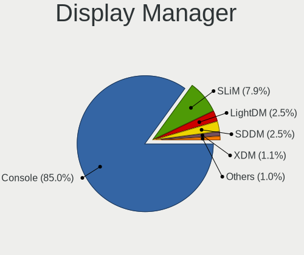
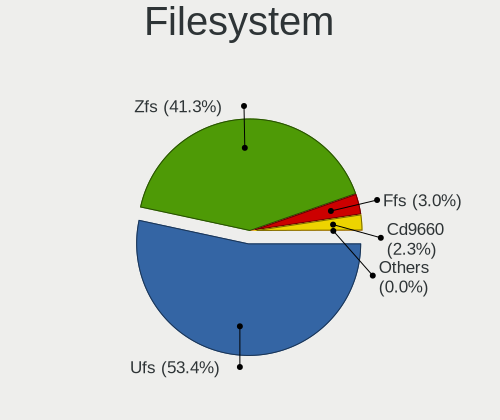
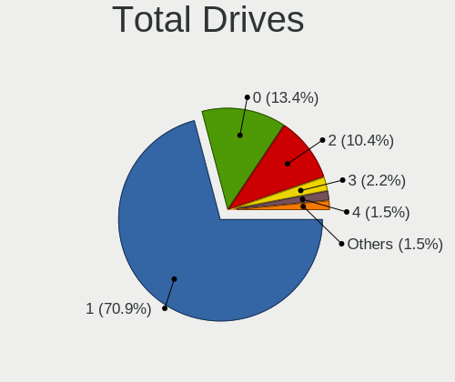
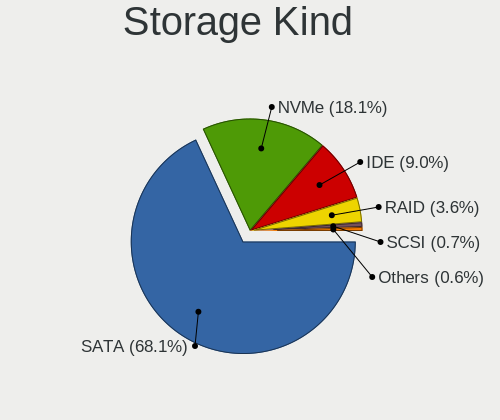
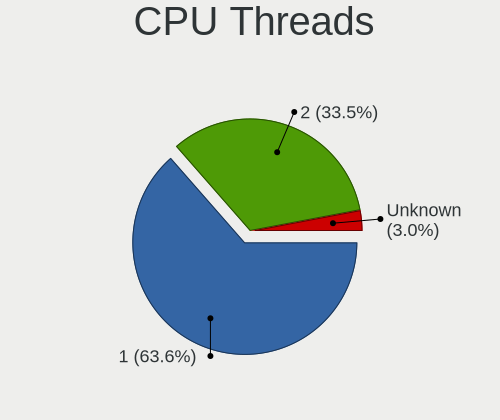
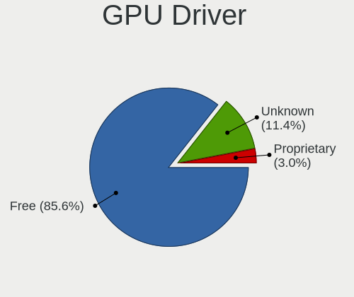
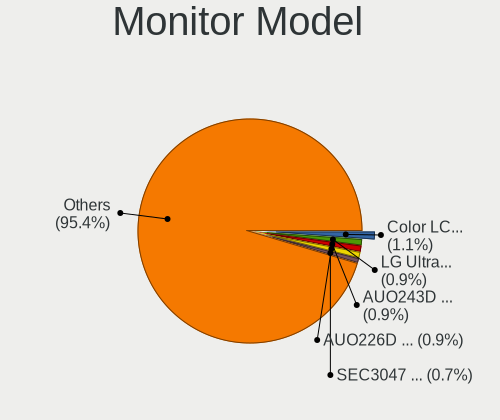
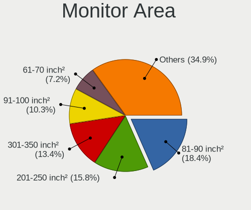
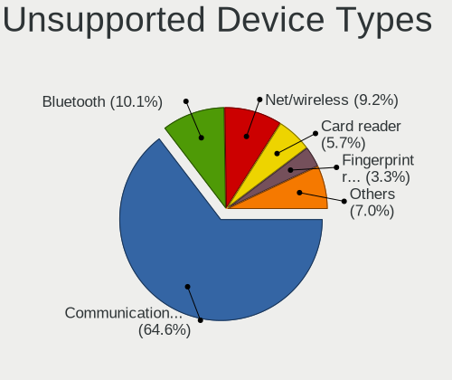

BSD in Germany - Tested Hardware & Statistics
---------------------------------------------

A project to collect tested hardware configurations for BSD in Germany.

Anyone can contribute to this report by the [hw-probe](https://github.com/linuxhw/hw-probe/blob/master/INSTALL.BSD.md) tool:

    hw-probe -all -upload

Please contribute! Especially if your hardware is rare.

This is a report for all computer types. See also reports for [desktops](/Location/Germany/Desktop/README.md) and [notebooks](/Location/Germany/Notebook/README.md).

Contents
--------

* [ Test Cases ](#test-cases)

* [ System ](#system)
  - [ OS                       ](#os)
  - [ OS Family                ](#os-family)
  - [ Arch                     ](#arch)
  - [ DE                       ](#de)
  - [ Display Server           ](#display-server)
  - [ Display Manager          ](#display-manager)
  - [ OS Lang                  ](#os-lang)
  - [ Boot Mode                ](#boot-mode)
  - [ Filesystem               ](#filesystem)
  - [ Part. scheme             ](#part-scheme)

* [ Board ](#board)
  - [ Vendor                   ](#vendor)
  - [ Model                    ](#model)
  - [ Model Family             ](#model-family)
  - [ MFG Year                 ](#mfg-year)
  - [ Form Factor              ](#form-factor)
  - [ Coreboot                 ](#coreboot)
  - [ RAM Size                 ](#ram-size)
  - [ RAM Used                 ](#ram-used)
  - [ Total Drives             ](#total-drives)
  - [ Has CD-ROM               ](#has-cd-rom)
  - [ Has Ethernet             ](#has-ethernet)
  - [ Has WiFi                 ](#has-wifi)
  - [ Has Bluetooth            ](#has-bluetooth)

* [ Location ](#location)
  - [ Country                  ](#country)
  - [ City                     ](#city)

* [ Drives ](#drives)
  - [ Drive Vendor             ](#drive-vendor)
  - [ Drive Model              ](#drive-model)
  - [ HDD Vendor               ](#hdd-vendor)
  - [ SSD Vendor               ](#ssd-vendor)
  - [ Drive Kind               ](#drive-kind)
  - [ Drive Connector          ](#drive-connector)
  - [ Drive Size               ](#drive-size)
  - [ Space Total              ](#space-total)
  - [ Space Used               ](#space-used)
  - [ Malfunc. Drives          ](#malfunc-drives)
  - [ Malfunc. Drive Vendor    ](#malfunc-drive-vendor)
  - [ Malfunc. HDD Vendor      ](#malfunc-hdd-vendor)
  - [ Malfunc. Drive Kind      ](#malfunc-drive-kind)
  - [ Failed Drives            ](#failed-drives)
  - [ Failed Drive Vendor      ](#failed-drive-vendor)
  - [ Drive Status             ](#drive-status)

* [ Storage controller ](#storage-controller)
  - [ Storage Vendor           ](#storage-vendor)
  - [ Storage Model            ](#storage-model)
  - [ Storage Kind             ](#storage-kind)

* [ Processor ](#processor)
  - [ CPU Vendor               ](#cpu-vendor)
  - [ CPU Model                ](#cpu-model)
  - [ CPU Model Family         ](#cpu-model-family)
  - [ CPU Cores                ](#cpu-cores)
  - [ CPU Sockets              ](#cpu-sockets)
  - [ CPU Threads              ](#cpu-threads)
  - [ CPU Microarch            ](#cpu-microarch)

* [ Graphics ](#graphics)
  - [ GPU Vendor               ](#gpu-vendor)
  - [ GPU Model                ](#gpu-model)
  - [ GPU Combo                ](#gpu-combo)
  - [ GPU Driver               ](#gpu-driver)
  - [ GPU Memory               ](#gpu-memory)

* [ Monitor ](#monitor)
  - [ Monitor Vendor           ](#monitor-vendor)
  - [ Monitor Model            ](#monitor-model)
  - [ Monitor Resolution       ](#monitor-resolution)
  - [ Monitor Diagonal         ](#monitor-diagonal)
  - [ Monitor Width            ](#monitor-width)
  - [ Aspect Ratio             ](#aspect-ratio)
  - [ Monitor Area             ](#monitor-area)
  - [ Pixel Density            ](#pixel-density)
  - [ Multiple Monitors        ](#multiple-monitors)

* [ Network ](#network)
  - [ Net Controller Vendor    ](#net-controller-vendor)
  - [ Net Controller Model     ](#net-controller-model)
  - [ Wireless Vendor          ](#wireless-vendor)
  - [ Wireless Model           ](#wireless-model)
  - [ Ethernet Vendor          ](#ethernet-vendor)
  - [ Ethernet Model           ](#ethernet-model)
  - [ Net Controller Kind      ](#net-controller-kind)
  - [ Used Controller          ](#used-controller)
  - [ NICs                     ](#nics)
  - [ IPv6                     ](#ipv6)

* [ Bluetooth ](#bluetooth)
  - [ Bluetooth Vendor         ](#bluetooth-vendor)
  - [ Bluetooth Model          ](#bluetooth-model)

* [ Sound ](#sound)
  - [ Sound Vendor             ](#sound-vendor)
  - [ Sound Model              ](#sound-model)

* [ Memory ](#memory)
  - [ Memory Vendor            ](#memory-vendor)
  - [ Memory Model             ](#memory-model)
  - [ Memory Kind              ](#memory-kind)
  - [ Memory Form Factor       ](#memory-form-factor)
  - [ Memory Size              ](#memory-size)
  - [ Memory Speed             ](#memory-speed)

* [ Printers & scanners ](#printers--scanners)
  - [ Printer Vendor           ](#printer-vendor)
  - [ Printer Model            ](#printer-model)
  - [ Scanner Vendor           ](#scanner-vendor)
  - [ Scanner Model            ](#scanner-model)

* [ Camera ](#camera)
  - [ Camera Vendor            ](#camera-vendor)
  - [ Camera Model             ](#camera-model)

* [ Security ](#security)
  - [ Fingerprint Vendor       ](#fingerprint-vendor)
  - [ Fingerprint Model        ](#fingerprint-model)
  - [ Chipcard Vendor          ](#chipcard-vendor)
  - [ Chipcard Model           ](#chipcard-model)

* [ Unsupported ](#unsupported)
  - [ Unsupported Devices      ](#unsupported-devices)
  - [ Unsupported Device Types ](#unsupported-device-types)

Test Cases
----------

Total: 2255

| Vendor        | Model                       | Form-Factor | Probe                                                     | Date         |
|---------------|-----------------------------|-------------|-----------------------------------------------------------|--------------|
| AWOW          | AK50                        | Desktop     | [8c983f91e4](https://bsd-hardware.info/?probe=8c983f91e4) | Jan 22, 2023 |
| Lenovo        | ThinkPad T440p 20AN007FG... | Notebook    | [0883806434](https://bsd-hardware.info/?probe=0883806434) | Jan 22, 2023 |
| PC Engines    | APU2                        | Desktop     | [658569ae16](https://bsd-hardware.info/?probe=658569ae16) | Jan 22, 2023 |
| Lenovo        | ThinkPad P51 20HH001RMX     | Notebook    | [ab38c51298](https://bsd-hardware.info/?probe=ab38c51298) | Jan 22, 2023 |
| HP            | 1825                        | Desktop     | [2705218636](https://bsd-hardware.info/?probe=2705218636) | Jan 21, 2023 |
| Fujitsu       | D3313-A1 S26361-D3313-A1    | Desktop     | [59c83cb9ee](https://bsd-hardware.info/?probe=59c83cb9ee) | Jan 21, 2023 |
| Fujitsu       | D3243-S1 S26361-D3243-S1    | Desktop     | [d69c3cae4c](https://bsd-hardware.info/?probe=d69c3cae4c) | Jan 21, 2023 |
| ASRock        | A520M-ITX/ac                | Desktop     | [e6873fe42f](https://bsd-hardware.info/?probe=e6873fe42f) | Jan 21, 2023 |
| Techvision    | TVI7309X B0                 | Desktop     | [495563926c](https://bsd-hardware.info/?probe=495563926c) | Jan 21, 2023 |
| ASRock        | A520M-ITX/ac                | Desktop     | [f862df1689](https://bsd-hardware.info/?probe=f862df1689) | Jan 20, 2023 |
| Techvision    | TVI7309X B0                 | Desktop     | [d4018ae0f3](https://bsd-hardware.info/?probe=d4018ae0f3) | Jan 20, 2023 |
| Fujitsu       | PRIMERGY RX200 S6           | Desktop     | [4bcc8752f4](https://bsd-hardware.info/?probe=4bcc8752f4) | Jan 20, 2023 |
| Sophos        | SG                          | Firewall    | [324882f1d6](https://bsd-hardware.info/?probe=324882f1d6) | Jan 20, 2023 |
| ShenZhen M... | MW-NANO-APL-4L              | Desktop     | [48206a7d4a](https://bsd-hardware.info/?probe=48206a7d4a) | Jan 19, 2023 |
| Sophos        | SG                          | Firewall    | [f10f04a5b1](https://bsd-hardware.info/?probe=f10f04a5b1) | Jan 19, 2023 |
| Sophos        | SG                          | Firewall    | [9275bbae4e](https://bsd-hardware.info/?probe=9275bbae4e) | Jan 19, 2023 |
| Unknown       | Unknown                     | Desktop     | [35e269ef1c](https://bsd-hardware.info/?probe=35e269ef1c) | Jan 19, 2023 |
| ASUSTek       | ROG Maximus XI HERO         | Desktop     | [b528c0bbe3](https://bsd-hardware.info/?probe=b528c0bbe3) | Jan 18, 2023 |
| BESSTAR Te... | TH50                        | Desktop     | [b9de543167](https://bsd-hardware.info/?probe=b9de543167) | Jan 18, 2023 |
| CncTion       | N5105-4L B0                 | Desktop     | [11948a0ab1](https://bsd-hardware.info/?probe=11948a0ab1) | Jan 18, 2023 |
| Fujitsu       | D3031 S26361-D3031-A100-... | Server      | [ed566c9a5c](https://bsd-hardware.info/?probe=ed566c9a5c) | Jan 18, 2023 |
| Fujitsu       | PRIMERGY RX200 S6           | Desktop     | [f7de27b0ca](https://bsd-hardware.info/?probe=f7de27b0ca) | Jan 18, 2023 |
| Fujitsu       | D3031 S26361-D3031-A100-... | Server      | [cfb839082b](https://bsd-hardware.info/?probe=cfb839082b) | Jan 18, 2023 |
| Sophos        | UTM                         | Firewall    | [4b0eace553](https://bsd-hardware.info/?probe=4b0eace553) | Jan 18, 2023 |
| Fujitsu       | PRIMERGY RX200 S6           | Desktop     | [9eee9cc526](https://bsd-hardware.info/?probe=9eee9cc526) | Jan 18, 2023 |
| CncTion       | N5105-4L B0                 | Desktop     | [46178567ff](https://bsd-hardware.info/?probe=46178567ff) | Jan 18, 2023 |
| Wortmann      | terra MiniPC                | Desktop     | [be22193265](https://bsd-hardware.info/?probe=be22193265) | Jan 17, 2023 |
| MSI           | MS-9897                     | Desktop     | [8aa91d17fa](https://bsd-hardware.info/?probe=8aa91d17fa) | Jan 17, 2023 |
| MSI           | MS-9897                     | Desktop     | [0ccc361bd9](https://bsd-hardware.info/?probe=0ccc361bd9) | Jan 17, 2023 |
| Fujitsu       | D3313-G1 S26361-D3313-G1    | Desktop     | [1ef7026e21](https://bsd-hardware.info/?probe=1ef7026e21) | Jan 15, 2023 |
| Supermicro    | X11SCM-LN8F                 | Server      | [9e102da483](https://bsd-hardware.info/?probe=9e102da483) | Jan 15, 2023 |
| Deciso        | NetBoard-A10                | Notebook    | [624bfd62b5](https://bsd-hardware.info/?probe=624bfd62b5) | Jan 15, 2023 |
| Techvision    | TVI7309X B0                 | Desktop     | [8aebf3b22a](https://bsd-hardware.info/?probe=8aebf3b22a) | Jan 15, 2023 |
| Lenovo        | ThinkPad E14 Gen 4 21EB0... | Notebook    | [ced6c29193](https://bsd-hardware.info/?probe=ced6c29193) | Jan 14, 2023 |
| Fujitsu       | D3313-G1 S26361-D3313-G1    | Desktop     | [17d73c4d40](https://bsd-hardware.info/?probe=17d73c4d40) | Jan 14, 2023 |
| Fujitsu       | D3313-G1 S26361-D3313-G1    | Desktop     | [ad7329411a](https://bsd-hardware.info/?probe=ad7329411a) | Jan 14, 2023 |
| HP            | ProLiant DL160 Gen9         | Server      | [f8a84dbf0c](https://bsd-hardware.info/?probe=f8a84dbf0c) | Jan 13, 2023 |
| Unknown       | Unknown                     | Desktop     | [fba3e00878](https://bsd-hardware.info/?probe=fba3e00878) | Jan 13, 2023 |
| HP            | 82A1                        | Desktop     | [567894a0bb](https://bsd-hardware.info/?probe=567894a0bb) | Jan 12, 2023 |
| PC Engines    | APU3                        | Desktop     | [b080710198](https://bsd-hardware.info/?probe=b080710198) | Jan 12, 2023 |
| ASRockRack    | X470D4U2/1N1                | Desktop     | [07f15d0014](https://bsd-hardware.info/?probe=07f15d0014) | Jan 11, 2023 |
| CncTion       | J4125-4L-I225               | Desktop     | [56a5c0de6e](https://bsd-hardware.info/?probe=56a5c0de6e) | Jan 11, 2023 |
| PC Engines    | APU2                        | Desktop     | [1e65573dfa](https://bsd-hardware.info/?probe=1e65573dfa) | Jan 10, 2023 |
| Unknown       | Unknown                     | Desktop     | [e870cfc473](https://bsd-hardware.info/?probe=e870cfc473) | Jan 10, 2023 |
| MW            | GMLK-2_5G4L                 | Desktop     | [55bd6297fa](https://bsd-hardware.info/?probe=55bd6297fa) | Jan 10, 2023 |
| BESSTAR Te... | GB7                         | Mini pc     | [76ce0f8e69](https://bsd-hardware.info/?probe=76ce0f8e69) | Jan 09, 2023 |
| MSI           | X299 PRO                    | Desktop     | [a1f37f69d9](https://bsd-hardware.info/?probe=a1f37f69d9) | Jan 08, 2023 |
| Dell          | 03X6X0 A07                  | Server      | [dea6b95d26](https://bsd-hardware.info/?probe=dea6b95d26) | Jan 08, 2023 |
| Dell          | 0YNVJG A01                  | Desktop     | [8bb9472e6b](https://bsd-hardware.info/?probe=8bb9472e6b) | Jan 08, 2023 |
| Unknown       | Unknown                     | Desktop     | [7b5333020a](https://bsd-hardware.info/?probe=7b5333020a) | Jan 08, 2023 |
| Unknown       | Unknown                     | Desktop     | [1e3ebde983](https://bsd-hardware.info/?probe=1e3ebde983) | Jan 07, 2023 |
| ASUSTek       | F2A85-M                     | Desktop     | [e25da8b10a](https://bsd-hardware.info/?probe=e25da8b10a) | Jan 06, 2023 |
| ASUSTek       | PRIME X470-PRO              | Desktop     | [fa12ea67eb](https://bsd-hardware.info/?probe=fa12ea67eb) | Jan 06, 2023 |
| ShenZhen M... | MW-GMLK-2.5G6L              | Desktop     | [92c2e73bd4](https://bsd-hardware.info/?probe=92c2e73bd4) | Jan 06, 2023 |
| Unknown       | Unknown                     | Desktop     | [cc8588d977](https://bsd-hardware.info/?probe=cc8588d977) | Jan 05, 2023 |
| MW            | GMLK-2_5G4L                 | Desktop     | [39149acdbd](https://bsd-hardware.info/?probe=39149acdbd) | Jan 04, 2023 |
| Sophos        | SG                          | Firewall    | [4f105d12b8](https://bsd-hardware.info/?probe=4f105d12b8) | Jan 03, 2023 |
| Unknown       | J3160-4L                    | Desktop     | [849af12174](https://bsd-hardware.info/?probe=849af12174) | Jan 02, 2023 |
| CncTion       | N5105-4L B0                 | Desktop     | [70b1ca485d](https://bsd-hardware.info/?probe=70b1ca485d) | Jan 02, 2023 |
| ASRock        | E350M1                      | Desktop     | [6a7e5c8d0c](https://bsd-hardware.info/?probe=6a7e5c8d0c) | Jan 01, 2023 |
| BESSTAR Te... | GB7                         | Mini pc     | [b3ac391a7e](https://bsd-hardware.info/?probe=b3ac391a7e) | Jan 01, 2023 |
| Supermicro    | A1SAi 123456789             | Mini pc     | [d179977442](https://bsd-hardware.info/?probe=d179977442) | Jan 01, 2023 |
| HP            | 1825                        | Desktop     | [f7e94decd0](https://bsd-hardware.info/?probe=f7e94decd0) | Dec 31, 2022 |
| HP            | 1825                        | Desktop     | [afc1259508](https://bsd-hardware.info/?probe=afc1259508) | Dec 31, 2022 |
| Supermicro    | X10SDV-TP8F                 | Server      | [16daca3076](https://bsd-hardware.info/?probe=16daca3076) | Dec 31, 2022 |
| Supermicro    | X10SDV-TP8F                 | Server      | [5967766127](https://bsd-hardware.info/?probe=5967766127) | Dec 30, 2022 |
| CncTion       | N5105-4L B0                 | Desktop     | [cd3e4f7122](https://bsd-hardware.info/?probe=cd3e4f7122) | Dec 30, 2022 |
| Protectli     | FW4B                        | Desktop     | [406fe72c22](https://bsd-hardware.info/?probe=406fe72c22) | Dec 30, 2022 |
| AMI           | Aptio CRB                   | Mini pc     | [126bde2444](https://bsd-hardware.info/?probe=126bde2444) | Dec 30, 2022 |
| PC Engines    | APU2                        | Desktop     | [7aaf2d91ba](https://bsd-hardware.info/?probe=7aaf2d91ba) | Dec 29, 2022 |
| Lanner        | FW-7543 B-GA                | Desktop     | [6c145361a3](https://bsd-hardware.info/?probe=6c145361a3) | Dec 29, 2022 |
| AMI           | Aptio CRB                   | Mini pc     | [d3b1e89901](https://bsd-hardware.info/?probe=d3b1e89901) | Dec 29, 2022 |
| Supermicro    | X10SDV-TP8F                 | Server      | [fa3c5f6504](https://bsd-hardware.info/?probe=fa3c5f6504) | Dec 28, 2022 |
| AMI           | Aptio CRB                   | Mini pc     | [9954c0abee](https://bsd-hardware.info/?probe=9954c0abee) | Dec 28, 2022 |
| Unknown       | Unknown                     | Desktop     | [5b8ad02694](https://bsd-hardware.info/?probe=5b8ad02694) | Dec 28, 2022 |
| Unknown       | Unknown                     | Desktop     | [c3b95220d7](https://bsd-hardware.info/?probe=c3b95220d7) | Dec 28, 2022 |
| ZOTAC         | ZBOX-CI341                  | Mini pc     | [79d8b1477f](https://bsd-hardware.info/?probe=79d8b1477f) | Dec 28, 2022 |
| Apple         | MacBookAir5,1               | Notebook    | [0d398d5c59](https://bsd-hardware.info/?probe=0d398d5c59) | Dec 27, 2022 |
| Deciso        | NetBoard-A10                | Notebook    | [b09ff8826c](https://bsd-hardware.info/?probe=b09ff8826c) | Dec 26, 2022 |
| ASUSTek       | H97-PLUS                    | Desktop     | [f2a248dcfe](https://bsd-hardware.info/?probe=f2a248dcfe) | Dec 26, 2022 |
| HP            | 8062                        | Desktop     | [f4d3eb024d](https://bsd-hardware.info/?probe=f4d3eb024d) | Dec 25, 2022 |
| Tactus        | GeoFlex 110                 | Notebook    | [955c355b47](https://bsd-hardware.info/?probe=955c355b47) | Dec 23, 2022 |
| Biostar       | A10N-8800E                  | Desktop     | [d3d1107f77](https://bsd-hardware.info/?probe=d3d1107f77) | Dec 23, 2022 |
| Intel         | Q3XXG4-P V1.0               | Desktop     | [58b47341c9](https://bsd-hardware.info/?probe=58b47341c9) | Dec 23, 2022 |
| TUXEDO        | InfinityBook Pro 14 Gen6    | Notebook    | [b38d32b139](https://bsd-hardware.info/?probe=b38d32b139) | Dec 23, 2022 |
| ASRock        | B75M R2.0                   | Desktop     | [3a8d5c61b6](https://bsd-hardware.info/?probe=3a8d5c61b6) | Dec 23, 2022 |
| Unknown       | QD-WHLU01                   | Desktop     | [a0fb185069](https://bsd-hardware.info/?probe=a0fb185069) | Dec 23, 2022 |
| Acer          | Aspire ES1-533              | Notebook    | [570b96d0f7](https://bsd-hardware.info/?probe=570b96d0f7) | Dec 23, 2022 |
| ZOTAC         | ZBOX-CI329NANO              | Mini pc     | [91a89db2ab](https://bsd-hardware.info/?probe=91a89db2ab) | Dec 23, 2022 |
| Unknown       | MANIFOLD 2-C                | Desktop     | [bc2c536004](https://bsd-hardware.info/?probe=bc2c536004) | Dec 23, 2022 |
| ZOTAC         | ZBOX-CI329NANO              | Mini pc     | [58ca7ca7d4](https://bsd-hardware.info/?probe=58ca7ca7d4) | Dec 23, 2022 |
| ZOTAC         | ZBOX-CI329NANO              | Mini pc     | [dfd3e7acb1](https://bsd-hardware.info/?probe=dfd3e7acb1) | Dec 23, 2022 |
| HP            | ProLiant MicroServer Gen... | Desktop     | [daaad6a386](https://bsd-hardware.info/?probe=daaad6a386) | Dec 23, 2022 |
| HP            | ProLiant MicroServer Gen... | Desktop     | [67bc182d1d](https://bsd-hardware.info/?probe=67bc182d1d) | Dec 23, 2022 |
| CncTion       | N5105-4L B0                 | Desktop     | [78bcccda01](https://bsd-hardware.info/?probe=78bcccda01) | Dec 22, 2022 |
| ASRock        | A75M-HVS                    | Desktop     | [01d8e43ee1](https://bsd-hardware.info/?probe=01d8e43ee1) | Dec 22, 2022 |
| AAEON         | FWS-2251 V1.0               | Desktop     | [a4ff0a7ec5](https://bsd-hardware.info/?probe=a4ff0a7ec5) | Dec 22, 2022 |
| ZOTAC         | ZBOX-MI640/MI660/MI620NA... | Mini pc     | [9e817a9114](https://bsd-hardware.info/?probe=9e817a9114) | Dec 22, 2022 |
| ZOTAC         | ZBOX-CI329NANO              | Mini pc     | [90dfe8ee6b](https://bsd-hardware.info/?probe=90dfe8ee6b) | Dec 22, 2022 |
| Fujitsu       | D3313-A1 S26361-D3313-A1    | Desktop     | [2ac107df0f](https://bsd-hardware.info/?probe=2ac107df0f) | Dec 22, 2022 |
| AMI           | Cherry Trail CR             | Mini pc     | [cc9eb40ce1](https://bsd-hardware.info/?probe=cc9eb40ce1) | Dec 22, 2022 |
| Dell          | 0WR7PY A02                  | Desktop     | [0c3fea5eb0](https://bsd-hardware.info/?probe=0c3fea5eb0) | Dec 22, 2022 |
| ZOTAC         | ZBOX-MI640/MI660/MI620NA... | Mini pc     | [16589e2878](https://bsd-hardware.info/?probe=16589e2878) | Dec 21, 2022 |
| ASRock        | 4X4-4000 Series             | Desktop     | [009ef73bd1](https://bsd-hardware.info/?probe=009ef73bd1) | Dec 20, 2022 |
| Fujitsu       | D3224-A1 S26361-D3224-A1    | Desktop     | [2ea413db31](https://bsd-hardware.info/?probe=2ea413db31) | Dec 20, 2022 |
| HP            | ProLiant MicroServer Gen... | Desktop     | [8de4ff8626](https://bsd-hardware.info/?probe=8de4ff8626) | Dec 20, 2022 |
| TUXEDO        | Pulse 15 Gen1               | Notebook    | [af2a9d1a42](https://bsd-hardware.info/?probe=af2a9d1a42) | Dec 20, 2022 |
| Unknown       | Unknown                     | Notebook    | [364b3758b6](https://bsd-hardware.info/?probe=364b3758b6) | Dec 20, 2022 |
| Sophos        | SG                          | Firewall    | [5536740301](https://bsd-hardware.info/?probe=5536740301) | Dec 20, 2022 |
| BESSTAR Te... | GB7                         | Mini pc     | [3c36f8db41](https://bsd-hardware.info/?probe=3c36f8db41) | Dec 20, 2022 |
| Unknown       | Unknown                     | Desktop     | [5d37a0669c](https://bsd-hardware.info/?probe=5d37a0669c) | Dec 19, 2022 |
| Dell          | 0WR7PY A02                  | Desktop     | [67baacfc7d](https://bsd-hardware.info/?probe=67baacfc7d) | Dec 19, 2022 |
| ASUSTek       | H97-PLUS                    | Desktop     | [c9de65beeb](https://bsd-hardware.info/?probe=c9de65beeb) | Dec 19, 2022 |
| PC Engines    | APU2                        | Desktop     | [5de84cb508](https://bsd-hardware.info/?probe=5de84cb508) | Dec 19, 2022 |
| Gigabyte      | J3455N-D3H                  | Desktop     | [fc7928dfe9](https://bsd-hardware.info/?probe=fc7928dfe9) | Dec 18, 2022 |
| MSI           | X299 PRO                    | Desktop     | [beec8001a1](https://bsd-hardware.info/?probe=beec8001a1) | Dec 17, 2022 |
| Intel         | CRESCENTBAY                 | Desktop     | [7981529337](https://bsd-hardware.info/?probe=7981529337) | Dec 17, 2022 |
| ASRock        | Q2900M                      | Desktop     | [42a53e5201](https://bsd-hardware.info/?probe=42a53e5201) | Dec 16, 2022 |
| ASRock        | A75M-HVS                    | Desktop     | [fa8c102cfd](https://bsd-hardware.info/?probe=fa8c102cfd) | Dec 16, 2022 |
| ASUSTek       | PRIME X470-PRO              | Desktop     | [3faaaa8209](https://bsd-hardware.info/?probe=3faaaa8209) | Dec 16, 2022 |
| Unknown       | Unknown                     | Desktop     | [01e26ec145](https://bsd-hardware.info/?probe=01e26ec145) | Dec 15, 2022 |
| Fujitsu       | D3313-E1 S26361-D3313-E1    | Desktop     | [40911b66e2](https://bsd-hardware.info/?probe=40911b66e2) | Dec 15, 2022 |
| Supermicro    | X11SBA-LN4F                 | Server      | [649d525fdb](https://bsd-hardware.info/?probe=649d525fdb) | Dec 15, 2022 |
| Unknown       | Unknown                     | Desktop     | [e3508ce360](https://bsd-hardware.info/?probe=e3508ce360) | Dec 15, 2022 |
| Sophos        | SG                          | Firewall    | [16753b9090](https://bsd-hardware.info/?probe=16753b9090) | Dec 15, 2022 |
| Fujitsu       | D3313-G1 S26361-D3313-G1    | Desktop     | [35ecaf0406](https://bsd-hardware.info/?probe=35ecaf0406) | Dec 15, 2022 |
| ZOTAC         | ZBOX-MI640/MI660/MI620NA... | Mini pc     | [9d71e35375](https://bsd-hardware.info/?probe=9d71e35375) | Dec 15, 2022 |
| ZOTAC         | ZBOX-MI640/MI660/MI620NA... | Mini pc     | [98621b669c](https://bsd-hardware.info/?probe=98621b669c) | Dec 15, 2022 |
| ZOTAC         | ZBOX-MI640/MI660/MI620NA... | Mini pc     | [b0639c3d01](https://bsd-hardware.info/?probe=b0639c3d01) | Dec 15, 2022 |
| ZOTAC         | ZBOX-MI640/MI660/MI620NA... | Mini pc     | [52fbc8ccf7](https://bsd-hardware.info/?probe=52fbc8ccf7) | Dec 15, 2022 |
| Unknown       | Unknown                     | Desktop     | [210418cc84](https://bsd-hardware.info/?probe=210418cc84) | Dec 15, 2022 |
| MW            | GMLK-2_5G4L                 | Desktop     | [cb16bb9431](https://bsd-hardware.info/?probe=cb16bb9431) | Dec 14, 2022 |
| NF541         | 1.0                         | Desktop     | [b0644bada6](https://bsd-hardware.info/?probe=b0644bada6) | Dec 14, 2022 |
| Unknown       | Unknown                     | Desktop     | [ec6827e543](https://bsd-hardware.info/?probe=ec6827e543) | Dec 13, 2022 |
| Techvision    | TVI7309X B0                 | Desktop     | [af9df0d2c9](https://bsd-hardware.info/?probe=af9df0d2c9) | Dec 13, 2022 |
| Unknown       | Unknown                     | Desktop     | [9ee8d1082b](https://bsd-hardware.info/?probe=9ee8d1082b) | Dec 12, 2022 |
| Shuttle       | DH370                       | Desktop     | [1b938aa1a4](https://bsd-hardware.info/?probe=1b938aa1a4) | Dec 12, 2022 |
| Unknown       | MANIFOLD 2-C                | Desktop     | [ba191bd994](https://bsd-hardware.info/?probe=ba191bd994) | Dec 12, 2022 |
| Sophos        | XG                          | Firewall    | [e35b3151a3](https://bsd-hardware.info/?probe=e35b3151a3) | Dec 11, 2022 |
| Acer          | Swift SF114-34              | Notebook    | [0be43b76d1](https://bsd-hardware.info/?probe=0be43b76d1) | Dec 11, 2022 |
| Fujitsu       | D3313-A1 S26361-D3313-A1    | Desktop     | [3124aaaf95](https://bsd-hardware.info/?probe=3124aaaf95) | Dec 11, 2022 |
| Fujitsu       | D3313-A1 S26361-D3313-A1    | Desktop     | [b1bd01549a](https://bsd-hardware.info/?probe=b1bd01549a) | Dec 11, 2022 |
| Unknown       | Unknown                     | Desktop     | [def65f518e](https://bsd-hardware.info/?probe=def65f518e) | Dec 10, 2022 |
| MSI           | B450M MORTAR MAX            | Desktop     | [d8d6af9e56](https://bsd-hardware.info/?probe=d8d6af9e56) | Dec 10, 2022 |
| Protectli     | FW4B Ver                    | Desktop     | [33395e819a](https://bsd-hardware.info/?probe=33395e819a) | Dec 10, 2022 |
| Hardkernel    | ODROID-H3                   | Desktop     | [cd6aa62212](https://bsd-hardware.info/?probe=cd6aa62212) | Dec 09, 2022 |
| Unknown       | Unknown                     | Desktop     | [493df1f529](https://bsd-hardware.info/?probe=493df1f529) | Dec 09, 2022 |
| PC Engines    | apu4                        | Desktop     | [3e3ab7f196](https://bsd-hardware.info/?probe=3e3ab7f196) | Dec 09, 2022 |
| MW            | GMLK-2_5G4L                 | Desktop     | [84f8198c18](https://bsd-hardware.info/?probe=84f8198c18) | Dec 08, 2022 |
| Dell          | 0G261D A00                  | Desktop     | [24b9490c77](https://bsd-hardware.info/?probe=24b9490c77) | Dec 06, 2022 |
| Protectli     | FW4B Ver                    | Desktop     | [eaa3b9783e](https://bsd-hardware.info/?probe=eaa3b9783e) | Dec 05, 2022 |
| PC Engines    | apu4                        | Desktop     | [72061eb254](https://bsd-hardware.info/?probe=72061eb254) | Dec 05, 2022 |
| Fujitsu       | D3313-A1 S26361-D3313-A1    | Desktop     | [aa9482884f](https://bsd-hardware.info/?probe=aa9482884f) | Dec 05, 2022 |
| Shuttle       | FS77U                       | Desktop     | [4172b79cfc](https://bsd-hardware.info/?probe=4172b79cfc) | Dec 04, 2022 |
| Unknown       | Unknown                     | Desktop     | [af4f0984ae](https://bsd-hardware.info/?probe=af4f0984ae) | Dec 04, 2022 |
| ASUSTek       | E35M1-I DELUXE              | Desktop     | [1a183385c7](https://bsd-hardware.info/?probe=1a183385c7) | Dec 04, 2022 |
| Unknown       | Unknown                     | Desktop     | [d9113585f0](https://bsd-hardware.info/?probe=d9113585f0) | Dec 04, 2022 |
| Intel         | D33217CK G76541-300         | Desktop     | [545a39b1e4](https://bsd-hardware.info/?probe=545a39b1e4) | Dec 02, 2022 |
| Thomas-Kre... | P9A-I/2550/4L               | Firewall    | [6bec1ec37d](https://bsd-hardware.info/?probe=6bec1ec37d) | Dec 01, 2022 |
| Lenovo        | 312D SDK0J40697 WIN 3305... | Mini pc     | [a7c2e16f5c](https://bsd-hardware.info/?probe=a7c2e16f5c) | Dec 01, 2022 |
| AWOW          | PC BOX                      | Mini pc     | [ac4f4b181a](https://bsd-hardware.info/?probe=ac4f4b181a) | Nov 30, 2022 |
| Intel         | D33217CK G76541-300         | Desktop     | [bbdd9a1b98](https://bsd-hardware.info/?probe=bbdd9a1b98) | Nov 30, 2022 |
| Sophos        | SG                          | Firewall    | [357c380b7c](https://bsd-hardware.info/?probe=357c380b7c) | Nov 29, 2022 |
| Fujitsu       | D3313-G1 S26361-D3313-G1    | Desktop     | [ae55a799e8](https://bsd-hardware.info/?probe=ae55a799e8) | Nov 28, 2022 |
| PC Engines    | apu6                        | Desktop     | [13dcbe5748](https://bsd-hardware.info/?probe=13dcbe5748) | Nov 27, 2022 |
| HP            | ProLiant DL360p Gen8        | Server      | [a5514d3f4b](https://bsd-hardware.info/?probe=a5514d3f4b) | Nov 26, 2022 |
| Sophos        | SG                          | Firewall    | [d0fc510660](https://bsd-hardware.info/?probe=d0fc510660) | Nov 26, 2022 |
| Dell          | 0F0XJ6 A13                  | Server      | [1d71d3c9e7](https://bsd-hardware.info/?probe=1d71d3c9e7) | Nov 25, 2022 |
| Dell          | 0F0XJ6 A13                  | Server      | [1fb28aaef2](https://bsd-hardware.info/?probe=1fb28aaef2) | Nov 25, 2022 |
| HP            | ProLiant DL360p Gen8        | Server      | [7bb8186465](https://bsd-hardware.info/?probe=7bb8186465) | Nov 25, 2022 |
| Dell          | Latitude D610               | Notebook    | [6ef8d8137b](https://bsd-hardware.info/?probe=6ef8d8137b) | Nov 24, 2022 |
| Unknown       | Unknown                     | Desktop     | [d4246caa0f](https://bsd-hardware.info/?probe=d4246caa0f) | Nov 24, 2022 |
| MW            | GMLK-2_5G4L                 | Desktop     | [b6bbaa13e8](https://bsd-hardware.info/?probe=b6bbaa13e8) | Nov 24, 2022 |
| IceWhale T... | ZimaBoard 832 ZMB           | Desktop     | [1860d18e39](https://bsd-hardware.info/?probe=1860d18e39) | Nov 23, 2022 |
| PC Engines    | apu6                        | Desktop     | [bc334caa03](https://bsd-hardware.info/?probe=bc334caa03) | Nov 23, 2022 |
| Sophos        | UTM                         | Firewall    | [1c0805f9ae](https://bsd-hardware.info/?probe=1c0805f9ae) | Nov 23, 2022 |
| HP            | ProLiant DL360 G7           | Server      | [b666129e73](https://bsd-hardware.info/?probe=b666129e73) | Nov 22, 2022 |
| ASUSTek       | ROG STRIX B550-F GAMING     | Desktop     | [d893e02d90](https://bsd-hardware.info/?probe=d893e02d90) | Nov 21, 2022 |
| ASUSTek       | ROG STRIX B550-F GAMING     | Desktop     | [7518e4f06a](https://bsd-hardware.info/?probe=7518e4f06a) | Nov 21, 2022 |
| Fujitsu       | D3313-A1 S26361-D3313-A1    | Desktop     | [298fde4e33](https://bsd-hardware.info/?probe=298fde4e33) | Nov 21, 2022 |
| HP            | ProLiant DL380 G6           | Server      | [3e3b056cdf](https://bsd-hardware.info/?probe=3e3b056cdf) | Nov 20, 2022 |
| Sophos        | XG                          | Firewall    | [3868856b34](https://bsd-hardware.info/?probe=3868856b34) | Nov 20, 2022 |
| IceWhale T... | ZimaBoard 832 ZMB           | Desktop     | [f6491f1950](https://bsd-hardware.info/?probe=f6491f1950) | Nov 20, 2022 |
| Dell          | 0YNVJG A01                  | Desktop     | [15d32e1e36](https://bsd-hardware.info/?probe=15d32e1e36) | Nov 20, 2022 |
| Dell          | 060J9C A00                  | Mini pc     | [efcae22b58](https://bsd-hardware.info/?probe=efcae22b58) | Nov 19, 2022 |
| PC Engines    | apu6                        | Desktop     | [1e9acc3ae6](https://bsd-hardware.info/?probe=1e9acc3ae6) | Nov 18, 2022 |
| Fujitsu       | D3289-A1 S26361-D3289-A1... | Desktop     | [dae7027898](https://bsd-hardware.info/?probe=dae7027898) | Nov 18, 2022 |
| ASRock        | N3150M                      | Desktop     | [d3b3be7936](https://bsd-hardware.info/?probe=d3b3be7936) | Nov 17, 2022 |
| ASUSTek       | H110I-PLUS                  | Desktop     | [f1f56fe86c](https://bsd-hardware.info/?probe=f1f56fe86c) | Nov 17, 2022 |
| Fujitsu       | D3313-A1 S26361-D3313-A1    | Desktop     | [64d8291a91](https://bsd-hardware.info/?probe=64d8291a91) | Nov 17, 2022 |
| PC Engines    | apu4                        | Desktop     | [212f27d85a](https://bsd-hardware.info/?probe=212f27d85a) | Nov 17, 2022 |
| Intel         | NUC8BEB J72692-309          | Mini pc     | [f362b4c2ea](https://bsd-hardware.info/?probe=f362b4c2ea) | Nov 17, 2022 |
| MSI           | X299 PRO                    | Desktop     | [d615157be7](https://bsd-hardware.info/?probe=d615157be7) | Nov 16, 2022 |
| ASRock        | J5040-ITX                   | Desktop     | [753c68cfb9](https://bsd-hardware.info/?probe=753c68cfb9) | Nov 16, 2022 |
| MSI           | B450M MORTAR MAX            | Desktop     | [15657b37e2](https://bsd-hardware.info/?probe=15657b37e2) | Nov 15, 2022 |
| MSI           | B450M MORTAR MAX            | Desktop     | [f4a8c42773](https://bsd-hardware.info/?probe=f4a8c42773) | Nov 15, 2022 |
| PC Engines    | apu4                        | Desktop     | [589dec199e](https://bsd-hardware.info/?probe=589dec199e) | Nov 15, 2022 |
| Shuttle       | FH61V                       | Desktop     | [012a5c0fcc](https://bsd-hardware.info/?probe=012a5c0fcc) | Nov 14, 2022 |
| Lenovo        | Yoga Slim 7 Pro 14ACH5 O... | Notebook    | [4c83122cc0](https://bsd-hardware.info/?probe=4c83122cc0) | Nov 14, 2022 |
| ASUSTek       | H110I-PLUS                  | Desktop     | [0079838512](https://bsd-hardware.info/?probe=0079838512) | Nov 13, 2022 |
| Sophos        | SG                          | Firewall    | [3d17d672bd](https://bsd-hardware.info/?probe=3d17d672bd) | Nov 13, 2022 |
| Fujitsu       | D3313-G1 S26361-D3313-G1    | Desktop     | [ee16ad1ffb](https://bsd-hardware.info/?probe=ee16ad1ffb) | Nov 12, 2022 |
| PC Engines    | APU2                        | Desktop     | [34960ed27c](https://bsd-hardware.info/?probe=34960ed27c) | Nov 12, 2022 |
| Google        | Akemi                       | Notebook    | [2d8e99f0c2](https://bsd-hardware.info/?probe=2d8e99f0c2) | Nov 12, 2022 |
| Supermicro    | X10SDV-TP8F                 | Server      | [cb88c3311a](https://bsd-hardware.info/?probe=cb88c3311a) | Nov 12, 2022 |
| Unknown       | Unknown                     | Firewall    | [2d2b5ee614](https://bsd-hardware.info/?probe=2d2b5ee614) | Nov 12, 2022 |
| HP            | ProLiant DL360p Gen8        | Server      | [863c472910](https://bsd-hardware.info/?probe=863c472910) | Nov 12, 2022 |
| ASUSTek       | H110I-PLUS                  | Desktop     | [e3161d12c5](https://bsd-hardware.info/?probe=e3161d12c5) | Nov 11, 2022 |
| IceWhale T... | ZimaBoard 832 ZMB           | Desktop     | [0fcbc68304](https://bsd-hardware.info/?probe=0fcbc68304) | Nov 11, 2022 |
| Intel         | NUC8BEB J72692-309          | Mini pc     | [5a5e24fdf7](https://bsd-hardware.info/?probe=5a5e24fdf7) | Nov 11, 2022 |
| HP            | 18E9                        | Desktop     | [b9df70f7eb](https://bsd-hardware.info/?probe=b9df70f7eb) | Nov 11, 2022 |
| Fujitsu       | D3313-G1 S26361-D3313-G1    | Desktop     | [569d5b0cca](https://bsd-hardware.info/?probe=569d5b0cca) | Nov 10, 2022 |
| CheckPoint    | PH-30-00                    | Desktop     | [e42768cd01](https://bsd-hardware.info/?probe=e42768cd01) | Nov 10, 2022 |
| BESSTAR Te... | GB7                         | Mini pc     | [c741b2fbfa](https://bsd-hardware.info/?probe=c741b2fbfa) | Nov 10, 2022 |
| Deciso        | NetBoard-A20                | Notebook    | [61157ac2b6](https://bsd-hardware.info/?probe=61157ac2b6) | Nov 10, 2022 |
| HP            | 21B4 A01                    | Desktop     | [c064c50fea](https://bsd-hardware.info/?probe=c064c50fea) | Nov 09, 2022 |
| HP            | 21B4 A01                    | Desktop     | [e5c599dfab](https://bsd-hardware.info/?probe=e5c599dfab) | Nov 09, 2022 |
| HP            | 21B4 A01                    | Desktop     | [0a3ba5478b](https://bsd-hardware.info/?probe=0a3ba5478b) | Nov 09, 2022 |
| Fujitsu       | D3313-G1 S26361-D3313-G1    | Desktop     | [c32a7b407d](https://bsd-hardware.info/?probe=c32a7b407d) | Nov 09, 2022 |
| ASRock        | H570M-ITX/ac                | Desktop     | [8addd09aa7](https://bsd-hardware.info/?probe=8addd09aa7) | Nov 09, 2022 |
| Sophos        | SG                          | Firewall    | [04b1bf9b24](https://bsd-hardware.info/?probe=04b1bf9b24) | Nov 09, 2022 |
| HP            | 1632                        | Desktop     | [96d60382b7](https://bsd-hardware.info/?probe=96d60382b7) | Nov 09, 2022 |
| Deciso        | NetBoard-A10                | Notebook    | [1fc6403341](https://bsd-hardware.info/?probe=1fc6403341) | Nov 08, 2022 |
| Thomas-Kre... | P9A-I/2550/4L               | Firewall    | [d63fd6f7bd](https://bsd-hardware.info/?probe=d63fd6f7bd) | Nov 08, 2022 |
| Dell          | 0G261D A00                  | Desktop     | [c3eb1a6caf](https://bsd-hardware.info/?probe=c3eb1a6caf) | Nov 08, 2022 |
| HP            | ProLiant ML310e Gen8        | Desktop     | [cb5bb2c3b5](https://bsd-hardware.info/?probe=cb5bb2c3b5) | Nov 07, 2022 |
| ASUSTek       | A88XM-E                     | Desktop     | [fde1fa45b8](https://bsd-hardware.info/?probe=fde1fa45b8) | Nov 07, 2022 |
| Sophos        | SG                          | Firewall    | [4547062398](https://bsd-hardware.info/?probe=4547062398) | Nov 07, 2022 |
| Unknown       | Unknown                     | Desktop     | [659ec0b365](https://bsd-hardware.info/?probe=659ec0b365) | Nov 07, 2022 |
| PC Engines    | APU2                        | Desktop     | [2a913e7a43](https://bsd-hardware.info/?probe=2a913e7a43) | Nov 06, 2022 |
| Protectli     | VP2410                      | Desktop     | [de5de1ca21](https://bsd-hardware.info/?probe=de5de1ca21) | Nov 06, 2022 |
| ASUSTek       | PRIME B560M-A               | Desktop     | [95d5580fd7](https://bsd-hardware.info/?probe=95d5580fd7) | Nov 05, 2022 |
| ASUSTek       | ROG STRIX B550-F GAMING     | Desktop     | [d27fd3b1a7](https://bsd-hardware.info/?probe=d27fd3b1a7) | Nov 04, 2022 |
| MW            | GMLK-2_5G4L                 | Desktop     | [73230496b2](https://bsd-hardware.info/?probe=73230496b2) | Nov 04, 2022 |
| Fujitsu       | D3049-A1 S26361-D3049-A1... | Server      | [1b27159e27](https://bsd-hardware.info/?probe=1b27159e27) | Nov 04, 2022 |
| Unknown       | 1.0                         | Desktop     | [9fe6ac4e68](https://bsd-hardware.info/?probe=9fe6ac4e68) | Nov 03, 2022 |
| Hardkernel    | ODROID-H2                   | Desktop     | [f0e3f3177a](https://bsd-hardware.info/?probe=f0e3f3177a) | Nov 02, 2022 |
| Supermicro    | X10SDV-TP8F                 | Server      | [09cb46f6bf](https://bsd-hardware.info/?probe=09cb46f6bf) | Oct 31, 2022 |
| Protectli     | FW6 Ver                     | Desktop     | [6f21c02bba](https://bsd-hardware.info/?probe=6f21c02bba) | Oct 31, 2022 |
| Unknown       | Unknown                     | Desktop     | [9737a80a1c](https://bsd-hardware.info/?probe=9737a80a1c) | Oct 31, 2022 |
| Protectli     | FW6 Ver                     | Desktop     | [a52d7dda08](https://bsd-hardware.info/?probe=a52d7dda08) | Oct 30, 2022 |
| Intel         | NUC8BEB J72692-309          | Mini pc     | [af6807035f](https://bsd-hardware.info/?probe=af6807035f) | Oct 30, 2022 |
| Protectli     | FW6 Ver                     | Desktop     | [4aecc55dcc](https://bsd-hardware.info/?probe=4aecc55dcc) | Oct 30, 2022 |
| Thomas-Kre... | LES network 6L              | Desktop     | [0816f2da97](https://bsd-hardware.info/?probe=0816f2da97) | Oct 30, 2022 |
| Sophos        | SG                          | Firewall    | [03633cdc2e](https://bsd-hardware.info/?probe=03633cdc2e) | Oct 29, 2022 |
| ASRock        | N68-GS4 FX R2.0             | Desktop     | [85be4177d6](https://bsd-hardware.info/?probe=85be4177d6) | Oct 29, 2022 |
| Acer          | JM11-MS                     | Notebook    | [3ff8b20107](https://bsd-hardware.info/?probe=3ff8b20107) | Oct 29, 2022 |
| Lenovo        | 310B SDK0J40697 WIN 3305... | Mini pc     | [484e5520b7](https://bsd-hardware.info/?probe=484e5520b7) | Oct 28, 2022 |
| Unknown       | Unknown                     | Desktop     | [c483de83a9](https://bsd-hardware.info/?probe=c483de83a9) | Oct 28, 2022 |
| Unknown       | Unknown                     | Desktop     | [c03e63a0a8](https://bsd-hardware.info/?probe=c03e63a0a8) | Oct 28, 2022 |
| ASUSTek       | P5BV-M                      | Desktop     | [c5277ae3cd](https://bsd-hardware.info/?probe=c5277ae3cd) | Oct 27, 2022 |
| CncTion       | N5105-4L B0                 | Desktop     | [d2adcc8230](https://bsd-hardware.info/?probe=d2adcc8230) | Oct 26, 2022 |
| Fujitsu       | LIFEBOOK E752               | Notebook    | [06e6c07e90](https://bsd-hardware.info/?probe=06e6c07e90) | Oct 25, 2022 |
| PC Engines    | apu1                        | Desktop     | [b8643f364d](https://bsd-hardware.info/?probe=b8643f364d) | Oct 25, 2022 |
| BESSTAR Te... | GB7                         | Mini pc     | [0e2cd201d0](https://bsd-hardware.info/?probe=0e2cd201d0) | Oct 24, 2022 |
| Gigabyte      | B450M DS3H-CF               | Desktop     | [51ec4ce710](https://bsd-hardware.info/?probe=51ec4ce710) | Oct 24, 2022 |
| ZOTAC         | ZBOX-MI522NANO/MI542NANO    | Mini pc     | [0d6e868d9c](https://bsd-hardware.info/?probe=0d6e868d9c) | Oct 24, 2022 |
| Sophos        | SG                          | Firewall    | [bb50acf083](https://bsd-hardware.info/?probe=bb50acf083) | Oct 24, 2022 |
| ASUSTek       | P5BV-M                      | Desktop     | [f7bfa3deed](https://bsd-hardware.info/?probe=f7bfa3deed) | Oct 23, 2022 |
| CncTion       | N5105-4L B0                 | Desktop     | [6f0d5a7497](https://bsd-hardware.info/?probe=6f0d5a7497) | Oct 23, 2022 |
| Dell          | Latitude 5591               | Notebook    | [58b577382a](https://bsd-hardware.info/?probe=58b577382a) | Oct 23, 2022 |
| CncTion       | N5105-4L B0                 | Desktop     | [d7829c8f35](https://bsd-hardware.info/?probe=d7829c8f35) | Oct 22, 2022 |
| Alienware     | m15                         | Notebook    | [3304a767ba](https://bsd-hardware.info/?probe=3304a767ba) | Oct 22, 2022 |
| Fujitsu       | D3313-G1 S26361-D3313-G1    | Desktop     | [a1b0ef3b39](https://bsd-hardware.info/?probe=a1b0ef3b39) | Oct 22, 2022 |
| Unknown       | Unknown                     | Desktop     | [410283dd4f](https://bsd-hardware.info/?probe=410283dd4f) | Oct 22, 2022 |
| Sophos        | UTM                         | Firewall    | [bae9180e3f](https://bsd-hardware.info/?probe=bae9180e3f) | Oct 22, 2022 |
| Protectli     | FW6 Ver                     | Desktop     | [d04ef8c45b](https://bsd-hardware.info/?probe=d04ef8c45b) | Oct 21, 2022 |
| ASUSTek       | TUF Gaming B550-PLUS        | Desktop     | [7ecffc1ca3](https://bsd-hardware.info/?probe=7ecffc1ca3) | Oct 20, 2022 |
| ASUSTek       | TUF Gaming B550-PLUS        | Desktop     | [eb6eda641d](https://bsd-hardware.info/?probe=eb6eda641d) | Oct 20, 2022 |
| Hardkernel    | ODROID-H3                   | Desktop     | [304db9bbbf](https://bsd-hardware.info/?probe=304db9bbbf) | Oct 20, 2022 |
| Sophos        | SG                          | Firewall    | [a8593e1424](https://bsd-hardware.info/?probe=a8593e1424) | Oct 20, 2022 |
| PC Engines    | APU2                        | Desktop     | [c2e7b76bdf](https://bsd-hardware.info/?probe=c2e7b76bdf) | Oct 20, 2022 |
| PC Engines    | APU2                        | Desktop     | [ade8432e80](https://bsd-hardware.info/?probe=ade8432e80) | Oct 20, 2022 |
| Protectli     | FW6                         | Desktop     | [a7dabc97b0](https://bsd-hardware.info/?probe=a7dabc97b0) | Oct 19, 2022 |
| Protectli     | FW4B                        | Desktop     | [0acd6e1143](https://bsd-hardware.info/?probe=0acd6e1143) | Oct 19, 2022 |
| Unknown       | MANIFOLD 2-C                | Desktop     | [a6c8096599](https://bsd-hardware.info/?probe=a6c8096599) | Oct 19, 2022 |
| Supermicro    | X10SDV-TP8F                 | Server      | [8c6555d6be](https://bsd-hardware.info/?probe=8c6555d6be) | Oct 18, 2022 |
| Lenovo        | 30D0 NOK                    | Desktop     | [d1fab8bd54](https://bsd-hardware.info/?probe=d1fab8bd54) | Oct 18, 2022 |
| Fujitsu       | D3313-A1 S26361-D3313-A1    | Desktop     | [c7971db0b8](https://bsd-hardware.info/?probe=c7971db0b8) | Oct 18, 2022 |
| Dell          | 03X6X0 A00                  | Server      | [7024873a21](https://bsd-hardware.info/?probe=7024873a21) | Oct 17, 2022 |
| NF541         | 1.0                         | Desktop     | [6f4f72398d](https://bsd-hardware.info/?probe=6f4f72398d) | Oct 17, 2022 |
| Unknown       | Unknown                     | Desktop     | [83ceb2fb33](https://bsd-hardware.info/?probe=83ceb2fb33) | Oct 15, 2022 |
| PC Engines    | apu4                        | Desktop     | [cefbafec73](https://bsd-hardware.info/?probe=cefbafec73) | Oct 15, 2022 |
| Sophos        | SG                          | Firewall    | [885bf4ef1e](https://bsd-hardware.info/?probe=885bf4ef1e) | Oct 15, 2022 |
| Fujitsu       | D3313-G1 S26361-D3313-G1    | Desktop     | [a8bdbe4d1b](https://bsd-hardware.info/?probe=a8bdbe4d1b) | Oct 15, 2022 |
| Sophos        | SG                          | Firewall    | [4fbe0156a8](https://bsd-hardware.info/?probe=4fbe0156a8) | Oct 15, 2022 |
| Intel         | Q3XXG4-P V1.0               | Desktop     | [5a56504b92](https://bsd-hardware.info/?probe=5a56504b92) | Oct 15, 2022 |
| Sophos        | XG                          | Firewall    | [e80ccac6ff](https://bsd-hardware.info/?probe=e80ccac6ff) | Oct 15, 2022 |
| BESSTAR Te... | GB7                         | Mini pc     | [27d7eb468e](https://bsd-hardware.info/?probe=27d7eb468e) | Oct 14, 2022 |
| Dell          | 0WMJ54 A01                  | Desktop     | [5acdcd628d](https://bsd-hardware.info/?probe=5acdcd628d) | Oct 14, 2022 |
| PC Engines    | APU2                        | Desktop     | [0e09ac984a](https://bsd-hardware.info/?probe=0e09ac984a) | Oct 14, 2022 |
| PC Engines    | APU2                        | Desktop     | [a06a344954](https://bsd-hardware.info/?probe=a06a344954) | Oct 12, 2022 |
| ASUSTek       | P8Z68-V                     | Desktop     | [6674bbf7f3](https://bsd-hardware.info/?probe=6674bbf7f3) | Oct 11, 2022 |
| maiyunda      | www.maiyunda.com            | Desktop     | [869687f6f0](https://bsd-hardware.info/?probe=869687f6f0) | Oct 11, 2022 |
| maiyunda      | www.maiyunda.com            | Desktop     | [f4b5bf9026](https://bsd-hardware.info/?probe=f4b5bf9026) | Oct 11, 2022 |
| CncTion       | Jasper-4L B0                | Desktop     | [53c643dc95](https://bsd-hardware.info/?probe=53c643dc95) | Oct 10, 2022 |
| ShenZhen M... | MW-NANO-APL-4L              | Desktop     | [5d929362ca](https://bsd-hardware.info/?probe=5d929362ca) | Oct 09, 2022 |
| Hardkernel    | ODROID-H2                   | Desktop     | [73c9bfe38b](https://bsd-hardware.info/?probe=73c9bfe38b) | Oct 09, 2022 |
| HP            | 84F5                        | Mini pc     | [99c0387102](https://bsd-hardware.info/?probe=99c0387102) | Oct 09, 2022 |
| HP            | 84F5                        | Mini pc     | [ecdab22807](https://bsd-hardware.info/?probe=ecdab22807) | Oct 08, 2022 |
| TUXEDO        | InfinityBook S 15 Gen6      | Notebook    | [17d766d55a](https://bsd-hardware.info/?probe=17d766d55a) | Oct 08, 2022 |
| Unknown       | Unknown                     | Desktop     | [d6396a74dd](https://bsd-hardware.info/?probe=d6396a74dd) | Oct 08, 2022 |
| ZOTAC         | ZBOX-CI527/CI547            | Mini pc     | [231a0f9ce0](https://bsd-hardware.info/?probe=231a0f9ce0) | Oct 08, 2022 |
| Unknown       | Unknown                     | Desktop     | [d25832111e](https://bsd-hardware.info/?probe=d25832111e) | Oct 07, 2022 |
| Unknown       | Unknown                     | Desktop     | [a34c1b8ccd](https://bsd-hardware.info/?probe=a34c1b8ccd) | Oct 07, 2022 |
| Unknown       | Unknown                     | Desktop     | [7658e5e20d](https://bsd-hardware.info/?probe=7658e5e20d) | Oct 06, 2022 |
| PC Engines    | APU2                        | Desktop     | [02416f3157](https://bsd-hardware.info/?probe=02416f3157) | Oct 06, 2022 |
| CncTion       | J4125-4L-I225               | Desktop     | [eb746dc4a1](https://bsd-hardware.info/?probe=eb746dc4a1) | Oct 05, 2022 |
| Sophos        | SG                          | Firewall    | [44ca915943](https://bsd-hardware.info/?probe=44ca915943) | Oct 05, 2022 |
| ZOTAC         | ZBOX-CI341                  | Mini pc     | [724c70cfa3](https://bsd-hardware.info/?probe=724c70cfa3) | Oct 04, 2022 |
| ASRock        | Z77 Extreme4                | Desktop     | [459c674b3b](https://bsd-hardware.info/?probe=459c674b3b) | Oct 04, 2022 |
| Neousys Te... | NVS-5000 Rev. A3            | Server      | [49d9f0e06a](https://bsd-hardware.info/?probe=49d9f0e06a) | Oct 04, 2022 |
| Sophos        | XG                          | Firewall    | [4b62b03461](https://bsd-hardware.info/?probe=4b62b03461) | Oct 03, 2022 |
| Protectli     | FW4B                        | Desktop     | [36c62d7ffe](https://bsd-hardware.info/?probe=36c62d7ffe) | Oct 03, 2022 |
| Unknown       | Unknown                     | Desktop     | [dac9b93a46](https://bsd-hardware.info/?probe=dac9b93a46) | Oct 03, 2022 |
| Gigabyte      | X570 I AORUS PRO WIFI       | Desktop     | [bb4a59dd43](https://bsd-hardware.info/?probe=bb4a59dd43) | Oct 03, 2022 |
| HP            | 255 G8 Notebook PC          | Notebook    | [f9851a3257](https://bsd-hardware.info/?probe=f9851a3257) | Oct 01, 2022 |
| Protectli     | FW6 Ver                     | Desktop     | [23450789e4](https://bsd-hardware.info/?probe=23450789e4) | Oct 01, 2022 |
| AMI           | PICO PC                     | Desktop     | [ab45092607](https://bsd-hardware.info/?probe=ab45092607) | Oct 01, 2022 |
| Unknown       | Unknown                     | Desktop     | [c4e771c07c](https://bsd-hardware.info/?probe=c4e771c07c) | Oct 01, 2022 |
| BESSTAR Te... | IB9                         | Desktop     | [0cb7bacc88](https://bsd-hardware.info/?probe=0cb7bacc88) | Oct 01, 2022 |
| Supermicro    | X10SLH-F/X10SLM+-F          | Server      | [6f95477df3](https://bsd-hardware.info/?probe=6f95477df3) | Sep 30, 2022 |
| BESSTAR Te... | IB9                         | Desktop     | [eb0e449150](https://bsd-hardware.info/?probe=eb0e449150) | Sep 29, 2022 |
| Tactus        | GeoFlex 110                 | Notebook    | [0b93b5f915](https://bsd-hardware.info/?probe=0b93b5f915) | Sep 28, 2022 |
| AMI           | MNHO-048                    | Desktop     | [2ec6e55a75](https://bsd-hardware.info/?probe=2ec6e55a75) | Sep 28, 2022 |
| Sophos        | SG                          | Firewall    | [6511e9620b](https://bsd-hardware.info/?probe=6511e9620b) | Sep 28, 2022 |
| ASRock        | Z97 Professional            | Desktop     | [8936497eed](https://bsd-hardware.info/?probe=8936497eed) | Sep 27, 2022 |
| MSI           | A520M-A PRO                 | Desktop     | [7e75a1888b](https://bsd-hardware.info/?probe=7e75a1888b) | Sep 27, 2022 |
| Fujitsu       | D3313-E1 S26361-D3313-E1    | Desktop     | [a605b4582c](https://bsd-hardware.info/?probe=a605b4582c) | Sep 27, 2022 |
| Sophos        | SG                          | Firewall    | [fdd950a5e8](https://bsd-hardware.info/?probe=fdd950a5e8) | Sep 26, 2022 |
| Lenovo        | ThinkPad P53 20QNCTO1WW     | Notebook    | [b2024820d1](https://bsd-hardware.info/?probe=b2024820d1) | Sep 26, 2022 |
| CncTion       | Jasper-4L B0                | Desktop     | [2998faa879](https://bsd-hardware.info/?probe=2998faa879) | Sep 25, 2022 |
| Pegatron      | H81-X1                      | Desktop     | [a27c76c490](https://bsd-hardware.info/?probe=a27c76c490) | Sep 25, 2022 |
| ASUSTek       | P9D-X Series                | Server      | [3494695f54](https://bsd-hardware.info/?probe=3494695f54) | Sep 25, 2022 |
| Gigabyte      | GB-BSi5A-6200               | Notebook    | [c947635b8f](https://bsd-hardware.info/?probe=c947635b8f) | Sep 25, 2022 |
| Gigabyte      | GB-BSi5A-6200               | Notebook    | [533c7f35f1](https://bsd-hardware.info/?probe=533c7f35f1) | Sep 25, 2022 |
| Supermicro    | X10SRi-FB                   | Server      | [59ff2014e5](https://bsd-hardware.info/?probe=59ff2014e5) | Sep 25, 2022 |
| Intel         | S1200SP H57532-210          | Server      | [ab6e70abca](https://bsd-hardware.info/?probe=ab6e70abca) | Sep 25, 2022 |
| Supermicro    | X8DT3                       | Server      | [eda1df037b](https://bsd-hardware.info/?probe=eda1df037b) | Sep 25, 2022 |
| Supermicro    | X7DB8                       | Desktop     | [6ebc173873](https://bsd-hardware.info/?probe=6ebc173873) | Sep 25, 2022 |
| Deciso        | Netboard A10 V2.1           | Desktop     | [8bbf714f6d](https://bsd-hardware.info/?probe=8bbf714f6d) | Sep 25, 2022 |
| Deciso        | Netboard A10 V2.1           | Desktop     | [60d4585ece](https://bsd-hardware.info/?probe=60d4585ece) | Sep 25, 2022 |
| IBM           | ThinkPad T40 23737CG        | Notebook    | [dfc9b64da2](https://bsd-hardware.info/?probe=dfc9b64da2) | Sep 25, 2022 |
| IceWhale T... | ZimaBoard 832 ZMB           | Desktop     | [6e2d053e1c](https://bsd-hardware.info/?probe=6e2d053e1c) | Sep 25, 2022 |
| Gigabyte      | X570 I AORUS PRO WIFI       | Desktop     | [8ed018c141](https://bsd-hardware.info/?probe=8ed018c141) | Sep 24, 2022 |
| ASUSTek       | M5A78L-M/USB3               | Desktop     | [a0672c6af1](https://bsd-hardware.info/?probe=a0672c6af1) | Sep 23, 2022 |
| Sophos        | UTM                         | Firewall    | [fe6cf3c1ab](https://bsd-hardware.info/?probe=fe6cf3c1ab) | Sep 22, 2022 |
| ZOTAC         | ZBOX-MI522NANO/MI542NANO    | Mini pc     | [495b0dfebd](https://bsd-hardware.info/?probe=495b0dfebd) | Sep 22, 2022 |
| Protectli     | FW4B Ver                    | Desktop     | [036004bbfe](https://bsd-hardware.info/?probe=036004bbfe) | Sep 22, 2022 |
| PC Engines    | APU                         | Desktop     | [a65b17ba04](https://bsd-hardware.info/?probe=a65b17ba04) | Sep 21, 2022 |
| AMI           | Aptio CRB                   | Mini pc     | [37acdfe51c](https://bsd-hardware.info/?probe=37acdfe51c) | Sep 20, 2022 |
| Fujitsu       | D3313-E1 S26361-D3313-E1    | Desktop     | [3c74fc1690](https://bsd-hardware.info/?probe=3c74fc1690) | Sep 20, 2022 |
| Gigabyte      | Z590I AORUS ULTRA           | Desktop     | [c057b7ab09](https://bsd-hardware.info/?probe=c057b7ab09) | Sep 20, 2022 |
| BESSTAR Te... | GB7                         | Mini pc     | [80e1559386](https://bsd-hardware.info/?probe=80e1559386) | Sep 19, 2022 |
| Supermicro    | A2SDi-8C-HLN4F              | Desktop     | [393da0c00c](https://bsd-hardware.info/?probe=393da0c00c) | Sep 19, 2022 |
| ASUSTek       | PRIME X570-P                | Desktop     | [a2f56848a9](https://bsd-hardware.info/?probe=a2f56848a9) | Sep 19, 2022 |
| ASUSTek       | M5A78L-M/USB3               | Desktop     | [cad2b5fd02](https://bsd-hardware.info/?probe=cad2b5fd02) | Sep 18, 2022 |
| Sophos        | XG                          | Firewall    | [e8aca06194](https://bsd-hardware.info/?probe=e8aca06194) | Sep 18, 2022 |
| BESSTAR Te... | TH50                        | Desktop     | [d027a503a5](https://bsd-hardware.info/?probe=d027a503a5) | Sep 18, 2022 |
| AMI           | Aptio CRB                   | Mini pc     | [55c82d4dd0](https://bsd-hardware.info/?probe=55c82d4dd0) | Sep 18, 2022 |
| Fujitsu       | LIFEBOOK A532               | Notebook    | [91e0f723ea](https://bsd-hardware.info/?probe=91e0f723ea) | Sep 18, 2022 |
| Unknown       | Unknown                     | Desktop     | [af8f180c2c](https://bsd-hardware.info/?probe=af8f180c2c) | Sep 17, 2022 |
| Gigabyte      | X570 I AORUS PRO WIFI       | Desktop     | [a9da12dec0](https://bsd-hardware.info/?probe=a9da12dec0) | Sep 17, 2022 |
| ASUSTek       | PRIME X570-P                | Desktop     | [9fc1f66fcc](https://bsd-hardware.info/?probe=9fc1f66fcc) | Sep 16, 2022 |
| Fujitsu       | D3544-A1 S26361-D3544-A1... | Desktop     | [eb09d789de](https://bsd-hardware.info/?probe=eb09d789de) | Sep 16, 2022 |
| Unknown       | Unknown                     | Desktop     | [3b66741f97](https://bsd-hardware.info/?probe=3b66741f97) | Sep 16, 2022 |
| Unknown       | Unknown                     | Desktop     | [83e48aa232](https://bsd-hardware.info/?probe=83e48aa232) | Sep 16, 2022 |
| Deciso        | DEC2700 - OPNsense Appli... | Notebook    | [eee7bdda02](https://bsd-hardware.info/?probe=eee7bdda02) | Sep 15, 2022 |
| Intel         | ChiefRiver                  | Desktop     | [5361453e6a](https://bsd-hardware.info/?probe=5361453e6a) | Sep 15, 2022 |
| Lenovo        | ThinkPad X270 20HMS2LL00    | Notebook    | [12f6a8866f](https://bsd-hardware.info/?probe=12f6a8866f) | Sep 14, 2022 |
| Deciso        | DEC2700 - OPNsense Appli... | Notebook    | [9e6bd1263d](https://bsd-hardware.info/?probe=9e6bd1263d) | Sep 13, 2022 |
| Intel         | Q3XXG4-P V1.0               | Desktop     | [e8848edf41](https://bsd-hardware.info/?probe=e8848edf41) | Sep 13, 2022 |
| BESSTAR Te... | GB7                         | Mini pc     | [d3ee67f09b](https://bsd-hardware.info/?probe=d3ee67f09b) | Sep 13, 2022 |
| HP            | 18E7                        | Desktop     | [f09635a7ee](https://bsd-hardware.info/?probe=f09635a7ee) | Sep 12, 2022 |
| BESSTAR Te... | GB7                         | Mini pc     | [66e543ee47](https://bsd-hardware.info/?probe=66e543ee47) | Sep 12, 2022 |
| Fujitsu       | D3313-G1 S26361-D3313-G1    | Desktop     | [2b4e2212dc](https://bsd-hardware.info/?probe=2b4e2212dc) | Sep 12, 2022 |
| BESSTAR Te... | TH50                        | Desktop     | [71e53af7f9](https://bsd-hardware.info/?probe=71e53af7f9) | Sep 12, 2022 |
| HP            | ProLiant DL20 Gen9          | Server      | [32e9f95095](https://bsd-hardware.info/?probe=32e9f95095) | Sep 11, 2022 |
| Unknown       | Unknown                     | Desktop     | [37588a8565](https://bsd-hardware.info/?probe=37588a8565) | Sep 11, 2022 |
| Fujitsu       | D3313-G1 S26361-D3313-G1    | Desktop     | [836927cf63](https://bsd-hardware.info/?probe=836927cf63) | Sep 10, 2022 |
| ASUSTek       | PRIME X570-P                | Desktop     | [8eb8bf52d4](https://bsd-hardware.info/?probe=8eb8bf52d4) | Sep 10, 2022 |
| Sophos        | SG                          | Firewall    | [0213c8bb69](https://bsd-hardware.info/?probe=0213c8bb69) | Sep 09, 2022 |
| ASRock        | H81M-DGS                    | Desktop     | [3c2b784001](https://bsd-hardware.info/?probe=3c2b784001) | Sep 09, 2022 |
| ASRock        | H81M-DGS                    | Desktop     | [581219cbc5](https://bsd-hardware.info/?probe=581219cbc5) | Sep 09, 2022 |
| Intel         | NUC6i3SYB H81132-505        | Mini pc     | [c25d3df4e2](https://bsd-hardware.info/?probe=c25d3df4e2) | Sep 09, 2022 |
| ASRockRack    | X470D4U2/1N1                | Desktop     | [f91afdb2f3](https://bsd-hardware.info/?probe=f91afdb2f3) | Sep 09, 2022 |
| ASRockRack    | X470D4U2/1N1                | Desktop     | [b0965df7e1](https://bsd-hardware.info/?probe=b0965df7e1) | Sep 08, 2022 |
| BESSTAR Te... | GB7                         | Mini pc     | [6130d9c1d0](https://bsd-hardware.info/?probe=6130d9c1d0) | Sep 07, 2022 |
| Techvision    | TVI7309X B0                 | Desktop     | [1d81b77310](https://bsd-hardware.info/?probe=1d81b77310) | Sep 07, 2022 |
| Intel         | SYS-2USM03-6M01E            | Desktop     | [d4f98f18b9](https://bsd-hardware.info/?probe=d4f98f18b9) | Sep 07, 2022 |
| Techvision    | TVI7309X B0                 | Desktop     | [b803a767af](https://bsd-hardware.info/?probe=b803a767af) | Sep 06, 2022 |
| Sophos        | SG                          | Firewall    | [4b393a08cd](https://bsd-hardware.info/?probe=4b393a08cd) | Sep 06, 2022 |
| CncTion       | N5105-4L                    | Desktop     | [2a34dc3fe0](https://bsd-hardware.info/?probe=2a34dc3fe0) | Sep 05, 2022 |
| BESSTAR Te... | TH50                        | Desktop     | [734a8e61c4](https://bsd-hardware.info/?probe=734a8e61c4) | Sep 05, 2022 |
| Unknown       | Unknown                     | Desktop     | [c1967c7cf8](https://bsd-hardware.info/?probe=c1967c7cf8) | Sep 04, 2022 |
| CompuLab      | fitlet                      | Mini pc     | [9772776314](https://bsd-hardware.info/?probe=9772776314) | Sep 03, 2022 |
| Lenovo        | 30D9 SDK0J40705 WIN 3425... | Desktop     | [72cdc4123c](https://bsd-hardware.info/?probe=72cdc4123c) | Sep 03, 2022 |
| Lenovo        | ThinkCentre M70e 0833A29    | Desktop     | [b7c5b9a51d](https://bsd-hardware.info/?probe=b7c5b9a51d) | Sep 03, 2022 |
| Lenovo        | 30D9 SDK0J40705 WIN 3425... | Desktop     | [1e05b51bf1](https://bsd-hardware.info/?probe=1e05b51bf1) | Sep 02, 2022 |
| Intel         | CRESCENTBAY                 | Desktop     | [b0ad128162](https://bsd-hardware.info/?probe=b0ad128162) | Sep 02, 2022 |
| Intel         | NUC8BEB J72692-309          | Mini pc     | [43a7b45df6](https://bsd-hardware.info/?probe=43a7b45df6) | Sep 01, 2022 |
| CompuLab      | fitlet2                     | Mini pc     | [ebedb51d2f](https://bsd-hardware.info/?probe=ebedb51d2f) | Aug 31, 2022 |
| Dell          | 0G261D A00                  | Desktop     | [c77b23d1a7](https://bsd-hardware.info/?probe=c77b23d1a7) | Aug 31, 2022 |
| Intel         | DENLOW_WS                   | Desktop     | [067a217959](https://bsd-hardware.info/?probe=067a217959) | Aug 30, 2022 |
| Fujitsu       | D3313-E1 S26361-D3313-E1    | Desktop     | [df3df2855b](https://bsd-hardware.info/?probe=df3df2855b) | Aug 28, 2022 |
| ASUSTek       | PRIME X570-P                | Desktop     | [0f1eabf01e](https://bsd-hardware.info/?probe=0f1eabf01e) | Aug 27, 2022 |
| Intel         | CRESCENTBAY                 | Desktop     | [184a8697e9](https://bsd-hardware.info/?probe=184a8697e9) | Aug 27, 2022 |
| Intel         | CRESCENTBAY                 | Desktop     | [1765bd0426](https://bsd-hardware.info/?probe=1765bd0426) | Aug 27, 2022 |
| Sophos        | SG                          | Firewall    | [2d90401126](https://bsd-hardware.info/?probe=2d90401126) | Aug 26, 2022 |
| Supermicro    | X10SLH-F/X10SLM+-F          | Server      | [10ca365b40](https://bsd-hardware.info/?probe=10ca365b40) | Aug 26, 2022 |
| Lenovo        | 3106 SDK0J40697 WIN 3305... | Desktop     | [3465c46b7d](https://bsd-hardware.info/?probe=3465c46b7d) | Aug 26, 2022 |
| PC Engines    | APU2                        | Desktop     | [97da53ff14](https://bsd-hardware.info/?probe=97da53ff14) | Aug 25, 2022 |
| Supermicro    | X10SLL-F                    | Server      | [a760a87c5d](https://bsd-hardware.info/?probe=a760a87c5d) | Aug 25, 2022 |
| ASRock        | AD2550-ITX                  | Desktop     | [43d0101ac4](https://bsd-hardware.info/?probe=43d0101ac4) | Aug 24, 2022 |
| Dell          | 012KND A00                  | Mini pc     | [8ca6b71124](https://bsd-hardware.info/?probe=8ca6b71124) | Aug 22, 2022 |
| Deciso        | Netboard A20                | Notebook    | [164274c6b4](https://bsd-hardware.info/?probe=164274c6b4) | Aug 22, 2022 |
| HP            | 82B4                        | Desktop     | [5e07fc9831](https://bsd-hardware.info/?probe=5e07fc9831) | Aug 22, 2022 |
| Unknown       | Unknown                     | Desktop     | [7d059d1d0a](https://bsd-hardware.info/?probe=7d059d1d0a) | Aug 22, 2022 |
| Supermicro    | X10SBA-LA                   | Server      | [5a733d841d](https://bsd-hardware.info/?probe=5a733d841d) | Aug 22, 2022 |
| Gigabyte      | H310M S2H                   | Desktop     | [b32f197fe9](https://bsd-hardware.info/?probe=b32f197fe9) | Aug 21, 2022 |
| PC Engines    | APU2                        | Desktop     | [92bff81bb5](https://bsd-hardware.info/?probe=92bff81bb5) | Aug 20, 2022 |
| PC Engines    | APU2                        | Desktop     | [ccdff6fbea](https://bsd-hardware.info/?probe=ccdff6fbea) | Aug 20, 2022 |
| Supermicro    | X12STL-IF                   | Server      | [295fc511a6](https://bsd-hardware.info/?probe=295fc511a6) | Aug 20, 2022 |
| Lenovo        | ThinkPad T480 20L50000GE    | Notebook    | [cd7d7d83ba](https://bsd-hardware.info/?probe=cd7d7d83ba) | Aug 20, 2022 |
| Intel         | NUC7i3BNB J22859-313        | Mini pc     | [1a666e04d4](https://bsd-hardware.info/?probe=1a666e04d4) | Aug 19, 2022 |
| Protectli     | FW4B                        | Desktop     | [8eb0c6ffbe](https://bsd-hardware.info/?probe=8eb0c6ffbe) | Aug 19, 2022 |
| Fujitsu       | D3313-A1 S26361-D3313-A1    | Desktop     | [fb02323793](https://bsd-hardware.info/?probe=fb02323793) | Aug 19, 2022 |
| Inventec      | Z CLASS A02                 | Desktop     | [290a94a907](https://bsd-hardware.info/?probe=290a94a907) | Aug 18, 2022 |
| Dell          | 0VG93V A00                  | Desktop     | [8de9fa2319](https://bsd-hardware.info/?probe=8de9fa2319) | Aug 18, 2022 |
| Sophos        | SG                          | Firewall    | [bed863a141](https://bsd-hardware.info/?probe=bed863a141) | Aug 17, 2022 |
| Dell          | 0FDY5C A00                  | Desktop     | [2c0bb11a7b](https://bsd-hardware.info/?probe=2c0bb11a7b) | Aug 17, 2022 |
| Sophos        | UTM                         | Firewall    | [b70e2c4189](https://bsd-hardware.info/?probe=b70e2c4189) | Aug 17, 2022 |
| Dell          | 042P49 A00                  | Desktop     | [7130975fe3](https://bsd-hardware.info/?probe=7130975fe3) | Aug 17, 2022 |
| Fujitsu       | D3313-A1 S26361-D3313-A1    | Desktop     | [e67200aee1](https://bsd-hardware.info/?probe=e67200aee1) | Aug 15, 2022 |
| Unknown       | Unknown                     | Desktop     | [ef2a61855a](https://bsd-hardware.info/?probe=ef2a61855a) | Aug 15, 2022 |
| Unknown       | Unknown                     | Desktop     | [e23ed854ed](https://bsd-hardware.info/?probe=e23ed854ed) | Aug 14, 2022 |
| AMI           | Aptio CRB                   | Mini pc     | [70ae301a10](https://bsd-hardware.info/?probe=70ae301a10) | Aug 14, 2022 |
| AMI           | Aptio CRB                   | Mini pc     | [90612a700d](https://bsd-hardware.info/?probe=90612a700d) | Aug 14, 2022 |
| Samsung       | NC210/NC110                 | Notebook    | [6c697b3312](https://bsd-hardware.info/?probe=6c697b3312) | Aug 13, 2022 |
| Fujitsu       | PRIMERGY RX200 S6           | Desktop     | [9267873961](https://bsd-hardware.info/?probe=9267873961) | Aug 13, 2022 |
| Supermicro    | X9SCI/X9SCA                 | Desktop     | [6e7e782b00](https://bsd-hardware.info/?probe=6e7e782b00) | Aug 13, 2022 |
| Fujitsu       | D3031 S26361-D3031-A100-... | Server      | [3d46e0eace](https://bsd-hardware.info/?probe=3d46e0eace) | Aug 13, 2022 |
| Fujitsu       | D3031 S26361-D3031-A100-... | Server      | [c961cea235](https://bsd-hardware.info/?probe=c961cea235) | Aug 13, 2022 |
| Fujitsu       | PRIMERGY RX200 S6           | Desktop     | [6884e940a1](https://bsd-hardware.info/?probe=6884e940a1) | Aug 13, 2022 |
| Dell          | 012KND A00                  | Mini pc     | [557cf9cb1b](https://bsd-hardware.info/?probe=557cf9cb1b) | Aug 12, 2022 |
| Fujitsu       | D3031 S26361-D3031-A100-... | Server      | [5ceace59c1](https://bsd-hardware.info/?probe=5ceace59c1) | Aug 12, 2022 |
| Sophos        | SG                          | Firewall    | [96d3e064b2](https://bsd-hardware.info/?probe=96d3e064b2) | Aug 12, 2022 |
| Dell          | 0T7D40 A01                  | Desktop     | [d06e05c67a](https://bsd-hardware.info/?probe=d06e05c67a) | Aug 12, 2022 |
| Intel         | NUC8BEB J72688-304          | Mini pc     | [3de3724488](https://bsd-hardware.info/?probe=3de3724488) | Aug 12, 2022 |
| HP            | 82B4                        | Desktop     | [d3fd85a7b6](https://bsd-hardware.info/?probe=d3fd85a7b6) | Aug 12, 2022 |
| Fujitsu       | D3313-A1 S26361-D3313-A1    | Desktop     | [fe8deedda3](https://bsd-hardware.info/?probe=fe8deedda3) | Aug 11, 2022 |
| Intel         | Q3XXG4-P V1.0               | Desktop     | [d3f51a01b1](https://bsd-hardware.info/?probe=d3f51a01b1) | Aug 11, 2022 |
| Unknown       | Unknown                     | Desktop     | [80e867e04c](https://bsd-hardware.info/?probe=80e867e04c) | Aug 10, 2022 |
| TUXEDO        | Pulse 14 Gen1               | Notebook    | [5edf8a1bef](https://bsd-hardware.info/?probe=5edf8a1bef) | Aug 09, 2022 |
| BESSTAR Te... | TH50                        | Desktop     | [afca16a0bd](https://bsd-hardware.info/?probe=afca16a0bd) | Aug 09, 2022 |
| NF541         | 1.0                         | Desktop     | [dcde0e7a44](https://bsd-hardware.info/?probe=dcde0e7a44) | Aug 09, 2022 |
| Dell          | 042P49 A00                  | Desktop     | [a38375fa97](https://bsd-hardware.info/?probe=a38375fa97) | Aug 08, 2022 |
| Dell          | 042P49 A00                  | Desktop     | [81a5e313cd](https://bsd-hardware.info/?probe=81a5e313cd) | Aug 08, 2022 |
| ASUSTek       | F6A                         | Notebook    | [6626d18284](https://bsd-hardware.info/?probe=6626d18284) | Aug 08, 2022 |
| HP            | 8103 A01                    | Mini pc     | [720f185f7b](https://bsd-hardware.info/?probe=720f185f7b) | Aug 07, 2022 |
| Unknown       | Unknown                     | Desktop     | [64768cfe88](https://bsd-hardware.info/?probe=64768cfe88) | Aug 07, 2022 |
| BESSTAR Te... | DMAF5 V1.0                  | Desktop     | [75ffbbae85](https://bsd-hardware.info/?probe=75ffbbae85) | Aug 07, 2022 |
| HP            | 18E4                        | Desktop     | [7408fe969c](https://bsd-hardware.info/?probe=7408fe969c) | Aug 07, 2022 |
| HP            | 213D A01                    | Desktop     | [383712cf94](https://bsd-hardware.info/?probe=383712cf94) | Aug 06, 2022 |
| HP            | 213D A01                    | Desktop     | [e28886f86e](https://bsd-hardware.info/?probe=e28886f86e) | Aug 06, 2022 |
| Gigabyte      | H97M-HD3                    | Desktop     | [4a7705414f](https://bsd-hardware.info/?probe=4a7705414f) | Aug 06, 2022 |
| BESSTAR Te... | TH50                        | Desktop     | [9e69d3a39f](https://bsd-hardware.info/?probe=9e69d3a39f) | Aug 06, 2022 |
| BESSTAR Te... | TH50                        | Desktop     | [e68fb8c88e](https://bsd-hardware.info/?probe=e68fb8c88e) | Aug 06, 2022 |
| AMI           | Aptio CRB                   | Mini pc     | [b36e9a7b2e](https://bsd-hardware.info/?probe=b36e9a7b2e) | Aug 05, 2022 |
| Unknown       | Unknown                     | Desktop     | [ae62a89080](https://bsd-hardware.info/?probe=ae62a89080) | Aug 05, 2022 |
| ASUSTek       | PRIME Z270-A                | Desktop     | [69214b0c79](https://bsd-hardware.info/?probe=69214b0c79) | Aug 04, 2022 |
| PC Engines    | apu4                        | Desktop     | [2ae838d489](https://bsd-hardware.info/?probe=2ae838d489) | Aug 02, 2022 |
| Supermicro    | X10SDV-TP8F                 | Server      | [0b2d0398cd](https://bsd-hardware.info/?probe=0b2d0398cd) | Aug 01, 2022 |
| ASUSTek       | M5A78L-M/USB3               | Desktop     | [f2590dea4b](https://bsd-hardware.info/?probe=f2590dea4b) | Aug 01, 2022 |
| Gigabyte      | H610I DDR4                  | Desktop     | [d50ffab1cc](https://bsd-hardware.info/?probe=d50ffab1cc) | Aug 01, 2022 |
| ASUSTek       | P5W64 WS Pro                | Desktop     | [f05a901a30](https://bsd-hardware.info/?probe=f05a901a30) | Aug 01, 2022 |
| Unknown       | Unknown                     | Desktop     | [f891511390](https://bsd-hardware.info/?probe=f891511390) | Jul 30, 2022 |
| AMD           | Inagua CRB                  | Desktop     | [0d0b0c3f9e](https://bsd-hardware.info/?probe=0d0b0c3f9e) | Jul 29, 2022 |
| Apple         | MacBook6,1                  | Notebook    | [55ab4bc8d6](https://bsd-hardware.info/?probe=55ab4bc8d6) | Jul 29, 2022 |
| AWOW          | PC BOX                      | Mini pc     | [6cac72ef69](https://bsd-hardware.info/?probe=6cac72ef69) | Jul 28, 2022 |
| Dell          | 0PC5F7 A03                  | Desktop     | [7cc4f8754f](https://bsd-hardware.info/?probe=7cc4f8754f) | Jul 27, 2022 |
| AMI           | Aptio CRB                   | Mini pc     | [fa1e69b519](https://bsd-hardware.info/?probe=fa1e69b519) | Jul 27, 2022 |
| CNCTION-IA... | Unknown                     | Desktop     | [91165a8899](https://bsd-hardware.info/?probe=91165a8899) | Jul 27, 2022 |
| ASUSTek       | M5A78L-M/USB3               | Desktop     | [9df3c644b9](https://bsd-hardware.info/?probe=9df3c644b9) | Jul 27, 2022 |
| MW            | GMLK-2_5G4L                 | Desktop     | [fd67eb14ae](https://bsd-hardware.info/?probe=fd67eb14ae) | Jul 26, 2022 |
| ZOTAC         | Unknown                     | Desktop     | [2f701b55fc](https://bsd-hardware.info/?probe=2f701b55fc) | Jul 25, 2022 |
| Sophos        | SG                          | Firewall    | [8e461fa0e9](https://bsd-hardware.info/?probe=8e461fa0e9) | Jul 24, 2022 |
| Unknown       | Unknown                     | Desktop     | [8830b5ba19](https://bsd-hardware.info/?probe=8830b5ba19) | Jul 24, 2022 |
| ASRock        | J3455B-ITX                  | Desktop     | [37ce098399](https://bsd-hardware.info/?probe=37ce098399) | Jul 23, 2022 |
| Sophos        | UTM                         | Firewall    | [4ba42eb6db](https://bsd-hardware.info/?probe=4ba42eb6db) | Jul 23, 2022 |
| Intel         | DH77KC AAG39641-400         | Desktop     | [df31840a7e](https://bsd-hardware.info/?probe=df31840a7e) | Jul 22, 2022 |
| Intel         | CRESCENTBAY                 | Desktop     | [8f910e599b](https://bsd-hardware.info/?probe=8f910e599b) | Jul 21, 2022 |
| ASRock        | A520M-ITX/ac                | Desktop     | [48854ed05e](https://bsd-hardware.info/?probe=48854ed05e) | Jul 21, 2022 |
| Biostar       | J4105NHU                    | Desktop     | [1b6748d4f7](https://bsd-hardware.info/?probe=1b6748d4f7) | Jul 19, 2022 |
| ASRock        | H570M-ITX/ac                | Desktop     | [4b0bdf58dd](https://bsd-hardware.info/?probe=4b0bdf58dd) | Jul 18, 2022 |
| Fujitsu       | D3401-H2 S26361-D3401-H2    | Desktop     | [e3461d0ff8](https://bsd-hardware.info/?probe=e3461d0ff8) | Jul 17, 2022 |
| Supermicro    | A2SAP-HA                    | Desktop     | [27c6228555](https://bsd-hardware.info/?probe=27c6228555) | Jul 17, 2022 |
| YANYU         | H87SL VER:1.3               | Desktop     | [fda62409ee](https://bsd-hardware.info/?probe=fda62409ee) | Jul 17, 2022 |
| MSI           | B85M-E45                    | Desktop     | [80f2d74d1a](https://bsd-hardware.info/?probe=80f2d74d1a) | Jul 16, 2022 |
| PC Engines    | APU3                        | Desktop     | [2b20f47024](https://bsd-hardware.info/?probe=2b20f47024) | Jul 15, 2022 |
| Dell          | 0DVNTK A00                  | Mini pc     | [747bebe8d4](https://bsd-hardware.info/?probe=747bebe8d4) | Jul 14, 2022 |
| Fujitsu       | D3313-G1 S26361-D3313-G1    | Desktop     | [2a52f27ffe](https://bsd-hardware.info/?probe=2a52f27ffe) | Jul 13, 2022 |
| ASRock        | A520M-ITX/ac                | Desktop     | [be86d81d29](https://bsd-hardware.info/?probe=be86d81d29) | Jul 13, 2022 |
| Fujitsu       | D3401-H2 S26361-D3401-H2    | Desktop     | [75132f9078](https://bsd-hardware.info/?probe=75132f9078) | Jul 13, 2022 |
| ASRock        | Z97 Professional            | Desktop     | [c1c177fbb0](https://bsd-hardware.info/?probe=c1c177fbb0) | Jul 12, 2022 |
| HP            | 1790                        | Desktop     | [bc5988d764](https://bsd-hardware.info/?probe=bc5988d764) | Jul 11, 2022 |
| NF541         | 1.0                         | Desktop     | [00cab93f40](https://bsd-hardware.info/?probe=00cab93f40) | Jul 10, 2022 |
| Unknown       | Unknown                     | Desktop     | [947d413e10](https://bsd-hardware.info/?probe=947d413e10) | Jul 09, 2022 |
| Unknown       | Unknown                     | Desktop     | [e42f50fe0f](https://bsd-hardware.info/?probe=e42f50fe0f) | Jul 09, 2022 |
| Unknown       | Unknown                     | Desktop     | [b0380fb22c](https://bsd-hardware.info/?probe=b0380fb22c) | Jul 09, 2022 |
| Supermicro    | X11SCH-F                    | Server      | [1ad1a2496b](https://bsd-hardware.info/?probe=1ad1a2496b) | Jul 08, 2022 |
| Intel         | CRESCENTBAY                 | Desktop     | [e7d923f138](https://bsd-hardware.info/?probe=e7d923f138) | Jul 07, 2022 |
| Shuttle       | DS437                       | Notebook    | [d7b076918a](https://bsd-hardware.info/?probe=d7b076918a) | Jul 07, 2022 |
| Shuttle       | DS437                       | Notebook    | [9fe84a8c9d](https://bsd-hardware.info/?probe=9fe84a8c9d) | Jul 07, 2022 |
| Supermicro    | X11SCH-LN4F                 | Server      | [db74ee9bf8](https://bsd-hardware.info/?probe=db74ee9bf8) | Jul 07, 2022 |
| Lenovo        | IdeaPad S12 20021,2959      | Notebook    | [c1bf998d6a](https://bsd-hardware.info/?probe=c1bf998d6a) | Jul 07, 2022 |
| Intel         | CRESCENTBAY                 | Desktop     | [71efa2b0b9](https://bsd-hardware.info/?probe=71efa2b0b9) | Jul 06, 2022 |
| ASUSTek       | H110I-PLUS                  | Desktop     | [342ef61cdc](https://bsd-hardware.info/?probe=342ef61cdc) | Jul 05, 2022 |
| NF541S        | 1.0                         | Desktop     | [937fe3af39](https://bsd-hardware.info/?probe=937fe3af39) | Jul 04, 2022 |
| Deciso        | NetBoard-A10                | Notebook    | [681bb27fbc](https://bsd-hardware.info/?probe=681bb27fbc) | Jul 04, 2022 |
| ASUSTek       | PRIME X570-P                | Desktop     | [c8a69b3805](https://bsd-hardware.info/?probe=c8a69b3805) | Jul 04, 2022 |
| Sophos        | SG                          | Firewall    | [d293fb6146](https://bsd-hardware.info/?probe=d293fb6146) | Jul 03, 2022 |
| ASUSTek       | TUF B450-PLUS GAMING        | Desktop     | [aeee3a91e6](https://bsd-hardware.info/?probe=aeee3a91e6) | Jul 03, 2022 |
| Sophos        | SG                          | Firewall    | [13a5a5972e](https://bsd-hardware.info/?probe=13a5a5972e) | Jul 03, 2022 |
| ASRock        | H310CM-DVS                  | Desktop     | [907e22dbb6](https://bsd-hardware.info/?probe=907e22dbb6) | Jul 03, 2022 |
| Fujitsu       | D3313-A1 S26361-D3313-A1    | Desktop     | [40c8fdfafa](https://bsd-hardware.info/?probe=40c8fdfafa) | Jul 02, 2022 |
| HP            | 213D A01                    | Desktop     | [21af8c270f](https://bsd-hardware.info/?probe=21af8c270f) | Jul 01, 2022 |
| Unknown       | J3160-4L                    | Desktop     | [adaa197bf6](https://bsd-hardware.info/?probe=adaa197bf6) | Jul 01, 2022 |
| ASUSTek       | TUF Gaming B550-PLUS        | Desktop     | [77acc9f5cf](https://bsd-hardware.info/?probe=77acc9f5cf) | Jul 01, 2022 |
| ASUSTek       | TUF Gaming B550-PLUS        | Desktop     | [ffa0086c70](https://bsd-hardware.info/?probe=ffa0086c70) | Jul 01, 2022 |
| Unknown       | Unknown                     | Desktop     | [35f24d802a](https://bsd-hardware.info/?probe=35f24d802a) | Jun 30, 2022 |
| ASUSTek       | H110I-PLUS                  | Desktop     | [e8f496791d](https://bsd-hardware.info/?probe=e8f496791d) | Jun 30, 2022 |
| Unknown       | Unknown                     | Desktop     | [8e6519f26f](https://bsd-hardware.info/?probe=8e6519f26f) | Jun 30, 2022 |
| Unknown       | Unknown                     | Desktop     | [85c0c08d91](https://bsd-hardware.info/?probe=85c0c08d91) | Jun 29, 2022 |
| ASRock        | N3700M                      | Desktop     | [3896fd5bc2](https://bsd-hardware.info/?probe=3896fd5bc2) | Jun 29, 2022 |
| Intel         | CRESCENTBAY                 | Desktop     | [28928d9ad4](https://bsd-hardware.info/?probe=28928d9ad4) | Jun 28, 2022 |
| Intel         | S5500BC E25124-452          | Server      | [801632fa6f](https://bsd-hardware.info/?probe=801632fa6f) | Jun 27, 2022 |
| Supermicro    | X10SBAA                     | Server      | [588a497894](https://bsd-hardware.info/?probe=588a497894) | Jun 27, 2022 |
| Intel         | Q3XXG4-P V1.0               | Desktop     | [7fcdb93a4b](https://bsd-hardware.info/?probe=7fcdb93a4b) | Jun 27, 2022 |
| Unknown       | Unknown                     | Desktop     | [8ab4302d97](https://bsd-hardware.info/?probe=8ab4302d97) | Jun 26, 2022 |
| Sophos        | SG                          | Firewall    | [3c15c394b7](https://bsd-hardware.info/?probe=3c15c394b7) | Jun 26, 2022 |
| Lenovo        | 312D SDK0J40697 WIN 3305... | Mini pc     | [a8b0c828f8](https://bsd-hardware.info/?probe=a8b0c828f8) | Jun 26, 2022 |
| PC Engines    | APU2                        | Desktop     | [3e4fbe09f1](https://bsd-hardware.info/?probe=3e4fbe09f1) | Jun 26, 2022 |
| AWOW          | AK34Pro                     | Mini pc     | [ce4dc5e6ab](https://bsd-hardware.info/?probe=ce4dc5e6ab) | Jun 25, 2022 |
| MSI           | MS-B120                     | Mini pc     | [aa27c1dfd0](https://bsd-hardware.info/?probe=aa27c1dfd0) | Jun 25, 2022 |
| Biostar       | J4105NHU                    | Desktop     | [9419973ba0](https://bsd-hardware.info/?probe=9419973ba0) | Jun 25, 2022 |
| AMI           | Aptio CRB                   | Mini pc     | [ab15560f42](https://bsd-hardware.info/?probe=ab15560f42) | Jun 25, 2022 |
| Dell          | 04JN2K A09                  | Server      | [ff8f57ee67](https://bsd-hardware.info/?probe=ff8f57ee67) | Jun 25, 2022 |
| Dell          | 0H5N7P A02                  | Server      | [7713da37a9](https://bsd-hardware.info/?probe=7713da37a9) | Jun 25, 2022 |
| Sophos        | SG                          | Firewall    | [532927ba49](https://bsd-hardware.info/?probe=532927ba49) | Jun 24, 2022 |
| Fujitsu       | D3313-A1 S26361-D3313-A1    | Desktop     | [6c72a0dca7](https://bsd-hardware.info/?probe=6c72a0dca7) | Jun 24, 2022 |
| Gigabyte      | H610I DDR4                  | Desktop     | [bfcc8f1f66](https://bsd-hardware.info/?probe=bfcc8f1f66) | Jun 24, 2022 |
| Supermicro    | X10SLH-F/X10SLM+-F          | Server      | [af1a9cf253](https://bsd-hardware.info/?probe=af1a9cf253) | Jun 24, 2022 |
| ASUSTek       | PRIME X570-P                | Desktop     | [18f9e5bf9c](https://bsd-hardware.info/?probe=18f9e5bf9c) | Jun 23, 2022 |
| PC Engines    | APU2                        | Desktop     | [de9163945f](https://bsd-hardware.info/?probe=de9163945f) | Jun 23, 2022 |
| Supermicro    | X11SSH-LN4F                 | Server      | [e8f3acf486](https://bsd-hardware.info/?probe=e8f3acf486) | Jun 23, 2022 |
| PC Engines    | apu4                        | Desktop     | [d7e6f088d0](https://bsd-hardware.info/?probe=d7e6f088d0) | Jun 22, 2022 |
| Supermicro    | A2SDi-LN4F                  | Desktop     | [72860a723c](https://bsd-hardware.info/?probe=72860a723c) | Jun 22, 2022 |
| Unknown       | Unknown                     | Desktop     | [62a2455a8b](https://bsd-hardware.info/?probe=62a2455a8b) | Jun 22, 2022 |
| Unknown       | Unknown                     | Desktop     | [fb1ffe9c0d](https://bsd-hardware.info/?probe=fb1ffe9c0d) | Jun 22, 2022 |
| Unknown       | Unknown                     | Desktop     | [24b47422c7](https://bsd-hardware.info/?probe=24b47422c7) | Jun 22, 2022 |
| MSI           | B85M-E45                    | Desktop     | [d9cc6cee6b](https://bsd-hardware.info/?probe=d9cc6cee6b) | Jun 21, 2022 |
| ASUSTek       | H110T                       | Desktop     | [a4a51d110b](https://bsd-hardware.info/?probe=a4a51d110b) | Jun 20, 2022 |
| Apple         | MacBook6,1                  | Notebook    | [a6d3cf9a30](https://bsd-hardware.info/?probe=a6d3cf9a30) | Jun 20, 2022 |
| AMI           | Aptio CRB                   | Mini pc     | [5c499767b0](https://bsd-hardware.info/?probe=5c499767b0) | Jun 20, 2022 |
| Unknown       | Unknown                     | Desktop     | [c9303dab91](https://bsd-hardware.info/?probe=c9303dab91) | Jun 19, 2022 |
| Dell          | Latitude 5521               | Notebook    | [2c9d24a69e](https://bsd-hardware.info/?probe=2c9d24a69e) | Jun 19, 2022 |
| BESSTAR Te... | UM250 V1.0                  | Desktop     | [b576f09eec](https://bsd-hardware.info/?probe=b576f09eec) | Jun 17, 2022 |
| Biostar       | A10N-8800E                  | Desktop     | [60df3db3ab](https://bsd-hardware.info/?probe=60df3db3ab) | Jun 16, 2022 |
| AWOW          | PC BOX                      | Mini pc     | [29a05b66f3](https://bsd-hardware.info/?probe=29a05b66f3) | Jun 15, 2022 |
| Sophos        | UTM                         | Firewall    | [7d81c953d5](https://bsd-hardware.info/?probe=7d81c953d5) | Jun 15, 2022 |
| Unknown       | Unknown                     | Desktop     | [b7540c1e4a](https://bsd-hardware.info/?probe=b7540c1e4a) | Jun 14, 2022 |
| Fujitsu       | D3313-A1 S26361-D3313-A1    | Desktop     | [7626993227](https://bsd-hardware.info/?probe=7626993227) | Jun 13, 2022 |
| Unknown       | Unknown                     | Desktop     | [1cc180ad27](https://bsd-hardware.info/?probe=1cc180ad27) | Jun 13, 2022 |
| Unknown       | Unknown                     | Desktop     | [36f6b6f077](https://bsd-hardware.info/?probe=36f6b6f077) | Jun 11, 2022 |
| AMI           | Aptio CRB                   | Mini pc     | [96c3b75436](https://bsd-hardware.info/?probe=96c3b75436) | Jun 11, 2022 |
| Lanner        | FW-7543 B-GA                | Desktop     | [bf1e373f8a](https://bsd-hardware.info/?probe=bf1e373f8a) | Jun 10, 2022 |
| HP            | 806A                        | Desktop     | [c3051ac63e](https://bsd-hardware.info/?probe=c3051ac63e) | Jun 10, 2022 |
| Unknown       | Unknown                     | Desktop     | [23d5c4d92d](https://bsd-hardware.info/?probe=23d5c4d92d) | Jun 10, 2022 |
| Intel         | MAHOBAY                     | Desktop     | [cf146946d3](https://bsd-hardware.info/?probe=cf146946d3) | Jun 09, 2022 |
| ASUSTek       | TUF B360M-E GAMING          | Desktop     | [26375bae48](https://bsd-hardware.info/?probe=26375bae48) | Jun 08, 2022 |
| ASRock        | J4125B-ITX                  | Desktop     | [fd96faf8aa](https://bsd-hardware.info/?probe=fd96faf8aa) | Jun 08, 2022 |
| HP            | 18E4                        | Desktop     | [d63cd86fb5](https://bsd-hardware.info/?probe=d63cd86fb5) | Jun 08, 2022 |
| Supermicro    | X7SPA-HF                    | Desktop     | [37a918bd43](https://bsd-hardware.info/?probe=37a918bd43) | Jun 08, 2022 |
| MSI           | B85M-E45                    | Desktop     | [10e7bbf38a](https://bsd-hardware.info/?probe=10e7bbf38a) | Jun 08, 2022 |
| ZOTAC         | ZBOX-CI327NANO-GS-01        | Mini pc     | [d42b40d22c](https://bsd-hardware.info/?probe=d42b40d22c) | Jun 06, 2022 |
| Lenovo        | ThinkPad T420 4236MY0       | Notebook    | [94095d4c11](https://bsd-hardware.info/?probe=94095d4c11) | Jun 06, 2022 |
| MW            | GMLK-2_5G4L                 | Desktop     | [6c9ccc6963](https://bsd-hardware.info/?probe=6c9ccc6963) | Jun 06, 2022 |
| PC Engines    | APU2                        | Desktop     | [ad2b0dd980](https://bsd-hardware.info/?probe=ad2b0dd980) | Jun 06, 2022 |
| Sophos        | UTM                         | Firewall    | [c6b9f29f41](https://bsd-hardware.info/?probe=c6b9f29f41) | Jun 05, 2022 |
| Unknown       | Unknown                     | Desktop     | [d8cd85e3d7](https://bsd-hardware.info/?probe=d8cd85e3d7) | Jun 05, 2022 |
| IceWhale T... | ZimaBoard 832 ZMB           | Desktop     | [b98e41f6a4](https://bsd-hardware.info/?probe=b98e41f6a4) | Jun 05, 2022 |
| AWOW          | PC BOX                      | Mini pc     | [02dce569c9](https://bsd-hardware.info/?probe=02dce569c9) | Jun 04, 2022 |
| BESSTAR Te... | GB7                         | Mini pc     | [6a0c054bdd](https://bsd-hardware.info/?probe=6a0c054bdd) | Jun 04, 2022 |
| Thomas-Kre... | LES network 6L              | Desktop     | [a3023b3f39](https://bsd-hardware.info/?probe=a3023b3f39) | Jun 04, 2022 |
| HP            | 806A                        | Desktop     | [cc091ee2e2](https://bsd-hardware.info/?probe=cc091ee2e2) | Jun 03, 2022 |
| ZOTAC         | ZBOX-CI331NANO              | Mini pc     | [467d85355c](https://bsd-hardware.info/?probe=467d85355c) | Jun 01, 2022 |
| Unknown       | Unknown                     | Desktop     | [4294ad5419](https://bsd-hardware.info/?probe=4294ad5419) | Jun 01, 2022 |
| AWOW          | AK34Pro                     | Mini pc     | [26f2eb61de](https://bsd-hardware.info/?probe=26f2eb61de) | Jun 01, 2022 |
| Unknown       | Unknown                     | Desktop     | [2da72109a6](https://bsd-hardware.info/?probe=2da72109a6) | Jun 01, 2022 |
| Unknown       | Unknown                     | Desktop     | [9ad9772ac7](https://bsd-hardware.info/?probe=9ad9772ac7) | May 31, 2022 |
| ASUSTek       | PRIME X570-P                | Desktop     | [fa3ea36bad](https://bsd-hardware.info/?probe=fa3ea36bad) | May 31, 2022 |
| Deciso        | Netboard A10 V2.1           | Desktop     | [6beacad396](https://bsd-hardware.info/?probe=6beacad396) | May 31, 2022 |
| Unknown       | Unknown                     | Desktop     | [ef87e699fb](https://bsd-hardware.info/?probe=ef87e699fb) | May 30, 2022 |
| Apple         | Mac-F2218FC8                | All in one  | [7152e4b816](https://bsd-hardware.info/?probe=7152e4b816) | May 29, 2022 |
| Intel         | Q3XXG4-P V1.0               | Desktop     | [95234abead](https://bsd-hardware.info/?probe=95234abead) | May 28, 2022 |
| AWOW          | PC BOX                      | Mini pc     | [3fa863fea9](https://bsd-hardware.info/?probe=3fa863fea9) | May 27, 2022 |
| Supermicro    | X10SRi-FB                   | Server      | [0e21a1eeb0](https://bsd-hardware.info/?probe=0e21a1eeb0) | May 27, 2022 |
| Fujitsu       | D3313-A1 S26361-D3313-A1    | Desktop     | [cdddbb5d23](https://bsd-hardware.info/?probe=cdddbb5d23) | May 27, 2022 |
| Fujitsu       | D3313-A1 S26361-D3313-A1    | Desktop     | [7a47fcd920](https://bsd-hardware.info/?probe=7a47fcd920) | May 27, 2022 |
| Fujitsu       | D3313-A1 S26361-D3313-A1    | Desktop     | [a5446262b3](https://bsd-hardware.info/?probe=a5446262b3) | May 27, 2022 |
| HP            | ProLiant DL320e Gen8 v2     | Server      | [04a06df827](https://bsd-hardware.info/?probe=04a06df827) | May 27, 2022 |
| ASRock        | B660M-HDV                   | Desktop     | [fadb382a5a](https://bsd-hardware.info/?probe=fadb382a5a) | May 26, 2022 |
| ASRockRack    | E3C242D4U2-2T               | Desktop     | [d35f1fb7e0](https://bsd-hardware.info/?probe=d35f1fb7e0) | May 25, 2022 |
| TUXEDO        | Aura 15 Gen1                | Notebook    | [727f9708b4](https://bsd-hardware.info/?probe=727f9708b4) | May 24, 2022 |
| ASRockRack    | E3C242D4U2-2T               | Desktop     | [66f9070856](https://bsd-hardware.info/?probe=66f9070856) | May 23, 2022 |
| Fujitsu       | D3009-B1 S26361-D3009-B1    | Desktop     | [e9e497fc7b](https://bsd-hardware.info/?probe=e9e497fc7b) | May 22, 2022 |
| Fujitsu       | D3009-B1 S26361-D3009-B1    | Desktop     | [b05a8f6ed8](https://bsd-hardware.info/?probe=b05a8f6ed8) | May 22, 2022 |
| Biostar       | J4105NHU                    | Desktop     | [88b74aaf3b](https://bsd-hardware.info/?probe=88b74aaf3b) | May 22, 2022 |
| AMI           | Aptio CRB                   | Mini pc     | [f04f129625](https://bsd-hardware.info/?probe=f04f129625) | May 22, 2022 |
| ASUSTek       | PRIME B350-PLUS             | Desktop     | [e9524e612d](https://bsd-hardware.info/?probe=e9524e612d) | May 22, 2022 |
| ZOTAC         | ZBOX-ID18                   | Mini pc     | [26b6fef8c6](https://bsd-hardware.info/?probe=26b6fef8c6) | May 21, 2022 |
| ZOTAC         | ZBOX-CI331NANO              | Mini pc     | [c1da3a6a28](https://bsd-hardware.info/?probe=c1da3a6a28) | May 21, 2022 |
| BESSTAR Te... | GB7                         | Mini pc     | [063d483b50](https://bsd-hardware.info/?probe=063d483b50) | May 20, 2022 |
| HP            | 339A                        | Desktop     | [e6a9b68262](https://bsd-hardware.info/?probe=e6a9b68262) | May 20, 2022 |
| BESSTAR Te... | GB7                         | Mini pc     | [042f6c0b45](https://bsd-hardware.info/?probe=042f6c0b45) | May 19, 2022 |
| Intel         | Q3XXG4-P V1.0               | Desktop     | [24d2bf3524](https://bsd-hardware.info/?probe=24d2bf3524) | May 19, 2022 |
| Dell          | 08V001 A03                  | Server      | [c34d5c2be3](https://bsd-hardware.info/?probe=c34d5c2be3) | May 19, 2022 |
| HP            | 255 G8 Notebook PC          | Notebook    | [004e039a23](https://bsd-hardware.info/?probe=004e039a23) | May 19, 2022 |
| HP            | 255 G8 Notebook PC          | Notebook    | [555a7733b7](https://bsd-hardware.info/?probe=555a7733b7) | May 19, 2022 |
| TUXEDO        | Aura 15 Gen1                | Notebook    | [1c84f0f722](https://bsd-hardware.info/?probe=1c84f0f722) | May 19, 2022 |
| Fujitsu       | D3401-H2 S26361-D3401-H2    | Desktop     | [ea6146e013](https://bsd-hardware.info/?probe=ea6146e013) | May 19, 2022 |
| Supermicro    | A2SDi-LN4F                  | Desktop     | [acc4101dc1](https://bsd-hardware.info/?probe=acc4101dc1) | May 18, 2022 |
| Gigabyte      | B450M DS3H-CF               | Desktop     | [edcd612c83](https://bsd-hardware.info/?probe=edcd612c83) | May 18, 2022 |
| Biostar       | H410MH S2                   | Desktop     | [1b218204b8](https://bsd-hardware.info/?probe=1b218204b8) | May 18, 2022 |
| MSI           | B85M-E45                    | Desktop     | [83ab25156c](https://bsd-hardware.info/?probe=83ab25156c) | May 18, 2022 |
| Lenovo        | ThinkPad E490 20N8CTO1WW    | Notebook    | [86866ce217](https://bsd-hardware.info/?probe=86866ce217) | May 17, 2022 |
| Unknown       | Unknown                     | Desktop     | [e13c8baa2d](https://bsd-hardware.info/?probe=e13c8baa2d) | May 17, 2022 |
| Unknown       | Unknown                     | Desktop     | [b8579c7f84](https://bsd-hardware.info/?probe=b8579c7f84) | May 17, 2022 |
| IBM           | 00KC500                     | Server      | [7f8395e815](https://bsd-hardware.info/?probe=7f8395e815) | May 17, 2022 |
| Unknown       | Unknown                     | Desktop     | [98b4dea15a](https://bsd-hardware.info/?probe=98b4dea15a) | May 17, 2022 |
| Intel         | Q3XXG4-P V1.0               | Desktop     | [8c2f853975](https://bsd-hardware.info/?probe=8c2f853975) | May 17, 2022 |
| Lenovo        | 7X06CTO1WW                  | Server      | [311c32e56e](https://bsd-hardware.info/?probe=311c32e56e) | May 17, 2022 |
| Supermicro    | X11SCL-IF                   | Server      | [94ff07cdd9](https://bsd-hardware.info/?probe=94ff07cdd9) | May 17, 2022 |
| Fujitsu       | D3401-H2 S26361-D3401-H2    | Desktop     | [b87692aeb4](https://bsd-hardware.info/?probe=b87692aeb4) | May 15, 2022 |
| AWOW          | PC BOX                      | Mini pc     | [c071b686c2](https://bsd-hardware.info/?probe=c071b686c2) | May 15, 2022 |
| MSI           | MS-7C82                     | Desktop     | [2ad883afec](https://bsd-hardware.info/?probe=2ad883afec) | May 15, 2022 |
| Fujitsu       | D3401-H2 S26361-D3401-H2    | Desktop     | [6974f0958e](https://bsd-hardware.info/?probe=6974f0958e) | May 15, 2022 |
| Unknown       | Unknown                     | Desktop     | [4fad520626](https://bsd-hardware.info/?probe=4fad520626) | May 14, 2022 |
| ASRock        | E350M1                      | Desktop     | [1850fa38e0](https://bsd-hardware.info/?probe=1850fa38e0) | May 14, 2022 |
| ASRock        | E350M1                      | Desktop     | [4520b5034e](https://bsd-hardware.info/?probe=4520b5034e) | May 13, 2022 |
| Sophos        | UTM                         | Firewall    | [fec90c3d92](https://bsd-hardware.info/?probe=fec90c3d92) | May 13, 2022 |
| Lenovo        | 7X06CTO1WW                  | Server      | [54a5041cdf](https://bsd-hardware.info/?probe=54a5041cdf) | May 12, 2022 |
| AMI           | Aptio CRB                   | Mini pc     | [faec798f5c](https://bsd-hardware.info/?probe=faec798f5c) | May 11, 2022 |
| Lenovo        | 7X06CTO1WW                  | Server      | [8cdb309c2e](https://bsd-hardware.info/?probe=8cdb309c2e) | May 11, 2022 |
| Dell          | 0PRWNC A05                  | Server      | [0b239c3286](https://bsd-hardware.info/?probe=0b239c3286) | May 11, 2022 |
| HP            | 213D A01                    | Desktop     | [89955ba84f](https://bsd-hardware.info/?probe=89955ba84f) | May 11, 2022 |
| ZOTAC         | ZBOX-CI341                  | Mini pc     | [0ca5685ce0](https://bsd-hardware.info/?probe=0ca5685ce0) | May 10, 2022 |
| Deciso        | OPNsense Appliance          | Notebook    | [70c9fd07ac](https://bsd-hardware.info/?probe=70c9fd07ac) | May 09, 2022 |
| HP            | 82A1                        | Desktop     | [34cb091e26](https://bsd-hardware.info/?probe=34cb091e26) | May 08, 2022 |
| Lenovo        | ThinkPad E490 20N8CTO1WW    | Notebook    | [5259bc1933](https://bsd-hardware.info/?probe=5259bc1933) | May 08, 2022 |
| Lenovo        | ThinkPad E490 20N8CTO1WW    | Notebook    | [a69f0fefca](https://bsd-hardware.info/?probe=a69f0fefca) | May 07, 2022 |
| Sophos        | SG                          | Firewall    | [9e16039d35](https://bsd-hardware.info/?probe=9e16039d35) | May 06, 2022 |
| BESSTAR Te... | DMAF5 V1.0                  | Desktop     | [dc534266df](https://bsd-hardware.info/?probe=dc534266df) | May 06, 2022 |
| BESSTAR Te... | IB9                         | Desktop     | [4a4e45585d](https://bsd-hardware.info/?probe=4a4e45585d) | May 06, 2022 |
| AWOW          | PC BOX                      | Mini pc     | [52b6c326c8](https://bsd-hardware.info/?probe=52b6c326c8) | May 05, 2022 |
| Acer          | Aspire E1-570G              | Notebook    | [7fd31252a2](https://bsd-hardware.info/?probe=7fd31252a2) | May 04, 2022 |
| friendlyel... | nanopi-r4s                  | Desktop     | [3db2ec8973](https://bsd-hardware.info/?probe=3db2ec8973) | May 04, 2022 |
| Unknown       | Unknown                     | Desktop     | [b96fd74ab0](https://bsd-hardware.info/?probe=b96fd74ab0) | May 03, 2022 |
| Sophos        | XG                          | Firewall    | [19b1a90a3c](https://bsd-hardware.info/?probe=19b1a90a3c) | May 03, 2022 |
| Sophos        | SG                          | Firewall    | [5109c6e2e4](https://bsd-hardware.info/?probe=5109c6e2e4) | May 03, 2022 |
| ASRock        | J4125B-ITX                  | Desktop     | [14d02a8209](https://bsd-hardware.info/?probe=14d02a8209) | May 03, 2022 |
| HP            | EliteBook 820 G2            | Notebook    | [3997ff79e4](https://bsd-hardware.info/?probe=3997ff79e4) | May 03, 2022 |
| Sophos        | XG                          | Firewall    | [bec4979a46](https://bsd-hardware.info/?probe=bec4979a46) | May 03, 2022 |
| Intel         | CRESCENTBAY                 | Desktop     | [e4c8d6c787](https://bsd-hardware.info/?probe=e4c8d6c787) | May 01, 2022 |
| MSI           | MEG X570 UNIFY              | Desktop     | [5e8168a980](https://bsd-hardware.info/?probe=5e8168a980) | Apr 30, 2022 |
| Sophos        | SG                          | Firewall    | [ca2608d67f](https://bsd-hardware.info/?probe=ca2608d67f) | Apr 30, 2022 |
| Lenovo        | ThinkPad X270 W10DG 20K5... | Notebook    | [f02e4345ff](https://bsd-hardware.info/?probe=f02e4345ff) | Apr 30, 2022 |
| OEM           | 1.0                         | Desktop     | [36e78ab638](https://bsd-hardware.info/?probe=36e78ab638) | Apr 29, 2022 |
| Unknown       | YL-J1900-V1                 | Desktop     | [54fe9e7529](https://bsd-hardware.info/?probe=54fe9e7529) | Apr 29, 2022 |
| Deciso        | DEC2700 - OPNsense Appli... | Notebook    | [22b192afca](https://bsd-hardware.info/?probe=22b192afca) | Apr 28, 2022 |
| MSI           | A520M-A PRO                 | Desktop     | [336add4fcb](https://bsd-hardware.info/?probe=336add4fcb) | Apr 28, 2022 |
| Apple         | MacBookPro3,1               | Notebook    | [912d02aec2](https://bsd-hardware.info/?probe=912d02aec2) | Apr 28, 2022 |
| Sophos        | SG                          | Firewall    | [dd94f9dfe6](https://bsd-hardware.info/?probe=dd94f9dfe6) | Apr 28, 2022 |
| MSI           | A520M-A PRO                 | Desktop     | [34f2ba40e7](https://bsd-hardware.info/?probe=34f2ba40e7) | Apr 27, 2022 |
| Lenovo        | IdeaPadFlex 5 14ALC05 82... | Convertible | [0750e29d3c](https://bsd-hardware.info/?probe=0750e29d3c) | Apr 27, 2022 |
| Lenovo        | ThinkPad E490 20N8CTO1WW    | Notebook    | [30e267dd51](https://bsd-hardware.info/?probe=30e267dd51) | Apr 27, 2022 |
| PC Engines    | APU2                        | Desktop     | [920eae6f2e](https://bsd-hardware.info/?probe=920eae6f2e) | Apr 27, 2022 |
| Sophos        | SG                          | Firewall    | [92a32f4608](https://bsd-hardware.info/?probe=92a32f4608) | Apr 27, 2022 |
| MSI           | 970A GAMING PRO CARBON      | Desktop     | [c36f9d6c1d](https://bsd-hardware.info/?probe=c36f9d6c1d) | Apr 26, 2022 |
| Unknown       | MANIFOLD 2-C                | Desktop     | [637c28d728](https://bsd-hardware.info/?probe=637c28d728) | Apr 25, 2022 |
| Raspberry ... | Raspberry Pi                | Soc         | [2a8ebfdb92](https://bsd-hardware.info/?probe=2a8ebfdb92) | Apr 25, 2022 |
| MSI           | X399 GAMING PRO CARBON A... | Desktop     | [86c4af7ca4](https://bsd-hardware.info/?probe=86c4af7ca4) | Apr 25, 2022 |
| MSI           | MEG X570 UNIFY              | Desktop     | [6afa33e8f8](https://bsd-hardware.info/?probe=6afa33e8f8) | Apr 24, 2022 |
| Lenovo        | SKYBAY SDK0J40705 WIN 34... | Desktop     | [1ce660f88e](https://bsd-hardware.info/?probe=1ce660f88e) | Apr 24, 2022 |
| Lenovo        | B570 1068FQG                | Notebook    | [a0d1f01226](https://bsd-hardware.info/?probe=a0d1f01226) | Apr 22, 2022 |
| PC Engines    | apu4                        | Desktop     | [ae39e5adc0](https://bsd-hardware.info/?probe=ae39e5adc0) | Apr 22, 2022 |
| ASRock        | X79 Extreme6/GB             | Desktop     | [cd85d68dcd](https://bsd-hardware.info/?probe=cd85d68dcd) | Apr 21, 2022 |
| CheckPoint    | T-140-00                    | Desktop     | [8e2c861ecf](https://bsd-hardware.info/?probe=8e2c861ecf) | Apr 19, 2022 |
| CheckPoint    | T-140-00                    | Desktop     | [8f0c5b5334](https://bsd-hardware.info/?probe=8f0c5b5334) | Apr 19, 2022 |
| PC Engines    | APU2                        | Desktop     | [47ddf6b2bd](https://bsd-hardware.info/?probe=47ddf6b2bd) | Apr 19, 2022 |
| Dell          | 0PM2CW A04                  | Server      | [7a591def91](https://bsd-hardware.info/?probe=7a591def91) | Apr 19, 2022 |
| Gigabyte      | B85M-D3H                    | Desktop     | [8d7236247d](https://bsd-hardware.info/?probe=8d7236247d) | Apr 18, 2022 |
| ASRock        | B85M Pro3                   | Desktop     | [9ff2cbdcf1](https://bsd-hardware.info/?probe=9ff2cbdcf1) | Apr 18, 2022 |
| Supermicro    | X11SCL-IF                   | Server      | [9a63b99387](https://bsd-hardware.info/?probe=9a63b99387) | Apr 18, 2022 |
| Supermicro    | A2SDi-2C-HLN4F              | Server      | [3ac63aed2d](https://bsd-hardware.info/?probe=3ac63aed2d) | Apr 18, 2022 |
| Unknown       | Unknown                     | Desktop     | [0914d63c72](https://bsd-hardware.info/?probe=0914d63c72) | Apr 16, 2022 |
| Sophos        | SG                          | Firewall    | [cdf2f7cd49](https://bsd-hardware.info/?probe=cdf2f7cd49) | Apr 16, 2022 |
| Supermicro    | M11SDV-4C-LN4F              | Server      | [e398b10cea](https://bsd-hardware.info/?probe=e398b10cea) | Apr 15, 2022 |
| Sophos        | UTM                         | Firewall    | [00731ba6eb](https://bsd-hardware.info/?probe=00731ba6eb) | Apr 15, 2022 |
| AMI           | Intel                       | Notebook    | [db87d63d35](https://bsd-hardware.info/?probe=db87d63d35) | Apr 15, 2022 |
| Biostar       | H410MH S2                   | Desktop     | [d045a4acad](https://bsd-hardware.info/?probe=d045a4acad) | Apr 14, 2022 |
| Intel         | NUC7JYB J67967-402          | Mini pc     | [e94a3a5a08](https://bsd-hardware.info/?probe=e94a3a5a08) | Apr 14, 2022 |
| AMI           | Intel                       | Notebook    | [8dc710d126](https://bsd-hardware.info/?probe=8dc710d126) | Apr 14, 2022 |
| BESSTAR Te... | GB1B                        | Mini pc     | [0aa324c0d5](https://bsd-hardware.info/?probe=0aa324c0d5) | Apr 14, 2022 |
| Gigabyte      | B85M-D3H                    | Desktop     | [3365444265](https://bsd-hardware.info/?probe=3365444265) | Apr 14, 2022 |
| Unknown       | Unknown                     | Desktop     | [4ec1e3548c](https://bsd-hardware.info/?probe=4ec1e3548c) | Apr 14, 2022 |
| Intel         | Q3XXG4-P V1.0               | Desktop     | [efb76ec7fe](https://bsd-hardware.info/?probe=efb76ec7fe) | Apr 13, 2022 |
| Unknown       | Unknown                     | Desktop     | [ad14582532](https://bsd-hardware.info/?probe=ad14582532) | Apr 13, 2022 |
| Intel         | D53427RKE G87971-403        | Desktop     | [1a1de076c7](https://bsd-hardware.info/?probe=1a1de076c7) | Apr 13, 2022 |
| Dell          | Latitude E6440              | Notebook    | [eea29a3895](https://bsd-hardware.info/?probe=eea29a3895) | Apr 12, 2022 |
| Intel         | SKYBAY                      | Desktop     | [5f2a882529](https://bsd-hardware.info/?probe=5f2a882529) | Apr 11, 2022 |
| Gigabyte      | MZBSWAP-K4                  | Desktop     | [752f962123](https://bsd-hardware.info/?probe=752f962123) | Apr 10, 2022 |
| AWOW          | PC BOX                      | Mini pc     | [e2aa6d2b4d](https://bsd-hardware.info/?probe=e2aa6d2b4d) | Apr 10, 2022 |
| Apple         | MacBook5,1                  | Notebook    | [41d62dde7d](https://bsd-hardware.info/?probe=41d62dde7d) | Apr 10, 2022 |
| Apple         | MacBook5,1                  | Notebook    | [c5f7b5499a](https://bsd-hardware.info/?probe=c5f7b5499a) | Apr 10, 2022 |
| PC Engines    | APU2                        | Desktop     | [ae2d120c7c](https://bsd-hardware.info/?probe=ae2d120c7c) | Apr 10, 2022 |
| Shuttle       | DS10U                       | Desktop     | [7d5919eb2b](https://bsd-hardware.info/?probe=7d5919eb2b) | Apr 10, 2022 |
| Sophos        | SG                          | Firewall    | [53ba75464f](https://bsd-hardware.info/?probe=53ba75464f) | Apr 09, 2022 |
| Unknown       | Unknown                     | Desktop     | [6835aa43e3](https://bsd-hardware.info/?probe=6835aa43e3) | Apr 09, 2022 |
| Acer          | Swift SF114-32              | Notebook    | [7bc748ce7c](https://bsd-hardware.info/?probe=7bc748ce7c) | Apr 08, 2022 |
| BESSTAR Te... | GB7                         | Mini pc     | [2f24f06f29](https://bsd-hardware.info/?probe=2f24f06f29) | Apr 08, 2022 |
| Intel         | MAHOBAY                     | Desktop     | [8b21109cd4](https://bsd-hardware.info/?probe=8b21109cd4) | Apr 08, 2022 |
| MSI           | MS-7369                     | Desktop     | [25f2161cac](https://bsd-hardware.info/?probe=25f2161cac) | Apr 08, 2022 |
| ASRock        | H570M-ITX/ac                | Desktop     | [44327ad768](https://bsd-hardware.info/?probe=44327ad768) | Apr 07, 2022 |
| Supermicro    | H12SSW-iN                   | Server      | [2e389db2dd](https://bsd-hardware.info/?probe=2e389db2dd) | Apr 07, 2022 |
| HP            | 213D A01                    | Desktop     | [3f6e05c14d](https://bsd-hardware.info/?probe=3f6e05c14d) | Apr 07, 2022 |
| ZOTAC         | ZBOX-CI327NANO-GS-01        | Mini pc     | [3271551472](https://bsd-hardware.info/?probe=3271551472) | Apr 06, 2022 |
| ASRock        | B660M-HDV                   | Desktop     | [9ffa0cc352](https://bsd-hardware.info/?probe=9ffa0cc352) | Apr 06, 2022 |
| Dell          | Precision M4800             | Notebook    | [7a7968204a](https://bsd-hardware.info/?probe=7a7968204a) | Apr 06, 2022 |
| PC Engines    | APU2                        | Desktop     | [69304a74cc](https://bsd-hardware.info/?probe=69304a74cc) | Apr 06, 2022 |
| Unknown       | Unknown                     | Desktop     | [4cf896e25a](https://bsd-hardware.info/?probe=4cf896e25a) | Apr 06, 2022 |
| ASUSTek       | PRIME B360M-A               | Desktop     | [90663f7aa0](https://bsd-hardware.info/?probe=90663f7aa0) | Apr 05, 2022 |
| Lenovo        | ThinkPad X1 Yoga 3rd 20L... | Convertible | [64d42b9c5f](https://bsd-hardware.info/?probe=64d42b9c5f) | Apr 05, 2022 |
| TUXEDO        | Aura 15 Gen1                | Notebook    | [e72b47b6de](https://bsd-hardware.info/?probe=e72b47b6de) | Apr 04, 2022 |
| HP            | 213D A01                    | Desktop     | [238d8bbcde](https://bsd-hardware.info/?probe=238d8bbcde) | Apr 04, 2022 |
| PC Engines    | APU2                        | Desktop     | [69cb42c07b](https://bsd-hardware.info/?probe=69cb42c07b) | Apr 02, 2022 |
| Fujitsu       | D3313-A1 S26361-D3313-A1    | Desktop     | [1bdaf4bb77](https://bsd-hardware.info/?probe=1bdaf4bb77) | Apr 01, 2022 |
| HP            | 3396                        | Desktop     | [7a60daeaef](https://bsd-hardware.info/?probe=7a60daeaef) | Apr 01, 2022 |
| Acidanther... | Mac-F60DEB81FF30ACF6 Mac... | Desktop     | [9b6f9eac6f](https://bsd-hardware.info/?probe=9b6f9eac6f) | Apr 01, 2022 |
| PC Engines    | APU                         | Desktop     | [c71152505f](https://bsd-hardware.info/?probe=c71152505f) | Apr 01, 2022 |
| Fujitsu       | D3230-A1 S26361-D3230-A1    | Desktop     | [3df6a01030](https://bsd-hardware.info/?probe=3df6a01030) | Mar 31, 2022 |
| Seeed Stud... | ODYSSEY-X86J4105 SD-BS-C... | Desktop     | [b5ea7eaeb0](https://bsd-hardware.info/?probe=b5ea7eaeb0) | Mar 31, 2022 |
| Lenovo        | ThinkPad X260 20F5A28AUK    | Notebook    | [f53c625efd](https://bsd-hardware.info/?probe=f53c625efd) | Mar 30, 2022 |
| Sophos        | XG                          | Firewall    | [59d01ec60e](https://bsd-hardware.info/?probe=59d01ec60e) | Mar 30, 2022 |
| AMI           | Aptio CRB                   | Mini pc     | [c597fb4337](https://bsd-hardware.info/?probe=c597fb4337) | Mar 29, 2022 |
| ASUSTek       | PRO B460M-C                 | Desktop     | [0542f7a16d](https://bsd-hardware.info/?probe=0542f7a16d) | Mar 29, 2022 |
| Unknown       | Unknown                     | Desktop     | [4383e28183](https://bsd-hardware.info/?probe=4383e28183) | Mar 29, 2022 |
| Intel         | DENLOW_REFRESH_WS           | Desktop     | [36896a719d](https://bsd-hardware.info/?probe=36896a719d) | Mar 29, 2022 |
| Fujitsu       | LIFEBOOK A544               | Notebook    | [e363c95c1c](https://bsd-hardware.info/?probe=e363c95c1c) | Mar 29, 2022 |
| BESSTAR Te... | GB7                         | Mini pc     | [a4382a2a0b](https://bsd-hardware.info/?probe=a4382a2a0b) | Mar 29, 2022 |
| ASRock        | X79 Extreme6/GB             | Desktop     | [0646607953](https://bsd-hardware.info/?probe=0646607953) | Mar 28, 2022 |
| PC Engines    | apu4                        | Desktop     | [a35c56ca36](https://bsd-hardware.info/?probe=a35c56ca36) | Mar 28, 2022 |
| Protectli     | FW6 Ver                     | Desktop     | [f09a26de6f](https://bsd-hardware.info/?probe=f09a26de6f) | Mar 27, 2022 |
| Sophos        | UTM                         | Firewall    | [6362bd5137](https://bsd-hardware.info/?probe=6362bd5137) | Mar 26, 2022 |
| AMI           | Aptio CRB                   | Mini pc     | [19ff042007](https://bsd-hardware.info/?probe=19ff042007) | Mar 26, 2022 |
| AMI           | Aptio CRB                   | Mini pc     | [92b08cda4a](https://bsd-hardware.info/?probe=92b08cda4a) | Mar 26, 2022 |
| Gigabyte      | MZBSWBP-00                  | Desktop     | [9e5d1c9daa](https://bsd-hardware.info/?probe=9e5d1c9daa) | Mar 26, 2022 |
| Dell          | Latitude E6540              | Notebook    | [41e5f63a69](https://bsd-hardware.info/?probe=41e5f63a69) | Mar 26, 2022 |
| Dell          | Latitude E6540              | Notebook    | [0ac0f8f1d8](https://bsd-hardware.info/?probe=0ac0f8f1d8) | Mar 26, 2022 |
| Unknown       | Unknown                     | Desktop     | [da94141898](https://bsd-hardware.info/?probe=da94141898) | Mar 26, 2022 |
| PC Engines    | apu4                        | Desktop     | [d95599aa97](https://bsd-hardware.info/?probe=d95599aa97) | Mar 25, 2022 |
| Unknown       | Unknown                     | Firewall    | [55b930eb8f](https://bsd-hardware.info/?probe=55b930eb8f) | Mar 25, 2022 |
| ASUSTek       | P10S-I Series               | Desktop     | [190fe4d13f](https://bsd-hardware.info/?probe=190fe4d13f) | Mar 24, 2022 |
| Supermicro    | X10SLM-F                    | Server      | [4ade9fbcf8](https://bsd-hardware.info/?probe=4ade9fbcf8) | Mar 24, 2022 |
| MSI           | MS-A6221 100                | Desktop     | [ba62f48990](https://bsd-hardware.info/?probe=ba62f48990) | Mar 23, 2022 |
| PC Engines    | APU3                        | Desktop     | [0a68bdf721](https://bsd-hardware.info/?probe=0a68bdf721) | Mar 23, 2022 |
| Fujitsu       | D3064-A1 S26361-D3064-A1    | Desktop     | [e0a7c6b62f](https://bsd-hardware.info/?probe=e0a7c6b62f) | Mar 23, 2022 |
| Supermicro    | X11SCL-IF                   | Server      | [0d1efa6544](https://bsd-hardware.info/?probe=0d1efa6544) | Mar 23, 2022 |
| Notebook      | N13xWU                      | Notebook    | [8986953acd](https://bsd-hardware.info/?probe=8986953acd) | Mar 22, 2022 |
| Notebook      | N7x0WU                      | Notebook    | [b80f84aef1](https://bsd-hardware.info/?probe=b80f84aef1) | Mar 22, 2022 |
| Notebook      | N8xEJEK                     | Notebook    | [9a62677ea8](https://bsd-hardware.info/?probe=9a62677ea8) | Mar 22, 2022 |
| Lenovo        | ThinkPad Yoga 460 20ELS1... | Convertible | [c216d655ae](https://bsd-hardware.info/?probe=c216d655ae) | Mar 22, 2022 |
| PC Engines    | apu4                        | Desktop     | [4f2d362dd2](https://bsd-hardware.info/?probe=4f2d362dd2) | Mar 22, 2022 |
| Dell          | Latitude E6500              | Notebook    | [5fad69bbf0](https://bsd-hardware.info/?probe=5fad69bbf0) | Mar 22, 2022 |
| Dell          | Latitude E6510              | Notebook    | [a040a1a04b](https://bsd-hardware.info/?probe=a040a1a04b) | Mar 22, 2022 |
| Dell          | Latitude E6530              | Notebook    | [9bc5fc70a7](https://bsd-hardware.info/?probe=9bc5fc70a7) | Mar 22, 2022 |
| HP            | 8103 A01                    | Mini pc     | [f30a0c8dd5](https://bsd-hardware.info/?probe=f30a0c8dd5) | Mar 22, 2022 |
| Deciso        | Netboard A20                | Notebook    | [8ded6d9af6](https://bsd-hardware.info/?probe=8ded6d9af6) | Mar 21, 2022 |
| AWOW          | AK34Pro                     | Mini pc     | [82c6ad104b](https://bsd-hardware.info/?probe=82c6ad104b) | Mar 21, 2022 |
| ASUSTek       | PRO B460M-C                 | Desktop     | [6ceff4eca1](https://bsd-hardware.info/?probe=6ceff4eca1) | Mar 21, 2022 |
| Supermicro    | A1SRi 123456789             | Mini pc     | [3df56777e3](https://bsd-hardware.info/?probe=3df56777e3) | Mar 21, 2022 |
| Supermicro    | A1SRi-2758F                 | Mini pc     | [afbf43e038](https://bsd-hardware.info/?probe=afbf43e038) | Mar 20, 2022 |
| Lenovo        | ThinkPad E490 20N8CTO1WW    | Notebook    | [0dbac1ca61](https://bsd-hardware.info/?probe=0dbac1ca61) | Mar 19, 2022 |
| Toshiba       | Satellite Pro L40           | Notebook    | [5ff92a5bb3](https://bsd-hardware.info/?probe=5ff92a5bb3) | Mar 19, 2022 |
| Toshiba       | Satellite Pro L40           | Notebook    | [71a7b43ec6](https://bsd-hardware.info/?probe=71a7b43ec6) | Mar 19, 2022 |
| ASRock        | H570M-ITX/ac                | Desktop     | [c81d79bbe7](https://bsd-hardware.info/?probe=c81d79bbe7) | Mar 18, 2022 |
| Unknown       | Unknown                     | Desktop     | [f41d89a7e9](https://bsd-hardware.info/?probe=f41d89a7e9) | Mar 17, 2022 |
| ASRock        | B75M R2.0                   | Desktop     | [7aac0f4b94](https://bsd-hardware.info/?probe=7aac0f4b94) | Mar 16, 2022 |
| Fujitsu       | D3313-A1 S26361-D3313-A1    | Desktop     | [aa18c11016](https://bsd-hardware.info/?probe=aa18c11016) | Mar 16, 2022 |
| Thomas-Kre... | P9A-I/C2750/4L              | Firewall    | [e2d107e38a](https://bsd-hardware.info/?probe=e2d107e38a) | Mar 16, 2022 |
| HP            | 8299                        | Desktop     | [6876d2d37d](https://bsd-hardware.info/?probe=6876d2d37d) | Mar 16, 2022 |
| PC Engines    | APU2                        | Desktop     | [6ea85fac4f](https://bsd-hardware.info/?probe=6ea85fac4f) | Mar 15, 2022 |
| ZOTAC         | ZBOX-ID92/ZBOX-IQ01         | Mini pc     | [2c65cbd768](https://bsd-hardware.info/?probe=2c65cbd768) | Mar 15, 2022 |
| ZOTAC         | ZBOX-CI329NANO              | Mini pc     | [73726dfe1a](https://bsd-hardware.info/?probe=73726dfe1a) | Mar 15, 2022 |
| Unknown       | YL-J3160L4                  | Desktop     | [2c002dc6a8](https://bsd-hardware.info/?probe=2c002dc6a8) | Mar 15, 2022 |
| Unknown       | Unknown                     | Desktop     | [c2b8c7eebb](https://bsd-hardware.info/?probe=c2b8c7eebb) | Mar 14, 2022 |
| BESSTAR Te... | GB7                         | Mini pc     | [23faf80bfe](https://bsd-hardware.info/?probe=23faf80bfe) | Mar 14, 2022 |
| BESSTAR Te... | GB7                         | Mini pc     | [6d6b13abf9](https://bsd-hardware.info/?probe=6d6b13abf9) | Mar 14, 2022 |
| Dell          | Latitude E6540              | Notebook    | [e0576dd008](https://bsd-hardware.info/?probe=e0576dd008) | Mar 13, 2022 |
| HP            | ProLiant MicroServer Gen... | Desktop     | [f9045f060a](https://bsd-hardware.info/?probe=f9045f060a) | Mar 13, 2022 |
| BESSTAR Te... | IB9                         | Desktop     | [d60b00e2c6](https://bsd-hardware.info/?probe=d60b00e2c6) | Mar 13, 2022 |
| Unknown       | Unknown                     | Desktop     | [8152ca0911](https://bsd-hardware.info/?probe=8152ca0911) | Mar 13, 2022 |
| Gigabyte      | N3150ND3V                   | Desktop     | [382a3e1fbb](https://bsd-hardware.info/?probe=382a3e1fbb) | Mar 12, 2022 |
| Unknown       | YL-J3160L4                  | Desktop     | [592ff80875](https://bsd-hardware.info/?probe=592ff80875) | Mar 12, 2022 |
| PC Engines    | APU2                        | Desktop     | [b8303d5089](https://bsd-hardware.info/?probe=b8303d5089) | Mar 12, 2022 |
| Supermicro    | X10SLH-F/X10SLM+-F          | Server      | [5c8df4dcad](https://bsd-hardware.info/?probe=5c8df4dcad) | Mar 10, 2022 |
| Supermicro    | X10SLL-F                    | Server      | [045fa8357e](https://bsd-hardware.info/?probe=045fa8357e) | Mar 10, 2022 |
| ASUSTek       | P5Q DELUXE                  | Desktop     | [b4234170e8](https://bsd-hardware.info/?probe=b4234170e8) | Mar 10, 2022 |
| NF541         | 1.0                         | Desktop     | [fc2b2bb98d](https://bsd-hardware.info/?probe=fc2b2bb98d) | Mar 09, 2022 |
| Unknown       | Unknown                     | Desktop     | [3ee10c1ab2](https://bsd-hardware.info/?probe=3ee10c1ab2) | Mar 09, 2022 |
| Koloe         | X58                         | Desktop     | [58e098eca2](https://bsd-hardware.info/?probe=58e098eca2) | Mar 09, 2022 |
| Unknown       | Unknown                     | Desktop     | [fea4a692a9](https://bsd-hardware.info/?probe=fea4a692a9) | Mar 09, 2022 |
| Unknown       | Unknown                     | Desktop     | [e89b377c53](https://bsd-hardware.info/?probe=e89b377c53) | Mar 08, 2022 |
| Fujitsu       | D3064-A1 S26361-D3064-A1    | Desktop     | [bc73c8dc68](https://bsd-hardware.info/?probe=bc73c8dc68) | Mar 08, 2022 |
| Intel         | DENLOW_WS                   | Desktop     | [bab9d9dd6d](https://bsd-hardware.info/?probe=bab9d9dd6d) | Mar 08, 2022 |
| AEWIN         | CB-7979                     | Notebook    | [ec1e865bbd](https://bsd-hardware.info/?probe=ec1e865bbd) | Mar 07, 2022 |
| Fujitsu       | D3064-A1 S26361-D3064-A1    | Desktop     | [e3698a706b](https://bsd-hardware.info/?probe=e3698a706b) | Mar 07, 2022 |
| Koloe         | X58                         | Desktop     | [c501dfa5c8](https://bsd-hardware.info/?probe=c501dfa5c8) | Mar 07, 2022 |
| Intel         | DX79TO AAG28805-401         | Desktop     | [431b37f050](https://bsd-hardware.info/?probe=431b37f050) | Mar 06, 2022 |
| Lenovo        | ThinkPad X1 Yoga 3rd 20L... | Convertible | [f8801c62bc](https://bsd-hardware.info/?probe=f8801c62bc) | Mar 05, 2022 |
| CheckPoint    | T-110-00                    | Desktop     | [ecbdeaf92b](https://bsd-hardware.info/?probe=ecbdeaf92b) | Mar 05, 2022 |
| Lanner        | FW-7543 B-GA                | Desktop     | [8ae57434a2](https://bsd-hardware.info/?probe=8ae57434a2) | Mar 03, 2022 |
| Gigabyte      | N3150ND3V                   | Desktop     | [bdf7beae56](https://bsd-hardware.info/?probe=bdf7beae56) | Mar 03, 2022 |
| AMI           | Aptio CRB                   | Mini pc     | [ea5f9680c5](https://bsd-hardware.info/?probe=ea5f9680c5) | Mar 03, 2022 |
| Intel         | Q3XXG4-P V1.0               | Desktop     | [f5eef026f2](https://bsd-hardware.info/?probe=f5eef026f2) | Mar 02, 2022 |
| Dell          | 08V001 A03                  | Server      | [6039440ce8](https://bsd-hardware.info/?probe=6039440ce8) | Mar 02, 2022 |
| ZOTAC         | ZBOX-CI329NANO              | Mini pc     | [8611347484](https://bsd-hardware.info/?probe=8611347484) | Mar 02, 2022 |
| Protectli     | VP2410                      | Desktop     | [880c57201a](https://bsd-hardware.info/?probe=880c57201a) | Mar 01, 2022 |
| Supermicro    | A2SDi-LN4F                  | Desktop     | [b10f6655d9](https://bsd-hardware.info/?probe=b10f6655d9) | Mar 01, 2022 |
| BESSTAR Te... | HM90                        | Desktop     | [2d1bf5a79a](https://bsd-hardware.info/?probe=2d1bf5a79a) | Mar 01, 2022 |
| Hardkernel    | ODROID-H2                   | Desktop     | [df62b83093](https://bsd-hardware.info/?probe=df62b83093) | Feb 28, 2022 |
| ZOTAC         | ZBOX-CI329NANO              | Mini pc     | [a7e26ec0f5](https://bsd-hardware.info/?probe=a7e26ec0f5) | Feb 27, 2022 |
| SeeedStudi... | ODYSSEY-X86J4105 SD-BS-C... | Desktop     | [1e8ac02926](https://bsd-hardware.info/?probe=1e8ac02926) | Feb 26, 2022 |
| AAEON         | FWS-2280 V1.0               | Desktop     | [9fba128986](https://bsd-hardware.info/?probe=9fba128986) | Feb 26, 2022 |
| Unknown       | Unknown                     | Desktop     | [a771f78447](https://bsd-hardware.info/?probe=a771f78447) | Feb 26, 2022 |
| PC Engines    | apu4                        | Desktop     | [74c708a6cf](https://bsd-hardware.info/?probe=74c708a6cf) | Feb 25, 2022 |
| Unknown       | Unknown                     | Desktop     | [2bbb963d9f](https://bsd-hardware.info/?probe=2bbb963d9f) | Feb 25, 2022 |
| Unknown       | Unknown                     | Desktop     | [c559dbe233](https://bsd-hardware.info/?probe=c559dbe233) | Feb 25, 2022 |
| AMI           | Aptio CRB                   | Mini pc     | [e9bf3549fe](https://bsd-hardware.info/?probe=e9bf3549fe) | Feb 24, 2022 |
| Sophos        | UTM                         | Firewall    | [49c7a56907](https://bsd-hardware.info/?probe=49c7a56907) | Feb 24, 2022 |
| PC Engines    | apu4                        | Desktop     | [ed16e6ac1f](https://bsd-hardware.info/?probe=ed16e6ac1f) | Feb 24, 2022 |
| YANYU         | M9F baytrail                | Desktop     | [3804d3fb1d](https://bsd-hardware.info/?probe=3804d3fb1d) | Feb 24, 2022 |
| ASUSTek       | P11C-I Series               | Desktop     | [f768f45dc2](https://bsd-hardware.info/?probe=f768f45dc2) | Feb 23, 2022 |
| Sophos        | UTM                         | Firewall    | [516b85a53e](https://bsd-hardware.info/?probe=516b85a53e) | Feb 22, 2022 |
| BESSTAR Te... | JB9                         | Desktop     | [e788cec5f5](https://bsd-hardware.info/?probe=e788cec5f5) | Feb 22, 2022 |
| Dell          | Latitude 5591               | Notebook    | [d4d653fba8](https://bsd-hardware.info/?probe=d4d653fba8) | Feb 22, 2022 |
| Supermicro    | A1SRi 123456789             | Mini pc     | [7e87ceea76](https://bsd-hardware.info/?probe=7e87ceea76) | Feb 22, 2022 |
| Fujitsu       | D3313-A1 S26361-D3313-A1    | Desktop     | [e55cb672b2](https://bsd-hardware.info/?probe=e55cb672b2) | Feb 21, 2022 |
| Unknown       | Unknown                     | Desktop     | [db8e4dc1f5](https://bsd-hardware.info/?probe=db8e4dc1f5) | Feb 21, 2022 |
| Unknown       | Unknown                     | Desktop     | [9a280f5e25](https://bsd-hardware.info/?probe=9a280f5e25) | Feb 21, 2022 |
| AMI           | Aptio CRB                   | Mini pc     | [0ea56ed26f](https://bsd-hardware.info/?probe=0ea56ed26f) | Feb 19, 2022 |
| BESSTAR Te... | JB9                         | Desktop     | [7df0c12efe](https://bsd-hardware.info/?probe=7df0c12efe) | Feb 19, 2022 |
| Unknown       | Unknown                     | Desktop     | [883cf2382b](https://bsd-hardware.info/?probe=883cf2382b) | Feb 17, 2022 |
| ASRock        | H570M-ITX/ac                | Desktop     | [1e54f9ca54](https://bsd-hardware.info/?probe=1e54f9ca54) | Feb 17, 2022 |
| ASRock        | 4X4-R1000                   | Desktop     | [c25f53782a](https://bsd-hardware.info/?probe=c25f53782a) | Feb 17, 2022 |
| Supermicro    | A1SAi 123456789             | Mini pc     | [98a6e928d3](https://bsd-hardware.info/?probe=98a6e928d3) | Feb 17, 2022 |
| Lenovo        | 3136 SDK0J40697 WIN 3305... | Mini pc     | [f1892cd12c](https://bsd-hardware.info/?probe=f1892cd12c) | Feb 17, 2022 |
| YANYU         | M9F baytrail                | Desktop     | [a568d8241d](https://bsd-hardware.info/?probe=a568d8241d) | Feb 16, 2022 |
| ASUSTek       | P11C-M Series               | Desktop     | [459ff0f748](https://bsd-hardware.info/?probe=459ff0f748) | Feb 16, 2022 |
| Dell          | 03X6X0 A02                  | Server      | [db0e0dbb14](https://bsd-hardware.info/?probe=db0e0dbb14) | Feb 16, 2022 |
| Gigabyte      | C246M-WU4-CF                | Desktop     | [4b6c6d8bde](https://bsd-hardware.info/?probe=4b6c6d8bde) | Feb 15, 2022 |
| Intel         | Q3XXG4-P V1.0               | Desktop     | [cb2ab6f97a](https://bsd-hardware.info/?probe=cb2ab6f97a) | Feb 15, 2022 |
| Unknown       | MANIFOLD 2-C                | Desktop     | [4980cae3eb](https://bsd-hardware.info/?probe=4980cae3eb) | Feb 15, 2022 |
| Sophos        | UTM                         | Firewall    | [03a19078c1](https://bsd-hardware.info/?probe=03a19078c1) | Feb 14, 2022 |
| Sophos        | SG                          | Firewall    | [80702937ff](https://bsd-hardware.info/?probe=80702937ff) | Feb 14, 2022 |
| Intel         | Q3XXG4-P V1.0               | Desktop     | [53ec9f2960](https://bsd-hardware.info/?probe=53ec9f2960) | Feb 14, 2022 |
| Lenovo        | ThinkPad X240 20AMS2QD0C    | Notebook    | [ae597455a4](https://bsd-hardware.info/?probe=ae597455a4) | Feb 13, 2022 |
| Intel         | MAHOBAY                     | Desktop     | [d3d818c49f](https://bsd-hardware.info/?probe=d3d818c49f) | Feb 13, 2022 |
| CompuLab      | fitlet2                     | Mini pc     | [038b174183](https://bsd-hardware.info/?probe=038b174183) | Feb 13, 2022 |
| HP            | ProLiant DL380 G6           | Server      | [7e329c839e](https://bsd-hardware.info/?probe=7e329c839e) | Feb 12, 2022 |
| Unknown       | Unknown                     | Desktop     | [923aba4efb](https://bsd-hardware.info/?probe=923aba4efb) | Feb 12, 2022 |
| AOpen         | i67QMx-DV R1.00TS2 55MP6... | Desktop     | [c3b6cdf519](https://bsd-hardware.info/?probe=c3b6cdf519) | Feb 12, 2022 |
| CheckPoint    | T-140-00                    | Desktop     | [e41ba68aa2](https://bsd-hardware.info/?probe=e41ba68aa2) | Feb 11, 2022 |
| Unknown       | Unknown                     | Desktop     | [64cb6534ff](https://bsd-hardware.info/?probe=64cb6534ff) | Feb 11, 2022 |
| ZOTAC         | ZBOX-CA621NANO              | Mini pc     | [9cf5790022](https://bsd-hardware.info/?probe=9cf5790022) | Feb 11, 2022 |
| Supermicro    | X11SBA-LN4FA                | Desktop     | [e547e2343a](https://bsd-hardware.info/?probe=e547e2343a) | Feb 10, 2022 |
| Thomas-Kre... | LES network 6L              | Desktop     | [18df27c327](https://bsd-hardware.info/?probe=18df27c327) | Feb 10, 2022 |
| MiTAC         | 5033                        | Notebook    | [54df5c9e9e](https://bsd-hardware.info/?probe=54df5c9e9e) | Feb 10, 2022 |
| ASUSTek       | X555LA                      | Notebook    | [28b3002182](https://bsd-hardware.info/?probe=28b3002182) | Feb 10, 2022 |
| ASUSTek       | X555LA                      | Notebook    | [9aa18b2e33](https://bsd-hardware.info/?probe=9aa18b2e33) | Feb 09, 2022 |
| ZOTAC         | ZBOX-MI623/MI643 Rev.00     | Mini pc     | [3a72557967](https://bsd-hardware.info/?probe=3a72557967) | Feb 09, 2022 |
| Supermicro    | X10SBA-LA                   | Server      | [9972006bf4](https://bsd-hardware.info/?probe=9972006bf4) | Feb 09, 2022 |
| Unknown       | Q2XX V1.0                   | Desktop     | [1e3cfd4559](https://bsd-hardware.info/?probe=1e3cfd4559) | Feb 09, 2022 |
| ASRock        | J5040-ITX                   | Desktop     | [5a614c6238](https://bsd-hardware.info/?probe=5a614c6238) | Feb 08, 2022 |
| Sophos        | XG                          | Firewall    | [335e21cbaf](https://bsd-hardware.info/?probe=335e21cbaf) | Feb 08, 2022 |
| Apple         | MacBookPro4,1               | Notebook    | [d852363467](https://bsd-hardware.info/?probe=d852363467) | Feb 08, 2022 |
| Apple         | MacBookPro4,1               | Notebook    | [f05ce66a9a](https://bsd-hardware.info/?probe=f05ce66a9a) | Feb 08, 2022 |
| Unknown       | Unknown                     | Desktop     | [aff2852632](https://bsd-hardware.info/?probe=aff2852632) | Feb 07, 2022 |
| BESSTAR Te... | HM90                        | Desktop     | [619b239937](https://bsd-hardware.info/?probe=619b239937) | Feb 07, 2022 |
| ASRock        | Q1900M                      | Desktop     | [1bb0094772](https://bsd-hardware.info/?probe=1bb0094772) | Feb 07, 2022 |
| Fujitsu       | D3544-Sx S26361-D3544-Sx... | Desktop     | [e279b10250](https://bsd-hardware.info/?probe=e279b10250) | Feb 07, 2022 |
| PC Engines    | apu4                        | Desktop     | [1bde386ab2](https://bsd-hardware.info/?probe=1bde386ab2) | Feb 06, 2022 |
| Gigabyte      | X570 GAMING X               | Desktop     | [0eb520b964](https://bsd-hardware.info/?probe=0eb520b964) | Feb 06, 2022 |
| ASRock        | Q1900M                      | Desktop     | [1840d289c9](https://bsd-hardware.info/?probe=1840d289c9) | Feb 06, 2022 |
| Intel         | CRESCENTBAY                 | Desktop     | [2764fb2282](https://bsd-hardware.info/?probe=2764fb2282) | Feb 06, 2022 |
| HP            | ProLiant DL20 Gen9          | Server      | [5b1ca4533f](https://bsd-hardware.info/?probe=5b1ca4533f) | Feb 06, 2022 |
| Unknown       | Unknown                     | Desktop     | [8d38089ced](https://bsd-hardware.info/?probe=8d38089ced) | Feb 06, 2022 |
| Unknown       | Unknown                     | Desktop     | [12e979c82a](https://bsd-hardware.info/?probe=12e979c82a) | Feb 06, 2022 |
| Unknown       | Unknown                     | Desktop     | [2a3867a849](https://bsd-hardware.info/?probe=2a3867a849) | Feb 06, 2022 |
| Unknown       | Q2XX V1.0                   | Desktop     | [633ad33c05](https://bsd-hardware.info/?probe=633ad33c05) | Feb 06, 2022 |
| Lenovo        | ThinkPad T440p 20AWS3RH0... | Notebook    | [a6c02e440b](https://bsd-hardware.info/?probe=a6c02e440b) | Feb 05, 2022 |
| HP            | ProLiant DL20 Gen9          | Server      | [8454a78fb4](https://bsd-hardware.info/?probe=8454a78fb4) | Feb 05, 2022 |
| Intel         | S1200BTL E98681-353         | Server      | [d1ca9353b9](https://bsd-hardware.info/?probe=d1ca9353b9) | Feb 05, 2022 |
| CheckPoint    | T-140-00                    | Desktop     | [92af3888c0](https://bsd-hardware.info/?probe=92af3888c0) | Feb 04, 2022 |
| CheckPoint    | T-110-00                    | Desktop     | [65f271c2c8](https://bsd-hardware.info/?probe=65f271c2c8) | Feb 04, 2022 |
| ASUSTek       | H81M-A                      | Desktop     | [d0c6e027a0](https://bsd-hardware.info/?probe=d0c6e027a0) | Feb 04, 2022 |
| ZOTAC         | ZBOX-MI522NANO/MI542NANO    | Mini pc     | [4cf0ffcbf6](https://bsd-hardware.info/?probe=4cf0ffcbf6) | Feb 04, 2022 |
| Supermicro    | X10SLH-F/X10SLM+-F          | Server      | [0d9e3c927f](https://bsd-hardware.info/?probe=0d9e3c927f) | Feb 04, 2022 |
| ASRock        | A520M-ITX/ac                | Desktop     | [45d4853cd4](https://bsd-hardware.info/?probe=45d4853cd4) | Feb 03, 2022 |
| Supermicro    | X11SBA-LN4F                 | Server      | [5c5acbbb42](https://bsd-hardware.info/?probe=5c5acbbb42) | Feb 02, 2022 |
| ASRock        | B85M Pro3                   | Desktop     | [6d1223c3d1](https://bsd-hardware.info/?probe=6d1223c3d1) | Feb 02, 2022 |
| Dell          | 0CN7CM A06                  | Server      | [b0af5d8891](https://bsd-hardware.info/?probe=b0af5d8891) | Feb 02, 2022 |
| PC Engines    | APU2                        | Desktop     | [c2337ada02](https://bsd-hardware.info/?probe=c2337ada02) | Feb 02, 2022 |
| Unknown       | MANIFOLD 2-C                | Desktop     | [faff4c7609](https://bsd-hardware.info/?probe=faff4c7609) | Feb 01, 2022 |
| ZOTAC         | ZBOX-MI522NANO/MI542NANO    | Mini pc     | [8485be3985](https://bsd-hardware.info/?probe=8485be3985) | Feb 01, 2022 |
| Unknown       | Unknown                     | Desktop     | [82d9df0427](https://bsd-hardware.info/?probe=82d9df0427) | Feb 01, 2022 |
| Supermicro    | X10SDV-TP8F                 | Server      | [ecaeff1a79](https://bsd-hardware.info/?probe=ecaeff1a79) | Feb 01, 2022 |
| BESSTAR Te... | JB9                         | Desktop     | [8f1ac8e4bc](https://bsd-hardware.info/?probe=8f1ac8e4bc) | Jan 31, 2022 |
| Supermicro    | X11SBA-LN4FA                | Desktop     | [d040ad4922](https://bsd-hardware.info/?probe=d040ad4922) | Jan 31, 2022 |
| Supermicro    | A2SDi-4C-HLN4F              | Server      | [67a2a6ba3e](https://bsd-hardware.info/?probe=67a2a6ba3e) | Jan 31, 2022 |
| Supermicro    | A2SDi-4C-HLN4F              | Server      | [1c6453e2e4](https://bsd-hardware.info/?probe=1c6453e2e4) | Jan 31, 2022 |
| PC Engines    | APU3                        | Desktop     | [b03f53313d](https://bsd-hardware.info/?probe=b03f53313d) | Jan 31, 2022 |
| PC Engines    | apu4                        | Desktop     | [1f02497c18](https://bsd-hardware.info/?probe=1f02497c18) | Jan 30, 2022 |
| Supermicro    | X10SLH-F/X10SLM+-F          | Server      | [b90289bdfa](https://bsd-hardware.info/?probe=b90289bdfa) | Jan 30, 2022 |
| GPD           | G1621-02                    | Notebook    | [1970f517fd](https://bsd-hardware.info/?probe=1970f517fd) | Jan 30, 2022 |
| SIEMENS       | A5E38156881 RS-AE           | Desktop     | [d1d16a420e](https://bsd-hardware.info/?probe=d1d16a420e) | Jan 30, 2022 |
| Hardkernel    | ODROID-H2                   | Desktop     | [b27a7274cf](https://bsd-hardware.info/?probe=b27a7274cf) | Jan 30, 2022 |
| HARDKERNEL    | ODROID-H2                   | Desktop     | [292cb706a0](https://bsd-hardware.info/?probe=292cb706a0) | Jan 30, 2022 |
| BESSTAR Te... | HM90                        | Desktop     | [74c01cf184](https://bsd-hardware.info/?probe=74c01cf184) | Jan 30, 2022 |
| PC Engines    | APU2                        | Desktop     | [f65e5a625b](https://bsd-hardware.info/?probe=f65e5a625b) | Jan 30, 2022 |
| CheckPoint    | T-120-00                    | Desktop     | [8777e1a17d](https://bsd-hardware.info/?probe=8777e1a17d) | Jan 29, 2022 |
| Protectli     | FW4B Ver                    | Desktop     | [cee618086f](https://bsd-hardware.info/?probe=cee618086f) | Jan 29, 2022 |
| Hardkernel    | ODROID-H2                   | Desktop     | [540757d1b7](https://bsd-hardware.info/?probe=540757d1b7) | Jan 29, 2022 |
| PC Engines    | APU2                        | Desktop     | [0a504f17ee](https://bsd-hardware.info/?probe=0a504f17ee) | Jan 29, 2022 |
| BESSTAR Te... | GB7                         | Mini pc     | [adb4b0f727](https://bsd-hardware.info/?probe=adb4b0f727) | Jan 29, 2022 |
| BESSTAR Te... | GB7                         | Mini pc     | [eeb7cd8aa9](https://bsd-hardware.info/?probe=eeb7cd8aa9) | Jan 28, 2022 |
| Gigabyte      | Z590 VISION G               | Desktop     | [9c73c01062](https://bsd-hardware.info/?probe=9c73c01062) | Jan 28, 2022 |
| Protectli     | FW4B Ver                    | Desktop     | [ba4865faf2](https://bsd-hardware.info/?probe=ba4865faf2) | Jan 28, 2022 |
| PC Engines    | apu1                        | Desktop     | [33819c7652](https://bsd-hardware.info/?probe=33819c7652) | Jan 27, 2022 |
| HP            | 17E2                        | Mini pc     | [fcb0a5ff87](https://bsd-hardware.info/?probe=fcb0a5ff87) | Jan 27, 2022 |
| Supermicro    | A2SDi-LN4F                  | Desktop     | [38f999c445](https://bsd-hardware.info/?probe=38f999c445) | Jan 27, 2022 |
| HP            | 18E4                        | Desktop     | [67080049c6](https://bsd-hardware.info/?probe=67080049c6) | Jan 27, 2022 |
| HP            | 213D A01                    | Desktop     | [659a73beac](https://bsd-hardware.info/?probe=659a73beac) | Jan 26, 2022 |
| Unknown       | Unknown                     | Desktop     | [6831896a2b](https://bsd-hardware.info/?probe=6831896a2b) | Jan 26, 2022 |
| Lenovo        | IdeaPad L340-17IRH Gamin... | Notebook    | [b1d702812e](https://bsd-hardware.info/?probe=b1d702812e) | Jan 26, 2022 |
| Fujitsu       | D3313-E1 S26361-D3313-E1    | Desktop     | [c9f915399a](https://bsd-hardware.info/?probe=c9f915399a) | Jan 25, 2022 |
| Fujitsu       | D3313-E1 S26361-D3313-E1    | Desktop     | [6ca20b88e7](https://bsd-hardware.info/?probe=6ca20b88e7) | Jan 25, 2022 |
| MSI           | GT75VR 7RF                  | Notebook    | [db276eaa53](https://bsd-hardware.info/?probe=db276eaa53) | Jan 25, 2022 |
| Deciso        | Netboard A10 V2.1           | Desktop     | [f4e3c83813](https://bsd-hardware.info/?probe=f4e3c83813) | Jan 24, 2022 |
| Dell          | 0CN7CM A06                  | Server      | [7c53db72f9](https://bsd-hardware.info/?probe=7c53db72f9) | Jan 24, 2022 |
| Biostar       | J4105NHU                    | Desktop     | [8513067567](https://bsd-hardware.info/?probe=8513067567) | Jan 24, 2022 |
| Intel         | MAHOBAY                     | Desktop     | [9ad0c66586](https://bsd-hardware.info/?probe=9ad0c66586) | Jan 23, 2022 |
| HP            | 8648                        | Desktop     | [b0adf55067](https://bsd-hardware.info/?probe=b0adf55067) | Jan 23, 2022 |
| HP            | 8103 A01                    | Mini pc     | [e55bb9f973](https://bsd-hardware.info/?probe=e55bb9f973) | Jan 22, 2022 |
| Fujitsu       | D3313-A1 S26361-D3313-A1    | Desktop     | [8597e1c1e4](https://bsd-hardware.info/?probe=8597e1c1e4) | Jan 22, 2022 |
| Dell          | VEP-4600-V910 0PDG1JA02     | Desktop     | [63699d431a](https://bsd-hardware.info/?probe=63699d431a) | Jan 21, 2022 |
| Apple         | MacBookPro11,4              | Notebook    | [6d580e8270](https://bsd-hardware.info/?probe=6d580e8270) | Jan 21, 2022 |
| Apple         | Mac-35C5E08120C7EEAF Mac... | Mini pc     | [52f4bdd7d0](https://bsd-hardware.info/?probe=52f4bdd7d0) | Jan 21, 2022 |
| Supermicro    | X10DRiB                     | Server      | [b4999ca89f](https://bsd-hardware.info/?probe=b4999ca89f) | Jan 21, 2022 |
| Dell          | 0NNNCT A01                  | Desktop     | [290f10c785](https://bsd-hardware.info/?probe=290f10c785) | Jan 21, 2022 |
| Sophos        | SG                          | Firewall    | [4dbab1cdde](https://bsd-hardware.info/?probe=4dbab1cdde) | Jan 21, 2022 |
| Dell          | Latitude E6540              | Notebook    | [f13972c935](https://bsd-hardware.info/?probe=f13972c935) | Jan 21, 2022 |
| Fujitsu       | CELSIUS H780                | Notebook    | [a173366c78](https://bsd-hardware.info/?probe=a173366c78) | Jan 21, 2022 |
| Unknown       | PICO PC                     | Desktop     | [70dca31596](https://bsd-hardware.info/?probe=70dca31596) | Jan 19, 2022 |
| ASUSTek       | AT5NM10-I                   | Desktop     | [dea1ec292d](https://bsd-hardware.info/?probe=dea1ec292d) | Jan 18, 2022 |
| AMI           | Aptio CRB                   | Mini pc     | [64105513c3](https://bsd-hardware.info/?probe=64105513c3) | Jan 18, 2022 |
| Unknown       | Unknown                     | Desktop     | [9c34dd06dc](https://bsd-hardware.info/?probe=9c34dd06dc) | Jan 18, 2022 |
| ASRock        | H570M-ITX/ac                | Desktop     | [a188e2d1bc](https://bsd-hardware.info/?probe=a188e2d1bc) | Jan 17, 2022 |
| Dell          | 0CN7CM A06                  | Server      | [b315e32645](https://bsd-hardware.info/?probe=b315e32645) | Jan 17, 2022 |
| HP            | ProLiant DL160 Gen9         | Server      | [f91d50ab48](https://bsd-hardware.info/?probe=f91d50ab48) | Jan 17, 2022 |
| Lenovo        | ThinkPad X1 Carbon 5th 2... | Notebook    | [c36023a724](https://bsd-hardware.info/?probe=c36023a724) | Jan 17, 2022 |
| Unknown       | Unknown                     | Desktop     | [92ee8c8c45](https://bsd-hardware.info/?probe=92ee8c8c45) | Jan 17, 2022 |
| Gigabyte      | MZBSWBP-00                  | Desktop     | [5e980b75bc](https://bsd-hardware.info/?probe=5e980b75bc) | Jan 16, 2022 |
| AMI           | Aptio CRB                   | Mini pc     | [face78ad45](https://bsd-hardware.info/?probe=face78ad45) | Jan 16, 2022 |
| Acer          | TravelMate 8481TG           | Notebook    | [fae71f7e35](https://bsd-hardware.info/?probe=fae71f7e35) | Jan 15, 2022 |
| Unknown       | Unknown                     | Desktop     | [010c0f9489](https://bsd-hardware.info/?probe=010c0f9489) | Jan 15, 2022 |
| HP            | ProLiant DL160 Gen9         | Server      | [afafc15a7b](https://bsd-hardware.info/?probe=afafc15a7b) | Jan 15, 2022 |
| Supermicro    | X11SCM-LN8F                 | Server      | [bffb7756e2](https://bsd-hardware.info/?probe=bffb7756e2) | Jan 14, 2022 |
| Sophos        | SG                          | Firewall    | [b3eb53964e](https://bsd-hardware.info/?probe=b3eb53964e) | Jan 14, 2022 |
| OEM           | 1.0                         | Desktop     | [2bc6be75f3](https://bsd-hardware.info/?probe=2bc6be75f3) | Jan 13, 2022 |
| Protectli     | VP2410                      | Desktop     | [4dd1b9065c](https://bsd-hardware.info/?probe=4dd1b9065c) | Jan 13, 2022 |
| PC Engines    | APU2                        | Desktop     | [b1f37f5ec0](https://bsd-hardware.info/?probe=b1f37f5ec0) | Jan 12, 2022 |
| SIEMENS       | A5E38156881 RS-AE           | Desktop     | [9940cdeaae](https://bsd-hardware.info/?probe=9940cdeaae) | Jan 12, 2022 |
| HP            | ProLiant MicroServer        | Desktop     | [0da2a93271](https://bsd-hardware.info/?probe=0da2a93271) | Jan 11, 2022 |
| Lanner        | FW-7543 B-GA                | Desktop     | [20834b9ab3](https://bsd-hardware.info/?probe=20834b9ab3) | Jan 11, 2022 |
| HP            | ProLiant MicroServer        | Desktop     | [e95a3dd5ec](https://bsd-hardware.info/?probe=e95a3dd5ec) | Jan 10, 2022 |
| PC Engines    | apu1                        | Desktop     | [1d0acc276d](https://bsd-hardware.info/?probe=1d0acc276d) | Jan 10, 2022 |
| HP            | 17E2                        | Mini pc     | [d394a8bcc5](https://bsd-hardware.info/?probe=d394a8bcc5) | Jan 10, 2022 |
| Apple         | Mac-F2218EA9                | All in one  | [5de4d8c93e](https://bsd-hardware.info/?probe=5de4d8c93e) | Jan 09, 2022 |
| HP            | 3397                        | Desktop     | [7740208542](https://bsd-hardware.info/?probe=7740208542) | Jan 09, 2022 |

...

See full list of test cases in the file [Test_Cases.md](</Location/Germany/All/Test_Cases.md>).

System
------

OS
--

Installed operating systems

| Name              | Computers | Percent |
|-------------------|-----------|---------|
| OPNsense 21.7.7   | 65        | 3.48%   |
| OPNsense 21.1     | 64        | 3.42%   |
| OPNsense 22.7.10  | 61        | 3.26%   |
| OPNsense 21.1.5   | 56        | 3%      |
| OPNsense 22.1     | 54        | 2.89%   |
| OPNsense 20.7.8   | 54        | 2.89%   |
| OPNsense 21.7.3   | 52        | 2.78%   |
| OPNsense 21.7.1   | 51        | 2.73%   |
| OPNsense 21.1.3   | 45        | 2.41%   |
| OPNsense 21.7.6   | 43        | 2.3%    |
| OPNsense 21.1.2   | 43        | 2.3%    |
| OPNsense 22.7.4   | 42        | 2.25%   |
| OPNsense 22.1.8   | 42        | 2.25%   |
| OPNsense 21.1.1   | 42        | 2.25%   |
| OPNsense 22.7.6   | 41        | 2.19%   |
| OPNsense 22.1.6   | 40        | 2.14%   |
| OPNsense 21.1.4   | 39        | 2.09%   |
| OPNsense 22.7.9   | 38        | 2.03%   |
| helloSystem 0.4.0 | 34        | 1.82%   |
| OPNsense 22.1.10  | 28        | 1.5%    |
| OpenBSD 6.8       | 28        | 1.5%    |
| OPNsense 22.7.7   | 26        | 1.39%   |
| OPNsense 22.1.9   | 26        | 1.39%   |
| OPNsense 22.1.1   | 26        | 1.39%   |
| OPNsense 21.7.5   | 26        | 1.39%   |
| OPNsense 21.1.7   | 26        | 1.39%   |
| OPNsense 22.1.4   | 24        | 1.28%   |
| OPNsense 22.1.2   | 24        | 1.28%   |
| OPNsense 22.7.8   | 23        | 1.23%   |
| helloSystem 0.7.0 | 23        | 1.23%   |
| OPNsense 22.7.2   | 21        | 1.12%   |
| OPNsense 22.7     | 21        | 1.12%   |
| OPNsense 21.1.8   | 21        | 1.12%   |
| OPNsense 21.1.6   | 21        | 1.12%   |
| helloSystem 0.5.0 | 19        | 1.02%   |
| OPNsense 21.7.4   | 18        | 0.96%   |
| OPNsense 21.7.2   | 18        | 0.96%   |
| OPNsense 22.1.7   | 17        | 0.91%   |
| FreeBSD 13.0      | 17        | 0.91%   |
| OPNsense 21.7     | 15        | 0.8%    |

OS Family
---------

OS without a version

| Name        | Computers | Percent |
|-------------|-----------|---------|
| OPNsense    | 1033      | 70.08%  |
| FreeBSD     | 199       | 13.5%   |
| helloSystem | 100       | 6.78%   |
| OpenBSD     | 66        | 4.48%   |
| GhostBSD    | 33        | 2.24%   |
| NomadBSD    | 21        | 1.42%   |
| TrueNAS     | 5         | 0.34%   |
| NetBSD      | 5         | 0.34%   |
| MyBee       | 3         | 0.2%    |
| HardenedBSD | 2         | 0.14%   |
| pfSense     | 1         | 0.07%   |
| PC-BSD      | 1         | 0.07%   |
| MidnightBSD | 1         | 0.07%   |
| FuryBSD     | 1         | 0.07%   |
| FreeNAS     | 1         | 0.07%   |
| DragonFly   | 1         | 0.07%   |
| ClonOS      | 1         | 0.07%   |

Arch
----

OS architecture (x86_64, i586, etc.)

| Name    | Computers | Percent |
|---------|-----------|---------|
| amd64   | 1435      | 98.29%  |
| i386    | 11        | 0.75%   |
| arm64   | 9         | 0.62%   |
| arm     | 3         | 0.21%   |
| sparc64 | 1         | 0.07%   |
| macppc  | 1         | 0.07%   |

DE
--

Desktop Environment

| Name          | Computers | Percent |
|---------------|-----------|---------|
| Console       | 1144      | 77.04%  |
| helloDesktop  | 114       | 7.68%   |
| MATE          | 48        | 3.23%   |
| fvwm          | 38        | 2.56%   |
| XFCE          | 29        | 1.95%   |
| KDE5          | 27        | 1.82%   |
| Openbox       | 18        | 1.21%   |
| GNOME         | 18        | 1.21%   |
| TWM           | 17        | 1.14%   |
| AwesomeWM     | 9         | 0.61%   |
| i3            | 7         | 0.47%   |
| Cinnamon      | 3         | 0.2%    |
| LXQt          | 2         | 0.13%   |
| LXDE          | 2         | 0.13%   |
| Fluxbox       | 2         | 0.13%   |
| Enlightenment | 2         | 0.13%   |
| Picom         | 1         | 0.07%   |
| iwm           | 1         | 0.07%   |
| GNUstep       | 1         | 0.07%   |
| filer         | 1         | 0.07%   |
| Compton       | 1         | 0.07%   |

Display Server
--------------

X11 or Wayland

| Name    | Computers | Percent |
|---------|-----------|---------|
| Console | 1159      | 79.06%  |
| X11     | 305       | 20.8%   |
| Wayland | 2         | 0.14%   |

Display Manager
---------------

SDDM, LightDM, etc.

| Name    | Computers | Percent |
|---------|-----------|---------|
| Console | 1228      | 82.86%  |
| SLiM    | 140       | 9.45%   |
| LightDM | 41        | 2.77%   |
| SDDM    | 30        | 2.02%   |
| XDM     | 21        | 1.42%   |
| GDM     | 18        | 1.21%   |
| Ly      | 4         | 0.27%   |

OS Lang
-------

Language

| Lang             | Computers | Percent |
|------------------|-----------|---------|
| Unknown          | 1161      | 78.23%  |
| en_US            | 133       | 8.96%   |
| C                | 96        | 6.47%   |
| de_DE            | 74        | 4.99%   |
| en_GB            | 8         | 0.54%   |
| de_DE.ISO8859-1  | 3         | 0.2%    |
| de               | 2         | 0.13%   |
| ru_RU            | 1         | 0.07%   |
| pl_PL            | 1         | 0.07%   |
| ISO8859-15       | 1         | 0.07%   |
| en_IE            | 1         | 0.07%   |
| en_DE            | 1         | 0.07%   |
| en_CA            | 1         | 0.07%   |
| de_DE.ISO8859-15 | 1         | 0.07%   |

Boot Mode
---------

EFI or BIOS

| Mode | Computers | Percent |
|------|-----------|---------|
| EFI  | 1245      | 84.69%  |
| BIOS | 225       | 15.31%  |

Filesystem
----------

Type of filesystem

| Type    | Computers | Percent |
|---------|-----------|---------|
| Ufs     | 919       | 61.68%  |
| Zfs     | 485       | 32.55%  |
| Ffs     | 66        | 4.43%   |
| Cd9660  | 19        | 1.28%   |
| Hammer2 | 1         | 0.07%   |

Part. scheme
------------

Scheme of partitioning

| Type    | Computers | Percent |
|---------|-----------|---------|
| GPT     | 1343      | 91.42%  |
| MBR     | 108       | 7.35%   |
| Unknown | 17        | 1.16%   |
| BSD     | 1         | 0.07%   |

Board
-----

Vendor
------

Motherboard manufacturer

| Name                       | Computers | Percent |
|----------------------------|-----------|---------|
| Unknown                    | 163       | 11.16%  |
| Lenovo                     | 105       | 7.19%   |
| PC Engines                 | 100       | 6.85%   |
| Supermicro                 | 98        | 6.71%   |
| Hewlett-Packard            | 87        | 5.96%   |
| Dell                       | 85        | 5.82%   |
| Fujitsu                    | 80        | 5.48%   |
| ASUSTek Computer           | 73        | 5%      |
| Intel                      | 66        | 4.52%   |
| Sophos                     | 65        | 4.45%   |
| ASRock                     | 58        | 3.97%   |
| ZOTAC                      | 45        | 3.08%   |
| Gigabyte Technology        | 44        | 3.01%   |
| MSI                        | 40        | 2.74%   |
| BESSTAR Tech               | 32        | 2.19%   |
| AMI                        | 31        | 2.12%   |
| Apple                      | 23        | 1.58%   |
| Shuttle                    | 18        | 1.23%   |
| Protectli                  | 18        | 1.23%   |
| Deciso                     | 18        | 1.23%   |
| Acer                       | 16        | 1.1%    |
| HARDKERNEL                 | 13        | 0.89%   |
| AWOW                       | 12        | 0.82%   |
| Thomas-Krenn.AG            | 11        | 0.75%   |
| CncTion                    | 9         | 0.62%   |
| TUXEDO                     | 8         | 0.55%   |
| CheckPoint                 | 8         | 0.55%   |
| ASRockRack                 | 8         | 0.55%   |
| NF541                      | 6         | 0.41%   |
| MW                         | 6         | 0.41%   |
| IBM                        | 6         | 0.41%   |
| Biostar                    | 6         | 0.41%   |
| Beckhoff Automation        | 5         | 0.34%   |
| Techvision                 | 4         | 0.27%   |
| NEXCOM                     | 4         | 0.27%   |
| CompuLab                   | 4         | 0.27%   |
| Sony                       | 3         | 0.21%   |
| ShenZhen MinWin Technology | 3         | 0.21%   |
| Notebook                   | 3         | 0.21%   |
| Medion                     | 3         | 0.21%   |

Model
-----

Motherboard model

| Name                                             | Computers | Percent |
|--------------------------------------------------|-----------|---------|
| Unknown                                          | 167       | 11.44%  |
| PC Engines APU2                                  | 50        | 3.42%   |
| Sophos SG                                        | 37        | 2.53%   |
| Supermicro Super Server                          | 34        | 2.33%   |
| PC Engines apu4                                  | 32        | 2.19%   |
| Fujitsu FUTRO S920                               | 30        | 2.05%   |
| AMI Aptio CRB                                    | 18        | 1.23%   |
| Intel Q3XXG4-P V1.0                              | 15        | 1.03%   |
| Sophos XG                                        | 14        | 0.96%   |
| Sophos UTM                                       | 14        | 0.96%   |
| Hardkernel ODROID-H2                             | 12        | 0.82%   |
| ZOTAC ZBOX-CI329NANO                             | 11        | 0.75%   |
| ZOTAC ZBOX-CI327NANO-GS-01                       | 10        | 0.68%   |
| HP ProLiant MicroServer Gen8                     | 9         | 0.62%   |
| Dell PowerEdge R210 II                           | 9         | 0.62%   |
| BESSTAR Tech X35G                                | 9         | 0.62%   |
| Protectli FW4B                                   | 8         | 0.55%   |
| PC Engines APU3                                  | 8         | 0.55%   |
| PC Engines APU                                   | 8         | 0.55%   |
| Supermicro A1SAi                                 | 7         | 0.48%   |
| Supermicro 1HE Intel Single-CPU RI1102D-F Server | 7         | 0.48%   |
| Protectli FW6                                    | 7         | 0.48%   |
| AWOW PC BOX                                      | 7         | 0.48%   |
| NF541 1.0                                        | 6         | 0.41%   |
| MW GMLK-2_5G4L                                   | 6         | 0.41%   |
| HP t620 PLUS Quad Core TC                        | 6         | 0.41%   |
| CncTion N5105-4L                                 | 6         | 0.41%   |
| BESSTAR Tech GK41                                | 6         | 0.41%   |
| ZOTAC ZBOX-MI640/MI660/MI620NANO                 | 5         | 0.34%   |
| Thomas-Krenn.AG LES network+                     | 5         | 0.34%   |
| Deciso Netboard A20                              | 5         | 0.34%   |
| Techvision TVI7309X                              | 4         | 0.27%   |
| NEXCOM ASG                                       | 4         | 0.27%   |
| MSI MS-7816                                      | 4         | 0.27%   |
| Fujitsu FUTRO S930                               | 4         | 0.27%   |
| Dell OptiPlex 7010                               | 4         | 0.27%   |
| Deciso NetBoard-A10                              | 4         | 0.27%   |
| Deciso Netboard A10 V2                           | 4         | 0.27%   |
| ASUS M5A78L-M/USB3                               | 4         | 0.27%   |
| ASUS All Series                                  | 4         | 0.27%   |

Model Family
------------

Motherboard model prefix

| Name                       | Computers | Percent |
|----------------------------|-----------|---------|
| Unknown                    | 167       | 11.44%  |
| Lenovo ThinkPad            | 70        | 4.79%   |
| PC Engines APU2            | 50        | 3.42%   |
| Fujitsu FUTRO              | 41        | 2.81%   |
| Sophos SG                  | 37        | 2.53%   |
| Supermicro Super           | 34        | 2.33%   |
| PC Engines apu4            | 32        | 2.19%   |
| HP ProLiant                | 29        | 1.99%   |
| Dell OptiPlex              | 28        | 1.92%   |
| Dell PowerEdge             | 23        | 1.58%   |
| AMI Aptio                  | 18        | 1.23%   |
| Dell Latitude              | 17        | 1.16%   |
| Supermicro 1HE             | 16        | 1.1%    |
| Intel Q3XXG4-P             | 15        | 1.03%   |
| Sophos XG                  | 14        | 0.96%   |
| Sophos UTM                 | 14        | 0.96%   |
| Lenovo ThinkCentre         | 13        | 0.89%   |
| Hardkernel ODROID-H2       | 12        | 0.82%   |
| ZOTAC ZBOX-CI329NANO       | 11        | 0.75%   |
| HP ProDesk                 | 11        | 0.75%   |
| HP Compaq                  | 11        | 0.75%   |
| ZOTAC ZBOX-CI327NANO-GS-01 | 10        | 0.68%   |
| HP t620                    | 10        | 0.68%   |
| Fujitsu PRIMERGY           | 10        | 0.68%   |
| Deciso Netboard            | 10        | 0.68%   |
| ASUS PRIME                 | 10        | 0.68%   |
| Fujitsu LIFEBOOK           | 9         | 0.62%   |
| Fujitsu ESPRIMO            | 9         | 0.62%   |
| BESSTAR Tech X35G          | 9         | 0.62%   |
| ASUS TUF                   | 9         | 0.62%   |
| Thomas-Krenn.AG LES        | 8         | 0.55%   |
| Protectli FW4B             | 8         | 0.55%   |
| PC Engines APU3            | 8         | 0.55%   |
| PC Engines APU             | 8         | 0.55%   |
| Supermicro A1SAi           | 7         | 0.48%   |
| Protectli FW6              | 7         | 0.48%   |
| AWOW PC                    | 7         | 0.48%   |
| NF541 1.0                  | 6         | 0.41%   |
| MW GMLK-2                  | 6         | 0.41%   |
| Dell Precision             | 6         | 0.41%   |

MFG Year
--------

Motherboard manufacture year

| Year    | Computers | Percent |
|---------|-----------|---------|
| 2018    | 193       | 13.22%  |
| 2020    | 179       | 12.26%  |
| 2019    | 149       | 10.21%  |
| 2021    | 143       | 9.79%   |
| 2016    | 134       | 9.18%   |
| 2014    | 111       | 7.6%    |
| 2017    | 104       | 7.12%   |
| 2013    | 85        | 5.82%   |
| 2012    | 62        | 4.25%   |
| 2022    | 61        | 4.18%   |
| 2011    | 61        | 4.18%   |
| 2015    | 56        | 3.84%   |
| 2010    | 43        | 2.95%   |
| 2009    | 31        | 2.12%   |
| 2008    | 18        | 1.23%   |
| Unknown | 15        | 1.03%   |
| 2007    | 7         | 0.48%   |
| 2006    | 4         | 0.27%   |
| 2003    | 2         | 0.14%   |
| 2005    | 1         | 0.07%   |
| 2002    | 1         | 0.07%   |

Form Factor
-----------

Physical design of the computer

| Name           | Computers | Percent |
|----------------|-----------|---------|
| Desktop        | 877       | 60.07%  |
| Notebook       | 228       | 15.62%  |
| Mini pc        | 138       | 9.45%   |
| Server         | 126       | 8.63%   |
| Firewall       | 70        | 4.79%   |
| All in one     | 8         | 0.55%   |
| Convertible    | 7         | 0.48%   |
| System on chip | 6         | 0.41%   |

Coreboot
--------

Have coreboot on board

| Used | Computers | Percent |
|------|-----------|---------|
| No   | 1348      | 92.33%  |
| Yes  | 112       | 7.67%   |

RAM Size
--------

Total RAM memory

| Size in GB      | Computers | Percent |
|-----------------|-----------|---------|
| 8.01-16.0       | 542       | 36.62%  |
| 4.01-8.0        | 361       | 24.39%  |
| 16.01-24.0      | 306       | 20.68%  |
| 32.01-64.0      | 117       | 7.91%   |
| 2.01-3.0        | 65        | 4.39%   |
| 64.01-256.0     | 43        | 2.91%   |
| 3.01-4.0        | 12        | 0.81%   |
| 24.01-32.0      | 11        | 0.74%   |
| 0.51-1.0        | 9         | 0.61%   |
| 1.01-2.0        | 7         | 0.47%   |
| 0.01-0.5        | 4         | 0.27%   |
| More than 256.0 | 2         | 0.14%   |
| 0               | 1         | 0.07%   |

RAM Used
--------

Used RAM memory

| Used GB     | Computers | Percent |
|-------------|-----------|---------|
| 0.01-0.5    | 848       | 56.31%  |
| 0.51-1.0    | 434       | 28.82%  |
| 1.01-2.0    | 116       | 7.7%    |
| 2.01-3.0    | 33        | 2.19%   |
| 4.01-8.0    | 21        | 1.39%   |
| 3.01-4.0    | 18        | 1.2%    |
| 0           | 9         | 0.6%    |
| 8.01-16.0   | 8         | 0.53%   |
| Unknown     | 7         | 0.46%   |
| 16.01-24.0  | 6         | 0.4%    |
| 24.01-32.0  | 3         | 0.2%    |
| 64.01-256.0 | 2         | 0.13%   |
| 32.01-64.0  | 1         | 0.07%   |

Total Drives
------------

Number of drives on board

| Drives | Computers | Percent |
|--------|-----------|---------|
| 1      | 1100      | 73.68%  |
| 2      | 179       | 11.99%  |
| 0      | 111       | 7.43%   |
| 3      | 43        | 2.88%   |
| 4      | 27        | 1.81%   |
| 5      | 10        | 0.67%   |
| 6      | 8         | 0.54%   |
| 8      | 5         | 0.33%   |
| 7      | 5         | 0.33%   |
| 9      | 2         | 0.13%   |
| 14     | 1         | 0.07%   |
| 11     | 1         | 0.07%   |
| 10     | 1         | 0.07%   |

Has CD-ROM
----------

Has CD-ROM on board

| Presented | Computers | Percent |
|-----------|-----------|---------|
| No        | 1246      | 84.94%  |
| Yes       | 221       | 15.06%  |

Has Ethernet
------------

Has Ethernet on board

| Presented | Computers | Percent |
|-----------|-----------|---------|
| Yes       | 1425      | 97.6%   |
| No        | 35        | 2.4%    |

Has WiFi
--------

Has WiFi module

| Presented | Computers | Percent |
|-----------|-----------|---------|
| No        | 1005      | 68.37%  |
| Yes       | 465       | 31.63%  |

Has Bluetooth
-------------

Has Bluetooth module

| Presented | Computers | Percent |
|-----------|-----------|---------|
| No        | 1179      | 80.2%   |
| Yes       | 291       | 19.8%   |

Location
--------

Country
-------

Geographic location (country)

| Country | Computers | Percent |
|---------|-----------|---------|
| Germany | 1460      | 100%    |

City
----

Geographic location (city)

| City              | Computers | Percent |
|-------------------|-----------|---------|
| Berlin            | 134       | 8.4%    |
| Munich            | 64        | 4.01%   |
| Hamburg           | 57        | 3.57%   |
| Frankfurt am Main | 39        | 2.45%   |
| Cologne           | 33        | 2.07%   |
| Stuttgart         | 28        | 1.76%   |
| Karlsruhe         | 21        | 1.32%   |
| Ludwigsburg       | 19        | 1.19%   |
| Bonn              | 15        | 0.94%   |
| Hanover           | 14        | 0.88%   |
| Nuremberg         | 13        | 0.82%   |
| Dresden           | 13        | 0.82%   |
| Falkenstein       | 12        | 0.75%   |
| Leipzig           | 11        | 0.69%   |
| Dortmund          | 11        | 0.69%   |
| Bielefeld         | 11        | 0.69%   |
| Bochum            | 10        | 0.63%   |
| Reutlingen        | 9         | 0.56%   |
| Heidelberg        | 9         | 0.56%   |
| Wiesbaden         | 8         | 0.5%    |
| Tamm              | 8         | 0.5%    |
| Potsdam           | 8         | 0.5%    |
| Paderborn         | 8         | 0.5%    |
| Mannheim          | 8         | 0.5%    |
| Halle             | 8         | 0.5%    |
| Darmstadt         | 8         | 0.5%    |
| Chemnitz          | 8         | 0.5%    |
| Wuppertal         | 7         | 0.44%   |
| Wernigerode       | 7         | 0.44%   |
| Ulm               | 7         | 0.44%   |
| Neuss             | 7         | 0.44%   |
| Kiel              | 7         | 0.44%   |
| Erlangen          | 7         | 0.44%   |
| Bremen            | 7         | 0.44%   |
| Siegen            | 6         | 0.38%   |
| Mainz             | 6         | 0.38%   |
| Magdeburg         | 6         | 0.38%   |
| Lingen            | 6         | 0.38%   |
| Krefeld           | 6         | 0.38%   |
| Kassel            | 6         | 0.38%   |

Drives
------

Drive Vendor
------------

Hard drive vendors

| Vendor              | Computers | Drives | Percent |
|---------------------|-----------|--------|---------|
| Samsung Electronics | 277       | 420    | 17.13%  |
| Transcend           | 142       | 182    | 8.78%   |
| WDC                 | 140       | 238    | 8.66%   |
| Kingston            | 113       | 179    | 6.99%   |
| Intel               | 99        | 151    | 6.12%   |
| SanDisk             | 98        | 133    | 6.06%   |
| Crucial             | 93        | 131    | 5.75%   |
| Seagate             | 88        | 152    | 5.44%   |
| Toshiba             | 56        | 98     | 3.46%   |
| Phison              | 37        | 53     | 2.29%   |
| Intenso             | 32        | 49     | 1.98%   |
| Hitachi             | 32        | 52     | 1.98%   |
| HGST                | 30        | 59     | 1.86%   |
| Hoodisk             | 29        | 47     | 1.79%   |
| A-DATA Technology   | 29        | 34     | 1.79%   |
| China               | 27        | 31     | 1.67%   |
| NVMe                | 24        | 39     | 1.48%   |
| Micron Technology   | 22        | 36     | 1.36%   |
| FORESEE             | 20        | 28     | 1.24%   |
| ATP                 | 16        | 19     | 0.99%   |
| OCZ                 | 14        | 20     | 0.87%   |
| Innodisk            | 13        | 13     | 0.8%    |
| Hewlett-Packard     | 13        | 19     | 0.8%    |
| SPCC                | 12        | 17     | 0.74%   |
| Corsair             | 9         | 15     | 0.56%   |
| Apple               | 9         | 9      | 0.56%   |
| Apacer              | 9         | 12     | 0.56%   |
| Patriot             | 8         | 10     | 0.49%   |
| SK hynix            | 7         | 8      | 0.43%   |
| Dogfish             | 7         | 9      | 0.43%   |
| Fujitsu             | 6         | 6      | 0.37%   |
| Verbatim            | 5         | 6      | 0.31%   |
| LITEON              | 5         | 5      | 0.31%   |
| Gigabyte Technology | 5         | 6      | 0.31%   |
| TCSUNBOW            | 4         | 5      | 0.25%   |
| PNY                 | 4         | 4      | 0.25%   |
| LITEONIT            | 4         | 5      | 0.25%   |
| Kston               | 4         | 5      | 0.25%   |
| KIOXIA              | 4         | 4      | 0.25%   |
| KingDian            | 4         | 8      | 0.25%   |

Drive Model
-----------

Hard drive models

| Model                            | Computers | Percent |
|----------------------------------|-----------|---------|
| Phison SATA SSD 16GB             | 31        | 1.83%   |
| Transcend TS128GMSA230S 128GB    | 21        | 1.24%   |
| Samsung SSD 850 EVO 250GB        | 17        | 1%      |
| Kingston SA400S37120G 120GB      | 17        | 1%      |
| Samsung SSD 860 EVO 500GB        | 16        | 0.94%   |
| Transcend TS64GMSA230S 64GB      | 13        | 0.77%   |
| Transcend TS256GMSA230S 256GB    | 13        | 0.77%   |
| Samsung SSD 840 EVO 250GB        | 13        | 0.77%   |
| Crucial CT240BX500SSD1 240GB     | 13        | 0.77%   |
| FORESEE 128GB SSD                | 12        | 0.71%   |
| China SATA SSD 16GB              | 12        | 0.71%   |
| Samsung SSD 870 EVO 250GB        | 11        | 0.65%   |
| Samsung SSD 840 EVO 120GB        | 11        | 0.65%   |
| Kingston SUV500MS120G 120GB      | 11        | 0.65%   |
| Crucial CT120BX500SSD1 120GB     | 11        | 0.65%   |
| SanDisk SDSSDA120G 120GB         | 10        | 0.59%   |
| Hoodisk SSD 128GB                | 10        | 0.59%   |
| Transcend TS128GMSA370 128GB     | 9         | 0.53%   |
| SanDisk SSD PLUS 120GB           | 9         | 0.53%   |
| Crucial CT500MX500SSD1 500GB     | 9         | 0.53%   |
| WDC WD40EFRX-68N32N0 4TB         | 8         | 0.47%   |
| Transcend TS64GSSD370 64GB       | 8         | 0.47%   |
| Transcend TS32GSSD370S 32GB      | 8         | 0.47%   |
| Transcend TS32GMSA370 32GB       | 8         | 0.47%   |
| SanDisk SSD PLUS 240GB           | 8         | 0.47%   |
| Samsung SSD 850 EVO 500GB        | 8         | 0.47%   |
| Hoodisk SSD 64GB                 | 8         | 0.47%   |
| A-DATA IM2S3134N-064GM 64GB      | 8         | 0.47%   |
| Samsung SSD 970 EVO Plus 500GB   | 7         | 0.41%   |
| Samsung SSD 850 PRO 256GB        | 7         | 0.41%   |
| Samsung SSD 840 PRO Series 256GB | 7         | 0.41%   |
| Kingston SV300S37A120G 120GB     | 7         | 0.41%   |
| Kingston SA400S37240G 240GB      | 7         | 0.41%   |
| Kingston OM8PDP3512B-A01 512GB   | 7         | 0.41%   |
| Hoodisk SSD 256GB                | 7         | 0.41%   |
| HP RAID 1(1+0) 800GB             | 7         | 0.41%   |
| Crucial CT250MX500SSD1 250GB     | 7         | 0.41%   |
| Transcend TS64GMSA370 64GB       | 6         | 0.35%   |
| Seagate ST1000DM003-1CH162 1TB   | 6         | 0.35%   |
| Samsung SSD 960 EVO 250GB        | 6         | 0.35%   |

HDD Vendor
----------

Hard disk drive vendors

| Vendor              | Computers | Drives | Percent |
|---------------------|-----------|--------|---------|
| WDC                 | 106       | 191    | 30.64%  |
| Seagate             | 84        | 146    | 24.28%  |
| Toshiba             | 33        | 55     | 9.54%   |
| Hitachi             | 31        | 48     | 8.96%   |
| HGST                | 30        | 59     | 8.67%   |
| Samsung Electronics | 16        | 21     | 4.62%   |
| NVMe                | 16        | 27     | 4.62%   |
| Fujitsu             | 6         | 6      | 1.73%   |
| Hewlett-Packard     | 5         | 8      | 1.45%   |
| OPENBSD             | 3         | 3      | 0.87%   |
| LSILOGIC            | 2         | 5      | 0.58%   |
| LSI                 | 2         | 2      | 0.58%   |
| JetFlash            | 2         | 2      | 0.58%   |
| WD MediaMax         | 1         | 2      | 0.29%   |
| Product:            | 1         | 1      | 0.29%   |
| Maxtor              | 1         | 1      | 0.29%   |
| Intenso             | 1         | 1      | 0.29%   |
| IBM/Hitachi         | 1         | 1      | 0.29%   |
| IBM                 | 1         | 1      | 0.29%   |
| Generic             | 1         | 1      | 0.29%   |
| General             | 1         | 1      | 0.29%   |
| ASMT                | 1         | 1      | 0.29%   |
| Apple               | 1         | 1      | 0.29%   |

SSD Vendor
----------

Solid state drive vendors

| Vendor              | Computers | Drives | Percent |
|---------------------|-----------|--------|---------|
| Samsung Electronics | 202       | 296    | 18.38%  |
| Transcend           | 133       | 172    | 12.1%   |
| SanDisk             | 98        | 133    | 8.92%   |
| Kingston            | 91        | 139    | 8.28%   |
| Intel               | 89        | 136    | 8.1%    |
| Crucial             | 86        | 120    | 7.83%   |
| Phison              | 36        | 52     | 3.28%   |
| Intenso             | 31        | 48     | 2.82%   |
| Hoodisk             | 29        | 47     | 2.64%   |
| A-DATA Technology   | 28        | 32     | 2.55%   |
| China               | 27        | 31     | 2.46%   |
| WDC                 | 20        | 22     | 1.82%   |
| FORESEE             | 18        | 25     | 1.64%   |
| Micron Technology   | 17        | 29     | 1.55%   |
| Toshiba             | 16        | 22     | 1.46%   |
| OCZ                 | 14        | 20     | 1.27%   |
| ATP                 | 14        | 14     | 1.27%   |
| Innodisk            | 13        | 13     | 1.18%   |
| SPCC                | 10        | 14     | 0.91%   |
| NVMe                | 9         | 10     | 0.82%   |
| Apacer              | 9         | 12     | 0.82%   |
| Hewlett-Packard     | 8         | 11     | 0.73%   |
| Apple               | 8         | 8      | 0.73%   |
| Dogfish             | 7         | 9      | 0.64%   |
| Patriot             | 6         | 8      | 0.55%   |
| Corsair             | 6         | 10     | 0.55%   |
| Verbatim            | 5         | 6      | 0.45%   |
| LITEON              | 5         | 5      | 0.45%   |
| TCSUNBOW            | 4         | 5      | 0.36%   |
| LITEONIT            | 4         | 5      | 0.36%   |
| Kston               | 4         | 5      | 0.36%   |
| KingDian            | 4         | 8      | 0.36%   |
| Team                | 3         | 3      | 0.27%   |
| Seagate             | 3         | 5      | 0.27%   |
| PNY                 | 3         | 3      | 0.27%   |
| Plextor             | 3         | 3      | 0.27%   |
| MEMXPRO             | 3         | 4      | 0.27%   |
| Advantech           | 3         | 5      | 0.27%   |
| Vaseky              | 2         | 2      | 0.18%   |
| SK hynix            | 2         | 3      | 0.18%   |

Drive Kind
----------

HDD or SSD

| Kind | Computers | Drives | Percent |
|------|-----------|--------|---------|
| SSD  | 1023      | 1535   | 68.29%  |
| HDD  | 291       | 584    | 19.43%  |
| NVMe | 184       | 286    | 12.28%  |

Drive Connector
---------------

SATA, SAS, NVMe, etc.

| Type | Computers | Drives | Percent |
|------|-----------|--------|---------|
| SATA | 1219      | 2119   | 86.89%  |
| NVMe | 184       | 286    | 13.11%  |

Drive Size
----------

Size of hard drive

| Size in TB      | Computers | Drives | Percent |
|-----------------|-----------|--------|---------|
| 0.01-0.5        | 1103      | 1659   | 82.62%  |
| 0.51-1.0        | 127       | 199    | 9.51%   |
| 1.01-2.0        | 51        | 109    | 3.82%   |
| 3.01-4.0        | 25        | 81     | 1.87%   |
| 4.01-10.0       | 13        | 23     | 0.97%   |
| 2.01-3.0        | 12        | 36     | 0.9%    |
| 10.01-20.0      | 3         | 11     | 0.22%   |
| More than 100.0 | 1         | 1      | 0.07%   |

Space Total
-----------

Amount of disk space available on the file system

| Size in GB     | Computers | Percent |
|----------------|-----------|---------|
| 101-250        | 629       | 41.88%  |
| 251-500        | 212       | 14.11%  |
| 1-20           | 209       | 13.91%  |
| 51-100         | 178       | 11.85%  |
| 21-50          | 166       | 11.05%  |
| 501-1000       | 68        | 4.53%   |
| More than 3000 | 14        | 0.93%   |
| 1001-2000      | 12        | 0.8%    |
| Unknown        | 9         | 0.6%    |
| 2001-3000      | 5         | 0.33%   |

Space Used
----------

Amount of used disk space

| Used GB        | Computers | Percent |
|----------------|-----------|---------|
| 1-20           | 1360      | 90.67%  |
| 21-50          | 65        | 4.33%   |
| 51-100         | 26        | 1.73%   |
| 101-250        | 19        | 1.27%   |
| Unknown        | 9         | 0.6%    |
| 251-500        | 8         | 0.53%   |
| 1001-2000      | 5         | 0.33%   |
| 501-1000       | 4         | 0.27%   |
| More than 3000 | 2         | 0.13%   |
| 2001-3000      | 2         | 0.13%   |

Malfunc. Drives
---------------

Drive models with a malfunction

| Model                                        | Computers | Drives | Percent |
|----------------------------------------------|-----------|--------|---------|
| Kingston SV300S37A60G 64GB                   | 3         | 5      | 2.14%   |
| WDC WDS240G2G0A-00JH30 240GB                 | 2         | 3      | 1.43%   |
| WDC WD30EFRX-68EUZN0 3TB                     | 2         | 7      | 1.43%   |
| WDC WD2000FYYZ-01UL1B2 2TB                   | 2         | 4      | 1.43%   |
| WDC WD2000FYYZ-01UL1B1 2TB                   | 2         | 4      | 1.43%   |
| WDC WD1600AAJS-75M0A0 160GB                  | 2         | 2      | 1.43%   |
| Toshiba THNSNK128GCS8 SATA 128GB             | 2         | 2      | 1.43%   |
| Seagate ST9320325AS 320GB                    | 2         | 2      | 1.43%   |
| Seagate ST3160318AS 160GB                    | 2         | 2      | 1.43%   |
| Seagate ST1000LM024 HN-M101MBB 1TB           | 2         | 2      | 1.43%   |
| SanDisk SSD PLUS 240GB                       | 2         | 2      | 1.43%   |
| Samsung Electronics SSD 840 PRO Series 256GB | 2         | 4      | 1.43%   |
| Samsung Electronics HD501LJ 500GB            | 2         | 2      | 1.43%   |
| Micron Technology 1100_MTFDDAK512TBN 512GB   | 2         | 4      | 1.43%   |
| Micron Technology 1100 SATA 256GB            | 2         | 2      | 1.43%   |
| Kingston SMS200S360G 64GB                    | 2         | 2      | 1.43%   |
| Kingston SMS200S3120G 120GB                  | 2         | 3      | 1.43%   |
| Kingston SHFS37A120G 120GB                   | 2         | 3      | 1.43%   |
| Intenso SSD SATAIII 128GB                    | 2         | 2      | 1.43%   |
| Intel SSDSC2CT180A3 180GB                    | 2         | 2      | 1.43%   |
| Hitachi HTS545032B9A300 320GB                | 2         | 4      | 1.43%   |
| Hitachi HTS543232L9SA02 320GB                | 2         | 3      | 1.43%   |
| Hitachi HTS543225L9A300 250GB                | 2         | 2      | 1.43%   |
| HGST HTS541010A7E630 1TB                     | 2         | 4      | 1.43%   |
| Crucial CT275MX300SSD1 275GB                 | 2         | 2      | 1.43%   |
| WDC WD60EFRX-68TGBN1 6TB                     | 1         | 3      | 0.71%   |
| WDC WD3200BEVT-22ZCT0 320GB                  | 1         | 1      | 0.71%   |
| WDC WD3000BLFS-60YBU2 304GB                  | 1         | 2      | 0.71%   |
| WDC WD2503ABYX-01WERA1 256GB                 | 1         | 2      | 0.71%   |
| WDC WD2503ABYX-01WERA0 256GB                 | 1         | 1      | 0.71%   |
| WDC WD20EFRX-68EUZN0 2TB                     | 1         | 2      | 0.71%   |
| WDC WD1600AAJS-08L7A0 160GB                  | 1         | 1      | 0.71%   |
| WDC WD1600AABS-00PRA0 160GB                  | 1         | 1      | 0.71%   |
| WDC WD10SPZX-21Z10T0 1TB                     | 1         | 1      | 0.71%   |
| WDC WD10EZEX-60WN4A0 1TB                     | 1         | 1      | 0.71%   |
| WDC WD10EAVS-00D7B0 1TB                      | 1         | 1      | 0.71%   |
| Toshiba THNSNK256GVN8 M.2 2280 256GB         | 1         | 5      | 0.71%   |
| Toshiba MQ02ABD100H 1TB                      | 1         | 4      | 0.71%   |
| Toshiba MK2018GAP 20GB                       | 1         | 1      | 0.71%   |
| SMI SSD DISK 120GB                           | 1         | 1      | 0.71%   |

Malfunc. Drive Vendor
---------------------

Vendors of faulty drives

| Vendor              | Computers | Drives | Percent |
|---------------------|-----------|--------|---------|
| Seagate             | 22        | 26     | 15.71%  |
| WDC                 | 21        | 36     | 15%     |
| Kingston            | 14        | 19     | 10%     |
| Intel               | 12        | 14     | 8.57%   |
| Hitachi             | 12        | 17     | 8.57%   |
| Samsung Electronics | 10        | 13     | 7.14%   |
| Crucial             | 9         | 14     | 6.43%   |
| SanDisk             | 7         | 10     | 5%      |
| HGST                | 6         | 9      | 4.29%   |
| Toshiba             | 5         | 12     | 3.57%   |
| Micron Technology   | 5         | 7      | 3.57%   |
| Intenso             | 3         | 3      | 2.14%   |
| A-DATA Technology   | 3         | 4      | 2.14%   |
| OCZ                 | 2         | 2      | 1.43%   |
| Corsair             | 2         | 4      | 1.43%   |
| Apacer              | 2         | 2      | 1.43%   |
| SMI                 | 1         | 1      | 0.71%   |
| Maxtor              | 1         | 1      | 0.71%   |
| KingSpec            | 1         | 1      | 0.71%   |
| KingDian            | 1         | 1      | 0.71%   |
| Fujitsu             | 1         | 1      | 0.71%   |

Malfunc. HDD Vendor
-------------------

Vendors of faulty HDD drives

| Vendor              | Computers | Drives | Percent |
|---------------------|-----------|--------|---------|
| Seagate             | 22        | 26     | 32.84%  |
| WDC                 | 19        | 33     | 28.36%  |
| Hitachi             | 12        | 17     | 17.91%  |
| HGST                | 6         | 9      | 8.96%   |
| Samsung Electronics | 4         | 5      | 5.97%   |
| Toshiba             | 2         | 5      | 2.99%   |
| Maxtor              | 1         | 1      | 1.49%   |
| Fujitsu             | 1         | 1      | 1.49%   |

Malfunc. Drive Kind
-------------------

Kinds of faulty drives

| Kind | Computers | Drives | Percent |
|------|-----------|--------|---------|
| SSD  | 72        | 99     | 52.17%  |
| HDD  | 65        | 97     | 47.1%   |
| NVMe | 1         | 1      | 0.72%   |

Failed Drives
-------------

Failed drive models

| Model                                      | Computers | Drives | Percent |
|--------------------------------------------|-----------|--------|---------|
| WDC WD3200BPVT-16JJ5T0 320GB               | 1         | 1      | 16.67%  |
| Transcend TS32GSSD370S 32GB                | 1         | 1      | 16.67%  |
| Samsung Electronics SSD 980 250GB          | 1         | 1      | 16.67%  |
| Micron Technology 1100_MTFDDAV256TBN 256GB | 1         | 1      | 16.67%  |
| Kingston SV300S37A60G 64GB                 | 1         | 1      | 16.67%  |
| Intel SSDSC2BW120H6 120GB                  | 1         | 1      | 16.67%  |

Failed Drive Vendor
-------------------

Failed drive vendors

| Vendor              | Computers | Drives | Percent |
|---------------------|-----------|--------|---------|
| WDC                 | 1         | 1      | 16.67%  |
| Transcend           | 1         | 1      | 16.67%  |
| Samsung Electronics | 1         | 1      | 16.67%  |
| Micron Technology   | 1         | 1      | 16.67%  |
| Kingston            | 1         | 1      | 16.67%  |
| Intel               | 1         | 1      | 16.67%  |

Drive Status
------------

Number of failed and malfunc. drives

| Status   | Computers | Drives | Percent |
|----------|-----------|--------|---------|
| Works    | 1226      | 2115   | 86.1%   |
| Malfunc  | 136       | 197    | 9.55%   |
| Detected | 56        | 87     | 3.93%   |
| Failed   | 6         | 6      | 0.42%   |

Storage controller
------------------

Storage Vendor
--------------

Storage controller vendors

| Vendor                           | Computers | Percent |
|----------------------------------|-----------|---------|
| Intel                            | 1102      | 64.71%  |
| AMD                              | 272       | 15.97%  |
| Samsung Electronics              | 89        | 5.23%   |
| Broadcom / LSI                   | 38        | 2.23%   |
| SanDisk                          | 27        | 1.59%   |
| Kingston Technology Company      | 21        | 1.23%   |
| ASMedia Technology               | 20        | 1.17%   |
| Phison Electronics               | 15        | 0.88%   |
| Marvell Technology Group         | 12        | 0.7%    |
| Hewlett-Packard                  | 12        | 0.7%    |
| Nvidia                           | 11        | 0.65%   |
| Toshiba                          | 9         | 0.53%   |
| Micron/Crucial Technology        | 8         | 0.47%   |
| Transcend                        | 7         | 0.41%   |
| Silicon Motion                   | 7         | 0.41%   |
| SK hynix                         | 6         | 0.35%   |
| Micron Technology                | 6         | 0.35%   |
| KIOXIA                           | 5         | 0.29%   |
| VIA Technologies                 | 4         | 0.23%   |
| ATP ELECTRONICS                  | 4         | 0.23%   |
| Silicon Image                    | 3         | 0.18%   |
| Shenzhen Longsys Electronics     | 3         | 0.18%   |
| Adaptec                          | 3         | 0.18%   |
| 3ware                            | 3         | 0.18%   |
| ULi Electronics                  | 2         | 0.12%   |
| MAXIO Technology (Hangzhou)      | 2         | 0.12%   |
| ADATA Technology                 | 2         | 0.12%   |
| Yangtze Memory Technologies      | 1         | 0.06%   |
| Solid State Storage Technology   | 1         | 0.06%   |
| Silicon Integrated Systems [SiS] | 1         | 0.06%   |
| Seagate Technology               | 1         | 0.06%   |
| Realtek Semiconductor            | 1         | 0.06%   |
| Lenovo                           | 1         | 0.06%   |
| JMicron Technology               | 1         | 0.06%   |
| Integrated Technology Express    | 1         | 0.06%   |
| Enmotus                          | 1         | 0.06%   |
| Unknown                          | 1         | 0.06%   |

Storage Model
-------------

Storage controller models

| Model                                                                            | Computers | Percent |
|----------------------------------------------------------------------------------|-----------|---------|
| AMD FCH SATA Controller [AHCI mode]                                              | 182       | 9.44%   |
| Intel Sunrise Point-LP SATA Controller [AHCI mode]                               | 100       | 5.19%   |
| Intel 8 Series/C220 Series Chipset Family 6-port SATA Controller 1 [AHCI mode]   | 97        | 5.03%   |
| Intel Celeron/Pentium Silver Processor SATA Controller                           | 92        | 4.77%   |
| Intel Q170/Q150/B150/H170/H110/Z170/CM236 Chipset SATA Controller [AHCI Mode]    | 57        | 2.96%   |
| Intel Atom/Celeron/Pentium Processor x5-E8000/J3xxx/N3xxx Series SATA Controller | 57        | 2.96%   |
| Intel Celeron N3350/Pentium N4200/Atom E3900 Series SATA AHCI Controller         | 54        | 2.8%    |
| Intel Atom Processor E3800 Series SATA AHCI Controller                           | 52        | 2.7%    |
| AMD FCH SATA Controller [IDE mode]                                               | 46        | 2.39%   |
| Samsung NVMe SSD Controller SM981/PM981/PM983                                    | 44        | 2.28%   |
| Intel 6 Series/C200 Series Chipset Family 6 port Desktop SATA AHCI Controller    | 44        | 2.28%   |
| Intel Cannon Lake PCH SATA AHCI Controller                                       | 38        | 1.97%   |
| Intel 82801G (ICH7 Family) IDE Controller                                        | 35        | 1.82%   |
| AMD SB7x0/SB8x0/SB9x0 SATA Controller [AHCI mode]                                | 34        | 1.76%   |
| Intel 8 Series SATA Controller 1 [AHCI mode]                                     | 32        | 1.66%   |
| Intel 82801HM/HEM (ICH8M/ICH8M-E) IDE Controller                                 | 30        | 1.56%   |
| Intel 7 Series Chipset Family 6-port SATA Controller [AHCI mode]                 | 29        | 1.5%    |
| Unknown                                                                          | 29        | 1.5%    |
| Intel NM10/ICH7 Family SATA Controller [IDE mode]                                | 24        | 1.24%   |
| Intel Cannon Point-LP SATA Controller [AHCI Mode]                                | 24        | 1.24%   |
| Intel Wildcat Point-LP SATA Controller [AHCI Mode]                               | 23        | 1.19%   |
| Intel NM10/ICH7 Family SATA Controller [AHCI mode]                               | 22        | 1.14%   |
| Intel 6 Series/C200 Series Chipset Family 6 port Mobile SATA AHCI Controller     | 22        | 1.14%   |
| Intel Atom processor C2000 AHCI SATA3 Controller                                 | 21        | 1.09%   |
| Intel 5 Series/3400 Series Chipset 6 port SATA AHCI Controller                   | 20        | 1.04%   |
| Intel Jasper Lake SATA AHCI Controller                                           | 19        | 0.99%   |
| Intel Atom Processor C3000 Series SATA Controller 1                              | 19        | 0.99%   |
| Intel Atom Processor C3000 Series SATA Controller 0                              | 19        | 0.99%   |
| Intel 7 Series/C210 Series Chipset Family 6-port SATA Controller [AHCI mode]     | 19        | 0.99%   |
| ASMedia ASM1062 Serial ATA Controller                                            | 19        | 0.99%   |
| Intel 200 Series PCH SATA controller [AHCI mode]                                 | 18        | 0.93%   |
| AMD 400 Series Chipset SATA Controller                                           | 18        | 0.93%   |
| Intel 82801HM/HEM (ICH8M/ICH8M-E) SATA Controller [AHCI mode]                    | 17        | 0.88%   |
| Samsung NVMe SSD Controller SM961/PM961/SM963                                    | 16        | 0.83%   |
| Samsung NVMe SSD Controller PM9A1/PM9A3/980PRO                                   | 16        | 0.83%   |
| Intel 82801 Mobile SATA Controller [RAID mode]                                   | 16        | 0.83%   |
| AMD SB7x0/SB8x0/SB9x0 IDE Controller                                             | 15        | 0.78%   |
| Intel SATA Controller [RAID mode]                                                | 13        | 0.67%   |
| Intel 82801HM/HEM (ICH8M/ICH8M-E) SATA Controller [IDE mode]                     | 13        | 0.67%   |
| Intel 82801JI (ICH10 Family) 4 port SATA IDE Controller #1                       | 12        | 0.62%   |

Storage Kind
------------

Kind of storage controller (IDE, SATA, NVMe, SAS, ...)

| Kind | Computers | Percent |
|------|-----------|---------|
| SATA | 1227      | 70.07%  |
| NVMe | 216       | 12.34%  |
| IDE  | 201       | 11.48%  |
| RAID | 82        | 4.68%   |
| SAS  | 13        | 0.74%   |
| SCSI | 12        | 0.69%   |

Processor
---------

CPU Vendor
----------

Processor vendors

| Vendor  | Computers | Percent |
|---------|-----------|---------|
| Intel   | 1154      | 78.93%  |
| AMD     | 291       | 19.9%   |
| ARM     | 12        | 0.82%   |
| VIA     | 2         | 0.14%   |
| Sun     | 1         | 0.07%   |
| PowerPC | 1         | 0.07%   |
| Unknown | 1         | 0.07%   |

CPU Model
---------

Processor models

| Model                                     | Computers | Percent |
|-------------------------------------------|-----------|---------|
| AMD GX-412TC SOC                          | 91        | 6.18%   |
| Intel Celeron J4125 CPU @ 2.00GHz         | 42        | 2.85%   |
| Intel Celeron CPU J1900 @ 1.99GHz         | 31        | 2.1%    |
| Intel Celeron CPU J3160 @ 1.60GHz         | 24        | 1.63%   |
| Intel Celeron CPU N3450 @ 1.10GHz         | 23        | 1.56%   |
| AMD GX-415GA SOC with Radeon HD Graphics  | 20        | 1.36%   |
| Intel Celeron N5105 @ 2.00GHz             | 15        | 1.02%   |
| AMD GX-222GC SOC with Radeon R5E Graphics | 15        | 1.02%   |
| Intel Xeon CPU D-1518 @ 2.20GHz           | 14        | 0.95%   |
| Intel Core i5-7200U CPU @ 2.50GHz         | 14        | 0.95%   |
| Intel Celeron CPU J3455 @ 1.50GHz         | 14        | 0.95%   |
| Intel Atom CPU D525 @ 1.80GHz             | 14        | 0.95%   |
| Intel Atom CPU C3558 @ 2.20GHz            | 14        | 0.95%   |
| Intel Core i7-8550U CPU @ 1.80GHz         | 13        | 0.88%   |
| Intel Core i7-7500U CPU @ 2.70GHz         | 13        | 0.88%   |
| Intel Celeron N4100 CPU @ 1.10GHz         | 13        | 0.88%   |
| Intel Celeron J4105 CPU @ 1.50GHz         | 13        | 0.88%   |
| Intel Core i5-6500 CPU @ 3.20GHz          | 11        | 0.75%   |
| Intel Celeron CPU N3150 @ 1.60GHz         | 11        | 0.75%   |
| Intel Atom CPU C2558 @ 2.40GHz            | 11        | 0.75%   |
| Intel Core i5-8250U CPU @ 1.60GHz         | 9         | 0.61%   |
| Intel Core i5-6300U CPU @ 2.40GHz         | 9         | 0.61%   |
| Intel Core i5-6200U CPU @ 2.30GHz         | 9         | 0.61%   |
| Intel Core i3-7100U CPU @ 2.40GHz         | 9         | 0.61%   |
| Intel Core i3-1005G1 CPU @ 1.20GHz        | 9         | 0.61%   |
| Intel Celeron CPU N3160 @ 1.60GHz         | 9         | 0.61%   |
| AMD G-T40E Processor                      | 9         | 0.61%   |
| Intel Xeon CPU E3-1220 V2 @ 3.10GHz       | 8         | 0.54%   |
| Intel Core i5-8365U CPU @ 1.60GHz         | 8         | 0.54%   |
| Intel Core i5-2520M CPU @ 2.50GHz         | 8         | 0.54%   |
| Intel Celeron J4115 CPU @ 1.80GHz         | 8         | 0.54%   |
| Intel Celeron                             | 8         | 0.54%   |
| Intel Atom CPU N450 @ 1.66GHz             | 8         | 0.54%   |
| Intel Xeon CPU E3-1220 v3 @ 3.10GHz       | 7         | 0.48%   |
| Intel Pentium Silver J5005 CPU @ 1.50GHz  | 7         | 0.48%   |
| Intel CPU Version                         | 7         | 0.48%   |
| Intel Core i7-7700 CPU @ 3.60GHz          | 7         | 0.48%   |
| Intel Core i5-8265U CPU @ 1.60GHz         | 7         | 0.48%   |
| Intel Core i5-3470 CPU @ 3.20GHz          | 7         | 0.48%   |
| Intel Core i5-3320M CPU @ 2.60GHz         | 7         | 0.48%   |

CPU Model Family
----------------

Processor model prefix

| Model                   | Computers | Percent |
|-------------------------|-----------|---------|
| Intel Celeron           | 278       | 18.94%  |
| Intel Core i5           | 240       | 16.35%  |
| Intel Xeon              | 144       | 9.81%   |
| AMD GX                  | 144       | 9.81%   |
| Intel Core i7           | 120       | 8.17%   |
| Intel Core i3           | 116       | 7.9%    |
| Intel Atom              | 113       | 7.7%    |
| Intel Pentium           | 36        | 2.45%   |
| Other                   | 35        | 2.38%   |
| AMD Ryzen 7             | 26        | 1.77%   |
| Intel Core 2 Duo        | 24        | 1.63%   |
| AMD Ryzen 5             | 24        | 1.63%   |
| Intel Pentium Silver    | 16        | 1.09%   |
| AMD G                   | 15        | 1.02%   |
| AMD FX                  | 14        | 0.95%   |
| ARM Cortex              | 10        | 0.68%   |
| AMD Ryzen Embedded      | 10        | 0.68%   |
| AMD EPYC                | 10        | 0.68%   |
| Intel Pentium Gold      | 8         | 0.54%   |
| Intel Core 2 Quad       | 8         | 0.54%   |
| Intel Pentium Dual-Core | 7         | 0.48%   |
| AMD Ryzen 5 PRO         | 6         | 0.41%   |
| AMD Ryzen 3             | 5         | 0.34%   |
| AMD Ryzen 9             | 4         | 0.27%   |
| Intel Xeon Silver       | 3         | 0.2%    |
| Intel Xeon Gold         | 3         | 0.2%    |
| Intel Pentium M         | 3         | 0.2%    |
| Intel Genuine           | 3         | 0.2%    |
| Intel Core i9           | 3         | 0.2%    |
| Intel Core 2            | 3         | 0.2%    |
| AMD Turion II Neo       | 3         | 0.2%    |
| AMD Ryzen 7 PRO         | 3         | 0.2%    |
| AMD E                   | 3         | 0.2%    |
| AMD Athlon 64 X2        | 3         | 0.2%    |
| AMD A10                 | 3         | 0.2%    |
| Intel Pentium Dual      | 2         | 0.14%   |
| Intel Pentium 4         | 2         | 0.14%   |
| AMD Ryzen Threadripper  | 2         | 0.14%   |
| AMD Athlon Dual Core    | 2         | 0.14%   |
| AMD A8                  | 2         | 0.14%   |

CPU Cores
---------

Number of processor cores

| Number  | Computers | Percent |
|---------|-----------|---------|
| 4       | 750       | 51.06%  |
| 2       | 445       | 30.29%  |
| 8       | 77        | 5.24%   |
| Unknown | 53        | 3.61%   |
| 6       | 47        | 3.2%    |
| 16      | 35        | 2.38%   |
| 12      | 28        | 1.91%   |
| 1       | 24        | 1.63%   |
| 32      | 4         | 0.27%   |
| 10      | 2         | 0.14%   |
| 128     | 1         | 0.07%   |
| 36      | 1         | 0.07%   |
| 24      | 1         | 0.07%   |
| 20      | 1         | 0.07%   |

CPU Sockets
-----------

Number of sockets

| Number  | Computers | Percent |
|---------|-----------|---------|
| 1       | 1395      | 95.29%  |
| 2       | 46        | 3.14%   |
| Unknown | 23        | 1.57%   |

CPU Threads
-----------

Threads per core (Hyper-Threading)

| Number  | Computers | Percent |
|---------|-----------|---------|
| 1       | 865       | 59.04%  |
| 2       | 538       | 36.72%  |
| Unknown | 62        | 4.23%   |

CPU Microarch
-------------

Microarchitecture

| Name          | Computers | Percent |
|---------------|-----------|---------|
| KabyLake      | 204       | 13.92%  |
| Silvermont    | 138       | 9.42%   |
| Haswell       | 130       | 8.87%   |
| Puma          | 115       | 7.85%   |
| Goldmont plus | 93        | 6.35%   |
| Skylake       | 86        | 5.87%   |
| IvyBridge     | 85        | 5.8%    |
| Goldmont      | 77        | 5.26%   |
| SandyBridge   | 59        | 4.03%   |
| Unknown       | 59        | 4.03%   |
| Penryn        | 48        | 3.28%   |
| Broadwell     | 46        | 3.14%   |
| Bonnell       | 43        | 2.94%   |
| Zen           | 32        | 2.18%   |
| Jaguar        | 32        | 2.18%   |
| Westmere      | 31        | 2.12%   |
| Zen 2         | 25        | 1.71%   |
| Core          | 25        | 1.71%   |
| Zen+          | 22        | 1.5%    |
| Bobcat        | 19        | 1.3%    |
| Piledriver    | 15        | 1.02%   |
| Nehalem       | 14        | 0.96%   |
| CometLake     | 13        | 0.89%   |
| IceLake       | 10        | 0.68%   |
| TigerLake     | 9         | 0.61%   |
| Zen 3         | 8         | 0.55%   |
| K8 Hammer     | 6         | 0.41%   |
| P6            | 4         | 0.27%   |
| NetBurst      | 4         | 0.27%   |
| Bulldozer     | 4         | 0.27%   |
| Steamroller   | 3         | 0.2%    |
| K10           | 3         | 0.2%    |
| K10 Llano     | 1         | 0.07%   |
| Geode         | 1         | 0.07%   |
| Excavator     | 1         | 0.07%   |

Graphics
--------

GPU Vendor
----------

Vendors of graphics cards

| Vendor                                       | Computers | Percent |
|----------------------------------------------|-----------|---------|
| Intel                                        | 883       | 64.88%  |
| AMD                                          | 167       | 12.27%  |
| ASPEED Technology                            | 119       | 8.74%   |
| Nvidia                                       | 115       | 8.45%   |
| Matrox Electronics Systems                   | 72        | 5.29%   |
| VIA Technologies                             | 2         | 0.15%   |
| XGI Technology (eXtreme Graphics Innovation) | 1         | 0.07%   |
| Trident Microsystems                         | 1         | 0.07%   |
| Silicon Integrated Systems [SiS]             | 1         | 0.07%   |

GPU Model
---------

Graphics card models

| Model                                                                                    | Computers | Percent |
|------------------------------------------------------------------------------------------|-----------|---------|
| ASPEED Technology ASPEED Graphics Family                                                 | 119       | 8.62%   |
| Intel GeminiLake [UHD Graphics 600]                                                      | 80        | 5.8%    |
| Intel Atom/Celeron/Pentium Processor x5-E8000/J3xxx/N3xxx Integrated Graphics Controller | 59        | 4.28%   |
| Intel Atom Processor Z36xxx/Z37xxx Series Graphics & Display                             | 56        | 4.06%   |
| Intel HD Graphics 500                                                                    | 53        | 3.84%   |
| Intel Xeon E3-1200 v3/4th Gen Core Processor Integrated Graphics Controller              | 47        | 3.41%   |
| Intel HD Graphics 620                                                                    | 40        | 2.9%    |
| Intel 2nd Generation Core Processor Family Integrated Graphics Controller                | 33        | 2.39%   |
| Intel 3rd Gen Core processor Graphics Controller                                         | 32        | 2.32%   |
| Intel UHD Graphics 620                                                                   | 30        | 2.17%   |
| Intel HD Graphics 530                                                                    | 29        | 2.1%    |
| Intel Haswell-ULT Integrated Graphics Controller                                         | 28        | 2.03%   |
| Intel Atom Processor D4xx/D5xx/N4xx/N5xx Integrated Graphics Controller                  | 28        | 2.03%   |
| Matrox Electronics Systems MGA G200eW WPCM450                                            | 25        | 1.81%   |
| Intel Skylake GT2 [HD Graphics 520]                                                      | 25        | 1.81%   |
| Intel 4 Series Chipset Integrated Graphics Controller                                    | 25        | 1.81%   |
| Intel JasperLake [UHD Graphics]                                                          | 22        | 1.59%   |
| Intel CoffeeLake-S GT2 [UHD Graphics 630]                                                | 21        | 1.52%   |
| Intel WhiskeyLake-U GT2 [UHD Graphics 620]                                               | 20        | 1.45%   |
| AMD Mullins [Radeon R4/R5 Graphics]                                                      | 20        | 1.45%   |
| AMD Kabini [Radeon HD 8330E]                                                             | 20        | 1.45%   |
| Matrox Electronics Systems MGA G200EH                                                    | 19        | 1.38%   |
| Intel HD Graphics 5500                                                                   | 18        | 1.3%    |
| Intel Xeon E3-1200 v2/3rd Gen Core processor Graphics Controller                         | 16        | 1.16%   |
| Intel Core Processor Integrated Graphics Controller                                      | 16        | 1.16%   |
| Matrox Electronics Systems MGA G200e [Pilot] ServerEngines (SEP1)                        | 14        | 1.01%   |
| Intel HD Graphics 630                                                                    | 13        | 0.94%   |
| Intel GeminiLake [UHD Graphics 605]                                                      | 13        | 0.94%   |
| Intel 4th Generation Core Processor Family Integrated Graphics Controller                | 13        | 0.94%   |
| AMD Renoir                                                                               | 11        | 0.8%    |
| AMD Picasso/Raven 2 [Radeon Vega Series / Radeon Vega Mobile Series]                     | 11        | 0.8%    |
| Intel HD Graphics 510                                                                    | 10        | 0.72%   |
| Intel CoffeeLake-H GT2 [UHD Graphics 630]                                                | 10        | 0.72%   |
| Intel 4th Gen Core Processor Integrated Graphics Controller                              | 10        | 0.72%   |
| AMD ES1000                                                                               | 10        | 0.72%   |
| Intel TigerLake-LP GT2 [Iris Xe Graphics]                                                | 9         | 0.65%   |
| Intel Mobile 4 Series Chipset Integrated Graphics Controller                             | 9         | 0.65%   |
| Intel Iris Plus Graphics G1 (Ice Lake)                                                   | 9         | 0.65%   |
| Intel CometLake-U GT2 [UHD Graphics]                                                     | 9         | 0.65%   |
| Intel CometLake-S GT2 [UHD Graphics 630]                                                 | 9         | 0.65%   |

GPU Combo
---------

Combinations of graphics cards

| Name                     | Computers | Percent |
|--------------------------|-----------|---------|
| 1 x Intel                | 777       | 53.04%  |
| 1 x AMD                  | 158       | 10.78%  |
| Other                    | 155       | 10.58%  |
| 1 x ASPEED               | 108       | 7.37%   |
| 1 x Nvidia               | 81        | 5.53%   |
| 1 x Matrox               | 70        | 4.78%   |
| 2 x Intel                | 58        | 3.96%   |
| Intel + Nvidia           | 31        | 2.12%   |
| Intel + ASPEED           | 10        | 0.68%   |
| Intel + AMD              | 5         | 0.34%   |
| AMD + Nvidia             | 3         | 0.2%    |
| 1 x VIA                  | 2         | 0.14%   |
| Intel + Matrox           | 2         | 0.14%   |
| 2 x AMD                  | 1         | 0.07%   |
| 1 x XGI                  | 1         | 0.07%   |
| 1 x Trident Microsystems | 1         | 0.07%   |
| 1 x SiS                  | 1         | 0.07%   |
| Nvidia + ASPEED          | 1         | 0.07%   |

GPU Driver
----------

Free vs proprietary

| Driver      | Computers | Percent |
|-------------|-----------|---------|
| Free        | 1231      | 83.97%  |
| Unknown     | 176       | 12.01%  |
| Proprietary | 59        | 4.02%   |

GPU Memory
----------

Total video memory

| Size in GB | Computers | Percent |
|------------|-----------|---------|
| Unknown    | 1384      | 93.96%  |
| 1.01-2.0   | 28        | 1.9%    |
| 0.01-0.5   | 21        | 1.43%   |
| 3.01-4.0   | 14        | 0.95%   |
| 7.01-8.0   | 9         | 0.61%   |
| 0.51-1.0   | 8         | 0.54%   |
| 5.01-6.0   | 5         | 0.34%   |
| 2.01-3.0   | 4         | 0.27%   |

Monitor
-------

Monitor Vendor
--------------

Monitor vendors

| Vendor                  | Computers | Percent |
|-------------------------|-----------|---------|
| LG Display              | 34        | 12.06%  |
| AU Optronics            | 33        | 11.7%   |
| Samsung Electronics     | 28        | 9.93%   |
| Dell                    | 19        | 6.74%   |
| Goldstar                | 17        | 6.03%   |
| Apple                   | 17        | 6.03%   |
| Chimei Innolux          | 16        | 5.67%   |
| BenQ                    | 15        | 5.32%   |
| Lenovo                  | 13        | 4.61%   |
| BOE                     | 11        | 3.9%    |
| Ancor Communications    | 10        | 3.55%   |
| Eizo                    | 7         | 2.48%   |
| Acer                    | 7         | 2.48%   |
| Iiyama                  | 6         | 2.13%   |
| Hewlett-Packard         | 6         | 2.13%   |
| LG Electronics          | 5         | 1.77%   |
| Sharp                   | 4         | 1.42%   |
| NEC Computers           | 4         | 1.42%   |
| AOC                     | 4         | 1.42%   |
| PANDA                   | 3         | 1.06%   |
| InfoVision              | 3         | 1.06%   |
| HannStar                | 2         | 0.71%   |
| Fujitsu Siemens         | 2         | 0.71%   |
| Belinea                 | 2         | 0.71%   |
| WYT                     | 1         | 0.35%   |
| TRU                     | 1         | 0.35%   |
| Toshiba                 | 1         | 0.35%   |
| Philips                 | 1         | 0.35%   |
| Panasonic               | 1         | 0.35%   |
| Mi                      | 1         | 0.35%   |
| Medion                  | 1         | 0.35%   |
| LTM                     | 1         | 0.35%   |
| LG Philips              | 1         | 0.35%   |
| JDI                     | 1         | 0.35%   |
| Idek Iiyama             | 1         | 0.35%   |
| CSO                     | 1         | 0.35%   |
| Chi Mei Optoelectronics | 1         | 0.35%   |
| ASUSTek Computer        | 1         | 0.35%   |

Monitor Model
-------------

Monitor models

| Model                                                                | Computers | Percent |
|----------------------------------------------------------------------|-----------|---------|
| Goldstar LG Ultra HD GSM5B08 3840x2160 600x340mm 27.2-inch           | 4         | 1.37%   |
| Apple Color LCD APP9CF3 1366x768 260x140mm 11.6-inch                 | 4         | 1.37%   |
| Samsung Electronics LCD Monitor SEC3047 1366x768 280x160mm 12.7-inch | 3         | 1.03%   |
| Lenovo LCD Monitor LEN4036 1440x900 300x190mm 14.0-inch              | 3         | 1.03%   |
| AU Optronics LCD Monitor AUO226D 1920x1080 280x160mm 12.7-inch       | 3         | 1.03%   |
| AU Optronics LCD Monitor AUO213E 1600x900 310x170mm 13.9-inch        | 3         | 1.03%   |
| Samsung Electronics U28E590 SAM0C4E 3840x2160 610x350mm 27.7-inch    | 2         | 0.68%   |
| Samsung Electronics C32JG5x SAM0FDE 2560x1440 700x390mm 31.5-inch    | 2         | 0.68%   |
| PANDA LCD Monitor NCP002D 1920x1080 340x190mm 15.3-inch              | 2         | 0.68%   |
| LG Display LCD Monitor LGD057E 1920x1080 340x190mm 15.3-inch         | 2         | 0.68%   |
| LG Display LCD Monitor LGD04A3 1366x768 280x160mm 12.7-inch          | 2         | 0.68%   |
| LG Display LCD Monitor LGD045E 1366x768 310x170mm 13.9-inch          | 2         | 0.68%   |
| LG Display LCD Monitor LGD0437 1920x1080 280x160mm 12.7-inch         | 2         | 0.68%   |
| LG Display LCD Monitor LGD03CD 1366x768 280x160mm 12.7-inch          | 2         | 0.68%   |
| LG Display LCD Monitor LGD0353 1366x768 350x190mm 15.7-inch          | 2         | 0.68%   |
| LG Display LCD Monitor LGD02D8 1366x768 280x160mm 12.7-inch          | 2         | 0.68%   |
| Lenovo LCD Monitor LEN40B2 1920x1080 340x190mm 15.3-inch             | 2         | 0.68%   |
| Lenovo LCD Monitor LEN40B0 1366x768 340x190mm 15.3-inch              | 2         | 0.68%   |
| Hewlett-Packard LA2405 HWP284B 1920x1200 520x320mm 24.0-inch         | 2         | 0.68%   |
| Goldstar W2261 GSM56CF 1920x1080 530x300mm 24.0-inch                 | 2         | 0.68%   |
| Goldstar LG Ultra HD GSM5B09 3840x2160 600x340mm 27.2-inch           | 2         | 0.68%   |
| Goldstar E2441 GSM581F 1920x1080 530x300mm 24.0-inch                 | 2         | 0.68%   |
| Eizo EV2450 ENC2530 1920x1080 530x300mm 24.0-inch                    | 2         | 0.68%   |
| Dell U2414H DELA0A2 1920x1080 530x300mm 24.0-inch                    | 2         | 0.68%   |
| Dell LCD Monitor U2412M 3840x1200                                    | 2         | 0.68%   |
| Dell LCD Monitor U2412M                                              | 2         | 0.68%   |
| Chimei Innolux LCD Monitor CMN14C9 1920x1080 310x170mm 13.9-inch     | 2         | 0.68%   |
| BOE LCD Monitor BOE05E0 1366x768 280x160mm 12.7-inch                 | 2         | 0.68%   |
| BenQ GW2765 BNQ78D6 2560x1440 600x340mm 27.2-inch                    | 2         | 0.68%   |
| BenQ GW2260 BNQ78C4 1920x1080 480x270mm 21.7-inch                    | 2         | 0.68%   |
| BenQ GL2760 BNQ78D5 1920x1080 600x340mm 27.2-inch                    | 2         | 0.68%   |
| BenQ GL2450H BNQ78A6 1920x1080 530x300mm 24.0-inch                   | 2         | 0.68%   |
| BenQ BL2405 BNQ8016 1920x1080 530x300mm 24.0-inch                    | 2         | 0.68%   |
| Belinea LCD Monitor MAX0776 1280x1024 380x300mm 19.1-inch            | 2         | 0.68%   |
| AU Optronics LCD Monitor AUO8074 1280x800 330x210mm 15.4-inch        | 2         | 0.68%   |
| AU Optronics LCD Monitor AUO243D 1920x1080 310x170mm 13.9-inch       | 2         | 0.68%   |
| AU Optronics LCD Monitor AUO21ED 1920x1080 340x190mm 15.3-inch       | 2         | 0.68%   |
| AU Optronics LCD Monitor AUO106C 1366x768 280x160mm 12.7-inch        | 2         | 0.68%   |
| AOC U3277WB AOC3277 3840x2160 700x390mm 31.5-inch                    | 2         | 0.68%   |
| Ancor Communications MX27AQ ACI27A5 2560x1440 600x340mm 27.2-inch    | 2         | 0.68%   |

Monitor Resolution
------------------

Monitor screen resolution

| Resolution         | Computers | Percent |
|--------------------|-----------|---------|
| 1920x1080 (FHD)    | 104       | 37.01%  |
| 1366x768 (WXGA)    | 46        | 16.37%  |
| 2560x1440 (QHD)    | 23        | 8.19%   |
| 3840x2160 (4K)     | 22        | 7.83%   |
| 1920x1200 (WUXGA)  | 18        | 6.41%   |
| 1680x1050 (WSXGA+) | 10        | 3.56%   |
| 1280x800 (WXGA)    | 10        | 3.56%   |
| 1280x1024 (SXGA)   | 10        | 3.56%   |
| 1600x900 (HD+)     | 7         | 2.49%   |
| 1440x900 (WXGA+)   | 7         | 2.49%   |
| 3440x1440          | 4         | 1.42%   |
| 2560x1080          | 3         | 1.07%   |
| Unknown            | 3         | 1.07%   |
| 3840x1200          | 2         | 0.71%   |
| 3200x1800 (QHD+)   | 2         | 0.71%   |
| 2880x1800          | 2         | 0.71%   |
| 1024x768 (XGA)     | 2         | 0.71%   |
| 720x1280           | 1         | 0.36%   |
| 3600x1080          | 1         | 0.36%   |
| 3000x2000          | 1         | 0.36%   |
| 2880x1620          | 1         | 0.36%   |
| 2560x1600          | 1         | 0.36%   |
| 1920x540           | 1         | 0.36%   |

Monitor Diagonal
----------------

Diagonal size in inches

| Inches  | Computers | Percent |
|---------|-----------|---------|
| 13      | 54        | 19.22%  |
| 15      | 43        | 15.3%   |
| 24      | 35        | 12.46%  |
| 27      | 33        | 11.74%  |
| 12      | 23        | 8.19%   |
| Unknown | 15        | 5.34%   |
| 23      | 13        | 4.63%   |
| 21      | 12        | 4.27%   |
| 14      | 7         | 2.49%   |
| 11      | 7         | 2.49%   |
| 22      | 6         | 2.14%   |
| 19      | 6         | 2.14%   |
| 17      | 6         | 2.14%   |
| 34      | 5         | 1.78%   |
| 31      | 3         | 1.07%   |
| 20      | 3         | 1.07%   |
| 32      | 2         | 0.71%   |
| 25      | 2         | 0.71%   |
| 46      | 1         | 0.36%   |
| 39      | 1         | 0.36%   |
| 26      | 1         | 0.36%   |
| 18      | 1         | 0.36%   |
| 16      | 1         | 0.36%   |
| 6       | 1         | 0.36%   |

Monitor Width
-------------

Physical width

| Width in mm | Computers | Percent |
|-------------|-----------|---------|
| 301-350     | 81        | 28.93%  |
| 501-600     | 78        | 27.86%  |
| 201-300     | 56        | 20%     |
| 401-500     | 22        | 7.86%   |
| Unknown     | 15        | 5.36%   |
| 351-400     | 10        | 3.57%   |
| 601-700     | 8         | 2.86%   |
| 701-800     | 7         | 2.5%    |
| 801-900     | 1         | 0.36%   |
| 101-200     | 1         | 0.36%   |
| 1001-1500   | 1         | 0.36%   |

Aspect Ratio
------------

Proportional relationship between the width and the height

| Ratio   | Computers | Percent |
|---------|-----------|---------|
| 16/9    | 189       | 70.52%  |
| 16/10   | 46        | 17.16%  |
| Unknown | 14        | 5.22%   |
| 5/4     | 7         | 2.61%   |
| 21/9    | 5         | 1.87%   |
| 4/3     | 3         | 1.12%   |
| 3/2     | 3         | 1.12%   |
| 6/5     | 1         | 0.37%   |

Monitor Area
------------

Area in inch

| Area in inch | Computers | Percent |
|----------------|-----------|---------|
| 201-250        | 49        | 17.44%  |
| 81-90          | 48        | 17.08%  |
| 301-350        | 34        | 12.1%   |
| 91-100         | 31        | 11.03%  |
| 61-70          | 23        | 8.19%   |
| 251-300        | 18        | 6.41%   |
| Unknown        | 15        | 5.34%   |
| 101-110        | 13        | 4.63%   |
| 71-80          | 12        | 4.27%   |
| 151-200        | 11        | 3.91%   |
| 351-500        | 10        | 3.56%   |
| 51-60          | 7         | 2.49%   |
| 121-130        | 4         | 1.42%   |
| 141-150        | 2         | 0.71%   |
| 501-1000       | 2         | 0.71%   |
| 1-40           | 1         | 0.36%   |
| 131-140        | 1         | 0.36%   |

Pixel Density
-------------

Pixels per inch

| Density       | Computers | Percent |
|---------------|-----------|---------|
| 51-100        | 90        | 32.61%  |
| 121-160       | 80        | 28.99%  |
| 101-120       | 54        | 19.57%  |
| 161-240       | 26        | 9.42%   |
| Unknown       | 15        | 5.43%   |
| More than 240 | 10        | 3.62%   |
| 1-50          | 1         | 0.36%   |

Multiple Monitors
-----------------

Total monitors connected

| Total | Computers | Percent |
|-------|-----------|---------|
| 0     | 1201      | 81.53%  |
| 1     | 242       | 16.43%  |
| 2     | 28        | 1.9%    |
| 3     | 2         | 0.14%   |

Network
-------

Net Controller Vendor
---------------------

Controller vendors

| Vendor                            | Computers | Percent |
|-----------------------------------|-----------|---------|
| Intel                             | 1163      | 57.66%  |
| Realtek Semiconductor             | 467       | 23.15%  |
| Broadcom                          | 120       | 5.95%   |
| Qualcomm Atheros                  | 92        | 4.56%   |
| IMC Networks                      | 15        | 0.74%   |
| AMD                               | 13        | 0.64%   |
| Marvell Technology Group          | 11        | 0.55%   |
| Ericsson Business Mobile Networks | 10        | 0.5%    |
| Ralink Technology                 | 9         | 0.45%   |
| Mellanox Technologies             | 9         | 0.45%   |
| Edimax Technology                 | 9         | 0.45%   |
| TP-Link                           | 8         | 0.4%    |
| Ralink                            | 7         | 0.35%   |
| D-Link System                     | 7         | 0.35%   |
| American Megatrends               | 7         | 0.35%   |
| Nvidia                            | 6         | 0.3%    |
| MediaTek                          | 5         | 0.25%   |
| U-Blox                            | 4         | 0.2%    |
| Google                            | 4         | 0.2%    |
| Emulex                            | 4         | 0.2%    |
| Sierra Wireless                   | 3         | 0.15%   |
| IBM                               | 3         | 0.15%   |
| ASUSTek Computer                  | 3         | 0.15%   |
| Aquantia                          | 3         | 0.15%   |
| Samsung Electronics               | 2         | 0.1%    |
| Qualcomm Atheros Communications   | 2         | 0.1%    |
| NetXen Incorporated               | 2         | 0.1%    |
| ICS Advent                        | 2         | 0.1%    |
| Huawei Technologies               | 2         | 0.1%    |
| Hewlett-Packard                   | 2         | 0.1%    |
| Dell                              | 2         | 0.1%    |
| Chelsio Communications            | 2         | 0.1%    |
| Xiaomi                            | 1         | 0.05%   |
| ULi Electronics                   | 1         | 0.05%   |
| T & A Mobile Phones               | 1         | 0.05%   |
| SysKonnect                        | 1         | 0.05%   |
| Standard Microsystems [SMC]       | 1         | 0.05%   |
| Silicon Integrated Systems [SiS]  | 1         | 0.05%   |
| QLogic                            | 1         | 0.05%   |
| Oculus VR                         | 1         | 0.05%   |

Net Controller Model
--------------------

Controller models

| Model                                                                         | Computers | Percent |
|-------------------------------------------------------------------------------|-----------|---------|
| Realtek RTL8111/8168/8411 PCI Express Gigabit Ethernet Controller             | 408       | 16.4%   |
| Intel I211 Gigabit Network Connection                                         | 259       | 10.41%  |
| Intel I210 Gigabit Network Connection                                         | 210       | 8.44%   |
| Intel I350 Gigabit Network Connection                                         | 103       | 4.14%   |
| Intel 82574L Gigabit Network Connection                                       | 68        | 2.73%   |
| Intel 82579LM Gigabit Network Connection (Lewisville)                         | 57        | 2.29%   |
| Intel Ethernet Controller I225-V                                              | 42        | 1.69%   |
| Intel 82580 Gigabit Network Connection                                        | 34        | 1.37%   |
| Intel Wireless 3165                                                           | 32        | 1.29%   |
| Intel 82583V Gigabit Network Connection                                       | 32        | 1.29%   |
| Intel 82576 Gigabit Network Connection                                        | 31        | 1.25%   |
| Intel Wi-Fi 6 AX200                                                           | 29        | 1.17%   |
| Realtek RTL8125 2.5GbE Controller                                             | 26        | 1.05%   |
| Intel Wireless 7265                                                           | 25        | 1%      |
| Intel Ethernet Connection I217-LM                                             | 25        | 1%      |
| Intel 82599ES 10-Gigabit SFI/SFP+ Network Connection                          | 23        | 0.92%   |
| Intel Ethernet Connection I354                                                | 22        | 0.88%   |
| Intel Wireless 8265 / 8275                                                    | 21        | 0.84%   |
| Intel Ethernet Connection X553 1GbE                                           | 21        | 0.84%   |
| Intel 82571EB/82571GB Gigabit Ethernet Controller (Copper)                    | 21        | 0.84%   |
| Broadcom NetXtreme BCM5720 Gigabit Ethernet PCIe                              | 21        | 0.84%   |
| Intel Ethernet Connection I219-LM                                             | 20        | 0.8%    |
| Intel I210 Gigabit Fiber Network Connection                                   | 19        | 0.76%   |
| Intel Gemini Lake PCH CNVi WiFi                                               | 19        | 0.76%   |
| Intel 82571EB/82571GB Gigabit Ethernet Controller D0/D1 (copper applications) | 19        | 0.76%   |
| Qualcomm Atheros AR928X Wireless Network Adapter (PCI-Express)                | 16        | 0.64%   |
| Intel Centrino Advanced-N 6205 [Taylor Peak]                                  | 16        | 0.64%   |
| Intel Wireless 7260                                                           | 15        | 0.6%    |
| Intel Ethernet Connection (2) I219-V                                          | 15        | 0.6%    |
| Intel Ethernet Connection (2) I219-LM                                         | 14        | 0.56%   |
| IMC Networks 802.11 n/g/b Wireless LAN USB Mini-Card                          | 14        | 0.56%   |
| Qualcomm Atheros QCA9377 802.11ac Wireless Network Adapter                    | 13        | 0.52%   |
| Intel Wireless 8260                                                           | 13        | 0.52%   |
| Intel Ethernet Connection X552 10 GbE SFP+                                    | 13        | 0.52%   |
| Broadcom NetXtreme BCM5719 Gigabit Ethernet PCIe                              | 13        | 0.52%   |
| AMD Family 17h Processor 10 Gb Ethernet Controller Port 0                     | 13        | 0.52%   |
| Intel Wireless 3160                                                           | 12        | 0.48%   |
| Intel Ethernet Controller X550                                                | 12        | 0.48%   |
| Intel Ethernet Connection (7) I219-V                                          | 12        | 0.48%   |
| Intel Ethernet Connection (7) I219-LM                                         | 12        | 0.48%   |

Wireless Vendor
---------------

Wireless vendors

| Vendor                          | Computers | Percent |
|---------------------------------|-----------|---------|
| Intel                           | 269       | 53.8%   |
| Qualcomm Atheros                | 81        | 16.2%   |
| Realtek Semiconductor           | 49        | 9.8%    |
| Broadcom                        | 37        | 7.4%    |
| IMC Networks                    | 15        | 3%      |
| Ralink Technology               | 9         | 1.8%    |
| Edimax Technology               | 9         | 1.8%    |
| TP-Link                         | 8         | 1.6%    |
| Ralink                          | 7         | 1.4%    |
| MediaTek                        | 5         | 1%      |
| Sierra Wireless                 | 3         | 0.6%    |
| ASUSTek Computer                | 3         | 0.6%    |
| Qualcomm Atheros Communications | 2         | 0.4%    |
| Micro Star International        | 1         | 0.2%    |
| Dell                            | 1         | 0.2%    |
| Accton Technology               | 1         | 0.2%    |

Wireless Model
--------------

Wireless models

| Model                                                           | Computers | Percent |
|-----------------------------------------------------------------|-----------|---------|
| Intel Wireless 3165                                             | 32        | 6.35%   |
| Intel Wi-Fi 6 AX200                                             | 29        | 5.75%   |
| Intel Wireless 7265                                             | 25        | 4.96%   |
| Intel Wireless 8265 / 8275                                      | 21        | 4.17%   |
| Intel Gemini Lake PCH CNVi WiFi                                 | 19        | 3.77%   |
| Qualcomm Atheros AR928X Wireless Network Adapter (PCI-Express)  | 16        | 3.17%   |
| Intel Centrino Advanced-N 6205 [Taylor Peak]                    | 16        | 3.17%   |
| Intel Wireless 7260                                             | 15        | 2.98%   |
| IMC Networks 802.11 n/g/b Wireless LAN USB Mini-Card            | 14        | 2.78%   |
| Qualcomm Atheros QCA9377 802.11ac Wireless Network Adapter      | 13        | 2.58%   |
| Intel Wireless 8260                                             | 13        | 2.58%   |
| Intel Wireless 3160                                             | 12        | 2.38%   |
| Intel Centrino Ultimate-N 6300                                  | 10        | 1.98%   |
| Intel Wireless-AC 9260                                          | 9         | 1.79%   |
| Qualcomm Atheros QCA9565 / AR9565 Wireless Network Adapter      | 8         | 1.59%   |
| Qualcomm Atheros AR9285 Wireless Network Adapter (PCI-Express)  | 8         | 1.59%   |
| Intel Dual Band Wireless-AC 3168NGW [Stone Peak]                | 8         | 1.59%   |
| Intel Centrino Advanced-N 6235                                  | 8         | 1.59%   |
| Broadcom BCM43224 802.11a/b/g/n                                 | 8         | 1.59%   |
| Realtek RTL8821AE 802.11ac PCIe Wireless Network Adapter        | 7         | 1.39%   |
| Qualcomm Atheros AR9485 Wireless Network Adapter                | 7         | 1.39%   |
| Broadcom BCM4321 802.11a/b/g/n                                  | 7         | 1.39%   |
| Realtek RTL8821CE 802.11ac PCIe Wireless Network Adapter        | 6         | 1.19%   |
| Qualcomm Atheros QCA6174 802.11ac Wireless Network Adapter      | 6         | 1.19%   |
| Qualcomm Atheros AR93xx Wireless Network Adapter                | 6         | 1.19%   |
| Realtek RTL8822CE 802.11ac PCIe Wireless Network Adapter        | 5         | 0.99%   |
| Realtek RTL8188EUS 802.11n Wireless Network Adapter             | 5         | 0.99%   |
| Realtek RTL8188CE 802.11b/g/n WiFi Adapter                      | 5         | 0.99%   |
| Qualcomm Atheros QCA986x/988x 802.11ac Wireless Network Adapter | 5         | 0.99%   |
| Qualcomm Atheros AR9462 Wireless Network Adapter                | 5         | 0.99%   |
| Intel Wi-Fi 6 AX210/AX211/AX411 160MHz                          | 5         | 0.99%   |
| Intel Cannon Lake PCH CNVi WiFi                                 | 5         | 0.99%   |
| Realtek RTL8192CU 802.11n WLAN Adapter                          | 4         | 0.79%   |
| Ralink RT2790 Wireless 802.11n 1T/2R PCIe                       | 4         | 0.79%   |
| Intel PRO/Wireless 3945ABG [Golan] Network Connection           | 4         | 0.79%   |
| Intel Comet Lake PCH-LP CNVi WiFi                               | 4         | 0.79%   |
| Edimax EW-7811Un 802.11n Wireless Adapter [Realtek RTL8188CUS]  | 4         | 0.79%   |
| Broadcom BCM4360 802.11ac Wireless Network Adapter              | 4         | 0.79%   |
| Broadcom BCM4322 802.11a/b/g/n Wireless LAN Controller          | 4         | 0.79%   |
| Realtek RTL8723BE PCIe Wireless Network Adapter                 | 3         | 0.6%    |

Ethernet Vendor
---------------

Ethernet vendors

| Vendor                      | Computers | Percent |
|-----------------------------|-----------|---------|
| Intel                       | 1010      | 61.85%  |
| Realtek Semiconductor       | 449       | 27.5%   |
| Broadcom                    | 91        | 5.57%   |
| Qualcomm Atheros            | 14        | 0.86%   |
| AMD                         | 13        | 0.8%    |
| Marvell Technology Group    | 11        | 0.67%   |
| American Megatrends         | 7         | 0.43%   |
| Nvidia                      | 6         | 0.37%   |
| Google                      | 4         | 0.24%   |
| D-Link System               | 4         | 0.24%   |
| IBM                         | 3         | 0.18%   |
| Emulex                      | 3         | 0.18%   |
| Aquantia                    | 3         | 0.18%   |
| Samsung Electronics         | 2         | 0.12%   |
| ICS Advent                  | 2         | 0.12%   |
| Xiaomi                      | 1         | 0.06%   |
| T & A Mobile Phones         | 1         | 0.06%   |
| SysKonnect                  | 1         | 0.06%   |
| Standard Microsystems [SMC] | 1         | 0.06%   |
| QLogic                      | 1         | 0.06%   |
| National Semiconductor      | 1         | 0.06%   |
| JMicron Technology          | 1         | 0.06%   |
| Insyde Software             | 1         | 0.06%   |
| Digital Equipment           | 1         | 0.06%   |
| Davicom Semiconductor       | 1         | 0.06%   |
| Apple                       | 1         | 0.06%   |

Ethernet Model
--------------

Ethernet models

| Model                                                                         | Computers | Percent |
|-------------------------------------------------------------------------------|-----------|---------|
| Realtek RTL8111/8168/8411 PCI Express Gigabit Ethernet Controller             | 408       | 21.09%  |
| Intel I211 Gigabit Network Connection                                         | 259       | 13.39%  |
| Intel I210 Gigabit Network Connection                                         | 210       | 10.85%  |
| Intel I350 Gigabit Network Connection                                         | 103       | 5.32%   |
| Intel 82574L Gigabit Network Connection                                       | 68        | 3.51%   |
| Intel 82579LM Gigabit Network Connection (Lewisville)                         | 57        | 2.95%   |
| Intel Ethernet Controller I225-V                                              | 42        | 2.17%   |
| Intel 82580 Gigabit Network Connection                                        | 34        | 1.76%   |
| Intel 82583V Gigabit Network Connection                                       | 32        | 1.65%   |
| Intel 82576 Gigabit Network Connection                                        | 31        | 1.6%    |
| Realtek RTL8125 2.5GbE Controller                                             | 25        | 1.29%   |
| Intel Ethernet Connection I217-LM                                             | 25        | 1.29%   |
| Intel 82599ES 10-Gigabit SFI/SFP+ Network Connection                          | 23        | 1.19%   |
| Intel Ethernet Connection I354                                                | 22        | 1.14%   |
| Intel Ethernet Connection X553 1GbE                                           | 21        | 1.09%   |
| Intel 82571EB/82571GB Gigabit Ethernet Controller (Copper)                    | 21        | 1.09%   |
| Broadcom NetXtreme BCM5720 Gigabit Ethernet PCIe                              | 21        | 1.09%   |
| Intel Ethernet Connection I219-LM                                             | 20        | 1.03%   |
| Intel I210 Gigabit Fiber Network Connection                                   | 19        | 0.98%   |
| Intel 82571EB/82571GB Gigabit Ethernet Controller D0/D1 (copper applications) | 19        | 0.98%   |
| Intel Ethernet Connection (2) I219-V                                          | 15        | 0.78%   |
| Intel Ethernet Connection (2) I219-LM                                         | 14        | 0.72%   |
| Intel Ethernet Connection X552 10 GbE SFP+                                    | 13        | 0.67%   |
| Broadcom NetXtreme BCM5719 Gigabit Ethernet PCIe                              | 13        | 0.67%   |
| AMD Family 17h Processor 10 Gb Ethernet Controller Port 0                     | 13        | 0.67%   |
| Intel Ethernet Controller X550                                                | 12        | 0.62%   |
| Intel Ethernet Connection (7) I219-V                                          | 12        | 0.62%   |
| Intel Ethernet Connection (7) I219-LM                                         | 12        | 0.62%   |
| Broadcom NetXtreme II BCM5709 Gigabit Ethernet                                | 12        | 0.62%   |
| Intel Ethernet Controller X710 for 10GbE SFP+                                 | 11        | 0.57%   |
| Broadcom NetXtreme II BCM5716 Gigabit Ethernet                                | 11        | 0.57%   |
| Realtek RTL810xE PCI Express Fast Ethernet controller                         | 10        | 0.52%   |
| Realtek RTL-8100/8101L/8139 PCI Fast Ethernet Adapter                         | 10        | 0.52%   |
| Intel Ethernet Connection (4) I219-V                                          | 10        | 0.52%   |
| Intel I350 Gigabit Fiber Network Connection                                   | 9         | 0.47%   |
| Intel Ethernet Connection I217-V                                              | 9         | 0.47%   |
| Intel 82577LM Gigabit Network Connection                                      | 9         | 0.47%   |
| Intel Ethernet Controller I226-V                                              | 8         | 0.41%   |
| Intel Ethernet Controller 10-Gigabit X540-AT2                                 | 8         | 0.41%   |
| Intel 82579V Gigabit Network Connection                                       | 7         | 0.36%   |

Net Controller Kind
-------------------

Ethernet, WiFi or modem

| Kind     | Computers | Percent |
|----------|-----------|---------|
| Ethernet | 1425      | 73.61%  |
| WiFi     | 465       | 24.02%  |
| Unknown  | 30        | 1.55%   |
| Modem    | 16        | 0.83%   |

Used Controller
---------------

Currently used network controller

| Kind     | Computers | Percent |
|----------|-----------|---------|
| Ethernet | 1367      | 88.31%  |
| WiFi     | 171       | 11.05%  |
| Unknown  | 9         | 0.58%   |
| Modem    | 1         | 0.06%   |

NICs
----

Total network controllers on board

| Total | Computers | Percent |
|-------|-----------|---------|
| 2     | 368       | 24.97%  |
| 4     | 275       | 18.66%  |
| 3     | 244       | 16.55%  |
| 1     | 175       | 11.87%  |
| 6     | 168       | 11.4%   |
| 5     | 100       | 6.78%   |
| 8     | 64        | 4.34%   |
| 10    | 26        | 1.76%   |
| 7     | 18        | 1.22%   |
| 0     | 16        | 1.09%   |
| 9     | 10        | 0.68%   |
| 12    | 7         | 0.47%   |
| 14    | 2         | 0.14%   |
| 11    | 1         | 0.07%   |

IPv6
----

IPv6 vs IPv4

| Used | Computers | Percent |
|------|-----------|---------|
| No   | 1212      | 80.16%  |
| Yes  | 300       | 19.84%  |

Bluetooth
---------

Bluetooth Vendor
----------------

Controller vendors

| Vendor                          | Computers | Percent |
|---------------------------------|-----------|---------|
| Intel                           | 170       | 57.63%  |
| Qualcomm Atheros Communications | 23        | 7.8%    |
| IMC Networks                    | 22        | 7.46%   |
| Apple                           | 22        | 7.46%   |
| Broadcom                        | 20        | 6.78%   |
| Realtek Semiconductor           | 10        | 3.39%   |
| ASUSTek Computer                | 7         | 2.37%   |
| Foxconn / Hon Hai               | 6         | 2.03%   |
| MediaTek                        | 3         | 1.02%   |
| Lite-On Technology              | 3         | 1.02%   |
| Cambridge Silicon Radio         | 3         | 1.02%   |
| Dell                            | 2         | 0.68%   |
| Alps Electric                   | 2         | 0.68%   |
| Micro Star International        | 1         | 0.34%   |
| Hewlett-Packard                 | 1         | 0.34%   |

Bluetooth Model
---------------

Controller models

| Model                                                      | Computers | Percent |
|------------------------------------------------------------|-----------|---------|
| Intel Bluetooth wireless interface                         | 76        | 25.68%  |
| Intel AX200 Bluetooth                                      | 31        | 10.47%  |
| Intel Bluetooth 9460/9560 Jefferson Peak (JfP)             | 26        | 8.78%   |
| Intel Centrino Bluetooth Wireless Transceiver              | 12        | 4.05%   |
| IMC Networks Qualcomm Atheros Bluetooth 4.1                | 9         | 3.04%   |
| Intel Wireless-AC 9260 Bluetooth Adapter                   | 8         | 2.7%    |
| Intel Wireless-AC 3168 Bluetooth                           | 8         | 2.7%    |
| Broadcom BCM2045B (BDC-2.1)                                | 8         | 2.7%    |
| Apple Bluetooth Host Controller                            | 8         | 2.7%    |
| Intel AX201 Bluetooth                                      | 7         | 2.36%   |
| Apple Built-in Bluetooth 2.0+EDR HCI                       | 7         | 2.36%   |
| Qualcomm Atheros AR3012 Bluetooth 4.0                      | 6         | 2.03%   |
| IMC Networks Realtek Bluetooth 4.0 + High Speed Chip       | 6         | 2.03%   |
| Realtek  Bluetooth 4.2 Adapter                             | 5         | 1.69%   |
| Broadcom BCM20702 Bluetooth 4.0 [ThinkPad]                 | 5         | 1.69%   |
| Qualcomm Atheros QCA61x4 Bluetooth 4.0                     | 3         | 1.01%   |
| Qualcomm Atheros AR9462 Bluetooth                          | 3         | 1.01%   |
| MediaTek Wireless_Device                                   | 3         | 1.01%   |
| Lite-On Atheros AR3012 Bluetooth                           | 3         | 1.01%   |
| Intel AX210 Bluetooth                                      | 3         | 1.01%   |
| IMC Networks Bluetooth Radio                               | 3         | 1.01%   |
| Cambridge Silicon Radio Bluetooth Dongle (HCI mode)        | 3         | 1.01%   |
| ASUS ASUS USB-BT500                                        | 3         | 1.01%   |
| Realtek  Bluetooth Adapter                                 | 2         | 0.68%   |
| Qualcomm Atheros  QCA9377 Bluetooth 4.1                    | 2         | 0.68%   |
| Qualcomm Atheros Dell Wireless 1820 Bluetooth 4.1LE        | 2         | 0.68%   |
| Qualcomm Atheros AR3011 Bluetooth (no firmware)            | 2         | 0.68%   |
| Foxconn / Hon Hai Wireless_Device                          | 2         | 0.68%   |
| Broadcom BCM2045 Bluetooth                                 | 2         | 0.68%   |
| Apple Bluetooth USB Host Controller                        | 2         | 0.68%   |
| Apple Bluetooth HCI                                        | 2         | 0.68%   |
| Apple Apple Broadcom Built-in Bluetooth                    | 2         | 0.68%   |
| Realtek RTL8822BE Bluetooth 4.2 Adapter                    | 1         | 0.34%   |
| Realtek RTL8821A Bluetooth                                 | 1         | 0.34%   |
| Realtek RTL8723B Bluetooth                                 | 1         | 0.34%   |
| Qualcomm Atheros Dell Wireless 1802 Bluetooth 4.0 LE       | 1         | 0.34%   |
| Qualcomm Atheros Dell Wireless 1703 Bluetooth              | 1         | 0.34%   |
| Qualcomm Atheros Bluetooth                                 | 1         | 0.34%   |
| Qualcomm Atheros Atheros AR9462 Bluetooth 3.0 + HS Adapter | 1         | 0.34%   |
| Qualcomm Atheros AR3012 Bluetooth                          | 1         | 0.34%   |

Sound
-----

Sound Vendor
------------

Sound card vendors

| Vendor                                       | Computers | Percent |
|----------------------------------------------|-----------|---------|
| Intel                                        | 776       | 70.93%  |
| AMD                                          | 185       | 16.91%  |
| Nvidia                                       | 79        | 7.22%   |
| C-Media Electronics                          | 10        | 0.91%   |
| Logitech                                     | 5         | 0.46%   |
| GN Netcom                                    | 5         | 0.46%   |
| Texas Instruments                            | 4         | 0.37%   |
| JMTek                                        | 4         | 0.37%   |
| VIA Technologies                             | 3         | 0.27%   |
| Zoran Co. Personal Media Division (Nogatech) | 2         | 0.18%   |
| Kingston Technology                          | 2         | 0.18%   |
| Creative Labs                                | 2         | 0.18%   |
| Corsair                                      | 2         | 0.18%   |
| ZOOM                                         | 1         | 0.09%   |
| Yamaha                                       | 1         | 0.09%   |
| ULi Electronics                              | 1         | 0.09%   |
| Trust                                        | 1         | 0.09%   |
| Tenx Technology                              | 1         | 0.09%   |
| Silicon Integrated Systems [SiS]             | 1         | 0.09%   |
| Native Instruments                           | 1         | 0.09%   |
| M-Audio                                      | 1         | 0.09%   |
| Lenovo                                       | 1         | 0.09%   |
| Hewlett-Packard                              | 1         | 0.09%   |
| ESS Technology                               | 1         | 0.09%   |
| Creative Technology                          | 1         | 0.09%   |
| Blue Microphones                             | 1         | 0.09%   |
| AudioQuest                                   | 1         | 0.09%   |
| Audient                                      | 1         | 0.09%   |

Sound Model
-----------

Sound card models

| Model                                                                                             | Computers | Percent |
|---------------------------------------------------------------------------------------------------|-----------|---------|
| Intel Sunrise Point-LP HD Audio                                                                   | 94        | 7.3%    |
| Intel Celeron/Pentium Silver Processor High Definition Audio                                      | 80        | 6.21%   |
| Intel Xeon E3-1200 v3/4th Gen Core Processor HD Audio Controller                                  | 65        | 5.05%   |
| AMD Kabini HDMI/DP Audio                                                                          | 51        | 3.96%   |
| Intel Atom/Celeron/Pentium Processor x5-E8000/J3xxx/N3xxx Series High Definition Audio Controller | 47        | 3.65%   |
| Intel 7 Series/C216 Chipset Family High Definition Audio Controller                               | 47        | 3.65%   |
| AMD Family 17h/19h HD Audio Controller                                                            | 44        | 3.42%   |
| AMD FCH Azalia Controller                                                                         | 43        | 3.34%   |
| Intel 8 Series/C220 Series Chipset High Definition Audio Controller                               | 42        | 3.26%   |
| Intel Celeron N3350/Pentium N4200/Atom E3900 Series Audio Cluster                                 | 41        | 3.18%   |
| Intel 6 Series/C200 Series Chipset Family High Definition Audio Controller                        | 41        | 3.18%   |
| Intel 100 Series/C230 Series Chipset Family HD Audio Controller                                   | 35        | 2.72%   |
| Intel Cannon Lake PCH cAVS                                                                        | 33        | 2.56%   |
| Intel Atom Processor Z36xxx/Z37xxx Series High Definition Audio Controller                        | 31        | 2.41%   |
| Intel Haswell-ULT HD Audio Controller                                                             | 30        | 2.33%   |
| Intel 8 Series HD Audio Controller                                                                | 30        | 2.33%   |
| Intel Wildcat Point-LP High Definition Audio Controller                                           | 25        | 1.94%   |
| Intel NM10/ICH7 Family High Definition Audio Controller                                           | 25        | 1.94%   |
| Intel Cannon Point-LP High Definition Audio Controller                                            | 24        | 1.86%   |
| Intel Broadwell-U Audio Controller                                                                | 24        | 1.86%   |
| AMD Family 17h (Models 00h-0fh) HD Audio Controller                                               | 23        | 1.79%   |
| Intel Jasper Lake HD Audio                                                                        | 22        | 1.71%   |
| Intel 82801H (ICH8 Family) HD Audio Controller                                                    | 18        | 1.4%    |
| Intel 5 Series/3400 Series Chipset High Definition Audio                                          | 18        | 1.4%    |
| AMD Renoir Radeon High Definition Audio Controller                                                | 18        | 1.4%    |
| AMD Raven/Raven2/Fenghuang HDMI/DP Audio Controller                                               | 18        | 1.4%    |
| AMD Starship/Matisse HD Audio Controller                                                          | 16        | 1.24%   |
| AMD SBx00 Azalia (Intel HDA)                                                                      | 16        | 1.24%   |
| Intel 200 Series PCH HD Audio                                                                     | 15        | 1.16%   |
| Intel 82801I (ICH9 Family) HD Audio Controller                                                    | 13        | 1.01%   |
| Nvidia GK208 HDMI/DP Audio Controller                                                             | 11        | 0.85%   |
| Intel Ice Lake-LP Smart Sound Technology Audio Controller                                         | 10        | 0.78%   |
| Intel Comet Lake PCH-LP cAVS                                                                      | 10        | 0.78%   |
| Intel Tiger Lake-LP Smart Sound Technology Audio Controller                                       | 9         | 0.7%    |
| AMD Wrestler HDMI Audio                                                                           | 9         | 0.7%    |
| Nvidia GP107GL High Definition Audio Controller                                                   | 8         | 0.62%   |
| Nvidia GP108 High Definition Audio Controller                                                     | 7         | 0.54%   |
| AMD Ellesmere HDMI Audio [Radeon RX 470/480 / 570/580/590]                                        | 7         | 0.54%   |
| AMD Baffin HDMI/DP Audio [Radeon RX 550 640SP / RX 560/560X]                                      | 7         | 0.54%   |
| Nvidia MCP79 High Definition Audio                                                                | 6         | 0.47%   |

Memory
------

Memory Vendor
-------------

Memory module vendors

| Vendor                       | Computers | Percent |
|------------------------------|-----------|---------|
| Samsung Electronics          | 263       | 18.33%  |
| Unknown                      | 214       | 14.91%  |
| Kingston                     | 181       | 12.61%  |
| Crucial                      | 153       | 10.66%  |
| SK hynix                     | 142       | 9.9%    |
| Micron Technology            | 107       | 7.46%   |
| G.Skill                      | 75        | 5.23%   |
| Corsair                      | 48        | 3.34%   |
| Unknown                      | 39        | 2.72%   |
| Unknown (ABCD)               | 34        | 2.37%   |
| Transcend                    | 29        | 2.02%   |
| A-DATA Technology            | 26        | 1.81%   |
| Nanya Technology             | 18        | 1.25%   |
| ATP                          | 17        | 1.18%   |
| Ramaxel Technology           | 13        | 0.91%   |
| Hewlett-Packard              | 12        | 0.84%   |
| Apacer                       | 8         | 0.56%   |
| Elpida                       | 7         | 0.49%   |
| Toshiba                      | 6         | 0.42%   |
| Shenzhen Jinge Information   | 3         | 0.21%   |
| Patriot                      | 3         | 0.21%   |
| Kimtigo                      | 3         | 0.21%   |
| Innodisk                     | 3         | 0.21%   |
| Avant                        | 3         | 0.21%   |
| Unknown (0x7F7F7F94FFFFFFFF) | 2         | 0.14%   |
| Tigo                         | 2         | 0.14%   |
| Teikon                       | 2         | 0.14%   |
| PNY                          | 2         | 0.14%   |
| HPE                          | 2         | 0.14%   |
| 019400B300CE                 | 2         | 0.14%   |
| Unknown (7F7F7F94FFFFFFFF)   | 1         | 0.07%   |
| Unknown (0x0C26)             | 1         | 0.07%   |
| Unknown (09C7)               | 1         | 0.07%   |
| Unknown (00000000FFFF)       | 1         | 0.07%   |
| Team                         | 1         | 0.07%   |
| TakeMS                       | 1         | 0.07%   |
| Super Talent                 | 1         | 0.07%   |
| SK_Hynix                     | 1         | 0.07%   |
| Qimonda                      | 1         | 0.07%   |
| Kingmax                      | 1         | 0.07%   |

Memory Model
------------

Memory module models

| Model                                                        | Computers | Percent |
|--------------------------------------------------------------|-----------|---------|
| Unknown                                                      | 39        | 2.58%   |
| Unknown RAM Module 4GB SODIMM DDR3 1333MT/s                  | 36        | 2.38%   |
| Unknown (ABCD) RAM 123456789012345678 4GB DIMM DDR4 2400MT/s | 34        | 2.25%   |
| SK hynix RAM HMT451S6BFR8A-PB 4GB SODIMM DDR3 1600MT/s       | 13        | 0.86%   |
| Unknown RAM Module 4GB DIMM DDR3 1333MT/s                    | 11        | 0.73%   |
| Samsung RAM M471B5173QH0-YK0 4GB SODIMM DDR3 1600MT/s        | 11        | 0.73%   |
| Unknown RAM Module 2GB DIMM DDR2 800MT/s                     | 10        | 0.66%   |
| Unknown RAM Module 2GB SODIMM DDR2 667MT/s                   | 9         | 0.6%    |
| Samsung RAM M471B5173DB0-YK0 4GB SODIMM DDR3 1600MT/s        | 9         | 0.6%    |
| Micron RAM Module 8GB Row Of Chips LPDDR4 3200MT/s           | 9         | 0.6%    |
| G.Skill RAM F4-2400C16-8GRS 8GB SODIMM DDR4 2400MT/s         | 9         | 0.6%    |
| Unknown RAM Module 8GB DIMM DDR3 1600MT/s                    | 8         | 0.53%   |
| Samsung RAM M471B5273DH0-CH9 4GB SODIMM DDR3 1334MT/s        | 8         | 0.53%   |
| Samsung RAM M471A1K43CB1-CTD 8GB SODIMM DDR4 2667MT/s        | 8         | 0.53%   |
| Micron RAM 8KTF51264HZ-1G9P1 4GB SODIMM DDR3 1867MT/s        | 8         | 0.53%   |
| Crucial RAM CT102464BF160B.C16 8GB DIMM DDR3 1600MT/s        | 8         | 0.53%   |
| Unknown RAM Module 2GB DIMM SDRAM                            | 7         | 0.46%   |
| Samsung RAM M471A1K43CB1-CRC 8GB SODIMM DDR4 2400MT/s        | 7         | 0.46%   |
| Samsung RAM M391B1G73QH0-YK0 8GB DIMM DDR3 1600MT/s          | 7         | 0.46%   |
| Samsung RAM M391A2K43BB1-CTD 16GB DIMM DDR4 3200MT/s         | 7         | 0.46%   |
| Crucial RAM CT102464BF160B.M16 8GB SODIMM DDR3 1600MT/s      | 7         | 0.46%   |
| Crucial RAM CT102464BF160B.M16 8GB DIMM DDR3 1600MT/s        | 7         | 0.46%   |
| Corsair RAM CMK16GX4M2B3200C16 8GB DIMM DDR4 3200MT/s        | 7         | 0.46%   |
| Unknown RAM Module 8GB DIMM DDR3 1333MT/s                    | 6         | 0.4%    |
| Unknown RAM Module 4GB SODIMM DDR3 667MT/s                   | 6         | 0.4%    |
| Unknown RAM Module 2GB SODIMM DDR2 800MT/s                   | 6         | 0.4%    |
| Samsung RAM M471B5173EB0-YK0 4GB SODIMM DDR3 1600MT/s        | 6         | 0.4%    |
| Kingston RAM KHX2400C15/8G 8GB DIMM DDR4 2400MT/s            | 6         | 0.4%    |
| G.Skill RAM F4-2400C16-4GRS 4GB SODIMM DDR4 2400MT/s         | 6         | 0.4%    |
| Crucial RAM CT8G4SFRA266.C8FJ 8GB SODIMM DDR4 2667MT/s       | 6         | 0.4%    |
| Crucial RAM CT102464BA160B.C16 8GB DIMM DDR3 1600MT/s        | 6         | 0.4%    |
| ATP RAM AW12P6438BLK0S 4GB DIMM DDR3 1600MT/s                | 6         | 0.4%    |
| Unknown RAM Module 4GB DIMM DDR3 1600MT/s                    | 5         | 0.33%   |
| Unknown RAM Module 4GB DIMM DDR2 800MT/s                     | 5         | 0.33%   |
| Unknown RAM Module 2GB DIMM DDR2 667MT/s                     | 5         | 0.33%   |
| Unknown RAM Module 1GB DIMM SDRAM                            | 5         | 0.33%   |
| Transcend RAM TS1GLH64V6BL 8GB SODIMM DDR4 2667MT/s          | 5         | 0.33%   |
| SK hynix RAM Module 2GB SODIMM DDR3 1600MT/s                 | 5         | 0.33%   |
| SK hynix RAM HMT451U6AFR8C-PB 4GB DIMM DDR3 1600MT/s         | 5         | 0.33%   |
| Samsung RAM M471B5273DH0-CK0 4GB SODIMM DDR3 1600MT/s        | 5         | 0.33%   |

Memory Kind
-----------

Memory module kinds

| Kind    | Computers | Percent |
|---------|-----------|---------|
| DDR3    | 630       | 48.02%  |
| DDR4    | 503       | 38.34%  |
| DDR2    | 67        | 5.11%   |
| LPDDR4  | 47        | 3.58%   |
| Unknown | 29        | 2.21%   |
| SDRAM   | 19        | 1.45%   |
| DDR     | 9         | 0.69%   |
| LPDDR3  | 6         | 0.46%   |
| RAM     | 1         | 0.08%   |
| DRAM    | 1         | 0.08%   |

Memory Form Factor
------------------

Physical design of the memory module

| Name         | Computers | Percent |
|--------------|-----------|---------|
| SODIMM       | 640       | 49%     |
| DIMM         | 636       | 48.7%   |
| Row Of Chips | 21        | 1.61%   |
| Unknown      | 5         | 0.38%   |
| Chip         | 3         | 0.23%   |
| FB-DIMM      | 1         | 0.08%   |

Memory Size
-----------

Memory module size

| Size  | Computers | Percent |
|-------|-----------|---------|
| 8192  | 491       | 35.61%  |
| 4096  | 457       | 33.14%  |
| 16384 | 195       | 14.14%  |
| 2048  | 178       | 12.91%  |
| 1024  | 30        | 2.18%   |
| 32768 | 21        | 1.52%   |
| 512   | 4         | 0.29%   |
| 256   | 2         | 0.15%   |
| 65536 | 1         | 0.07%   |

Memory Speed
------------

Memory module speed

| Speed   | Computers | Percent |
|---------|-----------|---------|
| 1600    | 393       | 28.6%   |
| 2400    | 205       | 14.92%  |
| 1333    | 191       | 13.9%   |
| 2667    | 140       | 10.19%  |
| 3200    | 101       | 7.35%   |
| 2133    | 73        | 5.31%   |
| 667     | 49        | 3.57%   |
| 800     | 47        | 3.42%   |
| Unknown | 29        | 2.11%   |
| 1867    | 23        | 1.67%   |
| 2666    | 21        | 1.53%   |
| 1066    | 20        | 1.46%   |
| 1334    | 17        | 1.24%   |
| 1067    | 14        | 1.02%   |
| 1866    | 12        | 0.87%   |
| 3000    | 10        | 0.73%   |
| 2933    | 10        | 0.73%   |
| 3600    | 4         | 0.29%   |
| 533     | 4         | 0.29%   |
| 4267    | 2         | 0.15%   |
| 65535   | 1         | 0.07%   |
| 3534    | 1         | 0.07%   |
| 3500    | 1         | 0.07%   |
| 2600    | 1         | 0.07%   |
| 1419    | 1         | 0.07%   |
| 1033    | 1         | 0.07%   |
| 975     | 1         | 0.07%   |
| 400     | 1         | 0.07%   |
| 333     | 1         | 0.07%   |

Printers & scanners
-------------------

Printer Vendor
--------------

Printer device vendors

| Vendor              | Computers | Percent |
|---------------------|-----------|---------|
| Brother Industries  | 3         | 42.86%  |
| Ricoh               | 1         | 14.29%  |
| QinHeng Electronics | 1         | 14.29%  |
| Prolific Technology | 1         | 14.29%  |
| Hewlett-Packard     | 1         | 14.29%  |

Printer Model
-------------

Printer device models

| Model                         | Computers | Percent |
|-------------------------------|-----------|---------|
| Brother MFC-7360N             | 2         | 28.57%  |
| Ricoh SP 112                  | 1         | 14.29%  |
| QinHeng CH340S                | 1         | 14.29%  |
| Prolific PL2305 Parallel Port | 1         | 14.29%  |
| HP HP LaserJet P2035 HP Print | 1         | 14.29%  |
| Brother HL-L2310D series      | 1         | 14.29%  |

Scanner Vendor
--------------

Scanner device vendors

| Vendor      | Computers | Percent |
|-------------|-----------|---------|
| Canon       | 2         | 66.67%  |
| Seiko Epson | 1         | 33.33%  |

Scanner Model
-------------

Scanner device models

| Model                                                                               | Computers | Percent |
|-------------------------------------------------------------------------------------|-----------|---------|
| Canon CanoScan LiDE 110                                                             | 2         | 66.67%  |
| Seiko Epson WF-2860 Series EPSON Scanner USB2.0 Printer EPSON Utility USB2.0 Faxout | 1         | 33.33%  |

Camera
------

Camera Vendor
-------------

Camera device vendors

| Vendor                                 | Computers | Percent |
|----------------------------------------|-----------|---------|
| Chicony Electronics                    | 49        | 31.41%  |
| Acer                                   | 17        | 10.9%   |
| Realtek Semiconductor                  | 10        | 6.41%   |
| Microdia                               | 10        | 6.41%   |
| Logitech                               | 10        | 6.41%   |
| Suyin                                  | 9         | 5.77%   |
| IMC Networks                           | 9         | 5.77%   |
| Lite-On Technology                     | 7         | 4.49%   |
| Sunplus Innovation Technology          | 6         | 3.85%   |
| Apple                                  | 5         | 3.21%   |
| Lenovo                                 | 4         | 2.56%   |
| Alcor Micro                            | 4         | 2.56%   |
| Syntek                                 | 3         | 1.92%   |
| ARC International                      | 2         | 1.28%   |
| Z-Star Microelectronics                | 1         | 0.64%   |
| Trust                                  | 1         | 0.64%   |
| Tripath Technology                     | 1         | 0.64%   |
| Silicon Motion                         | 1         | 0.64%   |
| Ricoh                                  | 1         | 0.64%   |
| Quanta                                 | 1         | 0.64%   |
| Pixart Imaging                         | 1         | 0.64%   |
| Luxvisions Innotech Limited            | 1         | 0.64%   |
| Intel                                  | 1         | 0.64%   |
| Cubeternet                             | 1         | 0.64%   |
| Cheng Uei Precision Industry (Foxlink) | 1         | 0.64%   |

Camera Model
------------

Camera device models

| Model                                    | Computers | Percent |
|------------------------------------------|-----------|---------|
| Chicony Integrated Camera                | 24        | 15.29%  |
| Acer Integrated Camera                   | 8         | 5.1%    |
| IMC Networks Integrated Camera           | 5         | 3.18%   |
| Chicony HD Webcam                        | 5         | 3.18%   |
| Microdia Integrated Webcam               | 4         | 2.55%   |
| Lite-On Integrated Camera                | 4         | 2.55%   |
| Chicony Lenovo Integrated Camera (0.3MP) | 4         | 2.55%   |
| Chicony FJ Camera                        | 4         | 2.55%   |
| Suyin RGBIR Camera                       | 3         | 1.91%   |
| Realtek Realtek USB2.0 PC Camera         | 3         | 1.91%   |
| Realtek Integrated_Webcam_HD             | 3         | 1.91%   |
| Apple FaceTime HD Camera (Built-in)      | 3         | 1.91%   |
| Sunplus Integrated_Webcam_HD             | 2         | 1.27%   |
| Logitech Webcam C270                     | 2         | 1.27%   |
| Logitech HD Pro Webcam C920              | 2         | 1.27%   |
| Logitech C920 PRO HD Webcam              | 2         | 1.27%   |
| Logitech C920 HD Pro Webcam              | 2         | 1.27%   |
| Lite-On Realtek PC Camera                | 2         | 1.27%   |
| Lenovo Integrated Webcam [R5U877]        | 2         | 1.27%   |
| IMC Networks USB2.0 HD UVC WebCam        | 2         | 1.27%   |
| Chicony HP HD Webcam [Fixed]             | 2         | 1.27%   |
| Chicony HD WebCam (Acer)                 | 2         | 1.27%   |
| Chicony Chicony USB2.0 Camera            | 2         | 1.27%   |
| ARC International Camera                 | 2         | 1.27%   |
| Alcor Micro USB 2.0 Web Camera           | 2         | 1.27%   |
| Acer SunplusIT Integrated Camera         | 2         | 1.27%   |
| Acer SunplusIT INC. Integrated Camera    | 2         | 1.27%   |
| Z-Star Venus USB2.0 Camera               | 1         | 0.64%   |
| Trust Trust USB Camera                   | 1         | 0.64%   |
| Tripath PC Camera                        | 1         | 0.64%   |
| Syntek Lenovo EasyCamera                 | 1         | 0.64%   |
| Syntek Integrated Camera                 | 1         | 0.64%   |
| Syntek EasyCamera                        | 1         | 0.64%   |
| Suyin Sony Visual Communication Camera   | 1         | 0.64%   |
| Suyin Integrated Webcam                  | 1         | 0.64%   |
| Suyin HP Webcam-101                      | 1         | 0.64%   |
| Suyin HP Integrated Webcam               | 1         | 0.64%   |
| Suyin Asus Integrated Webcam             | 1         | 0.64%   |
| Suyin Acer/Lenovo Webcam [CN0316]        | 1         | 0.64%   |
| Sunplus Integrated_Webcam_FHD            | 1         | 0.64%   |

Security
--------

Fingerprint Vendor
------------------

Fingerprint sensor vendors

| Vendor                     | Computers | Percent |
|----------------------------|-----------|---------|
| Validity Sensors           | 22        | 37.29%  |
| Synaptics                  | 10        | 16.95%  |
| Upek                       | 9         | 15.25%  |
| AuthenTec                  | 5         | 8.47%   |
| LighTuning Technology      | 4         | 6.78%   |
| Broadcom                   | 3         | 5.08%   |
| STMicroelectronics         | 2         | 3.39%   |
| Shenzhen Goodix Technology | 2         | 3.39%   |
| Next Biometrics            | 1         | 1.69%   |
| DigitalPersona             | 1         | 1.69%   |

Fingerprint Model
-----------------

Fingerprint sensor models

| Model                                                                        | Computers | Percent |
|------------------------------------------------------------------------------|-----------|---------|
| Validity Sensors VFS 5011 fingerprint sensor                                 | 8         | 13.56%  |
| Upek Biometric Touchchip/Touchstrip Fingerprint Sensor                       | 8         | 13.56%  |
| Validity Sensors Synaptics WBDI                                              | 7         | 11.86%  |
| Synaptics Metallica MIS Touch Fingerprint Reader                             | 4         | 6.78%   |
| Broadcom BCM5880 Secure Applications Processor with fingerprint swipe sensor | 3         | 5.08%   |
| Validity Sensors VFS495 Fingerprint Reader                                   | 2         | 3.39%   |
| Validity Sensors VFS471 Fingerprint Reader                                   | 2         | 3.39%   |
| Validity Sensors Swipe Fingerprint Sensor                                    | 2         | 3.39%   |
| Synaptics Prometheus MIS Touch Fingerprint Reader                            | 2         | 3.39%   |
| STMicroelectronics Fingerprint Reader                                        | 2         | 3.39%   |
| Shenzhen Goodix Fingerprint Reader                                           | 2         | 3.39%   |
| LighTuning ES603 Swipe Fingerprint Sensor                                    | 2         | 3.39%   |
| Unknown                                                                      | 2         | 3.39%   |
| Validity Sensors VFS5011 Fingerprint Reader                                  | 1         | 1.69%   |
| Upek TCS5B Fingerprint sensor                                                | 1         | 1.69%   |
| Synaptics product 0x00be                                                     | 1         | 1.69%   |
| Synaptics Metallica MOH Touch Fingerprint Reader                             | 1         | 1.69%   |
| Next Biometrics NB-2020-U Fingerprint Reader                                 | 1         | 1.69%   |
| LighTuning EgisTec Touch Fingerprint Sensor                                  | 1         | 1.69%   |
| LighTuning EgisTec EH575                                                     | 1         | 1.69%   |
| DigitalPersona Fingerprint Reader                                            | 1         | 1.69%   |
| AuthenTec AuthenTec Inc. AES2660                                             | 1         | 1.69%   |
| AuthenTec AuthenTec Inc. AES1660                                             | 1         | 1.69%   |
| AuthenTec AES2550 Fingerprint Sensor                                         | 1         | 1.69%   |
| AuthenTec AES2501 Fingerprint Sensor                                         | 1         | 1.69%   |
| AuthenTec AES1600                                                            | 1         | 1.69%   |

Chipcard Vendor
---------------

Chipcard module vendors

Zero info for selected period =(

Chipcard Model
--------------

Chipcard module models

Zero info for selected period =(

Unsupported
-----------

Unsupported Devices
-------------------

Total unsupported devices on board

| Total | Computers | Percent |
|-------|-----------|---------|
| 0     | 565       | 37.72%  |
| 1     | 549       | 36.65%  |
| 2     | 218       | 14.55%  |
| 3     | 103       | 6.88%   |
| 4     | 47        | 3.14%   |
| 5     | 14        | 0.93%   |
| 7     | 1         | 0.07%   |
| 6     | 1         | 0.07%   |

Unsupported Device Types
------------------------

Types of unsupported devices

| Type                     | Computers | Percent |
|--------------------------|-----------|---------|
| Communication controller | 792       | 59.91%  |
| Bluetooth                | 130       | 9.83%   |
| Net/wireless             | 128       | 9.68%   |
| Card reader              | 103       | 7.79%   |
| Fingerprint reader       | 50        | 3.78%   |
| Firewire controller      | 34        | 2.57%   |
| Sound                    | 22        | 1.66%   |
| Net/ethernet             | 20        | 1.51%   |
| Network                  | 17        | 1.29%   |
| Graphics card            | 13        | 0.98%   |
| Modem                    | 4         | 0.3%    |
| Storage/ide              | 2         | 0.15%   |
| Storage/ata              | 2         | 0.15%   |
| Storage                  | 2         | 0.15%   |
| Storage/raid             | 1         | 0.08%   |
| Storage/nvme             | 1         | 0.08%   |
| Dvb card                 | 1         | 0.08%   |

