BSD in Germany - Tested Hardware & Statistics (Desktops)
--------------------------------------------------------

A project to collect tested hardware configurations for BSD in Germany.

Anyone can contribute to this report by the [hw-probe](https://github.com/linuxhw/hw-probe/blob/master/INSTALL.BSD.md) tool:

    hw-probe -all -upload

Please contribute! Especially if your hardware is rare.

Contents
--------

* [ Test Cases ](#test-cases)

* [ System ](#system)
  - [ OS                       ](#os)
  - [ OS Family                ](#os-family)
  - [ Arch                     ](#arch)
  - [ DE                       ](#de)
  - [ Display Server           ](#display-server)
  - [ Display Manager          ](#display-manager)
  - [ OS Lang                  ](#os-lang)
  - [ Boot Mode                ](#boot-mode)
  - [ Filesystem               ](#filesystem)
  - [ Part. scheme             ](#part-scheme)

* [ Board ](#board)
  - [ Vendor                   ](#vendor)
  - [ Model                    ](#model)
  - [ Model Family             ](#model-family)
  - [ MFG Year                 ](#mfg-year)
  - [ Form Factor              ](#form-factor)
  - [ Coreboot                 ](#coreboot)
  - [ RAM Size                 ](#ram-size)
  - [ RAM Used                 ](#ram-used)
  - [ Total Drives             ](#total-drives)
  - [ Has CD-ROM               ](#has-cd-rom)
  - [ Has Ethernet             ](#has-ethernet)
  - [ Has WiFi                 ](#has-wifi)
  - [ Has Bluetooth            ](#has-bluetooth)

* [ Location ](#location)
  - [ Country                  ](#country)
  - [ City                     ](#city)

* [ Drives ](#drives)
  - [ Drive Vendor             ](#drive-vendor)
  - [ Drive Model              ](#drive-model)
  - [ HDD Vendor               ](#hdd-vendor)
  - [ SSD Vendor               ](#ssd-vendor)
  - [ Drive Kind               ](#drive-kind)
  - [ Drive Connector          ](#drive-connector)
  - [ Drive Size               ](#drive-size)
  - [ Space Total              ](#space-total)
  - [ Space Used               ](#space-used)
  - [ Malfunc. Drives          ](#malfunc-drives)
  - [ Malfunc. Drive Vendor    ](#malfunc-drive-vendor)
  - [ Malfunc. HDD Vendor      ](#malfunc-hdd-vendor)
  - [ Malfunc. Drive Kind      ](#malfunc-drive-kind)
  - [ Failed Drives            ](#failed-drives)
  - [ Failed Drive Vendor      ](#failed-drive-vendor)
  - [ Drive Status             ](#drive-status)

* [ Storage controller ](#storage-controller)
  - [ Storage Vendor           ](#storage-vendor)
  - [ Storage Model            ](#storage-model)
  - [ Storage Kind             ](#storage-kind)

* [ Processor ](#processor)
  - [ CPU Vendor               ](#cpu-vendor)
  - [ CPU Model                ](#cpu-model)
  - [ CPU Model Family         ](#cpu-model-family)
  - [ CPU Cores                ](#cpu-cores)
  - [ CPU Sockets              ](#cpu-sockets)
  - [ CPU Threads              ](#cpu-threads)
  - [ CPU Microarch            ](#cpu-microarch)

* [ Graphics ](#graphics)
  - [ GPU Vendor               ](#gpu-vendor)
  - [ GPU Model                ](#gpu-model)
  - [ GPU Combo                ](#gpu-combo)
  - [ GPU Driver               ](#gpu-driver)
  - [ GPU Memory               ](#gpu-memory)

* [ Monitor ](#monitor)
  - [ Monitor Vendor           ](#monitor-vendor)
  - [ Monitor Model            ](#monitor-model)
  - [ Monitor Resolution       ](#monitor-resolution)
  - [ Monitor Diagonal         ](#monitor-diagonal)
  - [ Monitor Width            ](#monitor-width)
  - [ Aspect Ratio             ](#aspect-ratio)
  - [ Monitor Area             ](#monitor-area)
  - [ Pixel Density            ](#pixel-density)
  - [ Multiple Monitors        ](#multiple-monitors)

* [ Network ](#network)
  - [ Net Controller Vendor    ](#net-controller-vendor)
  - [ Net Controller Model     ](#net-controller-model)
  - [ Wireless Vendor          ](#wireless-vendor)
  - [ Wireless Model           ](#wireless-model)
  - [ Ethernet Vendor          ](#ethernet-vendor)
  - [ Ethernet Model           ](#ethernet-model)
  - [ Net Controller Kind      ](#net-controller-kind)
  - [ Used Controller          ](#used-controller)
  - [ NICs                     ](#nics)
  - [ IPv6                     ](#ipv6)

* [ Bluetooth ](#bluetooth)
  - [ Bluetooth Vendor         ](#bluetooth-vendor)
  - [ Bluetooth Model          ](#bluetooth-model)

* [ Sound ](#sound)
  - [ Sound Vendor             ](#sound-vendor)
  - [ Sound Model              ](#sound-model)

* [ Memory ](#memory)
  - [ Memory Vendor            ](#memory-vendor)
  - [ Memory Model             ](#memory-model)
  - [ Memory Kind              ](#memory-kind)
  - [ Memory Form Factor       ](#memory-form-factor)
  - [ Memory Size              ](#memory-size)
  - [ Memory Speed             ](#memory-speed)

* [ Printers & scanners ](#printers--scanners)
  - [ Printer Vendor           ](#printer-vendor)
  - [ Printer Model            ](#printer-model)
  - [ Scanner Vendor           ](#scanner-vendor)
  - [ Scanner Model            ](#scanner-model)

* [ Camera ](#camera)
  - [ Camera Vendor            ](#camera-vendor)
  - [ Camera Model             ](#camera-model)

* [ Security ](#security)
  - [ Fingerprint Vendor       ](#fingerprint-vendor)
  - [ Fingerprint Model        ](#fingerprint-model)
  - [ Chipcard Vendor          ](#chipcard-vendor)
  - [ Chipcard Model           ](#chipcard-model)

* [ Unsupported ](#unsupported)
  - [ Unsupported Devices      ](#unsupported-devices)
  - [ Unsupported Device Types ](#unsupported-device-types)

Test Cases
----------

Total: 3440

| Vendor        | Model                       | Probe                                                     | Date         |
|---------------|-----------------------------|-----------------------------------------------------------|--------------|
| Unknown       | Unknown                     | [eae539d1e8](https://bsd-hardware.info/?probe=eae539d1e8) | Jan 02, 2026 |
| Intel         | ChiefRiver                  | [7fca98fc48](https://bsd-hardware.info/?probe=7fca98fc48) | Dec 30, 2025 |
| SLIMBOOK      | ZERO-N100-4RJ               | [cfd87a10db](https://bsd-hardware.info/?probe=cfd87a10db) | Dec 30, 2025 |
| MW            | GMLK-2_5G4L                 | [434e6750ad](https://bsd-hardware.info/?probe=434e6750ad) | Dec 30, 2025 |
| ASRock        | H81M-HDS                    | [1382b792dc](https://bsd-hardware.info/?probe=1382b792dc) | Dec 29, 2025 |
| Unknown       | MS-98N1                     | [2c731baef5](https://bsd-hardware.info/?probe=2c731baef5) | Dec 29, 2025 |
| Dell          | 0C27VV A01                  | [c468a9deab](https://bsd-hardware.info/?probe=c468a9deab) | Dec 28, 2025 |
| Unknown       | Unknown                     | [94ff13d9f2](https://bsd-hardware.info/?probe=94ff13d9f2) | Dec 27, 2025 |
| Intel         | JSL MRD                     | [947c76b05e](https://bsd-hardware.info/?probe=947c76b05e) | Dec 27, 2025 |
| ASUSTek       | TUF Gaming X570-PLUS        | [f2e6a70447](https://bsd-hardware.info/?probe=f2e6a70447) | Dec 27, 2025 |
| Unknown       | Unknown                     | [e1c66665da](https://bsd-hardware.info/?probe=e1c66665da) | Dec 26, 2025 |
| Unknown       | QCML03                      | [b83f3a3f52](https://bsd-hardware.info/?probe=b83f3a3f52) | Dec 26, 2025 |
| Techvision    | TVI7309X B0                 | [8df86ea8d7](https://bsd-hardware.info/?probe=8df86ea8d7) | Dec 26, 2025 |
| Fujitsu       | D3313-E1 S26361-D3313-E1    | [21a2443c1e](https://bsd-hardware.info/?probe=21a2443c1e) | Dec 26, 2025 |
| PC Engines    | APU2                        | [a7ecb1afd2](https://bsd-hardware.info/?probe=a7ecb1afd2) | Dec 24, 2025 |
| Shenzhen M... | AHWSA                       | [e36d86ba49](https://bsd-hardware.info/?probe=e36d86ba49) | Dec 22, 2025 |
| Shuttle       | FS110SE                     | [b0fb1a7fab](https://bsd-hardware.info/?probe=b0fb1a7fab) | Dec 22, 2025 |
| ASRock        | N100DC-ITX                  | [74b223e10a](https://bsd-hardware.info/?probe=74b223e10a) | Dec 22, 2025 |
| Unknown       | Unknown                     | [c5c0519a34](https://bsd-hardware.info/?probe=c5c0519a34) | Dec 21, 2025 |
| ShenZhen M... | MW-NANO-APL-4L              | [28099d95d9](https://bsd-hardware.info/?probe=28099d95d9) | Dec 20, 2025 |
| ASRock        | B850M Pro-A WiFi            | [b1b749d3ea](https://bsd-hardware.info/?probe=b1b749d3ea) | Dec 19, 2025 |
| Intel         | BKHD-1264-SFP               | [20486b6ee7](https://bsd-hardware.info/?probe=20486b6ee7) | Dec 15, 2025 |
| Lenovo        | 3106 SDK0J40697 WIN 3305... | [06d3945dac](https://bsd-hardware.info/?probe=06d3945dac) | Dec 15, 2025 |
| Lenovo        | 3106 SDK0J40697 WIN 3305... | [9966d2ef1a](https://bsd-hardware.info/?probe=9966d2ef1a) | Dec 15, 2025 |
| Fujitsu       | D3313-E1 S26361-D3313-E1    | [23bfc8b4ad](https://bsd-hardware.info/?probe=23bfc8b4ad) | Dec 15, 2025 |
| Yanling       | YL-KBR6L Ver:1.01           | [49f779b84e](https://bsd-hardware.info/?probe=49f779b84e) | Dec 15, 2025 |
| Unknown       | Unknown                     | [7f386f1a6d](https://bsd-hardware.info/?probe=7f386f1a6d) | Dec 13, 2025 |
| Supermicro    | X12SDV-4C-SP6F              | [72b9c0c77e](https://bsd-hardware.info/?probe=72b9c0c77e) | Dec 13, 2025 |
| Fujitsu       | D3431-A1 S26361-D3431-A1    | [a22ff6d655](https://bsd-hardware.info/?probe=a22ff6d655) | Dec 13, 2025 |
| SLIMBOOK      | ZERO-N100-4RJ               | [4aa2ad5005](https://bsd-hardware.info/?probe=4aa2ad5005) | Dec 12, 2025 |
| ASUSTek       | Pro WS B850M-ACE SE         | [74b6632855](https://bsd-hardware.info/?probe=74b6632855) | Dec 11, 2025 |
| ASRock        | B850M Pro-A WiFi            | [50da8cd206](https://bsd-hardware.info/?probe=50da8cd206) | Dec 11, 2025 |
| Fujitsu       | D3401-H1 S26361-D3401-H1    | [a1fdd774de](https://bsd-hardware.info/?probe=a1fdd774de) | Dec 11, 2025 |
| PC Engines    | APU                         | [334ffb08f1](https://bsd-hardware.info/?probe=334ffb08f1) | Dec 10, 2025 |
| Gigabyte      | B550 AORUS ELITE V2         | [ec4ce978f4](https://bsd-hardware.info/?probe=ec4ce978f4) | Dec 10, 2025 |
| ASUSTek       | ROG STRIX B450-I GAMING     | [8f74b46642](https://bsd-hardware.info/?probe=8f74b46642) | Dec 09, 2025 |
| Unknown       | Unknown                     | [a74f0a140f](https://bsd-hardware.info/?probe=a74f0a140f) | Dec 09, 2025 |
| MSI           | AM1I                        | [0a85685ae4](https://bsd-hardware.info/?probe=0a85685ae4) | Dec 08, 2025 |
| ASUSTek       | PRIME X470-PRO              | [107fd6066c](https://bsd-hardware.info/?probe=107fd6066c) | Dec 07, 2025 |
| PC Engines    | APU2                        | [67101ce0c5](https://bsd-hardware.info/?probe=67101ce0c5) | Dec 07, 2025 |
| PC Engines    | APU2                        | [73eecb51c0](https://bsd-hardware.info/?probe=73eecb51c0) | Dec 07, 2025 |
| Techvision    | TVI7309X B0                 | [c6d6e8812b](https://bsd-hardware.info/?probe=c6d6e8812b) | Dec 06, 2025 |
| Intel         | BKHD-1264-SFP               | [03f7fe3d30](https://bsd-hardware.info/?probe=03f7fe3d30) | Dec 06, 2025 |
| Intel         | BKHD-1264-SFP               | [95157aa28e](https://bsd-hardware.info/?probe=95157aa28e) | Dec 06, 2025 |
| Unknown       | Unknown                     | [675d3dd37f](https://bsd-hardware.info/?probe=675d3dd37f) | Dec 05, 2025 |
| Unknown       | QD-WHLU01                   | [dbd2e1cfe3](https://bsd-hardware.info/?probe=dbd2e1cfe3) | Dec 05, 2025 |
| PC Engines    | APU2                        | [c2d4a8dd68](https://bsd-hardware.info/?probe=c2d4a8dd68) | Dec 05, 2025 |
| LANCOM Sys... | UF-760                      | [2ceabc1d02](https://bsd-hardware.info/?probe=2ceabc1d02) | Dec 04, 2025 |
| Unknown       | Unknown                     | [e318c7ccbc](https://bsd-hardware.info/?probe=e318c7ccbc) | Dec 04, 2025 |
| Unknown       | Unknown                     | [b317b4f521](https://bsd-hardware.info/?probe=b317b4f521) | Dec 04, 2025 |
| Thomas-Kre... | LES plus                    | [d00f35a899](https://bsd-hardware.info/?probe=d00f35a899) | Dec 02, 2025 |
| Intel         | QHSW02                      | [cfebf45d22](https://bsd-hardware.info/?probe=cfebf45d22) | Dec 02, 2025 |
| Accton Tec... | SAF4121 MK                  | [81bfa94c0b](https://bsd-hardware.info/?probe=81bfa94c0b) | Dec 02, 2025 |
| Techvision    | TVI7309X B0                 | [fe7d149807](https://bsd-hardware.info/?probe=fe7d149807) | Dec 02, 2025 |
| Fujitsu Si... | AMILO PRO V3515             | [67271836ec](https://bsd-hardware.info/?probe=67271836ec) | Dec 01, 2025 |
| ASRockRack    | X470D4U                     | [6a4aff83d4](https://bsd-hardware.info/?probe=6a4aff83d4) | Dec 01, 2025 |
| Shuttle       | FS110SE                     | [de19bbe804](https://bsd-hardware.info/?probe=de19bbe804) | Dec 01, 2025 |
| Yanling       | YL-KBR6L Ver:1.01           | [10ab10561c](https://bsd-hardware.info/?probe=10ab10561c) | Nov 30, 2025 |
| Unknown       | Unknown                     | [fcf03eda3c](https://bsd-hardware.info/?probe=fcf03eda3c) | Nov 30, 2025 |
| Fujitsu       | D3600-A1 S26361-D3600-A1    | [1cc97d7fe6](https://bsd-hardware.info/?probe=1cc97d7fe6) | Nov 28, 2025 |
| Techvision    | TVI7309X B0                 | [a79a5e75d7](https://bsd-hardware.info/?probe=a79a5e75d7) | Nov 28, 2025 |
| MSI           | B85-G43                     | [2bdad429a8](https://bsd-hardware.info/?probe=2bdad429a8) | Nov 27, 2025 |
| Unknown       | Unknown                     | [b73c3cbf71](https://bsd-hardware.info/?probe=b73c3cbf71) | Nov 26, 2025 |
| Yanling       | YL-KBR6L Ver:1.01           | [e019f1355c](https://bsd-hardware.info/?probe=e019f1355c) | Nov 26, 2025 |
| Unknown       | Unknown                     | [4592d44577](https://bsd-hardware.info/?probe=4592d44577) | Nov 26, 2025 |
| ASUSTek       | PRIME N100I-D D4            | [ec2b94e46c](https://bsd-hardware.info/?probe=ec2b94e46c) | Nov 26, 2025 |
| Fujitsu       | D3313-A1 S26361-D3313-A1    | [1dcbb7e96d](https://bsd-hardware.info/?probe=1dcbb7e96d) | Nov 25, 2025 |
| Fujitsu       | D3600-A1 S26361-D3600-A1    | [08761aff56](https://bsd-hardware.info/?probe=08761aff56) | Nov 25, 2025 |
| Protectli     | V1610                       | [e3b285f2bb](https://bsd-hardware.info/?probe=e3b285f2bb) | Nov 24, 2025 |
| PC Engines    | APU2                        | [d0debeddda](https://bsd-hardware.info/?probe=d0debeddda) | Nov 24, 2025 |
| Unknown       | Unknown                     | [1b55739dfa](https://bsd-hardware.info/?probe=1b55739dfa) | Nov 24, 2025 |
| Lex           | Pineview-D                  | [02b8b3d748](https://bsd-hardware.info/?probe=02b8b3d748) | Nov 24, 2025 |
| Accton Tec... | SAF4121 MK                  | [f240f27b07](https://bsd-hardware.info/?probe=f240f27b07) | Nov 24, 2025 |
| Yanling       | YL-KBR6L Ver:1.01           | [2d70e4ada0](https://bsd-hardware.info/?probe=2d70e4ada0) | Nov 24, 2025 |
| Lenovo        | SHARKBAY SDK0E50510 WIN     | [e0f53548aa](https://bsd-hardware.info/?probe=e0f53548aa) | Nov 23, 2025 |
| Unknown       | Unknown                     | [765e16cb5c](https://bsd-hardware.info/?probe=765e16cb5c) | Nov 20, 2025 |
| BESSTAR Te... | IB9                         | [c109767ea5](https://bsd-hardware.info/?probe=c109767ea5) | Nov 20, 2025 |
| HP            | 805F                        | [ef63f91dc7](https://bsd-hardware.info/?probe=ef63f91dc7) | Nov 20, 2025 |
| PC Engines    | apu4                        | [1702ea0f09](https://bsd-hardware.info/?probe=1702ea0f09) | Nov 19, 2025 |
| Unknown       | Unknown                     | [827c531be4](https://bsd-hardware.info/?probe=827c531be4) | Nov 19, 2025 |
| Fujitsu       | D3313-G1 S26361-D3313-G1    | [b0d48480f3](https://bsd-hardware.info/?probe=b0d48480f3) | Nov 19, 2025 |
| Unknown       | Unknown                     | [21e47d39bc](https://bsd-hardware.info/?probe=21e47d39bc) | Nov 19, 2025 |
| Unknown       | Unknown                     | [4d9a18308c](https://bsd-hardware.info/?probe=4d9a18308c) | Nov 18, 2025 |
| MW            | GMLK-2_5G4L                 | [c987a9be24](https://bsd-hardware.info/?probe=c987a9be24) | Nov 17, 2025 |
| HP            | 870C                        | [70e0f7b148](https://bsd-hardware.info/?probe=70e0f7b148) | Nov 16, 2025 |
| Intel         | Q3XXG4-P V1.0               | [913af02d82](https://bsd-hardware.info/?probe=913af02d82) | Nov 16, 2025 |
| Dell          | 0WMJ54 A01                  | [c56a1dc951](https://bsd-hardware.info/?probe=c56a1dc951) | Nov 15, 2025 |
| Unknown       | Unknown                     | [3440f25b5e](https://bsd-hardware.info/?probe=3440f25b5e) | Nov 15, 2025 |
| PC Engines    | APU2                        | [10eb41c640](https://bsd-hardware.info/?probe=10eb41c640) | Nov 14, 2025 |
| Unknown       | Unknown                     | [ff33586af9](https://bsd-hardware.info/?probe=ff33586af9) | Nov 14, 2025 |
| ASUSTek       | TUF Gaming B550-PLUS        | [994ed28579](https://bsd-hardware.info/?probe=994ed28579) | Nov 13, 2025 |
| Fujitsu       | D3222-B1 S26361-D3222-B1    | [bf8d62b520](https://bsd-hardware.info/?probe=bf8d62b520) | Nov 12, 2025 |
| CncTion       | N5105-4L B0                 | [33a784771f](https://bsd-hardware.info/?probe=33a784771f) | Nov 09, 2025 |
| Intel         | CD1M3128MK J39466-502       | [09e62e9c41](https://bsd-hardware.info/?probe=09e62e9c41) | Nov 08, 2025 |
| Techvision    | TVI7309X B0                 | [1ba96d8b01](https://bsd-hardware.info/?probe=1ba96d8b01) | Nov 08, 2025 |
| ASRock        | Q1900-ITX                   | [5bc9a5d192](https://bsd-hardware.info/?probe=5bc9a5d192) | Nov 08, 2025 |
| ASRock        | Z790 Steel Legend WiFi      | [e4d7577d9f](https://bsd-hardware.info/?probe=e4d7577d9f) | Nov 07, 2025 |
| MSI           | MAG B550 TOMAHAWK           | [f3cd8dcad3](https://bsd-hardware.info/?probe=f3cd8dcad3) | Nov 06, 2025 |
| Unknown       | Unknown                     | [f444c3038d](https://bsd-hardware.info/?probe=f444c3038d) | Nov 06, 2025 |
| Intel         | JSL MRD                     | [18c91d641f](https://bsd-hardware.info/?probe=18c91d641f) | Nov 04, 2025 |
| Intel         | JSL MRD                     | [f9f3b4e00a](https://bsd-hardware.info/?probe=f9f3b4e00a) | Nov 04, 2025 |
| Supermicro    | X8SIL                       | [252e0c0ec2](https://bsd-hardware.info/?probe=252e0c0ec2) | Nov 04, 2025 |
| WeiBu         | ADL-N Prod                  | [015b061068](https://bsd-hardware.info/?probe=015b061068) | Nov 04, 2025 |
| Unknown       | Unknown                     | [1a11d2ff75](https://bsd-hardware.info/?probe=1a11d2ff75) | Nov 03, 2025 |
| Supermicro    | X12SDV-4C-SPT8F             | [60587c9eb9](https://bsd-hardware.info/?probe=60587c9eb9) | Nov 03, 2025 |
| Gigabyte      | B550 AORUS ELITE AX V2      | [b8275c57ad](https://bsd-hardware.info/?probe=b8275c57ad) | Nov 02, 2025 |
| Fujitsu       | D3531-A1 S26361-D3531-A1    | [da5d2a84f9](https://bsd-hardware.info/?probe=da5d2a84f9) | Nov 02, 2025 |
| Unknown       | Unknown                     | [ee0029d047](https://bsd-hardware.info/?probe=ee0029d047) | Nov 02, 2025 |
| Fujitsu       | D3313-G1 S26361-D3313-G1    | [8b288f096c](https://bsd-hardware.info/?probe=8b288f096c) | Nov 02, 2025 |
| ASRock        | N100M                       | [b13a57a676](https://bsd-hardware.info/?probe=b13a57a676) | Nov 01, 2025 |
| Advantech     | NAMB-T012MB A101            | [c100b4a634](https://bsd-hardware.info/?probe=c100b4a634) | Nov 01, 2025 |
| Fujitsu       | D3544-A1 S26361-D3544-A1... | [0f65ad9b93](https://bsd-hardware.info/?probe=0f65ad9b93) | Nov 01, 2025 |
| Deciso        | Netboard A8V2               | [0773feb6cd](https://bsd-hardware.info/?probe=0773feb6cd) | Oct 31, 2025 |
| Unknown       | Unknown                     | [73ac566824](https://bsd-hardware.info/?probe=73ac566824) | Oct 30, 2025 |
| Unknown       | Unknown                     | [079f4af36a](https://bsd-hardware.info/?probe=079f4af36a) | Oct 30, 2025 |
| CncTion       | J4125-4L-I225               | [7ca5f911cf](https://bsd-hardware.info/?probe=7ca5f911cf) | Oct 29, 2025 |
| Fujitsu       | D3313-A1 S26361-D3313-A1    | [711470eef1](https://bsd-hardware.info/?probe=711470eef1) | Oct 29, 2025 |
| MSI           | B450 GAMING PLUS MAX        | [4ac61885aa](https://bsd-hardware.info/?probe=4ac61885aa) | Oct 29, 2025 |
| Unknown       | Unknown                     | [aa827297e7](https://bsd-hardware.info/?probe=aa827297e7) | Oct 28, 2025 |
| MW            | GMLK-2_5G4L                 | [cf02fa554d](https://bsd-hardware.info/?probe=cf02fa554d) | Oct 28, 2025 |
| HP            | 870C                        | [6e20d2d80b](https://bsd-hardware.info/?probe=6e20d2d80b) | Oct 27, 2025 |
| SJRC          | ADLN-6L                     | [61f347503d](https://bsd-hardware.info/?probe=61f347503d) | Oct 27, 2025 |
| ASRock        | B450M-HDV R4.0              | [d7697a7753](https://bsd-hardware.info/?probe=d7697a7753) | Oct 26, 2025 |
| Unknown       | QSKL01                      | [32b1f5ddda](https://bsd-hardware.info/?probe=32b1f5ddda) | Oct 24, 2025 |
| Fujitsu       | D3313-A1 S26361-D3313-A1    | [9270b21ca6](https://bsd-hardware.info/?probe=9270b21ca6) | Oct 24, 2025 |
| Cisco         | ASA5545 A0                  | [83ef668dec](https://bsd-hardware.info/?probe=83ef668dec) | Oct 24, 2025 |
| PC Engines    | APU2                        | [e72fb2d00f](https://bsd-hardware.info/?probe=e72fb2d00f) | Oct 24, 2025 |
| CncTion       | J4125-4L-I225               | [e240b8a546](https://bsd-hardware.info/?probe=e240b8a546) | Oct 23, 2025 |
| Jetway        | 1.0                         | [6126628cbd](https://bsd-hardware.info/?probe=6126628cbd) | Oct 23, 2025 |
| Fujitsu       | D3313-A1 S26361-D3313-A1    | [4303ac579c](https://bsd-hardware.info/?probe=4303ac579c) | Oct 23, 2025 |
| Unknown       | Unknown                     | [616ff3dae6](https://bsd-hardware.info/?probe=616ff3dae6) | Oct 22, 2025 |
| Shuttle       | FS110SE                     | [078a89cb55](https://bsd-hardware.info/?probe=078a89cb55) | Oct 20, 2025 |
| Unknown       | YL-J3160L4                  | [eb21d80a48](https://bsd-hardware.info/?probe=eb21d80a48) | Oct 19, 2025 |
| Gigabyte      | B550 AORUS ELITE V2         | [fafb205e73](https://bsd-hardware.info/?probe=fafb205e73) | Oct 16, 2025 |
| Gigabyte      | B550 AORUS ELITE V2         | [74d1101aac](https://bsd-hardware.info/?probe=74d1101aac) | Oct 16, 2025 |
| OEM           | PB-1900-A                   | [0aa2e41297](https://bsd-hardware.info/?probe=0aa2e41297) | Oct 16, 2025 |
| ASUSTek       | PRIME X470-PRO              | [6e81a9132d](https://bsd-hardware.info/?probe=6e81a9132d) | Oct 15, 2025 |
| Unknown       | Unknown                     | [a6aab5f33e](https://bsd-hardware.info/?probe=a6aab5f33e) | Oct 15, 2025 |
| Unknown       | Unknown                     | [b23ae5971c](https://bsd-hardware.info/?probe=b23ae5971c) | Oct 13, 2025 |
| Unknown       | QDNV01                      | [5640912f66](https://bsd-hardware.info/?probe=5640912f66) | Oct 12, 2025 |
| Cisco         | ASA5525 A0                  | [dcb1b8b449](https://bsd-hardware.info/?probe=dcb1b8b449) | Oct 12, 2025 |
| Unknown       | J3160-4L                    | [3ea532165d](https://bsd-hardware.info/?probe=3ea532165d) | Oct 11, 2025 |
| Unknown       | Unknown                     | [bec3bc2920](https://bsd-hardware.info/?probe=bec3bc2920) | Oct 10, 2025 |
| Intel         | JSL MRD                     | [ff941445ad](https://bsd-hardware.info/?probe=ff941445ad) | Oct 09, 2025 |
| Fujitsu       | D3313-G1 S26361-D3313-G1    | [0315ad22da](https://bsd-hardware.info/?probe=0315ad22da) | Oct 09, 2025 |
| ASUSTek       | ROG STRIX B450-I GAMING     | [909a4182b9](https://bsd-hardware.info/?probe=909a4182b9) | Oct 08, 2025 |
| Shuttle       | FS110SE                     | [4bb39ab209](https://bsd-hardware.info/?probe=4bb39ab209) | Oct 08, 2025 |
| Unknown       | Unknown                     | [6eb222303e](https://bsd-hardware.info/?probe=6eb222303e) | Oct 07, 2025 |
| Unknown       | Unknown                     | [c671bf3107](https://bsd-hardware.info/?probe=c671bf3107) | Oct 07, 2025 |
| Unknown       | Unknown                     | [972034d11e](https://bsd-hardware.info/?probe=972034d11e) | Oct 05, 2025 |
| PC Engines    | apu4                        | [f113af3085](https://bsd-hardware.info/?probe=f113af3085) | Oct 05, 2025 |
| Unknown       | Unknown                     | [d04fccb176](https://bsd-hardware.info/?probe=d04fccb176) | Oct 03, 2025 |
| Unknown       | Unknown                     | [b5e1504614](https://bsd-hardware.info/?probe=b5e1504614) | Oct 02, 2025 |
| Unknown       | Unknown                     | [289aa9a6e3](https://bsd-hardware.info/?probe=289aa9a6e3) | Oct 02, 2025 |
| Unknown       | Unknown                     | [a4d90ee777](https://bsd-hardware.info/?probe=a4d90ee777) | Oct 02, 2025 |
| Fujitsu       | D3313-G1 S26361-D3313-G1    | [724b4960e0](https://bsd-hardware.info/?probe=724b4960e0) | Sep 30, 2025 |
| Unknown       | Unknown                     | [92d3bb762d](https://bsd-hardware.info/?probe=92d3bb762d) | Sep 30, 2025 |
| ASRock        | H470M-ITX/ac                | [d8d51b777d](https://bsd-hardware.info/?probe=d8d51b777d) | Sep 30, 2025 |
| Unknown       | Unknown                     | [5c1f534e77](https://bsd-hardware.info/?probe=5c1f534e77) | Sep 28, 2025 |
| PC Engines    | APU2                        | [9016642204](https://bsd-hardware.info/?probe=9016642204) | Sep 27, 2025 |
| Unknown       | Unknown                     | [3b8e573e26](https://bsd-hardware.info/?probe=3b8e573e26) | Sep 26, 2025 |
| Unknown       | Unknown                     | [becc12a12f](https://bsd-hardware.info/?probe=becc12a12f) | Sep 26, 2025 |
| Unknown       | Unknown                     | [d64cb3737f](https://bsd-hardware.info/?probe=d64cb3737f) | Sep 25, 2025 |
| Protectli     | V1610                       | [473b60ee21](https://bsd-hardware.info/?probe=473b60ee21) | Sep 25, 2025 |
| Unknown       | Unknown                     | [68cfd5bc2e](https://bsd-hardware.info/?probe=68cfd5bc2e) | Sep 25, 2025 |
| Unknown       | Unknown                     | [a662699a0f](https://bsd-hardware.info/?probe=a662699a0f) | Sep 25, 2025 |
| Unknown       | Unknown                     | [f5e71d7fcc](https://bsd-hardware.info/?probe=f5e71d7fcc) | Sep 25, 2025 |
| Unknown       | Unknown                     | [447dd6099c](https://bsd-hardware.info/?probe=447dd6099c) | Sep 24, 2025 |
| Intel         | BKHD-1264-SFP               | [34732b944e](https://bsd-hardware.info/?probe=34732b944e) | Sep 23, 2025 |
| Unknown       | Unknown                     | [f0f1bdc09d](https://bsd-hardware.info/?probe=f0f1bdc09d) | Sep 23, 2025 |
| Unknown       | Unknown                     | [0684cc4015](https://bsd-hardware.info/?probe=0684cc4015) | Sep 22, 2025 |
| Lanner        | FW-7543 B-GA                | [ba475eb59e](https://bsd-hardware.info/?probe=ba475eb59e) | Sep 22, 2025 |
| Techvision    | TVI7309X B0                 | [97cc3ad772](https://bsd-hardware.info/?probe=97cc3ad772) | Sep 21, 2025 |
| MW            | GMLK-2_5G4L                 | [c3a399c540](https://bsd-hardware.info/?probe=c3a399c540) | Sep 20, 2025 |
| Supermicro    | X12SDV-4C-SPT8F             | [20c64c63c0](https://bsd-hardware.info/?probe=20c64c63c0) | Sep 19, 2025 |
| Unknown       | Unknown                     | [4115f1f5ad](https://bsd-hardware.info/?probe=4115f1f5ad) | Sep 19, 2025 |
| Unknown       | YL-J3160L4                  | [af3be6b135](https://bsd-hardware.info/?probe=af3be6b135) | Sep 18, 2025 |
| ASUSTek       | PRIME X470-PRO              | [a7f3acc400](https://bsd-hardware.info/?probe=a7f3acc400) | Sep 17, 2025 |
| Unknown       | Unknown                     | [ee3a602867](https://bsd-hardware.info/?probe=ee3a602867) | Sep 17, 2025 |
| ASUSTek       | N3050M-E                    | [aec0a9aa41](https://bsd-hardware.info/?probe=aec0a9aa41) | Sep 16, 2025 |
| MSI           | MPG B550 GAMING PLUS        | [ed24422e1b](https://bsd-hardware.info/?probe=ed24422e1b) | Sep 16, 2025 |
| Supermicro    | X11SDV-8C-TP8F              | [17ca102d9f](https://bsd-hardware.info/?probe=17ca102d9f) | Sep 16, 2025 |
| AZW           | EQ                          | [e8c9ee8fcc](https://bsd-hardware.info/?probe=e8c9ee8fcc) | Sep 15, 2025 |
| Unknown       | Unknown                     | [9dcae52194](https://bsd-hardware.info/?probe=9dcae52194) | Sep 12, 2025 |
| HP            | 83EE                        | [ab3107a9f8](https://bsd-hardware.info/?probe=ab3107a9f8) | Sep 12, 2025 |
| Unknown       | Unknown                     | [6297577921](https://bsd-hardware.info/?probe=6297577921) | Sep 12, 2025 |
| MSI           | MAG B550 TOMAHAWK           | [7dadb13f0c](https://bsd-hardware.info/?probe=7dadb13f0c) | Sep 12, 2025 |
| Fujitsu       | D3430-U1 S26361-D3430-U1    | [1bac9636e5](https://bsd-hardware.info/?probe=1bac9636e5) | Sep 11, 2025 |
| MSI           | MAG B550 TOMAHAWK           | [347be812f3](https://bsd-hardware.info/?probe=347be812f3) | Sep 10, 2025 |
| Unknown       | Unknown                     | [1879d5b8b4](https://bsd-hardware.info/?probe=1879d5b8b4) | Sep 09, 2025 |
| Gigabyte      | H97M-D3H                    | [572bdf3e93](https://bsd-hardware.info/?probe=572bdf3e93) | Sep 09, 2025 |
| Unknown       | QCML02                      | [06502e865c](https://bsd-hardware.info/?probe=06502e865c) | Sep 09, 2025 |
| Unknown       | Unknown                     | [5f34433914](https://bsd-hardware.info/?probe=5f34433914) | Sep 08, 2025 |
| LANCOM Sys... | UF-760                      | [a0dc5d7326](https://bsd-hardware.info/?probe=a0dc5d7326) | Sep 08, 2025 |
| Fujitsu       | D3430-U1 S26361-D3430-U1    | [2b8af6f629](https://bsd-hardware.info/?probe=2b8af6f629) | Sep 07, 2025 |
| NF541         | 1.0                         | [d9cb163353](https://bsd-hardware.info/?probe=d9cb163353) | Sep 07, 2025 |
| Unknown       | Unknown                     | [99fb6603d5](https://bsd-hardware.info/?probe=99fb6603d5) | Sep 06, 2025 |
| MSI           | B85M-E45                    | [e53d8cc826](https://bsd-hardware.info/?probe=e53d8cc826) | Sep 05, 2025 |
| MW            | GMLK-2_5G4L                 | [71c7b0f8f7](https://bsd-hardware.info/?probe=71c7b0f8f7) | Sep 05, 2025 |
| Supermicro    | A3SPI-4C-LN6PF              | [c34678d00a](https://bsd-hardware.info/?probe=c34678d00a) | Sep 03, 2025 |
| PC Engines    | APU2                        | [846ec540ea](https://bsd-hardware.info/?probe=846ec540ea) | Sep 03, 2025 |
| Unknown       | Unknown                     | [8477d28e5f](https://bsd-hardware.info/?probe=8477d28e5f) | Sep 02, 2025 |
| ASUSTek       | ROG STRIX B450-I GAMING     | [4e136fd42d](https://bsd-hardware.info/?probe=4e136fd42d) | Aug 31, 2025 |
| Intel         | JSL MRD                     | [17b7b2609d](https://bsd-hardware.info/?probe=17b7b2609d) | Aug 31, 2025 |
| Unknown       | Unknown                     | [2b653ad8ea](https://bsd-hardware.info/?probe=2b653ad8ea) | Aug 29, 2025 |
| Unknown       | Unknown                     | [804f1336cb](https://bsd-hardware.info/?probe=804f1336cb) | Aug 29, 2025 |
| Cisco         | ASA5512 A0                  | [1a8efdad2c](https://bsd-hardware.info/?probe=1a8efdad2c) | Aug 28, 2025 |
| PC Engines    | apu4                        | [34d826cc27](https://bsd-hardware.info/?probe=34d826cc27) | Aug 28, 2025 |
| Protectli     | VP2420                      | [dbaf1d53ba](https://bsd-hardware.info/?probe=dbaf1d53ba) | Aug 27, 2025 |
| Unknown       | Unknown                     | [9a524d27d3](https://bsd-hardware.info/?probe=9a524d27d3) | Aug 27, 2025 |
| Thomas-Kre... | LES network 6L              | [f690928369](https://bsd-hardware.info/?probe=f690928369) | Aug 25, 2025 |
| Unknown       | Unknown                     | [335e6ed6c5](https://bsd-hardware.info/?probe=335e6ed6c5) | Aug 25, 2025 |
| Supermicro    | X12SDV-4C-SP6F              | [5e607983a3](https://bsd-hardware.info/?probe=5e607983a3) | Aug 24, 2025 |
| Dell          | 0C27VV A01                  | [b4b7310a3b](https://bsd-hardware.info/?probe=b4b7310a3b) | Aug 24, 2025 |
| Shenzhen M... | AHWSA                       | [7b6ec8bedc](https://bsd-hardware.info/?probe=7b6ec8bedc) | Aug 24, 2025 |
| Unknown       | Unknown                     | [f16d52cafb](https://bsd-hardware.info/?probe=f16d52cafb) | Aug 24, 2025 |
| Protectli     | VP2420                      | [d7aed8c1fc](https://bsd-hardware.info/?probe=d7aed8c1fc) | Aug 23, 2025 |
| Fujitsu       | D3221-A1 S26361-D3221-A1    | [c105239769](https://bsd-hardware.info/?probe=c105239769) | Aug 23, 2025 |
| Unknown       | Unknown                     | [5700023f3d](https://bsd-hardware.info/?probe=5700023f3d) | Aug 21, 2025 |
| ASRock        | 870 Extreme3                | [6557685914](https://bsd-hardware.info/?probe=6557685914) | Aug 20, 2025 |
| Gigabyte      | N3160ND3V                   | [ee7fdf5c5a](https://bsd-hardware.info/?probe=ee7fdf5c5a) | Aug 19, 2025 |
| Unknown       | Unknown                     | [8b0a2767f6](https://bsd-hardware.info/?probe=8b0a2767f6) | Aug 19, 2025 |
| Thomas-Kre... | LES network 6L              | [90dbc594fc](https://bsd-hardware.info/?probe=90dbc594fc) | Aug 19, 2025 |
| Unknown       | Unknown                     | [eafc13c862](https://bsd-hardware.info/?probe=eafc13c862) | Aug 19, 2025 |
| Lenovo        | 3102 SDK0J40697 WIN 3305... | [0a2a8e42a7](https://bsd-hardware.info/?probe=0a2a8e42a7) | Aug 18, 2025 |
| Shenzhen M... | AHWSA                       | [1b5ef0ac57](https://bsd-hardware.info/?probe=1b5ef0ac57) | Aug 18, 2025 |
| MSI           | B450M MORTAR MAX            | [745e93f117](https://bsd-hardware.info/?probe=745e93f117) | Aug 16, 2025 |
| Cisco         | ASA5525 A0                  | [800474992f](https://bsd-hardware.info/?probe=800474992f) | Aug 15, 2025 |
| Unknown       | Unknown                     | [784944f3ba](https://bsd-hardware.info/?probe=784944f3ba) | Aug 13, 2025 |
| Unknown       | Unknown                     | [d8389cc117](https://bsd-hardware.info/?probe=d8389cc117) | Aug 12, 2025 |
| Unknown       | Unknown                     | [703d6a6cb7](https://bsd-hardware.info/?probe=703d6a6cb7) | Aug 11, 2025 |
| Unknown       | Unknown                     | [ca4f61584f](https://bsd-hardware.info/?probe=ca4f61584f) | Aug 08, 2025 |
| Unknown       | Unknown                     | [6887a8be3c](https://bsd-hardware.info/?probe=6887a8be3c) | Aug 08, 2025 |
| SJRC          | SJ-ADLN-6L                  | [24f0537fae](https://bsd-hardware.info/?probe=24f0537fae) | Aug 08, 2025 |
| Gigabyte      | N3150ND3V                   | [04503e9fae](https://bsd-hardware.info/?probe=04503e9fae) | Aug 05, 2025 |
| CWWK          | CW-AD4L-N V1                | [1197552fb8](https://bsd-hardware.info/?probe=1197552fb8) | Aug 04, 2025 |
| Fujitsu       | D3313-A1 S26361-D3313-A1    | [7919e24071](https://bsd-hardware.info/?probe=7919e24071) | Aug 03, 2025 |
| ASRock        | B450 Pro4                   | [228b81bd75](https://bsd-hardware.info/?probe=228b81bd75) | Aug 03, 2025 |
| ASRockRack    | E3C236D4M-4L                | [353afd992c](https://bsd-hardware.info/?probe=353afd992c) | Aug 03, 2025 |
| Intel         | BKHD-1264-SFP               | [413387f417](https://bsd-hardware.info/?probe=413387f417) | Aug 02, 2025 |
| Fujitsu       | D3417-B2 S26361-D3417-B2    | [ae5b4dcc9e](https://bsd-hardware.info/?probe=ae5b4dcc9e) | Aug 01, 2025 |
| Supermicro    | X13SCL-IF                   | [0ee47ea41c](https://bsd-hardware.info/?probe=0ee47ea41c) | Aug 01, 2025 |
| ASUSTek       | P13R-I Series 60SB0CR0-S... | [8d2d8fe4f1](https://bsd-hardware.info/?probe=8d2d8fe4f1) | Aug 01, 2025 |
| Intel         | BKHD-1264-SFP               | [4b408dfd5b](https://bsd-hardware.info/?probe=4b408dfd5b) | Jul 30, 2025 |
| Deciso        | Netboard A8                 | [6df8c08a64](https://bsd-hardware.info/?probe=6df8c08a64) | Jul 30, 2025 |
| SJRC          | SJ-ADLN-6L                  | [6a14c74f91](https://bsd-hardware.info/?probe=6a14c74f91) | Jul 30, 2025 |
| Gigabyte      | H81M-D2W                    | [2939a22940](https://bsd-hardware.info/?probe=2939a22940) | Jul 30, 2025 |
| Intel         | BKHD-1264-SFP               | [ac2b6955dd](https://bsd-hardware.info/?probe=ac2b6955dd) | Jul 30, 2025 |
| Unknown       | Unknown                     | [38288ffa4f](https://bsd-hardware.info/?probe=38288ffa4f) | Jul 29, 2025 |
| Lenovo        | 3102 SDK0J40697 WIN 3305... | [e01633e7f0](https://bsd-hardware.info/?probe=e01633e7f0) | Jul 29, 2025 |
| Protectli     | FW2B Ver                    | [8c78eab693](https://bsd-hardware.info/?probe=8c78eab693) | Jul 28, 2025 |
| OEM           | 1.0                         | [93b538ff53](https://bsd-hardware.info/?probe=93b538ff53) | Jul 27, 2025 |
| Unknown       | Unknown                     | [c08d68055a](https://bsd-hardware.info/?probe=c08d68055a) | Jul 27, 2025 |
| Unknown       | Unknown                     | [4105f312f2](https://bsd-hardware.info/?probe=4105f312f2) | Jul 26, 2025 |
| Unknown       | Unknown                     | [421abe3987](https://bsd-hardware.info/?probe=421abe3987) | Jul 25, 2025 |
| Unknown       | Unknown                     | [349c049e5d](https://bsd-hardware.info/?probe=349c049e5d) | Jul 25, 2025 |
| Gigabyte      | N3160ND3V                   | [cb64bd807b](https://bsd-hardware.info/?probe=cb64bd807b) | Jul 24, 2025 |
| Techvision    | TVI7309X B0                 | [312110c943](https://bsd-hardware.info/?probe=312110c943) | Jul 22, 2025 |
| Unknown       | YL-SKUL6                    | [020c120d86](https://bsd-hardware.info/?probe=020c120d86) | Jul 22, 2025 |
| Unknown       | Unknown                     | [7199419b2e](https://bsd-hardware.info/?probe=7199419b2e) | Jul 21, 2025 |
| Fujitsu       | D3313-G1 S26361-D3313-G1    | [a1e0609ba9](https://bsd-hardware.info/?probe=a1e0609ba9) | Jul 19, 2025 |
| NF541         | 1.0                         | [4f71fc1729](https://bsd-hardware.info/?probe=4f71fc1729) | Jul 19, 2025 |
| Protectli     | FW4C Ver                    | [bcdfbf911a](https://bsd-hardware.info/?probe=bcdfbf911a) | Jul 19, 2025 |
| NU591         | 1.0                         | [23ba8e9957](https://bsd-hardware.info/?probe=23ba8e9957) | Jul 18, 2025 |
| NU591         | 1.0                         | [9e2e84cfab](https://bsd-hardware.info/?probe=9e2e84cfab) | Jul 17, 2025 |
| MSI           | MS-7094                     | [f3f0dc4490](https://bsd-hardware.info/?probe=f3f0dc4490) | Jul 17, 2025 |
| MSI           | MS-7094                     | [9fd62eee04](https://bsd-hardware.info/?probe=9fd62eee04) | Jul 17, 2025 |
| Gigabyte      | N3150ND3V                   | [5888c959a8](https://bsd-hardware.info/?probe=5888c959a8) | Jul 16, 2025 |
| HP            | 8298                        | [564248cf93](https://bsd-hardware.info/?probe=564248cf93) | Jul 14, 2025 |
| Techvision    | TVI7309X B0                 | [29b21744e6](https://bsd-hardware.info/?probe=29b21744e6) | Jul 14, 2025 |
| ASRock        | B550M Pro4                  | [f6e6871e33](https://bsd-hardware.info/?probe=f6e6871e33) | Jul 13, 2025 |
| Supermicro    | A3SPI-8C-LN6PF              | [79ff4ff1ed](https://bsd-hardware.info/?probe=79ff4ff1ed) | Jul 11, 2025 |
| Unknown       | Unknown                     | [45189e0b08](https://bsd-hardware.info/?probe=45189e0b08) | Jul 10, 2025 |
| Unknown       | Unknown                     | [32d725b753](https://bsd-hardware.info/?probe=32d725b753) | Jul 10, 2025 |
| Gigabyte      | EG41MFT-US2H                | [9cd243bc0d](https://bsd-hardware.info/?probe=9cd243bc0d) | Jul 10, 2025 |
| Gigabyte      | EG41MF-US2H                 | [4c2fd688a1](https://bsd-hardware.info/?probe=4c2fd688a1) | Jul 09, 2025 |
| Unknown       | QCML03                      | [69fac5a499](https://bsd-hardware.info/?probe=69fac5a499) | Jul 05, 2025 |
| ASUSTek       | ROG STRIX B650E-F GAMING... | [dbe8c4b960](https://bsd-hardware.info/?probe=dbe8c4b960) | Jul 05, 2025 |
| Fujitsu       | D3633-S1 S26361-D3633-S1    | [f2a806b48f](https://bsd-hardware.info/?probe=f2a806b48f) | Jul 03, 2025 |
| Gigabyte      | X570 I AORUS PRO WIFI       | [8f490d26b1](https://bsd-hardware.info/?probe=8f490d26b1) | Jul 03, 2025 |
| Intel         | JSL MRD                     | [304609f2df](https://bsd-hardware.info/?probe=304609f2df) | Jul 03, 2025 |
| Unknown       | Unknown                     | [7b4e441baa](https://bsd-hardware.info/?probe=7b4e441baa) | Jul 03, 2025 |
| Unknown       | Unknown                     | [ca4c253c70](https://bsd-hardware.info/?probe=ca4c253c70) | Jul 03, 2025 |
| ASRock        | A320M-DVS R4.0              | [cf96cb6221](https://bsd-hardware.info/?probe=cf96cb6221) | Jul 03, 2025 |
| Gigabyte      | EG41MFT-US2H                | [3b1933411a](https://bsd-hardware.info/?probe=3b1933411a) | Jul 03, 2025 |
| Unknown       | Unknown                     | [6b3a3dfaf1](https://bsd-hardware.info/?probe=6b3a3dfaf1) | Jul 02, 2025 |
| Gigabyte      | EG41MFT-US2H                | [faf8fd0160](https://bsd-hardware.info/?probe=faf8fd0160) | Jul 02, 2025 |
| Gigabyte      | N3160ND3V                   | [044f8ce5b3](https://bsd-hardware.info/?probe=044f8ce5b3) | Jul 02, 2025 |
| HP            | 829D                        | [090a997f61](https://bsd-hardware.info/?probe=090a997f61) | Jul 01, 2025 |
| Unknown       | Unknown                     | [c340928b7f](https://bsd-hardware.info/?probe=c340928b7f) | Jul 01, 2025 |
| Intel         | MAHOBAY                     | [704d482638](https://bsd-hardware.info/?probe=704d482638) | Jul 01, 2025 |
| Unknown       | Unknown                     | [0406eb2bfa](https://bsd-hardware.info/?probe=0406eb2bfa) | Jul 01, 2025 |
| Gigabyte      | X570 I AORUS PRO WIFI       | [59631ad9d5](https://bsd-hardware.info/?probe=59631ad9d5) | Jun 30, 2025 |
| Unknown       | Unknown                     | [46f06853a5](https://bsd-hardware.info/?probe=46f06853a5) | Jun 29, 2025 |
| Gigabyte      | H97M-HD3                    | [4cb52bdd37](https://bsd-hardware.info/?probe=4cb52bdd37) | Jun 29, 2025 |
| Fujitsu       | D3313-A1 S26361-D3313-A1    | [52d66e83c5](https://bsd-hardware.info/?probe=52d66e83c5) | Jun 28, 2025 |
| SLIMBOOK      | ZERO-N100-4RJ               | [260d966ec2](https://bsd-hardware.info/?probe=260d966ec2) | Jun 27, 2025 |
| Unknown       | Unknown                     | [6f4ee53128](https://bsd-hardware.info/?probe=6f4ee53128) | Jun 27, 2025 |
| Unknown       | Unknown                     | [5645d66bc4](https://bsd-hardware.info/?probe=5645d66bc4) | Jun 27, 2025 |
| SJRC          | ADLN-6L                     | [b4cea8ead8](https://bsd-hardware.info/?probe=b4cea8ead8) | Jun 26, 2025 |
| Unknown       | Unknown                     | [d8a519c1bc](https://bsd-hardware.info/?probe=d8a519c1bc) | Jun 26, 2025 |
| Unknown       | Unknown                     | [6d40790fad](https://bsd-hardware.info/?probe=6d40790fad) | Jun 26, 2025 |
| Fujitsu       | D3313-A1 S26361-D3313-A1    | [b30525e602](https://bsd-hardware.info/?probe=b30525e602) | Jun 24, 2025 |
| Thomas-Kre... | LES network 6L              | [ac26018984](https://bsd-hardware.info/?probe=ac26018984) | Jun 24, 2025 |
| Gigabyte      | B550 AORUS ELITE V2         | [9d0c698d76](https://bsd-hardware.info/?probe=9d0c698d76) | Jun 24, 2025 |
| Unknown       | Unknown                     | [2334f66abc](https://bsd-hardware.info/?probe=2334f66abc) | Jun 23, 2025 |
| Gigabyte      | N3160ND3V                   | [4b704e3a1d](https://bsd-hardware.info/?probe=4b704e3a1d) | Jun 23, 2025 |
| Lanner        | FW-7543 B-GA                | [f7b243ce28](https://bsd-hardware.info/?probe=f7b243ce28) | Jun 22, 2025 |
| Unknown       | Unknown                     | [a4823966ab](https://bsd-hardware.info/?probe=a4823966ab) | Jun 21, 2025 |
| Yanling       | YL-CLU6L-V1                 | [bdc3a33a96](https://bsd-hardware.info/?probe=bdc3a33a96) | Jun 18, 2025 |
| ASUSTek       | TUF Gaming B650-PLUS WIF... | [10ec197050](https://bsd-hardware.info/?probe=10ec197050) | Jun 17, 2025 |
| Gigabyte      | B550 AORUS ELITE V2         | [fbee0a3510](https://bsd-hardware.info/?probe=fbee0a3510) | Jun 17, 2025 |
| Unknown       | Unknown                     | [06c7418ed2](https://bsd-hardware.info/?probe=06c7418ed2) | Jun 15, 2025 |
| MSI           | MS-B0B11                    | [33485c9d7c](https://bsd-hardware.info/?probe=33485c9d7c) | Jun 15, 2025 |
| Intel         | BKHD-1264-SFP               | [51dc81d844](https://bsd-hardware.info/?probe=51dc81d844) | Jun 15, 2025 |
| Techvision    | TVI7309X B0                 | [ff2ecaad43](https://bsd-hardware.info/?probe=ff2ecaad43) | Jun 15, 2025 |
| Intel         | J1900                       | [150ea0d229](https://bsd-hardware.info/?probe=150ea0d229) | Jun 14, 2025 |
| SJRC          | SJ-ADLN-6L                  | [8d3689692f](https://bsd-hardware.info/?probe=8d3689692f) | Jun 14, 2025 |
| Protectli     | FW4B Ver                    | [a271dd9442](https://bsd-hardware.info/?probe=a271dd9442) | Jun 14, 2025 |
| Unknown       | Unknown                     | [4182d58ea5](https://bsd-hardware.info/?probe=4182d58ea5) | Jun 13, 2025 |
| HP            | 8717                        | [471647f96f](https://bsd-hardware.info/?probe=471647f96f) | Jun 13, 2025 |
| ASRock        | Z270M-ITX/ac                | [1e2b731e74](https://bsd-hardware.info/?probe=1e2b731e74) | Jun 11, 2025 |
| Gigabyte      | B550 AORUS ELITE V2         | [a1ba39eb50](https://bsd-hardware.info/?probe=a1ba39eb50) | Jun 11, 2025 |
| Intel         | Tiger Hill                  | [bd633ffe4b](https://bsd-hardware.info/?probe=bd633ffe4b) | Jun 11, 2025 |
| Unknown       | Unknown                     | [dcc52866e1](https://bsd-hardware.info/?probe=dcc52866e1) | Jun 10, 2025 |
| Apple         | Mac-F221BEC8                | [fcc4268d97](https://bsd-hardware.info/?probe=fcc4268d97) | Jun 07, 2025 |
| Wortmann      | terra MiniPC                | [0912eab93d](https://bsd-hardware.info/?probe=0912eab93d) | Jun 06, 2025 |
| Unknown       | Unknown                     | [7e19f55bbc](https://bsd-hardware.info/?probe=7e19f55bbc) | Jun 06, 2025 |
| Fujitsu       | D3313-E1 S26361-D3313-E1    | [c639d86ede](https://bsd-hardware.info/?probe=c639d86ede) | Jun 06, 2025 |
| Unknown       | Unknown                     | [334dd6fa3d](https://bsd-hardware.info/?probe=334dd6fa3d) | Jun 06, 2025 |
| ASRockRack    | E3C236D4M-4L                | [52d54e9560](https://bsd-hardware.info/?probe=52d54e9560) | Jun 06, 2025 |
| SJRC          | SJ-ADLN-6L                  | [362d7fe6ca](https://bsd-hardware.info/?probe=362d7fe6ca) | Jun 05, 2025 |
| Gigabyte      | B85M-HD3G                   | [b9a164342b](https://bsd-hardware.info/?probe=b9a164342b) | Jun 04, 2025 |
| PC Engines    | APU2                        | [52e8dec565](https://bsd-hardware.info/?probe=52e8dec565) | Jun 03, 2025 |
| Intel         | BKHD-1264-SFP               | [8a6b11c45d](https://bsd-hardware.info/?probe=8a6b11c45d) | Jun 03, 2025 |
| Unknown       | MANIFOLD 2-C                | [04b2054d29](https://bsd-hardware.info/?probe=04b2054d29) | Jun 03, 2025 |
| SJRC          | SJ-ADLN-6L                  | [dfe911b7e9](https://bsd-hardware.info/?probe=dfe911b7e9) | Jun 03, 2025 |
| Unknown       | Unknown                     | [77a31c9d92](https://bsd-hardware.info/?probe=77a31c9d92) | Jun 02, 2025 |
| Lanner        | FW-7543 B-GA                | [f3e6c14055](https://bsd-hardware.info/?probe=f3e6c14055) | Jun 01, 2025 |
| PC Engines    | apu4                        | [b5047ea70c](https://bsd-hardware.info/?probe=b5047ea70c) | Jun 01, 2025 |
| Unknown       | Unknown                     | [de392cfb12](https://bsd-hardware.info/?probe=de392cfb12) | Jun 01, 2025 |
| Unknown       | Unknown                     | [2186e97614](https://bsd-hardware.info/?probe=2186e97614) | Jun 01, 2025 |
| Unknown       | Unknown                     | [b55f2fc80b](https://bsd-hardware.info/?probe=b55f2fc80b) | May 31, 2025 |
| ASRock        | Z790 Steel Legend WiFi      | [cff7e9dc7a](https://bsd-hardware.info/?probe=cff7e9dc7a) | May 30, 2025 |
| PC Engines    | APU2                        | [f04bafcf7d](https://bsd-hardware.info/?probe=f04bafcf7d) | May 30, 2025 |
| Unknown       | Unknown                     | [a83a397799](https://bsd-hardware.info/?probe=a83a397799) | May 30, 2025 |
| PC Engines    | APU2                        | [1d2f87745d](https://bsd-hardware.info/?probe=1d2f87745d) | May 30, 2025 |
| Unknown       | Unknown                     | [1f6f8f31a5](https://bsd-hardware.info/?probe=1f6f8f31a5) | May 30, 2025 |
| Unknown       | QDNV01                      | [30518306f1](https://bsd-hardware.info/?probe=30518306f1) | May 30, 2025 |
| Protectli     | VP6630                      | [e9a2b59664](https://bsd-hardware.info/?probe=e9a2b59664) | May 30, 2025 |
| ASRock        | N100DC-ITX                  | [da08c1a7d3](https://bsd-hardware.info/?probe=da08c1a7d3) | May 29, 2025 |
| Protectli     | V1410                       | [a41237b7b9](https://bsd-hardware.info/?probe=a41237b7b9) | May 28, 2025 |
| Fujitsu       | D3313-E1 S26361-D3313-E1    | [97c8ea95d7](https://bsd-hardware.info/?probe=97c8ea95d7) | May 27, 2025 |
| ASRock        | N100DC-ITX                  | [54af37ea30](https://bsd-hardware.info/?probe=54af37ea30) | May 26, 2025 |
| Intel         | BKHD-1264-SFP               | [9a51962791](https://bsd-hardware.info/?probe=9a51962791) | May 26, 2025 |
| Unknown       | MANIFOLD 2-C                | [280953156f](https://bsd-hardware.info/?probe=280953156f) | May 24, 2025 |
| ASRock        | Z270M-ITX/ac                | [a8a07c3bdf](https://bsd-hardware.info/?probe=a8a07c3bdf) | May 24, 2025 |
| Deciso        | Netboard A10                | [1b3bad1337](https://bsd-hardware.info/?probe=1b3bad1337) | May 21, 2025 |
| Gigabyte      | B550 AORUS ELITE V2         | [078ba5deeb](https://bsd-hardware.info/?probe=078ba5deeb) | May 21, 2025 |
| SJRC          | SJ-ADLN-6L                  | [aa69c5a83f](https://bsd-hardware.info/?probe=aa69c5a83f) | May 21, 2025 |
| Shenzhen M... | AHWSA                       | [85f9cd583f](https://bsd-hardware.info/?probe=85f9cd583f) | May 21, 2025 |
| Shuttle       | FS61                        | [e68f5b2b72](https://bsd-hardware.info/?probe=e68f5b2b72) | May 21, 2025 |
| Unknown       | Unknown                     | [fe68ca10ba](https://bsd-hardware.info/?probe=fe68ca10ba) | May 21, 2025 |
| Unknown       | Unknown                     | [3e37e5420f](https://bsd-hardware.info/?probe=3e37e5420f) | May 21, 2025 |
| ASRock        | H670M-ITX/ax                | [c4f7074a93](https://bsd-hardware.info/?probe=c4f7074a93) | May 19, 2025 |
| Unknown       | Unknown                     | [d20b1e4b92](https://bsd-hardware.info/?probe=d20b1e4b92) | May 18, 2025 |
| Unknown       | Unknown                     | [0ac240bd77](https://bsd-hardware.info/?probe=0ac240bd77) | May 18, 2025 |
| PC Engines    | APU2                        | [27fc172ae0](https://bsd-hardware.info/?probe=27fc172ae0) | May 18, 2025 |
| HP            | 158A                        | [f1106566c5](https://bsd-hardware.info/?probe=f1106566c5) | May 18, 2025 |
| Dell          | 0GXM1W A00                  | [cb9341913a](https://bsd-hardware.info/?probe=cb9341913a) | May 18, 2025 |
| Unknown       | QDNV01                      | [7b23a399b6](https://bsd-hardware.info/?probe=7b23a399b6) | May 17, 2025 |
| Techvision    | TVI7309X B0                 | [960c9f9e63](https://bsd-hardware.info/?probe=960c9f9e63) | May 16, 2025 |
| Unknown       | Unknown                     | [939db4db80](https://bsd-hardware.info/?probe=939db4db80) | May 16, 2025 |
| Deciso        | Netboard A10 V2.1           | [655830635d](https://bsd-hardware.info/?probe=655830635d) | May 16, 2025 |
| Deciso        | Netboard A10                | [1e43e73bc3](https://bsd-hardware.info/?probe=1e43e73bc3) | May 16, 2025 |
| Deciso        | Netboard A10                | [87b340cbf4](https://bsd-hardware.info/?probe=87b340cbf4) | May 16, 2025 |
| PC Engines    | APU2                        | [119cf086a8](https://bsd-hardware.info/?probe=119cf086a8) | May 16, 2025 |
| Deciso        | Netboard A10 V2.1           | [78363091b8](https://bsd-hardware.info/?probe=78363091b8) | May 16, 2025 |
| Deciso        | Netboard A10 V2.1           | [e901479cd1](https://bsd-hardware.info/?probe=e901479cd1) | May 16, 2025 |
| Deciso        | Netboard A10 V2.1           | [7ec10d9b2c](https://bsd-hardware.info/?probe=7ec10d9b2c) | May 16, 2025 |
| Deciso        | Netboard A10                | [9781150324](https://bsd-hardware.info/?probe=9781150324) | May 16, 2025 |
| Deciso        | Netboard A10 V2.1           | [7d362577ff](https://bsd-hardware.info/?probe=7d362577ff) | May 16, 2025 |
| PC Engines    | APU                         | [10950784b0](https://bsd-hardware.info/?probe=10950784b0) | May 16, 2025 |
| Yanling       | YL-CLU6L-V1                 | [efa3d6a928](https://bsd-hardware.info/?probe=efa3d6a928) | May 15, 2025 |
| Deciso        | Netboard A8                 | [29d69add98](https://bsd-hardware.info/?probe=29d69add98) | May 15, 2025 |
| Deciso        | Netboard A10 V2.1           | [a3509e2687](https://bsd-hardware.info/?probe=a3509e2687) | May 15, 2025 |
| Deciso        | Netboard A8                 | [3c7f35ea74](https://bsd-hardware.info/?probe=3c7f35ea74) | May 15, 2025 |
| Deciso        | Netboard A10 V2.1           | [79e251337c](https://bsd-hardware.info/?probe=79e251337c) | May 15, 2025 |
| Unknown       | Unknown                     | [2caa8f9426](https://bsd-hardware.info/?probe=2caa8f9426) | May 15, 2025 |
| Unknown       | Unknown                     | [ca2bf378d8](https://bsd-hardware.info/?probe=ca2bf378d8) | May 15, 2025 |
| Unknown       | MANIFOLD 2-C                | [5b74467ae7](https://bsd-hardware.info/?probe=5b74467ae7) | May 14, 2025 |
| Unknown       | Unknown                     | [9eaefdbd86](https://bsd-hardware.info/?probe=9eaefdbd86) | May 13, 2025 |
| Unknown       | Unknown                     | [7ff8236446](https://bsd-hardware.info/?probe=7ff8236446) | May 13, 2025 |
| Unknown       | Unknown                     | [f723216ca4](https://bsd-hardware.info/?probe=f723216ca4) | May 12, 2025 |
| Unknown       | Unknown                     | [ca3257c90e](https://bsd-hardware.info/?probe=ca3257c90e) | May 11, 2025 |
| Unknown       | Unknown                     | [8350584c80](https://bsd-hardware.info/?probe=8350584c80) | May 10, 2025 |
| Intel         | Q3XXG4-P V1.0               | [d78350b61f](https://bsd-hardware.info/?probe=d78350b61f) | May 10, 2025 |
| Acer          | Veriton X4620G v1.0         | [2528044dd6](https://bsd-hardware.info/?probe=2528044dd6) | May 10, 2025 |
| Protectli     | FW4B                        | [3ca771b97b](https://bsd-hardware.info/?probe=3ca771b97b) | May 09, 2025 |
| BESSTAR Te... | TH50                        | [c5a45394aa](https://bsd-hardware.info/?probe=c5a45394aa) | May 08, 2025 |
| Protectli     | FW2B                        | [d1464c9f66](https://bsd-hardware.info/?probe=d1464c9f66) | May 04, 2025 |
| Fujitsu       | D3313-E1 S26361-D3313-E1    | [faf299a3af](https://bsd-hardware.info/?probe=faf299a3af) | May 03, 2025 |
| GoWin Solu... | R86S                        | [cc1de2af17](https://bsd-hardware.info/?probe=cc1de2af17) | May 03, 2025 |
| Intel         | JSL MRD                     | [77a07a2be5](https://bsd-hardware.info/?probe=77a07a2be5) | May 02, 2025 |
| Unknown       | Unknown                     | [a4bce84134](https://bsd-hardware.info/?probe=a4bce84134) | May 02, 2025 |
| Unknown       | Unknown                     | [e57c8137ab](https://bsd-hardware.info/?probe=e57c8137ab) | May 02, 2025 |
| AAEON         | FWS-2251 V1.0               | [2b7389e99f](https://bsd-hardware.info/?probe=2b7389e99f) | May 01, 2025 |
| ASUSTek       | Pro WS B850M-ACE SE         | [8039f9e997](https://bsd-hardware.info/?probe=8039f9e997) | May 01, 2025 |
| Unknown       | Unknown                     | [ea67213042](https://bsd-hardware.info/?probe=ea67213042) | Apr 30, 2025 |
| MSI           | MPG X570 GAMING EDGE WIF... | [8dd60d512b](https://bsd-hardware.info/?probe=8dd60d512b) | Apr 29, 2025 |
| BESSTAR Te... | TH50                        | [69dd2872da](https://bsd-hardware.info/?probe=69dd2872da) | Apr 28, 2025 |
| Gigabyte      | A520I AC                    | [70db0dd999](https://bsd-hardware.info/?probe=70db0dd999) | Apr 27, 2025 |
| ZOTAC         | Unknown                     | [8bd6e3237c](https://bsd-hardware.info/?probe=8bd6e3237c) | Apr 27, 2025 |
| MSI           | MPG X570 GAMING EDGE WIF... | [dbf182e003](https://bsd-hardware.info/?probe=dbf182e003) | Apr 26, 2025 |
| Unknown       | Unknown                     | [94e3696079](https://bsd-hardware.info/?probe=94e3696079) | Apr 26, 2025 |
| Unknown       | Unknown                     | [d28c58239d](https://bsd-hardware.info/?probe=d28c58239d) | Apr 26, 2025 |
| HP            | 8717                        | [75a64e367b](https://bsd-hardware.info/?probe=75a64e367b) | Apr 25, 2025 |
| HP            | 8717                        | [4aa4b916c4](https://bsd-hardware.info/?probe=4aa4b916c4) | Apr 25, 2025 |
| Fujitsu       | D3313-S3 S26361-D3313-S3    | [48c0b075bd](https://bsd-hardware.info/?probe=48c0b075bd) | Apr 24, 2025 |
| Fujitsu       | D3430-U1 S26361-D3430-U1    | [de7cb89e74](https://bsd-hardware.info/?probe=de7cb89e74) | Apr 24, 2025 |
| Intel         | BKHD-1264-SFP               | [f614ff8023](https://bsd-hardware.info/?probe=f614ff8023) | Apr 24, 2025 |
| NU591         | 1.0                         | [92639e2b2f](https://bsd-hardware.info/?probe=92639e2b2f) | Apr 23, 2025 |
| Supermicro    | X9SCI/X9SCA                 | [8a6ef00624](https://bsd-hardware.info/?probe=8a6ef00624) | Apr 21, 2025 |
| Intel         | DENLOW_WS                   | [112a53829c](https://bsd-hardware.info/?probe=112a53829c) | Apr 21, 2025 |
| ShenZhen M... | MW-GMLK-2.5G6L              | [a98e9a7e86](https://bsd-hardware.info/?probe=a98e9a7e86) | Apr 20, 2025 |
| ShenZhen M... | MW-GMLK-2.5G6L              | [4c119489ad](https://bsd-hardware.info/?probe=4c119489ad) | Apr 20, 2025 |
| Unknown       | Unknown                     | [2cb8c8ac37](https://bsd-hardware.info/?probe=2cb8c8ac37) | Apr 20, 2025 |
| Unknown       | Unknown                     | [1d77370047](https://bsd-hardware.info/?probe=1d77370047) | Apr 20, 2025 |
| Gigabyte      | N3150ND3V                   | [e4352d8d61](https://bsd-hardware.info/?probe=e4352d8d61) | Apr 19, 2025 |
| Gigabyte      | N3150ND3V                   | [ac8f1e32a2](https://bsd-hardware.info/?probe=ac8f1e32a2) | Apr 19, 2025 |
| Lenovo        | 3106 SDK0J40697 WIN 3305... | [43b6078d70](https://bsd-hardware.info/?probe=43b6078d70) | Apr 18, 2025 |
| ASRockRack    | X470D4U                     | [00d9fdbd23](https://bsd-hardware.info/?probe=00d9fdbd23) | Apr 18, 2025 |
| Unknown       | Unknown                     | [21ae2c743b](https://bsd-hardware.info/?probe=21ae2c743b) | Apr 16, 2025 |
| PC Engines    | apu4                        | [c3c8df03d0](https://bsd-hardware.info/?probe=c3c8df03d0) | Apr 15, 2025 |
| Protectli     | VP2410                      | [08f1f3a2d0](https://bsd-hardware.info/?probe=08f1f3a2d0) | Apr 15, 2025 |
| Fujitsu       | D3646-S1 S26361-D3646-S1    | [789e27c1e6](https://bsd-hardware.info/?probe=789e27c1e6) | Apr 14, 2025 |
| Unknown       | Unknown                     | [e4f2385f39](https://bsd-hardware.info/?probe=e4f2385f39) | Apr 14, 2025 |
| HP            | EliteDesk 800 G2 DM 65W     | [f575ed65e4](https://bsd-hardware.info/?probe=f575ed65e4) | Apr 14, 2025 |
| Unknown       | Unknown                     | [9db9a9745a](https://bsd-hardware.info/?probe=9db9a9745a) | Apr 13, 2025 |
| MW            | GMLK-2_5G4L                 | [09410806f1](https://bsd-hardware.info/?probe=09410806f1) | Apr 13, 2025 |
| Unknown       | Unknown                     | [68d053c6a6](https://bsd-hardware.info/?probe=68d053c6a6) | Apr 12, 2025 |
| Unknown       | Unknown                     | [8373361119](https://bsd-hardware.info/?probe=8373361119) | Apr 11, 2025 |
| Unknown       | Unknown                     | [0a5e0c794e](https://bsd-hardware.info/?probe=0a5e0c794e) | Apr 11, 2025 |
| PC Engines    | APU2                        | [bb402dd215](https://bsd-hardware.info/?probe=bb402dd215) | Apr 10, 2025 |
| Apple         | Mac-F221BEC8                | [b6f2a7e854](https://bsd-hardware.info/?probe=b6f2a7e854) | Apr 10, 2025 |
| Protectli     | VP2420 Ver:1.03             | [810de53290](https://bsd-hardware.info/?probe=810de53290) | Apr 10, 2025 |
| Protectli     | VP2420 Ver:1.03             | [65e2ad31cf](https://bsd-hardware.info/?probe=65e2ad31cf) | Apr 10, 2025 |
| Thomas-Kre... | YL-J3160L4                  | [9a7855ac46](https://bsd-hardware.info/?probe=9a7855ac46) | Apr 10, 2025 |
| Unknown       | YL-J1900L4-V2               | [1922f5e0dc](https://bsd-hardware.info/?probe=1922f5e0dc) | Apr 09, 2025 |
| Unknown       | Unknown                     | [1f5fc8784b](https://bsd-hardware.info/?probe=1f5fc8784b) | Apr 09, 2025 |
| Unknown       | Unknown                     | [cf31a74531](https://bsd-hardware.info/?probe=cf31a74531) | Apr 09, 2025 |
| Unknown       | Unknown                     | [b6eee4b31a](https://bsd-hardware.info/?probe=b6eee4b31a) | Apr 08, 2025 |
| Dell          | 0WMJ54 A01                  | [75c4e3c4d5](https://bsd-hardware.info/?probe=75c4e3c4d5) | Apr 06, 2025 |
| Unknown       | Unknown                     | [1f02d6a3e5](https://bsd-hardware.info/?probe=1f02d6a3e5) | Apr 06, 2025 |
| Unknown       | Unknown                     | [3275101732](https://bsd-hardware.info/?probe=3275101732) | Apr 05, 2025 |
| Fujitsu       | D3313-G1 S26361-D3313-G1    | [0d1e2edde2](https://bsd-hardware.info/?probe=0d1e2edde2) | Apr 05, 2025 |
| Fujitsu       | D3313-G1 S26361-D3313-G1    | [3371062605](https://bsd-hardware.info/?probe=3371062605) | Apr 05, 2025 |
| Unknown       | Unknown                     | [06a4dab1c9](https://bsd-hardware.info/?probe=06a4dab1c9) | Apr 04, 2025 |
| SJRC          | ADLN-6L                     | [0dd17124eb](https://bsd-hardware.info/?probe=0dd17124eb) | Apr 04, 2025 |
| Protectli     | VP2420 Ver:1.03             | [35f7673209](https://bsd-hardware.info/?probe=35f7673209) | Apr 03, 2025 |
| Intel         | DH61CR AAG14064-207         | [09d5e2e782](https://bsd-hardware.info/?probe=09d5e2e782) | Apr 02, 2025 |
| Gigabyte      | H81M-S2H                    | [c6eda90155](https://bsd-hardware.info/?probe=c6eda90155) | Mar 31, 2025 |
| Unknown       | Unknown                     | [74f0b371dc](https://bsd-hardware.info/?probe=74f0b371dc) | Mar 31, 2025 |
| PC Engines    | APU2                        | [12dd7bf84f](https://bsd-hardware.info/?probe=12dd7bf84f) | Mar 30, 2025 |
| MW            | GMLK-2_5G4L                 | [24fad0ef39](https://bsd-hardware.info/?probe=24fad0ef39) | Mar 30, 2025 |
| ASRock        | B850 Pro-A WiFi             | [45ab5e083c](https://bsd-hardware.info/?probe=45ab5e083c) | Mar 30, 2025 |
| Unknown       | Unknown                     | [5ac15d67da](https://bsd-hardware.info/?probe=5ac15d67da) | Mar 30, 2025 |
| Unknown       | Unknown                     | [3506b8f51c](https://bsd-hardware.info/?probe=3506b8f51c) | Mar 29, 2025 |
| Unknown       | Unknown                     | [c297d87504](https://bsd-hardware.info/?probe=c297d87504) | Mar 29, 2025 |
| PC Engines    | apu4                        | [3a26e2ba13](https://bsd-hardware.info/?probe=3a26e2ba13) | Mar 29, 2025 |
| Unknown       | Unknown                     | [9b1e90f6e1](https://bsd-hardware.info/?probe=9b1e90f6e1) | Mar 27, 2025 |
| PC Engines    | apu1                        | [18ba1bce38](https://bsd-hardware.info/?probe=18ba1bce38) | Mar 27, 2025 |
| HP            | 821D                        | [82728a8821](https://bsd-hardware.info/?probe=82728a8821) | Mar 27, 2025 |
| Unknown       | Unknown                     | [e4bc715e82](https://bsd-hardware.info/?probe=e4bc715e82) | Mar 26, 2025 |
| PC Engines    | apu1                        | [64e6e91159](https://bsd-hardware.info/?probe=64e6e91159) | Mar 26, 2025 |
| Unknown       | Unknown                     | [77bfbfa036](https://bsd-hardware.info/?probe=77bfbfa036) | Mar 26, 2025 |
| Advantech     | UNO-2271G_V2                | [d7a10f3682](https://bsd-hardware.info/?probe=d7a10f3682) | Mar 25, 2025 |
| Unknown       | Unknown                     | [c2ec262aef](https://bsd-hardware.info/?probe=c2ec262aef) | Mar 25, 2025 |
| MSI           | A520M-A PRO                 | [5100c6543b](https://bsd-hardware.info/?probe=5100c6543b) | Mar 24, 2025 |
| Unknown       | Unknown                     | [42c68cd560](https://bsd-hardware.info/?probe=42c68cd560) | Mar 24, 2025 |
| Unknown       | Unknown                     | [a9a27bcf7c](https://bsd-hardware.info/?probe=a9a27bcf7c) | Mar 24, 2025 |
| CncTion       | N5105-4L B0                 | [2617d5bb3f](https://bsd-hardware.info/?probe=2617d5bb3f) | Mar 23, 2025 |
| MSI           | A520M-A PRO                 | [68c06fc378](https://bsd-hardware.info/?probe=68c06fc378) | Mar 23, 2025 |
| Unknown       | Unknown                     | [29e079e993](https://bsd-hardware.info/?probe=29e079e993) | Mar 23, 2025 |
| Unknown       | Unknown                     | [b4916b077d](https://bsd-hardware.info/?probe=b4916b077d) | Mar 22, 2025 |
| Advantech     | UNO-2271G_V2                | [95e11edb87](https://bsd-hardware.info/?probe=95e11edb87) | Mar 22, 2025 |
| Protectli     | FW4B Ver                    | [685d4f3563](https://bsd-hardware.info/?probe=685d4f3563) | Mar 22, 2025 |
| Unknown       | Unknown                     | [9ec4cb3103](https://bsd-hardware.info/?probe=9ec4cb3103) | Mar 22, 2025 |
| Unknown       | Unknown                     | [991c0aba07](https://bsd-hardware.info/?probe=991c0aba07) | Mar 21, 2025 |
| Unknown       | Unknown                     | [04326e3e81](https://bsd-hardware.info/?probe=04326e3e81) | Mar 21, 2025 |
| CncTion       | J4125-4L-I225               | [68f6904e18](https://bsd-hardware.info/?probe=68f6904e18) | Mar 20, 2025 |
| Jetway        | 1.0                         | [259d7792e1](https://bsd-hardware.info/?probe=259d7792e1) | Mar 20, 2025 |
| Lex           | Pineview-D                  | [accb814995](https://bsd-hardware.info/?probe=accb814995) | Mar 20, 2025 |
| ASRock        | B550M-ITX/ac                | [2ae1be45ec](https://bsd-hardware.info/?probe=2ae1be45ec) | Mar 19, 2025 |
| Deciso        | Netboard A10                | [4e4d7159d1](https://bsd-hardware.info/?probe=4e4d7159d1) | Mar 19, 2025 |
| Cisco         | ASA5525 A0                  | [14b0bbad26](https://bsd-hardware.info/?probe=14b0bbad26) | Mar 17, 2025 |
| Unknown       | Unknown                     | [133c59aafb](https://bsd-hardware.info/?probe=133c59aafb) | Mar 17, 2025 |
| Fujitsu       | D3313-S3 S26361-D3313-S3    | [af9f387806](https://bsd-hardware.info/?probe=af9f387806) | Mar 16, 2025 |
| HP            | 304Bh                       | [864545638b](https://bsd-hardware.info/?probe=864545638b) | Mar 16, 2025 |
| CWWK          | MINIPC-G12                  | [2339bd6e79](https://bsd-hardware.info/?probe=2339bd6e79) | Mar 15, 2025 |
| MW            | GMLK-2_5G4L                 | [86b0a94d4e](https://bsd-hardware.info/?probe=86b0a94d4e) | Mar 15, 2025 |
| Intel         | JSL MRD                     | [b3f17c3bd2](https://bsd-hardware.info/?probe=b3f17c3bd2) | Mar 15, 2025 |
| Intel         | JSL MRD                     | [dadc737326](https://bsd-hardware.info/?probe=dadc737326) | Mar 15, 2025 |
| Deciso        | Netboard A10 V2.1           | [275291ee0c](https://bsd-hardware.info/?probe=275291ee0c) | Mar 15, 2025 |
| Techvision    | TVI7309X B0                 | [4233a9ded7](https://bsd-hardware.info/?probe=4233a9ded7) | Mar 14, 2025 |
| Unknown       | YL-SKUL6                    | [ed7912a660](https://bsd-hardware.info/?probe=ed7912a660) | Mar 14, 2025 |
| Unknown       | Unknown                     | [2c512abbd1](https://bsd-hardware.info/?probe=2c512abbd1) | Mar 13, 2025 |
| Unknown       | QSKL01                      | [ee46ee0a2e](https://bsd-hardware.info/?probe=ee46ee0a2e) | Mar 13, 2025 |
| Techvision    | TVI7309X B0                 | [565e8748e0](https://bsd-hardware.info/?probe=565e8748e0) | Mar 12, 2025 |
| SJRC          | ADLN-6L                     | [4bda537d6f](https://bsd-hardware.info/?probe=4bda537d6f) | Mar 12, 2025 |
| Medion        | B660H7-M20                  | [f508283941](https://bsd-hardware.info/?probe=f508283941) | Mar 12, 2025 |
| Gigabyte      | B450 GAMING X               | [29a957fa3f](https://bsd-hardware.info/?probe=29a957fa3f) | Mar 11, 2025 |
| CncTion       | J4125-4L-I225               | [19ba3d000b](https://bsd-hardware.info/?probe=19ba3d000b) | Mar 11, 2025 |
| Supermicro    | X9SCI/X9SCA                 | [955c0e164b](https://bsd-hardware.info/?probe=955c0e164b) | Mar 11, 2025 |
| Unknown       | Unknown                     | [80b14d27df](https://bsd-hardware.info/?probe=80b14d27df) | Mar 11, 2025 |
| Intel         | JSL MRD                     | [7aeb28fd9c](https://bsd-hardware.info/?probe=7aeb28fd9c) | Mar 10, 2025 |
| Fujitsu       | D3544-A1 S26361-D3544-A1... | [a970e1ae4a](https://bsd-hardware.info/?probe=a970e1ae4a) | Mar 10, 2025 |
| Biostar       | J4105NHU                    | [4df5716850](https://bsd-hardware.info/?probe=4df5716850) | Mar 10, 2025 |
| Unknown       | Unknown                     | [9df0c3befc](https://bsd-hardware.info/?probe=9df0c3befc) | Mar 09, 2025 |
| HP            | ProLiant MicroServer Gen... | [b55d928287](https://bsd-hardware.info/?probe=b55d928287) | Mar 09, 2025 |
| HP            | ProLiant MicroServer Gen... | [461e5bbb35](https://bsd-hardware.info/?probe=461e5bbb35) | Mar 09, 2025 |
| Intel         | JSL MRD                     | [80ec0cac14](https://bsd-hardware.info/?probe=80ec0cac14) | Mar 09, 2025 |
| Protectli     | VP2420                      | [3f530f4b1b](https://bsd-hardware.info/?probe=3f530f4b1b) | Mar 09, 2025 |
| Protectli     | VP2420                      | [a0ae88de43](https://bsd-hardware.info/?probe=a0ae88de43) | Mar 08, 2025 |
| Unknown       | Unknown                     | [ea6d285df8](https://bsd-hardware.info/?probe=ea6d285df8) | Mar 08, 2025 |
| Unknown       | Unknown                     | [2fa2d38fae](https://bsd-hardware.info/?probe=2fa2d38fae) | Mar 08, 2025 |
| Unknown       | Unknown                     | [906686e9c3](https://bsd-hardware.info/?probe=906686e9c3) | Mar 08, 2025 |
| BESSTAR Te... | IB9                         | [380577beb3](https://bsd-hardware.info/?probe=380577beb3) | Mar 07, 2025 |
| Unknown       | Unknown                     | [21e03fb367](https://bsd-hardware.info/?probe=21e03fb367) | Mar 06, 2025 |
| Unknown       | Unknown                     | [ddb26cb2c0](https://bsd-hardware.info/?probe=ddb26cb2c0) | Mar 06, 2025 |
| Protectli     | FW6 Ver                     | [9e8f2d4a9c](https://bsd-hardware.info/?probe=9e8f2d4a9c) | Mar 06, 2025 |
| HP            | 83EE                        | [6c405585cc](https://bsd-hardware.info/?probe=6c405585cc) | Mar 05, 2025 |
| Intel         | MAHOBAY                     | [8b849ec522](https://bsd-hardware.info/?probe=8b849ec522) | Mar 05, 2025 |
| Unknown       | Unknown                     | [aa7903d24c](https://bsd-hardware.info/?probe=aa7903d24c) | Mar 05, 2025 |
| Protectli     | FW6 Ver                     | [3ba3109a76](https://bsd-hardware.info/?probe=3ba3109a76) | Mar 04, 2025 |
| Protectli     | FW6 Ver                     | [ade7017dda](https://bsd-hardware.info/?probe=ade7017dda) | Mar 04, 2025 |
| Medion        | B660H7-M20                  | [f5c4614e12](https://bsd-hardware.info/?probe=f5c4614e12) | Mar 03, 2025 |
| Fujitsu       | D3313-B1 S26361-D3313-B1    | [b992ea0a98](https://bsd-hardware.info/?probe=b992ea0a98) | Mar 03, 2025 |
| AZW           | EQ                          | [6c9d2c2535](https://bsd-hardware.info/?probe=6c9d2c2535) | Mar 02, 2025 |
| SJRC          | SJ-ADLN-6L                  | [1b42512d35](https://bsd-hardware.info/?probe=1b42512d35) | Mar 01, 2025 |
| ASRock        | J1900D2Y                    | [adb03df6d9](https://bsd-hardware.info/?probe=adb03df6d9) | Mar 01, 2025 |
| Unknown       | Unknown                     | [f51386caa2](https://bsd-hardware.info/?probe=f51386caa2) | Mar 01, 2025 |
| Supermicro    | A2SDi-4C-HLN4F              | [83677440a2](https://bsd-hardware.info/?probe=83677440a2) | Feb 28, 2025 |
| Deciso        | Netboard A8V2               | [550158df5a](https://bsd-hardware.info/?probe=550158df5a) | Feb 27, 2025 |
| Lenovo        | 3106 SDK0J40697 WIN 3305... | [fdbf5ab20a](https://bsd-hardware.info/?probe=fdbf5ab20a) | Feb 27, 2025 |
| Unknown       | QSKL01                      | [a4c47b5ddb](https://bsd-hardware.info/?probe=a4c47b5ddb) | Feb 26, 2025 |
| MW            | GMLK-2_5G4L                 | [8eea5e8a67](https://bsd-hardware.info/?probe=8eea5e8a67) | Feb 26, 2025 |
| Unknown       | Unknown                     | [3c238c5a43](https://bsd-hardware.info/?probe=3c238c5a43) | Feb 25, 2025 |
| MW            | GMLK-2_5G4L                 | [29a0f038cc](https://bsd-hardware.info/?probe=29a0f038cc) | Feb 25, 2025 |
| CheckPoint    | T-120-00                    | [8cb80efdbd](https://bsd-hardware.info/?probe=8cb80efdbd) | Feb 25, 2025 |
| ASUSTek       | H110I-PLUS                  | [7ff3e60a09](https://bsd-hardware.info/?probe=7ff3e60a09) | Feb 24, 2025 |
| Apple         | Mac-F221BEC8                | [93bbedb57b](https://bsd-hardware.info/?probe=93bbedb57b) | Feb 24, 2025 |
| Dell          | 0200DY A02                  | [03b22828e3](https://bsd-hardware.info/?probe=03b22828e3) | Feb 23, 2025 |
| Dell          | 0C27VV A01                  | [8e0329c39c](https://bsd-hardware.info/?probe=8e0329c39c) | Feb 23, 2025 |
| NU591         | 1.0                         | [f900dfb62e](https://bsd-hardware.info/?probe=f900dfb62e) | Feb 22, 2025 |
| Unknown       | Unknown                     | [8800e4eec1](https://bsd-hardware.info/?probe=8800e4eec1) | Feb 22, 2025 |
| Unknown       | Unknown                     | [ebf4d5f110](https://bsd-hardware.info/?probe=ebf4d5f110) | Feb 21, 2025 |
| Fujitsu       | D3543-A1 S26361-D3543-A1... | [d97930d4ab](https://bsd-hardware.info/?probe=d97930d4ab) | Feb 21, 2025 |
| Fujitsu       | D3543-A1 S26361-D3543-A1... | [ced5102d88](https://bsd-hardware.info/?probe=ced5102d88) | Feb 21, 2025 |
| PC Engines    | APU2                        | [629f941619](https://bsd-hardware.info/?probe=629f941619) | Feb 19, 2025 |
| Inventec      | Z CLASS A02                 | [e8bc82ee8d](https://bsd-hardware.info/?probe=e8bc82ee8d) | Feb 19, 2025 |
| Unknown       | Unknown                     | [75ba7c774b](https://bsd-hardware.info/?probe=75ba7c774b) | Feb 18, 2025 |
| SJRC          | ADLN-6L                     | [6e5a1aac6a](https://bsd-hardware.info/?probe=6e5a1aac6a) | Feb 18, 2025 |
| Unknown       | Unknown                     | [fbab24c75b](https://bsd-hardware.info/?probe=fbab24c75b) | Feb 18, 2025 |
| Protectli     | VP2420 Ver:1.03             | [6b05da401a](https://bsd-hardware.info/?probe=6b05da401a) | Feb 18, 2025 |
| Unknown       | Unknown                     | [58ef0569ff](https://bsd-hardware.info/?probe=58ef0569ff) | Feb 18, 2025 |
| Lanner        | FW-7543 B-GA                | [e2b140e432](https://bsd-hardware.info/?probe=e2b140e432) | Feb 18, 2025 |
| Fujitsu       | D3062-A1 S26361-D3062-A1    | [8e26e2130c](https://bsd-hardware.info/?probe=8e26e2130c) | Feb 17, 2025 |
| Intel         | BOX-J41L4A V3.01            | [b745c3a875](https://bsd-hardware.info/?probe=b745c3a875) | Feb 17, 2025 |
| Shenzhen M... | AHWSA                       | [1baae89a0d](https://bsd-hardware.info/?probe=1baae89a0d) | Feb 16, 2025 |
| Gigabyte      | H410M S2H V3                | [bce0bca503](https://bsd-hardware.info/?probe=bce0bca503) | Feb 15, 2025 |
| CncTion       | J4125-4L-I225               | [27cdcc45d7](https://bsd-hardware.info/?probe=27cdcc45d7) | Feb 15, 2025 |
| Unknown       | Unknown                     | [9e7bf75e9d](https://bsd-hardware.info/?probe=9e7bf75e9d) | Feb 15, 2025 |
| SJRC          | SJ-ADLN-6L                  | [95a1299771](https://bsd-hardware.info/?probe=95a1299771) | Feb 14, 2025 |
| HP            | 829D                        | [4616f1e35b](https://bsd-hardware.info/?probe=4616f1e35b) | Feb 13, 2025 |
| Unknown       | Unknown                     | [ab3e24c497](https://bsd-hardware.info/?probe=ab3e24c497) | Feb 11, 2025 |
| Fujitsu       | D3531-A1 S26361-D3531-A1    | [f04afeb549](https://bsd-hardware.info/?probe=f04afeb549) | Feb 10, 2025 |
| Unknown       | Unknown                     | [f27575883c](https://bsd-hardware.info/?probe=f27575883c) | Feb 10, 2025 |
| Unknown       | Unknown                     | [3f3d3fb7f6](https://bsd-hardware.info/?probe=3f3d3fb7f6) | Feb 10, 2025 |
| ASUSTek       | Pro WS B850M-ACE SE         | [94eb9689bb](https://bsd-hardware.info/?probe=94eb9689bb) | Feb 09, 2025 |
| Protectli     | VP2420                      | [e47a9085c1](https://bsd-hardware.info/?probe=e47a9085c1) | Feb 09, 2025 |
| Unknown       | Unknown                     | [8c17d03fe5](https://bsd-hardware.info/?probe=8c17d03fe5) | Feb 08, 2025 |
| Advantech     | UNO-2271G_V2                | [3aeda868a4](https://bsd-hardware.info/?probe=3aeda868a4) | Feb 07, 2025 |
| Shuttle       | DL30N                       | [298df5833b](https://bsd-hardware.info/?probe=298df5833b) | Feb 07, 2025 |
| HP            | 3397                        | [4bc3c053fc](https://bsd-hardware.info/?probe=4bc3c053fc) | Feb 05, 2025 |
| PC Engines    | APU2                        | [1a5bb8f672](https://bsd-hardware.info/?probe=1a5bb8f672) | Feb 04, 2025 |
| ASUSTek       | P8Q77-M                     | [0522fdc200](https://bsd-hardware.info/?probe=0522fdc200) | Feb 04, 2025 |
| PC Engines    | APU2                        | [f22b12829d](https://bsd-hardware.info/?probe=f22b12829d) | Feb 04, 2025 |
| Lanner        | FW-7543 B-GA                | [bfa1b7a0d3](https://bsd-hardware.info/?probe=bfa1b7a0d3) | Feb 03, 2025 |
| Unknown       | Unknown                     | [a81bd9620c](https://bsd-hardware.info/?probe=a81bd9620c) | Feb 03, 2025 |
| Fujitsu       | D3313-A1 S26361-D3313-A1    | [1c49df0317](https://bsd-hardware.info/?probe=1c49df0317) | Feb 03, 2025 |
| ASUSTek       | P8H77-M PRO                 | [1ccb46473c](https://bsd-hardware.info/?probe=1ccb46473c) | Feb 03, 2025 |
| ASUSTek       | P8H77-M PRO                 | [3e6c86dfef](https://bsd-hardware.info/?probe=3e6c86dfef) | Feb 02, 2025 |
| Techvision    | TVI7309X B0                 | [c6451ebd0e](https://bsd-hardware.info/?probe=c6451ebd0e) | Feb 02, 2025 |
| Unknown       | Unknown                     | [27c04ed14d](https://bsd-hardware.info/?probe=27c04ed14d) | Feb 01, 2025 |
| Unknown       | Unknown                     | [0cdf9c855d](https://bsd-hardware.info/?probe=0cdf9c855d) | Feb 01, 2025 |
| Unknown       | Unknown                     | [ba13b199ad](https://bsd-hardware.info/?probe=ba13b199ad) | Feb 01, 2025 |
| Unknown       | Unknown                     | [c8a42afdda](https://bsd-hardware.info/?probe=c8a42afdda) | Feb 01, 2025 |
| PC Engines    | APU2                        | [d21d626b01](https://bsd-hardware.info/?probe=d21d626b01) | Feb 01, 2025 |
| Supermicro    | A3SPI-4C-LN6PF              | [9e5357ecb2](https://bsd-hardware.info/?probe=9e5357ecb2) | Jan 31, 2025 |
| BESSTAR Te... | IB9                         | [7646af27d0](https://bsd-hardware.info/?probe=7646af27d0) | Jan 31, 2025 |
| Gigabyte      | B550 AORUS ELITE V2         | [2082c15032](https://bsd-hardware.info/?probe=2082c15032) | Jan 31, 2025 |
| SJRC          | SJ-ADLN-6L                  | [04bbb99e7e](https://bsd-hardware.info/?probe=04bbb99e7e) | Jan 30, 2025 |
| SJRC          | ADLN-6L                     | [9795359916](https://bsd-hardware.info/?probe=9795359916) | Jan 30, 2025 |
| Shuttle       | DH370                       | [bd78c48d1f](https://bsd-hardware.info/?probe=bd78c48d1f) | Jan 30, 2025 |
| Unknown       | Unknown                     | [2a593088d9](https://bsd-hardware.info/?probe=2a593088d9) | Jan 30, 2025 |
| AZW           | EQ                          | [5376b8ff1f](https://bsd-hardware.info/?probe=5376b8ff1f) | Jan 30, 2025 |
| ShenZhen M... | MW-NANO-APL-4L              | [f43b6f3c50](https://bsd-hardware.info/?probe=f43b6f3c50) | Jan 30, 2025 |
| ASRock        | N100DC-ITX                  | [849b54abfe](https://bsd-hardware.info/?probe=849b54abfe) | Jan 29, 2025 |
| ASRock        | N100DC-ITX                  | [1c82234979](https://bsd-hardware.info/?probe=1c82234979) | Jan 29, 2025 |
| Fujitsu       | D3313-A1 S26361-D3313-A1    | [177845a591](https://bsd-hardware.info/?probe=177845a591) | Jan 29, 2025 |
| Dell          | 05XGC8 A01                  | [8fd55637d2](https://bsd-hardware.info/?probe=8fd55637d2) | Jan 29, 2025 |
| MW            | GMLK-2_5G4L                 | [0cef913418](https://bsd-hardware.info/?probe=0cef913418) | Jan 29, 2025 |
| SJRC          | ADLN-6L                     | [b4ffed0b0b](https://bsd-hardware.info/?probe=b4ffed0b0b) | Jan 28, 2025 |
| HP            | 158A                        | [3d7e044908](https://bsd-hardware.info/?probe=3d7e044908) | Jan 27, 2025 |
| PC Engines    | APU2                        | [1518da43ae](https://bsd-hardware.info/?probe=1518da43ae) | Jan 27, 2025 |
| Unknown       | Unknown                     | [03c71e1793](https://bsd-hardware.info/?probe=03c71e1793) | Jan 25, 2025 |
| MW            | GMLK-2_5G4L                 | [f93680267f](https://bsd-hardware.info/?probe=f93680267f) | Jan 25, 2025 |
| Unknown       | Unknown                     | [8257e1de93](https://bsd-hardware.info/?probe=8257e1de93) | Jan 25, 2025 |
| Shuttle       | DL30N                       | [edd31cfec9](https://bsd-hardware.info/?probe=edd31cfec9) | Jan 24, 2025 |
| Fujitsu       | D3313-A1 S26361-D3313-A1    | [ed8bac56ee](https://bsd-hardware.info/?probe=ed8bac56ee) | Jan 24, 2025 |
| Protectli     | V1610                       | [6159e80aaf](https://bsd-hardware.info/?probe=6159e80aaf) | Jan 23, 2025 |
| NU941         | 1.0                         | [fd770e9520](https://bsd-hardware.info/?probe=fd770e9520) | Jan 23, 2025 |
| BESSTAR Te... | IB9                         | [c56a2d1557](https://bsd-hardware.info/?probe=c56a2d1557) | Jan 23, 2025 |
| BESSTAR Te... | IB9                         | [c60e709e9a](https://bsd-hardware.info/?probe=c60e709e9a) | Jan 23, 2025 |
| Fujitsu       | D3313-G1 S26361-D3313-G1    | [49064121ff](https://bsd-hardware.info/?probe=49064121ff) | Jan 22, 2025 |
| Unknown       | Unknown                     | [e2805415f1](https://bsd-hardware.info/?probe=e2805415f1) | Jan 22, 2025 |
| Fujitsu       | D3313-G1 S26361-D3313-G1    | [7318e94dbb](https://bsd-hardware.info/?probe=7318e94dbb) | Jan 22, 2025 |
| HP            | 83EE                        | [6ecdbe9c19](https://bsd-hardware.info/?probe=6ecdbe9c19) | Jan 22, 2025 |
| Unknown       | YL-SKUL6                    | [63ad12908e](https://bsd-hardware.info/?probe=63ad12908e) | Jan 21, 2025 |
| Packard Be... | FIH57                       | [7b02970547](https://bsd-hardware.info/?probe=7b02970547) | Jan 21, 2025 |
| Gigabyte      | EG41MFT-US2H                | [10adc4c270](https://bsd-hardware.info/?probe=10adc4c270) | Jan 21, 2025 |
| HONOR         | MRO-XXX                     | [0c86aeddec](https://bsd-hardware.info/?probe=0c86aeddec) | Jan 21, 2025 |
| HONOR         | MRO-XXX                     | [6c50a8bda8](https://bsd-hardware.info/?probe=6c50a8bda8) | Jan 21, 2025 |
| ASRock        | Z270M-ITX/ac                | [daa9449366](https://bsd-hardware.info/?probe=daa9449366) | Jan 19, 2025 |
| Unknown       | Unknown                     | [800f8e6fb9](https://bsd-hardware.info/?probe=800f8e6fb9) | Jan 19, 2025 |
| Unknown       | Unknown                     | [03f898b940](https://bsd-hardware.info/?probe=03f898b940) | Jan 19, 2025 |
| Protectli     | VP2420                      | [7cf7560146](https://bsd-hardware.info/?probe=7cf7560146) | Jan 18, 2025 |
| Fujitsu       | D3313-G1 S26361-D3313-G1    | [a4662b7bdf](https://bsd-hardware.info/?probe=a4662b7bdf) | Jan 18, 2025 |
| Fujitsu       | D3313-G1 S26361-D3313-G1    | [27cd4199c7](https://bsd-hardware.info/?probe=27cd4199c7) | Jan 18, 2025 |
| AZW           | EQ                          | [4612c7b3b8](https://bsd-hardware.info/?probe=4612c7b3b8) | Jan 18, 2025 |
| Unknown       | Unknown                     | [9908c281ca](https://bsd-hardware.info/?probe=9908c281ca) | Jan 18, 2025 |
| Unknown       | Unknown                     | [fd5b69962c](https://bsd-hardware.info/?probe=fd5b69962c) | Jan 17, 2025 |
| AWOW          | AK10 PRO Prod               | [0ef57fe251](https://bsd-hardware.info/?probe=0ef57fe251) | Jan 17, 2025 |
| Unknown       | Unknown                     | [d1065c1bba](https://bsd-hardware.info/?probe=d1065c1bba) | Jan 16, 2025 |
| Lenovo        | CRESCENTBAY SDK0J40700 W... | [63f70042ff](https://bsd-hardware.info/?probe=63f70042ff) | Jan 16, 2025 |
| Protectli     | FW4C Ver                    | [65619acdaa](https://bsd-hardware.info/?probe=65619acdaa) | Jan 15, 2025 |
| Dell          | 08NPPY A00                  | [af2ef303e0](https://bsd-hardware.info/?probe=af2ef303e0) | Jan 14, 2025 |
| Unknown       | Unknown                     | [f531097d8d](https://bsd-hardware.info/?probe=f531097d8d) | Jan 14, 2025 |
| Unknown       | Unknown                     | [f80462328f](https://bsd-hardware.info/?probe=f80462328f) | Jan 13, 2025 |
| Unknown       | Unknown                     | [dee56fd16b](https://bsd-hardware.info/?probe=dee56fd16b) | Jan 13, 2025 |
| Unknown       | Unknown                     | [b0174d50a7](https://bsd-hardware.info/?probe=b0174d50a7) | Jan 13, 2025 |
| Quanmax       | KEEX-1660 B1                | [5e3b41da81](https://bsd-hardware.info/?probe=5e3b41da81) | Jan 13, 2025 |
| Fujitsu       | D3313-A1 S26361-D3313-A1    | [96dab63a7a](https://bsd-hardware.info/?probe=96dab63a7a) | Jan 13, 2025 |
| Acer          | Veriton X4620G v1.0         | [fc7fd879a9](https://bsd-hardware.info/?probe=fc7fd879a9) | Jan 13, 2025 |
| Unknown       | Unknown                     | [764d020c78](https://bsd-hardware.info/?probe=764d020c78) | Jan 12, 2025 |
| ASUSTek       | P10S-E Series               | [b4b81aa4dc](https://bsd-hardware.info/?probe=b4b81aa4dc) | Jan 12, 2025 |
| Unknown       | Unknown                     | [42fa8c737d](https://bsd-hardware.info/?probe=42fa8c737d) | Jan 10, 2025 |
| AAEON         | FWS-2251 V1.0               | [d07d2303b8](https://bsd-hardware.info/?probe=d07d2303b8) | Jan 09, 2025 |
| SJRC          | ADLN-6L                     | [849ba7e4c7](https://bsd-hardware.info/?probe=849ba7e4c7) | Jan 09, 2025 |
| ASUSTek       | Pro B560M-C                 | [f39dd47bb4](https://bsd-hardware.info/?probe=f39dd47bb4) | Jan 09, 2025 |
| Unknown       | Unknown                     | [cd31b02b13](https://bsd-hardware.info/?probe=cd31b02b13) | Jan 09, 2025 |
| Lenovo        | 3106 SDK0J40697 WIN 3305... | [f312ae77e2](https://bsd-hardware.info/?probe=f312ae77e2) | Jan 09, 2025 |
| PC Engines    | APU2                        | [3576ecd174](https://bsd-hardware.info/?probe=3576ecd174) | Jan 08, 2025 |
| Lenovo        | 310C SDK0J40697 WIN 3305... | [8e6e1a055e](https://bsd-hardware.info/?probe=8e6e1a055e) | Jan 08, 2025 |
| Intel         | DENLOW_REFRESH_WS           | [38612e92a5](https://bsd-hardware.info/?probe=38612e92a5) | Jan 08, 2025 |
| Unknown       | Unknown                     | [0650a4de99](https://bsd-hardware.info/?probe=0650a4de99) | Jan 08, 2025 |
| Unknown       | Unknown                     | [538130f344](https://bsd-hardware.info/?probe=538130f344) | Jan 08, 2025 |
| HP            | 213D A01                    | [a0a01004d2](https://bsd-hardware.info/?probe=a0a01004d2) | Jan 08, 2025 |
| Foxconn       | AT-7000 Series PCB          | [9a332d83a8](https://bsd-hardware.info/?probe=9a332d83a8) | Jan 07, 2025 |
| Fujitsu       | D3544-Sx S26361-D3544-Sx... | [f07fe3ae92](https://bsd-hardware.info/?probe=f07fe3ae92) | Jan 07, 2025 |
| Unknown       | Unknown                     | [61915b2ea1](https://bsd-hardware.info/?probe=61915b2ea1) | Jan 07, 2025 |
| IceWhale T... | ZimaBoard 832 ZMB           | [1a53c80dcc](https://bsd-hardware.info/?probe=1a53c80dcc) | Jan 06, 2025 |
| Unknown       | Unknown                     | [07d989d275](https://bsd-hardware.info/?probe=07d989d275) | Jan 06, 2025 |
| Lenovo        | 3106 SDK0J40697 WIN 3305... | [25f299d953](https://bsd-hardware.info/?probe=25f299d953) | Jan 05, 2025 |
| ASUSTek       | P10S-E Series               | [689f54b56f](https://bsd-hardware.info/?probe=689f54b56f) | Jan 05, 2025 |
| PC Engines    | APU2                        | [4548693f59](https://bsd-hardware.info/?probe=4548693f59) | Jan 05, 2025 |
| MiTAC         | E220                        | [f869a33762](https://bsd-hardware.info/?probe=f869a33762) | Jan 03, 2025 |
| ASUSTek       | Q87M-E                      | [845a04a779](https://bsd-hardware.info/?probe=845a04a779) | Jan 03, 2025 |
| ASRock        | N100DC-ITX                  | [16cfe5b33f](https://bsd-hardware.info/?probe=16cfe5b33f) | Jan 03, 2025 |
| Unknown       | Unknown                     | [89041bb816](https://bsd-hardware.info/?probe=89041bb816) | Jan 03, 2025 |
| ASUSTek       | ROG STRIX B650-A GAMING ... | [20976f758a](https://bsd-hardware.info/?probe=20976f758a) | Jan 02, 2025 |
| Intel         | SKYBAY                      | [d3adf28494](https://bsd-hardware.info/?probe=d3adf28494) | Dec 31, 2024 |
| ASRock        | N100DC-ITX                  | [766a7f64f0](https://bsd-hardware.info/?probe=766a7f64f0) | Dec 31, 2024 |
| BESSTAR Te... | IB9                         | [3dfca3d175](https://bsd-hardware.info/?probe=3dfca3d175) | Dec 31, 2024 |
| Unknown       | Unknown                     | [d3e2ebffab](https://bsd-hardware.info/?probe=d3e2ebffab) | Dec 31, 2024 |
| IceWhale T... | ZimaBoard 832 ZMB           | [02de1482a6](https://bsd-hardware.info/?probe=02de1482a6) | Dec 31, 2024 |
| ASUSTek       | P8H67-M PRO                 | [002e1aabfa](https://bsd-hardware.info/?probe=002e1aabfa) | Dec 30, 2024 |
| ASUSTek       | P11C-E Series               | [01492d552c](https://bsd-hardware.info/?probe=01492d552c) | Dec 30, 2024 |
| Unknown       | Unknown                     | [8b06420b87](https://bsd-hardware.info/?probe=8b06420b87) | Dec 29, 2024 |
| Fujitsu       | D3313-B1 S26361-D3313-B1    | [95345d4887](https://bsd-hardware.info/?probe=95345d4887) | Dec 29, 2024 |
| Unknown       | Unknown                     | [a93b8e4a89](https://bsd-hardware.info/?probe=a93b8e4a89) | Dec 28, 2024 |
| Unknown       | Unknown                     | [f9f7981d89](https://bsd-hardware.info/?probe=f9f7981d89) | Dec 28, 2024 |
| Unknown       | Unknown                     | [392370d6f2](https://bsd-hardware.info/?probe=392370d6f2) | Dec 27, 2024 |
| Unknown       | Unknown                     | [7649637b96](https://bsd-hardware.info/?probe=7649637b96) | Dec 27, 2024 |
| Fujitsu       | D3544-Sx S26361-D3544-Sx... | [0dcc64e192](https://bsd-hardware.info/?probe=0dcc64e192) | Dec 27, 2024 |
| Unknown       | Unknown                     | [0d44758f02](https://bsd-hardware.info/?probe=0d44758f02) | Dec 27, 2024 |
| Techvision    | TVI7309X B0                 | [9c1b74e17e](https://bsd-hardware.info/?probe=9c1b74e17e) | Dec 27, 2024 |
| Intel         | Q3XXG4-P V1.0               | [fe167a9e36](https://bsd-hardware.info/?probe=fe167a9e36) | Dec 27, 2024 |
| AZW           | EQ                          | [45a01b3cb6](https://bsd-hardware.info/?probe=45a01b3cb6) | Dec 26, 2024 |
| Fujitsu       | D3313-A1 S26361-D3313-A1    | [60caaaf52b](https://bsd-hardware.info/?probe=60caaaf52b) | Dec 26, 2024 |
| Protectli     | VP2420                      | [afa30d870b](https://bsd-hardware.info/?probe=afa30d870b) | Dec 26, 2024 |
| Unknown       | Unknown                     | [78aee3d790](https://bsd-hardware.info/?probe=78aee3d790) | Dec 26, 2024 |
| Dell          | 0GK35Y A00                  | [48c856834f](https://bsd-hardware.info/?probe=48c856834f) | Dec 25, 2024 |
| Protectli     | VP6630                      | [4a4726113b](https://bsd-hardware.info/?probe=4a4726113b) | Dec 24, 2024 |
| BESSTAR Te... | IB9                         | [b54b487e6a](https://bsd-hardware.info/?probe=b54b487e6a) | Dec 24, 2024 |
| Fujitsu       | D3313-G1 S26361-D3313-G1    | [338d76f96f](https://bsd-hardware.info/?probe=338d76f96f) | Dec 24, 2024 |
| PC Engines    | APU2                        | [4f7eeb78f6](https://bsd-hardware.info/?probe=4f7eeb78f6) | Dec 22, 2024 |
| Unknown       | MANIFOLD 2-C                | [652d97d116](https://bsd-hardware.info/?probe=652d97d116) | Dec 20, 2024 |
| Unknown       | Unknown                     | [9925fe2a58](https://bsd-hardware.info/?probe=9925fe2a58) | Dec 20, 2024 |
| ASRock        | N100DC-ITX                  | [c43b796867](https://bsd-hardware.info/?probe=c43b796867) | Dec 19, 2024 |
| Protectli     | FW4C Ver                    | [97feee6904](https://bsd-hardware.info/?probe=97feee6904) | Dec 18, 2024 |
| Gigabyte      | P67A-UD3-B3                 | [a4c1e32308](https://bsd-hardware.info/?probe=a4c1e32308) | Dec 18, 2024 |
| PC Engines    | apu4                        | [93fbf8a948](https://bsd-hardware.info/?probe=93fbf8a948) | Dec 18, 2024 |
| Shenzhen M... | F4BHD                       | [9bf5dfe95c](https://bsd-hardware.info/?probe=9bf5dfe95c) | Dec 17, 2024 |
| Fujitsu       | D3600-A1 S26361-D3600-A1    | [3474ea7f6b](https://bsd-hardware.info/?probe=3474ea7f6b) | Dec 17, 2024 |
| AZW           | EQ                          | [9f5e6afa05](https://bsd-hardware.info/?probe=9f5e6afa05) | Dec 17, 2024 |
| Unknown       | Unknown                     | [c5fbbd0d6e](https://bsd-hardware.info/?probe=c5fbbd0d6e) | Dec 17, 2024 |
| Unknown       | Unknown                     | [c522c98609](https://bsd-hardware.info/?probe=c522c98609) | Dec 17, 2024 |
| Protectli     | VP2420                      | [382e7903c2](https://bsd-hardware.info/?probe=382e7903c2) | Dec 17, 2024 |
| Intel         | JSL MRD                     | [f6604db757](https://bsd-hardware.info/?probe=f6604db757) | Dec 17, 2024 |
| Fujitsu       | D3544-A1 S26361-D3544-A1... | [4255ac5657](https://bsd-hardware.info/?probe=4255ac5657) | Dec 17, 2024 |
| Fujitsu       | D3544-A1 S26361-D3544-A1... | [98197d2139](https://bsd-hardware.info/?probe=98197d2139) | Dec 16, 2024 |
| Protectli     | VP2420                      | [0d08c397dc](https://bsd-hardware.info/?probe=0d08c397dc) | Dec 16, 2024 |
| Unknown       | Unknown                     | [fb58e59524](https://bsd-hardware.info/?probe=fb58e59524) | Dec 15, 2024 |
| Fujitsu       | D3600-A1 S26361-D3600-A1    | [6d52e1dac9](https://bsd-hardware.info/?probe=6d52e1dac9) | Dec 15, 2024 |
| Gigabyte      | H97M-HD3                    | [b916e546ab](https://bsd-hardware.info/?probe=b916e546ab) | Dec 14, 2024 |
| HP            | 213D A01                    | [9d6c8369c5](https://bsd-hardware.info/?probe=9d6c8369c5) | Dec 14, 2024 |
| Lenovo        | ThinkStation E30 7783RR8    | [65fdcf73df](https://bsd-hardware.info/?probe=65fdcf73df) | Dec 14, 2024 |
| Gigabyte      | A520I AC                    | [124adee472](https://bsd-hardware.info/?probe=124adee472) | Dec 12, 2024 |
| BESSTAR Te... | IB9                         | [6918b9ed8d](https://bsd-hardware.info/?probe=6918b9ed8d) | Dec 12, 2024 |
| Unknown       | QCML02                      | [8d92456bd9](https://bsd-hardware.info/?probe=8d92456bd9) | Dec 12, 2024 |
| Techvision    | TVI7309X B0                 | [e3793b6d53](https://bsd-hardware.info/?probe=e3793b6d53) | Dec 12, 2024 |
| Unknown       | Unknown                     | [d2d0edc563](https://bsd-hardware.info/?probe=d2d0edc563) | Dec 11, 2024 |
| Unknown       | Unknown                     | [3d5becd141](https://bsd-hardware.info/?probe=3d5becd141) | Dec 11, 2024 |
| Dell          | 0T7D40 A00                  | [84fb65d887](https://bsd-hardware.info/?probe=84fb65d887) | Dec 10, 2024 |
| MSI           | H110M ECO                   | [1a319ab9cb](https://bsd-hardware.info/?probe=1a319ab9cb) | Dec 10, 2024 |
| Quanmax       | KEEX-1660 B1                | [e965dc9713](https://bsd-hardware.info/?probe=e965dc9713) | Dec 09, 2024 |
| SJRC          | ADLN-6L                     | [a600ba22b2](https://bsd-hardware.info/?probe=a600ba22b2) | Dec 09, 2024 |
| Unknown       | Unknown                     | [ee2c8960a2](https://bsd-hardware.info/?probe=ee2c8960a2) | Dec 08, 2024 |
| Unknown       | Unknown                     | [af42fdfbde](https://bsd-hardware.info/?probe=af42fdfbde) | Dec 08, 2024 |
| Unknown       | Unknown                     | [ccaad34955](https://bsd-hardware.info/?probe=ccaad34955) | Dec 07, 2024 |
| Unknown       | Unknown                     | [33069a50a3](https://bsd-hardware.info/?probe=33069a50a3) | Dec 07, 2024 |
| MSI           | B550M PRO-VDH               | [2bd3d72cbb](https://bsd-hardware.info/?probe=2bd3d72cbb) | Dec 06, 2024 |
| Unknown       | Unknown                     | [a485fb61cf](https://bsd-hardware.info/?probe=a485fb61cf) | Dec 06, 2024 |
| ASRock        | A520M-ITX/ac                | [4bc73334bc](https://bsd-hardware.info/?probe=4bc73334bc) | Dec 04, 2024 |
| Unknown       | Unknown                     | [8c4864ab24](https://bsd-hardware.info/?probe=8c4864ab24) | Dec 04, 2024 |
| SJRC          | ADLN-6L                     | [c0b65456f2](https://bsd-hardware.info/?probe=c0b65456f2) | Dec 04, 2024 |
| Shenzhen M... | AHWSA                       | [51b951d5b3](https://bsd-hardware.info/?probe=51b951d5b3) | Dec 03, 2024 |
| Shenzhen M... | AHWSA                       | [fc7a91a826](https://bsd-hardware.info/?probe=fc7a91a826) | Dec 03, 2024 |
| Unknown       | Unknown                     | [deb68a93e0](https://bsd-hardware.info/?probe=deb68a93e0) | Dec 03, 2024 |
| HP            | 213D A01                    | [a005929c96](https://bsd-hardware.info/?probe=a005929c96) | Dec 02, 2024 |
| Intel         | QHSW02                      | [0815e2b553](https://bsd-hardware.info/?probe=0815e2b553) | Dec 02, 2024 |
| Unknown       | Unknown                     | [bac0d075d9](https://bsd-hardware.info/?probe=bac0d075d9) | Dec 02, 2024 |
| Quanmax       | KEEX-1660 B1                | [4943149603](https://bsd-hardware.info/?probe=4943149603) | Dec 01, 2024 |
| ASUSTek       | Pro B560M-C                 | [d459b88a7a](https://bsd-hardware.info/?probe=d459b88a7a) | Nov 30, 2024 |
| Techvision    | TVI7309X B0                 | [528aaeeba1](https://bsd-hardware.info/?probe=528aaeeba1) | Nov 30, 2024 |
| Unknown       | Unknown                     | [14ff86c47b](https://bsd-hardware.info/?probe=14ff86c47b) | Nov 29, 2024 |
| Unknown       | Unknown                     | [6c64235fcd](https://bsd-hardware.info/?probe=6c64235fcd) | Nov 29, 2024 |
| Unknown       | Unknown                     | [9c1cc3a80d](https://bsd-hardware.info/?probe=9c1cc3a80d) | Nov 29, 2024 |
| HP            | 21B4 A01                    | [8540ec3124](https://bsd-hardware.info/?probe=8540ec3124) | Nov 29, 2024 |
| Unknown       | Unknown                     | [7bb427cd81](https://bsd-hardware.info/?probe=7bb427cd81) | Nov 28, 2024 |
| MSI           | B450M MORTAR MAX            | [f1ade048b2](https://bsd-hardware.info/?probe=f1ade048b2) | Nov 28, 2024 |
| MSI           | B450M MORTAR MAX            | [b7056e45fd](https://bsd-hardware.info/?probe=b7056e45fd) | Nov 27, 2024 |
| MSI           | B450M MORTAR MAX            | [8c4222d88e](https://bsd-hardware.info/?probe=8c4222d88e) | Nov 27, 2024 |
| Lex           | Pineview-D                  | [6f71f5ede3](https://bsd-hardware.info/?probe=6f71f5ede3) | Nov 27, 2024 |
| SJRC          | ADLN-6L                     | [3791b6b9f6](https://bsd-hardware.info/?probe=3791b6b9f6) | Nov 27, 2024 |
| PC Engines    | APU                         | [71452ad950](https://bsd-hardware.info/?probe=71452ad950) | Nov 26, 2024 |
| MW            | GMLK-2_5G4L                 | [ae71831e6c](https://bsd-hardware.info/?probe=ae71831e6c) | Nov 26, 2024 |
| Unknown       | Unknown                     | [9fe8114bf0](https://bsd-hardware.info/?probe=9fe8114bf0) | Nov 26, 2024 |
| ASRock        | A520M-ITX/ac                | [3caad40c2a](https://bsd-hardware.info/?probe=3caad40c2a) | Nov 25, 2024 |
| NU591         | 1.0                         | [4d0ba5d745](https://bsd-hardware.info/?probe=4d0ba5d745) | Nov 25, 2024 |
| Intel         | SKYBAY                      | [7e0118128c](https://bsd-hardware.info/?probe=7e0118128c) | Nov 24, 2024 |
| Unknown       | Unknown                     | [984986d630](https://bsd-hardware.info/?probe=984986d630) | Nov 24, 2024 |
| Dell          | 08NPPY A00                  | [89939b2c85](https://bsd-hardware.info/?probe=89939b2c85) | Nov 24, 2024 |
| PC Engines    | APU2                        | [8b9f47de00](https://bsd-hardware.info/?probe=8b9f47de00) | Nov 23, 2024 |
| Unknown       | Unknown                     | [7484fd56ed](https://bsd-hardware.info/?probe=7484fd56ed) | Nov 23, 2024 |
| Dell          | 02YYK5 A00                  | [250074e8ce](https://bsd-hardware.info/?probe=250074e8ce) | Nov 22, 2024 |
| PC Engines    | apu4                        | [127cbf9c1e](https://bsd-hardware.info/?probe=127cbf9c1e) | Nov 21, 2024 |
| Shenzhen M... | AHWSA                       | [9662bec2ec](https://bsd-hardware.info/?probe=9662bec2ec) | Nov 21, 2024 |
| Protectli     | VP6630                      | [b0ab6a5c54](https://bsd-hardware.info/?probe=b0ab6a5c54) | Nov 20, 2024 |
| Unknown       | Unknown                     | [00cdcaf301](https://bsd-hardware.info/?probe=00cdcaf301) | Nov 20, 2024 |
| Unknown       | Unknown                     | [c44306e40a](https://bsd-hardware.info/?probe=c44306e40a) | Nov 20, 2024 |
| HP            | 21B4 A01                    | [53fb142fb3](https://bsd-hardware.info/?probe=53fb142fb3) | Nov 20, 2024 |
| ZX            | H610ITXG                    | [9a06de614c](https://bsd-hardware.info/?probe=9a06de614c) | Nov 19, 2024 |
| CncTion       | J4125-4L-I225               | [a9a6c5847e](https://bsd-hardware.info/?probe=a9a6c5847e) | Nov 18, 2024 |
| Unknown       | Unknown                     | [42cf75c4b6](https://bsd-hardware.info/?probe=42cf75c4b6) | Nov 18, 2024 |
| Unknown       | Unknown                     | [1e2b735b1d](https://bsd-hardware.info/?probe=1e2b735b1d) | Nov 18, 2024 |
| CWWK          | CW-ADLN-6L                  | [f27cc16c09](https://bsd-hardware.info/?probe=f27cc16c09) | Nov 17, 2024 |
| Fujitsu       | D3313-B1 S26361-D3313-B1    | [71bb455b8e](https://bsd-hardware.info/?probe=71bb455b8e) | Nov 16, 2024 |
| Fujitsu       | D3313-E1 S26361-D3313-E1    | [116b3e2fd4](https://bsd-hardware.info/?probe=116b3e2fd4) | Nov 16, 2024 |
| Fujitsu       | D3313-E1 S26361-D3313-E1    | [e089d473ad](https://bsd-hardware.info/?probe=e089d473ad) | Nov 15, 2024 |
| Unknown       | Unknown                     | [5968379d4e](https://bsd-hardware.info/?probe=5968379d4e) | Nov 14, 2024 |
| Unknown       | Unknown                     | [debe1da53c](https://bsd-hardware.info/?probe=debe1da53c) | Nov 13, 2024 |
| PC Engines    | apu4                        | [0dcd7d17ac](https://bsd-hardware.info/?probe=0dcd7d17ac) | Nov 12, 2024 |
| CncTion       | N4505-4L B0                 | [949d78a500](https://bsd-hardware.info/?probe=949d78a500) | Nov 11, 2024 |
| SJRC          | ADLN-6L                     | [03ac4a08b7](https://bsd-hardware.info/?probe=03ac4a08b7) | Nov 11, 2024 |
| CWWK          | CW-AD4L-N V1                | [42691f38a8](https://bsd-hardware.info/?probe=42691f38a8) | Nov 10, 2024 |
| ASUSTek       | PRIME H410M-E               | [7ad337c4a2](https://bsd-hardware.info/?probe=7ad337c4a2) | Nov 10, 2024 |
| Supermicro    | A2SDi-8C-HLN4F              | [17944148de](https://bsd-hardware.info/?probe=17944148de) | Nov 10, 2024 |
| Protectli     | VP2410                      | [8cd8e34dba](https://bsd-hardware.info/?probe=8cd8e34dba) | Nov 10, 2024 |
| SJRC          | ADLN-6L                     | [8ed7287af5](https://bsd-hardware.info/?probe=8ed7287af5) | Nov 09, 2024 |
| Fujitsu       | D3313-E1 S26361-D3313-E1    | [764b2fbd4e](https://bsd-hardware.info/?probe=764b2fbd4e) | Nov 09, 2024 |
| Fujitsu       | D3313-E1 S26361-D3313-E1    | [4073d4f1a9](https://bsd-hardware.info/?probe=4073d4f1a9) | Nov 09, 2024 |
| Seeed Stud... | ODYSSEY-X86J4105 SD-BS-C... | [74adaa4081](https://bsd-hardware.info/?probe=74adaa4081) | Nov 08, 2024 |
| Unknown       | Unknown                     | [36d06049c4](https://bsd-hardware.info/?probe=36d06049c4) | Nov 07, 2024 |
| Unknown       | QD-CMU01                    | [0b562320be](https://bsd-hardware.info/?probe=0b562320be) | Nov 07, 2024 |
| PC Engines    | apu4                        | [3544aa6114](https://bsd-hardware.info/?probe=3544aa6114) | Nov 07, 2024 |
| Protectli     | VP2420                      | [bc01ba83fc](https://bsd-hardware.info/?probe=bc01ba83fc) | Nov 07, 2024 |
| Fujitsu       | D3313-E1 S26361-D3313-E1    | [4450dc5646](https://bsd-hardware.info/?probe=4450dc5646) | Nov 05, 2024 |
| Supermicro    | X13SCH-LN4F                 | [10d7a813dd](https://bsd-hardware.info/?probe=10d7a813dd) | Nov 04, 2024 |
| ASUSTek       | P10S-E Series               | [e261eb341d](https://bsd-hardware.info/?probe=e261eb341d) | Nov 04, 2024 |
| ZOTAC         | ION                         | [12de8cd5e1](https://bsd-hardware.info/?probe=12de8cd5e1) | Nov 03, 2024 |
| Unknown       | Unknown                     | [a37685bc52](https://bsd-hardware.info/?probe=a37685bc52) | Nov 03, 2024 |
| Unknown       | MANIFOLD 2-C                | [2bd6ae74bb](https://bsd-hardware.info/?probe=2bd6ae74bb) | Nov 02, 2024 |
| PC Engines    | apu4                        | [a0f9f79fe2](https://bsd-hardware.info/?probe=a0f9f79fe2) | Nov 02, 2024 |
| Unknown       | Unknown                     | [a17450bbd2](https://bsd-hardware.info/?probe=a17450bbd2) | Nov 01, 2024 |
| Unknown       | Unknown                     | [90d63ac391](https://bsd-hardware.info/?probe=90d63ac391) | Oct 31, 2024 |
| Protectli     | VP2420                      | [47bfc36d1e](https://bsd-hardware.info/?probe=47bfc36d1e) | Oct 31, 2024 |
| Shenzhen M... | AHWSA                       | [03cf413a7e](https://bsd-hardware.info/?probe=03cf413a7e) | Oct 30, 2024 |
| Unknown       | Unknown                     | [f1bee3ae02](https://bsd-hardware.info/?probe=f1bee3ae02) | Oct 30, 2024 |
| Lex           | Pineview-D                  | [29f5de9d58](https://bsd-hardware.info/?probe=29f5de9d58) | Oct 29, 2024 |
| Unknown       | Unknown                     | [5a2bd8bf9b](https://bsd-hardware.info/?probe=5a2bd8bf9b) | Oct 29, 2024 |
| Unknown       | QCML02                      | [bcb851fe15](https://bsd-hardware.info/?probe=bcb851fe15) | Oct 28, 2024 |
| PC Engines    | apu4                        | [8f9058ee8b](https://bsd-hardware.info/?probe=8f9058ee8b) | Oct 28, 2024 |
| Unknown       | YL-J3160L4                  | [d081dedbb3](https://bsd-hardware.info/?probe=d081dedbb3) | Oct 27, 2024 |
| Unknown       | Unknown                     | [ffaf474e3a](https://bsd-hardware.info/?probe=ffaf474e3a) | Oct 27, 2024 |
| Unknown       | Unknown                     | [1680321155](https://bsd-hardware.info/?probe=1680321155) | Oct 27, 2024 |
| Gigabyte      | B550 AORUS ELITE V2         | [477a6004be](https://bsd-hardware.info/?probe=477a6004be) | Oct 26, 2024 |
| Protectli     | FW6                         | [f240ed9679](https://bsd-hardware.info/?probe=f240ed9679) | Oct 26, 2024 |
| Unknown       | Unknown                     | [521b781cbb](https://bsd-hardware.info/?probe=521b781cbb) | Oct 26, 2024 |
| PC Engines    | APU2                        | [7bfd38bc5b](https://bsd-hardware.info/?probe=7bfd38bc5b) | Oct 25, 2024 |
| Gigabyte      | H55M-UD2H                   | [273712e14f](https://bsd-hardware.info/?probe=273712e14f) | Oct 25, 2024 |
| HP            | 18E7                        | [dbdd29df9f](https://bsd-hardware.info/?probe=dbdd29df9f) | Oct 25, 2024 |
| MSI           | H110M ECO                   | [ddd74f8f5d](https://bsd-hardware.info/?probe=ddd74f8f5d) | Oct 24, 2024 |
| PC Engines    | APU2                        | [ca73690291](https://bsd-hardware.info/?probe=ca73690291) | Oct 24, 2024 |
| ASUSTek       | X99-A/USB                   | [92261cfa8a](https://bsd-hardware.info/?probe=92261cfa8a) | Oct 24, 2024 |
| Fujitsu       | D3313-A1 S26361-D3313-A1    | [2f960dd2b8](https://bsd-hardware.info/?probe=2f960dd2b8) | Oct 23, 2024 |
| HP            | 829D                        | [c4867af236](https://bsd-hardware.info/?probe=c4867af236) | Oct 22, 2024 |
| Unknown       | MANIFOLD 2-C                | [be3217f216](https://bsd-hardware.info/?probe=be3217f216) | Oct 22, 2024 |
| SJRC          | ADLN-6L                     | [086727c6e2](https://bsd-hardware.info/?probe=086727c6e2) | Oct 22, 2024 |
| Shenzhen M... | AHWSA                       | [f40531e228](https://bsd-hardware.info/?probe=f40531e228) | Oct 22, 2024 |
| Unknown       | Unknown                     | [6f8f6d5074](https://bsd-hardware.info/?probe=6f8f6d5074) | Oct 21, 2024 |
| Gigabyte      | B450 GAMING X               | [10f816de15](https://bsd-hardware.info/?probe=10f816de15) | Oct 19, 2024 |
| Gigabyte      | B450 GAMING X               | [780249c60b](https://bsd-hardware.info/?probe=780249c60b) | Oct 19, 2024 |
| Intel         | CRESCENTBAY                 | [111ca8584c](https://bsd-hardware.info/?probe=111ca8584c) | Oct 19, 2024 |
| Unknown       | Unknown                     | [54406ac5a3](https://bsd-hardware.info/?probe=54406ac5a3) | Oct 18, 2024 |
| Fujitsu       | ESPRIMO_P556                | [acfba13c5e](https://bsd-hardware.info/?probe=acfba13c5e) | Oct 18, 2024 |
| Unknown       | Unknown                     | [1f7db6fcb1](https://bsd-hardware.info/?probe=1f7db6fcb1) | Oct 18, 2024 |
| OEM           | 1.0                         | [29343b8ca9](https://bsd-hardware.info/?probe=29343b8ca9) | Oct 17, 2024 |
| PC Engines    | APU2                        | [686a5c37b2](https://bsd-hardware.info/?probe=686a5c37b2) | Oct 17, 2024 |
| Techvision    | TVI7309X B0                 | [6098902f08](https://bsd-hardware.info/?probe=6098902f08) | Oct 17, 2024 |
| PC Engines    | apu4                        | [3230253f0f](https://bsd-hardware.info/?probe=3230253f0f) | Oct 17, 2024 |
| Fujitsu       | D3313-A1 S26361-D3313-A1    | [7a00645e68](https://bsd-hardware.info/?probe=7a00645e68) | Oct 16, 2024 |
| Unknown       | Unknown                     | [ba18b6a768](https://bsd-hardware.info/?probe=ba18b6a768) | Oct 16, 2024 |
| Unknown       | Unknown                     | [1df344db4f](https://bsd-hardware.info/?probe=1df344db4f) | Oct 16, 2024 |
| Unknown       | Unknown                     | [d1dfd1d4f0](https://bsd-hardware.info/?probe=d1dfd1d4f0) | Oct 16, 2024 |
| Unknown       | Unknown                     | [2acdbd0abe](https://bsd-hardware.info/?probe=2acdbd0abe) | Oct 16, 2024 |
| Unknown       | Unknown                     | [3a43a3999a](https://bsd-hardware.info/?probe=3a43a3999a) | Oct 16, 2024 |
| Unknown       | Unknown                     | [543b73e4c3](https://bsd-hardware.info/?probe=543b73e4c3) | Oct 16, 2024 |
| PC Engines    | APU2                        | [3134e52fbc](https://bsd-hardware.info/?probe=3134e52fbc) | Oct 15, 2024 |
| PC Engines    | APU2                        | [67cf62410d](https://bsd-hardware.info/?probe=67cf62410d) | Oct 14, 2024 |
| Unknown       | Unknown                     | [376d29854f](https://bsd-hardware.info/?probe=376d29854f) | Oct 14, 2024 |
| Gigabyte      | A520I AC                    | [36c6088f47](https://bsd-hardware.info/?probe=36c6088f47) | Oct 14, 2024 |
| ASRock        | H470M-ITX/ac                | [1fccdbc599](https://bsd-hardware.info/?probe=1fccdbc599) | Oct 13, 2024 |
| Protectli     | VP2420                      | [4c2d85b7a5](https://bsd-hardware.info/?probe=4c2d85b7a5) | Oct 13, 2024 |
| Unknown       | Unknown                     | [fa3e8baf1e](https://bsd-hardware.info/?probe=fa3e8baf1e) | Oct 13, 2024 |
| PC Engines    | APU2                        | [811d119e23](https://bsd-hardware.info/?probe=811d119e23) | Oct 13, 2024 |
| Unknown       | Unknown                     | [e5ea93344f](https://bsd-hardware.info/?probe=e5ea93344f) | Oct 12, 2024 |
| CncTion       | N4505-4L B0                 | [df7d45f79a](https://bsd-hardware.info/?probe=df7d45f79a) | Oct 12, 2024 |
| Unknown       | Unknown                     | [a66292f526](https://bsd-hardware.info/?probe=a66292f526) | Oct 11, 2024 |
| Protectli     | V1410                       | [0c532b9415](https://bsd-hardware.info/?probe=0c532b9415) | Oct 11, 2024 |
| Unknown       | Unknown                     | [5be84b4403](https://bsd-hardware.info/?probe=5be84b4403) | Oct 11, 2024 |
| SJRC          | ADLN-6L                     | [69ff775aba](https://bsd-hardware.info/?probe=69ff775aba) | Oct 11, 2024 |
| Unknown       | Unknown                     | [09686360eb](https://bsd-hardware.info/?probe=09686360eb) | Oct 10, 2024 |
| Shuttle       | DS77U                       | [9386a947f0](https://bsd-hardware.info/?probe=9386a947f0) | Oct 10, 2024 |
| Acer          | Veriton X2632G V:1.0        | [4f2017a322](https://bsd-hardware.info/?probe=4f2017a322) | Oct 10, 2024 |
| Fujitsu       | D3313-A1 S26361-D3313-A1    | [f4f88d0391](https://bsd-hardware.info/?probe=f4f88d0391) | Oct 10, 2024 |
| Unknown       | YL-J1900L4-V2               | [753726e343](https://bsd-hardware.info/?probe=753726e343) | Oct 07, 2024 |
| Dell          | 02YYK5 A00                  | [ec9ef0a0b9](https://bsd-hardware.info/?probe=ec9ef0a0b9) | Oct 07, 2024 |
| Dell          | 02YYK5 A00                  | [f848108a4a](https://bsd-hardware.info/?probe=f848108a4a) | Oct 07, 2024 |
| PC Engines    | APU2                        | [6dbe35a1b4](https://bsd-hardware.info/?probe=6dbe35a1b4) | Oct 07, 2024 |
| Lanner        | FW-7543 B-GA                | [66a89d1654](https://bsd-hardware.info/?probe=66a89d1654) | Oct 07, 2024 |
| ASRock        | H470M-ITX/ac                | [cfabfdaebf](https://bsd-hardware.info/?probe=cfabfdaebf) | Oct 06, 2024 |
| Unknown       | Unknown                     | [c45f779526](https://bsd-hardware.info/?probe=c45f779526) | Oct 05, 2024 |
| Unknown       | Unknown                     | [eb2852dc4f](https://bsd-hardware.info/?probe=eb2852dc4f) | Oct 05, 2024 |
| MW            | GMLK-2_5G4L                 | [68ec914c4c](https://bsd-hardware.info/?probe=68ec914c4c) | Oct 05, 2024 |
| CncTion       | N5105-4L B0                 | [4fc2aa7a7e](https://bsd-hardware.info/?probe=4fc2aa7a7e) | Oct 05, 2024 |
| ASUSTek       | Pro B560M-C                 | [a19e1fcd0e](https://bsd-hardware.info/?probe=a19e1fcd0e) | Oct 04, 2024 |
| ASRock        | H570M-ITX/ac                | [45af7cd9b4](https://bsd-hardware.info/?probe=45af7cd9b4) | Oct 04, 2024 |
| ASUSTek       | PRIME N100I-D D4            | [bd6c6399a9](https://bsd-hardware.info/?probe=bd6c6399a9) | Oct 03, 2024 |
| MSI           | B450M PRO-VDH MAX           | [54719a13c6](https://bsd-hardware.info/?probe=54719a13c6) | Oct 03, 2024 |
| Biostar       | J4105NHU                    | [571ac4d716](https://bsd-hardware.info/?probe=571ac4d716) | Oct 01, 2024 |
| Unknown       | Unknown                     | [6592fa69db](https://bsd-hardware.info/?probe=6592fa69db) | Sep 29, 2024 |
| Unknown       | Unknown                     | [4d2ef92304](https://bsd-hardware.info/?probe=4d2ef92304) | Sep 28, 2024 |
| ASUSTek       | Pro WS B850M-ACE SE         | [4b79ab887d](https://bsd-hardware.info/?probe=4b79ab887d) | Sep 28, 2024 |
| Dell          | 04Y8V0 A02                  | [4cf945227f](https://bsd-hardware.info/?probe=4cf945227f) | Sep 28, 2024 |
| Unknown       | YL-J3160L4                  | [a1bf3d9e99](https://bsd-hardware.info/?probe=a1bf3d9e99) | Sep 28, 2024 |
| Unknown       | Unknown                     | [45c61e3a2e](https://bsd-hardware.info/?probe=45c61e3a2e) | Sep 27, 2024 |
| Yanling       | YL-CLU6L-V1                 | [7f961e4341](https://bsd-hardware.info/?probe=7f961e4341) | Sep 26, 2024 |
| Fujitsu       | D3313-A1 S26361-D3313-A1    | [6adfad53d5](https://bsd-hardware.info/?probe=6adfad53d5) | Sep 26, 2024 |
| Gigabyte      | A520I AC                    | [a750ce840c](https://bsd-hardware.info/?probe=a750ce840c) | Sep 26, 2024 |
| Techvision    | TVI7309X B0                 | [28089f819d](https://bsd-hardware.info/?probe=28089f819d) | Sep 26, 2024 |
| Techvision    | TVI7309X B0                 | [5419f10359](https://bsd-hardware.info/?probe=5419f10359) | Sep 26, 2024 |
| Gigabyte      | X670E AORUS XTREME          | [3a93bb7f24](https://bsd-hardware.info/?probe=3a93bb7f24) | Sep 26, 2024 |
| ASUSTek       | Pro WS B850M-ACE SE         | [4e1100979e](https://bsd-hardware.info/?probe=4e1100979e) | Sep 26, 2024 |
| PICO PC       | MNHO-113                    | [c156da207a](https://bsd-hardware.info/?probe=c156da207a) | Sep 25, 2024 |
| MiTAC         | PH13CMI                     | [b9191adfc2](https://bsd-hardware.info/?probe=b9191adfc2) | Sep 24, 2024 |
| Unknown       | Unknown                     | [42749b2ca5](https://bsd-hardware.info/?probe=42749b2ca5) | Sep 24, 2024 |
| Supermicro    | X10SBA-LA                   | [a7e9a6eb7d](https://bsd-hardware.info/?probe=a7e9a6eb7d) | Sep 24, 2024 |
| Supermicro    | X10SBA-LA                   | [fe926b6e1c](https://bsd-hardware.info/?probe=fe926b6e1c) | Sep 24, 2024 |
| Cisco         | ASA5525 A0                  | [e049b4443f](https://bsd-hardware.info/?probe=e049b4443f) | Sep 23, 2024 |
| Unknown       | Unknown                     | [eead7a2d2f](https://bsd-hardware.info/?probe=eead7a2d2f) | Sep 19, 2024 |
| Fujitsu       | D3313-G1 S26361-D3313-G1    | [2155b6a422](https://bsd-hardware.info/?probe=2155b6a422) | Sep 19, 2024 |
| Unknown       | Unknown                     | [d8e4137c95](https://bsd-hardware.info/?probe=d8e4137c95) | Sep 18, 2024 |
| Unknown       | Unknown                     | [55cddde718](https://bsd-hardware.info/?probe=55cddde718) | Sep 18, 2024 |
| CncTion       | N5105-4L B0                 | [7cfea1206c](https://bsd-hardware.info/?probe=7cfea1206c) | Sep 17, 2024 |
| Gigabyte      | N3150ND3V                   | [de68ea2f6e](https://bsd-hardware.info/?probe=de68ea2f6e) | Sep 16, 2024 |
| Unknown       | Unknown                     | [bda2cdb68d](https://bsd-hardware.info/?probe=bda2cdb68d) | Sep 16, 2024 |
| MSI           | Z270 PC MATE                | [44a45cae73](https://bsd-hardware.info/?probe=44a45cae73) | Sep 16, 2024 |
| AAEON         | FWS-2280 V1.001             | [c2cc388543](https://bsd-hardware.info/?probe=c2cc388543) | Sep 16, 2024 |
| Fujitsu       | D3600-A1 S26361-D3600-A1    | [b7b731d6fa](https://bsd-hardware.info/?probe=b7b731d6fa) | Sep 16, 2024 |
| Unknown       | Unknown                     | [4ad75d1d66](https://bsd-hardware.info/?probe=4ad75d1d66) | Sep 15, 2024 |
| Cisco         | ASA5525 A0                  | [1ad0f9a64f](https://bsd-hardware.info/?probe=1ad0f9a64f) | Sep 15, 2024 |
| Unknown       | Unknown                     | [ae03f73800](https://bsd-hardware.info/?probe=ae03f73800) | Sep 15, 2024 |
| Supermicro    | X9SCI/X9SCA                 | [8352ae7dd5](https://bsd-hardware.info/?probe=8352ae7dd5) | Sep 15, 2024 |
| Supermicro    | X9SCL/X9SCM                 | [2324421352](https://bsd-hardware.info/?probe=2324421352) | Sep 14, 2024 |
| Unknown       | Unknown                     | [920ea6ab70](https://bsd-hardware.info/?probe=920ea6ab70) | Sep 14, 2024 |
| Unknown       | J3160-4L                    | [f89e6f83f3](https://bsd-hardware.info/?probe=f89e6f83f3) | Sep 14, 2024 |
| Unknown       | Unknown                     | [74671eb9c6](https://bsd-hardware.info/?probe=74671eb9c6) | Sep 14, 2024 |
| Fujitsu       | D3403-A1 S26361-D3403-A1    | [7fd8e4f735](https://bsd-hardware.info/?probe=7fd8e4f735) | Sep 14, 2024 |
| Fujitsu       | D3403-A1 S26361-D3403-A1    | [91c0b794d3](https://bsd-hardware.info/?probe=91c0b794d3) | Sep 14, 2024 |
| Techvision    | TVI7309X B0                 | [f4c675517e](https://bsd-hardware.info/?probe=f4c675517e) | Sep 14, 2024 |
| MSI           | Z170I GAMING PRO AC         | [373dba44f0](https://bsd-hardware.info/?probe=373dba44f0) | Sep 13, 2024 |
| Unknown       | Unknown                     | [b604745ff1](https://bsd-hardware.info/?probe=b604745ff1) | Sep 12, 2024 |
| Gigabyte      | B550 AORUS ELITE V2         | [a8e16611f0](https://bsd-hardware.info/?probe=a8e16611f0) | Sep 12, 2024 |
| Fujitsu       | D3313-G1 S26361-D3313-G1    | [c170953b86](https://bsd-hardware.info/?probe=c170953b86) | Sep 11, 2024 |
| Yanling       | YL-CLU6L-V1                 | [9d84fd5a18](https://bsd-hardware.info/?probe=9d84fd5a18) | Sep 11, 2024 |
| CWWK          | CW-AD4L-N V1                | [4e52b821c4](https://bsd-hardware.info/?probe=4e52b821c4) | Sep 11, 2024 |
| PC Engines    | APU2                        | [b9a00511aa](https://bsd-hardware.info/?probe=b9a00511aa) | Sep 10, 2024 |
| Unknown       | Unknown                     | [a3d7cd46cd](https://bsd-hardware.info/?probe=a3d7cd46cd) | Sep 09, 2024 |
| PC Engines    | APU2                        | [48be5fd5a0](https://bsd-hardware.info/?probe=48be5fd5a0) | Sep 09, 2024 |
| Unknown       | Unknown                     | [4e8a30fe22](https://bsd-hardware.info/?probe=4e8a30fe22) | Sep 08, 2024 |
| Shuttle       | FH61V                       | [5980fdb8ae](https://bsd-hardware.info/?probe=5980fdb8ae) | Sep 07, 2024 |
| Fujitsu       | D3313-G1 S26361-D3313-G1    | [341753646d](https://bsd-hardware.info/?probe=341753646d) | Sep 07, 2024 |
| Protectli     | VP2420                      | [0b84b35282](https://bsd-hardware.info/?probe=0b84b35282) | Sep 06, 2024 |
| Intel         | SKYBAY                      | [1180cd355c](https://bsd-hardware.info/?probe=1180cd355c) | Sep 06, 2024 |
| Supermicro    | X12SDV-4C-SP6F              | [e31ec9074a](https://bsd-hardware.info/?probe=e31ec9074a) | Sep 05, 2024 |
| SJRC          | ADLN-6L                     | [82e32ecacb](https://bsd-hardware.info/?probe=82e32ecacb) | Sep 05, 2024 |
| Fujitsu       | D3313-E1 S26361-D3313-E1    | [985fd03001](https://bsd-hardware.info/?probe=985fd03001) | Sep 05, 2024 |
| HP            | 8717                        | [e31e40eef7](https://bsd-hardware.info/?probe=e31e40eef7) | Sep 04, 2024 |
| Fujitsu       | D3223-A1 S26361-D3223-A1    | [47a54b7d65](https://bsd-hardware.info/?probe=47a54b7d65) | Sep 03, 2024 |
| Fujitsu       | D3223-A1 S26361-D3223-A1    | [744d72071e](https://bsd-hardware.info/?probe=744d72071e) | Sep 03, 2024 |
| Unknown       | Unknown                     | [8e872af91b](https://bsd-hardware.info/?probe=8e872af91b) | Sep 03, 2024 |
| Gigabyte      | N3150ND3V                   | [2908c89869](https://bsd-hardware.info/?probe=2908c89869) | Sep 02, 2024 |
| Unknown       | Unknown                     | [553fe341f7](https://bsd-hardware.info/?probe=553fe341f7) | Sep 02, 2024 |
| ASUSTek       | PRIME B650M-A WIFI II       | [9b18fc2e82](https://bsd-hardware.info/?probe=9b18fc2e82) | Sep 01, 2024 |
| Cisco         | ASA5525 A0                  | [8ab5afb637](https://bsd-hardware.info/?probe=8ab5afb637) | Sep 01, 2024 |
| Unknown       | Unknown                     | [53a38efbe1](https://bsd-hardware.info/?probe=53a38efbe1) | Aug 31, 2024 |
| ASRock        | A520M-ITX/ac                | [1cd5979be7](https://bsd-hardware.info/?probe=1cd5979be7) | Aug 31, 2024 |
| Unknown       | Unknown                     | [50b2222c80](https://bsd-hardware.info/?probe=50b2222c80) | Aug 30, 2024 |
| Techvision    | TVI7309X B0                 | [dfcd854b8d](https://bsd-hardware.info/?probe=dfcd854b8d) | Aug 30, 2024 |
| Unknown       | Unknown                     | [2b3906b214](https://bsd-hardware.info/?probe=2b3906b214) | Aug 29, 2024 |
| ASUSTek       | M5A78L LE                   | [ce3bee8f61](https://bsd-hardware.info/?probe=ce3bee8f61) | Aug 29, 2024 |
| CncTion       | N5105-4L B0                 | [295ef71532](https://bsd-hardware.info/?probe=295ef71532) | Aug 29, 2024 |
| Unknown       | Unknown                     | [86be44794c](https://bsd-hardware.info/?probe=86be44794c) | Aug 29, 2024 |
| PC Engines    | APU2                        | [14f4223148](https://bsd-hardware.info/?probe=14f4223148) | Aug 29, 2024 |
| Unknown       | Unknown                     | [75c9017b41](https://bsd-hardware.info/?probe=75c9017b41) | Aug 28, 2024 |
| Unknown       | QD-CMU01                    | [38917bd9a8](https://bsd-hardware.info/?probe=38917bd9a8) | Aug 27, 2024 |
| Unknown       | Unknown                     | [888fa51069](https://bsd-hardware.info/?probe=888fa51069) | Aug 27, 2024 |
| Lanner        | FW-7543 B-GA                | [abc20e7c90](https://bsd-hardware.info/?probe=abc20e7c90) | Aug 27, 2024 |
| PC Engines    | APU2                        | [031ebc4b99](https://bsd-hardware.info/?probe=031ebc4b99) | Aug 27, 2024 |
| Unknown       | Unknown                     | [4ed75b1093](https://bsd-hardware.info/?probe=4ed75b1093) | Aug 27, 2024 |
| Shenzhen M... | AHWSA                       | [7f2500ce6d](https://bsd-hardware.info/?probe=7f2500ce6d) | Aug 27, 2024 |
| iEi           | B650                        | [893c040a18](https://bsd-hardware.info/?probe=893c040a18) | Aug 26, 2024 |
| Unknown       | Unknown                     | [a9aa2a56cd](https://bsd-hardware.info/?probe=a9aa2a56cd) | Aug 26, 2024 |
| Dell          | 06X1TJ A01                  | [a3a44c5d03](https://bsd-hardware.info/?probe=a3a44c5d03) | Aug 26, 2024 |
| Thomas-Kre... | LES v4                      | [784b28b203](https://bsd-hardware.info/?probe=784b28b203) | Aug 26, 2024 |
| Cisco         | ASA5525 A0                  | [7f32d73751](https://bsd-hardware.info/?probe=7f32d73751) | Aug 25, 2024 |
| Unknown       | Unknown                     | [54097f5004](https://bsd-hardware.info/?probe=54097f5004) | Aug 25, 2024 |
| Protectli     | VP2410 10                   | [eed8f432cd](https://bsd-hardware.info/?probe=eed8f432cd) | Aug 23, 2024 |
| Protectli     | VP4630                      | [b1656ff6d8](https://bsd-hardware.info/?probe=b1656ff6d8) | Aug 23, 2024 |
| SJRC          | ADLN-6L                     | [d7a60355a4](https://bsd-hardware.info/?probe=d7a60355a4) | Aug 23, 2024 |
| Techvision    | TVI7309X B0                 | [7ad953e5f4](https://bsd-hardware.info/?probe=7ad953e5f4) | Aug 23, 2024 |
| Unknown       | Unknown                     | [fb629c8097](https://bsd-hardware.info/?probe=fb629c8097) | Aug 22, 2024 |
| AAEON         | FWS-2251 V1.0               | [de2b12c1ad](https://bsd-hardware.info/?probe=de2b12c1ad) | Aug 21, 2024 |
| Unknown       | Unknown                     | [d981fed75b](https://bsd-hardware.info/?probe=d981fed75b) | Aug 21, 2024 |
| MW            | GMLK-2_5G4L                 | [bee23042ca](https://bsd-hardware.info/?probe=bee23042ca) | Aug 19, 2024 |
| Shenzhen M... | AHWSA                       | [075f37a9ba](https://bsd-hardware.info/?probe=075f37a9ba) | Aug 19, 2024 |
| Fujitsu       | D3313-B1 S26361-D3313-B1    | [ae10343abb](https://bsd-hardware.info/?probe=ae10343abb) | Aug 18, 2024 |
| Fujitsu       | D3313-B1 S26361-D3313-B1    | [ea9ff9871f](https://bsd-hardware.info/?probe=ea9ff9871f) | Aug 18, 2024 |
| Unknown       | Unknown                     | [e911cb1f16](https://bsd-hardware.info/?probe=e911cb1f16) | Aug 18, 2024 |
| Fujitsu       | D3441-S2 S26361-D3441-S2    | [2d7125e442](https://bsd-hardware.info/?probe=2d7125e442) | Aug 17, 2024 |
| Unknown       | Unknown                     | [10d403854c](https://bsd-hardware.info/?probe=10d403854c) | Aug 16, 2024 |
| CheckPoint    | T-120-00                    | [4c03cbfa78](https://bsd-hardware.info/?probe=4c03cbfa78) | Aug 16, 2024 |
| Protectli     | VP2420                      | [f0b13f667b](https://bsd-hardware.info/?probe=f0b13f667b) | Aug 16, 2024 |
| MSI           | B450M MORTAR MAX            | [75313c09d5](https://bsd-hardware.info/?probe=75313c09d5) | Aug 16, 2024 |
| Intel         | MAHOBAY                     | [511e680324](https://bsd-hardware.info/?probe=511e680324) | Aug 16, 2024 |
| Unknown       | Unknown                     | [efc3ac5427](https://bsd-hardware.info/?probe=efc3ac5427) | Aug 16, 2024 |
| Hardkernel    | ODROID-H4                   | [c0f40b7937](https://bsd-hardware.info/?probe=c0f40b7937) | Aug 15, 2024 |
| Fujitsu       | D3601-A1 S26361-D3601-A1    | [38f29aa721](https://bsd-hardware.info/?probe=38f29aa721) | Aug 14, 2024 |

...

See full list of test cases in the file [Test_Cases.md](</Location/Germany/Desktop/Test_Cases.md>).

System
------

OS
--

Installed operating systems

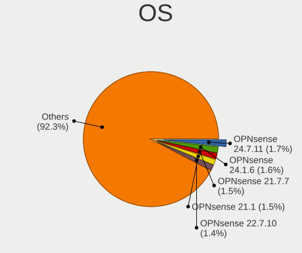

| Name             | Desktops | Percent |
|------------------|----------|---------|
| OPNsense 24.7.11 | 50       | 1.74%   |
| OPNsense 24.1.6  | 46       | 1.6%    |
| OPNsense 21.7.7  | 43       | 1.49%   |
| OPNsense 21.1    | 42       | 1.46%   |
| OPNsense 22.7.10 | 40       | 1.39%   |
| OPNsense 21.7.1  | 38       | 1.32%   |
| OPNsense 21.1.5  | 38       | 1.32%   |
| OPNsense 23.1.11 | 37       | 1.28%   |
| OPNsense 25.1    | 36       | 1.25%   |
| OPNsense 22.1    | 36       | 1.25%   |
| OPNsense 20.7.8  | 34       | 1.18%   |
| OPNsense 25.1.7  | 33       | 1.15%   |
| OPNsense 21.7.3  | 33       | 1.15%   |
| OPNsense 25.1.5  | 32       | 1.11%   |
| OPNsense 21.1.3  | 32       | 1.11%   |
| OPNsense 25.1.6  | 31       | 1.08%   |
| OPNsense 23.7.12 | 31       | 1.08%   |
| OPNsense 22.7.9  | 31       | 1.08%   |
| OPNsense 21.1.4  | 31       | 1.08%   |
| OPNsense 24.7.12 | 30       | 1.04%   |
| OPNsense 24.7    | 30       | 1.04%   |
| OPNsense 23.1.5  | 30       | 1.04%   |
| OPNsense 22.1.8  | 30       | 1.04%   |
| OPNsense 21.7.6  | 30       | 1.04%   |
| OPNsense 22.7.6  | 29       | 1.01%   |
| OPNsense 22.7.4  | 29       | 1.01%   |
| OPNsense 21.1.2  | 29       | 1.01%   |
| OPNsense 21.1.1  | 29       | 1.01%   |
| OPNsense 23.7.10 | 28       | 0.97%   |
| OPNsense 23.1.1  | 28       | 0.97%   |
| OPNsense 24.7.6  | 27       | 0.94%   |
| OPNsense 24.7.3  | 27       | 0.94%   |
| OPNsense 24.1.10 | 27       | 0.94%   |
| OPNsense 23.7.9  | 27       | 0.94%   |
| OPNsense 25.1.3  | 26       | 0.9%    |
| OPNsense 23.1    | 26       | 0.9%    |
| OPNsense 24.1.4  | 25       | 0.87%   |
| OPNsense 23.7.7  | 24       | 0.83%   |
| OPNsense 23.1.7  | 24       | 0.83%   |
| OPNsense 22.1.6  | 24       | 0.83%   |

OS Family
---------

OS without a version

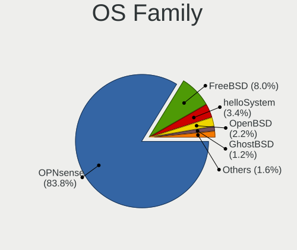

| Name        | Desktops | Percent |
|-------------|----------|---------|
| OPNsense    | 1673     | 83.78%  |
| FreeBSD     | 159      | 7.96%   |
| helloSystem | 67       | 3.36%   |
| OpenBSD     | 44       | 2.2%    |
| GhostBSD    | 23       | 1.15%   |
| NomadBSD    | 8        | 0.4%    |
| NetBSD      | 8        | 0.4%    |
| TrueNAS     | 5        | 0.25%   |
| pfSense     | 3        | 0.15%   |
| MyBee       | 2        | 0.1%    |
| PC-BSD      | 1        | 0.05%   |
| HardenedBSD | 1        | 0.05%   |
| FreeNAS     | 1        | 0.05%   |
| DragonFly   | 1        | 0.05%   |
| ClonOS      | 1        | 0.05%   |

Arch
----

OS architecture (x86_64, i586, etc.)

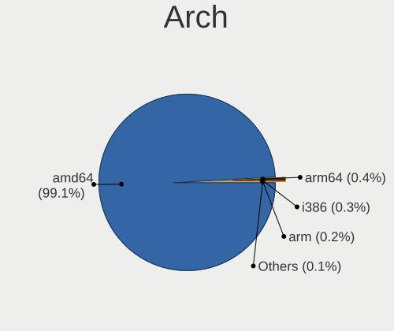

| Name    | Desktops | Percent |
|---------|----------|---------|
| amd64   | 1968     | 99.09%  |
| arm64   | 7        | 0.35%   |
| i386    | 5        | 0.25%   |
| arm     | 4        | 0.2%    |
| sparc64 | 1        | 0.05%   |
| macppc  | 1        | 0.05%   |

DE
--

Desktop Environment

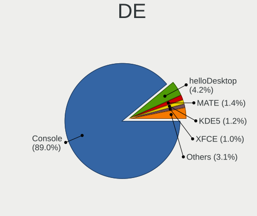

| Name          | Desktops | Percent |
|---------------|----------|---------|
| Console       | 1785     | 89.03%  |
| helloDesktop  | 85       | 4.24%   |
| MATE          | 28       | 1.4%    |
| KDE5          | 24       | 1.2%    |
| XFCE          | 20       | 1%      |
| GNOME         | 12       | 0.6%    |
| fvwm          | 12       | 0.6%    |
| TWM           | 11       | 0.55%   |
| AwesomeWM     | 7        | 0.35%   |
| Openbox       | 5        | 0.25%   |
| i3            | 4        | 0.2%    |
| spectrwm      | 1        | 0.05%   |
| LXQt          | 1        | 0.05%   |
| LXDE          | 1        | 0.05%   |
| KDE           | 1        | 0.05%   |
| ICEWM         | 1        | 0.05%   |
| GNUstep       | 1        | 0.05%   |
| Fluxbox       | 1        | 0.05%   |
| filer         | 1        | 0.05%   |
| Enlightenment | 1        | 0.05%   |
| Compton       | 1        | 0.05%   |
| Cinnamon      | 1        | 0.05%   |
| CDE           | 1        | 0.05%   |

Display Server
--------------

X11 or Wayland

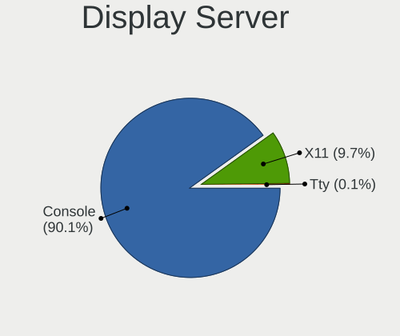

| Name    | Desktops | Percent |
|---------|----------|---------|
| Console | 1793     | 90.1%   |
| X11     | 193      | 9.7%    |
| Wayland | 3        | 0.15%   |
| Tty     | 1        | 0.05%   |

Display Manager
---------------

SDDM, LightDM, etc.

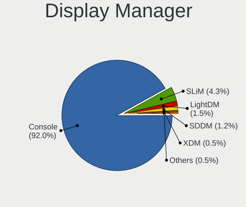

| Name    | Desktops | Percent |
|---------|----------|---------|
| Console | 1839     | 91.95%  |
| SLiM    | 86       | 4.3%    |
| LightDM | 29       | 1.45%   |
| SDDM    | 25       | 1.25%   |
| XDM     | 11       | 0.55%   |
| GDM     | 6        | 0.3%    |
| Ly      | 4        | 0.2%    |

OS Lang
-------

Language

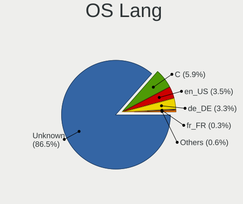

| Lang            | Desktops | Percent |
|-----------------|----------|---------|
| Unknown         | 1744     | 86.47%  |
| C               | 118      | 5.85%   |
| en_US           | 71       | 3.52%   |
| de_DE           | 66       | 3.27%   |
| fr_FR           | 6        | 0.3%    |
| en              | 3        | 0.15%   |
| en_GB           | 2        | 0.1%    |
| ru_RU           | 1        | 0.05%   |
| ISO8859-15      | 1        | 0.05%   |
| fr              | 1        | 0.05%   |
| en_DE           | 1        | 0.05%   |
| de_DE.ISO8859-1 | 1        | 0.05%   |
| de.DE           | 1        | 0.05%   |
| de              | 1        | 0.05%   |

Boot Mode
---------

EFI or BIOS

| Mode | Desktops | Percent |
|------|----------|---------|
| EFI  | 1786     | 89.48%  |
| BIOS | 210      | 10.52%  |

Filesystem
----------

Type of filesystem

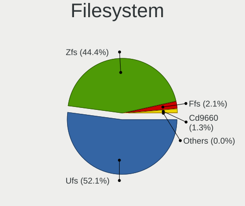

| Type    | Desktops | Percent |
|---------|----------|---------|
| Ufs     | 1069     | 52.12%  |
| Zfs     | 910      | 44.37%  |
| Ffs     | 44       | 2.15%   |
| Cd9660  | 26       | 1.27%   |
| Msdosfs | 1        | 0.05%   |
| Hammer2 | 1        | 0.05%   |

Part. scheme
------------

Scheme of partitioning

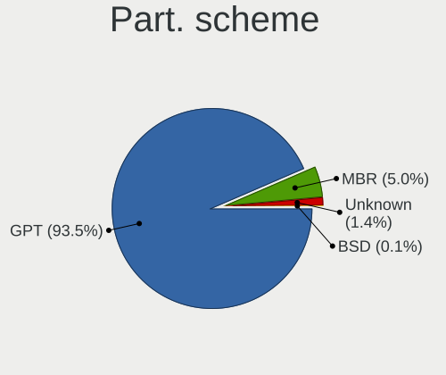

| Type    | Desktops | Percent |
|---------|----------|---------|
| GPT     | 1864     | 93.53%  |
| MBR     | 100      | 5.02%   |
| Unknown | 27       | 1.35%   |
| BSD     | 2        | 0.1%    |

Board
-----

Vendor
------

Motherboard manufacturer

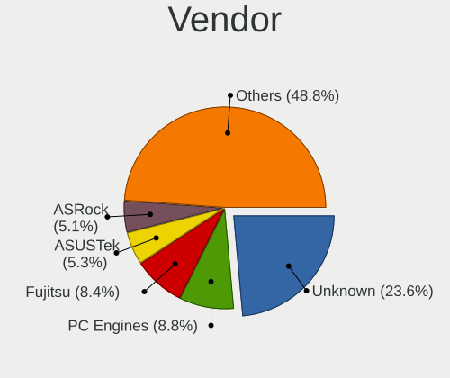

| Name                                 | Desktops | Percent |
|--------------------------------------|----------|---------|
| Unknown                              | 468      | 23.56%  |
| PC Engines                           | 175      | 8.81%   |
| Fujitsu                              | 167      | 8.41%   |
| ASUSTek Computer                     | 105      | 5.29%   |
| ASRock                               | 101      | 5.09%   |
| Hewlett-Packard                      | 87       | 4.38%   |
| Gigabyte Technology                  | 85       | 4.28%   |
| Intel                                | 81       | 4.08%   |
| Protectli                            | 70       | 3.52%   |
| MSI                                  | 61       | 3.07%   |
| Dell                                 | 61       | 3.07%   |
| Supermicro                           | 46       | 2.32%   |
| Techvision                           | 32       | 1.61%   |
| CncTion                              | 31       | 1.56%   |
| Lenovo                               | 26       | 1.31%   |
| Deciso                               | 25       | 1.26%   |
| Shuttle                              | 22       | 1.11%   |
| BESSTAR Tech                         | 20       | 1.01%   |
| SJRC                                 | 19       | 0.96%   |
| MW                                   | 18       | 0.91%   |
| HARDKERNEL                           | 15       | 0.76%   |
| Thomas-Krenn.AG                      | 14       | 0.7%    |
| Shenzhen Meigao Electronic Equipment | 14       | 0.7%    |
| Yanling                              | 13       | 0.65%   |
| AAEON                                | 13       | 0.65%   |
| CWWK                                 | 11       | 0.55%   |
| IceWhale Technology                  | 10       | 0.5%    |
| ASRockRack                           | 10       | 0.5%    |
| Advantech                            | 10       | 0.5%    |
| NF541                                | 9        | 0.45%   |
| CheckPoint                           | 8        | 0.4%    |
| Biostar                              | 8        | 0.4%    |
| Lex                                  | 7        | 0.35%   |
| Lanner                               | 7        | 0.35%   |
| ZOTAC                                | 6        | 0.3%    |
| ShenZhen MinWin Technology           | 6        | 0.3%    |
| NU591                                | 6        | 0.3%    |
| Foxconn                              | 6        | 0.3%    |
| Acer                                 | 6        | 0.3%    |
| Cisco                                | 5        | 0.25%   |

Model
-----

Motherboard model

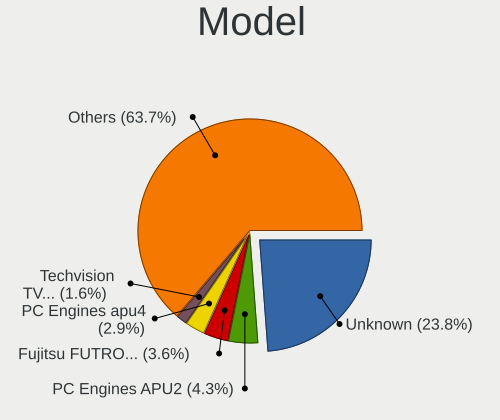

| Name                                              | Desktops | Percent |
|---------------------------------------------------|----------|---------|
| Unknown                                           | 473      | 23.82%  |
| PC Engines APU2                                   | 86       | 4.33%   |
| Fujitsu FUTRO S920                                | 71       | 3.58%   |
| PC Engines apu4                                   | 58       | 2.92%   |
| Techvision TVI7309X                               | 32       | 1.61%   |
| Intel Q3XXG4-P V1.0                               | 20       | 1.01%   |
| MW GMLK-2_5G4L                                    | 18       | 0.91%   |
| Protectli FW6                                     | 17       | 0.86%   |
| Protectli FW4B                                    | 15       | 0.76%   |
| Fujitsu FUTRO S930                                | 15       | 0.76%   |
| Protectli VP2420                                  | 14       | 0.7%    |
| Shenzhen Meigao Electronic Equipment Venus Series | 13       | 0.65%   |
| PC Engines APU                                    | 13       | 0.65%   |
| HARDKERNEL ODROID-H2                              | 13       | 0.65%   |
| CncTion N5105-4L                                  | 13       | 0.65%   |
| SJRC ADLN-6L                                      | 12       | 0.6%    |
| Deciso Netboard A10 V2                            | 12       | 0.6%    |
| PC Engines APU3                                   | 11       | 0.55%   |
| HP ProLiant MicroServer Gen8                      | 11       | 0.55%   |
| ASUS All Series                                   | 10       | 0.5%    |
| HP t620 PLUS Quad Core TC                         | 9        | 0.45%   |
| BESSTAR Tech X35G                                 | 9        | 0.45%   |
| NF541 1.0                                         | 8        | 0.4%    |
| MSI MS-7B89                                       | 8        | 0.4%    |
| IceWhale ZimaBoard 832 ZMB                        | 8        | 0.4%    |
| AAEON FWS-2251                                    | 8        | 0.4%    |
| Yanling LES network 6L                            | 7        | 0.35%   |
| SJRC SJ-ADLN-6L                                   | 7        | 0.35%   |
| Protectli VP2410                                  | 7        | 0.35%   |
| Lex Pineview-D                                    | 7        | 0.35%   |
| Fujitsu FUTRO S940                                | 7        | 0.35%   |
| PC Engines apu1                                   | 6        | 0.3%    |
| Lanner GP-7543                                    | 6        | 0.3%    |
| Intel Jasper Lake Client Platform                 | 6        | 0.3%    |
| Intel BKHD-1264-SFP                               | 6        | 0.3%    |
| Fujitsu FUTRO S720                                | 6        | 0.3%    |
| Dell OptiPlex 7010                                | 6        | 0.3%    |
| Deciso Netboard A10                               | 6        | 0.3%    |
| CncTion J4125-4L-I225                             | 6        | 0.3%    |
| Thomas-Krenn.AG LES network+                      | 5        | 0.25%   |

Model Family
------------

Motherboard model prefix

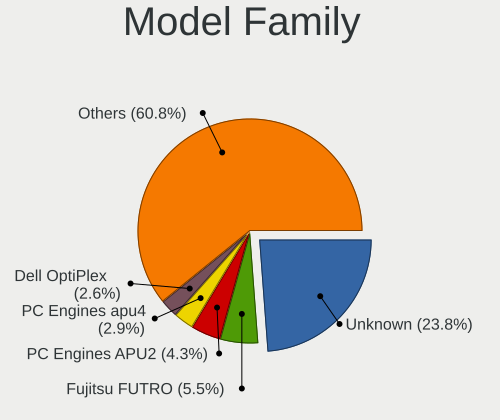

| Name                                       | Desktops | Percent |
|--------------------------------------------|----------|---------|
| Unknown                                    | 473      | 23.82%  |
| Fujitsu FUTRO                              | 109      | 5.49%   |
| PC Engines APU2                            | 86       | 4.33%   |
| PC Engines apu4                            | 58       | 2.92%   |
| Dell OptiPlex                              | 52       | 2.62%   |
| Techvision TVI7309X                        | 32       | 1.61%   |
| Fujitsu ESPRIMO                            | 32       | 1.61%   |
| Deciso Netboard                            | 25       | 1.26%   |
| Intel Q3XXG4-P                             | 20       | 1.01%   |
| Lenovo ThinkCentre                         | 19       | 0.96%   |
| MW GMLK-2                                  | 18       | 0.91%   |
| HP ProDesk                                 | 18       | 0.91%   |
| Protectli FW6                              | 17       | 0.86%   |
| HP ProLiant                                | 16       | 0.81%   |
| ASUS PRIME                                 | 16       | 0.81%   |
| Protectli FW4B                             | 15       | 0.76%   |
| Protectli VP2420                           | 14       | 0.7%    |
| HP t620                                    | 14       | 0.7%    |
| HP Compaq                                  | 14       | 0.7%    |
| Shenzhen Meigao Electronic Equipment Venus | 13       | 0.65%   |
| PC Engines APU                             | 13       | 0.65%   |
| HP EliteDesk                               | 13       | 0.65%   |
| HARDKERNEL ODROID-H2                       | 13       | 0.65%   |
| CncTion N5105-4L                           | 13       | 0.65%   |
| ASUS TUF                                   | 13       | 0.65%   |
| Thomas-Krenn.AG LES                        | 12       | 0.6%    |
| SJRC ADLN-6L                               | 12       | 0.6%    |
| PC Engines APU3                            | 11       | 0.55%   |
| IceWhale ZimaBoard                         | 10       | 0.5%    |
| ASUS All                                   | 10       | 0.5%    |
| Yanling LES                                | 9        | 0.45%   |
| BESSTAR Tech X35G                          | 9        | 0.45%   |
| NF541 1.0                                  | 8        | 0.4%    |
| MSI MS-7B89                                | 8        | 0.4%    |
| AAEON FWS-2251                             | 8        | 0.4%    |
| SJRC SJ-ADLN-6L                            | 7        | 0.35%   |
| Protectli VP2410                           | 7        | 0.35%   |
| Lex Pineview-D                             | 7        | 0.35%   |
| ASUS ROG                                   | 7        | 0.35%   |
| PC Engines apu1                            | 6        | 0.3%    |

MFG Year
--------

Motherboard manufacture year

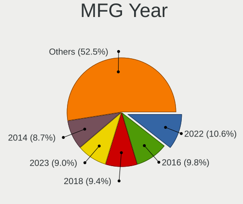

| Year    | Desktops | Percent |
|---------|----------|---------|
| 2022    | 210      | 10.57%  |
| 2016    | 194      | 9.77%   |
| 2018    | 187      | 9.42%   |
| 2023    | 179      | 9.01%   |
| 2014    | 173      | 8.71%   |
| 2021    | 160      | 8.06%   |
| 2020    | 144      | 7.25%   |
| 2024    | 128      | 6.45%   |
| 2019    | 122      | 6.14%   |
| 2017    | 105      | 5.29%   |
| 2013    | 79       | 3.98%   |
| 2012    | 72       | 3.63%   |
| 2011    | 61       | 3.07%   |
| 2015    | 45       | 2.27%   |
| 2010    | 38       | 1.91%   |
| 2009    | 25       | 1.26%   |
| 2025    | 22       | 1.11%   |
| Unknown | 15       | 0.76%   |
| 2008    | 14       | 0.7%    |
| 2007    | 9        | 0.45%   |
| 2006    | 3        | 0.15%   |
| 2003    | 1        | 0.05%   |

Form Factor
-----------

Physical design of the computer

| Name    | Desktops | Percent |
|---------|----------|---------|
| Desktop | 1986     | 100%    |

Coreboot
--------

Have coreboot on board

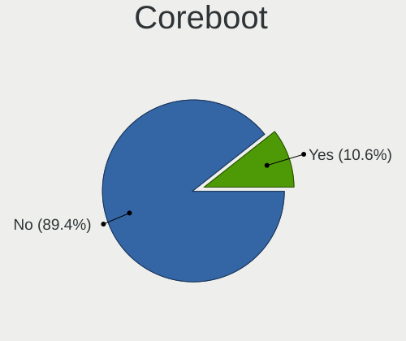

| Used | Desktops | Percent |
|------|----------|---------|
| No   | 1775     | 89.38%  |
| Yes  | 211      | 10.62%  |

RAM Size
--------

Total RAM memory

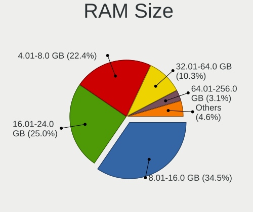

| Size in GB      | Desktops | Percent |
|-----------------|----------|---------|
| 8.01-16.0       | 702      | 34.55%  |
| 16.01-24.0      | 508      | 25%     |
| 4.01-8.0        | 456      | 22.44%  |
| 32.01-64.0      | 210      | 10.33%  |
| 64.01-256.0     | 63       | 3.1%    |
| 2.01-3.0        | 55       | 2.71%   |
| 24.01-32.0      | 13       | 0.64%   |
| 3.01-4.0        | 7        | 0.34%   |
| 1.01-2.0        | 6        | 0.3%    |
| 0.01-0.5        | 6        | 0.3%    |
| 0.51-1.0        | 4        | 0.2%    |
| More than 256.0 | 2        | 0.1%    |

RAM Used
--------

Used RAM memory

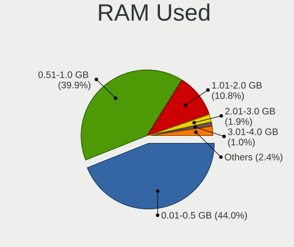

| Used GB     | Desktops | Percent |
|-------------|----------|---------|
| 0.01-0.5    | 903      | 43.96%  |
| 0.51-1.0    | 820      | 39.92%  |
| 1.01-2.0    | 222      | 10.81%  |
| 2.01-3.0    | 40       | 1.95%   |
| 3.01-4.0    | 20       | 0.97%   |
| 4.01-8.0    | 19       | 0.93%   |
| 0           | 9        | 0.44%   |
| Unknown     | 8        | 0.39%   |
| 16.01-24.0  | 4        | 0.19%   |
| 8.01-16.0   | 3        | 0.15%   |
| 32.01-64.0  | 2        | 0.1%    |
| 24.01-32.0  | 2        | 0.1%    |
| 64.01-256.0 | 2        | 0.1%    |

Total Drives
------------

Number of drives on board

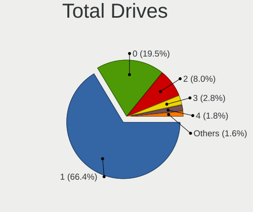

| Drives | Desktops | Percent |
|--------|----------|---------|
| 1      | 1375     | 66.39%  |
| 0      | 403      | 19.46%  |
| 2      | 166      | 8.02%   |
| 3      | 57       | 2.75%   |
| 4      | 37       | 1.79%   |
| 5      | 15       | 0.72%   |
| 6      | 9        | 0.43%   |
| 7      | 6        | 0.29%   |
| 8      | 2        | 0.1%    |
| 9      | 1        | 0.05%   |

Has CD-ROM
----------

Has CD-ROM on board

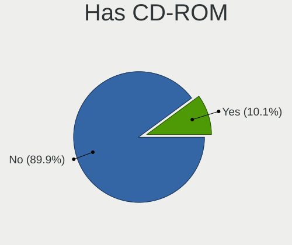

| Presented | Desktops | Percent |
|-----------|----------|---------|
| No        | 1798     | 89.9%   |
| Yes       | 202      | 10.1%   |

Has Ethernet
------------

Has Ethernet on board

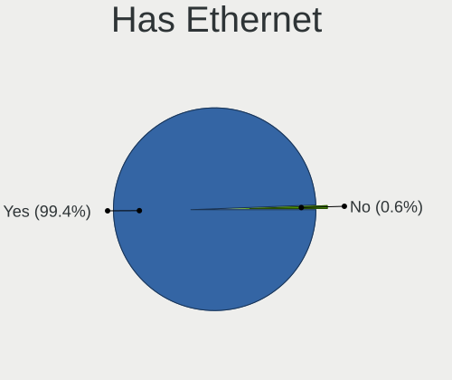

| Presented | Desktops | Percent |
|-----------|----------|---------|
| Yes       | 1974     | 99.4%   |
| No        | 12       | 0.6%    |

Has WiFi
--------

Has WiFi module

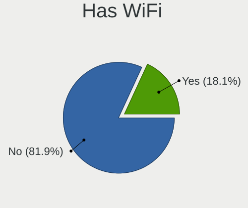

| Presented | Desktops | Percent |
|-----------|----------|---------|
| No        | 1649     | 81.88%  |
| Yes       | 365      | 18.12%  |

Has Bluetooth
-------------

Has Bluetooth module

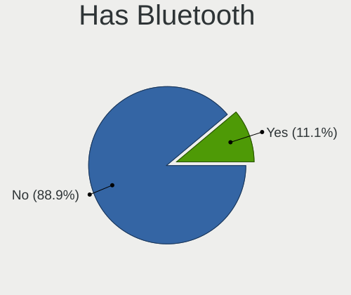

| Presented | Desktops | Percent |
|-----------|----------|---------|
| No        | 1779     | 88.91%  |
| Yes       | 222      | 11.09%  |

Location
--------

Country
-------

Geographic location (country)

| Country | Desktops | Percent |
|---------|----------|---------|
| Germany | 1986     | 100%    |

City
----

Geographic location (city)

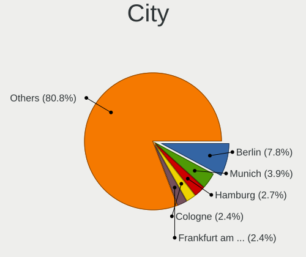

| City              | Desktops | Percent |
|-------------------|----------|---------|
| Berlin            | 182      | 7.83%   |
| Munich            | 90       | 3.87%   |
| Hamburg           | 63       | 2.71%   |
| Cologne           | 56       | 2.41%   |
| Frankfurt am Main | 55       | 2.37%   |
| Stuttgart         | 32       | 1.38%   |
| Dortmund          | 28       | 1.2%    |
| Hanover           | 27       | 1.16%   |
| Mannheim          | 24       | 1.03%   |
| Ludwigsburg       | 23       | 0.99%   |
| Nuremberg         | 22       | 0.95%   |
| Karlsruhe         | 20       | 0.86%   |
| Bonn              | 20       | 0.86%   |
| Leipzig           | 18       | 0.77%   |
| Düsseldorf       | 18       | 0.77%   |
| Dresden           | 18       | 0.77%   |
| Darmstadt         | 18       | 0.77%   |
| Bremen            | 15       | 0.65%   |
| Bochum            | 15       | 0.65%   |
| Chemnitz          | 14       | 0.6%    |
| Wiesbaden         | 13       | 0.56%   |
| Nottuln           | 13       | 0.56%   |
| Falkenstein       | 13       | 0.56%   |
| Wuppertal         | 12       | 0.52%   |
| Duisburg          | 12       | 0.52%   |
| Braunschweig      | 12       | 0.52%   |
| Solden            | 11       | 0.47%   |
| Reutlingen        | 11       | 0.47%   |
| Heidelberg        | 11       | 0.47%   |
| Essen             | 11       | 0.47%   |
| Mainz             | 10       | 0.43%   |
| Bielefeld         | 10       | 0.43%   |
| Ulm               | 9        | 0.39%   |
| Kiel              | 9        | 0.39%   |
| Jena              | 9        | 0.39%   |
| Augsburg          | 9        | 0.39%   |
| Münster          | 8        | 0.34%   |
| Magdeburg         | 8        | 0.34%   |
| Kassel            | 8        | 0.34%   |
| Huenfelden        | 8        | 0.34%   |

Drives
------

Drive Vendor
------------

Hard drive vendors

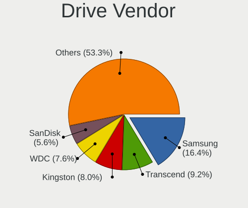

| Vendor              | Desktops | Drives | Percent |
|---------------------|----------|--------|---------|
| Samsung Electronics | 320      | 569    | 16.38%  |
| Transcend           | 180      | 268    | 9.21%   |
| Kingston            | 156      | 277    | 7.98%   |
| WDC                 | 148      | 265    | 7.57%   |
| SanDisk             | 109      | 166    | 5.58%   |
| Crucial             | 108      | 172    | 5.53%   |
| China               | 98       | 128    | 5.02%   |
| Seagate             | 87       | 144    | 4.45%   |
| Intel               | 79       | 130    | 4.04%   |
| Toshiba             | 57       | 102    | 2.92%   |
| Intenso             | 48       | 81     | 2.46%   |
| Innodisk            | 42       | 52     | 2.15%   |
| Phison              | 40       | 60     | 2.05%   |
| Hoodisk             | 36       | 70     | 1.84%   |
| Micron Technology   | 31       | 50     | 1.59%   |
| Hitachi             | 28       | 61     | 1.43%   |
| Protectli           | 26       | 35     | 1.33%   |
| HGST                | 22       | 40     | 1.13%   |
| A-DATA Technology   | 19       | 25     | 0.97%   |
| Patriot             | 18       | 29     | 0.92%   |
| FORESEE             | 18       | 26     | 0.92%   |
| ATP                 | 15       | 19     | 0.77%   |
| OCZ                 | 13       | 19     | 0.67%   |
| NVMe                | 12       | 20     | 0.61%   |
| ShiJi               | 10       | 12     | 0.51%   |
| Apacer              | 10       | 23     | 0.51%   |
| Verbatim            | 9        | 11     | 0.46%   |
| SK hynix            | 9        | 11     | 0.46%   |
| SPCC                | 8        | 12     | 0.41%   |
| LITEONIT            | 8        | 11     | 0.41%   |
| KIOXIA              | 7        | 8      | 0.36%   |
| KingSpec            | 7        | 9      | 0.36%   |
| Gigabyte Technology | 7        | 8      | 0.36%   |
| Corsair             | 7        | 12     | 0.36%   |
| BORY                | 7        | 11     | 0.36%   |
| TCSUNBOW            | 6        | 7      | 0.31%   |
| PNY                 | 6        | 7      | 0.31%   |
| Lexar               | 6        | 6      | 0.31%   |
| Kimtigo             | 6        | 8      | 0.31%   |
| Hewlett-Packard     | 6        | 7      | 0.31%   |

Drive Model
-----------

Hard drive models

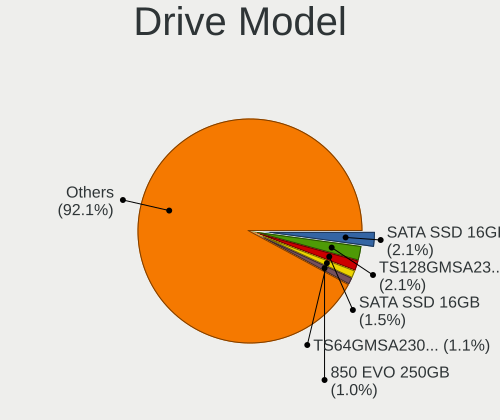

| Model                           | Desktops | Percent |
|---------------------------------|----------|---------|
| China SATA SSD 16GB             | 44       | 2.14%   |
| Transcend TS128GMSA230S 128GB   | 43       | 2.09%   |
| Phison SATA SSD 16GB            | 31       | 1.51%   |
| Transcend TS64GMSA230S 64GB     | 23       | 1.12%   |
| Samsung SSD 850 EVO 250GB       | 21       | 1.02%   |
| Kingston SKC600MS256G 256GB     | 19       | 0.92%   |
| Crucial CT240BX500SSD1 240GB    | 18       | 0.88%   |
| Samsung SSD 860 EVO 500GB       | 17       | 0.83%   |
| Samsung SSD 870 EVO 250GB       | 16       | 0.78%   |
| Transcend TS256GMSA230S 256GB   | 15       | 0.73%   |
| Hoodisk SSD 64GB                | 15       | 0.73%   |
| Transcend TS32GMSA370 32GB      | 13       | 0.63%   |
| Innodisk DEMSR- 08GB mSATA 3ME3 | 13       | 0.63%   |
| Samsung SSD 840 EVO 250GB       | 12       | 0.58%   |
| Kingston SV300S37A120G 120GB    | 12       | 0.58%   |
| Kingston SUV500MS120G 120GB     | 12       | 0.58%   |
| Kingston SA400S37120G 120GB     | 12       | 0.58%   |
| Crucial CT500MX500SSD1 500GB    | 12       | 0.58%   |
| Crucial CT1000MX500SSD1 1TB     | 11       | 0.54%   |
| China IM128-P130 128GB          | 10       | 0.49%   |
| Transcend TS32GSSD370S 32GB     | 9        | 0.44%   |
| Samsung SSD 860 EVO 250GB       | 9        | 0.44%   |
| Kingston SA400S37240G 240GB     | 9        | 0.44%   |
| Intenso SSD 128GB               | 9        | 0.44%   |
| Innodisk Corp. - mSATA 3ME3 8GB | 9        | 0.44%   |
| Crucial CT250MX500SSD1 250GB    | 9        | 0.44%   |
| Transcend TS64GMSA370 64GB      | 8        | 0.39%   |
| Transcend TS128GMSA370 128GB    | 8        | 0.39%   |
| SanDisk SSD PLUS 120GB          | 8        | 0.39%   |
| Samsung SSD 970 EVO Plus 500GB  | 8        | 0.39%   |
| Samsung SSD 860 EVO mSATA 250GB | 8        | 0.39%   |
| Samsung SSD 850 PRO 256GB       | 8        | 0.39%   |
| Samsung SSD 840 EVO 120GB       | 8        | 0.39%   |
| Patriot M.2 P300 128GB          | 8        | 0.39%   |
| Intenso SSD 120GB               | 8        | 0.39%   |
| Hoodisk SSD 256GB               | 8        | 0.39%   |
| China FPT310M4SSD256G 256GB     | 8        | 0.39%   |
| WDC WD40EFRX-68N32N0 4TB        | 7        | 0.34%   |
| SanDisk SSD PLUS 240GB          | 7        | 0.34%   |
| SanDisk SDSSDP128G 128GB        | 7        | 0.34%   |

HDD Vendor
----------

Hard disk drive vendors

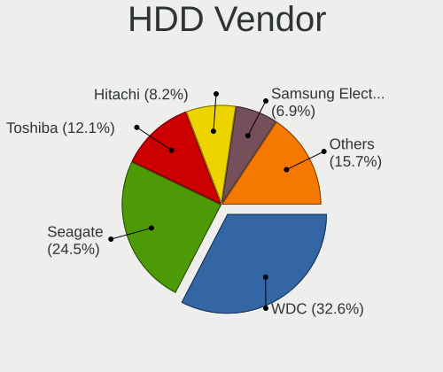

| Vendor              | Desktops | Drives | Percent |
|---------------------|----------|--------|---------|
| WDC                 | 108      | 199    | 32.63%  |
| Seagate             | 81       | 130    | 24.47%  |
| Toshiba             | 40       | 80     | 12.08%  |
| Hitachi             | 27       | 53     | 8.16%   |
| Samsung Electronics | 23       | 36     | 6.95%   |
| HGST                | 22       | 40     | 6.65%   |
| NVMe                | 8        | 9      | 2.42%   |
| OPENBSD             | 3        | 8      | 0.91%   |
| Fujitsu             | 3        | 3      | 0.91%   |
| Maxtor              | 2        | 2      | 0.6%    |
| JetFlash            | 2        | 2      | 0.6%    |
| Hewlett-Packard     | 2        | 2      | 0.6%    |
| WD MediaMax         | 1        | 5      | 0.3%    |
| Product:            | 1        | 1      | 0.3%    |
| LSI                 | 1        | 1      | 0.3%    |
| Intenso             | 1        | 1      | 0.3%    |
| IBM/Hitachi         | 1        | 1      | 0.3%    |
| IBM                 | 1        | 1      | 0.3%    |
| Generic             | 1        | 1      | 0.3%    |
| General             | 1        | 1      | 0.3%    |
| ASMT                | 1        | 1      | 0.3%    |
| Apple               | 1        | 1      | 0.3%    |

SSD Vendor
----------

Solid state drive vendors

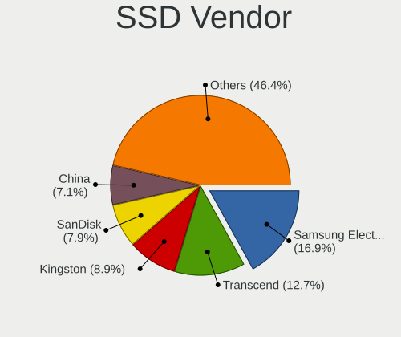

| Vendor              | Desktops | Drives | Percent |
|---------------------|----------|--------|---------|
| Samsung Electronics | 234      | 413    | 16.94%  |
| Transcend           | 176      | 263    | 12.74%  |
| Kingston            | 123      | 219    | 8.91%   |
| SanDisk             | 109      | 166    | 7.89%   |
| China               | 98       | 128    | 7.1%    |
| Crucial             | 95       | 147    | 6.88%   |
| Intel               | 66       | 114    | 4.78%   |
| Innodisk            | 42       | 52     | 3.04%   |
| Intenso             | 41       | 69     | 2.97%   |
| Hoodisk             | 36       | 70     | 2.61%   |
| Phison              | 35       | 50     | 2.53%   |
| Protectli           | 26       | 35     | 1.88%   |
| Micron Technology   | 26       | 40     | 1.88%   |
| WDC                 | 22       | 35     | 1.59%   |
| A-DATA Technology   | 19       | 25     | 1.38%   |
| ATP                 | 14       | 18     | 1.01%   |
| Toshiba             | 13       | 17     | 0.94%   |
| OCZ                 | 13       | 19     | 0.94%   |
| FORESEE             | 13       | 19     | 0.94%   |
| Apacer              | 10       | 23     | 0.72%   |
| Verbatim            | 9        | 11     | 0.65%   |
| ShiJi               | 8        | 10     | 0.58%   |
| LITEONIT            | 8        | 11     | 0.58%   |
| Patriot             | 7        | 12     | 0.51%   |
| KingSpec            | 7        | 9      | 0.51%   |
| BORY                | 7        | 11     | 0.51%   |
| TCSUNBOW            | 6        | 7      | 0.43%   |
| NVMe                | 6        | 11     | 0.43%   |
| Dogfish             | 6        | 7      | 0.43%   |
| SPCC                | 5        | 9      | 0.36%   |
| PNY                 | 5        | 6      | 0.36%   |
| LITEON              | 5        | 6      | 0.36%   |
| Leven               | 5        | 8      | 0.36%   |
| KeepData            | 5        | 8      | 0.36%   |
| Advantech           | 5        | 7      | 0.36%   |
| Vaseky              | 4        | 4      | 0.29%   |
| Team                | 4        | 4      | 0.29%   |
| Seagate             | 4        | 12     | 0.29%   |
| MEMXPRO             | 4        | 6      | 0.29%   |
| KingDian            | 4        | 11     | 0.29%   |

Drive Kind
----------

HDD or SSD

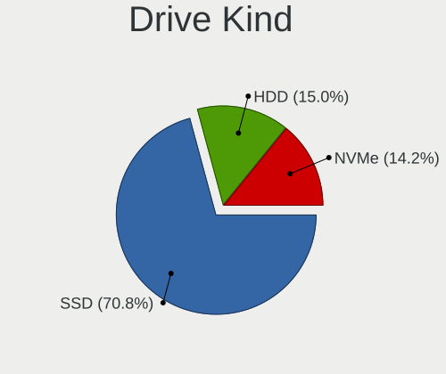

| Kind | Desktops | Drives | Percent |
|------|----------|--------|---------|
| SSD  | 1271     | 2180   | 70.81%  |
| HDD  | 270      | 578    | 15.04%  |
| NVMe | 254      | 403    | 14.15%  |

Drive Connector
---------------

SATA, SAS, NVMe, etc.

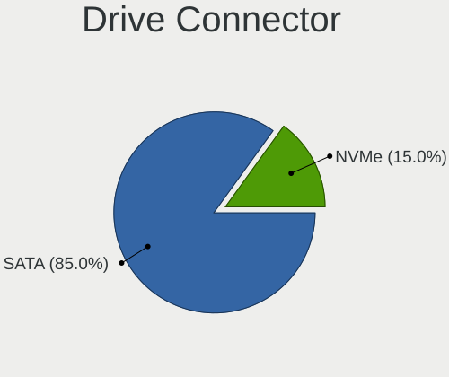

| Type | Desktops | Drives | Percent |
|------|----------|--------|---------|
| SATA | 1434     | 2758   | 84.95%  |
| NVMe | 254      | 403    | 15.05%  |

Drive Size
----------

Size of hard drive

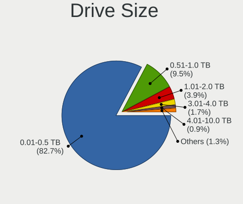

| Size in TB      | Desktops | Drives | Percent |
|-----------------|----------|--------|---------|
| 0.01-0.5        | 1309     | 2187   | 82.74%  |
| 0.51-1.0        | 150      | 247    | 9.48%   |
| 1.01-2.0        | 61       | 167    | 3.86%   |
| 3.01-4.0        | 27       | 69     | 1.71%   |
| 4.01-10.0       | 15       | 32     | 0.95%   |
| 2.01-3.0        | 13       | 34     | 0.82%   |
| 10.01-20.0      | 6        | 21     | 0.38%   |
| More than 100.0 | 1        | 1      | 0.06%   |

Space Total
-----------

Amount of disk space available on the file system

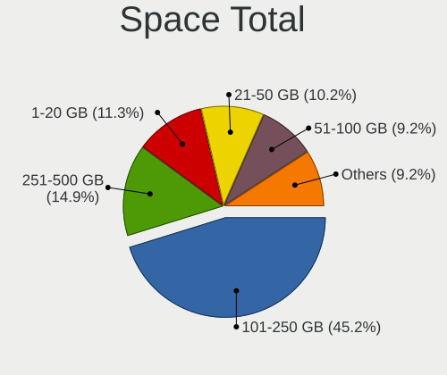

| Size in GB     | Desktops | Percent |
|----------------|----------|---------|
| 101-250        | 930      | 45.21%  |
| 251-500        | 306      | 14.88%  |
| 1-20           | 232      | 11.28%  |
| 21-50          | 210      | 10.21%  |
| 51-100         | 190      | 9.24%   |
| 501-1000       | 132      | 6.42%   |
| 1001-2000      | 30       | 1.46%   |
| More than 3000 | 15       | 0.73%   |
| 2001-3000      | 6        | 0.29%   |
| Unknown        | 6        | 0.29%   |

Space Used
----------

Amount of used disk space

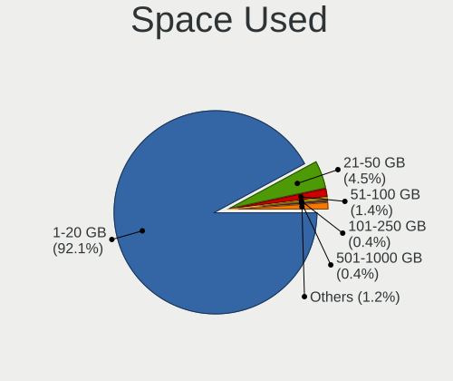

| Used GB        | Desktops | Percent |
|----------------|----------|---------|
| 1-20           | 1895     | 92.12%  |
| 21-50          | 93       | 4.52%   |
| 51-100         | 28       | 1.36%   |
| 101-250        | 9        | 0.44%   |
| 501-1000       | 8        | 0.39%   |
| 251-500        | 7        | 0.34%   |
| Unknown        | 6        | 0.29%   |
| 1001-2000      | 5        | 0.24%   |
| 2001-3000      | 4        | 0.19%   |
| More than 3000 | 2        | 0.1%    |

Malfunc. Drives
---------------

Drive models with a malfunction

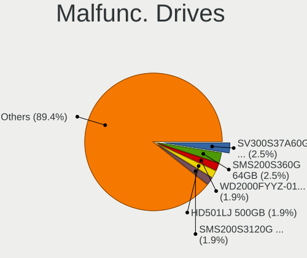

| Model                                        | Desktops | Drives | Percent |
|----------------------------------------------|----------|--------|---------|
| Kingston SV300S37A60G 64GB                   | 4        | 6      | 2.5%    |
| Kingston SMS200S360G 64GB                    | 4        | 5      | 2.5%    |
| WDC WD2000FYYZ-01UL1B2 2TB                   | 3        | 9      | 1.88%   |
| Samsung Electronics HD501LJ 500GB            | 3        | 5      | 1.88%   |
| Kingston SMS200S3120G 120GB                  | 3        | 11     | 1.88%   |
| WDC WDS240G2G0A-00JH30 240GB                 | 2        | 3      | 1.25%   |
| WDC WD30EFRX-68EUZN0 3TB                     | 2        | 7      | 1.25%   |
| WDC WD2000FYYZ-01UL1B1 2TB                   | 2        | 4      | 1.25%   |
| WDC WD1600AAJS-75M0A0 160GB                  | 2        | 2      | 1.25%   |
| Toshiba THNSNK128GCS8 SATA 128GB             | 2        | 2      | 1.25%   |
| Seagate ST3160318AS 160GB                    | 2        | 2      | 1.25%   |
| Seagate ST1000DX001-1CM162 1TB               | 2        | 2      | 1.25%   |
| SanDisk SSD 128G                             | 2        | 3      | 1.25%   |
| Samsung Electronics SSD 840 PRO Series 256GB | 2        | 4      | 1.25%   |
| Micron Technology 1100_MTFDDAK512TBN 512GB   | 2        | 4      | 1.25%   |
| Intenso SSD SATAIII 480GB                    | 2        | 2      | 1.25%   |
| Intel SSDSC2CT120A3 120GB                    | 2        | 2      | 1.25%   |
| HGST HTS541010A7E630 1TB                     | 2        | 4      | 1.25%   |
| Crucial CT275MX300SSD1 275GB                 | 2        | 2      | 1.25%   |
| Crucial CT128MX100SSD1 128GB                 | 2        | 4      | 1.25%   |
| WDC WD6400AAKS-65A7B2 640GB                  | 1        | 1      | 0.63%   |
| WDC WD60EFRX-68TGBN1 6TB                     | 1        | 3      | 0.63%   |
| WDC WD5003ABYX-01WERA0 500GB                 | 1        | 1      | 0.63%   |
| WDC WD5000LPVX-22V0TT0 500GB                 | 1        | 1      | 0.63%   |
| WDC WD30EZRX-00D8PB0 3TB                     | 1        | 1      | 0.63%   |
| WDC WD2503ABYX-01WERA0 256GB                 | 1        | 2      | 0.63%   |
| WDC WD20EARX-00PASB0 2TB                     | 1        | 1      | 0.63%   |
| WDC WD1600AAJS-08L7A0 160GB                  | 1        | 1      | 0.63%   |
| WDC WD1600AABS-00PRA0 160GB                  | 1        | 1      | 0.63%   |
| WDC WD10EZEX-60WN4A0 1TB                     | 1        | 1      | 0.63%   |
| WDC WD10EAVS-00D7B0 1TB                      | 1        | 1      | 0.63%   |
| WDC WD10EACS-00D6B1 1TB                      | 1        | 2      | 0.63%   |
| Transcend TS8GMSM610 8GB                     | 1        | 2      | 0.63%   |
| Transcend TS32GMSA370 32GB                   | 1        | 1      | 0.63%   |
| Transcend TS128GMSA230S 128GB                | 1        | 1      | 0.63%   |
| Toshiba MQ02ABD100H 1TB                      | 1        | 4      | 0.63%   |
| Toshiba MQ01ABD100M 1TB                      | 1        | 1      | 0.63%   |
| Toshiba MK3261GSYN 320GB                     | 1        | 1      | 0.63%   |
| Toshiba MK1676GSX H 160GB                    | 1        | 2      | 0.63%   |
| SPCC M.2 PCIe SSD 256GB                      | 1        | 1      | 0.63%   |

Malfunc. Drive Vendor
---------------------

Vendors of faulty drives

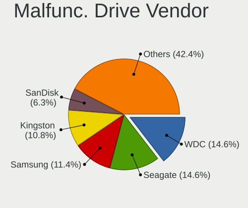

| Vendor              | Desktops | Drives | Percent |
|---------------------|----------|--------|---------|
| WDC                 | 23       | 41     | 14.56%  |
| Seagate             | 23       | 33     | 14.56%  |
| Samsung Electronics | 18       | 31     | 11.39%  |
| Kingston            | 17       | 32     | 10.76%  |
| SanDisk             | 10       | 12     | 6.33%   |
| Intel               | 10       | 11     | 6.33%   |
| Crucial             | 9        | 25     | 5.7%    |
| Toshiba             | 6        | 10     | 3.8%    |
| Hitachi             | 6        | 7      | 3.8%    |
| Micron Technology   | 5        | 8      | 3.16%   |
| HGST                | 5        | 7      | 3.16%   |
| China               | 4        | 5      | 2.53%   |
| Transcend           | 3        | 4      | 1.9%    |
| A-DATA Technology   | 3        | 4      | 1.9%    |
| OCZ                 | 2        | 2      | 1.27%   |
| Maxtor              | 2        | 2      | 1.27%   |
| Intenso             | 2        | 2      | 1.27%   |
| Apacer              | 2        | 2      | 1.27%   |
| SPCC                | 1        | 1      | 0.63%   |
| SMI                 | 1        | 1      | 0.63%   |
| Netac               | 1        | 3      | 0.63%   |
| Leven               | 1        | 1      | 0.63%   |
| KingSpec            | 1        | 1      | 0.63%   |
| KingDian            | 1        | 4      | 0.63%   |
| HP Phison           | 1        | 1      | 0.63%   |
| Corsair             | 1        | 3      | 0.63%   |

Malfunc. HDD Vendor
-------------------

Vendors of faulty HDD drives

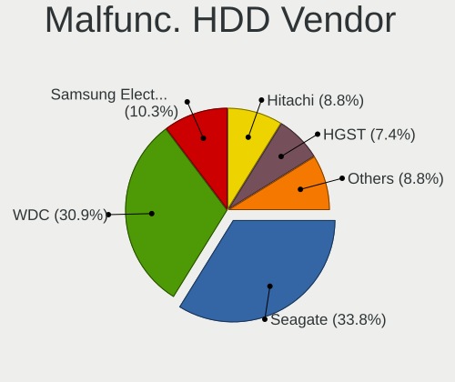

| Vendor              | Desktops | Drives | Percent |
|---------------------|----------|--------|---------|
| Seagate             | 23       | 33     | 33.82%  |
| WDC                 | 21       | 38     | 30.88%  |
| Samsung Electronics | 7        | 14     | 10.29%  |
| Hitachi             | 6        | 7      | 8.82%   |
| HGST                | 5        | 7      | 7.35%   |
| Toshiba             | 4        | 8      | 5.88%   |
| Maxtor              | 2        | 2      | 2.94%   |

Malfunc. Drive Kind
-------------------

Kinds of faulty drives

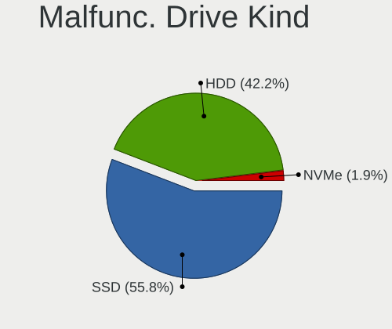

| Kind | Desktops | Drives | Percent |
|------|----------|--------|---------|
| SSD  | 86       | 141    | 55.84%  |
| HDD  | 65       | 109    | 42.21%  |
| NVMe | 3        | 3      | 1.95%   |

Failed Drives
-------------

Failed drive models

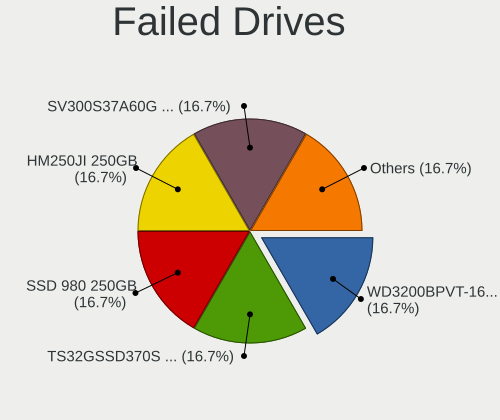

| Model                             | Desktops | Drives | Percent |
|-----------------------------------|----------|--------|---------|
| WDC WD3200BPVT-16JJ5T0 320GB      | 1        | 1      | 16.67%  |
| Transcend TS32GSSD370S 32GB       | 1        | 4      | 16.67%  |
| Samsung Electronics SSD 980 250GB | 1        | 2      | 16.67%  |
| Samsung Electronics HM250JI 250GB | 1        | 1      | 16.67%  |
| Kingston SV300S37A60G 64GB        | 1        | 1      | 16.67%  |
| Kingston SMS200S330G 32GB         | 1        | 1      | 16.67%  |

Failed Drive Vendor
-------------------

Failed drive vendors

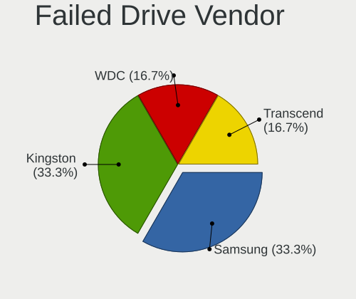

| Vendor              | Desktops | Drives | Percent |
|---------------------|----------|--------|---------|
| Samsung Electronics | 2        | 3      | 33.33%  |
| Kingston            | 2        | 2      | 33.33%  |
| WDC                 | 1        | 1      | 16.67%  |
| Transcend           | 1        | 4      | 16.67%  |

Drive Status
------------

Number of failed and malfunc. drives

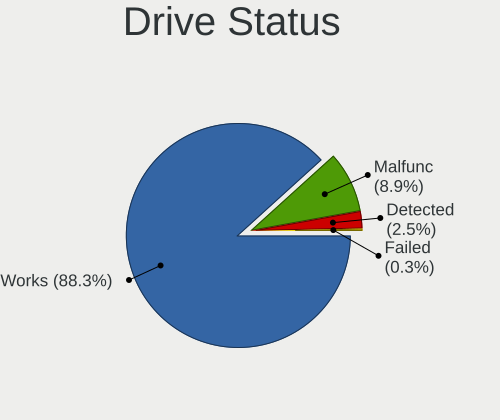

| Status   | Desktops | Drives | Percent |
|----------|----------|--------|---------|
| Works    | 1515     | 2827   | 88.29%  |
| Malfunc  | 152      | 253    | 8.86%   |
| Detected | 43       | 71     | 2.51%   |
| Failed   | 6        | 10     | 0.35%   |

Storage controller
------------------

Storage Vendor
--------------

Storage controller vendors

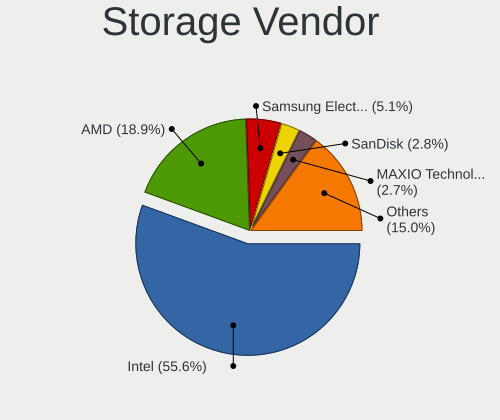

| Vendor                                  | Desktops | Percent |
|-----------------------------------------|----------|---------|
| Intel                                   | 1394     | 55.58%  |
| AMD                                     | 473      | 18.86%  |
| Samsung Electronics                     | 127      | 5.06%   |
| SanDisk                                 | 70       | 2.79%   |
| MAXIO Technology (Hangzhou)             | 68       | 2.71%   |
| Silicon Motion                          | 53       | 2.11%   |
| Kingston Technology Company             | 42       | 1.67%   |
| ASMedia Technology                      | 38       | 1.52%   |
| Phison Electronics                      | 28       | 1.12%   |
| Micron/Crucial Technology               | 24       | 0.96%   |
| Micron Technology                       | 24       | 0.96%   |
| Shenzhen Longsys Electronics            | 17       | 0.68%   |
| Transcend                               | 14       | 0.56%   |
| KIOXIA                                  | 13       | 0.52%   |
| Marvell Technology Group                | 11       | 0.44%   |
| Broadcom / LSI                          | 11       | 0.44%   |
| SK hynix                                | 10       | 0.4%    |
| Toshiba                                 | 9        | 0.36%   |
| Hosin Global Electronics                | 9        | 0.36%   |
| Nvidia                                  | 8        | 0.32%   |
| JMicron Technology                      | 8        | 0.32%   |
| VIA Technologies                        | 7        | 0.28%   |
| Realtek Semiconductor                   | 7        | 0.28%   |
| Chelsio Communications                  | 6        | 0.24%   |
| Yangtze Memory Technologies             | 4        | 0.16%   |
| Solid State Storage Technology          | 4        | 0.16%   |
| Silicon Image                           | 3        | 0.12%   |
| Shenzhen Unionmemory Information System | 3        | 0.12%   |
| Hewlett-Packard                         | 3        | 0.12%   |
| Adaptec                                 | 3        | 0.12%   |
| Unknown                                 | 3        | 0.12%   |
| Seagate Technology                      | 2        | 0.08%   |
| ATP ELECTRONICS                         | 2        | 0.08%   |
| ADATA Technology                        | 2        | 0.08%   |
| ULi Electronics                         | 1        | 0.04%   |
| Netac Technology                        | 1        | 0.04%   |
| Integrated Technology Express           | 1        | 0.04%   |
| INNOGRIT                                | 1        | 0.04%   |
| Enmotus                                 | 1        | 0.04%   |
| Artop Electronic                        | 1        | 0.04%   |

Storage Model
-------------

Storage controller models

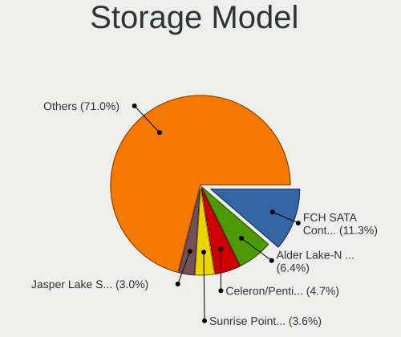

| Model                                                                            | Desktops | Percent |
|----------------------------------------------------------------------------------|----------|---------|
| AMD FCH SATA Controller [AHCI mode]                                              | 314      | 11.31%  |
| Intel Alder Lake-N SATA AHCI Controller                                          | 178      | 6.41%   |
| Intel Celeron/Pentium Silver Processor SATA Controller                           | 131      | 4.72%   |
| Intel Sunrise Point-LP SATA Controller [AHCI mode]                               | 100      | 3.6%    |
| Intel Jasper Lake SATA AHCI Controller                                           | 82       | 2.95%   |
| AMD FCH SATA Controller [IDE mode]                                               | 81       | 2.92%   |
| Intel 8 Series/C220 Series Chipset Family 6-port SATA Controller 1 [AHCI mode]   | 78       | 2.81%   |
| Intel Q170/Q150/B150/H170/H110/Z170/CM236 Chipset SATA Controller [AHCI Mode]    | 71       | 2.56%   |
| Intel Atom/Celeron/Pentium Processor x5-E8000/J3xxx/N3xxx Series SATA Controller | 71       | 2.56%   |
| MAXIO (Hangzhou) NVMe SSD Controller MAP1202 (DRAM-less)                         | 67       | 2.41%   |
| Intel Atom Processor E3800 Series SATA AHCI Controller                           | 66       | 2.38%   |
| Samsung NVMe SSD Controller SM981/PM981/PM983                                    | 58       | 2.09%   |
| Silicon Motion SM2263EN/SM2263XT (DRAM-less) NVMe SSD Controllers                | 52       | 1.87%   |
| AMD SB7x0/SB8x0/SB9x0 SATA Controller [AHCI mode]                                | 48       | 1.73%   |
| Intel Cannon Lake PCH SATA AHCI Controller                                       | 45       | 1.62%   |
| Intel 6 Series/C200 Series Chipset Family 6 port Desktop SATA AHCI Controller    | 45       | 1.62%   |
| Intel 200 Series PCH SATA controller [AHCI mode]                                 | 38       | 1.37%   |
| AMD 400 Series Chipset SATA Controller                                           | 36       | 1.3%    |
| Intel Comet Lake SATA AHCI Controller                                            | 35       | 1.26%   |
| Intel Celeron N3350/Pentium N4200/Atom E3900 Series SATA AHCI Controller         | 33       | 1.19%   |
| ASMedia ASM1061/ASM1062 Serial ATA Controller                                    | 33       | 1.19%   |
| Intel NM10/ICH7 Family SATA Controller [IDE mode]                                | 32       | 1.15%   |
| Intel Elkhart Lake SATA AHCI                                                     | 29       | 1.04%   |
| Intel 82801G (ICH7 Family) IDE Controller                                        | 29       | 1.04%   |
| Intel 7 Series/C210 Series Chipset Family 6-port SATA Controller [AHCI mode]     | 28       | 1.01%   |
| Samsung NVMe SSD Controller 980 (DRAM-less)                                      | 26       | 0.94%   |
| Intel Cannon Point-LP SATA Controller [AHCI Mode]                                | 24       | 0.86%   |
| Intel 5 Series/3400 Series Chipset 6 port SATA AHCI Controller                   | 24       | 0.86%   |
| Samsung NVMe SSD Controller PM9A1/PM9A3/980PRO                                   | 22       | 0.79%   |
| Intel SATA Controller [RAID mode]                                                | 22       | 0.79%   |
| Intel 82801HM/HEM (ICH8M/ICH8M-E) IDE Controller                                 | 21       | 0.76%   |
| SanDisk Extreme Pro / WD Black SN750 / PC SN730 / Red SN700 NVMe SSD             | 19       | 0.68%   |
| AMD SB7x0/SB8x0/SB9x0 IDE Controller                                             | 19       | 0.68%   |
| AMD 500 Series Chipset SATA Controller                                           | 19       | 0.68%   |
| Intel Tiger Lake-LP SATA Controller                                              | 18       | 0.65%   |
| Intel NM10/ICH7 Family SATA Controller [AHCI mode]                               | 18       | 0.65%   |
| Intel Atom Processor C3000 Series SATA Controller 1                              | 17       | 0.61%   |
| Intel Atom Processor C3000 Series SATA Controller 0                              | 16       | 0.58%   |
| Intel Alder Lake-P SATA AHCI Controller                                          | 16       | 0.58%   |
| Intel Wildcat Point-LP SATA Controller [AHCI Mode]                               | 15       | 0.54%   |

Storage Kind
------------

Kind of storage controller (IDE, SATA, NVMe, SAS, ...)

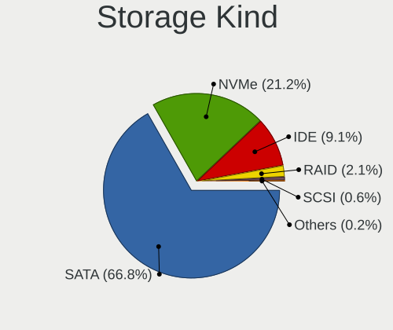

| Kind | Desktops | Percent |
|------|----------|---------|
| SATA | 1684     | 66.77%  |
| NVMe | 534      | 21.17%  |
| IDE  | 230      | 9.12%   |
| RAID | 52       | 2.06%   |
| SCSI | 16       | 0.63%   |
| SAS  | 6        | 0.24%   |

Processor
---------

CPU Vendor
----------

Processor vendors

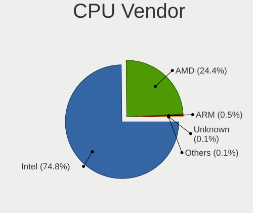

| Vendor  | Desktops | Percent |
|---------|----------|---------|
| Intel   | 1493     | 74.84%  |
| AMD     | 486      | 24.36%  |
| ARM     | 10       | 0.5%    |
| VIA     | 2        | 0.1%    |
| Unknown | 2        | 0.1%    |
| Sun     | 1        | 0.05%   |
| i       | 1        | 0.05%   |

CPU Model
---------

Processor models

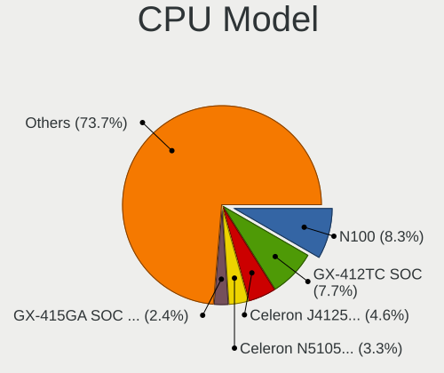

| Model                                     | Desktops | Percent |
|-------------------------------------------|----------|---------|
| Intel N100                                | 168      | 8.35%   |
| AMD GX-412TC SOC                          | 156      | 7.75%   |
| Intel Celeron J4125 CPU @ 2.00GHz         | 92       | 4.57%   |
| Intel Celeron N5105 @ 2.00GHz             | 66       | 3.28%   |
| AMD GX-415GA SOC with Radeon HD Graphics  | 48       | 2.38%   |
| Intel Celeron CPU J1900 @ 1.99GHz         | 44       | 2.19%   |
| Intel Celeron CPU J3160 @ 1.60GHz         | 36       | 1.79%   |
| AMD GX-222GC SOC with Radeon R5E Graphics | 29       | 1.44%   |
| Intel Celeron J6412 @ 2.00GHz             | 24       | 1.19%   |
| Intel N150                                | 23       | 1.14%   |
| Intel Core i3-N305                        | 23       | 1.14%   |
| AMD GX-424CC SOC with Radeon R5E Graphics | 19       | 0.94%   |
| AMD G-T40E Processor                      | 19       | 0.94%   |
| Intel Core i5-6500 CPU @ 3.20GHz          | 18       | 0.89%   |
| Intel Celeron CPU J3455 @ 1.50GHz         | 18       | 0.89%   |
| Intel Atom CPU D525 @ 1.80GHz             | 17       | 0.84%   |
| Intel Core i5-7200U CPU @ 2.50GHz         | 16       | 0.79%   |
| Intel Atom CPU C3558 @ 2.20GHz            | 16       | 0.79%   |
| Intel Core i7-7500U CPU @ 2.70GHz         | 15       | 0.75%   |
| Intel Core i5-8250U CPU @ 1.60GHz         | 15       | 0.75%   |
| Intel Celeron J4105 CPU @ 1.50GHz         | 15       | 0.75%   |
| Intel Core i5-3470 CPU @ 3.20GHz          | 14       | 0.7%    |
| Intel Core i5-10210U CPU @ 1.60GHz        | 13       | 0.65%   |
| Intel Core i3-6100 CPU @ 3.70GHz          | 13       | 0.65%   |
| AMD GX-420CA SOC with Radeon HD Graphics  | 13       | 0.65%   |
| AMD GX-416RA SOC                          | 13       | 0.65%   |
| Intel Celeron CPU N3160 @ 1.60GHz         | 12       | 0.6%    |
| Intel Celeron CPU N3150 @ 1.60GHz         | 11       | 0.55%   |
| Intel Pentium Silver J5005 CPU @ 1.50GHz  | 10       | 0.5%    |
| Intel N95                                 | 10       | 0.5%    |
| Intel Core i7-8550U CPU @ 1.80GHz         | 10       | 0.5%    |
| Intel Atom CPU E3845 @ 1.91GHz            | 10       | 0.5%    |
| Intel Core i7-7700 CPU @ 3.60GHz          | 9        | 0.45%   |
| Intel Core i3-1005G1 CPU @ 1.20GHz        | 9        | 0.45%   |
| Intel Celeron J4115 CPU @ 1.80GHz         | 9        | 0.45%   |
| Intel 11th Gen Core i7-1165G7 @ 2.80GHz   | 9        | 0.45%   |
| AMD GX-420MC SOC                          | 9        | 0.45%   |
| Intel Pentium Silver N6005 @ 2.00GHz      | 8        | 0.4%    |
| Intel Core i7-4770 CPU @ 3.40GHz          | 8        | 0.4%    |
| Intel Core i5-8365U CPU @ 1.60GHz         | 8        | 0.4%    |

CPU Model Family
----------------

Processor model prefix

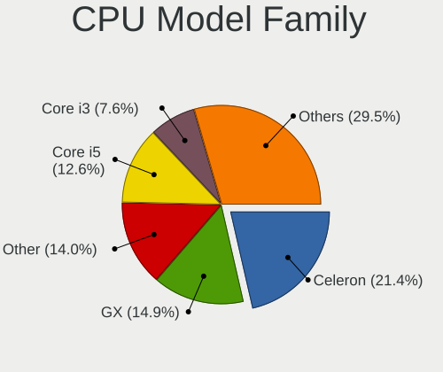

| Model                   | Desktops | Percent |
|-------------------------|----------|---------|
| Intel Celeron           | 430      | 21.41%  |
| AMD GX                  | 300      | 14.94%  |
| Other                   | 281      | 13.99%  |
| Intel Core i5           | 253      | 12.6%   |
| Intel Core i3           | 152      | 7.57%   |
| Intel Core i7           | 104      | 5.18%   |
| Intel Atom              | 92       | 4.58%   |
| Intel Xeon              | 89       | 4.43%   |
| AMD Ryzen 7             | 40       | 1.99%   |
| AMD Ryzen 5             | 36       | 1.79%   |
| Intel Pentium           | 32       | 1.59%   |
| Intel Pentium Silver    | 24       | 1.2%    |
| AMD G                   | 24       | 1.2%    |
| AMD FX                  | 16       | 0.8%    |
| Intel Pentium Gold      | 12       | 0.6%    |
| Intel Core 2 Duo        | 11       | 0.55%   |
| Intel Pentium Dual-Core | 10       | 0.5%    |
| Intel Core 2 Quad       | 10       | 0.5%    |
| AMD Ryzen 9             | 10       | 0.5%    |
| AMD Athlon              | 9        | 0.45%   |
| AMD Ryzen 5 PRO         | 7        | 0.35%   |
| ARM Cortex              | 6        | 0.3%    |
| AMD Ryzen 3             | 6        | 0.3%    |
| AMD Ryzen 7 PRO         | 5        | 0.25%   |
| AMD Athlon 64 X2        | 5        | 0.25%   |
| AMD E                   | 4        | 0.2%    |
| Intel Core i9           | 3        | 0.15%   |
| Intel Core              | 3        | 0.15%   |
| AMD Turion II Neo       | 3        | 0.15%   |
| AMD Ryzen Threadripper  | 3        | 0.15%   |
| AMD Ryzen Embedded      | 3        | 0.15%   |
| AMD Athlon Dual Core    | 3        | 0.15%   |
| AMD A10                 | 3        | 0.15%   |
| Intel Pentium 4         | 2        | 0.1%    |
| AMD A8                  | 2        | 0.1%    |
| AMD A4                  | 2        | 0.1%    |
| Intel Xeon Gold         | 1        | 0.05%   |
| Intel Pentium Dual      | 1        | 0.05%   |
| Intel Core m3           | 1        | 0.05%   |
| Intel Core 2            | 1        | 0.05%   |

CPU Cores
---------

Number of processor cores

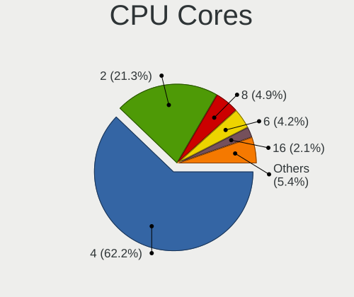

| Number  | Desktops | Percent |
|---------|----------|---------|
| 4       | 1252     | 62.16%  |
| 2       | 428      | 21.25%  |
| 8       | 99       | 4.92%   |
| 6       | 84       | 4.17%   |
| 16      | 43       | 2.14%   |
| Unknown | 42       | 2.09%   |
| 12      | 27       | 1.34%   |
| 1       | 17       | 0.84%   |
| 32      | 7        | 0.35%   |
| 20      | 5        | 0.25%   |
| 10      | 5        | 0.25%   |
| 3       | 3        | 0.15%   |
| 36      | 1        | 0.05%   |
| 24      | 1        | 0.05%   |

CPU Sockets
-----------

Number of sockets

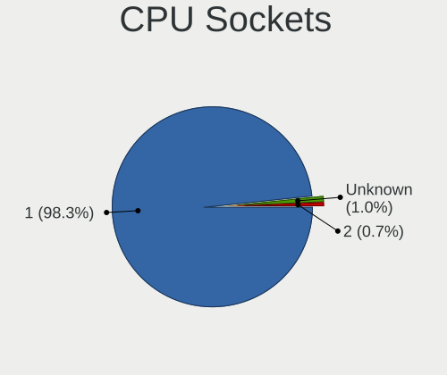

| Number  | Desktops | Percent |
|---------|----------|---------|
| 1       | 1954     | 98.34%  |
| Unknown | 20       | 1.01%   |
| 2       | 13       | 0.65%   |

CPU Threads
-----------

Threads per core (Hyper-Threading)

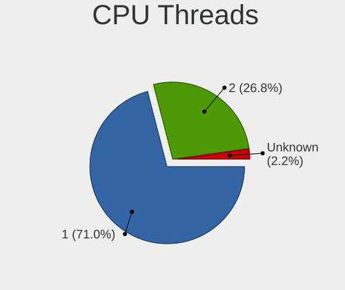

| Number  | Desktops | Percent |
|---------|----------|---------|
| 1       | 1423     | 70.97%  |
| 2       | 537      | 26.78%  |
| Unknown | 45       | 2.24%   |

CPU Microarch
-------------

Microarchitecture

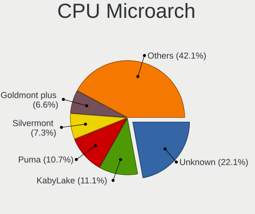

| Name          | Desktops | Percent |
|---------------|----------|---------|
| Unknown       | 443      | 22.09%  |
| KabyLake      | 222      | 11.07%  |
| Puma          | 215      | 10.72%  |
| Silvermont    | 147      | 7.33%   |
| Goldmont plus | 133      | 6.63%   |
| Haswell       | 106      | 5.29%   |
| Skylake       | 92       | 4.59%   |
| Jaguar        | 90       | 4.49%   |
| IvyBridge     | 70       | 3.49%   |
| Goldmont      | 55       | 2.74%   |
| Bonnell       | 45       | 2.24%   |
| SandyBridge   | 44       | 2.19%   |
| Penryn        | 38       | 1.9%    |
| Zen+          | 31       | 1.55%   |
| Zen 2         | 30       | 1.5%    |
| CometLake     | 28       | 1.4%    |
| Bobcat        | 28       | 1.4%    |
| Zen 3         | 24       | 1.2%    |
| Zen           | 21       | 1.05%   |
| TigerLake     | 20       | 1%      |
| Broadwell     | 19       | 0.95%   |
| Nehalem       | 17       | 0.85%   |
| Westmere      | 16       | 0.8%    |
| Piledriver    | 15       | 0.75%   |
| Core          | 15       | 0.75%   |
| K8 Hammer     | 10       | 0.5%    |
| IceLake       | 9        | 0.45%   |
| K10           | 7        | 0.35%   |
| Bulldozer     | 5        | 0.25%   |
| P6            | 3        | 0.15%   |
| NetBurst      | 2        | 0.1%    |
| Excavator     | 2        | 0.1%    |
| Steamroller   | 1        | 0.05%   |
| K10 Llano     | 1        | 0.05%   |
| Geode         | 1        | 0.05%   |

Graphics
--------

GPU Vendor
----------

Vendors of graphics cards

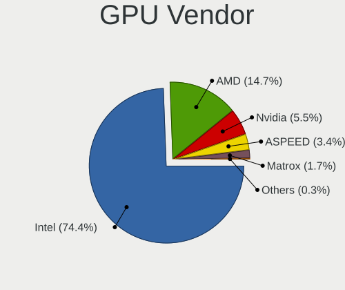

| Vendor                                       | Desktops | Percent |
|----------------------------------------------|----------|---------|
| Intel                                        | 1309     | 74.42%  |
| AMD                                          | 259      | 14.72%  |
| Nvidia                                       | 97       | 5.51%   |
| ASPEED Technology                            | 59       | 3.35%   |
| Matrox Electronics Systems                   | 30       | 1.71%   |
| VIA Technologies                             | 3        | 0.17%   |
| XGI Technology (eXtreme Graphics Innovation) | 2        | 0.11%   |

GPU Model
---------

Graphics card models

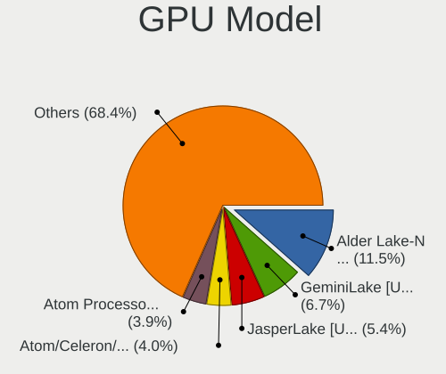

| Model                                                                                    | Desktops | Percent |
|------------------------------------------------------------------------------------------|----------|---------|
| Intel Alder Lake-N [UHD Graphics]                                                        | 206      | 11.54%  |
| Intel GeminiLake [UHD Graphics 600]                                                      | 119      | 6.67%   |
| Intel JasperLake [UHD Graphics]                                                          | 97       | 5.43%   |
| Intel Atom/Celeron/Pentium Processor x5-E8000/J3xxx/N3xxx Integrated Graphics Controller | 72       | 4.03%   |
| Intel Atom Processor Z36xxx/Z37xxx Series Graphics & Display                             | 70       | 3.92%   |
| ASPEED Technology ASPEED Graphics Family                                                 | 59       | 3.31%   |
| Intel Xeon E3-1200 v3/4th Gen Core Processor Integrated Graphics Controller              | 54       | 3.03%   |
| AMD Mullins [Radeon R4/R5 Graphics]                                                      | 48       | 2.69%   |
| AMD Kabini [Radeon HD 8330E]                                                             | 48       | 2.69%   |
| Intel Skylake-S GT2 [HD Graphics 530]                                                    | 47       | 2.63%   |
| Intel Kaby Lake-U GT2 [HD Graphics 620]                                                  | 43       | 2.41%   |
| Intel CoffeeLake-S GT2 [UHD Graphics 630]                                                | 38       | 2.13%   |
| Intel Elkhart Lake [UHD Graphics Gen11 16EU]                                             | 31       | 1.74%   |
| Intel Apollo Lake GT1 [HD Graphics 500]                                                  | 30       | 1.68%   |
| Intel 4 Series Chipset Integrated Graphics Controller                                    | 30       | 1.68%   |
| Intel 2nd Generation Core Processor Family Integrated Graphics Controller                | 28       | 1.57%   |
| Intel Xeon E3-1200 v2/3rd Gen Core processor Graphics Controller                         | 26       | 1.46%   |
| Intel Kaby Lake-S GT2 [HD Graphics 630]                                                  | 26       | 1.46%   |
| Intel Kaby Lake-R GT2 [UHD Graphics 620]                                                 | 26       | 1.46%   |
| Intel Atom Processor D4xx/D5xx/N4xx/N5xx Integrated Graphics Controller                  | 25       | 1.4%    |
| Intel Alder Lake-N [Intel Graphics]                                                      | 25       | 1.4%    |
| Intel CometLake-S GT2 [UHD Graphics 630]                                                 | 19       | 1.06%   |
| Intel TigerLake-LP GT2 [Iris Xe Graphics]                                                | 18       | 1.01%   |
| Intel 4th Generation Core Processor Family Integrated Graphics Controller                | 18       | 1.01%   |
| Intel WhiskeyLake-U GT2 [UHD Graphics 620]                                               | 17       | 0.95%   |
| AMD Picasso/Raven 2 [Radeon Vega Series / Radeon Vega Mobile Series]                     | 15       | 0.84%   |
| Matrox Electronics Systems MGA G200eW WPCM450                                            | 14       | 0.78%   |
| Intel GeminiLake [UHD Graphics 605]                                                      | 14       | 0.78%   |
| AMD Kabini [Radeon HD 8400E]                                                             | 14       | 0.78%   |
| Nvidia GP108 [GeForce GT 1030]                                                           | 13       | 0.73%   |
| Intel CometLake-U GT2 [UHD Graphics]                                                     | 13       | 0.73%   |
| Matrox Electronics Systems MGA G200EH                                                    | 12       | 0.67%   |
| Intel Skylake-U GT2 [HD Graphics 520]                                                    | 12       | 0.67%   |
| Intel Broadwell-U GT2 [HD Graphics 5500]                                                 | 12       | 0.67%   |
| AMD Ellesmere [Radeon RX 470/480/570/570X/580/580X/590]                                  | 12       | 0.67%   |
| Intel Kaby Lake-U GT1 [HD Graphics 610]                                                  | 11       | 0.62%   |
| AMD Cezanne [Radeon Vega Series / Radeon Vega Mobile Series]                             | 11       | 0.62%   |
| Intel Haswell-ULT Integrated Graphics Controller                                         | 10       | 0.56%   |
| Intel Core Processor Integrated Graphics Controller                                      | 10       | 0.56%   |
| Intel Atom Processor D2xxx/N2xxx Integrated Graphics Controller                          | 10       | 0.56%   |

GPU Combo
---------

Combinations of graphics cards

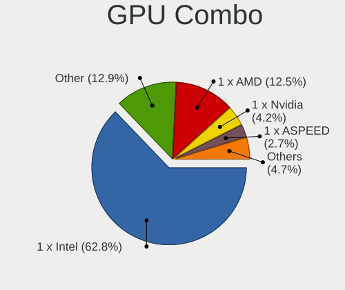

| Name           | Desktops | Percent |
|----------------|----------|---------|
| 1 x Intel      | 1258     | 62.84%  |
| Other          | 259      | 12.94%  |
| 1 x AMD        | 251      | 12.54%  |
| 1 x Nvidia     | 85       | 4.25%   |
| 1 x ASPEED     | 55       | 2.75%   |
| 2 x Intel      | 36       | 1.8%    |
| 1 x Matrox     | 29       | 1.45%   |
| Intel + Nvidia | 10       | 0.5%    |
| 2 x AMD        | 6        | 0.3%    |
| 1 x VIA        | 3        | 0.15%   |
| Intel + ASPEED | 3        | 0.15%   |
| 1 x XGI        | 2        | 0.1%    |
| AMD + Nvidia   | 2        | 0.1%    |
| Intel + Matrox | 1        | 0.05%   |
| Intel + AMD    | 1        | 0.05%   |
| AMD + ASPEED   | 1        | 0.05%   |

GPU Driver
----------

Free vs proprietary

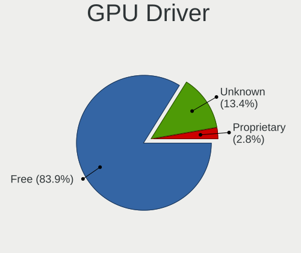

| Driver      | Desktops | Percent |
|-------------|----------|---------|
| Free        | 1671     | 83.89%  |
| Unknown     | 266      | 13.35%  |
| Proprietary | 55       | 2.76%   |

GPU Memory
----------

Total video memory

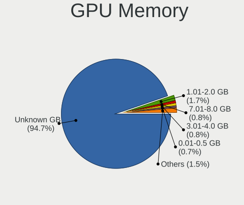

| Size in GB | Desktops | Percent |
|------------|----------|---------|
| Unknown    | 1893     | 94.74%  |
| 1.01-2.0   | 33       | 1.65%   |
| 7.01-8.0   | 15       | 0.75%   |
| 3.01-4.0   | 15       | 0.75%   |
| 0.01-0.5   | 13       | 0.65%   |
| 0.51-1.0   | 12       | 0.6%    |
| 5.01-6.0   | 9        | 0.45%   |
| 2.01-3.0   | 4        | 0.2%    |
| 8.01-16.0  | 3        | 0.15%   |
| 16.01-24.0 | 1        | 0.05%   |

Monitor
-------

Monitor Vendor
--------------

Monitor vendors

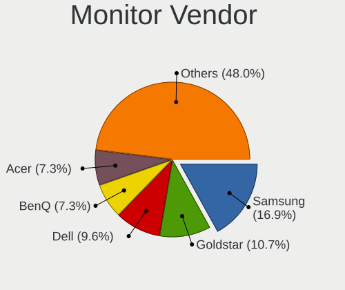

| Vendor               | Desktops | Percent |
|----------------------|----------|---------|
| Samsung Electronics  | 30       | 16.95%  |
| Goldstar             | 19       | 10.73%  |
| Dell                 | 17       | 9.6%    |
| BenQ                 | 13       | 7.34%   |
| Acer                 | 13       | 7.34%   |
| Hewlett-Packard      | 11       | 6.21%   |
| Eizo                 | 10       | 5.65%   |
| Iiyama               | 9        | 5.08%   |
| Ancor Communications | 7        | 3.95%   |
| Philips              | 6        | 3.39%   |
| LG Electronics       | 6        | 3.39%   |
| Fujitsu Siemens      | 6        | 3.39%   |
| NEC Computers        | 5        | 2.82%   |
| ASUSTek Computer     | 4        | 2.26%   |
| Idek Iiyama          | 3        | 1.69%   |
| HannStar             | 3        | 1.69%   |
| AOC                  | 2        | 1.13%   |
| WYT                  | 1        | 0.56%   |
| ViewSonic            | 1        | 0.56%   |
| Vestel Elektronik    | 1        | 0.56%   |
| MSI                  | 1        | 0.56%   |
| Mi                   | 1        | 0.56%   |
| LG Philips           | 1        | 0.56%   |
| LG Display           | 1        | 0.56%   |
| Lenovo               | 1        | 0.56%   |
| HUAWEI               | 1        | 0.56%   |
| HKC                  | 1        | 0.56%   |
| CMT                  | 1        | 0.56%   |
| CHD                  | 1        | 0.56%   |
| Belinea              | 1        | 0.56%   |

Monitor Model
-------------

Monitor models

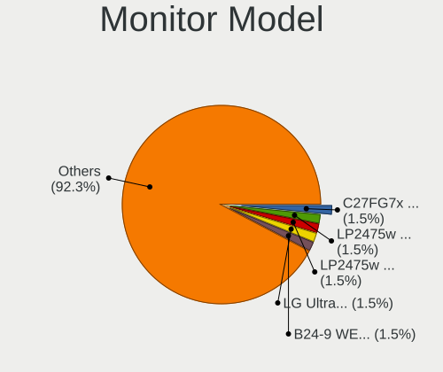

| Model                                                                 | Desktops | Percent |
|-----------------------------------------------------------------------|----------|---------|
| Samsung Electronics C27FG7x SAM0E41 1920x1080 600x340mm 27.2-inch     | 3        | 1.54%   |
| Hewlett-Packard LP2475w HWP26F9 1920x1200 540x350mm 25.3-inch         | 3        | 1.54%   |
| Hewlett-Packard LP2475w HWP26F8 1920x1200 540x350mm 25.3-inch         | 3        | 1.54%   |
| Goldstar LG Ultra HD GSM5B08 3840x2160 600x340mm 27.2-inch            | 3        | 1.54%   |
| Fujitsu Siemens B24-9 WE FUS08C3 1920x1200 520x320mm 24.0-inch        | 3        | 1.54%   |
| Samsung Electronics C32JG5x SAM0FDE 2560x1440 700x390mm 31.5-inch     | 2        | 1.03%   |
| Samsung Electronics C24F390 SAM0D2C 1920x1080 520x290mm 23.4-inch     | 2        | 1.03%   |
| NEC Computers EX341R NEC2C7A 3440x1440 800x330mm 34.1-inch            | 2        | 1.03%   |
| Hewlett-Packard LA2405 HWP284B 1920x1200 520x320mm 24.0-inch          | 2        | 1.03%   |
| Goldstar LG HDR 4K GSM7707 3840x2160 600x340mm 27.2-inch              | 2        | 1.03%   |
| Goldstar E2441 GSM581F 1920x1080 530x300mm 24.0-inch                  | 2        | 1.03%   |
| Eizo EV2450 ENC2530 1920x1080 530x300mm 24.0-inch                     | 2        | 1.03%   |
| Dell LCD Monitor U2412M 3840x1200                                     | 2        | 1.03%   |
| Dell LCD Monitor U2412M                                               | 2        | 1.03%   |
| BenQ GW2260 BNQ78C4 1920x1080 480x270mm 21.7-inch                     | 2        | 1.03%   |
| BenQ GL2760 BNQ78D5 1920x1080 600x340mm 27.2-inch                     | 2        | 1.03%   |
| BenQ GL2450H BNQ78A6 1920x1080 530x300mm 24.0-inch                    | 2        | 1.03%   |
| ASUSTek Computer VC279 AUS27C4 1920x1080 600x340mm 27.2-inch          | 2        | 1.03%   |
| Ancor Communications MX27AQ ACI27A5 2560x1440 600x340mm 27.2-inch     | 2        | 1.03%   |
| WYT MNT-ANALOG WYT0323 1280x1024 330x270mm 16.8-inch                  | 1        | 0.51%   |
| ViewSonic VG2755 VSC2B37 1920x1080 600x340mm 27.2-inch                | 1        | 0.51%   |
| ViewSonic LCD Monitor VG2755 1920x1080                                | 1        | 0.51%   |
| Vestel Elektronik 32W_LCD_TV VES3700 1920x1080 710x400mm 32.1-inch    | 1        | 0.51%   |
| Samsung Electronics U28E590 SAM0C4E 3840x2160 610x350mm 27.7-inch     | 1        | 0.51%   |
| Samsung Electronics U28E590 SAM0C4D 3840x2160 610x350mm 27.7-inch     | 1        | 0.51%   |
| Samsung Electronics SyncMaster SAM05CD 1920x1080                      | 1        | 0.51%   |
| Samsung Electronics SyncMaster SAM0587 1920x1200 520x320mm 24.0-inch  | 1        | 0.51%   |
| Samsung Electronics SyncMaster SAM041E 2048x1152 510x290mm 23.1-inch  | 1        | 0.51%   |
| Samsung Electronics SyncMaster SAM03E5 1680x1050 470x300mm 22.0-inch  | 1        | 0.51%   |
| Samsung Electronics SyncMaster SAM036C 1920x1200 550x340mm 25.5-inch  | 1        | 0.51%   |
| Samsung Electronics SMT27A300 SAM087A 1920x1080 600x340mm 27.2-inch   | 1        | 0.51%   |
| Samsung Electronics SMT22A350 SAM07A5 1920x1080 480x270mm 21.7-inch   | 1        | 0.51%   |
| Samsung Electronics SMS24A450 SAM083A 1920x1200 520x320mm 24.0-inch   | 1        | 0.51%   |
| Samsung Electronics SAMTRON STN0028 1280x1024 380x300mm 19.1-inch     | 1        | 0.51%   |
| Samsung Electronics SA300/SA350 SAM078F 1920x1080 480x270mm 21.7-inch | 1        | 0.51%   |
| Samsung Electronics S24F350 SAM0D20 1920x1080 520x290mm 23.4-inch     | 1        | 0.51%   |
| Samsung Electronics S24E391 SAM0C12 1920x1080 520x290mm 23.4-inch     | 1        | 0.51%   |
| Samsung Electronics S24C650 SAM09E9 1920x1080 520x290mm 23.4-inch     | 1        | 0.51%   |
| Samsung Electronics S24C650 SAM09E8 1920x1080 520x290mm 23.4-inch     | 1        | 0.51%   |
| Samsung Electronics S24C650 SAM09E7 1920x1080 520x290mm 23.4-inch     | 1        | 0.51%   |

Monitor Resolution
------------------

Monitor screen resolution

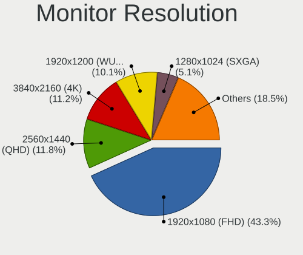

| Resolution         | Desktops | Percent |
|--------------------|----------|---------|
| 1920x1080 (FHD)    | 77       | 43.26%  |
| 2560x1440 (QHD)    | 21       | 11.8%   |
| 3840x2160 (4K)     | 20       | 11.24%  |
| 1920x1200 (WUXGA)  | 18       | 10.11%  |
| 1280x1024 (SXGA)   | 9        | 5.06%   |
| 3440x1440          | 8        | 4.49%   |
| 1680x1050 (WSXGA+) | 5        | 2.81%   |
| 1440x900 (WXGA+)   | 3        | 1.69%   |
| Unknown            | 3        | 1.69%   |
| 3840x1200          | 2        | 1.12%   |
| 2560x1080          | 2        | 1.12%   |
| 1600x900 (HD+)     | 2        | 1.12%   |
| 3840x1080          | 1        | 0.56%   |
| 3600x1080          | 1        | 0.56%   |
| 2560x1600          | 1        | 0.56%   |
| 2048x1152          | 1        | 0.56%   |
| 1920x540           | 1        | 0.56%   |
| 1600x1200          | 1        | 0.56%   |
| 1366x768 (WXGA)    | 1        | 0.56%   |
| 1280x800 (WXGA)    | 1        | 0.56%   |

Monitor Diagonal
----------------

Diagonal size in inches

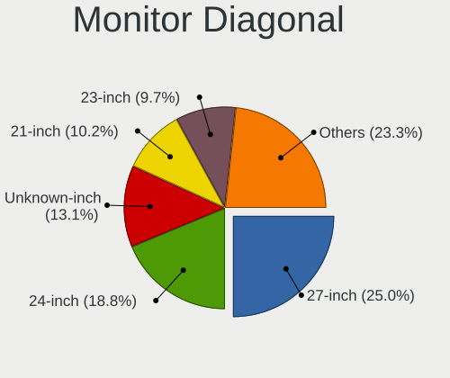

| Inches  | Desktops | Percent |
|---------|----------|---------|
| 27      | 44       | 25%     |
| 24      | 33       | 18.75%  |
| Unknown | 23       | 13.07%  |
| 21      | 18       | 10.23%  |
| 23      | 17       | 9.66%   |
| 19      | 9        | 5.11%   |
| 34      | 7        | 3.98%   |
| 31      | 6        | 3.41%   |
| 22      | 5        | 2.84%   |
| 25      | 4        | 2.27%   |
| 46      | 1        | 0.57%   |
| 42      | 1        | 0.57%   |
| 33      | 1        | 0.57%   |
| 32      | 1        | 0.57%   |
| 29      | 1        | 0.57%   |
| 18      | 1        | 0.57%   |
| 17      | 1        | 0.57%   |
| 16      | 1        | 0.57%   |
| 15      | 1        | 0.57%   |
| 13      | 1        | 0.57%   |

Monitor Width
-------------

Physical width

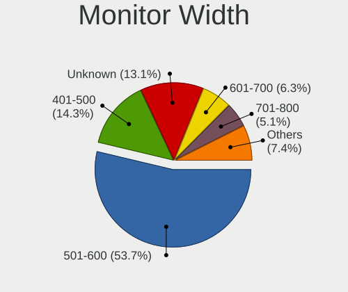

| Width in mm | Desktops | Percent |
|-------------|----------|---------|
| 501-600     | 94       | 53.71%  |
| 401-500     | 25       | 14.29%  |
| Unknown     | 23       | 13.14%  |
| 601-700     | 11       | 6.29%   |
| 701-800     | 9        | 5.14%   |
| 351-400     | 7        | 4%      |
| 301-350     | 4        | 2.29%   |
| 1001-1500   | 1        | 0.57%   |
| 901-1000    | 1        | 0.57%   |

Aspect Ratio
------------

Proportional relationship between the width and the height

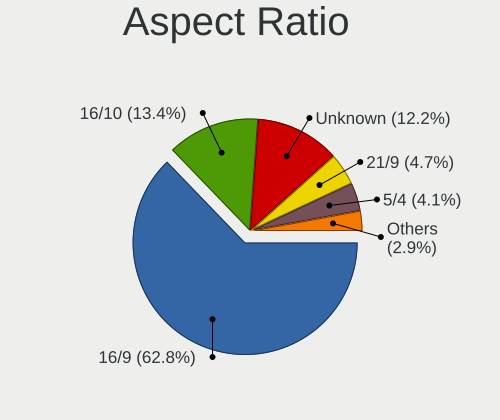

| Ratio   | Desktops | Percent |
|---------|----------|---------|
| 16/9    | 108      | 62.79%  |
| 16/10   | 23       | 13.37%  |
| Unknown | 21       | 12.21%  |
| 21/9    | 8        | 4.65%   |
| 5/4     | 7        | 4.07%   |
| 3/2     | 3        | 1.74%   |
| 6/5     | 1        | 0.58%   |
| 4/3     | 1        | 0.58%   |

Monitor Area
------------

Area in inch²

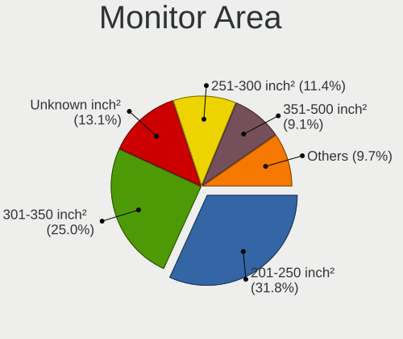

| Area in inch² | Desktops | Percent |
|----------------|----------|---------|
| 201-250        | 56       | 31.82%  |
| 301-350        | 44       | 25%     |
| Unknown        | 23       | 13.07%  |
| 251-300        | 20       | 11.36%  |
| 351-500        | 16       | 9.09%   |
| 151-200        | 11       | 6.25%   |
| 501-1000       | 2        | 1.14%   |
| 81-90          | 1        | 0.57%   |
| 141-150        | 1        | 0.57%   |
| 131-140        | 1        | 0.57%   |
| 101-110        | 1        | 0.57%   |

Pixel Density
-------------

Pixels per inch

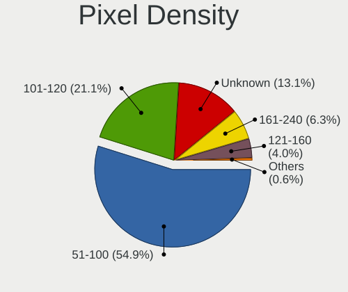

| Density | Desktops | Percent |
|---------|----------|---------|
| 51-100  | 96       | 54.86%  |
| 101-120 | 37       | 21.14%  |
| Unknown | 23       | 13.14%  |
| 161-240 | 11       | 6.29%   |
| 121-160 | 7        | 4%      |
| 1-50    | 1        | 0.57%   |

Multiple Monitors
-----------------

Total monitors connected

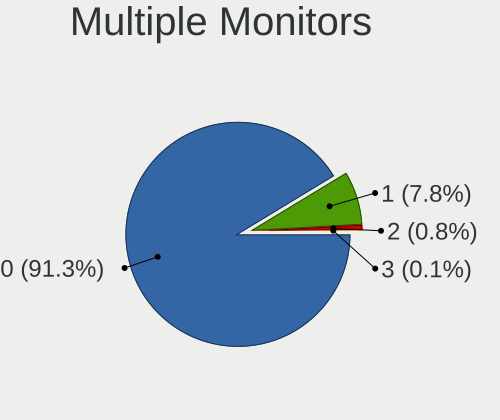

| Total | Desktops | Percent |
|-------|----------|---------|
| 0     | 1820     | 91.32%  |
| 1     | 155      | 7.78%   |
| 2     | 16       | 0.8%    |
| 3     | 2        | 0.1%    |

Network
-------

Net Controller Vendor
---------------------

Controller vendors

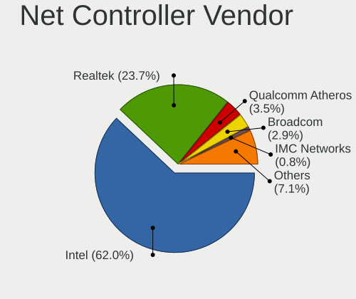

| Vendor                            | Desktops | Percent |
|-----------------------------------|----------|---------|
| Intel                             | 1627     | 62.03%  |
| Realtek Semiconductor             | 622      | 23.71%  |
| Qualcomm Atheros                  | 92       | 3.51%   |
| Broadcom                          | 76       | 2.9%    |
| IMC Networks                      | 21       | 0.8%    |
| Mellanox Technologies             | 18       | 0.69%   |
| MediaTek                          | 18       | 0.69%   |
| D-Link System                     | 13       | 0.5%    |
| U-Blox                            | 11       | 0.42%   |
| TP-Link                           | 11       | 0.42%   |
| American Megatrends               | 10       | 0.38%   |
| Chelsio Communications            | 9        | 0.34%   |
| Marvell Technology Group          | 7        | 0.27%   |
| Insyde Software                   | 7        | 0.27%   |
| Ralink Technology                 | 6        | 0.23%   |
| Edimax Technology                 | 6        | 0.23%   |
| Huawei Technologies               | 5        | 0.19%   |
| Ralink                            | 4        | 0.15%   |
| Aquantia                          | 4        | 0.15%   |
| Samsung Electronics               | 3        | 0.11%   |
| NetGear                           | 3        | 0.11%   |
| Ericsson Business Mobile Networks | 3        | 0.11%   |
| Emulex                            | 3        | 0.11%   |
| AVM                               | 3        | 0.11%   |
| ZTE WCDMA Technologies MSM        | 2        | 0.08%   |
| Xiaomi                            | 2        | 0.08%   |
| T & A Mobile Phones               | 2        | 0.08%   |
| Qualcomm Atheros Communications   | 2        | 0.08%   |
| QLogic                            | 2        | 0.08%   |
| Nvidia                            | 2        | 0.08%   |
| ICS Advent                        | 2        | 0.08%   |
| Dresden Elektronik                | 2        | 0.08%   |
| Davicom Semiconductor             | 2        | 0.08%   |
| Apple                             | 2        | 0.08%   |
| VIA Technologies                  | 1        | 0.04%   |
| SysKonnect                        | 1        | 0.04%   |
| Standard Microsystems [SMC]       | 1        | 0.04%   |
| sipeed                            | 1        | 0.04%   |
| Sierra Wireless                   | 1        | 0.04%   |
| Seeed Technology                  | 1        | 0.04%   |

Net Controller Model
--------------------

Controller models

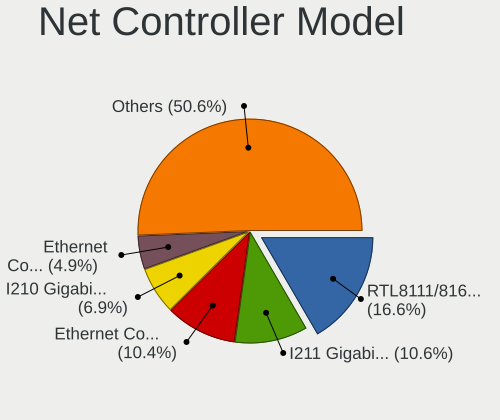

| Model                                                                         | Desktops | Percent |
|-------------------------------------------------------------------------------|----------|---------|
| Realtek RTL8111/8168/8211/8411 PCI Express Gigabit Ethernet Controller        | 528      | 16.62%  |
| Intel I211 Gigabit Network Connection                                         | 336      | 10.58%  |
| Intel Ethernet Controller I226-V                                              | 329      | 10.36%  |
| Intel I210 Gigabit Network Connection                                         | 220      | 6.92%   |
| Intel Ethernet Controller I225-V                                              | 155      | 4.88%   |
| Intel 82574L Gigabit Network Connection                                       | 95       | 2.99%   |
| Intel I350 Gigabit Network Connection                                         | 94       | 2.96%   |
| Intel 82599ES 10-Gigabit SFI/SFP+ Network Connection                          | 62       | 1.95%   |
| Realtek RTL8125 2.5GbE Controller                                             | 60       | 1.89%   |
| Intel 82579LM Gigabit Network Connection (Lewisville)                         | 45       | 1.42%   |
| Intel 82580 Gigabit Network Connection                                        | 44       | 1.38%   |
| Intel 82576 Gigabit Network Connection                                        | 35       | 1.1%    |
| Intel 82583V Gigabit Network Connection                                       | 33       | 1.04%   |
| Qualcomm Atheros AR928X Wireless Network Adapter (PCI-Express)                | 32       | 1.01%   |
| Intel 82571EB/82571GB Gigabit Ethernet Controller D0/D1 (copper applications) | 32       | 1.01%   |
| Intel 82571EB/82571GB Gigabit Ethernet Controller (Copper)                    | 32       | 1.01%   |
| Intel Ethernet Connection (2) I219-V                                          | 31       | 0.98%   |
| Realtek RTL8821CE 802.11ac PCIe Wireless Network Adapter                      | 28       | 0.88%   |
| Intel Wi-Fi 6 AX200                                                           | 26       | 0.82%   |
| Intel Ethernet Connection I217-LM                                             | 25       | 0.79%   |
| Intel Ethernet Controller X710 for 10GbE SFP+                                 | 23       | 0.72%   |
| Intel Ethernet Connection (2) I219-LM                                         | 23       | 0.72%   |
| Broadcom NetXtreme BCM5719 Gigabit Ethernet PCIe                              | 21       | 0.66%   |
| IMC Networks 802.11 n/g/b Wireless LAN USB Mini-Card                          | 20       | 0.63%   |
| Intel Ethernet Controller 10-Gigabit X540-AT2                                 | 17       | 0.54%   |
| Intel Ethernet Connection X553 1GbE                                           | 17       | 0.54%   |
| Broadcom NetXtreme BCM5720 Gigabit Ethernet PCIe                              | 17       | 0.54%   |
| Intel Ethernet Connection (7) I219-LM                                         | 15       | 0.47%   |
| Intel I210 Gigabit Fiber Network Connection                                   | 14       | 0.44%   |
| Intel Ethernet Controller X550                                                | 13       | 0.41%   |
| Intel Ethernet Controller I226-LM                                             | 13       | 0.41%   |
| Intel Ethernet Connection I217-V                                              | 13       | 0.41%   |
| Intel Centrino Advanced-N 6235                                                | 13       | 0.41%   |
| Intel 82575EB Gigabit Network Connection                                      | 13       | 0.41%   |
| Realtek RTL-8100/8101L/8139 PCI Fast Ethernet Adapter                         | 12       | 0.38%   |
| MediaTek MT7922 802.11ax PCI Express Wireless Network Adapter                 | 12       | 0.38%   |
| Intel Wireless 7265                                                           | 11       | 0.35%   |
| Intel Ethernet Connection (7) I219-V                                          | 11       | 0.35%   |
| Qualcomm Atheros AR9462 Wireless Network Adapter                              | 10       | 0.31%   |
| Qualcomm Atheros AR93xx Wireless Network Adapter                              | 10       | 0.31%   |

Wireless Vendor
---------------

Wireless vendors

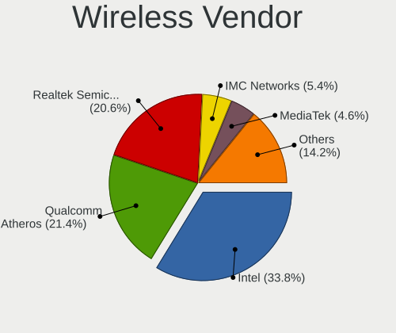

| Vendor                          | Desktops | Percent |
|---------------------------------|----------|---------|
| Intel                           | 131      | 33.76%  |
| Qualcomm Atheros                | 83       | 21.39%  |
| Realtek Semiconductor           | 80       | 20.62%  |
| IMC Networks                    | 21       | 5.41%   |
| MediaTek                        | 18       | 4.64%   |
| Broadcom                        | 15       | 3.87%   |
| TP-Link                         | 11       | 2.84%   |
| Ralink Technology               | 6        | 1.55%   |
| Edimax Technology               | 6        | 1.55%   |
| Ralink                          | 4        | 1.03%   |
| NetGear                         | 3        | 0.77%   |
| Qualcomm Atheros Communications | 2        | 0.52%   |
| Marvell Technology Group        | 2        | 0.52%   |
| Sierra Wireless                 | 1        | 0.26%   |
| Dell                            | 1        | 0.26%   |
| D-Link                          | 1        | 0.26%   |
| Atheros                         | 1        | 0.26%   |
| ASUSTek Computer                | 1        | 0.26%   |
| Accton Technology               | 1        | 0.26%   |

Wireless Model
--------------

Wireless models

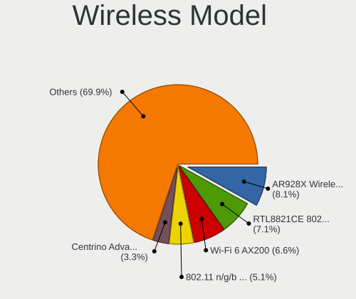

| Model                                                           | Desktops | Percent |
|-----------------------------------------------------------------|----------|---------|
| Qualcomm Atheros AR928X Wireless Network Adapter (PCI-Express)  | 32       | 8.1%    |
| Realtek RTL8821CE 802.11ac PCIe Wireless Network Adapter        | 28       | 7.09%   |
| Intel Wi-Fi 6 AX200                                             | 26       | 6.58%   |
| IMC Networks 802.11 n/g/b Wireless LAN USB Mini-Card            | 20       | 5.06%   |
| Intel Centrino Advanced-N 6235                                  | 13       | 3.29%   |
| MediaTek MT7922 802.11ax PCI Express Wireless Network Adapter   | 12       | 3.04%   |
| Intel Wireless 7265                                             | 11       | 2.78%   |
| Qualcomm Atheros AR9462 Wireless Network Adapter                | 10       | 2.53%   |
| Qualcomm Atheros AR93xx Wireless Network Adapter                | 10       | 2.53%   |
| Intel Wireless 7260                                             | 10       | 2.53%   |
| Intel Wi-Fi 6E(802.11ax) AX210/AX1675* 2x2 [Typhoon Peak]       | 9        | 2.28%   |
| Intel Dual Band Wireless-AC 3168NGW [Stone Peak]                | 9        | 2.28%   |
| Realtek RTL8821AE 802.11ac PCIe Wireless Network Adapter        | 8        | 2.03%   |
| Intel Wireless 3160                                             | 7        | 1.77%   |
| Intel Wi-Fi 5(802.11ac) Wireless-AC 9x6x [Thunder Peak]         | 7        | 1.77%   |
| Qualcomm Atheros QCA986x/988x 802.11ac Wireless Network Adapter | 6        | 1.52%   |
| Qualcomm Atheros QCA6174 802.11ac Wireless Network Adapter      | 6        | 1.52%   |
| TP-Link Archer T2U PLUS [RTL8821AU]                             | 5        | 1.27%   |
| Intel Wireless 8260                                             | 5        | 1.27%   |
| Broadcom BCM43228 802.11a/b/g/n                                 | 5        | 1.27%   |
| Realtek RTL8852BE PCIe 802.11ax Wireless Network Controller     | 4        | 1.01%   |
| Realtek RTL8192CE PCIe Wireless Network Adapter                 | 4        | 1.01%   |
| Realtek RTL8188EUS 802.11n Wireless Network Adapter             | 4        | 1.01%   |
| Qualcomm Atheros AR9485 Wireless Network Adapter                | 4        | 1.01%   |
| Qualcomm Atheros AR9285 Wireless Network Adapter (PCI-Express)  | 4        | 1.01%   |
| MediaTek MT7921K (RZ608) Wi-Fi 6E 80MHz                         | 4        | 1.01%   |
| Intel Wireless 3165                                             | 4        | 1.01%   |
| Intel Gemini Lake PCH CNVi WiFi                                 | 4        | 1.01%   |
| Intel Alder Lake-N PCH CNVi WiFi                                | 4        | 1.01%   |
| Realtek RTL88x2bu [AC1200 Techkey]                              | 3        | 0.76%   |
| Realtek RTL8812AU 802.11a/b/g/n/ac 2T2R DB WLAN Adapter         | 3        | 0.76%   |
| Realtek RTL8723BE PCIe Wireless Network Adapter                 | 3        | 0.76%   |
| Realtek RTL8192CU 802.11n WLAN Adapter                          | 3        | 0.76%   |
| Realtek RTL8188CE 802.11b/g/n WiFi Adapter                      | 3        | 0.76%   |
| Ralink RT5572 Wireless Adapter                                  | 3        | 0.76%   |
| Ralink RT2790 Wireless 802.11n 1T/2R PCIe                       | 3        | 0.76%   |
| Qualcomm Atheros QCA9565 / AR9565 Wireless Network Adapter      | 3        | 0.76%   |
| Intel Wireless 8265 / 8275                                      | 3        | 0.76%   |
| Intel PRO/Wireless 4965 AG or AGN [Kedron] Network Connection   | 3        | 0.76%   |
| Intel Centrino Wireless-N 2230                                  | 3        | 0.76%   |

Ethernet Vendor
---------------

Ethernet vendors

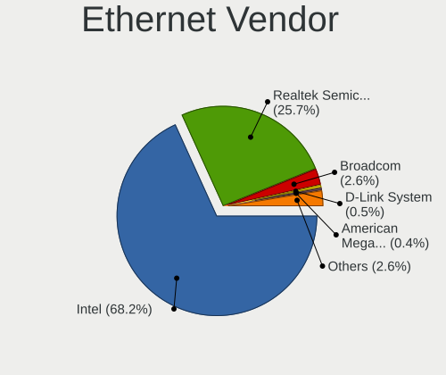

| Vendor                      | Desktops | Percent |
|-----------------------------|----------|---------|
| Intel                       | 1575     | 68.21%  |
| Realtek Semiconductor       | 593      | 25.68%  |
| Broadcom                    | 61       | 2.64%   |
| D-Link System               | 11       | 0.48%   |
| American Megatrends         | 10       | 0.43%   |
| Qualcomm Atheros            | 9        | 0.39%   |
| Insyde Software             | 7        | 0.3%    |
| Chelsio Communications      | 6        | 0.26%   |
| Marvell Technology Group    | 5        | 0.22%   |
| Aquantia                    | 4        | 0.17%   |
| Samsung Electronics         | 3        | 0.13%   |
| ZTE WCDMA Technologies MSM  | 2        | 0.09%   |
| Xiaomi                      | 2        | 0.09%   |
| QLogic                      | 2        | 0.09%   |
| Nvidia                      | 2        | 0.09%   |
| ICS Advent                  | 2        | 0.09%   |
| Emulex                      | 2        | 0.09%   |
| Davicom Semiconductor       | 2        | 0.09%   |
| Apple                       | 2        | 0.09%   |
| VIA Technologies            | 1        | 0.04%   |
| T & A Mobile Phones         | 1        | 0.04%   |
| SysKonnect                  | 1        | 0.04%   |
| Standard Microsystems [SMC] | 1        | 0.04%   |
| sipeed                      | 1        | 0.04%   |
| MYRICOM                     | 1        | 0.04%   |
| Mobile                      | 1        | 0.04%   |
| Digital Equipment           | 1        | 0.04%   |
| 3Com                        | 1        | 0.04%   |

Ethernet Model
--------------

Ethernet models

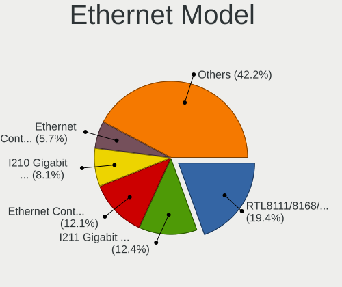

| Model                                                                         | Desktops | Percent |
|-------------------------------------------------------------------------------|----------|---------|
| Realtek RTL8111/8168/8211/8411 PCI Express Gigabit Ethernet Controller        | 528      | 19.45%  |
| Intel I211 Gigabit Network Connection                                         | 336      | 12.38%  |
| Intel Ethernet Controller I226-V                                              | 329      | 12.12%  |
| Intel I210 Gigabit Network Connection                                         | 220      | 8.1%    |
| Intel Ethernet Controller I225-V                                              | 155      | 5.71%   |
| Intel 82574L Gigabit Network Connection                                       | 95       | 3.5%    |
| Intel I350 Gigabit Network Connection                                         | 94       | 3.46%   |
| Intel 82599ES 10-Gigabit SFI/SFP+ Network Connection                          | 62       | 2.28%   |
| Realtek RTL8125 2.5GbE Controller                                             | 59       | 2.17%   |
| Intel 82579LM Gigabit Network Connection (Lewisville)                         | 45       | 1.66%   |
| Intel 82580 Gigabit Network Connection                                        | 44       | 1.62%   |
| Intel 82576 Gigabit Network Connection                                        | 35       | 1.29%   |
| Intel 82583V Gigabit Network Connection                                       | 33       | 1.22%   |
| Intel 82571EB/82571GB Gigabit Ethernet Controller D0/D1 (copper applications) | 32       | 1.18%   |
| Intel 82571EB/82571GB Gigabit Ethernet Controller (Copper)                    | 32       | 1.18%   |
| Intel Ethernet Connection (2) I219-V                                          | 31       | 1.14%   |
| Intel Ethernet Connection I217-LM                                             | 25       | 0.92%   |
| Intel Ethernet Controller X710 for 10GbE SFP+                                 | 23       | 0.85%   |
| Intel Ethernet Connection (2) I219-LM                                         | 23       | 0.85%   |
| Broadcom NetXtreme BCM5719 Gigabit Ethernet PCIe                              | 21       | 0.77%   |
| Intel Ethernet Controller 10-Gigabit X540-AT2                                 | 17       | 0.63%   |
| Intel Ethernet Connection X553 1GbE                                           | 17       | 0.63%   |
| Broadcom NetXtreme BCM5720 Gigabit Ethernet PCIe                              | 17       | 0.63%   |
| Intel Ethernet Connection (7) I219-LM                                         | 15       | 0.55%   |
| Intel I210 Gigabit Fiber Network Connection                                   | 14       | 0.52%   |
| Intel Ethernet Controller X550                                                | 13       | 0.48%   |
| Intel Ethernet Controller I226-LM                                             | 13       | 0.48%   |
| Intel Ethernet Connection I217-V                                              | 13       | 0.48%   |
| Intel 82575EB Gigabit Network Connection                                      | 13       | 0.48%   |
| Realtek RTL-8100/8101L/8139 PCI Fast Ethernet Adapter                         | 12       | 0.44%   |
| Intel Ethernet Connection (7) I219-V                                          | 11       | 0.41%   |
| Intel 82579V Gigabit Network Connection                                       | 10       | 0.37%   |
| American Megatrends Virtual Ethernet                                          | 10       | 0.37%   |
| Intel Ethernet Connection I219-LM                                             | 9        | 0.33%   |
| Intel Ethernet Connection (14) I219-V                                         | 9        | 0.33%   |
| D-Link System DGE-528T Gigabit Ethernet Adapter                               | 9        | 0.33%   |
| Realtek USB 2.5GbE Controller                                                 | 8        | 0.29%   |
| Realtek RTL8169 PCI Gigabit Ethernet Controller                               | 8        | 0.29%   |
| Realtek RTL8111/8168/8411 PCI Express Gigabit Ethernet Controller             | 8        | 0.29%   |
| Intel Ethernet Connection (5) I219-LM                                         | 8        | 0.29%   |

Net Controller Kind
-------------------

Ethernet, WiFi or modem

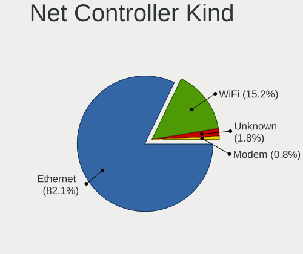

| Kind     | Desktops | Percent |
|----------|----------|---------|
| Ethernet | 1974     | 82.15%  |
| WiFi     | 365      | 15.19%  |
| Unknown  | 44       | 1.83%   |
| Modem    | 20       | 0.83%   |

Used Controller
---------------

Currently used network controller

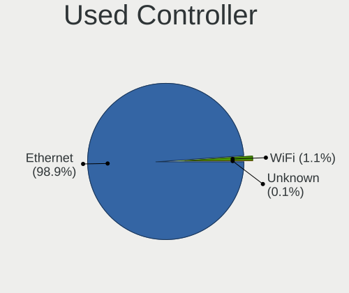

| Kind     | Desktops | Percent |
|----------|----------|---------|
| Ethernet | 1948     | 98.88%  |
| WiFi     | 21       | 1.07%   |
| Unknown  | 1        | 0.05%   |

NICs
----

Total network controllers on board

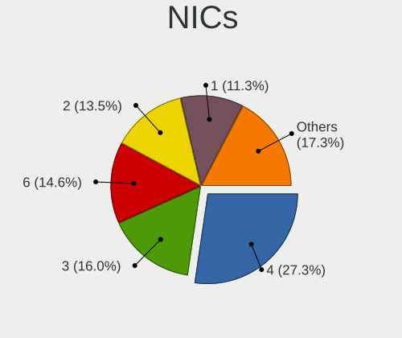

| Total | Desktops | Percent |
|-------|----------|---------|
| 4     | 555      | 27.33%  |
| 3     | 324      | 15.95%  |
| 6     | 296      | 14.57%  |
| 2     | 274      | 13.49%  |
| 1     | 230      | 11.32%  |
| 5     | 209      | 10.29%  |
| 8     | 49       | 2.41%   |
| 7     | 36       | 1.77%   |
| 9     | 19       | 0.94%   |
| 10    | 17       | 0.84%   |
| 0     | 10       | 0.49%   |
| 12    | 4        | 0.2%    |
| 11    | 4        | 0.2%    |
| 14    | 2        | 0.1%    |
| 20    | 1        | 0.05%   |
| 17    | 1        | 0.05%   |

IPv6
----

IPv6 vs IPv4

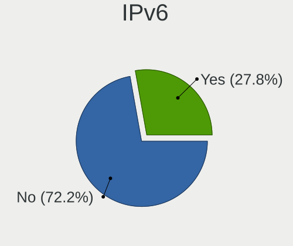

| Used | Desktops | Percent |
|------|----------|---------|
| No   | 1527     | 72.2%   |
| Yes  | 588      | 27.8%   |

Bluetooth
---------

Bluetooth Vendor
----------------

Controller vendors

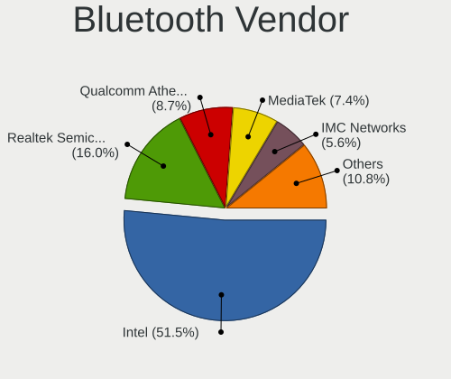

| Vendor                          | Desktops | Percent |
|---------------------------------|----------|---------|
| Intel                           | 119      | 51.52%  |
| Realtek Semiconductor           | 37       | 16.02%  |
| Qualcomm Atheros Communications | 20       | 8.66%   |
| MediaTek                        | 17       | 7.36%   |
| IMC Networks                    | 13       | 5.63%   |
| ASUSTek Computer                | 7        | 3.03%   |
| Cambridge Silicon Radio         | 4        | 1.73%   |
| Broadcom                        | 4        | 1.73%   |
| Apple                           | 4        | 1.73%   |
| Foxconn / Hon Hai               | 3        | 1.3%    |
| Micro Star International        | 1        | 0.43%   |
| Fujitsu Siemens Computers       | 1        | 0.43%   |
| Unknown                         | 1        | 0.43%   |

Bluetooth Model
---------------

Controller models

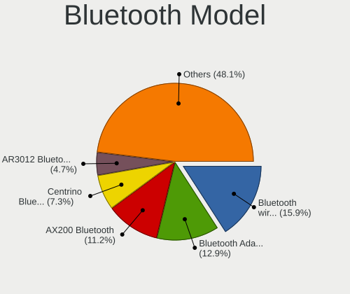

| Model                                                    | Desktops | Percent |
|----------------------------------------------------------|----------|---------|
| Intel Bluetooth wireless interface                       | 37       | 15.88%  |
| Realtek Bluetooth Adapter                                | 30       | 12.88%  |
| Intel AX200 Bluetooth                                    | 26       | 11.16%  |
| Intel Centrino Bluetooth Wireless Transceiver            | 17       | 7.3%    |
| Qualcomm Atheros AR3012 Bluetooth 4.0                    | 11       | 4.72%   |
| MediaTek Wireless_Device                                 | 10       | 4.29%   |
| Intel Wireless-AC 3168 Bluetooth                         | 9        | 3.86%   |
| Intel AX201 Bluetooth                                    | 9        | 3.86%   |
| Intel Wireless-AC 9260 Bluetooth Adapter                 | 7        | 3%      |
| Intel Bluetooth 9460/9560 Jefferson Peak (JfP)           | 7        | 3%      |
| IMC Networks Realtek Bluetooth 4.0 + High Speed Chip     | 7        | 3%      |
| Intel AX210 Bluetooth                                    | 6        | 2.58%   |
| MediaTek RZ608 Bluetooth Adapter                         | 4        | 1.72%   |
| IMC Networks Realtek Bluetooth Adapter                   | 4        | 1.72%   |
| Cambridge Silicon Radio Bluetooth Dongle (HCI mode)      | 4        | 1.72%   |
| Realtek Bluetooth 4.2 Adapter                            | 2        | 0.86%   |
| Qualcomm Atheros QCA61x4 Bluetooth 4.0                   | 2        | 0.86%   |
| Qualcomm Atheros AR9462 Bluetooth                        | 2        | 0.86%   |
| Qualcomm Atheros AR3011 Bluetooth (no firmware)          | 2        | 0.86%   |
| MediaTek RZ616 Bluetooth Adapter                         | 2        | 0.86%   |
| Intel AX211 Bluetooth                                    | 2        | 0.86%   |
| Foxconn / Hon Hai RZ616 Bluetooth Adapter                | 2        | 0.86%   |
| Broadcom BCM2045 Bluetooth                               | 2        | 0.86%   |
| ASUS USB-BT500                                           | 2        | 0.86%   |
| ASUS Broadcom BCM20702A0 Bluetooth                       | 2        | 0.86%   |
| Apple Built-in Bluetooth 2.0+EDR HCI                     | 2        | 0.86%   |
| Apple Bluetooth Host Controller                          | 2        | 0.86%   |
| Realtek RTL8821A Bluetooth                               | 1        | 0.43%   |
| Realtek RTL8723B Bluetooth                               | 1        | 0.43%   |
| Realtek RTL8723A Bluetooth                               | 1        | 0.43%   |
| Realtek  Bluetooth 4.2 Adapter                           | 1        | 0.43%   |
| Realtek Bluetooth 4.0 Adapter                            | 1        | 0.43%   |
| Qualcomm Atheros Dell Wireless 1820 Bluetooth 4.1LE      | 1        | 0.43%   |
| Qualcomm Atheros AR9462 Bluetooth 3.0 + HS Adapter       | 1        | 0.43%   |
| Qualcomm Atheros AR3012 Bluetooth                        | 1        | 0.43%   |
| Micro Star International MS-6970 BToes Bluetooth adapter | 1        | 0.43%   |
| MediaTek Bluetooth Adapter                               | 1        | 0.43%   |
| Intel BE200 Bluetooth                                    | 1        | 0.43%   |
| IMC Networks Realtek Bluetooth 4.0 Adapter               | 1        | 0.43%   |
| IMC Networks Bluetooth                                   | 1        | 0.43%   |

Sound
-----

Sound Vendor
------------

Sound card vendors

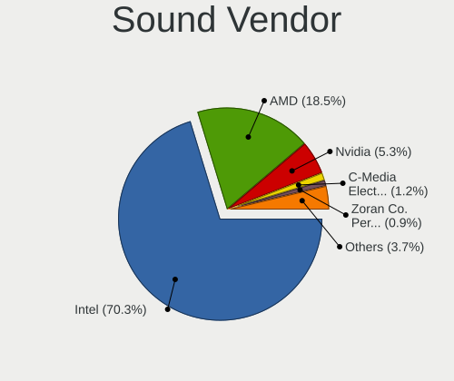

| Vendor                                       | Desktops | Percent |
|----------------------------------------------|----------|---------|
| Intel                                        | 1148     | 70.3%   |
| AMD                                          | 302      | 18.49%  |
| Nvidia                                       | 87       | 5.33%   |
| C-Media Electronics                          | 20       | 1.22%   |
| Zoran Co. Personal Media Division (Nogatech) | 15       | 0.92%   |
| Logitech                                     | 7        | 0.43%   |
| VIA Technologies                             | 5        | 0.31%   |
| JMTek                                        | 5        | 0.31%   |
| Creative Labs                                | 4        | 0.24%   |
| Texas Instruments                            | 3        | 0.18%   |
| Tenx Technology                              | 3        | 0.18%   |
| GN Netcom                                    | 3        | 0.18%   |
| XMOS                                         | 2        | 0.12%   |
| Kingston Technology                          | 2        | 0.12%   |
| Focusrite-Novation                           | 2        | 0.12%   |
| Creative Technology                          | 2        | 0.12%   |
| Corsair                                      | 2        | 0.12%   |
| Audient                                      | 2        | 0.12%   |
| ASUSTek Computer                             | 2        | 0.12%   |
| ZOOM                                         | 1        | 0.06%   |
| Yamaha                                       | 1        | 0.06%   |
| Walmart                                      | 1        | 0.06%   |
| Trust                                        | 1        | 0.06%   |
| SteelSeries ApS                              | 1        | 0.06%   |
| RODE Microphones                             | 1        | 0.06%   |
| RME                                          | 1        | 0.06%   |
| Realtek Semiconductor                        | 1        | 0.06%   |
| Razer USA                                    | 1        | 0.06%   |
| Plantronics                                  | 1        | 0.06%   |
| Native Instruments                           | 1        | 0.06%   |
| Mark of the Unicorn                          | 1        | 0.06%   |
| M-Audio                                      | 1        | 0.06%   |
| Generalplus Technology                       | 1        | 0.06%   |
| DSEA A/S                                     | 1        | 0.06%   |
| Blue Microphones                             | 1        | 0.06%   |
| AudioQuest                                   | 1        | 0.06%   |

Sound Model
-----------

Sound card models

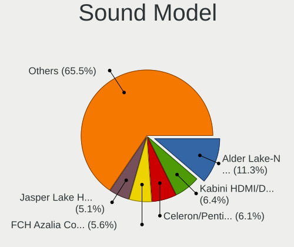

| Model                                                                                             | Desktops | Percent |
|---------------------------------------------------------------------------------------------------|----------|---------|
| Intel Alder Lake-N PCH High Definition Audio Controller                                           | 214      | 11.28%  |
| AMD Kabini HDMI/DP Audio                                                                          | 122      | 6.43%   |
| Intel Celeron/Pentium Silver Processor High Definition Audio                                      | 116      | 6.11%   |
| AMD FCH Azalia Controller                                                                         | 106      | 5.59%   |
| Intel Jasper Lake HD Audio                                                                        | 97       | 5.11%   |
| Intel Sunrise Point-LP HD Audio                                                                   | 85       | 4.48%   |
| Intel Xeon E3-1200 v3/4th Gen Core Processor HD Audio Controller                                  | 61       | 3.22%   |
| Intel Atom/Celeron/Pentium Processor x5-E8000/J3xxx/N3xxx Series High Definition Audio Controller | 60       | 3.16%   |
| Intel 8 Series/C220 Series Chipset High Definition Audio Controller                               | 55       | 2.9%    |
| Intel 100 Series/C230 Series Chipset Family HD Audio Controller                                   | 46       | 2.42%   |
| Intel Atom Processor Z36xxx/Z37xxx Series High Definition Audio Controller                        | 44       | 2.32%   |
| AMD Ryzen HD Audio Controller                                                                     | 41       | 2.16%   |
| Intel 7 Series/C216 Chipset Family High Definition Audio Controller                               | 39       | 2.06%   |
| Intel 6 Series/C200 Series Chipset Family High Definition Audio Controller                        | 32       | 1.69%   |
| Intel Cannon Lake PCH cAVS                                                                        | 30       | 1.58%   |
| Intel 200 Series PCH HD Audio                                                                     | 30       | 1.58%   |
| AMD Starship/Matisse HD Audio Controller                                                          | 30       | 1.58%   |
| Intel Celeron N3350/Pentium N4200/Atom E3900 Series Audio Cluster                                 | 27       | 1.42%   |
| AMD Family 17h (Models 00h-0fh) HD Audio Controller                                               | 26       | 1.37%   |
| Intel NM10/ICH7 Family High Definition Audio Controller                                           | 24       | 1.27%   |
| AMD Raven/Raven2/Fenghuang HDMI/DP Audio Controller                                               | 24       | 1.27%   |
| Intel Comet Lake PCH-LP cAVS                                                                      | 23       | 1.21%   |
| Intel Cannon Point-LP High Definition Audio Controller                                            | 23       | 1.21%   |
| Intel Elkhart Lake High Density Audio bus interface                                               | 22       | 1.16%   |
| Intel Tiger Lake-LP Smart Sound Technology Audio Controller                                       | 20       | 1.05%   |
| AMD Renoir/Cezanne HDMI/DP Audio Controller                                                       | 20       | 1.05%   |
| AMD SBx00 Azalia (Intel HDA)                                                                      | 19       | 1%      |
| Intel Alder Lake PCH-P High Definition Audio Controller                                           | 18       | 0.95%   |
| Intel Wildcat Point-LP High Definition Audio Controller                                           | 16       | 0.84%   |
| Zoran Co. Personal Media Division (Nogatech) USB Audio and HID                                    | 15       | 0.79%   |
| Intel Broadwell-U Audio Controller                                                                | 15       | 0.79%   |
| Nvidia GK208 HDMI/DP Audio Controller                                                             | 14       | 0.74%   |
| Intel Haswell-ULT HD Audio Controller                                                             | 14       | 0.74%   |
| Intel 5 Series/3400 Series Chipset High Definition Audio                                          | 14       | 0.74%   |
| Nvidia GP108 High Definition Audio Controller                                                     | 13       | 0.69%   |
| Intel 8 Series HD Audio Controller                                                                | 13       | 0.69%   |
| AMD Ellesmere HDMI Audio [Radeon RX 470/480 / 570/580/590]                                        | 13       | 0.69%   |
| Intel 82801H (ICH8 Family) HD Audio Controller                                                    | 12       | 0.63%   |
| C-Media Electronics Audio Adapter (Unitek Y-247A)                                                 | 12       | 0.63%   |
| Intel Comet Lake PCH cAVS                                                                         | 10       | 0.53%   |

Memory
------

Memory Vendor
-------------

Memory module vendors

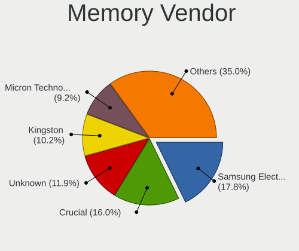

| Vendor                     | Desktops | Percent |
|----------------------------|----------|---------|
| Samsung Electronics        | 356      | 17.76%  |
| Crucial                    | 320      | 15.97%  |
| Unknown                    | 239      | 11.93%  |
| Kingston                   | 204      | 10.18%  |
| Micron Technology          | 184      | 9.18%   |
| SK hynix                   | 180      | 8.98%   |
| G.Skill                    | 107      | 5.34%   |
| Corsair                    | 87       | 4.34%   |
| Unknown                    | 65       | 3.24%   |
| ATP                        | 31       | 1.55%   |
| Transcend                  | 28       | 1.4%    |
| Nanya Technology           | 25       | 1.25%   |
| Unknown (ABCD)             | 22       | 1.1%    |
| A-DATA Technology          | 20       | 1%      |
| Ramaxel Technology         | 15       | 0.75%   |
| Apacer                     | 13       | 0.65%   |
| Shenzhen Jinge Information | 7        | 0.35%   |
| Lexar Co Limited           | 7        | 0.35%   |
| Kimtigo                    | 7        | 0.35%   |
| Patriot                    | 6        | 0.3%    |
| Hewlett-Packard            | 5        | 0.25%   |
| Wodposit                   | 4        | 0.2%    |
| Elpida                     | 4        | 0.2%    |
| Unknown (0x1636)           | 3        | 0.15%   |
| Team                       | 3        | 0.15%   |
| Smart Modular              | 3        | 0.15%   |
| Avant                      | 3        | 0.15%   |
| Unknown (AB)               | 2        | 0.1%    |
| Unknown (89EC)             | 2        | 0.1%    |
| Unknown (0x0FBA)           | 2        | 0.1%    |
| Unknown (09C7)             | 2        | 0.1%    |
| Unifosa                    | 2        | 0.1%    |
| Toshiba                    | 2        | 0.1%    |
| Teikon                     | 2        | 0.1%    |
| TakeMS                     | 2        | 0.1%    |
| SK_Hynix                   | 2        | 0.1%    |
| Mushkin                    | 2        | 0.1%    |
| Juhor                      | 2        | 0.1%    |
| Innodisk                   | 2        | 0.1%    |
| Goldenmars                 | 2        | 0.1%    |

Memory Model
------------

Memory module models

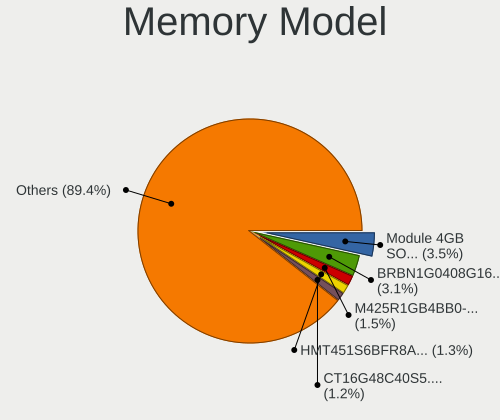

| Model                                                          | Desktops | Percent |
|----------------------------------------------------------------|----------|---------|
| Unknown RAM Module 4GB SODIMM DDR3 1333MT/s                    | 73       | 3.47%   |
| Unknown                                                        | 65       | 3.09%   |
| Samsung RAM M425R1GB4BB0-CQKOL 8GB SODIMM DDR5 4800MT/s        | 31       | 1.47%   |
| SK hynix RAM HMT451S6BFR8A-PB 4GB SODIMM DDR3 1600MT/s         | 28       | 1.33%   |
| Crucial RAM CT16G48C40S5.M8A1 16GB SODIMM DDR5 4800MT/s        | 26       | 1.24%   |
| Unknown (ABCD) RAM 123456789012345678 8GB DIMM DDR4 2400MT/s   | 22       | 1.05%   |
| Samsung RAM M471B5173QH0-YK0 4GB SODIMM DDR3 1600MT/s          | 22       | 1.05%   |
| Unknown RAM Module 4GB SODIMM DDR3 667MT/s                     | 15       | 0.71%   |
| Samsung RAM M471B5173EB0-YK0 4GB SODIMM DDR3 1600MT/s          | 15       | 0.71%   |
| Micron RAM 8KTF51264HZ-1G9P1 4GB SODIMM DDR3 1867MT/s          | 14       | 0.67%   |
| Crucial RAM CT16G48C40S5.C8A1 16GB SODIMM DDR5 4800MT/s        | 13       | 0.62%   |
| ATP RAM X4G08QA8BNWESO-7-TO1 8GB SODIMM DDR4 3200MT/s          | 13       | 0.62%   |
| Unknown RAM Module 8GB DIMM DDR3 1600MT/s                      | 12       | 0.57%   |
| Samsung RAM M471A1K43CB1-CTD 8GB SODIMM DDR4 3200MT/s          | 12       | 0.57%   |
| Unknown RAM Module 2GB DIMM SDRAM                              | 11       | 0.52%   |
| Samsung RAM M471B5173DB0-YK0 4GB SODIMM DDR3 1600MT/s          | 11       | 0.52%   |
| Crucial RAM CT8G48C40S5.M4A1 8GB SODIMM DDR5 4800MT/s          | 11       | 0.52%   |
| Crucial RAM CT16G56C46S5.M8G1 16GB SODIMM DDR5 5600MT/s        | 11       | 0.52%   |
| Unknown RAM Module 4GB DIMM DDR3 1333MT/s                      | 10       | 0.48%   |
| SK hynix RAM HMA81GS6AFR8N-UH 8GB SODIMM DDR4 2400MT/s         | 10       | 0.48%   |
| Micron RAM Module 8GB Row Of Chips LPDDR4 3200MT/s             | 10       | 0.48%   |
| Micron RAM 8ATF1G64HZ-3G2R1 8GB SODIMM DDR4 3200MT/s           | 10       | 0.48%   |
| Corsair RAM CMK16GX4M2B3200C16 8GB DIMM DDR4 3200MT/s          | 10       | 0.48%   |
| Unknown RAM Module 4GB DIMM DDR2 800MT/s                       | 8        | 0.38%   |
| Transcend RAM TS512MSK64W6H 4GB DIMM DDR3 1600MT/s             | 8        | 0.38%   |
| SK hynix RAM HMT451U6BFR8A-PB 4GB DIMM DDR3 1600MT/s           | 8        | 0.38%   |
| Samsung RAM Module 2GB Row Of Chips LPDDR5 6400MT/s            | 8        | 0.38%   |
| Samsung RAM 53D512M64D4RQ-046 4GB Row Of Chips LPDDR4 3733MT/s | 8        | 0.38%   |
| Crucial RAM CT32G4SFD832A.M16FF 32GB SODIMM DDR4 3200MT/s      | 8        | 0.38%   |
| Crucial RAM CT32G48C40S5.M16A1 32GB SODIMM DDR5 4800MT/s       | 8        | 0.38%   |
| Crucial RAM CT16G4SFRA32A.M16FR 16GB SODIMM DDR4 3200MT/s      | 8        | 0.38%   |
| Crucial RAM CT102464BF160B.M16 8GB DIMM DDR3 1600MT/s          | 8        | 0.38%   |
| Corsair RAM CMSX32GX5M1A4800C40 32GB SODIMM DDR5 4800MT/s      | 8        | 0.38%   |
| Unknown RAM Module 2GB DIMM DDR2 800MT/s                       | 7        | 0.33%   |
| Samsung RAM M471B5674EB0-YK0 2GB SODIMM DDR3 1600MT/s          | 7        | 0.33%   |
| Samsung RAM M471B1G73DB0-YK0 8GB SODIMM DDR3 1600MT/s          | 7        | 0.33%   |
| Samsung RAM M378B5773CH0-CH9 2GB DIMM DDR3 1333MT/s            | 7        | 0.33%   |
| G.Skill RAM F4-2400C16-8GRS 8GB SODIMM DDR4 2400MT/s           | 7        | 0.33%   |
| Crucial RAM CT8G4SFRA266.M8FRS 8GB SODIMM DDR4 2667MT/s        | 7        | 0.33%   |
| Unknown RAM Module 8GB DIMM DDR3 1333MT/s                      | 6        | 0.29%   |

Memory Kind
-----------

Memory module kinds

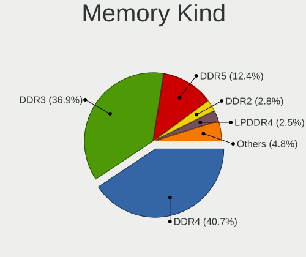

| Kind    | Desktops | Percent |
|---------|----------|---------|
| DDR4    | 750      | 40.65%  |
| DDR3    | 680      | 36.86%  |
| DDR5    | 228      | 12.36%  |
| DDR2    | 51       | 2.76%   |
| LPDDR4  | 47       | 2.55%   |
| Unknown | 42       | 2.28%   |
| SDRAM   | 25       | 1.36%   |
| LPDDR5  | 16       | 0.87%   |
| DDR     | 5        | 0.27%   |
| LPDDR3  | 1        | 0.05%   |

Memory Form Factor
------------------

Physical design of the memory module

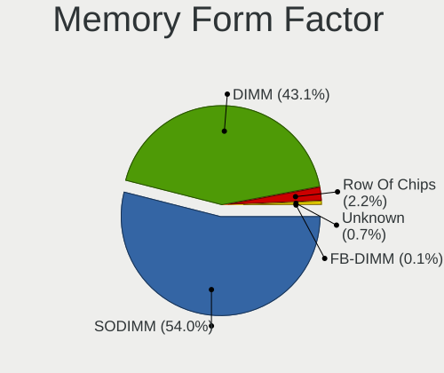

| Name         | Desktops | Percent |
|--------------|----------|---------|
| SODIMM       | 988      | 53.96%  |
| DIMM         | 789      | 43.09%  |
| Row Of Chips | 41       | 2.24%   |
| Unknown      | 12       | 0.66%   |
| FB-DIMM      | 1        | 0.05%   |

Memory Size
-----------

Memory module size

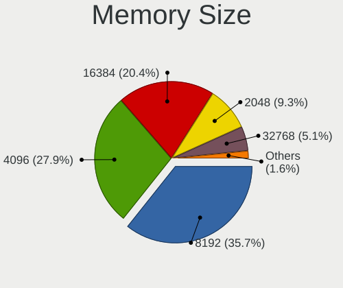

| Size  | Desktops | Percent |
|-------|----------|---------|
| 8192  | 689      | 35.7%   |
| 4096  | 539      | 27.93%  |
| 16384 | 393      | 20.36%  |
| 2048  | 179      | 9.27%   |
| 32768 | 99       | 5.13%   |
| 1024  | 20       | 1.04%   |
| 49152 | 7        | 0.36%   |
| 512   | 3        | 0.16%   |
| 3072  | 1        | 0.05%   |

Memory Speed
------------

Memory module speed

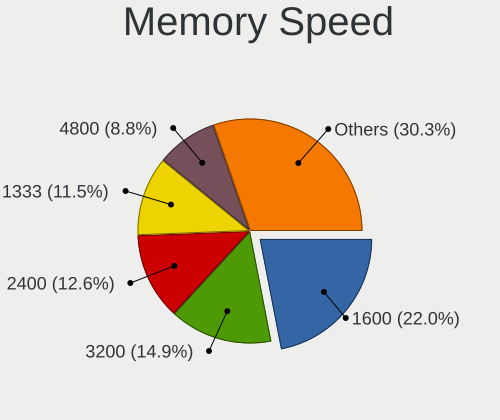

| Speed   | Desktops | Percent |
|---------|----------|---------|
| 1600    | 423      | 21.95%  |
| 3200    | 287      | 14.89%  |
| 2400    | 242      | 12.56%  |
| 1333    | 221      | 11.47%  |
| 4800    | 170      | 8.82%   |
| 2667    | 163      | 8.46%   |
| 2133    | 69       | 3.58%   |
| 5600    | 61       | 3.17%   |
| 800     | 50       | 2.59%   |
| 667     | 43       | 2.23%   |
| Unknown | 28       | 1.45%   |
| 1867    | 25       | 1.3%    |
| 2666    | 24       | 1.25%   |
| 1066    | 17       | 0.88%   |
| 6400    | 15       | 0.78%   |
| 1866    | 14       | 0.73%   |
| 3000    | 13       | 0.67%   |
| 2933    | 10       | 0.52%   |
| 3600    | 9        | 0.47%   |
| 3733    | 8        | 0.42%   |
| 1067    | 7        | 0.36%   |
| 1334    | 5        | 0.26%   |
| 400     | 5        | 0.26%   |
| 333     | 3        | 0.16%   |
| 5200    | 2        | 0.1%    |
| 3534    | 2        | 0.1%    |
| 3066    | 2        | 0.1%    |
| 533     | 2        | 0.1%    |
| 65535   | 1        | 0.05%   |
| 4400    | 1        | 0.05%   |
| 3500    | 1        | 0.05%   |
| 2800    | 1        | 0.05%   |
| 2048    | 1        | 0.05%   |
| 1419    | 1        | 0.05%   |
| 1033    | 1        | 0.05%   |

Printers & scanners
-------------------

Printer Vendor
--------------

Printer device vendors

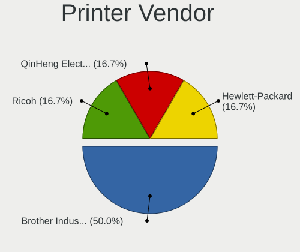

| Vendor              | Desktops | Percent |
|---------------------|----------|---------|
| Brother Industries  | 3        | 50%     |
| Ricoh               | 1        | 16.67%  |
| QinHeng Electronics | 1        | 16.67%  |
| Hewlett-Packard     | 1        | 16.67%  |

Printer Model
-------------

Printer device models

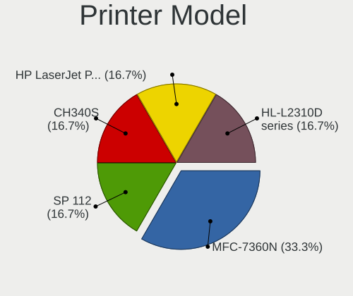

| Model                         | Desktops | Percent |
|-------------------------------|----------|---------|
| Brother MFC-7360N             | 2        | 33.33%  |
| Ricoh SP 112                  | 1        | 16.67%  |
| QinHeng CH340S                | 1        | 16.67%  |
| HP HP LaserJet P2035 HP Print | 1        | 16.67%  |
| Brother HL-L2310D series      | 1        | 16.67%  |

Scanner Vendor
--------------

Scanner device vendors

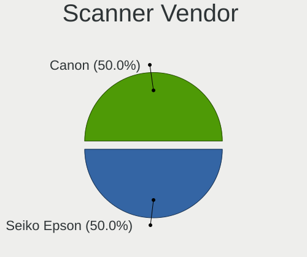

| Vendor      | Desktops | Percent |
|-------------|----------|---------|
| Seiko Epson | 2        | 50%     |
| Canon       | 2        | 50%     |

Scanner Model
-------------

Scanner device models

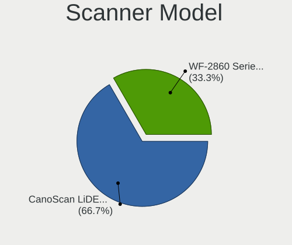

| Model                                                                               | Desktops | Percent |
|-------------------------------------------------------------------------------------|----------|---------|
| Canon CanoScan LiDE 110                                                             | 2        | 50%     |
| Seiko Epson WF-2860 Series EPSON Scanner USB2.0 Printer EPSON Utility USB2.0 Faxout | 1        | 25%     |
| Seiko Epson GT-F520/GT-F570 [Perfection 3590 PHOTO]                                 | 1        | 25%     |

Camera
------

Camera Vendor
-------------

Camera device vendors

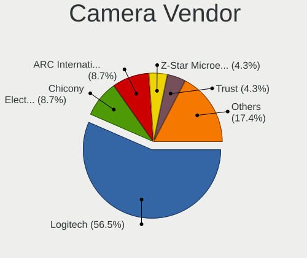

| Vendor                        | Desktops | Percent |
|-------------------------------|----------|---------|
| Logitech                      | 13       | 56.52%  |
| Chicony Electronics           | 2        | 8.7%    |
| ARC International             | 2        | 8.7%    |
| Z-Star Microelectronics       | 1        | 4.35%   |
| Trust                         | 1        | 4.35%   |
| Sunplus Innovation Technology | 1        | 4.35%   |
| Microdia                      | 1        | 4.35%   |
| Jiangxi Shinetech Optical     | 1        | 4.35%   |
| Hewlett-Packard               | 1        | 4.35%   |

Camera Model
------------

Camera device models

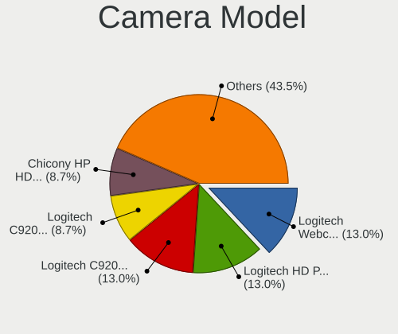

| Model                                | Desktops | Percent |
|--------------------------------------|----------|---------|
| Logitech Webcam C270                 | 3        | 13.04%  |
| Logitech HD Pro Webcam C920          | 3        | 13.04%  |
| Logitech C920 PRO HD Webcam          | 3        | 13.04%  |
| Logitech C920 HD Pro Webcam          | 2        | 8.7%    |
| Chicony HP HD Webcam [Fixed]         | 2        | 8.7%    |
| ARC International Camera             | 2        | 8.7%    |
| Z-Star Venus USB2.0 Camera           | 1        | 4.35%   |
| Trust Trust USB Camera               | 1        | 4.35%   |
| Sunplus Integrated_Webcam_HD         | 1        | 4.35%   |
| Microdia USB 2.0 Camera              | 1        | 4.35%   |
| Logitech HD Webcam C525              | 1        | 4.35%   |
| Logitech C922 Pro Stream Webcam      | 1        | 4.35%   |
| Jiangxi Shinetech Optical FHD Camera | 1        | 4.35%   |
| HP HP FHD Webcam 620/625             | 1        | 4.35%   |

Security
--------

Fingerprint Vendor
------------------

Fingerprint sensor vendors

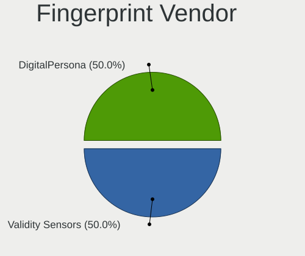

| Vendor           | Desktops | Percent |
|------------------|----------|---------|
| Validity Sensors | 1        | 50%     |
| DigitalPersona   | 1        | 50%     |

Fingerprint Model
-----------------

Fingerprint sensor models

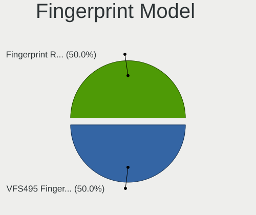

| Model                                      | Desktops | Percent |
|--------------------------------------------|----------|---------|
| Validity Sensors VFS495 Fingerprint Reader | 1        | 50%     |
| DigitalPersona Fingerprint Reader          | 1        | 50%     |

Chipcard Vendor
---------------

Chipcard module vendors

Zero info for selected period =(

Chipcard Model
--------------

Chipcard module models

Zero info for selected period =(

Unsupported
-----------

Unsupported Devices
-------------------

Total unsupported devices on board

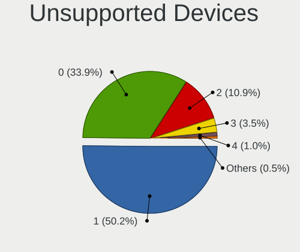

| Total | Desktops | Percent |
|-------|----------|---------|
| 1     | 1028     | 50.17%  |
| 0     | 695      | 33.92%  |
| 2     | 224      | 10.93%  |
| 3     | 71       | 3.47%   |
| 4     | 20       | 0.98%   |
| 5     | 10       | 0.49%   |
| 6     | 1        | 0.05%   |

Unsupported Device Types
------------------------

Types of unsupported devices

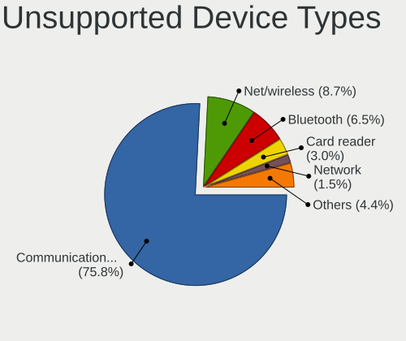

| Type                     | Desktops | Percent |
|--------------------------|----------|---------|
| Communication controller | 1193     | 75.79%  |
| Net/wireless             | 137      | 8.7%    |
| Bluetooth                | 103      | 6.54%   |
| Card reader              | 48       | 3.05%   |
| Network                  | 24       | 1.52%   |
| Net/ethernet             | 24       | 1.52%   |
| Firewire controller      | 19       | 1.21%   |
| Sound                    | 13       | 0.83%   |
| Graphics card            | 6        | 0.38%   |
| Storage/raid             | 1        | 0.06%   |
| Storage/ide              | 1        | 0.06%   |
| Storage/ata              | 1        | 0.06%   |
| Storage                  | 1        | 0.06%   |
| Modem                    | 1        | 0.06%   |
| Fingerprint reader       | 1        | 0.06%   |
| Dvb card                 | 1        | 0.06%   |

