BSD in Germany - Tested Hardware & Statistics (Desktops)
--------------------------------------------------------

A project to collect tested hardware configurations for BSD in Germany.

Anyone can contribute to this report by the [hw-probe](https://github.com/linuxhw/hw-probe/blob/master/INSTALL.BSD.md) tool:

    hw-probe -all -upload

Please contribute! Especially if your hardware is rare.

Contents
--------

* [ Test Cases ](#test-cases)

* [ System ](#system)
  - [ OS                       ](#os)
  - [ OS Family                ](#os-family)
  - [ Arch                     ](#arch)
  - [ DE                       ](#de)
  - [ Display Server           ](#display-server)
  - [ Display Manager          ](#display-manager)
  - [ OS Lang                  ](#os-lang)
  - [ Boot Mode                ](#boot-mode)
  - [ Filesystem               ](#filesystem)
  - [ Part. scheme             ](#part-scheme)

* [ Board ](#board)
  - [ Vendor                   ](#vendor)
  - [ Model                    ](#model)
  - [ Model Family             ](#model-family)
  - [ MFG Year                 ](#mfg-year)
  - [ Form Factor              ](#form-factor)
  - [ Coreboot                 ](#coreboot)
  - [ RAM Size                 ](#ram-size)
  - [ RAM Used                 ](#ram-used)
  - [ Total Drives             ](#total-drives)
  - [ Has CD-ROM               ](#has-cd-rom)
  - [ Has Ethernet             ](#has-ethernet)
  - [ Has WiFi                 ](#has-wifi)
  - [ Has Bluetooth            ](#has-bluetooth)

* [ Location ](#location)
  - [ Country                  ](#country)
  - [ City                     ](#city)

* [ Drives ](#drives)
  - [ Drive Vendor             ](#drive-vendor)
  - [ Drive Model              ](#drive-model)
  - [ HDD Vendor               ](#hdd-vendor)
  - [ SSD Vendor               ](#ssd-vendor)
  - [ Drive Kind               ](#drive-kind)
  - [ Drive Connector          ](#drive-connector)
  - [ Drive Size               ](#drive-size)
  - [ Space Total              ](#space-total)
  - [ Space Used               ](#space-used)
  - [ Malfunc. Drives          ](#malfunc-drives)
  - [ Malfunc. Drive Vendor    ](#malfunc-drive-vendor)
  - [ Malfunc. HDD Vendor      ](#malfunc-hdd-vendor)
  - [ Malfunc. Drive Kind      ](#malfunc-drive-kind)
  - [ Failed Drives            ](#failed-drives)
  - [ Failed Drive Vendor      ](#failed-drive-vendor)
  - [ Drive Status             ](#drive-status)

* [ Storage controller ](#storage-controller)
  - [ Storage Vendor           ](#storage-vendor)
  - [ Storage Model            ](#storage-model)
  - [ Storage Kind             ](#storage-kind)

* [ Processor ](#processor)
  - [ CPU Vendor               ](#cpu-vendor)
  - [ CPU Model                ](#cpu-model)
  - [ CPU Model Family         ](#cpu-model-family)
  - [ CPU Cores                ](#cpu-cores)
  - [ CPU Sockets              ](#cpu-sockets)
  - [ CPU Threads              ](#cpu-threads)
  - [ CPU Microarch            ](#cpu-microarch)

* [ Graphics ](#graphics)
  - [ GPU Vendor               ](#gpu-vendor)
  - [ GPU Model                ](#gpu-model)
  - [ GPU Combo                ](#gpu-combo)
  - [ GPU Driver               ](#gpu-driver)
  - [ GPU Memory               ](#gpu-memory)

* [ Monitor ](#monitor)
  - [ Monitor Vendor           ](#monitor-vendor)
  - [ Monitor Model            ](#monitor-model)
  - [ Monitor Resolution       ](#monitor-resolution)
  - [ Monitor Diagonal         ](#monitor-diagonal)
  - [ Monitor Width            ](#monitor-width)
  - [ Aspect Ratio             ](#aspect-ratio)
  - [ Monitor Area             ](#monitor-area)
  - [ Pixel Density            ](#pixel-density)
  - [ Multiple Monitors        ](#multiple-monitors)

* [ Network ](#network)
  - [ Net Controller Vendor    ](#net-controller-vendor)
  - [ Net Controller Model     ](#net-controller-model)
  - [ Wireless Vendor          ](#wireless-vendor)
  - [ Wireless Model           ](#wireless-model)
  - [ Ethernet Vendor          ](#ethernet-vendor)
  - [ Ethernet Model           ](#ethernet-model)
  - [ Net Controller Kind      ](#net-controller-kind)
  - [ Used Controller          ](#used-controller)
  - [ NICs                     ](#nics)
  - [ IPv6                     ](#ipv6)

* [ Bluetooth ](#bluetooth)
  - [ Bluetooth Vendor         ](#bluetooth-vendor)
  - [ Bluetooth Model          ](#bluetooth-model)

* [ Sound ](#sound)
  - [ Sound Vendor             ](#sound-vendor)
  - [ Sound Model              ](#sound-model)

* [ Memory ](#memory)
  - [ Memory Vendor            ](#memory-vendor)
  - [ Memory Model             ](#memory-model)
  - [ Memory Kind              ](#memory-kind)
  - [ Memory Form Factor       ](#memory-form-factor)
  - [ Memory Size              ](#memory-size)
  - [ Memory Speed             ](#memory-speed)

* [ Printers & scanners ](#printers--scanners)
  - [ Printer Vendor           ](#printer-vendor)
  - [ Printer Model            ](#printer-model)
  - [ Scanner Vendor           ](#scanner-vendor)
  - [ Scanner Model            ](#scanner-model)

* [ Camera ](#camera)
  - [ Camera Vendor            ](#camera-vendor)
  - [ Camera Model             ](#camera-model)

* [ Security ](#security)
  - [ Fingerprint Vendor       ](#fingerprint-vendor)
  - [ Fingerprint Model        ](#fingerprint-model)
  - [ Chipcard Vendor          ](#chipcard-vendor)
  - [ Chipcard Model           ](#chipcard-model)

* [ Unsupported ](#unsupported)
  - [ Unsupported Devices      ](#unsupported-devices)
  - [ Unsupported Device Types ](#unsupported-device-types)

Test Cases
----------

Total: 2771

| Vendor        | Model                       | Probe                                                     | Date         |
|---------------|-----------------------------|-----------------------------------------------------------|--------------|
| Unknown       | Unknown                     | [07d989d275](https://bsd-hardware.info/?probe=07d989d275) | Jan 06, 2025 |
| Lenovo        | 3106 SDK0J40697 WIN 3305... | [25f299d953](https://bsd-hardware.info/?probe=25f299d953) | Jan 05, 2025 |
| ASUSTek       | P10S-E Series               | [689f54b56f](https://bsd-hardware.info/?probe=689f54b56f) | Jan 05, 2025 |
| PC Engines    | APU2                        | [4548693f59](https://bsd-hardware.info/?probe=4548693f59) | Jan 05, 2025 |
| MiTAC         | E220                        | [f869a33762](https://bsd-hardware.info/?probe=f869a33762) | Jan 03, 2025 |
| ASUSTek       | Q87M-E                      | [845a04a779](https://bsd-hardware.info/?probe=845a04a779) | Jan 03, 2025 |
| ASRock        | N100DC-ITX                  | [16cfe5b33f](https://bsd-hardware.info/?probe=16cfe5b33f) | Jan 03, 2025 |
| Unknown       | Unknown                     | [89041bb816](https://bsd-hardware.info/?probe=89041bb816) | Jan 03, 2025 |
| ASUSTek       | ROG STRIX B650-A GAMING ... | [20976f758a](https://bsd-hardware.info/?probe=20976f758a) | Jan 02, 2025 |
| Intel         | SKYBAY                      | [d3adf28494](https://bsd-hardware.info/?probe=d3adf28494) | Dec 31, 2024 |
| ASRock        | N100DC-ITX                  | [766a7f64f0](https://bsd-hardware.info/?probe=766a7f64f0) | Dec 31, 2024 |
| BESSTAR Te... | IB9                         | [3dfca3d175](https://bsd-hardware.info/?probe=3dfca3d175) | Dec 31, 2024 |
| Unknown       | Unknown                     | [d3e2ebffab](https://bsd-hardware.info/?probe=d3e2ebffab) | Dec 31, 2024 |
| IceWhale T... | ZimaBoard 832 ZMB           | [02de1482a6](https://bsd-hardware.info/?probe=02de1482a6) | Dec 31, 2024 |
| ASUSTek       | P8H67-M PRO                 | [002e1aabfa](https://bsd-hardware.info/?probe=002e1aabfa) | Dec 30, 2024 |
| ASUSTek       | P11C-E Series               | [01492d552c](https://bsd-hardware.info/?probe=01492d552c) | Dec 30, 2024 |
| Unknown       | Unknown                     | [8b06420b87](https://bsd-hardware.info/?probe=8b06420b87) | Dec 29, 2024 |
| Fujitsu       | D3313-B1 S26361-D3313-B1    | [95345d4887](https://bsd-hardware.info/?probe=95345d4887) | Dec 29, 2024 |
| Unknown       | Unknown                     | [a93b8e4a89](https://bsd-hardware.info/?probe=a93b8e4a89) | Dec 28, 2024 |
| Unknown       | Unknown                     | [f9f7981d89](https://bsd-hardware.info/?probe=f9f7981d89) | Dec 28, 2024 |
| Unknown       | Unknown                     | [392370d6f2](https://bsd-hardware.info/?probe=392370d6f2) | Dec 27, 2024 |
| Unknown       | Unknown                     | [7649637b96](https://bsd-hardware.info/?probe=7649637b96) | Dec 27, 2024 |
| Fujitsu       | D3544-Sx S26361-D3544-Sx... | [0dcc64e192](https://bsd-hardware.info/?probe=0dcc64e192) | Dec 27, 2024 |
| Unknown       | Unknown                     | [0d44758f02](https://bsd-hardware.info/?probe=0d44758f02) | Dec 27, 2024 |
| Techvision    | TVI7309X B0                 | [9c1b74e17e](https://bsd-hardware.info/?probe=9c1b74e17e) | Dec 27, 2024 |
| Intel         | Q3XXG4-P V1.0               | [fe167a9e36](https://bsd-hardware.info/?probe=fe167a9e36) | Dec 27, 2024 |
| AZW           | EQ                          | [45a01b3cb6](https://bsd-hardware.info/?probe=45a01b3cb6) | Dec 26, 2024 |
| Fujitsu       | D3313-A1 S26361-D3313-A1    | [60caaaf52b](https://bsd-hardware.info/?probe=60caaaf52b) | Dec 26, 2024 |
| Protectli     | VP2420                      | [afa30d870b](https://bsd-hardware.info/?probe=afa30d870b) | Dec 26, 2024 |
| Unknown       | Unknown                     | [78aee3d790](https://bsd-hardware.info/?probe=78aee3d790) | Dec 26, 2024 |
| Dell          | 0GK35Y A00                  | [48c856834f](https://bsd-hardware.info/?probe=48c856834f) | Dec 25, 2024 |
| Protectli     | VP6630                      | [4a4726113b](https://bsd-hardware.info/?probe=4a4726113b) | Dec 24, 2024 |
| BESSTAR Te... | IB9                         | [b54b487e6a](https://bsd-hardware.info/?probe=b54b487e6a) | Dec 24, 2024 |
| Fujitsu       | D3313-G1 S26361-D3313-G1    | [338d76f96f](https://bsd-hardware.info/?probe=338d76f96f) | Dec 24, 2024 |
| PC Engines    | APU2                        | [4f7eeb78f6](https://bsd-hardware.info/?probe=4f7eeb78f6) | Dec 22, 2024 |
| Unknown       | MANIFOLD 2-C                | [652d97d116](https://bsd-hardware.info/?probe=652d97d116) | Dec 20, 2024 |
| Unknown       | Unknown                     | [9925fe2a58](https://bsd-hardware.info/?probe=9925fe2a58) | Dec 20, 2024 |
| ASRock        | N100DC-ITX                  | [c43b796867](https://bsd-hardware.info/?probe=c43b796867) | Dec 19, 2024 |
| Protectli     | FW4C Ver                    | [97feee6904](https://bsd-hardware.info/?probe=97feee6904) | Dec 18, 2024 |
| Gigabyte      | P67A-UD3-B3                 | [a4c1e32308](https://bsd-hardware.info/?probe=a4c1e32308) | Dec 18, 2024 |
| PC Engines    | apu4                        | [93fbf8a948](https://bsd-hardware.info/?probe=93fbf8a948) | Dec 18, 2024 |
| Shenzhen M... | F4BHD                       | [9bf5dfe95c](https://bsd-hardware.info/?probe=9bf5dfe95c) | Dec 17, 2024 |
| Fujitsu       | D3600-A1 S26361-D3600-A1    | [3474ea7f6b](https://bsd-hardware.info/?probe=3474ea7f6b) | Dec 17, 2024 |
| AZW           | EQ                          | [9f5e6afa05](https://bsd-hardware.info/?probe=9f5e6afa05) | Dec 17, 2024 |
| Unknown       | Unknown                     | [c5fbbd0d6e](https://bsd-hardware.info/?probe=c5fbbd0d6e) | Dec 17, 2024 |
| Unknown       | Unknown                     | [c522c98609](https://bsd-hardware.info/?probe=c522c98609) | Dec 17, 2024 |
| Protectli     | VP2420                      | [382e7903c2](https://bsd-hardware.info/?probe=382e7903c2) | Dec 17, 2024 |
| Intel         | JSL MRD                     | [f6604db757](https://bsd-hardware.info/?probe=f6604db757) | Dec 17, 2024 |
| Fujitsu       | D3544-A1 S26361-D3544-A1... | [4255ac5657](https://bsd-hardware.info/?probe=4255ac5657) | Dec 17, 2024 |
| Fujitsu       | D3544-A1 S26361-D3544-A1... | [98197d2139](https://bsd-hardware.info/?probe=98197d2139) | Dec 16, 2024 |
| Protectli     | VP2420                      | [0d08c397dc](https://bsd-hardware.info/?probe=0d08c397dc) | Dec 16, 2024 |
| Unknown       | Unknown                     | [fb58e59524](https://bsd-hardware.info/?probe=fb58e59524) | Dec 15, 2024 |
| Fujitsu       | D3600-A1 S26361-D3600-A1    | [6d52e1dac9](https://bsd-hardware.info/?probe=6d52e1dac9) | Dec 15, 2024 |
| Gigabyte      | H97M-HD3                    | [b916e546ab](https://bsd-hardware.info/?probe=b916e546ab) | Dec 14, 2024 |
| HP            | 213D A01                    | [9d6c8369c5](https://bsd-hardware.info/?probe=9d6c8369c5) | Dec 14, 2024 |
| Lenovo        | ThinkStation E30 7783RR8    | [65fdcf73df](https://bsd-hardware.info/?probe=65fdcf73df) | Dec 14, 2024 |
| Gigabyte      | A520I AC                    | [124adee472](https://bsd-hardware.info/?probe=124adee472) | Dec 12, 2024 |
| BESSTAR Te... | IB9                         | [6918b9ed8d](https://bsd-hardware.info/?probe=6918b9ed8d) | Dec 12, 2024 |
| Unknown       | QCML02                      | [8d92456bd9](https://bsd-hardware.info/?probe=8d92456bd9) | Dec 12, 2024 |
| Techvision    | TVI7309X B0                 | [e3793b6d53](https://bsd-hardware.info/?probe=e3793b6d53) | Dec 12, 2024 |
| Unknown       | Unknown                     | [d2d0edc563](https://bsd-hardware.info/?probe=d2d0edc563) | Dec 11, 2024 |
| Unknown       | Unknown                     | [3d5becd141](https://bsd-hardware.info/?probe=3d5becd141) | Dec 11, 2024 |
| Dell          | 0T7D40 A00                  | [84fb65d887](https://bsd-hardware.info/?probe=84fb65d887) | Dec 10, 2024 |
| MSI           | H110M ECO                   | [1a319ab9cb](https://bsd-hardware.info/?probe=1a319ab9cb) | Dec 10, 2024 |
| Quanmax       | KEEX-1660 B1                | [e965dc9713](https://bsd-hardware.info/?probe=e965dc9713) | Dec 09, 2024 |
| SJRC          | ADLN-6L                     | [a600ba22b2](https://bsd-hardware.info/?probe=a600ba22b2) | Dec 09, 2024 |
| Unknown       | Unknown                     | [ee2c8960a2](https://bsd-hardware.info/?probe=ee2c8960a2) | Dec 08, 2024 |
| Unknown       | Unknown                     | [af42fdfbde](https://bsd-hardware.info/?probe=af42fdfbde) | Dec 08, 2024 |
| Unknown       | Unknown                     | [ccaad34955](https://bsd-hardware.info/?probe=ccaad34955) | Dec 07, 2024 |
| Unknown       | Unknown                     | [33069a50a3](https://bsd-hardware.info/?probe=33069a50a3) | Dec 07, 2024 |
| MSI           | B550M PRO-VDH               | [2bd3d72cbb](https://bsd-hardware.info/?probe=2bd3d72cbb) | Dec 06, 2024 |
| Unknown       | Unknown                     | [a485fb61cf](https://bsd-hardware.info/?probe=a485fb61cf) | Dec 06, 2024 |
| ASRock        | A520M-ITX/ac                | [4bc73334bc](https://bsd-hardware.info/?probe=4bc73334bc) | Dec 04, 2024 |
| Unknown       | Unknown                     | [8c4864ab24](https://bsd-hardware.info/?probe=8c4864ab24) | Dec 04, 2024 |
| SJRC          | ADLN-6L                     | [c0b65456f2](https://bsd-hardware.info/?probe=c0b65456f2) | Dec 04, 2024 |
| Shenzhen M... | AHWSA                       | [51b951d5b3](https://bsd-hardware.info/?probe=51b951d5b3) | Dec 03, 2024 |
| Shenzhen M... | AHWSA                       | [fc7a91a826](https://bsd-hardware.info/?probe=fc7a91a826) | Dec 03, 2024 |
| Unknown       | Unknown                     | [deb68a93e0](https://bsd-hardware.info/?probe=deb68a93e0) | Dec 03, 2024 |
| HP            | 213D A01                    | [a005929c96](https://bsd-hardware.info/?probe=a005929c96) | Dec 02, 2024 |
| Intel         | QHSW02                      | [0815e2b553](https://bsd-hardware.info/?probe=0815e2b553) | Dec 02, 2024 |
| Unknown       | Unknown                     | [bac0d075d9](https://bsd-hardware.info/?probe=bac0d075d9) | Dec 02, 2024 |
| Quanmax       | KEEX-1660 B1                | [4943149603](https://bsd-hardware.info/?probe=4943149603) | Dec 01, 2024 |
| ASUSTek       | Pro B560M-C                 | [d459b88a7a](https://bsd-hardware.info/?probe=d459b88a7a) | Nov 30, 2024 |
| Techvision    | TVI7309X B0                 | [528aaeeba1](https://bsd-hardware.info/?probe=528aaeeba1) | Nov 30, 2024 |
| Unknown       | Unknown                     | [14ff86c47b](https://bsd-hardware.info/?probe=14ff86c47b) | Nov 29, 2024 |
| Unknown       | Unknown                     | [6c64235fcd](https://bsd-hardware.info/?probe=6c64235fcd) | Nov 29, 2024 |
| Unknown       | Unknown                     | [9c1cc3a80d](https://bsd-hardware.info/?probe=9c1cc3a80d) | Nov 29, 2024 |
| HP            | 21B4 A01                    | [8540ec3124](https://bsd-hardware.info/?probe=8540ec3124) | Nov 29, 2024 |
| Unknown       | Unknown                     | [7bb427cd81](https://bsd-hardware.info/?probe=7bb427cd81) | Nov 28, 2024 |
| MSI           | B450M MORTAR MAX            | [f1ade048b2](https://bsd-hardware.info/?probe=f1ade048b2) | Nov 28, 2024 |
| MSI           | B450M MORTAR MAX            | [b7056e45fd](https://bsd-hardware.info/?probe=b7056e45fd) | Nov 27, 2024 |
| MSI           | B450M MORTAR MAX            | [8c4222d88e](https://bsd-hardware.info/?probe=8c4222d88e) | Nov 27, 2024 |
| Lex           | Pineview-D                  | [6f71f5ede3](https://bsd-hardware.info/?probe=6f71f5ede3) | Nov 27, 2024 |
| SJRC          | ADLN-6L                     | [3791b6b9f6](https://bsd-hardware.info/?probe=3791b6b9f6) | Nov 27, 2024 |
| PC Engines    | APU                         | [71452ad950](https://bsd-hardware.info/?probe=71452ad950) | Nov 26, 2024 |
| MW            | GMLK-2_5G4L                 | [ae71831e6c](https://bsd-hardware.info/?probe=ae71831e6c) | Nov 26, 2024 |
| Unknown       | Unknown                     | [9fe8114bf0](https://bsd-hardware.info/?probe=9fe8114bf0) | Nov 26, 2024 |
| ASRock        | A520M-ITX/ac                | [3caad40c2a](https://bsd-hardware.info/?probe=3caad40c2a) | Nov 25, 2024 |
| NU591         | 1.0                         | [4d0ba5d745](https://bsd-hardware.info/?probe=4d0ba5d745) | Nov 25, 2024 |
| Intel         | SKYBAY                      | [7e0118128c](https://bsd-hardware.info/?probe=7e0118128c) | Nov 24, 2024 |
| Unknown       | Unknown                     | [984986d630](https://bsd-hardware.info/?probe=984986d630) | Nov 24, 2024 |
| Dell          | 08NPPY A00                  | [89939b2c85](https://bsd-hardware.info/?probe=89939b2c85) | Nov 24, 2024 |
| PC Engines    | APU2                        | [8b9f47de00](https://bsd-hardware.info/?probe=8b9f47de00) | Nov 23, 2024 |
| Unknown       | Unknown                     | [7484fd56ed](https://bsd-hardware.info/?probe=7484fd56ed) | Nov 23, 2024 |
| Dell          | 02YYK5 A00                  | [250074e8ce](https://bsd-hardware.info/?probe=250074e8ce) | Nov 22, 2024 |
| PC Engines    | apu4                        | [127cbf9c1e](https://bsd-hardware.info/?probe=127cbf9c1e) | Nov 21, 2024 |
| Shenzhen M... | AHWSA                       | [9662bec2ec](https://bsd-hardware.info/?probe=9662bec2ec) | Nov 21, 2024 |
| Protectli     | VP6630                      | [b0ab6a5c54](https://bsd-hardware.info/?probe=b0ab6a5c54) | Nov 20, 2024 |
| Unknown       | Unknown                     | [00cdcaf301](https://bsd-hardware.info/?probe=00cdcaf301) | Nov 20, 2024 |
| Unknown       | Unknown                     | [c44306e40a](https://bsd-hardware.info/?probe=c44306e40a) | Nov 20, 2024 |
| HP            | 21B4 A01                    | [53fb142fb3](https://bsd-hardware.info/?probe=53fb142fb3) | Nov 20, 2024 |
| ZX            | H610ITXG                    | [9a06de614c](https://bsd-hardware.info/?probe=9a06de614c) | Nov 19, 2024 |
| CncTion       | J4125-4L-I225               | [a9a6c5847e](https://bsd-hardware.info/?probe=a9a6c5847e) | Nov 18, 2024 |
| Unknown       | Unknown                     | [42cf75c4b6](https://bsd-hardware.info/?probe=42cf75c4b6) | Nov 18, 2024 |
| Unknown       | Unknown                     | [1e2b735b1d](https://bsd-hardware.info/?probe=1e2b735b1d) | Nov 18, 2024 |
| CWWK          | CW-ADLN-6L                  | [f27cc16c09](https://bsd-hardware.info/?probe=f27cc16c09) | Nov 17, 2024 |
| Fujitsu       | D3313-B1 S26361-D3313-B1    | [71bb455b8e](https://bsd-hardware.info/?probe=71bb455b8e) | Nov 16, 2024 |
| Fujitsu       | D3313-E1 S26361-D3313-E1    | [116b3e2fd4](https://bsd-hardware.info/?probe=116b3e2fd4) | Nov 16, 2024 |
| Fujitsu       | D3313-E1 S26361-D3313-E1    | [e089d473ad](https://bsd-hardware.info/?probe=e089d473ad) | Nov 15, 2024 |
| Unknown       | Unknown                     | [5968379d4e](https://bsd-hardware.info/?probe=5968379d4e) | Nov 14, 2024 |
| Unknown       | Unknown                     | [debe1da53c](https://bsd-hardware.info/?probe=debe1da53c) | Nov 13, 2024 |
| PC Engines    | apu4                        | [0dcd7d17ac](https://bsd-hardware.info/?probe=0dcd7d17ac) | Nov 12, 2024 |
| CncTion       | N4505-4L B0                 | [949d78a500](https://bsd-hardware.info/?probe=949d78a500) | Nov 11, 2024 |
| SJRC          | ADLN-6L                     | [03ac4a08b7](https://bsd-hardware.info/?probe=03ac4a08b7) | Nov 11, 2024 |
| CWWK          | CW-AD4L-N V1                | [42691f38a8](https://bsd-hardware.info/?probe=42691f38a8) | Nov 10, 2024 |
| ASUSTek       | PRIME H410M-E               | [7ad337c4a2](https://bsd-hardware.info/?probe=7ad337c4a2) | Nov 10, 2024 |
| Supermicro    | A2SDi-8C-HLN4F              | [17944148de](https://bsd-hardware.info/?probe=17944148de) | Nov 10, 2024 |
| Protectli     | VP2410                      | [8cd8e34dba](https://bsd-hardware.info/?probe=8cd8e34dba) | Nov 10, 2024 |
| SJRC          | ADLN-6L                     | [8ed7287af5](https://bsd-hardware.info/?probe=8ed7287af5) | Nov 09, 2024 |
| Fujitsu       | D3313-E1 S26361-D3313-E1    | [764b2fbd4e](https://bsd-hardware.info/?probe=764b2fbd4e) | Nov 09, 2024 |
| Fujitsu       | D3313-E1 S26361-D3313-E1    | [4073d4f1a9](https://bsd-hardware.info/?probe=4073d4f1a9) | Nov 09, 2024 |
| Seeed Stud... | ODYSSEY-X86J4105 SD-BS-C... | [74adaa4081](https://bsd-hardware.info/?probe=74adaa4081) | Nov 08, 2024 |
| Unknown       | Unknown                     | [36d06049c4](https://bsd-hardware.info/?probe=36d06049c4) | Nov 07, 2024 |
| Unknown       | QD-CMU01                    | [0b562320be](https://bsd-hardware.info/?probe=0b562320be) | Nov 07, 2024 |
| PC Engines    | apu4                        | [3544aa6114](https://bsd-hardware.info/?probe=3544aa6114) | Nov 07, 2024 |
| Protectli     | VP2420                      | [bc01ba83fc](https://bsd-hardware.info/?probe=bc01ba83fc) | Nov 07, 2024 |
| Fujitsu       | D3313-E1 S26361-D3313-E1    | [4450dc5646](https://bsd-hardware.info/?probe=4450dc5646) | Nov 05, 2024 |
| Supermicro    | X13SCH-LN4F                 | [10d7a813dd](https://bsd-hardware.info/?probe=10d7a813dd) | Nov 04, 2024 |
| ASUSTek       | P10S-E Series               | [e261eb341d](https://bsd-hardware.info/?probe=e261eb341d) | Nov 04, 2024 |
| ZOTAC         | ION                         | [12de8cd5e1](https://bsd-hardware.info/?probe=12de8cd5e1) | Nov 03, 2024 |
| Unknown       | Unknown                     | [a37685bc52](https://bsd-hardware.info/?probe=a37685bc52) | Nov 03, 2024 |
| Unknown       | MANIFOLD 2-C                | [2bd6ae74bb](https://bsd-hardware.info/?probe=2bd6ae74bb) | Nov 02, 2024 |
| PC Engines    | apu4                        | [a0f9f79fe2](https://bsd-hardware.info/?probe=a0f9f79fe2) | Nov 02, 2024 |
| Unknown       | Unknown                     | [a17450bbd2](https://bsd-hardware.info/?probe=a17450bbd2) | Nov 01, 2024 |
| Unknown       | Unknown                     | [90d63ac391](https://bsd-hardware.info/?probe=90d63ac391) | Oct 31, 2024 |
| Protectli     | VP2420                      | [47bfc36d1e](https://bsd-hardware.info/?probe=47bfc36d1e) | Oct 31, 2024 |
| Shenzhen M... | AHWSA                       | [03cf413a7e](https://bsd-hardware.info/?probe=03cf413a7e) | Oct 30, 2024 |
| Unknown       | Unknown                     | [f1bee3ae02](https://bsd-hardware.info/?probe=f1bee3ae02) | Oct 30, 2024 |
| Lex           | Pineview-D                  | [29f5de9d58](https://bsd-hardware.info/?probe=29f5de9d58) | Oct 29, 2024 |
| Unknown       | Unknown                     | [5a2bd8bf9b](https://bsd-hardware.info/?probe=5a2bd8bf9b) | Oct 29, 2024 |
| Unknown       | QCML02                      | [bcb851fe15](https://bsd-hardware.info/?probe=bcb851fe15) | Oct 28, 2024 |
| PC Engines    | apu4                        | [8f9058ee8b](https://bsd-hardware.info/?probe=8f9058ee8b) | Oct 28, 2024 |
| Unknown       | YL-J3160L4                  | [d081dedbb3](https://bsd-hardware.info/?probe=d081dedbb3) | Oct 27, 2024 |
| Unknown       | Unknown                     | [ffaf474e3a](https://bsd-hardware.info/?probe=ffaf474e3a) | Oct 27, 2024 |
| Unknown       | Unknown                     | [1680321155](https://bsd-hardware.info/?probe=1680321155) | Oct 27, 2024 |
| Gigabyte      | B550 AORUS ELITE V2         | [477a6004be](https://bsd-hardware.info/?probe=477a6004be) | Oct 26, 2024 |
| Protectli     | FW6                         | [f240ed9679](https://bsd-hardware.info/?probe=f240ed9679) | Oct 26, 2024 |
| Unknown       | Unknown                     | [521b781cbb](https://bsd-hardware.info/?probe=521b781cbb) | Oct 26, 2024 |
| PC Engines    | APU2                        | [7bfd38bc5b](https://bsd-hardware.info/?probe=7bfd38bc5b) | Oct 25, 2024 |
| Gigabyte      | H55M-UD2H                   | [273712e14f](https://bsd-hardware.info/?probe=273712e14f) | Oct 25, 2024 |
| HP            | 18E7                        | [dbdd29df9f](https://bsd-hardware.info/?probe=dbdd29df9f) | Oct 25, 2024 |
| MSI           | H110M ECO                   | [ddd74f8f5d](https://bsd-hardware.info/?probe=ddd74f8f5d) | Oct 24, 2024 |
| PC Engines    | APU2                        | [ca73690291](https://bsd-hardware.info/?probe=ca73690291) | Oct 24, 2024 |
| ASUSTek       | X99-A/USB                   | [92261cfa8a](https://bsd-hardware.info/?probe=92261cfa8a) | Oct 24, 2024 |
| Fujitsu       | D3313-A1 S26361-D3313-A1    | [2f960dd2b8](https://bsd-hardware.info/?probe=2f960dd2b8) | Oct 23, 2024 |
| HP            | 829D                        | [c4867af236](https://bsd-hardware.info/?probe=c4867af236) | Oct 22, 2024 |
| Unknown       | MANIFOLD 2-C                | [be3217f216](https://bsd-hardware.info/?probe=be3217f216) | Oct 22, 2024 |
| SJRC          | ADLN-6L                     | [086727c6e2](https://bsd-hardware.info/?probe=086727c6e2) | Oct 22, 2024 |
| Shenzhen M... | AHWSA                       | [f40531e228](https://bsd-hardware.info/?probe=f40531e228) | Oct 22, 2024 |
| Fujitsu       | D3067-A1 S26361-D3067-A1    | [a0f4574341](https://bsd-hardware.info/?probe=a0f4574341) | Oct 22, 2024 |
| Unknown       | Unknown                     | [6f8f6d5074](https://bsd-hardware.info/?probe=6f8f6d5074) | Oct 21, 2024 |
| Gigabyte      | B450 GAMING X               | [10f816de15](https://bsd-hardware.info/?probe=10f816de15) | Oct 19, 2024 |
| Gigabyte      | B450 GAMING X               | [780249c60b](https://bsd-hardware.info/?probe=780249c60b) | Oct 19, 2024 |
| Intel         | CRESCENTBAY                 | [111ca8584c](https://bsd-hardware.info/?probe=111ca8584c) | Oct 19, 2024 |
| Unknown       | Unknown                     | [54406ac5a3](https://bsd-hardware.info/?probe=54406ac5a3) | Oct 18, 2024 |
| Fujitsu       | ESPRIMO_P556                | [acfba13c5e](https://bsd-hardware.info/?probe=acfba13c5e) | Oct 18, 2024 |
| Unknown       | Unknown                     | [1f7db6fcb1](https://bsd-hardware.info/?probe=1f7db6fcb1) | Oct 18, 2024 |
| OEM           | 1.0                         | [29343b8ca9](https://bsd-hardware.info/?probe=29343b8ca9) | Oct 17, 2024 |
| PC Engines    | APU2                        | [686a5c37b2](https://bsd-hardware.info/?probe=686a5c37b2) | Oct 17, 2024 |
| Techvision    | TVI7309X B0                 | [6098902f08](https://bsd-hardware.info/?probe=6098902f08) | Oct 17, 2024 |
| PC Engines    | apu4                        | [3230253f0f](https://bsd-hardware.info/?probe=3230253f0f) | Oct 17, 2024 |
| Fujitsu       | D3313-A1 S26361-D3313-A1    | [7a00645e68](https://bsd-hardware.info/?probe=7a00645e68) | Oct 16, 2024 |
| Unknown       | Unknown                     | [ba18b6a768](https://bsd-hardware.info/?probe=ba18b6a768) | Oct 16, 2024 |
| Unknown       | Unknown                     | [1df344db4f](https://bsd-hardware.info/?probe=1df344db4f) | Oct 16, 2024 |
| Unknown       | Unknown                     | [d1dfd1d4f0](https://bsd-hardware.info/?probe=d1dfd1d4f0) | Oct 16, 2024 |
| Unknown       | Unknown                     | [2acdbd0abe](https://bsd-hardware.info/?probe=2acdbd0abe) | Oct 16, 2024 |
| Unknown       | Unknown                     | [3a43a3999a](https://bsd-hardware.info/?probe=3a43a3999a) | Oct 16, 2024 |
| Unknown       | Unknown                     | [543b73e4c3](https://bsd-hardware.info/?probe=543b73e4c3) | Oct 16, 2024 |
| PC Engines    | APU2                        | [3134e52fbc](https://bsd-hardware.info/?probe=3134e52fbc) | Oct 15, 2024 |
| PC Engines    | APU2                        | [67cf62410d](https://bsd-hardware.info/?probe=67cf62410d) | Oct 14, 2024 |
| Unknown       | Unknown                     | [376d29854f](https://bsd-hardware.info/?probe=376d29854f) | Oct 14, 2024 |
| Gigabyte      | A520I AC                    | [36c6088f47](https://bsd-hardware.info/?probe=36c6088f47) | Oct 14, 2024 |
| ASRock        | H470M-ITX/ac                | [1fccdbc599](https://bsd-hardware.info/?probe=1fccdbc599) | Oct 13, 2024 |
| Protectli     | VP2420                      | [4c2d85b7a5](https://bsd-hardware.info/?probe=4c2d85b7a5) | Oct 13, 2024 |
| Unknown       | Unknown                     | [fa3e8baf1e](https://bsd-hardware.info/?probe=fa3e8baf1e) | Oct 13, 2024 |
| PC Engines    | APU2                        | [811d119e23](https://bsd-hardware.info/?probe=811d119e23) | Oct 13, 2024 |
| Unknown       | Unknown                     | [e5ea93344f](https://bsd-hardware.info/?probe=e5ea93344f) | Oct 12, 2024 |
| CncTion       | N4505-4L B0                 | [df7d45f79a](https://bsd-hardware.info/?probe=df7d45f79a) | Oct 12, 2024 |
| Unknown       | Unknown                     | [a66292f526](https://bsd-hardware.info/?probe=a66292f526) | Oct 11, 2024 |
| Protectli     | V1410                       | [0c532b9415](https://bsd-hardware.info/?probe=0c532b9415) | Oct 11, 2024 |
| Unknown       | Unknown                     | [5be84b4403](https://bsd-hardware.info/?probe=5be84b4403) | Oct 11, 2024 |
| SJRC          | ADLN-6L                     | [69ff775aba](https://bsd-hardware.info/?probe=69ff775aba) | Oct 11, 2024 |
| Unknown       | Unknown                     | [09686360eb](https://bsd-hardware.info/?probe=09686360eb) | Oct 10, 2024 |
| Shuttle       | DS77U                       | [9386a947f0](https://bsd-hardware.info/?probe=9386a947f0) | Oct 10, 2024 |
| Acer          | Veriton X2632G V:1.0        | [4f2017a322](https://bsd-hardware.info/?probe=4f2017a322) | Oct 10, 2024 |
| Fujitsu       | D3313-A1 S26361-D3313-A1    | [f4f88d0391](https://bsd-hardware.info/?probe=f4f88d0391) | Oct 10, 2024 |
| Unknown       | YL-J1900L4-V2               | [753726e343](https://bsd-hardware.info/?probe=753726e343) | Oct 07, 2024 |
| Dell          | 02YYK5 A00                  | [ec9ef0a0b9](https://bsd-hardware.info/?probe=ec9ef0a0b9) | Oct 07, 2024 |
| Dell          | 02YYK5 A00                  | [f848108a4a](https://bsd-hardware.info/?probe=f848108a4a) | Oct 07, 2024 |
| PC Engines    | APU2                        | [6dbe35a1b4](https://bsd-hardware.info/?probe=6dbe35a1b4) | Oct 07, 2024 |
| Lanner        | FW-7543 B-GA                | [66a89d1654](https://bsd-hardware.info/?probe=66a89d1654) | Oct 07, 2024 |
| ASRock        | H470M-ITX/ac                | [cfabfdaebf](https://bsd-hardware.info/?probe=cfabfdaebf) | Oct 06, 2024 |
| Unknown       | Unknown                     | [c45f779526](https://bsd-hardware.info/?probe=c45f779526) | Oct 05, 2024 |
| Unknown       | Unknown                     | [eb2852dc4f](https://bsd-hardware.info/?probe=eb2852dc4f) | Oct 05, 2024 |
| MW            | GMLK-2_5G4L                 | [68ec914c4c](https://bsd-hardware.info/?probe=68ec914c4c) | Oct 05, 2024 |
| CncTion       | N5105-4L B0                 | [4fc2aa7a7e](https://bsd-hardware.info/?probe=4fc2aa7a7e) | Oct 05, 2024 |
| ASUSTek       | Pro B560M-C                 | [a19e1fcd0e](https://bsd-hardware.info/?probe=a19e1fcd0e) | Oct 04, 2024 |
| ASRock        | H570M-ITX/ac                | [45af7cd9b4](https://bsd-hardware.info/?probe=45af7cd9b4) | Oct 04, 2024 |
| ASUSTek       | PRIME N100I-D D4            | [bd6c6399a9](https://bsd-hardware.info/?probe=bd6c6399a9) | Oct 03, 2024 |
| MSI           | B450M PRO-VDH MAX           | [54719a13c6](https://bsd-hardware.info/?probe=54719a13c6) | Oct 03, 2024 |
| Biostar       | J4105NHU                    | [571ac4d716](https://bsd-hardware.info/?probe=571ac4d716) | Oct 01, 2024 |
| Unknown       | Unknown                     | [6592fa69db](https://bsd-hardware.info/?probe=6592fa69db) | Sep 29, 2024 |
| Unknown       | Unknown                     | [4d2ef92304](https://bsd-hardware.info/?probe=4d2ef92304) | Sep 28, 2024 |
| ASUSTek       | Pro B650M-CT                | [4b79ab887d](https://bsd-hardware.info/?probe=4b79ab887d) | Sep 28, 2024 |
| Dell          | 04Y8V0 A02                  | [4cf945227f](https://bsd-hardware.info/?probe=4cf945227f) | Sep 28, 2024 |
| Unknown       | YL-J3160L4                  | [a1bf3d9e99](https://bsd-hardware.info/?probe=a1bf3d9e99) | Sep 28, 2024 |
| Unknown       | Unknown                     | [45c61e3a2e](https://bsd-hardware.info/?probe=45c61e3a2e) | Sep 27, 2024 |
| Yanling       | YL-CLU6L-V1                 | [7f961e4341](https://bsd-hardware.info/?probe=7f961e4341) | Sep 26, 2024 |
| Fujitsu       | D3313-A1 S26361-D3313-A1    | [6adfad53d5](https://bsd-hardware.info/?probe=6adfad53d5) | Sep 26, 2024 |
| Gigabyte      | A520I AC                    | [a750ce840c](https://bsd-hardware.info/?probe=a750ce840c) | Sep 26, 2024 |
| Techvision    | TVI7309X B0                 | [28089f819d](https://bsd-hardware.info/?probe=28089f819d) | Sep 26, 2024 |
| Techvision    | TVI7309X B0                 | [5419f10359](https://bsd-hardware.info/?probe=5419f10359) | Sep 26, 2024 |
| Gigabyte      | X670E AORUS XTREME          | [3a93bb7f24](https://bsd-hardware.info/?probe=3a93bb7f24) | Sep 26, 2024 |
| ASUSTek       | Pro B650M-CT                | [4e1100979e](https://bsd-hardware.info/?probe=4e1100979e) | Sep 26, 2024 |
| PICO PC       | MNHO-113                    | [c156da207a](https://bsd-hardware.info/?probe=c156da207a) | Sep 25, 2024 |
| MiTAC         | PH13CMI                     | [b9191adfc2](https://bsd-hardware.info/?probe=b9191adfc2) | Sep 24, 2024 |
| Unknown       | Unknown                     | [42749b2ca5](https://bsd-hardware.info/?probe=42749b2ca5) | Sep 24, 2024 |
| Supermicro    | X10SBA-LA                   | [a7e9a6eb7d](https://bsd-hardware.info/?probe=a7e9a6eb7d) | Sep 24, 2024 |
| Supermicro    | X10SBA-LA                   | [fe926b6e1c](https://bsd-hardware.info/?probe=fe926b6e1c) | Sep 24, 2024 |
| Cisco         | ASA5525 A0                  | [e049b4443f](https://bsd-hardware.info/?probe=e049b4443f) | Sep 23, 2024 |
| Unknown       | Unknown                     | [eead7a2d2f](https://bsd-hardware.info/?probe=eead7a2d2f) | Sep 19, 2024 |
| Fujitsu       | D3313-G1 S26361-D3313-G1    | [2155b6a422](https://bsd-hardware.info/?probe=2155b6a422) | Sep 19, 2024 |
| Unknown       | Unknown                     | [d8e4137c95](https://bsd-hardware.info/?probe=d8e4137c95) | Sep 18, 2024 |
| Unknown       | Unknown                     | [55cddde718](https://bsd-hardware.info/?probe=55cddde718) | Sep 18, 2024 |
| CncTion       | N5105-4L B0                 | [7cfea1206c](https://bsd-hardware.info/?probe=7cfea1206c) | Sep 17, 2024 |
| Gigabyte      | N3150ND3V                   | [de68ea2f6e](https://bsd-hardware.info/?probe=de68ea2f6e) | Sep 16, 2024 |
| Unknown       | Unknown                     | [bda2cdb68d](https://bsd-hardware.info/?probe=bda2cdb68d) | Sep 16, 2024 |
| MSI           | Z270 PC MATE                | [44a45cae73](https://bsd-hardware.info/?probe=44a45cae73) | Sep 16, 2024 |
| AAEON         | FWS-2280 V1.001             | [c2cc388543](https://bsd-hardware.info/?probe=c2cc388543) | Sep 16, 2024 |
| Fujitsu       | D3600-A1 S26361-D3600-A1    | [b7b731d6fa](https://bsd-hardware.info/?probe=b7b731d6fa) | Sep 16, 2024 |
| Unknown       | Unknown                     | [4ad75d1d66](https://bsd-hardware.info/?probe=4ad75d1d66) | Sep 15, 2024 |
| Cisco         | ASA5525 A0                  | [1ad0f9a64f](https://bsd-hardware.info/?probe=1ad0f9a64f) | Sep 15, 2024 |
| Unknown       | Unknown                     | [ae03f73800](https://bsd-hardware.info/?probe=ae03f73800) | Sep 15, 2024 |
| Supermicro    | X9SCI/X9SCA                 | [8352ae7dd5](https://bsd-hardware.info/?probe=8352ae7dd5) | Sep 15, 2024 |
| Supermicro    | X9SCL/X9SCM                 | [2324421352](https://bsd-hardware.info/?probe=2324421352) | Sep 14, 2024 |
| Unknown       | Unknown                     | [920ea6ab70](https://bsd-hardware.info/?probe=920ea6ab70) | Sep 14, 2024 |
| Unknown       | J3160-4L                    | [f89e6f83f3](https://bsd-hardware.info/?probe=f89e6f83f3) | Sep 14, 2024 |
| Unknown       | Unknown                     | [74671eb9c6](https://bsd-hardware.info/?probe=74671eb9c6) | Sep 14, 2024 |
| Fujitsu       | D3403-A1 S26361-D3403-A1    | [7fd8e4f735](https://bsd-hardware.info/?probe=7fd8e4f735) | Sep 14, 2024 |
| Fujitsu       | D3403-A1 S26361-D3403-A1    | [91c0b794d3](https://bsd-hardware.info/?probe=91c0b794d3) | Sep 14, 2024 |
| Techvision    | TVI7309X B0                 | [f4c675517e](https://bsd-hardware.info/?probe=f4c675517e) | Sep 14, 2024 |
| MSI           | Z170I GAMING PRO AC         | [373dba44f0](https://bsd-hardware.info/?probe=373dba44f0) | Sep 13, 2024 |
| Unknown       | Unknown                     | [b604745ff1](https://bsd-hardware.info/?probe=b604745ff1) | Sep 12, 2024 |
| Gigabyte      | B550 AORUS ELITE V2         | [a8e16611f0](https://bsd-hardware.info/?probe=a8e16611f0) | Sep 12, 2024 |
| Fujitsu       | D3313-G1 S26361-D3313-G1    | [c170953b86](https://bsd-hardware.info/?probe=c170953b86) | Sep 11, 2024 |
| Yanling       | YL-CLU6L-V1                 | [9d84fd5a18](https://bsd-hardware.info/?probe=9d84fd5a18) | Sep 11, 2024 |
| CWWK          | CW-AD4L-N V1                | [4e52b821c4](https://bsd-hardware.info/?probe=4e52b821c4) | Sep 11, 2024 |
| PC Engines    | APU2                        | [b9a00511aa](https://bsd-hardware.info/?probe=b9a00511aa) | Sep 10, 2024 |
| Unknown       | Unknown                     | [a3d7cd46cd](https://bsd-hardware.info/?probe=a3d7cd46cd) | Sep 09, 2024 |
| PC Engines    | APU2                        | [48be5fd5a0](https://bsd-hardware.info/?probe=48be5fd5a0) | Sep 09, 2024 |
| Unknown       | Unknown                     | [4e8a30fe22](https://bsd-hardware.info/?probe=4e8a30fe22) | Sep 08, 2024 |
| Shuttle       | FH61V                       | [5980fdb8ae](https://bsd-hardware.info/?probe=5980fdb8ae) | Sep 07, 2024 |
| Fujitsu       | D3313-G1 S26361-D3313-G1    | [341753646d](https://bsd-hardware.info/?probe=341753646d) | Sep 07, 2024 |
| Protectli     | VP2420                      | [0b84b35282](https://bsd-hardware.info/?probe=0b84b35282) | Sep 06, 2024 |
| Intel         | SKYBAY                      | [1180cd355c](https://bsd-hardware.info/?probe=1180cd355c) | Sep 06, 2024 |
| Supermicro    | X12SDV-4C-SP6F              | [e31ec9074a](https://bsd-hardware.info/?probe=e31ec9074a) | Sep 05, 2024 |
| SJRC          | ADLN-6L                     | [82e32ecacb](https://bsd-hardware.info/?probe=82e32ecacb) | Sep 05, 2024 |
| Fujitsu       | D3313-E1 S26361-D3313-E1    | [985fd03001](https://bsd-hardware.info/?probe=985fd03001) | Sep 05, 2024 |
| HP            | 8717                        | [e31e40eef7](https://bsd-hardware.info/?probe=e31e40eef7) | Sep 04, 2024 |
| Fujitsu       | D3223-A1 S26361-D3223-A1    | [47a54b7d65](https://bsd-hardware.info/?probe=47a54b7d65) | Sep 03, 2024 |
| Fujitsu       | D3223-A1 S26361-D3223-A1    | [744d72071e](https://bsd-hardware.info/?probe=744d72071e) | Sep 03, 2024 |
| Unknown       | Unknown                     | [8e872af91b](https://bsd-hardware.info/?probe=8e872af91b) | Sep 03, 2024 |
| Gigabyte      | N3150ND3V                   | [2908c89869](https://bsd-hardware.info/?probe=2908c89869) | Sep 02, 2024 |
| Unknown       | Unknown                     | [553fe341f7](https://bsd-hardware.info/?probe=553fe341f7) | Sep 02, 2024 |
| ASUSTek       | PRIME B650M-A WIFI II       | [9b18fc2e82](https://bsd-hardware.info/?probe=9b18fc2e82) | Sep 01, 2024 |
| Cisco         | ASA5525 A0                  | [8ab5afb637](https://bsd-hardware.info/?probe=8ab5afb637) | Sep 01, 2024 |
| Unknown       | Unknown                     | [53a38efbe1](https://bsd-hardware.info/?probe=53a38efbe1) | Aug 31, 2024 |
| ASRock        | A520M-ITX/ac                | [1cd5979be7](https://bsd-hardware.info/?probe=1cd5979be7) | Aug 31, 2024 |
| Unknown       | Unknown                     | [50b2222c80](https://bsd-hardware.info/?probe=50b2222c80) | Aug 30, 2024 |
| Techvision    | TVI7309X B0                 | [dfcd854b8d](https://bsd-hardware.info/?probe=dfcd854b8d) | Aug 30, 2024 |
| Unknown       | Unknown                     | [2b3906b214](https://bsd-hardware.info/?probe=2b3906b214) | Aug 29, 2024 |
| ASUSTek       | M5A78L LE                   | [ce3bee8f61](https://bsd-hardware.info/?probe=ce3bee8f61) | Aug 29, 2024 |
| CncTion       | N5105-4L B0                 | [295ef71532](https://bsd-hardware.info/?probe=295ef71532) | Aug 29, 2024 |
| Unknown       | Unknown                     | [86be44794c](https://bsd-hardware.info/?probe=86be44794c) | Aug 29, 2024 |
| PC Engines    | APU2                        | [14f4223148](https://bsd-hardware.info/?probe=14f4223148) | Aug 29, 2024 |
| Unknown       | Unknown                     | [75c9017b41](https://bsd-hardware.info/?probe=75c9017b41) | Aug 28, 2024 |
| Unknown       | QD-CMU01                    | [38917bd9a8](https://bsd-hardware.info/?probe=38917bd9a8) | Aug 27, 2024 |
| Unknown       | Unknown                     | [888fa51069](https://bsd-hardware.info/?probe=888fa51069) | Aug 27, 2024 |
| Lanner        | FW-7543 B-GA                | [abc20e7c90](https://bsd-hardware.info/?probe=abc20e7c90) | Aug 27, 2024 |
| PC Engines    | APU2                        | [031ebc4b99](https://bsd-hardware.info/?probe=031ebc4b99) | Aug 27, 2024 |
| Unknown       | Unknown                     | [4ed75b1093](https://bsd-hardware.info/?probe=4ed75b1093) | Aug 27, 2024 |
| Shenzhen M... | AHWSA                       | [7f2500ce6d](https://bsd-hardware.info/?probe=7f2500ce6d) | Aug 27, 2024 |
| iEi           | B650                        | [893c040a18](https://bsd-hardware.info/?probe=893c040a18) | Aug 26, 2024 |
| Unknown       | Unknown                     | [a9aa2a56cd](https://bsd-hardware.info/?probe=a9aa2a56cd) | Aug 26, 2024 |
| Dell          | 06X1TJ A01                  | [a3a44c5d03](https://bsd-hardware.info/?probe=a3a44c5d03) | Aug 26, 2024 |
| Thomas-Kre... | LES v4                      | [784b28b203](https://bsd-hardware.info/?probe=784b28b203) | Aug 26, 2024 |
| Cisco         | ASA5525 A0                  | [7f32d73751](https://bsd-hardware.info/?probe=7f32d73751) | Aug 25, 2024 |
| MSI           | B85M-G43                    | [54097f5004](https://bsd-hardware.info/?probe=54097f5004) | Aug 25, 2024 |
| Protectli     | VP2410 10                   | [eed8f432cd](https://bsd-hardware.info/?probe=eed8f432cd) | Aug 23, 2024 |
| Protectli     | VP4630                      | [b1656ff6d8](https://bsd-hardware.info/?probe=b1656ff6d8) | Aug 23, 2024 |
| SJRC          | ADLN-6L                     | [d7a60355a4](https://bsd-hardware.info/?probe=d7a60355a4) | Aug 23, 2024 |
| Techvision    | TVI7309X B0                 | [7ad953e5f4](https://bsd-hardware.info/?probe=7ad953e5f4) | Aug 23, 2024 |
| Unknown       | Unknown                     | [fb629c8097](https://bsd-hardware.info/?probe=fb629c8097) | Aug 22, 2024 |
| AAEON         | FWS-2251 V1.0               | [de2b12c1ad](https://bsd-hardware.info/?probe=de2b12c1ad) | Aug 21, 2024 |
| Unknown       | Unknown                     | [d981fed75b](https://bsd-hardware.info/?probe=d981fed75b) | Aug 21, 2024 |
| MW            | GMLK-2_5G4L                 | [bee23042ca](https://bsd-hardware.info/?probe=bee23042ca) | Aug 19, 2024 |
| Shenzhen M... | AHWSA                       | [075f37a9ba](https://bsd-hardware.info/?probe=075f37a9ba) | Aug 19, 2024 |
| Fujitsu       | D3313-B1 S26361-D3313-B1    | [ae10343abb](https://bsd-hardware.info/?probe=ae10343abb) | Aug 18, 2024 |
| Fujitsu       | D3313-B1 S26361-D3313-B1    | [ea9ff9871f](https://bsd-hardware.info/?probe=ea9ff9871f) | Aug 18, 2024 |
| Unknown       | Unknown                     | [e911cb1f16](https://bsd-hardware.info/?probe=e911cb1f16) | Aug 18, 2024 |
| Fujitsu       | D3441-S2 S26361-D3441-S2    | [2d7125e442](https://bsd-hardware.info/?probe=2d7125e442) | Aug 17, 2024 |
| Unknown       | Unknown                     | [10d403854c](https://bsd-hardware.info/?probe=10d403854c) | Aug 16, 2024 |
| CheckPoint    | T-120-00                    | [4c03cbfa78](https://bsd-hardware.info/?probe=4c03cbfa78) | Aug 16, 2024 |
| Protectli     | VP2420                      | [f0b13f667b](https://bsd-hardware.info/?probe=f0b13f667b) | Aug 16, 2024 |
| MSI           | B450M MORTAR MAX            | [75313c09d5](https://bsd-hardware.info/?probe=75313c09d5) | Aug 16, 2024 |
| Intel         | MAHOBAY                     | [511e680324](https://bsd-hardware.info/?probe=511e680324) | Aug 16, 2024 |
| Unknown       | Unknown                     | [efc3ac5427](https://bsd-hardware.info/?probe=efc3ac5427) | Aug 16, 2024 |
| Hardkernel    | ODROID-H4                   | [c0f40b7937](https://bsd-hardware.info/?probe=c0f40b7937) | Aug 15, 2024 |
| Fujitsu       | D3601-A1 S26361-D3601-A1    | [38f29aa721](https://bsd-hardware.info/?probe=38f29aa721) | Aug 14, 2024 |
| NU591         | 1.0                         | [189742067e](https://bsd-hardware.info/?probe=189742067e) | Aug 14, 2024 |
| CWWK          | CW-ADLN-6L                  | [3c13d7136f](https://bsd-hardware.info/?probe=3c13d7136f) | Aug 13, 2024 |
| Fujitsu       | D3501-A1 S26361-D3501-A1    | [830cd768f6](https://bsd-hardware.info/?probe=830cd768f6) | Aug 13, 2024 |
| Unknown       | Unknown                     | [46f9e8c624](https://bsd-hardware.info/?probe=46f9e8c624) | Aug 13, 2024 |
| Unknown       | Unknown                     | [d63c75ca54](https://bsd-hardware.info/?probe=d63c75ca54) | Aug 12, 2024 |
| Protectli     | FW6 Ver                     | [232c3451fe](https://bsd-hardware.info/?probe=232c3451fe) | Aug 12, 2024 |
| AMD           | Kabini CRB                  | [dfa4b07afa](https://bsd-hardware.info/?probe=dfa4b07afa) | Aug 12, 2024 |
| AAEON         | FWS-2251 V1.0               | [94c4f89899](https://bsd-hardware.info/?probe=94c4f89899) | Aug 12, 2024 |
| Unknown       | Unknown                     | [df8cab9f87](https://bsd-hardware.info/?probe=df8cab9f87) | Aug 11, 2024 |
| Fujitsu       | D3313-A1 S26361-D3313-A1    | [ad75b91207](https://bsd-hardware.info/?probe=ad75b91207) | Aug 11, 2024 |
| Unknown       | Unknown                     | [78785cf92f](https://bsd-hardware.info/?probe=78785cf92f) | Aug 11, 2024 |
| Unknown       | Unknown                     | [409fda9723](https://bsd-hardware.info/?probe=409fda9723) | Aug 09, 2024 |
| Unknown       | Unknown                     | [fbfe70d6b0](https://bsd-hardware.info/?probe=fbfe70d6b0) | Aug 09, 2024 |
| Unknown       | Unknown                     | [76d0326075](https://bsd-hardware.info/?probe=76d0326075) | Aug 09, 2024 |
| Gigabyte      | N3150ND3V                   | [659e944a6c](https://bsd-hardware.info/?probe=659e944a6c) | Aug 08, 2024 |
| ASRock        | A520M-ITX/ac                | [c46d8e5b31](https://bsd-hardware.info/?probe=c46d8e5b31) | Aug 08, 2024 |
| Hardkernel    | ODROID-H4                   | [09d799b51c](https://bsd-hardware.info/?probe=09d799b51c) | Aug 08, 2024 |
| Dell          | 0YXT71 A03                  | [d1f27f0ada](https://bsd-hardware.info/?probe=d1f27f0ada) | Aug 07, 2024 |
| ASUSTek       | CROSSHAIR V FORMULA-Z       | [191c693d1d](https://bsd-hardware.info/?probe=191c693d1d) | Aug 06, 2024 |
| Unknown       | Unknown                     | [48a4bbba38](https://bsd-hardware.info/?probe=48a4bbba38) | Aug 06, 2024 |
| Gigabyte      | N3150ND3V                   | [40b5a73f5f](https://bsd-hardware.info/?probe=40b5a73f5f) | Aug 05, 2024 |
| Intel         | CRESCENTBAY                 | [9cae86d90e](https://bsd-hardware.info/?probe=9cae86d90e) | Aug 05, 2024 |
| Unknown       | Unknown                     | [5ae3cd13a6](https://bsd-hardware.info/?probe=5ae3cd13a6) | Aug 05, 2024 |
| Unknown       | Unknown                     | [36f19b867d](https://bsd-hardware.info/?probe=36f19b867d) | Aug 05, 2024 |
| ASUSTek       | TUF Gaming B550-PLUS        | [3a97ebc128](https://bsd-hardware.info/?probe=3a97ebc128) | Aug 05, 2024 |
| Dell          | 08NPPY A00                  | [1460aaf265](https://bsd-hardware.info/?probe=1460aaf265) | Aug 02, 2024 |
| Unknown       | YL-J1900L4-V2               | [d5c64651f4](https://bsd-hardware.info/?probe=d5c64651f4) | Jul 31, 2024 |
| SJRC          | ADLN-6L                     | [0f89183676](https://bsd-hardware.info/?probe=0f89183676) | Jul 31, 2024 |
| Protectli     | VP2420                      | [c3a080884f](https://bsd-hardware.info/?probe=c3a080884f) | Jul 31, 2024 |
| iKOOLCORE ... | R2                          | [95ffc36495](https://bsd-hardware.info/?probe=95ffc36495) | Jul 31, 2024 |
| PC Engines    | APU2                        | [6d72fd0ebc](https://bsd-hardware.info/?probe=6d72fd0ebc) | Jul 31, 2024 |
| Unknown       | QD-CMU01                    | [2cd3cded60](https://bsd-hardware.info/?probe=2cd3cded60) | Jul 30, 2024 |
| Unknown       | MANIFOLD 2-C                | [b39f7f9e2e](https://bsd-hardware.info/?probe=b39f7f9e2e) | Jul 30, 2024 |
| Protectli     | FW4C Ver                    | [04b6d86ed7](https://bsd-hardware.info/?probe=04b6d86ed7) | Jul 30, 2024 |
| Unknown       | Unknown                     | [9090872c68](https://bsd-hardware.info/?probe=9090872c68) | Jul 29, 2024 |
| Unknown       | Unknown                     | [53a702ed9a](https://bsd-hardware.info/?probe=53a702ed9a) | Jul 29, 2024 |
| PC Engines    | APU2                        | [b23d3a37e9](https://bsd-hardware.info/?probe=b23d3a37e9) | Jul 29, 2024 |
| Unknown       | Unknown                     | [8e7d152c26](https://bsd-hardware.info/?probe=8e7d152c26) | Jul 29, 2024 |
| Supermicro    | X13SCH-LN4F                 | [820ef1df4f](https://bsd-hardware.info/?probe=820ef1df4f) | Jul 28, 2024 |
| ASRock        | C2550D4I                    | [2eaa4d9c12](https://bsd-hardware.info/?probe=2eaa4d9c12) | Jul 28, 2024 |
| CncTion       | N5105-4L-I226 B0            | [87bf9821b7](https://bsd-hardware.info/?probe=87bf9821b7) | Jul 28, 2024 |
| Unknown       | YL-E3845L4-V2               | [c1ea7e1512](https://bsd-hardware.info/?probe=c1ea7e1512) | Jul 28, 2024 |
| PC Engines    | APU2                        | [85f5f7b96b](https://bsd-hardware.info/?probe=85f5f7b96b) | Jul 27, 2024 |
| Fujitsu       | D3313-A1 S26361-D3313-A1    | [aff69584d9](https://bsd-hardware.info/?probe=aff69584d9) | Jul 27, 2024 |
| Unknown       | Unknown                     | [ca83998b93](https://bsd-hardware.info/?probe=ca83998b93) | Jul 26, 2024 |
| CncTion       | N4505-4L B0                 | [daf3b20b0d](https://bsd-hardware.info/?probe=daf3b20b0d) | Jul 26, 2024 |
| Gigabyte      | B550 AORUS ELITE V2         | [ffae10529c](https://bsd-hardware.info/?probe=ffae10529c) | Jul 26, 2024 |
| Fujitsu       | D3600-A1 S26361-D3600-A1    | [35430d1963](https://bsd-hardware.info/?probe=35430d1963) | Jul 24, 2024 |
| Unknown       | Unknown                     | [c95acc133c](https://bsd-hardware.info/?probe=c95acc133c) | Jul 23, 2024 |
| Unknown       | Unknown                     | [405a0a179b](https://bsd-hardware.info/?probe=405a0a179b) | Jul 23, 2024 |
| Shenzhen M... | AHWSA                       | [c8e5aa4d6b](https://bsd-hardware.info/?probe=c8e5aa4d6b) | Jul 21, 2024 |
| Techvision    | TVI7309X B0                 | [d7567e1d13](https://bsd-hardware.info/?probe=d7567e1d13) | Jul 19, 2024 |
| ASUSTek       | AM1I-A                      | [d6a5f645e7](https://bsd-hardware.info/?probe=d6a5f645e7) | Jul 18, 2024 |
| Unknown       | Unknown                     | [fd869a103a](https://bsd-hardware.info/?probe=fd869a103a) | Jul 18, 2024 |
| Shenzhen M... | AHWSA                       | [1b460a1449](https://bsd-hardware.info/?probe=1b460a1449) | Jul 18, 2024 |
| ASUSTek       | P11C-M Series               | [f0f614599f](https://bsd-hardware.info/?probe=f0f614599f) | Jul 17, 2024 |
| Unknown       | Unknown                     | [c078166382](https://bsd-hardware.info/?probe=c078166382) | Jul 17, 2024 |
| ASUSTek       | W680/MB DC                  | [3122ee1c77](https://bsd-hardware.info/?probe=3122ee1c77) | Jul 16, 2024 |
| Unknown       | Unknown                     | [49288f477c](https://bsd-hardware.info/?probe=49288f477c) | Jul 16, 2024 |
| Fujitsu       | D3600-A1 S26361-D3600-A1    | [effccca243](https://bsd-hardware.info/?probe=effccca243) | Jul 16, 2024 |
| PC Engines    | APU2                        | [49533331e4](https://bsd-hardware.info/?probe=49533331e4) | Jul 15, 2024 |
| CWWK          | CW-J6-6L                    | [9e505ee0af](https://bsd-hardware.info/?probe=9e505ee0af) | Jul 12, 2024 |
| Gigabyte      | B550 AORUS ELITE V2         | [4a3e5cb985](https://bsd-hardware.info/?probe=4a3e5cb985) | Jul 11, 2024 |
| Techvision    | TVI7309X B0                 | [85f3437980](https://bsd-hardware.info/?probe=85f3437980) | Jul 10, 2024 |
| NF541         | 1.0                         | [8870aacd4d](https://bsd-hardware.info/?probe=8870aacd4d) | Jul 10, 2024 |
| Fujitsu       | D3313-A1 S26361-D3313-A1    | [e83a55c17b](https://bsd-hardware.info/?probe=e83a55c17b) | Jul 10, 2024 |
| Techvision    | TVI7309X B0                 | [00452875c3](https://bsd-hardware.info/?probe=00452875c3) | Jul 09, 2024 |
| Unknown       | Unknown                     | [04dc1c9bb3](https://bsd-hardware.info/?probe=04dc1c9bb3) | Jul 07, 2024 |
| ASUSTek       | AM1I-A                      | [fc3ec10247](https://bsd-hardware.info/?probe=fc3ec10247) | Jul 07, 2024 |
| Shenzhen M... | AHWSA                       | [bd1764abce](https://bsd-hardware.info/?probe=bd1764abce) | Jul 06, 2024 |
| Fujitsu       | D3313-E1 S26361-D3313-E1    | [6f7f294620](https://bsd-hardware.info/?probe=6f7f294620) | Jul 06, 2024 |
| Fujitsu       | D3313-E1 S26361-D3313-E1    | [e569adde5b](https://bsd-hardware.info/?probe=e569adde5b) | Jul 06, 2024 |
| Shenzhen M... | AHWSA                       | [3901510004](https://bsd-hardware.info/?probe=3901510004) | Jul 06, 2024 |
| Unknown       | Unknown                     | [22abce8b57](https://bsd-hardware.info/?probe=22abce8b57) | Jul 05, 2024 |
| Techvision    | TVI7309X B0                 | [3f03268c3c](https://bsd-hardware.info/?probe=3f03268c3c) | Jul 05, 2024 |
| ASRock        | J3455-ITX                   | [3b31af23f2](https://bsd-hardware.info/?probe=3b31af23f2) | Jul 05, 2024 |
| Unknown       | YL-1900L4-V2                | [a0fe600e8e](https://bsd-hardware.info/?probe=a0fe600e8e) | Jul 04, 2024 |
| CWWK          | CW-AD4L-N V1                | [a1341b2256](https://bsd-hardware.info/?probe=a1341b2256) | Jul 04, 2024 |
| CncTion       | Tiger Lake-6L B0            | [3b5d2c73c4](https://bsd-hardware.info/?probe=3b5d2c73c4) | Jul 03, 2024 |
| FUJI wortm... | D1547                       | [b0c75a2f48](https://bsd-hardware.info/?probe=b0c75a2f48) | Jul 01, 2024 |
| Unknown       | Unknown                     | [decc98e6b5](https://bsd-hardware.info/?probe=decc98e6b5) | Jul 01, 2024 |
| HP            | 18E7                        | [ece3f5dee1](https://bsd-hardware.info/?probe=ece3f5dee1) | Jul 01, 2024 |
| HP            | 18E7                        | [87f79e3014](https://bsd-hardware.info/?probe=87f79e3014) | Jul 01, 2024 |
| Supermicro    | X7DVL-3                     | [313f351075](https://bsd-hardware.info/?probe=313f351075) | Jun 30, 2024 |
| MSI           | H110M ECO                   | [98f818e7f3](https://bsd-hardware.info/?probe=98f818e7f3) | Jun 27, 2024 |
| ASUSTek       | N3050M-E                    | [9aab0833bb](https://bsd-hardware.info/?probe=9aab0833bb) | Jun 27, 2024 |
| Gigabyte      | B85M-HD3G                   | [1a3f6ccce5](https://bsd-hardware.info/?probe=1a3f6ccce5) | Jun 27, 2024 |
| CWWK          | CW-AD4L-N V1                | [97426f5ca7](https://bsd-hardware.info/?probe=97426f5ca7) | Jun 26, 2024 |
| Firebat_Co... | T8_Plus                     | [ec1da05bca](https://bsd-hardware.info/?probe=ec1da05bca) | Jun 26, 2024 |
| Unknown       | Unknown                     | [cfb90fa129](https://bsd-hardware.info/?probe=cfb90fa129) | Jun 26, 2024 |
| CWWK          | CW-AD4L-N V1                | [7bb60834b4](https://bsd-hardware.info/?probe=7bb60834b4) | Jun 25, 2024 |
| SHANGZHAOY... | B85M-PRO V1.1               | [d809bc4125](https://bsd-hardware.info/?probe=d809bc4125) | Jun 25, 2024 |
| Fujitsu       | D3600-A1 S26361-D3600-A1    | [041b7cd352](https://bsd-hardware.info/?probe=041b7cd352) | Jun 24, 2024 |
| Techvision    | TVI7309X B0                 | [dec7e05c91](https://bsd-hardware.info/?probe=dec7e05c91) | Jun 23, 2024 |
| Unknown       | Unknown                     | [8dee2a3821](https://bsd-hardware.info/?probe=8dee2a3821) | Jun 23, 2024 |
| MiTAC         | PD11BI-300                  | [91f5c173f6](https://bsd-hardware.info/?probe=91f5c173f6) | Jun 23, 2024 |
| Unknown       | Unknown                     | [9dcb169546](https://bsd-hardware.info/?probe=9dcb169546) | Jun 22, 2024 |
| MiTAC         | E220                        | [4e4caae4ae](https://bsd-hardware.info/?probe=4e4caae4ae) | Jun 21, 2024 |
| Lenovo        | 0x30F617AA SDK0J40697 WI... | [20e79dc28f](https://bsd-hardware.info/?probe=20e79dc28f) | Jun 20, 2024 |
| Intel         | QHSW02                      | [595b2e5343](https://bsd-hardware.info/?probe=595b2e5343) | Jun 18, 2024 |
| Supermicro    | X7DVL-3                     | [95818d3364](https://bsd-hardware.info/?probe=95818d3364) | Jun 17, 2024 |
| Advantech     | NAMB-1010VC A103            | [b5e5c4b8e2](https://bsd-hardware.info/?probe=b5e5c4b8e2) | Jun 17, 2024 |
| Deciso        | Netboard A10                | [8cde0020b1](https://bsd-hardware.info/?probe=8cde0020b1) | Jun 16, 2024 |
| Unknown       | Unknown                     | [4d58b7b5bd](https://bsd-hardware.info/?probe=4d58b7b5bd) | Jun 16, 2024 |
| PC Engines    | apu4                        | [feaa3e1d71](https://bsd-hardware.info/?probe=feaa3e1d71) | Jun 15, 2024 |
| PC Engines    | apu4                        | [2bb7c24328](https://bsd-hardware.info/?probe=2bb7c24328) | Jun 15, 2024 |
| SJRC          | SJ-ADLN-6L                  | [acb83db1ae](https://bsd-hardware.info/?probe=acb83db1ae) | Jun 14, 2024 |
| MSI           | B85M-G43                    | [933e4d7430](https://bsd-hardware.info/?probe=933e4d7430) | Jun 14, 2024 |
| CWWK          | MINIPC-G12                  | [cf7259f546](https://bsd-hardware.info/?probe=cf7259f546) | Jun 13, 2024 |
| Fujitsu       | D3513-A1 S26361-D3513-A1    | [2278e91e7d](https://bsd-hardware.info/?probe=2278e91e7d) | Jun 13, 2024 |
| Unknown       | Unknown                     | [2a1c3cdaf9](https://bsd-hardware.info/?probe=2a1c3cdaf9) | Jun 12, 2024 |
| Shenzhen M... | DNBID                       | [a1f6ff74c1](https://bsd-hardware.info/?probe=a1f6ff74c1) | Jun 09, 2024 |
| CWWK          | CW-AD4L-N V1                | [88d3cc4614](https://bsd-hardware.info/?probe=88d3cc4614) | Jun 09, 2024 |
| Shenzhen M... | AHWSA                       | [48a170e859](https://bsd-hardware.info/?probe=48a170e859) | Jun 08, 2024 |
| Unknown       | Unknown                     | [0f5ceba61d](https://bsd-hardware.info/?probe=0f5ceba61d) | Jun 07, 2024 |
| TYAN Compu... | Intel 440BX/GX Rev. 4       | [84ad498f3e](https://bsd-hardware.info/?probe=84ad498f3e) | Jun 07, 2024 |
| SJRC          | SJ-ADLN-6L                  | [12e6b2f2d2](https://bsd-hardware.info/?probe=12e6b2f2d2) | Jun 05, 2024 |
| Protectli     | FW4B Ver                    | [26a0dc1fa9](https://bsd-hardware.info/?probe=26a0dc1fa9) | Jun 05, 2024 |
| HP            | 8717                        | [1db03fcdd0](https://bsd-hardware.info/?probe=1db03fcdd0) | Jun 05, 2024 |
| Unknown       | Unknown                     | [b33ab026c0](https://bsd-hardware.info/?probe=b33ab026c0) | Jun 04, 2024 |
| Supermicro    | X11SDW-8C-TP13F             | [40913717cd](https://bsd-hardware.info/?probe=40913717cd) | Jun 04, 2024 |
| MSI           | A520M-A PRO                 | [403fce848d](https://bsd-hardware.info/?probe=403fce848d) | Jun 02, 2024 |
| Intel         | Q3XXG4-P V1.0               | [de13cdac99](https://bsd-hardware.info/?probe=de13cdac99) | Jun 02, 2024 |
| Intel         | Q3XXG4-P V1.0               | [20e669a1ec](https://bsd-hardware.info/?probe=20e669a1ec) | Jun 02, 2024 |
| Unknown       | Unknown                     | [868365e9b0](https://bsd-hardware.info/?probe=868365e9b0) | May 31, 2024 |
| MSI           | MS-7369                     | [fd4979e0ee](https://bsd-hardware.info/?probe=fd4979e0ee) | May 30, 2024 |
| ASUSTek       | PRIME N100I-D D4            | [20963ed324](https://bsd-hardware.info/?probe=20963ed324) | May 30, 2024 |
| MSI           | H110M PRO-D                 | [3f2aaa6b19](https://bsd-hardware.info/?probe=3f2aaa6b19) | May 29, 2024 |
| Unknown       | Unknown                     | [9966e0c797](https://bsd-hardware.info/?probe=9966e0c797) | May 29, 2024 |
| Unknown       | Unknown                     | [e7befea745](https://bsd-hardware.info/?probe=e7befea745) | May 29, 2024 |
| Unknown       | Unknown                     | [248a47fbdd](https://bsd-hardware.info/?probe=248a47fbdd) | May 29, 2024 |
| Unknown       | Unknown                     | [a899053435](https://bsd-hardware.info/?probe=a899053435) | May 29, 2024 |
| ASUSTek       | H81M-PLUS                   | [4ef7bc553e](https://bsd-hardware.info/?probe=4ef7bc553e) | May 28, 2024 |
| Unknown       | Unknown                     | [763be61734](https://bsd-hardware.info/?probe=763be61734) | May 28, 2024 |
| Unknown       | Unknown                     | [8e51a09240](https://bsd-hardware.info/?probe=8e51a09240) | May 28, 2024 |
| Shenzhen M... | AHWSA                       | [435f0f62c3](https://bsd-hardware.info/?probe=435f0f62c3) | May 26, 2024 |
| PC Engines    | APU2                        | [dcc158883a](https://bsd-hardware.info/?probe=dcc158883a) | May 26, 2024 |
| Unknown       | Unknown                     | [3149f1cf36](https://bsd-hardware.info/?probe=3149f1cf36) | May 26, 2024 |
| Fujitsu       | D3313-A1 S26361-D3313-A1    | [613a6ccaca](https://bsd-hardware.info/?probe=613a6ccaca) | May 25, 2024 |
| ASRock        | B365 Phantom Gaming 4       | [b91782c228](https://bsd-hardware.info/?probe=b91782c228) | May 25, 2024 |
| Deciso        | Netboard A8                 | [2944a5b780](https://bsd-hardware.info/?probe=2944a5b780) | May 23, 2024 |
| Unknown       | Unknown                     | [78f754c534](https://bsd-hardware.info/?probe=78f754c534) | May 23, 2024 |
| Unknown       | Unknown                     | [d7d4c15b40](https://bsd-hardware.info/?probe=d7d4c15b40) | May 23, 2024 |
| Unknown       | Unknown                     | [c54e1320fa](https://bsd-hardware.info/?probe=c54e1320fa) | May 22, 2024 |
| Unknown       | Unknown                     | [7f8bb8046c](https://bsd-hardware.info/?probe=7f8bb8046c) | May 21, 2024 |
| Shenzhen M... | AHWSA                       | [a69c2e5bdb](https://bsd-hardware.info/?probe=a69c2e5bdb) | May 21, 2024 |
| HP            | 8594                        | [39702449a8](https://bsd-hardware.info/?probe=39702449a8) | May 20, 2024 |
| CncTion       | N5105-4L B0                 | [cae4cfdd04](https://bsd-hardware.info/?probe=cae4cfdd04) | May 20, 2024 |
| Shenzhen M... | AHBNB OEM                   | [86bb3b198f](https://bsd-hardware.info/?probe=86bb3b198f) | May 19, 2024 |
| Unknown       | Unknown                     | [aa9b2bbb29](https://bsd-hardware.info/?probe=aa9b2bbb29) | May 19, 2024 |
| Unknown       | Unknown                     | [08a82aac45](https://bsd-hardware.info/?probe=08a82aac45) | May 17, 2024 |
| HP            | 8594                        | [209ddea7e7](https://bsd-hardware.info/?probe=209ddea7e7) | May 17, 2024 |
| Advantech     | NAMB-1112VCMB A103          | [9e1f3c1e2f](https://bsd-hardware.info/?probe=9e1f3c1e2f) | May 16, 2024 |
| Dell          | 055H3G A01                  | [5d0cd53384](https://bsd-hardware.info/?probe=5d0cd53384) | May 16, 2024 |
| ASRock        | A520M-ITX/ac                | [3e08739a2f](https://bsd-hardware.info/?probe=3e08739a2f) | May 16, 2024 |
| Techvision    | TVI7309X B0                 | [813029ca3a](https://bsd-hardware.info/?probe=813029ca3a) | May 15, 2024 |
| Fujitsu       | D3543-A1 S26361-D3543-A1... | [09e16b2b2d](https://bsd-hardware.info/?probe=09e16b2b2d) | May 15, 2024 |
| Intel         | DENLOW_WS                   | [c3df908d50](https://bsd-hardware.info/?probe=c3df908d50) | May 15, 2024 |
| Unknown       | Unknown                     | [c94bd1f6eb](https://bsd-hardware.info/?probe=c94bd1f6eb) | May 14, 2024 |
| Unknown       | Unknown                     | [05fcabb1f4](https://bsd-hardware.info/?probe=05fcabb1f4) | May 13, 2024 |
| Unknown       | Unknown                     | [7a1e41103d](https://bsd-hardware.info/?probe=7a1e41103d) | May 13, 2024 |
| Unknown       | Unknown                     | [5de7fde389](https://bsd-hardware.info/?probe=5de7fde389) | May 12, 2024 |
| Dell          | 0WMJ54 A01                  | [639d20d3e9](https://bsd-hardware.info/?probe=639d20d3e9) | May 11, 2024 |
| Gigabyte      | H110N-CF                    | [85ba34453a](https://bsd-hardware.info/?probe=85ba34453a) | May 09, 2024 |
| Unknown       | Unknown                     | [34a49030f6](https://bsd-hardware.info/?probe=34a49030f6) | May 09, 2024 |
| Protectli     | FW4B                        | [c9c0a511f1](https://bsd-hardware.info/?probe=c9c0a511f1) | May 09, 2024 |
| Unknown       | Unknown                     | [8ce1eec4ef](https://bsd-hardware.info/?probe=8ce1eec4ef) | May 09, 2024 |
| Unknown       | Unknown                     | [0aee6a395a](https://bsd-hardware.info/?probe=0aee6a395a) | May 08, 2024 |
| AAEON         | FWS-2365 V1.0               | [e7f5d7ff38](https://bsd-hardware.info/?probe=e7f5d7ff38) | May 07, 2024 |
| Protectli     | FW6 Ver                     | [b56fbf51c6](https://bsd-hardware.info/?probe=b56fbf51c6) | May 07, 2024 |
| Dell          | 0DR845                      | [03e1ebc97e](https://bsd-hardware.info/?probe=03e1ebc97e) | May 07, 2024 |
| Unknown       | Unknown                     | [676aa9858a](https://bsd-hardware.info/?probe=676aa9858a) | May 06, 2024 |
| MSI           | MS-7369                     | [65686a6412](https://bsd-hardware.info/?probe=65686a6412) | May 05, 2024 |
| SHANGZHAOY... | B85M-PRO V1.1               | [873fd32471](https://bsd-hardware.info/?probe=873fd32471) | May 05, 2024 |
| MiTAC         | E220                        | [6541261a86](https://bsd-hardware.info/?probe=6541261a86) | May 05, 2024 |
| Unknown       | Unknown                     | [5dc8d187ee](https://bsd-hardware.info/?probe=5dc8d187ee) | May 04, 2024 |
| Lanner        | FW-7543 B-GA                | [d999a95489](https://bsd-hardware.info/?probe=d999a95489) | May 03, 2024 |
| Protectli     | FW4B                        | [db66e06618](https://bsd-hardware.info/?probe=db66e06618) | May 02, 2024 |
| ASUSTek       | PRIME N100I-D D4            | [a8fbc35162](https://bsd-hardware.info/?probe=a8fbc35162) | May 01, 2024 |
| Gigabyte      | B760I AORUS PRO DDR4        | [f6606ff3aa](https://bsd-hardware.info/?probe=f6606ff3aa) | May 01, 2024 |
| MSI           | AM1I                        | [148d52d171](https://bsd-hardware.info/?probe=148d52d171) | May 01, 2024 |
| Unknown       | Unknown                     | [39e9c3ddd2](https://bsd-hardware.info/?probe=39e9c3ddd2) | Apr 30, 2024 |
| PC Engines    | APU2                        | [a6953a27eb](https://bsd-hardware.info/?probe=a6953a27eb) | Apr 29, 2024 |
| ASRock        | Q1900M                      | [7f61d481a6](https://bsd-hardware.info/?probe=7f61d481a6) | Apr 29, 2024 |
| PC Engines    | APU2                        | [f18a73e413](https://bsd-hardware.info/?probe=f18a73e413) | Apr 28, 2024 |
| Unknown       | Unknown                     | [d45b3d4001](https://bsd-hardware.info/?probe=d45b3d4001) | Apr 27, 2024 |
| Unknown       | Unknown                     | [4da784940c](https://bsd-hardware.info/?probe=4da784940c) | Apr 27, 2024 |
| HP            | 859B                        | [5d8024a661](https://bsd-hardware.info/?probe=5d8024a661) | Apr 27, 2024 |
| Unknown       | Unknown                     | [2945a5ee0f](https://bsd-hardware.info/?probe=2945a5ee0f) | Apr 27, 2024 |
| ASUSTek       | PRIME N100I-D D4            | [efb7761dc3](https://bsd-hardware.info/?probe=efb7761dc3) | Apr 26, 2024 |
| SJRC          | SJ-ADLN-6L                  | [eba48b51e7](https://bsd-hardware.info/?probe=eba48b51e7) | Apr 26, 2024 |
| Silicom       | 80300-0214-G01 R306         | [1fda8df8d0](https://bsd-hardware.info/?probe=1fda8df8d0) | Apr 25, 2024 |
| Fujitsu       | D3313-A1 S26361-D3313-A1    | [328e9b0321](https://bsd-hardware.info/?probe=328e9b0321) | Apr 25, 2024 |
| Techvision    | TVI7309X B0                 | [f92008b628](https://bsd-hardware.info/?probe=f92008b628) | Apr 25, 2024 |
| Protectli     | VP2420                      | [540090badd](https://bsd-hardware.info/?probe=540090badd) | Apr 24, 2024 |
| CncTion       | N4505-4L B0                 | [ada59fa5ed](https://bsd-hardware.info/?probe=ada59fa5ed) | Apr 24, 2024 |
| Gigabyte      | N3150ND3V                   | [9e0cb28c91](https://bsd-hardware.info/?probe=9e0cb28c91) | Apr 24, 2024 |
| ASUSTek       | H81M-PLUS                   | [b549100edf](https://bsd-hardware.info/?probe=b549100edf) | Apr 23, 2024 |
| ASRock        | A320M Pro4-F                | [b02849b872](https://bsd-hardware.info/?probe=b02849b872) | Apr 23, 2024 |
| Dell          | 0NW6H5 A00                  | [565275ac34](https://bsd-hardware.info/?probe=565275ac34) | Apr 22, 2024 |
| Intel         | BOX-J41L4A V3.01            | [62124a50da](https://bsd-hardware.info/?probe=62124a50da) | Apr 22, 2024 |
| AAEON         | FWS-2280 V1.0               | [071a27c302](https://bsd-hardware.info/?probe=071a27c302) | Apr 22, 2024 |
| Unknown       | Unknown                     | [c3bd100494](https://bsd-hardware.info/?probe=c3bd100494) | Apr 22, 2024 |
| Lanner        | FW-7543 B-GA                | [02a165d26f](https://bsd-hardware.info/?probe=02a165d26f) | Apr 22, 2024 |
| Fujitsu       | D3543-A1 S26361-D3543-A1... | [072d422490](https://bsd-hardware.info/?probe=072d422490) | Apr 22, 2024 |
| NF541         | 1.0                         | [25cc14f6c9](https://bsd-hardware.info/?probe=25cc14f6c9) | Apr 21, 2024 |
| AAEON         | FWS-2280 V1.0               | [003dbde912](https://bsd-hardware.info/?probe=003dbde912) | Apr 21, 2024 |
| Advantech     | NAMB-1010VC A101            | [e2a9d0cbff](https://bsd-hardware.info/?probe=e2a9d0cbff) | Apr 21, 2024 |
| CWWK          | MINIPC-G12                  | [9e0cee5f8e](https://bsd-hardware.info/?probe=9e0cee5f8e) | Apr 20, 2024 |
| Unknown       | Unknown                     | [71ac1fd7c5](https://bsd-hardware.info/?probe=71ac1fd7c5) | Apr 20, 2024 |
| Protectli     | FW4B                        | [a5c17e61f1](https://bsd-hardware.info/?probe=a5c17e61f1) | Apr 18, 2024 |
| SHANGZHAOY... | B85M-PRO V1.1               | [111bf86a64](https://bsd-hardware.info/?probe=111bf86a64) | Apr 18, 2024 |
| Unknown       | Unknown                     | [5dfaef985e](https://bsd-hardware.info/?probe=5dfaef985e) | Apr 18, 2024 |
| Protectli     | FW6 Ver                     | [f8c9b99afe](https://bsd-hardware.info/?probe=f8c9b99afe) | Apr 17, 2024 |
| ASRock        | N68-GS3 UCC                 | [8da917c311](https://bsd-hardware.info/?probe=8da917c311) | Apr 16, 2024 |
| Gigabyte      | Q670M D3H                   | [923a7e28d2](https://bsd-hardware.info/?probe=923a7e28d2) | Apr 16, 2024 |
| ASUSTek       | TUF Gaming B550-PLUS        | [44758d3d74](https://bsd-hardware.info/?probe=44758d3d74) | Apr 16, 2024 |
| PC Engines    | APU2                        | [a0db25b377](https://bsd-hardware.info/?probe=a0db25b377) | Apr 16, 2024 |
| ASRock        | H310CM-DVS                  | [61e73f301e](https://bsd-hardware.info/?probe=61e73f301e) | Apr 15, 2024 |
| Unknown       | Unknown                     | [c02b232857](https://bsd-hardware.info/?probe=c02b232857) | Apr 15, 2024 |
| Unknown       | J3160-4L                    | [1f2e61cf7d](https://bsd-hardware.info/?probe=1f2e61cf7d) | Apr 14, 2024 |
| Gigabyte      | N3150ND3V                   | [50cdb5f1c0](https://bsd-hardware.info/?probe=50cdb5f1c0) | Apr 13, 2024 |
| Dell          | 0GM819                      | [6140b5e6ad](https://bsd-hardware.info/?probe=6140b5e6ad) | Apr 12, 2024 |
| Dell          | 0NW6H5 A00                  | [850c749c00](https://bsd-hardware.info/?probe=850c749c00) | Apr 12, 2024 |
| HP            | 8298                        | [c9d7df4ade](https://bsd-hardware.info/?probe=c9d7df4ade) | Apr 08, 2024 |
| Dell          | 0C27VV A02                  | [838d1cbd76](https://bsd-hardware.info/?probe=838d1cbd76) | Apr 08, 2024 |
| CWWK          | CW-ADLN-6L                  | [adb3e3abb5](https://bsd-hardware.info/?probe=adb3e3abb5) | Apr 07, 2024 |
| Foxconn       | H61MXV/H67MXV               | [53663c4ae5](https://bsd-hardware.info/?probe=53663c4ae5) | Apr 07, 2024 |
| Fujitsu       | D3313-A1 S26361-D3313-A1    | [8df08d4eb9](https://bsd-hardware.info/?probe=8df08d4eb9) | Apr 06, 2024 |
| HP            | 2B28                        | [b4f2207b5d](https://bsd-hardware.info/?probe=b4f2207b5d) | Apr 06, 2024 |
| Gigabyte      | B550 AORUS ELITE V2         | [b2c5d9efea](https://bsd-hardware.info/?probe=b2c5d9efea) | Apr 06, 2024 |
| Fujitsu       | D3313-A1 S26361-D3313-A1    | [f454e745a8](https://bsd-hardware.info/?probe=f454e745a8) | Apr 06, 2024 |
| ASUSTek       | TUF Gaming B550-PLUS        | [d0ce6ee00b](https://bsd-hardware.info/?probe=d0ce6ee00b) | Apr 05, 2024 |
| Unknown       | Unknown                     | [db63931af3](https://bsd-hardware.info/?probe=db63931af3) | Apr 05, 2024 |
| HP            | 2B28                        | [5a64d57e01](https://bsd-hardware.info/?probe=5a64d57e01) | Apr 05, 2024 |
| Gigabyte      | X570 I AORUS PRO WIFI       | [3208fef860](https://bsd-hardware.info/?probe=3208fef860) | Apr 04, 2024 |
| OEM           | 1.0                         | [a84e4f90a7](https://bsd-hardware.info/?probe=a84e4f90a7) | Apr 03, 2024 |
| Gigabyte      | X570 I AORUS PRO WIFI       | [767ef499db](https://bsd-hardware.info/?probe=767ef499db) | Apr 03, 2024 |
| Gigabyte      | X570 I AORUS PRO WIFI       | [0ab49168ee](https://bsd-hardware.info/?probe=0ab49168ee) | Apr 02, 2024 |
| ASRock        | B365 Phantom Gaming 4       | [002a5c4b4b](https://bsd-hardware.info/?probe=002a5c4b4b) | Apr 02, 2024 |
| PC Engines    | APU2                        | [8bc45e08fd](https://bsd-hardware.info/?probe=8bc45e08fd) | Apr 01, 2024 |
| Unknown       | Unknown                     | [141a02f122](https://bsd-hardware.info/?probe=141a02f122) | Apr 01, 2024 |
| Fujitsu       | D3313-A1 S26361-D3313-A1    | [cc791d5d6b](https://bsd-hardware.info/?probe=cc791d5d6b) | Apr 01, 2024 |
| Fujitsu       | D3513-A1 S26361-D3513-A1    | [2b8b6454a6](https://bsd-hardware.info/?probe=2b8b6454a6) | Mar 31, 2024 |
| Unknown       | Unknown                     | [9c12506b38](https://bsd-hardware.info/?probe=9c12506b38) | Mar 31, 2024 |
| Unknown       | MANIFOLD 2-C                | [791f0e10d0](https://bsd-hardware.info/?probe=791f0e10d0) | Mar 31, 2024 |
| Unknown       | Unknown                     | [19cd39be18](https://bsd-hardware.info/?probe=19cd39be18) | Mar 30, 2024 |
| Yanling       | YL-CLU6L-V1                 | [6b02f9805c](https://bsd-hardware.info/?probe=6b02f9805c) | Mar 29, 2024 |
| Fujitsu       | D3313-E1 S26361-D3313-E1    | [fd5f6eb3b6](https://bsd-hardware.info/?probe=fd5f6eb3b6) | Mar 29, 2024 |
| Gigabyte      | B550 AORUS ELITE V2         | [007b6f4e9d](https://bsd-hardware.info/?probe=007b6f4e9d) | Mar 29, 2024 |
| ASRock        | Q1900-ITX                   | [cfceb60c9e](https://bsd-hardware.info/?probe=cfceb60c9e) | Mar 28, 2024 |
| ASRock        | Q1900-ITX                   | [d29def9398](https://bsd-hardware.info/?probe=d29def9398) | Mar 28, 2024 |
| Unknown       | Unknown                     | [88c73f9aac](https://bsd-hardware.info/?probe=88c73f9aac) | Mar 28, 2024 |
| Intel         | ChiefRiver                  | [cad5b112a4](https://bsd-hardware.info/?probe=cad5b112a4) | Mar 28, 2024 |
| PC Engines    | apu4                        | [22943891fe](https://bsd-hardware.info/?probe=22943891fe) | Mar 28, 2024 |
| AAEON         | FWS-2251 V1.0               | [5b53955547](https://bsd-hardware.info/?probe=5b53955547) | Mar 28, 2024 |
| Fujitsu       | D3644-B1 S26361-D3644-B1    | [ab7e9eb3b3](https://bsd-hardware.info/?probe=ab7e9eb3b3) | Mar 27, 2024 |
| Unknown       | Unknown                     | [32c0457508](https://bsd-hardware.info/?probe=32c0457508) | Mar 27, 2024 |
| AZW           | EQ                          | [720bbb4fce](https://bsd-hardware.info/?probe=720bbb4fce) | Mar 27, 2024 |
| Fujitsu       | D3067-A1 S26361-D3067-A1    | [efa43f3297](https://bsd-hardware.info/?probe=efa43f3297) | Mar 27, 2024 |
| Techvision    | TVI7309X B0                 | [e777acccde](https://bsd-hardware.info/?probe=e777acccde) | Mar 26, 2024 |
| Fujitsu       | D3513-A1 S26361-D3513-A1    | [c01d223879](https://bsd-hardware.info/?probe=c01d223879) | Mar 26, 2024 |
| ASRock        | A520M-ITX/ac                | [ae88fbe955](https://bsd-hardware.info/?probe=ae88fbe955) | Mar 25, 2024 |
| CWWK          | CW-AD4L-N V1                | [e5f412499d](https://bsd-hardware.info/?probe=e5f412499d) | Mar 25, 2024 |
| MSI           | B450M MORTAR MAX            | [ca39a53bd3](https://bsd-hardware.info/?probe=ca39a53bd3) | Mar 25, 2024 |
| Unknown       | Unknown                     | [83e699ca56](https://bsd-hardware.info/?probe=83e699ca56) | Mar 25, 2024 |
| Fujitsu       | D3313-A1 S26361-D3313-A1    | [c4f7c92b3a](https://bsd-hardware.info/?probe=c4f7c92b3a) | Mar 24, 2024 |
| Fujitsu       | D3067-A1 S26361-D3067-A1    | [d437c9f3ec](https://bsd-hardware.info/?probe=d437c9f3ec) | Mar 24, 2024 |
| Fujitsu       | D3313-A1 S26361-D3313-A1    | [5b299b5bb4](https://bsd-hardware.info/?probe=5b299b5bb4) | Mar 24, 2024 |
| CWWK          | CW-ADLN-6L                  | [0e7756d928](https://bsd-hardware.info/?probe=0e7756d928) | Mar 23, 2024 |
| Unknown       | YL-J3160L4                  | [17e05ff99b](https://bsd-hardware.info/?probe=17e05ff99b) | Mar 23, 2024 |
| ASUSTek       | P8H67-I                     | [70e83653e3](https://bsd-hardware.info/?probe=70e83653e3) | Mar 23, 2024 |
| Unknown       | Unknown                     | [5772e3f865](https://bsd-hardware.info/?probe=5772e3f865) | Mar 22, 2024 |
| MW            | GMLK-2_5G4L                 | [220edbe827](https://bsd-hardware.info/?probe=220edbe827) | Mar 22, 2024 |
| Fujitsu       | D3313-A1 S26361-D3313-A1    | [f0f1bda4c6](https://bsd-hardware.info/?probe=f0f1bda4c6) | Mar 21, 2024 |
| Unknown       | Unknown                     | [31d2e2ad77](https://bsd-hardware.info/?probe=31d2e2ad77) | Mar 19, 2024 |
| MI05          | 1.0                         | [15144d304e](https://bsd-hardware.info/?probe=15144d304e) | Mar 19, 2024 |
| Fujitsu       | D3313-A1 S26361-D3313-A1    | [da7c40ce91](https://bsd-hardware.info/?probe=da7c40ce91) | Mar 18, 2024 |
| HP            | 213D A01                    | [d86065a205](https://bsd-hardware.info/?probe=d86065a205) | Mar 17, 2024 |
| HP            | 8425                        | [9d64ad4ed7](https://bsd-hardware.info/?probe=9d64ad4ed7) | Mar 15, 2024 |
| ASRock        | H310CM-DVS                  | [3f2a641be5](https://bsd-hardware.info/?probe=3f2a641be5) | Mar 15, 2024 |
| ASRock        | J5040-ITX                   | [046fab7e1e](https://bsd-hardware.info/?probe=046fab7e1e) | Mar 14, 2024 |
| MSI           | B450M MORTAR MAX            | [e89e238ce9](https://bsd-hardware.info/?probe=e89e238ce9) | Mar 14, 2024 |
| Gigabyte      | X570S UD                    | [c28339af88](https://bsd-hardware.info/?probe=c28339af88) | Mar 13, 2024 |
| AAEON         | FWS-2362 V1.0               | [ecb6ef08ca](https://bsd-hardware.info/?probe=ecb6ef08ca) | Mar 13, 2024 |
| Unknown       | Unknown                     | [180c13e49f](https://bsd-hardware.info/?probe=180c13e49f) | Mar 13, 2024 |
| ASUSTek       | H81M-PLUS                   | [a77269ec67](https://bsd-hardware.info/?probe=a77269ec67) | Mar 12, 2024 |
| ASUSTek       | P8H61-M PRO                 | [cdf413f137](https://bsd-hardware.info/?probe=cdf413f137) | Mar 12, 2024 |
| OEM_MB        | 2A72                        | [ae3340833c](https://bsd-hardware.info/?probe=ae3340833c) | Mar 11, 2024 |
| Dell          | 0T7D40 A01                  | [da1d8cff5b](https://bsd-hardware.info/?probe=da1d8cff5b) | Mar 11, 2024 |
| Unknown       | Unknown                     | [eb78b18ceb](https://bsd-hardware.info/?probe=eb78b18ceb) | Mar 11, 2024 |
| Intel         | BOX-J41L4A V3.01            | [91980ca805](https://bsd-hardware.info/?probe=91980ca805) | Mar 10, 2024 |
| Unknown       | Unknown                     | [646ddc0a68](https://bsd-hardware.info/?probe=646ddc0a68) | Mar 10, 2024 |
| PC Engines    | APU2                        | [fa374c2fa0](https://bsd-hardware.info/?probe=fa374c2fa0) | Mar 10, 2024 |
| ASRock        | Z97 Professional            | [f00b2738c3](https://bsd-hardware.info/?probe=f00b2738c3) | Mar 10, 2024 |
| PC Engines    | apu4                        | [6a8595a3ef](https://bsd-hardware.info/?probe=6a8595a3ef) | Mar 08, 2024 |
| Protectli     | FW6 Ver                     | [8363fabd39](https://bsd-hardware.info/?probe=8363fabd39) | Mar 08, 2024 |
| Unknown       | Unknown                     | [58d203b730](https://bsd-hardware.info/?probe=58d203b730) | Mar 08, 2024 |
| HP            | 213D A01                    | [964aa8199e](https://bsd-hardware.info/?probe=964aa8199e) | Mar 07, 2024 |
| Supermicro    | X10SRG-F                    | [293c884b40](https://bsd-hardware.info/?probe=293c884b40) | Mar 06, 2024 |
| PC Engines    | APU2                        | [2c64bf49b7](https://bsd-hardware.info/?probe=2c64bf49b7) | Mar 05, 2024 |
| Gigabyte      | IMB1900TN                   | [df5fd8934f](https://bsd-hardware.info/?probe=df5fd8934f) | Mar 04, 2024 |
| Protectli     | FW4B Ver                    | [ac0668a6e3](https://bsd-hardware.info/?probe=ac0668a6e3) | Mar 04, 2024 |
| Unknown       | Unknown                     | [1e20066df1](https://bsd-hardware.info/?probe=1e20066df1) | Mar 03, 2024 |
| PC Engines    | apu4                        | [ba31193999](https://bsd-hardware.info/?probe=ba31193999) | Mar 02, 2024 |
| Seco          | 0D02 A                      | [4aedb9a14f](https://bsd-hardware.info/?probe=4aedb9a14f) | Mar 02, 2024 |
| Seco          | 0D02 A                      | [3c0fb33c35](https://bsd-hardware.info/?probe=3c0fb33c35) | Mar 02, 2024 |
| Intel         | Q3XXG4-P V1.0               | [5119d898d7](https://bsd-hardware.info/?probe=5119d898d7) | Feb 28, 2024 |
| Supermicro    | X9SCL/X9SCM                 | [5a91ab5fef](https://bsd-hardware.info/?probe=5a91ab5fef) | Feb 26, 2024 |
| Unknown       | Unknown                     | [1ea892bfd7](https://bsd-hardware.info/?probe=1ea892bfd7) | Feb 26, 2024 |
| Unknown       | Unknown                     | [ecae7c493f](https://bsd-hardware.info/?probe=ecae7c493f) | Feb 25, 2024 |
| Unknown       | QCML03                      | [da0d43e31b](https://bsd-hardware.info/?probe=da0d43e31b) | Feb 25, 2024 |
| Fujitsu       | D3313-G1 S26361-D3313-G1    | [5c5ee30a7a](https://bsd-hardware.info/?probe=5c5ee30a7a) | Feb 24, 2024 |
| Fujitsu       | D3313-G1 S26361-D3313-G1    | [4ea9c8a781](https://bsd-hardware.info/?probe=4ea9c8a781) | Feb 24, 2024 |
| Fujitsu       | D3313-G1 S26361-D3313-G1    | [8139f2fb4a](https://bsd-hardware.info/?probe=8139f2fb4a) | Feb 24, 2024 |
| Dell          | 0DR845                      | [1f5c710591](https://bsd-hardware.info/?probe=1f5c710591) | Feb 24, 2024 |
| Unknown       | Unknown                     | [b812f56645](https://bsd-hardware.info/?probe=b812f56645) | Feb 23, 2024 |
| Gigabyte      | B360N WIFI-CF               | [9105a79b01](https://bsd-hardware.info/?probe=9105a79b01) | Feb 22, 2024 |
| Unknown       | Unknown                     | [6a06080810](https://bsd-hardware.info/?probe=6a06080810) | Feb 20, 2024 |
| Unknown       | Unknown                     | [2d81dec0b1](https://bsd-hardware.info/?probe=2d81dec0b1) | Feb 20, 2024 |
| PC Engines    | apu4                        | [a81bdf4af4](https://bsd-hardware.info/?probe=a81bdf4af4) | Feb 20, 2024 |
| Gigabyte      | IMB1900TN                   | [676b767621](https://bsd-hardware.info/?probe=676b767621) | Feb 19, 2024 |
| ASRock        | H670M-ITX/ax                | [c67ba39d84](https://bsd-hardware.info/?probe=c67ba39d84) | Feb 18, 2024 |
| ASRock        | H670M-ITX/ax                | [712b7feb38](https://bsd-hardware.info/?probe=712b7feb38) | Feb 18, 2024 |
| Fujitsu       | D3401-H2 S26361-D3401-H2    | [057ab23bee](https://bsd-hardware.info/?probe=057ab23bee) | Feb 18, 2024 |
| PC Engines    | apu4                        | [2ddf4760e4](https://bsd-hardware.info/?probe=2ddf4760e4) | Feb 18, 2024 |
| Unknown       | J3160-4L                    | [e4b6344125](https://bsd-hardware.info/?probe=e4b6344125) | Feb 18, 2024 |
| Gigabyte      | Z590I VISION D              | [95add8c57a](https://bsd-hardware.info/?probe=95add8c57a) | Feb 18, 2024 |
| Unknown       | Unknown                     | [0d6264dd51](https://bsd-hardware.info/?probe=0d6264dd51) | Feb 17, 2024 |
| Unknown       | Unknown                     | [ac788598a6](https://bsd-hardware.info/?probe=ac788598a6) | Feb 17, 2024 |
| ASUSTek       | B85M-G                      | [0fc891ba64](https://bsd-hardware.info/?probe=0fc891ba64) | Feb 17, 2024 |
| Biostar       | B450NH                      | [9f4dedfcd6](https://bsd-hardware.info/?probe=9f4dedfcd6) | Feb 17, 2024 |
| HP            | 8AC4                        | [524b8cae7c](https://bsd-hardware.info/?probe=524b8cae7c) | Feb 16, 2024 |
| Biostar       | B450NH                      | [2db279db1d](https://bsd-hardware.info/?probe=2db279db1d) | Feb 16, 2024 |
| Unknown       | Unknown                     | [a4781efc54](https://bsd-hardware.info/?probe=a4781efc54) | Feb 16, 2024 |
| Gigabyte      | B360N WIFI-CF               | [65cc201af1](https://bsd-hardware.info/?probe=65cc201af1) | Feb 15, 2024 |
| ASUSTek       | Pro B560M-C                 | [fdeb2cee9d](https://bsd-hardware.info/?probe=fdeb2cee9d) | Feb 14, 2024 |
| Supermicro    | X11SDV-8C-TP8F              | [6a026289ce](https://bsd-hardware.info/?probe=6a026289ce) | Feb 14, 2024 |
| Gigabyte      | IMB1900TN                   | [d0c6d1e44b](https://bsd-hardware.info/?probe=d0c6d1e44b) | Feb 14, 2024 |
| Unknown       | Unknown                     | [5da46d2f84](https://bsd-hardware.info/?probe=5da46d2f84) | Feb 14, 2024 |
| ASRock        | A520M-ITX/ac                | [63408627d9](https://bsd-hardware.info/?probe=63408627d9) | Feb 13, 2024 |
| Gigabyte      | B760I AORUS PRO DDR4        | [0074d80aa1](https://bsd-hardware.info/?probe=0074d80aa1) | Feb 12, 2024 |
| Unknown       | YL-J3160L4                  | [7bb2930dfa](https://bsd-hardware.info/?probe=7bb2930dfa) | Feb 11, 2024 |
| Gigabyte      | B760I AORUS PRO DDR4        | [ab109fa386](https://bsd-hardware.info/?probe=ab109fa386) | Feb 10, 2024 |
| Unknown       | Unknown                     | [ea4fe7a8cf](https://bsd-hardware.info/?probe=ea4fe7a8cf) | Feb 10, 2024 |
| Unknown       | Unknown                     | [eb03c1914f](https://bsd-hardware.info/?probe=eb03c1914f) | Feb 09, 2024 |
| Fujitsu       | D3067-A1 S26361-D3067-A1    | [08ee39a7cf](https://bsd-hardware.info/?probe=08ee39a7cf) | Feb 09, 2024 |
| MSI           | B450M MORTAR MAX            | [1401e42d48](https://bsd-hardware.info/?probe=1401e42d48) | Feb 08, 2024 |
| Unknown       | J3160-4L                    | [353ac982bf](https://bsd-hardware.info/?probe=353ac982bf) | Feb 07, 2024 |
| SHANGZHAOY... | B85M-PRO V1.1               | [79ec97854e](https://bsd-hardware.info/?probe=79ec97854e) | Feb 07, 2024 |
| AAEON         | FWS-2251 V1.0               | [17853848cd](https://bsd-hardware.info/?probe=17853848cd) | Feb 07, 2024 |
| HP            | 8717                        | [de846f4d11](https://bsd-hardware.info/?probe=de846f4d11) | Feb 07, 2024 |
| OEM           | 1.0                         | [dd3228b447](https://bsd-hardware.info/?probe=dd3228b447) | Feb 07, 2024 |
| PC Engines    | apu4                        | [fb60f908ae](https://bsd-hardware.info/?probe=fb60f908ae) | Feb 07, 2024 |
| Gigabyte      | B450M DS3H-CF               | [4073dda626](https://bsd-hardware.info/?probe=4073dda626) | Feb 07, 2024 |
| AAEON         | FWS-2251 V1.0               | [1def0a68ec](https://bsd-hardware.info/?probe=1def0a68ec) | Feb 07, 2024 |
| Unknown       | Unknown                     | [38a8200699](https://bsd-hardware.info/?probe=38a8200699) | Feb 06, 2024 |
| Unknown       | Unknown                     | [7f960ac536](https://bsd-hardware.info/?probe=7f960ac536) | Feb 06, 2024 |
| Gigabyte      | Z68X-UD3H-B3                | [a2c1b1addb](https://bsd-hardware.info/?probe=a2c1b1addb) | Feb 06, 2024 |
| IceWhale T... | ZimaBoard 832 ZMB           | [a26afd4195](https://bsd-hardware.info/?probe=a26afd4195) | Feb 05, 2024 |
| Intel         | DENLOW_WS                   | [2d0479073b](https://bsd-hardware.info/?probe=2d0479073b) | Feb 05, 2024 |
| Unknown       | Unknown                     | [ff4514068b](https://bsd-hardware.info/?probe=ff4514068b) | Feb 05, 2024 |
| Fujitsu       | D3313-E1 S26361-D3313-E1    | [9e7d881690](https://bsd-hardware.info/?probe=9e7d881690) | Feb 04, 2024 |
| Unknown       | Unknown                     | [aef9924665](https://bsd-hardware.info/?probe=aef9924665) | Feb 04, 2024 |
| AZW           | EQ                          | [13a1514ea5](https://bsd-hardware.info/?probe=13a1514ea5) | Feb 04, 2024 |
| ASUSTek       | H110I-PLUS                  | [4cb8c45861](https://bsd-hardware.info/?probe=4cb8c45861) | Feb 03, 2024 |
| AZW           | EQ                          | [53f9e8c700](https://bsd-hardware.info/?probe=53f9e8c700) | Feb 03, 2024 |
| ASUSTek       | Pro B560M-C                 | [676019447d](https://bsd-hardware.info/?probe=676019447d) | Feb 03, 2024 |
| ASRock        | H570M-ITX/ac                | [df0fcc7727](https://bsd-hardware.info/?probe=df0fcc7727) | Feb 03, 2024 |
| Fujitsu       | D3313-G1 S26361-D3313-G1    | [4fdc25bc68](https://bsd-hardware.info/?probe=4fdc25bc68) | Feb 03, 2024 |
| Gigabyte      | B150N Phoenix-WIFI-CF       | [e5d18ced76](https://bsd-hardware.info/?probe=e5d18ced76) | Feb 03, 2024 |
| Fujitsu       | D3543-A1 S26361-D3543-A1... | [f6b0ead009](https://bsd-hardware.info/?probe=f6b0ead009) | Feb 02, 2024 |
| NU591         | 1.0                         | [deccea813e](https://bsd-hardware.info/?probe=deccea813e) | Feb 02, 2024 |
| AAEON         | FWS-2251 V1.0               | [492271b0b3](https://bsd-hardware.info/?probe=492271b0b3) | Feb 02, 2024 |
| ASRock        | ALiveNF7G-HD720p            | [2bc3971f16](https://bsd-hardware.info/?probe=2bc3971f16) | Feb 02, 2024 |
| Fujitsu       | D3313-A1 S26361-D3313-A1    | [f3322d1b78](https://bsd-hardware.info/?probe=f3322d1b78) | Feb 01, 2024 |
| PC Engines    | APU2                        | [36ea8d39d4](https://bsd-hardware.info/?probe=36ea8d39d4) | Feb 01, 2024 |
| Gigabyte      | IMB1900TN                   | [598cd03428](https://bsd-hardware.info/?probe=598cd03428) | Feb 01, 2024 |
| Protectli     | VP2410 10                   | [7d38bf7f11](https://bsd-hardware.info/?probe=7d38bf7f11) | Feb 01, 2024 |
| Gigabyte      | IMB1900TN                   | [60dd608790](https://bsd-hardware.info/?probe=60dd608790) | Feb 01, 2024 |
| Gigabyte      | B760I AORUS PRO DDR4        | [ac68b46e30](https://bsd-hardware.info/?probe=ac68b46e30) | Jan 31, 2024 |
| Gigabyte      | IMB1900TN                   | [99f34191a2](https://bsd-hardware.info/?probe=99f34191a2) | Jan 31, 2024 |
| NU591         | 1.0                         | [1a28ec7585](https://bsd-hardware.info/?probe=1a28ec7585) | Jan 31, 2024 |
| AZW           | EQ                          | [543a7683f5](https://bsd-hardware.info/?probe=543a7683f5) | Jan 31, 2024 |
| SHANGZHAOY... | B85M-PRO V1.1               | [2da6441f53](https://bsd-hardware.info/?probe=2da6441f53) | Jan 31, 2024 |
| Fujitsu       | D3313-A1 S26361-D3313-A1    | [101a551862](https://bsd-hardware.info/?probe=101a551862) | Jan 30, 2024 |
| LANCOM Sys... | UF-360                      | [c220e91992](https://bsd-hardware.info/?probe=c220e91992) | Jan 30, 2024 |
| Fujitsu       | D3313-A1 S26361-D3313-A1    | [72acb76c3b](https://bsd-hardware.info/?probe=72acb76c3b) | Jan 30, 2024 |
| Fujitsu       | D3313-A1 S26361-D3313-A1    | [57d4964d77](https://bsd-hardware.info/?probe=57d4964d77) | Jan 30, 2024 |
| Yanling       | YL-CLU6L-V1                 | [dc64c3b9e2](https://bsd-hardware.info/?probe=dc64c3b9e2) | Jan 30, 2024 |
| CncTion       | N4505-4L B0                 | [2c14913b53](https://bsd-hardware.info/?probe=2c14913b53) | Jan 29, 2024 |
| CncTion       | N4505-4L B0                 | [f242be3f80](https://bsd-hardware.info/?probe=f242be3f80) | Jan 28, 2024 |
| Unknown       | YL-J3160L4                  | [4eaf392351](https://bsd-hardware.info/?probe=4eaf392351) | Jan 28, 2024 |
| Seco          | 0D02 A                      | [41fa3fa6ae](https://bsd-hardware.info/?probe=41fa3fa6ae) | Jan 28, 2024 |
| Seco          | 0D02 A                      | [076c8b8575](https://bsd-hardware.info/?probe=076c8b8575) | Jan 28, 2024 |
| Gigabyte      | J3455N-D3H                  | [9a1adff9eb](https://bsd-hardware.info/?probe=9a1adff9eb) | Jan 28, 2024 |
| Unknown       | Unknown                     | [94fdaaffaf](https://bsd-hardware.info/?probe=94fdaaffaf) | Jan 27, 2024 |
| Unknown       | Unknown                     | [60507b5afd](https://bsd-hardware.info/?probe=60507b5afd) | Jan 27, 2024 |
| OEM           | 1.0                         | [a6c82ad3f1](https://bsd-hardware.info/?probe=a6c82ad3f1) | Jan 26, 2024 |
| PC Engines    | apu4                        | [b3cc677cfa](https://bsd-hardware.info/?probe=b3cc677cfa) | Jan 24, 2024 |
| Unknown       | Unknown                     | [2cd92781d8](https://bsd-hardware.info/?probe=2cd92781d8) | Jan 24, 2024 |
| PC Engines    | APU2                        | [4665b895f7](https://bsd-hardware.info/?probe=4665b895f7) | Jan 24, 2024 |
| Deciso        | Netboard A10                | [cf324e008b](https://bsd-hardware.info/?probe=cf324e008b) | Jan 22, 2024 |
| PC Engines    | apu4                        | [0e2082e8dc](https://bsd-hardware.info/?probe=0e2082e8dc) | Jan 22, 2024 |
| PC Engines    | apu4                        | [f36b7e423e](https://bsd-hardware.info/?probe=f36b7e423e) | Jan 22, 2024 |
| MiTAC         | PD11TI AAPD11TI-100         | [71d42d0c05](https://bsd-hardware.info/?probe=71d42d0c05) | Jan 21, 2024 |
| Protectli     | VP2410 10                   | [e6396f76a1](https://bsd-hardware.info/?probe=e6396f76a1) | Jan 21, 2024 |
| Unknown       | Unknown                     | [4bee671423](https://bsd-hardware.info/?probe=4bee671423) | Jan 20, 2024 |
| Unknown       | Unknown                     | [89747e3a92](https://bsd-hardware.info/?probe=89747e3a92) | Jan 20, 2024 |
| Unknown       | Unknown                     | [c1a338bd53](https://bsd-hardware.info/?probe=c1a338bd53) | Jan 20, 2024 |
| CWWK          | CW-AD4L-N V1                | [2f576f617d](https://bsd-hardware.info/?probe=2f576f617d) | Jan 20, 2024 |
| Unknown       | Unknown                     | [a944f4d913](https://bsd-hardware.info/?probe=a944f4d913) | Jan 19, 2024 |
| Unknown       | Unknown                     | [b225f25bd6](https://bsd-hardware.info/?probe=b225f25bd6) | Jan 19, 2024 |
| ZX            | H610ITXG                    | [8add6c6c8c](https://bsd-hardware.info/?probe=8add6c6c8c) | Jan 16, 2024 |
| Unknown       | Unknown                     | [8cb0bf9ef6](https://bsd-hardware.info/?probe=8cb0bf9ef6) | Jan 16, 2024 |
| PC Engines    | apu4                        | [2c857f37bd](https://bsd-hardware.info/?probe=2c857f37bd) | Jan 15, 2024 |
| PC Engines    | APU2                        | [dd588cfada](https://bsd-hardware.info/?probe=dd588cfada) | Jan 15, 2024 |
| Unknown       | QD-CMU01                    | [f5b7d0415b](https://bsd-hardware.info/?probe=f5b7d0415b) | Jan 15, 2024 |
| PC Engines    | apu4                        | [93f07ee3ad](https://bsd-hardware.info/?probe=93f07ee3ad) | Jan 13, 2024 |
| PC Engines    | apu4                        | [aabf377c9a](https://bsd-hardware.info/?probe=aabf377c9a) | Jan 13, 2024 |
| Unknown       | Unknown                     | [37558c7d54](https://bsd-hardware.info/?probe=37558c7d54) | Jan 12, 2024 |
| Techvision    | TVI7309X B0                 | [023fd3c0ed](https://bsd-hardware.info/?probe=023fd3c0ed) | Jan 12, 2024 |
| Unknown       | Unknown                     | [3ba7f826bb](https://bsd-hardware.info/?probe=3ba7f826bb) | Jan 12, 2024 |
| ASUSTek       | P10S-M Series               | [e9c51e6d9a](https://bsd-hardware.info/?probe=e9c51e6d9a) | Jan 12, 2024 |
| PC Engines    | apu4                        | [0154684e8f](https://bsd-hardware.info/?probe=0154684e8f) | Jan 11, 2024 |
| MSI           | B450M MORTAR MAX            | [f85bbcd879](https://bsd-hardware.info/?probe=f85bbcd879) | Jan 11, 2024 |
| AWOW          | AK10                        | [18ce2740c7](https://bsd-hardware.info/?probe=18ce2740c7) | Jan 10, 2024 |
| Techvision    | TVI7309X B0                 | [c43a31cf9e](https://bsd-hardware.info/?probe=c43a31cf9e) | Jan 10, 2024 |
| Techvision    | TVI7309X B0                 | [1dd0e8fc68](https://bsd-hardware.info/?probe=1dd0e8fc68) | Jan 10, 2024 |
| Unknown       | Unknown                     | [80a25c3416](https://bsd-hardware.info/?probe=80a25c3416) | Jan 08, 2024 |
| SHANGZHAOY... | B85M-PRO V1.1               | [aeed7e4a51](https://bsd-hardware.info/?probe=aeed7e4a51) | Jan 07, 2024 |
| Lanner        | FW-7543 B-GA                | [6687c1ef69](https://bsd-hardware.info/?probe=6687c1ef69) | Jan 07, 2024 |
| ZOTAC         | H67ITX-C-E 02/03/05         | [6aba0c53a6](https://bsd-hardware.info/?probe=6aba0c53a6) | Jan 06, 2024 |
| Unknown       | Unknown                     | [3250ebf7f4](https://bsd-hardware.info/?probe=3250ebf7f4) | Jan 06, 2024 |
| CWWK          | MINIPC-G12                  | [cec3c2ba34](https://bsd-hardware.info/?probe=cec3c2ba34) | Jan 06, 2024 |
| PC Engines    | APU2                        | [680567c89b](https://bsd-hardware.info/?probe=680567c89b) | Jan 05, 2024 |
| Unknown       | MANIFOLD 2-C                | [02161442f5](https://bsd-hardware.info/?probe=02161442f5) | Jan 04, 2024 |
| Unknown       | Unknown                     | [1fddddcbc7](https://bsd-hardware.info/?probe=1fddddcbc7) | Jan 02, 2024 |
| Unknown       | MANIFOLD 2-C                | [6a195bc48f](https://bsd-hardware.info/?probe=6a195bc48f) | Jan 02, 2024 |
| Dell          | 0KYJ8C A00                  | [34246adca9](https://bsd-hardware.info/?probe=34246adca9) | Dec 30, 2023 |
| Unknown       | Unknown                     | [63472bd5e6](https://bsd-hardware.info/?probe=63472bd5e6) | Dec 30, 2023 |
| Intel         | JSL MRD                     | [1c65a367b2](https://bsd-hardware.info/?probe=1c65a367b2) | Dec 30, 2023 |
| Gigabyte      | H110M-D2P-WG-CF             | [77e0d09bf1](https://bsd-hardware.info/?probe=77e0d09bf1) | Dec 29, 2023 |
| Supermicro    | X8SIE                       | [a7e2e09ef4](https://bsd-hardware.info/?probe=a7e2e09ef4) | Dec 28, 2023 |
| Unknown       | QSKL01                      | [ba39338284](https://bsd-hardware.info/?probe=ba39338284) | Dec 28, 2023 |
| AZW           | EQ                          | [fcbfcb31d5](https://bsd-hardware.info/?probe=fcbfcb31d5) | Dec 28, 2023 |
| Techvision    | TVI7309X B0                 | [429f1e855f](https://bsd-hardware.info/?probe=429f1e855f) | Dec 27, 2023 |
| ZX            | H610ITXG                    | [8253eb826a](https://bsd-hardware.info/?probe=8253eb826a) | Dec 27, 2023 |
| Techvision    | TVI7309X B0                 | [6f592981ce](https://bsd-hardware.info/?probe=6f592981ce) | Dec 27, 2023 |
| Unknown       | MANIFOLD 2-C                | [c2f3692204](https://bsd-hardware.info/?probe=c2f3692204) | Dec 27, 2023 |
| Unknown       | Unknown                     | [b054d33e68](https://bsd-hardware.info/?probe=b054d33e68) | Dec 26, 2023 |
| CWWK          | CW-ADLN-6L                  | [fa5891041a](https://bsd-hardware.info/?probe=fa5891041a) | Dec 26, 2023 |
| Unknown       | Unknown                     | [23ca4c0419](https://bsd-hardware.info/?probe=23ca4c0419) | Dec 25, 2023 |
| Unknown       | Unknown                     | [72d02dbaa4](https://bsd-hardware.info/?probe=72d02dbaa4) | Dec 25, 2023 |
| Unknown       | Unknown                     | [9876dcc6aa](https://bsd-hardware.info/?probe=9876dcc6aa) | Dec 24, 2023 |
| Unknown       | Unknown                     | [9a23873dc4](https://bsd-hardware.info/?probe=9a23873dc4) | Dec 24, 2023 |
| Fujitsu       | D3543-A1 S26361-D3543-A1... | [ee768bd5a0](https://bsd-hardware.info/?probe=ee768bd5a0) | Dec 23, 2023 |
| CWWK          | CW-ADLN-6L                  | [d8245df746](https://bsd-hardware.info/?probe=d8245df746) | Dec 23, 2023 |
| Fujitsu       | D3313-G1 S26361-D3313-G1    | [5ed362ce02](https://bsd-hardware.info/?probe=5ed362ce02) | Dec 22, 2023 |
| ZX            | H610ITXG                    | [11edcbeaff](https://bsd-hardware.info/?probe=11edcbeaff) | Dec 22, 2023 |
| MW            | GMLK-2_5G4L                 | [9eaa02c47c](https://bsd-hardware.info/?probe=9eaa02c47c) | Dec 22, 2023 |
| Unknown       | MANIFOLD 2-C                | [b2597a7f2b](https://bsd-hardware.info/?probe=b2597a7f2b) | Dec 21, 2023 |
| Unknown       | Unknown                     | [ec4c6d8fb5](https://bsd-hardware.info/?probe=ec4c6d8fb5) | Dec 21, 2023 |
| Yanling       | YL-CLU6L-V1                 | [9a0369cc72](https://bsd-hardware.info/?probe=9a0369cc72) | Dec 21, 2023 |
| CWWK          | CW-ADLN-6L                  | [094d15625b](https://bsd-hardware.info/?probe=094d15625b) | Dec 21, 2023 |
| ASUSTek       | H110I-PLUS                  | [5c6e9bd18a](https://bsd-hardware.info/?probe=5c6e9bd18a) | Dec 20, 2023 |
| Fujitsu       | D3544-A1 S26361-D3544-A1... | [ec18d4f3a1](https://bsd-hardware.info/?probe=ec18d4f3a1) | Dec 20, 2023 |
| Unknown       | Unknown                     | [f11c353c61](https://bsd-hardware.info/?probe=f11c353c61) | Dec 19, 2023 |
| PC Engines    | apu4                        | [97c6f1ef2a](https://bsd-hardware.info/?probe=97c6f1ef2a) | Dec 19, 2023 |
| MSI           | A520M-A PRO                 | [11e5e87b70](https://bsd-hardware.info/?probe=11e5e87b70) | Dec 16, 2023 |
| SHANGZHAOY... | B85M-PRO V1.1               | [3b7ed136da](https://bsd-hardware.info/?probe=3b7ed136da) | Dec 16, 2023 |
| Fujitsu       | D3313-G1 S26361-D3313-G1    | [f05a97db34](https://bsd-hardware.info/?probe=f05a97db34) | Dec 15, 2023 |
| Gigabyte      | B150N Phoenix-WIFI-CF       | [343d176e9c](https://bsd-hardware.info/?probe=343d176e9c) | Dec 15, 2023 |
| ASUSTek       | PRO B460M-C                 | [7a32a123f6](https://bsd-hardware.info/?probe=7a32a123f6) | Dec 15, 2023 |
| AZW           | EQ                          | [f1e4bf2224](https://bsd-hardware.info/?probe=f1e4bf2224) | Dec 15, 2023 |
| Techvision    | TVI7309X B0                 | [b5f9416c13](https://bsd-hardware.info/?probe=b5f9416c13) | Dec 12, 2023 |
| Unknown       | Unknown                     | [8a0a469ad0](https://bsd-hardware.info/?probe=8a0a469ad0) | Dec 12, 2023 |
| SHANGZHAOY... | B85M-PRO V1.1               | [5cf5db5a05](https://bsd-hardware.info/?probe=5cf5db5a05) | Dec 11, 2023 |
| Techvision    | TVI7309X B0                 | [9a3a20d295](https://bsd-hardware.info/?probe=9a3a20d295) | Dec 11, 2023 |
| ASRock        | H110M-DVS R3.0              | [b6a4782cbf](https://bsd-hardware.info/?probe=b6a4782cbf) | Dec 10, 2023 |
| ASUSTek       | TUF Gaming B560M-PLUS       | [47480f848d](https://bsd-hardware.info/?probe=47480f848d) | Dec 10, 2023 |
| ASUSTek       | PRIME X399-A                | [d62ad0d622](https://bsd-hardware.info/?probe=d62ad0d622) | Dec 09, 2023 |
| Dell          | 02YYK5 A00                  | [39e0078d08](https://bsd-hardware.info/?probe=39e0078d08) | Dec 09, 2023 |
| ASRock        | Z370 Pro4                   | [6b4d8c076f](https://bsd-hardware.info/?probe=6b4d8c076f) | Dec 09, 2023 |
| Unknown       | Unknown                     | [31619d30b3](https://bsd-hardware.info/?probe=31619d30b3) | Dec 09, 2023 |
| PC Engines    | APU2                        | [8f318ea168](https://bsd-hardware.info/?probe=8f318ea168) | Dec 09, 2023 |
| PC Engines    | APU2                        | [ca43be99fc](https://bsd-hardware.info/?probe=ca43be99fc) | Dec 08, 2023 |
| Fujitsu       | D3543-A1 S26361-D3543-A1... | [eb2eef3d17](https://bsd-hardware.info/?probe=eb2eef3d17) | Dec 08, 2023 |
| PC Engines    | apu4                        | [cdbac53ff6](https://bsd-hardware.info/?probe=cdbac53ff6) | Dec 08, 2023 |
| Unknown       | Unknown                     | [efab62c197](https://bsd-hardware.info/?probe=efab62c197) | Dec 07, 2023 |
| Fujitsu       | D3633-S1 S26361-D3633-S1    | [d3898c1e39](https://bsd-hardware.info/?probe=d3898c1e39) | Dec 07, 2023 |
| Unknown       | Unknown                     | [fed92c23db](https://bsd-hardware.info/?probe=fed92c23db) | Dec 07, 2023 |
| PC Engines    | APU3                        | [06a4e1c23b](https://bsd-hardware.info/?probe=06a4e1c23b) | Dec 06, 2023 |
| PC Engines    | apu4                        | [04dd506405](https://bsd-hardware.info/?probe=04dd506405) | Dec 06, 2023 |
| Techvision    | TVI7309X B0                 | [9d54a02c53](https://bsd-hardware.info/?probe=9d54a02c53) | Dec 05, 2023 |
| Yanling       | YL-KBRL2 Series Ver:1.02    | [3bd3f01055](https://bsd-hardware.info/?probe=3bd3f01055) | Dec 05, 2023 |
| Protectli     | FW2B Ver                    | [9ae293de1b](https://bsd-hardware.info/?probe=9ae293de1b) | Dec 03, 2023 |
| Protectli     | VP2420                      | [31b70f1d0d](https://bsd-hardware.info/?probe=31b70f1d0d) | Dec 03, 2023 |
| Intel         | Q3XXG4-P V1.0               | [8a6ce136cc](https://bsd-hardware.info/?probe=8a6ce136cc) | Dec 03, 2023 |
| Fujitsu       | D3313-G1 S26361-D3313-G1    | [150fd26797](https://bsd-hardware.info/?probe=150fd26797) | Dec 02, 2023 |
| Unknown       | Unknown                     | [5efe3ae6f9](https://bsd-hardware.info/?probe=5efe3ae6f9) | Dec 01, 2023 |
| Protectli     | VP2420                      | [4d59cef5e8](https://bsd-hardware.info/?probe=4d59cef5e8) | Nov 30, 2023 |
| Intel         | JSL MRD                     | [0ec285953e](https://bsd-hardware.info/?probe=0ec285953e) | Nov 30, 2023 |
| Unknown       | Unknown                     | [e5be2bebf5](https://bsd-hardware.info/?probe=e5be2bebf5) | Nov 30, 2023 |
| Unknown       | Unknown                     | [9579521c83](https://bsd-hardware.info/?probe=9579521c83) | Nov 30, 2023 |
| Intel         | JSL MRD                     | [f8beb1caa9](https://bsd-hardware.info/?probe=f8beb1caa9) | Nov 30, 2023 |
| CWWK          | CW-AD4L-N V1                | [e31a43fc53](https://bsd-hardware.info/?probe=e31a43fc53) | Nov 30, 2023 |
| Yanling       | YL-ALU6L                    | [21135d9aa5](https://bsd-hardware.info/?probe=21135d9aa5) | Nov 29, 2023 |
| Techvision    | TVI7309X B0                 | [895be1e0cd](https://bsd-hardware.info/?probe=895be1e0cd) | Nov 28, 2023 |
| Gigabyte      | B150N Phoenix-WIFI-CF       | [61bf87efe4](https://bsd-hardware.info/?probe=61bf87efe4) | Nov 28, 2023 |
| CNCTION-IA... | Unknown                     | [1b4871792b](https://bsd-hardware.info/?probe=1b4871792b) | Nov 28, 2023 |
| Lanner        | FW-7543 B-GA                | [fa32eea2ff](https://bsd-hardware.info/?probe=fa32eea2ff) | Nov 26, 2023 |
| PC Engines    | APU2                        | [c2ab63093b](https://bsd-hardware.info/?probe=c2ab63093b) | Nov 25, 2023 |
| ASRock        | H570M-ITX/ac                | [a8d3950959](https://bsd-hardware.info/?probe=a8d3950959) | Nov 25, 2023 |
| HP            | 1825                        | [373a147d04](https://bsd-hardware.info/?probe=373a147d04) | Nov 24, 2023 |
| Protectli     | FW6 Ver                     | [7bb170248d](https://bsd-hardware.info/?probe=7bb170248d) | Nov 24, 2023 |
| PICO PC       | MNHO-113                    | [261b0d936c](https://bsd-hardware.info/?probe=261b0d936c) | Nov 23, 2023 |
| Lanner        | FW-7543 B-GA                | [eca8e8785c](https://bsd-hardware.info/?probe=eca8e8785c) | Nov 22, 2023 |
| AZW           | EQ                          | [3407ab2a5b](https://bsd-hardware.info/?probe=3407ab2a5b) | Nov 22, 2023 |
| Unknown       | Unknown                     | [87ab49a51e](https://bsd-hardware.info/?probe=87ab49a51e) | Nov 22, 2023 |
| Unknown       | Unknown                     | [b60795e523](https://bsd-hardware.info/?probe=b60795e523) | Nov 22, 2023 |
| Thomas-Kre... | LES network 6L              | [654e4f96f7](https://bsd-hardware.info/?probe=654e4f96f7) | Nov 21, 2023 |
| MSI           | B450M MORTAR MAX            | [d38d698b2e](https://bsd-hardware.info/?probe=d38d698b2e) | Nov 20, 2023 |
| Intel         | ND2X-NET-PC BIOS Revisio... | [7fd080cf42](https://bsd-hardware.info/?probe=7fd080cf42) | Nov 19, 2023 |
| Dell          | 0WMJ54 A01                  | [bd12235645](https://bsd-hardware.info/?probe=bd12235645) | Nov 18, 2023 |
| Deciso        | Netboard A10                | [5efc270fa6](https://bsd-hardware.info/?probe=5efc270fa6) | Nov 18, 2023 |
| ShenZhen M... | MW-GMLK-2.5G6L              | [947076a4de](https://bsd-hardware.info/?probe=947076a4de) | Nov 18, 2023 |
| ASUSTek       | PRIME X470-PRO              | [07dbd58d8e](https://bsd-hardware.info/?probe=07dbd58d8e) | Nov 17, 2023 |
| Fujitsu       | D3633-S1 S26361-D3633-S1    | [a406ee9805](https://bsd-hardware.info/?probe=a406ee9805) | Nov 16, 2023 |
| PC Engines    | APU2                        | [5ea4af0d94](https://bsd-hardware.info/?probe=5ea4af0d94) | Nov 16, 2023 |
| Intel         | QHSW02                      | [f05cdb2841](https://bsd-hardware.info/?probe=f05cdb2841) | Nov 15, 2023 |
| ASRock        | A300M-STX                   | [e5f0053202](https://bsd-hardware.info/?probe=e5f0053202) | Nov 15, 2023 |
| Protectli     | FW6 Ver                     | [7719e7606c](https://bsd-hardware.info/?probe=7719e7606c) | Nov 15, 2023 |
| Gigabyte      | B550 AORUS ELITE V2         | [6257d05c99](https://bsd-hardware.info/?probe=6257d05c99) | Nov 15, 2023 |
| Fujitsu       | D3221-A1 S26361-D3221-A1    | [0f82d77235](https://bsd-hardware.info/?probe=0f82d77235) | Nov 14, 2023 |
| Protectli     | FW6 Ver                     | [4984b1536a](https://bsd-hardware.info/?probe=4984b1536a) | Nov 14, 2023 |
| Protectli     | FW6 Ver                     | [5d9467ed74](https://bsd-hardware.info/?probe=5d9467ed74) | Nov 14, 2023 |
| MW            | GMLK-2_5G4L                 | [d6f10bf9d2](https://bsd-hardware.info/?probe=d6f10bf9d2) | Nov 13, 2023 |
| Fujitsu       | D3430-U1 S26361-D3430-U1    | [49089c64bf](https://bsd-hardware.info/?probe=49089c64bf) | Nov 12, 2023 |
| Unknown       | Unknown                     | [d8cc007961](https://bsd-hardware.info/?probe=d8cc007961) | Nov 12, 2023 |
| PC Engines    | APU3                        | [0c58a923fe](https://bsd-hardware.info/?probe=0c58a923fe) | Nov 12, 2023 |
| MW            | GMLK-2_5G4L                 | [9bab52c825](https://bsd-hardware.info/?probe=9bab52c825) | Nov 11, 2023 |
| Protectli     | FW6 Ver                     | [da0816e168](https://bsd-hardware.info/?probe=da0816e168) | Nov 10, 2023 |
| Techvision    | TVI7309X B0                 | [6afb2cc33f](https://bsd-hardware.info/?probe=6afb2cc33f) | Nov 10, 2023 |
| ASUSTek       | TUF Gaming B550-PLUS        | [700d52c2dd](https://bsd-hardware.info/?probe=700d52c2dd) | Nov 07, 2023 |
| CncTion       | N5105-4L B0                 | [2c085953ca](https://bsd-hardware.info/?probe=2c085953ca) | Nov 07, 2023 |
| Protectli     | FW6 Ver                     | [df41e8f6b2](https://bsd-hardware.info/?probe=df41e8f6b2) | Nov 07, 2023 |
| Fujitsu       | D3313-G1 S26361-D3313-G1    | [cf8fb90fe0](https://bsd-hardware.info/?probe=cf8fb90fe0) | Nov 07, 2023 |
| MSI           | Z270 PC MATE                | [9686c20980](https://bsd-hardware.info/?probe=9686c20980) | Nov 06, 2023 |
| Fujitsu       | D3313-G1 S26361-D3313-G1    | [b4c8864cef](https://bsd-hardware.info/?probe=b4c8864cef) | Nov 06, 2023 |
| Gigabyte      | B150N Phoenix-WIFI-CF       | [456fe0a275](https://bsd-hardware.info/?probe=456fe0a275) | Nov 06, 2023 |
| Fujitsu       | D3313-A1 S26361-D3313-A1    | [ea78913e4c](https://bsd-hardware.info/?probe=ea78913e4c) | Nov 05, 2023 |
| Gigabyte      | B360N WIFI-CF               | [38b5f3b9ad](https://bsd-hardware.info/?probe=38b5f3b9ad) | Nov 04, 2023 |
| CncTion       | N5105-4L B0                 | [86aa07c0ae](https://bsd-hardware.info/?probe=86aa07c0ae) | Nov 04, 2023 |
| ASRock        | B365M-HDV                   | [368366454f](https://bsd-hardware.info/?probe=368366454f) | Nov 03, 2023 |
| Fujitsu       | D3313-E1 S26361-D3313-E1    | [e6927b5eb8](https://bsd-hardware.info/?probe=e6927b5eb8) | Nov 03, 2023 |
| Protectli     | FW6 Ver                     | [13eb07060d](https://bsd-hardware.info/?probe=13eb07060d) | Nov 03, 2023 |
| PC Engines    | apu4                        | [b85acbe43d](https://bsd-hardware.info/?probe=b85acbe43d) | Nov 03, 2023 |
| Fujitsu Si... | D2584-A1 S26361-D2584-A1    | [d4298a293f](https://bsd-hardware.info/?probe=d4298a293f) | Nov 02, 2023 |
| Techvision    | TVI7309X B0                 | [b038d8a95d](https://bsd-hardware.info/?probe=b038d8a95d) | Nov 02, 2023 |
| Unknown       | Unknown                     | [691338cb44](https://bsd-hardware.info/?probe=691338cb44) | Nov 02, 2023 |
| Unknown       | Unknown                     | [c6610a58ac](https://bsd-hardware.info/?probe=c6610a58ac) | Nov 02, 2023 |
| PICO PC       | MNHO-113                    | [a4175476a0](https://bsd-hardware.info/?probe=a4175476a0) | Nov 02, 2023 |
| Fujitsu       | D3544-A1 S26361-D3544-A1... | [2fcac7d927](https://bsd-hardware.info/?probe=2fcac7d927) | Nov 01, 2023 |
| Hardkernel    | ODROID-H2                   | [41c4097002](https://bsd-hardware.info/?probe=41c4097002) | Oct 30, 2023 |
| AZW           | EQ                          | [034b060507](https://bsd-hardware.info/?probe=034b060507) | Oct 30, 2023 |
| MW            | GMLK-2_5G4L                 | [ec852f7037](https://bsd-hardware.info/?probe=ec852f7037) | Oct 29, 2023 |
| Fujitsu       | D3543-A1 S26361-D3543-A1... | [fc42f6db17](https://bsd-hardware.info/?probe=fc42f6db17) | Oct 28, 2023 |
| HP            | 1825                        | [8a0a258efc](https://bsd-hardware.info/?probe=8a0a258efc) | Oct 28, 2023 |
| Gigabyte      | J3455N-D3H                  | [6448ed1b12](https://bsd-hardware.info/?probe=6448ed1b12) | Oct 28, 2023 |
| IGEL Techn... | D220                        | [3478db91ef](https://bsd-hardware.info/?probe=3478db91ef) | Oct 28, 2023 |
| Supermicro    | X11SSH-F                    | [73160cea1d](https://bsd-hardware.info/?probe=73160cea1d) | Oct 28, 2023 |
| Protectli     | FW4B                        | [23c31e7f9f](https://bsd-hardware.info/?probe=23c31e7f9f) | Oct 27, 2023 |
| Intel         | DB75EN AAG39650-302         | [5d64d42233](https://bsd-hardware.info/?probe=5d64d42233) | Oct 27, 2023 |
| Fujitsu       | D3314-E1 S26361-D3314-E1    | [2cde7906c1](https://bsd-hardware.info/?probe=2cde7906c1) | Oct 27, 2023 |
| Fujitsu       | D3314-A1 S26361-D3314-A1    | [d005339b5f](https://bsd-hardware.info/?probe=d005339b5f) | Oct 27, 2023 |
| Gigabyte      | B550 AORUS ELITE V2         | [fe3d35aef8](https://bsd-hardware.info/?probe=fe3d35aef8) | Oct 27, 2023 |
| PC Engines    | apu4                        | [7bbd252741](https://bsd-hardware.info/?probe=7bbd252741) | Oct 27, 2023 |
| Acer          | Veriton X4620G v1.0         | [bc374cdc01](https://bsd-hardware.info/?probe=bc374cdc01) | Oct 26, 2023 |
| Protectli     | FW4B Ver                    | [0d97ba1ab0](https://bsd-hardware.info/?probe=0d97ba1ab0) | Oct 24, 2023 |
| Gigabyte      | MZGLKBP-00                  | [dcd8b6e432](https://bsd-hardware.info/?probe=dcd8b6e432) | Oct 24, 2023 |
| Gigabyte      | B550 AORUS ELITE V2         | [dea9eee8a4](https://bsd-hardware.info/?probe=dea9eee8a4) | Oct 24, 2023 |
| Techvision    | TVI7309X B0                 | [38b1931562](https://bsd-hardware.info/?probe=38b1931562) | Oct 24, 2023 |
| AZW           | EQ                          | [8cb6ac80d2](https://bsd-hardware.info/?probe=8cb6ac80d2) | Oct 23, 2023 |
| Unknown       | YL-J3160L4                  | [3192ead8b5](https://bsd-hardware.info/?probe=3192ead8b5) | Oct 22, 2023 |
| Unknown       | J3160-4L                    | [d69749afe5](https://bsd-hardware.info/?probe=d69749afe5) | Oct 18, 2023 |
| PC Engines    | APU2                        | [7fb59a92f0](https://bsd-hardware.info/?probe=7fb59a92f0) | Oct 16, 2023 |
| ASRock        | H110M-DVS R3.0              | [abe8593d6e](https://bsd-hardware.info/?probe=abe8593d6e) | Oct 15, 2023 |
| MW            | GMLK-2_5G4L                 | [eb383d6f22](https://bsd-hardware.info/?probe=eb383d6f22) | Oct 15, 2023 |
| MW            | GMLK-2_5G4L                 | [248c73db22](https://bsd-hardware.info/?probe=248c73db22) | Oct 14, 2023 |
| Unknown       | Unknown                     | [77a827631b](https://bsd-hardware.info/?probe=77a827631b) | Oct 13, 2023 |
| Gigabyte      | Z370 AORUS Gaming 7         | [8b0d009cc4](https://bsd-hardware.info/?probe=8b0d009cc4) | Oct 13, 2023 |
| Unknown       | YL-J3160L4                  | [65acf27cad](https://bsd-hardware.info/?probe=65acf27cad) | Oct 13, 2023 |
| Fujitsu       | D3313-E1 S26361-D3313-E1    | [516eda52f0](https://bsd-hardware.info/?probe=516eda52f0) | Oct 12, 2023 |
| Gigabyte      | Z370 AORUS Gaming 7         | [bb82c13e39](https://bsd-hardware.info/?probe=bb82c13e39) | Oct 12, 2023 |
| Fujitsu       | D3313-A1 S26361-D3313-A1    | [418d78095d](https://bsd-hardware.info/?probe=418d78095d) | Oct 12, 2023 |
| Yanling       | YL-CLU6L-V1                 | [f3b384d87a](https://bsd-hardware.info/?probe=f3b384d87a) | Oct 12, 2023 |
| Unknown       | Unknown                     | [30ec824cf5](https://bsd-hardware.info/?probe=30ec824cf5) | Oct 11, 2023 |
| Unknown       | Unknown                     | [3d5abb3996](https://bsd-hardware.info/?probe=3d5abb3996) | Oct 11, 2023 |
| Unknown       | Unknown                     | [e4faecc5e8](https://bsd-hardware.info/?probe=e4faecc5e8) | Oct 10, 2023 |
| Unknown       | Unknown                     | [5031b0a5a7](https://bsd-hardware.info/?probe=5031b0a5a7) | Oct 10, 2023 |
| Yanling       | YL-CLU6L-V1                 | [cf15e11738](https://bsd-hardware.info/?probe=cf15e11738) | Oct 10, 2023 |
| Unknown       | QD-CMU01                    | [8637821e57](https://bsd-hardware.info/?probe=8637821e57) | Oct 09, 2023 |
| ASRock        | A75M-HVS                    | [93709074ae](https://bsd-hardware.info/?probe=93709074ae) | Oct 09, 2023 |
| Intel         | DENLOW_WS                   | [11b0d7b64f](https://bsd-hardware.info/?probe=11b0d7b64f) | Oct 07, 2023 |
| Dell          | 0T7D40 A00                  | [d7a7e7338f](https://bsd-hardware.info/?probe=d7a7e7338f) | Oct 07, 2023 |
| ASRock        | J5040-ITX                   | [dffb96790c](https://bsd-hardware.info/?probe=dffb96790c) | Oct 06, 2023 |
| GoWin Solu... | R86S                        | [91b63fa5c7](https://bsd-hardware.info/?probe=91b63fa5c7) | Oct 06, 2023 |
| MSI           | H110M ECO                   | [31c7e1d3f3](https://bsd-hardware.info/?probe=31c7e1d3f3) | Oct 06, 2023 |
| Deciso        | Netboard A8                 | [cf3b678212](https://bsd-hardware.info/?probe=cf3b678212) | Oct 06, 2023 |
| Fujitsu       | D3633-S1 S26361-D3633-S1    | [5b33d7b22e](https://bsd-hardware.info/?probe=5b33d7b22e) | Oct 04, 2023 |
| PC Engines    | APU2                        | [626d74b530](https://bsd-hardware.info/?probe=626d74b530) | Oct 04, 2023 |
| PC Engines    | apu4                        | [0e813a0050](https://bsd-hardware.info/?probe=0e813a0050) | Oct 04, 2023 |
| Unknown       | Unknown                     | [f5e7677e76](https://bsd-hardware.info/?probe=f5e7677e76) | Oct 01, 2023 |
| PC Engines    | APU2                        | [064fd13617](https://bsd-hardware.info/?probe=064fd13617) | Oct 01, 2023 |
| Unknown       | Unknown                     | [716f9b28ab](https://bsd-hardware.info/?probe=716f9b28ab) | Sep 30, 2023 |
| Unknown       | Unknown                     | [fb21a44f71](https://bsd-hardware.info/?probe=fb21a44f71) | Sep 29, 2023 |
| Techvision    | TVI7309X B0                 | [f50d617197](https://bsd-hardware.info/?probe=f50d617197) | Sep 28, 2023 |
| Gigabyte      | B450M S2H V2                | [31da8655d1](https://bsd-hardware.info/?probe=31da8655d1) | Sep 28, 2023 |
| Fujitsu       | D3221-A1 S26361-D3221-A1    | [b3f0a784ab](https://bsd-hardware.info/?probe=b3f0a784ab) | Sep 28, 2023 |
| Unknown       | YL-J1900L4-V2               | [c186f8b50c](https://bsd-hardware.info/?probe=c186f8b50c) | Sep 25, 2023 |
| Unknown       | Unknown                     | [1ba135fef1](https://bsd-hardware.info/?probe=1ba135fef1) | Sep 24, 2023 |
| Unknown       | Unknown                     | [9c8516c8a8](https://bsd-hardware.info/?probe=9c8516c8a8) | Sep 24, 2023 |
| ASUSTek       | PRIME X470-PRO              | [6a2ce1e29f](https://bsd-hardware.info/?probe=6a2ce1e29f) | Sep 24, 2023 |
| NU591         | 1.0                         | [99f3260ee0](https://bsd-hardware.info/?probe=99f3260ee0) | Sep 24, 2023 |
| PC Engines    | APU2                        | [3c7bd005ef](https://bsd-hardware.info/?probe=3c7bd005ef) | Sep 23, 2023 |
| Yanling       | YL-CLU6L-V1                 | [06d8f02eb7](https://bsd-hardware.info/?probe=06d8f02eb7) | Sep 22, 2023 |
| Unknown       | Unknown                     | [16640c7f04](https://bsd-hardware.info/?probe=16640c7f04) | Sep 22, 2023 |
| Unknown       | Unknown                     | [fcde651e99](https://bsd-hardware.info/?probe=fcde651e99) | Sep 21, 2023 |
| Gigabyte      | B150N Phoenix-WIFI-CF       | [e046bd9405](https://bsd-hardware.info/?probe=e046bd9405) | Sep 21, 2023 |
| Gigabyte      | B150N Phoenix-WIFI-CF       | [90f89eea16](https://bsd-hardware.info/?probe=90f89eea16) | Sep 21, 2023 |
| ASRock        | J3455B-ITX                  | [c5a2093552](https://bsd-hardware.info/?probe=c5a2093552) | Sep 21, 2023 |
| Unknown       | Unknown                     | [3c479d7824](https://bsd-hardware.info/?probe=3c479d7824) | Sep 20, 2023 |
| Unknown       | Unknown                     | [13ba11c952](https://bsd-hardware.info/?probe=13ba11c952) | Sep 20, 2023 |
| Lenovo        | SHARKBAY 0B98401 WIN        | [92da10b93b](https://bsd-hardware.info/?probe=92da10b93b) | Sep 20, 2023 |
| Unknown       | SKYBAY                      | [95286f41d9](https://bsd-hardware.info/?probe=95286f41d9) | Sep 19, 2023 |
| Intel         | DENLOW_WS                   | [029b3cdd58](https://bsd-hardware.info/?probe=029b3cdd58) | Sep 16, 2023 |
| Unknown       | MANIFOLD 2-C                | [80707f8712](https://bsd-hardware.info/?probe=80707f8712) | Sep 16, 2023 |
| Techvision    | TVI7309X B0                 | [9a30d2d88c](https://bsd-hardware.info/?probe=9a30d2d88c) | Sep 16, 2023 |
| Unknown       | Unknown                     | [d6acb378a1](https://bsd-hardware.info/?probe=d6acb378a1) | Sep 15, 2023 |
| Unknown       | Unknown                     | [fe010506e6](https://bsd-hardware.info/?probe=fe010506e6) | Sep 15, 2023 |
| Dell          | 0NW6H5 A00                  | [227062e965](https://bsd-hardware.info/?probe=227062e965) | Sep 13, 2023 |
| Fujitsu       | D3313-E1 S26361-D3313-E1    | [5c89a7a1f1](https://bsd-hardware.info/?probe=5c89a7a1f1) | Sep 13, 2023 |
| Unknown       | Unknown                     | [fd131bd648](https://bsd-hardware.info/?probe=fd131bd648) | Sep 11, 2023 |
| Fujitsu       | D3313-A1 S26361-D3313-A1    | [0797783a1c](https://bsd-hardware.info/?probe=0797783a1c) | Sep 10, 2023 |
| Unknown       | Unknown                     | [3c85271913](https://bsd-hardware.info/?probe=3c85271913) | Sep 10, 2023 |
| Apple         | PowerMac3,6                 | [36daf7ce75](https://bsd-hardware.info/?probe=36daf7ce75) | Sep 09, 2023 |
| Unknown       | Unknown                     | [3bc1fc9c7b](https://bsd-hardware.info/?probe=3bc1fc9c7b) | Sep 09, 2023 |
| Unknown       | Unknown                     | [68a0e23945](https://bsd-hardware.info/?probe=68a0e23945) | Sep 09, 2023 |
| Techvision    | TVI7309X B0                 | [fe6bcbc332](https://bsd-hardware.info/?probe=fe6bcbc332) | Sep 08, 2023 |
| Techvision    | TVI7309X B0                 | [37e25cbcec](https://bsd-hardware.info/?probe=37e25cbcec) | Sep 08, 2023 |
| Lex           | Pineview-D                  | [351aabdb80](https://bsd-hardware.info/?probe=351aabdb80) | Sep 08, 2023 |
| PC Engines    | APU3                        | [ad38dcf54a](https://bsd-hardware.info/?probe=ad38dcf54a) | Sep 07, 2023 |
| IceWhale T... | ZimaBoard 432 ZMB           | [451cfdf64f](https://bsd-hardware.info/?probe=451cfdf64f) | Sep 06, 2023 |
| Unknown       | Unknown                     | [6361addd62](https://bsd-hardware.info/?probe=6361addd62) | Sep 06, 2023 |
| Fujitsu       | D3313-G1 S26361-D3313-G1    | [48ca84af37](https://bsd-hardware.info/?probe=48ca84af37) | Sep 06, 2023 |
| PC Engines    | APU2                        | [d582e62190](https://bsd-hardware.info/?probe=d582e62190) | Sep 06, 2023 |
| Unknown       | Unknown                     | [f757c58686](https://bsd-hardware.info/?probe=f757c58686) | Sep 05, 2023 |
| PC Engines    | APU2                        | [c9d2cfe6fa](https://bsd-hardware.info/?probe=c9d2cfe6fa) | Sep 03, 2023 |
| Unknown       | Unknown                     | [53cee3b3c8](https://bsd-hardware.info/?probe=53cee3b3c8) | Sep 03, 2023 |
| Biostar       | J4105NHU                    | [2ac770aa55](https://bsd-hardware.info/?probe=2ac770aa55) | Sep 03, 2023 |
| Inventec      | Z CLASS A02                 | [1f4bf47cab](https://bsd-hardware.info/?probe=1f4bf47cab) | Sep 01, 2023 |
| Unknown       | Unknown                     | [b59ce07b49](https://bsd-hardware.info/?probe=b59ce07b49) | Aug 30, 2023 |
| MW            | GMLK-2_5G4L                 | [56ac0149f8](https://bsd-hardware.info/?probe=56ac0149f8) | Aug 30, 2023 |
| CncTion       | N6000-4L B0                 | [81cbfbffca](https://bsd-hardware.info/?probe=81cbfbffca) | Aug 29, 2023 |
| Unknown       | Unknown                     | [fc384f5de7](https://bsd-hardware.info/?probe=fc384f5de7) | Aug 28, 2023 |
| IceWhale T... | ZimaBoard 432 ZMB           | [a47cd8ee32](https://bsd-hardware.info/?probe=a47cd8ee32) | Aug 27, 2023 |
| Fujitsu       | D3313-E1 S26361-D3313-E1    | [a684024d8e](https://bsd-hardware.info/?probe=a684024d8e) | Aug 27, 2023 |
| PC Engines    | APU                         | [3b29671556](https://bsd-hardware.info/?probe=3b29671556) | Aug 26, 2023 |
| Gigabyte      | B550 AORUS ELITE V2         | [ed6162710b](https://bsd-hardware.info/?probe=ed6162710b) | Aug 26, 2023 |
| ASUSTek       | H110I-PLUS                  | [a487121854](https://bsd-hardware.info/?probe=a487121854) | Aug 26, 2023 |
| IGEL Techn... | D220                        | [a7686520e1](https://bsd-hardware.info/?probe=a7686520e1) | Aug 26, 2023 |

...

See full list of test cases in the file [Test_Cases.md](</Location/Germany/Desktop/Test_Cases.md>).

System
------

OS
--

Installed operating systems

| Name             | Desktops | Percent |
|------------------|----------|---------|
| OPNsense 24.1.6  | 46       | 2%      |
| OPNsense 21.7.7  | 43       | 1.87%   |
| OPNsense 21.1    | 42       | 1.83%   |
| OPNsense 22.7.10 | 40       | 1.74%   |
| OPNsense 21.7.1  | 38       | 1.65%   |
| OPNsense 21.1.5  | 38       | 1.65%   |
| OPNsense 22.1    | 36       | 1.57%   |
| OPNsense 23.1.11 | 35       | 1.52%   |
| OPNsense 20.7.8  | 34       | 1.48%   |
| OPNsense 21.7.3  | 33       | 1.44%   |
| OPNsense 24.7.11 | 32       | 1.39%   |
| OPNsense 21.1.3  | 32       | 1.39%   |
| OPNsense 23.7.12 | 31       | 1.35%   |
| OPNsense 22.7.9  | 31       | 1.35%   |
| OPNsense 21.1.4  | 31       | 1.35%   |
| OPNsense 24.7    | 30       | 1.3%    |
| OPNsense 23.1.5  | 30       | 1.3%    |
| OPNsense 22.1.8  | 30       | 1.3%    |
| OPNsense 21.7.6  | 30       | 1.3%    |
| OPNsense 22.7.4  | 29       | 1.26%   |
| OPNsense 21.1.2  | 29       | 1.26%   |
| OPNsense 21.1.1  | 29       | 1.26%   |
| OPNsense 24.7.6  | 28       | 1.22%   |
| OPNsense 23.7.10 | 28       | 1.22%   |
| OPNsense 23.1.1  | 28       | 1.22%   |
| OPNsense 22.7.6  | 28       | 1.22%   |
| OPNsense 24.7.3  | 27       | 1.17%   |
| OPNsense 23.7.9  | 27       | 1.17%   |
| OPNsense 24.1.4  | 26       | 1.13%   |
| OPNsense 23.1    | 26       | 1.13%   |
| OPNsense 24.1.10 | 24       | 1.04%   |
| OPNsense 24.1.1  | 24       | 1.04%   |
| OPNsense 23.7.7  | 24       | 1.04%   |
| OPNsense 23.1.7  | 24       | 1.04%   |
| OPNsense 22.1.6  | 24       | 1.04%   |
| OPNsense 21.7.5  | 24       | 1.04%   |
| OPNsense 24.1.9  | 23       | 1%      |
| OPNsense 23.7.1  | 23       | 1%      |
| OPNsense 23.1.9  | 23       | 1%      |
| OPNsense 24.1.3  | 22       | 0.96%   |

OS Family
---------

OS without a version

| Name        | Desktops | Percent |
|-------------|----------|---------|
| OPNsense    | 1365     | 82.53%  |
| FreeBSD     | 138      | 8.34%   |
| helloSystem | 64       | 3.87%   |
| OpenBSD     | 40       | 2.42%   |
| GhostBSD    | 19       | 1.15%   |
| NomadBSD    | 8        | 0.48%   |
| NetBSD      | 6        | 0.36%   |
| TrueNAS     | 4        | 0.24%   |
| pfSense     | 3        | 0.18%   |
| MyBee       | 2        | 0.12%   |
| PC-BSD      | 1        | 0.06%   |
| HardenedBSD | 1        | 0.06%   |
| FreeNAS     | 1        | 0.06%   |
| DragonFly   | 1        | 0.06%   |
| ClonOS      | 1        | 0.06%   |

Arch
----

OS architecture (x86_64, i586, etc.)

| Name    | Desktops | Percent |
|---------|----------|---------|
| amd64   | 1630     | 99.15%  |
| i386    | 4        | 0.24%   |
| arm64   | 4        | 0.24%   |
| arm     | 4        | 0.24%   |
| sparc64 | 1        | 0.06%   |
| macppc  | 1        | 0.06%   |

DE
--

Desktop Environment

| Name          | Desktops | Percent |
|---------------|----------|---------|
| Console       | 1467     | 88.37%  |
| helloDesktop  | 80       | 4.82%   |
| MATE          | 23       | 1.39%   |
| KDE5          | 23       | 1.39%   |
| XFCE          | 14       | 0.84%   |
| fvwm          | 12       | 0.72%   |
| TWM           | 9        | 0.54%   |
| GNOME         | 7        | 0.42%   |
| AwesomeWM     | 7        | 0.42%   |
| Openbox       | 4        | 0.24%   |
| i3            | 3        | 0.18%   |
| spectrwm      | 1        | 0.06%   |
| LXQt          | 1        | 0.06%   |
| LXDE          | 1        | 0.06%   |
| ICEWM         | 1        | 0.06%   |
| GNUstep       | 1        | 0.06%   |
| Fluxbox       | 1        | 0.06%   |
| filer         | 1        | 0.06%   |
| Enlightenment | 1        | 0.06%   |
| Compton       | 1        | 0.06%   |
| Cinnamon      | 1        | 0.06%   |
| CDE           | 1        | 0.06%   |

Display Server
--------------

X11 or Wayland

| Name    | Desktops | Percent |
|---------|----------|---------|
| Console | 1475     | 89.56%  |
| X11     | 170      | 10.32%  |
| Wayland | 1        | 0.06%   |
| Tty     | 1        | 0.06%   |

Display Manager
---------------

SDDM, LightDM, etc.

| Name    | Desktops | Percent |
|---------|----------|---------|
| Console | 1513     | 91.31%  |
| SLiM    | 80       | 4.83%   |
| SDDM    | 22       | 1.33%   |
| LightDM | 22       | 1.33%   |
| XDM     | 11       | 0.66%   |
| GDM     | 6        | 0.36%   |
| Ly      | 3        | 0.18%   |

OS Lang
-------

Language

| Lang            | Desktops | Percent |
|-----------------|----------|---------|
| Unknown         | 1429     | 85.62%  |
| C               | 101      | 6.05%   |
| en_US           | 67       | 4.01%   |
| de_DE           | 54       | 3.24%   |
| fr_FR           | 6        | 0.36%   |
| en              | 3        | 0.18%   |
| en_GB           | 2        | 0.12%   |
| ru_RU           | 1        | 0.06%   |
| ISO8859-15      | 1        | 0.06%   |
| fr              | 1        | 0.06%   |
| en_DE           | 1        | 0.06%   |
| de_DE.ISO8859-1 | 1        | 0.06%   |
| de.DE           | 1        | 0.06%   |
| de              | 1        | 0.06%   |

Boot Mode
---------

EFI or BIOS

| Mode | Desktops | Percent |
|------|----------|---------|
| EFI  | 1468     | 88.92%  |
| BIOS | 183      | 11.08%  |

Filesystem
----------

Type of filesystem

| Type    | Desktops | Percent |
|---------|----------|---------|
| Ufs     | 961      | 56.76%  |
| Zfs     | 666      | 39.34%  |
| Ffs     | 40       | 2.36%   |
| Cd9660  | 24       | 1.42%   |
| Msdosfs | 1        | 0.06%   |
| Hammer2 | 1        | 0.06%   |

Part. scheme
------------

Scheme of partitioning

| Type    | Desktops | Percent |
|---------|----------|---------|
| GPT     | 1538     | 93.16%  |
| MBR     | 86       | 5.21%   |
| Unknown | 25       | 1.51%   |
| BSD     | 2        | 0.12%   |

Board
-----

Vendor
------

Motherboard manufacturer

| Name                                 | Desktops | Percent |
|--------------------------------------|----------|---------|
| Unknown                              | 356      | 21.65%  |
| PC Engines                           | 157      | 9.55%   |
| Fujitsu                              | 140      | 8.52%   |
| ASUSTek Computer                     | 97       | 5.9%    |
| ASRock                               | 84       | 5.11%   |
| Hewlett-Packard                      | 73       | 4.44%   |
| Gigabyte Technology                  | 73       | 4.44%   |
| Intel                                | 66       | 4.01%   |
| Dell                                 | 57       | 3.47%   |
| Protectli                            | 54       | 3.28%   |
| MSI                                  | 54       | 3.28%   |
| Supermicro                           | 39       | 2.37%   |
| CncTion                              | 30       | 1.82%   |
| Techvision                           | 28       | 1.7%    |
| Lenovo                               | 21       | 1.28%   |
| Shuttle                              | 19       | 1.16%   |
| BESSTAR Tech                         | 19       | 1.16%   |
| MW                                   | 15       | 0.91%   |
| Hardkernel                           | 15       | 0.91%   |
| SJRC                                 | 12       | 0.73%   |
| AAEON                                | 12       | 0.73%   |
| Thomas-Krenn.AG                      | 11       | 0.67%   |
| Shenzhen Meigao Electronic Equipment | 11       | 0.67%   |
| CWWK                                 | 11       | 0.67%   |
| Yanling                              | 10       | 0.61%   |
| IceWhale Technology                  | 9        | 0.55%   |
| Deciso                               | 9        | 0.55%   |
| NF541                                | 8        | 0.49%   |
| CheckPoint                           | 8        | 0.49%   |
| Biostar                              | 8        | 0.49%   |
| ASRockRack                           | 8        | 0.49%   |
| Lanner                               | 7        | 0.43%   |
| Advantech                            | 7        | 0.43%   |
| Acer                                 | 6        | 0.36%   |
| ZOTAC                                | 5        | 0.3%    |
| Lex                                  | 5        | 0.3%    |
| Foxconn                              | 5        | 0.3%    |
| Beckhoff Automation                  | 5        | 0.3%    |
| ShenZhen MinWin Technology           | 4        | 0.24%   |
| NU591                                | 4        | 0.24%   |

Model
-----

Motherboard model

| Name                                              | Desktops | Percent |
|---------------------------------------------------|----------|---------|
| Unknown                                           | 360      | 21.9%   |
| PC Engines APU2                                   | 77       | 4.68%   |
| Fujitsu FUTRO S920                                | 62       | 3.77%   |
| PC Engines apu4                                   | 53       | 3.22%   |
| Techvision TVI7309X                               | 28       | 1.7%    |
| Intel Q3XXG4-P V1.0                               | 19       | 1.16%   |
| Protectli FW6                                     | 16       | 0.97%   |
| MW GMLK-2_5G4L                                    | 15       | 0.91%   |
| Protectli FW4B                                    | 13       | 0.79%   |
| Hardkernel ODROID-H2                              | 13       | 0.79%   |
| Fujitsu FUTRO S930                                | 13       | 0.79%   |
| CncTion N5105-4L                                  | 12       | 0.73%   |
| PC Engines APU3                                   | 11       | 0.67%   |
| PC Engines APU                                    | 11       | 0.67%   |
| Shenzhen Meigao Electronic Equipment Venus Series | 10       | 0.61%   |
| Protectli VP2420                                  | 10       | 0.61%   |
| ASUS All Series                                   | 10       | 0.61%   |
| SJRC ADLN-6L                                      | 9        | 0.55%   |
| HP ProLiant MicroServer Gen8                      | 9        | 0.55%   |
| BESSTAR Tech X35G                                 | 9        | 0.55%   |
| MSI MS-7B89                                       | 8        | 0.49%   |
| HP t620 PLUS Quad Core TC                         | 8        | 0.49%   |
| NF541 1.0                                         | 7        | 0.43%   |
| IceWhale ZimaBoard 832 ZMB                        | 7        | 0.43%   |
| AAEON FWS-2251                                    | 7        | 0.43%   |
| Protectli VP2410                                  | 6        | 0.36%   |
| Lanner GP-7543                                    | 6        | 0.36%   |
| Fujitsu FUTRO S940                                | 6        | 0.36%   |
| CncTion J4125-4L-I225                             | 6        | 0.36%   |
| Yanling LES network 6L                            | 5        | 0.3%    |
| Thomas-Krenn.AG LES network+                      | 5        | 0.3%    |
| Lex Pineview-D                                    | 5        | 0.3%    |
| Intel Jasper Lake Client Platform                 | 5        | 0.3%    |
| Intel DENLOW_WS                                   | 5        | 0.3%    |
| Fujitsu FUTRO S720                                | 5        | 0.3%    |
| Dell OptiPlex 9020                                | 5        | 0.3%    |
| Dell OptiPlex 7010                                | 5        | 0.3%    |
| CncTion N4505-4L                                  | 5        | 0.3%    |
| Thomas-Krenn.AG LES network 6L                    | 4        | 0.24%   |
| Supermicro X7SPA-HF                               | 4        | 0.24%   |

Model Family
------------

Motherboard model prefix

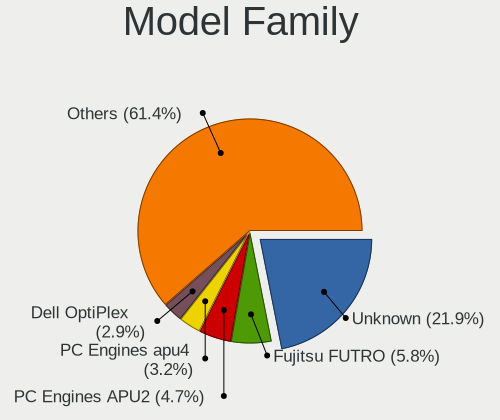

| Name                                       | Desktops | Percent |
|--------------------------------------------|----------|---------|
| Unknown                                    | 360      | 21.9%   |
| Fujitsu FUTRO                              | 96       | 5.84%   |
| PC Engines APU2                            | 77       | 4.68%   |
| PC Engines apu4                            | 53       | 3.22%   |
| Dell OptiPlex                              | 48       | 2.92%   |
| Techvision TVI7309X                        | 28       | 1.7%    |
| Fujitsu ESPRIMO                            | 24       | 1.46%   |
| Intel Q3XXG4-P                             | 19       | 1.16%   |
| Protectli FW6                              | 16       | 0.97%   |
| MW GMLK-2                                  | 15       | 0.91%   |
| Lenovo ThinkCentre                         | 15       | 0.91%   |
| HP ProDesk                                 | 15       | 0.91%   |
| ASUS PRIME                                 | 15       | 0.91%   |
| HP ProLiant                                | 14       | 0.85%   |
| Protectli FW4B                             | 13       | 0.79%   |
| HP t620                                    | 13       | 0.79%   |
| HARDKERNEL ODROID-H2                       | 13       | 0.79%   |
| HP Compaq                                  | 12       | 0.73%   |
| CncTion N5105-4L                           | 12       | 0.73%   |
| PC Engines APU3                            | 11       | 0.67%   |
| PC Engines APU                             | 11       | 0.67%   |
| ASUS TUF                                   | 11       | 0.67%   |
| Thomas-Krenn.AG LES                        | 10       | 0.61%   |
| Shenzhen Meigao Electronic Equipment Venus | 10       | 0.61%   |
| Protectli VP2420                           | 10       | 0.61%   |
| ASUS All                                   | 10       | 0.61%   |
| SJRC ADLN-6L                               | 9        | 0.55%   |
| IceWhale ZimaBoard                         | 9        | 0.55%   |
| HP EliteDesk                               | 9        | 0.55%   |
| Deciso Netboard                            | 9        | 0.55%   |
| BESSTAR Tech X35G                          | 9        | 0.55%   |
| MSI MS-7B89                                | 8        | 0.49%   |
| Yanling LES                                | 7        | 0.43%   |
| NF541 1.0                                  | 7        | 0.43%   |
| AAEON FWS-2251                             | 7        | 0.43%   |
| Protectli VP2410                           | 6        | 0.36%   |
| Lanner GP-7543                             | 6        | 0.36%   |
| CncTion J4125-4L-I225                      | 6        | 0.36%   |
| ASUS PRO                                   | 6        | 0.36%   |
| Lex Pineview-D                             | 5        | 0.3%    |

MFG Year
--------

Motherboard manufacture year

| Year    | Desktops | Percent |
|---------|----------|---------|
| 2022    | 190      | 11.56%  |
| 2016    | 170      | 10.34%  |
| 2018    | 169      | 10.28%  |
| 2021    | 149      | 9.06%   |
| 2014    | 140      | 8.52%   |
| 2023    | 133      | 8.09%   |
| 2020    | 129      | 7.85%   |
| 2019    | 112      | 6.81%   |
| 2017    | 93       | 5.66%   |
| 2013    | 70       | 4.26%   |
| 2012    | 62       | 3.77%   |
| 2011    | 55       | 3.35%   |
| 2024    | 53       | 3.22%   |
| 2015    | 31       | 1.89%   |
| 2010    | 29       | 1.76%   |
| 2009    | 22       | 1.34%   |
| 2008    | 14       | 0.85%   |
| Unknown | 12       | 0.73%   |
| 2007    | 8        | 0.49%   |
| 2006    | 2        | 0.12%   |
| 2003    | 1        | 0.06%   |

Form Factor
-----------

Physical design of the computer

| Name    | Desktops | Percent |
|---------|----------|---------|
| Desktop | 1644     | 100%    |

Coreboot
--------

Have coreboot on board

| Used | Desktops | Percent |
|------|----------|---------|
| No   | 1468     | 89.29%  |
| Yes  | 176      | 10.71%  |

RAM Size
--------

Total RAM memory

| Size in GB      | Desktops | Percent |
|-----------------|----------|---------|
| 8.01-16.0       | 595      | 35.46%  |
| 16.01-24.0      | 401      | 23.9%   |
| 4.01-8.0        | 383      | 22.82%  |
| 32.01-64.0      | 160      | 9.54%   |
| 2.01-3.0        | 53       | 3.16%   |
| 64.01-256.0     | 53       | 3.16%   |
| 24.01-32.0      | 10       | 0.6%    |
| 3.01-4.0        | 7        | 0.42%   |
| 0.01-0.5        | 6        | 0.36%   |
| 1.01-2.0        | 5        | 0.3%    |
| 0.51-1.0        | 3        | 0.18%   |
| More than 256.0 | 2        | 0.12%   |

RAM Used
--------

Used RAM memory

| Used GB     | Desktops | Percent |
|-------------|----------|---------|
| 0.01-0.5    | 800      | 47.09%  |
| 0.51-1.0    | 638      | 37.55%  |
| 1.01-2.0    | 168      | 9.89%   |
| 2.01-3.0    | 36       | 2.12%   |
| 3.01-4.0    | 16       | 0.94%   |
| 4.01-8.0    | 15       | 0.88%   |
| 0           | 8        | 0.47%   |
| Unknown     | 6        | 0.35%   |
| 16.01-24.0  | 4        | 0.24%   |
| 8.01-16.0   | 3        | 0.18%   |
| 24.01-32.0  | 2        | 0.12%   |
| 64.01-256.0 | 2        | 0.12%   |
| 32.01-64.0  | 1        | 0.06%   |

Total Drives
------------

Number of drives on board

| Drives | Desktops | Percent |
|--------|----------|---------|
| 1      | 1214     | 70.95%  |
| 0      | 234      | 13.68%  |
| 2      | 149      | 8.71%   |
| 3      | 50       | 2.92%   |
| 4      | 33       | 1.93%   |
| 5      | 15       | 0.88%   |
| 6      | 8        | 0.47%   |
| 7      | 5        | 0.29%   |
| 8      | 2        | 0.12%   |
| 9      | 1        | 0.06%   |

Has CD-ROM
----------

Has CD-ROM on board

| Presented | Desktops | Percent |
|-----------|----------|---------|
| No        | 1475     | 89.12%  |
| Yes       | 180      | 10.88%  |

Has Ethernet
------------

Has Ethernet on board

| Presented | Desktops | Percent |
|-----------|----------|---------|
| Yes       | 1633     | 99.33%  |
| No        | 11       | 0.67%   |

Has WiFi
--------

Has WiFi module

| Presented | Desktops | Percent |
|-----------|----------|---------|
| No        | 1357     | 81.5%   |
| Yes       | 308      | 18.5%   |

Has Bluetooth
-------------

Has Bluetooth module

| Presented | Desktops | Percent |
|-----------|----------|---------|
| No        | 1472     | 88.94%  |
| Yes       | 183      | 11.06%  |

Location
--------

Country
-------

Geographic location (country)

| Country | Desktops | Percent |
|---------|----------|---------|
| Germany | 1644     | 100%    |

City
----

Geographic location (city)

| City              | Desktops | Percent |
|-------------------|----------|---------|
| Berlin            | 147      | 7.72%   |
| Munich            | 73       | 3.84%   |
| Hamburg           | 57       | 3%      |
| Cologne           | 53       | 2.79%   |
| Frankfurt am Main | 47       | 2.47%   |
| Stuttgart         | 28       | 1.47%   |
| Ludwigsburg       | 22       | 1.16%   |
| Mannheim          | 21       | 1.1%    |
| Hanover           | 21       | 1.1%    |
| Dortmund          | 21       | 1.1%    |
| Nuremberg         | 19       | 1%      |
| Karlsruhe         | 19       | 1%      |
| Bonn              | 16       | 0.84%   |
| Dresden           | 15       | 0.79%   |
| Wiesbaden         | 13       | 0.68%   |
| Leipzig           | 13       | 0.68%   |
| Dsseldorf       | 13       | 0.68%   |
| Falkenstein       | 12       | 0.63%   |
| Bochum            | 12       | 0.63%   |
| Bremen            | 11       | 0.58%   |
| Wuppertal         | 10       | 0.53%   |
| Reutlingen        | 10       | 0.53%   |
| Heidelberg        | 10       | 0.53%   |
| Duisburg          | 10       | 0.53%   |
| Darmstadt         | 10       | 0.53%   |
| Bielefeld         | 10       | 0.53%   |
| Ulm               | 9        | 0.47%   |
| Essen             | 9        | 0.47%   |
| Chemnitz          | 9        | 0.47%   |
| Braunschweig      | 9        | 0.47%   |
| Magdeburg         | 8        | 0.42%   |
| Kiel              | 8        | 0.42%   |
| Kassel            | 8        | 0.42%   |
| Jena              | 8        | 0.42%   |
| Heilbronn         | 8        | 0.42%   |
| Augsburg          | 8        | 0.42%   |
| Solden            | 7        | 0.37%   |
| Nottuln           | 7        | 0.37%   |
| Mainz             | 7        | 0.37%   |
| Aachen            | 7        | 0.37%   |

Drives
------

Drive Vendor
------------

Hard drive vendors

| Vendor              | Desktops | Drives | Percent |
|---------------------|----------|--------|---------|
| Samsung Electronics | 286      | 489    | 16.47%  |
| Transcend           | 158      | 234    | 9.1%    |
| Kingston            | 140      | 237    | 8.06%   |
| WDC                 | 138      | 244    | 7.94%   |
| SanDisk             | 92       | 135    | 5.3%    |
| Crucial             | 90       | 141    | 5.18%   |
| Seagate             | 79       | 126    | 4.55%   |
| China               | 79       | 96     | 4.55%   |
| Intel               | 66       | 109    | 3.8%    |
| Toshiba             | 53       | 93     | 3.05%   |
| Intenso             | 42       | 70     | 2.42%   |
| Phison              | 40       | 60     | 2.3%    |
| Innodisk            | 39       | 45     | 2.25%   |
| Hoodisk             | 31       | 57     | 1.78%   |
| Micron Technology   | 28       | 47     | 1.61%   |
| Hitachi             | 25       | 52     | 1.44%   |
| Protectli           | 21       | 27     | 1.21%   |
| HGST                | 21       | 39     | 1.21%   |
| Patriot             | 18       | 29     | 1.04%   |
| FORESEE             | 18       | 25     | 1.04%   |
| A-DATA Technology   | 16       | 19     | 0.92%   |
| OCZ                 | 13       | 19     | 0.75%   |
| NVMe                | 12       | 20     | 0.69%   |
| ATP                 | 11       | 14     | 0.63%   |
| Apacer              | 10       | 20     | 0.58%   |
| ShiJi               | 9        | 11     | 0.52%   |
| Verbatim            | 8        | 9      | 0.46%   |
| SPCC                | 8        | 12     | 0.46%   |
| SK hynix            | 8        | 10     | 0.46%   |
| LITEONIT            | 7        | 10     | 0.4%    |
| KIOXIA              | 7        | 8      | 0.4%    |
| Corsair             | 7        | 12     | 0.4%    |
| TCSUNBOW            | 6        | 7      | 0.35%   |
| Lexar               | 6        | 6      | 0.35%   |
| Kimtigo             | 6        | 8      | 0.35%   |
| Gigabyte Technology | 6        | 7      | 0.35%   |
| Dogfish             | 6        | 7      | 0.35%   |
| BORY                | 6        | 9      | 0.35%   |
| PNY                 | 5        | 6      | 0.29%   |
| LITEON              | 5        | 6      | 0.29%   |

Drive Model
-----------

Hard drive models

| Model                            | Desktops | Percent |
|----------------------------------|----------|---------|
| Transcend TS128GMSA230S 128GB    | 39       | 2.14%   |
| China SATA SSD 16GB              | 35       | 1.92%   |
| Phison SATA SSD 16GB             | 31       | 1.7%    |
| Transcend TS64GMSA230S 64GB      | 21       | 1.15%   |
| Samsung SSD 850 EVO 250GB        | 19       | 1.04%   |
| Samsung SSD 870 EVO 250GB        | 16       | 0.88%   |
| Samsung SSD 860 EVO 500GB        | 16       | 0.88%   |
| Crucial CT240BX500SSD1 240GB     | 15       | 0.82%   |
| Transcend TS256GMSA230S 256GB    | 14       | 0.77%   |
| Transcend TS32GMSA370 32GB       | 13       | 0.71%   |
| Innodisk DEMSR- 08GB mSATA 3ME3  | 13       | 0.71%   |
| Kingston SUV500MS120G 120GB      | 12       | 0.66%   |
| Samsung SSD 840 EVO 250GB        | 11       | 0.6%    |
| Kingston SKC600MS256G 256GB      | 11       | 0.6%    |
| Hoodisk SSD 64GB                 | 11       | 0.6%    |
| Kingston SA400S37120G 120GB      | 10       | 0.55%   |
| Transcend TS32GSSD370S 32GB      | 9        | 0.49%   |
| Kingston SA400S37240G 240GB      | 9        | 0.49%   |
| Transcend TS64GMSA370 64GB       | 8        | 0.44%   |
| Samsung SSD 970 EVO Plus 500GB   | 8        | 0.44%   |
| Patriot M.2 P300 128GB           | 8        | 0.44%   |
| Kingston SV300S37A120G 120GB     | 8        | 0.44%   |
| Intenso SSD 128GB                | 8        | 0.44%   |
| Intenso SSD 120GB                | 8        | 0.44%   |
| Innodisk Corp. - mSATA 3ME3 32GB | 8        | 0.44%   |
| Hoodisk SSD 256GB                | 8        | 0.44%   |
| China IM128-P130 128GB           | 8        | 0.44%   |
| WDC WD40EFRX-68N32N0 4TB         | 7        | 0.38%   |
| Transcend TS128GMSA370 128GB     | 7        | 0.38%   |
| SanDisk SSD PLUS 120GB           | 7        | 0.38%   |
| SanDisk SDSSDA120G 120GB         | 7        | 0.38%   |
| Samsung SSD 860 EVO 250GB        | 7        | 0.38%   |
| Samsung SSD 850 PRO 256GB        | 7        | 0.38%   |
| Samsung MZVLQ128HCHQ-00BH1 128GB | 7        | 0.38%   |
| Kingston SMS200S360G 64GB        | 7        | 0.38%   |
| Kingston OM8PDP3512B-A01 512GB   | 7        | 0.38%   |
| Hoodisk SSD 128GB                | 7        | 0.38%   |
| Crucial CT500MX500SSD1 500GB     | 7        | 0.38%   |
| Crucial CT250MX500SSD1 250GB     | 7        | 0.38%   |
| China FPT310M4SSD256G 256GB      | 7        | 0.38%   |

HDD Vendor
----------

Hard disk drive vendors

| Vendor              | Desktops | Drives | Percent |
|---------------------|----------|--------|---------|
| WDC                 | 99       | 187    | 32.67%  |
| Seagate             | 73       | 114    | 24.09%  |
| Toshiba             | 37       | 73     | 12.21%  |
| Hitachi             | 24       | 48     | 7.92%   |
| HGST                | 21       | 39     | 6.93%   |
| Samsung Electronics | 20       | 30     | 6.6%    |
| NVMe                | 8        | 9      | 2.64%   |
| OPENBSD             | 3        | 7      | 0.99%   |
| Maxtor              | 2        | 2      | 0.66%   |
| JetFlash            | 2        | 2      | 0.66%   |
| Hewlett-Packard     | 2        | 2      | 0.66%   |
| Fujitsu             | 2        | 2      | 0.66%   |
| WD MediaMax         | 1        | 4      | 0.33%   |
| Product:            | 1        | 1      | 0.33%   |
| LSI                 | 1        | 1      | 0.33%   |
| Intenso             | 1        | 1      | 0.33%   |
| IBM/Hitachi         | 1        | 1      | 0.33%   |
| IBM                 | 1        | 1      | 0.33%   |
| Generic             | 1        | 1      | 0.33%   |
| General             | 1        | 1      | 0.33%   |
| ASMT                | 1        | 1      | 0.33%   |
| Apple               | 1        | 1      | 0.33%   |

SSD Vendor
----------

Solid state drive vendors

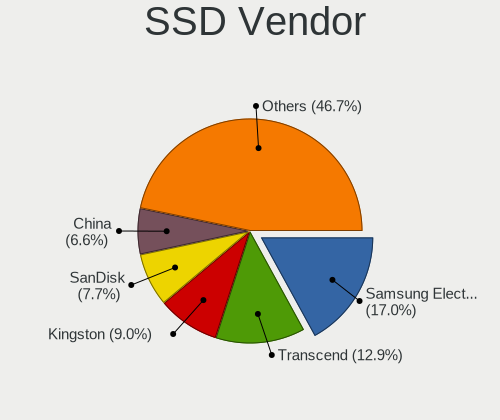

| Vendor              | Desktops | Drives | Percent |
|---------------------|----------|--------|---------|
| Samsung Electronics | 203      | 341    | 17.03%  |
| Transcend           | 154      | 229    | 12.92%  |
| Kingston            | 107      | 182    | 8.98%   |
| SanDisk             | 92       | 135    | 7.72%   |
| China               | 79       | 96     | 6.63%   |
| Crucial             | 77       | 116    | 6.46%   |
| Intel               | 53       | 93     | 4.45%   |
| Innodisk            | 39       | 45     | 3.27%   |
| Phison              | 35       | 50     | 2.94%   |
| Intenso             | 35       | 58     | 2.94%   |
| Hoodisk             | 31       | 57     | 2.6%    |
| Micron Technology   | 23       | 37     | 1.93%   |
| WDC                 | 21       | 26     | 1.76%   |
| Protectli           | 21       | 27     | 1.76%   |
| A-DATA Technology   | 16       | 19     | 1.34%   |
| Toshiba             | 13       | 16     | 1.09%   |
| OCZ                 | 13       | 19     | 1.09%   |
| FORESEE             | 13       | 18     | 1.09%   |
| ATP                 | 10       | 13     | 0.84%   |
| Apacer              | 10       | 20     | 0.84%   |
| Verbatim            | 8        | 9      | 0.67%   |
| ShiJi               | 7        | 9      | 0.59%   |
| Patriot             | 7        | 12     | 0.59%   |
| LITEONIT            | 7        | 10     | 0.59%   |
| TCSUNBOW            | 6        | 7      | 0.5%    |
| NVMe                | 6        | 11     | 0.5%    |
| Dogfish             | 6        | 7      | 0.5%    |
| BORY                | 6        | 9      | 0.5%    |
| SPCC                | 5        | 9      | 0.42%   |
| LITEON              | 5        | 6      | 0.42%   |
| Leven               | 5        | 7      | 0.42%   |
| KingSpec            | 5        | 6      | 0.42%   |
| Advantech           | 5        | 7      | 0.42%   |
| Vaseky              | 4        | 4      | 0.34%   |
| Team                | 4        | 4      | 0.34%   |
| Seagate             | 4        | 10     | 0.34%   |
| PNY                 | 4        | 5      | 0.34%   |
| KingDian            | 4        | 11     | 0.34%   |
| KeepData            | 4        | 5      | 0.34%   |
| Corsair             | 4        | 8      | 0.34%   |

Drive Kind
----------

HDD or SSD

| Kind | Desktops | Drives | Percent |
|------|----------|--------|---------|
| SSD  | 1099     | 1809   | 68.77%  |
| NVMe | 252      | 398    | 15.77%  |
| HDD  | 247      | 528    | 15.46%  |

Drive Connector
---------------

SATA, SAS, NVMe, etc.

| Type | Desktops | Drives | Percent |
|------|----------|--------|---------|
| SATA | 1247     | 2337   | 83.19%  |
| NVMe | 252      | 398    | 16.81%  |

Drive Size
----------

Size of hard drive

| Size in TB      | Desktops | Drives | Percent |
|-----------------|----------|--------|---------|
| 0.01-0.5        | 1131     | 1827   | 81.84%  |
| 0.51-1.0        | 140      | 220    | 10.13%  |
| 1.01-2.0        | 56       | 152    | 4.05%   |
| 3.01-4.0        | 23       | 59     | 1.66%   |
| 4.01-10.0       | 14       | 29     | 1.01%   |
| 2.01-3.0        | 13       | 34     | 0.94%   |
| 10.01-20.0      | 4        | 15     | 0.29%   |
| More than 100.0 | 1        | 1      | 0.07%   |

Space Total
-----------

Amount of disk space available on the file system

| Size in GB     | Desktops | Percent |
|----------------|----------|---------|
| 101-250        | 759      | 44.62%  |
| 251-500        | 246      | 14.46%  |
| 1-20           | 205      | 12.05%  |
| 21-50          | 189      | 11.11%  |
| 51-100         | 149      | 8.76%   |
| 501-1000       | 105      | 6.17%   |
| 1001-2000      | 24       | 1.41%   |
| More than 3000 | 12       | 0.71%   |
| 2001-3000      | 6        | 0.35%   |
| Unknown        | 6        | 0.35%   |

Space Used
----------

Amount of used disk space

| Used GB        | Desktops | Percent |
|----------------|----------|---------|
| 1-20           | 1567     | 92.39%  |
| 21-50          | 72       | 4.25%   |
| 51-100         | 22       | 1.3%    |
| 101-250        | 7        | 0.41%   |
| 251-500        | 6        | 0.35%   |
| 501-1000       | 6        | 0.35%   |
| Unknown        | 6        | 0.35%   |
| 2001-3000      | 4        | 0.24%   |
| 1001-2000      | 4        | 0.24%   |
| More than 3000 | 2        | 0.12%   |

Malfunc. Drives
---------------

Drive models with a malfunction

| Model                                        | Desktops | Drives | Percent |
|----------------------------------------------|----------|--------|---------|
| Kingston SV300S37A60G 64GB                   | 4        | 6      | 2.84%   |
| Kingston SMS200S360G 64GB                    | 4        | 5      | 2.84%   |
| WDC WD2000FYYZ-01UL1B2 2TB                   | 3        | 9      | 2.13%   |
| WDC WDS240G2G0A-00JH30 240GB                 | 2        | 3      | 1.42%   |
| WDC WD30EFRX-68EUZN0 3TB                     | 2        | 7      | 1.42%   |
| WDC WD2000FYYZ-01UL1B1 2TB                   | 2        | 4      | 1.42%   |
| WDC WD1600AAJS-75M0A0 160GB                  | 2        | 2      | 1.42%   |
| Toshiba THNSNK128GCS8 SATA 128GB             | 2        | 2      | 1.42%   |
| Seagate ST3160318AS 160GB                    | 2        | 2      | 1.42%   |
| Seagate ST1000DX001-1CM162 1TB               | 2        | 2      | 1.42%   |
| Samsung Electronics SSD 840 PRO Series 256GB | 2        | 4      | 1.42%   |
| Samsung Electronics HD501LJ 500GB            | 2        | 2      | 1.42%   |
| Micron Technology 1100_MTFDDAK512TBN 512GB   | 2        | 4      | 1.42%   |
| Kingston SMS200S3120G 120GB                  | 2        | 8      | 1.42%   |
| Intenso SSD SATAIII 512GB                    | 2        | 2      | 1.42%   |
| Intel SSDSC2CT120A3 120GB                    | 2        | 2      | 1.42%   |
| HGST HTS541010A7E630 1TB                     | 2        | 4      | 1.42%   |
| Crucial CT275MX300SSD1 275GB                 | 2        | 2      | 1.42%   |
| Crucial CT128MX100SSD1 128GB                 | 2        | 4      | 1.42%   |
| WDC WD6400AAKS-65A7B2 640GB                  | 1        | 1      | 0.71%   |
| WDC WD60EFRX-68TGBN1 6TB                     | 1        | 3      | 0.71%   |
| WDC WD5003ABYX-01WERA0 500GB                 | 1        | 1      | 0.71%   |
| WDC WD5000LPVX-22V0TT0 500GB                 | 1        | 1      | 0.71%   |
| WDC WD30EZRX-00D8PB0 3TB                     | 1        | 1      | 0.71%   |
| WDC WD2503ABYX-01WERA0 256GB                 | 1        | 2      | 0.71%   |
| WDC WD20EARX-00PASB0 2TB                     | 1        | 1      | 0.71%   |
| WDC WD1600AAJS-08L7A0 160GB                  | 1        | 1      | 0.71%   |
| WDC WD1600AABS-00PRA0 160GB                  | 1        | 1      | 0.71%   |
| WDC WD10EZEX-60WN4A0 1TB                     | 1        | 1      | 0.71%   |
| WDC WD10EAVS-00D7B0 1TB                      | 1        | 1      | 0.71%   |
| WDC WD10EACS-00D6B1 1TB                      | 1        | 2      | 0.71%   |
| Transcend TS8GMSM610 8GB                     | 1        | 2      | 0.71%   |
| Transcend TS32GMSA370 32GB                   | 1        | 1      | 0.71%   |
| Transcend TS128GMSA230S 128GB                | 1        | 1      | 0.71%   |
| Toshiba MQ02ABD100H 1TB                      | 1        | 4      | 0.71%   |
| Toshiba MQ01ABD100M 1TB                      | 1        | 1      | 0.71%   |
| Toshiba MK3261GSYN 320GB                     | 1        | 1      | 0.71%   |
| Toshiba MK1676GSX H 160GB                    | 1        | 2      | 0.71%   |
| SPCC M.2 PCIe SSD 256GB                      | 1        | 1      | 0.71%   |
| SMI SSD DISK 120GB                           | 1        | 1      | 0.71%   |

Malfunc. Drive Vendor
---------------------

Vendors of faulty drives

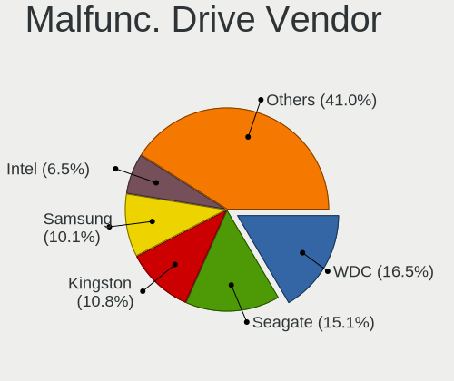

| Vendor              | Desktops | Drives | Percent |
|---------------------|----------|--------|---------|
| WDC                 | 23       | 41     | 16.55%  |
| Seagate             | 21       | 27     | 15.11%  |
| Kingston            | 15       | 26     | 10.79%  |
| Samsung Electronics | 14       | 22     | 10.07%  |
| Intel               | 9        | 10     | 6.47%   |
| Crucial             | 9        | 24     | 6.47%   |
| Toshiba             | 6        | 10     | 4.32%   |
| SanDisk             | 5        | 6      | 3.6%    |
| Hitachi             | 5        | 6      | 3.6%    |
| HGST                | 5        | 7      | 3.6%    |
| Micron Technology   | 4        | 7      | 2.88%   |
| Transcend           | 3        | 4      | 2.16%   |
| China               | 3        | 4      | 2.16%   |
| OCZ                 | 2        | 2      | 1.44%   |
| Maxtor              | 2        | 2      | 1.44%   |
| Intenso             | 2        | 2      | 1.44%   |
| Apacer              | 2        | 2      | 1.44%   |
| A-DATA Technology   | 2        | 3      | 1.44%   |
| SPCC                | 1        | 1      | 0.72%   |
| SMI                 | 1        | 1      | 0.72%   |
| Netac               | 1        | 1      | 0.72%   |
| Leven               | 1        | 1      | 0.72%   |
| KingSpec            | 1        | 1      | 0.72%   |
| KingDian            | 1        | 4      | 0.72%   |
| Corsair             | 1        | 3      | 0.72%   |

Malfunc. HDD Vendor
-------------------

Vendors of faulty HDD drives

| Vendor              | Desktops | Drives | Percent |
|---------------------|----------|--------|---------|
| WDC                 | 21       | 38     | 32.81%  |
| Seagate             | 21       | 27     | 32.81%  |
| Samsung Electronics | 6        | 10     | 9.38%   |
| Hitachi             | 5        | 6      | 7.81%   |
| HGST                | 5        | 7      | 7.81%   |
| Toshiba             | 4        | 8      | 6.25%   |
| Maxtor              | 2        | 2      | 3.13%   |

Malfunc. Drive Kind
-------------------

Kinds of faulty drives

| Kind | Desktops | Drives | Percent |
|------|----------|--------|---------|
| SSD  | 72       | 116    | 52.94%  |
| HDD  | 61       | 98     | 44.85%  |
| NVMe | 3        | 3      | 2.21%   |

Failed Drives
-------------

Failed drive models

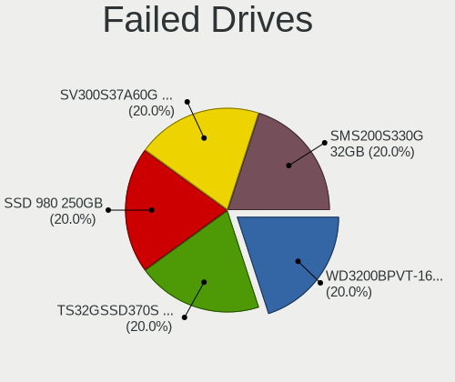

| Model                             | Desktops | Drives | Percent |
|-----------------------------------|----------|--------|---------|
| WDC WD3200BPVT-16JJ5T0 320GB      | 1        | 1      | 20%     |
| Transcend TS32GSSD370S 32GB       | 1        | 4      | 20%     |
| Samsung Electronics SSD 980 250GB | 1        | 2      | 20%     |
| Kingston SV300S37A60G 64GB        | 1        | 1      | 20%     |
| Kingston SMS200S330G 32GB         | 1        | 1      | 20%     |

Failed Drive Vendor
-------------------

Failed drive vendors

| Vendor              | Desktops | Drives | Percent |
|---------------------|----------|--------|---------|
| Kingston            | 2        | 2      | 40%     |
| WDC                 | 1        | 1      | 20%     |
| Transcend           | 1        | 4      | 20%     |
| Samsung Electronics | 1        | 2      | 20%     |

Drive Status
------------

Number of failed and malfunc. drives

| Status   | Desktops | Drives | Percent |
|----------|----------|--------|---------|
| Works    | 1345     | 2446   | 88.49%  |
| Malfunc  | 134      | 217    | 8.82%   |
| Detected | 36       | 63     | 2.37%   |
| Failed   | 5        | 9      | 0.33%   |

Storage controller
------------------

Storage Vendor
--------------

Storage controller vendors

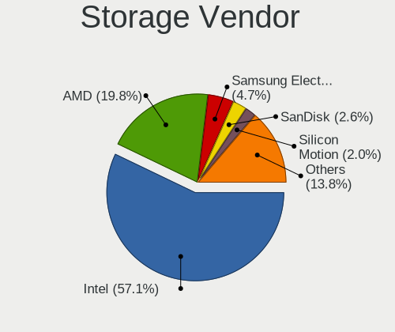

| Vendor                                  | Desktops | Percent |
|-----------------------------------------|----------|---------|
| Intel                                   | 1163     | 57.12%  |
| AMD                                     | 403      | 19.79%  |
| Samsung Electronics                     | 96       | 4.72%   |
| SanDisk                                 | 53       | 2.6%    |
| Silicon Motion                          | 41       | 2.01%   |
| MAXIO Technology (Hangzhou)             | 38       | 1.87%   |
| Kingston Technology Company             | 36       | 1.77%   |
| ASMedia Technology                      | 31       | 1.52%   |
| Phison Electronics                      | 22       | 1.08%   |
| Micron/Crucial Technology               | 18       | 0.88%   |
| Micron Technology                       | 16       | 0.79%   |
| Shenzhen Longsys Electronics            | 11       | 0.54%   |
| KIOXIA                                  | 11       | 0.54%   |
| Marvell Technology Group                | 10       | 0.49%   |
| Broadcom / LSI                          | 10       | 0.49%   |
| Nvidia                                  | 8        | 0.39%   |
| JMicron Technology                      | 7        | 0.34%   |
| Toshiba                                 | 6        | 0.29%   |
| SK hynix                                | 6        | 0.29%   |
| VIA Technologies                        | 5        | 0.25%   |
| Realtek Semiconductor                   | 5        | 0.25%   |
| Hosin Global Electronics                | 5        | 0.25%   |
| Chelsio Communications                  | 4        | 0.2%    |
| Transcend                               | 3        | 0.15%   |
| Solid State Storage Technology          | 3        | 0.15%   |
| Silicon Image                           | 3        | 0.15%   |
| Hewlett-Packard                         | 3        | 0.15%   |
| Unknown                                 | 3        | 0.15%   |
| Yangtze Memory Technologies             | 2        | 0.1%    |
| Seagate Technology                      | 2        | 0.1%    |
| Adaptec                                 | 2        | 0.1%    |
| ULi Electronics                         | 1        | 0.05%   |
| Shenzhen Unionmemory Information System | 1        | 0.05%   |
| Netac Technology                        | 1        | 0.05%   |
| Integrated Technology Express           | 1        | 0.05%   |
| Enmotus                                 | 1        | 0.05%   |
| ATP ELECTRONICS                         | 1        | 0.05%   |
| Artop Electronic                        | 1        | 0.05%   |
| Areca Technology                        | 1        | 0.05%   |
| ADATA Technology                        | 1        | 0.05%   |

Storage Model
-------------

Storage controller models

| Model                                                                            | Desktops | Percent |
|----------------------------------------------------------------------------------|----------|---------|
| AMD FCH SATA Controller [AHCI mode]                                              | 267      | 11.77%  |
| Intel Celeron/Pentium Silver Processor SATA Controller                           | 122      | 5.38%   |
| Intel Alder Lake-N SATA AHCI Controller                                          | 103      | 4.54%   |
| Intel Sunrise Point-LP SATA Controller [AHCI mode]                               | 91       | 4.01%   |
| AMD FCH SATA Controller [IDE mode]                                               | 72       | 3.17%   |
| Intel Jasper Lake SATA AHCI Controller                                           | 69       | 3.04%   |
| Intel 8 Series/C220 Series Chipset Family 6-port SATA Controller 1 [AHCI mode]   | 68       | 3%      |
| Intel Q170/Q150/B150/H170/H110/Z170/CM236 Chipset SATA Controller [AHCI Mode]    | 61       | 2.69%   |
| Intel Atom/Celeron/Pentium Processor x5-E8000/J3xxx/N3xxx Series SATA Controller | 57       | 2.51%   |
| Intel Atom Processor E3800 Series SATA AHCI Controller                           | 57       | 2.51%   |
| Samsung NVMe SSD Controller SM981/PM981/PM983                                    | 46       | 2.03%   |
| AMD SB7x0/SB8x0/SB9x0 SATA Controller [AHCI mode]                                | 44       | 1.94%   |
| Intel Cannon Lake PCH SATA AHCI Controller                                       | 41       | 1.81%   |
| Intel 6 Series/C200 Series Chipset Family 6 port Desktop SATA AHCI Controller    | 41       | 1.81%   |
| Silicon Motion SM2263EN/SM2263XT (DRAM-less) NVMe SSD Controllers                | 40       | 1.76%   |
| MAXIO (Hangzhou) NVMe SSD Controller MAP1202 (DRAM-less)                         | 38       | 1.67%   |
| AMD 400 Series Chipset SATA Controller                                           | 31       | 1.37%   |
| Intel Comet Lake SATA AHCI Controller                                            | 30       | 1.32%   |
| Intel Celeron N3350/Pentium N4200/Atom E3900 Series SATA AHCI Controller         | 30       | 1.32%   |
| Intel 200 Series PCH SATA controller [AHCI mode]                                 | 30       | 1.32%   |
| Intel 82801G (ICH7 Family) IDE Controller                                        | 28       | 1.23%   |
| ASMedia ASM1061/ASM1062 Serial ATA Controller                                    | 28       | 1.23%   |
| Intel NM10/ICH7 Family SATA Controller [IDE mode]                                | 27       | 1.19%   |
| Intel 7 Series/C210 Series Chipset Family 6-port SATA Controller [AHCI mode]     | 25       | 1.1%    |
| Intel Elkhart Lake SATA AHCI                                                     | 23       | 1.01%   |
| Intel Cannon Point-LP SATA Controller [AHCI Mode]                                | 23       | 1.01%   |
| Samsung NVMe SSD Controller 980 (DRAM-less)                                      | 22       | 0.97%   |
| Intel SATA Controller [RAID Mode]                                                | 20       | 0.88%   |
| Intel 82801HM/HEM (ICH8M/ICH8M-E) IDE Controller                                 | 19       | 0.84%   |
| Intel 5 Series/3400 Series Chipset 6 port SATA AHCI Controller                   | 19       | 0.84%   |
| AMD SB7x0/SB8x0/SB9x0 IDE Controller                                             | 18       | 0.79%   |
| Intel NM10/ICH7 Family SATA Controller [AHCI mode]                               | 17       | 0.75%   |
| Intel Tiger Lake-LP SATA Controller                                              | 16       | 0.71%   |
| Samsung NVMe SSD Controller PM9A1/PM9A3/980PRO                                   | 15       | 0.66%   |
| Intel Atom Processor C3000 Series SATA Controller 1                              | 14       | 0.62%   |
| Intel Atom Processor C3000 Series SATA Controller 0                              | 14       | 0.62%   |
| Intel 82801HM/HEM (ICH8M/ICH8M-E) SATA Controller [IDE mode]                     | 14       | 0.62%   |
| Intel 8 Series SATA Controller 1 [AHCI mode]                                     | 14       | 0.62%   |
| Micron/Crucial P2 [Nick P2] / P3 / P3 Plus NVMe PCIe SSD (DRAM-less)             | 13       | 0.57%   |
| SanDisk Extreme Pro / WD Black SN750 / PC SN730 / Red SN700 NVMe SSD             | 12       | 0.53%   |

Storage Kind
------------

Kind of storage controller (IDE, SATA, NVMe, SAS, ...)

| Kind | Desktops | Percent |
|------|----------|---------|
| SATA | 1401     | 68.27%  |
| NVMe | 381      | 18.57%  |
| IDE  | 204      | 9.94%   |
| RAID | 49       | 2.39%   |
| SCSI | 12       | 0.58%   |
| SAS  | 5        | 0.24%   |

Processor
---------

CPU Vendor
----------

Processor vendors

| Vendor  | Desktops | Percent |
|---------|----------|---------|
| Intel   | 1225     | 74.15%  |
| AMD     | 414      | 25.06%  |
| ARM     | 8        | 0.48%   |
| VIA     | 2        | 0.12%   |
| Sun     | 1        | 0.06%   |
| i       | 1        | 0.06%   |
| Unknown | 1        | 0.06%   |

CPU Model
---------

Processor models

| Model                                     | Desktops | Percent |
|-------------------------------------------|----------|---------|
| AMD GX-412TC SOC                          | 142      | 8.52%   |
| Intel N100                                | 106      | 6.36%   |
| Intel Celeron J4125 CPU @ 2.00GHz         | 84       | 5.04%   |
| Intel Celeron N5105 @ 2.00GHz             | 54       | 3.24%   |
| AMD GX-415GA SOC with Radeon HD Graphics  | 43       | 2.58%   |
| Intel Celeron CPU J1900 @ 1.99GHz         | 36       | 2.16%   |
| Intel Celeron CPU J3160 @ 1.60GHz         | 32       | 1.92%   |
| AMD GX-222GC SOC with Radeon R5E Graphics | 26       | 1.56%   |
| Intel Celeron J6412 @ 2.00GHz             | 18       | 1.08%   |
| Intel Atom CPU D525 @ 1.80GHz             | 17       | 1.02%   |
| Intel Core i5-6500 CPU @ 3.20GHz          | 16       | 0.96%   |
| AMD GX-424CC SOC with Radeon R5E Graphics | 16       | 0.96%   |
| Intel Celeron J4105 CPU @ 1.50GHz         | 15       | 0.9%    |
| Intel Celeron CPU J3455 @ 1.50GHz         | 15       | 0.9%    |
| AMD G-T40E Processor                      | 15       | 0.9%    |
| Intel Core i5-7200U CPU @ 2.50GHz         | 14       | 0.84%   |
| Intel Core i3-N305                        | 14       | 0.84%   |
| Intel Atom CPU C3558 @ 2.20GHz            | 14       | 0.84%   |
| Intel Core i7-7500U CPU @ 2.70GHz         | 13       | 0.78%   |
| Intel Core i5-8250U CPU @ 1.60GHz         | 13       | 0.78%   |
| Intel Core i5-3470 CPU @ 3.20GHz          | 12       | 0.72%   |
| Intel Core i5-10210U CPU @ 1.60GHz        | 12       | 0.72%   |
| Intel Core i3-6100 CPU @ 3.70GHz          | 10       | 0.6%    |
| Intel Celeron CPU N3150 @ 1.60GHz         | 10       | 0.6%    |
| Intel Atom CPU E3845 @ 1.91GHz            | 10       | 0.6%    |
| AMD GX-420CA SOC with Radeon HD Graphics  | 10       | 0.6%    |
| Intel Pentium Silver J5005 CPU @ 1.50GHz  | 9        | 0.54%   |
| Intel Core i7-8550U CPU @ 1.80GHz         | 9        | 0.54%   |
| Intel Core i7-7700 CPU @ 3.60GHz          | 9        | 0.54%   |
| Intel Core i3-1005G1 CPU @ 1.20GHz        | 9        | 0.54%   |
| Intel Celeron J4115 CPU @ 1.80GHz         | 9        | 0.54%   |
| Intel Core i7-4770 CPU @ 3.40GHz          | 8        | 0.48%   |
| Intel Core i5-8365U CPU @ 1.60GHz         | 8        | 0.48%   |
| Intel Celeron CPU N3160 @ 1.60GHz         | 8        | 0.48%   |
| Intel 11th Gen Core i7-1165G7 @ 2.80GHz   | 8        | 0.48%   |
| Intel N95                                 | 7        | 0.42%   |
| Intel Core i5-6500T CPU @ 2.50GHz         | 7        | 0.42%   |
| Intel Core i3-7100U CPU @ 2.40GHz         | 7        | 0.42%   |
| Intel Celeron N5095 @ 2.00GHz             | 7        | 0.42%   |
| Intel Celeron CPU N3450 @ 1.10GHz         | 7        | 0.42%   |

CPU Model Family
----------------

Processor model prefix

| Model                   | Desktops | Percent |
|-------------------------|----------|---------|
| Intel Celeron           | 371      | 22.32%  |
| AMD GX                  | 255      | 15.34%  |
| Intel Core i5           | 222      | 13.36%  |
| Other                   | 179      | 10.77%  |
| Intel Core i3           | 133      | 8%      |
| Intel Core i7           | 95       | 5.72%   |
| Intel Atom              | 82       | 4.93%   |
| Intel Xeon              | 78       | 4.69%   |
| AMD Ryzen 7             | 32       | 1.93%   |
| AMD Ryzen 5             | 27       | 1.62%   |
| Intel Pentium Silver    | 21       | 1.26%   |
| Intel Pentium           | 21       | 1.26%   |
| AMD G                   | 20       | 1.2%    |
| AMD FX                  | 16       | 0.96%   |
| Intel Core 2 Quad       | 10       | 0.6%    |
| Intel Core 2 Duo        | 9        | 0.54%   |
| AMD Athlon              | 8        | 0.48%   |
| Intel Pentium Gold      | 7        | 0.42%   |
| AMD Ryzen 9             | 7        | 0.42%   |
| AMD Ryzen 5 PRO         | 7        | 0.42%   |
| Intel Pentium Dual-Core | 6        | 0.36%   |
| AMD Ryzen 3             | 6        | 0.36%   |
| AMD Athlon 64 X2        | 5        | 0.3%    |
| ARM Cortex              | 4        | 0.24%   |
| AMD Ryzen 7 PRO         | 4        | 0.24%   |
| AMD E                   | 4        | 0.24%   |
| Intel Core i9           | 3        | 0.18%   |
| AMD Turion II Neo       | 3        | 0.18%   |
| AMD Ryzen Threadripper  | 3        | 0.18%   |
| AMD Ryzen Embedded      | 3        | 0.18%   |
| AMD Athlon Dual Core    | 3        | 0.18%   |
| AMD A10                 | 3        | 0.18%   |
| Intel Pentium 4         | 2        | 0.12%   |
| AMD A8                  | 2        | 0.12%   |
| AMD A4                  | 2        | 0.12%   |
| Intel Xeon Gold         | 1        | 0.06%   |
| Intel Pentium Dual      | 1        | 0.06%   |
| Intel Core 2            | 1        | 0.06%   |
| AMD Phenom II X4        | 1        | 0.06%   |
| AMD Opteron             | 1        | 0.06%   |

CPU Cores
---------

Number of processor cores

| Number  | Desktops | Percent |
|---------|----------|---------|
| 4       | 1033     | 62.15%  |
| 2       | 371      | 22.32%  |
| 8       | 70       | 4.21%   |
| 6       | 62       | 3.73%   |
| 16      | 39       | 2.35%   |
| Unknown | 28       | 1.68%   |
| 12      | 25       | 1.5%    |
| 1       | 15       | 0.9%    |
| 32      | 7        | 0.42%   |
| 10      | 5        | 0.3%    |
| 20      | 3        | 0.18%   |
| 3       | 2        | 0.12%   |
| 36      | 1        | 0.06%   |
| 24      | 1        | 0.06%   |

CPU Sockets
-----------

Number of sockets

| Number  | Desktops | Percent |
|---------|----------|---------|
| 1       | 1617     | 98.3%   |
| Unknown | 15       | 0.91%   |
| 2       | 13       | 0.79%   |

CPU Threads
-----------

Threads per core (Hyper-Threading)

| Number  | Desktops | Percent |
|---------|----------|---------|
| 1       | 1172     | 70.94%  |
| 2       | 450      | 27.24%  |
| Unknown | 30       | 1.82%   |

CPU Microarch
-------------

Microarchitecture

| Name          | Desktops | Percent |
|---------------|----------|---------|
| Unknown       | 291      | 17.53%  |
| KabyLake      | 200      | 12.05%  |
| Puma          | 191      | 11.51%  |
| Goldmont plus | 124      | 7.47%   |
| Silvermont    | 123      | 7.41%   |
| Haswell       | 94       | 5.66%   |
| Skylake       | 80       | 4.82%   |
| Jaguar        | 69       | 4.16%   |
| IvyBridge     | 62       | 3.73%   |
| Goldmont      | 49       | 2.95%   |
| Bonnell       | 42       | 2.53%   |
| SandyBridge   | 39       | 2.35%   |
| Penryn        | 31       | 1.87%   |
| Zen+          | 28       | 1.69%   |
| Zen 2         | 26       | 1.57%   |
| CometLake     | 25       | 1.51%   |
| Bobcat        | 24       | 1.45%   |
| Zen           | 21       | 1.27%   |
| TigerLake     | 18       | 1.08%   |
| Broadwell     | 17       | 1.02%   |
| Piledriver    | 15       | 0.9%    |
| Core          | 15       | 0.9%    |
| Westmere      | 14       | 0.84%   |
| Zen 3         | 13       | 0.78%   |
| Nehalem       | 12       | 0.72%   |
| K8 Hammer     | 9        | 0.54%   |
| IceLake       | 9        | 0.54%   |
| K10           | 6        | 0.36%   |
| Bulldozer     | 5        | 0.3%    |
| NetBurst      | 2        | 0.12%   |
| Excavator     | 2        | 0.12%   |
| Steamroller   | 1        | 0.06%   |
| P6            | 1        | 0.06%   |
| K10 Llano     | 1        | 0.06%   |
| Geode         | 1        | 0.06%   |

Graphics
--------

GPU Vendor
----------

Vendors of graphics cards

| Vendor                                       | Desktops | Percent |
|----------------------------------------------|----------|---------|
| Intel                                        | 1065     | 73.3%   |
| AMD                                          | 226      | 15.55%  |
| Nvidia                                       | 89       | 6.13%   |
| ASPEED Technology                            | 42       | 2.89%   |
| Matrox Electronics Systems                   | 27       | 1.86%   |
| XGI Technology (eXtreme Graphics Innovation) | 2        | 0.14%   |
| VIA Technologies                             | 2        | 0.14%   |

GPU Model
---------

Graphics card models

| Model                                                                                    | Desktops | Percent |
|------------------------------------------------------------------------------------------|----------|---------|
| Intel Alder Lake-N [UHD Graphics]                                                        | 131      | 8.89%   |
| Intel GeminiLake [UHD Graphics 600]                                                      | 111      | 7.53%   |
| Intel JasperLake [UHD Graphics]                                                          | 80       | 5.43%   |
| Intel Atom Processor Z36xxx/Z37xxx Series Graphics & Display                             | 61       | 4.14%   |
| Intel Atom/Celeron/Pentium Processor x5-E8000/J3xxx/N3xxx Integrated Graphics Controller | 58       | 3.93%   |
| Intel Xeon E3-1200 v3/4th Gen Core Processor Integrated Graphics Controller              | 45       | 3.05%   |
| AMD Kabini [Radeon HD 8330E]                                                             | 43       | 2.92%   |
| ASPEED Technology ASPEED Graphics Family                                                 | 42       | 2.85%   |
| AMD Mullins [Radeon R4/R5 Graphics]                                                      | 42       | 2.85%   |
| Intel HD Graphics 530                                                                    | 41       | 2.78%   |
| Intel HD Graphics 620                                                                    | 38       | 2.58%   |
| Intel CoffeeLake-S GT2 [UHD Graphics 630]                                                | 34       | 2.31%   |
| Intel HD Graphics 500                                                                    | 28       | 1.9%    |
| Intel 2nd Generation Core Processor Family Integrated Graphics Controller                | 25       | 1.7%    |
| Intel UHD Graphics 620                                                                   | 23       | 1.56%   |
| Intel Elkhart Lake [UHD Graphics Gen11 16EU]                                             | 23       | 1.56%   |
| Intel Atom Processor D4xx/D5xx/N4xx/N5xx Integrated Graphics Controller                  | 23       | 1.56%   |
| Intel 4 Series Chipset Integrated Graphics Controller                                    | 23       | 1.56%   |
| Intel HD Graphics 630                                                                    | 22       | 1.49%   |
| Intel Xeon E3-1200 v2/3rd Gen Core processor Graphics Controller                         | 21       | 1.42%   |
| Intel 4th Generation Core Processor Family Integrated Graphics Controller                | 18       | 1.22%   |
| Intel CometLake-S GT2 [UHD Graphics 630]                                                 | 17       | 1.15%   |
| Intel WhiskeyLake-U GT2 [UHD Graphics 620]                                               | 16       | 1.09%   |
| Intel TigerLake-LP GT2 [Iris Xe Graphics]                                                | 16       | 1.09%   |
| AMD Picasso/Raven 2 [Radeon Vega Series / Radeon Vega Mobile Series]                     | 14       | 0.95%   |
| Matrox Electronics Systems MGA G200eW WPCM450                                            | 13       | 0.88%   |
| Intel GeminiLake [UHD Graphics 605]                                                      | 13       | 0.88%   |
| Intel HD Graphics 610                                                                    | 12       | 0.81%   |
| AMD Ellesmere [Radeon RX 470/480/570/570X/580/580X/590]                                  | 12       | 0.81%   |
| Nvidia GP108 [GeForce GT 1030]                                                           | 11       | 0.75%   |
| Intel Skylake GT2 [HD Graphics 520]                                                      | 11       | 0.75%   |
| Intel CometLake-U GT2 [UHD Graphics]                                                     | 11       | 0.75%   |
| AMD Kabini [Radeon HD 8400E]                                                             | 11       | 0.75%   |
| Matrox Electronics Systems MGA G200EH                                                    | 10       | 0.68%   |
| Intel Haswell-ULT Integrated Graphics Controller                                         | 10       | 0.68%   |
| Intel Iris Plus Graphics G1 (Ice Lake)                                                   | 9        | 0.61%   |
| Intel HD Graphics 5500                                                                   | 9        | 0.61%   |
| Intel Core Processor Integrated Graphics Controller                                      | 9        | 0.61%   |
| Intel Atom Processor D2xxx/N2xxx Integrated Graphics Controller                          | 9        | 0.61%   |
| AMD Raven Ridge [Radeon Vega Series / Radeon Vega Mobile Series]                         | 9        | 0.61%   |

GPU Combo
---------

Combinations of graphics cards

| Name           | Desktops | Percent |
|----------------|----------|---------|
| 1 x Intel      | 1019     | 61.53%  |
| 1 x AMD        | 220      | 13.29%  |
| Other          | 218      | 13.16%  |
| 1 x Nvidia     | 79       | 4.77%   |
| 1 x ASPEED     | 39       | 2.36%   |
| 2 x Intel      | 32       | 1.93%   |
| 1 x Matrox     | 26       | 1.57%   |
| Intel + Nvidia | 9        | 0.54%   |
| 2 x AMD        | 4        | 0.24%   |
| Intel + ASPEED | 3        | 0.18%   |
| 1 x XGI        | 2        | 0.12%   |
| 1 x VIA        | 2        | 0.12%   |
| Intel + Matrox | 1        | 0.06%   |
| Intel + AMD    | 1        | 0.06%   |
| AMD + Nvidia   | 1        | 0.06%   |

GPU Driver
----------

Free vs proprietary

| Driver      | Desktops | Percent |
|-------------|----------|---------|
| Free        | 1372     | 83.15%  |
| Unknown     | 225      | 13.64%  |
| Proprietary | 53       | 3.21%   |

GPU Memory
----------

Total video memory

| Size in GB | Desktops | Percent |
|------------|----------|---------|
| Unknown    | 1562     | 94.38%  |
| 1.01-2.0   | 29       | 1.75%   |
| 3.01-4.0   | 15       | 0.91%   |
| 7.01-8.0   | 12       | 0.73%   |
| 0.51-1.0   | 11       | 0.66%   |
| 0.01-0.5   | 11       | 0.66%   |
| 5.01-6.0   | 9        | 0.54%   |
| 2.01-3.0   | 4        | 0.24%   |
| 8.01-16.0  | 2        | 0.12%   |

Monitor
-------

Monitor Vendor
--------------

Monitor vendors

| Vendor               | Desktops | Percent |
|----------------------|----------|---------|
| Samsung Electronics  | 27       | 17.42%  |
| Dell                 | 15       | 9.68%   |
| Goldstar             | 14       | 9.03%   |
| BenQ                 | 12       | 7.74%   |
| Acer                 | 11       | 7.1%    |
| Hewlett-Packard      | 9        | 5.81%   |
| Eizo                 | 9        | 5.81%   |
| Iiyama               | 7        | 4.52%   |
| Ancor Communications | 7        | 4.52%   |
| Philips              | 6        | 3.87%   |
| LG Electronics       | 6        | 3.87%   |
| Fujitsu Siemens      | 6        | 3.87%   |
| NEC Computers        | 5        | 3.23%   |
| Idek Iiyama          | 3        | 1.94%   |
| HannStar             | 2        | 1.29%   |
| ASUSTek Computer     | 2        | 1.29%   |
| AOC                  | 2        | 1.29%   |
| WYT                  | 1        | 0.65%   |
| ViewSonic            | 1        | 0.65%   |
| Vestel Elektronik    | 1        | 0.65%   |
| MSI                  | 1        | 0.65%   |
| Mi                   | 1        | 0.65%   |
| LG Display           | 1        | 0.65%   |
| Lenovo               | 1        | 0.65%   |
| HUAWEI               | 1        | 0.65%   |
| HKC                  | 1        | 0.65%   |
| CMT                  | 1        | 0.65%   |
| CHD                  | 1        | 0.65%   |
| Belinea              | 1        | 0.65%   |

Monitor Model
-------------

Monitor models

| Model                                                                 | Desktops | Percent |
|-----------------------------------------------------------------------|----------|---------|
| Goldstar LG Ultra HD GSM5B08 3840x2160 600x340mm 27.2-inch            | 3        | 1.79%   |
| Fujitsu Siemens B24-9 WE FUS08C3 1920x1200 520x320mm 24.0-inch        | 3        | 1.79%   |
| Samsung Electronics C32JG5x SAM0FDE 2560x1440 700x390mm 31.5-inch     | 2        | 1.19%   |
| Samsung Electronics C27FG7x SAM0E41 1920x1080 600x340mm 27.2-inch     | 2        | 1.19%   |
| Samsung Electronics C24F390 SAM0D2C 1920x1080 520x290mm 23.4-inch     | 2        | 1.19%   |
| NEC Computers EX341R NEC2C7A 3440x1440 800x330mm 34.1-inch            | 2        | 1.19%   |
| Hewlett-Packard LP2475w HWP26F9 1920x1200 540x350mm 25.3-inch         | 2        | 1.19%   |
| Hewlett-Packard LP2475w HWP26F8 1920x1200 540x350mm 25.3-inch         | 2        | 1.19%   |
| Hewlett-Packard LA2405 HWP284B 1920x1200 520x320mm 24.0-inch          | 2        | 1.19%   |
| Goldstar LG HDR 4K GSM7707 3840x2160 600x340mm 27.2-inch              | 2        | 1.19%   |
| Goldstar E2441 GSM581F 1920x1080 530x300mm 24.0-inch                  | 2        | 1.19%   |
| Eizo EV2450 ENC2530 1920x1080 530x300mm 24.0-inch                     | 2        | 1.19%   |
| Dell LCD Monitor U2412M 3840x1200                                     | 2        | 1.19%   |
| Dell LCD Monitor U2412M                                               | 2        | 1.19%   |
| BenQ GW2260 BNQ78C4 1920x1080 480x270mm 21.7-inch                     | 2        | 1.19%   |
| BenQ GL2760 BNQ78D5 1920x1080 600x340mm 27.2-inch                     | 2        | 1.19%   |
| BenQ GL2450H BNQ78A6 1920x1080 530x300mm 24.0-inch                    | 2        | 1.19%   |
| Ancor Communications MX27AQ ACI27A5 2560x1440 600x340mm 27.2-inch     | 2        | 1.19%   |
| WYT MNT-ANALOG WYT0323 1280x1024 330x270mm 16.8-inch                  | 1        | 0.6%    |
| ViewSonic VG2755 VSC2B37 1920x1080 600x340mm 27.2-inch                | 1        | 0.6%    |
| Vestel Elektronik 32W_LCD_TV VES3700 1920x1080 710x400mm 32.1-inch    | 1        | 0.6%    |
| Samsung Electronics U28E590 SAM0C4E 3840x2160 610x350mm 27.7-inch     | 1        | 0.6%    |
| Samsung Electronics U28E590 SAM0C4D 3840x2160 610x350mm 27.7-inch     | 1        | 0.6%    |
| Samsung Electronics SyncMaster SAM05CD 1920x1080                      | 1        | 0.6%    |
| Samsung Electronics SyncMaster SAM0587 1920x1200 520x320mm 24.0-inch  | 1        | 0.6%    |
| Samsung Electronics SyncMaster SAM041E 2048x1152 510x290mm 23.1-inch  | 1        | 0.6%    |
| Samsung Electronics SyncMaster SAM03E5 1680x1050 470x300mm 22.0-inch  | 1        | 0.6%    |
| Samsung Electronics SyncMaster SAM036C 1920x1200 550x340mm 25.5-inch  | 1        | 0.6%    |
| Samsung Electronics SMT27A300 SAM087A 1920x1080 600x340mm 27.2-inch   | 1        | 0.6%    |
| Samsung Electronics SMS24A450 SAM083A 1920x1200 520x320mm 24.0-inch   | 1        | 0.6%    |
| Samsung Electronics SAMTRON STN0028 1280x1024 380x300mm 19.1-inch     | 1        | 0.6%    |
| Samsung Electronics SA300/SA350 SAM078F 1920x1080 480x270mm 21.7-inch | 1        | 0.6%    |
| Samsung Electronics S24F350 SAM0D20 1920x1080 520x290mm 23.4-inch     | 1        | 0.6%    |
| Samsung Electronics S24C650 SAM09E9 1920x1080 520x290mm 23.4-inch     | 1        | 0.6%    |
| Samsung Electronics S24C650 SAM09E8 1920x1080 520x290mm 23.4-inch     | 1        | 0.6%    |
| Samsung Electronics S24C650 SAM09E7 1920x1080 520x290mm 23.4-inch     | 1        | 0.6%    |
| Samsung Electronics S22D390 SAM0B63 1920x1080 480x270mm 21.7-inch     | 1        | 0.6%    |
| Samsung Electronics LCD Monitor T27C370 1920x1080                     | 1        | 0.6%    |
| Samsung Electronics LCD Monitor SMB2430L 1920x1080                    | 1        | 0.6%    |
| Samsung Electronics LCD Monitor SAM0D4F 1920x1080 890x500mm 40.2-inch | 1        | 0.6%    |

Monitor Resolution
------------------

Monitor screen resolution

| Resolution         | Desktops | Percent |
|--------------------|----------|---------|
| 1920x1080 (FHD)    | 65       | 41.94%  |
| 2560x1440 (QHD)    | 20       | 12.9%   |
| 3840x2160 (4K)     | 17       | 10.97%  |
| 1920x1200 (WUXGA)  | 16       | 10.32%  |
| 1280x1024 (SXGA)   | 8        | 5.16%   |
| 3440x1440          | 7        | 4.52%   |
| 1680x1050 (WSXGA+) | 5        | 3.23%   |
| 1440x900 (WXGA+)   | 3        | 1.94%   |
| Unknown            | 3        | 1.94%   |
| 3840x1200          | 2        | 1.29%   |
| 2560x1080          | 2        | 1.29%   |
| 1600x900 (HD+)     | 2        | 1.29%   |
| 3840x1080          | 1        | 0.65%   |
| 3600x1080          | 1        | 0.65%   |
| 2048x1152          | 1        | 0.65%   |
| 1920x540           | 1        | 0.65%   |
| 1366x768 (WXGA)    | 1        | 0.65%   |

Monitor Diagonal
----------------

Diagonal size in inches

| Inches  | Desktops | Percent |
|---------|----------|---------|
| 27      | 38       | 24.68%  |
| 24      | 32       | 20.78%  |
| Unknown | 21       | 13.64%  |
| 23      | 15       | 9.74%   |
| 21      | 14       | 9.09%   |
| 19      | 8        | 5.19%   |
| 34      | 6        | 3.9%    |
| 22      | 5        | 3.25%   |
| 31      | 4        | 2.6%    |
| 25      | 3        | 1.95%   |
| 46      | 1        | 0.65%   |
| 42      | 1        | 0.65%   |
| 33      | 1        | 0.65%   |
| 32      | 1        | 0.65%   |
| 18      | 1        | 0.65%   |
| 17      | 1        | 0.65%   |
| 16      | 1        | 0.65%   |
| 13      | 1        | 0.65%   |

Monitor Width
-------------

Physical width

| Width in mm | Desktops | Percent |
|-------------|----------|---------|
| 501-600     | 84       | 54.9%   |
| 401-500     | 21       | 13.73%  |
| Unknown     | 21       | 13.73%  |
| 701-800     | 8        | 5.23%   |
| 601-700     | 8        | 5.23%   |
| 351-400     | 6        | 3.92%   |
| 301-350     | 3        | 1.96%   |
| 1001-1500   | 1        | 0.65%   |
| 901-1000    | 1        | 0.65%   |

Aspect Ratio
------------

Proportional relationship between the width and the height

| Ratio   | Desktops | Percent |
|---------|----------|---------|
| 16/9    | 95       | 62.91%  |
| 16/10   | 21       | 13.91%  |
| Unknown | 19       | 12.58%  |
| 21/9    | 7        | 4.64%   |
| 5/4     | 6        | 3.97%   |
| 3/2     | 2        | 1.32%   |
| 6/5     | 1        | 0.66%   |

Monitor Area
------------

Area in inch

| Area in inch | Desktops | Percent |
|----------------|----------|---------|
| 201-250        | 50       | 32.47%  |
| 301-350        | 38       | 24.68%  |
| Unknown        | 21       | 13.64%  |
| 251-300        | 18       | 11.69%  |
| 351-500        | 12       | 7.79%   |
| 151-200        | 10       | 6.49%   |
| 501-1000       | 2        | 1.3%    |
| 81-90          | 1        | 0.65%   |
| 141-150        | 1        | 0.65%   |
| 131-140        | 1        | 0.65%   |

Pixel Density
-------------

Pixels per inch

| Density | Desktops | Percent |
|---------|----------|---------|
| 51-100  | 83       | 54.25%  |
| 101-120 | 32       | 20.92%  |
| Unknown | 21       | 13.73%  |
| 161-240 | 10       | 6.54%   |
| 121-160 | 6        | 3.92%   |
| 1-50    | 1        | 0.65%   |

Multiple Monitors
-----------------

Total monitors connected

| Total | Desktops | Percent |
|-------|----------|---------|
| 0     | 1500     | 90.91%  |
| 1     | 136      | 8.24%   |
| 2     | 13       | 0.79%   |
| 3     | 1        | 0.06%   |

Network
-------

Net Controller Vendor
---------------------

Controller vendors

| Vendor                            | Desktops | Percent |
|-----------------------------------|----------|---------|
| Intel                             | 1338     | 61.29%  |
| Realtek Semiconductor             | 530      | 24.28%  |
| Qualcomm Atheros                  | 84       | 3.85%   |
| Broadcom                          | 66       | 3.02%   |
| Mellanox Technologies             | 18       | 0.82%   |
| IMC Networks                      | 17       | 0.78%   |
| MediaTek                          | 12       | 0.55%   |
| U-Blox                            | 11       | 0.5%    |
| TP-Link                           | 9        | 0.41%   |
| D-Link System                     | 8        | 0.37%   |
| Marvell Technology Group          | 7        | 0.32%   |
| Chelsio Communications            | 7        | 0.32%   |
| American Megatrends               | 7        | 0.32%   |
| Edimax Technology                 | 6        | 0.27%   |
| Ralink Technology                 | 5        | 0.23%   |
| Huawei Technologies               | 5        | 0.23%   |
| Ralink                            | 4        | 0.18%   |
| Aquantia                          | 4        | 0.18%   |
| Samsung Electronics               | 3        | 0.14%   |
| Ericsson Business Mobile Networks | 3        | 0.14%   |
| Emulex                            | 3        | 0.14%   |
| ZTE WCDMA Technologies MSM        | 2        | 0.09%   |
| Xiaomi                            | 2        | 0.09%   |
| Nvidia                            | 2        | 0.09%   |
| Insyde Software                   | 2        | 0.09%   |
| ICS Advent                        | 2        | 0.09%   |
| Dresden Elektronik                | 2        | 0.09%   |
| Davicom Semiconductor             | 2        | 0.09%   |
| Winbond Electronics               | 1        | 0.05%   |
| T & A Mobile Phones               | 1        | 0.05%   |
| SysKonnect                        | 1        | 0.05%   |
| Standard Microsystems [SMC]       | 1        | 0.05%   |
| Seeed Technology                  | 1        | 0.05%   |
| Qualcomm Atheros Communications   | 1        | 0.05%   |
| QLogic                            | 1        | 0.05%   |
| Oculus VR                         | 1        | 0.05%   |
| NetXen Incorporated               | 1        | 0.05%   |
| NetGear                           | 1        | 0.05%   |
| MYRICOM                           | 1        | 0.05%   |
| Motorola                          | 1        | 0.05%   |

Net Controller Model
--------------------

Controller models

| Model                                                                         | Desktops | Percent |
|-------------------------------------------------------------------------------|----------|---------|
| Realtek RTL8111/8168/8211/8411 PCI Express Gigabit Ethernet Controller        | 454      | 17.34%  |
| Intel I211 Gigabit Network Connection                                         | 302      | 11.54%  |
| Intel Ethernet Controller I226-V                                              | 204      | 7.79%   |
| Intel I210 Gigabit Network Connection                                         | 184      | 7.03%   |
| Intel Ethernet Controller I225-V                                              | 139      | 5.31%   |
| Intel I350 Gigabit Network Connection                                         | 78       | 2.98%   |
| Intel 82574L Gigabit Network Connection                                       | 74       | 2.83%   |
| Realtek RTL8125 2.5GbE Controller                                             | 43       | 1.64%   |
| Intel 82580 Gigabit Network Connection                                        | 43       | 1.64%   |
| Intel 82579LM Gigabit Network Connection (Lewisville)                         | 40       | 1.53%   |
| Intel 82576 Gigabit Network Connection                                        | 33       | 1.26%   |
| Intel 82583V Gigabit Network Connection                                       | 31       | 1.18%   |
| Intel 82599ES 10-Gigabit SFI/SFP+ Network Connection                          | 30       | 1.15%   |
| Intel 82571EB/82571GB Gigabit Ethernet Controller (Copper)                    | 30       | 1.15%   |
| Intel 82571EB/82571GB Gigabit Ethernet Controller D0/D1 (copper applications) | 29       | 1.11%   |
| Intel Ethernet Connection (2) I219-V                                          | 27       | 1.03%   |
| Qualcomm Atheros AR928X Wireless Network Adapter (PCI-Express)                | 26       | 0.99%   |
| Intel Wi-Fi 6 AX200                                                           | 25       | 0.95%   |
| Intel Ethernet Connection I217-LM                                             | 23       | 0.88%   |
| Realtek RTL8821CE 802.11ac PCIe Wireless Network Adapter                      | 21       | 0.8%    |
| Intel Ethernet Connection (2) I219-LM                                         | 18       | 0.69%   |
| Broadcom NetXtreme BCM5719 Gigabit Ethernet PCIe                              | 18       | 0.69%   |
| Intel Ethernet Controller X710 for 10GbE SFP+                                 | 17       | 0.65%   |
| IMC Networks 802.11 n/g/b Wireless LAN USB Mini-Card                          | 16       | 0.61%   |
| Intel Ethernet Connection X553 1GbE                                           | 15       | 0.57%   |
| Broadcom NetXtreme BCM5720 Gigabit Ethernet PCIe                              | 13       | 0.5%    |
| Realtek RTL-8100/8101L/8139 PCI Fast Ethernet Adapter                         | 12       | 0.46%   |
| Intel I210 Gigabit Fiber Network Connection                                   | 12       | 0.46%   |
| Intel Ethernet Controller 10-Gigabit X540-AT2                                 | 12       | 0.46%   |
| Intel Ethernet Connection (7) I219-LM                                         | 12       | 0.46%   |
| Intel Centrino Advanced-N 6235                                                | 12       | 0.46%   |
| Intel Ethernet Connection I217-V                                              | 11       | 0.42%   |
| Intel Ethernet Connection (7) I219-V                                          | 11       | 0.42%   |
| Qualcomm Atheros AR9462 Wireless Network Adapter                              | 10       | 0.38%   |
| Qualcomm Atheros AR93xx Wireless Network Adapter                              | 10       | 0.38%   |
| Mellanox MT27500 Family [ConnectX-3]                                          | 9        | 0.34%   |
| Intel Ethernet Controller X550                                                | 9        | 0.34%   |
| Intel Ethernet Connection I219-LM                                             | 9        | 0.34%   |
| Intel 82579V Gigabit Network Connection                                       | 9        | 0.34%   |
| Realtek USB 2.5GbE Controller                                                 | 8        | 0.31%   |

Wireless Vendor
---------------

Wireless vendors

| Vendor                          | Desktops | Percent |
|---------------------------------|----------|---------|
| Intel                           | 114      | 34.97%  |
| Qualcomm Atheros                | 75       | 23.01%  |
| Realtek Semiconductor           | 63       | 19.33%  |
| IMC Networks                    | 17       | 5.21%   |
| Broadcom                        | 14       | 4.29%   |
| MediaTek                        | 12       | 3.68%   |
| TP-Link                         | 9        | 2.76%   |
| Edimax Technology               | 6        | 1.84%   |
| Ralink Technology               | 5        | 1.53%   |
| Ralink                          | 4        | 1.23%   |
| Marvell Technology Group        | 2        | 0.61%   |
| Qualcomm Atheros Communications | 1        | 0.31%   |
| NetGear                         | 1        | 0.31%   |
| Dell                            | 1        | 0.31%   |
| ASUSTek Computer                | 1        | 0.31%   |
| Accton Technology               | 1        | 0.31%   |

Wireless Model
--------------

Wireless models

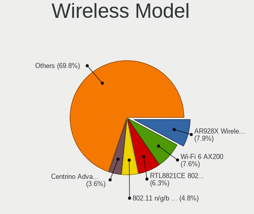

| Model                                                           | Desktops | Percent |
|-----------------------------------------------------------------|----------|---------|
| Qualcomm Atheros AR928X Wireless Network Adapter (PCI-Express)  | 26       | 7.85%   |
| Intel Wi-Fi 6 AX200                                             | 25       | 7.55%   |
| Realtek RTL8821CE 802.11ac PCIe Wireless Network Adapter        | 21       | 6.34%   |
| IMC Networks 802.11 n/g/b Wireless LAN USB Mini-Card            | 16       | 4.83%   |
| Intel Centrino Advanced-N 6235                                  | 12       | 3.63%   |
| Qualcomm Atheros AR9462 Wireless Network Adapter                | 10       | 3.02%   |
| Qualcomm Atheros AR93xx Wireless Network Adapter                | 10       | 3.02%   |
| Intel Wireless 7265                                             | 8        | 2.42%   |
| Intel Wireless 7260                                             | 8        | 2.42%   |
| MediaTek MT7922 802.11ax PCI Express Wireless Network Adapter   | 7        | 2.11%   |
| Intel Wi-Fi 6E(802.11ax) AX210/AX1675* 2x2 [Typhoon Peak]       | 7        | 2.11%   |
| Intel Wi-Fi 5(802.11ac) Wireless-AC 9x6x [Thunder Peak]         | 7        | 2.11%   |
| Intel Dual Band Wireless-AC 3168NGW [Stone Peak]                | 7        | 2.11%   |
| Realtek RTL8821AE 802.11ac PCIe Wireless Network Adapter        | 6        | 1.81%   |
| Qualcomm Atheros QCA6174 802.11ac Wireless Network Adapter      | 6        | 1.81%   |
| Intel Wireless 3160                                             | 6        | 1.81%   |
| Qualcomm Atheros QCA986x/988x 802.11ac Wireless Network Adapter | 5        | 1.51%   |
| Intel Wireless 8260                                             | 5        | 1.51%   |
| TP-Link Archer T2U PLUS [RTL8821AU]                             | 4        | 1.21%   |
| Qualcomm Atheros AR9485 Wireless Network Adapter                | 4        | 1.21%   |
| Intel Wireless 3165                                             | 4        | 1.21%   |
| Intel Gemini Lake PCH CNVi WiFi                                 | 4        | 1.21%   |
| Intel CNVi: Wi-Fi                                               | 4        | 1.21%   |
| Broadcom BCM43228 802.11a/b/g/n                                 | 4        | 1.21%   |
| Realtek RTL8852BE PCIe 802.11ax Wireless Network Controller     | 3        | 0.91%   |
| Realtek RTL8812AU 802.11a/b/g/n/ac 2T2R DB WLAN Adapter         | 3        | 0.91%   |
| Realtek RTL8192CU 802.11n WLAN Adapter                          | 3        | 0.91%   |
| Realtek RTL8192CE PCIe Wireless Network Adapter                 | 3        | 0.91%   |
| Realtek RTL8188CE 802.11b/g/n WiFi Adapter                      | 3        | 0.91%   |
| Ralink RT2790 Wireless 802.11n 1T/2R PCIe                       | 3        | 0.91%   |
| Qualcomm Atheros AR9285 Wireless Network Adapter (PCI-Express)  | 3        | 0.91%   |
| MediaTek MT7921K (RZ608) Wi-Fi 6E 80MHz                         | 3        | 0.91%   |
| Intel PRO/Wireless 4965 AG or AGN [Kedron] Network Connection   | 3        | 0.91%   |
| Realtek RTL88x2bu [AC1200 Techkey]                              | 2        | 0.6%    |
| Realtek RTL8723BE PCIe Wireless Network Adapter                 | 2        | 0.6%    |
| Realtek RTL8192EE PCIe Wireless Network Adapter                 | 2        | 0.6%    |
| Realtek RTL8191SU 802.11n WLAN Adapter                          | 2        | 0.6%    |
| Realtek RTL8188EUS 802.11n Wireless Network Adapter             | 2        | 0.6%    |
| Realtek RTL8188EE Wireless Network Adapter                      | 2        | 0.6%    |
| Realtek 8811CU Wireless LAN 802.11ac USB NIC                    | 2        | 0.6%    |

Ethernet Vendor
---------------

Ethernet vendors

| Vendor                      | Desktops | Percent |
|-----------------------------|----------|---------|
| Intel                       | 1290     | 67.54%  |
| Realtek Semiconductor       | 507      | 26.54%  |
| Broadcom                    | 52       | 2.72%   |
| Qualcomm Atheros            | 9        | 0.47%   |
| American Megatrends         | 7        | 0.37%   |
| D-Link System               | 6        | 0.31%   |
| Marvell Technology Group    | 5        | 0.26%   |
| Chelsio Communications      | 4        | 0.21%   |
| Aquantia                    | 4        | 0.21%   |
| Samsung Electronics         | 3        | 0.16%   |
| ZTE WCDMA Technologies MSM  | 2        | 0.1%    |
| Xiaomi                      | 2        | 0.1%    |
| Nvidia                      | 2        | 0.1%    |
| Insyde Software             | 2        | 0.1%    |
| ICS Advent                  | 2        | 0.1%    |
| Emulex                      | 2        | 0.1%    |
| Davicom Semiconductor       | 2        | 0.1%    |
| T & A Mobile Phones         | 1        | 0.05%   |
| SysKonnect                  | 1        | 0.05%   |
| Standard Microsystems [SMC] | 1        | 0.05%   |
| QLogic                      | 1        | 0.05%   |
| MYRICOM                     | 1        | 0.05%   |
| Mobile                      | 1        | 0.05%   |
| Digital Equipment           | 1        | 0.05%   |
| Apple                       | 1        | 0.05%   |
| 3Com                        | 1        | 0.05%   |

Ethernet Model
--------------

Ethernet models

| Model                                                                         | Desktops | Percent |
|-------------------------------------------------------------------------------|----------|---------|
| Realtek RTL8111/8168/8211/8411 PCI Express Gigabit Ethernet Controller        | 454      | 20.41%  |
| Intel I211 Gigabit Network Connection                                         | 302      | 13.58%  |
| Intel Ethernet Controller I226-V                                              | 204      | 9.17%   |
| Intel I210 Gigabit Network Connection                                         | 184      | 8.27%   |
| Intel Ethernet Controller I225-V                                              | 139      | 6.25%   |
| Intel I350 Gigabit Network Connection                                         | 78       | 3.51%   |
| Intel 82574L Gigabit Network Connection                                       | 74       | 3.33%   |
| Intel 82580 Gigabit Network Connection                                        | 43       | 1.93%   |
| Realtek RTL8125 2.5GbE Controller                                             | 42       | 1.89%   |
| Intel 82579LM Gigabit Network Connection (Lewisville)                         | 40       | 1.8%    |
| Intel 82576 Gigabit Network Connection                                        | 33       | 1.48%   |
| Intel 82583V Gigabit Network Connection                                       | 31       | 1.39%   |
| Intel 82599ES 10-Gigabit SFI/SFP+ Network Connection                          | 30       | 1.35%   |
| Intel 82571EB/82571GB Gigabit Ethernet Controller (Copper)                    | 30       | 1.35%   |
| Intel 82571EB/82571GB Gigabit Ethernet Controller D0/D1 (copper applications) | 29       | 1.3%    |
| Intel Ethernet Connection (2) I219-V                                          | 27       | 1.21%   |
| Intel Ethernet Connection I217-LM                                             | 23       | 1.03%   |
| Intel Ethernet Connection (2) I219-LM                                         | 18       | 0.81%   |
| Broadcom NetXtreme BCM5719 Gigabit Ethernet PCIe                              | 18       | 0.81%   |
| Intel Ethernet Controller X710 for 10GbE SFP+                                 | 17       | 0.76%   |
| Intel Ethernet Connection X553 1GbE                                           | 15       | 0.67%   |
| Broadcom NetXtreme BCM5720 Gigabit Ethernet PCIe                              | 13       | 0.58%   |
| Realtek RTL-8100/8101L/8139 PCI Fast Ethernet Adapter                         | 12       | 0.54%   |
| Intel I210 Gigabit Fiber Network Connection                                   | 12       | 0.54%   |
| Intel Ethernet Controller 10-Gigabit X540-AT2                                 | 12       | 0.54%   |
| Intel Ethernet Connection (7) I219-LM                                         | 12       | 0.54%   |
| Intel Ethernet Connection I217-V                                              | 11       | 0.49%   |
| Intel Ethernet Connection (7) I219-V                                          | 11       | 0.49%   |
| Intel Ethernet Controller X550                                                | 9        | 0.4%    |
| Intel Ethernet Connection I219-LM                                             | 9        | 0.4%    |
| Intel 82579V Gigabit Network Connection                                       | 9        | 0.4%    |
| Realtek USB 2.5GbE Controller                                                 | 8        | 0.36%   |
| Realtek RTL8169 PCI Gigabit Ethernet Controller                               | 8        | 0.36%   |
| Intel Ethernet Controller I226-LM                                             | 8        | 0.36%   |
| Intel 82575EB Gigabit Network Connection                                      | 8        | 0.36%   |
| Realtek RTL8111/8168/8411 PCI Express Gigabit Ethernet Controller             | 7        | 0.31%   |
| Intel Ethernet Connection (5) I219-LM                                         | 7        | 0.31%   |
| Intel Ethernet Connection (14) I219-V                                         | 7        | 0.31%   |
| American Megatrends Virtual Ethernet                                          | 7        | 0.31%   |
| Intel NM10/ICH7 Family LAN Controller                                         | 6        | 0.27%   |

Net Controller Kind
-------------------

Ethernet, WiFi or modem

| Kind     | Desktops | Percent |
|----------|----------|---------|
| Ethernet | 1633     | 81.61%  |
| WiFi     | 308      | 15.39%  |
| Unknown  | 42       | 2.1%    |
| Modem    | 18       | 0.9%    |

Used Controller
---------------

Currently used network controller

| Kind     | Desktops | Percent |
|----------|----------|---------|
| Ethernet | 1609     | 98.65%  |
| WiFi     | 21       | 1.29%   |
| Unknown  | 1        | 0.06%   |

NICs
----

Total network controllers on board

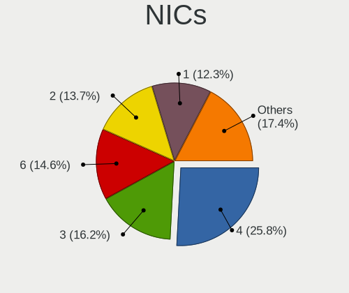

| Total | Desktops | Percent |
|-------|----------|---------|
| 4     | 434      | 25.83%  |
| 3     | 272      | 16.19%  |
| 6     | 246      | 14.64%  |
| 2     | 230      | 13.69%  |
| 1     | 206      | 12.26%  |
| 5     | 171      | 10.18%  |
| 8     | 43       | 2.56%   |
| 7     | 31       | 1.85%   |
| 10    | 16       | 0.95%   |
| 9     | 14       | 0.83%   |
| 0     | 10       | 0.6%    |
| 12    | 2        | 0.12%   |
| 11    | 2        | 0.12%   |
| 20    | 1        | 0.06%   |
| 17    | 1        | 0.06%   |
| 14    | 1        | 0.06%   |

IPv6
----

IPv6 vs IPv4

| Used | Desktops | Percent |
|------|----------|---------|
| No   | 1287     | 73.84%  |
| Yes  | 456      | 26.16%  |

Bluetooth
---------

Bluetooth Vendor
----------------

Controller vendors

| Vendor                          | Desktops | Percent |
|---------------------------------|----------|---------|
| Intel                           | 103      | 54.79%  |
| Realtek Semiconductor           | 26       | 13.83%  |
| Qualcomm Atheros Communications | 19       | 10.11%  |
| MediaTek                        | 11       | 5.85%   |
| IMC Networks                    | 11       | 5.85%   |
| ASUSTek Computer                | 5        | 2.66%   |
| Broadcom                        | 4        | 2.13%   |
| Apple                           | 3        | 1.6%    |
| Foxconn / Hon Hai               | 2        | 1.06%   |
| Cambridge Silicon Radio         | 2        | 1.06%   |
| Micro Star International        | 1        | 0.53%   |
| Unknown                         | 1        | 0.53%   |

Bluetooth Model
---------------

Controller models

| Model                                                       | Desktops | Percent |
|-------------------------------------------------------------|----------|---------|
| Intel Bluetooth wireless interface                          | 30       | 15.79%  |
| Intel AX200 Bluetooth                                       | 26       | 13.68%  |
| Realtek Bluetooth Adapter                                   | 22       | 11.58%  |
| Intel Centrino Bluetooth Wireless Transceiver               | 14       | 7.37%   |
| Qualcomm Atheros AR3012 Bluetooth 4.0                       | 11       | 5.79%   |
| Intel AX201 Bluetooth                                       | 9        | 4.74%   |
| MediaTek Wireless_Device                                    | 7        | 3.68%   |
| Intel Wireless-AC 9260 Bluetooth Adapter                    | 7        | 3.68%   |
| Intel Wireless-AC 3168 Bluetooth                            | 7        | 3.68%   |
| Intel Bluetooth 9460/9560 Jefferson Peak (JfP)              | 7        | 3.68%   |
| IMC Networks Realtek Bluetooth 4.0 + High Speed Chip        | 6        | 3.16%   |
| Intel AX210 Bluetooth                                       | 4        | 2.11%   |
| MediaTek RZ608 Bluetooth Adapter                            | 3        | 1.58%   |
| IMC Networks Realtek Bluetooth Adapter                      | 3        | 1.58%   |
| Qualcomm Atheros QCA61x4 Bluetooth 4.0                      | 2        | 1.05%   |
| Qualcomm Atheros AR3011 Bluetooth (no firmware)             | 2        | 1.05%   |
| Cambridge Silicon Radio Bluetooth Dongle (HCI mode)         | 2        | 1.05%   |
| Broadcom BCM2045 Bluetooth                                  | 2        | 1.05%   |
| ASUS USB-BT500                                              | 2        | 1.05%   |
| Apple Bluetooth Host Controller                             | 2        | 1.05%   |
| Realtek RTL8723B Bluetooth                                  | 1        | 0.53%   |
| Realtek RTL8723A Bluetooth                                  | 1        | 0.53%   |
| Realtek  Bluetooth 4.2 Adapter                              | 1        | 0.53%   |
| Realtek Bluetooth 4.2 Adapter                               | 1        | 0.53%   |
| Qualcomm Atheros Dell Wireless 1820 Bluetooth 4.1LE         | 1        | 0.53%   |
| Qualcomm Atheros AR9462 Bluetooth 3.0 + HS Adapter          | 1        | 0.53%   |
| Qualcomm Atheros AR9462 Bluetooth                           | 1        | 0.53%   |
| Qualcomm Atheros AR3012 Bluetooth                           | 1        | 0.53%   |
| Micro Star International MS-6970 BToes Bluetooth adapter    | 1        | 0.53%   |
| MediaTek Bluetooth Adapter                                  | 1        | 0.53%   |
| Intel AX211 Bluetooth                                       | 1        | 0.53%   |
| IMC Networks Realtek Bluetooth 4.0 Adapter                  | 1        | 0.53%   |
| IMC Networks Bluetooth                                      | 1        | 0.53%   |
| Foxconn / Hon Hai RZ616 Bluetooth Adapter                   | 1        | 0.53%   |
| Foxconn / Hon Hai Qualcomm Atheros AR3012 Bluetooth Adapter | 1        | 0.53%   |
| Broadcom BCM20702A0 Bluetooth 4.0                           | 1        | 0.53%   |
| Broadcom BCM2070 Bluetooth 2.1 + EDR                        | 1        | 0.53%   |
| ASUS Realtek Bluetooth 4.0 + High Speed Chip                | 1        | 0.53%   |
| ASUS Broadcom BCM20702A0 Bluetooth                          | 1        | 0.53%   |
| ASUS Broadcom BCM20702 Single-Chip Bluetooth 4.0 + LE       | 1        | 0.53%   |

Sound
-----

Sound Vendor
------------

Sound card vendors

| Vendor                                       | Desktops | Percent |
|----------------------------------------------|----------|---------|
| Intel                                        | 926      | 69.26%  |
| AMD                                          | 252      | 18.85%  |
| Nvidia                                       | 79       | 5.91%   |
| C-Media Electronics                          | 19       | 1.42%   |
| Zoran Co. Personal Media Division (Nogatech) | 11       | 0.82%   |
| Logitech                                     | 7        | 0.52%   |
| JMTek                                        | 5        | 0.37%   |
| Creative Labs                                | 4        | 0.3%    |
| VIA Technologies                             | 3        | 0.22%   |
| Tenx Technology                              | 3        | 0.22%   |
| GN Netcom                                    | 3        | 0.22%   |
| Texas Instruments                            | 2        | 0.15%   |
| Kingston Technology                          | 2        | 0.15%   |
| Creative Technology                          | 2        | 0.15%   |
| Audient                                      | 2        | 0.15%   |
| ZOOM                                         | 1        | 0.07%   |
| Yamaha                                       | 1        | 0.07%   |
| Walmart                                      | 1        | 0.07%   |
| Trust                                        | 1        | 0.07%   |
| SteelSeries ApS                              | 1        | 0.07%   |
| RME                                          | 1        | 0.07%   |
| Realtek Semiconductor                        | 1        | 0.07%   |
| Razer USA                                    | 1        | 0.07%   |
| Native Instruments                           | 1        | 0.07%   |
| M-Audio                                      | 1        | 0.07%   |
| Generalplus Technology                       | 1        | 0.07%   |
| Focusrite-Novation                           | 1        | 0.07%   |
| DSEA A/S                                     | 1        | 0.07%   |
| Corsair                                      | 1        | 0.07%   |
| Blue Microphones                             | 1        | 0.07%   |
| AudioQuest                                   | 1        | 0.07%   |
| ASUSTek Computer                             | 1        | 0.07%   |

Sound Model
-----------

Sound card models

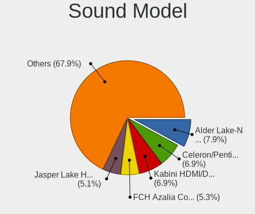

| Model                                                                                             | Desktops | Percent |
|---------------------------------------------------------------------------------------------------|----------|---------|
| Intel Alder Lake-N PCH High Definition Audio Controller                                           | 124      | 7.95%   |
| Intel Celeron/Pentium Silver Processor High Definition Audio                                      | 107      | 6.86%   |
| AMD Kabini HDMI/DP Audio                                                                          | 107      | 6.86%   |
| AMD FCH Azalia Controller                                                                         | 82       | 5.26%   |
| Intel Jasper Lake HD Audio                                                                        | 80       | 5.13%   |
| Intel Sunrise Point-LP HD Audio                                                                   | 75       | 4.81%   |
| Intel Xeon E3-1200 v3/4th Gen Core Processor HD Audio Controller                                  | 53       | 3.4%    |
| Intel Atom/Celeron/Pentium Processor x5-E8000/J3xxx/N3xxx Series High Definition Audio Controller | 48       | 3.08%   |
| Intel 8 Series/C220 Series Chipset High Definition Audio Controller                               | 47       | 3.01%   |
| Intel 100 Series/C230 Series Chipset Family HD Audio Controller                                   | 39       | 2.5%    |
| Intel Atom Processor Z36xxx/Z37xxx Series High Definition Audio Controller                        | 36       | 2.31%   |
| Intel 7 Series/C216 Chipset Family High Definition Audio Controller                               | 33       | 2.12%   |
| AMD Family 17h/19h/1ah HD Audio Controller                                                        | 33       | 2.12%   |
| Intel 6 Series/C200 Series Chipset Family High Definition Audio Controller                        | 30       | 1.92%   |
| Intel Cannon Lake PCH cAVS                                                                        | 27       | 1.73%   |
| Intel 200 Series PCH HD Audio                                                                     | 26       | 1.67%   |
| Intel Celeron N3350/Pentium N4200/Atom E3900 Series Audio Cluster                                 | 24       | 1.54%   |
| AMD Family 17h (Models 00h-0fh) HD Audio Controller                                               | 24       | 1.54%   |
| AMD Starship/Matisse HD Audio Controller                                                          | 23       | 1.47%   |
| AMD Raven/Raven2/Fenghuang HDMI/DP Audio Controller                                               | 23       | 1.47%   |
| Intel Cannon Point-LP High Definition Audio Controller                                            | 22       | 1.41%   |
| Intel Comet Lake PCH-LP cAVS                                                                      | 21       | 1.35%   |
| Intel NM10/ICH7 Family High Definition Audio Controller                                           | 19       | 1.22%   |
| Intel Tiger Lake-LP Smart Sound Technology Audio Controller                                       | 18       | 1.15%   |
| Intel Elkhart Lake High Density Audio bus interface                                               | 18       | 1.15%   |
| AMD SBx00 Azalia (Intel HDA)                                                                      | 18       | 1.15%   |
| AMD Renoir Radeon High Definition Audio Controller                                                | 14       | 0.9%    |
| Intel Wildcat Point-LP High Definition Audio Controller                                           | 13       | 0.83%   |
| Intel Haswell-ULT HD Audio Controller                                                             | 13       | 0.83%   |
| AMD Ellesmere HDMI Audio [Radeon RX 470/480 / 570/580/590]                                        | 13       | 0.83%   |
| Nvidia GK208 HDMI/DP Audio Controller                                                             | 12       | 0.77%   |
| Intel Broadwell-U Audio Controller                                                                | 12       | 0.77%   |
| Intel 8 Series HD Audio Controller                                                                | 12       | 0.77%   |
| Intel 5 Series/3400 Series Chipset High Definition Audio                                          | 12       | 0.77%   |
| Zoran Co. Personal Media Division (Nogatech) USB Audio and HID                                    | 11       | 0.71%   |
| Nvidia GP108 High Definition Audio Controller                                                     | 11       | 0.71%   |
| Intel Alder Lake PCH-P High Definition Audio Controller                                           | 11       | 0.71%   |
| C-Media Electronics Audio Adapter (Unitek Y-247A)                                                 | 11       | 0.71%   |
| Intel 82801H (ICH8 Family) HD Audio Controller                                                    | 10       | 0.64%   |
| Intel Ice Lake-LP Smart Sound Technology Audio Controller                                         | 9        | 0.58%   |

Memory
------

Memory Vendor
-------------

Memory module vendors

| Vendor                     | Desktops | Percent |
|----------------------------|----------|---------|
| Samsung Electronics        | 284      | 17.05%  |
| Crucial                    | 277      | 16.63%  |
| Unknown                    | 210      | 12.61%  |
| Kingston                   | 169      | 10.14%  |
| SK hynix                   | 157      | 9.42%   |
| Micron Technology          | 129      | 7.74%   |
| G.Skill                    | 93       | 5.58%   |
| Corsair                    | 72       | 4.32%   |
| Unknown                    | 55       | 3.3%    |
| Transcend                  | 24       | 1.44%   |
| ATP                        | 24       | 1.44%   |
| Nanya Technology           | 22       | 1.32%   |
| Unknown (ABCD)             | 21       | 1.26%   |
| A-DATA Technology          | 18       | 1.08%   |
| Ramaxel Technology         | 13       | 0.78%   |
| Apacer                     | 12       | 0.72%   |
| Kimtigo                    | 7        | 0.42%   |
| Shenzhen Jinge Information | 6        | 0.36%   |
| Patriot                    | 5        | 0.3%    |
| Hewlett-Packard            | 5        | 0.3%    |
| Lexar Co Limited           | 4        | 0.24%   |
| Wodposit                   | 3        | 0.18%   |
| Team                       | 3        | 0.18%   |
| Elpida                     | 3        | 0.18%   |
| Avant                      | 3        | 0.18%   |
| Unknown (AB)               | 2        | 0.12%   |
| Unknown (89EC)             | 2        | 0.12%   |
| Unknown (09C7)             | 2        | 0.12%   |
| Teikon                     | 2        | 0.12%   |
| SK_Hynix                   | 2        | 0.12%   |
| Mushkin                    | 2        | 0.12%   |
| Juhor                      | 2        | 0.12%   |
| Innodisk                   | 2        | 0.12%   |
| Goldenmars                 | 2        | 0.12%   |
| GeIL                       | 2        | 0.12%   |
| Vasekey                    | 1        | 0.06%   |
| Unknown (8A5D)             | 1        | 0.06%   |
| Unknown (8A02)             | 1        | 0.06%   |
| Unknown (7F7F7F94FFFFFFFF) | 1        | 0.06%   |
| Unknown (0x1636)           | 1        | 0.06%   |

Memory Model
------------

Memory module models

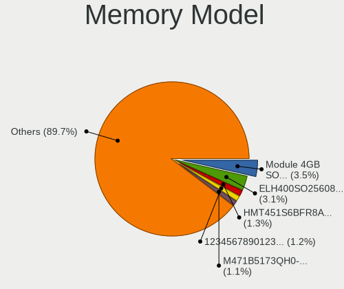

| Model                                                          | Desktops | Percent |
|----------------------------------------------------------------|----------|---------|
| Unknown RAM Module 4GB SODIMM DDR3 1333MT/s                    | 62       | 3.54%   |
| Unknown                                                        | 55       | 3.14%   |
| SK hynix RAM HMT451S6BFR8A-PB 4GB SODIMM DDR3 1600MT/s         | 23       | 1.31%   |
| Unknown (ABCD) RAM 123456789012345678 2GB DIMM LPDDR4 2133MT/s | 21       | 1.2%    |
| Samsung RAM M471B5173QH0-YK0 4GB SODIMM DDR3 1600MT/s          | 20       | 1.14%   |
| Crucial RAM CT16G48C40S5.M8A1 16GB SODIMM DDR5 4800MT/s        | 20       | 1.14%   |
| Micron RAM 8KTF51264HZ-1G9P1 4GB SODIMM DDR3 1867MT/s          | 14       | 0.8%    |
| Unknown RAM Module 4GB SODIMM DDR3 667MT/s                     | 13       | 0.74%   |
| Samsung RAM M471B5173EB0-YK0 4GB SODIMM DDR3 1600MT/s          | 12       | 0.68%   |
| Samsung RAM M425R1GB4BB0-CQKOL 8GB SODIMM DDR5 4800MT/s        | 12       | 0.68%   |
| ATP RAM X4G08QA8BNWESO-7-TO1 8GB SODIMM DDR4 3200MT/s          | 12       | 0.68%   |
| Samsung RAM M471B5173DB0-YK0 4GB SODIMM DDR3 1600MT/s          | 11       | 0.63%   |
| Unknown RAM Module 4GB DIMM DDR3 1333MT/s                      | 10       | 0.57%   |
| Unknown RAM Module 2GB DIMM SDRAM                              | 10       | 0.57%   |
| Samsung RAM M471A1K43CB1-CTD 8GB SODIMM DDR4 2667MT/s          | 10       | 0.57%   |
| Micron RAM Module 8GB Row Of Chips LPDDR4 3200MT/s             | 10       | 0.57%   |
| Crucial RAM CT8G48C40S5.M4A1 8GB SODIMM DDR5 4800MT/s          | 10       | 0.57%   |
| SK hynix RAM HMA81GS6AFR8N-UH 8GB SODIMM DDR4 2400MT/s         | 9        | 0.51%   |
| Micron RAM 8ATF1G64HZ-3G2R1 8GB SODIMM DDR4 3200MT/s           | 9        | 0.51%   |
| Corsair RAM CMK16GX4M2B3200C16 8GB DIMM DDR4 3200MT/s          | 9        | 0.51%   |
| Crucial RAM CT32G4SFD832A.M16FF 32GB SODIMM DDR4 3200MT/s      | 8        | 0.46%   |
| Crucial RAM CT16G4SFRA32A.M16FR 16GB SODIMM DDR4 3200MT/s      | 8        | 0.46%   |
| Unknown RAM Module 8GB DIMM DDR3 1600MT/s                      | 7        | 0.4%    |
| Unknown RAM Module 2GB DIMM DDR2 800MT/s                       | 7        | 0.4%    |
| Transcend RAM TS512MSK64W6H 4GB DIMM DDR3 1600MT/s             | 7        | 0.4%    |
| SK hynix RAM HMT451U6BFR8A-PB 4GB DIMM DDR3 1600MT/s           | 7        | 0.4%    |
| Samsung RAM M471B5674EB0-YK0 2GB SODIMM DDR3 1600MT/s          | 7        | 0.4%    |
| Samsung RAM M378B5773CH0-CH9 2GB DIMM DDR3 1333MT/s            | 7        | 0.4%    |
| Crucial RAM CT8G4SFRA266.M8FRS 8GB SODIMM DDR4 2667MT/s        | 7        | 0.4%    |
| Crucial RAM CT16G56C46S5.M8G1 16GB SODIMM DDR5 5600MT/s        | 7        | 0.4%    |
| Unknown RAM Module 8GB DIMM DDR3 1333MT/s                      | 6        | 0.34%   |
| Unknown RAM Module 4GB DIMM DDR2 800MT/s                       | 6        | 0.34%   |
| Unknown RAM Module 2GB SODIMM DDR2 800MT/s                     | 6        | 0.34%   |
| Unknown RAM Module 1GB DIMM SDRAM                              | 6        | 0.34%   |
| Samsung RAM Module 2GB Row Of Chips LPDDR5 6400MT/s            | 6        | 0.34%   |
| Samsung RAM M471B5674QH0-YK0 2GB SODIMM DDR3 1600MT/s          | 6        | 0.34%   |
| Samsung RAM M471B1G73DB0-YK0 8GB SODIMM DDR3 1600MT/s          | 6        | 0.34%   |
| Samsung RAM M391A2K43BB1-CTD 16GB DIMM DDR4 3200MT/s           | 6        | 0.34%   |
| Samsung RAM M378B5173QH0-CK0 4GB DIMM DDR3 1600MT/s            | 6        | 0.34%   |
| Kingston RAM KHX2400C15/8G 8GB DIMM DDR4 2400MT/s              | 6        | 0.34%   |

Memory Kind
-----------

Memory module kinds

| Kind    | Desktops | Percent |
|---------|----------|---------|
| DDR4    | 651      | 42.47%  |
| DDR3    | 591      | 38.55%  |
| DDR5    | 126      | 8.22%   |
| DDR2    | 49       | 3.2%    |
| LPDDR4  | 40       | 2.61%   |
| Unknown | 35       | 2.28%   |
| SDRAM   | 24       | 1.57%   |
| LPDDR5  | 12       | 0.78%   |
| DDR     | 5        | 0.33%   |

Memory Form Factor
------------------

Physical design of the memory module

| Name         | Desktops | Percent |
|--------------|----------|---------|
| SODIMM       | 805      | 52.96%  |
| DIMM         | 674      | 44.34%  |
| Row Of Chips | 30       | 1.97%   |
| Unknown      | 10       | 0.66%   |
| FB-DIMM      | 1        | 0.07%   |

Memory Size
-----------

Memory module size

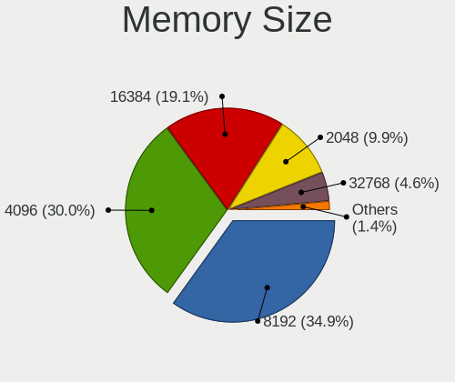

| Size  | Desktops | Percent |
|-------|----------|---------|
| 8192  | 558      | 34.94%  |
| 4096  | 479      | 29.99%  |
| 16384 | 305      | 19.1%   |
| 2048  | 158      | 9.89%   |
| 32768 | 74       | 4.63%   |
| 1024  | 18       | 1.13%   |
| 49152 | 3        | 0.19%   |
| 512   | 2        | 0.13%   |

Memory Speed
------------

Memory module speed

| Speed   | Desktops | Percent |
|---------|----------|---------|
| 1600    | 365      | 22.84%  |
| 2400    | 226      | 14.14%  |
| 3200    | 214      | 13.39%  |
| 1333    | 195      | 12.2%   |
| 2667    | 162      | 10.14%  |
| 4800    | 99       | 6.2%    |
| 2133    | 61       | 3.82%   |
| 800     | 47       | 2.94%   |
| 667     | 40       | 2.5%    |
| 5600    | 27       | 1.69%   |
| Unknown | 25       | 1.56%   |
| 1867    | 23       | 1.44%   |
| 2666    | 22       | 1.38%   |
| 3000    | 14       | 0.88%   |
| 1066    | 14       | 0.88%   |
| 1866    | 13       | 0.81%   |
| 6400    | 11       | 0.69%   |
| 2933    | 10       | 0.63%   |
| 3600    | 5        | 0.31%   |
| 1067    | 5        | 0.31%   |
| 1334    | 4        | 0.25%   |
| 333     | 3        | 0.19%   |
| 5200    | 2        | 0.13%   |
| 533     | 2        | 0.13%   |
| 400     | 2        | 0.13%   |
| 65535   | 1        | 0.06%   |
| 4400    | 1        | 0.06%   |
| 3534    | 1        | 0.06%   |
| 3500    | 1        | 0.06%   |
| 2048    | 1        | 0.06%   |
| 1419    | 1        | 0.06%   |
| 1033    | 1        | 0.06%   |

Printers & scanners
-------------------

Printer Vendor
--------------

Printer device vendors

| Vendor              | Desktops | Percent |
|---------------------|----------|---------|
| Brother Industries  | 3        | 50%     |
| Ricoh               | 1        | 16.67%  |
| QinHeng Electronics | 1        | 16.67%  |
| Hewlett-Packard     | 1        | 16.67%  |

Printer Model
-------------

Printer device models

| Model                         | Desktops | Percent |
|-------------------------------|----------|---------|
| Brother MFC-7360N             | 2        | 33.33%  |
| Ricoh SP 112                  | 1        | 16.67%  |
| QinHeng CH340S                | 1        | 16.67%  |
| HP HP LaserJet P2035 HP Print | 1        | 16.67%  |
| Brother HL-L2310D series      | 1        | 16.67%  |

Scanner Vendor
--------------

Scanner device vendors

| Vendor      | Desktops | Percent |
|-------------|----------|---------|
| Seiko Epson | 2        | 50%     |
| Canon       | 2        | 50%     |

Scanner Model
-------------

Scanner device models

| Model                                                                               | Desktops | Percent |
|-------------------------------------------------------------------------------------|----------|---------|
| Canon CanoScan LiDE 110                                                             | 2        | 50%     |
| Seiko Epson WF-2860 Series EPSON Scanner USB2.0 Printer EPSON Utility USB2.0 Faxout | 1        | 25%     |
| Seiko Epson GT-F520/GT-F570 [Perfection 3590 PHOTO]                                 | 1        | 25%     |

Camera
------

Camera Vendor
-------------

Camera device vendors

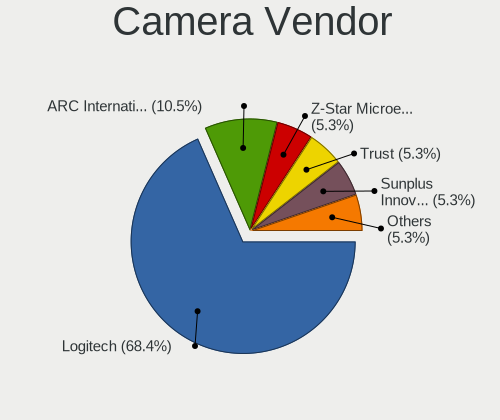

| Vendor                        | Desktops | Percent |
|-------------------------------|----------|---------|
| Logitech                      | 13       | 68.42%  |
| ARC International             | 2        | 10.53%  |
| Z-Star Microelectronics       | 1        | 5.26%   |
| Trust                         | 1        | 5.26%   |
| Sunplus Innovation Technology | 1        | 5.26%   |
| Chicony Electronics           | 1        | 5.26%   |

Camera Model
------------

Camera device models

| Model                           | Desktops | Percent |
|---------------------------------|----------|---------|
| Logitech Webcam C270            | 3        | 15.79%  |
| Logitech HD Pro Webcam C920     | 3        | 15.79%  |
| Logitech C920 PRO HD Webcam     | 3        | 15.79%  |
| Logitech C920 HD Pro Webcam     | 2        | 10.53%  |
| ARC International Camera        | 2        | 10.53%  |
| Z-Star Venus USB2.0 Camera      | 1        | 5.26%   |
| Trust Trust USB Camera          | 1        | 5.26%   |
| Sunplus Integrated_Webcam_HD    | 1        | 5.26%   |
| Logitech HD Webcam C525         | 1        | 5.26%   |
| Logitech C922 Pro Stream Webcam | 1        | 5.26%   |
| Chicony HP HD Webcam [Fixed]    | 1        | 5.26%   |

Security
--------

Fingerprint Vendor
------------------

Fingerprint sensor vendors

| Vendor         | Desktops | Percent |
|----------------|----------|---------|
| DigitalPersona | 1        | 100%    |

Fingerprint Model
-----------------

Fingerprint sensor models

| Model                             | Desktops | Percent |
|-----------------------------------|----------|---------|
| DigitalPersona Fingerprint Reader | 1        | 100%    |

Chipcard Vendor
---------------

Chipcard module vendors

Zero info for selected period =(

Chipcard Model
--------------

Chipcard module models

Zero info for selected period =(

Unsupported
-----------

Unsupported Devices
-------------------

Total unsupported devices on board

| Total | Desktops | Percent |
|-------|----------|---------|
| 1     | 846      | 49.97%  |
| 0     | 586      | 34.61%  |
| 2     | 175      | 10.34%  |
| 3     | 58       | 3.43%   |
| 4     | 17       | 1%      |
| 5     | 10       | 0.59%   |
| 6     | 1        | 0.06%   |

Unsupported Device Types
------------------------

Types of unsupported devices

| Type                     | Desktops | Percent |
|--------------------------|----------|---------|
| Communication controller | 970      | 75.14%  |
| Net/wireless             | 111      | 8.6%    |
| Bluetooth                | 88       | 6.82%   |
| Card reader              | 42       | 3.25%   |
| Net/ethernet             | 21       | 1.63%   |
| Network                  | 18       | 1.39%   |
| Firewire controller      | 18       | 1.39%   |
| Sound                    | 11       | 0.85%   |
| Graphics card            | 5        | 0.39%   |
| Storage/raid             | 1        | 0.08%   |
| Storage/ide              | 1        | 0.08%   |
| Storage/ata              | 1        | 0.08%   |
| Storage                  | 1        | 0.08%   |
| Modem                    | 1        | 0.08%   |
| Fingerprint reader       | 1        | 0.08%   |
| Dvb card                 | 1        | 0.08%   |

