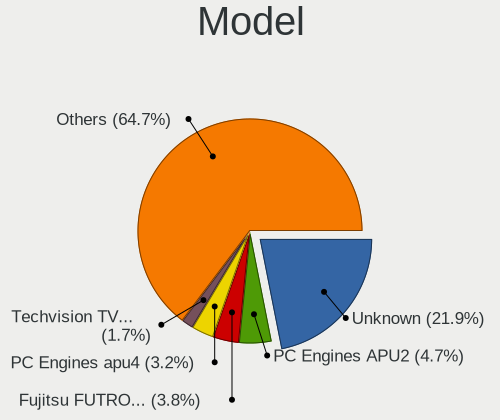
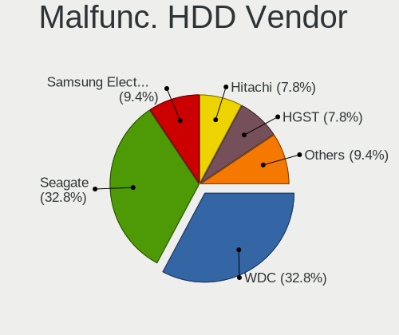
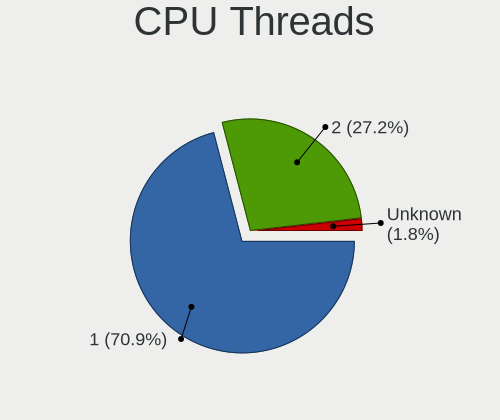
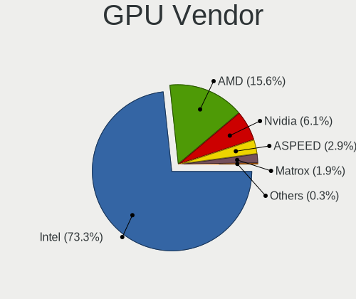
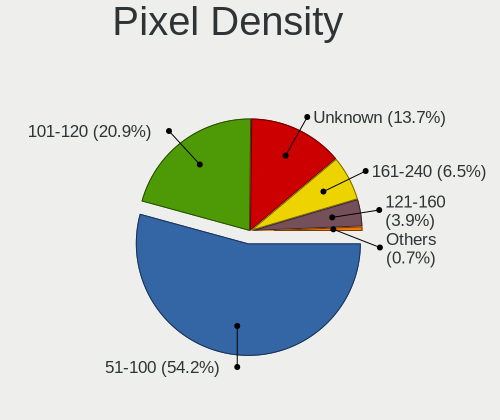
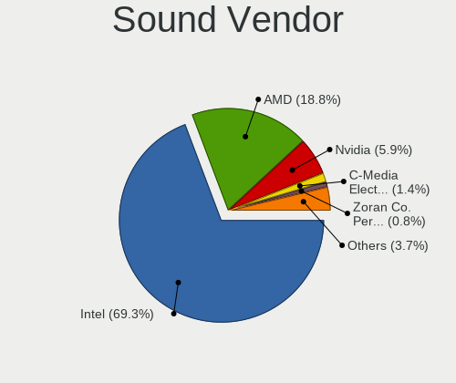
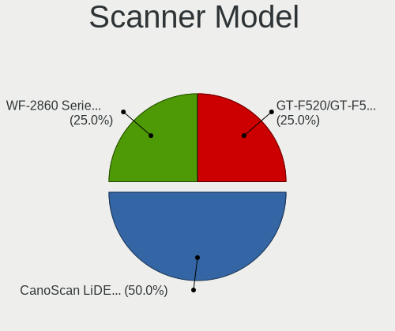

BSD in Germany - Tested Hardware & Statistics (Desktops)
--------------------------------------------------------

A project to collect tested hardware configurations for BSD in Germany.

Anyone can contribute to this report by the [hw-probe](https://github.com/linuxhw/hw-probe/blob/master/INSTALL.BSD.md) tool:

    hw-probe -all -upload

Please contribute! Especially if your hardware is rare.

Contents
--------

* [ Test Cases ](#test-cases)

* [ System ](#system)
  - [ OS                       ](#os)
  - [ OS Family                ](#os-family)
  - [ Arch                     ](#arch)
  - [ DE                       ](#de)
  - [ Display Server           ](#display-server)
  - [ Display Manager          ](#display-manager)
  - [ OS Lang                  ](#os-lang)
  - [ Boot Mode                ](#boot-mode)
  - [ Filesystem               ](#filesystem)
  - [ Part. scheme             ](#part-scheme)

* [ Board ](#board)
  - [ Vendor                   ](#vendor)
  - [ Model                    ](#model)
  - [ Model Family             ](#model-family)
  - [ MFG Year                 ](#mfg-year)
  - [ Form Factor              ](#form-factor)
  - [ Coreboot                 ](#coreboot)
  - [ RAM Size                 ](#ram-size)
  - [ RAM Used                 ](#ram-used)
  - [ Total Drives             ](#total-drives)
  - [ Has CD-ROM               ](#has-cd-rom)
  - [ Has Ethernet             ](#has-ethernet)
  - [ Has WiFi                 ](#has-wifi)
  - [ Has Bluetooth            ](#has-bluetooth)

* [ Location ](#location)
  - [ Country                  ](#country)
  - [ City                     ](#city)

* [ Drives ](#drives)
  - [ Drive Vendor             ](#drive-vendor)
  - [ Drive Model              ](#drive-model)
  - [ HDD Vendor               ](#hdd-vendor)
  - [ SSD Vendor               ](#ssd-vendor)
  - [ Drive Kind               ](#drive-kind)
  - [ Drive Connector          ](#drive-connector)
  - [ Drive Size               ](#drive-size)
  - [ Space Total              ](#space-total)
  - [ Space Used               ](#space-used)
  - [ Malfunc. Drives          ](#malfunc-drives)
  - [ Malfunc. Drive Vendor    ](#malfunc-drive-vendor)
  - [ Malfunc. HDD Vendor      ](#malfunc-hdd-vendor)
  - [ Malfunc. Drive Kind      ](#malfunc-drive-kind)
  - [ Failed Drives            ](#failed-drives)
  - [ Failed Drive Vendor      ](#failed-drive-vendor)
  - [ Drive Status             ](#drive-status)

* [ Storage controller ](#storage-controller)
  - [ Storage Vendor           ](#storage-vendor)
  - [ Storage Model            ](#storage-model)
  - [ Storage Kind             ](#storage-kind)

* [ Processor ](#processor)
  - [ CPU Vendor               ](#cpu-vendor)
  - [ CPU Model                ](#cpu-model)
  - [ CPU Model Family         ](#cpu-model-family)
  - [ CPU Cores                ](#cpu-cores)
  - [ CPU Sockets              ](#cpu-sockets)
  - [ CPU Threads              ](#cpu-threads)
  - [ CPU Microarch            ](#cpu-microarch)

* [ Graphics ](#graphics)
  - [ GPU Vendor               ](#gpu-vendor)
  - [ GPU Model                ](#gpu-model)
  - [ GPU Combo                ](#gpu-combo)
  - [ GPU Driver               ](#gpu-driver)
  - [ GPU Memory               ](#gpu-memory)

* [ Monitor ](#monitor)
  - [ Monitor Vendor           ](#monitor-vendor)
  - [ Monitor Model            ](#monitor-model)
  - [ Monitor Resolution       ](#monitor-resolution)
  - [ Monitor Diagonal         ](#monitor-diagonal)
  - [ Monitor Width            ](#monitor-width)
  - [ Aspect Ratio             ](#aspect-ratio)
  - [ Monitor Area             ](#monitor-area)
  - [ Pixel Density            ](#pixel-density)
  - [ Multiple Monitors        ](#multiple-monitors)

* [ Network ](#network)
  - [ Net Controller Vendor    ](#net-controller-vendor)
  - [ Net Controller Model     ](#net-controller-model)
  - [ Wireless Vendor          ](#wireless-vendor)
  - [ Wireless Model           ](#wireless-model)
  - [ Ethernet Vendor          ](#ethernet-vendor)
  - [ Ethernet Model           ](#ethernet-model)
  - [ Net Controller Kind      ](#net-controller-kind)
  - [ Used Controller          ](#used-controller)
  - [ NICs                     ](#nics)
  - [ IPv6                     ](#ipv6)

* [ Bluetooth ](#bluetooth)
  - [ Bluetooth Vendor         ](#bluetooth-vendor)
  - [ Bluetooth Model          ](#bluetooth-model)

* [ Sound ](#sound)
  - [ Sound Vendor             ](#sound-vendor)
  - [ Sound Model              ](#sound-model)

* [ Memory ](#memory)
  - [ Memory Vendor            ](#memory-vendor)
  - [ Memory Model             ](#memory-model)
  - [ Memory Kind              ](#memory-kind)
  - [ Memory Form Factor       ](#memory-form-factor)
  - [ Memory Size              ](#memory-size)
  - [ Memory Speed             ](#memory-speed)

* [ Printers & scanners ](#printers--scanners)
  - [ Printer Vendor           ](#printer-vendor)
  - [ Printer Model            ](#printer-model)
  - [ Scanner Vendor           ](#scanner-vendor)
  - [ Scanner Model            ](#scanner-model)

* [ Camera ](#camera)
  - [ Camera Vendor            ](#camera-vendor)
  - [ Camera Model             ](#camera-model)

* [ Security ](#security)
  - [ Fingerprint Vendor       ](#fingerprint-vendor)
  - [ Fingerprint Model        ](#fingerprint-model)
  - [ Chipcard Vendor          ](#chipcard-vendor)
  - [ Chipcard Model           ](#chipcard-model)

* [ Unsupported ](#unsupported)
  - [ Unsupported Devices      ](#unsupported-devices)
  - [ Unsupported Device Types ](#unsupported-device-types)

Test Cases
----------

Total: 1989

| Vendor        | Model                       | Probe                                                     | Date         |
|---------------|-----------------------------|-----------------------------------------------------------|--------------|
| Unknown       | Unknown                     | [9876dcc6aa](https://bsd-hardware.info/?probe=9876dcc6aa) | Dec 24, 2023 |
| Unknown       | Unknown                     | [9a23873dc4](https://bsd-hardware.info/?probe=9a23873dc4) | Dec 24, 2023 |
| Fujitsu       | D3543-A1 S26361-D3543-A1... | [ee768bd5a0](https://bsd-hardware.info/?probe=ee768bd5a0) | Dec 23, 2023 |
| CWWK          | CW-ADLN-6L                  | [d8245df746](https://bsd-hardware.info/?probe=d8245df746) | Dec 23, 2023 |
| Fujitsu       | D3313-G1 S26361-D3313-G1    | [5ed362ce02](https://bsd-hardware.info/?probe=5ed362ce02) | Dec 22, 2023 |
| ZX            | H610ITXG                    | [11edcbeaff](https://bsd-hardware.info/?probe=11edcbeaff) | Dec 22, 2023 |
| MW            | GMLK-2_5G4L                 | [9eaa02c47c](https://bsd-hardware.info/?probe=9eaa02c47c) | Dec 22, 2023 |
| Unknown       | MANIFOLD 2-C                | [b2597a7f2b](https://bsd-hardware.info/?probe=b2597a7f2b) | Dec 21, 2023 |
| Unknown       | Unknown                     | [ec4c6d8fb5](https://bsd-hardware.info/?probe=ec4c6d8fb5) | Dec 21, 2023 |
| Yanling       | YL-CLU6L-V1                 | [9a0369cc72](https://bsd-hardware.info/?probe=9a0369cc72) | Dec 21, 2023 |
| CWWK          | CW-ADLN-6L                  | [094d15625b](https://bsd-hardware.info/?probe=094d15625b) | Dec 21, 2023 |
| ASUSTek       | H110I-PLUS                  | [5c6e9bd18a](https://bsd-hardware.info/?probe=5c6e9bd18a) | Dec 20, 2023 |
| Fujitsu       | D3544-A1 S26361-D3544-A1... | [ec18d4f3a1](https://bsd-hardware.info/?probe=ec18d4f3a1) | Dec 20, 2023 |
| Unknown       | Unknown                     | [f11c353c61](https://bsd-hardware.info/?probe=f11c353c61) | Dec 19, 2023 |
| PC Engines    | apu4                        | [97c6f1ef2a](https://bsd-hardware.info/?probe=97c6f1ef2a) | Dec 19, 2023 |
| MSI           | A520M-A PRO                 | [11e5e87b70](https://bsd-hardware.info/?probe=11e5e87b70) | Dec 16, 2023 |
| SHANGZHAOY... | B85M-PRO V1.1               | [3b7ed136da](https://bsd-hardware.info/?probe=3b7ed136da) | Dec 16, 2023 |
| Fujitsu       | D3313-G1 S26361-D3313-G1    | [f05a97db34](https://bsd-hardware.info/?probe=f05a97db34) | Dec 15, 2023 |
| Gigabyte      | B150N Phoenix-WIFI-CF       | [343d176e9c](https://bsd-hardware.info/?probe=343d176e9c) | Dec 15, 2023 |
| ASUSTek       | PRO B460M-C                 | [7a32a123f6](https://bsd-hardware.info/?probe=7a32a123f6) | Dec 15, 2023 |
| AZW           | EQ                          | [f1e4bf2224](https://bsd-hardware.info/?probe=f1e4bf2224) | Dec 15, 2023 |
| Techvision    | TVI7309X B0                 | [b5f9416c13](https://bsd-hardware.info/?probe=b5f9416c13) | Dec 12, 2023 |
| Unknown       | Unknown                     | [8a0a469ad0](https://bsd-hardware.info/?probe=8a0a469ad0) | Dec 12, 2023 |
| SHANGZHAOY... | B85M-PRO V1.1               | [5cf5db5a05](https://bsd-hardware.info/?probe=5cf5db5a05) | Dec 11, 2023 |
| Techvision    | TVI7309X B0                 | [9a3a20d295](https://bsd-hardware.info/?probe=9a3a20d295) | Dec 11, 2023 |
| ASRock        | H110M-DVS R3.0              | [b6a4782cbf](https://bsd-hardware.info/?probe=b6a4782cbf) | Dec 10, 2023 |
| ASUSTek       | TUF Gaming B560M-PLUS       | [47480f848d](https://bsd-hardware.info/?probe=47480f848d) | Dec 10, 2023 |
| ASUSTek       | PRIME X399-A                | [d62ad0d622](https://bsd-hardware.info/?probe=d62ad0d622) | Dec 09, 2023 |
| Dell          | 02YYK5 A00                  | [39e0078d08](https://bsd-hardware.info/?probe=39e0078d08) | Dec 09, 2023 |
| ASRock        | Z370 Pro4                   | [6b4d8c076f](https://bsd-hardware.info/?probe=6b4d8c076f) | Dec 09, 2023 |
| Unknown       | Unknown                     | [31619d30b3](https://bsd-hardware.info/?probe=31619d30b3) | Dec 09, 2023 |
| PC Engines    | APU2                        | [8f318ea168](https://bsd-hardware.info/?probe=8f318ea168) | Dec 09, 2023 |
| PC Engines    | APU2                        | [ca43be99fc](https://bsd-hardware.info/?probe=ca43be99fc) | Dec 08, 2023 |
| Fujitsu       | D3543-A1 S26361-D3543-A1... | [eb2eef3d17](https://bsd-hardware.info/?probe=eb2eef3d17) | Dec 08, 2023 |
| PC Engines    | apu4                        | [cdbac53ff6](https://bsd-hardware.info/?probe=cdbac53ff6) | Dec 08, 2023 |
| Unknown       | Unknown                     | [efab62c197](https://bsd-hardware.info/?probe=efab62c197) | Dec 07, 2023 |
| Fujitsu       | D3633-S1 S26361-D3633-S1    | [d3898c1e39](https://bsd-hardware.info/?probe=d3898c1e39) | Dec 07, 2023 |
| Unknown       | Unknown                     | [fed92c23db](https://bsd-hardware.info/?probe=fed92c23db) | Dec 07, 2023 |
| PC Engines    | APU3                        | [06a4e1c23b](https://bsd-hardware.info/?probe=06a4e1c23b) | Dec 06, 2023 |
| PC Engines    | apu4                        | [04dd506405](https://bsd-hardware.info/?probe=04dd506405) | Dec 06, 2023 |
| Techvision    | TVI7309X B0                 | [9d54a02c53](https://bsd-hardware.info/?probe=9d54a02c53) | Dec 05, 2023 |
| Yanling       | YL-KBRL2 Series Ver:1.02    | [3bd3f01055](https://bsd-hardware.info/?probe=3bd3f01055) | Dec 05, 2023 |
| Protectli     | FW2B Ver                    | [9ae293de1b](https://bsd-hardware.info/?probe=9ae293de1b) | Dec 03, 2023 |
| Protectli     | VP2420                      | [31b70f1d0d](https://bsd-hardware.info/?probe=31b70f1d0d) | Dec 03, 2023 |
| Intel         | Q3XXG4-P V1.0               | [8a6ce136cc](https://bsd-hardware.info/?probe=8a6ce136cc) | Dec 03, 2023 |
| Fujitsu       | D3313-G1 S26361-D3313-G1    | [150fd26797](https://bsd-hardware.info/?probe=150fd26797) | Dec 02, 2023 |
| Unknown       | Unknown                     | [5efe3ae6f9](https://bsd-hardware.info/?probe=5efe3ae6f9) | Dec 01, 2023 |
| Protectli     | VP2420                      | [4d59cef5e8](https://bsd-hardware.info/?probe=4d59cef5e8) | Nov 30, 2023 |
| Intel         | JSL MRD                     | [0ec285953e](https://bsd-hardware.info/?probe=0ec285953e) | Nov 30, 2023 |
| Unknown       | Unknown                     | [e5be2bebf5](https://bsd-hardware.info/?probe=e5be2bebf5) | Nov 30, 2023 |
| Unknown       | Unknown                     | [9579521c83](https://bsd-hardware.info/?probe=9579521c83) | Nov 30, 2023 |
| Intel         | JSL MRD                     | [f8beb1caa9](https://bsd-hardware.info/?probe=f8beb1caa9) | Nov 30, 2023 |
| CWWK          | CW-AD4L-N V1                | [e31a43fc53](https://bsd-hardware.info/?probe=e31a43fc53) | Nov 30, 2023 |
| Yanling       | YL-ALU6L                    | [21135d9aa5](https://bsd-hardware.info/?probe=21135d9aa5) | Nov 29, 2023 |
| Techvision    | TVI7309X B0                 | [895be1e0cd](https://bsd-hardware.info/?probe=895be1e0cd) | Nov 28, 2023 |
| Gigabyte      | B150N Phoenix-WIFI-CF       | [61bf87efe4](https://bsd-hardware.info/?probe=61bf87efe4) | Nov 28, 2023 |
| CNCTION-IA... | Unknown                     | [1b4871792b](https://bsd-hardware.info/?probe=1b4871792b) | Nov 28, 2023 |
| Lanner        | FW-7543 B-GA                | [fa32eea2ff](https://bsd-hardware.info/?probe=fa32eea2ff) | Nov 26, 2023 |
| PC Engines    | APU2                        | [c2ab63093b](https://bsd-hardware.info/?probe=c2ab63093b) | Nov 25, 2023 |
| ASRock        | H570M-ITX/ac                | [a8d3950959](https://bsd-hardware.info/?probe=a8d3950959) | Nov 25, 2023 |
| HP            | 1825                        | [373a147d04](https://bsd-hardware.info/?probe=373a147d04) | Nov 24, 2023 |
| Protectli     | FW6 Ver                     | [7bb170248d](https://bsd-hardware.info/?probe=7bb170248d) | Nov 24, 2023 |
| PICO PC       | MNHO-113                    | [261b0d936c](https://bsd-hardware.info/?probe=261b0d936c) | Nov 23, 2023 |
| Lanner        | FW-7543 B-GA                | [eca8e8785c](https://bsd-hardware.info/?probe=eca8e8785c) | Nov 22, 2023 |
| AZW           | EQ                          | [3407ab2a5b](https://bsd-hardware.info/?probe=3407ab2a5b) | Nov 22, 2023 |
| Unknown       | Unknown                     | [87ab49a51e](https://bsd-hardware.info/?probe=87ab49a51e) | Nov 22, 2023 |
| Unknown       | Unknown                     | [b60795e523](https://bsd-hardware.info/?probe=b60795e523) | Nov 22, 2023 |
| Thomas-Kre... | LES network 6L              | [654e4f96f7](https://bsd-hardware.info/?probe=654e4f96f7) | Nov 21, 2023 |
| MSI           | B450M MORTAR MAX            | [d38d698b2e](https://bsd-hardware.info/?probe=d38d698b2e) | Nov 20, 2023 |
| Intel         | ND2X-NET-PC BIOS Revisio... | [7fd080cf42](https://bsd-hardware.info/?probe=7fd080cf42) | Nov 19, 2023 |
| Dell          | 0WMJ54 A01                  | [bd12235645](https://bsd-hardware.info/?probe=bd12235645) | Nov 18, 2023 |
| Deciso        | Netboard A10                | [5efc270fa6](https://bsd-hardware.info/?probe=5efc270fa6) | Nov 18, 2023 |
| ShenZhen M... | MW-GMLK-2.5G6L              | [947076a4de](https://bsd-hardware.info/?probe=947076a4de) | Nov 18, 2023 |
| ASUSTek       | PRIME X470-PRO              | [07dbd58d8e](https://bsd-hardware.info/?probe=07dbd58d8e) | Nov 17, 2023 |
| Fujitsu       | D3633-S1 S26361-D3633-S1    | [a406ee9805](https://bsd-hardware.info/?probe=a406ee9805) | Nov 16, 2023 |
| PC Engines    | APU2                        | [5ea4af0d94](https://bsd-hardware.info/?probe=5ea4af0d94) | Nov 16, 2023 |
| Intel         | QHSW02                      | [f05cdb2841](https://bsd-hardware.info/?probe=f05cdb2841) | Nov 15, 2023 |
| ASRock        | A300M-STX                   | [e5f0053202](https://bsd-hardware.info/?probe=e5f0053202) | Nov 15, 2023 |
| Protectli     | FW6 Ver                     | [7719e7606c](https://bsd-hardware.info/?probe=7719e7606c) | Nov 15, 2023 |
| Gigabyte      | X570S UD                    | [6257d05c99](https://bsd-hardware.info/?probe=6257d05c99) | Nov 15, 2023 |
| Fujitsu       | D3221-A1 S26361-D3221-A1    | [0f82d77235](https://bsd-hardware.info/?probe=0f82d77235) | Nov 14, 2023 |
| Protectli     | FW6 Ver                     | [4984b1536a](https://bsd-hardware.info/?probe=4984b1536a) | Nov 14, 2023 |
| Protectli     | FW6 Ver                     | [5d9467ed74](https://bsd-hardware.info/?probe=5d9467ed74) | Nov 14, 2023 |
| MW            | GMLK-2_5G4L                 | [d6f10bf9d2](https://bsd-hardware.info/?probe=d6f10bf9d2) | Nov 13, 2023 |
| Fujitsu       | D3430-U1 S26361-D3430-U1    | [49089c64bf](https://bsd-hardware.info/?probe=49089c64bf) | Nov 12, 2023 |
| Unknown       | Unknown                     | [d8cc007961](https://bsd-hardware.info/?probe=d8cc007961) | Nov 12, 2023 |
| PC Engines    | APU3                        | [0c58a923fe](https://bsd-hardware.info/?probe=0c58a923fe) | Nov 12, 2023 |
| MW            | GMLK-2_5G4L                 | [9bab52c825](https://bsd-hardware.info/?probe=9bab52c825) | Nov 11, 2023 |
| Protectli     | FW6 Ver                     | [da0816e168](https://bsd-hardware.info/?probe=da0816e168) | Nov 10, 2023 |
| Techvision    | TVI7309X B0                 | [6afb2cc33f](https://bsd-hardware.info/?probe=6afb2cc33f) | Nov 10, 2023 |
| ASUSTek       | TUF Gaming B550-PLUS        | [700d52c2dd](https://bsd-hardware.info/?probe=700d52c2dd) | Nov 07, 2023 |
| CncTion       | N5105-4L B0                 | [2c085953ca](https://bsd-hardware.info/?probe=2c085953ca) | Nov 07, 2023 |
| Protectli     | FW6 Ver                     | [df41e8f6b2](https://bsd-hardware.info/?probe=df41e8f6b2) | Nov 07, 2023 |
| Fujitsu       | D3313-G1 S26361-D3313-G1    | [cf8fb90fe0](https://bsd-hardware.info/?probe=cf8fb90fe0) | Nov 07, 2023 |
| MSI           | Z270 PC MATE                | [9686c20980](https://bsd-hardware.info/?probe=9686c20980) | Nov 06, 2023 |
| Fujitsu       | D3313-G1 S26361-D3313-G1    | [b4c8864cef](https://bsd-hardware.info/?probe=b4c8864cef) | Nov 06, 2023 |
| Gigabyte      | B150N Phoenix-WIFI-CF       | [456fe0a275](https://bsd-hardware.info/?probe=456fe0a275) | Nov 06, 2023 |
| Fujitsu       | D3313-A1 S26361-D3313-A1    | [ea78913e4c](https://bsd-hardware.info/?probe=ea78913e4c) | Nov 05, 2023 |
| Gigabyte      | B360N WIFI-CF               | [38b5f3b9ad](https://bsd-hardware.info/?probe=38b5f3b9ad) | Nov 04, 2023 |
| CncTion       | N5105-4L B0                 | [86aa07c0ae](https://bsd-hardware.info/?probe=86aa07c0ae) | Nov 04, 2023 |
| ASRock        | B365M-HDV                   | [368366454f](https://bsd-hardware.info/?probe=368366454f) | Nov 03, 2023 |
| Fujitsu       | D3313-E1 S26361-D3313-E1    | [e6927b5eb8](https://bsd-hardware.info/?probe=e6927b5eb8) | Nov 03, 2023 |
| Protectli     | FW6 Ver                     | [13eb07060d](https://bsd-hardware.info/?probe=13eb07060d) | Nov 03, 2023 |
| PC Engines    | apu4                        | [b85acbe43d](https://bsd-hardware.info/?probe=b85acbe43d) | Nov 03, 2023 |
| Fujitsu Si... | D2584-A1 S26361-D2584-A1    | [d4298a293f](https://bsd-hardware.info/?probe=d4298a293f) | Nov 02, 2023 |
| Techvision    | TVI7309X B0                 | [b038d8a95d](https://bsd-hardware.info/?probe=b038d8a95d) | Nov 02, 2023 |
| Unknown       | Unknown                     | [691338cb44](https://bsd-hardware.info/?probe=691338cb44) | Nov 02, 2023 |
| Unknown       | Unknown                     | [c6610a58ac](https://bsd-hardware.info/?probe=c6610a58ac) | Nov 02, 2023 |
| PICO PC       | MNHO-113                    | [a4175476a0](https://bsd-hardware.info/?probe=a4175476a0) | Nov 02, 2023 |
| Fujitsu       | D3544-A1 S26361-D3544-A1... | [2fcac7d927](https://bsd-hardware.info/?probe=2fcac7d927) | Nov 01, 2023 |
| Hardkernel    | ODROID-H2                   | [41c4097002](https://bsd-hardware.info/?probe=41c4097002) | Oct 30, 2023 |
| AZW           | EQ                          | [034b060507](https://bsd-hardware.info/?probe=034b060507) | Oct 30, 2023 |
| MW            | GMLK-2_5G4L                 | [ec852f7037](https://bsd-hardware.info/?probe=ec852f7037) | Oct 29, 2023 |
| Fujitsu       | D3543-A1 S26361-D3543-A1... | [fc42f6db17](https://bsd-hardware.info/?probe=fc42f6db17) | Oct 28, 2023 |
| HP            | 1825                        | [8a0a258efc](https://bsd-hardware.info/?probe=8a0a258efc) | Oct 28, 2023 |
| Gigabyte      | J3455N-D3H                  | [6448ed1b12](https://bsd-hardware.info/?probe=6448ed1b12) | Oct 28, 2023 |
| IGEL Techn... | D220                        | [3478db91ef](https://bsd-hardware.info/?probe=3478db91ef) | Oct 28, 2023 |
| Supermicro    | X11SSH-F                    | [73160cea1d](https://bsd-hardware.info/?probe=73160cea1d) | Oct 28, 2023 |
| Protectli     | FW4B                        | [23c31e7f9f](https://bsd-hardware.info/?probe=23c31e7f9f) | Oct 27, 2023 |
| Intel         | DB75EN AAG39650-302         | [5d64d42233](https://bsd-hardware.info/?probe=5d64d42233) | Oct 27, 2023 |
| Fujitsu       | D3314-E1 S26361-D3314-E1    | [2cde7906c1](https://bsd-hardware.info/?probe=2cde7906c1) | Oct 27, 2023 |
| Fujitsu       | D3314-A1 S26361-D3314-A1    | [d005339b5f](https://bsd-hardware.info/?probe=d005339b5f) | Oct 27, 2023 |
| Gigabyte      | X570S UD                    | [fe3d35aef8](https://bsd-hardware.info/?probe=fe3d35aef8) | Oct 27, 2023 |
| PC Engines    | apu4                        | [7bbd252741](https://bsd-hardware.info/?probe=7bbd252741) | Oct 27, 2023 |
| Acer          | Veriton X4620G v1.0         | [bc374cdc01](https://bsd-hardware.info/?probe=bc374cdc01) | Oct 26, 2023 |
| Protectli     | FW4B Ver                    | [0d97ba1ab0](https://bsd-hardware.info/?probe=0d97ba1ab0) | Oct 24, 2023 |
| Gigabyte      | MZGLKBP-00                  | [dcd8b6e432](https://bsd-hardware.info/?probe=dcd8b6e432) | Oct 24, 2023 |
| Gigabyte      | X570S UD                    | [dea9eee8a4](https://bsd-hardware.info/?probe=dea9eee8a4) | Oct 24, 2023 |
| Techvision    | TVI7309X B0                 | [38b1931562](https://bsd-hardware.info/?probe=38b1931562) | Oct 24, 2023 |
| AZW           | EQ                          | [8cb6ac80d2](https://bsd-hardware.info/?probe=8cb6ac80d2) | Oct 23, 2023 |
| Unknown       | YL-J3160L4                  | [3192ead8b5](https://bsd-hardware.info/?probe=3192ead8b5) | Oct 22, 2023 |
| Unknown       | J3160-4L                    | [d69749afe5](https://bsd-hardware.info/?probe=d69749afe5) | Oct 18, 2023 |
| PC Engines    | APU2                        | [7fb59a92f0](https://bsd-hardware.info/?probe=7fb59a92f0) | Oct 16, 2023 |
| ASRock        | H110M-DVS R3.0              | [abe8593d6e](https://bsd-hardware.info/?probe=abe8593d6e) | Oct 15, 2023 |
| MW            | GMLK-2_5G4L                 | [eb383d6f22](https://bsd-hardware.info/?probe=eb383d6f22) | Oct 15, 2023 |
| MW            | GMLK-2_5G4L                 | [248c73db22](https://bsd-hardware.info/?probe=248c73db22) | Oct 14, 2023 |
| Unknown       | Unknown                     | [77a827631b](https://bsd-hardware.info/?probe=77a827631b) | Oct 13, 2023 |
| Gigabyte      | Z370 AORUS Gaming 7         | [8b0d009cc4](https://bsd-hardware.info/?probe=8b0d009cc4) | Oct 13, 2023 |
| Unknown       | YL-J3160L4                  | [65acf27cad](https://bsd-hardware.info/?probe=65acf27cad) | Oct 13, 2023 |
| Fujitsu       | D3313-E1 S26361-D3313-E1    | [516eda52f0](https://bsd-hardware.info/?probe=516eda52f0) | Oct 12, 2023 |
| Gigabyte      | Z370 AORUS Gaming 7         | [bb82c13e39](https://bsd-hardware.info/?probe=bb82c13e39) | Oct 12, 2023 |
| Fujitsu       | D3313-A1 S26361-D3313-A1    | [418d78095d](https://bsd-hardware.info/?probe=418d78095d) | Oct 12, 2023 |
| Yanling       | YL-CLU6L-V1                 | [f3b384d87a](https://bsd-hardware.info/?probe=f3b384d87a) | Oct 12, 2023 |
| Unknown       | Unknown                     | [30ec824cf5](https://bsd-hardware.info/?probe=30ec824cf5) | Oct 11, 2023 |
| Unknown       | Unknown                     | [3d5abb3996](https://bsd-hardware.info/?probe=3d5abb3996) | Oct 11, 2023 |
| Unknown       | Unknown                     | [e4faecc5e8](https://bsd-hardware.info/?probe=e4faecc5e8) | Oct 10, 2023 |
| Unknown       | Unknown                     | [5031b0a5a7](https://bsd-hardware.info/?probe=5031b0a5a7) | Oct 10, 2023 |
| Yanling       | YL-CLU6L-V1                 | [cf15e11738](https://bsd-hardware.info/?probe=cf15e11738) | Oct 10, 2023 |
| Unknown       | QD-CMU01                    | [8637821e57](https://bsd-hardware.info/?probe=8637821e57) | Oct 09, 2023 |
| ASRock        | A75M-HVS                    | [93709074ae](https://bsd-hardware.info/?probe=93709074ae) | Oct 09, 2023 |
| Intel         | DENLOW_WS                   | [11b0d7b64f](https://bsd-hardware.info/?probe=11b0d7b64f) | Oct 07, 2023 |
| Fujitsu       | D3313-A1 S26361-D3313-A1    | [d7a7e7338f](https://bsd-hardware.info/?probe=d7a7e7338f) | Oct 07, 2023 |
| ASRock        | J5040-ITX                   | [dffb96790c](https://bsd-hardware.info/?probe=dffb96790c) | Oct 06, 2023 |
| GoWin Solu... | R86S                        | [91b63fa5c7](https://bsd-hardware.info/?probe=91b63fa5c7) | Oct 06, 2023 |
| Fujitsu       | D3313-G1 S26361-D3313-G1    | [31c7e1d3f3](https://bsd-hardware.info/?probe=31c7e1d3f3) | Oct 06, 2023 |
| Deciso        | Netboard A8                 | [cf3b678212](https://bsd-hardware.info/?probe=cf3b678212) | Oct 06, 2023 |
| Fujitsu       | D3633-S1 S26361-D3633-S1    | [5b33d7b22e](https://bsd-hardware.info/?probe=5b33d7b22e) | Oct 04, 2023 |
| PC Engines    | APU2                        | [626d74b530](https://bsd-hardware.info/?probe=626d74b530) | Oct 04, 2023 |
| PC Engines    | apu4                        | [0e813a0050](https://bsd-hardware.info/?probe=0e813a0050) | Oct 04, 2023 |
| Unknown       | Unknown                     | [f5e7677e76](https://bsd-hardware.info/?probe=f5e7677e76) | Oct 01, 2023 |
| PC Engines    | APU2                        | [064fd13617](https://bsd-hardware.info/?probe=064fd13617) | Oct 01, 2023 |
| Unknown       | Unknown                     | [716f9b28ab](https://bsd-hardware.info/?probe=716f9b28ab) | Sep 30, 2023 |
| Unknown       | Unknown                     | [fb21a44f71](https://bsd-hardware.info/?probe=fb21a44f71) | Sep 29, 2023 |
| Techvision    | TVI7309X B0                 | [f50d617197](https://bsd-hardware.info/?probe=f50d617197) | Sep 28, 2023 |
| Gigabyte      | B450M S2H V2                | [31da8655d1](https://bsd-hardware.info/?probe=31da8655d1) | Sep 28, 2023 |
| Fujitsu       | D3221-A1 S26361-D3221-A1    | [b3f0a784ab](https://bsd-hardware.info/?probe=b3f0a784ab) | Sep 28, 2023 |
| Unknown       | YL-J1900L4-V2               | [c186f8b50c](https://bsd-hardware.info/?probe=c186f8b50c) | Sep 25, 2023 |
| Unknown       | Unknown                     | [1ba135fef1](https://bsd-hardware.info/?probe=1ba135fef1) | Sep 24, 2023 |
| Unknown       | Unknown                     | [9c8516c8a8](https://bsd-hardware.info/?probe=9c8516c8a8) | Sep 24, 2023 |
| ASUSTek       | PRIME X470-PRO              | [6a2ce1e29f](https://bsd-hardware.info/?probe=6a2ce1e29f) | Sep 24, 2023 |
| NU591         | 1.0                         | [99f3260ee0](https://bsd-hardware.info/?probe=99f3260ee0) | Sep 24, 2023 |
| PC Engines    | APU2                        | [3c7bd005ef](https://bsd-hardware.info/?probe=3c7bd005ef) | Sep 23, 2023 |
| Yanling       | YL-CLU6L-V1                 | [06d8f02eb7](https://bsd-hardware.info/?probe=06d8f02eb7) | Sep 22, 2023 |
| Unknown       | Unknown                     | [16640c7f04](https://bsd-hardware.info/?probe=16640c7f04) | Sep 22, 2023 |
| Unknown       | Unknown                     | [fcde651e99](https://bsd-hardware.info/?probe=fcde651e99) | Sep 21, 2023 |
| Gigabyte      | B150N Phoenix-WIFI-CF       | [e046bd9405](https://bsd-hardware.info/?probe=e046bd9405) | Sep 21, 2023 |
| Gigabyte      | B150N Phoenix-WIFI-CF       | [90f89eea16](https://bsd-hardware.info/?probe=90f89eea16) | Sep 21, 2023 |
| ASRock        | J3455B-ITX                  | [c5a2093552](https://bsd-hardware.info/?probe=c5a2093552) | Sep 21, 2023 |
| Unknown       | Unknown                     | [3c479d7824](https://bsd-hardware.info/?probe=3c479d7824) | Sep 20, 2023 |
| Unknown       | Unknown                     | [13ba11c952](https://bsd-hardware.info/?probe=13ba11c952) | Sep 20, 2023 |
| Lenovo        | SHARKBAY 0B98401 WIN        | [92da10b93b](https://bsd-hardware.info/?probe=92da10b93b) | Sep 20, 2023 |
| Unknown       | SKYBAY                      | [95286f41d9](https://bsd-hardware.info/?probe=95286f41d9) | Sep 19, 2023 |
| Intel         | DENLOW_WS                   | [029b3cdd58](https://bsd-hardware.info/?probe=029b3cdd58) | Sep 16, 2023 |
| Unknown       | MANIFOLD 2-C                | [80707f8712](https://bsd-hardware.info/?probe=80707f8712) | Sep 16, 2023 |
| Techvision    | TVI7309X B0                 | [9a30d2d88c](https://bsd-hardware.info/?probe=9a30d2d88c) | Sep 16, 2023 |
| Unknown       | Unknown                     | [1808e7891c](https://bsd-hardware.info/?probe=1808e7891c) | Sep 16, 2023 |
| Unknown       | Unknown                     | [d6acb378a1](https://bsd-hardware.info/?probe=d6acb378a1) | Sep 15, 2023 |
| Unknown       | Unknown                     | [fe010506e6](https://bsd-hardware.info/?probe=fe010506e6) | Sep 15, 2023 |
| Dell          | 0NW6H5 A00                  | [227062e965](https://bsd-hardware.info/?probe=227062e965) | Sep 13, 2023 |
| Fujitsu       | D3313-E1 S26361-D3313-E1    | [5c89a7a1f1](https://bsd-hardware.info/?probe=5c89a7a1f1) | Sep 13, 2023 |
| Unknown       | Unknown                     | [fd131bd648](https://bsd-hardware.info/?probe=fd131bd648) | Sep 11, 2023 |
| Fujitsu       | D3313-A1 S26361-D3313-A1    | [0797783a1c](https://bsd-hardware.info/?probe=0797783a1c) | Sep 10, 2023 |
| Unknown       | Unknown                     | [3c85271913](https://bsd-hardware.info/?probe=3c85271913) | Sep 10, 2023 |
| Apple         | PowerMac3,6                 | [36daf7ce75](https://bsd-hardware.info/?probe=36daf7ce75) | Sep 09, 2023 |
| Unknown       | Unknown                     | [3bc1fc9c7b](https://bsd-hardware.info/?probe=3bc1fc9c7b) | Sep 09, 2023 |
| Unknown       | Unknown                     | [68a0e23945](https://bsd-hardware.info/?probe=68a0e23945) | Sep 09, 2023 |
| Techvision    | TVI7309X B0                 | [fe6bcbc332](https://bsd-hardware.info/?probe=fe6bcbc332) | Sep 08, 2023 |
| Techvision    | TVI7309X B0                 | [37e25cbcec](https://bsd-hardware.info/?probe=37e25cbcec) | Sep 08, 2023 |
| Lex           | Pineview-D                  | [351aabdb80](https://bsd-hardware.info/?probe=351aabdb80) | Sep 08, 2023 |
| PC Engines    | APU3                        | [ad38dcf54a](https://bsd-hardware.info/?probe=ad38dcf54a) | Sep 07, 2023 |
| IceWhale T... | ZimaBoard 432 ZMB           | [451cfdf64f](https://bsd-hardware.info/?probe=451cfdf64f) | Sep 06, 2023 |
| Unknown       | Unknown                     | [6361addd62](https://bsd-hardware.info/?probe=6361addd62) | Sep 06, 2023 |
| Fujitsu       | D3313-G1 S26361-D3313-G1    | [48ca84af37](https://bsd-hardware.info/?probe=48ca84af37) | Sep 06, 2023 |
| PC Engines    | APU2                        | [d582e62190](https://bsd-hardware.info/?probe=d582e62190) | Sep 06, 2023 |
| Unknown       | Unknown                     | [f757c58686](https://bsd-hardware.info/?probe=f757c58686) | Sep 05, 2023 |
| PC Engines    | APU2                        | [c9d2cfe6fa](https://bsd-hardware.info/?probe=c9d2cfe6fa) | Sep 03, 2023 |
| Unknown       | Unknown                     | [53cee3b3c8](https://bsd-hardware.info/?probe=53cee3b3c8) | Sep 03, 2023 |
| Biostar       | J4105NHU                    | [2ac770aa55](https://bsd-hardware.info/?probe=2ac770aa55) | Sep 03, 2023 |
| Inventec      | Z CLASS A02                 | [1f4bf47cab](https://bsd-hardware.info/?probe=1f4bf47cab) | Sep 01, 2023 |
| Unknown       | Unknown                     | [b59ce07b49](https://bsd-hardware.info/?probe=b59ce07b49) | Aug 30, 2023 |
| MW            | GMLK-2_5G4L                 | [56ac0149f8](https://bsd-hardware.info/?probe=56ac0149f8) | Aug 30, 2023 |
| CncTion       | N6000-4L B0                 | [81cbfbffca](https://bsd-hardware.info/?probe=81cbfbffca) | Aug 29, 2023 |
| Unknown       | Unknown                     | [fc384f5de7](https://bsd-hardware.info/?probe=fc384f5de7) | Aug 28, 2023 |
| IceWhale T... | ZimaBoard 432 ZMB           | [a47cd8ee32](https://bsd-hardware.info/?probe=a47cd8ee32) | Aug 27, 2023 |
| Fujitsu       | D3313-E1 S26361-D3313-E1    | [a684024d8e](https://bsd-hardware.info/?probe=a684024d8e) | Aug 27, 2023 |
| PC Engines    | APU                         | [3b29671556](https://bsd-hardware.info/?probe=3b29671556) | Aug 26, 2023 |
| Gigabyte      | X570S UD                    | [ed6162710b](https://bsd-hardware.info/?probe=ed6162710b) | Aug 26, 2023 |
| ASUSTek       | H110I-PLUS                  | [a487121854](https://bsd-hardware.info/?probe=a487121854) | Aug 26, 2023 |
| IGEL Techn... | D220                        | [a7686520e1](https://bsd-hardware.info/?probe=a7686520e1) | Aug 26, 2023 |
| Techvision    | TVI7309X B0                 | [662ce63a50](https://bsd-hardware.info/?probe=662ce63a50) | Aug 25, 2023 |
| MW            | GMLK-2_5G4L                 | [8c6f7098f9](https://bsd-hardware.info/?probe=8c6f7098f9) | Aug 25, 2023 |
| CncTion       | N6000-4L B0                 | [d8a9af2435](https://bsd-hardware.info/?probe=d8a9af2435) | Aug 24, 2023 |
| Fujitsu       | D3313-A1 S26361-D3313-A1    | [a8fa821e5e](https://bsd-hardware.info/?probe=a8fa821e5e) | Aug 24, 2023 |
| Unknown       | Unknown                     | [74a7137090](https://bsd-hardware.info/?probe=74a7137090) | Aug 22, 2023 |
| ASRock        | A520M-ITX/ac                | [8622d78a7c](https://bsd-hardware.info/?probe=8622d78a7c) | Aug 22, 2023 |
| Gigabyte      | H610I DDR4                  | [f4310832c2](https://bsd-hardware.info/?probe=f4310832c2) | Aug 22, 2023 |
| Intel         | JSL MRD                     | [56165c654b](https://bsd-hardware.info/?probe=56165c654b) | Aug 22, 2023 |
| Unknown       | Unknown                     | [03da20b37e](https://bsd-hardware.info/?probe=03da20b37e) | Aug 22, 2023 |
| Unknown       | MANIFOLD 2-C                | [71e00307ae](https://bsd-hardware.info/?probe=71e00307ae) | Aug 22, 2023 |
| PC Engines    | APU2                        | [3e32acfdc4](https://bsd-hardware.info/?probe=3e32acfdc4) | Aug 22, 2023 |
| Gigabyte      | H110M-D2P-WG-CF             | [a91c61e3e3](https://bsd-hardware.info/?probe=a91c61e3e3) | Aug 21, 2023 |
| Intel         | Q3XXG4-P V1.0               | [ef28836f5c](https://bsd-hardware.info/?probe=ef28836f5c) | Aug 20, 2023 |
| IceWhale T... | ZimaBoard 832 ZMB           | [01d58784e6](https://bsd-hardware.info/?probe=01d58784e6) | Aug 20, 2023 |
| HP            | 8594                        | [b3e5652c1b](https://bsd-hardware.info/?probe=b3e5652c1b) | Aug 20, 2023 |
| HP            | 8594                        | [77d6ac3f77](https://bsd-hardware.info/?probe=77d6ac3f77) | Aug 20, 2023 |
| Fujitsu       | D3313-G1 S26361-D3313-G1    | [b3625ada4b](https://bsd-hardware.info/?probe=b3625ada4b) | Aug 18, 2023 |
| Unknown       | Unknown                     | [de9a146c44](https://bsd-hardware.info/?probe=de9a146c44) | Aug 16, 2023 |
| Unknown       | Q2XX V1.0                   | [be1252b2ff](https://bsd-hardware.info/?probe=be1252b2ff) | Aug 16, 2023 |
| Unknown       | MANIFOLD 2-C                | [18559e2fde](https://bsd-hardware.info/?probe=18559e2fde) | Aug 15, 2023 |
| Unknown       | MANIFOLD 2-C                | [73c35b0a8a](https://bsd-hardware.info/?probe=73c35b0a8a) | Aug 15, 2023 |
| Intel         | SKYBAY                      | [77fbc82e41](https://bsd-hardware.info/?probe=77fbc82e41) | Aug 15, 2023 |
| Protectli     | VP4620                      | [0f0695d190](https://bsd-hardware.info/?probe=0f0695d190) | Aug 15, 2023 |
| PC Engines    | APU2                        | [bdd3050b5f](https://bsd-hardware.info/?probe=bdd3050b5f) | Aug 14, 2023 |
| CncTion       | N5105-4L B0                 | [6c4364fe15](https://bsd-hardware.info/?probe=6c4364fe15) | Aug 13, 2023 |
| PC Engines    | apu4                        | [24e025662c](https://bsd-hardware.info/?probe=24e025662c) | Aug 12, 2023 |
| CncTion       | J4125-4L-I225               | [983bbef1fb](https://bsd-hardware.info/?probe=983bbef1fb) | Aug 12, 2023 |
| WeiBu         | ADL-N Prod                  | [26bbe26e7c](https://bsd-hardware.info/?probe=26bbe26e7c) | Aug 12, 2023 |
| CncTion       | N5105-4L B0                 | [27f84c75b5](https://bsd-hardware.info/?probe=27f84c75b5) | Aug 11, 2023 |
| PC Engines    | APU2                        | [2e9106fc92](https://bsd-hardware.info/?probe=2e9106fc92) | Aug 11, 2023 |
| Gigabyte      | AX370M-DS3H-CF              | [7b00ddd0a1](https://bsd-hardware.info/?probe=7b00ddd0a1) | Aug 11, 2023 |
| PC Engines    | apu1                        | [0b3594d9a3](https://bsd-hardware.info/?probe=0b3594d9a3) | Aug 11, 2023 |
| PC Engines    | apu4                        | [b81f51408d](https://bsd-hardware.info/?probe=b81f51408d) | Aug 10, 2023 |
| PC Engines    | APU2                        | [be0e8bf959](https://bsd-hardware.info/?probe=be0e8bf959) | Aug 09, 2023 |
| Fujitsu       | D3313-E1 S26361-D3313-E1    | [fac2fa5cbe](https://bsd-hardware.info/?probe=fac2fa5cbe) | Aug 08, 2023 |
| Acer          | Veriton N2620G              | [2acf1e4557](https://bsd-hardware.info/?probe=2acf1e4557) | Aug 08, 2023 |
| Techvision    | TVI7309X B0                 | [aeccb6e70c](https://bsd-hardware.info/?probe=aeccb6e70c) | Aug 07, 2023 |
| Lanner        | FW-7543 B-GA                | [dadf592128](https://bsd-hardware.info/?probe=dadf592128) | Aug 06, 2023 |
| Fujitsu       | D3313-G1 S26361-D3313-G1    | [eceed9eb7a](https://bsd-hardware.info/?probe=eceed9eb7a) | Aug 05, 2023 |
| Unknown       | Unknown                     | [9c4dbcfd67](https://bsd-hardware.info/?probe=9c4dbcfd67) | Aug 05, 2023 |
| Lanner        | FW-7543 B-GA                | [6236e692de](https://bsd-hardware.info/?probe=6236e692de) | Aug 05, 2023 |
| Fujitsu       | D3543-A1 S26361-D3543-A1... | [283fce4c68](https://bsd-hardware.info/?probe=283fce4c68) | Aug 05, 2023 |
| CWWK          | MINIPC-G12                  | [c449203453](https://bsd-hardware.info/?probe=c449203453) | Aug 04, 2023 |
| Lenovo        | SHARKBAY NO DPK             | [62ed2f59f6](https://bsd-hardware.info/?probe=62ed2f59f6) | Aug 04, 2023 |
| PC Engines    | APU2                        | [78c8ed6a89](https://bsd-hardware.info/?probe=78c8ed6a89) | Aug 03, 2023 |
| Shuttle       | DH610                       | [bbdd78fe4b](https://bsd-hardware.info/?probe=bbdd78fe4b) | Aug 01, 2023 |
| Unknown       | Unknown                     | [42c65b8b8b](https://bsd-hardware.info/?probe=42c65b8b8b) | Aug 01, 2023 |
| Hardkernel    | ODROID-H3                   | [aa708122cf](https://bsd-hardware.info/?probe=aa708122cf) | Aug 01, 2023 |
| Shuttle       | DH610                       | [e7c63c97d3](https://bsd-hardware.info/?probe=e7c63c97d3) | Aug 01, 2023 |
| Shuttle       | DH370                       | [a3ab1c6344](https://bsd-hardware.info/?probe=a3ab1c6344) | Jul 31, 2023 |
| Fujitsu       | D3230-A1 S26361-D3230-A1    | [64137e0eec](https://bsd-hardware.info/?probe=64137e0eec) | Jul 29, 2023 |
| PC Engines    | APU2                        | [5eddd5369a](https://bsd-hardware.info/?probe=5eddd5369a) | Jul 28, 2023 |
| Hardkernel    | ODROID-H3                   | [0bb6b16689](https://bsd-hardware.info/?probe=0bb6b16689) | Jul 28, 2023 |
| Unknown       | Unknown                     | [1c6ab6b999](https://bsd-hardware.info/?probe=1c6ab6b999) | Jul 28, 2023 |
| PC Engines    | apu1                        | [8bc97daada](https://bsd-hardware.info/?probe=8bc97daada) | Jul 27, 2023 |
| Gigabyte      | B150N Phoenix-WIFI-CF       | [64b577cd8e](https://bsd-hardware.info/?probe=64b577cd8e) | Jul 27, 2023 |
| NF541         | 1.0                         | [ba959613a5](https://bsd-hardware.info/?probe=ba959613a5) | Jul 26, 2023 |
| Cisco         | ASA5525 A0                  | [f4409bdc8f](https://bsd-hardware.info/?probe=f4409bdc8f) | Jul 26, 2023 |
| Unknown       | Unknown                     | [f7728cee03](https://bsd-hardware.info/?probe=f7728cee03) | Jul 25, 2023 |
| Unknown       | MANIFOLD 2-C                | [8aa3f5491e](https://bsd-hardware.info/?probe=8aa3f5491e) | Jul 25, 2023 |
| Fujitsu       | D3543-A1 S26361-D3543-A1... | [af215ad226](https://bsd-hardware.info/?probe=af215ad226) | Jul 24, 2023 |
| PC Engines    | apu4                        | [0aa9951131](https://bsd-hardware.info/?probe=0aa9951131) | Jul 24, 2023 |
| PC Engines    | apu4                        | [514dc1e9f9](https://bsd-hardware.info/?probe=514dc1e9f9) | Jul 24, 2023 |
| Fujitsu       | D3313-A1 S26361-D3313-A1    | [dec2c34899](https://bsd-hardware.info/?probe=dec2c34899) | Jul 24, 2023 |
| Unknown       | Unknown                     | [aab49bd228](https://bsd-hardware.info/?probe=aab49bd228) | Jul 24, 2023 |
| ASUSTek       | TUF Gaming B650M-PLUS       | [438424a9d9](https://bsd-hardware.info/?probe=438424a9d9) | Jul 23, 2023 |
| PC Engines    | apu4                        | [ea9a81b423](https://bsd-hardware.info/?probe=ea9a81b423) | Jul 23, 2023 |
| Fujitsu       | D3313-G1 S26361-D3313-G1    | [3b16dab962](https://bsd-hardware.info/?probe=3b16dab962) | Jul 22, 2023 |
| Protectli     | FW6 Ver                     | [7e1b416d09](https://bsd-hardware.info/?probe=7e1b416d09) | Jul 21, 2023 |
| Yanling       | YL-CLU6L-V1                 | [489c685ec4](https://bsd-hardware.info/?probe=489c685ec4) | Jul 21, 2023 |
| AZW           | EQ                          | [9883a89b8d](https://bsd-hardware.info/?probe=9883a89b8d) | Jul 21, 2023 |
| Fujitsu       | D3313-G1 S26361-D3313-G1    | [efe49f9e5d](https://bsd-hardware.info/?probe=efe49f9e5d) | Jul 20, 2023 |
| Unknown       | Unknown                     | [cce6d65dfb](https://bsd-hardware.info/?probe=cce6d65dfb) | Jul 20, 2023 |
| Unknown       | Unknown                     | [e487955dea](https://bsd-hardware.info/?probe=e487955dea) | Jul 18, 2023 |
| ASUSTek       | Maximus VIII HERO           | [35ab9e002d](https://bsd-hardware.info/?probe=35ab9e002d) | Jul 17, 2023 |
| Unknown       | Unknown                     | [8d82f25df2](https://bsd-hardware.info/?probe=8d82f25df2) | Jul 16, 2023 |
| Fujitsu       | D3313-A1 S26361-D3313-A1    | [a2602b7fbf](https://bsd-hardware.info/?probe=a2602b7fbf) | Jul 16, 2023 |
| Gigabyte      | GB-BSi7-1165G7              | [c5f92a4c5e](https://bsd-hardware.info/?probe=c5f92a4c5e) | Jul 14, 2023 |
| MW            | GMLK-2_5G4L                 | [0b90f241cd](https://bsd-hardware.info/?probe=0b90f241cd) | Jul 13, 2023 |
| PICO PC       | JSL-4L                      | [d93e338744](https://bsd-hardware.info/?probe=d93e338744) | Jul 13, 2023 |
| Gigabyte      | B450M H                     | [c2cb1e21fa](https://bsd-hardware.info/?probe=c2cb1e21fa) | Jul 11, 2023 |
| ASRock        | A520M-ITX/ac                | [96bda9f774](https://bsd-hardware.info/?probe=96bda9f774) | Jul 11, 2023 |
| Unknown       | Unknown                     | [5625dd24f6](https://bsd-hardware.info/?probe=5625dd24f6) | Jul 11, 2023 |
| PICO PC       | JSL-4L                      | [d8c9a61dcf](https://bsd-hardware.info/?probe=d8c9a61dcf) | Jul 10, 2023 |
| Fujitsu       | D3313-A1 S26361-D3313-A1    | [3a544928aa](https://bsd-hardware.info/?probe=3a544928aa) | Jul 09, 2023 |
| MiTAC         | PH13CMI                     | [6d0cd37fce](https://bsd-hardware.info/?probe=6d0cd37fce) | Jul 09, 2023 |
| Biostar       | A68N-2100K                  | [20cb208208](https://bsd-hardware.info/?probe=20cb208208) | Jul 09, 2023 |
| Lex           | Pineview-D                  | [290c53a822](https://bsd-hardware.info/?probe=290c53a822) | Jul 09, 2023 |
| Yanling       | YL-ELU3L                    | [0a3c74b25c](https://bsd-hardware.info/?probe=0a3c74b25c) | Jul 07, 2023 |
| ASRock        | A300M-STX                   | [5d896a607e](https://bsd-hardware.info/?probe=5d896a607e) | Jul 06, 2023 |
| Unknown       | Unknown                     | [3644875d54](https://bsd-hardware.info/?probe=3644875d54) | Jul 03, 2023 |
| Fujitsu       | D3161-A1 S26361-D3161-A1    | [2053dbb697](https://bsd-hardware.info/?probe=2053dbb697) | Jul 03, 2023 |
| PC Engines    | apu4                        | [62f0b60653](https://bsd-hardware.info/?probe=62f0b60653) | Jun 30, 2023 |
| Dell          | 00V62H A01                  | [d60c967edb](https://bsd-hardware.info/?probe=d60c967edb) | Jun 29, 2023 |
| Unknown       | Unknown                     | [075deef24f](https://bsd-hardware.info/?probe=075deef24f) | Jun 28, 2023 |
| CncTion       | J4125-4L-I225               | [1785cb2fa3](https://bsd-hardware.info/?probe=1785cb2fa3) | Jun 28, 2023 |
| Gigabyte      | B150N Phoenix-WIFI-CF       | [bcad942162](https://bsd-hardware.info/?probe=bcad942162) | Jun 26, 2023 |
| Unknown       | YL-SKUL6                    | [1512f63972](https://bsd-hardware.info/?probe=1512f63972) | Jun 26, 2023 |
| Protectli     | FW6 Ver                     | [fa177a2538](https://bsd-hardware.info/?probe=fa177a2538) | Jun 26, 2023 |
| Protectli     | FW6 Ver                     | [54ef7dc131](https://bsd-hardware.info/?probe=54ef7dc131) | Jun 26, 2023 |
| Protectli     | FW6 Ver                     | [b056cd0426](https://bsd-hardware.info/?probe=b056cd0426) | Jun 26, 2023 |
| Unknown       | J3160-4L                    | [5ad411cd6b](https://bsd-hardware.info/?probe=5ad411cd6b) | Jun 25, 2023 |
| Hardkernel    | ODROID-H3                   | [8a2ea60929](https://bsd-hardware.info/?probe=8a2ea60929) | Jun 25, 2023 |
| Techvision    | TVI7309X B0                 | [18cf91f3a4](https://bsd-hardware.info/?probe=18cf91f3a4) | Jun 23, 2023 |
| Intel         | Q3XXG4-P V1.0               | [bb4dc2b1a2](https://bsd-hardware.info/?probe=bb4dc2b1a2) | Jun 23, 2023 |
| Unknown       | Unknown                     | [16ceade742](https://bsd-hardware.info/?probe=16ceade742) | Jun 23, 2023 |
| Unknown       | Unknown                     | [508aa0bdb4](https://bsd-hardware.info/?probe=508aa0bdb4) | Jun 23, 2023 |
| Yanling       | YL-KBRL2 Series Ver:1.02    | [9e8d6110f4](https://bsd-hardware.info/?probe=9e8d6110f4) | Jun 19, 2023 |
| LANCOM Sys... | UF-60                       | [96904b8bdd](https://bsd-hardware.info/?probe=96904b8bdd) | Jun 19, 2023 |
| Unknown       | Unknown                     | [5fc629699d](https://bsd-hardware.info/?probe=5fc629699d) | Jun 18, 2023 |
| ASRock        | Z97 Professional            | [c978ddda86](https://bsd-hardware.info/?probe=c978ddda86) | Jun 18, 2023 |
| AMD           | Kabini CRB                  | [b774a8b586](https://bsd-hardware.info/?probe=b774a8b586) | Jun 16, 2023 |
| CncTion       | N5105-4L B0                 | [b9c5b6ec05](https://bsd-hardware.info/?probe=b9c5b6ec05) | Jun 15, 2023 |
| Fujitsu Si... | D2804-A1 S26361-D2804-A1    | [70b0e8172d](https://bsd-hardware.info/?probe=70b0e8172d) | Jun 14, 2023 |
| PC Engines    | apu4                        | [ea036662ca](https://bsd-hardware.info/?probe=ea036662ca) | Jun 14, 2023 |
| Unknown       | J3160-4L                    | [4a6667249e](https://bsd-hardware.info/?probe=4a6667249e) | Jun 13, 2023 |
| Fujitsu       | D3313-E1 S26361-D3313-E1    | [015a5d839a](https://bsd-hardware.info/?probe=015a5d839a) | Jun 13, 2023 |
| Unknown       | Unknown                     | [27617e1ca6](https://bsd-hardware.info/?probe=27617e1ca6) | Jun 13, 2023 |
| HP            | 3397                        | [a918ce0c4b](https://bsd-hardware.info/?probe=a918ce0c4b) | Jun 12, 2023 |
| CWWK          | MINIPC-G12                  | [04ae7435e5](https://bsd-hardware.info/?probe=04ae7435e5) | Jun 12, 2023 |
| MSI           | A320M GRENADE               | [6e0b1f598f](https://bsd-hardware.info/?probe=6e0b1f598f) | Jun 12, 2023 |
| Fujitsu       | D3313-A1 S26361-D3313-A1    | [02509df772](https://bsd-hardware.info/?probe=02509df772) | Jun 12, 2023 |
| ASUSTek       | TUF Gaming B650M-PLUS       | [2d2052de27](https://bsd-hardware.info/?probe=2d2052de27) | Jun 11, 2023 |
| Unknown       | Unknown                     | [8988baa83b](https://bsd-hardware.info/?probe=8988baa83b) | Jun 10, 2023 |
| Unknown       | Unknown                     | [40bb474319](https://bsd-hardware.info/?probe=40bb474319) | Jun 10, 2023 |
| ASRock        | B85M-HDS                    | [09a4700a14](https://bsd-hardware.info/?probe=09a4700a14) | Jun 09, 2023 |
| Wortmann      | terra Nettop 2700           | [e4a90ea530](https://bsd-hardware.info/?probe=e4a90ea530) | Jun 08, 2023 |
| Intel         | Q3XXG4-P V1.0               | [1ae49c4706](https://bsd-hardware.info/?probe=1ae49c4706) | Jun 08, 2023 |
| Intel         | SKYBAY                      | [f1b649ed11](https://bsd-hardware.info/?probe=f1b649ed11) | Jun 08, 2023 |
| Lanner        | FW-7543 B-GA                | [ee85efd1c0](https://bsd-hardware.info/?probe=ee85efd1c0) | Jun 08, 2023 |
| LANCOM Sys... | UF-60                       | [204f10b60f](https://bsd-hardware.info/?probe=204f10b60f) | Jun 07, 2023 |
| Intel         | Q3XXG4-P V1.0               | [4e57bbcdb5](https://bsd-hardware.info/?probe=4e57bbcdb5) | Jun 06, 2023 |
| Intel         | DENLOW_WS                   | [ce3bef7b5a](https://bsd-hardware.info/?probe=ce3bef7b5a) | Jun 06, 2023 |
| CncTion       | N6000-4L B0                 | [c9ec51aa84](https://bsd-hardware.info/?probe=c9ec51aa84) | Jun 05, 2023 |
| HP            | 3397                        | [6783902b93](https://bsd-hardware.info/?probe=6783902b93) | Jun 05, 2023 |
| Hardkernel    | ODROID-H3                   | [42e80f8003](https://bsd-hardware.info/?probe=42e80f8003) | Jun 05, 2023 |
| Dell          | 0PC5F7 A03                  | [23bd5ef252](https://bsd-hardware.info/?probe=23bd5ef252) | Jun 04, 2023 |
| Fujitsu       | D3313-A1 S26361-D3313-A1    | [56a9981ff3](https://bsd-hardware.info/?probe=56a9981ff3) | Jun 03, 2023 |
| PC Engines    | APU2                        | [31c697459b](https://bsd-hardware.info/?probe=31c697459b) | Jun 02, 2023 |
| HP            | 3397                        | [1f8a9a4f27](https://bsd-hardware.info/?probe=1f8a9a4f27) | May 29, 2023 |
| ASRock        | H410M/ac                    | [d3e3d20cc4](https://bsd-hardware.info/?probe=d3e3d20cc4) | May 29, 2023 |
| ASRockRack    | X470D4U2-2T                 | [2827d90215](https://bsd-hardware.info/?probe=2827d90215) | May 28, 2023 |
| HP            | 3397                        | [036d4e087c](https://bsd-hardware.info/?probe=036d4e087c) | May 27, 2023 |
| HP            | 3397                        | [19abd8768e](https://bsd-hardware.info/?probe=19abd8768e) | May 27, 2023 |
| ASRock        | X570 Phantom Gaming 4       | [81775d5ca1](https://bsd-hardware.info/?probe=81775d5ca1) | May 26, 2023 |
| Nitrokey      | NitroWall                   | [1b3b451dee](https://bsd-hardware.info/?probe=1b3b451dee) | May 24, 2023 |
| Unknown       | Unknown                     | [4c7e1d476d](https://bsd-hardware.info/?probe=4c7e1d476d) | May 23, 2023 |
| Nitrokey      | NitroWall                   | [ef701f3991](https://bsd-hardware.info/?probe=ef701f3991) | May 23, 2023 |
| Unknown       | QD-WHLU01                   | [700bcad7cc](https://bsd-hardware.info/?probe=700bcad7cc) | May 22, 2023 |
| HP            | 158B                        | [1ef3762103](https://bsd-hardware.info/?probe=1ef3762103) | May 20, 2023 |
| HP            | 158B                        | [a9c63041a6](https://bsd-hardware.info/?probe=a9c63041a6) | May 20, 2023 |
| ZOTAC         | Unknown                     | [8156e3fede](https://bsd-hardware.info/?probe=8156e3fede) | May 19, 2023 |
| ASUSTek       | TUF Gaming B650M-PLUS       | [612e3a21d4](https://bsd-hardware.info/?probe=612e3a21d4) | May 19, 2023 |
| ASUSTek       | PRIME A320M-K               | [8f3c5de741](https://bsd-hardware.info/?probe=8f3c5de741) | May 19, 2023 |
| VIA Techno... | VT82C597                    | [d73db58e48](https://bsd-hardware.info/?probe=d73db58e48) | May 19, 2023 |
| ASUSTek       | PRO B460M-C                 | [9350bb37db](https://bsd-hardware.info/?probe=9350bb37db) | May 18, 2023 |
| Medion        | MS-7633                     | [c01f7b9894](https://bsd-hardware.info/?probe=c01f7b9894) | May 18, 2023 |
| Supermicro    | H8DM8-2                     | [68c51b6006](https://bsd-hardware.info/?probe=68c51b6006) | May 18, 2023 |
| CncTion       | N5105-4L-I226 B0            | [75f5674d44](https://bsd-hardware.info/?probe=75f5674d44) | May 18, 2023 |
| HP            | 3397                        | [d405f14bb9](https://bsd-hardware.info/?probe=d405f14bb9) | May 18, 2023 |
| Unknown       | Unknown                     | [fff8127c3f](https://bsd-hardware.info/?probe=fff8127c3f) | May 17, 2023 |
| Unknown       | Unknown                     | [cc27c738be](https://bsd-hardware.info/?probe=cc27c738be) | May 17, 2023 |
| PC Engines    | apu4                        | [7fe2bf9ad6](https://bsd-hardware.info/?probe=7fe2bf9ad6) | May 16, 2023 |
| PC Engines    | apu4                        | [7723fe0a0a](https://bsd-hardware.info/?probe=7723fe0a0a) | May 16, 2023 |
| ASUSTek       | H110I-PLUS                  | [37922a69a6](https://bsd-hardware.info/?probe=37922a69a6) | May 15, 2023 |
| Lenovo        | SHARKBAY NOK                | [2b4ece70c9](https://bsd-hardware.info/?probe=2b4ece70c9) | May 15, 2023 |
| ASRock        | AM1B-ITX                    | [8ad16a1805](https://bsd-hardware.info/?probe=8ad16a1805) | May 15, 2023 |
| PC Engines    | APU2                        | [62fef2616b](https://bsd-hardware.info/?probe=62fef2616b) | May 15, 2023 |
| MSI           | B85M-G43                    | [6d2160dcee](https://bsd-hardware.info/?probe=6d2160dcee) | May 14, 2023 |
| Fujitsu       | D3313-A1 S26361-D3313-A1    | [7332aba586](https://bsd-hardware.info/?probe=7332aba586) | May 14, 2023 |
| Fujitsu       | D3823-A2 S26361-D3823-Ax... | [2528087de1](https://bsd-hardware.info/?probe=2528087de1) | May 11, 2023 |
| Unknown       | Unknown                     | [eee23dec87](https://bsd-hardware.info/?probe=eee23dec87) | May 11, 2023 |
| ASUSTek       | H110I-PLUS                  | [2543ed83b9](https://bsd-hardware.info/?probe=2543ed83b9) | May 10, 2023 |
| Fujitsu       | D3644-B1 S26361-D3644-B1    | [b2e52b5677](https://bsd-hardware.info/?probe=b2e52b5677) | May 10, 2023 |
| Techvision    | TVI7309X B0                 | [fbf3fde510](https://bsd-hardware.info/?probe=fbf3fde510) | May 09, 2023 |
| Fujitsu       | D3313-A1 S26361-D3313-A1    | [96abd89bab](https://bsd-hardware.info/?probe=96abd89bab) | May 09, 2023 |
| Fujitsu       | D3313-A1 S26361-D3313-A1    | [38243e0313](https://bsd-hardware.info/?probe=38243e0313) | May 09, 2023 |
| PC Engines    | APU2                        | [6aff35010a](https://bsd-hardware.info/?probe=6aff35010a) | May 08, 2023 |
| Hardkernel    | ODROID-H3                   | [5b669f261f](https://bsd-hardware.info/?probe=5b669f261f) | May 08, 2023 |
| Unknown       | T100                        | [fb9c6bff7b](https://bsd-hardware.info/?probe=fb9c6bff7b) | May 07, 2023 |
| Supermicro    | X12STN-C-WOHS               | [d8cf344aee](https://bsd-hardware.info/?probe=d8cf344aee) | May 06, 2023 |
| Unknown       | Unknown                     | [349e1709cd](https://bsd-hardware.info/?probe=349e1709cd) | May 06, 2023 |
| Fujitsu       | D3313-A1 S26361-D3313-A1    | [c29d140ee6](https://bsd-hardware.info/?probe=c29d140ee6) | May 06, 2023 |
| Lanner        | FW-7543 B-GA                | [8346fdf608](https://bsd-hardware.info/?probe=8346fdf608) | May 03, 2023 |
| HP            | 1589                        | [4aee1909c8](https://bsd-hardware.info/?probe=4aee1909c8) | May 03, 2023 |
| ASRock        | A520M-ITX/ac                | [70b09db335](https://bsd-hardware.info/?probe=70b09db335) | May 02, 2023 |
| ASRock        | A520M-ITX/ac                | [eb61af55d5](https://bsd-hardware.info/?probe=eb61af55d5) | May 01, 2023 |
| Fujitsu       | D3313-G1 S26361-D3313-G1    | [8227d6d32c](https://bsd-hardware.info/?probe=8227d6d32c) | Apr 30, 2023 |
| ASUSTek       | M5A78L-M/USB3               | [f86a94eb66](https://bsd-hardware.info/?probe=f86a94eb66) | Apr 30, 2023 |
| Protectli     | VP2420                      | [4ea8453453](https://bsd-hardware.info/?probe=4ea8453453) | Apr 30, 2023 |
| Protectli     | VP2420                      | [46a00b21d9](https://bsd-hardware.info/?probe=46a00b21d9) | Apr 30, 2023 |
| Protectli     | FW4B                        | [048da71e18](https://bsd-hardware.info/?probe=048da71e18) | Apr 29, 2023 |
| PC Engines    | apu1                        | [1a37e9d978](https://bsd-hardware.info/?probe=1a37e9d978) | Apr 27, 2023 |
| Fujitsu       | D3313-A1 S26361-D3313-A1    | [989f3b44bf](https://bsd-hardware.info/?probe=989f3b44bf) | Apr 26, 2023 |
| Supermicro    | X11SDW-8C-TP13F             | [94316d20c8](https://bsd-hardware.info/?probe=94316d20c8) | Apr 26, 2023 |
| MiTAC         | PH13CMI                     | [5d3e954049](https://bsd-hardware.info/?probe=5d3e954049) | Apr 24, 2023 |
| ASUSTek       | TUF Gaming B650M-PLUS       | [0c8a0100c5](https://bsd-hardware.info/?probe=0c8a0100c5) | Apr 23, 2023 |
| Techvision    | TVI7309X B0                 | [ad73cda832](https://bsd-hardware.info/?probe=ad73cda832) | Apr 23, 2023 |
| ASUSTek       | TUF Gaming B650M-PLUS       | [775424cbff](https://bsd-hardware.info/?probe=775424cbff) | Apr 22, 2023 |
| ASUSTek       | TUF Gaming B550-PLUS        | [c26c1111c6](https://bsd-hardware.info/?probe=c26c1111c6) | Apr 21, 2023 |
| Techvision    | TVI7309X B0                 | [215364d870](https://bsd-hardware.info/?probe=215364d870) | Apr 21, 2023 |
| Techvision    | TVI7309X B0                 | [fdbbde509c](https://bsd-hardware.info/?probe=fdbbde509c) | Apr 20, 2023 |
| PC Engines    | APU2                        | [59b3a3eebf](https://bsd-hardware.info/?probe=59b3a3eebf) | Apr 19, 2023 |
| ASUSTek       | Pro B560M-C                 | [b341a9c9c9](https://bsd-hardware.info/?probe=b341a9c9c9) | Apr 19, 2023 |
| Unknown       | Unknown                     | [311e89be7a](https://bsd-hardware.info/?probe=311e89be7a) | Apr 18, 2023 |
| CncTion       | J4125-4L-I225               | [b4fd4e35b2](https://bsd-hardware.info/?probe=b4fd4e35b2) | Apr 18, 2023 |
| Supermicro    | X11SDW-8C-TP13F             | [20fac0b7a5](https://bsd-hardware.info/?probe=20fac0b7a5) | Apr 18, 2023 |
| Unknown       | Unknown                     | [f5153e1b18](https://bsd-hardware.info/?probe=f5153e1b18) | Apr 17, 2023 |
| CncTion       | N5105-4L B0                 | [6de7890035](https://bsd-hardware.info/?probe=6de7890035) | Apr 17, 2023 |
| Unknown       | Unknown                     | [56505e8956](https://bsd-hardware.info/?probe=56505e8956) | Apr 16, 2023 |
| Intel         | Q3XXG4-P V1.0               | [4fbc5291d9](https://bsd-hardware.info/?probe=4fbc5291d9) | Apr 16, 2023 |
| Fujitsu       | D3313-A1 S26361-D3313-A1    | [a29966f9ee](https://bsd-hardware.info/?probe=a29966f9ee) | Apr 16, 2023 |
| Unknown       | Unknown                     | [94151c41f1](https://bsd-hardware.info/?probe=94151c41f1) | Apr 14, 2023 |
| Unknown       | YL-SKUL6-7 Series           | [627e7a86c6](https://bsd-hardware.info/?probe=627e7a86c6) | Apr 13, 2023 |
| CncTion       | N5105-4L-I226 B0            | [0c7855ee11](https://bsd-hardware.info/?probe=0c7855ee11) | Apr 13, 2023 |
| Advantech     | UNO-2271G_V2                | [23e4b8d9b1](https://bsd-hardware.info/?probe=23e4b8d9b1) | Apr 12, 2023 |
| ASUSTek       | P10S-M Series               | [0b060edc48](https://bsd-hardware.info/?probe=0b060edc48) | Apr 12, 2023 |
| MW            | GMLK-2_5G4L                 | [9b1dbe0b9a](https://bsd-hardware.info/?probe=9b1dbe0b9a) | Apr 11, 2023 |
| Unknown       | Unknown                     | [cfa755bf6d](https://bsd-hardware.info/?probe=cfa755bf6d) | Apr 11, 2023 |
| CncTion       | N5105-4L-I226 B0            | [65d80d8aeb](https://bsd-hardware.info/?probe=65d80d8aeb) | Apr 09, 2023 |
| Gigabyte      | H610I DDR4                  | [59d65282c3](https://bsd-hardware.info/?probe=59d65282c3) | Apr 08, 2023 |
| ASRock        | A520M-ITX/ac                | [7a0ca560df](https://bsd-hardware.info/?probe=7a0ca560df) | Apr 08, 2023 |
| Unknown       | MANIFOLD 2-C                | [8fb3cbee23](https://bsd-hardware.info/?probe=8fb3cbee23) | Apr 07, 2023 |
| Fujitsu       | D3313-A1 S26361-D3313-A1    | [f1cabdb067](https://bsd-hardware.info/?probe=f1cabdb067) | Apr 06, 2023 |
| Dell          | 04Y8V0 A02                  | [b4dab62ac2](https://bsd-hardware.info/?probe=b4dab62ac2) | Apr 05, 2023 |
| Dell          | 04Y8V0 A02                  | [24d7b97629](https://bsd-hardware.info/?probe=24d7b97629) | Apr 05, 2023 |
| Lanner        | FW-8771 C-GA                | [90d7028263](https://bsd-hardware.info/?probe=90d7028263) | Apr 05, 2023 |
| PC Engines    | apu4                        | [e91a75d782](https://bsd-hardware.info/?probe=e91a75d782) | Apr 05, 2023 |
| Intel         | SKYBAY                      | [81655c4fd5](https://bsd-hardware.info/?probe=81655c4fd5) | Apr 05, 2023 |
| maiyunda      | www.maiyunda.com            | [7cf52a3977](https://bsd-hardware.info/?probe=7cf52a3977) | Apr 03, 2023 |
| Techvision    | TVI7309X B0                 | [ca1360b939](https://bsd-hardware.info/?probe=ca1360b939) | Apr 03, 2023 |
| Lenovo        | 30BE SDK0J40697 WIN 3305... | [bea5641594](https://bsd-hardware.info/?probe=bea5641594) | Apr 02, 2023 |
| MSI           | B450M MORTAR MAX            | [01bf5e8678](https://bsd-hardware.info/?probe=01bf5e8678) | Apr 02, 2023 |
| Gigabyte      | H55M-S2H                    | [60c66c5066](https://bsd-hardware.info/?probe=60c66c5066) | Mar 30, 2023 |
| Lenovo        | 30D0 SDK0J40697 WIN 3305... | [bde9fd671b](https://bsd-hardware.info/?probe=bde9fd671b) | Mar 30, 2023 |
| Fujitsu       | D3313-A1 S26361-D3313-A1    | [a160027cc2](https://bsd-hardware.info/?probe=a160027cc2) | Mar 30, 2023 |
| Dell          | 0VG93V A00                  | [1f3e086401](https://bsd-hardware.info/?probe=1f3e086401) | Mar 30, 2023 |
| Intel         | JSL MRD                     | [07adf23a3d](https://bsd-hardware.info/?probe=07adf23a3d) | Mar 28, 2023 |
| CncTion       | N5105-4L B0                 | [b6fd7cd6ae](https://bsd-hardware.info/?probe=b6fd7cd6ae) | Mar 27, 2023 |
| Shuttle       | FS81                        | [b80626e045](https://bsd-hardware.info/?probe=b80626e045) | Mar 26, 2023 |
| Lanner        | FW-7543 B-GA                | [3ed4cfc9c8](https://bsd-hardware.info/?probe=3ed4cfc9c8) | Mar 26, 2023 |
| ASUSTek       | TUF Gaming B650M-PLUS       | [15e452d25d](https://bsd-hardware.info/?probe=15e452d25d) | Mar 26, 2023 |
| Intel         | Q3XXG4-P V1.0               | [2f16e29f78](https://bsd-hardware.info/?probe=2f16e29f78) | Mar 26, 2023 |
| Protectli     | FW4B Ver                    | [fc5ab682fc](https://bsd-hardware.info/?probe=fc5ab682fc) | Mar 26, 2023 |
| Protectli     | FW4B Ver                    | [5082d62025](https://bsd-hardware.info/?probe=5082d62025) | Mar 25, 2023 |
| MW            | GMLK-2_5G4L                 | [41fa3f51d3](https://bsd-hardware.info/?probe=41fa3f51d3) | Mar 25, 2023 |
| Unknown       | Unknown                     | [387c27f1d7](https://bsd-hardware.info/?probe=387c27f1d7) | Mar 25, 2023 |
| PC Engines    | APU2                        | [4e4a81e456](https://bsd-hardware.info/?probe=4e4a81e456) | Mar 24, 2023 |
| Lex           | Pineview-D                  | [ca2fbb614d](https://bsd-hardware.info/?probe=ca2fbb614d) | Mar 24, 2023 |
| CncTion       | N5105-4L B0                 | [9561c72b9c](https://bsd-hardware.info/?probe=9561c72b9c) | Mar 24, 2023 |
| Intel         | Q3XXG4-P V1.0               | [083d2e65da](https://bsd-hardware.info/?probe=083d2e65da) | Mar 24, 2023 |
| ASRock        | A520M-ITX/ac                | [18877701a6](https://bsd-hardware.info/?probe=18877701a6) | Mar 24, 2023 |
| Protectli     | VP2420                      | [f07553b02c](https://bsd-hardware.info/?probe=f07553b02c) | Mar 23, 2023 |
| Protectli     | VP2420                      | [dfad78899e](https://bsd-hardware.info/?probe=dfad78899e) | Mar 23, 2023 |
| ShenZhen M... | MW-GMLK-2.5G6L              | [720f15a1ce](https://bsd-hardware.info/?probe=720f15a1ce) | Mar 23, 2023 |
| ASUSTek       | CROSSHAIR V FORMULA-Z       | [491c0ca78a](https://bsd-hardware.info/?probe=491c0ca78a) | Mar 22, 2023 |
| Intel         | Q3XXG4-P V1.0               | [680002292e](https://bsd-hardware.info/?probe=680002292e) | Mar 22, 2023 |
| MW            | GMLK-2_5G4L                 | [b3f0879ebf](https://bsd-hardware.info/?probe=b3f0879ebf) | Mar 22, 2023 |
| Intel         | SKYBAY                      | [83ea0b27b1](https://bsd-hardware.info/?probe=83ea0b27b1) | Mar 21, 2023 |
| Fujitsu Si... | D2824-A1 S26361-D2824-A1    | [bcada44b09](https://bsd-hardware.info/?probe=bcada44b09) | Mar 21, 2023 |
| Supermicro    | X11SDV-8C-TP8F              | [7ae004c035](https://bsd-hardware.info/?probe=7ae004c035) | Mar 21, 2023 |
| Unknown       | Unknown                     | [e4365dfa60](https://bsd-hardware.info/?probe=e4365dfa60) | Mar 20, 2023 |
| ASRock        | B550M Pro4                  | [4dc54510d2](https://bsd-hardware.info/?probe=4dc54510d2) | Mar 19, 2023 |
| ASUSTek       | PRO B460M-C                 | [cab50cddd5](https://bsd-hardware.info/?probe=cab50cddd5) | Mar 19, 2023 |
| ASUSTek       | PRO B460M-C                 | [ff4dda40eb](https://bsd-hardware.info/?probe=ff4dda40eb) | Mar 19, 2023 |
| Intel         | SKYBAY                      | [7bd7f393b1](https://bsd-hardware.info/?probe=7bd7f393b1) | Mar 18, 2023 |
| Intel         | SKYBAY                      | [a8f1d29e24](https://bsd-hardware.info/?probe=a8f1d29e24) | Mar 18, 2023 |
| MSI           | X299 PRO                    | [a26d096ecb](https://bsd-hardware.info/?probe=a26d096ecb) | Mar 18, 2023 |
| Fujitsu       | D3313-S3 S26361-D3313-S3    | [1bf34a929a](https://bsd-hardware.info/?probe=1bf34a929a) | Mar 18, 2023 |
| ASUSTek       | TUF Gaming X570-PLUS        | [2ceda5b586](https://bsd-hardware.info/?probe=2ceda5b586) | Mar 17, 2023 |
| ASRock        | J5040-ITX                   | [435dc7ee7b](https://bsd-hardware.info/?probe=435dc7ee7b) | Mar 15, 2023 |
| Unknown       | Unknown                     | [68b45d5083](https://bsd-hardware.info/?probe=68b45d5083) | Mar 15, 2023 |
| ASRock        | A520M-ITX/ac                | [1ccc8081fd](https://bsd-hardware.info/?probe=1ccc8081fd) | Mar 15, 2023 |
| Foxconn       | H61M/H61M-S                 | [865fbff42a](https://bsd-hardware.info/?probe=865fbff42a) | Mar 14, 2023 |
| ASRock        | Q1900M                      | [9570525d52](https://bsd-hardware.info/?probe=9570525d52) | Mar 14, 2023 |
| MW            | GMLK-2_5G4L                 | [5211185a2a](https://bsd-hardware.info/?probe=5211185a2a) | Mar 14, 2023 |
| HP            | 8056                        | [e1d2423153](https://bsd-hardware.info/?probe=e1d2423153) | Mar 13, 2023 |
| HP            | 8056                        | [d89b45ea6d](https://bsd-hardware.info/?probe=d89b45ea6d) | Mar 13, 2023 |
| Dell          | 0W0CHX A00                  | [85a9fddd44](https://bsd-hardware.info/?probe=85a9fddd44) | Mar 12, 2023 |
| MW            | GMLK-2_5G4L                 | [fee0ff7804](https://bsd-hardware.info/?probe=fee0ff7804) | Mar 12, 2023 |
| Acer          | Veriton N2620G              | [fa57448331](https://bsd-hardware.info/?probe=fa57448331) | Mar 12, 2023 |
| ASUSTek       | P8Z68-V                     | [3d8ef63e18](https://bsd-hardware.info/?probe=3d8ef63e18) | Mar 11, 2023 |
| ASUSTek       | H110I-PLUS                  | [8736b12c9a](https://bsd-hardware.info/?probe=8736b12c9a) | Mar 11, 2023 |
| MSI           | X299 PRO                    | [0cebc094ca](https://bsd-hardware.info/?probe=0cebc094ca) | Mar 10, 2023 |
| Unknown       | Unknown                     | [2a55137e71](https://bsd-hardware.info/?probe=2a55137e71) | Mar 10, 2023 |
| CheckPoint    | PH-30-00                    | [ec7a5f05fd](https://bsd-hardware.info/?probe=ec7a5f05fd) | Mar 09, 2023 |
| Unknown       | Unknown                     | [d7b171d0bb](https://bsd-hardware.info/?probe=d7b171d0bb) | Mar 09, 2023 |
| Protectli     | VP2420                      | [21d2214da6](https://bsd-hardware.info/?probe=21d2214da6) | Mar 08, 2023 |
| Unknown       | Unknown                     | [86c132c242](https://bsd-hardware.info/?probe=86c132c242) | Mar 07, 2023 |
| MW            | GMLK-2_5G4L                 | [b91b7cf52d](https://bsd-hardware.info/?probe=b91b7cf52d) | Mar 06, 2023 |
| Techvision    | TVI7309X B0                 | [789ae683f7](https://bsd-hardware.info/?probe=789ae683f7) | Mar 05, 2023 |
| ASUSTek       | PRO B460M-C                 | [a3f77b82cc](https://bsd-hardware.info/?probe=a3f77b82cc) | Mar 05, 2023 |
| Dell          | VEP-4600-V910 0PDG1JA02     | [5070c11c54](https://bsd-hardware.info/?probe=5070c11c54) | Mar 05, 2023 |
| Fujitsu       | D3313-A1 S26361-D3313-A1    | [3d912f92aa](https://bsd-hardware.info/?probe=3d912f92aa) | Mar 05, 2023 |
| ASRock        | E350M1                      | [461f8cca23](https://bsd-hardware.info/?probe=461f8cca23) | Mar 04, 2023 |
| Techvision    | TVI7309X B0                 | [6067b3f58d](https://bsd-hardware.info/?probe=6067b3f58d) | Mar 03, 2023 |
| Techvision    | TVI7309X B0                 | [bbbd05a4c3](https://bsd-hardware.info/?probe=bbbd05a4c3) | Mar 03, 2023 |
| Techvision    | TVI7309X B0                 | [9ab07ae7f1](https://bsd-hardware.info/?probe=9ab07ae7f1) | Mar 03, 2023 |
| Techvision    | TVI7309X B0                 | [228816d44e](https://bsd-hardware.info/?probe=228816d44e) | Mar 03, 2023 |
| Unknown       | Unknown                     | [81bf3cf726](https://bsd-hardware.info/?probe=81bf3cf726) | Mar 03, 2023 |
| Intel         | DENLOW_WS                   | [2b70fdb96a](https://bsd-hardware.info/?probe=2b70fdb96a) | Mar 02, 2023 |
| Gigabyte      | GA-78LMT-S2P                | [29290b1b9c](https://bsd-hardware.info/?probe=29290b1b9c) | Mar 01, 2023 |
| Gigabyte      | GA-78LMT-S2P                | [5eb87a21db](https://bsd-hardware.info/?probe=5eb87a21db) | Mar 01, 2023 |
| Fujitsu       | D3313-E1 S26361-D3313-E1    | [39d5f658ce](https://bsd-hardware.info/?probe=39d5f658ce) | Feb 28, 2023 |
| Fujitsu       | D3313-E1 S26361-D3313-E1    | [dcf3f03ddc](https://bsd-hardware.info/?probe=dcf3f03ddc) | Feb 28, 2023 |
| Supermicro    | PDSBM                       | [1dea83dd64](https://bsd-hardware.info/?probe=1dea83dd64) | Feb 26, 2023 |
| Fujitsu       | D3313-A1 S26361-D3313-A1    | [27e756f63d](https://bsd-hardware.info/?probe=27e756f63d) | Feb 26, 2023 |
| Foxconn       | 2A8Ch                       | [96a8673b26](https://bsd-hardware.info/?probe=96a8673b26) | Feb 26, 2023 |
| NF541         | 1.0                         | [863e6235d4](https://bsd-hardware.info/?probe=863e6235d4) | Feb 26, 2023 |
| Unknown       | YL-J3160L4                  | [b774e80761](https://bsd-hardware.info/?probe=b774e80761) | Feb 25, 2023 |
| ASRock        | X470 Gaming K4              | [fbff29a62a](https://bsd-hardware.info/?probe=fbff29a62a) | Feb 25, 2023 |
| Unknown       | Unknown                     | [87ad08a144](https://bsd-hardware.info/?probe=87ad08a144) | Feb 25, 2023 |
| Lenovo        | ThinkCentre M91p 7033A2G    | [25528a00f3](https://bsd-hardware.info/?probe=25528a00f3) | Feb 24, 2023 |
| MSI           | X299 PRO                    | [3ca12f88d9](https://bsd-hardware.info/?probe=3ca12f88d9) | Feb 24, 2023 |
| Unknown       | Unknown                     | [efab6dedba](https://bsd-hardware.info/?probe=efab6dedba) | Feb 24, 2023 |
| Protectli     | VP2420                      | [ac2228fa2b](https://bsd-hardware.info/?probe=ac2228fa2b) | Feb 24, 2023 |
| Dell          | 0C27VV A02                  | [5899533edd](https://bsd-hardware.info/?probe=5899533edd) | Feb 23, 2023 |
| Fujitsu       | D3543-A2 S26361-D3543-A2... | [68165a639f](https://bsd-hardware.info/?probe=68165a639f) | Feb 22, 2023 |
| PC Engines    | APU2                        | [05966fb4dc](https://bsd-hardware.info/?probe=05966fb4dc) | Feb 22, 2023 |
| Protectli     | VP2420                      | [541c13b778](https://bsd-hardware.info/?probe=541c13b778) | Feb 22, 2023 |
| Dell          | 0C27VV A02                  | [a10df954b7](https://bsd-hardware.info/?probe=a10df954b7) | Feb 22, 2023 |
| Intel         | QHSW02                      | [6bec4024a8](https://bsd-hardware.info/?probe=6bec4024a8) | Feb 22, 2023 |
| Fujitsu       | D3543-A1 S26361-D3543-A1... | [3f78b1a6c7](https://bsd-hardware.info/?probe=3f78b1a6c7) | Feb 20, 2023 |
| Protectli     | VP2420                      | [5d8285d184](https://bsd-hardware.info/?probe=5d8285d184) | Feb 19, 2023 |
| CncTion       | J4125-4L-I225               | [6d2c693305](https://bsd-hardware.info/?probe=6d2c693305) | Feb 19, 2023 |
| Yanling       | YL-CLU6L-V1                 | [8d1fa6606b](https://bsd-hardware.info/?probe=8d1fa6606b) | Feb 19, 2023 |
| Unknown       | Unknown                     | [1478bc453d](https://bsd-hardware.info/?probe=1478bc453d) | Feb 17, 2023 |
| Unknown       | Unknown                     | [ac4b0186ff](https://bsd-hardware.info/?probe=ac4b0186ff) | Feb 17, 2023 |
| ZOTAC         | Unknown                     | [0adf0ca671](https://bsd-hardware.info/?probe=0adf0ca671) | Feb 17, 2023 |
| ASUSTek       | N3050M-E                    | [7d6e696fb4](https://bsd-hardware.info/?probe=7d6e696fb4) | Feb 17, 2023 |
| Unknown       | Unknown                     | [71cc084a9c](https://bsd-hardware.info/?probe=71cc084a9c) | Feb 16, 2023 |
| PC Engines    | APU                         | [1162545537](https://bsd-hardware.info/?probe=1162545537) | Feb 15, 2023 |
| ASUSTek       | PRIME A320M-K               | [35aa7d7f04](https://bsd-hardware.info/?probe=35aa7d7f04) | Feb 15, 2023 |
| Supermicro    | X7SPA-HF                    | [6a91635684](https://bsd-hardware.info/?probe=6a91635684) | Feb 14, 2023 |
| Fujitsu       | D3313-A1 S26361-D3313-A1    | [a9d6421d3c](https://bsd-hardware.info/?probe=a9d6421d3c) | Feb 14, 2023 |
| Yanling       | YL-CLU6L-V1                 | [9c12ee263f](https://bsd-hardware.info/?probe=9c12ee263f) | Feb 14, 2023 |
| Fujitsu       | D3413-A1 S26361-D3413-A1    | [d69aba5432](https://bsd-hardware.info/?probe=d69aba5432) | Feb 14, 2023 |
| Unknown       | Unknown                     | [98819b1db5](https://bsd-hardware.info/?probe=98819b1db5) | Feb 13, 2023 |
| Unknown       | Unknown                     | [dbe1c51575](https://bsd-hardware.info/?probe=dbe1c51575) | Feb 12, 2023 |
| ASUSTek       | P8Z68-V                     | [74ebc950e2](https://bsd-hardware.info/?probe=74ebc950e2) | Feb 11, 2023 |
| Yanling       | YL-KBR6L Ver:1.00           | [516c778d65](https://bsd-hardware.info/?probe=516c778d65) | Feb 11, 2023 |
| Foxconn       | 2A8Ch                       | [2874f7a7fa](https://bsd-hardware.info/?probe=2874f7a7fa) | Feb 11, 2023 |
| Gigabyte      | Z490 VISION G               | [6f8ad1a8b9](https://bsd-hardware.info/?probe=6f8ad1a8b9) | Feb 11, 2023 |
| Techvision    | TVI7309X B0                 | [c4c07aec07](https://bsd-hardware.info/?probe=c4c07aec07) | Feb 11, 2023 |
| Unknown       | Unknown                     | [18362d0f11](https://bsd-hardware.info/?probe=18362d0f11) | Feb 10, 2023 |
| Fujitsu       | D3313-A1 S26361-D3313-A1    | [12e4e26e40](https://bsd-hardware.info/?probe=12e4e26e40) | Feb 10, 2023 |
| Foxconn       | 2A8Ch                       | [84c0208f8d](https://bsd-hardware.info/?probe=84c0208f8d) | Feb 10, 2023 |
| ASUSTek       | P7P55D DELUXE               | [dd9685a909](https://bsd-hardware.info/?probe=dd9685a909) | Feb 09, 2023 |
| ASUSTek       | H110I-PLUS                  | [4347c8c716](https://bsd-hardware.info/?probe=4347c8c716) | Feb 09, 2023 |
| ASRock        | A520M-ITX/ac                | [e5b2e1bb9d](https://bsd-hardware.info/?probe=e5b2e1bb9d) | Feb 09, 2023 |
| ASRock        | A520M-ITX/ac                | [f66883c5c2](https://bsd-hardware.info/?probe=f66883c5c2) | Feb 09, 2023 |
| ASUSTek       | P10S-M Series               | [78975e45b7](https://bsd-hardware.info/?probe=78975e45b7) | Feb 09, 2023 |
| Unknown       | MANIFOLD 2-C                | [1a23b05eca](https://bsd-hardware.info/?probe=1a23b05eca) | Feb 07, 2023 |
| Unknown       | Unknown                     | [f4978c3575](https://bsd-hardware.info/?probe=f4978c3575) | Feb 07, 2023 |
| ASUSTek       | P10S-M Series               | [24b74b8ce3](https://bsd-hardware.info/?probe=24b74b8ce3) | Feb 07, 2023 |
| MW            | GMLK-2_5G4L                 | [39fa7db109](https://bsd-hardware.info/?probe=39fa7db109) | Feb 07, 2023 |
| Unknown       | MANIFOLD 2-C                | [923b6d85fd](https://bsd-hardware.info/?probe=923b6d85fd) | Feb 06, 2023 |
| PC Engines    | APU2                        | [e4e00e259c](https://bsd-hardware.info/?probe=e4e00e259c) | Feb 06, 2023 |
| ASUSTek       | P8Z77-M                     | [627bdfafb7](https://bsd-hardware.info/?probe=627bdfafb7) | Feb 06, 2023 |
| MSI           | B450M MORTAR MAX            | [ec37957aed](https://bsd-hardware.info/?probe=ec37957aed) | Feb 05, 2023 |
| Intel         | QHSW02                      | [16722b7429](https://bsd-hardware.info/?probe=16722b7429) | Feb 04, 2023 |
| Unknown       | Unknown                     | [8fdace282e](https://bsd-hardware.info/?probe=8fdace282e) | Feb 04, 2023 |
| ASUSTek       | P10S-M Series               | [c6fc0a639d](https://bsd-hardware.info/?probe=c6fc0a639d) | Feb 03, 2023 |
| Fujitsu       | D3313-A1 S26361-D3313-A1    | [77c7c36f87](https://bsd-hardware.info/?probe=77c7c36f87) | Feb 03, 2023 |
| Unknown       | Unknown                     | [433e29e7bd](https://bsd-hardware.info/?probe=433e29e7bd) | Feb 01, 2023 |
| Supermicro    | X7SPA-HF                    | [2d410c6882](https://bsd-hardware.info/?probe=2d410c6882) | Feb 01, 2023 |
| IceWhale T... | ZimaBoard 832 ZMB           | [9fa25e53f1](https://bsd-hardware.info/?probe=9fa25e53f1) | Feb 01, 2023 |
| PC Engines    | apu4                        | [0d1561fea9](https://bsd-hardware.info/?probe=0d1561fea9) | Jan 31, 2023 |
| Intel         | Q3XXG4-P V1.0               | [418694e14d](https://bsd-hardware.info/?probe=418694e14d) | Jan 31, 2023 |
| Lanner        | FW-7543 B-GA                | [149345d14c](https://bsd-hardware.info/?probe=149345d14c) | Jan 30, 2023 |
| HP            | 1825                        | [717279c19f](https://bsd-hardware.info/?probe=717279c19f) | Jan 29, 2023 |
| ASUSTek       | TUF Gaming B550-PLUS        | [4c25e80924](https://bsd-hardware.info/?probe=4c25e80924) | Jan 29, 2023 |
| Shenzhen M... | F4BHD                       | [b2540f3beb](https://bsd-hardware.info/?probe=b2540f3beb) | Jan 29, 2023 |
| HP            | 21B4 A01                    | [8df824afd4](https://bsd-hardware.info/?probe=8df824afd4) | Jan 28, 2023 |
| Gigabyte      | B550 AORUS PRO              | [8fd7f80256](https://bsd-hardware.info/?probe=8fd7f80256) | Jan 28, 2023 |
| ASUSTek       | M4A89TD PRO USB3            | [1328d01296](https://bsd-hardware.info/?probe=1328d01296) | Jan 28, 2023 |
| Techvision    | TVI7309X B0                 | [937a255571](https://bsd-hardware.info/?probe=937a255571) | Jan 28, 2023 |
| CncTion       | N5105-4L B0                 | [a7fe868f42](https://bsd-hardware.info/?probe=a7fe868f42) | Jan 27, 2023 |
| Unknown       | Unknown                     | [d3750005c2](https://bsd-hardware.info/?probe=d3750005c2) | Jan 27, 2023 |
| ASUSTek       | PRIME X570-P                | [232a81d2ed](https://bsd-hardware.info/?probe=232a81d2ed) | Jan 27, 2023 |
| ASRock        | H570M-ITX/ac                | [4ebeac2699](https://bsd-hardware.info/?probe=4ebeac2699) | Jan 26, 2023 |
| PC Engines    | APU2                        | [436e596f40](https://bsd-hardware.info/?probe=436e596f40) | Jan 26, 2023 |
| ASUSTek       | PRIME A320M-K               | [cdad2f0001](https://bsd-hardware.info/?probe=cdad2f0001) | Jan 23, 2023 |
| AWOW          | AK50                        | [8c983f91e4](https://bsd-hardware.info/?probe=8c983f91e4) | Jan 22, 2023 |
| PC Engines    | APU2                        | [658569ae16](https://bsd-hardware.info/?probe=658569ae16) | Jan 22, 2023 |
| HP            | 1825                        | [2705218636](https://bsd-hardware.info/?probe=2705218636) | Jan 21, 2023 |
| Fujitsu       | D3313-A1 S26361-D3313-A1    | [59c83cb9ee](https://bsd-hardware.info/?probe=59c83cb9ee) | Jan 21, 2023 |
| Fujitsu       | D3243-S1 S26361-D3243-S1    | [d69c3cae4c](https://bsd-hardware.info/?probe=d69c3cae4c) | Jan 21, 2023 |
| ASRock        | A520M-ITX/ac                | [e6873fe42f](https://bsd-hardware.info/?probe=e6873fe42f) | Jan 21, 2023 |
| Techvision    | TVI7309X B0                 | [495563926c](https://bsd-hardware.info/?probe=495563926c) | Jan 21, 2023 |
| ASRock        | A520M-ITX/ac                | [f862df1689](https://bsd-hardware.info/?probe=f862df1689) | Jan 20, 2023 |
| Techvision    | TVI7309X B0                 | [d4018ae0f3](https://bsd-hardware.info/?probe=d4018ae0f3) | Jan 20, 2023 |
| Fujitsu       | PRIMERGY RX200 S6           | [4bcc8752f4](https://bsd-hardware.info/?probe=4bcc8752f4) | Jan 20, 2023 |
| ShenZhen M... | MW-NANO-APL-4L              | [48206a7d4a](https://bsd-hardware.info/?probe=48206a7d4a) | Jan 19, 2023 |
| Unknown       | Unknown                     | [35e269ef1c](https://bsd-hardware.info/?probe=35e269ef1c) | Jan 19, 2023 |
| ASUSTek       | ROG Maximus XI HERO         | [b528c0bbe3](https://bsd-hardware.info/?probe=b528c0bbe3) | Jan 18, 2023 |
| BESSTAR Te... | TH50                        | [b9de543167](https://bsd-hardware.info/?probe=b9de543167) | Jan 18, 2023 |
| CncTion       | N5105-4L B0                 | [11948a0ab1](https://bsd-hardware.info/?probe=11948a0ab1) | Jan 18, 2023 |
| Fujitsu       | PRIMERGY RX200 S6           | [f7de27b0ca](https://bsd-hardware.info/?probe=f7de27b0ca) | Jan 18, 2023 |
| Fujitsu       | PRIMERGY RX200 S6           | [9eee9cc526](https://bsd-hardware.info/?probe=9eee9cc526) | Jan 18, 2023 |
| CncTion       | N5105-4L B0                 | [46178567ff](https://bsd-hardware.info/?probe=46178567ff) | Jan 18, 2023 |
| Wortmann      | terra MiniPC                | [be22193265](https://bsd-hardware.info/?probe=be22193265) | Jan 17, 2023 |
| MSI           | MS-9897                     | [8aa91d17fa](https://bsd-hardware.info/?probe=8aa91d17fa) | Jan 17, 2023 |
| MSI           | MS-9897                     | [0ccc361bd9](https://bsd-hardware.info/?probe=0ccc361bd9) | Jan 17, 2023 |
| Fujitsu       | D3313-G1 S26361-D3313-G1    | [1ef7026e21](https://bsd-hardware.info/?probe=1ef7026e21) | Jan 15, 2023 |
| Techvision    | TVI7309X B0                 | [8aebf3b22a](https://bsd-hardware.info/?probe=8aebf3b22a) | Jan 15, 2023 |
| Fujitsu       | D3313-G1 S26361-D3313-G1    | [17d73c4d40](https://bsd-hardware.info/?probe=17d73c4d40) | Jan 14, 2023 |
| Fujitsu       | D3313-G1 S26361-D3313-G1    | [ad7329411a](https://bsd-hardware.info/?probe=ad7329411a) | Jan 14, 2023 |
| Unknown       | Unknown                     | [fba3e00878](https://bsd-hardware.info/?probe=fba3e00878) | Jan 13, 2023 |
| HP            | 82A1                        | [567894a0bb](https://bsd-hardware.info/?probe=567894a0bb) | Jan 12, 2023 |
| PC Engines    | APU3                        | [b080710198](https://bsd-hardware.info/?probe=b080710198) | Jan 12, 2023 |
| ASRockRack    | X470D4U2/1N1                | [07f15d0014](https://bsd-hardware.info/?probe=07f15d0014) | Jan 11, 2023 |
| CncTion       | J4125-4L-I225               | [56a5c0de6e](https://bsd-hardware.info/?probe=56a5c0de6e) | Jan 11, 2023 |
| PC Engines    | APU2                        | [1e65573dfa](https://bsd-hardware.info/?probe=1e65573dfa) | Jan 10, 2023 |
| Unknown       | Unknown                     | [e870cfc473](https://bsd-hardware.info/?probe=e870cfc473) | Jan 10, 2023 |
| MW            | GMLK-2_5G4L                 | [55bd6297fa](https://bsd-hardware.info/?probe=55bd6297fa) | Jan 10, 2023 |
| MSI           | X299 PRO                    | [a1f37f69d9](https://bsd-hardware.info/?probe=a1f37f69d9) | Jan 08, 2023 |
| Dell          | 0YNVJG A01                  | [8bb9472e6b](https://bsd-hardware.info/?probe=8bb9472e6b) | Jan 08, 2023 |
| Unknown       | Unknown                     | [7b5333020a](https://bsd-hardware.info/?probe=7b5333020a) | Jan 08, 2023 |
| Unknown       | Unknown                     | [1e3ebde983](https://bsd-hardware.info/?probe=1e3ebde983) | Jan 07, 2023 |
| ASUSTek       | F2A85-M                     | [e25da8b10a](https://bsd-hardware.info/?probe=e25da8b10a) | Jan 06, 2023 |
| ASUSTek       | PRIME X470-PRO              | [fa12ea67eb](https://bsd-hardware.info/?probe=fa12ea67eb) | Jan 06, 2023 |
| ShenZhen M... | MW-GMLK-2.5G6L              | [92c2e73bd4](https://bsd-hardware.info/?probe=92c2e73bd4) | Jan 06, 2023 |
| Unknown       | Unknown                     | [cc8588d977](https://bsd-hardware.info/?probe=cc8588d977) | Jan 05, 2023 |
| MW            | GMLK-2_5G4L                 | [39149acdbd](https://bsd-hardware.info/?probe=39149acdbd) | Jan 04, 2023 |
| Unknown       | J3160-4L                    | [849af12174](https://bsd-hardware.info/?probe=849af12174) | Jan 02, 2023 |
| CncTion       | N5105-4L B0                 | [70b1ca485d](https://bsd-hardware.info/?probe=70b1ca485d) | Jan 02, 2023 |
| ASRock        | E350M1                      | [6a7e5c8d0c](https://bsd-hardware.info/?probe=6a7e5c8d0c) | Jan 01, 2023 |
| HP            | 1825                        | [f7e94decd0](https://bsd-hardware.info/?probe=f7e94decd0) | Dec 31, 2022 |
| HP            | 1825                        | [afc1259508](https://bsd-hardware.info/?probe=afc1259508) | Dec 31, 2022 |
| CncTion       | N5105-4L B0                 | [cd3e4f7122](https://bsd-hardware.info/?probe=cd3e4f7122) | Dec 30, 2022 |
| Protectli     | FW4B                        | [406fe72c22](https://bsd-hardware.info/?probe=406fe72c22) | Dec 30, 2022 |
| PC Engines    | APU2                        | [7aaf2d91ba](https://bsd-hardware.info/?probe=7aaf2d91ba) | Dec 29, 2022 |
| Lanner        | FW-7543 B-GA                | [6c145361a3](https://bsd-hardware.info/?probe=6c145361a3) | Dec 29, 2022 |
| Unknown       | Unknown                     | [5b8ad02694](https://bsd-hardware.info/?probe=5b8ad02694) | Dec 28, 2022 |
| Unknown       | Unknown                     | [c3b95220d7](https://bsd-hardware.info/?probe=c3b95220d7) | Dec 28, 2022 |
| ASUSTek       | H97-PLUS                    | [f2a248dcfe](https://bsd-hardware.info/?probe=f2a248dcfe) | Dec 26, 2022 |
| HP            | 8062                        | [f4d3eb024d](https://bsd-hardware.info/?probe=f4d3eb024d) | Dec 25, 2022 |
| Biostar       | A10N-8800E                  | [d3d1107f77](https://bsd-hardware.info/?probe=d3d1107f77) | Dec 23, 2022 |
| Intel         | Q3XXG4-P V1.0               | [58b47341c9](https://bsd-hardware.info/?probe=58b47341c9) | Dec 23, 2022 |
| ASRock        | B75M R2.0                   | [3a8d5c61b6](https://bsd-hardware.info/?probe=3a8d5c61b6) | Dec 23, 2022 |
| Unknown       | QD-WHLU01                   | [a0fb185069](https://bsd-hardware.info/?probe=a0fb185069) | Dec 23, 2022 |
| Unknown       | MANIFOLD 2-C                | [bc2c536004](https://bsd-hardware.info/?probe=bc2c536004) | Dec 23, 2022 |
| HP            | ProLiant MicroServer Gen... | [daaad6a386](https://bsd-hardware.info/?probe=daaad6a386) | Dec 23, 2022 |
| HP            | ProLiant MicroServer Gen... | [67bc182d1d](https://bsd-hardware.info/?probe=67bc182d1d) | Dec 23, 2022 |
| CncTion       | N5105-4L B0                 | [78bcccda01](https://bsd-hardware.info/?probe=78bcccda01) | Dec 22, 2022 |
| ASRock        | A75M-HVS                    | [01d8e43ee1](https://bsd-hardware.info/?probe=01d8e43ee1) | Dec 22, 2022 |
| AAEON         | FWS-2251 V1.0               | [a4ff0a7ec5](https://bsd-hardware.info/?probe=a4ff0a7ec5) | Dec 22, 2022 |
| Fujitsu       | D3313-A1 S26361-D3313-A1    | [2ac107df0f](https://bsd-hardware.info/?probe=2ac107df0f) | Dec 22, 2022 |
| Dell          | 0WR7PY A02                  | [0c3fea5eb0](https://bsd-hardware.info/?probe=0c3fea5eb0) | Dec 22, 2022 |
| ASRock        | 4X4-4000 Series             | [009ef73bd1](https://bsd-hardware.info/?probe=009ef73bd1) | Dec 20, 2022 |
| Fujitsu       | D3224-A1 S26361-D3224-A1    | [2ea413db31](https://bsd-hardware.info/?probe=2ea413db31) | Dec 20, 2022 |
| HP            | ProLiant MicroServer Gen... | [8de4ff8626](https://bsd-hardware.info/?probe=8de4ff8626) | Dec 20, 2022 |
| Unknown       | Unknown                     | [5d37a0669c](https://bsd-hardware.info/?probe=5d37a0669c) | Dec 19, 2022 |
| Dell          | 0WR7PY A02                  | [67baacfc7d](https://bsd-hardware.info/?probe=67baacfc7d) | Dec 19, 2022 |
| ASUSTek       | H97-PLUS                    | [c9de65beeb](https://bsd-hardware.info/?probe=c9de65beeb) | Dec 19, 2022 |
| PC Engines    | APU2                        | [5de84cb508](https://bsd-hardware.info/?probe=5de84cb508) | Dec 19, 2022 |
| Gigabyte      | J3455N-D3H                  | [fc7928dfe9](https://bsd-hardware.info/?probe=fc7928dfe9) | Dec 18, 2022 |
| MSI           | X299 PRO                    | [beec8001a1](https://bsd-hardware.info/?probe=beec8001a1) | Dec 17, 2022 |
| Intel         | CRESCENTBAY                 | [7981529337](https://bsd-hardware.info/?probe=7981529337) | Dec 17, 2022 |
| ASRock        | Q2900M                      | [42a53e5201](https://bsd-hardware.info/?probe=42a53e5201) | Dec 16, 2022 |
| ASRock        | A75M-HVS                    | [fa8c102cfd](https://bsd-hardware.info/?probe=fa8c102cfd) | Dec 16, 2022 |
| ASUSTek       | PRIME X470-PRO              | [3faaaa8209](https://bsd-hardware.info/?probe=3faaaa8209) | Dec 16, 2022 |
| Unknown       | Unknown                     | [01e26ec145](https://bsd-hardware.info/?probe=01e26ec145) | Dec 15, 2022 |
| Fujitsu       | D3313-E1 S26361-D3313-E1    | [40911b66e2](https://bsd-hardware.info/?probe=40911b66e2) | Dec 15, 2022 |
| Unknown       | Unknown                     | [e3508ce360](https://bsd-hardware.info/?probe=e3508ce360) | Dec 15, 2022 |
| Fujitsu       | D3313-G1 S26361-D3313-G1    | [35ecaf0406](https://bsd-hardware.info/?probe=35ecaf0406) | Dec 15, 2022 |
| Unknown       | Unknown                     | [210418cc84](https://bsd-hardware.info/?probe=210418cc84) | Dec 15, 2022 |
| MW            | GMLK-2_5G4L                 | [cb16bb9431](https://bsd-hardware.info/?probe=cb16bb9431) | Dec 14, 2022 |
| NF541         | 1.0                         | [b0644bada6](https://bsd-hardware.info/?probe=b0644bada6) | Dec 14, 2022 |
| Unknown       | Unknown                     | [ec6827e543](https://bsd-hardware.info/?probe=ec6827e543) | Dec 13, 2022 |
| Techvision    | TVI7309X B0                 | [af9df0d2c9](https://bsd-hardware.info/?probe=af9df0d2c9) | Dec 13, 2022 |
| Unknown       | Unknown                     | [9ee8d1082b](https://bsd-hardware.info/?probe=9ee8d1082b) | Dec 12, 2022 |
| Shuttle       | DH370                       | [1b938aa1a4](https://bsd-hardware.info/?probe=1b938aa1a4) | Dec 12, 2022 |
| Unknown       | MANIFOLD 2-C                | [ba191bd994](https://bsd-hardware.info/?probe=ba191bd994) | Dec 12, 2022 |
| Fujitsu       | D3313-A1 S26361-D3313-A1    | [3124aaaf95](https://bsd-hardware.info/?probe=3124aaaf95) | Dec 11, 2022 |
| Fujitsu       | D3313-A1 S26361-D3313-A1    | [b1bd01549a](https://bsd-hardware.info/?probe=b1bd01549a) | Dec 11, 2022 |
| Unknown       | Unknown                     | [def65f518e](https://bsd-hardware.info/?probe=def65f518e) | Dec 10, 2022 |
| MSI           | B450M MORTAR MAX            | [d8d6af9e56](https://bsd-hardware.info/?probe=d8d6af9e56) | Dec 10, 2022 |
| Protectli     | FW4B Ver                    | [33395e819a](https://bsd-hardware.info/?probe=33395e819a) | Dec 10, 2022 |
| Hardkernel    | ODROID-H3                   | [cd6aa62212](https://bsd-hardware.info/?probe=cd6aa62212) | Dec 09, 2022 |
| Unknown       | Unknown                     | [493df1f529](https://bsd-hardware.info/?probe=493df1f529) | Dec 09, 2022 |
| PC Engines    | apu4                        | [3e3ab7f196](https://bsd-hardware.info/?probe=3e3ab7f196) | Dec 09, 2022 |
| MW            | GMLK-2_5G4L                 | [84f8198c18](https://bsd-hardware.info/?probe=84f8198c18) | Dec 08, 2022 |
| Dell          | 0G261D A00                  | [24b9490c77](https://bsd-hardware.info/?probe=24b9490c77) | Dec 06, 2022 |
| Protectli     | FW4B Ver                    | [eaa3b9783e](https://bsd-hardware.info/?probe=eaa3b9783e) | Dec 05, 2022 |
| PC Engines    | apu4                        | [72061eb254](https://bsd-hardware.info/?probe=72061eb254) | Dec 05, 2022 |
| Fujitsu       | D3313-A1 S26361-D3313-A1    | [aa9482884f](https://bsd-hardware.info/?probe=aa9482884f) | Dec 05, 2022 |
| Shuttle       | FS77U                       | [4172b79cfc](https://bsd-hardware.info/?probe=4172b79cfc) | Dec 04, 2022 |
| Unknown       | Unknown                     | [af4f0984ae](https://bsd-hardware.info/?probe=af4f0984ae) | Dec 04, 2022 |
| ASUSTek       | E35M1-I DELUXE              | [1a183385c7](https://bsd-hardware.info/?probe=1a183385c7) | Dec 04, 2022 |
| Unknown       | Unknown                     | [d9113585f0](https://bsd-hardware.info/?probe=d9113585f0) | Dec 04, 2022 |
| Intel         | D33217CK G76541-300         | [545a39b1e4](https://bsd-hardware.info/?probe=545a39b1e4) | Dec 02, 2022 |
| Intel         | D33217CK G76541-300         | [bbdd9a1b98](https://bsd-hardware.info/?probe=bbdd9a1b98) | Nov 30, 2022 |
| Fujitsu       | D3313-G1 S26361-D3313-G1    | [ae55a799e8](https://bsd-hardware.info/?probe=ae55a799e8) | Nov 28, 2022 |
| PC Engines    | apu6                        | [13dcbe5748](https://bsd-hardware.info/?probe=13dcbe5748) | Nov 27, 2022 |
| Unknown       | Unknown                     | [d4246caa0f](https://bsd-hardware.info/?probe=d4246caa0f) | Nov 24, 2022 |
| MW            | GMLK-2_5G4L                 | [b6bbaa13e8](https://bsd-hardware.info/?probe=b6bbaa13e8) | Nov 24, 2022 |
| IceWhale T... | ZimaBoard 832 ZMB           | [1860d18e39](https://bsd-hardware.info/?probe=1860d18e39) | Nov 23, 2022 |
| PC Engines    | apu6                        | [bc334caa03](https://bsd-hardware.info/?probe=bc334caa03) | Nov 23, 2022 |
| ASUSTek       | ROG STRIX B550-F GAMING     | [d893e02d90](https://bsd-hardware.info/?probe=d893e02d90) | Nov 21, 2022 |
| ASUSTek       | ROG STRIX B550-F GAMING     | [7518e4f06a](https://bsd-hardware.info/?probe=7518e4f06a) | Nov 21, 2022 |
| Fujitsu       | D3313-A1 S26361-D3313-A1    | [298fde4e33](https://bsd-hardware.info/?probe=298fde4e33) | Nov 21, 2022 |
| IceWhale T... | ZimaBoard 832 ZMB           | [f6491f1950](https://bsd-hardware.info/?probe=f6491f1950) | Nov 20, 2022 |
| Dell          | 0YNVJG A01                  | [15d32e1e36](https://bsd-hardware.info/?probe=15d32e1e36) | Nov 20, 2022 |
| PC Engines    | apu6                        | [1e9acc3ae6](https://bsd-hardware.info/?probe=1e9acc3ae6) | Nov 18, 2022 |
| Fujitsu       | D3289-A1 S26361-D3289-A1... | [dae7027898](https://bsd-hardware.info/?probe=dae7027898) | Nov 18, 2022 |
| ASRock        | N3150M                      | [d3b3be7936](https://bsd-hardware.info/?probe=d3b3be7936) | Nov 17, 2022 |
| ASUSTek       | H110I-PLUS                  | [f1f56fe86c](https://bsd-hardware.info/?probe=f1f56fe86c) | Nov 17, 2022 |
| Fujitsu       | D3313-A1 S26361-D3313-A1    | [64d8291a91](https://bsd-hardware.info/?probe=64d8291a91) | Nov 17, 2022 |
| PC Engines    | apu4                        | [212f27d85a](https://bsd-hardware.info/?probe=212f27d85a) | Nov 17, 2022 |
| MSI           | X299 PRO                    | [d615157be7](https://bsd-hardware.info/?probe=d615157be7) | Nov 16, 2022 |
| ASRock        | J5040-ITX                   | [753c68cfb9](https://bsd-hardware.info/?probe=753c68cfb9) | Nov 16, 2022 |
| MSI           | B450M MORTAR MAX            | [15657b37e2](https://bsd-hardware.info/?probe=15657b37e2) | Nov 15, 2022 |
| MSI           | B450M MORTAR MAX            | [f4a8c42773](https://bsd-hardware.info/?probe=f4a8c42773) | Nov 15, 2022 |
| PC Engines    | apu4                        | [589dec199e](https://bsd-hardware.info/?probe=589dec199e) | Nov 15, 2022 |
| Shuttle       | FH61V                       | [012a5c0fcc](https://bsd-hardware.info/?probe=012a5c0fcc) | Nov 14, 2022 |
| ASUSTek       | H110I-PLUS                  | [0079838512](https://bsd-hardware.info/?probe=0079838512) | Nov 13, 2022 |
| Fujitsu       | D3313-G1 S26361-D3313-G1    | [ee16ad1ffb](https://bsd-hardware.info/?probe=ee16ad1ffb) | Nov 12, 2022 |
| PC Engines    | APU2                        | [34960ed27c](https://bsd-hardware.info/?probe=34960ed27c) | Nov 12, 2022 |
| ASUSTek       | H110I-PLUS                  | [e3161d12c5](https://bsd-hardware.info/?probe=e3161d12c5) | Nov 11, 2022 |
| IceWhale T... | ZimaBoard 832 ZMB           | [0fcbc68304](https://bsd-hardware.info/?probe=0fcbc68304) | Nov 11, 2022 |
| HP            | 18E9                        | [b9df70f7eb](https://bsd-hardware.info/?probe=b9df70f7eb) | Nov 11, 2022 |
| Fujitsu       | D3313-G1 S26361-D3313-G1    | [569d5b0cca](https://bsd-hardware.info/?probe=569d5b0cca) | Nov 10, 2022 |
| CheckPoint    | PH-30-00                    | [e42768cd01](https://bsd-hardware.info/?probe=e42768cd01) | Nov 10, 2022 |
| HP            | 21B4 A01                    | [c064c50fea](https://bsd-hardware.info/?probe=c064c50fea) | Nov 09, 2022 |
| HP            | 21B4 A01                    | [e5c599dfab](https://bsd-hardware.info/?probe=e5c599dfab) | Nov 09, 2022 |
| HP            | 21B4 A01                    | [0a3ba5478b](https://bsd-hardware.info/?probe=0a3ba5478b) | Nov 09, 2022 |
| Fujitsu       | D3313-G1 S26361-D3313-G1    | [c32a7b407d](https://bsd-hardware.info/?probe=c32a7b407d) | Nov 09, 2022 |
| ASRock        | H570M-ITX/ac                | [8addd09aa7](https://bsd-hardware.info/?probe=8addd09aa7) | Nov 09, 2022 |
| HP            | 1632                        | [96d60382b7](https://bsd-hardware.info/?probe=96d60382b7) | Nov 09, 2022 |
| Dell          | 0G261D A00                  | [c3eb1a6caf](https://bsd-hardware.info/?probe=c3eb1a6caf) | Nov 08, 2022 |
| HP            | ProLiant ML310e Gen8        | [cb5bb2c3b5](https://bsd-hardware.info/?probe=cb5bb2c3b5) | Nov 07, 2022 |
| ASUSTek       | A88XM-E                     | [fde1fa45b8](https://bsd-hardware.info/?probe=fde1fa45b8) | Nov 07, 2022 |
| Unknown       | Unknown                     | [659ec0b365](https://bsd-hardware.info/?probe=659ec0b365) | Nov 07, 2022 |
| PC Engines    | APU2                        | [2a913e7a43](https://bsd-hardware.info/?probe=2a913e7a43) | Nov 06, 2022 |
| Protectli     | VP2410                      | [de5de1ca21](https://bsd-hardware.info/?probe=de5de1ca21) | Nov 06, 2022 |
| ASUSTek       | PRIME B560M-A               | [95d5580fd7](https://bsd-hardware.info/?probe=95d5580fd7) | Nov 05, 2022 |
| ASUSTek       | ROG STRIX B550-F GAMING     | [d27fd3b1a7](https://bsd-hardware.info/?probe=d27fd3b1a7) | Nov 04, 2022 |
| MW            | GMLK-2_5G4L                 | [73230496b2](https://bsd-hardware.info/?probe=73230496b2) | Nov 04, 2022 |
| Unknown       | 1.0                         | [9fe6ac4e68](https://bsd-hardware.info/?probe=9fe6ac4e68) | Nov 03, 2022 |
| Hardkernel    | ODROID-H2                   | [f0e3f3177a](https://bsd-hardware.info/?probe=f0e3f3177a) | Nov 02, 2022 |
| Protectli     | FW6 Ver                     | [6f21c02bba](https://bsd-hardware.info/?probe=6f21c02bba) | Oct 31, 2022 |
| Unknown       | Unknown                     | [9737a80a1c](https://bsd-hardware.info/?probe=9737a80a1c) | Oct 31, 2022 |
| Protectli     | FW6 Ver                     | [a52d7dda08](https://bsd-hardware.info/?probe=a52d7dda08) | Oct 30, 2022 |
| Protectli     | FW6 Ver                     | [4aecc55dcc](https://bsd-hardware.info/?probe=4aecc55dcc) | Oct 30, 2022 |
| Thomas-Kre... | LES network 6L              | [0816f2da97](https://bsd-hardware.info/?probe=0816f2da97) | Oct 30, 2022 |
| ASRock        | N68-GS4 FX R2.0             | [85be4177d6](https://bsd-hardware.info/?probe=85be4177d6) | Oct 29, 2022 |
| Unknown       | Unknown                     | [c483de83a9](https://bsd-hardware.info/?probe=c483de83a9) | Oct 28, 2022 |
| Unknown       | Unknown                     | [c03e63a0a8](https://bsd-hardware.info/?probe=c03e63a0a8) | Oct 28, 2022 |
| ASUSTek       | P5BV-M                      | [c5277ae3cd](https://bsd-hardware.info/?probe=c5277ae3cd) | Oct 27, 2022 |
| CncTion       | N5105-4L B0                 | [d2adcc8230](https://bsd-hardware.info/?probe=d2adcc8230) | Oct 26, 2022 |
| PC Engines    | apu1                        | [b8643f364d](https://bsd-hardware.info/?probe=b8643f364d) | Oct 25, 2022 |
| Gigabyte      | B450M DS3H-CF               | [51ec4ce710](https://bsd-hardware.info/?probe=51ec4ce710) | Oct 24, 2022 |
| ASUSTek       | P5BV-M                      | [f7bfa3deed](https://bsd-hardware.info/?probe=f7bfa3deed) | Oct 23, 2022 |
| CncTion       | N5105-4L B0                 | [6f0d5a7497](https://bsd-hardware.info/?probe=6f0d5a7497) | Oct 23, 2022 |
| CncTion       | N5105-4L B0                 | [d7829c8f35](https://bsd-hardware.info/?probe=d7829c8f35) | Oct 22, 2022 |
| Fujitsu       | D3313-G1 S26361-D3313-G1    | [a1b0ef3b39](https://bsd-hardware.info/?probe=a1b0ef3b39) | Oct 22, 2022 |
| Unknown       | Unknown                     | [410283dd4f](https://bsd-hardware.info/?probe=410283dd4f) | Oct 22, 2022 |
| Protectli     | FW6 Ver                     | [d04ef8c45b](https://bsd-hardware.info/?probe=d04ef8c45b) | Oct 21, 2022 |
| ASUSTek       | TUF Gaming B550-PLUS        | [7ecffc1ca3](https://bsd-hardware.info/?probe=7ecffc1ca3) | Oct 20, 2022 |
| ASUSTek       | TUF Gaming B550-PLUS        | [eb6eda641d](https://bsd-hardware.info/?probe=eb6eda641d) | Oct 20, 2022 |
| Hardkernel    | ODROID-H3                   | [304db9bbbf](https://bsd-hardware.info/?probe=304db9bbbf) | Oct 20, 2022 |
| PC Engines    | APU2                        | [c2e7b76bdf](https://bsd-hardware.info/?probe=c2e7b76bdf) | Oct 20, 2022 |
| PC Engines    | APU2                        | [ade8432e80](https://bsd-hardware.info/?probe=ade8432e80) | Oct 20, 2022 |
| Protectli     | FW6                         | [a7dabc97b0](https://bsd-hardware.info/?probe=a7dabc97b0) | Oct 19, 2022 |
| Protectli     | FW4B                        | [0acd6e1143](https://bsd-hardware.info/?probe=0acd6e1143) | Oct 19, 2022 |
| Unknown       | MANIFOLD 2-C                | [a6c8096599](https://bsd-hardware.info/?probe=a6c8096599) | Oct 19, 2022 |
| Lenovo        | 30D0 NOK                    | [d1fab8bd54](https://bsd-hardware.info/?probe=d1fab8bd54) | Oct 18, 2022 |
| Fujitsu       | D3313-A1 S26361-D3313-A1    | [c7971db0b8](https://bsd-hardware.info/?probe=c7971db0b8) | Oct 18, 2022 |
| NF541         | 1.0                         | [6f4f72398d](https://bsd-hardware.info/?probe=6f4f72398d) | Oct 17, 2022 |
| Unknown       | Unknown                     | [83ceb2fb33](https://bsd-hardware.info/?probe=83ceb2fb33) | Oct 15, 2022 |
| PC Engines    | apu4                        | [cefbafec73](https://bsd-hardware.info/?probe=cefbafec73) | Oct 15, 2022 |
| Fujitsu       | D3313-G1 S26361-D3313-G1    | [a8bdbe4d1b](https://bsd-hardware.info/?probe=a8bdbe4d1b) | Oct 15, 2022 |
| Intel         | Q3XXG4-P V1.0               | [5a56504b92](https://bsd-hardware.info/?probe=5a56504b92) | Oct 15, 2022 |
| Dell          | 0WMJ54 A01                  | [5acdcd628d](https://bsd-hardware.info/?probe=5acdcd628d) | Oct 14, 2022 |
| PC Engines    | APU2                        | [0e09ac984a](https://bsd-hardware.info/?probe=0e09ac984a) | Oct 14, 2022 |
| PC Engines    | APU2                        | [a06a344954](https://bsd-hardware.info/?probe=a06a344954) | Oct 12, 2022 |
| ASUSTek       | P8Z68-V                     | [6674bbf7f3](https://bsd-hardware.info/?probe=6674bbf7f3) | Oct 11, 2022 |
| maiyunda      | www.maiyunda.com            | [869687f6f0](https://bsd-hardware.info/?probe=869687f6f0) | Oct 11, 2022 |
| maiyunda      | www.maiyunda.com            | [f4b5bf9026](https://bsd-hardware.info/?probe=f4b5bf9026) | Oct 11, 2022 |
| CncTion       | Jasper-4L B0                | [53c643dc95](https://bsd-hardware.info/?probe=53c643dc95) | Oct 10, 2022 |
| ShenZhen M... | MW-NANO-APL-4L              | [5d929362ca](https://bsd-hardware.info/?probe=5d929362ca) | Oct 09, 2022 |
| Hardkernel    | ODROID-H2                   | [73c9bfe38b](https://bsd-hardware.info/?probe=73c9bfe38b) | Oct 09, 2022 |
| Unknown       | Unknown                     | [d6396a74dd](https://bsd-hardware.info/?probe=d6396a74dd) | Oct 08, 2022 |
| Unknown       | Unknown                     | [d25832111e](https://bsd-hardware.info/?probe=d25832111e) | Oct 07, 2022 |
| Unknown       | Unknown                     | [a34c1b8ccd](https://bsd-hardware.info/?probe=a34c1b8ccd) | Oct 07, 2022 |
| Unknown       | Unknown                     | [7658e5e20d](https://bsd-hardware.info/?probe=7658e5e20d) | Oct 06, 2022 |
| PC Engines    | APU2                        | [02416f3157](https://bsd-hardware.info/?probe=02416f3157) | Oct 06, 2022 |
| CncTion       | J4125-4L-I225               | [eb746dc4a1](https://bsd-hardware.info/?probe=eb746dc4a1) | Oct 05, 2022 |
| ASRock        | Z77 Extreme4                | [459c674b3b](https://bsd-hardware.info/?probe=459c674b3b) | Oct 04, 2022 |
| Protectli     | FW4B                        | [36c62d7ffe](https://bsd-hardware.info/?probe=36c62d7ffe) | Oct 03, 2022 |
| Unknown       | Unknown                     | [dac9b93a46](https://bsd-hardware.info/?probe=dac9b93a46) | Oct 03, 2022 |
| Gigabyte      | X570 I AORUS PRO WIFI       | [bb4a59dd43](https://bsd-hardware.info/?probe=bb4a59dd43) | Oct 03, 2022 |
| Protectli     | FW6 Ver                     | [23450789e4](https://bsd-hardware.info/?probe=23450789e4) | Oct 01, 2022 |
| AMI           | PICO PC                     | [ab45092607](https://bsd-hardware.info/?probe=ab45092607) | Oct 01, 2022 |
| Unknown       | Unknown                     | [c4e771c07c](https://bsd-hardware.info/?probe=c4e771c07c) | Oct 01, 2022 |
| BESSTAR Te... | IB9                         | [0cb7bacc88](https://bsd-hardware.info/?probe=0cb7bacc88) | Oct 01, 2022 |
| BESSTAR Te... | IB9                         | [eb0e449150](https://bsd-hardware.info/?probe=eb0e449150) | Sep 29, 2022 |
| AMI           | MNHO-048                    | [2ec6e55a75](https://bsd-hardware.info/?probe=2ec6e55a75) | Sep 28, 2022 |
| ASRock        | Z97 Professional            | [8936497eed](https://bsd-hardware.info/?probe=8936497eed) | Sep 27, 2022 |
| MSI           | A520M-A PRO                 | [7e75a1888b](https://bsd-hardware.info/?probe=7e75a1888b) | Sep 27, 2022 |
| Fujitsu       | D3313-E1 S26361-D3313-E1    | [a605b4582c](https://bsd-hardware.info/?probe=a605b4582c) | Sep 27, 2022 |
| CncTion       | Jasper-4L B0                | [2998faa879](https://bsd-hardware.info/?probe=2998faa879) | Sep 25, 2022 |
| Pegatron      | H81-X1                      | [a27c76c490](https://bsd-hardware.info/?probe=a27c76c490) | Sep 25, 2022 |
| Supermicro    | X7DB8                       | [6ebc173873](https://bsd-hardware.info/?probe=6ebc173873) | Sep 25, 2022 |
| Deciso        | Netboard A10 V2.1           | [8bbf714f6d](https://bsd-hardware.info/?probe=8bbf714f6d) | Sep 25, 2022 |
| Deciso        | Netboard A10 V2.1           | [60d4585ece](https://bsd-hardware.info/?probe=60d4585ece) | Sep 25, 2022 |
| IceWhale T... | ZimaBoard 832 ZMB           | [6e2d053e1c](https://bsd-hardware.info/?probe=6e2d053e1c) | Sep 25, 2022 |
| Gigabyte      | X570 I AORUS PRO WIFI       | [8ed018c141](https://bsd-hardware.info/?probe=8ed018c141) | Sep 24, 2022 |
| ASUSTek       | M5A78L-M/USB3               | [a0672c6af1](https://bsd-hardware.info/?probe=a0672c6af1) | Sep 23, 2022 |
| Protectli     | FW4B Ver                    | [036004bbfe](https://bsd-hardware.info/?probe=036004bbfe) | Sep 22, 2022 |
| PC Engines    | APU                         | [a65b17ba04](https://bsd-hardware.info/?probe=a65b17ba04) | Sep 21, 2022 |
| Fujitsu       | D3313-E1 S26361-D3313-E1    | [3c74fc1690](https://bsd-hardware.info/?probe=3c74fc1690) | Sep 20, 2022 |
| Gigabyte      | Z590I AORUS ULTRA           | [c057b7ab09](https://bsd-hardware.info/?probe=c057b7ab09) | Sep 20, 2022 |
| Supermicro    | A2SDi-8C-HLN4F              | [393da0c00c](https://bsd-hardware.info/?probe=393da0c00c) | Sep 19, 2022 |
| ASUSTek       | PRIME X570-P                | [a2f56848a9](https://bsd-hardware.info/?probe=a2f56848a9) | Sep 19, 2022 |
| ASUSTek       | M5A78L-M/USB3               | [cad2b5fd02](https://bsd-hardware.info/?probe=cad2b5fd02) | Sep 18, 2022 |
| BESSTAR Te... | TH50                        | [d027a503a5](https://bsd-hardware.info/?probe=d027a503a5) | Sep 18, 2022 |
| Unknown       | Unknown                     | [af8f180c2c](https://bsd-hardware.info/?probe=af8f180c2c) | Sep 17, 2022 |
| Gigabyte      | X570 I AORUS PRO WIFI       | [a9da12dec0](https://bsd-hardware.info/?probe=a9da12dec0) | Sep 17, 2022 |
| ASUSTek       | PRIME X570-P                | [9fc1f66fcc](https://bsd-hardware.info/?probe=9fc1f66fcc) | Sep 16, 2022 |
| Fujitsu       | D3544-A1 S26361-D3544-A1... | [eb09d789de](https://bsd-hardware.info/?probe=eb09d789de) | Sep 16, 2022 |
| Unknown       | Unknown                     | [3b66741f97](https://bsd-hardware.info/?probe=3b66741f97) | Sep 16, 2022 |
| Unknown       | Unknown                     | [83e48aa232](https://bsd-hardware.info/?probe=83e48aa232) | Sep 16, 2022 |
| Intel         | ChiefRiver                  | [5361453e6a](https://bsd-hardware.info/?probe=5361453e6a) | Sep 15, 2022 |
| Intel         | Q3XXG4-P V1.0               | [e8848edf41](https://bsd-hardware.info/?probe=e8848edf41) | Sep 13, 2022 |
| HP            | 18E7                        | [f09635a7ee](https://bsd-hardware.info/?probe=f09635a7ee) | Sep 12, 2022 |
| Fujitsu       | D3313-G1 S26361-D3313-G1    | [2b4e2212dc](https://bsd-hardware.info/?probe=2b4e2212dc) | Sep 12, 2022 |
| BESSTAR Te... | TH50                        | [71e53af7f9](https://bsd-hardware.info/?probe=71e53af7f9) | Sep 12, 2022 |
| Unknown       | Unknown                     | [37588a8565](https://bsd-hardware.info/?probe=37588a8565) | Sep 11, 2022 |
| Fujitsu       | D3313-G1 S26361-D3313-G1    | [836927cf63](https://bsd-hardware.info/?probe=836927cf63) | Sep 10, 2022 |
| ASUSTek       | PRIME X570-P                | [8eb8bf52d4](https://bsd-hardware.info/?probe=8eb8bf52d4) | Sep 10, 2022 |
| ASRock        | H81M-DGS                    | [3c2b784001](https://bsd-hardware.info/?probe=3c2b784001) | Sep 09, 2022 |
| ASRock        | H81M-DGS                    | [581219cbc5](https://bsd-hardware.info/?probe=581219cbc5) | Sep 09, 2022 |
| ASRockRack    | X470D4U2/1N1                | [f91afdb2f3](https://bsd-hardware.info/?probe=f91afdb2f3) | Sep 09, 2022 |
| ASRockRack    | X470D4U2/1N1                | [b0965df7e1](https://bsd-hardware.info/?probe=b0965df7e1) | Sep 08, 2022 |
| Techvision    | TVI7309X B0                 | [1d81b77310](https://bsd-hardware.info/?probe=1d81b77310) | Sep 07, 2022 |
| Intel         | SYS-2USM03-6M01E            | [d4f98f18b9](https://bsd-hardware.info/?probe=d4f98f18b9) | Sep 07, 2022 |
| Techvision    | TVI7309X B0                 | [b803a767af](https://bsd-hardware.info/?probe=b803a767af) | Sep 06, 2022 |
| CncTion       | N5105-4L                    | [2a34dc3fe0](https://bsd-hardware.info/?probe=2a34dc3fe0) | Sep 05, 2022 |
| BESSTAR Te... | TH50                        | [734a8e61c4](https://bsd-hardware.info/?probe=734a8e61c4) | Sep 05, 2022 |
| Unknown       | Unknown                     | [c1967c7cf8](https://bsd-hardware.info/?probe=c1967c7cf8) | Sep 04, 2022 |
| Lenovo        | 30D9 SDK0J40705 WIN 3425... | [72cdc4123c](https://bsd-hardware.info/?probe=72cdc4123c) | Sep 03, 2022 |
| Lenovo        | ThinkCentre M70e 0833A29    | [b7c5b9a51d](https://bsd-hardware.info/?probe=b7c5b9a51d) | Sep 03, 2022 |
| Lenovo        | 30D9 SDK0J40705 WIN 3425... | [1e05b51bf1](https://bsd-hardware.info/?probe=1e05b51bf1) | Sep 02, 2022 |
| Intel         | QHSW02                      | [b0ad128162](https://bsd-hardware.info/?probe=b0ad128162) | Sep 02, 2022 |
| Dell          | 0G261D A00                  | [c77b23d1a7](https://bsd-hardware.info/?probe=c77b23d1a7) | Aug 31, 2022 |
| Intel         | DENLOW_WS                   | [067a217959](https://bsd-hardware.info/?probe=067a217959) | Aug 30, 2022 |
| Fujitsu       | D3313-E1 S26361-D3313-E1    | [df3df2855b](https://bsd-hardware.info/?probe=df3df2855b) | Aug 28, 2022 |
| ASUSTek       | PRIME X570-P                | [0f1eabf01e](https://bsd-hardware.info/?probe=0f1eabf01e) | Aug 27, 2022 |
| Intel         | QHSW02                      | [184a8697e9](https://bsd-hardware.info/?probe=184a8697e9) | Aug 27, 2022 |
| Intel         | QHSW02                      | [1765bd0426](https://bsd-hardware.info/?probe=1765bd0426) | Aug 27, 2022 |
| Lenovo        | 3106 SDK0J40697 WIN 3305... | [3465c46b7d](https://bsd-hardware.info/?probe=3465c46b7d) | Aug 26, 2022 |
| PC Engines    | APU2                        | [97da53ff14](https://bsd-hardware.info/?probe=97da53ff14) | Aug 25, 2022 |
| ASRock        | AD2550-ITX                  | [43d0101ac4](https://bsd-hardware.info/?probe=43d0101ac4) | Aug 24, 2022 |
| HP            | 82B4                        | [5e07fc9831](https://bsd-hardware.info/?probe=5e07fc9831) | Aug 22, 2022 |
| Unknown       | Unknown                     | [7d059d1d0a](https://bsd-hardware.info/?probe=7d059d1d0a) | Aug 22, 2022 |
| Gigabyte      | H310M S2H                   | [b32f197fe9](https://bsd-hardware.info/?probe=b32f197fe9) | Aug 21, 2022 |
| PC Engines    | APU2                        | [92bff81bb5](https://bsd-hardware.info/?probe=92bff81bb5) | Aug 20, 2022 |
| PC Engines    | APU2                        | [ccdff6fbea](https://bsd-hardware.info/?probe=ccdff6fbea) | Aug 20, 2022 |
| Protectli     | FW4B                        | [8eb0c6ffbe](https://bsd-hardware.info/?probe=8eb0c6ffbe) | Aug 19, 2022 |
| Fujitsu       | D3313-A1 S26361-D3313-A1    | [fb02323793](https://bsd-hardware.info/?probe=fb02323793) | Aug 19, 2022 |
| Inventec      | Z CLASS A02                 | [290a94a907](https://bsd-hardware.info/?probe=290a94a907) | Aug 18, 2022 |
| Dell          | 0VG93V A00                  | [8de9fa2319](https://bsd-hardware.info/?probe=8de9fa2319) | Aug 18, 2022 |
| Dell          | 0FDY5C A00                  | [2c0bb11a7b](https://bsd-hardware.info/?probe=2c0bb11a7b) | Aug 17, 2022 |
| Dell          | 042P49 A00                  | [7130975fe3](https://bsd-hardware.info/?probe=7130975fe3) | Aug 17, 2022 |
| Fujitsu       | D3313-A1 S26361-D3313-A1    | [e67200aee1](https://bsd-hardware.info/?probe=e67200aee1) | Aug 15, 2022 |
| Unknown       | Unknown                     | [ef2a61855a](https://bsd-hardware.info/?probe=ef2a61855a) | Aug 15, 2022 |
| Unknown       | Unknown                     | [e23ed854ed](https://bsd-hardware.info/?probe=e23ed854ed) | Aug 14, 2022 |
| Fujitsu       | PRIMERGY RX200 S6           | [9267873961](https://bsd-hardware.info/?probe=9267873961) | Aug 13, 2022 |
| Supermicro    | X9SCI/X9SCA                 | [6e7e782b00](https://bsd-hardware.info/?probe=6e7e782b00) | Aug 13, 2022 |
| Fujitsu       | PRIMERGY RX200 S6           | [6884e940a1](https://bsd-hardware.info/?probe=6884e940a1) | Aug 13, 2022 |
| Dell          | 0T7D40 A01                  | [d06e05c67a](https://bsd-hardware.info/?probe=d06e05c67a) | Aug 12, 2022 |
| HP            | 82B4                        | [d3fd85a7b6](https://bsd-hardware.info/?probe=d3fd85a7b6) | Aug 12, 2022 |
| Fujitsu       | D3313-A1 S26361-D3313-A1    | [fe8deedda3](https://bsd-hardware.info/?probe=fe8deedda3) | Aug 11, 2022 |
| Intel         | Q3XXG4-P V1.0               | [d3f51a01b1](https://bsd-hardware.info/?probe=d3f51a01b1) | Aug 11, 2022 |
| Unknown       | Unknown                     | [80e867e04c](https://bsd-hardware.info/?probe=80e867e04c) | Aug 10, 2022 |
| BESSTAR Te... | TH50                        | [afca16a0bd](https://bsd-hardware.info/?probe=afca16a0bd) | Aug 09, 2022 |
| NF541         | 1.0                         | [dcde0e7a44](https://bsd-hardware.info/?probe=dcde0e7a44) | Aug 09, 2022 |
| Dell          | 042P49 A00                  | [a38375fa97](https://bsd-hardware.info/?probe=a38375fa97) | Aug 08, 2022 |
| Dell          | 042P49 A00                  | [81a5e313cd](https://bsd-hardware.info/?probe=81a5e313cd) | Aug 08, 2022 |
| Unknown       | Unknown                     | [64768cfe88](https://bsd-hardware.info/?probe=64768cfe88) | Aug 07, 2022 |
| BESSTAR Te... | DMAF5 V1.0                  | [75ffbbae85](https://bsd-hardware.info/?probe=75ffbbae85) | Aug 07, 2022 |
| HP            | 18E4                        | [7408fe969c](https://bsd-hardware.info/?probe=7408fe969c) | Aug 07, 2022 |
| HP            | 213D A01                    | [383712cf94](https://bsd-hardware.info/?probe=383712cf94) | Aug 06, 2022 |
| HP            | 213D A01                    | [e28886f86e](https://bsd-hardware.info/?probe=e28886f86e) | Aug 06, 2022 |
| Gigabyte      | H97M-HD3                    | [4a7705414f](https://bsd-hardware.info/?probe=4a7705414f) | Aug 06, 2022 |
| BESSTAR Te... | TH50                        | [9e69d3a39f](https://bsd-hardware.info/?probe=9e69d3a39f) | Aug 06, 2022 |
| BESSTAR Te... | TH50                        | [e68fb8c88e](https://bsd-hardware.info/?probe=e68fb8c88e) | Aug 06, 2022 |
| Unknown       | Unknown                     | [ae62a89080](https://bsd-hardware.info/?probe=ae62a89080) | Aug 05, 2022 |
| ASUSTek       | PRIME Z270-A                | [69214b0c79](https://bsd-hardware.info/?probe=69214b0c79) | Aug 04, 2022 |
| PC Engines    | apu4                        | [2ae838d489](https://bsd-hardware.info/?probe=2ae838d489) | Aug 02, 2022 |
| ASUSTek       | M5A78L-M/USB3               | [f2590dea4b](https://bsd-hardware.info/?probe=f2590dea4b) | Aug 01, 2022 |
| Gigabyte      | H610I DDR4                  | [d50ffab1cc](https://bsd-hardware.info/?probe=d50ffab1cc) | Aug 01, 2022 |
| ASUSTek       | P5W64 WS Pro                | [f05a901a30](https://bsd-hardware.info/?probe=f05a901a30) | Aug 01, 2022 |
| Unknown       | Unknown                     | [f891511390](https://bsd-hardware.info/?probe=f891511390) | Jul 30, 2022 |
| AMD           | Inagua CRB                  | [0d0b0c3f9e](https://bsd-hardware.info/?probe=0d0b0c3f9e) | Jul 29, 2022 |
| Dell          | 0PC5F7 A03                  | [7cc4f8754f](https://bsd-hardware.info/?probe=7cc4f8754f) | Jul 27, 2022 |
| CNCTION-IA... | Unknown                     | [91165a8899](https://bsd-hardware.info/?probe=91165a8899) | Jul 27, 2022 |
| ASUSTek       | M5A78L-M/USB3               | [9df3c644b9](https://bsd-hardware.info/?probe=9df3c644b9) | Jul 27, 2022 |
| MW            | GMLK-2_5G4L                 | [fd67eb14ae](https://bsd-hardware.info/?probe=fd67eb14ae) | Jul 26, 2022 |
| ZOTAC         | Unknown                     | [2f701b55fc](https://bsd-hardware.info/?probe=2f701b55fc) | Jul 25, 2022 |
| Unknown       | Unknown                     | [8830b5ba19](https://bsd-hardware.info/?probe=8830b5ba19) | Jul 24, 2022 |
| ASRock        | J3455B-ITX                  | [37ce098399](https://bsd-hardware.info/?probe=37ce098399) | Jul 23, 2022 |
| Intel         | DH77KC AAG39641-400         | [df31840a7e](https://bsd-hardware.info/?probe=df31840a7e) | Jul 22, 2022 |
| Intel         | QHSW02                      | [8f910e599b](https://bsd-hardware.info/?probe=8f910e599b) | Jul 21, 2022 |
| ASRock        | A520M-ITX/ac                | [48854ed05e](https://bsd-hardware.info/?probe=48854ed05e) | Jul 21, 2022 |
| Biostar       | J4105NHU                    | [1b6748d4f7](https://bsd-hardware.info/?probe=1b6748d4f7) | Jul 19, 2022 |
| ASRock        | H570M-ITX/ac                | [4b0bdf58dd](https://bsd-hardware.info/?probe=4b0bdf58dd) | Jul 18, 2022 |
| Fujitsu       | D3401-H2 S26361-D3401-H2    | [e3461d0ff8](https://bsd-hardware.info/?probe=e3461d0ff8) | Jul 17, 2022 |
| Supermicro    | A2SAP-HA                    | [27c6228555](https://bsd-hardware.info/?probe=27c6228555) | Jul 17, 2022 |
| YANYU         | H87SL VER:1.3               | [fda62409ee](https://bsd-hardware.info/?probe=fda62409ee) | Jul 17, 2022 |
| MSI           | B85M-E45                    | [80f2d74d1a](https://bsd-hardware.info/?probe=80f2d74d1a) | Jul 16, 2022 |
| PC Engines    | APU3                        | [2b20f47024](https://bsd-hardware.info/?probe=2b20f47024) | Jul 15, 2022 |
| Fujitsu       | D3313-G1 S26361-D3313-G1    | [2a52f27ffe](https://bsd-hardware.info/?probe=2a52f27ffe) | Jul 13, 2022 |
| ASRock        | A520M-ITX/ac                | [be86d81d29](https://bsd-hardware.info/?probe=be86d81d29) | Jul 13, 2022 |
| Fujitsu       | D3401-H2 S26361-D3401-H2    | [75132f9078](https://bsd-hardware.info/?probe=75132f9078) | Jul 13, 2022 |
| ASRock        | Z97 Professional            | [c1c177fbb0](https://bsd-hardware.info/?probe=c1c177fbb0) | Jul 12, 2022 |
| HP            | 1790                        | [bc5988d764](https://bsd-hardware.info/?probe=bc5988d764) | Jul 11, 2022 |
| NF541         | 1.0                         | [00cab93f40](https://bsd-hardware.info/?probe=00cab93f40) | Jul 10, 2022 |
| Unknown       | Unknown                     | [947d413e10](https://bsd-hardware.info/?probe=947d413e10) | Jul 09, 2022 |
| Unknown       | Unknown                     | [e42f50fe0f](https://bsd-hardware.info/?probe=e42f50fe0f) | Jul 09, 2022 |
| Unknown       | Unknown                     | [b0380fb22c](https://bsd-hardware.info/?probe=b0380fb22c) | Jul 09, 2022 |
| Intel         | QHSW02                      | [e7d923f138](https://bsd-hardware.info/?probe=e7d923f138) | Jul 07, 2022 |
| Intel         | CRESCENTBAY                 | [71efa2b0b9](https://bsd-hardware.info/?probe=71efa2b0b9) | Jul 06, 2022 |
| ASUSTek       | H110I-PLUS                  | [342ef61cdc](https://bsd-hardware.info/?probe=342ef61cdc) | Jul 05, 2022 |
| NF541S        | 1.0                         | [937fe3af39](https://bsd-hardware.info/?probe=937fe3af39) | Jul 04, 2022 |
| ASUSTek       | PRIME X570-P                | [c8a69b3805](https://bsd-hardware.info/?probe=c8a69b3805) | Jul 04, 2022 |
| ASUSTek       | TUF B450-PLUS GAMING        | [aeee3a91e6](https://bsd-hardware.info/?probe=aeee3a91e6) | Jul 03, 2022 |
| ASRock        | H310CM-DVS                  | [907e22dbb6](https://bsd-hardware.info/?probe=907e22dbb6) | Jul 03, 2022 |
| Fujitsu       | D3313-A1 S26361-D3313-A1    | [40c8fdfafa](https://bsd-hardware.info/?probe=40c8fdfafa) | Jul 02, 2022 |
| HP            | 213D A01                    | [21af8c270f](https://bsd-hardware.info/?probe=21af8c270f) | Jul 01, 2022 |
| Unknown       | J3160-4L                    | [adaa197bf6](https://bsd-hardware.info/?probe=adaa197bf6) | Jul 01, 2022 |
| ASUSTek       | TUF Gaming B550-PLUS        | [77acc9f5cf](https://bsd-hardware.info/?probe=77acc9f5cf) | Jul 01, 2022 |
| ASUSTek       | TUF Gaming B550-PLUS        | [ffa0086c70](https://bsd-hardware.info/?probe=ffa0086c70) | Jul 01, 2022 |
| Unknown       | Unknown                     | [35f24d802a](https://bsd-hardware.info/?probe=35f24d802a) | Jun 30, 2022 |
| ASUSTek       | H110I-PLUS                  | [e8f496791d](https://bsd-hardware.info/?probe=e8f496791d) | Jun 30, 2022 |
| Unknown       | Unknown                     | [8e6519f26f](https://bsd-hardware.info/?probe=8e6519f26f) | Jun 30, 2022 |
| Unknown       | Unknown                     | [85c0c08d91](https://bsd-hardware.info/?probe=85c0c08d91) | Jun 29, 2022 |
| ASRock        | N3700M                      | [3896fd5bc2](https://bsd-hardware.info/?probe=3896fd5bc2) | Jun 29, 2022 |
| Intel         | QHSW02                      | [28928d9ad4](https://bsd-hardware.info/?probe=28928d9ad4) | Jun 28, 2022 |
| Intel         | Q3XXG4-P V1.0               | [7fcdb93a4b](https://bsd-hardware.info/?probe=7fcdb93a4b) | Jun 27, 2022 |
| Unknown       | Unknown                     | [8ab4302d97](https://bsd-hardware.info/?probe=8ab4302d97) | Jun 26, 2022 |
| PC Engines    | APU2                        | [3e4fbe09f1](https://bsd-hardware.info/?probe=3e4fbe09f1) | Jun 26, 2022 |
| Biostar       | J4105NHU                    | [9419973ba0](https://bsd-hardware.info/?probe=9419973ba0) | Jun 25, 2022 |
| Fujitsu       | D3313-A1 S26361-D3313-A1    | [6c72a0dca7](https://bsd-hardware.info/?probe=6c72a0dca7) | Jun 24, 2022 |
| Gigabyte      | H610I DDR4                  | [bfcc8f1f66](https://bsd-hardware.info/?probe=bfcc8f1f66) | Jun 24, 2022 |
| ASUSTek       | PRIME X570-P                | [18f9e5bf9c](https://bsd-hardware.info/?probe=18f9e5bf9c) | Jun 23, 2022 |
| PC Engines    | APU2                        | [de9163945f](https://bsd-hardware.info/?probe=de9163945f) | Jun 23, 2022 |
| PC Engines    | apu4                        | [d7e6f088d0](https://bsd-hardware.info/?probe=d7e6f088d0) | Jun 22, 2022 |
| Supermicro    | A2SDi-LN4F                  | [72860a723c](https://bsd-hardware.info/?probe=72860a723c) | Jun 22, 2022 |
| Unknown       | Unknown                     | [62a2455a8b](https://bsd-hardware.info/?probe=62a2455a8b) | Jun 22, 2022 |
| Unknown       | Unknown                     | [fb1ffe9c0d](https://bsd-hardware.info/?probe=fb1ffe9c0d) | Jun 22, 2022 |
| Unknown       | Unknown                     | [24b47422c7](https://bsd-hardware.info/?probe=24b47422c7) | Jun 22, 2022 |
| MSI           | B85M-E45                    | [d9cc6cee6b](https://bsd-hardware.info/?probe=d9cc6cee6b) | Jun 21, 2022 |
| ASUSTek       | H110T                       | [a4a51d110b](https://bsd-hardware.info/?probe=a4a51d110b) | Jun 20, 2022 |
| Unknown       | Unknown                     | [c9303dab91](https://bsd-hardware.info/?probe=c9303dab91) | Jun 19, 2022 |
| BESSTAR Te... | UM250 V1.0                  | [b576f09eec](https://bsd-hardware.info/?probe=b576f09eec) | Jun 17, 2022 |
| Biostar       | A10N-8800E                  | [60df3db3ab](https://bsd-hardware.info/?probe=60df3db3ab) | Jun 16, 2022 |
| Unknown       | Unknown                     | [b7540c1e4a](https://bsd-hardware.info/?probe=b7540c1e4a) | Jun 14, 2022 |
| Fujitsu       | D3313-A1 S26361-D3313-A1    | [7626993227](https://bsd-hardware.info/?probe=7626993227) | Jun 13, 2022 |
| Unknown       | Unknown                     | [1cc180ad27](https://bsd-hardware.info/?probe=1cc180ad27) | Jun 13, 2022 |
| Unknown       | Unknown                     | [36f6b6f077](https://bsd-hardware.info/?probe=36f6b6f077) | Jun 11, 2022 |
| Lanner        | FW-7543 B-GA                | [bf1e373f8a](https://bsd-hardware.info/?probe=bf1e373f8a) | Jun 10, 2022 |
| HP            | 806A                        | [c3051ac63e](https://bsd-hardware.info/?probe=c3051ac63e) | Jun 10, 2022 |
| Unknown       | Unknown                     | [23d5c4d92d](https://bsd-hardware.info/?probe=23d5c4d92d) | Jun 10, 2022 |
| Intel         | MAHOBAY                     | [cf146946d3](https://bsd-hardware.info/?probe=cf146946d3) | Jun 09, 2022 |
| ASUSTek       | TUF B360M-E GAMING          | [26375bae48](https://bsd-hardware.info/?probe=26375bae48) | Jun 08, 2022 |
| ASRock        | J4125B-ITX                  | [fd96faf8aa](https://bsd-hardware.info/?probe=fd96faf8aa) | Jun 08, 2022 |
| HP            | 18E4                        | [d63cd86fb5](https://bsd-hardware.info/?probe=d63cd86fb5) | Jun 08, 2022 |
| Supermicro    | X7SPA-HF                    | [37a918bd43](https://bsd-hardware.info/?probe=37a918bd43) | Jun 08, 2022 |
| MSI           | B85M-E45                    | [10e7bbf38a](https://bsd-hardware.info/?probe=10e7bbf38a) | Jun 08, 2022 |
| MW            | GMLK-2_5G4L                 | [6c9ccc6963](https://bsd-hardware.info/?probe=6c9ccc6963) | Jun 06, 2022 |
| PC Engines    | APU2                        | [ad2b0dd980](https://bsd-hardware.info/?probe=ad2b0dd980) | Jun 06, 2022 |
| Unknown       | Unknown                     | [d8cd85e3d7](https://bsd-hardware.info/?probe=d8cd85e3d7) | Jun 05, 2022 |
| IceWhale T... | ZimaBoard 832 ZMB           | [b98e41f6a4](https://bsd-hardware.info/?probe=b98e41f6a4) | Jun 05, 2022 |
| Thomas-Kre... | LES network 6L              | [a3023b3f39](https://bsd-hardware.info/?probe=a3023b3f39) | Jun 04, 2022 |
| HP            | 806A                        | [cc091ee2e2](https://bsd-hardware.info/?probe=cc091ee2e2) | Jun 03, 2022 |
| Unknown       | Unknown                     | [4294ad5419](https://bsd-hardware.info/?probe=4294ad5419) | Jun 01, 2022 |
| Unknown       | Unknown                     | [2da72109a6](https://bsd-hardware.info/?probe=2da72109a6) | Jun 01, 2022 |
| Unknown       | Unknown                     | [9ad9772ac7](https://bsd-hardware.info/?probe=9ad9772ac7) | May 31, 2022 |

...

See full list of test cases in the file [Test_Cases.md](</Location/Germany/Desktop/Test_Cases.md>).

System
------

OS
--

Installed operating systems

| Name              | Desktops | Percent |
|-------------------|----------|---------|
| OPNsense 21.7.7   | 43       | 2.62%   |
| OPNsense 21.1     | 42       | 2.56%   |
| OPNsense 22.7.10  | 40       | 2.43%   |
| OPNsense 21.7.1   | 38       | 2.31%   |
| OPNsense 21.1.5   | 38       | 2.31%   |
| OPNsense 22.1     | 36       | 2.19%   |
| OPNsense 23.1.11  | 34       | 2.07%   |
| OPNsense 20.7.8   | 34       | 2.07%   |
| OPNsense 21.7.3   | 33       | 2.01%   |
| OPNsense 21.1.3   | 32       | 1.95%   |
| OPNsense 22.7.9   | 31       | 1.89%   |
| OPNsense 21.1.4   | 31       | 1.89%   |
| OPNsense 22.1.8   | 30       | 1.83%   |
| OPNsense 21.7.6   | 30       | 1.83%   |
| OPNsense 23.1.5   | 29       | 1.77%   |
| OPNsense 22.7.4   | 29       | 1.77%   |
| OPNsense 21.1.2   | 29       | 1.77%   |
| OPNsense 21.1.1   | 29       | 1.77%   |
| OPNsense 23.7.9   | 28       | 1.7%    |
| OPNsense 23.1.1   | 28       | 1.7%    |
| OPNsense 22.7.6   | 28       | 1.7%    |
| OPNsense 23.1     | 26       | 1.58%   |
| OPNsense 23.7.7   | 24       | 1.46%   |
| OPNsense 23.1.7   | 24       | 1.46%   |
| OPNsense 22.1.6   | 24       | 1.46%   |
| OPNsense 21.7.5   | 24       | 1.46%   |
| OPNsense 23.1.9   | 23       | 1.4%    |
| OPNsense 23.7.8   | 22       | 1.34%   |
| OPNsense 23.7.1   | 22       | 1.34%   |
| OPNsense 22.1.10  | 21       | 1.28%   |
| OPNsense 23.7.5   | 18       | 1.1%    |
| OPNsense 23.7.3   | 18       | 1.1%    |
| OPNsense 22.1.2   | 18       | 1.1%    |
| helloSystem 0.4.0 | 18       | 1.1%    |
| OPNsense 22.7.7   | 17       | 1.03%   |
| OPNsense 22.7.11  | 17       | 1.03%   |
| OPNsense 22.7     | 17       | 1.03%   |
| OPNsense 22.1.4   | 17       | 1.03%   |
| OPNsense 22.1.1   | 17       | 1.03%   |
| OPNsense 23.7.6   | 16       | 0.97%   |

OS Family
---------

OS without a version

| Name        | Desktops | Percent |
|-------------|----------|---------|
| OPNsense    | 981      | 79.63%  |
| FreeBSD     | 118      | 9.58%   |
| helloSystem | 58       | 4.71%   |
| OpenBSD     | 35       | 2.84%   |
| GhostBSD    | 15       | 1.22%   |
| NomadBSD    | 8        | 0.65%   |
| NetBSD      | 5        | 0.41%   |
| TrueNAS     | 3        | 0.24%   |
| pfSense     | 2        | 0.16%   |
| MyBee       | 2        | 0.16%   |
| PC-BSD      | 1        | 0.08%   |
| HardenedBSD | 1        | 0.08%   |
| FreeNAS     | 1        | 0.08%   |
| DragonFly   | 1        | 0.08%   |
| ClonOS      | 1        | 0.08%   |

Arch
----

OS architecture (x86_64, i586, etc.)

| Name    | Desktops | Percent |
|---------|----------|---------|
| amd64   | 1212     | 99.02%  |
| arm64   | 4        | 0.33%   |
| arm     | 4        | 0.33%   |
| i386    | 2        | 0.16%   |
| sparc64 | 1        | 0.08%   |
| macppc  | 1        | 0.08%   |

DE
--

Desktop Environment

| Name          | Desktops | Percent |
|---------------|----------|---------|
| Console       | 1066     | 86.25%  |
| helloDesktop  | 69       | 5.58%   |
| KDE5          | 20       | 1.62%   |
| MATE          | 19       | 1.54%   |
| XFCE          | 13       | 1.05%   |
| fvwm          | 12       | 0.97%   |
| TWM           | 8        | 0.65%   |
| AwesomeWM     | 7        | 0.57%   |
| GNOME         | 6        | 0.49%   |
| Openbox       | 4        | 0.32%   |
| i3            | 3        | 0.24%   |
| LXQt          | 1        | 0.08%   |
| LXDE          | 1        | 0.08%   |
| ICEWM         | 1        | 0.08%   |
| GNUstep       | 1        | 0.08%   |
| Fluxbox       | 1        | 0.08%   |
| filer         | 1        | 0.08%   |
| Enlightenment | 1        | 0.08%   |
| Compton       | 1        | 0.08%   |
| Cinnamon      | 1        | 0.08%   |

Display Server
--------------

X11 or Wayland

| Name    | Desktops | Percent |
|---------|----------|---------|
| Console | 1076     | 87.77%  |
| X11     | 149      | 12.15%  |
| Tty     | 1        | 0.08%   |

Display Manager
---------------

SDDM, LightDM, etc.

| Name    | Desktops | Percent |
|---------|----------|---------|
| Console | 1105     | 89.55%  |
| SLiM    | 73       | 5.92%   |
| SDDM    | 19       | 1.54%   |
| LightDM | 18       | 1.46%   |
| XDM     | 11       | 0.89%   |
| GDM     | 6        | 0.49%   |
| Ly      | 2        | 0.16%   |

OS Lang
-------

Language

| Lang            | Desktops | Percent |
|-----------------|----------|---------|
| Unknown         | 1042     | 84.1%   |
| C               | 72       | 5.81%   |
| en_US           | 64       | 5.17%   |
| de_DE           | 46       | 3.71%   |
| fr_FR           | 4        | 0.32%   |
| en              | 3        | 0.24%   |
| en_GB           | 2        | 0.16%   |
| ru_RU           | 1        | 0.08%   |
| ISO8859-15      | 1        | 0.08%   |
| fr              | 1        | 0.08%   |
| en_DE           | 1        | 0.08%   |
| de_DE.ISO8859-1 | 1        | 0.08%   |
| de              | 1        | 0.08%   |

Boot Mode
---------

EFI or BIOS

| Mode | Desktops | Percent |
|------|----------|---------|
| EFI  | 1063     | 86.42%  |
| BIOS | 167      | 13.58%  |

Filesystem
----------

Type of filesystem

| Type    | Desktops | Percent |
|---------|----------|---------|
| Ufs     | 785      | 62.55%  |
| Zfs     | 415      | 33.07%  |
| Ffs     | 35       | 2.79%   |
| Cd9660  | 19       | 1.51%   |
| Hammer2 | 1        | 0.08%   |

Part. scheme
------------

Scheme of partitioning

| Type    | Desktops | Percent |
|---------|----------|---------|
| GPT     | 1128     | 91.71%  |
| MBR     | 79       | 6.42%   |
| Unknown | 22       | 1.79%   |
| BSD     | 1        | 0.08%   |

Board
-----

Vendor
------

Motherboard manufacturer

| Name                       | Desktops | Percent |
|----------------------------|----------|---------|
| Unknown                    | 214      | 17.48%  |
| PC Engines                 | 133      | 10.87%  |
| Fujitsu                    | 106      | 8.66%   |
| ASUSTek Computer           | 78       | 6.37%   |
| ASRock                     | 72       | 5.88%   |
| Hewlett-Packard            | 62       | 5.07%   |
| Intel                      | 59       | 4.82%   |
| Gigabyte Technology        | 56       | 4.58%   |
| Dell                       | 43       | 3.51%   |
| MSI                        | 42       | 3.43%   |
| Protectli                  | 33       | 2.7%    |
| Supermicro                 | 30       | 2.45%   |
| Techvision                 | 23       | 1.88%   |
| CncTion                    | 21       | 1.72%   |
| BESSTAR Tech               | 19       | 1.55%   |
| Shuttle                    | 18       | 1.47%   |
| Lenovo                     | 18       | 1.47%   |
| Hardkernel                 | 14       | 1.14%   |
| MW                         | 13       | 1.06%   |
| Thomas-Krenn.AG            | 10       | 0.82%   |
| Yanling                    | 9        | 0.74%   |
| NF541                      | 8        | 0.65%   |
| CheckPoint                 | 8        | 0.65%   |
| ASRockRack                 | 8        | 0.65%   |
| IceWhale Technology        | 7        | 0.57%   |
| Deciso                     | 7        | 0.57%   |
| Biostar                    | 7        | 0.57%   |
| Lanner                     | 5        | 0.41%   |
| Beckhoff Automation        | 5        | 0.41%   |
| Acer                       | 5        | 0.41%   |
| ShenZhen MinWin Technology | 4        | 0.33%   |
| NEXCOM                     | 4        | 0.33%   |
| Lex                        | 4        | 0.33%   |
| Foxconn                    | 4        | 0.33%   |
| CWWK                       | 4        | 0.33%   |
| Advantech                  | 4        | 0.33%   |
| ZOTAC                      | 3        | 0.25%   |
| NU591                      | 3        | 0.25%   |
| Medion                     | 3        | 0.25%   |
| Fujitsu Siemens            | 3        | 0.25%   |

Model
-----

Motherboard model

| Name                           | Desktops | Percent |
|--------------------------------|----------|---------|
| Unknown                        | 218      | 17.81%  |
| PC Engines APU2                | 66       | 5.39%   |
| Fujitsu FUTRO S920             | 49       | 4%      |
| PC Engines apu4                | 41       | 3.35%   |
| Techvision TVI7309X            | 23       | 1.88%   |
| Intel Q3XXG4-P V1.0            | 18       | 1.47%   |
| MW GMLK-2_5G4L                 | 13       | 1.06%   |
| Hardkernel ODROID-H2           | 13       | 1.06%   |
| Protectli FW6                  | 12       | 0.98%   |
| Protectli FW4B                 | 11       | 0.9%    |
| PC Engines APU3                | 11       | 0.9%    |
| CncTion N5105-4L               | 11       | 0.9%    |
| PC Engines APU                 | 10       | 0.82%   |
| HP ProLiant MicroServer Gen8   | 9        | 0.74%   |
| BESSTAR Tech X35G              | 9        | 0.74%   |
| Fujitsu FUTRO S930             | 8        | 0.65%   |
| NF541 1.0                      | 7        | 0.57%   |
| HP t620 PLUS Quad Core TC      | 6        | 0.49%   |
| Thomas-Krenn.AG LES network+   | 5        | 0.41%   |
| Protectli VP2420               | 5        | 0.41%   |
| Intel DENLOW_WS                | 5        | 0.41%   |
| IceWhale ZimaBoard 832 ZMB     | 5        | 0.41%   |
| Fujitsu FUTRO S940             | 5        | 0.41%   |
| CncTion J4125-4L-I225          | 5        | 0.41%   |
| ASUS All Series                | 5        | 0.41%   |
| Yanling LES network 6L         | 4        | 0.33%   |
| Thomas-Krenn.AG LES network 6L | 4        | 0.33%   |
| Supermicro X7SPA-HF            | 4        | 0.33%   |
| PC Engines apu1                | 4        | 0.33%   |
| NEXCOM ASG                     | 4        | 0.33%   |
| MSI MS-7B89                    | 4        | 0.33%   |
| MSI MS-7816                    | 4        | 0.33%   |
| Lex Pineview-D                 | 4        | 0.33%   |
| Lanner GP-7543                 | 4        | 0.33%   |
| HP t620 Quad Core TC           | 4        | 0.33%   |
| HP Compaq Elite 8300 SFF       | 4        | 0.33%   |
| Dell OptiPlex 9020             | 4        | 0.33%   |
| Dell OptiPlex 7010             | 4        | 0.33%   |
| Deciso Netboard A10 V2         | 4        | 0.33%   |
| ASUS M5A78L-M/USB3             | 4        | 0.33%   |

Model Family
------------

Motherboard model prefix

| Name                  | Desktops | Percent |
|-----------------------|----------|---------|
| Unknown               | 218      | 17.81%  |
| Fujitsu FUTRO         | 73       | 5.96%   |
| PC Engines APU2       | 66       | 5.39%   |
| PC Engines apu4       | 41       | 3.35%   |
| Dell OptiPlex         | 35       | 2.86%   |
| Techvision TVI7309X   | 23       | 1.88%   |
| Intel Q3XXG4-P        | 18       | 1.47%   |
| Fujitsu ESPRIMO       | 16       | 1.31%   |
| Lenovo ThinkCentre    | 14       | 1.14%   |
| HP ProLiant           | 14       | 1.14%   |
| MW GMLK-2             | 13       | 1.06%   |
| HARDKERNEL ODROID-H2  | 13       | 1.06%   |
| Protectli FW6         | 12       | 0.98%   |
| HP Compaq             | 12       | 0.98%   |
| Protectli FW4B        | 11       | 0.9%    |
| PC Engines APU3       | 11       | 0.9%    |
| HP t620               | 11       | 0.9%    |
| HP ProDesk            | 11       | 0.9%    |
| CncTion N5105-4L      | 11       | 0.9%    |
| ASUS PRIME            | 11       | 0.9%    |
| PC Engines APU        | 10       | 0.82%   |
| ASUS TUF              | 10       | 0.82%   |
| Thomas-Krenn.AG LES   | 9        | 0.74%   |
| BESSTAR Tech X35G     | 9        | 0.74%   |
| NF541 1.0             | 7        | 0.57%   |
| IceWhale ZimaBoard    | 7        | 0.57%   |
| HP EliteDesk          | 7        | 0.57%   |
| Deciso Netboard       | 7        | 0.57%   |
| Yanling LES           | 6        | 0.49%   |
| Protectli VP2420      | 5        | 0.41%   |
| Intel DENLOW          | 5        | 0.41%   |
| CncTion J4125-4L-I225 | 5        | 0.41%   |
| ASUS ROG              | 5        | 0.41%   |
| ASUS PRO              | 5        | 0.41%   |
| ASUS All              | 5        | 0.41%   |
| Supermicro X7SPA-HF   | 4        | 0.33%   |
| PC Engines apu1       | 4        | 0.33%   |
| NEXCOM ASG            | 4        | 0.33%   |
| MSI MS-7B89           | 4        | 0.33%   |
| MSI MS-7816           | 4        | 0.33%   |

MFG Year
--------

Motherboard manufacture year

| Year    | Desktops | Percent |
|---------|----------|---------|
| 2016    | 160      | 13.07%  |
| 2018    | 145      | 11.85%  |
| 2022    | 133      | 10.87%  |
| 2021    | 122      | 9.97%   |
| 2020    | 114      | 9.31%   |
| 2019    | 110      | 8.99%   |
| 2014    | 101      | 8.25%   |
| 2017    | 57       | 4.66%   |
| 2013    | 57       | 4.66%   |
| 2012    | 52       | 4.25%   |
| 2011    | 39       | 3.19%   |
| 2023    | 33       | 2.7%    |
| 2010    | 26       | 2.12%   |
| 2015    | 24       | 1.96%   |
| 2009    | 22       | 1.8%    |
| Unknown | 12       | 0.98%   |
| 2008    | 10       | 0.82%   |
| 2007    | 5        | 0.41%   |
| 2006    | 2        | 0.16%   |

Form Factor
-----------

Physical design of the computer

| Name    | Desktops | Percent |
|---------|----------|---------|
| Desktop | 1224     | 100%    |

Coreboot
--------

Have coreboot on board

| Used | Desktops | Percent |
|------|----------|---------|
| No   | 1075     | 87.83%  |
| Yes  | 149      | 12.17%  |

RAM Size
--------

Total RAM memory

| Size in GB      | Desktops | Percent |
|-----------------|----------|---------|
| 8.01-16.0       | 454      | 36.38%  |
| 4.01-8.0        | 311      | 24.92%  |
| 16.01-24.0      | 266      | 21.31%  |
| 32.01-64.0      | 102      | 8.17%   |
| 2.01-3.0        | 46       | 3.69%   |
| 64.01-256.0     | 38       | 3.04%   |
| 24.01-32.0      | 9        | 0.72%   |
| 3.01-4.0        | 7        | 0.56%   |
| 1.01-2.0        | 5        | 0.4%    |
| 0.01-0.5        | 5        | 0.4%    |
| 0.51-1.0        | 3        | 0.24%   |
| More than 256.0 | 2        | 0.16%   |

RAM Used
--------

Used RAM memory

| Used GB     | Desktops | Percent |
|-------------|----------|---------|
| 0.01-0.5    | 652      | 51.46%  |
| 0.51-1.0    | 429      | 33.86%  |
| 1.01-2.0    | 112      | 8.84%   |
| 2.01-3.0    | 25       | 1.97%   |
| 3.01-4.0    | 13       | 1.03%   |
| 4.01-8.0    | 12       | 0.95%   |
| 0           | 7        | 0.55%   |
| Unknown     | 5        | 0.39%   |
| 16.01-24.0  | 4        | 0.32%   |
| 8.01-16.0   | 3        | 0.24%   |
| 24.01-32.0  | 2        | 0.16%   |
| 64.01-256.0 | 2        | 0.16%   |
| 32.01-64.0  | 1        | 0.08%   |

Total Drives
------------

Number of drives on board

| Drives | Desktops | Percent |
|--------|----------|---------|
| 1      | 940      | 74.72%  |
| 2      | 119      | 9.46%   |
| 0      | 98       | 7.79%   |
| 3      | 45       | 3.58%   |
| 4      | 28       | 2.23%   |
| 5      | 13       | 1.03%   |
| 6      | 7        | 0.56%   |
| 7      | 5        | 0.4%    |
| 8      | 2        | 0.16%   |
| 9      | 1        | 0.08%   |

Has CD-ROM
----------

Has CD-ROM on board

| Presented | Desktops | Percent |
|-----------|----------|---------|
| No        | 1081     | 87.74%  |
| Yes       | 151      | 12.26%  |

Has Ethernet
------------

Has Ethernet on board

| Presented | Desktops | Percent |
|-----------|----------|---------|
| Yes       | 1213     | 99.1%   |
| No        | 11       | 0.9%    |

Has WiFi
--------

Has WiFi module

| Presented | Desktops | Percent |
|-----------|----------|---------|
| No        | 1007     | 81.47%  |
| Yes       | 229      | 18.53%  |

Has Bluetooth
-------------

Has Bluetooth module

| Presented | Desktops | Percent |
|-----------|----------|---------|
| No        | 1103     | 89.75%  |
| Yes       | 126      | 10.25%  |

Location
--------

Country
-------

Geographic location (country)

| Country | Desktops | Percent |
|---------|----------|---------|
| Germany | 1224     | 100%    |

City
----

Geographic location (city)

| City              | Desktops | Percent |
|-------------------|----------|---------|
| Berlin            | 111      | 7.97%   |
| Munich            | 53       | 3.81%   |
| Hamburg           | 47       | 3.38%   |
| Frankfurt am Main | 37       | 2.66%   |
| Cologne           | 35       | 2.51%   |
| Stuttgart         | 21       | 1.51%   |
| Ludwigsburg       | 19       | 1.36%   |
| Karlsruhe         | 18       | 1.29%   |
| Hanover           | 15       | 1.08%   |
| Nuremberg         | 13       | 0.93%   |
| Falkenstein       | 11       | 0.79%   |
| Wuppertal         | 10       | 0.72%   |
| Wiesbaden         | 10       | 0.72%   |
| Mannheim          | 10       | 0.72%   |
| Dresden           | 10       | 0.72%   |
| Dortmund          | 10       | 0.72%   |
| Leipzig           | 9        | 0.65%   |
| Bonn              | 9        | 0.65%   |
| Bochum            | 9        | 0.65%   |
| Heidelberg        | 8        | 0.57%   |
| Duisburg          | 8        | 0.57%   |
| Darmstadt         | 8        | 0.57%   |
| Braunschweig      | 8        | 0.57%   |
| Bielefeld         | 8        | 0.57%   |
| Ulm               | 7        | 0.5%    |
| Reutlingen        | 7        | 0.5%    |
| Magdeburg         | 7        | 0.5%    |
| Jena              | 7        | 0.5%    |
| Chemnitz          | 7        | 0.5%    |
| Augsburg          | 7        | 0.5%    |
| Paderborn         | 6        | 0.43%   |
| Mainz             | 6        | 0.43%   |
| Kiel              | 6        | 0.43%   |
| Kassel            | 6        | 0.43%   |
| Heilbronn         | 6        | 0.43%   |
| Dsseldorf       | 6        | 0.43%   |
| Bremen            | 6        | 0.43%   |
| Siegen            | 5        | 0.36%   |
| Peine             | 5        | 0.36%   |
| Oldenburg         | 5        | 0.36%   |

Drives
------

Drive Vendor
------------

Hard drive vendors

| Vendor              | Desktops | Drives | Percent |
|---------------------|----------|--------|---------|
| Samsung Electronics | 217      | 363    | 15.8%   |
| Transcend           | 123      | 178    | 8.96%   |
| Kingston            | 113      | 185    | 8.23%   |
| WDC                 | 112      | 193    | 8.16%   |
| Crucial             | 76       | 116    | 5.54%   |
| SanDisk             | 74       | 108    | 5.39%   |
| Seagate             | 66       | 106    | 4.81%   |
| Intel               | 59       | 92     | 4.3%    |
| China               | 56       | 66     | 4.08%   |
| Toshiba             | 46       | 79     | 3.35%   |
| Phison              | 40       | 58     | 2.91%   |
| Intenso             | 33       | 52     | 2.4%    |
| Hoodisk             | 30       | 55     | 2.18%   |
| Innodisk            | 25       | 29     | 1.82%   |
| Hitachi             | 22       | 42     | 1.6%    |
| HGST                | 20       | 37     | 1.46%   |
| Micron Technology   | 19       | 35     | 1.38%   |
| FORESEE             | 14       | 19     | 1.02%   |
| A-DATA Technology   | 13       | 16     | 0.95%   |
| Protectli           | 12       | 15     | 0.87%   |
| OCZ                 | 10       | 14     | 0.73%   |
| NVMe                | 9        | 16     | 0.66%   |
| ATP                 | 9        | 9      | 0.66%   |
| SPCC                | 8        | 12     | 0.58%   |
| Patriot             | 8        | 11     | 0.58%   |
| Apacer              | 8        | 15     | 0.58%   |
| Corsair             | 7        | 11     | 0.51%   |
| SK hynix            | 6        | 6      | 0.44%   |
| LITEONIT            | 6        | 8      | 0.44%   |
| Dogfish             | 6        | 7      | 0.44%   |
| TCSUNBOW            | 5        | 6      | 0.36%   |
| ShiJi               | 5        | 6      | 0.36%   |
| Lexar               | 5        | 5      | 0.36%   |
| KIOXIA-EXCERIA      | 5        | 11     | 0.36%   |
| KIOXIA              | 5        | 6      | 0.36%   |
| Gigabyte Technology | 5        | 6      | 0.36%   |
| Vaseky              | 4        | 4      | 0.29%   |
| PNY                 | 4        | 5      | 0.29%   |
| Leven               | 4        | 6      | 0.29%   |
| KingSpec            | 4        | 4      | 0.29%   |

Drive Model
-----------

Hard drive models

| Model                           | Desktops | Percent |
|---------------------------------|----------|---------|
| Phison SATA SSD 16GB            | 31       | 2.15%   |
| Transcend TS128GMSA230S 128GB   | 30       | 2.08%   |
| China SATA SSD 16GB             | 25       | 1.73%   |
| Transcend TS64GMSA230S 64GB     | 14       | 0.97%   |
| Samsung SSD 850 EVO 250GB       | 14       | 0.97%   |
| Samsung SSD 860 EVO 500GB       | 13       | 0.9%    |
| Crucial CT240BX500SSD1 240GB    | 13       | 0.9%    |
| Transcend TS256GMSA230S 256GB   | 12       | 0.83%   |
| Samsung SSD 870 EVO 250GB       | 12       | 0.83%   |
| Kingston SUV500MS120G 120GB     | 12       | 0.83%   |
| Innodisk DEMSR- 08GB mSATA 3ME3 | 12       | 0.83%   |
| Hoodisk SSD 64GB                | 11       | 0.76%   |
| Kingston SA400S37240G 240GB     | 9        | 0.62%   |
| Kingston SA400S37120G 120GB     | 9        | 0.62%   |
| Transcend TS32GMSA370 32GB      | 8        | 0.55%   |
| Samsung SSD 970 EVO Plus 500GB  | 8        | 0.55%   |
| Samsung SSD 840 EVO 250GB       | 8        | 0.55%   |
| Kingston SKC600MS256G 256GB     | 8        | 0.55%   |
| Intenso SSD 128GB               | 8        | 0.55%   |
| Intenso SSD 120GB               | 8        | 0.55%   |
| Transcend TS64GMSA370 64GB      | 7        | 0.48%   |
| Transcend TS32GSSD370S 32GB     | 7        | 0.48%   |
| Transcend TS128GMSA370 128GB    | 7        | 0.48%   |
| Samsung SSD 860 EVO 250GB       | 7        | 0.48%   |
| Kingston SV300S37A120G 120GB    | 7        | 0.48%   |
| Kingston OM8PDP3512B-A01 512GB  | 7        | 0.48%   |
| Hoodisk SSD 256GB               | 7        | 0.48%   |
| Hoodisk SSD 128GB               | 7        | 0.48%   |
| Crucial CT500MX500SSD1 500GB    | 7        | 0.48%   |
| WDC WD40EFRX-68N32N0 4TB        | 6        | 0.42%   |
| SanDisk SSD PLUS 120GB          | 6        | 0.42%   |
| SanDisk SDSSDA120G 120GB        | 6        | 0.42%   |
| Samsung SSD 860 EVO mSATA 250GB | 6        | 0.42%   |
| Samsung SSD 850 PRO 256GB       | 6        | 0.42%   |
| Samsung SSD 840 EVO 120GB       | 6        | 0.42%   |
| Kingston SV300S37A60G 64GB      | 6        | 0.42%   |
| FORESEE 64GB SSD                | 6        | 0.42%   |
| Crucial CT120BX500SSD1 120GB    | 6        | 0.42%   |
| China IM128-P130 128GB          | 6        | 0.42%   |
| Toshiba DT01ACA050 500GB        | 5        | 0.35%   |

HDD Vendor
----------

Hard disk drive vendors

| Vendor              | Desktops | Drives | Percent |
|---------------------|----------|--------|---------|
| WDC                 | 85       | 154    | 32.69%  |
| Seagate             | 61       | 97     | 23.46%  |
| Toshiba             | 31       | 60     | 11.92%  |
| Hitachi             | 22       | 42     | 8.46%   |
| HGST                | 20       | 37     | 7.69%   |
| Samsung Electronics | 15       | 20     | 5.77%   |
| NVMe                | 6        | 7      | 2.31%   |
| OPENBSD             | 3        | 6      | 1.15%   |
| JetFlash            | 2        | 2      | 0.77%   |
| Hewlett-Packard     | 2        | 2      | 0.77%   |
| Fujitsu             | 2        | 2      | 0.77%   |
| WD MediaMax         | 1        | 3      | 0.38%   |
| Product:            | 1        | 1      | 0.38%   |
| Maxtor              | 1        | 1      | 0.38%   |
| LSI                 | 1        | 1      | 0.38%   |
| Intenso             | 1        | 1      | 0.38%   |
| IBM/Hitachi         | 1        | 1      | 0.38%   |
| IBM                 | 1        | 1      | 0.38%   |
| Generic             | 1        | 1      | 0.38%   |
| General             | 1        | 1      | 0.38%   |
| ASMT                | 1        | 1      | 0.38%   |
| Apple               | 1        | 1      | 0.38%   |

SSD Vendor
----------

Solid state drive vendors

| Vendor              | Desktops | Drives | Percent |
|---------------------|----------|--------|---------|
| Samsung Electronics | 159      | 259    | 16.79%  |
| Transcend           | 120      | 174    | 12.67%  |
| Kingston            | 86       | 139    | 9.08%   |
| SanDisk             | 74       | 108    | 7.81%   |
| Crucial             | 67       | 100    | 7.07%   |
| China               | 56       | 66     | 5.91%   |
| Intel               | 49       | 79     | 5.17%   |
| Phison              | 35       | 50     | 3.7%    |
| Intenso             | 32       | 51     | 3.38%   |
| Hoodisk             | 30       | 55     | 3.17%   |
| Innodisk            | 25       | 29     | 2.64%   |
| WDC                 | 16       | 17     | 1.69%   |
| Micron Technology   | 14       | 26     | 1.48%   |
| A-DATA Technology   | 13       | 16     | 1.37%   |
| Toshiba             | 12       | 15     | 1.27%   |
| Protectli           | 12       | 15     | 1.27%   |
| FORESEE             | 11       | 15     | 1.16%   |
| OCZ                 | 10       | 14     | 1.06%   |
| ATP                 | 8        | 8      | 0.84%   |
| Apacer              | 8        | 15     | 0.84%   |
| LITEONIT            | 6        | 8      | 0.63%   |
| Dogfish             | 6        | 7      | 0.63%   |
| TCSUNBOW            | 5        | 6      | 0.53%   |
| SPCC                | 5        | 9      | 0.53%   |
| ShiJi               | 5        | 6      | 0.53%   |
| Patriot             | 5        | 7      | 0.53%   |
| NVMe                | 5        | 9      | 0.53%   |
| Vaseky              | 4        | 4      | 0.42%   |
| Leven               | 4        | 6      | 0.42%   |
| KingSpec            | 4        | 4      | 0.42%   |
| KingDian            | 4        | 10     | 0.42%   |
| Corsair             | 4        | 8      | 0.42%   |
| BORY                | 4        | 7      | 0.42%   |
| Verbatim            | 3        | 4      | 0.32%   |
| Team                | 3        | 3      | 0.32%   |
| SK hynix            | 3        | 3      | 0.32%   |
| Seagate             | 3        | 7      | 0.32%   |
| PNY                 | 3        | 4      | 0.32%   |
| MEMXPRO             | 3        | 4      | 0.32%   |
| LITEON              | 3        | 4      | 0.32%   |

Drive Kind
----------

HDD or SSD

| Kind | Desktops | Drives | Percent |
|------|----------|--------|---------|
| SSD  | 877      | 1406   | 69.38%  |
| HDD  | 211      | 442    | 16.69%  |
| NVMe | 176      | 273    | 13.92%  |

Drive Connector
---------------

SATA, SAS, NVMe, etc.

| Type | Desktops | Drives | Percent |
|------|----------|--------|---------|
| SATA | 1003     | 1848   | 85.07%  |
| NVMe | 176      | 273    | 14.93%  |

Drive Size
----------

Size of hard drive

| Size in TB      | Desktops | Drives | Percent |
|-----------------|----------|--------|---------|
| 0.01-0.5        | 920      | 1443   | 82.36%  |
| 0.51-1.0        | 103      | 169    | 9.22%   |
| 1.01-2.0        | 45       | 115    | 4.03%   |
| 3.01-4.0        | 21       | 52     | 1.88%   |
| 2.01-3.0        | 12       | 33     | 1.07%   |
| 4.01-10.0       | 12       | 24     | 1.07%   |
| 10.01-20.0      | 3        | 11     | 0.27%   |
| More than 100.0 | 1        | 1      | 0.09%   |

Space Total
-----------

Amount of disk space available on the file system

| Size in GB     | Desktops | Percent |
|----------------|----------|---------|
| 101-250        | 537      | 42.75%  |
| 1-20           | 172      | 13.69%  |
| 251-500        | 168      | 13.38%  |
| 21-50          | 156      | 12.42%  |
| 51-100         | 125      | 9.95%   |
| 501-1000       | 62       | 4.94%   |
| 1001-2000      | 13       | 1.04%   |
| More than 3000 | 11       | 0.88%   |
| 2001-3000      | 6        | 0.48%   |
| Unknown        | 6        | 0.48%   |

Space Used
----------

Amount of used disk space

| Used GB        | Desktops | Percent |
|----------------|----------|---------|
| 1-20           | 1170     | 92.49%  |
| 21-50          | 52       | 4.11%   |
| 51-100         | 14       | 1.11%   |
| 101-250        | 6        | 0.47%   |
| Unknown        | 6        | 0.47%   |
| 501-1000       | 5        | 0.4%    |
| 251-500        | 4        | 0.32%   |
| 1001-2000      | 4        | 0.32%   |
| More than 3000 | 2        | 0.16%   |
| 2001-3000      | 2        | 0.16%   |

Malfunc. Drives
---------------

Drive models with a malfunction

| Model                                        | Desktops | Drives | Percent |
|----------------------------------------------|----------|--------|---------|
| Kingston SV300S37A60G 64GB                   | 4        | 6      | 3.7%    |
| WDC WD2000FYYZ-01UL1B2 2TB                   | 3        | 5      | 2.78%   |
| Kingston SMS200S360G 64GB                    | 3        | 3      | 2.78%   |
| WDC WDS240G2G0A-00JH30 240GB                 | 2        | 3      | 1.85%   |
| WDC WD30EFRX-68EUZN0 3TB                     | 2        | 7      | 1.85%   |
| WDC WD2000FYYZ-01UL1B1 2TB                   | 2        | 4      | 1.85%   |
| WDC WD1600AAJS-75M0A0 160GB                  | 2        | 2      | 1.85%   |
| Toshiba THNSNK128GCS8 SATA 128GB             | 2        | 2      | 1.85%   |
| Seagate ST3160318AS 160GB                    | 2        | 2      | 1.85%   |
| Seagate ST1000DX001-1CM162 1TB               | 2        | 2      | 1.85%   |
| Samsung Electronics SSD 840 PRO Series 256GB | 2        | 4      | 1.85%   |
| Samsung Electronics HD501LJ 500GB            | 2        | 2      | 1.85%   |
| Micron Technology 1100_MTFDDAK512TBN 512GB   | 2        | 4      | 1.85%   |
| Kingston SMS200S3120G 120GB                  | 2        | 3      | 1.85%   |
| Intenso SSD SATAIII 256GB                    | 2        | 2      | 1.85%   |
| Intel SSDSC2CT120A3 120GB                    | 2        | 2      | 1.85%   |
| HGST HTS541010A7E630 1TB                     | 2        | 4      | 1.85%   |
| Crucial CT275MX300SSD1 275GB                 | 2        | 2      | 1.85%   |
| WDC WD60EFRX-68TGBN1 6TB                     | 1        | 3      | 0.93%   |
| WDC WD5000LPVX-22V0TT0 500GB                 | 1        | 1      | 0.93%   |
| WDC WD2503ABYX-01WERA0 256GB                 | 1        | 2      | 0.93%   |
| WDC WD1600AAJS-08L7A0 160GB                  | 1        | 1      | 0.93%   |
| WDC WD1600AABS-00PRA0 160GB                  | 1        | 1      | 0.93%   |
| WDC WD10EZEX-60WN4A0 1TB                     | 1        | 1      | 0.93%   |
| WDC WD10EAVS-00D7B0 1TB                      | 1        | 1      | 0.93%   |
| WDC WD10EACS-00D6B1 1TB                      | 1        | 2      | 0.93%   |
| Transcend TS8GMSM610 8GB                     | 1        | 2      | 0.93%   |
| Toshiba MQ02ABD100H 1TB                      | 1        | 4      | 0.93%   |
| Toshiba MK3261GSYN 320GB                     | 1        | 1      | 0.93%   |
| SPCC M.2 PCIe SSD 256GB                      | 1        | 1      | 0.93%   |
| SMI SSD DISK 120GB                           | 1        | 1      | 0.93%   |
| Seagate ST9500620NS 500GB                    | 1        | 1      | 0.93%   |
| Seagate ST9500325AS 500GB                    | 1        | 1      | 0.93%   |
| Seagate ST9320325AS 320GB                    | 1        | 1      | 0.93%   |
| Seagate ST9250827AS 250GB                    | 1        | 2      | 0.93%   |
| Seagate ST9160310AS 160GB                    | 1        | 2      | 0.93%   |
| Seagate ST500DM002-1BD142 500GB              | 1        | 2      | 0.93%   |
| Seagate ST4000NM0033-9ZM170 4TB              | 1        | 2      | 0.93%   |
| Seagate ST4000DM004-2CV104 4TB               | 1        | 1      | 0.93%   |
| Seagate ST380013AS 80GB                      | 1        | 1      | 0.93%   |

Malfunc. Drive Vendor
---------------------

Vendors of faulty drives

| Vendor              | Desktops | Drives | Percent |
|---------------------|----------|--------|---------|
| WDC                 | 19       | 33     | 17.76%  |
| Seagate             | 19       | 25     | 17.76%  |
| Samsung Electronics | 11       | 15     | 10.28%  |
| Kingston            | 11       | 15     | 10.28%  |
| Intel               | 9        | 10     | 8.41%   |
| Crucial             | 7        | 19     | 6.54%   |
| Toshiba             | 4        | 7      | 3.74%   |
| Micron Technology   | 4        | 6      | 3.74%   |
| HGST                | 4        | 6      | 3.74%   |
| Hitachi             | 3        | 3      | 2.8%    |
| SanDisk             | 2        | 3      | 1.87%   |
| OCZ                 | 2        | 2      | 1.87%   |
| Intenso             | 2        | 2      | 1.87%   |
| Transcend           | 1        | 2      | 0.93%   |
| SPCC                | 1        | 1      | 0.93%   |
| SMI                 | 1        | 1      | 0.93%   |
| Maxtor              | 1        | 1      | 0.93%   |
| KingSpec            | 1        | 1      | 0.93%   |
| KingDian            | 1        | 3      | 0.93%   |
| Corsair             | 1        | 3      | 0.93%   |
| China               | 1        | 1      | 0.93%   |
| Apacer              | 1        | 1      | 0.93%   |
| A-DATA Technology   | 1        | 2      | 0.93%   |

Malfunc. HDD Vendor
-------------------

Vendors of faulty HDD drives

| Vendor              | Desktops | Drives | Percent |
|---------------------|----------|--------|---------|
| Seagate             | 19       | 25     | 38%     |
| WDC                 | 17       | 30     | 34%     |
| Samsung Electronics | 4        | 6      | 8%      |
| HGST                | 4        | 6      | 8%      |
| Hitachi             | 3        | 3      | 6%      |
| Toshiba             | 2        | 5      | 4%      |
| Maxtor              | 1        | 1      | 2%      |

Malfunc. Drive Kind
-------------------

Kinds of faulty drives

| Kind | Desktops | Drives | Percent |
|------|----------|--------|---------|
| SSD  | 55       | 84     | 52.38%  |
| HDD  | 48       | 76     | 45.71%  |
| NVMe | 2        | 2      | 1.9%    |

Failed Drives
-------------

Failed drive models

| Model                             | Desktops | Drives | Percent |
|-----------------------------------|----------|--------|---------|
| WDC WD3200BPVT-16JJ5T0 320GB      | 1        | 1      | 25%     |
| Transcend TS32GSSD370S 32GB       | 1        | 2      | 25%     |
| Samsung Electronics SSD 980 250GB | 1        | 2      | 25%     |
| Kingston SV300S37A60G 64GB        | 1        | 1      | 25%     |

Failed Drive Vendor
-------------------

Failed drive vendors

| Vendor              | Desktops | Drives | Percent |
|---------------------|----------|--------|---------|
| WDC                 | 1        | 1      | 25%     |
| Transcend           | 1        | 2      | 25%     |
| Samsung Electronics | 1        | 2      | 25%     |
| Kingston            | 1        | 1      | 25%     |

Drive Status
------------

Number of failed and malfunc. drives

| Status   | Desktops | Drives | Percent |
|----------|----------|--------|---------|
| Works    | 1052     | 1897   | 88.33%  |
| Malfunc  | 103      | 162    | 8.65%   |
| Detected | 32       | 56     | 2.69%   |
| Failed   | 4        | 6      | 0.34%   |

Storage controller
------------------

Storage Vendor
--------------

Storage controller vendors

| Vendor                         | Desktops | Percent |
|--------------------------------|----------|---------|
| Intel                          | 855      | 58.72%  |
| AMD                            | 332      | 22.8%   |
| Samsung Electronics            | 61       | 4.19%   |
| Kingston Technology Company    | 26       | 1.79%   |
| SanDisk                        | 25       | 1.72%   |
| ASMedia Technology             | 25       | 1.72%   |
| Phison Electronics             | 19       | 1.3%    |
| MAXIO Technology (Hangzhou)    | 12       | 0.82%   |
| Silicon Motion                 | 11       | 0.76%   |
| Micron/Crucial Technology      | 11       | 0.76%   |
| Marvell Technology Group       | 9        | 0.62%   |
| Broadcom / LSI                 | 9        | 0.62%   |
| KIOXIA                         | 6        | 0.41%   |
| VIA Technologies               | 5        | 0.34%   |
| Toshiba                        | 5        | 0.34%   |
| Micron Technology              | 5        | 0.34%   |
| Shenzhen Longsys Electronics   | 4        | 0.27%   |
| JMicron Technology             | 4        | 0.27%   |
| SK hynix                       | 3        | 0.21%   |
| Silicon Image                  | 3        | 0.21%   |
| Nvidia                         | 3        | 0.21%   |
| Hewlett-Packard                | 3        | 0.21%   |
| Yangtze Memory Technologies    | 2        | 0.14%   |
| Seagate Technology             | 2        | 0.14%   |
| Realtek Semiconductor          | 2        | 0.14%   |
| Hosin Global Electronics       | 2        | 0.14%   |
| Adaptec                        | 2        | 0.14%   |
| ULi Electronics                | 1        | 0.07%   |
| Transcend                      | 1        | 0.07%   |
| Solid State Storage Technology | 1        | 0.07%   |
| Integrated Technology Express  | 1        | 0.07%   |
| Enmotus                        | 1        | 0.07%   |
| Chelsio Communications         | 1        | 0.07%   |
| ATP ELECTRONICS                | 1        | 0.07%   |
| Artop Electronic               | 1        | 0.07%   |
| 3ware                          | 1        | 0.07%   |
| Unknown                        | 1        | 0.07%   |

Storage Model
-------------

Storage controller models

| Model                                                                            | Desktops | Percent |
|----------------------------------------------------------------------------------|----------|---------|
| AMD FCH SATA Controller [AHCI mode]                                              | 215      | 13.09%  |
| Intel Celeron/Pentium Silver Processor SATA Controller                           | 91       | 5.54%   |
| Intel Sunrise Point-LP SATA Controller [AHCI mode]                               | 79       | 4.81%   |
| AMD FCH SATA Controller [IDE mode]                                               | 62       | 3.78%   |
| Intel 8 Series/C220 Series Chipset Family 6-port SATA Controller 1 [AHCI mode]   | 58       | 3.53%   |
| Intel Jasper Lake SATA AHCI Controller                                           | 51       | 3.11%   |
| Intel Q170/Q150/B150/H170/H110/Z170/CM236 Chipset SATA Controller [AHCI Mode]    | 49       | 2.98%   |
| Intel Atom/Celeron/Pentium Processor x5-E8000/J3xxx/N3xxx Series SATA Controller | 47       | 2.86%   |
| AMD SB7x0/SB8x0/SB9x0 SATA Controller [AHCI mode]                                | 42       | 2.56%   |
| Intel Atom Processor E3800 Series SATA AHCI Controller                           | 39       | 2.38%   |
| Samsung NVMe SSD Controller SM981/PM981/PM983                                    | 33       | 2.01%   |
| Intel Cannon Lake PCH SATA AHCI Controller                                       | 33       | 2.01%   |
| Intel 6 Series/C200 Series Chipset Family 6 port Desktop SATA AHCI Controller    | 32       | 1.95%   |
| Intel 82801G (ICH7 Family) IDE Controller                                        | 28       | 1.71%   |
| Intel NM10/ICH7 Family SATA Controller [IDE mode]                                | 27       | 1.64%   |
| Intel Celeron N3350/Pentium N4200/Atom E3900 Series SATA AHCI Controller         | 25       | 1.52%   |
| Intel 7 Series/C210 Series Chipset Family 6-port SATA Controller [AHCI mode]     | 24       | 1.46%   |
| ASMedia ASM1062 Serial ATA Controller                                            | 23       | 1.4%    |
| AMD 400 Series Chipset SATA Controller                                           | 23       | 1.4%    |
| Intel 200 Series PCH SATA controller [AHCI mode]                                 | 22       | 1.34%   |
| Intel Cannon Point-LP SATA Controller [AHCI Mode]                                | 20       | 1.22%   |
| Intel Comet Lake SATA AHCI Controller                                            | 19       | 1.16%   |
| Intel 82801HM/HEM (ICH8M/ICH8M-E) IDE Controller                                 | 17       | 1.04%   |
| Intel 5 Series/3400 Series Chipset 6 port SATA AHCI Controller                   | 17       | 1.04%   |
| AMD SB7x0/SB8x0/SB9x0 IDE Controller                                             | 17       | 1.04%   |
| Intel NM10/ICH7 Family SATA Controller [AHCI mode]                               | 14       | 0.85%   |
| Intel 82801HM/HEM (ICH8M/ICH8M-E) SATA Controller [IDE mode]                     | 14       | 0.85%   |
| Intel 8 Series SATA Controller 1 [AHCI mode]                                     | 14       | 0.85%   |
| Intel SATA Controller [RAID mode]                                                | 13       | 0.79%   |
| Samsung NVMe SSD Controller 980 (DRAM-less)                                      | 12       | 0.73%   |
| MAXIO (Hangzhou) NVMe SSD Controller MAP1202                                     | 12       | 0.73%   |
| Intel unknown                                                                    | 12       | 0.73%   |
| Intel Elkhart Lake SATA AHCI                                                     | 12       | 0.73%   |
| Kingston Company OM3PDP3 NVMe SSD                                                | 11       | 0.67%   |
| Intel Atom Processor C3000 Series SATA Controller 1                              | 11       | 0.67%   |
| Silicon Motion SM2263EN/SM2263XT (DRAM-less) NVMe SSD Controllers                | 10       | 0.61%   |
| Samsung NVMe SSD Controller PM9A1/PM9A3/980PRO                                   | 10       | 0.61%   |
| Phison PS5013-E13 PCIe3 NVMe Controller (DRAM-less)                              | 10       | 0.61%   |
| Intel Wildcat Point-LP SATA Controller [AHCI Mode]                               | 10       | 0.61%   |
| Intel Tiger Lake-LP SATA Controller                                              | 10       | 0.61%   |

Storage Kind
------------

Kind of storage controller (IDE, SATA, NVMe, SAS, ...)

| Kind | Desktops | Percent |
|------|----------|---------|
| SATA | 1083     | 73.77%  |
| NVMe | 203      | 13.83%  |
| IDE  | 126      | 8.58%   |
| RAID | 43       | 2.93%   |
| SCSI | 8        | 0.54%   |
| SAS  | 5        | 0.34%   |

Processor
---------

CPU Vendor
----------

Processor vendors

| Vendor  | Desktops | Percent |
|---------|----------|---------|
| Intel   | 880      | 71.6%   |
| AMD     | 337      | 27.42%  |
| ARM     | 8        | 0.65%   |
| VIA     | 2        | 0.16%   |
| Sun     | 1        | 0.08%   |
| Unknown | 1        | 0.08%   |

CPU Model
---------

Processor models

| Model                                     | Desktops | Percent |
|-------------------------------------------|----------|---------|
| AMD GX-412TC SOC                          | 119      | 9.63%   |
| Intel Celeron J4125 CPU @ 2.00GHz         | 57       | 4.61%   |
| Intel Celeron N5105 @ 2.00GHz             | 44       | 3.56%   |
| AMD GX-415GA SOC with Radeon HD Graphics  | 32       | 2.59%   |
| Intel Celeron CPU J3160 @ 1.60GHz         | 27       | 2.18%   |
| Intel Celeron CPU J1900 @ 1.99GHz         | 25       | 2.02%   |
| AMD GX-222GC SOC with Radeon R5E Graphics | 23       | 1.86%   |
| Intel Atom CPU D525 @ 1.80GHz             | 16       | 1.29%   |
| Intel Core i5-7200U CPU @ 2.50GHz         | 14       | 1.13%   |
| Intel Core i5-6500 CPU @ 3.20GHz          | 14       | 1.13%   |
| AMD G-T40E Processor                      | 14       | 1.13%   |
| Intel N100                                | 13       | 1.05%   |
| Intel Celeron J4105 CPU @ 1.50GHz         | 13       | 1.05%   |
| Intel Core i7-7500U CPU @ 2.70GHz         | 11       | 0.89%   |
| Intel Core i5-8250U CPU @ 1.60GHz         | 11       | 0.89%   |
| Intel Celeron CPU J3455 @ 1.50GHz         | 11       | 0.89%   |
| Intel Core i5-3470 CPU @ 3.20GHz          | 10       | 0.81%   |
| AMD GX-424CC SOC with Radeon R5E Graphics | 10       | 0.81%   |
| Intel Core i3-1005G1 CPU @ 1.20GHz        | 9        | 0.73%   |
| Intel Celeron J6412 @ 2.00GHz             | 9        | 0.73%   |
| Intel Celeron J4115 CPU @ 1.80GHz         | 9        | 0.73%   |
| Intel Celeron CPU N3150 @ 1.60GHz         | 9        | 0.73%   |
| Intel Pentium Silver J5005 CPU @ 1.50GHz  | 8        | 0.65%   |
| Intel Core i5-8365U CPU @ 1.60GHz         | 8        | 0.65%   |
| Intel Atom CPU C3558 @ 2.20GHz            | 8        | 0.65%   |
| AMD GX-420CA SOC with Radeon HD Graphics  | 8        | 0.65%   |
| Intel Core i7-7700 CPU @ 3.60GHz          | 7        | 0.57%   |
| Intel Core i3-7100U CPU @ 2.40GHz         | 7        | 0.57%   |
| Intel Celeron CPU N3450 @ 1.10GHz         | 7        | 0.57%   |
| Intel 11th Gen Core i7-1165G7 @ 2.80GHz   | 7        | 0.57%   |
| Intel Pentium Silver N6005 @ 2.00GHz      | 6        | 0.49%   |
| Intel Core i7-8550U CPU @ 1.80GHz         | 6        | 0.49%   |
| Intel Core i5-4590 CPU @ 3.30GHz          | 6        | 0.49%   |
| Intel Core i5-10210U CPU @ 1.60GHz        | 6        | 0.49%   |
| Intel Celeron CPU N3160 @ 1.60GHz         | 6        | 0.49%   |
| Intel Celeron CPU 3865U @ 1.80GHz         | 6        | 0.49%   |
| Intel Atom CPU E3845 @ 1.91GHz            | 6        | 0.49%   |
| Intel Xeon CPU E3-1220 V2 @ 3.10GHz       | 5        | 0.4%    |
| Intel Core i7-4770 CPU @ 3.40GHz          | 5        | 0.4%    |
| Intel Core i7-3770 CPU @ 3.40GHz          | 5        | 0.4%    |

CPU Model Family
----------------

Processor model prefix

| Model                   | Desktops | Percent |
|-------------------------|----------|---------|
| Intel Celeron           | 283      | 22.91%  |
| AMD GX                  | 204      | 16.52%  |
| Intel Core i5           | 194      | 15.71%  |
| Intel Core i3           | 96       | 7.77%   |
| Intel Core i7           | 74       | 5.99%   |
| Intel Xeon              | 67       | 5.43%   |
| Intel Atom              | 59       | 4.78%   |
| Other                   | 49       | 3.97%   |
| AMD Ryzen 7             | 25       | 2.02%   |
| AMD Ryzen 5             | 22       | 1.78%   |
| Intel Pentium Silver    | 20       | 1.62%   |
| AMD G                   | 19       | 1.54%   |
| Intel Pentium           | 16       | 1.3%    |
| AMD FX                  | 15       | 1.21%   |
| Intel Core 2 Quad       | 10       | 0.81%   |
| Intel Core 2 Duo        | 7        | 0.57%   |
| Intel Pentium Dual-Core | 6        | 0.49%   |
| AMD Ryzen 5 PRO         | 6        | 0.49%   |
| Intel Pentium Gold      | 5        | 0.4%    |
| AMD Ryzen 9             | 5        | 0.4%    |
| AMD Ryzen 3             | 5        | 0.4%    |
| ARM Cortex              | 4        | 0.32%   |
| AMD E                   | 4        | 0.32%   |
| Intel Core i9           | 3        | 0.24%   |
| AMD Turion II Neo       | 3        | 0.24%   |
| AMD Ryzen Threadripper  | 3        | 0.24%   |
| AMD Ryzen Embedded      | 3        | 0.24%   |
| AMD Ryzen 7 PRO         | 3        | 0.24%   |
| AMD Athlon 64 X2        | 3        | 0.24%   |
| AMD Athlon              | 3        | 0.24%   |
| AMD A10                 | 3        | 0.24%   |
| AMD Athlon Dual Core    | 2        | 0.16%   |
| AMD A8                  | 2        | 0.16%   |
| AMD A4                  | 2        | 0.16%   |
| Intel Xeon Gold         | 1        | 0.08%   |
| Intel Pentium Dual      | 1        | 0.08%   |
| Intel Pentium 4         | 1        | 0.08%   |
| Intel Core 2            | 1        | 0.08%   |
| Intel 686-class         | 1        | 0.08%   |
| AMD Phenom II X4        | 1        | 0.08%   |

CPU Cores
---------

Number of processor cores

| Number  | Desktops | Percent |
|---------|----------|---------|
| 4       | 735      | 59.51%  |
| 2       | 309      | 25.02%  |
| 6       | 50       | 4.05%   |
| 8       | 44       | 3.56%   |
| 16      | 32       | 2.59%   |
| Unknown | 27       | 2.19%   |
| 12      | 19       | 1.54%   |
| 1       | 10       | 0.81%   |
| 32      | 6        | 0.49%   |
| 10      | 2        | 0.16%   |
| 36      | 1        | 0.08%   |

CPU Sockets
-----------

Number of sockets

| Number  | Desktops | Percent |
|---------|----------|---------|
| 1       | 1199     | 97.88%  |
| Unknown | 15       | 1.22%   |
| 2       | 11       | 0.9%    |

CPU Threads
-----------

Threads per core (Hyper-Threading)

| Number  | Desktops | Percent |
|---------|----------|---------|
| 1       | 850      | 69.33%  |
| 2       | 348      | 28.38%  |
| Unknown | 28       | 2.28%   |

CPU Microarch
-------------

Microarchitecture

| Name          | Desktops | Percent |
|---------------|----------|---------|
| KabyLake      | 162      | 13.13%  |
| Puma          | 158      | 12.8%   |
| Unknown       | 124      | 10.05%  |
| Goldmont plus | 93       | 7.54%   |
| Silvermont    | 90       | 7.29%   |
| Haswell       | 84       | 6.81%   |
| Skylake       | 64       | 5.19%   |
| IvyBridge     | 58       | 4.7%    |
| Jaguar        | 49       | 3.97%   |
| Bonnell       | 37       | 3%      |
| Goldmont      | 36       | 2.92%   |
| SandyBridge   | 29       | 2.35%   |
| Penryn        | 28       | 2.27%   |
| Bobcat        | 23       | 1.86%   |
| Zen+          | 22       | 1.78%   |
| Zen 2         | 20       | 1.62%   |
| Zen           | 20       | 1.62%   |
| CometLake     | 19       | 1.54%   |
| Piledriver    | 15       | 1.22%   |
| Core          | 14       | 1.13%   |
| Broadwell     | 13       | 1.05%   |
| Westmere      | 12       | 0.97%   |
| TigerLake     | 12       | 0.97%   |
| Zen 3         | 11       | 0.89%   |
| Nehalem       | 11       | 0.89%   |
| IceLake       | 9        | 0.73%   |
| K8 Hammer     | 6        | 0.49%   |
| K10           | 5        | 0.41%   |
| Bulldozer     | 4        | 0.32%   |
| Excavator     | 2        | 0.16%   |
| Steamroller   | 1        | 0.08%   |
| NetBurst      | 1        | 0.08%   |
| K10 Llano     | 1        | 0.08%   |
| Geode         | 1        | 0.08%   |

Graphics
--------

GPU Vendor
----------

Vendors of graphics cards

| Vendor                                       | Desktops | Percent |
|----------------------------------------------|----------|---------|
| Intel                                        | 749      | 70.33%  |
| AMD                                          | 178      | 16.71%  |
| Nvidia                                       | 77       | 7.23%   |
| ASPEED Technology                            | 34       | 3.19%   |
| Matrox Electronics Systems                   | 24       | 2.25%   |
| VIA Technologies                             | 2        | 0.19%   |
| XGI Technology (eXtreme Graphics Innovation) | 1        | 0.09%   |

GPU Model
---------

Graphics card models

| Model                                                                                    | Desktops | Percent |
|------------------------------------------------------------------------------------------|----------|---------|
| Intel GeminiLake [UHD Graphics 600]                                                      | 81       | 7.53%   |
| Intel JasperLake [UHD Graphics]                                                          | 62       | 5.76%   |
| Intel Atom/Celeron/Pentium Processor x5-E8000/J3xxx/N3xxx Integrated Graphics Controller | 48       | 4.46%   |
| Intel Atom Processor Z36xxx/Z37xxx Series Graphics & Display                             | 41       | 3.81%   |
| Intel Xeon E3-1200 v3/4th Gen Core Processor Integrated Graphics Controller              | 40       | 3.72%   |
| Intel HD Graphics 620                                                                    | 35       | 3.25%   |
| ASPEED Technology ASPEED Graphics Family                                                 | 34       | 3.16%   |
| AMD Mullins [Radeon R4/R5 Graphics]                                                      | 33       | 3.07%   |
| AMD Kabini [Radeon HD 8330E]                                                             | 32       | 2.97%   |
| Intel HD Graphics 530                                                                    | 29       | 2.7%    |
| Intel CoffeeLake-S GT2 [UHD Graphics 630]                                                | 26       | 2.42%   |
| Intel HD Graphics 500                                                                    | 23       | 2.14%   |
| Intel 4 Series Chipset Integrated Graphics Controller                                    | 22       | 2.04%   |
| Intel Atom Processor D4xx/D5xx/N4xx/N5xx Integrated Graphics Controller                  | 21       | 1.95%   |
| Intel Alder Lake-N [UHD Graphics]                                                        | 19       | 1.77%   |
| Intel Xeon E3-1200 v2/3rd Gen Core processor Graphics Controller                         | 18       | 1.67%   |
| Intel UHD Graphics 620                                                                   | 18       | 1.67%   |
| Intel 2nd Generation Core Processor Family Integrated Graphics Controller                | 18       | 1.67%   |
| Intel WhiskeyLake-U GT2 [UHD Graphics 620]                                               | 15       | 1.39%   |
| Intel HD Graphics 630                                                                    | 15       | 1.39%   |
| Intel 4th Generation Core Processor Family Integrated Graphics Controller                | 14       | 1.3%    |
| Intel CometLake-S GT2 [UHD Graphics 630]                                                 | 13       | 1.21%   |
| Intel GeminiLake [UHD Graphics 605]                                                      | 12       | 1.12%   |
| Intel Elkhart Lake [UHD Graphics Gen11 16EU]                                             | 12       | 1.12%   |
| Intel TigerLake-LP GT2 [Iris Xe Graphics]                                                | 11       | 1.02%   |
| Intel Haswell-ULT Integrated Graphics Controller                                         | 11       | 1.02%   |
| Nvidia GP108 [GeForce GT 1030]                                                           | 10       | 0.93%   |
| Matrox Electronics Systems MGA G200eW WPCM450                                            | 10       | 0.93%   |
| Matrox Electronics Systems MGA G200EH                                                    | 10       | 0.93%   |
| Intel Skylake GT2 [HD Graphics 520]                                                      | 10       | 0.93%   |
| Intel HD Graphics 610                                                                    | 10       | 0.93%   |
| Intel CometLake-U GT2 [UHD Graphics]                                                     | 10       | 0.93%   |
| AMD Picasso/Raven 2 [Radeon Vega Series / Radeon Vega Mobile Series]                     | 10       | 0.93%   |
| AMD Ellesmere [Radeon RX 470/480/570/570X/580/580X/590]                                  | 10       | 0.93%   |
| Intel Iris Plus Graphics G1 (Ice Lake)                                                   | 9        | 0.84%   |
| AMD Raven Ridge [Radeon Vega Series / Radeon Vega Mobile Series]                         | 9        | 0.84%   |
| Intel HD Graphics 5500                                                                   | 8        | 0.74%   |
| Intel Core Processor Integrated Graphics Controller                                      | 8        | 0.74%   |
| Intel 3rd Gen Core processor Graphics Controller                                         | 8        | 0.74%   |
| AMD Kabini [Radeon HD 8400E]                                                             | 8        | 0.74%   |

GPU Combo
---------

Combinations of graphics cards

| Name           | Desktops | Percent |
|----------------|----------|---------|
| 1 x Intel      | 708      | 57.56%  |
| Other          | 178      | 14.47%  |
| 1 x AMD        | 176      | 14.31%  |
| 1 x Nvidia     | 69       | 5.61%   |
| 1 x ASPEED     | 31       | 2.52%   |
| 2 x Intel      | 28       | 2.28%   |
| 1 x Matrox     | 23       | 1.87%   |
| Intel + Nvidia | 8        | 0.65%   |
| Intel + ASPEED | 3        | 0.24%   |
| 1 x VIA        | 2        | 0.16%   |
| 2 x AMD        | 1        | 0.08%   |
| 1 x XGI        | 1        | 0.08%   |
| Intel + Matrox | 1        | 0.08%   |
| Intel + AMD    | 1        | 0.08%   |

GPU Driver
----------

Free vs proprietary

| Driver      | Desktops | Percent |
|-------------|----------|---------|
| Free        | 990      | 80.75%  |
| Unknown     | 185      | 15.09%  |
| Proprietary | 51       | 4.16%   |

GPU Memory
----------

Total video memory

| Size in GB | Desktops | Percent |
|------------|----------|---------|
| Unknown    | 1146     | 92.79%  |
| 1.01-2.0   | 29       | 2.35%   |
| 3.01-4.0   | 15       | 1.21%   |
| 0.51-1.0   | 11       | 0.89%   |
| 0.01-0.5   | 11       | 0.89%   |
| 7.01-8.0   | 9        | 0.73%   |
| 5.01-6.0   | 9        | 0.73%   |
| 2.01-3.0   | 4        | 0.32%   |
| 8.01-16.0  | 1        | 0.08%   |

Monitor
-------

Monitor Vendor
--------------

Monitor vendors

| Vendor               | Desktops | Percent |
|----------------------|----------|---------|
| Samsung Electronics  | 21       | 16.03%  |
| Goldstar             | 13       | 9.92%   |
| Dell                 | 13       | 9.92%   |
| BenQ                 | 12       | 9.16%   |
| Acer                 | 11       | 8.4%    |
| Hewlett-Packard      | 8        | 6.11%   |
| Eizo                 | 7        | 5.34%   |
| Ancor Communications | 7        | 5.34%   |
| LG Electronics       | 6        | 4.58%   |
| Iiyama               | 6        | 4.58%   |
| Fujitsu Siemens      | 5        | 3.82%   |
| NEC Computers        | 4        | 3.05%   |
| Philips              | 3        | 2.29%   |
| Idek Iiyama          | 3        | 2.29%   |
| HannStar             | 2        | 1.53%   |
| ASUSTek Computer     | 2        | 1.53%   |
| AOC                  | 2        | 1.53%   |
| WYT                  | 1        | 0.76%   |
| Mi                   | 1        | 0.76%   |
| LG Display           | 1        | 0.76%   |
| Lenovo               | 1        | 0.76%   |
| CHD                  | 1        | 0.76%   |
| Belinea              | 1        | 0.76%   |

Monitor Model
-------------

Monitor models

| Model                                                                 | Desktops | Percent |
|-----------------------------------------------------------------------|----------|---------|
| Goldstar LG Ultra HD GSM5B08 3840x2160 600x340mm 27.2-inch            | 3        | 2.08%   |
| Fujitsu Siemens B24-9 WE FUS08C3 1920x1200 520x320mm 24.0-inch        | 3        | 2.08%   |
| Samsung Electronics C32JG5x SAM0FDE 2560x1440 700x390mm 31.5-inch     | 2        | 1.39%   |
| Hewlett-Packard LP2475w HWP26F9 1920x1200 540x350mm 25.3-inch         | 2        | 1.39%   |
| Hewlett-Packard LP2475w HWP26F8 1920x1200 540x350mm 25.3-inch         | 2        | 1.39%   |
| Hewlett-Packard LA2405 HWP284B 1920x1200 520x320mm 24.0-inch          | 2        | 1.39%   |
| Goldstar LG HDR 4K GSM7707 3840x2160 600x340mm 27.2-inch              | 2        | 1.39%   |
| Goldstar E2441 GSM581F 1920x1080 530x300mm 24.0-inch                  | 2        | 1.39%   |
| Eizo EV2450 ENC2530 1920x1080 530x300mm 24.0-inch                     | 2        | 1.39%   |
| Dell LCD Monitor U2412M 3840x1200                                     | 2        | 1.39%   |
| Dell LCD Monitor U2412M                                               | 2        | 1.39%   |
| BenQ GW2260 BNQ78C4 1920x1080 480x270mm 21.7-inch                     | 2        | 1.39%   |
| BenQ GL2760 BNQ78D5 1920x1080 600x340mm 27.2-inch                     | 2        | 1.39%   |
| BenQ GL2450H BNQ78A6 1920x1080 530x300mm 24.0-inch                    | 2        | 1.39%   |
| Ancor Communications MX27AQ ACI27A5 2560x1440 600x340mm 27.2-inch     | 2        | 1.39%   |
| WYT MNT-ANALOG WYT0323 1280x1024 330x270mm 16.8-inch                  | 1        | 0.69%   |
| Samsung Electronics U28E590 SAM0C4E 3840x2160 610x350mm 27.7-inch     | 1        | 0.69%   |
| Samsung Electronics U28E590 SAM0C4D 3840x2160 610x350mm 27.7-inch     | 1        | 0.69%   |
| Samsung Electronics SyncMaster SAM05CD 1920x1080                      | 1        | 0.69%   |
| Samsung Electronics SyncMaster SAM0587 1920x1200 520x320mm 24.0-inch  | 1        | 0.69%   |
| Samsung Electronics SyncMaster SAM036C 1920x1200 550x340mm 25.5-inch  | 1        | 0.69%   |
| Samsung Electronics SMT27A300 SAM087A 1920x1080 600x340mm 27.2-inch   | 1        | 0.69%   |
| Samsung Electronics SMS24A450 SAM083A 1920x1200 520x320mm 24.0-inch   | 1        | 0.69%   |
| Samsung Electronics SAMTRON STN0028 1280x1024 380x300mm 19.1-inch     | 1        | 0.69%   |
| Samsung Electronics SA300/SA350 SAM078F 1920x1080 480x270mm 21.7-inch | 1        | 0.69%   |
| Samsung Electronics S24C650 SAM09E9 1920x1080 520x290mm 23.4-inch     | 1        | 0.69%   |
| Samsung Electronics S24C650 SAM09E8 1920x1080 520x290mm 23.4-inch     | 1        | 0.69%   |
| Samsung Electronics S24C650 SAM09E7 1920x1080 520x290mm 23.4-inch     | 1        | 0.69%   |
| Samsung Electronics S22D390 SAM0B63 1920x1080 480x270mm 21.7-inch     | 1        | 0.69%   |
| Samsung Electronics LCD Monitor T27C370 1920x1080                     | 1        | 0.69%   |
| Samsung Electronics LCD Monitor SMB2430L 1920x1080                    | 1        | 0.69%   |
| Samsung Electronics LCD Monitor SAM0D4F 1920x1080 890x500mm 40.2-inch | 1        | 0.69%   |
| Samsung Electronics LCD Monitor S22C300 1920x1080                     | 1        | 0.69%   |
| Samsung Electronics LCD Monitor CF791 3440x1440                       | 1        | 0.69%   |
| Samsung Electronics CF791 SAM0DC3 3440x1440 800x330mm 34.1-inch       | 1        | 0.69%   |
| Samsung Electronics C27FG7x SAM0E42 1920x1080 600x340mm 27.2-inch     | 1        | 0.69%   |
| Samsung Electronics C27FG7x SAM0E41 1920x1080 600x340mm 27.2-inch     | 1        | 0.69%   |
| Samsung Electronics C24F390 SAM0D2C 1920x1080 520x290mm 23.4-inch     | 1        | 0.69%   |
| Philips PHL 243V5 PHLC0D1 1920x1080 520x290mm 23.4-inch               | 1        | 0.69%   |
| Philips LCD Monitor PHL086D 1440x900 400x250mm 18.6-inch              | 1        | 0.69%   |

Monitor Resolution
------------------

Monitor screen resolution

| Resolution         | Desktops | Percent |
|--------------------|----------|---------|
| 1920x1080 (FHD)    | 56       | 42.42%  |
| 2560x1440 (QHD)    | 17       | 12.88%  |
| 1920x1200 (WUXGA)  | 16       | 12.12%  |
| 3840x2160 (4K)     | 15       | 11.36%  |
| 1280x1024 (SXGA)   | 8        | 6.06%   |
| 3440x1440          | 4        | 3.03%   |
| 1680x1050 (WSXGA+) | 4        | 3.03%   |
| Unknown            | 3        | 2.27%   |
| 3840x1200          | 2        | 1.52%   |
| 2560x1080          | 2        | 1.52%   |
| 1440x900 (WXGA+)   | 2        | 1.52%   |
| 3840x1080          | 1        | 0.76%   |
| 3600x1080          | 1        | 0.76%   |
| 1366x768 (WXGA)    | 1        | 0.76%   |

Monitor Diagonal
----------------

Diagonal size in inches

| Inches  | Desktops | Percent |
|---------|----------|---------|
| 27      | 31       | 23.66%  |
| 24      | 30       | 22.9%   |
| Unknown | 19       | 14.5%   |
| 23      | 12       | 9.16%   |
| 21      | 12       | 9.16%   |
| 19      | 6        | 4.58%   |
| 34      | 4        | 3.05%   |
| 31      | 4        | 3.05%   |
| 22      | 4        | 3.05%   |
| 25      | 3        | 2.29%   |
| 46      | 1        | 0.76%   |
| 32      | 1        | 0.76%   |
| 18      | 1        | 0.76%   |
| 17      | 1        | 0.76%   |
| 16      | 1        | 0.76%   |
| 13      | 1        | 0.76%   |

Monitor Width
-------------

Physical width

| Width in mm | Desktops | Percent |
|-------------|----------|---------|
| 501-600     | 72       | 55.38%  |
| Unknown     | 19       | 14.62%  |
| 401-500     | 16       | 12.31%  |
| 601-700     | 8        | 6.15%   |
| 351-400     | 6        | 4.62%   |
| 701-800     | 5        | 3.85%   |
| 301-350     | 3        | 2.31%   |
| 1001-1500   | 1        | 0.77%   |

Aspect Ratio
------------

Proportional relationship between the width and the height

| Ratio   | Desktops | Percent |
|---------|----------|---------|
| 16/9    | 77       | 60.63%  |
| 16/10   | 19       | 14.96%  |
| Unknown | 18       | 14.17%  |
| 5/4     | 6        | 4.72%   |
| 21/9    | 4        | 3.15%   |
| 3/2     | 2        | 1.57%   |
| 6/5     | 1        | 0.79%   |

Monitor Area
------------

Area in inch

| Area in inch | Desktops | Percent |
|----------------|----------|---------|
| 201-250        | 42       | 32.31%  |
| 301-350        | 31       | 23.85%  |
| Unknown        | 19       | 14.62%  |
| 251-300        | 18       | 13.85%  |
| 351-500        | 9        | 6.92%   |
| 151-200        | 7        | 5.38%   |
| 81-90          | 1        | 0.77%   |
| 141-150        | 1        | 0.77%   |
| 131-140        | 1        | 0.77%   |
| 501-1000       | 1        | 0.77%   |

Pixel Density
-------------

Pixels per inch

| Density | Desktops | Percent |
|---------|----------|---------|
| 51-100  | 73       | 56.15%  |
| 101-120 | 24       | 18.46%  |
| Unknown | 19       | 14.62%  |
| 161-240 | 8        | 6.15%   |
| 121-160 | 5        | 3.85%   |
| 1-50    | 1        | 0.77%   |

Multiple Monitors
-----------------

Total monitors connected

| Total | Desktops | Percent |
|-------|----------|---------|
| 0     | 1097     | 89.33%  |
| 1     | 117      | 9.53%   |
| 2     | 13       | 1.06%   |
| 3     | 1        | 0.08%   |

Network
-------

Net Controller Vendor
---------------------

Controller vendors

| Vendor                            | Desktops | Percent |
|-----------------------------------|----------|---------|
| Intel                             | 978      | 60.44%  |
| Realtek Semiconductor             | 412      | 25.46%  |
| Qualcomm Atheros                  | 65       | 4.02%   |
| Broadcom                          | 54       | 3.34%   |
| IMC Networks                      | 15       | 0.93%   |
| Mellanox Technologies             | 12       | 0.74%   |
| TP-Link                           | 7        | 0.43%   |
| American Megatrends               | 7        | 0.43%   |
| U-Blox                            | 6        | 0.37%   |
| D-Link System                     | 6        | 0.37%   |
| Marvell Technology Group          | 5        | 0.31%   |
| Ralink Technology                 | 4        | 0.25%   |
| Ralink                            | 4        | 0.25%   |
| MediaTek                          | 4        | 0.25%   |
| Edimax Technology                 | 4        | 0.25%   |
| Chelsio Communications            | 4        | 0.25%   |
| Aquantia                          | 3        | 0.19%   |
| ICS Advent                        | 2        | 0.12%   |
| Huawei Technologies               | 2        | 0.12%   |
| Emulex                            | 2        | 0.12%   |
| Dresden Elektronik                | 2        | 0.12%   |
| ZTE WCDMA Technologies MSM        | 1        | 0.06%   |
| Xiaomi                            | 1        | 0.06%   |
| T & A Mobile Phones               | 1        | 0.06%   |
| SysKonnect                        | 1        | 0.06%   |
| Standard Microsystems [SMC]       | 1        | 0.06%   |
| Samsung Electronics               | 1        | 0.06%   |
| Qualcomm Atheros Communications   | 1        | 0.06%   |
| QLogic                            | 1        | 0.06%   |
| Oculus VR                         | 1        | 0.06%   |
| NetXen Incorporated               | 1        | 0.06%   |
| Motorola                          | 1        | 0.06%   |
| Ericsson Business Mobile Networks | 1        | 0.06%   |
| Digium                            | 1        | 0.06%   |
| Digital Equipment                 | 1        | 0.06%   |
| Dell                              | 1        | 0.06%   |
| Davicom Semiconductor             | 1        | 0.06%   |
| AVM                               | 1        | 0.06%   |
| ASUSTek Computer                  | 1        | 0.06%   |
| Apple                             | 1        | 0.06%   |

Net Controller Model
--------------------

Controller models

| Model                                                                         | Desktops | Percent |
|-------------------------------------------------------------------------------|----------|---------|
| Realtek RTL8111/8168/8411 PCI Express Gigabit Ethernet Controller             | 361      | 18.76%  |
| Intel I211 Gigabit Network Connection                                         | 252      | 13.1%   |
| Intel I210 Gigabit Network Connection                                         | 153      | 7.95%   |
| Intel Ethernet Controller I225-V                                              | 96       | 4.99%   |
| Intel I350 Gigabit Network Connection                                         | 67       | 3.48%   |
| Intel 82574L Gigabit Network Connection                                       | 63       | 3.27%   |
| Intel Ethernet Controller I226-V                                              | 59       | 3.07%   |
| Intel 82579LM Gigabit Network Connection (Lewisville)                         | 36       | 1.87%   |
| Intel 82580 Gigabit Network Connection                                        | 35       | 1.82%   |
| Realtek RTL8125 2.5GbE Controller                                             | 31       | 1.61%   |
| Intel 82576 Gigabit Network Connection                                        | 29       | 1.51%   |
| Intel 82583V Gigabit Network Connection                                       | 26       | 1.35%   |
| Intel 82571EB/82571GB Gigabit Ethernet Controller (Copper)                    | 25       | 1.3%    |
| Intel Ethernet Connection (2) I219-V                                          | 22       | 1.14%   |
| Intel 82571EB/82571GB Gigabit Ethernet Controller D0/D1 (copper applications) | 22       | 1.14%   |
| Qualcomm Atheros AR928X Wireless Network Adapter (PCI-Express)                | 19       | 0.99%   |
| Intel Wi-Fi 6 AX200                                                           | 19       | 0.99%   |
| Intel Ethernet Connection I217-LM                                             | 18       | 0.94%   |
| Intel Ethernet Connection (2) I219-LM                                         | 14       | 0.73%   |
| IMC Networks 802.11 n/g/b Wireless LAN USB Mini-Card                          | 14       | 0.73%   |
| Intel 82599ES 10-Gigabit SFI/SFP+ Network Connection                          | 13       | 0.68%   |
| Broadcom NetXtreme BCM5719 Gigabit Ethernet PCIe                              | 13       | 0.68%   |
| Broadcom NetXtreme BCM5720 Gigabit Ethernet PCIe                              | 12       | 0.62%   |
| Intel I210 Gigabit Fiber Network Connection                                   | 11       | 0.57%   |
| Realtek RTL8821CE 802.11ac PCIe Wireless Network Adapter                      | 10       | 0.52%   |
| Qualcomm Atheros AR93xx Wireless Network Adapter                              | 10       | 0.52%   |
| Intel Ethernet Connection (7) I219-V                                          | 10       | 0.52%   |
| Intel Ethernet Connection (7) I219-LM                                         | 10       | 0.52%   |
| Realtek RTL-8100/8101L/8139 PCI Fast Ethernet Adapter                         | 9        | 0.47%   |
| Mellanox MT27500 Family [ConnectX-3]                                          | 9        | 0.47%   |
| Intel Ethernet Controller X550                                                | 9        | 0.47%   |
| Intel Ethernet Connection X553 1GbE                                           | 9        | 0.47%   |
| Intel Ethernet Connection I219-LM                                             | 9        | 0.47%   |
| Intel Ethernet Connection I217-V                                              | 9        | 0.47%   |
| Intel Centrino Advanced-N 6235                                                | 9        | 0.47%   |
| Intel 82579V Gigabit Network Connection                                       | 9        | 0.47%   |
| Intel Wireless-AC 9260                                                        | 7        | 0.36%   |
| American Megatrends Virtual Ethernet                                          | 7        | 0.36%   |
| Realtek RTL8821AE 802.11ac PCIe Wireless Network Adapter                      | 6        | 0.31%   |
| Intel Wireless 7265                                                           | 6        | 0.31%   |

Wireless Vendor
---------------

Wireless vendors

| Vendor                          | Desktops | Percent |
|---------------------------------|----------|---------|
| Intel                           | 89       | 36.93%  |
| Qualcomm Atheros                | 56       | 23.24%  |
| Realtek Semiconductor           | 43       | 17.84%  |
| IMC Networks                    | 15       | 6.22%   |
| Broadcom                        | 11       | 4.56%   |
| TP-Link                         | 7        | 2.9%    |
| Ralink Technology               | 4        | 1.66%   |
| Ralink                          | 4        | 1.66%   |
| MediaTek                        | 4        | 1.66%   |
| Edimax Technology               | 4        | 1.66%   |
| Qualcomm Atheros Communications | 1        | 0.41%   |
| Dell                            | 1        | 0.41%   |
| ASUSTek Computer                | 1        | 0.41%   |
| Accton Technology               | 1        | 0.41%   |

Wireless Model
--------------

Wireless models

| Model                                                                   | Desktops | Percent |
|-------------------------------------------------------------------------|----------|---------|
| Qualcomm Atheros AR928X Wireless Network Adapter (PCI-Express)          | 19       | 7.79%   |
| Intel Wi-Fi 6 AX200                                                     | 19       | 7.79%   |
| IMC Networks 802.11 n/g/b Wireless LAN USB Mini-Card                    | 14       | 5.74%   |
| Realtek RTL8821CE 802.11ac PCIe Wireless Network Adapter                | 10       | 4.1%    |
| Qualcomm Atheros AR93xx Wireless Network Adapter                        | 10       | 4.1%    |
| Intel Centrino Advanced-N 6235                                          | 9        | 3.69%   |
| Intel Wireless-AC 9260                                                  | 7        | 2.87%   |
| Realtek RTL8821AE 802.11ac PCIe Wireless Network Adapter                | 6        | 2.46%   |
| Intel Wireless 7265                                                     | 6        | 2.46%   |
| Intel Wireless 7260                                                     | 6        | 2.46%   |
| Intel Wireless 3160                                                     | 6        | 2.46%   |
| Intel Dual Band Wireless-AC 3168NGW [Stone Peak]                        | 6        | 2.46%   |
| TP-Link Archer T2U PLUS [RTL8821AU]                                     | 4        | 1.64%   |
| Qualcomm Atheros QCA986x/988x 802.11ac Wireless Network Adapter         | 4        | 1.64%   |
| Intel Wireless 3165                                                     | 4        | 1.64%   |
| Intel Wi-Fi 6 AX210/AX211/AX411 160MHz                                  | 4        | 1.64%   |
| Realtek RTL8192CU 802.11n WLAN Adapter                                  | 3        | 1.23%   |
| Realtek RTL8192CE PCIe Wireless Network Adapter                         | 3        | 1.23%   |
| Realtek RTL8188CE 802.11b/g/n WiFi Adapter                              | 3        | 1.23%   |
| Ralink RT2790 Wireless 802.11n 1T/2R PCIe                               | 3        | 1.23%   |
| Qualcomm Atheros QCA6174 802.11ac Wireless Network Adapter              | 3        | 1.23%   |
| Qualcomm Atheros AR9485 Wireless Network Adapter                        | 3        | 1.23%   |
| Qualcomm Atheros AR9462 Wireless Network Adapter                        | 3        | 1.23%   |
| Qualcomm Atheros AR9285 Wireless Network Adapter (PCI-Express)          | 3        | 1.23%   |
| MediaTek MT7921K (RZ608) Wi-Fi 6E 80MHz                                 | 3        | 1.23%   |
| Intel Gemini Lake PCH CNVi WiFi                                         | 3        | 1.23%   |
| Intel CNVi: Wi-Fi                                                       | 3        | 1.23%   |
| Broadcom BCM4360 802.11ac Dual Band Wireless Network Adapter            | 3        | 1.23%   |
| Realtek RTL88x2bu [AC1200 Techkey]                                      | 2        | 0.82%   |
| Realtek RTL8812AU 802.11a/b/g/n/ac 2T2R DB WLAN Adapter                 | 2        | 0.82%   |
| Realtek RTL8723BE PCIe Wireless Network Adapter                         | 2        | 0.82%   |
| Realtek RTL8191SU 802.11n WLAN Adapter                                  | 2        | 0.82%   |
| Realtek RTL8188EE Wireless Network Adapter                              | 2        | 0.82%   |
| Ralink RT2501/RT2573 Wireless Adapter                                   | 2        | 0.82%   |
| Qualcomm Atheros QCA9565 / AR9565 Wireless Network Adapter              | 2        | 0.82%   |
| Qualcomm Atheros QCA9377 802.11ac Wireless Network Adapter              | 2        | 0.82%   |
| Qualcomm Atheros AR5212/5213/2414 Wireless Network Adapter              | 2        | 0.82%   |
| Qualcomm Atheros AR242x / AR542x Wireless Network Adapter (PCI-Express) | 2        | 0.82%   |
| Intel Wireless 8265 / 8275                                              | 2        | 0.82%   |
| Intel Wireless 8260                                                     | 2        | 0.82%   |

Ethernet Vendor
---------------

Ethernet vendors

| Vendor                      | Desktops | Percent |
|-----------------------------|----------|---------|
| Intel                       | 936      | 66.06%  |
| Realtek Semiconductor       | 396      | 27.95%  |
| Broadcom                    | 44       | 3.11%   |
| Qualcomm Atheros            | 9        | 0.64%   |
| American Megatrends         | 7        | 0.49%   |
| Marvell Technology Group    | 5        | 0.35%   |
| D-Link System               | 4        | 0.28%   |
| Aquantia                    | 3        | 0.21%   |
| ICS Advent                  | 2        | 0.14%   |
| Xiaomi                      | 1        | 0.07%   |
| T & A Mobile Phones         | 1        | 0.07%   |
| SysKonnect                  | 1        | 0.07%   |
| Standard Microsystems [SMC] | 1        | 0.07%   |
| Samsung Electronics         | 1        | 0.07%   |
| QLogic                      | 1        | 0.07%   |
| Emulex                      | 1        | 0.07%   |
| Digital Equipment           | 1        | 0.07%   |
| Davicom Semiconductor       | 1        | 0.07%   |
| Chelsio Communications      | 1        | 0.07%   |
| Apple                       | 1        | 0.07%   |

Ethernet Model
--------------

Ethernet models

| Model                                                                         | Desktops | Percent |
|-------------------------------------------------------------------------------|----------|---------|
| Realtek RTL8111/8168/8411 PCI Express Gigabit Ethernet Controller             | 361      | 22.08%  |
| Intel I211 Gigabit Network Connection                                         | 252      | 15.41%  |
| Intel I210 Gigabit Network Connection                                         | 153      | 9.36%   |
| Intel Ethernet Controller I225-V                                              | 96       | 5.87%   |
| Intel I350 Gigabit Network Connection                                         | 67       | 4.1%    |
| Intel 82574L Gigabit Network Connection                                       | 63       | 3.85%   |
| Intel Ethernet Controller I226-V                                              | 59       | 3.61%   |
| Intel 82579LM Gigabit Network Connection (Lewisville)                         | 36       | 2.2%    |
| Intel 82580 Gigabit Network Connection                                        | 35       | 2.14%   |
| Realtek RTL8125 2.5GbE Controller                                             | 30       | 1.83%   |
| Intel 82576 Gigabit Network Connection                                        | 29       | 1.77%   |
| Intel 82583V Gigabit Network Connection                                       | 26       | 1.59%   |
| Intel 82571EB/82571GB Gigabit Ethernet Controller (Copper)                    | 25       | 1.53%   |
| Intel Ethernet Connection (2) I219-V                                          | 22       | 1.35%   |
| Intel 82571EB/82571GB Gigabit Ethernet Controller D0/D1 (copper applications) | 22       | 1.35%   |
| Intel Ethernet Connection I217-LM                                             | 18       | 1.1%    |
| Intel Ethernet Connection (2) I219-LM                                         | 14       | 0.86%   |
| Intel 82599ES 10-Gigabit SFI/SFP+ Network Connection                          | 13       | 0.8%    |
| Broadcom NetXtreme BCM5719 Gigabit Ethernet PCIe                              | 13       | 0.8%    |
| Broadcom NetXtreme BCM5720 Gigabit Ethernet PCIe                              | 12       | 0.73%   |
| Intel I210 Gigabit Fiber Network Connection                                   | 11       | 0.67%   |
| Intel Ethernet Connection (7) I219-V                                          | 10       | 0.61%   |
| Intel Ethernet Connection (7) I219-LM                                         | 10       | 0.61%   |
| Realtek RTL-8100/8101L/8139 PCI Fast Ethernet Adapter                         | 9        | 0.55%   |
| Intel Ethernet Controller X550                                                | 9        | 0.55%   |
| Intel Ethernet Connection X553 1GbE                                           | 9        | 0.55%   |
| Intel Ethernet Connection I219-LM                                             | 9        | 0.55%   |
| Intel Ethernet Connection I217-V                                              | 9        | 0.55%   |
| Intel 82579V Gigabit Network Connection                                       | 9        | 0.55%   |
| American Megatrends Virtual Ethernet                                          | 7        | 0.43%   |
| Intel NM10/ICH7 Family LAN Controller                                         | 6        | 0.37%   |
| Intel Ethernet Controller X710 for 10GbE SFP+                                 | 6        | 0.37%   |
| Intel Ethernet Controller 10-Gigabit X540-AT2                                 | 6        | 0.37%   |
| Intel Ethernet Connection (14) I219-V                                         | 6        | 0.37%   |
| Intel 82575EB Gigabit Network Connection                                      | 6        | 0.37%   |
| Realtek RTL8169 PCI Gigabit Ethernet Controller                               | 5        | 0.31%   |
| Intel 82578DM Gigabit Network Connection                                      | 5        | 0.31%   |
| Intel 82541PI Gigabit Ethernet Controller                                     | 5        | 0.31%   |
| Intel Ethernet Connection X722 for 10GbE SFP+                                 | 4        | 0.24%   |
| Intel Ethernet Connection (5) I219-LM                                         | 4        | 0.24%   |

Net Controller Kind
-------------------

Ethernet, WiFi or modem

| Kind     | Desktops | Percent |
|----------|----------|---------|
| Ethernet | 1213     | 81.74%  |
| WiFi     | 229      | 15.43%  |
| Unknown  | 30       | 2.02%   |
| Modem    | 12       | 0.81%   |

Used Controller
---------------

Currently used network controller

| Kind     | Desktops | Percent |
|----------|----------|---------|
| Ethernet | 1194     | 98.19%  |
| WiFi     | 21       | 1.73%   |
| Unknown  | 1        | 0.08%   |

NICs
----

Total network controllers on board

| Total | Desktops | Percent |
|-------|----------|---------|
| 4     | 282      | 22.63%  |
| 3     | 223      | 17.9%   |
| 2     | 184      | 14.77%  |
| 1     | 174      | 13.96%  |
| 6     | 170      | 13.64%  |
| 5     | 123      | 9.87%   |
| 8     | 25       | 2.01%   |
| 7     | 21       | 1.69%   |
| 10    | 15       | 1.2%    |
| 9     | 12       | 0.96%   |
| 0     | 10       | 0.8%    |
| 12    | 2        | 0.16%   |
| 11    | 2        | 0.16%   |
| 20    | 1        | 0.08%   |
| 17    | 1        | 0.08%   |
| 14    | 1        | 0.08%   |

IPv6
----

IPv6 vs IPv4

| Used | Desktops | Percent |
|------|----------|---------|
| No   | 979      | 75.95%  |
| Yes  | 310      | 24.05%  |

Bluetooth
---------

Bluetooth Vendor
----------------

Controller vendors

| Vendor                          | Desktops | Percent |
|---------------------------------|----------|---------|
| Intel                           | 80       | 61.07%  |
| Realtek Semiconductor           | 11       | 8.4%    |
| Qualcomm Atheros Communications | 11       | 8.4%    |
| IMC Networks                    | 9        | 6.87%   |
| ASUSTek Computer                | 5        | 3.82%   |
| Broadcom                        | 4        | 3.05%   |
| Apple                           | 4        | 3.05%   |
| MediaTek                        | 3        | 2.29%   |
| Micro Star International        | 1        | 0.76%   |
| Foxconn / Hon Hai               | 1        | 0.76%   |
| Cambridge Silicon Radio         | 1        | 0.76%   |
| Unknown                         | 1        | 0.76%   |

Bluetooth Model
---------------

Controller models

| Model                                                       | Desktops | Percent |
|-------------------------------------------------------------|----------|---------|
| Intel Bluetooth wireless interface                          | 23       | 17.42%  |
| Intel AX200 Bluetooth                                       | 20       | 15.15%  |
| Intel Centrino Bluetooth Wireless Transceiver               | 11       | 8.33%   |
| Realtek Bluetooth Adapter                                   | 9        | 6.82%   |
| Intel Wireless-AC 9260 Bluetooth Adapter                    | 7        | 5.3%    |
| Intel Wireless-AC 3168 Bluetooth                            | 6        | 4.55%   |
| Intel AX201 Bluetooth                                       | 6        | 4.55%   |
| IMC Networks Realtek Bluetooth 4.0 + High Speed Chip        | 6        | 4.55%   |
| Intel Bluetooth 9460/9560 Jefferson Peak (JfP)              | 5        | 3.79%   |
| Qualcomm Atheros AR3012 Bluetooth 4.0                       | 4        | 3.03%   |
| MediaTek RZ608 Bluetooth Adapter                            | 3        | 2.27%   |
| Intel AX210 Bluetooth                                       | 3        | 2.27%   |
| Apple Bluetooth Host Controller                             | 3        | 2.27%   |
| Qualcomm Atheros AR3011 Bluetooth (no firmware)             | 2        | 1.52%   |
| Broadcom BCM2045 Bluetooth                                  | 2        | 1.52%   |
| ASUS USB-BT500                                              | 2        | 1.52%   |
| Realtek RTL8723A Bluetooth                                  | 1        | 0.76%   |
| Realtek  Bluetooth 4.2 Adapter                              | 1        | 0.76%   |
| Qualcomm Atheros QCA61x4 Bluetooth 4.0                      | 1        | 0.76%   |
| Qualcomm Atheros Dell Wireless 1820 Bluetooth 4.1LE         | 1        | 0.76%   |
| Qualcomm Atheros AR9462 Bluetooth 3.0 + HS Adapter          | 1        | 0.76%   |
| Qualcomm Atheros AR9462 Bluetooth                           | 1        | 0.76%   |
| Qualcomm Atheros AR3012 Bluetooth                           | 1        | 0.76%   |
| Micro Star International MS-6970 BToes Bluetooth adapter    | 1        | 0.76%   |
| IMC Networks Realtek Bluetooth Adapter                      | 1        | 0.76%   |
| IMC Networks Realtek Bluetooth 4.0 Adapter                  | 1        | 0.76%   |
| IMC Networks Bluetooth                                      | 1        | 0.76%   |
| Foxconn / Hon Hai Qualcomm Atheros AR3012 Bluetooth Adapter | 1        | 0.76%   |
| Cambridge Silicon Radio Bluetooth Dongle (HCI mode)         | 1        | 0.76%   |
| Broadcom BCM20702A0 Bluetooth 4.0                           | 1        | 0.76%   |
| Broadcom BCM2070 Bluetooth 2.1 + EDR                        | 1        | 0.76%   |
| ASUS Realtek Bluetooth 4.0 + High Speed Chip                | 1        | 0.76%   |
| ASUS Broadcom BCM20702A0 Bluetooth                          | 1        | 0.76%   |
| ASUS Broadcom BCM20702 Single-Chip Bluetooth 4.0 + LE       | 1        | 0.76%   |
| Apple Built-in Bluetooth 2.0+EDR HCI                        | 1        | 0.76%   |
| Unknown                                                     | 1        | 0.76%   |

Sound
-----

Sound Vendor
------------

Sound card vendors

| Vendor                                       | Desktops | Percent |
|----------------------------------------------|----------|---------|
| Intel                                        | 651      | 66.43%  |
| AMD                                          | 203      | 20.71%  |
| Nvidia                                       | 69       | 7.04%   |
| C-Media Electronics                          | 14       | 1.43%   |
| Logitech                                     | 6        | 0.61%   |
| Zoran Co. Personal Media Division (Nogatech) | 4        | 0.41%   |
| JMTek                                        | 4        | 0.41%   |
| VIA Technologies                             | 3        | 0.31%   |
| Tenx Technology                              | 3        | 0.31%   |
| Creative Labs                                | 3        | 0.31%   |
| Texas Instruments                            | 2        | 0.2%    |
| Kingston Technology                          | 2        | 0.2%    |
| GN Netcom                                    | 2        | 0.2%    |
| Audient                                      | 2        | 0.2%    |
| ZOOM                                         | 1        | 0.1%    |
| Yamaha                                       | 1        | 0.1%    |
| Trust                                        | 1        | 0.1%    |
| RME                                          | 1        | 0.1%    |
| Native Instruments                           | 1        | 0.1%    |
| M-Audio                                      | 1        | 0.1%    |
| Generalplus Technology                       | 1        | 0.1%    |
| DSEA A/S                                     | 1        | 0.1%    |
| Creative Technology                          | 1        | 0.1%    |
| Corsair                                      | 1        | 0.1%    |
| Blue Microphones                             | 1        | 0.1%    |
| AudioQuest                                   | 1        | 0.1%    |

Sound Model
-----------

Sound card models

| Model                                                                                             | Desktops | Percent |
|---------------------------------------------------------------------------------------------------|----------|---------|
| AMD Kabini HDMI/DP Audio                                                                          | 80       | 6.93%   |
| Intel Celeron/Pentium Silver Processor High Definition Audio                                      | 77       | 6.67%   |
| Intel Sunrise Point-LP HD Audio                                                                   | 65       | 5.63%   |
| Intel Jasper Lake HD Audio                                                                        | 62       | 5.37%   |
| AMD FCH Azalia Controller                                                                         | 61       | 5.28%   |
| Intel Xeon E3-1200 v3/4th Gen Core Processor HD Audio Controller                                  | 45       | 3.9%    |
| Intel Atom/Celeron/Pentium Processor x5-E8000/J3xxx/N3xxx Series High Definition Audio Controller | 39       | 3.38%   |
| Intel 8 Series/C220 Series Chipset High Definition Audio Controller                               | 38       | 3.29%   |
| Intel 7 Series/C216 Chipset Family High Definition Audio Controller                               | 32       | 2.77%   |
| Intel 100 Series/C230 Series Chipset Family HD Audio Controller                                   | 30       | 2.6%    |
| AMD Family 17h/19h HD Audio Controller                                                            | 27       | 2.34%   |
| Intel Cannon Lake PCH cAVS                                                                        | 25       | 2.16%   |
| Intel Atom Processor Z36xxx/Z37xxx Series High Definition Audio Controller                        | 22       | 1.9%    |
| Intel 6 Series/C200 Series Chipset Family High Definition Audio Controller                        | 22       | 1.9%    |
| AMD Family 17h (Models 00h-0fh) HD Audio Controller                                               | 22       | 1.9%    |
| Intel 200 Series PCH HD Audio                                                                     | 20       | 1.73%   |
| Intel Celeron N3350/Pentium N4200/Atom E3900 Series Audio Cluster                                 | 19       | 1.65%   |
| Intel Cannon Point-LP High Definition Audio Controller                                            | 19       | 1.65%   |
| AMD Raven/Raven2/Fenghuang HDMI/DP Audio Controller                                               | 19       | 1.65%   |
| Intel NM10/ICH7 Family High Definition Audio Controller                                           | 18       | 1.56%   |
| Intel Alder Lake-N HD Graphics SGPC                                                               | 18       | 1.56%   |
| AMD Starship/Matisse HD Audio Controller                                                          | 18       | 1.56%   |
| AMD SBx00 Azalia (Intel HDA)                                                                      | 17       | 1.47%   |
| Intel Haswell-ULT HD Audio Controller                                                             | 14       | 1.21%   |
| Intel 8 Series HD Audio Controller                                                                | 13       | 1.13%   |
| Nvidia GK208 HDMI/DP Audio Controller                                                             | 12       | 1.04%   |
| Intel Tiger Lake-LP Smart Sound Technology Audio Controller                                       | 12       | 1.04%   |
| Intel Comet Lake PCH-LP cAVS                                                                      | 12       | 1.04%   |
| Intel Wildcat Point-LP High Definition Audio Controller                                           | 11       | 0.95%   |
| Intel Elkhart Lake High Density Audio bus interface                                               | 11       | 0.95%   |
| Intel 5 Series/3400 Series Chipset High Definition Audio                                          | 11       | 0.95%   |
| Nvidia GP108 High Definition Audio Controller                                                     | 10       | 0.87%   |
| Intel Broadwell-U Audio Controller                                                                | 10       | 0.87%   |
| AMD Renoir Radeon High Definition Audio Controller                                                | 10       | 0.87%   |
| AMD Ellesmere HDMI Audio [Radeon RX 470/480 / 570/580/590]                                        | 10       | 0.87%   |
| Intel Ice Lake-LP Smart Sound Technology Audio Controller                                         | 9        | 0.78%   |
| Intel 82801H (ICH8 Family) HD Audio Controller                                                    | 9        | 0.78%   |
| AMD Baffin HDMI/DP Audio [Radeon RX 550 640SP / RX 560/560X]                                      | 8        | 0.69%   |
| Nvidia GP107GL High Definition Audio Controller                                                   | 7        | 0.61%   |
| Intel C600/X79 series chipset High Definition Audio Controller                                    | 7        | 0.61%   |

Memory
------

Memory Vendor
-------------

Memory module vendors

| Vendor                     | Desktops | Percent |
|----------------------------|----------|---------|
| Samsung Electronics        | 213      | 17.35%  |
| Unknown                    | 180      | 14.66%  |
| Crucial                    | 171      | 13.93%  |
| Kingston                   | 135      | 10.99%  |
| SK hynix                   | 106      | 8.63%   |
| Micron Technology          | 96       | 7.82%   |
| G.Skill                    | 75       | 6.11%   |
| Corsair                    | 55       | 4.48%   |
| Unknown                    | 39       | 3.18%   |
| ATP                        | 21       | 1.71%   |
| Unknown (ABCD)             | 17       | 1.38%   |
| Nanya Technology           | 16       | 1.3%    |
| Transcend                  | 11       | 0.9%    |
| A-DATA Technology          | 11       | 0.9%    |
| Ramaxel Technology         | 9        | 0.73%   |
| Apacer                     | 9        | 0.73%   |
| Kimtigo                    | 6        | 0.49%   |
| Shenzhen Jinge Information | 5        | 0.41%   |
| Hewlett-Packard            | 5        | 0.41%   |
| Patriot                    | 4        | 0.33%   |
| Wodposit                   | 3        | 0.24%   |
| Avant                      | 3        | 0.24%   |
| Unknown (AB)               | 2        | 0.16%   |
| Unknown (09C7)             | 2        | 0.16%   |
| Teikon                     | 2        | 0.16%   |
| Innodisk                   | 2        | 0.16%   |
| GeIL                       | 2        | 0.16%   |
| Elpida                     | 2        | 0.16%   |
| Vasekey                    | 1        | 0.08%   |
| Unknown (8A5D)             | 1        | 0.08%   |
| Unknown (8A02)             | 1        | 0.08%   |
| Unknown (89EC)             | 1        | 0.08%   |
| Unknown (7F7F7F94FFFFFFFF) | 1        | 0.08%   |
| Unknown (0x1636)           | 1        | 0.08%   |
| Unknown (0x0C26)           | 1        | 0.08%   |
| Unknown (0B38)             | 1        | 0.08%   |
| Unknown (07FB)             | 1        | 0.08%   |
| Toshiba                    | 1        | 0.08%   |
| Timetec                    | 1        | 0.08%   |
| Tigo                       | 1        | 0.08%   |

Memory Model
------------

Memory module models

| Model                                                          | Desktops | Percent |
|----------------------------------------------------------------|----------|---------|
| Unknown RAM Module 4GB SODIMM DDR3 1333MT/s                    | 50       | 3.85%   |
| Unknown                                                        | 39       | 3%      |
| Unknown (ABCD) RAM 123456789012345678 2GB DIMM LPDDR4 2400MT/s | 17       | 1.31%   |
| SK hynix RAM HMT451S6BFR8A-PB 4GB SODIMM DDR3 1600MT/s         | 16       | 1.23%   |
| Samsung RAM M471B5173QH0-YK0 4GB SODIMM DDR3 1600MT/s          | 12       | 0.92%   |
| Micron RAM 8KTF51264HZ-1G9P1 4GB SODIMM DDR3 1867MT/s          | 12       | 0.92%   |
| Samsung RAM M471B5173EB0-YK0 4GB SODIMM DDR3 1600MT/s          | 11       | 0.85%   |
| ATP RAM X4G08QA8BNWESO-7-TO1 8GB SODIMM DDR4 3200MT/s          | 11       | 0.85%   |
| Unknown RAM Module 2GB DIMM SDRAM                              | 10       | 0.77%   |
| Micron RAM Module 8GB Row Of Chips LPDDR4 3200MT/s             | 10       | 0.77%   |
| Corsair RAM CMK16GX4M2B3200C16 8GB DIMM DDR4 3200MT/s          | 9        | 0.69%   |
| Unknown RAM Module 4GB SODIMM DDR3 667MT/s                     | 8        | 0.62%   |
| Samsung RAM M471B5173DB0-YK0 4GB SODIMM DDR3 1600MT/s          | 8        | 0.62%   |
| Samsung RAM M471A1K43CB1-CTD 8GB SODIMM DDR4 2667MT/s          | 8        | 0.62%   |
| Unknown RAM Module 4GB DIMM DDR3 1333MT/s                      | 7        | 0.54%   |
| Unknown RAM Module 2GB DIMM DDR2 800MT/s                       | 7        | 0.54%   |
| Samsung RAM M378B5773CH0-CH9 2GB DIMM DDR3 1333MT/s            | 7        | 0.54%   |
| Micron RAM 8ATF1G64HZ-3G2R1 8GB SODIMM DDR4 3200MT/s           | 7        | 0.54%   |
| Unknown RAM Module 2GB SODIMM DDR2 800MT/s                     | 6        | 0.46%   |
| Unknown RAM Module 1GB DIMM SDRAM                              | 6        | 0.46%   |
| SK hynix RAM HMT451U6BFR8A-PB 4GB DIMM DDR3 1600MT/s           | 6        | 0.46%   |
| Samsung RAM M471B1G73DB0-YK0 8GB SODIMM DDR3 1600MT/s          | 6        | 0.46%   |
| Samsung RAM M391A2K43BB1-CTD 16GB DIMM DDR4 3200MT/s           | 6        | 0.46%   |
| Samsung RAM M378B5173QH0-CK0 4GB DIMM DDR3 1600MT/s            | 6        | 0.46%   |
| Kingston RAM KHX2400C15/8G 8GB DIMM DDR4 2400MT/s              | 6        | 0.46%   |
| Crucial RAM CT32G4SFD832A.M16FF 32GB SODIMM DDR4 3200MT/s      | 6        | 0.46%   |
| Crucial RAM CT102464BA160B.C16 8GB DIMM DDR3 1600MT/s          | 6        | 0.46%   |
| Unknown RAM Module 8GB DIMM DDR3 1600MT/s                      | 5        | 0.39%   |
| Unknown RAM Module 8GB DIMM DDR3 1333MT/s                      | 5        | 0.39%   |
| Unknown RAM Module 2GB SODIMM DDR3 800MT/s                     | 5        | 0.39%   |
| Unknown RAM Module 2GB SODIMM DDR3 1333MT/s                    | 5        | 0.39%   |
| SK hynix RAM HMT451U6AFR8C-PB 4GB DIMM DDR3 1600MT/s           | 5        | 0.39%   |
| SK hynix RAM HMT451S6AFR8A-PB 4GB SODIMM DDR3 1600MT/s         | 5        | 0.39%   |
| Samsung RAM M471A5244CB0-CTD 4GB SODIMM DDR4 2667MT/s          | 5        | 0.39%   |
| Kingston RAM KHX2400C14S4/8G 8GB SODIMM DDR4 2400MT/s          | 5        | 0.39%   |
| Kimtigo RAM KT8GS3EDF 8GB SODIMM DDR3 1600MT/s                 | 5        | 0.39%   |
| G.Skill RAM F4-2400C16-8GRS 8GB SODIMM DDR4 2400MT/s           | 5        | 0.39%   |
| Crucial RAM CT16G4SFRA32A.M16FR 16GB SODIMM DDR4 3200MT/s      | 5        | 0.39%   |
| Crucial RAM CT102464BF160B.M16 8GB DIMM DDR3 1600MT/s          | 5        | 0.39%   |
| Crucial RAM CT102464BF160B.C16 8GB DIMM DDR3 1600MT/s          | 5        | 0.39%   |

Memory Kind
-----------

Memory module kinds

| Kind    | Desktops | Percent |
|---------|----------|---------|
| DDR4    | 490      | 43.59%  |
| DDR3    | 483      | 42.97%  |
| DDR2    | 42       | 3.74%   |
| LPDDR4  | 32       | 2.85%   |
| Unknown | 29       | 2.58%   |
| SDRAM   | 23       | 2.05%   |
| DDR5    | 15       | 1.33%   |
| LPDDR5  | 5        | 0.44%   |
| DDR     | 5        | 0.44%   |

Memory Form Factor
------------------

Physical design of the memory module

| Name         | Desktops | Percent |
|--------------|----------|---------|
| SODIMM       | 549      | 49.33%  |
| DIMM         | 535      | 48.07%  |
| Row Of Chips | 20       | 1.8%    |
| Unknown      | 8        | 0.72%   |
| FB-DIMM      | 1        | 0.09%   |

Memory Size
-----------

Memory module size

| Size  | Desktops | Percent |
|-------|----------|---------|
| 8192  | 437      | 37.07%  |
| 4096  | 386      | 32.74%  |
| 16384 | 174      | 14.76%  |
| 2048  | 129      | 10.94%  |
| 32768 | 34       | 2.88%   |
| 1024  | 17       | 1.44%   |
| 512   | 2        | 0.17%   |

Memory Speed
------------

Memory module speed

| Speed   | Desktops | Percent |
|---------|----------|---------|
| 1600    | 295      | 25.26%  |
| 2400    | 168      | 14.38%  |
| 1333    | 160      | 13.7%   |
| 3200    | 148      | 12.67%  |
| 2667    | 130      | 11.13%  |
| 2133    | 50       | 4.28%   |
| 800     | 39       | 3.34%   |
| 667     | 36       | 3.08%   |
| Unknown | 24       | 2.05%   |
| 1867    | 20       | 1.71%   |
| 2666    | 16       | 1.37%   |
| 1066    | 14       | 1.2%    |
| 4800    | 13       | 1.11%   |
| 3000    | 11       | 0.94%   |
| 2933    | 9        | 0.77%   |
| 1866    | 9        | 0.77%   |
| 6400    | 5        | 0.43%   |
| 3600    | 5        | 0.43%   |
| 1334    | 3        | 0.26%   |
| 5600    | 2        | 0.17%   |
| 1067    | 2        | 0.17%   |
| 533     | 2        | 0.17%   |
| 333     | 2        | 0.17%   |
| 65535   | 1        | 0.09%   |
| 3534    | 1        | 0.09%   |
| 3500    | 1        | 0.09%   |
| 1419    | 1        | 0.09%   |
| 1033    | 1        | 0.09%   |

Printers & scanners
-------------------

Printer Vendor
--------------

Printer device vendors

| Vendor              | Desktops | Percent |
|---------------------|----------|---------|
| Brother Industries  | 3        | 50%     |
| Ricoh               | 1        | 16.67%  |
| QinHeng Electronics | 1        | 16.67%  |
| Hewlett-Packard     | 1        | 16.67%  |

Printer Model
-------------

Printer device models

| Model                         | Desktops | Percent |
|-------------------------------|----------|---------|
| Brother MFC-7360N             | 2        | 33.33%  |
| Ricoh SP 112                  | 1        | 16.67%  |
| QinHeng CH340S                | 1        | 16.67%  |
| HP HP LaserJet P2035 HP Print | 1        | 16.67%  |
| Brother HL-L2310D series      | 1        | 16.67%  |

Scanner Vendor
--------------

Scanner device vendors

| Vendor      | Desktops | Percent |
|-------------|----------|---------|
| Canon       | 2        | 66.67%  |
| Seiko Epson | 1        | 33.33%  |

Scanner Model
-------------

Scanner device models

| Model                                                                               | Desktops | Percent |
|-------------------------------------------------------------------------------------|----------|---------|
| Canon CanoScan LiDE 110                                                             | 2        | 66.67%  |
| Seiko Epson WF-2860 Series EPSON Scanner USB2.0 Printer EPSON Utility USB2.0 Faxout | 1        | 33.33%  |

Camera
------

Camera Vendor
-------------

Camera device vendors

| Vendor                        | Desktops | Percent |
|-------------------------------|----------|---------|
| Logitech                      | 8        | 57.14%  |
| ARC International             | 2        | 14.29%  |
| Z-Star Microelectronics       | 1        | 7.14%   |
| Trust                         | 1        | 7.14%   |
| Sunplus Innovation Technology | 1        | 7.14%   |
| Chicony Electronics           | 1        | 7.14%   |

Camera Model
------------

Camera device models

| Model                         | Desktops | Percent |
|-------------------------------|----------|---------|
| Logitech Webcam C270          | 2        | 14.29%  |
| Logitech C920 PRO HD Webcam   | 2        | 14.29%  |
| Logitech C920 HD Pro Webcam   | 2        | 14.29%  |
| ARC International Camera      | 2        | 14.29%  |
| Z-Star Venus USB2.0 Camera    | 1        | 7.14%   |
| Trust Trust USB Camera        | 1        | 7.14%   |
| Sunplus hama C-600 Pro Webcam | 1        | 7.14%   |
| Logitech HD Webcam C525       | 1        | 7.14%   |
| Logitech HD Pro Webcam C920   | 1        | 7.14%   |
| Chicony HP HD Webcam [Fixed]  | 1        | 7.14%   |

Security
--------

Fingerprint Vendor
------------------

Fingerprint sensor vendors

| Vendor         | Desktops | Percent |
|----------------|----------|---------|
| DigitalPersona | 1        | 100%    |

Fingerprint Model
-----------------

Fingerprint sensor models

| Model                             | Desktops | Percent |
|-----------------------------------|----------|---------|
| DigitalPersona Fingerprint Reader | 1        | 100%    |

Chipcard Vendor
---------------

Chipcard module vendors

Zero info for selected period =(

Chipcard Model
--------------

Chipcard module models

Zero info for selected period =(

Unsupported
-----------

Unsupported Devices
-------------------

Total unsupported devices on board

| Total | Desktops | Percent |
|-------|----------|---------|
| 1     | 597      | 47.53%  |
| 0     | 481      | 38.3%   |
| 2     | 119      | 9.47%   |
| 3     | 35       | 2.79%   |
| 4     | 14       | 1.11%   |
| 5     | 9        | 0.72%   |
| 6     | 1        | 0.08%   |

Unsupported Device Types
------------------------

Types of unsupported devices

| Type                     | Desktops | Percent |
|--------------------------|----------|---------|
| Communication controller | 673      | 72.99%  |
| Net/wireless             | 77       | 8.35%   |
| Bluetooth                | 68       | 7.38%   |
| Card reader              | 34       | 3.69%   |
| Firewire controller      | 18       | 1.95%   |
| Net/ethernet             | 17       | 1.84%   |
| Network                  | 15       | 1.63%   |
| Sound                    | 9        | 0.98%   |
| Graphics card            | 4        | 0.43%   |
| Storage/raid             | 1        | 0.11%   |
| Storage/ide              | 1        | 0.11%   |
| Storage/ata              | 1        | 0.11%   |
| Storage                  | 1        | 0.11%   |
| Modem                    | 1        | 0.11%   |
| Fingerprint reader       | 1        | 0.11%   |
| Dvb card                 | 1        | 0.11%   |

