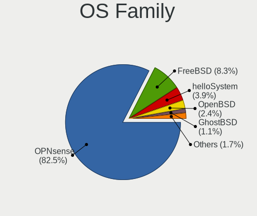
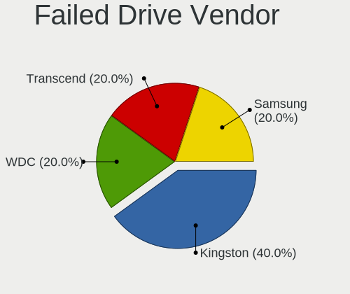
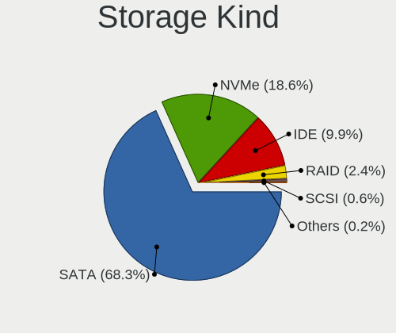
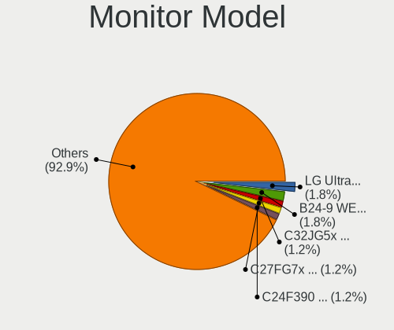
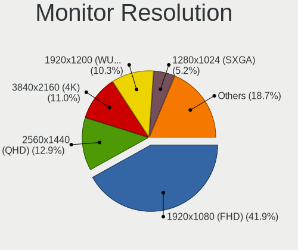
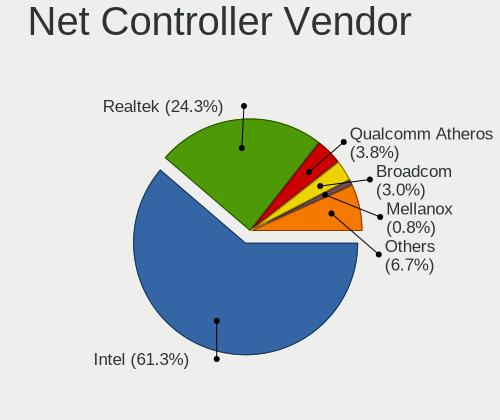
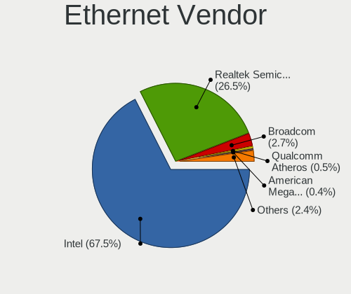
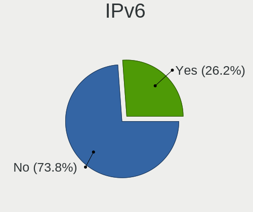

BSD in Germany - Tested Hardware & Statistics (Desktops)
--------------------------------------------------------

A project to collect tested hardware configurations for BSD in Germany.

Anyone can contribute to this report by the [hw-probe](https://github.com/linuxhw/hw-probe/blob/master/INSTALL.BSD.md) tool:

    hw-probe -all -upload

Please contribute! Especially if your hardware is rare.

Contents
--------

* [ Test Cases ](#test-cases)

* [ System ](#system)
  - [ OS                       ](#os)
  - [ OS Family                ](#os-family)
  - [ Arch                     ](#arch)
  - [ DE                       ](#de)
  - [ Display Server           ](#display-server)
  - [ Display Manager          ](#display-manager)
  - [ OS Lang                  ](#os-lang)
  - [ Boot Mode                ](#boot-mode)
  - [ Filesystem               ](#filesystem)
  - [ Part. scheme             ](#part-scheme)

* [ Board ](#board)
  - [ Vendor                   ](#vendor)
  - [ Model                    ](#model)
  - [ Model Family             ](#model-family)
  - [ MFG Year                 ](#mfg-year)
  - [ Form Factor              ](#form-factor)
  - [ Coreboot                 ](#coreboot)
  - [ RAM Size                 ](#ram-size)
  - [ RAM Used                 ](#ram-used)
  - [ Total Drives             ](#total-drives)
  - [ Has CD-ROM               ](#has-cd-rom)
  - [ Has Ethernet             ](#has-ethernet)
  - [ Has WiFi                 ](#has-wifi)
  - [ Has Bluetooth            ](#has-bluetooth)

* [ Location ](#location)
  - [ Country                  ](#country)
  - [ City                     ](#city)

* [ Drives ](#drives)
  - [ Drive Vendor             ](#drive-vendor)
  - [ Drive Model              ](#drive-model)
  - [ HDD Vendor               ](#hdd-vendor)
  - [ SSD Vendor               ](#ssd-vendor)
  - [ Drive Kind               ](#drive-kind)
  - [ Drive Connector          ](#drive-connector)
  - [ Drive Size               ](#drive-size)
  - [ Space Total              ](#space-total)
  - [ Space Used               ](#space-used)
  - [ Malfunc. Drives          ](#malfunc-drives)
  - [ Malfunc. Drive Vendor    ](#malfunc-drive-vendor)
  - [ Malfunc. HDD Vendor      ](#malfunc-hdd-vendor)
  - [ Malfunc. Drive Kind      ](#malfunc-drive-kind)
  - [ Failed Drives            ](#failed-drives)
  - [ Failed Drive Vendor      ](#failed-drive-vendor)
  - [ Drive Status             ](#drive-status)

* [ Storage controller ](#storage-controller)
  - [ Storage Vendor           ](#storage-vendor)
  - [ Storage Model            ](#storage-model)
  - [ Storage Kind             ](#storage-kind)

* [ Processor ](#processor)
  - [ CPU Vendor               ](#cpu-vendor)
  - [ CPU Model                ](#cpu-model)
  - [ CPU Model Family         ](#cpu-model-family)
  - [ CPU Cores                ](#cpu-cores)
  - [ CPU Sockets              ](#cpu-sockets)
  - [ CPU Threads              ](#cpu-threads)
  - [ CPU Microarch            ](#cpu-microarch)

* [ Graphics ](#graphics)
  - [ GPU Vendor               ](#gpu-vendor)
  - [ GPU Model                ](#gpu-model)
  - [ GPU Combo                ](#gpu-combo)
  - [ GPU Driver               ](#gpu-driver)
  - [ GPU Memory               ](#gpu-memory)

* [ Monitor ](#monitor)
  - [ Monitor Vendor           ](#monitor-vendor)
  - [ Monitor Model            ](#monitor-model)
  - [ Monitor Resolution       ](#monitor-resolution)
  - [ Monitor Diagonal         ](#monitor-diagonal)
  - [ Monitor Width            ](#monitor-width)
  - [ Aspect Ratio             ](#aspect-ratio)
  - [ Monitor Area             ](#monitor-area)
  - [ Pixel Density            ](#pixel-density)
  - [ Multiple Monitors        ](#multiple-monitors)

* [ Network ](#network)
  - [ Net Controller Vendor    ](#net-controller-vendor)
  - [ Net Controller Model     ](#net-controller-model)
  - [ Wireless Vendor          ](#wireless-vendor)
  - [ Wireless Model           ](#wireless-model)
  - [ Ethernet Vendor          ](#ethernet-vendor)
  - [ Ethernet Model           ](#ethernet-model)
  - [ Net Controller Kind      ](#net-controller-kind)
  - [ Used Controller          ](#used-controller)
  - [ NICs                     ](#nics)
  - [ IPv6                     ](#ipv6)

* [ Bluetooth ](#bluetooth)
  - [ Bluetooth Vendor         ](#bluetooth-vendor)
  - [ Bluetooth Model          ](#bluetooth-model)

* [ Sound ](#sound)
  - [ Sound Vendor             ](#sound-vendor)
  - [ Sound Model              ](#sound-model)

* [ Memory ](#memory)
  - [ Memory Vendor            ](#memory-vendor)
  - [ Memory Model             ](#memory-model)
  - [ Memory Kind              ](#memory-kind)
  - [ Memory Form Factor       ](#memory-form-factor)
  - [ Memory Size              ](#memory-size)
  - [ Memory Speed             ](#memory-speed)

* [ Printers & scanners ](#printers--scanners)
  - [ Printer Vendor           ](#printer-vendor)
  - [ Printer Model            ](#printer-model)
  - [ Scanner Vendor           ](#scanner-vendor)
  - [ Scanner Model            ](#scanner-model)

* [ Camera ](#camera)
  - [ Camera Vendor            ](#camera-vendor)
  - [ Camera Model             ](#camera-model)

* [ Security ](#security)
  - [ Fingerprint Vendor       ](#fingerprint-vendor)
  - [ Fingerprint Model        ](#fingerprint-model)
  - [ Chipcard Vendor          ](#chipcard-vendor)
  - [ Chipcard Model           ](#chipcard-model)

* [ Unsupported ](#unsupported)
  - [ Unsupported Devices      ](#unsupported-devices)
  - [ Unsupported Device Types ](#unsupported-device-types)

Test Cases
----------

Total: 1019

| Vendor        | Model                       | Probe                                                     | Date         |
|---------------|-----------------------------|-----------------------------------------------------------|--------------|
| Unknown       | Unknown                     | [9ad9772ac7](https://bsd-hardware.info/?probe=9ad9772ac7) | May 31, 2022 |
| Fujitsu       | D3009-B1 S26361-D3009-B1    | [fa3ea36bad](https://bsd-hardware.info/?probe=fa3ea36bad) | May 31, 2022 |
| Deciso        | Netboard A10 V2.1           | [6beacad396](https://bsd-hardware.info/?probe=6beacad396) | May 31, 2022 |
| Unknown       | Unknown                     | [ef87e699fb](https://bsd-hardware.info/?probe=ef87e699fb) | May 30, 2022 |
| Intel         | Q3XXG4-P V1.0               | [95234abead](https://bsd-hardware.info/?probe=95234abead) | May 28, 2022 |
| Fujitsu       | D3313-A1 S26361-D3313-A1    | [cdddbb5d23](https://bsd-hardware.info/?probe=cdddbb5d23) | May 27, 2022 |
| Fujitsu       | D3313-A1 S26361-D3313-A1    | [7a47fcd920](https://bsd-hardware.info/?probe=7a47fcd920) | May 27, 2022 |
| Fujitsu       | D3313-A1 S26361-D3313-A1    | [a5446262b3](https://bsd-hardware.info/?probe=a5446262b3) | May 27, 2022 |
| ASRock        | B660M-HDV                   | [fadb382a5a](https://bsd-hardware.info/?probe=fadb382a5a) | May 26, 2022 |
| ASRockRack    | E3C242D4U2-2T               | [d35f1fb7e0](https://bsd-hardware.info/?probe=d35f1fb7e0) | May 25, 2022 |
| ASRockRack    | E3C242D4U2-2T               | [66f9070856](https://bsd-hardware.info/?probe=66f9070856) | May 23, 2022 |
| Fujitsu       | D3009-B1 S26361-D3009-B1    | [e9e497fc7b](https://bsd-hardware.info/?probe=e9e497fc7b) | May 22, 2022 |
| Fujitsu       | D3009-B1 S26361-D3009-B1    | [b05a8f6ed8](https://bsd-hardware.info/?probe=b05a8f6ed8) | May 22, 2022 |
| Biostar       | J4105NHU                    | [88b74aaf3b](https://bsd-hardware.info/?probe=88b74aaf3b) | May 22, 2022 |
| ASUSTek       | PRIME B350-PLUS             | [e9524e612d](https://bsd-hardware.info/?probe=e9524e612d) | May 22, 2022 |
| HP            | 339A                        | [e6a9b68262](https://bsd-hardware.info/?probe=e6a9b68262) | May 20, 2022 |
| Intel         | Q3XXG4-P V1.0               | [24d2bf3524](https://bsd-hardware.info/?probe=24d2bf3524) | May 19, 2022 |
| Fujitsu       | D3401-H2 S26361-D3401-H2    | [ea6146e013](https://bsd-hardware.info/?probe=ea6146e013) | May 19, 2022 |
| Fujitsu       | D3401-H2 S26361-D3401-H2    | [c9b11d23bd](https://bsd-hardware.info/?probe=c9b11d23bd) | May 19, 2022 |
| Supermicro    | A2SDi-LN4F                  | [acc4101dc1](https://bsd-hardware.info/?probe=acc4101dc1) | May 18, 2022 |
| Gigabyte      | B450M DS3H-CF               | [edcd612c83](https://bsd-hardware.info/?probe=edcd612c83) | May 18, 2022 |
| Biostar       | H410MH S2                   | [1b218204b8](https://bsd-hardware.info/?probe=1b218204b8) | May 18, 2022 |
| MSI           | B85M-E45                    | [83ab25156c](https://bsd-hardware.info/?probe=83ab25156c) | May 18, 2022 |
| Unknown       | Unknown                     | [e13c8baa2d](https://bsd-hardware.info/?probe=e13c8baa2d) | May 17, 2022 |
| Unknown       | Unknown                     | [b8579c7f84](https://bsd-hardware.info/?probe=b8579c7f84) | May 17, 2022 |
| Unknown       | Unknown                     | [98b4dea15a](https://bsd-hardware.info/?probe=98b4dea15a) | May 17, 2022 |
| Intel         | Q3XXG4-P V1.0               | [8c2f853975](https://bsd-hardware.info/?probe=8c2f853975) | May 17, 2022 |
| Fujitsu       | D3401-H2 S26361-D3401-H2    | [b87692aeb4](https://bsd-hardware.info/?probe=b87692aeb4) | May 15, 2022 |
| MSI           | MS-7C82                     | [2ad883afec](https://bsd-hardware.info/?probe=2ad883afec) | May 15, 2022 |
| Fujitsu       | D3401-H2 S26361-D3401-H2    | [6974f0958e](https://bsd-hardware.info/?probe=6974f0958e) | May 15, 2022 |
| Unknown       | Unknown                     | [4fad520626](https://bsd-hardware.info/?probe=4fad520626) | May 14, 2022 |
| ASRock        | E350M1                      | [1850fa38e0](https://bsd-hardware.info/?probe=1850fa38e0) | May 14, 2022 |
| ASRock        | E350M1                      | [4520b5034e](https://bsd-hardware.info/?probe=4520b5034e) | May 13, 2022 |
| HP            | 213D A01                    | [89955ba84f](https://bsd-hardware.info/?probe=89955ba84f) | May 11, 2022 |
| HP            | 82A1                        | [34cb091e26](https://bsd-hardware.info/?probe=34cb091e26) | May 08, 2022 |
| BESSTAR Te... | DMAF5 V1.0                  | [dc534266df](https://bsd-hardware.info/?probe=dc534266df) | May 06, 2022 |
| BESSTAR Te... | IB9                         | [4a4e45585d](https://bsd-hardware.info/?probe=4a4e45585d) | May 06, 2022 |
| friendlyel... | nanopi-r4s                  | [3db2ec8973](https://bsd-hardware.info/?probe=3db2ec8973) | May 04, 2022 |
| Unknown       | Unknown                     | [b96fd74ab0](https://bsd-hardware.info/?probe=b96fd74ab0) | May 03, 2022 |
| ASRock        | J4125B-ITX                  | [14d02a8209](https://bsd-hardware.info/?probe=14d02a8209) | May 03, 2022 |
| Intel         | Q3XXG4-P V1.0               | [e4c8d6c787](https://bsd-hardware.info/?probe=e4c8d6c787) | May 01, 2022 |
| MSI           | MEG X570 UNIFY              | [5e8168a980](https://bsd-hardware.info/?probe=5e8168a980) | Apr 30, 2022 |
| OEM           | 1.0                         | [36e78ab638](https://bsd-hardware.info/?probe=36e78ab638) | Apr 29, 2022 |
| Unknown       | YL-J1900-V1                 | [54fe9e7529](https://bsd-hardware.info/?probe=54fe9e7529) | Apr 29, 2022 |
| MSI           | A520M-A PRO                 | [336add4fcb](https://bsd-hardware.info/?probe=336add4fcb) | Apr 28, 2022 |
| MSI           | A520M-A PRO                 | [34f2ba40e7](https://bsd-hardware.info/?probe=34f2ba40e7) | Apr 27, 2022 |
| PC Engines    | APU2                        | [920eae6f2e](https://bsd-hardware.info/?probe=920eae6f2e) | Apr 27, 2022 |
| MSI           | 970A GAMING PRO CARBON      | [c36f9d6c1d](https://bsd-hardware.info/?probe=c36f9d6c1d) | Apr 26, 2022 |
| Unknown       | MANIFOLD 2-C                | [637c28d728](https://bsd-hardware.info/?probe=637c28d728) | Apr 25, 2022 |
| MSI           | X399 GAMING PRO CARBON A... | [86c4af7ca4](https://bsd-hardware.info/?probe=86c4af7ca4) | Apr 25, 2022 |
| MSI           | MEG X570 UNIFY              | [6afa33e8f8](https://bsd-hardware.info/?probe=6afa33e8f8) | Apr 24, 2022 |
| Lenovo        | SKYBAY SDK0J40705 WIN 34... | [1ce660f88e](https://bsd-hardware.info/?probe=1ce660f88e) | Apr 24, 2022 |
| PC Engines    | apu4                        | [ae39e5adc0](https://bsd-hardware.info/?probe=ae39e5adc0) | Apr 22, 2022 |
| ASRock        | X79 Extreme6/GB             | [cd85d68dcd](https://bsd-hardware.info/?probe=cd85d68dcd) | Apr 21, 2022 |
| CheckPoint    | T-140-00                    | [8e2c861ecf](https://bsd-hardware.info/?probe=8e2c861ecf) | Apr 19, 2022 |
| CheckPoint    | T-140-00                    | [8f0c5b5334](https://bsd-hardware.info/?probe=8f0c5b5334) | Apr 19, 2022 |
| PC Engines    | APU2                        | [47ddf6b2bd](https://bsd-hardware.info/?probe=47ddf6b2bd) | Apr 19, 2022 |
| Gigabyte      | B85M-D3H                    | [8d7236247d](https://bsd-hardware.info/?probe=8d7236247d) | Apr 18, 2022 |
| ASRock        | B85M Pro3                   | [9ff2cbdcf1](https://bsd-hardware.info/?probe=9ff2cbdcf1) | Apr 18, 2022 |
| Unknown       | Unknown                     | [0914d63c72](https://bsd-hardware.info/?probe=0914d63c72) | Apr 16, 2022 |
| Biostar       | H410MH S2                   | [d045a4acad](https://bsd-hardware.info/?probe=d045a4acad) | Apr 14, 2022 |
| Gigabyte      | B85M-D3H                    | [3365444265](https://bsd-hardware.info/?probe=3365444265) | Apr 14, 2022 |
| Unknown       | Unknown                     | [4ec1e3548c](https://bsd-hardware.info/?probe=4ec1e3548c) | Apr 14, 2022 |
| Intel         | Q3XXG4-P V1.0               | [efb76ec7fe](https://bsd-hardware.info/?probe=efb76ec7fe) | Apr 13, 2022 |
| Unknown       | Unknown                     | [ad14582532](https://bsd-hardware.info/?probe=ad14582532) | Apr 13, 2022 |
| Intel         | D53427RKE G87971-403        | [1a1de076c7](https://bsd-hardware.info/?probe=1a1de076c7) | Apr 13, 2022 |
| Intel         | SKYBAY                      | [5f2a882529](https://bsd-hardware.info/?probe=5f2a882529) | Apr 11, 2022 |
| Gigabyte      | MZBSWAP-K4                  | [752f962123](https://bsd-hardware.info/?probe=752f962123) | Apr 10, 2022 |
| PC Engines    | APU2                        | [ae2d120c7c](https://bsd-hardware.info/?probe=ae2d120c7c) | Apr 10, 2022 |
| Shuttle       | DS10U                       | [7d5919eb2b](https://bsd-hardware.info/?probe=7d5919eb2b) | Apr 10, 2022 |
| Unknown       | Unknown                     | [6835aa43e3](https://bsd-hardware.info/?probe=6835aa43e3) | Apr 09, 2022 |
| Intel         | MAHOBAY                     | [8b21109cd4](https://bsd-hardware.info/?probe=8b21109cd4) | Apr 08, 2022 |
| MSI           | MS-7369                     | [25f2161cac](https://bsd-hardware.info/?probe=25f2161cac) | Apr 08, 2022 |
| ASRock        | H570M-ITX/ac                | [44327ad768](https://bsd-hardware.info/?probe=44327ad768) | Apr 07, 2022 |
| HP            | 213D A01                    | [3f6e05c14d](https://bsd-hardware.info/?probe=3f6e05c14d) | Apr 07, 2022 |
| ASRock        | B660M-HDV                   | [9ffa0cc352](https://bsd-hardware.info/?probe=9ffa0cc352) | Apr 06, 2022 |
| PC Engines    | APU2                        | [69304a74cc](https://bsd-hardware.info/?probe=69304a74cc) | Apr 06, 2022 |
| Unknown       | Unknown                     | [4cf896e25a](https://bsd-hardware.info/?probe=4cf896e25a) | Apr 06, 2022 |
| ASUSTek       | PRIME B360M-A               | [90663f7aa0](https://bsd-hardware.info/?probe=90663f7aa0) | Apr 05, 2022 |
| HP            | 213D A01                    | [238d8bbcde](https://bsd-hardware.info/?probe=238d8bbcde) | Apr 04, 2022 |
| PC Engines    | APU2                        | [69cb42c07b](https://bsd-hardware.info/?probe=69cb42c07b) | Apr 02, 2022 |
| Fujitsu       | D3313-A1 S26361-D3313-A1    | [1bdaf4bb77](https://bsd-hardware.info/?probe=1bdaf4bb77) | Apr 01, 2022 |
| HP            | 3396                        | [7a60daeaef](https://bsd-hardware.info/?probe=7a60daeaef) | Apr 01, 2022 |
| Acidanther... | Mac-F60DEB81FF30ACF6 Mac... | [9b6f9eac6f](https://bsd-hardware.info/?probe=9b6f9eac6f) | Apr 01, 2022 |
| PC Engines    | APU                         | [c71152505f](https://bsd-hardware.info/?probe=c71152505f) | Apr 01, 2022 |
| Fujitsu       | D3230-A1 S26361-D3230-A1    | [3df6a01030](https://bsd-hardware.info/?probe=3df6a01030) | Mar 31, 2022 |
| Seeed Stud... | ODYSSEY-X86J4105 SD-BS-C... | [b5ea7eaeb0](https://bsd-hardware.info/?probe=b5ea7eaeb0) | Mar 31, 2022 |
| ASUSTek       | PRO B460M-C                 | [0542f7a16d](https://bsd-hardware.info/?probe=0542f7a16d) | Mar 29, 2022 |
| Unknown       | Unknown                     | [4383e28183](https://bsd-hardware.info/?probe=4383e28183) | Mar 29, 2022 |
| Intel         | DENLOW_REFRESH_WS           | [36896a719d](https://bsd-hardware.info/?probe=36896a719d) | Mar 29, 2022 |
| ASRock        | X79 Extreme6/GB             | [0646607953](https://bsd-hardware.info/?probe=0646607953) | Mar 28, 2022 |
| PC Engines    | apu4                        | [a35c56ca36](https://bsd-hardware.info/?probe=a35c56ca36) | Mar 28, 2022 |
| Protectli     | FW6 Ver                     | [f09a26de6f](https://bsd-hardware.info/?probe=f09a26de6f) | Mar 27, 2022 |
| Gigabyte      | MZBSWBP-00                  | [9e5d1c9daa](https://bsd-hardware.info/?probe=9e5d1c9daa) | Mar 26, 2022 |
| Unknown       | Unknown                     | [da94141898](https://bsd-hardware.info/?probe=da94141898) | Mar 26, 2022 |
| PC Engines    | apu4                        | [d95599aa97](https://bsd-hardware.info/?probe=d95599aa97) | Mar 25, 2022 |
| ASUSTek       | P10S-I Series               | [190fe4d13f](https://bsd-hardware.info/?probe=190fe4d13f) | Mar 24, 2022 |
| MSI           | MS-A6221 100                | [ba62f48990](https://bsd-hardware.info/?probe=ba62f48990) | Mar 23, 2022 |
| PC Engines    | APU3                        | [0a68bdf721](https://bsd-hardware.info/?probe=0a68bdf721) | Mar 23, 2022 |
| Fujitsu       | D3064-A1 S26361-D3064-A1    | [e0a7c6b62f](https://bsd-hardware.info/?probe=e0a7c6b62f) | Mar 23, 2022 |
| PC Engines    | apu4                        | [4f2d362dd2](https://bsd-hardware.info/?probe=4f2d362dd2) | Mar 22, 2022 |
| ASUSTek       | PRO B460M-C                 | [6ceff4eca1](https://bsd-hardware.info/?probe=6ceff4eca1) | Mar 21, 2022 |
| ASRock        | H570M-ITX/ac                | [c81d79bbe7](https://bsd-hardware.info/?probe=c81d79bbe7) | Mar 18, 2022 |
| friendlyel... | nanopi-r2s                  | [f41d89a7e9](https://bsd-hardware.info/?probe=f41d89a7e9) | Mar 17, 2022 |
| ASRock        | B75M R2.0                   | [7aac0f4b94](https://bsd-hardware.info/?probe=7aac0f4b94) | Mar 16, 2022 |
| Fujitsu       | D3313-A1 S26361-D3313-A1    | [aa18c11016](https://bsd-hardware.info/?probe=aa18c11016) | Mar 16, 2022 |
| HP            | 8299                        | [6876d2d37d](https://bsd-hardware.info/?probe=6876d2d37d) | Mar 16, 2022 |
| PC Engines    | APU2                        | [6ea85fac4f](https://bsd-hardware.info/?probe=6ea85fac4f) | Mar 15, 2022 |
| Unknown       | YL-J3160L4                  | [2c002dc6a8](https://bsd-hardware.info/?probe=2c002dc6a8) | Mar 15, 2022 |
| Unknown       | Unknown                     | [c2b8c7eebb](https://bsd-hardware.info/?probe=c2b8c7eebb) | Mar 14, 2022 |
| HP            | ProLiant MicroServer Gen... | [f9045f060a](https://bsd-hardware.info/?probe=f9045f060a) | Mar 13, 2022 |
| BESSTAR Te... | IB9                         | [d60b00e2c6](https://bsd-hardware.info/?probe=d60b00e2c6) | Mar 13, 2022 |
| Unknown       | Unknown                     | [8152ca0911](https://bsd-hardware.info/?probe=8152ca0911) | Mar 13, 2022 |
| Gigabyte      | N3150ND3V                   | [382a3e1fbb](https://bsd-hardware.info/?probe=382a3e1fbb) | Mar 12, 2022 |
| Unknown       | YL-J3160L4                  | [592ff80875](https://bsd-hardware.info/?probe=592ff80875) | Mar 12, 2022 |
| PC Engines    | APU2                        | [b8303d5089](https://bsd-hardware.info/?probe=b8303d5089) | Mar 12, 2022 |
| ASUSTek       | P5Q DELUXE                  | [b4234170e8](https://bsd-hardware.info/?probe=b4234170e8) | Mar 10, 2022 |
| NF541         | 1.0                         | [fc2b2bb98d](https://bsd-hardware.info/?probe=fc2b2bb98d) | Mar 09, 2022 |
| Unknown       | Unknown                     | [3ee10c1ab2](https://bsd-hardware.info/?probe=3ee10c1ab2) | Mar 09, 2022 |
| Koloe         | X58                         | [58e098eca2](https://bsd-hardware.info/?probe=58e098eca2) | Mar 09, 2022 |
| Unknown       | Unknown                     | [fea4a692a9](https://bsd-hardware.info/?probe=fea4a692a9) | Mar 09, 2022 |
| Unknown       | Unknown                     | [e89b377c53](https://bsd-hardware.info/?probe=e89b377c53) | Mar 08, 2022 |
| Fujitsu       | D3064-A1 S26361-D3064-A1    | [bc73c8dc68](https://bsd-hardware.info/?probe=bc73c8dc68) | Mar 08, 2022 |
| Intel         | DENLOW_WS                   | [bab9d9dd6d](https://bsd-hardware.info/?probe=bab9d9dd6d) | Mar 08, 2022 |
| Fujitsu       | D3064-A1 S26361-D3064-A1    | [e3698a706b](https://bsd-hardware.info/?probe=e3698a706b) | Mar 07, 2022 |
| Koloe         | X58                         | [c501dfa5c8](https://bsd-hardware.info/?probe=c501dfa5c8) | Mar 07, 2022 |
| Intel         | DX79TO AAG28805-401         | [431b37f050](https://bsd-hardware.info/?probe=431b37f050) | Mar 06, 2022 |
| CheckPoint    | T-110-00                    | [ecbdeaf92b](https://bsd-hardware.info/?probe=ecbdeaf92b) | Mar 05, 2022 |
| Lanner        | FW-7543 B-GA                | [8ae57434a2](https://bsd-hardware.info/?probe=8ae57434a2) | Mar 03, 2022 |
| Gigabyte      | N3150ND3V                   | [bdf7beae56](https://bsd-hardware.info/?probe=bdf7beae56) | Mar 03, 2022 |
| Intel         | Q3XXG4-P V1.0               | [f5eef026f2](https://bsd-hardware.info/?probe=f5eef026f2) | Mar 02, 2022 |
| Protectli     | VP2410                      | [880c57201a](https://bsd-hardware.info/?probe=880c57201a) | Mar 01, 2022 |
| Supermicro    | A2SDi-LN4F                  | [b10f6655d9](https://bsd-hardware.info/?probe=b10f6655d9) | Mar 01, 2022 |
| BESSTAR Te... | HM90                        | [2d1bf5a79a](https://bsd-hardware.info/?probe=2d1bf5a79a) | Mar 01, 2022 |
| HARDKERNEL    | ODROID-H2                   | [df62b83093](https://bsd-hardware.info/?probe=df62b83093) | Feb 28, 2022 |
| SeeedStudi... | ODYSSEY-X86J4105 SD-BS-C... | [1e8ac02926](https://bsd-hardware.info/?probe=1e8ac02926) | Feb 26, 2022 |
| AAEON         | FWS-2280 V1.0               | [9fba128986](https://bsd-hardware.info/?probe=9fba128986) | Feb 26, 2022 |
| Unknown       | Unknown                     | [a771f78447](https://bsd-hardware.info/?probe=a771f78447) | Feb 26, 2022 |
| PC Engines    | apu4                        | [74c708a6cf](https://bsd-hardware.info/?probe=74c708a6cf) | Feb 25, 2022 |
| Unknown       | Unknown                     | [2bbb963d9f](https://bsd-hardware.info/?probe=2bbb963d9f) | Feb 25, 2022 |
| Unknown       | Unknown                     | [c559dbe233](https://bsd-hardware.info/?probe=c559dbe233) | Feb 25, 2022 |
| PC Engines    | apu4                        | [ed16e6ac1f](https://bsd-hardware.info/?probe=ed16e6ac1f) | Feb 24, 2022 |
| YANYU         | M9F baytrail                | [3804d3fb1d](https://bsd-hardware.info/?probe=3804d3fb1d) | Feb 24, 2022 |
| ASUSTek       | P11C-I Series               | [f768f45dc2](https://bsd-hardware.info/?probe=f768f45dc2) | Feb 23, 2022 |
| BESSTAR Te... | JB9                         | [e788cec5f5](https://bsd-hardware.info/?probe=e788cec5f5) | Feb 22, 2022 |
| Fujitsu       | D3313-A1 S26361-D3313-A1    | [e55cb672b2](https://bsd-hardware.info/?probe=e55cb672b2) | Feb 21, 2022 |
| Unknown       | Unknown                     | [db8e4dc1f5](https://bsd-hardware.info/?probe=db8e4dc1f5) | Feb 21, 2022 |
| Unknown       | Unknown                     | [9a280f5e25](https://bsd-hardware.info/?probe=9a280f5e25) | Feb 21, 2022 |
| BESSTAR Te... | JB9                         | [7df0c12efe](https://bsd-hardware.info/?probe=7df0c12efe) | Feb 19, 2022 |
| Unknown       | Unknown                     | [883cf2382b](https://bsd-hardware.info/?probe=883cf2382b) | Feb 17, 2022 |
| ASRock        | H570M-ITX/ac                | [1e54f9ca54](https://bsd-hardware.info/?probe=1e54f9ca54) | Feb 17, 2022 |
| ASRock        | 4X4-R1000                   | [c25f53782a](https://bsd-hardware.info/?probe=c25f53782a) | Feb 17, 2022 |
| YANYU         | M9F baytrail                | [a568d8241d](https://bsd-hardware.info/?probe=a568d8241d) | Feb 16, 2022 |
| ASUSTek       | P11C-M Series               | [459ff0f748](https://bsd-hardware.info/?probe=459ff0f748) | Feb 16, 2022 |
| Gigabyte      | C246M-WU4-CF                | [4b6c6d8bde](https://bsd-hardware.info/?probe=4b6c6d8bde) | Feb 15, 2022 |
| Intel         | Q3XXG4-P V1.0               | [cb2ab6f97a](https://bsd-hardware.info/?probe=cb2ab6f97a) | Feb 15, 2022 |
| Unknown       | MANIFOLD 2-C                | [4980cae3eb](https://bsd-hardware.info/?probe=4980cae3eb) | Feb 15, 2022 |
| Intel         | Q3XXG4-P V1.0               | [53ec9f2960](https://bsd-hardware.info/?probe=53ec9f2960) | Feb 14, 2022 |
| Intel         | MAHOBAY                     | [d3d818c49f](https://bsd-hardware.info/?probe=d3d818c49f) | Feb 13, 2022 |
| Unknown       | Unknown                     | [923aba4efb](https://bsd-hardware.info/?probe=923aba4efb) | Feb 12, 2022 |
| AOpen         | i67QMx-DV R1.00TS2 55MP6... | [c3b6cdf519](https://bsd-hardware.info/?probe=c3b6cdf519) | Feb 12, 2022 |
| CheckPoint    | T-140-00                    | [e41ba68aa2](https://bsd-hardware.info/?probe=e41ba68aa2) | Feb 11, 2022 |
| Unknown       | Unknown                     | [64cb6534ff](https://bsd-hardware.info/?probe=64cb6534ff) | Feb 11, 2022 |
| Supermicro    | X11SBA-LN4FA                | [e547e2343a](https://bsd-hardware.info/?probe=e547e2343a) | Feb 10, 2022 |
| Thomas-Kre... | LES network 6L              | [18df27c327](https://bsd-hardware.info/?probe=18df27c327) | Feb 10, 2022 |
| Unknown       | Q2XX V1.0                   | [1e3cfd4559](https://bsd-hardware.info/?probe=1e3cfd4559) | Feb 09, 2022 |
| ASRock        | J5040-ITX                   | [5a614c6238](https://bsd-hardware.info/?probe=5a614c6238) | Feb 08, 2022 |
| Unknown       | Unknown                     | [aff2852632](https://bsd-hardware.info/?probe=aff2852632) | Feb 07, 2022 |
| BESSTAR Te... | HM90                        | [619b239937](https://bsd-hardware.info/?probe=619b239937) | Feb 07, 2022 |
| ASRock        | Q1900M                      | [1bb0094772](https://bsd-hardware.info/?probe=1bb0094772) | Feb 07, 2022 |
| Fujitsu       | D3544-Sx S26361-D3544-Sx... | [e279b10250](https://bsd-hardware.info/?probe=e279b10250) | Feb 07, 2022 |
| PC Engines    | apu4                        | [1bde386ab2](https://bsd-hardware.info/?probe=1bde386ab2) | Feb 06, 2022 |
| Gigabyte      | X570 GAMING X               | [0eb520b964](https://bsd-hardware.info/?probe=0eb520b964) | Feb 06, 2022 |
| ASRock        | Q1900M                      | [1840d289c9](https://bsd-hardware.info/?probe=1840d289c9) | Feb 06, 2022 |
| Intel         | CRESCENTBAY                 | [2764fb2282](https://bsd-hardware.info/?probe=2764fb2282) | Feb 06, 2022 |
| Unknown       | Unknown                     | [8d38089ced](https://bsd-hardware.info/?probe=8d38089ced) | Feb 06, 2022 |
| Unknown       | Unknown                     | [12e979c82a](https://bsd-hardware.info/?probe=12e979c82a) | Feb 06, 2022 |
| Unknown       | Unknown                     | [2a3867a849](https://bsd-hardware.info/?probe=2a3867a849) | Feb 06, 2022 |
| Unknown       | Q2XX V1.0                   | [633ad33c05](https://bsd-hardware.info/?probe=633ad33c05) | Feb 06, 2022 |
| CheckPoint    | T-140-00                    | [92af3888c0](https://bsd-hardware.info/?probe=92af3888c0) | Feb 04, 2022 |
| CheckPoint    | T-110-00                    | [65f271c2c8](https://bsd-hardware.info/?probe=65f271c2c8) | Feb 04, 2022 |
| ASUSTek       | H81M-A                      | [d0c6e027a0](https://bsd-hardware.info/?probe=d0c6e027a0) | Feb 04, 2022 |
| ASRock        | A520M-ITX/ac                | [45d4853cd4](https://bsd-hardware.info/?probe=45d4853cd4) | Feb 03, 2022 |
| ASRock        | B85M Pro3                   | [6d1223c3d1](https://bsd-hardware.info/?probe=6d1223c3d1) | Feb 02, 2022 |
| PC Engines    | APU2                        | [c2337ada02](https://bsd-hardware.info/?probe=c2337ada02) | Feb 02, 2022 |
| Unknown       | MANIFOLD 2-C                | [faff4c7609](https://bsd-hardware.info/?probe=faff4c7609) | Feb 01, 2022 |
| Unknown       | Unknown                     | [82d9df0427](https://bsd-hardware.info/?probe=82d9df0427) | Feb 01, 2022 |
| BESSTAR Te... | JB9                         | [8f1ac8e4bc](https://bsd-hardware.info/?probe=8f1ac8e4bc) | Jan 31, 2022 |
| Supermicro    | X11SBA-LN4FA                | [d040ad4922](https://bsd-hardware.info/?probe=d040ad4922) | Jan 31, 2022 |
| PC Engines    | APU3                        | [b03f53313d](https://bsd-hardware.info/?probe=b03f53313d) | Jan 31, 2022 |
| PC Engines    | apu4                        | [1f02497c18](https://bsd-hardware.info/?probe=1f02497c18) | Jan 30, 2022 |
| SIEMENS       | A5E38156881 RS-AE           | [d1d16a420e](https://bsd-hardware.info/?probe=d1d16a420e) | Jan 30, 2022 |
| HARDKERNEL    | ODROID-H2                   | [b27a7274cf](https://bsd-hardware.info/?probe=b27a7274cf) | Jan 30, 2022 |
| HARDKERNEL    | ODROID-H2                   | [292cb706a0](https://bsd-hardware.info/?probe=292cb706a0) | Jan 30, 2022 |
| BESSTAR Te... | HM90                        | [74c01cf184](https://bsd-hardware.info/?probe=74c01cf184) | Jan 30, 2022 |
| PC Engines    | APU2                        | [f65e5a625b](https://bsd-hardware.info/?probe=f65e5a625b) | Jan 30, 2022 |
| CheckPoint    | T-120-00                    | [8777e1a17d](https://bsd-hardware.info/?probe=8777e1a17d) | Jan 29, 2022 |
| Protectli     | FW4B Ver                    | [cee618086f](https://bsd-hardware.info/?probe=cee618086f) | Jan 29, 2022 |
| HARDKERNEL    | ODROID-H2                   | [540757d1b7](https://bsd-hardware.info/?probe=540757d1b7) | Jan 29, 2022 |
| PC Engines    | APU2                        | [0a504f17ee](https://bsd-hardware.info/?probe=0a504f17ee) | Jan 29, 2022 |
| Gigabyte      | Z590 VISION G               | [9c73c01062](https://bsd-hardware.info/?probe=9c73c01062) | Jan 28, 2022 |
| Protectli     | FW4B Ver                    | [ba4865faf2](https://bsd-hardware.info/?probe=ba4865faf2) | Jan 28, 2022 |
| PC Engines    | apu1                        | [33819c7652](https://bsd-hardware.info/?probe=33819c7652) | Jan 27, 2022 |
| Supermicro    | A2SDi-LN4F                  | [38f999c445](https://bsd-hardware.info/?probe=38f999c445) | Jan 27, 2022 |
| HP            | 18E4                        | [67080049c6](https://bsd-hardware.info/?probe=67080049c6) | Jan 27, 2022 |
| HP            | 213D A01                    | [659a73beac](https://bsd-hardware.info/?probe=659a73beac) | Jan 26, 2022 |
| Unknown       | Unknown                     | [6831896a2b](https://bsd-hardware.info/?probe=6831896a2b) | Jan 26, 2022 |
| Fujitsu       | D3313-E1 S26361-D3313-E1    | [c9f915399a](https://bsd-hardware.info/?probe=c9f915399a) | Jan 25, 2022 |
| Fujitsu       | D3313-E1 S26361-D3313-E1    | [6ca20b88e7](https://bsd-hardware.info/?probe=6ca20b88e7) | Jan 25, 2022 |
| Deciso        | Netboard A10 V2.1           | [f4e3c83813](https://bsd-hardware.info/?probe=f4e3c83813) | Jan 24, 2022 |
| Biostar       | J4105NHU                    | [8513067567](https://bsd-hardware.info/?probe=8513067567) | Jan 24, 2022 |
| Intel         | MAHOBAY                     | [9ad0c66586](https://bsd-hardware.info/?probe=9ad0c66586) | Jan 23, 2022 |
| HP            | 8648                        | [b0adf55067](https://bsd-hardware.info/?probe=b0adf55067) | Jan 23, 2022 |
| Fujitsu       | D3313-A1 S26361-D3313-A1    | [8597e1c1e4](https://bsd-hardware.info/?probe=8597e1c1e4) | Jan 22, 2022 |
| Dell          | VEP-4600-V910 0PDG1JA02     | [63699d431a](https://bsd-hardware.info/?probe=63699d431a) | Jan 21, 2022 |
| Dell          | 0NNNCT A01                  | [290f10c785](https://bsd-hardware.info/?probe=290f10c785) | Jan 21, 2022 |
| Unknown       | PICO PC                     | [70dca31596](https://bsd-hardware.info/?probe=70dca31596) | Jan 19, 2022 |
| ASUSTek       | AT5NM10-I                   | [dea1ec292d](https://bsd-hardware.info/?probe=dea1ec292d) | Jan 18, 2022 |
| Unknown       | Unknown                     | [9c34dd06dc](https://bsd-hardware.info/?probe=9c34dd06dc) | Jan 18, 2022 |
| ASRock        | H570M-ITX/ac                | [a188e2d1bc](https://bsd-hardware.info/?probe=a188e2d1bc) | Jan 17, 2022 |
| Unknown       | Unknown                     | [92ee8c8c45](https://bsd-hardware.info/?probe=92ee8c8c45) | Jan 17, 2022 |
| Gigabyte      | MZBSWBP-00                  | [5e980b75bc](https://bsd-hardware.info/?probe=5e980b75bc) | Jan 16, 2022 |
| Unknown       | Unknown                     | [010c0f9489](https://bsd-hardware.info/?probe=010c0f9489) | Jan 15, 2022 |
| OEM           | 1.0                         | [2bc6be75f3](https://bsd-hardware.info/?probe=2bc6be75f3) | Jan 13, 2022 |
| Protectli     | VP2410                      | [4dd1b9065c](https://bsd-hardware.info/?probe=4dd1b9065c) | Jan 13, 2022 |
| PC Engines    | APU2                        | [b1f37f5ec0](https://bsd-hardware.info/?probe=b1f37f5ec0) | Jan 12, 2022 |
| SIEMENS       | A5E38156881 RS-AE           | [9940cdeaae](https://bsd-hardware.info/?probe=9940cdeaae) | Jan 12, 2022 |
| HP            | ProLiant MicroServer        | [0da2a93271](https://bsd-hardware.info/?probe=0da2a93271) | Jan 11, 2022 |
| Lanner        | FW-7543 B-GA                | [20834b9ab3](https://bsd-hardware.info/?probe=20834b9ab3) | Jan 11, 2022 |
| HP            | ProLiant MicroServer        | [e95a3dd5ec](https://bsd-hardware.info/?probe=e95a3dd5ec) | Jan 10, 2022 |
| PC Engines    | apu1                        | [1d0acc276d](https://bsd-hardware.info/?probe=1d0acc276d) | Jan 10, 2022 |
| HP            | 3397                        | [7740208542](https://bsd-hardware.info/?probe=7740208542) | Jan 09, 2022 |
| Fujitsu       | D3313-B1 S26361-D3313-B1    | [db01451a9c](https://bsd-hardware.info/?probe=db01451a9c) | Jan 08, 2022 |
| ASRock        | Q1900M                      | [c10bf0783b](https://bsd-hardware.info/?probe=c10bf0783b) | Jan 08, 2022 |
| HP            | 213D A01                    | [b11b8d0a83](https://bsd-hardware.info/?probe=b11b8d0a83) | Jan 06, 2022 |
| Dell          | 0MN1TX A03                  | [89308fe374](https://bsd-hardware.info/?probe=89308fe374) | Jan 05, 2022 |
| ASUSTek       | TUF GAMING B550-PLUS        | [ea4719600a](https://bsd-hardware.info/?probe=ea4719600a) | Jan 05, 2022 |
| Lenovo        | SHARKBAY NOK                | [00a423476f](https://bsd-hardware.info/?probe=00a423476f) | Dec 31, 2021 |
| Lenovo        | SHARKBAY NOK                | [a5cc2ac2e5](https://bsd-hardware.info/?probe=a5cc2ac2e5) | Dec 30, 2021 |
| Supermicro    | X8SIL                       | [447f2bd30c](https://bsd-hardware.info/?probe=447f2bd30c) | Dec 30, 2021 |
| Unknown       | Unknown                     | [1c45cd1b45](https://bsd-hardware.info/?probe=1c45cd1b45) | Dec 29, 2021 |
| Advantech     | SYS-2USM02-6M01E            | [6952d74233](https://bsd-hardware.info/?probe=6952d74233) | Dec 29, 2021 |
| ASRock        | X470 Gaming-ITX/ac          | [18eeaf2963](https://bsd-hardware.info/?probe=18eeaf2963) | Dec 29, 2021 |
| ASUSTek       | AT5NM10-I                   | [726da55b5c](https://bsd-hardware.info/?probe=726da55b5c) | Dec 28, 2021 |
| ASUSTek       | AT5NM10-I                   | [07903fe3b2](https://bsd-hardware.info/?probe=07903fe3b2) | Dec 28, 2021 |
| NEXCOM        | NSA3110 B                   | [213dc9c3ef](https://bsd-hardware.info/?probe=213dc9c3ef) | Dec 28, 2021 |
| Intel         | DQ67OW AAG12528-310         | [7a41b1560b](https://bsd-hardware.info/?probe=7a41b1560b) | Dec 28, 2021 |
| Unknown       | Unknown                     | [a3bbd9d497](https://bsd-hardware.info/?probe=a3bbd9d497) | Dec 28, 2021 |
| Unknown       | Unknown                     | [e8ea8ca2d4](https://bsd-hardware.info/?probe=e8ea8ca2d4) | Dec 27, 2021 |
| Unknown       | Unknown                     | [8081818610](https://bsd-hardware.info/?probe=8081818610) | Dec 27, 2021 |
| Unknown       | Unknown                     | [ad85192939](https://bsd-hardware.info/?probe=ad85192939) | Dec 27, 2021 |
| Advantech     | SYS-2USM02-6M01E            | [11ac580b34](https://bsd-hardware.info/?probe=11ac580b34) | Dec 25, 2021 |
| ASUSTek       | H81M-A                      | [2197e2ef44](https://bsd-hardware.info/?probe=2197e2ef44) | Dec 24, 2021 |
| Unknown       | J3160-4L                    | [e6a780468e](https://bsd-hardware.info/?probe=e6a780468e) | Dec 23, 2021 |
| Unknown       | MANIFOLD 2-C                | [1008aaa183](https://bsd-hardware.info/?probe=1008aaa183) | Dec 21, 2021 |
| Fujitsu       | D3313-E1 S26361-D3313-E1    | [7e2700c4da](https://bsd-hardware.info/?probe=7e2700c4da) | Dec 19, 2021 |
| MSI           | G41M-P25                    | [841cce11e6](https://bsd-hardware.info/?probe=841cce11e6) | Dec 19, 2021 |
| PC Engines    | APU                         | [a80dfddf5d](https://bsd-hardware.info/?probe=a80dfddf5d) | Dec 19, 2021 |
| PC Engines    | APU                         | [062a321fcc](https://bsd-hardware.info/?probe=062a321fcc) | Dec 19, 2021 |
| Unknown       | Unknown                     | [a684bd3927](https://bsd-hardware.info/?probe=a684bd3927) | Dec 18, 2021 |
| Unknown       | MANIFOLD 2-C                | [2c117a5a05](https://bsd-hardware.info/?probe=2c117a5a05) | Dec 18, 2021 |
| Intel         | Q3XXG4-P V1.0               | [9e0ffaee60](https://bsd-hardware.info/?probe=9e0ffaee60) | Dec 17, 2021 |
| Jetway        | 1.0                         | [da30ee0b65](https://bsd-hardware.info/?probe=da30ee0b65) | Dec 17, 2021 |
| HPE           | ProLiant MicroServer Gen... | [eb69483087](https://bsd-hardware.info/?probe=eb69483087) | Dec 17, 2021 |
| ASRock        | J5005-ITX                   | [8da08352a2](https://bsd-hardware.info/?probe=8da08352a2) | Dec 16, 2021 |
| PC Engines    | apu4                        | [3b69286939](https://bsd-hardware.info/?probe=3b69286939) | Dec 16, 2021 |
| Fujitsu       | D2990-A3 S26361-D2990-A3    | [cd29b33f3b](https://bsd-hardware.info/?probe=cd29b33f3b) | Dec 15, 2021 |
| Unknown       | J3160-4L                    | [146a32975f](https://bsd-hardware.info/?probe=146a32975f) | Dec 14, 2021 |
| Unknown       | Unknown                     | [170ca711c2](https://bsd-hardware.info/?probe=170ca711c2) | Dec 12, 2021 |
| Protectli     | FW4B Ver                    | [88467fcb17](https://bsd-hardware.info/?probe=88467fcb17) | Dec 11, 2021 |
| CheckPoint    | T-120-00                    | [39b54429ed](https://bsd-hardware.info/?probe=39b54429ed) | Dec 11, 2021 |
| ASUSTek       | AT5NM10-I                   | [99395ceca8](https://bsd-hardware.info/?probe=99395ceca8) | Dec 10, 2021 |
| Acer          | RevoOne RL85                | [a1e32de7da](https://bsd-hardware.info/?probe=a1e32de7da) | Dec 10, 2021 |
| PC Engines    | APU2                        | [4f7fed5b1e](https://bsd-hardware.info/?probe=4f7fed5b1e) | Dec 09, 2021 |
| Unknown       | YL-J3160L4                  | [51a0e11a8e](https://bsd-hardware.info/?probe=51a0e11a8e) | Dec 09, 2021 |
| NU591         | 1.0                         | [4294dc97ee](https://bsd-hardware.info/?probe=4294dc97ee) | Dec 08, 2021 |
| PC Engines    | APU2                        | [dd0f74fd49](https://bsd-hardware.info/?probe=dd0f74fd49) | Dec 08, 2021 |
| Lex           | Pineview-D                  | [6cdb060f85](https://bsd-hardware.info/?probe=6cdb060f85) | Dec 08, 2021 |
| Unknown       | J3160-4L                    | [041d4640ec](https://bsd-hardware.info/?probe=041d4640ec) | Dec 08, 2021 |
| Intel         | D34010WYK H14771-304        | [49e201295e](https://bsd-hardware.info/?probe=49e201295e) | Dec 08, 2021 |
| Intel         | Q3XXG4-P V1.0               | [320af631dc](https://bsd-hardware.info/?probe=320af631dc) | Dec 08, 2021 |
| Unknown       | MANIFOLD 2-C                | [0b875499eb](https://bsd-hardware.info/?probe=0b875499eb) | Dec 06, 2021 |
| MSI           | G41M-P25                    | [c123efb259](https://bsd-hardware.info/?probe=c123efb259) | Dec 06, 2021 |
| ASUSTek       | Pro WS X570-ACE             | [35b01f0f56](https://bsd-hardware.info/?probe=35b01f0f56) | Dec 05, 2021 |
| PC Engines    | apu4                        | [044ab6e8f7](https://bsd-hardware.info/?probe=044ab6e8f7) | Dec 04, 2021 |
| PC Engines    | apu4                        | [b30e9d3491](https://bsd-hardware.info/?probe=b30e9d3491) | Dec 03, 2021 |
| Gigabyte      | GA-78LMT-USB3               | [13491e4533](https://bsd-hardware.info/?probe=13491e4533) | Dec 03, 2021 |
| ASUSTek       | E45M1-I DELUXE              | [733cb90db6](https://bsd-hardware.info/?probe=733cb90db6) | Nov 30, 2021 |
| ASUSTek       | P10S-I Series               | [f9eb65c467](https://bsd-hardware.info/?probe=f9eb65c467) | Nov 30, 2021 |
| PC Engines    | APU2                        | [9d8179e835](https://bsd-hardware.info/?probe=9d8179e835) | Nov 30, 2021 |
| Shuttle       | DH370                       | [1bb8118acd](https://bsd-hardware.info/?probe=1bb8118acd) | Nov 29, 2021 |
| ASRock        | H570M-ITX/ac                | [015b50de55](https://bsd-hardware.info/?probe=015b50de55) | Nov 29, 2021 |
| ASRockRack    | X570D4I-2T                  | [7e937017e8](https://bsd-hardware.info/?probe=7e937017e8) | Nov 29, 2021 |
| HARDKERNEL    | ODROID-H2                   | [090f75c486](https://bsd-hardware.info/?probe=090f75c486) | Nov 28, 2021 |
| Fujitsu       | D3313-G1 S26361-D3313-G1    | [d5adfcc6da](https://bsd-hardware.info/?probe=d5adfcc6da) | Nov 28, 2021 |
| PC Engines    | apu4                        | [ecf1eda1a7](https://bsd-hardware.info/?probe=ecf1eda1a7) | Nov 28, 2021 |
| PC Engines    | APU2                        | [93d5a9f80b](https://bsd-hardware.info/?probe=93d5a9f80b) | Nov 28, 2021 |
| HPE           | ProLiant MicroServer Gen... | [d4146fde77](https://bsd-hardware.info/?probe=d4146fde77) | Nov 27, 2021 |
| Unknown       | Unknown                     | [5b6fe36e9f](https://bsd-hardware.info/?probe=5b6fe36e9f) | Nov 27, 2021 |
| Fujitsu       | D3402-B2 S26361-D3402-B2    | [d7adca8cac](https://bsd-hardware.info/?probe=d7adca8cac) | Nov 27, 2021 |
| MSI           | MS-9899 11                  | [8fa11e9966](https://bsd-hardware.info/?probe=8fa11e9966) | Nov 27, 2021 |
| ASRock        | 775i945GZ                   | [16fc4ee10d](https://bsd-hardware.info/?probe=16fc4ee10d) | Nov 26, 2021 |
| Dell          | 0YNVJG A01                  | [d42bf7df26](https://bsd-hardware.info/?probe=d42bf7df26) | Nov 25, 2021 |
| Supermicro    | A2SDi-8C-HLN4F              | [18fea5f65d](https://bsd-hardware.info/?probe=18fea5f65d) | Nov 24, 2021 |
| Supermicro    | A2SDi-8C-HLN4F              | [6b5b37db47](https://bsd-hardware.info/?probe=6b5b37db47) | Nov 24, 2021 |
| Unknown       | YL-J1900L4-V2               | [62b059e980](https://bsd-hardware.info/?probe=62b059e980) | Nov 24, 2021 |
| Unknown       | Unknown                     | [47b9ef1995](https://bsd-hardware.info/?probe=47b9ef1995) | Nov 24, 2021 |
| Unknown       | Unknown                     | [8a14d605ba](https://bsd-hardware.info/?probe=8a14d605ba) | Nov 22, 2021 |
| Gigabyte      | Z170-Gaming K3-CF           | [716ff29660](https://bsd-hardware.info/?probe=716ff29660) | Nov 21, 2021 |
| Supermicro    | X9SRE/X9SRE-3F/X9SRi/X9S... | [fe64c7bb21](https://bsd-hardware.info/?probe=fe64c7bb21) | Nov 21, 2021 |
| ASRockRack    | E3C246D4U2-2T               | [fd00b64a4c](https://bsd-hardware.info/?probe=fd00b64a4c) | Nov 21, 2021 |
| HP            | ProLiant MicroServer Gen... | [ce24594597](https://bsd-hardware.info/?probe=ce24594597) | Nov 21, 2021 |
| ASRock        | Z170 OC Formula             | [afc55af8dc](https://bsd-hardware.info/?probe=afc55af8dc) | Nov 20, 2021 |
| Unknown       | YL-J3160L4                  | [773774770a](https://bsd-hardware.info/?probe=773774770a) | Nov 20, 2021 |
| Fujitsu       | D3313-S3 S26361-D3313-S3    | [58befdd80b](https://bsd-hardware.info/?probe=58befdd80b) | Nov 19, 2021 |
| HARDKERNEL    | ODROID-H2                   | [dc97551c6f](https://bsd-hardware.info/?probe=dc97551c6f) | Nov 19, 2021 |
| Supermicro    | X7SPA-HF                    | [7263f34697](https://bsd-hardware.info/?probe=7263f34697) | Nov 19, 2021 |
| Fujitsu       | D3003-B1 S26361-D3003-B1    | [09480528a6](https://bsd-hardware.info/?probe=09480528a6) | Nov 17, 2021 |
| PC Engines    | apu4                        | [ec71343e71](https://bsd-hardware.info/?probe=ec71343e71) | Nov 17, 2021 |
| Dell          | 05YDCW A01                  | [435e4bef92](https://bsd-hardware.info/?probe=435e4bef92) | Nov 16, 2021 |
| Fujitsu       | D3313-A1 S26361-D3313-A1    | [a1b5a42cc1](https://bsd-hardware.info/?probe=a1b5a42cc1) | Nov 16, 2021 |
| Unknown       | Unknown                     | [e83cc2a4e7](https://bsd-hardware.info/?probe=e83cc2a4e7) | Nov 16, 2021 |
| Dell          | 0YNVJG A01                  | [1e96a8e633](https://bsd-hardware.info/?probe=1e96a8e633) | Nov 16, 2021 |
| Dell          | 05XGC8 A01                  | [4b1a5f0ab0](https://bsd-hardware.info/?probe=4b1a5f0ab0) | Nov 15, 2021 |
| PC Engines    | APU                         | [092ef089e7](https://bsd-hardware.info/?probe=092ef089e7) | Nov 14, 2021 |
| Lex           | Pineview-D                  | [ad05a6ff99](https://bsd-hardware.info/?probe=ad05a6ff99) | Nov 14, 2021 |
| HP            | 0A58h                       | [779ae4c4f5](https://bsd-hardware.info/?probe=779ae4c4f5) | Nov 13, 2021 |
| PC Engines    | APU2                        | [32a291cf82](https://bsd-hardware.info/?probe=32a291cf82) | Nov 13, 2021 |
| HARDKERNEL    | ODROID-H2                   | [9268d91d01](https://bsd-hardware.info/?probe=9268d91d01) | Nov 13, 2021 |
| Supermicro    | A2SDi-4C-HLN4F              | [4401dfa800](https://bsd-hardware.info/?probe=4401dfa800) | Nov 12, 2021 |
| NF841         | 1.0                         | [b1c784d41a](https://bsd-hardware.info/?probe=b1c784d41a) | Nov 11, 2021 |
| BESSTAR Te... | UM340 V1.0                  | [a14a31115f](https://bsd-hardware.info/?probe=a14a31115f) | Nov 10, 2021 |
| Shuttle       | DH470                       | [9db52efae6](https://bsd-hardware.info/?probe=9db52efae6) | Nov 09, 2021 |
| PC Engines    | APU2                        | [e02c6cd460](https://bsd-hardware.info/?probe=e02c6cd460) | Nov 09, 2021 |
| Intel         | Q3XXG4-P V1.0               | [ad0e7916b8](https://bsd-hardware.info/?probe=ad0e7916b8) | Nov 09, 2021 |
| Fujitsu       | D3224-A1 S26361-D3224-A1    | [27c22e7539](https://bsd-hardware.info/?probe=27c22e7539) | Nov 08, 2021 |
| Shuttle       | FH61R                       | [a231590743](https://bsd-hardware.info/?probe=a231590743) | Nov 07, 2021 |
| ASUSTek       | M5A78L-M/USB3               | [7e27b1bc46](https://bsd-hardware.info/?probe=7e27b1bc46) | Nov 07, 2021 |
| MSI           | MS-9899 11                  | [87e3cf51e8](https://bsd-hardware.info/?probe=87e3cf51e8) | Nov 06, 2021 |
| Intel         | D2500CC AAG81477-400        | [d72502a707](https://bsd-hardware.info/?probe=d72502a707) | Nov 06, 2021 |
| Unknown       | Hardkernel ODROID-N2        | [42f6e357c9](https://bsd-hardware.info/?probe=42f6e357c9) | Nov 05, 2021 |
| ASRock        | H570M-ITX/ac                | [0eacc5ecb8](https://bsd-hardware.info/?probe=0eacc5ecb8) | Nov 05, 2021 |
| Shuttle       | XS35V3                      | [0d40b0f9eb](https://bsd-hardware.info/?probe=0d40b0f9eb) | Nov 05, 2021 |
| Dell          | 05XGC8 A01                  | [bec9a0c92f](https://bsd-hardware.info/?probe=bec9a0c92f) | Nov 03, 2021 |
| Acer          | Aspire X3990                | [3d2d538b68](https://bsd-hardware.info/?probe=3d2d538b68) | Nov 02, 2021 |
| Medion        | MS-7728                     | [5b5a847fdd](https://bsd-hardware.info/?probe=5b5a847fdd) | Nov 02, 2021 |
| Unknown       | J3160-4L                    | [b488be90bf](https://bsd-hardware.info/?probe=b488be90bf) | Nov 02, 2021 |
| Fujitsu       | D3224-A1 S26361-D3224-A1    | [7539eb5fc7](https://bsd-hardware.info/?probe=7539eb5fc7) | Oct 31, 2021 |
| Unknown       | Unknown                     | [4ed65ba418](https://bsd-hardware.info/?probe=4ed65ba418) | Oct 30, 2021 |
| Fujitsu       | D2990-A3 S26361-D2990-A3    | [feed581ab2](https://bsd-hardware.info/?probe=feed581ab2) | Oct 30, 2021 |
| Dell          | 0KC9NP A01                  | [d80d739506](https://bsd-hardware.info/?probe=d80d739506) | Oct 28, 2021 |
| BESSTAR Te... | IB9                         | [4f53f8feed](https://bsd-hardware.info/?probe=4f53f8feed) | Oct 28, 2021 |
| Unknown       | MANIFOLD 2-C                | [d2b7af2b7d](https://bsd-hardware.info/?probe=d2b7af2b7d) | Oct 27, 2021 |
| PC Engines    | APU2                        | [523db771da](https://bsd-hardware.info/?probe=523db771da) | Oct 26, 2021 |
| Unknown       | Unknown                     | [e0fdc6e80c](https://bsd-hardware.info/?probe=e0fdc6e80c) | Oct 26, 2021 |
| Beckhoff A... | CX51x0 G3                   | [6db720018b](https://bsd-hardware.info/?probe=6db720018b) | Oct 25, 2021 |
| Beckhoff A... | CX20x3 G1                   | [a49fbd5ce3](https://bsd-hardware.info/?probe=a49fbd5ce3) | Oct 25, 2021 |
| Gigabyte      | J1900N-D3V                  | [f004879c80](https://bsd-hardware.info/?probe=f004879c80) | Oct 24, 2021 |
| Acer          | Aspire X3990                | [5bb633147c](https://bsd-hardware.info/?probe=5bb633147c) | Oct 23, 2021 |
| Supermicro    | X8SIL                       | [51ab552166](https://bsd-hardware.info/?probe=51ab552166) | Oct 23, 2021 |
| ASRock        | 4X4-V1000                   | [dad41d7334](https://bsd-hardware.info/?probe=dad41d7334) | Oct 22, 2021 |
| HP            | 18E7                        | [bc3f111ee4](https://bsd-hardware.info/?probe=bc3f111ee4) | Oct 22, 2021 |
| Foxconn       | 45CS                        | [a6c12cc8dd](https://bsd-hardware.info/?probe=a6c12cc8dd) | Oct 20, 2021 |
| PC Engines    | APU                         | [e650814990](https://bsd-hardware.info/?probe=e650814990) | Oct 19, 2021 |
| Dell          | 05XGC8 A01                  | [8d7a4f8aec](https://bsd-hardware.info/?probe=8d7a4f8aec) | Oct 18, 2021 |
| Unknown       | YL-J1900L4-V2               | [160efd232c](https://bsd-hardware.info/?probe=160efd232c) | Oct 17, 2021 |
| AOpen         | i67QMx-DV R1.00TS2 55MP6... | [c5a904869c](https://bsd-hardware.info/?probe=c5a904869c) | Oct 16, 2021 |
| AOpen         | D1007 0BBB                  | [c774c3d39f](https://bsd-hardware.info/?probe=c774c3d39f) | Oct 15, 2021 |
| PC Engines    | APU                         | [92830ddc69](https://bsd-hardware.info/?probe=92830ddc69) | Oct 14, 2021 |
| ASRock        | X570 Pro4                   | [97ee657402](https://bsd-hardware.info/?probe=97ee657402) | Oct 11, 2021 |
| MSI           | H310M PRO-M2 PLUS           | [f842095195](https://bsd-hardware.info/?probe=f842095195) | Oct 11, 2021 |
| ASRock        | A520M-ITX/ac                | [847d5b709c](https://bsd-hardware.info/?probe=847d5b709c) | Oct 10, 2021 |
| Fujitsu       | D2990-A3 S26361-D2990-A3    | [8092d9074e](https://bsd-hardware.info/?probe=8092d9074e) | Oct 09, 2021 |
| Intel         | Q3XXG4-P V1.0               | [8919eb9ecf](https://bsd-hardware.info/?probe=8919eb9ecf) | Oct 08, 2021 |
| Unknown       | Unknown                     | [93783e754a](https://bsd-hardware.info/?probe=93783e754a) | Oct 08, 2021 |
| ASRock        | J4125B-ITX                  | [53fd304513](https://bsd-hardware.info/?probe=53fd304513) | Oct 07, 2021 |
| Supermicro    | X9SCI/X9SCA                 | [105614d0b7](https://bsd-hardware.info/?probe=105614d0b7) | Oct 07, 2021 |
| Unknown       | Unknown                     | [b20c94e68f](https://bsd-hardware.info/?probe=b20c94e68f) | Oct 06, 2021 |
| ASRock        | J4125B-ITX                  | [e70b3a12ce](https://bsd-hardware.info/?probe=e70b3a12ce) | Oct 06, 2021 |
| MSI           | 970A-G43                    | [5664e84f3c](https://bsd-hardware.info/?probe=5664e84f3c) | Oct 06, 2021 |
| HP            | 3397                        | [4c71aae5bf](https://bsd-hardware.info/?probe=4c71aae5bf) | Oct 05, 2021 |
| Fujitsu       | D3003-A1 S26361-D3003-A1    | [b70c576fc9](https://bsd-hardware.info/?probe=b70c576fc9) | Oct 05, 2021 |
| HP            | ProLiant ML350 G5           | [4d525cba3e](https://bsd-hardware.info/?probe=4d525cba3e) | Oct 03, 2021 |
| ASUSTek       | P7H55-M                     | [9b77e2fe70](https://bsd-hardware.info/?probe=9b77e2fe70) | Oct 01, 2021 |
| Fujitsu       | D3313-B1 S26361-D3313-B1    | [8caa25b1e6](https://bsd-hardware.info/?probe=8caa25b1e6) | Sep 29, 2021 |
| PC Engines    | APU2                        | [f92f0d6794](https://bsd-hardware.info/?probe=f92f0d6794) | Sep 29, 2021 |
| Dell          | 06X1TJ A00                  | [ab93f4d860](https://bsd-hardware.info/?probe=ab93f4d860) | Sep 29, 2021 |
| PC Engines    | APU2                        | [8f5ae62d4f](https://bsd-hardware.info/?probe=8f5ae62d4f) | Sep 29, 2021 |
| Fujitsu       | D2990-A3 S26361-D2990-A3    | [373aa0778c](https://bsd-hardware.info/?probe=373aa0778c) | Sep 28, 2021 |
| Fujitsu       | D3313-G1 S26361-D3313-G1    | [b569bb4f32](https://bsd-hardware.info/?probe=b569bb4f32) | Sep 28, 2021 |
| Fujitsu       | D3543-A1 S26361-D3543-A1... | [bd970d8539](https://bsd-hardware.info/?probe=bd970d8539) | Sep 26, 2021 |
| BESSTAR Te... | IB9                         | [123d566fcc](https://bsd-hardware.info/?probe=123d566fcc) | Sep 25, 2021 |
| BESSTAR Te... | IB9                         | [deaaf06879](https://bsd-hardware.info/?probe=deaaf06879) | Sep 25, 2021 |
| Unknown       | Unknown                     | [4041c95064](https://bsd-hardware.info/?probe=4041c95064) | Sep 25, 2021 |
| Deciso        | Netboard A10 GEN2 Model ... | [cd6d2f5d88](https://bsd-hardware.info/?probe=cd6d2f5d88) | Sep 25, 2021 |
| Fujitsu       | D3313-G1 S26361-D3313-G1    | [b3c1bdf977](https://bsd-hardware.info/?probe=b3c1bdf977) | Sep 25, 2021 |
| Unknown       | Unknown                     | [4d1167c012](https://bsd-hardware.info/?probe=4d1167c012) | Sep 23, 2021 |
| Unknown       | YL-SKUL6                    | [830cab62b4](https://bsd-hardware.info/?probe=830cab62b4) | Sep 23, 2021 |
| Supermicro    | A2SDi-8C-HLN4F              | [ec9df68353](https://bsd-hardware.info/?probe=ec9df68353) | Sep 23, 2021 |
| Supermicro    | A2SDi-8C-HLN4F              | [e6402caa3b](https://bsd-hardware.info/?probe=e6402caa3b) | Sep 23, 2021 |
| Fujitsu       | D3313-G1 S26361-D3313-G1    | [ee636f7116](https://bsd-hardware.info/?probe=ee636f7116) | Sep 23, 2021 |
| Fujitsu       | D3313-G1 S26361-D3313-G1    | [6dd770e162](https://bsd-hardware.info/?probe=6dd770e162) | Sep 23, 2021 |
| AOpen         | i67QMx-DV R1.00TS2 55MP6... | [12840f112c](https://bsd-hardware.info/?probe=12840f112c) | Sep 22, 2021 |
| Unknown       | Unknown                     | [2535006bea](https://bsd-hardware.info/?probe=2535006bea) | Sep 22, 2021 |
| Unknown       | J3160-4L                    | [b523fa234d](https://bsd-hardware.info/?probe=b523fa234d) | Sep 21, 2021 |
| Unknown       | Unknown                     | [248019674c](https://bsd-hardware.info/?probe=248019674c) | Sep 21, 2021 |
| BESSTAR Te... | IB9                         | [b87b166f6b](https://bsd-hardware.info/?probe=b87b166f6b) | Sep 20, 2021 |
| Supermicro    | X7SLA                       | [ad69a62704](https://bsd-hardware.info/?probe=ad69a62704) | Sep 20, 2021 |
| Gigabyte      | J1900N-D3V                  | [cd6ce715f4](https://bsd-hardware.info/?probe=cd6ce715f4) | Sep 20, 2021 |
| Unknown       | Unknown                     | [1c60dcac9d](https://bsd-hardware.info/?probe=1c60dcac9d) | Sep 19, 2021 |
| Lex           | Pineview-D                  | [008639e137](https://bsd-hardware.info/?probe=008639e137) | Sep 19, 2021 |
| Gigabyte      | J1900N-D3V                  | [c194a7a0c3](https://bsd-hardware.info/?probe=c194a7a0c3) | Sep 18, 2021 |
| ASUSTek       | P11C-M Series               | [84501a5e10](https://bsd-hardware.info/?probe=84501a5e10) | Sep 18, 2021 |
| HP            | 1496                        | [9a37622638](https://bsd-hardware.info/?probe=9a37622638) | Sep 16, 2021 |
| PC Engines    | apu4                        | [536d7f4179](https://bsd-hardware.info/?probe=536d7f4179) | Sep 16, 2021 |
| Acer          | Aspire X3990                | [efa6b58597](https://bsd-hardware.info/?probe=efa6b58597) | Sep 15, 2021 |
| Intel         | DENLOW_REFRESH_WS           | [7244afab89](https://bsd-hardware.info/?probe=7244afab89) | Sep 15, 2021 |
| BESSTAR Te... | IB9                         | [aaa900293f](https://bsd-hardware.info/?probe=aaa900293f) | Sep 14, 2021 |
| Gigabyte      | X470 AORUS GAMING 5 WIFI... | [8fff74c89c](https://bsd-hardware.info/?probe=8fff74c89c) | Sep 13, 2021 |
| PC Engines    | apu4                        | [a3210b9ccb](https://bsd-hardware.info/?probe=a3210b9ccb) | Sep 12, 2021 |
| ASUSTek       | PRIME B360M-C               | [0f6e7e26fc](https://bsd-hardware.info/?probe=0f6e7e26fc) | Sep 11, 2021 |
| BESSTAR Te... | IB9                         | [59a42536ce](https://bsd-hardware.info/?probe=59a42536ce) | Sep 11, 2021 |
| MSI           | MS-7A34                     | [decfe43121](https://bsd-hardware.info/?probe=decfe43121) | Sep 10, 2021 |
| BESSTAR Te... | IB9                         | [47d18cf621](https://bsd-hardware.info/?probe=47d18cf621) | Sep 10, 2021 |
| PC Engines    | APU2                        | [0151df253f](https://bsd-hardware.info/?probe=0151df253f) | Sep 06, 2021 |
| Supermicro    | X8SIL                       | [57900cf5dd](https://bsd-hardware.info/?probe=57900cf5dd) | Sep 06, 2021 |
| HP            | 3397                        | [5d95b75768](https://bsd-hardware.info/?probe=5d95b75768) | Sep 06, 2021 |
| Dell          | 00F82W A00                  | [31a5a81a90](https://bsd-hardware.info/?probe=31a5a81a90) | Sep 04, 2021 |
| Gigabyte      | B75M-D3V                    | [c15a4ebbd5](https://bsd-hardware.info/?probe=c15a4ebbd5) | Sep 03, 2021 |
| Biostar       | B250MHC                     | [fd3bed8c81](https://bsd-hardware.info/?probe=fd3bed8c81) | Sep 02, 2021 |
| BESSTAR Te... | IB9                         | [40b84f8293](https://bsd-hardware.info/?probe=40b84f8293) | Sep 01, 2021 |
| BESSTAR Te... | IB9                         | [0be0ee1260](https://bsd-hardware.info/?probe=0be0ee1260) | Sep 01, 2021 |
| BESSTAR Te... | IB9                         | [b4c0a5369a](https://bsd-hardware.info/?probe=b4c0a5369a) | Sep 01, 2021 |
| AWOW Techo... | AK41                        | [3b77aba5a0](https://bsd-hardware.info/?probe=3b77aba5a0) | Aug 31, 2021 |
| ASUSTek       | PRIME B350-PLUS             | [0ee3fe080c](https://bsd-hardware.info/?probe=0ee3fe080c) | Aug 30, 2021 |
| NF541         | 1.0                         | [14eb176b48](https://bsd-hardware.info/?probe=14eb176b48) | Aug 30, 2021 |
| Intel         | D2500CC AAG81477-400        | [7f8d2bb97c](https://bsd-hardware.info/?probe=7f8d2bb97c) | Aug 30, 2021 |
| Supermicro    | X8SIL                       | [680b0e9899](https://bsd-hardware.info/?probe=680b0e9899) | Aug 30, 2021 |
| Protectli     | FW6                         | [5372daa4af](https://bsd-hardware.info/?probe=5372daa4af) | Aug 29, 2021 |
| Gigabyte      | Z77M-D3H                    | [d60f1bc575](https://bsd-hardware.info/?probe=d60f1bc575) | Aug 29, 2021 |
| ASUSTek       | AT5NM10-I                   | [8adafbbd4c](https://bsd-hardware.info/?probe=8adafbbd4c) | Aug 28, 2021 |
| PC Engines    | APU2                        | [fe69045e72](https://bsd-hardware.info/?probe=fe69045e72) | Aug 27, 2021 |
| Medion        | MS-7616                     | [98f0e21e6c](https://bsd-hardware.info/?probe=98f0e21e6c) | Aug 26, 2021 |
| Medion        | MS-7616                     | [663b50102d](https://bsd-hardware.info/?probe=663b50102d) | Aug 26, 2021 |
| HP            | ProLiant MicroServer Gen... | [7de1659954](https://bsd-hardware.info/?probe=7de1659954) | Aug 26, 2021 |
| HP            | 8105                        | [e45f1e146b](https://bsd-hardware.info/?probe=e45f1e146b) | Aug 26, 2021 |
| Unknown       | Unknown                     | [474aaa7216](https://bsd-hardware.info/?probe=474aaa7216) | Aug 25, 2021 |
| Unknown       | YL-SKUL6                    | [7f51c2bc1c](https://bsd-hardware.info/?probe=7f51c2bc1c) | Aug 24, 2021 |
| PC Engines    | APU2                        | [79a4cc75ca](https://bsd-hardware.info/?probe=79a4cc75ca) | Aug 23, 2021 |
| Supermicro    | X11SDV-4C-TLN2F             | [fefc14abad](https://bsd-hardware.info/?probe=fefc14abad) | Aug 22, 2021 |
| HP            | ProLiant MicroServer Gen... | [76df8356a9](https://bsd-hardware.info/?probe=76df8356a9) | Aug 21, 2021 |
| Gigabyte      | X470 AORUS GAMING 5 WIFI... | [5bf55e14a4](https://bsd-hardware.info/?probe=5bf55e14a4) | Aug 21, 2021 |
| Unknown       | Unknown                     | [58e4c44013](https://bsd-hardware.info/?probe=58e4c44013) | Aug 21, 2021 |
| PC Engines    | apu4                        | [45b3fcec31](https://bsd-hardware.info/?probe=45b3fcec31) | Aug 20, 2021 |
| HP            | ProLiant MicroServer Gen... | [95d0463b85](https://bsd-hardware.info/?probe=95d0463b85) | Aug 20, 2021 |
| Yanling       | YL-KBRL2 Series Ver:1.02    | [32618f05a4](https://bsd-hardware.info/?probe=32618f05a4) | Aug 19, 2021 |
| Seeed Stud... | ODYSSEY-X86J4105 SD-BS-C... | [296225ee3d](https://bsd-hardware.info/?probe=296225ee3d) | Aug 19, 2021 |
| BESSTAR Te... | IB9                         | [9918bc1a9c](https://bsd-hardware.info/?probe=9918bc1a9c) | Aug 18, 2021 |
| Gigabyte      | MZBSWBP-00                  | [3083ea5251](https://bsd-hardware.info/?probe=3083ea5251) | Aug 18, 2021 |
| Shuttle       | FH87                        | [3898540e06](https://bsd-hardware.info/?probe=3898540e06) | Aug 17, 2021 |
| HP            | 158A                        | [e2c79dfa71](https://bsd-hardware.info/?probe=e2c79dfa71) | Aug 16, 2021 |
| HARDKERNEL    | ODROID-H2                   | [b06da7d742](https://bsd-hardware.info/?probe=b06da7d742) | Aug 15, 2021 |
| Gigabyte      | H97N-WIFI                   | [33f2b694c4](https://bsd-hardware.info/?probe=33f2b694c4) | Aug 14, 2021 |
| ASRock        | Q2900M                      | [04033ae838](https://bsd-hardware.info/?probe=04033ae838) | Aug 14, 2021 |
| ASUSTek       | AT5NM10-I                   | [27bc066fd6](https://bsd-hardware.info/?probe=27bc066fd6) | Aug 13, 2021 |
| PC Engines    | apu4                        | [bd8c2391bf](https://bsd-hardware.info/?probe=bd8c2391bf) | Aug 11, 2021 |
| Intel         | Q3XXG4-P V1.0               | [1b786e9896](https://bsd-hardware.info/?probe=1b786e9896) | Aug 09, 2021 |
| Protectli     | FW4B                        | [0888981f79](https://bsd-hardware.info/?probe=0888981f79) | Aug 09, 2021 |
| Intel         | DENLOW_REFRESH_WS           | [52e97cac72](https://bsd-hardware.info/?probe=52e97cac72) | Aug 09, 2021 |
| BESSTAR Te... | IB9                         | [f834dde818](https://bsd-hardware.info/?probe=f834dde818) | Aug 09, 2021 |
| BESSTAR Te... | IB9                         | [959e73b7d9](https://bsd-hardware.info/?probe=959e73b7d9) | Aug 09, 2021 |
| BESSTAR Te... | IB9                         | [c78b8b64b2](https://bsd-hardware.info/?probe=c78b8b64b2) | Aug 09, 2021 |
| Unknown       | Unknown                     | [b7d5400099](https://bsd-hardware.info/?probe=b7d5400099) | Aug 08, 2021 |
| Gigabyte      | X470 AORUS GAMING 5 WIFI... | [1a89e4b6d7](https://bsd-hardware.info/?probe=1a89e4b6d7) | Aug 07, 2021 |
| PC Engines    | APU2                        | [1d41b9e323](https://bsd-hardware.info/?probe=1d41b9e323) | Aug 07, 2021 |
| NEXCOM        | NSA3110 B                   | [fe24a88c9a](https://bsd-hardware.info/?probe=fe24a88c9a) | Aug 06, 2021 |
| Unknown       | Unknown                     | [9ac4fdabae](https://bsd-hardware.info/?probe=9ac4fdabae) | Aug 05, 2021 |
| Seeed Stud... | ODYSSEY-X86J4105 SD-BS-C... | [c9e6972fca](https://bsd-hardware.info/?probe=c9e6972fca) | Aug 05, 2021 |
| PC Engines    | APU2                        | [beb4b79b2e](https://bsd-hardware.info/?probe=beb4b79b2e) | Aug 05, 2021 |
| Intel         | DH67BL AAG10189-211         | [bc165b5a3e](https://bsd-hardware.info/?probe=bc165b5a3e) | Aug 05, 2021 |
| NF541         | 1.0                         | [1b4b4e63f1](https://bsd-hardware.info/?probe=1b4b4e63f1) | Aug 05, 2021 |
| NF541         | 1.0                         | [fa143db6d4](https://bsd-hardware.info/?probe=fa143db6d4) | Aug 05, 2021 |
| NF541         | 1.0                         | [e7162d7e5c](https://bsd-hardware.info/?probe=e7162d7e5c) | Aug 05, 2021 |
| NU941         | 1.0                         | [9115075fde](https://bsd-hardware.info/?probe=9115075fde) | Aug 03, 2021 |
| MSI           | MS-7418 100                 | [ff87e2d542](https://bsd-hardware.info/?probe=ff87e2d542) | Aug 02, 2021 |
| Unknown       | Unknown                     | [d3189294c9](https://bsd-hardware.info/?probe=d3189294c9) | Jul 31, 2021 |
| Unknown       | YL-J3160L4                  | [334b0cdfa0](https://bsd-hardware.info/?probe=334b0cdfa0) | Jul 29, 2021 |
| Intel         | Q3XXG4-P V1.0               | [5ebe973acb](https://bsd-hardware.info/?probe=5ebe973acb) | Jul 29, 2021 |
| ASUSTek       | E35M1-I DELUXE              | [4b5538272b](https://bsd-hardware.info/?probe=4b5538272b) | Jul 29, 2021 |
| Unknown       | Unknown                     | [ed24578084](https://bsd-hardware.info/?probe=ed24578084) | Jul 29, 2021 |
| ASRock        | H570M-ITX/ac                | [aa223b779b](https://bsd-hardware.info/?probe=aa223b779b) | Jul 28, 2021 |
| MSI           | H310M PRO-M2 PLUS           | [66a84838ac](https://bsd-hardware.info/?probe=66a84838ac) | Jul 28, 2021 |
| Thomas-Kre... | LES network+                | [03ee17343d](https://bsd-hardware.info/?probe=03ee17343d) | Jul 25, 2021 |
| NEXCOM        | NSA3110 B                   | [49a54e3b3d](https://bsd-hardware.info/?probe=49a54e3b3d) | Jul 24, 2021 |
| Unknown       | Unknown                     | [6aa3325078](https://bsd-hardware.info/?probe=6aa3325078) | Jul 23, 2021 |
| MSI           | B85-G43                     | [80b435d1ab](https://bsd-hardware.info/?probe=80b435d1ab) | Jul 22, 2021 |
| PC Engines    | APU2                        | [b7a2fd6286](https://bsd-hardware.info/?probe=b7a2fd6286) | Jul 22, 2021 |
| ASUSTek       | B202                        | [9f5f0a4117](https://bsd-hardware.info/?probe=9f5f0a4117) | Jul 21, 2021 |
| ASUSTek       | P11C-M Series               | [9d193c1b29](https://bsd-hardware.info/?probe=9d193c1b29) | Jul 21, 2021 |
| ASUSTek       | P10S-I Series               | [4ea7a145d9](https://bsd-hardware.info/?probe=4ea7a145d9) | Jul 21, 2021 |
| ASUSTek       | AT5NM10-I                   | [9b451f0cd2](https://bsd-hardware.info/?probe=9b451f0cd2) | Jul 20, 2021 |
| Unknown       | PICO PC                     | [f3fc1a12b3](https://bsd-hardware.info/?probe=f3fc1a12b3) | Jul 19, 2021 |
| Unknown       | Unknown                     | [a73757a6ce](https://bsd-hardware.info/?probe=a73757a6ce) | Jul 14, 2021 |
| Unknown       | Unknown                     | [94844cb867](https://bsd-hardware.info/?probe=94844cb867) | Jul 14, 2021 |
| HP            | ProLiant MicroServer Gen... | [250fc347ce](https://bsd-hardware.info/?probe=250fc347ce) | Jul 11, 2021 |
| HP            | ProLiant MicroServer Gen... | [93b487fc6a](https://bsd-hardware.info/?probe=93b487fc6a) | Jul 11, 2021 |
| HP            | 158A                        | [d3fb685f2f](https://bsd-hardware.info/?probe=d3fb685f2f) | Jul 11, 2021 |
| Unknown       | Unknown                     | [85b3c02f13](https://bsd-hardware.info/?probe=85b3c02f13) | Jul 10, 2021 |
| Protectli     | FW4B Ver                    | [5ac2faefa9](https://bsd-hardware.info/?probe=5ac2faefa9) | Jul 10, 2021 |
| HP            | 158A                        | [01d7f3bfd3](https://bsd-hardware.info/?probe=01d7f3bfd3) | Jul 10, 2021 |
| ASUSTek       | P11C-M Series               | [aa3c998220](https://bsd-hardware.info/?probe=aa3c998220) | Jul 08, 2021 |
| ASUSTek       | PRIME B560M-A               | [55f46bc85d](https://bsd-hardware.info/?probe=55f46bc85d) | Jul 07, 2021 |
| Dell          | 0GXM1W A02                  | [269edf2dcf](https://bsd-hardware.info/?probe=269edf2dcf) | Jul 06, 2021 |
| PC Engines    | apu4                        | [7d65193973](https://bsd-hardware.info/?probe=7d65193973) | Jul 06, 2021 |
| NF841         | 1.0                         | [f51815bfa0](https://bsd-hardware.info/?probe=f51815bfa0) | Jul 05, 2021 |
| ASUSTek       | P11C-E Series               | [205d6e0194](https://bsd-hardware.info/?probe=205d6e0194) | Jul 04, 2021 |
| Fujitsu       | D3431-A1 S26361-D3431-A1    | [2246af81d3](https://bsd-hardware.info/?probe=2246af81d3) | Jul 03, 2021 |
| PC Engines    | APU2                        | [c7011f8713](https://bsd-hardware.info/?probe=c7011f8713) | Jul 03, 2021 |
| Fujitsu       | D3431-A1 S26361-D3431-A1    | [5fd85312eb](https://bsd-hardware.info/?probe=5fd85312eb) | Jul 02, 2021 |
| Gigabyte      | B365M D3H-CF                | [5fa56e5e0f](https://bsd-hardware.info/?probe=5fa56e5e0f) | Jul 02, 2021 |
| Gigabyte      | B365M D3H-CF                | [cccc6e20dd](https://bsd-hardware.info/?probe=cccc6e20dd) | Jul 02, 2021 |
| PC Engines    | APU2                        | [287f91d7ad](https://bsd-hardware.info/?probe=287f91d7ad) | Jul 01, 2021 |
| Unknown       | YL-J3160L4                  | [2dc18261c1](https://bsd-hardware.info/?probe=2dc18261c1) | Jun 29, 2021 |
| HP            | ProLiant ML310 G5p          | [e20e168df8](https://bsd-hardware.info/?probe=e20e168df8) | Jun 27, 2021 |
| PC Engines    | APU2                        | [6d83dc0715](https://bsd-hardware.info/?probe=6d83dc0715) | Jun 26, 2021 |
| PC Engines    | APU2                        | [5d14705e2d](https://bsd-hardware.info/?probe=5d14705e2d) | Jun 26, 2021 |
| MSI           | G41M-P25                    | [5cc75b4df0](https://bsd-hardware.info/?probe=5cc75b4df0) | Jun 25, 2021 |
| MSI           | H310M PRO-M2 PLUS           | [077394b9b0](https://bsd-hardware.info/?probe=077394b9b0) | Jun 25, 2021 |
| Unknown       | Unknown                     | [f0b6822e10](https://bsd-hardware.info/?probe=f0b6822e10) | Jun 23, 2021 |
| MSI           | B450-A PRO MAX              | [4e3b1f226b](https://bsd-hardware.info/?probe=4e3b1f226b) | Jun 22, 2021 |
| ASUSTek       | P8H67-M PRO                 | [616c7043bd](https://bsd-hardware.info/?probe=616c7043bd) | Jun 22, 2021 |
| Gigabyte      | X470 AORUS GAMING 5 WIFI... | [9f4ce06dce](https://bsd-hardware.info/?probe=9f4ce06dce) | Jun 22, 2021 |
| Lenovo        | 314F SDK0J40697 WIN 3305... | [ccb9856049](https://bsd-hardware.info/?probe=ccb9856049) | Jun 21, 2021 |
| Gigabyte      | Z170-Gaming K3-CF           | [a301a955cd](https://bsd-hardware.info/?probe=a301a955cd) | Jun 20, 2021 |
| PC Engines    | apu4                        | [d362328239](https://bsd-hardware.info/?probe=d362328239) | Jun 19, 2021 |
| PC Engines    | apu4                        | [7306e790c1](https://bsd-hardware.info/?probe=7306e790c1) | Jun 19, 2021 |
| PC Engines    | apu4                        | [02fa2b9f5a](https://bsd-hardware.info/?probe=02fa2b9f5a) | Jun 17, 2021 |
| PC Engines    | apu4                        | [0a186012b6](https://bsd-hardware.info/?probe=0a186012b6) | Jun 17, 2021 |
| Unknown       | Unknown                     | [742980015c](https://bsd-hardware.info/?probe=742980015c) | Jun 17, 2021 |
| Advantech     | SYS-2USM02-6M01E            | [4ff7729857](https://bsd-hardware.info/?probe=4ff7729857) | Jun 16, 2021 |
| ASRock        | FM2A68M-HD+                 | [8bb0d23eb4](https://bsd-hardware.info/?probe=8bb0d23eb4) | Jun 13, 2021 |
| Gigabyte      | Z170-Gaming K3-CF           | [cba4979cdc](https://bsd-hardware.info/?probe=cba4979cdc) | Jun 12, 2021 |
| ASUSTek       | Maximus VIII EXTREME        | [82f02ef145](https://bsd-hardware.info/?probe=82f02ef145) | Jun 10, 2021 |
| Unknown       | J3160-4L                    | [083c6a59af](https://bsd-hardware.info/?probe=083c6a59af) | Jun 09, 2021 |
| ASUSTek       | PRIME X470-PRO              | [e13854338f](https://bsd-hardware.info/?probe=e13854338f) | Jun 03, 2021 |
| Unknown       | PICO PC                     | [4c7a7ed7f9](https://bsd-hardware.info/?probe=4c7a7ed7f9) | Jun 03, 2021 |
| Unknown       | Unknown                     | [968859e99d](https://bsd-hardware.info/?probe=968859e99d) | Jun 03, 2021 |
| Protectli     | FW4B Ver                    | [9df73013ef](https://bsd-hardware.info/?probe=9df73013ef) | May 31, 2021 |
| Shuttle       | DS77U                       | [5d1c78145e](https://bsd-hardware.info/?probe=5d1c78145e) | May 30, 2021 |
| ASUSTek       | PRIME B560M-A               | [ca05acd52f](https://bsd-hardware.info/?probe=ca05acd52f) | May 30, 2021 |
| Shuttle       | FS81                        | [e9d36a0a00](https://bsd-hardware.info/?probe=e9d36a0a00) | May 30, 2021 |
| PC Engines    | apu4                        | [504997c201](https://bsd-hardware.info/?probe=504997c201) | May 28, 2021 |
| ASRock        | X570M Pro4                  | [1d1a5afcfb](https://bsd-hardware.info/?probe=1d1a5afcfb) | May 28, 2021 |
| Intel         | Q3XXG4-P V1.0               | [a5f628eb76](https://bsd-hardware.info/?probe=a5f628eb76) | May 28, 2021 |
| ASRockRack    | X470D4U2-2T                 | [0eeca5b2fd](https://bsd-hardware.info/?probe=0eeca5b2fd) | May 28, 2021 |
| MSI           | X399 GAMING PRO CARBON A... | [20052b0d55](https://bsd-hardware.info/?probe=20052b0d55) | May 27, 2021 |
| MSI           | H310M PRO-M2 PLUS           | [d8b645d95d](https://bsd-hardware.info/?probe=d8b645d95d) | May 26, 2021 |
| NU941         | 1.0                         | [274326be4a](https://bsd-hardware.info/?probe=274326be4a) | May 26, 2021 |
| BESSTAR Te... | IB9                         | [ae1bfccf22](https://bsd-hardware.info/?probe=ae1bfccf22) | May 26, 2021 |
| MSI           | B85M-G43                    | [24b107b13c](https://bsd-hardware.info/?probe=24b107b13c) | May 26, 2021 |
| ASUSTek       | TUF GAMING B550M-PLUS       | [c6a1c1fa15](https://bsd-hardware.info/?probe=c6a1c1fa15) | May 25, 2021 |
| ASRockRack    | X570D4U                     | [683f52d248](https://bsd-hardware.info/?probe=683f52d248) | May 25, 2021 |
| ASRockRack    | X570D4U                     | [13658ebb37](https://bsd-hardware.info/?probe=13658ebb37) | May 25, 2021 |
| Gigabyte      | H97N-WIFI                   | [1de8945dca](https://bsd-hardware.info/?probe=1de8945dca) | May 25, 2021 |
| Gigabyte      | X470 AORUS GAMING 5 WIFI... | [f035aab141](https://bsd-hardware.info/?probe=f035aab141) | May 24, 2021 |
| Lex           | Pineview-D                  | [901faae6df](https://bsd-hardware.info/?probe=901faae6df) | May 24, 2021 |
| ASRock        | B85M Pro4                   | [7e86969dcb](https://bsd-hardware.info/?probe=7e86969dcb) | May 23, 2021 |
| ASUSTek       | TUF H370-PRO GAMING         | [dc7d89ab64](https://bsd-hardware.info/?probe=dc7d89ab64) | May 23, 2021 |
| Fujitsu       | D3224-A1 S26361-D3224-A1    | [195358c8a7](https://bsd-hardware.info/?probe=195358c8a7) | May 23, 2021 |
| Gigabyte      | Z68X-UD4-B3                 | [f1a0cec414](https://bsd-hardware.info/?probe=f1a0cec414) | May 22, 2021 |
| Unknown       | Unknown                     | [80122a9f4a](https://bsd-hardware.info/?probe=80122a9f4a) | May 22, 2021 |
| ASUSTek       | V-P7H55E                    | [8cf113ac55](https://bsd-hardware.info/?probe=8cf113ac55) | May 22, 2021 |
| MSI           | MS-9877 10                  | [36f350e3d0](https://bsd-hardware.info/?probe=36f350e3d0) | May 22, 2021 |
| HP            | ProLiant MicroServer Gen... | [80cf566074](https://bsd-hardware.info/?probe=80cf566074) | May 21, 2021 |
| ASUSTek       | B202                        | [0b66a5fd20](https://bsd-hardware.info/?probe=0b66a5fd20) | May 21, 2021 |
| PC Engines    | apu4                        | [5b2dddd6ca](https://bsd-hardware.info/?probe=5b2dddd6ca) | May 21, 2021 |
| ASRock        | A520M-ITX/ac                | [3c6b3d4ce8](https://bsd-hardware.info/?probe=3c6b3d4ce8) | May 21, 2021 |
| Lenovo        | 3168 SDK0J40697 WIN 3305... | [9478973d4c](https://bsd-hardware.info/?probe=9478973d4c) | May 20, 2021 |
| ASRock        | H570M-ITX/ac                | [4427b4ba61](https://bsd-hardware.info/?probe=4427b4ba61) | May 20, 2021 |
| Fujitsu       | D3224-A1 S26361-D3224-A1    | [7b8abbde21](https://bsd-hardware.info/?probe=7b8abbde21) | May 19, 2021 |
| MSI           | H310M PRO-M2 PLUS           | [5c69ad04aa](https://bsd-hardware.info/?probe=5c69ad04aa) | May 19, 2021 |
| MSI           | H310M PRO-M2 PLUS           | [5d0e57818c](https://bsd-hardware.info/?probe=5d0e57818c) | May 18, 2021 |
| NU591         | 1.0                         | [b736031bfd](https://bsd-hardware.info/?probe=b736031bfd) | May 18, 2021 |
| MSI           | MS-9877 10                  | [119095c02a](https://bsd-hardware.info/?probe=119095c02a) | May 18, 2021 |
| Unknown       | Unknown                     | [0019d72d27](https://bsd-hardware.info/?probe=0019d72d27) | May 17, 2021 |
| Unknown       | Unknown                     | [70e9642eee](https://bsd-hardware.info/?probe=70e9642eee) | May 16, 2021 |
| Unknown       | Unknown                     | [c677630369](https://bsd-hardware.info/?probe=c677630369) | May 16, 2021 |
| Unknown       | RS780-SB700 Unknox          | [c7668c5b0c](https://bsd-hardware.info/?probe=c7668c5b0c) | May 16, 2021 |
| Fujitsu       | D3313-A1 S26361-D3313-A1    | [cdf0c1c8ce](https://bsd-hardware.info/?probe=cdf0c1c8ce) | May 15, 2021 |
| MSI           | H310M PRO-M2 PLUS           | [d7db638a2a](https://bsd-hardware.info/?probe=d7db638a2a) | May 15, 2021 |
| ASRock        | B85M Pro4                   | [6b8fcc4ba0](https://bsd-hardware.info/?probe=6b8fcc4ba0) | May 15, 2021 |
| ASRock        | A520M-ITX/ac                | [cab0659ed3](https://bsd-hardware.info/?probe=cab0659ed3) | May 15, 2021 |
| MSI           | H310M PRO-M2 PLUS           | [57bd6d4d0c](https://bsd-hardware.info/?probe=57bd6d4d0c) | May 14, 2021 |
| ASUSTek       | V-P7H55E                    | [7634d3b6ca](https://bsd-hardware.info/?probe=7634d3b6ca) | May 12, 2021 |
| Gigabyte      | X470 AORUS GAMING 5 WIFI... | [a9a897258e](https://bsd-hardware.info/?probe=a9a897258e) | May 11, 2021 |
| Unknown       | Unknown                     | [9a399621a9](https://bsd-hardware.info/?probe=9a399621a9) | May 11, 2021 |
| PC Engines    | APU2                        | [131c1bc480](https://bsd-hardware.info/?probe=131c1bc480) | May 11, 2021 |
| ASUSTek       | V-P7H55E                    | [f2e42a5ca3](https://bsd-hardware.info/?probe=f2e42a5ca3) | May 10, 2021 |
| ASUSTek       | V-P7H55E                    | [0af6399c18](https://bsd-hardware.info/?probe=0af6399c18) | May 10, 2021 |
| Foxconn       | TPS01                       | [c59be618ed](https://bsd-hardware.info/?probe=c59be618ed) | May 09, 2021 |
| Foxconn       | TPS01                       | [d1e286717c](https://bsd-hardware.info/?probe=d1e286717c) | May 07, 2021 |
| Foxconn       | TPS01                       | [d07decc0e6](https://bsd-hardware.info/?probe=d07decc0e6) | May 07, 2021 |
| Advantech     | SYS-2USM02-6M01E            | [f05ff4a687](https://bsd-hardware.info/?probe=f05ff4a687) | May 07, 2021 |
| PC Engines    | APU                         | [c1de9809dd](https://bsd-hardware.info/?probe=c1de9809dd) | May 07, 2021 |
| Unknown       | YL-SKUL6                    | [526c031a99](https://bsd-hardware.info/?probe=526c031a99) | May 05, 2021 |
| Unknown       | Unknown                     | [81d1eaf93d](https://bsd-hardware.info/?probe=81d1eaf93d) | May 04, 2021 |
| Unknown       | Unknown                     | [4f91060920](https://bsd-hardware.info/?probe=4f91060920) | May 04, 2021 |
| PC Engines    | apu4                        | [65dbb75598](https://bsd-hardware.info/?probe=65dbb75598) | May 03, 2021 |
| NEXCOM        | NSA3110 B                   | [df2d210d67](https://bsd-hardware.info/?probe=df2d210d67) | May 03, 2021 |
| Intel         | DQ57TM AAE70931-402         | [12058880bc](https://bsd-hardware.info/?probe=12058880bc) | May 03, 2021 |
| Unknown       | Unknown                     | [5b1c1182df](https://bsd-hardware.info/?probe=5b1c1182df) | May 03, 2021 |
| Fujitsu       | D3313-F1 S26361-D3313-F1    | [de1f3fdb0f](https://bsd-hardware.info/?probe=de1f3fdb0f) | May 03, 2021 |
| HP            | ProLiant MicroServer Gen... | [ec72647c2b](https://bsd-hardware.info/?probe=ec72647c2b) | May 03, 2021 |
| Beckhoff A... | CB3056 G4                   | [120665d4d3](https://bsd-hardware.info/?probe=120665d4d3) | Apr 30, 2021 |
| ASRock        | Q1900-ITX                   | [62e1c023ed](https://bsd-hardware.info/?probe=62e1c023ed) | Apr 29, 2021 |
| Intel         | DQ57TM AAE70931-402         | [f308ae78ea](https://bsd-hardware.info/?probe=f308ae78ea) | Apr 29, 2021 |
| ASRock        | Q2900M                      | [c96913c9ed](https://bsd-hardware.info/?probe=c96913c9ed) | Apr 28, 2021 |
| HP            | ProLiant MicroServer Gen... | [7f0b39e526](https://bsd-hardware.info/?probe=7f0b39e526) | Apr 27, 2021 |
| Intel         | Q3XXG4-P V1.0               | [a64615bfad](https://bsd-hardware.info/?probe=a64615bfad) | Apr 26, 2021 |
| ASRock        | A520M-ITX/ac                | [4c02e7f137](https://bsd-hardware.info/?probe=4c02e7f137) | Apr 26, 2021 |
| Unknown       | Unknown                     | [178a7c588c](https://bsd-hardware.info/?probe=178a7c588c) | Apr 25, 2021 |
| BESSTAR Te... | IB9                         | [6c5f9e8f33](https://bsd-hardware.info/?probe=6c5f9e8f33) | Apr 24, 2021 |
| Fujitsu       | D3224-A1 S26361-D3224-A1    | [ad999d43b7](https://bsd-hardware.info/?probe=ad999d43b7) | Apr 23, 2021 |
| HP            | 8299                        | [c785fac7e9](https://bsd-hardware.info/?probe=c785fac7e9) | Apr 23, 2021 |
| HP            | 8299                        | [76241e9ddf](https://bsd-hardware.info/?probe=76241e9ddf) | Apr 22, 2021 |
| PC Engines    | APU2                        | [ebdf9faffc](https://bsd-hardware.info/?probe=ebdf9faffc) | Apr 22, 2021 |
| ASRock        | A520M-ITX/ac                | [689edfa0e2](https://bsd-hardware.info/?probe=689edfa0e2) | Apr 22, 2021 |
| Fujitsu       | D3224-A1 S26361-D3224-A1    | [86183d7a5e](https://bsd-hardware.info/?probe=86183d7a5e) | Apr 22, 2021 |
| BESSTAR Te... | IB9                         | [fc2b5b12a7](https://bsd-hardware.info/?probe=fc2b5b12a7) | Apr 21, 2021 |
| Dell          | 0MWYPT A02                  | [92d895d2d4](https://bsd-hardware.info/?probe=92d895d2d4) | Apr 21, 2021 |
| ASUSTek       | ROG STRIX B360-F GAMING     | [6e874538cb](https://bsd-hardware.info/?probe=6e874538cb) | Apr 20, 2021 |
| Unknown       | Unknown                     | [4d56741974](https://bsd-hardware.info/?probe=4d56741974) | Apr 20, 2021 |
| PC Engines    | APU2                        | [89f179bd37](https://bsd-hardware.info/?probe=89f179bd37) | Apr 19, 2021 |
| ASRock        | J4105B-ITX                  | [3d2d756fad](https://bsd-hardware.info/?probe=3d2d756fad) | Apr 18, 2021 |
| ASRock        | A330GC                      | [f2ed3275e0](https://bsd-hardware.info/?probe=f2ed3275e0) | Apr 18, 2021 |
| Gigabyte      | J3455N-D3H                  | [3a1f1a774e](https://bsd-hardware.info/?probe=3a1f1a774e) | Apr 18, 2021 |
| Gigabyte      | J3455N-D3H                  | [76400372d1](https://bsd-hardware.info/?probe=76400372d1) | Apr 17, 2021 |
| ASRock        | A520M-ITX/ac                | [402518db27](https://bsd-hardware.info/?probe=402518db27) | Apr 17, 2021 |
| BESSTAR Te... | IB9                         | [78eb4367cd](https://bsd-hardware.info/?probe=78eb4367cd) | Apr 17, 2021 |
| Unknown       | Unknown                     | [977a39e287](https://bsd-hardware.info/?probe=977a39e287) | Apr 16, 2021 |
| PC Engines    | apu3                        | [da75bae9eb](https://bsd-hardware.info/?probe=da75bae9eb) | Apr 15, 2021 |
| ASRock        | X470 Gaming-ITX/ac          | [82e63b3fb9](https://bsd-hardware.info/?probe=82e63b3fb9) | Apr 14, 2021 |
| Beckhoff A... | CB3163 G5                   | [25df932cdf](https://bsd-hardware.info/?probe=25df932cdf) | Apr 14, 2021 |
| Beckhoff A... | CX51x0 G2                   | [ab8247d8b5](https://bsd-hardware.info/?probe=ab8247d8b5) | Apr 14, 2021 |
| ASRock        | H570M-ITX/ac                | [bc2ef5f267](https://bsd-hardware.info/?probe=bc2ef5f267) | Apr 13, 2021 |
| Unknown       | Unknown                     | [9ab9848911](https://bsd-hardware.info/?probe=9ab9848911) | Apr 12, 2021 |
| ASRock        | J4105M                      | [027f29c7fe](https://bsd-hardware.info/?probe=027f29c7fe) | Apr 11, 2021 |
| PC Engines    | APU2                        | [28660f71de](https://bsd-hardware.info/?probe=28660f71de) | Apr 11, 2021 |
| Unknown       | 1.0                         | [58072a7a11](https://bsd-hardware.info/?probe=58072a7a11) | Apr 10, 2021 |
| Dell          | 0VD5HY A01                  | [d714f07288](https://bsd-hardware.info/?probe=d714f07288) | Apr 10, 2021 |
| ASRock        | J3355M                      | [bfb7be7747](https://bsd-hardware.info/?probe=bfb7be7747) | Apr 09, 2021 |
| Advantech     | SYS-2USM02-6M01E            | [b26cbff137](https://bsd-hardware.info/?probe=b26cbff137) | Apr 08, 2021 |
| PC Engines    | apu4                        | [461d9b5f94](https://bsd-hardware.info/?probe=461d9b5f94) | Apr 08, 2021 |
| Dell          | 0T7D40 A01                  | [d9ae9ec6f6](https://bsd-hardware.info/?probe=d9ae9ec6f6) | Apr 08, 2021 |
| HP            | ProLiant MicroServer Gen... | [09a6fa7762](https://bsd-hardware.info/?probe=09a6fa7762) | Apr 08, 2021 |
| BESSTAR Te... | IB9                         | [c9f55f0b6b](https://bsd-hardware.info/?probe=c9f55f0b6b) | Apr 08, 2021 |
| Supermicro    | X7SLA                       | [a5f2e926fb](https://bsd-hardware.info/?probe=a5f2e926fb) | Apr 07, 2021 |
| ECT           | One Computer AMD A10-785... | [de7e23b3e3](https://bsd-hardware.info/?probe=de7e23b3e3) | Apr 07, 2021 |
| Unknown       | Unknown                     | [c6d6adc08e](https://bsd-hardware.info/?probe=c6d6adc08e) | Apr 07, 2021 |
| ECT           | One Computer AMD A10-785... | [41a2a2e434](https://bsd-hardware.info/?probe=41a2a2e434) | Apr 07, 2021 |
| Unknown       | Unknown                     | [e6d5619c6e](https://bsd-hardware.info/?probe=e6d5619c6e) | Apr 06, 2021 |
| Shuttle       | FS110                       | [ba598b52fe](https://bsd-hardware.info/?probe=ba598b52fe) | Apr 06, 2021 |
| Shuttle       | FS81                        | [59aa69bb5f](https://bsd-hardware.info/?probe=59aa69bb5f) | Apr 06, 2021 |
| BESSTAR Te... | UM270 V1.0                  | [502226054a](https://bsd-hardware.info/?probe=502226054a) | Apr 04, 2021 |
| BESSTAR Te... | IB9                         | [f409f9dcc2](https://bsd-hardware.info/?probe=f409f9dcc2) | Apr 04, 2021 |
| Astaro        | ASG                         | [2006146b80](https://bsd-hardware.info/?probe=2006146b80) | Apr 03, 2021 |
| BESSTAR Te... | IB9                         | [2fda992a50](https://bsd-hardware.info/?probe=2fda992a50) | Apr 03, 2021 |
| BESSTAR Te... | IB9                         | [2e1631d957](https://bsd-hardware.info/?probe=2e1631d957) | Apr 03, 2021 |
| Gigabyte      | GB-BXBT-2807                | [25e9765fc0](https://bsd-hardware.info/?probe=25e9765fc0) | Apr 03, 2021 |
| Gigabyte      | X570 AORUS ELITE            | [325186171a](https://bsd-hardware.info/?probe=325186171a) | Apr 02, 2021 |
| Thomas-Kre... | LES network+                | [4d84376f62](https://bsd-hardware.info/?probe=4d84376f62) | Apr 02, 2021 |
| BESSTAR Te... | DMAF5 V1.0                  | [4f3f6a4102](https://bsd-hardware.info/?probe=4f3f6a4102) | Apr 01, 2021 |
| MSI           | H310M PRO-M2 PLUS           | [ef64f03609](https://bsd-hardware.info/?probe=ef64f03609) | Apr 01, 2021 |
| PC Engines    | APU2                        | [a6f07d2c46](https://bsd-hardware.info/?probe=a6f07d2c46) | Apr 01, 2021 |
| Shuttle       | DS10U                       | [4080dd3467](https://bsd-hardware.info/?probe=4080dd3467) | Mar 30, 2021 |
| Unknown       | Unknown                     | [886bb029f4](https://bsd-hardware.info/?probe=886bb029f4) | Mar 30, 2021 |
| Protectli     | FW6 Ver                     | [99782e30b3](https://bsd-hardware.info/?probe=99782e30b3) | Mar 30, 2021 |
| Unknown       | Unknown                     | [6e4a978a48](https://bsd-hardware.info/?probe=6e4a978a48) | Mar 29, 2021 |
| NU941         | 1.0                         | [86a8dcf2f6](https://bsd-hardware.info/?probe=86a8dcf2f6) | Mar 29, 2021 |
| Unknown       | Unknown                     | [4149f0a819](https://bsd-hardware.info/?probe=4149f0a819) | Mar 28, 2021 |
| ASUSTek       | P8H61-M LE/USB3             | [e3bab26ce1](https://bsd-hardware.info/?probe=e3bab26ce1) | Mar 28, 2021 |
| Unknown       | Unknown                     | [52ee368a24](https://bsd-hardware.info/?probe=52ee368a24) | Mar 27, 2021 |
| BESSTAR Te... | DMAF5 V1.0                  | [46dfdb49dd](https://bsd-hardware.info/?probe=46dfdb49dd) | Mar 27, 2021 |
| Unknown       | YL-SKUL6                    | [e291e1a201](https://bsd-hardware.info/?probe=e291e1a201) | Mar 27, 2021 |
| Unknown       | Unknown                     | [78c12a0d35](https://bsd-hardware.info/?probe=78c12a0d35) | Mar 27, 2021 |
| PC Engines    | apu4                        | [f889f080f5](https://bsd-hardware.info/?probe=f889f080f5) | Mar 27, 2021 |
| NF541         | 1.0                         | [8758e5b098](https://bsd-hardware.info/?probe=8758e5b098) | Mar 27, 2021 |
| PC Engines    | apu4                        | [98248db57d](https://bsd-hardware.info/?probe=98248db57d) | Mar 27, 2021 |
| Intel         | Tiger Hill                  | [3fa5870158](https://bsd-hardware.info/?probe=3fa5870158) | Mar 26, 2021 |
| Unknown       | Unknown                     | [f6bbc30d18](https://bsd-hardware.info/?probe=f6bbc30d18) | Mar 26, 2021 |
| Unknown       | Unknown                     | [39a41e2776](https://bsd-hardware.info/?probe=39a41e2776) | Mar 25, 2021 |
| ASUSTek       | P8H67-V                     | [73d43a5525](https://bsd-hardware.info/?probe=73d43a5525) | Mar 25, 2021 |
| ASUSTek       | P5Q-E                       | [413a85fcce](https://bsd-hardware.info/?probe=413a85fcce) | Mar 24, 2021 |
| Thomas-Kre... | LES network+                | [521df57344](https://bsd-hardware.info/?probe=521df57344) | Mar 23, 2021 |
| Gigabyte      | Z170-Gaming K3-CF           | [384ff27108](https://bsd-hardware.info/?probe=384ff27108) | Mar 23, 2021 |
| MSI           | MS-9641                     | [4044347b1f](https://bsd-hardware.info/?probe=4044347b1f) | Mar 22, 2021 |
| HARDKERNEL    | ODROID-H2                   | [28f921a764](https://bsd-hardware.info/?probe=28f921a764) | Mar 22, 2021 |
| Unknown       | Unknown                     | [a6d8092ced](https://bsd-hardware.info/?probe=a6d8092ced) | Mar 21, 2021 |
| BESSTAR Te... | DMAF5 V1.0                  | [a3604f6e56](https://bsd-hardware.info/?probe=a3604f6e56) | Mar 21, 2021 |
| ASUSTek       | P11C-M Series               | [2f48ef1b12](https://bsd-hardware.info/?probe=2f48ef1b12) | Mar 21, 2021 |
| Dell          | 0HN7XN A00                  | [db19b8d71c](https://bsd-hardware.info/?probe=db19b8d71c) | Mar 21, 2021 |
| Unknown       | Unknown                     | [55ec80beea](https://bsd-hardware.info/?probe=55ec80beea) | Mar 20, 2021 |
| Gigabyte      | B460M DS3H V2               | [b090e73010](https://bsd-hardware.info/?probe=b090e73010) | Mar 19, 2021 |
| Gigabyte      | J1900N-D3V                  | [a32700181f](https://bsd-hardware.info/?probe=a32700181f) | Mar 18, 2021 |
| Fujitsu       | D3431-A1 S26361-D3431-A1    | [f45c3d2f38](https://bsd-hardware.info/?probe=f45c3d2f38) | Mar 18, 2021 |
| ASRock        | J4125B-ITX                  | [53af1e6e1e](https://bsd-hardware.info/?probe=53af1e6e1e) | Mar 17, 2021 |
| ASUSTek       | P8H61-M LE/USB3             | [ac0349664c](https://bsd-hardware.info/?probe=ac0349664c) | Mar 17, 2021 |
| Fujitsu       | D3417-B2 S26361-D3417-B2    | [0e766746c4](https://bsd-hardware.info/?probe=0e766746c4) | Mar 17, 2021 |
| Gigabyte      | B360HD3PLM-CF               | [d83fc71c91](https://bsd-hardware.info/?probe=d83fc71c91) | Mar 17, 2021 |
| ASUSTek       | P8H61-M LE/USB3             | [b1ad627dfe](https://bsd-hardware.info/?probe=b1ad627dfe) | Mar 16, 2021 |
| HP            | 2187 A01                    | [03fef36901](https://bsd-hardware.info/?probe=03fef36901) | Mar 16, 2021 |
| BESSTAR Te... | DMAF5 V1.0                  | [3240f452d4](https://bsd-hardware.info/?probe=3240f452d4) | Mar 16, 2021 |
| Gigabyte      | X570 AORUS ELITE            | [adb0e59aa1](https://bsd-hardware.info/?probe=adb0e59aa1) | Mar 15, 2021 |
| Gigabyte      | J1900N-D3V                  | [9cd2b918ae](https://bsd-hardware.info/?probe=9cd2b918ae) | Mar 15, 2021 |
| ASRock        | H570M-ITX/ac                | [b5ce094cb6](https://bsd-hardware.info/?probe=b5ce094cb6) | Mar 15, 2021 |
| HARDKERNEL    | ODROID-H2                   | [9f9e2a751f](https://bsd-hardware.info/?probe=9f9e2a751f) | Mar 14, 2021 |
| Unknown       | YL-J3160L4                  | [a5ea1e4a1e](https://bsd-hardware.info/?probe=a5ea1e4a1e) | Mar 14, 2021 |
| HARDKERNEL    | ODROID-H2                   | [ae30b27ef7](https://bsd-hardware.info/?probe=ae30b27ef7) | Mar 14, 2021 |
| ASUSTek       | PRIME B350M-A               | [416039a620](https://bsd-hardware.info/?probe=416039a620) | Mar 13, 2021 |
| HARDKERNEL    | ODROID-H2                   | [428288274c](https://bsd-hardware.info/?probe=428288274c) | Mar 13, 2021 |
| PC Engines    | apu4                        | [85c7c3a6e0](https://bsd-hardware.info/?probe=85c7c3a6e0) | Mar 13, 2021 |
| Unknown       | Unknown                     | [bcbb5ee78d](https://bsd-hardware.info/?probe=bcbb5ee78d) | Mar 12, 2021 |
| ASUSTek       | TUF B360-PLUS GAMING        | [725e9c6104](https://bsd-hardware.info/?probe=725e9c6104) | Mar 12, 2021 |
| BESSTAR Te... | DMAF5 V1.0                  | [d6d570cf21](https://bsd-hardware.info/?probe=d6d570cf21) | Mar 11, 2021 |
| Dell          | 0T7D40 A01                  | [50859e2a93](https://bsd-hardware.info/?probe=50859e2a93) | Mar 11, 2021 |
| Intel         | Q3XXG4-P V1.0               | [3f9bec5adc](https://bsd-hardware.info/?probe=3f9bec5adc) | Mar 10, 2021 |
| ASRock        | H570M-ITX/ac                | [2f8dd5d196](https://bsd-hardware.info/?probe=2f8dd5d196) | Mar 10, 2021 |
| ASRock        | H570M-ITX/ac                | [990ccad639](https://bsd-hardware.info/?probe=990ccad639) | Mar 10, 2021 |
| Dell          | 0VHWTR A02                  | [12827ad844](https://bsd-hardware.info/?probe=12827ad844) | Mar 09, 2021 |
| Dell          | 0VHWTR A02                  | [627c5edebc](https://bsd-hardware.info/?probe=627c5edebc) | Mar 09, 2021 |
| Dell          | 0JP3NX A01                  | [fc94b8c422](https://bsd-hardware.info/?probe=fc94b8c422) | Mar 09, 2021 |
| ASRock        | H570M-ITX/ac                | [e77b54f69f](https://bsd-hardware.info/?probe=e77b54f69f) | Mar 08, 2021 |
| Dell          | 0HN7XN A00                  | [52e9cefbca](https://bsd-hardware.info/?probe=52e9cefbca) | Mar 07, 2021 |
| ASUSTek       | PRIME B350M-A               | [b79872a08e](https://bsd-hardware.info/?probe=b79872a08e) | Mar 07, 2021 |
| PC Engines    | APU                         | [0ad31517ff](https://bsd-hardware.info/?probe=0ad31517ff) | Mar 06, 2021 |
| Unknown       | Unknown                     | [578c174991](https://bsd-hardware.info/?probe=578c174991) | Mar 06, 2021 |
| PC Engines    | APU                         | [2f5eec5860](https://bsd-hardware.info/?probe=2f5eec5860) | Mar 06, 2021 |
| Thomas-Kre... | LES network+                | [638f5594fc](https://bsd-hardware.info/?probe=638f5594fc) | Mar 05, 2021 |
| Thomas-Kre... | LES network+                | [884df1604d](https://bsd-hardware.info/?probe=884df1604d) | Mar 05, 2021 |
| Unknown       | Unknown                     | [5bcc6e12a6](https://bsd-hardware.info/?probe=5bcc6e12a6) | Mar 05, 2021 |
| Thomas-Kre... | LES network+                | [a35857a714](https://bsd-hardware.info/?probe=a35857a714) | Mar 05, 2021 |
| Gigabyte      | Z77M-D3H                    | [2f1e8f315f](https://bsd-hardware.info/?probe=2f1e8f315f) | Mar 05, 2021 |
| ASUSTek       | P11C-M Series               | [022bde31ff](https://bsd-hardware.info/?probe=022bde31ff) | Mar 04, 2021 |
| BESSTAR Te... | DMAF5 V1.0                  | [c8e06287a7](https://bsd-hardware.info/?probe=c8e06287a7) | Mar 04, 2021 |
| Unknown       | Unknown                     | [3edc9b5c01](https://bsd-hardware.info/?probe=3edc9b5c01) | Mar 04, 2021 |
| Dell          | 0JVY7H A00                  | [82770631f7](https://bsd-hardware.info/?probe=82770631f7) | Mar 03, 2021 |
| PC Engines    | apu4                        | [8b331cb62d](https://bsd-hardware.info/?probe=8b331cb62d) | Mar 03, 2021 |
| ASUSTek       | P11C-M Series               | [b6f9051d88](https://bsd-hardware.info/?probe=b6f9051d88) | Mar 03, 2021 |
| ASRock        | QC5000-ITX/PH               | [1f7d397b91](https://bsd-hardware.info/?probe=1f7d397b91) | Mar 02, 2021 |
| Unknown       | Unknown                     | [fc93e31db1](https://bsd-hardware.info/?probe=fc93e31db1) | Mar 02, 2021 |
| HP            | 18E7                        | [091b80c404](https://bsd-hardware.info/?probe=091b80c404) | Mar 01, 2021 |
| HARDKERNEL    | ODROID-H2                   | [ac7a652266](https://bsd-hardware.info/?probe=ac7a652266) | Mar 01, 2021 |
| PC Engines    | apu2                        | [49ce9eb474](https://bsd-hardware.info/?probe=49ce9eb474) | Mar 01, 2021 |
| BESSTAR Te... | IB9                         | [d91dc3ccbb](https://bsd-hardware.info/?probe=d91dc3ccbb) | Feb 28, 2021 |
| Intel         | Bearlake Bearlake Fab A     | [ba1d9a51c2](https://bsd-hardware.info/?probe=ba1d9a51c2) | Feb 28, 2021 |
| Intel         | Bearlake Bearlake Fab A     | [83768c8856](https://bsd-hardware.info/?probe=83768c8856) | Feb 28, 2021 |
| HP            | 805F                        | [8fd4d48f7e](https://bsd-hardware.info/?probe=8fd4d48f7e) | Feb 27, 2021 |
| Dell          | 01NP3N X02                  | [d435c22fa0](https://bsd-hardware.info/?probe=d435c22fa0) | Feb 27, 2021 |
| Unknown       | YL-J3160L4                  | [9333f2a60c](https://bsd-hardware.info/?probe=9333f2a60c) | Feb 26, 2021 |
| Fujitsu       | D3313-S3 S26361-D3313-S3    | [3d1a635d8e](https://bsd-hardware.info/?probe=3d1a635d8e) | Feb 26, 2021 |
| ASRock        | H61M-VG3                    | [68d5d3c6cd](https://bsd-hardware.info/?probe=68d5d3c6cd) | Feb 26, 2021 |
| Intel         | Q3XXG4-P V1.0               | [cad6f94428](https://bsd-hardware.info/?probe=cad6f94428) | Feb 26, 2021 |
| Dell          | 0GXM1W A02                  | [1db641e0ea](https://bsd-hardware.info/?probe=1db641e0ea) | Feb 25, 2021 |
| NF541         | 1.0                         | [a62c897706](https://bsd-hardware.info/?probe=a62c897706) | Feb 25, 2021 |
| MSI           | H310M PRO-M2 PLUS           | [f778fd39c3](https://bsd-hardware.info/?probe=f778fd39c3) | Feb 25, 2021 |
| MSI           | H110M PRO-VD                | [2033ee4e25](https://bsd-hardware.info/?probe=2033ee4e25) | Feb 25, 2021 |
| ASRock        | QC5000-ITX/PH               | [8ac3ac6974](https://bsd-hardware.info/?probe=8ac3ac6974) | Feb 25, 2021 |
| Gigabyte      | H310M A-CF                  | [ed876ed40b](https://bsd-hardware.info/?probe=ed876ed40b) | Feb 24, 2021 |
| Thomas-Kre... | LES network+                | [9673cfab6d](https://bsd-hardware.info/?probe=9673cfab6d) | Feb 24, 2021 |
| Supermicro    | X7SBi                       | [5a28b096a2](https://bsd-hardware.info/?probe=5a28b096a2) | Feb 24, 2021 |
| Dell          | 0JVY7H A00                  | [7fbac7a2d6](https://bsd-hardware.info/?probe=7fbac7a2d6) | Feb 24, 2021 |
| Unknown       | Unknown                     | [b24d1adce6](https://bsd-hardware.info/?probe=b24d1adce6) | Feb 23, 2021 |
| Intel         | Q3XXG4-P V1.0               | [c2e6f28089](https://bsd-hardware.info/?probe=c2e6f28089) | Feb 23, 2021 |
| Unknown       | YL-E3845L4-V2               | [9fa633a6ad](https://bsd-hardware.info/?probe=9fa633a6ad) | Feb 23, 2021 |
| Unknown       | YL-E3845L4-V2               | [e63738f552](https://bsd-hardware.info/?probe=e63738f552) | Feb 23, 2021 |
| MSI           | MS-9899 11                  | [86c2251d65](https://bsd-hardware.info/?probe=86c2251d65) | Feb 23, 2021 |
| ASRock        | J3355B-ITX                  | [9ff8641053](https://bsd-hardware.info/?probe=9ff8641053) | Feb 22, 2021 |
| Intel         | Bearlake Bearlake Fab A     | [8a38df5f6c](https://bsd-hardware.info/?probe=8a38df5f6c) | Feb 22, 2021 |
| PC Engines    | apu3                        | [3d1fea8c6e](https://bsd-hardware.info/?probe=3d1fea8c6e) | Feb 22, 2021 |
| Gigabyte      | Z77M-D3H                    | [d0b9e29aed](https://bsd-hardware.info/?probe=d0b9e29aed) | Feb 21, 2021 |
| HP            | ProLiant MicroServer        | [080efaf98a](https://bsd-hardware.info/?probe=080efaf98a) | Feb 21, 2021 |
| BESSTAR Te... | IB9                         | [75f991c360](https://bsd-hardware.info/?probe=75f991c360) | Feb 21, 2021 |
| ASRock        | J3455M                      | [7e83668575](https://bsd-hardware.info/?probe=7e83668575) | Feb 21, 2021 |
| BESSTAR Te... | IB9                         | [06f398c7b7](https://bsd-hardware.info/?probe=06f398c7b7) | Feb 20, 2021 |
| PC Engines    | apu2                        | [583c0fd150](https://bsd-hardware.info/?probe=583c0fd150) | Feb 20, 2021 |
| PC Engines    | apu2                        | [8ede77f5df](https://bsd-hardware.info/?probe=8ede77f5df) | Feb 20, 2021 |
| Fujitsu       | D3003-D1 S26361-D3003-D1    | [3d765eaf63](https://bsd-hardware.info/?probe=3d765eaf63) | Feb 20, 2021 |
| HP            | 8299                        | [ff36fb9ad7](https://bsd-hardware.info/?probe=ff36fb9ad7) | Feb 20, 2021 |
| ASUSTek       | PRIME H310M-A               | [cda0bac40d](https://bsd-hardware.info/?probe=cda0bac40d) | Feb 20, 2021 |
| HARDKERNEL    | ODROID-H2                   | [04f41ad0fb](https://bsd-hardware.info/?probe=04f41ad0fb) | Feb 20, 2021 |
| ASRock        | 970 Extreme3                | [daa7afc688](https://bsd-hardware.info/?probe=daa7afc688) | Feb 19, 2021 |
| Supermicro    | X7SPA-HF                    | [dd73cc8199](https://bsd-hardware.info/?probe=dd73cc8199) | Feb 18, 2021 |
| PC Engines    | apu4                        | [b30884fc0e](https://bsd-hardware.info/?probe=b30884fc0e) | Feb 18, 2021 |
| PC Engines    | apu3                        | [449967354c](https://bsd-hardware.info/?probe=449967354c) | Feb 18, 2021 |
| PC Engines    | apu2                        | [b911e3bec2](https://bsd-hardware.info/?probe=b911e3bec2) | Feb 18, 2021 |
| MSI           | H310M PRO-M2 PLUS           | [c48b8401f1](https://bsd-hardware.info/?probe=c48b8401f1) | Feb 18, 2021 |
| Unknown       | Unknown                     | [5b7c43fa1f](https://bsd-hardware.info/?probe=5b7c43fa1f) | Feb 18, 2021 |
| Supermicro    | A2SAP-HA                    | [eefea94868](https://bsd-hardware.info/?probe=eefea94868) | Feb 17, 2021 |
| Shuttle       | DH370                       | [98b3d974d2](https://bsd-hardware.info/?probe=98b3d974d2) | Feb 17, 2021 |
| Fujitsu       | D3517-A1 S26361-D3517-A1    | [8891e427e1](https://bsd-hardware.info/?probe=8891e427e1) | Feb 17, 2021 |
| Dell          | 0GM819                      | [836d0f9057](https://bsd-hardware.info/?probe=836d0f9057) | Feb 17, 2021 |
| HARDKERNEL    | ODROID-H2                   | [2942c0d03e](https://bsd-hardware.info/?probe=2942c0d03e) | Feb 16, 2021 |
| Lenovo        | Board                       | [966a037b6d](https://bsd-hardware.info/?probe=966a037b6d) | Feb 16, 2021 |
| Gigabyte      | F2A88XM-D3H                 | [c112c8a9fe](https://bsd-hardware.info/?probe=c112c8a9fe) | Feb 16, 2021 |
| MSI           | G41M-P25                    | [3e037419d7](https://bsd-hardware.info/?probe=3e037419d7) | Feb 16, 2021 |
| Gigabyte      | B360N WIFI-CF               | [0a48ee3b16](https://bsd-hardware.info/?probe=0a48ee3b16) | Feb 16, 2021 |
| Fujitsu       | D3003-D1 S26361-D3003-D1    | [4ac40f0172](https://bsd-hardware.info/?probe=4ac40f0172) | Feb 15, 2021 |
| HP            | 304Bh                       | [ebd3736a78](https://bsd-hardware.info/?probe=ebd3736a78) | Feb 15, 2021 |
| HARDKERNEL    | ODROID-H2                   | [70cfc3da74](https://bsd-hardware.info/?probe=70cfc3da74) | Feb 15, 2021 |
| PC Engines    | APU2                        | [de1336b1a5](https://bsd-hardware.info/?probe=de1336b1a5) | Feb 15, 2021 |
| Packard Be... | FIH57                       | [8619038233](https://bsd-hardware.info/?probe=8619038233) | Feb 14, 2021 |
| Gigabyte      | Z68X-UD3H-B3                | [290991af1f](https://bsd-hardware.info/?probe=290991af1f) | Feb 14, 2021 |
| Intel         | D946GZIS AAD66165-302       | [272ce8070a](https://bsd-hardware.info/?probe=272ce8070a) | Feb 14, 2021 |
| Shuttle       | DS77U                       | [2d0bd0e99a](https://bsd-hardware.info/?probe=2d0bd0e99a) | Feb 14, 2021 |
| ASUSTek       | ROG STRIX B360-F GAMING     | [94167310ae](https://bsd-hardware.info/?probe=94167310ae) | Feb 14, 2021 |
| ASUSTek       | TUF B450-PLUS GAMING        | [0aa356795a](https://bsd-hardware.info/?probe=0aa356795a) | Feb 14, 2021 |
| Dell          | 0HN7XN A00                  | [d025a256f1](https://bsd-hardware.info/?probe=d025a256f1) | Feb 14, 2021 |
| MSI           | H310M PRO-M2 PLUS           | [857f4bdae7](https://bsd-hardware.info/?probe=857f4bdae7) | Feb 13, 2021 |
| Unknown       | Unknown                     | [ae5549d58e](https://bsd-hardware.info/?probe=ae5549d58e) | Feb 13, 2021 |
| PC Engines    | apu4                        | [751b579931](https://bsd-hardware.info/?probe=751b579931) | Feb 13, 2021 |
| Fujitsu       | D3417-B1 S26361-D3417-B1    | [2dd1ab825a](https://bsd-hardware.info/?probe=2dd1ab825a) | Feb 13, 2021 |
| MSI           | H87-G43                     | [f68c4910f7](https://bsd-hardware.info/?probe=f68c4910f7) | Feb 13, 2021 |
| Gigabyte      | Z68X-UD3H-B3                | [a2040528cc](https://bsd-hardware.info/?probe=a2040528cc) | Feb 13, 2021 |
| HARDKERNEL    | ODROID-H2                   | [1414168769](https://bsd-hardware.info/?probe=1414168769) | Feb 13, 2021 |
| HP            | 339A                        | [18b86b645a](https://bsd-hardware.info/?probe=18b86b645a) | Feb 12, 2021 |
| HARDKERNEL    | ODROID-H2                   | [476848fe07](https://bsd-hardware.info/?probe=476848fe07) | Feb 11, 2021 |
| BESSTAR Te... | UM250 V1.0                  | [d7cc7a3a41](https://bsd-hardware.info/?probe=d7cc7a3a41) | Feb 11, 2021 |
| BESSTAR Te... | UM250 V1.0                  | [f9f7472038](https://bsd-hardware.info/?probe=f9f7472038) | Feb 11, 2021 |
| PC Engines    | APU2                        | [53bbf3cee0](https://bsd-hardware.info/?probe=53bbf3cee0) | Feb 10, 2021 |
| ASUSTek       | ROG STRIX B450-F GAMING     | [b507d43de5](https://bsd-hardware.info/?probe=b507d43de5) | Feb 10, 2021 |
| Unknown       | Unknown                     | [b26695c9be](https://bsd-hardware.info/?probe=b26695c9be) | Feb 10, 2021 |
| Intel         | DX79TO AAG28805-402         | [db0e92e4de](https://bsd-hardware.info/?probe=db0e92e4de) | Feb 10, 2021 |
| ASRock        | AB350 Pro4                  | [c7e65fff25](https://bsd-hardware.info/?probe=c7e65fff25) | Feb 09, 2021 |
| Dell          | 0D9JG3 A00                  | [65dd4083c5](https://bsd-hardware.info/?probe=65dd4083c5) | Feb 09, 2021 |
| HP            | 805F                        | [25fbc1e232](https://bsd-hardware.info/?probe=25fbc1e232) | Feb 08, 2021 |
| PC Engines    | apu2                        | [0b5e90c973](https://bsd-hardware.info/?probe=0b5e90c973) | Feb 08, 2021 |
| Unknown       | YL-J1900L4-V2               | [e94c1917d8](https://bsd-hardware.info/?probe=e94c1917d8) | Feb 08, 2021 |
| YANYU         | H87SL VER:1.3               | [ac1427cb28](https://bsd-hardware.info/?probe=ac1427cb28) | Feb 07, 2021 |
| Beckhoff A... | CB3163 G5                   | [b2e1c3a20c](https://bsd-hardware.info/?probe=b2e1c3a20c) | Feb 07, 2021 |
| Unknown       | Unknown                     | [30f7f85ddf](https://bsd-hardware.info/?probe=30f7f85ddf) | Feb 07, 2021 |
| Unknown       | Unknown                     | [08ba09454e](https://bsd-hardware.info/?probe=08ba09454e) | Feb 06, 2021 |
| PC Engines    | apu4                        | [a218a3dc61](https://bsd-hardware.info/?probe=a218a3dc61) | Feb 06, 2021 |
| Foxconn       | 2A8Ch                       | [56c6369545](https://bsd-hardware.info/?probe=56c6369545) | Feb 05, 2021 |
| ASRock        | J4125B-ITX                  | [4cbcc7d7e1](https://bsd-hardware.info/?probe=4cbcc7d7e1) | Feb 05, 2021 |
| ASUSTek       | N3150M-E                    | [fc5e51727e](https://bsd-hardware.info/?probe=fc5e51727e) | Feb 05, 2021 |
| PC Engines    | apu4                        | [8a31e7ee58](https://bsd-hardware.info/?probe=8a31e7ee58) | Feb 05, 2021 |
| ASRock        | ALiveXFire-eSATA2           | [220411823d](https://bsd-hardware.info/?probe=220411823d) | Feb 04, 2021 |
| ASRock        | ALiveXFire-eSATA2           | [ffe556cb97](https://bsd-hardware.info/?probe=ffe556cb97) | Feb 04, 2021 |
| ASRock        | ALiveXFire-eSATA2           | [9a563eddf5](https://bsd-hardware.info/?probe=9a563eddf5) | Feb 04, 2021 |
| Intel         | Q3XXG4-P V1.0               | [33c739464c](https://bsd-hardware.info/?probe=33c739464c) | Feb 04, 2021 |
| Intel         | DX58SO2 AAG10925-205        | [58f6572c18](https://bsd-hardware.info/?probe=58f6572c18) | Feb 04, 2021 |
| ASRock        | J4125B-ITX                  | [8988516a6a](https://bsd-hardware.info/?probe=8988516a6a) | Feb 04, 2021 |
| ASUSTek       | P8Z77-V                     | [27faa612f0](https://bsd-hardware.info/?probe=27faa612f0) | Feb 04, 2021 |
| Supermicro    | A1SRi 123456789             | [649df35d67](https://bsd-hardware.info/?probe=649df35d67) | Feb 04, 2021 |
| ASRockRack    | X470D4U2-2T                 | [30cfdab4b8](https://bsd-hardware.info/?probe=30cfdab4b8) | Feb 03, 2021 |
| Yanling       | YL-KBR6L Ver:1.00           | [00dbbe5187](https://bsd-hardware.info/?probe=00dbbe5187) | Feb 03, 2021 |
| Yanling       | YL-KBR6L Ver:1.00           | [31c20817d3](https://bsd-hardware.info/?probe=31c20817d3) | Feb 03, 2021 |
| Supermicro    | X10SDV-6C-TLN4F             | [2737cdcab2](https://bsd-hardware.info/?probe=2737cdcab2) | Feb 03, 2021 |
| ASUSTek       | PRIME X470-PRO              | [1222fe1b3f](https://bsd-hardware.info/?probe=1222fe1b3f) | Feb 03, 2021 |
| Thomas-Kre... | LES network+                | [37e4921bf0](https://bsd-hardware.info/?probe=37e4921bf0) | Feb 02, 2021 |
| Unknown       | Unknown                     | [45375aa6a2](https://bsd-hardware.info/?probe=45375aa6a2) | Feb 02, 2021 |
| HARDKERNEL    | ODROID-H2                   | [b9154a3f84](https://bsd-hardware.info/?probe=b9154a3f84) | Feb 01, 2021 |
| Deciso        | Netboard A10 GEN2 Model ... | [9e65da334b](https://bsd-hardware.info/?probe=9e65da334b) | Feb 01, 2021 |
| Unknown       | Unknown                     | [61fcd2cd8e](https://bsd-hardware.info/?probe=61fcd2cd8e) | Feb 01, 2021 |
| Protectli     | FW6 Ver                     | [dba0bf238b](https://bsd-hardware.info/?probe=dba0bf238b) | Feb 01, 2021 |
| Fujitsu       | D3003-D1 S26361-D3003-D1    | [f1d3c02253](https://bsd-hardware.info/?probe=f1d3c02253) | Feb 01, 2021 |
| ASUSTek       | P11C-M Series               | [453d257afe](https://bsd-hardware.info/?probe=453d257afe) | Jan 31, 2021 |
| PC Engines    | apu2                        | [e41a51f9f4](https://bsd-hardware.info/?probe=e41a51f9f4) | Jan 31, 2021 |
| Shuttle       | FS81                        | [c4b35d1aa7](https://bsd-hardware.info/?probe=c4b35d1aa7) | Jan 31, 2021 |
| MSI           | H61I-E35 V2/W8              | [7f1076a4c8](https://bsd-hardware.info/?probe=7f1076a4c8) | Jan 31, 2021 |
| Protectli     | FW4B Ver                    | [164badcab4](https://bsd-hardware.info/?probe=164badcab4) | Jan 31, 2021 |
| Shuttle       | FH110G                      | [2ce8153329](https://bsd-hardware.info/?probe=2ce8153329) | Jan 30, 2021 |
| Biostar       | J3060NH                     | [8e97524bc4](https://bsd-hardware.info/?probe=8e97524bc4) | Jan 30, 2021 |
| PC Engines    | apu2                        | [65688e6e03](https://bsd-hardware.info/?probe=65688e6e03) | Jan 30, 2021 |
| Unknown       | Unknown                     | [abc90f35d3](https://bsd-hardware.info/?probe=abc90f35d3) | Jan 30, 2021 |
| Unknown       | YL-SKUL6                    | [9f3dfa2e09](https://bsd-hardware.info/?probe=9f3dfa2e09) | Jan 29, 2021 |
| Unknown       | YL-J1900L4-V2               | [c7f561361f](https://bsd-hardware.info/?probe=c7f561361f) | Jan 29, 2021 |
| Unknown       | YL-J1900L4-V2               | [86c942d416](https://bsd-hardware.info/?probe=86c942d416) | Jan 29, 2021 |
| Unknown       | YL-J3160L4                  | [08a3329b3e](https://bsd-hardware.info/?probe=08a3329b3e) | Jan 29, 2021 |
| Unknown       | YL-SKUL6                    | [e69f2491e9](https://bsd-hardware.info/?probe=e69f2491e9) | Jan 29, 2021 |
| Intel         | Q3XXG4-P V1.0               | [66fd54bfbf](https://bsd-hardware.info/?probe=66fd54bfbf) | Jan 28, 2021 |
| PC Engines    | apu2                        | [09e0f23029](https://bsd-hardware.info/?probe=09e0f23029) | Jan 28, 2021 |
| Acer          | EM61SM/EM61PM               | [b82613052e](https://bsd-hardware.info/?probe=b82613052e) | Jan 27, 2021 |
| Shuttle       | SH370V2                     | [fae5f939fc](https://bsd-hardware.info/?probe=fae5f939fc) | Jan 27, 2021 |
| Supermicro    | X10DRU-i+                   | [dfb2f9c5ab](https://bsd-hardware.info/?probe=dfb2f9c5ab) | Jan 27, 2021 |
| PC Engines    | apu2                        | [810f512125](https://bsd-hardware.info/?probe=810f512125) | Jan 27, 2021 |
| Acer          | RevoOne RL85                | [6cbf99ef86](https://bsd-hardware.info/?probe=6cbf99ef86) | Jan 26, 2021 |
| Acer          | RevoOne RL85                | [c51b959fcc](https://bsd-hardware.info/?probe=c51b959fcc) | Jan 26, 2021 |
| Unknown       | Unknown                     | [09f77d1214](https://bsd-hardware.info/?probe=09f77d1214) | Jan 26, 2021 |
| Shuttle       | FH110G                      | [ff4d3ea3a6](https://bsd-hardware.info/?probe=ff4d3ea3a6) | Jan 26, 2021 |
| Lanner        | FW-7543 B-GA                | [1563314095](https://bsd-hardware.info/?probe=1563314095) | Jan 25, 2021 |
| ASRock        | J3455-ITX                   | [1793d7482d](https://bsd-hardware.info/?probe=1793d7482d) | Jan 25, 2021 |
| Unknown       | Unknown                     | [ccdf94bcf8](https://bsd-hardware.info/?probe=ccdf94bcf8) | Jan 25, 2021 |
| CheckPoint    | P-210-00                    | [29c28e1b69](https://bsd-hardware.info/?probe=29c28e1b69) | Jan 24, 2021 |
| HARDKERNEL    | ODROID-H2                   | [8d1946d85a](https://bsd-hardware.info/?probe=8d1946d85a) | Jan 24, 2021 |
| PC Engines    | APU2                        | [55a2c5bd1c](https://bsd-hardware.info/?probe=55a2c5bd1c) | Jan 24, 2021 |
| MSI           | B360-A PRO                  | [f01d541714](https://bsd-hardware.info/?probe=f01d541714) | Jan 24, 2021 |
| Acer          | RevoOne RL85                | [ce03b7b713](https://bsd-hardware.info/?probe=ce03b7b713) | Jan 23, 2021 |
| PC Engines    | apu2                        | [97ab141866](https://bsd-hardware.info/?probe=97ab141866) | Jan 23, 2021 |
| Unknown       | Unknown                     | [2d8f62327c](https://bsd-hardware.info/?probe=2d8f62327c) | Jan 23, 2021 |
| Unknown       | Unknown                     | [e6669ed6dd](https://bsd-hardware.info/?probe=e6669ed6dd) | Jan 23, 2021 |
| Unknown       | Unknown                     | [958bbb33b6](https://bsd-hardware.info/?probe=958bbb33b6) | Jan 23, 2021 |
| ASUSTek       | P11C-M Series               | [3ccd389dc5](https://bsd-hardware.info/?probe=3ccd389dc5) | Jan 23, 2021 |
| PC Engines    | APU2                        | [ae83ae31ed](https://bsd-hardware.info/?probe=ae83ae31ed) | Jan 23, 2021 |
| Unknown       | YL-J3160L4                  | [709a101497](https://bsd-hardware.info/?probe=709a101497) | Jan 22, 2021 |
| Dell          | 0T7D40 A01                  | [95393228b5](https://bsd-hardware.info/?probe=95393228b5) | Jan 22, 2021 |
| MSI           | B450M PRO-M2                | [1088ab7132](https://bsd-hardware.info/?probe=1088ab7132) | Jan 22, 2021 |
| MSI           | X570-A PRO                  | [095e91d67c](https://bsd-hardware.info/?probe=095e91d67c) | Jan 22, 2021 |
| Intel         | Q3XXG4-P V1.0               | [45c6216db1](https://bsd-hardware.info/?probe=45c6216db1) | Jan 22, 2021 |
| Unknown       | Unknown                     | [4d523d6610](https://bsd-hardware.info/?probe=4d523d6610) | Jan 22, 2021 |
| ASRock        | H310CM-ITX/ac               | [02da80d73c](https://bsd-hardware.info/?probe=02da80d73c) | Jan 22, 2021 |
| PC Engines    | apu4                        | [05c6e9cea2](https://bsd-hardware.info/?probe=05c6e9cea2) | Jan 22, 2021 |
| PC Engines    | apu2                        | [cd57a80481](https://bsd-hardware.info/?probe=cd57a80481) | Jan 22, 2021 |
| PC Engines    | apu2                        | [a6fafe62f2](https://bsd-hardware.info/?probe=a6fafe62f2) | Jan 21, 2021 |
| HP            | 213D A01                    | [0d834a5be4](https://bsd-hardware.info/?probe=0d834a5be4) | Jan 21, 2021 |
| PC Engines    | apu4                        | [fd155aeba8](https://bsd-hardware.info/?probe=fd155aeba8) | Jan 21, 2021 |
| Unknown       | YL-SKUL6                    | [d9c34b78bb](https://bsd-hardware.info/?probe=d9c34b78bb) | Jan 21, 2021 |
| Unknown       | YL-SKUL6                    | [3fcd8a7476](https://bsd-hardware.info/?probe=3fcd8a7476) | Jan 21, 2021 |
| Unknown       | YL-J3160L4                  | [92fd1ded05](https://bsd-hardware.info/?probe=92fd1ded05) | Jan 21, 2021 |
| HARDKERNEL    | ODROID-H2                   | [9744525595](https://bsd-hardware.info/?probe=9744525595) | Jan 20, 2021 |
| HARDKERNEL    | ODROID-H2                   | [ff61b0a272](https://bsd-hardware.info/?probe=ff61b0a272) | Jan 20, 2021 |
| PC Engines    | apu4                        | [b7d391b094](https://bsd-hardware.info/?probe=b7d391b094) | Jan 20, 2021 |
| PC Engines    | apu4                        | [94961c1a00](https://bsd-hardware.info/?probe=94961c1a00) | Jan 20, 2021 |
| ASUSTek       | E35M1-I DELUXE              | [56f9754a7e](https://bsd-hardware.info/?probe=56f9754a7e) | Jan 20, 2021 |
| PC Engines    | APU2                        | [4473026c71](https://bsd-hardware.info/?probe=4473026c71) | Jan 20, 2021 |
| Dell          | 0T7D40 A01                  | [2afdcec734](https://bsd-hardware.info/?probe=2afdcec734) | Jan 20, 2021 |
| PC Engines    | apu2                        | [a7e2b05bbb](https://bsd-hardware.info/?probe=a7e2b05bbb) | Jan 20, 2021 |
| PC Engines    | APU2                        | [ad0e0c0503](https://bsd-hardware.info/?probe=ad0e0c0503) | Jan 20, 2021 |
| STARFACE      | Compact                     | [636adbc8d2](https://bsd-hardware.info/?probe=636adbc8d2) | Jan 20, 2021 |
| Unknown       | RS780-SB700 Unknox          | [b45a3fa06b](https://bsd-hardware.info/?probe=b45a3fa06b) | Jan 19, 2021 |
| NU941         | 1.0                         | [e8a1376d5e](https://bsd-hardware.info/?probe=e8a1376d5e) | Jan 19, 2021 |
| Lenovo        | SHARKBAY 0B98401 WIN        | [d2107cd92b](https://bsd-hardware.info/?probe=d2107cd92b) | Jan 19, 2021 |
| ASUSTek       | Z170-A                      | [271f2c1186](https://bsd-hardware.info/?probe=271f2c1186) | Jan 12, 2021 |
| Dell          | 0D9JG3 A00                  | [8a7640febf](https://bsd-hardware.info/?probe=8a7640febf) | Jan 05, 2021 |
| ASUSTek       | Z170I PRO GAMING            | [5124b24d30](https://bsd-hardware.info/?probe=5124b24d30) | Jan 04, 2021 |
| Dell          | 0C27VV A02                  | [cfd6a0ab4b](https://bsd-hardware.info/?probe=cfd6a0ab4b) | Jan 04, 2021 |
| Dell          | 0C27VV A02                  | [c532e18070](https://bsd-hardware.info/?probe=c532e18070) | Jan 04, 2021 |
| Acer          | RevoOne RL85                | [e419e4c937](https://bsd-hardware.info/?probe=e419e4c937) | Jan 03, 2021 |
| Acer          | RevoOne RL85                | [259c54d264](https://bsd-hardware.info/?probe=259c54d264) | Jan 02, 2021 |
| Dell          | 0C27VV A02                  | [876f5d7b92](https://bsd-hardware.info/?probe=876f5d7b92) | Jan 02, 2021 |
| Dell          | 0C27VV A02                  | [0bf1fa2725](https://bsd-hardware.info/?probe=0bf1fa2725) | Jan 02, 2021 |
| Lenovo        | 30D9 SDK0J40700 WIN 3258... | [3f6d52a034](https://bsd-hardware.info/?probe=3f6d52a034) | Dec 31, 2020 |
| Dell          | 0C27VV A02                  | [87e4734cb8](https://bsd-hardware.info/?probe=87e4734cb8) | Dec 30, 2020 |
| Dell          | 0C27VV A02                  | [d892bd7805](https://bsd-hardware.info/?probe=d892bd7805) | Dec 30, 2020 |
| Dell          | 0C27VV A02                  | [917e6fde25](https://bsd-hardware.info/?probe=917e6fde25) | Dec 30, 2020 |
| Dell          | 0C27VV A02                  | [889bba9dbc](https://bsd-hardware.info/?probe=889bba9dbc) | Dec 30, 2020 |
| Lenovo        | 30D9 SDK0J40700 WIN 3258... | [843e5c8568](https://bsd-hardware.info/?probe=843e5c8568) | Dec 23, 2020 |
| Gigabyte      | 970A-DS3P                   | [f0b9687ab8](https://bsd-hardware.info/?probe=f0b9687ab8) | Dec 22, 2020 |
| HARDKERNEL    | ODROID-H2                   | [b970622e26](https://bsd-hardware.info/?probe=b970622e26) | Dec 17, 2020 |
| ASUSTek       | KGPE-D16                    | [3c26c06338](https://bsd-hardware.info/?probe=3c26c06338) | Dec 16, 2020 |
| HP            | ProLiant MicroServer        | [ed52173bf4](https://bsd-hardware.info/?probe=ed52173bf4) | Dec 16, 2020 |
| Supermicro    | X11DDW-L                    | [57a5022e27](https://bsd-hardware.info/?probe=57a5022e27) | Dec 14, 2020 |
| PC Engines    | apu2                        | [8adc580273](https://bsd-hardware.info/?probe=8adc580273) | Dec 09, 2020 |
| ASUSTek       | TUF GAMING B550M-PLUS       | [464223cefe](https://bsd-hardware.info/?probe=464223cefe) | Dec 07, 2020 |
| ASRock        | AB350 Gaming-ITX/ac         | [8afa16fc20](https://bsd-hardware.info/?probe=8afa16fc20) | Nov 29, 2020 |
| Gigabyte      | GA-990FXA-UD3               | [be7bea92e1](https://bsd-hardware.info/?probe=be7bea92e1) | Nov 24, 2020 |
| Gigabyte      | GB-BXBT-2807                | [c11b475d28](https://bsd-hardware.info/?probe=c11b475d28) | Nov 13, 2020 |
| Fujitsu       | D2828-A2 S26361-D2828-A2    | [4906efb45d](https://bsd-hardware.info/?probe=4906efb45d) | Nov 12, 2020 |
| HP            | 0A64h                       | [39a185f54f](https://bsd-hardware.info/?probe=39a185f54f) | Nov 03, 2020 |
| HP            | 0A64h                       | [df92229856](https://bsd-hardware.info/?probe=df92229856) | Nov 03, 2020 |
| PC Engines    | apu2                        | [e0361ddbad](https://bsd-hardware.info/?probe=e0361ddbad) | Oct 31, 2020 |
| HP            | ProLiant MicroServer Gen... | [05a6d6be68](https://bsd-hardware.info/?probe=05a6d6be68) | Oct 29, 2020 |
| Lenovo        | ThinkServer TS460 70TT00... | [1151c41ed4](https://bsd-hardware.info/?probe=1151c41ed4) | Oct 29, 2020 |
| Fujitsu       | D3417-B1 S26361-D3417-B1    | [a231c04687](https://bsd-hardware.info/?probe=a231c04687) | Oct 29, 2020 |
| Dell          | 0D441T A03                  | [da8911a7de](https://bsd-hardware.info/?probe=da8911a7de) | Oct 28, 2020 |
| ASUSTek       | PRIME B250M-C               | [4594c1084c](https://bsd-hardware.info/?probe=4594c1084c) | Oct 28, 2020 |
| Shuttle       | DS77U                       | [c70e526574](https://bsd-hardware.info/?probe=c70e526574) | Oct 27, 2020 |
| MSI           | MS-7816                     | [337e5b8e0c](https://bsd-hardware.info/?probe=337e5b8e0c) | Oct 22, 2020 |
| Unknown       | Unknown                     | [630ace9406](https://bsd-hardware.info/?probe=630ace9406) | Oct 20, 2020 |
| Thomas-Kre... | Unknown                     | [8088bf7e60](https://bsd-hardware.info/?probe=8088bf7e60) | Oct 20, 2020 |
| PC Engines    | APU                         | [0cf4f6a5f9](https://bsd-hardware.info/?probe=0cf4f6a5f9) | Oct 19, 2020 |
| PC Engines    | apu2                        | [064e7167a0](https://bsd-hardware.info/?probe=064e7167a0) | Oct 19, 2020 |
| Dell          | OptiPlex 3060               | [13992dbb10](https://bsd-hardware.info/?probe=13992dbb10) | Oct 19, 2020 |
| Bluechip C... | bluechip BUSINESSline Wo... | [6dc86d6a5b](https://bsd-hardware.info/?probe=6dc86d6a5b) | Oct 19, 2020 |
| PC Engines    | apu4                        | [987cc1c8c5](https://bsd-hardware.info/?probe=987cc1c8c5) | Oct 08, 2020 |
| NF541         | 1.0                         | [713ad929fc](https://bsd-hardware.info/?probe=713ad929fc) | Oct 06, 2020 |
| NF541         | 1.0                         | [05be956e1e](https://bsd-hardware.info/?probe=05be956e1e) | Oct 06, 2020 |
| NF541         | 1.0                         | [ace8a7d084](https://bsd-hardware.info/?probe=ace8a7d084) | Oct 06, 2020 |
| Gigabyte      | F2A55M-DS2                  | [25ccd85552](https://bsd-hardware.info/?probe=25ccd85552) | Oct 04, 2020 |
| Gigabyte      | F2A55M-DS2                  | [a8560e851d](https://bsd-hardware.info/?probe=a8560e851d) | Oct 04, 2020 |
| ASRock        | 970 Pro3 R2.0               | [73070a2888](https://bsd-hardware.info/?probe=73070a2888) | Sep 28, 2020 |
| Unknown       | Unknown                     | [7a4c568ace](https://bsd-hardware.info/?probe=7a4c568ace) | Sep 18, 2020 |
| Dell          | 088DT1 A01                  | [84cf47591f](https://bsd-hardware.info/?probe=84cf47591f) | Sep 16, 2020 |
| Dell          | 0FJ030                      | [c84541468e](https://bsd-hardware.info/?probe=c84541468e) | Sep 16, 2020 |
| HP            | 3398                        | [b90cceed06](https://bsd-hardware.info/?probe=b90cceed06) | Sep 14, 2020 |
| Gigabyte      | X470 AORUS GAMING 5 WIFI... | [a426ddb739](https://bsd-hardware.info/?probe=a426ddb739) | Aug 28, 2020 |
| Sun Micros... | Ultra 27 50                 | [ddae563e41](https://bsd-hardware.info/?probe=ddae563e41) | Aug 27, 2020 |
| MSI           | H87-G43                     | [f8ad421f67](https://bsd-hardware.info/?probe=f8ad421f67) | Aug 27, 2020 |
| ASRock        | 970 Pro3 R2.0               | [b8a6e73b9f](https://bsd-hardware.info/?probe=b8a6e73b9f) | Aug 15, 2020 |
| Dell          | 0T7D40 A01                  | [19c5b2567a](https://bsd-hardware.info/?probe=19c5b2567a) | Aug 05, 2020 |
| Intel         | ChiefRiver                  | [022d2761b9](https://bsd-hardware.info/?probe=022d2761b9) | Aug 03, 2020 |
| PC Engines    | apu3                        | [1eaf8a1484](https://bsd-hardware.info/?probe=1eaf8a1484) | Aug 03, 2020 |
| PC Engines    | APU3                        | [4980462667](https://bsd-hardware.info/?probe=4980462667) | Aug 03, 2020 |
| PC Engines    | APU3                        | [975e23e09d](https://bsd-hardware.info/?probe=975e23e09d) | Aug 03, 2020 |
| Shuttle       | DS437                       | [aa350b6b92](https://bsd-hardware.info/?probe=aa350b6b92) | Aug 03, 2020 |
| PC Engines    | apu2                        | [fe5c2f4838](https://bsd-hardware.info/?probe=fe5c2f4838) | Aug 03, 2020 |
| HP            | ProLiant MicroServer Gen... | [87c6bf7ca4](https://bsd-hardware.info/?probe=87c6bf7ca4) | Aug 03, 2020 |
| Lenovo        | ThinkServer TS460 70TT00... | [1225b3037d](https://bsd-hardware.info/?probe=1225b3037d) | Jul 30, 2020 |
| Unknown       | SKYBAY                      | [34bb81770b](https://bsd-hardware.info/?probe=34bb81770b) | Jul 22, 2020 |
| ASRock        | X370 Gaming K4              | [4473708fd0](https://bsd-hardware.info/?probe=4473708fd0) | Jul 22, 2020 |
| ASRock        | X370 Gaming K4              | [174569bf55](https://bsd-hardware.info/?probe=174569bf55) | Jul 21, 2020 |
| ASRock        | H81 Pro BTC R2.0            | [ad0f6a38e8](https://bsd-hardware.info/?probe=ad0f6a38e8) | Jul 18, 2020 |
| ASUSTek       | ROG CROSSHAIR VII HERO      | [4ee625240f](https://bsd-hardware.info/?probe=4ee625240f) | Jul 17, 2020 |
| MSI           | 970A-G43                    | [ff78d7a31e](https://bsd-hardware.info/?probe=ff78d7a31e) | Jul 15, 2020 |
| Dell          | 0T7D40 A01                  | [09ba39a96f](https://bsd-hardware.info/?probe=09ba39a96f) | Jul 08, 2020 |
| MSI           | X399 GAMING PRO CARBON A... | [8936b9252c](https://bsd-hardware.info/?probe=8936b9252c) | Jun 11, 2020 |
| ASUSTek       | All Series                  | [e4f1a19012](https://bsd-hardware.info/?probe=e4f1a19012) | Jun 05, 2020 |
| Intel         | D525MW AAE93082-401         | [82d3305fb4](https://bsd-hardware.info/?probe=82d3305fb4) | Jun 04, 2020 |
| MSI           | B450M MORTAR MAX            | [6bff2db7e3](https://bsd-hardware.info/?probe=6bff2db7e3) | May 31, 2020 |
| MSI           | B450M BAZOOKA PLUS          | [e7bc61facb](https://bsd-hardware.info/?probe=e7bc61facb) | May 30, 2020 |
| Gigabyte      | X570 AORUS ELITE            | [c039ff6ab2](https://bsd-hardware.info/?probe=c039ff6ab2) | May 29, 2020 |
| HP            | 158A                        | [aac1eeb66a](https://bsd-hardware.info/?probe=aac1eeb66a) | May 27, 2020 |
| ASRock        | Q1900B-ITX                  | [2b357d5fa1](https://bsd-hardware.info/?probe=2b357d5fa1) | May 26, 2020 |
| Gigabyte      | Unknown                     | [576771182b](https://bsd-hardware.info/?probe=576771182b) | May 25, 2020 |
| Gigabyte      | Unknown                     | [05e8154b2c](https://bsd-hardware.info/?probe=05e8154b2c) | May 25, 2020 |
| Intel         | D54250WYK H13922-303        | [90e967f56b](https://bsd-hardware.info/?probe=90e967f56b) | May 25, 2020 |
| ASRock        | B450M Pro4                  | [aa58b291b3](https://bsd-hardware.info/?probe=aa58b291b3) | May 24, 2020 |
| ASUSTek       | PRIME X399-A                | [29cd63acaa](https://bsd-hardware.info/?probe=29cd63acaa) | May 23, 2020 |
| ASUSTek       | PRIME X399-A                | [29dbe3892c](https://bsd-hardware.info/?probe=29dbe3892c) | May 23, 2020 |

System
------

OS
--

Installed operating systems

| Name                 | Desktops | Percent |
|----------------------|----------|---------|
| OPNsense 21.7.7      | 43       | 5.28%   |
| OPNsense 21.1        | 42       | 5.16%   |
| OPNsense 21.7.1      | 38       | 4.67%   |
| OPNsense 21.1.5      | 38       | 4.67%   |
| OPNsense 22.1        | 36       | 4.42%   |
| OPNsense 20.7.8      | 34       | 4.18%   |
| OPNsense 21.7.3      | 33       | 4.05%   |
| OPNsense 21.1.3      | 32       | 3.93%   |
| OPNsense 21.1.4      | 31       | 3.81%   |
| OPNsense 21.7.6      | 30       | 3.69%   |
| OPNsense 21.1.2      | 29       | 3.56%   |
| OPNsense 21.1.1      | 29       | 3.56%   |
| OPNsense 21.7.5      | 24       | 2.95%   |
| OPNsense 22.1.6      | 23       | 2.83%   |
| OPNsense 22.1.2      | 18       | 2.21%   |
| helloSystem 0.4.0    | 18       | 2.21%   |
| OPNsense 22.1.4      | 17       | 2.09%   |
| OPNsense 22.1.1      | 17       | 2.09%   |
| OpenBSD 6.8          | 15       | 1.84%   |
| OPNsense 21.7.2      | 13       | 1.6%    |
| OPNsense 21.1.7      | 13       | 1.6%    |
| OPNsense 21.7.4      | 12       | 1.47%   |
| OPNsense 21.1.8      | 12       | 1.47%   |
| OPNsense 21.7        | 11       | 1.35%   |
| OPNsense 21.1.6      | 11       | 1.35%   |
| OPNsense 22.1.7      | 9        | 1.11%   |
| FreeBSD 13.0         | 9        | 1.11%   |
| OPNsense 22.1.8      | 8        | 0.98%   |
| OPNsense 22.1.5      | 8        | 0.98%   |
| OpenBSD 6.7          | 8        | 0.98%   |
| helloSystem 0.7.0    | 6        | 0.74%   |
| helloSystem 0.6.0    | 6        | 0.74%   |
| GhostBSD 20.04.02    | 6        | 0.74%   |
| OPNsense 21.7.8      | 5        | 0.61%   |
| OpenBSD 6.9          | 5        | 0.61%   |
| helloSystem 0.5.0    | 5        | 0.61%   |
| FreeBSD 14.0-CURRENT | 5        | 0.61%   |
| OPNsense 22.1.3      | 4        | 0.49%   |
| OPNsense 21.1.9      | 4        | 0.49%   |
| OPNsense 20.7.3      | 4        | 0.49%   |
| FreeBSD 13.0-p4      | 4        | 0.49%   |
| FreeBSD 13.0-CURRENT | 4        | 0.49%   |
| FreeBSD 12.2-p2      | 4        | 0.49%   |
| FreeBSD 12.1-STABLE  | 4        | 0.49%   |
| OPNsense 20.7.7      | 3        | 0.37%   |
| helloSystem 0.3.0    | 3        | 0.37%   |
| GhostBSD 21.08.27    | 3        | 0.37%   |
| FreeBSD 13.1         | 3        | 0.37%   |
| FreeBSD 13.0-p2      | 3        | 0.37%   |
| FreeBSD 12.1-p8      | 3        | 0.37%   |
| FreeBSD 12.1-p4      | 3        | 0.37%   |
| FreeBSD 12.1-p10     | 3        | 0.37%   |
| OpenBSD 7.0          | 2        | 0.25%   |
| NomadBSD 5806f915    | 2        | 0.25%   |
| FreeBSD 13.0-STABLE  | 2        | 0.25%   |
| FreeBSD 13.0-p10     | 2        | 0.25%   |
| FreeBSD 13.0-BETA2   | 2        | 0.25%   |
| FreeBSD 12.2-p3      | 2        | 0.25%   |
| FreeBSD 12.2         | 2        | 0.25%   |
| FreeBSD 12.1-p7      | 2        | 0.25%   |

OS Family
---------

OS without a version

| Name        | Desktops | Percent |
|-------------|----------|---------|
| OPNsense    | 491      | 75.77%  |
| FreeBSD     | 69       | 10.65%  |
| helloSystem | 38       | 5.86%   |
| OpenBSD     | 28       | 4.32%   |
| GhostBSD    | 9        | 1.39%   |
| NomadBSD    | 4        | 0.62%   |
| TrueNAS     | 2        | 0.31%   |
| NetBSD      | 2        | 0.31%   |
| PC-BSD      | 1        | 0.15%   |
| HardenedBSD | 1        | 0.15%   |
| FreeNAS     | 1        | 0.15%   |
| DragonFly   | 1        | 0.15%   |
| ClonOS      | 1        | 0.15%   |

Arch
----

OS architecture (x86_64, i586, etc.)

| Name    | Desktops | Percent |
|---------|----------|---------|
| amd64   | 639      | 99.07%  |
| arm64   | 4        | 0.62%   |
| sparc64 | 1        | 0.16%   |
| i386    | 1        | 0.16%   |

DE
--

Desktop Environment

| Name          | Desktops | Percent |
|---------------|----------|---------|
| Console       | 545      | 83.85%  |
| helloDesktop  | 40       | 6.15%   |
| MATE          | 13       | 2%      |
| fvwm          | 12       | 1.85%   |
| KDE5          | 9        | 1.38%   |
| XFCE          | 6        | 0.92%   |
| TWM           | 5        | 0.77%   |
| AwesomeWM     | 5        | 0.77%   |
| Openbox       | 3        | 0.46%   |
| i3            | 3        | 0.46%   |
| GNOME         | 2        | 0.31%   |
| LXDE          | 1        | 0.15%   |
| GNUstep       | 1        | 0.15%   |
| Fluxbox       | 1        | 0.15%   |
| filer         | 1        | 0.15%   |
| Enlightenment | 1        | 0.15%   |
| Compton       | 1        | 0.15%   |
| Cinnamon      | 1        | 0.15%   |

Display Server
--------------

X11 or Wayland

| Name    | Desktops | Percent |
|---------|----------|---------|
| Console | 550      | 85.27%  |
| X11     | 95       | 14.73%  |

Display Manager
---------------

SDDM, LightDM, etc.

| Name    | Desktops | Percent |
|---------|----------|---------|
| Console | 570      | 87.83%  |
| SLiM    | 47       | 7.24%   |
| SDDM    | 11       | 1.69%   |
| LightDM | 11       | 1.69%   |
| XDM     | 5        | 0.77%   |
| GDM     | 4        | 0.62%   |
| Ly      | 1        | 0.15%   |

OS Lang
-------

Language

| Lang            | Desktops | Percent |
|-----------------|----------|---------|
| Unknown         | 541      | 83.62%  |
| en_US           | 55       | 8.5%    |
| de_DE           | 24       | 3.71%   |
| C               | 24       | 3.71%   |
| en_GB           | 1        | 0.15%   |
| en_DE           | 1        | 0.15%   |
| de_DE.ISO8859-1 | 1        | 0.15%   |

Boot Mode
---------

EFI or BIOS

| Mode | Desktops | Percent |
|------|----------|---------|
| EFI  | 540      | 83.2%   |
| BIOS | 109      | 16.8%   |

Filesystem
----------

Type of filesystem

| Type    | Desktops | Percent |
|---------|----------|---------|
| Ufs     | 449      | 68.55%  |
| Zfs     | 173      | 26.41%  |
| Ffs     | 28       | 4.27%   |
| Cd9660  | 4        | 0.61%   |
| Hammer2 | 1        | 0.15%   |

Part. scheme
------------

Scheme of partitioning

| Type    | Desktops | Percent |
|---------|----------|---------|
| GPT     | 579      | 89.35%  |
| MBR     | 54       | 8.33%   |
| Unknown | 14       | 2.16%   |
| BSD     | 1        | 0.15%   |

Board
-----

Vendor
------

Motherboard manufacturer

| Name                | Desktops | Percent |
|---------------------|----------|---------|
| Unknown             | 103      | 15.97%  |
| PC Engines          | 80       | 12.4%   |
| ASUSTek Computer    | 46       | 7.13%   |
| ASRock              | 45       | 6.98%   |
| Hewlett-Packard     | 40       | 6.2%    |
| Intel               | 36       | 5.58%   |
| Fujitsu             | 36       | 5.58%   |
| Gigabyte Technology | 34       | 5.27%   |
| MSI                 | 33       | 5.12%   |
| Dell                | 28       | 4.34%   |
| Supermicro          | 19       | 2.95%   |
| BESSTAR Tech        | 16       | 2.48%   |
| Shuttle             | 13       | 2.02%   |
| HARDKERNEL          | 12       | 1.86%   |
| Protectli           | 10       | 1.55%   |
| Lenovo              | 8        | 1.24%   |
| Thomas-Krenn.AG     | 7        | 1.09%   |
| CheckPoint          | 6        | 0.93%   |
| NF541               | 5        | 0.78%   |
| Biostar             | 5        | 0.78%   |
| Beckhoff Automation | 5        | 0.78%   |
| ASRockRack          | 5        | 0.78%   |
| NEXCOM              | 4        | 0.62%   |
| Lex                 | 3        | 0.47%   |
| Foxconn             | 3        | 0.47%   |
| Deciso              | 3        | 0.47%   |
| Advantech           | 3        | 0.47%   |
| Acer                | 3        | 0.47%   |
| YANYU               | 2        | 0.31%   |
| Yanling             | 2        | 0.31%   |
| OEM                 | 2        | 0.31%   |
| NU591               | 2        | 0.31%   |
| NF841               | 2        | 0.31%   |
| Medion              | 2        | 0.31%   |
| Lanner              | 2        | 0.31%   |
| friendlyelec        | 2        | 0.31%   |
| AOpen               | 2        | 0.31%   |
| Sun Microsystems    | 1        | 0.16%   |
| STARFACE            | 1        | 0.16%   |
| SIEMENS             | 1        | 0.16%   |
| SeeedStudio         | 1        | 0.16%   |
| Seeed Studio        | 1        | 0.16%   |
| Packard Bell        | 1        | 0.16%   |
| NU941               | 1        | 0.16%   |
| Koloe               | 1        | 0.16%   |
| Jetway              | 1        | 0.16%   |
| HPE                 | 1        | 0.16%   |
| ECT                 | 1        | 0.16%   |
| Bluechip Computer   | 1        | 0.16%   |
| AWOW Techonology    | 1        | 0.16%   |
| Astaro              | 1        | 0.16%   |
| Acidanthera         | 1        | 0.16%   |
| AAEON               | 1        | 0.16%   |

Model
-----

Motherboard model

| Name                              | Desktops | Percent |
|-----------------------------------|----------|---------|
| Unknown                           | 105      | 16.28%  |
| PC Engines APU2                   | 38       | 5.89%   |
| PC Engines apu4                   | 27       | 4.19%   |
| Intel Q3XXG4-P V1.0               | 14       | 2.17%   |
| HARDKERNEL ODROID-H2              | 12       | 1.86%   |
| Fujitsu FUTRO S920                | 11       | 1.71%   |
| BESSTAR Tech X35G                 | 9        | 1.4%    |
| PC Engines apu3                   | 7        | 1.09%   |
| PC Engines APU                    | 7        | 1.09%   |
| HP ProLiant MicroServer Gen8      | 7        | 1.09%   |
| Thomas-Krenn.AG LES network+      | 5        | 0.78%   |
| NF541 1.0                         | 5        | 0.78%   |
| Protectli FW6                     | 4        | 0.62%   |
| Protectli FW4B                    | 4        | 0.62%   |
| NEXCOM ASG                        | 4        | 0.62%   |
| MSI MS-7816                       | 4        | 0.62%   |
| HP t620 PLUS Quad Core TC         | 4        | 0.62%   |
| Supermicro X8SIL                  | 3        | 0.47%   |
| MSI MS-7592                       | 3        | 0.47%   |
| Lex Pineview-D                    | 3        | 0.47%   |
| HP ProLiant MicroServer           | 3        | 0.47%   |
| HP EliteDesk 800 G3 SFF           | 3        | 0.47%   |
| Dell OptiPlex 7010                | 3        | 0.47%   |
| ASUS All Series                   | 3        | 0.47%   |
| ASRock H570M-ITX/ac               | 3        | 0.47%   |
| Advantech SYS-2USM02-6M01E        | 3        | 0.47%   |
| Supermicro X7SPA-HF               | 2        | 0.31%   |
| Shuttle DS10U                     | 2        | 0.31%   |
| OEM 1.0                           | 2        | 0.31%   |
| NU591 LES v3                      | 2        | 0.31%   |
| MSI MS-9899                       | 2        | 0.31%   |
| MSI MS-7C08                       | 2        | 0.31%   |
| Lanner GP-7543                    | 2        | 0.31%   |
| Intel pczB0111                    | 2        | 0.31%   |
| Intel Bearlake Bearlake Fab A     | 2        | 0.31%   |
| HP Z620 Workstation               | 2        | 0.31%   |
| HP ProDesk 600 G1 TWR             | 2        | 0.31%   |
| HP ProDesk 490 G3 MT Business PC  | 2        | 0.31%   |
| HP Compaq Elite 8300 SFF          | 2        | 0.31%   |
| Gigabyte Z77M-D3H                 | 2        | 0.31%   |
| Gigabyte X570 AORUS ELITE         | 2        | 0.31%   |
| Gigabyte J1900N-D3V               | 2        | 0.31%   |
| Gigabyte H97N-WIFI                | 2        | 0.31%   |
| Fujitsu PRIMERGY TX100 S3P        | 2        | 0.31%   |
| Fujitsu FUTRO S930                | 2        | 0.31%   |
| Fujitsu FUTRO S900                | 2        | 0.31%   |
| Fujitsu FUTRO S720                | 2        | 0.31%   |
| Fujitsu ESPRIMO_D756              | 2        | 0.31%   |
| Fujitsu ESPRIMO C720              | 2        | 0.31%   |
| Dell OptiPlex 9020                | 2        | 0.31%   |
| Dell OptiPlex 380                 | 2        | 0.31%   |
| Dell OptiPlex 3040                | 2        | 0.31%   |
| Deciso Netboard A10 V2            | 2        | 0.31%   |
| CheckPoint T-140-00               | 2        | 0.31%   |
| CheckPoint T-110-00               | 2        | 0.31%   |
| Biostar J4105NHU                  | 2        | 0.31%   |
| BESSTAR Tech DMAF5                | 2        | 0.31%   |
| Beckhoff Automation Industrial PC | 2        | 0.31%   |
| ASUS PRO B460M-C                  | 2        | 0.31%   |
| ASUS P8H61-M LE/USB3              | 2        | 0.31%   |

Model Family
------------

Motherboard model prefix

| Name                           | Desktops | Percent |
|--------------------------------|----------|---------|
| Unknown                        | 105      | 16.28%  |
| PC Engines apu2                | 38       | 5.89%   |
| PC Engines apu4                | 27       | 4.19%   |
| Dell OptiPlex                  | 20       | 3.1%    |
| Fujitsu FUTRO                  | 19       | 2.95%   |
| Intel Q3XXG4-P                 | 14       | 2.17%   |
| HP ProLiant                    | 12       | 1.86%   |
| HARDKERNEL ODROID-H2           | 12       | 1.86%   |
| HP Compaq                      | 10       | 1.55%   |
| BESSTAR Tech X35G              | 9        | 1.4%    |
| Fujitsu ESPRIMO                | 8        | 1.24%   |
| ASUS PRIME                     | 8        | 1.24%   |
| PC Engines APU3                | 7        | 1.09%   |
| PC Engines APU                 | 7        | 1.09%   |
| Thomas-Krenn.AG LES            | 6        | 0.93%   |
| HP ProDesk                     | 6        | 0.93%   |
| NF541 1.0                      | 5        | 0.78%   |
| Lenovo ThinkCentre             | 5        | 0.78%   |
| HP t620                        | 5        | 0.78%   |
| Protectli FW6                  | 4        | 0.62%   |
| Protectli FW4B                 | 4        | 0.62%   |
| NEXCOM ASG                     | 4        | 0.62%   |
| MSI MS-7816                    | 4        | 0.62%   |
| HP EliteDesk                   | 4        | 0.62%   |
| Dell Precision                 | 4        | 0.62%   |
| ASUS TUF                       | 4        | 0.62%   |
| Supermicro X8SIL               | 3        | 0.47%   |
| MSI MS-7592                    | 3        | 0.47%   |
| Lex Pineview-D                 | 3        | 0.47%   |
| Gigabyte X570                  | 3        | 0.47%   |
| Deciso Netboard                | 3        | 0.47%   |
| ASUS ROG                       | 3        | 0.47%   |
| ASUS PRO                       | 3        | 0.47%   |
| ASUS All                       | 3        | 0.47%   |
| ASRock H570M-ITX               | 3        | 0.47%   |
| ASRock 970                     | 3        | 0.47%   |
| Advantech SYS-2USM02-6M01E     | 3        | 0.47%   |
| Supermicro X7SPA-HF            | 2        | 0.31%   |
| Shuttle DS10U                  | 2        | 0.31%   |
| OEM 1.0                        | 2        | 0.31%   |
| NU591 LES                      | 2        | 0.31%   |
| MSI MS-9899                    | 2        | 0.31%   |
| MSI MS-7C08                    | 2        | 0.31%   |
| Lenovo ThinkStation            | 2        | 0.31%   |
| Lanner GP-7543                 | 2        | 0.31%   |
| Intel pczB0111                 | 2        | 0.31%   |
| Intel DX79TO                   | 2        | 0.31%   |
| Intel Bearlake                 | 2        | 0.31%   |
| HP Z620                        | 2        | 0.31%   |
| Gigabyte Z77M-D3H              | 2        | 0.31%   |
| Gigabyte J1900N-D3V            | 2        | 0.31%   |
| Gigabyte H97N-WIFI             | 2        | 0.31%   |
| Fujitsu PRIMERGY               | 2        | 0.31%   |
| CheckPoint T-140-00            | 2        | 0.31%   |
| CheckPoint T-110-00            | 2        | 0.31%   |
| Biostar J4105NHU               | 2        | 0.31%   |
| BESSTAR Tech DMAF5             | 2        | 0.31%   |
| Beckhoff Automation Industrial | 2        | 0.31%   |
| ASUS P8H61-M                   | 2        | 0.31%   |
| ASUS P10S-I                    | 2        | 0.31%   |

MFG Year
--------

Motherboard manufacture year

| Year    | Desktops | Percent |
|---------|----------|---------|
| 2018    | 108      | 16.74%  |
| 2020    | 93       | 14.42%  |
| 2016    | 75       | 11.63%  |
| 2019    | 70       | 10.85%  |
| 2021    | 55       | 8.53%   |
| 2014    | 47       | 7.29%   |
| 2013    | 35       | 5.43%   |
| 2012    | 32       | 4.96%   |
| 2017    | 31       | 4.81%   |
| 2011    | 28       | 4.34%   |
| 2010    | 19       | 2.95%   |
| 2009    | 18       | 2.79%   |
| 2015    | 16       | 2.48%   |
| 2022    | 5        | 0.78%   |
| 2008    | 5        | 0.78%   |
| Unknown | 4        | 0.62%   |
| 2007    | 3        | 0.47%   |
| 2006    | 1        | 0.16%   |

Form Factor
-----------

Physical design of the computer

| Name    | Desktops | Percent |
|---------|----------|---------|
| Desktop | 645      | 100%    |

Coreboot
--------

Have coreboot on board

| Used | Desktops | Percent |
|------|----------|---------|
| No   | 559      | 86.67%  |
| Yes  | 86       | 13.33%  |

RAM Size
--------

Total RAM memory

| Size in GB      | Desktops | Percent |
|-----------------|----------|---------|
| 8.01-16.0       | 217      | 33.44%  |
| 4.01-8.0        | 180      | 27.73%  |
| 16.01-24.0      | 138      | 21.26%  |
| 32.01-64.0      | 50       | 7.7%    |
| 2.01-3.0        | 26       | 4.01%   |
| 64.01-256.0     | 18       | 2.77%   |
| 24.01-32.0      | 7        | 1.08%   |
| 3.01-4.0        | 6        | 0.92%   |
| 1.01-2.0        | 3        | 0.46%   |
| 0.51-1.0        | 3        | 0.46%   |
| More than 256.0 | 1        | 0.15%   |

RAM Used
--------

Used RAM memory

| Used GB     | Desktops | Percent |
|-------------|----------|---------|
| 0.01-0.5    | 358      | 53.92%  |
| 0.51-1.0    | 204      | 30.72%  |
| 1.01-2.0    | 57       | 8.58%   |
| 2.01-3.0    | 11       | 1.66%   |
| 3.01-4.0    | 10       | 1.51%   |
| 4.01-8.0    | 9        | 1.36%   |
| 16.01-24.0  | 3        | 0.45%   |
| 8.01-16.0   | 3        | 0.45%   |
| 24.01-32.0  | 2        | 0.3%    |
| 64.01-256.0 | 2        | 0.3%    |
| 0           | 2        | 0.3%    |
| Unknown     | 2        | 0.3%    |
| 32.01-64.0  | 1        | 0.15%   |

Total Drives
------------

Number of drives on board

| Drives | Desktops | Percent |
|--------|----------|---------|
| 1      | 484      | 73.33%  |
| 2      | 71       | 10.76%  |
| 0      | 36       | 5.45%   |
| 3      | 31       | 4.7%    |
| 4      | 19       | 2.88%   |
| 5      | 8        | 1.21%   |
| 6      | 6        | 0.91%   |
| 7      | 5        | 0.76%   |

Has CD-ROM
----------

Has CD-ROM on board

| Presented | Desktops | Percent |
|-----------|----------|---------|
| No        | 564      | 87.17%  |
| Yes       | 83       | 12.83%  |

Has Ethernet
------------

Has Ethernet on board

| Presented | Desktops | Percent |
|-----------|----------|---------|
| Yes       | 641      | 99.38%  |
| No        | 4        | 0.62%   |

Has WiFi
--------

Has WiFi module

| Presented | Desktops | Percent |
|-----------|----------|---------|
| No        | 530      | 81.92%  |
| Yes       | 117      | 18.08%  |

Has Bluetooth
-------------

Has Bluetooth module

| Presented | Desktops | Percent |
|-----------|----------|---------|
| No        | 585      | 90.56%  |
| Yes       | 61       | 9.44%   |

Location
--------

Country
-------

Geographic location (country)

| Country | Desktops | Percent |
|---------|----------|---------|
| Germany | 645      | 100%    |

City
----

Geographic location (city)

| City                    | Desktops | Percent |
|-------------------------|----------|---------|
| Berlin                  | 68       | 9.59%   |
| Munich                  | 35       | 4.94%   |
| Hamburg                 | 24       | 3.39%   |
| Frankfurt am Main       | 20       | 2.82%   |
| Cologne                 | 20       | 2.82%   |
| Stuttgart               | 12       | 1.69%   |
| Karlsruhe               | 10       | 1.41%   |
| Hanover                 | 9        | 1.27%   |
| Falkenstein             | 8        | 1.13%   |
| Heidelberg              | 7        | 0.99%   |
| Dortmund                | 7        | 0.99%   |
| Bielefeld               | 7        | 0.99%   |
| Mannheim                | 6        | 0.85%   |
| Dresden                 | 6        | 0.85%   |
| Bonn                    | 6        | 0.85%   |
| Reutlingen              | 5        | 0.71%   |
| Paderborn               | 5        | 0.71%   |
| Nuremberg               | 5        | 0.71%   |
| Jena                    | 5        | 0.71%   |
| Dsseldorf           | 5        | 0.71%   |
| Duisburg                | 5        | 0.71%   |
| Darmstadt               | 5        | 0.71%   |
| Braunschweig            | 5        | 0.71%   |
| Wernigerode             | 4        | 0.56%   |
| Rietberg                | 4        | 0.56%   |
| Peine                   | 4        | 0.56%   |
| Leipzig                 | 4        | 0.56%   |
| Langenhagen             | 4        | 0.56%   |
| Kiel                    | 4        | 0.56%   |
| Heilbronn               | 4        | 0.56%   |
| Haltern am See          | 4        | 0.56%   |
| Chemnitz                | 4        | 0.56%   |
| Bochum                  | 4        | 0.56%   |
| Augsburg                | 4        | 0.56%   |
| Zeuthen                 | 3        | 0.42%   |
| Zeitz                   | 3        | 0.42%   |
| Wuppertal               | 3        | 0.42%   |
| Wolfsburg               | 3        | 0.42%   |
| Wiesbaden               | 3        | 0.42%   |
| Ulm                     | 3        | 0.42%   |
| Siegen                  | 3        | 0.42%   |
| Potsdam                 | 3        | 0.42%   |
| Pfaffenhofen an der Ilm | 3        | 0.42%   |
| Neuss                   | 3        | 0.42%   |
| Lbeck               | 3        | 0.42%   |
| Koblenz                 | 3        | 0.42%   |
| Hohenlockstedt          | 3        | 0.42%   |
| Hohen Neuendorf         | 3        | 0.42%   |
| Hamm                    | 3        | 0.42%   |
| Halle                   | 3        | 0.42%   |
| Flensburg               | 3        | 0.42%   |
| Filderstadt             | 3        | 0.42%   |
| Erlangen                | 3        | 0.42%   |
| Bremerhaven             | 3        | 0.42%   |
| Worms                   | 2        | 0.28%   |
| Wolfratshausen          | 2        | 0.28%   |
| Werl                    | 2        | 0.28%   |
| Wrzburg             | 2        | 0.28%   |
| Tamm                    | 2        | 0.28%   |
| Solingen                | 2        | 0.28%   |

Drives
------

Drive Vendor
------------

Hard drive vendors

| Vendor              | Desktops | Drives | Percent |
|---------------------|----------|--------|---------|
| Samsung Electronics | 115      | 178    | 14.97%  |
| WDC                 | 73       | 138    | 9.51%   |
| Transcend           | 68       | 86     | 8.85%   |
| Kingston            | 62       | 99     | 8.07%   |
| Seagate             | 46       | 72     | 5.99%   |
| SanDisk             | 43       | 60     | 5.6%    |
| Crucial             | 42       | 56     | 5.47%   |
| Intel               | 39       | 47     | 5.08%   |
| Phison              | 36       | 51     | 4.69%   |
| Toshiba             | 33       | 54     | 4.3%    |
| Hoodisk             | 23       | 35     | 2.99%   |
| Intenso             | 19       | 29     | 2.47%   |
| HGST                | 15       | 27     | 1.95%   |
| Hitachi             | 14       | 18     | 1.82%   |
| A-DATA Technology   | 11       | 13     | 1.43%   |
| China               | 10       | 12     | 1.3%    |
| OCZ                 | 9        | 12     | 1.17%   |
| Micron Technology   | 9        | 19     | 1.17%   |
| NVMe                | 6        | 8      | 0.78%   |
| FORESEE             | 6        | 8      | 0.78%   |
| Apacer              | 6        | 7      | 0.78%   |
| SPCC                | 5        | 7      | 0.65%   |
| ATP                 | 5        | 5      | 0.65%   |
| LITEONIT            | 4        | 5      | 0.52%   |
| Dogfish             | 4        | 4      | 0.52%   |
| Corsair             | 4        | 8      | 0.52%   |
| Team                | 3        | 3      | 0.39%   |
| TCSUNBOW            | 3        | 4      | 0.39%   |
| Patriot             | 3        | 5      | 0.39%   |
| MEMXPRO             | 3        | 4      | 0.39%   |
| KIOXIA-EXCERIA      | 3        | 5      | 0.39%   |
| Innodisk            | 3        | 3      | 0.39%   |
| Hewlett-Packard     | 3        | 4      | 0.39%   |
| PNY                 | 2        | 2      | 0.26%   |
| PLEXTOR             | 2        | 2      | 0.26%   |
| OPENBSD             | 2        | 2      | 0.26%   |
| Leven               | 2        | 4      | 0.26%   |
| KingDian            | 2        | 6      | 0.26%   |
| JetFlash            | 2        | 2      | 0.26%   |
| Gigabyte Technology | 2        | 3      | 0.26%   |
| Fujitsu             | 2        | 2      | 0.26%   |
| Advantech           | 2        | 3      | 0.26%   |
| WD MediaMax         | 1        | 1      | 0.13%   |
| Verbatim            | 1        | 1      | 0.13%   |
| SMI                 | 1        | 1      | 0.13%   |
| SK Hynix            | 1        | 1      | 0.13%   |
| ShiJi               | 1        | 1      | 0.13%   |
| Protectli           | 1        | 1      | 0.13%   |
| Product:            | 1        | 1      | 0.13%   |
| Netac               | 1        | 1      | 0.13%   |
| Mushkin             | 1        | 1      | 0.13%   |
| MAXTOR              | 1        | 1      | 0.13%   |
| Mach Xtreme         | 1        | 1      | 0.13%   |
| Kston               | 1        | 2      | 0.13%   |
| KIOXIA              | 1        | 1      | 0.13%   |
| KingSpec            | 1        | 1      | 0.13%   |
| IBM/Hitachi         | 1        | 1      | 0.13%   |
| IBM                 | 1        | 1      | 0.13%   |
| Generic             | 1        | 1      | 0.13%   |
| General             | 1        | 1      | 0.13%   |

Drive Model
-----------

Hard drive models

| Model                            | Desktops | Percent |
|----------------------------------|----------|---------|
| Phison SATA SSD 16GB             | 31       | 3.82%   |
| Transcend TS128GMSA230S 128GB    | 13       | 1.6%    |
| Transcend TS64GMSA230S 64GB      | 9        | 1.11%   |
| Samsung SSD 860 EVO 500GB        | 9        | 1.11%   |
| Kingston SUV500MS120G 120GB      | 9        | 1.11%   |
| Samsung SSD 850 EVO 250GB        | 8        | 0.99%   |
| Transcend TS256GMSA230S 256GB    | 7        | 0.86%   |
| Kingston SA400S37120G 120GB      | 7        | 0.86%   |
| Hoodisk SSD 64GB                 | 7        | 0.86%   |
| Hoodisk SSD 256GB                | 7        | 0.86%   |
| Hoodisk SSD 128GB                | 7        | 0.86%   |
| SanDisk SSD PLUS 120GB           | 6        | 0.74%   |
| Samsung SSD 870 EVO 250GB        | 6        | 0.74%   |
| Crucial CT240BX500SSD1 240GB     | 6        | 0.74%   |
| WDC WD40EFRX-68N32N0 4TB         | 5        | 0.62%   |
| Transcend TS64GMSA370 64GB       | 5        | 0.62%   |
| Transcend TS32GSSD370S 32GB      | 5        | 0.62%   |
| Transcend TS32GMSA370 32GB       | 5        | 0.62%   |
| Transcend TS128GMSA370 128GB     | 5        | 0.62%   |
| Samsung SSD 840 EVO 250GB        | 5        | 0.62%   |
| Kingston SV300S37A60G 64GB       | 5        | 0.62%   |
| Kingston SV300S37A120G 120GB     | 5        | 0.62%   |
| Kingston OM8PDP3512B-A01 512GB   | 5        | 0.62%   |
| Intel SSDSC2KG240G8 240GB        | 5        | 0.62%   |
| WDC WD2000FYYZ-01UL1B1 2TB       | 4        | 0.49%   |
| Toshiba DT01ACA050 500GB         | 4        | 0.49%   |
| Samsung SSD 970 EVO Plus 500GB   | 4        | 0.49%   |
| Samsung SSD 860 EVO mSATA 250GB  | 4        | 0.49%   |
| Samsung SSD 840 PRO Series 256GB | 4        | 0.49%   |
| Samsung SSD 840 EVO 120GB        | 4        | 0.49%   |
| Samsung SSD 830 Series 128GB     | 4        | 0.49%   |
| Kingston SA400S37240G 240GB      | 4        | 0.49%   |
| Intenso SSD Sata III 120GB       | 4        | 0.49%   |
| Intenso SSD 120GB                | 4        | 0.49%   |
| Crucial M4-CT064M4SSD2 64GB      | 4        | 0.49%   |
| Crucial CT120BX500SSD1 120GB     | 4        | 0.49%   |
| China XJH-128GB                  | 4        | 0.49%   |
| WDC WD30EFRX-68EUZN0 3TB         | 3        | 0.37%   |
| Transcend TS128GMSA370S 128GB    | 3        | 0.37%   |
| Seagate ST500DM002-1BD142 500GB  | 3        | 0.37%   |
| Seagate ST3500418AS 500GB        | 3        | 0.37%   |
| Seagate ST1000DM003-1CH162 1TB   | 3        | 0.37%   |
| SanDisk SDSSDA120G 120GB         | 3        | 0.37%   |
| Samsung SSD 960 EVO 250GB        | 3        | 0.37%   |
| Samsung SSD 860 EVO mSATA 500GB  | 3        | 0.37%   |
| Samsung SSD 860 EVO 250GB        | 3        | 0.37%   |
| Samsung SSD 850 PRO 256GB        | 3        | 0.37%   |
| Phison SATA SSD 32GB             | 3        | 0.37%   |
| Patriot Burst 120GB              | 3        | 0.37%   |
| MEMXPRO mSATA M3B 32GB           | 3        | 0.37%   |
| KIOXIA-EXCERIA SSD 500GB         | 3        | 0.37%   |
| Kingston SA2000M8250G 250GB      | 3        | 0.37%   |
| Kingston SA2000M81000G 1TB       | 3        | 0.37%   |
| Kingston OM8PDP3256B-A01 256GB   | 3        | 0.37%   |
| Intenso SSD SATAIII 120GB        | 3        | 0.37%   |
| Intenso SSD Sata III 128GB       | 3        | 0.37%   |
| Intel SSDSA2CT040G3 40GB         | 3        | 0.37%   |
| HGST HTS541010A9E680 1TB         | 3        | 0.37%   |
| Crucial CT500MX500SSD1 500GB     | 3        | 0.37%   |
| China SATA SSD 16GB              | 3        | 0.37%   |

HDD Vendor
----------

Hard disk drive vendors

| Vendor              | Desktops | Drives | Percent |
|---------------------|----------|--------|---------|
| WDC                 | 57       | 115    | 30.65%  |
| Seagate             | 43       | 68     | 23.12%  |
| Toshiba             | 25       | 45     | 13.44%  |
| HGST                | 15       | 27     | 8.06%   |
| Hitachi             | 14       | 18     | 7.53%   |
| Samsung Electronics | 11       | 13     | 5.91%   |
| NVMe                | 4        | 5      | 2.15%   |
| OPENBSD             | 2        | 2      | 1.08%   |
| JetFlash            | 2        | 2      | 1.08%   |
| Hewlett-Packard     | 2        | 2      | 1.08%   |
| Fujitsu             | 2        | 2      | 1.08%   |
| WD MediaMax         | 1        | 1      | 0.54%   |
| Product:            | 1        | 1      | 0.54%   |
| MAXTOR              | 1        | 1      | 0.54%   |
| IBM/Hitachi         | 1        | 1      | 0.54%   |
| IBM                 | 1        | 1      | 0.54%   |
| Generic             | 1        | 1      | 0.54%   |
| General             | 1        | 1      | 0.54%   |
| ASMT                | 1        | 1      | 0.54%   |
| Apple               | 1        | 1      | 0.54%   |

SSD Vendor
----------

Solid state drive vendors

| Vendor              | Desktops | Drives | Percent |
|---------------------|----------|--------|---------|
| Samsung Electronics | 89       | 130    | 17.18%  |
| Transcend           | 66       | 83     | 12.74%  |
| Kingston            | 46       | 70     | 8.88%   |
| SanDisk             | 43       | 60     | 8.3%    |
| Crucial             | 41       | 53     | 7.92%   |
| Phison              | 35       | 50     | 6.76%   |
| Intel               | 33       | 39     | 6.37%   |
| Hoodisk             | 23       | 35     | 4.44%   |
| Intenso             | 19       | 29     | 3.67%   |
| A-DATA Technology   | 11       | 13     | 2.12%   |
| China               | 10       | 12     | 1.93%   |
| WDC                 | 9        | 9      | 1.74%   |
| OCZ                 | 9        | 12     | 1.74%   |
| Toshiba             | 7        | 7      | 1.35%   |
| Micron Technology   | 7        | 15     | 1.35%   |
| Apacer              | 6        | 7      | 1.16%   |
| FORESEE             | 5        | 7      | 0.97%   |
| ATP                 | 5        | 5      | 0.97%   |
| SPCC                | 4        | 6      | 0.77%   |
| LITEONIT            | 4        | 5      | 0.77%   |
| Dogfish             | 4        | 4      | 0.77%   |
| Team                | 3        | 3      | 0.58%   |
| TCSUNBOW            | 3        | 4      | 0.58%   |
| Patriot             | 3        | 5      | 0.58%   |
| NVMe                | 3        | 3      | 0.58%   |
| MEMXPRO             | 3        | 4      | 0.58%   |
| Innodisk            | 3        | 3      | 0.58%   |
| Corsair             | 3        | 7      | 0.58%   |
| Seagate             | 2        | 3      | 0.39%   |
| PLEXTOR             | 2        | 2      | 0.39%   |
| Leven               | 2        | 4      | 0.39%   |
| KingDian            | 2        | 6      | 0.39%   |
| Advantech           | 2        | 3      | 0.39%   |
| Verbatim            | 1        | 1      | 0.19%   |
| SMI                 | 1        | 1      | 0.19%   |
| ShiJi               | 1        | 1      | 0.19%   |
| Protectli           | 1        | 1      | 0.19%   |
| PNY                 | 1        | 1      | 0.19%   |
| Netac               | 1        | 1      | 0.19%   |
| Mushkin             | 1        | 1      | 0.19%   |
| Mach Xtreme         | 1        | 1      | 0.19%   |
| Kston               | 1        | 2      | 0.19%   |
| KingSpec            | 1        | 1      | 0.19%   |
| Hewlett-Packard     | 1        | 2      | 0.19%   |

Drive Kind
----------

HDD or SSD

| Kind | Desktops | Drives | Percent |
|------|----------|--------|---------|
| SSD  | 475      | 711    | 68.74%  |
| HDD  | 144      | 308    | 20.84%  |
| NVMe | 72       | 116    | 10.42%  |

Drive Connector
---------------

SATA, SAS, NVMe, etc.

| Type | Desktops | Drives | Percent |
|------|----------|--------|---------|
| SATA | 558      | 1019   | 88.57%  |
| NVMe | 72       | 116    | 11.43%  |

Drive Size
----------

Size of hard drive

| Size in TB      | Desktops | Drives | Percent |
|-----------------|----------|--------|---------|
| 0.01-0.5        | 510      | 773    | 79.81%  |
| 0.51-1.0        | 64       | 100    | 10.02%  |
| 1.01-2.0        | 27       | 52     | 4.23%   |
| 3.01-4.0        | 16       | 41     | 2.5%    |
| 2.01-3.0        | 10       | 24     | 1.56%   |
| 4.01-10.0       | 8        | 17     | 1.25%   |
| 10.01-20.0      | 3        | 11     | 0.47%   |
| More than 100.0 | 1        | 1      | 0.16%   |

Space Total
-----------

Amount of disk space available on the file system

| Size in GB     | Desktops | Percent |
|----------------|----------|---------|
| 101-250        | 256      | 39.02%  |
| 1-20           | 98       | 14.94%  |
| 251-500        | 92       | 14.02%  |
| 21-50          | 92       | 14.02%  |
| 51-100         | 70       | 10.67%  |
| 501-1000       | 29       | 4.42%   |
| More than 3000 | 8        | 1.22%   |
| 2001-3000      | 4        | 0.61%   |
| 1001-2000      | 4        | 0.61%   |
| Unknown        | 3        | 0.46%   |

Space Used
----------

Amount of used disk space

| Used GB   | Desktops | Percent |
|-----------|----------|---------|
| 1-20      | 609      | 91.44%  |
| 21-50     | 29       | 4.35%   |
| 51-100    | 10       | 1.5%    |
| 251-500   | 4        | 0.6%    |
| 101-250   | 4        | 0.6%    |
| 1001-2000 | 3        | 0.45%   |
| Unknown   | 3        | 0.45%   |
| 2001-3000 | 2        | 0.3%    |
| 501-1000  | 2        | 0.3%    |

Malfunc. Drives
---------------

Drive models with a malfunction

| Model                                        | Desktops | Drives | Percent |
|----------------------------------------------|----------|--------|---------|
| WDC WD30EFRX-68EUZN0 3TB                     | 2        | 7      | 3.03%   |
| WDC WD2000FYYZ-01UL1B2 2TB                   | 2        | 4      | 3.03%   |
| WDC WD2000FYYZ-01UL1B1 2TB                   | 2        | 4      | 3.03%   |
| WDC WD1600AAJS-75M0A0 160GB                  | 2        | 2      | 3.03%   |
| Seagate ST3160318AS 160GB                    | 2        | 2      | 3.03%   |
| Kingston SV300S37A60G 64GB                   | 2        | 2      | 3.03%   |
| Intenso SSD SATAIII 120GB                    | 2        | 2      | 3.03%   |
| HGST HTS541010A7E630 1TB                     | 2        | 3      | 3.03%   |
| WDC WDS240G2G0A-00JH30 240GB                 | 1        | 1      | 1.52%   |
| WDC WD60EFRX-68TGBN1 6TB                     | 1        | 3      | 1.52%   |
| WDC WD10EZEX-60WN4A0 1TB                     | 1        | 1      | 1.52%   |
| WDC WD10EAVS-00D7B0 1TB                      | 1        | 1      | 1.52%   |
| Toshiba THNSNK128GCS8 SATA 128GB             | 1        | 1      | 1.52%   |
| Toshiba MQ02ABD100H 1TB                      | 1        | 4      | 1.52%   |
| SMI SSD DISK 120GB                           | 1        | 1      | 1.52%   |
| Seagate ST9500620NS 500GB                    | 1        | 1      | 1.52%   |
| Seagate ST9320325AS 320GB                    | 1        | 1      | 1.52%   |
| Seagate ST9250827AS 250GB                    | 1        | 2      | 1.52%   |
| Seagate ST9160310AS 160GB                    | 1        | 2      | 1.52%   |
| Seagate ST500DM002-1BD142 500GB              | 1        | 2      | 1.52%   |
| Seagate ST380013AS 80GB                      | 1        | 1      | 1.52%   |
| Seagate ST3250410AS 250GB                    | 1        | 1      | 1.52%   |
| Seagate ST320LT007-9ZV142 320GB              | 1        | 1      | 1.52%   |
| Seagate ST3160815AS 160GB                    | 1        | 1      | 1.52%   |
| Seagate ST3000DM001-1ER166 3TB               | 1        | 1      | 1.52%   |
| Seagate ST250DM000-1BD141 250GB              | 1        | 1      | 1.52%   |
| Seagate ST1000LM024 HN-M101MBB 1TB           | 1        | 1      | 1.52%   |
| Seagate ST1000DX001-1CM162 1TB               | 1        | 1      | 1.52%   |
| SanDisk SDCFHS-016G                          | 1        | 1      | 1.52%   |
| Samsung Electronics SSD 840 PRO Series 256GB | 1        | 3      | 1.52%   |
| Samsung Electronics MZMPA016HMCD-000L1 16GB  | 1        | 1      | 1.52%   |
| Samsung Electronics HM320JI 320GB            | 1        | 1      | 1.52%   |
| Samsung Electronics HD204UI 2TB              | 1        | 1      | 1.52%   |
| OCZ VERTEX3 120GB                            | 1        | 1      | 1.52%   |
| OCZ VECTOR150 240GB                          | 1        | 1      | 1.52%   |
| Micron Technology 1100_MTFDDAK512TBN 512GB   | 1        | 2      | 1.52%   |
| MAXTOR STM3250310AS 250GB                    | 1        | 1      | 1.52%   |
| Kingston SNS4151S316G 16GB                   | 1        | 2      | 1.52%   |
| Kingston SMS200S360G 64GB                    | 1        | 1      | 1.52%   |
| Kingston SMS200S3120G 120GB                  | 1        | 2      | 1.52%   |
| Intel SSDSC2CW060A3 64GB                     | 1        | 1      | 1.52%   |
| Intel SSDSC2CT180A3 180GB                    | 1        | 1      | 1.52%   |
| Intel SSDSC2CT120A3 120GB                    | 1        | 1      | 1.52%   |
| Intel SSDSC2BF180A4L 180GB                   | 1        | 1      | 1.52%   |
| Intel SSDSC2BA200G3T 200GB                   | 1        | 1      | 1.52%   |
| Intel SSDSA2M160G2GC 160GB                   | 1        | 1      | 1.52%   |
| Intel SSDMCEAW240A4 240GB                    | 1        | 1      | 1.52%   |
| Intel SSDMAEMC040G2 40GB                     | 1        | 1      | 1.52%   |
| Hitachi HTS725032A7E630 320GB                | 1        | 1      | 1.52%   |
| Hitachi HCS5C1050CLA382 500GB                | 1        | 1      | 1.52%   |
| HGST HUS726040ALA610 4TB                     | 1        | 1      | 1.52%   |
| HGST HTS545032A7E380 320GB                   | 1        | 1      | 1.52%   |
| Crucial M4-CT064M4SSD2 64GB                  | 1        | 1      | 1.52%   |
| Crucial CT128MX100SSD1 128GB                 | 1        | 2      | 1.52%   |
| Crucial CT128M550SSD3 128GB                  | 1        | 3      | 1.52%   |
| Corsair Force 3 SSD 180GB                    | 1        | 3      | 1.52%   |
| Apacer 8GB SATA Flash Drive                  | 1        | 1      | 1.52%   |
| A-DATA Technology SX300 128GB                | 1        | 2      | 1.52%   |

Malfunc. Drive Vendor
---------------------

Vendors of faulty drives

| Vendor              | Desktops | Drives | Percent |
|---------------------|----------|--------|---------|
| Seagate             | 15       | 18     | 22.73%  |
| WDC                 | 12       | 23     | 18.18%  |
| Intel               | 8        | 8      | 12.12%  |
| Kingston            | 5        | 7      | 7.58%   |
| Samsung Electronics | 4        | 6      | 6.06%   |
| HGST                | 4        | 5      | 6.06%   |
| Crucial             | 3        | 6      | 4.55%   |
| Toshiba             | 2        | 5      | 3.03%   |
| OCZ                 | 2        | 2      | 3.03%   |
| Intenso             | 2        | 2      | 3.03%   |
| Hitachi             | 2        | 2      | 3.03%   |
| SMI                 | 1        | 1      | 1.52%   |
| SanDisk             | 1        | 1      | 1.52%   |
| Micron Technology   | 1        | 2      | 1.52%   |
| MAXTOR              | 1        | 1      | 1.52%   |
| Corsair             | 1        | 3      | 1.52%   |
| Apacer              | 1        | 1      | 1.52%   |
| A-DATA Technology   | 1        | 2      | 1.52%   |

Malfunc. HDD Vendor
-------------------

Vendors of faulty HDD drives

| Vendor              | Desktops | Drives | Percent |
|---------------------|----------|--------|---------|
| Seagate             | 15       | 18     | 41.67%  |
| WDC                 | 11       | 22     | 30.56%  |
| HGST                | 4        | 5      | 11.11%  |
| Samsung Electronics | 2        | 2      | 5.56%   |
| Hitachi             | 2        | 2      | 5.56%   |
| Toshiba             | 1        | 4      | 2.78%   |
| MAXTOR              | 1        | 1      | 2.78%   |

Malfunc. Drive Kind
-------------------

Kinds of faulty drives

| Kind | Desktops | Drives | Percent |
|------|----------|--------|---------|
| HDD  | 35       | 54     | 53.85%  |
| SSD  | 30       | 41     | 46.15%  |

Failed Drives
-------------

Failed drive models

| Model                      | Desktops | Drives | Percent |
|----------------------------|----------|--------|---------|
| Kingston SV300S37A60G 64GB | 1        | 1      | 100%    |

Failed Drive Vendor
-------------------

Failed drive vendors

| Vendor   | Desktops | Drives | Percent |
|----------|----------|--------|---------|
| Kingston | 1        | 1      | 100%    |

Drive Status
------------

Number of failed and malfunc. drives

| Status   | Desktops | Drives | Percent |
|----------|----------|--------|---------|
| Works    | 560      | 1008   | 86.82%  |
| Malfunc  | 63       | 95     | 9.77%   |
| Detected | 21       | 31     | 3.26%   |
| Failed   | 1        | 1      | 0.16%   |

Storage controller
------------------

Storage Vendor
--------------

Storage controller vendors

| Vendor                        | Desktops | Percent |
|-------------------------------|----------|---------|
| Intel                         | 458      | 61.23%  |
| AMD                           | 174      | 23.26%  |
| Samsung Electronics           | 25       | 3.34%   |
| Kingston Technology Company   | 16       | 2.14%   |
| ASMedia Technology            | 15       | 2.01%   |
| Sandisk                       | 13       | 1.74%   |
| Phison Electronics            | 8        | 1.07%   |
| Marvell Technology Group      | 7        | 0.94%   |
| Broadcom / LSI                | 4        | 0.53%   |
| VIA Technologies              | 3        | 0.4%    |
| Silicon Motion                | 3        | 0.4%    |
| Silicon Image                 | 3        | 0.4%    |
| KIOXIA                        | 3        | 0.4%    |
| Hewlett-Packard               | 3        | 0.4%    |
| Nvidia                        | 2        | 0.27%   |
| Micron Technology             | 2        | 0.27%   |
| ULi Electronics               | 1        | 0.13%   |
| Toshiba                       | 1        | 0.13%   |
| SK Hynix                      | 1        | 0.13%   |
| Shenzhen Longsys Electronics  | 1        | 0.13%   |
| Seagate Technology            | 1        | 0.13%   |
| Micron/Crucial Technology     | 1        | 0.13%   |
| JMicron Technology            | 1        | 0.13%   |
| Integrated Technology Express | 1        | 0.13%   |
| Enmotus                       | 1        | 0.13%   |

Storage Model
-------------

Storage controller models

| Model                                                                                   | Desktops | Percent |
|-----------------------------------------------------------------------------------------|----------|---------|
| AMD FCH SATA Controller [AHCI mode]                                                     | 104      | 11.95%  |
| Intel Sunrise Point-LP SATA Controller [AHCI mode]                                      | 50       | 5.75%   |
| AMD FCH SATA Controller [IDE mode]                                                      | 36       | 4.14%   |
| Intel Celeron/Pentium Silver Processor SATA Controller                                  | 34       | 3.91%   |
| Intel 8 Series/C220 Series Chipset Family 6-port SATA Controller 1 [AHCI mode]          | 30       | 3.45%   |
| Intel Q170/Q150/B150/H170/H110/Z170/CM236 Chipset SATA Controller [AHCI Mode]           | 28       | 3.22%   |
| Intel Atom/Celeron/Pentium Processor x5-E8000/J3xxx/N3xxx Series SATA Controller        | 28       | 3.22%   |
| Intel Atom Processor E3800 Series SATA AHCI Controller                                  | 27       | 3.1%    |
| AMD SB7x0/SB8x0/SB9x0 SATA Controller [AHCI mode]                                       | 26       | 2.99%   |
| Intel Cannon Lake PCH SATA AHCI Controller                                              | 23       | 2.64%   |
| Intel 82801G (ICH7 Family) IDE Controller                                               | 21       | 2.41%   |
| Intel 6 Series/C200 Series Chipset Family 6 port Desktop SATA AHCI Controller           | 21       | 2.41%   |
| Intel NM10/ICH7 Family SATA Controller [IDE mode]                                       | 18       | 2.07%   |
| Samsung NVMe SSD Controller SM981/PM981/PM983                                           | 15       | 1.72%   |
| Intel Cannon Point-LP SATA Controller [AHCI Mode]                                       | 15       | 1.72%   |
| Intel 7 Series/C210 Series Chipset Family 6-port SATA Controller [AHCI mode]            | 15       | 1.72%   |
| Intel 5 Series/3400 Series Chipset 6 port SATA AHCI Controller                          | 14       | 1.61%   |
| ASMedia ASM1062 Serial ATA Controller                                                   | 14       | 1.61%   |
| Intel 82801HM/HEM (ICH8M/ICH8M-E) IDE Controller                                        | 13       | 1.49%   |
| Intel NM10/ICH7 Family SATA Controller [AHCI mode]                                      | 12       | 1.38%   |
| Intel 82801HM/HEM (ICH8M/ICH8M-E) SATA Controller [IDE mode]                            | 12       | 1.38%   |
| AMD 400 Series Chipset SATA Controller                                                  | 12       | 1.38%   |
| AMD SB7x0/SB8x0/SB9x0 IDE Controller                                                    | 11       | 1.26%   |
| Intel SATA Controller [RAID mode]                                                       | 10       | 1.15%   |
| Intel Celeron N3350/Pentium N4200/Atom E3900 Series SATA AHCI Controller                | 10       | 1.15%   |
| Intel 82801 Mobile SATA Controller [RAID mode]                                          | 10       | 1.15%   |
| Intel 200 Series PCH SATA controller [AHCI mode]                                        | 10       | 1.15%   |
| Intel Comet Lake SATA AHCI Controller                                                   | 9        | 1.03%   |
| Intel 8 Series SATA Controller 1 [AHCI mode]                                            | 9        | 1.03%   |
| Kingston Company OM3PDP3 NVMe SSD                                                       | 8        | 0.92%   |
| Intel Wildcat Point-LP SATA Controller [AHCI Mode]                                      | 8        | 0.92%   |
| Kingston Company A2000 NVMe SSD                                                         | 7        | 0.8%    |
| Intel Atom Processor C3000 Series SATA Controller 1                                     | 7        | 0.8%    |
| Unknown                                                                                 | 7        | 0.8%    |
| Intel 82801I (ICH9 Family) 2 port SATA Controller [IDE mode]                            | 6        | 0.69%   |
| Samsung NVMe SSD Controller SM961/PM961/SM963                                           | 5        | 0.57%   |
| Phison PS5013 E13 NVMe Controller                                                       | 5        | 0.57%   |
| Intel Atom Processor C3000 Series SATA Controller 0                                     | 5        | 0.57%   |
| Intel 7 Series Chipset Family 6-port SATA Controller [AHCI mode]                        | 5        | 0.57%   |
| Intel 500 Series Chipset Family SATA AHCI Controller                                    | 5        | 0.57%   |
| AMD 300 Series Chipset SATA Controller                                                  | 5        | 0.57%   |
| Intel C600/X79 series chipset 6-Port SATA AHCI Controller                               | 4        | 0.46%   |
| Intel 82801JI (ICH10 Family) SATA AHCI Controller                                       | 4        | 0.46%   |
| Intel 82801IR/IO/IH (ICH9R/DO/DH) 4 port SATA Controller [IDE mode]                     | 4        | 0.46%   |
| Intel 6 Series/C200 Series Chipset Family Desktop SATA Controller (IDE mode, ports 4-5) | 4        | 0.46%   |
| Intel 6 Series/C200 Series Chipset Family Desktop SATA Controller (IDE mode, ports 0-3) | 4        | 0.46%   |
| AMD 500 Series Chipset SATA Controller                                                  | 4        | 0.46%   |
| Sandisk WD PC SN810 / Black SN850 NVMe SSD                                              | 3        | 0.34%   |
| Sandisk WD Blue SN550 NVMe SSD                                                          | 3        | 0.34%   |
| Sandisk WD Black SN750 / PC SN730 NVMe SSD                                              | 3        | 0.34%   |
| Samsung NVMe SSD Controller PM9A1/PM9A3/980PRO                                          | 3        | 0.34%   |
| Samsung NVMe SSD Controller 980                                                         | 3        | 0.34%   |
| Phison E12 NVMe Controller                                                              | 3        | 0.34%   |
| Marvell Group 88SE6111/6121 SATA II / PATA Controller                                   | 3        | 0.34%   |
| KIOXIA NVMe SSD                                                                         | 3        | 0.34%   |
| Intel SSD Pro 7600p/760p/E 6100p Series                                                 | 3        | 0.34%   |
| Intel C602 chipset 4-Port SATA Storage Control Unit                                     | 3        | 0.34%   |
| Intel C600/X79 series chipset SATA RAID Controller                                      | 3        | 0.34%   |
| Intel 5 Series/3400 Series Chipset PT IDER Controller                                   | 3        | 0.34%   |
| Intel 400 Series Chipset Family SATA AHCI Controller                                    | 3        | 0.34%   |

Storage Kind
------------

Kind of storage controller (IDE, SATA, NVMe, SAS, ...)

| Kind | Desktops | Percent |
|------|----------|---------|
| SATA | 531      | 69.5%   |
| IDE  | 114      | 14.92%  |
| NVMe | 82       | 10.73%  |
| RAID | 32       | 4.19%   |
| SAS  | 3        | 0.39%   |
| SCSI | 2        | 0.26%   |

Processor
---------

CPU Vendor
----------

Processor vendors

| Vendor | Desktops | Percent |
|--------|----------|---------|
| Intel  | 463      | 71.78%  |
| AMD    | 176      | 27.29%  |
| ARM    | 4        | 0.62%   |
| VIA    | 1        | 0.16%   |
| Sun    | 1        | 0.16%   |

CPU Model
---------

Processor models

| Model                                     | Desktops | Percent |
|-------------------------------------------|----------|---------|
| AMD GX-412TC SOC                          | 72       | 11.11%  |
| Intel Celeron CPU J1900 @ 1.99GHz         | 18       | 2.78%   |
| Intel Celeron CPU J3160 @ 1.60GHz         | 16       | 2.47%   |
| Intel Celeron J4125 CPU @ 2.00GHz         | 12       | 1.85%   |
| Intel Atom CPU D525 @ 1.80GHz             | 11       | 1.7%    |
| Intel Celeron J4105 CPU @ 1.50GHz         | 10       | 1.54%   |
| Intel Core i7-7500U CPU @ 2.70GHz         | 9        | 1.39%   |
| Intel Core i5-7200U CPU @ 2.50GHz         | 9        | 1.39%   |
| Intel Core i3-1005G1 CPU @ 1.20GHz        | 9        | 1.39%   |
| Intel Core i5-8365U CPU @ 1.60GHz         | 8        | 1.23%   |
| Intel Core i5-6500 CPU @ 3.20GHz          | 8        | 1.23%   |
| Intel Celeron J4115 CPU @ 1.80GHz         | 8        | 1.23%   |
| AMD G-T40E Processor                      | 8        | 1.23%   |
| AMD GX-415GA SOC with Radeon HD Graphics  | 7        | 1.08%   |
| Intel Celeron CPU J3455 @ 1.50GHz         | 6        | 0.93%   |
| Intel Core i7-7700 CPU @ 3.60GHz          | 5        | 0.77%   |
| Intel Core i7-4770 CPU @ 3.40GHz          | 5        | 0.77%   |
| Intel Core i5-8265U CPU @ 1.60GHz         | 5        | 0.77%   |
| Intel Core i5-6200U CPU @ 2.30GHz         | 5        | 0.77%   |
| Intel Core i5-3470 CPU @ 3.20GHz          | 5        | 0.77%   |
| Intel Celeron CPU N3150 @ 1.60GHz         | 5        | 0.77%   |
| Intel Celeron CPU 3865U @ 1.80GHz         | 5        | 0.77%   |
| Intel Atom CPU C3558 @ 2.20GHz            | 5        | 0.77%   |
| AMD GX-420CA SOC with Radeon HD Graphics  | 5        | 0.77%   |
| AMD GX-222GC SOC with Radeon R5E Graphics | 5        | 0.77%   |
| Intel Xeon                                | 4        | 0.62%   |
| Intel Core i7-3770 CPU @ 3.40GHz          | 4        | 0.62%   |
| Intel Core i5-4590S CPU @ 3.00GHz         | 4        | 0.62%   |
| Intel Core i5 CPU 650 @ 3.20GHz           | 4        | 0.62%   |
| Intel Core i3-7100U CPU @ 2.40GHz         | 4        | 0.62%   |
| Intel Core i3-6100 CPU @ 3.70GHz          | 4        | 0.62%   |
| Intel Core i3-4130 CPU @ 3.40GHz          | 4        | 0.62%   |
| Intel Celeron CPU N3160 @ 1.60GHz         | 4        | 0.62%   |
| Intel Celeron CPU N2930 @ 1.83GHz         | 4        | 0.62%   |
| Intel Celeron CPU E3400 @ 2.60GHz         | 4        | 0.62%   |
| Intel Celeron                             | 4        | 0.62%   |
| Intel Atom CPU D510 @ 1.66GHz             | 4        | 0.62%   |
| ARM Cortex-A53 r0p4                       | 4        | 0.62%   |
| AMD Ryzen 7 2700X Eight-Core Processor    | 4        | 0.62%   |
| AMD FX-8350 Eight-Core Processor          | 4        | 0.62%   |
| Intel Xeon CPU E3-1220 V2 @ 3.10GHz       | 3        | 0.46%   |
| Intel Pentium Silver J5005 CPU @ 1.50GHz  | 3        | 0.46%   |
| Intel Core i7-8550U CPU @ 1.80GHz         | 3        | 0.46%   |
| Intel Core i5-8250U CPU @ 1.60GHz         | 3        | 0.46%   |
| Intel Core i5-4200U CPU @ 1.60GHz         | 3        | 0.46%   |
| Intel Core i5-3570 CPU @ 3.40GHz          | 3        | 0.46%   |
| Intel Core i5-2500 CPU @ 3.30GHz          | 3        | 0.46%   |
| Intel Core i5-2400 CPU @ 3.10GHz          | 3        | 0.46%   |
| Intel Core i3-8100 CPU @ 3.60GHz          | 3        | 0.46%   |
| Intel Core i3-3240 CPU @ 3.40GHz          | 3        | 0.46%   |
| Intel Core i3-2120 CPU @ 3.30GHz          | 3        | 0.46%   |
| Intel Core 2 Quad                         | 3        | 0.46%   |
| Intel Celeron CPU J3355 @ 2.00GHz         | 3        | 0.46%   |
| Intel Celeron CPU G1840 @ 2.80GHz         | 3        | 0.46%   |
| Intel Celeron CPU G1610T @ 2.30GHz        | 3        | 0.46%   |
| Intel Atom CPU E3845 @ 1.91GHz            | 3        | 0.46%   |
| Intel Atom CPU D2550 @ 1.86GHz            | 3        | 0.46%   |
| Intel Atom CPU 330 @ 1.60GHz              | 3        | 0.46%   |
| Intel Atom                                | 3        | 0.46%   |
| AMD Ryzen 5 3600 6-Core Processor         | 3        | 0.46%   |

CPU Model Family
----------------

Processor model prefix

| Model                   | Desktops | Percent |
|-------------------------|----------|---------|
| Intel Celeron           | 116      | 17.93%  |
| Intel Core i5           | 111      | 17.16%  |
| AMD GX                  | 96       | 14.84%  |
| Intel Core i3           | 61       | 9.43%   |
| Intel Core i7           | 48       | 7.42%   |
| Intel Xeon              | 43       | 6.65%   |
| Intel Atom              | 42       | 6.49%   |
| AMD Ryzen 5             | 16       | 2.47%   |
| AMD Ryzen 7             | 15       | 2.32%   |
| AMD G                   | 11       | 1.7%    |
| Other                   | 9        | 1.39%   |
| Intel Pentium           | 9        | 1.39%   |
| AMD FX                  | 9        | 1.39%   |
| Intel Core 2 Quad       | 8        | 1.24%   |
| Intel Pentium Silver    | 5        | 0.77%   |
| Intel Pentium Gold      | 4        | 0.62%   |
| Intel Core 2 Duo        | 4        | 0.62%   |
| ARM Cortex              | 4        | 0.62%   |
| AMD Turion II Neo       | 3        | 0.46%   |
| AMD Ryzen Embedded      | 3        | 0.46%   |
| AMD Ryzen 9             | 3        | 0.46%   |
| AMD Ryzen 3             | 3        | 0.46%   |
| AMD Athlon 64 X2        | 3        | 0.46%   |
| Intel Pentium Dual-Core | 2        | 0.31%   |
| AMD Ryzen Threadripper  | 2        | 0.31%   |
| AMD Ryzen 5 PRO         | 2        | 0.31%   |
| AMD E                   | 2        | 0.31%   |
| AMD Athlon Dual Core    | 2        | 0.31%   |
| AMD A10                 | 2        | 0.31%   |
| Intel Xeon Gold         | 1        | 0.15%   |
| Intel Pentium Dual      | 1        | 0.15%   |
| Intel Pentium 4         | 1        | 0.15%   |
| Intel Core i9           | 1        | 0.15%   |
| Intel Core 2            | 1        | 0.15%   |
| AMD Ryzen 7 PRO         | 1        | 0.15%   |
| AMD Opteron             | 1        | 0.15%   |
| AMD A8                  | 1        | 0.15%   |
| AMD A4                  | 1        | 0.15%   |

CPU Cores
---------

Number of processor cores

| Number  | Desktops | Percent |
|---------|----------|---------|
| 4       | 341      | 52.79%  |
| 2       | 198      | 30.65%  |
| 8       | 28       | 4.33%   |
| 6       | 26       | 4.02%   |
| 16      | 19       | 2.94%   |
| Unknown | 17       | 2.63%   |
| 12      | 8        | 1.24%   |
| 1       | 5        | 0.77%   |
| 32      | 3        | 0.46%   |
| 36      | 1        | 0.15%   |

CPU Sockets
-----------

Number of sockets

| Number  | Desktops | Percent |
|---------|----------|---------|
| 1       | 632      | 97.98%  |
| Unknown | 8        | 1.24%   |
| 2       | 5        | 0.78%   |

CPU Threads
-----------

Threads per core (Hyper-Threading)

| Number  | Desktops | Percent |
|---------|----------|---------|
| 1       | 407      | 63.1%   |
| 2       | 220      | 34.11%  |
| Unknown | 18       | 2.79%   |

CPU Microarch
-------------

Microarchitecture

| Name          | Desktops | Percent |
|---------------|----------|---------|
| KabyLake      | 97       | 14.97%  |
| Puma          | 80       | 12.35%  |
| Silvermont    | 58       | 8.95%   |
| Haswell       | 45       | 6.94%   |
| Skylake       | 40       | 6.17%   |
| IvyBridge     | 38       | 5.86%   |
| Goldmont plus | 35       | 5.4%    |
| Bonnell       | 28       | 4.32%   |
| SandyBridge   | 19       | 2.93%   |
| Penryn        | 18       | 2.78%   |
| Jaguar        | 17       | 2.62%   |
| Goldmont      | 17       | 2.62%   |
| Zen           | 15       | 2.31%   |
| Zen+          | 14       | 2.16%   |
| Unknown       | 14       | 2.16%   |
| Bobcat        | 13       | 2.01%   |
| Zen 2         | 12       | 1.85%   |
| Westmere      | 11       | 1.7%    |
| Core          | 11       | 1.7%    |
| Broadwell     | 11       | 1.7%    |
| Piledriver    | 10       | 1.54%   |
| CometLake     | 10       | 1.54%   |
| IceLake       | 9        | 1.39%   |
| Nehalem       | 8        | 1.23%   |
| K8 Hammer     | 5        | 0.77%   |
| Zen 3         | 4        | 0.62%   |
| K10           | 3        | 0.46%   |
| Bulldozer     | 3        | 0.46%   |
| TigerLake     | 2        | 0.31%   |
| NetBurst      | 1        | 0.15%   |

Graphics
--------

GPU Vendor
----------

Vendors of graphics cards

| Vendor                     | Desktops | Percent |
|----------------------------|----------|---------|
| Intel                      | 378      | 68.48%  |
| AMD                        | 82       | 14.86%  |
| Nvidia                     | 54       | 9.78%   |
| ASPEED Technology          | 22       | 3.99%   |
| Matrox Electronics Systems | 15       | 2.72%   |
| VIA Technologies           | 1        | 0.18%   |

GPU Model
---------

Graphics card models

| Model                                                                                    | Desktops | Percent |
|------------------------------------------------------------------------------------------|----------|---------|
| Intel GeminiLake [UHD Graphics 600]                                                      | 30       | 5.37%   |
| Intel Atom Processor Z36xxx/Z37xxx Series Graphics & Display                             | 29       | 5.19%   |
| Intel Atom/Celeron/Pentium Processor x5-E8000/J3xxx/N3xxx Integrated Graphics Controller | 28       | 5.01%   |
| Intel HD Graphics 620                                                                    | 24       | 4.29%   |
| Intel Xeon E3-1200 v3/4th Gen Core Processor Integrated Graphics Controller              | 22       | 3.94%   |
| ASPEED Technology ASPEED Graphics Family                                                 | 22       | 3.94%   |
| Intel Atom Processor D4xx/D5xx/N4xx/N5xx Integrated Graphics Controller                  | 17       | 3.04%   |
| Intel WhiskeyLake-U GT2 [UHD Graphics 620]                                               | 15       | 2.68%   |
| Intel HD Graphics 530                                                                    | 15       | 2.68%   |
| Intel CoffeeLake-S GT2 [UHD Graphics 630]                                                | 15       | 2.68%   |
| Intel 4 Series Chipset Integrated Graphics Controller                                    | 14       | 2.5%    |
| Intel Xeon E3-1200 v2/3rd Gen Core processor Graphics Controller                         | 13       | 2.33%   |
| Intel 2nd Generation Core Processor Family Integrated Graphics Controller                | 11       | 1.97%   |
| Intel HD Graphics 500                                                                    | 10       | 1.79%   |
| Intel Skylake GT2 [HD Graphics 520]                                                      | 9        | 1.61%   |
| Intel Iris Plus Graphics G1 (Ice Lake)                                                   | 9        | 1.61%   |
| Intel Core Processor Integrated Graphics Controller                                      | 8        | 1.43%   |
| Intel CometLake-S GT2 [UHD Graphics 630]                                                 | 8        | 1.43%   |
| Intel 4th Generation Core Processor Family Integrated Graphics Controller                | 8        | 1.43%   |
| AMD Raven Ridge [Radeon Vega Series / Radeon Vega Mobile Series]                         | 8        | 1.43%   |
| Matrox Electronics Systems MGA G200eW WPCM450                                            | 7        | 1.25%   |
| Matrox Electronics Systems MGA G200EH                                                    | 7        | 1.25%   |
| Intel Haswell-ULT Integrated Graphics Controller                                         | 7        | 1.25%   |
| AMD Mullins [Radeon R4/R5 Graphics]                                                      | 7        | 1.25%   |
| AMD Kabini [Radeon HD 8330E]                                                             | 7        | 1.25%   |
| Nvidia GP108 [GeForce GT 1030]                                                           | 6        | 1.07%   |
| Intel UHD Graphics 620                                                                   | 6        | 1.07%   |
| Intel Kaby Lake-U GT1 Integrated Graphics Controller                                     | 6        | 1.07%   |
| Intel IvyBridge GT2 [HD Graphics 4000]                                                   | 6        | 1.07%   |
| Intel HD Graphics 630                                                                    | 6        | 1.07%   |
| Intel HD Graphics 5500                                                                   | 6        | 1.07%   |
| AMD Ellesmere [Radeon RX 470/480/570/570X/580/580X/590]                                  | 6        | 1.07%   |
| Nvidia GP107 [GeForce GTX 1050 Ti]                                                       | 5        | 0.89%   |
| Nvidia GK208B [GeForce GT 710]                                                           | 5        | 0.89%   |
| Intel GeminiLake [UHD Graphics 605]                                                      | 5        | 0.89%   |
| Intel 3rd Gen Core processor Graphics Controller                                         | 5        | 0.89%   |
| AMD Picasso/Raven 2 [Radeon Vega Series / Radeon Vega Mobile Series]                     | 5        | 0.89%   |
| AMD Kabini [Radeon HD 8400E]                                                             | 5        | 0.89%   |
| Intel HD Graphics 510                                                                    | 4        | 0.72%   |
| Intel CometLake-U GT2 [UHD Graphics]                                                     | 4        | 0.72%   |
| Intel Atom Processor D2xxx/N2xxx Integrated Graphics Controller                          | 4        | 0.72%   |
| Intel 82945G/GZ Integrated Graphics Controller                                           | 4        | 0.72%   |
| AMD Navi 10 [Radeon RX 5600 OEM/5600 XT / 5700/5700 XT]                                  | 4        | 0.72%   |
| AMD ES1000                                                                               | 4        | 0.72%   |
| Nvidia GP106 [GeForce GTX 1060 6GB]                                                      | 3        | 0.54%   |
| Nvidia GK208B [GeForce GT 730]                                                           | 3        | 0.54%   |
| Intel Xeon E3-1200 v3 Processor Integrated Graphics Controller                           | 3        | 0.54%   |
| Intel HD Graphics P530                                                                   | 3        | 0.54%   |
| AMD RS880M [Mobility Radeon HD 4225/4250]                                                | 3        | 0.54%   |
| AMD Renoir                                                                               | 3        | 0.54%   |
| AMD Cedar [Radeon HD 5000/6000/7350/8350 Series]                                         | 3        | 0.54%   |
| AMD Baffin [Radeon RX 460/560D / Pro 450/455/460/555/555X/560/560X]                      | 3        | 0.54%   |
| Nvidia GP104 [GeForce GTX 1070 Ti]                                                       | 2        | 0.36%   |
| Nvidia GM204 [GeForce GTX 970]                                                           | 2        | 0.36%   |
| Nvidia GM107 [GeForce GTX 750 Ti]                                                        | 2        | 0.36%   |
| Nvidia GF108 [GeForce GT 730]                                                            | 2        | 0.36%   |
| Nvidia G98 [Quadro NVS 295]                                                              | 2        | 0.36%   |
| Intel TigerLake-LP GT2 [Iris Xe Graphics]                                                | 2        | 0.36%   |
| Intel RocketLake-S GT1 [UHD Graphics 730]                                                | 2        | 0.36%   |
| Intel Mobile 945GSE Express Integrated Graphics Controller                               | 2        | 0.36%   |

GPU Combo
---------

Combinations of graphics cards

| Name           | Desktops | Percent |
|----------------|----------|---------|
| 1 x Intel      | 349      | 53.94%  |
| Other          | 102      | 15.77%  |
| 1 x AMD        | 80       | 12.36%  |
| 1 x Nvidia     | 50       | 7.73%   |
| 2 x Intel      | 22       | 3.4%    |
| 1 x ASPEED     | 20       | 3.09%   |
| 1 x Matrox     | 15       | 2.32%   |
| Intel + Nvidia | 4        | 0.62%   |
| Intel + ASPEED | 2        | 0.31%   |
| 2 x AMD        | 1        | 0.15%   |
| 1 x VIA        | 1        | 0.15%   |
| Intel + AMD    | 1        | 0.15%   |

GPU Driver
----------

Free vs proprietary

| Driver      | Desktops | Percent |
|-------------|----------|---------|
| Free        | 506      | 78.21%  |
| Unknown     | 107      | 16.54%  |
| Proprietary | 34       | 5.26%   |

GPU Memory
----------

Total video memory

| Size in GB | Desktops | Percent |
|------------|----------|---------|
| Unknown    | 596      | 91.41%  |
| 1.01-2.0   | 21       | 3.22%   |
| 3.01-4.0   | 10       | 1.53%   |
| 0.51-1.0   | 7        | 1.07%   |
| 7.01-8.0   | 6        | 0.92%   |
| 0.01-0.5   | 6        | 0.92%   |
| 5.01-6.0   | 3        | 0.46%   |
| 2.01-3.0   | 3        | 0.46%   |

Monitor
-------

Monitor Vendor
--------------

Monitor vendors

| Vendor               | Desktops | Percent |
|----------------------|----------|---------|
| Samsung Electronics  | 15       | 17.86%  |
| Goldstar             | 10       | 11.9%   |
| BenQ                 | 10       | 11.9%   |
| Dell                 | 8        | 9.52%   |
| Eizo                 | 6        | 7.14%   |
| Hewlett-Packard      | 5        | 5.95%   |
| Ancor Communications | 5        | 5.95%   |
| Acer                 | 5        | 5.95%   |
| LG Electronics       | 4        | 4.76%   |
| Iiyama               | 4        | 4.76%   |
| NEC Computers        | 3        | 3.57%   |
| WYT                  | 1        | 1.19%   |
| Philips              | 1        | 1.19%   |
| Mi                   | 1        | 1.19%   |
| Lenovo               | 1        | 1.19%   |
| Idek Iiyama          | 1        | 1.19%   |
| HannStar             | 1        | 1.19%   |
| Fujitsu Siemens      | 1        | 1.19%   |
| ASUSTek Computer     | 1        | 1.19%   |
| AOC                  | 1        | 1.19%   |

Monitor Model
-------------

Monitor models

| Model                                                                  | Desktops | Percent |
|------------------------------------------------------------------------|----------|---------|
| Goldstar LG Ultra HD GSM5B08 3840x2160 600x340mm 27.2-inch             | 3        | 3.3%    |
| Samsung Electronics C32JG5x SAM0FDE 2560x1440 700x390mm 31.5-inch      | 2        | 2.2%    |
| Hewlett-Packard LA2405 HWP284B 1920x1200 520x320mm 24.0-inch           | 2        | 2.2%    |
| Goldstar E2441 GSM581F 1920x1080 530x300mm 24.0-inch                   | 2        | 2.2%    |
| Eizo EV2450 ENC2530 1920x1080 530x300mm 24.0-inch                      | 2        | 2.2%    |
| BenQ GW2260 BNQ78C4 1920x1080 480x270mm 21.7-inch                      | 2        | 2.2%    |
| BenQ GL2760 BNQ78D5 1920x1080 600x340mm 27.2-inch                      | 2        | 2.2%    |
| BenQ GL2450H BNQ78A6 1920x1080 530x300mm 24.0-inch                     | 2        | 2.2%    |
| Ancor Communications MX27AQ ACI27A5 2560x1440 600x340mm 27.2-inch      | 2        | 2.2%    |
| WYT MNT-ANALOG WYT0323 1280x1024 330x270mm 16.8-inch                   | 1        | 1.1%    |
| Samsung Electronics U28E590 SAM0C4E 3840x2160 610x350mm 27.7-inch      | 1        | 1.1%    |
| Samsung Electronics U28E590 SAM0C4D 3840x2160 610x350mm 27.7-inch      | 1        | 1.1%    |
| Samsung Electronics SyncMaster SAM05CD 1920x1080                       | 1        | 1.1%    |
| Samsung Electronics SyncMaster SAM036C 1920x1200 550x340mm 25.5-inch   | 1        | 1.1%    |
| Samsung Electronics SMT27A300 SAM087A 1920x1080 600x340mm 27.2-inch    | 1        | 1.1%    |
| Samsung Electronics SMS24A450 SAM083A 1920x1200 520x320mm 24.0-inch    | 1        | 1.1%    |
| Samsung Electronics SAMTRON STN0028 1280x1024 380x300mm 19.1-inch      | 1        | 1.1%    |
| Samsung Electronics SA300/SA350 SAM078F 1920x1080 480x270mm 21.7-inch  | 1        | 1.1%    |
| Samsung Electronics S24C650 SAM09E9 1920x1080 520x290mm 23.4-inch      | 1        | 1.1%    |
| Samsung Electronics S24C650 SAM09E8 1920x1080 520x290mm 23.4-inch      | 1        | 1.1%    |
| Samsung Electronics S24C650 SAM09E7 1920x1080 520x290mm 23.4-inch      | 1        | 1.1%    |
| Samsung Electronics LCD Monitor SMB2430L 1920x1080                     | 1        | 1.1%    |
| Samsung Electronics LCD Monitor SAM0D4F 1920x1080 1020x570mm 46.0-inch | 1        | 1.1%    |
| Samsung Electronics LCD Monitor CF791 3440x1440                        | 1        | 1.1%    |
| Samsung Electronics CF791 SAM0DC3 3440x1440 800x330mm 34.1-inch        | 1        | 1.1%    |
| Samsung Electronics C24F390 SAM0D2C 1920x1080 520x290mm 23.4-inch      | 1        | 1.1%    |
| Philips LCD Monitor PHL086D 1440x900 400x250mm 18.6-inch               | 1        | 1.1%    |
| NEC Computers LCD1970NX NEC6662 1280x1024 380x300mm 19.1-inch          | 1        | 1.1%    |
| NEC Computers EX341R NEC2C7A 3440x1440 800x330mm 34.1-inch             | 1        | 1.1%    |
| NEC Computers EA243WM NEC6866 1920x1200 520x320mm 24.0-inch            | 1        | 1.1%    |
| Mi Monitor XMI23C3 1920x1080 530x290mm 23.8-inch                       | 1        | 1.1%    |
| LG Electronics LCD Monitor W2443 3600x1080                             | 1        | 1.1%    |
| LG Electronics LCD Monitor LG ULTRAWIDE 3440x1440                      | 1        | 1.1%    |
| LG Electronics LCD Monitor LG Ultra HD 3840x2160                       | 1        | 1.1%    |
| LG Electronics LCD Monitor LG TV SSCR 1280x1024                        | 1        | 1.1%    |
| Lenovo LEN P27h-10 LEN61AF 2560x1440 600x340mm 27.2-inch               | 1        | 1.1%    |
| Iiyama PLG2888UH IVM710C 3840x2160 620x340mm 27.8-inch                 | 1        | 1.1%    |
| Iiyama PL2792UH IVM664E 3840x2160 600x340mm 27.2-inch                  | 1        | 1.1%    |
| Iiyama PL2779Q IVM6615 2560x1440 600x340mm 27.2-inch                   | 1        | 1.1%    |
| Iiyama PL2409HD IVM560C 1920x1080 520x290mm 23.4-inch                  | 1        | 1.1%    |
| Idek Iiyama LCD Monitor PL2730Q 2560x1440                              | 1        | 1.1%    |
| Hewlett-Packard LP2475w HWP26F9 1920x1200 540x350mm 25.3-inch          | 1        | 1.1%    |
| Hewlett-Packard LP2475w HWP26F8 1920x1200 540x350mm 25.3-inch          | 1        | 1.1%    |
| Hewlett-Packard LP2475w HWP26F7 1920x1200 540x350mm 25.3-inch          | 1        | 1.1%    |
| Hewlett-Packard 27xi HWP3038 1920x1080 600x340mm 27.2-inch             | 1        | 1.1%    |
| Hewlett-Packard 27f HPN354A 1920x1080 600x340mm 27.2-inch              | 1        | 1.1%    |
| Hewlett-Packard 27er HWP3325 1920x1080 600x340mm 27.2-inch             | 1        | 1.1%    |
| HannStar LCD Monitor HSD2469 1680x1050 470x300mm 22.0-inch             | 1        | 1.1%    |
| Goldstar W2261 GSM56CF 1920x1080 530x300mm 24.0-inch                   | 1        | 1.1%    |
| Goldstar LG Ultra HD GSM5B09 3840x2160 600x340mm 27.2-inch             | 1        | 1.1%    |
| Goldstar LG HDR WFHD GSM7714 2560x1080 800x340mm 34.2-inch             | 1        | 1.1%    |
| Goldstar LG FULL HD GSM5B55 1920x1080 480x270mm 21.7-inch              | 1        | 1.1%    |
| Goldstar 22EN33 GSM597C 1920x1080 480x270mm 21.7-inch                  | 1        | 1.1%    |
| Fujitsu Siemens P24-9 TE FUS08B8 1920x1080 530x300mm 24.0-inch         | 1        | 1.1%    |
| Eizo FX2431 ENC2036 1920x1200 520x330mm 24.2-inch                      | 1        | 1.1%    |
| Eizo EV2303W ENC2060 1920x1080 510x290mm 23.1-inch                     | 1        | 1.1%    |
| Eizo CS2731 ENC3071 2560x1440 600x340mm 27.2-inch                      | 1        | 1.1%    |
| Eizo CS2420 ENC2741 1920x1200 520x330mm 24.2-inch                      | 1        | 1.1%    |
| Dell U2415 DELA0BA 1920x1200 520x320mm 24.0-inch                       | 1        | 1.1%    |
| Dell U2414H DELA0A2 1920x1080 530x300mm 24.0-inch                      | 1        | 1.1%    |

Monitor Resolution
------------------

Monitor screen resolution

| Resolution         | Desktops | Percent |
|--------------------|----------|---------|
| 1920x1080 (FHD)    | 36       | 41.86%  |
| 3840x2160 (4K)     | 11       | 12.79%  |
| 1920x1200 (WUXGA)  | 11       | 12.79%  |
| 2560x1440 (QHD)    | 10       | 11.63%  |
| 1280x1024 (SXGA)   | 5        | 5.81%   |
| 3440x1440          | 4        | 4.65%   |
| 1680x1050 (WSXGA+) | 3        | 3.49%   |
| Unknown            | 2        | 2.33%   |
| 3840x1200          | 1        | 1.16%   |
| 3600x1080          | 1        | 1.16%   |
| 2560x1080          | 1        | 1.16%   |
| 1440x900 (WXGA+)   | 1        | 1.16%   |

Monitor Diagonal
----------------

Diagonal size in inches

| Inches  | Desktops | Percent |
|---------|----------|---------|
| 27      | 21       | 25%     |
| 24      | 21       | 25%     |
| Unknown | 9        | 10.71%  |
| 23      | 8        | 9.52%   |
| 21      | 8        | 9.52%   |
| 34      | 3        | 3.57%   |
| 22      | 3        | 3.57%   |
| 31      | 2        | 2.38%   |
| 25      | 2        | 2.38%   |
| 19      | 2        | 2.38%   |
| 46      | 1        | 1.19%   |
| 32      | 1        | 1.19%   |
| 18      | 1        | 1.19%   |
| 17      | 1        | 1.19%   |
| 16      | 1        | 1.19%   |

Monitor Width
-------------

Physical width

| Width in mm | Desktops | Percent |
|-------------|----------|---------|
| 501-600     | 48       | 57.14%  |
| 401-500     | 11       | 13.1%   |
| Unknown     | 9        | 10.71%  |
| 601-700     | 6        | 7.14%   |
| 701-800     | 4        | 4.76%   |
| 351-400     | 3        | 3.57%   |
| 301-350     | 2        | 2.38%   |
| 1001-1500   | 1        | 1.19%   |

Aspect Ratio
------------

Proportional relationship between the width and the height

| Ratio   | Desktops | Percent |
|---------|----------|---------|
| 16/9    | 52       | 63.41%  |
| 16/10   | 14       | 17.07%  |
| Unknown | 8        | 9.76%   |
| 5/4     | 3        | 3.66%   |
| 21/9    | 3        | 3.66%   |
| 6/5     | 1        | 1.22%   |
| 3/2     | 1        | 1.22%   |

Monitor Area
------------

Area in inch

| Area in inch | Desktops | Percent |
|----------------|----------|---------|
| 201-250        | 31       | 36.9%   |
| 301-350        | 21       | 25%     |
| 251-300        | 11       | 13.1%   |
| Unknown        | 9        | 10.71%  |
| 351-500        | 6        | 7.14%   |
| 151-200        | 3        | 3.57%   |
| 141-150        | 1        | 1.19%   |
| 131-140        | 1        | 1.19%   |
| 501-1000       | 1        | 1.19%   |

Pixel Density
-------------

Pixels per inch

| Density | Desktops | Percent |
|---------|----------|---------|
| 51-100  | 49       | 57.65%  |
| 101-120 | 16       | 18.82%  |
| Unknown | 9        | 10.59%  |
| 161-240 | 5        | 5.88%   |
| 121-160 | 5        | 5.88%   |
| 1-50    | 1        | 1.18%   |

Multiple Monitors
-----------------

Total monitors connected

| Total | Desktops | Percent |
|-------|----------|---------|
| 0     | 564      | 87.04%  |
| 1     | 75       | 11.57%  |
| 2     | 9        | 1.39%   |

Network
-------

Net Controller Vendor
---------------------

Controller vendors

| Vendor                            | Desktops | Percent |
|-----------------------------------|----------|---------|
| Intel                             | 508      | 59%     |
| Realtek Semiconductor             | 223      | 25.9%   |
| Qualcomm Atheros                  | 39       | 4.53%   |
| Broadcom                          | 31       | 3.6%    |
| IMC Networks                      | 11       | 1.28%   |
| D-Link System                     | 6        | 0.7%    |
| U-Blox                            | 4        | 0.46%   |
| TP-Link                           | 4        | 0.46%   |
| Ralink                            | 4        | 0.46%   |
| American Megatrends               | 4        | 0.46%   |
| Mellanox Technologies             | 3        | 0.35%   |
| Marvell Technology Group          | 3        | 0.35%   |
| Edimax Technology                 | 3        | 0.35%   |
| ICS Advent                        | 2        | 0.23%   |
| Aquantia                          | 2        | 0.23%   |
| Xiaomi                            | 1        | 0.12%   |
| Standard Microsystems [SMC]       | 1        | 0.12%   |
| Samsung Electronics               | 1        | 0.12%   |
| Qualcomm Atheros Communications   | 1        | 0.12%   |
| Oculus VR                         | 1        | 0.12%   |
| NetXen Incorporated               | 1        | 0.12%   |
| MEDIATEK                          | 1        | 0.12%   |
| Huawei Technologies               | 1        | 0.12%   |
| Ericsson Business Mobile Networks | 1        | 0.12%   |
| Dresden Elektronik                | 1        | 0.12%   |
| Digium                            | 1        | 0.12%   |
| Digital Equipment                 | 1        | 0.12%   |
| Dell                              | 1        | 0.12%   |
| Davicom Semiconductor             | 1        | 0.12%   |

Net Controller Model
--------------------

Controller models

| Model                                                                         | Desktops | Percent |
|-------------------------------------------------------------------------------|----------|---------|
| Realtek RTL8111/8168/8411 PCI Express Gigabit Ethernet Controller             | 190      | 18.61%  |
| Intel I211 Gigabit Network Connection                                         | 154      | 15.08%  |
| Intel I210 Gigabit Network Connection                                         | 96       | 9.4%    |
| Intel 82574L Gigabit Network Connection                                       | 44       | 4.31%   |
| Intel I350 Gigabit Network Connection                                         | 40       | 3.92%   |
| Intel 82579LM Gigabit Network Connection (Lewisville)                         | 24       | 2.35%   |
| Intel 82583V Gigabit Network Connection                                       | 21       | 2.06%   |
| Intel 82576 Gigabit Network Connection                                        | 19       | 1.86%   |
| Realtek RTL8125 2.5GbE Controller                                             | 17       | 1.67%   |
| Intel 82571EB/82571GB Gigabit Ethernet Controller (Copper)                    | 16       | 1.57%   |
| Intel 82580 Gigabit Network Connection                                        | 15       | 1.47%   |
| Intel 82571EB/82571GB Gigabit Ethernet Controller D0/D1 (copper applications) | 13       | 1.27%   |
| Qualcomm Atheros AR928X Wireless Network Adapter (PCI-Express)                | 12       | 1.18%   |
| Intel Wi-Fi 6 AX200                                                           | 12       | 1.18%   |
| Intel Ethernet Connection (2) I219-V                                          | 12       | 1.18%   |
| IMC Networks 802.11 n/g/b Wireless LAN USB Mini-Card                          | 10       | 0.98%   |
| Intel Ethernet Connection I217-LM                                             | 9        | 0.88%   |
| Intel Ethernet Controller X550                                                | 8        | 0.78%   |
| Intel Ethernet Connection I219-LM                                             | 7        | 0.69%   |
| Intel Ethernet Connection (7) I219-V                                          | 7        | 0.69%   |
| Intel Ethernet Connection (2) I219-LM                                         | 7        | 0.69%   |
| Broadcom NetXtreme BCM5720 Gigabit Ethernet PCIe                              | 7        | 0.69%   |
| Realtek RTL8821AE 802.11ac PCIe Wireless Network Adapter                      | 6        | 0.59%   |
| Realtek RTL-8100/8101L/8139 PCI Fast Ethernet Adapter                         | 6        | 0.59%   |
| Intel Ethernet Connection I217-V                                              | 6        | 0.59%   |
| Intel 82599ES 10-Gigabit SFI/SFP+ Network Connection                          | 6        | 0.59%   |
| Intel Ethernet Connection X553 1GbE                                           | 5        | 0.49%   |
| Intel Ethernet Connection (7) I219-LM                                         | 5        | 0.49%   |
| Intel Ethernet Connection (14) I219-V                                         | 5        | 0.49%   |
| Intel 82578DM Gigabit Network Connection                                      | 5        | 0.49%   |
| U-Blox [u-blox 8]                                                             | 4        | 0.39%   |
| Realtek RTL8169 PCI Gigabit Ethernet Controller                               | 4        | 0.39%   |
| Qualcomm Atheros AR93xx Wireless Network Adapter                              | 4        | 0.39%   |
| Intel Wireless-AC 9260                                                        | 4        | 0.39%   |
| Intel I210 Gigabit Fiber Network Connection                                   | 4        | 0.39%   |
| Intel Dual Band Wireless-AC 3168NGW [Stone Peak]                              | 4        | 0.39%   |
| Intel 82579V Gigabit Network Connection                                       | 4        | 0.39%   |
| D-Link System DGE-528T Gigabit Ethernet Adapter                               | 4        | 0.39%   |
| Broadcom NetXtreme BCM5719 Gigabit Ethernet PCIe                              | 4        | 0.39%   |
| American Megatrends Virtual Ethernet                                          | 4        | 0.39%   |
| Ralink RT2790 Wireless 802.11n 1T/2R PCIe                                     | 3        | 0.29%   |
| Qualcomm Atheros QCA986x/988x 802.11ac Wireless Network Adapter               | 3        | 0.29%   |
| Qualcomm Atheros AR9285 Wireless Network Adapter (PCI-Express)                | 3        | 0.29%   |
| Qualcomm Atheros AR8151 v2.0 Gigabit Ethernet                                 | 3        | 0.29%   |
| Marvell Group 88E8056 PCI-E Gigabit Ethernet Controller                       | 3        | 0.29%   |
| Intel Wireless 3160                                                           | 3        | 0.29%   |
| Intel NM10/ICH7 Family LAN Controller                                         | 3        | 0.29%   |
| Intel Gemini Lake PCH CNVi WiFi                                               | 3        | 0.29%   |
| Intel Ethernet Controller X710 for 10GbE SFP+                                 | 3        | 0.29%   |
| Intel Ethernet Controller 10-Gigabit X540-AT2                                 | 3        | 0.29%   |
| Intel 82573L Gigabit Ethernet Controller                                      | 3        | 0.29%   |
| Intel 82567V-3 Gigabit Network Connection                                     | 3        | 0.29%   |
| Intel 82541PI Gigabit Ethernet Controller                                     | 3        | 0.29%   |
| TP-Link Archer T2U PLUS [RTL8821AU]                                           | 2        | 0.2%    |
| Realtek RTL8821CE 802.11ac PCIe Wireless Network Adapter                      | 2        | 0.2%    |
| Realtek RTL8723BE PCIe Wireless Network Adapter                               | 2        | 0.2%    |
| Realtek RTL8192CU 802.11n WLAN Adapter                                        | 2        | 0.2%    |
| Realtek RTL8188CE 802.11b/g/n WiFi Adapter                                    | 2        | 0.2%    |
| Realtek RTL810xE PCI Express Fast Ethernet controller                         | 2        | 0.2%    |
| Qualcomm Atheros QCA9565 / AR9565 Wireless Network Adapter                    | 2        | 0.2%    |

Wireless Vendor
---------------

Wireless vendors

| Vendor                          | Desktops | Percent |
|---------------------------------|----------|---------|
| Intel                           | 39       | 30.95%  |
| Qualcomm Atheros                | 33       | 26.19%  |
| Realtek Semiconductor           | 21       | 16.67%  |
| IMC Networks                    | 11       | 8.73%   |
| Broadcom                        | 8        | 6.35%   |
| TP-Link                         | 4        | 3.17%   |
| Ralink                          | 4        | 3.17%   |
| Edimax Technology               | 3        | 2.38%   |
| Qualcomm Atheros Communications | 1        | 0.79%   |
| MEDIATEK                        | 1        | 0.79%   |
| Dell                            | 1        | 0.79%   |

Wireless Model
--------------

Wireless models

| Model                                                                                 | Desktops | Percent |
|---------------------------------------------------------------------------------------|----------|---------|
| Qualcomm Atheros AR928X Wireless Network Adapter (PCI-Express)                        | 12       | 9.3%    |
| Intel Wi-Fi 6 AX200                                                                   | 12       | 9.3%    |
| IMC Networks 802.11 n/g/b Wireless LAN USB Mini-Card                                  | 10       | 7.75%   |
| Realtek RTL8821AE 802.11ac PCIe Wireless Network Adapter                              | 6        | 4.65%   |
| Qualcomm Atheros AR93xx Wireless Network Adapter                                      | 4        | 3.1%    |
| Intel Wireless-AC 9260                                                                | 4        | 3.1%    |
| Intel Dual Band Wireless-AC 3168NGW [Stone Peak]                                      | 4        | 3.1%    |
| Ralink RT2790 Wireless 802.11n 1T/2R PCIe                                             | 3        | 2.33%   |
| Qualcomm Atheros QCA986x/988x 802.11ac Wireless Network Adapter                       | 3        | 2.33%   |
| Qualcomm Atheros AR9285 Wireless Network Adapter (PCI-Express)                        | 3        | 2.33%   |
| Intel Wireless 3160                                                                   | 3        | 2.33%   |
| Intel Gemini Lake PCH CNVi WiFi                                                       | 3        | 2.33%   |
| TP-Link Archer T2U PLUS [RTL8821AU]                                                   | 2        | 1.55%   |
| Realtek RTL8821CE 802.11ac PCIe Wireless Network Adapter                              | 2        | 1.55%   |
| Realtek RTL8723BE PCIe Wireless Network Adapter                                       | 2        | 1.55%   |
| Realtek RTL8192CU 802.11n WLAN Adapter                                                | 2        | 1.55%   |
| Realtek RTL8188CE 802.11b/g/n WiFi Adapter                                            | 2        | 1.55%   |
| Qualcomm Atheros QCA9565 / AR9565 Wireless Network Adapter                            | 2        | 1.55%   |
| Qualcomm Atheros QCA9377 802.11ac Wireless Network Adapter                            | 2        | 1.55%   |
| Intel Wireless 7265                                                                   | 2        | 1.55%   |
| Intel Wireless 3165                                                                   | 2        | 1.55%   |
| Intel Centrino Advanced-N 6235                                                        | 2        | 1.55%   |
| Broadcom BCM43224 802.11a/b/g/n                                                       | 2        | 1.55%   |
| Broadcom BCM4313 802.11bgn Wireless Network Adapter                                   | 2        | 1.55%   |
| TP-Link TP-Link Wireless MU-MIMO USB Adapter                                          | 1        | 0.78%   |
| TP-Link TL-WN823N v2/v3 [Realtek RTL8192EU]                                           | 1        | 0.78%   |
| TP-Link RTL8812AU Archer T4U 802.11ac                                                 | 1        | 0.78%   |
| Realtek RTL88x2bu [AC1200 Techkey]                                                    | 1        | 0.78%   |
| Realtek RTL8814AU 802.11a/b/g/n/ac Wireless Adapter                                   | 1        | 0.78%   |
| Realtek RTL8812AU 802.11a/b/g/n/ac 2T2R DB WLAN Adapter                               | 1        | 0.78%   |
| Realtek RTL8723BU 802.11b/g/n WLAN Adapter                                            | 1        | 0.78%   |
| Realtek RTL8192CE PCIe Wireless Network Adapter                                       | 1        | 0.78%   |
| Realtek RTL8188EUS 802.11n Wireless Network Adapter                                   | 1        | 0.78%   |
| Realtek RTL8188EE Wireless Network Adapter                                            | 1        | 0.78%   |
| Ralink RT5392 PCIe Wireless Network Adapter                                           | 1        | 0.78%   |
| Qualcomm Atheros QCA6174 802.11ac Wireless Network Adapter                            | 1        | 0.78%   |
| Qualcomm Atheros AR9271 802.11n                                                       | 1        | 0.78%   |
| Qualcomm Atheros AR9485 Wireless Network Adapter                                      | 1        | 0.78%   |
| Qualcomm Atheros AR9462 Wireless Network Adapter                                      | 1        | 0.78%   |
| Qualcomm Atheros AR9287 Wireless Network Adapter (PCI-Express)                        | 1        | 0.78%   |
| Qualcomm Atheros AR922X Wireless Network Adapter                                      | 1        | 0.78%   |
| Qualcomm Atheros AR9227 Wireless Network Adapter                                      | 1        | 0.78%   |
| Qualcomm Atheros AR5418 Wireless Network Adapter [AR5008E 802.11(a)bgn] (PCI-Express) | 1        | 0.78%   |
| Qualcomm Atheros AR242x / AR542x Wireless Network Adapter (PCI-Express)               | 1        | 0.78%   |
| MEDIATEK MT7921K (RZ608) Wi-Fi 6E 80MHz                                               | 1        | 0.78%   |
| Intel Wireless 7260                                                                   | 1        | 0.78%   |
| Intel WiFi Link 5100                                                                  | 1        | 0.78%   |
| Intel Wi-Fi 6 AX210/AX211/AX411 160MHz                                                | 1        | 0.78%   |
| Intel PRO/Wireless 4965 AG or AGN [Kedron] Network Connection                         | 1        | 0.78%   |
| Intel Dual Band Wireless-AC 3165 Plus Bluetooth                                       | 1        | 0.78%   |
| Intel Comet Lake PCH CNVi WiFi                                                        | 1        | 0.78%   |
| Intel Centrino Wireless-N 105                                                         | 1        | 0.78%   |
| Intel Centrino Advanced-N 6230 [Rainbow Peak]                                         | 1        | 0.78%   |
| IMC Networks Mediao 802.11n WLAN [Realtek RTL8191SU]                                  | 1        | 0.78%   |
| Edimax EW-7711UTn nLite Wireless Adapter [Ralink RT3070]                              | 1        | 0.78%   |
| Edimax EW-7612UAn V2 802.11n Wireless Adapter [Realtek RTL8192CU]                     | 1        | 0.78%   |
| Edimax Edimax AC600 Wireless LAN USB Adapter                                          | 1        | 0.78%   |
| Dell Dell Wireless 5550 HSPA+ Mini-Card Network Adapter                               | 1        | 0.78%   |
| Broadcom BCM43602 802.11ac Wireless LAN SoC                                           | 1        | 0.78%   |
| Broadcom BCM4360 802.11ac Wireless Network Adapter                                    | 1        | 0.78%   |

Ethernet Vendor
---------------

Ethernet vendors

| Vendor                      | Desktops | Percent |
|-----------------------------|----------|---------|
| Intel                       | 483      | 64.66%  |
| Realtek Semiconductor       | 215      | 28.78%  |
| Broadcom                    | 23       | 3.08%   |
| Qualcomm Atheros            | 6        | 0.8%    |
| D-Link System               | 4        | 0.54%   |
| American Megatrends         | 4        | 0.54%   |
| Marvell Technology Group    | 3        | 0.4%    |
| ICS Advent                  | 2        | 0.27%   |
| Aquantia                    | 2        | 0.27%   |
| Xiaomi                      | 1        | 0.13%   |
| Standard Microsystems [SMC] | 1        | 0.13%   |
| Samsung Electronics         | 1        | 0.13%   |
| Digital Equipment           | 1        | 0.13%   |
| Davicom Semiconductor       | 1        | 0.13%   |

Ethernet Model
--------------

Ethernet models

| Model                                                                         | Desktops | Percent |
|-------------------------------------------------------------------------------|----------|---------|
| Realtek RTL8111/8168/8411 PCI Express Gigabit Ethernet Controller             | 190      | 21.74%  |
| Intel I211 Gigabit Network Connection                                         | 154      | 17.62%  |
| Intel I210 Gigabit Network Connection                                         | 96       | 10.98%  |
| Intel 82574L Gigabit Network Connection                                       | 44       | 5.03%   |
| Intel I350 Gigabit Network Connection                                         | 40       | 4.58%   |
| Intel 82579LM Gigabit Network Connection (Lewisville)                         | 24       | 2.75%   |
| Intel 82583V Gigabit Network Connection                                       | 21       | 2.4%    |
| Intel 82576 Gigabit Network Connection                                        | 19       | 2.17%   |
| Realtek RTL8125 2.5GbE Controller                                             | 17       | 1.95%   |
| Intel 82571EB/82571GB Gigabit Ethernet Controller (Copper)                    | 16       | 1.83%   |
| Intel 82580 Gigabit Network Connection                                        | 15       | 1.72%   |
| Intel 82571EB/82571GB Gigabit Ethernet Controller D0/D1 (copper applications) | 13       | 1.49%   |
| Intel Ethernet Connection (2) I219-V                                          | 12       | 1.37%   |
| Intel Ethernet Connection I217-LM                                             | 9        | 1.03%   |
| Intel Ethernet Controller X550                                                | 8        | 0.92%   |
| Intel Ethernet Connection I219-LM                                             | 7        | 0.8%    |
| Intel Ethernet Connection (7) I219-V                                          | 7        | 0.8%    |
| Intel Ethernet Connection (2) I219-LM                                         | 7        | 0.8%    |
| Broadcom NetXtreme BCM5720 Gigabit Ethernet PCIe                              | 7        | 0.8%    |
| Realtek RTL-8100/8101L/8139 PCI Fast Ethernet Adapter                         | 6        | 0.69%   |
| Intel Ethernet Connection I217-V                                              | 6        | 0.69%   |
| Intel 82599ES 10-Gigabit SFI/SFP+ Network Connection                          | 6        | 0.69%   |
| Intel Ethernet Connection X553 1GbE                                           | 5        | 0.57%   |
| Intel Ethernet Connection (7) I219-LM                                         | 5        | 0.57%   |
| Intel Ethernet Connection (14) I219-V                                         | 5        | 0.57%   |
| Intel 82578DM Gigabit Network Connection                                      | 5        | 0.57%   |
| Realtek RTL8169 PCI Gigabit Ethernet Controller                               | 4        | 0.46%   |
| Intel I210 Gigabit Fiber Network Connection                                   | 4        | 0.46%   |
| Intel 82579V Gigabit Network Connection                                       | 4        | 0.46%   |
| D-Link System DGE-528T Gigabit Ethernet Adapter                               | 4        | 0.46%   |
| Broadcom NetXtreme BCM5719 Gigabit Ethernet PCIe                              | 4        | 0.46%   |
| American Megatrends Virtual Ethernet                                          | 4        | 0.46%   |
| Qualcomm Atheros AR8151 v2.0 Gigabit Ethernet                                 | 3        | 0.34%   |
| Marvell Group 88E8056 PCI-E Gigabit Ethernet Controller                       | 3        | 0.34%   |
| Intel NM10/ICH7 Family LAN Controller                                         | 3        | 0.34%   |
| Intel Ethernet Controller X710 for 10GbE SFP+                                 | 3        | 0.34%   |
| Intel Ethernet Controller 10-Gigabit X540-AT2                                 | 3        | 0.34%   |
| Intel 82573L Gigabit Ethernet Controller                                      | 3        | 0.34%   |
| Intel 82567V-3 Gigabit Network Connection                                     | 3        | 0.34%   |
| Intel 82541PI Gigabit Ethernet Controller                                     | 3        | 0.34%   |
| Realtek RTL810xE PCI Express Fast Ethernet controller                         | 2        | 0.23%   |
| Qualcomm Atheros AR8161 Gigabit Ethernet                                      | 2        | 0.23%   |
| Intel Ethernet Controller I225-V                                              | 2        | 0.23%   |
| Intel Ethernet Connection X722 for 10GbE SFP+                                 | 2        | 0.23%   |
| Intel Ethernet Connection X552/X557-AT 10GBASE-T                              | 2        | 0.23%   |
| Intel Ethernet Connection I218-V                                              | 2        | 0.23%   |
| Intel Ethernet Connection (6) I219-LM                                         | 2        | 0.23%   |
| Intel Ethernet Connection (5) I219-LM                                         | 2        | 0.23%   |
| Intel Ethernet Connection (12) I219-V                                         | 2        | 0.23%   |
| Intel Ethernet Connection (11) I219-V                                         | 2        | 0.23%   |
| Intel Ethernet Connection (11) I219-LM                                        | 2        | 0.23%   |
| Intel 82599 10 Gigabit Network Connection                                     | 2        | 0.23%   |
| Intel 82577LM Gigabit Network Connection                                      | 2        | 0.23%   |
| Intel 82576NS Gigabit Network Connection                                      | 2        | 0.23%   |
| Intel 82575GB Gigabit Network Connection                                      | 2        | 0.23%   |
| Intel 82575EB Gigabit Backplane Connection                                    | 2        | 0.23%   |
| Intel 82567LM-3 Gigabit Network Connection                                    | 2        | 0.23%   |
| Intel 82541GI Gigabit Ethernet Controller                                     | 2        | 0.23%   |
| ICS Advent DM9601 Fast Ethernet Adapter                                       | 2        | 0.23%   |
| Broadcom NetXtreme II BCM5709 Gigabit Ethernet                                | 2        | 0.23%   |

Net Controller Kind
-------------------

Ethernet, WiFi or modem

| Kind     | Desktops | Percent |
|----------|----------|---------|
| Ethernet | 641      | 82.71%  |
| WiFi     | 117      | 15.1%   |
| Unknown  | 10       | 1.29%   |
| Modem    | 7        | 0.9%    |

Used Controller
---------------

Currently used network controller

| Kind     | Desktops | Percent |
|----------|----------|---------|
| Ethernet | 631      | 96.78%  |
| WiFi     | 20       | 3.07%   |
| Unknown  | 1        | 0.15%   |

NICs
----

Total network controllers on board

| Total | Desktops | Percent |
|-------|----------|---------|
| 3     | 121      | 18.59%  |
| 4     | 118      | 18.13%  |
| 2     | 116      | 17.82%  |
| 1     | 105      | 16.13%  |
| 6     | 89       | 13.67%  |
| 5     | 55       | 8.45%   |
| 8     | 16       | 2.46%   |
| 7     | 12       | 1.84%   |
| 10    | 9        | 1.38%   |
| 9     | 4        | 0.61%   |
| 0     | 3        | 0.46%   |
| 12    | 2        | 0.31%   |
| 11    | 1        | 0.15%   |

IPv6
----

IPv6 vs IPv4

| Used | Desktops | Percent |
|------|----------|---------|
| No   | 554      | 82.2%   |
| Yes  | 120      | 17.8%   |

Bluetooth
---------

Bluetooth Vendor
----------------

Controller vendors

| Vendor                          | Desktops | Percent |
|---------------------------------|----------|---------|
| Intel                           | 34       | 53.97%  |
| IMC Networks                    | 8        | 12.7%   |
| Qualcomm Atheros Communications | 7        | 11.11%  |
| ASUSTek Computer                | 5        | 7.94%   |
| Broadcom                        | 4        | 6.35%   |
| Apple                           | 2        | 3.17%   |
| Realtek Semiconductor           | 1        | 1.59%   |
| Micro Star International        | 1        | 1.59%   |
| MediaTek                        | 1        | 1.59%   |

Bluetooth Model
---------------

Controller models

| Model                                                      | Desktops | Percent |
|------------------------------------------------------------|----------|---------|
| Intel AX200 Bluetooth                                      | 14       | 21.88%  |
| Intel Bluetooth wireless interface                         | 6        | 9.38%   |
| IMC Networks Realtek Bluetooth 4.0 + High Speed Chip       | 6        | 9.38%   |
| Intel Wireless-AC 9260 Bluetooth Adapter                   | 4        | 6.25%   |
| Intel Wireless-AC 3168 Bluetooth                           | 4        | 6.25%   |
| Intel Bluetooth 9460/9560 Jefferson Peak (JfP)             | 3        | 4.69%   |
| Qualcomm Atheros AR3011 Bluetooth (no firmware)            | 2        | 3.13%   |
| Intel Centrino Bluetooth Wireless Transceiver              | 2        | 3.13%   |
| Broadcom BCM2045 Bluetooth                                 | 2        | 3.13%   |
| ASUS ASUS USB-BT500                                        | 2        | 3.13%   |
| Realtek  Bluetooth 4.2 Adapter                             | 1        | 1.56%   |
| Qualcomm Atheros Dell Wireless 1820 Bluetooth 4.1LE        | 1        | 1.56%   |
| Qualcomm Atheros Atheros AR9462 Bluetooth 3.0 + HS Adapter | 1        | 1.56%   |
| Qualcomm Atheros AR9462 Bluetooth                          | 1        | 1.56%   |
| Qualcomm Atheros AR3012 Bluetooth 4.0                      | 1        | 1.56%   |
| Qualcomm Atheros AR3012 Bluetooth                          | 1        | 1.56%   |
| Micro Star International MS-6970 BToes Bluetooth adapter   | 1        | 1.56%   |
| MediaTek Wireless_Device                                   | 1        | 1.56%   |
| Intel AX210 Bluetooth                                      | 1        | 1.56%   |
| Intel AX201 Bluetooth                                      | 1        | 1.56%   |
| IMC Networks Realtek Bluetooth Adapter                     | 1        | 1.56%   |
| IMC Networks Realtek Bluetooth 4.0 Adapter                 | 1        | 1.56%   |
| Broadcom BCM20702A0 Bluetooth 4.0                          | 1        | 1.56%   |
| Broadcom BCM2070 Bluetooth 2.1 + EDR                       | 1        | 1.56%   |
| ASUS Realtek Bluetooth 4.0 + High Speed Chip               | 1        | 1.56%   |
| ASUS Broadcom BCM20702A0 Bluetooth                         | 1        | 1.56%   |
| ASUS Broadcom BCM20702 Single-Chip Bluetooth 4.0 + LE      | 1        | 1.56%   |
| Apple Built-in Bluetooth 2.0+EDR HCI                       | 1        | 1.56%   |
| Apple Bluetooth Host Controller                            | 1        | 1.56%   |

Sound
-----

Sound Vendor
------------

Sound card vendors

| Vendor              | Desktops | Percent |
|---------------------|----------|---------|
| Intel               | 315      | 64.42%  |
| AMD                 | 98       | 20.04%  |
| Nvidia              | 48       | 9.82%   |
| C-Media Electronics | 7        | 1.43%   |
| Logitech            | 4        | 0.82%   |
| VIA Technologies    | 2        | 0.41%   |
| JMTek               | 2        | 0.41%   |
| GN Netcom           | 2        | 0.41%   |
| Creative Labs       | 2        | 0.41%   |
| ZOOM                | 1        | 0.2%    |
| Yamaha              | 1        | 0.2%    |
| Trust               | 1        | 0.2%    |
| Texas Instruments   | 1        | 0.2%    |
| M-Audio             | 1        | 0.2%    |
| Kingston Technology | 1        | 0.2%    |
| Creative Technology | 1        | 0.2%    |
| AudioQuest          | 1        | 0.2%    |
| Audient             | 1        | 0.2%    |

Sound Model
-----------

Sound card models

| Model                                                                                             | Desktops | Percent |
|---------------------------------------------------------------------------------------------------|----------|---------|
| Intel Sunrise Point-LP HD Audio                                                                   | 40       | 6.96%   |
| Intel Celeron/Pentium Silver Processor High Definition Audio                                      | 26       | 4.52%   |
| Intel Xeon E3-1200 v3/4th Gen Core Processor HD Audio Controller                                  | 25       | 4.35%   |
| Intel Atom/Celeron/Pentium Processor x5-E8000/J3xxx/N3xxx Series High Definition Audio Controller | 23       | 4%      |
| Intel 8 Series/C220 Series Chipset High Definition Audio Controller                               | 21       | 3.65%   |
| AMD Kabini HDMI/DP Audio                                                                          | 21       | 3.65%   |
| AMD FCH Azalia Controller                                                                         | 19       | 3.3%    |
| Intel Cannon Lake PCH cAVS                                                                        | 17       | 2.96%   |
| Intel 7 Series/C216 Chipset Family High Definition Audio Controller                               | 17       | 2.96%   |
| Intel 100 Series/C230 Series Chipset Family HD Audio Controller                                   | 17       | 2.96%   |
| Intel Atom Processor Z36xxx/Z37xxx Series High Definition Audio Controller                        | 16       | 2.78%   |
| Intel NM10/ICH7 Family High Definition Audio Controller                                           | 15       | 2.61%   |
| Intel Cannon Point-LP High Definition Audio Controller                                            | 15       | 2.61%   |
| Intel 6 Series/C200 Series Chipset Family High Definition Audio Controller                        | 15       | 2.61%   |
| AMD Family 17h (Models 00h-0fh) HD Audio Controller                                               | 15       | 2.61%   |
| AMD Raven/Raven2/Fenghuang HDMI/DP Audio Controller                                               | 13       | 2.26%   |
| AMD Family 17h/19h HD Audio Controller                                                            | 13       | 2.26%   |
| AMD SBx00 Azalia (Intel HDA)                                                                      | 12       | 2.09%   |
| AMD Starship/Matisse HD Audio Controller                                                          | 11       | 1.91%   |
| Nvidia GK208 HDMI/DP Audio Controller                                                             | 9        | 1.57%   |
| Intel Wildcat Point-LP High Definition Audio Controller                                           | 9        | 1.57%   |
| Intel Ice Lake-LP Smart Sound Technology Audio Controller                                         | 9        | 1.57%   |
| Intel Haswell-ULT HD Audio Controller                                                             | 9        | 1.57%   |
| Intel 5 Series/3400 Series Chipset High Definition Audio                                          | 9        | 1.57%   |
| Intel 200 Series PCH HD Audio                                                                     | 9        | 1.57%   |
| Intel Broadwell-U Audio Controller                                                                | 8        | 1.39%   |
| Intel 82801H (ICH8 Family) HD Audio Controller                                                    | 8        | 1.39%   |
| Intel 8 Series HD Audio Controller                                                                | 8        | 1.39%   |
| AMD Baffin HDMI/DP Audio [Radeon RX 550 640SP / RX 560/560X]                                      | 7        | 1.22%   |
| Nvidia GP108 High Definition Audio Controller                                                     | 6        | 1.04%   |
| Nvidia GP107GL High Definition Audio Controller                                                   | 6        | 1.04%   |
| Intel Celeron N3350/Pentium N4200/Atom E3900 Series Audio Cluster                                 | 6        | 1.04%   |
| AMD Ellesmere HDMI Audio [Radeon RX 470/480 / 570/580/590]                                        | 6        | 1.04%   |
| Intel Comet Lake PCH cAVS                                                                         | 5        | 0.87%   |
| Intel C600/X79 series chipset High Definition Audio Controller                                    | 5        | 0.87%   |
| Intel 82801JI (ICH10 Family) HD Audio Controller                                                  | 5        | 0.87%   |
| AMD Wrestler HDMI Audio                                                                           | 5        | 0.87%   |
| Nvidia High Definition Audio Controller                                                           | 4        | 0.7%    |
| Nvidia GP106 High Definition Audio Controller                                                     | 4        | 0.7%    |
| Nvidia GF108 High Definition Audio Controller                                                     | 4        | 0.7%    |
| Intel Comet Lake PCH-LP cAVS                                                                      | 4        | 0.7%    |
| AMD Renoir Radeon High Definition Audio Controller                                                | 4        | 0.7%    |
| AMD Oland/Hainan/Cape Verde/Pitcairn HDMI Audio [Radeon HD 7000 Series]                           | 4        | 0.7%    |
| AMD Navi 10 HDMI Audio                                                                            | 4        | 0.7%    |
| Nvidia GP104 High Definition Audio Controller                                                     | 3        | 0.52%   |
| Nvidia GM107 High Definition Audio Controller [GeForce 940MX]                                     | 3        | 0.52%   |
| Intel Tiger Lake-H HD Audio Controller                                                            | 3        | 0.52%   |
| C-Media Electronics Audio Adapter                                                                 | 3        | 0.52%   |
| AMD Cedar HDMI Audio [Radeon HD 5400/6300/7300 Series]                                            | 3        | 0.52%   |
| Nvidia GM204 High Definition Audio Controller                                                     | 2        | 0.35%   |
| Nvidia GK107 HDMI Audio Controller                                                                | 2        | 0.35%   |
| JMTek USB PnP Audio Device                                                                        | 2        | 0.35%   |
| Intel Tiger Lake-LP Smart Sound Technology Audio Controller                                       | 2        | 0.35%   |
| Intel 9 Series Chipset Family HD Audio Controller                                                 | 2        | 0.35%   |
| C-Media Electronics Audio Adapter (Unitek Y-247A)                                                 | 2        | 0.35%   |
| AMD Turks HDMI Audio [Radeon HD 6500/6600 / 6700M Series]                                         | 2        | 0.35%   |
| AMD RS780 HDMI Audio [Radeon 3000/3100 / HD 3200/3300]                                            | 2        | 0.35%   |
| AMD Caicos HDMI Audio [Radeon HD 6450 / 7450/8450/8490 OEM / R5 230/235/235X OEM]                 | 2        | 0.35%   |
| ZOOM Handy Recorder stereo mix                                                                    | 1        | 0.17%   |
| Yamaha AG06/AG03                                                                                  | 1        | 0.17%   |

Memory
------

Memory Vendor
-------------

Memory module vendors

| Vendor                     | Desktops | Percent |
|----------------------------|----------|---------|
| Unknown                    | 121      | 19.33%  |
| Samsung Electronics        | 112      | 17.89%  |
| Kingston                   | 88       | 14.06%  |
| Crucial                    | 75       | 11.98%  |
| SK Hynix                   | 53       | 8.47%   |
| G.Skill                    | 46       | 7.35%   |
| Micron Technology          | 41       | 6.55%   |
| Corsair                    | 29       | 4.63%   |
| ATP                        | 10       | 1.6%    |
| Unknown (ABCD)             | 9        | 1.44%   |
| Nanya Technology           | 6        | 0.96%   |
| Transcend                  | 5        | 0.8%    |
| Ramaxel Technology         | 4        | 0.64%   |
| Hewlett-Packard            | 3        | 0.48%   |
| Apacer                     | 3        | 0.48%   |
| A-DATA Technology          | 3        | 0.48%   |
| Kimtigo                    | 2        | 0.32%   |
| Avant                      | 2        | 0.32%   |
| Unknown                    | 2        | 0.32%   |
| Unknown (7F7F7F94FFFFFFFF) | 1        | 0.16%   |
| Unknown (0x0C26)           | 1        | 0.16%   |
| Teikon                     | 1        | 0.16%   |
| TakeMS                     | 1        | 0.16%   |
| Qimonda                    | 1        | 0.16%   |
| Patriot                    | 1        | 0.16%   |
| Kingmax                    | 1        | 0.16%   |
| InnoDisk                   | 1        | 0.16%   |
| HPE                        | 1        | 0.16%   |
| Goldenmars                 | 1        | 0.16%   |
| GeIL                       | 1        | 0.16%   |
| DSL                        | 1        | 0.16%   |

Memory Model
------------

Memory module models

| Model                                                          | Desktops | Percent |
|----------------------------------------------------------------|----------|---------|
| Unknown RAM Module 4GB SODIMM DDR3 1333MT/s                    | 26       | 3.95%   |
| Unknown (ABCD) RAM 123456789012345678 2GB DIMM LPDDR4 2400MT/s | 9        | 1.37%   |
| Micron RAM Module 8GB Row Of Chips LPDDR4 3200MT/s             | 9        | 1.37%   |
| Unknown RAM Module 4GB SODIMM DDR3 667MT/s                     | 6        | 0.91%   |
| Unknown RAM Module 2GB DIMM SDRAM                              | 6        | 0.91%   |
| Kingston RAM KHX2400C15/8G 8GB DIMM DDR4 2400MT/s              | 6        | 0.91%   |
| Crucial RAM CT102464BA160B.C16 8GB DIMM DDR3 1600MT/s          | 6        | 0.91%   |
| Unknown RAM Module 4GB DIMM DDR3 1333MT/s                      | 5        | 0.76%   |
| Unknown RAM Module 2GB SODIMM DDR2 800MT/s                     | 5        | 0.76%   |
| SK Hynix RAM HMT451U6AFR8C-PB 4GB DIMM DDR3 1600MT/s           | 5        | 0.76%   |
| Samsung RAM M471B5173QH0-YK0 4GB SODIMM DDR3 1600MT/s          | 5        | 0.76%   |
| Unknown RAM Module 4GB DIMM SDRAM                              | 4        | 0.61%   |
| Unknown RAM Module 4GB DIMM DDR2 800MT/s                       | 4        | 0.61%   |
| Unknown RAM Module 2GB DIMM DDR2 800MT/s                       | 4        | 0.61%   |
| Unknown RAM Module 2GB DIMM DDR2 667MT/s                       | 4        | 0.61%   |
| Unknown RAM Module 1GB DIMM SDRAM                              | 4        | 0.61%   |
| Samsung RAM M471B5173DB0-YK0 4GB DIMM DDR3 1600MT/s            | 4        | 0.61%   |
| Samsung RAM M471B1G73DB0-YK0 8GB SODIMM DDR3 1600MT/s          | 4        | 0.61%   |
| Samsung RAM M378B5773CH0-CH9 2GB DIMM DDR3 1333MT/s            | 4        | 0.61%   |
| Samsung RAM M378B5173QH0-CK0 4GB DIMM DDR3 1600MT/s            | 4        | 0.61%   |
| Kingston RAM KHX2400C14S4/8G 8GB SODIMM DDR4 2400MT/s          | 4        | 0.61%   |
| G.Skill RAM F4-2400C16-16GRS 16GB SODIMM DDR4 2400MT/s         | 4        | 0.61%   |
| Crucial RAM CT102464BF160B.M16 8GB DIMM DDR3 1600MT/s          | 4        | 0.61%   |
| Crucial RAM CT102464BF160B.C16 8GB DIMM DDR3 1600MT/s          | 4        | 0.61%   |
| Corsair RAM CMK16GX4M2B3200C16 8GB DIMM DDR4 3200MT/s          | 4        | 0.61%   |
| ATP RAM AW12P6438BLK0S 4GB DIMM DDR3 1600MT/s                  | 4        | 0.61%   |
| Unknown RAM Module 8GB DIMM DDR3 1600MT/s                      | 3        | 0.46%   |
| Unknown RAM Module 8GB DIMM DDR3 1333MT/s                      | 3        | 0.46%   |
| Unknown RAM Module 2GB SODIMM DDR3 800MT/s                     | 3        | 0.46%   |
| Unknown RAM Module 2GB SODIMM DDR3 1333MT/s                    | 3        | 0.46%   |
| SK Hynix RAM HMT451U6BFR8C-PB 4GB DIMM DDR3 1600MT/s           | 3        | 0.46%   |
| SK Hynix RAM HMT451U6BFR8A-PB 4GB DIMM DDR3 1600MT/s           | 3        | 0.46%   |
| SK Hynix RAM HMT451S6BFR8A-PB 4GB SODIMM DDR3 1600MT/s         | 3        | 0.46%   |
| SK Hynix RAM HMT451S6AFR8A-PB 4GB SODIMM DDR3 1600MT/s         | 3        | 0.46%   |
| Samsung RAM Module 4GB DIMM DDR3 1600MT/s                      | 3        | 0.46%   |
| Samsung RAM M471B5173DB0-YK0 4GB SODIMM DDR3 1600MT/s          | 3        | 0.46%   |
| Samsung RAM M471A1K43CB1-CTD 8GB SODIMM DDR4 2667MT/s          | 3        | 0.46%   |
| Samsung RAM M391A2K43BB1-CTD 16GB DIMM DDR4 2667MT/s           | 3        | 0.46%   |
| Samsung RAM M378B5673FH0-CH9 2GB DIMM DDR3 1333MT/s            | 3        | 0.46%   |
| Samsung RAM M378A1G43DB0-CPB 8GB DIMM DDR4 2133MT/s            | 3        | 0.46%   |
| Micron RAM 8KTF51264HZ-1G9P1 4GB SODIMM DDR3 1867MT/s          | 3        | 0.46%   |
| Kingston RAM KHX2666C16/8G 8GB DIMM DDR4 2667MT/s              | 3        | 0.46%   |
| Kingston RAM CBD26D4S9S1ME-8 8GB SODIMM DDR4 2667MT/s          | 3        | 0.46%   |
| Crucial RAM BLS8G3D1609DS1S00. 8GB DIMM DDR3 1600MT/s          | 3        | 0.46%   |
| ATP RAM X4G08QA8BNWESO-7-TO1 8GB SODIMM DDR4 3200MT/s          | 3        | 0.46%   |
| Unknown RAM Module 8GB DIMM 1333MT/s                           | 2        | 0.3%    |
| Unknown RAM Module 4GB DIMM SDRAM 1066MT/s                     | 2        | 0.3%    |
| Unknown RAM Module 4GB DIMM 1333MT/s                           | 2        | 0.3%    |
| Unknown RAM Module 2GB SODIMM DDR2 667MT/s                     | 2        | 0.3%    |
| Unknown RAM Module 2GB DIMM DDR2                               | 2        | 0.3%    |
| Unknown RAM Module 2GB DIMM DDR 1333MT/s                       | 2        | 0.3%    |
| Unknown RAM Module 1GB DIMM 667MT/s                            | 2        | 0.3%    |
| Unknown RAM 2G-08-10-12-1333 2GB DIMM DDR3 1333MT/s            | 2        | 0.3%    |
| SK Hynix RAM HMT451S6BFR8A-PB 4GB DIMM DDR3 1600MT/s           | 2        | 0.3%    |
| SK Hynix RAM HMT351U6EFR8C-PB 4GB DIMM DDR3 1600MT/s           | 2        | 0.3%    |
| SK Hynix RAM HMT351U6CFR8C-PB 4GB DIMM DDR3 1600MT/s           | 2        | 0.3%    |
| SK Hynix RAM HMT351U6CFR8C-PB 4GB DIMM DDR3 1333MT/s           | 2        | 0.3%    |
| SK Hynix RAM HMT325U6CFR8C-H9 2GB DIMM DDR3 1333MT/s           | 2        | 0.3%    |
| Samsung RAM M471B5674QH0-YK0 2GB SODIMM DDR3 1600MT/s          | 2        | 0.3%    |
| Samsung RAM M471B5674EB0-YK0 2GB SODIMM DDR3 1600MT/s          | 2        | 0.3%    |

Memory Kind
-----------

Memory module kinds

| Kind    | Desktops | Percent |
|---------|----------|---------|
| DDR3    | 272      | 47.47%  |
| DDR4    | 219      | 38.22%  |
| DDR2    | 30       | 5.24%   |
| LPDDR4  | 18       | 3.14%   |
| SDRAM   | 15       | 2.62%   |
| Unknown | 15       | 2.62%   |
| DDR     | 4        | 0.7%    |

Memory Form Factor
------------------

Physical design of the memory module

| Name         | Desktops | Percent |
|--------------|----------|---------|
| DIMM         | 340      | 59.75%  |
| SODIMM       | 218      | 38.31%  |
| Row Of Chips | 9        | 1.58%   |
| FB-DIMM      | 1        | 0.18%   |
| Unknown      | 1        | 0.18%   |

Memory Size
-----------

Memory module size

| Size  | Desktops | Percent |
|-------|----------|---------|
| 4096  | 211      | 34.99%  |
| 8192  | 208      | 34.49%  |
| 2048  | 80       | 13.27%  |
| 16384 | 79       | 13.1%   |
| 1024  | 12       | 1.99%   |
| 32768 | 11       | 1.82%   |
| 512   | 2        | 0.33%   |

Memory Speed
------------

Memory module speed

| Speed   | Desktops | Percent |
|---------|----------|---------|
| 1600    | 158      | 26.51%  |
| 1333    | 101      | 16.95%  |
| 2400    | 84       | 14.09%  |
| 2667    | 70       | 11.74%  |
| 3200    | 33       | 5.54%   |
| 2133    | 29       | 4.87%   |
| 800     | 26       | 4.36%   |
| 667     | 22       | 3.69%   |
| Unknown | 16       | 2.68%   |
| 1066    | 11       | 1.85%   |
| 2666    | 10       | 1.68%   |
| 2933    | 8        | 1.34%   |
| 1867    | 7        | 1.17%   |
| 3600    | 4        | 0.67%   |
| 1334    | 3        | 0.5%    |
| 3000    | 2        | 0.34%   |
| 1866    | 2        | 0.34%   |
| 533     | 2        | 0.34%   |
| 65535   | 1        | 0.17%   |
| 3534    | 1        | 0.17%   |
| 1777    | 1        | 0.17%   |
| 1419    | 1        | 0.17%   |
| 1400    | 1        | 0.17%   |
| 1067    | 1        | 0.17%   |
| 1033    | 1        | 0.17%   |
| 333     | 1        | 0.17%   |

Printers & scanners
-------------------

Printer Vendor
--------------

Printer device vendors

| Vendor              | Desktops | Percent |
|---------------------|----------|---------|
| Brother Industries  | 3        | 50%     |
| Ricoh               | 1        | 16.67%  |
| QinHeng Electronics | 1        | 16.67%  |
| Hewlett-Packard     | 1        | 16.67%  |

Printer Model
-------------

Printer device models

| Model                         | Desktops | Percent |
|-------------------------------|----------|---------|
| Brother MFC-7360N             | 2        | 33.33%  |
| Ricoh SP 112                  | 1        | 16.67%  |
| QinHeng CH340S                | 1        | 16.67%  |
| HP HP LaserJet P2035 HP Print | 1        | 16.67%  |
| Brother HL-L2310D series      | 1        | 16.67%  |

Scanner Vendor
--------------

Scanner device vendors

| Vendor      | Desktops | Percent |
|-------------|----------|---------|
| Canon       | 2        | 66.67%  |
| Seiko Epson | 1        | 33.33%  |

Scanner Model
-------------

Scanner device models

| Model                                                                               | Desktops | Percent |
|-------------------------------------------------------------------------------------|----------|---------|
| Canon CanoScan LiDE 110                                                             | 2        | 66.67%  |
| Seiko Epson WF-2860 Series EPSON Scanner USB2.0 Printer EPSON Utility USB2.0 Faxout | 1        | 33.33%  |

Camera
------

Camera Vendor
-------------

Camera device vendors

| Vendor                  | Desktops | Percent |
|-------------------------|----------|---------|
| Logitech                | 4        | 50%     |
| ARC International       | 2        | 25%     |
| Z-Star Microelectronics | 1        | 12.5%   |
| Trust                   | 1        | 12.5%   |

Camera Model
------------

Camera device models

| Model                       | Desktops | Percent |
|-----------------------------|----------|---------|
| Logitech C920 HD Pro Webcam | 2        | 25%     |
| ARC International Camera    | 2        | 25%     |
| Z-Star Venus USB2.0 Camera  | 1        | 12.5%   |
| Trust Trust USB Camera      | 1        | 12.5%   |
| Logitech Webcam C270        | 1        | 12.5%   |
| Logitech C920 PRO HD Webcam | 1        | 12.5%   |

Security
--------

Fingerprint Vendor
------------------

Fingerprint sensor vendors

Zero info for selected period =(

Fingerprint Model
-----------------

Fingerprint sensor models

Zero info for selected period =(

Chipcard Vendor
---------------

Chipcard module vendors

Zero info for selected period =(

Chipcard Model
--------------

Chipcard module models

Zero info for selected period =(

Unsupported
-----------

Unsupported Devices
-------------------

Total unsupported devices on board

| Total | Desktops | Percent |
|-------|----------|---------|
| 1     | 280      | 42.75%  |
| 0     | 279      | 42.6%   |
| 2     | 60       | 9.16%   |
| 3     | 19       | 2.9%    |
| 5     | 9        | 1.37%   |
| 4     | 8        | 1.22%   |

Unsupported Device Types
------------------------

Types of unsupported devices

| Type                     | Desktops | Percent |
|--------------------------|----------|---------|
| Communication controller | 320      | 68.67%  |
| Net/wireless             | 48       | 10.3%   |
| Bluetooth                | 31       | 6.65%   |
| Card reader              | 27       | 5.79%   |
| Firewire controller      | 13       | 2.79%   |
| Net/ethernet             | 11       | 2.36%   |
| Sound                    | 7        | 1.5%    |
| Network                  | 5        | 1.07%   |
| Graphics card            | 3        | 0.64%   |
| Dvb card                 | 1        | 0.21%   |

