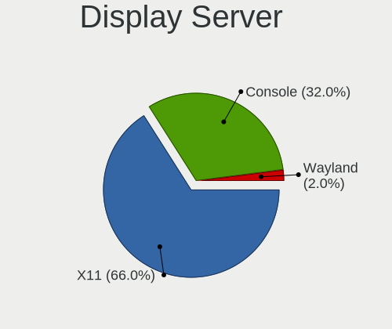
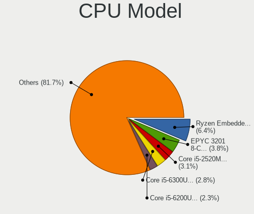
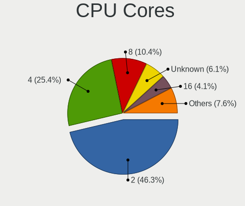
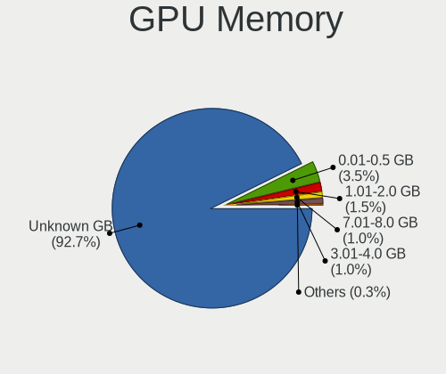

BSD in Germany - Tested Hardware & Statistics (Notebooks)
---------------------------------------------------------

A project to collect tested hardware configurations for BSD in Germany.

Anyone can contribute to this report by the [hw-probe](https://github.com/linuxhw/hw-probe/blob/master/INSTALL.BSD.md) tool:

    hw-probe -all -upload

Please contribute! Especially if your hardware is rare.

Contents
--------

* [ Test Cases ](#test-cases)

* [ System ](#system)
  - [ OS                       ](#os)
  - [ OS Family                ](#os-family)
  - [ Arch                     ](#arch)
  - [ DE                       ](#de)
  - [ Display Server           ](#display-server)
  - [ Display Manager          ](#display-manager)
  - [ OS Lang                  ](#os-lang)
  - [ Boot Mode                ](#boot-mode)
  - [ Filesystem               ](#filesystem)
  - [ Part. scheme             ](#part-scheme)

* [ Board ](#board)
  - [ Vendor                   ](#vendor)
  - [ Model                    ](#model)
  - [ Model Family             ](#model-family)
  - [ MFG Year                 ](#mfg-year)
  - [ Form Factor              ](#form-factor)
  - [ Coreboot                 ](#coreboot)
  - [ RAM Size                 ](#ram-size)
  - [ RAM Used                 ](#ram-used)
  - [ Total Drives             ](#total-drives)
  - [ Has CD-ROM               ](#has-cd-rom)
  - [ Has Ethernet             ](#has-ethernet)
  - [ Has WiFi                 ](#has-wifi)
  - [ Has Bluetooth            ](#has-bluetooth)

* [ Location ](#location)
  - [ Country                  ](#country)
  - [ City                     ](#city)

* [ Drives ](#drives)
  - [ Drive Vendor             ](#drive-vendor)
  - [ Drive Model              ](#drive-model)
  - [ HDD Vendor               ](#hdd-vendor)
  - [ SSD Vendor               ](#ssd-vendor)
  - [ Drive Kind               ](#drive-kind)
  - [ Drive Connector          ](#drive-connector)
  - [ Drive Size               ](#drive-size)
  - [ Space Total              ](#space-total)
  - [ Space Used               ](#space-used)
  - [ Malfunc. Drives          ](#malfunc-drives)
  - [ Malfunc. Drive Vendor    ](#malfunc-drive-vendor)
  - [ Malfunc. HDD Vendor      ](#malfunc-hdd-vendor)
  - [ Malfunc. Drive Kind      ](#malfunc-drive-kind)
  - [ Failed Drives            ](#failed-drives)
  - [ Failed Drive Vendor      ](#failed-drive-vendor)
  - [ Drive Status             ](#drive-status)

* [ Storage controller ](#storage-controller)
  - [ Storage Vendor           ](#storage-vendor)
  - [ Storage Model            ](#storage-model)
  - [ Storage Kind             ](#storage-kind)

* [ Processor ](#processor)
  - [ CPU Vendor               ](#cpu-vendor)
  - [ CPU Model                ](#cpu-model)
  - [ CPU Model Family         ](#cpu-model-family)
  - [ CPU Cores                ](#cpu-cores)
  - [ CPU Sockets              ](#cpu-sockets)
  - [ CPU Threads              ](#cpu-threads)
  - [ CPU Microarch            ](#cpu-microarch)

* [ Graphics ](#graphics)
  - [ GPU Vendor               ](#gpu-vendor)
  - [ GPU Model                ](#gpu-model)
  - [ GPU Combo                ](#gpu-combo)
  - [ GPU Driver               ](#gpu-driver)
  - [ GPU Memory               ](#gpu-memory)

* [ Monitor ](#monitor)
  - [ Monitor Vendor           ](#monitor-vendor)
  - [ Monitor Model            ](#monitor-model)
  - [ Monitor Resolution       ](#monitor-resolution)
  - [ Monitor Diagonal         ](#monitor-diagonal)
  - [ Monitor Width            ](#monitor-width)
  - [ Aspect Ratio             ](#aspect-ratio)
  - [ Monitor Area             ](#monitor-area)
  - [ Pixel Density            ](#pixel-density)
  - [ Multiple Monitors        ](#multiple-monitors)

* [ Network ](#network)
  - [ Net Controller Vendor    ](#net-controller-vendor)
  - [ Net Controller Model     ](#net-controller-model)
  - [ Wireless Vendor          ](#wireless-vendor)
  - [ Wireless Model           ](#wireless-model)
  - [ Ethernet Vendor          ](#ethernet-vendor)
  - [ Ethernet Model           ](#ethernet-model)
  - [ Net Controller Kind      ](#net-controller-kind)
  - [ Used Controller          ](#used-controller)
  - [ NICs                     ](#nics)
  - [ IPv6                     ](#ipv6)

* [ Bluetooth ](#bluetooth)
  - [ Bluetooth Vendor         ](#bluetooth-vendor)
  - [ Bluetooth Model          ](#bluetooth-model)

* [ Sound ](#sound)
  - [ Sound Vendor             ](#sound-vendor)
  - [ Sound Model              ](#sound-model)

* [ Memory ](#memory)
  - [ Memory Vendor            ](#memory-vendor)
  - [ Memory Model             ](#memory-model)
  - [ Memory Kind              ](#memory-kind)
  - [ Memory Form Factor       ](#memory-form-factor)
  - [ Memory Size              ](#memory-size)
  - [ Memory Speed             ](#memory-speed)

* [ Printers & scanners ](#printers--scanners)
  - [ Printer Vendor           ](#printer-vendor)
  - [ Printer Model            ](#printer-model)
  - [ Scanner Vendor           ](#scanner-vendor)
  - [ Scanner Model            ](#scanner-model)

* [ Camera ](#camera)
  - [ Camera Vendor            ](#camera-vendor)
  - [ Camera Model             ](#camera-model)

* [ Security ](#security)
  - [ Fingerprint Vendor       ](#fingerprint-vendor)
  - [ Fingerprint Model        ](#fingerprint-model)
  - [ Chipcard Vendor          ](#chipcard-vendor)
  - [ Chipcard Model           ](#chipcard-model)

* [ Unsupported ](#unsupported)
  - [ Unsupported Devices      ](#unsupported-devices)
  - [ Unsupported Device Types ](#unsupported-device-types)

Test Cases
----------

Total: 333

| Vendor        | Model                       | Probe                                                     | Date         |
|---------------|-----------------------------|-----------------------------------------------------------|--------------|
| Lenovo        | ThinkPad T440p 20AN007FG... | [0883806434](https://bsd-hardware.info/?probe=0883806434) | Jan 22, 2023 |
| Lenovo        | ThinkPad P51 20HH001RMX     | [ab38c51298](https://bsd-hardware.info/?probe=ab38c51298) | Jan 22, 2023 |
| Deciso        | NetBoard-A10                | [624bfd62b5](https://bsd-hardware.info/?probe=624bfd62b5) | Jan 15, 2023 |
| Lenovo        | ThinkPad E14 Gen 4 21EB0... | [ced6c29193](https://bsd-hardware.info/?probe=ced6c29193) | Jan 14, 2023 |
| Apple         | MacBookAir5,1               | [0d398d5c59](https://bsd-hardware.info/?probe=0d398d5c59) | Dec 27, 2022 |
| Deciso        | NetBoard-A10                | [b09ff8826c](https://bsd-hardware.info/?probe=b09ff8826c) | Dec 26, 2022 |
| Tactus        | GeoFlex 110                 | [955c355b47](https://bsd-hardware.info/?probe=955c355b47) | Dec 23, 2022 |
| TUXEDO        | InfinityBook Pro 14 Gen6    | [b38d32b139](https://bsd-hardware.info/?probe=b38d32b139) | Dec 23, 2022 |
| Acer          | Aspire ES1-533              | [570b96d0f7](https://bsd-hardware.info/?probe=570b96d0f7) | Dec 23, 2022 |
| TUXEDO        | Pulse 15 Gen1               | [af2a9d1a42](https://bsd-hardware.info/?probe=af2a9d1a42) | Dec 20, 2022 |
| Unknown       | Unknown                     | [364b3758b6](https://bsd-hardware.info/?probe=364b3758b6) | Dec 20, 2022 |
| Acer          | Swift SF114-34              | [0be43b76d1](https://bsd-hardware.info/?probe=0be43b76d1) | Dec 11, 2022 |
| Dell          | Latitude D610               | [6ef8d8137b](https://bsd-hardware.info/?probe=6ef8d8137b) | Nov 24, 2022 |
| Lenovo        | Yoga Slim 7 Pro 14ACH5 O... | [4c83122cc0](https://bsd-hardware.info/?probe=4c83122cc0) | Nov 14, 2022 |
| Google        | Akemi                       | [2d8e99f0c2](https://bsd-hardware.info/?probe=2d8e99f0c2) | Nov 12, 2022 |
| Deciso        | NetBoard-A20                | [61157ac2b6](https://bsd-hardware.info/?probe=61157ac2b6) | Nov 10, 2022 |
| Deciso        | NetBoard-A10                | [1fc6403341](https://bsd-hardware.info/?probe=1fc6403341) | Nov 08, 2022 |
| Acer          | JM11-MS                     | [3ff8b20107](https://bsd-hardware.info/?probe=3ff8b20107) | Oct 29, 2022 |
| Fujitsu       | LIFEBOOK E752               | [06e6c07e90](https://bsd-hardware.info/?probe=06e6c07e90) | Oct 25, 2022 |
| Dell          | Latitude 5591               | [58b577382a](https://bsd-hardware.info/?probe=58b577382a) | Oct 23, 2022 |
| Alienware     | m15                         | [3304a767ba](https://bsd-hardware.info/?probe=3304a767ba) | Oct 22, 2022 |
| TUXEDO        | InfinityBook S 15 Gen6      | [17d766d55a](https://bsd-hardware.info/?probe=17d766d55a) | Oct 08, 2022 |
| HP            | 255 G8 Notebook PC          | [f9851a3257](https://bsd-hardware.info/?probe=f9851a3257) | Oct 01, 2022 |
| Tactus        | GeoFlex 110                 | [0b93b5f915](https://bsd-hardware.info/?probe=0b93b5f915) | Sep 28, 2022 |
| Lenovo        | ThinkPad P53 20QNCTO1WW     | [b2024820d1](https://bsd-hardware.info/?probe=b2024820d1) | Sep 26, 2022 |
| Gigabyte      | GB-BSi5A-6200               | [c947635b8f](https://bsd-hardware.info/?probe=c947635b8f) | Sep 25, 2022 |
| Gigabyte      | GB-BSi5A-6200               | [533c7f35f1](https://bsd-hardware.info/?probe=533c7f35f1) | Sep 25, 2022 |
| IBM           | ThinkPad T40 23737CG        | [dfc9b64da2](https://bsd-hardware.info/?probe=dfc9b64da2) | Sep 25, 2022 |
| Fujitsu       | LIFEBOOK A532               | [91e0f723ea](https://bsd-hardware.info/?probe=91e0f723ea) | Sep 18, 2022 |
| Deciso        | DEC2700 - OPNsense Appli... | [eee7bdda02](https://bsd-hardware.info/?probe=eee7bdda02) | Sep 15, 2022 |
| Lenovo        | ThinkPad X270 20HMS2LL00    | [12f6a8866f](https://bsd-hardware.info/?probe=12f6a8866f) | Sep 14, 2022 |
| Deciso        | DEC2700 - OPNsense Appli... | [9e6bd1263d](https://bsd-hardware.info/?probe=9e6bd1263d) | Sep 13, 2022 |
| Deciso        | Netboard A20                | [164274c6b4](https://bsd-hardware.info/?probe=164274c6b4) | Aug 22, 2022 |
| Lenovo        | ThinkPad T480 20L50000GE    | [cd7d7d83ba](https://bsd-hardware.info/?probe=cd7d7d83ba) | Aug 20, 2022 |
| Samsung       | NC210/NC110                 | [6c697b3312](https://bsd-hardware.info/?probe=6c697b3312) | Aug 13, 2022 |
| TUXEDO        | Pulse 14 Gen1               | [5edf8a1bef](https://bsd-hardware.info/?probe=5edf8a1bef) | Aug 09, 2022 |
| ASUSTek       | F6A                         | [6626d18284](https://bsd-hardware.info/?probe=6626d18284) | Aug 08, 2022 |
| Apple         | MacBook6,1                  | [55ab4bc8d6](https://bsd-hardware.info/?probe=55ab4bc8d6) | Jul 29, 2022 |
| Shuttle       | DS437                       | [d7b076918a](https://bsd-hardware.info/?probe=d7b076918a) | Jul 07, 2022 |
| Shuttle       | DS437                       | [9fe84a8c9d](https://bsd-hardware.info/?probe=9fe84a8c9d) | Jul 07, 2022 |
| Lenovo        | IdeaPad S12 20021,2959      | [c1bf998d6a](https://bsd-hardware.info/?probe=c1bf998d6a) | Jul 07, 2022 |
| Deciso        | NetBoard-A10                | [681bb27fbc](https://bsd-hardware.info/?probe=681bb27fbc) | Jul 04, 2022 |
| Apple         | MacBook6,1                  | [a6d3cf9a30](https://bsd-hardware.info/?probe=a6d3cf9a30) | Jun 20, 2022 |
| Dell          | Latitude 5521               | [2c9d24a69e](https://bsd-hardware.info/?probe=2c9d24a69e) | Jun 19, 2022 |
| Lenovo        | ThinkPad T420 4236MY0       | [94095d4c11](https://bsd-hardware.info/?probe=94095d4c11) | Jun 06, 2022 |
| TUXEDO        | Aura 15 Gen1                | [727f9708b4](https://bsd-hardware.info/?probe=727f9708b4) | May 24, 2022 |
| HP            | 255 G8 Notebook PC          | [004e039a23](https://bsd-hardware.info/?probe=004e039a23) | May 19, 2022 |
| HP            | 255 G8 Notebook PC          | [555a7733b7](https://bsd-hardware.info/?probe=555a7733b7) | May 19, 2022 |
| TUXEDO        | Aura 15 Gen1                | [1c84f0f722](https://bsd-hardware.info/?probe=1c84f0f722) | May 19, 2022 |
| Lenovo        | ThinkPad E490 20N8CTO1WW    | [86866ce217](https://bsd-hardware.info/?probe=86866ce217) | May 17, 2022 |
| Deciso        | OPNsense Appliance          | [70c9fd07ac](https://bsd-hardware.info/?probe=70c9fd07ac) | May 09, 2022 |
| Lenovo        | ThinkPad E490 20N8CTO1WW    | [5259bc1933](https://bsd-hardware.info/?probe=5259bc1933) | May 08, 2022 |
| Lenovo        | ThinkPad E490 20N8CTO1WW    | [a69f0fefca](https://bsd-hardware.info/?probe=a69f0fefca) | May 07, 2022 |
| Acer          | Aspire E1-570G              | [7fd31252a2](https://bsd-hardware.info/?probe=7fd31252a2) | May 04, 2022 |
| HP            | EliteBook 820 G2            | [3997ff79e4](https://bsd-hardware.info/?probe=3997ff79e4) | May 03, 2022 |
| Lenovo        | ThinkPad X270 W10DG 20K5... | [f02e4345ff](https://bsd-hardware.info/?probe=f02e4345ff) | Apr 30, 2022 |
| Deciso        | DEC2700 - OPNsense Appli... | [22b192afca](https://bsd-hardware.info/?probe=22b192afca) | Apr 28, 2022 |
| Apple         | MacBookPro3,1               | [912d02aec2](https://bsd-hardware.info/?probe=912d02aec2) | Apr 28, 2022 |
| Lenovo        | ThinkPad E490 20N8CTO1WW    | [30e267dd51](https://bsd-hardware.info/?probe=30e267dd51) | Apr 27, 2022 |
| Lenovo        | B570 1068FQG                | [a0d1f01226](https://bsd-hardware.info/?probe=a0d1f01226) | Apr 22, 2022 |
| AMI           | Intel                       | [db87d63d35](https://bsd-hardware.info/?probe=db87d63d35) | Apr 15, 2022 |
| AMI           | Intel                       | [8dc710d126](https://bsd-hardware.info/?probe=8dc710d126) | Apr 14, 2022 |
| Dell          | Latitude E6440              | [eea29a3895](https://bsd-hardware.info/?probe=eea29a3895) | Apr 12, 2022 |
| Apple         | MacBook5,1                  | [41d62dde7d](https://bsd-hardware.info/?probe=41d62dde7d) | Apr 10, 2022 |
| Apple         | MacBook5,1                  | [c5f7b5499a](https://bsd-hardware.info/?probe=c5f7b5499a) | Apr 10, 2022 |
| Acer          | Swift SF114-32              | [7bc748ce7c](https://bsd-hardware.info/?probe=7bc748ce7c) | Apr 08, 2022 |
| Dell          | Precision M4800             | [7a7968204a](https://bsd-hardware.info/?probe=7a7968204a) | Apr 06, 2022 |
| TUXEDO        | Aura 15 Gen1                | [e72b47b6de](https://bsd-hardware.info/?probe=e72b47b6de) | Apr 04, 2022 |
| Lenovo        | ThinkPad X260 20F5A28AUK    | [f53c625efd](https://bsd-hardware.info/?probe=f53c625efd) | Mar 30, 2022 |
| Fujitsu       | LIFEBOOK A544               | [e363c95c1c](https://bsd-hardware.info/?probe=e363c95c1c) | Mar 29, 2022 |
| Dell          | Latitude E6540              | [41e5f63a69](https://bsd-hardware.info/?probe=41e5f63a69) | Mar 26, 2022 |
| Dell          | Latitude E6540              | [0ac0f8f1d8](https://bsd-hardware.info/?probe=0ac0f8f1d8) | Mar 26, 2022 |
| Notebook      | N13xWU                      | [8986953acd](https://bsd-hardware.info/?probe=8986953acd) | Mar 22, 2022 |
| Notebook      | N7x0WU                      | [b80f84aef1](https://bsd-hardware.info/?probe=b80f84aef1) | Mar 22, 2022 |
| Notebook      | N8xEJEK                     | [9a62677ea8](https://bsd-hardware.info/?probe=9a62677ea8) | Mar 22, 2022 |
| Dell          | Latitude E6500              | [5fad69bbf0](https://bsd-hardware.info/?probe=5fad69bbf0) | Mar 22, 2022 |
| Dell          | Latitude E6510              | [a040a1a04b](https://bsd-hardware.info/?probe=a040a1a04b) | Mar 22, 2022 |
| Dell          | Latitude E6530              | [9bc5fc70a7](https://bsd-hardware.info/?probe=9bc5fc70a7) | Mar 22, 2022 |
| Deciso        | Netboard A20                | [8ded6d9af6](https://bsd-hardware.info/?probe=8ded6d9af6) | Mar 21, 2022 |
| Lenovo        | ThinkPad E490 20N8CTO1WW    | [0dbac1ca61](https://bsd-hardware.info/?probe=0dbac1ca61) | Mar 19, 2022 |
| Toshiba       | Satellite Pro L40           | [5ff92a5bb3](https://bsd-hardware.info/?probe=5ff92a5bb3) | Mar 19, 2022 |
| Toshiba       | Satellite Pro L40           | [71a7b43ec6](https://bsd-hardware.info/?probe=71a7b43ec6) | Mar 19, 2022 |
| Dell          | Latitude E6540              | [e0576dd008](https://bsd-hardware.info/?probe=e0576dd008) | Mar 13, 2022 |
| AEWIN         | CB-7979                     | [ec1e865bbd](https://bsd-hardware.info/?probe=ec1e865bbd) | Mar 07, 2022 |
| Dell          | Latitude 5591               | [d4d653fba8](https://bsd-hardware.info/?probe=d4d653fba8) | Feb 22, 2022 |
| Lenovo        | ThinkPad X240 20AMS2QD0C    | [ae597455a4](https://bsd-hardware.info/?probe=ae597455a4) | Feb 13, 2022 |
| MiTAC         | 5033                        | [54df5c9e9e](https://bsd-hardware.info/?probe=54df5c9e9e) | Feb 10, 2022 |
| ASUSTek       | X555LA                      | [28b3002182](https://bsd-hardware.info/?probe=28b3002182) | Feb 10, 2022 |
| ASUSTek       | X555LA                      | [9aa18b2e33](https://bsd-hardware.info/?probe=9aa18b2e33) | Feb 09, 2022 |
| Apple         | MacBookPro4,1               | [d852363467](https://bsd-hardware.info/?probe=d852363467) | Feb 08, 2022 |
| Apple         | MacBookPro4,1               | [f05ce66a9a](https://bsd-hardware.info/?probe=f05ce66a9a) | Feb 08, 2022 |
| Lenovo        | ThinkPad T440p 20AWS3RH0... | [a6c02e440b](https://bsd-hardware.info/?probe=a6c02e440b) | Feb 05, 2022 |
| GPD           | G1621-02                    | [1970f517fd](https://bsd-hardware.info/?probe=1970f517fd) | Jan 30, 2022 |
| Lenovo        | IdeaPad L340-17IRH Gamin... | [b1d702812e](https://bsd-hardware.info/?probe=b1d702812e) | Jan 26, 2022 |
| MSI           | GT75VR 7RF                  | [db276eaa53](https://bsd-hardware.info/?probe=db276eaa53) | Jan 25, 2022 |
| Apple         | MacBookPro11,4              | [6d580e8270](https://bsd-hardware.info/?probe=6d580e8270) | Jan 21, 2022 |
| Dell          | Latitude E6540              | [f13972c935](https://bsd-hardware.info/?probe=f13972c935) | Jan 21, 2022 |
| Fujitsu       | CELSIUS H780                | [a173366c78](https://bsd-hardware.info/?probe=a173366c78) | Jan 21, 2022 |
| Lenovo        | ThinkPad X1 Carbon 5th 2... | [c36023a724](https://bsd-hardware.info/?probe=c36023a724) | Jan 17, 2022 |
| Acer          | TravelMate 8481TG           | [fae71f7e35](https://bsd-hardware.info/?probe=fae71f7e35) | Jan 15, 2022 |
| MSI           | GT75VR 7RF                  | [cca6cc3c0b](https://bsd-hardware.info/?probe=cca6cc3c0b) | Jan 07, 2022 |
| Apple         | MacBook5,1                  | [f0aeeb7f3c](https://bsd-hardware.info/?probe=f0aeeb7f3c) | Jan 05, 2022 |
| Dell          | Latitude 3400               | [41bf32aff1](https://bsd-hardware.info/?probe=41bf32aff1) | Jan 02, 2022 |
| Lenovo        | ThinkPad X220 4293AF4       | [8c7992e557](https://bsd-hardware.info/?probe=8c7992e557) | Jan 01, 2022 |
| Lenovo        | ThinkBook 14 G3 ACL 21A2    | [42b4bcbcc2](https://bsd-hardware.info/?probe=42b4bcbcc2) | Dec 27, 2021 |
| Lenovo        | ThinkBook 14 G3 ACL 21A2    | [695d7201d4](https://bsd-hardware.info/?probe=695d7201d4) | Dec 27, 2021 |
| Lenovo        | ThinkPad X270 W10DG 20K5... | [2e1c585715](https://bsd-hardware.info/?probe=2e1c585715) | Dec 21, 2021 |
| Unknown       | Unknown                     | [aa872042e3](https://bsd-hardware.info/?probe=aa872042e3) | Dec 15, 2021 |
| ASUSTek       | 1005P                       | [4c43bd561f](https://bsd-hardware.info/?probe=4c43bd561f) | Dec 14, 2021 |
| Intel         | SharkBay Platform           | [383d1e31c9](https://bsd-hardware.info/?probe=383d1e31c9) | Dec 14, 2021 |
| Unknown       | Unknown                     | [8c3ba89ddd](https://bsd-hardware.info/?probe=8c3ba89ddd) | Dec 12, 2021 |
| Lenovo        | ThinkPad T430s 2356JH4      | [0b6ab3ba1b](https://bsd-hardware.info/?probe=0b6ab3ba1b) | Dec 09, 2021 |
| Dell          | Precision M4300             | [08fe78379d](https://bsd-hardware.info/?probe=08fe78379d) | Dec 08, 2021 |
| Deciso        | Netboard A20                | [593d123f0c](https://bsd-hardware.info/?probe=593d123f0c) | Dec 07, 2021 |
| Lenovo        | ThinkPad T430s 2356JH4      | [b1377872cd](https://bsd-hardware.info/?probe=b1377872cd) | Dec 03, 2021 |
| Unknown       | Unknown                     | [5d1a3bbfe3](https://bsd-hardware.info/?probe=5d1a3bbfe3) | Nov 30, 2021 |
| Shuttle       | DS437                       | [b5d1bcffdb](https://bsd-hardware.info/?probe=b5d1bcffdb) | Nov 29, 2021 |
| Lenovo        | ThinkPad X240 20AMS2QDOC    | [66cfdd2419](https://bsd-hardware.info/?probe=66cfdd2419) | Nov 27, 2021 |
| Shuttle       | DS437                       | [687fc514ba](https://bsd-hardware.info/?probe=687fc514ba) | Nov 27, 2021 |
| Shuttle       | DS437                       | [e65a62f5a5](https://bsd-hardware.info/?probe=e65a62f5a5) | Nov 27, 2021 |
| Lenovo        | ThinkPad E490 20N8CTO1WW    | [8b178d13c7](https://bsd-hardware.info/?probe=8b178d13c7) | Nov 22, 2021 |
| Alienware     | m15                         | [20afd3904b](https://bsd-hardware.info/?probe=20afd3904b) | Nov 21, 2021 |
| Lenovo        | ThinkPad X220 42915CG       | [d8628f80c0](https://bsd-hardware.info/?probe=d8628f80c0) | Nov 19, 2021 |
| Shuttle       | DS437                       | [0dc3d4619e](https://bsd-hardware.info/?probe=0dc3d4619e) | Nov 17, 2021 |
| Acer          | TravelMate B117-M           | [4f02660d9c](https://bsd-hardware.info/?probe=4f02660d9c) | Nov 14, 2021 |
| Lenovo        | ThinkPad W520 4276CTO       | [9082353a69](https://bsd-hardware.info/?probe=9082353a69) | Nov 06, 2021 |
| Lenovo        | ThinkPad T470s W10DG 20J... | [1d261120d3](https://bsd-hardware.info/?probe=1d261120d3) | Nov 06, 2021 |
| Lenovo        | ThinkPad T420 4180EE8       | [5303c12fe5](https://bsd-hardware.info/?probe=5303c12fe5) | Nov 05, 2021 |
| Apple         | MacBookAir5,1               | [10d629e1a0](https://bsd-hardware.info/?probe=10d629e1a0) | Nov 04, 2021 |
| BESSTAR Te... | U820                        | [3bd9cd5b98](https://bsd-hardware.info/?probe=3bd9cd5b98) | Nov 03, 2021 |
| Lenovo        | IdeaPad Z360                | [796bd6482f](https://bsd-hardware.info/?probe=796bd6482f) | Nov 02, 2021 |
| BESSTAR Te... | U820                        | [1a39d8a6e3](https://bsd-hardware.info/?probe=1a39d8a6e3) | Nov 02, 2021 |
| Apple         | MacBookAir5,1               | [b354b2bd4e](https://bsd-hardware.info/?probe=b354b2bd4e) | Oct 31, 2021 |
| Lenovo        | ThinkPad P14s Gen 1 20Y1... | [d910c79d75](https://bsd-hardware.info/?probe=d910c79d75) | Oct 24, 2021 |
| Lenovo        | ThinkPad E14 Gen 3 20Y7C... | [d8a6d0daf3](https://bsd-hardware.info/?probe=d8a6d0daf3) | Oct 18, 2021 |
| Lenovo        | ThinkPad L14 Gen 1 20U10... | [b4ba704356](https://bsd-hardware.info/?probe=b4ba704356) | Oct 17, 2021 |
| Lenovo        | ThinkPad X230 23254G7       | [06c6a282ca](https://bsd-hardware.info/?probe=06c6a282ca) | Oct 16, 2021 |
| Dell          | Inspiron 3493               | [ed41c18cfc](https://bsd-hardware.info/?probe=ed41c18cfc) | Oct 16, 2021 |
| ASUSTek       | TUF Gaming FX505DT_FX505... | [be42957ecd](https://bsd-hardware.info/?probe=be42957ecd) | Oct 10, 2021 |
| Lenovo        | ThinkPad P53 20QNCTO1WW     | [5b08c1de3d](https://bsd-hardware.info/?probe=5b08c1de3d) | Oct 06, 2021 |
| ASUSTek       | UX305FA                     | [decf219ff2](https://bsd-hardware.info/?probe=decf219ff2) | Sep 30, 2021 |
| Lenovo        | ThinkPad X230 2325O76       | [b8729e39e1](https://bsd-hardware.info/?probe=b8729e39e1) | Sep 29, 2021 |
| Unknown       | Unknown                     | [27f807ae11](https://bsd-hardware.info/?probe=27f807ae11) | Sep 24, 2021 |
| Lenovo        | ThinkPad X1 Carbon 5th 2... | [d9762d6c2d](https://bsd-hardware.info/?probe=d9762d6c2d) | Sep 23, 2021 |
| Lenovo        | ThinkPad X1 Carbon 5th 2... | [0d00ce5de9](https://bsd-hardware.info/?probe=0d00ce5de9) | Sep 22, 2021 |
| Lenovo        | ThinkPad T400 6474E18       | [2dd5b5869f](https://bsd-hardware.info/?probe=2dd5b5869f) | Sep 13, 2021 |
| Dell          | XPS 15 9570                 | [ee8980fec1](https://bsd-hardware.info/?probe=ee8980fec1) | Sep 07, 2021 |
| Dell          | Latitude 3540               | [2583b22e8d](https://bsd-hardware.info/?probe=2583b22e8d) | Aug 29, 2021 |
| Dell          | Latitude 3540               | [de97e0b2fc](https://bsd-hardware.info/?probe=de97e0b2fc) | Aug 29, 2021 |
| Apple         | MacBookAir7,2               | [6eada6e49e](https://bsd-hardware.info/?probe=6eada6e49e) | Aug 28, 2021 |
| Dell          | Latitude 5591               | [f0ee8a7da0](https://bsd-hardware.info/?probe=f0ee8a7da0) | Aug 25, 2021 |
| Acer          | Aspire ES1-132              | [43c82b1b16](https://bsd-hardware.info/?probe=43c82b1b16) | Aug 22, 2021 |
| Insyde        | Braswell                    | [6c8e94b016](https://bsd-hardware.info/?probe=6c8e94b016) | Aug 19, 2021 |
| Dell          | Latitude 5591               | [c21b6fde68](https://bsd-hardware.info/?probe=c21b6fde68) | Aug 12, 2021 |
| Deciso        | Netboard A20                | [5be914e123](https://bsd-hardware.info/?probe=5be914e123) | Aug 03, 2021 |
| Lenovo        | ThinkPad L512 44444XG       | [a6c8fbcb20](https://bsd-hardware.info/?probe=a6c8fbcb20) | Aug 01, 2021 |
| Sony          | VPCEJ1E1E                   | [c471fb3f82](https://bsd-hardware.info/?probe=c471fb3f82) | Aug 01, 2021 |
| Lenovo        | G550 2958                   | [86880c29cf](https://bsd-hardware.info/?probe=86880c29cf) | Jul 31, 2021 |
| Lenovo        | G550 2958                   | [4fe522eaf3](https://bsd-hardware.info/?probe=4fe522eaf3) | Jul 31, 2021 |
| Lenovo        | ThinkPad S1 Yoga 12 20DK... | [38910aa754](https://bsd-hardware.info/?probe=38910aa754) | Jul 25, 2021 |
| Lenovo        | ThinkPad S1 Yoga 12 20DK... | [3348992bef](https://bsd-hardware.info/?probe=3348992bef) | Jul 23, 2021 |
| Fujitsu       | LIFEBOOK E780               | [71b543094c](https://bsd-hardware.info/?probe=71b543094c) | Jul 22, 2021 |
| MSI           | MS-1613                     | [795e61c1a3](https://bsd-hardware.info/?probe=795e61c1a3) | Jul 21, 2021 |
| Unknown       | Unknown                     | [a37195bcb8](https://bsd-hardware.info/?probe=a37195bcb8) | Jul 15, 2021 |
| Lenovo        | ThinkPad X230 2325A95       | [94d66a0677](https://bsd-hardware.info/?probe=94d66a0677) | Jul 10, 2021 |
| Lenovo        | ThinkPad X230 232578G       | [a8c497b58b](https://bsd-hardware.info/?probe=a8c497b58b) | Jul 09, 2021 |
| Lenovo        | ThinkPad T510 4384FF3       | [25e208721d](https://bsd-hardware.info/?probe=25e208721d) | Jul 02, 2021 |
| Fujitsu       | LIFEBOOK E780               | [2e8c2afe50](https://bsd-hardware.info/?probe=2e8c2afe50) | Jun 20, 2021 |
| Apple         | MacBookAir6,1               | [46bf9edc63](https://bsd-hardware.info/?probe=46bf9edc63) | Jun 17, 2021 |
| Apple         | MacBookAir6,1               | [dbda48cff7](https://bsd-hardware.info/?probe=dbda48cff7) | Jun 17, 2021 |
| HP            | ProBook 640 G1              | [937ed102d1](https://bsd-hardware.info/?probe=937ed102d1) | Jun 12, 2021 |
| ASUSTek       | UX330UAK                    | [430c90b88d](https://bsd-hardware.info/?probe=430c90b88d) | Jun 12, 2021 |
| Unknown       | Unknown                     | [1f2d078d2e](https://bsd-hardware.info/?probe=1f2d078d2e) | Jun 01, 2021 |
| Deciso        | Netboard A20                | [f4a0f0941b](https://bsd-hardware.info/?probe=f4a0f0941b) | May 26, 2021 |
| Unknown       | Unknown                     | [b4b6cfff1f](https://bsd-hardware.info/?probe=b4b6cfff1f) | May 24, 2021 |
| Lenovo        | ThinkPad SL510 28477MG      | [bdbd2d0a05](https://bsd-hardware.info/?probe=bdbd2d0a05) | May 20, 2021 |
| Lenovo        | Legion 5P 15IMH05H 82AW     | [2be8cf963c](https://bsd-hardware.info/?probe=2be8cf963c) | May 02, 2021 |
| HP            | Compaq Presario CQ71        | [258ef16ace](https://bsd-hardware.info/?probe=258ef16ace) | Apr 25, 2021 |
| Lenovo        | ThinkPad T14 Gen 1 20S1S... | [6e8891f184](https://bsd-hardware.info/?probe=6e8891f184) | Apr 24, 2021 |
| Lenovo        | ThinkPad T14 Gen 1 20S1S... | [7ec73fe36d](https://bsd-hardware.info/?probe=7ec73fe36d) | Apr 23, 2021 |
| Lenovo        | ThinkPad W541 20EGS04800    | [91d2cd471c](https://bsd-hardware.info/?probe=91d2cd471c) | Apr 16, 2021 |
| Clevo         | W55xEU                      | [229587fbd5](https://bsd-hardware.info/?probe=229587fbd5) | Apr 16, 2021 |
| Lenovo        | ThinkPad E490 20N8CTO1WW    | [403a237513](https://bsd-hardware.info/?probe=403a237513) | Apr 14, 2021 |
| Lenovo        | ThinkPad E490 20N8CTO1WW    | [270bd22b8d](https://bsd-hardware.info/?probe=270bd22b8d) | Apr 14, 2021 |
| Apple         | MacBookPro8,1               | [5d3d014284](https://bsd-hardware.info/?probe=5d3d014284) | Apr 12, 2021 |
| Apple         | MacBookPro8,1               | [ffcc46ea0b](https://bsd-hardware.info/?probe=ffcc46ea0b) | Apr 12, 2021 |
| Lenovo        | ThinkPad P14s Gen 1 20Y1... | [bd88655975](https://bsd-hardware.info/?probe=bd88655975) | Apr 10, 2021 |
| Lenovo        | ThinkPad E490 20N8CTO1WW    | [2376cf30b2](https://bsd-hardware.info/?probe=2376cf30b2) | Apr 03, 2021 |
| Dell          | Latitude 5591               | [dadf2c296f](https://bsd-hardware.info/?probe=dadf2c296f) | Mar 30, 2021 |
| TUXEDO        | Unknown                     | [35aa6590c6](https://bsd-hardware.info/?probe=35aa6590c6) | Mar 29, 2021 |
| Lenovo        | IdeaPad 110-15IBR 80T7      | [c5e824b558](https://bsd-hardware.info/?probe=c5e824b558) | Mar 29, 2021 |
| Lenovo        | ThinkPad X220 4291IR6       | [3e9aab9818](https://bsd-hardware.info/?probe=3e9aab9818) | Mar 25, 2021 |
| Lenovo        | ThinkPad E490 20N8CTO1WW    | [dc40b42864](https://bsd-hardware.info/?probe=dc40b42864) | Mar 22, 2021 |
| Packard Be... | EasyNote MH36               | [2a98cae4e8](https://bsd-hardware.info/?probe=2a98cae4e8) | Mar 13, 2021 |
| Fujitsu       | LIFEBOOK A555               | [bcb99d0f09](https://bsd-hardware.info/?probe=bcb99d0f09) | Mar 13, 2021 |
| Fujitsu       | LIFEBOOK A555               | [ee894449af](https://bsd-hardware.info/?probe=ee894449af) | Mar 13, 2021 |
| Acer          | Aspire 4810T                | [14af887195](https://bsd-hardware.info/?probe=14af887195) | Mar 11, 2021 |
| HP            | EliteBook 2760p             | [5707fc27ce](https://bsd-hardware.info/?probe=5707fc27ce) | Mar 11, 2021 |
| Clevo         | W55xEU                      | [e51ee3b14c](https://bsd-hardware.info/?probe=e51ee3b14c) | Mar 08, 2021 |
| Dell          | Latitude E6500              | [d25dacc162](https://bsd-hardware.info/?probe=d25dacc162) | Mar 07, 2021 |
| Clevo         | W55xEU                      | [d874753fe2](https://bsd-hardware.info/?probe=d874753fe2) | Mar 07, 2021 |
| Lenovo        | 3000 N200 0769AP2           | [6b81593de9](https://bsd-hardware.info/?probe=6b81593de9) | Mar 06, 2021 |
| Dell          | Latitude 5591               | [e570513187](https://bsd-hardware.info/?probe=e570513187) | Mar 05, 2021 |
| Dell          | Latitude 5400               | [b9d1f08bcf](https://bsd-hardware.info/?probe=b9d1f08bcf) | Mar 04, 2021 |
| Fujitsu       | LIFEBOOK E754               | [d3d033f879](https://bsd-hardware.info/?probe=d3d033f879) | Mar 03, 2021 |
| Fujitsu       | LIFEBOOK E736               | [845c584693](https://bsd-hardware.info/?probe=845c584693) | Mar 03, 2021 |
| Acer          | Extensa 5630                | [6a1b523efb](https://bsd-hardware.info/?probe=6a1b523efb) | Mar 03, 2021 |
| Hampoo        | B3W6_NA123C Reserved        | [bc138c0580](https://bsd-hardware.info/?probe=bc138c0580) | Feb 27, 2021 |
| Fujitsu       | LIFEBOOK E780               | [57506cbdcf](https://bsd-hardware.info/?probe=57506cbdcf) | Feb 26, 2021 |
| Dell          | Latitude 5591               | [0424bf31ca](https://bsd-hardware.info/?probe=0424bf31ca) | Feb 25, 2021 |
| Lenovo        | ThinkPad T520 4242A16       | [49dacee7d0](https://bsd-hardware.info/?probe=49dacee7d0) | Feb 23, 2021 |
| Lenovo        | Z50-70 20354                | [d3d9dc620f](https://bsd-hardware.info/?probe=d3d9dc620f) | Feb 23, 2021 |
| Unknown       | Unknown                     | [eaa6a36e6e](https://bsd-hardware.info/?probe=eaa6a36e6e) | Feb 22, 2021 |
| Lenovo        | ThinkPad T450 20BUS08800    | [d783b3b4dd](https://bsd-hardware.info/?probe=d783b3b4dd) | Feb 22, 2021 |
| Dell          | Latitude 5424 Rugged        | [b94ae57278](https://bsd-hardware.info/?probe=b94ae57278) | Feb 22, 2021 |
| Lenovo        | ThinkPad E490 20N8CTO1WW    | [7f8c483af1](https://bsd-hardware.info/?probe=7f8c483af1) | Feb 21, 2021 |
| Lenovo        | ThinkPad E490 20N8CTO1WW    | [a9604cfdb8](https://bsd-hardware.info/?probe=a9604cfdb8) | Feb 19, 2021 |
| Lenovo        | V130-15IKB 81HN             | [893c17f73a](https://bsd-hardware.info/?probe=893c17f73a) | Feb 19, 2021 |
| Lenovo        | V130-15IKB 81HN             | [d0f504fad2](https://bsd-hardware.info/?probe=d0f504fad2) | Feb 19, 2021 |
| Lenovo        | ZIUS6                       | [1c239bac92](https://bsd-hardware.info/?probe=1c239bac92) | Feb 18, 2021 |
| Clevo         | W55xEU                      | [a66041bae0](https://bsd-hardware.info/?probe=a66041bae0) | Feb 17, 2021 |
| Dell          | Latitude E6330              | [abe1869a95](https://bsd-hardware.info/?probe=abe1869a95) | Feb 17, 2021 |
| Lenovo        | U310                        | [ccec69b736](https://bsd-hardware.info/?probe=ccec69b736) | Feb 16, 2021 |
| Lenovo        | U310                        | [83805a17c5](https://bsd-hardware.info/?probe=83805a17c5) | Feb 16, 2021 |
| Lenovo        | U310                        | [111385095d](https://bsd-hardware.info/?probe=111385095d) | Feb 16, 2021 |
| Apple         | MacBookAir4,2               | [7d8419c918](https://bsd-hardware.info/?probe=7d8419c918) | Feb 16, 2021 |
| HP            | OMEN Laptop 15-en0xxx       | [19f307ff6d](https://bsd-hardware.info/?probe=19f307ff6d) | Feb 16, 2021 |
| Lenovo        | ThinkPad E490 20N8CTO1WW    | [5a393bc680](https://bsd-hardware.info/?probe=5a393bc680) | Feb 15, 2021 |
| Medion        | P6812                       | [c2c592bca8](https://bsd-hardware.info/?probe=c2c592bca8) | Feb 15, 2021 |
| Medion        | P6812                       | [afa43a6aab](https://bsd-hardware.info/?probe=afa43a6aab) | Feb 15, 2021 |
| Fujitsu       | LIFEBOOK E780               | [0f5e891a5d](https://bsd-hardware.info/?probe=0f5e891a5d) | Feb 14, 2021 |
| Lenovo        | ThinkPad T430 2349GCG       | [6da4116499](https://bsd-hardware.info/?probe=6da4116499) | Feb 13, 2021 |
| Lenovo        | ThinkPad T430 2349GCG       | [d212f58dd2](https://bsd-hardware.info/?probe=d212f58dd2) | Feb 13, 2021 |
| Dell          | Latitude 7380               | [1aa2a3a541](https://bsd-hardware.info/?probe=1aa2a3a541) | Feb 12, 2021 |
| Dell          | Latitude 7380               | [4814701c0e](https://bsd-hardware.info/?probe=4814701c0e) | Feb 12, 2021 |
| Clevo         | W55xEU                      | [796ad51947](https://bsd-hardware.info/?probe=796ad51947) | Feb 11, 2021 |
| Clevo         | W55xEU                      | [c28a6397b5](https://bsd-hardware.info/?probe=c28a6397b5) | Feb 11, 2021 |
| Lenovo        | ThinkPad X260 20F5S1H800    | [ca369843a9](https://bsd-hardware.info/?probe=ca369843a9) | Feb 09, 2021 |
| Lenovo        | ThinkPad X220 42915CG       | [0bc3ba767e](https://bsd-hardware.info/?probe=0bc3ba767e) | Feb 06, 2021 |
| Acer          | Extensa 5220                | [5d6a8a51d0](https://bsd-hardware.info/?probe=5d6a8a51d0) | Feb 06, 2021 |
| Acer          | Extensa 5220                | [c443decee1](https://bsd-hardware.info/?probe=c443decee1) | Feb 06, 2021 |
| Fujitsu       | LIFEBOOK E753               | [37245aca21](https://bsd-hardware.info/?probe=37245aca21) | Feb 03, 2021 |
| Unknown       | Unknown                     | [95e264ef56](https://bsd-hardware.info/?probe=95e264ef56) | Feb 02, 2021 |
| Lenovo        | ThinkPad SL510 2847Q9G      | [12e9632d4b](https://bsd-hardware.info/?probe=12e9632d4b) | Jan 31, 2021 |
| Clevo         | W55xEU                      | [ecacada83f](https://bsd-hardware.info/?probe=ecacada83f) | Jan 29, 2021 |
| Clevo         | W55xEU                      | [e17285783e](https://bsd-hardware.info/?probe=e17285783e) | Jan 29, 2021 |
| Fujitsu       | LIFEBOOK E753               | [9a615ebaf8](https://bsd-hardware.info/?probe=9a615ebaf8) | Jan 24, 2021 |
| HP            | Laptop 17-ca1xxx            | [ecf07ad5fe](https://bsd-hardware.info/?probe=ecf07ad5fe) | Jan 24, 2021 |
| HP            | Laptop 17-ca1xxx            | [fb318623f3](https://bsd-hardware.info/?probe=fb318623f3) | Jan 23, 2021 |
| HP            | Laptop 17-ca1xxx            | [97a89d4eb0](https://bsd-hardware.info/?probe=97a89d4eb0) | Jan 23, 2021 |
| HP            | Laptop 17-ca1xxx            | [806c954739](https://bsd-hardware.info/?probe=806c954739) | Jan 23, 2021 |
| Lenovo        | ThinkPad X1 Carbon 7th 2... | [5f469ceeb9](https://bsd-hardware.info/?probe=5f469ceeb9) | Jan 20, 2021 |
| TUXEDO        | Pulse 14 Gen1               | [5359b4dee9](https://bsd-hardware.info/?probe=5359b4dee9) | Jan 18, 2021 |
| Dell          | Inspiron 3542               | [3c41c474ad](https://bsd-hardware.info/?probe=3c41c474ad) | Jan 16, 2021 |
| Lenovo        | ThinkPad X201 3626HMG       | [a0b1fd0ca5](https://bsd-hardware.info/?probe=a0b1fd0ca5) | Jan 12, 2021 |
| Lenovo        | ThinkPad X201 3626HMG       | [f384858fd6](https://bsd-hardware.info/?probe=f384858fd6) | Jan 12, 2021 |
| Dell          | XPS 15 7590                 | [6cd195aa69](https://bsd-hardware.info/?probe=6cd195aa69) | Jan 05, 2021 |
| Dell          | XPS 15 7590                 | [50ca36db01](https://bsd-hardware.info/?probe=50ca36db01) | Jan 05, 2021 |
| Lenovo        | ThinkPad E490 20N8CTO1WW    | [1ffaf5420c](https://bsd-hardware.info/?probe=1ffaf5420c) | Jan 03, 2021 |
| Apple         | MacBookPro10,2              | [1b0cc7506e](https://bsd-hardware.info/?probe=1b0cc7506e) | Jan 03, 2021 |
| Apple         | MacBookPro10,2              | [e43a26be8d](https://bsd-hardware.info/?probe=e43a26be8d) | Jan 01, 2021 |
| HP            | Laptop 14-dk0xxx            | [5cd8e23152](https://bsd-hardware.info/?probe=5cd8e23152) | Dec 26, 2020 |
| HP            | Laptop 14-dk0xxx            | [fdbd71db5e](https://bsd-hardware.info/?probe=fdbd71db5e) | Dec 26, 2020 |
| HP            | 655                         | [ae2de01d19](https://bsd-hardware.info/?probe=ae2de01d19) | Dec 26, 2020 |
| Lenovo        | ThinkPad X240 20AMS0RR00    | [0f9b8d2e3b](https://bsd-hardware.info/?probe=0f9b8d2e3b) | Dec 22, 2020 |
| Lenovo        | ThinkPad X1 Carbon 7th 2... | [7e80ced15e](https://bsd-hardware.info/?probe=7e80ced15e) | Dec 16, 2020 |
| Lenovo        | ThinkPad X230 23244A9       | [d2e3890c19](https://bsd-hardware.info/?probe=d2e3890c19) | Dec 16, 2020 |
| Lenovo        | ThinkPad X230 23244A9       | [7aaf6835e2](https://bsd-hardware.info/?probe=7aaf6835e2) | Dec 16, 2020 |
| ASUSTek       | TUF Gaming FX505DT_FX505... | [1952513db8](https://bsd-hardware.info/?probe=1952513db8) | Dec 15, 2020 |
| Lenovo        | ThinkPad T420 4180AJ3       | [683eca8c23](https://bsd-hardware.info/?probe=683eca8c23) | Dec 11, 2020 |
| Lenovo        | ThinkPad X250 20CLS02000    | [cbd9f8a13c](https://bsd-hardware.info/?probe=cbd9f8a13c) | Dec 09, 2020 |
| Dell          | Latitude 2100               | [899ce6ffe4](https://bsd-hardware.info/?probe=899ce6ffe4) | Dec 08, 2020 |
| Lenovo        | ThinkPad X1 Carbon 6th 2... | [16206c4970](https://bsd-hardware.info/?probe=16206c4970) | Dec 07, 2020 |
| Lenovo        | ThinkPad T460 20FMS78014    | [c811e29e6c](https://bsd-hardware.info/?probe=c811e29e6c) | Nov 30, 2020 |
| Dell          | Latitude E6440              | [f9278127a1](https://bsd-hardware.info/?probe=f9278127a1) | Nov 27, 2020 |
| Lenovo        | ThinkPad T420 4236N2G       | [1565d5d570](https://bsd-hardware.info/?probe=1565d5d570) | Nov 24, 2020 |
| Lenovo        | ThinkPad E490 20N8CTO1WW    | [0738824c51](https://bsd-hardware.info/?probe=0738824c51) | Nov 22, 2020 |
| Lenovo        | ThinkPad T460 20FN003LGE    | [1b7b105e5c](https://bsd-hardware.info/?probe=1b7b105e5c) | Nov 08, 2020 |
| Lenovo        | V130-15IKB 81HN             | [d20a8be7d4](https://bsd-hardware.info/?probe=d20a8be7d4) | Nov 03, 2020 |
| Lenovo        | ThinkPad T520 4243FS9       | [242cd8a6e7](https://bsd-hardware.info/?probe=242cd8a6e7) | Nov 02, 2020 |
| Dell          | Precision M4800             | [8afb8e7443](https://bsd-hardware.info/?probe=8afb8e7443) | Oct 29, 2020 |
| Schenker      | N13xWU                      | [c23a22a72d](https://bsd-hardware.info/?probe=c23a22a72d) | Oct 29, 2020 |
| HUAWEI        | MACH-WX9                    | [2a1b806f39](https://bsd-hardware.info/?probe=2a1b806f39) | Oct 29, 2020 |
| Lenovo        | ThinkPad E490 20N8CTO1WW    | [26c750117f](https://bsd-hardware.info/?probe=26c750117f) | Oct 28, 2020 |
| IBM           | ThinkPad X41 2525F8G        | [c58f946d2a](https://bsd-hardware.info/?probe=c58f946d2a) | Oct 22, 2020 |
| Lenovo        | ThinkPad Edge E531 68852... | [e6b45d36e5](https://bsd-hardware.info/?probe=e6b45d36e5) | Oct 20, 2020 |
| Lenovo        | ThinkPad X240 20AMS2QD0C    | [fdc7310ca7](https://bsd-hardware.info/?probe=fdc7310ca7) | Oct 19, 2020 |
| Lenovo        | ThinkPad X1 Carbon 2nd 2... | [857f9809b7](https://bsd-hardware.info/?probe=857f9809b7) | Oct 19, 2020 |
| Lenovo        | ThinkPad X270 20HNA004CD    | [79160b17c4](https://bsd-hardware.info/?probe=79160b17c4) | Oct 19, 2020 |
| Apple         | PowerBook6,7                | [7ac5f5530a](https://bsd-hardware.info/?probe=7ac5f5530a) | Oct 19, 2020 |
| Alienware     | m15                         | [8f8cf7d956](https://bsd-hardware.info/?probe=8f8cf7d956) | Oct 19, 2020 |
| Unknown       | Unknown                     | [fd77b4658f](https://bsd-hardware.info/?probe=fd77b4658f) | Oct 19, 2020 |
| Lenovo        | ThinkPad X1 Carbon 3rd 2... | [ee1f866775](https://bsd-hardware.info/?probe=ee1f866775) | Oct 13, 2020 |
| Lenovo        | ThinkPad X220 4291OQ6       | [ed0340e006](https://bsd-hardware.info/?probe=ed0340e006) | Oct 04, 2020 |
| ASUSTek       | N56VJ                       | [9fb23e0394](https://bsd-hardware.info/?probe=9fb23e0394) | Sep 22, 2020 |
| Lenovo        | ThinkPad T460 20FMS78014    | [53e545fcb9](https://bsd-hardware.info/?probe=53e545fcb9) | Sep 17, 2020 |
| Acer          | TravelMate 270              | [56a5581907](https://bsd-hardware.info/?probe=56a5581907) | Sep 17, 2020 |
| HP            | nx9010 (DN775T)             | [b7c0cb252f](https://bsd-hardware.info/?probe=b7c0cb252f) | Sep 16, 2020 |
| Lenovo        | ThinkPad X61 7673AG4        | [650e00a14a](https://bsd-hardware.info/?probe=650e00a14a) | Sep 14, 2020 |
| Panasonic     | CF-C1BD06EFG                | [3e876bada1](https://bsd-hardware.info/?probe=3e876bada1) | Sep 02, 2020 |
| Lenovo        | ThinkPad T460 20FMS78014    | [d78837860f](https://bsd-hardware.info/?probe=d78837860f) | Aug 23, 2020 |
| HKC           | NT11T                       | [1988c603c9](https://bsd-hardware.info/?probe=1988c603c9) | Aug 22, 2020 |
| Acer          | E1-510                      | [c65d08aa57](https://bsd-hardware.info/?probe=c65d08aa57) | Aug 20, 2020 |
| Lenovo        | ThinkPad X1 Carbon 3rd 2... | [3032cd9409](https://bsd-hardware.info/?probe=3032cd9409) | Aug 20, 2020 |
| HP            | Compaq Presario CQ71        | [b34e70d7d4](https://bsd-hardware.info/?probe=b34e70d7d4) | Aug 20, 2020 |
| Lenovo        | ThinkPad T450 20BUS08800    | [359cd8cf1b](https://bsd-hardware.info/?probe=359cd8cf1b) | Aug 11, 2020 |
| Sony          | VGN-SZ3VWP_X                | [ace534d784](https://bsd-hardware.info/?probe=ace534d784) | Aug 10, 2020 |
| HP            | ZBook 15 G4                 | [a8953b4964](https://bsd-hardware.info/?probe=a8953b4964) | Aug 03, 2020 |
| HP            | ZBook 15 G4                 | [a97053c5d4](https://bsd-hardware.info/?probe=a97053c5d4) | Aug 03, 2020 |
| Lenovo        | ThinkPad X1 Carbon 5th 2... | [20f3e760eb](https://bsd-hardware.info/?probe=20f3e760eb) | Aug 03, 2020 |
| Lenovo        | ThinkPad T480 20L5000BMD    | [6259248178](https://bsd-hardware.info/?probe=6259248178) | Jul 31, 2020 |
| Dell          | Precision M4800             | [adbaced1b1](https://bsd-hardware.info/?probe=adbaced1b1) | Jul 30, 2020 |
| Lenovo        | ThinkPad X1 Carbon 5th 2... | [ac13b0591f](https://bsd-hardware.info/?probe=ac13b0591f) | Jul 27, 2020 |
| Lenovo        | ThinkPad E490 20N8CTO1WW    | [2e8c0ef401](https://bsd-hardware.info/?probe=2e8c0ef401) | Jul 21, 2020 |
| Lenovo        | ThinkPad E490 20N8CTO1WW    | [ff2a0edd8a](https://bsd-hardware.info/?probe=ff2a0edd8a) | Jul 21, 2020 |
| Lenovo        | ThinkPad E490 20N8CTO1WW    | [de1425a34c](https://bsd-hardware.info/?probe=de1425a34c) | Jul 19, 2020 |
| Lenovo        | ThinkPad E490 20N8CTO1WW    | [5b8fe1f4f7](https://bsd-hardware.info/?probe=5b8fe1f4f7) | Jul 19, 2020 |
| Schenker      | N13xWU                      | [225afaa47f](https://bsd-hardware.info/?probe=225afaa47f) | Jul 15, 2020 |
| Dell          | Latitude E6440              | [a59bcf04fe](https://bsd-hardware.info/?probe=a59bcf04fe) | Jul 13, 2020 |
| Dell          | Inspiron 7773               | [0b335f5918](https://bsd-hardware.info/?probe=0b335f5918) | Jul 12, 2020 |
| Schenker      | SCHENKER_COMPACT15_17_SC... | [95434cbf80](https://bsd-hardware.info/?probe=95434cbf80) | Jul 07, 2020 |
| Lenovo        | G50-45 80E3                 | [56d1b97dc1](https://bsd-hardware.info/?probe=56d1b97dc1) | Jun 11, 2020 |
| Lenovo        | ThinkPad T450s 20BWS16X0... | [f83f765ab3](https://bsd-hardware.info/?probe=f83f765ab3) | Jun 06, 2020 |
| Schenker      | SCHENKER_COMPACT15_17_SC... | [96fcd8fc28](https://bsd-hardware.info/?probe=96fcd8fc28) | May 28, 2020 |
| Fujitsu       | LIFEBOOK A357               | [b02640458b](https://bsd-hardware.info/?probe=b02640458b) | May 26, 2020 |
| Lenovo        | ThinkPad T410 2537H21       | [0087b62853](https://bsd-hardware.info/?probe=0087b62853) | May 25, 2020 |
| HP            | EliteBook 8560w             | [c240e3a1ea](https://bsd-hardware.info/?probe=c240e3a1ea) | May 25, 2020 |
| TUXEDO        | N13xWU                      | [9649f2d700](https://bsd-hardware.info/?probe=9649f2d700) | May 25, 2020 |
| TUXEDO        | N13xWU                      | [7230dca5a8](https://bsd-hardware.info/?probe=7230dca5a8) | May 25, 2020 |
| Sony          | VPCM12M1E                   | [1e5d0a4d7a](https://bsd-hardware.info/?probe=1e5d0a4d7a) | May 25, 2020 |
| Lenovo        | ThinkPad T410s 291245G      | [6394ae37a8](https://bsd-hardware.info/?probe=6394ae37a8) | May 25, 2020 |
| Lenovo        | ThinkPad T410s 291245G      | [b453d7ac18](https://bsd-hardware.info/?probe=b453d7ac18) | May 25, 2020 |
| Lenovo        | ThinkPad X260 20F5S1H800    | [85567202a8](https://bsd-hardware.info/?probe=85567202a8) | May 23, 2020 |

System
------

OS
--

Installed operating systems

| Name                 | Notebooks | Percent |
|----------------------|-----------|---------|
| helloSystem 0.4.0    | 14        | 5.17%   |
| OpenBSD 6.8          | 12        | 4.43%   |
| helloSystem 0.7.0    | 12        | 4.43%   |
| helloSystem 0.5.0    | 12        | 4.43%   |
| FreeBSD 12.2         | 10        | 3.69%   |
| OpenBSD 7.0          | 8         | 2.95%   |
| helloSystem 0.8.0    | 7         | 2.58%   |
| FreeBSD 13.0-p4      | 7         | 2.58%   |
| OpenBSD 7.2          | 6         | 2.21%   |
| OpenBSD 6.9          | 6         | 2.21%   |
| helloSystem 0.6.0    | 6         | 2.21%   |
| GhostBSD 22.01.12    | 6         | 2.21%   |
| FreeBSD 14.0-CURRENT | 6         | 2.21%   |
| FreeBSD 12.1-p10     | 6         | 2.21%   |
| OPNsense 21.7.6      | 5         | 1.85%   |
| OpenBSD 6.7          | 5         | 1.85%   |
| NomadBSD 5806f915    | 5         | 1.85%   |
| GhostBSD 21.08.27    | 5         | 1.85%   |
| FreeBSD 13.0-CURRENT | 5         | 1.85%   |
| FreeBSD 13.0         | 5         | 1.85%   |
| FreeBSD 12.2-p2      | 5         | 1.85%   |
| FreeBSD 12.1-STABLE  | 5         | 1.85%   |
| OPNsense 21.1.2      | 4         | 1.48%   |
| NomadBSD 1.4         | 4         | 1.48%   |
| GhostBSD 20.04.02    | 4         | 1.48%   |
| FreeBSD 12.1-p5      | 4         | 1.48%   |
| FreeBSD 12.1         | 4         | 1.48%   |
| OPNsense 22.1.6      | 3         | 1.11%   |
| NomadBSD 1.4-RC1     | 3         | 1.11%   |
| FreeBSD 13.1-p2      | 3         | 1.11%   |
| FreeBSD 12.2-p3      | 3         | 1.11%   |
| FreeBSD 12.1-p7      | 3         | 1.11%   |
| OPNsense 22.7.6      | 2         | 0.74%   |
| OPNsense 22.7.10     | 2         | 0.74%   |
| OPNsense 22.4        | 2         | 0.74%   |
| OPNsense 21.7.1      | 2         | 0.74%   |
| OPNsense 21.1.8      | 2         | 0.74%   |
| OPNsense 21.1.6      | 2         | 0.74%   |
| OPNsense 21.1.5      | 2         | 0.74%   |
| OPNsense 21.1.3      | 2         | 0.74%   |

OS Family
---------

OS without a version

| Name        | Notebooks | Percent |
|-------------|-----------|---------|
| FreeBSD     | 75        | 31.91%  |
| helloSystem | 51        | 21.7%   |
| OPNsense    | 43        | 18.3%   |
| OpenBSD     | 33        | 14.04%  |
| GhostBSD    | 15        | 6.38%   |
| NomadBSD    | 14        | 5.96%   |
| NetBSD      | 1         | 0.43%   |
| MidnightBSD | 1         | 0.43%   |
| HardenedBSD | 1         | 0.43%   |
| FuryBSD     | 1         | 0.43%   |

Arch
----

OS architecture (x86_64, i586, etc.)

| Name   | Notebooks | Percent |
|--------|-----------|---------|
| amd64  | 218       | 95.61%  |
| i386   | 9         | 3.95%   |
| macppc | 1         | 0.44%   |

DE
--

Desktop Environment

| Name         | Notebooks | Percent |
|--------------|-----------|---------|
| Console      | 58        | 24.17%  |
| helloDesktop | 57        | 23.75%  |
| fvwm         | 25        | 10.42%  |
| MATE         | 22        | 9.17%   |
| XFCE         | 19        | 7.92%   |
| GNOME        | 14        | 5.83%   |
| Openbox      | 11        | 4.58%   |
| KDE5         | 11        | 4.58%   |
| TWM          | 9         | 3.75%   |
| i3           | 4         | 1.67%   |
| AwesomeWM    | 4         | 1.67%   |
| Cinnamon     | 2         | 0.83%   |
| Picom        | 1         | 0.42%   |
| LXQt         | 1         | 0.42%   |
| LXDE         | 1         | 0.42%   |
| iwm          | 1         | 0.42%   |

Display Server
--------------

X11 or Wayland

| Name    | Notebooks | Percent |
|---------|-----------|---------|
| X11     | 166       | 72.17%  |
| Console | 62        | 26.96%  |
| Wayland | 2         | 0.87%   |

Display Manager
---------------

SDDM, LightDM, etc.

| Name    | Notebooks | Percent |
|---------|-----------|---------|
| Console | 105       | 43.57%  |
| SLiM    | 74        | 30.71%  |
| LightDM | 21        | 8.71%   |
| SDDM    | 15        | 6.22%   |
| XDM     | 12        | 4.98%   |
| GDM     | 11        | 4.56%   |
| Ly      | 3         | 1.24%   |

OS Lang
-------

Language

| Lang             | Notebooks | Percent |
|------------------|-----------|---------|
| Unknown          | 103       | 42.74%  |
| en_US            | 59        | 24.48%  |
| C                | 34        | 14.11%  |
| de_DE            | 32        | 13.28%  |
| en_GB            | 5         | 2.07%   |
| de_DE.ISO8859-1  | 2         | 0.83%   |
| de               | 2         | 0.83%   |
| pl_PL            | 1         | 0.41%   |
| en_IE            | 1         | 0.41%   |
| en_CA            | 1         | 0.41%   |
| de_DE.ISO8859-15 | 1         | 0.41%   |

Boot Mode
---------

EFI or BIOS

| Mode | Notebooks | Percent |
|------|-----------|---------|
| EFI  | 180       | 77.59%  |
| BIOS | 52        | 22.41%  |

Filesystem
----------

Type of filesystem

| Type   | Notebooks | Percent |
|--------|-----------|---------|
| Zfs    | 115       | 49.15%  |
| Ufs    | 75        | 32.05%  |
| Ffs    | 33        | 14.1%   |
| Cd9660 | 11        | 4.7%    |

Part. scheme
------------

Scheme of partitioning

| Type    | Notebooks | Percent |
|---------|-----------|---------|
| GPT     | 206       | 89.18%  |
| MBR     | 24        | 10.39%  |
| Unknown | 1         | 0.43%   |

Board
-----

Vendor
------

Motherboard manufacturer

| Name                | Notebooks | Percent |
|---------------------|-----------|---------|
| Lenovo              | 80        | 35.09%  |
| Dell                | 24        | 10.53%  |
| Apple               | 14        | 6.14%   |
| Hewlett-Packard     | 13        | 5.7%    |
| Deciso              | 13        | 5.7%    |
| Acer                | 13        | 5.7%    |
| Fujitsu             | 10        | 4.39%   |
| Unknown             | 10        | 4.39%   |
| TUXEDO              | 8         | 3.51%   |
| ASUSTek Computer    | 8         | 3.51%   |
| Sony                | 3         | 1.32%   |
| Notebook            | 3         | 1.32%   |
| Shuttle             | 2         | 0.88%   |
| Schenker            | 2         | 0.88%   |
| MSI                 | 2         | 0.88%   |
| IBM                 | 2         | 0.88%   |
| Gigabyte Technology | 2         | 0.88%   |
| Toshiba             | 1         | 0.44%   |
| Tactus              | 1         | 0.44%   |
| Samsung Electronics | 1         | 0.44%   |
| Panasonic           | 1         | 0.44%   |
| Packard Bell        | 1         | 0.44%   |
| MiTAC               | 1         | 0.44%   |
| Medion              | 1         | 0.44%   |
| Intel               | 1         | 0.44%   |
| Insyde              | 1         | 0.44%   |
| HUAWEI              | 1         | 0.44%   |
| HKC                 | 1         | 0.44%   |
| Hampoo              | 1         | 0.44%   |
| GPD                 | 1         | 0.44%   |
| Google              | 1         | 0.44%   |
| Clevo               | 1         | 0.44%   |
| BESSTAR Tech        | 1         | 0.44%   |
| AMI                 | 1         | 0.44%   |
| Alienware           | 1         | 0.44%   |
| AEWIN               | 1         | 0.44%   |

Model
-----

Motherboard model

| Name                                       | Notebooks | Percent |
|--------------------------------------------|-----------|---------|
| Unknown                                    | 11        | 4.82%   |
| Deciso Netboard A20                        | 5         | 2.19%   |
| Deciso NetBoard-A10                        | 4         | 1.75%   |
| Apple MacBookAir5,1                        | 3         | 1.32%   |
| TUXEDO Pulse 14 Gen1                       | 2         | 0.88%   |
| Shuttle DS437                              | 2         | 0.88%   |
| Lenovo ThinkPad X260 20F5S1H800            | 2         | 0.88%   |
| Lenovo ThinkPad T410s 291245G              | 2         | 0.88%   |
| Lenovo ThinkPad E490 20N8CTO1WW            | 2         | 0.88%   |
| HP ZBook 15 G4                             | 2         | 0.88%   |
| Gigabyte GB-BSi5A-6200                     | 2         | 0.88%   |
| Dell Latitude E6540                        | 2         | 0.88%   |
| Dell Latitude E6500                        | 2         | 0.88%   |
| Deciso DEC2700 - OPNsense Appliance        | 2         | 0.88%   |
| ASUS TUF Gaming FX505DT_FX505DT            | 2         | 0.88%   |
| TUXEDO Pulse 15 Gen1                       | 1         | 0.44%   |
| TUXEDO N13xWU                              | 1         | 0.44%   |
| TUXEDO InfinityBook S 15 Gen6              | 1         | 0.44%   |
| TUXEDO InfinityBook Pro 14 Gen6            | 1         | 0.44%   |
| TUXEDO Aura 15 Gen1                        | 1         | 0.44%   |
| Toshiba Satellite Pro L40                  | 1         | 0.44%   |
| Tactus GeoFlex 110                         | 1         | 0.44%   |
| Sony VPCM12M1E                             | 1         | 0.44%   |
| Sony VPCEJ1E1E                             | 1         | 0.44%   |
| Sony VGN-SZ3VWP_X                          | 1         | 0.44%   |
| Schenker SCHENKER_COMPACT15_17_SCO15_17M19 | 1         | 0.44%   |
| Schenker N13xWU                            | 1         | 0.44%   |
| Samsung NC210/NC110                        | 1         | 0.44%   |
| Panasonic CF-C1BD06EFG                     | 1         | 0.44%   |
| Packard Bell EasyNote MH36                 | 1         | 0.44%   |
| Notebook N8xEJEK                           | 1         | 0.44%   |
| Notebook N7x0WU                            | 1         | 0.44%   |
| Notebook N13xWU                            | 1         | 0.44%   |
| MSI MS-1613                                | 1         | 0.44%   |
| MSI GT75VR 7RF                             | 1         | 0.44%   |
| MiTAC 5033                                 | 1         | 0.44%   |
| Medion P6812                               | 1         | 0.44%   |
| Lenovo ZIUS6                               | 1         | 0.44%   |
| Lenovo Z50-70 20354                        | 1         | 0.44%   |
| Lenovo Yoga Slim 7 Pro 14ACH5 O 82N5       | 1         | 0.44%   |

Model Family
------------

Motherboard model prefix

| Name                   | Notebooks | Percent |
|------------------------|-----------|---------|
| Lenovo ThinkPad        | 65        | 28.51%  |
| Dell Latitude          | 17        | 7.46%   |
| Unknown                | 11        | 4.82%   |
| Fujitsu LIFEBOOK       | 9         | 3.95%   |
| Deciso Netboard        | 5         | 2.19%   |
| Lenovo IdeaPad         | 4         | 1.75%   |
| Deciso NetBoard-A10    | 4         | 1.75%   |
| Acer Aspire            | 4         | 1.75%   |
| TUXEDO Pulse           | 3         | 1.32%   |
| HP EliteBook           | 3         | 1.32%   |
| Dell Inspiron          | 3         | 1.32%   |
| Apple MacBookAir5      | 3         | 1.32%   |
| Acer TravelMate        | 3         | 1.32%   |
| TUXEDO InfinityBook    | 2         | 0.88%   |
| Shuttle DS437          | 2         | 0.88%   |
| IBM ThinkPad           | 2         | 0.88%   |
| HP ZBook               | 2         | 0.88%   |
| HP Laptop              | 2         | 0.88%   |
| Gigabyte GB-BSi5A-6200 | 2         | 0.88%   |
| Dell XPS               | 2         | 0.88%   |
| Dell Precision         | 2         | 0.88%   |
| Deciso DEC2700         | 2         | 0.88%   |
| ASUS TUF               | 2         | 0.88%   |
| Acer Swift             | 2         | 0.88%   |
| Acer Extensa           | 2         | 0.88%   |
| TUXEDO N13xWU          | 1         | 0.44%   |
| TUXEDO Aura            | 1         | 0.44%   |
| Toshiba Satellite      | 1         | 0.44%   |
| Tactus GeoFlex         | 1         | 0.44%   |
| Sony VPCM12M1E         | 1         | 0.44%   |
| Sony VPCEJ1E1E         | 1         | 0.44%   |
| Sony VGN-SZ3VWP        | 1         | 0.44%   |
| Schenker SCHENKER      | 1         | 0.44%   |
| Schenker N13xWU        | 1         | 0.44%   |
| Samsung NC210          | 1         | 0.44%   |
| Panasonic CF-C1BD06EFG | 1         | 0.44%   |
| Packard Bell EasyNote  | 1         | 0.44%   |
| Notebook N8xEJEK       | 1         | 0.44%   |
| Notebook N7x0WU        | 1         | 0.44%   |
| Notebook N13xWU        | 1         | 0.44%   |

MFG Year
--------

Motherboard manufacture year

| Year    | Notebooks | Percent |
|---------|-----------|---------|
| 2020    | 24        | 10.53%  |
| 2021    | 22        | 9.65%   |
| 2018    | 20        | 8.77%   |
| 2017    | 20        | 8.77%   |
| 2019    | 19        | 8.33%   |
| 2013    | 15        | 6.58%   |
| 2011    | 15        | 6.58%   |
| 2010    | 14        | 6.14%   |
| 2012    | 13        | 5.7%    |
| 2016    | 12        | 5.26%   |
| 2015    | 12        | 5.26%   |
| 2022    | 9         | 3.95%   |
| 2014    | 8         | 3.51%   |
| 2008    | 8         | 3.51%   |
| 2009    | 6         | 2.63%   |
| 2007    | 3         | 1.32%   |
| Unknown | 3         | 1.32%   |
| 2003    | 2         | 0.88%   |
| 2006    | 1         | 0.44%   |
| 2005    | 1         | 0.44%   |
| 2002    | 1         | 0.44%   |

Form Factor
-----------

Physical design of the computer

| Name     | Notebooks | Percent |
|----------|-----------|---------|
| Notebook | 228       | 100%    |

Coreboot
--------

Have coreboot on board

| Used | Notebooks | Percent |
|------|-----------|---------|
| No   | 227       | 99.56%  |
| Yes  | 1         | 0.44%   |

RAM Size
--------

Total RAM memory

| Size in GB  | Notebooks | Percent |
|-------------|-----------|---------|
| 8.01-16.0   | 81        | 35.22%  |
| 16.01-24.0  | 60        | 26.09%  |
| 4.01-8.0    | 48        | 20.87%  |
| 32.01-64.0  | 16        | 6.96%   |
| 2.01-3.0    | 11        | 4.78%   |
| 3.01-4.0    | 3         | 1.3%    |
| 1.01-2.0    | 3         | 1.3%    |
| 0.51-1.0    | 3         | 1.3%    |
| 0.01-0.5    | 2         | 0.87%   |
| 24.01-32.0  | 1         | 0.43%   |
| 64.01-256.0 | 1         | 0.43%   |
| 0           | 1         | 0.43%   |

RAM Used
--------

Used RAM memory

| Used GB    | Notebooks | Percent |
|------------|-----------|---------|
| 0.01-0.5   | 135       | 57.69%  |
| 0.51-1.0   | 63        | 26.92%  |
| 1.01-2.0   | 20        | 8.55%   |
| 2.01-3.0   | 5         | 2.14%   |
| 4.01-8.0   | 4         | 1.71%   |
| Unknown    | 3         | 1.28%   |
| 0          | 2         | 0.85%   |
| 24.01-32.0 | 1         | 0.43%   |
| 16.01-24.0 | 1         | 0.43%   |

Total Drives
------------

Number of drives on board

| Drives | Notebooks | Percent |
|--------|-----------|---------|
| 1      | 165       | 71.12%  |
| 2      | 51        | 21.98%  |
| 0      | 10        | 4.31%   |
| 3      | 6         | 2.59%   |

Has CD-ROM
----------

Has CD-ROM on board

| Presented | Notebooks | Percent |
|-----------|-----------|---------|
| No        | 166       | 72.17%  |
| Yes       | 64        | 27.83%  |

Has Ethernet
------------

Has Ethernet on board

| Presented | Notebooks | Percent |
|-----------|-----------|---------|
| Yes       | 208       | 91.23%  |
| No        | 20        | 8.77%   |

Has WiFi
--------

Has WiFi module

| Presented | Notebooks | Percent |
|-----------|-----------|---------|
| Yes       | 196       | 85.59%  |
| No        | 33        | 14.41%  |

Has Bluetooth
-------------

Has Bluetooth module

| Presented | Notebooks | Percent |
|-----------|-----------|---------|
| Yes       | 131       | 56.96%  |
| No        | 99        | 43.04%  |

Location
--------

Country
-------

Geographic location (country)

| Country | Notebooks | Percent |
|---------|-----------|---------|
| Germany | 228       | 100%    |

City
----

Geographic location (city)

| City                 | Notebooks | Percent |
|----------------------|-----------|---------|
| Berlin               | 24        | 9.96%   |
| Frankfurt am Main    | 10        | 4.15%   |
| Munich               | 8         | 3.32%   |
| Hamburg              | 7         | 2.9%    |
| Bedburg              | 6         | 2.49%   |
| Halle                | 4         | 1.66%   |
| Wernigerode          | 3         | 1.24%   |
| Stuttgart            | 3         | 1.24%   |
| Neuss                | 3         | 1.24%   |
| Markt Indersdorf     | 3         | 1.24%   |
| Lbeck              | 3         | 1.24%   |
| Leipzig              | 3         | 1.24%   |
| Bonn                 | 3         | 1.24%   |
| Zwingenberg          | 2         | 0.83%   |
| Wuppertal            | 2         | 0.83%   |
| Wissen               | 2         | 0.83%   |
| Reutlingen           | 2         | 0.83%   |
| Regensburg           | 2         | 0.83%   |
| Potsdam              | 2         | 0.83%   |
| Pleidelsheim         | 2         | 0.83%   |
| Nuremberg            | 2         | 0.83%   |
| Ludwigsburg          | 2         | 0.83%   |
| Karlsruhe            | 2         | 0.83%   |
| Habichtswald         | 2         | 0.83%   |
| Gummersbach          | 2         | 0.83%   |
| Giessen              | 2         | 0.83%   |
| Erlangen             | 2         | 0.83%   |
| Detmold              | 2         | 0.83%   |
| Bietigheim-Bissingen | 2         | 0.83%   |
| Bielefeld            | 2         | 0.83%   |
| Betzdorf             | 2         | 0.83%   |
| Bensheim             | 2         | 0.83%   |
| Aachen               | 2         | 0.83%   |
| Zwickau              | 1         | 0.41%   |
| Wolfsburg            | 1         | 0.41%   |
| Wilhelmshaven        | 1         | 0.41%   |
| Wiesloch             | 1         | 0.41%   |
| Wetzlar              | 1         | 0.41%   |
| Wenzenbach           | 1         | 0.41%   |
| Weissach             | 1         | 0.41%   |

Drives
------

Drive Vendor
------------

Hard drive vendors

| Vendor              | Notebooks | Drives | Percent |
|---------------------|-----------|--------|---------|
| Samsung Electronics | 53        | 69     | 20.7%   |
| WDC                 | 23        | 26     | 8.98%   |
| Transcend           | 19        | 19     | 7.42%   |
| Crucial             | 17        | 22     | 6.64%   |
| Seagate             | 16        | 18     | 6.25%   |
| SanDisk             | 16        | 18     | 6.25%   |
| NVMe                | 14        | 25     | 5.47%   |
| Kingston            | 11        | 13     | 4.3%    |
| Toshiba             | 10        | 25     | 3.91%   |
| Intel               | 10        | 10     | 3.91%   |
| Hitachi             | 8         | 11     | 3.13%   |
| Apple               | 8         | 8      | 3.13%   |
| Micron Technology   | 7         | 7      | 2.73%   |
| SPCC                | 4         | 5      | 1.56%   |
| OCZ                 | 4         | 6      | 1.56%   |
| Intenso             | 4         | 5      | 1.56%   |
| Fujitsu             | 4         | 4      | 1.56%   |
| SK hynix            | 3         | 4      | 1.17%   |
| KIOXIA              | 3         | 3      | 1.17%   |
| Hoodisk             | 3         | 3      | 1.17%   |
| HGST                | 3         | 5      | 1.17%   |
| LITEON              | 2         | 2      | 0.78%   |
| Kston               | 2         | 2      | 0.78%   |
| A-DATA Technology   | 2         | 3      | 0.78%   |
| Verbatim            | 1         | 1      | 0.39%   |
| PNY                 | 1         | 1      | 0.39%   |
| MyDigitalSSD        | 1         | 1      | 0.39%   |
| Mushkin             | 1         | 1      | 0.39%   |
| Lenovo              | 1         | 1      | 0.39%   |
| Gigabyte Technology | 1         | 1      | 0.39%   |
| FORESEE             | 1         | 1      | 0.39%   |
| Dogfish             | 1         | 1      | 0.39%   |
| Corsair             | 1         | 1      | 0.39%   |
| BIWIN               | 1         | 1      | 0.39%   |

Drive Model
-----------

Hard drive models

| Model                              | Notebooks | Percent |
|------------------------------------|-----------|---------|
| Transcend TS256GMTE652T2 256GB     | 5         | 1.88%   |
| Transcend TS256GMTS952T2 256GB     | 4         | 1.5%    |
| Samsung SSD 860 EVO 500GB          | 3         | 1.13%   |
| Samsung SSD 850 EVO 500GB          | 3         | 1.13%   |
| Samsung SSD 840 EVO 250GB          | 3         | 1.13%   |
| NVMe Samsung SSD 980 2TB           | 3         | 1.13%   |
| Hoodisk SSD 128GB                  | 3         | 1.13%   |
| Apple SSD TS128E 121GB             | 3         | 1.13%   |
| Transcend TS512GMTS952T2 512GB     | 2         | 0.75%   |
| Transcend TS240GMTS420S 240GB      | 2         | 0.75%   |
| Transcend TS128GMTE110S 128GB      | 2         | 0.75%   |
| SPCC Solid State Disk 1TB          | 2         | 0.75%   |
| Seagate ST1000LM035-1RK172 1TB     | 2         | 0.75%   |
| Seagate ST1000LM024 HN-M101MBB 1TB | 2         | 0.75%   |
| SanDisk SDSSDP064G 64GB            | 2         | 0.75%   |
| Samsung SSD 970 EVO 500GB          | 2         | 0.75%   |
| Samsung SSD 870 EVO 250GB          | 2         | 0.75%   |
| Samsung SSD 850 EVO 250GB          | 2         | 0.75%   |
| Samsung SSD 840 PRO Series 256GB   | 2         | 0.75%   |
| Samsung MZVLB512HAJQ-000L7 512GB   | 2         | 0.75%   |
| Samsung MZ7LN256HCHP-000L7 256GB   | 2         | 0.75%   |
| NVMe WDC PC SN730 SDB 256GB        | 2         | 0.75%   |
| NVMe SAMSUNG MZVLW256 256GB        | 2         | 0.75%   |
| Micron 2200V_MTFDHBA512TCK 512GB   | 2         | 0.75%   |
| LITEON LCH-128V2S 128GB            | 2         | 0.75%   |
| Kingston SA400S37480G 480GB        | 2         | 0.75%   |
| Intenso SSD 128GB                  | 2         | 0.75%   |
| Intel SSDSC2BF240A5L 240GB         | 2         | 0.75%   |
| Hitachi HTS545032B9A300 320GB      | 2         | 0.75%   |
| Hitachi HTS543225L9A300 250GB      | 2         | 0.75%   |
| HGST HTS721010A9E630 1TB           | 2         | 0.75%   |
| Crucial CT500MX500SSD1 500GB       | 2         | 0.75%   |
| Crucial CT250MX500SSD1 250GB       | 2         | 0.75%   |
| Crucial CT240M500SSD3 240GB        | 2         | 0.75%   |
| Crucial CT240BX500SSD1 240GB       | 2         | 0.75%   |
| Crucial CT1000P1SSD8 1TB           | 2         | 0.75%   |
| Crucial CT1000MX500SSD1 1TB        | 2         | 0.75%   |
| Apple SSD SM0512G 500GB            | 2         | 0.75%   |
| WDC WDS500G1B0A-00H9H0 500GB       | 1         | 0.38%   |
| WDC WDS250G1B0A-00H9H0 250GB       | 1         | 0.38%   |

HDD Vendor
----------

Hard disk drive vendors

| Vendor              | Notebooks | Drives | Percent |
|---------------------|-----------|--------|---------|
| WDC                 | 16        | 18     | 25.81%  |
| Seagate             | 16        | 18     | 25.81%  |
| NVMe                | 10        | 20     | 16.13%  |
| Hitachi             | 8         | 11     | 12.9%   |
| Toshiba             | 4         | 5      | 6.45%   |
| Fujitsu             | 4         | 4      | 6.45%   |
| HGST                | 3         | 5      | 4.84%   |
| Samsung Electronics | 1         | 1      | 1.61%   |

SSD Vendor
----------

Solid state drive vendors

| Vendor              | Notebooks | Drives | Percent |
|---------------------|-----------|--------|---------|
| Samsung Electronics | 35        | 44     | 23.97%  |
| SanDisk             | 16        | 18     | 10.96%  |
| Crucial             | 15        | 20     | 10.27%  |
| Transcend           | 12        | 12     | 8.22%   |
| Intel               | 10        | 10     | 6.85%   |
| Kingston            | 9         | 11     | 6.16%   |
| Apple               | 8         | 8      | 5.48%   |
| OCZ                 | 4         | 6      | 2.74%   |
| Micron Technology   | 4         | 4      | 2.74%   |
| Intenso             | 4         | 5      | 2.74%   |
| WDC                 | 3         | 3      | 2.05%   |
| Toshiba             | 3         | 7      | 2.05%   |
| SPCC                | 3         | 3      | 2.05%   |
| NVMe                | 3         | 3      | 2.05%   |
| Hoodisk             | 3         | 3      | 2.05%   |
| SK hynix            | 2         | 3      | 1.37%   |
| LITEON              | 2         | 2      | 1.37%   |
| Kston               | 2         | 2      | 1.37%   |
| Verbatim            | 1         | 1      | 0.68%   |
| PNY                 | 1         | 1      | 0.68%   |
| MyDigitalSSD        | 1         | 1      | 0.68%   |
| Mushkin             | 1         | 1      | 0.68%   |
| FORESEE             | 1         | 1      | 0.68%   |
| Dogfish             | 1         | 1      | 0.68%   |
| Corsair             | 1         | 1      | 0.68%   |
| A-DATA Technology   | 1         | 1      | 0.68%   |

Drive Kind
----------

HDD or SSD

| Kind | Notebooks | Drives | Percent |
|------|-----------|--------|---------|
| SSD  | 134       | 172    | 55.6%   |
| HDD  | 59        | 82     | 24.48%  |
| NVMe | 48        | 69     | 19.92%  |

Drive Connector
---------------

SATA, SAS, NVMe, etc.

| Type | Notebooks | Drives | Percent |
|------|-----------|--------|---------|
| SATA | 182       | 254    | 79.13%  |
| NVMe | 48        | 69     | 20.87%  |

Drive Size
----------

Size of hard drive

| Size in TB | Notebooks | Drives | Percent |
|------------|-----------|--------|---------|
| 0.01-0.5   | 154       | 197    | 78.97%  |
| 0.51-1.0   | 24        | 30     | 12.31%  |
| 1.01-2.0   | 15        | 25     | 7.69%   |
| 3.01-4.0   | 1         | 1      | 0.51%   |
| 4.01-10.0  | 1         | 1      | 0.51%   |

Space Total
-----------

Amount of disk space available on the file system

| Size in GB     | Notebooks | Percent |
|----------------|-----------|---------|
| 101-250        | 84        | 35%     |
| 1-20           | 60        | 25%     |
| 251-500        | 48        | 20%     |
| 51-100         | 20        | 8.33%   |
| 501-1000       | 13        | 5.42%   |
| 21-50          | 9         | 3.75%   |
| 1001-2000      | 4         | 1.67%   |
| More than 3000 | 1         | 0.42%   |
| Unknown        | 1         | 0.42%   |

Space Used
----------

Amount of used disk space

| Used GB        | Notebooks | Percent |
|----------------|-----------|---------|
| 1-20           | 188       | 78.99%  |
| 21-50          | 20        | 8.4%    |
| 51-100         | 12        | 5.04%   |
| 101-250        | 11        | 4.62%   |
| 251-500        | 4         | 1.68%   |
| More than 3000 | 1         | 0.42%   |
| 501-1000       | 1         | 0.42%   |
| Unknown        | 1         | 0.42%   |

Malfunc. Drives
---------------

Drive models with a malfunction

| Model                                        | Notebooks | Drives | Percent |
|----------------------------------------------|-----------|--------|---------|
| Hitachi HTS545032B9A300 320GB                | 2         | 4      | 8.33%   |
| Hitachi HTS543225L9A300 250GB                | 2         | 2      | 8.33%   |
| WDC WD3200BEVT-22ZCT0 320GB                  | 1         | 1      | 4.17%   |
| WDC WD10SPZX-21Z10T0 1TB                     | 1         | 1      | 4.17%   |
| Toshiba THNSNK256GVN8 M.2 2280 256GB         | 1         | 5      | 4.17%   |
| Toshiba MK2018GAP 20GB                       | 1         | 1      | 4.17%   |
| Seagate ST9500420AS 500GB                    | 1         | 1      | 4.17%   |
| Seagate ST9320325AS 320GB                    | 1         | 1      | 4.17%   |
| Seagate ST500LT012-1DG142 500GB              | 1         | 1      | 4.17%   |
| Seagate ST1000LM024 HN-M101MBB 1TB           | 1         | 1      | 4.17%   |
| SanDisk SSD PLUS 480GB                       | 1         | 1      | 4.17%   |
| SanDisk SSD P4 64GB                          | 1         | 1      | 4.17%   |
| Samsung Electronics SSD 840 PRO Series 256GB | 1         | 1      | 4.17%   |
| Micron Technology 1100 SATA 256GB            | 1         | 1      | 4.17%   |
| Kingston SV300S37A240G 240GB                 | 1         | 1      | 4.17%   |
| Kingston SNV425S264GB                        | 1         | 1      | 4.17%   |
| Intel SSDSC2KF256H6L 256GB                   | 1         | 1      | 4.17%   |
| Hitachi HTS548040M9AT00 37GB                 | 1         | 1      | 4.17%   |
| Hitachi HTS545025B9SA02 250GB                | 1         | 2      | 4.17%   |
| Fujitsu MHW2160BH 160GB                      | 1         | 1      | 4.17%   |
| Crucial CT1000P1SSD8 1TB                     | 1         | 1      | 4.17%   |
| Corsair Force GT 120GB                       | 1         | 1      | 4.17%   |

Malfunc. Drive Vendor
---------------------

Vendors of faulty drives

| Vendor              | Notebooks | Drives | Percent |
|---------------------|-----------|--------|---------|
| Hitachi             | 6         | 9      | 25%     |
| Seagate             | 4         | 4      | 16.67%  |
| WDC                 | 2         | 2      | 8.33%   |
| Toshiba             | 2         | 6      | 8.33%   |
| SanDisk             | 2         | 2      | 8.33%   |
| Kingston            | 2         | 2      | 8.33%   |
| Samsung Electronics | 1         | 1      | 4.17%   |
| Micron Technology   | 1         | 1      | 4.17%   |
| Intel               | 1         | 1      | 4.17%   |
| Fujitsu             | 1         | 1      | 4.17%   |
| Crucial             | 1         | 1      | 4.17%   |
| Corsair             | 1         | 1      | 4.17%   |

Malfunc. HDD Vendor
-------------------

Vendors of faulty HDD drives

| Vendor  | Notebooks | Drives | Percent |
|---------|-----------|--------|---------|
| Hitachi | 6         | 9      | 42.86%  |
| Seagate | 4         | 4      | 28.57%  |
| WDC     | 2         | 2      | 14.29%  |
| Toshiba | 1         | 1      | 7.14%   |
| Fujitsu | 1         | 1      | 7.14%   |

Malfunc. Drive Kind
-------------------

Kinds of faulty drives

| Kind | Notebooks | Drives | Percent |
|------|-----------|--------|---------|
| HDD  | 14        | 17     | 58.33%  |
| SSD  | 9         | 13     | 37.5%   |
| NVMe | 1         | 1      | 4.17%   |

Failed Drives
-------------

Failed drive models

Zero info for selected period =(

Failed Drive Vendor
-------------------

Failed drive vendors

Zero info for selected period =(

Drive Status
------------

Number of failed and malfunc. drives

| Status   | Notebooks | Drives | Percent |
|----------|-----------|--------|---------|
| Works    | 190       | 267    | 82.97%  |
| Malfunc  | 24        | 31     | 10.48%  |
| Detected | 15        | 25     | 6.55%   |

Storage controller
------------------

Storage Vendor
--------------

Storage controller vendors

| Vendor                           | Notebooks | Percent |
|----------------------------------|-----------|---------|
| Intel                            | 169       | 64.75%  |
| Samsung Electronics              | 32        | 12.26%  |
| AMD                              | 18        | 6.9%    |
| SanDisk                          | 8         | 3.07%   |
| Transcend                        | 7         | 2.68%   |
| Toshiba                          | 5         | 1.92%   |
| Micron Technology                | 4         | 1.53%   |
| SK hynix                         | 2         | 0.77%   |
| Phison Electronics               | 2         | 0.77%   |
| Nvidia                           | 2         | 0.77%   |
| Micron/Crucial Technology        | 2         | 0.77%   |
| KIOXIA                           | 2         | 0.77%   |
| Kingston Technology Company      | 2         | 0.77%   |
| ADATA Technology                 | 2         | 0.77%   |
| ULi Electronics                  | 1         | 0.38%   |
| Silicon Motion                   | 1         | 0.38%   |
| Silicon Integrated Systems [SiS] | 1         | 0.38%   |
| Lenovo                           | 1         | 0.38%   |

Storage Model
-------------

Storage controller models

| Model                                                                                  | Notebooks | Percent |
|----------------------------------------------------------------------------------------|-----------|---------|
| Intel Sunrise Point-LP SATA Controller [AHCI mode]                                     | 20        | 7.25%   |
| Intel 7 Series Chipset Family 6-port SATA Controller [AHCI mode]                       | 20        | 7.25%   |
| Intel 6 Series/C200 Series Chipset Family 6 port Mobile SATA AHCI Controller           | 19        | 6.88%   |
| AMD FCH SATA Controller [AHCI mode]                                                    | 18        | 6.52%   |
| Intel 8 Series SATA Controller 1 [AHCI mode]                                           | 16        | 5.8%    |
| Samsung NVMe SSD Controller SM981/PM981/PM983                                          | 14        | 5.07%   |
| Unknown                                                                                | 12        | 4.35%   |
| Intel 8 Series/C220 Series Chipset Family 6-port SATA Controller 1 [AHCI mode]         | 10        | 3.62%   |
| Intel Wildcat Point-LP SATA Controller [AHCI Mode]                                     | 9         | 3.26%   |
| Intel 82801IBM/IEM (ICH9M/ICH9M-E) 4 port SATA Controller [AHCI mode]                  | 9         | 3.26%   |
| Intel Cannon Lake Mobile PCH SATA AHCI Controller                                      | 8         | 2.9%    |
| Intel 82801HM/HEM (ICH8M/ICH8M-E) SATA Controller [AHCI mode]                          | 7         | 2.54%   |
| Intel 82801HM/HEM (ICH8M/ICH8M-E) IDE Controller                                       | 7         | 2.54%   |
| Intel 5 Series/3400 Series Chipset 6 port SATA AHCI Controller                         | 6         | 2.17%   |
| Samsung NVMe SSD Controller SM961/PM961/SM963                                          | 5         | 1.81%   |
| Samsung NVMe SSD Controller PM9A1/PM9A3/980PRO                                         | 5         | 1.81%   |
| Intel 82801 Mobile SATA Controller [RAID mode]                                         | 5         | 1.81%   |
| SanDisk WD Black SN750 / PC SN730 NVMe SSD                                             | 4         | 1.45%   |
| Samsung NVMe SSD Controller 980                                                        | 4         | 1.45%   |
| Intel Q170/Q150/B150/H170/H110/Z170/CM236 Chipset SATA Controller [AHCI Mode]          | 4         | 1.45%   |
| Intel Cannon Point-LP SATA Controller [AHCI Mode]                                      | 4         | 1.45%   |
| Samsung SM951 AHCI                                                                     | 3         | 1.09%   |
| Intel Celeron N3350/Pentium N4200/Atom E3900 Series SATA AHCI Controller               | 3         | 1.09%   |
| Intel Atom/Celeron/Pentium Processor x5-E8000/J3xxx/N3xxx Series SATA Controller       | 3         | 1.09%   |
| Intel 82801GBM/GHM (ICH7-M Family) SATA Controller [IDE mode]                          | 3         | 1.09%   |
| Toshiba XG6 NVMe SSD Controller                                                        | 2         | 0.72%   |
| Toshiba XG5 NVMe SSD Controller                                                        | 2         | 0.72%   |
| Nvidia MCP79 AHCI Controller                                                           | 2         | 0.72%   |
| KIOXIA NVMe SSD Controller BG4                                                         | 2         | 0.72%   |
| Intel NM10/ICH7 Family SATA Controller [AHCI mode]                                     | 2         | 0.72%   |
| Intel Comet Lake SATA AHCI Controller                                                  | 2         | 0.72%   |
| Intel Celeron/Pentium Silver Processor SATA Controller                                 | 2         | 0.72%   |
| Intel 82801G (ICH7 Family) IDE Controller                                              | 2         | 0.72%   |
| Intel 82801FBM (ICH6M) SATA Controller                                                 | 2         | 0.72%   |
| Intel 6 Series/C200 Series Chipset Family Mobile SATA Controller (IDE mode, ports 4-5) | 2         | 0.72%   |
| Intel 6 Series/C200 Series Chipset Family Mobile SATA Controller (IDE mode, ports 0-3) | 2         | 0.72%   |
| Intel 5 Series/3400 Series Chipset 4 port SATA AHCI Controller                         | 2         | 0.72%   |
| ULi M5229 IDE                                                                          | 1         | 0.36%   |
| Toshiba BG3 NVMe SSD Controller                                                        | 1         | 0.36%   |
| SK hynix hynix unknown                                                                 | 1         | 0.36%   |

Storage Kind
------------

Kind of storage controller (IDE, SATA, NVMe, SAS, ...)

| Kind | Notebooks | Percent |
|------|-----------|---------|
| SATA | 176       | 66.17%  |
| NVMe | 60        | 22.56%  |
| IDE  | 25        | 9.4%    |
| RAID | 5         | 1.88%   |

Processor
---------

CPU Vendor
----------

Processor vendors

| Vendor  | Notebooks | Percent |
|---------|-----------|---------|
| Intel   | 195       | 85.53%  |
| AMD     | 32        | 14.04%  |
| PowerPC | 1         | 0.44%   |

CPU Model
---------

Processor models

| Model                                  | Notebooks | Percent |
|----------------------------------------|-----------|---------|
| Intel Core i5-2520M CPU @ 2.50GHz      | 8         | 3.49%   |
| Intel CPU Version                      | 7         | 3.06%   |
| Intel Core i5-6300U CPU @ 2.40GHz      | 7         | 3.06%   |
| Intel Core i5-3320M CPU @ 2.60GHz      | 7         | 3.06%   |
| AMD Ryzen Embedded V1500B              | 7         | 3.06%   |
| Intel Core i7-8550U CPU @ 1.80GHz      | 6         | 2.62%   |
| AMD EPYC 3201 8-Core Processor         | 5         | 2.18%   |
| Intel Core i5-5300U CPU @ 2.30GHz      | 4         | 1.75%   |
| Intel Core i5-3317U CPU @ 1.70GHz      | 4         | 1.75%   |
| Intel Core i5-3230M CPU @ 2.60GHz      | 4         | 1.75%   |
| AMD Ryzen 7 4800H with Radeon Graphics | 4         | 1.75%   |
| Intel Core i7-9750H CPU @ 2.60GHz      | 3         | 1.31%   |
| Intel Core i7-8565U CPU @ 1.80GHz      | 3         | 1.31%   |
| Intel Core i7-7500U CPU @ 2.70GHz      | 3         | 1.31%   |
| Intel Core i7-3520M CPU @ 2.90GHz      | 3         | 1.31%   |
| Intel Core i5-8250U CPU @ 1.60GHz      | 3         | 1.31%   |
| Intel Core i5-6200U CPU @ 2.30GHz      | 3         | 1.31%   |
| Intel Core i5-4250U CPU @ 1.30GHz      | 3         | 1.31%   |
| Intel Core i5-4210U CPU @ 1.70GHz      | 3         | 1.31%   |
| Intel Core i5 CPU M 560 @ 2.67GHz      | 3         | 1.31%   |
| Intel Core i3-4005U CPU @ 1.70GHz      | 3         | 1.31%   |
| Intel Core 2 Duo                       | 3         | 1.31%   |
| Intel Xeon CPU E3-1505M v6 @ 3.00GHz   | 2         | 0.87%   |
| Intel Genuine CPU                      | 2         | 0.87%   |
| Intel Core i7-8750H CPU @ 2.20GHz      | 2         | 0.87%   |
| Intel Core i7-6600U CPU @ 2.60GHz      | 2         | 0.87%   |
| Intel Core i7-4810MQ CPU @ 2.80GHz     | 2         | 0.87%   |
| Intel Core i7-4610M CPU @ 3.00GHz      | 2         | 0.87%   |
| Intel Core i7-2860QM CPU @ 2.50GHz     | 2         | 0.87%   |
| Intel Core i7-2677M CPU @ 1.80GHz      | 2         | 0.87%   |
| Intel Core i7-10510U CPU @ 1.80GHz     | 2         | 0.87%   |
| Intel Core i5-8265U CPU @ 1.60GHz      | 2         | 0.87%   |
| Intel Core i5-5200U CPU @ 2.20GHz      | 2         | 0.87%   |
| Intel Core i5-4300U CPU @ 1.90GHz      | 2         | 0.87%   |
| Intel Core i5-4200U CPU @ 1.60GHz      | 2         | 0.87%   |
| Intel Core i5-4200M CPU @ 2.50GHz      | 2         | 0.87%   |
| Intel Core i5-2540M CPU @ 2.60GHz      | 2         | 0.87%   |
| Intel Core i5-2450M CPU @ 2.50GHz      | 2         | 0.87%   |
| Intel Core i5-10210U CPU @ 1.60GHz     | 2         | 0.87%   |
| Intel Core i5 CPU M 520 @ 2.40GHz      | 2         | 0.87%   |

CPU Model Family
----------------

Processor model prefix

| Model                | Notebooks | Percent |
|----------------------|-----------|---------|
| Intel Core i5        | 77        | 33.77%  |
| Intel Core i7        | 48        | 21.05%  |
| Other                | 14        | 6.14%   |
| Intel Core 2 Duo     | 11        | 4.82%   |
| Intel Celeron        | 11        | 4.82%   |
| Intel Core i3        | 10        | 4.39%   |
| AMD Ryzen 7          | 8         | 3.51%   |
| AMD Ryzen Embedded   | 7         | 3.07%   |
| AMD Ryzen 5          | 6         | 2.63%   |
| AMD EPYC             | 6         | 2.63%   |
| Intel Pentium        | 5         | 2.19%   |
| Intel Atom           | 5         | 2.19%   |
| Intel Pentium M      | 3         | 1.32%   |
| Intel Genuine        | 3         | 1.32%   |
| Intel Xeon           | 2         | 0.88%   |
| Intel Pentium Silver | 2         | 0.88%   |
| Intel Pentium Dual   | 1         | 0.44%   |
| Intel Pentium 4      | 1         | 0.44%   |
| Intel Core m3        | 1         | 0.44%   |
| Intel Core M         | 1         | 0.44%   |
| Intel Core 2 Solo    | 1         | 0.44%   |
| Intel Core 2         | 1         | 0.44%   |
| Intel Celeron M      | 1         | 0.44%   |
| AMD Ryzen 7 PRO      | 1         | 0.44%   |
| AMD E2               | 1         | 0.44%   |
| AMD A6               | 1         | 0.44%   |

CPU Cores
---------

Number of processor cores

| Number  | Notebooks | Percent |
|---------|-----------|---------|
| 2       | 115       | 50.22%  |
| 4       | 53        | 23.14%  |
| 8       | 18        | 7.86%   |
| Unknown | 16        | 6.99%   |
| 1       | 10        | 4.37%   |
| 16      | 8         | 3.49%   |
| 6       | 7         | 3.06%   |
| 12      | 2         | 0.87%   |

CPU Sockets
-----------

Number of sockets

| Number  | Notebooks | Percent |
|---------|-----------|---------|
| 1       | 219       | 95.63%  |
| Unknown | 6         | 2.62%   |
| 2       | 4         | 1.75%   |

CPU Threads
-----------

Threads per core (Hyper-Threading)

| Number  | Notebooks | Percent |
|---------|-----------|---------|
| 2       | 147       | 64.47%  |
| 1       | 57        | 25%     |
| Unknown | 24        | 10.53%  |

CPU Microarch
-------------

Microarchitecture

| Name          | Notebooks | Percent |
|---------------|-----------|---------|
| KabyLake      | 39        | 17.11%  |
| Haswell       | 28        | 12.28%  |
| IvyBridge     | 23        | 10.09%  |
| SandyBridge   | 21        | 9.21%   |
| Penryn        | 16        | 7.02%   |
| Zen           | 13        | 5.7%    |
| Skylake       | 13        | 5.7%    |
| Broadwell     | 11        | 4.82%   |
| Unknown       | 9         | 3.95%   |
| Westmere      | 7         | 3.07%   |
| Zen 2         | 6         | 2.63%   |
| Core          | 6         | 2.63%   |
| Silvermont    | 5         | 2.19%   |
| Bonnell       | 5         | 2.19%   |
| Zen+          | 4         | 1.75%   |
| P6            | 4         | 1.75%   |
| TigerLake     | 3         | 1.32%   |
| Goldmont      | 3         | 1.32%   |
| Zen 3         | 2         | 0.88%   |
| NetBurst      | 2         | 0.88%   |
| Goldmont plus | 2         | 0.88%   |
| Puma          | 1         | 0.44%   |
| Piledriver    | 1         | 0.44%   |
| IceLake       | 1         | 0.44%   |
| Geode         | 1         | 0.44%   |
| CometLake     | 1         | 0.44%   |
| Bobcat        | 1         | 0.44%   |

Graphics
--------

GPU Vendor
----------

Vendors of graphics cards

| Vendor                           | Notebooks | Percent |
|----------------------------------|-----------|---------|
| Intel                            | 174       | 71.6%   |
| Nvidia                           | 42        | 17.28%  |
| AMD                              | 25        | 10.29%  |
| Trident Microsystems             | 1         | 0.41%   |
| Silicon Integrated Systems [SiS] | 1         | 0.41%   |

GPU Model
---------

Graphics card models

| Model                                                                                    | Notebooks | Percent |
|------------------------------------------------------------------------------------------|-----------|---------|
| Intel 3rd Gen Core processor Graphics Controller                                         | 23        | 9.2%    |
| Intel 2nd Generation Core Processor Family Integrated Graphics Controller                | 19        | 7.6%    |
| Intel Haswell-ULT Integrated Graphics Controller                                         | 17        | 6.8%    |
| Intel Skylake GT2 [HD Graphics 520]                                                      | 13        | 5.2%    |
| Intel UHD Graphics 620                                                                   | 10        | 4%      |
| Intel Mobile 4 Series Chipset Integrated Graphics Controller                             | 9         | 3.6%    |
| Intel 4th Gen Core Processor Integrated Graphics Controller                              | 9         | 3.6%    |
| Intel HD Graphics 5500                                                                   | 8         | 3.2%    |
| Intel Core Processor Integrated Graphics Controller                                      | 8         | 3.2%    |
| Intel CoffeeLake-H GT2 [UHD Graphics 630]                                                | 8         | 3.2%    |
| AMD Renoir                                                                               | 6         | 2.4%    |
| Intel WhiskeyLake-U GT2 [UHD Graphics 620]                                               | 5         | 2%      |
| Intel HD Graphics 620                                                                    | 5         | 2%      |
| Nvidia TU117M [GeForce GTX 1650 Mobile / Max-Q]                                          | 4         | 1.6%    |
| Intel Mobile 945GM/GMS/GME, 943/940GML Express Integrated Graphics Controller            | 4         | 1.6%    |
| Intel CometLake-U GT2 [UHD Graphics]                                                     | 4         | 1.6%    |
| AMD Picasso/Raven 2 [Radeon Vega Series / Radeon Vega Mobile Series]                     | 4         | 1.6%    |
| Nvidia GP108M [GeForce MX150]                                                            | 3         | 1.2%    |
| Nvidia GM206GLM [Quadro M2200 Mobile]                                                    | 3         | 1.2%    |
| Intel TigerLake-LP GT2 [Iris Xe Graphics]                                                | 3         | 1.2%    |
| Intel Mobile GM965/GL960 Integrated Graphics Controller (secondary)                      | 3         | 1.2%    |
| Intel Mobile GM965/GL960 Integrated Graphics Controller (primary)                        | 3         | 1.2%    |
| Intel HD Graphics 500                                                                    | 3         | 1.2%    |
| Intel Atom/Celeron/Pentium Processor x5-E8000/J3xxx/N3xxx Integrated Graphics Controller | 3         | 1.2%    |
| Intel Atom Processor D4xx/D5xx/N4xx/N5xx Integrated Graphics Controller                  | 3         | 1.2%    |
| AMD Lucienne                                                                             | 3         | 1.2%    |
| Nvidia TU116M [GeForce GTX 1660 Ti Mobile]                                               | 2         | 0.8%    |
| Nvidia GP107M [GeForce GTX 1050 Mobile]                                                  | 2         | 0.8%    |
| Nvidia GK106GLM [Quadro K2100M]                                                          | 2         | 0.8%    |
| Nvidia G98M [Quadro NVS 160M]                                                            | 2         | 0.8%    |
| Nvidia G84M [GeForce 8600M GT]                                                           | 2         | 0.8%    |
| Nvidia C79 [GeForce 9400M]                                                               | 2         | 0.8%    |
| Intel Mobile 945GSE Express Integrated Graphics Controller                               | 2         | 0.8%    |
| Intel Mobile 945GM/GMS, 943/940GML Express Integrated Graphics Controller                | 2         | 0.8%    |
| Intel JasperLake [UHD Graphics]                                                          | 2         | 0.8%    |
| Intel HD Graphics P630                                                                   | 2         | 0.8%    |
| AMD Mars XTX [Radeon HD 8790M]                                                           | 2         | 0.8%    |
| Trident Microsystems TGUI 9660/938x/968x                                                 | 1         | 0.4%    |
| Silicon Integrated Systems [SiS] 65x/M650/740 PCI/AGP VGA Display Adapter                | 1         | 0.4%    |
| Nvidia TU117M [GeForce MX450]                                                            | 1         | 0.4%    |

GPU Combo
---------

Combinations of graphics cards

| Name                     | Notebooks | Percent |
|--------------------------|-----------|---------|
| 1 x Intel                | 127       | 55.46%  |
| Intel + Nvidia           | 23        | 10.04%  |
| 2 x Intel                | 20        | 8.73%   |
| 1 x AMD                  | 18        | 7.86%   |
| 1 x Nvidia               | 17        | 7.42%   |
| Other                    | 15        | 6.55%   |
| Intel + AMD              | 4         | 1.75%   |
| AMD + Nvidia             | 3         | 1.31%   |
| 1 x Trident Microsystems | 1         | 0.44%   |
| 1 x SiS                  | 1         | 0.44%   |

GPU Driver
----------

Free vs proprietary

| Driver      | Notebooks | Percent |
|-------------|-----------|---------|
| Free        | 189       | 81.82%  |
| Unknown     | 29        | 12.55%  |
| Proprietary | 13        | 5.63%   |

GPU Memory
----------

Total video memory

| Size in GB | Notebooks | Percent |
|------------|-----------|---------|
| Unknown    | 215       | 93.48%  |
| 0.01-0.5   | 8         | 3.48%   |
| 1.01-2.0   | 3         | 1.3%    |
| 7.01-8.0   | 2         | 0.87%   |
| 3.01-4.0   | 2         | 0.87%   |

Monitor
-------

Monitor Vendor
--------------

Monitor vendors

| Vendor               | Notebooks | Percent |
|----------------------|-----------|---------|
| LG Display           | 31        | 20%     |
| AU Optronics         | 31        | 20%     |
| Chimei Innolux       | 15        | 9.68%   |
| Apple                | 13        | 8.39%   |
| Lenovo               | 11        | 7.1%    |
| BOE                  | 10        | 6.45%   |
| Samsung Electronics  | 9         | 5.81%   |
| Dell                 | 5         | 3.23%   |
| Sharp                | 4         | 2.58%   |
| PANDA                | 3         | 1.94%   |
| InfoVision           | 3         | 1.94%   |
| Goldstar             | 3         | 1.94%   |
| Iiyama               | 2         | 1.29%   |
| BenQ                 | 2         | 1.29%   |
| AOC                  | 2         | 1.29%   |
| Ancor Communications | 2         | 1.29%   |
| TRU                  | 1         | 0.65%   |
| Toshiba              | 1         | 0.65%   |
| Panasonic            | 1         | 0.65%   |
| LTM                  | 1         | 0.65%   |
| LG Philips           | 1         | 0.65%   |
| JDI                  | 1         | 0.65%   |
| Hewlett-Packard      | 1         | 0.65%   |
| Eizo                 | 1         | 0.65%   |
| CSO                  | 1         | 0.65%   |

Monitor Model
-------------

Monitor models

| Model                                                                 | Notebooks | Percent |
|-----------------------------------------------------------------------|-----------|---------|
| Apple Color LCD APP9CF3 1366x768 260x140mm 11.6-inch                  | 4         | 2.56%   |
| Samsung Electronics LCD Monitor SEC3047 1366x768 280x160mm 12.7-inch  | 3         | 1.92%   |
| Lenovo LCD Monitor LEN4036 1440x900 300x190mm 14.0-inch               | 3         | 1.92%   |
| AU Optronics LCD Monitor AUO226D 1920x1080 280x160mm 12.7-inch        | 3         | 1.92%   |
| AU Optronics LCD Monitor AUO213E 1600x900 310x170mm 13.9-inch         | 3         | 1.92%   |
| PANDA LCD Monitor NCP002D 1920x1080 340x190mm 15.3-inch               | 2         | 1.28%   |
| LG Display LCD Monitor LGD057E 1920x1080 340x190mm 15.3-inch          | 2         | 1.28%   |
| LG Display LCD Monitor LGD04A3 1366x768 280x160mm 12.7-inch           | 2         | 1.28%   |
| LG Display LCD Monitor LGD0437 1920x1080 280x160mm 12.7-inch          | 2         | 1.28%   |
| LG Display LCD Monitor LGD03CD 1366x768 280x160mm 12.7-inch           | 2         | 1.28%   |
| LG Display LCD Monitor LGD0353 1366x768 350x190mm 15.7-inch           | 2         | 1.28%   |
| LG Display LCD Monitor LGD02D8 1366x768 280x160mm 12.7-inch           | 2         | 1.28%   |
| Lenovo LCD Monitor LEN40B2 1920x1080 340x190mm 15.3-inch              | 2         | 1.28%   |
| Lenovo LCD Monitor LEN40B0 1366x768 340x190mm 15.3-inch               | 2         | 1.28%   |
| Chimei Innolux LCD Monitor CMN14C9 1920x1080 310x170mm 13.9-inch      | 2         | 1.28%   |
| BOE LCD Monitor BOE05E0 1366x768 280x160mm 12.7-inch                  | 2         | 1.28%   |
| AU Optronics LCD Monitor AUO8074 1280x800 330x210mm 15.4-inch         | 2         | 1.28%   |
| AU Optronics LCD Monitor AUO243D 1920x1080 310x170mm 13.9-inch        | 2         | 1.28%   |
| AU Optronics LCD Monitor AUO21ED 1920x1080 340x190mm 15.3-inch        | 2         | 1.28%   |
| AU Optronics LCD Monitor AUO106C 1366x768 280x160mm 12.7-inch         | 2         | 1.28%   |
| TRU LCD Monitor TRU235C 1366x768 260x140mm 11.6-inch                  | 1         | 0.64%   |
| Toshiba TV TSB0108 1360x768 700x390mm 31.5-inch                       | 1         | 0.64%   |
| Sharp LQ133M1JW01 SHP141B 1920x1080 290x170mm 13.2-inch               | 1         | 0.64%   |
| Sharp LCD Monitor SHP14BA 1920x1080 340x190mm 15.3-inch               | 1         | 0.64%   |
| Sharp LCD Monitor SHP143A 3840x2160 350x190mm 15.7-inch               | 1         | 0.64%   |
| Sharp LCD Monitor SHP1430 3840x2160 350x190mm 15.7-inch               | 1         | 0.64%   |
| Samsung Electronics U28E590 SAM0C4E 3840x2160 610x350mm 27.7-inch     | 1         | 0.64%   |
| Samsung Electronics LCD Monitor SEC3143 1366x768 310x180mm 14.1-inch  | 1         | 0.64%   |
| Samsung Electronics LCD Monitor SDCA029 3840x2160 340x190mm 15.3-inch | 1         | 0.64%   |
| Samsung Electronics LCD Monitor SDC4C48 1920x1080 340x190mm 15.3-inch | 1         | 0.64%   |
| Samsung Electronics LCD Monitor SDC374A 3200x1800 290x170mm 13.2-inch | 1         | 0.64%   |
| Samsung Electronics LCD Monitor SDC324A 1366x768 290x170mm 13.2-inch  | 1         | 0.64%   |
| PANDA LM133LF5L01 NCP0020 1920x1080 290x170mm 13.2-inch               | 1         | 0.64%   |
| Panasonic VVX13F009G00 MEI96A2 1920x1080 290x170mm 13.2-inch          | 1         | 0.64%   |
| LTM LCD Monitor LTM3937 720x1280 130x80mm 6.0-inch                    | 1         | 0.64%   |
| LG Philips LCD Monitor LPL3B01 1280x800 330x210mm 15.4-inch           | 1         | 0.64%   |
| LG Display LCD Monitor LGD0612 1920x1080 340x190mm 15.3-inch          | 1         | 0.64%   |
| LG Display LCD Monitor LGD059E 1920x1080 380x210mm 17.1-inch          | 1         | 0.64%   |
| LG Display LCD Monitor LGD059B 1920x1080 290x170mm 13.2-inch          | 1         | 0.64%   |
| LG Display LCD Monitor LGD058B 2560x1440 310x170mm 13.9-inch          | 1         | 0.64%   |

Monitor Resolution
------------------

Monitor screen resolution

| Resolution         | Notebooks | Percent |
|--------------------|-----------|---------|
| 1920x1080 (FHD)    | 53        | 34.64%  |
| 1366x768 (WXGA)    | 45        | 29.41%  |
| 1280x800 (WXGA)    | 10        | 6.54%   |
| 3840x2160 (4K)     | 9         | 5.88%   |
| 1600x900 (HD+)     | 7         | 4.58%   |
| 2560x1440 (QHD)    | 6         | 3.92%   |
| 1440x900 (WXGA+)   | 5         | 3.27%   |
| 1920x1200 (WUXGA)  | 4         | 2.61%   |
| 3200x1800 (QHD+)   | 2         | 1.31%   |
| 2880x1800          | 2         | 1.31%   |
| 1024x768 (XGA)     | 2         | 1.31%   |
| 720x1280           | 1         | 0.65%   |
| 3000x2000          | 1         | 0.65%   |
| 2880x1620          | 1         | 0.65%   |
| 2560x1600          | 1         | 0.65%   |
| 2560x1080          | 1         | 0.65%   |
| 1920x540           | 1         | 0.65%   |
| 1680x1050 (WSXGA+) | 1         | 0.65%   |
| 1280x1024 (SXGA)   | 1         | 0.65%   |

Monitor Diagonal
----------------

Diagonal size in inches

| Inches  | Notebooks | Percent |
|---------|-----------|---------|
| 13      | 47        | 30.52%  |
| 15      | 43        | 27.92%  |
| 12      | 23        | 14.94%  |
| 24      | 7         | 4.55%   |
| 14      | 7         | 4.55%   |
| 11      | 7         | 4.55%   |
| 17      | 5         | 3.25%   |
| 27      | 4         | 2.6%    |
| 23      | 3         | 1.95%   |
| Unknown | 2         | 1.3%    |
| 39      | 1         | 0.65%   |
| 34      | 1         | 0.65%   |
| 32      | 1         | 0.65%   |
| 31      | 1         | 0.65%   |
| 26      | 1         | 0.65%   |
| 6       | 1         | 0.65%   |

Monitor Width
-------------

Physical width

| Width in mm | Notebooks | Percent |
|-------------|-----------|---------|
| 301-350     | 73        | 47.4%   |
| 201-300     | 55        | 35.71%  |
| 501-600     | 13        | 8.44%   |
| 351-400     | 4         | 2.6%    |
| 701-800     | 2         | 1.3%    |
| 601-700     | 2         | 1.3%    |
| Unknown     | 2         | 1.3%    |
| 801-900     | 1         | 0.65%   |
| 401-500     | 1         | 0.65%   |
| 101-200     | 1         | 0.65%   |

Aspect Ratio
------------

Proportional relationship between the width and the height

| Ratio   | Notebooks | Percent |
|---------|-----------|---------|
| 16/9    | 116       | 78.91%  |
| 16/10   | 22        | 14.97%  |
| 4/3     | 3         | 2.04%   |
| 3/2     | 2         | 1.36%   |
| Unknown | 2         | 1.36%   |
| 5/4     | 1         | 0.68%   |
| 21/9    | 1         | 0.68%   |

Monitor Area
------------

Area in inch

| Area in inch | Notebooks | Percent |
|----------------|-----------|---------|
| 81-90          | 42        | 27.1%   |
| 91-100         | 31        | 20%     |
| 61-70          | 23        | 14.84%  |
| 101-110        | 13        | 8.39%   |
| 71-80          | 11        | 7.1%    |
| 51-60          | 7         | 4.52%   |
| 201-250        | 7         | 4.52%   |
| 301-350        | 5         | 3.23%   |
| 251-300        | 4         | 2.58%   |
| 121-130        | 4         | 2.58%   |
| 351-500        | 3         | 1.94%   |
| Unknown        | 2         | 1.29%   |
| 1-40           | 1         | 0.65%   |
| 141-150        | 1         | 0.65%   |
| 501-1000       | 1         | 0.65%   |

Pixel Density
-------------

Pixels per inch

| Density       | Notebooks | Percent |
|---------------|-----------|---------|
| 121-160       | 72        | 47.68%  |
| 101-120       | 29        | 19.21%  |
| 51-100        | 21        | 13.91%  |
| 161-240       | 17        | 11.26%  |
| More than 240 | 10        | 6.62%   |
| Unknown       | 2         | 1.32%   |

Multiple Monitors
-----------------

Total monitors connected

| Total | Notebooks | Percent |
|-------|-----------|---------|
| 1     | 133       | 57.08%  |
| 0     | 84        | 36.05%  |
| 2     | 15        | 6.44%   |
| 3     | 1         | 0.43%   |

Network
-------

Net Controller Vendor
---------------------

Controller vendors

| Vendor                            | Notebooks | Percent |
|-----------------------------------|-----------|---------|
| Intel                             | 168       | 46.93%  |
| Realtek Semiconductor             | 72        | 20.11%  |
| Qualcomm Atheros                  | 29        | 8.1%    |
| Broadcom                          | 27        | 7.54%   |
| AMD                               | 13        | 3.63%   |
| Ericsson Business Mobile Networks | 9         | 2.51%   |
| Ralink Technology                 | 5         | 1.4%    |
| Google                            | 4         | 1.12%   |
| Edimax Technology                 | 4         | 1.12%   |
| Sierra Wireless                   | 3         | 0.84%   |
| Marvell Technology Group          | 3         | 0.84%   |
| TP-Link                           | 2         | 0.56%   |
| Ralink                            | 2         | 0.56%   |
| Nvidia                            | 2         | 0.56%   |
| MediaTek                          | 2         | 0.56%   |
| ASUSTek Computer                  | 2         | 0.56%   |
| ULi Electronics                   | 1         | 0.28%   |
| Silicon Integrated Systems [SiS]  | 1         | 0.28%   |
| Samsung Electronics               | 1         | 0.28%   |
| National Semiconductor            | 1         | 0.28%   |
| Micro Star International          | 1         | 0.28%   |
| JMicron Technology                | 1         | 0.28%   |
| Huawei Technologies               | 1         | 0.28%   |
| Hewlett-Packard                   | 1         | 0.28%   |
| D-Link System                     | 1         | 0.28%   |
| Aquantia                          | 1         | 0.28%   |
| Apple                             | 1         | 0.28%   |

Net Controller Model
--------------------

Controller models

| Model                                                                       | Notebooks | Percent |
|-----------------------------------------------------------------------------|-----------|---------|
| Realtek RTL8111/8168/8411 PCI Express Gigabit Ethernet Controller           | 56        | 12.15%  |
| Intel 82579LM Gigabit Network Connection (Lewisville)                       | 24        | 5.21%   |
| Intel Centrino Advanced-N 6205 [Taylor Peak]                                | 16        | 3.47%   |
| Intel Wireless 8265 / 8275                                                  | 13        | 2.82%   |
| Intel I210 Gigabit Network Connection                                       | 13        | 2.82%   |
| AMD Family 17h Processor 10 Gb Ethernet Controller Port 0                   | 13        | 2.82%   |
| Intel Wireless 7265                                                         | 12        | 2.6%    |
| Intel Wireless 8260                                                         | 11        | 2.39%   |
| Intel Wireless 7260                                                         | 11        | 2.39%   |
| Intel Wi-Fi 6 AX200                                                         | 11        | 2.39%   |
| Intel I211 Gigabit Network Connection                                       | 10        | 2.17%   |
| Intel Centrino Ultimate-N 6300                                              | 10        | 2.17%   |
| Intel Ethernet Connection I219-LM                                           | 9         | 1.95%   |
| Realtek RTL810xE PCI Express Fast Ethernet controller                       | 8         | 1.74%   |
| Intel Ethernet Connection I217-LM                                           | 8         | 1.74%   |
| Intel 82577LM Gigabit Network Connection                                    | 7         | 1.52%   |
| Qualcomm Atheros QCA9565 / AR9565 Wireless Network Adapter                  | 6         | 1.3%    |
| Ericsson Business Mobile Networks F5521 gw Mobile Broadband Serial Port III | 6         | 1.3%    |
| Qualcomm Atheros AR9285 Wireless Network Adapter (PCI-Express)              | 5         | 1.08%   |
| Intel Ethernet Connection (4) I219-V                                        | 5         | 1.08%   |
| Broadcom BCM43224 802.11a/b/g/n                                             | 5         | 1.08%   |
| Realtek RTL8821CE 802.11ac PCIe Wireless Network Adapter                    | 4         | 0.87%   |
| Realtek RTL8188EUS 802.11n Wireless Network Adapter                         | 4         | 0.87%   |
| Qualcomm Atheros AR9485 Wireless Network Adapter                            | 4         | 0.87%   |
| Intel Wireless-AC 9260                                                      | 4         | 0.87%   |
| Intel Wireless 3165                                                         | 4         | 0.87%   |
| Intel PRO/Wireless 3945ABG [Golan] Network Connection                       | 4         | 0.87%   |
| Intel Ethernet Connection (3) I218-LM                                       | 4         | 0.87%   |
| Intel Dual Band Wireless-AC 3168NGW [Stone Peak]                            | 4         | 0.87%   |
| Google Nexus/Pixel Device (tether)                                          | 4         | 0.87%   |
| Realtek RTL8188CE 802.11b/g/n WiFi Adapter                                  | 3         | 0.65%   |
| Qualcomm Atheros QCA6174 802.11ac Wireless Network Adapter                  | 3         | 0.65%   |
| Qualcomm Atheros AR9462 Wireless Network Adapter                            | 3         | 0.65%   |
| Intel Wi-Fi 6 AX210/AX211/AX411 160MHz                                      | 3         | 0.65%   |
| Intel Ethernet Connection I218-LM                                           | 3         | 0.65%   |
| Intel Ethernet Connection (4) I219-LM                                       | 3         | 0.65%   |
| Intel Centrino Wireless-N 1000 [Condor Peak]                                | 3         | 0.65%   |
| Intel Centrino Advanced-N 6200                                              | 3         | 0.65%   |
| Intel Cannon Lake PCH CNVi WiFi                                             | 3         | 0.65%   |
| Intel 82567LM Gigabit Network Connection                                    | 3         | 0.65%   |

Wireless Vendor
---------------

Wireless vendors

| Vendor                   | Notebooks | Percent |
|--------------------------|-----------|---------|
| Intel                    | 135       | 61.93%  |
| Qualcomm Atheros         | 25        | 11.47%  |
| Broadcom                 | 19        | 8.72%   |
| Realtek Semiconductor    | 18        | 8.26%   |
| Ralink Technology        | 5         | 2.29%   |
| Edimax Technology        | 4         | 1.83%   |
| Sierra Wireless          | 3         | 1.38%   |
| TP-Link                  | 2         | 0.92%   |
| Ralink                   | 2         | 0.92%   |
| MediaTek                 | 2         | 0.92%   |
| ASUSTek Computer         | 2         | 0.92%   |
| Micro Star International | 1         | 0.46%   |

Wireless Model
--------------

Wireless models

| Model                                                          | Notebooks | Percent |
|----------------------------------------------------------------|-----------|---------|
| Intel Centrino Advanced-N 6205 [Taylor Peak]                   | 16        | 7.31%   |
| Intel Wireless 8265 / 8275                                     | 13        | 5.94%   |
| Intel Wireless 7265                                            | 12        | 5.48%   |
| Intel Wireless 8260                                            | 11        | 5.02%   |
| Intel Wireless 7260                                            | 11        | 5.02%   |
| Intel Wi-Fi 6 AX200                                            | 11        | 5.02%   |
| Intel Centrino Ultimate-N 6300                                 | 10        | 4.57%   |
| Qualcomm Atheros QCA9565 / AR9565 Wireless Network Adapter     | 6         | 2.74%   |
| Qualcomm Atheros AR9285 Wireless Network Adapter (PCI-Express) | 5         | 2.28%   |
| Broadcom BCM43224 802.11a/b/g/n                                | 5         | 2.28%   |
| Realtek RTL8821CE 802.11ac PCIe Wireless Network Adapter       | 4         | 1.83%   |
| Realtek RTL8188EUS 802.11n Wireless Network Adapter            | 4         | 1.83%   |
| Qualcomm Atheros AR9485 Wireless Network Adapter               | 4         | 1.83%   |
| Intel Wireless-AC 9260                                         | 4         | 1.83%   |
| Intel Wireless 3165                                            | 4         | 1.83%   |
| Intel PRO/Wireless 3945ABG [Golan] Network Connection          | 4         | 1.83%   |
| Intel Dual Band Wireless-AC 3168NGW [Stone Peak]               | 4         | 1.83%   |
| Realtek RTL8188CE 802.11b/g/n WiFi Adapter                     | 3         | 1.37%   |
| Qualcomm Atheros QCA6174 802.11ac Wireless Network Adapter     | 3         | 1.37%   |
| Qualcomm Atheros AR9462 Wireless Network Adapter               | 3         | 1.37%   |
| Intel Wi-Fi 6 AX210/AX211/AX411 160MHz                         | 3         | 1.37%   |
| Intel Centrino Wireless-N 1000 [Condor Peak]                   | 3         | 1.37%   |
| Intel Centrino Advanced-N 6200                                 | 3         | 1.37%   |
| Intel Cannon Lake PCH CNVi WiFi                                | 3         | 1.37%   |
| Edimax EW-7811Un 802.11n Wireless Adapter [Realtek RTL8188CUS] | 3         | 1.37%   |
| TP-Link AC600 wireless Realtek RTL8811AU [Archer T2U Nano]     | 2         | 0.91%   |
| Sierra Wireless EM7455                                         | 2         | 0.91%   |
| Ralink RT5370 Wireless Adapter                                 | 2         | 0.91%   |
| Qualcomm Atheros AR928X Wireless Network Adapter (PCI-Express) | 2         | 0.91%   |
| MediaTek MT7921 802.11ax PCI Express Wireless Network Adapter  | 2         | 0.91%   |
| Intel WiFi Link 5100                                           | 2         | 0.91%   |
| Intel Wi-Fi 6 AX201                                            | 2         | 0.91%   |
| Intel Ultimate N WiFi Link 5300                                | 2         | 0.91%   |
| Intel PRO/Wireless 4965 AG or AGN [Kedron] Network Connection  | 2         | 0.91%   |
| Intel Comet Lake PCH-LP CNVi WiFi                              | 2         | 0.91%   |
| Intel Centrino Advanced-N 6235                                 | 2         | 0.91%   |
| Intel Cannon Point-LP CNVi [Wireless-AC]                       | 2         | 0.91%   |
| Broadcom BCM4360 802.11ac Wireless Network Adapter             | 2         | 0.91%   |
| Broadcom BCM4331 802.11a/b/g/n                                 | 2         | 0.91%   |
| Broadcom BCM4322 802.11a/b/g/n Wireless LAN Controller         | 2         | 0.91%   |

Ethernet Vendor
---------------

Ethernet vendors

| Vendor                   | Notebooks | Percent |
|--------------------------|-----------|---------|
| Intel                    | 109       | 48.66%  |
| Realtek Semiconductor    | 67        | 29.91%  |
| Broadcom                 | 14        | 6.25%   |
| AMD                      | 13        | 5.8%    |
| Qualcomm Atheros         | 7         | 3.13%   |
| Google                   | 4         | 1.79%   |
| Marvell Technology Group | 3         | 1.34%   |
| Nvidia                   | 2         | 0.89%   |
| Samsung Electronics      | 1         | 0.45%   |
| National Semiconductor   | 1         | 0.45%   |
| JMicron Technology       | 1         | 0.45%   |
| Aquantia                 | 1         | 0.45%   |
| Apple                    | 1         | 0.45%   |

Ethernet Model
--------------

Ethernet models

| Model                                                             | Notebooks | Percent |
|-------------------------------------------------------------------|-----------|---------|
| Realtek RTL8111/8168/8411 PCI Express Gigabit Ethernet Controller | 56        | 24.78%  |
| Intel 82579LM Gigabit Network Connection (Lewisville)             | 24        | 10.62%  |
| Intel I210 Gigabit Network Connection                             | 13        | 5.75%   |
| AMD Family 17h Processor 10 Gb Ethernet Controller Port 0         | 13        | 5.75%   |
| Intel I211 Gigabit Network Connection                             | 10        | 4.42%   |
| Intel Ethernet Connection I219-LM                                 | 9         | 3.98%   |
| Realtek RTL810xE PCI Express Fast Ethernet controller             | 8         | 3.54%   |
| Intel Ethernet Connection I217-LM                                 | 8         | 3.54%   |
| Intel 82577LM Gigabit Network Connection                          | 7         | 3.1%    |
| Intel Ethernet Connection (4) I219-V                              | 5         | 2.21%   |
| Intel Ethernet Connection (3) I218-LM                             | 4         | 1.77%   |
| Google Nexus/Pixel Device (tether)                                | 4         | 1.77%   |
| Intel Ethernet Connection I218-LM                                 | 3         | 1.33%   |
| Intel Ethernet Connection (4) I219-LM                             | 3         | 1.33%   |
| Intel 82567LM Gigabit Network Connection                          | 3         | 1.33%   |
| Broadcom NetLink BCM5906M Fast Ethernet PCI Express               | 3         | 1.33%   |
| Realtek RTL-8100/8101L/8139 PCI Fast Ethernet Adapter             | 2         | 0.88%   |
| Qualcomm Atheros AR8131 Gigabit Ethernet                          | 2         | 0.88%   |
| Nvidia MCP79 Ethernet                                             | 2         | 0.88%   |
| Marvell Group 88E8058 PCI-E Gigabit Ethernet Controller           | 2         | 0.88%   |
| Intel Ethernet Connection I219-V                                  | 2         | 0.88%   |
| Intel Ethernet Connection (7) I219-LM                             | 2         | 0.88%   |
| Intel Ethernet Connection (6) I219-V                              | 2         | 0.88%   |
| Intel Ethernet Connection (2) I219-LM                             | 2         | 0.88%   |
| Intel Ethernet Connection (10) I219-V                             | 2         | 0.88%   |
| Broadcom NetXtreme BCM57786 Gigabit Ethernet PCIe                 | 2         | 0.88%   |
| Broadcom NetXtreme BCM5764M Gigabit Ethernet PCIe                 | 2         | 0.88%   |
| Samsung GT-I9070 (network tethering, USB debugging enabled)       | 1         | 0.44%   |
| Realtek RTL8125 2.5GbE Controller                                 | 1         | 0.44%   |
| Qualcomm Atheros Killer E2500 Gigabit Ethernet Controller         | 1         | 0.44%   |
| Qualcomm Atheros AR8161 Gigabit Ethernet                          | 1         | 0.44%   |
| Qualcomm Atheros AR8152 v1.1 Fast Ethernet                        | 1         | 0.44%   |
| Qualcomm Atheros AR8151 v2.0 Gigabit Ethernet                     | 1         | 0.44%   |
| Qualcomm Atheros AR8132 Fast Ethernet                             | 1         | 0.44%   |
| National DP83815 (MacPhyter) Ethernet Controller                  | 1         | 0.44%   |
| Marvell Group 88E8053 PCI-E Gigabit Ethernet Controller           | 1         | 0.44%   |
| Marvell Group 88E8036 PCI-E Fast Ethernet Controller              | 1         | 0.44%   |
| JMicron JMC260 PCI Express Fast Ethernet Controller               | 1         | 0.44%   |
| Intel I210 Gigabit Backplane Connection                           | 1         | 0.44%   |
| Intel Ethernet Controller I225-V                                  | 1         | 0.44%   |

Net Controller Kind
-------------------

Ethernet, WiFi or modem

| Kind     | Notebooks | Percent |
|----------|-----------|---------|
| Ethernet | 208       | 49.52%  |
| WiFi     | 196       | 46.67%  |
| Modem    | 9         | 2.14%   |
| Unknown  | 7         | 1.67%   |

Used Controller
---------------

Currently used network controller

| Kind     | Notebooks | Percent |
|----------|-----------|---------|
| Ethernet | 171       | 55.52%  |
| WiFi     | 130       | 42.21%  |
| Unknown  | 6         | 1.95%   |
| Modem    | 1         | 0.32%   |

NICs
----

Total network controllers on board

| Total | Notebooks | Percent |
|-------|-----------|---------|
| 2     | 164       | 71.62%  |
| 1     | 33        | 14.41%  |
| 6     | 13        | 5.68%   |
| 5     | 7         | 3.06%   |
| 3     | 7         | 3.06%   |
| 0     | 2         | 0.87%   |
| 8     | 1         | 0.44%   |
| 7     | 1         | 0.44%   |
| 4     | 1         | 0.44%   |

IPv6
----

IPv6 vs IPv4

| Used | Notebooks | Percent |
|------|-----------|---------|
| No   | 205       | 88.74%  |
| Yes  | 26        | 11.26%  |

Bluetooth
---------

Bluetooth Vendor
----------------

Controller vendors

| Vendor                          | Notebooks | Percent |
|---------------------------------|-----------|---------|
| Intel                           | 68        | 51.52%  |
| Broadcom                        | 16        | 12.12%  |
| Qualcomm Atheros Communications | 12        | 9.09%   |
| Apple                           | 12        | 9.09%   |
| Realtek Semiconductor           | 6         | 4.55%   |
| Foxconn / Hon Hai               | 5         | 3.79%   |
| Lite-On Technology              | 3         | 2.27%   |
| Dell                            | 2         | 1.52%   |
| Cambridge Silicon Radio         | 2         | 1.52%   |
| ASUSTek Computer                | 2         | 1.52%   |
| Alps Electric                   | 2         | 1.52%   |
| IMC Networks                    | 1         | 0.76%   |
| Hewlett-Packard                 | 1         | 0.76%   |

Bluetooth Model
---------------

Controller models

| Model                                                       | Notebooks | Percent |
|-------------------------------------------------------------|-----------|---------|
| Intel Bluetooth wireless interface                          | 34        | 25.76%  |
| Intel AX200 Bluetooth                                       | 12        | 9.09%   |
| Broadcom BCM2045B (BDC-2.1)                                 | 8         | 6.06%   |
| Intel Bluetooth 9460/9560 Jefferson Peak (JfP)              | 5         | 3.79%   |
| Intel AX201 Bluetooth                                       | 5         | 3.79%   |
| Broadcom BCM20702 Bluetooth 4.0 [ThinkPad]                  | 5         | 3.79%   |
| Apple Bluetooth Host Controller                             | 5         | 3.79%   |
| Realtek  Bluetooth 4.2 Adapter                              | 4         | 3.03%   |
| Intel Wireless-AC 3168 Bluetooth                            | 4         | 3.03%   |
| Apple Built-in Bluetooth 2.0+EDR HCI                        | 4         | 3.03%   |
| Qualcomm Atheros AR3012 Bluetooth 4.0                       | 3         | 2.27%   |
| Lite-On Atheros AR3012 Bluetooth                            | 3         | 2.27%   |
| Intel Wireless-AC 9260 Bluetooth Adapter                    | 3         | 2.27%   |
| Intel Centrino Bluetooth Wireless Transceiver               | 3         | 2.27%   |
| Qualcomm Atheros QCA61x4 Bluetooth 4.0                      | 2         | 1.52%   |
| Qualcomm Atheros AR9462 Bluetooth                           | 2         | 1.52%   |
| Intel AX210 Bluetooth                                       | 2         | 1.52%   |
| Foxconn / Hon Hai Wireless_Device                           | 2         | 1.52%   |
| Cambridge Silicon Radio Bluetooth Dongle (HCI mode)         | 2         | 1.52%   |
| Apple Apple Broadcom Built-in Bluetooth                     | 2         | 1.52%   |
| Realtek RTL8821A Bluetooth                                  | 1         | 0.76%   |
| Realtek RTL8723B Bluetooth                                  | 1         | 0.76%   |
| Qualcomm Atheros  QCA9377 Bluetooth 4.1                     | 1         | 0.76%   |
| Qualcomm Atheros Dell Wireless 1820 Bluetooth 4.1LE         | 1         | 0.76%   |
| Qualcomm Atheros Dell Wireless 1802 Bluetooth 4.0 LE        | 1         | 0.76%   |
| Qualcomm Atheros Dell Wireless 1703 Bluetooth               | 1         | 0.76%   |
| Qualcomm Atheros Bluetooth                                  | 1         | 0.76%   |
| IMC Networks Atheros AR3012 Bluetooth 4.0 Adapter           | 1         | 0.76%   |
| HP Broadcom 2070 Bluetooth Combo                            | 1         | 0.76%   |
| Foxconn / Hon Hai Qualcomm Atheros AR3011 Bluetooth Adapter | 1         | 0.76%   |
| Foxconn / Hon Hai Broadcom Bluetooth 2.1 Device             | 1         | 0.76%   |
| Foxconn / Hon Hai Broadcom BCM20702 Bluetooth USB Device    | 1         | 0.76%   |
| Dell DW375 Bluetooth Module                                 | 1         | 0.76%   |
| Dell Dell Wireless 380 Bluetooth 4.0 Module                 | 1         | 0.76%   |
| Broadcom Broadcom BCM2070 Bluetooth 2.1+EDR USB Device      | 1         | 0.76%   |
| Broadcom Bluetooth                                          | 1         | 0.76%   |
| Broadcom BCM2046 Bluetooth Device                           | 1         | 0.76%   |
| ASUS BT-253 Bluetooth Adapter                               | 1         | 0.76%   |
| ASUS ASUS USB-BT500                                         | 1         | 0.76%   |
| Apple Bluetooth HCI                                         | 1         | 0.76%   |

Sound
-----

Sound Vendor
------------

Sound card vendors

| Vendor                                       | Notebooks | Percent |
|----------------------------------------------|-----------|---------|
| Intel                                        | 188       | 78.01%  |
| AMD                                          | 30        | 12.45%  |
| Nvidia                                       | 15        | 6.22%   |
| Zoran Co. Personal Media Division (Nogatech) | 1         | 0.41%   |
| ULi Electronics                              | 1         | 0.41%   |
| Texas Instruments                            | 1         | 0.41%   |
| Silicon Integrated Systems [SiS]             | 1         | 0.41%   |
| Logitech                                     | 1         | 0.41%   |
| Lenovo                                       | 1         | 0.41%   |
| Hewlett-Packard                              | 1         | 0.41%   |
| GN Netcom                                    | 1         | 0.41%   |

Sound Model
-----------

Sound card models

| Model                                                                                             | Notebooks | Percent |
|---------------------------------------------------------------------------------------------------|-----------|---------|
| Intel Sunrise Point-LP HD Audio                                                                   | 28        | 9.59%   |
| Intel 7 Series/C216 Chipset Family High Definition Audio Controller                               | 23        | 7.88%   |
| AMD Family 17h/19h HD Audio Controller                                                            | 22        | 7.53%   |
| Intel 6 Series/C200 Series Chipset Family High Definition Audio Controller                        | 20        | 6.85%   |
| Intel 8 Series HD Audio Controller                                                                | 17        | 5.82%   |
| Intel Haswell-ULT HD Audio Controller                                                             | 16        | 5.48%   |
| Intel 82801I (ICH9 Family) HD Audio Controller                                                    | 12        | 4.11%   |
| Intel Wildcat Point-LP High Definition Audio Controller                                           | 11        | 3.77%   |
| Intel Broadwell-U Audio Controller                                                                | 11        | 3.77%   |
| Intel 8 Series/C220 Series Chipset High Definition Audio Controller                               | 11        | 3.77%   |
| AMD Renoir Radeon High Definition Audio Controller                                                | 10        | 3.42%   |
| Intel Xeon E3-1200 v3/4th Gen Core Processor HD Audio Controller                                  | 9         | 3.08%   |
| Intel Cannon Lake PCH cAVS                                                                        | 9         | 3.08%   |
| Intel 5 Series/3400 Series Chipset High Definition Audio                                          | 9         | 3.08%   |
| Intel NM10/ICH7 Family High Definition Audio Controller                                           | 7         | 2.4%    |
| Intel 82801H (ICH8 Family) HD Audio Controller                                                    | 7         | 2.4%    |
| Intel Cannon Point-LP High Definition Audio Controller                                            | 6         | 2.05%   |
| AMD Family 17h (Models 00h-0fh) HD Audio Controller                                               | 6         | 2.05%   |
| Nvidia TU107 GeForce GTX 1650 High Definition Audio Controller                                    | 4         | 1.37%   |
| Intel Comet Lake PCH-LP cAVS                                                                      | 4         | 1.37%   |
| Intel CM238 HD Audio Controller                                                                   | 4         | 1.37%   |
| Intel Tiger Lake-LP Smart Sound Technology Audio Controller                                       | 3         | 1.03%   |
| Intel Celeron N3350/Pentium N4200/Atom E3900 Series Audio Cluster                                 | 3         | 1.03%   |
| Intel Atom/Celeron/Pentium Processor x5-E8000/J3xxx/N3xxx Series High Definition Audio Controller | 3         | 1.03%   |
| Nvidia TU116 High Definition Audio Controller                                                     | 2         | 0.68%   |
| Nvidia MCP79 High Definition Audio                                                                | 2         | 0.68%   |
| Nvidia GF119 HDMI Audio Controller                                                                | 2         | 0.68%   |
| Intel Jasper Lake HD Audio                                                                        | 2         | 0.68%   |
| Intel Celeron/Pentium Silver Processor High Definition Audio                                      | 2         | 0.68%   |
| Intel 82801FB/FBM/FR/FW/FRW (ICH6 Family) AC'97 Audio Controller                                  | 2         | 0.68%   |
| AMD Raven/Raven2/Fenghuang HDMI/DP Audio Controller                                               | 2         | 0.68%   |
| AMD FCH Azalia Controller                                                                         | 2         | 0.68%   |
| Zoran Co. Personal Media Division (Nogatech) USB Audio and HID                                    | 1         | 0.34%   |
| ULi Electronics M5451 PCI AC-Link Controller Audio Device                                         | 1         | 0.34%   |
| Texas Instruments PCM2900 Audio Codec                                                             | 1         | 0.34%   |
| Silicon Integrated Systems [SiS] SiS7012 AC'97 Sound Controller                                   | 1         | 0.34%   |
| Nvidia TU106 High Definition Audio Controller                                                     | 1         | 0.34%   |
| Nvidia High Definition Audio Controller                                                           | 1         | 0.34%   |
| Nvidia GP107GL High Definition Audio Controller                                                   | 1         | 0.34%   |
| Nvidia GK106 HDMI Audio Controller                                                                | 1         | 0.34%   |

Memory
------

Memory Vendor
-------------

Memory module vendors

| Vendor                       | Notebooks | Percent |
|------------------------------|-----------|---------|
| Samsung Electronics          | 60        | 26.43%  |
| SK hynix                     | 40        | 17.62%  |
| Kingston                     | 30        | 13.22%  |
| Micron Technology            | 21        | 9.25%   |
| Unknown                      | 20        | 8.81%   |
| Transcend                    | 11        | 4.85%   |
| Crucial                      | 11        | 4.85%   |
| Ramaxel Technology           | 7         | 3.08%   |
| Corsair                      | 6         | 2.64%   |
| Unknown                      | 6         | 2.64%   |
| Elpida                       | 5         | 2.2%    |
| Nanya Technology             | 3         | 1.32%   |
| Unknown (ABCD)               | 1         | 0.44%   |
| Unknown (0x7F7F7F94FFFFFFFF) | 1         | 0.44%   |
| Team                         | 1         | 0.44%   |
| Patriot                      | 1         | 0.44%   |
| G.Skill                      | 1         | 0.44%   |
| A-DATA Technology            | 1         | 0.44%   |
| 48spaces                     | 1         | 0.44%   |

Memory Model
------------

Memory module models

| Model                                                     | Notebooks | Percent |
|-----------------------------------------------------------|-----------|---------|
| Samsung RAM M471B5273DH0-CH9 4GB SODIMM DDR3 1334MT/s     | 6         | 2.54%   |
| Unknown                                                   | 6         | 2.54%   |
| Transcend RAM TS1GLH64V6BL 8GB SODIMM DDR4 2667MT/s       | 5         | 2.12%   |
| SK hynix RAM Module 2GB SODIMM DDR3 1600MT/s              | 5         | 2.12%   |
| Samsung RAM M471B5273DH0-CK0 4GB SODIMM DDR3 1600MT/s     | 4         | 1.69%   |
| Samsung RAM M471B5273CH0-CH9 4GB SODIMM DDR3 1334MT/s     | 4         | 1.69%   |
| Samsung RAM M471B1G73EB0-YK0 8GB SODIMM DDR3 1600MT/s     | 4         | 1.69%   |
| Transcend RAM TS1GLH64V6B3 8GB SODIMM DDR4 1333MT/s       | 3         | 1.27%   |
| SK hynix RAM HMT41GS6BFR8A-PB 8GB SODIMM DDR3 1600MT/s    | 3         | 1.27%   |
| SK hynix RAM HMT351S6CFR8C-PB 4GB SODIMM DDR3 1600MT/s    | 3         | 1.27%   |
| SK hynix RAM HMA81GS6JJR8N-VK 8GB SODIMM DDR4 2667MT/s    | 3         | 1.27%   |
| Samsung RAM M471B1G73QH0-YK0 8GB SODIMM DDR3 1867MT/s     | 3         | 1.27%   |
| Samsung RAM M471A1K43CB1-CTD 8GB SODIMM DDR4 2667MT/s     | 3         | 1.27%   |
| Samsung RAM M471A1K43CB1-CRC 8GB SODIMM DDR4 2400MT/s     | 3         | 1.27%   |
| Micron RAM 8KTF51264HZ-1G6E1 4GB SODIMM DDR3 1600MT/s     | 3         | 1.27%   |
| Crucial RAM CT102464BF160B.C16 8GB SODIMM DDR3 1600MT/s   | 3         | 1.27%   |
| Transcend RAM TS512MLH64V6HL 4GB SODIMM DDR4 2667MT/s     | 2         | 0.85%   |
| SK hynix RAM HMT451S6BFR8A-PB 4GB SODIMM DDR3 1600MT/s    | 2         | 0.85%   |
| SK hynix RAM HMT425S6AFR6A-PB 2GB SODIMM DDR3 3200MT/s    | 2         | 0.85%   |
| SK hynix RAM HMA81GS6AFR8N-UH 8GB SODIMM DDR4 2400MT/s    | 2         | 0.85%   |
| Samsung RAM M471B5173DB0-YK0 4GB SODIMM DDR3 1600MT/s     | 2         | 0.85%   |
| Samsung RAM M471A2K43DB1-CWE 16GB SODIMM DDR4 3200MT/s    | 2         | 0.85%   |
| Samsung RAM M471A2K43CB1-CRC 16GB SODIMM DDR4 2400MT/s    | 2         | 0.85%   |
| Samsung RAM M471A1K43DB1-CWE 8GB SODIMM DDR4 3200MT/s     | 2         | 0.85%   |
| Samsung RAM M471A1K43DB1-CTD 8GB SODIMM DDR4 2667MT/s     | 2         | 0.85%   |
| Ramaxel RAM RMT3020EC58E9F1333 4GB SODIMM DDR3 1333MT/s   | 2         | 0.85%   |
| Micron RAM 16KTF1G64HZ-1G6P1 8GB SODIMM DDR3 1600MT/s     | 2         | 0.85%   |
| Kingston RAM CBD26D4S9S8K1C-8 8GB SODIMM DDR4 2667MT/s    | 2         | 0.85%   |
| Kingston RAM ACR16D3LS1KFG/4G 4GB SODIMM DDR3 1600MT/s    | 2         | 0.85%   |
| Kingston RAM 99U5428-042.A00G 4096MB SODIMM DDR3 1334MT/s | 2         | 0.85%   |
| Crucial RAM CT102464BF160B.M16 8GB SODIMM DDR3 1600MT/s   | 2         | 0.85%   |
| Corsair RAM CMSX8GX3M1A1600C10 8GB SODIMM DDR3 1333MT/s   | 2         | 0.85%   |
| Unknown SODIMM 2048MB SODIMM DDR2 533MT/s                 | 1         | 0.42%   |
| Unknown SODIMM 1GB SODIMM DDR2 667MT/s                    | 1         | 0.42%   |
| Unknown RAM PartNum 0 512MB Chip DDR2 533MT/s             | 1         | 0.42%   |
| Unknown RAM Module 512MB SODIMM DRAM                      | 1         | 0.42%   |
| Unknown RAM Module 512MB SODIMM DDR                       | 1         | 0.42%   |
| Unknown RAM Module 4GB SODIMM DDR4 2667MT/s               | 1         | 0.42%   |
| Unknown RAM Module 4GB SODIMM DDR3 1333MT/s               | 1         | 0.42%   |
| Unknown RAM Module 4GB SODIMM DDR3                        | 1         | 0.42%   |

Memory Kind
-----------

Memory module kinds

| Kind    | Notebooks | Percent |
|---------|-----------|---------|
| DDR3    | 99        | 49.75%  |
| DDR4    | 68        | 34.17%  |
| DDR2    | 15        | 7.54%   |
| DDR     | 4         | 2.01%   |
| Unknown | 4         | 2.01%   |
| LPDDR4  | 3         | 1.51%   |
| LPDDR3  | 3         | 1.51%   |
| SDRAM   | 1         | 0.5%    |
| RAM     | 1         | 0.5%    |
| DRAM    | 1         | 0.5%    |

Memory Form Factor
------------------

Physical design of the memory module

| Name         | Notebooks | Percent |
|--------------|-----------|---------|
| SODIMM       | 190       | 95.48%  |
| Row Of Chips | 7         | 3.52%   |
| DIMM         | 1         | 0.5%    |
| Chip         | 1         | 0.5%    |

Memory Size
-----------

Memory module size

| Size  | Notebooks | Percent |
|-------|-----------|---------|
| 8192  | 77        | 36.49%  |
| 4096  | 60        | 28.44%  |
| 2048  | 35        | 16.59%  |
| 16384 | 26        | 12.32%  |
| 1024  | 8         | 3.79%   |
| 512   | 2         | 0.95%   |
| 256   | 2         | 0.95%   |
| 32768 | 1         | 0.47%   |

Memory Speed
------------

Memory module speed

| Speed   | Notebooks | Percent |
|---------|-----------|---------|
| 1600    | 64        | 30.33%  |
| 2667    | 27        | 12.8%   |
| 1333    | 25        | 11.85%  |
| 2400    | 19        | 9%      |
| 3200    | 15        | 7.11%   |
| 1334    | 13        | 6.16%   |
| 667     | 11        | 5.21%   |
| 2133    | 8         | 3.79%   |
| 800     | 7         | 3.32%   |
| Unknown | 7         | 3.32%   |
| 1867    | 4         | 1.9%    |
| 1067    | 3         | 1.42%   |
| 4267    | 2         | 0.95%   |
| 1066    | 2         | 0.95%   |
| 533     | 2         | 0.95%   |
| 2933    | 1         | 0.47%   |
| 975     | 1         | 0.47%   |

Printers & scanners
-------------------

Printer Vendor
--------------

Printer device vendors

Zero info for selected period =(

Printer Model
-------------

Printer device models

Zero info for selected period =(

Scanner Vendor
--------------

Scanner device vendors

Zero info for selected period =(

Scanner Model
-------------

Scanner device models

Zero info for selected period =(

Camera
------

Camera Vendor
-------------

Camera device vendors

| Vendor                                 | Notebooks | Percent |
|----------------------------------------|-----------|---------|
| Chicony Electronics                    | 47        | 34.81%  |
| Acer                                   | 15        | 11.11%  |
| Realtek Semiconductor                  | 10        | 7.41%   |
| Microdia                               | 10        | 7.41%   |
| Suyin                                  | 9         | 6.67%   |
| Lite-On Technology                     | 7         | 5.19%   |
| IMC Networks                           | 7         | 5.19%   |
| Sunplus Innovation Technology          | 6         | 4.44%   |
| Apple                                  | 5         | 3.7%    |
| Lenovo                                 | 4         | 2.96%   |
| Alcor Micro                            | 4         | 2.96%   |
| Syntek                                 | 2         | 1.48%   |
| Tripath Technology                     | 1         | 0.74%   |
| Silicon Motion                         | 1         | 0.74%   |
| Ricoh                                  | 1         | 0.74%   |
| Quanta                                 | 1         | 0.74%   |
| Pixart Imaging                         | 1         | 0.74%   |
| Luxvisions Innotech Limited            | 1         | 0.74%   |
| Logitech                               | 1         | 0.74%   |
| Cubeternet                             | 1         | 0.74%   |
| Cheng Uei Precision Industry (Foxlink) | 1         | 0.74%   |

Camera Model
------------

Camera device models

| Model                                    | Notebooks | Percent |
|------------------------------------------|-----------|---------|
| Chicony Integrated Camera                | 23        | 16.91%  |
| Acer Integrated Camera                   | 6         | 4.41%   |
| Chicony HD Webcam                        | 5         | 3.68%   |
| Microdia Integrated Webcam               | 4         | 2.94%   |
| Lite-On Integrated Camera                | 4         | 2.94%   |
| Chicony Lenovo Integrated Camera (0.3MP) | 4         | 2.94%   |
| Chicony FJ Camera                        | 4         | 2.94%   |
| Suyin RGBIR Camera                       | 3         | 2.21%   |
| Realtek Realtek USB2.0 PC Camera         | 3         | 2.21%   |
| Realtek Integrated_Webcam_HD             | 3         | 2.21%   |
| IMC Networks Integrated Camera           | 3         | 2.21%   |
| Apple FaceTime HD Camera (Built-in)      | 3         | 2.21%   |
| Sunplus Integrated_Webcam_HD             | 2         | 1.47%   |
| Lite-On Realtek PC Camera                | 2         | 1.47%   |
| Lenovo Integrated Webcam [R5U877]        | 2         | 1.47%   |
| IMC Networks USB2.0 HD UVC WebCam        | 2         | 1.47%   |
| Chicony HD WebCam (Acer)                 | 2         | 1.47%   |
| Chicony Chicony USB2.0 Camera            | 2         | 1.47%   |
| Alcor Micro USB 2.0 Web Camera           | 2         | 1.47%   |
| Acer SunplusIT Integrated Camera         | 2         | 1.47%   |
| Acer SunplusIT INC. Integrated Camera    | 2         | 1.47%   |
| Tripath PC Camera                        | 1         | 0.74%   |
| Syntek Lenovo EasyCamera                 | 1         | 0.74%   |
| Syntek Integrated Camera                 | 1         | 0.74%   |
| Suyin Sony Visual Communication Camera   | 1         | 0.74%   |
| Suyin Integrated Webcam                  | 1         | 0.74%   |
| Suyin HP Webcam-101                      | 1         | 0.74%   |
| Suyin HP Integrated Webcam               | 1         | 0.74%   |
| Suyin Asus Integrated Webcam             | 1         | 0.74%   |
| Suyin Acer/Lenovo Webcam [CN0316]        | 1         | 0.74%   |
| Sunplus Integrated_Webcam_FHD            | 1         | 0.74%   |
| Sunplus Integrated Camera                | 1         | 0.74%   |
| Sunplus HP HD Webcam [Fixed]             | 1         | 0.74%   |
| Sunplus Asus Webcam                      | 1         | 0.74%   |
| Silicon Motion WebCam SCB-0385N          | 1         | 0.74%   |
| Ricoh HD Webcam                          | 1         | 0.74%   |
| Realtek USB Camera                       | 1         | 0.74%   |
| Realtek USB 2 Webcam                     | 1         | 0.74%   |
| Realtek Integrated Webcam HD             | 1         | 0.74%   |
| Realtek Acer 640 x 480 laptop camera     | 1         | 0.74%   |

Security
--------

Fingerprint Vendor
------------------

Fingerprint sensor vendors

| Vendor                     | Notebooks | Percent |
|----------------------------|-----------|---------|
| Validity Sensors           | 19        | 35.85%  |
| Upek                       | 9         | 16.98%  |
| Synaptics                  | 8         | 15.09%  |
| AuthenTec                  | 5         | 9.43%   |
| LighTuning Technology      | 4         | 7.55%   |
| Broadcom                   | 3         | 5.66%   |
| STMicroelectronics         | 2         | 3.77%   |
| Shenzhen Goodix Technology | 2         | 3.77%   |
| Next Biometrics            | 1         | 1.89%   |

Fingerprint Model
-----------------

Fingerprint sensor models

| Model                                                                        | Notebooks | Percent |
|------------------------------------------------------------------------------|-----------|---------|
| Upek Biometric Touchchip/Touchstrip Fingerprint Sensor                       | 8         | 15.09%  |
| Validity Sensors VFS 5011 fingerprint sensor                                 | 7         | 13.21%  |
| Validity Sensors Synaptics WBDI                                              | 5         | 9.43%   |
| Broadcom BCM5880 Secure Applications Processor with fingerprint swipe sensor | 3         | 5.66%   |
| Validity Sensors VFS495 Fingerprint Reader                                   | 2         | 3.77%   |
| Validity Sensors VFS471 Fingerprint Reader                                   | 2         | 3.77%   |
| Validity Sensors Swipe Fingerprint Sensor                                    | 2         | 3.77%   |
| Synaptics Prometheus MIS Touch Fingerprint Reader                            | 2         | 3.77%   |
| Synaptics Metallica MIS Touch Fingerprint Reader                             | 2         | 3.77%   |
| STMicroelectronics Fingerprint Reader                                        | 2         | 3.77%   |
| Shenzhen Goodix Fingerprint Reader                                           | 2         | 3.77%   |
| LighTuning ES603 Swipe Fingerprint Sensor                                    | 2         | 3.77%   |
| Unknown                                                                      | 2         | 3.77%   |
| Validity Sensors VFS5011 Fingerprint Reader                                  | 1         | 1.89%   |
| Upek TCS5B Fingerprint sensor                                                | 1         | 1.89%   |
| Synaptics product 0x00be                                                     | 1         | 1.89%   |
| Synaptics Metallica MOH Touch Fingerprint Reader                             | 1         | 1.89%   |
| Next Biometrics NB-2020-U Fingerprint Reader                                 | 1         | 1.89%   |
| LighTuning EgisTec Touch Fingerprint Sensor                                  | 1         | 1.89%   |
| LighTuning EgisTec EH575                                                     | 1         | 1.89%   |
| AuthenTec AuthenTec Inc. AES2660                                             | 1         | 1.89%   |
| AuthenTec AuthenTec Inc. AES1660                                             | 1         | 1.89%   |
| AuthenTec AES2550 Fingerprint Sensor                                         | 1         | 1.89%   |
| AuthenTec AES2501 Fingerprint Sensor                                         | 1         | 1.89%   |
| AuthenTec AES1600                                                            | 1         | 1.89%   |

Chipcard Vendor
---------------

Chipcard module vendors

Zero info for selected period =(

Chipcard Model
--------------

Chipcard module models

Zero info for selected period =(

Unsupported
-----------

Unsupported Devices
-------------------

Total unsupported devices on board

| Total | Notebooks | Percent |
|-------|-----------|---------|
| 1     | 73        | 30.8%   |
| 2     | 67        | 28.27%  |
| 0     | 39        | 16.46%  |
| 3     | 35        | 14.77%  |
| 4     | 17        | 7.17%   |
| 5     | 4         | 1.69%   |
| 7     | 1         | 0.42%   |
| 6     | 1         | 0.42%   |

Unsupported Device Types
------------------------

Types of unsupported devices

| Type                     | Notebooks | Percent |
|--------------------------|-----------|---------|
| Communication controller | 155       | 41.11%  |
| Card reader              | 45        | 11.94%  |
| Bluetooth                | 45        | 11.94%  |
| Fingerprint reader       | 44        | 11.67%  |
| Net/wireless             | 39        | 10.34%  |
| Firewire controller      | 16        | 4.24%   |
| Graphics card            | 9         | 2.39%   |
| Net/ethernet             | 6         | 1.59%   |
| Network                  | 5         | 1.33%   |
| Sound                    | 4         | 1.06%   |
| Modem                    | 4         | 1.06%   |
| Storage                  | 2         | 0.53%   |
| Storage/nvme             | 1         | 0.27%   |
| Storage/ide              | 1         | 0.27%   |
| Storage/ata              | 1         | 0.27%   |

