BSD in Germany - Tested Hardware & Statistics
---------------------------------------------

A project to collect tested hardware configurations for BSD in Germany.

Anyone can contribute to this report by the [hw-probe](https://github.com/linuxhw/hw-probe/blob/master/INSTALL.BSD.md) tool:

    hw-probe -all -upload

Please contribute! Especially if your hardware is rare.

This is a report for all computer types. See also reports for [desktops](/Location/Germany/Desktop/README.md) and [notebooks](/Location/Germany/Notebook/README.md).

Contents
--------

* [ Test Cases ](#test-cases)

* [ System ](#system)
  - [ OS                       ](#os)
  - [ OS Family                ](#os-family)
  - [ Arch                     ](#arch)
  - [ DE                       ](#de)
  - [ Display Server           ](#display-server)
  - [ Display Manager          ](#display-manager)
  - [ OS Lang                  ](#os-lang)
  - [ Boot Mode                ](#boot-mode)
  - [ Filesystem               ](#filesystem)
  - [ Part. scheme             ](#part-scheme)

* [ Board ](#board)
  - [ Vendor                   ](#vendor)
  - [ Model                    ](#model)
  - [ Model Family             ](#model-family)
  - [ MFG Year                 ](#mfg-year)
  - [ Form Factor              ](#form-factor)
  - [ Coreboot                 ](#coreboot)
  - [ RAM Size                 ](#ram-size)
  - [ RAM Used                 ](#ram-used)
  - [ Total Drives             ](#total-drives)
  - [ Has CD-ROM               ](#has-cd-rom)
  - [ Has Ethernet             ](#has-ethernet)
  - [ Has WiFi                 ](#has-wifi)
  - [ Has Bluetooth            ](#has-bluetooth)

* [ Location ](#location)
  - [ Country                  ](#country)
  - [ City                     ](#city)

* [ Drives ](#drives)
  - [ Drive Vendor             ](#drive-vendor)
  - [ Drive Model              ](#drive-model)
  - [ HDD Vendor               ](#hdd-vendor)
  - [ SSD Vendor               ](#ssd-vendor)
  - [ Drive Kind               ](#drive-kind)
  - [ Drive Connector          ](#drive-connector)
  - [ Drive Size               ](#drive-size)
  - [ Space Total              ](#space-total)
  - [ Space Used               ](#space-used)
  - [ Malfunc. Drives          ](#malfunc-drives)
  - [ Malfunc. Drive Vendor    ](#malfunc-drive-vendor)
  - [ Malfunc. HDD Vendor      ](#malfunc-hdd-vendor)
  - [ Malfunc. Drive Kind      ](#malfunc-drive-kind)
  - [ Failed Drives            ](#failed-drives)
  - [ Failed Drive Vendor      ](#failed-drive-vendor)
  - [ Drive Status             ](#drive-status)

* [ Storage controller ](#storage-controller)
  - [ Storage Vendor           ](#storage-vendor)
  - [ Storage Model            ](#storage-model)
  - [ Storage Kind             ](#storage-kind)

* [ Processor ](#processor)
  - [ CPU Vendor               ](#cpu-vendor)
  - [ CPU Model                ](#cpu-model)
  - [ CPU Model Family         ](#cpu-model-family)
  - [ CPU Cores                ](#cpu-cores)
  - [ CPU Sockets              ](#cpu-sockets)
  - [ CPU Threads              ](#cpu-threads)
  - [ CPU Microarch            ](#cpu-microarch)

* [ Graphics ](#graphics)
  - [ GPU Vendor               ](#gpu-vendor)
  - [ GPU Model                ](#gpu-model)
  - [ GPU Combo                ](#gpu-combo)
  - [ GPU Driver               ](#gpu-driver)
  - [ GPU Memory               ](#gpu-memory)

* [ Monitor ](#monitor)
  - [ Monitor Vendor           ](#monitor-vendor)
  - [ Monitor Model            ](#monitor-model)
  - [ Monitor Resolution       ](#monitor-resolution)
  - [ Monitor Diagonal         ](#monitor-diagonal)
  - [ Monitor Width            ](#monitor-width)
  - [ Aspect Ratio             ](#aspect-ratio)
  - [ Monitor Area             ](#monitor-area)
  - [ Pixel Density            ](#pixel-density)
  - [ Multiple Monitors        ](#multiple-monitors)

* [ Network ](#network)
  - [ Net Controller Vendor    ](#net-controller-vendor)
  - [ Net Controller Model     ](#net-controller-model)
  - [ Wireless Vendor          ](#wireless-vendor)
  - [ Wireless Model           ](#wireless-model)
  - [ Ethernet Vendor          ](#ethernet-vendor)
  - [ Ethernet Model           ](#ethernet-model)
  - [ Net Controller Kind      ](#net-controller-kind)
  - [ Used Controller          ](#used-controller)
  - [ NICs                     ](#nics)
  - [ IPv6                     ](#ipv6)

* [ Bluetooth ](#bluetooth)
  - [ Bluetooth Vendor         ](#bluetooth-vendor)
  - [ Bluetooth Model          ](#bluetooth-model)

* [ Sound ](#sound)
  - [ Sound Vendor             ](#sound-vendor)
  - [ Sound Model              ](#sound-model)

* [ Memory ](#memory)
  - [ Memory Vendor            ](#memory-vendor)
  - [ Memory Model             ](#memory-model)
  - [ Memory Kind              ](#memory-kind)
  - [ Memory Form Factor       ](#memory-form-factor)
  - [ Memory Size              ](#memory-size)
  - [ Memory Speed             ](#memory-speed)

* [ Printers & scanners ](#printers--scanners)
  - [ Printer Vendor           ](#printer-vendor)
  - [ Printer Model            ](#printer-model)
  - [ Scanner Vendor           ](#scanner-vendor)
  - [ Scanner Model            ](#scanner-model)

* [ Camera ](#camera)
  - [ Camera Vendor            ](#camera-vendor)
  - [ Camera Model             ](#camera-model)

* [ Security ](#security)
  - [ Fingerprint Vendor       ](#fingerprint-vendor)
  - [ Fingerprint Model        ](#fingerprint-model)
  - [ Chipcard Vendor          ](#chipcard-vendor)
  - [ Chipcard Model           ](#chipcard-model)

* [ Unsupported ](#unsupported)
  - [ Unsupported Devices      ](#unsupported-devices)
  - [ Unsupported Device Types ](#unsupported-device-types)

Test Cases
----------

Total: 5401

| Vendor        | Model                       | Form-Factor | Probe                                                     | Date         |
|---------------|-----------------------------|-------------|-----------------------------------------------------------|--------------|
| Unknown       | Unknown                     | Desktop     | [eae539d1e8](https://bsd-hardware.info/?probe=eae539d1e8) | Jan 02, 2026 |
| Intel         | ChiefRiver                  | Desktop     | [7fca98fc48](https://bsd-hardware.info/?probe=7fca98fc48) | Dec 30, 2025 |
| SLIMBOOK      | ZERO-N100-4RJ               | Desktop     | [cfd87a10db](https://bsd-hardware.info/?probe=cfd87a10db) | Dec 30, 2025 |
| Sophos        | SG                          | Firewall    | [96a1de5936](https://bsd-hardware.info/?probe=96a1de5936) | Dec 30, 2025 |
| MW            | GMLK-2_5G4L                 | Desktop     | [434e6750ad](https://bsd-hardware.info/?probe=434e6750ad) | Dec 30, 2025 |
| Deciso        | Netboard A20                | Notebook    | [7e9773146f](https://bsd-hardware.info/?probe=7e9773146f) | Dec 29, 2025 |
| ASRock        | H81M-HDS                    | Desktop     | [1382b792dc](https://bsd-hardware.info/?probe=1382b792dc) | Dec 29, 2025 |
| Unknown       | MS-98N1                     | Desktop     | [2c731baef5](https://bsd-hardware.info/?probe=2c731baef5) | Dec 29, 2025 |
| Dell          | 0C27VV A01                  | Desktop     | [c468a9deab](https://bsd-hardware.info/?probe=c468a9deab) | Dec 28, 2025 |
| Lenovo        | ThinkPad T420 4180W1A       | Notebook    | [0dadb9555c](https://bsd-hardware.info/?probe=0dadb9555c) | Dec 27, 2025 |
| Unknown       | Unknown                     | Desktop     | [94ff13d9f2](https://bsd-hardware.info/?probe=94ff13d9f2) | Dec 27, 2025 |
| AWOW          | MC02                        | Mini pc     | [b543e450c8](https://bsd-hardware.info/?probe=b543e450c8) | Dec 27, 2025 |
| Intel         | JSL MRD                     | Desktop     | [947c76b05e](https://bsd-hardware.info/?probe=947c76b05e) | Dec 27, 2025 |
| ASUSTek       | TUF Gaming X570-PLUS        | Desktop     | [f2e6a70447](https://bsd-hardware.info/?probe=f2e6a70447) | Dec 27, 2025 |
| AMI           | Aptio CRB                   | Mini pc     | [eb595ce574](https://bsd-hardware.info/?probe=eb595ce574) | Dec 26, 2025 |
| Unknown       | Unknown                     | Desktop     | [e1c66665da](https://bsd-hardware.info/?probe=e1c66665da) | Dec 26, 2025 |
| Unknown       | QCML03                      | Desktop     | [b83f3a3f52](https://bsd-hardware.info/?probe=b83f3a3f52) | Dec 26, 2025 |
| Techvision    | TVI7309X B0                 | Desktop     | [8df86ea8d7](https://bsd-hardware.info/?probe=8df86ea8d7) | Dec 26, 2025 |
| Fujitsu       | D3313-E1 S26361-D3313-E1    | Desktop     | [21a2443c1e](https://bsd-hardware.info/?probe=21a2443c1e) | Dec 26, 2025 |
| Apple         | MacBookAir7,2               | Notebook    | [f94a1abe6d](https://bsd-hardware.info/?probe=f94a1abe6d) | Dec 25, 2025 |
| Lenovo        | ThinkPad P50 20EN0008GE     | Notebook    | [b3d69c9aa9](https://bsd-hardware.info/?probe=b3d69c9aa9) | Dec 25, 2025 |
| Dell          | 0N5JWR A00                  | Mini pc     | [9db90d9211](https://bsd-hardware.info/?probe=9db90d9211) | Dec 25, 2025 |
| Supermicro    | X10SDV-TP8F                 | Server      | [4ecd192dd0](https://bsd-hardware.info/?probe=4ecd192dd0) | Dec 24, 2025 |
| Sophos        | SG                          | Firewall    | [9e6c98aae1](https://bsd-hardware.info/?probe=9e6c98aae1) | Dec 24, 2025 |
| PC Engines    | APU2                        | Desktop     | [a7ecb1afd2](https://bsd-hardware.info/?probe=a7ecb1afd2) | Dec 24, 2025 |
| Fujitsu       | D3373-B1 S26361-D3373-B1... | Server      | [079dedd457](https://bsd-hardware.info/?probe=079dedd457) | Dec 23, 2025 |
| Shenzhen M... | AHWSA                       | Desktop     | [e36d86ba49](https://bsd-hardware.info/?probe=e36d86ba49) | Dec 22, 2025 |
| Shuttle       | FS110SE                     | Desktop     | [b0fb1a7fab](https://bsd-hardware.info/?probe=b0fb1a7fab) | Dec 22, 2025 |
| ASRock        | N100DC-ITX                  | Desktop     | [74b223e10a](https://bsd-hardware.info/?probe=74b223e10a) | Dec 22, 2025 |
| Lenovo        | ThinkPad T450s 20BXCTO1W... | Notebook    | [537990517b](https://bsd-hardware.info/?probe=537990517b) | Dec 21, 2025 |
| Unknown       | Unknown                     | Desktop     | [c5c0519a34](https://bsd-hardware.info/?probe=c5c0519a34) | Dec 21, 2025 |
| Sophos        | SG                          | Firewall    | [e6b4a54a61](https://bsd-hardware.info/?probe=e6b4a54a61) | Dec 21, 2025 |
| ShenZhen M... | MW-NANO-APL-4L              | Desktop     | [28099d95d9](https://bsd-hardware.info/?probe=28099d95d9) | Dec 20, 2025 |
| ASRock        | B850M Pro-A WiFi            | Desktop     | [b1b749d3ea](https://bsd-hardware.info/?probe=b1b749d3ea) | Dec 19, 2025 |
| Deciso        | NetBoard-A30 R1.1           | Server      | [32bc76da51](https://bsd-hardware.info/?probe=32bc76da51) | Dec 18, 2025 |
| AMI           | Aptio CRB                   | Mini pc     | [60a2cadb02](https://bsd-hardware.info/?probe=60a2cadb02) | Dec 17, 2025 |
| Deciso        | Netboard-A10 Gen.3 R2.1     | Server      | [8cf6e43710](https://bsd-hardware.info/?probe=8cf6e43710) | Dec 16, 2025 |
| Intel         | BKHD-1264-SFP               | Desktop     | [20486b6ee7](https://bsd-hardware.info/?probe=20486b6ee7) | Dec 15, 2025 |
| Lenovo        | 3106 SDK0J40697 WIN 3305... | Desktop     | [06d3945dac](https://bsd-hardware.info/?probe=06d3945dac) | Dec 15, 2025 |
| Lenovo        | 3106 SDK0J40697 WIN 3305... | Desktop     | [9966d2ef1a](https://bsd-hardware.info/?probe=9966d2ef1a) | Dec 15, 2025 |
| Fujitsu       | D3313-E1 S26361-D3313-E1    | Desktop     | [23bfc8b4ad](https://bsd-hardware.info/?probe=23bfc8b4ad) | Dec 15, 2025 |
| Yanling       | YL-KBR6L Ver:1.01           | Desktop     | [49f779b84e](https://bsd-hardware.info/?probe=49f779b84e) | Dec 15, 2025 |
| Deciso        | NetBoard-A10                | Notebook    | [1afa4d67cd](https://bsd-hardware.info/?probe=1afa4d67cd) | Dec 14, 2025 |
| Apple         | PowerBook6,8                | Notebook    | [6141d3968e](https://bsd-hardware.info/?probe=6141d3968e) | Dec 14, 2025 |
| Apple         | PowerBook6,8                | Notebook    | [7e623a9032](https://bsd-hardware.info/?probe=7e623a9032) | Dec 14, 2025 |
| Apple         | PowerBook6,8                | Notebook    | [d7fbfee97f](https://bsd-hardware.info/?probe=d7fbfee97f) | Dec 14, 2025 |
| Unknown       | Unknown                     | Desktop     | [7f386f1a6d](https://bsd-hardware.info/?probe=7f386f1a6d) | Dec 13, 2025 |
| Supermicro    | X12SDV-4C-SP6F              | Desktop     | [72b9c0c77e](https://bsd-hardware.info/?probe=72b9c0c77e) | Dec 13, 2025 |
| Fujitsu       | D3431-A1 S26361-D3431-A1    | Desktop     | [a22ff6d655](https://bsd-hardware.info/?probe=a22ff6d655) | Dec 13, 2025 |
| SLIMBOOK      | ZERO-N100-4RJ               | Desktop     | [4aa2ad5005](https://bsd-hardware.info/?probe=4aa2ad5005) | Dec 12, 2025 |
| ASUSTek       | Pro WS B850M-ACE SE         | Desktop     | [74b6632855](https://bsd-hardware.info/?probe=74b6632855) | Dec 11, 2025 |
| ASRock        | B850M Pro-A WiFi            | Desktop     | [50da8cd206](https://bsd-hardware.info/?probe=50da8cd206) | Dec 11, 2025 |
| Fujitsu       | D3401-H1 S26361-D3401-H1    | Desktop     | [a1fdd774de](https://bsd-hardware.info/?probe=a1fdd774de) | Dec 11, 2025 |
| PC Engines    | APU                         | Desktop     | [334ffb08f1](https://bsd-hardware.info/?probe=334ffb08f1) | Dec 10, 2025 |
| Gigabyte      | B550 AORUS ELITE V2         | Desktop     | [ec4ce978f4](https://bsd-hardware.info/?probe=ec4ce978f4) | Dec 10, 2025 |
| Deciso        | NetBoard-A10                | Notebook    | [aae23bbb2f](https://bsd-hardware.info/?probe=aae23bbb2f) | Dec 10, 2025 |
| ASUSTek       | ROG STRIX B450-I GAMING     | Desktop     | [8f74b46642](https://bsd-hardware.info/?probe=8f74b46642) | Dec 09, 2025 |
| Unknown       | Unknown                     | Desktop     | [a74f0a140f](https://bsd-hardware.info/?probe=a74f0a140f) | Dec 09, 2025 |
| MSI           | AM1I                        | Desktop     | [0a85685ae4](https://bsd-hardware.info/?probe=0a85685ae4) | Dec 08, 2025 |
| Sophos        | SG                          | Firewall    | [a71b05ac97](https://bsd-hardware.info/?probe=a71b05ac97) | Dec 08, 2025 |
| ASUSTek       | PRIME X470-PRO              | Desktop     | [107fd6066c](https://bsd-hardware.info/?probe=107fd6066c) | Dec 07, 2025 |
| PC Engines    | APU2                        | Desktop     | [67101ce0c5](https://bsd-hardware.info/?probe=67101ce0c5) | Dec 07, 2025 |
| PC Engines    | APU2                        | Desktop     | [73eecb51c0](https://bsd-hardware.info/?probe=73eecb51c0) | Dec 07, 2025 |
| Techvision    | TVI7309X B0                 | Desktop     | [c6d6e8812b](https://bsd-hardware.info/?probe=c6d6e8812b) | Dec 06, 2025 |
| Intel         | BKHD-1264-SFP               | Desktop     | [03f7fe3d30](https://bsd-hardware.info/?probe=03f7fe3d30) | Dec 06, 2025 |
| Intel         | BKHD-1264-SFP               | Desktop     | [95157aa28e](https://bsd-hardware.info/?probe=95157aa28e) | Dec 06, 2025 |
| Unknown       | Unknown                     | Desktop     | [675d3dd37f](https://bsd-hardware.info/?probe=675d3dd37f) | Dec 05, 2025 |
| Intel(R) C... | NUC7i5BNK                   | Mini pc     | [7160e1c2d8](https://bsd-hardware.info/?probe=7160e1c2d8) | Dec 05, 2025 |
| Unknown       | QD-WHLU01                   | Desktop     | [dbd2e1cfe3](https://bsd-hardware.info/?probe=dbd2e1cfe3) | Dec 05, 2025 |
| PC Engines    | APU2                        | Desktop     | [c2d4a8dd68](https://bsd-hardware.info/?probe=c2d4a8dd68) | Dec 05, 2025 |
| LANCOM Sys... | UF-760                      | Desktop     | [2ceabc1d02](https://bsd-hardware.info/?probe=2ceabc1d02) | Dec 04, 2025 |
| Unknown       | Unknown                     | Desktop     | [e318c7ccbc](https://bsd-hardware.info/?probe=e318c7ccbc) | Dec 04, 2025 |
| Unknown       | Unknown                     | Desktop     | [b317b4f521](https://bsd-hardware.info/?probe=b317b4f521) | Dec 04, 2025 |
| Thomas-Kre... | LES plus                    | Desktop     | [d00f35a899](https://bsd-hardware.info/?probe=d00f35a899) | Dec 02, 2025 |
| Intel         | QHSW02                      | Desktop     | [cfebf45d22](https://bsd-hardware.info/?probe=cfebf45d22) | Dec 02, 2025 |
| Accton Tec... | SAF4121 MK                  | Desktop     | [81bfa94c0b](https://bsd-hardware.info/?probe=81bfa94c0b) | Dec 02, 2025 |
| Techvision    | TVI7309X B0                 | Desktop     | [fe7d149807](https://bsd-hardware.info/?probe=fe7d149807) | Dec 02, 2025 |
| Fujitsu Si... | AMILO PRO V3515             | Desktop     | [67271836ec](https://bsd-hardware.info/?probe=67271836ec) | Dec 01, 2025 |
| ASRockRack    | X470D4U                     | Desktop     | [6a4aff83d4](https://bsd-hardware.info/?probe=6a4aff83d4) | Dec 01, 2025 |
| Shuttle       | FS110SE                     | Desktop     | [de19bbe804](https://bsd-hardware.info/?probe=de19bbe804) | Dec 01, 2025 |
| Apple         | PowerBook6,8                | Notebook    | [7138e42cc5](https://bsd-hardware.info/?probe=7138e42cc5) | Dec 01, 2025 |
| Supermicro    | X11SDV-4C-TP8F              | Server      | [e40aa8166d](https://bsd-hardware.info/?probe=e40aa8166d) | Nov 30, 2025 |
| Yanling       | YL-KBR6L Ver:1.01           | Desktop     | [10ab10561c](https://bsd-hardware.info/?probe=10ab10561c) | Nov 30, 2025 |
| Unknown       | Unknown                     | Desktop     | [fcf03eda3c](https://bsd-hardware.info/?probe=fcf03eda3c) | Nov 30, 2025 |
| Lenovo        | ThinkPad X1 Carbon Gen 9... | Notebook    | [b8f03172e5](https://bsd-hardware.info/?probe=b8f03172e5) | Nov 29, 2025 |
| Fujitsu       | D3600-A1 S26361-D3600-A1    | Desktop     | [1cc97d7fe6](https://bsd-hardware.info/?probe=1cc97d7fe6) | Nov 28, 2025 |
| Techvision    | TVI7309X B0                 | Desktop     | [a79a5e75d7](https://bsd-hardware.info/?probe=a79a5e75d7) | Nov 28, 2025 |
| MSI           | B85-G43                     | Desktop     | [2bdad429a8](https://bsd-hardware.info/?probe=2bdad429a8) | Nov 27, 2025 |
| Unknown       | Unknown                     | Desktop     | [b73c3cbf71](https://bsd-hardware.info/?probe=b73c3cbf71) | Nov 26, 2025 |
| Supermicro    | H12SSW-NTR                  | Server      | [6bb7d15ec3](https://bsd-hardware.info/?probe=6bb7d15ec3) | Nov 26, 2025 |
| Yanling       | YL-KBR6L Ver:1.01           | Desktop     | [e019f1355c](https://bsd-hardware.info/?probe=e019f1355c) | Nov 26, 2025 |
| Unknown       | Unknown                     | Desktop     | [4592d44577](https://bsd-hardware.info/?probe=4592d44577) | Nov 26, 2025 |
| Sophos        | SG                          | Firewall    | [2dcaed362a](https://bsd-hardware.info/?probe=2dcaed362a) | Nov 26, 2025 |
| ASUSTek       | PRIME N100I-D D4            | Desktop     | [ec2b94e46c](https://bsd-hardware.info/?probe=ec2b94e46c) | Nov 26, 2025 |
| Supermicro    | X12SPI-TF                   | Server      | [b4e54c63c7](https://bsd-hardware.info/?probe=b4e54c63c7) | Nov 25, 2025 |
| Fujitsu       | D3313-A1 S26361-D3313-A1    | Desktop     | [1dcbb7e96d](https://bsd-hardware.info/?probe=1dcbb7e96d) | Nov 25, 2025 |
| Fujitsu       | D3600-A1 S26361-D3600-A1    | Desktop     | [08761aff56](https://bsd-hardware.info/?probe=08761aff56) | Nov 25, 2025 |
| Protectli     | V1610                       | Desktop     | [e3b285f2bb](https://bsd-hardware.info/?probe=e3b285f2bb) | Nov 24, 2025 |
| Lenovo        | 3136 SDK0J40697 WIN 3305... | Mini pc     | [119dbab0a6](https://bsd-hardware.info/?probe=119dbab0a6) | Nov 24, 2025 |
| PC Engines    | APU2                        | Desktop     | [d0debeddda](https://bsd-hardware.info/?probe=d0debeddda) | Nov 24, 2025 |
| Unknown       | Unknown                     | Desktop     | [1b55739dfa](https://bsd-hardware.info/?probe=1b55739dfa) | Nov 24, 2025 |
| Lex           | Pineview-D                  | Desktop     | [02b8b3d748](https://bsd-hardware.info/?probe=02b8b3d748) | Nov 24, 2025 |
| Accton Tec... | SAF4121 MK                  | Desktop     | [f240f27b07](https://bsd-hardware.info/?probe=f240f27b07) | Nov 24, 2025 |
| Yanling       | YL-KBR6L Ver:1.01           | Desktop     | [2d70e4ada0](https://bsd-hardware.info/?probe=2d70e4ada0) | Nov 24, 2025 |
| Lenovo        | SHARKBAY SDK0E50510 WIN     | Desktop     | [e0f53548aa](https://bsd-hardware.info/?probe=e0f53548aa) | Nov 23, 2025 |
| Sophos        | SG                          | Firewall    | [7adc6c21f4](https://bsd-hardware.info/?probe=7adc6c21f4) | Nov 23, 2025 |
| Unknown       | Unknown                     | Desktop     | [765e16cb5c](https://bsd-hardware.info/?probe=765e16cb5c) | Nov 20, 2025 |
| Dell          | Precision M4600             | Notebook    | [a6449e24ba](https://bsd-hardware.info/?probe=a6449e24ba) | Nov 20, 2025 |
| BESSTAR Te... | IB9                         | Desktop     | [c109767ea5](https://bsd-hardware.info/?probe=c109767ea5) | Nov 20, 2025 |
| HP            | 805F                        | Desktop     | [ef63f91dc7](https://bsd-hardware.info/?probe=ef63f91dc7) | Nov 20, 2025 |
| PC Engines    | apu4                        | Desktop     | [1702ea0f09](https://bsd-hardware.info/?probe=1702ea0f09) | Nov 19, 2025 |
| Deciso        | NetBoard-A20                | Notebook    | [8eabf4ecbe](https://bsd-hardware.info/?probe=8eabf4ecbe) | Nov 19, 2025 |
| Sophos        | SG                          | Firewall    | [a722e4bcbb](https://bsd-hardware.info/?probe=a722e4bcbb) | Nov 19, 2025 |
| Unknown       | Unknown                     | Desktop     | [827c531be4](https://bsd-hardware.info/?probe=827c531be4) | Nov 19, 2025 |
| Fujitsu       | D3313-G1 S26361-D3313-G1    | Desktop     | [b0d48480f3](https://bsd-hardware.info/?probe=b0d48480f3) | Nov 19, 2025 |
| Unknown       | Unknown                     | Desktop     | [21e47d39bc](https://bsd-hardware.info/?probe=21e47d39bc) | Nov 19, 2025 |
| Unknown       | Unknown                     | Desktop     | [4d9a18308c](https://bsd-hardware.info/?probe=4d9a18308c) | Nov 18, 2025 |
| MW            | GMLK-2_5G4L                 | Desktop     | [c987a9be24](https://bsd-hardware.info/?probe=c987a9be24) | Nov 17, 2025 |
| HP            | 870C                        | Desktop     | [70e0f7b148](https://bsd-hardware.info/?probe=70e0f7b148) | Nov 16, 2025 |
| Intel         | Q3XXG4-P V1.0               | Desktop     | [913af02d82](https://bsd-hardware.info/?probe=913af02d82) | Nov 16, 2025 |
| Dell          | 0WMJ54 A01                  | Desktop     | [c56a1dc951](https://bsd-hardware.info/?probe=c56a1dc951) | Nov 15, 2025 |
| Sophos        | SG                          | Firewall    | [510944d3c3](https://bsd-hardware.info/?probe=510944d3c3) | Nov 15, 2025 |
| Unknown       | Unknown                     | Desktop     | [3440f25b5e](https://bsd-hardware.info/?probe=3440f25b5e) | Nov 15, 2025 |
| PC Engines    | APU2                        | Desktop     | [10eb41c640](https://bsd-hardware.info/?probe=10eb41c640) | Nov 14, 2025 |
| Sophos        | SG                          | Firewall    | [db0a732f2e](https://bsd-hardware.info/?probe=db0a732f2e) | Nov 14, 2025 |
| Unknown       | Unknown                     | Desktop     | [ff33586af9](https://bsd-hardware.info/?probe=ff33586af9) | Nov 14, 2025 |
| ASUSTek       | TUF Gaming B550-PLUS        | Desktop     | [994ed28579](https://bsd-hardware.info/?probe=994ed28579) | Nov 13, 2025 |
| Sophos        | SG                          | Firewall    | [5e486a436a](https://bsd-hardware.info/?probe=5e486a436a) | Nov 13, 2025 |
| Star Labs     | Byte                        | Mini pc     | [f5cae0a0fe](https://bsd-hardware.info/?probe=f5cae0a0fe) | Nov 13, 2025 |
| Sophos        | XG                          | Firewall    | [89f4a6567a](https://bsd-hardware.info/?probe=89f4a6567a) | Nov 12, 2025 |
| Fujitsu       | D3222-B1 S26361-D3222-B1    | Desktop     | [bf8d62b520](https://bsd-hardware.info/?probe=bf8d62b520) | Nov 12, 2025 |
| Sophos        | XG                          | Firewall    | [bb5cdc923f](https://bsd-hardware.info/?probe=bb5cdc923f) | Nov 12, 2025 |
| Supermicro    | X10SLH-F/X10SLM+-F          | Server      | [21f872f027](https://bsd-hardware.info/?probe=21f872f027) | Nov 11, 2025 |
| Dell          | Precision 7510              | Notebook    | [e304ad6b53](https://bsd-hardware.info/?probe=e304ad6b53) | Nov 10, 2025 |
| CncTion       | N5105-4L B0                 | Desktop     | [33a784771f](https://bsd-hardware.info/?probe=33a784771f) | Nov 09, 2025 |
| Intel         | CD1M3128MK J39466-502       | Desktop     | [09e62e9c41](https://bsd-hardware.info/?probe=09e62e9c41) | Nov 08, 2025 |
| Techvision    | TVI7309X B0                 | Desktop     | [1ba96d8b01](https://bsd-hardware.info/?probe=1ba96d8b01) | Nov 08, 2025 |
| ASRock        | Q1900-ITX                   | Desktop     | [5bc9a5d192](https://bsd-hardware.info/?probe=5bc9a5d192) | Nov 08, 2025 |
| ASRock        | Z790 Steel Legend WiFi      | Desktop     | [e4d7577d9f](https://bsd-hardware.info/?probe=e4d7577d9f) | Nov 07, 2025 |
| MSI           | MAG B550 TOMAHAWK           | Desktop     | [f3cd8dcad3](https://bsd-hardware.info/?probe=f3cd8dcad3) | Nov 06, 2025 |
| Unknown       | Unknown                     | Desktop     | [f444c3038d](https://bsd-hardware.info/?probe=f444c3038d) | Nov 06, 2025 |
| Sophos        | SG                          | Firewall    | [2d4087681c](https://bsd-hardware.info/?probe=2d4087681c) | Nov 06, 2025 |
| Lenovo        | ThinkPad X380 Yoga 20LJ0... | Notebook    | [0eb4c268ce](https://bsd-hardware.info/?probe=0eb4c268ce) | Nov 06, 2025 |
| Intel         | JSL MRD                     | Desktop     | [18c91d641f](https://bsd-hardware.info/?probe=18c91d641f) | Nov 04, 2025 |
| Intel         | JSL MRD                     | Desktop     | [f9f3b4e00a](https://bsd-hardware.info/?probe=f9f3b4e00a) | Nov 04, 2025 |
| Acer          | Aspire One 721              | Notebook    | [0eaa05c265](https://bsd-hardware.info/?probe=0eaa05c265) | Nov 04, 2025 |
| ASRockRack    | B650D4U3-2L2Q/BCMA          | Server      | [daee0718b6](https://bsd-hardware.info/?probe=daee0718b6) | Nov 04, 2025 |
| Supermicro    | X8SIL                       | Desktop     | [252e0c0ec2](https://bsd-hardware.info/?probe=252e0c0ec2) | Nov 04, 2025 |
| WeiBu         | ADL-N Prod                  | Desktop     | [015b061068](https://bsd-hardware.info/?probe=015b061068) | Nov 04, 2025 |
| Lenovo        | ThinkPad E590 20NB001AGE    | Notebook    | [619b6e28d5](https://bsd-hardware.info/?probe=619b6e28d5) | Nov 04, 2025 |
| Lenovo        | ThinkPad E590 20NB001AGE    | Notebook    | [f70a4e5f88](https://bsd-hardware.info/?probe=f70a4e5f88) | Nov 03, 2025 |
| Unknown       | Unknown                     | Desktop     | [1a11d2ff75](https://bsd-hardware.info/?probe=1a11d2ff75) | Nov 03, 2025 |
| Supermicro    | X12SDV-4C-SPT8F             | Desktop     | [60587c9eb9](https://bsd-hardware.info/?probe=60587c9eb9) | Nov 03, 2025 |
| Gigabyte      | B550 AORUS ELITE AX V2      | Desktop     | [b8275c57ad](https://bsd-hardware.info/?probe=b8275c57ad) | Nov 02, 2025 |
| Fujitsu       | D3531-A1 S26361-D3531-A1    | Desktop     | [da5d2a84f9](https://bsd-hardware.info/?probe=da5d2a84f9) | Nov 02, 2025 |
| Unknown       | Unknown                     | Desktop     | [ee0029d047](https://bsd-hardware.info/?probe=ee0029d047) | Nov 02, 2025 |
| Fujitsu       | D3313-G1 S26361-D3313-G1    | Desktop     | [8b288f096c](https://bsd-hardware.info/?probe=8b288f096c) | Nov 02, 2025 |
| Supermicro    | A1SAi 123456789             | Mini pc     | [5911355b9e](https://bsd-hardware.info/?probe=5911355b9e) | Nov 01, 2025 |
| ASRock        | N100M                       | Desktop     | [b13a57a676](https://bsd-hardware.info/?probe=b13a57a676) | Nov 01, 2025 |
| Deciso        | NetBoard-A10                | Notebook    | [b4e4804f13](https://bsd-hardware.info/?probe=b4e4804f13) | Nov 01, 2025 |
| Advantech     | NAMB-T012MB A101            | Desktop     | [c100b4a634](https://bsd-hardware.info/?probe=c100b4a634) | Nov 01, 2025 |
| Fujitsu       | D3544-A1 S26361-D3544-A1... | Desktop     | [0f65ad9b93](https://bsd-hardware.info/?probe=0f65ad9b93) | Nov 01, 2025 |
| BESSTAR Te... | GB7                         | Mini pc     | [de330c42cd](https://bsd-hardware.info/?probe=de330c42cd) | Nov 01, 2025 |
| Deciso        | Netboard A8V2               | Desktop     | [0773feb6cd](https://bsd-hardware.info/?probe=0773feb6cd) | Oct 31, 2025 |
| Unknown       | Unknown                     | Desktop     | [73ac566824](https://bsd-hardware.info/?probe=73ac566824) | Oct 30, 2025 |
| Unknown       | Unknown                     | Desktop     | [079f4af36a](https://bsd-hardware.info/?probe=079f4af36a) | Oct 30, 2025 |
| CncTion       | J4125-4L-I225               | Desktop     | [7ca5f911cf](https://bsd-hardware.info/?probe=7ca5f911cf) | Oct 29, 2025 |
| Fujitsu       | D3313-A1 S26361-D3313-A1    | Desktop     | [711470eef1](https://bsd-hardware.info/?probe=711470eef1) | Oct 29, 2025 |
| Supermicro    | X10SLL-S                    | Server      | [ee77d26715](https://bsd-hardware.info/?probe=ee77d26715) | Oct 29, 2025 |
| MSI           | B450 GAMING PLUS MAX        | Desktop     | [4ac61885aa](https://bsd-hardware.info/?probe=4ac61885aa) | Oct 29, 2025 |
| Unknown       | Unknown                     | Desktop     | [aa827297e7](https://bsd-hardware.info/?probe=aa827297e7) | Oct 28, 2025 |
| MW            | GMLK-2_5G4L                 | Desktop     | [cf02fa554d](https://bsd-hardware.info/?probe=cf02fa554d) | Oct 28, 2025 |
| HP            | 870C                        | Desktop     | [6e20d2d80b](https://bsd-hardware.info/?probe=6e20d2d80b) | Oct 27, 2025 |
| SJRC          | ADLN-6L                     | Desktop     | [61f347503d](https://bsd-hardware.info/?probe=61f347503d) | Oct 27, 2025 |
| Sophos        | SG                          | Firewall    | [dc61ac1fd1](https://bsd-hardware.info/?probe=dc61ac1fd1) | Oct 27, 2025 |
| ASRock        | B450M-HDV R4.0              | Desktop     | [d7697a7753](https://bsd-hardware.info/?probe=d7697a7753) | Oct 26, 2025 |
| Sophos        | SG                          | Firewall    | [0f846d0d96](https://bsd-hardware.info/?probe=0f846d0d96) | Oct 24, 2025 |
| Unknown       | QSKL01                      | Desktop     | [32b1f5ddda](https://bsd-hardware.info/?probe=32b1f5ddda) | Oct 24, 2025 |
| Fujitsu       | D3313-A1 S26361-D3313-A1    | Desktop     | [9270b21ca6](https://bsd-hardware.info/?probe=9270b21ca6) | Oct 24, 2025 |
| Cisco         | ASA5545 A0                  | Desktop     | [83ef668dec](https://bsd-hardware.info/?probe=83ef668dec) | Oct 24, 2025 |
| PC Engines    | APU2                        | Desktop     | [e72fb2d00f](https://bsd-hardware.info/?probe=e72fb2d00f) | Oct 24, 2025 |
| CncTion       | J4125-4L-I225               | Desktop     | [e240b8a546](https://bsd-hardware.info/?probe=e240b8a546) | Oct 23, 2025 |
| Sophos        | SG                          | Firewall    | [b55f7c27be](https://bsd-hardware.info/?probe=b55f7c27be) | Oct 23, 2025 |
| Lenovo        | ThinkPad P14s Gen 5 21G2... | Notebook    | [9138026580](https://bsd-hardware.info/?probe=9138026580) | Oct 23, 2025 |
| Jetway        | 1.0                         | Desktop     | [6126628cbd](https://bsd-hardware.info/?probe=6126628cbd) | Oct 23, 2025 |
| Fujitsu       | D3313-A1 S26361-D3313-A1    | Desktop     | [4303ac579c](https://bsd-hardware.info/?probe=4303ac579c) | Oct 23, 2025 |
| Unknown       | Unknown                     | Desktop     | [616ff3dae6](https://bsd-hardware.info/?probe=616ff3dae6) | Oct 22, 2025 |
| Shuttle       | FS110SE                     | Desktop     | [078a89cb55](https://bsd-hardware.info/?probe=078a89cb55) | Oct 20, 2025 |
| Unknown       | YL-J3160L4                  | Desktop     | [eb21d80a48](https://bsd-hardware.info/?probe=eb21d80a48) | Oct 19, 2025 |
| Supermicro    | H12SSW-NT                   | Server      | [677ca15f17](https://bsd-hardware.info/?probe=677ca15f17) | Oct 17, 2025 |
| Gigabyte      | B550 AORUS ELITE V2         | Desktop     | [fafb205e73](https://bsd-hardware.info/?probe=fafb205e73) | Oct 16, 2025 |
| Supermicro    | H12SSW-NT                   | Server      | [f9143fd7de](https://bsd-hardware.info/?probe=f9143fd7de) | Oct 16, 2025 |
| Gigabyte      | B550 AORUS ELITE V2         | Desktop     | [74d1101aac](https://bsd-hardware.info/?probe=74d1101aac) | Oct 16, 2025 |
| OEM           | PB-1900-A                   | Desktop     | [0aa2e41297](https://bsd-hardware.info/?probe=0aa2e41297) | Oct 16, 2025 |
| Lenovo        | ThinkPad Edge E531 68856... | Notebook    | [82e3af4243](https://bsd-hardware.info/?probe=82e3af4243) | Oct 15, 2025 |
| ASUSTek       | PRIME X470-PRO              | Desktop     | [6e81a9132d](https://bsd-hardware.info/?probe=6e81a9132d) | Oct 15, 2025 |
| Lenovo        | ThinkPad X260 20F5S4Y80V    | Notebook    | [5e6a9e1927](https://bsd-hardware.info/?probe=5e6a9e1927) | Oct 15, 2025 |
| Deciso        | NetBoard-A20                | Notebook    | [b7c5de7267](https://bsd-hardware.info/?probe=b7c5de7267) | Oct 15, 2025 |
| Unknown       | Unknown                     | Desktop     | [a6aab5f33e](https://bsd-hardware.info/?probe=a6aab5f33e) | Oct 15, 2025 |
| Supermicro    | X9SBAA                      | Server      | [a1df0b7c4f](https://bsd-hardware.info/?probe=a1df0b7c4f) | Oct 13, 2025 |
| Unknown       | Unknown                     | Desktop     | [b23ae5971c](https://bsd-hardware.info/?probe=b23ae5971c) | Oct 13, 2025 |
| Unknown       | QDNV01                      | Desktop     | [5640912f66](https://bsd-hardware.info/?probe=5640912f66) | Oct 12, 2025 |
| Cisco         | ASA5525 A0                  | Desktop     | [dcb1b8b449](https://bsd-hardware.info/?probe=dcb1b8b449) | Oct 12, 2025 |
| Unknown       | J3160-4L                    | Desktop     | [3ea532165d](https://bsd-hardware.info/?probe=3ea532165d) | Oct 11, 2025 |
| Unknown       | Unknown                     | Desktop     | [bec3bc2920](https://bsd-hardware.info/?probe=bec3bc2920) | Oct 10, 2025 |
| Intel         | JSL MRD                     | Desktop     | [ff941445ad](https://bsd-hardware.info/?probe=ff941445ad) | Oct 09, 2025 |
| Fujitsu       | D3313-G1 S26361-D3313-G1    | Desktop     | [0315ad22da](https://bsd-hardware.info/?probe=0315ad22da) | Oct 09, 2025 |
| Sophos        | XG                          | Firewall    | [5ce171e7fe](https://bsd-hardware.info/?probe=5ce171e7fe) | Oct 08, 2025 |
| ASUSTek       | ROG STRIX B450-I GAMING     | Desktop     | [909a4182b9](https://bsd-hardware.info/?probe=909a4182b9) | Oct 08, 2025 |
| Shuttle       | FS110SE                     | Desktop     | [4bb39ab209](https://bsd-hardware.info/?probe=4bb39ab209) | Oct 08, 2025 |
| AMI           | Aptio CRB                   | Mini pc     | [8c71e043dd](https://bsd-hardware.info/?probe=8c71e043dd) | Oct 08, 2025 |
| Unknown       | Unknown                     | Desktop     | [6eb222303e](https://bsd-hardware.info/?probe=6eb222303e) | Oct 07, 2025 |
| Unknown       | Unknown                     | Desktop     | [c671bf3107](https://bsd-hardware.info/?probe=c671bf3107) | Oct 07, 2025 |
| HP            | 158Ch                       | Mini pc     | [8fcd64ee3f](https://bsd-hardware.info/?probe=8fcd64ee3f) | Oct 06, 2025 |
| Unknown       | Unknown                     | Desktop     | [972034d11e](https://bsd-hardware.info/?probe=972034d11e) | Oct 05, 2025 |
| PC Engines    | apu4                        | Desktop     | [f113af3085](https://bsd-hardware.info/?probe=f113af3085) | Oct 05, 2025 |
| Dell          | XPS 15 9560                 | Notebook    | [edd7a79478](https://bsd-hardware.info/?probe=edd7a79478) | Oct 05, 2025 |
| Unknown       | Unknown                     | Desktop     | [d04fccb176](https://bsd-hardware.info/?probe=d04fccb176) | Oct 03, 2025 |
| Unknown       | Unknown                     | Desktop     | [b5e1504614](https://bsd-hardware.info/?probe=b5e1504614) | Oct 02, 2025 |
| Unknown       | Unknown                     | Desktop     | [289aa9a6e3](https://bsd-hardware.info/?probe=289aa9a6e3) | Oct 02, 2025 |
| Unknown       | Unknown                     | Desktop     | [a4d90ee777](https://bsd-hardware.info/?probe=a4d90ee777) | Oct 02, 2025 |
| Microsoft     | Surface Go 2                | Tablet      | [482577a1af](https://bsd-hardware.info/?probe=482577a1af) | Oct 01, 2025 |
| Fujitsu       | D3313-G1 S26361-D3313-G1    | Desktop     | [724b4960e0](https://bsd-hardware.info/?probe=724b4960e0) | Sep 30, 2025 |
| Unknown       | Unknown                     | Desktop     | [92d3bb762d](https://bsd-hardware.info/?probe=92d3bb762d) | Sep 30, 2025 |
| ASRock        | H470M-ITX/ac                | Desktop     | [d8d51b777d](https://bsd-hardware.info/?probe=d8d51b777d) | Sep 30, 2025 |
| AZW           | EQ                          | Mini pc     | [e5b1b15dc8](https://bsd-hardware.info/?probe=e5b1b15dc8) | Sep 29, 2025 |
| Unknown       | Unknown                     | Desktop     | [5c1f534e77](https://bsd-hardware.info/?probe=5c1f534e77) | Sep 28, 2025 |
| Dell          | XPS 15 9560                 | Notebook    | [f7eea5acab](https://bsd-hardware.info/?probe=f7eea5acab) | Sep 28, 2025 |
| SZ Reachin... | DreamQuest Pro Plus         | Notebook    | [e8d1ba986d](https://bsd-hardware.info/?probe=e8d1ba986d) | Sep 27, 2025 |
| PC Engines    | APU2                        | Desktop     | [9016642204](https://bsd-hardware.info/?probe=9016642204) | Sep 27, 2025 |
| AMI           | Aptio CRB                   | Mini pc     | [be64f01dbe](https://bsd-hardware.info/?probe=be64f01dbe) | Sep 26, 2025 |
| Lenovo        | 312D SDK0J40697 WIN 3305... | Mini pc     | [ed2bf7c3ef](https://bsd-hardware.info/?probe=ed2bf7c3ef) | Sep 26, 2025 |
| Unknown       | Unknown                     | Desktop     | [3b8e573e26](https://bsd-hardware.info/?probe=3b8e573e26) | Sep 26, 2025 |
| Unknown       | Unknown                     | Desktop     | [becc12a12f](https://bsd-hardware.info/?probe=becc12a12f) | Sep 26, 2025 |
| Unknown       | Unknown                     | Desktop     | [d64cb3737f](https://bsd-hardware.info/?probe=d64cb3737f) | Sep 25, 2025 |
| Protectli     | V1610                       | Desktop     | [473b60ee21](https://bsd-hardware.info/?probe=473b60ee21) | Sep 25, 2025 |
| AZW           | EQ                          | Mini pc     | [cce71fd3f9](https://bsd-hardware.info/?probe=cce71fd3f9) | Sep 25, 2025 |
| Sophos        | SG                          | Firewall    | [a55ad2685d](https://bsd-hardware.info/?probe=a55ad2685d) | Sep 25, 2025 |
| Unknown       | Unknown                     | Desktop     | [68cfd5bc2e](https://bsd-hardware.info/?probe=68cfd5bc2e) | Sep 25, 2025 |
| Sophos        | SG                          | Firewall    | [c6a5e8e9e6](https://bsd-hardware.info/?probe=c6a5e8e9e6) | Sep 25, 2025 |
| Unknown       | Unknown                     | Desktop     | [a662699a0f](https://bsd-hardware.info/?probe=a662699a0f) | Sep 25, 2025 |
| Unknown       | Unknown                     | Desktop     | [f5e71d7fcc](https://bsd-hardware.info/?probe=f5e71d7fcc) | Sep 25, 2025 |
| Unknown       | Unknown                     | Desktop     | [447dd6099c](https://bsd-hardware.info/?probe=447dd6099c) | Sep 24, 2025 |
| Sophos        | SG                          | Firewall    | [0a786e6aca](https://bsd-hardware.info/?probe=0a786e6aca) | Sep 24, 2025 |
| Sophos        | SG                          | Firewall    | [f75549a6b5](https://bsd-hardware.info/?probe=f75549a6b5) | Sep 24, 2025 |
| Intel         | BKHD-1264-SFP               | Desktop     | [34732b944e](https://bsd-hardware.info/?probe=34732b944e) | Sep 23, 2025 |
| Unknown       | Unknown                     | Desktop     | [f0f1bdc09d](https://bsd-hardware.info/?probe=f0f1bdc09d) | Sep 23, 2025 |
| Lenovo        | ThinkPad X1 Yoga Gen 6 2... | Convertible | [2250adb9c8](https://bsd-hardware.info/?probe=2250adb9c8) | Sep 23, 2025 |
| Unknown       | Unknown                     | Desktop     | [0684cc4015](https://bsd-hardware.info/?probe=0684cc4015) | Sep 22, 2025 |
| Sophos        | SG                          | Firewall    | [dc55f2daa3](https://bsd-hardware.info/?probe=dc55f2daa3) | Sep 22, 2025 |
| Supermicro    | X10SDV-TP8F                 | Server      | [3608cdde3b](https://bsd-hardware.info/?probe=3608cdde3b) | Sep 22, 2025 |
| Deciso        | Netboard A20                | Notebook    | [4f4b1784b9](https://bsd-hardware.info/?probe=4f4b1784b9) | Sep 22, 2025 |
| ASRockRack    | EC266D4U                    | Server      | [fa1fc5c99e](https://bsd-hardware.info/?probe=fa1fc5c99e) | Sep 22, 2025 |
| Lanner        | FW-7543 B-GA                | Desktop     | [ba475eb59e](https://bsd-hardware.info/?probe=ba475eb59e) | Sep 22, 2025 |
| Techvision    | TVI7309X B0                 | Desktop     | [97cc3ad772](https://bsd-hardware.info/?probe=97cc3ad772) | Sep 21, 2025 |
| Lenovo        | 330B NOK                    | Mini pc     | [a61437fc8a](https://bsd-hardware.info/?probe=a61437fc8a) | Sep 21, 2025 |
| AMI           | Aptio CRB                   | Mini pc     | [bbe52b05db](https://bsd-hardware.info/?probe=bbe52b05db) | Sep 20, 2025 |
| MW            | GMLK-2_5G4L                 | Desktop     | [c3a399c540](https://bsd-hardware.info/?probe=c3a399c540) | Sep 20, 2025 |
| Supermicro    | X12SDV-4C-SPT8F             | Desktop     | [20c64c63c0](https://bsd-hardware.info/?probe=20c64c63c0) | Sep 19, 2025 |
| Unknown       | Unknown                     | Desktop     | [4115f1f5ad](https://bsd-hardware.info/?probe=4115f1f5ad) | Sep 19, 2025 |
| Unknown       | YL-J3160L4                  | Desktop     | [af3be6b135](https://bsd-hardware.info/?probe=af3be6b135) | Sep 18, 2025 |
| Unknown       | Unknown                     | Notebook    | [7acbb22a0b](https://bsd-hardware.info/?probe=7acbb22a0b) | Sep 18, 2025 |
| ASUSTek       | PRIME X470-PRO              | Desktop     | [a7f3acc400](https://bsd-hardware.info/?probe=a7f3acc400) | Sep 17, 2025 |
| Unknown       | Unknown                     | Desktop     | [ee3a602867](https://bsd-hardware.info/?probe=ee3a602867) | Sep 17, 2025 |
| ASUSTek       | N3050M-E                    | Desktop     | [aec0a9aa41](https://bsd-hardware.info/?probe=aec0a9aa41) | Sep 16, 2025 |
| Lenovo        | ThinkPad E590 20NB0016SP    | Notebook    | [1411669996](https://bsd-hardware.info/?probe=1411669996) | Sep 16, 2025 |
| MSI           | MPG B550 GAMING PLUS        | Desktop     | [ed24422e1b](https://bsd-hardware.info/?probe=ed24422e1b) | Sep 16, 2025 |
| Supermicro    | X11SDV-8C-TP8F              | Desktop     | [17ca102d9f](https://bsd-hardware.info/?probe=17ca102d9f) | Sep 16, 2025 |
| AZW           | EQ                          | Desktop     | [e8c9ee8fcc](https://bsd-hardware.info/?probe=e8c9ee8fcc) | Sep 15, 2025 |
| Sophos        | XG                          | Firewall    | [2cf8c4740e](https://bsd-hardware.info/?probe=2cf8c4740e) | Sep 14, 2025 |
| AMI           | Aptio CRB                   | Mini pc     | [6e2b32a5c2](https://bsd-hardware.info/?probe=6e2b32a5c2) | Sep 13, 2025 |
| Unknown       | Unknown                     | Desktop     | [9dcae52194](https://bsd-hardware.info/?probe=9dcae52194) | Sep 12, 2025 |
| HP            | 83EE                        | Desktop     | [ab3107a9f8](https://bsd-hardware.info/?probe=ab3107a9f8) | Sep 12, 2025 |
| Unknown       | Unknown                     | Desktop     | [6297577921](https://bsd-hardware.info/?probe=6297577921) | Sep 12, 2025 |
| Advantech     | NAMB-3034 A101-2            | Server      | [6b932242f4](https://bsd-hardware.info/?probe=6b932242f4) | Sep 12, 2025 |
| MSI           | MAG B550 TOMAHAWK           | Desktop     | [7dadb13f0c](https://bsd-hardware.info/?probe=7dadb13f0c) | Sep 12, 2025 |
| Sophos        | XG                          | Firewall    | [cced957f07](https://bsd-hardware.info/?probe=cced957f07) | Sep 11, 2025 |
| Fujitsu       | D3430-U1 S26361-D3430-U1    | Desktop     | [1bac9636e5](https://bsd-hardware.info/?probe=1bac9636e5) | Sep 11, 2025 |
| MSI           | MAG B550 TOMAHAWK           | Desktop     | [347be812f3](https://bsd-hardware.info/?probe=347be812f3) | Sep 10, 2025 |
| Unknown       | Unknown                     | Desktop     | [1879d5b8b4](https://bsd-hardware.info/?probe=1879d5b8b4) | Sep 09, 2025 |
| AMI           | Aptio CRB                   | Mini pc     | [13c4b3d9fb](https://bsd-hardware.info/?probe=13c4b3d9fb) | Sep 09, 2025 |
| Lenovo        | ThinkPad X1 Carbon 7th 2... | Notebook    | [be8b97c582](https://bsd-hardware.info/?probe=be8b97c582) | Sep 09, 2025 |
| Gigabyte      | H97M-D3H                    | Desktop     | [572bdf3e93](https://bsd-hardware.info/?probe=572bdf3e93) | Sep 09, 2025 |
| Lenovo        | ThinkPad T580 20LAS1KA00    | Notebook    | [89a15e05f2](https://bsd-hardware.info/?probe=89a15e05f2) | Sep 09, 2025 |
| Unknown       | QCML02                      | Desktop     | [06502e865c](https://bsd-hardware.info/?probe=06502e865c) | Sep 09, 2025 |
| Sophos        | SG                          | Firewall    | [5946d86053](https://bsd-hardware.info/?probe=5946d86053) | Sep 09, 2025 |
| Sophos        | SG                          | Firewall    | [0e67b4d9fd](https://bsd-hardware.info/?probe=0e67b4d9fd) | Sep 08, 2025 |
| Deciso        | NetBoard-A10                | Notebook    | [32d12bb63e](https://bsd-hardware.info/?probe=32d12bb63e) | Sep 08, 2025 |
| Unknown       | Unknown                     | Desktop     | [5f34433914](https://bsd-hardware.info/?probe=5f34433914) | Sep 08, 2025 |
| LANCOM Sys... | UF-760                      | Desktop     | [a0dc5d7326](https://bsd-hardware.info/?probe=a0dc5d7326) | Sep 08, 2025 |
| Fujitsu       | D3430-U1 S26361-D3430-U1    | Desktop     | [2b8af6f629](https://bsd-hardware.info/?probe=2b8af6f629) | Sep 07, 2025 |
| NF541         | 1.0                         | Desktop     | [d9cb163353](https://bsd-hardware.info/?probe=d9cb163353) | Sep 07, 2025 |
| Sophos        | XG                          | Firewall    | [50a2c37274](https://bsd-hardware.info/?probe=50a2c37274) | Sep 06, 2025 |
| Sophos        | XG                          | Firewall    | [59263446c0](https://bsd-hardware.info/?probe=59263446c0) | Sep 06, 2025 |
| Unknown       | Unknown                     | Desktop     | [99fb6603d5](https://bsd-hardware.info/?probe=99fb6603d5) | Sep 06, 2025 |
| MSI           | B85M-E45                    | Desktop     | [e53d8cc826](https://bsd-hardware.info/?probe=e53d8cc826) | Sep 05, 2025 |
| MW            | GMLK-2_5G4L                 | Desktop     | [71c7b0f8f7](https://bsd-hardware.info/?probe=71c7b0f8f7) | Sep 05, 2025 |
| Sophos        | XG                          | Firewall    | [26e9f7f9d3](https://bsd-hardware.info/?probe=26e9f7f9d3) | Sep 04, 2025 |
| Supermicro    | A1SAi 123456789             | Mini pc     | [8a367e6cb4](https://bsd-hardware.info/?probe=8a367e6cb4) | Sep 04, 2025 |
| Supermicro    | A3SPI-4C-LN6PF              | Desktop     | [c34678d00a](https://bsd-hardware.info/?probe=c34678d00a) | Sep 03, 2025 |
| PC Engines    | APU2                        | Desktop     | [846ec540ea](https://bsd-hardware.info/?probe=846ec540ea) | Sep 03, 2025 |
| Unknown       | Unknown                     | Desktop     | [8477d28e5f](https://bsd-hardware.info/?probe=8477d28e5f) | Sep 02, 2025 |
| AMI           | Aptio CRB                   | Mini pc     | [62f818658f](https://bsd-hardware.info/?probe=62f818658f) | Aug 31, 2025 |
| ASUSTek       | ROG STRIX B450-I GAMING     | Desktop     | [4e136fd42d](https://bsd-hardware.info/?probe=4e136fd42d) | Aug 31, 2025 |
| Intel         | JSL MRD                     | Desktop     | [17b7b2609d](https://bsd-hardware.info/?probe=17b7b2609d) | Aug 31, 2025 |
| ZOTAC         | ZBOX                        | Mini pc     | [1b09bfef36](https://bsd-hardware.info/?probe=1b09bfef36) | Aug 30, 2025 |
| Unknown       | Unknown                     | Desktop     | [2b653ad8ea](https://bsd-hardware.info/?probe=2b653ad8ea) | Aug 29, 2025 |
| Dell          | XPS 15 9560                 | Notebook    | [04d327f554](https://bsd-hardware.info/?probe=04d327f554) | Aug 29, 2025 |
| Unknown       | Unknown                     | Desktop     | [804f1336cb](https://bsd-hardware.info/?probe=804f1336cb) | Aug 29, 2025 |
| Dell          | 0KCJ3G A00                  | Mini pc     | [875552b990](https://bsd-hardware.info/?probe=875552b990) | Aug 29, 2025 |
| Unknown       | Unknown                     | Notebook    | [380533dd40](https://bsd-hardware.info/?probe=380533dd40) | Aug 28, 2025 |
| Cisco         | ASA5512 A0                  | Desktop     | [1a8efdad2c](https://bsd-hardware.info/?probe=1a8efdad2c) | Aug 28, 2025 |
| Fujitsu       | LIFEBOOK A530               | Notebook    | [4a3ab3d46c](https://bsd-hardware.info/?probe=4a3ab3d46c) | Aug 28, 2025 |
| PC Engines    | apu4                        | Desktop     | [34d826cc27](https://bsd-hardware.info/?probe=34d826cc27) | Aug 28, 2025 |
| Protectli     | VP2420                      | Desktop     | [dbaf1d53ba](https://bsd-hardware.info/?probe=dbaf1d53ba) | Aug 27, 2025 |
| Unknown       | Unknown                     | Desktop     | [9a524d27d3](https://bsd-hardware.info/?probe=9a524d27d3) | Aug 27, 2025 |
| Dell          | XPS 15 9560                 | Notebook    | [19f12b8a48](https://bsd-hardware.info/?probe=19f12b8a48) | Aug 26, 2025 |
| Sophos        | SG                          | Firewall    | [7a66f53fad](https://bsd-hardware.info/?probe=7a66f53fad) | Aug 25, 2025 |
| Thomas-Kre... | LES network 6L              | Desktop     | [f690928369](https://bsd-hardware.info/?probe=f690928369) | Aug 25, 2025 |
| Unknown       | Unknown                     | Desktop     | [335e6ed6c5](https://bsd-hardware.info/?probe=335e6ed6c5) | Aug 25, 2025 |
| Dell          | XPS 15 9560                 | Notebook    | [dd423a0dd3](https://bsd-hardware.info/?probe=dd423a0dd3) | Aug 25, 2025 |
| Intel         | S1200SP H57532-271          | Server      | [b28a2ca013](https://bsd-hardware.info/?probe=b28a2ca013) | Aug 24, 2025 |
| Supermicro    | X12SDV-4C-SP6F              | Desktop     | [5e607983a3](https://bsd-hardware.info/?probe=5e607983a3) | Aug 24, 2025 |
| Dell          | 0C27VV A01                  | Desktop     | [b4b7310a3b](https://bsd-hardware.info/?probe=b4b7310a3b) | Aug 24, 2025 |
| Shenzhen M... | AHWSA                       | Desktop     | [7b6ec8bedc](https://bsd-hardware.info/?probe=7b6ec8bedc) | Aug 24, 2025 |
| Unknown       | Unknown                     | Desktop     | [f16d52cafb](https://bsd-hardware.info/?probe=f16d52cafb) | Aug 24, 2025 |
| Protectli     | VP2420                      | Desktop     | [d7aed8c1fc](https://bsd-hardware.info/?probe=d7aed8c1fc) | Aug 23, 2025 |
| Fujitsu       | D3221-A1 S26361-D3221-A1    | Desktop     | [c105239769](https://bsd-hardware.info/?probe=c105239769) | Aug 23, 2025 |
| Supermicro    | X11SDV-4C-TP8F              | Server      | [baf971817b](https://bsd-hardware.info/?probe=baf971817b) | Aug 23, 2025 |
| ASUSTek       | NUC14MNB1 60AS00H0-MB1C0... | Mini pc     | [e79882c6f8](https://bsd-hardware.info/?probe=e79882c6f8) | Aug 22, 2025 |
| ASUSTek       | NUC14MNB1 60AS00H0-MB1C0... | Mini pc     | [77a567f320](https://bsd-hardware.info/?probe=77a567f320) | Aug 22, 2025 |
| Unknown       | Unknown                     | Desktop     | [5700023f3d](https://bsd-hardware.info/?probe=5700023f3d) | Aug 21, 2025 |
| Sophos        | SG                          | Firewall    | [fe6b80644a](https://bsd-hardware.info/?probe=fe6b80644a) | Aug 20, 2025 |
| ASRock        | 870 Extreme3                | Desktop     | [6557685914](https://bsd-hardware.info/?probe=6557685914) | Aug 20, 2025 |
| Sophos        | XG                          | Firewall    | [94b2eecdfa](https://bsd-hardware.info/?probe=94b2eecdfa) | Aug 20, 2025 |
| Gigabyte      | N3160ND3V                   | Desktop     | [ee7fdf5c5a](https://bsd-hardware.info/?probe=ee7fdf5c5a) | Aug 19, 2025 |
| Unknown       | Unknown                     | Desktop     | [8b0a2767f6](https://bsd-hardware.info/?probe=8b0a2767f6) | Aug 19, 2025 |
| Thomas-Kre... | LES network 6L              | Desktop     | [90dbc594fc](https://bsd-hardware.info/?probe=90dbc594fc) | Aug 19, 2025 |
| Unknown       | Unknown                     | Desktop     | [eafc13c862](https://bsd-hardware.info/?probe=eafc13c862) | Aug 19, 2025 |
| Lenovo        | 3102 SDK0J40697 WIN 3305... | Desktop     | [0a2a8e42a7](https://bsd-hardware.info/?probe=0a2a8e42a7) | Aug 18, 2025 |
| F5 Network... | C113                        | Server      | [391af5eff8](https://bsd-hardware.info/?probe=391af5eff8) | Aug 18, 2025 |
| Sophos        | SG                          | Firewall    | [ac881a8623](https://bsd-hardware.info/?probe=ac881a8623) | Aug 18, 2025 |
| Shenzhen M... | AHWSA                       | Desktop     | [1b5ef0ac57](https://bsd-hardware.info/?probe=1b5ef0ac57) | Aug 18, 2025 |
| MSI           | B450M MORTAR MAX            | Desktop     | [745e93f117](https://bsd-hardware.info/?probe=745e93f117) | Aug 16, 2025 |
| Cisco         | ASA5525 A0                  | Desktop     | [800474992f](https://bsd-hardware.info/?probe=800474992f) | Aug 15, 2025 |
| ZOTAC         | ZBOX-MI522NANO/MI542NANO    | Mini pc     | [555238f742](https://bsd-hardware.info/?probe=555238f742) | Aug 14, 2025 |
| Unknown       | Unknown                     | Desktop     | [784944f3ba](https://bsd-hardware.info/?probe=784944f3ba) | Aug 13, 2025 |
| Unknown       | Unknown                     | Desktop     | [d8389cc117](https://bsd-hardware.info/?probe=d8389cc117) | Aug 12, 2025 |
| Sophos        | XG                          | Firewall    | [66cdc087f9](https://bsd-hardware.info/?probe=66cdc087f9) | Aug 12, 2025 |
| Lenovo        | ThinkPad X1 Extreme 20MF... | Notebook    | [27f17a9a16](https://bsd-hardware.info/?probe=27f17a9a16) | Aug 12, 2025 |
| Unknown       | Unknown                     | Desktop     | [703d6a6cb7](https://bsd-hardware.info/?probe=703d6a6cb7) | Aug 11, 2025 |
| F5 Network... | C113                        | Server      | [eeb0295e94](https://bsd-hardware.info/?probe=eeb0295e94) | Aug 11, 2025 |
| Unknown       | Unknown                     | Desktop     | [ca4f61584f](https://bsd-hardware.info/?probe=ca4f61584f) | Aug 08, 2025 |
| Lenovo        | 3136 NOK                    | Mini pc     | [d56b59c04c](https://bsd-hardware.info/?probe=d56b59c04c) | Aug 08, 2025 |
| Dell          | 0PPTY2 A04                  | Server      | [bfa90c29c4](https://bsd-hardware.info/?probe=bfa90c29c4) | Aug 08, 2025 |
| Unknown       | Unknown                     | Desktop     | [6887a8be3c](https://bsd-hardware.info/?probe=6887a8be3c) | Aug 08, 2025 |
| SJRC          | SJ-ADLN-6L                  | Desktop     | [24f0537fae](https://bsd-hardware.info/?probe=24f0537fae) | Aug 08, 2025 |
| Lenovo        | 312D SDK0J40697 WIN 3305... | Mini pc     | [8ab25b0b21](https://bsd-hardware.info/?probe=8ab25b0b21) | Aug 07, 2025 |
| HP            | 81C7 MVB 0C                 | Server      | [57de780c36](https://bsd-hardware.info/?probe=57de780c36) | Aug 07, 2025 |
| Gigabyte      | N3150ND3V                   | Desktop     | [04503e9fae](https://bsd-hardware.info/?probe=04503e9fae) | Aug 05, 2025 |
| CWWK          | CW-AD4L-N V1                | Desktop     | [1197552fb8](https://bsd-hardware.info/?probe=1197552fb8) | Aug 04, 2025 |
| AMI           | Aptio CRB                   | Mini pc     | [5c8674e8cc](https://bsd-hardware.info/?probe=5c8674e8cc) | Aug 04, 2025 |
| Fujitsu       | D3313-A1 S26361-D3313-A1    | Desktop     | [7919e24071](https://bsd-hardware.info/?probe=7919e24071) | Aug 03, 2025 |
| Sophos        | SG                          | Firewall    | [e5d9ce8622](https://bsd-hardware.info/?probe=e5d9ce8622) | Aug 03, 2025 |
| ASRock        | B450 Pro4                   | Desktop     | [228b81bd75](https://bsd-hardware.info/?probe=228b81bd75) | Aug 03, 2025 |
| ASRockRack    | E3C236D4M-4L                | Desktop     | [353afd992c](https://bsd-hardware.info/?probe=353afd992c) | Aug 03, 2025 |
| Sophos        | XG                          | Firewall    | [72b58c367c](https://bsd-hardware.info/?probe=72b58c367c) | Aug 02, 2025 |
| Intel         | BKHD-1264-SFP               | Desktop     | [413387f417](https://bsd-hardware.info/?probe=413387f417) | Aug 02, 2025 |
| Unknown       | Unknown                     | Firewall    | [9c6eb3fdaf](https://bsd-hardware.info/?probe=9c6eb3fdaf) | Aug 02, 2025 |
| Dell          | Latitude E6400              | Notebook    | [4094f1a022](https://bsd-hardware.info/?probe=4094f1a022) | Aug 02, 2025 |
| Fujitsu       | D3417-B2 S26361-D3417-B2    | Desktop     | [ae5b4dcc9e](https://bsd-hardware.info/?probe=ae5b4dcc9e) | Aug 01, 2025 |
| Supermicro    | X13SCL-IF                   | Desktop     | [0ee47ea41c](https://bsd-hardware.info/?probe=0ee47ea41c) | Aug 01, 2025 |
| ASUSTek       | P13R-I Series 60SB0CR0-S... | Desktop     | [8d2d8fe4f1](https://bsd-hardware.info/?probe=8d2d8fe4f1) | Aug 01, 2025 |
| Acer          | Aspire V3-571G              | Notebook    | [6e28f345f2](https://bsd-hardware.info/?probe=6e28f345f2) | Jul 30, 2025 |
| Fujitsu Si... | CELSIUS H270                | Notebook    | [17532c205c](https://bsd-hardware.info/?probe=17532c205c) | Jul 30, 2025 |
| Intel         | BKHD-1264-SFP               | Desktop     | [4b408dfd5b](https://bsd-hardware.info/?probe=4b408dfd5b) | Jul 30, 2025 |
| Deciso        | Netboard A8                 | Desktop     | [6df8c08a64](https://bsd-hardware.info/?probe=6df8c08a64) | Jul 30, 2025 |
| SJRC          | SJ-ADLN-6L                  | Desktop     | [6a14c74f91](https://bsd-hardware.info/?probe=6a14c74f91) | Jul 30, 2025 |
| Gigabyte      | H81M-D2W                    | Desktop     | [2939a22940](https://bsd-hardware.info/?probe=2939a22940) | Jul 30, 2025 |
| Intel         | BKHD-1264-SFP               | Desktop     | [ac2b6955dd](https://bsd-hardware.info/?probe=ac2b6955dd) | Jul 30, 2025 |
| Unknown       | Unknown                     | Desktop     | [38288ffa4f](https://bsd-hardware.info/?probe=38288ffa4f) | Jul 29, 2025 |
| Lenovo        | 3102 SDK0J40697 WIN 3305... | Desktop     | [e01633e7f0](https://bsd-hardware.info/?probe=e01633e7f0) | Jul 29, 2025 |
| Lenovo        | ThinkPad T530 2394CTO       | Notebook    | [b94dd608c7](https://bsd-hardware.info/?probe=b94dd608c7) | Jul 29, 2025 |
| Deciso        | NetBoard-A30 R1.1           | Server      | [09dc24390a](https://bsd-hardware.info/?probe=09dc24390a) | Jul 29, 2025 |
| Protectli     | FW2B Ver                    | Desktop     | [8c78eab693](https://bsd-hardware.info/?probe=8c78eab693) | Jul 28, 2025 |
| Deciso        | NetBoard-A30 R1.1           | Server      | [fb6542e886](https://bsd-hardware.info/?probe=fb6542e886) | Jul 28, 2025 |
| OEM           | 1.0                         | Desktop     | [93b538ff53](https://bsd-hardware.info/?probe=93b538ff53) | Jul 27, 2025 |
| Unknown       | Unknown                     | Desktop     | [c08d68055a](https://bsd-hardware.info/?probe=c08d68055a) | Jul 27, 2025 |
| Supermicro    | X10SDV-TP8F                 | Server      | [a238196ee7](https://bsd-hardware.info/?probe=a238196ee7) | Jul 26, 2025 |
| Unknown       | Unknown                     | Desktop     | [4105f312f2](https://bsd-hardware.info/?probe=4105f312f2) | Jul 26, 2025 |
| Unknown       | Unknown                     | Desktop     | [421abe3987](https://bsd-hardware.info/?probe=421abe3987) | Jul 25, 2025 |
| AZW           | MINI S                      | Mini pc     | [2d8d3fcedd](https://bsd-hardware.info/?probe=2d8d3fcedd) | Jul 25, 2025 |
| Unknown       | Unknown                     | Desktop     | [349c049e5d](https://bsd-hardware.info/?probe=349c049e5d) | Jul 25, 2025 |
| Gigabyte      | N3160ND3V                   | Desktop     | [cb64bd807b](https://bsd-hardware.info/?probe=cb64bd807b) | Jul 24, 2025 |
| Sophos        | SG                          | Firewall    | [2e2dced0f0](https://bsd-hardware.info/?probe=2e2dced0f0) | Jul 24, 2025 |
| Techvision    | TVI7309X B0                 | Desktop     | [312110c943](https://bsd-hardware.info/?probe=312110c943) | Jul 22, 2025 |
| Unknown       | YL-SKUL6                    | Desktop     | [020c120d86](https://bsd-hardware.info/?probe=020c120d86) | Jul 22, 2025 |
| Lenovo        | ThinkPad T420 4236C92       | Notebook    | [6557f903e8](https://bsd-hardware.info/?probe=6557f903e8) | Jul 22, 2025 |
| Dell          | Latitude 7280               | Notebook    | [01a83f46f7](https://bsd-hardware.info/?probe=01a83f46f7) | Jul 22, 2025 |
| Lenovo        | ThinkPad T420 4236C92       | Notebook    | [07ef4aef0f](https://bsd-hardware.info/?probe=07ef4aef0f) | Jul 22, 2025 |
| Unknown       | Unknown                     | Desktop     | [7199419b2e](https://bsd-hardware.info/?probe=7199419b2e) | Jul 21, 2025 |
| Sophos        | SG                          | Firewall    | [7f673fbd57](https://bsd-hardware.info/?probe=7f673fbd57) | Jul 21, 2025 |
| Fujitsu       | D3313-G1 S26361-D3313-G1    | Desktop     | [a1e0609ba9](https://bsd-hardware.info/?probe=a1e0609ba9) | Jul 19, 2025 |
| ZOTAC         | ZBOX-CI329NANO              | Mini pc     | [8b388f6652](https://bsd-hardware.info/?probe=8b388f6652) | Jul 19, 2025 |
| NF541         | 1.0                         | Desktop     | [4f71fc1729](https://bsd-hardware.info/?probe=4f71fc1729) | Jul 19, 2025 |
| Protectli     | FW4C Ver                    | Desktop     | [bcdfbf911a](https://bsd-hardware.info/?probe=bcdfbf911a) | Jul 19, 2025 |
| Sophos        | SG                          | Firewall    | [bb7916bba6](https://bsd-hardware.info/?probe=bb7916bba6) | Jul 18, 2025 |
| Dell          | XPS 9320                    | Notebook    | [6fce7f517f](https://bsd-hardware.info/?probe=6fce7f517f) | Jul 18, 2025 |
| NU591         | 1.0                         | Desktop     | [23ba8e9957](https://bsd-hardware.info/?probe=23ba8e9957) | Jul 18, 2025 |
| NU591         | 1.0                         | Desktop     | [9e2e84cfab](https://bsd-hardware.info/?probe=9e2e84cfab) | Jul 17, 2025 |
| ASRockRack    | W680D4U-2L2T/G5             | Server      | [9b0223397e](https://bsd-hardware.info/?probe=9b0223397e) | Jul 17, 2025 |
| MSI           | MS-7094                     | Desktop     | [f3f0dc4490](https://bsd-hardware.info/?probe=f3f0dc4490) | Jul 17, 2025 |
| MSI           | MS-7094                     | Desktop     | [9fd62eee04](https://bsd-hardware.info/?probe=9fd62eee04) | Jul 17, 2025 |
| Dell          | 06TK33 A00                  | Mini pc     | [307e9c902e](https://bsd-hardware.info/?probe=307e9c902e) | Jul 16, 2025 |
| Lenovo        | IdeaPadFlex 15 20309        | Notebook    | [d8fcb45611](https://bsd-hardware.info/?probe=d8fcb45611) | Jul 16, 2025 |
| ASRockRack    | W680D4U-2L2T/G5             | Server      | [34fb9f4096](https://bsd-hardware.info/?probe=34fb9f4096) | Jul 16, 2025 |
| Supermicro    | X12STH-LN4F                 | Server      | [71357d3137](https://bsd-hardware.info/?probe=71357d3137) | Jul 16, 2025 |
| Gigabyte      | N3150ND3V                   | Desktop     | [5888c959a8](https://bsd-hardware.info/?probe=5888c959a8) | Jul 16, 2025 |
| HP            | 8298                        | Desktop     | [564248cf93](https://bsd-hardware.info/?probe=564248cf93) | Jul 14, 2025 |
| Techvision    | TVI7309X B0                 | Desktop     | [29b21744e6](https://bsd-hardware.info/?probe=29b21744e6) | Jul 14, 2025 |
| ASUSTek       | P9D-I Series                | Server      | [962caf0f37](https://bsd-hardware.info/?probe=962caf0f37) | Jul 14, 2025 |
| Unknown       | Unknown                     | Notebook    | [94e7ba6834](https://bsd-hardware.info/?probe=94e7ba6834) | Jul 13, 2025 |
| Lenovo        | 312D SDK0J40697 WIN 3305... | Mini pc     | [1208f3d316](https://bsd-hardware.info/?probe=1208f3d316) | Jul 13, 2025 |
| Sophos        | XG                          | Firewall    | [6de3801ab6](https://bsd-hardware.info/?probe=6de3801ab6) | Jul 13, 2025 |
| congatec      | conga-QA3 B.1               | Mini pc     | [8ca9c76ea3](https://bsd-hardware.info/?probe=8ca9c76ea3) | Jul 13, 2025 |
| Supermicro    | X10SLH-F/X10SLM+-F          | Server      | [9efdb2c648](https://bsd-hardware.info/?probe=9efdb2c648) | Jul 13, 2025 |
| ASRock        | B550M Pro4                  | Desktop     | [f6e6871e33](https://bsd-hardware.info/?probe=f6e6871e33) | Jul 13, 2025 |
| Supermicro    | A3SPI-8C-LN6PF              | Desktop     | [79ff4ff1ed](https://bsd-hardware.info/?probe=79ff4ff1ed) | Jul 11, 2025 |
| Unknown       | Unknown                     | Desktop     | [45189e0b08](https://bsd-hardware.info/?probe=45189e0b08) | Jul 10, 2025 |
| Unknown       | Unknown                     | Desktop     | [32d725b753](https://bsd-hardware.info/?probe=32d725b753) | Jul 10, 2025 |
| Gigabyte      | EG41MFT-US2H                | Desktop     | [9cd243bc0d](https://bsd-hardware.info/?probe=9cd243bc0d) | Jul 10, 2025 |
| Supermicro    | X10SLH-F/X10SLM+-F          | Server      | [88b3f80b62](https://bsd-hardware.info/?probe=88b3f80b62) | Jul 10, 2025 |
| Dell          | Latitude 7280               | Notebook    | [818f642604](https://bsd-hardware.info/?probe=818f642604) | Jul 09, 2025 |
| Gigabyte      | EG41MF-US2H                 | Desktop     | [4c2fd688a1](https://bsd-hardware.info/?probe=4c2fd688a1) | Jul 09, 2025 |
| AMI           | Aptio CRB                   | Mini pc     | [7d253ca4f5](https://bsd-hardware.info/?probe=7d253ca4f5) | Jul 09, 2025 |
| HP            | Elite x2 G8 Tablet          | Tablet      | [eaa98f0bcd](https://bsd-hardware.info/?probe=eaa98f0bcd) | Jul 08, 2025 |
| Sophos        | SG                          | Firewall    | [c45f1776bd](https://bsd-hardware.info/?probe=c45f1776bd) | Jul 08, 2025 |
| Sophos        | SG                          | Firewall    | [8a51de2fe6](https://bsd-hardware.info/?probe=8a51de2fe6) | Jul 07, 2025 |
| HP            | ProLiant DL120 Gen9         | Server      | [aa1f2510a9](https://bsd-hardware.info/?probe=aa1f2510a9) | Jul 07, 2025 |
| HPE           | ML10Gen9                    | Server      | [48e82e0601](https://bsd-hardware.info/?probe=48e82e0601) | Jul 07, 2025 |
| Thomas-Kre... | P9A-I/C2550/4L              | Firewall    | [bde7edca2a](https://bsd-hardware.info/?probe=bde7edca2a) | Jul 05, 2025 |
| Unknown       | QCML03                      | Desktop     | [69fac5a499](https://bsd-hardware.info/?probe=69fac5a499) | Jul 05, 2025 |
| ASUSTek       | ROG STRIX B650E-F GAMING... | Desktop     | [dbe8c4b960](https://bsd-hardware.info/?probe=dbe8c4b960) | Jul 05, 2025 |
| Fujitsu       | D3633-S1 S26361-D3633-S1    | Desktop     | [f2a806b48f](https://bsd-hardware.info/?probe=f2a806b48f) | Jul 03, 2025 |
| Gigabyte      | X570 I AORUS PRO WIFI       | Desktop     | [8f490d26b1](https://bsd-hardware.info/?probe=8f490d26b1) | Jul 03, 2025 |
| Intel         | JSL MRD                     | Desktop     | [304609f2df](https://bsd-hardware.info/?probe=304609f2df) | Jul 03, 2025 |
| Unknown       | Unknown                     | Desktop     | [7b4e441baa](https://bsd-hardware.info/?probe=7b4e441baa) | Jul 03, 2025 |
| Unknown       | Unknown                     | Desktop     | [ca4c253c70](https://bsd-hardware.info/?probe=ca4c253c70) | Jul 03, 2025 |
| ASRock        | A320M-DVS R4.0              | Desktop     | [cf96cb6221](https://bsd-hardware.info/?probe=cf96cb6221) | Jul 03, 2025 |
| EXTRA Comp... | Pokini Firewall 4P          | Firewall    | [55d3fee555](https://bsd-hardware.info/?probe=55d3fee555) | Jul 03, 2025 |
| Gigabyte      | EG41MFT-US2H                | Desktop     | [3b1933411a](https://bsd-hardware.info/?probe=3b1933411a) | Jul 03, 2025 |
| Unknown       | Unknown                     | Desktop     | [6b3a3dfaf1](https://bsd-hardware.info/?probe=6b3a3dfaf1) | Jul 02, 2025 |
| Gigabyte      | EG41MFT-US2H                | Desktop     | [faf8fd0160](https://bsd-hardware.info/?probe=faf8fd0160) | Jul 02, 2025 |
| Gigabyte      | N3160ND3V                   | Desktop     | [044f8ce5b3](https://bsd-hardware.info/?probe=044f8ce5b3) | Jul 02, 2025 |
| HP            | 829D                        | Desktop     | [090a997f61](https://bsd-hardware.info/?probe=090a997f61) | Jul 01, 2025 |
| Unknown       | Unknown                     | Desktop     | [c340928b7f](https://bsd-hardware.info/?probe=c340928b7f) | Jul 01, 2025 |
| Intel         | MAHOBAY                     | Desktop     | [704d482638](https://bsd-hardware.info/?probe=704d482638) | Jul 01, 2025 |
| Unknown       | Unknown                     | Desktop     | [0406eb2bfa](https://bsd-hardware.info/?probe=0406eb2bfa) | Jul 01, 2025 |
| Gigabyte      | X570 I AORUS PRO WIFI       | Desktop     | [59631ad9d5](https://bsd-hardware.info/?probe=59631ad9d5) | Jun 30, 2025 |
| Dell          | 0TKM9Y A00                  | Mini pc     | [fc5162f419](https://bsd-hardware.info/?probe=fc5162f419) | Jun 29, 2025 |
| Unknown       | Unknown                     | Desktop     | [46f06853a5](https://bsd-hardware.info/?probe=46f06853a5) | Jun 29, 2025 |
| Gigabyte      | H97M-HD3                    | Desktop     | [4cb52bdd37](https://bsd-hardware.info/?probe=4cb52bdd37) | Jun 29, 2025 |
| Sophos        | SG                          | Firewall    | [571ee3296b](https://bsd-hardware.info/?probe=571ee3296b) | Jun 29, 2025 |
| Fujitsu       | D3313-A1 S26361-D3313-A1    | Desktop     | [52d66e83c5](https://bsd-hardware.info/?probe=52d66e83c5) | Jun 28, 2025 |
| Deciso        | Netboard A20                | Notebook    | [437e0aaef5](https://bsd-hardware.info/?probe=437e0aaef5) | Jun 28, 2025 |
| SLIMBOOK      | ZERO-N100-4RJ               | Desktop     | [260d966ec2](https://bsd-hardware.info/?probe=260d966ec2) | Jun 27, 2025 |
| Unknown       | Unknown                     | Desktop     | [6f4ee53128](https://bsd-hardware.info/?probe=6f4ee53128) | Jun 27, 2025 |
| Unknown       | Unknown                     | Desktop     | [5645d66bc4](https://bsd-hardware.info/?probe=5645d66bc4) | Jun 27, 2025 |
| SJRC          | ADLN-6L                     | Desktop     | [b4cea8ead8](https://bsd-hardware.info/?probe=b4cea8ead8) | Jun 26, 2025 |
| Unknown       | Unknown                     | Desktop     | [d8a519c1bc](https://bsd-hardware.info/?probe=d8a519c1bc) | Jun 26, 2025 |
| Unknown       | Unknown                     | Desktop     | [6d40790fad](https://bsd-hardware.info/?probe=6d40790fad) | Jun 26, 2025 |
| Fujitsu       | D3313-A1 S26361-D3313-A1    | Desktop     | [b30525e602](https://bsd-hardware.info/?probe=b30525e602) | Jun 24, 2025 |
| Thomas-Kre... | LES network 6L              | Desktop     | [ac26018984](https://bsd-hardware.info/?probe=ac26018984) | Jun 24, 2025 |
| Gigabyte      | B550 AORUS ELITE V2         | Desktop     | [9d0c698d76](https://bsd-hardware.info/?probe=9d0c698d76) | Jun 24, 2025 |
| Sophos        | XG                          | Firewall    | [7a74f5365f](https://bsd-hardware.info/?probe=7a74f5365f) | Jun 24, 2025 |
| HP            | ProLiant DL385p Gen8        | Server      | [bafdfacd1f](https://bsd-hardware.info/?probe=bafdfacd1f) | Jun 23, 2025 |
| Unknown       | Unknown                     | Desktop     | [2334f66abc](https://bsd-hardware.info/?probe=2334f66abc) | Jun 23, 2025 |
| Gigabyte      | N3160ND3V                   | Desktop     | [4b704e3a1d](https://bsd-hardware.info/?probe=4b704e3a1d) | Jun 23, 2025 |
| Lanner        | FW-7543 B-GA                | Desktop     | [f7b243ce28](https://bsd-hardware.info/?probe=f7b243ce28) | Jun 22, 2025 |
| Sophos        | XG                          | Firewall    | [d1e8cdd933](https://bsd-hardware.info/?probe=d1e8cdd933) | Jun 22, 2025 |
| Unknown       | Unknown                     | Desktop     | [a4823966ab](https://bsd-hardware.info/?probe=a4823966ab) | Jun 21, 2025 |
| Dell          | 02DXT3 A00                  | Mini pc     | [d5e47b1ca2](https://bsd-hardware.info/?probe=d5e47b1ca2) | Jun 20, 2025 |
| Yanling       | YL-CLU6L-V1                 | Desktop     | [bdc3a33a96](https://bsd-hardware.info/?probe=bdc3a33a96) | Jun 18, 2025 |
| ASUSTek       | TUF Gaming B650-PLUS WIF... | Desktop     | [10ec197050](https://bsd-hardware.info/?probe=10ec197050) | Jun 17, 2025 |
| Gigabyte      | B550 AORUS ELITE V2         | Desktop     | [fbee0a3510](https://bsd-hardware.info/?probe=fbee0a3510) | Jun 17, 2025 |
| Lenovo        | ThinkPad T15 Gen 2i 20W5... | Notebook    | [50b9580d13](https://bsd-hardware.info/?probe=50b9580d13) | Jun 16, 2025 |
| Dell          | 0TKM9Y A00                  | Mini pc     | [53ebd97ee2](https://bsd-hardware.info/?probe=53ebd97ee2) | Jun 15, 2025 |
| Unknown       | Unknown                     | Desktop     | [06c7418ed2](https://bsd-hardware.info/?probe=06c7418ed2) | Jun 15, 2025 |
| Supermicro    | X11SPW-TF                   | Server      | [4a9053ce7c](https://bsd-hardware.info/?probe=4a9053ce7c) | Jun 15, 2025 |
| MSI           | MS-B0B11                    | Desktop     | [33485c9d7c](https://bsd-hardware.info/?probe=33485c9d7c) | Jun 15, 2025 |
| Intel         | BKHD-1264-SFP               | Desktop     | [51dc81d844](https://bsd-hardware.info/?probe=51dc81d844) | Jun 15, 2025 |
| Techvision    | TVI7309X B0                 | Desktop     | [ff2ecaad43](https://bsd-hardware.info/?probe=ff2ecaad43) | Jun 15, 2025 |
| Intel         | J1900                       | Desktop     | [150ea0d229](https://bsd-hardware.info/?probe=150ea0d229) | Jun 14, 2025 |
| SJRC          | SJ-ADLN-6L                  | Desktop     | [8d3689692f](https://bsd-hardware.info/?probe=8d3689692f) | Jun 14, 2025 |
| Protectli     | FW4B Ver                    | Desktop     | [a271dd9442](https://bsd-hardware.info/?probe=a271dd9442) | Jun 14, 2025 |
| Unknown       | Unknown                     | Desktop     | [4182d58ea5](https://bsd-hardware.info/?probe=4182d58ea5) | Jun 13, 2025 |
| HP            | 8717                        | Desktop     | [471647f96f](https://bsd-hardware.info/?probe=471647f96f) | Jun 13, 2025 |
| ASRock        | Z270M-ITX/ac                | Desktop     | [1e2b731e74](https://bsd-hardware.info/?probe=1e2b731e74) | Jun 11, 2025 |
| Gigabyte      | B550 AORUS ELITE V2         | Desktop     | [a1ba39eb50](https://bsd-hardware.info/?probe=a1ba39eb50) | Jun 11, 2025 |
| Intel         | Tiger Hill                  | Desktop     | [bd633ffe4b](https://bsd-hardware.info/?probe=bd633ffe4b) | Jun 11, 2025 |
| Unknown       | Unknown                     | Desktop     | [dcc52866e1](https://bsd-hardware.info/?probe=dcc52866e1) | Jun 10, 2025 |
| Sophos        | XG                          | Firewall    | [8be35cb048](https://bsd-hardware.info/?probe=8be35cb048) | Jun 09, 2025 |
| Sophos        | SG                          | Firewall    | [2f1b10c6fa](https://bsd-hardware.info/?probe=2f1b10c6fa) | Jun 08, 2025 |
| Apple         | Mac-F221BEC8                | Desktop     | [fcc4268d97](https://bsd-hardware.info/?probe=fcc4268d97) | Jun 07, 2025 |
| AZW           | EQ13                        | Mini pc     | [1585d52bd0](https://bsd-hardware.info/?probe=1585d52bd0) | Jun 06, 2025 |
| Sophos        | XG                          | Firewall    | [9fc78b4b16](https://bsd-hardware.info/?probe=9fc78b4b16) | Jun 06, 2025 |
| Wortmann      | terra MiniPC                | Desktop     | [0912eab93d](https://bsd-hardware.info/?probe=0912eab93d) | Jun 06, 2025 |
| Unknown       | Unknown                     | Desktop     | [7e19f55bbc](https://bsd-hardware.info/?probe=7e19f55bbc) | Jun 06, 2025 |
| Fujitsu       | D3031 S26361-D3031-A100-... | Server      | [b55a247fc6](https://bsd-hardware.info/?probe=b55a247fc6) | Jun 06, 2025 |
| Fujitsu       | D3313-E1 S26361-D3313-E1    | Desktop     | [c639d86ede](https://bsd-hardware.info/?probe=c639d86ede) | Jun 06, 2025 |
| Unknown       | Unknown                     | Desktop     | [334dd6fa3d](https://bsd-hardware.info/?probe=334dd6fa3d) | Jun 06, 2025 |
| ASRockRack    | E3C236D4M-4L                | Desktop     | [52d54e9560](https://bsd-hardware.info/?probe=52d54e9560) | Jun 06, 2025 |
| SJRC          | SJ-ADLN-6L                  | Desktop     | [362d7fe6ca](https://bsd-hardware.info/?probe=362d7fe6ca) | Jun 05, 2025 |
| Gigabyte      | B85M-HD3G                   | Desktop     | [b9a164342b](https://bsd-hardware.info/?probe=b9a164342b) | Jun 04, 2025 |
| PC Engines    | APU2                        | Desktop     | [52e8dec565](https://bsd-hardware.info/?probe=52e8dec565) | Jun 03, 2025 |
| Intel         | BKHD-1264-SFP               | Desktop     | [8a6b11c45d](https://bsd-hardware.info/?probe=8a6b11c45d) | Jun 03, 2025 |
| Unknown       | MANIFOLD 2-C                | Desktop     | [04b2054d29](https://bsd-hardware.info/?probe=04b2054d29) | Jun 03, 2025 |
| SJRC          | SJ-ADLN-6L                  | Desktop     | [dfe911b7e9](https://bsd-hardware.info/?probe=dfe911b7e9) | Jun 03, 2025 |
| BESSTAR Te... | GB7                         | Mini pc     | [4812d09c48](https://bsd-hardware.info/?probe=4812d09c48) | Jun 02, 2025 |
| Unknown       | Unknown                     | Desktop     | [77a31c9d92](https://bsd-hardware.info/?probe=77a31c9d92) | Jun 02, 2025 |
| Lanner        | FW-7543 B-GA                | Desktop     | [f3e6c14055](https://bsd-hardware.info/?probe=f3e6c14055) | Jun 01, 2025 |
| PC Engines    | apu4                        | Desktop     | [b5047ea70c](https://bsd-hardware.info/?probe=b5047ea70c) | Jun 01, 2025 |
| Unknown       | Unknown                     | Desktop     | [de392cfb12](https://bsd-hardware.info/?probe=de392cfb12) | Jun 01, 2025 |
| Unknown       | Unknown                     | Desktop     | [2186e97614](https://bsd-hardware.info/?probe=2186e97614) | Jun 01, 2025 |
| Unknown       | Unknown                     | Desktop     | [b55f2fc80b](https://bsd-hardware.info/?probe=b55f2fc80b) | May 31, 2025 |
| ASRock        | Z790 Steel Legend WiFi      | Desktop     | [cff7e9dc7a](https://bsd-hardware.info/?probe=cff7e9dc7a) | May 30, 2025 |
| PC Engines    | APU2                        | Desktop     | [f04bafcf7d](https://bsd-hardware.info/?probe=f04bafcf7d) | May 30, 2025 |
| Unknown       | Unknown                     | Desktop     | [a83a397799](https://bsd-hardware.info/?probe=a83a397799) | May 30, 2025 |
| Sophos        | SG                          | Firewall    | [46933de1ae](https://bsd-hardware.info/?probe=46933de1ae) | May 30, 2025 |
| PC Engines    | APU2                        | Desktop     | [1d2f87745d](https://bsd-hardware.info/?probe=1d2f87745d) | May 30, 2025 |
| Unknown       | Unknown                     | Desktop     | [1f6f8f31a5](https://bsd-hardware.info/?probe=1f6f8f31a5) | May 30, 2025 |
| Unknown       | QDNV01                      | Desktop     | [30518306f1](https://bsd-hardware.info/?probe=30518306f1) | May 30, 2025 |
| Sophos        | SG                          | Firewall    | [ac863e7e95](https://bsd-hardware.info/?probe=ac863e7e95) | May 30, 2025 |
| Supermicro    | X10DRU-i+                   | Server      | [67da36b861](https://bsd-hardware.info/?probe=67da36b861) | May 30, 2025 |
| Apple         | MacBookAir7,2               | Notebook    | [90aebce5fd](https://bsd-hardware.info/?probe=90aebce5fd) | May 30, 2025 |
| Apple         | MacBookAir7,2               | Notebook    | [90d94c1634](https://bsd-hardware.info/?probe=90d94c1634) | May 30, 2025 |
| Protectli     | VP6630                      | Desktop     | [e9a2b59664](https://bsd-hardware.info/?probe=e9a2b59664) | May 30, 2025 |
| BESSTAR Te... | GB7                         | Mini pc     | [bd5a2bac80](https://bsd-hardware.info/?probe=bd5a2bac80) | May 29, 2025 |
| Sophos        | SG                          | Firewall    | [b542618b12](https://bsd-hardware.info/?probe=b542618b12) | May 29, 2025 |
| ASRock        | N100DC-ITX                  | Desktop     | [da08c1a7d3](https://bsd-hardware.info/?probe=da08c1a7d3) | May 29, 2025 |
| Protectli     | V1410                       | Desktop     | [a41237b7b9](https://bsd-hardware.info/?probe=a41237b7b9) | May 28, 2025 |
| Supermicro    | X9SBAA                      | Server      | [7bab914148](https://bsd-hardware.info/?probe=7bab914148) | May 28, 2025 |
| F5 Network... | C113                        | Server      | [c0dd635f56](https://bsd-hardware.info/?probe=c0dd635f56) | May 28, 2025 |
| Sophos        | SG                          | Firewall    | [1a1c72f231](https://bsd-hardware.info/?probe=1a1c72f231) | May 27, 2025 |
| Fujitsu       | D3313-E1 S26361-D3313-E1    | Desktop     | [97c8ea95d7](https://bsd-hardware.info/?probe=97c8ea95d7) | May 27, 2025 |
| BESSTAR Te... | GB7                         | Mini pc     | [b4a7163572](https://bsd-hardware.info/?probe=b4a7163572) | May 26, 2025 |
| Dell          | 0F0XJ6 A13                  | Server      | [439a387858](https://bsd-hardware.info/?probe=439a387858) | May 26, 2025 |
| ASRock        | N100DC-ITX                  | Desktop     | [54af37ea30](https://bsd-hardware.info/?probe=54af37ea30) | May 26, 2025 |
| Intel         | BKHD-1264-SFP               | Desktop     | [9a51962791](https://bsd-hardware.info/?probe=9a51962791) | May 26, 2025 |
| Sophos        | SG                          | Firewall    | [551031441a](https://bsd-hardware.info/?probe=551031441a) | May 25, 2025 |
| Unknown       | MANIFOLD 2-C                | Desktop     | [280953156f](https://bsd-hardware.info/?probe=280953156f) | May 24, 2025 |
| ASRock        | Z270M-ITX/ac                | Desktop     | [a8a07c3bdf](https://bsd-hardware.info/?probe=a8a07c3bdf) | May 24, 2025 |
| Sophos        | SG                          | Firewall    | [a79e0f363e](https://bsd-hardware.info/?probe=a79e0f363e) | May 23, 2025 |
| HPE           | ML10Gen9                    | Server      | [045fbd5e9e](https://bsd-hardware.info/?probe=045fbd5e9e) | May 22, 2025 |
| Deciso        | Netboard A10                | Desktop     | [1b3bad1337](https://bsd-hardware.info/?probe=1b3bad1337) | May 21, 2025 |
| Gigabyte      | B550 AORUS ELITE V2         | Desktop     | [078ba5deeb](https://bsd-hardware.info/?probe=078ba5deeb) | May 21, 2025 |
| SJRC          | SJ-ADLN-6L                  | Desktop     | [aa69c5a83f](https://bsd-hardware.info/?probe=aa69c5a83f) | May 21, 2025 |
| Shenzhen M... | AHWSA                       | Desktop     | [85f9cd583f](https://bsd-hardware.info/?probe=85f9cd583f) | May 21, 2025 |
| Shuttle       | FS61                        | Desktop     | [e68f5b2b72](https://bsd-hardware.info/?probe=e68f5b2b72) | May 21, 2025 |
| Unknown       | Unknown                     | Desktop     | [fe68ca10ba](https://bsd-hardware.info/?probe=fe68ca10ba) | May 21, 2025 |
| Unknown       | Unknown                     | Desktop     | [3e37e5420f](https://bsd-hardware.info/?probe=3e37e5420f) | May 21, 2025 |
| AZW           | EQ                          | Mini pc     | [ee874a190d](https://bsd-hardware.info/?probe=ee874a190d) | May 20, 2025 |
| Sophos        | SG                          | Firewall    | [e87cb01a97](https://bsd-hardware.info/?probe=e87cb01a97) | May 20, 2025 |
| ASRock        | H670M-ITX/ax                | Desktop     | [c4f7074a93](https://bsd-hardware.info/?probe=c4f7074a93) | May 19, 2025 |
| Sophos        | SG                          | Firewall    | [914b729695](https://bsd-hardware.info/?probe=914b729695) | May 19, 2025 |
| Unknown       | Unknown                     | Desktop     | [d20b1e4b92](https://bsd-hardware.info/?probe=d20b1e4b92) | May 18, 2025 |
| Unknown       | Unknown                     | Desktop     | [0ac240bd77](https://bsd-hardware.info/?probe=0ac240bd77) | May 18, 2025 |
| PC Engines    | APU2                        | Desktop     | [27fc172ae0](https://bsd-hardware.info/?probe=27fc172ae0) | May 18, 2025 |
| HP            | 158A                        | Desktop     | [f1106566c5](https://bsd-hardware.info/?probe=f1106566c5) | May 18, 2025 |
| Dell          | 0GXM1W A00                  | Desktop     | [cb9341913a](https://bsd-hardware.info/?probe=cb9341913a) | May 18, 2025 |
| Unknown       | QDNV01                      | Desktop     | [7b23a399b6](https://bsd-hardware.info/?probe=7b23a399b6) | May 17, 2025 |
| Techvision    | TVI7309X B0                 | Desktop     | [960c9f9e63](https://bsd-hardware.info/?probe=960c9f9e63) | May 16, 2025 |
| Supermicro    | X9SBAA                      | Server      | [3826506a12](https://bsd-hardware.info/?probe=3826506a12) | May 16, 2025 |
| Unknown       | Unknown                     | Desktop     | [939db4db80](https://bsd-hardware.info/?probe=939db4db80) | May 16, 2025 |
| Deciso        | Netboard A10 V2.1           | Desktop     | [655830635d](https://bsd-hardware.info/?probe=655830635d) | May 16, 2025 |
| Deciso        | Netboard A10                | Desktop     | [1e43e73bc3](https://bsd-hardware.info/?probe=1e43e73bc3) | May 16, 2025 |
| Deciso        | Netboard A10                | Desktop     | [87b340cbf4](https://bsd-hardware.info/?probe=87b340cbf4) | May 16, 2025 |
| PC Engines    | APU2                        | Desktop     | [119cf086a8](https://bsd-hardware.info/?probe=119cf086a8) | May 16, 2025 |
| Supermicro    | X9SBAA                      | Server      | [a5d49ae75e](https://bsd-hardware.info/?probe=a5d49ae75e) | May 16, 2025 |
| Deciso        | Netboard A10 V2.1           | Desktop     | [78363091b8](https://bsd-hardware.info/?probe=78363091b8) | May 16, 2025 |
| Deciso        | Netboard A10 V2.1           | Desktop     | [e901479cd1](https://bsd-hardware.info/?probe=e901479cd1) | May 16, 2025 |
| Deciso        | Netboard A10 V2.1           | Desktop     | [7ec10d9b2c](https://bsd-hardware.info/?probe=7ec10d9b2c) | May 16, 2025 |
| Deciso        | Netboard A10                | Desktop     | [9781150324](https://bsd-hardware.info/?probe=9781150324) | May 16, 2025 |
| Deciso        | Netboard A10 V2.1           | Desktop     | [7d362577ff](https://bsd-hardware.info/?probe=7d362577ff) | May 16, 2025 |
| PC Engines    | APU                         | Desktop     | [10950784b0](https://bsd-hardware.info/?probe=10950784b0) | May 16, 2025 |
| Sophos        | SG                          | Firewall    | [9423238376](https://bsd-hardware.info/?probe=9423238376) | May 16, 2025 |
| Yanling       | YL-CLU6L-V1                 | Desktop     | [efa3d6a928](https://bsd-hardware.info/?probe=efa3d6a928) | May 15, 2025 |
| Deciso        | Netboard A8                 | Desktop     | [29d69add98](https://bsd-hardware.info/?probe=29d69add98) | May 15, 2025 |
| Deciso        | Netboard A10 V2.1           | Desktop     | [a3509e2687](https://bsd-hardware.info/?probe=a3509e2687) | May 15, 2025 |
| Supermicro    | X9SBAA                      | Server      | [386310ff47](https://bsd-hardware.info/?probe=386310ff47) | May 15, 2025 |
| Deciso        | Netboard A8                 | Desktop     | [3c7f35ea74](https://bsd-hardware.info/?probe=3c7f35ea74) | May 15, 2025 |
| Deciso        | Netboard A10 V2.1           | Desktop     | [79e251337c](https://bsd-hardware.info/?probe=79e251337c) | May 15, 2025 |
| Supermicro    | X10SLM+-LN4F                | Server      | [0b4d698bc6](https://bsd-hardware.info/?probe=0b4d698bc6) | May 15, 2025 |
| Packard Be... | ONETWO M3700                | All in one  | [eec6948e92](https://bsd-hardware.info/?probe=eec6948e92) | May 15, 2025 |
| Unknown       | Unknown                     | Desktop     | [2caa8f9426](https://bsd-hardware.info/?probe=2caa8f9426) | May 15, 2025 |
| Unknown       | Unknown                     | Desktop     | [ca2bf378d8](https://bsd-hardware.info/?probe=ca2bf378d8) | May 15, 2025 |
| Unknown       | MANIFOLD 2-C                | Desktop     | [5b74467ae7](https://bsd-hardware.info/?probe=5b74467ae7) | May 14, 2025 |
| Lenovo        | ThinkPad X1 Carbon Gen 9... | Notebook    | [572b1054a6](https://bsd-hardware.info/?probe=572b1054a6) | May 14, 2025 |
| Unknown       | Unknown                     | Desktop     | [9eaefdbd86](https://bsd-hardware.info/?probe=9eaefdbd86) | May 13, 2025 |
| Unknown       | Unknown                     | Desktop     | [7ff8236446](https://bsd-hardware.info/?probe=7ff8236446) | May 13, 2025 |
| Unknown       | Unknown                     | Desktop     | [f723216ca4](https://bsd-hardware.info/?probe=f723216ca4) | May 12, 2025 |
| HP            | ProLiant DL380 G6           | Server      | [844d4d51c5](https://bsd-hardware.info/?probe=844d4d51c5) | May 12, 2025 |
| HP            | 8C0D A01                    | Mini pc     | [c4c4b68891](https://bsd-hardware.info/?probe=c4c4b68891) | May 12, 2025 |
| Unknown       | Unknown                     | Desktop     | [ca3257c90e](https://bsd-hardware.info/?probe=ca3257c90e) | May 11, 2025 |
| BESSTAR Te... | GB7                         | Mini pc     | [90ea1f0ab7](https://bsd-hardware.info/?probe=90ea1f0ab7) | May 11, 2025 |
| Unknown       | Unknown                     | Desktop     | [8350584c80](https://bsd-hardware.info/?probe=8350584c80) | May 10, 2025 |
| BESSTAR Te... | GB7                         | Mini pc     | [854acf069a](https://bsd-hardware.info/?probe=854acf069a) | May 10, 2025 |
| Intel         | Q3XXG4-P V1.0               | Desktop     | [d78350b61f](https://bsd-hardware.info/?probe=d78350b61f) | May 10, 2025 |
| Acer          | Veriton X4620G v1.0         | Desktop     | [2528044dd6](https://bsd-hardware.info/?probe=2528044dd6) | May 10, 2025 |
| AZW           | EQ                          | Mini pc     | [cd7340129a](https://bsd-hardware.info/?probe=cd7340129a) | May 09, 2025 |
| Protectli     | FW4B                        | Desktop     | [3ca771b97b](https://bsd-hardware.info/?probe=3ca771b97b) | May 09, 2025 |
| BESSTAR Te... | TH50                        | Desktop     | [c5a45394aa](https://bsd-hardware.info/?probe=c5a45394aa) | May 08, 2025 |
| Sophos        | XGS                         | Firewall    | [e6895baf6d](https://bsd-hardware.info/?probe=e6895baf6d) | May 07, 2025 |
| Sophos        | SG                          | Firewall    | [2317f1f3c3](https://bsd-hardware.info/?probe=2317f1f3c3) | May 06, 2025 |
| AMI           | Aptio CRB                   | Mini pc     | [a36f2d0e7d](https://bsd-hardware.info/?probe=a36f2d0e7d) | May 06, 2025 |
| HP            | 8C0D A01                    | Mini pc     | [755f645614](https://bsd-hardware.info/?probe=755f645614) | May 05, 2025 |
| Protectli     | FW2B                        | Desktop     | [d1464c9f66](https://bsd-hardware.info/?probe=d1464c9f66) | May 04, 2025 |
| Fujitsu       | D3313-E1 S26361-D3313-E1    | Desktop     | [faf299a3af](https://bsd-hardware.info/?probe=faf299a3af) | May 03, 2025 |
| GoWin Solu... | R86S                        | Desktop     | [cc1de2af17](https://bsd-hardware.info/?probe=cc1de2af17) | May 03, 2025 |
| Intel         | JSL MRD                     | Desktop     | [77a07a2be5](https://bsd-hardware.info/?probe=77a07a2be5) | May 02, 2025 |
| Unknown       | Unknown                     | Desktop     | [a4bce84134](https://bsd-hardware.info/?probe=a4bce84134) | May 02, 2025 |
| Unknown       | Unknown                     | Desktop     | [e57c8137ab](https://bsd-hardware.info/?probe=e57c8137ab) | May 02, 2025 |
| Sophos        | SG                          | Firewall    | [56fcba59dd](https://bsd-hardware.info/?probe=56fcba59dd) | May 01, 2025 |
| AAEON         | FWS-2251 V1.0               | Desktop     | [2b7389e99f](https://bsd-hardware.info/?probe=2b7389e99f) | May 01, 2025 |
| Lenovo        | ThinkPad X230 2325A39       | Notebook    | [41db2b37f5](https://bsd-hardware.info/?probe=41db2b37f5) | May 01, 2025 |
| Sophos        | SG                          | Firewall    | [acf9a9aca4](https://bsd-hardware.info/?probe=acf9a9aca4) | May 01, 2025 |
| Sophos        | SG                          | Firewall    | [0f7a4e4861](https://bsd-hardware.info/?probe=0f7a4e4861) | May 01, 2025 |
| ASUSTek       | Pro WS B850M-ACE SE         | Desktop     | [8039f9e997](https://bsd-hardware.info/?probe=8039f9e997) | May 01, 2025 |
| Lenovo        | ThinkPad Edge E545 20B20... | Notebook    | [4e2ea48556](https://bsd-hardware.info/?probe=4e2ea48556) | May 01, 2025 |
| Panasonic     | CF-C1BD06EFG                | Notebook    | [72af222238](https://bsd-hardware.info/?probe=72af222238) | May 01, 2025 |
| HP            | ProLiant DL360 Gen9         | Server      | [e4a47bc3a5](https://bsd-hardware.info/?probe=e4a47bc3a5) | Apr 30, 2025 |
| Unknown       | Unknown                     | Desktop     | [ea67213042](https://bsd-hardware.info/?probe=ea67213042) | Apr 30, 2025 |
| HP            | 8C0D A01                    | Mini pc     | [caf9a5f311](https://bsd-hardware.info/?probe=caf9a5f311) | Apr 30, 2025 |
| MSI           | MPG X570 GAMING EDGE WIF... | Desktop     | [8dd60d512b](https://bsd-hardware.info/?probe=8dd60d512b) | Apr 29, 2025 |
| BESSTAR Te... | TH50                        | Desktop     | [69dd2872da](https://bsd-hardware.info/?probe=69dd2872da) | Apr 28, 2025 |
| ZOTAC         | ZBOX-CI620/CI640/CI660      | Mini pc     | [24876b45db](https://bsd-hardware.info/?probe=24876b45db) | Apr 28, 2025 |
| Lenovo        | ThinkPad P14s Gen 5 21G2... | Notebook    | [7f491a1236](https://bsd-hardware.info/?probe=7f491a1236) | Apr 27, 2025 |
| Gigabyte      | A520I AC                    | Desktop     | [70db0dd999](https://bsd-hardware.info/?probe=70db0dd999) | Apr 27, 2025 |
| ZOTAC         | Unknown                     | Desktop     | [8bd6e3237c](https://bsd-hardware.info/?probe=8bd6e3237c) | Apr 27, 2025 |
| BESSTAR Te... | GB7                         | Mini pc     | [05cdb9e731](https://bsd-hardware.info/?probe=05cdb9e731) | Apr 27, 2025 |
| Sophos        | UTM                         | Firewall    | [b23e6a233f](https://bsd-hardware.info/?probe=b23e6a233f) | Apr 27, 2025 |
| Sophos        | SG                          | Firewall    | [909c8c8854](https://bsd-hardware.info/?probe=909c8c8854) | Apr 27, 2025 |
| MSI           | MPG X570 GAMING EDGE WIF... | Desktop     | [dbf182e003](https://bsd-hardware.info/?probe=dbf182e003) | Apr 26, 2025 |
| Supermicro    | X11SCL-IF                   | Server      | [d7fb832707](https://bsd-hardware.info/?probe=d7fb832707) | Apr 26, 2025 |
| Unknown       | Unknown                     | Desktop     | [94e3696079](https://bsd-hardware.info/?probe=94e3696079) | Apr 26, 2025 |
| Lenovo        | ThinkPad Edge E540 20C60... | Notebook    | [8334cd4f0e](https://bsd-hardware.info/?probe=8334cd4f0e) | Apr 26, 2025 |
| Unknown       | Unknown                     | Desktop     | [d28c58239d](https://bsd-hardware.info/?probe=d28c58239d) | Apr 26, 2025 |
| HP            | 8717                        | Desktop     | [75a64e367b](https://bsd-hardware.info/?probe=75a64e367b) | Apr 25, 2025 |
| HP            | 8717                        | Desktop     | [4aa4b916c4](https://bsd-hardware.info/?probe=4aa4b916c4) | Apr 25, 2025 |
| Fujitsu       | D3313-S3 S26361-D3313-S3    | Desktop     | [48c0b075bd](https://bsd-hardware.info/?probe=48c0b075bd) | Apr 24, 2025 |
| Fujitsu       | D3430-U1 S26361-D3430-U1    | Desktop     | [de7cb89e74](https://bsd-hardware.info/?probe=de7cb89e74) | Apr 24, 2025 |
| Intel         | BKHD-1264-SFP               | Desktop     | [f614ff8023](https://bsd-hardware.info/?probe=f614ff8023) | Apr 24, 2025 |
| NU591         | 1.0                         | Desktop     | [92639e2b2f](https://bsd-hardware.info/?probe=92639e2b2f) | Apr 23, 2025 |
| Supermicro    | X10SDV-TP8F                 | Server      | [7a62c7b50d](https://bsd-hardware.info/?probe=7a62c7b50d) | Apr 23, 2025 |
| Supermicro    | X9SCI/X9SCA                 | Desktop     | [8a6ef00624](https://bsd-hardware.info/?probe=8a6ef00624) | Apr 21, 2025 |
| Intel         | DENLOW_WS                   | Desktop     | [112a53829c](https://bsd-hardware.info/?probe=112a53829c) | Apr 21, 2025 |
| BESSTAR Te... | GB7                         | Mini pc     | [c9534957ac](https://bsd-hardware.info/?probe=c9534957ac) | Apr 21, 2025 |
| AMI           | Aptio CRB                   | Mini pc     | [cc5582da79](https://bsd-hardware.info/?probe=cc5582da79) | Apr 21, 2025 |
| ShenZhen M... | MW-GMLK-2.5G6L              | Desktop     | [a98e9a7e86](https://bsd-hardware.info/?probe=a98e9a7e86) | Apr 20, 2025 |
| ShenZhen M... | MW-GMLK-2.5G6L              | Desktop     | [4c119489ad](https://bsd-hardware.info/?probe=4c119489ad) | Apr 20, 2025 |
| Unknown       | Unknown                     | Desktop     | [2cb8c8ac37](https://bsd-hardware.info/?probe=2cb8c8ac37) | Apr 20, 2025 |
| Unknown       | Unknown                     | Desktop     | [1d77370047](https://bsd-hardware.info/?probe=1d77370047) | Apr 20, 2025 |
| Gigabyte      | N3150ND3V                   | Desktop     | [e4352d8d61](https://bsd-hardware.info/?probe=e4352d8d61) | Apr 19, 2025 |
| Gigabyte      | N3150ND3V                   | Desktop     | [ac8f1e32a2](https://bsd-hardware.info/?probe=ac8f1e32a2) | Apr 19, 2025 |
| Deciso        | NetBoard-A10 Gen.3          | Notebook    | [4c33946a20](https://bsd-hardware.info/?probe=4c33946a20) | Apr 19, 2025 |
| Lenovo        | 3106 SDK0J40697 WIN 3305... | Desktop     | [43b6078d70](https://bsd-hardware.info/?probe=43b6078d70) | Apr 18, 2025 |
| ASRockRack    | X470D4U                     | Desktop     | [00d9fdbd23](https://bsd-hardware.info/?probe=00d9fdbd23) | Apr 18, 2025 |
| Sophos        | XG                          | Firewall    | [05aad7f726](https://bsd-hardware.info/?probe=05aad7f726) | Apr 18, 2025 |
| Unknown       | Unknown                     | Desktop     | [21ae2c743b](https://bsd-hardware.info/?probe=21ae2c743b) | Apr 16, 2025 |
| Supermicro    | A2SDi-4C-HLN4F              | Server      | [78c7ff9968](https://bsd-hardware.info/?probe=78c7ff9968) | Apr 16, 2025 |
| PC Engines    | apu4                        | Desktop     | [c3c8df03d0](https://bsd-hardware.info/?probe=c3c8df03d0) | Apr 15, 2025 |
| Protectli     | VP2410                      | Desktop     | [08f1f3a2d0](https://bsd-hardware.info/?probe=08f1f3a2d0) | Apr 15, 2025 |
| Fujitsu       | D3646-S1 S26361-D3646-S1    | Desktop     | [789e27c1e6](https://bsd-hardware.info/?probe=789e27c1e6) | Apr 14, 2025 |
| Unknown       | Unknown                     | Desktop     | [e4f2385f39](https://bsd-hardware.info/?probe=e4f2385f39) | Apr 14, 2025 |
| HP            | EliteDesk 800 G2 DM 65W     | Desktop     | [f575ed65e4](https://bsd-hardware.info/?probe=f575ed65e4) | Apr 14, 2025 |
| Sophos        | SG                          | Firewall    | [2a5b5b7631](https://bsd-hardware.info/?probe=2a5b5b7631) | Apr 14, 2025 |
| Sophos        | SG                          | Firewall    | [ecbf4a2806](https://bsd-hardware.info/?probe=ecbf4a2806) | Apr 14, 2025 |
| Apple         | MacBookPro13,1              | Notebook    | [595cae3f15](https://bsd-hardware.info/?probe=595cae3f15) | Apr 13, 2025 |
| Sophos        | SG                          | Firewall    | [01058c2685](https://bsd-hardware.info/?probe=01058c2685) | Apr 13, 2025 |
| Lenovo        | 312D SDK0J40697 WIN 3305... | Mini pc     | [15489cdb79](https://bsd-hardware.info/?probe=15489cdb79) | Apr 13, 2025 |
| Unknown       | Unknown                     | Desktop     | [9db9a9745a](https://bsd-hardware.info/?probe=9db9a9745a) | Apr 13, 2025 |
| MW            | GMLK-2_5G4L                 | Desktop     | [09410806f1](https://bsd-hardware.info/?probe=09410806f1) | Apr 13, 2025 |
| Unknown       | Unknown                     | Desktop     | [68d053c6a6](https://bsd-hardware.info/?probe=68d053c6a6) | Apr 12, 2025 |
| ASRockRack    | W680D4U-2L2T/G5             | Server      | [86b98d267b](https://bsd-hardware.info/?probe=86b98d267b) | Apr 11, 2025 |
| Unknown       | Unknown                     | Desktop     | [8373361119](https://bsd-hardware.info/?probe=8373361119) | Apr 11, 2025 |
| Unknown       | Unknown                     | Desktop     | [0a5e0c794e](https://bsd-hardware.info/?probe=0a5e0c794e) | Apr 11, 2025 |
| PC Engines    | APU2                        | Desktop     | [bb402dd215](https://bsd-hardware.info/?probe=bb402dd215) | Apr 10, 2025 |
| Apple         | Mac-F221BEC8                | Desktop     | [b6f2a7e854](https://bsd-hardware.info/?probe=b6f2a7e854) | Apr 10, 2025 |
| Protectli     | VP2420 Ver:1.03             | Desktop     | [810de53290](https://bsd-hardware.info/?probe=810de53290) | Apr 10, 2025 |
| Protectli     | VP2420 Ver:1.03             | Desktop     | [65e2ad31cf](https://bsd-hardware.info/?probe=65e2ad31cf) | Apr 10, 2025 |
| Thomas-Kre... | YL-J3160L4                  | Desktop     | [9a7855ac46](https://bsd-hardware.info/?probe=9a7855ac46) | Apr 10, 2025 |
| Intel(R) C... | NUC7i5BNK                   | Mini pc     | [4ebc19b4f9](https://bsd-hardware.info/?probe=4ebc19b4f9) | Apr 09, 2025 |
| Unknown       | YL-J1900L4-V2               | Desktop     | [1922f5e0dc](https://bsd-hardware.info/?probe=1922f5e0dc) | Apr 09, 2025 |
| Unknown       | Unknown                     | Desktop     | [1f5fc8784b](https://bsd-hardware.info/?probe=1f5fc8784b) | Apr 09, 2025 |
| Intel(R) C... | NUC7i5BNK                   | Mini pc     | [9cb81e9d79](https://bsd-hardware.info/?probe=9cb81e9d79) | Apr 09, 2025 |
| Unknown       | Unknown                     | Desktop     | [cf31a74531](https://bsd-hardware.info/?probe=cf31a74531) | Apr 09, 2025 |
| Unknown       | Unknown                     | Desktop     | [b6eee4b31a](https://bsd-hardware.info/?probe=b6eee4b31a) | Apr 08, 2025 |
| Fujitsu       | D2619 S26361-D2619-N15 W... | Server      | [3d29c01f13](https://bsd-hardware.info/?probe=3d29c01f13) | Apr 06, 2025 |
| Dell          | 0WMJ54 A01                  | Desktop     | [75c4e3c4d5](https://bsd-hardware.info/?probe=75c4e3c4d5) | Apr 06, 2025 |
| Unknown       | Unknown                     | Desktop     | [1f02d6a3e5](https://bsd-hardware.info/?probe=1f02d6a3e5) | Apr 06, 2025 |
| Unknown       | Unknown                     | Desktop     | [3275101732](https://bsd-hardware.info/?probe=3275101732) | Apr 05, 2025 |
| Supermicro    | X10SLL-F                    | Server      | [4e409e1f74](https://bsd-hardware.info/?probe=4e409e1f74) | Apr 05, 2025 |
| Fujitsu       | D3313-G1 S26361-D3313-G1    | Desktop     | [0d1e2edde2](https://bsd-hardware.info/?probe=0d1e2edde2) | Apr 05, 2025 |
| Fujitsu       | D3313-G1 S26361-D3313-G1    | Desktop     | [3371062605](https://bsd-hardware.info/?probe=3371062605) | Apr 05, 2025 |
| Fujitsu       | D2619 S26361-D2619-N15 W... | Server      | [761f744209](https://bsd-hardware.info/?probe=761f744209) | Apr 05, 2025 |
| Unknown       | Unknown                     | Desktop     | [06a4dab1c9](https://bsd-hardware.info/?probe=06a4dab1c9) | Apr 04, 2025 |
| SJRC          | ADLN-6L                     | Desktop     | [0dd17124eb](https://bsd-hardware.info/?probe=0dd17124eb) | Apr 04, 2025 |
| Protectli     | VP2420 Ver:1.03             | Desktop     | [35f7673209](https://bsd-hardware.info/?probe=35f7673209) | Apr 03, 2025 |
| HPE           | ML10Gen9                    | Server      | [4a9d172b57](https://bsd-hardware.info/?probe=4a9d172b57) | Apr 02, 2025 |
| Intel         | DH61CR AAG14064-207         | Desktop     | [09d5e2e782](https://bsd-hardware.info/?probe=09d5e2e782) | Apr 02, 2025 |
| Sophos        | SG                          | Firewall    | [0eca74e2cc](https://bsd-hardware.info/?probe=0eca74e2cc) | Apr 01, 2025 |
| Deciso        | NetBoard-A10_Gen.3          | Notebook    | [34d7a9fb56](https://bsd-hardware.info/?probe=34d7a9fb56) | Apr 01, 2025 |
| Gigabyte      | H81M-S2H                    | Desktop     | [c6eda90155](https://bsd-hardware.info/?probe=c6eda90155) | Mar 31, 2025 |
| Unknown       | Unknown                     | Desktop     | [74f0b371dc](https://bsd-hardware.info/?probe=74f0b371dc) | Mar 31, 2025 |
| Deciso        | NetBoard-A30 R1.1           | Server      | [0422ed9bb2](https://bsd-hardware.info/?probe=0422ed9bb2) | Mar 31, 2025 |
| PC Engines    | APU2                        | Desktop     | [12dd7bf84f](https://bsd-hardware.info/?probe=12dd7bf84f) | Mar 30, 2025 |
| MW            | GMLK-2_5G4L                 | Desktop     | [24fad0ef39](https://bsd-hardware.info/?probe=24fad0ef39) | Mar 30, 2025 |
| ASRock        | B850 Pro-A WiFi             | Desktop     | [45ab5e083c](https://bsd-hardware.info/?probe=45ab5e083c) | Mar 30, 2025 |
| Unknown       | Unknown                     | Desktop     | [5ac15d67da](https://bsd-hardware.info/?probe=5ac15d67da) | Mar 30, 2025 |
| Unknown       | Unknown                     | Desktop     | [3506b8f51c](https://bsd-hardware.info/?probe=3506b8f51c) | Mar 29, 2025 |
| Intel(R) C... | NUC7i5BNK                   | Mini pc     | [2a2e2d3351](https://bsd-hardware.info/?probe=2a2e2d3351) | Mar 29, 2025 |
| Intel(R) C... | NUC7i5BNK                   | Mini pc     | [8b3f1ab26f](https://bsd-hardware.info/?probe=8b3f1ab26f) | Mar 29, 2025 |
| Intel         | NUC7i5BNK                   | Mini pc     | [26d0cb3ae3](https://bsd-hardware.info/?probe=26d0cb3ae3) | Mar 29, 2025 |
| Unknown       | Unknown                     | Desktop     | [c297d87504](https://bsd-hardware.info/?probe=c297d87504) | Mar 29, 2025 |
| PC Engines    | apu4                        | Desktop     | [3a26e2ba13](https://bsd-hardware.info/?probe=3a26e2ba13) | Mar 29, 2025 |
| Sophos        | UTM                         | Firewall    | [d0c3836003](https://bsd-hardware.info/?probe=d0c3836003) | Mar 27, 2025 |
| Unknown       | Unknown                     | Desktop     | [9b1e90f6e1](https://bsd-hardware.info/?probe=9b1e90f6e1) | Mar 27, 2025 |
| PC Engines    | apu1                        | Desktop     | [18ba1bce38](https://bsd-hardware.info/?probe=18ba1bce38) | Mar 27, 2025 |
| HP            | 821D                        | Desktop     | [82728a8821](https://bsd-hardware.info/?probe=82728a8821) | Mar 27, 2025 |
| Unknown       | Unknown                     | Desktop     | [e4bc715e82](https://bsd-hardware.info/?probe=e4bc715e82) | Mar 26, 2025 |
| PC Engines    | apu1                        | Desktop     | [64e6e91159](https://bsd-hardware.info/?probe=64e6e91159) | Mar 26, 2025 |
| Supermicro    | X10SDV-TP8F                 | Server      | [c4c82b6304](https://bsd-hardware.info/?probe=c4c82b6304) | Mar 26, 2025 |
| Unknown       | Unknown                     | Desktop     | [77bfbfa036](https://bsd-hardware.info/?probe=77bfbfa036) | Mar 26, 2025 |
| Supermicro    | X10SLH-F/X10SLM+-F          | Server      | [00b4262d05](https://bsd-hardware.info/?probe=00b4262d05) | Mar 25, 2025 |
| Advantech     | UNO-2271G_V2                | Desktop     | [d7a10f3682](https://bsd-hardware.info/?probe=d7a10f3682) | Mar 25, 2025 |
| Unknown       | Unknown                     | Desktop     | [c2ec262aef](https://bsd-hardware.info/?probe=c2ec262aef) | Mar 25, 2025 |
| Lenovo        | ThinkPad E14 Gen 6 21M3C... | Notebook    | [c97f313465](https://bsd-hardware.info/?probe=c97f313465) | Mar 25, 2025 |
| MSI           | A520M-A PRO                 | Desktop     | [5100c6543b](https://bsd-hardware.info/?probe=5100c6543b) | Mar 24, 2025 |
| Unknown       | Unknown                     | Desktop     | [42c68cd560](https://bsd-hardware.info/?probe=42c68cd560) | Mar 24, 2025 |
| Sophos        | SG                          | Firewall    | [d44558adad](https://bsd-hardware.info/?probe=d44558adad) | Mar 24, 2025 |
| Unknown       | Unknown                     | Desktop     | [a9a27bcf7c](https://bsd-hardware.info/?probe=a9a27bcf7c) | Mar 24, 2025 |
| CncTion       | N5105-4L B0                 | Desktop     | [2617d5bb3f](https://bsd-hardware.info/?probe=2617d5bb3f) | Mar 23, 2025 |
| MSI           | A520M-A PRO                 | Desktop     | [68c06fc378](https://bsd-hardware.info/?probe=68c06fc378) | Mar 23, 2025 |
| Unknown       | Unknown                     | Desktop     | [29e079e993](https://bsd-hardware.info/?probe=29e079e993) | Mar 23, 2025 |
| Dell          | 02DXT3 A00                  | Mini pc     | [8224cbf512](https://bsd-hardware.info/?probe=8224cbf512) | Mar 22, 2025 |
| Unknown       | Unknown                     | Desktop     | [b4916b077d](https://bsd-hardware.info/?probe=b4916b077d) | Mar 22, 2025 |
| Lenovo        | ThinkPad P14s Gen 5 21G2... | Notebook    | [d0e4fd1ff7](https://bsd-hardware.info/?probe=d0e4fd1ff7) | Mar 22, 2025 |
| Advantech     | UNO-2271G_V2                | Desktop     | [95e11edb87](https://bsd-hardware.info/?probe=95e11edb87) | Mar 22, 2025 |
| Sophos        | SG                          | Firewall    | [3894eb3c74](https://bsd-hardware.info/?probe=3894eb3c74) | Mar 22, 2025 |
| Protectli     | FW4B Ver                    | Desktop     | [685d4f3563](https://bsd-hardware.info/?probe=685d4f3563) | Mar 22, 2025 |
| Unknown       | Unknown                     | Desktop     | [9ec4cb3103](https://bsd-hardware.info/?probe=9ec4cb3103) | Mar 22, 2025 |
| Unknown       | Unknown                     | Desktop     | [991c0aba07](https://bsd-hardware.info/?probe=991c0aba07) | Mar 21, 2025 |
| Unknown       | Unknown                     | Desktop     | [04326e3e81](https://bsd-hardware.info/?probe=04326e3e81) | Mar 21, 2025 |
| CncTion       | J4125-4L-I225               | Desktop     | [68f6904e18](https://bsd-hardware.info/?probe=68f6904e18) | Mar 20, 2025 |
| Sophos        | XG                          | Firewall    | [a58ad8b5cd](https://bsd-hardware.info/?probe=a58ad8b5cd) | Mar 20, 2025 |
| Jetway        | 1.0                         | Desktop     | [259d7792e1](https://bsd-hardware.info/?probe=259d7792e1) | Mar 20, 2025 |
| Lex           | Pineview-D                  | Desktop     | [accb814995](https://bsd-hardware.info/?probe=accb814995) | Mar 20, 2025 |
| ASRock        | B550M-ITX/ac                | Desktop     | [2ae1be45ec](https://bsd-hardware.info/?probe=2ae1be45ec) | Mar 19, 2025 |
| Deciso        | Netboard A10                | Desktop     | [4e4d7159d1](https://bsd-hardware.info/?probe=4e4d7159d1) | Mar 19, 2025 |
| Cisco         | ASA5525 A0                  | Desktop     | [14b0bbad26](https://bsd-hardware.info/?probe=14b0bbad26) | Mar 17, 2025 |
| Unknown       | Unknown                     | Desktop     | [133c59aafb](https://bsd-hardware.info/?probe=133c59aafb) | Mar 17, 2025 |
| Fujitsu       | D3313-S3 S26361-D3313-S3    | Desktop     | [af9f387806](https://bsd-hardware.info/?probe=af9f387806) | Mar 16, 2025 |
| HP            | 304Bh                       | Desktop     | [864545638b](https://bsd-hardware.info/?probe=864545638b) | Mar 16, 2025 |
| CWWK          | MINIPC-G12                  | Desktop     | [2339bd6e79](https://bsd-hardware.info/?probe=2339bd6e79) | Mar 15, 2025 |
| MW            | GMLK-2_5G4L                 | Desktop     | [86b0a94d4e](https://bsd-hardware.info/?probe=86b0a94d4e) | Mar 15, 2025 |
| Intel         | JSL MRD                     | Desktop     | [b3f17c3bd2](https://bsd-hardware.info/?probe=b3f17c3bd2) | Mar 15, 2025 |
| Intel         | JSL MRD                     | Desktop     | [dadc737326](https://bsd-hardware.info/?probe=dadc737326) | Mar 15, 2025 |
| Deciso        | Netboard A10 V2.1           | Desktop     | [275291ee0c](https://bsd-hardware.info/?probe=275291ee0c) | Mar 15, 2025 |
| Fujitsu       | LIFEBOOK U745               | Notebook    | [51a0ad3f62](https://bsd-hardware.info/?probe=51a0ad3f62) | Mar 14, 2025 |
| Techvision    | TVI7309X B0                 | Desktop     | [4233a9ded7](https://bsd-hardware.info/?probe=4233a9ded7) | Mar 14, 2025 |
| Unknown       | YL-SKUL6                    | Desktop     | [ed7912a660](https://bsd-hardware.info/?probe=ed7912a660) | Mar 14, 2025 |
| Unknown       | Unknown                     | Desktop     | [2c512abbd1](https://bsd-hardware.info/?probe=2c512abbd1) | Mar 13, 2025 |
| Unknown       | QSKL01                      | Desktop     | [ee46ee0a2e](https://bsd-hardware.info/?probe=ee46ee0a2e) | Mar 13, 2025 |
| Techvision    | TVI7309X B0                 | Desktop     | [565e8748e0](https://bsd-hardware.info/?probe=565e8748e0) | Mar 12, 2025 |
| SJRC          | ADLN-6L                     | Desktop     | [4bda537d6f](https://bsd-hardware.info/?probe=4bda537d6f) | Mar 12, 2025 |
| Medion        | B660H7-M20                  | Desktop     | [f508283941](https://bsd-hardware.info/?probe=f508283941) | Mar 12, 2025 |
| Gigabyte      | B450 GAMING X               | Desktop     | [29a957fa3f](https://bsd-hardware.info/?probe=29a957fa3f) | Mar 11, 2025 |
| CncTion       | J4125-4L-I225               | Desktop     | [19ba3d000b](https://bsd-hardware.info/?probe=19ba3d000b) | Mar 11, 2025 |
| Supermicro    | X9SCI/X9SCA                 | Desktop     | [955c0e164b](https://bsd-hardware.info/?probe=955c0e164b) | Mar 11, 2025 |
| Unknown       | Unknown                     | Desktop     | [80b14d27df](https://bsd-hardware.info/?probe=80b14d27df) | Mar 11, 2025 |
| Lenovo        | ThinkPad X201 3323K2M       | Notebook    | [152f2fe4d7](https://bsd-hardware.info/?probe=152f2fe4d7) | Mar 11, 2025 |
| Dell          | Inspiron One 2310           | Notebook    | [13c9c06011](https://bsd-hardware.info/?probe=13c9c06011) | Mar 11, 2025 |
| Intel         | JSL MRD                     | Desktop     | [7aeb28fd9c](https://bsd-hardware.info/?probe=7aeb28fd9c) | Mar 10, 2025 |
| Sophos        | SG                          | Firewall    | [05d5845c2e](https://bsd-hardware.info/?probe=05d5845c2e) | Mar 10, 2025 |
| Fujitsu       | D3544-A1 S26361-D3544-A1... | Desktop     | [a970e1ae4a](https://bsd-hardware.info/?probe=a970e1ae4a) | Mar 10, 2025 |
| Biostar       | J4105NHU                    | Desktop     | [4df5716850](https://bsd-hardware.info/?probe=4df5716850) | Mar 10, 2025 |
| Unknown       | Unknown                     | Desktop     | [9df0c3befc](https://bsd-hardware.info/?probe=9df0c3befc) | Mar 09, 2025 |
| Sony          | SVE1511A1EW                 | Notebook    | [9cfe39bf5c](https://bsd-hardware.info/?probe=9cfe39bf5c) | Mar 09, 2025 |
| HP            | ProLiant MicroServer Gen... | Desktop     | [b55d928287](https://bsd-hardware.info/?probe=b55d928287) | Mar 09, 2025 |
| HP            | ProLiant MicroServer Gen... | Desktop     | [461e5bbb35](https://bsd-hardware.info/?probe=461e5bbb35) | Mar 09, 2025 |
| Lenovo        | ThinkPad X230 2325G70       | Notebook    | [51f976c6eb](https://bsd-hardware.info/?probe=51f976c6eb) | Mar 09, 2025 |
| Intel         | JSL MRD                     | Desktop     | [80ec0cac14](https://bsd-hardware.info/?probe=80ec0cac14) | Mar 09, 2025 |
| Protectli     | VP2420                      | Desktop     | [3f530f4b1b](https://bsd-hardware.info/?probe=3f530f4b1b) | Mar 09, 2025 |
| Protectli     | VP2420                      | Desktop     | [a0ae88de43](https://bsd-hardware.info/?probe=a0ae88de43) | Mar 08, 2025 |
| Unknown       | Unknown                     | Desktop     | [ea6d285df8](https://bsd-hardware.info/?probe=ea6d285df8) | Mar 08, 2025 |
| Unknown       | Unknown                     | Desktop     | [2fa2d38fae](https://bsd-hardware.info/?probe=2fa2d38fae) | Mar 08, 2025 |
| Unknown       | Unknown                     | Desktop     | [906686e9c3](https://bsd-hardware.info/?probe=906686e9c3) | Mar 08, 2025 |
| BESSTAR Te... | IB9                         | Desktop     | [380577beb3](https://bsd-hardware.info/?probe=380577beb3) | Mar 07, 2025 |
| Deciso        | NetBoard-A10_Gen.3          | Notebook    | [3b96741510](https://bsd-hardware.info/?probe=3b96741510) | Mar 07, 2025 |
| Sophos        | SG                          | Firewall    | [f9f76e6437](https://bsd-hardware.info/?probe=f9f76e6437) | Mar 06, 2025 |
| Unknown       | Unknown                     | Desktop     | [21e03fb367](https://bsd-hardware.info/?probe=21e03fb367) | Mar 06, 2025 |
| Unknown       | Unknown                     | Desktop     | [ddb26cb2c0](https://bsd-hardware.info/?probe=ddb26cb2c0) | Mar 06, 2025 |
| Protectli     | FW6 Ver                     | Desktop     | [9e8f2d4a9c](https://bsd-hardware.info/?probe=9e8f2d4a9c) | Mar 06, 2025 |
| HUAWEI        | MACHR-WX9                   | Notebook    | [b5535a2385](https://bsd-hardware.info/?probe=b5535a2385) | Mar 05, 2025 |
| Lenovo        | 312D SDK0J40697 WIN 3305... | Mini pc     | [178ff59c9e](https://bsd-hardware.info/?probe=178ff59c9e) | Mar 05, 2025 |
| Sophos        | SG                          | Firewall    | [46c375f11e](https://bsd-hardware.info/?probe=46c375f11e) | Mar 05, 2025 |
| HP            | 83EE                        | Desktop     | [6c405585cc](https://bsd-hardware.info/?probe=6c405585cc) | Mar 05, 2025 |
| Intel         | MAHOBAY                     | Desktop     | [8b849ec522](https://bsd-hardware.info/?probe=8b849ec522) | Mar 05, 2025 |
| AZW           | EQ                          | Mini pc     | [d4ba8bfd91](https://bsd-hardware.info/?probe=d4ba8bfd91) | Mar 05, 2025 |
| Unknown       | Unknown                     | Desktop     | [aa7903d24c](https://bsd-hardware.info/?probe=aa7903d24c) | Mar 05, 2025 |
| Protectli     | FW6 Ver                     | Desktop     | [3ba3109a76](https://bsd-hardware.info/?probe=3ba3109a76) | Mar 04, 2025 |
| Protectli     | FW6 Ver                     | Desktop     | [ade7017dda](https://bsd-hardware.info/?probe=ade7017dda) | Mar 04, 2025 |
| Lenovo        | 312D SDK0J40697 WIN 3305... | Mini pc     | [e380c3c3ab](https://bsd-hardware.info/?probe=e380c3c3ab) | Mar 03, 2025 |
| Apple         | Mac-F2268CC8                | All in one  | [11ae530edd](https://bsd-hardware.info/?probe=11ae530edd) | Mar 03, 2025 |
| Medion        | B660H7-M20                  | Desktop     | [f5c4614e12](https://bsd-hardware.info/?probe=f5c4614e12) | Mar 03, 2025 |
| Fujitsu       | D3313-B1 S26361-D3313-B1    | Desktop     | [b992ea0a98](https://bsd-hardware.info/?probe=b992ea0a98) | Mar 03, 2025 |
| AZW           | EQ                          | Desktop     | [6c9d2c2535](https://bsd-hardware.info/?probe=6c9d2c2535) | Mar 02, 2025 |
| Supermicro    | X10SDV-TP8F                 | Server      | [d10fdf13b4](https://bsd-hardware.info/?probe=d10fdf13b4) | Mar 01, 2025 |
| SJRC          | SJ-ADLN-6L                  | Desktop     | [1b42512d35](https://bsd-hardware.info/?probe=1b42512d35) | Mar 01, 2025 |
| ASRock        | J1900D2Y                    | Desktop     | [adb03df6d9](https://bsd-hardware.info/?probe=adb03df6d9) | Mar 01, 2025 |
| Unknown       | Unknown                     | Desktop     | [f51386caa2](https://bsd-hardware.info/?probe=f51386caa2) | Mar 01, 2025 |
| Supermicro    | X10DRU-i+                   | Server      | [b468baaeb6](https://bsd-hardware.info/?probe=b468baaeb6) | Feb 28, 2025 |
| Supermicro    | A2SDi-4C-HLN4F              | Desktop     | [83677440a2](https://bsd-hardware.info/?probe=83677440a2) | Feb 28, 2025 |
| Sophos        | UTM                         | Firewall    | [3c3c16e5f3](https://bsd-hardware.info/?probe=3c3c16e5f3) | Feb 27, 2025 |
| Lenovo        | ThinkPad T490 20N3S51700    | Notebook    | [1252e6de60](https://bsd-hardware.info/?probe=1252e6de60) | Feb 27, 2025 |
| Deciso        | Netboard A8V2               | Desktop     | [550158df5a](https://bsd-hardware.info/?probe=550158df5a) | Feb 27, 2025 |
| Lenovo        | 3106 SDK0J40697 WIN 3305... | Desktop     | [fdbf5ab20a](https://bsd-hardware.info/?probe=fdbf5ab20a) | Feb 27, 2025 |
| F5 Network... | C113                        | Server      | [01edfdd90d](https://bsd-hardware.info/?probe=01edfdd90d) | Feb 26, 2025 |
| Sophos        | UTM                         | Firewall    | [f5ce463bbd](https://bsd-hardware.info/?probe=f5ce463bbd) | Feb 26, 2025 |
| Unknown       | QSKL01                      | Desktop     | [a4c47b5ddb](https://bsd-hardware.info/?probe=a4c47b5ddb) | Feb 26, 2025 |
| MW            | GMLK-2_5G4L                 | Desktop     | [8eea5e8a67](https://bsd-hardware.info/?probe=8eea5e8a67) | Feb 26, 2025 |
| Unknown       | Unknown                     | Desktop     | [3c238c5a43](https://bsd-hardware.info/?probe=3c238c5a43) | Feb 25, 2025 |
| MW            | GMLK-2_5G4L                 | Desktop     | [29a0f038cc](https://bsd-hardware.info/?probe=29a0f038cc) | Feb 25, 2025 |
| CheckPoint    | T-120-00                    | Desktop     | [8cb80efdbd](https://bsd-hardware.info/?probe=8cb80efdbd) | Feb 25, 2025 |
| F5 Network... | C113                        | Server      | [f933fda802](https://bsd-hardware.info/?probe=f933fda802) | Feb 24, 2025 |
| Deciso        | NetBoard-A30 R1.1           | Server      | [e5cb19f967](https://bsd-hardware.info/?probe=e5cb19f967) | Feb 24, 2025 |
| ASUSTek       | H110I-PLUS                  | Desktop     | [7ff3e60a09](https://bsd-hardware.info/?probe=7ff3e60a09) | Feb 24, 2025 |
| Apple         | Mac-F221BEC8                | Desktop     | [93bbedb57b](https://bsd-hardware.info/?probe=93bbedb57b) | Feb 24, 2025 |
| Sophos        | XG                          | Firewall    | [426e39422c](https://bsd-hardware.info/?probe=426e39422c) | Feb 23, 2025 |
| AMI           | Aptio CRB                   | Mini pc     | [5c2539d0b9](https://bsd-hardware.info/?probe=5c2539d0b9) | Feb 23, 2025 |
| Dell          | 0200DY A02                  | Desktop     | [03b22828e3](https://bsd-hardware.info/?probe=03b22828e3) | Feb 23, 2025 |
| Dell          | 0C27VV A01                  | Desktop     | [8e0329c39c](https://bsd-hardware.info/?probe=8e0329c39c) | Feb 23, 2025 |
| NU591         | 1.0                         | Desktop     | [f900dfb62e](https://bsd-hardware.info/?probe=f900dfb62e) | Feb 22, 2025 |
| Fujitsu       | D3034-A1 S26361-D3034-A1... | Server      | [de43473e0d](https://bsd-hardware.info/?probe=de43473e0d) | Feb 22, 2025 |
| Unknown       | Unknown                     | Desktop     | [8800e4eec1](https://bsd-hardware.info/?probe=8800e4eec1) | Feb 22, 2025 |
| Sophos        | SG                          | Firewall    | [b4a04c88a3](https://bsd-hardware.info/?probe=b4a04c88a3) | Feb 21, 2025 |
| Dell          | 0KCJ3G A00                  | Mini pc     | [cc8eacd9f4](https://bsd-hardware.info/?probe=cc8eacd9f4) | Feb 21, 2025 |
| Unknown       | Unknown                     | Desktop     | [ebf4d5f110](https://bsd-hardware.info/?probe=ebf4d5f110) | Feb 21, 2025 |
| Fujitsu       | D3543-A1 S26361-D3543-A1... | Desktop     | [d97930d4ab](https://bsd-hardware.info/?probe=d97930d4ab) | Feb 21, 2025 |
| Fujitsu       | D3543-A1 S26361-D3543-A1... | Desktop     | [ced5102d88](https://bsd-hardware.info/?probe=ced5102d88) | Feb 21, 2025 |
| Sophos        | XG                          | Firewall    | [d68350526c](https://bsd-hardware.info/?probe=d68350526c) | Feb 20, 2025 |
| HP            | ProLiant DL360 G5           | Server      | [5e740fdc7b](https://bsd-hardware.info/?probe=5e740fdc7b) | Feb 20, 2025 |
| PC Engines    | APU2                        | Desktop     | [629f941619](https://bsd-hardware.info/?probe=629f941619) | Feb 19, 2025 |
| Sophos        | UTM                         | Firewall    | [cab00dd722](https://bsd-hardware.info/?probe=cab00dd722) | Feb 19, 2025 |
| Inventec      | Z CLASS A02                 | Desktop     | [e8bc82ee8d](https://bsd-hardware.info/?probe=e8bc82ee8d) | Feb 19, 2025 |
| Unknown       | Unknown                     | Desktop     | [75ba7c774b](https://bsd-hardware.info/?probe=75ba7c774b) | Feb 18, 2025 |
| SJRC          | ADLN-6L                     | Desktop     | [6e5a1aac6a](https://bsd-hardware.info/?probe=6e5a1aac6a) | Feb 18, 2025 |
| Unknown       | Unknown                     | Desktop     | [fbab24c75b](https://bsd-hardware.info/?probe=fbab24c75b) | Feb 18, 2025 |
| Protectli     | VP2420 Ver:1.03             | Desktop     | [6b05da401a](https://bsd-hardware.info/?probe=6b05da401a) | Feb 18, 2025 |
| Unknown       | Unknown                     | Desktop     | [58ef0569ff](https://bsd-hardware.info/?probe=58ef0569ff) | Feb 18, 2025 |
| Lanner        | FW-7543 B-GA                | Desktop     | [e2b140e432](https://bsd-hardware.info/?probe=e2b140e432) | Feb 18, 2025 |
| Fujitsu       | D3062-A1 S26361-D3062-A1    | Desktop     | [8e26e2130c](https://bsd-hardware.info/?probe=8e26e2130c) | Feb 17, 2025 |
| Deciso        | NetBoard-A10_Gen.3          | Notebook    | [dfb99d90dc](https://bsd-hardware.info/?probe=dfb99d90dc) | Feb 17, 2025 |
| Intel         | BOX-J41L4A V3.01            | Desktop     | [b745c3a875](https://bsd-hardware.info/?probe=b745c3a875) | Feb 17, 2025 |
| Sophos        | SG                          | Firewall    | [eee047275c](https://bsd-hardware.info/?probe=eee047275c) | Feb 17, 2025 |
| ZOTAC         | ZBOX-MI522NANO/MI542NANO    | Mini pc     | [6cd502ad61](https://bsd-hardware.info/?probe=6cd502ad61) | Feb 16, 2025 |
| Sophos        | SG                          | Firewall    | [4894b66871](https://bsd-hardware.info/?probe=4894b66871) | Feb 16, 2025 |
| Shenzhen M... | AHWSA                       | Desktop     | [1baae89a0d](https://bsd-hardware.info/?probe=1baae89a0d) | Feb 16, 2025 |
| Gigabyte      | H410M S2H V3                | Desktop     | [bce0bca503](https://bsd-hardware.info/?probe=bce0bca503) | Feb 15, 2025 |
| CncTion       | J4125-4L-I225               | Desktop     | [27cdcc45d7](https://bsd-hardware.info/?probe=27cdcc45d7) | Feb 15, 2025 |
| Unknown       | Unknown                     | Desktop     | [9e7bf75e9d](https://bsd-hardware.info/?probe=9e7bf75e9d) | Feb 15, 2025 |
| Sophos        | SG                          | Firewall    | [470d4fa2c3](https://bsd-hardware.info/?probe=470d4fa2c3) | Feb 15, 2025 |
| SJRC          | SJ-ADLN-6L                  | Desktop     | [95a1299771](https://bsd-hardware.info/?probe=95a1299771) | Feb 14, 2025 |
| Sophos        | SG                          | Firewall    | [3b1f07c66e](https://bsd-hardware.info/?probe=3b1f07c66e) | Feb 14, 2025 |
| Sophos        | SG                          | Firewall    | [ef868bd56d](https://bsd-hardware.info/?probe=ef868bd56d) | Feb 13, 2025 |
| HP            | 829D                        | Desktop     | [4616f1e35b](https://bsd-hardware.info/?probe=4616f1e35b) | Feb 13, 2025 |
| HPE           | ProLiant ML350 Gen10        | Server      | [737397c4b0](https://bsd-hardware.info/?probe=737397c4b0) | Feb 12, 2025 |
| Sophos        | XG                          | Firewall    | [57b77b50dc](https://bsd-hardware.info/?probe=57b77b50dc) | Feb 12, 2025 |
| Sophos        | SG                          | Firewall    | [29e675be86](https://bsd-hardware.info/?probe=29e675be86) | Feb 11, 2025 |
| Unknown       | Unknown                     | Desktop     | [ab3e24c497](https://bsd-hardware.info/?probe=ab3e24c497) | Feb 11, 2025 |
| Lenovo        | ThinkPad T470 20HES3JR02    | Notebook    | [3837e6f88b](https://bsd-hardware.info/?probe=3837e6f88b) | Feb 11, 2025 |
| AZW           | EQ                          | Mini pc     | [bc8d9e9b32](https://bsd-hardware.info/?probe=bc8d9e9b32) | Feb 11, 2025 |
| Fujitsu       | D3531-A1 S26361-D3531-A1    | Desktop     | [f04afeb549](https://bsd-hardware.info/?probe=f04afeb549) | Feb 10, 2025 |
| Unknown       | Unknown                     | Desktop     | [f27575883c](https://bsd-hardware.info/?probe=f27575883c) | Feb 10, 2025 |
| Unknown       | Unknown                     | Desktop     | [3f3d3fb7f6](https://bsd-hardware.info/?probe=3f3d3fb7f6) | Feb 10, 2025 |
| ASUSTek       | Pro WS B850M-ACE SE         | Desktop     | [94eb9689bb](https://bsd-hardware.info/?probe=94eb9689bb) | Feb 09, 2025 |
| Sophos        | XG                          | Firewall    | [c628b80266](https://bsd-hardware.info/?probe=c628b80266) | Feb 09, 2025 |
| Deciso        | NetBoard-A20                | Notebook    | [d19ffbe6b1](https://bsd-hardware.info/?probe=d19ffbe6b1) | Feb 09, 2025 |
| Sophos        | SG                          | Firewall    | [715ecd928f](https://bsd-hardware.info/?probe=715ecd928f) | Feb 09, 2025 |
| AMI           | Aptio CRB                   | Mini pc     | [b0d6f73c49](https://bsd-hardware.info/?probe=b0d6f73c49) | Feb 09, 2025 |
| Protectli     | VP2420                      | Desktop     | [e47a9085c1](https://bsd-hardware.info/?probe=e47a9085c1) | Feb 09, 2025 |
| HP            | ProLiant DL120 Gen9         | Server      | [85a0b2dfbf](https://bsd-hardware.info/?probe=85a0b2dfbf) | Feb 08, 2025 |
| Unknown       | Unknown                     | Desktop     | [8c17d03fe5](https://bsd-hardware.info/?probe=8c17d03fe5) | Feb 08, 2025 |
| Advantech     | UNO-2271G_V2                | Desktop     | [3aeda868a4](https://bsd-hardware.info/?probe=3aeda868a4) | Feb 07, 2025 |
| Shuttle       | DL30N                       | Desktop     | [298df5833b](https://bsd-hardware.info/?probe=298df5833b) | Feb 07, 2025 |
| Sophos        | SG                          | Firewall    | [c58df4e463](https://bsd-hardware.info/?probe=c58df4e463) | Feb 06, 2025 |
| AMI           | Aptio CRB                   | Mini pc     | [e577f1dda7](https://bsd-hardware.info/?probe=e577f1dda7) | Feb 06, 2025 |
| AMI           | Aptio CRB                   | Mini pc     | [a047ac3935](https://bsd-hardware.info/?probe=a047ac3935) | Feb 06, 2025 |
| Deciso        | NetBoard-A20                | Notebook    | [2cc69c2963](https://bsd-hardware.info/?probe=2cc69c2963) | Feb 05, 2025 |
| HP            | 3397                        | Desktop     | [4bc3c053fc](https://bsd-hardware.info/?probe=4bc3c053fc) | Feb 05, 2025 |
| Acer          | TravelMate P648-G3-M        | Notebook    | [a36092b332](https://bsd-hardware.info/?probe=a36092b332) | Feb 04, 2025 |
| PC Engines    | APU2                        | Desktop     | [1a5bb8f672](https://bsd-hardware.info/?probe=1a5bb8f672) | Feb 04, 2025 |
| Supermicro    | X11SCL-F                    | Server      | [6e1b8bad91](https://bsd-hardware.info/?probe=6e1b8bad91) | Feb 04, 2025 |
| ASUSTek       | P8Q77-M                     | Desktop     | [0522fdc200](https://bsd-hardware.info/?probe=0522fdc200) | Feb 04, 2025 |
| PC Engines    | APU2                        | Desktop     | [f22b12829d](https://bsd-hardware.info/?probe=f22b12829d) | Feb 04, 2025 |
| Lanner        | FW-7543 B-GA                | Desktop     | [bfa1b7a0d3](https://bsd-hardware.info/?probe=bfa1b7a0d3) | Feb 03, 2025 |
| Unknown       | Unknown                     | Desktop     | [a81bd9620c](https://bsd-hardware.info/?probe=a81bd9620c) | Feb 03, 2025 |
| Fujitsu       | D3313-A1 S26361-D3313-A1    | Desktop     | [1c49df0317](https://bsd-hardware.info/?probe=1c49df0317) | Feb 03, 2025 |
| ASUSTek       | P8H77-M PRO                 | Desktop     | [1ccb46473c](https://bsd-hardware.info/?probe=1ccb46473c) | Feb 03, 2025 |
| Sophos        | SG                          | Firewall    | [a1d7730778](https://bsd-hardware.info/?probe=a1d7730778) | Feb 02, 2025 |
| Sophos        | XG                          | Firewall    | [2601ffded9](https://bsd-hardware.info/?probe=2601ffded9) | Feb 02, 2025 |
| ASUSTek       | P8H77-M PRO                 | Desktop     | [3e6c86dfef](https://bsd-hardware.info/?probe=3e6c86dfef) | Feb 02, 2025 |
| Techvision    | TVI7309X B0                 | Desktop     | [c6451ebd0e](https://bsd-hardware.info/?probe=c6451ebd0e) | Feb 02, 2025 |
| AZW           | EQ13                        | Mini pc     | [d66b9738a5](https://bsd-hardware.info/?probe=d66b9738a5) | Feb 02, 2025 |
| Unknown       | Unknown                     | Desktop     | [27c04ed14d](https://bsd-hardware.info/?probe=27c04ed14d) | Feb 01, 2025 |
| Unknown       | Unknown                     | Desktop     | [0cdf9c855d](https://bsd-hardware.info/?probe=0cdf9c855d) | Feb 01, 2025 |
| Unknown       | Unknown                     | Desktop     | [ba13b199ad](https://bsd-hardware.info/?probe=ba13b199ad) | Feb 01, 2025 |
| AZW           | EQ                          | Mini pc     | [bf45bee071](https://bsd-hardware.info/?probe=bf45bee071) | Feb 01, 2025 |
| Unknown       | Unknown                     | Desktop     | [c8a42afdda](https://bsd-hardware.info/?probe=c8a42afdda) | Feb 01, 2025 |
| PC Engines    | APU2                        | Desktop     | [d21d626b01](https://bsd-hardware.info/?probe=d21d626b01) | Feb 01, 2025 |
| Lenovo        | 312D SDK0J40697 WIN 3305... | Mini pc     | [be6dc8c356](https://bsd-hardware.info/?probe=be6dc8c356) | Jan 31, 2025 |
| HP            | ZBook 15u G2                | Notebook    | [a1ca48576f](https://bsd-hardware.info/?probe=a1ca48576f) | Jan 31, 2025 |
| Supermicro    | A3SPI-4C-LN6PF              | Desktop     | [9e5357ecb2](https://bsd-hardware.info/?probe=9e5357ecb2) | Jan 31, 2025 |
| HP            | ProLiant DL385p Gen8        | Server      | [3aa73c05bc](https://bsd-hardware.info/?probe=3aa73c05bc) | Jan 31, 2025 |
| BESSTAR Te... | IB9                         | Desktop     | [7646af27d0](https://bsd-hardware.info/?probe=7646af27d0) | Jan 31, 2025 |
| Gigabyte      | B550 AORUS ELITE V2         | Desktop     | [2082c15032](https://bsd-hardware.info/?probe=2082c15032) | Jan 31, 2025 |
| Lenovo        | ThinkPad Edge E335 33557... | Notebook    | [883ca16dc9](https://bsd-hardware.info/?probe=883ca16dc9) | Jan 30, 2025 |
| SJRC          | SJ-ADLN-6L                  | Desktop     | [04bbb99e7e](https://bsd-hardware.info/?probe=04bbb99e7e) | Jan 30, 2025 |
| Lenovo        | ThinkPad Edge E335 33557... | Notebook    | [02ed9624d3](https://bsd-hardware.info/?probe=02ed9624d3) | Jan 30, 2025 |
| SJRC          | ADLN-6L                     | Desktop     | [9795359916](https://bsd-hardware.info/?probe=9795359916) | Jan 30, 2025 |
| Shuttle       | DH370                       | Desktop     | [bd78c48d1f](https://bsd-hardware.info/?probe=bd78c48d1f) | Jan 30, 2025 |
| Unknown       | Unknown                     | Desktop     | [2a593088d9](https://bsd-hardware.info/?probe=2a593088d9) | Jan 30, 2025 |
| Sophos        | SG                          | Firewall    | [8c82d296d2](https://bsd-hardware.info/?probe=8c82d296d2) | Jan 30, 2025 |
| Sophos        | SG                          | Firewall    | [80090d1956](https://bsd-hardware.info/?probe=80090d1956) | Jan 30, 2025 |
| AZW           | EQ                          | Desktop     | [5376b8ff1f](https://bsd-hardware.info/?probe=5376b8ff1f) | Jan 30, 2025 |
| HP            | 17E2                        | Mini pc     | [98b59d3e08](https://bsd-hardware.info/?probe=98b59d3e08) | Jan 30, 2025 |
| Sophos        | SG                          | Firewall    | [7a9c33f69d](https://bsd-hardware.info/?probe=7a9c33f69d) | Jan 30, 2025 |
| ShenZhen M... | MW-NANO-APL-4L              | Desktop     | [f43b6f3c50](https://bsd-hardware.info/?probe=f43b6f3c50) | Jan 30, 2025 |
| Lenovo        | 312D SDK0J40697 WIN 3305... | Mini pc     | [0cbb17cc54](https://bsd-hardware.info/?probe=0cbb17cc54) | Jan 29, 2025 |
| ASRock        | N100DC-ITX                  | Desktop     | [849b54abfe](https://bsd-hardware.info/?probe=849b54abfe) | Jan 29, 2025 |
| ASRock        | N100DC-ITX                  | Desktop     | [1c82234979](https://bsd-hardware.info/?probe=1c82234979) | Jan 29, 2025 |
| Sophos        | SG                          | Firewall    | [675a19e684](https://bsd-hardware.info/?probe=675a19e684) | Jan 29, 2025 |
| Fujitsu       | D3313-A1 S26361-D3313-A1    | Desktop     | [177845a591](https://bsd-hardware.info/?probe=177845a591) | Jan 29, 2025 |
| Dell          | 05XGC8 A01                  | Desktop     | [8fd55637d2](https://bsd-hardware.info/?probe=8fd55637d2) | Jan 29, 2025 |
| MW            | GMLK-2_5G4L                 | Desktop     | [0cef913418](https://bsd-hardware.info/?probe=0cef913418) | Jan 29, 2025 |
| SJRC          | ADLN-6L                     | Desktop     | [b4ffed0b0b](https://bsd-hardware.info/?probe=b4ffed0b0b) | Jan 28, 2025 |
| Sophos        | UTM                         | Firewall    | [b3c3aa8d34](https://bsd-hardware.info/?probe=b3c3aa8d34) | Jan 28, 2025 |
| HP            | 158A                        | Desktop     | [3d7e044908](https://bsd-hardware.info/?probe=3d7e044908) | Jan 27, 2025 |
| Unknown       | Unknown                     | Firewall    | [01e754b3cc](https://bsd-hardware.info/?probe=01e754b3cc) | Jan 27, 2025 |
| HP            | 8103 A01                    | Mini pc     | [8e7856892f](https://bsd-hardware.info/?probe=8e7856892f) | Jan 27, 2025 |
| PC Engines    | APU2                        | Desktop     | [1518da43ae](https://bsd-hardware.info/?probe=1518da43ae) | Jan 27, 2025 |
| Sophos        | SG                          | Firewall    | [94d8c0a6ef](https://bsd-hardware.info/?probe=94d8c0a6ef) | Jan 26, 2025 |
| Sophos        | XG                          | Firewall    | [4320515f7e](https://bsd-hardware.info/?probe=4320515f7e) | Jan 26, 2025 |
| Chuwi         | LarkBox X                   | Mini pc     | [377bce9b79](https://bsd-hardware.info/?probe=377bce9b79) | Jan 25, 2025 |
| Unknown       | Unknown                     | Desktop     | [03c71e1793](https://bsd-hardware.info/?probe=03c71e1793) | Jan 25, 2025 |
| MW            | GMLK-2_5G4L                 | Desktop     | [f93680267f](https://bsd-hardware.info/?probe=f93680267f) | Jan 25, 2025 |
| Unknown       | Unknown                     | Desktop     | [8257e1de93](https://bsd-hardware.info/?probe=8257e1de93) | Jan 25, 2025 |
| Shuttle       | DL30N                       | Desktop     | [edd31cfec9](https://bsd-hardware.info/?probe=edd31cfec9) | Jan 24, 2025 |
| Fujitsu       | D3313-A1 S26361-D3313-A1    | Desktop     | [ed8bac56ee](https://bsd-hardware.info/?probe=ed8bac56ee) | Jan 24, 2025 |
| Sophos        | SG                          | Firewall    | [3064bfb155](https://bsd-hardware.info/?probe=3064bfb155) | Jan 24, 2025 |
| ZOTAC         | ZBOX-CI620/CI640/CI660      | Mini pc     | [63c41e9f5c](https://bsd-hardware.info/?probe=63c41e9f5c) | Jan 24, 2025 |
| Sophos        | SG                          | Firewall    | [17302ad98e](https://bsd-hardware.info/?probe=17302ad98e) | Jan 24, 2025 |
| Protectli     | V1610                       | Desktop     | [6159e80aaf](https://bsd-hardware.info/?probe=6159e80aaf) | Jan 23, 2025 |
| NU941         | 1.0                         | Desktop     | [fd770e9520](https://bsd-hardware.info/?probe=fd770e9520) | Jan 23, 2025 |
| BESSTAR Te... | IB9                         | Desktop     | [c56a2d1557](https://bsd-hardware.info/?probe=c56a2d1557) | Jan 23, 2025 |
| BESSTAR Te... | IB9                         | Desktop     | [c60e709e9a](https://bsd-hardware.info/?probe=c60e709e9a) | Jan 23, 2025 |
| Fujitsu       | D3313-G1 S26361-D3313-G1    | Desktop     | [49064121ff](https://bsd-hardware.info/?probe=49064121ff) | Jan 22, 2025 |
| Unknown       | Unknown                     | Desktop     | [e2805415f1](https://bsd-hardware.info/?probe=e2805415f1) | Jan 22, 2025 |
| Fujitsu       | D3313-G1 S26361-D3313-G1    | Desktop     | [7318e94dbb](https://bsd-hardware.info/?probe=7318e94dbb) | Jan 22, 2025 |
| HP            | 83EE                        | Desktop     | [6ecdbe9c19](https://bsd-hardware.info/?probe=6ecdbe9c19) | Jan 22, 2025 |
| CompuLab      | fitlet2                     | Mini pc     | [809662b335](https://bsd-hardware.info/?probe=809662b335) | Jan 22, 2025 |
| HP            | 8103 A01                    | Mini pc     | [b63c306893](https://bsd-hardware.info/?probe=b63c306893) | Jan 22, 2025 |
| Unknown       | YL-SKUL6                    | Desktop     | [63ad12908e](https://bsd-hardware.info/?probe=63ad12908e) | Jan 21, 2025 |
| Packard Be... | FIH57                       | Desktop     | [7b02970547](https://bsd-hardware.info/?probe=7b02970547) | Jan 21, 2025 |
| Gigabyte      | EG41MFT-US2H                | Desktop     | [10adc4c270](https://bsd-hardware.info/?probe=10adc4c270) | Jan 21, 2025 |
| HONOR         | MRO-XXX                     | Desktop     | [0c86aeddec](https://bsd-hardware.info/?probe=0c86aeddec) | Jan 21, 2025 |
| HONOR         | MRO-XXX                     | Desktop     | [6c50a8bda8](https://bsd-hardware.info/?probe=6c50a8bda8) | Jan 21, 2025 |
| HUAWEI        | EUL-WX9                     | Notebook    | [7f7d2f3ca5](https://bsd-hardware.info/?probe=7f7d2f3ca5) | Jan 21, 2025 |
| Deciso        | NetBoard-A20                | Notebook    | [ae68d72ef1](https://bsd-hardware.info/?probe=ae68d72ef1) | Jan 20, 2025 |
| ASRock        | Z270M-ITX/ac                | Desktop     | [daa9449366](https://bsd-hardware.info/?probe=daa9449366) | Jan 19, 2025 |
| Unknown       | Unknown                     | Desktop     | [800f8e6fb9](https://bsd-hardware.info/?probe=800f8e6fb9) | Jan 19, 2025 |
| Sophos        | SG                          | Firewall    | [ce09f2c0f6](https://bsd-hardware.info/?probe=ce09f2c0f6) | Jan 19, 2025 |
| Chuwi         | LarkBox X                   | Mini pc     | [1ad0ddd46f](https://bsd-hardware.info/?probe=1ad0ddd46f) | Jan 19, 2025 |
| Unknown       | Unknown                     | Desktop     | [03f898b940](https://bsd-hardware.info/?probe=03f898b940) | Jan 19, 2025 |
| Protectli     | VP2420                      | Desktop     | [7cf7560146](https://bsd-hardware.info/?probe=7cf7560146) | Jan 18, 2025 |
| Fujitsu       | D3313-G1 S26361-D3313-G1    | Desktop     | [a4662b7bdf](https://bsd-hardware.info/?probe=a4662b7bdf) | Jan 18, 2025 |
| Fujitsu       | D3313-G1 S26361-D3313-G1    | Desktop     | [27cd4199c7](https://bsd-hardware.info/?probe=27cd4199c7) | Jan 18, 2025 |
| AZW           | EQ                          | Desktop     | [4612c7b3b8](https://bsd-hardware.info/?probe=4612c7b3b8) | Jan 18, 2025 |
| Unknown       | Unknown                     | Desktop     | [9908c281ca](https://bsd-hardware.info/?probe=9908c281ca) | Jan 18, 2025 |
| Sophos        | XG                          | Firewall    | [98fff920e3](https://bsd-hardware.info/?probe=98fff920e3) | Jan 18, 2025 |
| Unknown       | Unknown                     | Desktop     | [fd5b69962c](https://bsd-hardware.info/?probe=fd5b69962c) | Jan 17, 2025 |
| Deciso        | NetBoard-A10_Gen.3          | Notebook    | [e73a3a31fd](https://bsd-hardware.info/?probe=e73a3a31fd) | Jan 17, 2025 |
| AWOW          | AK10 PRO Prod               | Desktop     | [0ef57fe251](https://bsd-hardware.info/?probe=0ef57fe251) | Jan 17, 2025 |
| Unknown       | Unknown                     | Desktop     | [d1065c1bba](https://bsd-hardware.info/?probe=d1065c1bba) | Jan 16, 2025 |
| Lenovo        | CRESCENTBAY SDK0J40700 W... | Desktop     | [63f70042ff](https://bsd-hardware.info/?probe=63f70042ff) | Jan 16, 2025 |
| Lenovo        | 312D SDK0J40697 WIN 3305... | Mini pc     | [607fbf5d5c](https://bsd-hardware.info/?probe=607fbf5d5c) | Jan 15, 2025 |
| Lenovo        | ThinkPad P14s Gen 5 21G2... | Notebook    | [a87754674c](https://bsd-hardware.info/?probe=a87754674c) | Jan 15, 2025 |
| Protectli     | FW4C Ver                    | Desktop     | [65619acdaa](https://bsd-hardware.info/?probe=65619acdaa) | Jan 15, 2025 |
| EXTRA Comp... | Pokini Firewall 4P          | Firewall    | [c83ba390b2](https://bsd-hardware.info/?probe=c83ba390b2) | Jan 15, 2025 |
| Dell          | 08NPPY A00                  | Desktop     | [af2ef303e0](https://bsd-hardware.info/?probe=af2ef303e0) | Jan 14, 2025 |
| Gigabyte      | A5 K1                       | Notebook    | [a275684fd0](https://bsd-hardware.info/?probe=a275684fd0) | Jan 14, 2025 |

...

See full list of test cases in the file [Test_Cases.md](</Location/Germany/All/Test_Cases.md>).

System
------

OS
--

Installed operating systems

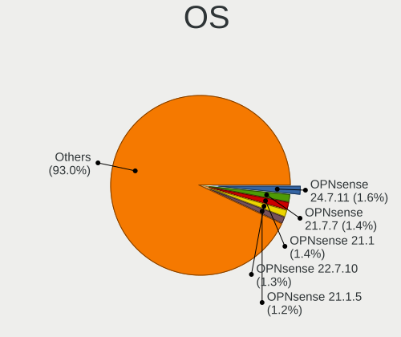

| Name              | Computers | Percent |
|-------------------|-----------|---------|
| OPNsense 24.7.11  | 71        | 1.57%   |
| OPNsense 21.7.7   | 65        | 1.44%   |
| OPNsense 21.1     | 64        | 1.41%   |
| OPNsense 22.7.10  | 59        | 1.3%    |
| OPNsense 21.1.5   | 56        | 1.24%   |
| OPNsense 24.1.6   | 55        | 1.21%   |
| OPNsense 23.1.11  | 55        | 1.21%   |
| OPNsense 22.1     | 54        | 1.19%   |
| OPNsense 20.7.8   | 54        | 1.19%   |
| OPNsense 21.7.3   | 52        | 1.15%   |
| OPNsense 25.1     | 51        | 1.13%   |
| OPNsense 21.7.1   | 51        | 1.13%   |
| OPNsense 25.1.5   | 50        | 1.1%    |
| OPNsense 25.1.7   | 49        | 1.08%   |
| OPNsense 24.7.12  | 47        | 1.04%   |
| helloSystem 0.8.1 | 47        | 1.04%   |
| OPNsense 23.7.12  | 45        | 0.99%   |
| OPNsense 21.1.3   | 45        | 0.99%   |
| OPNsense 22.7.6   | 43        | 0.95%   |
| OPNsense 21.7.6   | 43        | 0.95%   |
| OPNsense 21.1.2   | 43        | 0.95%   |
| OPNsense 23.1.5   | 42        | 0.93%   |
| OPNsense 23.1     | 42        | 0.93%   |
| OPNsense 22.7.4   | 42        | 0.93%   |
| OPNsense 22.1.8   | 42        | 0.93%   |
| OPNsense 21.1.1   | 42        | 0.93%   |
| OPNsense 23.7.10  | 41        | 0.91%   |
| OPNsense 22.1.6   | 40        | 0.88%   |
| OPNsense 25.1.1   | 39        | 0.86%   |
| OPNsense 24.7.6   | 39        | 0.86%   |
| OPNsense 21.1.4   | 39        | 0.86%   |
| OPNsense 25.7.3   | 38        | 0.84%   |
| OPNsense 25.1.6   | 38        | 0.84%   |
| OPNsense 22.7.9   | 38        | 0.84%   |
| OPNsense 24.7.4   | 37        | 0.82%   |
| OPNsense 24.1.10  | 37        | 0.82%   |
| OPNsense 24.7.3   | 36        | 0.79%   |
| OPNsense 24.1.4   | 36        | 0.79%   |
| OPNsense 23.7.9   | 35        | 0.77%   |
| OPNsense 23.1.1   | 35        | 0.77%   |

OS Family
---------

OS without a version

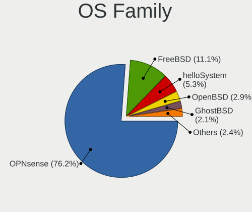

| Name        | Computers | Percent |
|-------------|-----------|---------|
| OPNsense    | 2488      | 76.18%  |
| FreeBSD     | 363       | 11.11%  |
| helloSystem | 174       | 5.33%   |
| OpenBSD     | 96        | 2.94%   |
| GhostBSD    | 68        | 2.08%   |
| NomadBSD    | 32        | 0.98%   |
| NetBSD      | 19        | 0.58%   |
| TrueNAS     | 9         | 0.28%   |
| pfSense     | 3         | 0.09%   |
| MyBee       | 3         | 0.09%   |
| ClonOS      | 3         | 0.09%   |
| HardenedBSD | 2         | 0.06%   |
| FuryBSD     | 2         | 0.06%   |
| PC-BSD      | 1         | 0.03%   |
| MidnightBSD | 1         | 0.03%   |
| FreeNAS     | 1         | 0.03%   |
| DragonFly   | 1         | 0.03%   |

Arch
----

OS architecture (x86_64, i586, etc.)

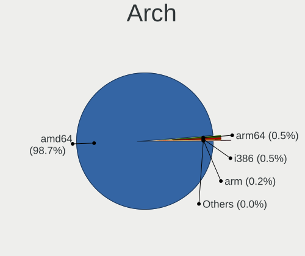

| Name    | Computers | Percent |
|---------|-----------|---------|
| amd64   | 3192      | 98.73%  |
| arm64   | 16        | 0.49%   |
| i386    | 15        | 0.46%   |
| arm     | 5         | 0.15%   |
| macppc  | 4         | 0.12%   |
| sparc64 | 1         | 0.03%   |

DE
--

Desktop Environment

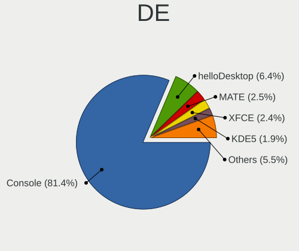

| Name          | Computers | Percent |
|---------------|-----------|---------|
| Console       | 2674      | 81.38%  |
| helloDesktop  | 209       | 6.36%   |
| MATE          | 83        | 2.53%   |
| XFCE          | 78        | 2.37%   |
| KDE5          | 61        | 1.86%   |
| fvwm          | 39        | 1.19%   |
| GNOME         | 34        | 1.03%   |
| TWM           | 28        | 0.85%   |
| Openbox       | 24        | 0.73%   |
| AwesomeWM     | 12        | 0.37%   |
| i3            | 10        | 0.3%    |
| LXQt          | 3         | 0.09%   |
| ICEWM         | 3         | 0.09%   |
| Enlightenment | 3         | 0.09%   |
| Cinnamon      | 3         | 0.09%   |
| LXDE          | 2         | 0.06%   |
| KDE6          | 2         | 0.06%   |
| KDE           | 2         | 0.06%   |
| Fluxbox       | 2         | 0.06%   |
| Compton       | 2         | 0.06%   |
| CDE           | 2         | 0.06%   |
| WindowMaker   | 1         | 0.03%   |
| sway          | 1         | 0.03%   |
| spectrwm      | 1         | 0.03%   |
| Picom         | 1         | 0.03%   |
| JWM           | 1         | 0.03%   |
| iwm           | 1         | 0.03%   |
| herbstluftwm  | 1         | 0.03%   |
| GNUstep       | 1         | 0.03%   |
| filer         | 1         | 0.03%   |
| EXWM          | 1         | 0.03%   |

Display Server
--------------

X11 or Wayland

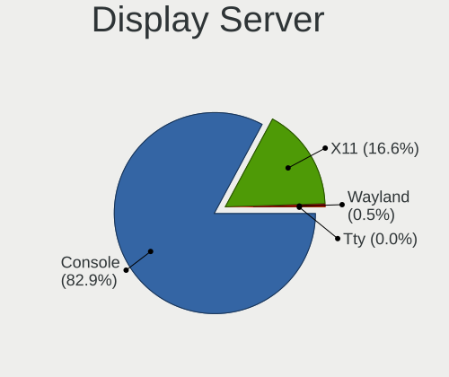

| Name    | Computers | Percent |
|---------|-----------|---------|
| Console | 2687      | 82.86%  |
| X11     | 539       | 16.62%  |
| Wayland | 16        | 0.49%   |
| Tty     | 1         | 0.03%   |

Display Manager
---------------

SDDM, LightDM, etc.

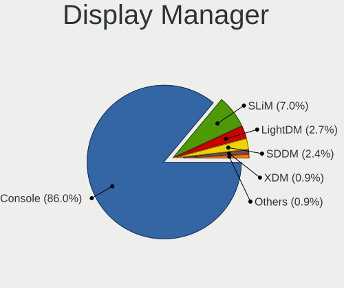

| Name    | Computers | Percent |
|---------|-----------|---------|
| Console | 2817      | 86.04%  |
| SLiM    | 230       | 7.03%   |
| LightDM | 89        | 2.72%   |
| SDDM    | 78        | 2.38%   |
| XDM     | 31        | 0.95%   |
| GDM     | 19        | 0.58%   |
| Ly      | 10        | 0.31%   |

OS Lang
-------

Language

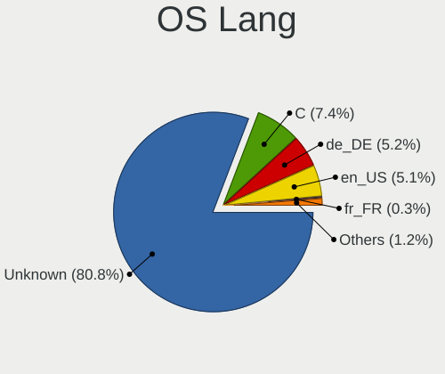

| Lang             | Computers | Percent |
|------------------|-----------|---------|
| Unknown          | 2666      | 80.81%  |
| C                | 243       | 7.37%   |
| de_DE            | 171       | 5.18%   |
| en_US            | 169       | 5.12%   |
| fr_FR            | 10        | 0.3%    |
| en_GB            | 9         | 0.27%   |
| de               | 9         | 0.27%   |
| en               | 4         | 0.12%   |
| de_DE.ISO8859-1  | 4         | 0.12%   |
| ru_RU            | 2         | 0.06%   |
| pl_PL            | 2         | 0.06%   |
| de_DE.ISO8859-15 | 2         | 0.06%   |
| it_IT            | 1         | 0.03%   |
| ISO8859-15       | 1         | 0.03%   |
| fr               | 1         | 0.03%   |
| en_IE            | 1         | 0.03%   |
| en_GB.ISO8859-1  | 1         | 0.03%   |
| en_DE            | 1         | 0.03%   |
| en_CA            | 1         | 0.03%   |
| de.DE            | 1         | 0.03%   |

Boot Mode
---------

EFI or BIOS

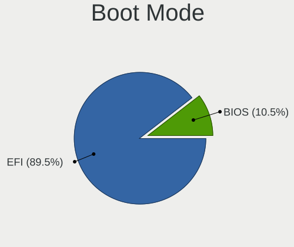

| Mode | Computers | Percent |
|------|-----------|---------|
| EFI  | 2916      | 89.53%  |
| BIOS | 341       | 10.47%  |

Filesystem
----------

Type of filesystem

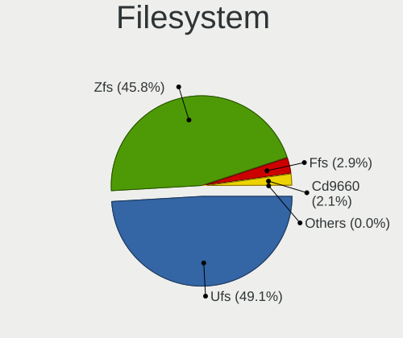

| Type    | Computers | Percent |
|---------|-----------|---------|
| Ufs     | 1635      | 49.08%  |
| Zfs     | 1527      | 45.84%  |
| Ffs     | 96        | 2.88%   |
| Cd9660  | 71        | 2.13%   |
| Msdosfs | 1         | 0.03%   |
| Hammer2 | 1         | 0.03%   |

Part. scheme
------------

Scheme of partitioning

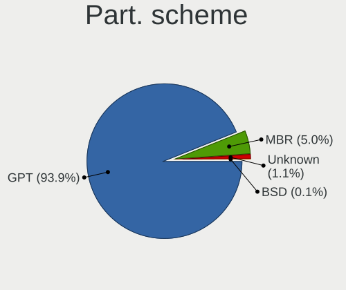

| Type    | Computers | Percent |
|---------|-----------|---------|
| GPT     | 3051      | 93.91%  |
| MBR     | 161       | 4.96%   |
| Unknown | 35        | 1.08%   |
| BSD     | 2         | 0.06%   |

Board
-----

Vendor
------

Motherboard manufacturer

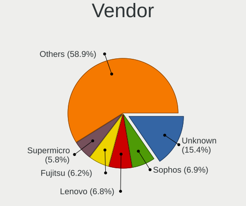

| Name                                 | Computers | Percent |
|--------------------------------------|-----------|---------|
| Unknown                              | 499       | 15.43%  |
| Sophos                               | 223       | 6.9%    |
| Lenovo                               | 221       | 6.84%   |
| Fujitsu                              | 200       | 6.19%   |
| Supermicro                           | 186       | 5.75%   |
| PC Engines                           | 175       | 5.41%   |
| Hewlett-Packard                      | 158       | 4.89%   |
| Dell                                 | 154       | 4.76%   |
| ASUSTek Computer                     | 121       | 3.74%   |
| Intel                                | 118       | 3.65%   |
| ASRock                               | 101       | 3.12%   |
| Gigabyte Technology                  | 90        | 2.78%   |
| Deciso                               | 84        | 2.6%    |
| Protectli                            | 70        | 2.17%   |
| ZOTAC                                | 68        | 2.1%    |
| MSI                                  | 65        | 2.01%   |
| AMI                                  | 59        | 1.82%   |
| BESSTAR Tech                         | 44        | 1.36%   |
| Apple                                | 43        | 1.33%   |
| Techvision                           | 32        | 0.99%   |
| CncTion                              | 31        | 0.96%   |
| Acer                                 | 28        | 0.87%   |
| Shuttle                              | 26        | 0.8%    |
| SJRC                                 | 19        | 0.59%   |
| MW                                   | 18        | 0.56%   |
| Thomas-Krenn.AG                      | 17        | 0.53%   |
| AWOW                                 | 17        | 0.53%   |
| HARDKERNEL                           | 15        | 0.46%   |
| Shenzhen Meigao Electronic Equipment | 14        | 0.43%   |
| ASRockRack                           | 14        | 0.43%   |
| Yanling                              | 13        | 0.4%    |
| AAEON                                | 13        | 0.4%    |
| CWWK                                 | 11        | 0.34%   |
| Advantech                            | 11        | 0.34%   |
| TUXEDO                               | 10        | 0.31%   |
| IceWhale Technology                  | 10        | 0.31%   |
| AZW                                  | 10        | 0.31%   |
| NF541                                | 9         | 0.28%   |
| CheckPoint                           | 9         | 0.28%   |
| Biostar                              | 8         | 0.25%   |

Model
-----

Motherboard model

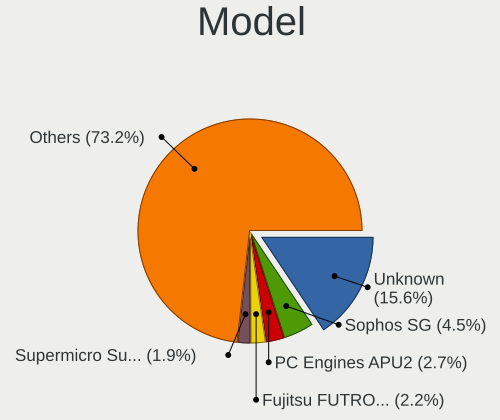

| Name                                              | Computers | Percent |
|---------------------------------------------------|-----------|---------|
| Unknown                                           | 505       | 15.62%  |
| Sophos SG                                         | 144       | 4.45%   |
| PC Engines APU2                                   | 86        | 2.66%   |
| Fujitsu FUTRO S920                                | 71        | 2.2%    |
| Supermicro Super Server                           | 60        | 1.86%   |
| PC Engines apu4                                   | 58        | 1.79%   |
| Sophos XG                                         | 45        | 1.39%   |
| Sophos UTM                                        | 33        | 1.02%   |
| Techvision TVI7309X                               | 32        | 0.99%   |
| AMI Aptio CRB                                     | 28        | 0.87%   |
| Intel Q3XXG4-P V1.0                               | 20        | 0.62%   |
| ZOTAC ZBOX-CI329NANO                              | 18        | 0.56%   |
| MW GMLK-2_5G4L                                    | 18        | 0.56%   |
| Protectli FW6                                     | 17        | 0.53%   |
| BESSTAR Tech GK41                                 | 16        | 0.49%   |
| Protectli FW4B                                    | 15        | 0.46%   |
| Fujitsu FUTRO S930                                | 15        | 0.46%   |
| Deciso NetBoard-A10                               | 15        | 0.46%   |
| Protectli VP2420                                  | 14        | 0.43%   |
| AMI SG                                            | 14        | 0.43%   |
| Supermicro A1SAi                                  | 13        | 0.4%    |
| Shenzhen Meigao Electronic Equipment Venus Series | 13        | 0.4%    |
| PC Engines APU                                    | 13        | 0.4%    |
| Hardkernel ODROID-H2                              | 13        | 0.4%    |
| Deciso NetBoard-A20                               | 13        | 0.4%    |
| CncTion N5105-4L                                  | 13        | 0.4%    |
| SJRC ADLN-6L                                      | 12        | 0.37%   |
| Deciso Netboard A20                               | 12        | 0.37%   |
| Deciso Netboard A10 V2                            | 12        | 0.37%   |
| PC Engines APU3                                   | 11        | 0.34%   |
| HP ProLiant MicroServer Gen8                      | 11        | 0.34%   |
| ZOTAC ZBOX-CI327NANO-GS-01                        | 10        | 0.31%   |
| ASUS All Series                                   | 10        | 0.31%   |
| AMI LES compact 4L                                | 10        | 0.31%   |
| Supermicro 1HE Intel Single-CPU RI1102D-F Server  | 9         | 0.28%   |
| HP t620 PLUS Quad Core TC                         | 9         | 0.28%   |
| Dell PowerEdge R210 II                            | 9         | 0.28%   |
| BESSTAR Tech X35G                                 | 9         | 0.28%   |
| NF541 1.0                                         | 8         | 0.25%   |
| MSI MS-7B89                                       | 8         | 0.25%   |

Model Family
------------

Motherboard model prefix

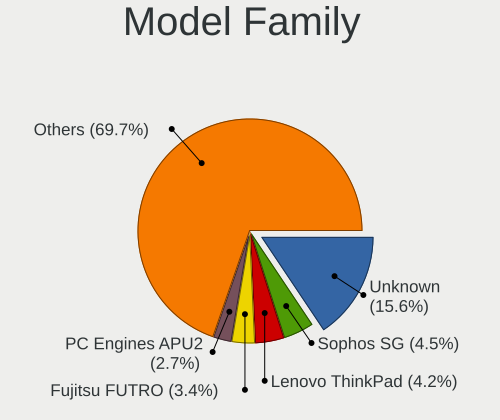

| Name                                       | Computers | Percent |
|--------------------------------------------|-----------|---------|
| Unknown                                    | 505       | 15.62%  |
| Sophos SG                                  | 144       | 4.45%   |
| Lenovo ThinkPad                            | 136       | 4.21%   |
| Fujitsu FUTRO                              | 109       | 3.37%   |
| PC Engines APU2                            | 86        | 2.66%   |
| Supermicro Super                           | 60        | 1.86%   |
| PC Engines apu4                            | 58        | 1.79%   |
| Dell OptiPlex                              | 52        | 1.61%   |
| Lenovo ThinkCentre                         | 48        | 1.48%   |
| Sophos XG                                  | 45        | 1.39%   |
| HP ProLiant                                | 42        | 1.3%    |
| Deciso Netboard                            | 37        | 1.14%   |
| Sophos UTM                                 | 33        | 1.02%   |
| Dell PowerEdge                             | 33        | 1.02%   |
| Techvision TVI7309X                        | 32        | 0.99%   |
| Fujitsu ESPRIMO                            | 32        | 0.99%   |
| Dell Latitude                              | 29        | 0.9%    |
| AMI Aptio                                  | 28        | 0.87%   |
| Deciso NetBoard-A10                        | 24        | 0.74%   |
| Supermicro 1HE                             | 22        | 0.68%   |
| Intel Q3XXG4-P                             | 20        | 0.62%   |
| Fujitsu PRIMERGY                           | 19        | 0.59%   |
| ZOTAC ZBOX-CI329NANO                       | 18        | 0.56%   |
| MW GMLK-2                                  | 18        | 0.56%   |
| HP ProDesk                                 | 18        | 0.56%   |
| Protectli FW6                              | 17        | 0.53%   |
| HP Compaq                                  | 16        | 0.49%   |
| BESSTAR Tech GK41                          | 16        | 0.49%   |
| ASUS PRIME                                 | 16        | 0.49%   |
| Protectli FW4B                             | 15        | 0.46%   |
| ASUS TUF                                   | 15        | 0.46%   |
| Protectli VP2420                           | 14        | 0.43%   |
| HP t620                                    | 14        | 0.43%   |
| HP EliteDesk                               | 14        | 0.43%   |
| Fujitsu LIFEBOOK                           | 14        | 0.43%   |
| Dell Wyse                                  | 14        | 0.43%   |
| AMI SG                                     | 14        | 0.43%   |
| Supermicro A1SAi                           | 13        | 0.4%    |
| Shenzhen Meigao Electronic Equipment Venus | 13        | 0.4%    |
| PC Engines APU                             | 13        | 0.4%    |

MFG Year
--------

Motherboard manufacture year

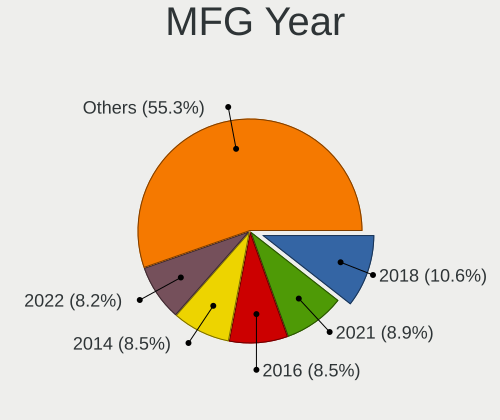

| Year    | Computers | Percent |
|---------|-----------|---------|
| 2018    | 342       | 10.58%  |
| 2021    | 289       | 8.94%   |
| 2016    | 275       | 8.51%   |
| 2014    | 274       | 8.48%   |
| 2022    | 264       | 8.17%   |
| 2020    | 256       | 7.92%   |
| 2019    | 246       | 7.61%   |
| 2023    | 222       | 6.87%   |
| 2017    | 201       | 6.22%   |
| 2024    | 162       | 5.01%   |
| 2013    | 147       | 4.55%   |
| 2011    | 114       | 3.53%   |
| 2012    | 110       | 3.4%    |
| 2015    | 108       | 3.34%   |
| 2010    | 67        | 2.07%   |
| 2009    | 43        | 1.33%   |
| 2025    | 32        | 0.99%   |
| 2008    | 28        | 0.87%   |
| Unknown | 26        | 0.8%    |
| 2007    | 16        | 0.49%   |
| 2006    | 6         | 0.19%   |
| 2003    | 3         | 0.09%   |
| 2005    | 1         | 0.03%   |
| 2002    | 1         | 0.03%   |

Form Factor
-----------

Physical design of the computer

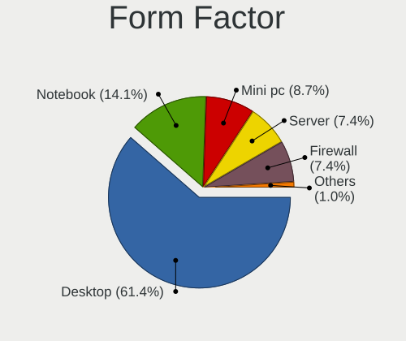

| Name           | Computers | Percent |
|----------------|-----------|---------|
| Desktop        | 1986      | 61.43%  |
| Notebook       | 457       | 14.14%  |
| Mini pc        | 280       | 8.66%   |
| Server         | 239       | 7.39%   |
| Firewall       | 238       | 7.36%   |
| All in one     | 14        | 0.43%   |
| Convertible    | 9         | 0.28%   |
| System on chip | 8         | 0.25%   |
| Tablet         | 2         | 0.06%   |

Coreboot
--------

Have coreboot on board

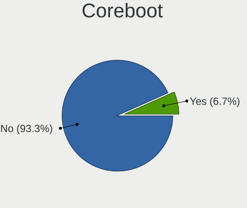

| Used | Computers | Percent |
|------|-----------|---------|
| No   | 3017      | 93.32%  |
| Yes  | 216       | 6.68%   |

RAM Size
--------

Total RAM memory

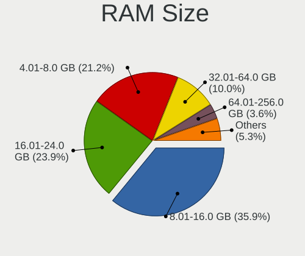

| Size in GB      | Computers | Percent |
|-----------------|-----------|---------|
| 8.01-16.0       | 1187      | 35.94%  |
| 16.01-24.0      | 790       | 23.92%  |
| 4.01-8.0        | 701       | 21.22%  |
| 32.01-64.0      | 331       | 10.02%  |
| 64.01-256.0     | 118       | 3.57%   |
| 2.01-3.0        | 100       | 3.03%   |
| 24.01-32.0      | 21        | 0.64%   |
| 3.01-4.0        | 18        | 0.54%   |
| 1.01-2.0        | 12        | 0.36%   |
| 0.51-1.0        | 11        | 0.33%   |
| 0.01-0.5        | 8         | 0.24%   |
| More than 256.0 | 5         | 0.15%   |
| 0               | 1         | 0.03%   |

RAM Used
--------

Used RAM memory

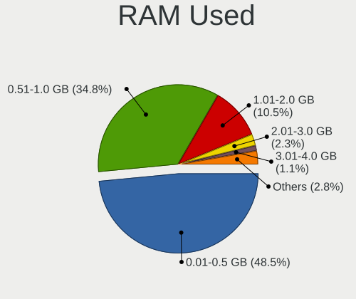

| Used GB     | Computers | Percent |
|-------------|-----------|---------|
| 0.01-0.5    | 1617      | 48.49%  |
| 0.51-1.0    | 1162      | 34.84%  |
| 1.01-2.0    | 350       | 10.49%  |
| 2.01-3.0    | 78        | 2.34%   |
| 3.01-4.0    | 36        | 1.08%   |
| 4.01-8.0    | 33        | 0.99%   |
| Unknown     | 21        | 0.63%   |
| 0           | 15        | 0.45%   |
| 8.01-16.0   | 9         | 0.27%   |
| 16.01-24.0  | 7         | 0.21%   |
| 24.01-32.0  | 3         | 0.09%   |
| 32.01-64.0  | 2         | 0.06%   |
| 64.01-256.0 | 2         | 0.06%   |

Total Drives
------------

Number of drives on board

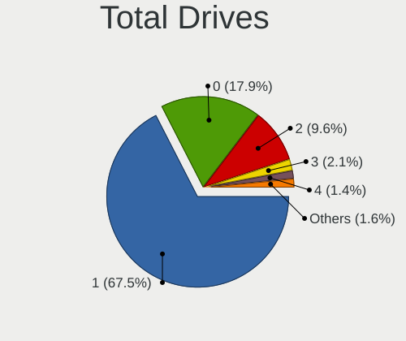

| Drives | Computers | Percent |
|--------|-----------|---------|
| 1      | 2268      | 67.46%  |
| 0      | 602       | 17.91%  |
| 2      | 322       | 9.58%   |
| 3      | 69        | 2.05%   |
| 4      | 48        | 1.43%   |
| 5      | 16        | 0.48%   |
| 6      | 15        | 0.45%   |
| 8      | 6         | 0.18%   |
| 7      | 6         | 0.18%   |
| 9      | 4         | 0.12%   |
| 10     | 3         | 0.09%   |
| 47     | 1         | 0.03%   |
| 14     | 1         | 0.03%   |
| 11     | 1         | 0.03%   |

Has CD-ROM
----------

Has CD-ROM on board

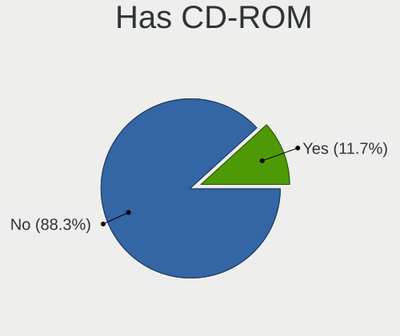

| Presented | Computers | Percent |
|-----------|-----------|---------|
| No        | 2871      | 88.26%  |
| Yes       | 382       | 11.74%  |

Has Ethernet
------------

Has Ethernet on board

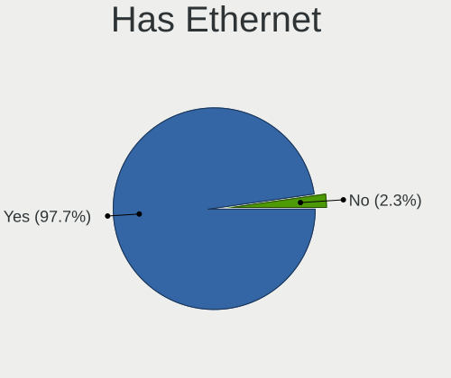

| Presented | Computers | Percent |
|-----------|-----------|---------|
| Yes       | 3160      | 97.74%  |
| No        | 73        | 2.26%   |

Has WiFi
--------

Has WiFi module

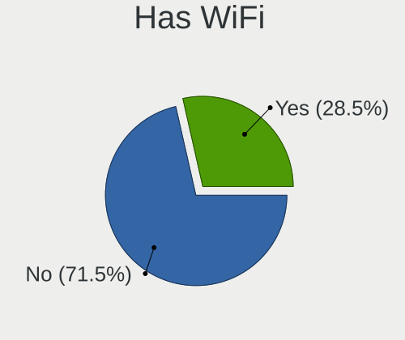

| Presented | Computers | Percent |
|-----------|-----------|---------|
| No        | 2338      | 71.45%  |
| Yes       | 934       | 28.55%  |

Has Bluetooth
-------------

Has Bluetooth module

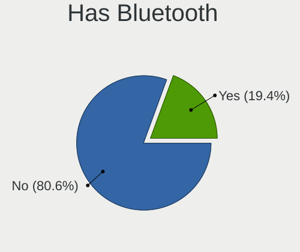

| Presented | Computers | Percent |
|-----------|-----------|---------|
| No        | 2627      | 80.58%  |
| Yes       | 633       | 19.42%  |

Location
--------

Country
-------

Geographic location (country)

| Country | Computers | Percent |
|---------|-----------|---------|
| Germany | 3233      | 100%    |

City
----

Geographic location (city)

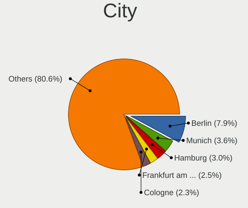

| City              | Computers | Percent |
|-------------------|-----------|---------|
| Berlin            | 294       | 7.91%   |
| Munich            | 135       | 3.63%   |
| Hamburg           | 113       | 3.04%   |
| Frankfurt am Main | 93        | 2.5%    |
| Cologne           | 86        | 2.31%   |
| Stuttgart         | 55        | 1.48%   |
| Hanover           | 45        | 1.21%   |
| Nuremberg         | 35        | 0.94%   |
| Dortmund          | 35        | 0.94%   |
| Mannheim          | 32        | 0.86%   |
| Leipzig           | 32        | 0.86%   |
| Karlsruhe         | 32        | 0.86%   |
| Ludwigsburg       | 31        | 0.83%   |
| Bonn              | 31        | 0.83%   |
| Dresden           | 28        | 0.75%   |
| Darmstadt         | 28        | 0.75%   |
| Düsseldorf       | 27        | 0.73%   |
| Bochum            | 26        | 0.7%    |
| Essen             | 25        | 0.67%   |
| Bremen            | 23        | 0.62%   |
| Nottuln           | 22        | 0.59%   |
| Mainz             | 20        | 0.54%   |
| Wiesbaden         | 19        | 0.51%   |
| Chemnitz          | 19        | 0.51%   |
| Wuppertal         | 18        | 0.48%   |
| Bielefeld         | 17        | 0.46%   |
| Hamminkeln        | 16        | 0.43%   |
| Braunschweig      | 16        | 0.43%   |
| Falkenstein       | 15        | 0.4%    |
| Aachen            | 15        | 0.4%    |
| Solden            | 14        | 0.38%   |
| Reutlingen        | 14        | 0.38%   |
| Krefeld           | 14        | 0.38%   |
| Ulm               | 13        | 0.35%   |
| Münster          | 13        | 0.35%   |
| Magdeburg         | 13        | 0.35%   |
| Heidelberg        | 13        | 0.35%   |
| Halle             | 13        | 0.35%   |
| Duisburg          | 13        | 0.35%   |
| Kassel            | 12        | 0.32%   |

Drives
------

Drive Vendor
------------

Hard drive vendors

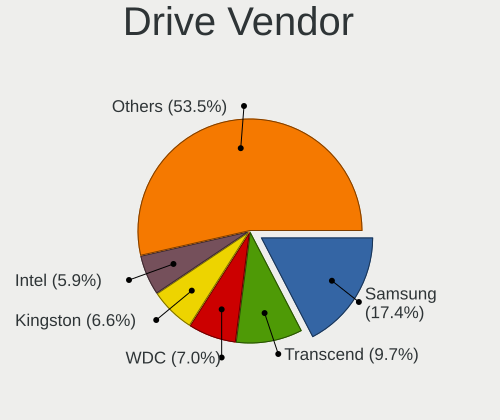

| Vendor              | Computers | Drives | Percent |
|---------------------|-----------|--------|---------|
| Samsung Electronics | 549       | 886    | 17.37%  |
| Transcend           | 305       | 431    | 9.65%   |
| WDC                 | 221       | 385    | 6.99%   |
| Kingston            | 208       | 353    | 6.58%   |
| Intel               | 185       | 316    | 5.85%   |
| Crucial             | 169       | 268    | 5.35%   |
| SanDisk             | 168       | 240    | 5.32%   |
| Seagate             | 143       | 298    | 4.53%   |
| China               | 111       | 145    | 3.51%   |
| A-DATA Technology   | 100       | 138    | 3.16%   |
| Toshiba             | 85        | 161    | 2.69%   |
| Intenso             | 78        | 117    | 2.47%   |
| Micron Technology   | 54        | 79     | 1.71%   |
| Hitachi             | 50        | 121    | 1.58%   |
| Phison              | 43        | 64     | 1.36%   |
| Innodisk            | 43        | 53     | 1.36%   |
| HGST                | 43        | 77     | 1.36%   |
| Hoodisk             | 41        | 75     | 1.3%    |
| ATP                 | 34        | 41     | 1.08%   |
| FORESEE             | 33        | 50     | 1.04%   |
| NVMe                | 28        | 47     | 0.89%   |
| Protectli           | 26        | 35     | 0.82%   |
| Patriot             | 25        | 40     | 0.79%   |
| Hewlett-Packard     | 24        | 36     | 0.76%   |
| Apacer              | 23        | 39     | 0.73%   |
| SK hynix            | 20        | 25     | 0.63%   |
| Apple               | 19        | 22     | 0.6%    |
| OCZ                 | 18        | 29     | 0.57%   |
| Verbatim            | 16        | 25     | 0.51%   |
| SPCC                | 16        | 22     | 0.51%   |
| KIOXIA              | 13        | 15     | 0.41%   |
| Corsair             | 12        | 19     | 0.38%   |
| ShiJi               | 10        | 12     | 0.32%   |
| LITEON              | 10        | 11     | 0.32%   |
| KingSpec            | 10        | 13     | 0.32%   |
| PNY                 | 9         | 11     | 0.28%   |
| LITEONIT            | 9         | 12     | 0.28%   |
| Gigabyte Technology | 9         | 10     | 0.28%   |
| Dogfish             | 9         | 11     | 0.28%   |
| VICKTER             | 8         | 12     | 0.25%   |

Drive Model
-----------

Hard drive models

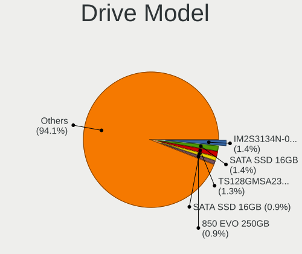

| Model                           | Computers | Percent |
|---------------------------------|-----------|---------|
| A-DATA IM2S3134N-064GM 64GB     | 46        | 1.39%   |
| China SATA SSD 16GB             | 45        | 1.36%   |
| Transcend TS128GMSA230S 128GB   | 44        | 1.33%   |
| Phison SATA SSD 16GB            | 31        | 0.94%   |
| Samsung SSD 850 EVO 250GB       | 30        | 0.91%   |
| Transcend TS64GMSA230S 64GB     | 24        | 0.73%   |
| Samsung SSD 860 EVO 500GB       | 24        | 0.73%   |
| Kingston SA400S37120G 120GB     | 24        | 0.73%   |
| Crucial CT240BX500SSD1 240GB    | 24        | 0.73%   |
| Transcend TS64GSSD370 64GB      | 22        | 0.67%   |
| Samsung SSD 840 EVO 250GB       | 22        | 0.67%   |
| Samsung SSD 870 EVO 250GB       | 21        | 0.64%   |
| Kingston SKC600MS256G 256GB     | 20        | 0.61%   |
| Crucial CT250MX500SSD1 250GB    | 19        | 0.58%   |
| Transcend TS256GMSA230S 256GB   | 18        | 0.55%   |
| Samsung SSD 840 EVO 120GB       | 18        | 0.55%   |
| Crucial CT500MX500SSD1 500GB    | 17        | 0.52%   |
| Crucial CT1000MX500SSD1 1TB     | 17        | 0.52%   |
| Samsung SSD 860 EVO 250GB       | 16        | 0.48%   |
| FORESEE 128GB SSD               | 16        | 0.48%   |
| Samsung SSD 850 PRO 256GB       | 15        | 0.45%   |
| Kingston SV300S37A120G 120GB    | 15        | 0.45%   |
| Intel SSDSC2BW180A4 180GB       | 15        | 0.45%   |
| Hoodisk SSD 64GB                | 15        | 0.45%   |
| Crucial CT120BX500SSD1 120GB    | 15        | 0.45%   |
| Transcend TS32GMSA370 32GB      | 14        | 0.42%   |
| SanDisk SSD PLUS 120GB          | 14        | 0.42%   |
| Kingston SUV500MS120G 120GB     | 14        | 0.42%   |
| Intenso SSD 128GB               | 14        | 0.42%   |
| Transcend TS256GMTS952T2 256GB  | 13        | 0.39%   |
| SanDisk SSD PLUS 240GB          | 13        | 0.39%   |
| Innodisk DEMSR- 08GB mSATA 3ME3 | 13        | 0.39%   |
| Samsung SSD 850 EVO 500GB       | 12        | 0.36%   |
| Intel SSDSC2BB120G4 120GB       | 12        | 0.36%   |
| HP RAID 1(1+0) 119GB            | 12        | 0.36%   |
| Transcend TS32GSSD370S 32GB     | 11        | 0.33%   |
| SanDisk SDSSDA120G 120GB        | 11        | 0.33%   |
| Samsung SSD 970 EVO Plus 500GB  | 11        | 0.33%   |
| Kingston SMS200S360G 64GB       | 11        | 0.33%   |
| Kingston SA400S37240G 240GB     | 11        | 0.33%   |

HDD Vendor
----------

Hard disk drive vendors

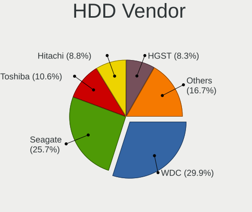

| Vendor              | Computers | Drives | Percent |
|---------------------|-----------|--------|---------|
| WDC                 | 156       | 286    | 29.94%  |
| Seagate             | 134       | 278    | 25.72%  |
| Toshiba             | 55        | 101    | 10.56%  |
| Hitachi             | 46        | 104    | 8.83%   |
| HGST                | 43        | 77     | 8.25%   |
| Samsung Electronics | 27        | 41     | 5.18%   |
| NVMe                | 19        | 30     | 3.65%   |
| Hewlett-Packard     | 7         | 13     | 1.34%   |
| Fujitsu             | 7         | 7      | 1.34%   |
| LSI                 | 5         | 5      | 0.96%   |
| OPENBSD             | 3         | 8      | 0.58%   |
| Intenso             | 3         | 3      | 0.58%   |
| Maxtor              | 2         | 2      | 0.38%   |
| LSILOGIC            | 2         | 5      | 0.38%   |
| JetFlash            | 2         | 2      | 0.38%   |
| Generic             | 2         | 2      | 0.38%   |
| Apple               | 2         | 2      | 0.38%   |
| WD MediaMax         | 1         | 5      | 0.19%   |
| Product:            | 1         | 1      | 0.19%   |
| IBM/Hitachi         | 1         | 1      | 0.19%   |
| IBM                 | 1         | 1      | 0.19%   |
| General             | 1         | 1      | 0.19%   |
| ASMT                | 1         | 1      | 0.19%   |

SSD Vendor
----------

Solid state drive vendors

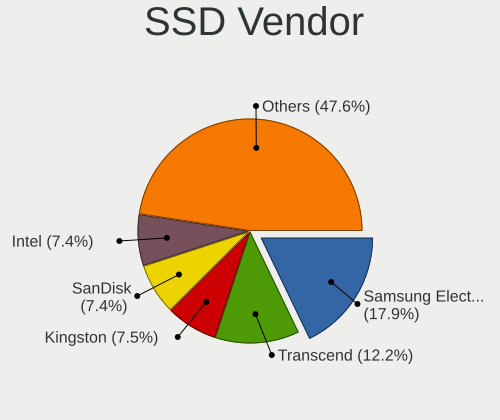

| Vendor              | Computers | Drives | Percent |
|---------------------|-----------|--------|---------|
| Samsung Electronics | 401       | 640    | 17.85%  |
| Transcend           | 274       | 395    | 12.2%   |
| Kingston            | 168       | 288    | 7.48%   |
| SanDisk             | 167       | 239    | 7.44%   |
| Intel               | 167       | 293    | 7.44%   |
| Crucial             | 151       | 238    | 6.72%   |
| China               | 111       | 145    | 4.94%   |
| A-DATA Technology   | 99        | 136    | 4.41%   |
| Intenso             | 69        | 103    | 3.07%   |
| Micron Technology   | 44        | 64     | 1.96%   |
| Innodisk            | 43        | 53     | 1.91%   |
| Hoodisk             | 41        | 75     | 1.83%   |
| WDC                 | 39        | 57     | 1.74%   |
| Phison              | 36        | 52     | 1.6%    |
| ATP                 | 30        | 34     | 1.34%   |
| FORESEE             | 28        | 43     | 1.25%   |
| Protectli           | 26        | 35     | 1.16%   |
| Apacer              | 23        | 39     | 1.02%   |
| Toshiba             | 19        | 32     | 0.85%   |
| OCZ                 | 18        | 29     | 0.8%    |
| Hewlett-Packard     | 17        | 23     | 0.76%   |
| Apple               | 17        | 20     | 0.76%   |
| Verbatim            | 16        | 25     | 0.71%   |
| SPCC                | 12        | 17     | 0.53%   |
| Patriot             | 12        | 19     | 0.53%   |
| SK hynix            | 11        | 15     | 0.49%   |
| NVMe                | 10        | 15     | 0.45%   |
| LITEON              | 10        | 11     | 0.45%   |
| KingSpec            | 10        | 13     | 0.45%   |
| LITEONIT            | 9         | 12     | 0.4%    |
| Dogfish             | 9         | 11     | 0.4%    |
| VICKTER             | 8         | 12     | 0.36%   |
| TCSUNBOW            | 8         | 9      | 0.36%   |
| ShiJi               | 8         | 10     | 0.36%   |
| PNY                 | 8         | 10     | 0.36%   |
| Seagate             | 7         | 18     | 0.31%   |
| Corsair             | 7         | 11     | 0.31%   |
| BORY                | 7         | 11     | 0.31%   |
| Netac               | 5         | 7      | 0.22%   |
| Leven               | 5         | 8      | 0.22%   |

Drive Kind
----------

HDD or SSD

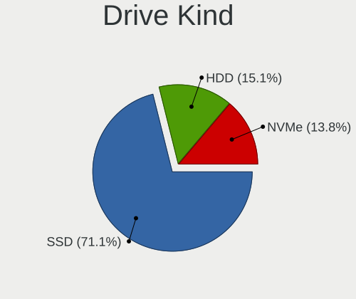

| Kind | Computers | Drives | Percent |
|------|-----------|--------|---------|
| SSD  | 2085      | 3422   | 71.11%  |
| HDD  | 442       | 976    | 15.08%  |
| NVMe | 405       | 618    | 13.81%  |

Drive Connector
---------------

SATA, SAS, NVMe, etc.

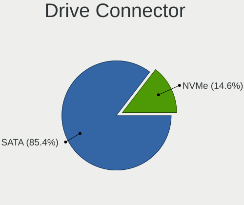

| Type | Computers | Drives | Percent |
|------|-----------|--------|---------|
| SATA | 2377      | 4398   | 85.44%  |
| NVMe | 405       | 618    | 14.56%  |

Drive Size
----------

Size of hard drive

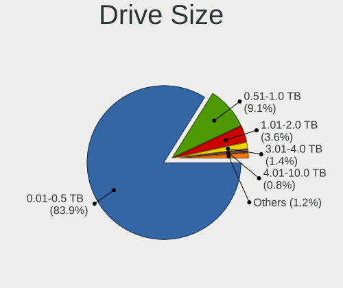

| Size in TB      | Computers | Drives | Percent |
|-----------------|-----------|--------|---------|
| 0.01-0.5        | 2162      | 3494   | 83.93%  |
| 0.51-1.0        | 234       | 375    | 9.08%   |
| 1.01-2.0        | 92        | 225    | 3.57%   |
| 3.01-4.0        | 37        | 112    | 1.44%   |
| 4.01-10.0       | 20        | 42     | 0.78%   |
| 2.01-3.0        | 18        | 64     | 0.7%    |
| 10.01-20.0      | 10        | 30     | 0.39%   |
| 20.01-50.0      | 2         | 55     | 0.08%   |
| More than 100.0 | 1         | 1      | 0.04%   |

Space Total
-----------

Amount of disk space available on the file system

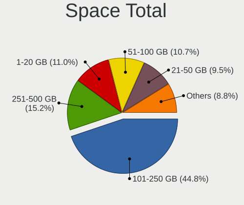

| Size in GB     | Computers | Percent |
|----------------|-----------|---------|
| 101-250        | 1502      | 44.84%  |
| 251-500        | 510       | 15.22%  |
| 1-20           | 367       | 10.96%  |
| 51-100         | 357       | 10.66%  |
| 21-50          | 318       | 9.49%   |
| 501-1000       | 204       | 6.09%   |
| 1001-2000      | 49        | 1.46%   |
| More than 3000 | 23        | 0.69%   |
| Unknown        | 14        | 0.42%   |
| 2001-3000      | 6         | 0.18%   |

Space Used
----------

Amount of used disk space

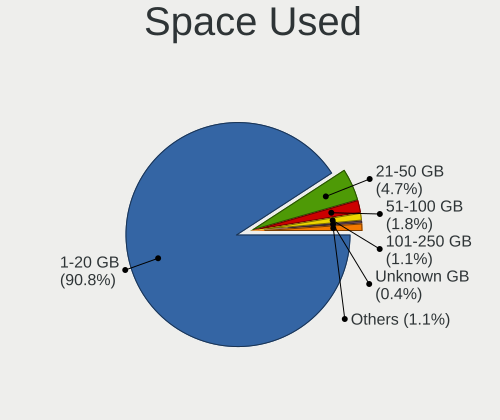

| Used GB        | Computers | Percent |
|----------------|-----------|---------|
| 1-20           | 3047      | 90.82%  |
| 21-50          | 159       | 4.74%   |
| 51-100         | 62        | 1.85%   |
| 101-250        | 37        | 1.1%    |
| Unknown        | 14        | 0.42%   |
| 251-500        | 12        | 0.36%   |
| 501-1000       | 11        | 0.33%   |
| 1001-2000      | 6         | 0.18%   |
| 2001-3000      | 4         | 0.12%   |
| More than 3000 | 3         | 0.09%   |

Malfunc. Drives
---------------

Drive models with a malfunction

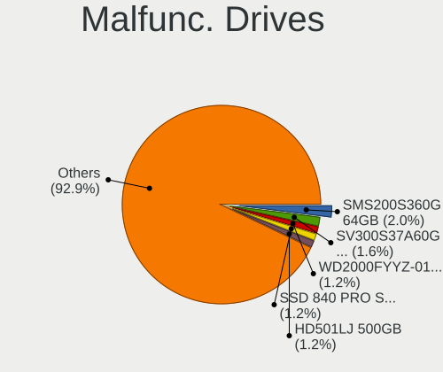

| Model                                        | Computers | Drives | Percent |
|----------------------------------------------|-----------|--------|---------|
| Kingston SMS200S360G 64GB                    | 5         | 6      | 1.97%   |
| Kingston SV300S37A60G 64GB                   | 4         | 6      | 1.57%   |
| WDC WD2000FYYZ-01UL1B2 2TB                   | 3         | 9      | 1.18%   |
| Samsung Electronics SSD 840 PRO Series 256GB | 3         | 6      | 1.18%   |
| Samsung Electronics HD501LJ 500GB            | 3         | 5      | 1.18%   |
| Micron Technology 1100 SATA 256GB            | 3         | 3      | 1.18%   |
| Kingston SMS200S3120G 120GB                  | 3         | 11     | 1.18%   |
| Intel SSDSC2BW180A4 180GB                    | 3         | 3      | 1.18%   |
| WDC WDS240G2G0A-00JH30 240GB                 | 2         | 3      | 0.79%   |
| WDC WD30EFRX-68EUZN0 3TB                     | 2         | 7      | 0.79%   |
| WDC WD2000FYYZ-01UL1B1 2TB                   | 2         | 4      | 0.79%   |
| WDC WD1600AAJS-75M0A0 160GB                  | 2         | 2      | 0.79%   |
| Toshiba THNSNK256GVN8 M.2 2280 256GB         | 2         | 10     | 0.79%   |
| Toshiba THNSNK128GCS8 SATA 128GB             | 2         | 2      | 0.79%   |
| Seagate ST9320325AS 320GB                    | 2         | 2      | 0.79%   |
| Seagate ST320LT007-9ZV142 320GB              | 2         | 2      | 0.79%   |
| Seagate ST3160318AS 160GB                    | 2         | 2      | 0.79%   |
| Seagate ST1000LM024 HN-M101MBB 1TB           | 2         | 2      | 0.79%   |
| Seagate ST1000DX001-1CM162 1TB               | 2         | 2      | 0.79%   |
| SanDisk SSD PLUS 240GB                       | 2         | 2      | 0.79%   |
| SanDisk SSD 128G                             | 2         | 3      | 0.79%   |
| Micron Technology 1100_MTFDDAK512TBN 512GB   | 2         | 4      | 0.79%   |
| Kingston SHFS37A120G 120GB                   | 2         | 3      | 0.79%   |
| Intenso SSD SATAIII 480GB                    | 2         | 2      | 0.79%   |
| Intel SSDSC2KW256G8 256GB                    | 2         | 2      | 0.79%   |
| Intel SSDSC2KF256H6L 256GB                   | 2         | 2      | 0.79%   |
| Intel SSDSC2CT180A3 180GB                    | 2         | 2      | 0.79%   |
| Intel SSDSC2CT120A3 120GB                    | 2         | 2      | 0.79%   |
| Intel SSDSC2BF180A4L 180GB                   | 2         | 2      | 0.79%   |
| Hitachi HTS545032B9A300 320GB                | 2         | 4      | 0.79%   |
| Hitachi HTS543232L9SA02 320GB                | 2         | 3      | 0.79%   |
| Hitachi HTS543225L9A300 250GB                | 2         | 2      | 0.79%   |
| HGST HTS541010A9E680 1TB                     | 2         | 3      | 0.79%   |
| HGST HTS541010A7E630 1TB                     | 2         | 4      | 0.79%   |
| Crucial CT275MX300SSD1 275GB                 | 2         | 2      | 0.79%   |
| Crucial CT128MX100SSD1 128GB                 | 2         | 4      | 0.79%   |
| Apacer 8GB SATA Flash Drive                  | 2         | 2      | 0.79%   |
| WDC WD6400AAKS-65A7B2 640GB                  | 1         | 1      | 0.39%   |
| WDC WD60EFRX-68TGBN1 6TB                     | 1         | 3      | 0.39%   |
| WDC WD5003ABYX-01WERA0 500GB                 | 1         | 1      | 0.39%   |

Malfunc. Drive Vendor
---------------------

Vendors of faulty drives

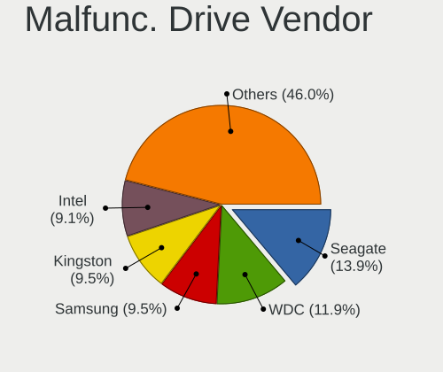

| Vendor              | Computers | Drives | Percent |
|---------------------|-----------|--------|---------|
| Seagate             | 35        | 45     | 13.89%  |
| WDC                 | 30        | 54     | 11.9%   |
| Samsung Electronics | 24        | 40     | 9.52%   |
| Kingston            | 24        | 40     | 9.52%   |
| Intel               | 23        | 25     | 9.13%   |
| SanDisk             | 17        | 21     | 6.75%   |
| Hitachi             | 17        | 24     | 6.75%   |
| Crucial             | 11        | 28     | 4.37%   |
| Toshiba             | 10        | 22     | 3.97%   |
| Micron Technology   | 10        | 14     | 3.97%   |
| HGST                | 9         | 13     | 3.57%   |
| A-DATA Technology   | 7         | 10     | 2.78%   |
| China               | 5         | 6      | 1.98%   |
| Apacer              | 5         | 5      | 1.98%   |
| Transcend           | 3         | 4      | 1.19%   |
| Intenso             | 3         | 3      | 1.19%   |
| SK hynix            | 2         | 2      | 0.79%   |
| OCZ                 | 2         | 2      | 0.79%   |
| Maxtor              | 2         | 2      | 0.79%   |
| Corsair             | 2         | 4      | 0.79%   |
| SPCC                | 1         | 1      | 0.4%    |
| SMI                 | 1         | 1      | 0.4%    |
| Netac               | 1         | 3      | 0.4%    |
| Mushkin             | 1         | 1      | 0.4%    |
| LITEONIT            | 1         | 1      | 0.4%    |
| Leven               | 1         | 1      | 0.4%    |
| KingSpec            | 1         | 1      | 0.4%    |
| KingDian            | 1         | 4      | 0.4%    |
| HP Phison           | 1         | 1      | 0.4%    |
| Fujitsu             | 1         | 1      | 0.4%    |
| Apple               | 1         | 1      | 0.4%    |

Malfunc. HDD Vendor
-------------------

Vendors of faulty HDD drives

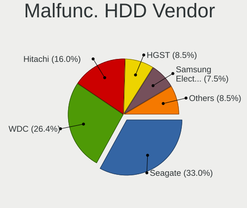

| Vendor              | Computers | Drives | Percent |
|---------------------|-----------|--------|---------|
| Seagate             | 35        | 45     | 33.02%  |
| WDC                 | 28        | 51     | 26.42%  |
| Hitachi             | 17        | 24     | 16.04%  |
| HGST                | 9         | 13     | 8.49%   |
| Samsung Electronics | 8         | 15     | 7.55%   |
| Toshiba             | 6         | 10     | 5.66%   |
| Maxtor              | 2         | 2      | 1.89%   |
| Fujitsu             | 1         | 1      | 0.94%   |

Malfunc. Drive Kind
-------------------

Kinds of faulty drives

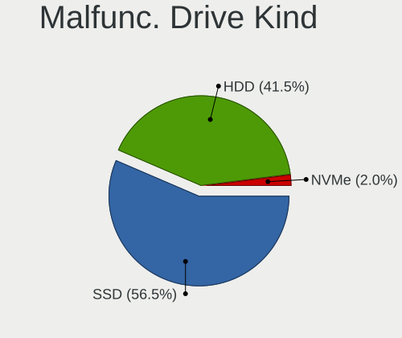

| Kind | Computers | Drives | Percent |
|------|-----------|--------|---------|
| SSD  | 140       | 214    | 56.45%  |
| HDD  | 103       | 161    | 41.53%  |
| NVMe | 5         | 5      | 2.02%   |

Failed Drives
-------------

Failed drive models

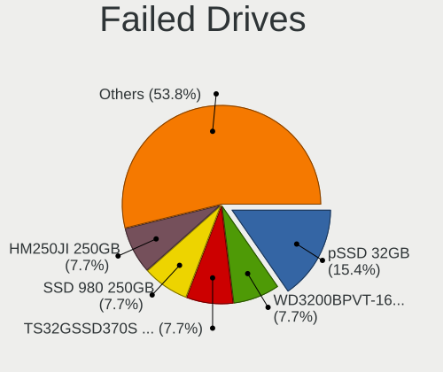

| Model                                      | Computers | Drives | Percent |
|--------------------------------------------|-----------|--------|---------|
| SanDisk pSSD 32GB                          | 2         | 2      | 15.38%  |
| WDC WD3200BPVT-16JJ5T0 320GB               | 1         | 1      | 7.69%   |
| Transcend TS32GSSD370S 32GB                | 1         | 4      | 7.69%   |
| Samsung Electronics SSD 980 250GB          | 1         | 2      | 7.69%   |
| Samsung Electronics HM250JI 250GB          | 1         | 1      | 7.69%   |
| Micron Technology 1100_MTFDDAV256TBN 256GB | 1         | 1      | 7.69%   |
| Kingston SV300S37A60G 64GB                 | 1         | 1      | 7.69%   |
| Kingston SMS200S330G 32GB                  | 1         | 1      | 7.69%   |
| KingDian S200 60GB                         | 1         | 1      | 7.69%   |
| Intel SSDSC2BW180A4 180GB                  | 1         | 1      | 7.69%   |
| Intel SSDSC2BW120H6 120GB                  | 1         | 1      | 7.69%   |
| Intel SSDSC2BW120A4 120GB                  | 1         | 2      | 7.69%   |

Failed Drive Vendor
-------------------

Failed drive vendors

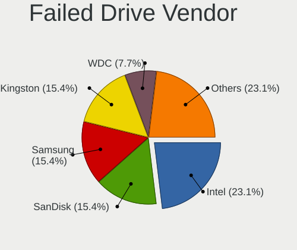

| Vendor              | Computers | Drives | Percent |
|---------------------|-----------|--------|---------|
| Intel               | 3         | 4      | 23.08%  |
| SanDisk             | 2         | 2      | 15.38%  |
| Samsung Electronics | 2         | 3      | 15.38%  |
| Kingston            | 2         | 2      | 15.38%  |
| WDC                 | 1         | 1      | 7.69%   |
| Transcend           | 1         | 4      | 7.69%   |
| Micron Technology   | 1         | 1      | 7.69%   |
| KingDian            | 1         | 1      | 7.69%   |

Drive Status
------------

Number of failed and malfunc. drives

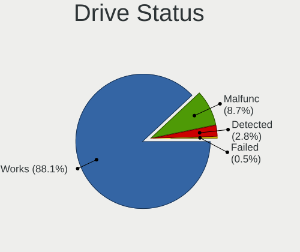

| Status   | Computers | Drives | Percent |
|----------|-----------|--------|---------|
| Works    | 2491      | 4491   | 88.05%  |
| Malfunc  | 246       | 380    | 8.7%    |
| Detected | 79        | 127    | 2.79%   |
| Failed   | 13        | 18     | 0.46%   |

Storage controller
------------------

Storage Vendor
--------------

Storage controller vendors

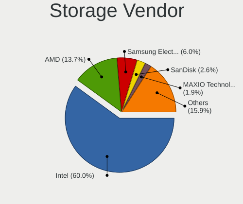

| Vendor                                  | Computers | Percent |
|-----------------------------------------|-----------|---------|
| Intel                                   | 2373      | 60.02%  |
| AMD                                     | 540       | 13.66%  |
| Samsung Electronics                     | 236       | 5.97%   |
| SanDisk                                 | 101       | 2.55%   |
| MAXIO Technology (Hangzhou)             | 75        | 1.9%    |
| Broadcom / LSI                          | 60        | 1.52%   |
| Silicon Motion                          | 59        | 1.49%   |
| Transcend                               | 57        | 1.44%   |
| Kingston Technology Company             | 52        | 1.32%   |
| ASMedia Technology                      | 44        | 1.11%   |
| Phison Electronics                      | 41        | 1.04%   |
| Micron Technology                       | 35        | 0.89%   |
| Micron/Crucial Technology               | 34        | 0.86%   |
| Marvell Technology Group                | 24        | 0.61%   |
| KIOXIA                                  | 24        | 0.61%   |
| Toshiba                                 | 21        | 0.53%   |
| Nvidia                                  | 21        | 0.53%   |
| Hewlett-Packard                         | 21        | 0.53%   |
| SK hynix                                | 19        | 0.48%   |
| Shenzhen Longsys Electronics            | 18        | 0.46%   |
| Hosin Global Electronics                | 10        | 0.25%   |
| Chelsio Communications                  | 10        | 0.25%   |
| Realtek Semiconductor                   | 9         | 0.23%   |
| VIA Technologies                        | 8         | 0.2%    |
| JMicron Technology                      | 8         | 0.2%    |
| ATP ELECTRONICS                         | 7         | 0.18%   |
| Adaptec                                 | 7         | 0.18%   |
| ADATA Technology                        | 5         | 0.13%   |
| Yangtze Memory Technologies             | 4         | 0.1%    |
| Solid State Storage Technology          | 4         | 0.1%    |
| Silicon Image                           | 3         | 0.08%   |
| Shenzhen Unionmemory Information System | 3         | 0.08%   |
| Seagate Technology                      | 3         | 0.08%   |
| 3ware                                   | 3         | 0.08%   |
| Unknown                                 | 3         | 0.08%   |
| ULi Electronics                         | 2         | 0.05%   |
| Areca Technology                        | 2         | 0.05%   |
| Silicon Integrated Systems [SiS]        | 1         | 0.03%   |
| Netac Technology                        | 1         | 0.03%   |
| Lenovo                                  | 1         | 0.03%   |

Storage Model
-------------

Storage controller models

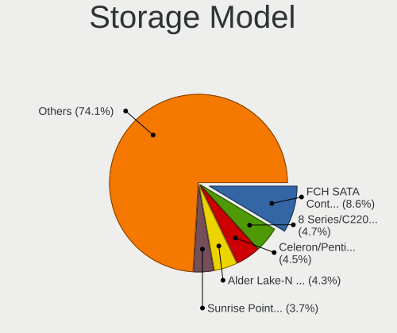

| Model                                                                            | Computers | Percent |
|----------------------------------------------------------------------------------|-----------|---------|
| AMD FCH SATA Controller [AHCI mode]                                              | 375       | 8.6%    |
| Intel 8 Series/C220 Series Chipset Family 6-port SATA Controller 1 [AHCI mode]   | 206       | 4.72%   |
| Intel Celeron/Pentium Silver Processor SATA Controller                           | 198       | 4.54%   |
| Intel Alder Lake-N SATA AHCI Controller                                          | 189       | 4.33%   |
| Intel Sunrise Point-LP SATA Controller [AHCI mode]                               | 163       | 3.74%   |
| Intel Q170/Q150/B150/H170/H110/Z170/CM236 Chipset SATA Controller [AHCI Mode]    | 141       | 3.23%   |
| Intel Atom/Celeron/Pentium Processor x5-E8000/J3xxx/N3xxx Series SATA Controller | 111       | 2.55%   |
| Samsung NVMe SSD Controller SM981/PM981/PM983                                    | 109       | 2.5%    |
| Intel Atom Processor E3800 Series SATA AHCI Controller                           | 103       | 2.36%   |
| Intel Celeron N3350/Pentium N4200/Atom E3900 Series SATA AHCI Controller         | 94        | 2.16%   |
| Intel Jasper Lake SATA AHCI Controller                                           | 88        | 2.02%   |
| AMD FCH SATA Controller [IDE mode]                                               | 81        | 1.86%   |
| Intel Cannon Lake PCH SATA AHCI Controller                                       | 78        | 1.79%   |
| MAXIO (Hangzhou) NVMe SSD Controller MAP1202 (DRAM-less)                         | 73        | 1.67%   |
| Intel 6 Series/C200 Series Chipset Family 6 port Desktop SATA AHCI Controller    | 62        | 1.42%   |
| Silicon Motion SM2263EN/SM2263XT (DRAM-less) NVMe SSD Controllers                | 57        | 1.31%   |
| Intel Atom Processor C3000 Series SATA Controller 0                              | 56        | 1.28%   |
| Intel 7 Series Chipset Family 6-port SATA Controller [AHCI mode]                 | 56        | 1.28%   |
| Intel Atom processor C2000 AHCI SATA3 Controller                                 | 52        | 1.19%   |
| AMD SB7x0/SB8x0/SB9x0 SATA Controller [AHCI mode]                                | 50        | 1.15%   |
| Intel 82801G (ICH7 Family) IDE Controller                                        | 48        | 1.1%    |
| Intel 8 Series SATA Controller 1 [AHCI mode]                                     | 47        | 1.08%   |
| Intel 82801HM/HEM (ICH8M/ICH8M-E) IDE Controller                                 | 45        | 1.03%   |
| Intel 200 Series PCH SATA controller [AHCI mode]                                 | 42        | 0.96%   |
| Intel Wildcat Point-LP SATA Controller [AHCI Mode]                               | 41        | 0.94%   |
| Intel Comet Lake SATA AHCI Controller                                            | 40        | 0.92%   |
| Samsung NVMe SSD Controller PM9A1/PM9A3/980PRO                                   | 39        | 0.89%   |
| Intel NM10/ICH7 Family SATA Controller [AHCI mode]                               | 39        | 0.89%   |
| ASMedia ASM1061/ASM1062 Serial ATA Controller                                    | 37        | 0.85%   |
| Samsung NVMe SSD Controller 980 (DRAM-less)                                      | 36        | 0.83%   |
| AMD 400 Series Chipset SATA Controller                                           | 36        | 0.83%   |
| Intel NM10/ICH7 Family SATA Controller [IDE mode]                                | 34        | 0.78%   |
| Intel Atom Processor C3000 Series SATA Controller 1                              | 34        | 0.78%   |
| Intel 5 Series/3400 Series Chipset 6 port SATA AHCI Controller                   | 33        | 0.76%   |
| Intel 6 Series/C200 Series Chipset Family 6 port Mobile SATA AHCI Controller     | 32        | 0.73%   |
| Intel Cannon Point-LP SATA Controller [AHCI Mode]                                | 31        | 0.71%   |
| Intel 82801HM/HEM (ICH8M/ICH8M-E) SATA Controller [AHCI mode]                    | 31        | 0.71%   |
| SanDisk Extreme Pro / WD Black SN750 / PC SN730 / Red SN700 NVMe SSD             | 30        | 0.69%   |
| Intel SATA Controller [RAID mode]                                                | 30        | 0.69%   |
| Intel Elkhart Lake SATA AHCI                                                     | 29        | 0.66%   |

Storage Kind
------------

Kind of storage controller (IDE, SATA, NVMe, SAS, ...)

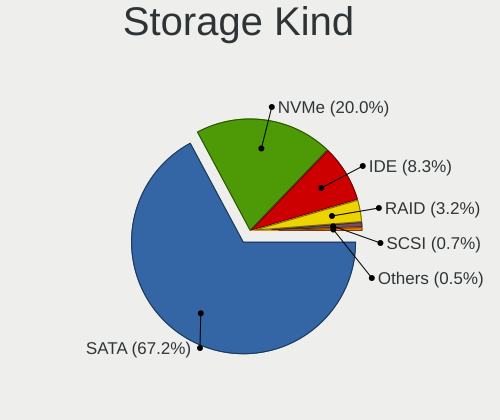

| Kind | Computers | Percent |
|------|-----------|---------|
| SATA | 2690      | 67.17%  |
| NVMe | 802       | 20.02%  |
| IDE  | 333       | 8.31%   |
| RAID | 129       | 3.22%   |
| SCSI | 29        | 0.72%   |
| SAS  | 22        | 0.55%   |

Processor
---------

CPU Vendor
----------

Processor vendors

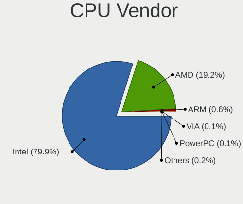

| Vendor  | Computers | Percent |
|---------|-----------|---------|
| Intel   | 2591      | 79.87%  |
| AMD     | 622       | 19.17%  |
| ARM     | 19        | 0.59%   |
| VIA     | 3         | 0.09%   |
| PowerPC | 3         | 0.09%   |
| Unknown | 3         | 0.09%   |
| Sun     | 1         | 0.03%   |
| i       | 1         | 0.03%   |
| Ampere  | 1         | 0.03%   |

CPU Model
---------

Processor models

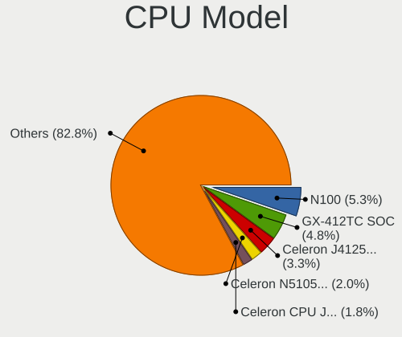

| Model                                     | Computers | Percent |
|-------------------------------------------|-----------|---------|
| Intel N100                                | 173       | 5.28%   |
| AMD GX-412TC SOC                          | 156       | 4.76%   |
| Intel Celeron J4125 CPU @ 2.00GHz         | 109       | 3.33%   |
| Intel Celeron N5105 @ 2.00GHz             | 67        | 2.05%   |
| Intel Celeron CPU J1900 @ 1.99GHz         | 59        | 1.8%    |
| Intel Celeron CPU J3160 @ 1.60GHz         | 49        | 1.5%    |
| AMD GX-415GA SOC with Radeon HD Graphics  | 48        | 1.47%   |
| Intel Atom CPU C3558 @ 2.20GHz            | 41        | 1.25%   |
| AMD Ryzen Embedded V1500B                 | 31        | 0.95%   |
| AMD GX-222GC SOC with Radeon R5E Graphics | 29        | 0.89%   |
| Intel N150                                | 27        | 0.82%   |
| Intel Core i5-6500 CPU @ 3.20GHz          | 27        | 0.82%   |
| Intel Celeron CPU N3450 @ 1.10GHz         | 27        | 0.82%   |
| Intel Xeon CPU D-1518 @ 2.20GHz           | 26        | 0.79%   |
| Intel Celeron J6412 @ 2.00GHz             | 24        | 0.73%   |
| Intel Core i3-N305                        | 23        | 0.7%    |
| Intel Celeron J4105 CPU @ 1.50GHz         | 23        | 0.7%    |
| Intel Celeron CPU J3455 @ 1.50GHz         | 23        | 0.7%    |
| Intel Pentium Silver J5005 CPU @ 1.50GHz  | 22        | 0.67%   |
| Intel Core i3-6100 CPU @ 3.70GHz          | 22        | 0.67%   |
| Intel Atom CPU C2558 @ 2.40GHz            | 22        | 0.67%   |
| Intel Core i5-7200U CPU @ 2.50GHz         | 21        | 0.64%   |
| Intel Celeron N4100 CPU @ 1.10GHz         | 21        | 0.64%   |
| Intel Core i7-8550U CPU @ 1.80GHz         | 20        | 0.61%   |
| AMD GX-424CC SOC with Radeon R5E Graphics | 20        | 0.61%   |
| Intel Pentium CPU G3420 @ 3.20GHz         | 19        | 0.58%   |
| Intel Core i7-7500U CPU @ 2.70GHz         | 19        | 0.58%   |
| Intel Core i5-8250U CPU @ 1.60GHz         | 19        | 0.58%   |
| AMD G-T40E Processor                      | 19        | 0.58%   |
| AMD EPYC 3201 8-Core Processor            | 19        | 0.58%   |
| Intel Core i5-10210U CPU @ 1.60GHz        | 18        | 0.55%   |
| Intel Celeron CPU N3160 @ 1.60GHz         | 18        | 0.55%   |
| Intel Atom Processor E3940 @ 1.60GHz      | 18        | 0.55%   |
| Intel Celeron CPU N3150 @ 1.60GHz         | 17        | 0.52%   |
| Intel Atom CPU D525 @ 1.80GHz             | 17        | 0.52%   |
| Intel Pentium CPU G4400 @ 3.30GHz         | 16        | 0.49%   |
| Intel Core i5-6200U CPU @ 2.30GHz         | 16        | 0.49%   |
| Intel Core i5-2520M CPU @ 2.50GHz         | 15        | 0.46%   |
| Intel Atom Processor E3930 @ 1.30GHz      | 15        | 0.46%   |
| Intel Core i5-6300U CPU @ 2.40GHz         | 14        | 0.43%   |

CPU Model Family
----------------

Processor model prefix

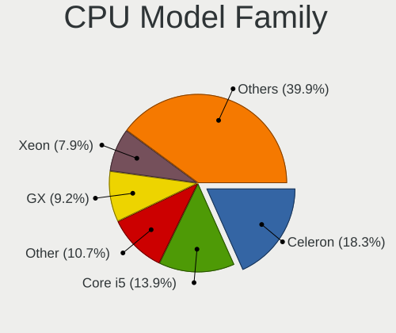

| Model                   | Computers | Percent |
|-------------------------|-----------|---------|
| Intel Celeron           | 598       | 18.31%  |
| Intel Core i5           | 453       | 13.87%  |
| Other                   | 351       | 10.75%  |
| AMD GX                  | 302       | 9.25%   |
| Intel Xeon              | 259       | 7.93%   |
| Intel Atom              | 255       | 7.81%   |
| Intel Core i3           | 243       | 7.44%   |
| Intel Core i7           | 209       | 6.4%    |
| Intel Pentium           | 90        | 2.76%   |
| AMD Ryzen 7             | 55        | 1.68%   |
| AMD Ryzen 5             | 52        | 1.59%   |
| Intel Core 2 Duo        | 42        | 1.29%   |
| Intel Pentium Silver    | 41        | 1.26%   |
| AMD EPYC                | 37        | 1.13%   |
| AMD Ryzen Embedded      | 36        | 1.1%    |
| AMD G                   | 26        | 0.8%    |
| Intel Pentium Dual-Core | 20        | 0.61%   |
| Intel Pentium Gold      | 17        | 0.52%   |
| AMD FX                  | 16        | 0.49%   |
| ARM Cortex              | 14        | 0.43%   |
| Intel Core 2 Quad       | 12        | 0.37%   |
| AMD Ryzen 9             | 11        | 0.34%   |
| AMD Ryzen 7 PRO         | 10        | 0.31%   |
| AMD Ryzen 5 PRO         | 9         | 0.28%   |
| AMD Ryzen 3             | 9         | 0.28%   |
| AMD Athlon              | 9         | 0.28%   |
| Intel Xeon Silver       | 8         | 0.24%   |
| Intel Xeon Gold         | 6         | 0.18%   |
| Intel Core              | 6         | 0.18%   |
| AMD Athlon 64 X2        | 5         | 0.15%   |
| Intel Core m3           | 4         | 0.12%   |
| AMD E                   | 4         | 0.12%   |
| AMD A10                 | 4         | 0.12%   |
| Intel Pentium M         | 3         | 0.09%   |
| Intel Pentium Dual      | 3         | 0.09%   |
| Intel Pentium 4         | 3         | 0.09%   |
| Intel Genuine           | 3         | 0.09%   |
| Intel Core i9           | 3         | 0.09%   |
| Intel Core 2            | 3         | 0.09%   |
| AMD Turion II Neo       | 3         | 0.09%   |

CPU Cores
---------

Number of processor cores

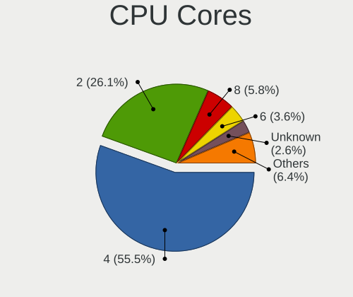

| Number  | Computers | Percent |
|---------|-----------|---------|
| 4       | 1817      | 55.51%  |
| 2       | 853       | 26.06%  |
| 8       | 189       | 5.77%   |
| 6       | 119       | 3.64%   |
| Unknown | 86        | 2.63%   |
| 16      | 69        | 2.11%   |
| 12      | 56        | 1.71%   |
| 1       | 42        | 1.28%   |
| 10      | 12        | 0.37%   |
| 32      | 9         | 0.27%   |
| 20      | 6         | 0.18%   |
| 24      | 5         | 0.15%   |
| 3       | 3         | 0.09%   |
| 128     | 2         | 0.06%   |
| 36      | 1         | 0.03%   |
| 22      | 1         | 0.03%   |
| 14      | 1         | 0.03%   |
| 11      | 1         | 0.03%   |
| 9       | 1         | 0.03%   |

CPU Sockets
-----------

Number of sockets

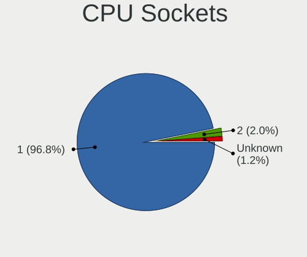

| Number  | Computers | Percent |
|---------|-----------|---------|
| 1       | 3135      | 96.82%  |
| 2       | 65        | 2.01%   |
| Unknown | 38        | 1.17%   |

CPU Threads
-----------

Threads per core (Hyper-Threading)

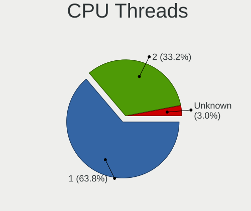

| Number  | Computers | Percent |
|---------|-----------|---------|
| 1       | 2080      | 63.76%  |
| 2       | 1083      | 33.2%   |
| Unknown | 99        | 3.03%   |

CPU Microarch
-------------

Microarchitecture

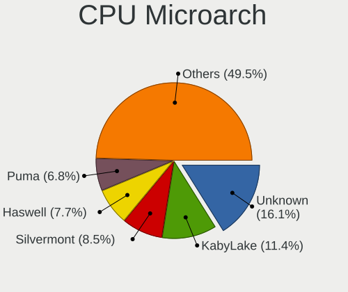

| Name          | Computers | Percent |
|---------------|-----------|---------|
| Unknown       | 524       | 16.09%  |
| KabyLake      | 371       | 11.39%  |
| Silvermont    | 278       | 8.54%   |
| Haswell       | 251       | 7.71%   |
| Puma          | 220       | 6.75%   |
| Skylake       | 207       | 6.36%   |
| Goldmont plus | 200       | 6.14%   |
| Goldmont      | 160       | 4.91%   |
| IvyBridge     | 127       | 3.9%    |
| SandyBridge   | 107       | 3.29%   |
| Jaguar        | 90        | 2.76%   |
| Broadwell     | 90        | 2.76%   |
| Zen           | 85        | 2.61%   |
| Penryn        | 83        | 2.55%   |
| Bonnell       | 66        | 2.03%   |
| Zen 2         | 44        | 1.35%   |
| Westmere      | 43        | 1.32%   |
| Zen+          | 40        | 1.23%   |
| TigerLake     | 36        | 1.11%   |
| Core          | 35        | 1.07%   |
| Zen 3         | 32        | 0.98%   |
| CometLake     | 32        | 0.98%   |
| Bobcat        | 32        | 0.98%   |
| Nehalem       | 25        | 0.77%   |
| Piledriver    | 17        | 0.52%   |
| K8 Hammer     | 11        | 0.34%   |
| IceLake       | 11        | 0.34%   |
| Steamroller   | 8         | 0.25%   |
| K10           | 8         | 0.25%   |
| P6            | 7         | 0.21%   |
| Bulldozer     | 6         | 0.18%   |
| NetBurst      | 5         | 0.15%   |
| Excavator     | 3         | 0.09%   |
| Geode         | 2         | 0.06%   |
| K10 Llano     | 1         | 0.03%   |

Graphics
--------

GPU Vendor
----------

Vendors of graphics cards

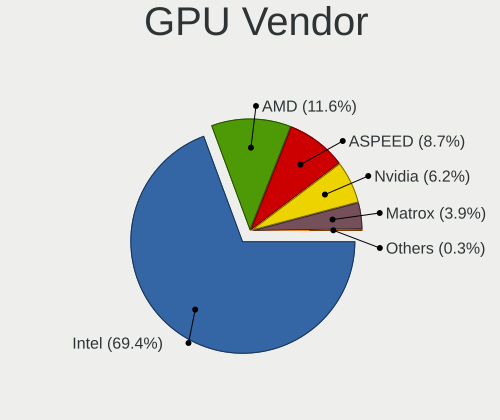

| Vendor                                       | Computers | Percent |
|----------------------------------------------|-----------|---------|
| Intel                                        | 2089      | 69.38%  |
| AMD                                          | 349       | 11.59%  |
| ASPEED Technology                            | 263       | 8.73%   |
| Nvidia                                       | 186       | 6.18%   |
| Matrox Electronics Systems                   | 116       | 3.85%   |
| VIA Technologies                             | 4         | 0.13%   |
| XGI Technology (eXtreme Graphics Innovation) | 2         | 0.07%   |
| Trident Microsystems                         | 1         | 0.03%   |
| Silicon Integrated Systems [SiS]             | 1         | 0.03%   |

GPU Model
---------

Graphics card models

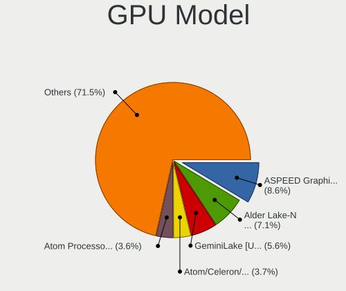

| Model                                                                                    | Computers | Percent |
|------------------------------------------------------------------------------------------|-----------|---------|
| ASPEED Technology ASPEED Graphics Family                                                 | 263       | 8.59%   |
| Intel Alder Lake-N [UHD Graphics]                                                        | 217       | 7.09%   |
| Intel GeminiLake [UHD Graphics 600]                                                      | 170       | 5.56%   |
| Intel Atom/Celeron/Pentium Processor x5-E8000/J3xxx/N3xxx Integrated Graphics Controller | 113       | 3.69%   |
| Intel Atom Processor Z36xxx/Z37xxx Series Graphics & Display                             | 110       | 3.59%   |
| Intel Xeon E3-1200 v3/4th Gen Core Processor Integrated Graphics Controller              | 104       | 3.4%    |
| Intel JasperLake [UHD Graphics]                                                          | 104       | 3.4%    |
| Intel Apollo Lake GT1 [HD Graphics 500]                                                  | 90        | 2.94%   |
| Intel Skylake-S GT2 [HD Graphics 530]                                                    | 77        | 2.52%   |
| Intel 2nd Generation Core Processor Family Integrated Graphics Controller                | 65        | 2.12%   |
| Intel Kaby Lake-U GT2 [HD Graphics 620]                                                  | 62        | 2.03%   |
| Intel CoffeeLake-S GT2 [UHD Graphics 630]                                                | 57        | 1.86%   |
| Intel 3rd Gen Core processor Graphics Controller                                         | 54        | 1.76%   |
| Intel Kaby Lake-R GT2 [UHD Graphics 620]                                                 | 52        | 1.7%    |
| AMD Mullins [Radeon R4/R5 Graphics]                                                      | 51        | 1.67%   |
| Intel 4 Series Chipset Integrated Graphics Controller                                    | 49        | 1.6%    |
| AMD Kabini [Radeon HD 8330E]                                                             | 48        | 1.57%   |
| Intel Haswell-ULT Integrated Graphics Controller                                         | 44        | 1.44%   |
| Intel Skylake-U GT2 [HD Graphics 520]                                                    | 42        | 1.37%   |
| Intel Atom Processor D4xx/D5xx/N4xx/N5xx Integrated Graphics Controller                  | 40        | 1.31%   |
| Intel Broadwell-U GT2 [HD Graphics 5500]                                                 | 36        | 1.18%   |
| Matrox Electronics Systems MGA G200eW WPCM450                                            | 35        | 1.14%   |
| Intel TigerLake-LP GT2 [Iris Xe Graphics]                                                | 33        | 1.08%   |
| Matrox Electronics Systems MGA G200EH                                                    | 31        | 1.01%   |
| Intel Skylake-S GT1 [HD Graphics 510]                                                    | 31        | 1.01%   |
| Intel Elkhart Lake [UHD Graphics Gen11 16EU]                                             | 31        | 1.01%   |
| Intel Kaby Lake-S GT2 [HD Graphics 630]                                                  | 30        | 0.98%   |
| Intel GeminiLake [UHD Graphics 605]                                                      | 30        | 0.98%   |
| Intel Alder Lake-N [Intel Graphics]                                                      | 30        | 0.98%   |
| Intel WhiskeyLake-U GT2 [UHD Graphics 620]                                               | 29        | 0.95%   |
| Intel Xeon E3-1200 v2/3rd Gen Core processor Graphics Controller                         | 27        | 0.88%   |
| Matrox Electronics Systems MGA G200e [Pilot] ServerEngines (SEP1)                        | 25        | 0.82%   |
| Intel Core Processor Integrated Graphics Controller                                      | 23        | 0.75%   |
| Intel CometLake-U GT2 [UHD Graphics]                                                     | 23        | 0.75%   |
| AMD Picasso/Raven 2 [Radeon Vega Series / Radeon Vega Mobile Series]                     | 23        | 0.75%   |
| Intel 4th Generation Core Processor Family Integrated Graphics Controller                | 21        | 0.69%   |
| Intel CometLake-S GT2 [UHD Graphics 630]                                                 | 20        | 0.65%   |
| Intel Xeon E3-1200 v3 Processor Integrated Graphics Controller                           | 19        | 0.62%   |
| AMD Cezanne [Radeon Vega Series / Radeon Vega Mobile Series]                             | 17        | 0.56%   |
| AMD Renoir [Radeon Vega Series / Radeon Vega Mobile Series]                              | 16        | 0.52%   |

GPU Combo
---------

Combinations of graphics cards

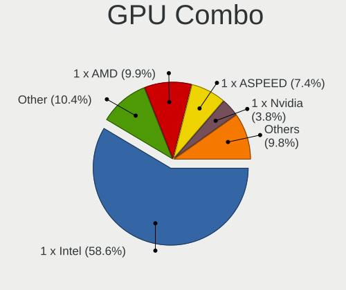

| Name                     | Computers | Percent |
|--------------------------|-----------|---------|
| 1 x Intel                | 1907      | 58.57%  |
| Other                    | 340       | 10.44%  |
| 1 x AMD                  | 322       | 9.89%   |
| 1 x ASPEED               | 242       | 7.43%   |
| 1 x Nvidia               | 125       | 3.84%   |
| 1 x Matrox               | 113       | 3.47%   |
| 2 x Intel                | 94        | 2.89%   |
| Intel + Nvidia           | 55        | 1.69%   |
| Intel + ASPEED           | 17        | 0.52%   |
| Intel + AMD              | 13        | 0.4%    |
| AMD + Nvidia             | 7         | 0.21%   |
| 2 x AMD                  | 6         | 0.18%   |
| 1 x VIA                  | 4         | 0.12%   |
| Intel + Matrox           | 3         | 0.09%   |
| AMD + ASPEED             | 3         | 0.09%   |
| 1 x XGI                  | 2         | 0.06%   |
| 1 x Trident Microsystems | 1         | 0.03%   |
| 1 x SiS                  | 1         | 0.03%   |
| Nvidia + ASPEED          | 1         | 0.03%   |

GPU Driver
----------

Free vs proprietary

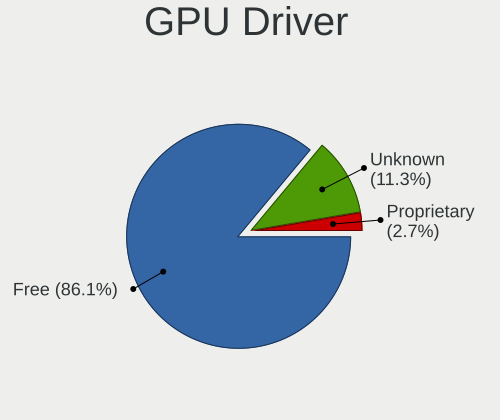

| Driver      | Computers | Percent |
|-------------|-----------|---------|
| Free        | 2796      | 86.06%  |
| Unknown     | 366       | 11.27%  |
| Proprietary | 87        | 2.68%   |

GPU Memory
----------

Total video memory

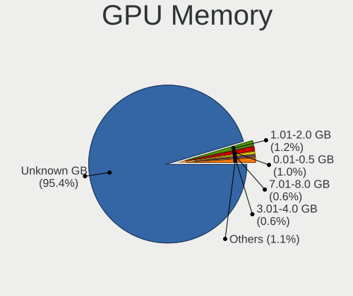

| Size in GB | Computers | Percent |
|------------|-----------|---------|
| Unknown    | 3104      | 95.39%  |
| 1.01-2.0   | 40        | 1.23%   |
| 0.01-0.5   | 34        | 1.04%   |
| 7.01-8.0   | 20        | 0.61%   |
| 3.01-4.0   | 20        | 0.61%   |
| 0.51-1.0   | 15        | 0.46%   |
| 5.01-6.0   | 10        | 0.31%   |
| 2.01-3.0   | 6         | 0.18%   |
| 8.01-16.0  | 4         | 0.12%   |
| 16.01-24.0 | 1         | 0.03%   |

Monitor
-------

Monitor Vendor
--------------

Monitor vendors

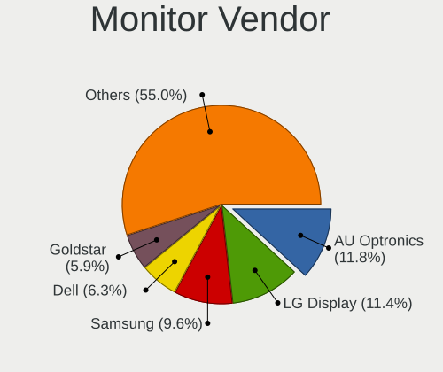

| Vendor                  | Computers | Percent |
|-------------------------|-----------|---------|
| AU Optronics            | 58        | 11.81%  |
| LG Display              | 56        | 11.41%  |
| Samsung Electronics     | 47        | 9.57%   |
| Dell                    | 31        | 6.31%   |
| Goldstar                | 29        | 5.91%   |
| Apple                   | 29        | 5.91%   |
| BOE                     | 27        | 5.5%    |
| Chimei Innolux          | 25        | 5.09%   |
| Lenovo                  | 21        | 4.28%   |
| BenQ                    | 19        | 3.87%   |
| Hewlett-Packard         | 14        | 2.85%   |
| Acer                    | 13        | 2.65%   |
| Iiyama                  | 11        | 2.24%   |
| Eizo                    | 11        | 2.24%   |
| Ancor Communications    | 10        | 2.04%   |
| Philips                 | 8         | 1.63%   |
| Sharp                   | 7         | 1.43%   |
| Fujitsu Siemens         | 7         | 1.43%   |
| NEC Computers           | 6         | 1.22%   |
| LG Electronics          | 6         | 1.22%   |
| AOC                     | 6         | 1.22%   |
| InfoVision              | 5         | 1.02%   |
| ASUSTek Computer        | 4         | 0.81%   |
| PANDA                   | 3         | 0.61%   |
| LG Philips              | 3         | 0.61%   |
| JDI                     | 3         | 0.61%   |
| Idek Iiyama             | 3         | 0.61%   |
| HannStar                | 3         | 0.61%   |
| Unknown                 | 3         | 0.61%   |
| CMT                     | 2         | 0.41%   |
| Chi Mei Optoelectronics | 2         | 0.41%   |
| Belinea                 | 2         | 0.41%   |
| WYT                     | 1         | 0.2%    |
| ViewSonic               | 1         | 0.2%    |
| Vestel Elektronik       | 1         | 0.2%    |
| Unknown                 | 1         | 0.2%    |
| TRU                     | 1         | 0.2%    |
| Toshiba                 | 1         | 0.2%    |
| Quanta Display          | 1         | 0.2%    |
| Panasonic               | 1         | 0.2%    |

Monitor Model
-------------

Monitor models

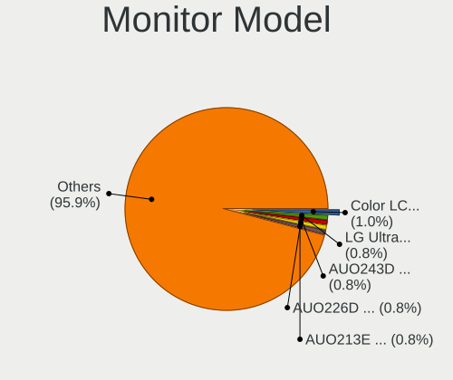

| Model                                                                | Computers | Percent |
|----------------------------------------------------------------------|-----------|---------|
| Apple Color LCD APP9CF3 1366x768 260x140mm 11.6-inch                 | 5         | 0.97%   |
| Goldstar LG Ultra HD GSM5B08 3840x2160 600x340mm 27.2-inch           | 4         | 0.78%   |
| AU Optronics LCD Monitor AUO243D 1920x1080 310x170mm 13.9-inch       | 4         | 0.78%   |
| AU Optronics LCD Monitor AUO226D 1920x1080 280x160mm 12.7-inch       | 4         | 0.78%   |
| AU Optronics LCD Monitor AUO213E 1600x900 310x170mm 13.9-inch        | 4         | 0.78%   |
| AU Optronics LCD Monitor AUO106C 1366x768 280x160mm 12.7-inch        | 4         | 0.78%   |
| Samsung Electronics LCD Monitor SEC3047 1366x768 280x160mm 12.7-inch | 3         | 0.58%   |
| Samsung Electronics C27FG7x SAM0E41 1920x1080 600x340mm 27.2-inch    | 3         | 0.58%   |
| LG Display LCD Monitor LGD02D8 1366x768 280x160mm 12.7-inch          | 3         | 0.58%   |
| Lenovo LCD Monitor LEN4036 1440x900 300x190mm 14.0-inch              | 3         | 0.58%   |
| Hewlett-Packard LP2475w HWP26F9 1920x1200 540x350mm 25.3-inch        | 3         | 0.58%   |
| Hewlett-Packard LP2475w HWP26F8 1920x1200 540x350mm 25.3-inch        | 3         | 0.58%   |
| Fujitsu Siemens B24-9 WE FUS08C3 1920x1200 520x320mm 24.0-inch       | 3         | 0.58%   |
| BOE LCD Monitor BOE05E0 1366x768 280x160mm 12.7-inch                 | 3         | 0.58%   |
| AU Optronics LCD Monitor AUO46EC 1366x768 340x190mm 15.3-inch        | 3         | 0.58%   |
| AU Optronics LCD Monitor AUO21ED 1920x1080 340x190mm 15.3-inch       | 3         | 0.58%   |
| Apple Color LCD APPA01B 1440x900 290x180mm 13.4-inch                 | 3         | 0.58%   |
| Apple Color LCD APP9CDF 1440x900 290x180mm 13.4-inch                 | 3         | 0.58%   |
| AOC U3277WB AOC3277 3840x2160 700x390mm 31.5-inch                    | 3         | 0.58%   |
| Unknown                                                              | 3         | 0.58%   |
| Sharp LQ133M1JW01 SHP141B 1920x1080 290x170mm 13.2-inch              | 2         | 0.39%   |
| Samsung Electronics U28E590 SAM0C4E 3840x2160 610x350mm 27.7-inch    | 2         | 0.39%   |
| Samsung Electronics C32JG5x SAM0FDE 2560x1440 700x390mm 31.5-inch    | 2         | 0.39%   |
| Samsung Electronics C24F390 SAM0D2C 1920x1080 520x290mm 23.4-inch    | 2         | 0.39%   |
| PANDA LCD Monitor NCP002D 1920x1080 340x190mm 15.3-inch              | 2         | 0.39%   |
| NEC Computers EX341R NEC2C7A 3440x1440 800x330mm 34.1-inch           | 2         | 0.39%   |
| LG Display LCD Monitor LGD057E 1920x1080 340x190mm 15.3-inch         | 2         | 0.39%   |
| LG Display LCD Monitor LGD0521 1920x1080 310x170mm 13.9-inch         | 2         | 0.39%   |
| LG Display LCD Monitor LGD04A3 1366x768 280x160mm 12.7-inch          | 2         | 0.39%   |
| LG Display LCD Monitor LGD046F 1920x1080 340x190mm 15.3-inch         | 2         | 0.39%   |
| LG Display LCD Monitor LGD046D 1920x1080 310x170mm 13.9-inch         | 2         | 0.39%   |
| LG Display LCD Monitor LGD045E 1366x768 310x170mm 13.9-inch          | 2         | 0.39%   |
| LG Display LCD Monitor LGD0437 1920x1080 280x160mm 12.7-inch         | 2         | 0.39%   |
| LG Display LCD Monitor LGD03CD 1366x768 280x160mm 12.7-inch          | 2         | 0.39%   |
| LG Display LCD Monitor LGD0353 1366x768 350x190mm 15.7-inch          | 2         | 0.39%   |
| Lenovo LCD Monitor LEN40B2 1920x1080 340x190mm 15.3-inch             | 2         | 0.39%   |
| Lenovo LCD Monitor LEN40B1 1600x900 340x190mm 15.3-inch              | 2         | 0.39%   |
| Lenovo LCD Monitor LEN40B0 1366x768 350x190mm 15.7-inch              | 2         | 0.39%   |
| Lenovo LCD Monitor LEN4011 1280x800 260x160mm 12.0-inch              | 2         | 0.39%   |
| JDI LCD Monitor JDI422A 3000x2000 290x200mm 13.9-inch                | 2         | 0.39%   |

Monitor Resolution
------------------

Monitor screen resolution

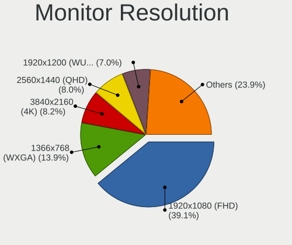

| Resolution         | Computers | Percent |
|--------------------|-----------|---------|
| 1920x1080 (FHD)    | 191       | 39.06%  |
| 1366x768 (WXGA)    | 68        | 13.91%  |
| 3840x2160 (4K)     | 40        | 8.18%   |
| 2560x1440 (QHD)    | 39        | 7.98%   |
| 1920x1200 (WUXGA)  | 34        | 6.95%   |
| 1600x900 (HD+)     | 15        | 3.07%   |
| 1440x900 (WXGA+)   | 15        | 3.07%   |
| 1280x800 (WXGA)    | 15        | 3.07%   |
| 1680x1050 (WSXGA+) | 13        | 2.66%   |
| 1280x1024 (SXGA)   | 12        | 2.45%   |
| 3440x1440          | 8         | 1.64%   |
| 2560x1600          | 7         | 1.43%   |
| 3000x2000          | 3         | 0.61%   |
| 2880x1800          | 3         | 0.61%   |
| 2560x1080          | 3         | 0.61%   |
| Unknown            | 3         | 0.61%   |
| 3840x1200          | 2         | 0.41%   |
| 3200x1800 (QHD+)   | 2         | 0.41%   |
| 2256x1504          | 2         | 0.41%   |
| 1920x540           | 2         | 0.41%   |
| 1920x1280          | 2         | 0.41%   |
| 1024x768 (XGA)     | 2         | 0.41%   |
| 9600x2160          | 1         | 0.2%    |
| 720x1280           | 1         | 0.2%    |
| 3840x1080          | 1         | 0.2%    |
| 3600x1080          | 1         | 0.2%    |
| 3072x1920          | 1         | 0.2%    |
| 2240x1400          | 1         | 0.2%    |
| 2048x1152          | 1         | 0.2%    |
| 1600x1200          | 1         | 0.2%    |

Monitor Diagonal
----------------

Diagonal size in inches

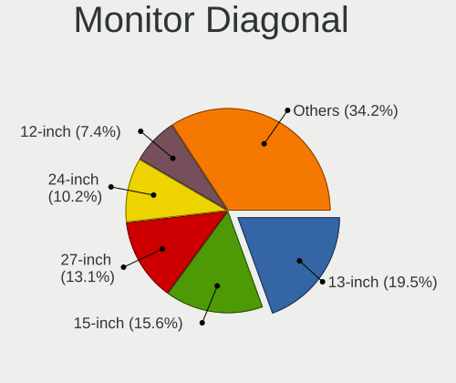

| Inches  | Computers | Percent |
|---------|-----------|---------|
| 13      | 95        | 19.47%  |
| 15      | 76        | 15.57%  |
| 27      | 64        | 13.11%  |
| 24      | 50        | 10.25%  |
| 12      | 36        | 7.38%   |
| Unknown | 31        | 6.35%   |
| 23      | 24        | 4.92%   |
| 21      | 21        | 4.3%    |
| 14      | 14        | 2.87%   |
| 17      | 11        | 2.25%   |
| 19      | 10        | 2.05%   |
| 11      | 10        | 2.05%   |
| 34      | 8         | 1.64%   |
| 22      | 8         | 1.64%   |
| 31      | 7         | 1.43%   |
| 32      | 4         | 0.82%   |
| 25      | 4         | 0.82%   |
| 20      | 3         | 0.61%   |
| 29      | 2         | 0.41%   |
| 46      | 1         | 0.2%    |
| 42      | 1         | 0.2%    |
| 40      | 1         | 0.2%    |
| 39      | 1         | 0.2%    |
| 33      | 1         | 0.2%    |
| 26      | 1         | 0.2%    |
| 18      | 1         | 0.2%    |
| 16      | 1         | 0.2%    |
| 10      | 1         | 0.2%    |
| 6       | 1         | 0.2%    |

Monitor Width
-------------

Physical width

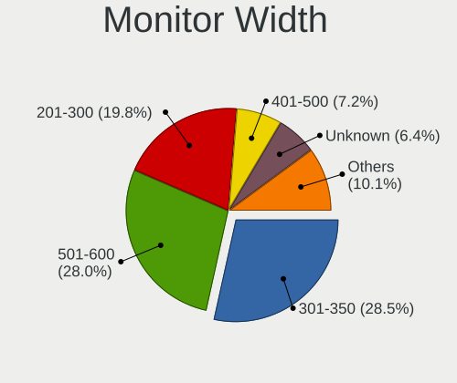

| Width in mm | Computers | Percent |
|-------------|-----------|---------|
| 301-350     | 138       | 28.45%  |
| 501-600     | 136       | 28.04%  |
| 201-300     | 96        | 19.79%  |
| 401-500     | 35        | 7.22%   |
| Unknown     | 31        | 6.39%   |
| 351-400     | 17        | 3.51%   |
| 601-700     | 14        | 2.89%   |
| 701-800     | 13        | 2.68%   |
| 801-900     | 2         | 0.41%   |
| 101-200     | 1         | 0.21%   |
| 1001-1500   | 1         | 0.21%   |
| 901-1000    | 1         | 0.21%   |

Aspect Ratio
------------

Proportional relationship between the width and the height

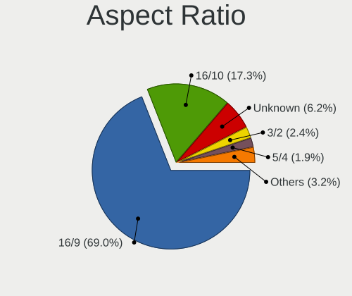

| Ratio   | Computers | Percent |
|---------|-----------|---------|
| 16/9    | 323       | 69.02%  |
| 16/10   | 81        | 17.31%  |
| Unknown | 29        | 6.2%    |
| 3/2     | 11        | 2.35%   |
| 5/4     | 9         | 1.92%   |
| 21/9    | 9         | 1.92%   |
| 4/3     | 5         | 1.07%   |
| 6/5     | 1         | 0.21%   |

Monitor Area
------------

Area in inch²

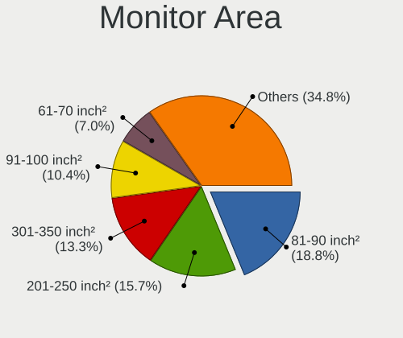

| Area in inch² | Computers | Percent |
|----------------|-----------|---------|
| 81-90          | 92        | 18.81%  |
| 201-250        | 77        | 15.75%  |
| 301-350        | 65        | 13.29%  |
| 91-100         | 51        | 10.43%  |
| 61-70          | 34        | 6.95%   |
| Unknown        | 31        | 6.34%   |
| 251-300        | 29        | 5.93%   |
| 101-110        | 27        | 5.52%   |
| 351-500        | 22        | 4.5%    |
| 71-80          | 17        | 3.48%   |
| 151-200        | 16        | 3.27%   |
| 51-60          | 11        | 2.25%   |
| 121-130        | 9         | 1.84%   |
| 501-1000       | 4         | 0.82%   |
| 141-150        | 2         | 0.41%   |
| 1-40           | 1         | 0.2%    |
| 131-140        | 1         | 0.2%    |

Pixel Density
-------------

Pixels per inch

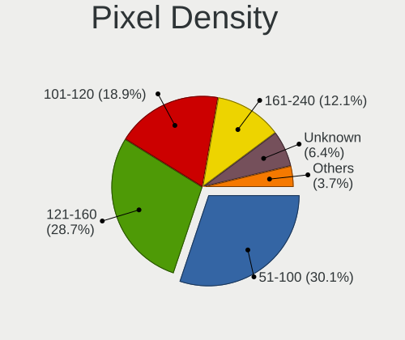

| Density       | Computers | Percent |
|---------------|-----------|---------|
| 51-100        | 145       | 30.15%  |
| 121-160       | 138       | 28.69%  |
| 101-120       | 91        | 18.92%  |
| 161-240       | 58        | 12.06%  |
| Unknown       | 31        | 6.44%   |
| More than 240 | 16        | 3.33%   |
| 1-50          | 2         | 0.42%   |

Multiple Monitors
-----------------

Total monitors connected

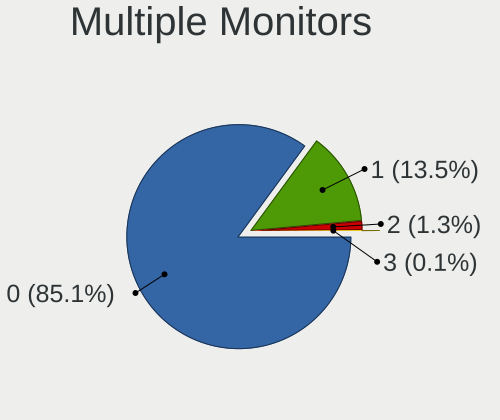

| Total | Computers | Percent |
|-------|-----------|---------|
| 0     | 2769      | 85.07%  |
| 1     | 439       | 13.49%  |
| 2     | 43        | 1.32%   |
| 3     | 4         | 0.12%   |

Network
-------

Net Controller Vendor
---------------------

Controller vendors

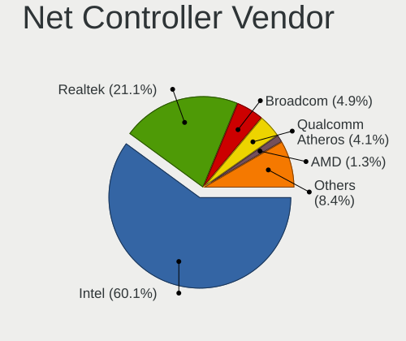

| Vendor                            | Computers | Percent |
|-----------------------------------|-----------|---------|
| Intel                             | 2649      | 60.05%  |
| Realtek Semiconductor             | 932       | 21.13%  |
| Broadcom                          | 218       | 4.94%   |
| Qualcomm Atheros                  | 183       | 4.15%   |
| AMD                               | 59        | 1.34%   |
| Mellanox Technologies             | 26        | 0.59%   |
| MediaTek                          | 23        | 0.52%   |
| IMC Networks                      | 23        | 0.52%   |
| Ralink Technology                 | 20        | 0.45%   |
| TP-Link                           | 17        | 0.39%   |
| Ericsson Business Mobile Networks | 16        | 0.36%   |
| Edimax Technology                 | 15        | 0.34%   |
| American Megatrends               | 15        | 0.34%   |
| Sierra Wireless                   | 14        | 0.32%   |
| Marvell Technology Group          | 14        | 0.32%   |
| D-Link System                     | 14        | 0.32%   |
| Chelsio Communications            | 14        | 0.32%   |
| Nvidia                            | 13        | 0.29%   |
| U-Blox                            | 12        | 0.27%   |
| Insyde Software                   | 12        | 0.27%   |
| Ralink                            | 10        | 0.23%   |
| Huawei Technologies               | 7         | 0.16%   |
| Google                            | 6         | 0.14%   |
| Emulex                            | 6         | 0.14%   |
| Aquantia                          | 6         | 0.14%   |
| Samsung Electronics               | 5         | 0.11%   |
| Hewlett-Packard                   | 5         | 0.11%   |
| Dell                              | 5         | 0.11%   |
| Apple                             | 5         | 0.11%   |
| Qualcomm Atheros Communications   | 4         | 0.09%   |
| IBM                               | 4         | 0.09%   |
| ASUSTek Computer                  | 4         | 0.09%   |
| Qualcomm Technologies             | 3         | 0.07%   |
| QLogic                            | 3         | 0.07%   |
| NetGear                           | 3         | 0.07%   |
| Davicom Semiconductor             | 3         | 0.07%   |
| AVM                               | 3         | 0.07%   |
| ZTE WCDMA Technologies MSM        | 2         | 0.05%   |
| Xiaomi                            | 2         | 0.05%   |
| T & A Mobile Phones               | 2         | 0.05%   |

Net Controller Model
--------------------

Controller models

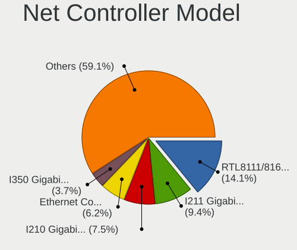

| Model                                                                         | Computers | Percent |
|-------------------------------------------------------------------------------|-----------|---------|
| Realtek RTL8111/8168/8211/8411 PCI Express Gigabit Ethernet Controller        | 792       | 14.06%  |
| Intel I211 Gigabit Network Connection                                         | 528       | 9.37%   |
| Intel I210 Gigabit Network Connection                                         | 425       | 7.54%   |
| Intel Ethernet Controller I226-V                                              | 349       | 6.19%   |
| Intel I350 Gigabit Network Connection                                         | 211       | 3.75%   |
| Intel Ethernet Controller I225-V                                              | 171       | 3.04%   |
| Intel 82574L Gigabit Network Connection                                       | 128       | 2.27%   |
| Intel 82599ES 10-Gigabit SFI/SFP+ Network Connection                          | 116       | 2.06%   |
| Intel 82579LM Gigabit Network Connection (Lewisville)                         | 94        | 1.67%   |
| Intel I210 Gigabit Fiber Network Connection                                   | 91        | 1.62%   |
| Realtek RTL8125 2.5GbE Controller                                             | 69        | 1.22%   |
| Intel Ethernet Connection X553 1GbE                                           | 60        | 1.06%   |
| AMD XGMAC 10GbE Controller                                                    | 59        | 1.05%   |
| Intel 82580 Gigabit Network Connection                                        | 58        | 1.03%   |
| Intel Ethernet Connection I354                                                | 52        | 0.92%   |
| Intel Wi-Fi 6 AX200                                                           | 51        | 0.91%   |
| Intel 82583V Gigabit Network Connection                                       | 48        | 0.85%   |
| Intel 82576 Gigabit Network Connection                                        | 47        | 0.83%   |
| Intel Wireless 7265                                                           | 46        | 0.82%   |
| Intel Ethernet Connection I217-LM                                             | 43        | 0.76%   |
| Intel Ethernet Controller X710 for 10GbE SFP+                                 | 41        | 0.73%   |
| Broadcom NetXtreme BCM5720 Gigabit Ethernet PCIe                              | 41        | 0.73%   |
| Intel 82571EB/82571GB Gigabit Ethernet Controller D0/D1 (copper applications) | 40        | 0.71%   |
| Intel Wireless 8265 / 8275                                                    | 39        | 0.69%   |
| Qualcomm Atheros AR928X Wireless Network Adapter (PCI-Express)                | 38        | 0.67%   |
| Intel Wireless 3165                                                           | 38        | 0.67%   |
| Realtek RTL8821CE 802.11ac PCIe Wireless Network Adapter                      | 37        | 0.66%   |
| Intel 82571EB/82571GB Gigabit Ethernet Controller (Copper)                    | 37        | 0.66%   |
| Broadcom NetXtreme BCM5719 Gigabit Ethernet PCIe                              | 35        | 0.62%   |
| Intel Ethernet Connection (2) I219-V                                          | 33        | 0.59%   |
| Intel Ethernet Connection (2) I219-LM                                         | 32        | 0.57%   |
| Intel Wireless 8260                                                           | 31        | 0.55%   |
| Intel Ethernet Controller 10-Gigabit X540-AT2                                 | 30        | 0.53%   |
| Intel Ethernet Connection (7) I219-V                                          | 30        | 0.53%   |
| Intel Ethernet Connection I219-LM                                             | 29        | 0.51%   |
| Intel I350 Gigabit Fiber Network Connection                                   | 28        | 0.5%    |
| Intel Centrino Advanced-N 6205 [Taylor Peak]                                  | 28        | 0.5%    |
| Intel Wireless 7260                                                           | 27        | 0.48%   |
| Intel Ethernet Connection X552 10 GbE SFP+                                    | 27        | 0.48%   |
| Intel Gemini Lake PCH CNVi WiFi                                               | 26        | 0.46%   |

Wireless Vendor
---------------

Wireless vendors

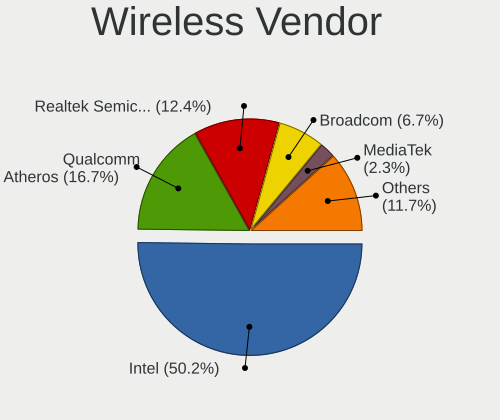

| Vendor                          | Computers | Percent |
|---------------------------------|-----------|---------|
| Intel                           | 506       | 50.2%   |
| Qualcomm Atheros                | 168       | 16.67%  |
| Realtek Semiconductor           | 125       | 12.4%   |
| Broadcom                        | 68        | 6.75%   |
| MediaTek                        | 23        | 2.28%   |
| IMC Networks                    | 23        | 2.28%   |
| Ralink Technology               | 20        | 1.98%   |
| TP-Link                         | 17        | 1.69%   |
| Edimax Technology               | 15        | 1.49%   |
| Sierra Wireless                 | 10        | 0.99%   |
| Ralink                          | 10        | 0.99%   |
| Qualcomm Atheros Communications | 4         | 0.4%    |
| ASUSTek Computer                | 4         | 0.4%    |
| NetGear                         | 3         | 0.3%    |
| Qualcomm Technologies           | 2         | 0.2%    |
| Marvell Technology Group        | 2         | 0.2%    |
| Dell                            | 2         | 0.2%    |
| Samsung Electronics             | 1         | 0.1%    |
| Micro Star International        | 1         | 0.1%    |
| Mercucys                        | 1         | 0.1%    |
| D-Link                          | 1         | 0.1%    |
| Atheros                         | 1         | 0.1%    |
| Accton Technology               | 1         | 0.1%    |

Wireless Model
--------------

Wireless models

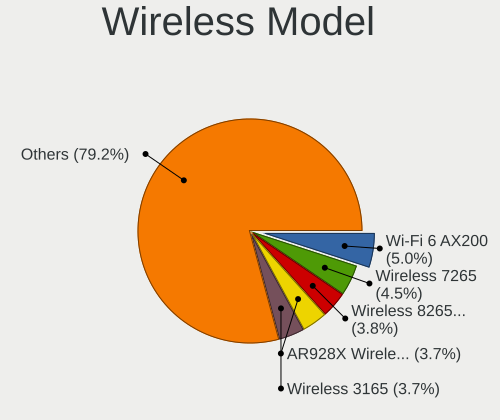

| Model                                                           | Computers | Percent |
|-----------------------------------------------------------------|-----------|---------|
| Intel Wi-Fi 6 AX200                                             | 51        | 5%      |
| Intel Wireless 7265                                             | 46        | 4.51%   |
| Intel Wireless 8265 / 8275                                      | 39        | 3.83%   |
| Qualcomm Atheros AR928X Wireless Network Adapter (PCI-Express)  | 38        | 3.73%   |
| Intel Wireless 3165                                             | 38        | 3.73%   |
| Realtek RTL8821CE 802.11ac PCIe Wireless Network Adapter        | 37        | 3.63%   |
| Intel Wireless 8260                                             | 31        | 3.04%   |
| Intel Centrino Advanced-N 6205 [Taylor Peak]                    | 28        | 2.75%   |
| Intel Wireless 7260                                             | 27        | 2.65%   |
| Intel Gemini Lake PCH CNVi WiFi                                 | 26        | 2.55%   |
| Qualcomm Atheros QCA9377 802.11ac Wireless Network Adapter      | 25        | 2.45%   |
| IMC Networks 802.11 n/g/b Wireless LAN USB Mini-Card            | 22        | 2.16%   |
| Intel Wi-Fi 6E(802.11ax) AX210/AX1675* 2x2 [Typhoon Peak]       | 21        | 2.06%   |
| Intel Wireless 3160                                             | 19        | 1.86%   |
| Intel Wi-Fi 5(802.11ac) Wireless-AC 9x6x [Thunder Peak]         | 18        | 1.77%   |
| Qualcomm Atheros QCA986x/988x 802.11ac Wireless Network Adapter | 17        | 1.67%   |
| Intel Centrino Ultimate-N 6300                                  | 17        | 1.67%   |
| Intel Centrino Advanced-N 6235                                  | 17        | 1.67%   |
| Qualcomm Atheros AR9462 Wireless Network Adapter                | 16        | 1.57%   |
| Qualcomm Atheros AR93xx Wireless Network Adapter                | 15        | 1.47%   |
| Intel Wi-Fi 6 AX201                                             | 15        | 1.47%   |
| Qualcomm Atheros QCA6174 802.11ac Wireless Network Adapter      | 13        | 1.28%   |
| Intel Dual Band Wireless-AC 3168NGW [Stone Peak]                | 13        | 1.28%   |
| Broadcom BCM4360 802.11ac Dual Band Wireless Network Adapter    | 13        | 1.28%   |
| Realtek RTL8188EUS 802.11n Wireless Network Adapter             | 12        | 1.18%   |
| Qualcomm Atheros QCA9565 / AR9565 Wireless Network Adapter      | 12        | 1.18%   |
| Qualcomm Atheros AR9485 Wireless Network Adapter                | 12        | 1.18%   |
| Qualcomm Atheros AR9285 Wireless Network Adapter (PCI-Express)  | 12        | 1.18%   |
| MediaTek MT7922 802.11ax PCI Express Wireless Network Adapter   | 12        | 1.18%   |
| Broadcom BCM43224 802.11a/b/g/n                                 | 11        | 1.08%   |
| Intel Alder Lake-N PCH CNVi WiFi                                | 10        | 0.98%   |
| Realtek RTL8821AE 802.11ac PCIe Wireless Network Adapter        | 9         | 0.88%   |
| Sierra Wireless EM7455                                          | 8         | 0.79%   |
| Realtek RTL8852BE PCIe 802.11ax Wireless Network Controller     | 8         | 0.79%   |
| Intel Comet Lake PCH-LP CNVi WiFi                               | 8         | 0.79%   |
| Intel Cannon Point-LP CNVi [Wireless-AC]                        | 8         | 0.79%   |
| Intel Cannon Lake PCH CNVi WiFi                                 | 8         | 0.79%   |
| Edimax EW-7811Un 802.11n Wireless Adapter [Realtek RTL8188CUS]  | 8         | 0.79%   |
| Broadcom BCM43228 802.11a/b/g/n                                 | 8         | 0.79%   |
| Realtek RTL8188CE 802.11b/g/n WiFi Adapter                      | 7         | 0.69%   |

Ethernet Vendor
---------------

Ethernet vendors

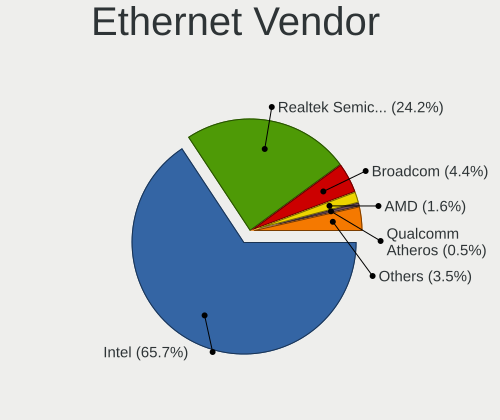

| Vendor                      | Computers | Percent |
|-----------------------------|-----------|---------|
| Intel                       | 2405      | 65.71%  |
| Realtek Semiconductor       | 887       | 24.23%  |
| Broadcom                    | 160       | 4.37%   |
| AMD                         | 59        | 1.61%   |
| Qualcomm Atheros            | 20        | 0.55%   |
| American Megatrends         | 15        | 0.41%   |
| Nvidia                      | 13        | 0.36%   |
| Marvell Technology Group    | 12        | 0.33%   |
| Insyde Software             | 12        | 0.33%   |
| D-Link System               | 11        | 0.3%    |
| Chelsio Communications      | 10        | 0.27%   |
| Aquantia                    | 6         | 0.16%   |
| Google                      | 5         | 0.14%   |
| Emulex                      | 5         | 0.14%   |
| Apple                       | 5         | 0.14%   |
| Samsung Electronics         | 4         | 0.11%   |
| IBM                         | 4         | 0.11%   |
| QLogic                      | 3         | 0.08%   |
| Davicom Semiconductor       | 3         | 0.08%   |
| ZTE WCDMA Technologies MSM  | 2         | 0.05%   |
| Xiaomi                      | 2         | 0.05%   |
| ICS Advent                  | 2         | 0.05%   |
| VIA Technologies            | 1         | 0.03%   |
| T & A Mobile Phones         | 1         | 0.03%   |
| SysKonnect                  | 1         | 0.03%   |
| Standard Microsystems [SMC] | 1         | 0.03%   |
| sipeed                      | 1         | 0.03%   |
| National Semiconductor      | 1         | 0.03%   |
| MYRICOM                     | 1         | 0.03%   |
| Mobile                      | 1         | 0.03%   |
| Microchip Technology        | 1         | 0.03%   |
| Lenovo                      | 1         | 0.03%   |
| JMicron Technology          | 1         | 0.03%   |
| Huawei Technologies         | 1         | 0.03%   |
| Digital Equipment           | 1         | 0.03%   |
| Advantech                   | 1         | 0.03%   |
| 3Com                        | 1         | 0.03%   |

Ethernet Model
--------------

Ethernet models

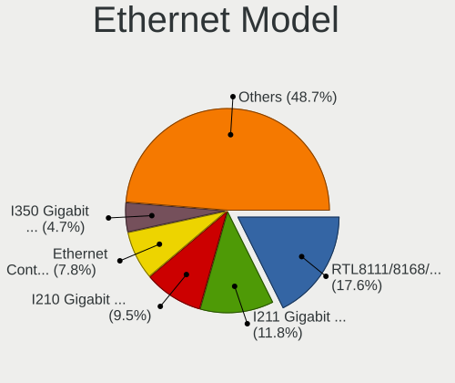

| Model                                                                         | Computers | Percent |
|-------------------------------------------------------------------------------|-----------|---------|
| Realtek RTL8111/8168/8211/8411 PCI Express Gigabit Ethernet Controller        | 792       | 17.63%  |
| Intel I211 Gigabit Network Connection                                         | 528       | 11.75%  |
| Intel I210 Gigabit Network Connection                                         | 425       | 9.46%   |
| Intel Ethernet Controller I226-V                                              | 349       | 7.77%   |
| Intel I350 Gigabit Network Connection                                         | 211       | 4.7%    |
| Intel Ethernet Controller I225-V                                              | 171       | 3.81%   |
| Intel 82574L Gigabit Network Connection                                       | 128       | 2.85%   |
| Intel 82599ES 10-Gigabit SFI/SFP+ Network Connection                          | 116       | 2.58%   |
| Intel 82579LM Gigabit Network Connection (Lewisville)                         | 94        | 2.09%   |
| Intel I210 Gigabit Fiber Network Connection                                   | 91        | 2.03%   |
| Realtek RTL8125 2.5GbE Controller                                             | 68        | 1.51%   |
| Intel Ethernet Connection X553 1GbE                                           | 60        | 1.34%   |
| AMD XGMAC 10GbE Controller                                                    | 59        | 1.31%   |
| Intel 82580 Gigabit Network Connection                                        | 58        | 1.29%   |
| Intel Ethernet Connection I354                                                | 52        | 1.16%   |
| Intel 82583V Gigabit Network Connection                                       | 48        | 1.07%   |
| Intel 82576 Gigabit Network Connection                                        | 47        | 1.05%   |
| Intel Ethernet Connection I217-LM                                             | 43        | 0.96%   |
| Intel Ethernet Controller X710 for 10GbE SFP+                                 | 41        | 0.91%   |
| Broadcom NetXtreme BCM5720 Gigabit Ethernet PCIe                              | 41        | 0.91%   |
| Intel 82571EB/82571GB Gigabit Ethernet Controller D0/D1 (copper applications) | 40        | 0.89%   |
| Intel 82571EB/82571GB Gigabit Ethernet Controller (Copper)                    | 37        | 0.82%   |
| Broadcom NetXtreme BCM5719 Gigabit Ethernet PCIe                              | 35        | 0.78%   |
| Intel Ethernet Connection (2) I219-V                                          | 33        | 0.73%   |
| Intel Ethernet Connection (2) I219-LM                                         | 32        | 0.71%   |
| Intel Ethernet Controller 10-Gigabit X540-AT2                                 | 30        | 0.67%   |
| Intel Ethernet Connection (7) I219-V                                          | 30        | 0.67%   |
| Intel Ethernet Connection I219-LM                                             | 29        | 0.65%   |
| Intel I350 Gigabit Fiber Network Connection                                   | 28        | 0.62%   |
| Intel Ethernet Connection X552 10 GbE SFP+                                    | 27        | 0.6%    |
| Intel Ethernet Connection (7) I219-LM                                         | 26        | 0.58%   |
| Intel Ethernet Controller X550                                                | 22        | 0.49%   |
| Realtek USB 2.5GbE Controller                                                 | 19        | 0.42%   |
| Intel 82575EB Gigabit Network Connection                                      | 18        | 0.4%    |
| Realtek RTL810xE PCI Express Fast Ethernet controller                         | 17        | 0.38%   |
| Intel Ethernet Connection (4) I219-V                                          | 17        | 0.38%   |
| Realtek RTL-8100/8101L/8139 PCI Fast Ethernet Adapter                         | 16        | 0.36%   |
| Intel Ethernet Connection I217-V                                              | 15        | 0.33%   |
| Intel Ethernet Connection (4) I219-LM                                         | 15        | 0.33%   |
| Broadcom NetXtreme II BCM5709 Gigabit Ethernet                                | 15        | 0.33%   |

Net Controller Kind
-------------------

Ethernet, WiFi or modem

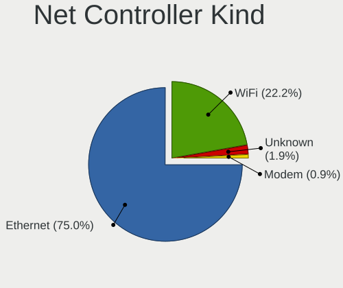

| Kind     | Computers | Percent |
|----------|-----------|---------|
| Ethernet | 3160      | 75.02%  |
| WiFi     | 934       | 22.17%  |
| Unknown  | 81        | 1.92%   |
| Modem    | 37        | 0.88%   |

Used Controller
---------------

Currently used network controller

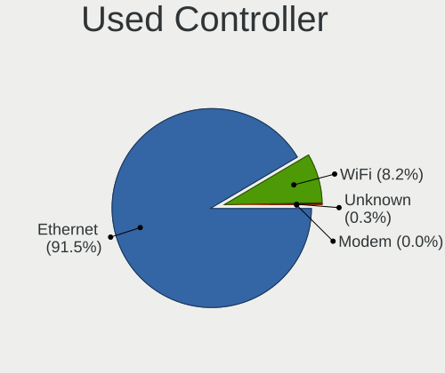

| Kind     | Computers | Percent |
|----------|-----------|---------|
| Ethernet | 3003      | 91.5%   |
| WiFi     | 268       | 8.17%   |
| Unknown  | 10        | 0.3%    |
| Modem    | 1         | 0.03%   |

NICs
----

Total network controllers on board

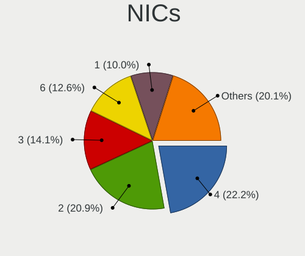

| Total | Computers | Percent |
|-------|-----------|---------|
| 4     | 731       | 22.2%   |
| 2     | 689       | 20.92%  |
| 3     | 464       | 14.09%  |
| 6     | 416       | 12.63%  |
| 1     | 330       | 10.02%  |
| 5     | 275       | 8.35%   |
| 8     | 159       | 4.83%   |
| 10    | 61        | 1.85%   |
| 9     | 48        | 1.46%   |
| 7     | 44        | 1.34%   |
| 12    | 30        | 0.91%   |
| 0     | 23        | 0.7%    |
| 14    | 7         | 0.21%   |
| 16    | 5         | 0.15%   |
| 11    | 5         | 0.15%   |
| 20    | 2         | 0.06%   |
| 25    | 1         | 0.03%   |
| 19    | 1         | 0.03%   |
| 18    | 1         | 0.03%   |
| 17    | 1         | 0.03%   |

IPv6
----

IPv6 vs IPv4

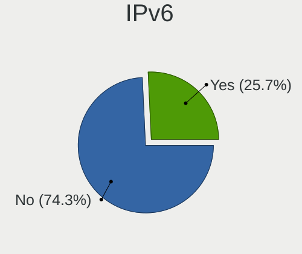

| Used | Computers | Percent |
|------|-----------|---------|
| No   | 2529      | 74.25%  |
| Yes  | 877       | 25.75%  |

Bluetooth
---------

Bluetooth Vendor
----------------

Controller vendors

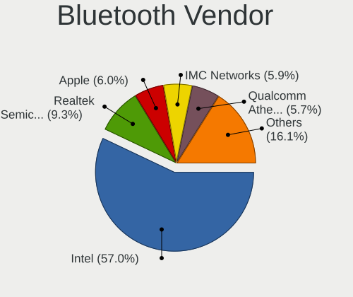

| Vendor                          | Computers | Percent |
|---------------------------------|-----------|---------|
| Intel                           | 369       | 57.03%  |
| Realtek Semiconductor           | 60        | 9.27%   |
| Apple                           | 39        | 6.03%   |
| IMC Networks                    | 38        | 5.87%   |
| Qualcomm Atheros Communications | 37        | 5.72%   |
| Broadcom                        | 30        | 4.64%   |
| MediaTek                        | 18        | 2.78%   |
| Foxconn / Hon Hai               | 13        | 2.01%   |
| Cambridge Silicon Radio         | 9         | 1.39%   |
| ASUSTek Computer                | 9         | 1.39%   |
| Lite-On Technology              | 8         | 1.24%   |
| Dell                            | 5         | 0.77%   |
| Hewlett-Packard                 | 3         | 0.46%   |
| Alps Electric                   | 3         | 0.46%   |
| USI                             | 2         | 0.31%   |
| Micro Star International        | 1         | 0.15%   |
| Fujitsu Siemens Computers       | 1         | 0.15%   |
| Askey Computer                  | 1         | 0.15%   |
| Unknown                         | 1         | 0.15%   |

Bluetooth Model
---------------

Controller models

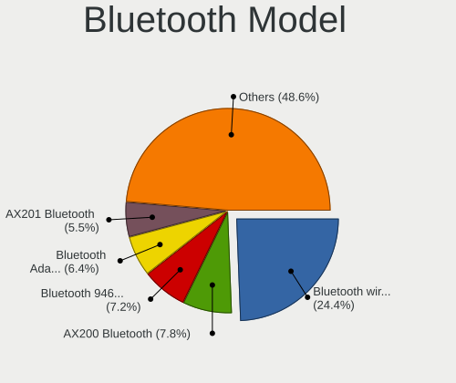

| Model                                                       | Computers | Percent |
|-------------------------------------------------------------|-----------|---------|
| Intel Bluetooth wireless interface                          | 159       | 24.39%  |
| Intel AX200 Bluetooth                                       | 51        | 7.82%   |
| Intel Bluetooth 9460/9560 Jefferson Peak (JfP)              | 47        | 7.21%   |
| Realtek Bluetooth Adapter                                   | 42        | 6.44%   |
| Intel AX201 Bluetooth                                       | 36        | 5.52%   |
| Intel Centrino Bluetooth Wireless Transceiver               | 24        | 3.68%   |
| IMC Networks Qualcomm Atheros Bluetooth 4.1                 | 19        | 2.91%   |
| Intel Wireless-AC 9260 Bluetooth Adapter                    | 18        | 2.76%   |
| Qualcomm Atheros AR3012 Bluetooth 4.0                       | 16        | 2.45%   |
| Intel AX210 Bluetooth                                       | 16        | 2.45%   |
| Apple Bluetooth Host Controller                             | 16        | 2.45%   |
| Intel Wireless-AC 3168 Bluetooth                            | 13        | 1.99%   |
| Apple Built-in Bluetooth 2.0+EDR HCI                        | 12        | 1.84%   |
| MediaTek Wireless_Device                                    | 10        | 1.53%   |
| Broadcom BCM20702 Bluetooth 4.0 [ThinkPad]                  | 10        | 1.53%   |
| Broadcom BCM2045B (BDC-2.1)                                 | 10        | 1.53%   |
| Cambridge Silicon Radio Bluetooth Dongle (HCI mode)         | 9         | 1.38%   |
| Apple Broadcom Built-in Bluetooth                           | 8         | 1.23%   |
| Intel AX211 Bluetooth                                       | 7         | 1.07%   |
| IMC Networks Realtek Bluetooth Adapter                      | 7         | 1.07%   |
| IMC Networks Realtek Bluetooth 4.0 + High Speed Chip        | 7         | 1.07%   |
| Realtek Bluetooth 4.2 Adapter                               | 5         | 0.77%   |
| Qualcomm Atheros QCA61x4 Bluetooth 4.0                      | 5         | 0.77%   |
| MediaTek RZ608 Bluetooth Adapter                            | 5         | 0.77%   |
| Qualcomm Atheros AR9462 Bluetooth                           | 4         | 0.61%   |
| Lite-On Atheros AR3012 Bluetooth                            | 4         | 0.61%   |
| Realtek  Bluetooth 4.2 Adapter                              | 3         | 0.46%   |
| Qualcomm Atheros QCA9377 Bluetooth 4.1                      | 3         | 0.46%   |
| Lite-On Bluetooth USB Module                                | 3         | 0.46%   |
| Foxconn / Hon Hai Qualcomm Atheros AR3012 Bluetooth Adapter | 3         | 0.46%   |
| Foxconn / Hon Hai Bluetooth USB Module                      | 3         | 0.46%   |
| Dell DW375 Bluetooth Module                                 | 3         | 0.46%   |
| ASUS USB-BT500                                              | 3         | 0.46%   |
| USI Qualcomm WCN685x Bluetooth Adapter                      | 2         | 0.31%   |
| Realtek RTL8821A Bluetooth                                  | 2         | 0.31%   |
| Realtek RTL8723B Bluetooth                                  | 2         | 0.31%   |
| Realtek RTL8723A Bluetooth                                  | 2         | 0.31%   |
| Qualcomm Atheros Dell Wireless 1820 Bluetooth 4.1LE         | 2         | 0.31%   |
| Qualcomm Atheros AR3011 Bluetooth (no firmware)             | 2         | 0.31%   |
| MediaTek RZ616 Bluetooth Adapter                            | 2         | 0.31%   |

Sound
-----

Sound Vendor
------------

Sound card vendors

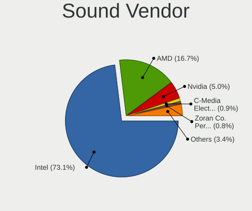

| Vendor                                       | Computers | Percent |
|----------------------------------------------|-----------|---------|
| Intel                                        | 1822      | 73.08%  |
| AMD                                          | 417       | 16.73%  |
| Nvidia                                       | 125       | 5.01%   |
| C-Media Electronics                          | 23        | 0.92%   |
| Zoran Co. Personal Media Division (Nogatech) | 20        | 0.8%    |
| Logitech                                     | 10        | 0.4%    |
| GN Netcom                                    | 8         | 0.32%   |
| JMTek                                        | 6         | 0.24%   |
| VIA Technologies                             | 5         | 0.2%    |
| Texas Instruments                            | 5         | 0.2%    |
| Creative Labs                                | 4         | 0.16%   |
| Tenx Technology                              | 3         | 0.12%   |
| Realtek Semiconductor                        | 3         | 0.12%   |
| Lenovo                                       | 3         | 0.12%   |
| ESS Technology                               | 3         | 0.12%   |
| Corsair                                      | 3         | 0.12%   |
| XMOS                                         | 2         | 0.08%   |
| Kingston Technology                          | 2         | 0.08%   |
| Focusrite-Novation                           | 2         | 0.08%   |
| Creative Technology                          | 2         | 0.08%   |
| Audient                                      | 2         | 0.08%   |
| ASUSTek Computer                             | 2         | 0.08%   |
| ZOOM                                         | 1         | 0.04%   |
| Yamaha                                       | 1         | 0.04%   |
| Walmart                                      | 1         | 0.04%   |
| ULi Electronics                              | 1         | 0.04%   |
| Trust                                        | 1         | 0.04%   |
| SteelSeries ApS                              | 1         | 0.04%   |
| Silicon Integrated Systems [SiS]             | 1         | 0.04%   |
| RODE Microphones                             | 1         | 0.04%   |
| RME                                          | 1         | 0.04%   |
| Razer USA                                    | 1         | 0.04%   |
| Plantronics                                  | 1         | 0.04%   |
| Phison Electronics                           | 1         | 0.04%   |
| Native Instruments                           | 1         | 0.04%   |
| MosArt Semiconductor                         | 1         | 0.04%   |
| Mark of the Unicorn                          | 1         | 0.04%   |
| M-Audio                                      | 1         | 0.04%   |
| Hewlett-Packard                              | 1         | 0.04%   |
| Generalplus Technology                       | 1         | 0.04%   |

Sound Model
-----------

Sound card models

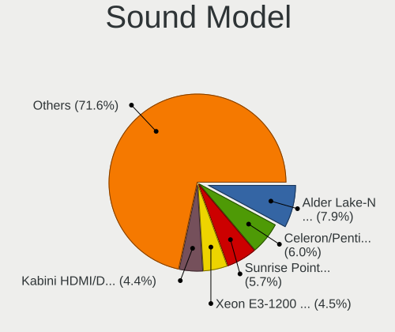

| Model                                                                                             | Computers | Percent |
|---------------------------------------------------------------------------------------------------|-----------|---------|
| Intel Alder Lake-N PCH High Definition Audio Controller                                           | 228       | 7.86%   |
| Intel Celeron/Pentium Silver Processor High Definition Audio                                      | 173       | 5.97%   |
| Intel Sunrise Point-LP HD Audio                                                                   | 164       | 5.66%   |
| Intel Xeon E3-1200 v3/4th Gen Core Processor HD Audio Controller                                  | 131       | 4.52%   |
| AMD Kabini HDMI/DP Audio                                                                          | 127       | 4.38%   |
| AMD FCH Azalia Controller                                                                         | 121       | 4.17%   |
| AMD Ryzen HD Audio Controller                                                                     | 117       | 4.03%   |
| Intel Jasper Lake HD Audio                                                                        | 104       | 3.59%   |
| Intel 100 Series/C230 Series Chipset Family HD Audio Controller                                   | 103       | 3.55%   |
| Intel Atom/Celeron/Pentium Processor x5-E8000/J3xxx/N3xxx Series High Definition Audio Controller | 95        | 3.28%   |
| Intel 7 Series/C216 Chipset Family High Definition Audio Controller                               | 87        | 3%      |
| Intel 8 Series/C220 Series Chipset High Definition Audio Controller                               | 72        | 2.48%   |
| Intel 6 Series/C200 Series Chipset Family High Definition Audio Controller                        | 67        | 2.31%   |
| Intel Atom Processor Z36xxx/Z37xxx Series High Definition Audio Controller                        | 62        | 2.14%   |
| Intel Cannon Lake PCH cAVS                                                                        | 61        | 2.1%    |
| Intel Celeron N3350/Pentium N4200/Atom E3900 Series Audio Cluster                                 | 56        | 1.93%   |
| Intel Haswell-ULT HD Audio Controller                                                             | 49        | 1.69%   |
| Intel 8 Series HD Audio Controller                                                                | 49        | 1.69%   |
| Intel Wildcat Point-LP High Definition Audio Controller                                           | 48        | 1.66%   |
| Intel Broadwell-U Audio Controller                                                                | 48        | 1.66%   |
| AMD Renoir/Cezanne HDMI/DP Audio Controller                                                       | 43        | 1.48%   |
| AMD Family 17h (Models 00h-0fh) HD Audio Controller                                               | 42        | 1.45%   |
| Intel Cannon Point-LP High Definition Audio Controller                                            | 38        | 1.31%   |
| Intel Tiger Lake-LP Smart Sound Technology Audio Controller                                       | 36        | 1.24%   |
| Intel Comet Lake PCH-LP cAVS                                                                      | 34        | 1.17%   |
| Intel NM10/ICH7 Family High Definition Audio Controller                                           | 33        | 1.14%   |
| Intel 200 Series PCH HD Audio                                                                     | 32        | 1.1%    |
| AMD Raven/Raven2/Fenghuang HDMI/DP Audio Controller                                               | 32        | 1.1%    |
| AMD Starship/Matisse HD Audio Controller                                                          | 30        | 1.03%   |
| Intel 5 Series/3400 Series Chipset High Definition Audio                                          | 29        | 1%      |
| Intel 82801H (ICH8 Family) HD Audio Controller                                                    | 27        | 0.93%   |
| Intel Elkhart Lake High Density Audio bus interface                                               | 22        | 0.76%   |
| AMD SBx00 Azalia (Intel HDA)                                                                      | 22        | 0.76%   |
| Intel Alder Lake PCH-P High Definition Audio Controller                                           | 21        | 0.72%   |
| Intel 82801I (ICH9 Family) HD Audio Controller                                                    | 21        | 0.72%   |
| Zoran Co. Personal Media Division (Nogatech) USB Audio and HID                                    | 20        | 0.69%   |
| AMD Radeon High Definition Audio Controller                                                       | 16        | 0.55%   |
| Nvidia GK208 HDMI/DP Audio Controller                                                             | 14        | 0.48%   |
| Nvidia GP108 High Definition Audio Controller                                                     | 13        | 0.45%   |
| C-Media Electronics Audio Adapter (Unitek Y-247A)                                                 | 13        | 0.45%   |

Memory
------

Memory Vendor
-------------

Memory module vendors

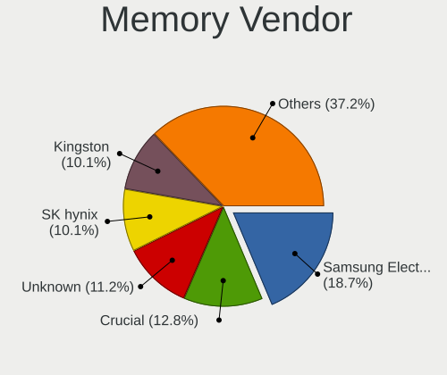

| Vendor                       | Computers | Percent |
|------------------------------|-----------|---------|
| Samsung Electronics          | 603       | 18.66%  |
| Crucial                      | 414       | 12.81%  |
| Unknown                      | 362       | 11.2%   |
| SK hynix                     | 327       | 10.12%  |
| Kingston                     | 325       | 10.06%  |
| Micron Technology            | 291       | 9%      |
| G.Skill                      | 130       | 4.02%   |
| Unknown                      | 120       | 3.71%   |
| Transcend                    | 108       | 3.34%   |
| Corsair                      | 107       | 3.31%   |
| A-DATA Technology            | 82        | 2.54%   |
| Unknown (ABCD)               | 55        | 1.7%    |
| ATP                          | 43        | 1.33%   |
| Nanya Technology             | 36        | 1.11%   |
| Ramaxel Technology           | 33        | 1.02%   |
| Apacer                       | 23        | 0.71%   |
| Hewlett-Packard              | 19        | 0.59%   |
| Elpida                       | 17        | 0.53%   |
| Toshiba                      | 12        | 0.37%   |
| Shenzhen Jinge Information   | 7         | 0.22%   |
| Patriot                      | 7         | 0.22%   |
| Lexar Co Limited             | 7         | 0.22%   |
| Kimtigo                      | 7         | 0.22%   |
| Wodposit                     | 4         | 0.12%   |
| Team                         | 4         | 0.12%   |
| Innodisk                     | 4         | 0.12%   |
| Avant                        | 4         | 0.12%   |
| Unknown (0x1636)             | 3         | 0.09%   |
| Unifosa                      | 3         | 0.09%   |
| Smart Modular                | 3         | 0.09%   |
| SK_Hynix                     | 3         | 0.09%   |
| Mushkin                      | 3         | 0.09%   |
| HPE                          | 3         | 0.09%   |
| Unknown (AB)                 | 2         | 0.06%   |
| Unknown (89EC)               | 2         | 0.06%   |
| Unknown (0x7F7F7F94FFFFFFFF) | 2         | 0.06%   |
| Unknown (0x0FBA)             | 2         | 0.06%   |
| Unknown (09C7)               | 2         | 0.06%   |
| Timetec                      | 2         | 0.06%   |
| Tigo                         | 2         | 0.06%   |

Memory Model
------------

Memory module models

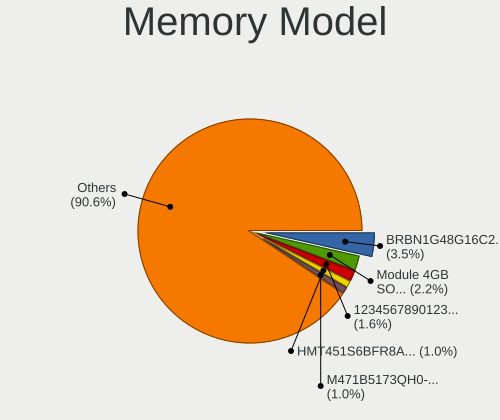

| Model                                                        | Computers | Percent |
|--------------------------------------------------------------|-----------|---------|
| Unknown                                                      | 120       | 3.54%   |
| Unknown RAM Module 4GB SODIMM DDR3 1333MT/s                  | 75        | 2.21%   |
| Unknown (ABCD) RAM 123456789012345678 8GB DIMM DDR4 2400MT/s | 55        | 1.62%   |
| SK hynix RAM HMT451S6BFR8A-PB 4GB SODIMM DDR3 1600MT/s       | 35        | 1.03%   |
| Samsung RAM M471B5173QH0-YK0 4GB SODIMM DDR3 1600MT/s        | 33        | 0.97%   |
| Transcend RAM TS1GLH64V6BL 8GB SODIMM DDR4 2667MT/s          | 32        | 0.94%   |
| Samsung RAM M425R1GB4BB0-CQKOL 8GB SODIMM DDR5 4800MT/s      | 31        | 0.91%   |
| Crucial RAM CT16G48C40S5.M8A1 16GB SODIMM DDR5 4800MT/s      | 26        | 0.77%   |
| Samsung RAM M471A1K43CB1-CTD 8GB SODIMM DDR4 3200MT/s        | 23        | 0.68%   |
| Unknown RAM Module 8GB DIMM DDR3 1600MT/s                    | 22        | 0.65%   |
| Samsung RAM M471B5173EB0-YK0 4GB SODIMM DDR3 1600MT/s        | 19        | 0.56%   |
| Unknown RAM Module 4GB DIMM DDR3 1333MT/s                    | 18        | 0.53%   |
| Samsung RAM M471B5173DB0-YK0 4GB SODIMM DDR3 1600MT/s        | 18        | 0.53%   |
| Samsung RAM M471A1K43CB1-CRC 8GB SODIMM DDR4 2667MT/s        | 18        | 0.53%   |
| Micron RAM 8KTF51264HZ-1G9P1 4GB SODIMM DDR3 1867MT/s        | 16        | 0.47%   |
| Unknown RAM Module 4GB SODIMM DDR3 667MT/s                   | 15        | 0.44%   |
| Unknown RAM Module 2GB SODIMM DDR2 667MT/s                   | 15        | 0.44%   |
| Unknown RAM Module 2GB DIMM DDR2 800MT/s                     | 15        | 0.44%   |
| SK hynix RAM HMA81GS6AFR8N-UH 8GB SODIMM DDR4 2400MT/s       | 15        | 0.44%   |
| Crucial RAM CT16G48C40S5.C8A1 16GB SODIMM DDR5 4800MT/s      | 14        | 0.41%   |
| A-DATA RAM Module 4GB SODIMM DDR3 1600MT/s                   | 14        | 0.41%   |
| A-DATA RAM Module 4GB DIMM DDR4 2133MT/s                     | 14        | 0.41%   |
| Unknown RAM Module 4GB DIMM DDR2 800MT/s                     | 13        | 0.38%   |
| ATP RAM X4G08QA8BNWESO-7-TO1 8GB SODIMM DDR4 3200MT/s        | 13        | 0.38%   |
| Samsung RAM M471B1G73QH0-YK0 8GB SODIMM DDR3 1867MT/s        | 12        | 0.35%   |
| Micron RAM 8ATF1G64HZ-3G2R1 8GB SODIMM DDR4 3200MT/s         | 12        | 0.35%   |
| G.Skill RAM F4-2400C16-8GRS 8GB SODIMM DDR4 2400MT/s         | 12        | 0.35%   |
| Crucial RAM CT102464BF160B.M16 8GB SODIMM DDR3 1600MT/s      | 12        | 0.35%   |
| A-DATA RAM Module 2GB DIMM DDR4 2133MT/s                     | 12        | 0.35%   |
| Unknown RAM Module 2GB DIMM SDRAM                            | 11        | 0.32%   |
| Samsung RAM M471B1G73DB0-YK0 8GB SODIMM DDR3 1600MT/s        | 11        | 0.32%   |
| Crucial RAM CT8G4SFRA266.M8FRS 8GB SODIMM DDR4 2667MT/s      | 11        | 0.32%   |
| Crucial RAM CT8G48C40S5.M4A1 8GB SODIMM DDR5 4800MT/s        | 11        | 0.32%   |
| Crucial RAM CT16G56C46S5.M8G1 16GB SODIMM DDR5 5600MT/s      | 11        | 0.32%   |
| A-DATA RAM Module 4GB DIMM DDR4 1866MT/s                     | 11        | 0.32%   |
| Transcend RAM TS512MSK64W6H 4GB DIMM DDR3 1600MT/s           | 10        | 0.29%   |
| Samsung RAM M471A5244CB0-CTD 4GB SODIMM DDR4 3200MT/s        | 10        | 0.29%   |
| Micron RAM Module 8GB Row Of Chips LPDDR4 3200MT/s           | 10        | 0.29%   |
| Crucial RAM CT102464BF160B.M16 8GB DIMM DDR3 1600MT/s        | 10        | 0.29%   |
| Crucial RAM CT102464BF160B.C16 8GB DIMM DDR3 1600MT/s        | 10        | 0.29%   |

Memory Kind
-----------

Memory module kinds

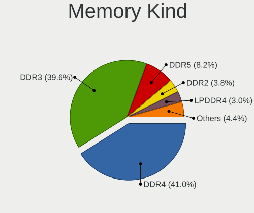

| Kind    | Computers | Percent |
|---------|-----------|---------|
| DDR4    | 1212      | 41.03%  |
| DDR3    | 1170      | 39.61%  |
| DDR5    | 242       | 8.19%   |
| DDR2    | 111       | 3.76%   |
| LPDDR4  | 88        | 2.98%   |
| Unknown | 49        | 1.66%   |
| SDRAM   | 27        | 0.91%   |
| LPDDR5  | 27        | 0.91%   |
| LPDDR3  | 14        | 0.47%   |
| DDR     | 11        | 0.37%   |
| RAM     | 1         | 0.03%   |
| EEPROM  | 1         | 0.03%   |
| DRAM    | 1         | 0.03%   |

Memory Form Factor
------------------

Physical design of the memory module

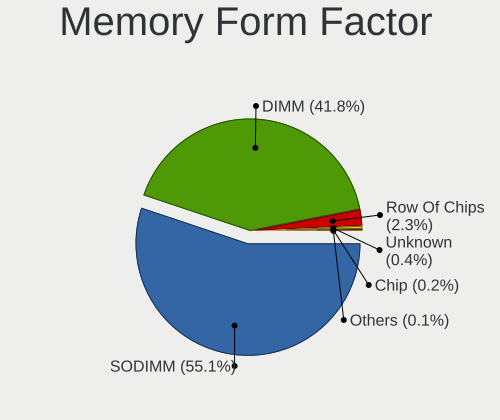

| Name         | Computers | Percent |
|--------------|-----------|---------|
| SODIMM       | 1620      | 55.14%  |
| DIMM         | 1227      | 41.76%  |
| Row Of Chips | 69        | 2.35%   |
| Unknown      | 13        | 0.44%   |
| Chip         | 7         | 0.24%   |
| FB-DIMM      | 2         | 0.07%   |

Memory Size
-----------

Memory module size

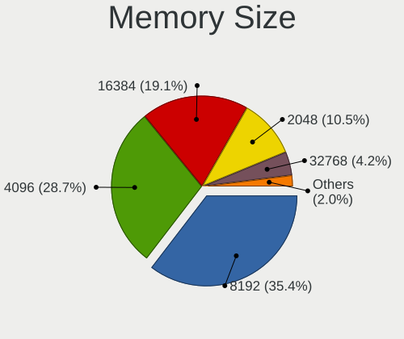

| Size  | Computers | Percent |
|-------|-----------|---------|
| 8192  | 1105      | 35.41%  |
| 4096  | 896       | 28.71%  |
| 16384 | 597       | 19.13%  |
| 2048  | 329       | 10.54%  |
| 32768 | 132       | 4.23%   |
| 1024  | 41        | 1.31%   |
| 49152 | 8         | 0.26%   |
| 512   | 5         | 0.16%   |
| 3072  | 3         | 0.1%    |
| 65536 | 2         | 0.06%   |
| 256   | 2         | 0.06%   |
| 1     | 1         | 0.03%   |

Memory Speed
------------

Memory module speed

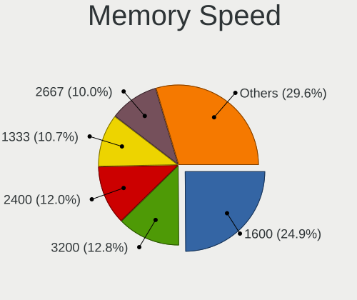

| Speed   | Computers | Percent |
|---------|-----------|---------|
| 1600    | 769       | 24.89%  |
| 3200    | 395       | 12.79%  |
| 2400    | 371       | 12.01%  |
| 1333    | 331       | 10.72%  |
| 2667    | 309       | 10%     |
| 4800    | 176       | 5.7%    |
| 2133    | 151       | 4.89%   |
| 800     | 79        | 2.56%   |
| 667     | 78        | 2.53%   |
| 5600    | 68        | 2.2%    |
| 1867    | 47        | 1.52%   |
| 2666    | 45        | 1.46%   |
| Unknown | 40        | 1.29%   |
| 1866    | 30        | 0.97%   |
| 1067    | 29        | 0.94%   |
| 1066    | 28        | 0.91%   |
| 1334    | 25        | 0.81%   |
| 6400    | 23        | 0.74%   |
| 2933    | 16        | 0.52%   |
| 3000    | 15        | 0.49%   |
| 3600    | 9         | 0.29%   |
| 4267    | 8         | 0.26%   |
| 3733    | 8         | 0.26%   |
| 400     | 6         | 0.19%   |
| 1033    | 4         | 0.13%   |
| 533     | 4         | 0.13%   |
| 5200    | 3         | 0.1%    |
| 4000    | 3         | 0.1%    |
| 333     | 3         | 0.1%    |
| 3534    | 2         | 0.06%   |
| 3066    | 2         | 0.06%   |
| 2800    | 2         | 0.06%   |
| 975     | 2         | 0.06%   |
| 65535   | 1         | 0.03%   |
| 4400    | 1         | 0.03%   |
| 3500    | 1         | 0.03%   |
| 2600    | 1         | 0.03%   |
| 2048    | 1         | 0.03%   |
| 1639    | 1         | 0.03%   |
| 1419    | 1         | 0.03%   |

Printers & scanners
-------------------

Printer Vendor
--------------

Printer device vendors

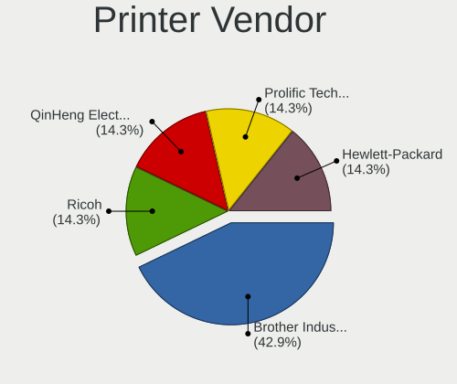

| Vendor              | Computers | Percent |
|---------------------|-----------|---------|
| Brother Industries  | 3         | 42.86%  |
| Ricoh               | 1         | 14.29%  |
| QinHeng Electronics | 1         | 14.29%  |
| Prolific Technology | 1         | 14.29%  |
| Hewlett-Packard     | 1         | 14.29%  |

Printer Model
-------------

Printer device models

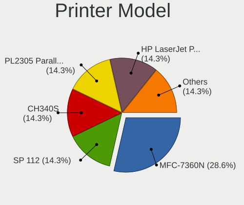

| Model                         | Computers | Percent |
|-------------------------------|-----------|---------|
| Brother MFC-7360N             | 2         | 28.57%  |
| Ricoh SP 112                  | 1         | 14.29%  |
| QinHeng CH340S                | 1         | 14.29%  |
| Prolific PL2305 Parallel Port | 1         | 14.29%  |
| HP HP LaserJet P2035 HP Print | 1         | 14.29%  |
| Brother HL-L2310D series      | 1         | 14.29%  |

Scanner Vendor
--------------

Scanner device vendors

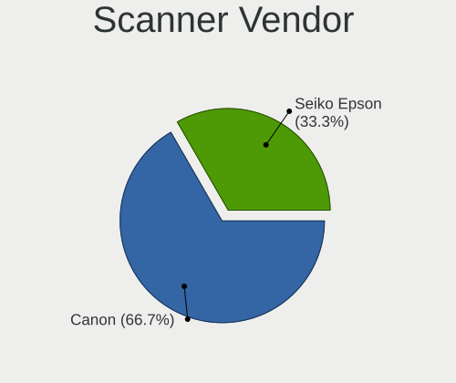

| Vendor      | Computers | Percent |
|-------------|-----------|---------|
| Canon       | 3         | 60%     |
| Seiko Epson | 2         | 40%     |

Scanner Model
-------------

Scanner device models

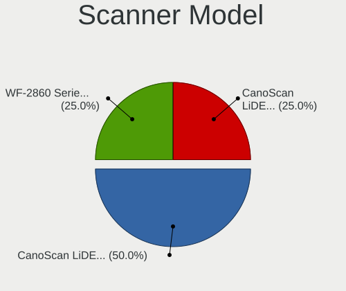

| Model                                                                               | Computers | Percent |
|-------------------------------------------------------------------------------------|-----------|---------|
| Canon CanoScan LiDE 110                                                             | 2         | 40%     |
| Seiko Epson WF-2860 Series EPSON Scanner USB2.0 Printer EPSON Utility USB2.0 Faxout | 1         | 20%     |
| Seiko Epson GT-F520/GT-F570 [Perfection 3590 PHOTO]                                 | 1         | 20%     |
| Canon CanoScan LiDE 120                                                             | 1         | 20%     |

Camera
------

Camera Vendor
-------------

Camera device vendors

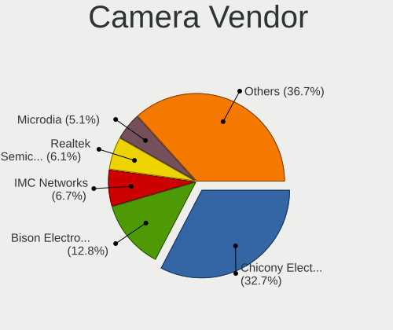

| Vendor                                 | Computers | Percent |
|----------------------------------------|-----------|---------|
| Chicony Electronics                    | 97        | 32.66%  |
| Bison Electronics                      | 38        | 12.79%  |
| IMC Networks                           | 20        | 6.73%   |
| Realtek Semiconductor                  | 18        | 6.06%   |
| Microdia                               | 15        | 5.05%   |
| Logitech                               | 15        | 5.05%   |
| Sunplus Innovation Technology          | 14        | 4.71%   |
| Lite-On Technology                     | 12        | 4.04%   |
| Suyin                                  | 11        | 3.7%    |
| Syntek                                 | 8         | 2.69%   |
| Apple                                  | 8         | 2.69%   |
| Lenovo                                 | 5         | 1.68%   |
| Cheng Uei Precision Industry (Foxlink) | 5         | 1.68%   |
| Alcor Micro                            | 4         | 1.35%   |
| Quanta                                 | 3         | 1.01%   |
| Luxvisions Innotech Limited            | 3         | 1.01%   |
| Z-Star Microelectronics                | 2         | 0.67%   |
| Silicon Motion                         | 2         | 0.67%   |
| Ricoh                                  | 2         | 0.67%   |
| Hewlett-Packard                        | 2         | 0.67%   |
| ARC International                      | 2         | 0.67%   |
| Trust                                  | 1         | 0.34%   |
| Tripath Technology                     | 1         | 0.34%   |
| SunplusIT                              | 1         | 0.34%   |
| Shenzhen Kingcome Optoelectronic       | 1         | 0.34%   |
| Pixart Imaging                         | 1         | 0.34%   |
| Jiangxi Shinetech Optical              | 1         | 0.34%   |
| Intel                                  | 1         | 0.34%   |
| Framework                              | 1         | 0.34%   |
| Dell                                   | 1         | 0.34%   |
| Cubeternet                             | 1         | 0.34%   |
| ALi                                    | 1         | 0.34%   |

Camera Model
------------

Camera device models

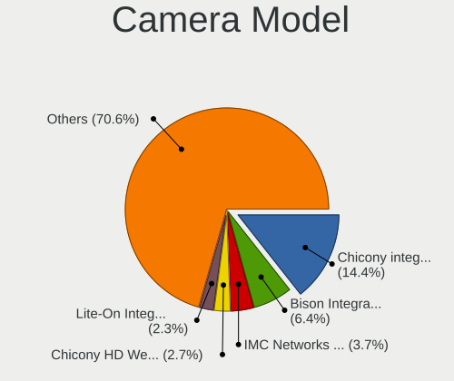

| Model                                            | Computers | Percent |
|--------------------------------------------------|-----------|---------|
| Chicony integrated camera                        | 43        | 14.38%  |
| Bison Integrated Camera                          | 19        | 6.35%   |
| IMC Networks Integrated Camera                   | 11        | 3.68%   |
| Chicony HD WebCam                                | 8         | 2.68%   |
| Lite-On Integrated Camera                        | 7         | 2.34%   |
| Chicony Lenovo Integrated Camera (0.3MP)         | 7         | 2.34%   |
| Realtek USB 2.0 PC Camera                        | 6         | 2.01%   |
| Chicony HP HD Webcam [Fixed]                     | 6         | 2.01%   |
| Chicony FJ Camera                                | 6         | 2.01%   |
| Bison SunplusIT Integrated Camera                | 6         | 2.01%   |
| Sunplus Integrated_Webcam_HD                     | 5         | 1.67%   |
| Microdia Integrated Webcam                       | 5         | 1.67%   |
| Syntek Integrated Camera                         | 4         | 1.34%   |
| Microdia Integrated_Webcam_HD                    | 4         | 1.34%   |
| Logitech HD Pro Webcam C920                      | 4         | 1.34%   |
| Chicony Integrated Camera [ThinkPad]             | 4         | 1.34%   |
| Chicony Chicony USB2.0 Camera                    | 4         | 1.34%   |
| Bison ThinkPad Integrated Camera                 | 4         | 1.34%   |
| Apple FaceTime HD Camera (Built-in)              | 4         | 1.34%   |
| Suyin RGBIR Camera                               | 3         | 1%      |
| Logitech Webcam C270                             | 3         | 1%      |
| Logitech C920 PRO HD Webcam                      | 3         | 1%      |
| Lite-On Realtek PC Camera                        | 3         | 1%      |
| Chicony Integrated IR Camera                     | 3         | 1%      |
| Syntek Lenovo EasyCamera                         | 2         | 0.67%   |
| Syntek EasyCamera                                | 2         | 0.67%   |
| Realtek Laptop Camera                            | 2         | 0.67%   |
| Realtek Integrated_Webcam_HD                     | 2         | 0.67%   |
| Quanta HP TrueVision HD Camera                   | 2         | 0.67%   |
| Logitech C920 HD Pro Webcam                      | 2         | 0.67%   |
| Lite-On HP HD Webcam [Fixed]                     | 2         | 0.67%   |
| Lenovo Integrated Webcam [R5U877]                | 2         | 0.67%   |
| Lenovo Integrated Camera                         | 2         | 0.67%   |
| IMC Networks XHC Camera                          | 2         | 0.67%   |
| IMC Networks Realtek PC Camera                   | 2         | 0.67%   |
| IMC Networks EasyCamera                          | 2         | 0.67%   |
| HP HP FHD Webcam 620/625                         | 2         | 0.67%   |
| Chicony Lenovo EasyCamera                        | 2         | 0.67%   |
| Chicony HD WebCam (Acer)                         | 2         | 0.67%   |
| Cheng Uei Precision Industry (Foxlink) HD Camera | 2         | 0.67%   |

Security
--------

Fingerprint Vendor
------------------

Fingerprint sensor vendors

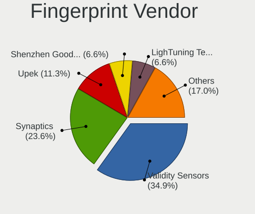

| Vendor                     | Computers | Percent |
|----------------------------|-----------|---------|
| Validity Sensors           | 37        | 34.91%  |
| Synaptics                  | 25        | 23.58%  |
| Upek                       | 12        | 11.32%  |
| Shenzhen Goodix Technology | 7         | 6.6%    |
| LighTuning Technology      | 7         | 6.6%    |
| AuthenTec                  | 7         | 6.6%    |
| Elan Microelectronics      | 3         | 2.83%   |
| Broadcom                   | 3         | 2.83%   |
| STMicroelectronics         | 2         | 1.89%   |
| Next Biometrics            | 1         | 0.94%   |
| FocalTech Systems          | 1         | 0.94%   |
| DigitalPersona             | 1         | 0.94%   |

Fingerprint Model
-----------------

Fingerprint sensor models

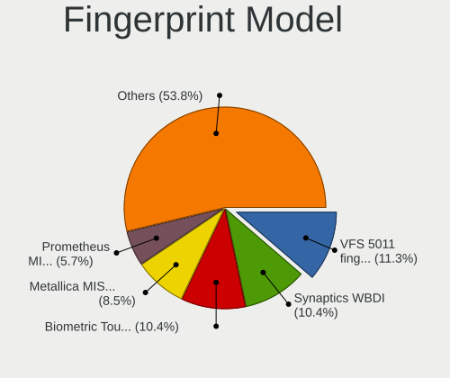

| Model                                                                        | Computers | Percent |
|------------------------------------------------------------------------------|-----------|---------|
| Validity Sensors VFS 5011 fingerprint sensor                                 | 12        | 11.32%  |
| Validity Sensors Synaptics WBDI                                              | 11        | 10.38%  |
| Upek Biometric Touchchip/Touchstrip Fingerprint Sensor                       | 11        | 10.38%  |
| Synaptics Metallica MIS Touch Fingerprint Reader                             | 9         | 8.49%   |
| Synaptics Prometheus MIS Touch Fingerprint Reader                            | 6         | 5.66%   |
| Shenzhen Goodix Fingerprint Reader                                           | 5         | 4.72%   |
| LighTuning ES603 Swipe Fingerprint Sensor                                    | 5         | 4.72%   |
| Validity Sensors VFS495 Fingerprint Reader                                   | 4         | 3.77%   |
| Validity Sensors VFS5011 Fingerprint Reader                                  | 3         | 2.83%   |
| Synaptics Metallica MOH Touch Fingerprint Reader                             | 3         | 2.83%   |
| Elan Fingerprint Sensor                                                      | 3         | 2.83%   |
| Broadcom BCM5880 Secure Applications Processor with fingerprint swipe sensor | 3         | 2.83%   |
| Validity Sensors VFS7500 Touch Fingerprint Sensor                            | 2         | 1.89%   |
| Validity Sensors VFS471 Fingerprint Reader                                   | 2         | 1.89%   |
| Validity Sensors Swipe Fingerprint Sensor                                    | 2         | 1.89%   |
| Synaptics WBDI                                                               | 2         | 1.89%   |
| STMicroelectronics Fingerprint Reader                                        | 2         | 1.89%   |
| Shenzhen Goodix Fingerprint Reader SGX                                       | 2         | 1.89%   |
| LighTuning EgisTec Touch Fingerprint Sensor                                  | 2         | 1.89%   |
| AuthenTec AES2550 Fingerprint Sensor                                         | 2         | 1.89%   |
| AuthenTec AES2501 Fingerprint Sensor                                         | 2         | 1.89%   |
| Unknown                                                                      | 2         | 1.89%   |
| Validity Sensors VFS Fingerprint sensor                                      | 1         | 0.94%   |
| Upek TCS5B Fingerprint sensor                                                | 1         | 0.94%   |
| Synaptics UWP WBDI Device                                                    | 1         | 0.94%   |
| Synaptics TouchPad                                                           | 1         | 0.94%   |
| Synaptics FS7604 Touch Fingerprint Sensor with PurePrint                     | 1         | 0.94%   |
| Next Biometrics NB-2020-U Fingerprint Reader                                 | 1         | 0.94%   |
| FocalTech Systems Fingerprint Reader                                         | 1         | 0.94%   |
| DigitalPersona Fingerprint Reader                                            | 1         | 0.94%   |
| AuthenTec AES2660                                                            | 1         | 0.94%   |
| AuthenTec AES1660                                                            | 1         | 0.94%   |
| AuthenTec AES1600                                                            | 1         | 0.94%   |

Chipcard Vendor
---------------

Chipcard module vendors

Zero info for selected period =(

Chipcard Model
--------------

Chipcard module models

Zero info for selected period =(

Unsupported
-----------

Unsupported Devices
-------------------

Total unsupported devices on board

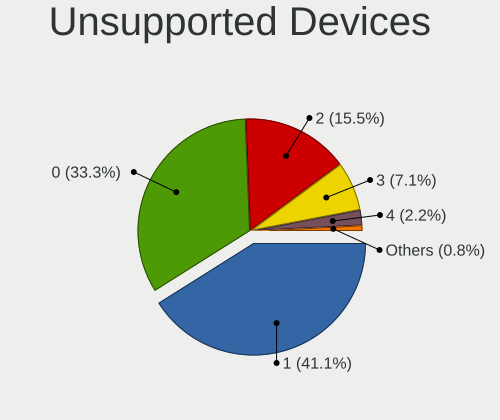

| Total | Computers | Percent |
|-------|-----------|---------|
| 1     | 1372      | 41.05%  |
| 0     | 1114      | 33.33%  |
| 2     | 517       | 15.47%  |
| 3     | 238       | 7.12%   |
| 4     | 74        | 2.21%   |
| 5     | 23        | 0.69%   |
| 6     | 3         | 0.09%   |
| 7     | 1         | 0.03%   |

Unsupported Device Types
------------------------

Types of unsupported devices

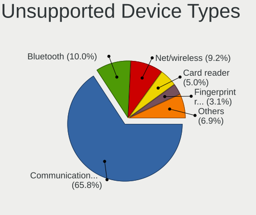

| Type                     | Computers | Percent |
|--------------------------|-----------|---------|
| Communication controller | 1942      | 65.81%  |
| Bluetooth                | 294       | 9.96%   |
| Net/wireless             | 272       | 9.22%   |
| Card reader              | 147       | 4.98%   |
| Fingerprint reader       | 92        | 3.12%   |
| Firewire controller      | 52        | 1.76%   |
| Network                  | 44        | 1.49%   |
| Net/ethernet             | 42        | 1.42%   |
| Sound                    | 30        | 1.02%   |
| Graphics card            | 16        | 0.54%   |
| Storage                  | 6         | 0.2%    |
| Modem                    | 5         | 0.17%   |
| Dvb card                 | 3         | 0.1%    |
| Storage/ide              | 2         | 0.07%   |
| Storage/ata              | 2         | 0.07%   |
| Storage/raid             | 1         | 0.03%   |
| Storage/nvme             | 1         | 0.03%   |

