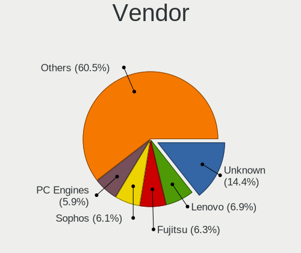
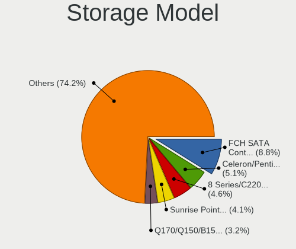
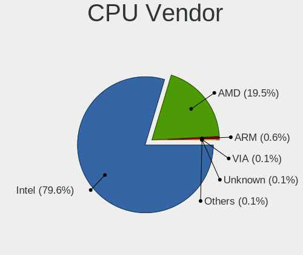
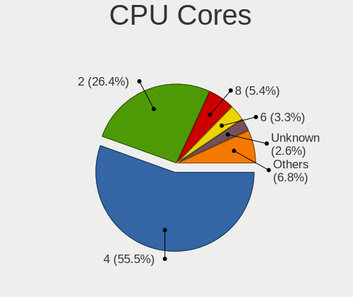
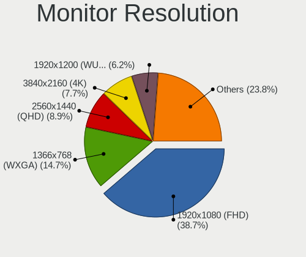
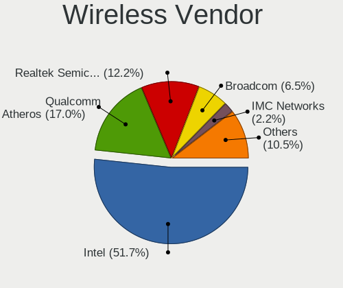
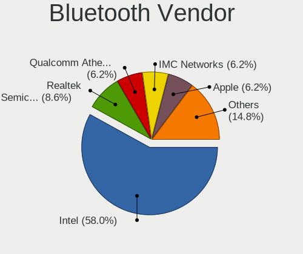
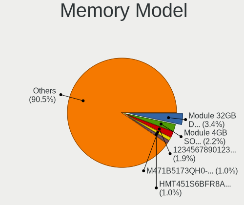
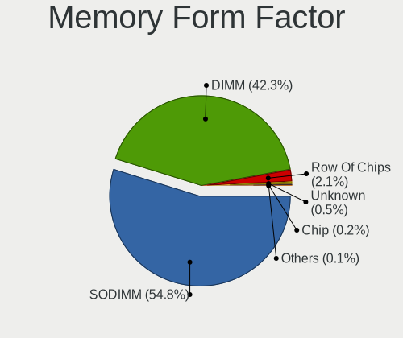
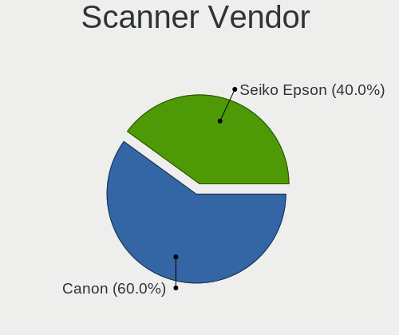

BSD in Germany - Tested Hardware & Statistics
---------------------------------------------

A project to collect tested hardware configurations for BSD in Germany.

Anyone can contribute to this report by the [hw-probe](https://github.com/linuxhw/hw-probe/blob/master/INSTALL.BSD.md) tool:

    hw-probe -all -upload

Please contribute! Especially if your hardware is rare.

This is a report for all computer types. See also reports for [desktops](/Location/Germany/Desktop/README.md) and [notebooks](/Location/Germany/Notebook/README.md).

Contents
--------

* [ Test Cases ](#test-cases)

* [ System ](#system)
  - [ OS                       ](#os)
  - [ OS Family                ](#os-family)
  - [ Arch                     ](#arch)
  - [ DE                       ](#de)
  - [ Display Server           ](#display-server)
  - [ Display Manager          ](#display-manager)
  - [ OS Lang                  ](#os-lang)
  - [ Boot Mode                ](#boot-mode)
  - [ Filesystem               ](#filesystem)
  - [ Part. scheme             ](#part-scheme)

* [ Board ](#board)
  - [ Vendor                   ](#vendor)
  - [ Model                    ](#model)
  - [ Model Family             ](#model-family)
  - [ MFG Year                 ](#mfg-year)
  - [ Form Factor              ](#form-factor)
  - [ Coreboot                 ](#coreboot)
  - [ RAM Size                 ](#ram-size)
  - [ RAM Used                 ](#ram-used)
  - [ Total Drives             ](#total-drives)
  - [ Has CD-ROM               ](#has-cd-rom)
  - [ Has Ethernet             ](#has-ethernet)
  - [ Has WiFi                 ](#has-wifi)
  - [ Has Bluetooth            ](#has-bluetooth)

* [ Location ](#location)
  - [ Country                  ](#country)
  - [ City                     ](#city)

* [ Drives ](#drives)
  - [ Drive Vendor             ](#drive-vendor)
  - [ Drive Model              ](#drive-model)
  - [ HDD Vendor               ](#hdd-vendor)
  - [ SSD Vendor               ](#ssd-vendor)
  - [ Drive Kind               ](#drive-kind)
  - [ Drive Connector          ](#drive-connector)
  - [ Drive Size               ](#drive-size)
  - [ Space Total              ](#space-total)
  - [ Space Used               ](#space-used)
  - [ Malfunc. Drives          ](#malfunc-drives)
  - [ Malfunc. Drive Vendor    ](#malfunc-drive-vendor)
  - [ Malfunc. HDD Vendor      ](#malfunc-hdd-vendor)
  - [ Malfunc. Drive Kind      ](#malfunc-drive-kind)
  - [ Failed Drives            ](#failed-drives)
  - [ Failed Drive Vendor      ](#failed-drive-vendor)
  - [ Drive Status             ](#drive-status)

* [ Storage controller ](#storage-controller)
  - [ Storage Vendor           ](#storage-vendor)
  - [ Storage Model            ](#storage-model)
  - [ Storage Kind             ](#storage-kind)

* [ Processor ](#processor)
  - [ CPU Vendor               ](#cpu-vendor)
  - [ CPU Model                ](#cpu-model)
  - [ CPU Model Family         ](#cpu-model-family)
  - [ CPU Cores                ](#cpu-cores)
  - [ CPU Sockets              ](#cpu-sockets)
  - [ CPU Threads              ](#cpu-threads)
  - [ CPU Microarch            ](#cpu-microarch)

* [ Graphics ](#graphics)
  - [ GPU Vendor               ](#gpu-vendor)
  - [ GPU Model                ](#gpu-model)
  - [ GPU Combo                ](#gpu-combo)
  - [ GPU Driver               ](#gpu-driver)
  - [ GPU Memory               ](#gpu-memory)

* [ Monitor ](#monitor)
  - [ Monitor Vendor           ](#monitor-vendor)
  - [ Monitor Model            ](#monitor-model)
  - [ Monitor Resolution       ](#monitor-resolution)
  - [ Monitor Diagonal         ](#monitor-diagonal)
  - [ Monitor Width            ](#monitor-width)
  - [ Aspect Ratio             ](#aspect-ratio)
  - [ Monitor Area             ](#monitor-area)
  - [ Pixel Density            ](#pixel-density)
  - [ Multiple Monitors        ](#multiple-monitors)

* [ Network ](#network)
  - [ Net Controller Vendor    ](#net-controller-vendor)
  - [ Net Controller Model     ](#net-controller-model)
  - [ Wireless Vendor          ](#wireless-vendor)
  - [ Wireless Model           ](#wireless-model)
  - [ Ethernet Vendor          ](#ethernet-vendor)
  - [ Ethernet Model           ](#ethernet-model)
  - [ Net Controller Kind      ](#net-controller-kind)
  - [ Used Controller          ](#used-controller)
  - [ NICs                     ](#nics)
  - [ IPv6                     ](#ipv6)

* [ Bluetooth ](#bluetooth)
  - [ Bluetooth Vendor         ](#bluetooth-vendor)
  - [ Bluetooth Model          ](#bluetooth-model)

* [ Sound ](#sound)
  - [ Sound Vendor             ](#sound-vendor)
  - [ Sound Model              ](#sound-model)

* [ Memory ](#memory)
  - [ Memory Vendor            ](#memory-vendor)
  - [ Memory Model             ](#memory-model)
  - [ Memory Kind              ](#memory-kind)
  - [ Memory Form Factor       ](#memory-form-factor)
  - [ Memory Size              ](#memory-size)
  - [ Memory Speed             ](#memory-speed)

* [ Printers & scanners ](#printers--scanners)
  - [ Printer Vendor           ](#printer-vendor)
  - [ Printer Model            ](#printer-model)
  - [ Scanner Vendor           ](#scanner-vendor)
  - [ Scanner Model            ](#scanner-model)

* [ Camera ](#camera)
  - [ Camera Vendor            ](#camera-vendor)
  - [ Camera Model             ](#camera-model)

* [ Security ](#security)
  - [ Fingerprint Vendor       ](#fingerprint-vendor)
  - [ Fingerprint Model        ](#fingerprint-model)
  - [ Chipcard Vendor          ](#chipcard-vendor)
  - [ Chipcard Model           ](#chipcard-model)

* [ Unsupported ](#unsupported)
  - [ Unsupported Devices      ](#unsupported-devices)
  - [ Unsupported Device Types ](#unsupported-device-types)

Test Cases
----------

Total: 3378

| Vendor        | Model                       | Form-Factor | Probe                                                     | Date         |
|---------------|-----------------------------|-------------|-----------------------------------------------------------|--------------|
| Unknown       | J3160-4L                    | Desktop     | [e4b6344125](https://bsd-hardware.info/?probe=e4b6344125) | Feb 18, 2024 |
| Gigabyte      | Z590I VISION D              | Desktop     | [95add8c57a](https://bsd-hardware.info/?probe=95add8c57a) | Feb 18, 2024 |
| Unknown       | Unknown                     | Desktop     | [0d6264dd51](https://bsd-hardware.info/?probe=0d6264dd51) | Feb 17, 2024 |
| Unknown       | Unknown                     | Desktop     | [ac788598a6](https://bsd-hardware.info/?probe=ac788598a6) | Feb 17, 2024 |
| ASUSTek       | B85M-G                      | Desktop     | [0fc891ba64](https://bsd-hardware.info/?probe=0fc891ba64) | Feb 17, 2024 |
| Biostar       | B450NH                      | Desktop     | [9f4dedfcd6](https://bsd-hardware.info/?probe=9f4dedfcd6) | Feb 17, 2024 |
| Sophos        | SG                          | Firewall    | [5224c7efa3](https://bsd-hardware.info/?probe=5224c7efa3) | Feb 16, 2024 |
| Sophos        | SG                          | Firewall    | [6c3e05ea48](https://bsd-hardware.info/?probe=6c3e05ea48) | Feb 16, 2024 |
| HP            | 8AC4                        | Desktop     | [524b8cae7c](https://bsd-hardware.info/?probe=524b8cae7c) | Feb 16, 2024 |
| Biostar       | B450NH                      | Desktop     | [2db279db1d](https://bsd-hardware.info/?probe=2db279db1d) | Feb 16, 2024 |
| Unknown       | Unknown                     | Desktop     | [a4781efc54](https://bsd-hardware.info/?probe=a4781efc54) | Feb 16, 2024 |
| Gigabyte      | B360N WIFI-CF               | Desktop     | [65cc201af1](https://bsd-hardware.info/?probe=65cc201af1) | Feb 15, 2024 |
| AMI           | Aptio CRB                   | Mini pc     | [947eabeecc](https://bsd-hardware.info/?probe=947eabeecc) | Feb 15, 2024 |
| Fujitsu       | D3031 S26361-D3031-A100-... | Server      | [7fcc4087e9](https://bsd-hardware.info/?probe=7fcc4087e9) | Feb 15, 2024 |
| Fujitsu       | D3031 S26361-D3031-A100-... | Server      | [f9ad9d25e3](https://bsd-hardware.info/?probe=f9ad9d25e3) | Feb 14, 2024 |
| ASUSTek       | Pro B560M-C                 | Desktop     | [fdeb2cee9d](https://bsd-hardware.info/?probe=fdeb2cee9d) | Feb 14, 2024 |
| Supermicro    | X11SDV-8C-TP8F              | Desktop     | [6a026289ce](https://bsd-hardware.info/?probe=6a026289ce) | Feb 14, 2024 |
| Gigabyte      | IMB1900TN                   | Desktop     | [d0c6d1e44b](https://bsd-hardware.info/?probe=d0c6d1e44b) | Feb 14, 2024 |
| Unknown       | Unknown                     | Desktop     | [5da46d2f84](https://bsd-hardware.info/?probe=5da46d2f84) | Feb 14, 2024 |
| Sophos        | SG                          | Firewall    | [b23c7b93a3](https://bsd-hardware.info/?probe=b23c7b93a3) | Feb 13, 2024 |
| ASRock        | A520M-ITX/ac                | Desktop     | [63408627d9](https://bsd-hardware.info/?probe=63408627d9) | Feb 13, 2024 |
| Gigabyte      | B760I AORUS PRO DDR4        | Desktop     | [0074d80aa1](https://bsd-hardware.info/?probe=0074d80aa1) | Feb 12, 2024 |
| Unknown       | YL-J3160L4                  | Desktop     | [7bb2930dfa](https://bsd-hardware.info/?probe=7bb2930dfa) | Feb 11, 2024 |
| Supermicro    | X10SLL-F                    | Server      | [d08cceec12](https://bsd-hardware.info/?probe=d08cceec12) | Feb 11, 2024 |
| Gigabyte      | B760I AORUS PRO DDR4        | Desktop     | [ab109fa386](https://bsd-hardware.info/?probe=ab109fa386) | Feb 10, 2024 |
| Unknown       | Unknown                     | Desktop     | [ea4fe7a8cf](https://bsd-hardware.info/?probe=ea4fe7a8cf) | Feb 10, 2024 |
| Deciso        | NetBoard-A10                | Notebook    | [8403713b4f](https://bsd-hardware.info/?probe=8403713b4f) | Feb 10, 2024 |
| Sophos        | SG                          | Firewall    | [06bd59ff02](https://bsd-hardware.info/?probe=06bd59ff02) | Feb 10, 2024 |
| Sophos        | SG                          | Firewall    | [1bb50b3634](https://bsd-hardware.info/?probe=1bb50b3634) | Feb 09, 2024 |
| Unknown       | Unknown                     | Desktop     | [eb03c1914f](https://bsd-hardware.info/?probe=eb03c1914f) | Feb 09, 2024 |
| Fujitsu       | D3067-A1 S26361-D3067-A1    | Desktop     | [08ee39a7cf](https://bsd-hardware.info/?probe=08ee39a7cf) | Feb 09, 2024 |
| MSI           | B450M MORTAR MAX            | Desktop     | [1401e42d48](https://bsd-hardware.info/?probe=1401e42d48) | Feb 08, 2024 |
| AMI           | Aptio CRB                   | Mini pc     | [7ec9f0596a](https://bsd-hardware.info/?probe=7ec9f0596a) | Feb 08, 2024 |
| Unknown       | J3160-4L                    | Desktop     | [353ac982bf](https://bsd-hardware.info/?probe=353ac982bf) | Feb 07, 2024 |
| Lenovo        | ThinkPad T14s Gen 4 21F8... | Notebook    | [2a4911715a](https://bsd-hardware.info/?probe=2a4911715a) | Feb 07, 2024 |
| Dell          | 0F0XJ6 A13                  | Server      | [0493961490](https://bsd-hardware.info/?probe=0493961490) | Feb 07, 2024 |
| SHANGZHAOY... | B85M-PRO V1.1               | Desktop     | [79ec97854e](https://bsd-hardware.info/?probe=79ec97854e) | Feb 07, 2024 |
| AAEON         | FWS-2251 V1.0               | Desktop     | [17853848cd](https://bsd-hardware.info/?probe=17853848cd) | Feb 07, 2024 |
| HP            | 8717                        | Desktop     | [de846f4d11](https://bsd-hardware.info/?probe=de846f4d11) | Feb 07, 2024 |
| OEM           | 1.0                         | Desktop     | [dd3228b447](https://bsd-hardware.info/?probe=dd3228b447) | Feb 07, 2024 |
| PC Engines    | apu4                        | Desktop     | [fb60f908ae](https://bsd-hardware.info/?probe=fb60f908ae) | Feb 07, 2024 |
| Gigabyte      | B450M DS3H-CF               | Desktop     | [4073dda626](https://bsd-hardware.info/?probe=4073dda626) | Feb 07, 2024 |
| AAEON         | FWS-2251 V1.0               | Desktop     | [1def0a68ec](https://bsd-hardware.info/?probe=1def0a68ec) | Feb 07, 2024 |
| Sophos        | SG                          | Firewall    | [5695f7cef3](https://bsd-hardware.info/?probe=5695f7cef3) | Feb 06, 2024 |
| Fujitsu       | D3544-Sx S26361-D3544-Sx... | Mini pc     | [3f9cc1361f](https://bsd-hardware.info/?probe=3f9cc1361f) | Feb 06, 2024 |
| Unknown       | Unknown                     | Desktop     | [38a8200699](https://bsd-hardware.info/?probe=38a8200699) | Feb 06, 2024 |
| Unknown       | Unknown                     | Desktop     | [7f960ac536](https://bsd-hardware.info/?probe=7f960ac536) | Feb 06, 2024 |
| Gigabyte      | Z68X-UD3H-B3                | Desktop     | [a2c1b1addb](https://bsd-hardware.info/?probe=a2c1b1addb) | Feb 06, 2024 |
| ZOTAC         | ZBOX-CI329NANO              | Mini pc     | [411de8ca13](https://bsd-hardware.info/?probe=411de8ca13) | Feb 06, 2024 |
| IceWhale T... | ZimaBoard 832 ZMB           | Desktop     | [a26afd4195](https://bsd-hardware.info/?probe=a26afd4195) | Feb 05, 2024 |
| Intel         | DENLOW_WS                   | Desktop     | [2d0479073b](https://bsd-hardware.info/?probe=2d0479073b) | Feb 05, 2024 |
| Unknown       | Unknown                     | Desktop     | [ff4514068b](https://bsd-hardware.info/?probe=ff4514068b) | Feb 05, 2024 |
| Apple         | MacBookPro11,1              | Notebook    | [c77173c2f3](https://bsd-hardware.info/?probe=c77173c2f3) | Feb 04, 2024 |
| Fujitsu       | D3313-E1 S26361-D3313-E1    | Desktop     | [9e7d881690](https://bsd-hardware.info/?probe=9e7d881690) | Feb 04, 2024 |
| Unknown       | Unknown                     | Desktop     | [aef9924665](https://bsd-hardware.info/?probe=aef9924665) | Feb 04, 2024 |
| Sophos        | UTM                         | Firewall    | [743e074269](https://bsd-hardware.info/?probe=743e074269) | Feb 04, 2024 |
| AZW           | EQ                          | Desktop     | [13a1514ea5](https://bsd-hardware.info/?probe=13a1514ea5) | Feb 04, 2024 |
| ASUSTek       | H110I-PLUS                  | Desktop     | [4cb8c45861](https://bsd-hardware.info/?probe=4cb8c45861) | Feb 03, 2024 |
| Deciso        | NetBoard-A10                | Notebook    | [118bac872e](https://bsd-hardware.info/?probe=118bac872e) | Feb 03, 2024 |
| AZW           | EQ                          | Desktop     | [53f9e8c700](https://bsd-hardware.info/?probe=53f9e8c700) | Feb 03, 2024 |
| ASUSTek       | Pro B560M-C                 | Desktop     | [676019447d](https://bsd-hardware.info/?probe=676019447d) | Feb 03, 2024 |
| ASRock        | H570M-ITX/ac                | Desktop     | [df0fcc7727](https://bsd-hardware.info/?probe=df0fcc7727) | Feb 03, 2024 |
| ZOTAC         | ZBOX-CI329NANO              | Mini pc     | [a301eadff9](https://bsd-hardware.info/?probe=a301eadff9) | Feb 03, 2024 |
| HP            | 213D A01                    | Desktop     | [4fdc25bc68](https://bsd-hardware.info/?probe=4fdc25bc68) | Feb 03, 2024 |
| Gigabyte      | B150N Phoenix-WIFI-CF       | Desktop     | [e5d18ced76](https://bsd-hardware.info/?probe=e5d18ced76) | Feb 03, 2024 |
| Apple         | MacBookPro8,2               | Notebook    | [95f19036db](https://bsd-hardware.info/?probe=95f19036db) | Feb 03, 2024 |
| Fujitsu       | D3543-A1 S26361-D3543-A1... | Desktop     | [f6b0ead009](https://bsd-hardware.info/?probe=f6b0ead009) | Feb 02, 2024 |
| NU591         | 1.0                         | Desktop     | [deccea813e](https://bsd-hardware.info/?probe=deccea813e) | Feb 02, 2024 |
| AAEON         | FWS-2251 V1.0               | Desktop     | [492271b0b3](https://bsd-hardware.info/?probe=492271b0b3) | Feb 02, 2024 |
| ASRock        | ALiveNF7G-HD720p            | Desktop     | [2bc3971f16](https://bsd-hardware.info/?probe=2bc3971f16) | Feb 02, 2024 |
| Fujitsu       | D3313-A1 S26361-D3313-A1    | Desktop     | [f3322d1b78](https://bsd-hardware.info/?probe=f3322d1b78) | Feb 01, 2024 |
| PC Engines    | APU2                        | Desktop     | [36ea8d39d4](https://bsd-hardware.info/?probe=36ea8d39d4) | Feb 01, 2024 |
| TUXEDO        | Aura 15 Gen1                | Notebook    | [4768e0001d](https://bsd-hardware.info/?probe=4768e0001d) | Feb 01, 2024 |
| Gigabyte      | IMB1900TN                   | Desktop     | [598cd03428](https://bsd-hardware.info/?probe=598cd03428) | Feb 01, 2024 |
| Protectli     | VP2410 10                   | Desktop     | [7d38bf7f11](https://bsd-hardware.info/?probe=7d38bf7f11) | Feb 01, 2024 |
| Gigabyte      | IMB1900TN                   | Desktop     | [60dd608790](https://bsd-hardware.info/?probe=60dd608790) | Feb 01, 2024 |
| Intel         | NUC5i3RYB H41000-507        | Mini pc     | [ee974b7142](https://bsd-hardware.info/?probe=ee974b7142) | Feb 01, 2024 |
| Gigabyte      | B760I AORUS PRO DDR4        | Desktop     | [ac68b46e30](https://bsd-hardware.info/?probe=ac68b46e30) | Jan 31, 2024 |
| Gigabyte      | IMB1900TN                   | Desktop     | [99f34191a2](https://bsd-hardware.info/?probe=99f34191a2) | Jan 31, 2024 |
| NU591         | 1.0                         | Desktop     | [1a28ec7585](https://bsd-hardware.info/?probe=1a28ec7585) | Jan 31, 2024 |
| AZW           | EQ                          | Desktop     | [543a7683f5](https://bsd-hardware.info/?probe=543a7683f5) | Jan 31, 2024 |
| SHANGZHAOY... | B85M-PRO V1.1               | Desktop     | [2da6441f53](https://bsd-hardware.info/?probe=2da6441f53) | Jan 31, 2024 |
| Fujitsu       | D3313-A1 S26361-D3313-A1    | Desktop     | [101a551862](https://bsd-hardware.info/?probe=101a551862) | Jan 30, 2024 |
| LANCOM Sys... | UF-360                      | Desktop     | [c220e91992](https://bsd-hardware.info/?probe=c220e91992) | Jan 30, 2024 |
| Fujitsu       | D3313-A1 S26361-D3313-A1    | Desktop     | [72acb76c3b](https://bsd-hardware.info/?probe=72acb76c3b) | Jan 30, 2024 |
| Fujitsu       | D3313-A1 S26361-D3313-A1    | Desktop     | [57d4964d77](https://bsd-hardware.info/?probe=57d4964d77) | Jan 30, 2024 |
| Yanling       | YL-CLU6L-V1                 | Desktop     | [dc64c3b9e2](https://bsd-hardware.info/?probe=dc64c3b9e2) | Jan 30, 2024 |
| CncTion       | N4505-4L B0                 | Desktop     | [2c14913b53](https://bsd-hardware.info/?probe=2c14913b53) | Jan 29, 2024 |
| CncTion       | N4505-4L B0                 | Desktop     | [f242be3f80](https://bsd-hardware.info/?probe=f242be3f80) | Jan 28, 2024 |
| Unknown       | YL-J3160L4                  | Desktop     | [4eaf392351](https://bsd-hardware.info/?probe=4eaf392351) | Jan 28, 2024 |
| Seco          | 0D02 A                      | Desktop     | [41fa3fa6ae](https://bsd-hardware.info/?probe=41fa3fa6ae) | Jan 28, 2024 |
| Seco          | 0D02 A                      | Desktop     | [076c8b8575](https://bsd-hardware.info/?probe=076c8b8575) | Jan 28, 2024 |
| Gigabyte      | J3455N-D3H                  | Desktop     | [9a1adff9eb](https://bsd-hardware.info/?probe=9a1adff9eb) | Jan 28, 2024 |
| Unknown       | Unknown                     | Desktop     | [94fdaaffaf](https://bsd-hardware.info/?probe=94fdaaffaf) | Jan 27, 2024 |
| Unknown       | Unknown                     | Desktop     | [60507b5afd](https://bsd-hardware.info/?probe=60507b5afd) | Jan 27, 2024 |
| OEM           | 1.0                         | Desktop     | [a6c82ad3f1](https://bsd-hardware.info/?probe=a6c82ad3f1) | Jan 26, 2024 |
| Sophos        | SG                          | Firewall    | [7a20aae305](https://bsd-hardware.info/?probe=7a20aae305) | Jan 25, 2024 |
| PC Engines    | apu4                        | Desktop     | [b3cc677cfa](https://bsd-hardware.info/?probe=b3cc677cfa) | Jan 24, 2024 |
| Dell          | Precision M4700             | Notebook    | [05a9a26c16](https://bsd-hardware.info/?probe=05a9a26c16) | Jan 24, 2024 |
| Unknown       | Unknown                     | Desktop     | [2cd92781d8](https://bsd-hardware.info/?probe=2cd92781d8) | Jan 24, 2024 |
| PC Engines    | APU2                        | Desktop     | [4665b895f7](https://bsd-hardware.info/?probe=4665b895f7) | Jan 24, 2024 |
| Deciso        | Netboard A10                | Desktop     | [cf324e008b](https://bsd-hardware.info/?probe=cf324e008b) | Jan 22, 2024 |
| ZOTAC         | ZBOX-CI329NANO              | Mini pc     | [563d52f091](https://bsd-hardware.info/?probe=563d52f091) | Jan 22, 2024 |
| PC Engines    | apu4                        | Desktop     | [0e2082e8dc](https://bsd-hardware.info/?probe=0e2082e8dc) | Jan 22, 2024 |
| PC Engines    | apu4                        | Desktop     | [f36b7e423e](https://bsd-hardware.info/?probe=f36b7e423e) | Jan 22, 2024 |
| MiTAC         | PD11TI AAPD11TI-100         | Desktop     | [71d42d0c05](https://bsd-hardware.info/?probe=71d42d0c05) | Jan 21, 2024 |
| Unknown       | Unknown                     | Notebook    | [6fe553c729](https://bsd-hardware.info/?probe=6fe553c729) | Jan 21, 2024 |
| Unknown       | Unknown                     | Notebook    | [e85605ed72](https://bsd-hardware.info/?probe=e85605ed72) | Jan 21, 2024 |
| Apple         | MacBookAir4,1               | Notebook    | [f51a396e5e](https://bsd-hardware.info/?probe=f51a396e5e) | Jan 21, 2024 |
| Dell          | Latitude E7450              | Notebook    | [f2216c5d0f](https://bsd-hardware.info/?probe=f2216c5d0f) | Jan 21, 2024 |
| Protectli     | VP2410 10                   | Desktop     | [e6396f76a1](https://bsd-hardware.info/?probe=e6396f76a1) | Jan 21, 2024 |
| Unknown       | Unknown                     | Desktop     | [4bee671423](https://bsd-hardware.info/?probe=4bee671423) | Jan 20, 2024 |
| Unknown       | Unknown                     | Desktop     | [89747e3a92](https://bsd-hardware.info/?probe=89747e3a92) | Jan 20, 2024 |
| Raspberry ... | Raspberry Pi                | Soc         | [278905d855](https://bsd-hardware.info/?probe=278905d855) | Jan 20, 2024 |
| Unknown       | Unknown                     | Desktop     | [c1a338bd53](https://bsd-hardware.info/?probe=c1a338bd53) | Jan 20, 2024 |
| CWWK          | CW-AD4L-N V1                | Desktop     | [2f576f617d](https://bsd-hardware.info/?probe=2f576f617d) | Jan 20, 2024 |
| Sophos        | SG                          | Firewall    | [1dd695d794](https://bsd-hardware.info/?probe=1dd695d794) | Jan 20, 2024 |
| AWOW          | AZ51                        | Mini pc     | [f5ad8addfd](https://bsd-hardware.info/?probe=f5ad8addfd) | Jan 19, 2024 |
| Unknown       | Unknown                     | Desktop     | [a944f4d913](https://bsd-hardware.info/?probe=a944f4d913) | Jan 19, 2024 |
| Unknown       | Unknown                     | Desktop     | [b225f25bd6](https://bsd-hardware.info/?probe=b225f25bd6) | Jan 19, 2024 |
| BESSTAR Te... | U820                        | Notebook    | [9d1b8fbbd5](https://bsd-hardware.info/?probe=9d1b8fbbd5) | Jan 18, 2024 |
| BESSTAR Te... | U820                        | Notebook    | [7e38f4e795](https://bsd-hardware.info/?probe=7e38f4e795) | Jan 18, 2024 |
| Supermicro    | X10SLM+-LN4F                | Server      | [36584a392c](https://bsd-hardware.info/?probe=36584a392c) | Jan 17, 2024 |
| HP            | ProLiant DL120 Gen9         | Server      | [aa661caf4f](https://bsd-hardware.info/?probe=aa661caf4f) | Jan 17, 2024 |
| ZX            | H610ITXG                    | Desktop     | [8add6c6c8c](https://bsd-hardware.info/?probe=8add6c6c8c) | Jan 16, 2024 |
| ASRockRack    | W680D4U-2L2T/G5             | Server      | [19838b7ccc](https://bsd-hardware.info/?probe=19838b7ccc) | Jan 16, 2024 |
| Unknown       | Unknown                     | Desktop     | [8cb0bf9ef6](https://bsd-hardware.info/?probe=8cb0bf9ef6) | Jan 16, 2024 |
| Sophos        | UTM                         | Firewall    | [8d4898c463](https://bsd-hardware.info/?probe=8d4898c463) | Jan 16, 2024 |
| PC Engines    | apu4                        | Desktop     | [2c857f37bd](https://bsd-hardware.info/?probe=2c857f37bd) | Jan 15, 2024 |
| PC Engines    | APU2                        | Desktop     | [dd588cfada](https://bsd-hardware.info/?probe=dd588cfada) | Jan 15, 2024 |
| Unknown       | QD-CMU01                    | Desktop     | [f5b7d0415b](https://bsd-hardware.info/?probe=f5b7d0415b) | Jan 15, 2024 |
| Apple         | MacBookAir4,1               | Notebook    | [b9653bc7d3](https://bsd-hardware.info/?probe=b9653bc7d3) | Jan 14, 2024 |
| ZOTAC         | ZBOX-CI329NANO              | Mini pc     | [6f8d412846](https://bsd-hardware.info/?probe=6f8d412846) | Jan 13, 2024 |
| PC Engines    | apu4                        | Desktop     | [93f07ee3ad](https://bsd-hardware.info/?probe=93f07ee3ad) | Jan 13, 2024 |
| PC Engines    | apu4                        | Desktop     | [aabf377c9a](https://bsd-hardware.info/?probe=aabf377c9a) | Jan 13, 2024 |
| Unknown       | Unknown                     | Desktop     | [37558c7d54](https://bsd-hardware.info/?probe=37558c7d54) | Jan 12, 2024 |
| Techvision    | TVI7309X B0                 | Desktop     | [023fd3c0ed](https://bsd-hardware.info/?probe=023fd3c0ed) | Jan 12, 2024 |
| Unknown       | Unknown                     | Desktop     | [3ba7f826bb](https://bsd-hardware.info/?probe=3ba7f826bb) | Jan 12, 2024 |
| ASUSTek       | P10S-M Series               | Desktop     | [e9c51e6d9a](https://bsd-hardware.info/?probe=e9c51e6d9a) | Jan 12, 2024 |
| Sophos        | XG                          | Firewall    | [6c7c337b46](https://bsd-hardware.info/?probe=6c7c337b46) | Jan 12, 2024 |
| Unknown       | Unknown                     | Notebook    | [4b22a105d7](https://bsd-hardware.info/?probe=4b22a105d7) | Jan 11, 2024 |
| ZOTAC         | ZBOX-CI329NANO              | Mini pc     | [494a88f1ca](https://bsd-hardware.info/?probe=494a88f1ca) | Jan 11, 2024 |
| PC Engines    | apu4                        | Desktop     | [0154684e8f](https://bsd-hardware.info/?probe=0154684e8f) | Jan 11, 2024 |
| MSI           | B450M MORTAR MAX            | Desktop     | [f85bbcd879](https://bsd-hardware.info/?probe=f85bbcd879) | Jan 11, 2024 |
| Lenovo        | 312D NOK                    | Mini pc     | [068f7a9c1c](https://bsd-hardware.info/?probe=068f7a9c1c) | Jan 11, 2024 |
| AWOW          | AK10                        | Desktop     | [18ce2740c7](https://bsd-hardware.info/?probe=18ce2740c7) | Jan 10, 2024 |
| Techvision    | TVI7309X B0                 | Desktop     | [c43a31cf9e](https://bsd-hardware.info/?probe=c43a31cf9e) | Jan 10, 2024 |
| Techvision    | TVI7309X B0                 | Desktop     | [1dd0e8fc68](https://bsd-hardware.info/?probe=1dd0e8fc68) | Jan 10, 2024 |
| Lenovo        | ThinkPad E14 Gen 3 20Y70... | Notebook    | [0f475f8e5d](https://bsd-hardware.info/?probe=0f475f8e5d) | Jan 10, 2024 |
| Lenovo        | ThinkPad E14 Gen 3 20Y70... | Notebook    | [6b21d0ae92](https://bsd-hardware.info/?probe=6b21d0ae92) | Jan 09, 2024 |
| Supermicro    | A2SDi-8C-HLN4F              | Server      | [d9e4994892](https://bsd-hardware.info/?probe=d9e4994892) | Jan 09, 2024 |
| Unknown       | Unknown                     | Desktop     | [80a25c3416](https://bsd-hardware.info/?probe=80a25c3416) | Jan 08, 2024 |
| HP            | Compaq 6510b (GM108UC#AB... | Notebook    | [7ed7da2383](https://bsd-hardware.info/?probe=7ed7da2383) | Jan 08, 2024 |
| Sophos        | XG                          | Firewall    | [65b6c56556](https://bsd-hardware.info/?probe=65b6c56556) | Jan 08, 2024 |
| SHANGZHAOY... | B85M-PRO V1.1               | Desktop     | [aeed7e4a51](https://bsd-hardware.info/?probe=aeed7e4a51) | Jan 07, 2024 |
| BESSTAR Te... | GB7                         | Mini pc     | [d2f553598a](https://bsd-hardware.info/?probe=d2f553598a) | Jan 07, 2024 |
| Lanner        | FW-7543 B-GA                | Desktop     | [6687c1ef69](https://bsd-hardware.info/?probe=6687c1ef69) | Jan 07, 2024 |
| ZOTAC         | H67ITX-C-E 02/03/05         | Desktop     | [6aba0c53a6](https://bsd-hardware.info/?probe=6aba0c53a6) | Jan 06, 2024 |
| Unknown       | Unknown                     | Desktop     | [3250ebf7f4](https://bsd-hardware.info/?probe=3250ebf7f4) | Jan 06, 2024 |
| CWWK          | MINIPC-G12                  | Desktop     | [cec3c2ba34](https://bsd-hardware.info/?probe=cec3c2ba34) | Jan 06, 2024 |
| PC Engines    | APU2                        | Desktop     | [680567c89b](https://bsd-hardware.info/?probe=680567c89b) | Jan 05, 2024 |
| Unknown       | MANIFOLD 2-C                | Desktop     | [02161442f5](https://bsd-hardware.info/?probe=02161442f5) | Jan 04, 2024 |
| Sophos        | SG                          | Firewall    | [cd8c505af7](https://bsd-hardware.info/?probe=cd8c505af7) | Jan 04, 2024 |
| Fujitsu       | D2949-B1 S26361-D2949-B1... | Server      | [18538b1bc2](https://bsd-hardware.info/?probe=18538b1bc2) | Jan 03, 2024 |
| Sophos        | SG                          | Firewall    | [f6e7a34edc](https://bsd-hardware.info/?probe=f6e7a34edc) | Jan 03, 2024 |
| Unknown       | Unknown                     | Desktop     | [1fddddcbc7](https://bsd-hardware.info/?probe=1fddddcbc7) | Jan 02, 2024 |
| Unknown       | Unknown                     | Notebook    | [c1d43f83f4](https://bsd-hardware.info/?probe=c1d43f83f4) | Jan 02, 2024 |
| Unknown       | MANIFOLD 2-C                | Desktop     | [6a195bc48f](https://bsd-hardware.info/?probe=6a195bc48f) | Jan 02, 2024 |
| Supermicro    | X11SBA-LN4FA                | Server      | [dbf9225f63](https://bsd-hardware.info/?probe=dbf9225f63) | Dec 31, 2023 |
| HP            | EliteBook 2540p             | Notebook    | [c915c03729](https://bsd-hardware.info/?probe=c915c03729) | Dec 30, 2023 |
| Dell          | 0KYJ8C A00                  | Desktop     | [34246adca9](https://bsd-hardware.info/?probe=34246adca9) | Dec 30, 2023 |
| Unknown       | Unknown                     | Desktop     | [63472bd5e6](https://bsd-hardware.info/?probe=63472bd5e6) | Dec 30, 2023 |
| Intel         | JSL MRD                     | Desktop     | [1c65a367b2](https://bsd-hardware.info/?probe=1c65a367b2) | Dec 30, 2023 |
| Gigabyte      | H110M-D2P-WG-CF             | Desktop     | [77e0d09bf1](https://bsd-hardware.info/?probe=77e0d09bf1) | Dec 29, 2023 |
| Deciso        | NetBoard-A10                | Notebook    | [66f7dd1f06](https://bsd-hardware.info/?probe=66f7dd1f06) | Dec 29, 2023 |
| Supermicro    | X8SIE                       | Desktop     | [a7e2e09ef4](https://bsd-hardware.info/?probe=a7e2e09ef4) | Dec 28, 2023 |
| Unknown       | QSKL01                      | Desktop     | [ba39338284](https://bsd-hardware.info/?probe=ba39338284) | Dec 28, 2023 |
| AZW           | EQ                          | Desktop     | [fcbfcb31d5](https://bsd-hardware.info/?probe=fcbfcb31d5) | Dec 28, 2023 |
| Techvision    | TVI7309X B0                 | Desktop     | [429f1e855f](https://bsd-hardware.info/?probe=429f1e855f) | Dec 27, 2023 |
| ZX            | H610ITXG                    | Desktop     | [8253eb826a](https://bsd-hardware.info/?probe=8253eb826a) | Dec 27, 2023 |
| Techvision    | TVI7309X B0                 | Desktop     | [6f592981ce](https://bsd-hardware.info/?probe=6f592981ce) | Dec 27, 2023 |
| Unknown       | MANIFOLD 2-C                | Desktop     | [c2f3692204](https://bsd-hardware.info/?probe=c2f3692204) | Dec 27, 2023 |
| Unknown       | Unknown                     | Desktop     | [b054d33e68](https://bsd-hardware.info/?probe=b054d33e68) | Dec 26, 2023 |
| CWWK          | CW-ADLN-6L                  | Desktop     | [fa5891041a](https://bsd-hardware.info/?probe=fa5891041a) | Dec 26, 2023 |
| Sophos        | UTM                         | Firewall    | [89d19cc2ab](https://bsd-hardware.info/?probe=89d19cc2ab) | Dec 25, 2023 |
| Unknown       | Unknown                     | Desktop     | [23ca4c0419](https://bsd-hardware.info/?probe=23ca4c0419) | Dec 25, 2023 |
| Unknown       | Unknown                     | Desktop     | [72d02dbaa4](https://bsd-hardware.info/?probe=72d02dbaa4) | Dec 25, 2023 |
| Lenovo        | ThinkPad T480 20L6S8LW00    | Notebook    | [b6c3c05155](https://bsd-hardware.info/?probe=b6c3c05155) | Dec 25, 2023 |
| AMI           | Aptio CRB                   | Mini pc     | [19c9105326](https://bsd-hardware.info/?probe=19c9105326) | Dec 24, 2023 |
| Unknown       | Unknown                     | Desktop     | [9876dcc6aa](https://bsd-hardware.info/?probe=9876dcc6aa) | Dec 24, 2023 |
| Unknown       | Unknown                     | Desktop     | [9a23873dc4](https://bsd-hardware.info/?probe=9a23873dc4) | Dec 24, 2023 |
| Lenovo        | ThinkPad P14s Gen 2a 21A... | Notebook    | [7ca1ae0c93](https://bsd-hardware.info/?probe=7ca1ae0c93) | Dec 23, 2023 |
| Lenovo        | 312D SDK0J40697 WIN 3305... | Mini pc     | [13699f3359](https://bsd-hardware.info/?probe=13699f3359) | Dec 23, 2023 |
| Fujitsu       | D3543-A1 S26361-D3543-A1... | Desktop     | [ee768bd5a0](https://bsd-hardware.info/?probe=ee768bd5a0) | Dec 23, 2023 |
| Lenovo        | ThinkPad T480 20L6S8LW00    | Notebook    | [32c06c5669](https://bsd-hardware.info/?probe=32c06c5669) | Dec 23, 2023 |
| Dell          | 03X6X0 A02                  | Server      | [1fc8559747](https://bsd-hardware.info/?probe=1fc8559747) | Dec 23, 2023 |
| CWWK          | CW-ADLN-6L                  | Desktop     | [d8245df746](https://bsd-hardware.info/?probe=d8245df746) | Dec 23, 2023 |
| Fujitsu       | D3313-G1 S26361-D3313-G1    | Desktop     | [5ed362ce02](https://bsd-hardware.info/?probe=5ed362ce02) | Dec 22, 2023 |
| ZX            | H610ITXG                    | Desktop     | [11edcbeaff](https://bsd-hardware.info/?probe=11edcbeaff) | Dec 22, 2023 |
| Lenovo        | 312D SDK0J40697 WIN 3305... | Mini pc     | [2e35364732](https://bsd-hardware.info/?probe=2e35364732) | Dec 22, 2023 |
| MW            | GMLK-2_5G4L                 | Desktop     | [9eaa02c47c](https://bsd-hardware.info/?probe=9eaa02c47c) | Dec 22, 2023 |
| Supermicro    | X11SSH-LN4F                 | Server      | [132a8d8b6f](https://bsd-hardware.info/?probe=132a8d8b6f) | Dec 21, 2023 |
| Unknown       | MANIFOLD 2-C                | Desktop     | [b2597a7f2b](https://bsd-hardware.info/?probe=b2597a7f2b) | Dec 21, 2023 |
| Unknown       | Unknown                     | Desktop     | [ec4c6d8fb5](https://bsd-hardware.info/?probe=ec4c6d8fb5) | Dec 21, 2023 |
| Yanling       | YL-CLU6L-V1                 | Desktop     | [9a0369cc72](https://bsd-hardware.info/?probe=9a0369cc72) | Dec 21, 2023 |
| Sophos        | UTM                         | Firewall    | [e1e002bdd4](https://bsd-hardware.info/?probe=e1e002bdd4) | Dec 21, 2023 |
| CWWK          | CW-ADLN-6L                  | Desktop     | [094d15625b](https://bsd-hardware.info/?probe=094d15625b) | Dec 21, 2023 |
| ASUSTek       | H110I-PLUS                  | Desktop     | [5c6e9bd18a](https://bsd-hardware.info/?probe=5c6e9bd18a) | Dec 20, 2023 |
| Fujitsu       | D3544-A1 S26361-D3544-A1... | Desktop     | [ec18d4f3a1](https://bsd-hardware.info/?probe=ec18d4f3a1) | Dec 20, 2023 |
| Unknown       | Unknown                     | Desktop     | [f11c353c61](https://bsd-hardware.info/?probe=f11c353c61) | Dec 19, 2023 |
| PC Engines    | apu4                        | Desktop     | [97c6f1ef2a](https://bsd-hardware.info/?probe=97c6f1ef2a) | Dec 19, 2023 |
| MSI           | A520M-A PRO                 | Desktop     | [11e5e87b70](https://bsd-hardware.info/?probe=11e5e87b70) | Dec 16, 2023 |
| Supermicro    | X10SLH-F/X10SLM+-F          | Server      | [17f70cfb67](https://bsd-hardware.info/?probe=17f70cfb67) | Dec 16, 2023 |
| CSL-Comput... | C15 v3                      | Notebook    | [dd93594896](https://bsd-hardware.info/?probe=dd93594896) | Dec 16, 2023 |
| SHANGZHAOY... | B85M-PRO V1.1               | Desktop     | [3b7ed136da](https://bsd-hardware.info/?probe=3b7ed136da) | Dec 16, 2023 |
| ZOTAC         | ZBOX-CI329NANO              | Mini pc     | [aefb80936c](https://bsd-hardware.info/?probe=aefb80936c) | Dec 15, 2023 |
| HP            | 213D A01                    | Desktop     | [f05a97db34](https://bsd-hardware.info/?probe=f05a97db34) | Dec 15, 2023 |
| Gigabyte      | B150N Phoenix-WIFI-CF       | Desktop     | [343d176e9c](https://bsd-hardware.info/?probe=343d176e9c) | Dec 15, 2023 |
| ASUSTek       | PRO B460M-C                 | Desktop     | [7a32a123f6](https://bsd-hardware.info/?probe=7a32a123f6) | Dec 15, 2023 |
| Dell          | XPS 13 9370                 | Notebook    | [b6845a3e54](https://bsd-hardware.info/?probe=b6845a3e54) | Dec 15, 2023 |
| AZW           | EQ                          | Desktop     | [f1e4bf2224](https://bsd-hardware.info/?probe=f1e4bf2224) | Dec 15, 2023 |
| Lenovo        | IdeaPad 330-15ARR 81D2      | Notebook    | [c197b26909](https://bsd-hardware.info/?probe=c197b26909) | Dec 14, 2023 |
| Dell          | Latitude E6540              | Notebook    | [77a9b10ab9](https://bsd-hardware.info/?probe=77a9b10ab9) | Dec 13, 2023 |
| Sophos        | SG                          | Firewall    | [13c711aabf](https://bsd-hardware.info/?probe=13c711aabf) | Dec 13, 2023 |
| Techvision    | TVI7309X B0                 | Desktop     | [b5f9416c13](https://bsd-hardware.info/?probe=b5f9416c13) | Dec 12, 2023 |
| HP            | ProLiant DL380p Gen8        | Server      | [20dd6f1621](https://bsd-hardware.info/?probe=20dd6f1621) | Dec 12, 2023 |
| Unknown       | Unknown                     | Desktop     | [8a0a469ad0](https://bsd-hardware.info/?probe=8a0a469ad0) | Dec 12, 2023 |
| SHANGZHAOY... | B85M-PRO V1.1               | Desktop     | [5cf5db5a05](https://bsd-hardware.info/?probe=5cf5db5a05) | Dec 11, 2023 |
| Dell          | 08CYF7 A05                  | Server      | [2768b91142](https://bsd-hardware.info/?probe=2768b91142) | Dec 11, 2023 |
| Techvision    | TVI7309X B0                 | Desktop     | [9a3a20d295](https://bsd-hardware.info/?probe=9a3a20d295) | Dec 11, 2023 |
| Supermicro    | X10SBAA                     | Server      | [f68b2d784b](https://bsd-hardware.info/?probe=f68b2d784b) | Dec 10, 2023 |
| ASRock        | H110M-DVS R3.0              | Desktop     | [b6a4782cbf](https://bsd-hardware.info/?probe=b6a4782cbf) | Dec 10, 2023 |
| ASUSTek       | TUF Gaming B560M-PLUS       | Desktop     | [47480f848d](https://bsd-hardware.info/?probe=47480f848d) | Dec 10, 2023 |
| ASUSTek       | PRIME X399-A                | Desktop     | [d62ad0d622](https://bsd-hardware.info/?probe=d62ad0d622) | Dec 09, 2023 |
| Lenovo        | ThinkPad X390 Yoga 20NQS... | Convertible | [0fe56565dc](https://bsd-hardware.info/?probe=0fe56565dc) | Dec 09, 2023 |
| Dell          | 02YYK5 A00                  | Desktop     | [39e0078d08](https://bsd-hardware.info/?probe=39e0078d08) | Dec 09, 2023 |
| ASRock        | Z370 Pro4                   | Desktop     | [6b4d8c076f](https://bsd-hardware.info/?probe=6b4d8c076f) | Dec 09, 2023 |
| Lenovo        | ThinkPad X390 Yoga 20NQS... | Convertible | [5b31c551ae](https://bsd-hardware.info/?probe=5b31c551ae) | Dec 09, 2023 |
| Unknown       | Unknown                     | Desktop     | [31619d30b3](https://bsd-hardware.info/?probe=31619d30b3) | Dec 09, 2023 |
| PC Engines    | APU2                        | Desktop     | [8f318ea168](https://bsd-hardware.info/?probe=8f318ea168) | Dec 09, 2023 |
| PC Engines    | APU2                        | Desktop     | [ca43be99fc](https://bsd-hardware.info/?probe=ca43be99fc) | Dec 08, 2023 |
| Fujitsu       | D3543-A1 S26361-D3543-A1... | Desktop     | [eb2eef3d17](https://bsd-hardware.info/?probe=eb2eef3d17) | Dec 08, 2023 |
| PC Engines    | apu4                        | Desktop     | [cdbac53ff6](https://bsd-hardware.info/?probe=cdbac53ff6) | Dec 08, 2023 |
| Unknown       | Unknown                     | Desktop     | [efab62c197](https://bsd-hardware.info/?probe=efab62c197) | Dec 07, 2023 |
| Fujitsu       | D3633-S1 S26361-D3633-S1    | Desktop     | [d3898c1e39](https://bsd-hardware.info/?probe=d3898c1e39) | Dec 07, 2023 |
| Unknown       | Unknown                     | Desktop     | [fed92c23db](https://bsd-hardware.info/?probe=fed92c23db) | Dec 07, 2023 |
| HP            | EliteBook 840 G6            | Notebook    | [7476cc6440](https://bsd-hardware.info/?probe=7476cc6440) | Dec 06, 2023 |
| Apple         | MacBookAir7,2               | Notebook    | [3784a39a41](https://bsd-hardware.info/?probe=3784a39a41) | Dec 06, 2023 |
| Supermicro    | X10SDV-TP8F                 | Server      | [52605948b7](https://bsd-hardware.info/?probe=52605948b7) | Dec 06, 2023 |
| PC Engines    | APU3                        | Desktop     | [06a4e1c23b](https://bsd-hardware.info/?probe=06a4e1c23b) | Dec 06, 2023 |
| PC Engines    | apu4                        | Desktop     | [04dd506405](https://bsd-hardware.info/?probe=04dd506405) | Dec 06, 2023 |
| Techvision    | TVI7309X B0                 | Desktop     | [9d54a02c53](https://bsd-hardware.info/?probe=9d54a02c53) | Dec 05, 2023 |
| Yanling       | YL-KBRL2 Series Ver:1.02    | Desktop     | [3bd3f01055](https://bsd-hardware.info/?probe=3bd3f01055) | Dec 05, 2023 |
| HP            | 8103 A01                    | Mini pc     | [f558be71a3](https://bsd-hardware.info/?probe=f558be71a3) | Dec 05, 2023 |
| HP            | 8103 A01                    | Mini pc     | [a71bdf2036](https://bsd-hardware.info/?probe=a71bdf2036) | Dec 05, 2023 |
| Wortmann      | TERRA_MOBILE_1541           | Notebook    | [63f1a71855](https://bsd-hardware.info/?probe=63f1a71855) | Dec 04, 2023 |
| HP            | 8103 A01                    | Mini pc     | [0da20332e6](https://bsd-hardware.info/?probe=0da20332e6) | Dec 04, 2023 |
| Protectli     | FW2B Ver                    | Desktop     | [9ae293de1b](https://bsd-hardware.info/?probe=9ae293de1b) | Dec 03, 2023 |
| Protectli     | VP2420                      | Desktop     | [31b70f1d0d](https://bsd-hardware.info/?probe=31b70f1d0d) | Dec 03, 2023 |
| AMI           | Aptio CRB                   | Mini pc     | [f23df632e4](https://bsd-hardware.info/?probe=f23df632e4) | Dec 03, 2023 |
| Intel         | Q3XXG4-P V1.0               | Desktop     | [8a6ce136cc](https://bsd-hardware.info/?probe=8a6ce136cc) | Dec 03, 2023 |
| Fujitsu       | D3313-G1 S26361-D3313-G1    | Desktop     | [150fd26797](https://bsd-hardware.info/?probe=150fd26797) | Dec 02, 2023 |
| Unknown       | Unknown                     | Desktop     | [5efe3ae6f9](https://bsd-hardware.info/?probe=5efe3ae6f9) | Dec 01, 2023 |
| Protectli     | VP2420                      | Desktop     | [4d59cef5e8](https://bsd-hardware.info/?probe=4d59cef5e8) | Nov 30, 2023 |
| Intel         | JSL MRD                     | Desktop     | [0ec285953e](https://bsd-hardware.info/?probe=0ec285953e) | Nov 30, 2023 |
| Unknown       | Unknown                     | Notebook    | [7d3416a30f](https://bsd-hardware.info/?probe=7d3416a30f) | Nov 30, 2023 |
| Unknown       | Unknown                     | Desktop     | [e5be2bebf5](https://bsd-hardware.info/?probe=e5be2bebf5) | Nov 30, 2023 |
| Unknown       | Unknown                     | Desktop     | [9579521c83](https://bsd-hardware.info/?probe=9579521c83) | Nov 30, 2023 |
| Intel         | JSL MRD                     | Desktop     | [f8beb1caa9](https://bsd-hardware.info/?probe=f8beb1caa9) | Nov 30, 2023 |
| CWWK          | CW-AD4L-N V1                | Desktop     | [e31a43fc53](https://bsd-hardware.info/?probe=e31a43fc53) | Nov 30, 2023 |
| Yanling       | YL-ALU6L                    | Desktop     | [21135d9aa5](https://bsd-hardware.info/?probe=21135d9aa5) | Nov 29, 2023 |
| Deciso        | DEC2700 - OPNsense Appli... | Notebook    | [e98e7bcab5](https://bsd-hardware.info/?probe=e98e7bcab5) | Nov 29, 2023 |
| Techvision    | TVI7309X B0                 | Desktop     | [895be1e0cd](https://bsd-hardware.info/?probe=895be1e0cd) | Nov 28, 2023 |
| Gigabyte      | B150N Phoenix-WIFI-CF       | Desktop     | [61bf87efe4](https://bsd-hardware.info/?probe=61bf87efe4) | Nov 28, 2023 |
| AMI           | Aptio CRB                   | Mini pc     | [a2a08d6eec](https://bsd-hardware.info/?probe=a2a08d6eec) | Nov 28, 2023 |
| CNCTION-IA... | Unknown                     | Desktop     | [1b4871792b](https://bsd-hardware.info/?probe=1b4871792b) | Nov 28, 2023 |
| Lanner        | FW-7543 B-GA                | Desktop     | [fa32eea2ff](https://bsd-hardware.info/?probe=fa32eea2ff) | Nov 26, 2023 |
| Unknown       | Unknown                     | Notebook    | [55339dbfab](https://bsd-hardware.info/?probe=55339dbfab) | Nov 26, 2023 |
| PC Engines    | APU2                        | Desktop     | [c2ab63093b](https://bsd-hardware.info/?probe=c2ab63093b) | Nov 25, 2023 |
| ASRock        | H570M-ITX/ac                | Desktop     | [a8d3950959](https://bsd-hardware.info/?probe=a8d3950959) | Nov 25, 2023 |
| HP            | 1825                        | Desktop     | [373a147d04](https://bsd-hardware.info/?probe=373a147d04) | Nov 24, 2023 |
| Protectli     | FW6 Ver                     | Desktop     | [7bb170248d](https://bsd-hardware.info/?probe=7bb170248d) | Nov 24, 2023 |
| Dell          | 0F0XJ6 A13                  | Server      | [f4a31a2e53](https://bsd-hardware.info/?probe=f4a31a2e53) | Nov 24, 2023 |
| PICO PC       | MNHO-113                    | Desktop     | [261b0d936c](https://bsd-hardware.info/?probe=261b0d936c) | Nov 23, 2023 |
| Sophos        | XG                          | Firewall    | [a0539d33da](https://bsd-hardware.info/?probe=a0539d33da) | Nov 23, 2023 |
| Dell          | 00P8G1 A00                  | All in one  | [daca9b37fd](https://bsd-hardware.info/?probe=daca9b37fd) | Nov 23, 2023 |
| Lanner        | FW-7543 B-GA                | Desktop     | [eca8e8785c](https://bsd-hardware.info/?probe=eca8e8785c) | Nov 22, 2023 |
| AZW           | EQ                          | Desktop     | [3407ab2a5b](https://bsd-hardware.info/?probe=3407ab2a5b) | Nov 22, 2023 |
| Unknown       | Unknown                     | Desktop     | [87ab49a51e](https://bsd-hardware.info/?probe=87ab49a51e) | Nov 22, 2023 |
| Unknown       | Unknown                     | Desktop     | [b60795e523](https://bsd-hardware.info/?probe=b60795e523) | Nov 22, 2023 |
| Thomas-Kre... | LES network 6L              | Desktop     | [654e4f96f7](https://bsd-hardware.info/?probe=654e4f96f7) | Nov 21, 2023 |
| Unknown       | Unknown                     | Notebook    | [ff855b549e](https://bsd-hardware.info/?probe=ff855b549e) | Nov 20, 2023 |
| MSI           | B450M MORTAR MAX            | Desktop     | [d38d698b2e](https://bsd-hardware.info/?probe=d38d698b2e) | Nov 20, 2023 |
| Intel         | ND2X-NET-PC BIOS Revisio... | Desktop     | [7fd080cf42](https://bsd-hardware.info/?probe=7fd080cf42) | Nov 19, 2023 |
| Panasonic     | CF-31-5                     | Notebook    | [8771ab6139](https://bsd-hardware.info/?probe=8771ab6139) | Nov 18, 2023 |
| Dell          | 0WMJ54 A01                  | Desktop     | [bd12235645](https://bsd-hardware.info/?probe=bd12235645) | Nov 18, 2023 |
| Deciso        | Netboard A10                | Desktop     | [5efc270fa6](https://bsd-hardware.info/?probe=5efc270fa6) | Nov 18, 2023 |
| ShenZhen M... | MW-GMLK-2.5G6L              | Desktop     | [947076a4de](https://bsd-hardware.info/?probe=947076a4de) | Nov 18, 2023 |
| ASUSTek       | PRIME X470-PRO              | Desktop     | [07dbd58d8e](https://bsd-hardware.info/?probe=07dbd58d8e) | Nov 17, 2023 |
| TUXEDO        | Pulse 15 Gen2               | Notebook    | [9061ad4228](https://bsd-hardware.info/?probe=9061ad4228) | Nov 17, 2023 |
| Dell          | Inspiron 1525               | Notebook    | [984f5f2f4b](https://bsd-hardware.info/?probe=984f5f2f4b) | Nov 16, 2023 |
| Fujitsu       | D3633-S1 S26361-D3633-S1    | Desktop     | [a406ee9805](https://bsd-hardware.info/?probe=a406ee9805) | Nov 16, 2023 |
| PC Engines    | APU2                        | Desktop     | [5ea4af0d94](https://bsd-hardware.info/?probe=5ea4af0d94) | Nov 16, 2023 |
| Intel         | QHSW02                      | Desktop     | [f05cdb2841](https://bsd-hardware.info/?probe=f05cdb2841) | Nov 15, 2023 |
| ASRock        | A300M-STX                   | Desktop     | [e5f0053202](https://bsd-hardware.info/?probe=e5f0053202) | Nov 15, 2023 |
| Protectli     | FW6 Ver                     | Desktop     | [7719e7606c](https://bsd-hardware.info/?probe=7719e7606c) | Nov 15, 2023 |
| Gigabyte      | X570S UD                    | Desktop     | [6257d05c99](https://bsd-hardware.info/?probe=6257d05c99) | Nov 15, 2023 |
| Lenovo        | 3111 SDK0J40697 WIN 3305... | Mini pc     | [e98965d0f9](https://bsd-hardware.info/?probe=e98965d0f9) | Nov 14, 2023 |
| Fujitsu       | D3221-A1 S26361-D3221-A1    | Desktop     | [0f82d77235](https://bsd-hardware.info/?probe=0f82d77235) | Nov 14, 2023 |
| Supermicro    | X10SDV-TP8F                 | Server      | [fec17c799c](https://bsd-hardware.info/?probe=fec17c799c) | Nov 14, 2023 |
| HP            | ProLiant DL360 G5           | Server      | [8b2811bcf5](https://bsd-hardware.info/?probe=8b2811bcf5) | Nov 14, 2023 |
| Protectli     | FW6 Ver                     | Desktop     | [4984b1536a](https://bsd-hardware.info/?probe=4984b1536a) | Nov 14, 2023 |
| Protectli     | FW6 Ver                     | Desktop     | [5d9467ed74](https://bsd-hardware.info/?probe=5d9467ed74) | Nov 14, 2023 |
| MW            | GMLK-2_5G4L                 | Desktop     | [d6f10bf9d2](https://bsd-hardware.info/?probe=d6f10bf9d2) | Nov 13, 2023 |
| Dell          | 015HP0 A00                  | Mini pc     | [b282285d51](https://bsd-hardware.info/?probe=b282285d51) | Nov 13, 2023 |
| Dell          | 015HP0 A00                  | Mini pc     | [2c1f962756](https://bsd-hardware.info/?probe=2c1f962756) | Nov 13, 2023 |
| Fujitsu       | D3430-U1 S26361-D3430-U1    | Desktop     | [49089c64bf](https://bsd-hardware.info/?probe=49089c64bf) | Nov 12, 2023 |
| Unknown       | Unknown                     | Desktop     | [d8cc007961](https://bsd-hardware.info/?probe=d8cc007961) | Nov 12, 2023 |
| PC Engines    | APU3                        | Desktop     | [0c58a923fe](https://bsd-hardware.info/?probe=0c58a923fe) | Nov 12, 2023 |
| ZOTAC         | ZBOX-CI323NANO              | Mini pc     | [2f916d0780](https://bsd-hardware.info/?probe=2f916d0780) | Nov 12, 2023 |
| HP            | ProLiant DL320e Gen8 v2     | Server      | [faf46e5802](https://bsd-hardware.info/?probe=faf46e5802) | Nov 11, 2023 |
| MW            | GMLK-2_5G4L                 | Desktop     | [9bab52c825](https://bsd-hardware.info/?probe=9bab52c825) | Nov 11, 2023 |
| Protectli     | FW6 Ver                     | Desktop     | [da0816e168](https://bsd-hardware.info/?probe=da0816e168) | Nov 10, 2023 |
| Techvision    | TVI7309X B0                 | Desktop     | [6afb2cc33f](https://bsd-hardware.info/?probe=6afb2cc33f) | Nov 10, 2023 |
| Dell          | 045M96 A02                  | Server      | [afd35f3afa](https://bsd-hardware.info/?probe=afd35f3afa) | Nov 09, 2023 |
| Sophos        | SG                          | Firewall    | [042fb4f2e1](https://bsd-hardware.info/?probe=042fb4f2e1) | Nov 09, 2023 |
| Sophos        | SG                          | Firewall    | [396d8e0dca](https://bsd-hardware.info/?probe=396d8e0dca) | Nov 09, 2023 |
| Sophos        | UTM                         | Firewall    | [8b26d81a35](https://bsd-hardware.info/?probe=8b26d81a35) | Nov 08, 2023 |
| Sophos        | UTM                         | Firewall    | [6d031ab91e](https://bsd-hardware.info/?probe=6d031ab91e) | Nov 08, 2023 |
| Supermicro    | X11SDV-4C-TP8F              | Server      | [7b3740b7c0](https://bsd-hardware.info/?probe=7b3740b7c0) | Nov 08, 2023 |
| ZOTAC         | ZBOX-MI643/MI623 Rev.00     | Mini pc     | [709dd91ea2](https://bsd-hardware.info/?probe=709dd91ea2) | Nov 08, 2023 |
| ASUSTek       | TUF Gaming B550-PLUS        | Desktop     | [700d52c2dd](https://bsd-hardware.info/?probe=700d52c2dd) | Nov 07, 2023 |
| CncTion       | N5105-4L B0                 | Desktop     | [2c085953ca](https://bsd-hardware.info/?probe=2c085953ca) | Nov 07, 2023 |
| Protectli     | FW6 Ver                     | Desktop     | [df41e8f6b2](https://bsd-hardware.info/?probe=df41e8f6b2) | Nov 07, 2023 |
| Fujitsu       | D3313-G1 S26361-D3313-G1    | Desktop     | [cf8fb90fe0](https://bsd-hardware.info/?probe=cf8fb90fe0) | Nov 07, 2023 |
| Supermicro    | X11SDV-4C-TP8F              | Server      | [5a26b6b1f5](https://bsd-hardware.info/?probe=5a26b6b1f5) | Nov 07, 2023 |
| Unknown       | Unknown                     | Notebook    | [61c7e94f23](https://bsd-hardware.info/?probe=61c7e94f23) | Nov 06, 2023 |
| Unknown       | Unknown                     | Notebook    | [316be7bb33](https://bsd-hardware.info/?probe=316be7bb33) | Nov 06, 2023 |
| Supermicro    | X10SDV-TP8F                 | Server      | [dc54c810d3](https://bsd-hardware.info/?probe=dc54c810d3) | Nov 06, 2023 |
| MSI           | Z270 PC MATE                | Desktop     | [9686c20980](https://bsd-hardware.info/?probe=9686c20980) | Nov 06, 2023 |
| HP            | 213D A01                    | Desktop     | [b4c8864cef](https://bsd-hardware.info/?probe=b4c8864cef) | Nov 06, 2023 |
| Gigabyte      | B150N Phoenix-WIFI-CF       | Desktop     | [456fe0a275](https://bsd-hardware.info/?probe=456fe0a275) | Nov 06, 2023 |
| Dell          | Latitude E6540              | Notebook    | [a26912fd0d](https://bsd-hardware.info/?probe=a26912fd0d) | Nov 06, 2023 |
| TUXEDO        | Pulse 15 Gen1               | Notebook    | [4f9885c454](https://bsd-hardware.info/?probe=4f9885c454) | Nov 05, 2023 |
| Fujitsu       | D3313-A1 S26361-D3313-A1    | Desktop     | [ea78913e4c](https://bsd-hardware.info/?probe=ea78913e4c) | Nov 05, 2023 |
| Gigabyte      | B360N WIFI-CF               | Desktop     | [38b5f3b9ad](https://bsd-hardware.info/?probe=38b5f3b9ad) | Nov 04, 2023 |
| CncTion       | N5105-4L B0                 | Desktop     | [86aa07c0ae](https://bsd-hardware.info/?probe=86aa07c0ae) | Nov 04, 2023 |
| Lenovo        | ThinkPad P16s Gen 2 21K9... | Notebook    | [a9448cf3b5](https://bsd-hardware.info/?probe=a9448cf3b5) | Nov 04, 2023 |
| ASRock        | B365M-HDV                   | Desktop     | [368366454f](https://bsd-hardware.info/?probe=368366454f) | Nov 03, 2023 |
| Lenovo        | ThinkPad T470s W10DG 20J... | Notebook    | [19514dd0bd](https://bsd-hardware.info/?probe=19514dd0bd) | Nov 03, 2023 |
| Fujitsu       | D3313-E1 S26361-D3313-E1    | Desktop     | [e6927b5eb8](https://bsd-hardware.info/?probe=e6927b5eb8) | Nov 03, 2023 |
| Protectli     | FW6 Ver                     | Desktop     | [13eb07060d](https://bsd-hardware.info/?probe=13eb07060d) | Nov 03, 2023 |
| PC Engines    | apu4                        | Desktop     | [b85acbe43d](https://bsd-hardware.info/?probe=b85acbe43d) | Nov 03, 2023 |
| Fujitsu Si... | D2584-A1 S26361-D2584-A1    | Desktop     | [d4298a293f](https://bsd-hardware.info/?probe=d4298a293f) | Nov 02, 2023 |
| Techvision    | TVI7309X B0                 | Desktop     | [b038d8a95d](https://bsd-hardware.info/?probe=b038d8a95d) | Nov 02, 2023 |
| Unknown       | Unknown                     | Desktop     | [691338cb44](https://bsd-hardware.info/?probe=691338cb44) | Nov 02, 2023 |
| Unknown       | Unknown                     | Desktop     | [c6610a58ac](https://bsd-hardware.info/?probe=c6610a58ac) | Nov 02, 2023 |
| PICO PC       | MNHO-113                    | Desktop     | [a4175476a0](https://bsd-hardware.info/?probe=a4175476a0) | Nov 02, 2023 |
| Sophos        | SG                          | Firewall    | [24994d8e2f](https://bsd-hardware.info/?probe=24994d8e2f) | Nov 02, 2023 |
| Supermicro    | X10SLL-F                    | Server      | [8d3cf4e648](https://bsd-hardware.info/?probe=8d3cf4e648) | Nov 01, 2023 |
| Fujitsu       | D3544-A1 S26361-D3544-A1... | Desktop     | [2fcac7d927](https://bsd-hardware.info/?probe=2fcac7d927) | Nov 01, 2023 |
| Hardkernel    | ODROID-H2                   | Desktop     | [41c4097002](https://bsd-hardware.info/?probe=41c4097002) | Oct 30, 2023 |
| Sophos        | SG                          | Firewall    | [f9c46ab5cb](https://bsd-hardware.info/?probe=f9c46ab5cb) | Oct 30, 2023 |
| AZW           | EQ                          | Desktop     | [034b060507](https://bsd-hardware.info/?probe=034b060507) | Oct 30, 2023 |
| MW            | GMLK-2_5G4L                 | Desktop     | [ec852f7037](https://bsd-hardware.info/?probe=ec852f7037) | Oct 29, 2023 |
| AMI           | Aptio CRB                   | Mini pc     | [c774066857](https://bsd-hardware.info/?probe=c774066857) | Oct 28, 2023 |
| Fujitsu       | D3543-A1 S26361-D3543-A1... | Desktop     | [fc42f6db17](https://bsd-hardware.info/?probe=fc42f6db17) | Oct 28, 2023 |
| HP            | 1825                        | Desktop     | [8a0a258efc](https://bsd-hardware.info/?probe=8a0a258efc) | Oct 28, 2023 |
| Lenovo        | ThinkPad X230 23205UG       | Notebook    | [f204abc5fc](https://bsd-hardware.info/?probe=f204abc5fc) | Oct 28, 2023 |
| Gigabyte      | J3455N-D3H                  | Desktop     | [6448ed1b12](https://bsd-hardware.info/?probe=6448ed1b12) | Oct 28, 2023 |
| IGEL Techn... | D220                        | Desktop     | [3478db91ef](https://bsd-hardware.info/?probe=3478db91ef) | Oct 28, 2023 |
| Supermicro    | X11SSH-F                    | Desktop     | [73160cea1d](https://bsd-hardware.info/?probe=73160cea1d) | Oct 28, 2023 |
| Intel         | NUC11TNBi3 M11908-500       | Mini pc     | [72634e7285](https://bsd-hardware.info/?probe=72634e7285) | Oct 28, 2023 |
| Protectli     | FW4B                        | Desktop     | [23c31e7f9f](https://bsd-hardware.info/?probe=23c31e7f9f) | Oct 27, 2023 |
| Intel         | DB75EN AAG39650-302         | Desktop     | [5d64d42233](https://bsd-hardware.info/?probe=5d64d42233) | Oct 27, 2023 |
| Fujitsu       | D3314-E1 S26361-D3314-E1    | Desktop     | [2cde7906c1](https://bsd-hardware.info/?probe=2cde7906c1) | Oct 27, 2023 |
| Fujitsu       | D3314-A1 S26361-D3314-A1    | Desktop     | [d005339b5f](https://bsd-hardware.info/?probe=d005339b5f) | Oct 27, 2023 |
| Sophos        | UTM                         | Firewall    | [b6232a012b](https://bsd-hardware.info/?probe=b6232a012b) | Oct 27, 2023 |
| Gigabyte      | X570S UD                    | Desktop     | [fe3d35aef8](https://bsd-hardware.info/?probe=fe3d35aef8) | Oct 27, 2023 |
| PC Engines    | apu4                        | Desktop     | [7bbd252741](https://bsd-hardware.info/?probe=7bbd252741) | Oct 27, 2023 |
| Acer          | Veriton X4620G v1.0         | Desktop     | [bc374cdc01](https://bsd-hardware.info/?probe=bc374cdc01) | Oct 26, 2023 |
| Lenovo        | 312D SDK0J40697 WIN 3305... | Mini pc     | [17cdba9414](https://bsd-hardware.info/?probe=17cdba9414) | Oct 26, 2023 |
| Dell          | 0PRWNC A05                  | Server      | [9b44f96ab2](https://bsd-hardware.info/?probe=9b44f96ab2) | Oct 26, 2023 |
| HP            | EliteBook 840 G7 Noteboo... | Notebook    | [09cf753c7a](https://bsd-hardware.info/?probe=09cf753c7a) | Oct 26, 2023 |
| Protectli     | FW4B Ver                    | Desktop     | [0d97ba1ab0](https://bsd-hardware.info/?probe=0d97ba1ab0) | Oct 24, 2023 |
| Gigabyte      | MZGLKBP-00                  | Desktop     | [dcd8b6e432](https://bsd-hardware.info/?probe=dcd8b6e432) | Oct 24, 2023 |
| Gigabyte      | X570S UD                    | Desktop     | [dea9eee8a4](https://bsd-hardware.info/?probe=dea9eee8a4) | Oct 24, 2023 |
| Techvision    | TVI7309X B0                 | Desktop     | [38b1931562](https://bsd-hardware.info/?probe=38b1931562) | Oct 24, 2023 |
| ZOTAC         | ZBOX-CI341                  | Mini pc     | [cca1027ab8](https://bsd-hardware.info/?probe=cca1027ab8) | Oct 23, 2023 |
| AZW           | EQ                          | Desktop     | [8cb6ac80d2](https://bsd-hardware.info/?probe=8cb6ac80d2) | Oct 23, 2023 |
| HP            | 8103 A01                    | Mini pc     | [9740c7419d](https://bsd-hardware.info/?probe=9740c7419d) | Oct 23, 2023 |
| Unknown       | YL-J3160L4                  | Desktop     | [3192ead8b5](https://bsd-hardware.info/?probe=3192ead8b5) | Oct 22, 2023 |
| HP            | EliteBook 840 G7 Noteboo... | Notebook    | [7a57e0a112](https://bsd-hardware.info/?probe=7a57e0a112) | Oct 21, 2023 |
| Sophos        | SG                          | Firewall    | [411f124671](https://bsd-hardware.info/?probe=411f124671) | Oct 21, 2023 |
| Supermicro    | X11SBA-LN4FA                | Server      | [682d4aec9e](https://bsd-hardware.info/?probe=682d4aec9e) | Oct 20, 2023 |
| Supermicro    | H12SSL-i                    | Server      | [8943e5449f](https://bsd-hardware.info/?probe=8943e5449f) | Oct 20, 2023 |
| ASRockRack    | B650D4U-2L2T/BCM            | Server      | [b91ffc9125](https://bsd-hardware.info/?probe=b91ffc9125) | Oct 20, 2023 |
| Unknown       | Unknown                     | Notebook    | [363b63c1a1](https://bsd-hardware.info/?probe=363b63c1a1) | Oct 18, 2023 |
| Sophos        | SG                          | Firewall    | [164161ab82](https://bsd-hardware.info/?probe=164161ab82) | Oct 18, 2023 |
| Supermicro    | X10SDV-TP8F                 | Server      | [4a39ad1a98](https://bsd-hardware.info/?probe=4a39ad1a98) | Oct 18, 2023 |
| Unknown       | J3160-4L                    | Desktop     | [d69749afe5](https://bsd-hardware.info/?probe=d69749afe5) | Oct 18, 2023 |
| Sophos        | SG                          | Firewall    | [2ee4ce0769](https://bsd-hardware.info/?probe=2ee4ce0769) | Oct 17, 2023 |
| Fujitsu       | D3049-A1 S26361-D3049-A1... | Server      | [eadbd154ab](https://bsd-hardware.info/?probe=eadbd154ab) | Oct 16, 2023 |
| ASUSTek       | N552VX                      | Notebook    | [f927cf5ba4](https://bsd-hardware.info/?probe=f927cf5ba4) | Oct 16, 2023 |
| PC Engines    | APU2                        | Desktop     | [7fb59a92f0](https://bsd-hardware.info/?probe=7fb59a92f0) | Oct 16, 2023 |
| ASRockRack    | B650D4U-2L2T/BCM            | Server      | [5a15dd2166](https://bsd-hardware.info/?probe=5a15dd2166) | Oct 15, 2023 |
| ASRock        | H110M-DVS R3.0              | Desktop     | [abe8593d6e](https://bsd-hardware.info/?probe=abe8593d6e) | Oct 15, 2023 |
| ZOTAC         | ZBOX-CI329NANO              | Mini pc     | [4fc886d589](https://bsd-hardware.info/?probe=4fc886d589) | Oct 15, 2023 |
| MW            | GMLK-2_5G4L                 | Desktop     | [eb383d6f22](https://bsd-hardware.info/?probe=eb383d6f22) | Oct 15, 2023 |
| Fujitsu       | LIFEBOOK E744               | Notebook    | [72a9b731f6](https://bsd-hardware.info/?probe=72a9b731f6) | Oct 14, 2023 |
| Supermicro    | A1SRi-2758F                 | Mini pc     | [88725f5ed5](https://bsd-hardware.info/?probe=88725f5ed5) | Oct 14, 2023 |
| Sophos        | SG                          | Firewall    | [93d1eca671](https://bsd-hardware.info/?probe=93d1eca671) | Oct 14, 2023 |
| Deciso        | Netboard A20                | Notebook    | [879efbe255](https://bsd-hardware.info/?probe=879efbe255) | Oct 14, 2023 |
| MW            | GMLK-2_5G4L                 | Desktop     | [248c73db22](https://bsd-hardware.info/?probe=248c73db22) | Oct 14, 2023 |
| Unknown       | Unknown                     | Desktop     | [77a827631b](https://bsd-hardware.info/?probe=77a827631b) | Oct 13, 2023 |
| Gigabyte      | Z370 AORUS Gaming 7         | Desktop     | [8b0d009cc4](https://bsd-hardware.info/?probe=8b0d009cc4) | Oct 13, 2023 |
| Sophos        | SG                          | Firewall    | [896045150c](https://bsd-hardware.info/?probe=896045150c) | Oct 13, 2023 |
| Unknown       | YL-J3160L4                  | Desktop     | [65acf27cad](https://bsd-hardware.info/?probe=65acf27cad) | Oct 13, 2023 |
| Dell          | 08CYF7 A05                  | Server      | [6b8bbc4ad9](https://bsd-hardware.info/?probe=6b8bbc4ad9) | Oct 13, 2023 |
| Fujitsu       | D3313-E1 S26361-D3313-E1    | Desktop     | [516eda52f0](https://bsd-hardware.info/?probe=516eda52f0) | Oct 12, 2023 |
| Gigabyte      | Z370 AORUS Gaming 7         | Desktop     | [bb82c13e39](https://bsd-hardware.info/?probe=bb82c13e39) | Oct 12, 2023 |
| Fujitsu       | D3313-A1 S26361-D3313-A1    | Desktop     | [418d78095d](https://bsd-hardware.info/?probe=418d78095d) | Oct 12, 2023 |
| Yanling       | YL-CLU6L-V1                 | Desktop     | [f3b384d87a](https://bsd-hardware.info/?probe=f3b384d87a) | Oct 12, 2023 |
| Lenovo        | ThinkPad X250 20CM004VFR    | Notebook    | [e4ab2acd8d](https://bsd-hardware.info/?probe=e4ab2acd8d) | Oct 11, 2023 |
| Unknown       | Unknown                     | Desktop     | [30ec824cf5](https://bsd-hardware.info/?probe=30ec824cf5) | Oct 11, 2023 |
| Unknown       | Unknown                     | Desktop     | [3d5abb3996](https://bsd-hardware.info/?probe=3d5abb3996) | Oct 11, 2023 |
| Unknown       | Unknown                     | Desktop     | [e4faecc5e8](https://bsd-hardware.info/?probe=e4faecc5e8) | Oct 10, 2023 |
| Unknown       | Unknown                     | Desktop     | [5031b0a5a7](https://bsd-hardware.info/?probe=5031b0a5a7) | Oct 10, 2023 |
| Yanling       | YL-CLU6L-V1                 | Desktop     | [cf15e11738](https://bsd-hardware.info/?probe=cf15e11738) | Oct 10, 2023 |
| Unknown       | QD-CMU01                    | Desktop     | [8637821e57](https://bsd-hardware.info/?probe=8637821e57) | Oct 09, 2023 |
| Sophos        | UTM                         | Firewall    | [002d6256fa](https://bsd-hardware.info/?probe=002d6256fa) | Oct 09, 2023 |
| ASRock        | A75M-HVS                    | Desktop     | [93709074ae](https://bsd-hardware.info/?probe=93709074ae) | Oct 09, 2023 |
| BESSTAR Te... | GB7                         | Mini pc     | [862d0bbe4d](https://bsd-hardware.info/?probe=862d0bbe4d) | Oct 08, 2023 |
| Sophos        | SG                          | Firewall    | [2e19b2128b](https://bsd-hardware.info/?probe=2e19b2128b) | Oct 08, 2023 |
| Unknown       | Unknown                     | Notebook    | [57e5ab8786](https://bsd-hardware.info/?probe=57e5ab8786) | Oct 08, 2023 |
| Unknown       | Unknown                     | Notebook    | [1f7ab105e3](https://bsd-hardware.info/?probe=1f7ab105e3) | Oct 08, 2023 |
| Intel         | DENLOW_WS                   | Desktop     | [11b0d7b64f](https://bsd-hardware.info/?probe=11b0d7b64f) | Oct 07, 2023 |
| Fujitsu       | D3313-A1 S26361-D3313-A1    | Desktop     | [d7a7e7338f](https://bsd-hardware.info/?probe=d7a7e7338f) | Oct 07, 2023 |
| AMI           | Aptio CRB                   | Mini pc     | [e3141878a9](https://bsd-hardware.info/?probe=e3141878a9) | Oct 07, 2023 |
| ASRock        | J5040-ITX                   | Desktop     | [dffb96790c](https://bsd-hardware.info/?probe=dffb96790c) | Oct 06, 2023 |
| GoWin Solu... | R86S                        | Desktop     | [91b63fa5c7](https://bsd-hardware.info/?probe=91b63fa5c7) | Oct 06, 2023 |
| Fujitsu       | D3313-G1 S26361-D3313-G1    | Desktop     | [31c7e1d3f3](https://bsd-hardware.info/?probe=31c7e1d3f3) | Oct 06, 2023 |
| Deciso        | Netboard A8                 | Desktop     | [cf3b678212](https://bsd-hardware.info/?probe=cf3b678212) | Oct 06, 2023 |
| Fujitsu       | D3633-S1 S26361-D3633-S1    | Desktop     | [5b33d7b22e](https://bsd-hardware.info/?probe=5b33d7b22e) | Oct 04, 2023 |
| PC Engines    | APU2                        | Desktop     | [626d74b530](https://bsd-hardware.info/?probe=626d74b530) | Oct 04, 2023 |
| PC Engines    | apu4                        | Desktop     | [0e813a0050](https://bsd-hardware.info/?probe=0e813a0050) | Oct 04, 2023 |
| Sophos        | SG                          | Firewall    | [c91ad52ddf](https://bsd-hardware.info/?probe=c91ad52ddf) | Oct 04, 2023 |
| Dell          | Latitude 5591               | Notebook    | [8f6ca1e82a](https://bsd-hardware.info/?probe=8f6ca1e82a) | Oct 03, 2023 |
| Fujitsu       | D2863 S26361-D2863-A10 W... | Server      | [f2d65698fb](https://bsd-hardware.info/?probe=f2d65698fb) | Oct 03, 2023 |
| Unknown       | Unknown                     | Desktop     | [f5e7677e76](https://bsd-hardware.info/?probe=f5e7677e76) | Oct 01, 2023 |
| PC Engines    | APU2                        | Desktop     | [064fd13617](https://bsd-hardware.info/?probe=064fd13617) | Oct 01, 2023 |
| Sophos        | SG                          | Firewall    | [40e14eca4b](https://bsd-hardware.info/?probe=40e14eca4b) | Oct 01, 2023 |
| Deciso        | NetBoard-A10                | Notebook    | [5524017014](https://bsd-hardware.info/?probe=5524017014) | Oct 01, 2023 |
| Sophos        | SG                          | Firewall    | [13acf2a462](https://bsd-hardware.info/?probe=13acf2a462) | Oct 01, 2023 |
| Unknown       | Unknown                     | Notebook    | [7cfd3d40eb](https://bsd-hardware.info/?probe=7cfd3d40eb) | Sep 30, 2023 |
| Unknown       | Unknown                     | Desktop     | [716f9b28ab](https://bsd-hardware.info/?probe=716f9b28ab) | Sep 30, 2023 |
| Sophos        | SG                          | Firewall    | [c46ccbd5b9](https://bsd-hardware.info/?probe=c46ccbd5b9) | Sep 30, 2023 |
| Sophos        | SG                          | Firewall    | [1429a7de9a](https://bsd-hardware.info/?probe=1429a7de9a) | Sep 30, 2023 |
| Unknown       | Unknown                     | Desktop     | [fb21a44f71](https://bsd-hardware.info/?probe=fb21a44f71) | Sep 29, 2023 |
| Techvision    | TVI7309X B0                 | Desktop     | [f50d617197](https://bsd-hardware.info/?probe=f50d617197) | Sep 28, 2023 |
| Gigabyte      | B450M S2H V2                | Desktop     | [31da8655d1](https://bsd-hardware.info/?probe=31da8655d1) | Sep 28, 2023 |
| Dell          | Latitude 5591               | Notebook    | [c30943def8](https://bsd-hardware.info/?probe=c30943def8) | Sep 28, 2023 |
| Sophos        | SG                          | Firewall    | [e6a4159f0c](https://bsd-hardware.info/?probe=e6a4159f0c) | Sep 28, 2023 |
| Fujitsu       | D3221-A1 S26361-D3221-A1    | Desktop     | [b3f0a784ab](https://bsd-hardware.info/?probe=b3f0a784ab) | Sep 28, 2023 |
| Lenovo        | 312D SDK0J40697 WIN 3305... | Mini pc     | [0b2b7195c1](https://bsd-hardware.info/?probe=0b2b7195c1) | Sep 26, 2023 |
| Unknown       | YL-J1900L4-V2               | Desktop     | [c186f8b50c](https://bsd-hardware.info/?probe=c186f8b50c) | Sep 25, 2023 |
| Unknown       | Unknown                     | Desktop     | [1ba135fef1](https://bsd-hardware.info/?probe=1ba135fef1) | Sep 24, 2023 |
| Unknown       | Unknown                     | Desktop     | [9c8516c8a8](https://bsd-hardware.info/?probe=9c8516c8a8) | Sep 24, 2023 |
| ASUSTek       | PRIME X470-PRO              | Desktop     | [6a2ce1e29f](https://bsd-hardware.info/?probe=6a2ce1e29f) | Sep 24, 2023 |
| TUXEDO        | Aura 15 Gen1                | Notebook    | [b31f8c12f8](https://bsd-hardware.info/?probe=b31f8c12f8) | Sep 24, 2023 |
| NU591         | 1.0                         | Desktop     | [99f3260ee0](https://bsd-hardware.info/?probe=99f3260ee0) | Sep 24, 2023 |
| Supermicro    | X10SDV-TP8F                 | Server      | [d99ed8ecd0](https://bsd-hardware.info/?probe=d99ed8ecd0) | Sep 23, 2023 |
| Supermicro    | X10SDV-TP8F                 | Server      | [80f0800cee](https://bsd-hardware.info/?probe=80f0800cee) | Sep 23, 2023 |
| PC Engines    | APU2                        | Desktop     | [3c7bd005ef](https://bsd-hardware.info/?probe=3c7bd005ef) | Sep 23, 2023 |
| Yanling       | YL-CLU6L-V1                 | Desktop     | [06d8f02eb7](https://bsd-hardware.info/?probe=06d8f02eb7) | Sep 22, 2023 |
| Unknown       | Unknown                     | Desktop     | [16640c7f04](https://bsd-hardware.info/?probe=16640c7f04) | Sep 22, 2023 |
| Sophos        | SG                          | Firewall    | [54ff756b5b](https://bsd-hardware.info/?probe=54ff756b5b) | Sep 22, 2023 |
| Unknown       | Unknown                     | Desktop     | [fcde651e99](https://bsd-hardware.info/?probe=fcde651e99) | Sep 21, 2023 |
| Gigabyte      | B150N Phoenix-WIFI-CF       | Desktop     | [e046bd9405](https://bsd-hardware.info/?probe=e046bd9405) | Sep 21, 2023 |
| Gigabyte      | B150N Phoenix-WIFI-CF       | Desktop     | [90f89eea16](https://bsd-hardware.info/?probe=90f89eea16) | Sep 21, 2023 |
| ASRock        | J3455B-ITX                  | Desktop     | [c5a2093552](https://bsd-hardware.info/?probe=c5a2093552) | Sep 21, 2023 |
| Lenovo        | ThinkBook 13s G2 ITL 20V... | Notebook    | [de1bdf0601](https://bsd-hardware.info/?probe=de1bdf0601) | Sep 21, 2023 |
| Lenovo        | 312D SDK0J40697 WIN 3305... | Mini pc     | [e84cddfaaf](https://bsd-hardware.info/?probe=e84cddfaaf) | Sep 20, 2023 |
| Unknown       | Unknown                     | Desktop     | [3c479d7824](https://bsd-hardware.info/?probe=3c479d7824) | Sep 20, 2023 |
| Unknown       | Unknown                     | Desktop     | [13ba11c952](https://bsd-hardware.info/?probe=13ba11c952) | Sep 20, 2023 |
| Lenovo        | SHARKBAY 0B98401 WIN        | Desktop     | [92da10b93b](https://bsd-hardware.info/?probe=92da10b93b) | Sep 20, 2023 |
| Unknown       | SKYBAY                      | Desktop     | [95286f41d9](https://bsd-hardware.info/?probe=95286f41d9) | Sep 19, 2023 |
| Lenovo        | 3136 SDK0J40697 WIN 3305... | Mini pc     | [3950a0580d](https://bsd-hardware.info/?probe=3950a0580d) | Sep 16, 2023 |
| Intel         | DENLOW_WS                   | Desktop     | [029b3cdd58](https://bsd-hardware.info/?probe=029b3cdd58) | Sep 16, 2023 |
| Dell          | 0R5KP9 A09                  | Server      | [54ff0b9d41](https://bsd-hardware.info/?probe=54ff0b9d41) | Sep 16, 2023 |
| Unknown       | MANIFOLD 2-C                | Desktop     | [80707f8712](https://bsd-hardware.info/?probe=80707f8712) | Sep 16, 2023 |
| Techvision    | TVI7309X B0                 | Desktop     | [9a30d2d88c](https://bsd-hardware.info/?probe=9a30d2d88c) | Sep 16, 2023 |
| Unknown       | Unknown                     | Desktop     | [1808e7891c](https://bsd-hardware.info/?probe=1808e7891c) | Sep 16, 2023 |
| Unknown       | Unknown                     | Desktop     | [d6acb378a1](https://bsd-hardware.info/?probe=d6acb378a1) | Sep 15, 2023 |
| Unknown       | Unknown                     | Desktop     | [fe010506e6](https://bsd-hardware.info/?probe=fe010506e6) | Sep 15, 2023 |
| Alienware     | m15                         | Notebook    | [609d2ce1ce](https://bsd-hardware.info/?probe=609d2ce1ce) | Sep 14, 2023 |
| Dell          | 0NW6H5 A00                  | Desktop     | [227062e965](https://bsd-hardware.info/?probe=227062e965) | Sep 13, 2023 |
| Deciso        | NetBoard-A10                | Notebook    | [0068732d33](https://bsd-hardware.info/?probe=0068732d33) | Sep 13, 2023 |
| Dell          | 0KM5PX A02                  | Server      | [2028895de0](https://bsd-hardware.info/?probe=2028895de0) | Sep 13, 2023 |
| Fujitsu       | D3313-E1 S26361-D3313-E1    | Desktop     | [5c89a7a1f1](https://bsd-hardware.info/?probe=5c89a7a1f1) | Sep 13, 2023 |
| HP            | ProBook 4530s               | Notebook    | [0b47c15c42](https://bsd-hardware.info/?probe=0b47c15c42) | Sep 12, 2023 |
| HP            | ProBook 4530s               | Notebook    | [4b6daa1f1c](https://bsd-hardware.info/?probe=4b6daa1f1c) | Sep 12, 2023 |
| Unknown       | Unknown                     | Desktop     | [fd131bd648](https://bsd-hardware.info/?probe=fd131bd648) | Sep 11, 2023 |
| Fujitsu       | D3313-A1 S26361-D3313-A1    | Desktop     | [0797783a1c](https://bsd-hardware.info/?probe=0797783a1c) | Sep 10, 2023 |
| Supermicro    | A1SRi-2558F                 | Mini pc     | [04e0638cca](https://bsd-hardware.info/?probe=04e0638cca) | Sep 10, 2023 |
| Unknown       | Unknown                     | Desktop     | [3c85271913](https://bsd-hardware.info/?probe=3c85271913) | Sep 10, 2023 |
| HP            | 8103 A01                    | Mini pc     | [ff26b688eb](https://bsd-hardware.info/?probe=ff26b688eb) | Sep 09, 2023 |
| Apple         | PowerMac3,6                 | Desktop     | [36daf7ce75](https://bsd-hardware.info/?probe=36daf7ce75) | Sep 09, 2023 |
| Lenovo        | ThinkPad SL 2746N8G         | Notebook    | [07eda65608](https://bsd-hardware.info/?probe=07eda65608) | Sep 09, 2023 |
| Unknown       | Unknown                     | Desktop     | [3bc1fc9c7b](https://bsd-hardware.info/?probe=3bc1fc9c7b) | Sep 09, 2023 |
| Sophos        | XG                          | Firewall    | [01ed655ea2](https://bsd-hardware.info/?probe=01ed655ea2) | Sep 09, 2023 |
| Unknown       | Unknown                     | Desktop     | [68a0e23945](https://bsd-hardware.info/?probe=68a0e23945) | Sep 09, 2023 |
| Lenovo        | IdeaPad 100-14IBY 80MH      | Notebook    | [1d5aff2e2a](https://bsd-hardware.info/?probe=1d5aff2e2a) | Sep 08, 2023 |
| Techvision    | TVI7309X B0                 | Desktop     | [fe6bcbc332](https://bsd-hardware.info/?probe=fe6bcbc332) | Sep 08, 2023 |
| Techvision    | TVI7309X B0                 | Desktop     | [37e25cbcec](https://bsd-hardware.info/?probe=37e25cbcec) | Sep 08, 2023 |
| Lex           | Pineview-D                  | Desktop     | [351aabdb80](https://bsd-hardware.info/?probe=351aabdb80) | Sep 08, 2023 |
| PC Engines    | APU3                        | Desktop     | [ad38dcf54a](https://bsd-hardware.info/?probe=ad38dcf54a) | Sep 07, 2023 |
| IceWhale T... | ZimaBoard 432 ZMB           | Desktop     | [451cfdf64f](https://bsd-hardware.info/?probe=451cfdf64f) | Sep 06, 2023 |
| Unknown       | Unknown                     | Desktop     | [6361addd62](https://bsd-hardware.info/?probe=6361addd62) | Sep 06, 2023 |
| Fujitsu       | D3313-G1 S26361-D3313-G1    | Desktop     | [48ca84af37](https://bsd-hardware.info/?probe=48ca84af37) | Sep 06, 2023 |
| PC Engines    | APU2                        | Desktop     | [d582e62190](https://bsd-hardware.info/?probe=d582e62190) | Sep 06, 2023 |
| Unknown       | Unknown                     | Desktop     | [f757c58686](https://bsd-hardware.info/?probe=f757c58686) | Sep 05, 2023 |
| Dell          | 0PRWNC A05                  | Server      | [ded67b8cd6](https://bsd-hardware.info/?probe=ded67b8cd6) | Sep 04, 2023 |
| Dell          | 03X6X0 A02                  | Server      | [8d9b81f936](https://bsd-hardware.info/?probe=8d9b81f936) | Sep 04, 2023 |
| Supermicro    | X10SDV-TP8F                 | Server      | [25cc035e73](https://bsd-hardware.info/?probe=25cc035e73) | Sep 03, 2023 |
| PC Engines    | APU2                        | Desktop     | [c9d2cfe6fa](https://bsd-hardware.info/?probe=c9d2cfe6fa) | Sep 03, 2023 |
| Unknown       | Unknown                     | Desktop     | [53cee3b3c8](https://bsd-hardware.info/?probe=53cee3b3c8) | Sep 03, 2023 |
| Biostar       | J4105NHU                    | Desktop     | [2ac770aa55](https://bsd-hardware.info/?probe=2ac770aa55) | Sep 03, 2023 |
| Deciso        | NetBoard-A10                | Notebook    | [f95d1da00c](https://bsd-hardware.info/?probe=f95d1da00c) | Sep 01, 2023 |
| Inventec      | Z CLASS A02                 | Desktop     | [1f4bf47cab](https://bsd-hardware.info/?probe=1f4bf47cab) | Sep 01, 2023 |
| Sophos        | UTM                         | Firewall    | [01a7eea7b9](https://bsd-hardware.info/?probe=01a7eea7b9) | Aug 30, 2023 |
| Unknown       | Unknown                     | Desktop     | [b59ce07b49](https://bsd-hardware.info/?probe=b59ce07b49) | Aug 30, 2023 |
| MW            | GMLK-2_5G4L                 | Desktop     | [56ac0149f8](https://bsd-hardware.info/?probe=56ac0149f8) | Aug 30, 2023 |
| CncTion       | N6000-4L B0                 | Desktop     | [81cbfbffca](https://bsd-hardware.info/?probe=81cbfbffca) | Aug 29, 2023 |
| Unknown       | Unknown                     | Desktop     | [fc384f5de7](https://bsd-hardware.info/?probe=fc384f5de7) | Aug 28, 2023 |
| IceWhale T... | ZimaBoard 432 ZMB           | Desktop     | [a47cd8ee32](https://bsd-hardware.info/?probe=a47cd8ee32) | Aug 27, 2023 |
| AMI           | Aptio CRB                   | Mini pc     | [5025d5adb6](https://bsd-hardware.info/?probe=5025d5adb6) | Aug 27, 2023 |
| Fujitsu       | D3313-E1 S26361-D3313-E1    | Desktop     | [a684024d8e](https://bsd-hardware.info/?probe=a684024d8e) | Aug 27, 2023 |
| PC Engines    | APU                         | Desktop     | [3b29671556](https://bsd-hardware.info/?probe=3b29671556) | Aug 26, 2023 |
| Gigabyte      | X570S UD                    | Desktop     | [ed6162710b](https://bsd-hardware.info/?probe=ed6162710b) | Aug 26, 2023 |
| ASUSTek       | H110I-PLUS                  | Desktop     | [a487121854](https://bsd-hardware.info/?probe=a487121854) | Aug 26, 2023 |
| IGEL Techn... | D220                        | Desktop     | [a7686520e1](https://bsd-hardware.info/?probe=a7686520e1) | Aug 26, 2023 |
| Techvision    | TVI7309X B0                 | Desktop     | [662ce63a50](https://bsd-hardware.info/?probe=662ce63a50) | Aug 25, 2023 |
| MW            | GMLK-2_5G4L                 | Desktop     | [8c6f7098f9](https://bsd-hardware.info/?probe=8c6f7098f9) | Aug 25, 2023 |
| AMI           | Aptio CRB                   | Mini pc     | [b8f1609842](https://bsd-hardware.info/?probe=b8f1609842) | Aug 25, 2023 |
| CncTion       | N6000-4L B0                 | Desktop     | [d8a9af2435](https://bsd-hardware.info/?probe=d8a9af2435) | Aug 24, 2023 |
| Fujitsu       | D3313-A1 S26361-D3313-A1    | Desktop     | [a8fa821e5e](https://bsd-hardware.info/?probe=a8fa821e5e) | Aug 24, 2023 |
| Supermicro    | H12SSW-iN                   | Server      | [d0be592303](https://bsd-hardware.info/?probe=d0be592303) | Aug 23, 2023 |
| Unknown       | Unknown                     | Desktop     | [74a7137090](https://bsd-hardware.info/?probe=74a7137090) | Aug 22, 2023 |
| ASRock        | A520M-ITX/ac                | Desktop     | [8622d78a7c](https://bsd-hardware.info/?probe=8622d78a7c) | Aug 22, 2023 |
| Gigabyte      | H610I DDR4                  | Desktop     | [f4310832c2](https://bsd-hardware.info/?probe=f4310832c2) | Aug 22, 2023 |
| Intel         | JSL MRD                     | Desktop     | [56165c654b](https://bsd-hardware.info/?probe=56165c654b) | Aug 22, 2023 |
| Unknown       | Unknown                     | Desktop     | [03da20b37e](https://bsd-hardware.info/?probe=03da20b37e) | Aug 22, 2023 |
| Unknown       | MANIFOLD 2-C                | Desktop     | [71e00307ae](https://bsd-hardware.info/?probe=71e00307ae) | Aug 22, 2023 |
| PC Engines    | APU2                        | Desktop     | [3e32acfdc4](https://bsd-hardware.info/?probe=3e32acfdc4) | Aug 22, 2023 |
| Gigabyte      | H110M-D2P-WG-CF             | Desktop     | [a91c61e3e3](https://bsd-hardware.info/?probe=a91c61e3e3) | Aug 21, 2023 |
| Intel         | Q3XXG4-P V1.0               | Desktop     | [ef28836f5c](https://bsd-hardware.info/?probe=ef28836f5c) | Aug 20, 2023 |
| IceWhale T... | ZimaBoard 832 ZMB           | Desktop     | [01d58784e6](https://bsd-hardware.info/?probe=01d58784e6) | Aug 20, 2023 |
| HP            | 8594                        | Desktop     | [b3e5652c1b](https://bsd-hardware.info/?probe=b3e5652c1b) | Aug 20, 2023 |
| HP            | 8594                        | Desktop     | [77d6ac3f77](https://bsd-hardware.info/?probe=77d6ac3f77) | Aug 20, 2023 |
| Sophos        | XG                          | Firewall    | [2f35580968](https://bsd-hardware.info/?probe=2f35580968) | Aug 19, 2023 |
| Sophos        | SG                          | Firewall    | [30708a275a](https://bsd-hardware.info/?probe=30708a275a) | Aug 18, 2023 |
| Dell          | Latitude 5591               | Notebook    | [972da999fb](https://bsd-hardware.info/?probe=972da999fb) | Aug 18, 2023 |
| Fujitsu       | D3313-G1 S26361-D3313-G1    | Desktop     | [b3625ada4b](https://bsd-hardware.info/?probe=b3625ada4b) | Aug 18, 2023 |
| Unknown       | Unknown                     | Desktop     | [de9a146c44](https://bsd-hardware.info/?probe=de9a146c44) | Aug 16, 2023 |
| Unknown       | Q2XX V1.0                   | Desktop     | [be1252b2ff](https://bsd-hardware.info/?probe=be1252b2ff) | Aug 16, 2023 |
| Unknown       | MANIFOLD 2-C                | Desktop     | [18559e2fde](https://bsd-hardware.info/?probe=18559e2fde) | Aug 15, 2023 |
| Unknown       | MANIFOLD 2-C                | Desktop     | [73c35b0a8a](https://bsd-hardware.info/?probe=73c35b0a8a) | Aug 15, 2023 |
| Intel         | SKYBAY                      | Desktop     | [77fbc82e41](https://bsd-hardware.info/?probe=77fbc82e41) | Aug 15, 2023 |
| Protectli     | VP4620                      | Desktop     | [0f0695d190](https://bsd-hardware.info/?probe=0f0695d190) | Aug 15, 2023 |
| HP            | ProLiant DL360 Gen9         | Server      | [680fdcd4f6](https://bsd-hardware.info/?probe=680fdcd4f6) | Aug 14, 2023 |
| PC Engines    | APU2                        | Desktop     | [bdd3050b5f](https://bsd-hardware.info/?probe=bdd3050b5f) | Aug 14, 2023 |
| AMI           | Aptio CRB                   | Mini pc     | [b8e7299136](https://bsd-hardware.info/?probe=b8e7299136) | Aug 13, 2023 |
| Dell          | Latitude 5591               | Notebook    | [a599361016](https://bsd-hardware.info/?probe=a599361016) | Aug 13, 2023 |
| CncTion       | N5105-4L B0                 | Desktop     | [6c4364fe15](https://bsd-hardware.info/?probe=6c4364fe15) | Aug 13, 2023 |
| BESSTAR Te... | GB7                         | Mini pc     | [b978121948](https://bsd-hardware.info/?probe=b978121948) | Aug 13, 2023 |
| PC Engines    | apu4                        | Desktop     | [24e025662c](https://bsd-hardware.info/?probe=24e025662c) | Aug 12, 2023 |
| CncTion       | J4125-4L-I225               | Desktop     | [983bbef1fb](https://bsd-hardware.info/?probe=983bbef1fb) | Aug 12, 2023 |
| WeiBu         | ADL-N Prod                  | Desktop     | [26bbe26e7c](https://bsd-hardware.info/?probe=26bbe26e7c) | Aug 12, 2023 |
| CncTion       | N5105-4L B0                 | Desktop     | [27f84c75b5](https://bsd-hardware.info/?probe=27f84c75b5) | Aug 11, 2023 |
| PC Engines    | APU2                        | Desktop     | [2e9106fc92](https://bsd-hardware.info/?probe=2e9106fc92) | Aug 11, 2023 |
| Gigabyte      | AX370M-DS3H-CF              | Desktop     | [7b00ddd0a1](https://bsd-hardware.info/?probe=7b00ddd0a1) | Aug 11, 2023 |
| PC Engines    | apu1                        | Desktop     | [0b3594d9a3](https://bsd-hardware.info/?probe=0b3594d9a3) | Aug 11, 2023 |
| PC Engines    | apu4                        | Desktop     | [b81f51408d](https://bsd-hardware.info/?probe=b81f51408d) | Aug 10, 2023 |
| Sophos        | SG                          | Firewall    | [ee7cfb0c22](https://bsd-hardware.info/?probe=ee7cfb0c22) | Aug 10, 2023 |
| Sophos        | UTM                         | Firewall    | [e7e8344a31](https://bsd-hardware.info/?probe=e7e8344a31) | Aug 09, 2023 |
| PC Engines    | APU2                        | Desktop     | [be0e8bf959](https://bsd-hardware.info/?probe=be0e8bf959) | Aug 09, 2023 |
| Fujitsu       | D3313-E1 S26361-D3313-E1    | Desktop     | [fac2fa5cbe](https://bsd-hardware.info/?probe=fac2fa5cbe) | Aug 08, 2023 |
| Supermicro    | X10SLL-F                    | Server      | [8720a76ea8](https://bsd-hardware.info/?probe=8720a76ea8) | Aug 08, 2023 |
| Fujitsu       | D3049-A1 S26361-D3049-A1... | Server      | [322b24ffa1](https://bsd-hardware.info/?probe=322b24ffa1) | Aug 08, 2023 |
| Acer          | Veriton N2620G              | Desktop     | [2acf1e4557](https://bsd-hardware.info/?probe=2acf1e4557) | Aug 08, 2023 |
| Techvision    | TVI7309X B0                 | Desktop     | [aeccb6e70c](https://bsd-hardware.info/?probe=aeccb6e70c) | Aug 07, 2023 |
| Lanner        | FW-7543 B-GA                | Desktop     | [dadf592128](https://bsd-hardware.info/?probe=dadf592128) | Aug 06, 2023 |
| Fujitsu       | D3313-G1 S26361-D3313-G1    | Desktop     | [eceed9eb7a](https://bsd-hardware.info/?probe=eceed9eb7a) | Aug 05, 2023 |
| Unknown       | Unknown                     | Desktop     | [9c4dbcfd67](https://bsd-hardware.info/?probe=9c4dbcfd67) | Aug 05, 2023 |
| Lanner        | FW-7543 B-GA                | Desktop     | [6236e692de](https://bsd-hardware.info/?probe=6236e692de) | Aug 05, 2023 |
| Fujitsu       | D3543-A1 S26361-D3543-A1... | Desktop     | [283fce4c68](https://bsd-hardware.info/?probe=283fce4c68) | Aug 05, 2023 |
| CWWK          | MINIPC-G12                  | Desktop     | [c449203453](https://bsd-hardware.info/?probe=c449203453) | Aug 04, 2023 |
| AMI           | Aptio CRB                   | Mini pc     | [ea7a6fba73](https://bsd-hardware.info/?probe=ea7a6fba73) | Aug 04, 2023 |
| Lenovo        | SHARKBAY NO DPK             | Desktop     | [62ed2f59f6](https://bsd-hardware.info/?probe=62ed2f59f6) | Aug 04, 2023 |
| Supermicro    | A2SDi-4C-HLN4F              | Server      | [b6aafbefd3](https://bsd-hardware.info/?probe=b6aafbefd3) | Aug 04, 2023 |
| PC Engines    | APU2                        | Desktop     | [78c8ed6a89](https://bsd-hardware.info/?probe=78c8ed6a89) | Aug 03, 2023 |
| Dell          | 045M96 A02                  | Server      | [17cf8cd2f0](https://bsd-hardware.info/?probe=17cf8cd2f0) | Aug 03, 2023 |
| Supermicro    | A2SDi-4C-HLN4F              | Server      | [b3fd8251db](https://bsd-hardware.info/?probe=b3fd8251db) | Aug 02, 2023 |
| Shuttle       | DH610                       | Desktop     | [bbdd78fe4b](https://bsd-hardware.info/?probe=bbdd78fe4b) | Aug 01, 2023 |
| Unknown       | Unknown                     | Desktop     | [42c65b8b8b](https://bsd-hardware.info/?probe=42c65b8b8b) | Aug 01, 2023 |
| Unknown       | Unknown                     | Notebook    | [09d17597cf](https://bsd-hardware.info/?probe=09d17597cf) | Aug 01, 2023 |
| Unknown       | Unknown                     | Notebook    | [2a2e7a98e3](https://bsd-hardware.info/?probe=2a2e7a98e3) | Aug 01, 2023 |
| Deciso        | NetBoard-A10                | Notebook    | [65667b2f29](https://bsd-hardware.info/?probe=65667b2f29) | Aug 01, 2023 |
| Hardkernel    | ODROID-H3                   | Desktop     | [aa708122cf](https://bsd-hardware.info/?probe=aa708122cf) | Aug 01, 2023 |
| Shuttle       | DH610                       | Desktop     | [e7c63c97d3](https://bsd-hardware.info/?probe=e7c63c97d3) | Aug 01, 2023 |
| Shuttle       | DH370                       | Desktop     | [a3ab1c6344](https://bsd-hardware.info/?probe=a3ab1c6344) | Jul 31, 2023 |
| Deciso        | NetBoard-A20                | Notebook    | [9bd5d8fd54](https://bsd-hardware.info/?probe=9bd5d8fd54) | Jul 31, 2023 |
| Deciso        | NetBoard-A10                | Notebook    | [42fcdacbf7](https://bsd-hardware.info/?probe=42fcdacbf7) | Jul 31, 2023 |
| Lenovo        | ThinkPad X230 23202DG       | Notebook    | [f8ade878ce](https://bsd-hardware.info/?probe=f8ade878ce) | Jul 30, 2023 |
| Fujitsu       | D3230-A1 S26361-D3230-A1    | Desktop     | [64137e0eec](https://bsd-hardware.info/?probe=64137e0eec) | Jul 29, 2023 |
| HP            | Notebook                    | Notebook    | [360790274a](https://bsd-hardware.info/?probe=360790274a) | Jul 29, 2023 |
| AWOW          | AK34Pro                     | Mini pc     | [7c8e0ac36d](https://bsd-hardware.info/?probe=7c8e0ac36d) | Jul 29, 2023 |
| PC Engines    | APU2                        | Desktop     | [5eddd5369a](https://bsd-hardware.info/?probe=5eddd5369a) | Jul 28, 2023 |
| Hardkernel    | ODROID-H3                   | Desktop     | [0bb6b16689](https://bsd-hardware.info/?probe=0bb6b16689) | Jul 28, 2023 |
| Unknown       | Unknown                     | Desktop     | [1c6ab6b999](https://bsd-hardware.info/?probe=1c6ab6b999) | Jul 28, 2023 |
| Sophos        | UTM                         | Firewall    | [c33c212896](https://bsd-hardware.info/?probe=c33c212896) | Jul 28, 2023 |
| PC Engines    | apu1                        | Desktop     | [8bc97daada](https://bsd-hardware.info/?probe=8bc97daada) | Jul 27, 2023 |
| Gigabyte      | B150N Phoenix-WIFI-CF       | Desktop     | [64b577cd8e](https://bsd-hardware.info/?probe=64b577cd8e) | Jul 27, 2023 |
| NF541         | 1.0                         | Desktop     | [ba959613a5](https://bsd-hardware.info/?probe=ba959613a5) | Jul 26, 2023 |
| Cisco         | ASA5525 A0                  | Desktop     | [f4409bdc8f](https://bsd-hardware.info/?probe=f4409bdc8f) | Jul 26, 2023 |
| Supermicro    | X10SDV-TP8F                 | Server      | [d9c7f4173a](https://bsd-hardware.info/?probe=d9c7f4173a) | Jul 25, 2023 |
| Sophos        | XG                          | Firewall    | [bcf0e85fdc](https://bsd-hardware.info/?probe=bcf0e85fdc) | Jul 25, 2023 |
| Unknown       | Unknown                     | Desktop     | [f7728cee03](https://bsd-hardware.info/?probe=f7728cee03) | Jul 25, 2023 |
| Unknown       | MANIFOLD 2-C                | Desktop     | [8aa3f5491e](https://bsd-hardware.info/?probe=8aa3f5491e) | Jul 25, 2023 |
| Fujitsu       | D3543-A1 S26361-D3543-A1... | Desktop     | [af215ad226](https://bsd-hardware.info/?probe=af215ad226) | Jul 24, 2023 |
| PC Engines    | apu4                        | Desktop     | [0aa9951131](https://bsd-hardware.info/?probe=0aa9951131) | Jul 24, 2023 |
| PC Engines    | apu4                        | Desktop     | [514dc1e9f9](https://bsd-hardware.info/?probe=514dc1e9f9) | Jul 24, 2023 |
| Fujitsu       | D3313-A1 S26361-D3313-A1    | Desktop     | [dec2c34899](https://bsd-hardware.info/?probe=dec2c34899) | Jul 24, 2023 |
| Unknown       | Unknown                     | Desktop     | [aab49bd228](https://bsd-hardware.info/?probe=aab49bd228) | Jul 24, 2023 |
| ASUSTek       | TUF Gaming B650M-PLUS       | Desktop     | [438424a9d9](https://bsd-hardware.info/?probe=438424a9d9) | Jul 23, 2023 |
| PC Engines    | apu4                        | Desktop     | [ea9a81b423](https://bsd-hardware.info/?probe=ea9a81b423) | Jul 23, 2023 |
| HP            | 213D A01                    | Desktop     | [3b16dab962](https://bsd-hardware.info/?probe=3b16dab962) | Jul 22, 2023 |
| Protectli     | FW6 Ver                     | Desktop     | [7e1b416d09](https://bsd-hardware.info/?probe=7e1b416d09) | Jul 21, 2023 |
| Yanling       | YL-CLU6L-V1                 | Desktop     | [489c685ec4](https://bsd-hardware.info/?probe=489c685ec4) | Jul 21, 2023 |
| AZW           | EQ                          | Desktop     | [9883a89b8d](https://bsd-hardware.info/?probe=9883a89b8d) | Jul 21, 2023 |
| HP            | 213D A01                    | Desktop     | [efe49f9e5d](https://bsd-hardware.info/?probe=efe49f9e5d) | Jul 20, 2023 |
| Unknown       | Unknown                     | Desktop     | [cce6d65dfb](https://bsd-hardware.info/?probe=cce6d65dfb) | Jul 20, 2023 |
| Lenovo        | ThinkPad T520 42435GG       | Notebook    | [f3aa06579e](https://bsd-hardware.info/?probe=f3aa06579e) | Jul 20, 2023 |
| Dell          | 08CYF7 A03                  | Server      | [67e68a4ad9](https://bsd-hardware.info/?probe=67e68a4ad9) | Jul 19, 2023 |
| ZOTAC         | ZBOX-CI329NANO              | Mini pc     | [cbb13789d2](https://bsd-hardware.info/?probe=cbb13789d2) | Jul 19, 2023 |
| Dell          | 0MD99X A12                  | Server      | [eaabbf3ff3](https://bsd-hardware.info/?probe=eaabbf3ff3) | Jul 19, 2023 |
| Unknown       | Unknown                     | Desktop     | [e487955dea](https://bsd-hardware.info/?probe=e487955dea) | Jul 18, 2023 |
| ASUSTek       | Maximus VIII HERO           | Desktop     | [35ab9e002d](https://bsd-hardware.info/?probe=35ab9e002d) | Jul 17, 2023 |
| Samsung       | RC530/RC730                 | Notebook    | [b76e5e8a87](https://bsd-hardware.info/?probe=b76e5e8a87) | Jul 17, 2023 |
| Unknown       | Unknown                     | Desktop     | [8d82f25df2](https://bsd-hardware.info/?probe=8d82f25df2) | Jul 16, 2023 |
| Unknown       | Unknown                     | Firewall    | [af05859a76](https://bsd-hardware.info/?probe=af05859a76) | Jul 16, 2023 |
| Fujitsu       | D3313-A1 S26361-D3313-A1    | Desktop     | [a2602b7fbf](https://bsd-hardware.info/?probe=a2602b7fbf) | Jul 16, 2023 |
| Gigabyte      | GB-BSi7-1165G7              | Desktop     | [c5f92a4c5e](https://bsd-hardware.info/?probe=c5f92a4c5e) | Jul 14, 2023 |
| MW            | GMLK-2_5G4L                 | Desktop     | [0b90f241cd](https://bsd-hardware.info/?probe=0b90f241cd) | Jul 13, 2023 |
| PICO PC       | JSL-4L                      | Desktop     | [d93e338744](https://bsd-hardware.info/?probe=d93e338744) | Jul 13, 2023 |
| Deciso        | NetBoard-A10                | Notebook    | [535720220a](https://bsd-hardware.info/?probe=535720220a) | Jul 13, 2023 |
| Supermicro    | X11SCH-F                    | Server      | [8f25848f38](https://bsd-hardware.info/?probe=8f25848f38) | Jul 13, 2023 |
| Gigabyte      | B450M H                     | Desktop     | [c2cb1e21fa](https://bsd-hardware.info/?probe=c2cb1e21fa) | Jul 11, 2023 |
| ASRock        | A520M-ITX/ac                | Desktop     | [96bda9f774](https://bsd-hardware.info/?probe=96bda9f774) | Jul 11, 2023 |
| Tactus        | GeoBook 140                 | Notebook    | [4b7383c876](https://bsd-hardware.info/?probe=4b7383c876) | Jul 11, 2023 |
| Unknown       | Unknown                     | Desktop     | [5625dd24f6](https://bsd-hardware.info/?probe=5625dd24f6) | Jul 11, 2023 |
| PICO PC       | JSL-4L                      | Desktop     | [d8c9a61dcf](https://bsd-hardware.info/?probe=d8c9a61dcf) | Jul 10, 2023 |
| Fujitsu       | D3313-A1 S26361-D3313-A1    | Desktop     | [3a544928aa](https://bsd-hardware.info/?probe=3a544928aa) | Jul 09, 2023 |
| MiTAC         | PH13CMI                     | Desktop     | [6d0cd37fce](https://bsd-hardware.info/?probe=6d0cd37fce) | Jul 09, 2023 |
| Biostar       | A68N-2100K                  | Desktop     | [20cb208208](https://bsd-hardware.info/?probe=20cb208208) | Jul 09, 2023 |
| Lex           | Pineview-D                  | Desktop     | [290c53a822](https://bsd-hardware.info/?probe=290c53a822) | Jul 09, 2023 |
| Lenovo        | ThinkPad X250 20CLS13Q06    | Notebook    | [c318ab3cc7](https://bsd-hardware.info/?probe=c318ab3cc7) | Jul 09, 2023 |
| BESSTAR Te... | GB7                         | Mini pc     | [9cd5d7878b](https://bsd-hardware.info/?probe=9cd5d7878b) | Jul 07, 2023 |
| Yanling       | YL-ELU3L                    | Desktop     | [0a3c74b25c](https://bsd-hardware.info/?probe=0a3c74b25c) | Jul 07, 2023 |
| ASRock        | A300M-STX                   | Desktop     | [5d896a607e](https://bsd-hardware.info/?probe=5d896a607e) | Jul 06, 2023 |
| Unknown       | Unknown                     | Desktop     | [3644875d54](https://bsd-hardware.info/?probe=3644875d54) | Jul 03, 2023 |
| Supermicro    | X10SLH-F/X10SLM+-F          | Server      | [877c048c7d](https://bsd-hardware.info/?probe=877c048c7d) | Jul 03, 2023 |
| Fujitsu       | D3161-A1 S26361-D3161-A1    | Desktop     | [2053dbb697](https://bsd-hardware.info/?probe=2053dbb697) | Jul 03, 2023 |
| Unknown       | Unknown                     | Notebook    | [3725d44c33](https://bsd-hardware.info/?probe=3725d44c33) | Jul 01, 2023 |
| Supermicro    | X11SCL-IF                   | Server      | [0f9a1dc60c](https://bsd-hardware.info/?probe=0f9a1dc60c) | Jul 01, 2023 |
| PC Engines    | apu4                        | Desktop     | [62f0b60653](https://bsd-hardware.info/?probe=62f0b60653) | Jun 30, 2023 |
| Dell          | 00V62H A01                  | Desktop     | [d60c967edb](https://bsd-hardware.info/?probe=d60c967edb) | Jun 29, 2023 |
| Unknown       | Unknown                     | Desktop     | [075deef24f](https://bsd-hardware.info/?probe=075deef24f) | Jun 28, 2023 |
| CncTion       | J4125-4L-I225               | Desktop     | [1785cb2fa3](https://bsd-hardware.info/?probe=1785cb2fa3) | Jun 28, 2023 |
| Deciso        | NetBoard-A10                | Notebook    | [2eff359d8f](https://bsd-hardware.info/?probe=2eff359d8f) | Jun 28, 2023 |
| Gigabyte      | B150N Phoenix-WIFI-CF       | Desktop     | [bcad942162](https://bsd-hardware.info/?probe=bcad942162) | Jun 26, 2023 |
| Unknown       | YL-SKUL6                    | Desktop     | [1512f63972](https://bsd-hardware.info/?probe=1512f63972) | Jun 26, 2023 |
| Protectli     | FW6 Ver                     | Desktop     | [fa177a2538](https://bsd-hardware.info/?probe=fa177a2538) | Jun 26, 2023 |
| Protectli     | FW6 Ver                     | Desktop     | [54ef7dc131](https://bsd-hardware.info/?probe=54ef7dc131) | Jun 26, 2023 |
| Protectli     | FW6 Ver                     | Desktop     | [b056cd0426](https://bsd-hardware.info/?probe=b056cd0426) | Jun 26, 2023 |
| Unknown       | J3160-4L                    | Desktop     | [5ad411cd6b](https://bsd-hardware.info/?probe=5ad411cd6b) | Jun 25, 2023 |
| Hardkernel    | ODROID-H3                   | Desktop     | [8a2ea60929](https://bsd-hardware.info/?probe=8a2ea60929) | Jun 25, 2023 |
| Sophos        | SG                          | Firewall    | [11e1176b5e](https://bsd-hardware.info/?probe=11e1176b5e) | Jun 24, 2023 |
| Techvision    | TVI7309X B0                 | Desktop     | [18cf91f3a4](https://bsd-hardware.info/?probe=18cf91f3a4) | Jun 23, 2023 |
| Intel         | Q3XXG4-P V1.0               | Desktop     | [bb4dc2b1a2](https://bsd-hardware.info/?probe=bb4dc2b1a2) | Jun 23, 2023 |
| Unknown       | Unknown                     | Desktop     | [16ceade742](https://bsd-hardware.info/?probe=16ceade742) | Jun 23, 2023 |
| Unknown       | Unknown                     | Desktop     | [508aa0bdb4](https://bsd-hardware.info/?probe=508aa0bdb4) | Jun 23, 2023 |
| Sophos        | SG                          | Firewall    | [6763145000](https://bsd-hardware.info/?probe=6763145000) | Jun 22, 2023 |
| BESSTAR Te... | GB7                         | Mini pc     | [4f80d81bbe](https://bsd-hardware.info/?probe=4f80d81bbe) | Jun 20, 2023 |
| Lenovo        | ThinkPad T430 2347A45       | Notebook    | [6969cd9e1a](https://bsd-hardware.info/?probe=6969cd9e1a) | Jun 20, 2023 |
| Lenovo        | ThinkPad T430 2347A45       | Notebook    | [461a92a1a2](https://bsd-hardware.info/?probe=461a92a1a2) | Jun 20, 2023 |
| Yanling       | YL-KBRL2 Series Ver:1.02    | Desktop     | [9e8d6110f4](https://bsd-hardware.info/?probe=9e8d6110f4) | Jun 19, 2023 |
| LANCOM Sys... | UF-60                       | Desktop     | [96904b8bdd](https://bsd-hardware.info/?probe=96904b8bdd) | Jun 19, 2023 |
| Unknown       | Unknown                     | Desktop     | [5fc629699d](https://bsd-hardware.info/?probe=5fc629699d) | Jun 18, 2023 |
| Intel         | NUC11PABi5 K90634-305       | Mini pc     | [9f41fa4740](https://bsd-hardware.info/?probe=9f41fa4740) | Jun 18, 2023 |
| Intel         | NUC11PABi5 K90634-305       | Mini pc     | [8eb0be633d](https://bsd-hardware.info/?probe=8eb0be633d) | Jun 18, 2023 |
| Dell          | Latitude E6520              | Notebook    | [98868960d5](https://bsd-hardware.info/?probe=98868960d5) | Jun 18, 2023 |
| ASRock        | Z97 Professional            | Desktop     | [c978ddda86](https://bsd-hardware.info/?probe=c978ddda86) | Jun 18, 2023 |
| Sophos        | SG                          | Firewall    | [94a6b615cb](https://bsd-hardware.info/?probe=94a6b615cb) | Jun 17, 2023 |
| Samsung       | NC210/NC110                 | Notebook    | [06f5a9210b](https://bsd-hardware.info/?probe=06f5a9210b) | Jun 17, 2023 |
| Apple         | MacBook7,1                  | Notebook    | [6412e6fb23](https://bsd-hardware.info/?probe=6412e6fb23) | Jun 16, 2023 |
| AMD           | Kabini CRB                  | Desktop     | [b774a8b586](https://bsd-hardware.info/?probe=b774a8b586) | Jun 16, 2023 |
| CncTion       | N5105-4L B0                 | Desktop     | [b9c5b6ec05](https://bsd-hardware.info/?probe=b9c5b6ec05) | Jun 15, 2023 |
| Fujitsu Si... | D2804-A1 S26361-D2804-A1    | Desktop     | [70b0e8172d](https://bsd-hardware.info/?probe=70b0e8172d) | Jun 14, 2023 |
| PC Engines    | apu4                        | Desktop     | [ea036662ca](https://bsd-hardware.info/?probe=ea036662ca) | Jun 14, 2023 |
| Unknown       | J3160-4L                    | Desktop     | [4a6667249e](https://bsd-hardware.info/?probe=4a6667249e) | Jun 13, 2023 |
| Lenovo        | ThinkPad T530 2429AP0       | Notebook    | [ddf37e7b17](https://bsd-hardware.info/?probe=ddf37e7b17) | Jun 13, 2023 |
| Samsung       | NC210/NC110                 | Notebook    | [dad27d6099](https://bsd-hardware.info/?probe=dad27d6099) | Jun 13, 2023 |
| Fujitsu       | D3313-E1 S26361-D3313-E1    | Desktop     | [015a5d839a](https://bsd-hardware.info/?probe=015a5d839a) | Jun 13, 2023 |
| Unknown       | Unknown                     | Desktop     | [27617e1ca6](https://bsd-hardware.info/?probe=27617e1ca6) | Jun 13, 2023 |
| HP            | 3397                        | Desktop     | [a918ce0c4b](https://bsd-hardware.info/?probe=a918ce0c4b) | Jun 12, 2023 |
| CWWK          | MINIPC-G12                  | Desktop     | [04ae7435e5](https://bsd-hardware.info/?probe=04ae7435e5) | Jun 12, 2023 |
| MSI           | A320M GRENADE               | Desktop     | [6e0b1f598f](https://bsd-hardware.info/?probe=6e0b1f598f) | Jun 12, 2023 |
| Fujitsu       | D3313-A1 S26361-D3313-A1    | Desktop     | [02509df772](https://bsd-hardware.info/?probe=02509df772) | Jun 12, 2023 |
| Sophos        | UTM                         | Firewall    | [d4856d7798](https://bsd-hardware.info/?probe=d4856d7798) | Jun 11, 2023 |
| ASUSTek       | TUF Gaming B650M-PLUS       | Desktop     | [2d2052de27](https://bsd-hardware.info/?probe=2d2052de27) | Jun 11, 2023 |
| HP            | 15                          | Notebook    | [4664b4c93f](https://bsd-hardware.info/?probe=4664b4c93f) | Jun 11, 2023 |
| Unknown       | Unknown                     | Desktop     | [8988baa83b](https://bsd-hardware.info/?probe=8988baa83b) | Jun 10, 2023 |
| Unknown       | Unknown                     | Desktop     | [40bb474319](https://bsd-hardware.info/?probe=40bb474319) | Jun 10, 2023 |
| ASRock        | B85M-HDS                    | Desktop     | [09a4700a14](https://bsd-hardware.info/?probe=09a4700a14) | Jun 09, 2023 |
| HP            | ProLiant DL360 Gen9         | Server      | [d21bdf0cdb](https://bsd-hardware.info/?probe=d21bdf0cdb) | Jun 09, 2023 |
| Wortmann      | terra Nettop 2700           | Desktop     | [e4a90ea530](https://bsd-hardware.info/?probe=e4a90ea530) | Jun 08, 2023 |
| Intel         | Q3XXG4-P V1.0               | Desktop     | [1ae49c4706](https://bsd-hardware.info/?probe=1ae49c4706) | Jun 08, 2023 |
| Sophos        | SG                          | Firewall    | [6cf087f800](https://bsd-hardware.info/?probe=6cf087f800) | Jun 08, 2023 |
| Intel         | SKYBAY                      | Desktop     | [f1b649ed11](https://bsd-hardware.info/?probe=f1b649ed11) | Jun 08, 2023 |
| Lanner        | FW-7543 B-GA                | Desktop     | [ee85efd1c0](https://bsd-hardware.info/?probe=ee85efd1c0) | Jun 08, 2023 |
| LANCOM Sys... | UF-60                       | Desktop     | [204f10b60f](https://bsd-hardware.info/?probe=204f10b60f) | Jun 07, 2023 |
| Intel         | Q3XXG4-P V1.0               | Desktop     | [4e57bbcdb5](https://bsd-hardware.info/?probe=4e57bbcdb5) | Jun 06, 2023 |
| Intel         | DENLOW_WS                   | Desktop     | [ce3bef7b5a](https://bsd-hardware.info/?probe=ce3bef7b5a) | Jun 06, 2023 |
| CncTion       | N6000-4L B0                 | Desktop     | [c9ec51aa84](https://bsd-hardware.info/?probe=c9ec51aa84) | Jun 05, 2023 |
| HP            | 3397                        | Desktop     | [6783902b93](https://bsd-hardware.info/?probe=6783902b93) | Jun 05, 2023 |
| Toshiba       | Satellite C70-B             | Notebook    | [cf9ed85e65](https://bsd-hardware.info/?probe=cf9ed85e65) | Jun 05, 2023 |
| Toshiba       | Satellite C70-B             | Notebook    | [fc66ebba25](https://bsd-hardware.info/?probe=fc66ebba25) | Jun 05, 2023 |
| Hardkernel    | ODROID-H3                   | Desktop     | [42e80f8003](https://bsd-hardware.info/?probe=42e80f8003) | Jun 05, 2023 |
| Sophos        | UTM                         | Firewall    | [05ee8903b5](https://bsd-hardware.info/?probe=05ee8903b5) | Jun 04, 2023 |
| Deciso        | NetBoard-A10                | Notebook    | [ab3919bc32](https://bsd-hardware.info/?probe=ab3919bc32) | Jun 04, 2023 |
| Dell          | 0PC5F7 A03                  | Desktop     | [23bd5ef252](https://bsd-hardware.info/?probe=23bd5ef252) | Jun 04, 2023 |
| Fujitsu       | D3313-A1 S26361-D3313-A1    | Desktop     | [56a9981ff3](https://bsd-hardware.info/?probe=56a9981ff3) | Jun 03, 2023 |
| PC Engines    | APU2                        | Desktop     | [31c697459b](https://bsd-hardware.info/?probe=31c697459b) | Jun 02, 2023 |
| HP            | ProLiant DL360p Gen8        | Server      | [300b958d60](https://bsd-hardware.info/?probe=300b958d60) | May 30, 2023 |
| HP            | 3397                        | Desktop     | [1f8a9a4f27](https://bsd-hardware.info/?probe=1f8a9a4f27) | May 29, 2023 |
| ASRock        | H410M/ac                    | Desktop     | [d3e3d20cc4](https://bsd-hardware.info/?probe=d3e3d20cc4) | May 29, 2023 |
| ASRockRack    | X470D4U2-2T                 | Desktop     | [2827d90215](https://bsd-hardware.info/?probe=2827d90215) | May 28, 2023 |
| Tactus        | GeoFlex 110                 | Notebook    | [df93ad7e83](https://bsd-hardware.info/?probe=df93ad7e83) | May 27, 2023 |
| HP            | 3397                        | Desktop     | [036d4e087c](https://bsd-hardware.info/?probe=036d4e087c) | May 27, 2023 |
| HP            | 3397                        | Desktop     | [19abd8768e](https://bsd-hardware.info/?probe=19abd8768e) | May 27, 2023 |
| ASRock        | X570 Phantom Gaming 4       | Desktop     | [81775d5ca1](https://bsd-hardware.info/?probe=81775d5ca1) | May 26, 2023 |
| AMI           | Aptio CRB                   | Mini pc     | [aad8268158](https://bsd-hardware.info/?probe=aad8268158) | May 24, 2023 |
| Nitrokey      | NitroWall                   | Desktop     | [1b3b451dee](https://bsd-hardware.info/?probe=1b3b451dee) | May 24, 2023 |
| AMI           | Aptio CRB                   | Mini pc     | [fff8a7a86f](https://bsd-hardware.info/?probe=fff8a7a86f) | May 24, 2023 |
| Unknown       | Unknown                     | Desktop     | [4c7e1d476d](https://bsd-hardware.info/?probe=4c7e1d476d) | May 23, 2023 |
| Nitrokey      | NitroWall                   | Desktop     | [ef701f3991](https://bsd-hardware.info/?probe=ef701f3991) | May 23, 2023 |
| HP            | ProLiant DL360 Gen9         | Server      | [14583f30e3](https://bsd-hardware.info/?probe=14583f30e3) | May 22, 2023 |
| Unknown       | QD-WHLU01                   | Desktop     | [700bcad7cc](https://bsd-hardware.info/?probe=700bcad7cc) | May 22, 2023 |
| HP            | 158B                        | Desktop     | [1ef3762103](https://bsd-hardware.info/?probe=1ef3762103) | May 20, 2023 |
| HP            | 158B                        | Desktop     | [a9c63041a6](https://bsd-hardware.info/?probe=a9c63041a6) | May 20, 2023 |
| ZOTAC         | Unknown                     | Desktop     | [8156e3fede](https://bsd-hardware.info/?probe=8156e3fede) | May 19, 2023 |
| ASUSTek       | TUF Gaming B650M-PLUS       | Desktop     | [612e3a21d4](https://bsd-hardware.info/?probe=612e3a21d4) | May 19, 2023 |
| ASUSTek       | PRIME A320M-K               | Desktop     | [8f3c5de741](https://bsd-hardware.info/?probe=8f3c5de741) | May 19, 2023 |
| VIA Techno... | VT82C597                    | Desktop     | [d73db58e48](https://bsd-hardware.info/?probe=d73db58e48) | May 19, 2023 |
| Sophos        | SG                          | Firewall    | [a27da0f165](https://bsd-hardware.info/?probe=a27da0f165) | May 19, 2023 |
| ASUSTek       | PRO B460M-C                 | Desktop     | [9350bb37db](https://bsd-hardware.info/?probe=9350bb37db) | May 18, 2023 |
| Medion        | MS-7633                     | Desktop     | [c01f7b9894](https://bsd-hardware.info/?probe=c01f7b9894) | May 18, 2023 |
| Lenovo        | ThinkPad T560 20FJS03Q00    | Notebook    | [a2110471aa](https://bsd-hardware.info/?probe=a2110471aa) | May 18, 2023 |
| Supermicro    | H8DM8-2                     | Desktop     | [68c51b6006](https://bsd-hardware.info/?probe=68c51b6006) | May 18, 2023 |
| CncTion       | N5105-4L-I226 B0            | Desktop     | [75f5674d44](https://bsd-hardware.info/?probe=75f5674d44) | May 18, 2023 |
| HP            | 3397                        | Desktop     | [d405f14bb9](https://bsd-hardware.info/?probe=d405f14bb9) | May 18, 2023 |
| Unknown       | Unknown                     | Desktop     | [fff8127c3f](https://bsd-hardware.info/?probe=fff8127c3f) | May 17, 2023 |
| Unknown       | Unknown                     | Desktop     | [cc27c738be](https://bsd-hardware.info/?probe=cc27c738be) | May 17, 2023 |
| PC Engines    | apu4                        | Desktop     | [7fe2bf9ad6](https://bsd-hardware.info/?probe=7fe2bf9ad6) | May 16, 2023 |
| PC Engines    | apu4                        | Desktop     | [7723fe0a0a](https://bsd-hardware.info/?probe=7723fe0a0a) | May 16, 2023 |
| ASUSTek       | H110I-PLUS                  | Desktop     | [37922a69a6](https://bsd-hardware.info/?probe=37922a69a6) | May 15, 2023 |
| Lenovo        | SHARKBAY NOK                | Desktop     | [2b4ece70c9](https://bsd-hardware.info/?probe=2b4ece70c9) | May 15, 2023 |
| ASRock        | AM1B-ITX                    | Desktop     | [8ad16a1805](https://bsd-hardware.info/?probe=8ad16a1805) | May 15, 2023 |
| Supermicro    | X10SDV-6C-TLN4F             | Server      | [acf561c8dd](https://bsd-hardware.info/?probe=acf561c8dd) | May 15, 2023 |
| PC Engines    | APU2                        | Desktop     | [62fef2616b](https://bsd-hardware.info/?probe=62fef2616b) | May 15, 2023 |
| MSI           | B85M-G43                    | Desktop     | [6d2160dcee](https://bsd-hardware.info/?probe=6d2160dcee) | May 14, 2023 |
| Intel         | NUC8BEB J72692-309          | Mini pc     | [31beba4f9c](https://bsd-hardware.info/?probe=31beba4f9c) | May 14, 2023 |
| Intel         | NUC8BEB J72692-309          | Mini pc     | [41cf5e3d74](https://bsd-hardware.info/?probe=41cf5e3d74) | May 14, 2023 |
| Fujitsu       | D3313-A1 S26361-D3313-A1    | Desktop     | [7332aba586](https://bsd-hardware.info/?probe=7332aba586) | May 14, 2023 |
| Lenovo        | 3136 SDK0J40697 WIN 3305... | Mini pc     | [2eb7679f0a](https://bsd-hardware.info/?probe=2eb7679f0a) | May 13, 2023 |
| Supermicro    | X10SDV-6C-TLN4F             | Server      | [bced2662cd](https://bsd-hardware.info/?probe=bced2662cd) | May 13, 2023 |
| Supermicro    | X10SDV-6C-TLN4F             | Server      | [819210fd5f](https://bsd-hardware.info/?probe=819210fd5f) | May 12, 2023 |
| Supermicro    | X11SBA-LN4FA                | Server      | [66569d2c7d](https://bsd-hardware.info/?probe=66569d2c7d) | May 12, 2023 |
| Intel         | NUC6i5SYB H81131-503        | Mini pc     | [4eea72e4a6](https://bsd-hardware.info/?probe=4eea72e4a6) | May 11, 2023 |
| Fujitsu       | D3823-A2 S26361-D3823-Ax... | Desktop     | [2528087de1](https://bsd-hardware.info/?probe=2528087de1) | May 11, 2023 |
| Unknown       | Unknown                     | Desktop     | [eee23dec87](https://bsd-hardware.info/?probe=eee23dec87) | May 11, 2023 |
| ASUSTek       | H110I-PLUS                  | Desktop     | [2543ed83b9](https://bsd-hardware.info/?probe=2543ed83b9) | May 10, 2023 |
| Sophos        | SG                          | Firewall    | [420ac95a25](https://bsd-hardware.info/?probe=420ac95a25) | May 10, 2023 |
| Fujitsu       | D3644-B1 S26361-D3644-B1    | Desktop     | [b2e52b5677](https://bsd-hardware.info/?probe=b2e52b5677) | May 10, 2023 |
| Techvision    | TVI7309X B0                 | Desktop     | [fbf3fde510](https://bsd-hardware.info/?probe=fbf3fde510) | May 09, 2023 |
| Fujitsu       | D3313-A1 S26361-D3313-A1    | Desktop     | [96abd89bab](https://bsd-hardware.info/?probe=96abd89bab) | May 09, 2023 |
| Deciso        | NetBoard-A10                | Notebook    | [37ee98e0b6](https://bsd-hardware.info/?probe=37ee98e0b6) | May 09, 2023 |
| Fujitsu       | D3313-A1 S26361-D3313-A1    | Desktop     | [38243e0313](https://bsd-hardware.info/?probe=38243e0313) | May 09, 2023 |
| Apple         | MacBook5,1                  | Notebook    | [da07885adb](https://bsd-hardware.info/?probe=da07885adb) | May 09, 2023 |
| PC Engines    | APU2                        | Desktop     | [6aff35010a](https://bsd-hardware.info/?probe=6aff35010a) | May 08, 2023 |
| Hardkernel    | ODROID-H3                   | Desktop     | [5b669f261f](https://bsd-hardware.info/?probe=5b669f261f) | May 08, 2023 |
| Unknown       | T100                        | Desktop     | [fb9c6bff7b](https://bsd-hardware.info/?probe=fb9c6bff7b) | May 07, 2023 |
| BESSTAR Te... | GB7                         | Mini pc     | [45a1c497b6](https://bsd-hardware.info/?probe=45a1c497b6) | May 07, 2023 |
| Supermicro    | X12STN-C-WOHS               | Desktop     | [d8cf344aee](https://bsd-hardware.info/?probe=d8cf344aee) | May 06, 2023 |
| Unknown       | Unknown                     | Desktop     | [349e1709cd](https://bsd-hardware.info/?probe=349e1709cd) | May 06, 2023 |
| Fujitsu       | D3313-A1 S26361-D3313-A1    | Desktop     | [c29d140ee6](https://bsd-hardware.info/?probe=c29d140ee6) | May 06, 2023 |
| AMI           | Aptio CRB                   | Mini pc     | [deeed22abd](https://bsd-hardware.info/?probe=deeed22abd) | May 04, 2023 |
| Lanner        | FW-7543 B-GA                | Desktop     | [8346fdf608](https://bsd-hardware.info/?probe=8346fdf608) | May 03, 2023 |
| HP            | 1589                        | Desktop     | [4aee1909c8](https://bsd-hardware.info/?probe=4aee1909c8) | May 03, 2023 |
| Apple         | MacBook5,1                  | Notebook    | [a5a1ca2ee6](https://bsd-hardware.info/?probe=a5a1ca2ee6) | May 02, 2023 |
| ASRock        | A520M-ITX/ac                | Desktop     | [70b09db335](https://bsd-hardware.info/?probe=70b09db335) | May 02, 2023 |
| ASRock        | A520M-ITX/ac                | Desktop     | [eb61af55d5](https://bsd-hardware.info/?probe=eb61af55d5) | May 01, 2023 |
| Fujitsu       | D3313-G1 S26361-D3313-G1    | Desktop     | [8227d6d32c](https://bsd-hardware.info/?probe=8227d6d32c) | Apr 30, 2023 |
| ASUSTek       | M5A78L-M/USB3               | Desktop     | [f86a94eb66](https://bsd-hardware.info/?probe=f86a94eb66) | Apr 30, 2023 |
| Protectli     | VP2420                      | Desktop     | [4ea8453453](https://bsd-hardware.info/?probe=4ea8453453) | Apr 30, 2023 |
| Protectli     | VP2420                      | Desktop     | [46a00b21d9](https://bsd-hardware.info/?probe=46a00b21d9) | Apr 30, 2023 |
| Supermicro    | A1SAi 123456789             | Mini pc     | [38dc0b126e](https://bsd-hardware.info/?probe=38dc0b126e) | Apr 29, 2023 |
| AMI           | Aptio CRB                   | Mini pc     | [ec520be044](https://bsd-hardware.info/?probe=ec520be044) | Apr 29, 2023 |
| Supermicro    | A2SDi-H-TF                  | Server      | [cae933d56e](https://bsd-hardware.info/?probe=cae933d56e) | Apr 29, 2023 |
| Protectli     | FW4B                        | Desktop     | [048da71e18](https://bsd-hardware.info/?probe=048da71e18) | Apr 29, 2023 |
| Sophos        | SG                          | Firewall    | [b0c4592563](https://bsd-hardware.info/?probe=b0c4592563) | Apr 29, 2023 |
| Deciso        | NetBoard-A10                | Notebook    | [79c36f752c](https://bsd-hardware.info/?probe=79c36f752c) | Apr 28, 2023 |
| Supermicro    | A2SDi-4C-HLN4F              | Server      | [9dc9ca0768](https://bsd-hardware.info/?probe=9dc9ca0768) | Apr 28, 2023 |
| PC Engines    | apu1                        | Desktop     | [1a37e9d978](https://bsd-hardware.info/?probe=1a37e9d978) | Apr 27, 2023 |
| Supermicro    | X11SCM-LN8F                 | Server      | [32afb6ef58](https://bsd-hardware.info/?probe=32afb6ef58) | Apr 27, 2023 |
| Apple         | MacBook5,1                  | Notebook    | [52174cc0ba](https://bsd-hardware.info/?probe=52174cc0ba) | Apr 27, 2023 |
| Fujitsu       | D3313-A1 S26361-D3313-A1    | Desktop     | [989f3b44bf](https://bsd-hardware.info/?probe=989f3b44bf) | Apr 26, 2023 |
| Supermicro    | X11SDW-8C-TP13F             | Desktop     | [94316d20c8](https://bsd-hardware.info/?probe=94316d20c8) | Apr 26, 2023 |
| Apple         | MacBook5,1                  | Notebook    | [4c7f33d6a9](https://bsd-hardware.info/?probe=4c7f33d6a9) | Apr 25, 2023 |
| MiTAC         | PH13CMI                     | Desktop     | [5d3e954049](https://bsd-hardware.info/?probe=5d3e954049) | Apr 24, 2023 |
| ZOTAC         | ZBOX-CI323NANO              | Mini pc     | [c452485a00](https://bsd-hardware.info/?probe=c452485a00) | Apr 24, 2023 |
| ASUSTek       | TUF Gaming B650M-PLUS       | Desktop     | [0c8a0100c5](https://bsd-hardware.info/?probe=0c8a0100c5) | Apr 23, 2023 |
| Techvision    | TVI7309X B0                 | Desktop     | [ad73cda832](https://bsd-hardware.info/?probe=ad73cda832) | Apr 23, 2023 |
| ASUSTek       | TUF Gaming B650M-PLUS       | Desktop     | [775424cbff](https://bsd-hardware.info/?probe=775424cbff) | Apr 22, 2023 |
| HP            | 8103 A01                    | Mini pc     | [e9c239c897](https://bsd-hardware.info/?probe=e9c239c897) | Apr 21, 2023 |
| ASUSTek       | TUF Gaming B550-PLUS        | Desktop     | [c26c1111c6](https://bsd-hardware.info/?probe=c26c1111c6) | Apr 21, 2023 |
| Techvision    | TVI7309X B0                 | Desktop     | [215364d870](https://bsd-hardware.info/?probe=215364d870) | Apr 21, 2023 |
| Dell          | Latitude 7280               | Notebook    | [254acb5df8](https://bsd-hardware.info/?probe=254acb5df8) | Apr 20, 2023 |
| Techvision    | TVI7309X B0                 | Desktop     | [fdbbde509c](https://bsd-hardware.info/?probe=fdbbde509c) | Apr 20, 2023 |
| Sophos        | SG                          | Firewall    | [c05ad03e84](https://bsd-hardware.info/?probe=c05ad03e84) | Apr 19, 2023 |
| Lenovo        | ThinkPad X201 3626WNP       | Notebook    | [d642970071](https://bsd-hardware.info/?probe=d642970071) | Apr 19, 2023 |
| PC Engines    | APU2                        | Desktop     | [59b3a3eebf](https://bsd-hardware.info/?probe=59b3a3eebf) | Apr 19, 2023 |
| Sophos        | UTM                         | Firewall    | [d45ac19cd1](https://bsd-hardware.info/?probe=d45ac19cd1) | Apr 19, 2023 |
| ASUSTek       | Pro B560M-C                 | Desktop     | [b341a9c9c9](https://bsd-hardware.info/?probe=b341a9c9c9) | Apr 19, 2023 |
| Dell          | 060J9C A00                  | Mini pc     | [1cec8655b7](https://bsd-hardware.info/?probe=1cec8655b7) | Apr 19, 2023 |
| Dell          | 060J9C A00                  | Mini pc     | [92b99c6f08](https://bsd-hardware.info/?probe=92b99c6f08) | Apr 19, 2023 |
| Unknown       | Unknown                     | Desktop     | [311e89be7a](https://bsd-hardware.info/?probe=311e89be7a) | Apr 18, 2023 |
| CncTion       | J4125-4L-I225               | Desktop     | [b4fd4e35b2](https://bsd-hardware.info/?probe=b4fd4e35b2) | Apr 18, 2023 |
| Supermicro    | X11SDW-8C-TP13F             | Desktop     | [20fac0b7a5](https://bsd-hardware.info/?probe=20fac0b7a5) | Apr 18, 2023 |
| Sophos        | SG                          | Firewall    | [fa6f321ece](https://bsd-hardware.info/?probe=fa6f321ece) | Apr 17, 2023 |
| Unknown       | Unknown                     | Desktop     | [f5153e1b18](https://bsd-hardware.info/?probe=f5153e1b18) | Apr 17, 2023 |
| CncTion       | N5105-4L B0                 | Desktop     | [6de7890035](https://bsd-hardware.info/?probe=6de7890035) | Apr 17, 2023 |
| Sophos        | SG                          | Firewall    | [4280767cdb](https://bsd-hardware.info/?probe=4280767cdb) | Apr 17, 2023 |
| Unknown       | Unknown                     | Desktop     | [56505e8956](https://bsd-hardware.info/?probe=56505e8956) | Apr 16, 2023 |
| Intel         | Q3XXG4-P V1.0               | Desktop     | [4fbc5291d9](https://bsd-hardware.info/?probe=4fbc5291d9) | Apr 16, 2023 |
| Lenovo        | Larne CRB 31900002 WIN      | All in one  | [1f18ec4466](https://bsd-hardware.info/?probe=1f18ec4466) | Apr 16, 2023 |
| Fujitsu       | D3313-A1 S26361-D3313-A1    | Desktop     | [a29966f9ee](https://bsd-hardware.info/?probe=a29966f9ee) | Apr 16, 2023 |
| Unknown       | Unknown                     | Notebook    | [c221bccd5d](https://bsd-hardware.info/?probe=c221bccd5d) | Apr 14, 2023 |
| Unknown       | Unknown                     | Desktop     | [94151c41f1](https://bsd-hardware.info/?probe=94151c41f1) | Apr 14, 2023 |
| Unknown       | YL-SKUL6-7 Series           | Desktop     | [627e7a86c6](https://bsd-hardware.info/?probe=627e7a86c6) | Apr 13, 2023 |
| CncTion       | N5105-4L-I226 B0            | Desktop     | [0c7855ee11](https://bsd-hardware.info/?probe=0c7855ee11) | Apr 13, 2023 |
| Intel         | S3420GP E51974-403          | Server      | [e65290edd3](https://bsd-hardware.info/?probe=e65290edd3) | Apr 12, 2023 |
| Intel         | S3420GP E51974-403          | Server      | [00c76c0db0](https://bsd-hardware.info/?probe=00c76c0db0) | Apr 12, 2023 |
| Advantech     | UNO-2271G_V2                | Desktop     | [23e4b8d9b1](https://bsd-hardware.info/?probe=23e4b8d9b1) | Apr 12, 2023 |
| ASUSTek       | P10S-M Series               | Desktop     | [0b060edc48](https://bsd-hardware.info/?probe=0b060edc48) | Apr 12, 2023 |
| MW            | GMLK-2_5G4L                 | Desktop     | [9b1dbe0b9a](https://bsd-hardware.info/?probe=9b1dbe0b9a) | Apr 11, 2023 |
| Unknown       | Unknown                     | Desktop     | [cfa755bf6d](https://bsd-hardware.info/?probe=cfa755bf6d) | Apr 11, 2023 |
| Sophos        | SG                          | Firewall    | [3a2796626e](https://bsd-hardware.info/?probe=3a2796626e) | Apr 11, 2023 |
| CncTion       | N5105-4L-I226 B0            | Desktop     | [65d80d8aeb](https://bsd-hardware.info/?probe=65d80d8aeb) | Apr 09, 2023 |
| Gigabyte      | H610I DDR4                  | Desktop     | [59d65282c3](https://bsd-hardware.info/?probe=59d65282c3) | Apr 08, 2023 |
| ASRock        | A520M-ITX/ac                | Desktop     | [7a0ca560df](https://bsd-hardware.info/?probe=7a0ca560df) | Apr 08, 2023 |
| Lenovo        | ThinkPad X1 Carbon 34487... | Notebook    | [cec90ddd1b](https://bsd-hardware.info/?probe=cec90ddd1b) | Apr 08, 2023 |
| Lenovo        | Legion 5 Pro 16ACH6H 82J... | Notebook    | [f3ac765863](https://bsd-hardware.info/?probe=f3ac765863) | Apr 08, 2023 |
| Unknown       | MANIFOLD 2-C                | Desktop     | [8fb3cbee23](https://bsd-hardware.info/?probe=8fb3cbee23) | Apr 07, 2023 |
| Fujitsu       | D3313-A1 S26361-D3313-A1    | Desktop     | [f1cabdb067](https://bsd-hardware.info/?probe=f1cabdb067) | Apr 06, 2023 |
| Dell          | 04Y8V0 A02                  | Desktop     | [b4dab62ac2](https://bsd-hardware.info/?probe=b4dab62ac2) | Apr 05, 2023 |
| Dell          | 04Y8V0 A02                  | Desktop     | [24d7b97629](https://bsd-hardware.info/?probe=24d7b97629) | Apr 05, 2023 |
| Lanner        | FW-8771 C-GA                | Desktop     | [90d7028263](https://bsd-hardware.info/?probe=90d7028263) | Apr 05, 2023 |
| IGEL Techn... | M340C                       | Notebook    | [6c8b2b7af7](https://bsd-hardware.info/?probe=6c8b2b7af7) | Apr 05, 2023 |
| PC Engines    | apu4                        | Desktop     | [e91a75d782](https://bsd-hardware.info/?probe=e91a75d782) | Apr 05, 2023 |
| Intel         | SKYBAY                      | Desktop     | [81655c4fd5](https://bsd-hardware.info/?probe=81655c4fd5) | Apr 05, 2023 |
| Sophos        | SG                          | Firewall    | [c2a2d9d6c9](https://bsd-hardware.info/?probe=c2a2d9d6c9) | Apr 04, 2023 |
| maiyunda      | www.maiyunda.com            | Desktop     | [7cf52a3977](https://bsd-hardware.info/?probe=7cf52a3977) | Apr 03, 2023 |
| Supermicro    | X10SDV-TP8F                 | Server      | [70a4d74b1a](https://bsd-hardware.info/?probe=70a4d74b1a) | Apr 03, 2023 |
| Supermicro    | X10SLH-N6-ST031             | Server      | [828e914b59](https://bsd-hardware.info/?probe=828e914b59) | Apr 03, 2023 |
| Techvision    | TVI7309X B0                 | Desktop     | [ca1360b939](https://bsd-hardware.info/?probe=ca1360b939) | Apr 03, 2023 |
| Lenovo        | 30BE SDK0J40697 WIN 3305... | Desktop     | [bea5641594](https://bsd-hardware.info/?probe=bea5641594) | Apr 02, 2023 |
| MSI           | B450M MORTAR MAX            | Desktop     | [01bf5e8678](https://bsd-hardware.info/?probe=01bf5e8678) | Apr 02, 2023 |
| Supermicro    | X10SLH-N6-ST031             | Server      | [6ef5047d5a](https://bsd-hardware.info/?probe=6ef5047d5a) | Apr 01, 2023 |
| Sophos        | SG                          | Firewall    | [de22e4dd72](https://bsd-hardware.info/?probe=de22e4dd72) | Apr 01, 2023 |
| ZOTAC         | ZBOX-ID91                   | Mini pc     | [d7bb801369](https://bsd-hardware.info/?probe=d7bb801369) | Mar 31, 2023 |
| Gigabyte      | H55M-S2H                    | Desktop     | [60c66c5066](https://bsd-hardware.info/?probe=60c66c5066) | Mar 30, 2023 |
| Lenovo        | 30D0 SDK0J40697 WIN 3305... | Desktop     | [bde9fd671b](https://bsd-hardware.info/?probe=bde9fd671b) | Mar 30, 2023 |
| Fujitsu       | D3313-A1 S26361-D3313-A1    | Desktop     | [a160027cc2](https://bsd-hardware.info/?probe=a160027cc2) | Mar 30, 2023 |
| Dell          | 0VG93V A00                  | Desktop     | [1f3e086401](https://bsd-hardware.info/?probe=1f3e086401) | Mar 30, 2023 |
| BESSTAR Te... | GB7                         | Mini pc     | [3a5111c467](https://bsd-hardware.info/?probe=3a5111c467) | Mar 29, 2023 |
| Intel         | S2600GZ G29051-355          | Server      | [6bc00cde60](https://bsd-hardware.info/?probe=6bc00cde60) | Mar 28, 2023 |
| Intel         | JSL MRD                     | Desktop     | [07adf23a3d](https://bsd-hardware.info/?probe=07adf23a3d) | Mar 28, 2023 |
| Sophos        | SG                          | Firewall    | [b3346fe828](https://bsd-hardware.info/?probe=b3346fe828) | Mar 27, 2023 |
| CncTion       | N5105-4L B0                 | Desktop     | [b6fd7cd6ae](https://bsd-hardware.info/?probe=b6fd7cd6ae) | Mar 27, 2023 |
| Shuttle       | FS81                        | Desktop     | [b80626e045](https://bsd-hardware.info/?probe=b80626e045) | Mar 26, 2023 |
| Lanner        | FW-7543 B-GA                | Desktop     | [3ed4cfc9c8](https://bsd-hardware.info/?probe=3ed4cfc9c8) | Mar 26, 2023 |
| Sophos        | UTM                         | Firewall    | [99af1f0a15](https://bsd-hardware.info/?probe=99af1f0a15) | Mar 26, 2023 |
| ASUSTek       | TUF Gaming B650M-PLUS       | Desktop     | [15e452d25d](https://bsd-hardware.info/?probe=15e452d25d) | Mar 26, 2023 |
| Intel         | Q3XXG4-P V1.0               | Desktop     | [2f16e29f78](https://bsd-hardware.info/?probe=2f16e29f78) | Mar 26, 2023 |
| Protectli     | FW4B Ver                    | Desktop     | [fc5ab682fc](https://bsd-hardware.info/?probe=fc5ab682fc) | Mar 26, 2023 |
| Protectli     | FW4B Ver                    | Desktop     | [5082d62025](https://bsd-hardware.info/?probe=5082d62025) | Mar 25, 2023 |
| Lenovo        | ThinkPad X220 4291AN9       | Notebook    | [1646bb53ab](https://bsd-hardware.info/?probe=1646bb53ab) | Mar 25, 2023 |
| MW            | GMLK-2_5G4L                 | Desktop     | [41fa3f51d3](https://bsd-hardware.info/?probe=41fa3f51d3) | Mar 25, 2023 |
| Unknown       | Unknown                     | Desktop     | [387c27f1d7](https://bsd-hardware.info/?probe=387c27f1d7) | Mar 25, 2023 |
| PC Engines    | APU2                        | Desktop     | [4e4a81e456](https://bsd-hardware.info/?probe=4e4a81e456) | Mar 24, 2023 |
| Lex           | Pineview-D                  | Desktop     | [ca2fbb614d](https://bsd-hardware.info/?probe=ca2fbb614d) | Mar 24, 2023 |
| CncTion       | N5105-4L B0                 | Desktop     | [9561c72b9c](https://bsd-hardware.info/?probe=9561c72b9c) | Mar 24, 2023 |
| Intel         | Q3XXG4-P V1.0               | Desktop     | [083d2e65da](https://bsd-hardware.info/?probe=083d2e65da) | Mar 24, 2023 |
| ASRock        | A520M-ITX/ac                | Desktop     | [18877701a6](https://bsd-hardware.info/?probe=18877701a6) | Mar 24, 2023 |
| HP            | 8103 A01                    | Mini pc     | [23f893285e](https://bsd-hardware.info/?probe=23f893285e) | Mar 24, 2023 |
| Protectli     | VP2420                      | Desktop     | [f07553b02c](https://bsd-hardware.info/?probe=f07553b02c) | Mar 23, 2023 |
| Protectli     | VP2420                      | Desktop     | [dfad78899e](https://bsd-hardware.info/?probe=dfad78899e) | Mar 23, 2023 |
| ShenZhen M... | MW-GMLK-2.5G6L              | Desktop     | [720f15a1ce](https://bsd-hardware.info/?probe=720f15a1ce) | Mar 23, 2023 |
| Sony          | VAIO                        | All in one  | [ef7c622d8d](https://bsd-hardware.info/?probe=ef7c622d8d) | Mar 23, 2023 |
| Sony          | VAIO                        | All in one  | [ededfcfd39](https://bsd-hardware.info/?probe=ededfcfd39) | Mar 23, 2023 |
| ASUSTek       | CROSSHAIR V FORMULA-Z       | Desktop     | [491c0ca78a](https://bsd-hardware.info/?probe=491c0ca78a) | Mar 22, 2023 |
| Intel         | Q3XXG4-P V1.0               | Desktop     | [680002292e](https://bsd-hardware.info/?probe=680002292e) | Mar 22, 2023 |
| MW            | GMLK-2_5G4L                 | Desktop     | [b3f0879ebf](https://bsd-hardware.info/?probe=b3f0879ebf) | Mar 22, 2023 |
| Intel         | SKYBAY                      | Desktop     | [83ea0b27b1](https://bsd-hardware.info/?probe=83ea0b27b1) | Mar 21, 2023 |
| Sophos        | SG                          | Firewall    | [4f818307ff](https://bsd-hardware.info/?probe=4f818307ff) | Mar 21, 2023 |
| Fujitsu Si... | D2824-A1 S26361-D2824-A1    | Desktop     | [bcada44b09](https://bsd-hardware.info/?probe=bcada44b09) | Mar 21, 2023 |
| Lenovo        | ThinkPad X230 232578G       | Notebook    | [edf47cb2d4](https://bsd-hardware.info/?probe=edf47cb2d4) | Mar 21, 2023 |
| Supermicro    | X11SDV-8C-TP8F              | Desktop     | [7ae004c035](https://bsd-hardware.info/?probe=7ae004c035) | Mar 21, 2023 |
| AMI           | Aptio CRB                   | Mini pc     | [5193764df7](https://bsd-hardware.info/?probe=5193764df7) | Mar 20, 2023 |
| Lenovo        | ThinkPad T61 7659CA1        | Notebook    | [bba228ddc9](https://bsd-hardware.info/?probe=bba228ddc9) | Mar 20, 2023 |
| Sophos        | SG                          | Firewall    | [e0ac090471](https://bsd-hardware.info/?probe=e0ac090471) | Mar 20, 2023 |
| Unknown       | Unknown                     | Desktop     | [e4365dfa60](https://bsd-hardware.info/?probe=e4365dfa60) | Mar 20, 2023 |
| ASRock        | B550M Pro4                  | Desktop     | [4dc54510d2](https://bsd-hardware.info/?probe=4dc54510d2) | Mar 19, 2023 |
| ASUSTek       | PRO B460M-C                 | Desktop     | [cab50cddd5](https://bsd-hardware.info/?probe=cab50cddd5) | Mar 19, 2023 |
| ASUSTek       | PRO B460M-C                 | Desktop     | [ff4dda40eb](https://bsd-hardware.info/?probe=ff4dda40eb) | Mar 19, 2023 |
| ASUSTek       | G750JS                      | Notebook    | [bb6117addd](https://bsd-hardware.info/?probe=bb6117addd) | Mar 19, 2023 |
| Intel         | SKYBAY                      | Desktop     | [7bd7f393b1](https://bsd-hardware.info/?probe=7bd7f393b1) | Mar 18, 2023 |
| AMI           | Aptio CRB                   | Mini pc     | [e726d886c8](https://bsd-hardware.info/?probe=e726d886c8) | Mar 18, 2023 |
| Intel         | SKYBAY                      | Desktop     | [a8f1d29e24](https://bsd-hardware.info/?probe=a8f1d29e24) | Mar 18, 2023 |
| MSI           | X299 PRO                    | Desktop     | [a26d096ecb](https://bsd-hardware.info/?probe=a26d096ecb) | Mar 18, 2023 |
| ZOTAC         | ZBOX-ID91                   | Mini pc     | [4bbec4b82a](https://bsd-hardware.info/?probe=4bbec4b82a) | Mar 18, 2023 |
| Fujitsu       | D3313-S3 S26361-D3313-S3    | Desktop     | [1bf34a929a](https://bsd-hardware.info/?probe=1bf34a929a) | Mar 18, 2023 |
| ASUSTek       | TUF Gaming X570-PLUS        | Desktop     | [2ceda5b586](https://bsd-hardware.info/?probe=2ceda5b586) | Mar 17, 2023 |
| Supermicro    | X10SLH-F/X10SLM+-F          | Server      | [17516fffcf](https://bsd-hardware.info/?probe=17516fffcf) | Mar 17, 2023 |
| Lenovo        | ThinkPad X1 Carbon 6th 2... | Notebook    | [6d9c564a33](https://bsd-hardware.info/?probe=6d9c564a33) | Mar 17, 2023 |
| Lenovo        | ThinkPad X61s 7667WQS       | Notebook    | [f1351003d1](https://bsd-hardware.info/?probe=f1351003d1) | Mar 17, 2023 |
| ASRock        | J5040-ITX                   | Desktop     | [435dc7ee7b](https://bsd-hardware.info/?probe=435dc7ee7b) | Mar 15, 2023 |
| Unknown       | Unknown                     | Desktop     | [68b45d5083](https://bsd-hardware.info/?probe=68b45d5083) | Mar 15, 2023 |
| ASRock        | A520M-ITX/ac                | Desktop     | [1ccc8081fd](https://bsd-hardware.info/?probe=1ccc8081fd) | Mar 15, 2023 |
| Acer          | Aspire V3-112P              | Notebook    | [104c10f9b0](https://bsd-hardware.info/?probe=104c10f9b0) | Mar 14, 2023 |
| Foxconn       | H61M/H61M-S                 | Desktop     | [865fbff42a](https://bsd-hardware.info/?probe=865fbff42a) | Mar 14, 2023 |
| ASRock        | Q1900M                      | Desktop     | [9570525d52](https://bsd-hardware.info/?probe=9570525d52) | Mar 14, 2023 |
| MW            | GMLK-2_5G4L                 | Desktop     | [5211185a2a](https://bsd-hardware.info/?probe=5211185a2a) | Mar 14, 2023 |
| Lenovo        | ThinkPad P51 20HH001RMX     | Notebook    | [d9d7368322](https://bsd-hardware.info/?probe=d9d7368322) | Mar 13, 2023 |
| Sophos        | SG                          | Firewall    | [77db75effb](https://bsd-hardware.info/?probe=77db75effb) | Mar 13, 2023 |
| HP            | 8056                        | Desktop     | [e1d2423153](https://bsd-hardware.info/?probe=e1d2423153) | Mar 13, 2023 |
| HP            | 8056                        | Desktop     | [d89b45ea6d](https://bsd-hardware.info/?probe=d89b45ea6d) | Mar 13, 2023 |
| Dell          | 0W0CHX A00                  | Desktop     | [85a9fddd44](https://bsd-hardware.info/?probe=85a9fddd44) | Mar 12, 2023 |
| MW            | GMLK-2_5G4L                 | Desktop     | [fee0ff7804](https://bsd-hardware.info/?probe=fee0ff7804) | Mar 12, 2023 |
| Lenovo        | ZIUS6                       | Notebook    | [d387825f01](https://bsd-hardware.info/?probe=d387825f01) | Mar 12, 2023 |
| Dell          | Latitude E6330              | Notebook    | [5c60cd3d04](https://bsd-hardware.info/?probe=5c60cd3d04) | Mar 12, 2023 |
| Acer          | Veriton N2620G              | Desktop     | [fa57448331](https://bsd-hardware.info/?probe=fa57448331) | Mar 12, 2023 |
| Lenovo        | ThinkPad T460s 20FAS2BR0... | Notebook    | [56fa0d4656](https://bsd-hardware.info/?probe=56fa0d4656) | Mar 11, 2023 |
| ASUSTek       | P8Z68-V                     | Desktop     | [3d8ef63e18](https://bsd-hardware.info/?probe=3d8ef63e18) | Mar 11, 2023 |
| ASUSTek       | H110I-PLUS                  | Desktop     | [8736b12c9a](https://bsd-hardware.info/?probe=8736b12c9a) | Mar 11, 2023 |
| MSI           | X299 PRO                    | Desktop     | [0cebc094ca](https://bsd-hardware.info/?probe=0cebc094ca) | Mar 10, 2023 |
| Unknown       | Unknown                     | Desktop     | [2a55137e71](https://bsd-hardware.info/?probe=2a55137e71) | Mar 10, 2023 |
| CheckPoint    | PH-30-00                    | Desktop     | [ec7a5f05fd](https://bsd-hardware.info/?probe=ec7a5f05fd) | Mar 09, 2023 |
| CompuLab      | fitlet2                     | Mini pc     | [2e616f1ad4](https://bsd-hardware.info/?probe=2e616f1ad4) | Mar 09, 2023 |
| Unknown       | Unknown                     | Desktop     | [d7b171d0bb](https://bsd-hardware.info/?probe=d7b171d0bb) | Mar 09, 2023 |
| Protectli     | VP2420                      | Desktop     | [21d2214da6](https://bsd-hardware.info/?probe=21d2214da6) | Mar 08, 2023 |
| Fujitsu       | D3544-Sx S26361-D3544-Sx... | Mini pc     | [3ad95b9444](https://bsd-hardware.info/?probe=3ad95b9444) | Mar 08, 2023 |
| Unknown       | Unknown                     | Desktop     | [86c132c242](https://bsd-hardware.info/?probe=86c132c242) | Mar 07, 2023 |
| Fujitsu       | D3049-A1 S26361-D3049-A1... | Server      | [b077e8e71a](https://bsd-hardware.info/?probe=b077e8e71a) | Mar 06, 2023 |
| Lenovo        | ThinkPad T16 Gen 1 21BVC... | Notebook    | [1a2543f92f](https://bsd-hardware.info/?probe=1a2543f92f) | Mar 06, 2023 |
| MW            | GMLK-2_5G4L                 | Desktop     | [b91b7cf52d](https://bsd-hardware.info/?probe=b91b7cf52d) | Mar 06, 2023 |
| Techvision    | TVI7309X B0                 | Desktop     | [789ae683f7](https://bsd-hardware.info/?probe=789ae683f7) | Mar 05, 2023 |
| Apple         | Mac-F2268CC8                | All in one  | [2ba0e18863](https://bsd-hardware.info/?probe=2ba0e18863) | Mar 05, 2023 |
| ASUSTek       | PRO B460M-C                 | Desktop     | [a3f77b82cc](https://bsd-hardware.info/?probe=a3f77b82cc) | Mar 05, 2023 |
| Dell          | VEP-4600-V910 0PDG1JA02     | Desktop     | [5070c11c54](https://bsd-hardware.info/?probe=5070c11c54) | Mar 05, 2023 |
| Fujitsu       | D3313-A1 S26361-D3313-A1    | Desktop     | [3d912f92aa](https://bsd-hardware.info/?probe=3d912f92aa) | Mar 05, 2023 |
| ASRock        | E350M1                      | Desktop     | [461f8cca23](https://bsd-hardware.info/?probe=461f8cca23) | Mar 04, 2023 |
| HP            | 8158 A01                    | Mini pc     | [021f9a6e74](https://bsd-hardware.info/?probe=021f9a6e74) | Mar 04, 2023 |
| Fujitsu       | D3049-A1 S26361-D3049-A1... | Server      | [5416a8e0b5](https://bsd-hardware.info/?probe=5416a8e0b5) | Mar 03, 2023 |
| Techvision    | TVI7309X B0                 | Desktop     | [6067b3f58d](https://bsd-hardware.info/?probe=6067b3f58d) | Mar 03, 2023 |
| Techvision    | TVI7309X B0                 | Desktop     | [bbbd05a4c3](https://bsd-hardware.info/?probe=bbbd05a4c3) | Mar 03, 2023 |
| Techvision    | TVI7309X B0                 | Desktop     | [9ab07ae7f1](https://bsd-hardware.info/?probe=9ab07ae7f1) | Mar 03, 2023 |
| Techvision    | TVI7309X B0                 | Desktop     | [228816d44e](https://bsd-hardware.info/?probe=228816d44e) | Mar 03, 2023 |
| Unknown       | Unknown                     | Desktop     | [81bf3cf726](https://bsd-hardware.info/?probe=81bf3cf726) | Mar 03, 2023 |
| Intel         | DENLOW_WS                   | Desktop     | [2b70fdb96a](https://bsd-hardware.info/?probe=2b70fdb96a) | Mar 02, 2023 |
| Sophos        | SG                          | Firewall    | [19b95b3238](https://bsd-hardware.info/?probe=19b95b3238) | Mar 01, 2023 |
| Sophos        | SG                          | Firewall    | [26cd20e559](https://bsd-hardware.info/?probe=26cd20e559) | Mar 01, 2023 |
| Gigabyte      | GA-78LMT-S2P                | Desktop     | [29290b1b9c](https://bsd-hardware.info/?probe=29290b1b9c) | Mar 01, 2023 |
| Gigabyte      | GA-78LMT-S2P                | Desktop     | [5eb87a21db](https://bsd-hardware.info/?probe=5eb87a21db) | Mar 01, 2023 |
| Fujitsu       | D3313-E1 S26361-D3313-E1    | Desktop     | [39d5f658ce](https://bsd-hardware.info/?probe=39d5f658ce) | Feb 28, 2023 |
| Deciso        | NetBoard-A10                | Notebook    | [ca59a5e6f4](https://bsd-hardware.info/?probe=ca59a5e6f4) | Feb 28, 2023 |
| Fujitsu       | D3313-E1 S26361-D3313-E1    | Desktop     | [dcf3f03ddc](https://bsd-hardware.info/?probe=dcf3f03ddc) | Feb 28, 2023 |
| Intel         | NUC7i3BNB J22859-307        | Mini pc     | [aca9e2885d](https://bsd-hardware.info/?probe=aca9e2885d) | Feb 28, 2023 |

...

See full list of test cases in the file [Test_Cases.md](</Location/Germany/All/Test_Cases.md>).

System
------

OS
--

Installed operating systems

| Name              | Computers | Percent |
|-------------------|-----------|---------|
| OPNsense 21.7.7   | 65        | 2.33%   |
| OPNsense 21.1     | 64        | 2.29%   |
| OPNsense 22.7.10  | 59        | 2.11%   |
| OPNsense 21.1.5   | 56        | 2.01%   |
| OPNsense 22.1     | 54        | 1.93%   |
| OPNsense 20.7.8   | 54        | 1.93%   |
| OPNsense 23.1.11  | 52        | 1.86%   |
| OPNsense 21.7.3   | 52        | 1.86%   |
| OPNsense 21.7.1   | 51        | 1.83%   |
| OPNsense 21.1.3   | 45        | 1.61%   |
| OPNsense 21.7.6   | 43        | 1.54%   |
| OPNsense 21.1.2   | 43        | 1.54%   |
| OPNsense 23.1     | 42        | 1.5%    |
| OPNsense 22.7.6   | 42        | 1.5%    |
| OPNsense 22.7.4   | 42        | 1.5%    |
| OPNsense 22.1.8   | 42        | 1.5%    |
| OPNsense 21.1.1   | 42        | 1.5%    |
| OPNsense 23.7.10  | 41        | 1.47%   |
| OPNsense 23.1.5   | 41        | 1.47%   |
| OPNsense 22.1.6   | 40        | 1.43%   |
| OPNsense 21.1.4   | 39        | 1.4%    |
| OPNsense 22.7.9   | 38        | 1.36%   |
| OPNsense 23.7.12  | 36        | 1.29%   |
| OPNsense 23.7.9   | 35        | 1.25%   |
| OPNsense 23.1.1   | 35        | 1.25%   |
| OPNsense 23.7.7   | 34        | 1.22%   |
| helloSystem 0.4.0 | 34        | 1.22%   |
| OPNsense 23.7.6   | 33        | 1.18%   |
| OPNsense 23.1.7   | 33        | 1.18%   |
| helloSystem 0.8.1 | 33        | 1.18%   |
| OPNsense 23.7.1   | 32        | 1.15%   |
| OPNsense 23.1.9   | 31        | 1.11%   |
| OPNsense 23.7.8   | 30        | 1.07%   |
| OPNsense 22.1.10  | 29        | 1.04%   |
| OPNsense 24.1.1   | 28        | 1%      |
| OpenBSD 6.8       | 28        | 1%      |
| OPNsense 24.1     | 27        | 0.97%   |
| OPNsense 23.7.5   | 27        | 0.97%   |
| OPNsense 23.7.3   | 27        | 0.97%   |
| OPNsense 22.7.11  | 27        | 0.97%   |

OS Family
---------

OS without a version

| Name        | Computers | Percent |
|-------------|-----------|---------|
| OPNsense    | 1562      | 73.02%  |
| FreeBSD     | 256       | 11.97%  |
| helloSystem | 149       | 6.97%   |
| OpenBSD     | 72        | 3.37%   |
| GhostBSD    | 44        | 2.06%   |
| NomadBSD    | 28        | 1.31%   |
| NetBSD      | 8         | 0.37%   |
| TrueNAS     | 7         | 0.33%   |
| MyBee       | 3         | 0.14%   |
| pfSense     | 2         | 0.09%   |
| HardenedBSD | 2         | 0.09%   |
| PC-BSD      | 1         | 0.05%   |
| MidnightBSD | 1         | 0.05%   |
| FuryBSD     | 1         | 0.05%   |
| FreeNAS     | 1         | 0.05%   |
| DragonFly   | 1         | 0.05%   |
| ClonOS      | 1         | 0.05%   |

Arch
----

OS architecture (x86_64, i586, etc.)

| Name    | Computers | Percent |
|---------|-----------|---------|
| amd64   | 2086      | 98.58%  |
| i386    | 12        | 0.57%   |
| arm64   | 10        | 0.47%   |
| arm     | 5         | 0.24%   |
| macppc  | 2         | 0.09%   |
| sparc64 | 1         | 0.05%   |

DE
--

Desktop Environment

| Name          | Computers | Percent |
|---------------|-----------|---------|
| Console       | 1691      | 78.69%  |
| helloDesktop  | 166       | 7.72%   |
| MATE          | 59        | 2.75%   |
| KDE5          | 48        | 2.23%   |
| XFCE          | 43        | 2%      |
| fvwm          | 38        | 1.77%   |
| GNOME         | 23        | 1.07%   |
| Openbox       | 22        | 1.02%   |
| TWM           | 20        | 0.93%   |
| AwesomeWM     | 11        | 0.51%   |
| i3            | 7         | 0.33%   |
| LXQt          | 3         | 0.14%   |
| Enlightenment | 3         | 0.14%   |
| Cinnamon      | 3         | 0.14%   |
| LXDE          | 2         | 0.09%   |
| IceWM         | 2         | 0.09%   |
| Fluxbox       | 2         | 0.09%   |
| Picom         | 1         | 0.05%   |
| JWM           | 1         | 0.05%   |
| iwm           | 1         | 0.05%   |
| GNUstep       | 1         | 0.05%   |
| filer         | 1         | 0.05%   |
| Compton       | 1         | 0.05%   |

Display Server
--------------

X11 or Wayland

| Name    | Computers | Percent |
|---------|-----------|---------|
| Console | 1709      | 80.5%   |
| X11     | 411       | 19.36%  |
| Wayland | 2         | 0.09%   |
| Tty     | 1         | 0.05%   |

Display Manager
---------------

SDDM, LightDM, etc.

| Name    | Computers | Percent |
|---------|-----------|---------|
| Console | 1789      | 83.36%  |
| SLiM    | 197       | 9.18%   |
| LightDM | 57        | 2.66%   |
| SDDM    | 53        | 2.47%   |
| XDM     | 26        | 1.21%   |
| GDM     | 19        | 0.89%   |
| Ly      | 5         | 0.23%   |

OS Lang
-------

Language

| Lang             | Computers | Percent |
|------------------|-----------|---------|
| Unknown          | 1703      | 78.92%  |
| C                | 152       | 7.04%   |
| en_US            | 144       | 6.67%   |
| de_DE            | 119       | 5.51%   |
| de               | 9         | 0.42%   |
| en_GB            | 8         | 0.37%   |
| fr_FR            | 7         | 0.32%   |
| en               | 4         | 0.19%   |
| de_DE.ISO8859-1  | 3         | 0.14%   |
| ru_RU            | 1         | 0.05%   |
| pl_PL            | 1         | 0.05%   |
| ISO8859-15       | 1         | 0.05%   |
| fr               | 1         | 0.05%   |
| en_IE            | 1         | 0.05%   |
| en_GB.ISO8859-1  | 1         | 0.05%   |
| en_DE            | 1         | 0.05%   |
| en_CA            | 1         | 0.05%   |
| de_DE.ISO8859-15 | 1         | 0.05%   |

Boot Mode
---------

EFI or BIOS

| Mode | Computers | Percent |
|------|-----------|---------|
| EFI  | 1859      | 87.2%   |
| BIOS | 273       | 12.8%   |

Filesystem
----------

Type of filesystem

| Type    | Computers | Percent |
|---------|-----------|---------|
| Ufs     | 1250      | 57.71%  |
| Zfs     | 790       | 36.47%  |
| Ffs     | 72        | 3.32%   |
| Cd9660  | 53        | 2.45%   |
| Hammer2 | 1         | 0.05%   |

Part. scheme
------------

Scheme of partitioning

| Type    | Computers | Percent |
|---------|-----------|---------|
| GPT     | 1971      | 92.58%  |
| MBR     | 128       | 6.01%   |
| Unknown | 29        | 1.36%   |
| BSD     | 1         | 0.05%   |

Board
-----

Vendor
------

Motherboard manufacturer

| Name                | Computers | Percent |
|---------------------|-----------|---------|
| Unknown             | 265       | 12.52%  |
| Lenovo              | 154       | 7.28%   |
| PC Engines          | 140       | 6.62%   |
| Fujitsu             | 132       | 6.24%   |
| Supermicro          | 131       | 6.19%   |
| Hewlett-Packard     | 115       | 5.43%   |
| Dell                | 113       | 5.34%   |
| Sophos              | 112       | 5.29%   |
| Intel               | 90        | 4.25%   |
| ASUSTek Computer    | 90        | 4.25%   |
| ASRock              | 71        | 3.36%   |
| Gigabyte Technology | 65        | 3.07%   |
| ZOTAC               | 58        | 2.74%   |
| MSI                 | 47        | 2.22%   |
| AMI                 | 40        | 1.89%   |
| BESSTAR Tech        | 37        | 1.75%   |
| Protectli           | 35        | 1.65%   |
| Deciso              | 34        | 1.61%   |
| Apple               | 31        | 1.47%   |
| Techvision          | 23        | 1.09%   |
| CncTion             | 23        | 1.09%   |
| Shuttle             | 21        | 0.99%   |
| Acer                | 19        | 0.9%    |
| AWOW                | 15        | 0.71%   |
| HARDKERNEL          | 14        | 0.66%   |
| MW                  | 13        | 0.61%   |
| Thomas-Krenn.AG     | 12        | 0.57%   |
| TUXEDO              | 10        | 0.47%   |
| ASRockRack          | 10        | 0.47%   |
| Yanling             | 9         | 0.43%   |
| CheckPoint          | 9         | 0.43%   |
| NF541               | 8         | 0.38%   |
| IceWhale Technology | 8         | 0.38%   |
| Biostar             | 8         | 0.38%   |
| IBM                 | 7         | 0.33%   |
| Medion              | 5         | 0.24%   |
| Lanner              | 5         | 0.24%   |
| CWWK                | 5         | 0.24%   |
| Beckhoff Automation | 5         | 0.24%   |
| AAEON               | 5         | 0.24%   |

Model
-----

Motherboard model

| Name                                             | Computers | Percent |
|--------------------------------------------------|-----------|---------|
| Unknown                                          | 270       | 12.76%  |
| Sophos SG                                        | 68        | 3.21%   |
| PC Engines APU2                                  | 68        | 3.21%   |
| Fujitsu FUTRO S920                               | 50        | 2.36%   |
| PC Engines apu4                                  | 46        | 2.17%   |
| Supermicro Super Server                          | 45        | 2.13%   |
| Sophos UTM                                       | 25        | 1.18%   |
| Techvision TVI7309X                              | 23        | 1.09%   |
| AMI Aptio CRB                                    | 21        | 0.99%   |
| Sophos XG                                        | 19        | 0.9%    |
| Intel Q3XXG4-P V1.0                              | 18        | 0.85%   |
| ZOTAC ZBOX-CI329NANO                             | 15        | 0.71%   |
| Deciso NetBoard-A10                              | 14        | 0.66%   |
| MW GMLK-2_5G4L                                   | 13        | 0.61%   |
| HARDKERNEL ODROID-H2                             | 13        | 0.61%   |
| Protectli FW6                                    | 12        | 0.57%   |
| Protectli FW4B                                   | 11        | 0.52%   |
| PC Engines APU3                                  | 11        | 0.52%   |
| CncTion N5105-4L                                 | 11        | 0.52%   |
| ZOTAC ZBOX-CI327NANO-GS-01                       | 10        | 0.47%   |
| Supermicro A1SAi                                 | 10        | 0.47%   |
| PC Engines APU                                   | 10        | 0.47%   |
| BESSTAR Tech GK41                                | 10        | 0.47%   |
| HP ProLiant MicroServer Gen8                     | 9         | 0.43%   |
| Fujitsu FUTRO S930                               | 9         | 0.43%   |
| Dell PowerEdge R210 II                           | 9         | 0.43%   |
| BESSTAR Tech X35G                                | 9         | 0.43%   |
| Supermicro 1HE Intel Single-CPU RI1102D-F Server | 8         | 0.38%   |
| NF541 1.0                                        | 7         | 0.33%   |
| HP t620 PLUS Quad Core TC                        | 7         | 0.33%   |
| AWOW PC BOX                                      | 7         | 0.33%   |
| AMI SG                                           | 7         | 0.33%   |
| IceWhale ZimaBoard 832 ZMB                       | 6         | 0.28%   |
| HP t730 Thin Client                              | 6         | 0.28%   |
| Deciso Netboard A20                              | 6         | 0.28%   |
| ASUS All Series                                  | 6         | 0.28%   |
| ZOTAC ZBOX-MI640/MI660/MI620NANO                 | 5         | 0.24%   |
| ZOTAC ZBOX-CI323NANO                             | 5         | 0.24%   |
| Thomas-Krenn.AG LES network+                     | 5         | 0.24%   |
| Protectli VP2420                                 | 5         | 0.24%   |

Model Family
------------

Motherboard model prefix

| Name                       | Computers | Percent |
|----------------------------|-----------|---------|
| Unknown                    | 270       | 12.76%  |
| Lenovo ThinkPad            | 99        | 4.68%   |
| Fujitsu FUTRO              | 75        | 3.54%   |
| Sophos SG                  | 68        | 3.21%   |
| PC Engines APU2            | 68        | 3.21%   |
| PC Engines apu4            | 46        | 2.17%   |
| Supermicro Super           | 45        | 2.13%   |
| Dell OptiPlex              | 36        | 1.7%    |
| HP ProLiant                | 34        | 1.61%   |
| Dell PowerEdge             | 30        | 1.42%   |
| Lenovo ThinkCentre         | 26        | 1.23%   |
| Sophos UTM                 | 25        | 1.18%   |
| Techvision TVI7309X        | 23        | 1.09%   |
| Dell Latitude              | 23        | 1.09%   |
| AMI Aptio                  | 21        | 0.99%   |
| Supermicro 1HE             | 19        | 0.9%    |
| Sophos XG                  | 19        | 0.9%    |
| Intel Q3XXG4-P             | 18        | 0.85%   |
| Fujitsu ESPRIMO            | 16        | 0.76%   |
| ZOTAC ZBOX-CI329NANO       | 15        | 0.71%   |
| HP Compaq                  | 14        | 0.66%   |
| Deciso NetBoard-A10        | 14        | 0.66%   |
| Deciso Netboard            | 14        | 0.66%   |
| MW GMLK-2                  | 13        | 0.61%   |
| HARDKERNEL ODROID-H2       | 13        | 0.61%   |
| Protectli FW6              | 12        | 0.57%   |
| HP t620                    | 12        | 0.57%   |
| HP ProDesk                 | 12        | 0.57%   |
| Fujitsu PRIMERGY           | 12        | 0.57%   |
| ASUS TUF                   | 12        | 0.57%   |
| Protectli FW4B             | 11        | 0.52%   |
| PC Engines APU3            | 11        | 0.52%   |
| Fujitsu LIFEBOOK           | 11        | 0.52%   |
| CncTion N5105-4L           | 11        | 0.52%   |
| ASUS PRIME                 | 11        | 0.52%   |
| ZOTAC ZBOX-CI327NANO-GS-01 | 10        | 0.47%   |
| Supermicro A1SAi           | 10        | 0.47%   |
| PC Engines APU             | 10        | 0.47%   |
| BESSTAR Tech GK41          | 10        | 0.47%   |
| Thomas-Krenn.AG LES        | 9         | 0.43%   |

MFG Year
--------

Motherboard manufacture year

| Year    | Computers | Percent |
|---------|-----------|---------|
| 2018    | 246       | 11.63%  |
| 2016    | 219       | 10.35%  |
| 2021    | 217       | 10.26%  |
| 2020    | 203       | 9.59%   |
| 2019    | 194       | 9.17%   |
| 2022    | 180       | 8.51%   |
| 2014    | 165       | 7.8%    |
| 2017    | 131       | 6.19%   |
| 2013    | 102       | 4.82%   |
| 2011    | 84        | 3.97%   |
| 2012    | 82        | 3.88%   |
| 2015    | 74        | 3.5%    |
| 2023    | 71        | 3.36%   |
| 2010    | 48        | 2.27%   |
| 2009    | 35        | 1.65%   |
| 2008    | 23        | 1.09%   |
| Unknown | 20        | 0.95%   |
| 2007    | 13        | 0.61%   |
| 2006    | 5         | 0.24%   |
| 2003    | 2         | 0.09%   |
| 2005    | 1         | 0.05%   |
| 2002    | 1         | 0.05%   |

Form Factor
-----------

Physical design of the computer

| Name           | Computers | Percent |
|----------------|-----------|---------|
| Desktop        | 1295      | 61.2%   |
| Notebook       | 322       | 15.22%  |
| Mini pc        | 188       | 8.88%   |
| Server         | 167       | 7.89%   |
| Firewall       | 117       | 5.53%   |
| All in one     | 12        | 0.57%   |
| Convertible    | 8         | 0.38%   |
| System on chip | 7         | 0.33%   |

Coreboot
--------

Have coreboot on board

| Used | Computers | Percent |
|------|-----------|---------|
| No   | 1957      | 92.49%  |
| Yes  | 159       | 7.51%   |

RAM Size
--------

Total RAM memory

| Size in GB      | Computers | Percent |
|-----------------|-----------|---------|
| 8.01-16.0       | 793       | 36.76%  |
| 4.01-8.0        | 493       | 22.86%  |
| 16.01-24.0      | 470       | 21.79%  |
| 32.01-64.0      | 186       | 8.62%   |
| 2.01-3.0        | 88        | 4.08%   |
| 64.01-256.0     | 70        | 3.25%   |
| 3.01-4.0        | 15        | 0.7%    |
| 24.01-32.0      | 13        | 0.6%    |
| 0.51-1.0        | 10        | 0.46%   |
| 1.01-2.0        | 8         | 0.37%   |
| 0.01-0.5        | 7         | 0.32%   |
| More than 256.0 | 3         | 0.14%   |
| 0               | 1         | 0.05%   |

RAM Used
--------

Used RAM memory

| Used GB     | Computers | Percent |
|-------------|-----------|---------|
| 0.01-0.5    | 1166      | 53.34%  |
| 0.51-1.0    | 683       | 31.24%  |
| 1.01-2.0    | 197       | 9.01%   |
| 2.01-3.0    | 52        | 2.38%   |
| 4.01-8.0    | 25        | 1.14%   |
| 3.01-4.0    | 20        | 0.91%   |
| 0           | 13        | 0.59%   |
| Unknown     | 10        | 0.46%   |
| 8.01-16.0   | 8         | 0.37%   |
| 16.01-24.0  | 6         | 0.27%   |
| 24.01-32.0  | 3         | 0.14%   |
| 64.01-256.0 | 2         | 0.09%   |
| 32.01-64.0  | 1         | 0.05%   |

Total Drives
------------

Number of drives on board

| Drives | Computers | Percent |
|--------|-----------|---------|
| 1      | 1619      | 74.47%  |
| 2      | 236       | 10.86%  |
| 0      | 187       | 8.6%    |
| 3      | 57        | 2.62%   |
| 4      | 35        | 1.61%   |
| 5      | 14        | 0.64%   |
| 6      | 9         | 0.41%   |
| 8      | 6         | 0.28%   |
| 7      | 5         | 0.23%   |
| 9      | 3         | 0.14%   |
| 14     | 1         | 0.05%   |
| 11     | 1         | 0.05%   |
| 10     | 1         | 0.05%   |

Has CD-ROM
----------

Has CD-ROM on board

| Presented | Computers | Percent |
|-----------|-----------|---------|
| No        | 1829      | 85.95%  |
| Yes       | 299       | 14.05%  |

Has Ethernet
------------

Has Ethernet on board

| Presented | Computers | Percent |
|-----------|-----------|---------|
| Yes       | 2062      | 97.45%  |
| No        | 54        | 2.55%   |

Has WiFi
--------

Has WiFi module

| Presented | Computers | Percent |
|-----------|-----------|---------|
| No        | 1474      | 69.07%  |
| Yes       | 660       | 30.93%  |

Has Bluetooth
-------------

Has Bluetooth module

| Presented | Computers | Percent |
|-----------|-----------|---------|
| No        | 1701      | 79.86%  |
| Yes       | 429       | 20.14%  |

Location
--------

Country
-------

Geographic location (country)

| Country | Computers | Percent |
|---------|-----------|---------|
| Germany | 2116      | 100%    |

City
----

Geographic location (city)

| City              | Computers | Percent |
|-------------------|-----------|---------|
| Berlin            | 186       | 7.83%   |
| Munich            | 88        | 3.71%   |
| Hamburg           | 80        | 3.37%   |
| Frankfurt am Main | 58        | 2.44%   |
| Cologne           | 57        | 2.4%    |
| Stuttgart         | 39        | 1.64%   |
| Karlsruhe         | 27        | 1.14%   |
| Ludwigsburg       | 26        | 1.1%    |
| Hanover           | 24        | 1.01%   |
| Nuremberg         | 23        | 0.97%   |
| Leipzig           | 21        | 0.88%   |
| Bonn              | 21        | 0.88%   |
| Dresden           | 18        | 0.76%   |
| Dortmund          | 17        | 0.72%   |
| Bochum            | 17        | 0.72%   |
| Wuppertal         | 15        | 0.63%   |
| Dsseldorf       | 15        | 0.63%   |
| Wiesbaden         | 14        | 0.59%   |
| Mannheim          | 13        | 0.55%   |
| Falkenstein       | 13        | 0.55%   |
| Essen             | 13        | 0.55%   |
| Darmstadt         | 13        | 0.55%   |
| Bielefeld         | 13        | 0.55%   |
| Mainz             | 11        | 0.46%   |
| Bremen            | 11        | 0.46%   |
| Reutlingen        | 10        | 0.42%   |
| Mnster          | 10        | 0.42%   |
| Magdeburg         | 10        | 0.42%   |
| Heidelberg        | 10        | 0.42%   |
| Chemnitz          | 10        | 0.42%   |
| Braunschweig      | 10        | 0.42%   |
| Kassel            | 9         | 0.38%   |
| Heilbronn         | 9         | 0.38%   |
| Halle             | 9         | 0.38%   |
| Erlangen          | 9         | 0.38%   |
| Augsburg          | 9         | 0.38%   |
| Aachen            | 9         | 0.38%   |
| Ulm               | 8         | 0.34%   |
| Tamm              | 8         | 0.34%   |
| Remseck am Neckar | 8         | 0.34%   |

Drives
------

Drive Vendor
------------

Hard drive vendors

| Vendor              | Computers | Drives | Percent |
|---------------------|-----------|--------|---------|
| Samsung Electronics | 405       | 621    | 17.73%  |
| Transcend           | 215       | 292    | 9.41%   |
| WDC                 | 177       | 299    | 7.75%   |
| Kingston            | 162       | 261    | 7.09%   |
| Intel               | 127       | 213    | 5.56%   |
| SanDisk             | 125       | 173    | 5.47%   |
| Crucial             | 122       | 185    | 5.34%   |
| Seagate             | 109       | 184    | 4.77%   |
| Toshiba             | 72        | 132    | 3.15%   |
| China               | 66        | 79     | 2.89%   |
| Intenso             | 48        | 71     | 2.1%    |
| A-DATA Technology   | 45        | 57     | 1.97%   |
| Phison              | 42        | 63     | 1.84%   |
| Hitachi             | 41        | 83     | 1.8%    |
| Hoodisk             | 35        | 60     | 1.53%   |
| HGST                | 35        | 68     | 1.53%   |
| Micron Technology   | 34        | 52     | 1.49%   |
| Innodisk            | 29        | 33     | 1.27%   |
| FORESEE             | 27        | 36     | 1.18%   |
| NVMe                | 25        | 43     | 1.09%   |
| ATP                 | 21        | 25     | 0.92%   |
| Hewlett-Packard     | 18        | 24     | 0.79%   |
| SK hynix            | 15        | 17     | 0.66%   |
| OCZ                 | 15        | 24     | 0.66%   |
| SPCC                | 14        | 20     | 0.61%   |
| Patriot             | 13        | 19     | 0.57%   |
| Apple               | 13        | 14     | 0.57%   |
| Protectli           | 12        | 15     | 0.53%   |
| Corsair             | 12        | 18     | 0.53%   |
| Apacer              | 12        | 21     | 0.53%   |
| KIOXIA              | 11        | 12     | 0.48%   |
| Dogfish             | 9         | 11     | 0.39%   |
| Verbatim            | 8         | 14     | 0.35%   |
| TCSUNBOW            | 7         | 8      | 0.31%   |
| PNY                 | 7         | 8      | 0.31%   |
| LITEON              | 7         | 8      | 0.31%   |
| LITEONIT            | 6         | 8      | 0.26%   |
| Gigabyte Technology | 6         | 7      | 0.26%   |
| Fujitsu             | 6         | 6      | 0.26%   |
| ShiJi               | 5         | 6      | 0.22%   |

Drive Model
-----------

Hard drive models

| Model                           | Computers | Percent |
|---------------------------------|-----------|---------|
| Phison SATA SSD 16GB            | 31        | 1.3%    |
| Transcend TS128GMSA230S 128GB   | 30        | 1.26%   |
| China SATA SSD 16GB             | 27        | 1.13%   |
| Samsung SSD 850 EVO 250GB       | 22        | 0.92%   |
| Crucial CT240BX500SSD1 240GB    | 20        | 0.84%   |
| Samsung SSD 860 EVO 500GB       | 19        | 0.8%    |
| Kingston SA400S37120G 120GB     | 19        | 0.8%    |
| Samsung SSD 840 EVO 250GB       | 18        | 0.75%   |
| A-DATA IM2S3134N-064GM 64GB     | 18        | 0.75%   |
| Transcend TS64GSSD370 64GB      | 16        | 0.67%   |
| Transcend TS64GMSA230S 64GB     | 16        | 0.67%   |
| Transcend TS256GMSA230S 256GB   | 16        | 0.67%   |
| Samsung SSD 870 EVO 250GB       | 16        | 0.67%   |
| Crucial CT120BX500SSD1 120GB    | 15        | 0.63%   |
| Samsung SSD 840 EVO 120GB       | 14        | 0.59%   |
| Kingston SUV500MS120G 120GB     | 13        | 0.54%   |
| FORESEE 128GB SSD               | 13        | 0.54%   |
| SanDisk SSD PLUS 120GB          | 12        | 0.5%    |
| Innodisk DEMSR- 08GB mSATA 3ME3 | 12        | 0.5%    |
| Transcend TS32GMSA370 32GB      | 11        | 0.46%   |
| SanDisk SSD PLUS 240GB          | 11        | 0.46%   |
| Samsung SSD 970 EVO Plus 500GB  | 11        | 0.46%   |
| Samsung SSD 860 EVO 250GB       | 11        | 0.46%   |
| Kingston SA400S37240G 240GB     | 11        | 0.46%   |
| Intenso SSD 128GB               | 11        | 0.46%   |
| Hoodisk SSD 64GB                | 11        | 0.46%   |
| Hoodisk SSD 128GB               | 11        | 0.46%   |
| Transcend TS32GSSD370S 32GB     | 10        | 0.42%   |
| SanDisk SDSSDA120G 120GB        | 10        | 0.42%   |
| Samsung SSD 850 EVO 500GB       | 10        | 0.42%   |
| Kingston SKC600MS256G 256GB     | 10        | 0.42%   |
| Intenso SSD 120GB               | 10        | 0.42%   |
| Intel SSDSC2BB120G4 120GB       | 10        | 0.42%   |
| Crucial CT500MX500SSD1 500GB    | 10        | 0.42%   |
| WDC WD40EFRX-68N32N0 4TB        | 9         | 0.38%   |
| Transcend TS128GMSA370 128GB    | 9         | 0.38%   |
| Kingston SV300S37A120G 120GB    | 9         | 0.38%   |
| HP RAID 1(1+0) 73GB             | 9         | 0.38%   |
| Crucial CT250MX500SSD1 250GB    | 9         | 0.38%   |
| Samsung SSD 860 EVO mSATA 250GB | 8         | 0.33%   |

HDD Vendor
----------

Hard disk drive vendors

| Vendor              | Computers | Drives | Percent |
|---------------------|-----------|--------|---------|
| WDC                 | 124       | 225    | 29.11%  |
| Seagate             | 103       | 171    | 24.18%  |
| Toshiba             | 45        | 78     | 10.56%  |
| Hitachi             | 39        | 76     | 9.15%   |
| HGST                | 35        | 68     | 8.22%   |
| Samsung Electronics | 19        | 25     | 4.46%   |
| NVMe                | 17        | 28     | 3.99%   |
| Hewlett-Packard     | 15        | 20     | 3.52%   |
| Fujitsu             | 6         | 6      | 1.41%   |
| LSI                 | 5         | 5      | 1.17%   |
| OPENBSD             | 3         | 6      | 0.7%    |
| LSILOGIC            | 2         | 5      | 0.47%   |
| JetFlash            | 2         | 2      | 0.47%   |
| Apple               | 2         | 2      | 0.47%   |
| WD MediaMax         | 1         | 3      | 0.23%   |
| Product:            | 1         | 1      | 0.23%   |
| Maxtor              | 1         | 1      | 0.23%   |
| Intenso             | 1         | 1      | 0.23%   |
| IBM/Hitachi         | 1         | 1      | 0.23%   |
| IBM                 | 1         | 1      | 0.23%   |
| Generic             | 1         | 1      | 0.23%   |
| General             | 1         | 1      | 0.23%   |
| ASMT                | 1         | 1      | 0.23%   |

SSD Vendor
----------

Solid state drive vendors

| Vendor              | Computers | Drives | Percent |
|---------------------|-----------|--------|---------|
| Samsung Electronics | 282       | 425    | 18.31%  |
| Transcend           | 192       | 265    | 12.47%  |
| Kingston            | 127       | 207    | 8.25%   |
| SanDisk             | 124       | 172    | 8.05%   |
| Intel               | 112       | 193    | 7.27%   |
| Crucial             | 108       | 162    | 7.01%   |
| China               | 66        | 79     | 4.29%   |
| Intenso             | 47        | 70     | 3.05%   |
| A-DATA Technology   | 44        | 55     | 2.86%   |
| Phison              | 36        | 52     | 2.34%   |
| Hoodisk             | 35        | 60     | 2.27%   |
| WDC                 | 30        | 35     | 1.95%   |
| Innodisk            | 29        | 33     | 1.88%   |
| Micron Technology   | 24        | 38     | 1.56%   |
| FORESEE             | 22        | 30     | 1.43%   |
| Toshiba             | 18        | 28     | 1.17%   |
| ATP                 | 18        | 19     | 1.17%   |
| OCZ                 | 15        | 24     | 0.97%   |
| Protectli           | 12        | 15     | 0.78%   |
| Apacer              | 12        | 21     | 0.78%   |
| Apple               | 11        | 12     | 0.71%   |
| SPCC                | 10        | 15     | 0.65%   |
| SK hynix            | 9         | 11     | 0.58%   |
| NVMe                | 9         | 13     | 0.58%   |
| Dogfish             | 9         | 11     | 0.58%   |
| Verbatim            | 8         | 14     | 0.52%   |
| Patriot             | 8         | 11     | 0.52%   |
| TCSUNBOW            | 7         | 8      | 0.45%   |
| LITEON              | 7         | 8      | 0.45%   |
| Corsair             | 7         | 11     | 0.45%   |
| PNY                 | 6         | 7      | 0.39%   |
| LITEONIT            | 6         | 8      | 0.39%   |
| ShiJi               | 5         | 6      | 0.32%   |
| KingSpec            | 5         | 6      | 0.32%   |
| VICKTER             | 4         | 4      | 0.26%   |
| Vaseky              | 4         | 4      | 0.26%   |
| Seagate             | 4         | 11     | 0.26%   |
| Leven               | 4         | 6      | 0.26%   |
| Kston               | 4         | 5      | 0.26%   |
| KingDian            | 4         | 11     | 0.26%   |

Drive Kind
----------

HDD or SSD

| Kind | Computers | Drives | Percent |
|------|-----------|--------|---------|
| SSD  | 1437      | 2244   | 67.5%   |
| HDD  | 363       | 728    | 17.05%  |
| NVMe | 329       | 492    | 15.45%  |

Drive Connector
---------------

SATA, SAS, NVMe, etc.

| Type | Computers | Drives | Percent |
|------|-----------|--------|---------|
| SATA | 1684      | 2972   | 83.66%  |
| NVMe | 329       | 492    | 16.34%  |

Drive Size
----------

Size of hard drive

| Size in TB      | Computers | Drives | Percent |
|-----------------|-----------|--------|---------|
| 0.01-0.5        | 1537      | 2376   | 83.9%   |
| 0.51-1.0        | 164       | 260    | 8.95%   |
| 1.01-2.0        | 67        | 158    | 3.66%   |
| 3.01-4.0        | 29        | 91     | 1.58%   |
| 2.01-3.0        | 15        | 46     | 0.82%   |
| 4.01-10.0       | 15        | 28     | 0.82%   |
| 10.01-20.0      | 4         | 12     | 0.22%   |
| More than 100.0 | 1         | 1      | 0.05%   |

Space Total
-----------

Amount of disk space available on the file system

| Size in GB     | Computers | Percent |
|----------------|-----------|---------|
| 101-250        | 944       | 43.36%  |
| 251-500        | 304       | 13.96%  |
| 1-20           | 284       | 13.05%  |
| 51-100         | 242       | 11.12%  |
| 21-50          | 231       | 10.61%  |
| 501-1000       | 113       | 5.19%   |
| 1001-2000      | 24        | 1.1%    |
| More than 3000 | 16        | 0.73%   |
| Unknown        | 13        | 0.6%    |
| 2001-3000      | 6         | 0.28%   |

Space Used
----------

Amount of used disk space

| Used GB        | Computers | Percent |
|----------------|-----------|---------|
| 1-20           | 1991      | 91%     |
| 21-50          | 96        | 4.39%   |
| 51-100         | 37        | 1.69%   |
| 101-250        | 26        | 1.19%   |
| Unknown        | 13        | 0.59%   |
| 251-500        | 8         | 0.37%   |
| 501-1000       | 7         | 0.32%   |
| 1001-2000      | 5         | 0.23%   |
| More than 3000 | 3         | 0.14%   |
| 2001-3000      | 2         | 0.09%   |

Malfunc. Drives
---------------

Drive models with a malfunction

| Model                                        | Computers | Drives | Percent |
|----------------------------------------------|-----------|--------|---------|
| Kingston SV300S37A60G 64GB                   | 4         | 6      | 2.21%   |
| WDC WD2000FYYZ-01UL1B2 2TB                   | 3         | 5      | 1.66%   |
| Samsung Electronics SSD 840 PRO Series 256GB | 3         | 5      | 1.66%   |
| Kingston SMS200S360G 64GB                    | 3         | 3      | 1.66%   |
| WDC WDS240G2G0A-00JH30 240GB                 | 2         | 3      | 1.1%    |
| WDC WD30EFRX-68EUZN0 3TB                     | 2         | 7      | 1.1%    |
| WDC WD2000FYYZ-01UL1B1 2TB                   | 2         | 4      | 1.1%    |
| WDC WD1600AAJS-75M0A0 160GB                  | 2         | 2      | 1.1%    |
| Toshiba THNSNK256GVN8 M.2 2280 256GB         | 2         | 8      | 1.1%    |
| Toshiba THNSNK128GCS8 SATA 128GB             | 2         | 2      | 1.1%    |
| Seagate ST9320325AS 320GB                    | 2         | 2      | 1.1%    |
| Seagate ST3160318AS 160GB                    | 2         | 2      | 1.1%    |
| Seagate ST1000LM024 HN-M101MBB 1TB           | 2         | 2      | 1.1%    |
| Seagate ST1000DX001-1CM162 1TB               | 2         | 2      | 1.1%    |
| SanDisk SSD PLUS 240GB                       | 2         | 2      | 1.1%    |
| Samsung Electronics HD501LJ 500GB            | 2         | 2      | 1.1%    |
| Micron Technology 1100_MTFDDAK512TBN 512GB   | 2         | 4      | 1.1%    |
| Micron Technology 1100 SATA 256GB            | 2         | 2      | 1.1%    |
| Kingston SMS200S3120G 120GB                  | 2         | 4      | 1.1%    |
| Kingston SHFS37A120G 120GB                   | 2         | 3      | 1.1%    |
| Intenso SSD SATAIII 256GB                    | 2         | 2      | 1.1%    |
| Intel SSDSC2CT180A3 180GB                    | 2         | 2      | 1.1%    |
| Intel SSDSC2CT120A3 120GB                    | 2         | 2      | 1.1%    |
| Intel SSDSC2BF180A4L 180GB                   | 2         | 2      | 1.1%    |
| Hitachi HTS545032B9A300 320GB                | 2         | 4      | 1.1%    |
| Hitachi HTS543232L9SA02 320GB                | 2         | 3      | 1.1%    |
| Hitachi HTS543225L9A300 250GB                | 2         | 2      | 1.1%    |
| HGST HTS541010A9E680 1TB                     | 2         | 3      | 1.1%    |
| HGST HTS541010A7E630 1TB                     | 2         | 4      | 1.1%    |
| Crucial CT275MX300SSD1 275GB                 | 2         | 2      | 1.1%    |
| Apacer 8GB SATA Flash Drive                  | 2         | 2      | 1.1%    |
| WDC WD60EFRX-68TGBN1 6TB                     | 1         | 3      | 0.55%   |
| WDC WD5000LPVX-22V0TT0 500GB                 | 1         | 1      | 0.55%   |
| WDC WD3200BEVT-22ZCT0 320GB                  | 1         | 1      | 0.55%   |
| WDC WD3000BLFS-60YBU2 304GB                  | 1         | 2      | 0.55%   |
| WDC WD2503ABYX-01WERA1 256GB                 | 1         | 4      | 0.55%   |
| WDC WD2503ABYX-01WERA0 256GB                 | 1         | 2      | 0.55%   |
| WDC WD20EFRX-68EUZN0 2TB                     | 1         | 2      | 0.55%   |
| WDC WD1600BEVS-07RST0 160GB                  | 1         | 1      | 0.55%   |
| WDC WD1600AAJS-08L7A0 160GB                  | 1         | 1      | 0.55%   |

Malfunc. Drive Vendor
---------------------

Vendors of faulty drives

| Vendor              | Computers | Drives | Percent |
|---------------------|-----------|--------|---------|
| Seagate             | 28        | 34     | 15.64%  |
| WDC                 | 25        | 44     | 13.97%  |
| Kingston            | 17        | 23     | 9.5%    |
| Samsung Electronics | 15        | 20     | 8.38%   |
| Intel               | 15        | 17     | 8.38%   |
| Hitachi             | 15        | 21     | 8.38%   |
| Crucial             | 9         | 23     | 5.03%   |
| Toshiba             | 8         | 17     | 4.47%   |
| SanDisk             | 8         | 11     | 4.47%   |
| HGST                | 8         | 12     | 4.47%   |
| Micron Technology   | 6         | 9      | 3.35%   |
| Apacer              | 4         | 4      | 2.23%   |
| Intenso             | 3         | 3      | 1.68%   |
| A-DATA Technology   | 3         | 4      | 1.68%   |
| OCZ                 | 2         | 2      | 1.12%   |
| Corsair             | 2         | 4      | 1.12%   |
| China               | 2         | 2      | 1.12%   |
| Transcend           | 1         | 2      | 0.56%   |
| SPCC                | 1         | 1      | 0.56%   |
| SMI                 | 1         | 1      | 0.56%   |
| SK hynix            | 1         | 1      | 0.56%   |
| Maxtor              | 1         | 1      | 0.56%   |
| KingSpec            | 1         | 1      | 0.56%   |
| KingDian            | 1         | 4      | 0.56%   |
| Fujitsu             | 1         | 1      | 0.56%   |
| Apple               | 1         | 1      | 0.56%   |

Malfunc. HDD Vendor
-------------------

Vendors of faulty HDD drives

| Vendor              | Computers | Drives | Percent |
|---------------------|-----------|--------|---------|
| Seagate             | 28        | 34     | 32.94%  |
| WDC                 | 23        | 41     | 27.06%  |
| Hitachi             | 15        | 21     | 17.65%  |
| HGST                | 8         | 12     | 9.41%   |
| Samsung Electronics | 5         | 7      | 5.88%   |
| Toshiba             | 4         | 7      | 4.71%   |
| Maxtor              | 1         | 1      | 1.18%   |
| Fujitsu             | 1         | 1      | 1.18%   |

Malfunc. Drive Kind
-------------------

Kinds of faulty drives

| Kind | Computers | Drives | Percent |
|------|-----------|--------|---------|
| SSD  | 91        | 136    | 51.41%  |
| HDD  | 83        | 124    | 46.89%  |
| NVMe | 3         | 3      | 1.69%   |

Failed Drives
-------------

Failed drive models

| Model                                     | Computers | Drives | Percent |
|-------------------------------------------|-----------|--------|---------|
| WDC WD3200BPVT-16JJ5T0 320GB              | 1         | 1      | 14.29%  |
| Transcend TS32GSSD370S 32GB               | 1         | 2      | 14.29%  |
| Samsung Electronics SSD 980 250GB         | 1         | 2      | 14.29%  |
| Micron Technology 1100_MTFDDAV256TBN 64GB | 1         | 1      | 14.29%  |
| Kingston SV300S37A60G 64GB                | 1         | 1      | 14.29%  |
| Kingston SMS200S330G 32GB                 | 1         | 1      | 14.29%  |
| Intel SSDSC2BW120H6 120GB                 | 1         | 1      | 14.29%  |

Failed Drive Vendor
-------------------

Failed drive vendors

| Vendor              | Computers | Drives | Percent |
|---------------------|-----------|--------|---------|
| Kingston            | 2         | 2      | 28.57%  |
| WDC                 | 1         | 1      | 14.29%  |
| Transcend           | 1         | 2      | 14.29%  |
| Samsung Electronics | 1         | 2      | 14.29%  |
| Micron Technology   | 1         | 1      | 14.29%  |
| Intel               | 1         | 1      | 14.29%  |

Drive Status
------------

Number of failed and malfunc. drives

| Status   | Computers | Drives | Percent |
|----------|-----------|--------|---------|
| Works    | 1787      | 3088   | 87.94%  |
| Malfunc  | 175       | 263    | 8.61%   |
| Detected | 63        | 104    | 3.1%    |
| Failed   | 7         | 9      | 0.34%   |

Storage controller
------------------

Storage Vendor
--------------

Storage controller vendors

| Vendor                           | Computers | Percent |
|----------------------------------|-----------|---------|
| Intel                            | 1573      | 62.74%  |
| AMD                              | 387       | 15.44%  |
| Samsung Electronics              | 145       | 5.78%   |
| Broadcom / LSI                   | 52        | 2.07%   |
| SanDisk                          | 49        | 1.95%   |
| Kingston Technology Company      | 36        | 1.44%   |
| ASMedia Technology               | 28        | 1.12%   |
| Phison Electronics               | 25        | 1%      |
| Transcend                        | 20        | 0.8%    |
| Micron/Crucial Technology        | 17        | 0.68%   |
| MAXIO Technology (Hangzhou)      | 17        | 0.68%   |
| Silicon Motion                   | 16        | 0.64%   |
| Hewlett-Packard                  | 16        | 0.64%   |
| Nvidia                           | 15        | 0.6%    |
| Marvell Technology Group         | 14        | 0.56%   |
| Toshiba                          | 13        | 0.52%   |
| KIOXIA                           | 12        | 0.48%   |
| Micron Technology                | 11        | 0.44%   |
| SK hynix                         | 7         | 0.28%   |
| Shenzhen Longsys Electronics     | 6         | 0.24%   |
| VIA Technologies                 | 5         | 0.2%    |
| JMicron Technology               | 5         | 0.2%    |
| ATP ELECTRONICS                  | 5         | 0.2%    |
| Adaptec                          | 5         | 0.2%    |
| Silicon Image                    | 3         | 0.12%   |
| Hosin Global Electronics         | 3         | 0.12%   |
| 3ware                            | 3         | 0.12%   |
| Yangtze Memory Technologies      | 2         | 0.08%   |
| ULi Electronics                  | 2         | 0.08%   |
| Seagate Technology               | 2         | 0.08%   |
| Realtek Semiconductor            | 2         | 0.08%   |
| Chelsio Communications           | 2         | 0.08%   |
| ADATA Technology                 | 2         | 0.08%   |
| Solid State Storage Technology   | 1         | 0.04%   |
| Silicon Integrated Systems [SiS] | 1         | 0.04%   |
| Lenovo                           | 1         | 0.04%   |
| Integrated Technology Express    | 1         | 0.04%   |
| Enmotus                          | 1         | 0.04%   |
| Artop Electronic                 | 1         | 0.04%   |
| Unknown                          | 1         | 0.04%   |

Storage Model
-------------

Storage controller models

| Model                                                                            | Computers | Percent |
|----------------------------------------------------------------------------------|-----------|---------|
| AMD FCH SATA Controller [AHCI mode]                                              | 267       | 9.52%   |
| Intel Celeron/Pentium Silver Processor SATA Controller                           | 146       | 5.2%    |
| Intel 8 Series/C220 Series Chipset Family 6-port SATA Controller 1 [AHCI mode]   | 140       | 4.99%   |
| Intel Sunrise Point-LP SATA Controller [AHCI mode]                               | 125       | 4.46%   |
| Intel Atom/Celeron/Pentium Processor x5-E8000/J3xxx/N3xxx Series SATA Controller | 81        | 2.89%   |
| Intel Q170/Q150/B150/H170/H110/Z170/CM236 Chipset SATA Controller [AHCI Mode]    | 80        | 2.85%   |
| Intel Celeron N3350/Pentium N4200/Atom E3900 Series SATA AHCI Controller         | 71        | 2.53%   |
| Samsung NVMe SSD Controller SM981/PM981/PM983                                    | 69        | 2.46%   |
| Intel Atom Processor E3800 Series SATA AHCI Controller                           | 67        | 2.39%   |
| AMD FCH SATA Controller [IDE mode]                                               | 62        | 2.21%   |
| Intel Jasper Lake SATA AHCI Controller                                           | 57        | 2.03%   |
| Intel Cannon Lake PCH SATA AHCI Controller                                       | 53        | 1.89%   |
| Intel 6 Series/C200 Series Chipset Family 6 port Desktop SATA AHCI Controller    | 47        | 1.68%   |
| Intel 82801G (ICH7 Family) IDE Controller                                        | 43        | 1.53%   |
| Intel 7 Series Chipset Family 6-port SATA Controller [AHCI mode]                 | 43        | 1.53%   |
| AMD SB7x0/SB8x0/SB9x0 SATA Controller [AHCI mode]                                | 43        | 1.53%   |
| Intel 8 Series SATA Controller 1 [AHCI mode]                                     | 40        | 1.43%   |
| Intel 82801HM/HEM (ICH8M/ICH8M-E) IDE Controller                                 | 38        | 1.35%   |
| Intel Atom processor C2000 AHCI SATA3 Controller                                 | 33        | 1.18%   |
| Intel NM10/ICH7 Family SATA Controller [AHCI mode]                               | 31        | 1.11%   |
| Intel Wildcat Point-LP SATA Controller [AHCI Mode]                               | 30        | 1.07%   |
| Intel Atom Processor C3000 Series SATA Controller 0                              | 29        | 1.03%   |
| Intel 6 Series/C200 Series Chipset Family 6 port Mobile SATA AHCI Controller     | 29        | 1.03%   |
| Intel NM10/ICH7 Family SATA Controller [IDE mode]                                | 28        | 1%      |
| Intel Cannon Point-LP SATA Controller [AHCI Mode]                                | 28        | 1%      |
| Samsung NVMe SSD Controller PM9A1/PM9A3/980PRO                                   | 27        | 0.96%   |
| ASMedia ASM1061/ASM1062 Serial ATA Controller                                    | 26        | 0.93%   |
| AMD 400 Series Chipset SATA Controller                                           | 26        | 0.93%   |
| Intel 5 Series/3400 Series Chipset 6 port SATA AHCI Controller                   | 25        | 0.89%   |
| Intel unknown                                                                    | 24        | 0.86%   |
| Intel SATA Controller [RAID mode]                                                | 24        | 0.86%   |
| Intel Comet Lake SATA AHCI Controller                                            | 24        | 0.86%   |
| Intel Atom Processor C3000 Series SATA Controller 1                              | 24        | 0.86%   |
| Intel 82801HM/HEM (ICH8M/ICH8M-E) SATA Controller [AHCI mode]                    | 24        | 0.86%   |
| Intel 7 Series/C210 Series Chipset Family 6-port SATA Controller [AHCI mode]     | 24        | 0.86%   |
| Intel 200 Series PCH SATA controller [AHCI mode]                                 | 24        | 0.86%   |
| Samsung NVMe SSD Controller SM961/PM961/SM963                                    | 21        | 0.75%   |
| Samsung NVMe SSD Controller 980 (DRAM-less)                                      | 20        | 0.71%   |
| Intel 82801 Mobile SATA Controller [RAID mode]                                   | 18        | 0.64%   |
| MAXIO (Hangzhou) NVMe SSD Controller MAP1202 (DRAM-less)                         | 17        | 0.61%   |

Storage Kind
------------

Kind of storage controller (IDE, SATA, NVMe, SAS, ...)

| Kind | Computers | Percent |
|------|-----------|---------|
| SATA | 1770      | 69.09%  |
| NVMe | 385       | 15.03%  |
| IDE  | 264       | 10.3%   |
| RAID | 105       | 4.1%    |
| SAS  | 20        | 0.78%   |
| SCSI | 18        | 0.7%    |

Processor
---------

CPU Vendor
----------

Processor vendors

| Vendor  | Computers | Percent |
|---------|-----------|---------|
| Intel   | 1675      | 78.9%   |
| AMD     | 427       | 20.11%  |
| ARM     | 15        | 0.71%   |
| VIA     | 2         | 0.09%   |
| Unknown | 2         | 0.09%   |
| Sun     | 1         | 0.05%   |
| PowerPC | 1         | 0.05%   |

CPU Model
---------

Processor models

| Model                                     | Computers | Percent |
|-------------------------------------------|-----------|---------|
| AMD GX-412TC SOC                          | 126       | 5.89%   |
| Intel Celeron J4125 CPU @ 2.00GHz         | 74        | 3.46%   |
| Intel Celeron N5105 @ 2.00GHz             | 45        | 2.1%    |
| Intel Celeron CPU J1900 @ 1.99GHz         | 38        | 1.77%   |
| Intel Celeron CPU J3160 @ 1.60GHz         | 36        | 1.68%   |
| AMD GX-415GA SOC with Radeon HD Graphics  | 34        | 1.59%   |
| Intel Celeron CPU N3450 @ 1.10GHz         | 27        | 1.26%   |
| Intel N100                                | 26        | 1.21%   |
| AMD GX-222GC SOC with Radeon R5E Graphics | 23        | 1.07%   |
| Intel Atom CPU C3558 @ 2.20GHz            | 20        | 0.93%   |
| Intel Core i5-6500 CPU @ 3.20GHz          | 19        | 0.89%   |
| Intel Core i5-7200U CPU @ 2.50GHz         | 18        | 0.84%   |
| Intel Celeron N4100 CPU @ 1.10GHz         | 18        | 0.84%   |
| AMD Ryzen Embedded V1500B                 | 18        | 0.84%   |
| Intel Xeon CPU D-1518 @ 2.20GHz           | 17        | 0.79%   |
| Intel Celeron J4105 CPU @ 1.50GHz         | 17        | 0.79%   |
| Intel Celeron CPU J3455 @ 1.50GHz         | 17        | 0.79%   |
| Intel Core i7-7500U CPU @ 2.70GHz         | 16        | 0.75%   |
| Intel Atom CPU D525 @ 1.80GHz             | 16        | 0.75%   |
| Intel Atom CPU C2558 @ 2.40GHz            | 16        | 0.75%   |
| Intel Pentium Silver J5005 CPU @ 1.50GHz  | 15        | 0.7%    |
| Intel Core i7-8550U CPU @ 1.80GHz         | 15        | 0.7%    |
| Intel Core i5-8250U CPU @ 1.60GHz         | 15        | 0.7%    |
| Intel Celeron CPU N3150 @ 1.60GHz         | 15        | 0.7%    |
| AMD G-T40E Processor                      | 14        | 0.65%   |
| Intel Core i5-6300U CPU @ 2.40GHz         | 12        | 0.56%   |
| Intel Celeron CPU N3160 @ 1.60GHz         | 12        | 0.56%   |
| Intel Core i5-2520M CPU @ 2.50GHz         | 11        | 0.51%   |
| Intel Core i3-7100U CPU @ 2.40GHz         | 11        | 0.51%   |
| Intel Atom CPU N450 @ 1.66GHz             | 11        | 0.51%   |
| AMD GX-424CC SOC with Radeon R5E Graphics | 11        | 0.51%   |
| Intel Core i5-8365U CPU @ 1.60GHz         | 10        | 0.47%   |
| Intel Core i5-6200U CPU @ 2.30GHz         | 10        | 0.47%   |
| Intel Core i5-3470 CPU @ 3.20GHz          | 10        | 0.47%   |
| Intel Core i5-10210U CPU @ 1.60GHz        | 10        | 0.47%   |
| Intel Celeron                             | 10        | 0.47%   |
| Intel Xeon CPU E3-1220 v3 @ 3.10GHz       | 9         | 0.42%   |
| Intel Core i5-5300U CPU @ 2.30GHz         | 9         | 0.42%   |
| Intel Core i3-1005G1 CPU @ 1.20GHz        | 9         | 0.42%   |
| Intel Celeron J6412 @ 2.00GHz             | 9         | 0.42%   |

CPU Model Family
----------------

Processor model prefix

| Model                   | Computers | Percent |
|-------------------------|-----------|---------|
| Intel Celeron           | 422       | 19.78%  |
| Intel Core i5           | 339       | 15.89%  |
| AMD GX                  | 216       | 10.13%  |
| Intel Xeon              | 194       | 9.1%    |
| Intel Atom              | 160       | 7.5%    |
| Intel Core i3           | 157       | 7.36%   |
| Intel Core i7           | 152       | 7.13%   |
| Other                   | 103       | 4.83%   |
| Intel Pentium           | 48        | 2.25%   |
| AMD Ryzen 7             | 37        | 1.73%   |
| Intel Core 2 Duo        | 33        | 1.55%   |
| Intel Pentium Silver    | 32        | 1.5%    |
| AMD Ryzen 5             | 32        | 1.5%    |
| AMD Ryzen Embedded      | 21        | 0.98%   |
| AMD G                   | 20        | 0.94%   |
| AMD FX                  | 15        | 0.7%    |
| AMD EPYC                | 14        | 0.66%   |
| Intel Pentium Dual-Core | 12        | 0.56%   |
| Intel Core 2 Quad       | 11        | 0.52%   |
| ARM Cortex              | 11        | 0.52%   |
| Intel Pentium Gold      | 10        | 0.47%   |
| AMD Ryzen 5 PRO         | 7         | 0.33%   |
| AMD Ryzen 3             | 7         | 0.33%   |
| AMD Ryzen 9             | 6         | 0.28%   |
| AMD Ryzen 7 PRO         | 6         | 0.28%   |
| Intel Xeon Silver       | 4         | 0.19%   |
| Intel Xeon Gold         | 4         | 0.19%   |
| AMD E                   | 4         | 0.19%   |
| AMD Athlon 64 X2        | 4         | 0.19%   |
| AMD Athlon              | 4         | 0.19%   |
| Intel Pentium M         | 3         | 0.14%   |
| Intel Pentium Dual      | 3         | 0.14%   |
| Intel Genuine           | 3         | 0.14%   |
| Intel Core i9           | 3         | 0.14%   |
| Intel Core 2            | 3         | 0.14%   |
| AMD Turion II Neo       | 3         | 0.14%   |
| AMD Ryzen Threadripper  | 3         | 0.14%   |
| AMD A4                  | 3         | 0.14%   |
| AMD A10                 | 3         | 0.14%   |
| Intel Pentium 4         | 2         | 0.09%   |

CPU Cores
---------

Number of processor cores

| Number  | Computers | Percent |
|---------|-----------|---------|
| 4       | 1150      | 53.89%  |
| 2       | 594       | 27.84%  |
| 8       | 108       | 5.06%   |
| 6       | 75        | 3.51%   |
| Unknown | 66        | 3.09%   |
| 16      | 49        | 2.3%    |
| 12      | 43        | 2.01%   |
| 1       | 31        | 1.45%   |
| 32      | 7         | 0.33%   |
| 10      | 5         | 0.23%   |
| 24      | 2         | 0.09%   |
| 128     | 1         | 0.05%   |
| 36      | 1         | 0.05%   |
| 22      | 1         | 0.05%   |
| 20      | 1         | 0.05%   |

CPU Sockets
-----------

Number of sockets

| Number  | Computers | Percent |
|---------|-----------|---------|
| 1       | 2038      | 96.13%  |
| 2       | 54        | 2.55%   |
| Unknown | 28        | 1.32%   |

CPU Threads
-----------

Threads per core (Hyper-Threading)

| Number  | Computers | Percent |
|---------|-----------|---------|
| 1       | 1309      | 61.66%  |
| 2       | 739       | 34.81%  |
| Unknown | 75        | 3.53%   |

CPU Microarch
-------------

Microarchitecture

| Name          | Computers | Percent |
|---------------|-----------|---------|
| KabyLake      | 271       | 12.72%  |
| Silvermont    | 190       | 8.92%   |
| Haswell       | 181       | 8.5%    |
| Unknown       | 177       | 8.31%   |
| Puma          | 170       | 7.98%   |
| Goldmont plus | 148       | 6.95%   |
| Skylake       | 123       | 5.77%   |
| IvyBridge     | 105       | 4.93%   |
| Goldmont      | 105       | 4.93%   |
| SandyBridge   | 82        | 3.85%   |
| Penryn        | 62        | 2.91%   |
| Broadwell     | 62        | 2.91%   |
| Jaguar        | 53        | 2.49%   |
| Bonnell       | 52        | 2.44%   |
| Zen           | 50        | 2.35%   |
| Westmere      | 36        | 1.69%   |
| Core          | 33        | 1.55%   |
| Zen 2         | 31        | 1.46%   |
| Zen+          | 28        | 1.31%   |
| TigerLake     | 26        | 1.22%   |
| Bobcat        | 25        | 1.17%   |
| CometLake     | 22        | 1.03%   |
| Nehalem       | 18        | 0.85%   |
| Zen 3         | 16        | 0.75%   |
| Piledriver    | 16        | 0.75%   |
| IceLake       | 10        | 0.47%   |
| K8 Hammer     | 8         | 0.38%   |
| Steamroller   | 7         | 0.33%   |
| K10           | 5         | 0.23%   |
| P6            | 4         | 0.19%   |
| NetBurst      | 4         | 0.19%   |
| Bulldozer     | 4         | 0.19%   |
| Excavator     | 3         | 0.14%   |
| Geode         | 2         | 0.09%   |
| K10 Llano     | 1         | 0.05%   |

Graphics
--------

GPU Vendor
----------

Vendors of graphics cards

| Vendor                                       | Computers | Percent |
|----------------------------------------------|-----------|---------|
| Intel                                        | 1318      | 67.01%  |
| AMD                                          | 244       | 12.4%   |
| ASPEED Technology                            | 168       | 8.54%   |
| Nvidia                                       | 142       | 7.22%   |
| Matrox Electronics Systems                   | 90        | 4.58%   |
| VIA Technologies                             | 2         | 0.1%    |
| XGI Technology (eXtreme Graphics Innovation) | 1         | 0.05%   |
| Trident Microsystems                         | 1         | 0.05%   |
| Silicon Integrated Systems [SiS]             | 1         | 0.05%   |

GPU Model
---------

Graphics card models

| Model                                                                                    | Computers | Percent |
|------------------------------------------------------------------------------------------|-----------|---------|
| ASPEED Technology ASPEED Graphics Family                                                 | 168       | 8.4%    |
| Intel GeminiLake [UHD Graphics 600]                                                      | 125       | 6.25%   |
| Intel Atom/Celeron/Pentium Processor x5-E8000/J3xxx/N3xxx Integrated Graphics Controller | 83        | 4.15%   |
| Intel Atom Processor Z36xxx/Z37xxx Series Graphics & Display                             | 72        | 3.6%    |
| Intel JasperLake [UHD Graphics]                                                          | 69        | 3.45%   |
| Intel HD Graphics 500                                                                    | 68        | 3.4%    |
| Intel Xeon E3-1200 v3/4th Gen Core Processor Integrated Graphics Controller              | 64        | 3.2%    |
| Intel HD Graphics 620                                                                    | 51        | 2.55%   |
| Intel 2nd Generation Core Processor Family Integrated Graphics Controller                | 49        | 2.45%   |
| Intel HD Graphics 530                                                                    | 45        | 2.25%   |
| Intel 3rd Gen Core processor Graphics Controller                                         | 42        | 2.1%    |
| Intel UHD Graphics 620                                                                   | 40        | 2%      |
| Intel Haswell-ULT Integrated Graphics Controller                                         | 36        | 1.8%    |
| Intel Alder Lake-N [UHD Graphics]                                                        | 36        | 1.8%    |
| Intel 4 Series Chipset Integrated Graphics Controller                                    | 36        | 1.8%    |
| AMD Mullins [Radeon R4/R5 Graphics]                                                      | 36        | 1.8%    |
| Intel CoffeeLake-S GT2 [UHD Graphics 630]                                                | 34        | 1.7%    |
| AMD Kabini [Radeon HD 8330E]                                                             | 34        | 1.7%    |
| Intel Atom Processor D4xx/D5xx/N4xx/N5xx Integrated Graphics Controller                  | 33        | 1.65%   |
| Intel Skylake GT2 [HD Graphics 520]                                                      | 30        | 1.5%    |
| Matrox Electronics Systems MGA G200eW WPCM450                                            | 28        | 1.4%    |
| Intel HD Graphics 5500                                                                   | 27        | 1.35%   |
| Matrox Electronics Systems MGA G200EH                                                    | 24        | 1.2%    |
| Intel TigerLake-LP GT2 [Iris Xe Graphics]                                                | 24        | 1.2%    |
| Intel GeminiLake [UHD Graphics 605]                                                      | 23        | 1.15%   |
| Intel WhiskeyLake-U GT2 [UHD Graphics 620]                                               | 22        | 1.1%    |
| Intel Xeon E3-1200 v2/3rd Gen Core processor Graphics Controller                         | 19        | 0.95%   |
| Intel HD Graphics 630                                                                    | 19        | 0.95%   |
| Intel Core Processor Integrated Graphics Controller                                      | 18        | 0.9%    |
| Matrox Electronics Systems MGA G200e [Pilot] ServerEngines (SEP1)                        | 17        | 0.85%   |
| Intel CometLake-U GT2 [UHD Graphics]                                                     | 17        | 0.85%   |
| Intel 4th Generation Core Processor Family Integrated Graphics Controller                | 17        | 0.85%   |
| Intel Xeon E3-1200 v3 Processor Integrated Graphics Controller                           | 16        | 0.8%    |
| AMD Picasso/Raven 2 [Radeon Vega Series / Radeon Vega Mobile Series]                     | 16        | 0.8%    |
| Intel CometLake-S GT2 [UHD Graphics 630]                                                 | 14        | 0.7%    |
| Intel 4th Gen Core Processor Integrated Graphics Controller                              | 13        | 0.65%   |
| Intel HD Graphics 510                                                                    | 12        | 0.6%    |
| Intel Elkhart Lake [UHD Graphics Gen11 16EU]                                             | 12        | 0.6%    |
| Intel CoffeeLake-H GT2 [UHD Graphics 630]                                                | 12        | 0.6%    |
| AMD Renoir [Radeon RX Vega 6 (Ryzen 4000/5000 Mobile Series)]                            | 12        | 0.6%    |

GPU Combo
---------

Combinations of graphics cards

| Name                     | Computers | Percent |
|--------------------------|-----------|---------|
| 1 x Intel                | 1176      | 55.32%  |
| 1 x AMD                  | 231       | 10.87%  |
| Other                    | 228       | 10.72%  |
| 1 x ASPEED               | 151       | 7.1%    |
| 1 x Nvidia               | 99        | 4.66%   |
| 1 x Matrox               | 88        | 4.14%   |
| 2 x Intel                | 76        | 3.57%   |
| Intel + Nvidia           | 40        | 1.88%   |
| Intel + ASPEED           | 15        | 0.71%   |
| Intel + AMD              | 9         | 0.42%   |
| AMD + Nvidia             | 3         | 0.14%   |
| 1 x VIA                  | 2         | 0.09%   |
| Intel + Matrox           | 2         | 0.09%   |
| 2 x AMD                  | 1         | 0.05%   |
| 1 x XGI                  | 1         | 0.05%   |
| 1 x Trident Microsystems | 1         | 0.05%   |
| 1 x SiS                  | 1         | 0.05%   |
| Nvidia + ASPEED          | 1         | 0.05%   |
| AMD + ASPEED             | 1         | 0.05%   |

GPU Driver
----------

Free vs proprietary

| Driver      | Computers | Percent |
|-------------|-----------|---------|
| Free        | 1799      | 84.7%   |
| Unknown     | 250       | 11.77%  |
| Proprietary | 75        | 3.53%   |

GPU Memory
----------

Total video memory

| Size in GB | Computers | Percent |
|------------|-----------|---------|
| Unknown    | 2013      | 94.37%  |
| 1.01-2.0   | 34        | 1.59%   |
| 0.01-0.5   | 29        | 1.36%   |
| 3.01-4.0   | 19        | 0.89%   |
| 7.01-8.0   | 13        | 0.61%   |
| 0.51-1.0   | 11        | 0.52%   |
| 5.01-6.0   | 9         | 0.42%   |
| 2.01-3.0   | 4         | 0.19%   |
| 8.01-16.0  | 1         | 0.05%   |

Monitor
-------

Monitor Vendor
--------------

Monitor vendors

| Vendor               | Computers | Percent |
|----------------------|-----------|---------|
| LG Display           | 44        | 12.15%  |
| AU Optronics         | 38        | 10.5%   |
| Samsung Electronics  | 37        | 10.22%  |
| Dell                 | 23        | 6.35%   |
| Apple                | 21        | 5.8%    |
| Goldstar             | 20        | 5.52%   |
| Chimei Innolux       | 20        | 5.52%   |
| BOE                  | 17        | 4.7%    |
| BenQ                 | 17        | 4.7%    |
| Lenovo               | 15        | 4.14%   |
| Acer                 | 11        | 3.04%   |
| Ancor Communications | 10        | 2.76%   |
| Hewlett-Packard      | 9         | 2.49%   |
| Iiyama               | 8         | 2.21%   |
| Eizo                 | 8         | 2.21%   |
| Sharp                | 6         | 1.66%   |
| NEC Computers        | 6         | 1.66%   |
| LG Electronics       | 6         | 1.66%   |
| Fujitsu Siemens      | 6         | 1.66%   |
| AOC                  | 5         | 1.38%   |
| InfoVision           | 4         | 1.1%    |
| Philips              | 3         | 0.83%   |
| PANDA                | 3         | 0.83%   |
| Idek Iiyama          | 3         | 0.83%   |
| HannStar             | 2         | 0.55%   |
| Belinea              | 2         | 0.55%   |
| ASUSTek Computer     | 2         | 0.55%   |
| Unknown              | 2         | 0.55%   |
| WYT                  | 1         | 0.28%   |
| Vestel Elektronik    | 1         | 0.28%   |
| TRU                  | 1         | 0.28%   |
| Toshiba              | 1         | 0.28%   |
| Quanta Display       | 1         | 0.28%   |
| Panasonic            | 1         | 0.28%   |
| Mi                   | 1         | 0.28%   |
| Medion               | 1         | 0.28%   |
| LTM                  | 1         | 0.28%   |
| LG Philips           | 1         | 0.28%   |
| JDI                  | 1         | 0.28%   |
| CSO                  | 1         | 0.28%   |

Monitor Model
-------------

Monitor models

| Model                                                                | Computers | Percent |
|----------------------------------------------------------------------|-----------|---------|
| Apple Color LCD APP9CF3 1366x768 260x140mm 11.6-inch                 | 5         | 1.33%   |
| Goldstar LG Ultra HD GSM5B08 3840x2160 600x340mm 27.2-inch           | 4         | 1.06%   |
| Samsung Electronics LCD Monitor SEC3047 1366x768 280x160mm 12.7-inch | 3         | 0.8%    |
| LG Display LCD Monitor LGD02D8 1366x768 280x160mm 12.7-inch          | 3         | 0.8%    |
| Lenovo LCD Monitor LEN4036 1440x900 300x190mm 14.0-inch              | 3         | 0.8%    |
| Fujitsu Siemens B24-9 WE FUS08C3 1920x1200 520x320mm 24.0-inch       | 3         | 0.8%    |
| BOE LCD Monitor BOE05E0 1366x768 280x160mm 12.7-inch                 | 3         | 0.8%    |
| AU Optronics LCD Monitor AUO243D 1920x1080 310x170mm 13.9-inch       | 3         | 0.8%    |
| AU Optronics LCD Monitor AUO226D 1920x1080 280x160mm 12.7-inch       | 3         | 0.8%    |
| AU Optronics LCD Monitor AUO213E 1600x900 310x170mm 13.9-inch        | 3         | 0.8%    |
| AU Optronics LCD Monitor AUO106C 1366x768 280x160mm 12.7-inch        | 3         | 0.8%    |
| Sharp LQ133M1JW01 SHP141B 1920x1080 290x170mm 13.2-inch              | 2         | 0.53%   |
| Samsung Electronics U28E590 SAM0C4E 3840x2160 610x350mm 27.7-inch    | 2         | 0.53%   |
| Samsung Electronics C32JG5x SAM0FDE 2560x1440 700x390mm 31.5-inch    | 2         | 0.53%   |
| Samsung Electronics C27FG7x SAM0E41 1920x1080 600x340mm 27.2-inch    | 2         | 0.53%   |
| PANDA LCD Monitor NCP002D 1920x1080 340x190mm 15.3-inch              | 2         | 0.53%   |
| NEC Computers EX341R NEC2C7A 3440x1440 800x330mm 34.1-inch           | 2         | 0.53%   |
| LG Display LCD Monitor LGD057E 1920x1080 340x190mm 15.3-inch         | 2         | 0.53%   |
| LG Display LCD Monitor LGD0521 1920x1080 310x170mm 13.9-inch         | 2         | 0.53%   |
| LG Display LCD Monitor LGD04A3 1366x768 280x160mm 12.7-inch          | 2         | 0.53%   |
| LG Display LCD Monitor LGD045E 1366x768 310x170mm 13.9-inch          | 2         | 0.53%   |
| LG Display LCD Monitor LGD0437 1920x1080 280x160mm 12.7-inch         | 2         | 0.53%   |
| LG Display LCD Monitor LGD03CD 1366x768 280x160mm 12.7-inch          | 2         | 0.53%   |
| LG Display LCD Monitor LGD0353 1366x768 350x190mm 15.7-inch          | 2         | 0.53%   |
| Lenovo LCD Monitor LEN40B2 1920x1080 340x190mm 15.3-inch             | 2         | 0.53%   |
| Lenovo LCD Monitor LEN40B0 1366x768 340x190mm 15.3-inch              | 2         | 0.53%   |
| Hewlett-Packard LP2475w HWP26F9 1920x1200 540x350mm 25.3-inch        | 2         | 0.53%   |
| Hewlett-Packard LP2475w HWP26F8 1920x1200 540x350mm 25.3-inch        | 2         | 0.53%   |
| Hewlett-Packard LA2405 HWP284B 1920x1200 520x320mm 24.0-inch         | 2         | 0.53%   |
| Goldstar W2261 GSM56CF 1920x1080 530x300mm 24.0-inch                 | 2         | 0.53%   |
| Goldstar LG Ultra HD GSM5B09 3840x2160 600x340mm 27.2-inch           | 2         | 0.53%   |
| Goldstar LG HDR 4K GSM7707 3840x2160 600x340mm 27.2-inch             | 2         | 0.53%   |
| Goldstar E2441 GSM581F 1920x1080 530x300mm 24.0-inch                 | 2         | 0.53%   |
| Eizo EV2450 ENC2530 1920x1080 530x300mm 24.0-inch                    | 2         | 0.53%   |
| Dell U2414H DELA0A2 1920x1080 530x300mm 24.0-inch                    | 2         | 0.53%   |
| Dell LCD Monitor U2412M 3840x1200                                    | 2         | 0.53%   |
| Dell LCD Monitor U2412M                                              | 2         | 0.53%   |
| Chimei Innolux LCD Monitor CMN14C9 1920x1080 310x170mm 13.9-inch     | 2         | 0.53%   |
| BOE LCD Monitor BOE0900 1920x1080 340x190mm 15.3-inch                | 2         | 0.53%   |
| BOE LCD Monitor BOE08EE 1920x1080 310x170mm 13.9-inch                | 2         | 0.53%   |

Monitor Resolution
------------------

Monitor screen resolution

| Resolution         | Computers | Percent |
|--------------------|-----------|---------|
| 1920x1080 (FHD)    | 136       | 37.78%  |
| 1366x768 (WXGA)    | 56        | 15.56%  |
| 2560x1440 (QHD)    | 31        | 8.61%   |
| 3840x2160 (4K)     | 28        | 7.78%   |
| 1920x1200 (WUXGA)  | 25        | 6.94%   |
| 1280x800 (WXGA)    | 13        | 3.61%   |
| 1680x1050 (WSXGA+) | 11        | 3.06%   |
| 1280x1024 (SXGA)   | 11        | 3.06%   |
| 1600x900 (HD+)     | 10        | 2.78%   |
| 1440x900 (WXGA+)   | 9         | 2.5%    |
| 3440x1440          | 5         | 1.39%   |
| 2560x1600          | 4         | 1.11%   |
| 2560x1080          | 3         | 0.83%   |
| Unknown            | 3         | 0.83%   |
| 3840x1200          | 2         | 0.56%   |
| 3200x1800 (QHD+)   | 2         | 0.56%   |
| 2880x1800          | 2         | 0.56%   |
| 1920x540           | 2         | 0.56%   |
| 1024x768 (XGA)     | 2         | 0.56%   |
| 9600x2160          | 1         | 0.28%   |
| 720x1280           | 1         | 0.28%   |
| 3840x1080          | 1         | 0.28%   |
| 3600x1080          | 1         | 0.28%   |
| 3000x2000          | 1         | 0.28%   |

Monitor Diagonal
----------------

Diagonal size in inches

| Inches  | Computers | Percent |
|---------|-----------|---------|
| 13      | 70        | 19.34%  |
| 15      | 55        | 15.19%  |
| 27      | 43        | 11.88%  |
| 24      | 43        | 11.88%  |
| 12      | 27        | 7.46%   |
| Unknown | 26        | 7.18%   |
| 23      | 17        | 4.7%    |
| 21      | 14        | 3.87%   |
| 17      | 9         | 2.49%   |
| 11      | 9         | 2.49%   |
| 14      | 8         | 2.21%   |
| 22      | 7         | 1.93%   |
| 19      | 7         | 1.93%   |
| 34      | 6         | 1.66%   |
| 31      | 5         | 1.38%   |
| 25      | 3         | 0.83%   |
| 20      | 3         | 0.83%   |
| 32      | 2         | 0.55%   |
| 46      | 1         | 0.28%   |
| 42      | 1         | 0.28%   |
| 39      | 1         | 0.28%   |
| 29      | 1         | 0.28%   |
| 26      | 1         | 0.28%   |
| 18      | 1         | 0.28%   |
| 16      | 1         | 0.28%   |
| 6       | 1         | 0.28%   |

Monitor Width
-------------

Physical width

| Width in mm | Computers | Percent |
|-------------|-----------|---------|
| 301-350     | 103       | 28.61%  |
| 501-600     | 101       | 28.06%  |
| 201-300     | 68        | 18.89%  |
| Unknown     | 26        | 7.22%   |
| 401-500     | 25        | 6.94%   |
| 351-400     | 14        | 3.89%   |
| 601-700     | 11        | 3.06%   |
| 701-800     | 8         | 2.22%   |
| 801-900     | 1         | 0.28%   |
| 101-200     | 1         | 0.28%   |
| 1001-1500   | 1         | 0.28%   |
| 901-1000    | 1         | 0.28%   |

Aspect Ratio
------------

Proportional relationship between the width and the height

| Ratio   | Computers | Percent |
|---------|-----------|---------|
| 16/9    | 240       | 69.16%  |
| 16/10   | 60        | 17.29%  |
| Unknown | 25        | 7.2%    |
| 5/4     | 8         | 2.31%   |
| 21/9    | 6         | 1.73%   |
| 3/2     | 4         | 1.15%   |
| 4/3     | 3         | 0.86%   |
| 6/5     | 1         | 0.29%   |

Monitor Area
------------

Area in inch

| Area in inch | Computers | Percent |
|----------------|-----------|---------|
| 81-90          | 63        | 17.4%   |
| 201-250        | 58        | 16.02%  |
| 301-350        | 44        | 12.15%  |
| 91-100         | 37        | 10.22%  |
| 61-70          | 27        | 7.46%   |
| Unknown        | 26        | 7.18%   |
| 251-300        | 25        | 6.91%   |
| 101-110        | 19        | 5.25%   |
| 71-80          | 14        | 3.87%   |
| 351-500        | 14        | 3.87%   |
| 151-200        | 12        | 3.31%   |
| 51-60          | 9         | 2.49%   |
| 121-130        | 7         | 1.93%   |
| 501-1000       | 3         | 0.83%   |
| 141-150        | 2         | 0.55%   |
| 1-40           | 1         | 0.28%   |
| 131-140        | 1         | 0.28%   |

Pixel Density
-------------

Pixels per inch

| Density       | Computers | Percent |
|---------------|-----------|---------|
| 51-100        | 112       | 31.64%  |
| 121-160       | 102       | 28.81%  |
| 101-120       | 67        | 18.93%  |
| 161-240       | 35        | 9.89%   |
| Unknown       | 26        | 7.34%   |
| More than 240 | 11        | 3.11%   |
| 1-50          | 1         | 0.28%   |

Multiple Monitors
-----------------

Total monitors connected

| Total | Computers | Percent |
|-------|-----------|---------|
| 0     | 1765      | 82.86%  |
| 1     | 330       | 15.49%  |
| 2     | 33        | 1.55%   |
| 3     | 2         | 0.09%   |

Network
-------

Net Controller Vendor
---------------------

Controller vendors

| Vendor                            | Computers | Percent |
|-----------------------------------|-----------|---------|
| Intel                             | 1701      | 58.76%  |
| Realtek Semiconductor             | 645       | 22.28%  |
| Broadcom                          | 164       | 5.66%   |
| Qualcomm Atheros                  | 129       | 4.46%   |
| AMD                               | 26        | 0.9%    |
| IMC Networks                      | 18        | 0.62%   |
| Mellanox Technologies             | 16        | 0.55%   |
| Ralink Technology                 | 14        | 0.48%   |
| Ericsson Business Mobile Networks | 14        | 0.48%   |
| TP-Link                           | 12        | 0.41%   |
| Marvell Technology Group          | 12        | 0.41%   |
| Nvidia                            | 10        | 0.35%   |
| Edimax Technology                 | 10        | 0.35%   |
| American Megatrends               | 9         | 0.31%   |
| U-Blox                            | 8         | 0.28%   |
| Sierra Wireless                   | 8         | 0.28%   |
| Ralink                            | 8         | 0.28%   |
| MediaTek                          | 7         | 0.24%   |
| D-Link System                     | 7         | 0.24%   |
| Chelsio Communications            | 6         | 0.21%   |
| Google                            | 5         | 0.17%   |
| Emulex                            | 5         | 0.17%   |
| IBM                               | 4         | 0.14%   |
| Huawei Technologies               | 4         | 0.14%   |
| Dell                              | 4         | 0.14%   |
| ASUSTek Computer                  | 4         | 0.14%   |
| Aquantia                          | 4         | 0.14%   |
| Hewlett-Packard                   | 3         | 0.1%    |
| Samsung Electronics               | 2         | 0.07%   |
| Qualcomm Technologies             | 2         | 0.07%   |
| Qualcomm Atheros Communications   | 2         | 0.07%   |
| NetXen Incorporated               | 2         | 0.07%   |
| Insyde Software                   | 2         | 0.07%   |
| ICS Advent                        | 2         | 0.07%   |
| Fibocom                           | 2         | 0.07%   |
| Dresden Elektronik                | 2         | 0.07%   |
| Apple                             | 2         | 0.07%   |
| ZTE WCDMA Technologies MSM        | 1         | 0.03%   |
| Xiaomi                            | 1         | 0.03%   |
| ULi Electronics                   | 1         | 0.03%   |

Net Controller Model
--------------------

Controller models

| Model                                                                         | Computers | Percent |
|-------------------------------------------------------------------------------|-----------|---------|
| Realtek RTL8111/8168/8211/8411 PCI Express Gigabit Ethernet Controller        | 562       | 15.56%  |
| Intel I211 Gigabit Network Connection                                         | 369       | 10.22%  |
| Intel I210 Gigabit Network Connection                                         | 283       | 7.84%   |
| Intel I350 Gigabit Network Connection                                         | 143       | 3.96%   |
| Intel Ethernet Controller I225-V                                              | 111       | 3.07%   |
| Intel 82574L Gigabit Network Connection                                       | 91        | 2.52%   |
| Intel Ethernet Controller I226-V                                              | 80        | 2.22%   |
| Intel 82579LM Gigabit Network Connection (Lewisville)                         | 75        | 2.08%   |
| Intel 82580 Gigabit Network Connection                                        | 47        | 1.3%    |
| Intel 82599ES 10-Gigabit SFI/SFP+ Network Connection                          | 39        | 1.08%   |
| Intel 82583V Gigabit Network Connection                                       | 39        | 1.08%   |
| Intel Wi-Fi 6 AX200                                                           | 38        | 1.05%   |
| Intel 82576 Gigabit Network Connection                                        | 38        | 1.05%   |
| Intel Wireless 3165                                                           | 36        | 1%      |
| Intel I210 Gigabit Fiber Network Connection                                   | 36        | 1%      |
| Intel Wireless 7265                                                           | 35        | 0.97%   |
| Intel Ethernet Connection I354                                                | 34        | 0.94%   |
| Broadcom NetXtreme BCM5720 Gigabit Ethernet PCIe                              | 34        | 0.94%   |
| Realtek RTL8125 2.5GbE Controller                                             | 33        | 0.91%   |
| Intel Ethernet Connection I217-LM                                             | 33        | 0.91%   |
| Intel Ethernet Connection X553 1GbE                                           | 31        | 0.86%   |
| Intel 82571EB/82571GB Gigabit Ethernet Controller D0/D1 (copper applications) | 28        | 0.78%   |
| Intel 82571EB/82571GB Gigabit Ethernet Controller (Copper)                    | 28        | 0.78%   |
| Intel Wireless 8265 / 8275                                                    | 26        | 0.72%   |
| AMD XGMAC 10GbE Controller                                                    | 26        | 0.72%   |
| Intel Ethernet Connection I219-LM                                             | 24        | 0.66%   |
| Intel Gemini Lake PCH CNVi WiFi                                               | 23        | 0.64%   |
| Intel Ethernet Connection (2) I219-V                                          | 23        | 0.64%   |
| Intel Centrino Advanced-N 6205 [Taylor Peak]                                  | 23        | 0.64%   |
| Broadcom NetXtreme BCM5719 Gigabit Ethernet PCIe                              | 23        | 0.64%   |
| Qualcomm Atheros AR928X Wireless Network Adapter (PCI-Express)                | 22        | 0.61%   |
| Intel Wireless 8260                                                           | 20        | 0.55%   |
| Intel Ethernet Connection (7) I219-LM                                         | 20        | 0.55%   |
| Intel Ethernet Connection (2) I219-LM                                         | 20        | 0.55%   |
| Qualcomm Atheros QCA9377 802.11ac Wireless Network Adapter                    | 19        | 0.53%   |
| Intel Wireless 7260                                                           | 19        | 0.53%   |
| Intel Ethernet Connection (7) I219-V                                          | 18        | 0.5%    |
| Realtek RTL8821CE 802.11ac PCIe Wireless Network Adapter                      | 17        | 0.47%   |
| Intel Wireless 3160                                                           | 17        | 0.47%   |
| Intel Ethernet Connection X552 10 GbE SFP+                                    | 17        | 0.47%   |

Wireless Vendor
---------------

Wireless vendors

| Vendor                          | Computers | Percent |
|---------------------------------|-----------|---------|
| Intel                           | 377       | 53.32%  |
| Qualcomm Atheros                | 115       | 16.27%  |
| Realtek Semiconductor           | 78        | 11.03%  |
| Broadcom                        | 50        | 7.07%   |
| IMC Networks                    | 18        | 2.55%   |
| Ralink Technology               | 14        | 1.98%   |
| TP-Link                         | 12        | 1.7%    |
| Edimax Technology               | 10        | 1.41%   |
| Ralink                          | 8         | 1.13%   |
| MediaTek                        | 7         | 0.99%   |
| Sierra Wireless                 | 6         | 0.85%   |
| ASUSTek Computer                | 4         | 0.57%   |
| Qualcomm Technologies           | 2         | 0.28%   |
| Qualcomm Atheros Communications | 2         | 0.28%   |
| NetGear                         | 1         | 0.14%   |
| Micro Star International        | 1         | 0.14%   |
| Dell                            | 1         | 0.14%   |
| Accton Technology               | 1         | 0.14%   |

Wireless Model
--------------

Wireless models

| Model                                                           | Computers | Percent |
|-----------------------------------------------------------------|-----------|---------|
| Intel Wi-Fi 6 AX200                                             | 38        | 5.32%   |
| Intel Wireless 3165                                             | 36        | 5.04%   |
| Intel Wireless 7265                                             | 35        | 4.9%    |
| Intel Wireless 8265 / 8275                                      | 26        | 3.64%   |
| Intel Gemini Lake PCH CNVi WiFi                                 | 23        | 3.22%   |
| Intel Centrino Advanced-N 6205 [Taylor Peak]                    | 23        | 3.22%   |
| Qualcomm Atheros AR928X Wireless Network Adapter (PCI-Express)  | 22        | 3.08%   |
| Intel Wireless 8260                                             | 20        | 2.8%    |
| Qualcomm Atheros QCA9377 802.11ac Wireless Network Adapter      | 19        | 2.66%   |
| Intel Wireless 7260                                             | 19        | 2.66%   |
| Realtek RTL8821CE 802.11ac PCIe Wireless Network Adapter        | 17        | 2.38%   |
| Intel Wireless 3160                                             | 17        | 2.38%   |
| IMC Networks 802.11 n/g/b Wireless LAN USB Mini-Card            | 17        | 2.38%   |
| Intel Centrino Ultimate-N 6300                                  | 15        | 2.1%    |
| Intel Wi-Fi 5(802.11ac) Wireless-AC 9x6x [Thunder Peak]         | 14        | 1.96%   |
| Qualcomm Atheros AR93xx Wireless Network Adapter                | 12        | 1.68%   |
| Intel Centrino Advanced-N 6235                                  | 12        | 1.68%   |
| Intel Wi-Fi 6E(802.11ax) AX210/AX1675* 2x2 [Typhoon Peak]       | 11        | 1.54%   |
| Broadcom BCM43224 802.11a/b/g/n                                 | 11        | 1.54%   |
| Qualcomm Atheros QCA986x/988x 802.11ac Wireless Network Adapter | 10        | 1.4%    |
| Qualcomm Atheros QCA9565 / AR9565 Wireless Network Adapter      | 10        | 1.4%    |
| Intel Wi-Fi 6 AX201                                             | 10        | 1.4%    |
| Intel Dual Band Wireless-AC 3168NGW [Stone Peak]                | 10        | 1.4%    |
| Qualcomm Atheros AR9485 Wireless Network Adapter                | 9         | 1.26%   |
| Qualcomm Atheros AR9462 Wireless Network Adapter                | 9         | 1.26%   |
| Qualcomm Atheros AR9285 Wireless Network Adapter (PCI-Express)  | 9         | 1.26%   |
| Broadcom BCM4360 802.11ac Dual Band Wireless Network Adapter    | 8         | 1.12%   |
| Realtek RTL8821AE 802.11ac PCIe Wireless Network Adapter        | 7         | 0.98%   |
| Realtek RTL8188EUS 802.11n Wireless Network Adapter             | 7         | 0.98%   |
| Realtek RTL8188CE 802.11b/g/n WiFi Adapter                      | 7         | 0.98%   |
| Qualcomm Atheros QCA6174 802.11ac Wireless Network Adapter      | 7         | 0.98%   |
| Intel Cannon Lake PCH CNVi WiFi                                 | 7         | 0.98%   |
| Broadcom BCM4321 802.11a/b/g/n                                  | 7         | 0.98%   |
| Intel PRO/Wireless 4965 AG or AGN [Kedron] Network Connection   | 6         | 0.84%   |
| Intel PRO/Wireless 3945ABG [Golan] Network Connection           | 6         | 0.84%   |
| Intel Comet Lake PCH-LP CNVi WiFi                               | 6         | 0.84%   |
| Sierra Wireless EM7455                                          | 5         | 0.7%    |
| Realtek RTL8822CE 802.11ac PCIe Wireless Network Adapter        | 5         | 0.7%    |
| Realtek RTL8192CU 802.11n WLAN Adapter                          | 5         | 0.7%    |
| Intel Cannon Point-LP CNVi [Wireless-AC]                        | 5         | 0.7%    |

Ethernet Vendor
---------------

Ethernet vendors

| Vendor                      | Computers | Percent |
|-----------------------------|-----------|---------|
| Intel                       | 1509      | 63.94%  |
| Realtek Semiconductor       | 617       | 26.14%  |
| Broadcom                    | 124       | 5.25%   |
| AMD                         | 26        | 1.1%    |
| Qualcomm Atheros            | 17        | 0.72%   |
| Marvell Technology Group    | 12        | 0.51%   |
| Nvidia                      | 10        | 0.42%   |
| American Megatrends         | 9         | 0.38%   |
| Google                      | 5         | 0.21%   |
| Emulex                      | 4         | 0.17%   |
| D-Link System               | 4         | 0.17%   |
| Aquantia                    | 4         | 0.17%   |
| Samsung Electronics         | 2         | 0.08%   |
| Insyde Software             | 2         | 0.08%   |
| ICS Advent                  | 2         | 0.08%   |
| Chelsio Communications      | 2         | 0.08%   |
| Apple                       | 2         | 0.08%   |
| Xiaomi                      | 1         | 0.04%   |
| T & A Mobile Phones         | 1         | 0.04%   |
| SysKonnect                  | 1         | 0.04%   |
| Standard Microsystems [SMC] | 1         | 0.04%   |
| QLogic                      | 1         | 0.04%   |
| National Semiconductor      | 1         | 0.04%   |
| JMicron Technology          | 1         | 0.04%   |
| Digital Equipment           | 1         | 0.04%   |
| Davicom Semiconductor       | 1         | 0.04%   |

Ethernet Model
--------------

Ethernet models

| Model                                                                         | Computers | Percent |
|-------------------------------------------------------------------------------|-----------|---------|
| Realtek RTL8111/8168/8211/8411 PCI Express Gigabit Ethernet Controller        | 562       | 20.03%  |
| Intel I211 Gigabit Network Connection                                         | 369       | 13.15%  |
| Intel I210 Gigabit Network Connection                                         | 283       | 10.09%  |
| Intel I350 Gigabit Network Connection                                         | 143       | 5.1%    |
| Intel Ethernet Controller I225-V                                              | 111       | 3.96%   |
| Intel 82574L Gigabit Network Connection                                       | 91        | 3.24%   |
| Intel Ethernet Controller I226-V                                              | 80        | 2.85%   |
| Intel 82579LM Gigabit Network Connection (Lewisville)                         | 75        | 2.67%   |
| Intel 82580 Gigabit Network Connection                                        | 47        | 1.67%   |
| Intel 82599ES 10-Gigabit SFI/SFP+ Network Connection                          | 39        | 1.39%   |
| Intel 82583V Gigabit Network Connection                                       | 39        | 1.39%   |
| Intel 82576 Gigabit Network Connection                                        | 38        | 1.35%   |
| Intel I210 Gigabit Fiber Network Connection                                   | 36        | 1.28%   |
| Intel Ethernet Connection I354                                                | 34        | 1.21%   |
| Broadcom NetXtreme BCM5720 Gigabit Ethernet PCIe                              | 34        | 1.21%   |
| Intel Ethernet Connection I217-LM                                             | 33        | 1.18%   |
| Realtek RTL8125 2.5GbE Controller                                             | 32        | 1.14%   |
| Intel Ethernet Connection X553 1GbE                                           | 31        | 1.1%    |
| Intel 82571EB/82571GB Gigabit Ethernet Controller D0/D1 (copper applications) | 28        | 1%      |
| Intel 82571EB/82571GB Gigabit Ethernet Controller (Copper)                    | 28        | 1%      |
| AMD XGMAC 10GbE Controller                                                    | 26        | 0.93%   |
| Intel Ethernet Connection I219-LM                                             | 24        | 0.86%   |
| Intel Ethernet Connection (2) I219-V                                          | 23        | 0.82%   |
| Broadcom NetXtreme BCM5719 Gigabit Ethernet PCIe                              | 23        | 0.82%   |
| Intel Ethernet Connection (7) I219-LM                                         | 20        | 0.71%   |
| Intel Ethernet Connection (2) I219-LM                                         | 20        | 0.71%   |
| Intel Ethernet Connection (7) I219-V                                          | 18        | 0.64%   |
| Intel Ethernet Connection X552 10 GbE SFP+                                    | 17        | 0.61%   |
| Intel Ethernet Controller 10-Gigabit X540-AT2                                 | 16        | 0.57%   |
| Intel Ethernet Controller X710 for 10GbE SFP+                                 | 15        | 0.53%   |
| Intel Ethernet Controller X550                                                | 15        | 0.53%   |
| Realtek RTL810xE PCI Express Fast Ethernet controller                         | 13        | 0.46%   |
| Realtek RTL-8100/8101L/8139 PCI Fast Ethernet Adapter                         | 13        | 0.46%   |
| Broadcom NetXtreme II BCM5709 Gigabit Ethernet                                | 13        | 0.46%   |
| Intel I350 Gigabit Fiber Network Connection                                   | 12        | 0.43%   |
| Intel Ethernet Connection I217-V                                              | 11        | 0.39%   |
| Intel Ethernet Connection (4) I219-V                                          | 11        | 0.39%   |
| Intel 82579V Gigabit Network Connection                                       | 11        | 0.39%   |
| Intel 82577LM Gigabit Network Connection                                      | 11        | 0.39%   |
| Broadcom NetXtreme II BCM5716 Gigabit Ethernet                                | 11        | 0.39%   |

Net Controller Kind
-------------------

Ethernet, WiFi or modem

| Kind     | Computers | Percent |
|----------|-----------|---------|
| Ethernet | 2062      | 73.41%  |
| WiFi     | 660       | 23.5%   |
| Unknown  | 56        | 1.99%   |
| Modem    | 31        | 1.1%    |

Used Controller
---------------

Currently used network controller

| Kind     | Computers | Percent |
|----------|-----------|---------|
| Ethernet | 1970      | 90%     |
| WiFi     | 208       | 9.5%    |
| Unknown  | 10        | 0.46%   |
| Modem    | 1         | 0.05%   |

NICs
----

Total network controllers on board

| Total | Computers | Percent |
|-------|-----------|---------|
| 2     | 490       | 22.81%  |
| 4     | 430       | 20.02%  |
| 3     | 333       | 15.5%   |
| 6     | 258       | 12.01%  |
| 1     | 245       | 11.41%  |
| 5     | 172       | 8.01%   |
| 8     | 97        | 4.52%   |
| 10    | 35        | 1.63%   |
| 7     | 25        | 1.16%   |
| 9     | 21        | 0.98%   |
| 0     | 20        | 0.93%   |
| 12    | 11        | 0.51%   |
| 14    | 4         | 0.19%   |
| 20    | 2         | 0.09%   |
| 16    | 2         | 0.09%   |
| 11    | 2         | 0.09%   |
| 17    | 1         | 0.05%   |

IPv6
----

IPv6 vs IPv4

| Used | Computers | Percent |
|------|-----------|---------|
| No   | 1714      | 77.56%  |
| Yes  | 496       | 22.44%  |

Bluetooth
---------

Bluetooth Vendor
----------------

Controller vendors

| Vendor                          | Computers | Percent |
|---------------------------------|-----------|---------|
| Intel                           | 257       | 58.94%  |
| Apple                           | 31        | 7.11%   |
| Qualcomm Atheros Communications | 29        | 6.65%   |
| Realtek Semiconductor           | 27        | 6.19%   |
| IMC Networks                    | 27        | 6.19%   |
| Broadcom                        | 26        | 5.96%   |
| Foxconn / Hon Hai               | 9         | 2.06%   |
| ASUSTek Computer                | 7         | 1.61%   |
| Lite-On Technology              | 4         | 0.92%   |
| Cambridge Silicon Radio         | 4         | 0.92%   |
| MediaTek                        | 3         | 0.69%   |
| Hewlett-Packard                 | 3         | 0.69%   |
| Dell                            | 3         | 0.69%   |
| USI                             | 2         | 0.46%   |
| Alps Electric                   | 2         | 0.46%   |
| Micro Star International        | 1         | 0.23%   |
| Unknown                         | 1         | 0.23%   |

Bluetooth Model
---------------

Controller models

| Model                                                       | Computers | Percent |
|-------------------------------------------------------------|-----------|---------|
| Intel Bluetooth wireless interface                          | 113       | 25.74%  |
| Intel AX200 Bluetooth                                       | 39        | 8.88%   |
| Intel Bluetooth 9460/9560 Jefferson Peak (JfP)              | 36        | 8.2%    |
| Intel AX201 Bluetooth                                       | 21        | 4.78%   |
| Realtek Bluetooth Adapter                                   | 16        | 3.64%   |
| Intel Centrino Bluetooth Wireless Transceiver               | 16        | 3.64%   |
| Intel Wireless-AC 9260 Bluetooth Adapter                    | 14        | 3.19%   |
| Apple Bluetooth Host Controller                             | 14        | 3.19%   |
| IMC Networks Qualcomm Atheros Bluetooth 4.1                 | 13        | 2.96%   |
| Qualcomm Atheros AR3012 Bluetooth 4.0                       | 11        | 2.51%   |
| Intel Wireless-AC 3168 Bluetooth                            | 10        | 2.28%   |
| Apple Built-in Bluetooth 2.0+EDR HCI                        | 10        | 2.28%   |
| Intel AX210 Bluetooth                                       | 9         | 2.05%   |
| Broadcom BCM2045B (BDC-2.1)                                 | 9         | 2.05%   |
| Broadcom BCM20702 Bluetooth 4.0 [ThinkPad]                  | 8         | 1.82%   |
| IMC Networks Realtek Bluetooth 4.0 + High Speed Chip        | 6         | 1.37%   |
| IMC Networks Realtek Bluetooth Adapter                      | 4         | 0.91%   |
| Cambridge Silicon Radio Bluetooth Dongle (HCI mode)         | 4         | 0.91%   |
| Realtek  Bluetooth 4.2 Adapter                              | 3         | 0.68%   |
| Realtek Bluetooth 4.2 Adapter                               | 3         | 0.68%   |
| Qualcomm Atheros QCA9377 Bluetooth 4.1                      | 3         | 0.68%   |
| Qualcomm Atheros QCA61x4 Bluetooth 4.0                      | 3         | 0.68%   |
| Qualcomm Atheros AR9462 Bluetooth                           | 3         | 0.68%   |
| MediaTek RZ608 Bluetooth Adapter                            | 3         | 0.68%   |
| Lite-On Atheros AR3012 Bluetooth                            | 3         | 0.68%   |
| ASUS USB-BT500                                              | 3         | 0.68%   |
| Apple Broadcom Built-in Bluetooth                           | 3         | 0.68%   |
| USI Qualcomm WCN685x Bluetooth Adapter                      | 2         | 0.46%   |
| Qualcomm Atheros Dell Wireless 1820 Bluetooth 4.1LE         | 2         | 0.46%   |
| Qualcomm Atheros AR3011 Bluetooth (no firmware)             | 2         | 0.46%   |
| Foxconn / Hon Hai Qualcomm Atheros AR3012 Bluetooth Adapter | 2         | 0.46%   |
| Foxconn / Hon Hai MediaTek Bluetooth Adapter                | 2         | 0.46%   |
| Foxconn / Hon Hai Bluetooth USB Module                      | 2         | 0.46%   |
| Dell Dell Wireless 380 Bluetooth 4.0 Module                 | 2         | 0.46%   |
| Broadcom BCM2045 Bluetooth                                  | 2         | 0.46%   |
| Apple Bluetooth USB Host Controller                         | 2         | 0.46%   |
| Apple Bluetooth HCI                                         | 2         | 0.46%   |
| Realtek RTL8822BE Bluetooth 4.2 Adapter                     | 1         | 0.23%   |
| Realtek RTL8821A Bluetooth                                  | 1         | 0.23%   |
| Realtek RTL8723B Bluetooth                                  | 1         | 0.23%   |

Sound
-----

Sound Vendor
------------

Sound card vendors

| Vendor                                       | Computers | Percent |
|----------------------------------------------|-----------|---------|
| Intel                                        | 1156      | 71.85%  |
| AMD                                          | 278       | 17.28%  |
| Nvidia                                       | 98        | 6.09%   |
| C-Media Electronics                          | 16        | 0.99%   |
| Logitech                                     | 7         | 0.44%   |
| Zoran Co. Personal Media Division (Nogatech) | 6         | 0.37%   |
| GN Netcom                                    | 5         | 0.31%   |
| Texas Instruments                            | 4         | 0.25%   |
| JMTek                                        | 4         | 0.25%   |
| VIA Technologies                             | 3         | 0.19%   |
| Tenx Technology                              | 3         | 0.19%   |
| Creative Labs                                | 3         | 0.19%   |
| Realtek Semiconductor                        | 2         | 0.12%   |
| Kingston Technology                          | 2         | 0.12%   |
| Corsair                                      | 2         | 0.12%   |
| Audient                                      | 2         | 0.12%   |
| ZOOM                                         | 1         | 0.06%   |
| Yamaha                                       | 1         | 0.06%   |
| ULi Electronics                              | 1         | 0.06%   |
| Trust                                        | 1         | 0.06%   |
| Silicon Integrated Systems [SiS]             | 1         | 0.06%   |
| RME                                          | 1         | 0.06%   |
| Phison Electronics                           | 1         | 0.06%   |
| Native Instruments                           | 1         | 0.06%   |
| MosArt Semiconductor                         | 1         | 0.06%   |
| M-Audio                                      | 1         | 0.06%   |
| Lenovo                                       | 1         | 0.06%   |
| Hewlett-Packard                              | 1         | 0.06%   |
| Generalplus Technology                       | 1         | 0.06%   |
| ESS Technology                               | 1         | 0.06%   |
| DSEA A/S                                     | 1         | 0.06%   |
| Creative Technology                          | 1         | 0.06%   |
| Blue Microphones                             | 1         | 0.06%   |
| AudioQuest                                   | 1         | 0.06%   |

Sound Model
-----------

Sound card models

| Model                                                                                             | Computers | Percent |
|---------------------------------------------------------------------------------------------------|-----------|---------|
| Intel Celeron/Pentium Silver Processor High Definition Audio                                      | 128       | 6.78%   |
| Intel Sunrise Point-LP HD Audio                                                                   | 121       | 6.41%   |
| AMD Kabini HDMI/DP Audio                                                                          | 87        | 4.61%   |
| Intel Xeon E3-1200 v3/4th Gen Core Processor HD Audio Controller                                  | 86        | 4.55%   |
| AMD FCH Azalia Controller                                                                         | 77        | 4.08%   |
| AMD Family 17h/19h HD Audio Controller                                                            | 73        | 3.86%   |
| Intel Jasper Lake HD Audio                                                                        | 69        | 3.65%   |
| Intel 7 Series/C216 Chipset Family High Definition Audio Controller                               | 68        | 3.6%    |
| Intel Atom/Celeron/Pentium Processor x5-E8000/J3xxx/N3xxx Series High Definition Audio Controller | 67        | 3.55%   |
| Intel 8 Series/C220 Series Chipset High Definition Audio Controller                               | 54        | 2.86%   |
| Intel 6 Series/C200 Series Chipset Family High Definition Audio Controller                        | 54        | 2.86%   |
| Intel 100 Series/C230 Series Chipset Family HD Audio Controller                                   | 53        | 2.81%   |
| Intel Celeron N3350/Pentium N4200/Atom E3900 Series Audio Cluster                                 | 49        | 2.59%   |
| Intel Cannon Lake PCH cAVS                                                                        | 43        | 2.28%   |
| Intel Haswell-ULT HD Audio Controller                                                             | 40        | 2.12%   |
| Intel Atom Processor Z36xxx/Z37xxx Series High Definition Audio Controller                        | 40        | 2.12%   |
| Intel 8 Series HD Audio Controller                                                                | 40        | 2.12%   |
| Intel Wildcat Point-LP High Definition Audio Controller                                           | 34        | 1.8%    |
| Intel Alder Lake-N PCH High Definition Audio Controller                                           | 34        | 1.8%    |
| Intel Broadwell-U Audio Controller                                                                | 33        | 1.75%   |
| Intel Cannon Point-LP High Definition Audio Controller                                            | 30        | 1.59%   |
| AMD Family 17h (Models 00h-0fh) HD Audio Controller                                               | 30        | 1.59%   |
| Intel NM10/ICH7 Family High Definition Audio Controller                                           | 27        | 1.43%   |
| AMD Renoir Radeon High Definition Audio Controller                                                | 27        | 1.43%   |
| Intel Tiger Lake-LP Smart Sound Technology Audio Controller                                       | 26        | 1.38%   |
| AMD Raven/Raven2/Fenghuang HDMI/DP Audio Controller                                               | 24        | 1.27%   |
| Intel 82801H (ICH8 Family) HD Audio Controller                                                    | 23        | 1.22%   |
| Intel 5 Series/3400 Series Chipset High Definition Audio                                          | 22        | 1.16%   |
| Intel Comet Lake PCH-LP cAVS                                                                      | 21        | 1.11%   |
| Intel 200 Series PCH HD Audio                                                                     | 21        | 1.11%   |
| AMD Starship/Matisse HD Audio Controller                                                          | 19        | 1.01%   |
| AMD SBx00 Azalia (Intel HDA)                                                                      | 18        | 0.95%   |
| Intel 82801I (ICH9 Family) HD Audio Controller                                                    | 15        | 0.79%   |
| Nvidia GK208 HDMI/DP Audio Controller                                                             | 12        | 0.64%   |
| Intel Elkhart Lake High Density Audio bus interface                                               | 11        | 0.58%   |
| Nvidia GP108 High Definition Audio Controller                                                     | 10        | 0.53%   |
| Intel Ice Lake-LP Smart Sound Technology Audio Controller                                         | 10        | 0.53%   |
| AMD Ellesmere HDMI Audio [Radeon RX 470/480 / 570/580/590]                                        | 10        | 0.53%   |
| AMD Wrestler HDMI Audio                                                                           | 9         | 0.48%   |
| Nvidia MCP79 High Definition Audio                                                                | 8         | 0.42%   |

Memory
------

Memory Vendor
-------------

Memory module vendors

| Vendor                       | Computers | Percent |
|------------------------------|-----------|---------|
| Samsung Electronics          | 395       | 18.56%  |
| Unknown                      | 280       | 13.16%  |
| Crucial                      | 252       | 11.84%  |
| Kingston                     | 227       | 10.67%  |
| SK hynix                     | 215       | 10.1%   |
| Micron Technology            | 170       | 7.99%   |
| G.Skill                      | 95        | 4.46%   |
| Corsair                      | 74        | 3.48%   |
| Unknown                      | 74        | 3.48%   |
| Transcend                    | 56        | 2.63%   |
| Unknown (ABCD)               | 45        | 2.11%   |
| A-DATA Technology            | 43        | 2.02%   |
| ATP                          | 28        | 1.32%   |
| Nanya Technology             | 25        | 1.17%   |
| Ramaxel Technology           | 19        | 0.89%   |
| Hewlett-Packard              | 17        | 0.8%    |
| Apacer                       | 15        | 0.7%    |
| Elpida                       | 11        | 0.52%   |
| Toshiba                      | 7         | 0.33%   |
| Kimtigo                      | 6         | 0.28%   |
| Shenzhen Jinge Information   | 5         | 0.23%   |
| Patriot                      | 5         | 0.23%   |
| Innodisk                     | 4         | 0.19%   |
| Wodposit                     | 3         | 0.14%   |
| SK_Hynix                     | 3         | 0.14%   |
| Avant                        | 3         | 0.14%   |
| Unknown (AB)                 | 2         | 0.09%   |
| Unknown (89EC)               | 2         | 0.09%   |
| Unknown (0x7F7F7F94FFFFFFFF) | 2         | 0.09%   |
| Unknown (09C7)               | 2         | 0.09%   |
| Timetec                      | 2         | 0.09%   |
| Tigo                         | 2         | 0.09%   |
| Teikon                       | 2         | 0.09%   |
| Qimonda                      | 2         | 0.09%   |
| PNY                          | 2         | 0.09%   |
| Mushkin                      | 2         | 0.09%   |
| HPE                          | 2         | 0.09%   |
| GeIL                         | 2         | 0.09%   |
| 48spaces                     | 2         | 0.09%   |
| 019400B300CE                 | 2         | 0.09%   |

Memory Model
------------

Memory module models

| Model                                                        | Computers | Percent |
|--------------------------------------------------------------|-----------|---------|
| Unknown                                                      | 74        | 3.3%    |
| Unknown RAM Module 4GB SODIMM DDR3 1333MT/s                  | 56        | 2.5%    |
| Unknown (ABCD) RAM 123456789012345678 4GB DIMM DDR4 2400MT/s | 45        | 2.01%   |
| SK hynix RAM HMT451S6BFR8A-PB 4GB SODIMM DDR3 1600MT/s       | 22        | 0.98%   |
| Samsung RAM M471B5173QH0-YK0 4GB SODIMM DDR3 1600MT/s        | 20        | 0.89%   |
| Samsung RAM M471A1K43CB1-CTD 8GB SODIMM DDR4 2667MT/s        | 16        | 0.71%   |
| Transcend RAM TS1GLH64V6BL 8GB SODIMM DDR4 2667MT/s          | 15        | 0.67%   |
| Micron RAM 8KTF51264HZ-1G9P1 4GB SODIMM DDR3 1867MT/s        | 15        | 0.67%   |
| Unknown RAM Module 2GB SODIMM DDR2 667MT/s                   | 13        | 0.58%   |
| Unknown RAM Module 2GB DIMM DDR2 800MT/s                     | 13        | 0.58%   |
| Samsung RAM M471B5173EB0-YK0 4GB SODIMM DDR3 1600MT/s        | 13        | 0.58%   |
| Samsung RAM M471B5173DB0-YK0 4GB SODIMM DDR3 1600MT/s        | 13        | 0.58%   |
| Unknown RAM Module 4GB DIMM DDR3 1333MT/s                    | 12        | 0.54%   |
| Samsung RAM M471A1K43CB1-CRC 8GB SODIMM DDR4 2667MT/s        | 12        | 0.54%   |
| Unknown RAM Module 8GB DIMM DDR3 1600MT/s                    | 11        | 0.49%   |
| Unknown RAM Module 4GB SODIMM DDR3 667MT/s                   | 11        | 0.49%   |
| ATP RAM X4G08QA8BNWESO-7-TO1 8GB SODIMM DDR4 3200MT/s        | 11        | 0.49%   |
| Unknown RAM Module 2GB DIMM SDRAM                            | 10        | 0.45%   |
| Micron RAM Module 8GB Row Of Chips LPDDR4 3200MT/s           | 10        | 0.45%   |
| G.Skill RAM F4-2400C16-8GRS 8GB SODIMM DDR4 2400MT/s         | 10        | 0.45%   |
| Crucial RAM CT102464BF160B.M16 8GB SODIMM DDR3 1600MT/s      | 10        | 0.45%   |
| Samsung RAM M471B5273DH0-CH9 4GB SODIMM DDR3 1334MT/s        | 9         | 0.4%    |
| Samsung RAM M471B1G73QH0-YK0 8GB SODIMM DDR3 1867MT/s        | 9         | 0.4%    |
| Corsair RAM CMK16GX4M2B3200C16 8GB DIMM DDR4 3200MT/s        | 9         | 0.4%    |
| SK hynix RAM HMT351S6CFR8C-PB 4GB SODIMM DDR3 1600MT/s       | 8         | 0.36%   |
| SK hynix RAM HMA81GS6AFR8N-UH 8GB SODIMM DDR4 2400MT/s       | 8         | 0.36%   |
| Samsung RAM M471B1G73DB0-YK0 8GB SODIMM DDR3 1600MT/s        | 8         | 0.36%   |
| Samsung RAM M471A5244CB0-CTD 4GB SODIMM DDR4 2667MT/s        | 8         | 0.36%   |
| Samsung RAM M471A2K43DB1-CWE 16GB SODIMM DDR4 3200MT/s       | 8         | 0.36%   |
| Micron RAM 8ATF1G64HZ-3G2R1 8GB SODIMM DDR4 3200MT/s         | 8         | 0.36%   |
| Crucial RAM CT102464BF160B.C16 8GB DIMM DDR3 1600MT/s        | 8         | 0.36%   |
| Unknown RAM Module 8GB DIMM DDR3 1333MT/s                    | 7         | 0.31%   |
| Unknown RAM Module 4GB DIMM DDR2 800MT/s                     | 7         | 0.31%   |
| Unknown RAM Module 2GB SODIMM DDR2 800MT/s                   | 7         | 0.31%   |
| SK hynix RAM HMT41GS6BFR8A-PB 8GB SODIMM DDR3 1600MT/s       | 7         | 0.31%   |
| Samsung RAM M471B1G73EB0-YK0 8GB SODIMM DDR3 1600MT/s        | 7         | 0.31%   |
| Samsung RAM M391B1G73QH0-YK0 8GB DIMM DDR3                   | 7         | 0.31%   |
| Samsung RAM M391A2K43BB1-CTD 16GB DIMM DDR4 3200MT/s         | 7         | 0.31%   |
| Samsung RAM M378B5773CH0-CH9 2GB DIMM DDR3 1333MT/s          | 7         | 0.31%   |
| G.Skill RAM F4-2400C16-4GRS 4GB SODIMM DDR4 2400MT/s         | 7         | 0.31%   |

Memory Kind
-----------

Memory module kinds

| Kind    | Computers | Percent |
|---------|-----------|---------|
| DDR3    | 869       | 44.72%  |
| DDR4    | 793       | 40.81%  |
| DDR2    | 90        | 4.63%   |
| LPDDR4  | 67        | 3.45%   |
| Unknown | 37        | 1.9%    |
| DDR5    | 32        | 1.65%   |
| SDRAM   | 25        | 1.29%   |
| DDR     | 11        | 0.57%   |
| LPDDR5  | 9         | 0.46%   |
| LPDDR3  | 8         | 0.41%   |
| RAM     | 1         | 0.05%   |
| DRAM    | 1         | 0.05%   |

Memory Form Factor
------------------

Physical design of the memory module

| Name         | Computers | Percent |
|--------------|-----------|---------|
| SODIMM       | 1022      | 52.98%  |
| DIMM         | 853       | 44.22%  |
| Row Of Chips | 38        | 1.97%   |
| Unknown      | 8         | 0.41%   |
| Chip         | 6         | 0.31%   |
| FB-DIMM      | 2         | 0.1%    |

Memory Size
-----------

Memory module size

| Size  | Computers | Percent |
|-------|-----------|---------|
| 8192  | 746       | 36.44%  |
| 4096  | 644       | 31.46%  |
| 16384 | 310       | 15.14%  |
| 2048  | 250       | 12.21%  |
| 32768 | 53        | 2.59%   |
| 1024  | 37        | 1.81%   |
| 512   | 4         | 0.2%    |
| 256   | 2         | 0.1%    |
| 65536 | 1         | 0.05%   |

Memory Speed
------------

Memory module speed

| Speed   | Computers | Percent |
|---------|-----------|---------|
| 1600    | 554       | 27.34%  |
| 2400    | 276       | 13.62%  |
| 1333    | 249       | 12.29%  |
| 2667    | 228       | 11.25%  |
| 3200    | 212       | 10.46%  |
| 2133    | 102       | 5.03%   |
| 667     | 68        | 3.36%   |
| 800     | 61        | 3.01%   |
| 1867    | 36        | 1.78%   |
| Unknown | 33        | 1.63%   |
| 4800    | 28        | 1.38%   |
| 2666    | 27        | 1.33%   |
| 1066    | 22        | 1.09%   |
| 1334    | 21        | 1.04%   |
| 1067    | 20        | 0.99%   |
| 1866    | 19        | 0.94%   |
| 3000    | 14        | 0.69%   |
| 2933    | 14        | 0.69%   |
| 6400    | 9         | 0.44%   |
| 4267    | 5         | 0.25%   |
| 3600    | 5         | 0.25%   |
| 533     | 4         | 0.2%    |
| 1033    | 3         | 0.15%   |
| 5600    | 2         | 0.1%    |
| 5200    | 2         | 0.1%    |
| 400     | 2         | 0.1%    |
| 333     | 2         | 0.1%    |
| 65535   | 1         | 0.05%   |
| 3534    | 1         | 0.05%   |
| 3500    | 1         | 0.05%   |
| 2800    | 1         | 0.05%   |
| 2600    | 1         | 0.05%   |
| 1639    | 1         | 0.05%   |
| 1419    | 1         | 0.05%   |
| 975     | 1         | 0.05%   |

Printers & scanners
-------------------

Printer Vendor
--------------

Printer device vendors

| Vendor              | Computers | Percent |
|---------------------|-----------|---------|
| Brother Industries  | 3         | 42.86%  |
| Ricoh               | 1         | 14.29%  |
| QinHeng Electronics | 1         | 14.29%  |
| Prolific Technology | 1         | 14.29%  |
| Hewlett-Packard     | 1         | 14.29%  |

Printer Model
-------------

Printer device models

| Model                         | Computers | Percent |
|-------------------------------|-----------|---------|
| Brother MFC-7360N             | 2         | 28.57%  |
| Ricoh SP 112                  | 1         | 14.29%  |
| QinHeng CH340S                | 1         | 14.29%  |
| Prolific PL2305 Parallel Port | 1         | 14.29%  |
| HP HP LaserJet P2035 HP Print | 1         | 14.29%  |
| Brother HL-L2310D series      | 1         | 14.29%  |

Scanner Vendor
--------------

Scanner device vendors

| Vendor      | Computers | Percent |
|-------------|-----------|---------|
| Canon       | 3         | 75%     |
| Seiko Epson | 1         | 25%     |

Scanner Model
-------------

Scanner device models

| Model                                                                               | Computers | Percent |
|-------------------------------------------------------------------------------------|-----------|---------|
| Canon CanoScan LiDE 110                                                             | 2         | 50%     |
| Seiko Epson WF-2860 Series EPSON Scanner USB2.0 Printer EPSON Utility USB2.0 Faxout | 1         | 25%     |
| Canon CanoScan LiDE 120                                                             | 1         | 25%     |

Camera
------

Camera Vendor
-------------

Camera device vendors

| Vendor                                 | Computers | Percent |
|----------------------------------------|-----------|---------|
| Chicony Electronics                    | 67        | 31.46%  |
| Bison Electronics                      | 26        | 12.21%  |
| Realtek Semiconductor                  | 13        | 6.1%    |
| Microdia                               | 13        | 6.1%    |
| IMC Networks                           | 13        | 6.1%    |
| Logitech                               | 10        | 4.69%   |
| Suyin                                  | 9         | 4.23%   |
| Sunplus Innovation Technology          | 9         | 4.23%   |
| Lite-On Technology                     | 9         | 4.23%   |
| Apple                                  | 8         | 3.76%   |
| Syntek                                 | 7         | 3.29%   |
| Lenovo                                 | 5         | 2.35%   |
| Alcor Micro                            | 4         | 1.88%   |
| Quanta                                 | 3         | 1.41%   |
| Z-Star Microelectronics                | 2         | 0.94%   |
| Silicon Motion                         | 2         | 0.94%   |
| Luxvisions Innotech Limited            | 2         | 0.94%   |
| Cheng Uei Precision Industry (Foxlink) | 2         | 0.94%   |
| ARC International                      | 2         | 0.94%   |
| Trust                                  | 1         | 0.47%   |
| Tripath Technology                     | 1         | 0.47%   |
| SunplusIT                              | 1         | 0.47%   |
| Ricoh                                  | 1         | 0.47%   |
| Pixart Imaging                         | 1         | 0.47%   |
| Intel                                  | 1         | 0.47%   |
| Cubeternet                             | 1         | 0.47%   |

Camera Model
------------

Camera device models

| Model                                    | Computers | Percent |
|------------------------------------------|-----------|---------|
| Chicony Integrated Camera                | 28        | 13.08%  |
| Bison Integrated Camera                  | 13        | 6.07%   |
| IMC Networks Integrated Camera           | 7         | 3.27%   |
| Chicony Lenovo Integrated Camera (0.3MP) | 7         | 3.27%   |
| Lite-On Integrated Camera                | 6         | 2.8%    |
| Realtek USB 2.0 PC Camera                | 5         | 2.34%   |
| Microdia Integrated Webcam               | 5         | 2.34%   |
| Chicony FJ Camera                        | 5         | 2.34%   |
| Chicony HD Webcam                        | 4         | 1.87%   |
| Apple FaceTime HD Camera (Built-in)      | 4         | 1.87%   |
| Syntek Integrated Camera                 | 3         | 1.4%    |
| Suyin RGBIR Camera                       | 3         | 1.4%    |
| Microdia Integrated_Webcam_HD            | 3         | 1.4%    |
| Chicony Integrated Camera [ThinkPad]     | 3         | 1.4%    |
| Bison ThinkPad Integrated Camera         | 3         | 1.4%    |
| Bison SunplusIT Integrated Camera        | 3         | 1.4%    |
| Alcor Micro USB 2.0 Camera               | 3         | 1.4%    |
| Syntek Lenovo EasyCamera                 | 2         | 0.93%   |
| Syntek EasyCamera                        | 2         | 0.93%   |
| Sunplus hama C-600 Pro Webcam            | 2         | 0.93%   |
| Realtek Integrated_Webcam_HD             | 2         | 0.93%   |
| Quanta HP TrueVision HD Camera           | 2         | 0.93%   |
| Logitech Webcam C270                     | 2         | 0.93%   |
| Logitech HD Pro Webcam C920              | 2         | 0.93%   |
| Logitech C920 PRO HD Webcam              | 2         | 0.93%   |
| Logitech C920 HD Pro Webcam              | 2         | 0.93%   |
| Lite-On Realtek PC Camera                | 2         | 0.93%   |
| Lenovo Integrated Webcam [R5U877]        | 2         | 0.93%   |
| Lenovo Integrated Camera                 | 2         | 0.93%   |
| IMC Networks XHC Camera                  | 2         | 0.93%   |
| IMC Networks Realtek PC Camera           | 2         | 0.93%   |
| Chicony Integrated IR Camera             | 2         | 0.93%   |
| Chicony HP HD Webcam [Fixed]             | 2         | 0.93%   |
| Chicony HD WebCam (Acer)                 | 2         | 0.93%   |
| Chicony Chicony USB2.0 Camera            | 2         | 0.93%   |
| Bison SunplusIT INC. Integrated Camera   | 2         | 0.93%   |
| Bison Lenovo EasyCamera                  | 2         | 0.93%   |
| ARC International Camera                 | 2         | 0.93%   |
| Apple FaceTime HD Camera                 | 2         | 0.93%   |
| Apple FaceTime Camera                    | 2         | 0.93%   |

Security
--------

Fingerprint Vendor
------------------

Fingerprint sensor vendors

| Vendor                     | Computers | Percent |
|----------------------------|-----------|---------|
| Validity Sensors           | 27        | 34.62%  |
| Synaptics                  | 14        | 17.95%  |
| Upek                       | 11        | 14.1%   |
| AuthenTec                  | 6         | 7.69%   |
| Shenzhen Goodix Technology | 5         | 6.41%   |
| LighTuning Technology      | 5         | 6.41%   |
| Elan Microelectronics      | 3         | 3.85%   |
| Broadcom                   | 3         | 3.85%   |
| STMicroelectronics         | 2         | 2.56%   |
| Next Biometrics            | 1         | 1.28%   |
| DigitalPersona             | 1         | 1.28%   |

Fingerprint Model
-----------------

Fingerprint sensor models

| Model                                                                        | Computers | Percent |
|------------------------------------------------------------------------------|-----------|---------|
| Validity Sensors VFS 5011 fingerprint sensor                                 | 10        | 12.82%  |
| Upek Biometric Touchchip/Touchstrip Fingerprint Sensor                       | 10        | 12.82%  |
| Validity Sensors Synaptics WBDI                                              | 8         | 10.26%  |
| Synaptics Metallica MIS Touch Fingerprint Reader                             | 6         | 7.69%   |
| Synaptics Prometheus MIS Touch Fingerprint Reader                            | 4         | 5.13%   |
| Shenzhen Goodix Fingerprint Reader                                           | 4         | 5.13%   |
| LighTuning ES603 Swipe Fingerprint Sensor                                    | 3         | 3.85%   |
| Elan Fingerprint Sensor                                                      | 3         | 3.85%   |
| Broadcom BCM5880 Secure Applications Processor with fingerprint swipe sensor | 3         | 3.85%   |
| Validity Sensors VFS495 Fingerprint Reader                                   | 2         | 2.56%   |
| Validity Sensors VFS471 Fingerprint Reader                                   | 2         | 2.56%   |
| Validity Sensors Swipe Fingerprint Sensor                                    | 2         | 2.56%   |
| STMicroelectronics Fingerprint Reader                                        | 2         | 2.56%   |
| LighTuning EgisTec Touch Fingerprint Sensor                                  | 2         | 2.56%   |
| AuthenTec AES2501 Fingerprint Sensor                                         | 2         | 2.56%   |
| Validity Sensors VFS7500 Touch Fingerprint Sensor                            | 1         | 1.28%   |
| Validity Sensors VFS5011 Fingerprint Reader                                  | 1         | 1.28%   |
| Validity Sensors VFS Fingerprint sensor                                      | 1         | 1.28%   |
| Upek TCS5B Fingerprint sensor                                                | 1         | 1.28%   |
| Synaptics WBDI                                                               | 1         | 1.28%   |
| Synaptics TouchPad                                                           | 1         | 1.28%   |
| Synaptics Metallica MOH Touch Fingerprint Reader                             | 1         | 1.28%   |
| Shenzhen Goodix Fingerprint Reader SGX                                       | 1         | 1.28%   |
| Next Biometrics NB-2020-U Fingerprint Reader                                 | 1         | 1.28%   |
| DigitalPersona Fingerprint Reader                                            | 1         | 1.28%   |
| AuthenTec AES2660                                                            | 1         | 1.28%   |
| AuthenTec AES2550 Fingerprint Sensor                                         | 1         | 1.28%   |
| AuthenTec AES1660                                                            | 1         | 1.28%   |
| AuthenTec AES1600                                                            | 1         | 1.28%   |
| Unknown                                                                      | 1         | 1.28%   |

Chipcard Vendor
---------------

Chipcard module vendors

Zero info for selected period =(

Chipcard Model
--------------

Chipcard module models

Zero info for selected period =(

Unsupported
-----------

Unsupported Devices
-------------------

Total unsupported devices on board

| Total | Computers | Percent |
|-------|-----------|---------|
| 1     | 845       | 38.83%  |
| 0     | 780       | 35.85%  |
| 2     | 327       | 15.03%  |
| 3     | 145       | 6.66%   |
| 4     | 56        | 2.57%   |
| 5     | 19        | 0.87%   |
| 6     | 3         | 0.14%   |
| 7     | 1         | 0.05%   |

Unsupported Device Types
------------------------

Types of unsupported devices

| Type                     | Computers | Percent |
|--------------------------|-----------|---------|
| Communication controller | 1205      | 62.7%   |
| Bluetooth                | 203       | 10.56%  |
| Net/wireless             | 173       | 9%      |
| Card reader              | 119       | 6.19%   |
| Fingerprint reader       | 69        | 3.59%   |
| Firewire controller      | 43        | 2.24%   |
| Net/ethernet             | 29        | 1.51%   |
| Network                  | 28        | 1.46%   |
| Sound                    | 24        | 1.25%   |
| Graphics card            | 13        | 0.68%   |
| Modem                    | 5         | 0.26%   |
| Storage                  | 4         | 0.21%   |
| Storage/ide              | 2         | 0.1%    |
| Storage/ata              | 2         | 0.1%    |
| Storage/raid             | 1         | 0.05%   |
| Storage/nvme             | 1         | 0.05%   |
| Dvb card                 | 1         | 0.05%   |

