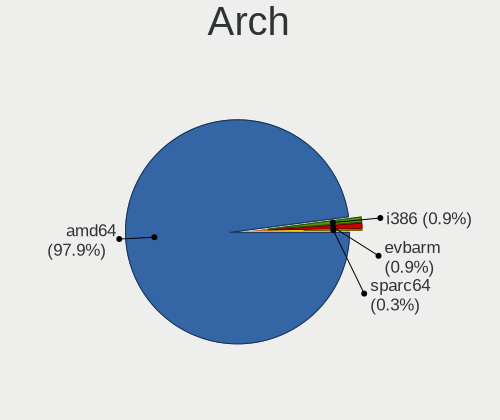
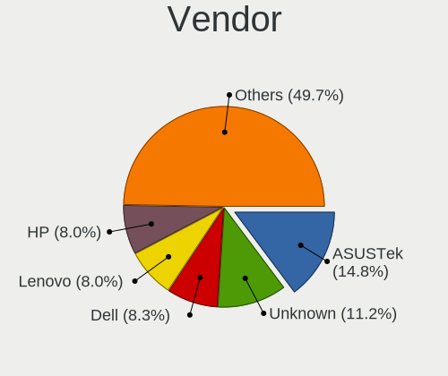
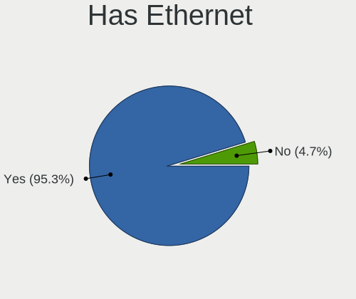
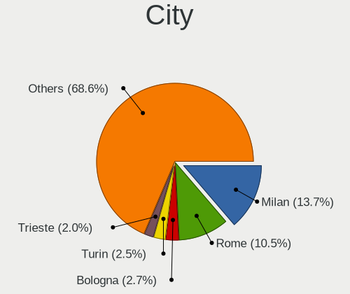
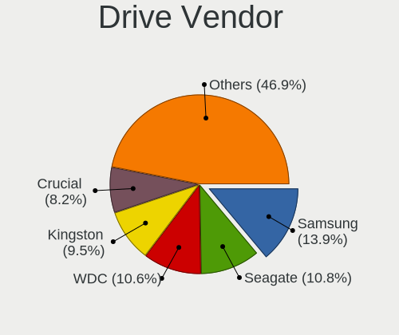
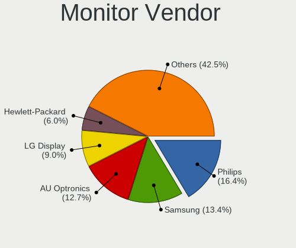
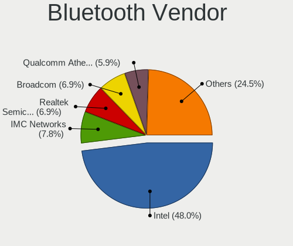
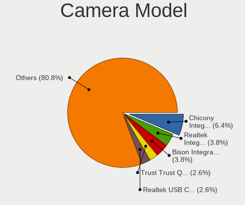

BSD in Italy - Tested Hardware & Statistics
-------------------------------------------

A project to collect tested hardware configurations for BSD in Italy.

Anyone can contribute to this report by the [hw-probe](https://github.com/linuxhw/hw-probe/blob/master/INSTALL.BSD.md) tool:

    hw-probe -all -upload

Please contribute! Especially if your hardware is rare.

This is a report for all computer types. See also reports for [desktops](/Location/Italy/Desktop/README.md) and [notebooks](/Location/Italy/Notebook/README.md).

Contents
--------

* [ Test Cases ](#test-cases)

* [ System ](#system)
  - [ OS                       ](#os)
  - [ OS Family                ](#os-family)
  - [ Arch                     ](#arch)
  - [ DE                       ](#de)
  - [ Display Server           ](#display-server)
  - [ Display Manager          ](#display-manager)
  - [ OS Lang                  ](#os-lang)
  - [ Boot Mode                ](#boot-mode)
  - [ Filesystem               ](#filesystem)
  - [ Part. scheme             ](#part-scheme)

* [ Board ](#board)
  - [ Vendor                   ](#vendor)
  - [ Model                    ](#model)
  - [ Model Family             ](#model-family)
  - [ MFG Year                 ](#mfg-year)
  - [ Form Factor              ](#form-factor)
  - [ Coreboot                 ](#coreboot)
  - [ RAM Size                 ](#ram-size)
  - [ RAM Used                 ](#ram-used)
  - [ Total Drives             ](#total-drives)
  - [ Has CD-ROM               ](#has-cd-rom)
  - [ Has Ethernet             ](#has-ethernet)
  - [ Has WiFi                 ](#has-wifi)
  - [ Has Bluetooth            ](#has-bluetooth)

* [ Location ](#location)
  - [ Country                  ](#country)
  - [ City                     ](#city)

* [ Drives ](#drives)
  - [ Drive Vendor             ](#drive-vendor)
  - [ Drive Model              ](#drive-model)
  - [ HDD Vendor               ](#hdd-vendor)
  - [ SSD Vendor               ](#ssd-vendor)
  - [ Drive Kind               ](#drive-kind)
  - [ Drive Connector          ](#drive-connector)
  - [ Drive Size               ](#drive-size)
  - [ Space Total              ](#space-total)
  - [ Space Used               ](#space-used)
  - [ Malfunc. Drives          ](#malfunc-drives)
  - [ Malfunc. Drive Vendor    ](#malfunc-drive-vendor)
  - [ Malfunc. HDD Vendor      ](#malfunc-hdd-vendor)
  - [ Malfunc. Drive Kind      ](#malfunc-drive-kind)
  - [ Failed Drives            ](#failed-drives)
  - [ Failed Drive Vendor      ](#failed-drive-vendor)
  - [ Drive Status             ](#drive-status)

* [ Storage controller ](#storage-controller)
  - [ Storage Vendor           ](#storage-vendor)
  - [ Storage Model            ](#storage-model)
  - [ Storage Kind             ](#storage-kind)

* [ Processor ](#processor)
  - [ CPU Vendor               ](#cpu-vendor)
  - [ CPU Model                ](#cpu-model)
  - [ CPU Model Family         ](#cpu-model-family)
  - [ CPU Cores                ](#cpu-cores)
  - [ CPU Sockets              ](#cpu-sockets)
  - [ CPU Threads              ](#cpu-threads)
  - [ CPU Microarch            ](#cpu-microarch)

* [ Graphics ](#graphics)
  - [ GPU Vendor               ](#gpu-vendor)
  - [ GPU Model                ](#gpu-model)
  - [ GPU Combo                ](#gpu-combo)
  - [ GPU Driver               ](#gpu-driver)
  - [ GPU Memory               ](#gpu-memory)

* [ Monitor ](#monitor)
  - [ Monitor Vendor           ](#monitor-vendor)
  - [ Monitor Model            ](#monitor-model)
  - [ Monitor Resolution       ](#monitor-resolution)
  - [ Monitor Diagonal         ](#monitor-diagonal)
  - [ Monitor Width            ](#monitor-width)
  - [ Aspect Ratio             ](#aspect-ratio)
  - [ Monitor Area             ](#monitor-area)
  - [ Pixel Density            ](#pixel-density)
  - [ Multiple Monitors        ](#multiple-monitors)

* [ Network ](#network)
  - [ Net Controller Vendor    ](#net-controller-vendor)
  - [ Net Controller Model     ](#net-controller-model)
  - [ Wireless Vendor          ](#wireless-vendor)
  - [ Wireless Model           ](#wireless-model)
  - [ Ethernet Vendor          ](#ethernet-vendor)
  - [ Ethernet Model           ](#ethernet-model)
  - [ Net Controller Kind      ](#net-controller-kind)
  - [ Used Controller          ](#used-controller)
  - [ NICs                     ](#nics)
  - [ IPv6                     ](#ipv6)

* [ Bluetooth ](#bluetooth)
  - [ Bluetooth Vendor         ](#bluetooth-vendor)
  - [ Bluetooth Model          ](#bluetooth-model)

* [ Sound ](#sound)
  - [ Sound Vendor             ](#sound-vendor)
  - [ Sound Model              ](#sound-model)

* [ Memory ](#memory)
  - [ Memory Vendor            ](#memory-vendor)
  - [ Memory Model             ](#memory-model)
  - [ Memory Kind              ](#memory-kind)
  - [ Memory Form Factor       ](#memory-form-factor)
  - [ Memory Size              ](#memory-size)
  - [ Memory Speed             ](#memory-speed)

* [ Printers & scanners ](#printers--scanners)
  - [ Printer Vendor           ](#printer-vendor)
  - [ Printer Model            ](#printer-model)
  - [ Scanner Vendor           ](#scanner-vendor)
  - [ Scanner Model            ](#scanner-model)

* [ Camera ](#camera)
  - [ Camera Vendor            ](#camera-vendor)
  - [ Camera Model             ](#camera-model)

* [ Security ](#security)
  - [ Fingerprint Vendor       ](#fingerprint-vendor)
  - [ Fingerprint Model        ](#fingerprint-model)
  - [ Chipcard Vendor          ](#chipcard-vendor)
  - [ Chipcard Model           ](#chipcard-model)

* [ Unsupported ](#unsupported)
  - [ Unsupported Devices      ](#unsupported-devices)
  - [ Unsupported Device Types ](#unsupported-device-types)

Test Cases
----------

Total: 234

| Vendor        | Model                       | Form-Factor | Probe                                                     | Date         |
|---------------|-----------------------------|-------------|-----------------------------------------------------------|--------------|
| Intel         | Q3XXG4-P V1.0               | Desktop     | [d6a3d57165](https://bsd-hardware.info/?probe=d6a3d57165) | Jul 29, 2022 |
| PC Engines    | APU2                        | Desktop     | [bb5d45a75d](https://bsd-hardware.info/?probe=bb5d45a75d) | Jul 29, 2022 |
| Fujitsu       | D3313-A1 S26361-D3313-A1    | Desktop     | [e3655742ba](https://bsd-hardware.info/?probe=e3655742ba) | Jul 18, 2022 |
| Lenovo        | SHARKBAY SDK0E50510 WIN     | Desktop     | [4b9e0bb7bb](https://bsd-hardware.info/?probe=4b9e0bb7bb) | Jul 18, 2022 |
| Fujitsu       | D3313-A1 S26361-D3313-A1    | Desktop     | [af1e80d15d](https://bsd-hardware.info/?probe=af1e80d15d) | Jul 18, 2022 |
| ASUSTek       | M4A785TD-M EVO              | Desktop     | [def87ec245](https://bsd-hardware.info/?probe=def87ec245) | Jul 18, 2022 |
| ASUSTek       | PRIME H410M-A               | Desktop     | [7b6faf5301](https://bsd-hardware.info/?probe=7b6faf5301) | Jul 14, 2022 |
| Dell          | Latitude E5450              | Notebook    | [5f1183ab0b](https://bsd-hardware.info/?probe=5f1183ab0b) | Jul 14, 2022 |
| Dell          | Latitude E5450              | Notebook    | [1080ed5654](https://bsd-hardware.info/?probe=1080ed5654) | Jul 14, 2022 |
| HP            | Laptop 15-da0xxx            | Notebook    | [0434c94fad](https://bsd-hardware.info/?probe=0434c94fad) | Jul 09, 2022 |
| ASUSTek       | PRIME H410M-A               | Desktop     | [ba243fa7c4](https://bsd-hardware.info/?probe=ba243fa7c4) | Jul 09, 2022 |
| Unknown       | Unknown                     | Notebook    | [4ac86f5979](https://bsd-hardware.info/?probe=4ac86f5979) | Jul 09, 2022 |
| Fujitsu       | D3041-A1 S26361-D3041-A1    | Desktop     | [d3aba12432](https://bsd-hardware.info/?probe=d3aba12432) | Jul 09, 2022 |
| ASRock        | B75M R2.0                   | Desktop     | [6011c70ca4](https://bsd-hardware.info/?probe=6011c70ca4) | Jul 07, 2022 |
| BESSTAR Te... | GB1B                        | Mini pc     | [dbbe9124a2](https://bsd-hardware.info/?probe=dbbe9124a2) | Jul 05, 2022 |
| HP            | 0A98h                       | Desktop     | [655fc531fb](https://bsd-hardware.info/?probe=655fc531fb) | Jun 30, 2022 |
| Acer          | AOD260                      | Notebook    | [08dc464d1b](https://bsd-hardware.info/?probe=08dc464d1b) | Jun 30, 2022 |
| Pegatron      | 2ACF                        | Desktop     | [e461a4559d](https://bsd-hardware.info/?probe=e461a4559d) | Jun 29, 2022 |
| HP            | 304Bh                       | Desktop     | [8a3151b3cd](https://bsd-hardware.info/?probe=8a3151b3cd) | Jun 16, 2022 |
| NF692         | 1.0                         | Desktop     | [e87866bf5a](https://bsd-hardware.info/?probe=e87866bf5a) | Jun 10, 2022 |
| Lenovo        | ThinkPad L530 24812TG       | Notebook    | [5b66684c4a](https://bsd-hardware.info/?probe=5b66684c4a) | Jun 05, 2022 |
| ASUSTek       | PRIME H410M-E               | Desktop     | [8099e7abaf](https://bsd-hardware.info/?probe=8099e7abaf) | Jun 03, 2022 |
| HP            | ProLiant MicroServer Gen... | Desktop     | [4b3b7a0929](https://bsd-hardware.info/?probe=4b3b7a0929) | May 31, 2022 |
| HP            | ProLiant MicroServer Gen... | Desktop     | [5d3db8382f](https://bsd-hardware.info/?probe=5d3db8382f) | May 31, 2022 |
| Lenovo        | ThinkPad X250 20CMS0FA00    | Notebook    | [5afeac632d](https://bsd-hardware.info/?probe=5afeac632d) | May 28, 2022 |
| T-bao         | MINI PC V1.0                | Desktop     | [a89b2081bb](https://bsd-hardware.info/?probe=a89b2081bb) | May 25, 2022 |
| ASUSTek       | F50SL                       | Notebook    | [e26b522868](https://bsd-hardware.info/?probe=e26b522868) | May 22, 2022 |
| Acer          | Aspire E1-522               | Notebook    | [23396b461f](https://bsd-hardware.info/?probe=23396b461f) | May 18, 2022 |
| ASUSTek       | PRIME B550M-K               | Desktop     | [ce5ddde5ad](https://bsd-hardware.info/?probe=ce5ddde5ad) | May 18, 2022 |
| Protectli     | FW4B Ver                    | Desktop     | [2769c8f286](https://bsd-hardware.info/?probe=2769c8f286) | May 17, 2022 |
| Acer          | Aspire E1-522               | Notebook    | [55cda59c51](https://bsd-hardware.info/?probe=55cda59c51) | May 17, 2022 |
| ASUSTek       | K52F                        | Notebook    | [6e86ce2a12](https://bsd-hardware.info/?probe=6e86ce2a12) | May 15, 2022 |
| ASUSTek       | K52F                        | Notebook    | [4c12c55177](https://bsd-hardware.info/?probe=4c12c55177) | May 15, 2022 |
| Dell          | Inspiron 15-3552            | Notebook    | [5e781a451d](https://bsd-hardware.info/?probe=5e781a451d) | May 12, 2022 |
| BESSTAR Te... | GB1B                        | Mini pc     | [407fc42fad](https://bsd-hardware.info/?probe=407fc42fad) | May 05, 2022 |
| Fujitsu       | D3041-A1 S26361-D3041-A1    | Desktop     | [5ff176fff8](https://bsd-hardware.info/?probe=5ff176fff8) | May 05, 2022 |
| Deciso        | OPNsense Appliance          | Notebook    | [8a8db12cf2](https://bsd-hardware.info/?probe=8a8db12cf2) | May 02, 2022 |
| Lenovo        | ThinkPad T420 4236BD5       | Notebook    | [867ed989e2](https://bsd-hardware.info/?probe=867ed989e2) | Apr 27, 2022 |
| MSI           | GF65 Thin 10SER             | Notebook    | [cedf98c955](https://bsd-hardware.info/?probe=cedf98c955) | Apr 26, 2022 |
| ASUSTek       | M4A88TD-V EVO/USB3          | Desktop     | [12cc40cc60](https://bsd-hardware.info/?probe=12cc40cc60) | Apr 23, 2022 |
| Dell          | 0TY179 A05                  | Server      | [124e42e2c1](https://bsd-hardware.info/?probe=124e42e2c1) | Apr 21, 2022 |
| Intel         | NUC5i5RYB H40999-502        | Mini pc     | [9a50fe43a7](https://bsd-hardware.info/?probe=9a50fe43a7) | Apr 21, 2022 |
| Pegatron      | Benicia                     | Desktop     | [9045b4f449](https://bsd-hardware.info/?probe=9045b4f449) | Apr 16, 2022 |
| ASUSTek       | PRIME Z390M-PLUS            | Desktop     | [680303f943](https://bsd-hardware.info/?probe=680303f943) | Apr 16, 2022 |
| ASUSTek       | PRIME Z390M-PLUS            | Desktop     | [47d17d48a7](https://bsd-hardware.info/?probe=47d17d48a7) | Apr 15, 2022 |
| Dell          | 07978V A08                  | Server      | [f315c33e95](https://bsd-hardware.info/?probe=f315c33e95) | Apr 06, 2022 |
| ShenZhen M... | MW-NANO-APL-4L              | Desktop     | [fbdd8d4f48](https://bsd-hardware.info/?probe=fbdd8d4f48) | Apr 05, 2022 |
| HP            | 212B                        | Desktop     | [33e7c65907](https://bsd-hardware.info/?probe=33e7c65907) | Apr 04, 2022 |
| Gigabyte      | X570 AORUS PRO              | Desktop     | [3877a33214](https://bsd-hardware.info/?probe=3877a33214) | Apr 02, 2022 |
| Gigabyte      | X570 AORUS PRO              | Desktop     | [3da637e3c6](https://bsd-hardware.info/?probe=3da637e3c6) | Apr 02, 2022 |
| Fujitsu       | D3041-A1 S26361-D3041-A1    | Desktop     | [7b79164c18](https://bsd-hardware.info/?probe=7b79164c18) | Apr 01, 2022 |
| ASUSTek       | X555LJ                      | Notebook    | [6bf51cc915](https://bsd-hardware.info/?probe=6bf51cc915) | Mar 28, 2022 |
| BESSTAR Te... | GB1B                        | Mini pc     | [9f760529c1](https://bsd-hardware.info/?probe=9f760529c1) | Mar 21, 2022 |
| Unknown       | Unknown                     | Desktop     | [bddd5d8963](https://bsd-hardware.info/?probe=bddd5d8963) | Mar 18, 2022 |
| BESSTAR Te... | GB1B                        | Mini pc     | [bb895c5df3](https://bsd-hardware.info/?probe=bb895c5df3) | Mar 16, 2022 |
| Unknown       | Unknown                     | Desktop     | [65ada9d5da](https://bsd-hardware.info/?probe=65ada9d5da) | Mar 11, 2022 |
| Raspberry ... | Raspberry Pi 4 Model B      | Soc         | [0394e3272e](https://bsd-hardware.info/?probe=0394e3272e) | Mar 03, 2022 |
| HP            | 3397                        | Desktop     | [841ed56816](https://bsd-hardware.info/?probe=841ed56816) | Mar 02, 2022 |
| BESSTAR Te... | GB1B                        | Mini pc     | [6696106165](https://bsd-hardware.info/?probe=6696106165) | Feb 19, 2022 |
| Pegatron      | 2ACF                        | Desktop     | [e098f52d51](https://bsd-hardware.info/?probe=e098f52d51) | Feb 19, 2022 |
| MSI           | B450 GAMING PLUS MAX        | Desktop     | [df6278638e](https://bsd-hardware.info/?probe=df6278638e) | Feb 15, 2022 |
| Acer          | V5-131                      | Notebook    | [2d5bfae3b4](https://bsd-hardware.info/?probe=2d5bfae3b4) | Feb 15, 2022 |
| Intel         | Q3XXG4-P V1.0               | Desktop     | [ea7cf2885f](https://bsd-hardware.info/?probe=ea7cf2885f) | Feb 13, 2022 |
| Intel         | NUC6i5SYB H81131-503        | Mini pc     | [946c9acc2e](https://bsd-hardware.info/?probe=946c9acc2e) | Feb 11, 2022 |
| MSI           | B450 GAMING PLUS MAX        | Desktop     | [6997de25f9](https://bsd-hardware.info/?probe=6997de25f9) | Feb 11, 2022 |
| MW            | GMLK-2_5G4L                 | Desktop     | [7a3744a41a](https://bsd-hardware.info/?probe=7a3744a41a) | Feb 07, 2022 |
| HP            | EliteBook 6930p             | Notebook    | [d8fb34de12](https://bsd-hardware.info/?probe=d8fb34de12) | Feb 04, 2022 |
| HP            | Mini 210-1000               | Notebook    | [8a8bfdaee1](https://bsd-hardware.info/?probe=8a8bfdaee1) | Feb 02, 2022 |
| Dell          | 0TK7TF A00                  | Desktop     | [d13ca7163c](https://bsd-hardware.info/?probe=d13ca7163c) | Jan 30, 2022 |
| Intel         | D2500CC AAG81477-401        | Desktop     | [f4d8bd7979](https://bsd-hardware.info/?probe=f4d8bd7979) | Jan 30, 2022 |
| Fujitsu       | D3028-A1 S26361-D3028-A1    | Desktop     | [f7e7df9416](https://bsd-hardware.info/?probe=f7e7df9416) | Jan 30, 2022 |
| Fujitsu       | D3028-A1 S26361-D3028-A1    | Desktop     | [fc63aa695e](https://bsd-hardware.info/?probe=fc63aa695e) | Jan 27, 2022 |
| PC Engines    | APU2                        | Desktop     | [52bd5dc1ce](https://bsd-hardware.info/?probe=52bd5dc1ce) | Jan 26, 2022 |
| PC Engines    | APU2                        | Desktop     | [54ada090c6](https://bsd-hardware.info/?probe=54ada090c6) | Jan 26, 2022 |
| ASUSTek       | BM6835_BM6635_BP6335        | Desktop     | [73562aa169](https://bsd-hardware.info/?probe=73562aa169) | Jan 25, 2022 |
| ASUSTek       | VivoBook_ASUSLaptop X515... | Notebook    | [cf360a6098](https://bsd-hardware.info/?probe=cf360a6098) | Jan 16, 2022 |
| Acer          | Extensa 5635Z               | Notebook    | [d76873c5dd](https://bsd-hardware.info/?probe=d76873c5dd) | Jan 16, 2022 |
| Fujitsu       | D3041-A1 S26361-D3041-A1    | Desktop     | [ed9f5d1a27](https://bsd-hardware.info/?probe=ed9f5d1a27) | Jan 15, 2022 |
| PC Engines    | APU2                        | Desktop     | [c2b05fc937](https://bsd-hardware.info/?probe=c2b05fc937) | Jan 14, 2022 |
| ASRock        | B75M R2.0                   | Desktop     | [7b99b0eaa6](https://bsd-hardware.info/?probe=7b99b0eaa6) | Jan 10, 2022 |
| TUXEDO        | N14xWU                      | Notebook    | [4ac0707c49](https://bsd-hardware.info/?probe=4ac0707c49) | Jan 06, 2022 |
| Unknown       | Unknown                     | Notebook    | [341401bb02](https://bsd-hardware.info/?probe=341401bb02) | Jan 04, 2022 |
| Unknown       | Unknown                     | Notebook    | [46e5f9b021](https://bsd-hardware.info/?probe=46e5f9b021) | Dec 29, 2021 |
| Fujitsu       | D3041-A1 S26361-D3041-A1    | Desktop     | [7a43524381](https://bsd-hardware.info/?probe=7a43524381) | Dec 13, 2021 |
| Packard Be... | EasyNote_MX61-B-038         | Notebook    | [235d60060d](https://bsd-hardware.info/?probe=235d60060d) | Dec 12, 2021 |
| Gigabyte      | H270M-DS3H-CF               | Desktop     | [50fba6deda](https://bsd-hardware.info/?probe=50fba6deda) | Dec 11, 2021 |
| Acer          | Aspire 5749Z                | Notebook    | [60a25af38c](https://bsd-hardware.info/?probe=60a25af38c) | Dec 09, 2021 |
| Gigabyte      | H270M-DS3H-CF               | Desktop     | [a084ff48c2](https://bsd-hardware.info/?probe=a084ff48c2) | Dec 09, 2021 |
| Gigabyte      | H270M-DS3H-CF               | Desktop     | [17b557d792](https://bsd-hardware.info/?probe=17b557d792) | Dec 08, 2021 |
| ASUSTek       | 1000                        | Notebook    | [da8689c840](https://bsd-hardware.info/?probe=da8689c840) | Dec 08, 2021 |
| Fujitsu       | D3041-A1 S26361-D3041-A1    | Desktop     | [8812a8e8c8](https://bsd-hardware.info/?probe=8812a8e8c8) | Dec 04, 2021 |
| Fujitsu       | D3041-A1 S26361-D3041-A1    | Desktop     | [ddcab97db2](https://bsd-hardware.info/?probe=ddcab97db2) | Dec 03, 2021 |
| Toshiba       | Satellite C855-1U4          | Notebook    | [4107fc9eee](https://bsd-hardware.info/?probe=4107fc9eee) | Nov 14, 2021 |
| Toshiba       | PORTEGE M780                | Notebook    | [2ac9bea1e6](https://bsd-hardware.info/?probe=2ac9bea1e6) | Nov 13, 2021 |
| T-bao         | MINI PC V1.0                | Desktop     | [4ee7de3597](https://bsd-hardware.info/?probe=4ee7de3597) | Nov 12, 2021 |
| Intel         | Q3XXG4-P V1.0               | Desktop     | [22a18ba45e](https://bsd-hardware.info/?probe=22a18ba45e) | Nov 08, 2021 |
| HP            | ProBook 470 G4              | Notebook    | [5f026ff3a2](https://bsd-hardware.info/?probe=5f026ff3a2) | Oct 17, 2021 |
| HP            | ProBook 470 G4              | Notebook    | [40c180238f](https://bsd-hardware.info/?probe=40c180238f) | Oct 17, 2021 |
| Pegatron      | 2ACF                        | Desktop     | [ca23d3bbf0](https://bsd-hardware.info/?probe=ca23d3bbf0) | Oct 13, 2021 |
| ASUSTek       | PRIME Z390M-PLUS            | Desktop     | [b3b31d25b0](https://bsd-hardware.info/?probe=b3b31d25b0) | Oct 13, 2021 |
| Pegatron      | 2ACF                        | Desktop     | [97aa5e56e4](https://bsd-hardware.info/?probe=97aa5e56e4) | Oct 12, 2021 |
| ASUSTek       | PRIME Z390M-PLUS            | Desktop     | [5a7c1871b1](https://bsd-hardware.info/?probe=5a7c1871b1) | Oct 11, 2021 |
| HP            | ProBook 470 G4              | Notebook    | [a9c135bf27](https://bsd-hardware.info/?probe=a9c135bf27) | Oct 10, 2021 |
| Acer          | Veriton X2610G              | Desktop     | [1e9ed23164](https://bsd-hardware.info/?probe=1e9ed23164) | Oct 03, 2021 |
| ASUSTek       | X555LJ                      | Notebook    | [81dd2ba2f0](https://bsd-hardware.info/?probe=81dd2ba2f0) | Oct 02, 2021 |
| ASRock        | B75M R2.0                   | Desktop     | [51b47d9321](https://bsd-hardware.info/?probe=51b47d9321) | Sep 27, 2021 |
| ASRock        | B75M R2.0                   | Desktop     | [de031313ff](https://bsd-hardware.info/?probe=de031313ff) | Sep 27, 2021 |
| BESSTAR Te... | GB1B                        | Mini pc     | [e0ad80acf9](https://bsd-hardware.info/?probe=e0ad80acf9) | Sep 20, 2021 |
| Gigabyte      | H270M-DS3H-CF               | Desktop     | [9b046b157e](https://bsd-hardware.info/?probe=9b046b157e) | Sep 17, 2021 |
| ASRock        | B75M R2.0                   | Desktop     | [0d23147c7d](https://bsd-hardware.info/?probe=0d23147c7d) | Sep 17, 2021 |
| ASUSTek       | VivoBook_ASUSLaptop X512... | Notebook    | [0b73df29bf](https://bsd-hardware.info/?probe=0b73df29bf) | Sep 15, 2021 |
| ASRock        | B75M R2.0                   | Desktop     | [e0ae9af4ab](https://bsd-hardware.info/?probe=e0ae9af4ab) | Sep 15, 2021 |
| BESSTAR Te... | GB1B                        | Mini pc     | [f1a2baeecb](https://bsd-hardware.info/?probe=f1a2baeecb) | Sep 14, 2021 |
| Gigabyte      | H270M-DS3H-CF               | Desktop     | [bc2a287495](https://bsd-hardware.info/?probe=bc2a287495) | Sep 13, 2021 |
| BESSTAR Te... | GB1B                        | Mini pc     | [3607c373aa](https://bsd-hardware.info/?probe=3607c373aa) | Sep 11, 2021 |
| Apple         | Mac-F2268DC8                | All in one  | [73912d5852](https://bsd-hardware.info/?probe=73912d5852) | Sep 09, 2021 |
| Unknown       | YL-J3160L4                  | Desktop     | [861a1f7012](https://bsd-hardware.info/?probe=861a1f7012) | Aug 25, 2021 |
| MSI           | MS-B1591                    | Desktop     | [679b2010e9](https://bsd-hardware.info/?probe=679b2010e9) | Aug 03, 2021 |
| MSI           | MS-B1591                    | Desktop     | [b370a74ec0](https://bsd-hardware.info/?probe=b370a74ec0) | Aug 02, 2021 |
| Lenovo        | G505 20240                  | Notebook    | [16e6ec4054](https://bsd-hardware.info/?probe=16e6ec4054) | Aug 02, 2021 |
| AMI           | Aptio CRB                   | Mini pc     | [acfe0caa83](https://bsd-hardware.info/?probe=acfe0caa83) | Jul 22, 2021 |
| ASUSTek       | VivoBook_ASUSLaptop X512... | Notebook    | [9c9d4cc782](https://bsd-hardware.info/?probe=9c9d4cc782) | Jul 18, 2021 |
| ASUSTek       | VivoBook_ASUSLaptop X512... | Notebook    | [3d5e512e18](https://bsd-hardware.info/?probe=3d5e512e18) | Jul 18, 2021 |
| Gigabyte      | P55A-UD3                    | Desktop     | [dc1b4d8a6b](https://bsd-hardware.info/?probe=dc1b4d8a6b) | Jul 16, 2021 |
| ASRock        | B75M R2.0                   | Desktop     | [d51149c1d5](https://bsd-hardware.info/?probe=d51149c1d5) | Jul 13, 2021 |
| Intel         | NUC6i5SYB H81131-503        | Mini pc     | [7fe4b5ff70](https://bsd-hardware.info/?probe=7fe4b5ff70) | Jul 12, 2021 |
| Intel         | NUC10i7FNB K61360-303       | Mini pc     | [dbacaa5c65](https://bsd-hardware.info/?probe=dbacaa5c65) | Jul 08, 2021 |
| Samsung       | 3570R/370R/470R/450R/510... | Notebook    | [31d42f4469](https://bsd-hardware.info/?probe=31d42f4469) | Jul 05, 2021 |
| Lenovo        | B590 62743PG                | Notebook    | [2400297995](https://bsd-hardware.info/?probe=2400297995) | Jul 03, 2021 |
| Lenovo        | SHARKBAY SDK0E50510 WIN     | Desktop     | [6cf3337855](https://bsd-hardware.info/?probe=6cf3337855) | Jul 01, 2021 |
| MSI           | B450 GAMING PLUS MAX        | Desktop     | [f0e80b0788](https://bsd-hardware.info/?probe=f0e80b0788) | Jun 28, 2021 |
| PC Engines    | APU2                        | Desktop     | [dde9077545](https://bsd-hardware.info/?probe=dde9077545) | Jun 24, 2021 |
| ZOTAC         | ZBOX-CI323NANO              | Mini pc     | [7cf77c6f1f](https://bsd-hardware.info/?probe=7cf77c6f1f) | Jun 12, 2021 |
| Unknown       | Unknown                     | Desktop     | [822df8eb91](https://bsd-hardware.info/?probe=822df8eb91) | May 11, 2021 |
| Unknown       | Unknown                     | Desktop     | [cc17eea606](https://bsd-hardware.info/?probe=cc17eea606) | May 10, 2021 |
| ASUSTek       | IP4BL-ME-Oli                | Desktop     | [e26ecef661](https://bsd-hardware.info/?probe=e26ecef661) | May 03, 2021 |
| MSI           | B450-A PRO                  | Desktop     | [ed656e816f](https://bsd-hardware.info/?probe=ed656e816f) | May 01, 2021 |
| Unknown       | Unknown                     | Desktop     | [df793cf09f](https://bsd-hardware.info/?probe=df793cf09f) | Apr 08, 2021 |
| Unknown       | Unknown                     | Desktop     | [de8a18ca09](https://bsd-hardware.info/?probe=de8a18ca09) | Apr 08, 2021 |
| Unknown       | Unknown                     | Desktop     | [f8ba0ba112](https://bsd-hardware.info/?probe=f8ba0ba112) | Apr 08, 2021 |
| HP            | Laptop 15-da0xxx            | Notebook    | [cb09a1b771](https://bsd-hardware.info/?probe=cb09a1b771) | Apr 08, 2021 |
| Lenovo        | SHARKBAY SDK0E50510 WIN     | Desktop     | [62376c16a4](https://bsd-hardware.info/?probe=62376c16a4) | Mar 31, 2021 |
| Intel         | Q3XXG4-P V1.0               | Desktop     | [5a7ba137e0](https://bsd-hardware.info/?probe=5a7ba137e0) | Mar 27, 2021 |
| Acer          | EG43M                       | Desktop     | [0bc978756c](https://bsd-hardware.info/?probe=0bc978756c) | Mar 27, 2021 |
| AMI           | Aptio CRB                   | Mini pc     | [139e702b9a](https://bsd-hardware.info/?probe=139e702b9a) | Mar 27, 2021 |
| Lenovo        | ThinkPad L530 24812TG       | Notebook    | [520982317e](https://bsd-hardware.info/?probe=520982317e) | Mar 25, 2021 |
| Lenovo        | SHARKBAY SDK0E50510 WIN     | Desktop     | [78a7c7b8cb](https://bsd-hardware.info/?probe=78a7c7b8cb) | Mar 23, 2021 |
| Lenovo        | SHARKBAY SDK0E50510 WIN     | Desktop     | [f9c3fc3b84](https://bsd-hardware.info/?probe=f9c3fc3b84) | Mar 19, 2021 |
| Lenovo        | SHARKBAY SDK0E50510 WIN     | Desktop     | [5ae508dfa8](https://bsd-hardware.info/?probe=5ae508dfa8) | Mar 19, 2021 |
| Lenovo        | ThinkPad X260 20F5S82N00    | Notebook    | [aa3deadedd](https://bsd-hardware.info/?probe=aa3deadedd) | Mar 19, 2021 |
| HP            | Laptop 15-da0xxx            | Notebook    | [a7a25be087](https://bsd-hardware.info/?probe=a7a25be087) | Mar 16, 2021 |
| ASUSTek       | PRIME Z390M-PLUS            | Desktop     | [0a3b290f9f](https://bsd-hardware.info/?probe=0a3b290f9f) | Mar 15, 2021 |
| ASUSTek       | M4A88TD-V EVO/USB3          | Desktop     | [1c30f7523f](https://bsd-hardware.info/?probe=1c30f7523f) | Mar 15, 2021 |
| PC Engines    | APU3                        | Desktop     | [822a83f208](https://bsd-hardware.info/?probe=822a83f208) | Mar 11, 2021 |
| ASUSTek       | IP4BL-ME-Oli                | Desktop     | [c672201bcb](https://bsd-hardware.info/?probe=c672201bcb) | Mar 10, 2021 |
| Lenovo        | SHARKBAY SDK0E50510 WIN     | Desktop     | [66a223add9](https://bsd-hardware.info/?probe=66a223add9) | Mar 08, 2021 |
| Dell          | 00NH4P A07                  | Server      | [7cff5a5c58](https://bsd-hardware.info/?probe=7cff5a5c58) | Mar 08, 2021 |
| HP            | Laptop 15-da0xxx            | Notebook    | [bf572bc102](https://bsd-hardware.info/?probe=bf572bc102) | Mar 06, 2021 |
| Dell          | 0R849J A00                  | Desktop     | [1bd1dc24c9](https://bsd-hardware.info/?probe=1bd1dc24c9) | Mar 06, 2021 |
| Intel         | NUC6i5SYB H81131-503        | Mini pc     | [55045aa9e5](https://bsd-hardware.info/?probe=55045aa9e5) | Mar 03, 2021 |
| Foxconn       | 2ADA                        | Desktop     | [10d02d0982](https://bsd-hardware.info/?probe=10d02d0982) | Mar 03, 2021 |
| Intel         | MAHOBAY                     | Desktop     | [3c5bd7b7f8](https://bsd-hardware.info/?probe=3c5bd7b7f8) | Mar 02, 2021 |
| Intel         | MAHOBAY                     | Desktop     | [04e66ca239](https://bsd-hardware.info/?probe=04e66ca239) | Mar 02, 2021 |
| ASUSTek       | G1S                         | Notebook    | [593c12aa06](https://bsd-hardware.info/?probe=593c12aa06) | Feb 28, 2021 |
| Intel         | MAHOBAY                     | Desktop     | [50652a4263](https://bsd-hardware.info/?probe=50652a4263) | Feb 26, 2021 |
| Intel         | MAHOBAY                     | Desktop     | [c3dc05bbac](https://bsd-hardware.info/?probe=c3dc05bbac) | Feb 26, 2021 |
| Intel         | MAHOBAY                     | Desktop     | [7ab47e0db7](https://bsd-hardware.info/?probe=7ab47e0db7) | Feb 25, 2021 |
| ASUSTek       | PRIME Z390M-PLUS            | Desktop     | [58c6bf426e](https://bsd-hardware.info/?probe=58c6bf426e) | Feb 22, 2021 |
| Intel         | MAHOBAY                     | Desktop     | [5ecd568ce9](https://bsd-hardware.info/?probe=5ecd568ce9) | Feb 21, 2021 |
| Intel         | MAHOBAY                     | Desktop     | [138dbdcece](https://bsd-hardware.info/?probe=138dbdcece) | Feb 21, 2021 |
| Dell          | 00NH4P A07                  | Server      | [fff0533829](https://bsd-hardware.info/?probe=fff0533829) | Feb 20, 2021 |
| Intel         | MAHOBAY                     | Desktop     | [5257239fdc](https://bsd-hardware.info/?probe=5257239fdc) | Feb 20, 2021 |
| Acer          | Extensa 5635Z               | Notebook    | [837c6f28b4](https://bsd-hardware.info/?probe=837c6f28b4) | Feb 19, 2021 |
| HARDKERNEL    | ODROID-H2                   | Desktop     | [6fe9279f1f](https://bsd-hardware.info/?probe=6fe9279f1f) | Feb 18, 2021 |
| eMachines     | eME732ZG                    | Notebook    | [d0c0433452](https://bsd-hardware.info/?probe=d0c0433452) | Feb 16, 2021 |
| ASUSTek       | X555LD                      | Notebook    | [74d43ccd10](https://bsd-hardware.info/?probe=74d43ccd10) | Feb 16, 2021 |
| ASUSTek       | PRIME Z390M-PLUS            | Desktop     | [c996e74ebc](https://bsd-hardware.info/?probe=c996e74ebc) | Feb 14, 2021 |
| HP            | ProBook 470 G4              | Notebook    | [f808e6bb4a](https://bsd-hardware.info/?probe=f808e6bb4a) | Feb 13, 2021 |
| eMachines     | eME732ZG                    | Notebook    | [c51678397d](https://bsd-hardware.info/?probe=c51678397d) | Feb 13, 2021 |
| Dell          | 06NWYK A00                  | Desktop     | [32acfb4467](https://bsd-hardware.info/?probe=32acfb4467) | Feb 13, 2021 |
| ASUSTek       | P8H61-M LE                  | Desktop     | [b861820636](https://bsd-hardware.info/?probe=b861820636) | Feb 13, 2021 |
| Dell          | 06NWYK A00                  | Desktop     | [2ff05af403](https://bsd-hardware.info/?probe=2ff05af403) | Feb 13, 2021 |
| ASUSTek       | P8H61-M LE                  | Desktop     | [3a3d7d0701](https://bsd-hardware.info/?probe=3a3d7d0701) | Feb 12, 2021 |
| ASUSTek       | VivoBook_ASUSLaptop X512... | Notebook    | [37e4e7c85c](https://bsd-hardware.info/?probe=37e4e7c85c) | Feb 12, 2021 |
| ASUSTek       | P8Z77-V PRO/THUNDERBOLT     | Desktop     | [6fdcef7c9e](https://bsd-hardware.info/?probe=6fdcef7c9e) | Feb 10, 2021 |
| ASUSTek       | PRIME X470-PRO              | Desktop     | [a77e980850](https://bsd-hardware.info/?probe=a77e980850) | Feb 09, 2021 |
| HP            | Laptop 15-da0xxx            | Notebook    | [d6bc2b2c1d](https://bsd-hardware.info/?probe=d6bc2b2c1d) | Feb 08, 2021 |
| ASUSTek       | X502CA                      | Notebook    | [5e15d06a9b](https://bsd-hardware.info/?probe=5e15d06a9b) | Feb 06, 2021 |
| ASUSTek       | X502CA                      | Notebook    | [1a2df26f19](https://bsd-hardware.info/?probe=1a2df26f19) | Feb 06, 2021 |
| ASUSTek       | IP4BL-ME-Oli                | Desktop     | [4d225e7ebe](https://bsd-hardware.info/?probe=4d225e7ebe) | Feb 04, 2021 |
| Intel         | NUC6i5SYB H81131-503        | Mini pc     | [01a2dd5a52](https://bsd-hardware.info/?probe=01a2dd5a52) | Feb 02, 2021 |
| HP            | Laptop 15-da0xxx            | Notebook    | [869d894f4f](https://bsd-hardware.info/?probe=869d894f4f) | Jan 30, 2021 |
| Intel         | Q3XXG4-P V1.0               | Desktop     | [f813782c8a](https://bsd-hardware.info/?probe=f813782c8a) | Jan 29, 2021 |
| ZOTAC         | ZBOX-MI640/MI660/MI620NA... | Mini pc     | [2aa7735e59](https://bsd-hardware.info/?probe=2aa7735e59) | Jan 24, 2021 |
| HP            | Laptop 15-da0xxx            | Notebook    | [3e37c56f14](https://bsd-hardware.info/?probe=3e37c56f14) | Jan 23, 2021 |
| Sun Micros... | Ultra 24 50                 | Desktop     | [622589c8e7](https://bsd-hardware.info/?probe=622589c8e7) | Jan 22, 2021 |
| Sun Micros... | Ultra 24 50                 | Desktop     | [7a3cb6a061](https://bsd-hardware.info/?probe=7a3cb6a061) | Jan 22, 2021 |
| Apple         | MacBook4,1                  | Notebook    | [9eca3b0463](https://bsd-hardware.info/?probe=9eca3b0463) | Jan 22, 2021 |
| ASUSTek       | M4A87TD EVO                 | Desktop     | [12ea57f317](https://bsd-hardware.info/?probe=12ea57f317) | Jan 22, 2021 |
| Dell          | 088DT1 A01                  | Desktop     | [fcc759e013](https://bsd-hardware.info/?probe=fcc759e013) | Jan 21, 2021 |
| ASRock        | H81 Pro BTC                 | Desktop     | [afb7cd1f1a](https://bsd-hardware.info/?probe=afb7cd1f1a) | Jan 20, 2021 |
| Intel         | Q3XXG4-P V1.0               | Desktop     | [92577053eb](https://bsd-hardware.info/?probe=92577053eb) | Jan 20, 2021 |
| Intel         | Q3XXG4-P V1.0               | Desktop     | [33a6dda088](https://bsd-hardware.info/?probe=33a6dda088) | Jan 20, 2021 |
| Apple         | MacBook4,1                  | Notebook    | [539b95f535](https://bsd-hardware.info/?probe=539b95f535) | Jan 20, 2021 |
| PC Engines    | APU2                        | Desktop     | [a178f8eb47](https://bsd-hardware.info/?probe=a178f8eb47) | Jan 19, 2021 |
| HP            | ProBook 470 G4              | Notebook    | [bc4bca1e5e](https://bsd-hardware.info/?probe=bc4bca1e5e) | Jan 18, 2021 |
| HP            | ProBook 470 G4              | Notebook    | [e39a46cadf](https://bsd-hardware.info/?probe=e39a46cadf) | Jan 17, 2021 |
| MSI           | Boston                      | Desktop     | [aa9d7bae21](https://bsd-hardware.info/?probe=aa9d7bae21) | Jan 17, 2021 |
| HP            | ProBook 470 G4              | Notebook    | [55c762d22e](https://bsd-hardware.info/?probe=55c762d22e) | Jan 17, 2021 |
| MSI           | Boston                      | Desktop     | [f21954fa35](https://bsd-hardware.info/?probe=f21954fa35) | Jan 17, 2021 |
| Supermicro    | X8STi                       | Desktop     | [7d0e121099](https://bsd-hardware.info/?probe=7d0e121099) | Jan 15, 2021 |
| HP            | ProBook 470 G4              | Notebook    | [c4eecdac67](https://bsd-hardware.info/?probe=c4eecdac67) | Jan 14, 2021 |
| IBM           | ThinkPad R51 2887AVG        | Notebook    | [289177c624](https://bsd-hardware.info/?probe=289177c624) | Jan 02, 2021 |
| IBM           | ThinkPad R51 2887AVG        | Notebook    | [88d4fc2693](https://bsd-hardware.info/?probe=88d4fc2693) | Dec 30, 2020 |
| Unknown       | Unknown                     | Desktop     | [8668b1d651](https://bsd-hardware.info/?probe=8668b1d651) | Dec 17, 2020 |
| Unknown       | Unknown                     | Desktop     | [d2cdc0fc7f](https://bsd-hardware.info/?probe=d2cdc0fc7f) | Nov 29, 2020 |
| Unknown       | Unknown                     | Desktop     | [afbbc44ac5](https://bsd-hardware.info/?probe=afbbc44ac5) | Nov 29, 2020 |
| Unknown       | Unknown                     | Desktop     | [aee9f448af](https://bsd-hardware.info/?probe=aee9f448af) | Nov 25, 2020 |
| Lenovo        | ThinkPad T495 20NJS0KP00    | Notebook    | [7a706e46de](https://bsd-hardware.info/?probe=7a706e46de) | Oct 31, 2020 |
| Lenovo        | ThinkPad T430 23501B3       | Notebook    | [53233cc736](https://bsd-hardware.info/?probe=53233cc736) | Oct 31, 2020 |
| Intel         | D945GCLF2                   | Desktop     | [58678b0643](https://bsd-hardware.info/?probe=58678b0643) | Oct 30, 2020 |
| Intel         | D945GCLF2                   | Desktop     | [3354fb903b](https://bsd-hardware.info/?probe=3354fb903b) | Oct 30, 2020 |
| Gigabyte      | X570 AORUS ELITE            | Desktop     | [973b62551f](https://bsd-hardware.info/?probe=973b62551f) | Oct 30, 2020 |
| AZW           | BT3 X                       | Desktop     | [b9f23ee753](https://bsd-hardware.info/?probe=b9f23ee753) | Oct 30, 2020 |
| Dell          | Precision 3510              | Notebook    | [85a55ab7c3](https://bsd-hardware.info/?probe=85a55ab7c3) | Oct 22, 2020 |
| HP            | Laptop 15-da0xxx            | Notebook    | [7faf1699d6](https://bsd-hardware.info/?probe=7faf1699d6) | Oct 04, 2020 |
| Apple         | MacBookAir7,2               | Notebook    | [36d0d99aa6](https://bsd-hardware.info/?probe=36d0d99aa6) | Oct 04, 2020 |
| Lenovo        | G50-45 80E3                 | Notebook    | [1d227a9cd2](https://bsd-hardware.info/?probe=1d227a9cd2) | Oct 04, 2020 |
| Lenovo        | ThinkPad X1 Carbon 6th 2... | Notebook    | [2f119a81b4](https://bsd-hardware.info/?probe=2f119a81b4) | Aug 13, 2020 |
| Lenovo        | ThinkPad T450 20BUS06B00    | Notebook    | [f437a3b5ab](https://bsd-hardware.info/?probe=f437a3b5ab) | Jul 06, 2020 |
| ASRock        | 990FX Extreme9              | Desktop     | [6c0bba6d4f](https://bsd-hardware.info/?probe=6c0bba6d4f) | Jun 26, 2020 |
| Intel         | NUC6i5SYB H81131-503        | Mini pc     | [6b854263e7](https://bsd-hardware.info/?probe=6b854263e7) | May 25, 2020 |
| Lenovo        | ThinkPad T440 20B7S1C600    | Notebook    | [a4a62cb85e](https://bsd-hardware.info/?probe=a4a62cb85e) | May 24, 2020 |
| Lenovo        | ThinkPad X240 20AMS0J01N    | Notebook    | [4df07718d1](https://bsd-hardware.info/?probe=4df07718d1) | May 23, 2020 |

System
------

OS
--

Installed operating systems

| Name                 | Computers | Percent |
|----------------------|-----------|---------|
| helloSystem 0.7.0    | 15        | 8.98%   |
| helloSystem 0.4.0    | 12        | 7.19%   |
| helloSystem 0.5.0    | 9         | 5.39%   |
| OpenBSD 7.1          | 7         | 4.19%   |
| helloSystem 0.6.0    | 6         | 3.59%   |
| OPNsense 22.1.6      | 5         | 2.99%   |
| OPNsense 21.1        | 5         | 2.99%   |
| helloSystem 0.3.0    | 5         | 2.99%   |
| OPNsense 22.1.9      | 4         | 2.4%    |
| OPNsense 22.1        | 4         | 2.4%    |
| OPNsense 22.1.10     | 3         | 1.8%    |
| OPNsense 21.7.7      | 3         | 1.8%    |
| OPNsense 21.7.3      | 3         | 1.8%    |
| OPNsense 21.1.8      | 3         | 1.8%    |
| OPNsense 21.1.3      | 3         | 1.8%    |
| OPNsense 21.1.2      | 3         | 1.8%    |
| OPNsense 20.7.8      | 3         | 1.8%    |
| OpenBSD 6.8          | 3         | 1.8%    |
| NomadBSD 1.4         | 3         | 1.8%    |
| FreeBSD 13.0-p7      | 3         | 1.8%    |
| FreeBSD 12.2-p2      | 3         | 1.8%    |
| OPNsense 22.7        | 2         | 1.2%    |
| OPNsense 22.1.8      | 2         | 1.2%    |
| OPNsense 22.1.4      | 2         | 1.2%    |
| OPNsense 21.1.1      | 2         | 1.2%    |
| NomadBSD 1.3.2       | 2         | 1.2%    |
| GhostBSD 21.08.27    | 2         | 1.2%    |
| GhostBSD 20.04.02    | 2         | 1.2%    |
| FreeBSD 13.1         | 2         | 1.2%    |
| FreeBSD 13.0-p4      | 2         | 1.2%    |
| FreeBSD 13.0-CURRENT | 2         | 1.2%    |
| FreeBSD 12.3-p1      | 2         | 1.2%    |
| FreeBSD 12.2-p6      | 2         | 1.2%    |
| FreeBSD 12.2-p4      | 2         | 1.2%    |
| FreeBSD 12.1-p10     | 2         | 1.2%    |
| OPNsense 22.1.7      | 1         | 0.6%    |
| OPNsense 22.1.3      | 1         | 0.6%    |
| OPNsense 22.1.2      | 1         | 0.6%    |
| OPNsense 22.1.1      | 1         | 0.6%    |
| OPNsense 21.7.8      | 1         | 0.6%    |
| OPNsense 21.7.6      | 1         | 0.6%    |
| OPNsense 21.7.4      | 1         | 0.6%    |
| OPNsense 21.7.1      | 1         | 0.6%    |
| OPNsense 21.7        | 1         | 0.6%    |
| OPNsense 21.1.7      | 1         | 0.6%    |
| OPNsense 21.1.6      | 1         | 0.6%    |
| OPNsense 21.1.5      | 1         | 0.6%    |
| OpenBSD 6.7          | 1         | 0.6%    |
| NomadBSD 5806f915    | 1         | 0.6%    |
| NomadBSD 1.3.1       | 1         | 0.6%    |
| NetBSD 9.99.93       | 1         | 0.6%    |
| NetBSD 9.99.77       | 1         | 0.6%    |
| NetBSD 9.2_STABLE    | 1         | 0.6%    |
| NetBSD 9.2           | 1         | 0.6%    |
| NetBSD 9.1_STABLE    | 1         | 0.6%    |
| NetBSD 9.1           | 1         | 0.6%    |
| NetBSD 9.0           | 1         | 0.6%    |
| helloSystem 0.8.0    | 1         | 0.6%    |
| GhostBSD 22.06.26    | 1         | 0.6%    |
| FreeBSD 14.0-CURRENT | 1         | 0.6%    |

OS Family
---------

OS without a version

| Name        | Computers | Percent |
|-------------|-----------|---------|
| OPNsense    | 45        | 32.85%  |
| helloSystem | 40        | 29.2%   |
| FreeBSD     | 24        | 17.52%  |
| OpenBSD     | 11        | 8.03%   |
| NomadBSD    | 7         | 5.11%   |
| NetBSD      | 6         | 4.38%   |
| GhostBSD    | 4         | 2.92%   |

Arch
----

OS architecture (x86_64, i586, etc.)

| Name   | Computers | Percent |
|--------|-----------|---------|
| amd64  | 130       | 95.59%  |
| i386   | 3         | 2.21%   |
| evbarm | 3         | 2.21%   |

DE
--

Desktop Environment

| Name          | Computers | Percent |
|---------------|-----------|---------|
| Console       | 54        | 39.13%  |
| helloDesktop  | 44        | 31.88%  |
| Openbox       | 7         | 5.07%   |
| XFCE          | 6         | 4.35%   |
| KDE5          | 5         | 3.62%   |
| fvwm          | 4         | 2.9%    |
| MATE          | 3         | 2.17%   |
| i3            | 3         | 2.17%   |
| CTWM          | 3         | 2.17%   |
| Cinnamon      | 3         | 2.17%   |
| TWM           | 2         | 1.45%   |
| xfwm          | 1         | 0.72%   |
| LXQt          | 1         | 0.72%   |
| Fluxbox       | 1         | 0.72%   |
| Enlightenment | 1         | 0.72%   |

Display Server
--------------

X11 or Wayland

| Name    | Computers | Percent |
|---------|-----------|---------|
| X11     | 84        | 61.76%  |
| Console | 52        | 38.24%  |

Display Manager
---------------

SDDM, LightDM, etc.

| Name    | Computers | Percent |
|---------|-----------|---------|
| Console | 75        | 55.15%  |
| SLiM    | 51        | 37.5%   |
| LightDM | 6         | 4.41%   |
| XDM     | 2         | 1.47%   |
| SDDM    | 2         | 1.47%   |

OS Lang
-------

Language

| Lang             | Computers | Percent |
|------------------|-----------|---------|
| Unknown          | 63        | 45.32%  |
| en_US            | 50        | 35.97%  |
| it_IT            | 13        | 9.35%   |
| C                | 8         | 5.76%   |
| it_IT.ISO8859-15 | 2         | 1.44%   |
| ru_RU            | 1         | 0.72%   |
| it_IT.ISO8859-1  | 1         | 0.72%   |
| en_GB            | 1         | 0.72%   |

Boot Mode
---------

EFI or BIOS

| Mode | Computers | Percent |
|------|-----------|---------|
| EFI  | 109       | 78.99%  |
| BIOS | 29        | 21.01%  |

Filesystem
----------

Type of filesystem

| Type   | Computers | Percent |
|--------|-----------|---------|
| Ufs    | 63        | 45%     |
| Zfs    | 58        | 41.43%  |
| Ffs    | 11        | 7.86%   |
| Cd9660 | 8         | 5.71%   |

Part. scheme
------------

Scheme of partitioning

| Type    | Computers | Percent |
|---------|-----------|---------|
| GPT     | 119       | 86.86%  |
| MBR     | 15        | 10.95%  |
| Unknown | 3         | 2.19%   |

Board
-----

Vendor
------

Motherboard manufacturer

| Name                       | Computers | Percent |
|----------------------------|-----------|---------|
| ASUSTek Computer           | 26        | 19.12%  |
| Lenovo                     | 15        | 11.03%  |
| Hewlett-Packard            | 10        | 7.35%   |
| Dell                       | 10        | 7.35%   |
| Intel                      | 9         | 6.62%   |
| Unknown                    | 8         | 5.88%   |
| Acer                       | 7         | 5.15%   |
| MSI                        | 5         | 3.68%   |
| PC Engines                 | 4         | 2.94%   |
| Gigabyte Technology        | 4         | 2.94%   |
| Apple                      | 4         | 2.94%   |
| Fujitsu                    | 3         | 2.21%   |
| BESSTAR Tech               | 3         | 2.21%   |
| ASRock                     | 3         | 2.21%   |
| ZOTAC                      | 2         | 1.47%   |
| Toshiba                    | 2         | 1.47%   |
| Pegatron                   | 2         | 1.47%   |
| AMI                        | 2         | 1.47%   |
| TUXEDO                     | 1         | 0.74%   |
| T-bao                      | 1         | 0.74%   |
| Supermicro                 | 1         | 0.74%   |
| Sun Microsystems           | 1         | 0.74%   |
| ShenZhen MinWin Technology | 1         | 0.74%   |
| Samsung Electronics        | 1         | 0.74%   |
| Raspberry Pi Foundation    | 1         | 0.74%   |
| Protectli                  | 1         | 0.74%   |
| Packard Bell               | 1         | 0.74%   |
| NF692                      | 1         | 0.74%   |
| MW                         | 1         | 0.74%   |
| IBM                        | 1         | 0.74%   |
| HARDKERNEL                 | 1         | 0.74%   |
| Foxconn                    | 1         | 0.74%   |
| eMachines                  | 1         | 0.74%   |
| Deciso                     | 1         | 0.74%   |
| AZW                        | 1         | 0.74%   |

Model
-----

Motherboard model

| Name                                     | Computers | Percent |
|------------------------------------------|-----------|---------|
| Unknown                                  | 8         | 5.88%   |
| PC Engines APU2                          | 3         | 2.21%   |
| Intel Q3XXG4-P V1.0                      | 3         | 2.21%   |
| BESSTAR Tech N40                         | 3         | 2.21%   |
| MSI MS-7B86                              | 2         | 1.47%   |
| Lenovo ThinkCentre M83 10AHS35Q00        | 2         | 1.47%   |
| HP Laptop 15-da0xxx                      | 2         | 1.47%   |
| ASUS VivoBook_ASUSLaptop X512DA_F512DA   | 2         | 1.47%   |
| ASUS PRIME H410M-A                       | 2         | 1.47%   |
| ASUS M4A88TD-V EVO/USB3                  | 2         | 1.47%   |
| ASUS IP4BL-ME                            | 2         | 1.47%   |
| Apple MacBook4,1                         | 2         | 1.47%   |
| AMI Aptio CRB                            | 2         | 1.47%   |
| ZOTAC ZBOX-MI640/MI660/MI620NANO         | 1         | 0.74%   |
| ZOTAC ZBOX-CI323NANO                     | 1         | 0.74%   |
| TUXEDO N14xWU                            | 1         | 0.74%   |
| Toshiba Satellite C855-1U4               | 1         | 0.74%   |
| Toshiba PORTEGE M780                     | 1         | 0.74%   |
| T-bao MINI PC                            | 1         | 0.74%   |
| Supermicro X8STi                         | 1         | 0.74%   |
| Sun Microsystems Ultra 24                | 1         | 0.74%   |
| ShenZhen MinWin MW-NANO-APL-4L           | 1         | 0.74%   |
| Samsung 3570R/370R/470R/450R/510R/4450RV | 1         | 0.74%   |
| RPi Raspberry Pi 4 Model B               | 1         | 0.74%   |
| Protectli FW4B                           | 1         | 0.74%   |
| Pegatron Pro 3405 Series                 | 1         | 0.74%   |
| Pegatron KX629AA-ABZ a6561.it            | 1         | 0.74%   |
| PC Engines APU3                          | 1         | 0.74%   |
| Packard Bell EasyNote_MX61-B-038         | 1         | 0.74%   |
| NF692 1.0                                | 1         | 0.74%   |
| MW GMLK-2_5G4L                           | 1         | 0.74%   |
| MSI NR074AA-ABZ CQ5125IT                 | 1         | 0.74%   |
| MSI KBL-U Pro Cubi 3 Silent S (MS-B159)  | 1         | 0.74%   |
| MSI GF65 Thin 10SER                      | 1         | 0.74%   |
| Lenovo ThinkPad X260 20F5S82N00          | 1         | 0.74%   |
| Lenovo ThinkPad X250 20CMS0FA00          | 1         | 0.74%   |
| Lenovo ThinkPad X240 20AMS0J01N          | 1         | 0.74%   |
| Lenovo ThinkPad X1 Carbon 6th 20KGS6PC00 | 1         | 0.74%   |
| Lenovo ThinkPad T495 20NJS0KP00          | 1         | 0.74%   |
| Lenovo ThinkPad T450 20BUS06B00          | 1         | 0.74%   |
| Lenovo ThinkPad T440 20B7S1C600          | 1         | 0.74%   |
| Lenovo ThinkPad T430 23501B3             | 1         | 0.74%   |
| Lenovo ThinkPad T420 4236BD5             | 1         | 0.74%   |
| Lenovo ThinkPad L530 24812TG             | 1         | 0.74%   |
| Lenovo G505 20240                        | 1         | 0.74%   |
| Lenovo G50-45 80E3                       | 1         | 0.74%   |
| Lenovo B590 62743PG                      | 1         | 0.74%   |
| Intel NUC6i5SYB H81131-503               | 1         | 0.74%   |
| Intel NUC5i5RYB H40999-502               | 1         | 0.74%   |
| Intel NUC10i7FNK                         | 1         | 0.74%   |
| Intel MAHOBAY                            | 1         | 0.74%   |
| Intel D945GCLF2                          | 1         | 0.74%   |
| Intel D2500CC AAG81477-401               | 1         | 0.74%   |
| IBM ThinkPad R51 2887AVG                 | 1         | 0.74%   |
| HP Z440 Workstation                      | 1         | 0.74%   |
| HP xw8600 Workstation                    | 1         | 0.74%   |
| HP ProLiant MicroServer Gen8             | 1         | 0.74%   |
| HP ProBook 470 G4                        | 1         | 0.74%   |
| HP Mini 210-1000                         | 1         | 0.74%   |
| HP EliteBook 6930p                       | 1         | 0.74%   |

Model Family
------------

Motherboard model prefix

| Name                           | Computers | Percent |
|--------------------------------|-----------|---------|
| Lenovo ThinkPad                | 10        | 7.35%   |
| Unknown                        | 8         | 5.88%   |
| ASUS PRIME                     | 6         | 4.41%   |
| PC Engines APU2                | 3         | 2.21%   |
| Intel Q3XXG4-P                 | 3         | 2.21%   |
| Dell PowerEdge                 | 3         | 2.21%   |
| BESSTAR Tech N40               | 3         | 2.21%   |
| ASUS VivoBook                  | 3         | 2.21%   |
| Acer Aspire                    | 3         | 2.21%   |
| MSI MS-7B86                    | 2         | 1.47%   |
| Lenovo ThinkCentre             | 2         | 1.47%   |
| HP Laptop                      | 2         | 1.47%   |
| HP Compaq                      | 2         | 1.47%   |
| Gigabyte X570                  | 2         | 1.47%   |
| Fujitsu ESPRIMO                | 2         | 1.47%   |
| Dell Precision                 | 2         | 1.47%   |
| Dell Inspiron                  | 2         | 1.47%   |
| ASUS M4A88TD-V                 | 2         | 1.47%   |
| ASUS IP4BL-ME                  | 2         | 1.47%   |
| Apple MacBook4                 | 2         | 1.47%   |
| AMI Aptio                      | 2         | 1.47%   |
| ZOTAC ZBOX-MI640               | 1         | 0.74%   |
| ZOTAC ZBOX-CI323NANO           | 1         | 0.74%   |
| TUXEDO N14xWU                  | 1         | 0.74%   |
| Toshiba Satellite              | 1         | 0.74%   |
| Toshiba PORTEGE                | 1         | 0.74%   |
| T-bao MINI                     | 1         | 0.74%   |
| Supermicro X8STi               | 1         | 0.74%   |
| Sun Microsystems Ultra         | 1         | 0.74%   |
| ShenZhen MinWin MW-NANO-APL-4L | 1         | 0.74%   |
| Samsung 3570R                  | 1         | 0.74%   |
| RPi Raspberry                  | 1         | 0.74%   |
| Protectli FW4B                 | 1         | 0.74%   |
| Pegatron Pro                   | 1         | 0.74%   |
| Pegatron KX629AA-ABZ           | 1         | 0.74%   |
| PC Engines APU3                | 1         | 0.74%   |
| Packard Bell EasyNote          | 1         | 0.74%   |
| NF692 1.0                      | 1         | 0.74%   |
| MW GMLK-2                      | 1         | 0.74%   |
| MSI NR074AA-ABZ                | 1         | 0.74%   |
| MSI KBL-U                      | 1         | 0.74%   |
| MSI GF65                       | 1         | 0.74%   |
| Lenovo G505                    | 1         | 0.74%   |
| Lenovo G50-45                  | 1         | 0.74%   |
| Lenovo B590                    | 1         | 0.74%   |
| Intel NUC6i5SYB                | 1         | 0.74%   |
| Intel NUC5i5RYB                | 1         | 0.74%   |
| Intel NUC10i7FNK               | 1         | 0.74%   |
| Intel MAHOBAY                  | 1         | 0.74%   |
| Intel D945GCLF2                | 1         | 0.74%   |
| Intel D2500CC                  | 1         | 0.74%   |
| IBM ThinkPad                   | 1         | 0.74%   |
| HP Z440                        | 1         | 0.74%   |
| HP xw8600                      | 1         | 0.74%   |
| HP ProLiant                    | 1         | 0.74%   |
| HP ProBook                     | 1         | 0.74%   |
| HP Mini                        | 1         | 0.74%   |
| HP EliteBook                   | 1         | 0.74%   |
| HARDKERNEL ODROID-H2           | 1         | 0.74%   |
| Gigabyte P55A-UD3              | 1         | 0.74%   |

MFG Year
--------

Motherboard manufacture year

| Year    | Computers | Percent |
|---------|-----------|---------|
| 2019    | 14        | 10.29%  |
| 2016    | 13        | 9.56%   |
| 2021    | 12        | 8.82%   |
| 2010    | 11        | 8.09%   |
| 2018    | 10        | 7.35%   |
| 2011    | 10        | 7.35%   |
| 2020    | 9         | 6.62%   |
| 2013    | 9         | 6.62%   |
| 2014    | 8         | 5.88%   |
| 2012    | 8         | 5.88%   |
| 2008    | 8         | 5.88%   |
| 2015    | 7         | 5.15%   |
| 2009    | 7         | 5.15%   |
| 2017    | 3         | 2.21%   |
| 2022    | 2         | 1.47%   |
| 2007    | 2         | 1.47%   |
| Unknown | 2         | 1.47%   |
| 2006    | 1         | 0.74%   |

Form Factor
-----------

Physical design of the computer

| Name           | Computers | Percent |
|----------------|-----------|---------|
| Desktop        | 71        | 52.21%  |
| Notebook       | 50        | 36.76%  |
| Mini pc        | 10        | 7.35%   |
| Server         | 3         | 2.21%   |
| System on chip | 1         | 0.74%   |
| All in one     | 1         | 0.74%   |

Coreboot
--------

Have coreboot on board

| Used | Computers | Percent |
|------|-----------|---------|
| No   | 132       | 97.06%  |
| Yes  | 4         | 2.94%   |

RAM Size
--------

Total RAM memory

| Size in GB  | Computers | Percent |
|-------------|-----------|---------|
| 8.01-16.0   | 51        | 36.96%  |
| 4.01-8.0    | 43        | 31.16%  |
| 16.01-24.0  | 16        | 11.59%  |
| 2.01-3.0    | 10        | 7.25%   |
| 32.01-64.0  | 8         | 5.8%    |
| 24.01-32.0  | 3         | 2.17%   |
| 64.01-256.0 | 3         | 2.17%   |
| 3.01-4.0    | 2         | 1.45%   |
| 0.51-1.0    | 1         | 0.72%   |
| 0.01-0.5    | 1         | 0.72%   |

RAM Used
--------

Used RAM memory

| Used GB    | Computers | Percent |
|------------|-----------|---------|
| 0.01-0.5   | 89        | 63.57%  |
| 0.51-1.0   | 27        | 19.29%  |
| 1.01-2.0   | 7         | 5%      |
| Unknown    | 6         | 4.29%   |
| 2.01-3.0   | 5         | 3.57%   |
| 4.01-8.0   | 4         | 2.86%   |
| 24.01-32.0 | 1         | 0.71%   |
| 8.01-16.0  | 1         | 0.71%   |

Total Drives
------------

Number of drives on board

| Drives | Computers | Percent |
|--------|-----------|---------|
| 1      | 84        | 59.57%  |
| 2      | 30        | 21.28%  |
| 0      | 10        | 7.09%   |
| 4      | 7         | 4.96%   |
| 3      | 6         | 4.26%   |
| 10     | 1         | 0.71%   |
| 9      | 1         | 0.71%   |
| 7      | 1         | 0.71%   |
| 6      | 1         | 0.71%   |

Has CD-ROM
----------

Has CD-ROM on board

| Presented | Computers | Percent |
|-----------|-----------|---------|
| No        | 94        | 68.61%  |
| Yes       | 43        | 31.39%  |

Has Ethernet
------------

Has Ethernet on board

| Presented | Computers | Percent |
|-----------|-----------|---------|
| Yes       | 128       | 94.12%  |
| No        | 8         | 5.88%   |

Has WiFi
--------

Has WiFi module

| Presented | Computers | Percent |
|-----------|-----------|---------|
| No        | 69        | 50.36%  |
| Yes       | 68        | 49.64%  |

Has Bluetooth
-------------

Has Bluetooth module

| Presented | Computers | Percent |
|-----------|-----------|---------|
| No        | 93        | 67.39%  |
| Yes       | 45        | 32.61%  |

Location
--------

Country
-------

Geographic location (country)

| Country | Computers | Percent |
|---------|-----------|---------|
| Italy   | 136       | 100%    |

City
----

Geographic location (city)

| City                     | Computers | Percent |
|--------------------------|-----------|---------|
| Milan                    | 22        | 13.84%  |
| Rome                     | 17        | 10.69%  |
| Turin                    | 5         | 3.14%   |
| Bologna                  | 5         | 3.14%   |
| Trieste                  | 3         | 1.89%   |
| Naples                   | 3         | 1.89%   |
| Venice                   | 2         | 1.26%   |
| Turrivalignani           | 2         | 1.26%   |
| Silea                    | 2         | 1.26%   |
| Rho                      | 2         | 1.26%   |
| Reggio Emilia            | 2         | 1.26%   |
| Padova                   | 2         | 1.26%   |
| Monterotondo             | 2         | 1.26%   |
| Lucca                    | 2         | 1.26%   |
| Catania                  | 2         | 1.26%   |
| Brescia                  | 2         | 1.26%   |
| Adelfia                  | 2         | 1.26%   |
| Viterbo                  | 1         | 0.63%   |
| Vigonovo                 | 1         | 0.63%   |
| Udine                    | 1         | 0.63%   |
| Treviso                  | 1         | 0.63%   |
| Terni                    | 1         | 0.63%   |
| Soresina                 | 1         | 0.63%   |
| Solarino                 | 1         | 0.63%   |
| Sasso Marconi            | 1         | 0.63%   |
| Saronno                  | 1         | 0.63%   |
| Sannicandro di Bari      | 1         | 0.63%   |
| San Fior                 | 1         | 0.63%   |
| San Donato Milanese      | 1         | 0.63%   |
| Roncade                  | 1         | 0.63%   |
| Resana                   | 1         | 0.63%   |
| Ravenna                  | 1         | 0.63%   |
| Ragusa                   | 1         | 0.63%   |
| Prato                    | 1         | 0.63%   |
| Pozzuolo Martesana       | 1         | 0.63%   |
| Ponsacco                 | 1         | 0.63%   |
| Pistoia                  | 1         | 0.63%   |
| Pisa                     | 1         | 0.63%   |
| Piovene Rocchette        | 1         | 0.63%   |
| Pioltello                | 1         | 0.63%   |
| Pessano Con Bornago      | 1         | 0.63%   |
| Peschiera del Garda      | 1         | 0.63%   |
| Passignano sul Trasimeno | 1         | 0.63%   |
| Parma                    | 1         | 0.63%   |
| Palermo                  | 1         | 0.63%   |
| Ortona                   | 1         | 0.63%   |
| Oleggio                  | 1         | 0.63%   |
| Nughedu San Nicolo       | 1         | 0.63%   |
| Monza                    | 1         | 0.63%   |
| Monteleone di Fermo      | 1         | 0.63%   |
| Modena                   | 1         | 0.63%   |
| Mestrino                 | 1         | 0.63%   |
| Messina                  | 1         | 0.63%   |
| Massa Lombarda           | 1         | 0.63%   |
| Malo                     | 1         | 0.63%   |
| Malnate                  | 1         | 0.63%   |
| Macerata                 | 1         | 0.63%   |
| Lurago Marinone          | 1         | 0.63%   |
| Lissone                  | 1         | 0.63%   |
| Grottazzolina            | 1         | 0.63%   |

Drives
------

Drive Vendor
------------

Hard drive vendors

| Vendor              | Computers | Drives | Percent |
|---------------------|-----------|--------|---------|
| WDC                 | 28        | 52     | 15.73%  |
| Samsung Electronics | 24        | 43     | 13.48%  |
| Seagate             | 20        | 43     | 11.24%  |
| Crucial             | 17        | 27     | 9.55%   |
| Toshiba             | 13        | 31     | 7.3%    |
| Kingston            | 10        | 11     | 5.62%   |
| Transcend           | 8         | 11     | 4.49%   |
| SanDisk             | 7         | 7      | 3.93%   |
| Hitachi             | 5         | 7      | 2.81%   |
| PNY                 | 3         | 6      | 1.69%   |
| Micron Technology   | 3         | 3      | 1.69%   |
| KingSpec            | 3         | 4      | 1.69%   |
| Intel               | 3         | 4      | 1.69%   |
| EMTEC               | 3         | 4      | 1.69%   |
| Phison              | 2         | 2      | 1.12%   |
| OCZ                 | 2         | 2      | 1.12%   |
| NVMe                | 2         | 2      | 1.12%   |
| Maxtor              | 2         | 2      | 1.12%   |
| Leven               | 2         | 2      | 1.12%   |
| Hoodisk             | 2         | 2      | 1.12%   |
| Dogfish             | 2         | 2      | 1.12%   |
| China               | 2         | 2      | 1.12%   |
| Union Memory        | 1         | 1      | 0.56%   |
| SK hynix            | 1         | 1      | 0.56%   |
| Silicon Motion      | 1         | 2      | 0.56%   |
| Pccooler            | 1         | 1      | 0.56%   |
| KingDian            | 1         | 1      | 0.56%   |
| Intenso             | 1         | 1      | 0.56%   |
| Innodisk            | 1         | 1      | 0.56%   |
| Indilinx            | 1         | 1      | 0.56%   |
| HGST                | 1         | 1      | 0.56%   |
| Fujitsu             | 1         | 1      | 0.56%   |
| FORESEE             | 1         | 2      | 0.56%   |
| Corsair             | 1         | 2      | 0.56%   |
| ASUSTek Computer    | 1         | 2      | 0.56%   |
| Apple               | 1         | 1      | 0.56%   |
| A-DATA Technology   | 1         | 2      | 0.56%   |

Drive Model
-----------

Hard drive models

| Model                                           | Computers | Percent |
|-------------------------------------------------|-----------|---------|
| Samsung SSD 860 EVO 250GB                       | 4         | 2.02%   |
| Crucial CT240BX500SSD1 240GB                    | 4         | 2.02%   |
| Samsung SSD 850 EVO 500GB                       | 3         | 1.52%   |
| Samsung SSD 850 EVO 250GB                       | 3         | 1.52%   |
| EMTEC X150 120GB                                | 3         | 1.52%   |
| Crucial CT500MX500SSD1 500GB                    | 3         | 1.52%   |
| WDC WDS240G2G0A-00JH30 240GB                    | 2         | 1.01%   |
| WDC WD5000AAKS-22V1A0 500GB                     | 2         | 1.01%   |
| Transcend TS256GMTS430S 256GB                   | 2         | 1.01%   |
| Toshiba MQ04ABF100 1TB                          | 2         | 1.01%   |
| Toshiba HDWG440 4TB                             | 2         | 1.01%   |
| Toshiba DT01ACA050 500GB                        | 2         | 1.01%   |
| Seagate ST320LT007-9ZV142 320GB                 | 2         | 1.01%   |
| Seagate ST1000DM003-1ER162 1TB                  | 2         | 1.01%   |
| Samsung SSD 970 EVO 250GB                       | 2         | 1.01%   |
| Samsung SSD 860 EVO 500GB                       | 2         | 1.01%   |
| Samsung HM321HI 320GB                           | 2         | 1.01%   |
| PNY CS900 120GB SSD                             | 2         | 1.01%   |
| Phison SATA SSD 16GB                            | 2         | 1.01%   |
| Kingston SA400S37240G 240GB                     | 2         | 1.01%   |
| Kingston SA400S37120G 120GB                     | 2         | 1.01%   |
| KingSpec Q-720 720GB                            | 2         | 1.01%   |
| Crucial CT250MX500SSD1 250GB                    | 2         | 1.01%   |
| Crucial CT120BX500SSD1 120GB                    | 2         | 1.01%   |
| WDC WDS250G1B0A-00H9H0 250GB                    | 1         | 0.51%   |
| WDC WDS120G2G0A-00JH30 120GB                    | 1         | 0.51%   |
| WDC WDS100T2B0B-00YS70 1TB                      | 1         | 0.51%   |
| WDC WDS100T2B0A-00SM50 1TB                      | 1         | 0.51%   |
| WDC WD6400AAKS-65A7B0 640GB                     | 1         | 0.51%   |
| WDC WD5003ABYX-01WERA2 500GB                    | 1         | 0.51%   |
| WDC WD5000LPVT-80G33T2 500GB                    | 1         | 0.51%   |
| WDC WD5000BPKX-00HPJT0 500GB                    | 1         | 0.51%   |
| WDC WD5000BPKT-00PK4T0 500GB                    | 1         | 0.51%   |
| WDC WD5000BMVV-11A1CS0 500GB                    | 1         | 0.51%   |
| WDC WD5000BEVT-00A03T0 500GB                    | 1         | 0.51%   |
| WDC WD5000AAKX-75U6AA0 500GB                    | 1         | 0.51%   |
| WDC WD5000AAKX-00ERMA0 500GB                    | 1         | 0.51%   |
| WDC WD5000AAKS-00E4A0 500GB                     | 1         | 0.51%   |
| WDC WD5000AAKS-00D2B0 500GB                     | 1         | 0.51%   |
| WDC WD40NMZW-11GX6S1 4TB                        | 1         | 0.51%   |
| WDC WD40EFRX-68WT0N0 4TB                        | 1         | 0.51%   |
| WDC WD40EFRX-68N32N0 4TB                        | 1         | 0.51%   |
| WDC WD3200BEKX-60B7WT0 320GB                    | 1         | 0.51%   |
| WDC WD3200AAKS-00L9A0 320GB                     | 1         | 0.51%   |
| WDC WD30EZRZ-00Z5HB0 3TB                        | 1         | 0.51%   |
| WDC WD30EZRZ-00GXCB0 3TB                        | 1         | 0.51%   |
| WDC WD2500LPCX-24C6HT0 250GB                    | 1         | 0.51%   |
| WDC WD2500BEVT-22A23T0 250GB                    | 1         | 0.51%   |
| WDC WD2500BEVS-22UST0 250GB                     | 1         | 0.51%   |
| WDC WD2500AAJS-07M0A0 250GB                     | 1         | 0.51%   |
| WDC WD20PURZ-85GU6Y0 2TB                        | 1         | 0.51%   |
| WDC WD20EVDS-63T3B0 2TB                         | 1         | 0.51%   |
| WDC WD2002FYPS-01U1B1 2TB                       | 1         | 0.51%   |
| WDC WD15EADS-00P8B0 1.5TB                       | 1         | 0.51%   |
| WDC WD1500HLFS-01G6U0 150GB                     | 1         | 0.51%   |
| WDC WD10SDZW-11UMGS0 1TB                        | 1         | 0.51%   |
| WDC WD10EFRX-68PJCN0 1TB                        | 1         | 0.51%   |
| WDC WD1000DHTZ-04N21V1 1TB                      | 1         | 0.51%   |
| Union Memory UMIS LENSE40512GMSP34MESTB3A 512GB | 1         | 0.51%   |
| Transcend TS64GSSD370S 64GB                     | 1         | 0.51%   |

HDD Vendor
----------

Hard disk drive vendors

| Vendor              | Computers | Drives | Percent |
|---------------------|-----------|--------|---------|
| WDC                 | 23        | 46     | 34.33%  |
| Seagate             | 20        | 43     | 29.85%  |
| Toshiba             | 11        | 27     | 16.42%  |
| Hitachi             | 5         | 7      | 7.46%   |
| Samsung Electronics | 3         | 3      | 4.48%   |
| Maxtor              | 2         | 2      | 2.99%   |
| NVMe                | 1         | 1      | 1.49%   |
| HGST                | 1         | 1      | 1.49%   |
| Fujitsu             | 1         | 1      | 1.49%   |

SSD Vendor
----------

Solid state drive vendors

| Vendor              | Computers | Drives | Percent |
|---------------------|-----------|--------|---------|
| Samsung Electronics | 18        | 35     | 17.82%  |
| Crucial             | 16        | 26     | 15.84%  |
| Transcend           | 7         | 10     | 6.93%   |
| SanDisk             | 7         | 7      | 6.93%   |
| Kingston            | 7         | 7      | 6.93%   |
| WDC                 | 6         | 6      | 5.94%   |
| PNY                 | 3         | 6      | 2.97%   |
| KingSpec            | 3         | 4      | 2.97%   |
| Intel               | 3         | 4      | 2.97%   |
| EMTEC               | 3         | 4      | 2.97%   |
| Toshiba             | 2         | 4      | 1.98%   |
| Phison              | 2         | 2      | 1.98%   |
| OCZ                 | 2         | 2      | 1.98%   |
| Micron Technology   | 2         | 2      | 1.98%   |
| Leven               | 2         | 2      | 1.98%   |
| Hoodisk             | 2         | 2      | 1.98%   |
| Dogfish             | 2         | 2      | 1.98%   |
| China               | 2         | 2      | 1.98%   |
| SK hynix            | 1         | 1      | 0.99%   |
| Pccooler            | 1         | 1      | 0.99%   |
| NVMe                | 1         | 1      | 0.99%   |
| KingDian            | 1         | 1      | 0.99%   |
| Intenso             | 1         | 1      | 0.99%   |
| Innodisk            | 1         | 1      | 0.99%   |
| Indilinx            | 1         | 1      | 0.99%   |
| FORESEE             | 1         | 2      | 0.99%   |
| Corsair             | 1         | 2      | 0.99%   |
| ASUSTek Computer    | 1         | 2      | 0.99%   |
| Apple               | 1         | 1      | 0.99%   |
| A-DATA Technology   | 1         | 2      | 0.99%   |

Drive Kind
----------

HDD or SSD

| Kind | Computers | Drives | Percent |
|------|-----------|--------|---------|
| SSD  | 84        | 143    | 56.38%  |
| HDD  | 52        | 131    | 34.9%   |
| NVMe | 13        | 15     | 8.72%   |

Drive Connector
---------------

SATA, SAS, NVMe, etc.

| Type | Computers | Drives | Percent |
|------|-----------|--------|---------|
| SATA | 119       | 274    | 90.15%  |
| NVMe | 13        | 15     | 9.85%   |

Drive Size
----------

Size of hard drive

| Size in TB | Computers | Drives | Percent |
|------------|-----------|--------|---------|
| 0.01-0.5   | 104       | 184    | 74.29%  |
| 0.51-1.0   | 20        | 57     | 14.29%  |
| 1.01-2.0   | 7         | 9      | 5%      |
| 3.01-4.0   | 5         | 8      | 3.57%   |
| 2.01-3.0   | 2         | 5      | 1.43%   |
| 10.01-20.0 | 1         | 8      | 0.71%   |
| 4.01-10.0  | 1         | 3      | 0.71%   |

Space Total
-----------

Amount of disk space available on the file system

| Size in GB     | Computers | Percent |
|----------------|-----------|---------|
| 1-20           | 43        | 30.71%  |
| 101-250        | 33        | 23.57%  |
| 251-500        | 26        | 18.57%  |
| 21-50          | 15        | 10.71%  |
| 51-100         | 10        | 7.14%   |
| 501-1000       | 9         | 6.43%   |
| More than 3000 | 3         | 2.14%   |
| Unknown        | 1         | 0.71%   |

Space Used
----------

Amount of used disk space

| Used GB        | Computers | Percent |
|----------------|-----------|---------|
| 1-20           | 123       | 87.86%  |
| 21-50          | 10        | 7.14%   |
| 51-100         | 2         | 1.43%   |
| More than 3000 | 1         | 0.71%   |
| 101-250        | 1         | 0.71%   |
| 1001-2000      | 1         | 0.71%   |
| 501-1000       | 1         | 0.71%   |
| Unknown        | 1         | 0.71%   |

Malfunc. Drives
---------------

Drive models with a malfunction

| Model                             | Computers | Drives | Percent |
|-----------------------------------|-----------|--------|---------|
| WDC WD5000AAKS-22V1A0 500GB       | 2         | 2      | 7.69%   |
| Seagate ST320LT007-9ZV142 320GB   | 2         | 2      | 7.69%   |
| WDC WD5000AAKX-75U6AA0 500GB      | 1         | 1      | 3.85%   |
| WDC WD5000AAKS-00E4A0 500GB       | 1         | 1      | 3.85%   |
| WDC WD20EVDS-63T3B0 2TB           | 1         | 1      | 3.85%   |
| WDC WD2002FYPS-01U1B1 2TB         | 1         | 1      | 3.85%   |
| Toshiba MQ01ABD050 500GB          | 1         | 1      | 3.85%   |
| Seagate ST9160821AS 160GB         | 1         | 1      | 3.85%   |
| Seagate ST500LT012-9WS142 500GB   | 1         | 1      | 3.85%   |
| Seagate ST500LM021-1KJ152 500GB   | 1         | 1      | 3.85%   |
| Seagate ST500DM002-1BD142 500GB   | 1         | 3      | 3.85%   |
| Seagate ST4000LM024-2AN17V 4TB    | 1         | 1      | 3.85%   |
| Seagate ST31500341AS 1.5TB        | 1         | 1      | 3.85%   |
| SanDisk SDSSDP064G 64GB           | 1         | 1      | 3.85%   |
| SanDisk SD9SN8W-128G-1006 128GB   | 1         | 1      | 3.85%   |
| Samsung Electronics HM321HI 320GB | 1         | 1      | 3.85%   |
| OCZ VERTEX3 120GB                 | 1         | 1      | 3.85%   |
| Intel SSDSC2BF180A4L 180GB        | 1         | 1      | 3.85%   |
| Hitachi HTS548040M9AT00 40GB      | 1         | 2      | 3.85%   |
| Hitachi HTS545050A7E380 500GB     | 1         | 1      | 3.85%   |
| Hitachi HDS723030ALA640 3TB       | 1         | 2      | 3.85%   |
| Crucial CT525MX300SSD1 528GB      | 1         | 3      | 3.85%   |
| China SATA3 240GB SSD             | 1         | 1      | 3.85%   |
| A-DATA Technology SX300 128GB     | 1         | 1      | 3.85%   |

Malfunc. Drive Vendor
---------------------

Vendors of faulty drives

| Vendor              | Computers | Drives | Percent |
|---------------------|-----------|--------|---------|
| Seagate             | 8         | 10     | 30.77%  |
| WDC                 | 6         | 6      | 23.08%  |
| Hitachi             | 3         | 5      | 11.54%  |
| SanDisk             | 2         | 2      | 7.69%   |
| Toshiba             | 1         | 1      | 3.85%   |
| Samsung Electronics | 1         | 1      | 3.85%   |
| OCZ                 | 1         | 1      | 3.85%   |
| Intel               | 1         | 1      | 3.85%   |
| Crucial             | 1         | 3      | 3.85%   |
| China               | 1         | 1      | 3.85%   |
| A-DATA Technology   | 1         | 1      | 3.85%   |

Malfunc. HDD Vendor
-------------------

Vendors of faulty HDD drives

| Vendor              | Computers | Drives | Percent |
|---------------------|-----------|--------|---------|
| Seagate             | 8         | 10     | 42.11%  |
| WDC                 | 6         | 6      | 31.58%  |
| Hitachi             | 3         | 5      | 15.79%  |
| Toshiba             | 1         | 1      | 5.26%   |
| Samsung Electronics | 1         | 1      | 5.26%   |

Malfunc. Drive Kind
-------------------

Kinds of faulty drives

| Kind | Computers | Drives | Percent |
|------|-----------|--------|---------|
| HDD  | 17        | 23     | 70.83%  |
| SSD  | 7         | 9      | 29.17%  |

Failed Drives
-------------

Failed drive models

Zero info for selected period =(

Failed Drive Vendor
-------------------

Failed drive vendors

Zero info for selected period =(

Drive Status
------------

Number of failed and malfunc. drives

| Status   | Computers | Drives | Percent |
|----------|-----------|--------|---------|
| Works    | 109       | 240    | 77.86%  |
| Malfunc  | 24        | 32     | 17.14%  |
| Detected | 7         | 17     | 5%      |

Storage controller
------------------

Storage Vendor
--------------

Storage controller vendors

| Vendor                           | Computers | Percent |
|----------------------------------|-----------|---------|
| Intel                            | 99        | 62.66%  |
| AMD                              | 25        | 15.82%  |
| Samsung Electronics              | 7         | 4.43%   |
| Broadcom / LSI                   | 4         | 2.53%   |
| Marvell Technology Group         | 3         | 1.9%    |
| Kingston Technology Company      | 3         | 1.9%    |
| VIA Technologies                 | 2         | 1.27%   |
| Silicon Integrated Systems [SiS] | 2         | 1.27%   |
| JMicron Technology               | 2         | 1.27%   |
| ASMedia Technology               | 2         | 1.27%   |
| Union Memory (Shenzhen)          | 1         | 0.63%   |
| Silicon Motion                   | 1         | 0.63%   |
| Nvidia                           | 1         | 0.63%   |
| Micron/Crucial Technology        | 1         | 0.63%   |
| Micron Technology                | 1         | 0.63%   |
| KIOXIA                           | 1         | 0.63%   |
| Integrated Technology Express    | 1         | 0.63%   |
| Adaptec                          | 1         | 0.63%   |
| Unknown                          | 1         | 0.63%   |

Storage Model
-------------

Storage controller models

| Model                                                                            | Computers | Percent |
|----------------------------------------------------------------------------------|-----------|---------|
| AMD FCH SATA Controller [AHCI mode]                                              | 17        | 9.14%   |
| Intel Sunrise Point-LP SATA Controller [AHCI mode]                               | 7         | 3.76%   |
| Intel 7 Series Chipset Family 6-port SATA Controller [AHCI mode]                 | 7         | 3.76%   |
| Intel Wildcat Point-LP SATA Controller [AHCI Mode]                               | 6         | 3.23%   |
| Intel NM10/ICH7 Family SATA Controller [IDE mode]                                | 6         | 3.23%   |
| Intel Celeron/Pentium Silver Processor SATA Controller                           | 6         | 3.23%   |
| Intel Atom/Celeron/Pentium Processor x5-E8000/J3xxx/N3xxx Series SATA Controller | 5         | 2.69%   |
| Intel 8 Series SATA Controller 1 [AHCI mode]                                     | 5         | 2.69%   |
| Intel 6 Series/C200 Series Chipset Family 6 port Desktop SATA AHCI Controller    | 5         | 2.69%   |
| Intel 82801G (ICH7 Family) IDE Controller                                        | 4         | 2.15%   |
| Intel 8 Series/C220 Series Chipset Family 6-port SATA Controller 1 [AHCI mode]   | 4         | 2.15%   |
| Intel 7 Series/C210 Series Chipset Family 6-port SATA Controller [AHCI mode]     | 4         | 2.15%   |
| Intel 6 Series/C200 Series Chipset Family 6 port Mobile SATA AHCI Controller     | 4         | 2.15%   |
| Unknown                                                                          | 4         | 2.15%   |
| Samsung NVMe SSD Controller SM981/PM981/PM983                                    | 3         | 1.61%   |
| Intel NM10/ICH7 Family SATA Controller [AHCI mode]                               | 3         | 1.61%   |
| Intel Celeron N3350/Pentium N4200/Atom E3900 Series SATA AHCI Controller         | 3         | 1.61%   |
| Intel 82801IR/IO/IH (ICH9R/DO/DH) 6 port SATA Controller [AHCI mode]             | 3         | 1.61%   |
| Intel 82801HM/HEM (ICH8M/ICH8M-E) SATA Controller [AHCI mode]                    | 3         | 1.61%   |
| Intel 82801HM/HEM (ICH8M/ICH8M-E) IDE Controller                                 | 3         | 1.61%   |
| Intel 400 Series Chipset Family SATA AHCI Controller                             | 3         | 1.61%   |
| AMD SB7x0/SB8x0/SB9x0 SATA Controller [AHCI mode]                                | 3         | 1.61%   |
| AMD SB7x0/SB8x0/SB9x0 IDE Controller                                             | 3         | 1.61%   |
| AMD 400 Series Chipset SATA Controller                                           | 3         | 1.61%   |
| VIA VT6415 PATA IDE Host Controller                                              | 2         | 1.08%   |
| Samsung NVMe SSD Controller PM9A1/PM9A3/980PRO                                   | 2         | 1.08%   |
| Intel 82801IBM/IEM (ICH9M/ICH9M-E) 4 port SATA Controller [AHCI mode]            | 2         | 1.08%   |
| Intel 82801 Mobile SATA Controller [RAID mode]                                   | 2         | 1.08%   |
| Intel 5 Series/3400 Series Chipset 4 port SATA IDE Controller                    | 2         | 1.08%   |
| Intel 5 Series/3400 Series Chipset 4 port SATA AHCI Controller                   | 2         | 1.08%   |
| Intel 5 Series/3400 Series Chipset 2 port SATA IDE Controller                    | 2         | 1.08%   |
| ASMedia ASM1062 Serial ATA Controller                                            | 2         | 1.08%   |
| Silicon Motion SM2263EN/SM2263XT SSD Controller                                  | 1         | 0.54%   |
| Silicon Integrated Systems [SiS] SATA Controller / IDE mode                      | 1         | 0.54%   |
| Silicon Integrated Systems [SiS] AHCI IDE Controller (0106)                      | 1         | 0.54%   |
| Silicon Integrated Systems [SiS] 5513 IDE Controller                             | 1         | 0.54%   |
| Samsung SM951 AHCI                                                               | 1         | 0.54%   |
| Samsung NVMe SSD Controller 980                                                  | 1         | 0.54%   |
| Nvidia MCP79 SATA Controller                                                     | 1         | 0.54%   |
| Micron/Crucial P2 NVMe PCIe SSD                                                  | 1         | 0.54%   |
| Marvell Group 88SE9235 PCIe 2.0 x2 4-port SATA 6 Gb/s Controller                 | 1         | 0.54%   |
| Marvell Group 88SE9215 PCIe 2.0 x1 4-port SATA 6 Gb/s Controller                 | 1         | 0.54%   |
| Marvell Group 88SE91A3 SATA-600 Controller                                       | 1         | 0.54%   |
| KIOXIA NVMe SSD                                                                  | 1         | 0.54%   |
| Kingston Company U-SNS8154P3 NVMe SSD                                            | 1         | 0.54%   |
| Kingston Company KC2000 NVMe SSD                                                 | 1         | 0.54%   |
| JMicron JMB361 AHCI/IDE                                                          | 1         | 0.54%   |
| JMicron JMB360 AHCI Controller                                                   | 1         | 0.54%   |
| Intel SATA Controller [RAID mode]                                                | 1         | 0.54%   |
| Intel Q170/Q150/B150/H170/H110/Z170/CM236 Chipset SATA Controller [AHCI Mode]    | 1         | 0.54%   |
| Intel Mobile 4 Series Chipset PT IDER Controller                                 | 1         | 0.54%   |
| Intel Comet Lake SATA AHCI Controller                                            | 1         | 0.54%   |
| Intel Cannon Lake PCH SATA AHCI Controller                                       | 1         | 0.54%   |
| Intel C620 Series Chipset Family SSATA Controller [AHCI mode]                    | 1         | 0.54%   |
| Intel C620 Series Chipset Family SATA Controller [AHCI mode]                     | 1         | 0.54%   |
| Intel C610/X99 series chipset sSATA Controller [AHCI mode]                       | 1         | 0.54%   |
| Intel C610/X99 series chipset 6-Port SATA Controller [AHCI mode]                 | 1         | 0.54%   |
| Intel Atom Processor E3800 Series SATA AHCI Controller                           | 1         | 0.54%   |
| Intel 82801JI (ICH10 Family) SATA AHCI Controller                                | 1         | 0.54%   |
| Intel 82801JI (ICH10 Family) 4 port SATA IDE Controller #1                       | 1         | 0.54%   |

Storage Kind
------------

Kind of storage controller (IDE, SATA, NVMe, SAS, ...)

| Kind | Computers | Percent |
|------|-----------|---------|
| SATA | 104       | 65.82%  |
| IDE  | 29        | 18.35%  |
| NVMe | 15        | 9.49%   |
| RAID | 7         | 4.43%   |
| SCSI | 3         | 1.9%    |

Processor
---------

CPU Vendor
----------

Processor vendors

| Vendor   | Computers | Percent |
|----------|-----------|---------|
| Intel    | 106       | 77.94%  |
| AMD      | 27        | 19.85%  |
| Broadcom | 1         | 0.74%   |
| Arm      | 1         | 0.74%   |
| Unknown  | 1         | 0.74%   |

CPU Model
---------

Processor models

| Model                                         | Computers | Percent |
|-----------------------------------------------|-----------|---------|
| AMD GX-412TC SOC                              | 4         | 2.92%   |
| Intel Celeron N4020 CPU @ 1.10GHz             | 3         | 2.19%   |
| Intel Celeron CPU J3160 @ 1.60GHz             | 3         | 2.19%   |
| AMD Phenom II X4 965 Processor                | 3         | 2.19%   |
| Intel Pentium Dual CPU E2180 @ 2.00GHz        | 2         | 1.46%   |
| Intel Core i7-8550U CPU @ 1.80GHz             | 2         | 1.46%   |
| Intel Core i7-7500U CPU @ 2.70GHz             | 2         | 1.46%   |
| Intel Core i5-5300U CPU @ 2.30GHz             | 2         | 1.46%   |
| Intel Core i5-5250U CPU @ 1.60GHz             | 2         | 1.46%   |
| Intel Core i5-3210M CPU @ 2.50GHz             | 2         | 1.46%   |
| Intel Core i5-2520M CPU @ 2.50GHz             | 2         | 1.46%   |
| Intel Core i3-4170 CPU @ 3.70GHz              | 2         | 1.46%   |
| Intel Core i3-10100F CPU @ 3.60GHz            | 2         | 1.46%   |
| Intel Celeron J4125 CPU @ 2.00GHz             | 2         | 1.46%   |
| Intel Celeron CPU J3455 @ 1.50GHz             | 2         | 1.46%   |
| Intel Atom CPU N450 @ 1.66GHz                 | 2         | 1.46%   |
| AMD Ryzen 5 3500U with Radeon Vega Mobile Gfx | 2         | 1.46%   |
| Intel Xeon Silver 4214R CPU @ 2.40GHz         | 1         | 0.73%   |
| Intel Xeon CPU X5650 @ 2.67GHz                | 1         | 0.73%   |
| Intel Xeon CPU X3470 @ 2.93GHz                | 1         | 0.73%   |
| Intel Xeon CPU W3520 @ 2.67GHz                | 1         | 0.73%   |
| Intel Xeon CPU E5440 @ 2.83GHz                | 1         | 0.73%   |
| Intel Xeon CPU E5-1620 v3 @ 3.50GHz           | 1         | 0.73%   |
| Intel Xeon CPU E31245 @ 3.30GHz               | 1         | 0.73%   |
| Intel Xeon CPU E31245 @ 3.30GH                | 1         | 0.73%   |
| Intel Xeon CPU E31220 @ 3.10GHz               | 1         | 0.73%   |
| Intel Xeon CPU E3113 @ 3.00GHz                | 1         | 0.73%   |
| Intel Pentium M processor                     | 1         | 0.73%   |
| Intel Pentium Dual-Core CPU T4200 @ 2.00GHz   | 1         | 0.73%   |
| Intel Pentium Dual-Core CPU E6600             | 1         | 0.73%   |
| Intel Pentium Dual-Core CPU E5800 @ 3.20GHz   | 1         | 0.73%   |
| Intel Pentium Dual CPU E2160 @ 1.80GHz        | 1         | 0.73%   |
| Intel Pentium CPU P6200 @ 2.13GHz             | 1         | 0.73%   |
| Intel Pentium CPU P6200 @ 2.13GH              | 1         | 0.73%   |
| Intel Pentium CPU G640 @ 2.80GHz              | 1         | 0.73%   |
| Intel Pentium CPU G3220 @ 3.00GHz             | 1         | 0.73%   |
| Intel Pentium CPU B960 @ 2.20GHz              | 1         | 0.73%   |
| Intel Pentium CPU 997 @ 1.60GHz               | 1         | 0.73%   |
| Intel Core i7-7700 CPU @ 3.60GHz              | 1         | 0.73%   |
| Intel Core i7-6700HQ CPU @ 2.60GHz            | 1         | 0.73%   |
| Intel Core i7-5500U CPU @ 2.40GHz             | 1         | 0.73%   |
| Intel Core i7-4510U CPU @ 2.00GHz             | 1         | 0.73%   |
| Intel Core i7-3770K CPU @ 3.50GHz             | 1         | 0.73%   |
| Intel Core i7-3770 CPU @ 3.40GHz              | 1         | 0.73%   |
| Intel Core i7-10710U CPU @ 1.10GHz            | 1         | 0.73%   |
| Intel Core i7 CPU 920 @ 2.67GHz               | 1         | 0.73%   |
| Intel Core i5-9400 CPU @ 2.90GHz              | 1         | 0.73%   |
| Intel Core i5-8250U CPU @ 1.60GHz             | 1         | 0.73%   |
| Intel Core i5-7200U CPU @ 2.50GHz             | 1         | 0.73%   |
| Intel Core i5-6300U CPU @ 2.40GHz             | 1         | 0.73%   |
| Intel Core i5-6260U CPU @ 1.80GHz             | 1         | 0.73%   |
| Intel Core i5-5350U CPU @ 1.80GHz             | 1         | 0.73%   |
| Intel Core i5-5200U CPU @ 2.20GHz             | 1         | 0.73%   |
| Intel Core i5-4300Y CPU @ 1.60GHz             | 1         | 0.73%   |
| Intel Core i5-4300U CPU @ 1.90GHz             | 1         | 0.73%   |
| Intel Core i5-4210Y CPU @ 1.50GHz             | 1         | 0.73%   |
| Intel Core i5-4210U CPU @ 1.70GHz             | 1         | 0.73%   |
| Intel Core i5-3320M CPU @ 2.60GHz             | 1         | 0.73%   |
| Intel Core i5-2540M CPU @ 2.60GHz             | 1         | 0.73%   |
| Intel Core i5-10300H CPU @ 2.50GHz            | 1         | 0.73%   |

CPU Model Family
----------------

Processor model prefix

| Model                   | Computers | Percent |
|-------------------------|-----------|---------|
| Intel Core i5           | 23        | 16.79%  |
| Intel Celeron           | 18        | 13.14%  |
| Intel Core i3           | 13        | 9.49%   |
| Intel Core i7           | 12        | 8.76%   |
| Intel Xeon              | 9         | 6.57%   |
| Intel Core 2 Duo        | 8         | 5.84%   |
| Intel Atom              | 7         | 5.11%   |
| Intel Pentium           | 6         | 4.38%   |
| AMD Ryzen 5             | 6         | 4.38%   |
| AMD GX                  | 5         | 3.65%   |
| Other                   | 3         | 2.19%   |
| Intel Pentium Dual-Core | 3         | 2.19%   |
| Intel Pentium Dual      | 3         | 2.19%   |
| AMD Phenom II X4        | 3         | 2.19%   |
| AMD Ryzen 7             | 2         | 1.46%   |
| Intel Xeon Silver       | 1         | 0.73%   |
| Intel Pentium M         | 1         | 0.73%   |
| Intel Core 2 Quad       | 1         | 0.73%   |
| Intel Core 2 Extreme    | 1         | 0.73%   |
| Intel 686-class         | 1         | 0.73%   |
| AMD Turion 64 X2 Mobile | 1         | 0.73%   |
| AMD Ryzen Embedded      | 1         | 0.73%   |
| AMD Ryzen 9             | 1         | 0.73%   |
| AMD Ryzen 7 PRO         | 1         | 0.73%   |
| AMD Ryzen 3             | 1         | 0.73%   |
| AMD FX                  | 1         | 0.73%   |
| AMD E2                  | 1         | 0.73%   |
| AMD E1                  | 1         | 0.73%   |
| AMD Athlon II X4        | 1         | 0.73%   |
| AMD A6                  | 1         | 0.73%   |
| AMD A4                  | 1         | 0.73%   |

CPU Cores
---------

Number of processor cores

| Number  | Computers | Percent |
|---------|-----------|---------|
| 2       | 59        | 43.07%  |
| 4       | 42        | 30.66%  |
| Unknown | 16        | 11.68%  |
| 12      | 6         | 4.38%   |
| 8       | 6         | 4.38%   |
| 1       | 3         | 2.19%   |
| 16      | 2         | 1.46%   |
| 6       | 2         | 1.46%   |
| 32      | 1         | 0.73%   |

CPU Sockets
-----------

Number of sockets

| Number  | Computers | Percent |
|---------|-----------|---------|
| 1       | 128       | 93.43%  |
| 2       | 5         | 3.65%   |
| Unknown | 4         | 2.92%   |

CPU Threads
-----------

Threads per core (Hyper-Threading)

| Number  | Computers | Percent |
|---------|-----------|---------|
| 1       | 62        | 45.26%  |
| 2       | 59        | 43.07%  |
| Unknown | 16        | 11.68%  |

CPU Microarch
-------------

Microarchitecture

| Name          | Computers | Percent |
|---------------|-----------|---------|
| Penryn        | 13        | 9.49%   |
| SandyBridge   | 12        | 8.76%   |
| KabyLake      | 10        | 7.3%    |
| Haswell       | 10        | 7.3%    |
| IvyBridge     | 9         | 6.57%   |
| Broadwell     | 7         | 5.11%   |
| Bonnell       | 7         | 5.11%   |
| Silvermont    | 6         | 4.38%   |
| Goldmont plus | 6         | 4.38%   |
| Zen+          | 5         | 3.65%   |
| Westmere      | 5         | 3.65%   |
| Puma          | 5         | 3.65%   |
| Core          | 5         | 3.65%   |
| CometLake     | 5         | 3.65%   |
| Unknown       | 5         | 3.65%   |
| Skylake       | 4         | 2.92%   |
| K10           | 4         | 2.92%   |
| Nehalem       | 3         | 2.19%   |
| Jaguar        | 3         | 2.19%   |
| Goldmont      | 3         | 2.19%   |
| Zen 3         | 2         | 1.46%   |
| Zen 2         | 2         | 1.46%   |
| Zen           | 2         | 1.46%   |
| Piledriver    | 1         | 0.73%   |
| P6            | 1         | 0.73%   |
| K8 Hammer     | 1         | 0.73%   |
| K10 Llano     | 1         | 0.73%   |

Graphics
--------

GPU Vendor
----------

Vendors of graphics cards

| Vendor                           | Computers | Percent |
|----------------------------------|-----------|---------|
| Intel                            | 80        | 58.82%  |
| AMD                              | 32        | 23.53%  |
| Nvidia                           | 20        | 14.71%  |
| Matrox Electronics Systems       | 3         | 2.21%   |
| Silicon Integrated Systems [SiS] | 1         | 0.74%   |

GPU Model
---------

Graphics card models

| Model                                                                                    | Computers | Percent |
|------------------------------------------------------------------------------------------|-----------|---------|
| Intel 2nd Generation Core Processor Family Integrated Graphics Controller                | 9         | 6.43%   |
| Intel GeminiLake [UHD Graphics 600]                                                      | 6         | 4.29%   |
| Intel Atom/Celeron/Pentium Processor x5-E8000/J3xxx/N3xxx Integrated Graphics Controller | 5         | 3.57%   |
| AMD Caicos [Radeon HD 6450/7450/8450 / R5 230 OEM]                                       | 5         | 3.57%   |
| Intel UHD Graphics 620                                                                   | 4         | 2.86%   |
| Intel HD Graphics 620                                                                    | 4         | 2.86%   |
| Intel HD Graphics 5500                                                                   | 4         | 2.86%   |
| Intel 82G33/G31 Express Integrated Graphics Controller                                   | 4         | 2.86%   |
| Intel 3rd Gen Core processor Graphics Controller                                         | 4         | 2.86%   |
| Intel HD Graphics 6000                                                                   | 3         | 2.14%   |
| Intel HD Graphics 500                                                                    | 3         | 2.14%   |
| Intel Haswell-ULT Integrated Graphics Controller                                         | 3         | 2.14%   |
| Intel Atom Processor D4xx/D5xx/N4xx/N5xx Integrated Graphics Controller                  | 3         | 2.14%   |
| Intel 4th Generation Core Processor Family Integrated Graphics Controller                | 3         | 2.14%   |
| AMD Picasso/Raven 2 [Radeon Vega Series / Radeon Vega Mobile Series]                     | 3         | 2.14%   |
| Nvidia GT218 [GeForce 210]                                                               | 2         | 1.43%   |
| Nvidia GK208B [GeForce GT 710]                                                           | 2         | 1.43%   |
| Intel Mobile GM965/GL960 Integrated Graphics Controller (secondary)                      | 2         | 1.43%   |
| Intel Mobile GM965/GL960 Integrated Graphics Controller (primary)                        | 2         | 1.43%   |
| Intel IvyBridge GT2 [HD Graphics 4000]                                                   | 2         | 1.43%   |
| Intel Haswell-ULT High Definition Audio Controller [HD Graphics]                         | 2         | 1.43%   |
| Intel Core Processor Integrated Graphics Controller                                      | 2         | 1.43%   |
| Intel 4 Series Chipset Integrated Graphics Controller                                    | 2         | 1.43%   |
| AMD Ellesmere [Radeon RX 470/480/570/570X/580/580X/590]                                  | 2         | 1.43%   |
| AMD Baffin [Radeon RX 460/560D / Pro 450/455/460/555/555X/560/560X]                      | 2         | 1.43%   |
| Silicon Integrated Systems [SiS] 771/671 PCIE VGA Display Adapter                        | 1         | 0.71%   |
| Nvidia TU116 [GeForce GTX 1660 SUPER]                                                    | 1         | 0.71%   |
| Nvidia TU106M [GeForce RTX 2060 Mobile]                                                  | 1         | 0.71%   |
| Nvidia GP108 [GeForce GT 1030]                                                           | 1         | 0.71%   |
| Nvidia GP107 [GeForce GTX 1050 Ti]                                                       | 1         | 0.71%   |
| Nvidia GM204 [GeForce GTX 970]                                                           | 1         | 0.71%   |
| Nvidia GM108M [GeForce MX130]                                                            | 1         | 0.71%   |
| Nvidia GM108M [GeForce 930MX]                                                            | 1         | 0.71%   |
| Nvidia GK208BM [GeForce 920M]                                                            | 1         | 0.71%   |
| Nvidia GK208B [GeForce GT 730]                                                           | 1         | 0.71%   |
| Nvidia GK107 [NVS 510]                                                                   | 1         | 0.71%   |
| Nvidia GK106 [GeForce GTX 660]                                                           | 1         | 0.71%   |
| Nvidia GK104GL [Quadro K4200]                                                            | 1         | 0.71%   |
| Nvidia GF119 [GeForce GT 520]                                                            | 1         | 0.71%   |
| Nvidia GF117M [GeForce 610M/710M/810M/820M / GT 620M/625M/630M/720M]                     | 1         | 0.71%   |
| Nvidia G86 [Quadro NVS 290]                                                              | 1         | 0.71%   |
| Nvidia G84M [GeForce 8600M GT]                                                           | 1         | 0.71%   |
| Matrox Electronics Systems MGA G200eW WPCM450                                            | 1         | 0.71%   |
| Matrox Electronics Systems MGA G200EH                                                    | 1         | 0.71%   |
| Matrox Electronics Systems Integrated Matrox G200eW3 Graphics Controller                 | 1         | 0.71%   |
| Intel Xeon E3-1200 v3/4th Gen Core Processor Integrated Graphics Controller              | 1         | 0.71%   |
| Intel Xeon E3-1200 v2/3rd Gen Core processor Graphics Controller                         | 1         | 0.71%   |
| Intel Skylake GT2 [HD Graphics 520]                                                      | 1         | 0.71%   |
| Intel Mobile 945GSE Express Integrated Graphics Controller                               | 1         | 0.71%   |
| Intel Mobile 945GM/GMS/GME, 943/940GML Express Integrated Graphics Controller            | 1         | 0.71%   |
| Intel Mobile 4 Series Chipset Integrated Graphics Controller                             | 1         | 0.71%   |
| Intel Iris Graphics 540                                                                  | 1         | 0.71%   |
| Intel HD Graphics 630                                                                    | 1         | 0.71%   |
| Intel HD Graphics 530                                                                    | 1         | 0.71%   |
| Intel CometLake-S GT2 [UHD Graphics 630]                                                 | 1         | 0.71%   |
| Intel CometLake-H GT2 [UHD Graphics]                                                     | 1         | 0.71%   |
| Intel Comet Lake UHD Graphics                                                            | 1         | 0.71%   |
| Intel Atom Processor Z36xxx/Z37xxx Series Graphics & Display                             | 1         | 0.71%   |
| Intel Atom Processor D2xxx/N2xxx Integrated Graphics Controller                          | 1         | 0.71%   |
| Intel 82945G/GZ Integrated Graphics Controller                                           | 1         | 0.71%   |

GPU Combo
---------

Combinations of graphics cards

| Name           | Computers | Percent |
|----------------|-----------|---------|
| 1 x Intel      | 66        | 48.18%  |
| 1 x AMD        | 30        | 21.9%   |
| 1 x Nvidia     | 14        | 10.22%  |
| Other          | 8         | 5.84%   |
| 2 x Intel      | 7         | 5.11%   |
| Intel + Nvidia | 6         | 4.38%   |
| 1 x Matrox     | 3         | 2.19%   |
| 2 x AMD        | 1         | 0.73%   |
| 1 x SiS        | 1         | 0.73%   |
| Intel + AMD    | 1         | 0.73%   |

GPU Driver
----------

Free vs proprietary

| Driver      | Computers | Percent |
|-------------|-----------|---------|
| Free        | 113       | 81.29%  |
| Proprietary | 13        | 9.35%   |
| Unknown     | 13        | 9.35%   |

GPU Memory
----------

Total video memory

| Size in GB | Computers | Percent |
|------------|-----------|---------|
| Unknown    | 107       | 77.54%  |
| 0.01-0.5   | 10        | 7.25%   |
| 1.01-2.0   | 9         | 6.52%   |
| 3.01-4.0   | 6         | 4.35%   |
| 0.51-1.0   | 4         | 2.9%    |
| 7.01-8.0   | 1         | 0.72%   |
| 5.01-6.0   | 1         | 0.72%   |

Monitor
-------

Monitor Vendor
--------------

Monitor vendors

| Vendor               | Computers | Percent |
|----------------------|-----------|---------|
| AU Optronics         | 12        | 15.19%  |
| Samsung Electronics  | 9         | 11.39%  |
| Philips              | 8         | 10.13%  |
| LG Display           | 7         | 8.86%   |
| Acer                 | 6         | 7.59%   |
| BOE                  | 5         | 6.33%   |
| Hewlett-Packard      | 4         | 5.06%   |
| Chimei Innolux       | 4         | 5.06%   |
| Apple                | 4         | 5.06%   |
| Dell                 | 3         | 3.8%    |
| Lenovo               | 2         | 2.53%   |
| HannStar             | 2         | 2.53%   |
| Goldstar             | 2         | 2.53%   |
| ___                  | 1         | 1.27%   |
| Sony                 | 1         | 1.27%   |
| Packard Bell         | 1         | 1.27%   |
| Orion                | 1         | 1.27%   |
| LG Philips           | 1         | 1.27%   |
| LG Electronics       | 1         | 1.27%   |
| Iiyama               | 1         | 1.27%   |
| Fujitsu Siemens      | 1         | 1.27%   |
| Eizo                 | 1         | 1.27%   |
| ASUSTek Computer     | 1         | 1.27%   |
| Ancor Communications | 1         | 1.27%   |

Monitor Model
-------------

Monitor models

| Model                                                                | Computers | Percent |
|----------------------------------------------------------------------|-----------|---------|
| Philips 227E4LH PHLC0AC 1920x1080 480x270mm 21.7-inch                | 6         | 7.59%   |
| Samsung Electronics SyncMaster SAM05C5 1920x1080                     | 2         | 2.53%   |
| AU Optronics LCD Monitor AUO2A3C 1366x768 310x170mm 13.9-inch        | 2         | 2.53%   |
| Acer V193W ACR0025 1440x900 400x250mm 18.6-inch                      | 2         | 2.53%   |
| ___ MY TV LED TV ___0101 1920x1080                                   | 1         | 1.27%   |
| Sony TV SNY5D01 1360x768                                             | 1         | 1.27%   |
| Samsung Electronics U28E590 SAM0C4D 3840x2160 610x350mm 27.7-inch    | 1         | 1.27%   |
| Samsung Electronics T24D390 SAM0B6E 1920x1080 520x290mm 23.4-inch    | 1         | 1.27%   |
| Samsung Electronics SyncMaster SAM05B0 1920x1080                     | 1         | 1.27%   |
| Samsung Electronics S22F350 SAM0D1A 1920x1080 480x270mm 21.7-inch    | 1         | 1.27%   |
| Samsung Electronics LCD Monitor SEC304C 1366x768 350x200mm 15.9-inch | 1         | 1.27%   |
| Samsung Electronics LCD Monitor SDC314D 1366x768 310x170mm 13.9-inch | 1         | 1.27%   |
| Samsung Electronics LCD Monitor SAM4A75 1024x768 300x230mm 14.9-inch | 1         | 1.27%   |
| Philips PHL 328E9Q PHLC180 1920x1080 700x390mm 31.5-inch             | 1         | 1.27%   |
| Philips 22PFL3404D PHLD05D 1920x1080 640x360mm 28.9-inch             | 1         | 1.27%   |
| Packard Bell Viseo 193 Ws PKB008C 1440x900 410x260mm 19.1-inch       | 1         | 1.27%   |
| Orion LCD Monitor ORN1207 1920x1080                                  | 1         | 1.27%   |
| LG Philips LCD Monitor LPLE300 1280x800 330x210mm 15.4-inch          | 1         | 1.27%   |
| LG Electronics LCD Monitor E2360 1920x1080                           | 1         | 1.27%   |
| LG Display LCD Monitor LGD049B 1920x1080 340x190mm 15.3-inch         | 1         | 1.27%   |
| LG Display LCD Monitor LGD045C 1366x768 350x190mm 15.7-inch          | 1         | 1.27%   |
| LG Display LCD Monitor LGD03CD 1366x768 280x160mm 12.7-inch          | 1         | 1.27%   |
| LG Display LCD Monitor LGD039F 1366x768 350x190mm 15.7-inch          | 1         | 1.27%   |
| LG Display LCD Monitor LGD033A 1366x768 340x190mm 15.3-inch          | 1         | 1.27%   |
| LG Display LCD Monitor LGD02DC 1366x768 340x190mm 15.3-inch          | 1         | 1.27%   |
| LG Display LCD Monitor LGD0250 1366x768 350x190mm 15.7-inch          | 1         | 1.27%   |
| Lenovo LCD Monitor LEN40B1 1600x900 340x190mm 15.3-inch              | 1         | 1.27%   |
| Lenovo LCD Monitor LEN40A3 1920x1080 310x170mm 13.9-inch             | 1         | 1.27%   |
| Iiyama PLE2403WS IVM5604 1920x1200 520x330mm 24.2-inch               | 1         | 1.27%   |
| Hewlett-Packard LCD Monitor HPN351A 1920x1080 700x390mm 31.5-inch    | 1         | 1.27%   |
| Hewlett-Packard 27f HPN354A 1920x1080 600x340mm 27.2-inch            | 1         | 1.27%   |
| Hewlett-Packard 24fw HPN3605 1920x1080 530x300mm 24.0-inch           | 1         | 1.27%   |
| Hewlett-Packard 22cw HWP3183 1920x1080 480x270mm 21.7-inch           | 1         | 1.27%   |
| HannStar LCD Monitor HSD03E9 1024x600 220x130mm 10.1-inch            | 1         | 1.27%   |
| HannStar HSG1233 HSP0018 1920x1080 520x290mm 23.4-inch               | 1         | 1.27%   |
| Goldstar LG ULTRAWIDE GSM59F1 2560x1080 670x280mm 28.6-inch          | 1         | 1.27%   |
| Goldstar 2D FHD LG TV GSM59C4 1920x1080 510x290mm 23.1-inch          | 1         | 1.27%   |
| Fujitsu Siemens B23T-6 LED FUS07FB 1920x1080 510x290mm 23.1-inch     | 1         | 1.27%   |
| Eizo LCD Monitor S1901 1280x1024                                     | 1         | 1.27%   |
| Dell S2309W DELA041 1920x1080 510x290mm 23.1-inch                    | 1         | 1.27%   |
| Dell E198FP DELA028 1280x1024 380x300mm 19.1-inch                    | 1         | 1.27%   |
| Dell 2007FP DELA021 1600x1200 410x310mm 20.2-inch                    | 1         | 1.27%   |
| Chimei Innolux LCD Monitor CMN15BF 1366x768 340x190mm 15.3-inch      | 1         | 1.27%   |
| Chimei Innolux LCD Monitor CMN15B8 1366x768 340x190mm 15.3-inch      | 1         | 1.27%   |
| Chimei Innolux LCD Monitor CMN15AB 1366x768 340x190mm 15.3-inch      | 1         | 1.27%   |
| Chimei Innolux LCD Monitor CMN14D2 1920x1080 310x170mm 13.9-inch     | 1         | 1.27%   |
| BOE LCD Monitor BOE07F1 1920x1080 340x190mm 15.3-inch                | 1         | 1.27%   |
| BOE LCD Monitor BOE06D3 1366x768 340x190mm 15.3-inch                 | 1         | 1.27%   |
| BOE LCD Monitor BOE06A4 1366x768 340x190mm 15.3-inch                 | 1         | 1.27%   |
| BOE LCD Monitor BOE0691 1920x1080 280x160mm 12.7-inch                | 1         | 1.27%   |
| BOE LCD Monitor BOE0671 1366x768 340x190mm 15.3-inch                 | 1         | 1.27%   |
| AU Optronics LCD Monitor AUOAF90 1920x1080 340x190mm 15.3-inch       | 1         | 1.27%   |
| AU Optronics LCD Monitor AUO573D 1920x1080 310x170mm 13.9-inch       | 1         | 1.27%   |
| AU Optronics LCD Monitor AUO38ED 1920x1080 340x190mm 15.3-inch       | 1         | 1.27%   |
| AU Optronics LCD Monitor AUO325C 1366x768 260x140mm 11.6-inch        | 1         | 1.27%   |
| AU Optronics LCD Monitor AUO31D2 1024x600 220x130mm 10.1-inch        | 1         | 1.27%   |
| AU Optronics LCD Monitor AUO313D 1920x1080 310x170mm 13.9-inch       | 1         | 1.27%   |
| AU Optronics LCD Monitor AUO313C 1366x768 310x170mm 13.9-inch        | 1         | 1.27%   |
| AU Optronics LCD Monitor AUO26EC 1366x768 340x190mm 15.3-inch        | 1         | 1.27%   |
| AU Optronics LCD Monitor AUO21EC 1366x768 340x190mm 15.3-inch        | 1         | 1.27%   |

Monitor Resolution
------------------

Monitor screen resolution

| Resolution        | Computers | Percent |
|-------------------|-----------|---------|
| 1920x1080 (FHD)   | 33        | 44%     |
| 1366x768 (WXGA)   | 20        | 26.67%  |
| 1440x900 (WXGA+)  | 4         | 5.33%   |
| 1600x900 (HD+)    | 3         | 4%      |
| 1280x1024 (SXGA)  | 3         | 4%      |
| 1920x1200 (WUXGA) | 2         | 2.67%   |
| 1280x800 (WXGA)   | 2         | 2.67%   |
| 1024x600          | 2         | 2.67%   |
| 3840x2160 (4K)    | 1         | 1.33%   |
| 2560x1440 (QHD)   | 1         | 1.33%   |
| 2560x1080         | 1         | 1.33%   |
| 1600x1200         | 1         | 1.33%   |
| 1360x768          | 1         | 1.33%   |
| 1024x768 (XGA)    | 1         | 1.33%   |

Monitor Diagonal
----------------

Diagonal size in inches

| Inches  | Computers | Percent |
|---------|-----------|---------|
| 15      | 20        | 25.32%  |
| 13      | 10        | 12.66%  |
| 21      | 8         | 10.13%  |
| Unknown | 8         | 10.13%  |
| 24      | 5         | 6.33%   |
| 23      | 5         | 6.33%   |
| 27      | 4         | 5.06%   |
| 19      | 4         | 5.06%   |
| 31      | 2         | 2.53%   |
| 28      | 2         | 2.53%   |
| 18      | 2         | 2.53%   |
| 12      | 2         | 2.53%   |
| 10      | 2         | 2.53%   |
| 22      | 1         | 1.27%   |
| 20      | 1         | 1.27%   |
| 17      | 1         | 1.27%   |
| 14      | 1         | 1.27%   |
| 11      | 1         | 1.27%   |

Monitor Width
-------------

Physical width

| Width in mm | Computers | Percent |
|-------------|-----------|---------|
| 301-350     | 28        | 36.36%  |
| 501-600     | 12        | 15.58%  |
| 401-500     | 11        | 14.29%  |
| 201-300     | 8         | 10.39%  |
| Unknown     | 8         | 10.39%  |
| 601-700     | 5         | 6.49%   |
| 351-400     | 5         | 6.49%   |

Aspect Ratio
------------

Proportional relationship between the width and the height

| Ratio   | Computers | Percent |
|---------|-----------|---------|
| 16/9    | 57        | 79.17%  |
| 16/10   | 8         | 11.11%  |
| 5/4     | 2         | 2.78%   |
| 4/3     | 2         | 2.78%   |
| Unknown | 2         | 2.78%   |
| 21/9    | 1         | 1.39%   |

Monitor Area
------------

Area in inch

| Area in inch | Computers | Percent |
|----------------|-----------|---------|
| 201-250        | 15        | 19.74%  |
| 91-100         | 13        | 17.11%  |
| 81-90          | 10        | 13.16%  |
| 101-110        | 8         | 10.53%  |
| Unknown        | 8         | 10.53%  |
| 151-200        | 6         | 7.89%   |
| 301-350        | 4         | 5.26%   |
| 351-500        | 3         | 3.95%   |
| 251-300        | 3         | 3.95%   |
| 61-70          | 2         | 2.63%   |
| 41-50          | 2         | 2.63%   |
| 51-60          | 1         | 1.32%   |
| 121-130        | 1         | 1.32%   |

Pixel Density
-------------

Pixels per inch

| Density | Computers | Percent |
|---------|-----------|---------|
| 101-120 | 27        | 36%     |
| 51-100  | 27        | 36%     |
| 121-160 | 12        | 16%     |
| Unknown | 8         | 10.67%  |
| 161-240 | 1         | 1.33%   |

Multiple Monitors
-----------------

Total monitors connected

| Total | Computers | Percent |
|-------|-----------|---------|
| 1     | 71        | 50.71%  |
| 0     | 64        | 45.71%  |
| 2     | 5         | 3.57%   |

Network
-------

Net Controller Vendor
---------------------

Controller vendors

| Vendor                           | Computers | Percent |
|----------------------------------|-----------|---------|
| Intel                            | 74        | 39.15%  |
| Realtek Semiconductor            | 57        | 30.16%  |
| Qualcomm Atheros                 | 22        | 11.64%  |
| Broadcom                         | 15        | 7.94%   |
| Ralink Technology                | 2         | 1.06%   |
| Ralink                           | 2         | 1.06%   |
| Marvell Technology Group         | 2         | 1.06%   |
| Huawei Technologies              | 2         | 1.06%   |
| Silicon Integrated Systems [SiS] | 1         | 0.53%   |
| Samsung Electronics              | 1         | 0.53%   |
| OPPO Electronics                 | 1         | 0.53%   |
| Nvidia                           | 1         | 0.53%   |
| NetGear                          | 1         | 0.53%   |
| JMicron Technology               | 1         | 0.53%   |
| IMC Networks                     | 1         | 0.53%   |
| Hewlett-Packard                  | 1         | 0.53%   |
| Edimax Technology                | 1         | 0.53%   |
| Digital Equipment                | 1         | 0.53%   |
| Davicom Semiconductor            | 1         | 0.53%   |
| Apple                            | 1         | 0.53%   |
| AMD                              | 1         | 0.53%   |

Net Controller Model
--------------------

Controller models

| Model                                                                                 | Computers | Percent |
|---------------------------------------------------------------------------------------|-----------|---------|
| Realtek RTL8111/8168/8411 PCI Express Gigabit Ethernet Controller                     | 48        | 20.78%  |
| Intel I211 Gigabit Network Connection                                                 | 16        | 6.93%   |
| Intel Wireless 7265                                                                   | 6         | 2.6%    |
| Qualcomm Atheros QCA9565 / AR9565 Wireless Network Adapter                            | 5         | 2.16%   |
| Qualcomm Atheros AR9485 Wireless Network Adapter                                      | 5         | 2.16%   |
| Intel 82579LM Gigabit Network Connection (Lewisville)                                 | 5         | 2.16%   |
| Intel 82574L Gigabit Network Connection                                               | 5         | 2.16%   |
| Intel Wireless 8265 / 8275                                                            | 4         | 1.73%   |
| Intel I210 Gigabit Network Connection                                                 | 4         | 1.73%   |
| Realtek RTL8821CE 802.11ac PCIe Wireless Network Adapter                              | 3         | 1.3%    |
| Realtek RTL810xE PCI Express Fast Ethernet controller                                 | 3         | 1.3%    |
| Realtek RTL-8100/8101L/8139 PCI Fast Ethernet Adapter                                 | 3         | 1.3%    |
| Intel Wireless 8260                                                                   | 3         | 1.3%    |
| Intel Wireless 3165                                                                   | 3         | 1.3%    |
| Intel Ethernet Connection (3) I218-LM                                                 | 3         | 1.3%    |
| Intel 82579V Gigabit Network Connection                                               | 3         | 1.3%    |
| Realtek RTL8822CE 802.11ac PCIe Wireless Network Adapter                              | 2         | 0.87%   |
| Realtek RTL8188EUS 802.11n Wireless Network Adapter                                   | 2         | 0.87%   |
| Qualcomm Atheros AR928X Wireless Network Adapter (PCI-Express)                        | 2         | 0.87%   |
| Qualcomm Atheros AR9285 Wireless Network Adapter (PCI-Express)                        | 2         | 0.87%   |
| Qualcomm Atheros AR242x / AR542x Wireless Network Adapter (PCI-Express)               | 2         | 0.87%   |
| Marvell Group 88E8058 PCI-E Gigabit Ethernet Controller                               | 2         | 0.87%   |
| Intel Wireless 7260                                                                   | 2         | 0.87%   |
| Intel I350 Gigabit Network Connection                                                 | 2         | 0.87%   |
| Intel Ethernet Controller 10-Gigabit X540-AT2                                         | 2         | 0.87%   |
| Intel Ethernet Connection I217-LM                                                     | 2         | 0.87%   |
| Broadcom BCM43225 802.11b/g/n                                                         | 2         | 0.87%   |
| Broadcom BCM4321 802.11a/b/g/n                                                        | 2         | 0.87%   |
| Silicon Integrated Systems [SiS] 191 Gigabit Ethernet Adapter                         | 1         | 0.43%   |
| Samsung Galaxy series, misc. (tethering mode)                                         | 1         | 0.43%   |
| Realtek RTL8812AE 802.11ac PCIe Wireless Network Adapter                              | 1         | 0.43%   |
| Realtek RTL8723BE PCIe Wireless Network Adapter                                       | 1         | 0.43%   |
| Realtek RTL8723AE PCIe Wireless Network Adapter                                       | 1         | 0.43%   |
| Realtek RTL8192CE PCIe Wireless Network Adapter                                       | 1         | 0.43%   |
| Realtek RTL8188FTV 802.11b/g/n 1T1R 2.4G WLAN Adapter                                 | 1         | 0.43%   |
| Realtek RTL8188EE Wireless Network Adapter                                            | 1         | 0.43%   |
| Realtek RTL8188CE 802.11b/g/n WiFi Adapter                                            | 1         | 0.43%   |
| Realtek RTL8125 2.5GbE Controller                                                     | 1         | 0.43%   |
| Ralink RT5370 Wireless Adapter                                                        | 1         | 0.43%   |
| Ralink MT7601U Wireless Adapter                                                       | 1         | 0.43%   |
| Ralink RT5390R 802.11bgn PCIe Wireless Network Adapter                                | 1         | 0.43%   |
| Ralink RT2790 Wireless 802.11n 1T/2R PCIe                                             | 1         | 0.43%   |
| Qualcomm Atheros QCA986x/988x 802.11ac Wireless Network Adapter                       | 1         | 0.43%   |
| Qualcomm Atheros QCA9377 802.11ac Wireless Network Adapter                            | 1         | 0.43%   |
| Qualcomm Atheros QCA8172 Fast Ethernet                                                | 1         | 0.43%   |
| Qualcomm Atheros QCA8171 Gigabit Ethernet                                             | 1         | 0.43%   |
| Qualcomm Atheros AR9462 Wireless Network Adapter                                      | 1         | 0.43%   |
| Qualcomm Atheros AR9287 Wireless Network Adapter (PCI-Express)                        | 1         | 0.43%   |
| Qualcomm Atheros AR8161 Gigabit Ethernet                                              | 1         | 0.43%   |
| Qualcomm Atheros AR8152 v2.0 Fast Ethernet                                            | 1         | 0.43%   |
| Qualcomm Atheros AR8132 Fast Ethernet                                                 | 1         | 0.43%   |
| Qualcomm Atheros AR8131 Gigabit Ethernet                                              | 1         | 0.43%   |
| Qualcomm Atheros AR8121/AR8113/AR8114 Gigabit or Fast Ethernet                        | 1         | 0.43%   |
| Qualcomm Atheros AR5418 Wireless Network Adapter [AR5008E 802.11(a)bgn] (PCI-Express) | 1         | 0.43%   |
| OPPO SDM720G-IDP _SN:8A58D65F RNDIS Control RNDIS Ethernet Data                       | 1         | 0.43%   |
| Nvidia MCP79 Ethernet                                                                 | 1         | 0.43%   |
| NetGear WNA1000M 802.11bgn [Realtek RTL8188CUS]                                       | 1         | 0.43%   |
| JMicron JMC250 PCI Express Gigabit Ethernet Controller                                | 1         | 0.43%   |
| Intel Wireless-AC 9260                                                                | 1         | 0.43%   |
| Intel WiFi Link 5100                                                                  | 1         | 0.43%   |

Wireless Vendor
---------------

Wireless vendors

| Vendor                | Computers | Percent |
|-----------------------|-----------|---------|
| Intel                 | 27        | 36.49%  |
| Qualcomm Atheros      | 21        | 28.38%  |
| Realtek Semiconductor | 12        | 16.22%  |
| Broadcom              | 7         | 9.46%   |
| Ralink Technology     | 2         | 2.7%    |
| Ralink                | 2         | 2.7%    |
| NetGear               | 1         | 1.35%   |
| IMC Networks          | 1         | 1.35%   |
| Edimax Technology     | 1         | 1.35%   |

Wireless Model
--------------

Wireless models

| Model                                                                                 | Computers | Percent |
|---------------------------------------------------------------------------------------|-----------|---------|
| Intel Wireless 7265                                                                   | 6         | 7.89%   |
| Qualcomm Atheros QCA9565 / AR9565 Wireless Network Adapter                            | 5         | 6.58%   |
| Qualcomm Atheros AR9485 Wireless Network Adapter                                      | 5         | 6.58%   |
| Intel Wireless 8265 / 8275                                                            | 4         | 5.26%   |
| Realtek RTL8821CE 802.11ac PCIe Wireless Network Adapter                              | 3         | 3.95%   |
| Intel Wireless 8260                                                                   | 3         | 3.95%   |
| Intel Wireless 3165                                                                   | 3         | 3.95%   |
| Realtek RTL8822CE 802.11ac PCIe Wireless Network Adapter                              | 2         | 2.63%   |
| Realtek RTL8188EUS 802.11n Wireless Network Adapter                                   | 2         | 2.63%   |
| Qualcomm Atheros AR928X Wireless Network Adapter (PCI-Express)                        | 2         | 2.63%   |
| Qualcomm Atheros AR9285 Wireless Network Adapter (PCI-Express)                        | 2         | 2.63%   |
| Qualcomm Atheros AR242x / AR542x Wireless Network Adapter (PCI-Express)               | 2         | 2.63%   |
| Intel Wireless 7260                                                                   | 2         | 2.63%   |
| Broadcom BCM43225 802.11b/g/n                                                         | 2         | 2.63%   |
| Broadcom BCM4321 802.11a/b/g/n                                                        | 2         | 2.63%   |
| Realtek RTL8812AE 802.11ac PCIe Wireless Network Adapter                              | 1         | 1.32%   |
| Realtek RTL8723BE PCIe Wireless Network Adapter                                       | 1         | 1.32%   |
| Realtek RTL8723AE PCIe Wireless Network Adapter                                       | 1         | 1.32%   |
| Realtek RTL8192CE PCIe Wireless Network Adapter                                       | 1         | 1.32%   |
| Realtek RTL8188FTV 802.11b/g/n 1T1R 2.4G WLAN Adapter                                 | 1         | 1.32%   |
| Realtek RTL8188EE Wireless Network Adapter                                            | 1         | 1.32%   |
| Realtek RTL8188CE 802.11b/g/n WiFi Adapter                                            | 1         | 1.32%   |
| Ralink RT5370 Wireless Adapter                                                        | 1         | 1.32%   |
| Ralink MT7601U Wireless Adapter                                                       | 1         | 1.32%   |
| Ralink RT5390R 802.11bgn PCIe Wireless Network Adapter                                | 1         | 1.32%   |
| Ralink RT2790 Wireless 802.11n 1T/2R PCIe                                             | 1         | 1.32%   |
| Qualcomm Atheros QCA986x/988x 802.11ac Wireless Network Adapter                       | 1         | 1.32%   |
| Qualcomm Atheros QCA9377 802.11ac Wireless Network Adapter                            | 1         | 1.32%   |
| Qualcomm Atheros AR9462 Wireless Network Adapter                                      | 1         | 1.32%   |
| Qualcomm Atheros AR9287 Wireless Network Adapter (PCI-Express)                        | 1         | 1.32%   |
| Qualcomm Atheros AR5418 Wireless Network Adapter [AR5008E 802.11(a)bgn] (PCI-Express) | 1         | 1.32%   |
| NetGear WNA1000M 802.11bgn [Realtek RTL8188CUS]                                       | 1         | 1.32%   |
| Intel Wireless-AC 9260                                                                | 1         | 1.32%   |
| Intel WiFi Link 5100                                                                  | 1         | 1.32%   |
| Intel Ultimate N WiFi Link 5300                                                       | 1         | 1.32%   |
| Intel PRO/Wireless 4965 AG or AGN [Kedron] Network Connection                         | 1         | 1.32%   |
| Intel PRO/Wireless 2200BG [Calexico2] Network Connection                              | 1         | 1.32%   |
| Intel Dual Band Wireless-AC 3168NGW [Stone Peak]                                      | 1         | 1.32%   |
| Intel Comet Lake PCH-LP CNVi WiFi                                                     | 1         | 1.32%   |
| Intel Comet Lake PCH CNVi WiFi                                                        | 1         | 1.32%   |
| Intel Centrino Advanced-N 6205 [Taylor Peak]                                          | 1         | 1.32%   |
| IMC Networks 802.11 n/g/b Wireless LAN USB Mini-Card                                  | 1         | 1.32%   |
| Edimax EW-7811Un 802.11n Wireless Adapter [Realtek RTL8188CUS]                        | 1         | 1.32%   |
| Broadcom BCM4360 802.11ac Wireless Network Adapter                                    | 1         | 1.32%   |
| Broadcom BCM43228 802.11a/b/g/n                                                       | 1         | 1.32%   |
| Broadcom BCM4313 802.11bgn Wireless Network Adapter                                   | 1         | 1.32%   |

Ethernet Vendor
---------------

Ethernet vendors

| Vendor                           | Computers | Percent |
|----------------------------------|-----------|---------|
| Intel                            | 62        | 43.66%  |
| Realtek Semiconductor            | 53        | 37.32%  |
| Broadcom                         | 9         | 6.34%   |
| Qualcomm Atheros                 | 7         | 4.93%   |
| Marvell Technology Group         | 2         | 1.41%   |
| Silicon Integrated Systems [SiS] | 1         | 0.7%    |
| Samsung Electronics              | 1         | 0.7%    |
| OPPO Electronics                 | 1         | 0.7%    |
| Nvidia                           | 1         | 0.7%    |
| JMicron Technology               | 1         | 0.7%    |
| Digital Equipment                | 1         | 0.7%    |
| Davicom Semiconductor            | 1         | 0.7%    |
| Apple                            | 1         | 0.7%    |
| AMD                              | 1         | 0.7%    |

Ethernet Model
--------------

Ethernet models

| Model                                                                         | Computers | Percent |
|-------------------------------------------------------------------------------|-----------|---------|
| Realtek RTL8111/8168/8411 PCI Express Gigabit Ethernet Controller             | 48        | 31.79%  |
| Intel I211 Gigabit Network Connection                                         | 16        | 10.6%   |
| Intel 82579LM Gigabit Network Connection (Lewisville)                         | 5         | 3.31%   |
| Intel 82574L Gigabit Network Connection                                       | 5         | 3.31%   |
| Intel I210 Gigabit Network Connection                                         | 4         | 2.65%   |
| Realtek RTL810xE PCI Express Fast Ethernet controller                         | 3         | 1.99%   |
| Realtek RTL-8100/8101L/8139 PCI Fast Ethernet Adapter                         | 3         | 1.99%   |
| Intel Ethernet Connection (3) I218-LM                                         | 3         | 1.99%   |
| Intel 82579V Gigabit Network Connection                                       | 3         | 1.99%   |
| Marvell Group 88E8058 PCI-E Gigabit Ethernet Controller                       | 2         | 1.32%   |
| Intel I350 Gigabit Network Connection                                         | 2         | 1.32%   |
| Intel Ethernet Controller 10-Gigabit X540-AT2                                 | 2         | 1.32%   |
| Intel Ethernet Connection I217-LM                                             | 2         | 1.32%   |
| Silicon Integrated Systems [SiS] 191 Gigabit Ethernet Adapter                 | 1         | 0.66%   |
| Samsung Galaxy series, misc. (tethering mode)                                 | 1         | 0.66%   |
| Realtek RTL8125 2.5GbE Controller                                             | 1         | 0.66%   |
| Qualcomm Atheros QCA8172 Fast Ethernet                                        | 1         | 0.66%   |
| Qualcomm Atheros QCA8171 Gigabit Ethernet                                     | 1         | 0.66%   |
| Qualcomm Atheros AR8161 Gigabit Ethernet                                      | 1         | 0.66%   |
| Qualcomm Atheros AR8152 v2.0 Fast Ethernet                                    | 1         | 0.66%   |
| Qualcomm Atheros AR8132 Fast Ethernet                                         | 1         | 0.66%   |
| Qualcomm Atheros AR8131 Gigabit Ethernet                                      | 1         | 0.66%   |
| Qualcomm Atheros AR8121/AR8113/AR8114 Gigabit or Fast Ethernet                | 1         | 0.66%   |
| OPPO SDM720G-IDP _SN:8A58D65F RNDIS Control RNDIS Ethernet Data               | 1         | 0.66%   |
| Nvidia MCP79 Ethernet                                                         | 1         | 0.66%   |
| JMicron JMC250 PCI Express Gigabit Ethernet Controller                        | 1         | 0.66%   |
| Intel Ethernet Controller I225-V                                              | 1         | 0.66%   |
| Intel Ethernet Connection I219-V                                              | 1         | 0.66%   |
| Intel Ethernet Connection I219-LM                                             | 1         | 0.66%   |
| Intel Ethernet Connection I218-V                                              | 1         | 0.66%   |
| Intel Ethernet Connection I218-LM                                             | 1         | 0.66%   |
| Intel Ethernet Connection (7) I219-V                                          | 1         | 0.66%   |
| Intel Ethernet Connection (4) I219-V                                          | 1         | 0.66%   |
| Intel Ethernet Connection (3) I218-V                                          | 1         | 0.66%   |
| Intel Ethernet Connection (2) I219-V                                          | 1         | 0.66%   |
| Intel Ethernet Connection (2) I219-LM                                         | 1         | 0.66%   |
| Intel Ethernet Connection (2) I218-LM                                         | 1         | 0.66%   |
| Intel Ethernet Connection (10) I219-V                                         | 1         | 0.66%   |
| Intel 82801DB PRO/100 VE (MOB) Ethernet Controller                            | 1         | 0.66%   |
| Intel 82583V Gigabit Network Connection                                       | 1         | 0.66%   |
| Intel 82578DM Gigabit Network Connection                                      | 1         | 0.66%   |
| Intel 82577LC Gigabit Network Connection                                      | 1         | 0.66%   |
| Intel 82576 Gigabit Network Connection                                        | 1         | 0.66%   |
| Intel 82575EB Gigabit Network Connection                                      | 1         | 0.66%   |
| Intel 82571EB/82571GB Gigabit Ethernet Controller D0/D1 (copper applications) | 1         | 0.66%   |
| Intel 82571EB Gigabit Ethernet Controller                                     | 1         | 0.66%   |
| Intel 82567V-2 Gigabit Network Connection                                     | 1         | 0.66%   |
| Intel 82567LM-3 Gigabit Network Connection                                    | 1         | 0.66%   |
| Intel 82567LM Gigabit Network Connection                                      | 1         | 0.66%   |
| Intel 82567LF-2 Gigabit Network Connection                                    | 1         | 0.66%   |
| Intel 82566DM-2 Gigabit Network Connection                                    | 1         | 0.66%   |
| Intel 82557/8/9/0/1 Ethernet Pro 100                                          | 1         | 0.66%   |
| Intel 82541GI Gigabit Ethernet Controller                                     | 1         | 0.66%   |
| Digital Equipment DECchip 21142/43                                            | 1         | 0.66%   |
| Davicom DM9102 Fast Ethernet Controller                                       | 1         | 0.66%   |
| Broadcom NetXtreme II BCM5709 Gigabit Ethernet                                | 1         | 0.66%   |
| Broadcom NetXtreme BCM5764M Gigabit Ethernet PCIe                             | 1         | 0.66%   |
| Broadcom NetXtreme BCM5755 Gigabit Ethernet PCI Express                       | 1         | 0.66%   |
| Broadcom NetXtreme BCM5722 Gigabit Ethernet PCI Express                       | 1         | 0.66%   |
| Broadcom NetXtreme BCM5721 Gigabit Ethernet PCI Express                       | 1         | 0.66%   |

Net Controller Kind
-------------------

Ethernet, WiFi or modem

| Kind     | Computers | Percent |
|----------|-----------|---------|
| Ethernet | 128       | 64%     |
| WiFi     | 68        | 34%     |
| Modem    | 3         | 1.5%    |
| Unknown  | 1         | 0.5%    |

Used Controller
---------------

Currently used network controller

| Kind     | Computers | Percent |
|----------|-----------|---------|
| Ethernet | 117       | 72.67%  |
| WiFi     | 44        | 27.33%  |

NICs
----

Total network controllers on board

| Total | Computers | Percent |
|-------|-----------|---------|
| 2     | 64        | 46.72%  |
| 1     | 34        | 24.82%  |
| 3     | 14        | 10.22%  |
| 4     | 10        | 7.3%    |
| 5     | 5         | 3.65%   |
| 6     | 3         | 2.19%   |
| 0     | 3         | 2.19%   |
| 8     | 2         | 1.46%   |
| 7     | 2         | 1.46%   |

IPv6
----

IPv6 vs IPv4

| Used | Computers | Percent |
|------|-----------|---------|
| No   | 136       | 100%    |

Bluetooth
---------

Bluetooth Vendor
----------------

Controller vendors

| Vendor                          | Computers | Percent |
|---------------------------------|-----------|---------|
| Intel                           | 18        | 37.5%   |
| Cambridge Silicon Radio         | 5         | 10.42%  |
| Realtek Semiconductor           | 4         | 8.33%   |
| Qualcomm Atheros Communications | 4         | 8.33%   |
| IMC Networks                    | 4         | 8.33%   |
| Apple                           | 3         | 6.25%   |
| Lite-On Technology              | 2         | 4.17%   |
| Integrated System Solution      | 2         | 4.17%   |
| Broadcom                        | 2         | 4.17%   |
| Toshiba                         | 1         | 2.08%   |
| Hewlett-Packard                 | 1         | 2.08%   |
| Foxconn / Hon Hai               | 1         | 2.08%   |
| ASUSTek Computer                | 1         | 2.08%   |

Bluetooth Model
---------------

Controller models

| Model                                                       | Computers | Percent |
|-------------------------------------------------------------|-----------|---------|
| Intel Bluetooth wireless interface                          | 14        | 29.17%  |
| Cambridge Silicon Radio Bluetooth Dongle (HCI mode)         | 5         | 10.42%  |
| Realtek  Bluetooth 4.2 Adapter                              | 2         | 4.17%   |
| Qualcomm Atheros AR3012 Bluetooth 4.0                       | 2         | 4.17%   |
| Intel AX201 Bluetooth                                       | 2         | 4.17%   |
| Integrated System Solution Bluetooth Device                 | 2         | 4.17%   |
| IMC Networks Bluetooth Radio                                | 2         | 4.17%   |
| Broadcom BCM20702 Bluetooth 4.0 [ThinkPad]                  | 2         | 4.17%   |
| Toshiba Realtek Bluetooth 4.0 + High Speed Chip             | 1         | 2.08%   |
| Realtek RTL8723B Bluetooth                                  | 1         | 2.08%   |
| Realtek  Bluetooth Adapter                                  | 1         | 2.08%   |
| Qualcomm Atheros Dell Wireless 1707 Bluetooth 4.0 LE Device | 1         | 2.08%   |
| Qualcomm Atheros Atheros AR9462 Bluetooth 3.0 + HS Adapter  | 1         | 2.08%   |
| Lite-On Qualcomm Atheros Bluetooth 4.0 + HS                 | 1         | 2.08%   |
| Lite-On Atheros AR3012 Bluetooth                            | 1         | 2.08%   |
| Intel Wireless-AC 9260 Bluetooth Adapter                    | 1         | 2.08%   |
| Intel Wireless-AC 3168 Bluetooth                            | 1         | 2.08%   |
| IMC Networks Qualcomm Atheros Bluetooth 4.1                 | 1         | 2.08%   |
| IMC Networks Qualcomm Atheros Bluetooth 4.0 + HS            | 1         | 2.08%   |
| HP Bluetooth 2.0 Interface [Broadcom BCM2045]               | 1         | 2.08%   |
| Foxconn / Hon Hai Qualcomm Atheros AR3011 Bluetooth Adapter | 1         | 2.08%   |
| ASUS BT-183 Bluetooth 2.0+EDR adapter                       | 1         | 2.08%   |
| Apple Built-in iSight (no firmware loaded)                  | 1         | 2.08%   |
| Apple Built-in Bluetooth 2.0+EDR HCI                        | 1         | 2.08%   |
| Apple Apple Broadcom Built-in Bluetooth                     | 1         | 2.08%   |

Sound
-----

Sound Vendor
------------

Sound card vendors

| Vendor                           | Computers | Percent |
|----------------------------------|-----------|---------|
| Intel                            | 91        | 62.33%  |
| AMD                              | 33        | 22.6%   |
| Nvidia                           | 15        | 10.27%  |
| Silicon Integrated Systems [SiS] | 2         | 1.37%   |
| Logitech                         | 2         | 1.37%   |
| C-Media Electronics              | 2         | 1.37%   |
| Bose                             | 1         | 0.68%   |

Sound Model
-----------

Sound card models

| Model                                                                                             | Computers | Percent |
|---------------------------------------------------------------------------------------------------|-----------|---------|
| Intel 7 Series/C216 Chipset Family High Definition Audio Controller                               | 11        | 6.15%   |
| Intel Sunrise Point-LP HD Audio                                                                   | 9         | 5.03%   |
| Intel NM10/ICH7 Family High Definition Audio Controller                                           | 9         | 5.03%   |
| Intel 6 Series/C200 Series Chipset Family High Definition Audio Controller                        | 8         | 4.47%   |
| Intel Wildcat Point-LP High Definition Audio Controller                                           | 6         | 3.35%   |
| Intel Celeron/Pentium Silver Processor High Definition Audio                                      | 6         | 3.35%   |
| Intel Broadwell-U Audio Controller                                                                | 6         | 3.35%   |
| AMD SBx00 Azalia (Intel HDA)                                                                      | 6         | 3.35%   |
| AMD Family 17h/19h HD Audio Controller                                                            | 6         | 3.35%   |
| Intel Haswell-ULT HD Audio Controller                                                             | 5         | 2.79%   |
| Intel Atom/Celeron/Pentium Processor x5-E8000/J3xxx/N3xxx Series High Definition Audio Controller | 5         | 2.79%   |
| Intel 8 Series HD Audio Controller                                                                | 5         | 2.79%   |
| Intel 5 Series/3400 Series Chipset High Definition Audio                                          | 5         | 2.79%   |
| AMD FCH Azalia Controller                                                                         | 5         | 2.79%   |
| AMD Caicos HDMI Audio [Radeon HD 6450 / 7450/8450/8490 OEM / R5 230/235/235X OEM]                 | 5         | 2.79%   |
| Intel Xeon E3-1200 v3/4th Gen Core Processor HD Audio Controller                                  | 4         | 2.23%   |
| Intel 82801I (ICH9 Family) HD Audio Controller                                                    | 4         | 2.23%   |
| Intel 8 Series/C220 Series Chipset High Definition Audio Controller                               | 4         | 2.23%   |
| AMD Starship/Matisse HD Audio Controller                                                          | 4         | 2.23%   |
| AMD Raven/Raven2/Fenghuang HDMI/DP Audio Controller                                               | 4         | 2.23%   |
| AMD Kabini HDMI/DP Audio                                                                          | 4         | 2.23%   |
| Nvidia GK208 HDMI/DP Audio Controller                                                             | 3         | 1.68%   |
| Intel Comet Lake PCH-V cAVS                                                                       | 3         | 1.68%   |
| Intel Celeron N3350/Pentium N4200/Atom E3900 Series Audio Cluster                                 | 3         | 1.68%   |
| Intel 82801H (ICH8 Family) HD Audio Controller                                                    | 3         | 1.68%   |
| AMD RV710/730 HDMI Audio [Radeon HD 4000 series]                                                  | 3         | 1.68%   |
| Silicon Integrated Systems [SiS] Azalia Audio Controller                                          | 2         | 1.12%   |
| Nvidia High Definition Audio Controller                                                           | 2         | 1.12%   |
| Intel 82801JI (ICH10 Family) HD Audio Controller                                                  | 2         | 1.12%   |
| AMD RS880 HDMI Audio [Radeon HD 4200 Series]                                                      | 2         | 1.12%   |
| AMD Family 17h (Models 00h-0fh) HD Audio Controller                                               | 2         | 1.12%   |
| AMD Ellesmere HDMI Audio [Radeon RX 470/480 / 570/580/590]                                        | 2         | 1.12%   |
| AMD Cedar HDMI Audio [Radeon HD 5400/6300/7300 Series]                                            | 2         | 1.12%   |
| AMD Baffin HDMI/DP Audio [Radeon RX 550 640SP / RX 560/560X]                                      | 2         | 1.12%   |
| Nvidia TU116 High Definition Audio Controller                                                     | 1         | 0.56%   |
| Nvidia TU106 High Definition Audio Controller                                                     | 1         | 0.56%   |
| Nvidia MCP79 High Definition Audio                                                                | 1         | 0.56%   |
| Nvidia GP108 High Definition Audio Controller                                                     | 1         | 0.56%   |
| Nvidia GP107GL High Definition Audio Controller                                                   | 1         | 0.56%   |
| Nvidia GM204 High Definition Audio Controller                                                     | 1         | 0.56%   |
| Nvidia GK107 HDMI Audio Controller                                                                | 1         | 0.56%   |
| Nvidia GK106 HDMI Audio Controller                                                                | 1         | 0.56%   |
| Nvidia GK104 HDMI Audio Controller                                                                | 1         | 0.56%   |
| Nvidia GF119 HDMI Audio Controller                                                                | 1         | 0.56%   |
| Logitech Headset H340                                                                             | 1         | 0.56%   |
| Logitech HD Webcam C510                                                                           | 1         | 0.56%   |
| Intel Comet Lake PCH cAVS                                                                         | 1         | 0.56%   |
| Intel Cannon Lake PCH cAVS                                                                        | 1         | 0.56%   |
| Intel C610/X99 series chipset HD Audio Controller                                                 | 1         | 0.56%   |
| Intel Atom Processor Z36xxx/Z37xxx Series High Definition Audio Controller                        | 1         | 0.56%   |
| Intel 82801JD/DO (ICH10 Family) HD Audio Controller                                               | 1         | 0.56%   |
| Intel 82801DB/DBL/DBM (ICH4/ICH4-L/ICH4-M) AC'97 Audio Controller                                 | 1         | 0.56%   |
| Intel 200 Series PCH HD Audio                                                                     | 1         | 0.56%   |
| Intel 100 Series/C230 Series Chipset Family HD Audio Controller                                   | 1         | 0.56%   |
| C-Media Electronics Audio Adapter (Unitek Y-247A)                                                 | 1         | 0.56%   |
| C-Media Electronics Audio Adapter (Planet UP-100, Genius G-Talk)                                  | 1         | 0.56%   |
| Bose Bose USB Audio                                                                               | 1         | 0.56%   |
| AMD Turks HDMI Audio [Radeon HD 6500/6600 / 6700M Series]                                         | 1         | 0.56%   |
| AMD RV610 HDMI Audio [Radeon HD 2350 PRO / 2400 PRO/XT / HD 3410]                                 | 1         | 0.56%   |
| AMD Renoir Radeon High Definition Audio Controller                                                | 1         | 0.56%   |

Memory
------

Memory Vendor
-------------

Memory module vendors

| Vendor              | Computers | Percent |
|---------------------|-----------|---------|
| Samsung Electronics | 30        | 20.55%  |
| Kingston            | 21        | 14.38%  |
| SK hynix            | 20        | 13.7%   |
| Unknown             | 18        | 12.33%  |
| Crucial             | 10        | 6.85%   |
| Micron Technology   | 9         | 6.16%   |
| Unknown             | 7         | 4.79%   |
| Unknown (ABCD)      | 5         | 3.42%   |
| Ramaxel Technology  | 4         | 2.74%   |
| Nanya Technology    | 4         | 2.74%   |
| Corsair             | 4         | 2.74%   |
| Transcend           | 2         | 1.37%   |
| Unknown (F301)      | 1         | 0.68%   |
| Unknown (AB)        | 1         | 0.68%   |
| KomputerBay         | 1         | 0.68%   |
| Intersil            | 1         | 0.68%   |
| G.Skill             | 1         | 0.68%   |
| Elpida              | 1         | 0.68%   |
| ASint Technology    | 1         | 0.68%   |
| A-DATA Technology   | 1         | 0.68%   |
| 2C0C0843D7349CA2    | 1         | 0.68%   |
| 2C0C0843D7349C9D    | 1         | 0.68%   |
| 2C080815D82F5C7B    | 1         | 0.68%   |
| 2C0108214C359D20    | 1         | 0.68%   |

Memory Model
------------

Memory module models

| Model                                                             | Computers | Percent |
|-------------------------------------------------------------------|-----------|---------|
| Unknown                                                           | 7         | 4.4%    |
| Unknown (ABCD) RAM 123456789012345678 1536MB DIMM LPDDR4 2400MT/s | 5         | 3.14%   |
| SK hynix RAM HMT451S6BFR8A-PB 4GB SODIMM DDR3 1600MT/s            | 3         | 1.89%   |
| Samsung RAM M471B5173DB0-YK0 4GB SODIMM DDR3 1600MT/s             | 3         | 1.89%   |
| Unknown RAM Module 4GB SODIMM DDR3 1333MT/s                       | 2         | 1.26%   |
| Unknown RAM Module 2048MB SODIMM DDR2 667MT/s                     | 2         | 1.26%   |
| SK hynix RAM HMT351S6CFR8C-PB 4GB SODIMM DDR3 1600MT/s            | 2         | 1.26%   |
| Samsung RAM M471B5273DH0-CH9 4GB SODIMM DDR3 1334MT/s             | 2         | 1.26%   |
| Samsung RAM M471B5173BH0-CK0 4GB SODIMM DDR3 1600MT/s             | 2         | 1.26%   |
| Samsung RAM M471A5244CB0-CTD 4GB SODIMM DDR4 2667MT/s             | 2         | 1.26%   |
| Ramaxel RAM RMT3170EB68F9W1600 4GB SODIMM DDR3 1600MT/s           | 2         | 1.26%   |
| Ramaxel RAM RMR5030MN68F9F1600 4GB DIMM DDR3 1600MT/s             | 2         | 1.26%   |
| Kingston RAM Module 2GB SODIMM DDR2 667MT/s                       | 2         | 1.26%   |
| Crucial RAM CT102464BF160B.M16 8GB SODIMM DDR3 1600MT/s           | 2         | 1.26%   |
| Unknown SODIMM 4GB SODIMM 800MT/s                                 | 1         | 0.63%   |
| Unknown RAM Module 8GB DIMM DDR3 1866MT/s                         | 1         | 0.63%   |
| Unknown RAM Module 4GB DIMM 1333MT/s                              | 1         | 0.63%   |
| Unknown RAM Module 4096MB DIMM DDR3 1067MT/s                      | 1         | 0.63%   |
| Unknown RAM Module 4096MB DIMM 1333MT/s                           | 1         | 0.63%   |
| Unknown RAM Module 2GB SODIMM DDR3 1333MT/s                       | 1         | 0.63%   |
| Unknown RAM Module 2GB SODIMM DDR2 800MT/s                        | 1         | 0.63%   |
| Unknown RAM Module 2GB SODIMM DDR2 667MT/s                        | 1         | 0.63%   |
| Unknown RAM Module 2GB DIMM DDR3 1066MT/s                         | 1         | 0.63%   |
| Unknown RAM Module 2GB DIMM DDR2 800MT/s                          | 1         | 0.63%   |
| Unknown RAM Module 2GB DIMM DDR2 667MT/s                          | 1         | 0.63%   |
| Unknown RAM Module 2GB DIMM 1333MT/s                              | 1         | 0.63%   |
| Unknown RAM Module 256MB SODIMM DDR                               | 1         | 0.63%   |
| Unknown RAM Module 1GB DIMM DDR2 800MT/s                          | 1         | 0.63%   |
| Unknown (F301) RAM G2JT-4AFR00 16GB SODIMM DDR4 2400MT/s          | 1         | 0.63%   |
| Unknown (AB) RAM Module 2048MB DIMM LPDDR4 2133MT/s               | 1         | 0.63%   |
| Transcend RAM TS256MSK64V3N 2GB SODIMM DDR3 1333MT/s              | 1         | 0.63%   |
| Transcend RAM TS1GLH64V6BL 8GB SODIMM DDR4 2667MT/s               | 1         | 0.63%   |
| SK hynix RAM Module 4GB DIMM DDR3 1333MT/s                        | 1         | 0.63%   |
| SK hynix RAM Module 2GB SODIMM DDR3 1067MT/s                      | 1         | 0.63%   |
| SK hynix RAM Module 1GB SODIMM DDR2 667MT/s                       | 1         | 0.63%   |
| SK hynix RAM HYMP151P72CP4-Y5 4GB DIMM DDR2 667MT/s               | 1         | 0.63%   |
| SK hynix RAM HYMP125U72CP8-S6 2GB DIMM DDR2 800MT/s               | 1         | 0.63%   |
| SK hynix RAM HYMP112U64CP8-S6 1GB DIMM DDR2 800MT/s               | 1         | 0.63%   |
| SK hynix RAM HMT41GS6MFR8C-PB 8192MB SODIMM DDR3 1600MT/s         | 1         | 0.63%   |
| SK hynix RAM HMT41GS6AFR8A-PB 8GB SODIMM DDR3 1600MT/s            | 1         | 0.63%   |
| SK hynix RAM HMT351U6CFR8C-PB 4GB DIMM DDR3 1600MT/s              | 1         | 0.63%   |
| SK hynix RAM HMT351U6CFR8C-PB 4GB DIMM DDR3 1067MT/s              | 1         | 0.63%   |
| SK hynix RAM HMT112U6AFP8C-G7 1GB DIMM 1066MT/s                   | 1         | 0.63%   |
| SK hynix RAM HMA851S6CJR6N-XN 4GB SODIMM DDR4 3200MT/s            | 1         | 0.63%   |
| SK hynix RAM HMA851S6AFR6N-UH 4GB SODIMM DDR4 2400MT/s            | 1         | 0.63%   |
| SK hynix RAM HMA82GR7DJR8N-XN 16GB DIMM DDR4 3200MT/s             | 1         | 0.63%   |
| SK hynix RAM HMA81GS6AFR8N-UH 8GB SODIMM DDR4 2400MT/s            | 1         | 0.63%   |
| SK hynix RAM HMA81GS6AFR8N-UH 8192MB Chip DDR4 2133MT/s           | 1         | 0.63%   |
| SK hynix RAM H9CCNNNCLGALAR-NVD 8GB Row Of Chips LPDDR3 2133MT/s  | 1         | 0.63%   |
| Samsung RAM M471B5773CHS-CH9 2GB SODIMM DDR3 1333MT/s             | 1         | 0.63%   |
| Samsung RAM M471B5673FH0-CF8 2GB SODIMM DDR3 1067MT/s             | 1         | 0.63%   |
| Samsung RAM M471B5273DH0-YK0 4GB SODIMM DDR3 1600MT/s             | 1         | 0.63%   |
| Samsung RAM M471B5273DH0-YK0 4GB DIMM DDR3 1600MT/s               | 1         | 0.63%   |
| Samsung RAM M471B5273DH0-CK0 4GB SODIMM DDR3 1600MT/s             | 1         | 0.63%   |
| Samsung RAM M471B5273CH0-CH9 4GB SODIMM DDR3 1334MT/s             | 1         | 0.63%   |
| Samsung RAM M471B5273BH1-CF8 4GB SODIMM DDR3 1067MT/s             | 1         | 0.63%   |
| Samsung RAM M471B5173EB0-YK0 4GB SODIMM DDR3 1600MT/s             | 1         | 0.63%   |
| Samsung RAM M471B1G73QH0-YK0 8GB SODIMM DDR3 1867MT/s             | 1         | 0.63%   |
| Samsung RAM M471B1G73DB0-YK0 8GB DIMM DDR3 1600MT/s               | 1         | 0.63%   |
| Samsung RAM M471B1G73BH0-YK0 8GB SODIMM DDR3 1600MT/s             | 1         | 0.63%   |

Memory Kind
-----------

Memory module kinds

| Kind    | Computers | Percent |
|---------|-----------|---------|
| DDR3    | 63        | 50.81%  |
| DDR4    | 27        | 21.77%  |
| DDR2    | 18        | 14.52%  |
| LPDDR4  | 6         | 4.84%   |
| Unknown | 6         | 4.84%   |
| SDRAM   | 2         | 1.61%   |
| LPDDR3  | 1         | 0.81%   |
| DDR     | 1         | 0.81%   |

Memory Form Factor
------------------

Physical design of the memory module

| Name         | Computers | Percent |
|--------------|-----------|---------|
| SODIMM       | 67        | 54.92%  |
| DIMM         | 51        | 41.8%   |
| Chip         | 2         | 1.64%   |
| Row Of Chips | 1         | 0.82%   |
| FB-DIMM      | 1         | 0.82%   |

Memory Size
-----------

Memory module size

| Size  | Computers | Percent |
|-------|-----------|---------|
| 4096  | 52        | 39.39%  |
| 2048  | 30        | 22.73%  |
| 8192  | 28        | 21.21%  |
| 16384 | 14        | 10.61%  |
| 1024  | 5         | 3.79%   |
| 32768 | 2         | 1.52%   |
| 256   | 1         | 0.76%   |

Memory Speed
------------

Memory module speed

| Speed   | Computers | Percent |
|---------|-----------|---------|
| 1600    | 34        | 25.37%  |
| 1333    | 20        | 14.93%  |
| 2400    | 15        | 11.19%  |
| 2667    | 11        | 8.21%   |
| 667     | 11        | 8.21%   |
| 1067    | 10        | 7.46%   |
| 800     | 8         | 5.97%   |
| 2133    | 6         | 4.48%   |
| 3200    | 4         | 2.99%   |
| Unknown | 4         | 2.99%   |
| 1334    | 3         | 2.24%   |
| 1066    | 2         | 1.49%   |
| 2933    | 1         | 0.75%   |
| 2666    | 1         | 0.75%   |
| 1867    | 1         | 0.75%   |
| 1866    | 1         | 0.75%   |
| 1200    | 1         | 0.75%   |
| 333     | 1         | 0.75%   |

Printers & scanners
-------------------

Printer Vendor
--------------

Printer device vendors

Zero info for selected period =(

Printer Model
-------------

Printer device models

Zero info for selected period =(

Scanner Vendor
--------------

Scanner device vendors

Zero info for selected period =(

Scanner Model
-------------

Scanner device models

Zero info for selected period =(

Camera
------

Camera Vendor
-------------

Camera device vendors

| Vendor                                 | Computers | Percent |
|----------------------------------------|-----------|---------|
| Chicony Electronics                    | 13        | 30.23%  |
| IMC Networks                           | 6         | 13.95%  |
| Realtek Semiconductor                  | 4         | 9.3%    |
| Acer                                   | 4         | 9.3%    |
| Sunplus Innovation Technology          | 3         | 6.98%   |
| Silicon Motion                         | 2         | 4.65%   |
| Microdia                               | 2         | 4.65%   |
| Logitech                               | 2         | 4.65%   |
| ALi                                    | 2         | 4.65%   |
| Suyin                                  | 1         | 2.33%   |
| Lite-On Technology                     | 1         | 2.33%   |
| KYE Systems (Mouse Systems)            | 1         | 2.33%   |
| Genesys Logic                          | 1         | 2.33%   |
| Cheng Uei Precision Industry (Foxlink) | 1         | 2.33%   |

Camera Model
------------

Camera device models

| Model                                                      | Computers | Percent |
|------------------------------------------------------------|-----------|---------|
| Realtek Lenovo EasyCamera                                  | 2         | 4.65%   |
| IMC Networks USB2.0 HD UVC WebCam                          | 2         | 4.65%   |
| Chicony Integrated Camera                                  | 2         | 4.65%   |
| Chicony HD WebCam (Acer)                                   | 2         | 4.65%   |
| Acer Integrated Camera                                     | 2         | 4.65%   |
| Suyin Acer/HP Integrated Webcam [CN0314]                   | 1         | 2.33%   |
| Sunplus Integrated Camera                                  | 1         | 2.33%   |
| Sunplus Dell E5570 integrated webcam                       | 1         | 2.33%   |
| Sunplus Aukey-PC-LM1E Camera                               | 1         | 2.33%   |
| Silicon Motion Realtek USB2.0 PC Camera                    | 1         | 2.33%   |
| Silicon Motion HP Webcam-50                                | 1         | 2.33%   |
| Realtek USB Camera                                         | 1         | 2.33%   |
| Realtek Integrated_Webcam_HD                               | 1         | 2.33%   |
| Microdia Integrated_Webcam_HD                              | 1         | 2.33%   |
| Microdia ASUS USB2.0 Webcam                                | 1         | 2.33%   |
| Logitech Webcam C310                                       | 1         | 2.33%   |
| Logitech C505 HD Webcam                                    | 1         | 2.33%   |
| Lite-On HP TrueVision HD Camera                            | 1         | 2.33%   |
| KYE Systems (Mouse Systems) AUKEY PC-LM1E Camera           | 1         | 2.33%   |
| IMC Networks USB2.0 VGA UVC WebCam                         | 1         | 2.33%   |
| IMC Networks USB2.0 UVC HD Webcam                          | 1         | 2.33%   |
| IMC Networks Integrated Webcam                             | 1         | 2.33%   |
| IMC Networks Integrated Camera                             | 1         | 2.33%   |
| Genesys Logic Digital Microscope                           | 1         | 2.33%   |
| Chicony WebCam                                             | 1         | 2.33%   |
| Chicony USB2.0 VGA UVC WebCam                              | 1         | 2.33%   |
| Chicony ThinkPad T490 Webcam                               | 1         | 2.33%   |
| Chicony Thinkpad T430 camera                               | 1         | 2.33%   |
| Chicony Integrated Camera [ThinkPad]                       | 1         | 2.33%   |
| Chicony HP TrueVision HD Camera                            | 1         | 2.33%   |
| Chicony 2.0M UVC Webcam / CNF7129                          | 1         | 2.33%   |
| Chicony 1.3M Webcam                                        | 1         | 2.33%   |
| Chicony 1.3 MPixel UVC Webcam                              | 1         | 2.33%   |
| Cheng Uei Precision Industry (Foxlink) HP Universal Camera | 1         | 2.33%   |
| ALi M5602 Video Camera Controller                          | 1         | 2.33%   |
| ALi Gateway Webcam                                         | 1         | 2.33%   |
| Acer SunplusIT INC. Integrated Camera                      | 1         | 2.33%   |
| Acer HD Webcam                                             | 1         | 2.33%   |

Security
--------

Fingerprint Vendor
------------------

Fingerprint sensor vendors

| Vendor                | Computers | Percent |
|-----------------------|-----------|---------|
| AuthenTec             | 2         | 33.33%  |
| Validity Sensors      | 1         | 16.67%  |
| Upek                  | 1         | 16.67%  |
| Synaptics             | 1         | 16.67%  |
| Elan Microelectronics | 1         | 16.67%  |

Fingerprint Model
-----------------

Fingerprint sensor models

| Model                                                  | Computers | Percent |
|--------------------------------------------------------|-----------|---------|
| Validity Sensors VFS495 Fingerprint Reader             | 1         | 16.67%  |
| Upek Biometric Touchchip/Touchstrip Fingerprint Sensor | 1         | 16.67%  |
| Synaptics Metallica MIS Touch Fingerprint Reader       | 1         | 16.67%  |
| Elan ELAN WBF Fingerprint Sensor                       | 1         | 16.67%  |
| AuthenTec AES2810                                      | 1         | 16.67%  |
| AuthenTec AES1600                                      | 1         | 16.67%  |

Chipcard Vendor
---------------

Chipcard module vendors

Zero info for selected period =(

Chipcard Model
--------------

Chipcard module models

Zero info for selected period =(

Unsupported
-----------

Unsupported Devices
-------------------

Total unsupported devices on board

| Total | Computers | Percent |
|-------|-----------|---------|
| 1     | 56        | 40.29%  |
| 0     | 44        | 31.65%  |
| 2     | 23        | 16.55%  |
| 3     | 14        | 10.07%  |
| 4     | 2         | 1.44%   |

Unsupported Device Types
------------------------

Types of unsupported devices

| Type                     | Computers | Percent |
|--------------------------|-----------|---------|
| Communication controller | 71        | 49.65%  |
| Card reader              | 19        | 13.29%  |
| Net/wireless             | 17        | 11.89%  |
| Bluetooth                | 16        | 11.19%  |
| Firewire controller      | 10        | 6.99%   |
| Fingerprint reader       | 6         | 4.2%    |
| Graphics card            | 2         | 1.4%    |
| Network                  | 1         | 0.7%    |
| Modem                    | 1         | 0.7%    |

