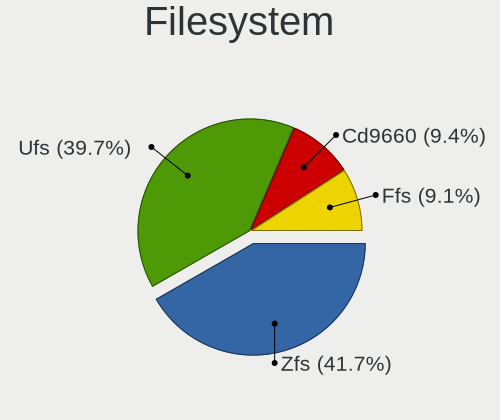
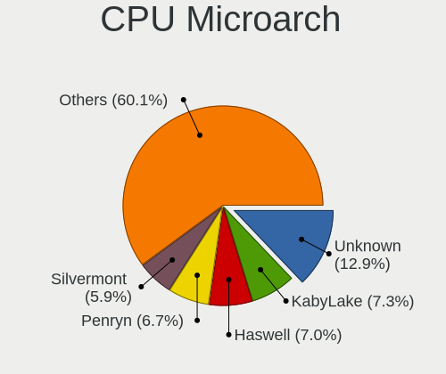
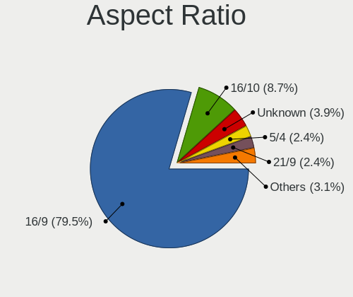
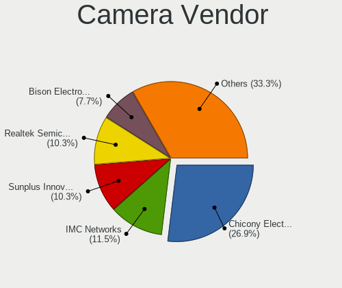

BSD in Italy - Tested Hardware & Statistics
-------------------------------------------

A project to collect tested hardware configurations for BSD in Italy.

Anyone can contribute to this report by the [hw-probe](https://github.com/linuxhw/hw-probe/blob/master/INSTALL.BSD.md) tool:

    hw-probe -all -upload

Please contribute! Especially if your hardware is rare.

This is a report for all computer types. See also reports for [desktops](/Location/Italy/Desktop/README.md) and [notebooks](/Location/Italy/Notebook/README.md).

Contents
--------

* [ Test Cases ](#test-cases)

* [ System ](#system)
  - [ OS                       ](#os)
  - [ OS Family                ](#os-family)
  - [ Arch                     ](#arch)
  - [ DE                       ](#de)
  - [ Display Server           ](#display-server)
  - [ Display Manager          ](#display-manager)
  - [ OS Lang                  ](#os-lang)
  - [ Boot Mode                ](#boot-mode)
  - [ Filesystem               ](#filesystem)
  - [ Part. scheme             ](#part-scheme)

* [ Board ](#board)
  - [ Vendor                   ](#vendor)
  - [ Model                    ](#model)
  - [ Model Family             ](#model-family)
  - [ MFG Year                 ](#mfg-year)
  - [ Form Factor              ](#form-factor)
  - [ Coreboot                 ](#coreboot)
  - [ RAM Size                 ](#ram-size)
  - [ RAM Used                 ](#ram-used)
  - [ Total Drives             ](#total-drives)
  - [ Has CD-ROM               ](#has-cd-rom)
  - [ Has Ethernet             ](#has-ethernet)
  - [ Has WiFi                 ](#has-wifi)
  - [ Has Bluetooth            ](#has-bluetooth)

* [ Location ](#location)
  - [ Country                  ](#country)
  - [ City                     ](#city)

* [ Drives ](#drives)
  - [ Drive Vendor             ](#drive-vendor)
  - [ Drive Model              ](#drive-model)
  - [ HDD Vendor               ](#hdd-vendor)
  - [ SSD Vendor               ](#ssd-vendor)
  - [ Drive Kind               ](#drive-kind)
  - [ Drive Connector          ](#drive-connector)
  - [ Drive Size               ](#drive-size)
  - [ Space Total              ](#space-total)
  - [ Space Used               ](#space-used)
  - [ Malfunc. Drives          ](#malfunc-drives)
  - [ Malfunc. Drive Vendor    ](#malfunc-drive-vendor)
  - [ Malfunc. HDD Vendor      ](#malfunc-hdd-vendor)
  - [ Malfunc. Drive Kind      ](#malfunc-drive-kind)
  - [ Failed Drives            ](#failed-drives)
  - [ Failed Drive Vendor      ](#failed-drive-vendor)
  - [ Drive Status             ](#drive-status)

* [ Storage controller ](#storage-controller)
  - [ Storage Vendor           ](#storage-vendor)
  - [ Storage Model            ](#storage-model)
  - [ Storage Kind             ](#storage-kind)

* [ Processor ](#processor)
  - [ CPU Vendor               ](#cpu-vendor)
  - [ CPU Model                ](#cpu-model)
  - [ CPU Model Family         ](#cpu-model-family)
  - [ CPU Cores                ](#cpu-cores)
  - [ CPU Sockets              ](#cpu-sockets)
  - [ CPU Threads              ](#cpu-threads)
  - [ CPU Microarch            ](#cpu-microarch)

* [ Graphics ](#graphics)
  - [ GPU Vendor               ](#gpu-vendor)
  - [ GPU Model                ](#gpu-model)
  - [ GPU Combo                ](#gpu-combo)
  - [ GPU Driver               ](#gpu-driver)
  - [ GPU Memory               ](#gpu-memory)

* [ Monitor ](#monitor)
  - [ Monitor Vendor           ](#monitor-vendor)
  - [ Monitor Model            ](#monitor-model)
  - [ Monitor Resolution       ](#monitor-resolution)
  - [ Monitor Diagonal         ](#monitor-diagonal)
  - [ Monitor Width            ](#monitor-width)
  - [ Aspect Ratio             ](#aspect-ratio)
  - [ Monitor Area             ](#monitor-area)
  - [ Pixel Density            ](#pixel-density)
  - [ Multiple Monitors        ](#multiple-monitors)

* [ Network ](#network)
  - [ Net Controller Vendor    ](#net-controller-vendor)
  - [ Net Controller Model     ](#net-controller-model)
  - [ Wireless Vendor          ](#wireless-vendor)
  - [ Wireless Model           ](#wireless-model)
  - [ Ethernet Vendor          ](#ethernet-vendor)
  - [ Ethernet Model           ](#ethernet-model)
  - [ Net Controller Kind      ](#net-controller-kind)
  - [ Used Controller          ](#used-controller)
  - [ NICs                     ](#nics)
  - [ IPv6                     ](#ipv6)

* [ Bluetooth ](#bluetooth)
  - [ Bluetooth Vendor         ](#bluetooth-vendor)
  - [ Bluetooth Model          ](#bluetooth-model)

* [ Sound ](#sound)
  - [ Sound Vendor             ](#sound-vendor)
  - [ Sound Model              ](#sound-model)

* [ Memory ](#memory)
  - [ Memory Vendor            ](#memory-vendor)
  - [ Memory Model             ](#memory-model)
  - [ Memory Kind              ](#memory-kind)
  - [ Memory Form Factor       ](#memory-form-factor)
  - [ Memory Size              ](#memory-size)
  - [ Memory Speed             ](#memory-speed)

* [ Printers & scanners ](#printers--scanners)
  - [ Printer Vendor           ](#printer-vendor)
  - [ Printer Model            ](#printer-model)
  - [ Scanner Vendor           ](#scanner-vendor)
  - [ Scanner Model            ](#scanner-model)

* [ Camera ](#camera)
  - [ Camera Vendor            ](#camera-vendor)
  - [ Camera Model             ](#camera-model)

* [ Security ](#security)
  - [ Fingerprint Vendor       ](#fingerprint-vendor)
  - [ Fingerprint Model        ](#fingerprint-model)
  - [ Chipcard Vendor          ](#chipcard-vendor)
  - [ Chipcard Model           ](#chipcard-model)

* [ Unsupported ](#unsupported)
  - [ Unsupported Devices      ](#unsupported-devices)
  - [ Unsupported Device Types ](#unsupported-device-types)

Test Cases
----------

Total: 554

| Vendor        | Model                       | Form-Factor | Probe                                                     | Date         |
|---------------|-----------------------------|-------------|-----------------------------------------------------------|--------------|
| Dell          | 0MGK50 A02                  | Desktop     | [fe0b9484f5](https://bsd-hardware.info/?probe=fe0b9484f5) | Jan 05, 2025 |
| HP            | 18E7                        | Desktop     | [fdac2d0362](https://bsd-hardware.info/?probe=fdac2d0362) | Jan 03, 2025 |
| Dell          | Latitude E7250              | Notebook    | [dbff7c2ebb](https://bsd-hardware.info/?probe=dbff7c2ebb) | Jan 02, 2025 |
| SJRC          | ADLN-6L                     | Desktop     | [90498561c8](https://bsd-hardware.info/?probe=90498561c8) | Jan 02, 2025 |
| Lenovo        | ThinkPad X270 20HN0015MX    | Notebook    | [66b1686a32](https://bsd-hardware.info/?probe=66b1686a32) | Dec 25, 2024 |
| NF692         | 1.0                         | Desktop     | [b129c164c5](https://bsd-hardware.info/?probe=b129c164c5) | Dec 24, 2024 |
| Protectli     | VP2420                      | Desktop     | [6fe419fedc](https://bsd-hardware.info/?probe=6fe419fedc) | Dec 24, 2024 |
| SHENZHEN Y... | M1                          | Mini pc     | [d2695d230e](https://bsd-hardware.info/?probe=d2695d230e) | Dec 17, 2024 |
| Unknown       | Unknown                     | Desktop     | [94d37d7a1e](https://bsd-hardware.info/?probe=94d37d7a1e) | Dec 13, 2024 |
| Unknown       | Unknown                     | Desktop     | [806188d557](https://bsd-hardware.info/?probe=806188d557) | Dec 13, 2024 |
| Intel         | X79_PLUS                    | Desktop     | [0382eb3cd4](https://bsd-hardware.info/?probe=0382eb3cd4) | Dec 10, 2024 |
| Huanan        | X58-RX3.0 V110              | Desktop     | [7aa0eb6533](https://bsd-hardware.info/?probe=7aa0eb6533) | Dec 07, 2024 |
| ASUSTek       | N550JV                      | Notebook    | [43db70e6e9](https://bsd-hardware.info/?probe=43db70e6e9) | Dec 07, 2024 |
| Unknown       | Unknown                     | Desktop     | [5c01d44547](https://bsd-hardware.info/?probe=5c01d44547) | Dec 07, 2024 |
| ASUSTek       | K30AD_M31AD_M51AD_M32AD     | Desktop     | [827453a946](https://bsd-hardware.info/?probe=827453a946) | Dec 06, 2024 |
| Supermicro    | X10SDV-F                    | Server      | [d08d4af555](https://bsd-hardware.info/?probe=d08d4af555) | Dec 01, 2024 |
| HP            | 0A64h                       | Desktop     | [4d668a54a4](https://bsd-hardware.info/?probe=4d668a54a4) | Dec 01, 2024 |
| Intel         | B75 V1.5                    | Desktop     | [a579cb0709](https://bsd-hardware.info/?probe=a579cb0709) | Nov 29, 2024 |
| HP            | ProLiant DL180 G6           | Server      | [f13e4185c7](https://bsd-hardware.info/?probe=f13e4185c7) | Nov 27, 2024 |
| Shenzhen M... | AHWSA                       | Desktop     | [90f5e4c5de](https://bsd-hardware.info/?probe=90f5e4c5de) | Nov 23, 2024 |
| HP            | 802F                        | Desktop     | [7685aa4970](https://bsd-hardware.info/?probe=7685aa4970) | Nov 20, 2024 |
| Unknown       | Unknown                     | Desktop     | [0d7c205328](https://bsd-hardware.info/?probe=0d7c205328) | Nov 20, 2024 |
| HP            | 0A64h                       | Desktop     | [132bd7b8cc](https://bsd-hardware.info/?probe=132bd7b8cc) | Nov 16, 2024 |
| Unknown       | Unknown                     | Desktop     | [a656bb922f](https://bsd-hardware.info/?probe=a656bb922f) | Nov 12, 2024 |
| ASRock        | X570 PG Velocita            | Desktop     | [2a30e356a7](https://bsd-hardware.info/?probe=2a30e356a7) | Nov 12, 2024 |
| Unknown       | Unknown                     | Desktop     | [d205d862c1](https://bsd-hardware.info/?probe=d205d862c1) | Nov 01, 2024 |
| HP            | 8062                        | Desktop     | [3a8dfb73b6](https://bsd-hardware.info/?probe=3a8dfb73b6) | Oct 31, 2024 |
| Quantum en... | HackBoard 2                 | Desktop     | [77f7cc8b05](https://bsd-hardware.info/?probe=77f7cc8b05) | Oct 27, 2024 |
| Intel         | D2500CC AAG81477-401        | Desktop     | [0c7e857ac8](https://bsd-hardware.info/?probe=0c7e857ac8) | Oct 27, 2024 |
| ASUSTek       | K30AD_M31AD_M51AD_M32AD     | Desktop     | [35c1fa9e04](https://bsd-hardware.info/?probe=35c1fa9e04) | Oct 26, 2024 |
| Gigabyte      | A620M H                     | Desktop     | [c1e5a0fe6f](https://bsd-hardware.info/?probe=c1e5a0fe6f) | Oct 22, 2024 |
| Lenovo        | Win8 Pro DPK TPG            | Desktop     | [96bf4191cc](https://bsd-hardware.info/?probe=96bf4191cc) | Oct 17, 2024 |
| HP            | ProLiant DL320e Gen8 v2     | Server      | [af0a059e28](https://bsd-hardware.info/?probe=af0a059e28) | Oct 16, 2024 |
| ASUSTek       | PRIME B650-PLUS             | Desktop     | [6d6ba6974b](https://bsd-hardware.info/?probe=6d6ba6974b) | Oct 12, 2024 |
| Shenzhen M... | AHWSA                       | Desktop     | [549e8b3887](https://bsd-hardware.info/?probe=549e8b3887) | Oct 12, 2024 |
| Dell          | 0TY179 A05                  | Server      | [0bfcb0cf45](https://bsd-hardware.info/?probe=0bfcb0cf45) | Oct 09, 2024 |
| Intel         | DENLOW_REFRESH_WS           | Desktop     | [87cd1c965c](https://bsd-hardware.info/?probe=87cd1c965c) | Oct 07, 2024 |
| MSI           | MS-7D16                     | Desktop     | [e9bddb011d](https://bsd-hardware.info/?probe=e9bddb011d) | Oct 01, 2024 |
| Dell          | Latitude E7250              | Notebook    | [025ea9ef12](https://bsd-hardware.info/?probe=025ea9ef12) | Sep 30, 2024 |
| Shenzhen M... | AHWSA                       | Desktop     | [3a5bb1ef92](https://bsd-hardware.info/?probe=3a5bb1ef92) | Sep 28, 2024 |
| Dell          | Latitude E7250              | Notebook    | [2dfb20ed35](https://bsd-hardware.info/?probe=2dfb20ed35) | Sep 27, 2024 |
| MACHINIST     | X99-MR9A PRO MAX V1.2       | Desktop     | [71545c2b0e](https://bsd-hardware.info/?probe=71545c2b0e) | Sep 24, 2024 |
| HP            | 213D A01                    | Desktop     | [edc8edec39](https://bsd-hardware.info/?probe=edc8edec39) | Sep 22, 2024 |
| MSI           | MS-B1061                    | All in one  | [0c456f4cd7](https://bsd-hardware.info/?probe=0c456f4cd7) | Sep 13, 2024 |
| HP            | Mini 210-1000               | Notebook    | [5271409065](https://bsd-hardware.info/?probe=5271409065) | Sep 11, 2024 |
| HPE           | ProLiant DL380 Gen10        | Server      | [a7e1d263f1](https://bsd-hardware.info/?probe=a7e1d263f1) | Sep 06, 2024 |
| Pegatron      | 2ACF                        | Desktop     | [eeb702f96d](https://bsd-hardware.info/?probe=eeb702f96d) | Aug 29, 2024 |
| AMI           | Aptio CRB                   | Mini pc     | [e014463bd0](https://bsd-hardware.info/?probe=e014463bd0) | Aug 28, 2024 |
| AMI           | Aptio CRB                   | Mini pc     | [308b201c35](https://bsd-hardware.info/?probe=308b201c35) | Aug 20, 2024 |
| Unknown       | Unknown                     | Desktop     | [2e271c0d9e](https://bsd-hardware.info/?probe=2e271c0d9e) | Aug 19, 2024 |
| ASUSTek       | SABERTOOTH Z77              | Desktop     | [942d148e6e](https://bsd-hardware.info/?probe=942d148e6e) | Aug 17, 2024 |
| ASUSTek       | 1215N                       | Notebook    | [0970f34b42](https://bsd-hardware.info/?probe=0970f34b42) | Aug 15, 2024 |
| Microsoft     | Surface Pro 4               | Tablet      | [24dc7d5ecf](https://bsd-hardware.info/?probe=24dc7d5ecf) | Aug 07, 2024 |
| MW            | GMLK-2_5G4L                 | Desktop     | [c78e39d7b2](https://bsd-hardware.info/?probe=c78e39d7b2) | Aug 04, 2024 |
| Unknown       | Unknown                     | Desktop     | [059091972d](https://bsd-hardware.info/?probe=059091972d) | Jul 31, 2024 |
| iEi           | B508 V1.00                  | Desktop     | [5286578613](https://bsd-hardware.info/?probe=5286578613) | Jul 30, 2024 |
| Unknown       | Unknown                     | Desktop     | [0c003d992b](https://bsd-hardware.info/?probe=0c003d992b) | Jul 26, 2024 |
| Unknown       | Unknown                     | Desktop     | [52ce09a582](https://bsd-hardware.info/?probe=52ce09a582) | Jul 25, 2024 |
| Unknown       | Unknown                     | Desktop     | [c33fd5610f](https://bsd-hardware.info/?probe=c33fd5610f) | Jul 23, 2024 |
| Protectli     | V1210                       | Desktop     | [f22c04d928](https://bsd-hardware.info/?probe=f22c04d928) | Jul 14, 2024 |
| Protectli     | VP2420                      | Desktop     | [5dab536cca](https://bsd-hardware.info/?probe=5dab536cca) | Jul 05, 2024 |
| Intel(R) C... | NUC13ANKi5                  | Mini pc     | [17f7122809](https://bsd-hardware.info/?probe=17f7122809) | Jul 01, 2024 |
| Unknown       | Unknown                     | Desktop     | [5766ba4f99](https://bsd-hardware.info/?probe=5766ba4f99) | Jun 28, 2024 |
| Fujitsu Si... | D2804-A1 S26361-D2804-A1    | Desktop     | [52b02922bc](https://bsd-hardware.info/?probe=52b02922bc) | Jun 27, 2024 |
| ASRock        | X300M-STX                   | Desktop     | [2c4cc4c744](https://bsd-hardware.info/?probe=2c4cc4c744) | Jun 26, 2024 |
| Lenovo        | ThinkBook 16 G6 IRL 21KH    | Notebook    | [ddb6ff92c1](https://bsd-hardware.info/?probe=ddb6ff92c1) | Jun 26, 2024 |
| Unknown       | YL-SKUL6                    | Desktop     | [e6e7050b09](https://bsd-hardware.info/?probe=e6e7050b09) | Jun 25, 2024 |
| Supermicro    | X10SDV-F                    | Server      | [df7e8fd69c](https://bsd-hardware.info/?probe=df7e8fd69c) | Jun 23, 2024 |
| Unknown       | Unknown                     | Desktop     | [14bd339dfc](https://bsd-hardware.info/?probe=14bd339dfc) | Jun 18, 2024 |
| AWOW          | AK34Pro                     | Mini pc     | [96cdef5a25](https://bsd-hardware.info/?probe=96cdef5a25) | Jun 17, 2024 |
| Lenovo        | NOK                         | Desktop     | [9ae535f558](https://bsd-hardware.info/?probe=9ae535f558) | Jun 11, 2024 |
| Lenovo        | ThinkBook 16 G6 IRL 21KH    | Notebook    | [8f7f98fc18](https://bsd-hardware.info/?probe=8f7f98fc18) | Jun 07, 2024 |
| AZW           | EQ                          | Desktop     | [4b940b4e22](https://bsd-hardware.info/?probe=4b940b4e22) | Jun 07, 2024 |
| Unknown       | Unknown                     | Desktop     | [6e4e779799](https://bsd-hardware.info/?probe=6e4e779799) | Jun 05, 2024 |
| ASUSTek       | X555UJ                      | Notebook    | [df9f681ce9](https://bsd-hardware.info/?probe=df9f681ce9) | Jun 05, 2024 |
| ASRock        | J5040-ITX                   | Desktop     | [dfb7f31242](https://bsd-hardware.info/?probe=dfb7f31242) | Jun 02, 2024 |
| Dell          | Latitude E7250              | Notebook    | [b5504e5573](https://bsd-hardware.info/?probe=b5504e5573) | Jun 02, 2024 |
| Unknown       | Unknown                     | Desktop     | [002ead7053](https://bsd-hardware.info/?probe=002ead7053) | May 24, 2024 |
| Apple         | Mac-F221BEC8                | Desktop     | [169fdec0c9](https://bsd-hardware.info/?probe=169fdec0c9) | May 22, 2024 |
| MW            | GMLK-2_5G4L                 | Desktop     | [0ba0e09a89](https://bsd-hardware.info/?probe=0ba0e09a89) | May 20, 2024 |
| ASUSTek       | X555LAB                     | Notebook    | [e39c22cfc5](https://bsd-hardware.info/?probe=e39c22cfc5) | May 18, 2024 |
| Deciso        | NetBoard-A20                | Notebook    | [121c0144ee](https://bsd-hardware.info/?probe=121c0144ee) | May 16, 2024 |
| Dell          | 0F0XJ6 A00                  | Server      | [c049ffad9d](https://bsd-hardware.info/?probe=c049ffad9d) | May 06, 2024 |
| Chuwi         | GemiBook Pro                | Notebook    | [2656d00123](https://bsd-hardware.info/?probe=2656d00123) | May 03, 2024 |
| ASUSTek       | PRIME B650-PLUS             | Desktop     | [3e01e5ffbf](https://bsd-hardware.info/?probe=3e01e5ffbf) | May 03, 2024 |
| Quantum en... | HackBoard 2                 | Desktop     | [a7b0ea1eca](https://bsd-hardware.info/?probe=a7b0ea1eca) | Apr 28, 2024 |
| Dell          | 096JG8 A01                  | Desktop     | [a696ddada6](https://bsd-hardware.info/?probe=a696ddada6) | Apr 20, 2024 |
| Supermicro    | X11SDV-4C-TP8F              | Server      | [67e558c746](https://bsd-hardware.info/?probe=67e558c746) | Apr 16, 2024 |
| PC Engines    | apu1                        | Desktop     | [cceec3e9bd](https://bsd-hardware.info/?probe=cceec3e9bd) | Apr 14, 2024 |
| Supermicro    | X11SDV-4C-TP8F              | Server      | [962837890c](https://bsd-hardware.info/?probe=962837890c) | Apr 12, 2024 |
| Unknown       | Unknown                     | Desktop     | [a9c935db85](https://bsd-hardware.info/?probe=a9c935db85) | Apr 09, 2024 |
| Intel         | NUC7i3BNHX                  | Mini pc     | [be1566e796](https://bsd-hardware.info/?probe=be1566e796) | Apr 07, 2024 |
| Gigabyte      | X570 AORUS ELITE            | Desktop     | [426677818b](https://bsd-hardware.info/?probe=426677818b) | Apr 07, 2024 |
| Supermicro    | M11SDV-8C-LN4F              | Server      | [574ff40323](https://bsd-hardware.info/?probe=574ff40323) | Apr 06, 2024 |
| Unknown       | Unknown                     | Desktop     | [1af73d4146](https://bsd-hardware.info/?probe=1af73d4146) | Apr 04, 2024 |
| HPE           | ProLiant DL380 Gen10        | Server      | [d566684a72](https://bsd-hardware.info/?probe=d566684a72) | Apr 02, 2024 |
| Apple         | MacBookAir3,1               | Notebook    | [b6dc892e24](https://bsd-hardware.info/?probe=b6dc892e24) | Mar 31, 2024 |
| Apple         | MacBookAir3,1               | Notebook    | [4a80e4b570](https://bsd-hardware.info/?probe=4a80e4b570) | Mar 31, 2024 |
| Unknown       | Unknown                     | Desktop     | [b9c567bdde](https://bsd-hardware.info/?probe=b9c567bdde) | Mar 21, 2024 |
| HP            | 2B5E                        | Desktop     | [35b1572267](https://bsd-hardware.info/?probe=35b1572267) | Mar 17, 2024 |
| PC Engines    | APU2                        | Desktop     | [9cd0068a06](https://bsd-hardware.info/?probe=9cd0068a06) | Mar 13, 2024 |
| PC Engines    | APU2                        | Desktop     | [891b69ea9c](https://bsd-hardware.info/?probe=891b69ea9c) | Mar 13, 2024 |
| BESSTAR Te... | VB9                         | All in one  | [0fdf31a212](https://bsd-hardware.info/?probe=0fdf31a212) | Feb 29, 2024 |
| Unknown       | Unknown                     | Desktop     | [7f49c436eb](https://bsd-hardware.info/?probe=7f49c436eb) | Feb 27, 2024 |
| PC Engines    | APU2                        | Desktop     | [bd47726af7](https://bsd-hardware.info/?probe=bd47726af7) | Feb 25, 2024 |
| Intel(R) C... | NUC10i3FNH                  | Mini pc     | [924461c416](https://bsd-hardware.info/?probe=924461c416) | Feb 22, 2024 |
| Intel         | NUC7i3BNHX                  | Mini pc     | [cf452e34d1](https://bsd-hardware.info/?probe=cf452e34d1) | Feb 20, 2024 |
| Fujitsu       | D3313-E1 S26361-D3313-E1    | Desktop     | [8f0a5d2d0a](https://bsd-hardware.info/?probe=8f0a5d2d0a) | Feb 16, 2024 |
| PC Engines    | APU2                        | Desktop     | [df18317865](https://bsd-hardware.info/?probe=df18317865) | Feb 14, 2024 |
| PC Engines    | APU2                        | Desktop     | [251265d29e](https://bsd-hardware.info/?probe=251265d29e) | Feb 12, 2024 |
| Unknown       | Unknown                     | Desktop     | [19e59c140c](https://bsd-hardware.info/?probe=19e59c140c) | Feb 09, 2024 |
| HP            | ProLiant DL380 G4           | Server      | [1d58307095](https://bsd-hardware.info/?probe=1d58307095) | Feb 09, 2024 |
| PC Engines    | APU2                        | Desktop     | [6d52e4dad5](https://bsd-hardware.info/?probe=6d52e4dad5) | Feb 07, 2024 |
| ASUSTek       | K52F                        | Notebook    | [bc31c4707c](https://bsd-hardware.info/?probe=bc31c4707c) | Feb 04, 2024 |
| ASUSTek       | K52F                        | Notebook    | [9022031518](https://bsd-hardware.info/?probe=9022031518) | Feb 03, 2024 |
| PC Engines    | APU2                        | Desktop     | [591ead54fc](https://bsd-hardware.info/?probe=591ead54fc) | Jan 30, 2024 |
| Unknown       | Unknown                     | Desktop     | [f2406d4352](https://bsd-hardware.info/?probe=f2406d4352) | Jan 29, 2024 |
| Unknown       | Unknown                     | Desktop     | [4ff002fe77](https://bsd-hardware.info/?probe=4ff002fe77) | Jan 26, 2024 |
| Unknown       | Unknown                     | Desktop     | [de7d99595c](https://bsd-hardware.info/?probe=de7d99595c) | Jan 23, 2024 |
| ASUSTek       | X555LAB                     | Notebook    | [c396fcc8d9](https://bsd-hardware.info/?probe=c396fcc8d9) | Jan 22, 2024 |
| HP            | 1494                        | Desktop     | [45c45d492a](https://bsd-hardware.info/?probe=45c45d492a) | Jan 18, 2024 |
| HP            | Mini 210-1000               | Notebook    | [f25c646418](https://bsd-hardware.info/?probe=f25c646418) | Jan 16, 2024 |
| HP            | Mini 210-1000               | Notebook    | [fb086c3baa](https://bsd-hardware.info/?probe=fb086c3baa) | Jan 15, 2024 |
| ASUSTek       | TUF Gaming H470-PRO         | Desktop     | [e0d9f347e9](https://bsd-hardware.info/?probe=e0d9f347e9) | Jan 13, 2024 |
| Unknown       | Unknown                     | Desktop     | [df4f6b185b](https://bsd-hardware.info/?probe=df4f6b185b) | Jan 09, 2024 |
| PC Engines    | APU2                        | Desktop     | [b08ca32731](https://bsd-hardware.info/?probe=b08ca32731) | Jan 07, 2024 |
| Samsung       | R510/P510                   | Notebook    | [920e7e2d14](https://bsd-hardware.info/?probe=920e7e2d14) | Dec 31, 2023 |
| Fujitsu       | D3090-A1 S26361-D3090-A1    | Server      | [1952b64d3d](https://bsd-hardware.info/?probe=1952b64d3d) | Dec 28, 2023 |
| Protectli     | VP2420                      | Desktop     | [5368ee9cc8](https://bsd-hardware.info/?probe=5368ee9cc8) | Dec 24, 2023 |
| TULPAR        | A5 V20.3                    | Notebook    | [89b65e7036](https://bsd-hardware.info/?probe=89b65e7036) | Dec 23, 2023 |
| Pegatron      | 2ACF                        | Desktop     | [2556fa3be1](https://bsd-hardware.info/?probe=2556fa3be1) | Dec 22, 2023 |
| Unknown       | Unknown                     | Desktop     | [7b24999fbb](https://bsd-hardware.info/?probe=7b24999fbb) | Dec 22, 2023 |
| Protectli     | VP2420                      | Desktop     | [74c1ede426](https://bsd-hardware.info/?probe=74c1ede426) | Dec 10, 2023 |
| Unknown       | Unknown                     | Notebook    | [426e43d7f2](https://bsd-hardware.info/?probe=426e43d7f2) | Dec 08, 2023 |
| Fujitsu Si... | D2804-A1 S26361-D2804-A1    | Desktop     | [4a74f06217](https://bsd-hardware.info/?probe=4a74f06217) | Dec 06, 2023 |
| PC Engines    | APU2                        | Desktop     | [6bbcef15d3](https://bsd-hardware.info/?probe=6bbcef15d3) | Dec 05, 2023 |
| Unknown       | Unknown                     | Desktop     | [ca548efdec](https://bsd-hardware.info/?probe=ca548efdec) | Dec 04, 2023 |
| PC Engines    | APU2                        | Desktop     | [46fa133d51](https://bsd-hardware.info/?probe=46fa133d51) | Dec 04, 2023 |
| HP            | 1825                        | Desktop     | [3edf79b1ba](https://bsd-hardware.info/?probe=3edf79b1ba) | Dec 03, 2023 |
| Lenovo        | ThinkPad X280 20KES5M300    | Notebook    | [28d67ab74a](https://bsd-hardware.info/?probe=28d67ab74a) | Dec 02, 2023 |
| Samsung       | N150P/N210P/N220P           | Notebook    | [b394563830](https://bsd-hardware.info/?probe=b394563830) | Nov 30, 2023 |
| Unknown       | Unknown                     | Desktop     | [5631aa6b68](https://bsd-hardware.info/?probe=5631aa6b68) | Nov 27, 2023 |
| Intel         | NUC5i5RYB H40999-503        | Mini pc     | [3997370fc6](https://bsd-hardware.info/?probe=3997370fc6) | Nov 25, 2023 |
| YANYU         | ITX-M9F VER:1.3 baytrail    | Desktop     | [c9e7bbc120](https://bsd-hardware.info/?probe=c9e7bbc120) | Nov 23, 2023 |
| Lenovo        | ThinkCentre M720s 10SUSB... | Desktop     | [a44a9f3526](https://bsd-hardware.info/?probe=a44a9f3526) | Nov 23, 2023 |
| AMI           | Aptio CRB                   | Mini pc     | [e26144a9ce](https://bsd-hardware.info/?probe=e26144a9ce) | Nov 23, 2023 |
| AZW           | SER V2.0                    | Mini pc     | [17d29b1055](https://bsd-hardware.info/?probe=17d29b1055) | Nov 19, 2023 |
| IceWhale T... | ZimaBoard 832 ZMB           | Desktop     | [98fac2d452](https://bsd-hardware.info/?probe=98fac2d452) | Nov 15, 2023 |
| YENTEK        | D41SL                       | Desktop     | [8cb79449c8](https://bsd-hardware.info/?probe=8cb79449c8) | Nov 10, 2023 |
| BESSTAR Te... | VB9                         | All in one  | [e750d16fb3](https://bsd-hardware.info/?probe=e750d16fb3) | Nov 05, 2023 |
| IceWhale T... | ZimaBoard 432 ZMB           | Desktop     | [018805dc37](https://bsd-hardware.info/?probe=018805dc37) | Nov 03, 2023 |
| ASUSTek       | P8Z77-V LX                  | Desktop     | [7077dec0a1](https://bsd-hardware.info/?probe=7077dec0a1) | Nov 01, 2023 |
| YANYU         | M9F baytrail                | Desktop     | [746772e77b](https://bsd-hardware.info/?probe=746772e77b) | Oct 30, 2023 |
| Fujitsu       | D3041-A1 S26361-D3041-A1    | Desktop     | [bb195148f7](https://bsd-hardware.info/?probe=bb195148f7) | Oct 29, 2023 |
| Dell          | PowerEdge T110 II           | Desktop     | [f93395bc11](https://bsd-hardware.info/?probe=f93395bc11) | Oct 28, 2023 |
| YANYU         | M9F baytrail                | Desktop     | [f9e833a5f9](https://bsd-hardware.info/?probe=f9e833a5f9) | Oct 27, 2023 |
| Supermicro    | M11SDV-8C-LN4F              | Server      | [8af7ab0e4d](https://bsd-hardware.info/?probe=8af7ab0e4d) | Oct 27, 2023 |
| Toshiba       | Unknown                     | Notebook    | [de44a16738](https://bsd-hardware.info/?probe=de44a16738) | Oct 24, 2023 |
| HP            | 213D A01                    | Desktop     | [6a023bfe9f](https://bsd-hardware.info/?probe=6a023bfe9f) | Oct 14, 2023 |
| ASRock        | X300M-STX                   | Desktop     | [fbc9fe11b1](https://bsd-hardware.info/?probe=fbc9fe11b1) | Oct 13, 2023 |
| ANGXUN        | X79-VG2 V1.3                | Desktop     | [c823cbad48](https://bsd-hardware.info/?probe=c823cbad48) | Oct 10, 2023 |
| Unknown       | Unknown                     | Desktop     | [1bb43f3258](https://bsd-hardware.info/?probe=1bb43f3258) | Oct 10, 2023 |
| Fujitsu Si... | D2804-A1 S26361-D2804-A1    | Desktop     | [9e99e33fa3](https://bsd-hardware.info/?probe=9e99e33fa3) | Oct 09, 2023 |
| Dell          | Latitude D830               | Notebook    | [4cf27e5d29](https://bsd-hardware.info/?probe=4cf27e5d29) | Oct 09, 2023 |
| Fujitsu Si... | D2804-A1 S26361-D2804-A1    | Desktop     | [08dab02121](https://bsd-hardware.info/?probe=08dab02121) | Oct 09, 2023 |
| Unknown       | Unknown                     | Desktop     | [af88ff7c18](https://bsd-hardware.info/?probe=af88ff7c18) | Oct 07, 2023 |
| ASUSTek       | P8Z77-V LX                  | Desktop     | [9190b85f99](https://bsd-hardware.info/?probe=9190b85f99) | Oct 04, 2023 |
| ASUSTek       | P8Z77-V LX                  | Desktop     | [914de9ed88](https://bsd-hardware.info/?probe=914de9ed88) | Oct 04, 2023 |
| ASUSTek       | P8Z77-V LX                  | Desktop     | [ba9a892240](https://bsd-hardware.info/?probe=ba9a892240) | Oct 04, 2023 |
| Unknown       | Unknown                     | Desktop     | [002103bb3a](https://bsd-hardware.info/?probe=002103bb3a) | Oct 02, 2023 |
| Acer          | TravelMate 5730             | Notebook    | [dffc2e116d](https://bsd-hardware.info/?probe=dffc2e116d) | Sep 30, 2023 |
| ASUSTek       | PRIME A520M-A II            | Desktop     | [29bcb3ca3e](https://bsd-hardware.info/?probe=29bcb3ca3e) | Sep 29, 2023 |
| BESSTAR Te... | GB7                         | Mini pc     | [8d5549809c](https://bsd-hardware.info/?probe=8d5549809c) | Sep 27, 2023 |
| ASRock        | H270 Pro4                   | Desktop     | [cba80ecde3](https://bsd-hardware.info/?probe=cba80ecde3) | Sep 24, 2023 |
| Unknown       | Unknown                     | Desktop     | [dcf1ebd901](https://bsd-hardware.info/?probe=dcf1ebd901) | Sep 20, 2023 |
| AZW           | U59                         | Desktop     | [ae0d8568d1](https://bsd-hardware.info/?probe=ae0d8568d1) | Sep 15, 2023 |
| AZW           | U59                         | Desktop     | [7e094459f9](https://bsd-hardware.info/?probe=7e094459f9) | Sep 14, 2023 |
| ASUSTek       | N751JK                      | Notebook    | [67d1f42d7c](https://bsd-hardware.info/?probe=67d1f42d7c) | Sep 13, 2023 |
| Fujitsu       | D3090-A1 S26361-D3090-A1    | Server      | [f509d12cea](https://bsd-hardware.info/?probe=f509d12cea) | Aug 29, 2023 |
| PC Engines    | APU2                        | Desktop     | [3d3b16c0cf](https://bsd-hardware.info/?probe=3d3b16c0cf) | Aug 25, 2023 |
| AZW           | U59                         | Desktop     | [e08540ab36](https://bsd-hardware.info/?probe=e08540ab36) | Aug 25, 2023 |
| Protectli     | FW4B                        | Desktop     | [4b358b0106](https://bsd-hardware.info/?probe=4b358b0106) | Aug 24, 2023 |
| ASUSTek       | N751JK                      | Notebook    | [3ac93594a2](https://bsd-hardware.info/?probe=3ac93594a2) | Aug 20, 2023 |
| ASUSTek       | N751JK                      | Notebook    | [3b430afdad](https://bsd-hardware.info/?probe=3b430afdad) | Aug 18, 2023 |
| ASUSTek       | N751JK                      | Notebook    | [66449212d1](https://bsd-hardware.info/?probe=66449212d1) | Aug 18, 2023 |
| BESSTAR Te... | IB9                         | Desktop     | [c9f5ede507](https://bsd-hardware.info/?probe=c9f5ede507) | Aug 18, 2023 |
| ASUSTek       | X553MA                      | Notebook    | [7334765d8a](https://bsd-hardware.info/?probe=7334765d8a) | Aug 16, 2023 |
| ASUSTek       | N751JK                      | Notebook    | [664ee85747](https://bsd-hardware.info/?probe=664ee85747) | Aug 15, 2023 |
| ASUSTek       | N751JK                      | Notebook    | [46a6b88b33](https://bsd-hardware.info/?probe=46a6b88b33) | Aug 11, 2023 |
| Intel         | Q3XXG4-P V1.0               | Desktop     | [f0398bfb85](https://bsd-hardware.info/?probe=f0398bfb85) | Aug 10, 2023 |
| Unknown       | Unknown                     | Desktop     | [28f0d503fd](https://bsd-hardware.info/?probe=28f0d503fd) | Aug 07, 2023 |
| Unknown       | Unknown                     | Desktop     | [6238337b24](https://bsd-hardware.info/?probe=6238337b24) | Aug 07, 2023 |
| ASUSTek       | PRIME B450-PLUS             | Desktop     | [d3fac2e3fe](https://bsd-hardware.info/?probe=d3fac2e3fe) | Aug 06, 2023 |
| MW            | GMLK-2_5G4L                 | Desktop     | [155f885c95](https://bsd-hardware.info/?probe=155f885c95) | Aug 01, 2023 |
| ASUSTek       | P8P67                       | Desktop     | [0e10359af8](https://bsd-hardware.info/?probe=0e10359af8) | Jul 29, 2023 |
| ASUSTek       | PRIME B650-PLUS             | Desktop     | [e74d459c5a](https://bsd-hardware.info/?probe=e74d459c5a) | Jul 28, 2023 |
| Dell          | 0PTTT9 A01                  | Desktop     | [a3624fdcfc](https://bsd-hardware.info/?probe=a3624fdcfc) | Jul 24, 2023 |
| AMI           | Aptio CRB                   | Mini pc     | [a441b76fb8](https://bsd-hardware.info/?probe=a441b76fb8) | Jul 20, 2023 |
| Lenovo        | ThinkPad W530 2447GW3       | Notebook    | [57b4bfc1bf](https://bsd-hardware.info/?probe=57b4bfc1bf) | Jul 17, 2023 |
| Dell          | 0PTTT9 A01                  | Desktop     | [0f55bad1af](https://bsd-hardware.info/?probe=0f55bad1af) | Jul 08, 2023 |
| MSI           | H510I PRO WIFI              | Desktop     | [743d249ba5](https://bsd-hardware.info/?probe=743d249ba5) | Jul 07, 2023 |
| Dell          | 0WMJ54 A01                  | Desktop     | [48fcb6e4ab](https://bsd-hardware.info/?probe=48fcb6e4ab) | Jul 05, 2023 |
| Protectli     | FW4B                        | Desktop     | [a3cf476fe8](https://bsd-hardware.info/?probe=a3cf476fe8) | Jul 03, 2023 |
| Fujitsu       | D3313-G1 S26361-D3313-G1    | Desktop     | [c30f91d5cc](https://bsd-hardware.info/?probe=c30f91d5cc) | Jul 01, 2023 |
| ASUSTek       | N3700T                      | Desktop     | [16b73b05ef](https://bsd-hardware.info/?probe=16b73b05ef) | Jun 26, 2023 |
| HP            | Pavilion 15                 | Notebook    | [9ba6acdb4b](https://bsd-hardware.info/?probe=9ba6acdb4b) | Jun 18, 2023 |
| ASUSTek       | 1015P                       | Notebook    | [c700224684](https://bsd-hardware.info/?probe=c700224684) | Jun 14, 2023 |
| Unknown       | Unknown                     | Desktop     | [229e573059](https://bsd-hardware.info/?probe=229e573059) | Jun 13, 2023 |
| Unknown       | Unknown                     | Desktop     | [9d271bc94c](https://bsd-hardware.info/?probe=9d271bc94c) | Jun 12, 2023 |
| Fujitsu       | D3313-A1 S26361-D3313-A1    | Desktop     | [fe412825f2](https://bsd-hardware.info/?probe=fe412825f2) | Jun 10, 2023 |
| Dell          | 0WR7PY A03                  | Desktop     | [c8496622be](https://bsd-hardware.info/?probe=c8496622be) | Jun 03, 2023 |
| Dell          | 0WR7PY A03                  | Desktop     | [b9f7e3e209](https://bsd-hardware.info/?probe=b9f7e3e209) | Jun 03, 2023 |
| Fujitsu       | D3313-A1 S26361-D3313-A1    | Desktop     | [d08f309c4c](https://bsd-hardware.info/?probe=d08f309c4c) | May 26, 2023 |
| Intel         | Q3XXG4-P V1.0               | Desktop     | [9160d45441](https://bsd-hardware.info/?probe=9160d45441) | May 25, 2023 |
| Unknown       | Unknown                     | Desktop     | [8b5ec8c5f4](https://bsd-hardware.info/?probe=8b5ec8c5f4) | May 23, 2023 |
| Gigabyte      | A520M S2H                   | Desktop     | [582dc6ab9f](https://bsd-hardware.info/?probe=582dc6ab9f) | May 15, 2023 |
| Unknown       | Unknown                     | Desktop     | [b26eac2277](https://bsd-hardware.info/?probe=b26eac2277) | May 13, 2023 |
| Fujitsu       | D3313-A1 S26361-D3313-A1    | Desktop     | [1dac5a7bb2](https://bsd-hardware.info/?probe=1dac5a7bb2) | May 13, 2023 |
| Unknown       | Unknown                     | Desktop     | [bf8246ecb5](https://bsd-hardware.info/?probe=bf8246ecb5) | May 11, 2023 |
| ASUSTek       | PRIME B650-PLUS             | Desktop     | [be83fbb0f2](https://bsd-hardware.info/?probe=be83fbb0f2) | May 09, 2023 |
| Unknown       | Unknown                     | Desktop     | [5c6c169e73](https://bsd-hardware.info/?probe=5c6c169e73) | May 01, 2023 |
| Unknown       | Unknown                     | Desktop     | [d572f5ff91](https://bsd-hardware.info/?probe=d572f5ff91) | May 01, 2023 |
| Unknown       | HX90                        | Desktop     | [b3300c45bc](https://bsd-hardware.info/?probe=b3300c45bc) | May 01, 2023 |
| Unknown       | Unknown                     | Desktop     | [1774da050f](https://bsd-hardware.info/?probe=1774da050f) | Apr 29, 2023 |
| AWOW          | AK34Pro                     | Mini pc     | [0471af8c22](https://bsd-hardware.info/?probe=0471af8c22) | Apr 24, 2023 |
| AWOW          | AK34Pro                     | Mini pc     | [30062ec670](https://bsd-hardware.info/?probe=30062ec670) | Apr 23, 2023 |
| HP            | 82B4                        | Desktop     | [9ec1e6d6f4](https://bsd-hardware.info/?probe=9ec1e6d6f4) | Apr 23, 2023 |
| Intel         | SKYBAY                      | Desktop     | [03dd920110](https://bsd-hardware.info/?probe=03dd920110) | Apr 22, 2023 |
| Sophos        | UTM                         | Firewall    | [85bf260703](https://bsd-hardware.info/?probe=85bf260703) | Apr 21, 2023 |
| Fujitsu       | D3313-A1 S26361-D3313-A1    | Desktop     | [d343800c53](https://bsd-hardware.info/?probe=d343800c53) | Apr 16, 2023 |
| PC Engines    | apu4                        | Desktop     | [9217e1982f](https://bsd-hardware.info/?probe=9217e1982f) | Apr 14, 2023 |
| ASRock        | G31M-S                      | Desktop     | [fed4a42c32](https://bsd-hardware.info/?probe=fed4a42c32) | Apr 08, 2023 |
| ASRock        | G31M-S                      | Desktop     | [4596f78aee](https://bsd-hardware.info/?probe=4596f78aee) | Apr 08, 2023 |
| Dell          | XPS 13 9343                 | Notebook    | [8354aed46e](https://bsd-hardware.info/?probe=8354aed46e) | Apr 07, 2023 |
| Unknown       | Unknown                     | Desktop     | [5168183b15](https://bsd-hardware.info/?probe=5168183b15) | Apr 06, 2023 |
| Acer          | Aspire 5250                 | Notebook    | [385751dbc3](https://bsd-hardware.info/?probe=385751dbc3) | Apr 06, 2023 |
| Fujitsu       | D3028-A1 S26361-D3028-A1    | Desktop     | [45f590d129](https://bsd-hardware.info/?probe=45f590d129) | Apr 04, 2023 |
| Fujitsu       | D3028-A1 S26361-D3028-A1    | Desktop     | [ab0643727f](https://bsd-hardware.info/?probe=ab0643727f) | Apr 02, 2023 |
| Fujitsu       | D3313-A1 S26361-D3313-A1    | Desktop     | [fb6477d43e](https://bsd-hardware.info/?probe=fb6477d43e) | Mar 31, 2023 |
| Dell          | 0M877N A01                  | Server      | [dabe853e69](https://bsd-hardware.info/?probe=dabe853e69) | Mar 30, 2023 |
| LG Electro... | COLUMBIA                    | Notebook    | [4872f6c377](https://bsd-hardware.info/?probe=4872f6c377) | Mar 27, 2023 |
| YANYU         | H17SL                       | Desktop     | [0f9829ebe4](https://bsd-hardware.info/?probe=0f9829ebe4) | Mar 26, 2023 |
| ASUSTek       | F1A55                       | Desktop     | [91ad5bab75](https://bsd-hardware.info/?probe=91ad5bab75) | Mar 25, 2023 |
| Unknown       | Unknown                     | Desktop     | [a7e98f9a10](https://bsd-hardware.info/?probe=a7e98f9a10) | Mar 23, 2023 |
| T-bao         | MINI PC V1.0                | Desktop     | [eb2bc1cd51](https://bsd-hardware.info/?probe=eb2bc1cd51) | Mar 23, 2023 |
| ASUSTek       | PRIME H410M-A               | Desktop     | [cbbeb5c41c](https://bsd-hardware.info/?probe=cbbeb5c41c) | Mar 22, 2023 |
| HP            | 8054                        | Desktop     | [6e5a18f346](https://bsd-hardware.info/?probe=6e5a18f346) | Mar 20, 2023 |
| Intel         | S1200RP_SE                  | Notebook    | [5ae9400f0b](https://bsd-hardware.info/?probe=5ae9400f0b) | Mar 17, 2023 |
| Lenovo        | ThinkPad T440p              | Notebook    | [575123c3ac](https://bsd-hardware.info/?probe=575123c3ac) | Mar 17, 2023 |
| Dell          | Latitude E5570              | Notebook    | [8b9aa95420](https://bsd-hardware.info/?probe=8b9aa95420) | Mar 17, 2023 |
| Dell          | Latitude E5570              | Notebook    | [937a7c9385](https://bsd-hardware.info/?probe=937a7c9385) | Mar 17, 2023 |
| SiComputer    | Embedded                    | Soc         | [9d6aa61a5c](https://bsd-hardware.info/?probe=9d6aa61a5c) | Mar 17, 2023 |
| YANYU         | H17SL                       | Desktop     | [37a549331f](https://bsd-hardware.info/?probe=37a549331f) | Mar 14, 2023 |
| MSI           | 0A48                        | Desktop     | [815f019a8c](https://bsd-hardware.info/?probe=815f019a8c) | Mar 14, 2023 |
| AZW           | U59                         | Desktop     | [5a6ef3fb8d](https://bsd-hardware.info/?probe=5a6ef3fb8d) | Mar 14, 2023 |
| Dell          | 0WMJ54 A01                  | Desktop     | [7949f20162](https://bsd-hardware.info/?probe=7949f20162) | Mar 12, 2023 |
| Fujitsu       | D3313-A1 S26361-D3313-A1    | Desktop     | [a3f921de9a](https://bsd-hardware.info/?probe=a3f921de9a) | Mar 12, 2023 |
| Fujitsu       | D3313-A1 S26361-D3313-A1    | Desktop     | [2050921c3d](https://bsd-hardware.info/?probe=2050921c3d) | Mar 12, 2023 |
| Lenovo        | ThinkPad T440p              | Notebook    | [6d372db804](https://bsd-hardware.info/?probe=6d372db804) | Mar 12, 2023 |
| Gigabyte      | B450M K                     | Desktop     | [0d0433284e](https://bsd-hardware.info/?probe=0d0433284e) | Mar 11, 2023 |
| NF692         | 1.0                         | Desktop     | [16fa0b0102](https://bsd-hardware.info/?probe=16fa0b0102) | Mar 11, 2023 |
| Fujitsu       | D3313-A1 S26361-D3313-A1    | Desktop     | [6729453203](https://bsd-hardware.info/?probe=6729453203) | Mar 09, 2023 |
| Fujitsu       | D3313-A1 S26361-D3313-A1    | Desktop     | [6dee276a48](https://bsd-hardware.info/?probe=6dee276a48) | Mar 07, 2023 |
| Gigabyte      | H97M-HD3                    | Desktop     | [77a58527da](https://bsd-hardware.info/?probe=77a58527da) | Mar 01, 2023 |
| Stonesoft     | FW-315-C1                   | Desktop     | [e8a2206ad2](https://bsd-hardware.info/?probe=e8a2206ad2) | Feb 28, 2023 |
| Lenovo        | ThinkPad T410 2537B94       | Notebook    | [9f9cb3e201](https://bsd-hardware.info/?probe=9f9cb3e201) | Feb 19, 2023 |
| Intel         | JSL MRD                     | Desktop     | [1587ea95da](https://bsd-hardware.info/?probe=1587ea95da) | Feb 18, 2023 |
| Unknown       | SKYBAY                      | Desktop     | [df7f4524d7](https://bsd-hardware.info/?probe=df7f4524d7) | Feb 12, 2023 |
| Unknown       | Unknown                     | Desktop     | [7f9208dc11](https://bsd-hardware.info/?probe=7f9208dc11) | Feb 06, 2023 |
| HP            | Mini 210-1000               | Notebook    | [eaabd2a89d](https://bsd-hardware.info/?probe=eaabd2a89d) | Feb 02, 2023 |
| HP            | 213D A01                    | Desktop     | [659939cc8b](https://bsd-hardware.info/?probe=659939cc8b) | Jan 26, 2023 |
| Unknown       | Unknown                     | Desktop     | [aa940792fc](https://bsd-hardware.info/?probe=aa940792fc) | Jan 25, 2023 |
| Gigabyte      | A520M S2H                   | Desktop     | [803a152afc](https://bsd-hardware.info/?probe=803a152afc) | Jan 23, 2023 |
| ASUSTek       | PRO A520M-C                 | Desktop     | [bebcd1a008](https://bsd-hardware.info/?probe=bebcd1a008) | Jan 20, 2023 |
| Gigabyte      | H270M-DS3H-CF               | Desktop     | [d0e2e85346](https://bsd-hardware.info/?probe=d0e2e85346) | Jan 17, 2023 |
| Unknown       | SKYBAY                      | Desktop     | [c1e1ba5558](https://bsd-hardware.info/?probe=c1e1ba5558) | Jan 16, 2023 |
| Supermicro    | X9SCI/X9SCA                 | Desktop     | [942d966486](https://bsd-hardware.info/?probe=942d966486) | Jan 11, 2023 |
| Sophos        | UTM                         | Firewall    | [6379cce732](https://bsd-hardware.info/?probe=6379cce732) | Jan 06, 2023 |
| Lenovo        | ThinkPad T460s 20FAS3L00... | Notebook    | [ef6972d07a](https://bsd-hardware.info/?probe=ef6972d07a) | Jan 03, 2023 |
| Fujitsu       | D3041-A1 S26361-D3041-A1    | Desktop     | [2265227a5c](https://bsd-hardware.info/?probe=2265227a5c) | Dec 26, 2022 |
| Dell          | Inspiron 15-3552            | Notebook    | [eea4262af2](https://bsd-hardware.info/?probe=eea4262af2) | Dec 22, 2022 |
| Dell          | Inspiron 15-3552            | Notebook    | [cae00eb4d6](https://bsd-hardware.info/?probe=cae00eb4d6) | Dec 22, 2022 |
| MSI           | MS-7922                     | Desktop     | [95dbf4f7a8](https://bsd-hardware.info/?probe=95dbf4f7a8) | Dec 19, 2022 |
| Pegatron      | 2ACF                        | Desktop     | [511f2a6d16](https://bsd-hardware.info/?probe=511f2a6d16) | Dec 19, 2022 |
| Lenovo        | ThinkPad X1 Extreme Gen ... | Notebook    | [d19db2828c](https://bsd-hardware.info/?probe=d19db2828c) | Dec 16, 2022 |
| Gigabyte      | N3160ND3V                   | Desktop     | [c84bedc821](https://bsd-hardware.info/?probe=c84bedc821) | Dec 15, 2022 |
| Dell          | 0WMJ54 A01                  | Desktop     | [435807287e](https://bsd-hardware.info/?probe=435807287e) | Dec 15, 2022 |
| AZW           | U59                         | Desktop     | [9b22c68e98](https://bsd-hardware.info/?probe=9b22c68e98) | Dec 13, 2022 |
| ASUSTek       | PRIME Z390M-PLUS            | Desktop     | [7329e04c22](https://bsd-hardware.info/?probe=7329e04c22) | Nov 27, 2022 |
| ASUSTek       | P11C-X Series               | Desktop     | [6860cd72f8](https://bsd-hardware.info/?probe=6860cd72f8) | Nov 26, 2022 |
| ASUSTek       | P11C-X Series               | Desktop     | [cfdb06e761](https://bsd-hardware.info/?probe=cfdb06e761) | Nov 26, 2022 |
| Dell          | 0PTTT9 A01                  | Desktop     | [74575d6dfe](https://bsd-hardware.info/?probe=74575d6dfe) | Nov 25, 2022 |
| Dell          | Vostro 3550                 | Notebook    | [2aeadb4dfc](https://bsd-hardware.info/?probe=2aeadb4dfc) | Nov 14, 2022 |
| Dell          | 0VD5HY A00                  | Desktop     | [1a0df311e3](https://bsd-hardware.info/?probe=1a0df311e3) | Nov 07, 2022 |
| Gigabyte      | H270M-DS3H-CF               | Desktop     | [5784d8bed6](https://bsd-hardware.info/?probe=5784d8bed6) | Nov 04, 2022 |
| HP            | Laptop 15-da0xxx            | Notebook    | [72d95a4938](https://bsd-hardware.info/?probe=72d95a4938) | Nov 03, 2022 |
| Acer          | Veriton X2610G              | Desktop     | [e4289c3f15](https://bsd-hardware.info/?probe=e4289c3f15) | Oct 24, 2022 |
| Sophos        | UTM                         | Firewall    | [6a4c00a973](https://bsd-hardware.info/?probe=6a4c00a973) | Oct 21, 2022 |
| Unknown       | Unknown                     | Desktop     | [1188b56e14](https://bsd-hardware.info/?probe=1188b56e14) | Oct 19, 2022 |
| Unknown       | Unknown                     | Desktop     | [915c66f8bd](https://bsd-hardware.info/?probe=915c66f8bd) | Oct 19, 2022 |
| PC Engines    | apu4                        | Desktop     | [20cfd8a3c8](https://bsd-hardware.info/?probe=20cfd8a3c8) | Oct 17, 2022 |
| Pegatron      | 2ACF                        | Desktop     | [c57cc3a923](https://bsd-hardware.info/?probe=c57cc3a923) | Oct 17, 2022 |
| ASRock        | Q1900M                      | Desktop     | [7d0380e2d0](https://bsd-hardware.info/?probe=7d0380e2d0) | Oct 15, 2022 |
| Sophos        | UTM                         | Firewall    | [364e007b1c](https://bsd-hardware.info/?probe=364e007b1c) | Oct 13, 2022 |
| Lenovo        | IdeaPad 3 15ADA05 81W1      | Notebook    | [dec7108b53](https://bsd-hardware.info/?probe=dec7108b53) | Oct 11, 2022 |
| ASRock        | J3355B-ITX                  | Desktop     | [d802705c1d](https://bsd-hardware.info/?probe=d802705c1d) | Oct 10, 2022 |
| ASRock        | B75M R2.0                   | Desktop     | [a28ea59f1f](https://bsd-hardware.info/?probe=a28ea59f1f) | Oct 07, 2022 |
| Unknown       | Unknown                     | Desktop     | [bdabafdcb1](https://bsd-hardware.info/?probe=bdabafdcb1) | Oct 01, 2022 |
| ASRock        | Q1900B-ITX                  | Desktop     | [81722a937a](https://bsd-hardware.info/?probe=81722a937a) | Sep 13, 2022 |
| HP            | 8648                        | Desktop     | [e7e610794c](https://bsd-hardware.info/?probe=e7e610794c) | Sep 12, 2022 |
| Dell          | 0WMJ54 A01                  | Desktop     | [b54e6663f9](https://bsd-hardware.info/?probe=b54e6663f9) | Sep 10, 2022 |
| Intel         | J1900                       | Desktop     | [a95dd12c65](https://bsd-hardware.info/?probe=a95dd12c65) | Sep 06, 2022 |
| HP            | 1496                        | Desktop     | [7cd97bd330](https://bsd-hardware.info/?probe=7cd97bd330) | Sep 05, 2022 |
| PC Engines    | APU2                        | Desktop     | [d9216cb730](https://bsd-hardware.info/?probe=d9216cb730) | Sep 05, 2022 |
| HP            | 1496                        | Desktop     | [94e8713f6d](https://bsd-hardware.info/?probe=94e8713f6d) | Sep 03, 2022 |
| Dell          | 0TY179 A05                  | Server      | [482bca3952](https://bsd-hardware.info/?probe=482bca3952) | Sep 01, 2022 |
| HP            | 1496                        | Desktop     | [1567aa1c21](https://bsd-hardware.info/?probe=1567aa1c21) | Sep 01, 2022 |
| Unknown       | HX90                        | Desktop     | [568468e95b](https://bsd-hardware.info/?probe=568468e95b) | Sep 01, 2022 |
| Fujitsu       | D3041-A1 S26361-D3041-A1    | Desktop     | [2349014a6c](https://bsd-hardware.info/?probe=2349014a6c) | Aug 29, 2022 |
| PC Engines    | APU2                        | Desktop     | [b3d60c2790](https://bsd-hardware.info/?probe=b3d60c2790) | Aug 22, 2022 |
| AMI           | Aptio CRB                   | Mini pc     | [02e11159f5](https://bsd-hardware.info/?probe=02e11159f5) | Aug 18, 2022 |
| Fujitsu       | D3373-B1 S26361-D3373-B1... | Server      | [676fd4e9b4](https://bsd-hardware.info/?probe=676fd4e9b4) | Aug 17, 2022 |
| ASUSTek       | M4A87TD EVO                 | Desktop     | [c03da8657e](https://bsd-hardware.info/?probe=c03da8657e) | Aug 17, 2022 |
| PC Engines    | APU2                        | Desktop     | [028dc7aa20](https://bsd-hardware.info/?probe=028dc7aa20) | Aug 17, 2022 |
| BESSTAR Te... | VB9                         | All in one  | [ec5b4884a7](https://bsd-hardware.info/?probe=ec5b4884a7) | Aug 13, 2022 |
| Dell          | 0WMJ54 A01                  | Desktop     | [1d4ccaabda](https://bsd-hardware.info/?probe=1d4ccaabda) | Aug 13, 2022 |
| Fujitsu       | D3041-A1 S26361-D3041-A1    | Desktop     | [17dc06ed68](https://bsd-hardware.info/?probe=17dc06ed68) | Aug 12, 2022 |
| Unknown       | Unknown                     | Desktop     | [af3d9689c2](https://bsd-hardware.info/?probe=af3d9689c2) | Aug 11, 2022 |
| Unknown       | Unknown                     | Desktop     | [5049417b7b](https://bsd-hardware.info/?probe=5049417b7b) | Aug 11, 2022 |
| Intel         | SKYBAY                      | Desktop     | [c7010b7ebc](https://bsd-hardware.info/?probe=c7010b7ebc) | Aug 09, 2022 |
| Shenzhen M... | AHWSA                       | Desktop     | [21cda0eb5d](https://bsd-hardware.info/?probe=21cda0eb5d) | Aug 09, 2022 |
| Intel         | SKYBAY                      | Desktop     | [bc7d4d8e1e](https://bsd-hardware.info/?probe=bc7d4d8e1e) | Aug 08, 2022 |
| eMachines     | eME728                      | Notebook    | [96d745589c](https://bsd-hardware.info/?probe=96d745589c) | Aug 06, 2022 |
| Unknown       | Unknown                     | Desktop     | [df3667156b](https://bsd-hardware.info/?probe=df3667156b) | Aug 02, 2022 |
| Lex           | Pineview-D                  | Desktop     | [7d7195024e](https://bsd-hardware.info/?probe=7d7195024e) | Aug 02, 2022 |
| Intel         | Q3XXG4-P V1.0               | Desktop     | [d6a3d57165](https://bsd-hardware.info/?probe=d6a3d57165) | Jul 29, 2022 |
| PC Engines    | APU2                        | Desktop     | [bb5d45a75d](https://bsd-hardware.info/?probe=bb5d45a75d) | Jul 29, 2022 |
| Fujitsu       | D3313-A1 S26361-D3313-A1    | Desktop     | [e3655742ba](https://bsd-hardware.info/?probe=e3655742ba) | Jul 18, 2022 |
| Lenovo        | SHARKBAY SDK0E50510 WIN     | Desktop     | [4b9e0bb7bb](https://bsd-hardware.info/?probe=4b9e0bb7bb) | Jul 18, 2022 |
| Fujitsu       | D3313-A1 S26361-D3313-A1    | Desktop     | [af1e80d15d](https://bsd-hardware.info/?probe=af1e80d15d) | Jul 18, 2022 |
| ASUSTek       | M4A785TD-M EVO              | Desktop     | [def87ec245](https://bsd-hardware.info/?probe=def87ec245) | Jul 18, 2022 |
| ASUSTek       | PRIME H410M-A               | Desktop     | [7b6faf5301](https://bsd-hardware.info/?probe=7b6faf5301) | Jul 14, 2022 |
| Dell          | Latitude E5450              | Notebook    | [5f1183ab0b](https://bsd-hardware.info/?probe=5f1183ab0b) | Jul 14, 2022 |
| Dell          | Latitude E5450              | Notebook    | [1080ed5654](https://bsd-hardware.info/?probe=1080ed5654) | Jul 14, 2022 |
| HP            | Laptop 15-da0xxx            | Notebook    | [0434c94fad](https://bsd-hardware.info/?probe=0434c94fad) | Jul 09, 2022 |
| ASUSTek       | PRIME H410M-A               | Desktop     | [ba243fa7c4](https://bsd-hardware.info/?probe=ba243fa7c4) | Jul 09, 2022 |
| Unknown       | Unknown                     | Notebook    | [4ac86f5979](https://bsd-hardware.info/?probe=4ac86f5979) | Jul 09, 2022 |
| Fujitsu       | D3041-A1 S26361-D3041-A1    | Desktop     | [d3aba12432](https://bsd-hardware.info/?probe=d3aba12432) | Jul 09, 2022 |
| ASRock        | B75M R2.0                   | Desktop     | [6011c70ca4](https://bsd-hardware.info/?probe=6011c70ca4) | Jul 07, 2022 |
| BESSTAR Te... | GB1B                        | Mini pc     | [dbbe9124a2](https://bsd-hardware.info/?probe=dbbe9124a2) | Jul 05, 2022 |
| HP            | 0A98h                       | Desktop     | [655fc531fb](https://bsd-hardware.info/?probe=655fc531fb) | Jun 30, 2022 |
| Acer          | AOD260                      | Notebook    | [08dc464d1b](https://bsd-hardware.info/?probe=08dc464d1b) | Jun 30, 2022 |
| Pegatron      | 2ACF                        | Desktop     | [e461a4559d](https://bsd-hardware.info/?probe=e461a4559d) | Jun 29, 2022 |
| HP            | 304Bh                       | Desktop     | [8a3151b3cd](https://bsd-hardware.info/?probe=8a3151b3cd) | Jun 16, 2022 |
| NF692         | 1.0                         | Desktop     | [e87866bf5a](https://bsd-hardware.info/?probe=e87866bf5a) | Jun 10, 2022 |
| Lenovo        | ThinkPad L530 24812TG       | Notebook    | [5b66684c4a](https://bsd-hardware.info/?probe=5b66684c4a) | Jun 05, 2022 |
| ASUSTek       | PRIME H410M-E               | Desktop     | [8099e7abaf](https://bsd-hardware.info/?probe=8099e7abaf) | Jun 03, 2022 |
| HP            | ProLiant MicroServer Gen... | Desktop     | [4b3b7a0929](https://bsd-hardware.info/?probe=4b3b7a0929) | May 31, 2022 |
| HP            | ProLiant MicroServer Gen... | Desktop     | [5d3db8382f](https://bsd-hardware.info/?probe=5d3db8382f) | May 31, 2022 |
| Lenovo        | ThinkPad X250 20CMS0FA00    | Notebook    | [5afeac632d](https://bsd-hardware.info/?probe=5afeac632d) | May 28, 2022 |
| T-bao         | MINI PC V1.0                | Desktop     | [a89b2081bb](https://bsd-hardware.info/?probe=a89b2081bb) | May 25, 2022 |
| ASUSTek       | F50SL                       | Notebook    | [e26b522868](https://bsd-hardware.info/?probe=e26b522868) | May 22, 2022 |
| Acer          | Aspire E1-522               | Notebook    | [23396b461f](https://bsd-hardware.info/?probe=23396b461f) | May 18, 2022 |
| ASUSTek       | PRIME B550M-K               | Desktop     | [ce5ddde5ad](https://bsd-hardware.info/?probe=ce5ddde5ad) | May 18, 2022 |
| Protectli     | FW4B Ver                    | Desktop     | [2769c8f286](https://bsd-hardware.info/?probe=2769c8f286) | May 17, 2022 |
| Acer          | Aspire E1-522               | Notebook    | [55cda59c51](https://bsd-hardware.info/?probe=55cda59c51) | May 17, 2022 |
| ASUSTek       | K52F                        | Notebook    | [6e86ce2a12](https://bsd-hardware.info/?probe=6e86ce2a12) | May 15, 2022 |
| ASUSTek       | K52F                        | Notebook    | [4c12c55177](https://bsd-hardware.info/?probe=4c12c55177) | May 15, 2022 |
| Dell          | Inspiron 15-3552            | Notebook    | [5e781a451d](https://bsd-hardware.info/?probe=5e781a451d) | May 12, 2022 |
| BESSTAR Te... | GB1B                        | Mini pc     | [407fc42fad](https://bsd-hardware.info/?probe=407fc42fad) | May 05, 2022 |
| Fujitsu       | D3041-A1 S26361-D3041-A1    | Desktop     | [5ff176fff8](https://bsd-hardware.info/?probe=5ff176fff8) | May 05, 2022 |
| Deciso        | OPNsense Appliance          | Notebook    | [8a8db12cf2](https://bsd-hardware.info/?probe=8a8db12cf2) | May 02, 2022 |
| Lenovo        | ThinkPad T420 4236BD5       | Notebook    | [867ed989e2](https://bsd-hardware.info/?probe=867ed989e2) | Apr 27, 2022 |
| MSI           | GF65 Thin 10SER             | Notebook    | [cedf98c955](https://bsd-hardware.info/?probe=cedf98c955) | Apr 26, 2022 |
| ASUSTek       | M4A88TD-V EVO/USB3          | Desktop     | [12cc40cc60](https://bsd-hardware.info/?probe=12cc40cc60) | Apr 23, 2022 |
| Dell          | 0TY179 A05                  | Server      | [124e42e2c1](https://bsd-hardware.info/?probe=124e42e2c1) | Apr 21, 2022 |
| Intel         | NUC5i5RYB H40999-502        | Mini pc     | [9a50fe43a7](https://bsd-hardware.info/?probe=9a50fe43a7) | Apr 21, 2022 |
| Pegatron      | Benicia                     | Desktop     | [9045b4f449](https://bsd-hardware.info/?probe=9045b4f449) | Apr 16, 2022 |
| ASUSTek       | PRIME Z390M-PLUS            | Desktop     | [680303f943](https://bsd-hardware.info/?probe=680303f943) | Apr 16, 2022 |
| ASUSTek       | PRIME Z390M-PLUS            | Desktop     | [47d17d48a7](https://bsd-hardware.info/?probe=47d17d48a7) | Apr 15, 2022 |
| Dell          | 07978V A08                  | Server      | [f315c33e95](https://bsd-hardware.info/?probe=f315c33e95) | Apr 06, 2022 |
| ShenZhen M... | MW-NANO-APL-4L              | Desktop     | [fbdd8d4f48](https://bsd-hardware.info/?probe=fbdd8d4f48) | Apr 05, 2022 |
| HP            | 212B                        | Desktop     | [33e7c65907](https://bsd-hardware.info/?probe=33e7c65907) | Apr 04, 2022 |
| Gigabyte      | X570 AORUS PRO              | Desktop     | [3877a33214](https://bsd-hardware.info/?probe=3877a33214) | Apr 02, 2022 |
| Gigabyte      | X570 AORUS PRO              | Desktop     | [3da637e3c6](https://bsd-hardware.info/?probe=3da637e3c6) | Apr 02, 2022 |
| Fujitsu       | D3041-A1 S26361-D3041-A1    | Desktop     | [7b79164c18](https://bsd-hardware.info/?probe=7b79164c18) | Apr 01, 2022 |
| ASUSTek       | X555LJ                      | Notebook    | [6bf51cc915](https://bsd-hardware.info/?probe=6bf51cc915) | Mar 28, 2022 |
| BESSTAR Te... | GB1B                        | Mini pc     | [9f760529c1](https://bsd-hardware.info/?probe=9f760529c1) | Mar 21, 2022 |
| Unknown       | Unknown                     | Desktop     | [bddd5d8963](https://bsd-hardware.info/?probe=bddd5d8963) | Mar 18, 2022 |
| BESSTAR Te... | GB1B                        | Mini pc     | [bb895c5df3](https://bsd-hardware.info/?probe=bb895c5df3) | Mar 16, 2022 |
| Unknown       | Unknown                     | Desktop     | [65ada9d5da](https://bsd-hardware.info/?probe=65ada9d5da) | Mar 11, 2022 |
| Raspberry ... | Raspberry Pi 4 Model B      | Soc         | [0394e3272e](https://bsd-hardware.info/?probe=0394e3272e) | Mar 03, 2022 |
| HP            | 3397                        | Desktop     | [841ed56816](https://bsd-hardware.info/?probe=841ed56816) | Mar 02, 2022 |
| BESSTAR Te... | GB1B                        | Mini pc     | [6696106165](https://bsd-hardware.info/?probe=6696106165) | Feb 19, 2022 |
| Pegatron      | 2ACF                        | Desktop     | [e098f52d51](https://bsd-hardware.info/?probe=e098f52d51) | Feb 19, 2022 |
| MSI           | B450 GAMING PLUS MAX        | Desktop     | [df6278638e](https://bsd-hardware.info/?probe=df6278638e) | Feb 15, 2022 |
| Acer          | V5-131                      | Notebook    | [2d5bfae3b4](https://bsd-hardware.info/?probe=2d5bfae3b4) | Feb 15, 2022 |
| Intel         | Q3XXG4-P V1.0               | Desktop     | [ea7cf2885f](https://bsd-hardware.info/?probe=ea7cf2885f) | Feb 13, 2022 |
| Intel         | NUC6i5SYB H81131-503        | Mini pc     | [946c9acc2e](https://bsd-hardware.info/?probe=946c9acc2e) | Feb 11, 2022 |
| MSI           | B450 GAMING PLUS MAX        | Desktop     | [6997de25f9](https://bsd-hardware.info/?probe=6997de25f9) | Feb 11, 2022 |
| MW            | GMLK-2_5G4L                 | Desktop     | [7a3744a41a](https://bsd-hardware.info/?probe=7a3744a41a) | Feb 07, 2022 |
| HP            | EliteBook 6930p             | Notebook    | [d8fb34de12](https://bsd-hardware.info/?probe=d8fb34de12) | Feb 04, 2022 |
| HP            | Mini 210-1000               | Notebook    | [8a8bfdaee1](https://bsd-hardware.info/?probe=8a8bfdaee1) | Feb 02, 2022 |
| Dell          | 0TK7TF A00                  | Desktop     | [d13ca7163c](https://bsd-hardware.info/?probe=d13ca7163c) | Jan 30, 2022 |
| Intel         | D2500CC AAG81477-401        | Desktop     | [f4d8bd7979](https://bsd-hardware.info/?probe=f4d8bd7979) | Jan 30, 2022 |
| Fujitsu       | D3028-A1 S26361-D3028-A1    | Desktop     | [f7e7df9416](https://bsd-hardware.info/?probe=f7e7df9416) | Jan 30, 2022 |
| Fujitsu       | D3028-A1 S26361-D3028-A1    | Desktop     | [fc63aa695e](https://bsd-hardware.info/?probe=fc63aa695e) | Jan 27, 2022 |
| PC Engines    | APU2                        | Desktop     | [52bd5dc1ce](https://bsd-hardware.info/?probe=52bd5dc1ce) | Jan 26, 2022 |
| ASUSTek       | BM6835_BM6635_BP6335        | Desktop     | [73562aa169](https://bsd-hardware.info/?probe=73562aa169) | Jan 25, 2022 |
| ASUSTek       | VivoBook_ASUSLaptop X515... | Notebook    | [cf360a6098](https://bsd-hardware.info/?probe=cf360a6098) | Jan 16, 2022 |
| Acer          | Extensa 5635Z               | Notebook    | [d76873c5dd](https://bsd-hardware.info/?probe=d76873c5dd) | Jan 16, 2022 |
| Fujitsu       | D3041-A1 S26361-D3041-A1    | Desktop     | [ed9f5d1a27](https://bsd-hardware.info/?probe=ed9f5d1a27) | Jan 15, 2022 |
| PC Engines    | APU2                        | Desktop     | [c2b05fc937](https://bsd-hardware.info/?probe=c2b05fc937) | Jan 14, 2022 |
| ASRock        | B75M R2.0                   | Desktop     | [7b99b0eaa6](https://bsd-hardware.info/?probe=7b99b0eaa6) | Jan 10, 2022 |
| TUXEDO        | N14xWU                      | Notebook    | [4ac0707c49](https://bsd-hardware.info/?probe=4ac0707c49) | Jan 06, 2022 |
| Unknown       | Unknown                     | Notebook    | [341401bb02](https://bsd-hardware.info/?probe=341401bb02) | Jan 04, 2022 |
| Unknown       | Unknown                     | Notebook    | [46e5f9b021](https://bsd-hardware.info/?probe=46e5f9b021) | Dec 29, 2021 |
| Fujitsu       | D3041-A1 S26361-D3041-A1    | Desktop     | [7a43524381](https://bsd-hardware.info/?probe=7a43524381) | Dec 13, 2021 |
| Packard Be... | EasyNote_MX61-B-038         | Notebook    | [235d60060d](https://bsd-hardware.info/?probe=235d60060d) | Dec 12, 2021 |
| Gigabyte      | H270M-DS3H-CF               | Desktop     | [50fba6deda](https://bsd-hardware.info/?probe=50fba6deda) | Dec 11, 2021 |
| Acer          | Aspire 5749Z                | Notebook    | [60a25af38c](https://bsd-hardware.info/?probe=60a25af38c) | Dec 09, 2021 |
| Gigabyte      | H270M-DS3H-CF               | Desktop     | [a084ff48c2](https://bsd-hardware.info/?probe=a084ff48c2) | Dec 09, 2021 |
| Gigabyte      | H270M-DS3H-CF               | Desktop     | [17b557d792](https://bsd-hardware.info/?probe=17b557d792) | Dec 08, 2021 |
| ASUSTek       | 1000                        | Notebook    | [da8689c840](https://bsd-hardware.info/?probe=da8689c840) | Dec 08, 2021 |
| Fujitsu       | D3041-A1 S26361-D3041-A1    | Desktop     | [ddcab97db2](https://bsd-hardware.info/?probe=ddcab97db2) | Dec 03, 2021 |
| Toshiba       | Satellite C855-1U4          | Notebook    | [4107fc9eee](https://bsd-hardware.info/?probe=4107fc9eee) | Nov 14, 2021 |
| Toshiba       | PORTEGE M780                | Notebook    | [2ac9bea1e6](https://bsd-hardware.info/?probe=2ac9bea1e6) | Nov 13, 2021 |
| T-bao         | MINI PC V1.0                | Desktop     | [4ee7de3597](https://bsd-hardware.info/?probe=4ee7de3597) | Nov 12, 2021 |
| Intel         | Q3XXG4-P V1.0               | Desktop     | [22a18ba45e](https://bsd-hardware.info/?probe=22a18ba45e) | Nov 08, 2021 |
| HP            | ProBook 470 G4              | Notebook    | [5f026ff3a2](https://bsd-hardware.info/?probe=5f026ff3a2) | Oct 17, 2021 |
| Pegatron      | 2ACF                        | Desktop     | [ca23d3bbf0](https://bsd-hardware.info/?probe=ca23d3bbf0) | Oct 13, 2021 |
| ASUSTek       | PRIME Z390M-PLUS            | Desktop     | [b3b31d25b0](https://bsd-hardware.info/?probe=b3b31d25b0) | Oct 13, 2021 |
| Pegatron      | 2ACF                        | Desktop     | [97aa5e56e4](https://bsd-hardware.info/?probe=97aa5e56e4) | Oct 12, 2021 |
| ASUSTek       | PRIME Z390M-PLUS            | Desktop     | [5a7c1871b1](https://bsd-hardware.info/?probe=5a7c1871b1) | Oct 11, 2021 |
| HP            | ProBook 470 G4              | Notebook    | [a9c135bf27](https://bsd-hardware.info/?probe=a9c135bf27) | Oct 10, 2021 |
| Acer          | Veriton X2610G              | Desktop     | [1e9ed23164](https://bsd-hardware.info/?probe=1e9ed23164) | Oct 03, 2021 |
| ASUSTek       | X555LJ                      | Notebook    | [81dd2ba2f0](https://bsd-hardware.info/?probe=81dd2ba2f0) | Oct 02, 2021 |
| ASRock        | B75M R2.0                   | Desktop     | [51b47d9321](https://bsd-hardware.info/?probe=51b47d9321) | Sep 27, 2021 |
| ASRock        | B75M R2.0                   | Desktop     | [de031313ff](https://bsd-hardware.info/?probe=de031313ff) | Sep 27, 2021 |
| BESSTAR Te... | GB1B                        | Mini pc     | [e0ad80acf9](https://bsd-hardware.info/?probe=e0ad80acf9) | Sep 20, 2021 |
| Gigabyte      | H270M-DS3H-CF               | Desktop     | [9b046b157e](https://bsd-hardware.info/?probe=9b046b157e) | Sep 17, 2021 |
| ASRock        | B75M R2.0                   | Desktop     | [0d23147c7d](https://bsd-hardware.info/?probe=0d23147c7d) | Sep 17, 2021 |
| ASUSTek       | VivoBook_ASUSLaptop X512... | Notebook    | [0b73df29bf](https://bsd-hardware.info/?probe=0b73df29bf) | Sep 15, 2021 |
| ASRock        | B75M R2.0                   | Desktop     | [e0ae9af4ab](https://bsd-hardware.info/?probe=e0ae9af4ab) | Sep 15, 2021 |
| BESSTAR Te... | GB1B                        | Mini pc     | [f1a2baeecb](https://bsd-hardware.info/?probe=f1a2baeecb) | Sep 14, 2021 |
| Gigabyte      | H270M-DS3H-CF               | Desktop     | [bc2a287495](https://bsd-hardware.info/?probe=bc2a287495) | Sep 13, 2021 |
| BESSTAR Te... | GB1B                        | Mini pc     | [3607c373aa](https://bsd-hardware.info/?probe=3607c373aa) | Sep 11, 2021 |
| Apple         | Mac-F2268DC8                | All in one  | [73912d5852](https://bsd-hardware.info/?probe=73912d5852) | Sep 09, 2021 |
| Protectli     | FW4B                        | Desktop     | [861a1f7012](https://bsd-hardware.info/?probe=861a1f7012) | Aug 25, 2021 |
| MSI           | MS-B1591                    | Desktop     | [679b2010e9](https://bsd-hardware.info/?probe=679b2010e9) | Aug 03, 2021 |
| MSI           | MS-B1591                    | Desktop     | [b370a74ec0](https://bsd-hardware.info/?probe=b370a74ec0) | Aug 02, 2021 |
| Lenovo        | G505 20240                  | Notebook    | [16e6ec4054](https://bsd-hardware.info/?probe=16e6ec4054) | Aug 02, 2021 |
| AMI           | Aptio CRB                   | Mini pc     | [acfe0caa83](https://bsd-hardware.info/?probe=acfe0caa83) | Jul 22, 2021 |
| ASUSTek       | VivoBook_ASUSLaptop X512... | Notebook    | [9c9d4cc782](https://bsd-hardware.info/?probe=9c9d4cc782) | Jul 18, 2021 |
| ASUSTek       | VivoBook_ASUSLaptop X512... | Notebook    | [3d5e512e18](https://bsd-hardware.info/?probe=3d5e512e18) | Jul 18, 2021 |
| Gigabyte      | P55A-UD3                    | Desktop     | [dc1b4d8a6b](https://bsd-hardware.info/?probe=dc1b4d8a6b) | Jul 16, 2021 |
| ASRock        | B75M R2.0                   | Desktop     | [d51149c1d5](https://bsd-hardware.info/?probe=d51149c1d5) | Jul 13, 2021 |
| Intel         | NUC6i5SYB H81131-503        | Mini pc     | [7fe4b5ff70](https://bsd-hardware.info/?probe=7fe4b5ff70) | Jul 12, 2021 |
| Intel         | NUC10i7FNB K61360-303       | Mini pc     | [dbacaa5c65](https://bsd-hardware.info/?probe=dbacaa5c65) | Jul 08, 2021 |
| Samsung       | 3570R/370R/470R/450R/510... | Notebook    | [31d42f4469](https://bsd-hardware.info/?probe=31d42f4469) | Jul 05, 2021 |
| Lenovo        | B590 62743PG                | Notebook    | [2400297995](https://bsd-hardware.info/?probe=2400297995) | Jul 03, 2021 |
| Lenovo        | SHARKBAY SDK0E50510 WIN     | Desktop     | [6cf3337855](https://bsd-hardware.info/?probe=6cf3337855) | Jul 01, 2021 |
| MSI           | B450 GAMING PLUS MAX        | Desktop     | [f0e80b0788](https://bsd-hardware.info/?probe=f0e80b0788) | Jun 28, 2021 |
| PC Engines    | APU2                        | Desktop     | [dde9077545](https://bsd-hardware.info/?probe=dde9077545) | Jun 24, 2021 |
| ZOTAC         | ZBOX-CI323NANO              | Mini pc     | [7cf77c6f1f](https://bsd-hardware.info/?probe=7cf77c6f1f) | Jun 12, 2021 |
| Unknown       | Unknown                     | Desktop     | [822df8eb91](https://bsd-hardware.info/?probe=822df8eb91) | May 11, 2021 |
| Unknown       | Unknown                     | Desktop     | [cc17eea606](https://bsd-hardware.info/?probe=cc17eea606) | May 10, 2021 |
| ASUSTek       | IP4BL-ME-Oli                | Desktop     | [e26ecef661](https://bsd-hardware.info/?probe=e26ecef661) | May 03, 2021 |
| MSI           | B450-A PRO                  | Desktop     | [ed656e816f](https://bsd-hardware.info/?probe=ed656e816f) | May 01, 2021 |
| Unknown       | Unknown                     | Desktop     | [df793cf09f](https://bsd-hardware.info/?probe=df793cf09f) | Apr 08, 2021 |
| Unknown       | Unknown                     | Desktop     | [f8ba0ba112](https://bsd-hardware.info/?probe=f8ba0ba112) | Apr 08, 2021 |
| HP            | Laptop 15-da0xxx            | Notebook    | [cb09a1b771](https://bsd-hardware.info/?probe=cb09a1b771) | Apr 08, 2021 |
| Lenovo        | SHARKBAY SDK0E50510 WIN     | Desktop     | [62376c16a4](https://bsd-hardware.info/?probe=62376c16a4) | Mar 31, 2021 |
| Intel         | CRESCENTBAY                 | Desktop     | [5a7ba137e0](https://bsd-hardware.info/?probe=5a7ba137e0) | Mar 27, 2021 |
| Acer          | EG43M                       | Desktop     | [0bc978756c](https://bsd-hardware.info/?probe=0bc978756c) | Mar 27, 2021 |
| AMI           | Aptio CRB                   | Mini pc     | [139e702b9a](https://bsd-hardware.info/?probe=139e702b9a) | Mar 27, 2021 |
| Lenovo        | ThinkPad L530 24812TG       | Notebook    | [520982317e](https://bsd-hardware.info/?probe=520982317e) | Mar 25, 2021 |
| Lenovo        | SHARKBAY SDK0E50510 WIN     | Desktop     | [f9c3fc3b84](https://bsd-hardware.info/?probe=f9c3fc3b84) | Mar 19, 2021 |
| Lenovo        | SHARKBAY SDK0E50510 WIN     | Desktop     | [5ae508dfa8](https://bsd-hardware.info/?probe=5ae508dfa8) | Mar 19, 2021 |
| Lenovo        | ThinkPad X260 20F5S82N00    | Notebook    | [aa3deadedd](https://bsd-hardware.info/?probe=aa3deadedd) | Mar 19, 2021 |
| ASUSTek       | PRIME Z390M-PLUS            | Desktop     | [0a3b290f9f](https://bsd-hardware.info/?probe=0a3b290f9f) | Mar 15, 2021 |
| ASUSTek       | M4A88TD-V EVO/USB3          | Desktop     | [1c30f7523f](https://bsd-hardware.info/?probe=1c30f7523f) | Mar 15, 2021 |
| PC Engines    | APU3                        | Desktop     | [822a83f208](https://bsd-hardware.info/?probe=822a83f208) | Mar 11, 2021 |
| ASUSTek       | IP4BL-ME-Oli                | Desktop     | [c672201bcb](https://bsd-hardware.info/?probe=c672201bcb) | Mar 10, 2021 |
| Lenovo        | SHARKBAY SDK0E50510 WIN     | Desktop     | [66a223add9](https://bsd-hardware.info/?probe=66a223add9) | Mar 08, 2021 |
| Dell          | 00NH4P A07                  | Server      | [7cff5a5c58](https://bsd-hardware.info/?probe=7cff5a5c58) | Mar 08, 2021 |
| HP            | Laptop 15-da0xxx            | Notebook    | [bf572bc102](https://bsd-hardware.info/?probe=bf572bc102) | Mar 06, 2021 |
| Dell          | 0R849J A00                  | Desktop     | [1bd1dc24c9](https://bsd-hardware.info/?probe=1bd1dc24c9) | Mar 06, 2021 |
| Intel         | NUC6i5SYB H81131-503        | Mini pc     | [55045aa9e5](https://bsd-hardware.info/?probe=55045aa9e5) | Mar 03, 2021 |
| Foxconn       | 2ADA                        | Desktop     | [10d02d0982](https://bsd-hardware.info/?probe=10d02d0982) | Mar 03, 2021 |
| Intel         | MAHOBAY                     | Desktop     | [3c5bd7b7f8](https://bsd-hardware.info/?probe=3c5bd7b7f8) | Mar 02, 2021 |
| Intel         | MAHOBAY                     | Desktop     | [04e66ca239](https://bsd-hardware.info/?probe=04e66ca239) | Mar 02, 2021 |
| ASUSTek       | G1S                         | Notebook    | [593c12aa06](https://bsd-hardware.info/?probe=593c12aa06) | Feb 28, 2021 |
| Intel         | MAHOBAY                     | Desktop     | [50652a4263](https://bsd-hardware.info/?probe=50652a4263) | Feb 26, 2021 |
| ASUSTek       | PRIME Z390M-PLUS            | Desktop     | [58c6bf426e](https://bsd-hardware.info/?probe=58c6bf426e) | Feb 22, 2021 |
| Dell          | 00NH4P A07                  | Server      | [fff0533829](https://bsd-hardware.info/?probe=fff0533829) | Feb 20, 2021 |
| Intel         | MAHOBAY                     | Desktop     | [5257239fdc](https://bsd-hardware.info/?probe=5257239fdc) | Feb 20, 2021 |
| Acer          | Extensa 5635Z               | Notebook    | [837c6f28b4](https://bsd-hardware.info/?probe=837c6f28b4) | Feb 19, 2021 |
| HARDKERNEL    | ODROID-H2                   | Desktop     | [6fe9279f1f](https://bsd-hardware.info/?probe=6fe9279f1f) | Feb 18, 2021 |
| eMachines     | eME732ZG                    | Notebook    | [d0c0433452](https://bsd-hardware.info/?probe=d0c0433452) | Feb 16, 2021 |
| ASUSTek       | X555LD                      | Notebook    | [74d43ccd10](https://bsd-hardware.info/?probe=74d43ccd10) | Feb 16, 2021 |
| ASUSTek       | PRIME Z390M-PLUS            | Desktop     | [c996e74ebc](https://bsd-hardware.info/?probe=c996e74ebc) | Feb 14, 2021 |
| HP            | ProBook 470 G4              | Notebook    | [f808e6bb4a](https://bsd-hardware.info/?probe=f808e6bb4a) | Feb 13, 2021 |
| eMachines     | eME732ZG                    | Notebook    | [c51678397d](https://bsd-hardware.info/?probe=c51678397d) | Feb 13, 2021 |
| Dell          | 06NWYK A00                  | Desktop     | [32acfb4467](https://bsd-hardware.info/?probe=32acfb4467) | Feb 13, 2021 |
| ASUSTek       | P8H61-M LE                  | Desktop     | [b861820636](https://bsd-hardware.info/?probe=b861820636) | Feb 13, 2021 |
| Dell          | 06NWYK A00                  | Desktop     | [2ff05af403](https://bsd-hardware.info/?probe=2ff05af403) | Feb 13, 2021 |
| ASUSTek       | P8H61-M LE                  | Desktop     | [3a3d7d0701](https://bsd-hardware.info/?probe=3a3d7d0701) | Feb 12, 2021 |
| ASUSTek       | VivoBook_ASUSLaptop X512... | Notebook    | [37e4e7c85c](https://bsd-hardware.info/?probe=37e4e7c85c) | Feb 12, 2021 |
| ASUSTek       | P8Z77-V PRO/THUNDERBOLT     | Desktop     | [6fdcef7c9e](https://bsd-hardware.info/?probe=6fdcef7c9e) | Feb 10, 2021 |
| ASUSTek       | PRIME X470-PRO              | Desktop     | [a77e980850](https://bsd-hardware.info/?probe=a77e980850) | Feb 09, 2021 |
| ASUSTek       | X502CA                      | Notebook    | [5e15d06a9b](https://bsd-hardware.info/?probe=5e15d06a9b) | Feb 06, 2021 |
| ASUSTek       | X502CA                      | Notebook    | [1a2df26f19](https://bsd-hardware.info/?probe=1a2df26f19) | Feb 06, 2021 |
| ASUSTek       | IP4BL-ME-Oli                | Desktop     | [4d225e7ebe](https://bsd-hardware.info/?probe=4d225e7ebe) | Feb 04, 2021 |
| Intel         | NUC6i5SYB H81131-503        | Mini pc     | [01a2dd5a52](https://bsd-hardware.info/?probe=01a2dd5a52) | Feb 02, 2021 |
| Intel         | CRESCENTBAY                 | Desktop     | [f813782c8a](https://bsd-hardware.info/?probe=f813782c8a) | Jan 29, 2021 |
| ZOTAC         | ZBOX-MI640/MI660/MI620NA... | Mini pc     | [2aa7735e59](https://bsd-hardware.info/?probe=2aa7735e59) | Jan 24, 2021 |
| Sun Micros... | Ultra 24 50                 | Desktop     | [622589c8e7](https://bsd-hardware.info/?probe=622589c8e7) | Jan 22, 2021 |
| Sun Micros... | Ultra 24 50                 | Desktop     | [7a3cb6a061](https://bsd-hardware.info/?probe=7a3cb6a061) | Jan 22, 2021 |
| Apple         | MacBook4,1                  | Notebook    | [9eca3b0463](https://bsd-hardware.info/?probe=9eca3b0463) | Jan 22, 2021 |
| ASUSTek       | M4A87TD EVO                 | Desktop     | [12ea57f317](https://bsd-hardware.info/?probe=12ea57f317) | Jan 22, 2021 |
| Dell          | 088DT1 A01                  | Desktop     | [fcc759e013](https://bsd-hardware.info/?probe=fcc759e013) | Jan 21, 2021 |
| ASRock        | H81 Pro BTC                 | Desktop     | [afb7cd1f1a](https://bsd-hardware.info/?probe=afb7cd1f1a) | Jan 20, 2021 |
| Intel         | CRESCENTBAY                 | Desktop     | [92577053eb](https://bsd-hardware.info/?probe=92577053eb) | Jan 20, 2021 |
| Intel         | CRESCENTBAY                 | Desktop     | [33a6dda088](https://bsd-hardware.info/?probe=33a6dda088) | Jan 20, 2021 |
| Apple         | MacBook4,1                  | Notebook    | [539b95f535](https://bsd-hardware.info/?probe=539b95f535) | Jan 20, 2021 |
| PC Engines    | APU2                        | Desktop     | [a178f8eb47](https://bsd-hardware.info/?probe=a178f8eb47) | Jan 19, 2021 |
| HP            | ProBook 470 G4              | Notebook    | [bc4bca1e5e](https://bsd-hardware.info/?probe=bc4bca1e5e) | Jan 18, 2021 |
| HP            | ProBook 470 G4              | Notebook    | [e39a46cadf](https://bsd-hardware.info/?probe=e39a46cadf) | Jan 17, 2021 |
| MSI           | Boston                      | Desktop     | [aa9d7bae21](https://bsd-hardware.info/?probe=aa9d7bae21) | Jan 17, 2021 |
| MSI           | Boston                      | Desktop     | [f21954fa35](https://bsd-hardware.info/?probe=f21954fa35) | Jan 17, 2021 |
| Supermicro    | X8STi                       | Desktop     | [7d0e121099](https://bsd-hardware.info/?probe=7d0e121099) | Jan 15, 2021 |
| HP            | ProBook 470 G4              | Notebook    | [c4eecdac67](https://bsd-hardware.info/?probe=c4eecdac67) | Jan 14, 2021 |
| IBM           | ThinkPad R51 2887AVG        | Notebook    | [289177c624](https://bsd-hardware.info/?probe=289177c624) | Jan 02, 2021 |
| IBM           | ThinkPad R51 2887AVG        | Notebook    | [88d4fc2693](https://bsd-hardware.info/?probe=88d4fc2693) | Dec 30, 2020 |
| Unknown       | Unknown                     | Desktop     | [8668b1d651](https://bsd-hardware.info/?probe=8668b1d651) | Dec 17, 2020 |
| Unknown       | Unknown                     | Desktop     | [d2cdc0fc7f](https://bsd-hardware.info/?probe=d2cdc0fc7f) | Nov 29, 2020 |
| Unknown       | Unknown                     | Desktop     | [aee9f448af](https://bsd-hardware.info/?probe=aee9f448af) | Nov 25, 2020 |
| Lenovo        | ThinkPad T495 20NJS0KP00    | Notebook    | [7a706e46de](https://bsd-hardware.info/?probe=7a706e46de) | Oct 31, 2020 |
| Lenovo        | ThinkPad T430 23501B3       | Notebook    | [53233cc736](https://bsd-hardware.info/?probe=53233cc736) | Oct 31, 2020 |
| Intel         | D945GCLF2                   | Desktop     | [58678b0643](https://bsd-hardware.info/?probe=58678b0643) | Oct 30, 2020 |
| Intel         | D945GCLF2                   | Desktop     | [3354fb903b](https://bsd-hardware.info/?probe=3354fb903b) | Oct 30, 2020 |
| Gigabyte      | X570 AORUS ELITE            | Desktop     | [973b62551f](https://bsd-hardware.info/?probe=973b62551f) | Oct 30, 2020 |
| AZW           | BT3 X                       | Desktop     | [b9f23ee753](https://bsd-hardware.info/?probe=b9f23ee753) | Oct 30, 2020 |
| Dell          | Precision 3510              | Notebook    | [85a55ab7c3](https://bsd-hardware.info/?probe=85a55ab7c3) | Oct 22, 2020 |
| HP            | Laptop 15-da0xxx            | Notebook    | [7faf1699d6](https://bsd-hardware.info/?probe=7faf1699d6) | Oct 04, 2020 |
| Apple         | MacBookAir7,2               | Notebook    | [36d0d99aa6](https://bsd-hardware.info/?probe=36d0d99aa6) | Oct 04, 2020 |
| Lenovo        | G50-45 80E3                 | Notebook    | [1d227a9cd2](https://bsd-hardware.info/?probe=1d227a9cd2) | Oct 04, 2020 |
| Lenovo        | ThinkPad X1 Carbon 6th 2... | Notebook    | [2f119a81b4](https://bsd-hardware.info/?probe=2f119a81b4) | Aug 13, 2020 |
| Lenovo        | ThinkPad T450 20BUS06B00    | Notebook    | [f437a3b5ab](https://bsd-hardware.info/?probe=f437a3b5ab) | Jul 06, 2020 |
| ASRock        | 990FX Extreme9              | Desktop     | [6c0bba6d4f](https://bsd-hardware.info/?probe=6c0bba6d4f) | Jun 26, 2020 |
| Intel         | NUC6i5SYB H81131-503        | Mini pc     | [6b854263e7](https://bsd-hardware.info/?probe=6b854263e7) | May 25, 2020 |
| Lenovo        | ThinkPad T440 20B7S1C600    | Notebook    | [a4a62cb85e](https://bsd-hardware.info/?probe=a4a62cb85e) | May 24, 2020 |
| Lenovo        | ThinkPad X240 20AMS0J01N    | Notebook    | [4df07718d1](https://bsd-hardware.info/?probe=4df07718d1) | May 23, 2020 |

...

See full list of test cases in the file [Test_Cases.md](</Location/Italy/All/Test_Cases.md>).

System
------

OS
--

Installed operating systems

| Name              | Computers | Percent |
|-------------------|-----------|---------|
| helloSystem 0.8.1 | 22        | 4.89%   |
| helloSystem 0.7.0 | 19        | 4.22%   |
| helloSystem 0.4.0 | 12        | 2.67%   |
| OpenBSD 7.1       | 9         | 2%      |
| helloSystem 0.5.0 | 9         | 2%      |
| helloSystem 0.9.0 | 8         | 1.78%   |
| OPNsense 23.7.9   | 7         | 1.56%   |
| OPNsense 22.7     | 7         | 1.56%   |
| helloSystem 0.8.0 | 7         | 1.56%   |
| OPNsense 24.7.10  | 6         | 1.33%   |
| OPNsense 24.1.9   | 6         | 1.33%   |
| OPNsense 23.7.5   | 6         | 1.33%   |
| OPNsense 23.1.6   | 6         | 1.33%   |
| OPNsense 23.1.5   | 6         | 1.33%   |
| OPNsense 23.1.11  | 6         | 1.33%   |
| helloSystem 0.6.0 | 6         | 1.33%   |
| FreeBSD 13.1      | 6         | 1.33%   |
| OPNsense 24.1.8   | 5         | 1.11%   |
| OPNsense 23.7.7   | 5         | 1.11%   |
| OPNsense 23.7.12  | 5         | 1.11%   |
| OPNsense 22.1.6   | 5         | 1.11%   |
| OPNsense 21.1     | 5         | 1.11%   |
| OpenBSD 7.5       | 5         | 1.11%   |
| OpenBSD 7.2       | 5         | 1.11%   |
| helloSystem 0.3.0 | 5         | 1.11%   |
| OPNsense 24.7.9   | 4         | 0.89%   |
| OPNsense 24.7.8   | 4         | 0.89%   |
| OPNsense 24.7     | 4         | 0.89%   |
| OPNsense 24.1.5   | 4         | 0.89%   |
| OPNsense 24.1.1   | 4         | 0.89%   |
| OPNsense 23.7.10  | 4         | 0.89%   |
| OPNsense 22.7.9   | 4         | 0.89%   |
| OPNsense 22.7.6   | 4         | 0.89%   |
| OPNsense 22.7.3   | 4         | 0.89%   |
| OPNsense 22.7.10  | 4         | 0.89%   |
| OPNsense 22.1.9   | 4         | 0.89%   |
| OPNsense 22.1.10  | 4         | 0.89%   |
| OPNsense 22.1     | 4         | 0.89%   |
| OpenBSD 7.4       | 4         | 0.89%   |
| FreeBSD 13.2      | 4         | 0.89%   |

OS Family
---------

OS without a version

| Name        | Computers | Percent |
|-------------|-----------|---------|
| OPNsense    | 162       | 47.51%  |
| helloSystem | 76        | 22.29%  |
| FreeBSD     | 45        | 13.2%   |
| OpenBSD     | 32        | 9.38%   |
| NetBSD      | 9         | 2.64%   |
| NomadBSD    | 8         | 2.35%   |
| GhostBSD    | 8         | 2.35%   |
| XigmaNAS    | 1         | 0.29%   |

Arch
----

OS architecture (x86_64, i586, etc.)

| Name    | Computers | Percent |
|---------|-----------|---------|
| amd64   | 331       | 97.93%  |
| i386    | 3         | 0.89%   |
| evbarm  | 3         | 0.89%   |
| sparc64 | 1         | 0.3%    |

DE
--

Desktop Environment

| Name          | Computers | Percent |
|---------------|-----------|---------|
| Console       | 176       | 51.31%  |
| helloDesktop  | 84        | 24.49%  |
| XFCE          | 28        | 8.16%   |
| KDE5          | 10        | 2.92%   |
| MATE          | 8         | 2.33%   |
| TWM           | 7         | 2.04%   |
| Openbox       | 7         | 2.04%   |
| fvwm          | 5         | 1.46%   |
| CTWM          | 5         | 1.46%   |
| i3            | 3         | 0.87%   |
| Cinnamon      | 3         | 0.87%   |
| xfwm          | 2         | 0.58%   |
| Enlightenment | 2         | 0.58%   |
| LXQt          | 1         | 0.29%   |
| LXDE          | 1         | 0.29%   |
| Fluxbox       | 1         | 0.29%   |

Display Server
--------------

X11 or Wayland

| Name    | Computers | Percent |
|---------|-----------|---------|
| Console | 177       | 52.21%  |
| X11     | 161       | 47.49%  |
| Wayland | 1         | 0.29%   |

Display Manager
---------------

SDDM, LightDM, etc.

| Name    | Computers | Percent |
|---------|-----------|---------|
| Console | 229       | 67.16%  |
| SLiM    | 89        | 26.1%   |
| LightDM | 11        | 3.23%   |
| SDDM    | 7         | 2.05%   |
| XDM     | 4         | 1.17%   |
| GDM     | 1         | 0.29%   |

OS Lang
-------

Language

| Lang             | Computers | Percent |
|------------------|-----------|---------|
| Unknown          | 202       | 57.88%  |
| en_US            | 67        | 19.2%   |
| it_IT            | 36        | 10.32%  |
| C                | 26        | 7.45%   |
| fr_FR            | 6         | 1.72%   |
| it               | 3         | 0.86%   |
| it_IT.ISO8859-15 | 2         | 0.57%   |
| en               | 2         | 0.57%   |
| ru_RU            | 1         | 0.29%   |
| LANG="en_US"     | 1         | 0.29%   |
| it_IT.ISO8859-1  | 1         | 0.29%   |
| fi_FI            | 1         | 0.29%   |
| en_GB            | 1         | 0.29%   |

Boot Mode
---------

EFI or BIOS

| Mode | Computers | Percent |
|------|-----------|---------|
| EFI  | 294       | 86.47%  |
| BIOS | 46        | 13.53%  |

Filesystem
----------

Type of filesystem

| Type   | Computers | Percent |
|--------|-----------|---------|
| Zfs    | 146       | 41.71%  |
| Ufs    | 139       | 39.71%  |
| Cd9660 | 33        | 9.43%   |
| Ffs    | 32        | 9.14%   |

Part. scheme
------------

Scheme of partitioning

| Type    | Computers | Percent |
|---------|-----------|---------|
| GPT     | 310       | 90.91%  |
| MBR     | 22        | 6.45%   |
| Unknown | 9         | 2.64%   |

Board
-----

Vendor
------

Motherboard manufacturer

| Name                        | Computers | Percent |
|-----------------------------|-----------|---------|
| ASUSTek Computer            | 50        | 14.79%  |
| Unknown                     | 38        | 11.24%  |
| Dell                        | 28        | 8.28%   |
| Lenovo                      | 27        | 7.99%   |
| Hewlett-Packard             | 27        | 7.99%   |
| Intel                       | 19        | 5.62%   |
| PC Engines                  | 11        | 3.25%   |
| Gigabyte Technology         | 11        | 3.25%   |
| ASRock                      | 11        | 3.25%   |
| MSI                         | 10        | 2.96%   |
| Acer                        | 9         | 2.66%   |
| Fujitsu                     | 8         | 2.37%   |
| Supermicro                  | 6         | 1.78%   |
| Protectli                   | 6         | 1.78%   |
| BESSTAR Tech                | 6         | 1.78%   |
| Apple                       | 6         | 1.78%   |
| AZW                         | 5         | 1.48%   |
| AMI                         | 5         | 1.48%   |
| YANYU                       | 3         | 0.89%   |
| Toshiba                     | 3         | 0.89%   |
| Samsung Electronics         | 3         | 0.89%   |
| ZOTAC                       | 2         | 0.59%   |
| Sophos                      | 2         | 0.59%   |
| Pegatron                    | 2         | 0.59%   |
| NF692                       | 2         | 0.59%   |
| MW                          | 2         | 0.59%   |
| Intel(R) Client Systems     | 2         | 0.59%   |
| IceWhale Technology         | 2         | 0.59%   |
| eMachines                   | 2         | 0.59%   |
| Deciso                      | 2         | 0.59%   |
| YENTEK                      | 1         | 0.3%    |
| TUXEDO                      | 1         | 0.3%    |
| TULPAR                      | 1         | 0.3%    |
| T-bao                       | 1         | 0.3%    |
| Sun Microsystems            | 1         | 0.3%    |
| Stonesoft                   | 1         | 0.3%    |
| SJRC                        | 1         | 0.3%    |
| SiComputer                  | 1         | 0.3%    |
| SHENZHEN YOUDISI E-COMMERCE | 1         | 0.3%    |
| ShenZhen MinWin Technology  | 1         | 0.3%    |

Model
-----

Motherboard model

| Name                                   | Computers | Percent |
|----------------------------------------|-----------|---------|
| Unknown                                | 39        | 11.54%  |
| PC Engines APU2                        | 7         | 2.07%   |
| Supermicro Super Server                | 4         | 1.18%   |
| ASUS PRIME B650-PLUS                   | 4         | 1.18%   |
| Protectli VP2420                       | 3         | 0.89%   |
| Fujitsu FUTRO S920                     | 3         | 0.89%   |
| Dell Latitude E7250                    | 3         | 0.89%   |
| BESSTAR Tech N40                       | 3         | 0.89%   |
| ASUS PRIME H410M-A                     | 3         | 0.89%   |
| AMI Aptio CRB                          | 3         | 0.89%   |
| Sophos UTM                             | 2         | 0.59%   |
| Protectli FW4B                         | 2         | 0.59%   |
| PC Engines apu4                        | 2         | 0.59%   |
| NF692 1.0                              | 2         | 0.59%   |
| MW GMLK-2_5G4L                         | 2         | 0.59%   |
| MSI MS-7D16                            | 2         | 0.59%   |
| MSI MS-7B86                            | 2         | 0.59%   |
| Lenovo ThinkCentre M83 10AHS35Q00      | 2         | 0.59%   |
| Intel Q3XXG4-P V1.0                    | 2         | 0.59%   |
| Intel NCB-4210WG                       | 2         | 0.59%   |
| HP t620 PLUS Quad Core TC              | 2         | 0.59%   |
| HP Laptop 15-da0xxx                    | 2         | 0.59%   |
| Gigabyte X570 AORUS ELITE              | 2         | 0.59%   |
| Gigabyte A520M S2H                     | 2         | 0.59%   |
| Dell PowerEdge R300                    | 2         | 0.59%   |
| Dell OptiPlex 3020                     | 2         | 0.59%   |
| AZW U59                                | 2         | 0.59%   |
| ASUS VivoBook_ASUSLaptop X512DA_F512DA | 2         | 0.59%   |
| ASUS P8Z77-V LX                        | 2         | 0.59%   |
| ASUS M4A88TD-V EVO/USB3                | 2         | 0.59%   |
| ASUS IP4BL-ME                          | 2         | 0.59%   |
| Apple MacBook4,1                       | 2         | 0.59%   |
| ZOTAC ZBOX-MI640/MI660/MI620NANO       | 1         | 0.3%    |
| ZOTAC ZBOX-CI323NANO                   | 1         | 0.3%    |
| YENTEK D41SL                           | 1         | 0.3%    |
| YANYU M9F baytrail                     | 1         | 0.3%    |
| YANYU ITX-M9F VER:1.3 baytrail         | 1         | 0.3%    |
| YANYU H17SL                            | 1         | 0.3%    |
| TUXEDO N14xWU                          | 1         | 0.3%    |
| TULPAR A5 V20.3                        | 1         | 0.3%    |

Model Family
------------

Motherboard model prefix

| Name               | Computers | Percent |
|--------------------|-----------|---------|
| Unknown            | 39        | 11.54%  |
| Lenovo ThinkPad    | 17        | 5.03%   |
| ASUS PRIME         | 13        | 3.85%   |
| Dell PowerEdge     | 8         | 2.37%   |
| PC Engines APU2    | 7         | 2.07%   |
| Dell OptiPlex      | 6         | 1.78%   |
| Dell Latitude      | 6         | 1.78%   |
| Lenovo ThinkCentre | 5         | 1.48%   |
| HP Compaq          | 5         | 1.48%   |
| Supermicro Super   | 4         | 1.18%   |
| HP ProLiant        | 4         | 1.18%   |
| Fujitsu FUTRO      | 4         | 1.18%   |
| Acer Aspire        | 4         | 1.18%   |
| Protectli VP2420   | 3         | 0.89%   |
| HP ProDesk         | 3         | 0.89%   |
| Gigabyte X570      | 3         | 0.89%   |
| Dell Precision     | 3         | 0.89%   |
| BESSTAR Tech N40   | 3         | 0.89%   |
| ASUS VivoBook      | 3         | 0.89%   |
| ASUS P8Z77-V       | 3         | 0.89%   |
| AMI Aptio          | 3         | 0.89%   |
| Sophos UTM         | 2         | 0.59%   |
| Protectli FW4B     | 2         | 0.59%   |
| PC Engines apu4    | 2         | 0.59%   |
| NF692 1.0          | 2         | 0.59%   |
| MW GMLK-2          | 2         | 0.59%   |
| MSI MS-7D16        | 2         | 0.59%   |
| MSI MS-7B86        | 2         | 0.59%   |
| Intel Q3XXG4-P     | 2         | 0.59%   |
| Intel NUC5i5RYB    | 2         | 0.59%   |
| Intel NCB-4210WG   | 2         | 0.59%   |
| IceWhale ZimaBoard | 2         | 0.59%   |
| HP t620            | 2         | 0.59%   |
| HP Laptop          | 2         | 0.59%   |
| HP EliteDesk       | 2         | 0.59%   |
| Gigabyte A520M     | 2         | 0.59%   |
| Fujitsu PRIMERGY   | 2         | 0.59%   |
| Fujitsu ESPRIMO    | 2         | 0.59%   |
| Dell Inspiron      | 2         | 0.59%   |
| AZW U59            | 2         | 0.59%   |

MFG Year
--------

Motherboard manufacture year

| Year    | Computers | Percent |
|---------|-----------|---------|
| 2021    | 31        | 9.17%   |
| 2023    | 29        | 8.58%   |
| 2014    | 28        | 8.28%   |
| 2016    | 27        | 7.99%   |
| 2019    | 23        | 6.8%    |
| 2018    | 23        | 6.8%    |
| 2020    | 21        | 6.21%   |
| 2022    | 20        | 5.92%   |
| 2013    | 20        | 5.92%   |
| 2010    | 20        | 5.92%   |
| 2011    | 19        | 5.62%   |
| 2012    | 17        | 5.03%   |
| 2017    | 13        | 3.85%   |
| 2015    | 10        | 2.96%   |
| 2009    | 10        | 2.96%   |
| 2008    | 10        | 2.96%   |
| 2024    | 7         | 2.07%   |
| Unknown | 4         | 1.18%   |
| 2007    | 3         | 0.89%   |
| 2005    | 2         | 0.59%   |
| 2006    | 1         | 0.3%    |

Form Factor
-----------

Physical design of the computer

| Name           | Computers | Percent |
|----------------|-----------|---------|
| Desktop        | 206       | 60.95%  |
| Notebook       | 87        | 25.74%  |
| Mini pc        | 21        | 6.21%   |
| Server         | 16        | 4.73%   |
| All in one     | 3         | 0.89%   |
| System on chip | 2         | 0.59%   |
| Firewall       | 2         | 0.59%   |
| Tablet         | 1         | 0.3%    |

Coreboot
--------

Have coreboot on board

| Used | Computers | Percent |
|------|-----------|---------|
| No   | 326       | 96.17%  |
| Yes  | 13        | 3.83%   |

RAM Size
--------

Total RAM memory

| Size in GB  | Computers | Percent |
|-------------|-----------|---------|
| 8.01-16.0   | 132       | 38.15%  |
| 4.01-8.0    | 80        | 23.12%  |
| 16.01-24.0  | 65        | 18.79%  |
| 32.01-64.0  | 28        | 8.09%   |
| 2.01-3.0    | 21        | 6.07%   |
| 64.01-256.0 | 8         | 2.31%   |
| 3.01-4.0    | 4         | 1.16%   |
| 24.01-32.0  | 4         | 1.16%   |
| 0.51-1.0    | 3         | 0.87%   |
| 0.01-0.5    | 1         | 0.29%   |

RAM Used
--------

Used RAM memory

| Used GB    | Computers | Percent |
|------------|-----------|---------|
| 0.01-0.5   | 197       | 56.94%  |
| 0.51-1.0   | 93        | 26.88%  |
| 1.01-2.0   | 28        | 8.09%   |
| 4.01-8.0   | 9         | 2.6%    |
| Unknown    | 9         | 2.6%    |
| 2.01-3.0   | 7         | 2.02%   |
| 3.01-4.0   | 1         | 0.29%   |
| 24.01-32.0 | 1         | 0.29%   |
| 8.01-16.0  | 1         | 0.29%   |

Total Drives
------------

Number of drives on board

| Drives | Computers | Percent |
|--------|-----------|---------|
| 1      | 226       | 65.13%  |
| 2      | 50        | 14.41%  |
| 0      | 43        | 12.39%  |
| 3      | 12        | 3.46%   |
| 4      | 9         | 2.59%   |
| 7      | 2         | 0.58%   |
| 6      | 2         | 0.58%   |
| 10     | 1         | 0.29%   |
| 9      | 1         | 0.29%   |
| 5      | 1         | 0.29%   |

Has CD-ROM
----------

Has CD-ROM on board

| Presented | Computers | Percent |
|-----------|-----------|---------|
| No        | 254       | 74.71%  |
| Yes       | 86        | 25.29%  |

Has Ethernet
------------

Has Ethernet on board

| Presented | Computers | Percent |
|-----------|-----------|---------|
| Yes       | 322       | 95.27%  |
| No        | 16        | 4.73%   |

Has WiFi
--------

Has WiFi module

| Presented | Computers | Percent |
|-----------|-----------|---------|
| No        | 203       | 59.88%  |
| Yes       | 136       | 40.12%  |

Has Bluetooth
-------------

Has Bluetooth module

| Presented | Computers | Percent |
|-----------|-----------|---------|
| No        | 243       | 71.05%  |
| Yes       | 99        | 28.95%  |

Location
--------

Country
-------

Geographic location (country)

| Country | Computers | Percent |
|---------|-----------|---------|
| Italy   | 338       | 100%    |

City
----

Geographic location (city)

| City                  | Computers | Percent |
|-----------------------|-----------|---------|
| Milan                 | 55        | 13.72%  |
| Rome                  | 42        | 10.47%  |
| Bologna               | 11        | 2.74%   |
| Turin                 | 10        | 2.49%   |
| Trieste               | 8         | 2%      |
| Naples                | 6         | 1.5%    |
| Brescia               | 6         | 1.5%    |
| Monza                 | 5         | 1.25%   |
| Arezzo                | 5         | 1.25%   |
| Rho                   | 4         | 1%      |
| Bari                  | 4         | 1%      |
| Verona                | 3         | 0.75%   |
| Venice                | 3         | 0.75%   |
| Treviso               | 3         | 0.75%   |
| Sesto San Giovanni    | 3         | 0.75%   |
| Reggio Emilia         | 3         | 0.75%   |
| Palermo               | 3         | 0.75%   |
| Padova                | 3         | 0.75%   |
| Momo                  | 3         | 0.75%   |
| Milano                | 3         | 0.75%   |
| Genoa                 | 3         | 0.75%   |
| Bergamo               | 3         | 0.75%   |
| Turrivalignani        | 2         | 0.5%    |
| Taviano               | 2         | 0.5%    |
| Silea                 | 2         | 0.5%    |
| Scandicci             | 2         | 0.5%    |
| San Giustino Valdarno | 2         | 0.5%    |
| San Giuliano Terme    | 2         | 0.5%    |
| Rosignano Marittimo   | 2         | 0.5%    |
| Reggio Calabria       | 2         | 0.5%    |
| Ponte San Pietro      | 2         | 0.5%    |
| Oulx                  | 2         | 0.5%    |
| Monterotondo          | 2         | 0.5%    |
| Modena                | 2         | 0.5%    |
| Messina               | 2         | 0.5%    |
| Lucca                 | 2         | 0.5%    |
| Lecco                 | 2         | 0.5%    |
| Gallarate             | 2         | 0.5%    |
| Florence              | 2         | 0.5%    |
| Ferrara               | 2         | 0.5%    |

Drives
------

Drive Vendor
------------

Hard drive vendors

| Vendor              | Computers | Drives | Percent |
|---------------------|-----------|--------|---------|
| Samsung Electronics | 54        | 76     | 13.92%  |
| Seagate             | 42        | 79     | 10.82%  |
| WDC                 | 41        | 80     | 10.57%  |
| Kingston            | 37        | 46     | 9.54%   |
| Crucial             | 32        | 53     | 8.25%   |
| Toshiba             | 23        | 49     | 5.93%   |
| Transcend           | 22        | 36     | 5.67%   |
| SanDisk             | 12        | 13     | 3.09%   |
| NVMe                | 10        | 11     | 2.58%   |
| Hitachi             | 8         | 10     | 2.06%   |
| China               | 8         | 18     | 2.06%   |
| Intel               | 7         | 8      | 1.8%    |
| Hoodisk             | 5         | 7      | 1.29%   |
| FORESEE             | 5         | 7      | 1.29%   |
| SPCC                | 4         | 4      | 1.03%   |
| PNY                 | 4         | 8      | 1.03%   |
| Micron Technology   | 4         | 4      | 1.03%   |
| Maxtor              | 4         | 4      | 1.03%   |
| Innodisk            | 4         | 6      | 1.03%   |
| HGST                | 4         | 5      | 1.03%   |
| Emtec               | 4         | 7      | 1.03%   |
| SK hynix            | 3         | 3      | 0.77%   |
| Silicon Motion      | 3         | 4      | 0.77%   |
| OCZ                 | 3         | 3      | 0.77%   |
| KingSpec            | 3         | 4      | 0.77%   |
| Corsair             | 3         | 4      | 0.77%   |
| Protectli           | 2         | 2      | 0.52%   |
| Phison              | 2         | 2      | 0.52%   |
| Pccooler            | 2         | 4      | 0.52%   |
| LITEON              | 2         | 3      | 0.52%   |
| Leven               | 2         | 2      | 0.52%   |
| Indilinx            | 2         | 2      | 0.52%   |
| Dogfish             | 2         | 2      | 0.52%   |
| BAITITON            | 2         | 2      | 0.52%   |
| Apple               | 2         | 2      | 0.52%   |
| A-DATA Technology   | 2         | 3      | 0.52%   |
| VICKTER             | 1         | 1      | 0.26%   |
| Verbatim            | 1         | 1      | 0.26%   |
| Union Memory        | 1         | 1      | 0.26%   |
| T-FORCE             | 1         | 1      | 0.26%   |

Drive Model
-----------

Hard drive models

| Model                              | Computers | Percent |
|------------------------------------|-----------|---------|
| Crucial CT240BX500SSD1 240GB       | 10        | 2.42%   |
| Samsung SSD 860 EVO 250GB          | 6         | 1.45%   |
| Kingston SA400S37120G 120GB        | 6         | 1.45%   |
| Samsung SSD 860 EVO 500GB          | 5         | 1.21%   |
| NVMe Samsung SSD 980 1TB           | 5         | 1.21%   |
| Samsung SSD 870 EVO 250GB          | 4         | 0.97%   |
| Samsung SSD 850 EVO 250GB          | 4         | 0.97%   |
| Kingston SA400S37240G 240GB        | 4         | 0.97%   |
| Crucial CT500MX500SSD1 500GB       | 4         | 0.97%   |
| Crucial CT120BX500SSD1 120GB       | 4         | 0.97%   |
| Transcend TS128GMSA230S 128GB      | 3         | 0.72%   |
| Seagate ST1000DM003-1ER162 1TB     | 3         | 0.72%   |
| Samsung SSD 850 EVO 500GB          | 3         | 0.72%   |
| Kingston SV300S37A120G 120GB       | 3         | 0.72%   |
| Kingston SEDC500M480G 480GB        | 3         | 0.72%   |
| Hoodisk SSD 256GB                  | 3         | 0.72%   |
| FORESEE 64GB SSD                   | 3         | 0.72%   |
| Emtec X150 120GB                   | 3         | 0.72%   |
| Crucial CT250MX500SSD1 250GB       | 3         | 0.72%   |
| WDC WDS240G2G0A-00JH30 240GB       | 2         | 0.48%   |
| WDC WD5000AAKX-75U6AA0 500GB       | 2         | 0.48%   |
| WDC WD5000AAKX-00ERMA0 500GB       | 2         | 0.48%   |
| WDC WD5000AAKS-22V1A0 500GB        | 2         | 0.48%   |
| Transcend TS64GSSD370 64GB         | 2         | 0.48%   |
| Transcend TS64GMSA370 64GB         | 2         | 0.48%   |
| Transcend TS256GSSD230S 256GB      | 2         | 0.48%   |
| Transcend TS256GMTS430S 256GB      | 2         | 0.48%   |
| Transcend TS16GMSA370 16GB         | 2         | 0.48%   |
| Toshiba Q300 240GB                 | 2         | 0.48%   |
| Toshiba MQ04ABF100 1TB             | 2         | 0.48%   |
| Toshiba MQ01ABD100 1TB             | 2         | 0.48%   |
| Toshiba HDWG440 4TB                | 2         | 0.48%   |
| Toshiba HDWD110 1TB                | 2         | 0.48%   |
| Toshiba DT01ACA050 500GB           | 2         | 0.48%   |
| Seagate ST500DM002-1BD142 500GB    | 2         | 0.48%   |
| Seagate ST320LT007-9ZV142 320GB    | 2         | 0.48%   |
| Seagate ST1000LM024 HN-M101MBB 1TB | 2         | 0.48%   |
| Seagate ST1000DM010-2EP102 1TB     | 2         | 0.48%   |
| Seagate ST1000DM003-1CH162 1TB     | 2         | 0.48%   |
| SanDisk SDSSDP128G 128GB           | 2         | 0.48%   |

HDD Vendor
----------

Hard disk drive vendors

| Vendor              | Computers | Drives | Percent |
|---------------------|-----------|--------|---------|
| Seagate             | 42        | 79     | 34.71%  |
| WDC                 | 33        | 69     | 27.27%  |
| Toshiba             | 20        | 41     | 16.53%  |
| Hitachi             | 8         | 10     | 6.61%   |
| Samsung Electronics | 5         | 5      | 4.13%   |
| Maxtor              | 4         | 4      | 3.31%   |
| HGST                | 4         | 5      | 3.31%   |
| NVMe                | 2         | 3      | 1.65%   |
| HPE                 | 1         | 2      | 0.83%   |
| Hewlett-Packard     | 1         | 1      | 0.83%   |
| Fujitsu             | 1         | 1      | 0.83%   |

SSD Vendor
----------

Solid state drive vendors

| Vendor              | Computers | Drives | Percent |
|---------------------|-----------|--------|---------|
| Samsung Electronics | 41        | 59     | 17.15%  |
| Kingston            | 29        | 36     | 12.13%  |
| Crucial             | 29        | 46     | 12.13%  |
| Transcend           | 20        | 34     | 8.37%   |
| SanDisk             | 12        | 13     | 5.02%   |
| WDC                 | 8         | 10     | 3.35%   |
| NVMe                | 8         | 8      | 3.35%   |
| China               | 8         | 18     | 3.35%   |
| Intel               | 6         | 7      | 2.51%   |
| Hoodisk             | 5         | 7      | 2.09%   |
| FORESEE             | 5         | 7      | 2.09%   |
| SPCC                | 4         | 4      | 1.67%   |
| PNY                 | 4         | 8      | 1.67%   |
| Innodisk            | 4         | 6      | 1.67%   |
| Emtec               | 4         | 7      | 1.67%   |
| Toshiba             | 3         | 8      | 1.26%   |
| SK hynix            | 3         | 3      | 1.26%   |
| OCZ                 | 3         | 3      | 1.26%   |
| Micron Technology   | 3         | 3      | 1.26%   |
| KingSpec            | 3         | 4      | 1.26%   |
| Corsair             | 3         | 4      | 1.26%   |
| Protectli           | 2         | 2      | 0.84%   |
| Phison              | 2         | 2      | 0.84%   |
| Pccooler            | 2         | 4      | 0.84%   |
| LITEON              | 2         | 3      | 0.84%   |
| Leven               | 2         | 2      | 0.84%   |
| Indilinx            | 2         | 2      | 0.84%   |
| Dogfish             | 2         | 2      | 0.84%   |
| BAITITON            | 2         | 2      | 0.84%   |
| Apple               | 2         | 2      | 0.84%   |
| A-DATA Technology   | 2         | 3      | 0.84%   |
| VICKTER             | 1         | 1      | 0.42%   |
| Verbatim            | 1         | 1      | 0.42%   |
| T-FORCE             | 1         | 1      | 0.42%   |
| Silicon             | 1         | 1      | 0.42%   |
| S3+                 | 1         | 1      | 0.42%   |
| Plextor             | 1         | 1      | 0.42%   |
| Patriot             | 1         | 1      | 0.42%   |
| Netac               | 1         | 1      | 0.42%   |
| Lexar               | 1         | 1      | 0.42%   |

Drive Kind
----------

HDD or SSD

| Kind | Computers | Drives | Percent |
|------|-----------|--------|---------|
| SSD  | 209       | 334    | 61.83%  |
| HDD  | 97        | 220    | 28.7%   |
| NVMe | 32        | 42     | 9.47%   |

Drive Connector
---------------

SATA, SAS, NVMe, etc.

| Type | Computers | Drives | Percent |
|------|-----------|--------|---------|
| SATA | 276       | 554    | 89.61%  |
| NVMe | 32        | 42     | 10.39%  |

Drive Size
----------

Size of hard drive

| Size in TB | Computers | Drives | Percent |
|------------|-----------|--------|---------|
| 0.01-0.5   | 234       | 400    | 74.76%  |
| 0.51-1.0   | 51        | 97     | 16.29%  |
| 1.01-2.0   | 15        | 19     | 4.79%   |
| 3.01-4.0   | 7         | 15     | 2.24%   |
| 4.01-10.0  | 3         | 10     | 0.96%   |
| 2.01-3.0   | 2         | 5      | 0.64%   |
| 10.01-20.0 | 1         | 8      | 0.32%   |

Space Total
-----------

Amount of disk space available on the file system

| Size in GB     | Computers | Percent |
|----------------|-----------|---------|
| 101-250        | 122       | 34.76%  |
| 1-20           | 80        | 22.79%  |
| 251-500        | 63        | 17.95%  |
| 51-100         | 31        | 8.83%   |
| 21-50          | 25        | 7.12%   |
| 501-1000       | 22        | 6.27%   |
| More than 3000 | 4         | 1.14%   |
| 1001-2000      | 3         | 0.85%   |
| Unknown        | 1         | 0.28%   |

Space Used
----------

Amount of used disk space

| Used GB        | Computers | Percent |
|----------------|-----------|---------|
| 1-20           | 314       | 89.46%  |
| 21-50          | 22        | 6.27%   |
| 51-100         | 6         | 1.71%   |
| 101-250        | 4         | 1.14%   |
| 501-1000       | 2         | 0.57%   |
| More than 3000 | 1         | 0.28%   |
| 1001-2000      | 1         | 0.28%   |
| Unknown        | 1         | 0.28%   |

Malfunc. Drives
---------------

Drive models with a malfunction

| Model                                   | Computers | Drives | Percent |
|-----------------------------------------|-----------|--------|---------|
| WDC WD5000AAKX-75U6AA0 500GB            | 2         | 3      | 3.7%    |
| WDC WD5000AAKS-22V1A0 500GB             | 2         | 2      | 3.7%    |
| Seagate ST320LT007-9ZV142 320GB         | 2         | 2      | 3.7%    |
| OCZ VERTEX3 120GB                       | 2         | 2      | 3.7%    |
| Intel SSDSC2BF180A4L 180GB              | 2         | 2      | 3.7%    |
| WDC WD800JD-75MSA3 80GB                 | 1         | 1      | 1.85%   |
| WDC WD5000AAKS-00E4A0 500GB             | 1         | 1      | 1.85%   |
| WDC WD2500BEVT-22ZCT0 250GB             | 1         | 1      | 1.85%   |
| WDC WD20EVDS-63T3B0 2TB                 | 1         | 1      | 1.85%   |
| WDC WD2002FYPS-01U1B1 2TB               | 1         | 1      | 1.85%   |
| WDC WD10EZEX-60M2NA0 1TB                | 1         | 1      | 1.85%   |
| WDC WD1000DHTZ-04N21V1 1TB              | 1         | 2      | 1.85%   |
| Transcend TS128GMSA230S 128GB           | 1         | 2      | 1.85%   |
| Toshiba MQ01ABD050 500GB                | 1         | 1      | 1.85%   |
| Toshiba MK5065GSX 500GB                 | 1         | 1      | 1.85%   |
| SK hynix SC313 HFS256G32TNF-N3A0A 256GB | 1         | 1      | 1.85%   |
| SK hynix SC210 mSATA 256GB              | 1         | 1      | 1.85%   |
| Seagate ST9750420AS 752GB               | 1         | 1      | 1.85%   |
| Seagate ST9500325AS 500GB               | 1         | 1      | 1.85%   |
| Seagate ST9160821AS 160GB               | 1         | 1      | 1.85%   |
| Seagate ST750LM022 HN-M750MBB 752GB     | 1         | 1      | 1.85%   |
| Seagate ST500LT012-9WS142 500GB         | 1         | 1      | 1.85%   |
| Seagate ST500LM021-1KJ152 500GB         | 1         | 1      | 1.85%   |
| Seagate ST500DM002-1BD142 500GB         | 1         | 7      | 1.85%   |
| Seagate ST4000LM024-2AN17V 4TB          | 1         | 1      | 1.85%   |
| Seagate ST31500341AS 1.5TB              | 1         | 1      | 1.85%   |
| Seagate ST31000524AS 1TB                | 1         | 1      | 1.85%   |
| SanDisk SDSSDP064G 64GB                 | 1         | 1      | 1.85%   |
| SanDisk SD9SN8W-128G-1006 128GB         | 1         | 1      | 1.85%   |
| Samsung Electronics SSD 870 EVO 500GB   | 1         | 1      | 1.85%   |
| Samsung Electronics HM501II 500GB       | 1         | 1      | 1.85%   |
| Samsung Electronics HM321HI 320GB       | 1         | 1      | 1.85%   |
| Netac SSD 256GB                         | 1         | 1      | 1.85%   |
| Maxtor 6V080E0 80GB                     | 1         | 1      | 1.85%   |
| Maxtor 6E040L0 40GB                     | 1         | 1      | 1.85%   |
| LITEON CV8-8E128-HP 128GB               | 1         | 2      | 1.85%   |
| Kingston SV300S37A120G 120GB            | 1         | 1      | 1.85%   |
| Hitachi HTS548040M9AT00 37GB            | 1         | 2      | 1.85%   |
| Hitachi HTS545050A7E380 500GB           | 1         | 1      | 1.85%   |
| Hitachi HDS723030ALA640 3TB             | 1         | 2      | 1.85%   |

Malfunc. Drive Vendor
---------------------

Vendors of faulty drives

| Vendor              | Computers | Drives | Percent |
|---------------------|-----------|--------|---------|
| Seagate             | 12        | 18     | 22.22%  |
| WDC                 | 11        | 13     | 20.37%  |
| Samsung Electronics | 3         | 3      | 5.56%   |
| Hitachi             | 3         | 5      | 5.56%   |
| HGST                | 3         | 4      | 5.56%   |
| Toshiba             | 2         | 2      | 3.7%    |
| SK hynix            | 2         | 2      | 3.7%    |
| SanDisk             | 2         | 2      | 3.7%    |
| OCZ                 | 2         | 2      | 3.7%    |
| Maxtor              | 2         | 2      | 3.7%    |
| Intel               | 2         | 2      | 3.7%    |
| China               | 2         | 2      | 3.7%    |
| Transcend           | 1         | 2      | 1.85%   |
| Netac               | 1         | 1      | 1.85%   |
| LITEON              | 1         | 2      | 1.85%   |
| Kingston            | 1         | 1      | 1.85%   |
| Crucial             | 1         | 3      | 1.85%   |
| Corsair             | 1         | 1      | 1.85%   |
| BAITITON            | 1         | 1      | 1.85%   |
| A-DATA Technology   | 1         | 1      | 1.85%   |

Malfunc. HDD Vendor
-------------------

Vendors of faulty HDD drives

| Vendor              | Computers | Drives | Percent |
|---------------------|-----------|--------|---------|
| Seagate             | 12        | 18     | 34.29%  |
| WDC                 | 11        | 13     | 31.43%  |
| Hitachi             | 3         | 5      | 8.57%   |
| HGST                | 3         | 4      | 8.57%   |
| Toshiba             | 2         | 2      | 5.71%   |
| Samsung Electronics | 2         | 2      | 5.71%   |
| Maxtor              | 2         | 2      | 5.71%   |

Malfunc. Drive Kind
-------------------

Kinds of faulty drives

| Kind | Computers | Drives | Percent |
|------|-----------|--------|---------|
| HDD  | 33        | 46     | 64.71%  |
| SSD  | 18        | 23     | 35.29%  |

Failed Drives
-------------

Failed drive models

| Model                     | Computers | Drives | Percent |
|---------------------------|-----------|--------|---------|
| Crucial CT500P3SSD8 500GB | 1         | 1      | 100%    |

Failed Drive Vendor
-------------------

Failed drive vendors

| Vendor  | Computers | Drives | Percent |
|---------|-----------|--------|---------|
| Crucial | 1         | 1      | 100%    |

Drive Status
------------

Number of failed and malfunc. drives

| Status   | Computers | Drives | Percent |
|----------|-----------|--------|---------|
| Works    | 248       | 489    | 77.26%  |
| Malfunc  | 51        | 69     | 15.89%  |
| Detected | 21        | 37     | 6.54%   |
| Failed   | 1         | 1      | 0.31%   |

Storage controller
------------------

Storage Vendor
--------------

Storage controller vendors

| Vendor                           | Computers | Percent |
|----------------------------------|-----------|---------|
| Intel                            | 252       | 62.69%  |
| AMD                              | 61        | 15.17%  |
| Samsung Electronics              | 20        | 4.98%   |
| Kingston Technology Company      | 9         | 2.24%   |
| ASMedia Technology               | 6         | 1.49%   |
| Micron/Crucial Technology        | 5         | 1.24%   |
| Marvell Technology Group         | 5         | 1.24%   |
| Broadcom / LSI                   | 5         | 1.24%   |
| Phison Electronics               | 4         | 1%      |
| MAXIO Technology (Hangzhou)      | 4         | 1%      |
| Silicon Motion                   | 3         | 0.75%   |
| SanDisk                          | 3         | 0.75%   |
| VIA Technologies                 | 2         | 0.5%    |
| Transcend                        | 2         | 0.5%    |
| Silicon Integrated Systems [SiS] | 2         | 0.5%    |
| Nvidia                           | 2         | 0.5%    |
| Micron Technology                | 2         | 0.5%    |
| JMicron Technology               | 2         | 0.5%    |
| Adaptec                          | 2         | 0.5%    |
| Union Memory (Shenzhen)          | 1         | 0.25%   |
| ULi Electronics                  | 1         | 0.25%   |
| TenaFe                           | 1         | 0.25%   |
| Silicon Image                    | 1         | 0.25%   |
| Shenzhen Longsys Electronics     | 1         | 0.25%   |
| Realtek Semiconductor            | 1         | 0.25%   |
| KIOXIA                           | 1         | 0.25%   |
| Integrated Technology Express    | 1         | 0.25%   |
| Hosin Global Electronics         | 1         | 0.25%   |
| Compaq Computer                  | 1         | 0.25%   |
| Unknown                          | 1         | 0.25%   |

Storage Model
-------------

Storage controller models

| Model                                                                            | Computers | Percent |
|----------------------------------------------------------------------------------|-----------|---------|
| AMD FCH SATA Controller [AHCI mode]                                              | 35        | 7.76%   |
| Intel 8 Series/C220 Series Chipset Family 6-port SATA Controller 1 [AHCI mode]   | 19        | 4.21%   |
| Intel Celeron/Pentium Silver Processor SATA Controller                           | 18        | 3.99%   |
| Intel Sunrise Point-LP SATA Controller [AHCI mode]                               | 15        | 3.33%   |
| Intel Wildcat Point-LP SATA Controller [AHCI Mode]                               | 13        | 2.88%   |
| Intel Atom Processor E3800 Series SATA AHCI Controller                           | 13        | 2.88%   |
| Intel 6 Series/C200 Series Chipset Family 6 port Desktop SATA AHCI Controller    | 13        | 2.88%   |
| Intel Q170/Q150/B150/H170/H110/Z170/CM236 Chipset SATA Controller [AHCI Mode]    | 10        | 2.22%   |
| Intel 82801HM/HEM (ICH8M/ICH8M-E) IDE Controller                                 | 10        | 2.22%   |
| Intel 7 Series/C210 Series Chipset Family 6-port SATA Controller [AHCI mode]     | 9         | 2%      |
| Intel NM10/ICH7 Family SATA Controller [IDE mode]                                | 8         | 1.77%   |
| Intel Jasper Lake SATA AHCI Controller                                           | 8         | 1.77%   |
| Intel 82801HM/HEM (ICH8M/ICH8M-E) SATA Controller [AHCI mode]                    | 8         | 1.77%   |
| Intel 7 Series Chipset Family 6-port SATA Controller [AHCI mode]                 | 8         | 1.77%   |
| Samsung NVMe SSD Controller PM9A1/PM9A3/980PRO                                   | 7         | 1.55%   |
| Intel Celeron N3350/Pentium N4200/Atom E3900 Series SATA AHCI Controller         | 7         | 1.55%   |
| Intel Atom/Celeron/Pentium Processor x5-E8000/J3xxx/N3xxx Series SATA Controller | 7         | 1.55%   |
| Intel NM10/ICH7 Family SATA Controller [AHCI mode]                               | 6         | 1.33%   |
| Intel 82801G (ICH7 Family) IDE Controller                                        | 6         | 1.33%   |
| Intel 6 Series/C200 Series Chipset Family 6 port Mobile SATA AHCI Controller     | 6         | 1.33%   |
| Samsung NVMe SSD Controller SM981/PM981/PM983                                    | 5         | 1.11%   |
| Micron/Crucial P2 [Nick P2] / P3 / P3 Plus NVMe PCIe SSD (DRAM-less)             | 5         | 1.11%   |
| Intel Elkhart Lake SATA AHCI                                                     | 5         | 1.11%   |
| Intel Alder Lake-P SATA AHCI Controller                                          | 5         | 1.11%   |
| Intel 82801IBM/IEM (ICH9M/ICH9M-E) 4 port SATA Controller [AHCI mode]            | 5         | 1.11%   |
| Intel 8 Series SATA Controller 1 [AHCI mode]                                     | 5         | 1.11%   |
| ASMedia ASM1061/ASM1062 Serial ATA Controller                                    | 5         | 1.11%   |
| AMD SB7x0/SB8x0/SB9x0 SATA Controller [AHCI mode]                                | 5         | 1.11%   |
| AMD 600 Series Chipset SATA Controller                                           | 5         | 1.11%   |
| AMD 500 Series Chipset SATA Controller                                           | 5         | 1.11%   |
| AMD 400 Series Chipset SATA Controller                                           | 5         | 1.11%   |
| Samsung NVMe SSD Controller S4LV008[Pascal]                                      | 4         | 0.89%   |
| Intel SATA Controller [RAID mode]                                                | 4         | 0.89%   |
| Intel Cannon Lake PCH SATA AHCI Controller                                       | 4         | 0.89%   |
| Intel Alder Lake-N SATA AHCI Controller                                          | 4         | 0.89%   |
| Intel 82801JI (ICH10 Family) SATA AHCI Controller                                | 4         | 0.89%   |
| Intel 82801 Mobile SATA Controller [RAID mode]                                   | 4         | 0.89%   |
| Intel 400 Series Chipset Family SATA AHCI Controller                             | 4         | 0.89%   |
| AMD FCH SATA Controller [IDE mode]                                               | 4         | 0.89%   |
| Silicon Motion SM2263EN/SM2263XT (DRAM-less) NVMe SSD Controllers                | 3         | 0.67%   |

Storage Kind
------------

Kind of storage controller (IDE, SATA, NVMe, SAS, ...)

| Kind | Computers | Percent |
|------|-----------|---------|
| SATA | 274       | 67.82%  |
| NVMe | 60        | 14.85%  |
| IDE  | 49        | 12.13%  |
| RAID | 16        | 3.96%   |
| SCSI | 3         | 0.74%   |
| SAS  | 2         | 0.5%    |

Processor
---------

CPU Vendor
----------

Processor vendors

| Vendor          | Computers | Percent |
|-----------------|-----------|---------|
| Intel           | 270       | 79.65%  |
| AMD             | 64        | 18.88%  |
| SUNW,UltraAX-i2 | 1         | 0.29%   |
| Broadcom        | 1         | 0.29%   |
| Arm             | 1         | 0.29%   |
| 11th            | 1         | 0.29%   |
| Unknown         | 1         | 0.29%   |

CPU Model
---------

Processor models

| Model                                    | Computers | Percent |
|------------------------------------------|-----------|---------|
| AMD GX-412TC SOC                         | 10        | 2.93%   |
| Intel Celeron J4125 CPU @ 2.00GHz        | 9         | 2.64%   |
| Intel Celeron CPU J1900 @ 1.99GHz        | 9         | 2.64%   |
| Intel Celeron N5105 @ 2.00GHz            | 7         | 2.05%   |
| Intel N100                               | 6         | 1.76%   |
| Intel Atom CPU N450 @ 1.66GHz            | 5         | 1.47%   |
| Intel Core i7-7500U CPU @ 2.70GHz        | 4         | 1.17%   |
| Intel Core i5-6300U CPU @ 2.40GHz        | 4         | 1.17%   |
| Intel Core i5-5300U CPU @ 2.30GHz        | 4         | 1.17%   |
| Intel Core i5-2520M CPU @ 2.50GHz        | 4         | 1.17%   |
| Intel Celeron N4020 CPU @ 1.10GHz        | 4         | 1.17%   |
| Intel Celeron J6412 @ 2.00GHz            | 4         | 1.17%   |
| Intel Xeon CPU X5650 @ 2.67GHz           | 3         | 0.88%   |
| Intel Pentium Gold 8505                  | 3         | 0.88%   |
| Intel Core i7-5500U CPU @ 2.40GHz        | 3         | 0.88%   |
| Intel Core i5-5250U CPU @ 1.60GHz        | 3         | 0.88%   |
| Intel Core i5-3470S CPU @ 2.90GHz        | 3         | 0.88%   |
| Intel Core i3-10100F CPU @ 3.60GHz       | 3         | 0.88%   |
| Intel Celeron CPU J3455 @ 1.50GHz        | 3         | 0.88%   |
| Intel Celeron CPU J3160 @ 1.60GHz        | 3         | 0.88%   |
| Intel Atom CPU D525 @ 1.80GHz            | 3         | 0.88%   |
| AMD Phenom II X4 965 Processor           | 3         | 0.88%   |
| AMD GX-415GA SOC with Radeon HD Graphics | 3         | 0.88%   |
| Intel Xeon CPU E3113 @ 3.00GHz           | 2         | 0.59%   |
| Intel Pentium Silver J5040 CPU @ 2.00GHz | 2         | 0.59%   |
| Intel Pentium Dual CPU E2180 @ 2.00GHz   | 2         | 0.59%   |
| Intel Pentium CPU G3220 @ 3.00GHz        | 2         | 0.59%   |
| Intel CPU Version                        | 2         | 0.59%   |
| Intel Core i7-8550U CPU @ 1.80GHz        | 2         | 0.59%   |
| Intel Core i7-7700 CPU @ 3.60GHz         | 2         | 0.59%   |
| Intel Core i5-7200U CPU @ 2.50GHz        | 2         | 0.59%   |
| Intel Core i5-6500 CPU @ 3.20GHz         | 2         | 0.59%   |
| Intel Core i5-3210M CPU @ 2.50GHz        | 2         | 0.59%   |
| Intel Core i3-8130U CPU @ 2.20GHz        | 2         | 0.59%   |
| Intel Core i3-4170 CPU @ 3.70GHz         | 2         | 0.59%   |
| Intel Core i3-4160 CPU @ 3.60GHz         | 2         | 0.59%   |
| Intel Core 2 Duo                         | 2         | 0.59%   |
| Intel Celeron J4105 CPU @ 1.50GHz        | 2         | 0.59%   |
| Intel Celeron CPU N3450 @ 1.10GHz        | 2         | 0.59%   |
| Intel Celeron CPU J3355 @ 2.00GHz        | 2         | 0.59%   |

CPU Model Family
----------------

Processor model prefix

| Model                   | Computers | Percent |
|-------------------------|-----------|---------|
| Intel Celeron           | 62        | 18.18%  |
| Intel Core i5           | 53        | 15.54%  |
| Intel Xeon              | 29        | 8.5%    |
| Intel Core i7           | 28        | 8.21%   |
| Intel Core i3           | 24        | 7.04%   |
| Other                   | 21        | 6.16%   |
| Intel Atom              | 17        | 4.99%   |
| AMD GX                  | 17        | 4.99%   |
| Intel Pentium           | 11        | 3.23%   |
| Intel Core 2 Duo        | 11        | 3.23%   |
| AMD Ryzen 5             | 11        | 3.23%   |
| AMD Ryzen 7             | 8         | 2.35%   |
| AMD Ryzen 9             | 6         | 1.76%   |
| Intel Pentium Dual-Core | 5         | 1.47%   |
| Intel Pentium Gold      | 3         | 0.88%   |
| Intel Pentium Dual      | 3         | 0.88%   |
| AMD Phenom II X4        | 3         | 0.88%   |
| AMD EPYC                | 3         | 0.88%   |
| Intel Pentium Silver    | 2         | 0.59%   |
| Intel Core 2 Quad       | 2         | 0.59%   |
| AMD A4                  | 2         | 0.59%   |
| Intel Xeon Silver       | 1         | 0.29%   |
| Intel Xeon Gold         | 1         | 0.29%   |
| Intel Pentium M         | 1         | 0.29%   |
| Intel Pentium 4         | 1         | 0.29%   |
| Intel Core 2 Extreme    | 1         | 0.29%   |
| Intel Core 2            | 1         | 0.29%   |
| Intel 686-class         | 1         | 0.29%   |
| AMD Turion 64 X2 Mobile | 1         | 0.29%   |
| AMD Ryzen Embedded      | 1         | 0.29%   |
| AMD Ryzen 7 PRO         | 1         | 0.29%   |
| AMD Ryzen 3             | 1         | 0.29%   |
| AMD Opteron             | 1         | 0.29%   |
| AMD G                   | 1         | 0.29%   |
| AMD FX                  | 1         | 0.29%   |
| AMD E2                  | 1         | 0.29%   |
| AMD E1                  | 1         | 0.29%   |
| AMD E                   | 1         | 0.29%   |
| AMD Athlon II X4        | 1         | 0.29%   |
| AMD Athlon 64 X2        | 1         | 0.29%   |

CPU Cores
---------

Number of processor cores

| Number  | Computers | Percent |
|---------|-----------|---------|
| 4       | 138       | 40.35%  |
| 2       | 111       | 32.46%  |
| Unknown | 24        | 7.02%   |
| 8       | 16        | 4.68%   |
| 16      | 14        | 4.09%   |
| 12      | 13        | 3.8%    |
| 6       | 9         | 2.63%   |
| 1       | 8         | 2.34%   |
| 32      | 3         | 0.88%   |
| 10      | 3         | 0.88%   |
| 3       | 2         | 0.58%   |
| 24      | 1         | 0.29%   |

CPU Sockets
-----------

Number of sockets

| Number  | Computers | Percent |
|---------|-----------|---------|
| 1       | 322       | 94.99%  |
| 2       | 9         | 2.65%   |
| Unknown | 8         | 2.36%   |

CPU Threads
-----------

Threads per core (Hyper-Threading)

| Number  | Computers | Percent |
|---------|-----------|---------|
| 1       | 195       | 57.02%  |
| 2       | 123       | 35.96%  |
| Unknown | 24        | 7.02%   |

CPU Microarch
-------------

Microarchitecture

| Name          | Computers | Percent |
|---------------|-----------|---------|
| Unknown       | 44        | 12.9%   |
| KabyLake      | 25        | 7.33%   |
| Haswell       | 24        | 7.04%   |
| Penryn        | 23        | 6.74%   |
| Silvermont    | 20        | 5.87%   |
| SandyBridge   | 20        | 5.87%   |
| Skylake       | 19        | 5.57%   |
| IvyBridge     | 18        | 5.28%   |
| Goldmont plus | 18        | 5.28%   |
| Broadwell     | 18        | 5.28%   |
| Bonnell       | 15        | 4.4%    |
| Puma          | 13        | 3.81%   |
| Zen 3         | 9         | 2.64%   |
| Westmere      | 9         | 2.64%   |
| CometLake     | 8         | 2.35%   |
| Jaguar        | 7         | 2.05%   |
| Goldmont      | 7         | 2.05%   |
| Zen+          | 6         | 1.76%   |
| Zen           | 6         | 1.76%   |
| Nehalem       | 6         | 1.76%   |
| Core          | 5         | 1.47%   |
| Zen 2         | 4         | 1.17%   |
| K10           | 4         | 1.17%   |
| NetBurst      | 2         | 0.59%   |
| K8 Hammer     | 2         | 0.59%   |
| K10 Llano     | 2         | 0.59%   |
| Bobcat        | 2         | 0.59%   |
| TigerLake     | 1         | 0.29%   |
| Piledriver    | 1         | 0.29%   |
| P6            | 1         | 0.29%   |
| IceLake       | 1         | 0.29%   |
| Bulldozer     | 1         | 0.29%   |

Graphics
--------

GPU Vendor
----------

Vendors of graphics cards

| Vendor                           | Computers | Percent |
|----------------------------------|-----------|---------|
| Intel                            | 207       | 61.06%  |
| AMD                              | 69        | 20.35%  |
| Nvidia                           | 44        | 12.98%  |
| Matrox Electronics Systems       | 12        | 3.54%   |
| ASPEED Technology                | 6         | 1.77%   |
| Silicon Integrated Systems [SiS] | 1         | 0.29%   |

GPU Model
---------

Graphics card models

| Model                                                                                    | Computers | Percent |
|------------------------------------------------------------------------------------------|-----------|---------|
| Intel GeminiLake [UHD Graphics 600]                                                      | 16        | 4.6%    |
| Intel 2nd Generation Core Processor Family Integrated Graphics Controller                | 14        | 4.02%   |
| Intel Atom Processor Z36xxx/Z37xxx Series Graphics & Display                             | 13        | 3.74%   |
| Intel Atom Processor D4xx/D5xx/N4xx/N5xx Integrated Graphics Controller                  | 11        | 3.16%   |
| Intel HD Graphics 5500                                                                   | 10        | 2.87%   |
| Intel JasperLake [UHD Graphics]                                                          | 9         | 2.59%   |
| Intel Xeon E3-1200 v3/4th Gen Core Processor Integrated Graphics Controller              | 8         | 2.3%    |
| Intel HD Graphics 620                                                                    | 8         | 2.3%    |
| Intel HD Graphics 500                                                                    | 7         | 2.01%   |
| Intel Atom/Celeron/Pentium Processor x5-E8000/J3xxx/N3xxx Integrated Graphics Controller | 7         | 2.01%   |
| Intel Alder Lake-N [UHD Graphics]                                                        | 7         | 2.01%   |
| AMD Caicos [Radeon HD 6450/7450/8450 / R5 230 OEM]                                       | 7         | 2.01%   |
| ASPEED Technology ASPEED Graphics Family                                                 | 6         | 1.72%   |
| Matrox Electronics Systems MGA G200eW WPCM450                                            | 5         | 1.44%   |
| Intel Xeon E3-1200 v2/3rd Gen Core processor Graphics Controller                         | 5         | 1.44%   |
| Intel UHD Graphics 620                                                                   | 5         | 1.44%   |
| Intel Skylake GT2 [HD Graphics 520]                                                      | 5         | 1.44%   |
| Intel Elkhart Lake [UHD Graphics Gen11 16EU]                                             | 5         | 1.44%   |
| Intel 82G33/G31 Express Integrated Graphics Controller                                   | 5         | 1.44%   |
| Intel Mobile 4 Series Chipset Integrated Graphics Controller                             | 4         | 1.15%   |
| Intel HD Graphics 6000                                                                   | 4         | 1.15%   |
| Intel HD Graphics 530                                                                    | 4         | 1.15%   |
| Intel 4th Generation Core Processor Family Integrated Graphics Controller                | 4         | 1.15%   |
| Intel 4 Series Chipset Integrated Graphics Controller                                    | 4         | 1.15%   |
| Intel 3rd Gen Core processor Graphics Controller                                         | 4         | 1.15%   |
| AMD Picasso/Raven 2 [Radeon Vega Series / Radeon Vega Mobile Series]                     | 4         | 1.15%   |
| AMD Ellesmere [Radeon RX 470/480/570/570X/580/580X/590]                                  | 4         | 1.15%   |
| AMD Cezanne [Radeon Vega Series / Radeon Vega Mobile Series]                             | 4         | 1.15%   |
| Nvidia GP106 [GeForce GTX 1060 6GB]                                                      | 3         | 0.86%   |
| Matrox Electronics Systems MGA G200e [Pilot] ServerEngines (SEP1)                        | 3         | 0.86%   |
| Intel IvyBridge GT2 [HD Graphics 4000]                                                   | 3         | 0.86%   |
| Intel HD Graphics 630                                                                    | 3         | 0.86%   |
| Intel Haswell-ULT Integrated Graphics Controller                                         | 3         | 0.86%   |
| Intel Core Processor Integrated Graphics Controller                                      | 3         | 0.86%   |
| Intel CoffeeLake-S GT2 [UHD Graphics 630]                                                | 3         | 0.86%   |
| Intel Alder Lake-UP3 GT1 [UHD Graphics]                                                  | 3         | 0.86%   |
| Intel 4th Gen Core Processor Integrated Graphics Controller                              | 3         | 0.86%   |
| AMD Raphael                                                                              | 3         | 0.86%   |
| AMD Navi 24 [Radeon RX 6400/6500 XT/6500M]                                               | 3         | 0.86%   |
| AMD Kabini [Radeon HD 8330E]                                                             | 3         | 0.86%   |

GPU Combo
---------

Combinations of graphics cards

| Name                   | Computers | Percent |
|------------------------|-----------|---------|
| 1 x Intel              | 174       | 51.18%  |
| 1 x AMD                | 59        | 17.35%  |
| 1 x Nvidia             | 28        | 8.24%   |
| Other                  | 20        | 5.88%   |
| 2 x Intel              | 18        | 5.29%   |
| Intel + Nvidia         | 12        | 3.53%   |
| 1 x Matrox             | 11        | 3.24%   |
| 1 x ASPEED             | 6         | 1.76%   |
| 2 x AMD                | 4         | 1.18%   |
| AMD + Nvidia           | 3         | 0.88%   |
| Intel + AMD            | 2         | 0.59%   |
| 2 x Intel + 1 x Nvidia | 1         | 0.29%   |
| 1 x SiS                | 1         | 0.29%   |
| AMD + Matrox           | 1         | 0.29%   |

GPU Driver
----------

Free vs proprietary

| Driver      | Computers | Percent |
|-------------|-----------|---------|
| Free        | 290       | 84.8%   |
| Proprietary | 26        | 7.6%    |
| Unknown     | 26        | 7.6%    |

GPU Memory
----------

Total video memory

| Size in GB | Computers | Percent |
|------------|-----------|---------|
| Unknown    | 288       | 84.71%  |
| 0.01-0.5   | 16        | 4.71%   |
| 1.01-2.0   | 12        | 3.53%   |
| 3.01-4.0   | 7         | 2.06%   |
| 0.51-1.0   | 6         | 1.76%   |
| 5.01-6.0   | 5         | 1.47%   |
| 7.01-8.0   | 4         | 1.18%   |
| 2.01-3.0   | 1         | 0.29%   |
| 8.01-16.0  | 1         | 0.29%   |

Monitor
-------

Monitor Vendor
--------------

Monitor vendors

| Vendor                  | Computers | Percent |
|-------------------------|-----------|---------|
| Philips                 | 22        | 16.42%  |
| Samsung Electronics     | 18        | 13.43%  |
| AU Optronics            | 17        | 12.69%  |
| LG Display              | 12        | 8.96%   |
| Hewlett-Packard         | 8         | 5.97%   |
| Chimei Innolux          | 7         | 5.22%   |
| BOE                     | 7         | 5.22%   |
| Acer                    | 6         | 4.48%   |
| Dell                    | 5         | 3.73%   |
| HannStar                | 4         | 2.99%   |
| Apple                   | 4         | 2.99%   |
| Iiyama                  | 3         | 2.24%   |
| Goldstar                | 3         | 2.24%   |
| Lenovo                  | 2         | 1.49%   |
| Ancor Communications    | 2         | 1.49%   |
| ___                     | 1         | 0.75%   |
| Sony                    | 1         | 0.75%   |
| Packard Bell            | 1         | 0.75%   |
| Orion                   | 1         | 0.75%   |
| MSI                     | 1         | 0.75%   |
| Mi                      | 1         | 0.75%   |
| LPL                     | 1         | 0.75%   |
| LG Philips              | 1         | 0.75%   |
| LG Electronics          | 1         | 0.75%   |
| HKC                     | 1         | 0.75%   |
| Fujitsu Siemens         | 1         | 0.75%   |
| Eizo                    | 1         | 0.75%   |
| Chi Mei Optoelectronics | 1         | 0.75%   |
| ASUSTek Computer        | 1         | 0.75%   |

Monitor Model
-------------

Monitor models

| Model                                                                 | Computers | Percent |
|-----------------------------------------------------------------------|-----------|---------|
| Philips 227E4LH PHLC0AC 1920x1080 480x270mm 21.7-inch                 | 18        | 13.43%  |
| Samsung Electronics SyncMaster SAM05C5 1920x1080                      | 3         | 2.24%   |
| Samsung Electronics U28E590 SAM0C4D 3840x2160 610x350mm 27.7-inch     | 2         | 1.49%   |
| Hewlett-Packard 32 Display HPN351A 1920x1080 700x390mm 31.5-inch      | 2         | 1.49%   |
| Hewlett-Packard 27w HPN3494 1920x1080 600x340mm 27.2-inch             | 2         | 1.49%   |
| HannStar LCD Monitor HSD03E9 1024x600 220x130mm 10.1-inch             | 2         | 1.49%   |
| AU Optronics LCD Monitor AUO2A3C 1366x768 310x170mm 13.9-inch         | 2         | 1.49%   |
| AU Optronics LCD Monitor AUO26EC 1366x768 340x190mm 15.3-inch         | 2         | 1.49%   |
| AU Optronics LCD Monitor AUO106C 1366x768 280x160mm 12.7-inch         | 2         | 1.49%   |
| Acer V193W ACR0025 1440x900 400x250mm 18.6-inch                       | 2         | 1.49%   |
| ___ MY TV LED TV ___0101 1920x1080                                    | 1         | 0.75%   |
| Sony TV SNY5D01 1360x768                                              | 1         | 0.75%   |
| Samsung Electronics T24D390 SAM0B6E 1920x1080 520x290mm 23.4-inch     | 1         | 0.75%   |
| Samsung Electronics SyncMaster SAM05B0 1920x1080                      | 1         | 0.75%   |
| Samsung Electronics S24D300 SAM0B43 1920x1080 530x300mm 24.0-inch     | 1         | 0.75%   |
| Samsung Electronics S22F350 SAM0D1A 1920x1080 480x270mm 21.7-inch     | 1         | 0.75%   |
| Samsung Electronics LCD Monitor SEC3245 1366x768 340x190mm 15.3-inch  | 1         | 0.75%   |
| Samsung Electronics LCD Monitor SEC3052 1024x600 220x130mm 10.1-inch  | 1         | 0.75%   |
| Samsung Electronics LCD Monitor SEC304C 1366x768 310x170mm 13.9-inch  | 1         | 0.75%   |
| Samsung Electronics LCD Monitor SDC3853 2736x1824 260x170mm 12.2-inch | 1         | 0.75%   |
| Samsung Electronics LCD Monitor SDC324C 1920x1080 340x190mm 15.3-inch | 1         | 0.75%   |
| Samsung Electronics LCD Monitor SDC314D 1366x768 310x170mm 13.9-inch  | 1         | 0.75%   |
| Samsung Electronics LCD Monitor SAM7032 1920x1080 700x390mm 31.5-inch | 1         | 0.75%   |
| Samsung Electronics LCD Monitor SAM4A75 1024x768 300x230mm 14.9-inch  | 1         | 0.75%   |
| Samsung Electronics LCD Monitor B2430L 1920x1080                      | 1         | 0.75%   |
| Philips PHL 328E9Q PHLC180 1920x1080 700x390mm 31.5-inch              | 1         | 0.75%   |
| Philips PHL 278B1 PHL0949 3840x2160 600x340mm 27.2-inch               | 1         | 0.75%   |
| Philips 22PFL3404D PHLD05D 1920x1080 640x360mm 28.9-inch              | 1         | 0.75%   |
| Philips 170S PHL082B 1280x1024 340x270mm 17.1-inch                    | 1         | 0.75%   |
| Packard Bell Viseo 193 Ws PKB008C 1440x900 410x260mm 19.1-inch        | 1         | 0.75%   |
| Orion LCD Monitor ORN1207 1920x1080                                   | 1         | 0.75%   |
| MSI G272QPF MSI3CD3 2560x1440 600x340mm 27.2-inch                     | 1         | 0.75%   |
| Mi 27 NFGL XMIB004 1920x1080 600x330mm 27.0-inch                      | 1         | 0.75%   |
| LPL LCD Monitor 1680x1050                                             | 1         | 0.75%   |
| LG Philips LCD Monitor LPLE300 1280x800 330x210mm 15.4-inch           | 1         | 0.75%   |
| LG Electronics LCD Monitor E2360 1920x1080                            | 1         | 0.75%   |
| LG Display LCD Monitor LGD06AA 3840x2400 340x210mm 15.7-inch          | 1         | 0.75%   |
| LG Display LCD Monitor LGD0521 1920x1080 310x170mm 13.9-inch          | 1         | 0.75%   |
| LG Display LCD Monitor LGD049B 1920x1080 340x190mm 15.3-inch          | 1         | 0.75%   |
| LG Display LCD Monitor LGD046C 1920x1080 380x210mm 17.1-inch          | 1         | 0.75%   |

Monitor Resolution
------------------

Monitor screen resolution

| Resolution         | Computers | Percent |
|--------------------|-----------|---------|
| 1920x1080 (FHD)    | 64        | 49.23%  |
| 1366x768 (WXGA)    | 30        | 23.08%  |
| 1440x900 (WXGA+)   | 4         | 3.08%   |
| 1280x1024 (SXGA)   | 4         | 3.08%   |
| 1024x600           | 4         | 3.08%   |
| 3840x2160 (4K)     | 3         | 2.31%   |
| 2560x1440 (QHD)    | 3         | 2.31%   |
| 1600x900 (HD+)     | 3         | 2.31%   |
| 1280x800 (WXGA)    | 3         | 2.31%   |
| 2560x1080          | 2         | 1.54%   |
| 1920x1200 (WUXGA)  | 2         | 1.54%   |
| 3840x2400          | 1         | 0.77%   |
| 3440x1440          | 1         | 0.77%   |
| 2736x1824          | 1         | 0.77%   |
| 2160x1440          | 1         | 0.77%   |
| 1680x1050 (WSXGA+) | 1         | 0.77%   |
| 1600x1200          | 1         | 0.77%   |
| 1360x768           | 1         | 0.77%   |
| 1024x768 (XGA)     | 1         | 0.77%   |

Monitor Diagonal
----------------

Diagonal size in inches

| Inches  | Computers | Percent |
|---------|-----------|---------|
| 15      | 30        | 22.39%  |
| 21      | 21        | 15.67%  |
| 27      | 12        | 8.96%   |
| Unknown | 12        | 8.96%   |
| 13      | 11        | 8.21%   |
| 12      | 9         | 6.72%   |
| 24      | 8         | 5.97%   |
| 23      | 5         | 3.73%   |
| 31      | 4         | 2.99%   |
| 19      | 4         | 2.99%   |
| 10      | 4         | 2.99%   |
| 17      | 3         | 2.24%   |
| 34      | 2         | 1.49%   |
| 18      | 2         | 1.49%   |
| 14      | 2         | 1.49%   |
| 39      | 1         | 0.75%   |
| 28      | 1         | 0.75%   |
| 22      | 1         | 0.75%   |
| 20      | 1         | 0.75%   |
| 11      | 1         | 0.75%   |

Monitor Width
-------------

Physical width

| Width in mm | Computers | Percent |
|-------------|-----------|---------|
| 301-350     | 40        | 30.3%   |
| 401-500     | 24        | 18.18%  |
| 501-600     | 22        | 16.67%  |
| 201-300     | 18        | 13.64%  |
| Unknown     | 12        | 9.09%   |
| 601-700     | 7         | 5.3%    |
| 351-400     | 6         | 4.55%   |
| 701-800     | 2         | 1.52%   |
| 901-1000    | 1         | 0.76%   |

Aspect Ratio
------------

Proportional relationship between the width and the height

| Ratio   | Computers | Percent |
|---------|-----------|---------|
| 16/9    | 101       | 79.53%  |
| 16/10   | 11        | 8.66%   |
| Unknown | 5         | 3.94%   |
| 5/4     | 3         | 2.36%   |
| 21/9    | 3         | 2.36%   |
| 4/3     | 2         | 1.57%   |
| 3/2     | 2         | 1.57%   |

Monitor Area
------------

Area in inch

| Area in inch | Computers | Percent |
|----------------|-----------|---------|
| 201-250        | 31        | 23.66%  |
| 91-100         | 20        | 15.27%  |
| 301-350        | 12        | 9.16%   |
| Unknown        | 12        | 9.16%   |
| 81-90          | 11        | 8.4%    |
| 101-110        | 11        | 8.4%    |
| 61-70          | 9         | 6.87%   |
| 351-500        | 7         | 5.34%   |
| 151-200        | 6         | 4.58%   |
| 41-50          | 4         | 3.05%   |
| 251-300        | 2         | 1.53%   |
| 121-130        | 2         | 1.53%   |
| 51-60          | 1         | 0.76%   |
| 141-150        | 1         | 0.76%   |
| 111-120        | 1         | 0.76%   |
| 501-1000       | 1         | 0.76%   |

Pixel Density
-------------

Pixels per inch

| Density       | Computers | Percent |
|---------------|-----------|---------|
| 101-120       | 48        | 36.92%  |
| 51-100        | 41        | 31.54%  |
| 121-160       | 23        | 17.69%  |
| Unknown       | 12        | 9.23%   |
| 161-240       | 4         | 3.08%   |
| More than 240 | 2         | 1.54%   |

Multiple Monitors
-----------------

Total monitors connected

| Total | Computers | Percent |
|-------|-----------|---------|
| 0     | 199       | 58.19%  |
| 1     | 138       | 40.35%  |
| 2     | 5         | 1.46%   |

Network
-------

Net Controller Vendor
---------------------

Controller vendors

| Vendor                           | Computers | Percent |
|----------------------------------|-----------|---------|
| Intel                            | 215       | 45.17%  |
| Realtek Semiconductor            | 133       | 27.94%  |
| Qualcomm Atheros                 | 42        | 8.82%   |
| Broadcom                         | 37        | 7.77%   |
| Marvell Technology Group         | 5         | 1.05%   |
| Ralink Technology                | 4         | 0.84%   |
| MediaTek                         | 4         | 0.84%   |
| T & A Mobile Phones              | 2         | 0.42%   |
| Samsung Electronics              | 2         | 0.42%   |
| Ralink                           | 2         | 0.42%   |
| Mellanox Technologies            | 2         | 0.42%   |
| Huawei Technologies              | 2         | 0.42%   |
| Davicom Semiconductor            | 2         | 0.42%   |
| D-Link System                    | 2         | 0.42%   |
| AMD                              | 2         | 0.42%   |
| Xiaomi                           | 1         | 0.21%   |
| Sitecom Europe                   | 1         | 0.21%   |
| Silicon Integrated Systems [SiS] | 1         | 0.21%   |
| OPPO Electronics                 | 1         | 0.21%   |
| Nvidia                           | 1         | 0.21%   |
| NetGear                          | 1         | 0.21%   |
| National Semiconductor           | 1         | 0.21%   |
| Motorola PCS                     | 1         | 0.21%   |
| Lenovo                           | 1         | 0.21%   |
| JMicron Technology               | 1         | 0.21%   |
| IMC Networks                     | 1         | 0.21%   |
| Hewlett-Packard                  | 1         | 0.21%   |
| Google                           | 1         | 0.21%   |
| Emulex                           | 1         | 0.21%   |
| Edimax Technology                | 1         | 0.21%   |
| Digital Equipment                | 1         | 0.21%   |
| Dell                             | 1         | 0.21%   |
| BUFFALO                          | 1         | 0.21%   |
| Aquantia                         | 1         | 0.21%   |
| Apple                            | 1         | 0.21%   |

Net Controller Model
--------------------

Controller models

| Model                                                                         | Computers | Percent |
|-------------------------------------------------------------------------------|-----------|---------|
| Realtek RTL8111/8168/8211/8411 PCI Express Gigabit Ethernet Controller        | 113       | 19.55%  |
| Intel I211 Gigabit Network Connection                                         | 33        | 5.71%   |
| Intel Ethernet Controller I226-V                                              | 21        | 3.63%   |
| Intel I210 Gigabit Network Connection                                         | 14        | 2.42%   |
| Intel 82574L Gigabit Network Connection                                       | 12        | 2.08%   |
| Intel Ethernet Controller I225-V                                              | 11        | 1.9%    |
| Intel Wireless 7265                                                           | 10        | 1.73%   |
| Intel 82579LM Gigabit Network Connection (Lewisville)                         | 10        | 1.73%   |
| Intel I350 Gigabit Network Connection                                         | 9         | 1.56%   |
| Realtek RTL8125 2.5GbE Controller                                             | 8         | 1.38%   |
| Qualcomm Atheros QCA9565 / AR9565 Wireless Network Adapter                    | 8         | 1.38%   |
| Intel Wireless 3165                                                           | 8         | 1.38%   |
| Intel 82583V Gigabit Network Connection                                       | 8         | 1.38%   |
| Qualcomm Atheros AR9485 Wireless Network Adapter                              | 7         | 1.21%   |
| Qualcomm Atheros AR928X Wireless Network Adapter (PCI-Express)                | 7         | 1.21%   |
| Intel Wireless 8265 / 8275                                                    | 7         | 1.21%   |
| Realtek RTL810xE PCI Express Fast Ethernet controller                         | 6         | 1.04%   |
| Intel Ethernet Controller 10-Gigabit X540-AT2                                 | 6         | 1.04%   |
| Intel Ethernet Connection I217-LM                                             | 6         | 1.04%   |
| Intel Ethernet Connection (3) I218-LM                                         | 6         | 1.04%   |
| Realtek RTL-8100/8101L/8139 PCI Fast Ethernet Adapter                         | 5         | 0.87%   |
| Intel Wireless 8260                                                           | 5         | 0.87%   |
| Intel 82576 Gigabit Network Connection                                        | 5         | 0.87%   |
| Realtek RTL8821CE 802.11ac PCIe Wireless Network Adapter                      | 4         | 0.69%   |
| Qualcomm Atheros AR9285 Wireless Network Adapter (PCI-Express)                | 4         | 0.69%   |
| Intel Ethernet Connection (4) I219-V                                          | 4         | 0.69%   |
| Intel Ethernet Connection (2) I219-LM                                         | 4         | 0.69%   |
| Intel 82580 Gigabit Network Connection                                        | 4         | 0.69%   |
| Intel 82571EB/82571GB Gigabit Ethernet Controller D0/D1 (copper applications) | 4         | 0.69%   |
| Intel 82571EB/82571GB Gigabit Ethernet Controller (Copper)                    | 4         | 0.69%   |
| Broadcom NetXtreme II BCM5709 Gigabit Ethernet                                | 4         | 0.69%   |
| Broadcom NetXtreme BCM5722 Gigabit Ethernet PCI Express                       | 4         | 0.69%   |
| Broadcom NetXtreme BCM5720 Gigabit Ethernet PCIe                              | 4         | 0.69%   |
| Broadcom BCM4313 802.11bgn Wireless Network Adapter                           | 4         | 0.69%   |
| Realtek RTL8822CE 802.11ac PCIe Wireless Network Adapter                      | 3         | 0.52%   |
| Realtek RTL8111/8168/8411 PCI Express Gigabit Ethernet Controller             | 3         | 0.52%   |
| Qualcomm Atheros QCA9377 802.11ac Wireless Network Adapter                    | 3         | 0.52%   |
| Qualcomm Atheros AR93xx Wireless Network Adapter                              | 3         | 0.52%   |
| Qualcomm Atheros AR9287 Wireless Network Adapter (PCI-Express)                | 3         | 0.52%   |
| Qualcomm Atheros AR8152 v2.0 Fast Ethernet                                    | 3         | 0.52%   |

Wireless Vendor
---------------

Wireless vendors

| Vendor                   | Computers | Percent |
|--------------------------|-----------|---------|
| Intel                    | 62        | 41.89%  |
| Qualcomm Atheros         | 40        | 27.03%  |
| Realtek Semiconductor    | 16        | 10.81%  |
| Broadcom                 | 14        | 9.46%   |
| Ralink Technology        | 4         | 2.7%    |
| MediaTek                 | 3         | 2.03%   |
| Ralink                   | 2         | 1.35%   |
| Sitecom Europe           | 1         | 0.68%   |
| NetGear                  | 1         | 0.68%   |
| Marvell Technology Group | 1         | 0.68%   |
| IMC Networks             | 1         | 0.68%   |
| Edimax Technology        | 1         | 0.68%   |
| Dell                     | 1         | 0.68%   |
| BUFFALO                  | 1         | 0.68%   |

Wireless Model
--------------

Wireless models

| Model                                                                   | Computers | Percent |
|-------------------------------------------------------------------------|-----------|---------|
| Intel Wireless 7265                                                     | 10        | 6.54%   |
| Qualcomm Atheros QCA9565 / AR9565 Wireless Network Adapter              | 8         | 5.23%   |
| Intel Wireless 3165                                                     | 8         | 5.23%   |
| Qualcomm Atheros AR9485 Wireless Network Adapter                        | 7         | 4.58%   |
| Qualcomm Atheros AR928X Wireless Network Adapter (PCI-Express)          | 7         | 4.58%   |
| Intel Wireless 8265 / 8275                                              | 7         | 4.58%   |
| Intel Wireless 8260                                                     | 5         | 3.27%   |
| Realtek RTL8821CE 802.11ac PCIe Wireless Network Adapter                | 4         | 2.61%   |
| Qualcomm Atheros AR9285 Wireless Network Adapter (PCI-Express)          | 4         | 2.61%   |
| Broadcom BCM4313 802.11bgn Wireless Network Adapter                     | 4         | 2.61%   |
| Realtek RTL8822CE 802.11ac PCIe Wireless Network Adapter                | 3         | 1.96%   |
| Qualcomm Atheros QCA9377 802.11ac Wireless Network Adapter              | 3         | 1.96%   |
| Qualcomm Atheros AR93xx Wireless Network Adapter                        | 3         | 1.96%   |
| Qualcomm Atheros AR9287 Wireless Network Adapter (PCI-Express)          | 3         | 1.96%   |
| Qualcomm Atheros AR242x / AR542x Wireless Network Adapter (PCI-Express) | 3         | 1.96%   |
| Intel Raptor Lake PCH CNVi WiFi                                         | 3         | 1.96%   |
| Intel PRO/Wireless 4965 AG or AGN [Kedron] Network Connection           | 3         | 1.96%   |
| Realtek RTL8723BE PCIe Wireless Network Adapter                         | 2         | 1.31%   |
| Realtek RTL8188EUS 802.11n Wireless Network Adapter                     | 2         | 1.31%   |
| Realtek RTL8188CE 802.11b/g/n WiFi Adapter                              | 2         | 1.31%   |
| Ralink RT5370 Wireless Adapter                                          | 2         | 1.31%   |
| Intel Wireless 7260                                                     | 2         | 1.31%   |
| Intel WiFi Link 5100                                                    | 2         | 1.31%   |
| Intel Wi-Fi 6 AX200                                                     | 2         | 1.31%   |
| Intel Wi-Fi 5(802.11ac) Wireless-AC 9x6x [Thunder Peak]                 | 2         | 1.31%   |
| Intel Tiger Lake PCH CNVi WiFi                                          | 2         | 1.31%   |
| Intel Dual Band Wireless-AC 3168NGW [Stone Peak]                        | 2         | 1.31%   |
| Intel Comet Lake PCH-LP CNVi WiFi                                       | 2         | 1.31%   |
| Intel CNVi: Wi-Fi                                                       | 2         | 1.31%   |
| Broadcom BCM43228 802.11a/b/g/n                                         | 2         | 1.31%   |
| Broadcom BCM43225 802.11b/g/n                                           | 2         | 1.31%   |
| Broadcom BCM4321 802.11a/b/g/n                                          | 2         | 1.31%   |
| Sitecom Europe 802.11n WLAN Adapter                                     | 1         | 0.65%   |
| Realtek RTL8812AE 802.11ac PCIe Wireless Network Adapter                | 1         | 0.65%   |
| Realtek RTL8723AE PCIe Wireless Network Adapter                         | 1         | 0.65%   |
| Realtek RTL8192CE PCIe Wireless Network Adapter                         | 1         | 0.65%   |
| Realtek RTL8188FTV 802.11b/g/n 1T1R 2.4G WLAN Adapter                   | 1         | 0.65%   |
| Realtek RTL8188EE Wireless Network Adapter                              | 1         | 0.65%   |
| Realtek Bluetooth Adapter                                               | 1         | 0.65%   |
| Ralink RT5572 Wireless Adapter                                          | 1         | 0.65%   |

Ethernet Vendor
---------------

Ethernet vendors

| Vendor                           | Computers | Percent |
|----------------------------------|-----------|---------|
| Intel                            | 185       | 49.2%   |
| Realtek Semiconductor            | 129       | 34.31%  |
| Broadcom                         | 24        | 6.38%   |
| Qualcomm Atheros                 | 11        | 2.93%   |
| Marvell Technology Group         | 4         | 1.06%   |
| T & A Mobile Phones              | 2         | 0.53%   |
| Samsung Electronics              | 2         | 0.53%   |
| Davicom Semiconductor            | 2         | 0.53%   |
| D-Link System                    | 2         | 0.53%   |
| AMD                              | 2         | 0.53%   |
| Xiaomi                           | 1         | 0.27%   |
| Silicon Integrated Systems [SiS] | 1         | 0.27%   |
| OPPO Electronics                 | 1         | 0.27%   |
| Nvidia                           | 1         | 0.27%   |
| National Semiconductor           | 1         | 0.27%   |
| Motorola PCS                     | 1         | 0.27%   |
| MediaTek                         | 1         | 0.27%   |
| Lenovo                           | 1         | 0.27%   |
| JMicron Technology               | 1         | 0.27%   |
| Emulex                           | 1         | 0.27%   |
| Digital Equipment                | 1         | 0.27%   |
| Aquantia                         | 1         | 0.27%   |
| Apple                            | 1         | 0.27%   |

Ethernet Model
--------------

Ethernet models

| Model                                                                         | Computers | Percent |
|-------------------------------------------------------------------------------|-----------|---------|
| Realtek RTL8111/8168/8211/8411 PCI Express Gigabit Ethernet Controller        | 113       | 27.16%  |
| Intel I211 Gigabit Network Connection                                         | 33        | 7.93%   |
| Intel Ethernet Controller I226-V                                              | 21        | 5.05%   |
| Intel I210 Gigabit Network Connection                                         | 14        | 3.37%   |
| Intel 82574L Gigabit Network Connection                                       | 12        | 2.88%   |
| Intel Ethernet Controller I225-V                                              | 11        | 2.64%   |
| Intel 82579LM Gigabit Network Connection (Lewisville)                         | 10        | 2.4%    |
| Intel I350 Gigabit Network Connection                                         | 9         | 2.16%   |
| Realtek RTL8125 2.5GbE Controller                                             | 8         | 1.92%   |
| Intel 82583V Gigabit Network Connection                                       | 8         | 1.92%   |
| Realtek RTL810xE PCI Express Fast Ethernet controller                         | 6         | 1.44%   |
| Intel Ethernet Controller 10-Gigabit X540-AT2                                 | 6         | 1.44%   |
| Intel Ethernet Connection I217-LM                                             | 6         | 1.44%   |
| Intel Ethernet Connection (3) I218-LM                                         | 6         | 1.44%   |
| Realtek RTL-8100/8101L/8139 PCI Fast Ethernet Adapter                         | 5         | 1.2%    |
| Intel 82576 Gigabit Network Connection                                        | 5         | 1.2%    |
| Intel Ethernet Connection (4) I219-V                                          | 4         | 0.96%   |
| Intel Ethernet Connection (2) I219-LM                                         | 4         | 0.96%   |
| Intel 82580 Gigabit Network Connection                                        | 4         | 0.96%   |
| Intel 82571EB/82571GB Gigabit Ethernet Controller D0/D1 (copper applications) | 4         | 0.96%   |
| Intel 82571EB/82571GB Gigabit Ethernet Controller (Copper)                    | 4         | 0.96%   |
| Broadcom NetXtreme II BCM5709 Gigabit Ethernet                                | 4         | 0.96%   |
| Broadcom NetXtreme BCM5722 Gigabit Ethernet PCI Express                       | 4         | 0.96%   |
| Broadcom NetXtreme BCM5720 Gigabit Ethernet PCIe                              | 4         | 0.96%   |
| Realtek RTL8111/8168/8411 PCI Express Gigabit Ethernet Controller             | 3         | 0.72%   |
| Qualcomm Atheros AR8152 v2.0 Fast Ethernet                                    | 3         | 0.72%   |
| Intel Ethernet Connection I219-LM                                             | 3         | 0.72%   |
| Intel 82579V Gigabit Network Connection                                       | 3         | 0.72%   |
| T & A Mobile Phones ALCATEL RNDIS Interface                                   | 2         | 0.48%   |
| Samsung Galaxy series, misc. (tethering mode)                                 | 2         | 0.48%   |
| Qualcomm Atheros AR8132 Fast Ethernet                                         | 2         | 0.48%   |
| Qualcomm Atheros AR8131 Gigabit Ethernet                                      | 2         | 0.48%   |
| Marvell Group 88E8058 PCI-E Gigabit Ethernet Controller                       | 2         | 0.48%   |
| Intel Ethernet Controller X710 for 10GbE SFP+                                 | 2         | 0.48%   |
| Intel Ethernet Connection (7) I219-V                                          | 2         | 0.48%   |
| Intel Ethernet Connection (3) I218-V                                          | 2         | 0.48%   |
| Intel Ethernet Connection (2) I219-V                                          | 2         | 0.48%   |
| Intel Ethernet Connection (10) I219-V                                         | 2         | 0.48%   |
| Intel 82599ES 10-Gigabit SFI/SFP+ Network Connection                          | 2         | 0.48%   |
| Intel 82575EB Gigabit Network Connection                                      | 2         | 0.48%   |

Net Controller Kind
-------------------

Ethernet, WiFi or modem

| Kind     | Computers | Percent |
|----------|-----------|---------|
| Ethernet | 322       | 68.95%  |
| WiFi     | 136       | 29.12%  |
| Unknown  | 6         | 1.28%   |
| Modem    | 3         | 0.64%   |

Used Controller
---------------

Currently used network controller

| Kind     | Computers | Percent |
|----------|-----------|---------|
| Ethernet | 285       | 80.97%  |
| WiFi     | 67        | 19.03%  |

NICs
----

Total network controllers on board

| Total | Computers | Percent |
|-------|-----------|---------|
| 2     | 122       | 35.67%  |
| 1     | 77        | 22.51%  |
| 4     | 44        | 12.87%  |
| 3     | 35        | 10.23%  |
| 6     | 23        | 6.73%   |
| 5     | 20        | 5.85%   |
| 7     | 6         | 1.75%   |
| 8     | 5         | 1.46%   |
| 10    | 3         | 0.88%   |
| 0     | 3         | 0.88%   |
| 9     | 2         | 0.58%   |
| 14    | 1         | 0.29%   |
| 12    | 1         | 0.29%   |

IPv6
----

IPv6 vs IPv4

| Used | Computers | Percent |
|------|-----------|---------|
| No   | 331       | 97.93%  |
| Yes  | 7         | 2.07%   |

Bluetooth
---------

Bluetooth Vendor
----------------

Controller vendors

| Vendor                          | Computers | Percent |
|---------------------------------|-----------|---------|
| Intel                           | 49        | 48.04%  |
| IMC Networks                    | 8         | 7.84%   |
| Realtek Semiconductor           | 7         | 6.86%   |
| Broadcom                        | 7         | 6.86%   |
| Qualcomm Atheros Communications | 6         | 5.88%   |
| Cambridge Silicon Radio         | 6         | 5.88%   |
| Apple                           | 5         | 4.9%    |
| Lite-On Technology              | 4         | 3.92%   |
| MediaTek                        | 2         | 1.96%   |
| Integrated System Solution      | 2         | 1.96%   |
| Toshiba                         | 1         | 0.98%   |
| Hewlett-Packard                 | 1         | 0.98%   |
| Foxconn / Hon Hai               | 1         | 0.98%   |
| Dell                            | 1         | 0.98%   |
| Belkin Components               | 1         | 0.98%   |
| ASUSTek Computer                | 1         | 0.98%   |

Bluetooth Model
---------------

Controller models

| Model                                                       | Computers | Percent |
|-------------------------------------------------------------|-----------|---------|
| Intel Bluetooth wireless interface                          | 28        | 27.45%  |
| Intel AX201 Bluetooth                                       | 10        | 9.8%    |
| Cambridge Silicon Radio Bluetooth Dongle (HCI mode)         | 6         | 5.88%   |
| Intel AX200 Bluetooth                                       | 3         | 2.94%   |
| IMC Networks Qualcomm Atheros Bluetooth 4.1                 | 3         | 2.94%   |
| Realtek  Bluetooth 4.2 Adapter                              | 2         | 1.96%   |
| Realtek Bluetooth Adapter                                   | 2         | 1.96%   |
| Qualcomm Atheros AR3012 Bluetooth 4.0                       | 2         | 1.96%   |
| Lite-On Qualcomm Atheros Bluetooth 4.0 + HS                 | 2         | 1.96%   |
| Intel Wireless-AC 9260 Bluetooth Adapter                    | 2         | 1.96%   |
| Intel Wireless-AC 3168 Bluetooth                            | 2         | 1.96%   |
| Integrated System Solution Bluetooth Device                 | 2         | 1.96%   |
| IMC Networks Realtek Bluetooth Adapter                      | 2         | 1.96%   |
| Broadcom BCM20702 Bluetooth 4.0 [ThinkPad]                  | 2         | 1.96%   |
| Apple Built-in Bluetooth 2.0+EDR HCI                        | 2         | 1.96%   |
| Apple Broadcom Built-in Bluetooth                           | 2         | 1.96%   |
| Toshiba Realtek Bluetooth 4.0 + High Speed Chip             | 1         | 0.98%   |
| Realtek RTL8723B Bluetooth                                  | 1         | 0.98%   |
| Realtek Bluetooth 4.2 Adapter                               | 1         | 0.98%   |
| Realtek Bluetooth 4.0 Adapter                               | 1         | 0.98%   |
| Qualcomm Atheros QCA61x4 Bluetooth 4.0                      | 1         | 0.98%   |
| Qualcomm Atheros Dell Wireless 1707 Bluetooth 4.0 LE Device | 1         | 0.98%   |
| Qualcomm Atheros AR9462 Bluetooth 3.0 + HS Adapter          | 1         | 0.98%   |
| Qualcomm Atheros AR3011 Bluetooth                           | 1         | 0.98%   |
| MediaTek Wireless_Device                                    | 1         | 0.98%   |
| MediaTek RZ608 Bluetooth Adapter                            | 1         | 0.98%   |
| Lite-On Qualcomm Atheros Bluetooth                          | 1         | 0.98%   |
| Lite-On Atheros AR3012 Bluetooth                            | 1         | 0.98%   |
| Intel Centrino Bluetooth Wireless Transceiver               | 1         | 0.98%   |
| Intel Bluetooth 9460/9560 Jefferson Peak (JfP)              | 1         | 0.98%   |
| Intel AX211 Bluetooth                                       | 1         | 0.98%   |
| Intel AX210 Bluetooth                                       | 1         | 0.98%   |
| IMC Networks Qualcomm Atheros Bluetooth 4.0 + HS            | 1         | 0.98%   |
| IMC Networks Qualcomm Atheros AR3012 Bluetooth 4.0 + HS     | 1         | 0.98%   |
| IMC Networks Bluetooth module                               | 1         | 0.98%   |
| HP Bluetooth 2.0 Interface [Broadcom BCM2045]               | 1         | 0.98%   |
| Foxconn / Hon Hai Qualcomm Atheros AR3011 Bluetooth Adapter | 1         | 0.98%   |
| Dell Wireless 360 Bluetooth                                 | 1         | 0.98%   |
| Broadcom BCM43142A0 Bluetooth Device                        | 1         | 0.98%   |
| Broadcom BCM20702A0 Bluetooth                               | 1         | 0.98%   |

Sound
-----

Sound Vendor
------------

Sound card vendors

| Vendor                           | Computers | Percent |
|----------------------------------|-----------|---------|
| Intel                            | 218       | 64.88%  |
| AMD                              | 69        | 20.54%  |
| Nvidia                           | 31        | 9.23%   |
| C-Media Electronics              | 6         | 1.79%   |
| Silicon Integrated Systems [SiS] | 2         | 0.6%    |
| Samson Technologies              | 2         | 0.6%    |
| Logitech                         | 2         | 0.6%    |
| KTMicro                          | 2         | 0.6%    |
| Plantronics                      | 1         | 0.3%    |
| Creative Labs                    | 1         | 0.3%    |
| Bose                             | 1         | 0.3%    |
| Apogee Electronics               | 1         | 0.3%    |

Sound Model
-----------

Sound card models

| Model                                                                                             | Computers | Percent |
|---------------------------------------------------------------------------------------------------|-----------|---------|
| Intel Sunrise Point-LP HD Audio                                                                   | 18        | 4.42%   |
| AMD Family 17h/19h/1ah HD Audio Controller                                                        | 18        | 4.42%   |
| Intel Celeron/Pentium Silver Processor High Definition Audio                                      | 17        | 4.18%   |
| Intel 6 Series/C200 Series Chipset Family High Definition Audio Controller                        | 16        | 3.93%   |
| Intel 7 Series/C216 Chipset Family High Definition Audio Controller                               | 15        | 3.69%   |
| Intel Xeon E3-1200 v3/4th Gen Core Processor HD Audio Controller                                  | 14        | 3.44%   |
| Intel Broadwell-U Audio Controller                                                                | 14        | 3.44%   |
| Intel 8 Series/C220 Series Chipset High Definition Audio Controller                               | 14        | 3.44%   |
| Intel NM10/ICH7 Family High Definition Audio Controller                                           | 13        | 3.19%   |
| Intel Wildcat Point-LP High Definition Audio Controller                                           | 12        | 2.95%   |
| AMD FCH Azalia Controller                                                                         | 11        | 2.7%    |
| AMD Kabini HDMI/DP Audio                                                                          | 10        | 2.46%   |
| Intel Jasper Lake HD Audio                                                                        | 9         | 2.21%   |
| AMD SBx00 Azalia (Intel HDA)                                                                      | 9         | 2.21%   |
| Intel Atom Processor Z36xxx/Z37xxx Series High Definition Audio Controller                        | 8         | 1.97%   |
| Intel 100 Series/C230 Series Chipset Family HD Audio Controller                                   | 8         | 1.97%   |
| Intel Celeron N3350/Pentium N4200/Atom E3900 Series Audio Cluster                                 | 7         | 1.72%   |
| Intel Atom/Celeron/Pentium Processor x5-E8000/J3xxx/N3xxx Series High Definition Audio Controller | 7         | 1.72%   |
| Intel Alder Lake-N PCH High Definition Audio Controller                                           | 7         | 1.72%   |
| Intel 82801I (ICH9 Family) HD Audio Controller                                                    | 7         | 1.72%   |
| Intel 5 Series/3400 Series Chipset High Definition Audio                                          | 7         | 1.72%   |
| AMD Starship/Matisse HD Audio Controller                                                          | 7         | 1.72%   |
| AMD Renoir Radeon High Definition Audio Controller                                                | 7         | 1.72%   |
| AMD Caicos HDMI Audio [Radeon HD 6450 / 7450/8450/8490 OEM / R5 230/235/235X OEM]                 | 7         | 1.72%   |
| Intel 82801H (ICH8 Family) HD Audio Controller                                                    | 6         | 1.47%   |
| Intel Haswell-ULT HD Audio Controller                                                             | 5         | 1.23%   |
| Intel Elkhart Lake High Density Audio bus interface                                               | 5         | 1.23%   |
| Intel 8 Series HD Audio Controller                                                                | 5         | 1.23%   |
| AMD Rembrandt Radeon High Definition Audio Controller                                             | 5         | 1.23%   |
| AMD Raven/Raven2/Fenghuang HDMI/DP Audio Controller                                               | 5         | 1.23%   |
| Intel Comet Lake PCH-V cAVS                                                                       | 4         | 0.98%   |
| Intel Cannon Lake PCH cAVS                                                                        | 4         | 0.98%   |
| Intel Alder Lake PCH-P High Definition Audio Controller                                           | 4         | 0.98%   |
| Intel 82801JI (ICH10 Family) HD Audio Controller                                                  | 4         | 0.98%   |
| C-Media Electronics Audio Adapter (Unitek Y-247A)                                                 | 4         | 0.98%   |
| AMD Navi 21/23 HDMI/DP Audio Controller                                                           | 4         | 0.98%   |
| AMD Ellesmere HDMI Audio [Radeon RX 470/480 / 570/580/590]                                        | 4         | 0.98%   |
| AMD Cedar HDMI Audio [Radeon HD 5400/6300/7300 Series]                                            | 4         | 0.98%   |
| Nvidia GP106 High Definition Audio Controller                                                     | 3         | 0.74%   |
| Nvidia GK208 HDMI/DP Audio Controller                                                             | 3         | 0.74%   |

Memory
------

Memory Vendor
-------------

Memory module vendors

| Vendor                       | Computers | Percent |
|------------------------------|-----------|---------|
| Samsung Electronics          | 74        | 21.39%  |
| Kingston                     | 43        | 12.43%  |
| SK hynix                     | 41        | 11.85%  |
| Unknown                      | 40        | 11.56%  |
| Crucial                      | 32        | 9.25%   |
| Micron Technology            | 26        | 7.51%   |
| Unknown                      | 17        | 4.91%   |
| Unknown (ABCD)               | 11        | 3.18%   |
| Transcend                    | 10        | 2.89%   |
| Nanya Technology             | 8         | 2.31%   |
| Corsair                      | 7         | 2.02%   |
| Ramaxel Technology           | 5         | 1.45%   |
| Elpida                       | 5         | 1.45%   |
| A-DATA Technology            | 5         | 1.45%   |
| Unknown (AB)                 | 2         | 0.58%   |
| G.Skill                      | 2         | 0.58%   |
| Unknown (F301)               | 1         | 0.29%   |
| Unknown (89F8)               | 1         | 0.29%   |
| Unknown (0x0DD5)             | 1         | 0.29%   |
| SK_Hynix                     | 1         | 0.29%   |
| Patriot Memory (PDP Systems) | 1         | 0.29%   |
| KomputerBay                  | 1         | 0.29%   |
| Kimtigo                      | 1         | 0.29%   |
| Intersil                     | 1         | 0.29%   |
| HPE                          | 1         | 0.29%   |
| Hewlett-Packard              | 1         | 0.29%   |
| Heoriady                     | 1         | 0.29%   |
| ASint Technology             | 1         | 0.29%   |
| Apacer                       | 1         | 0.29%   |
| 48spaces                     | 1         | 0.29%   |
| 2C0C0843D7349CA2             | 1         | 0.29%   |
| 2C0C0843D7349C9D             | 1         | 0.29%   |
| 2C080815D82F5C7B             | 1         | 0.29%   |
| 2C0108214C359D20             | 1         | 0.29%   |

Memory Model
------------

Memory module models

| Model                                                          | Computers | Percent |
|----------------------------------------------------------------|-----------|---------|
| Unknown                                                        | 17        | 4.52%   |
| Unknown (ABCD) RAM 123456789012345678 2GB DIMM LPDDR4 2133MT/s | 11        | 2.93%   |
| Unknown RAM Module 4GB SODIMM DDR3 1333MT/s                    | 6         | 1.6%    |
| SK hynix RAM HMT451S6BFR8A-PB 4GB SODIMM DDR3 1600MT/s         | 6         | 1.6%    |
| Unknown RAM Module 2GB SODIMM DDR2 667MT/s                     | 5         | 1.33%   |
| Samsung RAM M471B5173QH0-YK0 4GB SODIMM DDR3 1600MT/s          | 4         | 1.06%   |
| Unknown RAM Module 2GB DIMM DDR2 800MT/s                       | 3         | 0.8%    |
| Samsung RAM M471B5173EB0-YK0 4GB SODIMM DDR3 1600MT/s          | 3         | 0.8%    |
| Samsung RAM M471B5173DB0-YK0 4GB SODIMM DDR3 1600MT/s          | 3         | 0.8%    |
| Ramaxel RAM RMT3170EB68F9W1600 4GB SODIMM DDR3 1600MT/s        | 3         | 0.8%    |
| Crucial RAM CT102464BF160B.M16 8GB SODIMM DDR3 1600MT/s        | 3         | 0.8%    |
| Unknown RAM Module 2GB SODIMM DDR3 1333MT/s                    | 2         | 0.53%   |
| Unknown RAM Module 2048MB SODIMM DDR2 667MT/s                  | 2         | 0.53%   |
| Unknown RAM Module 1GB DIMM SDRAM                              | 2         | 0.53%   |
| Unknown RAM Module 1GB DIMM DDR2 800MT/s                       | 2         | 0.53%   |
| Transcend RAM TS512MLH72V1H 4GB DIMM DDR4 2133MT/s             | 2         | 0.53%   |
| Transcend RAM TS1GLH64V6BL 8GB SODIMM DDR4 2667MT/s            | 2         | 0.53%   |
| Transcend RAM Module 4GB SODIMM DDR3 1600MT/s                  | 2         | 0.53%   |
| SK hynix RAM HYMP151P72CP4-Y5 4GB DIMM DDR2 667MT/s            | 2         | 0.53%   |
| SK hynix RAM HMT41GS6AFR8A-PB 8GB SODIMM DDR3 1600MT/s         | 2         | 0.53%   |
| SK hynix RAM HMT351U6CFR8C-PB 4GB DIMM DDR3 1600MT/s           | 2         | 0.53%   |
| SK hynix RAM HMT351S6CFR8C-PB 4GB SODIMM DDR3 1600MT/s         | 2         | 0.53%   |
| SK hynix RAM HMT125U7BFR8C-H9 2GB DIMM DDR3 1333MT/s           | 2         | 0.53%   |
| SK hynix RAM HMA81GS6AFR8N-UH 8GB SODIMM DDR4 2400MT/s         | 2         | 0.53%   |
| SK hynix RAM HMA41GS6AFR8N-TF 8GB SODIMM DDR4 2667MT/s         | 2         | 0.53%   |
| Samsung RAM Module 8GB DIMM DDR4 2133MT/s                      | 2         | 0.53%   |
| Samsung RAM M471B5673FH0-CF8 2GB SODIMM DDR3 1067MT/s          | 2         | 0.53%   |
| Samsung RAM M471B5273DH0-YK0 4GB SODIMM DDR3 1600MT/s          | 2         | 0.53%   |
| Samsung RAM M471B5273DH0-CH9 4GB SODIMM DDR3 1334MT/s          | 2         | 0.53%   |
| Samsung RAM M471B5173BH0-CK0 4GB SODIMM DDR3 1600MT/s          | 2         | 0.53%   |
| Samsung RAM M471B1G73QH0-YK0 8GB SODIMM DDR3 1867MT/s          | 2         | 0.53%   |
| Samsung RAM M471B1G73DB0-YK0 8GB DIMM DDR3 1600MT/s            | 2         | 0.53%   |
| Samsung RAM M471A5244CB0-CTD 4GB SODIMM DDR4 2667MT/s          | 2         | 0.53%   |
| Samsung RAM M471A5244CB0-CRC 4GB SODIMM DDR4 2400MT/s          | 2         | 0.53%   |
| Samsung RAM M471A1K43CB1-CWE 8GB SODIMM DDR4 3200MT/s          | 2         | 0.53%   |
| Samsung RAM M425R1GB4BB0-CQKOL 8GB SODIMM DDR5 4800MT/s        | 2         | 0.53%   |
| Samsung RAM M378B5173QH0-CK0 4GB DIMM DDR3 1600MT/s            | 2         | 0.53%   |
| Ramaxel RAM RMR5030MN68F9F1600 4GB DIMM DDR3 1600MT/s          | 2         | 0.53%   |
| Nanya RAM NT4GC64B8HB0NS-CG 4GB SODIMM DDR3 1333MT/s           | 2         | 0.53%   |
| Micron RAM MT41K512M8RH-125:E 4GB SODIMM DDR3 1600MT/s         | 2         | 0.53%   |

Memory Kind
-----------

Memory module kinds

| Kind    | Computers | Percent |
|---------|-----------|---------|
| DDR3    | 136       | 45.33%  |
| DDR4    | 88        | 29.33%  |
| DDR2    | 30        | 10%     |
| LPDDR4  | 16        | 5.33%   |
| DDR5    | 10        | 3.33%   |
| Unknown | 9         | 3%      |
| SDRAM   | 5         | 1.67%   |
| DDR     | 3         | 1%      |
| LPDDR3  | 2         | 0.67%   |
| LPDDR5  | 1         | 0.33%   |

Memory Form Factor
------------------

Physical design of the memory module

| Name         | Computers | Percent |
|--------------|-----------|---------|
| SODIMM       | 155       | 52.01%  |
| DIMM         | 129       | 43.29%  |
| Row Of Chips | 8         | 2.68%   |
| Chip         | 4         | 1.34%   |
| FB-DIMM      | 1         | 0.34%   |
| Unknown      | 1         | 0.34%   |

Memory Size
-----------

Memory module size

| Size  | Computers | Percent |
|-------|-----------|---------|
| 4096  | 107       | 33.02%  |
| 8192  | 95        | 29.32%  |
| 2048  | 60        | 18.52%  |
| 16384 | 41        | 12.65%  |
| 1024  | 12        | 3.7%    |
| 32768 | 7         | 2.16%   |
| 65536 | 1         | 0.31%   |
| 256   | 1         | 0.31%   |

Memory Speed
------------

Memory module speed

| Speed   | Computers | Percent |
|---------|-----------|---------|
| 1600    | 78        | 24.15%  |
| 1333    | 43        | 13.31%  |
| 2400    | 40        | 12.38%  |
| 3200    | 31        | 9.6%    |
| 2667    | 21        | 6.5%    |
| 667     | 20        | 6.19%   |
| 2133    | 16        | 4.95%   |
| 800     | 16        | 4.95%   |
| 1067    | 10        | 3.1%    |
| Unknown | 7         | 2.17%   |
| 4800    | 6         | 1.86%   |
| 1066    | 6         | 1.86%   |
| 1867    | 5         | 1.55%   |
| 1334    | 5         | 1.55%   |
| 5600    | 4         | 1.24%   |
| 2933    | 3         | 0.93%   |
| 2666    | 2         | 0.62%   |
| 6400    | 1         | 0.31%   |
| 5200    | 1         | 0.31%   |
| 3600    | 1         | 0.31%   |
| 2048    | 1         | 0.31%   |
| 1896    | 1         | 0.31%   |
| 1866    | 1         | 0.31%   |
| 1200    | 1         | 0.31%   |
| 975     | 1         | 0.31%   |
| 400     | 1         | 0.31%   |
| 333     | 1         | 0.31%   |

Printers & scanners
-------------------

Printer Vendor
--------------

Printer device vendors

| Vendor              | Computers | Percent |
|---------------------|-----------|---------|
| Samsung Electronics | 1         | 50%     |
| Apple               | 1         | 50%     |

Printer Model
-------------

Printer device models

| Model                                | Computers | Percent |
|--------------------------------------|-----------|---------|
| Samsung ML-1640 Series Laser Printer | 1         | 50%     |
| Apple Gamesir-G3v 1.00               | 1         | 50%     |

Scanner Vendor
--------------

Scanner device vendors

| Vendor      | Computers | Percent |
|-------------|-----------|---------|
| Seiko Epson | 1         | 50%     |
| Canon       | 1         | 50%     |

Scanner Model
-------------

Scanner device models

| Model                                         | Computers | Percent |
|-----------------------------------------------|-----------|---------|
| Seiko Epson GT-9300UF [Perfection 2400 PHOTO] | 1         | 50%     |
| Canon CanoScan N650U/N656U                    | 1         | 50%     |

Camera
------

Camera Vendor
-------------

Camera device vendors

| Vendor                                 | Computers | Percent |
|----------------------------------------|-----------|---------|
| Chicony Electronics                    | 21        | 26.92%  |
| IMC Networks                           | 9         | 11.54%  |
| Sunplus Innovation Technology          | 8         | 10.26%  |
| Realtek Semiconductor                  | 8         | 10.26%  |
| Bison Electronics                      | 6         | 7.69%   |
| Microdia                               | 3         | 3.85%   |
| Logitech                               | 3         | 3.85%   |
| ALi                                    | 3         | 3.85%   |
| Z-Star Microelectronics                | 2         | 2.56%   |
| Trust                                  | 2         | 2.56%   |
| Silicon Motion                         | 2         | 2.56%   |
| Genesys Logic                          | 2         | 2.56%   |
| Syntek                                 | 1         | 1.28%   |
| Suyin                                  | 1         | 1.28%   |
| Shenzhen Kingcome Optoelectronic       | 1         | 1.28%   |
| Lite-On Technology                     | 1         | 1.28%   |
| Lenovo                                 | 1         | 1.28%   |
| KYE Systems (Mouse Systems)            | 1         | 1.28%   |
| Cubeternet                             | 1         | 1.28%   |
| Cheng Uei Precision Industry (Foxlink) | 1         | 1.28%   |
| Apple                                  | 1         | 1.28%   |

Camera Model
------------

Camera device models

| Model                                            | Computers | Percent |
|--------------------------------------------------|-----------|---------|
| Chicony Integrated Camera                        | 5         | 6.41%   |
| Realtek Integrated_Webcam_HD                     | 3         | 3.85%   |
| Bison Integrated Camera                          | 3         | 3.85%   |
| Trust Trust QHD Webcam                           | 2         | 2.56%   |
| Realtek USB Camera                               | 2         | 2.56%   |
| Realtek Lenovo EasyCamera                        | 2         | 2.56%   |
| Microdia Integrated_Webcam_HD                    | 2         | 2.56%   |
| IMC Networks UVC VGA Webcam                      | 2         | 2.56%   |
| IMC Networks Realtek PC Camera                   | 2         | 2.56%   |
| IMC Networks Integrated Camera                   | 2         | 2.56%   |
| Genesys Logic Digital Microscope                 | 2         | 2.56%   |
| Chicony USB2.0 VGA UVC WebCam                    | 2         | 2.56%   |
| Chicony HD WebCam (Asus N-series)                | 2         | 2.56%   |
| Chicony HD WebCam (Acer)                         | 2         | 2.56%   |
| ALi Gateway Webcam                               | 2         | 2.56%   |
| Z-Star Webcam                                    | 1         | 1.28%   |
| Z-Star Vega USB 2.0 Camera                       | 1         | 1.28%   |
| Syntek EasyCamera                                | 1         | 1.28%   |
| Suyin Acer/HP Integrated Webcam [CN0314]         | 1         | 1.28%   |
| Sunplus Laptop_Integrated_Webcam_FHD             | 1         | 1.28%   |
| Sunplus Laptop Integrated Webcam HD              | 1         | 1.28%   |
| Sunplus Integrated_Webcam_HD                     | 1         | 1.28%   |
| Sunplus Integrated Camera                        | 1         | 1.28%   |
| Sunplus Hy HD Camera                             | 1         | 1.28%   |
| Sunplus Dell E5570 integrated webcam             | 1         | 1.28%   |
| Sunplus Aukey-PC-LM1E Camera                     | 1         | 1.28%   |
| Sunplus 1.3M HD WebCam                           | 1         | 1.28%   |
| Silicon Motion Realtek USB 2.0 PC Camera         | 1         | 1.28%   |
| Silicon Motion HP Webcam-50                      | 1         | 1.28%   |
| Shenzhen Kingcome Optoelectronic HD Webcam       | 1         | 1.28%   |
| Realtek USB2.0 VGA UVC WebCam                    | 1         | 1.28%   |
| Microdia ASUS USB 2.0 Webcam                     | 1         | 1.28%   |
| Logitech Webcam C310                             | 1         | 1.28%   |
| Logitech Webcam C270                             | 1         | 1.28%   |
| Logitech C505 HD Webcam                          | 1         | 1.28%   |
| Lite-On HP TrueVision HD Camera                  | 1         | 1.28%   |
| Lenovo Integrated Webcam [R5U877]                | 1         | 1.28%   |
| KYE Systems (Mouse Systems) AUKEY PC-LM1E Camera | 1         | 1.28%   |
| IMC Networks USB 2.0 UVC HD Webcam               | 1         | 1.28%   |
| IMC Networks Realtek DMFT RGB                    | 1         | 1.28%   |

Security
--------

Fingerprint Vendor
------------------

Fingerprint sensor vendors

| Vendor                     | Computers | Percent |
|----------------------------|-----------|---------|
| Validity Sensors           | 4         | 28.57%  |
| AuthenTec                  | 3         | 21.43%  |
| Synaptics                  | 2         | 14.29%  |
| Upek                       | 1         | 7.14%   |
| STMicroelectronics         | 1         | 7.14%   |
| Shenzhen Goodix Technology | 1         | 7.14%   |
| Elan Microelectronics      | 1         | 7.14%   |
| Broadcom                   | 1         | 7.14%   |

Fingerprint Model
-----------------

Fingerprint sensor models

| Model                                                                        | Computers | Percent |
|------------------------------------------------------------------------------|-----------|---------|
| AuthenTec AES1600                                                            | 2         | 14.29%  |
| Validity Sensors VFS5011 Fingerprint Reader                                  | 1         | 7.14%   |
| Validity Sensors VFS495 Fingerprint Reader                                   | 1         | 7.14%   |
| Validity Sensors Synaptics WBDI                                              | 1         | 7.14%   |
| Validity Sensors Swipe Fingerprint Sensor                                    | 1         | 7.14%   |
| Upek Biometric Touchchip/Touchstrip Fingerprint Sensor                       | 1         | 7.14%   |
| Synaptics UWP WBDI Device                                                    | 1         | 7.14%   |
| Synaptics Metallica MIS Touch Fingerprint Reader                             | 1         | 7.14%   |
| STMicroelectronics Fingerprint Reader                                        | 1         | 7.14%   |
| Shenzhen Goodix Fingerprint Reader                                           | 1         | 7.14%   |
| Elan Fingerprint Sensor                                                      | 1         | 7.14%   |
| Broadcom BCM5880 Secure Applications Processor with fingerprint swipe sensor | 1         | 7.14%   |
| AuthenTec AES2810                                                            | 1         | 7.14%   |

Chipcard Vendor
---------------

Chipcard module vendors

Zero info for selected period =(

Chipcard Model
--------------

Chipcard module models

Zero info for selected period =(

Unsupported
-----------

Unsupported Devices
-------------------

Total unsupported devices on board

| Total | Computers | Percent |
|-------|-----------|---------|
| 1     | 147       | 42.36%  |
| 0     | 114       | 32.85%  |
| 2     | 48        | 13.83%  |
| 3     | 33        | 9.51%   |
| 4     | 5         | 1.44%   |

Unsupported Device Types
------------------------

Types of unsupported devices

| Type                     | Computers | Percent |
|--------------------------|-----------|---------|
| Communication controller | 186       | 57.41%  |
| Net/wireless             | 37        | 11.42%  |
| Bluetooth                | 32        | 9.88%   |
| Card reader              | 27        | 8.33%   |
| Firewire controller      | 13        | 4.01%   |
| Fingerprint reader       | 13        | 4.01%   |
| Graphics card            | 6         | 1.85%   |
| Network                  | 4         | 1.23%   |
| Storage                  | 2         | 0.62%   |
| Dvb card                 | 2         | 0.62%   |
| Sound                    | 1         | 0.31%   |
| Modem                    | 1         | 0.31%   |

