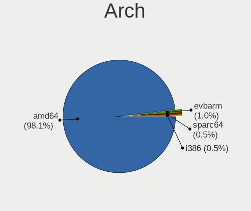
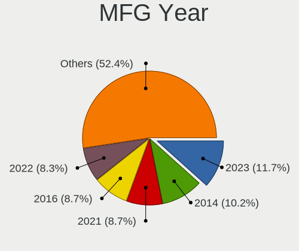
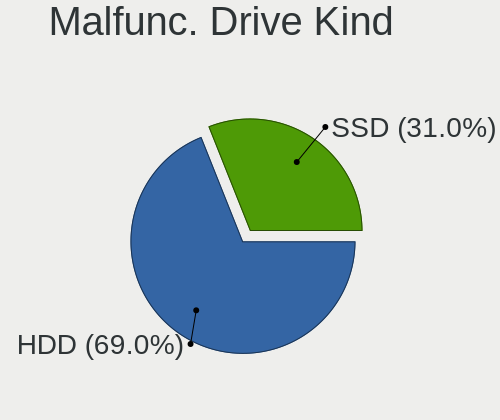
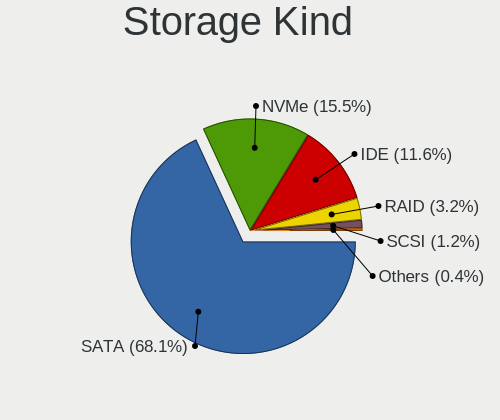
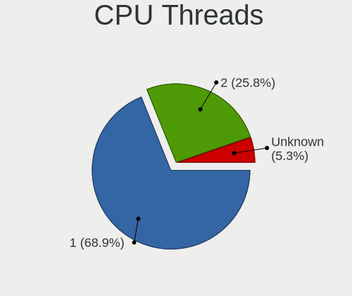
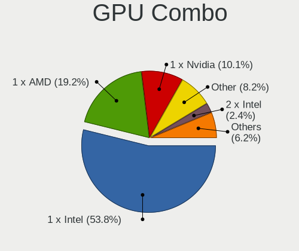
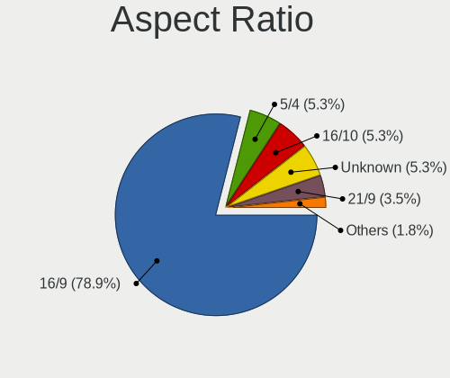
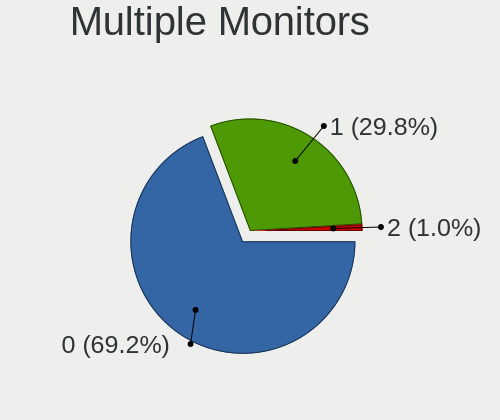
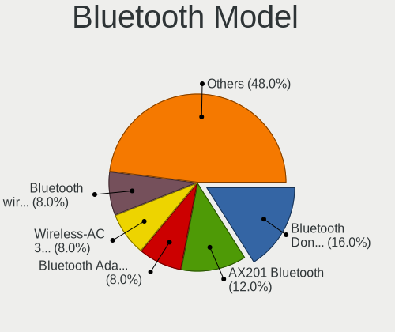
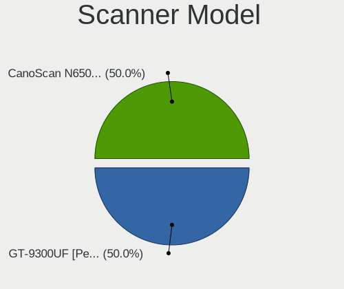

BSD in Italy - Tested Hardware & Statistics (Desktops)
------------------------------------------------------

A project to collect tested hardware configurations for BSD in Italy.

Anyone can contribute to this report by the [hw-probe](https://github.com/linuxhw/hw-probe/blob/master/INSTALL.BSD.md) tool:

    hw-probe -all -upload

Please contribute! Especially if your hardware is rare.

Contents
--------

* [ Test Cases ](#test-cases)

* [ System ](#system)
  - [ OS                       ](#os)
  - [ OS Family                ](#os-family)
  - [ Arch                     ](#arch)
  - [ DE                       ](#de)
  - [ Display Server           ](#display-server)
  - [ Display Manager          ](#display-manager)
  - [ OS Lang                  ](#os-lang)
  - [ Boot Mode                ](#boot-mode)
  - [ Filesystem               ](#filesystem)
  - [ Part. scheme             ](#part-scheme)

* [ Board ](#board)
  - [ Vendor                   ](#vendor)
  - [ Model                    ](#model)
  - [ Model Family             ](#model-family)
  - [ MFG Year                 ](#mfg-year)
  - [ Form Factor              ](#form-factor)
  - [ Coreboot                 ](#coreboot)
  - [ RAM Size                 ](#ram-size)
  - [ RAM Used                 ](#ram-used)
  - [ Total Drives             ](#total-drives)
  - [ Has CD-ROM               ](#has-cd-rom)
  - [ Has Ethernet             ](#has-ethernet)
  - [ Has WiFi                 ](#has-wifi)
  - [ Has Bluetooth            ](#has-bluetooth)

* [ Location ](#location)
  - [ Country                  ](#country)
  - [ City                     ](#city)

* [ Drives ](#drives)
  - [ Drive Vendor             ](#drive-vendor)
  - [ Drive Model              ](#drive-model)
  - [ HDD Vendor               ](#hdd-vendor)
  - [ SSD Vendor               ](#ssd-vendor)
  - [ Drive Kind               ](#drive-kind)
  - [ Drive Connector          ](#drive-connector)
  - [ Drive Size               ](#drive-size)
  - [ Space Total              ](#space-total)
  - [ Space Used               ](#space-used)
  - [ Malfunc. Drives          ](#malfunc-drives)
  - [ Malfunc. Drive Vendor    ](#malfunc-drive-vendor)
  - [ Malfunc. HDD Vendor      ](#malfunc-hdd-vendor)
  - [ Malfunc. Drive Kind      ](#malfunc-drive-kind)
  - [ Failed Drives            ](#failed-drives)
  - [ Failed Drive Vendor      ](#failed-drive-vendor)
  - [ Drive Status             ](#drive-status)

* [ Storage controller ](#storage-controller)
  - [ Storage Vendor           ](#storage-vendor)
  - [ Storage Model            ](#storage-model)
  - [ Storage Kind             ](#storage-kind)

* [ Processor ](#processor)
  - [ CPU Vendor               ](#cpu-vendor)
  - [ CPU Model                ](#cpu-model)
  - [ CPU Model Family         ](#cpu-model-family)
  - [ CPU Cores                ](#cpu-cores)
  - [ CPU Sockets              ](#cpu-sockets)
  - [ CPU Threads              ](#cpu-threads)
  - [ CPU Microarch            ](#cpu-microarch)

* [ Graphics ](#graphics)
  - [ GPU Vendor               ](#gpu-vendor)
  - [ GPU Model                ](#gpu-model)
  - [ GPU Combo                ](#gpu-combo)
  - [ GPU Driver               ](#gpu-driver)
  - [ GPU Memory               ](#gpu-memory)

* [ Monitor ](#monitor)
  - [ Monitor Vendor           ](#monitor-vendor)
  - [ Monitor Model            ](#monitor-model)
  - [ Monitor Resolution       ](#monitor-resolution)
  - [ Monitor Diagonal         ](#monitor-diagonal)
  - [ Monitor Width            ](#monitor-width)
  - [ Aspect Ratio             ](#aspect-ratio)
  - [ Monitor Area             ](#monitor-area)
  - [ Pixel Density            ](#pixel-density)
  - [ Multiple Monitors        ](#multiple-monitors)

* [ Network ](#network)
  - [ Net Controller Vendor    ](#net-controller-vendor)
  - [ Net Controller Model     ](#net-controller-model)
  - [ Wireless Vendor          ](#wireless-vendor)
  - [ Wireless Model           ](#wireless-model)
  - [ Ethernet Vendor          ](#ethernet-vendor)
  - [ Ethernet Model           ](#ethernet-model)
  - [ Net Controller Kind      ](#net-controller-kind)
  - [ Used Controller          ](#used-controller)
  - [ NICs                     ](#nics)
  - [ IPv6                     ](#ipv6)

* [ Bluetooth ](#bluetooth)
  - [ Bluetooth Vendor         ](#bluetooth-vendor)
  - [ Bluetooth Model          ](#bluetooth-model)

* [ Sound ](#sound)
  - [ Sound Vendor             ](#sound-vendor)
  - [ Sound Model              ](#sound-model)

* [ Memory ](#memory)
  - [ Memory Vendor            ](#memory-vendor)
  - [ Memory Model             ](#memory-model)
  - [ Memory Kind              ](#memory-kind)
  - [ Memory Form Factor       ](#memory-form-factor)
  - [ Memory Size              ](#memory-size)
  - [ Memory Speed             ](#memory-speed)

* [ Printers & scanners ](#printers--scanners)
  - [ Printer Vendor           ](#printer-vendor)
  - [ Printer Model            ](#printer-model)
  - [ Scanner Vendor           ](#scanner-vendor)
  - [ Scanner Model            ](#scanner-model)

* [ Camera ](#camera)
  - [ Camera Vendor            ](#camera-vendor)
  - [ Camera Model             ](#camera-model)

* [ Security ](#security)
  - [ Fingerprint Vendor       ](#fingerprint-vendor)
  - [ Fingerprint Model        ](#fingerprint-model)
  - [ Chipcard Vendor          ](#chipcard-vendor)
  - [ Chipcard Model           ](#chipcard-model)

* [ Unsupported ](#unsupported)
  - [ Unsupported Devices      ](#unsupported-devices)
  - [ Unsupported Device Types ](#unsupported-device-types)

Test Cases
----------

Total: 304

| Vendor        | Model                       | Probe                                                     | Date         |
|---------------|-----------------------------|-----------------------------------------------------------|--------------|
| ASUSTek       | PRIME B650-PLUS             | [3e01e5ffbf](https://bsd-hardware.info/?probe=3e01e5ffbf) | May 03, 2024 |
| Quantum en... | HackBoard 2                 | [a7b0ea1eca](https://bsd-hardware.info/?probe=a7b0ea1eca) | Apr 28, 2024 |
| Dell          | 096JG8 A01                  | [a696ddada6](https://bsd-hardware.info/?probe=a696ddada6) | Apr 20, 2024 |
| PC Engines    | apu1                        | [cceec3e9bd](https://bsd-hardware.info/?probe=cceec3e9bd) | Apr 14, 2024 |
| Unknown       | Unknown                     | [a9c935db85](https://bsd-hardware.info/?probe=a9c935db85) | Apr 09, 2024 |
| Gigabyte      | X570 AORUS ELITE            | [426677818b](https://bsd-hardware.info/?probe=426677818b) | Apr 07, 2024 |
| Unknown       | Unknown                     | [1af73d4146](https://bsd-hardware.info/?probe=1af73d4146) | Apr 04, 2024 |
| Unknown       | Unknown                     | [b9c567bdde](https://bsd-hardware.info/?probe=b9c567bdde) | Mar 21, 2024 |
| HP            | 2B5E                        | [35b1572267](https://bsd-hardware.info/?probe=35b1572267) | Mar 17, 2024 |
| PC Engines    | APU2                        | [9cd0068a06](https://bsd-hardware.info/?probe=9cd0068a06) | Mar 13, 2024 |
| PC Engines    | APU2                        | [891b69ea9c](https://bsd-hardware.info/?probe=891b69ea9c) | Mar 13, 2024 |
| Unknown       | Unknown                     | [7f49c436eb](https://bsd-hardware.info/?probe=7f49c436eb) | Feb 27, 2024 |
| PC Engines    | APU2                        | [bd47726af7](https://bsd-hardware.info/?probe=bd47726af7) | Feb 25, 2024 |
| Fujitsu       | D3313-E1 S26361-D3313-E1    | [8f0a5d2d0a](https://bsd-hardware.info/?probe=8f0a5d2d0a) | Feb 16, 2024 |
| PC Engines    | APU2                        | [df18317865](https://bsd-hardware.info/?probe=df18317865) | Feb 14, 2024 |
| PC Engines    | APU2                        | [251265d29e](https://bsd-hardware.info/?probe=251265d29e) | Feb 12, 2024 |
| Unknown       | Unknown                     | [19e59c140c](https://bsd-hardware.info/?probe=19e59c140c) | Feb 09, 2024 |
| PC Engines    | APU2                        | [6d52e4dad5](https://bsd-hardware.info/?probe=6d52e4dad5) | Feb 07, 2024 |
| PC Engines    | APU2                        | [591ead54fc](https://bsd-hardware.info/?probe=591ead54fc) | Jan 30, 2024 |
| Unknown       | Unknown                     | [f2406d4352](https://bsd-hardware.info/?probe=f2406d4352) | Jan 29, 2024 |
| Unknown       | Unknown                     | [4ff002fe77](https://bsd-hardware.info/?probe=4ff002fe77) | Jan 26, 2024 |
| Unknown       | Unknown                     | [de7d99595c](https://bsd-hardware.info/?probe=de7d99595c) | Jan 23, 2024 |
| HP            | 1494                        | [45c45d492a](https://bsd-hardware.info/?probe=45c45d492a) | Jan 18, 2024 |
| ASUSTek       | TUF Gaming H470-PRO         | [e0d9f347e9](https://bsd-hardware.info/?probe=e0d9f347e9) | Jan 13, 2024 |
| Unknown       | Unknown                     | [df4f6b185b](https://bsd-hardware.info/?probe=df4f6b185b) | Jan 09, 2024 |
| PC Engines    | APU2                        | [b08ca32731](https://bsd-hardware.info/?probe=b08ca32731) | Jan 07, 2024 |
| Protectli     | VP2420                      | [5368ee9cc8](https://bsd-hardware.info/?probe=5368ee9cc8) | Dec 24, 2023 |
| Pegatron      | 2ACF                        | [2556fa3be1](https://bsd-hardware.info/?probe=2556fa3be1) | Dec 22, 2023 |
| Unknown       | Unknown                     | [7b24999fbb](https://bsd-hardware.info/?probe=7b24999fbb) | Dec 22, 2023 |
| Protectli     | VP2420                      | [74c1ede426](https://bsd-hardware.info/?probe=74c1ede426) | Dec 10, 2023 |
| Fujitsu Si... | D2804-A1 S26361-D2804-A1    | [4a74f06217](https://bsd-hardware.info/?probe=4a74f06217) | Dec 06, 2023 |
| PC Engines    | APU2                        | [6bbcef15d3](https://bsd-hardware.info/?probe=6bbcef15d3) | Dec 05, 2023 |
| Unknown       | Unknown                     | [ca548efdec](https://bsd-hardware.info/?probe=ca548efdec) | Dec 04, 2023 |
| PC Engines    | APU2                        | [46fa133d51](https://bsd-hardware.info/?probe=46fa133d51) | Dec 04, 2023 |
| HP            | 1825                        | [3edf79b1ba](https://bsd-hardware.info/?probe=3edf79b1ba) | Dec 03, 2023 |
| Unknown       | Unknown                     | [5631aa6b68](https://bsd-hardware.info/?probe=5631aa6b68) | Nov 27, 2023 |
| YANYU         | ITX-M9F VER:1.3 baytrail    | [c9e7bbc120](https://bsd-hardware.info/?probe=c9e7bbc120) | Nov 23, 2023 |
| Lenovo        | ThinkCentre M720s 10SUSB... | [a44a9f3526](https://bsd-hardware.info/?probe=a44a9f3526) | Nov 23, 2023 |
| IceWhale T... | ZimaBoard 832 ZMB           | [98fac2d452](https://bsd-hardware.info/?probe=98fac2d452) | Nov 15, 2023 |
| YENTEK        | D41SL                       | [8cb79449c8](https://bsd-hardware.info/?probe=8cb79449c8) | Nov 10, 2023 |
| IceWhale T... | ZimaBoard 432 ZMB           | [018805dc37](https://bsd-hardware.info/?probe=018805dc37) | Nov 03, 2023 |
| ASUSTek       | P8Z77-V LX                  | [7077dec0a1](https://bsd-hardware.info/?probe=7077dec0a1) | Nov 01, 2023 |
| YANYU         | M9F baytrail                | [746772e77b](https://bsd-hardware.info/?probe=746772e77b) | Oct 30, 2023 |
| Fujitsu       | D3041-A1 S26361-D3041-A1    | [bb195148f7](https://bsd-hardware.info/?probe=bb195148f7) | Oct 29, 2023 |
| Dell          | PowerEdge T110 II           | [f93395bc11](https://bsd-hardware.info/?probe=f93395bc11) | Oct 28, 2023 |
| YANYU         | M9F baytrail                | [f9e833a5f9](https://bsd-hardware.info/?probe=f9e833a5f9) | Oct 27, 2023 |
| HP            | 213D A01                    | [6a023bfe9f](https://bsd-hardware.info/?probe=6a023bfe9f) | Oct 14, 2023 |
| ASRock        | X300M-STX                   | [fbc9fe11b1](https://bsd-hardware.info/?probe=fbc9fe11b1) | Oct 13, 2023 |
| ANGXUN        | X79-VG2 V1.3                | [c823cbad48](https://bsd-hardware.info/?probe=c823cbad48) | Oct 10, 2023 |
| Unknown       | Unknown                     | [1bb43f3258](https://bsd-hardware.info/?probe=1bb43f3258) | Oct 10, 2023 |
| Fujitsu Si... | D2804-A1 S26361-D2804-A1    | [9e99e33fa3](https://bsd-hardware.info/?probe=9e99e33fa3) | Oct 09, 2023 |
| Fujitsu Si... | D2804-A1 S26361-D2804-A1    | [08dab02121](https://bsd-hardware.info/?probe=08dab02121) | Oct 09, 2023 |
| Unknown       | Unknown                     | [af88ff7c18](https://bsd-hardware.info/?probe=af88ff7c18) | Oct 07, 2023 |
| ASUSTek       | P8Z77-V LX                  | [9190b85f99](https://bsd-hardware.info/?probe=9190b85f99) | Oct 04, 2023 |
| ASUSTek       | P8Z77-V LX                  | [914de9ed88](https://bsd-hardware.info/?probe=914de9ed88) | Oct 04, 2023 |
| ASUSTek       | P8Z77-V LX                  | [ba9a892240](https://bsd-hardware.info/?probe=ba9a892240) | Oct 04, 2023 |
| Unknown       | Unknown                     | [002103bb3a](https://bsd-hardware.info/?probe=002103bb3a) | Oct 02, 2023 |
| ASUSTek       | PRIME A520M-A II            | [29bcb3ca3e](https://bsd-hardware.info/?probe=29bcb3ca3e) | Sep 29, 2023 |
| ASRock        | H270 Pro4                   | [cba80ecde3](https://bsd-hardware.info/?probe=cba80ecde3) | Sep 24, 2023 |
| Bochs         | Unknown                     | [65f7da4601](https://bsd-hardware.info/?probe=65f7da4601) | Sep 20, 2023 |
| Unknown       | Unknown                     | [dcf1ebd901](https://bsd-hardware.info/?probe=dcf1ebd901) | Sep 20, 2023 |
| AZW           | U59                         | [ae0d8568d1](https://bsd-hardware.info/?probe=ae0d8568d1) | Sep 15, 2023 |
| AZW           | U59                         | [7e094459f9](https://bsd-hardware.info/?probe=7e094459f9) | Sep 14, 2023 |
| PC Engines    | APU2                        | [3d3b16c0cf](https://bsd-hardware.info/?probe=3d3b16c0cf) | Aug 25, 2023 |
| AZW           | U59                         | [e08540ab36](https://bsd-hardware.info/?probe=e08540ab36) | Aug 25, 2023 |
| Protectli     | FW4B                        | [4b358b0106](https://bsd-hardware.info/?probe=4b358b0106) | Aug 24, 2023 |
| BESSTAR Te... | IB9                         | [c9f5ede507](https://bsd-hardware.info/?probe=c9f5ede507) | Aug 18, 2023 |
| Intel         | Q3XXG4-P V1.0               | [f0398bfb85](https://bsd-hardware.info/?probe=f0398bfb85) | Aug 10, 2023 |
| Unknown       | Unknown                     | [28f0d503fd](https://bsd-hardware.info/?probe=28f0d503fd) | Aug 07, 2023 |
| Unknown       | Unknown                     | [6238337b24](https://bsd-hardware.info/?probe=6238337b24) | Aug 07, 2023 |
| ASUSTek       | PRIME B450-PLUS             | [d3fac2e3fe](https://bsd-hardware.info/?probe=d3fac2e3fe) | Aug 06, 2023 |
| MW            | GMLK-2_5G4L                 | [155f885c95](https://bsd-hardware.info/?probe=155f885c95) | Aug 01, 2023 |
| ASUSTek       | P8P67                       | [0e10359af8](https://bsd-hardware.info/?probe=0e10359af8) | Jul 29, 2023 |
| ASUSTek       | PRIME B650-PLUS             | [e74d459c5a](https://bsd-hardware.info/?probe=e74d459c5a) | Jul 28, 2023 |
| Dell          | 0PTTT9 A01                  | [a3624fdcfc](https://bsd-hardware.info/?probe=a3624fdcfc) | Jul 24, 2023 |
| Dell          | 0PTTT9 A01                  | [0f55bad1af](https://bsd-hardware.info/?probe=0f55bad1af) | Jul 08, 2023 |
| MSI           | H510I PRO WIFI              | [743d249ba5](https://bsd-hardware.info/?probe=743d249ba5) | Jul 07, 2023 |
| Dell          | 0WMJ54 A01                  | [48fcb6e4ab](https://bsd-hardware.info/?probe=48fcb6e4ab) | Jul 05, 2023 |
| Protectli     | FW4B                        | [a3cf476fe8](https://bsd-hardware.info/?probe=a3cf476fe8) | Jul 03, 2023 |
| Fujitsu       | D3313-G1 S26361-D3313-G1    | [c30f91d5cc](https://bsd-hardware.info/?probe=c30f91d5cc) | Jul 01, 2023 |
| ASUSTek       | N3700T                      | [16b73b05ef](https://bsd-hardware.info/?probe=16b73b05ef) | Jun 26, 2023 |
| Unknown       | Unknown                     | [229e573059](https://bsd-hardware.info/?probe=229e573059) | Jun 13, 2023 |
| Unknown       | Unknown                     | [9d271bc94c](https://bsd-hardware.info/?probe=9d271bc94c) | Jun 12, 2023 |
| Fujitsu       | D3313-A1 S26361-D3313-A1    | [fe412825f2](https://bsd-hardware.info/?probe=fe412825f2) | Jun 10, 2023 |
| Dell          | 0WR7PY A03                  | [c8496622be](https://bsd-hardware.info/?probe=c8496622be) | Jun 03, 2023 |
| Dell          | 0WR7PY A03                  | [b9f7e3e209](https://bsd-hardware.info/?probe=b9f7e3e209) | Jun 03, 2023 |
| Fujitsu       | D3313-A1 S26361-D3313-A1    | [d08f309c4c](https://bsd-hardware.info/?probe=d08f309c4c) | May 26, 2023 |
| Intel         | Q3XXG4-P V1.0               | [9160d45441](https://bsd-hardware.info/?probe=9160d45441) | May 25, 2023 |
| Unknown       | Unknown                     | [8b5ec8c5f4](https://bsd-hardware.info/?probe=8b5ec8c5f4) | May 23, 2023 |
| Gigabyte      | A520M S2H                   | [582dc6ab9f](https://bsd-hardware.info/?probe=582dc6ab9f) | May 15, 2023 |
| Unknown       | Unknown                     | [b26eac2277](https://bsd-hardware.info/?probe=b26eac2277) | May 13, 2023 |
| Fujitsu       | D3313-A1 S26361-D3313-A1    | [1dac5a7bb2](https://bsd-hardware.info/?probe=1dac5a7bb2) | May 13, 2023 |
| Unknown       | Unknown                     | [bf8246ecb5](https://bsd-hardware.info/?probe=bf8246ecb5) | May 11, 2023 |
| ASUSTek       | PRIME B650-PLUS             | [be83fbb0f2](https://bsd-hardware.info/?probe=be83fbb0f2) | May 09, 2023 |
| Unknown       | Unknown                     | [5c6c169e73](https://bsd-hardware.info/?probe=5c6c169e73) | May 01, 2023 |
| Unknown       | Unknown                     | [d572f5ff91](https://bsd-hardware.info/?probe=d572f5ff91) | May 01, 2023 |
| Unknown       | HX90                        | [b3300c45bc](https://bsd-hardware.info/?probe=b3300c45bc) | May 01, 2023 |
| Unknown       | Unknown                     | [1774da050f](https://bsd-hardware.info/?probe=1774da050f) | Apr 29, 2023 |
| HP            | 82B4                        | [9ec1e6d6f4](https://bsd-hardware.info/?probe=9ec1e6d6f4) | Apr 23, 2023 |
| Intel         | SKYBAY                      | [03dd920110](https://bsd-hardware.info/?probe=03dd920110) | Apr 22, 2023 |
| Fujitsu       | D3313-A1 S26361-D3313-A1    | [d343800c53](https://bsd-hardware.info/?probe=d343800c53) | Apr 16, 2023 |
| PC Engines    | apu4                        | [9217e1982f](https://bsd-hardware.info/?probe=9217e1982f) | Apr 14, 2023 |
| ASRock        | G31M-S                      | [fed4a42c32](https://bsd-hardware.info/?probe=fed4a42c32) | Apr 08, 2023 |
| ASRock        | G31M-S                      | [4596f78aee](https://bsd-hardware.info/?probe=4596f78aee) | Apr 08, 2023 |
| Unknown       | Unknown                     | [5168183b15](https://bsd-hardware.info/?probe=5168183b15) | Apr 06, 2023 |
| Fujitsu       | D3028-A1 S26361-D3028-A1    | [45f590d129](https://bsd-hardware.info/?probe=45f590d129) | Apr 04, 2023 |
| Fujitsu       | D3028-A1 S26361-D3028-A1    | [ab0643727f](https://bsd-hardware.info/?probe=ab0643727f) | Apr 02, 2023 |
| Fujitsu       | D3313-A1 S26361-D3313-A1    | [fb6477d43e](https://bsd-hardware.info/?probe=fb6477d43e) | Mar 31, 2023 |
| YANYU         | H17SL                       | [0f9829ebe4](https://bsd-hardware.info/?probe=0f9829ebe4) | Mar 26, 2023 |
| ASUSTek       | F1A55                       | [91ad5bab75](https://bsd-hardware.info/?probe=91ad5bab75) | Mar 25, 2023 |
| Unknown       | Unknown                     | [a7e98f9a10](https://bsd-hardware.info/?probe=a7e98f9a10) | Mar 23, 2023 |
| T-bao         | MINI PC V1.0                | [eb2bc1cd51](https://bsd-hardware.info/?probe=eb2bc1cd51) | Mar 23, 2023 |
| ASUSTek       | PRIME H410M-A               | [cbbeb5c41c](https://bsd-hardware.info/?probe=cbbeb5c41c) | Mar 22, 2023 |
| HP            | 8054                        | [6e5a18f346](https://bsd-hardware.info/?probe=6e5a18f346) | Mar 20, 2023 |
| YANYU         | H17SL                       | [37a549331f](https://bsd-hardware.info/?probe=37a549331f) | Mar 14, 2023 |
| MSI           | 0A48                        | [815f019a8c](https://bsd-hardware.info/?probe=815f019a8c) | Mar 14, 2023 |
| AZW           | U59                         | [5a6ef3fb8d](https://bsd-hardware.info/?probe=5a6ef3fb8d) | Mar 14, 2023 |
| Dell          | 0WMJ54 A01                  | [7949f20162](https://bsd-hardware.info/?probe=7949f20162) | Mar 12, 2023 |
| Fujitsu       | D3313-A1 S26361-D3313-A1    | [a3f921de9a](https://bsd-hardware.info/?probe=a3f921de9a) | Mar 12, 2023 |
| Fujitsu       | D3313-A1 S26361-D3313-A1    | [2050921c3d](https://bsd-hardware.info/?probe=2050921c3d) | Mar 12, 2023 |
| Gigabyte      | B450M K                     | [0d0433284e](https://bsd-hardware.info/?probe=0d0433284e) | Mar 11, 2023 |
| NF692         | 1.0                         | [16fa0b0102](https://bsd-hardware.info/?probe=16fa0b0102) | Mar 11, 2023 |
| Fujitsu       | D3313-A1 S26361-D3313-A1    | [6729453203](https://bsd-hardware.info/?probe=6729453203) | Mar 09, 2023 |
| Fujitsu       | D3313-A1 S26361-D3313-A1    | [6dee276a48](https://bsd-hardware.info/?probe=6dee276a48) | Mar 07, 2023 |
| Gigabyte      | H97M-HD3                    | [77a58527da](https://bsd-hardware.info/?probe=77a58527da) | Mar 01, 2023 |
| Stonesoft     | FW-315-C1                   | [e8a2206ad2](https://bsd-hardware.info/?probe=e8a2206ad2) | Feb 28, 2023 |
| Intel         | JSL MRD                     | [1587ea95da](https://bsd-hardware.info/?probe=1587ea95da) | Feb 18, 2023 |
| Unknown       | SKYBAY                      | [df7f4524d7](https://bsd-hardware.info/?probe=df7f4524d7) | Feb 12, 2023 |
| Unknown       | Unknown                     | [7f9208dc11](https://bsd-hardware.info/?probe=7f9208dc11) | Feb 06, 2023 |
| HP            | 213D A01                    | [659939cc8b](https://bsd-hardware.info/?probe=659939cc8b) | Jan 26, 2023 |
| Unknown       | Unknown                     | [aa940792fc](https://bsd-hardware.info/?probe=aa940792fc) | Jan 25, 2023 |
| Gigabyte      | A520M S2H                   | [803a152afc](https://bsd-hardware.info/?probe=803a152afc) | Jan 23, 2023 |
| ASUSTek       | PRO A520M-C                 | [bebcd1a008](https://bsd-hardware.info/?probe=bebcd1a008) | Jan 20, 2023 |
| Gigabyte      | H270M-DS3H-CF               | [d0e2e85346](https://bsd-hardware.info/?probe=d0e2e85346) | Jan 17, 2023 |
| Unknown       | SKYBAY                      | [c1e1ba5558](https://bsd-hardware.info/?probe=c1e1ba5558) | Jan 16, 2023 |
| Supermicro    | X9SCI/X9SCA                 | [942d966486](https://bsd-hardware.info/?probe=942d966486) | Jan 11, 2023 |
| Fujitsu       | D3041-A1 S26361-D3041-A1    | [2265227a5c](https://bsd-hardware.info/?probe=2265227a5c) | Dec 26, 2022 |
| MSI           | MS-7922                     | [95dbf4f7a8](https://bsd-hardware.info/?probe=95dbf4f7a8) | Dec 19, 2022 |
| Pegatron      | 2ACF                        | [511f2a6d16](https://bsd-hardware.info/?probe=511f2a6d16) | Dec 19, 2022 |
| Gigabyte      | N3160ND3V                   | [c84bedc821](https://bsd-hardware.info/?probe=c84bedc821) | Dec 15, 2022 |
| Dell          | 0WMJ54 A01                  | [435807287e](https://bsd-hardware.info/?probe=435807287e) | Dec 15, 2022 |
| AZW           | U59                         | [9b22c68e98](https://bsd-hardware.info/?probe=9b22c68e98) | Dec 13, 2022 |
| ASUSTek       | PRIME Z390M-PLUS            | [7329e04c22](https://bsd-hardware.info/?probe=7329e04c22) | Nov 27, 2022 |
| ASUSTek       | P11C-X Series               | [6860cd72f8](https://bsd-hardware.info/?probe=6860cd72f8) | Nov 26, 2022 |
| ASUSTek       | P11C-X Series               | [cfdb06e761](https://bsd-hardware.info/?probe=cfdb06e761) | Nov 26, 2022 |
| Dell          | 0PTTT9 A01                  | [74575d6dfe](https://bsd-hardware.info/?probe=74575d6dfe) | Nov 25, 2022 |
| Dell          | 0VD5HY A00                  | [1a0df311e3](https://bsd-hardware.info/?probe=1a0df311e3) | Nov 07, 2022 |
| Gigabyte      | H270M-DS3H-CF               | [5784d8bed6](https://bsd-hardware.info/?probe=5784d8bed6) | Nov 04, 2022 |
| Acer          | Veriton X2610G              | [e4289c3f15](https://bsd-hardware.info/?probe=e4289c3f15) | Oct 24, 2022 |
| Unknown       | Unknown                     | [1188b56e14](https://bsd-hardware.info/?probe=1188b56e14) | Oct 19, 2022 |
| Unknown       | Unknown                     | [915c66f8bd](https://bsd-hardware.info/?probe=915c66f8bd) | Oct 19, 2022 |
| PC Engines    | apu4                        | [20cfd8a3c8](https://bsd-hardware.info/?probe=20cfd8a3c8) | Oct 17, 2022 |
| Pegatron      | 2ACF                        | [c57cc3a923](https://bsd-hardware.info/?probe=c57cc3a923) | Oct 17, 2022 |
| ASRock        | Q1900M                      | [7d0380e2d0](https://bsd-hardware.info/?probe=7d0380e2d0) | Oct 15, 2022 |
| ASRock        | J3355B-ITX                  | [d802705c1d](https://bsd-hardware.info/?probe=d802705c1d) | Oct 10, 2022 |
| ASRock        | B75M R2.0                   | [a28ea59f1f](https://bsd-hardware.info/?probe=a28ea59f1f) | Oct 07, 2022 |
| Unknown       | Unknown                     | [bdabafdcb1](https://bsd-hardware.info/?probe=bdabafdcb1) | Oct 01, 2022 |
| ASRock        | Q1900B-ITX                  | [81722a937a](https://bsd-hardware.info/?probe=81722a937a) | Sep 13, 2022 |
| HP            | 8648                        | [e7e610794c](https://bsd-hardware.info/?probe=e7e610794c) | Sep 12, 2022 |
| Dell          | 0WMJ54 A01                  | [b54e6663f9](https://bsd-hardware.info/?probe=b54e6663f9) | Sep 10, 2022 |
| Intel         | J1900                       | [a95dd12c65](https://bsd-hardware.info/?probe=a95dd12c65) | Sep 06, 2022 |
| HP            | 1496                        | [7cd97bd330](https://bsd-hardware.info/?probe=7cd97bd330) | Sep 05, 2022 |
| PC Engines    | APU2                        | [d9216cb730](https://bsd-hardware.info/?probe=d9216cb730) | Sep 05, 2022 |
| HP            | 1496                        | [94e8713f6d](https://bsd-hardware.info/?probe=94e8713f6d) | Sep 03, 2022 |
| HP            | 1496                        | [1567aa1c21](https://bsd-hardware.info/?probe=1567aa1c21) | Sep 01, 2022 |
| Unknown       | HX90                        | [568468e95b](https://bsd-hardware.info/?probe=568468e95b) | Sep 01, 2022 |
| Fujitsu       | D3041-A1 S26361-D3041-A1    | [2349014a6c](https://bsd-hardware.info/?probe=2349014a6c) | Aug 29, 2022 |
| PC Engines    | APU2                        | [b3d60c2790](https://bsd-hardware.info/?probe=b3d60c2790) | Aug 22, 2022 |
| ASUSTek       | M4A87TD EVO                 | [c03da8657e](https://bsd-hardware.info/?probe=c03da8657e) | Aug 17, 2022 |
| PC Engines    | APU2                        | [028dc7aa20](https://bsd-hardware.info/?probe=028dc7aa20) | Aug 17, 2022 |
| Dell          | 0WMJ54 A01                  | [1d4ccaabda](https://bsd-hardware.info/?probe=1d4ccaabda) | Aug 13, 2022 |
| Fujitsu       | D3041-A1 S26361-D3041-A1    | [17dc06ed68](https://bsd-hardware.info/?probe=17dc06ed68) | Aug 12, 2022 |
| Unknown       | Unknown                     | [af3d9689c2](https://bsd-hardware.info/?probe=af3d9689c2) | Aug 11, 2022 |
| Unknown       | Unknown                     | [5049417b7b](https://bsd-hardware.info/?probe=5049417b7b) | Aug 11, 2022 |
| Intel         | SKYBAY                      | [c7010b7ebc](https://bsd-hardware.info/?probe=c7010b7ebc) | Aug 09, 2022 |
| Unknown       | Unknown                     | [21cda0eb5d](https://bsd-hardware.info/?probe=21cda0eb5d) | Aug 09, 2022 |
| Intel         | SKYBAY                      | [bc7d4d8e1e](https://bsd-hardware.info/?probe=bc7d4d8e1e) | Aug 08, 2022 |
| Unknown       | Unknown                     | [df3667156b](https://bsd-hardware.info/?probe=df3667156b) | Aug 02, 2022 |
| Lex           | Pineview-D                  | [7d7195024e](https://bsd-hardware.info/?probe=7d7195024e) | Aug 02, 2022 |
| Intel         | Q3XXG4-P V1.0               | [d6a3d57165](https://bsd-hardware.info/?probe=d6a3d57165) | Jul 29, 2022 |
| PC Engines    | APU2                        | [bb5d45a75d](https://bsd-hardware.info/?probe=bb5d45a75d) | Jul 29, 2022 |
| Fujitsu       | D3313-A1 S26361-D3313-A1    | [e3655742ba](https://bsd-hardware.info/?probe=e3655742ba) | Jul 18, 2022 |
| Lenovo        | SHARKBAY SDK0E50510 WIN     | [4b9e0bb7bb](https://bsd-hardware.info/?probe=4b9e0bb7bb) | Jul 18, 2022 |
| Fujitsu       | D3313-A1 S26361-D3313-A1    | [af1e80d15d](https://bsd-hardware.info/?probe=af1e80d15d) | Jul 18, 2022 |
| ASUSTek       | M4A785TD-M EVO              | [def87ec245](https://bsd-hardware.info/?probe=def87ec245) | Jul 18, 2022 |
| ASUSTek       | PRIME H410M-A               | [7b6faf5301](https://bsd-hardware.info/?probe=7b6faf5301) | Jul 14, 2022 |
| ASUSTek       | PRIME H410M-A               | [ba243fa7c4](https://bsd-hardware.info/?probe=ba243fa7c4) | Jul 09, 2022 |
| Fujitsu       | D3041-A1 S26361-D3041-A1    | [d3aba12432](https://bsd-hardware.info/?probe=d3aba12432) | Jul 09, 2022 |
| ASRock        | B75M R2.0                   | [6011c70ca4](https://bsd-hardware.info/?probe=6011c70ca4) | Jul 07, 2022 |
| HP            | 0A98h                       | [655fc531fb](https://bsd-hardware.info/?probe=655fc531fb) | Jun 30, 2022 |
| Pegatron      | 2ACF                        | [e461a4559d](https://bsd-hardware.info/?probe=e461a4559d) | Jun 29, 2022 |
| HP            | 304Bh                       | [8a3151b3cd](https://bsd-hardware.info/?probe=8a3151b3cd) | Jun 16, 2022 |
| NF692         | 1.0                         | [e87866bf5a](https://bsd-hardware.info/?probe=e87866bf5a) | Jun 10, 2022 |
| ASUSTek       | PRIME H410M-E               | [8099e7abaf](https://bsd-hardware.info/?probe=8099e7abaf) | Jun 03, 2022 |
| HP            | ProLiant MicroServer Gen... | [4b3b7a0929](https://bsd-hardware.info/?probe=4b3b7a0929) | May 31, 2022 |
| HP            | ProLiant MicroServer Gen... | [5d3db8382f](https://bsd-hardware.info/?probe=5d3db8382f) | May 31, 2022 |
| T-bao         | MINI PC V1.0                | [a89b2081bb](https://bsd-hardware.info/?probe=a89b2081bb) | May 25, 2022 |
| ASUSTek       | PRIME B550M-K               | [ce5ddde5ad](https://bsd-hardware.info/?probe=ce5ddde5ad) | May 18, 2022 |
| Protectli     | FW4B Ver                    | [2769c8f286](https://bsd-hardware.info/?probe=2769c8f286) | May 17, 2022 |
| Fujitsu       | D3041-A1 S26361-D3041-A1    | [5ff176fff8](https://bsd-hardware.info/?probe=5ff176fff8) | May 05, 2022 |
| ASUSTek       | M4A88TD-V EVO/USB3          | [12cc40cc60](https://bsd-hardware.info/?probe=12cc40cc60) | Apr 23, 2022 |
| Pegatron      | Benicia                     | [9045b4f449](https://bsd-hardware.info/?probe=9045b4f449) | Apr 16, 2022 |
| ASUSTek       | PRIME Z390M-PLUS            | [680303f943](https://bsd-hardware.info/?probe=680303f943) | Apr 16, 2022 |
| ASUSTek       | PRIME Z390M-PLUS            | [47d17d48a7](https://bsd-hardware.info/?probe=47d17d48a7) | Apr 15, 2022 |
| ShenZhen M... | MW-NANO-APL-4L              | [fbdd8d4f48](https://bsd-hardware.info/?probe=fbdd8d4f48) | Apr 05, 2022 |
| HP            | 212B                        | [33e7c65907](https://bsd-hardware.info/?probe=33e7c65907) | Apr 04, 2022 |
| Gigabyte      | X570 AORUS PRO              | [3877a33214](https://bsd-hardware.info/?probe=3877a33214) | Apr 02, 2022 |
| Gigabyte      | X570 AORUS PRO              | [3da637e3c6](https://bsd-hardware.info/?probe=3da637e3c6) | Apr 02, 2022 |
| Fujitsu       | D3041-A1 S26361-D3041-A1    | [7b79164c18](https://bsd-hardware.info/?probe=7b79164c18) | Apr 01, 2022 |
| Unknown       | Unknown                     | [bddd5d8963](https://bsd-hardware.info/?probe=bddd5d8963) | Mar 18, 2022 |
| Unknown       | Unknown                     | [65ada9d5da](https://bsd-hardware.info/?probe=65ada9d5da) | Mar 11, 2022 |
| HP            | 3397                        | [841ed56816](https://bsd-hardware.info/?probe=841ed56816) | Mar 02, 2022 |
| Pegatron      | 2ACF                        | [e098f52d51](https://bsd-hardware.info/?probe=e098f52d51) | Feb 19, 2022 |
| MSI           | B450 GAMING PLUS MAX        | [df6278638e](https://bsd-hardware.info/?probe=df6278638e) | Feb 15, 2022 |
| Intel         | Q3XXG4-P V1.0               | [ea7cf2885f](https://bsd-hardware.info/?probe=ea7cf2885f) | Feb 13, 2022 |
| MSI           | B450 GAMING PLUS MAX        | [6997de25f9](https://bsd-hardware.info/?probe=6997de25f9) | Feb 11, 2022 |
| MW            | GMLK-2_5G4L                 | [7a3744a41a](https://bsd-hardware.info/?probe=7a3744a41a) | Feb 07, 2022 |
| Dell          | 0TK7TF A00                  | [d13ca7163c](https://bsd-hardware.info/?probe=d13ca7163c) | Jan 30, 2022 |
| Intel         | D2500CC AAG81477-401        | [f4d8bd7979](https://bsd-hardware.info/?probe=f4d8bd7979) | Jan 30, 2022 |
| Fujitsu       | D3028-A1 S26361-D3028-A1    | [f7e7df9416](https://bsd-hardware.info/?probe=f7e7df9416) | Jan 30, 2022 |
| Fujitsu       | D3028-A1 S26361-D3028-A1    | [fc63aa695e](https://bsd-hardware.info/?probe=fc63aa695e) | Jan 27, 2022 |
| PC Engines    | APU2                        | [52bd5dc1ce](https://bsd-hardware.info/?probe=52bd5dc1ce) | Jan 26, 2022 |
| ASUSTek       | BM6835_BM6635_BP6335        | [73562aa169](https://bsd-hardware.info/?probe=73562aa169) | Jan 25, 2022 |
| Fujitsu       | D3041-A1 S26361-D3041-A1    | [ed9f5d1a27](https://bsd-hardware.info/?probe=ed9f5d1a27) | Jan 15, 2022 |
| PC Engines    | APU2                        | [c2b05fc937](https://bsd-hardware.info/?probe=c2b05fc937) | Jan 14, 2022 |
| ASRock        | B75M R2.0                   | [7b99b0eaa6](https://bsd-hardware.info/?probe=7b99b0eaa6) | Jan 10, 2022 |
| Fujitsu       | D3041-A1 S26361-D3041-A1    | [7a43524381](https://bsd-hardware.info/?probe=7a43524381) | Dec 13, 2021 |
| Gigabyte      | H270M-DS3H-CF               | [50fba6deda](https://bsd-hardware.info/?probe=50fba6deda) | Dec 11, 2021 |
| Gigabyte      | H270M-DS3H-CF               | [a084ff48c2](https://bsd-hardware.info/?probe=a084ff48c2) | Dec 09, 2021 |
| Gigabyte      | H270M-DS3H-CF               | [17b557d792](https://bsd-hardware.info/?probe=17b557d792) | Dec 08, 2021 |
| Fujitsu       | D3041-A1 S26361-D3041-A1    | [ddcab97db2](https://bsd-hardware.info/?probe=ddcab97db2) | Dec 03, 2021 |
| T-bao         | MINI PC V1.0                | [4ee7de3597](https://bsd-hardware.info/?probe=4ee7de3597) | Nov 12, 2021 |
| Intel         | Q3XXG4-P V1.0               | [22a18ba45e](https://bsd-hardware.info/?probe=22a18ba45e) | Nov 08, 2021 |
| Pegatron      | 2ACF                        | [ca23d3bbf0](https://bsd-hardware.info/?probe=ca23d3bbf0) | Oct 13, 2021 |
| ASUSTek       | PRIME Z390M-PLUS            | [b3b31d25b0](https://bsd-hardware.info/?probe=b3b31d25b0) | Oct 13, 2021 |
| Pegatron      | 2ACF                        | [97aa5e56e4](https://bsd-hardware.info/?probe=97aa5e56e4) | Oct 12, 2021 |
| ASUSTek       | PRIME Z390M-PLUS            | [5a7c1871b1](https://bsd-hardware.info/?probe=5a7c1871b1) | Oct 11, 2021 |
| Acer          | Veriton X2610G              | [1e9ed23164](https://bsd-hardware.info/?probe=1e9ed23164) | Oct 03, 2021 |
| ASRock        | B75M R2.0                   | [51b47d9321](https://bsd-hardware.info/?probe=51b47d9321) | Sep 27, 2021 |
| ASRock        | B75M R2.0                   | [de031313ff](https://bsd-hardware.info/?probe=de031313ff) | Sep 27, 2021 |
| Gigabyte      | H270M-DS3H-CF               | [9b046b157e](https://bsd-hardware.info/?probe=9b046b157e) | Sep 17, 2021 |
| ASRock        | B75M R2.0                   | [0d23147c7d](https://bsd-hardware.info/?probe=0d23147c7d) | Sep 17, 2021 |
| ASRock        | B75M R2.0                   | [e0ae9af4ab](https://bsd-hardware.info/?probe=e0ae9af4ab) | Sep 15, 2021 |
| Gigabyte      | H270M-DS3H-CF               | [bc2a287495](https://bsd-hardware.info/?probe=bc2a287495) | Sep 13, 2021 |
| Protectli     | FW4B                        | [861a1f7012](https://bsd-hardware.info/?probe=861a1f7012) | Aug 25, 2021 |
| MSI           | MS-B1591                    | [679b2010e9](https://bsd-hardware.info/?probe=679b2010e9) | Aug 03, 2021 |
| MSI           | MS-B1591                    | [b370a74ec0](https://bsd-hardware.info/?probe=b370a74ec0) | Aug 02, 2021 |
| Gigabyte      | P55A-UD3                    | [dc1b4d8a6b](https://bsd-hardware.info/?probe=dc1b4d8a6b) | Jul 16, 2021 |
| ASRock        | B75M R2.0                   | [d51149c1d5](https://bsd-hardware.info/?probe=d51149c1d5) | Jul 13, 2021 |
| Lenovo        | SHARKBAY SDK0E50510 WIN     | [6cf3337855](https://bsd-hardware.info/?probe=6cf3337855) | Jul 01, 2021 |
| MSI           | B450 GAMING PLUS MAX        | [f0e80b0788](https://bsd-hardware.info/?probe=f0e80b0788) | Jun 28, 2021 |
| PC Engines    | APU2                        | [dde9077545](https://bsd-hardware.info/?probe=dde9077545) | Jun 24, 2021 |
| Unknown       | Unknown                     | [822df8eb91](https://bsd-hardware.info/?probe=822df8eb91) | May 11, 2021 |
| Unknown       | Unknown                     | [cc17eea606](https://bsd-hardware.info/?probe=cc17eea606) | May 10, 2021 |
| ASUSTek       | IP4BL-ME-Oli                | [e26ecef661](https://bsd-hardware.info/?probe=e26ecef661) | May 03, 2021 |
| MSI           | B450-A PRO                  | [ed656e816f](https://bsd-hardware.info/?probe=ed656e816f) | May 01, 2021 |
| Unknown       | Unknown                     | [df793cf09f](https://bsd-hardware.info/?probe=df793cf09f) | Apr 08, 2021 |
| Unknown       | Unknown                     | [f8ba0ba112](https://bsd-hardware.info/?probe=f8ba0ba112) | Apr 08, 2021 |
| Lenovo        | SHARKBAY SDK0E50510 WIN     | [62376c16a4](https://bsd-hardware.info/?probe=62376c16a4) | Mar 31, 2021 |
| Intel         | CRESCENTBAY                 | [5a7ba137e0](https://bsd-hardware.info/?probe=5a7ba137e0) | Mar 27, 2021 |
| Acer          | EG43M                       | [0bc978756c](https://bsd-hardware.info/?probe=0bc978756c) | Mar 27, 2021 |
| Lenovo        | SHARKBAY SDK0E50510 WIN     | [f9c3fc3b84](https://bsd-hardware.info/?probe=f9c3fc3b84) | Mar 19, 2021 |
| Lenovo        | SHARKBAY SDK0E50510 WIN     | [5ae508dfa8](https://bsd-hardware.info/?probe=5ae508dfa8) | Mar 19, 2021 |
| ASUSTek       | PRIME Z390M-PLUS            | [0a3b290f9f](https://bsd-hardware.info/?probe=0a3b290f9f) | Mar 15, 2021 |
| ASUSTek       | M4A88TD-V EVO/USB3          | [1c30f7523f](https://bsd-hardware.info/?probe=1c30f7523f) | Mar 15, 2021 |
| PC Engines    | APU3                        | [822a83f208](https://bsd-hardware.info/?probe=822a83f208) | Mar 11, 2021 |
| ASUSTek       | IP4BL-ME-Oli                | [c672201bcb](https://bsd-hardware.info/?probe=c672201bcb) | Mar 10, 2021 |
| Lenovo        | SHARKBAY SDK0E50510 WIN     | [66a223add9](https://bsd-hardware.info/?probe=66a223add9) | Mar 08, 2021 |
| Dell          | 0R849J A00                  | [1bd1dc24c9](https://bsd-hardware.info/?probe=1bd1dc24c9) | Mar 06, 2021 |
| Foxconn       | 2ADA                        | [10d02d0982](https://bsd-hardware.info/?probe=10d02d0982) | Mar 03, 2021 |
| Intel         | MAHOBAY                     | [3c5bd7b7f8](https://bsd-hardware.info/?probe=3c5bd7b7f8) | Mar 02, 2021 |
| Intel         | MAHOBAY                     | [04e66ca239](https://bsd-hardware.info/?probe=04e66ca239) | Mar 02, 2021 |
| Intel         | MAHOBAY                     | [50652a4263](https://bsd-hardware.info/?probe=50652a4263) | Feb 26, 2021 |
| ASUSTek       | PRIME Z390M-PLUS            | [58c6bf426e](https://bsd-hardware.info/?probe=58c6bf426e) | Feb 22, 2021 |
| Intel         | MAHOBAY                     | [5257239fdc](https://bsd-hardware.info/?probe=5257239fdc) | Feb 20, 2021 |
| HARDKERNEL    | ODROID-H2                   | [6fe9279f1f](https://bsd-hardware.info/?probe=6fe9279f1f) | Feb 18, 2021 |
| ASUSTek       | PRIME Z390M-PLUS            | [c996e74ebc](https://bsd-hardware.info/?probe=c996e74ebc) | Feb 14, 2021 |
| Dell          | 06NWYK A00                  | [32acfb4467](https://bsd-hardware.info/?probe=32acfb4467) | Feb 13, 2021 |
| ASUSTek       | P8H61-M LE                  | [b861820636](https://bsd-hardware.info/?probe=b861820636) | Feb 13, 2021 |
| Dell          | 06NWYK A00                  | [2ff05af403](https://bsd-hardware.info/?probe=2ff05af403) | Feb 13, 2021 |
| ASUSTek       | P8H61-M LE                  | [3a3d7d0701](https://bsd-hardware.info/?probe=3a3d7d0701) | Feb 12, 2021 |
| ASUSTek       | P8Z77-V PRO/THUNDERBOLT     | [6fdcef7c9e](https://bsd-hardware.info/?probe=6fdcef7c9e) | Feb 10, 2021 |
| ASUSTek       | PRIME X470-PRO              | [a77e980850](https://bsd-hardware.info/?probe=a77e980850) | Feb 09, 2021 |
| ASUSTek       | IP4BL-ME-Oli                | [4d225e7ebe](https://bsd-hardware.info/?probe=4d225e7ebe) | Feb 04, 2021 |
| Intel         | CRESCENTBAY                 | [f813782c8a](https://bsd-hardware.info/?probe=f813782c8a) | Jan 29, 2021 |
| Sun Micros... | Ultra 24 50                 | [622589c8e7](https://bsd-hardware.info/?probe=622589c8e7) | Jan 22, 2021 |
| Sun Micros... | Ultra 24 50                 | [7a3cb6a061](https://bsd-hardware.info/?probe=7a3cb6a061) | Jan 22, 2021 |
| ASUSTek       | M4A87TD EVO                 | [12ea57f317](https://bsd-hardware.info/?probe=12ea57f317) | Jan 22, 2021 |
| Dell          | 088DT1 A01                  | [fcc759e013](https://bsd-hardware.info/?probe=fcc759e013) | Jan 21, 2021 |
| ASRock        | H81 Pro BTC                 | [afb7cd1f1a](https://bsd-hardware.info/?probe=afb7cd1f1a) | Jan 20, 2021 |
| Intel         | CRESCENTBAY                 | [92577053eb](https://bsd-hardware.info/?probe=92577053eb) | Jan 20, 2021 |
| Intel         | CRESCENTBAY                 | [33a6dda088](https://bsd-hardware.info/?probe=33a6dda088) | Jan 20, 2021 |
| PC Engines    | APU2                        | [a178f8eb47](https://bsd-hardware.info/?probe=a178f8eb47) | Jan 19, 2021 |
| MSI           | Boston                      | [aa9d7bae21](https://bsd-hardware.info/?probe=aa9d7bae21) | Jan 17, 2021 |
| MSI           | Boston                      | [f21954fa35](https://bsd-hardware.info/?probe=f21954fa35) | Jan 17, 2021 |
| Supermicro    | X8STi                       | [7d0e121099](https://bsd-hardware.info/?probe=7d0e121099) | Jan 15, 2021 |
| Unknown       | Unknown                     | [8668b1d651](https://bsd-hardware.info/?probe=8668b1d651) | Dec 17, 2020 |
| Unknown       | Unknown                     | [d2cdc0fc7f](https://bsd-hardware.info/?probe=d2cdc0fc7f) | Nov 29, 2020 |
| Unknown       | Unknown                     | [aee9f448af](https://bsd-hardware.info/?probe=aee9f448af) | Nov 25, 2020 |
| Intel         | D945GCLF2                   | [58678b0643](https://bsd-hardware.info/?probe=58678b0643) | Oct 30, 2020 |
| Intel         | D945GCLF2                   | [3354fb903b](https://bsd-hardware.info/?probe=3354fb903b) | Oct 30, 2020 |
| Gigabyte      | X570 AORUS ELITE            | [973b62551f](https://bsd-hardware.info/?probe=973b62551f) | Oct 30, 2020 |
| AZW           | BT3 X                       | [b9f23ee753](https://bsd-hardware.info/?probe=b9f23ee753) | Oct 30, 2020 |
| ASRock        | 990FX Extreme9              | [6c0bba6d4f](https://bsd-hardware.info/?probe=6c0bba6d4f) | Jun 26, 2020 |

System
------

OS
--

Installed operating systems

| Name              | Desktops | Percent |
|-------------------|----------|---------|
| OpenBSD 7.1       | 8        | 3.39%   |
| helloSystem 0.8.1 | 7        | 2.97%   |
| helloSystem 0.4.0 | 7        | 2.97%   |
| OPNsense 22.7     | 6        | 2.54%   |
| helloSystem 0.7.0 | 6        | 2.54%   |
| OPNsense 23.7.9   | 5        | 2.12%   |
| OPNsense 23.1.5   | 5        | 2.12%   |
| OPNsense 23.1.11  | 5        | 2.12%   |
| OPNsense 23.7.7   | 4        | 1.69%   |
| OPNsense 23.7.5   | 4        | 1.69%   |
| OPNsense 23.7.12  | 4        | 1.69%   |
| OPNsense 23.1.6   | 4        | 1.69%   |
| OPNsense 22.7.9   | 4        | 1.69%   |
| OPNsense 22.7.6   | 4        | 1.69%   |
| OPNsense 22.1     | 4        | 1.69%   |
| OPNsense 21.1     | 4        | 1.69%   |
| OpenBSD 7.2       | 4        | 1.69%   |
| helloSystem 0.9.0 | 4        | 1.69%   |
| helloSystem 0.5.0 | 4        | 1.69%   |
| OPNsense 24.1.1   | 3        | 1.27%   |
| OPNsense 23.7.10  | 3        | 1.27%   |
| OPNsense 23.1.9   | 3        | 1.27%   |
| OPNsense 23.1.7   | 3        | 1.27%   |
| OPNsense 23.1.4   | 3        | 1.27%   |
| OPNsense 23.1.1   | 3        | 1.27%   |
| OPNsense 23.1     | 3        | 1.27%   |
| OPNsense 22.7.3   | 3        | 1.27%   |
| OPNsense 22.7.11  | 3        | 1.27%   |
| OPNsense 22.7.10  | 3        | 1.27%   |
| OPNsense 22.1.9   | 3        | 1.27%   |
| OPNsense 22.1.10  | 3        | 1.27%   |
| OPNsense 21.7.3   | 3        | 1.27%   |
| OpenBSD 7.3       | 3        | 1.27%   |
| helloSystem 0.8.0 | 3        | 1.27%   |
| helloSystem 0.6.0 | 3        | 1.27%   |
| helloSystem 0.3.0 | 3        | 1.27%   |
| OPNsense 24.1.5   | 2        | 0.85%   |
| OPNsense 24.1.4   | 2        | 0.85%   |
| OPNsense 24.1.3   | 2        | 0.85%   |
| OPNsense 23.7.8   | 2        | 0.85%   |

OS Family
---------

OS without a version

| Name        | Desktops | Percent |
|-------------|----------|---------|
| OPNsense    | 96       | 56.14%  |
| helloSystem | 30       | 17.54%  |
| OpenBSD     | 20       | 11.7%   |
| FreeBSD     | 18       | 10.53%  |
| NetBSD      | 4        | 2.34%   |
| NomadBSD    | 2        | 1.17%   |
| XigmaNAS    | 1        | 0.58%   |

Arch
----

OS architecture (x86_64, i586, etc.)

| Name    | Desktops | Percent |
|---------|----------|---------|
| amd64   | 167      | 97.66%  |
| evbarm  | 2        | 1.17%   |
| sparc64 | 1        | 0.58%   |
| i386    | 1        | 0.58%   |

DE
--

Desktop Environment

| Name          | Desktops | Percent |
|---------------|----------|---------|
| Console       | 104      | 60.47%  |
| helloDesktop  | 36       | 20.93%  |
| XFCE          | 14       | 8.14%   |
| MATE          | 4        | 2.33%   |
| TWM           | 3        | 1.74%   |
| Openbox       | 2        | 1.16%   |
| KDE5          | 2        | 1.16%   |
| fvwm          | 2        | 1.16%   |
| CTWM          | 2        | 1.16%   |
| xfwm          | 1        | 0.58%   |
| LXDE          | 1        | 0.58%   |
| Enlightenment | 1        | 0.58%   |

Display Server
--------------

X11 or Wayland

| Name    | Desktops | Percent |
|---------|----------|---------|
| Console | 107      | 62.21%  |
| X11     | 65       | 37.79%  |

Display Manager
---------------

SDDM, LightDM, etc.

| Name    | Desktops | Percent |
|---------|----------|---------|
| Console | 133      | 77.33%  |
| SLiM    | 36       | 20.93%  |
| LightDM | 3        | 1.74%   |

OS Lang
-------

Language

| Lang             | Desktops | Percent |
|------------------|----------|---------|
| Unknown          | 123      | 70.29%  |
| en_US            | 22       | 12.57%  |
| it_IT            | 13       | 7.43%   |
| C                | 9        | 5.14%   |
| fr_FR            | 5        | 2.86%   |
| it_IT.ISO8859-15 | 1        | 0.57%   |
| it               | 1        | 0.57%   |
| en               | 1        | 0.57%   |

Boot Mode
---------

EFI or BIOS

| Mode | Desktops | Percent |
|------|----------|---------|
| EFI  | 144      | 83.24%  |
| BIOS | 29       | 16.76%  |

Filesystem
----------

Type of filesystem

| Type   | Desktops | Percent |
|--------|----------|---------|
| Ufs    | 85       | 47.75%  |
| Zfs    | 58       | 32.58%  |
| Ffs    | 20       | 11.24%  |
| Cd9660 | 15       | 8.43%   |

Part. scheme
------------

Scheme of partitioning

| Type    | Desktops | Percent |
|---------|----------|---------|
| GPT     | 153      | 87.93%  |
| MBR     | 14       | 8.05%   |
| Unknown | 7        | 4.02%   |

Board
-----

Vendor
------

Motherboard manufacturer

| Name                       | Desktops | Percent |
|----------------------------|----------|---------|
| ASUSTek Computer           | 30       | 17.54%  |
| Unknown                    | 27       | 15.79%  |
| Hewlett-Packard            | 14       | 8.19%   |
| PC Engines                 | 11       | 6.43%   |
| Dell                       | 11       | 6.43%   |
| Intel                      | 10       | 5.85%   |
| Gigabyte Technology        | 10       | 5.85%   |
| ASRock                     | 9        | 5.26%   |
| MSI                        | 7        | 4.09%   |
| Fujitsu                    | 6        | 3.51%   |
| YANYU                      | 3        | 1.75%   |
| Protectli                  | 3        | 1.75%   |
| Lenovo                     | 3        | 1.75%   |
| AZW                        | 3        | 1.75%   |
| Supermicro                 | 2        | 1.17%   |
| Pegatron                   | 2        | 1.17%   |
| MW                         | 2        | 1.17%   |
| IceWhale Technology        | 2        | 1.17%   |
| Acer                       | 2        | 1.17%   |
| YENTEK                     | 1        | 0.58%   |
| T-bao                      | 1        | 0.58%   |
| Sun Microsystems           | 1        | 0.58%   |
| Stonesoft                  | 1        | 0.58%   |
| ShenZhen MinWin Technology | 1        | 0.58%   |
| Quantum engineering        | 1        | 0.58%   |
| NF692                      | 1        | 0.58%   |
| Lex                        | 1        | 0.58%   |
| HARDKERNEL                 | 1        | 0.58%   |
| Fujitsu Siemens            | 1        | 0.58%   |
| Foxconn                    | 1        | 0.58%   |
| Bochs                      | 1        | 0.58%   |
| BESSTAR Tech               | 1        | 0.58%   |
| ANGXUN                     | 1        | 0.58%   |

Model
-----

Motherboard model

| Name                              | Desktops | Percent |
|-----------------------------------|----------|---------|
| Unknown                           | 28       | 16.37%  |
| PC Engines APU2                   | 7        | 4.09%   |
| Fujitsu FUTRO S920                | 3        | 1.75%   |
| ASUS PRIME H410M-A                | 3        | 1.75%   |
| ASUS PRIME B650-PLUS              | 3        | 1.75%   |
| Protectli FW4B                    | 2        | 1.17%   |
| PC Engines apu4                   | 2        | 1.17%   |
| MW GMLK-2_5G4L                    | 2        | 1.17%   |
| MSI MS-7B86                       | 2        | 1.17%   |
| Lenovo ThinkCentre M83 10AHS35Q00 | 2        | 1.17%   |
| Intel Q3XXG4-P V1.0               | 2        | 1.17%   |
| Intel NCB-4210WG                  | 2        | 1.17%   |
| HP t620 PLUS Quad Core TC         | 2        | 1.17%   |
| Gigabyte X570 AORUS ELITE         | 2        | 1.17%   |
| Gigabyte A520M S2H                | 2        | 1.17%   |
| Dell OptiPlex 3020                | 2        | 1.17%   |
| AZW U59                           | 2        | 1.17%   |
| ASUS P8Z77-V LX                   | 2        | 1.17%   |
| ASUS M4A88TD-V EVO/USB3           | 2        | 1.17%   |
| ASUS IP4BL-ME                     | 2        | 1.17%   |
| YENTEK D41SL                      | 1        | 0.58%   |
| YANYU M9F baytrail                | 1        | 0.58%   |
| YANYU ITX-M9F VER:1.3 baytrail    | 1        | 0.58%   |
| YANYU H17SL                       | 1        | 0.58%   |
| T-bao MINI PC                     | 1        | 0.58%   |
| Supermicro X9SCI/X9SCA            | 1        | 0.58%   |
| Supermicro X8STi                  | 1        | 0.58%   |
| Sun Microsystems Ultra 24         | 1        | 0.58%   |
| Stonesoft FW-315-C1               | 1        | 0.58%   |
| ShenZhen MinWin MW-NANO-APL-4L    | 1        | 0.58%   |
| Quantum engineering HackBoard 2   | 1        | 0.58%   |
| Protectli VP2420                  | 1        | 0.58%   |
| Pegatron Pro 3405 Series          | 1        | 0.58%   |
| Pegatron KX629AA-ABZ a6561.it     | 1        | 0.58%   |
| PC Engines APU3                   | 1        | 0.58%   |
| PC Engines apu1                   | 1        | 0.58%   |
| NF692 1.0                         | 1        | 0.58%   |
| MSI NR074AA-ABZ CQ5125IT          | 1        | 0.58%   |
| MSI MS-7D16                       | 1        | 0.58%   |
| MSI MS-7922                       | 1        | 0.58%   |

Model Family
------------

Motherboard model prefix

| Name                           | Desktops | Percent |
|--------------------------------|----------|---------|
| Unknown                        | 28       | 16.37%  |
| ASUS PRIME                     | 12       | 7.02%   |
| PC Engines APU2                | 7        | 4.09%   |
| Dell OptiPlex                  | 5        | 2.92%   |
| HP Compaq                      | 4        | 2.34%   |
| Fujitsu FUTRO                  | 4        | 2.34%   |
| Lenovo ThinkCentre             | 3        | 1.75%   |
| Gigabyte X570                  | 3        | 1.75%   |
| ASUS P8Z77-V                   | 3        | 1.75%   |
| Protectli FW4B                 | 2        | 1.17%   |
| PC Engines apu4                | 2        | 1.17%   |
| MW GMLK-2                      | 2        | 1.17%   |
| MSI MS-7B86                    | 2        | 1.17%   |
| Intel Q3XXG4-P                 | 2        | 1.17%   |
| Intel NCB-4210WG               | 2        | 1.17%   |
| IceWhale ZimaBoard             | 2        | 1.17%   |
| HP t620                        | 2        | 1.17%   |
| HP EliteDesk                   | 2        | 1.17%   |
| Gigabyte A520M                 | 2        | 1.17%   |
| Fujitsu ESPRIMO                | 2        | 1.17%   |
| Dell Precision                 | 2        | 1.17%   |
| Dell PowerEdge                 | 2        | 1.17%   |
| AZW U59                        | 2        | 1.17%   |
| ASUS M4A88TD-V                 | 2        | 1.17%   |
| ASUS IP4BL-ME                  | 2        | 1.17%   |
| YENTEK D41SL                   | 1        | 0.58%   |
| YANYU M9F                      | 1        | 0.58%   |
| YANYU ITX-M9F                  | 1        | 0.58%   |
| YANYU H17SL                    | 1        | 0.58%   |
| T-bao MINI                     | 1        | 0.58%   |
| Supermicro X9SCI               | 1        | 0.58%   |
| Supermicro X8STi               | 1        | 0.58%   |
| Sun Microsystems Ultra         | 1        | 0.58%   |
| Stonesoft FW-315-C1            | 1        | 0.58%   |
| ShenZhen MinWin MW-NANO-APL-4L | 1        | 0.58%   |
| Quantum engineering HackBoard  | 1        | 0.58%   |
| Protectli VP2420               | 1        | 0.58%   |
| Pegatron Pro                   | 1        | 0.58%   |
| Pegatron KX629AA-ABZ           | 1        | 0.58%   |
| PC Engines APU3                | 1        | 0.58%   |

MFG Year
--------

Motherboard manufacture year

| Year    | Desktops | Percent |
|---------|----------|---------|
| 2014    | 19       | 11.11%  |
| 2016    | 16       | 9.36%   |
| 2023    | 15       | 8.77%   |
| 2022    | 15       | 8.77%   |
| 2021    | 14       | 8.19%   |
| 2012    | 13       | 7.6%    |
| 2018    | 11       | 6.43%   |
| 2011    | 11       | 6.43%   |
| 2019    | 10       | 5.85%   |
| 2017    | 10       | 5.85%   |
| 2010    | 9        | 5.26%   |
| 2020    | 8        | 4.68%   |
| 2009    | 5        | 2.92%   |
| 2008    | 5        | 2.92%   |
| Unknown | 4        | 2.34%   |
| 2013    | 3        | 1.75%   |
| 2015    | 2        | 1.17%   |
| 2006    | 1        | 0.58%   |

Form Factor
-----------

Physical design of the computer

| Name    | Desktops | Percent |
|---------|----------|---------|
| Desktop | 171      | 100%    |

Coreboot
--------

Have coreboot on board

| Used | Desktops | Percent |
|------|----------|---------|
| No   | 160      | 93.02%  |
| Yes  | 12       | 6.98%   |

RAM Size
--------

Total RAM memory

| Size in GB  | Desktops | Percent |
|-------------|----------|---------|
| 8.01-16.0   | 69       | 39.43%  |
| 4.01-8.0    | 37       | 21.14%  |
| 16.01-24.0  | 34       | 19.43%  |
| 32.01-64.0  | 12       | 6.86%   |
| 2.01-3.0    | 10       | 5.71%   |
| 64.01-256.0 | 5        | 2.86%   |
| 0.51-1.0    | 3        | 1.71%   |
| 3.01-4.0    | 2        | 1.14%   |
| 24.01-32.0  | 2        | 1.14%   |
| 1.01-2.0    | 1        | 0.57%   |

RAM Used
--------

Used RAM memory

| Used GB  | Desktops | Percent |
|----------|----------|---------|
| 0.01-0.5 | 101      | 58.38%  |
| 0.51-1.0 | 50       | 28.9%   |
| 1.01-2.0 | 12       | 6.94%   |
| 4.01-8.0 | 4        | 2.31%   |
| Unknown  | 4        | 2.31%   |
| 2.01-3.0 | 2        | 1.16%   |

Total Drives
------------

Number of drives on board

| Drives | Desktops | Percent |
|--------|----------|---------|
| 1      | 116      | 65.91%  |
| 2      | 20       | 11.36%  |
| 0      | 16       | 9.09%   |
| 3      | 11       | 6.25%   |
| 4      | 9        | 5.11%   |
| 10     | 1        | 0.57%   |
| 7      | 1        | 0.57%   |
| 6      | 1        | 0.57%   |
| 5      | 1        | 0.57%   |

Has CD-ROM
----------

Has CD-ROM on board

| Presented | Desktops | Percent |
|-----------|----------|---------|
| No        | 132      | 77.19%  |
| Yes       | 39       | 22.81%  |

Has Ethernet
------------

Has Ethernet on board

| Presented | Desktops | Percent |
|-----------|----------|---------|
| Yes       | 167      | 97.66%  |
| No        | 4        | 2.34%   |

Has WiFi
--------

Has WiFi module

| Presented | Desktops | Percent |
|-----------|----------|---------|
| No        | 141      | 81.98%  |
| Yes       | 31       | 18.02%  |

Has Bluetooth
-------------

Has Bluetooth module

| Presented | Desktops | Percent |
|-----------|----------|---------|
| No        | 153      | 88.95%  |
| Yes       | 19       | 11.05%  |

Location
--------

Country
-------

Geographic location (country)

| Country | Desktops | Percent |
|---------|----------|---------|
| Italy   | 171      | 100%    |

City
----

Geographic location (city)

| City                  | Desktops | Percent |
|-----------------------|----------|---------|
| Milan                 | 32       | 15.31%  |
| Rome                  | 17       | 8.13%   |
| Trieste               | 4        | 1.91%   |
| Naples                | 4        | 1.91%   |
| Monza                 | 4        | 1.91%   |
| Bologna               | 4        | 1.91%   |
| Venice                | 2        | 0.96%   |
| Turrivalignani        | 2        | 0.96%   |
| Turin                 | 2        | 0.96%   |
| Taviano               | 2        | 0.96%   |
| Silea                 | 2        | 0.96%   |
| San Giustino Valdarno | 2        | 0.96%   |
| San Giuliano Terme    | 2        | 0.96%   |
| Rosignano Marittimo   | 2        | 0.96%   |
| Reggio Emilia         | 2        | 0.96%   |
| Reggio Calabria       | 2        | 0.96%   |
| Momo                  | 2        | 0.96%   |
| Modena                | 2        | 0.96%   |
| Milano                | 2        | 0.96%   |
| Lucca                 | 2        | 0.96%   |
| Lecco                 | 2        | 0.96%   |
| Genoa                 | 2        | 0.96%   |
| Florence              | 2        | 0.96%   |
| Ferrara               | 2        | 0.96%   |
| Desio                 | 2        | 0.96%   |
| Besana in Brianza     | 2        | 0.96%   |
| Bari                  | 2        | 0.96%   |
| Ancona                | 2        | 0.96%   |
| Vogogna               | 1        | 0.48%   |
| Viterbo               | 1        | 0.48%   |
| Villa Bartolomea      | 1        | 0.48%   |
| Verona                | 1        | 0.48%   |
| Vanzago               | 1        | 0.48%   |
| Treviso               | 1        | 0.48%   |
| Trento                | 1        | 0.48%   |
| Tortona               | 1        | 0.48%   |
| Terni                 | 1        | 0.48%   |
| Soresina              | 1        | 0.48%   |
| Somma Vesuviana       | 1        | 0.48%   |
| Sesto San Giovanni    | 1        | 0.48%   |

Drives
------

Drive Vendor
------------

Hard drive vendors

| Vendor              | Desktops | Drives | Percent |
|---------------------|----------|--------|---------|
| WDC                 | 27       | 53     | 12.56%  |
| Samsung Electronics | 25       | 33     | 11.63%  |
| Seagate             | 23       | 36     | 10.7%   |
| Kingston            | 20       | 26     | 9.3%    |
| Crucial             | 18       | 34     | 8.37%   |
| Toshiba             | 15       | 33     | 6.98%   |
| Transcend           | 12       | 21     | 5.58%   |
| SanDisk             | 7        | 8      | 3.26%   |
| NVMe                | 7        | 7      | 3.26%   |
| China               | 7        | 13     | 3.26%   |
| Maxtor              | 4        | 4      | 1.86%   |
| Innodisk            | 4        | 6      | 1.86%   |
| Hoodisk             | 4        | 6      | 1.86%   |
| Emtec               | 4        | 6      | 1.86%   |
| OCZ                 | 3        | 3      | 1.4%    |
| Hitachi             | 3        | 3      | 1.4%    |
| Silicon Motion      | 2        | 3      | 0.93%   |
| PNY                 | 2        | 6      | 0.93%   |
| Phison              | 2        | 2      | 0.93%   |
| Pccooler            | 2        | 4      | 0.93%   |
| Micron Technology   | 2        | 2      | 0.93%   |
| LITEON              | 2        | 2      | 0.93%   |
| HGST                | 2        | 2      | 0.93%   |
| Dogfish             | 2        | 2      | 0.93%   |
| BAITITON            | 2        | 2      | 0.93%   |
| A-DATA Technology   | 2        | 3      | 0.93%   |
| VICKTER             | 1        | 1      | 0.47%   |
| Verbatim            | 1        | 1      | 0.47%   |
| T-FORCE             | 1        | 1      | 0.47%   |
| SPCC                | 1        | 1      | 0.47%   |
| SK hynix            | 1        | 1      | 0.47%   |
| Protectli           | 1        | 1      | 0.47%   |
| KingSpec            | 1        | 2      | 0.47%   |
| Intel               | 1        | 2      | 0.47%   |
| Indilinx            | 1        | 1      | 0.47%   |
| Fanxiang            | 1        | 2      | 0.47%   |
| Corsair             | 1        | 1      | 0.47%   |
| ASint Technology    | 1        | 1      | 0.47%   |

Drive Model
-----------

Hard drive models

| Model                           | Desktops | Percent |
|---------------------------------|----------|---------|
| Crucial CT240BX500SSD1 240GB    | 5        | 2.16%   |
| NVMe Samsung SSD 980 1TB        | 4        | 1.72%   |
| Transcend TS128GMSA230S 128GB   | 3        | 1.29%   |
| Samsung SSD 870 EVO 250GB       | 3        | 1.29%   |
| Samsung SSD 860 EVO 250GB       | 3        | 1.29%   |
| Samsung SSD 850 EVO 250GB       | 3        | 1.29%   |
| Kingston SEDC500M480G 480GB     | 3        | 1.29%   |
| Kingston SA400S37120G 120GB     | 3        | 1.29%   |
| Emtec X150 120GB                | 3        | 1.29%   |
| Crucial CT500MX500SSD1 500GB    | 3        | 1.29%   |
| Crucial CT250MX500SSD1 250GB    | 3        | 1.29%   |
| Crucial CT120BX500SSD1 120GB    | 3        | 1.29%   |
| WDC WD5000AAKS-22V1A0 500GB     | 2        | 0.86%   |
| Transcend TS64GMSA370 64GB      | 2        | 0.86%   |
| Transcend TS16GMSA370 16GB      | 2        | 0.86%   |
| Toshiba Q300 240GB              | 2        | 0.86%   |
| Toshiba HDWG440 4TB             | 2        | 0.86%   |
| Toshiba HDWD110 1TB             | 2        | 0.86%   |
| Toshiba DT01ACA050 500GB        | 2        | 0.86%   |
| Seagate ST320LT007-9ZV142 320GB | 2        | 0.86%   |
| Seagate ST1000DM010-2EP102 1TB  | 2        | 0.86%   |
| Seagate ST1000DM003-1ER162 1TB  | 2        | 0.86%   |
| Seagate ST1000DM003-1CH162 1TB  | 2        | 0.86%   |
| SanDisk SDSSDP128G 128GB        | 2        | 0.86%   |
| Samsung HM321HI 320GB           | 2        | 0.86%   |
| Phison SATA SSD 16GB            | 2        | 0.86%   |
| Pccooler MSATA 128G             | 2        | 0.86%   |
| OCZ VERTEX3 120GB               | 2        | 0.86%   |
| NVMe Samsung SSD 990 2TB        | 2        | 0.86%   |
| Maxtor 6V080E0 80GB             | 2        | 0.86%   |
| Kingston SV300S37A120G 120GB    | 2        | 0.86%   |
| Kingston SUV500240G 240GB       | 2        | 0.86%   |
| Innodisk DEMSR- 16GB mSATA 3ME3 | 2        | 0.86%   |
| Hoodisk SSD 256GB               | 2        | 0.86%   |
| Crucial CT500P2SSD8 500GB       | 2        | 0.86%   |
| BAITITON BT58SSD08M 128GB       | 2        | 0.86%   |
| WDC WDS250G2B0A-00SM50 250GB    | 1        | 0.43%   |
| WDC WDS250G1B0A-00H9H0 250GB    | 1        | 0.43%   |
| WDC WDS100T2B0B-00YS70 1TB      | 1        | 0.43%   |
| WDC WDS100T2B0A-00SM50 1TB      | 1        | 0.43%   |

HDD Vendor
----------

Hard disk drive vendors

| Vendor              | Desktops | Drives | Percent |
|---------------------|----------|--------|---------|
| WDC                 | 23       | 48     | 31.94%  |
| Seagate             | 23       | 36     | 31.94%  |
| Toshiba             | 13       | 26     | 18.06%  |
| Maxtor              | 4        | 4      | 5.56%   |
| Samsung Electronics | 3        | 3      | 4.17%   |
| Hitachi             | 3        | 3      | 4.17%   |
| HGST                | 2        | 2      | 2.78%   |
| NVMe                | 1        | 1      | 1.39%   |

SSD Vendor
----------

Solid state drive vendors

| Vendor              | Desktops | Drives | Percent |
|---------------------|----------|--------|---------|
| Samsung Electronics | 19       | 24     | 14.62%  |
| Kingston            | 16       | 21     | 12.31%  |
| Crucial             | 16       | 28     | 12.31%  |
| Transcend           | 12       | 21     | 9.23%   |
| SanDisk             | 7        | 8      | 5.38%   |
| China               | 7        | 13     | 5.38%   |
| NVMe                | 6        | 6      | 4.62%   |
| WDC                 | 4        | 4      | 3.08%   |
| Innodisk            | 4        | 6      | 3.08%   |
| Hoodisk             | 4        | 6      | 3.08%   |
| Emtec               | 4        | 6      | 3.08%   |
| OCZ                 | 3        | 3      | 2.31%   |
| Toshiba             | 2        | 7      | 1.54%   |
| PNY                 | 2        | 6      | 1.54%   |
| Phison              | 2        | 2      | 1.54%   |
| Pccooler            | 2        | 4      | 1.54%   |
| Micron Technology   | 2        | 2      | 1.54%   |
| LITEON              | 2        | 2      | 1.54%   |
| Dogfish             | 2        | 2      | 1.54%   |
| BAITITON            | 2        | 2      | 1.54%   |
| A-DATA Technology   | 2        | 3      | 1.54%   |
| VICKTER             | 1        | 1      | 0.77%   |
| Verbatim            | 1        | 1      | 0.77%   |
| T-FORCE             | 1        | 1      | 0.77%   |
| SPCC                | 1        | 1      | 0.77%   |
| SK hynix            | 1        | 1      | 0.77%   |
| Protectli           | 1        | 1      | 0.77%   |
| KingSpec            | 1        | 2      | 0.77%   |
| Intel               | 1        | 2      | 0.77%   |
| Indilinx            | 1        | 1      | 0.77%   |
| Corsair             | 1        | 1      | 0.77%   |

Drive Kind
----------

HDD or SSD

| Kind | Desktops | Drives | Percent |
|------|----------|--------|---------|
| SSD  | 111      | 188    | 62.01%  |
| HDD  | 53       | 123    | 29.61%  |
| NVMe | 15       | 24     | 8.38%   |

Drive Connector
---------------

SATA, SAS, NVMe, etc.

| Type | Desktops | Drives | Percent |
|------|----------|--------|---------|
| SATA | 147      | 311    | 90.74%  |
| NVMe | 15       | 24     | 9.26%   |

Drive Size
----------

Size of hard drive

| Size in TB | Desktops | Drives | Percent |
|------------|----------|--------|---------|
| 0.01-0.5   | 125      | 233    | 72.25%  |
| 0.51-1.0   | 26       | 35     | 15.03%  |
| 1.01-2.0   | 11       | 15     | 6.36%   |
| 3.01-4.0   | 7        | 15     | 4.05%   |
| 4.01-10.0  | 3        | 10     | 1.73%   |
| 2.01-3.0   | 1        | 3      | 0.58%   |

Space Total
-----------

Amount of disk space available on the file system

| Size in GB     | Desktops | Percent |
|----------------|----------|---------|
| 101-250        | 66       | 36.87%  |
| 1-20           | 40       | 22.35%  |
| 251-500        | 27       | 15.08%  |
| 21-50          | 14       | 7.82%   |
| 501-1000       | 14       | 7.82%   |
| 51-100         | 11       | 6.15%   |
| More than 3000 | 4        | 2.23%   |
| 1001-2000      | 2        | 1.12%   |
| Unknown        | 1        | 0.56%   |

Space Used
----------

Amount of used disk space

| Used GB        | Desktops | Percent |
|----------------|----------|---------|
| 1-20           | 158      | 89.27%  |
| 21-50          | 8        | 4.52%   |
| 51-100         | 4        | 2.26%   |
| 101-250        | 2        | 1.13%   |
| 501-1000       | 2        | 1.13%   |
| More than 3000 | 1        | 0.56%   |
| 1001-2000      | 1        | 0.56%   |
| Unknown        | 1        | 0.56%   |

Malfunc. Drives
---------------

Drive models with a malfunction

| Model                                   | Desktops | Drives | Percent |
|-----------------------------------------|----------|--------|---------|
| WDC WD5000AAKS-22V1A0 500GB             | 2        | 2      | 6.9%    |
| Seagate ST320LT007-9ZV142 320GB         | 2        | 2      | 6.9%    |
| OCZ VERTEX3 120GB                       | 2        | 2      | 6.9%    |
| WDC WD800JD-75MSA3 80GB                 | 1        | 1      | 3.45%   |
| WDC WD5000AAKS-00E4A0 500GB             | 1        | 1      | 3.45%   |
| WDC WD20EVDS-63T3B0 2TB                 | 1        | 1      | 3.45%   |
| WDC WD2002FYPS-01U1B1 2TB               | 1        | 1      | 3.45%   |
| WDC WD10EZEX-60M2NA0 1TB                | 1        | 1      | 3.45%   |
| WDC WD1000DHTZ-04N21V1 1TB              | 1        | 2      | 3.45%   |
| Transcend TS128GMSA230S 128GB           | 1        | 2      | 3.45%   |
| SK hynix SC313 HFS256G32TNF-N3A0A 256GB | 1        | 1      | 3.45%   |
| Seagate ST9500325AS 500GB               | 1        | 1      | 3.45%   |
| Seagate ST500LM021-1KJ152 500GB         | 1        | 1      | 3.45%   |
| Seagate ST500DM002-1BD142 500GB         | 1        | 6      | 3.45%   |
| Seagate ST4000LM024-2AN17V 4TB          | 1        | 1      | 3.45%   |
| Seagate ST31500341AS 1.5TB              | 1        | 1      | 3.45%   |
| Samsung Electronics HM321HI 320GB       | 1        | 1      | 3.45%   |
| Maxtor 6V080E0 80GB                     | 1        | 1      | 3.45%   |
| Maxtor 6E040L0 40GB                     | 1        | 1      | 3.45%   |
| LITEON CV8-8E128-HP 128GB               | 1        | 1      | 3.45%   |
| Kingston SV300S37A120G 120GB            | 1        | 1      | 3.45%   |
| HGST HTS725050A7E630 500GB              | 1        | 1      | 3.45%   |
| HGST HTS541075A9E680 752GB              | 1        | 1      | 3.45%   |
| China SH00R120GB                        | 1        | 1      | 3.45%   |
| BAITITON BT58SSD08M 128GB               | 1        | 1      | 3.45%   |
| A-DATA Technology SX300 128GB           | 1        | 1      | 3.45%   |

Malfunc. Drive Vendor
---------------------

Vendors of faulty drives

| Vendor              | Desktops | Drives | Percent |
|---------------------|----------|--------|---------|
| WDC                 | 8        | 9      | 27.59%  |
| Seagate             | 7        | 12     | 24.14%  |
| OCZ                 | 2        | 2      | 6.9%    |
| Maxtor              | 2        | 2      | 6.9%    |
| HGST                | 2        | 2      | 6.9%    |
| Transcend           | 1        | 2      | 3.45%   |
| SK hynix            | 1        | 1      | 3.45%   |
| Samsung Electronics | 1        | 1      | 3.45%   |
| LITEON              | 1        | 1      | 3.45%   |
| Kingston            | 1        | 1      | 3.45%   |
| China               | 1        | 1      | 3.45%   |
| BAITITON            | 1        | 1      | 3.45%   |
| A-DATA Technology   | 1        | 1      | 3.45%   |

Malfunc. HDD Vendor
-------------------

Vendors of faulty HDD drives

| Vendor              | Desktops | Drives | Percent |
|---------------------|----------|--------|---------|
| WDC                 | 8        | 9      | 40%     |
| Seagate             | 7        | 12     | 35%     |
| Maxtor              | 2        | 2      | 10%     |
| HGST                | 2        | 2      | 10%     |
| Samsung Electronics | 1        | 1      | 5%      |

Malfunc. Drive Kind
-------------------

Kinds of faulty drives

| Kind | Desktops | Drives | Percent |
|------|----------|--------|---------|
| HDD  | 18       | 26     | 69.23%  |
| SSD  | 8        | 10     | 30.77%  |

Failed Drives
-------------

Failed drive models

| Model                     | Desktops | Drives | Percent |
|---------------------------|----------|--------|---------|
| Crucial CT500P3SSD8 500GB | 1        | 1      | 100%    |

Failed Drive Vendor
-------------------

Failed drive vendors

| Vendor  | Desktops | Drives | Percent |
|---------|----------|--------|---------|
| Crucial | 1        | 1      | 100%    |

Drive Status
------------

Number of failed and malfunc. drives

| Status   | Desktops | Drives | Percent |
|----------|----------|--------|---------|
| Works    | 131      | 275    | 76.16%  |
| Malfunc  | 26       | 36     | 15.12%  |
| Detected | 14       | 23     | 8.14%   |
| Failed   | 1        | 1      | 0.58%   |

Storage controller
------------------

Storage Vendor
--------------

Storage controller vendors

| Vendor                           | Desktops | Percent |
|----------------------------------|----------|---------|
| Intel                            | 121      | 57.08%  |
| AMD                              | 44       | 20.75%  |
| Samsung Electronics              | 11       | 5.19%   |
| Marvell Technology Group         | 5        | 2.36%   |
| ASMedia Technology               | 5        | 2.36%   |
| Kingston Technology Company      | 4        | 1.89%   |
| Micron/Crucial Technology        | 3        | 1.42%   |
| VIA Technologies                 | 2        | 0.94%   |
| Silicon Motion                   | 2        | 0.94%   |
| Broadcom / LSI                   | 2        | 0.94%   |
| ULi Electronics                  | 1        | 0.47%   |
| Silicon Integrated Systems [SiS] | 1        | 0.47%   |
| Silicon Image                    | 1        | 0.47%   |
| Shenzhen Longsys Electronics     | 1        | 0.47%   |
| SanDisk                          | 1        | 0.47%   |
| Phison Electronics               | 1        | 0.47%   |
| MAXIO Technology (Hangzhou)      | 1        | 0.47%   |
| KIOXIA                           | 1        | 0.47%   |
| JMicron Technology               | 1        | 0.47%   |
| Integrated Technology Express    | 1        | 0.47%   |
| Hosin Global Electronics         | 1        | 0.47%   |
| Adaptec                          | 1        | 0.47%   |
| Unknown                          | 1        | 0.47%   |

Storage Model
-------------

Storage controller models

| Model                                                                            | Desktops | Percent |
|----------------------------------------------------------------------------------|----------|---------|
| AMD FCH SATA Controller [AHCI mode]                                              | 24       | 9.96%   |
| Intel 6 Series/C200 Series Chipset Family 6 port Desktop SATA AHCI Controller    | 11       | 4.56%   |
| Intel Celeron/Pentium Silver Processor SATA Controller                           | 10       | 4.15%   |
| Intel NM10/ICH7 Family SATA Controller [IDE mode]                                | 8        | 3.32%   |
| Intel 8 Series/C220 Series Chipset Family 6-port SATA Controller 1 [AHCI mode]   | 8        | 3.32%   |
| Intel 7 Series/C210 Series Chipset Family 6-port SATA Controller [AHCI mode]     | 7        | 2.9%    |
| Samsung NVMe SSD Controller PM9A1/PM9A3/980PRO                                   | 6        | 2.49%   |
| Intel Jasper Lake SATA AHCI Controller                                           | 6        | 2.49%   |
| Intel Celeron N3350/Pentium N4200/Atom E3900 Series SATA AHCI Controller         | 6        | 2.49%   |
| Intel Atom Processor E3800 Series SATA AHCI Controller                           | 6        | 2.49%   |
| Intel 82801G (ICH7 Family) IDE Controller                                        | 6        | 2.49%   |
| Intel Sunrise Point-LP SATA Controller [AHCI mode]                               | 5        | 2.07%   |
| Intel Q170/Q150/B150/H170/H110/Z170/CM236 Chipset SATA Controller [AHCI Mode]    | 5        | 2.07%   |
| AMD 500 Series Chipset SATA Controller                                           | 5        | 2.07%   |
| AMD 400 Series Chipset SATA Controller                                           | 5        | 2.07%   |
| Intel Atom/Celeron/Pentium Processor x5-E8000/J3xxx/N3xxx Series SATA Controller | 4        | 1.66%   |
| Intel Alder Lake-P SATA AHCI Controller                                          | 4        | 1.66%   |
| Intel 400 Series Chipset Family SATA AHCI Controller                             | 4        | 1.66%   |
| ASMedia ASM1061/ASM1062 Serial ATA Controller                                    | 4        | 1.66%   |
| AMD SB7x0/SB8x0/SB9x0 SATA Controller [AHCI mode]                                | 4        | 1.66%   |
| AMD FCH SATA Controller [IDE mode]                                               | 4        | 1.66%   |
| Samsung NVMe SSD Controller SM981/PM981/PM983                                    | 3        | 1.24%   |
| Micron/Crucial P2 [Nick P2] / P3 / P3 Plus NVMe PCIe SSD (DRAM-less)             | 3        | 1.24%   |
| Intel SATA Controller [RAID mode]                                                | 3        | 1.24%   |
| Intel Cannon Lake PCH SATA AHCI Controller                                       | 3        | 1.24%   |
| Intel 82801IR/IO/IH (ICH9R/DO/DH) 6 port SATA Controller [AHCI mode]             | 3        | 1.24%   |
| Intel 82801HM/HEM (ICH8M/ICH8M-E) IDE Controller                                 | 3        | 1.24%   |
| Intel 200 Series PCH SATA controller [AHCI mode]                                 | 3        | 1.24%   |
| AMD SB7x0/SB8x0/SB9x0 IDE Controller                                             | 3        | 1.24%   |
| AMD 600 Series Chipset SATA Controller                                           | 3        | 1.24%   |
| VIA VT6415 PATA IDE Host Controller                                              | 2        | 0.83%   |
| Silicon Motion SM2263EN/SM2263XT (DRAM-less) NVMe SSD Controllers                | 2        | 0.83%   |
| Samsung NVMe SSD Controller S4LV008[Pascal]                                      | 2        | 0.83%   |
| Marvell Group 88SE9215 PCIe 2.0 x1 4-port SATA 6 Gb/s Controller                 | 2        | 0.83%   |
| Intel Elkhart Lake SATA AHCI                                                     | 2        | 0.83%   |
| Intel 9 Series Chipset Family SATA Controller [AHCI Mode]                        | 2        | 0.83%   |
| Intel 82801HM/HEM (ICH8M/ICH8M-E) SATA Controller [IDE mode]                     | 2        | 0.83%   |
| Intel 8 Series SATA Controller 1 [AHCI mode]                                     | 2        | 0.83%   |
| Intel 4 Series Chipset PT IDER Controller                                        | 2        | 0.83%   |
| Unknown                                                                          | 2        | 0.83%   |

Storage Kind
------------

Kind of storage controller (IDE, SATA, NVMe, SAS, ...)

| Kind | Desktops | Percent |
|------|----------|---------|
| SATA | 140      | 67.96%  |
| IDE  | 29       | 14.08%  |
| NVMe | 26       | 12.62%  |
| RAID | 7        | 3.4%    |
| SCSI | 3        | 1.46%   |
| SAS  | 1        | 0.49%   |

Processor
---------

CPU Vendor
----------

Processor vendors

| Vendor          | Desktops | Percent |
|-----------------|----------|---------|
| Intel           | 124      | 72.09%  |
| AMD             | 44       | 25.58%  |
| SUNW,UltraAX-i2 | 1        | 0.58%   |
| Bochs           | 1        | 0.58%   |
| Arm             | 1        | 0.58%   |
| Unknown         | 1        | 0.58%   |

CPU Model
---------

Processor models

| Model                                           | Desktops | Percent |
|-------------------------------------------------|----------|---------|
| AMD GX-412TC SOC                                | 10       | 5.81%   |
| Intel Celeron N5105 @ 2.00GHz                   | 6        | 3.49%   |
| Intel Celeron J4125 CPU @ 2.00GHz               | 6        | 3.49%   |
| Intel Celeron CPU J1900 @ 1.99GHz               | 6        | 3.49%   |
| Intel Pentium Gold 8505                         | 3        | 1.74%   |
| Intel Core i7-7500U CPU @ 2.70GHz               | 3        | 1.74%   |
| Intel Core i3-10100F CPU @ 3.60GHz              | 3        | 1.74%   |
| AMD Phenom II X4 965 Processor                  | 3        | 1.74%   |
| AMD GX-415GA SOC with Radeon HD Graphics        | 3        | 1.74%   |
| Intel Pentium Dual CPU E2180 @ 2.00GHz          | 2        | 1.16%   |
| Intel Pentium CPU G3220 @ 3.00GHz               | 2        | 1.16%   |
| Intel Core i7-7700 CPU @ 3.60GHz                | 2        | 1.16%   |
| Intel Core i5-3470S CPU @ 2.90GHz               | 2        | 1.16%   |
| Intel Core i3-4170 CPU @ 3.70GHz                | 2        | 1.16%   |
| Intel Core i3-4160 CPU @ 3.60GHz                | 2        | 1.16%   |
| Intel Celeron CPU N3450 @ 1.10GHz               | 2        | 1.16%   |
| Intel Celeron CPU J3455 @ 1.50GHz               | 2        | 1.16%   |
| Intel Celeron CPU J3355 @ 2.00GHz               | 2        | 1.16%   |
| Intel Celeron CPU J3160 @ 1.60GHz               | 2        | 1.16%   |
| Intel Atom CPU D525 @ 1.80GHz                   | 2        | 1.16%   |
| AMD Ryzen 9 7950X 16-Core Processor             | 2        | 1.16%   |
| AMD Ryzen 5 5600G with Radeon Graphics          | 2        | 1.16%   |
| AMD Ryzen 5 2600 Six-Core Processor             | 2        | 1.16%   |
| AMD GX-420CA SOC with Radeon HD Graphics        | 2        | 1.16%   |
| SUNW,UltraAX-i2 (SUNW,UltraSPARC-IIe @ 500 MHz) | 1        | 0.58%   |
| Intel Xeon E-2236 CPU @ 3.40GHz                 | 1        | 0.58%   |
| Intel Xeon CPU X3470 @ 2.93GHz                  | 1        | 0.58%   |
| Intel Xeon CPU W3520 @ 2.67GHz                  | 1        | 0.58%   |
| Intel Xeon CPU E5440 @ 2.83GHz                  | 1        | 0.58%   |
| Intel Xeon CPU E5-2667 v2 @ 3.30GHz             | 1        | 0.58%   |
| Intel Xeon CPU E5-1620 v3 @ 3.50GHz             | 1        | 0.58%   |
| Intel Xeon CPU E5-1620 0 @ 3.60GH               | 1        | 0.58%   |
| Intel Xeon CPU E31245 @ 3.30GHz                 | 1        | 0.58%   |
| Intel Xeon CPU E31245 @ 3.30GH                  | 1        | 0.58%   |
| Intel Xeon CPU E31220 @ 3.10GHz                 | 1        | 0.58%   |
| Intel Xeon CPU E3-1220 V2 @ 3.10GHz             | 1        | 0.58%   |
| Intel Pentium Silver J5040 CPU @ 2.00GHz        | 1        | 0.58%   |
| Intel Pentium Dual-Core CPU E6600               | 1        | 0.58%   |
| Intel Pentium Dual-Core CPU E5800 @ 3.20GHz     | 1        | 0.58%   |
| Intel Pentium Dual-Core CPU E5700 @ 3.00GHz     | 1        | 0.58%   |

CPU Model Family
----------------

Processor model prefix

| Model                   | Desktops | Percent |
|-------------------------|----------|---------|
| Intel Celeron           | 37       | 21.51%  |
| Intel Core i5           | 18       | 10.47%  |
| AMD GX                  | 17       | 9.88%   |
| Intel Core i3           | 14       | 8.14%   |
| Intel Core i7           | 12       | 6.98%   |
| Intel Xeon              | 11       | 6.4%    |
| Intel Atom              | 7        | 4.07%   |
| AMD Ryzen 5             | 7        | 4.07%   |
| Other                   | 6        | 3.49%   |
| Intel Pentium           | 6        | 3.49%   |
| AMD Ryzen 7             | 6        | 3.49%   |
| AMD Ryzen 9             | 5        | 2.91%   |
| Intel Pentium Gold      | 3        | 1.74%   |
| Intel Pentium Dual-Core | 3        | 1.74%   |
| Intel Pentium Dual      | 3        | 1.74%   |
| Intel Core 2 Duo        | 3        | 1.74%   |
| AMD Phenom II X4        | 3        | 1.74%   |
| Intel Core 2 Quad       | 2        | 1.16%   |
| Intel Pentium Silver    | 1        | 0.58%   |
| Intel Pentium 4         | 1        | 0.58%   |
| Intel Core 2 Extreme    | 1        | 0.58%   |
| AMD Ryzen 3             | 1        | 0.58%   |
| AMD G                   | 1        | 0.58%   |
| AMD FX                  | 1        | 0.58%   |
| AMD E2                  | 1        | 0.58%   |
| AMD Athlon II X4        | 1        | 0.58%   |
| AMD A4                  | 1        | 0.58%   |

CPU Cores
---------

Number of processor cores

| Number  | Desktops | Percent |
|---------|----------|---------|
| 4       | 86       | 50%     |
| 2       | 41       | 23.84%  |
| Unknown | 11       | 6.4%    |
| 16      | 8        | 4.65%   |
| 12      | 7        | 4.07%   |
| 8       | 5        | 2.91%   |
| 6       | 5        | 2.91%   |
| 32      | 3        | 1.74%   |
| 1       | 3        | 1.74%   |
| 3       | 2        | 1.16%   |
| 24      | 1        | 0.58%   |

CPU Sockets
-----------

Number of sockets

| Number  | Desktops | Percent |
|---------|----------|---------|
| 1       | 164      | 95.91%  |
| Unknown | 4        | 2.34%   |
| 2       | 2        | 1.17%   |
| 8       | 1        | 0.58%   |

CPU Threads
-----------

Threads per core (Hyper-Threading)

| Number  | Desktops | Percent |
|---------|----------|---------|
| 1       | 115      | 66.47%  |
| 2       | 47       | 27.17%  |
| Unknown | 11       | 6.36%   |

CPU Microarch
-------------

Microarchitecture

| Name          | Desktops | Percent |
|---------------|----------|---------|
| Unknown       | 20       | 11.63%  |
| KabyLake      | 13       | 7.56%   |
| Haswell       | 13       | 7.56%   |
| Puma          | 12       | 6.98%   |
| SandyBridge   | 11       | 6.4%    |
| Silvermont    | 10       | 5.81%   |
| Goldmont plus | 10       | 5.81%   |
| Penryn        | 9        | 5.23%   |
| IvyBridge     | 9        | 5.23%   |
| Zen 3         | 8        | 4.65%   |
| Bonnell       | 7        | 4.07%   |
| Goldmont      | 6        | 3.49%   |
| CometLake     | 6        | 3.49%   |
| Skylake       | 5        | 2.91%   |
| Jaguar        | 5        | 2.91%   |
| Zen 2         | 4        | 2.33%   |
| Nehalem       | 4        | 2.33%   |
| K10           | 4        | 2.33%   |
| Core          | 4        | 2.33%   |
| Zen+          | 3        | 1.74%   |
| K10 Llano     | 2        | 1.16%   |
| Zen           | 1        | 0.58%   |
| Westmere      | 1        | 0.58%   |
| Piledriver    | 1        | 0.58%   |
| NetBurst      | 1        | 0.58%   |
| IceLake       | 1        | 0.58%   |
| Broadwell     | 1        | 0.58%   |
| Bobcat        | 1        | 0.58%   |

Graphics
--------

GPU Vendor
----------

Vendors of graphics cards

| Vendor                           | Desktops | Percent |
|----------------------------------|----------|---------|
| Intel                            | 93       | 57.76%  |
| AMD                              | 39       | 24.22%  |
| Nvidia                           | 23       | 14.29%  |
| Matrox Electronics Systems       | 3        | 1.86%   |
| Silicon Integrated Systems [SiS] | 1        | 0.62%   |
| Red Hat                          | 1        | 0.62%   |
| ASPEED Technology                | 1        | 0.62%   |

GPU Model
---------

Graphics card models

| Model                                                                                    | Desktops | Percent |
|------------------------------------------------------------------------------------------|----------|---------|
| Intel GeminiLake [UHD Graphics 600]                                                      | 9        | 5.52%   |
| Intel JasperLake [UHD Graphics]                                                          | 7        | 4.29%   |
| Intel HD Graphics 500                                                                    | 6        | 3.68%   |
| Intel Atom Processor Z36xxx/Z37xxx Series Graphics & Display                             | 6        | 3.68%   |
| AMD Caicos [Radeon HD 6450/7450/8450 / R5 230 OEM]                                       | 6        | 3.68%   |
| Intel Xeon E3-1200 v3/4th Gen Core Processor Integrated Graphics Controller              | 5        | 3.07%   |
| Intel 82G33/G31 Express Integrated Graphics Controller                                   | 5        | 3.07%   |
| Intel 2nd Generation Core Processor Family Integrated Graphics Controller                | 5        | 3.07%   |
| Intel Xeon E3-1200 v2/3rd Gen Core processor Graphics Controller                         | 4        | 2.45%   |
| Intel HD Graphics 620                                                                    | 4        | 2.45%   |
| Intel Atom/Celeron/Pentium Processor x5-E8000/J3xxx/N3xxx Integrated Graphics Controller | 4        | 2.45%   |
| Intel Atom Processor D4xx/D5xx/N4xx/N5xx Integrated Graphics Controller                  | 4        | 2.45%   |
| Intel 4th Generation Core Processor Family Integrated Graphics Controller                | 4        | 2.45%   |
| Intel 4 Series Chipset Integrated Graphics Controller                                    | 4        | 2.45%   |
| AMD Cezanne [Radeon Vega Series / Radeon Vega Mobile Series]                             | 4        | 2.45%   |
| Nvidia GP106 [GeForce GTX 1060 6GB]                                                      | 3        | 1.84%   |
| Intel HD Graphics 630                                                                    | 3        | 1.84%   |
| Intel Alder Lake-UP3 GT1 [UHD Graphics]                                                  | 3        | 1.84%   |
| AMD Raphael                                                                              | 3        | 1.84%   |
| AMD Kabini [Radeon HD 8330E]                                                             | 3        | 1.84%   |
| Nvidia GT218 [GeForce 210]                                                               | 2        | 1.23%   |
| Nvidia GK208B [GeForce GT 710]                                                           | 2        | 1.23%   |
| Nvidia GF119 [GeForce GT 520]                                                            | 2        | 1.23%   |
| Matrox Electronics Systems MGA G200eW WPCM450                                            | 2        | 1.23%   |
| Intel IvyBridge GT2 [HD Graphics 4000]                                                   | 2        | 1.23%   |
| Intel HD Graphics 530                                                                    | 2        | 1.23%   |
| Intel Haswell-ULT Integrated Graphics Controller [HD Graphics]                           | 2        | 1.23%   |
| Intel Elkhart Lake [UHD Graphics Gen11 16EU]                                             | 2        | 1.23%   |
| Intel CometLake-S GT2 [UHD Graphics 630]                                                 | 2        | 1.23%   |
| Intel CoffeeLake-S GT2 [UHD Graphics 630]                                                | 2        | 1.23%   |
| AMD Navi 24 [Radeon RX 6400/6500 XT/6500M]                                               | 2        | 1.23%   |
| AMD Mullins [Radeon R4/R5 Graphics]                                                      | 2        | 1.23%   |
| AMD Kabini [Radeon HD 8400E]                                                             | 2        | 1.23%   |
| AMD Ellesmere [Radeon RX 470/480/570/570X/580/580X/590]                                  | 2        | 1.23%   |
| AMD Baffin [Radeon RX 460/560D / Pro 450/455/460/555/555X/560/560X]                      | 2        | 1.23%   |
| Silicon Integrated Systems [SiS] 771/671 PCIE VGA Display Adapter                        | 1        | 0.61%   |
| Red Hat QXL paravirtual graphic card                                                     | 1        | 0.61%   |
| Nvidia TU116 [GeForce GTX 1660 SUPER]                                                    | 1        | 0.61%   |
| Nvidia GP108 [GeForce GT 1030]                                                           | 1        | 0.61%   |
| Nvidia GP107 [GeForce GTX 1050 Ti]                                                       | 1        | 0.61%   |

GPU Combo
---------

Combinations of graphics cards

| Name           | Desktops | Percent |
|----------------|----------|---------|
| 1 x Intel      | 87       | 50.29%  |
| 1 x AMD        | 34       | 19.65%  |
| 1 x Nvidia     | 19       | 10.98%  |
| Other          | 16       | 9.25%   |
| 2 x Intel      | 5        | 2.89%   |
| 1 x Matrox     | 3        | 1.73%   |
| AMD + Nvidia   | 3        | 1.73%   |
| 2 x AMD        | 2        | 1.16%   |
| 1 x SiS        | 1        | 0.58%   |
| 1 x Red Hat    | 1        | 0.58%   |
| Intel + Nvidia | 1        | 0.58%   |
| 1 x ASPEED     | 1        | 0.58%   |

GPU Driver
----------

Free vs proprietary

| Driver      | Desktops | Percent |
|-------------|----------|---------|
| Free        | 138      | 79.77%  |
| Unknown     | 18       | 10.4%   |
| Proprietary | 17       | 9.83%   |

GPU Memory
----------

Total video memory

| Size in GB | Desktops | Percent |
|------------|----------|---------|
| Unknown    | 143      | 82.66%  |
| 1.01-2.0   | 7        | 4.05%   |
| 3.01-4.0   | 6        | 3.47%   |
| 0.01-0.5   | 6        | 3.47%   |
| 0.51-1.0   | 5        | 2.89%   |
| 5.01-6.0   | 4        | 2.31%   |
| 7.01-8.0   | 1        | 0.58%   |
| 8.01-16.0  | 1        | 0.58%   |

Monitor
-------

Monitor Vendor
--------------

Monitor vendors

| Vendor               | Desktops | Percent |
|----------------------|----------|---------|
| Philips              | 16       | 29.09%  |
| Samsung Electronics  | 10       | 18.18%  |
| Hewlett-Packard      | 7        | 12.73%  |
| Acer                 | 4        | 7.27%   |
| Goldstar             | 3        | 5.45%   |
| Dell                 | 3        | 5.45%   |
| Iiyama               | 2        | 3.64%   |
| Ancor Communications | 2        | 3.64%   |
| Sony                 | 1        | 1.82%   |
| Packard Bell         | 1        | 1.82%   |
| Orion                | 1        | 1.82%   |
| Mi                   | 1        | 1.82%   |
| LG Electronics       | 1        | 1.82%   |
| Eizo                 | 1        | 1.82%   |
| ASUSTek Computer     | 1        | 1.82%   |
| Apple                | 1        | 1.82%   |

Monitor Model
-------------

Monitor models

| Model                                                                 | Desktops | Percent |
|-----------------------------------------------------------------------|----------|---------|
| Philips 227E4LH PHLC0AC 1920x1080 480x270mm 21.7-inch                 | 13       | 23.64%  |
| Samsung Electronics SyncMaster SAM05C5 1920x1080                      | 3        | 5.45%   |
| Hewlett-Packard 32 Display HPN351A 1920x1080 700x390mm 31.5-inch      | 2        | 3.64%   |
| Hewlett-Packard 27w HPN3494 1920x1080 600x340mm 27.2-inch             | 2        | 3.64%   |
| Sony TV SNY5D01 1360x768                                              | 1        | 1.82%   |
| Samsung Electronics U28E590 SAM0C4D 3840x2160 610x350mm 27.7-inch     | 1        | 1.82%   |
| Samsung Electronics T24D390 SAM0B6E 1920x1080 520x290mm 23.4-inch     | 1        | 1.82%   |
| Samsung Electronics SyncMaster SAM05B0 1920x1080                      | 1        | 1.82%   |
| Samsung Electronics S24D300 SAM0B43 1920x1080 530x300mm 24.0-inch     | 1        | 1.82%   |
| Samsung Electronics S22F350 SAM0D1A 1920x1080 480x270mm 21.7-inch     | 1        | 1.82%   |
| Samsung Electronics LCD Monitor SAM4A75 1024x768 300x230mm 14.9-inch  | 1        | 1.82%   |
| Samsung Electronics LCD Monitor B2430L 1920x1080                      | 1        | 1.82%   |
| Philips PHL 328E9Q PHLC180 1920x1080 700x390mm 31.5-inch              | 1        | 1.82%   |
| Philips PHL 278B1 PHL0949 3840x2160 600x340mm 27.2-inch               | 1        | 1.82%   |
| Philips 22PFL3404D PHLD05D 1920x1080 640x360mm 28.9-inch              | 1        | 1.82%   |
| Packard Bell Viseo 193 Ws PKB008C 1440x900 410x260mm 19.1-inch        | 1        | 1.82%   |
| Orion LCD Monitor ORN1207 1920x1080                                   | 1        | 1.82%   |
| Mi 27 NFGL XMIB004 1920x1080 600x330mm 27.0-inch                      | 1        | 1.82%   |
| LG Electronics LCD Monitor E2360 1920x1080                            | 1        | 1.82%   |
| Iiyama PLE2403WS IVM5604 1920x1200 520x330mm 24.2-inch                | 1        | 1.82%   |
| Iiyama PL2792Q IVM6630 2560x1440 600x340mm 27.2-inch                  | 1        | 1.82%   |
| Hewlett-Packard 27o HPN342C 1920x1080 600x340mm 27.2-inch             | 1        | 1.82%   |
| Hewlett-Packard 27f HPN354A 1920x1080 600x340mm 27.2-inch             | 1        | 1.82%   |
| Hewlett-Packard 22cw HWP3183 1920x1080 480x270mm 21.7-inch            | 1        | 1.82%   |
| Goldstar W2261 GSM56CF 1920x1080 530x300mm 24.0-inch                  | 1        | 1.82%   |
| Goldstar LG ULTRAWIDE GSM59F1 2560x1080 580x240mm 24.7-inch           | 1        | 1.82%   |
| Goldstar 2D FHD LG TV GSM59C4 1920x1080 510x290mm 23.1-inch           | 1        | 1.82%   |
| Eizo LCD Monitor S1901 1280x1024                                      | 1        | 1.82%   |
| Dell U4021QW DEL4206 2560x1080 930x390mm 39.7-inch                    | 1        | 1.82%   |
| Dell S2309W DELA041 1920x1080 510x290mm 23.1-inch                     | 1        | 1.82%   |
| Dell E198FP DELA028 1280x1024 380x300mm 19.1-inch                     | 1        | 1.82%   |
| ASUSTek Computer VA24E AUS24D1 1920x1080 530x300mm 24.0-inch          | 1        | 1.82%   |
| Apple Cinema HD APP9223 1920x1200 490x310mm 22.8-inch                 | 1        | 1.82%   |
| Ancor Communications VH226 ACI22F2 1920x1080 480x270mm 21.7-inch      | 1        | 1.82%   |
| Ancor Communications ASUS MX239 ACI23C2 1920x1080 530x310mm 24.2-inch | 1        | 1.82%   |
| Acer X203H ACR0097 1600x900 440x250mm 19.9-inch                       | 1        | 1.82%   |
| Acer RT240Y ACR0539 1920x1080 530x300mm 24.0-inch                     | 1        | 1.82%   |
| Acer R271 ACR0496 1920x1080 600x340mm 27.2-inch                       | 1        | 1.82%   |
| Acer AL1917 ACRAD63 1280x1024 380x300mm 19.1-inch                     | 1        | 1.82%   |

Monitor Resolution
------------------

Monitor screen resolution

| Resolution        | Desktops | Percent |
|-------------------|----------|---------|
| 1920x1080 (FHD)   | 38       | 73.08%  |
| 1280x1024 (SXGA)  | 3        | 5.77%   |
| 3840x2160 (4K)    | 2        | 3.85%   |
| 2560x1080         | 2        | 3.85%   |
| 1920x1200 (WUXGA) | 2        | 3.85%   |
| 2560x1440 (QHD)   | 1        | 1.92%   |
| 1600x900 (HD+)    | 1        | 1.92%   |
| 1440x900 (WXGA+)  | 1        | 1.92%   |
| 1360x768          | 1        | 1.92%   |
| 1024x768 (XGA)    | 1        | 1.92%   |

Monitor Diagonal
----------------

Diagonal size in inches

| Inches  | Desktops | Percent |
|---------|----------|---------|
| 21      | 16       | 29.09%  |
| 27      | 9        | 16.36%  |
| Unknown | 9        | 16.36%  |
| 24      | 6        | 10.91%  |
| 19      | 4        | 7.27%   |
| 31      | 3        | 5.45%   |
| 23      | 3        | 5.45%   |
| 39      | 1        | 1.82%   |
| 34      | 1        | 1.82%   |
| 28      | 1        | 1.82%   |
| 22      | 1        | 1.82%   |
| 14      | 1        | 1.82%   |

Monitor Width
-------------

Physical width

| Width in mm | Desktops | Percent |
|-------------|----------|---------|
| 401-500     | 18       | 33.96%  |
| 501-600     | 16       | 30.19%  |
| Unknown     | 9        | 16.98%  |
| 601-700     | 5        | 9.43%   |
| 351-400     | 2        | 3.77%   |
| 701-800     | 1        | 1.89%   |
| 201-300     | 1        | 1.89%   |
| 901-1000    | 1        | 1.89%   |

Aspect Ratio
------------

Proportional relationship between the width and the height

| Ratio   | Desktops | Percent |
|---------|----------|---------|
| 16/9    | 40       | 78.43%  |
| 16/10   | 3        | 5.88%   |
| Unknown | 3        | 5.88%   |
| 5/4     | 2        | 3.92%   |
| 21/9    | 2        | 3.92%   |
| 4/3     | 1        | 1.96%   |

Monitor Area
------------

Area in inch

| Area in inch | Desktops | Percent |
|----------------|----------|---------|
| 201-250        | 22       | 41.51%  |
| 301-350        | 9        | 16.98%  |
| Unknown        | 9        | 16.98%  |
| 351-500        | 5        | 9.43%   |
| 151-200        | 4        | 7.55%   |
| 251-300        | 2        | 3.77%   |
| 101-110        | 1        | 1.89%   |
| 501-1000       | 1        | 1.89%   |

Pixel Density
-------------

Pixels per inch

| Density | Desktops | Percent |
|---------|----------|---------|
| 51-100  | 25       | 47.17%  |
| 101-120 | 17       | 32.08%  |
| Unknown | 9        | 16.98%  |
| 161-240 | 1        | 1.89%   |
| 121-160 | 1        | 1.89%   |

Multiple Monitors
-----------------

Total monitors connected

| Total | Desktops | Percent |
|-------|----------|---------|
| 0     | 115      | 66.47%  |
| 1     | 56       | 32.37%  |
| 2     | 2        | 1.16%   |

Network
-------

Net Controller Vendor
---------------------

Controller vendors

| Vendor                | Desktops | Percent |
|-----------------------|----------|---------|
| Intel                 | 108      | 48.65%  |
| Realtek Semiconductor | 83       | 37.39%  |
| Broadcom              | 9        | 4.05%   |
| Qualcomm Atheros      | 7        | 3.15%   |
| Ralink                | 2        | 0.9%    |
| MediaTek              | 2        | 0.9%    |
| Davicom Semiconductor | 2        | 0.9%    |
| T & A Mobile Phones   | 1        | 0.45%   |
| Sitecom Europe        | 1        | 0.45%   |
| Ralink Technology     | 1        | 0.45%   |
| Mellanox Technologies | 1        | 0.45%   |
| IMC Networks          | 1        | 0.45%   |
| Google                | 1        | 0.45%   |
| Digital Equipment     | 1        | 0.45%   |
| D-Link System         | 1        | 0.45%   |
| Aquantia              | 1        | 0.45%   |

Net Controller Model
--------------------

Controller models

| Model                                                                         | Desktops | Percent |
|-------------------------------------------------------------------------------|----------|---------|
| Realtek RTL8111/8168/8211/8411 PCI Express Gigabit Ethernet Controller        | 71       | 27.84%  |
| Intel I211 Gigabit Network Connection                                         | 24       | 9.41%   |
| Intel I210 Gigabit Network Connection                                         | 11       | 4.31%   |
| Intel Ethernet Controller I226-V                                              | 11       | 4.31%   |
| Intel 82574L Gigabit Network Connection                                       | 8        | 3.14%   |
| Intel 82579LM Gigabit Network Connection (Lewisville)                         | 7        | 2.75%   |
| Intel Ethernet Controller I225-V                                              | 6        | 2.35%   |
| Realtek RTL8125 2.5GbE Controller                                             | 5        | 1.96%   |
| Realtek RTL-8100/8101L/8139 PCI Fast Ethernet Adapter                         | 5        | 1.96%   |
| Intel 82583V Gigabit Network Connection                                       | 5        | 1.96%   |
| Intel Ethernet Connection I217-LM                                             | 4        | 1.57%   |
| Intel Wireless 3165                                                           | 3        | 1.18%   |
| Intel 82579V Gigabit Network Connection                                       | 3        | 1.18%   |
| Intel 82571EB/82571GB Gigabit Ethernet Controller D0/D1 (copper applications) | 3        | 1.18%   |
| Intel 82571EB/82571GB Gigabit Ethernet Controller (Copper)                    | 3        | 1.18%   |
| Realtek RTL8821CE 802.11ac PCIe Wireless Network Adapter                      | 2        | 0.78%   |
| Realtek RTL810xE PCI Express Fast Ethernet controller                         | 2        | 0.78%   |
| Qualcomm Atheros AR93xx Wireless Network Adapter                              | 2        | 0.78%   |
| Qualcomm Atheros AR928X Wireless Network Adapter (PCI-Express)                | 2        | 0.78%   |
| Qualcomm Atheros AR9287 Wireless Network Adapter (PCI-Express)                | 2        | 0.78%   |
| Intel I350 Gigabit Network Connection                                         | 2        | 0.78%   |
| Intel Ethernet Connection (7) I219-V                                          | 2        | 0.78%   |
| Intel Ethernet Connection (2) I219-V                                          | 2        | 0.78%   |
| Intel Ethernet Connection (2) I219-LM                                         | 2        | 0.78%   |
| Intel Dual Band Wireless-AC 3168NGW [Stone Peak]                              | 2        | 0.78%   |
| Intel DH8900CC Null Device                                                    | 2        | 0.78%   |
| Intel 82580 Gigabit Network Connection                                        | 2        | 0.78%   |
| Intel 82575EB Gigabit Network Connection                                      | 2        | 0.78%   |
| Davicom DM9102 Fast Ethernet Controller                                       | 2        | 0.78%   |
| Broadcom NetXtreme BCM5722 Gigabit Ethernet PCI Express                       | 2        | 0.78%   |
| Broadcom NetXtreme BCM5720 Gigabit Ethernet PCIe                              | 2        | 0.78%   |
| T & A Mobile Phones ALCATEL RNDIS Interface                                   | 1        | 0.39%   |
| Sitecom Europe 802.11n WLAN Adapter                                           | 1        | 0.39%   |
| Realtek RTL8822CE 802.11ac PCIe Wireless Network Adapter                      | 1        | 0.39%   |
| Realtek RTL8812AE 802.11ac PCIe Wireless Network Adapter                      | 1        | 0.39%   |
| Realtek RTL8192CE PCIe Wireless Network Adapter                               | 1        | 0.39%   |
| Realtek RTL8188FTV 802.11b/g/n 1T1R 2.4G WLAN Adapter                         | 1        | 0.39%   |
| Realtek RTL8188EUS 802.11n Wireless Network Adapter                           | 1        | 0.39%   |
| Realtek RTL8188EE Wireless Network Adapter                                    | 1        | 0.39%   |
| Realtek RTL8169 PCI Gigabit Ethernet Controller                               | 1        | 0.39%   |

Wireless Vendor
---------------

Wireless vendors

| Vendor                | Desktops | Percent |
|-----------------------|----------|---------|
| Intel                 | 11       | 34.38%  |
| Realtek Semiconductor | 7        | 21.88%  |
| Qualcomm Atheros      | 7        | 21.88%  |
| Ralink                | 2        | 6.25%   |
| Sitecom Europe        | 1        | 3.13%   |
| Ralink Technology     | 1        | 3.13%   |
| MediaTek              | 1        | 3.13%   |
| IMC Networks          | 1        | 3.13%   |
| Broadcom              | 1        | 3.13%   |

Wireless Model
--------------

Wireless models

| Model                                                                                 | Desktops | Percent |
|---------------------------------------------------------------------------------------|----------|---------|
| Intel Wireless 3165                                                                   | 3        | 8.33%   |
| Realtek RTL8821CE 802.11ac PCIe Wireless Network Adapter                              | 2        | 5.56%   |
| Qualcomm Atheros AR93xx Wireless Network Adapter                                      | 2        | 5.56%   |
| Qualcomm Atheros AR928X Wireless Network Adapter (PCI-Express)                        | 2        | 5.56%   |
| Qualcomm Atheros AR9287 Wireless Network Adapter (PCI-Express)                        | 2        | 5.56%   |
| Intel Dual Band Wireless-AC 3168NGW [Stone Peak]                                      | 2        | 5.56%   |
| Sitecom Europe 802.11n WLAN Adapter                                                   | 1        | 2.78%   |
| Realtek RTL8822CE 802.11ac PCIe Wireless Network Adapter                              | 1        | 2.78%   |
| Realtek RTL8812AE 802.11ac PCIe Wireless Network Adapter                              | 1        | 2.78%   |
| Realtek RTL8192CE PCIe Wireless Network Adapter                                       | 1        | 2.78%   |
| Realtek RTL8188FTV 802.11b/g/n 1T1R 2.4G WLAN Adapter                                 | 1        | 2.78%   |
| Realtek RTL8188EUS 802.11n Wireless Network Adapter                                   | 1        | 2.78%   |
| Realtek RTL8188EE Wireless Network Adapter                                            | 1        | 2.78%   |
| Realtek Bluetooth Adapter                                                             | 1        | 2.78%   |
| Ralink MT7601U Wireless Adapter                                                       | 1        | 2.78%   |
| Ralink RT5390R 802.11bgn PCIe Wireless Network Adapter                                | 1        | 2.78%   |
| Ralink RT2790 Wireless 802.11n 1T/2R PCIe                                             | 1        | 2.78%   |
| Qualcomm Atheros QCA986x/988x 802.11ac Wireless Network Adapter                       | 1        | 2.78%   |
| Qualcomm Atheros AR9485 Wireless Network Adapter                                      | 1        | 2.78%   |
| Qualcomm Atheros AR5418 Wireless Network Adapter [AR5008E 802.11(a)bgn] (PCI-Express) | 1        | 2.78%   |
| MediaTek MT7921K (RZ608) Wi-Fi 6E 80MHz                                               | 1        | 2.78%   |
| Intel Wi-Fi 6 AX200                                                                   | 1        | 2.78%   |
| Intel Wi-Fi 5(802.11ac) Wireless-AC 9x6x [Thunder Peak]                               | 1        | 2.78%   |
| Intel Tiger Lake PCH CNVi WiFi                                                        | 1        | 2.78%   |
| Intel PRO/Wireless 4965 AG or AGN [Kedron] Network Connection                         | 1        | 2.78%   |
| Intel Gemini Lake PCH CNVi WiFi                                                       | 1        | 2.78%   |
| Intel Centrino Advanced-N 6235                                                        | 1        | 2.78%   |
| IMC Networks 802.11 n/g/b Wireless LAN USB Mini-Card                                  | 1        | 2.78%   |
| Broadcom BCM43228 802.11a/b/g/n                                                       | 1        | 2.78%   |

Ethernet Vendor
---------------

Ethernet vendors

| Vendor                | Desktops | Percent |
|-----------------------|----------|---------|
| Intel                 | 101      | 51.79%  |
| Realtek Semiconductor | 79       | 40.51%  |
| Broadcom              | 8        | 4.1%    |
| Davicom Semiconductor | 2        | 1.03%   |
| T & A Mobile Phones   | 1        | 0.51%   |
| MediaTek              | 1        | 0.51%   |
| Digital Equipment     | 1        | 0.51%   |
| D-Link System         | 1        | 0.51%   |
| Aquantia              | 1        | 0.51%   |

Ethernet Model
--------------

Ethernet models

| Model                                                                         | Desktops | Percent |
|-------------------------------------------------------------------------------|----------|---------|
| Realtek RTL8111/8168/8211/8411 PCI Express Gigabit Ethernet Controller        | 71       | 33.18%  |
| Intel I211 Gigabit Network Connection                                         | 24       | 11.21%  |
| Intel I210 Gigabit Network Connection                                         | 11       | 5.14%   |
| Intel Ethernet Controller I226-V                                              | 11       | 5.14%   |
| Intel 82574L Gigabit Network Connection                                       | 8        | 3.74%   |
| Intel 82579LM Gigabit Network Connection (Lewisville)                         | 7        | 3.27%   |
| Intel Ethernet Controller I225-V                                              | 6        | 2.8%    |
| Realtek RTL-8100/8101L/8139 PCI Fast Ethernet Adapter                         | 5        | 2.34%   |
| Intel 82583V Gigabit Network Connection                                       | 5        | 2.34%   |
| Realtek RTL8125 2.5GbE Controller                                             | 4        | 1.87%   |
| Intel Ethernet Connection I217-LM                                             | 4        | 1.87%   |
| Intel 82579V Gigabit Network Connection                                       | 3        | 1.4%    |
| Intel 82571EB/82571GB Gigabit Ethernet Controller D0/D1 (copper applications) | 3        | 1.4%    |
| Intel 82571EB/82571GB Gigabit Ethernet Controller (Copper)                    | 3        | 1.4%    |
| Realtek RTL810xE PCI Express Fast Ethernet controller                         | 2        | 0.93%   |
| Intel I350 Gigabit Network Connection                                         | 2        | 0.93%   |
| Intel Ethernet Connection (7) I219-V                                          | 2        | 0.93%   |
| Intel Ethernet Connection (2) I219-V                                          | 2        | 0.93%   |
| Intel Ethernet Connection (2) I219-LM                                         | 2        | 0.93%   |
| Intel 82580 Gigabit Network Connection                                        | 2        | 0.93%   |
| Intel 82575EB Gigabit Network Connection                                      | 2        | 0.93%   |
| Davicom DM9102 Fast Ethernet Controller                                       | 2        | 0.93%   |
| Broadcom NetXtreme BCM5722 Gigabit Ethernet PCI Express                       | 2        | 0.93%   |
| Broadcom NetXtreme BCM5720 Gigabit Ethernet PCIe                              | 2        | 0.93%   |
| T & A Mobile Phones ALCATEL RNDIS Interface                                   | 1        | 0.47%   |
| Realtek RTL8169 PCI Gigabit Ethernet Controller                               | 1        | 0.47%   |
| Realtek RTL8111/8168/8411 PCI Express Gigabit Ethernet Controller             | 1        | 0.47%   |
| MediaTek USB Ethernet-RNDIS                                                   | 1        | 0.47%   |
| Intel NM10/ICH7 Family LAN Controller                                         | 1        | 0.47%   |
| Intel Ethernet Controller I225-LM                                             | 1        | 0.47%   |
| Intel Ethernet Controller 10-Gigabit X540-AT2                                 | 1        | 0.47%   |
| Intel Ethernet Connection (7) I219-LM                                         | 1        | 0.47%   |
| Intel Ethernet Connection (5) I219-LM                                         | 1        | 0.47%   |
| Intel Ethernet Connection (2) I218-LM                                         | 1        | 0.47%   |
| Intel 82599ES 10-Gigabit SFI/SFP+ Network Connection                          | 1        | 0.47%   |
| Intel 82580 Gigabit Fiber Network Connection                                  | 1        | 0.47%   |
| Intel 82578DM Gigabit Network Connection                                      | 1        | 0.47%   |
| Intel 82576 Gigabit Network Connection                                        | 1        | 0.47%   |
| Intel 82571EB Gigabit Ethernet Controller                                     | 1        | 0.47%   |
| Intel 82567V-2 Gigabit Network Connection                                     | 1        | 0.47%   |

Net Controller Kind
-------------------

Ethernet, WiFi or modem

| Kind     | Desktops | Percent |
|----------|----------|---------|
| Ethernet | 167      | 82.27%  |
| WiFi     | 31       | 15.27%  |
| Unknown  | 5        | 2.46%   |

Used Controller
---------------

Currently used network controller

| Kind     | Desktops | Percent |
|----------|----------|---------|
| Ethernet | 165      | 95.38%  |
| WiFi     | 8        | 4.62%   |

NICs
----

Total network controllers on board

| Total | Desktops | Percent |
|-------|----------|---------|
| 1     | 57       | 33.14%  |
| 2     | 33       | 19.19%  |
| 4     | 27       | 15.7%   |
| 3     | 23       | 13.37%  |
| 5     | 11       | 6.4%    |
| 6     | 10       | 5.81%   |
| 7     | 5        | 2.91%   |
| 9     | 2        | 1.16%   |
| 0     | 2        | 1.16%   |
| 12    | 1        | 0.58%   |
| 8     | 1        | 0.58%   |

IPv6
----

IPv6 vs IPv4

| Used | Desktops | Percent |
|------|----------|---------|
| No   | 167      | 97.66%  |
| Yes  | 4        | 2.34%   |

Bluetooth
---------

Bluetooth Vendor
----------------

Controller vendors

| Vendor                     | Desktops | Percent |
|----------------------------|----------|---------|
| Intel                      | 9        | 47.37%  |
| Cambridge Silicon Radio    | 4        | 21.05%  |
| Realtek Semiconductor      | 3        | 15.79%  |
| Integrated System Solution | 2        | 10.53%  |
| MediaTek                   | 1        | 5.26%   |

Bluetooth Model
---------------

Controller models

| Model                                               | Desktops | Percent |
|-----------------------------------------------------|----------|---------|
| Cambridge Silicon Radio Bluetooth Dongle (HCI mode) | 4        | 21.05%  |
| Realtek Bluetooth Adapter                           | 2        | 10.53%  |
| Intel Wireless-AC 3168 Bluetooth                    | 2        | 10.53%  |
| Intel Bluetooth wireless interface                  | 2        | 10.53%  |
| Integrated System Solution Bluetooth Device         | 2        | 10.53%  |
| Realtek Bluetooth 4.2 Adapter                       | 1        | 5.26%   |
| MediaTek RZ608 Bluetooth Adapter                    | 1        | 5.26%   |
| Intel Wireless-AC 9260 Bluetooth Adapter            | 1        | 5.26%   |
| Intel Centrino Bluetooth Wireless Transceiver       | 1        | 5.26%   |
| Intel Bluetooth 9460/9560 Jefferson Peak (JfP)      | 1        | 5.26%   |
| Intel AX201 Bluetooth                               | 1        | 5.26%   |
| Intel AX200 Bluetooth                               | 1        | 5.26%   |

Sound
-----

Sound Vendor
------------

Sound card vendors

| Vendor                           | Desktops | Percent |
|----------------------------------|----------|---------|
| Intel                            | 100      | 55.87%  |
| AMD                              | 44       | 24.58%  |
| Nvidia                           | 21       | 11.73%  |
| C-Media Electronics              | 5        | 2.79%   |
| Logitech                         | 2        | 1.12%   |
| KTMicro                          | 2        | 1.12%   |
| Silicon Integrated Systems [SiS] | 1        | 0.56%   |
| Samson Technologies              | 1        | 0.56%   |
| Plantronics                      | 1        | 0.56%   |
| Creative Labs                    | 1        | 0.56%   |
| Bose                             | 1        | 0.56%   |

Sound Model
-----------

Sound card models

| Model                                                                                             | Desktops | Percent |
|---------------------------------------------------------------------------------------------------|----------|---------|
| Intel Celeron/Pentium Silver Processor High Definition Audio                                      | 9        | 4.17%   |
| Intel 6 Series/C200 Series Chipset Family High Definition Audio Controller                        | 9        | 4.17%   |
| AMD Family 17h/19h HD Audio Controller                                                            | 9        | 4.17%   |
| Intel Xeon E3-1200 v3/4th Gen Core Processor HD Audio Controller                                  | 8        | 3.7%    |
| AMD FCH Azalia Controller                                                                         | 8        | 3.7%    |
| Intel NM10/ICH7 Family High Definition Audio Controller                                           | 7        | 3.24%   |
| Intel Jasper Lake HD Audio                                                                        | 7        | 3.24%   |
| Intel 8 Series/C220 Series Chipset High Definition Audio Controller                               | 7        | 3.24%   |
| AMD Starship/Matisse HD Audio Controller                                                          | 7        | 3.24%   |
| AMD Kabini HDMI/DP Audio                                                                          | 7        | 3.24%   |
| Intel Celeron N3350/Pentium N4200/Atom E3900 Series Audio Cluster                                 | 6        | 2.78%   |
| Intel 7 Series/C216 Chipset Family High Definition Audio Controller                               | 6        | 2.78%   |
| AMD Caicos HDMI Audio [Radeon HD 6450 / 7450/8450/8490 OEM / R5 230/235/235X OEM]                 | 6        | 2.78%   |
| AMD SBx00 Azalia (Intel HDA)                                                                      | 5        | 2.31%   |
| AMD Renoir Radeon High Definition Audio Controller                                                | 5        | 2.31%   |
| Intel Sunrise Point-LP HD Audio                                                                   | 4        | 1.85%   |
| Intel Comet Lake PCH-V cAVS                                                                       | 4        | 1.85%   |
| Intel Atom/Celeron/Pentium Processor x5-E8000/J3xxx/N3xxx Series High Definition Audio Controller | 4        | 1.85%   |
| Intel Atom Processor Z36xxx/Z37xxx Series High Definition Audio Controller                        | 4        | 1.85%   |
| Intel Alder Lake PCH-P High Definition Audio Controller                                           | 4        | 1.85%   |
| Nvidia GP106 High Definition Audio Controller                                                     | 3        | 1.39%   |
| Nvidia GK208 HDMI/DP Audio Controller                                                             | 3        | 1.39%   |
| Intel Cannon Lake PCH cAVS                                                                        | 3        | 1.39%   |
| Intel 100 Series/C230 Series Chipset Family HD Audio Controller                                   | 3        | 1.39%   |
| C-Media Electronics Audio Adapter (Unitek Y-247A)                                                 | 3        | 1.39%   |
| AMD Rembrandt Radeon High Definition Audio Controller                                             | 3        | 1.39%   |
| AMD Navi 21/23 HDMI/DP Audio Controller                                                           | 3        | 1.39%   |
| AMD Family 17h (Models 00h-0fh) HD Audio Controller                                               | 3        | 1.39%   |
| Nvidia High Definition Audio Controller                                                           | 2        | 0.93%   |
| Nvidia GK107 HDMI Audio Controller                                                                | 2        | 0.93%   |
| Nvidia GF119 HDMI Audio Controller                                                                | 2        | 0.93%   |
| Nvidia GA104 High Definition Audio Controller                                                     | 2        | 0.93%   |
| KTMicro KT USB Audio                                                                              | 2        | 0.93%   |
| Intel Haswell-ULT HD Audio Controller                                                             | 2        | 0.93%   |
| Intel Elkhart Lake High Density Audio bus interface                                               | 2        | 0.93%   |
| Intel 82801JI (ICH10 Family) HD Audio Controller                                                  | 2        | 0.93%   |
| Intel 82801JD/DO (ICH10 Family) HD Audio Controller                                               | 2        | 0.93%   |
| Intel 82801I (ICH9 Family) HD Audio Controller                                                    | 2        | 0.93%   |
| Intel 8 Series HD Audio Controller                                                                | 2        | 0.93%   |
| Intel 5 Series/3400 Series Chipset High Definition Audio                                          | 2        | 0.93%   |

Memory
------

Memory Vendor
-------------

Memory module vendors

| Vendor                       | Desktops | Percent |
|------------------------------|----------|---------|
| Samsung Electronics          | 28       | 16.97%  |
| Unknown                      | 27       | 16.36%  |
| Kingston                     | 23       | 13.94%  |
| Crucial                      | 16       | 9.7%    |
| SK hynix                     | 12       | 7.27%   |
| Corsair                      | 7        | 4.24%   |
| Unknown (ABCD)               | 6        | 3.64%   |
| Unknown                      | 6        | 3.64%   |
| Transcend                    | 5        | 3.03%   |
| Nanya Technology             | 5        | 3.03%   |
| Ramaxel Technology           | 4        | 2.42%   |
| Micron Technology            | 4        | 2.42%   |
| Elpida                       | 4        | 2.42%   |
| A-DATA Technology            | 3        | 1.82%   |
| Unknown (AB)                 | 2        | 1.21%   |
| G.Skill                      | 2        | 1.21%   |
| Unknown (89F8)               | 1        | 0.61%   |
| Unknown (0x0DD5)             | 1        | 0.61%   |
| SK_Hynix                     | 1        | 0.61%   |
| Patriot Memory (PDP Systems) | 1        | 0.61%   |
| KomputerBay                  | 1        | 0.61%   |
| Intersil                     | 1        | 0.61%   |
| Heoriady                     | 1        | 0.61%   |
| 2C0C0843D7349CA2             | 1        | 0.61%   |
| 2C0C0843D7349C9D             | 1        | 0.61%   |
| 2C080815D82F5C7B             | 1        | 0.61%   |
| 2C0108214C359D20             | 1        | 0.61%   |

Memory Model
------------

Memory module models

| Model                                                        | Desktops | Percent |
|--------------------------------------------------------------|----------|---------|
| Unknown RAM Module 4GB SODIMM DDR3 1333MT/s                  | 6        | 3.26%   |
| Unknown (ABCD) RAM 123456789012345678 4GB DIMM DDR4 2400MT/s | 6        | 3.26%   |
| Unknown                                                      | 6        | 3.26%   |
| Unknown RAM Module 2GB DIMM DDR2 800MT/s                     | 3        | 1.63%   |
| Samsung RAM M471B5173QH0-YK0 4GB SODIMM DDR3 1600MT/s        | 3        | 1.63%   |
| Unknown RAM Module 2GB SODIMM DDR3 1333MT/s                  | 2        | 1.09%   |
| Unknown RAM Module 1GB DIMM SDRAM                            | 2        | 1.09%   |
| Unknown RAM Module 1GB DIMM DDR2 800MT/s                     | 2        | 1.09%   |
| Transcend RAM TS512MLH72V1H 4GB DIMM DDR4 2133MT/s           | 2        | 1.09%   |
| SK hynix RAM HMT41GS6AFR8A-PB 8GB SODIMM DDR3 1600MT/s       | 2        | 1.09%   |
| Samsung RAM Module 8GB DIMM DDR4 2133MT/s                    | 2        | 1.09%   |
| Samsung RAM M471B1G73DB0-YK0 8GB DIMM DDR3 1600MT/s          | 2        | 1.09%   |
| Samsung RAM M425R1GB4BB0-CQKOL 8GB SODIMM DDR5 4800MT/s      | 2        | 1.09%   |
| Ramaxel RAM RMT3170EB68F9W1600 4GB SODIMM DDR3 1600MT/s      | 2        | 1.09%   |
| Ramaxel RAM RMR5030MN68F9F1600 4GB DIMM DDR3 1600MT/s        | 2        | 1.09%   |
| Kingston RAM ACR256X64D3U1333C9 2GB DIMM DDR3 1333MT/s       | 2        | 1.09%   |
| Kingston RAM 99P5700-017.A00G 16GB SODIMM DDR4 2667MT/s      | 2        | 1.09%   |
| Crucial RAM CT8G4DFRA32A.M4FF 8GB DIMM DDR4 3200MT/s         | 2        | 1.09%   |
| Crucial RAM CT16G4SFS832A.C8FF 16GB SODIMM DDR4 3200MT/s     | 2        | 1.09%   |
| Corsair RAM CML16GX3M4A1600C9 4GB DIMM DDR3 1600MT/s         | 2        | 1.09%   |
| Unknown RAM Module 8GB DIMM DDR3 1866MT/s                    | 1        | 0.54%   |
| Unknown RAM Module 8GB DIMM DDR3 1600MT/s                    | 1        | 0.54%   |
| Unknown RAM Module 4GB SODIMM DDR3 800MT/s                   | 1        | 0.54%   |
| Unknown RAM Module 4GB DIMM 1333MT/s                         | 1        | 0.54%   |
| Unknown RAM Module 4GB 1600MT/s                              | 1        | 0.54%   |
| Unknown RAM Module 4096MB DIMM DDR3 1067MT/s                 | 1        | 0.54%   |
| Unknown RAM Module 4096MB DIMM 1333MT/s                      | 1        | 0.54%   |
| Unknown RAM Module 2GB SODIMM DDR2 800MT/s                   | 1        | 0.54%   |
| Unknown RAM Module 2GB SODIMM DDR2 667MT/s                   | 1        | 0.54%   |
| Unknown RAM Module 2GB DIMM SDRAM                            | 1        | 0.54%   |
| Unknown RAM Module 2GB DIMM DDR3 1066MT/s                    | 1        | 0.54%   |
| Unknown RAM Module 2GB DIMM DDR2 667MT/s                     | 1        | 0.54%   |
| Unknown RAM Module 2GB DIMM 1333MT/s                         | 1        | 0.54%   |
| Unknown RAM Module 1GB DIMM DDR2                             | 1        | 0.54%   |
| Unknown (AB) RAM Module 2GB DIMM LPDDR4 1600MT/s             | 1        | 0.54%   |
| Unknown (AB) RAM Module 2048MB DIMM LPDDR4 2133MT/s          | 1        | 0.54%   |
| Unknown (89F8) RAM DDR4 8GB 2666MHz 8GB SODIMM DDR4 2667MT/s | 1        | 0.54%   |
| Unknown (0x0DD5) RAM AZ8G4SW266-8G 8GB SODIMM DDR4 2667MT/s  | 1        | 0.54%   |
| Transcend RAM TS256MSK64V3N 2GB SODIMM DDR3 1333MT/s         | 1        | 0.54%   |
| Transcend RAM Module 4GB SODIMM DDR3 1600MT/s                | 1        | 0.54%   |

Memory Kind
-----------

Memory module kinds

| Kind    | Desktops | Percent |
|---------|----------|---------|
| DDR3    | 66       | 45.83%  |
| DDR4    | 45       | 31.25%  |
| DDR2    | 14       | 9.72%   |
| LPDDR4  | 8        | 5.56%   |
| Unknown | 5        | 3.47%   |
| DDR5    | 3        | 2.08%   |
| SDRAM   | 2        | 1.39%   |
| RAM     | 1        | 0.69%   |

Memory Form Factor
------------------

Physical design of the memory module

| Name         | Desktops | Percent |
|--------------|----------|---------|
| DIMM         | 85       | 59.03%  |
| SODIMM       | 55       | 38.19%  |
| Row Of Chips | 2        | 1.39%   |
| FB-DIMM      | 1        | 0.69%   |
| Unknown      | 1        | 0.69%   |

Memory Size
-----------

Memory module size

| Size  | Desktops | Percent |
|-------|----------|---------|
| 4096  | 55       | 35.48%  |
| 8192  | 45       | 29.03%  |
| 2048  | 27       | 17.42%  |
| 16384 | 19       | 12.26%  |
| 1024  | 6        | 3.87%   |
| 32768 | 2        | 1.29%   |
| 1491  | 1        | 0.65%   |

Memory Speed
------------

Memory module speed

| Speed   | Desktops | Percent |
|---------|----------|---------|
| 1600    | 38       | 24.84%  |
| 1333    | 27       | 17.65%  |
| 2400    | 19       | 12.42%  |
| 3200    | 15       | 9.8%    |
| 800     | 11       | 7.19%   |
| 2667    | 10       | 6.54%   |
| 2133    | 8        | 5.23%   |
| 1067    | 4        | 2.61%   |
| 667     | 4        | 2.61%   |
| Unknown | 4        | 2.61%   |
| 4800    | 3        | 1.96%   |
| 2933    | 3        | 1.96%   |
| 1066    | 2        | 1.31%   |
| 3600    | 1        | 0.65%   |
| 2666    | 1        | 0.65%   |
| 1866    | 1        | 0.65%   |
| 1334    | 1        | 0.65%   |
| 1200    | 1        | 0.65%   |

Printers & scanners
-------------------

Printer Vendor
--------------

Printer device vendors

Zero info for selected period =(

Printer Model
-------------

Printer device models

Zero info for selected period =(

Scanner Vendor
--------------

Scanner device vendors

| Vendor | Desktops | Percent |
|--------|----------|---------|
| Canon  | 1        | 100%    |

Scanner Model
-------------

Scanner device models

| Model                      | Desktops | Percent |
|----------------------------|----------|---------|
| Canon CanoScan N650U/N656U | 1        | 100%    |

Camera
------

Camera Vendor
-------------

Camera device vendors

| Vendor                        | Desktops | Percent |
|-------------------------------|----------|---------|
| Logitech                      | 3        | 33.33%  |
| Genesys Logic                 | 2        | 22.22%  |
| Trust                         | 1        | 11.11%  |
| Sunplus Innovation Technology | 1        | 11.11%  |
| Microdia                      | 1        | 11.11%  |
| KYE Systems (Mouse Systems)   | 1        | 11.11%  |

Camera Model
------------

Camera device models

| Model                                            | Desktops | Percent |
|--------------------------------------------------|----------|---------|
| Genesys Logic Digital Microscope                 | 2        | 22.22%  |
| Trust Trust QHD Webcam                           | 1        | 11.11%  |
| Sunplus Aukey-PC-LM1E Camera                     | 1        | 11.11%  |
| Microdia ASUS USB 2.0 Webcam                     | 1        | 11.11%  |
| Logitech Webcam C310                             | 1        | 11.11%  |
| Logitech Webcam C270                             | 1        | 11.11%  |
| Logitech C505 HD Webcam                          | 1        | 11.11%  |
| KYE Systems (Mouse Systems) AUKEY PC-LM1E Camera | 1        | 11.11%  |

Security
--------

Fingerprint Vendor
------------------

Fingerprint sensor vendors

Zero info for selected period =(

Fingerprint Model
-----------------

Fingerprint sensor models

Zero info for selected period =(

Chipcard Vendor
---------------

Chipcard module vendors

Zero info for selected period =(

Chipcard Model
--------------

Chipcard module models

Zero info for selected period =(

Unsupported
-----------

Unsupported Devices
-------------------

Total unsupported devices on board

| Total | Desktops | Percent |
|-------|----------|---------|
| 1     | 88       | 50.87%  |
| 0     | 68       | 39.31%  |
| 2     | 9        | 5.2%    |
| 3     | 7        | 4.05%   |
| 4     | 1        | 0.58%   |

Unsupported Device Types
------------------------

Types of unsupported devices

| Type                     | Desktops | Percent |
|--------------------------|----------|---------|
| Communication controller | 87       | 73.11%  |
| Net/wireless             | 9        | 7.56%   |
| Firewire controller      | 9        | 7.56%   |
| Network                  | 3        | 2.52%   |
| Graphics card            | 3        | 2.52%   |
| Card reader              | 3        | 2.52%   |
| Bluetooth                | 3        | 2.52%   |
| Dvb card                 | 2        | 1.68%   |

