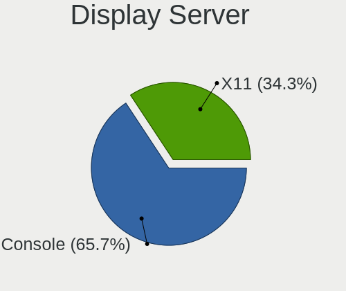
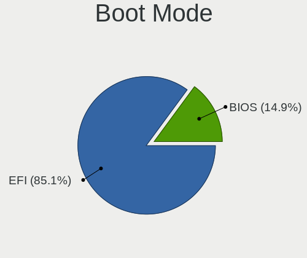
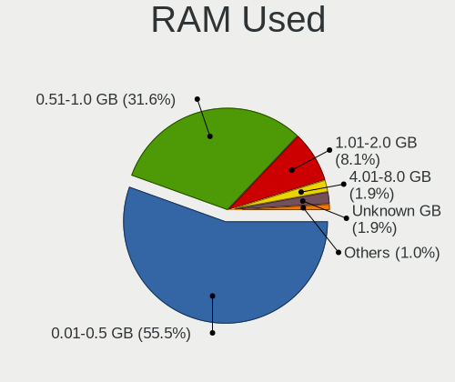
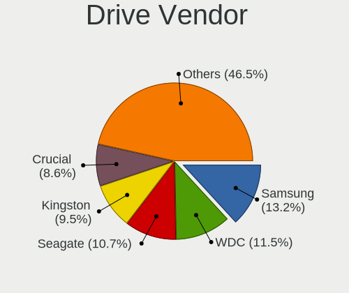
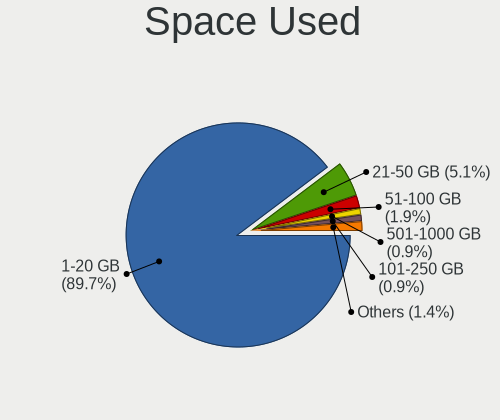
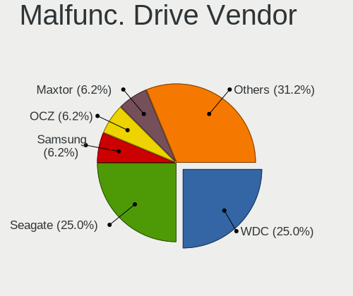
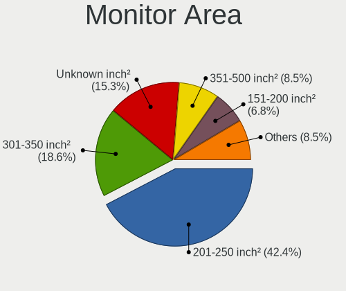
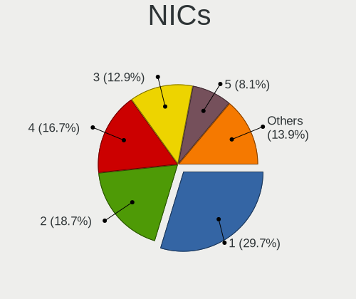

BSD in Italy - Tested Hardware & Statistics (Desktops)
------------------------------------------------------

A project to collect tested hardware configurations for BSD in Italy.

Anyone can contribute to this report by the [hw-probe](https://github.com/linuxhw/hw-probe/blob/master/INSTALL.BSD.md) tool:

    hw-probe -all -upload

Please contribute! Especially if your hardware is rare.

Contents
--------

* [ Test Cases ](#test-cases)

* [ System ](#system)
  - [ OS                       ](#os)
  - [ OS Family                ](#os-family)
  - [ Arch                     ](#arch)
  - [ DE                       ](#de)
  - [ Display Server           ](#display-server)
  - [ Display Manager          ](#display-manager)
  - [ OS Lang                  ](#os-lang)
  - [ Boot Mode                ](#boot-mode)
  - [ Filesystem               ](#filesystem)
  - [ Part. scheme             ](#part-scheme)

* [ Board ](#board)
  - [ Vendor                   ](#vendor)
  - [ Model                    ](#model)
  - [ Model Family             ](#model-family)
  - [ MFG Year                 ](#mfg-year)
  - [ Form Factor              ](#form-factor)
  - [ Coreboot                 ](#coreboot)
  - [ RAM Size                 ](#ram-size)
  - [ RAM Used                 ](#ram-used)
  - [ Total Drives             ](#total-drives)
  - [ Has CD-ROM               ](#has-cd-rom)
  - [ Has Ethernet             ](#has-ethernet)
  - [ Has WiFi                 ](#has-wifi)
  - [ Has Bluetooth            ](#has-bluetooth)

* [ Location ](#location)
  - [ Country                  ](#country)
  - [ City                     ](#city)

* [ Drives ](#drives)
  - [ Drive Vendor             ](#drive-vendor)
  - [ Drive Model              ](#drive-model)
  - [ HDD Vendor               ](#hdd-vendor)
  - [ SSD Vendor               ](#ssd-vendor)
  - [ Drive Kind               ](#drive-kind)
  - [ Drive Connector          ](#drive-connector)
  - [ Drive Size               ](#drive-size)
  - [ Space Total              ](#space-total)
  - [ Space Used               ](#space-used)
  - [ Malfunc. Drives          ](#malfunc-drives)
  - [ Malfunc. Drive Vendor    ](#malfunc-drive-vendor)
  - [ Malfunc. HDD Vendor      ](#malfunc-hdd-vendor)
  - [ Malfunc. Drive Kind      ](#malfunc-drive-kind)
  - [ Failed Drives            ](#failed-drives)
  - [ Failed Drive Vendor      ](#failed-drive-vendor)
  - [ Drive Status             ](#drive-status)

* [ Storage controller ](#storage-controller)
  - [ Storage Vendor           ](#storage-vendor)
  - [ Storage Model            ](#storage-model)
  - [ Storage Kind             ](#storage-kind)

* [ Processor ](#processor)
  - [ CPU Vendor               ](#cpu-vendor)
  - [ CPU Model                ](#cpu-model)
  - [ CPU Model Family         ](#cpu-model-family)
  - [ CPU Cores                ](#cpu-cores)
  - [ CPU Sockets              ](#cpu-sockets)
  - [ CPU Threads              ](#cpu-threads)
  - [ CPU Microarch            ](#cpu-microarch)

* [ Graphics ](#graphics)
  - [ GPU Vendor               ](#gpu-vendor)
  - [ GPU Model                ](#gpu-model)
  - [ GPU Combo                ](#gpu-combo)
  - [ GPU Driver               ](#gpu-driver)
  - [ GPU Memory               ](#gpu-memory)

* [ Monitor ](#monitor)
  - [ Monitor Vendor           ](#monitor-vendor)
  - [ Monitor Model            ](#monitor-model)
  - [ Monitor Resolution       ](#monitor-resolution)
  - [ Monitor Diagonal         ](#monitor-diagonal)
  - [ Monitor Width            ](#monitor-width)
  - [ Aspect Ratio             ](#aspect-ratio)
  - [ Monitor Area             ](#monitor-area)
  - [ Pixel Density            ](#pixel-density)
  - [ Multiple Monitors        ](#multiple-monitors)

* [ Network ](#network)
  - [ Net Controller Vendor    ](#net-controller-vendor)
  - [ Net Controller Model     ](#net-controller-model)
  - [ Wireless Vendor          ](#wireless-vendor)
  - [ Wireless Model           ](#wireless-model)
  - [ Ethernet Vendor          ](#ethernet-vendor)
  - [ Ethernet Model           ](#ethernet-model)
  - [ Net Controller Kind      ](#net-controller-kind)
  - [ Used Controller          ](#used-controller)
  - [ NICs                     ](#nics)
  - [ IPv6                     ](#ipv6)

* [ Bluetooth ](#bluetooth)
  - [ Bluetooth Vendor         ](#bluetooth-vendor)
  - [ Bluetooth Model          ](#bluetooth-model)

* [ Sound ](#sound)
  - [ Sound Vendor             ](#sound-vendor)
  - [ Sound Model              ](#sound-model)

* [ Memory ](#memory)
  - [ Memory Vendor            ](#memory-vendor)
  - [ Memory Model             ](#memory-model)
  - [ Memory Kind              ](#memory-kind)
  - [ Memory Form Factor       ](#memory-form-factor)
  - [ Memory Size              ](#memory-size)
  - [ Memory Speed             ](#memory-speed)

* [ Printers & scanners ](#printers--scanners)
  - [ Printer Vendor           ](#printer-vendor)
  - [ Printer Model            ](#printer-model)
  - [ Scanner Vendor           ](#scanner-vendor)
  - [ Scanner Model            ](#scanner-model)

* [ Camera ](#camera)
  - [ Camera Vendor            ](#camera-vendor)
  - [ Camera Model             ](#camera-model)

* [ Security ](#security)
  - [ Fingerprint Vendor       ](#fingerprint-vendor)
  - [ Fingerprint Model        ](#fingerprint-model)
  - [ Chipcard Vendor          ](#chipcard-vendor)
  - [ Chipcard Model           ](#chipcard-model)

* [ Unsupported ](#unsupported)
  - [ Unsupported Devices      ](#unsupported-devices)
  - [ Unsupported Device Types ](#unsupported-device-types)

Test Cases
----------

Total: 221

| Vendor        | Model                       | Probe                                                     | Date         |
|---------------|-----------------------------|-----------------------------------------------------------|--------------|
| Fujitsu       | D3313-A1 S26361-D3313-A1    | [fe412825f2](https://bsd-hardware.info/?probe=fe412825f2) | Jun 10, 2023 |
| Dell          | 0WR7PY A03                  | [c8496622be](https://bsd-hardware.info/?probe=c8496622be) | Jun 03, 2023 |
| Dell          | 0WR7PY A03                  | [b9f7e3e209](https://bsd-hardware.info/?probe=b9f7e3e209) | Jun 03, 2023 |
| Fujitsu       | D3313-A1 S26361-D3313-A1    | [d08f309c4c](https://bsd-hardware.info/?probe=d08f309c4c) | May 26, 2023 |
| Intel         | Q3XXG4-P V1.0               | [9160d45441](https://bsd-hardware.info/?probe=9160d45441) | May 25, 2023 |
| Unknown       | Unknown                     | [8b5ec8c5f4](https://bsd-hardware.info/?probe=8b5ec8c5f4) | May 23, 2023 |
| Gigabyte      | A520M S2H                   | [582dc6ab9f](https://bsd-hardware.info/?probe=582dc6ab9f) | May 15, 2023 |
| Unknown       | Unknown                     | [b26eac2277](https://bsd-hardware.info/?probe=b26eac2277) | May 13, 2023 |
| Fujitsu       | D3313-A1 S26361-D3313-A1    | [1dac5a7bb2](https://bsd-hardware.info/?probe=1dac5a7bb2) | May 13, 2023 |
| Unknown       | Unknown                     | [bf8246ecb5](https://bsd-hardware.info/?probe=bf8246ecb5) | May 11, 2023 |
| ASUSTek       | PRIME B650-PLUS             | [be83fbb0f2](https://bsd-hardware.info/?probe=be83fbb0f2) | May 09, 2023 |
| Unknown       | Unknown                     | [5c6c169e73](https://bsd-hardware.info/?probe=5c6c169e73) | May 01, 2023 |
| Unknown       | Unknown                     | [d572f5ff91](https://bsd-hardware.info/?probe=d572f5ff91) | May 01, 2023 |
| Unknown       | HX90                        | [b3300c45bc](https://bsd-hardware.info/?probe=b3300c45bc) | May 01, 2023 |
| Unknown       | Unknown                     | [1774da050f](https://bsd-hardware.info/?probe=1774da050f) | Apr 29, 2023 |
| HP            | 82B4                        | [9ec1e6d6f4](https://bsd-hardware.info/?probe=9ec1e6d6f4) | Apr 23, 2023 |
| Intel         | SKYBAY                      | [03dd920110](https://bsd-hardware.info/?probe=03dd920110) | Apr 22, 2023 |
| Fujitsu       | D3313-A1 S26361-D3313-A1    | [d343800c53](https://bsd-hardware.info/?probe=d343800c53) | Apr 16, 2023 |
| PC Engines    | apu4                        | [9217e1982f](https://bsd-hardware.info/?probe=9217e1982f) | Apr 14, 2023 |
| ASRock        | G31M-S                      | [fed4a42c32](https://bsd-hardware.info/?probe=fed4a42c32) | Apr 08, 2023 |
| ASRock        | G31M-S                      | [4596f78aee](https://bsd-hardware.info/?probe=4596f78aee) | Apr 08, 2023 |
| Unknown       | Unknown                     | [5168183b15](https://bsd-hardware.info/?probe=5168183b15) | Apr 06, 2023 |
| Fujitsu       | D3028-A1 S26361-D3028-A1    | [45f590d129](https://bsd-hardware.info/?probe=45f590d129) | Apr 04, 2023 |
| Fujitsu       | D3028-A1 S26361-D3028-A1    | [ab0643727f](https://bsd-hardware.info/?probe=ab0643727f) | Apr 02, 2023 |
| Fujitsu       | D3313-A1 S26361-D3313-A1    | [fb6477d43e](https://bsd-hardware.info/?probe=fb6477d43e) | Mar 31, 2023 |
| YANYU         | H17SL                       | [0f9829ebe4](https://bsd-hardware.info/?probe=0f9829ebe4) | Mar 26, 2023 |
| ASUSTek       | F1A55                       | [91ad5bab75](https://bsd-hardware.info/?probe=91ad5bab75) | Mar 25, 2023 |
| Unknown       | Unknown                     | [a7e98f9a10](https://bsd-hardware.info/?probe=a7e98f9a10) | Mar 23, 2023 |
| T-bao         | MINI PC V1.0                | [eb2bc1cd51](https://bsd-hardware.info/?probe=eb2bc1cd51) | Mar 23, 2023 |
| ASUSTek       | PRIME H410M-A               | [cbbeb5c41c](https://bsd-hardware.info/?probe=cbbeb5c41c) | Mar 22, 2023 |
| HP            | 8054                        | [6e5a18f346](https://bsd-hardware.info/?probe=6e5a18f346) | Mar 20, 2023 |
| YANYU         | H17SL                       | [37a549331f](https://bsd-hardware.info/?probe=37a549331f) | Mar 14, 2023 |
| MSI           | 0A48                        | [815f019a8c](https://bsd-hardware.info/?probe=815f019a8c) | Mar 14, 2023 |
| AZW           | U59                         | [5a6ef3fb8d](https://bsd-hardware.info/?probe=5a6ef3fb8d) | Mar 14, 2023 |
| Dell          | 0WMJ54 A01                  | [7949f20162](https://bsd-hardware.info/?probe=7949f20162) | Mar 12, 2023 |
| Fujitsu       | D3313-A1 S26361-D3313-A1    | [a3f921de9a](https://bsd-hardware.info/?probe=a3f921de9a) | Mar 12, 2023 |
| Fujitsu       | D3313-A1 S26361-D3313-A1    | [2050921c3d](https://bsd-hardware.info/?probe=2050921c3d) | Mar 12, 2023 |
| Gigabyte      | B450M K                     | [0d0433284e](https://bsd-hardware.info/?probe=0d0433284e) | Mar 11, 2023 |
| NF692         | 1.0                         | [16fa0b0102](https://bsd-hardware.info/?probe=16fa0b0102) | Mar 11, 2023 |
| Fujitsu       | D3313-A1 S26361-D3313-A1    | [6729453203](https://bsd-hardware.info/?probe=6729453203) | Mar 09, 2023 |
| Fujitsu       | D3313-A1 S26361-D3313-A1    | [6dee276a48](https://bsd-hardware.info/?probe=6dee276a48) | Mar 07, 2023 |
| Gigabyte      | H97M-HD3                    | [77a58527da](https://bsd-hardware.info/?probe=77a58527da) | Mar 01, 2023 |
| Stonesoft     | FW-315-C1                   | [e8a2206ad2](https://bsd-hardware.info/?probe=e8a2206ad2) | Feb 28, 2023 |
| Intel         | JSL MRD                     | [1587ea95da](https://bsd-hardware.info/?probe=1587ea95da) | Feb 18, 2023 |
| Unknown       | SKYBAY                      | [df7f4524d7](https://bsd-hardware.info/?probe=df7f4524d7) | Feb 12, 2023 |
| Unknown       | Unknown                     | [7f9208dc11](https://bsd-hardware.info/?probe=7f9208dc11) | Feb 06, 2023 |
| HP            | 213D A01                    | [659939cc8b](https://bsd-hardware.info/?probe=659939cc8b) | Jan 26, 2023 |
| Unknown       | Unknown                     | [aa940792fc](https://bsd-hardware.info/?probe=aa940792fc) | Jan 25, 2023 |
| Gigabyte      | A520M S2H                   | [803a152afc](https://bsd-hardware.info/?probe=803a152afc) | Jan 23, 2023 |
| ASUSTek       | PRO A520M-C                 | [bebcd1a008](https://bsd-hardware.info/?probe=bebcd1a008) | Jan 20, 2023 |
| Gigabyte      | H270M-DS3H-CF               | [d0e2e85346](https://bsd-hardware.info/?probe=d0e2e85346) | Jan 17, 2023 |
| Unknown       | SKYBAY                      | [c1e1ba5558](https://bsd-hardware.info/?probe=c1e1ba5558) | Jan 16, 2023 |
| Supermicro    | X9SCI/X9SCA                 | [942d966486](https://bsd-hardware.info/?probe=942d966486) | Jan 11, 2023 |
| Fujitsu       | D3041-A1 S26361-D3041-A1    | [2265227a5c](https://bsd-hardware.info/?probe=2265227a5c) | Dec 26, 2022 |
| MSI           | MS-7922                     | [95dbf4f7a8](https://bsd-hardware.info/?probe=95dbf4f7a8) | Dec 19, 2022 |
| Pegatron      | 2ACF                        | [511f2a6d16](https://bsd-hardware.info/?probe=511f2a6d16) | Dec 19, 2022 |
| Gigabyte      | N3160ND3V                   | [c84bedc821](https://bsd-hardware.info/?probe=c84bedc821) | Dec 15, 2022 |
| Fujitsu       | D3313-A1 S26361-D3313-A1    | [435807287e](https://bsd-hardware.info/?probe=435807287e) | Dec 15, 2022 |
| AZW           | U59                         | [9b22c68e98](https://bsd-hardware.info/?probe=9b22c68e98) | Dec 13, 2022 |
| ASUSTek       | PRIME Z390M-PLUS            | [7329e04c22](https://bsd-hardware.info/?probe=7329e04c22) | Nov 27, 2022 |
| ASUSTek       | P11C-X Series               | [6860cd72f8](https://bsd-hardware.info/?probe=6860cd72f8) | Nov 26, 2022 |
| ASUSTek       | P11C-X Series               | [cfdb06e761](https://bsd-hardware.info/?probe=cfdb06e761) | Nov 26, 2022 |
| Dell          | 0PTTT9 A01                  | [74575d6dfe](https://bsd-hardware.info/?probe=74575d6dfe) | Nov 25, 2022 |
| Dell          | 0VD5HY A00                  | [1a0df311e3](https://bsd-hardware.info/?probe=1a0df311e3) | Nov 07, 2022 |
| Gigabyte      | H270M-DS3H-CF               | [5784d8bed6](https://bsd-hardware.info/?probe=5784d8bed6) | Nov 04, 2022 |
| Acer          | Veriton X2610G              | [e4289c3f15](https://bsd-hardware.info/?probe=e4289c3f15) | Oct 24, 2022 |
| Unknown       | Unknown                     | [1188b56e14](https://bsd-hardware.info/?probe=1188b56e14) | Oct 19, 2022 |
| Unknown       | Unknown                     | [915c66f8bd](https://bsd-hardware.info/?probe=915c66f8bd) | Oct 19, 2022 |
| PC Engines    | apu4                        | [20cfd8a3c8](https://bsd-hardware.info/?probe=20cfd8a3c8) | Oct 17, 2022 |
| Pegatron      | 2ACF                        | [c57cc3a923](https://bsd-hardware.info/?probe=c57cc3a923) | Oct 17, 2022 |
| ASRock        | Q1900M                      | [7d0380e2d0](https://bsd-hardware.info/?probe=7d0380e2d0) | Oct 15, 2022 |
| ASRock        | J3355B-ITX                  | [d802705c1d](https://bsd-hardware.info/?probe=d802705c1d) | Oct 10, 2022 |
| ASRock        | B75M R2.0                   | [a28ea59f1f](https://bsd-hardware.info/?probe=a28ea59f1f) | Oct 07, 2022 |
| Unknown       | Unknown                     | [bdabafdcb1](https://bsd-hardware.info/?probe=bdabafdcb1) | Oct 01, 2022 |
| ASRock        | Q1900B-ITX                  | [81722a937a](https://bsd-hardware.info/?probe=81722a937a) | Sep 13, 2022 |
| HP            | 8648                        | [e7e610794c](https://bsd-hardware.info/?probe=e7e610794c) | Sep 12, 2022 |
| Fujitsu       | D3313-A1 S26361-D3313-A1    | [b54e6663f9](https://bsd-hardware.info/?probe=b54e6663f9) | Sep 10, 2022 |
| Intel         | J1900                       | [a95dd12c65](https://bsd-hardware.info/?probe=a95dd12c65) | Sep 06, 2022 |
| HP            | 1496                        | [7cd97bd330](https://bsd-hardware.info/?probe=7cd97bd330) | Sep 05, 2022 |
| PC Engines    | APU2                        | [d9216cb730](https://bsd-hardware.info/?probe=d9216cb730) | Sep 05, 2022 |
| HP            | 1496                        | [94e8713f6d](https://bsd-hardware.info/?probe=94e8713f6d) | Sep 03, 2022 |
| HP            | 1496                        | [1567aa1c21](https://bsd-hardware.info/?probe=1567aa1c21) | Sep 01, 2022 |
| Unknown       | HX90                        | [568468e95b](https://bsd-hardware.info/?probe=568468e95b) | Sep 01, 2022 |
| Fujitsu       | D3041-A1 S26361-D3041-A1    | [2349014a6c](https://bsd-hardware.info/?probe=2349014a6c) | Aug 29, 2022 |
| PC Engines    | APU2                        | [b3d60c2790](https://bsd-hardware.info/?probe=b3d60c2790) | Aug 22, 2022 |
| ASUSTek       | M4A87TD EVO                 | [c03da8657e](https://bsd-hardware.info/?probe=c03da8657e) | Aug 17, 2022 |
| PC Engines    | APU2                        | [028dc7aa20](https://bsd-hardware.info/?probe=028dc7aa20) | Aug 17, 2022 |
| Fujitsu       | D3313-A1 S26361-D3313-A1    | [1d4ccaabda](https://bsd-hardware.info/?probe=1d4ccaabda) | Aug 13, 2022 |
| Fujitsu       | D3041-A1 S26361-D3041-A1    | [17dc06ed68](https://bsd-hardware.info/?probe=17dc06ed68) | Aug 12, 2022 |
| Unknown       | Unknown                     | [af3d9689c2](https://bsd-hardware.info/?probe=af3d9689c2) | Aug 11, 2022 |
| Unknown       | Unknown                     | [5049417b7b](https://bsd-hardware.info/?probe=5049417b7b) | Aug 11, 2022 |
| Intel         | SKYBAY                      | [c7010b7ebc](https://bsd-hardware.info/?probe=c7010b7ebc) | Aug 09, 2022 |
| Unknown       | Unknown                     | [21cda0eb5d](https://bsd-hardware.info/?probe=21cda0eb5d) | Aug 09, 2022 |
| Intel         | SKYBAY                      | [bc7d4d8e1e](https://bsd-hardware.info/?probe=bc7d4d8e1e) | Aug 08, 2022 |
| Unknown       | Unknown                     | [df3667156b](https://bsd-hardware.info/?probe=df3667156b) | Aug 02, 2022 |
| Lex           | Pineview-D                  | [7d7195024e](https://bsd-hardware.info/?probe=7d7195024e) | Aug 02, 2022 |
| Intel         | Q3XXG4-P V1.0               | [d6a3d57165](https://bsd-hardware.info/?probe=d6a3d57165) | Jul 29, 2022 |
| PC Engines    | APU2                        | [bb5d45a75d](https://bsd-hardware.info/?probe=bb5d45a75d) | Jul 29, 2022 |
| Fujitsu       | D3313-A1 S26361-D3313-A1    | [e3655742ba](https://bsd-hardware.info/?probe=e3655742ba) | Jul 18, 2022 |
| Lenovo        | SHARKBAY SDK0E50510 WIN     | [4b9e0bb7bb](https://bsd-hardware.info/?probe=4b9e0bb7bb) | Jul 18, 2022 |
| Fujitsu       | D3313-A1 S26361-D3313-A1    | [af1e80d15d](https://bsd-hardware.info/?probe=af1e80d15d) | Jul 18, 2022 |
| ASUSTek       | M4A785TD-M EVO              | [def87ec245](https://bsd-hardware.info/?probe=def87ec245) | Jul 18, 2022 |
| ASUSTek       | PRIME H410M-A               | [7b6faf5301](https://bsd-hardware.info/?probe=7b6faf5301) | Jul 14, 2022 |
| ASUSTek       | PRIME H410M-A               | [ba243fa7c4](https://bsd-hardware.info/?probe=ba243fa7c4) | Jul 09, 2022 |
| Fujitsu       | D3041-A1 S26361-D3041-A1    | [d3aba12432](https://bsd-hardware.info/?probe=d3aba12432) | Jul 09, 2022 |
| ASRock        | B75M R2.0                   | [6011c70ca4](https://bsd-hardware.info/?probe=6011c70ca4) | Jul 07, 2022 |
| HP            | 0A98h                       | [655fc531fb](https://bsd-hardware.info/?probe=655fc531fb) | Jun 30, 2022 |
| Pegatron      | 2ACF                        | [e461a4559d](https://bsd-hardware.info/?probe=e461a4559d) | Jun 29, 2022 |
| HP            | 304Bh                       | [8a3151b3cd](https://bsd-hardware.info/?probe=8a3151b3cd) | Jun 16, 2022 |
| NF692         | 1.0                         | [e87866bf5a](https://bsd-hardware.info/?probe=e87866bf5a) | Jun 10, 2022 |
| ASUSTek       | PRIME H410M-E               | [8099e7abaf](https://bsd-hardware.info/?probe=8099e7abaf) | Jun 03, 2022 |
| HP            | ProLiant MicroServer Gen... | [4b3b7a0929](https://bsd-hardware.info/?probe=4b3b7a0929) | May 31, 2022 |
| HP            | ProLiant MicroServer Gen... | [5d3db8382f](https://bsd-hardware.info/?probe=5d3db8382f) | May 31, 2022 |
| T-bao         | MINI PC V1.0                | [a89b2081bb](https://bsd-hardware.info/?probe=a89b2081bb) | May 25, 2022 |
| ASUSTek       | PRIME B550M-K               | [ce5ddde5ad](https://bsd-hardware.info/?probe=ce5ddde5ad) | May 18, 2022 |
| Protectli     | FW4B Ver                    | [2769c8f286](https://bsd-hardware.info/?probe=2769c8f286) | May 17, 2022 |
| Fujitsu       | D3041-A1 S26361-D3041-A1    | [5ff176fff8](https://bsd-hardware.info/?probe=5ff176fff8) | May 05, 2022 |
| ASUSTek       | M4A88TD-V EVO/USB3          | [12cc40cc60](https://bsd-hardware.info/?probe=12cc40cc60) | Apr 23, 2022 |
| Pegatron      | Benicia                     | [9045b4f449](https://bsd-hardware.info/?probe=9045b4f449) | Apr 16, 2022 |
| ASUSTek       | PRIME Z390M-PLUS            | [680303f943](https://bsd-hardware.info/?probe=680303f943) | Apr 16, 2022 |
| ASUSTek       | PRIME Z390M-PLUS            | [47d17d48a7](https://bsd-hardware.info/?probe=47d17d48a7) | Apr 15, 2022 |
| ShenZhen M... | MW-NANO-APL-4L              | [fbdd8d4f48](https://bsd-hardware.info/?probe=fbdd8d4f48) | Apr 05, 2022 |
| HP            | 212B                        | [33e7c65907](https://bsd-hardware.info/?probe=33e7c65907) | Apr 04, 2022 |
| Gigabyte      | X570 AORUS PRO              | [3877a33214](https://bsd-hardware.info/?probe=3877a33214) | Apr 02, 2022 |
| Gigabyte      | X570 AORUS PRO              | [3da637e3c6](https://bsd-hardware.info/?probe=3da637e3c6) | Apr 02, 2022 |
| Fujitsu       | D3041-A1 S26361-D3041-A1    | [7b79164c18](https://bsd-hardware.info/?probe=7b79164c18) | Apr 01, 2022 |
| Unknown       | Unknown                     | [bddd5d8963](https://bsd-hardware.info/?probe=bddd5d8963) | Mar 18, 2022 |
| Unknown       | Unknown                     | [65ada9d5da](https://bsd-hardware.info/?probe=65ada9d5da) | Mar 11, 2022 |
| HP            | 3397                        | [841ed56816](https://bsd-hardware.info/?probe=841ed56816) | Mar 02, 2022 |
| Pegatron      | 2ACF                        | [e098f52d51](https://bsd-hardware.info/?probe=e098f52d51) | Feb 19, 2022 |
| MSI           | B450 GAMING PLUS MAX        | [df6278638e](https://bsd-hardware.info/?probe=df6278638e) | Feb 15, 2022 |
| Intel         | Q3XXG4-P V1.0               | [ea7cf2885f](https://bsd-hardware.info/?probe=ea7cf2885f) | Feb 13, 2022 |
| MSI           | B450 GAMING PLUS MAX        | [6997de25f9](https://bsd-hardware.info/?probe=6997de25f9) | Feb 11, 2022 |
| MW            | GMLK-2_5G4L                 | [7a3744a41a](https://bsd-hardware.info/?probe=7a3744a41a) | Feb 07, 2022 |
| Dell          | 0TK7TF A00                  | [d13ca7163c](https://bsd-hardware.info/?probe=d13ca7163c) | Jan 30, 2022 |
| Intel         | D2500CC AAG81477-401        | [f4d8bd7979](https://bsd-hardware.info/?probe=f4d8bd7979) | Jan 30, 2022 |
| Fujitsu       | D3028-A1 S26361-D3028-A1    | [f7e7df9416](https://bsd-hardware.info/?probe=f7e7df9416) | Jan 30, 2022 |
| Fujitsu       | D3028-A1 S26361-D3028-A1    | [fc63aa695e](https://bsd-hardware.info/?probe=fc63aa695e) | Jan 27, 2022 |
| PC Engines    | APU2                        | [52bd5dc1ce](https://bsd-hardware.info/?probe=52bd5dc1ce) | Jan 26, 2022 |
| ASUSTek       | BM6835_BM6635_BP6335        | [73562aa169](https://bsd-hardware.info/?probe=73562aa169) | Jan 25, 2022 |
| Fujitsu       | D3041-A1 S26361-D3041-A1    | [ed9f5d1a27](https://bsd-hardware.info/?probe=ed9f5d1a27) | Jan 15, 2022 |
| PC Engines    | APU2                        | [c2b05fc937](https://bsd-hardware.info/?probe=c2b05fc937) | Jan 14, 2022 |
| ASRock        | B75M R2.0                   | [7b99b0eaa6](https://bsd-hardware.info/?probe=7b99b0eaa6) | Jan 10, 2022 |
| Fujitsu       | D3041-A1 S26361-D3041-A1    | [7a43524381](https://bsd-hardware.info/?probe=7a43524381) | Dec 13, 2021 |
| Gigabyte      | H270M-DS3H-CF               | [50fba6deda](https://bsd-hardware.info/?probe=50fba6deda) | Dec 11, 2021 |
| Gigabyte      | H270M-DS3H-CF               | [a084ff48c2](https://bsd-hardware.info/?probe=a084ff48c2) | Dec 09, 2021 |
| Gigabyte      | H270M-DS3H-CF               | [17b557d792](https://bsd-hardware.info/?probe=17b557d792) | Dec 08, 2021 |
| Fujitsu       | D3041-A1 S26361-D3041-A1    | [ddcab97db2](https://bsd-hardware.info/?probe=ddcab97db2) | Dec 03, 2021 |
| T-bao         | MINI PC V1.0                | [4ee7de3597](https://bsd-hardware.info/?probe=4ee7de3597) | Nov 12, 2021 |
| Intel         | Q3XXG4-P V1.0               | [22a18ba45e](https://bsd-hardware.info/?probe=22a18ba45e) | Nov 08, 2021 |
| Pegatron      | 2ACF                        | [ca23d3bbf0](https://bsd-hardware.info/?probe=ca23d3bbf0) | Oct 13, 2021 |
| ASUSTek       | PRIME Z390M-PLUS            | [b3b31d25b0](https://bsd-hardware.info/?probe=b3b31d25b0) | Oct 13, 2021 |
| Pegatron      | 2ACF                        | [97aa5e56e4](https://bsd-hardware.info/?probe=97aa5e56e4) | Oct 12, 2021 |
| ASUSTek       | PRIME Z390M-PLUS            | [5a7c1871b1](https://bsd-hardware.info/?probe=5a7c1871b1) | Oct 11, 2021 |
| Acer          | Veriton X2610G              | [1e9ed23164](https://bsd-hardware.info/?probe=1e9ed23164) | Oct 03, 2021 |
| ASRock        | B75M R2.0                   | [51b47d9321](https://bsd-hardware.info/?probe=51b47d9321) | Sep 27, 2021 |
| ASRock        | B75M R2.0                   | [de031313ff](https://bsd-hardware.info/?probe=de031313ff) | Sep 27, 2021 |
| Gigabyte      | H270M-DS3H-CF               | [9b046b157e](https://bsd-hardware.info/?probe=9b046b157e) | Sep 17, 2021 |
| ASRock        | B75M R2.0                   | [0d23147c7d](https://bsd-hardware.info/?probe=0d23147c7d) | Sep 17, 2021 |
| ASRock        | B75M R2.0                   | [e0ae9af4ab](https://bsd-hardware.info/?probe=e0ae9af4ab) | Sep 15, 2021 |
| Gigabyte      | H270M-DS3H-CF               | [bc2a287495](https://bsd-hardware.info/?probe=bc2a287495) | Sep 13, 2021 |
| Unknown       | YL-J3160L4                  | [861a1f7012](https://bsd-hardware.info/?probe=861a1f7012) | Aug 25, 2021 |
| MSI           | MS-B1591                    | [679b2010e9](https://bsd-hardware.info/?probe=679b2010e9) | Aug 03, 2021 |
| MSI           | MS-B1591                    | [b370a74ec0](https://bsd-hardware.info/?probe=b370a74ec0) | Aug 02, 2021 |
| Gigabyte      | P55A-UD3                    | [dc1b4d8a6b](https://bsd-hardware.info/?probe=dc1b4d8a6b) | Jul 16, 2021 |
| ASRock        | B75M R2.0                   | [d51149c1d5](https://bsd-hardware.info/?probe=d51149c1d5) | Jul 13, 2021 |
| Lenovo        | SHARKBAY SDK0E50510 WIN     | [6cf3337855](https://bsd-hardware.info/?probe=6cf3337855) | Jul 01, 2021 |
| MSI           | B450 GAMING PLUS MAX        | [f0e80b0788](https://bsd-hardware.info/?probe=f0e80b0788) | Jun 28, 2021 |
| PC Engines    | APU2                        | [dde9077545](https://bsd-hardware.info/?probe=dde9077545) | Jun 24, 2021 |
| Unknown       | Unknown                     | [822df8eb91](https://bsd-hardware.info/?probe=822df8eb91) | May 11, 2021 |
| Unknown       | Unknown                     | [cc17eea606](https://bsd-hardware.info/?probe=cc17eea606) | May 10, 2021 |
| ASUSTek       | IP4BL-ME-Oli                | [e26ecef661](https://bsd-hardware.info/?probe=e26ecef661) | May 03, 2021 |
| MSI           | B450-A PRO                  | [ed656e816f](https://bsd-hardware.info/?probe=ed656e816f) | May 01, 2021 |
| Unknown       | Unknown                     | [df793cf09f](https://bsd-hardware.info/?probe=df793cf09f) | Apr 08, 2021 |
| Unknown       | Unknown                     | [f8ba0ba112](https://bsd-hardware.info/?probe=f8ba0ba112) | Apr 08, 2021 |
| Lenovo        | SHARKBAY SDK0E50510 WIN     | [62376c16a4](https://bsd-hardware.info/?probe=62376c16a4) | Mar 31, 2021 |
| Intel         | CRESCENTBAY                 | [5a7ba137e0](https://bsd-hardware.info/?probe=5a7ba137e0) | Mar 27, 2021 |
| Acer          | EG43M                       | [0bc978756c](https://bsd-hardware.info/?probe=0bc978756c) | Mar 27, 2021 |
| Lenovo        | SHARKBAY SDK0E50510 WIN     | [f9c3fc3b84](https://bsd-hardware.info/?probe=f9c3fc3b84) | Mar 19, 2021 |
| Lenovo        | SHARKBAY SDK0E50510 WIN     | [5ae508dfa8](https://bsd-hardware.info/?probe=5ae508dfa8) | Mar 19, 2021 |
| ASUSTek       | PRIME Z390M-PLUS            | [0a3b290f9f](https://bsd-hardware.info/?probe=0a3b290f9f) | Mar 15, 2021 |
| ASUSTek       | M4A88TD-V EVO/USB3          | [1c30f7523f](https://bsd-hardware.info/?probe=1c30f7523f) | Mar 15, 2021 |
| PC Engines    | APU3                        | [822a83f208](https://bsd-hardware.info/?probe=822a83f208) | Mar 11, 2021 |
| ASUSTek       | IP4BL-ME-Oli                | [c672201bcb](https://bsd-hardware.info/?probe=c672201bcb) | Mar 10, 2021 |
| Lenovo        | SHARKBAY SDK0E50510 WIN     | [66a223add9](https://bsd-hardware.info/?probe=66a223add9) | Mar 08, 2021 |
| Dell          | 0R849J A00                  | [1bd1dc24c9](https://bsd-hardware.info/?probe=1bd1dc24c9) | Mar 06, 2021 |
| Foxconn       | 2ADA                        | [10d02d0982](https://bsd-hardware.info/?probe=10d02d0982) | Mar 03, 2021 |
| Intel         | MAHOBAY                     | [3c5bd7b7f8](https://bsd-hardware.info/?probe=3c5bd7b7f8) | Mar 02, 2021 |
| Intel         | MAHOBAY                     | [04e66ca239](https://bsd-hardware.info/?probe=04e66ca239) | Mar 02, 2021 |
| Intel         | MAHOBAY                     | [50652a4263](https://bsd-hardware.info/?probe=50652a4263) | Feb 26, 2021 |
| ASUSTek       | PRIME Z390M-PLUS            | [58c6bf426e](https://bsd-hardware.info/?probe=58c6bf426e) | Feb 22, 2021 |
| Intel         | MAHOBAY                     | [5257239fdc](https://bsd-hardware.info/?probe=5257239fdc) | Feb 20, 2021 |
| HARDKERNEL    | ODROID-H2                   | [6fe9279f1f](https://bsd-hardware.info/?probe=6fe9279f1f) | Feb 18, 2021 |
| ASUSTek       | PRIME Z390M-PLUS            | [c996e74ebc](https://bsd-hardware.info/?probe=c996e74ebc) | Feb 14, 2021 |
| Dell          | 06NWYK A00                  | [32acfb4467](https://bsd-hardware.info/?probe=32acfb4467) | Feb 13, 2021 |
| ASUSTek       | P8H61-M LE                  | [b861820636](https://bsd-hardware.info/?probe=b861820636) | Feb 13, 2021 |
| Dell          | 06NWYK A00                  | [2ff05af403](https://bsd-hardware.info/?probe=2ff05af403) | Feb 13, 2021 |
| ASUSTek       | P8H61-M LE                  | [3a3d7d0701](https://bsd-hardware.info/?probe=3a3d7d0701) | Feb 12, 2021 |
| ASUSTek       | P8Z77-V PRO/THUNDERBOLT     | [6fdcef7c9e](https://bsd-hardware.info/?probe=6fdcef7c9e) | Feb 10, 2021 |
| ASUSTek       | PRIME X470-PRO              | [a77e980850](https://bsd-hardware.info/?probe=a77e980850) | Feb 09, 2021 |
| ASUSTek       | IP4BL-ME-Oli                | [4d225e7ebe](https://bsd-hardware.info/?probe=4d225e7ebe) | Feb 04, 2021 |
| Intel         | CRESCENTBAY                 | [f813782c8a](https://bsd-hardware.info/?probe=f813782c8a) | Jan 29, 2021 |
| Sun Micros... | Ultra 24 50                 | [622589c8e7](https://bsd-hardware.info/?probe=622589c8e7) | Jan 22, 2021 |
| Sun Micros... | Ultra 24 50                 | [7a3cb6a061](https://bsd-hardware.info/?probe=7a3cb6a061) | Jan 22, 2021 |
| ASUSTek       | M4A87TD EVO                 | [12ea57f317](https://bsd-hardware.info/?probe=12ea57f317) | Jan 22, 2021 |
| Dell          | 088DT1 A01                  | [fcc759e013](https://bsd-hardware.info/?probe=fcc759e013) | Jan 21, 2021 |
| ASRock        | H81 Pro BTC                 | [afb7cd1f1a](https://bsd-hardware.info/?probe=afb7cd1f1a) | Jan 20, 2021 |
| Intel         | CRESCENTBAY                 | [92577053eb](https://bsd-hardware.info/?probe=92577053eb) | Jan 20, 2021 |
| Intel         | CRESCENTBAY                 | [33a6dda088](https://bsd-hardware.info/?probe=33a6dda088) | Jan 20, 2021 |
| PC Engines    | APU2                        | [a178f8eb47](https://bsd-hardware.info/?probe=a178f8eb47) | Jan 19, 2021 |
| MSI           | Boston                      | [aa9d7bae21](https://bsd-hardware.info/?probe=aa9d7bae21) | Jan 17, 2021 |
| MSI           | Boston                      | [f21954fa35](https://bsd-hardware.info/?probe=f21954fa35) | Jan 17, 2021 |
| Supermicro    | X8STi                       | [7d0e121099](https://bsd-hardware.info/?probe=7d0e121099) | Jan 15, 2021 |
| Unknown       | Unknown                     | [8668b1d651](https://bsd-hardware.info/?probe=8668b1d651) | Dec 17, 2020 |
| Unknown       | Unknown                     | [d2cdc0fc7f](https://bsd-hardware.info/?probe=d2cdc0fc7f) | Nov 29, 2020 |
| Unknown       | Unknown                     | [aee9f448af](https://bsd-hardware.info/?probe=aee9f448af) | Nov 25, 2020 |
| Intel         | D945GCLF2                   | [58678b0643](https://bsd-hardware.info/?probe=58678b0643) | Oct 30, 2020 |
| Intel         | D945GCLF2                   | [3354fb903b](https://bsd-hardware.info/?probe=3354fb903b) | Oct 30, 2020 |
| Gigabyte      | X570 AORUS ELITE            | [973b62551f](https://bsd-hardware.info/?probe=973b62551f) | Oct 30, 2020 |
| AZW           | BT3 X                       | [b9f23ee753](https://bsd-hardware.info/?probe=b9f23ee753) | Oct 30, 2020 |
| ASRock        | 990FX Extreme9              | [6c0bba6d4f](https://bsd-hardware.info/?probe=6c0bba6d4f) | Jun 26, 2020 |

System
------

OS
--

Installed operating systems

| Name              | Desktops | Percent |
|-------------------|----------|---------|
| OpenBSD 7.1       | 8        | 4.82%   |
| helloSystem 0.4.0 | 7        | 4.22%   |
| OPNsense 22.7     | 6        | 3.61%   |
| helloSystem 0.8.1 | 6        | 3.61%   |
| helloSystem 0.7.0 | 6        | 3.61%   |
| OPNsense 23.1.5   | 5        | 3.01%   |
| OPNsense 23.1.6   | 4        | 2.41%   |
| OPNsense 22.7.9   | 4        | 2.41%   |
| OPNsense 22.7.6   | 4        | 2.41%   |
| OPNsense 22.1     | 4        | 2.41%   |
| OPNsense 21.1     | 4        | 2.41%   |
| OpenBSD 7.2       | 4        | 2.41%   |
| helloSystem 0.5.0 | 4        | 2.41%   |
| OPNsense 23.1.7   | 3        | 1.81%   |
| OPNsense 23.1.4   | 3        | 1.81%   |
| OPNsense 23.1.1   | 3        | 1.81%   |
| OPNsense 23.1     | 3        | 1.81%   |
| OPNsense 22.7.3   | 3        | 1.81%   |
| OPNsense 22.7.10  | 3        | 1.81%   |
| OPNsense 22.1.9   | 3        | 1.81%   |
| OPNsense 22.1.10  | 3        | 1.81%   |
| OPNsense 21.7.3   | 3        | 1.81%   |
| helloSystem 0.8.0 | 3        | 1.81%   |
| helloSystem 0.6.0 | 3        | 1.81%   |
| helloSystem 0.3.0 | 3        | 1.81%   |
| OPNsense 23.1.8   | 2        | 1.2%    |
| OPNsense 22.7.5   | 2        | 1.2%    |
| OPNsense 22.7.4   | 2        | 1.2%    |
| OPNsense 22.7.2   | 2        | 1.2%    |
| OPNsense 22.7.11  | 2        | 1.2%    |
| OPNsense 22.7.1   | 2        | 1.2%    |
| OPNsense 22.1.8   | 2        | 1.2%    |
| OPNsense 22.1.6   | 2        | 1.2%    |
| OPNsense 22.1.4   | 2        | 1.2%    |
| OPNsense 21.7.7   | 2        | 1.2%    |
| OPNsense 21.1.3   | 2        | 1.2%    |
| OPNsense 21.1.2   | 2        | 1.2%    |
| OPNsense 20.7.8   | 2        | 1.2%    |
| OpenBSD 6.8       | 2        | 1.2%    |
| NomadBSD 1.4      | 2        | 1.2%    |

OS Family
---------

OS without a version

| Name        | Desktops | Percent |
|-------------|----------|---------|
| OPNsense    | 64       | 52.46%  |
| helloSystem | 24       | 19.67%  |
| OpenBSD     | 15       | 12.3%   |
| FreeBSD     | 14       | 11.48%  |
| NomadBSD    | 2        | 1.64%   |
| NetBSD      | 2        | 1.64%   |
| XigmaNAS    | 1        | 0.82%   |

Arch
----

OS architecture (x86_64, i586, etc.)

| Name   | Desktops | Percent |
|--------|----------|---------|
| amd64  | 119      | 97.54%  |
| evbarm | 2        | 1.64%   |
| i386   | 1        | 0.82%   |

DE
--

Desktop Environment

| Name          | Desktops | Percent |
|---------------|----------|---------|
| Console       | 69       | 56.56%  |
| helloDesktop  | 30       | 24.59%  |
| XFCE          | 8        | 6.56%   |
| MATE          | 4        | 3.28%   |
| TWM           | 2        | 1.64%   |
| Openbox       | 2        | 1.64%   |
| KDE5          | 2        | 1.64%   |
| fvwm          | 2        | 1.64%   |
| xfwm          | 1        | 0.82%   |
| Enlightenment | 1        | 0.82%   |
| CTWM          | 1        | 0.82%   |

Display Server
--------------

X11 or Wayland

| Name    | Desktops | Percent |
|---------|----------|---------|
| Console | 72       | 58.54%  |
| X11     | 51       | 41.46%  |

Display Manager
---------------

SDDM, LightDM, etc.

| Name    | Desktops | Percent |
|---------|----------|---------|
| Console | 91       | 74.59%  |
| SLiM    | 29       | 23.77%  |
| LightDM | 2        | 1.64%   |

OS Lang
-------

Language

| Lang             | Desktops | Percent |
|------------------|----------|---------|
| Unknown          | 82       | 65.08%  |
| en_US            | 20       | 15.87%  |
| it_IT            | 10       | 7.94%   |
| C                | 7        | 5.56%   |
| fr_FR            | 4        | 3.17%   |
| it_IT.ISO8859-15 | 1        | 0.79%   |
| it               | 1        | 0.79%   |
| en               | 1        | 0.79%   |

Boot Mode
---------

EFI or BIOS

| Mode | Desktops | Percent |
|------|----------|---------|
| EFI  | 101      | 81.45%  |
| BIOS | 23       | 18.55%  |

Filesystem
----------

Type of filesystem

| Type   | Desktops | Percent |
|--------|----------|---------|
| Ufs    | 59       | 46.46%  |
| Zfs    | 42       | 33.07%  |
| Ffs    | 15       | 11.81%  |
| Cd9660 | 11       | 8.66%   |

Part. scheme
------------

Scheme of partitioning

| Type    | Desktops | Percent |
|---------|----------|---------|
| GPT     | 108      | 86.4%   |
| MBR     | 13       | 10.4%   |
| Unknown | 4        | 3.2%    |

Board
-----

Vendor
------

Motherboard manufacturer

| Name                       | Desktops | Percent |
|----------------------------|----------|---------|
| ASUSTek Computer           | 21       | 17.21%  |
| Unknown                    | 18       | 14.75%  |
| Intel                      | 10       | 8.2%    |
| Hewlett-Packard            | 10       | 8.2%    |
| Gigabyte Technology        | 9        | 7.38%   |
| Dell                       | 8        | 6.56%   |
| ASRock                     | 7        | 5.74%   |
| PC Engines                 | 6        | 4.92%   |
| MSI                        | 6        | 4.92%   |
| Fujitsu                    | 5        | 4.1%    |
| AZW                        | 3        | 2.46%   |
| Supermicro                 | 2        | 1.64%   |
| Pegatron                   | 2        | 1.64%   |
| Lenovo                     | 2        | 1.64%   |
| Acer                       | 2        | 1.64%   |
| YANYU                      | 1        | 0.82%   |
| T-bao                      | 1        | 0.82%   |
| Sun Microsystems           | 1        | 0.82%   |
| Stonesoft                  | 1        | 0.82%   |
| ShenZhen MinWin Technology | 1        | 0.82%   |
| Protectli                  | 1        | 0.82%   |
| NF692                      | 1        | 0.82%   |
| MW                         | 1        | 0.82%   |
| Lex                        | 1        | 0.82%   |
| HARDKERNEL                 | 1        | 0.82%   |
| Foxconn                    | 1        | 0.82%   |

Model
-----

Motherboard model

| Name                                    | Desktops | Percent |
|-----------------------------------------|----------|---------|
| Unknown                                 | 18       | 14.75%  |
| PC Engines APU2                         | 3        | 2.46%   |
| Fujitsu FUTRO S920                      | 3        | 2.46%   |
| ASUS PRIME H410M-A                      | 3        | 2.46%   |
| PC Engines apu4                         | 2        | 1.64%   |
| MSI MS-7B86                             | 2        | 1.64%   |
| Lenovo ThinkCentre M83 10AHS35Q00       | 2        | 1.64%   |
| Intel Q3XXG4-P V1.0                     | 2        | 1.64%   |
| Intel NCB-4210WG                        | 2        | 1.64%   |
| Gigabyte A520M S2H                      | 2        | 1.64%   |
| AZW U59                                 | 2        | 1.64%   |
| ASUS M4A88TD-V EVO/USB3                 | 2        | 1.64%   |
| ASUS IP4BL-ME                           | 2        | 1.64%   |
| YANYU H17SL                             | 1        | 0.82%   |
| T-bao MINI PC                           | 1        | 0.82%   |
| Supermicro X9SCI/X9SCA                  | 1        | 0.82%   |
| Supermicro X8STi                        | 1        | 0.82%   |
| Sun Microsystems Ultra 24               | 1        | 0.82%   |
| Stonesoft FW-315-C1                     | 1        | 0.82%   |
| ShenZhen MinWin MW-NANO-APL-4L          | 1        | 0.82%   |
| Protectli FW4B                          | 1        | 0.82%   |
| Pegatron Pro 3405 Series                | 1        | 0.82%   |
| Pegatron KX629AA-ABZ a6561.it           | 1        | 0.82%   |
| PC Engines APU3                         | 1        | 0.82%   |
| NF692 1.0                               | 1        | 0.82%   |
| MW GMLK-2_5G4L                          | 1        | 0.82%   |
| MSI NR074AA-ABZ CQ5125IT                | 1        | 0.82%   |
| MSI MS-7922                             | 1        | 0.82%   |
| MSI KBL-U Pro Cubi 3 Silent S (MS-B159) | 1        | 0.82%   |
| MSI Compaq dx2200 MT                    | 1        | 0.82%   |
| Lex Pineview-D                          | 1        | 0.82%   |
| Intel MAHOBAY                           | 1        | 0.82%   |
| Intel Jasper Lake Client Platform       | 1        | 0.82%   |
| Intel J1900                             | 1        | 0.82%   |
| Intel D945GCLF2                         | 1        | 0.82%   |
| Intel D2500CC AAG81477-401              | 1        | 0.82%   |
| Intel CRESCENTBAY                       | 1        | 0.82%   |
| HP Z440 Workstation                     | 1        | 0.82%   |
| HP xw8600 Workstation                   | 1        | 0.82%   |
| HP t620 PLUS Quad Core TC               | 1        | 0.82%   |

Model Family
------------

Motherboard model prefix

| Name                           | Desktops | Percent |
|--------------------------------|----------|---------|
| Unknown                        | 18       | 14.75%  |
| ASUS PRIME                     | 8        | 6.56%   |
| PC Engines APU2                | 3        | 2.46%   |
| HP Compaq                      | 3        | 2.46%   |
| Fujitsu FUTRO                  | 3        | 2.46%   |
| Dell OptiPlex                  | 3        | 2.46%   |
| PC Engines apu4                | 2        | 1.64%   |
| MSI MS-7B86                    | 2        | 1.64%   |
| Lenovo ThinkCentre             | 2        | 1.64%   |
| Intel Q3XXG4-P                 | 2        | 1.64%   |
| Intel NCB-4210WG               | 2        | 1.64%   |
| Gigabyte X570                  | 2        | 1.64%   |
| Gigabyte A520M                 | 2        | 1.64%   |
| Fujitsu ESPRIMO                | 2        | 1.64%   |
| Dell Precision                 | 2        | 1.64%   |
| AZW U59                        | 2        | 1.64%   |
| ASUS M4A88TD-V                 | 2        | 1.64%   |
| ASUS IP4BL-ME                  | 2        | 1.64%   |
| YANYU H17SL                    | 1        | 0.82%   |
| T-bao MINI                     | 1        | 0.82%   |
| Supermicro X9SCI               | 1        | 0.82%   |
| Supermicro X8STi               | 1        | 0.82%   |
| Sun Microsystems Ultra         | 1        | 0.82%   |
| Stonesoft FW-315-C1            | 1        | 0.82%   |
| ShenZhen MinWin MW-NANO-APL-4L | 1        | 0.82%   |
| Protectli FW4B                 | 1        | 0.82%   |
| Pegatron Pro                   | 1        | 0.82%   |
| Pegatron KX629AA-ABZ           | 1        | 0.82%   |
| PC Engines APU3                | 1        | 0.82%   |
| NF692 1.0                      | 1        | 0.82%   |
| MW GMLK-2                      | 1        | 0.82%   |
| MSI NR074AA-ABZ                | 1        | 0.82%   |
| MSI MS-7922                    | 1        | 0.82%   |
| MSI KBL-U                      | 1        | 0.82%   |
| MSI Compaq                     | 1        | 0.82%   |
| Lex Pineview-D                 | 1        | 0.82%   |
| Intel MAHOBAY                  | 1        | 0.82%   |
| Intel Jasper                   | 1        | 0.82%   |
| Intel J1900                    | 1        | 0.82%   |
| Intel D945GCLF2                | 1        | 0.82%   |

MFG Year
--------

Motherboard manufacture year

| Year    | Desktops | Percent |
|---------|----------|---------|
| 2014    | 15       | 12.3%   |
| 2022    | 12       | 9.84%   |
| 2012    | 11       | 9.02%   |
| 2016    | 10       | 8.2%    |
| 2019    | 9        | 7.38%   |
| 2018    | 9        | 7.38%   |
| 2021    | 8        | 6.56%   |
| 2011    | 8        | 6.56%   |
| 2010    | 8        | 6.56%   |
| 2020    | 7        | 5.74%   |
| 2017    | 7        | 5.74%   |
| 2008    | 5        | 4.1%    |
| 2009    | 4        | 3.28%   |
| Unknown | 3        | 2.46%   |
| 2023    | 2        | 1.64%   |
| 2013    | 2        | 1.64%   |
| 2015    | 1        | 0.82%   |
| 2006    | 1        | 0.82%   |

Form Factor
-----------

Physical design of the computer

| Name    | Desktops | Percent |
|---------|----------|---------|
| Desktop | 122      | 100%    |

Coreboot
--------

Have coreboot on board

| Used | Desktops | Percent |
|------|----------|---------|
| No   | 116      | 95.08%  |
| Yes  | 6        | 4.92%   |

RAM Size
--------

Total RAM memory

| Size in GB  | Desktops | Percent |
|-------------|----------|---------|
| 8.01-16.0   | 50       | 40%     |
| 4.01-8.0    | 28       | 22.4%   |
| 16.01-24.0  | 23       | 18.4%   |
| 2.01-3.0    | 9        | 7.2%    |
| 32.01-64.0  | 8        | 6.4%    |
| 3.01-4.0    | 2        | 1.6%    |
| 24.01-32.0  | 2        | 1.6%    |
| 64.01-256.0 | 2        | 1.6%    |
| 0.51-1.0    | 1        | 0.8%    |

RAM Used
--------

Used RAM memory

| Used GB  | Desktops | Percent |
|----------|----------|---------|
| 0.01-0.5 | 75       | 60.98%  |
| 0.51-1.0 | 35       | 28.46%  |
| 1.01-2.0 | 8        | 6.5%    |
| 2.01-3.0 | 2        | 1.63%   |
| Unknown  | 2        | 1.63%   |
| 4.01-8.0 | 1        | 0.81%   |

Total Drives
------------

Number of drives on board

| Drives | Desktops | Percent |
|--------|----------|---------|
| 1      | 80       | 62.99%  |
| 2      | 18       | 14.17%  |
| 0      | 9        | 7.09%   |
| 4      | 8        | 6.3%    |
| 3      | 8        | 6.3%    |
| 10     | 1        | 0.79%   |
| 7      | 1        | 0.79%   |
| 6      | 1        | 0.79%   |
| 5      | 1        | 0.79%   |

Has CD-ROM
----------

Has CD-ROM on board

| Presented | Desktops | Percent |
|-----------|----------|---------|
| No        | 87       | 71.31%  |
| Yes       | 35       | 28.69%  |

Has Ethernet
------------

Has Ethernet on board

| Presented | Desktops | Percent |
|-----------|----------|---------|
| Yes       | 120      | 98.36%  |
| No        | 2        | 1.64%   |

Has WiFi
--------

Has WiFi module

| Presented | Desktops | Percent |
|-----------|----------|---------|
| No        | 99       | 80.49%  |
| Yes       | 24       | 19.51%  |

Has Bluetooth
-------------

Has Bluetooth module

| Presented | Desktops | Percent |
|-----------|----------|---------|
| No        | 109      | 88.62%  |
| Yes       | 14       | 11.38%  |

Location
--------

Country
-------

Geographic location (country)

| Country | Desktops | Percent |
|---------|----------|---------|
| Italy   | 122      | 100%    |

City
----

Geographic location (city)

| City                  | Desktops | Percent |
|-----------------------|----------|---------|
| Milan                 | 21       | 14.19%  |
| Rome                  | 11       | 7.43%   |
| Naples                | 4        | 2.7%    |
| Trieste               | 3        | 2.03%   |
| Venice                | 2        | 1.35%   |
| Turrivalignani        | 2        | 1.35%   |
| Turin                 | 2        | 1.35%   |
| Taviano               | 2        | 1.35%   |
| Silea                 | 2        | 1.35%   |
| Reggio Emilia         | 2        | 1.35%   |
| Monza                 | 2        | 1.35%   |
| Modena                | 2        | 1.35%   |
| Lucca                 | 2        | 1.35%   |
| Genoa                 | 2        | 1.35%   |
| Ferrara               | 2        | 1.35%   |
| Desio                 | 2        | 1.35%   |
| Ancona                | 2        | 1.35%   |
| Vogogna               | 1        | 0.68%   |
| Viterbo               | 1        | 0.68%   |
| Villa Bartolomea      | 1        | 0.68%   |
| Verona                | 1        | 0.68%   |
| Vanzago               | 1        | 0.68%   |
| Treviso               | 1        | 0.68%   |
| Trento                | 1        | 0.68%   |
| Terni                 | 1        | 0.68%   |
| Soresina              | 1        | 0.68%   |
| Somma Vesuviana       | 1        | 0.68%   |
| Sesto San Giovanni    | 1        | 0.68%   |
| Selvazzano Dentro     | 1        | 0.68%   |
| Sasso Marconi         | 1        | 0.68%   |
| Sarno                 | 1        | 0.68%   |
| Sannicandro di Bari   | 1        | 0.68%   |
| San Vincenzo La Costa | 1        | 0.68%   |
| San Prospero          | 1        | 0.68%   |
| San Giuliano Terme    | 1        | 0.68%   |
| San Donato Milanese   | 1        | 0.68%   |
| Rosignano Marittimo   | 1        | 0.68%   |
| Reggio Calabria       | 1        | 0.68%   |
| Ravenna               | 1        | 0.68%   |
| Pozzuolo Martesana    | 1        | 0.68%   |

Drives
------

Drive Vendor
------------

Hard drive vendors

| Vendor              | Desktops | Drives | Percent |
|---------------------|----------|--------|---------|
| WDC                 | 24       | 49     | 14.72%  |
| Seagate             | 18       | 28     | 11.04%  |
| Samsung Electronics | 17       | 25     | 10.43%  |
| Toshiba             | 15       | 31     | 9.2%    |
| Kingston            | 13       | 15     | 7.98%   |
| Crucial             | 12       | 24     | 7.36%   |
| Transcend           | 10       | 17     | 6.13%   |
| SanDisk             | 5        | 6      | 3.07%   |
| NVMe                | 5        | 5      | 3.07%   |
| Hoodisk             | 4        | 4      | 2.45%   |
| Emtec               | 4        | 6      | 2.45%   |
| China               | 4        | 8      | 2.45%   |
| OCZ                 | 3        | 3      | 1.84%   |
| Maxtor              | 3        | 3      | 1.84%   |
| Innodisk            | 3        | 5      | 1.84%   |
| Hitachi             | 3        | 3      | 1.84%   |
| PNY                 | 2        | 6      | 1.23%   |
| Phison              | 2        | 2      | 1.23%   |
| Micron Technology   | 2        | 2      | 1.23%   |
| Dogfish             | 2        | 2      | 1.23%   |
| BAITITON            | 2        | 2      | 1.23%   |
| A-DATA Technology   | 2        | 3      | 1.23%   |
| SPCC                | 1        | 1      | 0.61%   |
| Silicon Motion      | 1        | 2      | 0.61%   |
| Pccooler            | 1        | 2      | 0.61%   |
| KingSpec            | 1        | 2      | 0.61%   |
| Intel               | 1        | 2      | 0.61%   |
| HGST                | 1        | 1      | 0.61%   |
| Fanxiang            | 1        | 1      | 0.61%   |
| ASint Technology    | 1        | 1      | 0.61%   |

Drive Model
-----------

Hard drive models

| Model                           | Desktops | Percent |
|---------------------------------|----------|---------|
| NVMe Samsung SSD 980 500GB      | 4        | 2.25%   |
| Kingston SEDC500M480G 480GB     | 3        | 1.69%   |
| Emtec X150 120GB                | 3        | 1.69%   |
| Crucial CT240BX500SSD1 240GB    | 3        | 1.69%   |
| WDC WD5000AAKS-22V1A0 500GB     | 2        | 1.12%   |
| Transcend TS16GMSA370 16GB      | 2        | 1.12%   |
| Transcend TS128GMSA230S 128GB   | 2        | 1.12%   |
| Toshiba Q300 240GB              | 2        | 1.12%   |
| Toshiba HDWG440 4TB             | 2        | 1.12%   |
| Toshiba HDWD110 1TB             | 2        | 1.12%   |
| Toshiba DT01ACA050 500GB        | 2        | 1.12%   |
| Seagate ST320LT007-9ZV142 320GB | 2        | 1.12%   |
| Seagate ST1000DM003-1ER162 1TB  | 2        | 1.12%   |
| SanDisk SDSSDP128G 128GB        | 2        | 1.12%   |
| Samsung SSD 870 EVO 250GB       | 2        | 1.12%   |
| Samsung SSD 860 EVO 250GB       | 2        | 1.12%   |
| Samsung SSD 850 EVO 250GB       | 2        | 1.12%   |
| Samsung HM321HI 320GB           | 2        | 1.12%   |
| Phison SATA SSD 16GB            | 2        | 1.12%   |
| OCZ VERTEX3 120GB               | 2        | 1.12%   |
| Maxtor 6V080E0 80GB             | 2        | 1.12%   |
| Kingston SV300S37A120G 120GB    | 2        | 1.12%   |
| Kingston SA400S37120G 120GB     | 2        | 1.12%   |
| Innodisk DEMSR- 16GB mSATA 3ME3 | 2        | 1.12%   |
| Hoodisk SSD 256GB               | 2        | 1.12%   |
| Crucial CT500MX500SSD1 500GB    | 2        | 1.12%   |
| Crucial CT250MX500SSD1 250GB    | 2        | 1.12%   |
| Crucial CT120BX500SSD1 120GB    | 2        | 1.12%   |
| BAITITON BT58SSD08M 128GB       | 2        | 1.12%   |
| WDC WDS250G2B0A-00SM50 250GB    | 1        | 0.56%   |
| WDC WDS250G1B0A-00H9H0 250GB    | 1        | 0.56%   |
| WDC WDS100T2B0B-00YS70 1TB      | 1        | 0.56%   |
| WDC WDS100T2B0A-00SM50 1TB      | 1        | 0.56%   |
| WDC WD800JD-75MSA3 80GB         | 1        | 0.56%   |
| WDC WD6400AAKS-65A7B0 640GB     | 1        | 0.56%   |
| WDC WD5003ABYX-01WERA2 500GB    | 1        | 0.56%   |
| WDC WD5000LPVT-80G33T2 500GB    | 1        | 0.56%   |
| WDC WD5000BPKX-00HPJT0 500GB    | 1        | 0.56%   |
| WDC WD5000BMVV-11A1CS0 500GB    | 1        | 0.56%   |
| WDC WD5000BEVT-00A03T0 500GB    | 1        | 0.56%   |

HDD Vendor
----------

Hard disk drive vendors

| Vendor              | Desktops | Drives | Percent |
|---------------------|----------|--------|---------|
| WDC                 | 20       | 44     | 32.26%  |
| Seagate             | 18       | 28     | 29.03%  |
| Toshiba             | 13       | 26     | 20.97%  |
| Samsung Electronics | 3        | 3      | 4.84%   |
| Maxtor              | 3        | 3      | 4.84%   |
| Hitachi             | 3        | 3      | 4.84%   |
| NVMe                | 1        | 1      | 1.61%   |
| HGST                | 1        | 1      | 1.61%   |

SSD Vendor
----------

Solid state drive vendors

| Vendor              | Desktops | Drives | Percent |
|---------------------|----------|--------|---------|
| Samsung Electronics | 12       | 17     | 12.9%   |
| Kingston            | 11       | 12     | 11.83%  |
| Crucial             | 11       | 23     | 11.83%  |
| Transcend           | 10       | 17     | 10.75%  |
| SanDisk             | 5        | 6      | 5.38%   |
| WDC                 | 4        | 4      | 4.3%    |
| NVMe                | 4        | 4      | 4.3%    |
| Hoodisk             | 4        | 4      | 4.3%    |
| Emtec               | 4        | 6      | 4.3%    |
| China               | 4        | 8      | 4.3%    |
| OCZ                 | 3        | 3      | 3.23%   |
| Innodisk            | 3        | 5      | 3.23%   |
| Toshiba             | 2        | 5      | 2.15%   |
| PNY                 | 2        | 6      | 2.15%   |
| Phison              | 2        | 2      | 2.15%   |
| Micron Technology   | 2        | 2      | 2.15%   |
| Dogfish             | 2        | 2      | 2.15%   |
| BAITITON            | 2        | 2      | 2.15%   |
| A-DATA Technology   | 2        | 3      | 2.15%   |
| SPCC                | 1        | 1      | 1.08%   |
| Pccooler            | 1        | 2      | 1.08%   |
| KingSpec            | 1        | 2      | 1.08%   |
| Intel               | 1        | 2      | 1.08%   |

Drive Kind
----------

HDD or SSD

| Kind | Desktops | Drives | Percent |
|------|----------|--------|---------|
| SSD  | 78       | 138    | 59.09%  |
| HDD  | 45       | 109    | 34.09%  |
| NVMe | 9        | 14     | 6.82%   |

Drive Connector
---------------

SATA, SAS, NVMe, etc.

| Type | Desktops | Drives | Percent |
|------|----------|--------|---------|
| SATA | 110      | 247    | 92.44%  |
| NVMe | 9        | 14     | 7.56%   |

Drive Size
----------

Size of hard drive

| Size in TB | Desktops | Drives | Percent |
|------------|----------|--------|---------|
| 0.01-0.5   | 97       | 184    | 72.93%  |
| 0.51-1.0   | 16       | 22     | 12.03%  |
| 1.01-2.0   | 9        | 13     | 6.77%   |
| 3.01-4.0   | 7        | 15     | 5.26%   |
| 4.01-10.0  | 3        | 10     | 2.26%   |
| 2.01-3.0   | 1        | 3      | 0.75%   |

Space Total
-----------

Amount of disk space available on the file system

| Size in GB     | Desktops | Percent |
|----------------|----------|---------|
| 101-250        | 43       | 33.86%  |
| 1-20           | 33       | 25.98%  |
| 251-500        | 19       | 14.96%  |
| 51-100         | 9        | 7.09%   |
| 21-50          | 8        | 6.3%    |
| 501-1000       | 8        | 6.3%    |
| More than 3000 | 4        | 3.15%   |
| 1001-2000      | 2        | 1.57%   |
| Unknown        | 1        | 0.79%   |

Space Used
----------

Amount of used disk space

| Used GB        | Desktops | Percent |
|----------------|----------|---------|
| 1-20           | 112      | 89.6%   |
| 21-50          | 6        | 4.8%    |
| 501-1000       | 2        | 1.6%    |
| 51-100         | 2        | 1.6%    |
| More than 3000 | 1        | 0.8%    |
| 1001-2000      | 1        | 0.8%    |
| Unknown        | 1        | 0.8%    |

Malfunc. Drives
---------------

Drive models with a malfunction

| Model                             | Desktops | Drives | Percent |
|-----------------------------------|----------|--------|---------|
| WDC WD5000AAKS-22V1A0 500GB       | 2        | 2      | 8.7%    |
| Seagate ST320LT007-9ZV142 320GB   | 2        | 2      | 8.7%    |
| OCZ VERTEX3 120GB                 | 2        | 2      | 8.7%    |
| WDC WD800JD-75MSA3 80GB           | 1        | 1      | 4.35%   |
| WDC WD5000AAKS-00E4A0 500GB       | 1        | 1      | 4.35%   |
| WDC WD20EVDS-63T3B0 2TB           | 1        | 1      | 4.35%   |
| WDC WD2002FYPS-01U1B1 2TB         | 1        | 1      | 4.35%   |
| WDC WD1000DHTZ-04N21V1 1TB        | 1        | 2      | 4.35%   |
| Transcend TS128GMSA230S 128GB     | 1        | 2      | 4.35%   |
| Seagate ST500LM021-1KJ152 500GB   | 1        | 1      | 4.35%   |
| Seagate ST500DM002-1BD142 500GB   | 1        | 5      | 4.35%   |
| Seagate ST4000LM024-2AN17V 4TB    | 1        | 1      | 4.35%   |
| Seagate ST31500341AS 1.5TB        | 1        | 1      | 4.35%   |
| Samsung Electronics HM321HI 320GB | 1        | 1      | 4.35%   |
| Maxtor 6V080E0 80GB               | 1        | 1      | 4.35%   |
| Kingston SV300S37A120G 120GB      | 1        | 1      | 4.35%   |
| HGST HTS541075A9E680 752GB        | 1        | 1      | 4.35%   |
| China SH00R120GB                  | 1        | 1      | 4.35%   |
| BAITITON BT58SSD08M 128GB         | 1        | 1      | 4.35%   |
| A-DATA Technology SX300 128GB     | 1        | 1      | 4.35%   |

Malfunc. Drive Vendor
---------------------

Vendors of faulty drives

| Vendor              | Desktops | Drives | Percent |
|---------------------|----------|--------|---------|
| WDC                 | 7        | 8      | 30.43%  |
| Seagate             | 6        | 10     | 26.09%  |
| OCZ                 | 2        | 2      | 8.7%    |
| Transcend           | 1        | 2      | 4.35%   |
| Samsung Electronics | 1        | 1      | 4.35%   |
| Maxtor              | 1        | 1      | 4.35%   |
| Kingston            | 1        | 1      | 4.35%   |
| HGST                | 1        | 1      | 4.35%   |
| China               | 1        | 1      | 4.35%   |
| BAITITON            | 1        | 1      | 4.35%   |
| A-DATA Technology   | 1        | 1      | 4.35%   |

Malfunc. HDD Vendor
-------------------

Vendors of faulty HDD drives

| Vendor              | Desktops | Drives | Percent |
|---------------------|----------|--------|---------|
| WDC                 | 7        | 8      | 43.75%  |
| Seagate             | 6        | 10     | 37.5%   |
| Samsung Electronics | 1        | 1      | 6.25%   |
| Maxtor              | 1        | 1      | 6.25%   |
| HGST                | 1        | 1      | 6.25%   |

Malfunc. Drive Kind
-------------------

Kinds of faulty drives

| Kind | Desktops | Drives | Percent |
|------|----------|--------|---------|
| HDD  | 14       | 21     | 70%     |
| SSD  | 6        | 8      | 30%     |

Failed Drives
-------------

Failed drive models

Zero info for selected period =(

Failed Drive Vendor
-------------------

Failed drive vendors

Zero info for selected period =(

Drive Status
------------

Number of failed and malfunc. drives

| Status   | Desktops | Drives | Percent |
|----------|----------|--------|---------|
| Works    | 95       | 211    | 74.8%   |
| Malfunc  | 20       | 29     | 15.75%  |
| Detected | 12       | 21     | 9.45%   |

Storage controller
------------------

Storage Vendor
--------------

Storage controller vendors

| Vendor                           | Desktops | Percent |
|----------------------------------|----------|---------|
| Intel                            | 87       | 58.39%  |
| AMD                              | 31       | 20.81%  |
| Samsung Electronics              | 7        | 4.7%    |
| Marvell Technology Group         | 4        | 2.68%   |
| ASMedia Technology               | 4        | 2.68%   |
| VIA Technologies                 | 2        | 1.34%   |
| Kingston Technology Company      | 2        | 1.34%   |
| Broadcom / LSI                   | 2        | 1.34%   |
| Silicon Motion                   | 1        | 0.67%   |
| Silicon Integrated Systems [SiS] | 1        | 0.67%   |
| Silicon Image                    | 1        | 0.67%   |
| SanDisk                          | 1        | 0.67%   |
| Micron/Crucial Technology        | 1        | 0.67%   |
| MAXIO Technology (Hangzhou)      | 1        | 0.67%   |
| KIOXIA                           | 1        | 0.67%   |
| JMicron Technology               | 1        | 0.67%   |
| Integrated Technology Express    | 1        | 0.67%   |
| Adaptec                          | 1        | 0.67%   |

Storage Model
-------------

Storage controller models

| Model                                                                            | Desktops | Percent |
|----------------------------------------------------------------------------------|----------|---------|
| AMD FCH SATA Controller [AHCI mode]                                              | 17       | 9.83%   |
| Intel NM10/ICH7 Family SATA Controller [IDE mode]                                | 7        | 4.05%   |
| Intel Celeron/Pentium Silver Processor SATA Controller                           | 7        | 4.05%   |
| Intel 6 Series/C200 Series Chipset Family 6 port Desktop SATA AHCI Controller    | 7        | 4.05%   |
| Samsung NVMe SSD Controller PM9A1/PM9A3/980PRO                                   | 6        | 3.47%   |
| Intel 8 Series/C220 Series Chipset Family 6-port SATA Controller 1 [AHCI mode]   | 6        | 3.47%   |
| Intel Jasper Lake SATA AHCI Controller                                           | 5        | 2.89%   |
| Intel 82801G (ICH7 Family) IDE Controller                                        | 5        | 2.89%   |
| Intel 7 Series/C210 Series Chipset Family 6-port SATA Controller [AHCI mode]     | 5        | 2.89%   |
| Intel Sunrise Point-LP SATA Controller [AHCI mode]                               | 4        | 2.31%   |
| Intel Q170/Q150/B150/H170/H110/Z170/CM236 Chipset SATA Controller [AHCI Mode]    | 4        | 2.31%   |
| Intel Celeron N3350/Pentium N4200/Atom E3900 Series SATA AHCI Controller         | 4        | 2.31%   |
| Intel Atom Processor E3800 Series SATA AHCI Controller                           | 4        | 2.31%   |
| Intel 400 Series Chipset Family SATA AHCI Controller                             | 4        | 2.31%   |
| ASMedia ASM1062 Serial ATA Controller                                            | 4        | 2.31%   |
| AMD 500 Series Chipset SATA Controller                                           | 4        | 2.31%   |
| AMD 400 Series Chipset SATA Controller                                           | 4        | 2.31%   |
| Intel Atom/Celeron/Pentium Processor x5-E8000/J3xxx/N3xxx Series SATA Controller | 3        | 1.73%   |
| Intel 82801IR/IO/IH (ICH9R/DO/DH) 6 port SATA Controller [AHCI mode]             | 3        | 1.73%   |
| Intel 82801HM/HEM (ICH8M/ICH8M-E) IDE Controller                                 | 3        | 1.73%   |
| AMD SB7x0/SB8x0/SB9x0 SATA Controller [AHCI mode]                                | 3        | 1.73%   |
| AMD SB7x0/SB8x0/SB9x0 IDE Controller                                             | 3        | 1.73%   |
| AMD FCH SATA Controller [IDE mode]                                               | 3        | 1.73%   |
| VIA VT6415 PATA IDE Host Controller                                              | 2        | 1.16%   |
| Marvell Group 88SE9215 PCIe 2.0 x1 4-port SATA 6 Gb/s Controller                 | 2        | 1.16%   |
| Intel SATA Controller [RAID mode]                                                | 2        | 1.16%   |
| Intel Cannon Lake PCH SATA AHCI Controller                                       | 2        | 1.16%   |
| Intel 9 Series Chipset Family SATA Controller [AHCI Mode]                        | 2        | 1.16%   |
| Intel 82801HM/HEM (ICH8M/ICH8M-E) SATA Controller [IDE mode]                     | 2        | 1.16%   |
| Intel 8 Series SATA Controller 1 [AHCI mode]                                     | 2        | 1.16%   |
| Intel 200 Series PCH SATA controller [AHCI mode]                                 | 2        | 1.16%   |
| Silicon Motion SM2263EN/SM2263XT SSD Controller                                  | 1        | 0.58%   |
| Silicon Integrated Systems [SiS] AHCI IDE Controller (0106)                      | 1        | 0.58%   |
| Silicon Image SiI 0649 Ultra ATA/100 PCI to ATA Host Controller                  | 1        | 0.58%   |
| SanDisk WD Blue SN550 NVMe SSD                                                   | 1        | 0.58%   |
| Samsung NVMe SSD Controller SM981/PM981/PM983                                    | 1        | 0.58%   |
| Micron/Crucial P2 NVMe PCIe SSD                                                  | 1        | 0.58%   |
| MAXIO (Hangzhou) NVMe SSD Controller MAP1202                                     | 1        | 0.58%   |
| Marvell Group 88SE9235 PCIe 2.0 x2 4-port SATA 6 Gb/s Controller                 | 1        | 0.58%   |
| Marvell Group 88SE91A3 SATA-600 Controller                                       | 1        | 0.58%   |

Storage Kind
------------

Kind of storage controller (IDE, SATA, NVMe, SAS, ...)

| Kind | Desktops | Percent |
|------|----------|---------|
| SATA | 98       | 68.06%  |
| IDE  | 24       | 16.67%  |
| NVMe | 14       | 9.72%   |
| RAID | 5        | 3.47%   |
| SCSI | 3        | 2.08%   |

Processor
---------

CPU Vendor
----------

Processor vendors

| Vendor  | Desktops | Percent |
|---------|----------|---------|
| Intel   | 90       | 73.77%  |
| AMD     | 30       | 24.59%  |
| Arm     | 1        | 0.82%   |
| Unknown | 1        | 0.82%   |

CPU Model
---------

Processor models

| Model                                       | Desktops | Percent |
|---------------------------------------------|----------|---------|
| AMD GX-412TC SOC                            | 6        | 4.92%   |
| Intel Celeron N5105 @ 2.00GHz               | 4        | 3.28%   |
| Intel Celeron J4125 CPU @ 2.00GHz           | 4        | 3.28%   |
| Intel Celeron CPU J1900 @ 1.99GHz           | 4        | 3.28%   |
| Intel Core i7-7500U CPU @ 2.70GHz           | 3        | 2.46%   |
| AMD Phenom II X4 965 Processor              | 3        | 2.46%   |
| AMD GX-415GA SOC with Radeon HD Graphics    | 3        | 2.46%   |
| Intel Pentium Dual CPU E2180 @ 2.00GHz      | 2        | 1.64%   |
| Intel Pentium CPU G3220 @ 3.00GHz           | 2        | 1.64%   |
| Intel Core i3-4170 CPU @ 3.70GHz            | 2        | 1.64%   |
| Intel Core i3-4160 CPU @ 3.60GHz            | 2        | 1.64%   |
| Intel Core i3-10100F CPU @ 3.60GHz          | 2        | 1.64%   |
| Intel Celeron CPU J3455 @ 1.50GHz           | 2        | 1.64%   |
| Intel Celeron CPU J3355 @ 2.00GHz           | 2        | 1.64%   |
| Intel Celeron CPU J3160 @ 1.60GHz           | 2        | 1.64%   |
| Intel Atom CPU D525 @ 1.80GHz               | 2        | 1.64%   |
| AMD Ryzen 5 5600G with Radeon Graphics      | 2        | 1.64%   |
| Intel Xeon E-2236 CPU @ 3.40GHz             | 1        | 0.82%   |
| Intel Xeon CPU X3470 @ 2.93GHz              | 1        | 0.82%   |
| Intel Xeon CPU W3520 @ 2.67GHz              | 1        | 0.82%   |
| Intel Xeon CPU E5440 @ 2.83GHz              | 1        | 0.82%   |
| Intel Xeon CPU E5-1620 v3 @ 3.50GHz         | 1        | 0.82%   |
| Intel Xeon CPU E5-1620 0 @ 3.60GH           | 1        | 0.82%   |
| Intel Xeon CPU E31245 @ 3.30GHz             | 1        | 0.82%   |
| Intel Xeon CPU E31245 @ 3.30GH              | 1        | 0.82%   |
| Intel Xeon CPU E31220 @ 3.10GHz             | 1        | 0.82%   |
| Intel Pentium Silver J5040 CPU @ 2.00GHz    | 1        | 0.82%   |
| Intel Pentium Dual-Core CPU E6600           | 1        | 0.82%   |
| Intel Pentium Dual-Core CPU E5800 @ 3.20GHz | 1        | 0.82%   |
| Intel Pentium Dual-Core CPU E5700 @ 3.00GHz | 1        | 0.82%   |
| Intel Pentium Dual CPU E2160 @ 1.80GHz      | 1        | 0.82%   |
| Intel Pentium CPU G640 @ 2.80GHz            | 1        | 0.82%   |
| Intel Pentium CPU G4400 @ 3.30GHz           | 1        | 0.82%   |
| Intel Pentium CPU G3440 @ 3.30GHz           | 1        | 0.82%   |
| Intel Pentium 4 CPU                         | 1        | 0.82%   |
| Intel Core i7-7700 CPU @ 3.60GHz            | 1        | 0.82%   |
| Intel Core i7-3770K CPU @ 3.50GHz           | 1        | 0.82%   |
| Intel Core i7-3770 CPU @ 3.40GHz            | 1        | 0.82%   |
| Intel Core i7-10700 CPU @ 2.90GHz           | 1        | 0.82%   |
| Intel Core i7 CPU 920 @ 2.67GHz             | 1        | 0.82%   |

CPU Model Family
----------------

Processor model prefix

| Model                   | Desktops | Percent |
|-------------------------|----------|---------|
| Intel Celeron           | 26       | 21.31%  |
| Intel Core i5           | 13       | 10.66%  |
| Intel Core i3           | 10       | 8.2%    |
| AMD GX                  | 10       | 8.2%    |
| Intel Xeon              | 9        | 7.38%   |
| Intel Core i7           | 8        | 6.56%   |
| Intel Atom              | 7        | 5.74%   |
| Intel Pentium           | 5        | 4.1%    |
| AMD Ryzen 5             | 5        | 4.1%    |
| AMD Ryzen 7             | 4        | 3.28%   |
| Intel Pentium Dual-Core | 3        | 2.46%   |
| Intel Pentium Dual      | 3        | 2.46%   |
| AMD Ryzen 9             | 3        | 2.46%   |
| AMD Phenom II X4        | 3        | 2.46%   |
| Other                   | 2        | 1.64%   |
| Intel Core 2 Duo        | 2        | 1.64%   |
| Intel Pentium Silver    | 1        | 0.82%   |
| Intel Pentium 4         | 1        | 0.82%   |
| Intel Core 2 Quad       | 1        | 0.82%   |
| Intel Core 2 Extreme    | 1        | 0.82%   |
| AMD Ryzen 3             | 1        | 0.82%   |
| AMD FX                  | 1        | 0.82%   |
| AMD E2                  | 1        | 0.82%   |
| AMD Athlon II X4        | 1        | 0.82%   |
| AMD A4                  | 1        | 0.82%   |

CPU Cores
---------

Number of processor cores

| Number  | Desktops | Percent |
|---------|----------|---------|
| 4       | 58       | 47.54%  |
| 2       | 34       | 27.87%  |
| Unknown | 9        | 7.38%   |
| 16      | 5        | 4.1%    |
| 12      | 5        | 4.1%    |
| 8       | 3        | 2.46%   |
| 6       | 3        | 2.46%   |
| 1       | 3        | 2.46%   |
| 32      | 1        | 0.82%   |
| 24      | 1        | 0.82%   |

CPU Sockets
-----------

Number of sockets

| Number  | Desktops | Percent |
|---------|----------|---------|
| 1       | 117      | 95.9%   |
| Unknown | 3        | 2.46%   |
| 2       | 2        | 1.64%   |

CPU Threads
-----------

Threads per core (Hyper-Threading)

| Number  | Desktops | Percent |
|---------|----------|---------|
| 1       | 76       | 62.3%   |
| 2       | 37       | 30.33%  |
| Unknown | 9        | 7.38%   |

CPU Microarch
-------------

Microarchitecture

| Name          | Desktops | Percent |
|---------------|----------|---------|
| Haswell       | 11       | 9.02%   |
| KabyLake      | 10       | 8.2%    |
| SandyBridge   | 9        | 7.38%   |
| Unknown       | 9        | 7.38%   |
| Zen 3         | 7        | 5.74%   |
| Silvermont    | 7        | 5.74%   |
| Penryn        | 7        | 5.74%   |
| Goldmont plus | 7        | 5.74%   |
| Bonnell       | 7        | 5.74%   |
| Puma          | 6        | 4.92%   |
| IvyBridge     | 5        | 4.1%    |
| K10           | 4        | 3.28%   |
| Jaguar        | 4        | 3.28%   |
| Goldmont      | 4        | 3.28%   |
| Core          | 4        | 3.28%   |
| CometLake     | 4        | 3.28%   |
| Skylake       | 3        | 2.46%   |
| Nehalem       | 3        | 2.46%   |
| Zen+          | 2        | 1.64%   |
| Zen 2         | 2        | 1.64%   |
| K10 Llano     | 2        | 1.64%   |
| Zen           | 1        | 0.82%   |
| Westmere      | 1        | 0.82%   |
| Piledriver    | 1        | 0.82%   |
| NetBurst      | 1        | 0.82%   |
| Broadwell     | 1        | 0.82%   |

Graphics
--------

GPU Vendor
----------

Vendors of graphics cards

| Vendor                           | Desktops | Percent |
|----------------------------------|----------|---------|
| Intel                            | 66       | 57.39%  |
| AMD                              | 29       | 25.22%  |
| Nvidia                           | 16       | 13.91%  |
| Matrox Electronics Systems       | 2        | 1.74%   |
| Silicon Integrated Systems [SiS] | 1        | 0.87%   |
| ASPEED Technology                | 1        | 0.87%   |

GPU Model
---------

Graphics card models

| Model                                                                                    | Desktops | Percent |
|------------------------------------------------------------------------------------------|----------|---------|
| Intel GeminiLake [UHD Graphics 600]                                                      | 6        | 5.22%   |
| AMD Caicos [Radeon HD 6450/7450/8450 / R5 230 OEM]                                       | 6        | 5.22%   |
| Intel JasperLake [UHD Graphics]                                                          | 5        | 4.35%   |
| Intel 82G33/G31 Express Integrated Graphics Controller                                   | 5        | 4.35%   |
| Intel HD Graphics 620                                                                    | 4        | 3.48%   |
| Intel HD Graphics 500                                                                    | 4        | 3.48%   |
| Intel Atom Processor Z36xxx/Z37xxx Series Graphics & Display                             | 4        | 3.48%   |
| Intel Atom Processor D4xx/D5xx/N4xx/N5xx Integrated Graphics Controller                  | 4        | 3.48%   |
| Intel 4th Generation Core Processor Family Integrated Graphics Controller                | 4        | 3.48%   |
| Intel 2nd Generation Core Processor Family Integrated Graphics Controller                | 4        | 3.48%   |
| Intel Xeon E3-1200 v3/4th Gen Core Processor Integrated Graphics Controller              | 3        | 2.61%   |
| Intel HD Graphics 630                                                                    | 3        | 2.61%   |
| Intel Atom/Celeron/Pentium Processor x5-E8000/J3xxx/N3xxx Integrated Graphics Controller | 3        | 2.61%   |
| AMD Kabini [Radeon HD 8330E]                                                             | 3        | 2.61%   |
| AMD Cezanne [Radeon Vega Series / Radeon Vega Mobile Series]                             | 3        | 2.61%   |
| Nvidia GT218 [GeForce 210]                                                               | 2        | 1.74%   |
| Nvidia GK208B [GeForce GT 710]                                                           | 2        | 1.74%   |
| Intel Xeon E3-1200 v2/3rd Gen Core processor Graphics Controller                         | 2        | 1.74%   |
| Intel IvyBridge GT2 [HD Graphics 4000]                                                   | 2        | 1.74%   |
| Intel Haswell-ULT Integrated Graphics Controller [HD Graphics]                           | 2        | 1.74%   |
| Intel CometLake-S GT2 [UHD Graphics 630]                                                 | 2        | 1.74%   |
| Intel 4 Series Chipset Integrated Graphics Controller                                    | 2        | 1.74%   |
| AMD Ellesmere [Radeon RX 470/480/570/570X/580/580X/590]                                  | 2        | 1.74%   |
| AMD Baffin [Radeon RX 460/560D / Pro 450/455/460/555/555X/560/560X]                      | 2        | 1.74%   |
| Silicon Integrated Systems [SiS] 771/671 PCIE VGA Display Adapter                        | 1        | 0.87%   |
| Nvidia TU116 [GeForce GTX 1660 SUPER]                                                    | 1        | 0.87%   |
| Nvidia GP108 [GeForce GT 1030]                                                           | 1        | 0.87%   |
| Nvidia GP107 [GeForce GTX 1050 Ti]                                                       | 1        | 0.87%   |
| Nvidia GM204 [GeForce GTX 970]                                                           | 1        | 0.87%   |
| Nvidia GK208B [GeForce GT 730]                                                           | 1        | 0.87%   |
| Nvidia GK107 [NVS 510]                                                                   | 1        | 0.87%   |
| Nvidia GK106 [GeForce GTX 660]                                                           | 1        | 0.87%   |
| Nvidia GK104GL [Quadro K4200]                                                            | 1        | 0.87%   |
| Nvidia GF119 [GeForce GT 520]                                                            | 1        | 0.87%   |
| Nvidia GA104 [GeForce RTX 3070 Lite Hash Rate]                                           | 1        | 0.87%   |
| Nvidia G86 [Quadro NVS 290]                                                              | 1        | 0.87%   |
| Nvidia G72 [GeForce 7300 GS]                                                             | 1        | 0.87%   |
| Matrox Electronics Systems MGA G200eW WPCM450                                            | 1        | 0.87%   |
| Matrox Electronics Systems MGA G200EH                                                    | 1        | 0.87%   |
| Intel HD Graphics 6000                                                                   | 1        | 0.87%   |

GPU Combo
---------

Combinations of graphics cards

| Name           | Desktops | Percent |
|----------------|----------|---------|
| 1 x Intel      | 61       | 49.59%  |
| 1 x AMD        | 28       | 22.76%  |
| 1 x Nvidia     | 14       | 11.38%  |
| Other          | 10       | 8.13%   |
| 2 x Intel      | 4        | 3.25%   |
| 1 x Matrox     | 2        | 1.63%   |
| 1 x SiS        | 1        | 0.81%   |
| Intel + Nvidia | 1        | 0.81%   |
| 1 x ASPEED     | 1        | 0.81%   |
| AMD + Nvidia   | 1        | 0.81%   |

GPU Driver
----------

Free vs proprietary

| Driver      | Desktops | Percent |
|-------------|----------|---------|
| Free        | 100      | 80.65%  |
| Proprietary | 13       | 10.48%  |
| Unknown     | 11       | 8.87%   |

GPU Memory
----------

Total video memory

| Size in GB | Desktops | Percent |
|------------|----------|---------|
| Unknown    | 101      | 81.45%  |
| 1.01-2.0   | 6        | 4.84%   |
| 3.01-4.0   | 5        | 4.03%   |
| 0.51-1.0   | 5        | 4.03%   |
| 0.01-0.5   | 5        | 4.03%   |
| 7.01-8.0   | 1        | 0.81%   |
| 5.01-6.0   | 1        | 0.81%   |

Monitor
-------

Monitor Vendor
--------------

Monitor vendors

| Vendor               | Desktops | Percent |
|----------------------|----------|---------|
| Philips              | 12       | 26.09%  |
| Samsung Electronics  | 8        | 17.39%  |
| Hewlett-Packard      | 6        | 13.04%  |
| Acer                 | 4        | 8.7%    |
| Goldstar             | 3        | 6.52%   |
| Dell                 | 3        | 6.52%   |
| Sony                 | 1        | 2.17%   |
| Packard Bell         | 1        | 2.17%   |
| Orion                | 1        | 2.17%   |
| Mi                   | 1        | 2.17%   |
| LG Electronics       | 1        | 2.17%   |
| Iiyama               | 1        | 2.17%   |
| Eizo                 | 1        | 2.17%   |
| ASUSTek Computer     | 1        | 2.17%   |
| Apple                | 1        | 2.17%   |
| Ancor Communications | 1        | 2.17%   |

Monitor Model
-------------

Monitor models

| Model                                                                 | Desktops | Percent |
|-----------------------------------------------------------------------|----------|---------|
| Philips 227E4LH PHLC0AC 1920x1080 480x270mm 21.7-inch                 | 10       | 21.74%  |
| Samsung Electronics SyncMaster SAM05C5 1920x1080                      | 2        | 4.35%   |
| Hewlett-Packard 27w HPN3494 1920x1080 600x340mm 27.2-inch             | 2        | 4.35%   |
| Sony TV SNY5D01 1360x768                                              | 1        | 2.17%   |
| Samsung Electronics U28E590 SAM0C4D 3840x2160 610x350mm 27.7-inch     | 1        | 2.17%   |
| Samsung Electronics T24D390 SAM0B6E 1920x1080 520x290mm 23.4-inch     | 1        | 2.17%   |
| Samsung Electronics SyncMaster SAM05B0 1920x1080                      | 1        | 2.17%   |
| Samsung Electronics S24D300 SAM0B43 1920x1080 530x300mm 24.0-inch     | 1        | 2.17%   |
| Samsung Electronics S22F350 SAM0D1A 1920x1080 480x270mm 21.7-inch     | 1        | 2.17%   |
| Samsung Electronics LCD Monitor SAM4A75 1024x768 300x230mm 14.9-inch  | 1        | 2.17%   |
| Philips PHL 328E9Q PHLC180 1920x1080 700x390mm 31.5-inch              | 1        | 2.17%   |
| Philips 22PFL3404D PHLD05D 1920x1080 640x360mm 28.9-inch              | 1        | 2.17%   |
| Packard Bell Viseo 193 Ws PKB008C 1440x900 410x260mm 19.1-inch        | 1        | 2.17%   |
| Orion LCD Monitor ORN1207 1920x1080                                   | 1        | 2.17%   |
| Mi 27 NFGL XMIB004 1920x1080 600x330mm 27.0-inch                      | 1        | 2.17%   |
| LG Electronics LCD Monitor E2360 1920x1080                            | 1        | 2.17%   |
| Iiyama PLE2403WS IVM5604 1920x1200 520x330mm 24.2-inch                | 1        | 2.17%   |
| Hewlett-Packard LCD Monitor HPN351A 1920x1080 700x390mm 31.5-inch     | 1        | 2.17%   |
| Hewlett-Packard 27o HPN342C 1920x1080 600x340mm 27.2-inch             | 1        | 2.17%   |
| Hewlett-Packard 27f HPN354A 1920x1080 600x340mm 27.2-inch             | 1        | 2.17%   |
| Hewlett-Packard 22cw HWP3183 1920x1080 480x270mm 21.7-inch            | 1        | 2.17%   |
| Goldstar W2261 GSM56CF 1920x1080 530x300mm 24.0-inch                  | 1        | 2.17%   |
| Goldstar LG ULTRAWIDE GSM59F1 2560x1080 800x340mm 34.2-inch           | 1        | 2.17%   |
| Goldstar 2D FHD LG TV GSM59C4 1920x1080 510x290mm 23.1-inch           | 1        | 2.17%   |
| Eizo LCD Monitor S1901 1280x1024                                      | 1        | 2.17%   |
| Dell U4021QW DEL4206 2560x1080 930x390mm 39.7-inch                    | 1        | 2.17%   |
| Dell S2309W DELA041 1920x1080 510x290mm 23.1-inch                     | 1        | 2.17%   |
| Dell E198FP DELA028 1280x1024 380x300mm 19.1-inch                     | 1        | 2.17%   |
| ASUSTek Computer VA24E AUS24D1 1920x1080 530x300mm 24.0-inch          | 1        | 2.17%   |
| Apple Cinema HD APP9223 1920x1200 490x310mm 22.8-inch                 | 1        | 2.17%   |
| Ancor Communications ASUS MX239 ACI23C2 1920x1080 530x310mm 24.2-inch | 1        | 2.17%   |
| Acer X203H ACR0097 1600x900 440x250mm 19.9-inch                       | 1        | 2.17%   |
| Acer RT240Y ACR0539 1920x1080 530x300mm 24.0-inch                     | 1        | 2.17%   |
| Acer R271 ACR0496 1920x1080 600x340mm 27.2-inch                       | 1        | 2.17%   |
| Acer AL1917 ACRAD63 1280x1024 380x300mm 19.1-inch                     | 1        | 2.17%   |

Monitor Resolution
------------------

Monitor screen resolution

| Resolution        | Desktops | Percent |
|-------------------|----------|---------|
| 1920x1080 (FHD)   | 31       | 72.09%  |
| 1280x1024 (SXGA)  | 3        | 6.98%   |
| 2560x1080         | 2        | 4.65%   |
| 1920x1200 (WUXGA) | 2        | 4.65%   |
| 3840x2160 (4K)    | 1        | 2.33%   |
| 1600x900 (HD+)    | 1        | 2.33%   |
| 1440x900 (WXGA+)  | 1        | 2.33%   |
| 1360x768          | 1        | 2.33%   |
| 1024x768 (XGA)    | 1        | 2.33%   |

Monitor Diagonal
----------------

Diagonal size in inches

| Inches  | Desktops | Percent |
|---------|----------|---------|
| 21      | 12       | 26.09%  |
| 27      | 7        | 15.22%  |
| Unknown | 7        | 15.22%  |
| 24      | 6        | 13.04%  |
| 19      | 4        | 8.7%    |
| 23      | 3        | 6.52%   |
| 31      | 2        | 4.35%   |
| 39      | 1        | 2.17%   |
| 34      | 1        | 2.17%   |
| 28      | 1        | 2.17%   |
| 22      | 1        | 2.17%   |
| 14      | 1        | 2.17%   |

Monitor Width
-------------

Physical width

| Width in mm | Desktops | Percent |
|-------------|----------|---------|
| 501-600     | 14       | 31.82%  |
| 401-500     | 14       | 31.82%  |
| Unknown     | 7        | 15.91%  |
| 601-700     | 4        | 9.09%   |
| 351-400     | 2        | 4.55%   |
| 701-800     | 1        | 2.27%   |
| 201-300     | 1        | 2.27%   |
| 901-1000    | 1        | 2.27%   |

Aspect Ratio
------------

Proportional relationship between the width and the height

| Ratio   | Desktops | Percent |
|---------|----------|---------|
| 16/9    | 32       | 76.19%  |
| 16/10   | 3        | 7.14%   |
| 5/4     | 2        | 4.76%   |
| 21/9    | 2        | 4.76%   |
| Unknown | 2        | 4.76%   |
| 4/3     | 1        | 2.38%   |

Monitor Area
------------

Area in inch

| Area in inch | Desktops | Percent |
|----------------|----------|---------|
| 201-250        | 18       | 40.91%  |
| 301-350        | 7        | 15.91%  |
| Unknown        | 7        | 15.91%  |
| 351-500        | 4        | 9.09%   |
| 151-200        | 4        | 9.09%   |
| 251-300        | 2        | 4.55%   |
| 101-110        | 1        | 2.27%   |
| 501-1000       | 1        | 2.27%   |

Pixel Density
-------------

Pixels per inch

| Density | Desktops | Percent |
|---------|----------|---------|
| 51-100  | 24       | 54.55%  |
| 101-120 | 12       | 27.27%  |
| Unknown | 7        | 15.91%  |
| 121-160 | 1        | 2.27%   |

Multiple Monitors
-----------------

Total monitors connected

| Total | Desktops | Percent |
|-------|----------|---------|
| 0     | 76       | 61.29%  |
| 1     | 46       | 37.1%   |
| 2     | 2        | 1.61%   |

Network
-------

Net Controller Vendor
---------------------

Controller vendors

| Vendor                | Desktops | Percent |
|-----------------------|----------|---------|
| Intel                 | 73       | 46.5%   |
| Realtek Semiconductor | 61       | 38.85%  |
| Broadcom              | 7        | 4.46%   |
| Qualcomm Atheros      | 5        | 3.18%   |
| Ralink                | 2        | 1.27%   |
| MediaTek              | 2        | 1.27%   |
| Sitecom Europe        | 1        | 0.64%   |
| Ralink Technology     | 1        | 0.64%   |
| IMC Networks          | 1        | 0.64%   |
| Google                | 1        | 0.64%   |
| Digital Equipment     | 1        | 0.64%   |
| Davicom Semiconductor | 1        | 0.64%   |
| Aquantia              | 1        | 0.64%   |

Net Controller Model
--------------------

Controller models

| Model                                                                                 | Desktops | Percent |
|---------------------------------------------------------------------------------------|----------|---------|
| Realtek RTL8111/8168/8411 PCI Express Gigabit Ethernet Controller                     | 54       | 29.35%  |
| Intel I211 Gigabit Network Connection                                                 | 21       | 11.41%  |
| Intel I210 Gigabit Network Connection                                                 | 7        | 3.8%    |
| Intel 82574L Gigabit Network Connection                                               | 7        | 3.8%    |
| Intel 82579LM Gigabit Network Connection (Lewisville)                                 | 6        | 3.26%   |
| Realtek RTL-8100/8101L/8139 PCI Fast Ethernet Adapter                                 | 4        | 2.17%   |
| Intel Wireless 3165                                                                   | 3        | 1.63%   |
| Intel Ethernet Controller I226-V                                                      | 3        | 1.63%   |
| Intel Ethernet Controller I225-V                                                      | 3        | 1.63%   |
| Intel Ethernet Connection I217-LM                                                     | 3        | 1.63%   |
| Intel 82583V Gigabit Network Connection                                               | 3        | 1.63%   |
| Intel 82579V Gigabit Network Connection                                               | 3        | 1.63%   |
| Intel 82571EB/82571GB Gigabit Ethernet Controller D0/D1 (copper applications)         | 3        | 1.63%   |
| Realtek RTL8821CE 802.11ac PCIe Wireless Network Adapter                              | 2        | 1.09%   |
| Realtek RTL8125 2.5GbE Controller                                                     | 2        | 1.09%   |
| Realtek RTL810xE PCI Express Fast Ethernet controller                                 | 2        | 1.09%   |
| Qualcomm Atheros AR9287 Wireless Network Adapter (PCI-Express)                        | 2        | 1.09%   |
| Intel I350 Gigabit Network Connection                                                 | 2        | 1.09%   |
| Intel DH8900CC Null Device                                                            | 2        | 1.09%   |
| Intel 82575EB Gigabit Network Connection                                              | 2        | 1.09%   |
| Sitecom Europe 802.11n WLAN Adapter                                                   | 1        | 0.54%   |
| Realtek RTL8822CE 802.11ac PCIe Wireless Network Adapter                              | 1        | 0.54%   |
| Realtek RTL8812AE 802.11ac PCIe Wireless Network Adapter                              | 1        | 0.54%   |
| Realtek RTL8192CE PCIe Wireless Network Adapter                                       | 1        | 0.54%   |
| Realtek RTL8188FTV 802.11b/g/n 1T1R 2.4G WLAN Adapter                                 | 1        | 0.54%   |
| Realtek RTL8188EUS 802.11n Wireless Network Adapter                                   | 1        | 0.54%   |
| Realtek RTL8188EE Wireless Network Adapter                                            | 1        | 0.54%   |
| Realtek Bluetooth Adapter                                                             | 1        | 0.54%   |
| Ralink MT7601U Wireless Adapter                                                       | 1        | 0.54%   |
| Ralink RT5390R 802.11bgn PCIe Wireless Network Adapter                                | 1        | 0.54%   |
| Ralink RT2790 Wireless 802.11n 1T/2R PCIe                                             | 1        | 0.54%   |
| Qualcomm Atheros QCA986x/988x 802.11ac Wireless Network Adapter                       | 1        | 0.54%   |
| Qualcomm Atheros AR9485 Wireless Network Adapter                                      | 1        | 0.54%   |
| Qualcomm Atheros AR928X Wireless Network Adapter (PCI-Express)                        | 1        | 0.54%   |
| Qualcomm Atheros AR5418 Wireless Network Adapter [AR5008E 802.11(a)bgn] (PCI-Express) | 1        | 0.54%   |
| MediaTek USB Ethernet-RNDIS                                                           | 1        | 0.54%   |
| MediaTek MT7921K (RZ608) Wi-Fi 6E 80MHz                                               | 1        | 0.54%   |
| Intel PRO/Wireless 4965 AG or AGN [Kedron] Network Connection                         | 1        | 0.54%   |
| Intel Ethernet Controller I225-LM                                                     | 1        | 0.54%   |
| Intel Ethernet Controller 10-Gigabit X540-AT2                                         | 1        | 0.54%   |

Wireless Vendor
---------------

Wireless vendors

| Vendor                | Desktops | Percent |
|-----------------------|----------|---------|
| Realtek Semiconductor | 7        | 28%     |
| Intel                 | 6        | 24%     |
| Qualcomm Atheros      | 5        | 20%     |
| Ralink                | 2        | 8%      |
| Sitecom Europe        | 1        | 4%      |
| Ralink Technology     | 1        | 4%      |
| MediaTek              | 1        | 4%      |
| IMC Networks          | 1        | 4%      |
| Broadcom              | 1        | 4%      |

Wireless Model
--------------

Wireless models

| Model                                                                                 | Desktops | Percent |
|---------------------------------------------------------------------------------------|----------|---------|
| Intel Wireless 3165                                                                   | 3        | 10.71%  |
| Realtek RTL8821CE 802.11ac PCIe Wireless Network Adapter                              | 2        | 7.14%   |
| Qualcomm Atheros AR9287 Wireless Network Adapter (PCI-Express)                        | 2        | 7.14%   |
| Sitecom Europe 802.11n WLAN Adapter                                                   | 1        | 3.57%   |
| Realtek RTL8822CE 802.11ac PCIe Wireless Network Adapter                              | 1        | 3.57%   |
| Realtek RTL8812AE 802.11ac PCIe Wireless Network Adapter                              | 1        | 3.57%   |
| Realtek RTL8192CE PCIe Wireless Network Adapter                                       | 1        | 3.57%   |
| Realtek RTL8188FTV 802.11b/g/n 1T1R 2.4G WLAN Adapter                                 | 1        | 3.57%   |
| Realtek RTL8188EUS 802.11n Wireless Network Adapter                                   | 1        | 3.57%   |
| Realtek RTL8188EE Wireless Network Adapter                                            | 1        | 3.57%   |
| Realtek Bluetooth Adapter                                                             | 1        | 3.57%   |
| Ralink MT7601U Wireless Adapter                                                       | 1        | 3.57%   |
| Ralink RT5390R 802.11bgn PCIe Wireless Network Adapter                                | 1        | 3.57%   |
| Ralink RT2790 Wireless 802.11n 1T/2R PCIe                                             | 1        | 3.57%   |
| Qualcomm Atheros QCA986x/988x 802.11ac Wireless Network Adapter                       | 1        | 3.57%   |
| Qualcomm Atheros AR9485 Wireless Network Adapter                                      | 1        | 3.57%   |
| Qualcomm Atheros AR928X Wireless Network Adapter (PCI-Express)                        | 1        | 3.57%   |
| Qualcomm Atheros AR5418 Wireless Network Adapter [AR5008E 802.11(a)bgn] (PCI-Express) | 1        | 3.57%   |
| MediaTek MT7921K (RZ608) Wi-Fi 6E 80MHz                                               | 1        | 3.57%   |
| Intel PRO/Wireless 4965 AG or AGN [Kedron] Network Connection                         | 1        | 3.57%   |
| Intel Dual Band Wireless-AC 3168NGW [Stone Peak]                                      | 1        | 3.57%   |
| Intel Centrino Advanced-N 6235                                                        | 1        | 3.57%   |
| IMC Networks 802.11 n/g/b Wireless LAN USB Mini-Card                                  | 1        | 3.57%   |
| Broadcom BCM43228 802.11a/b/g/n                                                       | 1        | 3.57%   |

Ethernet Vendor
---------------

Ethernet vendors

| Vendor                | Desktops | Percent |
|-----------------------|----------|---------|
| Intel                 | 70       | 50.72%  |
| Realtek Semiconductor | 58       | 42.03%  |
| Broadcom              | 6        | 4.35%   |
| MediaTek              | 1        | 0.72%   |
| Digital Equipment     | 1        | 0.72%   |
| Davicom Semiconductor | 1        | 0.72%   |
| Aquantia              | 1        | 0.72%   |

Ethernet Model
--------------

Ethernet models

| Model                                                                         | Desktops | Percent |
|-------------------------------------------------------------------------------|----------|---------|
| Realtek RTL8111/8168/8411 PCI Express Gigabit Ethernet Controller             | 54       | 35.29%  |
| Intel I211 Gigabit Network Connection                                         | 21       | 13.73%  |
| Intel I210 Gigabit Network Connection                                         | 7        | 4.58%   |
| Intel 82574L Gigabit Network Connection                                       | 7        | 4.58%   |
| Intel 82579LM Gigabit Network Connection (Lewisville)                         | 6        | 3.92%   |
| Realtek RTL-8100/8101L/8139 PCI Fast Ethernet Adapter                         | 4        | 2.61%   |
| Intel Ethernet Controller I226-V                                              | 3        | 1.96%   |
| Intel Ethernet Controller I225-V                                              | 3        | 1.96%   |
| Intel Ethernet Connection I217-LM                                             | 3        | 1.96%   |
| Intel 82583V Gigabit Network Connection                                       | 3        | 1.96%   |
| Intel 82579V Gigabit Network Connection                                       | 3        | 1.96%   |
| Intel 82571EB/82571GB Gigabit Ethernet Controller D0/D1 (copper applications) | 3        | 1.96%   |
| Realtek RTL8125 2.5GbE Controller                                             | 2        | 1.31%   |
| Realtek RTL810xE PCI Express Fast Ethernet controller                         | 2        | 1.31%   |
| Intel I350 Gigabit Network Connection                                         | 2        | 1.31%   |
| Intel 82575EB Gigabit Network Connection                                      | 2        | 1.31%   |
| MediaTek USB Ethernet-RNDIS                                                   | 1        | 0.65%   |
| Intel Ethernet Controller I225-LM                                             | 1        | 0.65%   |
| Intel Ethernet Controller 10-Gigabit X540-AT2                                 | 1        | 0.65%   |
| Intel Ethernet Connection (7) I219-V                                          | 1        | 0.65%   |
| Intel Ethernet Connection (7) I219-LM                                         | 1        | 0.65%   |
| Intel Ethernet Connection (5) I219-LM                                         | 1        | 0.65%   |
| Intel Ethernet Connection (2) I219-V                                          | 1        | 0.65%   |
| Intel Ethernet Connection (2) I219-LM                                         | 1        | 0.65%   |
| Intel Ethernet Connection (2) I218-LM                                         | 1        | 0.65%   |
| Intel 82580 Gigabit Network Connection                                        | 1        | 0.65%   |
| Intel 82580 Gigabit Fiber Network Connection                                  | 1        | 0.65%   |
| Intel 82578DM Gigabit Network Connection                                      | 1        | 0.65%   |
| Intel 82571EB Gigabit Ethernet Controller                                     | 1        | 0.65%   |
| Intel 82567V-2 Gigabit Network Connection                                     | 1        | 0.65%   |
| Intel 82567LM-3 Gigabit Network Connection                                    | 1        | 0.65%   |
| Intel 82567LF-2 Gigabit Network Connection                                    | 1        | 0.65%   |
| Intel 82566DM-2 Gigabit Network Connection                                    | 1        | 0.65%   |
| Intel 82557/8/9/0/1 Ethernet Pro 100                                          | 1        | 0.65%   |
| Intel 82541GI Gigabit Ethernet Controller                                     | 1        | 0.65%   |
| Digital Equipment DECchip 21142/43                                            | 1        | 0.65%   |
| Davicom DM9102 Fast Ethernet Controller                                       | 1        | 0.65%   |
| Broadcom NetXtreme BCM5764M Gigabit Ethernet PCIe                             | 1        | 0.65%   |
| Broadcom NetXtreme BCM5755 Gigabit Ethernet PCI Express                       | 1        | 0.65%   |
| Broadcom NetXtreme BCM5722 Gigabit Ethernet PCI Express                       | 1        | 0.65%   |

Net Controller Kind
-------------------

Ethernet, WiFi or modem

| Kind     | Desktops | Percent |
|----------|----------|---------|
| Ethernet | 120      | 81.63%  |
| WiFi     | 24       | 16.33%  |
| Unknown  | 3        | 2.04%   |

Used Controller
---------------

Currently used network controller

| Kind     | Desktops | Percent |
|----------|----------|---------|
| Ethernet | 120      | 95.24%  |
| WiFi     | 6        | 4.76%   |

NICs
----

Total network controllers on board

| Total | Desktops | Percent |
|-------|----------|---------|
| 1     | 42       | 34.15%  |
| 2     | 25       | 20.33%  |
| 3     | 18       | 14.63%  |
| 4     | 16       | 13.01%  |
| 5     | 7        | 5.69%   |
| 6     | 6        | 4.88%   |
| 7     | 3        | 2.44%   |
| 9     | 2        | 1.63%   |
| 0     | 2        | 1.63%   |
| 12    | 1        | 0.81%   |
| 8     | 1        | 0.81%   |

IPv6
----

IPv6 vs IPv4

| Used | Desktops | Percent |
|------|----------|---------|
| No   | 120      | 98.36%  |
| Yes  | 2        | 1.64%   |

Bluetooth
---------

Bluetooth Vendor
----------------

Controller vendors

| Vendor                     | Desktops | Percent |
|----------------------------|----------|---------|
| Intel                      | 4        | 28.57%  |
| Cambridge Silicon Radio    | 4        | 28.57%  |
| Realtek Semiconductor      | 3        | 21.43%  |
| Integrated System Solution | 2        | 14.29%  |
| MediaTek                   | 1        | 7.14%   |

Bluetooth Model
---------------

Controller models

| Model                                               | Desktops | Percent |
|-----------------------------------------------------|----------|---------|
| Cambridge Silicon Radio Bluetooth Dongle (HCI mode) | 4        | 28.57%  |
| Realtek Bluetooth Adapter                           | 2        | 14.29%  |
| Intel Bluetooth wireless interface                  | 2        | 14.29%  |
| Integrated System Solution Bluetooth Device         | 2        | 14.29%  |
| Realtek Bluetooth 4.2 Adapter                       | 1        | 7.14%   |
| MediaTek RZ608 Bluetooth Adapter                    | 1        | 7.14%   |
| Intel Wireless-AC 3168 Bluetooth                    | 1        | 7.14%   |
| Intel Centrino Bluetooth Wireless Transceiver       | 1        | 7.14%   |

Sound
-----

Sound Vendor
------------

Sound card vendors

| Vendor                           | Desktops | Percent |
|----------------------------------|----------|---------|
| Intel                            | 72       | 54.96%  |
| AMD                              | 33       | 25.19%  |
| Nvidia                           | 14       | 10.69%  |
| C-Media Electronics              | 5        | 3.82%   |
| Logitech                         | 2        | 1.53%   |
| KTMicro                          | 2        | 1.53%   |
| Silicon Integrated Systems [SiS] | 1        | 0.76%   |
| Plantronics                      | 1        | 0.76%   |
| Bose                             | 1        | 0.76%   |

Sound Model
-----------

Sound card models

| Model                                                                                             | Desktops | Percent |
|---------------------------------------------------------------------------------------------------|----------|---------|
| Intel NM10/ICH7 Family High Definition Audio Controller                                           | 7        | 4.43%   |
| Intel Celeron/Pentium Silver Processor High Definition Audio                                      | 7        | 4.43%   |
| Intel Xeon E3-1200 v3/4th Gen Core Processor HD Audio Controller                                  | 6        | 3.8%    |
| Intel 6 Series/C200 Series Chipset Family High Definition Audio Controller                        | 6        | 3.8%    |
| AMD Starship/Matisse HD Audio Controller                                                          | 6        | 3.8%    |
| AMD FCH Azalia Controller                                                                         | 6        | 3.8%    |
| AMD Caicos HDMI Audio [Radeon HD 6450 / 7450/8450/8490 OEM / R5 230/235/235X OEM]                 | 6        | 3.8%    |
| Intel Jasper Lake HD Audio                                                                        | 5        | 3.16%   |
| Intel 8 Series/C220 Series Chipset High Definition Audio Controller                               | 5        | 3.16%   |
| Intel 7 Series/C216 Chipset Family High Definition Audio Controller                               | 5        | 3.16%   |
| AMD SBx00 Azalia (Intel HDA)                                                                      | 5        | 3.16%   |
| AMD Family 17h/19h HD Audio Controller                                                            | 5        | 3.16%   |
| Intel Comet Lake PCH-V cAVS                                                                       | 4        | 2.53%   |
| Intel Celeron N3350/Pentium N4200/Atom E3900 Series Audio Cluster                                 | 4        | 2.53%   |
| AMD Kabini HDMI/DP Audio                                                                          | 4        | 2.53%   |
| Nvidia GK208 HDMI/DP Audio Controller                                                             | 3        | 1.9%    |
| Intel Sunrise Point-LP HD Audio                                                                   | 3        | 1.9%    |
| Intel Atom/Celeron/Pentium Processor x5-E8000/J3xxx/N3xxx Series High Definition Audio Controller | 3        | 1.9%    |
| Intel Atom Processor Z36xxx/Z37xxx Series High Definition Audio Controller                        | 3        | 1.9%    |
| C-Media Electronics Audio Adapter (Unitek Y-247A)                                                 | 3        | 1.9%    |
| AMD Renoir Radeon High Definition Audio Controller                                                | 3        | 1.9%    |
| Nvidia High Definition Audio Controller                                                           | 2        | 1.27%   |
| KTMicro KT USB Audio                                                                              | 2        | 1.27%   |
| Intel Haswell-ULT HD Audio Controller                                                             | 2        | 1.27%   |
| Intel Cannon Lake PCH cAVS                                                                        | 2        | 1.27%   |
| Intel 82801JI (ICH10 Family) HD Audio Controller                                                  | 2        | 1.27%   |
| Intel 82801I (ICH9 Family) HD Audio Controller                                                    | 2        | 1.27%   |
| Intel 8 Series HD Audio Controller                                                                | 2        | 1.27%   |
| Intel 5 Series/3400 Series Chipset High Definition Audio                                          | 2        | 1.27%   |
| Intel 100 Series/C230 Series Chipset Family HD Audio Controller                                   | 2        | 1.27%   |
| AMD RS880 HDMI Audio [Radeon HD 4200 Series]                                                      | 2        | 1.27%   |
| AMD Navi 21/23 HDMI/DP Audio Controller                                                           | 2        | 1.27%   |
| AMD Family 17h (Models 00h-0fh) HD Audio Controller                                               | 2        | 1.27%   |
| AMD Ellesmere HDMI Audio [Radeon RX 470/480 / 570/580/590]                                        | 2        | 1.27%   |
| AMD Cedar HDMI Audio [Radeon HD 5400/6300/7300 Series]                                            | 2        | 1.27%   |
| AMD Baffin HDMI/DP Audio [Radeon RX 550 640SP / RX 560/560X]                                      | 2        | 1.27%   |
| Silicon Integrated Systems [SiS] Azalia Audio Controller                                          | 1        | 0.63%   |
| Plantronics Blackwire C5220 headset (remote control and 3.5mm audio adapter)                      | 1        | 0.63%   |
| Nvidia TU116 High Definition Audio Controller                                                     | 1        | 0.63%   |
| Nvidia GP108 High Definition Audio Controller                                                     | 1        | 0.63%   |

Memory
------

Memory Vendor
-------------

Memory module vendors

| Vendor              | Desktops | Percent |
|---------------------|----------|---------|
| Unknown             | 20       | 17.09%  |
| Samsung Electronics | 19       | 16.24%  |
| Kingston            | 18       | 15.38%  |
| SK hynix            | 10       | 8.55%   |
| Crucial             | 9        | 7.69%   |
| Transcend           | 5        | 4.27%   |
| Ramaxel Technology  | 4        | 3.42%   |
| Nanya Technology    | 4        | 3.42%   |
| Corsair             | 4        | 3.42%   |
| Unknown (ABCD)      | 3        | 2.56%   |
| Micron Technology   | 3        | 2.56%   |
| Elpida              | 3        | 2.56%   |
| Unknown             | 3        | 2.56%   |
| Unknown (AB)        | 1        | 0.85%   |
| Unknown (0x0DD5)    | 1        | 0.85%   |
| SK_Hynix            | 1        | 0.85%   |
| KomputerBay         | 1        | 0.85%   |
| Intersil            | 1        | 0.85%   |
| Heoriady            | 1        | 0.85%   |
| G.Skill             | 1        | 0.85%   |
| A-DATA Technology   | 1        | 0.85%   |
| 2C0C0843D7349CA2    | 1        | 0.85%   |
| 2C0C0843D7349C9D    | 1        | 0.85%   |
| 2C080815D82F5C7B    | 1        | 0.85%   |
| 2C0108214C359D20    | 1        | 0.85%   |

Memory Model
------------

Memory module models

| Model                                                          | Desktops | Percent |
|----------------------------------------------------------------|----------|---------|
| Unknown RAM Module 4GB SODIMM DDR3 1333MT/s                    | 3        | 2.26%   |
| Unknown RAM Module 2GB DIMM DDR2 800MT/s                       | 3        | 2.26%   |
| Unknown (ABCD) RAM 123456789012345678 2GB DIMM LPDDR4 2400MT/s | 3        | 2.26%   |
| Unknown                                                        | 3        | 2.26%   |
| Unknown RAM Module 1GB DIMM DDR2 800MT/s                       | 2        | 1.5%    |
| Transcend RAM TS512MLH72V1H 4GB DIMM DDR4 2133MT/s             | 2        | 1.5%    |
| SK hynix RAM HMT41GS6AFR8A-PB 8GB SODIMM DDR3 1600MT/s         | 2        | 1.5%    |
| Samsung RAM Module 8GB DIMM DDR4 2133MT/s                      | 2        | 1.5%    |
| Samsung RAM M471B1G73DB0-YK0 8GB DIMM DDR3 1600MT/s            | 2        | 1.5%    |
| Ramaxel RAM RMT3170EB68F9W1600 4GB SODIMM DDR3 1600MT/s        | 2        | 1.5%    |
| Ramaxel RAM RMR5030MN68F9F1600 4GB DIMM DDR3 1600MT/s          | 2        | 1.5%    |
| Kingston RAM ACR256X64D3U1333C9 2GB DIMM DDR3 1333MT/s         | 2        | 1.5%    |
| Kingston RAM 99P5700-017.A00G 16GB SODIMM DDR4 2667MT/s        | 2        | 1.5%    |
| Crucial RAM CT8G4DFRA32A.M4FF 8GB DIMM DDR4 3200MT/s           | 2        | 1.5%    |
| Unknown RAM Module 8GB DIMM DDR3 1866MT/s                      | 1        | 0.75%   |
| Unknown RAM Module 4GB SODIMM DDR3 800MT/s                     | 1        | 0.75%   |
| Unknown RAM Module 4GB DIMM 1333MT/s                           | 1        | 0.75%   |
| Unknown RAM Module 4096MB DIMM DDR3 1067MT/s                   | 1        | 0.75%   |
| Unknown RAM Module 4096MB DIMM 1333MT/s                        | 1        | 0.75%   |
| Unknown RAM Module 2GB SODIMM DDR3 1333MT/s                    | 1        | 0.75%   |
| Unknown RAM Module 2GB SODIMM DDR2 800MT/s                     | 1        | 0.75%   |
| Unknown RAM Module 2GB SODIMM DDR2 667MT/s                     | 1        | 0.75%   |
| Unknown RAM Module 2GB DIMM SDRAM                              | 1        | 0.75%   |
| Unknown RAM Module 2GB DIMM DDR3 1066MT/s                      | 1        | 0.75%   |
| Unknown RAM Module 2GB DIMM DDR2 667MT/s                       | 1        | 0.75%   |
| Unknown RAM Module 2GB DIMM 1333MT/s                           | 1        | 0.75%   |
| Unknown RAM Module 1GB DIMM SDRAM                              | 1        | 0.75%   |
| Unknown RAM Module 1GB DIMM DDR2                               | 1        | 0.75%   |
| Unknown (AB) RAM Module 2048MB DIMM LPDDR4 2133MT/s            | 1        | 0.75%   |
| Unknown (0x0DD5) RAM AZ8G4SW266-8G 8GB SODIMM DDR4 2667MT/s    | 1        | 0.75%   |
| Transcend RAM TS256MSK64V3N 2GB SODIMM DDR3 1333MT/s           | 1        | 0.75%   |
| Transcend RAM Module 4GB SODIMM DDR3 1600MT/s                  | 1        | 0.75%   |
| Transcend RAM JM3200HSE-16G 16GB SODIMM DDR4 3200MT/s          | 1        | 0.75%   |
| SK_Hynix RAM Module 8GB SODIMM DDR4 2400MT/s                   | 1        | 0.75%   |
| SK hynix RAM Module 4GB SODIMM DDR3 1333MT/s                   | 1        | 0.75%   |
| SK hynix RAM Module 4GB DIMM DDR3 1333MT/s                     | 1        | 0.75%   |
| SK hynix RAM HYMP125U72CP8-S6 2GB DIMM DDR2 800MT/s            | 1        | 0.75%   |
| SK hynix RAM HYMP112U64CP8-S6 1GB DIMM DDR2 800MT/s            | 1        | 0.75%   |
| SK hynix RAM HMT451U7AFR8A-PB 4GB DIMM DDR3 1600MT/s           | 1        | 0.75%   |
| SK hynix RAM HMT451S6DFR8A-PB 4GB SODIMM DDR3 1600MT/s         | 1        | 0.75%   |

Memory Kind
-----------

Memory module kinds

| Kind    | Desktops | Percent |
|---------|----------|---------|
| DDR3    | 50       | 49.5%   |
| DDR4    | 29       | 28.71%  |
| DDR2    | 13       | 12.87%  |
| LPDDR4  | 4        | 3.96%   |
| Unknown | 4        | 3.96%   |
| SDRAM   | 1        | 0.99%   |

Memory Form Factor
------------------

Physical design of the memory module

| Name         | Desktops | Percent |
|--------------|----------|---------|
| DIMM         | 64       | 64%     |
| SODIMM       | 34       | 34%     |
| Row Of Chips | 1        | 1%      |
| FB-DIMM      | 1        | 1%      |

Memory Size
-----------

Memory module size

| Size  | Desktops | Percent |
|-------|----------|---------|
| 4096  | 43       | 39.09%  |
| 8192  | 28       | 25.45%  |
| 2048  | 23       | 20.91%  |
| 16384 | 10       | 9.09%   |
| 1024  | 5        | 4.55%   |
| 32768 | 1        | 0.91%   |

Memory Speed
------------

Memory module speed

| Speed   | Desktops | Percent |
|---------|----------|---------|
| 1600    | 28       | 25.93%  |
| 1333    | 21       | 19.44%  |
| 2400    | 12       | 11.11%  |
| 800     | 10       | 9.26%   |
| 3200    | 8        | 7.41%   |
| 2667    | 7        | 6.48%   |
| 2133    | 6        | 5.56%   |
| 1067    | 4        | 3.7%    |
| 667     | 3        | 2.78%   |
| 1066    | 2        | 1.85%   |
| Unknown | 2        | 1.85%   |
| 2933    | 1        | 0.93%   |
| 2666    | 1        | 0.93%   |
| 1866    | 1        | 0.93%   |
| 1334    | 1        | 0.93%   |
| 1200    | 1        | 0.93%   |

Printers & scanners
-------------------

Printer Vendor
--------------

Printer device vendors

Zero info for selected period =(

Printer Model
-------------

Printer device models

Zero info for selected period =(

Scanner Vendor
--------------

Scanner device vendors

Zero info for selected period =(

Scanner Model
-------------

Scanner device models

Zero info for selected period =(

Camera
------

Camera Vendor
-------------

Camera device vendors

| Vendor                        | Desktops | Percent |
|-------------------------------|----------|---------|
| Logitech                      | 2        | 28.57%  |
| Genesys Logic                 | 2        | 28.57%  |
| Sunplus Innovation Technology | 1        | 14.29%  |
| Microdia                      | 1        | 14.29%  |
| KYE Systems (Mouse Systems)   | 1        | 14.29%  |

Camera Model
------------

Camera device models

| Model                                            | Desktops | Percent |
|--------------------------------------------------|----------|---------|
| Genesys Logic Digital Microscope                 | 2        | 28.57%  |
| Sunplus Aukey-PC-LM1E Camera                     | 1        | 14.29%  |
| Microdia ASUS USB 2.0 Webcam                     | 1        | 14.29%  |
| Logitech Webcam C310                             | 1        | 14.29%  |
| Logitech C505 HD Webcam                          | 1        | 14.29%  |
| KYE Systems (Mouse Systems) AUKEY PC-LM1E Camera | 1        | 14.29%  |

Security
--------

Fingerprint Vendor
------------------

Fingerprint sensor vendors

Zero info for selected period =(

Fingerprint Model
-----------------

Fingerprint sensor models

Zero info for selected period =(

Chipcard Vendor
---------------

Chipcard module vendors

Zero info for selected period =(

Chipcard Model
--------------

Chipcard module models

Zero info for selected period =(

Unsupported
-----------

Unsupported Devices
-------------------

Total unsupported devices on board

| Total | Desktops | Percent |
|-------|----------|---------|
| 1     | 64       | 52.03%  |
| 0     | 48       | 39.02%  |
| 2     | 6        | 4.88%   |
| 3     | 5        | 4.07%   |

Unsupported Device Types
------------------------

Types of unsupported devices

| Type                     | Desktops | Percent |
|--------------------------|----------|---------|
| Communication controller | 59       | 71.95%  |
| Net/wireless             | 8        | 9.76%   |
| Firewire controller      | 8        | 9.76%   |
| Network                  | 2        | 2.44%   |
| Card reader              | 2        | 2.44%   |
| Graphics card            | 1        | 1.22%   |
| Dvb card                 | 1        | 1.22%   |
| Bluetooth                | 1        | 1.22%   |

