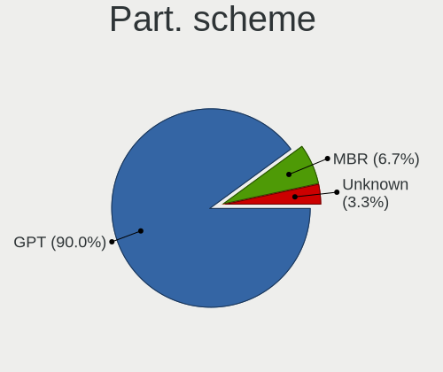
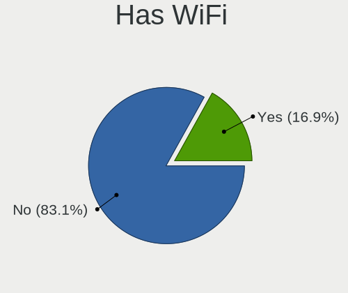
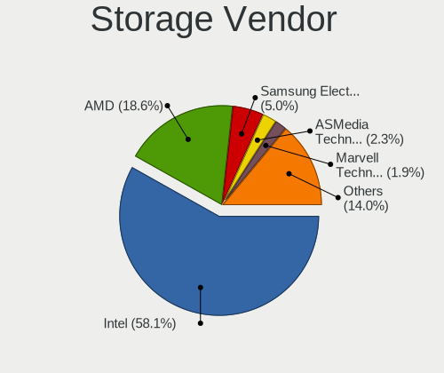
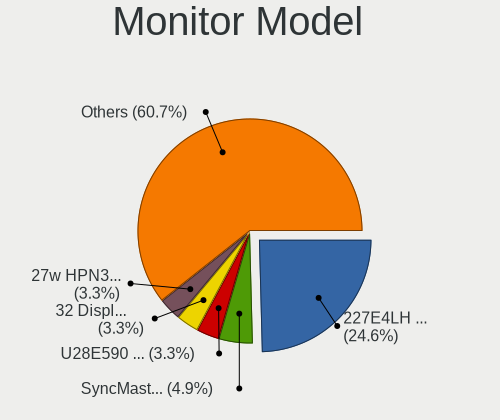
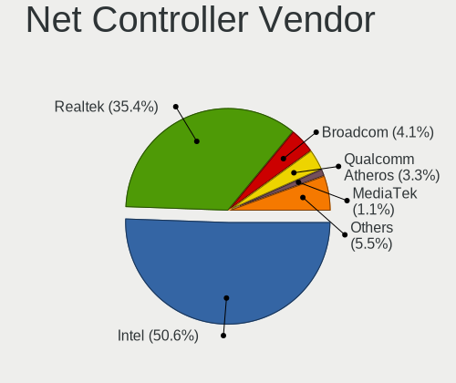
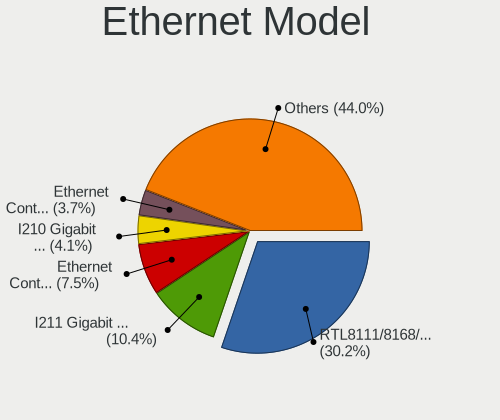
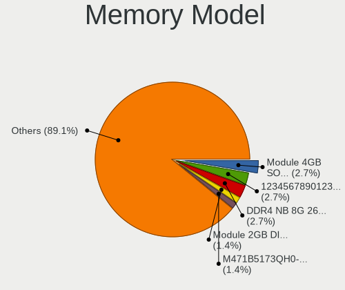
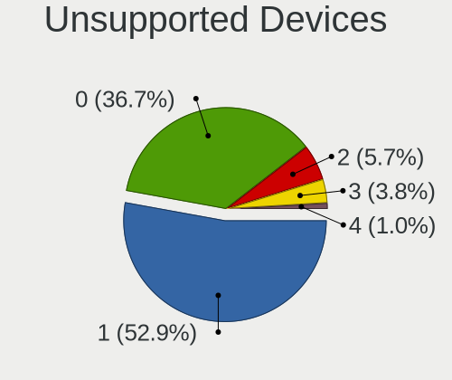

BSD in Italy - Tested Hardware & Statistics (Desktops)
------------------------------------------------------

A project to collect tested hardware configurations for BSD in Italy.

Anyone can contribute to this report by the [hw-probe](https://github.com/linuxhw/hw-probe/blob/master/INSTALL.BSD.md) tool:

    hw-probe -all -upload

Please contribute! Especially if your hardware is rare.

Contents
--------

* [ Test Cases ](#test-cases)

* [ System ](#system)
  - [ OS                       ](#os)
  - [ OS Family                ](#os-family)
  - [ Arch                     ](#arch)
  - [ DE                       ](#de)
  - [ Display Server           ](#display-server)
  - [ Display Manager          ](#display-manager)
  - [ OS Lang                  ](#os-lang)
  - [ Boot Mode                ](#boot-mode)
  - [ Filesystem               ](#filesystem)
  - [ Part. scheme             ](#part-scheme)

* [ Board ](#board)
  - [ Vendor                   ](#vendor)
  - [ Model                    ](#model)
  - [ Model Family             ](#model-family)
  - [ MFG Year                 ](#mfg-year)
  - [ Form Factor              ](#form-factor)
  - [ Coreboot                 ](#coreboot)
  - [ RAM Size                 ](#ram-size)
  - [ RAM Used                 ](#ram-used)
  - [ Total Drives             ](#total-drives)
  - [ Has CD-ROM               ](#has-cd-rom)
  - [ Has Ethernet             ](#has-ethernet)
  - [ Has WiFi                 ](#has-wifi)
  - [ Has Bluetooth            ](#has-bluetooth)

* [ Location ](#location)
  - [ Country                  ](#country)
  - [ City                     ](#city)

* [ Drives ](#drives)
  - [ Drive Vendor             ](#drive-vendor)
  - [ Drive Model              ](#drive-model)
  - [ HDD Vendor               ](#hdd-vendor)
  - [ SSD Vendor               ](#ssd-vendor)
  - [ Drive Kind               ](#drive-kind)
  - [ Drive Connector          ](#drive-connector)
  - [ Drive Size               ](#drive-size)
  - [ Space Total              ](#space-total)
  - [ Space Used               ](#space-used)
  - [ Malfunc. Drives          ](#malfunc-drives)
  - [ Malfunc. Drive Vendor    ](#malfunc-drive-vendor)
  - [ Malfunc. HDD Vendor      ](#malfunc-hdd-vendor)
  - [ Malfunc. Drive Kind      ](#malfunc-drive-kind)
  - [ Failed Drives            ](#failed-drives)
  - [ Failed Drive Vendor      ](#failed-drive-vendor)
  - [ Drive Status             ](#drive-status)

* [ Storage controller ](#storage-controller)
  - [ Storage Vendor           ](#storage-vendor)
  - [ Storage Model            ](#storage-model)
  - [ Storage Kind             ](#storage-kind)

* [ Processor ](#processor)
  - [ CPU Vendor               ](#cpu-vendor)
  - [ CPU Model                ](#cpu-model)
  - [ CPU Model Family         ](#cpu-model-family)
  - [ CPU Cores                ](#cpu-cores)
  - [ CPU Sockets              ](#cpu-sockets)
  - [ CPU Threads              ](#cpu-threads)
  - [ CPU Microarch            ](#cpu-microarch)

* [ Graphics ](#graphics)
  - [ GPU Vendor               ](#gpu-vendor)
  - [ GPU Model                ](#gpu-model)
  - [ GPU Combo                ](#gpu-combo)
  - [ GPU Driver               ](#gpu-driver)
  - [ GPU Memory               ](#gpu-memory)

* [ Monitor ](#monitor)
  - [ Monitor Vendor           ](#monitor-vendor)
  - [ Monitor Model            ](#monitor-model)
  - [ Monitor Resolution       ](#monitor-resolution)
  - [ Monitor Diagonal         ](#monitor-diagonal)
  - [ Monitor Width            ](#monitor-width)
  - [ Aspect Ratio             ](#aspect-ratio)
  - [ Monitor Area             ](#monitor-area)
  - [ Pixel Density            ](#pixel-density)
  - [ Multiple Monitors        ](#multiple-monitors)

* [ Network ](#network)
  - [ Net Controller Vendor    ](#net-controller-vendor)
  - [ Net Controller Model     ](#net-controller-model)
  - [ Wireless Vendor          ](#wireless-vendor)
  - [ Wireless Model           ](#wireless-model)
  - [ Ethernet Vendor          ](#ethernet-vendor)
  - [ Ethernet Model           ](#ethernet-model)
  - [ Net Controller Kind      ](#net-controller-kind)
  - [ Used Controller          ](#used-controller)
  - [ NICs                     ](#nics)
  - [ IPv6                     ](#ipv6)

* [ Bluetooth ](#bluetooth)
  - [ Bluetooth Vendor         ](#bluetooth-vendor)
  - [ Bluetooth Model          ](#bluetooth-model)

* [ Sound ](#sound)
  - [ Sound Vendor             ](#sound-vendor)
  - [ Sound Model              ](#sound-model)

* [ Memory ](#memory)
  - [ Memory Vendor            ](#memory-vendor)
  - [ Memory Model             ](#memory-model)
  - [ Memory Kind              ](#memory-kind)
  - [ Memory Form Factor       ](#memory-form-factor)
  - [ Memory Size              ](#memory-size)
  - [ Memory Speed             ](#memory-speed)

* [ Printers & scanners ](#printers--scanners)
  - [ Printer Vendor           ](#printer-vendor)
  - [ Printer Model            ](#printer-model)
  - [ Scanner Vendor           ](#scanner-vendor)
  - [ Scanner Model            ](#scanner-model)

* [ Camera ](#camera)
  - [ Camera Vendor            ](#camera-vendor)
  - [ Camera Model             ](#camera-model)

* [ Security ](#security)
  - [ Fingerprint Vendor       ](#fingerprint-vendor)
  - [ Fingerprint Model        ](#fingerprint-model)
  - [ Chipcard Vendor          ](#chipcard-vendor)
  - [ Chipcard Model           ](#chipcard-model)

* [ Unsupported ](#unsupported)
  - [ Unsupported Devices      ](#unsupported-devices)
  - [ Unsupported Device Types ](#unsupported-device-types)

Test Cases
----------

Total: 168

| Vendor        | Model                       | Probe                                                     | Date         |
|---------------|-----------------------------|-----------------------------------------------------------|--------------|
| Fujitsu       | D3041-A1 S26361-D3041-A1    | [2265227a5c](https://bsd-hardware.info/?probe=2265227a5c) | Dec 26, 2022 |
| MSI           | MS-7922                     | [95dbf4f7a8](https://bsd-hardware.info/?probe=95dbf4f7a8) | Dec 19, 2022 |
| Pegatron      | 2ACF                        | [511f2a6d16](https://bsd-hardware.info/?probe=511f2a6d16) | Dec 19, 2022 |
| Gigabyte      | N3160ND3V                   | [c84bedc821](https://bsd-hardware.info/?probe=c84bedc821) | Dec 15, 2022 |
| Fujitsu       | D3313-A1 S26361-D3313-A1    | [435807287e](https://bsd-hardware.info/?probe=435807287e) | Dec 15, 2022 |
| AZW           | U59                         | [9b22c68e98](https://bsd-hardware.info/?probe=9b22c68e98) | Dec 13, 2022 |
| ASUSTek       | PRIME Z390M-PLUS            | [7329e04c22](https://bsd-hardware.info/?probe=7329e04c22) | Nov 27, 2022 |
| ASUSTek       | P11C-X Series               | [6860cd72f8](https://bsd-hardware.info/?probe=6860cd72f8) | Nov 26, 2022 |
| ASUSTek       | P11C-X Series               | [cfdb06e761](https://bsd-hardware.info/?probe=cfdb06e761) | Nov 26, 2022 |
| Dell          | 0PTTT9 A01                  | [74575d6dfe](https://bsd-hardware.info/?probe=74575d6dfe) | Nov 25, 2022 |
| Dell          | 0VD5HY A00                  | [1a0df311e3](https://bsd-hardware.info/?probe=1a0df311e3) | Nov 07, 2022 |
| Gigabyte      | H270M-DS3H-CF               | [5784d8bed6](https://bsd-hardware.info/?probe=5784d8bed6) | Nov 04, 2022 |
| Acer          | Veriton X2610G              | [e4289c3f15](https://bsd-hardware.info/?probe=e4289c3f15) | Oct 24, 2022 |
| Unknown       | Unknown                     | [1188b56e14](https://bsd-hardware.info/?probe=1188b56e14) | Oct 19, 2022 |
| Unknown       | Unknown                     | [915c66f8bd](https://bsd-hardware.info/?probe=915c66f8bd) | Oct 19, 2022 |
| PC Engines    | apu4                        | [20cfd8a3c8](https://bsd-hardware.info/?probe=20cfd8a3c8) | Oct 17, 2022 |
| Pegatron      | 2ACF                        | [c57cc3a923](https://bsd-hardware.info/?probe=c57cc3a923) | Oct 17, 2022 |
| ASRock        | Q1900M                      | [7d0380e2d0](https://bsd-hardware.info/?probe=7d0380e2d0) | Oct 15, 2022 |
| ASRock        | J3355B-ITX                  | [d802705c1d](https://bsd-hardware.info/?probe=d802705c1d) | Oct 10, 2022 |
| ASRock        | B75M R2.0                   | [a28ea59f1f](https://bsd-hardware.info/?probe=a28ea59f1f) | Oct 07, 2022 |
| Unknown       | Unknown                     | [bdabafdcb1](https://bsd-hardware.info/?probe=bdabafdcb1) | Oct 01, 2022 |
| ASRock        | Q1900B-ITX                  | [81722a937a](https://bsd-hardware.info/?probe=81722a937a) | Sep 13, 2022 |
| HP            | 8648                        | [e7e610794c](https://bsd-hardware.info/?probe=e7e610794c) | Sep 12, 2022 |
| Fujitsu       | D3313-A1 S26361-D3313-A1    | [b54e6663f9](https://bsd-hardware.info/?probe=b54e6663f9) | Sep 10, 2022 |
| Intel         | J1900                       | [a95dd12c65](https://bsd-hardware.info/?probe=a95dd12c65) | Sep 06, 2022 |
| HP            | 1496                        | [7cd97bd330](https://bsd-hardware.info/?probe=7cd97bd330) | Sep 05, 2022 |
| PC Engines    | APU2                        | [d9216cb730](https://bsd-hardware.info/?probe=d9216cb730) | Sep 05, 2022 |
| HP            | 1496                        | [94e8713f6d](https://bsd-hardware.info/?probe=94e8713f6d) | Sep 03, 2022 |
| HP            | 1496                        | [1567aa1c21](https://bsd-hardware.info/?probe=1567aa1c21) | Sep 01, 2022 |
| Unknown       | HX90                        | [568468e95b](https://bsd-hardware.info/?probe=568468e95b) | Sep 01, 2022 |
| Fujitsu       | D3041-A1 S26361-D3041-A1    | [2349014a6c](https://bsd-hardware.info/?probe=2349014a6c) | Aug 29, 2022 |
| PC Engines    | APU2                        | [b3d60c2790](https://bsd-hardware.info/?probe=b3d60c2790) | Aug 22, 2022 |
| ASUSTek       | M4A87TD EVO                 | [c03da8657e](https://bsd-hardware.info/?probe=c03da8657e) | Aug 17, 2022 |
| PC Engines    | APU2                        | [028dc7aa20](https://bsd-hardware.info/?probe=028dc7aa20) | Aug 17, 2022 |
| Fujitsu       | D3313-A1 S26361-D3313-A1    | [1d4ccaabda](https://bsd-hardware.info/?probe=1d4ccaabda) | Aug 13, 2022 |
| Fujitsu       | D3041-A1 S26361-D3041-A1    | [17dc06ed68](https://bsd-hardware.info/?probe=17dc06ed68) | Aug 12, 2022 |
| Unknown       | Unknown                     | [af3d9689c2](https://bsd-hardware.info/?probe=af3d9689c2) | Aug 11, 2022 |
| Unknown       | Unknown                     | [5049417b7b](https://bsd-hardware.info/?probe=5049417b7b) | Aug 11, 2022 |
| Intel         | SKYBAY                      | [c7010b7ebc](https://bsd-hardware.info/?probe=c7010b7ebc) | Aug 09, 2022 |
| Unknown       | Unknown                     | [21cda0eb5d](https://bsd-hardware.info/?probe=21cda0eb5d) | Aug 09, 2022 |
| Intel         | SKYBAY                      | [bc7d4d8e1e](https://bsd-hardware.info/?probe=bc7d4d8e1e) | Aug 08, 2022 |
| Unknown       | Unknown                     | [df3667156b](https://bsd-hardware.info/?probe=df3667156b) | Aug 02, 2022 |
| Lex           | Pineview-D                  | [7d7195024e](https://bsd-hardware.info/?probe=7d7195024e) | Aug 02, 2022 |
| Intel         | Q3XXG4-P V1.0               | [d6a3d57165](https://bsd-hardware.info/?probe=d6a3d57165) | Jul 29, 2022 |
| PC Engines    | APU2                        | [bb5d45a75d](https://bsd-hardware.info/?probe=bb5d45a75d) | Jul 29, 2022 |
| Fujitsu       | D3313-A1 S26361-D3313-A1    | [e3655742ba](https://bsd-hardware.info/?probe=e3655742ba) | Jul 18, 2022 |
| Lenovo        | SHARKBAY SDK0E50510 WIN     | [4b9e0bb7bb](https://bsd-hardware.info/?probe=4b9e0bb7bb) | Jul 18, 2022 |
| Fujitsu       | D3313-A1 S26361-D3313-A1    | [af1e80d15d](https://bsd-hardware.info/?probe=af1e80d15d) | Jul 18, 2022 |
| ASUSTek       | M4A785TD-M EVO              | [def87ec245](https://bsd-hardware.info/?probe=def87ec245) | Jul 18, 2022 |
| ASUSTek       | PRIME H410M-A               | [7b6faf5301](https://bsd-hardware.info/?probe=7b6faf5301) | Jul 14, 2022 |
| ASUSTek       | PRIME H410M-A               | [ba243fa7c4](https://bsd-hardware.info/?probe=ba243fa7c4) | Jul 09, 2022 |
| Fujitsu       | D3041-A1 S26361-D3041-A1    | [d3aba12432](https://bsd-hardware.info/?probe=d3aba12432) | Jul 09, 2022 |
| ASRock        | B75M R2.0                   | [6011c70ca4](https://bsd-hardware.info/?probe=6011c70ca4) | Jul 07, 2022 |
| HP            | 0A98h                       | [655fc531fb](https://bsd-hardware.info/?probe=655fc531fb) | Jun 30, 2022 |
| Pegatron      | 2ACF                        | [e461a4559d](https://bsd-hardware.info/?probe=e461a4559d) | Jun 29, 2022 |
| HP            | 304Bh                       | [8a3151b3cd](https://bsd-hardware.info/?probe=8a3151b3cd) | Jun 16, 2022 |
| NF692         | 1.0                         | [e87866bf5a](https://bsd-hardware.info/?probe=e87866bf5a) | Jun 10, 2022 |
| ASUSTek       | PRIME H410M-E               | [8099e7abaf](https://bsd-hardware.info/?probe=8099e7abaf) | Jun 03, 2022 |
| HP            | ProLiant MicroServer Gen... | [4b3b7a0929](https://bsd-hardware.info/?probe=4b3b7a0929) | May 31, 2022 |
| HP            | ProLiant MicroServer Gen... | [5d3db8382f](https://bsd-hardware.info/?probe=5d3db8382f) | May 31, 2022 |
| T-bao         | MINI PC V1.0                | [a89b2081bb](https://bsd-hardware.info/?probe=a89b2081bb) | May 25, 2022 |
| ASUSTek       | PRIME B550M-K               | [ce5ddde5ad](https://bsd-hardware.info/?probe=ce5ddde5ad) | May 18, 2022 |
| Protectli     | FW4B Ver                    | [2769c8f286](https://bsd-hardware.info/?probe=2769c8f286) | May 17, 2022 |
| Fujitsu       | D3041-A1 S26361-D3041-A1    | [5ff176fff8](https://bsd-hardware.info/?probe=5ff176fff8) | May 05, 2022 |
| ASUSTek       | M4A88TD-V EVO/USB3          | [12cc40cc60](https://bsd-hardware.info/?probe=12cc40cc60) | Apr 23, 2022 |
| Pegatron      | Benicia                     | [9045b4f449](https://bsd-hardware.info/?probe=9045b4f449) | Apr 16, 2022 |
| ASUSTek       | PRIME Z390M-PLUS            | [680303f943](https://bsd-hardware.info/?probe=680303f943) | Apr 16, 2022 |
| ASUSTek       | PRIME Z390M-PLUS            | [47d17d48a7](https://bsd-hardware.info/?probe=47d17d48a7) | Apr 15, 2022 |
| ShenZhen M... | MW-NANO-APL-4L              | [fbdd8d4f48](https://bsd-hardware.info/?probe=fbdd8d4f48) | Apr 05, 2022 |
| HP            | 212B                        | [33e7c65907](https://bsd-hardware.info/?probe=33e7c65907) | Apr 04, 2022 |
| Gigabyte      | X570 AORUS PRO              | [3877a33214](https://bsd-hardware.info/?probe=3877a33214) | Apr 02, 2022 |
| Gigabyte      | X570 AORUS PRO              | [3da637e3c6](https://bsd-hardware.info/?probe=3da637e3c6) | Apr 02, 2022 |
| Fujitsu       | D3041-A1 S26361-D3041-A1    | [7b79164c18](https://bsd-hardware.info/?probe=7b79164c18) | Apr 01, 2022 |
| Unknown       | Unknown                     | [bddd5d8963](https://bsd-hardware.info/?probe=bddd5d8963) | Mar 18, 2022 |
| Unknown       | Unknown                     | [65ada9d5da](https://bsd-hardware.info/?probe=65ada9d5da) | Mar 11, 2022 |
| HP            | 3397                        | [841ed56816](https://bsd-hardware.info/?probe=841ed56816) | Mar 02, 2022 |
| Pegatron      | 2ACF                        | [e098f52d51](https://bsd-hardware.info/?probe=e098f52d51) | Feb 19, 2022 |
| MSI           | B450 GAMING PLUS MAX        | [df6278638e](https://bsd-hardware.info/?probe=df6278638e) | Feb 15, 2022 |
| Intel         | Q3XXG4-P V1.0               | [ea7cf2885f](https://bsd-hardware.info/?probe=ea7cf2885f) | Feb 13, 2022 |
| MSI           | B450 GAMING PLUS MAX        | [6997de25f9](https://bsd-hardware.info/?probe=6997de25f9) | Feb 11, 2022 |
| MW            | GMLK-2_5G4L                 | [7a3744a41a](https://bsd-hardware.info/?probe=7a3744a41a) | Feb 07, 2022 |
| Dell          | 0TK7TF A00                  | [d13ca7163c](https://bsd-hardware.info/?probe=d13ca7163c) | Jan 30, 2022 |
| Intel         | D2500CC AAG81477-401        | [f4d8bd7979](https://bsd-hardware.info/?probe=f4d8bd7979) | Jan 30, 2022 |
| Fujitsu       | D3028-A1 S26361-D3028-A1    | [f7e7df9416](https://bsd-hardware.info/?probe=f7e7df9416) | Jan 30, 2022 |
| Fujitsu       | D3028-A1 S26361-D3028-A1    | [fc63aa695e](https://bsd-hardware.info/?probe=fc63aa695e) | Jan 27, 2022 |
| PC Engines    | APU2                        | [52bd5dc1ce](https://bsd-hardware.info/?probe=52bd5dc1ce) | Jan 26, 2022 |
| ASUSTek       | BM6835_BM6635_BP6335        | [73562aa169](https://bsd-hardware.info/?probe=73562aa169) | Jan 25, 2022 |
| Fujitsu       | D3041-A1 S26361-D3041-A1    | [ed9f5d1a27](https://bsd-hardware.info/?probe=ed9f5d1a27) | Jan 15, 2022 |
| PC Engines    | APU2                        | [c2b05fc937](https://bsd-hardware.info/?probe=c2b05fc937) | Jan 14, 2022 |
| ASRock        | B75M R2.0                   | [7b99b0eaa6](https://bsd-hardware.info/?probe=7b99b0eaa6) | Jan 10, 2022 |
| Fujitsu       | D3041-A1 S26361-D3041-A1    | [7a43524381](https://bsd-hardware.info/?probe=7a43524381) | Dec 13, 2021 |
| Gigabyte      | H270M-DS3H-CF               | [50fba6deda](https://bsd-hardware.info/?probe=50fba6deda) | Dec 11, 2021 |
| Gigabyte      | H270M-DS3H-CF               | [a084ff48c2](https://bsd-hardware.info/?probe=a084ff48c2) | Dec 09, 2021 |
| Gigabyte      | H270M-DS3H-CF               | [17b557d792](https://bsd-hardware.info/?probe=17b557d792) | Dec 08, 2021 |
| Fujitsu       | D3041-A1 S26361-D3041-A1    | [ddcab97db2](https://bsd-hardware.info/?probe=ddcab97db2) | Dec 03, 2021 |
| T-bao         | MINI PC V1.0                | [4ee7de3597](https://bsd-hardware.info/?probe=4ee7de3597) | Nov 12, 2021 |
| Intel         | Q3XXG4-P V1.0               | [22a18ba45e](https://bsd-hardware.info/?probe=22a18ba45e) | Nov 08, 2021 |
| Pegatron      | 2ACF                        | [ca23d3bbf0](https://bsd-hardware.info/?probe=ca23d3bbf0) | Oct 13, 2021 |
| ASUSTek       | PRIME Z390M-PLUS            | [b3b31d25b0](https://bsd-hardware.info/?probe=b3b31d25b0) | Oct 13, 2021 |
| Pegatron      | 2ACF                        | [97aa5e56e4](https://bsd-hardware.info/?probe=97aa5e56e4) | Oct 12, 2021 |
| ASUSTek       | PRIME Z390M-PLUS            | [5a7c1871b1](https://bsd-hardware.info/?probe=5a7c1871b1) | Oct 11, 2021 |
| Acer          | Veriton X2610G              | [1e9ed23164](https://bsd-hardware.info/?probe=1e9ed23164) | Oct 03, 2021 |
| ASRock        | B75M R2.0                   | [51b47d9321](https://bsd-hardware.info/?probe=51b47d9321) | Sep 27, 2021 |
| ASRock        | B75M R2.0                   | [de031313ff](https://bsd-hardware.info/?probe=de031313ff) | Sep 27, 2021 |
| Gigabyte      | H270M-DS3H-CF               | [9b046b157e](https://bsd-hardware.info/?probe=9b046b157e) | Sep 17, 2021 |
| ASRock        | B75M R2.0                   | [0d23147c7d](https://bsd-hardware.info/?probe=0d23147c7d) | Sep 17, 2021 |
| ASRock        | B75M R2.0                   | [e0ae9af4ab](https://bsd-hardware.info/?probe=e0ae9af4ab) | Sep 15, 2021 |
| Gigabyte      | H270M-DS3H-CF               | [bc2a287495](https://bsd-hardware.info/?probe=bc2a287495) | Sep 13, 2021 |
| Unknown       | YL-J3160L4                  | [861a1f7012](https://bsd-hardware.info/?probe=861a1f7012) | Aug 25, 2021 |
| MSI           | MS-B1591                    | [679b2010e9](https://bsd-hardware.info/?probe=679b2010e9) | Aug 03, 2021 |
| MSI           | MS-B1591                    | [b370a74ec0](https://bsd-hardware.info/?probe=b370a74ec0) | Aug 02, 2021 |
| Gigabyte      | P55A-UD3                    | [dc1b4d8a6b](https://bsd-hardware.info/?probe=dc1b4d8a6b) | Jul 16, 2021 |
| ASRock        | B75M R2.0                   | [d51149c1d5](https://bsd-hardware.info/?probe=d51149c1d5) | Jul 13, 2021 |
| Lenovo        | SHARKBAY SDK0E50510 WIN     | [6cf3337855](https://bsd-hardware.info/?probe=6cf3337855) | Jul 01, 2021 |
| MSI           | B450 GAMING PLUS MAX        | [f0e80b0788](https://bsd-hardware.info/?probe=f0e80b0788) | Jun 28, 2021 |
| PC Engines    | APU2                        | [dde9077545](https://bsd-hardware.info/?probe=dde9077545) | Jun 24, 2021 |
| Unknown       | Unknown                     | [822df8eb91](https://bsd-hardware.info/?probe=822df8eb91) | May 11, 2021 |
| Unknown       | Unknown                     | [cc17eea606](https://bsd-hardware.info/?probe=cc17eea606) | May 10, 2021 |
| ASUSTek       | IP4BL-ME-Oli                | [e26ecef661](https://bsd-hardware.info/?probe=e26ecef661) | May 03, 2021 |
| MSI           | B450-A PRO                  | [ed656e816f](https://bsd-hardware.info/?probe=ed656e816f) | May 01, 2021 |
| Unknown       | Unknown                     | [df793cf09f](https://bsd-hardware.info/?probe=df793cf09f) | Apr 08, 2021 |
| Unknown       | Unknown                     | [f8ba0ba112](https://bsd-hardware.info/?probe=f8ba0ba112) | Apr 08, 2021 |
| Lenovo        | SHARKBAY SDK0E50510 WIN     | [62376c16a4](https://bsd-hardware.info/?probe=62376c16a4) | Mar 31, 2021 |
| Intel         | CRESCENTBAY                 | [5a7ba137e0](https://bsd-hardware.info/?probe=5a7ba137e0) | Mar 27, 2021 |
| Acer          | EG43M                       | [0bc978756c](https://bsd-hardware.info/?probe=0bc978756c) | Mar 27, 2021 |
| Lenovo        | SHARKBAY SDK0E50510 WIN     | [f9c3fc3b84](https://bsd-hardware.info/?probe=f9c3fc3b84) | Mar 19, 2021 |
| Lenovo        | SHARKBAY SDK0E50510 WIN     | [5ae508dfa8](https://bsd-hardware.info/?probe=5ae508dfa8) | Mar 19, 2021 |
| ASUSTek       | PRIME Z390M-PLUS            | [0a3b290f9f](https://bsd-hardware.info/?probe=0a3b290f9f) | Mar 15, 2021 |
| ASUSTek       | M4A88TD-V EVO/USB3          | [1c30f7523f](https://bsd-hardware.info/?probe=1c30f7523f) | Mar 15, 2021 |
| PC Engines    | APU3                        | [822a83f208](https://bsd-hardware.info/?probe=822a83f208) | Mar 11, 2021 |
| ASUSTek       | IP4BL-ME-Oli                | [c672201bcb](https://bsd-hardware.info/?probe=c672201bcb) | Mar 10, 2021 |
| Lenovo        | SHARKBAY SDK0E50510 WIN     | [66a223add9](https://bsd-hardware.info/?probe=66a223add9) | Mar 08, 2021 |
| Dell          | 0R849J A00                  | [1bd1dc24c9](https://bsd-hardware.info/?probe=1bd1dc24c9) | Mar 06, 2021 |
| Foxconn       | 2ADA                        | [10d02d0982](https://bsd-hardware.info/?probe=10d02d0982) | Mar 03, 2021 |
| Intel         | MAHOBAY                     | [3c5bd7b7f8](https://bsd-hardware.info/?probe=3c5bd7b7f8) | Mar 02, 2021 |
| Intel         | MAHOBAY                     | [04e66ca239](https://bsd-hardware.info/?probe=04e66ca239) | Mar 02, 2021 |
| Intel         | MAHOBAY                     | [50652a4263](https://bsd-hardware.info/?probe=50652a4263) | Feb 26, 2021 |
| ASUSTek       | PRIME Z390M-PLUS            | [58c6bf426e](https://bsd-hardware.info/?probe=58c6bf426e) | Feb 22, 2021 |
| Intel         | MAHOBAY                     | [5257239fdc](https://bsd-hardware.info/?probe=5257239fdc) | Feb 20, 2021 |
| HARDKERNEL    | ODROID-H2                   | [6fe9279f1f](https://bsd-hardware.info/?probe=6fe9279f1f) | Feb 18, 2021 |
| ASUSTek       | PRIME Z390M-PLUS            | [c996e74ebc](https://bsd-hardware.info/?probe=c996e74ebc) | Feb 14, 2021 |
| Dell          | 06NWYK A00                  | [32acfb4467](https://bsd-hardware.info/?probe=32acfb4467) | Feb 13, 2021 |
| ASUSTek       | P8H61-M LE                  | [b861820636](https://bsd-hardware.info/?probe=b861820636) | Feb 13, 2021 |
| Dell          | 06NWYK A00                  | [2ff05af403](https://bsd-hardware.info/?probe=2ff05af403) | Feb 13, 2021 |
| ASUSTek       | P8H61-M LE                  | [3a3d7d0701](https://bsd-hardware.info/?probe=3a3d7d0701) | Feb 12, 2021 |
| ASUSTek       | P8Z77-V PRO/THUNDERBOLT     | [6fdcef7c9e](https://bsd-hardware.info/?probe=6fdcef7c9e) | Feb 10, 2021 |
| ASUSTek       | PRIME X470-PRO              | [a77e980850](https://bsd-hardware.info/?probe=a77e980850) | Feb 09, 2021 |
| ASUSTek       | IP4BL-ME-Oli                | [4d225e7ebe](https://bsd-hardware.info/?probe=4d225e7ebe) | Feb 04, 2021 |
| Intel         | CRESCENTBAY                 | [f813782c8a](https://bsd-hardware.info/?probe=f813782c8a) | Jan 29, 2021 |
| Sun Micros... | Ultra 24 50                 | [622589c8e7](https://bsd-hardware.info/?probe=622589c8e7) | Jan 22, 2021 |
| Sun Micros... | Ultra 24 50                 | [7a3cb6a061](https://bsd-hardware.info/?probe=7a3cb6a061) | Jan 22, 2021 |
| ASUSTek       | M4A87TD EVO                 | [12ea57f317](https://bsd-hardware.info/?probe=12ea57f317) | Jan 22, 2021 |
| Dell          | 088DT1 A01                  | [fcc759e013](https://bsd-hardware.info/?probe=fcc759e013) | Jan 21, 2021 |
| ASRock        | H81 Pro BTC                 | [afb7cd1f1a](https://bsd-hardware.info/?probe=afb7cd1f1a) | Jan 20, 2021 |
| Intel         | CRESCENTBAY                 | [92577053eb](https://bsd-hardware.info/?probe=92577053eb) | Jan 20, 2021 |
| Intel         | CRESCENTBAY                 | [33a6dda088](https://bsd-hardware.info/?probe=33a6dda088) | Jan 20, 2021 |
| PC Engines    | APU2                        | [a178f8eb47](https://bsd-hardware.info/?probe=a178f8eb47) | Jan 19, 2021 |
| MSI           | Boston                      | [aa9d7bae21](https://bsd-hardware.info/?probe=aa9d7bae21) | Jan 17, 2021 |
| MSI           | Boston                      | [f21954fa35](https://bsd-hardware.info/?probe=f21954fa35) | Jan 17, 2021 |
| Supermicro    | X8STi                       | [7d0e121099](https://bsd-hardware.info/?probe=7d0e121099) | Jan 15, 2021 |
| Unknown       | Unknown                     | [8668b1d651](https://bsd-hardware.info/?probe=8668b1d651) | Dec 17, 2020 |
| Unknown       | Unknown                     | [d2cdc0fc7f](https://bsd-hardware.info/?probe=d2cdc0fc7f) | Nov 29, 2020 |
| Unknown       | Unknown                     | [aee9f448af](https://bsd-hardware.info/?probe=aee9f448af) | Nov 25, 2020 |
| Intel         | D945GCLF2                   | [58678b0643](https://bsd-hardware.info/?probe=58678b0643) | Oct 30, 2020 |
| Intel         | D945GCLF2                   | [3354fb903b](https://bsd-hardware.info/?probe=3354fb903b) | Oct 30, 2020 |
| Gigabyte      | X570 AORUS ELITE            | [973b62551f](https://bsd-hardware.info/?probe=973b62551f) | Oct 30, 2020 |
| AZW           | BT3 X                       | [b9f23ee753](https://bsd-hardware.info/?probe=b9f23ee753) | Oct 30, 2020 |
| ASRock        | 990FX Extreme9              | [6c0bba6d4f](https://bsd-hardware.info/?probe=6c0bba6d4f) | Jun 26, 2020 |

System
------

OS
--

Installed operating systems

| Name              | Desktops | Percent |
|-------------------|----------|---------|
| OpenBSD 7.1       | 8        | 6.4%    |
| helloSystem 0.4.0 | 7        | 5.6%    |
| OPNsense 22.7     | 6        | 4.8%    |
| helloSystem 0.7.0 | 6        | 4.8%    |
| OPNsense 22.7.9   | 4        | 3.2%    |
| OPNsense 22.7.6   | 4        | 3.2%    |
| OPNsense 22.1     | 4        | 3.2%    |
| OPNsense 21.1     | 4        | 3.2%    |
| helloSystem 0.5.0 | 4        | 3.2%    |
| OPNsense 22.7.3   | 3        | 2.4%    |
| OPNsense 22.1.9   | 3        | 2.4%    |
| OPNsense 22.1.10  | 3        | 2.4%    |
| OPNsense 21.7.3   | 3        | 2.4%    |
| helloSystem 0.6.0 | 3        | 2.4%    |
| helloSystem 0.3.0 | 3        | 2.4%    |
| OPNsense 22.7.5   | 2        | 1.6%    |
| OPNsense 22.7.4   | 2        | 1.6%    |
| OPNsense 22.7.2   | 2        | 1.6%    |
| OPNsense 22.7.1   | 2        | 1.6%    |
| OPNsense 22.1.8   | 2        | 1.6%    |
| OPNsense 22.1.6   | 2        | 1.6%    |
| OPNsense 22.1.4   | 2        | 1.6%    |
| OPNsense 21.7.7   | 2        | 1.6%    |
| OPNsense 21.1.3   | 2        | 1.6%    |
| OPNsense 21.1.2   | 2        | 1.6%    |
| OPNsense 20.7.8   | 2        | 1.6%    |
| OpenBSD 6.8       | 2        | 1.6%    |
| NomadBSD 1.4      | 2        | 1.6%    |
| helloSystem 0.8.0 | 2        | 1.6%    |
| FreeBSD 13.1-p2   | 2        | 1.6%    |
| FreeBSD 12.3-p1   | 2        | 1.6%    |
| XigmaNAS 12.3-p6  | 1        | 0.8%    |
| OPNsense 22.7.10  | 1        | 0.8%    |
| OPNsense 22.1.7   | 1        | 0.8%    |
| OPNsense 22.1.3   | 1        | 0.8%    |
| OPNsense 22.1.2   | 1        | 0.8%    |
| OPNsense 21.7.8   | 1        | 0.8%    |
| OPNsense 21.7.6   | 1        | 0.8%    |
| OPNsense 21.7.4   | 1        | 0.8%    |
| OPNsense 21.7.1   | 1        | 0.8%    |

OS Family
---------

OS without a version

| Name        | Desktops | Percent |
|-------------|----------|---------|
| OPNsense    | 44       | 48.35%  |
| helloSystem | 17       | 18.68%  |
| FreeBSD     | 14       | 15.38%  |
| OpenBSD     | 11       | 12.09%  |
| NomadBSD    | 2        | 2.2%    |
| NetBSD      | 2        | 2.2%    |
| XigmaNAS    | 1        | 1.1%    |

Arch
----

OS architecture (x86_64, i586, etc.)

| Name   | Desktops | Percent |
|--------|----------|---------|
| amd64  | 88       | 96.7%   |
| evbarm | 2        | 2.2%    |
| i386   | 1        | 1.1%    |

DE
--

Desktop Environment

| Name          | Desktops | Percent |
|---------------|----------|---------|
| Console       | 49       | 53.85%  |
| helloDesktop  | 23       | 25.27%  |
| XFCE          | 4        | 4.4%    |
| MATE          | 4        | 4.4%    |
| TWM           | 2        | 2.2%    |
| Openbox       | 2        | 2.2%    |
| KDE5          | 2        | 2.2%    |
| fvwm          | 2        | 2.2%    |
| xfwm          | 1        | 1.1%    |
| Enlightenment | 1        | 1.1%    |
| CTWM          | 1        | 1.1%    |

Display Server
--------------

X11 or Wayland

| Name    | Desktops | Percent |
|---------|----------|---------|
| Console | 52       | 56.52%  |
| X11     | 40       | 43.48%  |

Display Manager
---------------

SDDM, LightDM, etc.

| Name    | Desktops | Percent |
|---------|----------|---------|
| Console | 67       | 73.63%  |
| SLiM    | 22       | 24.18%  |
| LightDM | 2        | 2.2%    |

OS Lang
-------

Language

| Lang             | Desktops | Percent |
|------------------|----------|---------|
| Unknown          | 59       | 64.13%  |
| en_US            | 20       | 21.74%  |
| it_IT            | 6        | 6.52%   |
| C                | 6        | 6.52%   |
| it_IT.ISO8859-15 | 1        | 1.09%   |

Boot Mode
---------

EFI or BIOS

| Mode | Desktops | Percent |
|------|----------|---------|
| EFI  | 71       | 76.34%  |
| BIOS | 22       | 23.66%  |

Filesystem
----------

Type of filesystem

| Type   | Desktops | Percent |
|--------|----------|---------|
| Ufs    | 48       | 50.53%  |
| Zfs    | 31       | 32.63%  |
| Ffs    | 11       | 11.58%  |
| Cd9660 | 5        | 5.26%   |

Part. scheme
------------

Scheme of partitioning

| Type    | Desktops | Percent |
|---------|----------|---------|
| GPT     | 78       | 83.87%  |
| MBR     | 13       | 13.98%  |
| Unknown | 2        | 2.15%   |

Board
-----

Vendor
------

Motherboard manufacturer

| Name                       | Desktops | Percent |
|----------------------------|----------|---------|
| ASUSTek Computer           | 17       | 18.68%  |
| Unknown                    | 10       | 10.99%  |
| Intel                      | 8        | 8.79%   |
| Hewlett-Packard            | 7        | 7.69%   |
| Dell                       | 6        | 6.59%   |
| ASRock                     | 6        | 6.59%   |
| PC Engines                 | 5        | 5.49%   |
| MSI                        | 5        | 5.49%   |
| Gigabyte Technology        | 5        | 5.49%   |
| Fujitsu                    | 4        | 4.4%    |
| Pegatron                   | 2        | 2.2%    |
| Lenovo                     | 2        | 2.2%    |
| AZW                        | 2        | 2.2%    |
| Acer                       | 2        | 2.2%    |
| T-bao                      | 1        | 1.1%    |
| Supermicro                 | 1        | 1.1%    |
| Sun Microsystems           | 1        | 1.1%    |
| ShenZhen MinWin Technology | 1        | 1.1%    |
| Protectli                  | 1        | 1.1%    |
| NF692                      | 1        | 1.1%    |
| MW                         | 1        | 1.1%    |
| Lex                        | 1        | 1.1%    |
| HARDKERNEL                 | 1        | 1.1%    |
| Foxconn                    | 1        | 1.1%    |

Model
-----

Motherboard model

| Name                                    | Desktops | Percent |
|-----------------------------------------|----------|---------|
| Unknown                                 | 10       | 10.99%  |
| PC Engines APU2                         | 3        | 3.3%    |
| MSI MS-7B86                             | 2        | 2.2%    |
| Lenovo ThinkCentre M83 10AHS35Q00       | 2        | 2.2%    |
| Intel Q3XXG4-P V1.0                     | 2        | 2.2%    |
| Fujitsu FUTRO S920                      | 2        | 2.2%    |
| ASUS PRIME H410M-A                      | 2        | 2.2%    |
| ASUS M4A88TD-V EVO/USB3                 | 2        | 2.2%    |
| ASUS IP4BL-ME                           | 2        | 2.2%    |
| T-bao MINI PC                           | 1        | 1.1%    |
| Supermicro X8STi                        | 1        | 1.1%    |
| Sun Microsystems Ultra 24               | 1        | 1.1%    |
| ShenZhen MinWin MW-NANO-APL-4L          | 1        | 1.1%    |
| Protectli FW4B                          | 1        | 1.1%    |
| Pegatron Pro 3405 Series                | 1        | 1.1%    |
| Pegatron KX629AA-ABZ a6561.it           | 1        | 1.1%    |
| PC Engines apu4                         | 1        | 1.1%    |
| PC Engines APU3                         | 1        | 1.1%    |
| NF692 1.0                               | 1        | 1.1%    |
| MW GMLK-2_5G4L                          | 1        | 1.1%    |
| MSI NR074AA-ABZ CQ5125IT                | 1        | 1.1%    |
| MSI MS-7922                             | 1        | 1.1%    |
| MSI KBL-U Pro Cubi 3 Silent S (MS-B159) | 1        | 1.1%    |
| Lex Pineview-D                          | 1        | 1.1%    |
| Intel NCB-4210WG                        | 1        | 1.1%    |
| Intel MAHOBAY                           | 1        | 1.1%    |
| Intel J1900                             | 1        | 1.1%    |
| Intel D945GCLF2                         | 1        | 1.1%    |
| Intel D2500CC AAG81477-401              | 1        | 1.1%    |
| Intel CRESCENTBAY                       | 1        | 1.1%    |
| HP Z440 Workstation                     | 1        | 1.1%    |
| HP xw8600 Workstation                   | 1        | 1.1%    |
| HP Slim Desktop S01-aF2xxx              | 1        | 1.1%    |
| HP ProLiant MicroServer Gen8            | 1        | 1.1%    |
| HP Compaq Elite 8300 SFF                | 1        | 1.1%    |
| HP Compaq 8200 Elite USDT PC            | 1        | 1.1%    |
| HP Compaq 8100 Elite CMT PC             | 1        | 1.1%    |
| HARDKERNEL ODROID-H2                    | 1        | 1.1%    |
| Gigabyte X570 AORUS PRO                 | 1        | 1.1%    |
| Gigabyte X570 AORUS ELITE               | 1        | 1.1%    |

Model Family
------------

Motherboard model prefix

| Name                           | Desktops | Percent |
|--------------------------------|----------|---------|
| Unknown                        | 10       | 10.99%  |
| ASUS PRIME                     | 6        | 6.59%   |
| PC Engines APU2                | 3        | 3.3%    |
| HP Compaq                      | 3        | 3.3%    |
| MSI MS-7B86                    | 2        | 2.2%    |
| Lenovo ThinkCentre             | 2        | 2.2%    |
| Intel Q3XXG4-P                 | 2        | 2.2%    |
| Gigabyte X570                  | 2        | 2.2%    |
| Fujitsu FUTRO                  | 2        | 2.2%    |
| Fujitsu ESPRIMO                | 2        | 2.2%    |
| Dell Precision                 | 2        | 2.2%    |
| ASUS M4A88TD-V                 | 2        | 2.2%    |
| ASUS IP4BL-ME                  | 2        | 2.2%    |
| T-bao MINI                     | 1        | 1.1%    |
| Supermicro X8STi               | 1        | 1.1%    |
| Sun Microsystems Ultra         | 1        | 1.1%    |
| ShenZhen MinWin MW-NANO-APL-4L | 1        | 1.1%    |
| Protectli FW4B                 | 1        | 1.1%    |
| Pegatron Pro                   | 1        | 1.1%    |
| Pegatron KX629AA-ABZ           | 1        | 1.1%    |
| PC Engines apu4                | 1        | 1.1%    |
| PC Engines APU3                | 1        | 1.1%    |
| NF692 1.0                      | 1        | 1.1%    |
| MW GMLK-2                      | 1        | 1.1%    |
| MSI NR074AA-ABZ                | 1        | 1.1%    |
| MSI MS-7922                    | 1        | 1.1%    |
| MSI KBL-U                      | 1        | 1.1%    |
| Lex Pineview-D                 | 1        | 1.1%    |
| Intel NCB-4210WG               | 1        | 1.1%    |
| Intel MAHOBAY                  | 1        | 1.1%    |
| Intel J1900                    | 1        | 1.1%    |
| Intel D945GCLF2                | 1        | 1.1%    |
| Intel D2500CC                  | 1        | 1.1%    |
| Intel CRESCENTBAY              | 1        | 1.1%    |
| HP Z440                        | 1        | 1.1%    |
| HP xw8600                      | 1        | 1.1%    |
| HP Slim                        | 1        | 1.1%    |
| HP ProLiant                    | 1        | 1.1%    |
| HARDKERNEL ODROID-H2           | 1        | 1.1%    |
| Gigabyte P55A-UD3              | 1        | 1.1%    |

MFG Year
--------

Motherboard manufacture year

| Year    | Desktops | Percent |
|---------|----------|---------|
| 2019    | 8        | 8.79%   |
| 2016    | 8        | 8.79%   |
| 2014    | 8        | 8.79%   |
| 2012    | 8        | 8.79%   |
| 2010    | 8        | 8.79%   |
| 2018    | 7        | 7.69%   |
| 2011    | 7        | 7.69%   |
| 2021    | 6        | 6.59%   |
| 2020    | 6        | 6.59%   |
| 2017    | 5        | 5.49%   |
| 2008    | 5        | 5.49%   |
| 2022    | 4        | 4.4%    |
| 2009    | 4        | 4.4%    |
| 2015    | 3        | 3.3%    |
| Unknown | 3        | 3.3%    |
| 2013    | 1        | 1.1%    |

Form Factor
-----------

Physical design of the computer

| Name    | Desktops | Percent |
|---------|----------|---------|
| Desktop | 91       | 100%    |

Coreboot
--------

Have coreboot on board

| Used | Desktops | Percent |
|------|----------|---------|
| No   | 86       | 94.51%  |
| Yes  | 5        | 5.49%   |

RAM Size
--------

Total RAM memory

| Size in GB  | Desktops | Percent |
|-------------|----------|---------|
| 8.01-16.0   | 38       | 41.3%   |
| 4.01-8.0    | 22       | 23.91%  |
| 16.01-24.0  | 13       | 14.13%  |
| 2.01-3.0    | 7        | 7.61%   |
| 32.01-64.0  | 6        | 6.52%   |
| 24.01-32.0  | 2        | 2.17%   |
| 64.01-256.0 | 2        | 2.17%   |
| 3.01-4.0    | 1        | 1.09%   |
| 0.51-1.0    | 1        | 1.09%   |

RAM Used
--------

Used RAM memory

| Used GB  | Desktops | Percent |
|----------|----------|---------|
| 0.01-0.5 | 57       | 61.96%  |
| 0.51-1.0 | 25       | 27.17%  |
| 1.01-2.0 | 5        | 5.43%   |
| 2.01-3.0 | 2        | 2.17%   |
| Unknown  | 2        | 2.17%   |
| 4.01-8.0 | 1        | 1.09%   |

Total Drives
------------

Number of drives on board

| Drives | Desktops | Percent |
|--------|----------|---------|
| 1      | 53       | 55.79%  |
| 2      | 18       | 18.95%  |
| 4      | 8        | 8.42%   |
| 3      | 7        | 7.37%   |
| 0      | 6        | 6.32%   |
| 10     | 1        | 1.05%   |
| 7      | 1        | 1.05%   |
| 5      | 1        | 1.05%   |

Has CD-ROM
----------

Has CD-ROM on board

| Presented | Desktops | Percent |
|-----------|----------|---------|
| No        | 63       | 69.23%  |
| Yes       | 28       | 30.77%  |

Has Ethernet
------------

Has Ethernet on board

| Presented | Desktops | Percent |
|-----------|----------|---------|
| Yes       | 89       | 97.8%   |
| No        | 2        | 2.2%    |

Has WiFi
--------

Has WiFi module

| Presented | Desktops | Percent |
|-----------|----------|---------|
| No        | 73       | 79.35%  |
| Yes       | 19       | 20.65%  |

Has Bluetooth
-------------

Has Bluetooth module

| Presented | Desktops | Percent |
|-----------|----------|---------|
| No        | 81       | 88.04%  |
| Yes       | 11       | 11.96%  |

Location
--------

Country
-------

Geographic location (country)

| Country | Desktops | Percent |
|---------|----------|---------|
| Italy   | 91       | 100%    |

City
----

Geographic location (city)

| City                  | Desktops | Percent |
|-----------------------|----------|---------|
| Milan                 | 17       | 15.6%   |
| Rome                  | 7        | 6.42%   |
| Naples                | 3        | 2.75%   |
| Turrivalignani        | 2        | 1.83%   |
| Turin                 | 2        | 1.83%   |
| Trieste               | 2        | 1.83%   |
| Silea                 | 2        | 1.83%   |
| Reggio Emilia         | 2        | 1.83%   |
| Modena                | 2        | 1.83%   |
| Lucca                 | 2        | 1.83%   |
| Ancona                | 2        | 1.83%   |
| Viterbo               | 1        | 0.92%   |
| Villa Bartolomea      | 1        | 0.92%   |
| Venice                | 1        | 0.92%   |
| Vanzago               | 1        | 0.92%   |
| Treviso               | 1        | 0.92%   |
| Trento                | 1        | 0.92%   |
| Terni                 | 1        | 0.92%   |
| Soresina              | 1        | 0.92%   |
| Selvazzano Dentro     | 1        | 0.92%   |
| Sasso Marconi         | 1        | 0.92%   |
| Sannicandro di Bari   | 1        | 0.92%   |
| San Vincenzo La Costa | 1        | 0.92%   |
| San Prospero          | 1        | 0.92%   |
| San Donato Milanese   | 1        | 0.92%   |
| Rosignano Marittimo   | 1        | 0.92%   |
| Reggio Calabria       | 1        | 0.92%   |
| Ravenna               | 1        | 0.92%   |
| Pozzuolo Martesana    | 1        | 0.92%   |
| Poviglio              | 1        | 0.92%   |
| Pontecagnano          | 1        | 0.92%   |
| Ponsacco              | 1        | 0.92%   |
| Pistoia               | 1        | 0.92%   |
| Pisa                  | 1        | 0.92%   |
| Pioltello             | 1        | 0.92%   |
| Peschiera del Garda   | 1        | 0.92%   |
| Parma                 | 1        | 0.92%   |
| Padova                | 1        | 0.92%   |
| Ortona                | 1        | 0.92%   |
| Oleggio               | 1        | 0.92%   |

Drives
------

Drive Vendor
------------

Hard drive vendors

| Vendor              | Desktops | Drives | Percent |
|---------------------|----------|--------|---------|
| WDC                 | 22       | 47     | 16.92%  |
| Seagate             | 16       | 25     | 12.31%  |
| Samsung Electronics | 15       | 22     | 11.54%  |
| Crucial             | 12       | 22     | 9.23%   |
| Toshiba             | 10       | 22     | 7.69%   |
| Kingston            | 8        | 9      | 6.15%   |
| Transcend           | 6        | 9      | 4.62%   |
| SanDisk             | 5        | 6      | 3.85%   |
| Emtec               | 4        | 6      | 3.08%   |
| OCZ                 | 3        | 3      | 2.31%   |
| Innodisk            | 3        | 5      | 2.31%   |
| Hoodisk             | 3        | 3      | 2.31%   |
| PNY                 | 2        | 6      | 1.54%   |
| Phison              | 2        | 2      | 1.54%   |
| NVMe                | 2        | 2      | 1.54%   |
| Micron Technology   | 2        | 2      | 1.54%   |
| Maxtor              | 2        | 2      | 1.54%   |
| Hitachi             | 2        | 2      | 1.54%   |
| Dogfish             | 2        | 2      | 1.54%   |
| A-DATA Technology   | 2        | 3      | 1.54%   |
| Silicon Motion      | 1        | 2      | 0.77%   |
| Pccooler            | 1        | 1      | 0.77%   |
| KingSpec            | 1        | 2      | 0.77%   |
| Intel               | 1        | 2      | 0.77%   |
| HGST                | 1        | 1      | 0.77%   |
| China               | 1        | 3      | 0.77%   |
| BAITITON            | 1        | 1      | 0.77%   |

Drive Model
-----------

Hard drive models

| Model                           | Desktops | Percent |
|---------------------------------|----------|---------|
| Emtec X150 120GB                | 3        | 2.07%   |
| Crucial CT240BX500SSD1 240GB    | 3        | 2.07%   |
| WDC WD5000AAKS-22V1A0 500GB     | 2        | 1.38%   |
| Toshiba HDWG440 4TB             | 2        | 1.38%   |
| Toshiba DT01ACA050 500GB        | 2        | 1.38%   |
| Seagate ST320LT007-9ZV142 320GB | 2        | 1.38%   |
| Seagate ST1000DM003-1ER162 1TB  | 2        | 1.38%   |
| SanDisk SDSSDP128G 128GB        | 2        | 1.38%   |
| Samsung SSD 860 EVO 250GB       | 2        | 1.38%   |
| Samsung SSD 850 EVO 250GB       | 2        | 1.38%   |
| Samsung HM321HI 320GB           | 2        | 1.38%   |
| Phison SATA SSD 16GB            | 2        | 1.38%   |
| OCZ VERTEX3 120GB               | 2        | 1.38%   |
| Kingston SV300S37A120G 120GB    | 2        | 1.38%   |
| Kingston SEDC500M480G 480GB     | 2        | 1.38%   |
| Innodisk DEMSR- 16GB mSATA 3ME3 | 2        | 1.38%   |
| Hoodisk SSD 256GB               | 2        | 1.38%   |
| Crucial CT500MX500SSD1 500GB    | 2        | 1.38%   |
| Crucial CT250MX500SSD1 250GB    | 2        | 1.38%   |
| Crucial CT120BX500SSD1 120GB    | 2        | 1.38%   |
| WDC WDS250G1B0A-00H9H0 250GB    | 1        | 0.69%   |
| WDC WDS100T2B0B-00YS70 1TB      | 1        | 0.69%   |
| WDC WDS100T2B0A-00SM50 1TB      | 1        | 0.69%   |
| WDC WD6400AAKS-65A7B0 640GB     | 1        | 0.69%   |
| WDC WD5003ABYX-01WERA2 500GB    | 1        | 0.69%   |
| WDC WD5000LPVT-80G33T2 500GB    | 1        | 0.69%   |
| WDC WD5000BPKX-00HPJT0 500GB    | 1        | 0.69%   |
| WDC WD5000BMVV-11A1CS0 500GB    | 1        | 0.69%   |
| WDC WD5000BEVT-00A03T0 500GB    | 1        | 0.69%   |
| WDC WD5000AAKS-00E4A0 500GB     | 1        | 0.69%   |
| WDC WD5000AAKS-00D2B0 500GB     | 1        | 0.69%   |
| WDC WD40NMZW-11GX6S1 4TB        | 1        | 0.69%   |
| WDC WD40EFRX-68WT0N0 4TB        | 1        | 0.69%   |
| WDC WD40EFRX-68N32N0 4TB        | 1        | 0.69%   |
| WDC WD4003FFBX-68MU3N0 4TB      | 1        | 0.69%   |
| WDC WD3200AAKS-00L9A0 320GB     | 1        | 0.69%   |
| WDC WD30EZRZ-00Z5HB0 3TB        | 1        | 0.69%   |
| WDC WD30EZRZ-00GXCB0 3TB        | 1        | 0.69%   |
| WDC WD2500BEVT-22A23T0 250GB    | 1        | 0.69%   |
| WDC WD2500AAJS-07M0A0 250GB     | 1        | 0.69%   |

HDD Vendor
----------

Hard disk drive vendors

| Vendor              | Desktops | Drives | Percent |
|---------------------|----------|--------|---------|
| WDC                 | 19       | 43     | 35.85%  |
| Seagate             | 16       | 25     | 30.19%  |
| Toshiba             | 9        | 18     | 16.98%  |
| Samsung Electronics | 3        | 3      | 5.66%   |
| Maxtor              | 2        | 2      | 3.77%   |
| Hitachi             | 2        | 2      | 3.77%   |
| NVMe                | 1        | 1      | 1.89%   |
| HGST                | 1        | 1      | 1.89%   |

SSD Vendor
----------

Solid state drive vendors

| Vendor              | Desktops | Drives | Percent |
|---------------------|----------|--------|---------|
| Crucial             | 11       | 21     | 15.07%  |
| Samsung Electronics | 10       | 15     | 13.7%   |
| Kingston            | 8        | 9      | 10.96%  |
| Transcend           | 6        | 9      | 8.22%   |
| SanDisk             | 5        | 6      | 6.85%   |
| Emtec               | 4        | 6      | 5.48%   |
| WDC                 | 3        | 3      | 4.11%   |
| OCZ                 | 3        | 3      | 4.11%   |
| Innodisk            | 3        | 5      | 4.11%   |
| Hoodisk             | 3        | 3      | 4.11%   |
| PNY                 | 2        | 6      | 2.74%   |
| Phison              | 2        | 2      | 2.74%   |
| Micron Technology   | 2        | 2      | 2.74%   |
| Dogfish             | 2        | 2      | 2.74%   |
| A-DATA Technology   | 2        | 3      | 2.74%   |
| Toshiba             | 1        | 4      | 1.37%   |
| Pccooler            | 1        | 1      | 1.37%   |
| NVMe                | 1        | 1      | 1.37%   |
| KingSpec            | 1        | 2      | 1.37%   |
| Intel               | 1        | 2      | 1.37%   |
| China               | 1        | 3      | 1.37%   |
| BAITITON            | 1        | 1      | 1.37%   |

Drive Kind
----------

HDD or SSD

| Kind | Desktops | Drives | Percent |
|------|----------|--------|---------|
| SSD  | 59       | 109    | 57.28%  |
| HDD  | 38       | 95     | 36.89%  |
| NVMe | 6        | 8      | 5.83%   |

Drive Connector
---------------

SATA, SAS, NVMe, etc.

| Type | Desktops | Drives | Percent |
|------|----------|--------|---------|
| SATA | 85       | 204    | 93.41%  |
| NVMe | 6        | 8      | 6.59%   |

Drive Size
----------

Size of hard drive

| Size in TB | Desktops | Drives | Percent |
|------------|----------|--------|---------|
| 0.01-0.5   | 74       | 152    | 70.48%  |
| 0.51-1.0   | 13       | 19     | 12.38%  |
| 1.01-2.0   | 8        | 11     | 7.62%   |
| 3.01-4.0   | 7        | 15     | 6.67%   |
| 4.01-10.0  | 2        | 4      | 1.9%    |
| 2.01-3.0   | 1        | 3      | 0.95%   |

Space Total
-----------

Amount of disk space available on the file system

| Size in GB     | Desktops | Percent |
|----------------|----------|---------|
| 101-250        | 30       | 31.91%  |
| 1-20           | 23       | 24.47%  |
| 251-500        | 15       | 15.96%  |
| 501-1000       | 8        | 8.51%   |
| 21-50          | 7        | 7.45%   |
| 51-100         | 6        | 6.38%   |
| More than 3000 | 3        | 3.19%   |
| 1001-2000      | 1        | 1.06%   |
| Unknown        | 1        | 1.06%   |

Space Used
----------

Amount of used disk space

| Used GB        | Desktops | Percent |
|----------------|----------|---------|
| 1-20           | 81       | 88.04%  |
| 21-50          | 4        | 4.35%   |
| 501-1000       | 2        | 2.17%   |
| 51-100         | 2        | 2.17%   |
| More than 3000 | 1        | 1.09%   |
| 1001-2000      | 1        | 1.09%   |
| Unknown        | 1        | 1.09%   |

Malfunc. Drives
---------------

Drive models with a malfunction

| Model                             | Desktops | Drives | Percent |
|-----------------------------------|----------|--------|---------|
| WDC WD5000AAKS-22V1A0 500GB       | 2        | 2      | 11.11%  |
| Seagate ST320LT007-9ZV142 320GB   | 2        | 2      | 11.11%  |
| OCZ VERTEX3 120GB                 | 2        | 2      | 11.11%  |
| WDC WD5000AAKS-00E4A0 500GB       | 1        | 1      | 5.56%   |
| WDC WD20EVDS-63T3B0 2TB           | 1        | 1      | 5.56%   |
| WDC WD2002FYPS-01U1B1 2TB         | 1        | 1      | 5.56%   |
| WDC WD1000DHTZ-04N21V1 1TB        | 1        | 2      | 5.56%   |
| Seagate ST500LM021-1KJ152 500GB   | 1        | 1      | 5.56%   |
| Seagate ST500DM002-1BD142 500GB   | 1        | 5      | 5.56%   |
| Seagate ST4000LM024-2AN17V 4TB    | 1        | 1      | 5.56%   |
| Seagate ST31500341AS 1.5TB        | 1        | 1      | 5.56%   |
| Samsung Electronics HM321HI 320GB | 1        | 1      | 5.56%   |
| Kingston SV300S37A120G 120GB      | 1        | 1      | 5.56%   |
| HGST HTS541075A9E680 752GB        | 1        | 1      | 5.56%   |
| A-DATA Technology SX300 128GB     | 1        | 1      | 5.56%   |

Malfunc. Drive Vendor
---------------------

Vendors of faulty drives

| Vendor              | Desktops | Drives | Percent |
|---------------------|----------|--------|---------|
| WDC                 | 6        | 7      | 33.33%  |
| Seagate             | 6        | 10     | 33.33%  |
| OCZ                 | 2        | 2      | 11.11%  |
| Samsung Electronics | 1        | 1      | 5.56%   |
| Kingston            | 1        | 1      | 5.56%   |
| HGST                | 1        | 1      | 5.56%   |
| A-DATA Technology   | 1        | 1      | 5.56%   |

Malfunc. HDD Vendor
-------------------

Vendors of faulty HDD drives

| Vendor              | Desktops | Drives | Percent |
|---------------------|----------|--------|---------|
| WDC                 | 6        | 7      | 42.86%  |
| Seagate             | 6        | 10     | 42.86%  |
| Samsung Electronics | 1        | 1      | 7.14%   |
| HGST                | 1        | 1      | 7.14%   |

Malfunc. Drive Kind
-------------------

Kinds of faulty drives

| Kind | Desktops | Drives | Percent |
|------|----------|--------|---------|
| HDD  | 12       | 19     | 75%     |
| SSD  | 4        | 4      | 25%     |

Failed Drives
-------------

Failed drive models

Zero info for selected period =(

Failed Drive Vendor
-------------------

Failed drive vendors

Zero info for selected period =(

Drive Status
------------

Number of failed and malfunc. drives

| Status   | Desktops | Drives | Percent |
|----------|----------|--------|---------|
| Works    | 73       | 172    | 75.26%  |
| Malfunc  | 16       | 23     | 16.49%  |
| Detected | 8        | 17     | 8.25%   |

Storage controller
------------------

Storage Vendor
--------------

Storage controller vendors

| Vendor                           | Desktops | Percent |
|----------------------------------|----------|---------|
| Intel                            | 67       | 59.82%  |
| AMD                              | 21       | 18.75%  |
| Samsung Electronics              | 4        | 3.57%   |
| ASMedia Technology               | 4        | 3.57%   |
| Marvell Technology Group         | 3        | 2.68%   |
| VIA Technologies                 | 2        | 1.79%   |
| Broadcom / LSI                   | 2        | 1.79%   |
| Silicon Motion                   | 1        | 0.89%   |
| Silicon Integrated Systems [SiS] | 1        | 0.89%   |
| Silicon Image                    | 1        | 0.89%   |
| SanDisk                          | 1        | 0.89%   |
| Micron/Crucial Technology        | 1        | 0.89%   |
| KIOXIA                           | 1        | 0.89%   |
| JMicron Technology               | 1        | 0.89%   |
| Integrated Technology Express    | 1        | 0.89%   |
| Adaptec                          | 1        | 0.89%   |

Storage Model
-------------

Storage controller models

| Model                                                                            | Desktops | Percent |
|----------------------------------------------------------------------------------|----------|---------|
| AMD FCH SATA Controller [AHCI mode]                                              | 13       | 10%     |
| Intel NM10/ICH7 Family SATA Controller [IDE mode]                                | 6        | 4.62%   |
| Intel 6 Series/C200 Series Chipset Family 6 port Desktop SATA AHCI Controller    | 6        | 4.62%   |
| Intel Celeron/Pentium Silver Processor SATA Controller                           | 5        | 3.85%   |
| Intel 8 Series/C220 Series Chipset Family 6-port SATA Controller 1 [AHCI mode]   | 5        | 3.85%   |
| Intel Sunrise Point-LP SATA Controller [AHCI mode]                               | 4        | 3.08%   |
| Intel Celeron N3350/Pentium N4200/Atom E3900 Series SATA AHCI Controller         | 4        | 3.08%   |
| Intel 82801G (ICH7 Family) IDE Controller                                        | 4        | 3.08%   |
| Intel 7 Series/C210 Series Chipset Family 6-port SATA Controller [AHCI mode]     | 4        | 3.08%   |
| ASMedia ASM1062 Serial ATA Controller                                            | 4        | 3.08%   |
| Samsung NVMe SSD Controller PM9A1/PM9A3/980PRO                                   | 3        | 2.31%   |
| Intel Atom/Celeron/Pentium Processor x5-E8000/J3xxx/N3xxx Series SATA Controller | 3        | 2.31%   |
| Intel Atom Processor E3800 Series SATA AHCI Controller                           | 3        | 2.31%   |
| Intel 82801IR/IO/IH (ICH9R/DO/DH) 6 port SATA Controller [AHCI mode]             | 3        | 2.31%   |
| Intel 400 Series Chipset Family SATA AHCI Controller                             | 3        | 2.31%   |
| AMD SB7x0/SB8x0/SB9x0 SATA Controller [AHCI mode]                                | 3        | 2.31%   |
| AMD SB7x0/SB8x0/SB9x0 IDE Controller                                             | 3        | 2.31%   |
| AMD 400 Series Chipset SATA Controller                                           | 3        | 2.31%   |
| VIA VT6415 PATA IDE Host Controller                                              | 2        | 1.54%   |
| Intel Cannon Lake PCH SATA AHCI Controller                                       | 2        | 1.54%   |
| Intel 8 Series SATA Controller 1 [AHCI mode]                                     | 2        | 1.54%   |
| AMD FCH SATA Controller [IDE mode]                                               | 2        | 1.54%   |
| Silicon Motion SM2263EN/SM2263XT SSD Controller                                  | 1        | 0.77%   |
| Silicon Integrated Systems [SiS] AHCI IDE Controller (0106)                      | 1        | 0.77%   |
| Silicon Image SiI 0649 Ultra ATA/100 PCI to ATA Host Controller                  | 1        | 0.77%   |
| SanDisk WD Blue SN550 NVMe SSD                                                   | 1        | 0.77%   |
| Samsung NVMe SSD Controller SM981/PM981/PM983                                    | 1        | 0.77%   |
| Micron/Crucial P2 NVMe PCIe SSD                                                  | 1        | 0.77%   |
| Marvell Group 88SE9235 PCIe 2.0 x2 4-port SATA 6 Gb/s Controller                 | 1        | 0.77%   |
| Marvell Group 88SE9215 PCIe 2.0 x1 4-port SATA 6 Gb/s Controller                 | 1        | 0.77%   |
| Marvell Group 88SE91A3 SATA-600 Controller                                       | 1        | 0.77%   |
| KIOXIA NVMe SSD                                                                  | 1        | 0.77%   |
| JMicron JMB361 AHCI/IDE                                                          | 1        | 0.77%   |
| Intel Wildcat Point-LP SATA Controller [AHCI Mode]                               | 1        | 0.77%   |
| Intel SATA Controller [RAID mode]                                                | 1        | 0.77%   |
| Intel Q170/Q150/B150/H170/H110/Z170/CM236 Chipset SATA Controller [AHCI Mode]    | 1        | 0.77%   |
| Intel NM10/ICH7 Family SATA Controller [AHCI mode]                               | 1        | 0.77%   |
| Intel Jasper Lake SATA AHCI Controller                                           | 1        | 0.77%   |
| Intel C610/X99 series chipset sSATA Controller [AHCI mode]                       | 1        | 0.77%   |
| Intel C610/X99 series chipset 6-Port SATA Controller [AHCI mode]                 | 1        | 0.77%   |

Storage Kind
------------

Kind of storage controller (IDE, SATA, NVMe, SAS, ...)

| Kind | Desktops | Percent |
|------|----------|---------|
| SATA | 72       | 67.92%  |
| IDE  | 19       | 17.92%  |
| NVMe | 8        | 7.55%   |
| RAID | 4        | 3.77%   |
| SCSI | 3        | 2.83%   |

Processor
---------

CPU Vendor
----------

Processor vendors

| Vendor  | Desktops | Percent |
|---------|----------|---------|
| Intel   | 68       | 74.73%  |
| AMD     | 21       | 23.08%  |
| Arm     | 1        | 1.1%    |
| Unknown | 1        | 1.1%    |

CPU Model
---------

Processor models

| Model                                       | Desktops | Percent |
|---------------------------------------------|----------|---------|
| AMD GX-412TC SOC                            | 5        | 5.49%   |
| Intel Core i7-7500U CPU @ 2.70GHz           | 3        | 3.3%    |
| Intel Celeron CPU J1900 @ 1.99GHz           | 3        | 3.3%    |
| AMD Phenom II X4 965 Processor              | 3        | 3.3%    |
| Intel Pentium Dual CPU E2180 @ 2.00GHz      | 2        | 2.2%    |
| Intel Pentium CPU G3220 @ 3.00GHz           | 2        | 2.2%    |
| Intel Core i3-4170 CPU @ 3.70GHz            | 2        | 2.2%    |
| Intel Core i3-10100F CPU @ 3.60GHz          | 2        | 2.2%    |
| Intel Celeron J4125 CPU @ 2.00GHz           | 2        | 2.2%    |
| Intel Celeron CPU J3455 @ 1.50GHz           | 2        | 2.2%    |
| Intel Celeron CPU J3355 @ 2.00GHz           | 2        | 2.2%    |
| Intel Celeron CPU J3160 @ 1.60GHz           | 2        | 2.2%    |
| AMD GX-415GA SOC with Radeon HD Graphics    | 2        | 2.2%    |
| Intel Xeon E-2236 CPU @ 3.40GHz             | 1        | 1.1%    |
| Intel Xeon CPU X3470 @ 2.93GHz              | 1        | 1.1%    |
| Intel Xeon CPU W3520 @ 2.67GHz              | 1        | 1.1%    |
| Intel Xeon CPU E5440 @ 2.83GHz              | 1        | 1.1%    |
| Intel Xeon CPU E5-1620 v3 @ 3.50GHz         | 1        | 1.1%    |
| Intel Xeon CPU E5-1620 0 @ 3.60GH           | 1        | 1.1%    |
| Intel Xeon CPU E31245 @ 3.30GHz             | 1        | 1.1%    |
| Intel Xeon CPU E31245 @ 3.30GH              | 1        | 1.1%    |
| Intel Xeon CPU E31220 @ 3.10GHz             | 1        | 1.1%    |
| Intel Pentium Silver J5040 CPU @ 2.00GHz    | 1        | 1.1%    |
| Intel Pentium Dual-Core CPU E6600           | 1        | 1.1%    |
| Intel Pentium Dual-Core CPU E5800 @ 3.20GHz | 1        | 1.1%    |
| Intel Pentium Dual CPU E2160 @ 1.80GHz      | 1        | 1.1%    |
| Intel Pentium CPU G640 @ 2.80GHz            | 1        | 1.1%    |
| Intel Pentium CPU G4400 @ 3.30GHz           | 1        | 1.1%    |
| Intel Core i7-7700 CPU @ 3.60GHz            | 1        | 1.1%    |
| Intel Core i7-3770K CPU @ 3.50GHz           | 1        | 1.1%    |
| Intel Core i7-3770 CPU @ 3.40GHz            | 1        | 1.1%    |
| Intel Core i7 CPU 920 @ 2.67GHz             | 1        | 1.1%    |
| Intel Core i5-9400 CPU @ 2.90GHz            | 1        | 1.1%    |
| Intel Core i5-7200U CPU @ 2.50GHz           | 1        | 1.1%    |
| Intel Core i5-5250U CPU @ 1.60GHz           | 1        | 1.1%    |
| Intel Core i5-4690K CPU @ 3.50GHz           | 1        | 1.1%    |
| Intel Core i5-4300Y CPU @ 1.60GHz           | 1        | 1.1%    |
| Intel Core i5-4210Y CPU @ 1.50GHz           | 1        | 1.1%    |
| Intel Core i5-2400S CPU @ 2.50GHz           | 1        | 1.1%    |
| Intel Core i5 CPU                           | 1        | 1.1%    |

CPU Model Family
----------------

Processor model prefix

| Model                   | Desktops | Percent |
|-------------------------|----------|---------|
| Intel Celeron           | 16       | 17.58%  |
| Intel Xeon              | 9        | 9.89%   |
| Intel Core i3           | 9        | 9.89%   |
| Intel Core i5           | 8        | 8.79%   |
| Intel Core i7           | 7        | 7.69%   |
| AMD GX                  | 7        | 7.69%   |
| Intel Atom              | 5        | 5.49%   |
| Intel Pentium           | 4        | 4.4%    |
| Intel Pentium Dual      | 3        | 3.3%    |
| AMD Ryzen 5             | 3        | 3.3%    |
| AMD Phenom II X4        | 3        | 3.3%    |
| Other                   | 2        | 2.2%    |
| Intel Pentium Dual-Core | 2        | 2.2%    |
| Intel Core 2 Duo        | 2        | 2.2%    |
| AMD Ryzen 9             | 2        | 2.2%    |
| AMD Ryzen 7             | 2        | 2.2%    |
| Intel Pentium Silver    | 1        | 1.1%    |
| Intel Core 2 Quad       | 1        | 1.1%    |
| Intel Core 2 Extreme    | 1        | 1.1%    |
| AMD Ryzen 3             | 1        | 1.1%    |
| AMD FX                  | 1        | 1.1%    |
| AMD E2                  | 1        | 1.1%    |
| AMD Athlon II X4        | 1        | 1.1%    |

CPU Cores
---------

Number of processor cores

| Number  | Desktops | Percent |
|---------|----------|---------|
| 4       | 43       | 47.25%  |
| 2       | 29       | 31.87%  |
| Unknown | 7        | 7.69%   |
| 16      | 3        | 3.3%    |
| 12      | 3        | 3.3%    |
| 8       | 2        | 2.2%    |
| 6       | 2        | 2.2%    |
| 32      | 1        | 1.1%    |
| 1       | 1        | 1.1%    |

CPU Sockets
-----------

Number of sockets

| Number  | Desktops | Percent |
|---------|----------|---------|
| 1       | 87       | 95.6%   |
| Unknown | 3        | 3.3%    |
| 2       | 1        | 1.1%    |

CPU Threads
-----------

Threads per core (Hyper-Threading)

| Number  | Desktops | Percent |
|---------|----------|---------|
| 1       | 52       | 57.14%  |
| 2       | 32       | 35.16%  |
| Unknown | 7        | 7.69%   |

CPU Microarch
-------------

Microarchitecture

| Name          | Desktops | Percent |
|---------------|----------|---------|
| Haswell       | 9        | 9.89%   |
| SandyBridge   | 8        | 8.79%   |
| KabyLake      | 7        | 7.69%   |
| Silvermont    | 6        | 6.59%   |
| Penryn        | 6        | 6.59%   |
| Puma          | 5        | 5.49%   |
| Goldmont plus | 5        | 5.49%   |
| Bonnell       | 5        | 5.49%   |
| K10           | 4        | 4.4%    |
| IvyBridge     | 4        | 4.4%    |
| Goldmont      | 4        | 4.4%    |
| Core          | 4        | 4.4%    |
| Zen 3         | 3        | 3.3%    |
| Nehalem       | 3        | 3.3%    |
| CometLake     | 3        | 3.3%    |
| Unknown       | 3        | 3.3%    |
| Zen+          | 2        | 2.2%    |
| Zen 2         | 2        | 2.2%    |
| Jaguar        | 2        | 2.2%    |
| Zen           | 1        | 1.1%    |
| Westmere      | 1        | 1.1%    |
| Skylake       | 1        | 1.1%    |
| Piledriver    | 1        | 1.1%    |
| K10 Llano     | 1        | 1.1%    |
| Broadwell     | 1        | 1.1%    |

Graphics
--------

GPU Vendor
----------

Vendors of graphics cards

| Vendor                           | Desktops | Percent |
|----------------------------------|----------|---------|
| Intel                            | 47       | 55.29%  |
| AMD                              | 21       | 24.71%  |
| Nvidia                           | 14       | 16.47%  |
| Silicon Integrated Systems [SiS] | 1        | 1.18%   |
| Matrox Electronics Systems       | 1        | 1.18%   |
| ASPEED Technology                | 1        | 1.18%   |

GPU Model
---------

Graphics card models

| Model                                                                                    | Desktops | Percent |
|------------------------------------------------------------------------------------------|----------|---------|
| AMD Caicos [Radeon HD 6450/7450/8450 / R5 230 OEM]                                       | 5        | 5.88%   |
| Intel HD Graphics 620                                                                    | 4        | 4.71%   |
| Intel HD Graphics 500                                                                    | 4        | 4.71%   |
| Intel GeminiLake [UHD Graphics 600]                                                      | 4        | 4.71%   |
| Intel 82G33/G31 Express Integrated Graphics Controller                                   | 4        | 4.71%   |
| Intel 2nd Generation Core Processor Family Integrated Graphics Controller                | 4        | 4.71%   |
| Intel Atom/Celeron/Pentium Processor x5-E8000/J3xxx/N3xxx Integrated Graphics Controller | 3        | 3.53%   |
| Intel Atom Processor Z36xxx/Z37xxx Series Graphics & Display                             | 3        | 3.53%   |
| Intel 4th Generation Core Processor Family Integrated Graphics Controller                | 3        | 3.53%   |
| Nvidia GT218 [GeForce 210]                                                               | 2        | 2.35%   |
| Nvidia GK208B [GeForce GT 710]                                                           | 2        | 2.35%   |
| Intel Xeon E3-1200 v3/4th Gen Core Processor Integrated Graphics Controller              | 2        | 2.35%   |
| Intel IvyBridge GT2 [HD Graphics 4000]                                                   | 2        | 2.35%   |
| Intel Haswell-ULT High Definition Audio Controller [HD Graphics]                         | 2        | 2.35%   |
| Intel Atom Processor D4xx/D5xx/N4xx/N5xx Integrated Graphics Controller                  | 2        | 2.35%   |
| Intel 4 Series Chipset Integrated Graphics Controller                                    | 2        | 2.35%   |
| AMD Kabini [Radeon HD 8330E]                                                             | 2        | 2.35%   |
| AMD Ellesmere [Radeon RX 470/480/570/570X/580/580X/590]                                  | 2        | 2.35%   |
| AMD Baffin [Radeon RX 460/560D / Pro 450/455/460/555/555X/560/560X]                      | 2        | 2.35%   |
| Silicon Integrated Systems [SiS] 771/671 PCIE VGA Display Adapter                        | 1        | 1.18%   |
| Nvidia TU116 [GeForce GTX 1660 SUPER]                                                    | 1        | 1.18%   |
| Nvidia GP108 [GeForce GT 1030]                                                           | 1        | 1.18%   |
| Nvidia GP107 [GeForce GTX 1050 Ti]                                                       | 1        | 1.18%   |
| Nvidia GM204 [GeForce GTX 970]                                                           | 1        | 1.18%   |
| Nvidia GK208B [GeForce GT 730]                                                           | 1        | 1.18%   |
| Nvidia GK107 [NVS 510]                                                                   | 1        | 1.18%   |
| Nvidia GK106 [GeForce GTX 660]                                                           | 1        | 1.18%   |
| Nvidia GK104GL [Quadro K4200]                                                            | 1        | 1.18%   |
| Nvidia GF119 [GeForce GT 520]                                                            | 1        | 1.18%   |
| Nvidia G86 [Quadro NVS 290]                                                              | 1        | 1.18%   |
| Matrox Electronics Systems MGA G200EH                                                    | 1        | 1.18%   |
| Intel Xeon E3-1200 v2/3rd Gen Core processor Graphics Controller                         | 1        | 1.18%   |
| Intel JasperLake [UHD Graphics]                                                          | 1        | 1.18%   |
| Intel HD Graphics 630                                                                    | 1        | 1.18%   |
| Intel HD Graphics 6000                                                                   | 1        | 1.18%   |
| Intel GeminiLake [UHD Graphics 605]                                                      | 1        | 1.18%   |
| Intel CometLake-S GT2 [UHD Graphics 630]                                                 | 1        | 1.18%   |
| Intel Atom Processor D2xxx/N2xxx Integrated Graphics Controller                          | 1        | 1.18%   |
| Intel 82945G/GZ Integrated Graphics Controller                                           | 1        | 1.18%   |
| ASPEED Technology ASPEED Graphics Family                                                 | 1        | 1.18%   |

GPU Combo
---------

Combinations of graphics cards

| Name           | Desktops | Percent |
|----------------|----------|---------|
| 1 x Intel      | 44       | 47.83%  |
| 1 x AMD        | 21       | 22.83%  |
| 1 x Nvidia     | 13       | 14.13%  |
| Other          | 8        | 8.7%    |
| 2 x Intel      | 2        | 2.17%   |
| 1 x SiS        | 1        | 1.09%   |
| 1 x Matrox     | 1        | 1.09%   |
| Intel + Nvidia | 1        | 1.09%   |
| 1 x ASPEED     | 1        | 1.09%   |

GPU Driver
----------

Free vs proprietary

| Driver      | Desktops | Percent |
|-------------|----------|---------|
| Free        | 72       | 77.42%  |
| Proprietary | 12       | 12.9%   |
| Unknown     | 9        | 9.68%   |

GPU Memory
----------

Total video memory

| Size in GB | Desktops | Percent |
|------------|----------|---------|
| Unknown    | 72       | 77.42%  |
| 1.01-2.0   | 6        | 6.45%   |
| 3.01-4.0   | 5        | 5.38%   |
| 0.51-1.0   | 5        | 5.38%   |
| 0.01-0.5   | 3        | 3.23%   |
| 7.01-8.0   | 1        | 1.08%   |
| 5.01-6.0   | 1        | 1.08%   |

Monitor
-------

Monitor Vendor
--------------

Monitor vendors

| Vendor               | Desktops | Percent |
|----------------------|----------|---------|
| Philips              | 10       | 24.39%  |
| Samsung Electronics  | 8        | 19.51%  |
| Acer                 | 4        | 9.76%   |
| Hewlett-Packard      | 3        | 7.32%   |
| Goldstar             | 3        | 7.32%   |
| Dell                 | 3        | 7.32%   |
| Sony                 | 1        | 2.44%   |
| Packard Bell         | 1        | 2.44%   |
| Orion                | 1        | 2.44%   |
| Mi                   | 1        | 2.44%   |
| LG Electronics       | 1        | 2.44%   |
| Iiyama               | 1        | 2.44%   |
| Eizo                 | 1        | 2.44%   |
| ASUSTek Computer     | 1        | 2.44%   |
| Apple                | 1        | 2.44%   |
| Ancor Communications | 1        | 2.44%   |

Monitor Model
-------------

Monitor models

| Model                                                                 | Desktops | Percent |
|-----------------------------------------------------------------------|----------|---------|
| Philips 227E4LH PHLC0AC 1920x1080 480x270mm 21.7-inch                 | 8        | 19.51%  |
| Samsung Electronics SyncMaster SAM05C5 1920x1080                      | 2        | 4.88%   |
| Sony TV SNY5D01 1360x768                                              | 1        | 2.44%   |
| Samsung Electronics U28E590 SAM0C4D 3840x2160 610x350mm 27.7-inch     | 1        | 2.44%   |
| Samsung Electronics T24D390 SAM0B6E 1920x1080 520x290mm 23.4-inch     | 1        | 2.44%   |
| Samsung Electronics SyncMaster SAM05B0 1920x1080                      | 1        | 2.44%   |
| Samsung Electronics S24D300 SAM0B43 1920x1080 530x300mm 24.0-inch     | 1        | 2.44%   |
| Samsung Electronics S22F350 SAM0D1A 1920x1080 480x270mm 21.7-inch     | 1        | 2.44%   |
| Samsung Electronics LCD Monitor SAM4A75 1024x768 300x230mm 14.9-inch  | 1        | 2.44%   |
| Philips PHL 328E9Q PHLC180 1920x1080 700x390mm 31.5-inch              | 1        | 2.44%   |
| Philips 22PFL3404D PHLD05D 1920x1080 640x360mm 28.9-inch              | 1        | 2.44%   |
| Packard Bell Viseo 193 Ws PKB008C 1440x900 410x260mm 19.1-inch        | 1        | 2.44%   |
| Orion LCD Monitor ORN1207 1920x1080                                   | 1        | 2.44%   |
| Mi 27 NFGL XMIB004 1920x1080 600x330mm 27.0-inch                      | 1        | 2.44%   |
| LG Electronics LCD Monitor E2360 1920x1080                            | 1        | 2.44%   |
| Iiyama PLE2403WS IVM5604 1920x1200 520x330mm 24.2-inch                | 1        | 2.44%   |
| Hewlett-Packard LCD Monitor HPN351A 1920x1080 700x390mm 31.5-inch     | 1        | 2.44%   |
| Hewlett-Packard 27f HPN354A 1920x1080 600x340mm 27.2-inch             | 1        | 2.44%   |
| Hewlett-Packard 22cw HWP3183 1920x1080 480x270mm 21.7-inch            | 1        | 2.44%   |
| Goldstar W2261 GSM56CF 1920x1080 530x300mm 24.0-inch                  | 1        | 2.44%   |
| Goldstar LG ULTRAWIDE GSM59F1 2560x1080 800x340mm 34.2-inch           | 1        | 2.44%   |
| Goldstar 2D FHD LG TV GSM59C4 1920x1080 510x290mm 23.1-inch           | 1        | 2.44%   |
| Eizo LCD Monitor S1901 1280x1024                                      | 1        | 2.44%   |
| Dell U4021QW DEL4206 2560x1080 930x390mm 39.7-inch                    | 1        | 2.44%   |
| Dell S2309W DELA041 1920x1080 510x290mm 23.1-inch                     | 1        | 2.44%   |
| Dell E198FP DELA028 1280x1024 380x300mm 19.1-inch                     | 1        | 2.44%   |
| ASUSTek Computer VA24E AUS24D1 1920x1080 530x300mm 24.0-inch          | 1        | 2.44%   |
| Apple Cinema HD APP9223 1920x1200 490x310mm 22.8-inch                 | 1        | 2.44%   |
| Ancor Communications ASUS MX239 ACI23C2 1920x1080 530x310mm 24.2-inch | 1        | 2.44%   |
| Acer X203H ACR0097 1600x900 440x250mm 19.9-inch                       | 1        | 2.44%   |
| Acer RT240Y ACR0539 1920x1080 530x300mm 24.0-inch                     | 1        | 2.44%   |
| Acer R271 ACR0496 1920x1080 600x340mm 27.2-inch                       | 1        | 2.44%   |
| Acer AL1917 ACRAD63 1280x1024 380x300mm 19.1-inch                     | 1        | 2.44%   |

Monitor Resolution
------------------

Monitor screen resolution

| Resolution        | Desktops | Percent |
|-------------------|----------|---------|
| 1920x1080 (FHD)   | 26       | 68.42%  |
| 1280x1024 (SXGA)  | 3        | 7.89%   |
| 2560x1080         | 2        | 5.26%   |
| 1920x1200 (WUXGA) | 2        | 5.26%   |
| 3840x2160 (4K)    | 1        | 2.63%   |
| 1600x900 (HD+)    | 1        | 2.63%   |
| 1440x900 (WXGA+)  | 1        | 2.63%   |
| 1360x768          | 1        | 2.63%   |
| 1024x768 (XGA)    | 1        | 2.63%   |

Monitor Diagonal
----------------

Diagonal size in inches

| Inches  | Desktops | Percent |
|---------|----------|---------|
| 21      | 10       | 24.39%  |
| Unknown | 7        | 17.07%  |
| 24      | 6        | 14.63%  |
| 27      | 4        | 9.76%   |
| 19      | 4        | 9.76%   |
| 23      | 3        | 7.32%   |
| 31      | 2        | 4.88%   |
| 39      | 1        | 2.44%   |
| 34      | 1        | 2.44%   |
| 28      | 1        | 2.44%   |
| 22      | 1        | 2.44%   |
| 14      | 1        | 2.44%   |

Monitor Width
-------------

Physical width

| Width in mm | Desktops | Percent |
|-------------|----------|---------|
| 401-500     | 12       | 30.77%  |
| 501-600     | 11       | 28.21%  |
| Unknown     | 7        | 17.95%  |
| 601-700     | 4        | 10.26%  |
| 351-400     | 2        | 5.13%   |
| 701-800     | 1        | 2.56%   |
| 201-300     | 1        | 2.56%   |
| 901-1000    | 1        | 2.56%   |

Aspect Ratio
------------

Proportional relationship between the width and the height

| Ratio   | Desktops | Percent |
|---------|----------|---------|
| 16/9    | 27       | 72.97%  |
| 16/10   | 3        | 8.11%   |
| 5/4     | 2        | 5.41%   |
| 21/9    | 2        | 5.41%   |
| Unknown | 2        | 5.41%   |
| 4/3     | 1        | 2.7%    |

Monitor Area
------------

Area in inch

| Area in inch | Desktops | Percent |
|----------------|----------|---------|
| 201-250        | 16       | 41.03%  |
| Unknown        | 7        | 17.95%  |
| 351-500        | 4        | 10.26%  |
| 301-350        | 4        | 10.26%  |
| 151-200        | 4        | 10.26%  |
| 251-300        | 2        | 5.13%   |
| 101-110        | 1        | 2.56%   |
| 501-1000       | 1        | 2.56%   |

Pixel Density
-------------

Pixels per inch

| Density | Desktops | Percent |
|---------|----------|---------|
| 51-100  | 21       | 53.85%  |
| 101-120 | 10       | 25.64%  |
| Unknown | 7        | 17.95%  |
| 121-160 | 1        | 2.56%   |

Multiple Monitors
-----------------

Total monitors connected

| Total | Desktops | Percent |
|-------|----------|---------|
| 0     | 55       | 59.14%  |
| 1     | 36       | 38.71%  |
| 2     | 2        | 2.15%   |

Network
-------

Net Controller Vendor
---------------------

Controller vendors

| Vendor                | Desktops | Percent |
|-----------------------|----------|---------|
| Intel                 | 54       | 45.76%  |
| Realtek Semiconductor | 44       | 37.29%  |
| Broadcom              | 6        | 5.08%   |
| Qualcomm Atheros      | 5        | 4.24%   |
| Ralink                | 2        | 1.69%   |
| Sitecom Europe        | 1        | 0.85%   |
| Ralink Technology     | 1        | 0.85%   |
| MediaTek              | 1        | 0.85%   |
| IMC Networks          | 1        | 0.85%   |
| Google                | 1        | 0.85%   |
| Digital Equipment     | 1        | 0.85%   |
| Davicom Semiconductor | 1        | 0.85%   |

Net Controller Model
--------------------

Controller models

| Model                                                                                 | Desktops | Percent |
|---------------------------------------------------------------------------------------|----------|---------|
| Realtek RTL8111/8168/8411 PCI Express Gigabit Ethernet Controller                     | 39       | 28.68%  |
| Intel I211 Gigabit Network Connection                                                 | 18       | 13.24%  |
| Intel I210 Gigabit Network Connection                                                 | 6        | 4.41%   |
| Intel 82579LM Gigabit Network Connection (Lewisville)                                 | 5        | 3.68%   |
| Intel 82574L Gigabit Network Connection                                               | 4        | 2.94%   |
| Intel Ethernet Connection I217-LM                                                     | 3        | 2.21%   |
| Intel 82579V Gigabit Network Connection                                               | 3        | 2.21%   |
| Realtek RTL-8100/8101L/8139 PCI Fast Ethernet Adapter                                 | 2        | 1.47%   |
| Qualcomm Atheros AR9287 Wireless Network Adapter (PCI-Express)                        | 2        | 1.47%   |
| Intel Wireless 3165                                                                   | 2        | 1.47%   |
| Intel I350 Gigabit Network Connection                                                 | 2        | 1.47%   |
| Intel Ethernet Controller I225-V                                                      | 2        | 1.47%   |
| Intel 82575EB Gigabit Network Connection                                              | 2        | 1.47%   |
| Sitecom Europe 802.11n WLAN Adapter                                                   | 1        | 0.74%   |
| Realtek RTL8822CE 802.11ac PCIe Wireless Network Adapter                              | 1        | 0.74%   |
| Realtek RTL8821CE 802.11ac PCIe Wireless Network Adapter                              | 1        | 0.74%   |
| Realtek RTL8812AE 802.11ac PCIe Wireless Network Adapter                              | 1        | 0.74%   |
| Realtek RTL8192CE PCIe Wireless Network Adapter                                       | 1        | 0.74%   |
| Realtek RTL8188FTV 802.11b/g/n 1T1R 2.4G WLAN Adapter                                 | 1        | 0.74%   |
| Realtek RTL8188EUS 802.11n Wireless Network Adapter                                   | 1        | 0.74%   |
| Realtek RTL8188EE Wireless Network Adapter                                            | 1        | 0.74%   |
| Realtek RTL8125 2.5GbE Controller                                                     | 1        | 0.74%   |
| Realtek RTL810xE PCI Express Fast Ethernet controller                                 | 1        | 0.74%   |
| Ralink MT7601U Wireless Adapter                                                       | 1        | 0.74%   |
| Ralink RT5390R 802.11bgn PCIe Wireless Network Adapter                                | 1        | 0.74%   |
| Ralink RT2790 Wireless 802.11n 1T/2R PCIe                                             | 1        | 0.74%   |
| Qualcomm Atheros QCA986x/988x 802.11ac Wireless Network Adapter                       | 1        | 0.74%   |
| Qualcomm Atheros AR9485 Wireless Network Adapter                                      | 1        | 0.74%   |
| Qualcomm Atheros AR928X Wireless Network Adapter (PCI-Express)                        | 1        | 0.74%   |
| Qualcomm Atheros AR5418 Wireless Network Adapter [AR5008E 802.11(a)bgn] (PCI-Express) | 1        | 0.74%   |
| MediaTek MT7921K (RZ608) Wi-Fi 6E 80MHz                                               | 1        | 0.74%   |
| Intel PRO/Wireless 4965 AG or AGN [Kedron] Network Connection                         | 1        | 0.74%   |
| Intel Ethernet Controller 10-Gigabit X540-AT2                                         | 1        | 0.74%   |
| Intel Ethernet Connection (7) I219-V                                                  | 1        | 0.74%   |
| Intel Ethernet Connection (7) I219-LM                                                 | 1        | 0.74%   |
| Intel Ethernet Connection (2) I219-V                                                  | 1        | 0.74%   |
| Intel Ethernet Connection (2) I218-LM                                                 | 1        | 0.74%   |
| Intel Dual Band Wireless-AC 3168NGW [Stone Peak]                                      | 1        | 0.74%   |
| Intel DH8900CC Null Device                                                            | 1        | 0.74%   |
| Intel 82583V Gigabit Network Connection                                               | 1        | 0.74%   |

Wireless Vendor
---------------

Wireless vendors

| Vendor                | Desktops | Percent |
|-----------------------|----------|---------|
| Realtek Semiconductor | 5        | 25%     |
| Qualcomm Atheros      | 5        | 25%     |
| Intel                 | 4        | 20%     |
| Ralink                | 2        | 10%     |
| Sitecom Europe        | 1        | 5%      |
| Ralink Technology     | 1        | 5%      |
| MediaTek              | 1        | 5%      |
| IMC Networks          | 1        | 5%      |

Wireless Model
--------------

Wireless models

| Model                                                                                 | Desktops | Percent |
|---------------------------------------------------------------------------------------|----------|---------|
| Qualcomm Atheros AR9287 Wireless Network Adapter (PCI-Express)                        | 2        | 8.7%    |
| Intel Wireless 3165                                                                   | 2        | 8.7%    |
| Sitecom Europe 802.11n WLAN Adapter                                                   | 1        | 4.35%   |
| Realtek RTL8822CE 802.11ac PCIe Wireless Network Adapter                              | 1        | 4.35%   |
| Realtek RTL8821CE 802.11ac PCIe Wireless Network Adapter                              | 1        | 4.35%   |
| Realtek RTL8812AE 802.11ac PCIe Wireless Network Adapter                              | 1        | 4.35%   |
| Realtek RTL8192CE PCIe Wireless Network Adapter                                       | 1        | 4.35%   |
| Realtek RTL8188FTV 802.11b/g/n 1T1R 2.4G WLAN Adapter                                 | 1        | 4.35%   |
| Realtek RTL8188EUS 802.11n Wireless Network Adapter                                   | 1        | 4.35%   |
| Realtek RTL8188EE Wireless Network Adapter                                            | 1        | 4.35%   |
| Ralink MT7601U Wireless Adapter                                                       | 1        | 4.35%   |
| Ralink RT5390R 802.11bgn PCIe Wireless Network Adapter                                | 1        | 4.35%   |
| Ralink RT2790 Wireless 802.11n 1T/2R PCIe                                             | 1        | 4.35%   |
| Qualcomm Atheros QCA986x/988x 802.11ac Wireless Network Adapter                       | 1        | 4.35%   |
| Qualcomm Atheros AR9485 Wireless Network Adapter                                      | 1        | 4.35%   |
| Qualcomm Atheros AR928X Wireless Network Adapter (PCI-Express)                        | 1        | 4.35%   |
| Qualcomm Atheros AR5418 Wireless Network Adapter [AR5008E 802.11(a)bgn] (PCI-Express) | 1        | 4.35%   |
| MediaTek MT7921K (RZ608) Wi-Fi 6E 80MHz                                               | 1        | 4.35%   |
| Intel PRO/Wireless 4965 AG or AGN [Kedron] Network Connection                         | 1        | 4.35%   |
| Intel Dual Band Wireless-AC 3168NGW [Stone Peak]                                      | 1        | 4.35%   |
| IMC Networks 802.11 n/g/b Wireless LAN USB Mini-Card                                  | 1        | 4.35%   |

Ethernet Vendor
---------------

Ethernet vendors

| Vendor                | Desktops | Percent |
|-----------------------|----------|---------|
| Intel                 | 52       | 51.49%  |
| Realtek Semiconductor | 41       | 40.59%  |
| Broadcom              | 6        | 5.94%   |
| Digital Equipment     | 1        | 0.99%   |
| Davicom Semiconductor | 1        | 0.99%   |

Ethernet Model
--------------

Ethernet models

| Model                                                                         | Desktops | Percent |
|-------------------------------------------------------------------------------|----------|---------|
| Realtek RTL8111/8168/8411 PCI Express Gigabit Ethernet Controller             | 39       | 35.14%  |
| Intel I211 Gigabit Network Connection                                         | 18       | 16.22%  |
| Intel I210 Gigabit Network Connection                                         | 6        | 5.41%   |
| Intel 82579LM Gigabit Network Connection (Lewisville)                         | 5        | 4.5%    |
| Intel 82574L Gigabit Network Connection                                       | 4        | 3.6%    |
| Intel Ethernet Connection I217-LM                                             | 3        | 2.7%    |
| Intel 82579V Gigabit Network Connection                                       | 3        | 2.7%    |
| Realtek RTL-8100/8101L/8139 PCI Fast Ethernet Adapter                         | 2        | 1.8%    |
| Intel I350 Gigabit Network Connection                                         | 2        | 1.8%    |
| Intel Ethernet Controller I225-V                                              | 2        | 1.8%    |
| Intel 82575EB Gigabit Network Connection                                      | 2        | 1.8%    |
| Realtek RTL8125 2.5GbE Controller                                             | 1        | 0.9%    |
| Realtek RTL810xE PCI Express Fast Ethernet controller                         | 1        | 0.9%    |
| Intel Ethernet Controller 10-Gigabit X540-AT2                                 | 1        | 0.9%    |
| Intel Ethernet Connection (7) I219-V                                          | 1        | 0.9%    |
| Intel Ethernet Connection (7) I219-LM                                         | 1        | 0.9%    |
| Intel Ethernet Connection (2) I219-V                                          | 1        | 0.9%    |
| Intel Ethernet Connection (2) I218-LM                                         | 1        | 0.9%    |
| Intel 82583V Gigabit Network Connection                                       | 1        | 0.9%    |
| Intel 82578DM Gigabit Network Connection                                      | 1        | 0.9%    |
| Intel 82571EB/82571GB Gigabit Ethernet Controller D0/D1 (copper applications) | 1        | 0.9%    |
| Intel 82571EB Gigabit Ethernet Controller                                     | 1        | 0.9%    |
| Intel 82567V-2 Gigabit Network Connection                                     | 1        | 0.9%    |
| Intel 82567LM-3 Gigabit Network Connection                                    | 1        | 0.9%    |
| Intel 82567LF-2 Gigabit Network Connection                                    | 1        | 0.9%    |
| Intel 82566DM-2 Gigabit Network Connection                                    | 1        | 0.9%    |
| Intel 82557/8/9/0/1 Ethernet Pro 100                                          | 1        | 0.9%    |
| Intel 82541GI Gigabit Ethernet Controller                                     | 1        | 0.9%    |
| Digital Equipment DECchip 21142/43                                            | 1        | 0.9%    |
| Davicom DM9102 Fast Ethernet Controller                                       | 1        | 0.9%    |
| Broadcom NetXtreme BCM5764M Gigabit Ethernet PCIe                             | 1        | 0.9%    |
| Broadcom NetXtreme BCM5755 Gigabit Ethernet PCI Express                       | 1        | 0.9%    |
| Broadcom NetXtreme BCM5722 Gigabit Ethernet PCI Express                       | 1        | 0.9%    |
| Broadcom NetXtreme BCM5721 Gigabit Ethernet PCI Express                       | 1        | 0.9%    |
| Broadcom NetXtreme BCM5720 Gigabit Ethernet PCIe                              | 1        | 0.9%    |
| Broadcom NetXtreme BCM5705_2 Gigabit Ethernet                                 | 1        | 0.9%    |

Net Controller Kind
-------------------

Ethernet, WiFi or modem

| Kind     | Desktops | Percent |
|----------|----------|---------|
| Ethernet | 89       | 80.91%  |
| WiFi     | 19       | 17.27%  |
| Unknown  | 2        | 1.82%   |

Used Controller
---------------

Currently used network controller

| Kind     | Desktops | Percent |
|----------|----------|---------|
| Ethernet | 89       | 93.68%  |
| WiFi     | 6        | 6.32%   |

NICs
----

Total network controllers on board

| Total | Desktops | Percent |
|-------|----------|---------|
| 1     | 33       | 35.87%  |
| 2     | 22       | 23.91%  |
| 3     | 13       | 14.13%  |
| 4     | 10       | 10.87%  |
| 5     | 5        | 5.43%   |
| 7     | 3        | 3.26%   |
| 6     | 2        | 2.17%   |
| 0     | 2        | 2.17%   |
| 9     | 1        | 1.09%   |
| 8     | 1        | 1.09%   |

IPv6
----

IPv6 vs IPv4

| Used | Desktops | Percent |
|------|----------|---------|
| No   | 91       | 100%    |

Bluetooth
---------

Bluetooth Vendor
----------------

Controller vendors

| Vendor                     | Desktops | Percent |
|----------------------------|----------|---------|
| Cambridge Silicon Radio    | 4        | 36.36%  |
| Realtek Semiconductor      | 2        | 18.18%  |
| Intel                      | 2        | 18.18%  |
| Integrated System Solution | 2        | 18.18%  |
| MediaTek                   | 1        | 9.09%   |

Bluetooth Model
---------------

Controller models

| Model                                               | Desktops | Percent |
|-----------------------------------------------------|----------|---------|
| Cambridge Silicon Radio Bluetooth Dongle (HCI mode) | 4        | 36.36%  |
| Integrated System Solution Bluetooth Device         | 2        | 18.18%  |
| Realtek  Bluetooth Adapter                          | 1        | 9.09%   |
| Realtek  Bluetooth 4.2 Adapter                      | 1        | 9.09%   |
| MediaTek Wireless_Device                            | 1        | 9.09%   |
| Intel Wireless-AC 3168 Bluetooth                    | 1        | 9.09%   |
| Intel Bluetooth wireless interface                  | 1        | 9.09%   |

Sound
-----

Sound Vendor
------------

Sound card vendors

| Vendor                           | Desktops | Percent |
|----------------------------------|----------|---------|
| Intel                            | 58       | 56.86%  |
| AMD                              | 24       | 23.53%  |
| Nvidia                           | 13       | 12.75%  |
| Logitech                         | 2        | 1.96%   |
| C-Media Electronics              | 2        | 1.96%   |
| Silicon Integrated Systems [SiS] | 1        | 0.98%   |
| KTMicro                          | 1        | 0.98%   |
| Bose                             | 1        | 0.98%   |

Sound Model
-----------

Sound card models

| Model                                                                                             | Desktops | Percent |
|---------------------------------------------------------------------------------------------------|----------|---------|
| Intel NM10/ICH7 Family High Definition Audio Controller                                           | 6        | 5%      |
| Intel 6 Series/C200 Series Chipset Family High Definition Audio Controller                        | 6        | 5%      |
| Intel Celeron/Pentium Silver Processor High Definition Audio                                      | 5        | 4.17%   |
| AMD SBx00 Azalia (Intel HDA)                                                                      | 5        | 4.17%   |
| AMD Caicos HDMI Audio [Radeon HD 6450 / 7450/8450/8490 OEM / R5 230/235/235X OEM]                 | 5        | 4.17%   |
| Intel Xeon E3-1200 v3/4th Gen Core Processor HD Audio Controller                                  | 4        | 3.33%   |
| Intel Celeron N3350/Pentium N4200/Atom E3900 Series Audio Cluster                                 | 4        | 3.33%   |
| Intel 8 Series/C220 Series Chipset High Definition Audio Controller                               | 4        | 3.33%   |
| Intel 7 Series/C216 Chipset Family High Definition Audio Controller                               | 4        | 3.33%   |
| AMD Starship/Matisse HD Audio Controller                                                          | 4        | 3.33%   |
| Nvidia GK208 HDMI/DP Audio Controller                                                             | 3        | 2.5%    |
| Intel Sunrise Point-LP HD Audio                                                                   | 3        | 2.5%    |
| Intel Comet Lake PCH-V cAVS                                                                       | 3        | 2.5%    |
| Intel Atom/Celeron/Pentium Processor x5-E8000/J3xxx/N3xxx Series High Definition Audio Controller | 3        | 2.5%    |
| Intel Atom Processor Z36xxx/Z37xxx Series High Definition Audio Controller                        | 3        | 2.5%    |
| AMD FCH Azalia Controller                                                                         | 3        | 2.5%    |
| Nvidia High Definition Audio Controller                                                           | 2        | 1.67%   |
| Intel Haswell-ULT HD Audio Controller                                                             | 2        | 1.67%   |
| Intel Cannon Lake PCH cAVS                                                                        | 2        | 1.67%   |
| Intel 82801JI (ICH10 Family) HD Audio Controller                                                  | 2        | 1.67%   |
| Intel 82801I (ICH9 Family) HD Audio Controller                                                    | 2        | 1.67%   |
| Intel 8 Series HD Audio Controller                                                                | 2        | 1.67%   |
| Intel 5 Series/3400 Series Chipset High Definition Audio                                          | 2        | 1.67%   |
| AMD RS880 HDMI Audio [Radeon HD 4200 Series]                                                      | 2        | 1.67%   |
| AMD Kabini HDMI/DP Audio                                                                          | 2        | 1.67%   |
| AMD Family 17h/19h HD Audio Controller                                                            | 2        | 1.67%   |
| AMD Family 17h (Models 00h-0fh) HD Audio Controller                                               | 2        | 1.67%   |
| AMD Ellesmere HDMI Audio [Radeon RX 470/480 / 570/580/590]                                        | 2        | 1.67%   |
| AMD Baffin HDMI/DP Audio [Radeon RX 550 640SP / RX 560/560X]                                      | 2        | 1.67%   |
| Silicon Integrated Systems [SiS] Azalia Audio Controller                                          | 1        | 0.83%   |
| Nvidia TU116 High Definition Audio Controller                                                     | 1        | 0.83%   |
| Nvidia GP108 High Definition Audio Controller                                                     | 1        | 0.83%   |
| Nvidia GP107GL High Definition Audio Controller                                                   | 1        | 0.83%   |
| Nvidia GM204 High Definition Audio Controller                                                     | 1        | 0.83%   |
| Nvidia GK107 HDMI Audio Controller                                                                | 1        | 0.83%   |
| Nvidia GK106 HDMI Audio Controller                                                                | 1        | 0.83%   |
| Nvidia GK104 HDMI Audio Controller                                                                | 1        | 0.83%   |
| Nvidia GF119 HDMI Audio Controller                                                                | 1        | 0.83%   |
| Logitech Headset H340                                                                             | 1        | 0.83%   |
| Logitech HD Webcam C510                                                                           | 1        | 0.83%   |

Memory
------

Memory Vendor
-------------

Memory module vendors

| Vendor              | Desktops | Percent |
|---------------------|----------|---------|
| Unknown             | 15       | 16.85%  |
| Kingston            | 15       | 16.85%  |
| Samsung Electronics | 12       | 13.48%  |
| SK hynix            | 9        | 10.11%  |
| Crucial             | 6        | 6.74%   |
| Ramaxel Technology  | 4        | 4.49%   |
| Corsair             | 4        | 4.49%   |
| Nanya Technology    | 3        | 3.37%   |
| Elpida              | 3        | 3.37%   |
| Unknown (ABCD)      | 2        | 2.25%   |
| Transcend           | 2        | 2.25%   |
| Micron Technology   | 2        | 2.25%   |
| Unknown             | 2        | 2.25%   |
| Unknown (AB)        | 1        | 1.12%   |
| Unknown (0x0DD5)    | 1        | 1.12%   |
| SK_Hynix            | 1        | 1.12%   |
| KomputerBay         | 1        | 1.12%   |
| Intersil            | 1        | 1.12%   |
| G.Skill             | 1        | 1.12%   |
| 2C0C0843D7349CA2    | 1        | 1.12%   |
| 2C0C0843D7349C9D    | 1        | 1.12%   |
| 2C080815D82F5C7B    | 1        | 1.12%   |
| 2C0108214C359D20    | 1        | 1.12%   |

Memory Model
------------

Memory module models

| Model                                                        | Desktops | Percent |
|--------------------------------------------------------------|----------|---------|
| Unknown RAM Module 4GB SODIMM DDR3 1333MT/s                  | 2        | 2.02%   |
| Unknown RAM Module 2GB DIMM DDR2 800MT/s                     | 2        | 2.02%   |
| Unknown (ABCD) RAM 123456789012345678 4GB DIMM DDR4 2400MT/s | 2        | 2.02%   |
| SK hynix RAM HMT41GS6AFR8A-PB 8GB SODIMM DDR3 1600MT/s       | 2        | 2.02%   |
| Samsung RAM M471B1G73DB0-YK0 8GB DIMM DDR3 1600MT/s          | 2        | 2.02%   |
| Ramaxel RAM RMT3170EB68F9W1600 4GB SODIMM DDR3 1600MT/s      | 2        | 2.02%   |
| Ramaxel RAM RMR5030MN68F9F1600 4GB DIMM DDR3 1600MT/s        | 2        | 2.02%   |
| Kingston RAM 99P5700-017.A00G 16GB SODIMM DDR4 2667MT/s      | 2        | 2.02%   |
| Unknown                                                      | 2        | 2.02%   |
| Unknown RAM Module 8GB DIMM DDR3 1866MT/s                    | 1        | 1.01%   |
| Unknown RAM Module 4GB DIMM 1333MT/s                         | 1        | 1.01%   |
| Unknown RAM Module 4096MB DIMM DDR3 1067MT/s                 | 1        | 1.01%   |
| Unknown RAM Module 4096MB DIMM 1333MT/s                      | 1        | 1.01%   |
| Unknown RAM Module 2GB SODIMM DDR3 1333MT/s                  | 1        | 1.01%   |
| Unknown RAM Module 2GB SODIMM DDR2 800MT/s                   | 1        | 1.01%   |
| Unknown RAM Module 2GB SODIMM DDR2 667MT/s                   | 1        | 1.01%   |
| Unknown RAM Module 2GB DIMM DDR3 1066MT/s                    | 1        | 1.01%   |
| Unknown RAM Module 2GB DIMM DDR2 667MT/s                     | 1        | 1.01%   |
| Unknown RAM Module 2GB DIMM 1333MT/s                         | 1        | 1.01%   |
| Unknown RAM Module 1GB DIMM DDR2 800MT/s                     | 1        | 1.01%   |
| Unknown (AB) RAM Module 2048MB DIMM LPDDR4 2133MT/s          | 1        | 1.01%   |
| Unknown (0x0DD5) RAM AZ8G4SW266-8G 8GB SODIMM DDR4 2667MT/s  | 1        | 1.01%   |
| Transcend RAM TS512MLH72V1H 4GB DIMM DDR4 2133MT/s           | 1        | 1.01%   |
| Transcend RAM TS256MSK64V3N 2GB SODIMM DDR3 1333MT/s         | 1        | 1.01%   |
| SK_Hynix RAM Module 8GB SODIMM DDR4 2400MT/s                 | 1        | 1.01%   |
| SK hynix RAM Module 4GB SODIMM DDR3 1333MT/s                 | 1        | 1.01%   |
| SK hynix RAM Module 4GB DIMM DDR3 1333MT/s                   | 1        | 1.01%   |
| SK hynix RAM HYMP125U72CP8-S6 2GB DIMM DDR2 800MT/s          | 1        | 1.01%   |
| SK hynix RAM HYMP112U64CP8-S6 1GB DIMM DDR2 800MT/s          | 1        | 1.01%   |
| SK hynix RAM HMT451U7AFR8A-PB 4GB DIMM DDR3 1600MT/s         | 1        | 1.01%   |
| SK hynix RAM HMT351U6CFR8C-PB 4GB DIMM DDR3 1600MT/s         | 1        | 1.01%   |
| SK hynix RAM HMT351U6CFR8C-PB 4GB DIMM DDR3 1067MT/s         | 1        | 1.01%   |
| SK hynix RAM HMT112U6AFP8C-G7 1GB DIMM 1066MT/s              | 1        | 1.01%   |
| Samsung RAM M471B5773DH0-CK0 2GB DIMM DDR3 1333MT/s          | 1        | 1.01%   |
| Samsung RAM M471B5773DH0-CH9 2GB SODIMM DDR3 1334MT/s        | 1        | 1.01%   |
| Samsung RAM M471B5273DH0-YK0 4GB DIMM DDR3 1600MT/s          | 1        | 1.01%   |
| Samsung RAM M471A2K43EB1-CWE 16GB SODIMM DDR4 3200MT/s       | 1        | 1.01%   |
| Samsung RAM M471A2K43DB1-CWE 16GB SODIMM DDR4 3200MT/s       | 1        | 1.01%   |
| Samsung RAM M395T5160QZ4-CE66 4GB FB-DIMM DDR2 667MT/s       | 1        | 1.01%   |
| Samsung RAM M395T5160CZ4-CE66 4GB FB-DIMM DDR2 667MT/s       | 1        | 1.01%   |

Memory Kind
-----------

Memory module kinds

| Kind    | Desktops | Percent |
|---------|----------|---------|
| DDR3    | 40       | 52.63%  |
| DDR4    | 18       | 23.68%  |
| DDR2    | 11       | 14.47%  |
| Unknown | 5        | 6.58%   |
| LPDDR4  | 2        | 2.63%   |

Memory Form Factor
------------------

Physical design of the memory module

| Name    | Desktops | Percent |
|---------|----------|---------|
| DIMM    | 49       | 66.22%  |
| SODIMM  | 24       | 32.43%  |
| FB-DIMM | 1        | 1.35%   |

Memory Size
-----------

Memory module size

| Size  | Desktops | Percent |
|-------|----------|---------|
| 4096  | 30       | 37.04%  |
| 8192  | 21       | 25.93%  |
| 2048  | 20       | 24.69%  |
| 16384 | 6        | 7.41%   |
| 1024  | 3        | 3.7%    |
| 32768 | 1        | 1.23%   |

Memory Speed
------------

Memory module speed

| Speed | Desktops | Percent |
|-------|----------|---------|
| 1600  | 20       | 25%     |
| 1333  | 18       | 22.5%   |
| 2400  | 8        | 10%     |
| 800   | 7        | 8.75%   |
| 2667  | 6        | 7.5%    |
| 1067  | 5        | 6.25%   |
| 667   | 4        | 5%      |
| 2133  | 3        | 3.75%   |
| 3200  | 2        | 2.5%    |
| 1066  | 2        | 2.5%    |
| 2933  | 1        | 1.25%   |
| 2666  | 1        | 1.25%   |
| 1866  | 1        | 1.25%   |
| 1334  | 1        | 1.25%   |
| 1200  | 1        | 1.25%   |

Printers & scanners
-------------------

Printer Vendor
--------------

Printer device vendors

Zero info for selected period =(

Printer Model
-------------

Printer device models

Zero info for selected period =(

Scanner Vendor
--------------

Scanner device vendors

Zero info for selected period =(

Scanner Model
-------------

Scanner device models

Zero info for selected period =(

Camera
------

Camera Vendor
-------------

Camera device vendors

| Vendor                        | Desktops | Percent |
|-------------------------------|----------|---------|
| Logitech                      | 2        | 33.33%  |
| Sunplus Innovation Technology | 1        | 16.67%  |
| Microdia                      | 1        | 16.67%  |
| KYE Systems (Mouse Systems)   | 1        | 16.67%  |
| Genesys Logic                 | 1        | 16.67%  |

Camera Model
------------

Camera device models

| Model                                            | Desktops | Percent |
|--------------------------------------------------|----------|---------|
| Sunplus Aukey-PC-LM1E Camera                     | 1        | 16.67%  |
| Microdia ASUS USB2.0 Webcam                      | 1        | 16.67%  |
| Logitech Webcam C310                             | 1        | 16.67%  |
| Logitech C505 HD Webcam                          | 1        | 16.67%  |
| KYE Systems (Mouse Systems) AUKEY PC-LM1E Camera | 1        | 16.67%  |
| Genesys Logic Digital Microscope                 | 1        | 16.67%  |

Security
--------

Fingerprint Vendor
------------------

Fingerprint sensor vendors

Zero info for selected period =(

Fingerprint Model
-----------------

Fingerprint sensor models

Zero info for selected period =(

Chipcard Vendor
---------------

Chipcard module vendors

Zero info for selected period =(

Chipcard Model
--------------

Chipcard module models

Zero info for selected period =(

Unsupported
-----------

Unsupported Devices
-------------------

Total unsupported devices on board

| Total | Desktops | Percent |
|-------|----------|---------|
| 1     | 50       | 54.35%  |
| 0     | 35       | 38.04%  |
| 3     | 4        | 4.35%   |
| 2     | 3        | 3.26%   |

Unsupported Device Types
------------------------

Types of unsupported devices

| Type                     | Desktops | Percent |
|--------------------------|----------|---------|
| Communication controller | 44       | 70.97%  |
| Firewire controller      | 8        | 12.9%   |
| Net/wireless             | 6        | 9.68%   |
| Card reader              | 2        | 3.23%   |
| Network                  | 1        | 1.61%   |
| Bluetooth                | 1        | 1.61%   |

