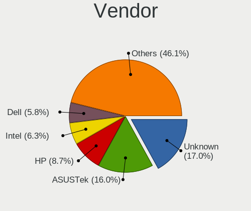
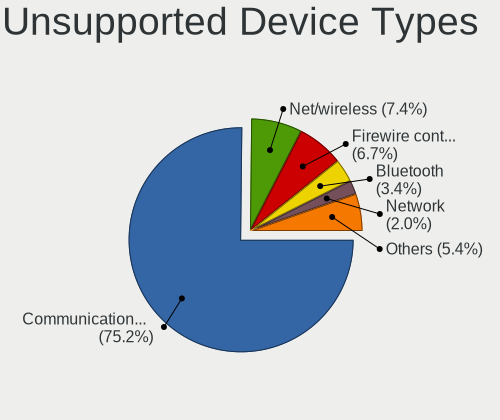

BSD in Italy - Tested Hardware & Statistics (Desktops)
------------------------------------------------------

A project to collect tested hardware configurations for BSD in Italy.

Anyone can contribute to this report by the [hw-probe](https://github.com/linuxhw/hw-probe/blob/master/INSTALL.BSD.md) tool:

    hw-probe -all -upload

Please contribute! Especially if your hardware is rare.

Contents
--------

* [ Test Cases ](#test-cases)

* [ System ](#system)
  - [ OS                       ](#os)
  - [ OS Family                ](#os-family)
  - [ Arch                     ](#arch)
  - [ DE                       ](#de)
  - [ Display Server           ](#display-server)
  - [ Display Manager          ](#display-manager)
  - [ OS Lang                  ](#os-lang)
  - [ Boot Mode                ](#boot-mode)
  - [ Filesystem               ](#filesystem)
  - [ Part. scheme             ](#part-scheme)

* [ Board ](#board)
  - [ Vendor                   ](#vendor)
  - [ Model                    ](#model)
  - [ Model Family             ](#model-family)
  - [ MFG Year                 ](#mfg-year)
  - [ Form Factor              ](#form-factor)
  - [ Coreboot                 ](#coreboot)
  - [ RAM Size                 ](#ram-size)
  - [ RAM Used                 ](#ram-used)
  - [ Total Drives             ](#total-drives)
  - [ Has CD-ROM               ](#has-cd-rom)
  - [ Has Ethernet             ](#has-ethernet)
  - [ Has WiFi                 ](#has-wifi)
  - [ Has Bluetooth            ](#has-bluetooth)

* [ Location ](#location)
  - [ Country                  ](#country)
  - [ City                     ](#city)

* [ Drives ](#drives)
  - [ Drive Vendor             ](#drive-vendor)
  - [ Drive Model              ](#drive-model)
  - [ HDD Vendor               ](#hdd-vendor)
  - [ SSD Vendor               ](#ssd-vendor)
  - [ Drive Kind               ](#drive-kind)
  - [ Drive Connector          ](#drive-connector)
  - [ Drive Size               ](#drive-size)
  - [ Space Total              ](#space-total)
  - [ Space Used               ](#space-used)
  - [ Malfunc. Drives          ](#malfunc-drives)
  - [ Malfunc. Drive Vendor    ](#malfunc-drive-vendor)
  - [ Malfunc. HDD Vendor      ](#malfunc-hdd-vendor)
  - [ Malfunc. Drive Kind      ](#malfunc-drive-kind)
  - [ Failed Drives            ](#failed-drives)
  - [ Failed Drive Vendor      ](#failed-drive-vendor)
  - [ Drive Status             ](#drive-status)

* [ Storage controller ](#storage-controller)
  - [ Storage Vendor           ](#storage-vendor)
  - [ Storage Model            ](#storage-model)
  - [ Storage Kind             ](#storage-kind)

* [ Processor ](#processor)
  - [ CPU Vendor               ](#cpu-vendor)
  - [ CPU Model                ](#cpu-model)
  - [ CPU Model Family         ](#cpu-model-family)
  - [ CPU Cores                ](#cpu-cores)
  - [ CPU Sockets              ](#cpu-sockets)
  - [ CPU Threads              ](#cpu-threads)
  - [ CPU Microarch            ](#cpu-microarch)

* [ Graphics ](#graphics)
  - [ GPU Vendor               ](#gpu-vendor)
  - [ GPU Model                ](#gpu-model)
  - [ GPU Combo                ](#gpu-combo)
  - [ GPU Driver               ](#gpu-driver)
  - [ GPU Memory               ](#gpu-memory)

* [ Monitor ](#monitor)
  - [ Monitor Vendor           ](#monitor-vendor)
  - [ Monitor Model            ](#monitor-model)
  - [ Monitor Resolution       ](#monitor-resolution)
  - [ Monitor Diagonal         ](#monitor-diagonal)
  - [ Monitor Width            ](#monitor-width)
  - [ Aspect Ratio             ](#aspect-ratio)
  - [ Monitor Area             ](#monitor-area)
  - [ Pixel Density            ](#pixel-density)
  - [ Multiple Monitors        ](#multiple-monitors)

* [ Network ](#network)
  - [ Net Controller Vendor    ](#net-controller-vendor)
  - [ Net Controller Model     ](#net-controller-model)
  - [ Wireless Vendor          ](#wireless-vendor)
  - [ Wireless Model           ](#wireless-model)
  - [ Ethernet Vendor          ](#ethernet-vendor)
  - [ Ethernet Model           ](#ethernet-model)
  - [ Net Controller Kind      ](#net-controller-kind)
  - [ Used Controller          ](#used-controller)
  - [ NICs                     ](#nics)
  - [ IPv6                     ](#ipv6)

* [ Bluetooth ](#bluetooth)
  - [ Bluetooth Vendor         ](#bluetooth-vendor)
  - [ Bluetooth Model          ](#bluetooth-model)

* [ Sound ](#sound)
  - [ Sound Vendor             ](#sound-vendor)
  - [ Sound Model              ](#sound-model)

* [ Memory ](#memory)
  - [ Memory Vendor            ](#memory-vendor)
  - [ Memory Model             ](#memory-model)
  - [ Memory Kind              ](#memory-kind)
  - [ Memory Form Factor       ](#memory-form-factor)
  - [ Memory Size              ](#memory-size)
  - [ Memory Speed             ](#memory-speed)

* [ Printers & scanners ](#printers--scanners)
  - [ Printer Vendor           ](#printer-vendor)
  - [ Printer Model            ](#printer-model)
  - [ Scanner Vendor           ](#scanner-vendor)
  - [ Scanner Model            ](#scanner-model)

* [ Camera ](#camera)
  - [ Camera Vendor            ](#camera-vendor)
  - [ Camera Model             ](#camera-model)

* [ Security ](#security)
  - [ Fingerprint Vendor       ](#fingerprint-vendor)
  - [ Fingerprint Model        ](#fingerprint-model)
  - [ Chipcard Vendor          ](#chipcard-vendor)
  - [ Chipcard Model           ](#chipcard-model)

* [ Unsupported ](#unsupported)
  - [ Unsupported Devices      ](#unsupported-devices)
  - [ Unsupported Device Types ](#unsupported-device-types)

Test Cases
----------

Total: 124

| Vendor        | Model                       | Probe                                                     | Date         |
|---------------|-----------------------------|-----------------------------------------------------------|--------------|
| HP            | 0A98h                       | [655fc531fb](https://bsd-hardware.info/?probe=655fc531fb) | Jun 30, 2022 |
| Pegatron      | 2ACF                        | [e461a4559d](https://bsd-hardware.info/?probe=e461a4559d) | Jun 29, 2022 |
| HP            | 304Bh                       | [8a3151b3cd](https://bsd-hardware.info/?probe=8a3151b3cd) | Jun 16, 2022 |
| NF692         | 1.0                         | [e87866bf5a](https://bsd-hardware.info/?probe=e87866bf5a) | Jun 10, 2022 |
| ASUSTek       | PRIME H410M-E               | [8099e7abaf](https://bsd-hardware.info/?probe=8099e7abaf) | Jun 03, 2022 |
| HP            | ProLiant MicroServer Gen... | [4b3b7a0929](https://bsd-hardware.info/?probe=4b3b7a0929) | May 31, 2022 |
| HP            | ProLiant MicroServer Gen... | [5d3db8382f](https://bsd-hardware.info/?probe=5d3db8382f) | May 31, 2022 |
| T-bao         | MINI PC V1.0                | [a89b2081bb](https://bsd-hardware.info/?probe=a89b2081bb) | May 25, 2022 |
| ASUSTek       | PRIME B550M-K               | [ce5ddde5ad](https://bsd-hardware.info/?probe=ce5ddde5ad) | May 18, 2022 |
| Protectli     | FW4B Ver                    | [2769c8f286](https://bsd-hardware.info/?probe=2769c8f286) | May 17, 2022 |
| Fujitsu       | D3041-A1 S26361-D3041-A1    | [5ff176fff8](https://bsd-hardware.info/?probe=5ff176fff8) | May 05, 2022 |
| ASUSTek       | M4A88TD-V EVO/USB3          | [12cc40cc60](https://bsd-hardware.info/?probe=12cc40cc60) | Apr 23, 2022 |
| Pegatron      | Benicia                     | [9045b4f449](https://bsd-hardware.info/?probe=9045b4f449) | Apr 16, 2022 |
| ASUSTek       | PRIME Z390M-PLUS            | [680303f943](https://bsd-hardware.info/?probe=680303f943) | Apr 16, 2022 |
| ASUSTek       | PRIME Z390M-PLUS            | [47d17d48a7](https://bsd-hardware.info/?probe=47d17d48a7) | Apr 15, 2022 |
| ShenZhen M... | MW-NANO-APL-4L              | [fbdd8d4f48](https://bsd-hardware.info/?probe=fbdd8d4f48) | Apr 05, 2022 |
| HP            | 212B                        | [33e7c65907](https://bsd-hardware.info/?probe=33e7c65907) | Apr 04, 2022 |
| Gigabyte      | X570 AORUS PRO              | [3877a33214](https://bsd-hardware.info/?probe=3877a33214) | Apr 02, 2022 |
| Gigabyte      | X570 AORUS PRO              | [3da637e3c6](https://bsd-hardware.info/?probe=3da637e3c6) | Apr 02, 2022 |
| Fujitsu       | D3041-A1 S26361-D3041-A1    | [7b79164c18](https://bsd-hardware.info/?probe=7b79164c18) | Apr 01, 2022 |
| Unknown       | Unknown                     | [bddd5d8963](https://bsd-hardware.info/?probe=bddd5d8963) | Mar 18, 2022 |
| Unknown       | Unknown                     | [65ada9d5da](https://bsd-hardware.info/?probe=65ada9d5da) | Mar 11, 2022 |
| HP            | 3397                        | [841ed56816](https://bsd-hardware.info/?probe=841ed56816) | Mar 02, 2022 |
| Pegatron      | 2ACF                        | [e098f52d51](https://bsd-hardware.info/?probe=e098f52d51) | Feb 19, 2022 |
| MSI           | B450 GAMING PLUS MAX        | [df6278638e](https://bsd-hardware.info/?probe=df6278638e) | Feb 15, 2022 |
| Intel         | Q3XXG4-P V1.0               | [ea7cf2885f](https://bsd-hardware.info/?probe=ea7cf2885f) | Feb 13, 2022 |
| MSI           | B450 GAMING PLUS MAX        | [6997de25f9](https://bsd-hardware.info/?probe=6997de25f9) | Feb 11, 2022 |
| MW            | GMLK-2_5G4L                 | [7a3744a41a](https://bsd-hardware.info/?probe=7a3744a41a) | Feb 07, 2022 |
| Dell          | 0TK7TF A00                  | [d13ca7163c](https://bsd-hardware.info/?probe=d13ca7163c) | Jan 30, 2022 |
| Intel         | D2500CC AAG81477-401        | [f4d8bd7979](https://bsd-hardware.info/?probe=f4d8bd7979) | Jan 30, 2022 |
| Fujitsu       | D3028-A1 S26361-D3028-A1    | [f7e7df9416](https://bsd-hardware.info/?probe=f7e7df9416) | Jan 30, 2022 |
| Fujitsu       | D3028-A1 S26361-D3028-A1    | [fc63aa695e](https://bsd-hardware.info/?probe=fc63aa695e) | Jan 27, 2022 |
| PC Engines    | APU2                        | [52bd5dc1ce](https://bsd-hardware.info/?probe=52bd5dc1ce) | Jan 26, 2022 |
| PC Engines    | APU2                        | [54ada090c6](https://bsd-hardware.info/?probe=54ada090c6) | Jan 26, 2022 |
| ASUSTek       | BM6835_BM6635_BP6335        | [73562aa169](https://bsd-hardware.info/?probe=73562aa169) | Jan 25, 2022 |
| Fujitsu       | D3041-A1 S26361-D3041-A1    | [ed9f5d1a27](https://bsd-hardware.info/?probe=ed9f5d1a27) | Jan 15, 2022 |
| PC Engines    | APU2                        | [c2b05fc937](https://bsd-hardware.info/?probe=c2b05fc937) | Jan 14, 2022 |
| ASRock        | B75M R2.0                   | [7b99b0eaa6](https://bsd-hardware.info/?probe=7b99b0eaa6) | Jan 10, 2022 |
| Fujitsu       | D3041-A1 S26361-D3041-A1    | [7a43524381](https://bsd-hardware.info/?probe=7a43524381) | Dec 13, 2021 |
| Gigabyte      | H270M-DS3H-CF               | [50fba6deda](https://bsd-hardware.info/?probe=50fba6deda) | Dec 11, 2021 |
| Gigabyte      | H270M-DS3H-CF               | [a084ff48c2](https://bsd-hardware.info/?probe=a084ff48c2) | Dec 09, 2021 |
| Gigabyte      | H270M-DS3H-CF               | [17b557d792](https://bsd-hardware.info/?probe=17b557d792) | Dec 08, 2021 |
| Fujitsu       | D3041-A1 S26361-D3041-A1    | [8812a8e8c8](https://bsd-hardware.info/?probe=8812a8e8c8) | Dec 04, 2021 |
| Fujitsu       | D3041-A1 S26361-D3041-A1    | [ddcab97db2](https://bsd-hardware.info/?probe=ddcab97db2) | Dec 03, 2021 |
| T-bao         | MINI PC V1.0                | [4ee7de3597](https://bsd-hardware.info/?probe=4ee7de3597) | Nov 12, 2021 |
| Intel         | Q3XXG4-P V1.0               | [22a18ba45e](https://bsd-hardware.info/?probe=22a18ba45e) | Nov 08, 2021 |
| Pegatron      | 2ACF                        | [ca23d3bbf0](https://bsd-hardware.info/?probe=ca23d3bbf0) | Oct 13, 2021 |
| ASUSTek       | PRIME Z390M-PLUS            | [b3b31d25b0](https://bsd-hardware.info/?probe=b3b31d25b0) | Oct 13, 2021 |
| Pegatron      | 2ACF                        | [97aa5e56e4](https://bsd-hardware.info/?probe=97aa5e56e4) | Oct 12, 2021 |
| ASUSTek       | PRIME Z390M-PLUS            | [5a7c1871b1](https://bsd-hardware.info/?probe=5a7c1871b1) | Oct 11, 2021 |
| Acer          | Veriton X2610G              | [1e9ed23164](https://bsd-hardware.info/?probe=1e9ed23164) | Oct 03, 2021 |
| ASRock        | B75M R2.0                   | [51b47d9321](https://bsd-hardware.info/?probe=51b47d9321) | Sep 27, 2021 |
| ASRock        | B75M R2.0                   | [de031313ff](https://bsd-hardware.info/?probe=de031313ff) | Sep 27, 2021 |
| Gigabyte      | H270M-DS3H-CF               | [9b046b157e](https://bsd-hardware.info/?probe=9b046b157e) | Sep 17, 2021 |
| ASRock        | B75M R2.0                   | [0d23147c7d](https://bsd-hardware.info/?probe=0d23147c7d) | Sep 17, 2021 |
| ASRock        | B75M R2.0                   | [e0ae9af4ab](https://bsd-hardware.info/?probe=e0ae9af4ab) | Sep 15, 2021 |
| Gigabyte      | H270M-DS3H-CF               | [bc2a287495](https://bsd-hardware.info/?probe=bc2a287495) | Sep 13, 2021 |
| Unknown       | YL-J3160L4                  | [861a1f7012](https://bsd-hardware.info/?probe=861a1f7012) | Aug 25, 2021 |
| MSI           | MS-B1591                    | [679b2010e9](https://bsd-hardware.info/?probe=679b2010e9) | Aug 03, 2021 |
| MSI           | MS-B1591                    | [b370a74ec0](https://bsd-hardware.info/?probe=b370a74ec0) | Aug 02, 2021 |
| Gigabyte      | P55A-UD3                    | [dc1b4d8a6b](https://bsd-hardware.info/?probe=dc1b4d8a6b) | Jul 16, 2021 |
| ASRock        | B75M R2.0                   | [d51149c1d5](https://bsd-hardware.info/?probe=d51149c1d5) | Jul 13, 2021 |
| Lenovo        | SHARKBAY SDK0E50510 WIN     | [6cf3337855](https://bsd-hardware.info/?probe=6cf3337855) | Jul 01, 2021 |
| MSI           | B450 GAMING PLUS MAX        | [f0e80b0788](https://bsd-hardware.info/?probe=f0e80b0788) | Jun 28, 2021 |
| PC Engines    | APU2                        | [dde9077545](https://bsd-hardware.info/?probe=dde9077545) | Jun 24, 2021 |
| Unknown       | Unknown                     | [822df8eb91](https://bsd-hardware.info/?probe=822df8eb91) | May 11, 2021 |
| Unknown       | Unknown                     | [cc17eea606](https://bsd-hardware.info/?probe=cc17eea606) | May 10, 2021 |
| ASUSTek       | IP4BL-ME-Oli                | [e26ecef661](https://bsd-hardware.info/?probe=e26ecef661) | May 03, 2021 |
| MSI           | B450-A PRO                  | [ed656e816f](https://bsd-hardware.info/?probe=ed656e816f) | May 01, 2021 |
| Unknown       | Unknown                     | [df793cf09f](https://bsd-hardware.info/?probe=df793cf09f) | Apr 08, 2021 |
| Unknown       | Unknown                     | [de8a18ca09](https://bsd-hardware.info/?probe=de8a18ca09) | Apr 08, 2021 |
| Unknown       | Unknown                     | [f8ba0ba112](https://bsd-hardware.info/?probe=f8ba0ba112) | Apr 08, 2021 |
| Lenovo        | SHARKBAY SDK0E50510 WIN     | [62376c16a4](https://bsd-hardware.info/?probe=62376c16a4) | Mar 31, 2021 |
| Intel         | Q3XXG4-P V1.0               | [5a7ba137e0](https://bsd-hardware.info/?probe=5a7ba137e0) | Mar 27, 2021 |
| Acer          | EG43M                       | [0bc978756c](https://bsd-hardware.info/?probe=0bc978756c) | Mar 27, 2021 |
| Lenovo        | SHARKBAY SDK0E50510 WIN     | [78a7c7b8cb](https://bsd-hardware.info/?probe=78a7c7b8cb) | Mar 23, 2021 |
| Lenovo        | SHARKBAY SDK0E50510 WIN     | [f9c3fc3b84](https://bsd-hardware.info/?probe=f9c3fc3b84) | Mar 19, 2021 |
| Lenovo        | SHARKBAY SDK0E50510 WIN     | [5ae508dfa8](https://bsd-hardware.info/?probe=5ae508dfa8) | Mar 19, 2021 |
| ASUSTek       | PRIME Z390M-PLUS            | [0a3b290f9f](https://bsd-hardware.info/?probe=0a3b290f9f) | Mar 15, 2021 |
| ASUSTek       | M4A88TD-V EVO/USB3          | [1c30f7523f](https://bsd-hardware.info/?probe=1c30f7523f) | Mar 15, 2021 |
| PC Engines    | APU3                        | [822a83f208](https://bsd-hardware.info/?probe=822a83f208) | Mar 11, 2021 |
| ASUSTek       | IP4BL-ME-Oli                | [c672201bcb](https://bsd-hardware.info/?probe=c672201bcb) | Mar 10, 2021 |
| Lenovo        | SHARKBAY SDK0E50510 WIN     | [66a223add9](https://bsd-hardware.info/?probe=66a223add9) | Mar 08, 2021 |
| Dell          | 0R849J A00                  | [1bd1dc24c9](https://bsd-hardware.info/?probe=1bd1dc24c9) | Mar 06, 2021 |
| Foxconn       | 2ADA                        | [10d02d0982](https://bsd-hardware.info/?probe=10d02d0982) | Mar 03, 2021 |
| Intel         | MAHOBAY                     | [3c5bd7b7f8](https://bsd-hardware.info/?probe=3c5bd7b7f8) | Mar 02, 2021 |
| Intel         | MAHOBAY                     | [04e66ca239](https://bsd-hardware.info/?probe=04e66ca239) | Mar 02, 2021 |
| Intel         | MAHOBAY                     | [50652a4263](https://bsd-hardware.info/?probe=50652a4263) | Feb 26, 2021 |
| Intel         | MAHOBAY                     | [c3dc05bbac](https://bsd-hardware.info/?probe=c3dc05bbac) | Feb 26, 2021 |
| Intel         | MAHOBAY                     | [7ab47e0db7](https://bsd-hardware.info/?probe=7ab47e0db7) | Feb 25, 2021 |
| ASUSTek       | PRIME Z390M-PLUS            | [58c6bf426e](https://bsd-hardware.info/?probe=58c6bf426e) | Feb 22, 2021 |
| Intel         | MAHOBAY                     | [5ecd568ce9](https://bsd-hardware.info/?probe=5ecd568ce9) | Feb 21, 2021 |
| Intel         | MAHOBAY                     | [138dbdcece](https://bsd-hardware.info/?probe=138dbdcece) | Feb 21, 2021 |
| Intel         | MAHOBAY                     | [5257239fdc](https://bsd-hardware.info/?probe=5257239fdc) | Feb 20, 2021 |
| HARDKERNEL    | ODROID-H2                   | [6fe9279f1f](https://bsd-hardware.info/?probe=6fe9279f1f) | Feb 18, 2021 |
| ASUSTek       | PRIME Z390M-PLUS            | [c996e74ebc](https://bsd-hardware.info/?probe=c996e74ebc) | Feb 14, 2021 |
| Dell          | 06NWYK A00                  | [32acfb4467](https://bsd-hardware.info/?probe=32acfb4467) | Feb 13, 2021 |
| ASUSTek       | P8H61-M LE                  | [b861820636](https://bsd-hardware.info/?probe=b861820636) | Feb 13, 2021 |
| Dell          | 06NWYK A00                  | [2ff05af403](https://bsd-hardware.info/?probe=2ff05af403) | Feb 13, 2021 |
| ASUSTek       | P8H61-M LE                  | [3a3d7d0701](https://bsd-hardware.info/?probe=3a3d7d0701) | Feb 12, 2021 |
| ASUSTek       | P8Z77-V PRO/THUNDERBOLT     | [6fdcef7c9e](https://bsd-hardware.info/?probe=6fdcef7c9e) | Feb 10, 2021 |
| ASUSTek       | PRIME X470-PRO              | [a77e980850](https://bsd-hardware.info/?probe=a77e980850) | Feb 09, 2021 |
| ASUSTek       | IP4BL-ME-Oli                | [4d225e7ebe](https://bsd-hardware.info/?probe=4d225e7ebe) | Feb 04, 2021 |
| Intel         | Q3XXG4-P V1.0               | [f813782c8a](https://bsd-hardware.info/?probe=f813782c8a) | Jan 29, 2021 |
| Sun Micros... | Ultra 24 50                 | [622589c8e7](https://bsd-hardware.info/?probe=622589c8e7) | Jan 22, 2021 |
| Sun Micros... | Ultra 24 50                 | [7a3cb6a061](https://bsd-hardware.info/?probe=7a3cb6a061) | Jan 22, 2021 |
| ASUSTek       | M4A87TD EVO                 | [12ea57f317](https://bsd-hardware.info/?probe=12ea57f317) | Jan 22, 2021 |
| Dell          | 088DT1 A01                  | [fcc759e013](https://bsd-hardware.info/?probe=fcc759e013) | Jan 21, 2021 |
| ASRock        | H81 Pro BTC                 | [afb7cd1f1a](https://bsd-hardware.info/?probe=afb7cd1f1a) | Jan 20, 2021 |
| Intel         | Q3XXG4-P V1.0               | [92577053eb](https://bsd-hardware.info/?probe=92577053eb) | Jan 20, 2021 |
| Intel         | Q3XXG4-P V1.0               | [33a6dda088](https://bsd-hardware.info/?probe=33a6dda088) | Jan 20, 2021 |
| PC Engines    | APU2                        | [a178f8eb47](https://bsd-hardware.info/?probe=a178f8eb47) | Jan 19, 2021 |
| MSI           | Boston                      | [aa9d7bae21](https://bsd-hardware.info/?probe=aa9d7bae21) | Jan 17, 2021 |
| MSI           | Boston                      | [f21954fa35](https://bsd-hardware.info/?probe=f21954fa35) | Jan 17, 2021 |
| Supermicro    | X8STi                       | [7d0e121099](https://bsd-hardware.info/?probe=7d0e121099) | Jan 15, 2021 |
| Unknown       | Unknown                     | [8668b1d651](https://bsd-hardware.info/?probe=8668b1d651) | Dec 17, 2020 |
| Unknown       | Unknown                     | [d2cdc0fc7f](https://bsd-hardware.info/?probe=d2cdc0fc7f) | Nov 29, 2020 |
| Unknown       | Unknown                     | [afbbc44ac5](https://bsd-hardware.info/?probe=afbbc44ac5) | Nov 29, 2020 |
| Unknown       | Unknown                     | [aee9f448af](https://bsd-hardware.info/?probe=aee9f448af) | Nov 25, 2020 |
| Intel         | D945GCLF2                   | [58678b0643](https://bsd-hardware.info/?probe=58678b0643) | Oct 30, 2020 |
| Intel         | D945GCLF2                   | [3354fb903b](https://bsd-hardware.info/?probe=3354fb903b) | Oct 30, 2020 |
| Gigabyte      | X570 AORUS ELITE            | [973b62551f](https://bsd-hardware.info/?probe=973b62551f) | Oct 30, 2020 |
| AZW           | BT3 X                       | [b9f23ee753](https://bsd-hardware.info/?probe=b9f23ee753) | Oct 30, 2020 |
| ASRock        | 990FX Extreme9              | [6c0bba6d4f](https://bsd-hardware.info/?probe=6c0bba6d4f) | Jun 26, 2020 |

System
------

OS
--

Installed operating systems

| Name                 | Desktops | Percent |
|----------------------|----------|---------|
| helloSystem 0.4.0    | 7        | 8.64%   |
| helloSystem 0.7.0    | 6        | 7.41%   |
| OPNsense 22.1        | 4        | 4.94%   |
| OPNsense 21.1        | 4        | 4.94%   |
| helloSystem 0.5.0    | 4        | 4.94%   |
| OPNsense 21.7.3      | 3        | 3.7%    |
| OpenBSD 7.1          | 3        | 3.7%    |
| helloSystem 0.6.0    | 3        | 3.7%    |
| helloSystem 0.3.0    | 3        | 3.7%    |
| OPNsense 22.1.9      | 2        | 2.47%   |
| OPNsense 22.1.8      | 2        | 2.47%   |
| OPNsense 22.1.6      | 2        | 2.47%   |
| OPNsense 22.1.4      | 2        | 2.47%   |
| OPNsense 21.7.7      | 2        | 2.47%   |
| OPNsense 21.1.3      | 2        | 2.47%   |
| OPNsense 21.1.2      | 2        | 2.47%   |
| OPNsense 20.7.8      | 2        | 2.47%   |
| OpenBSD 6.8          | 2        | 2.47%   |
| NomadBSD 1.4         | 2        | 2.47%   |
| FreeBSD 12.3-p1      | 2        | 2.47%   |
| OPNsense 22.1.7      | 1        | 1.23%   |
| OPNsense 22.1.3      | 1        | 1.23%   |
| OPNsense 22.1.2      | 1        | 1.23%   |
| OPNsense 21.7.8      | 1        | 1.23%   |
| OPNsense 21.7.6      | 1        | 1.23%   |
| OPNsense 21.7.4      | 1        | 1.23%   |
| OPNsense 21.7.1      | 1        | 1.23%   |
| OPNsense 21.7        | 1        | 1.23%   |
| OPNsense 21.1.8      | 1        | 1.23%   |
| OPNsense 21.1.7      | 1        | 1.23%   |
| OPNsense 21.1.5      | 1        | 1.23%   |
| OPNsense 21.1.1      | 1        | 1.23%   |
| NetBSD 9.99.77       | 1        | 1.23%   |
| NetBSD 9.1_STABLE    | 1        | 1.23%   |
| FreeBSD 13.0-p7      | 1        | 1.23%   |
| FreeBSD 13.0-p5      | 1        | 1.23%   |
| FreeBSD 13.0-CURRENT | 1        | 1.23%   |
| FreeBSD 12.2-STABLE  | 1        | 1.23%   |
| FreeBSD 12.2-p6      | 1        | 1.23%   |
| FreeBSD 12.2-p2      | 1        | 1.23%   |
| FreeBSD 12.1-p6      | 1        | 1.23%   |
| FreeBSD 12.1-p10     | 1        | 1.23%   |

OS Family
---------

OS without a version

| Name        | Desktops | Percent |
|-------------|----------|---------|
| OPNsense    | 30       | 45.45%  |
| helloSystem | 17       | 25.76%  |
| FreeBSD     | 10       | 15.15%  |
| OpenBSD     | 5        | 7.58%   |
| NomadBSD    | 2        | 3.03%   |
| NetBSD      | 2        | 3.03%   |

Arch
----

OS architecture (x86_64, i586, etc.)

| Name   | Desktops | Percent |
|--------|----------|---------|
| amd64  | 63       | 95.45%  |
| evbarm | 2        | 3.03%   |
| i386   | 1        | 1.52%   |

DE
--

Desktop Environment

| Name          | Desktops | Percent |
|---------------|----------|---------|
| Console       | 34       | 51.52%  |
| helloDesktop  | 19       | 28.79%  |
| XFCE          | 2        | 3.03%   |
| Openbox       | 2        | 3.03%   |
| MATE          | 2        | 3.03%   |
| fvwm          | 2        | 3.03%   |
| xfwm          | 1        | 1.52%   |
| TWM           | 1        | 1.52%   |
| KDE5          | 1        | 1.52%   |
| Enlightenment | 1        | 1.52%   |
| CTWM          | 1        | 1.52%   |

Display Server
--------------

X11 or Wayland

| Name    | Desktops | Percent |
|---------|----------|---------|
| Console | 35       | 53.03%  |
| X11     | 31       | 46.97%  |

Display Manager
---------------

SDDM, LightDM, etc.

| Name    | Desktops | Percent |
|---------|----------|---------|
| Console | 43       | 65.15%  |
| SLiM    | 21       | 31.82%  |
| LightDM | 2        | 3.03%   |

OS Lang
-------

Language

| Lang             | Desktops | Percent |
|------------------|----------|---------|
| Unknown          | 39       | 59.09%  |
| en_US            | 18       | 27.27%  |
| it_IT            | 5        | 7.58%   |
| C                | 3        | 4.55%   |
| it_IT.ISO8859-15 | 1        | 1.52%   |

Boot Mode
---------

EFI or BIOS

| Mode | Desktops | Percent |
|------|----------|---------|
| EFI  | 49       | 72.06%  |
| BIOS | 19       | 27.94%  |

Filesystem
----------

Type of filesystem

| Type   | Desktops | Percent |
|--------|----------|---------|
| Ufs    | 35       | 50.72%  |
| Zfs    | 25       | 36.23%  |
| Ffs    | 5        | 7.25%   |
| Cd9660 | 4        | 5.8%    |

Part. scheme
------------

Scheme of partitioning

| Type    | Desktops | Percent |
|---------|----------|---------|
| GPT     | 56       | 83.58%  |
| MBR     | 10       | 14.93%  |
| Unknown | 1        | 1.49%   |

Board
-----

Vendor
------

Motherboard manufacturer

| Name                       | Desktops | Percent |
|----------------------------|----------|---------|
| ASUSTek Computer           | 13       | 19.7%   |
| Intel                      | 6        | 9.09%   |
| Unknown                    | 6        | 9.09%   |
| Hewlett-Packard            | 5        | 7.58%   |
| PC Engines                 | 4        | 6.06%   |
| MSI                        | 4        | 6.06%   |
| Gigabyte Technology        | 4        | 6.06%   |
| Dell                       | 4        | 6.06%   |
| ASRock                     | 3        | 4.55%   |
| Pegatron                   | 2        | 3.03%   |
| Fujitsu                    | 2        | 3.03%   |
| Acer                       | 2        | 3.03%   |
| T-bao                      | 1        | 1.52%   |
| Supermicro                 | 1        | 1.52%   |
| Sun Microsystems           | 1        | 1.52%   |
| ShenZhen MinWin Technology | 1        | 1.52%   |
| Protectli                  | 1        | 1.52%   |
| NF692                      | 1        | 1.52%   |
| MW                         | 1        | 1.52%   |
| Lenovo                     | 1        | 1.52%   |
| HARDKERNEL                 | 1        | 1.52%   |
| Foxconn                    | 1        | 1.52%   |
| AZW                        | 1        | 1.52%   |

Model
-----

Motherboard model

| Name                                    | Desktops | Percent |
|-----------------------------------------|----------|---------|
| Unknown                                 | 6        | 9.09%   |
| PC Engines APU2                         | 3        | 4.55%   |
| Intel Q3XXG4-P V1.0                     | 3        | 4.55%   |
| MSI MS-7B86                             | 2        | 3.03%   |
| ASUS M4A88TD-V EVO/USB3                 | 2        | 3.03%   |
| ASUS IP4BL-ME                           | 2        | 3.03%   |
| T-bao MINI PC                           | 1        | 1.52%   |
| Supermicro X8STi                        | 1        | 1.52%   |
| Sun Microsystems Ultra 24               | 1        | 1.52%   |
| ShenZhen MinWin MW-NANO-APL-4L          | 1        | 1.52%   |
| Protectli FW4B                          | 1        | 1.52%   |
| Pegatron Pro 3405 Series                | 1        | 1.52%   |
| Pegatron KX629AA-ABZ a6561.it           | 1        | 1.52%   |
| PC Engines APU3                         | 1        | 1.52%   |
| NF692 1.0                               | 1        | 1.52%   |
| MW GMLK-2_5G4L                          | 1        | 1.52%   |
| MSI NR074AA-ABZ CQ5125IT                | 1        | 1.52%   |
| MSI KBL-U Pro Cubi 3 Silent S (MS-B159) | 1        | 1.52%   |
| Lenovo ThinkCentre M83 10AHS35Q00       | 1        | 1.52%   |
| Intel MAHOBAY                           | 1        | 1.52%   |
| Intel D945GCLF2                         | 1        | 1.52%   |
| Intel D2500CC AAG81477-401              | 1        | 1.52%   |
| HP Z440 Workstation                     | 1        | 1.52%   |
| HP xw8600 Workstation                   | 1        | 1.52%   |
| HP ProLiant MicroServer Gen8            | 1        | 1.52%   |
| HP Compaq Elite 8300 SFF                | 1        | 1.52%   |
| HP Compaq 8100 Elite CMT PC             | 1        | 1.52%   |
| HARDKERNEL ODROID-H2                    | 1        | 1.52%   |
| Gigabyte X570 AORUS PRO                 | 1        | 1.52%   |
| Gigabyte X570 AORUS ELITE               | 1        | 1.52%   |
| Gigabyte P55A-UD3                       | 1        | 1.52%   |
| Gigabyte H270M-DS3H                     | 1        | 1.52%   |
| Fujitsu ESPRIMO E7936                   | 1        | 1.52%   |
| Fujitsu ESPRIMO E3521                   | 1        | 1.52%   |
| Foxconn p6-2305elm                      | 1        | 1.52%   |
| Dell Studio XPS 435MT                   | 1        | 1.52%   |
| Dell Precision T1600                    | 1        | 1.52%   |
| Dell OptiPlex FX160                     | 1        | 1.52%   |
| Dell Inspiron 3847                      | 1        | 1.52%   |
| AZW BT3 X                               | 1        | 1.52%   |
| ASUS PRIME Z390M-PLUS                   | 1        | 1.52%   |
| ASUS PRIME X470-PRO                     | 1        | 1.52%   |
| ASUS PRIME H410M-E                      | 1        | 1.52%   |
| ASUS PRIME B550M-K                      | 1        | 1.52%   |
| ASUS P8Z77-V PRO/THUNDERBOLT            | 1        | 1.52%   |
| ASUS P8H61-M LE                         | 1        | 1.52%   |
| ASUS M4A87TD EVO                        | 1        | 1.52%   |
| ASUS IP4BL-ME-Oli                       | 1        | 1.52%   |
| ASUS BM6835_BM6635_BP6335               | 1        | 1.52%   |
| ASRock H81 Pro BTC                      | 1        | 1.52%   |
| ASRock B75M R2.0                        | 1        | 1.52%   |
| ASRock 990FX Extreme9                   | 1        | 1.52%   |
| Acer Veriton X2610G                     | 1        | 1.52%   |
| Acer Aspire M3900                       | 1        | 1.52%   |

Model Family
------------

Motherboard model prefix

| Name                           | Desktops | Percent |
|--------------------------------|----------|---------|
| Unknown                        | 6        | 9.09%   |
| ASUS PRIME                     | 4        | 6.06%   |
| PC Engines APU2                | 3        | 4.55%   |
| Intel Q3XXG4-P                 | 3        | 4.55%   |
| MSI MS-7B86                    | 2        | 3.03%   |
| HP Compaq                      | 2        | 3.03%   |
| Gigabyte X570                  | 2        | 3.03%   |
| Fujitsu ESPRIMO                | 2        | 3.03%   |
| ASUS M4A88TD-V                 | 2        | 3.03%   |
| ASUS IP4BL-ME                  | 2        | 3.03%   |
| T-bao MINI                     | 1        | 1.52%   |
| Supermicro X8STi               | 1        | 1.52%   |
| Sun Microsystems Ultra         | 1        | 1.52%   |
| ShenZhen MinWin MW-NANO-APL-4L | 1        | 1.52%   |
| Protectli FW4B                 | 1        | 1.52%   |
| Pegatron Pro                   | 1        | 1.52%   |
| Pegatron KX629AA-ABZ           | 1        | 1.52%   |
| PC Engines APU3                | 1        | 1.52%   |
| NF692 1.0                      | 1        | 1.52%   |
| MW GMLK-2                      | 1        | 1.52%   |
| MSI NR074AA-ABZ                | 1        | 1.52%   |
| MSI KBL-U                      | 1        | 1.52%   |
| Lenovo ThinkCentre             | 1        | 1.52%   |
| Intel MAHOBAY                  | 1        | 1.52%   |
| Intel D945GCLF2                | 1        | 1.52%   |
| Intel D2500CC                  | 1        | 1.52%   |
| HP Z440                        | 1        | 1.52%   |
| HP xw8600                      | 1        | 1.52%   |
| HP ProLiant                    | 1        | 1.52%   |
| HARDKERNEL ODROID-H2           | 1        | 1.52%   |
| Gigabyte P55A-UD3              | 1        | 1.52%   |
| Gigabyte H270M-DS3H            | 1        | 1.52%   |
| Foxconn p6-2305elm             | 1        | 1.52%   |
| Dell Studio                    | 1        | 1.52%   |
| Dell Precision                 | 1        | 1.52%   |
| Dell OptiPlex                  | 1        | 1.52%   |
| Dell Inspiron                  | 1        | 1.52%   |
| AZW BT3                        | 1        | 1.52%   |
| ASUS P8Z77-V                   | 1        | 1.52%   |
| ASUS P8H61-M                   | 1        | 1.52%   |
| ASUS M4A87TD                   | 1        | 1.52%   |
| ASUS IP4BL-ME-Oli              | 1        | 1.52%   |
| ASUS BM6835                    | 1        | 1.52%   |
| ASRock H81                     | 1        | 1.52%   |
| ASRock B75M                    | 1        | 1.52%   |
| ASRock 990FX                   | 1        | 1.52%   |
| Acer Veriton                   | 1        | 1.52%   |
| Acer Aspire                    | 1        | 1.52%   |

MFG Year
--------

Motherboard manufacture year

| Year    | Desktops | Percent |
|---------|----------|---------|
| 2016    | 9        | 13.64%  |
| 2012    | 7        | 10.61%  |
| 2010    | 7        | 10.61%  |
| 2020    | 5        | 7.58%   |
| 2019    | 5        | 7.58%   |
| 2018    | 5        | 7.58%   |
| 2011    | 5        | 7.58%   |
| 2008    | 5        | 7.58%   |
| 2009    | 4        | 6.06%   |
| 2021    | 3        | 4.55%   |
| 2017    | 3        | 4.55%   |
| 2014    | 3        | 4.55%   |
| Unknown | 2        | 3.03%   |
| 2022    | 1        | 1.52%   |
| 2015    | 1        | 1.52%   |
| 2013    | 1        | 1.52%   |

Form Factor
-----------

Physical design of the computer

| Name    | Desktops | Percent |
|---------|----------|---------|
| Desktop | 66       | 100%    |

Coreboot
--------

Have coreboot on board

| Used | Desktops | Percent |
|------|----------|---------|
| No   | 62       | 93.94%  |
| Yes  | 4        | 6.06%   |

RAM Size
--------

Total RAM memory

| Size in GB  | Desktops | Percent |
|-------------|----------|---------|
| 8.01-16.0   | 27       | 40.3%   |
| 4.01-8.0    | 16       | 23.88%  |
| 16.01-24.0  | 8        | 11.94%  |
| 2.01-3.0    | 6        | 8.96%   |
| 32.01-64.0  | 4        | 5.97%   |
| 24.01-32.0  | 2        | 2.99%   |
| 64.01-256.0 | 2        | 2.99%   |
| 3.01-4.0    | 1        | 1.49%   |
| 0.51-1.0    | 1        | 1.49%   |

RAM Used
--------

Used RAM memory

| Used GB  | Desktops | Percent |
|----------|----------|---------|
| 0.01-0.5 | 44       | 65.67%  |
| 0.51-1.0 | 15       | 22.39%  |
| 1.01-2.0 | 4        | 5.97%   |
| Unknown  | 2        | 2.99%   |
| 4.01-8.0 | 1        | 1.49%   |
| 2.01-3.0 | 1        | 1.49%   |

Total Drives
------------

Number of drives on board

| Drives | Desktops | Percent |
|--------|----------|---------|
| 1      | 34       | 50%     |
| 2      | 16       | 23.53%  |
| 4      | 6        | 8.82%   |
| 3      | 6        | 8.82%   |
| 0      | 5        | 7.35%   |
| 10     | 1        | 1.47%   |

Has CD-ROM
----------

Has CD-ROM on board

| Presented | Desktops | Percent |
|-----------|----------|---------|
| No        | 42       | 63.64%  |
| Yes       | 24       | 36.36%  |

Has Ethernet
------------

Has Ethernet on board

| Presented | Desktops | Percent |
|-----------|----------|---------|
| Yes       | 64       | 96.97%  |
| No        | 2        | 3.03%   |

Has WiFi
--------

Has WiFi module

| Presented | Desktops | Percent |
|-----------|----------|---------|
| No        | 53       | 80.3%   |
| Yes       | 13       | 19.7%   |

Has Bluetooth
-------------

Has Bluetooth module

| Presented | Desktops | Percent |
|-----------|----------|---------|
| No        | 59       | 88.06%  |
| Yes       | 8        | 11.94%  |

Location
--------

Country
-------

Geographic location (country)

| Country | Desktops | Percent |
|---------|----------|---------|
| Italy   | 66       | 100%    |

City
----

Geographic location (city)

| City                  | Desktops | Percent |
|-----------------------|----------|---------|
| Milan                 | 14       | 18.42%  |
| Rome                  | 6        | 7.89%   |
| Naples                | 3        | 3.95%   |
| Turrivalignani        | 2        | 2.63%   |
| Silea                 | 2        | 2.63%   |
| Lucca                 | 2        | 2.63%   |
| Viterbo               | 1        | 1.32%   |
| Venice                | 1        | 1.32%   |
| Turin                 | 1        | 1.32%   |
| Trieste               | 1        | 1.32%   |
| Treviso               | 1        | 1.32%   |
| Terni                 | 1        | 1.32%   |
| Soresina              | 1        | 1.32%   |
| Sasso Marconi         | 1        | 1.32%   |
| Sannicandro di Bari   | 1        | 1.32%   |
| San Donato Milanese   | 1        | 1.32%   |
| Reggio Emilia         | 1        | 1.32%   |
| Ravenna               | 1        | 1.32%   |
| Ponsacco              | 1        | 1.32%   |
| Pistoia               | 1        | 1.32%   |
| Pioltello             | 1        | 1.32%   |
| Parma                 | 1        | 1.32%   |
| Padova                | 1        | 1.32%   |
| Ortona                | 1        | 1.32%   |
| Oleggio               | 1        | 1.32%   |
| Monza                 | 1        | 1.32%   |
| Monteleone di Fermo   | 1        | 1.32%   |
| Modena                | 1        | 1.32%   |
| Mestrino              | 1        | 1.32%   |
| Malo                  | 1        | 1.32%   |
| Grottazzolina         | 1        | 1.32%   |
| Gianico               | 1        | 1.32%   |
| Gemona                | 1        | 1.32%   |
| Follonica             | 1        | 1.32%   |
| Foligno               | 1        | 1.32%   |
| Fagagna               | 1        | 1.32%   |
| Desio                 | 1        | 1.32%   |
| Costabissara          | 1        | 1.32%   |
| Colorno               | 1        | 1.32%   |
| Collegno              | 1        | 1.32%   |
| Cellatica             | 1        | 1.32%   |
| Cavarzere             | 1        | 1.32%   |
| Catania               | 1        | 1.32%   |
| Castelnuovo del Garda | 1        | 1.32%   |
| Castellanza           | 1        | 1.32%   |
| Cassina Rizzardi      | 1        | 1.32%   |
| Cassano Magnago       | 1        | 1.32%   |
| Carmignano di Brenta  | 1        | 1.32%   |
| Cagliari              | 1        | 1.32%   |
| Belluno               | 1        | 1.32%   |
| Barlassina            | 1        | 1.32%   |
| Bari                  | 1        | 1.32%   |
| Adelfia               | 1        | 1.32%   |

Drives
------

Drive Vendor
------------

Hard drive vendors

| Vendor              | Desktops | Drives | Percent |
|---------------------|----------|--------|---------|
| WDC                 | 20       | 36     | 21.05%  |
| Samsung Electronics | 13       | 19     | 13.68%  |
| Seagate             | 11       | 15     | 11.58%  |
| Crucial             | 11       | 18     | 11.58%  |
| Transcend           | 5        | 5      | 5.26%   |
| Toshiba             | 5        | 13     | 5.26%   |
| Kingston            | 4        | 4      | 4.21%   |
| SanDisk             | 3        | 3      | 3.16%   |
| EMTEC               | 3        | 4      | 3.16%   |
| Phison              | 2        | 2      | 2.11%   |
| OCZ                 | 2        | 2      | 2.11%   |
| Micron Technology   | 2        | 2      | 2.11%   |
| Maxtor              | 2        | 2      | 2.11%   |
| Hoodisk             | 2        | 2      | 2.11%   |
| Dogfish             | 2        | 2      | 2.11%   |
| Silicon Motion      | 1        | 2      | 1.05%   |
| PNY                 | 1        | 4      | 1.05%   |
| NVMe                | 1        | 1      | 1.05%   |
| KingSpec            | 1        | 2      | 1.05%   |
| Intel               | 1        | 2      | 1.05%   |
| Hitachi             | 1        | 1      | 1.05%   |
| China               | 1        | 1      | 1.05%   |
| A-DATA Technology   | 1        | 2      | 1.05%   |

Drive Model
-----------

Hard drive models

| Model                            | Desktops | Percent |
|----------------------------------|----------|---------|
| EMTEC X150 120GB                 | 3        | 2.78%   |
| WDC WD5000AAKS-22V1A0 500GB      | 2        | 1.85%   |
| Toshiba DT01ACA050 500GB         | 2        | 1.85%   |
| Seagate ST320LT007-9ZV142 320GB  | 2        | 1.85%   |
| Seagate ST1000DM003-1ER162 1TB   | 2        | 1.85%   |
| Samsung SSD 860 EVO 250GB        | 2        | 1.85%   |
| Samsung SSD 850 EVO 250GB        | 2        | 1.85%   |
| Samsung HM321HI 320GB            | 2        | 1.85%   |
| Phison SATA SSD 16GB             | 2        | 1.85%   |
| Crucial CT500MX500SSD1 500GB     | 2        | 1.85%   |
| Crucial CT250MX500SSD1 250GB     | 2        | 1.85%   |
| Crucial CT240BX500SSD1 240GB     | 2        | 1.85%   |
| Crucial CT120BX500SSD1 120GB     | 2        | 1.85%   |
| WDC WDS250G1B0A-00H9H0 250GB     | 1        | 0.93%   |
| WDC WDS100T2B0B-00YS70 1TB       | 1        | 0.93%   |
| WDC WDS100T2B0A-00SM50 1TB       | 1        | 0.93%   |
| WDC WD6400AAKS-65A7B0 640GB      | 1        | 0.93%   |
| WDC WD5003ABYX-01WERA2 500GB     | 1        | 0.93%   |
| WDC WD5000LPVT-80G33T2 500GB     | 1        | 0.93%   |
| WDC WD5000BPKX-00HPJT0 500GB     | 1        | 0.93%   |
| WDC WD5000BMVV-11A1CS0 500GB     | 1        | 0.93%   |
| WDC WD5000BEVT-00A03T0 500GB     | 1        | 0.93%   |
| WDC WD5000AAKS-00E4A0 500GB      | 1        | 0.93%   |
| WDC WD5000AAKS-00D2B0 500GB      | 1        | 0.93%   |
| WDC WD40NMZW-11GX6S1 4TB         | 1        | 0.93%   |
| WDC WD40EFRX-68WT0N0 4TB         | 1        | 0.93%   |
| WDC WD40EFRX-68N32N0 4TB         | 1        | 0.93%   |
| WDC WD3200AAKS-00L9A0 320GB      | 1        | 0.93%   |
| WDC WD30EZRZ-00Z5HB0 3TB         | 1        | 0.93%   |
| WDC WD30EZRZ-00GXCB0 3TB         | 1        | 0.93%   |
| WDC WD2500BEVT-22A23T0 250GB     | 1        | 0.93%   |
| WDC WD2500AAJS-07M0A0 250GB      | 1        | 0.93%   |
| WDC WD20PURZ-85GU6Y0 2TB         | 1        | 0.93%   |
| WDC WD20EVDS-63T3B0 2TB          | 1        | 0.93%   |
| WDC WD2002FYPS-01U1B1 2TB        | 1        | 0.93%   |
| WDC WD15EADS-00P8B0 1.5TB        | 1        | 0.93%   |
| WDC WD1500HLFS-01G6U0 150GB      | 1        | 0.93%   |
| WDC WD10EFRX-68PJCN0 1TB         | 1        | 0.93%   |
| WDC WD1000DHTZ-04N21V1 1TB       | 1        | 0.93%   |
| Transcend TS64GSSD370S 64GB      | 1        | 0.93%   |
| Transcend TS64GMSA370 64GB       | 1        | 0.93%   |
| Transcend TS32GSSD370 32GB       | 1        | 0.93%   |
| Transcend TS128GMSA370 128GB     | 1        | 0.93%   |
| Transcend TS128GMSA230S 128GB    | 1        | 0.93%   |
| Toshiba Q300 240GB               | 1        | 0.93%   |
| Toshiba MK5065GSXF 500GB         | 1        | 0.93%   |
| Toshiba HDWG440 4TB              | 1        | 0.93%   |
| Silicon Motion ASint AS806 128GB | 1        | 0.93%   |
| Seagate ST500LX025-1U717D 500GB  | 1        | 0.93%   |
| Seagate ST500DM002-1BD142 500GB  | 1        | 0.93%   |
| Seagate ST4000LM024-2AN17V 4TB   | 1        | 0.93%   |
| Seagate ST32500NSSUN250G 250GB   | 1        | 0.93%   |
| Seagate ST31500341AS 1.5TB       | 1        | 0.93%   |
| Seagate ST3000DM007-1WY10G 3TB   | 1        | 0.93%   |
| Seagate ST1000LX015-1U7172 1TB   | 1        | 0.93%   |
| Seagate ST1000DM003-1CH162 1TB   | 1        | 0.93%   |
| SanDisk SSD PLUS 120GB           | 1        | 0.93%   |
| SanDisk SDSSDP128G 128GB         | 1        | 0.93%   |
| SanDisk pSSD 256GB               | 1        | 0.93%   |
| Samsung SSD 980 PRO 1TB          | 1        | 0.93%   |

HDD Vendor
----------

Hard disk drive vendors

| Vendor              | Desktops | Drives | Percent |
|---------------------|----------|--------|---------|
| WDC                 | 18       | 33     | 46.15%  |
| Seagate             | 11       | 15     | 28.21%  |
| Toshiba             | 4        | 10     | 10.26%  |
| Samsung Electronics | 3        | 3      | 7.69%   |
| Maxtor              | 2        | 2      | 5.13%   |
| Hitachi             | 1        | 1      | 2.56%   |

SSD Vendor
----------

Solid state drive vendors

| Vendor              | Desktops | Drives | Percent |
|---------------------|----------|--------|---------|
| Crucial             | 10       | 17     | 18.52%  |
| Samsung Electronics | 9        | 14     | 16.67%  |
| Transcend           | 5        | 5      | 9.26%   |
| Kingston            | 4        | 4      | 7.41%   |
| WDC                 | 3        | 3      | 5.56%   |
| SanDisk             | 3        | 3      | 5.56%   |
| EMTEC               | 3        | 4      | 5.56%   |
| Phison              | 2        | 2      | 3.7%    |
| OCZ                 | 2        | 2      | 3.7%    |
| Micron Technology   | 2        | 2      | 3.7%    |
| Hoodisk             | 2        | 2      | 3.7%    |
| Dogfish             | 2        | 2      | 3.7%    |
| Toshiba             | 1        | 3      | 1.85%   |
| PNY                 | 1        | 4      | 1.85%   |
| NVMe                | 1        | 1      | 1.85%   |
| KingSpec            | 1        | 2      | 1.85%   |
| Intel               | 1        | 2      | 1.85%   |
| China               | 1        | 1      | 1.85%   |
| A-DATA Technology   | 1        | 2      | 1.85%   |

Drive Kind
----------

HDD or SSD

| Kind | Desktops | Drives | Percent |
|------|----------|--------|---------|
| SSD  | 41       | 75     | 56.16%  |
| HDD  | 28       | 64     | 38.36%  |
| NVMe | 4        | 5      | 5.48%   |

Drive Connector
---------------

SATA, SAS, NVMe, etc.

| Type | Desktops | Drives | Percent |
|------|----------|--------|---------|
| SATA | 60       | 139    | 93.75%  |
| NVMe | 4        | 5      | 6.25%   |

Drive Size
----------

Size of hard drive

| Size in TB | Desktops | Drives | Percent |
|------------|----------|--------|---------|
| 0.01-0.5   | 52       | 108    | 70.27%  |
| 0.51-1.0   | 11       | 13     | 14.86%  |
| 1.01-2.0   | 6        | 8      | 8.11%   |
| 3.01-4.0   | 4        | 7      | 5.41%   |
| 2.01-3.0   | 1        | 3      | 1.35%   |

Space Total
-----------

Amount of disk space available on the file system

| Size in GB     | Desktops | Percent |
|----------------|----------|---------|
| 101-250        | 19       | 27.94%  |
| 1-20           | 18       | 26.47%  |
| 251-500        | 9        | 13.24%  |
| 21-50          | 7        | 10.29%  |
| 501-1000       | 6        | 8.82%   |
| 51-100         | 5        | 7.35%   |
| More than 3000 | 3        | 4.41%   |
| Unknown        | 1        | 1.47%   |

Space Used
----------

Amount of used disk space

| Used GB        | Desktops | Percent |
|----------------|----------|---------|
| 1-20           | 59       | 89.39%  |
| 21-50          | 3        | 4.55%   |
| More than 3000 | 1        | 1.52%   |
| 1001-2000      | 1        | 1.52%   |
| 501-1000       | 1        | 1.52%   |
| Unknown        | 1        | 1.52%   |

Malfunc. Drives
---------------

Drive models with a malfunction

| Model                             | Desktops | Drives | Percent |
|-----------------------------------|----------|--------|---------|
| WDC WD5000AAKS-22V1A0 500GB       | 2        | 2      | 15.38%  |
| Seagate ST320LT007-9ZV142 320GB   | 2        | 2      | 15.38%  |
| WDC WD5000AAKS-00E4A0 500GB       | 1        | 1      | 7.69%   |
| WDC WD20EVDS-63T3B0 2TB           | 1        | 1      | 7.69%   |
| WDC WD2002FYPS-01U1B1 2TB         | 1        | 1      | 7.69%   |
| Seagate ST500DM002-1BD142 500GB   | 1        | 3      | 7.69%   |
| Seagate ST4000LM024-2AN17V 4TB    | 1        | 1      | 7.69%   |
| Seagate ST31500341AS 1.5TB        | 1        | 1      | 7.69%   |
| Samsung Electronics HM321HI 320GB | 1        | 1      | 7.69%   |
| OCZ VERTEX3 120GB                 | 1        | 1      | 7.69%   |
| A-DATA Technology SX300 128GB     | 1        | 1      | 7.69%   |

Malfunc. Drive Vendor
---------------------

Vendors of faulty drives

| Vendor              | Desktops | Drives | Percent |
|---------------------|----------|--------|---------|
| WDC                 | 5        | 5      | 38.46%  |
| Seagate             | 5        | 7      | 38.46%  |
| Samsung Electronics | 1        | 1      | 7.69%   |
| OCZ                 | 1        | 1      | 7.69%   |
| A-DATA Technology   | 1        | 1      | 7.69%   |

Malfunc. HDD Vendor
-------------------

Vendors of faulty HDD drives

| Vendor              | Desktops | Drives | Percent |
|---------------------|----------|--------|---------|
| WDC                 | 5        | 5      | 45.45%  |
| Seagate             | 5        | 7      | 45.45%  |
| Samsung Electronics | 1        | 1      | 9.09%   |

Malfunc. Drive Kind
-------------------

Kinds of faulty drives

| Kind | Desktops | Drives | Percent |
|------|----------|--------|---------|
| HDD  | 9        | 13     | 81.82%  |
| SSD  | 2        | 2      | 18.18%  |

Failed Drives
-------------

Failed drive models

Zero info for selected period =(

Failed Drive Vendor
-------------------

Failed drive vendors

Zero info for selected period =(

Drive Status
------------

Number of failed and malfunc. drives

| Status   | Desktops | Drives | Percent |
|----------|----------|--------|---------|
| Works    | 54       | 115    | 77.14%  |
| Malfunc  | 11       | 15     | 15.71%  |
| Detected | 5        | 14     | 7.14%   |

Storage controller
------------------

Storage Vendor
--------------

Storage controller vendors

| Vendor                           | Desktops | Percent |
|----------------------------------|----------|---------|
| Intel                            | 47       | 58.02%  |
| AMD                              | 16       | 19.75%  |
| Samsung Electronics              | 3        | 3.7%    |
| Marvell Technology Group         | 3        | 3.7%    |
| VIA Technologies                 | 2        | 2.47%   |
| Broadcom / LSI                   | 2        | 2.47%   |
| ASMedia Technology               | 2        | 2.47%   |
| Silicon Motion                   | 1        | 1.23%   |
| Silicon Integrated Systems [SiS] | 1        | 1.23%   |
| Micron/Crucial Technology        | 1        | 1.23%   |
| JMicron Technology               | 1        | 1.23%   |
| Integrated Technology Express    | 1        | 1.23%   |
| Adaptec                          | 1        | 1.23%   |

Storage Model
-------------

Storage controller models

| Model                                                                                   | Desktops | Percent |
|-----------------------------------------------------------------------------------------|----------|---------|
| AMD FCH SATA Controller [AHCI mode]                                                     | 10       | 10.31%  |
| Intel NM10/ICH7 Family SATA Controller [IDE mode]                                       | 6        | 6.19%   |
| Intel 6 Series/C200 Series Chipset Family 6 port Desktop SATA AHCI Controller           | 5        | 5.15%   |
| Intel 82801G (ICH7 Family) IDE Controller                                               | 4        | 4.12%   |
| Intel 7 Series/C210 Series Chipset Family 6-port SATA Controller [AHCI mode]            | 4        | 4.12%   |
| Intel Celeron/Pentium Silver Processor SATA Controller                                  | 3        | 3.09%   |
| Intel Celeron N3350/Pentium N4200/Atom E3900 Series SATA AHCI Controller                | 3        | 3.09%   |
| Intel 82801IR/IO/IH (ICH9R/DO/DH) 6 port SATA Controller [AHCI mode]                    | 3        | 3.09%   |
| Intel 8 Series/C220 Series Chipset Family 6-port SATA Controller 1 [AHCI mode]          | 3        | 3.09%   |
| AMD 400 Series Chipset SATA Controller                                                  | 3        | 3.09%   |
| VIA VT6415 PATA IDE Host Controller                                                     | 2        | 2.06%   |
| Samsung NVMe SSD Controller PM9A1/PM9A3/980PRO                                          | 2        | 2.06%   |
| Intel Sunrise Point-LP SATA Controller [AHCI mode]                                      | 2        | 2.06%   |
| Intel Atom/Celeron/Pentium Processor x5-E8000/J3xxx/N3xxx Series SATA Controller        | 2        | 2.06%   |
| Intel 8 Series SATA Controller 1 [AHCI mode]                                            | 2        | 2.06%   |
| ASMedia ASM1062 Serial ATA Controller                                                   | 2        | 2.06%   |
| AMD SB7x0/SB8x0/SB9x0 SATA Controller [AHCI mode]                                       | 2        | 2.06%   |
| AMD SB7x0/SB8x0/SB9x0 IDE Controller                                                    | 2        | 2.06%   |
| Silicon Motion SM2263EN/SM2263XT SSD Controller                                         | 1        | 1.03%   |
| Silicon Integrated Systems [SiS] AHCI IDE Controller (0106)                             | 1        | 1.03%   |
| Samsung NVMe SSD Controller SM981/PM981/PM983                                           | 1        | 1.03%   |
| Micron/Crucial P2 NVMe PCIe SSD                                                         | 1        | 1.03%   |
| Marvell Group 88SE9235 PCIe 2.0 x2 4-port SATA 6 Gb/s Controller                        | 1        | 1.03%   |
| Marvell Group 88SE9215 PCIe 2.0 x1 4-port SATA 6 Gb/s Controller                        | 1        | 1.03%   |
| Marvell Group 88SE91A3 SATA-600 Controller                                              | 1        | 1.03%   |
| JMicron JMB361 AHCI/IDE                                                                 | 1        | 1.03%   |
| Intel Wildcat Point-LP SATA Controller [AHCI Mode]                                      | 1        | 1.03%   |
| Intel SATA Controller [RAID mode]                                                       | 1        | 1.03%   |
| Intel NM10/ICH7 Family SATA Controller [AHCI mode]                                      | 1        | 1.03%   |
| Intel Cannon Lake PCH SATA AHCI Controller                                              | 1        | 1.03%   |
| Intel C610/X99 series chipset sSATA Controller [AHCI mode]                              | 1        | 1.03%   |
| Intel C610/X99 series chipset 6-Port SATA Controller [AHCI mode]                        | 1        | 1.03%   |
| Intel 82801JI (ICH10 Family) SATA AHCI Controller                                       | 1        | 1.03%   |
| Intel 82801JI (ICH10 Family) 4 port SATA IDE Controller #1                              | 1        | 1.03%   |
| Intel 82801JI (ICH10 Family) 2 port SATA IDE Controller #2                              | 1        | 1.03%   |
| Intel 82801JD/DO (ICH10 Family) 4-port SATA IDE Controller                              | 1        | 1.03%   |
| Intel 82801JD/DO (ICH10 Family) 2-port SATA IDE Controller                              | 1        | 1.03%   |
| Intel 631xESB/632xESB SATA RAID Controller                                              | 1        | 1.03%   |
| Intel 631xESB/632xESB IDE Controller                                                    | 1        | 1.03%   |
| Intel 6 Series/C200 Series Chipset Family Desktop SATA Controller (IDE mode, ports 4-5) | 1        | 1.03%   |
| Intel 6 Series/C200 Series Chipset Family Desktop SATA Controller (IDE mode, ports 0-3) | 1        | 1.03%   |
| Intel 5 Series/3400 Series Chipset 6 port SATA AHCI Controller                          | 1        | 1.03%   |
| Intel 5 Series/3400 Series Chipset 4 port SATA IDE Controller                           | 1        | 1.03%   |
| Intel 5 Series/3400 Series Chipset 2 port SATA IDE Controller                           | 1        | 1.03%   |
| Intel 400 Series Chipset Family SATA AHCI Controller                                    | 1        | 1.03%   |
| Intel 4 Series Chipset PT IDER Controller                                               | 1        | 1.03%   |
| Intel 200 Series PCH SATA controller [AHCI mode]                                        | 1        | 1.03%   |
| Integrated Express IT8213 IDE Controller                                                | 1        | 1.03%   |
| Broadcom / LSI SAS1068 PCI-X Fusion-MPT SAS                                             | 1        | 1.03%   |
| Broadcom / LSI MegaRAID SAS 8208ELP/8208ELP                                             | 1        | 1.03%   |
| AMD SB7x0/SB8x0/SB9x0 SATA Controller [RAID5 mode]                                      | 1        | 1.03%   |
| AMD SB7x0/SB8x0/SB9x0 SATA Controller [IDE mode]                                        | 1        | 1.03%   |
| AMD FCH SATA Controller [IDE mode]                                                      | 1        | 1.03%   |
| AMD 500 Series Chipset SATA Controller                                                  | 1        | 1.03%   |
| Adaptec AIC-7870P/7881U [AHA-2940U/UW/D/S76]                                            | 1        | 1.03%   |

Storage Kind
------------

Kind of storage controller (IDE, SATA, NVMe, SAS, ...)

| Kind | Desktops | Percent |
|------|----------|---------|
| SATA | 49       | 64.47%  |
| IDE  | 16       | 21.05%  |
| NVMe | 5        | 6.58%   |
| RAID | 3        | 3.95%   |
| SCSI | 3        | 3.95%   |

Processor
---------

CPU Vendor
----------

Processor vendors

| Vendor  | Desktops | Percent |
|---------|----------|---------|
| Intel   | 48       | 72.73%  |
| AMD     | 16       | 24.24%  |
| Arm     | 1        | 1.52%   |
| Unknown | 1        | 1.52%   |

CPU Model
---------

Processor models

| Model                                         | Desktops | Percent |
|-----------------------------------------------|----------|---------|
| AMD GX-412TC SOC                              | 4        | 6.06%   |
| Intel Pentium Dual CPU E2180 @ 2.00GHz        | 2        | 3.03%   |
| Intel Celeron J4125 CPU @ 2.00GHz             | 2        | 3.03%   |
| Intel Celeron CPU J3455 @ 1.50GHz             | 2        | 3.03%   |
| Intel Celeron CPU J3160 @ 1.60GHz             | 2        | 3.03%   |
| AMD Phenom II X4 965 Processor                | 2        | 3.03%   |
| Intel Xeon CPU X3470 @ 2.93GHz                | 1        | 1.52%   |
| Intel Xeon CPU W3520 @ 2.67GHz                | 1        | 1.52%   |
| Intel Xeon CPU E5440 @ 2.83GHz                | 1        | 1.52%   |
| Intel Xeon CPU E5-1620 v3 @ 3.50GHz           | 1        | 1.52%   |
| Intel Xeon CPU E31245 @ 3.30GHz               | 1        | 1.52%   |
| Intel Xeon CPU E31245 @ 3.30GH                | 1        | 1.52%   |
| Intel Xeon CPU E31220 @ 3.10GHz               | 1        | 1.52%   |
| Intel Pentium Dual-Core CPU E6600             | 1        | 1.52%   |
| Intel Pentium Dual-Core CPU E5800 @ 3.20GHz   | 1        | 1.52%   |
| Intel Pentium Dual CPU E2160 @ 1.80GHz        | 1        | 1.52%   |
| Intel Pentium CPU G640 @ 2.80GHz              | 1        | 1.52%   |
| Intel Pentium CPU G3220 @ 3.00GHz             | 1        | 1.52%   |
| Intel Core i7-7700 CPU @ 3.60GHz              | 1        | 1.52%   |
| Intel Core i7-7500U CPU @ 2.70GHz             | 1        | 1.52%   |
| Intel Core i7-3770K CPU @ 3.50GHz             | 1        | 1.52%   |
| Intel Core i7-3770 CPU @ 3.40GHz              | 1        | 1.52%   |
| Intel Core i7 CPU 920 @ 2.67GHz               | 1        | 1.52%   |
| Intel Core i5-9400 CPU @ 2.90GHz              | 1        | 1.52%   |
| Intel Core i5-7200U CPU @ 2.50GHz             | 1        | 1.52%   |
| Intel Core i5-5250U CPU @ 1.60GHz             | 1        | 1.52%   |
| Intel Core i5-4300Y CPU @ 1.60GHz             | 1        | 1.52%   |
| Intel Core i5-4210Y CPU @ 1.50GHz             | 1        | 1.52%   |
| Intel Core i5 CPU                             | 1        | 1.52%   |
| Intel Core i3-4170 CPU @ 3.70GHz              | 1        | 1.52%   |
| Intel Core i3-4160 CPU @ 3.60GHz              | 1        | 1.52%   |
| Intel Core i3-3225 CPU @ 3.30GHz              | 1        | 1.52%   |
| Intel Core i3-3220 CPU @ 3.30GHz              | 1        | 1.52%   |
| Intel Core i3-2120 CPU @ 3.30GHz              | 1        | 1.52%   |
| Intel Core i3-10100F CPU @ 3.60GHz            | 1        | 1.52%   |
| Intel Core 2 Quad CPU Q6600 @ 2.40GHz         | 1        | 1.52%   |
| Intel Core 2 Extreme CPU X9650 @ 3.00GHz      | 1        | 1.52%   |
| Intel Core 2 Duo CPU E7500                    | 1        | 1.52%   |
| Intel Core 2 Duo                              | 1        | 1.52%   |
| Intel Celeron J4115 CPU @ 1.80GHz             | 1        | 1.52%   |
| Intel Celeron CPU J3355 @ 2.00GHz             | 1        | 1.52%   |
| Intel Celeron CPU G550 @ 2.60GHz              | 1        | 1.52%   |
| Intel Atom CPU D525 @ 1.80GHz                 | 1        | 1.52%   |
| Intel Atom CPU D2500 @ 1.86GHz                | 1        | 1.52%   |
| Intel Atom CPU 330 @ 1.60GHz                  | 1        | 1.52%   |
| Intel Atom CPU 230 @ 1.60GHz                  | 1        | 1.52%   |
| Arm Cortex-A53 r0p4 (v8-A)                    | 1        | 1.52%   |
| AMD Ryzen 9 5950X 16-Core Processor           | 1        | 1.52%   |
| AMD Ryzen 7 3800X 8-Core Processor            | 1        | 1.52%   |
| AMD Ryzen 7 3700X 8-Core Processor            | 1        | 1.52%   |
| AMD Ryzen 5 5600X 6-Core Processor            | 1        | 1.52%   |
| AMD Ryzen 5 2600X Six-Core Processor          | 1        | 1.52%   |
| AMD Ryzen 5 2600 Six-Core Processor           | 1        | 1.52%   |
| AMD Ryzen 3 2200U with Radeon Vega Mobile Gfx | 1        | 1.52%   |
| AMD FX-9590 Eight-Core Processor              | 1        | 1.52%   |
| AMD E2-3200 APU with Radeon HD Graphics       | 1        | 1.52%   |
| AMD Athlon II X4 640 Processor                | 1        | 1.52%   |
|                                               | 1        | 1.52%   |

CPU Model Family
----------------

Processor model prefix

| Model                   | Desktops | Percent |
|-------------------------|----------|---------|
| Intel Celeron           | 9        | 13.64%  |
| Intel Xeon              | 7        | 10.61%  |
| Intel Core i5           | 6        | 9.09%   |
| Intel Core i3           | 6        | 9.09%   |
| Intel Core i7           | 5        | 7.58%   |
| Intel Atom              | 4        | 6.06%   |
| AMD GX                  | 4        | 6.06%   |
| Intel Pentium Dual      | 3        | 4.55%   |
| AMD Ryzen 5             | 3        | 4.55%   |
| Other                   | 2        | 3.03%   |
| Intel Pentium Dual-Core | 2        | 3.03%   |
| Intel Pentium           | 2        | 3.03%   |
| Intel Core 2 Duo        | 2        | 3.03%   |
| AMD Ryzen 7             | 2        | 3.03%   |
| AMD Phenom II X4        | 2        | 3.03%   |
| Intel Core 2 Quad       | 1        | 1.52%   |
| Intel Core 2 Extreme    | 1        | 1.52%   |
| AMD Ryzen 9             | 1        | 1.52%   |
| AMD Ryzen 3             | 1        | 1.52%   |
| AMD FX                  | 1        | 1.52%   |
| AMD E2                  | 1        | 1.52%   |
| AMD Athlon II X4        | 1        | 1.52%   |

CPU Cores
---------

Number of processor cores

| Number  | Desktops | Percent |
|---------|----------|---------|
| 4       | 27       | 40.91%  |
| 2       | 22       | 33.33%  |
| Unknown | 7        | 10.61%  |
| 12      | 3        | 4.55%   |
| 16      | 2        | 3.03%   |
| 8       | 2        | 3.03%   |
| 32      | 1        | 1.52%   |
| 6       | 1        | 1.52%   |
| 1       | 1        | 1.52%   |

CPU Sockets
-----------

Number of sockets

| Number  | Desktops | Percent |
|---------|----------|---------|
| 1       | 62       | 93.94%  |
| Unknown | 3        | 4.55%   |
| 2       | 1        | 1.52%   |

CPU Threads
-----------

Threads per core (Hyper-Threading)

| Number  | Desktops | Percent |
|---------|----------|---------|
| 1       | 35       | 53.03%  |
| 2       | 24       | 36.36%  |
| Unknown | 7        | 10.61%  |

CPU Microarch
-------------

Microarchitecture

| Name          | Desktops | Percent |
|---------------|----------|---------|
| SandyBridge   | 6        | 9.09%   |
| Penryn        | 6        | 9.09%   |
| Haswell       | 6        | 9.09%   |
| Puma          | 4        | 6.06%   |
| KabyLake      | 4        | 6.06%   |
| IvyBridge     | 4        | 6.06%   |
| Core          | 4        | 6.06%   |
| Bonnell       | 4        | 6.06%   |
| Nehalem       | 3        | 4.55%   |
| K10           | 3        | 4.55%   |
| Goldmont plus | 3        | 4.55%   |
| Goldmont      | 3        | 4.55%   |
| Zen+          | 2        | 3.03%   |
| Zen 3         | 2        | 3.03%   |
| Zen 2         | 2        | 3.03%   |
| Silvermont    | 2        | 3.03%   |
| Unknown       | 2        | 3.03%   |
| Zen           | 1        | 1.52%   |
| Westmere      | 1        | 1.52%   |
| Piledriver    | 1        | 1.52%   |
| K10 Llano     | 1        | 1.52%   |
| CometLake     | 1        | 1.52%   |
| Broadwell     | 1        | 1.52%   |

Graphics
--------

GPU Vendor
----------

Vendors of graphics cards

| Vendor                           | Desktops | Percent |
|----------------------------------|----------|---------|
| Intel                            | 32       | 51.61%  |
| Nvidia                           | 14       | 22.58%  |
| AMD                              | 14       | 22.58%  |
| Silicon Integrated Systems [SiS] | 1        | 1.61%   |
| Matrox Electronics Systems       | 1        | 1.61%   |

GPU Model
---------

Graphics card models

| Model                                                                                    | Desktops | Percent |
|------------------------------------------------------------------------------------------|----------|---------|
| Intel 82G33/G31 Express Integrated Graphics Controller                                   | 4        | 6.45%   |
| AMD Caicos [Radeon HD 6450/7450/8450 / R5 230 OEM]                                       | 4        | 6.45%   |
| Intel HD Graphics 500                                                                    | 3        | 4.84%   |
| Intel GeminiLake [UHD Graphics 600]                                                      | 3        | 4.84%   |
| Intel 2nd Generation Core Processor Family Integrated Graphics Controller                | 3        | 4.84%   |
| Nvidia GT218 [GeForce 210]                                                               | 2        | 3.23%   |
| Nvidia GK208B [GeForce GT 710]                                                           | 2        | 3.23%   |
| Intel IvyBridge GT2 [HD Graphics 4000]                                                   | 2        | 3.23%   |
| Intel HD Graphics 620                                                                    | 2        | 3.23%   |
| Intel Haswell-ULT High Definition Audio Controller [HD Graphics]                         | 2        | 3.23%   |
| Intel Atom/Celeron/Pentium Processor x5-E8000/J3xxx/N3xxx Integrated Graphics Controller | 2        | 3.23%   |
| Intel 4th Generation Core Processor Family Integrated Graphics Controller                | 2        | 3.23%   |
| Intel 4 Series Chipset Integrated Graphics Controller                                    | 2        | 3.23%   |
| AMD Ellesmere [Radeon RX 470/480/570/570X/580/580X/590]                                  | 2        | 3.23%   |
| AMD Baffin [Radeon RX 460/560D / Pro 450/455/460/555/555X/560/560X]                      | 2        | 3.23%   |
| Silicon Integrated Systems [SiS] 771/671 PCIE VGA Display Adapter                        | 1        | 1.61%   |
| Nvidia TU116 [GeForce GTX 1660 SUPER]                                                    | 1        | 1.61%   |
| Nvidia GP108 [GeForce GT 1030]                                                           | 1        | 1.61%   |
| Nvidia GP107 [GeForce GTX 1050 Ti]                                                       | 1        | 1.61%   |
| Nvidia GM204 [GeForce GTX 970]                                                           | 1        | 1.61%   |
| Nvidia GK208B [GeForce GT 730]                                                           | 1        | 1.61%   |
| Nvidia GK107 [NVS 510]                                                                   | 1        | 1.61%   |
| Nvidia GK106 [GeForce GTX 660]                                                           | 1        | 1.61%   |
| Nvidia GK104GL [Quadro K4200]                                                            | 1        | 1.61%   |
| Nvidia GF119 [GeForce GT 520]                                                            | 1        | 1.61%   |
| Nvidia G86 [Quadro NVS 290]                                                              | 1        | 1.61%   |
| Matrox Electronics Systems MGA G200EH                                                    | 1        | 1.61%   |
| Intel Xeon E3-1200 v3/4th Gen Core Processor Integrated Graphics Controller              | 1        | 1.61%   |
| Intel Xeon E3-1200 v2/3rd Gen Core processor Graphics Controller                         | 1        | 1.61%   |
| Intel HD Graphics 630                                                                    | 1        | 1.61%   |
| Intel HD Graphics 6000                                                                   | 1        | 1.61%   |
| Intel Atom Processor D4xx/D5xx/N4xx/N5xx Integrated Graphics Controller                  | 1        | 1.61%   |
| Intel Atom Processor D2xxx/N2xxx Integrated Graphics Controller                          | 1        | 1.61%   |
| Intel 82945G/GZ Integrated Graphics Controller                                           | 1        | 1.61%   |
| AMD SuperSumo [Radeon HD 6370D]                                                          | 1        | 1.61%   |
| AMD RV730 XT [Radeon HD 4670]                                                            | 1        | 1.61%   |
| AMD RS880 [Radeon HD 4250]                                                               | 1        | 1.61%   |
| AMD Raven Ridge [Radeon Vega Series / Radeon Vega Mobile Series]                         | 1        | 1.61%   |
| AMD Park [Mobility Radeon HD 5430]                                                       | 1        | 1.61%   |
| AMD Navi 24 [Radeon RX 6400 / 6500 XT]                                                   | 1        | 1.61%   |

GPU Combo
---------

Combinations of graphics cards

| Name           | Desktops | Percent |
|----------------|----------|---------|
| 1 x Intel      | 30       | 44.78%  |
| 1 x AMD        | 14       | 20.9%   |
| 1 x Nvidia     | 13       | 19.4%   |
| Other          | 6        | 8.96%   |
| 2 x Intel      | 1        | 1.49%   |
| 1 x SiS        | 1        | 1.49%   |
| 1 x Matrox     | 1        | 1.49%   |
| Intel + Nvidia | 1        | 1.49%   |

GPU Driver
----------

Free vs proprietary

| Driver      | Desktops | Percent |
|-------------|----------|---------|
| Free        | 49       | 72.06%  |
| Proprietary | 12       | 17.65%  |
| Unknown     | 7        | 10.29%  |

GPU Memory
----------

Total video memory

| Size in GB | Desktops | Percent |
|------------|----------|---------|
| Unknown    | 49       | 72.06%  |
| 1.01-2.0   | 6        | 8.82%   |
| 3.01-4.0   | 5        | 7.35%   |
| 0.51-1.0   | 4        | 5.88%   |
| 0.01-0.5   | 2        | 2.94%   |
| 7.01-8.0   | 1        | 1.47%   |
| 5.01-6.0   | 1        | 1.47%   |

Monitor
-------

Monitor Vendor
--------------

Monitor vendors

| Vendor               | Desktops | Percent |
|----------------------|----------|---------|
| Samsung Electronics  | 7        | 21.88%  |
| Philips              | 5        | 15.63%  |
| Acer                 | 4        | 12.5%   |
| Hewlett-Packard      | 3        | 9.38%   |
| Goldstar             | 2        | 6.25%   |
| Dell                 | 2        | 6.25%   |
| Sony                 | 1        | 3.13%   |
| Packard Bell         | 1        | 3.13%   |
| Orion                | 1        | 3.13%   |
| LG Electronics       | 1        | 3.13%   |
| Iiyama               | 1        | 3.13%   |
| Eizo                 | 1        | 3.13%   |
| ASUSTek Computer     | 1        | 3.13%   |
| Apple                | 1        | 3.13%   |
| Ancor Communications | 1        | 3.13%   |

Monitor Model
-------------

Monitor models

| Model                                                                 | Desktops | Percent |
|-----------------------------------------------------------------------|----------|---------|
| Philips 227E4LH PHLC0AC 1920x1080 480x270mm 21.7-inch                 | 3        | 9.38%   |
| Samsung Electronics SyncMaster SAM05C5 1920x1080                      | 2        | 6.25%   |
| Sony TV SNY5D01 1360x768                                              | 1        | 3.13%   |
| Samsung Electronics U28E590 SAM0C4D 3840x2160 610x350mm 27.7-inch     | 1        | 3.13%   |
| Samsung Electronics T24D390 SAM0B6E 1920x1080 520x290mm 23.4-inch     | 1        | 3.13%   |
| Samsung Electronics SyncMaster SAM05B0 1920x1080                      | 1        | 3.13%   |
| Samsung Electronics S22F350 SAM0D1A 1920x1080 480x270mm 21.7-inch     | 1        | 3.13%   |
| Samsung Electronics LCD Monitor SAM4A75 1024x768 300x230mm 14.9-inch  | 1        | 3.13%   |
| Philips PHL 328E9Q PHLC180 1920x1080 700x390mm 31.5-inch              | 1        | 3.13%   |
| Philips 22PFL3404D PHLD05D 1920x1080 640x360mm 28.9-inch              | 1        | 3.13%   |
| Packard Bell Viseo 193 Ws PKB008C 1440x900 410x260mm 19.1-inch        | 1        | 3.13%   |
| Orion LCD Monitor ORN1207 1920x1080                                   | 1        | 3.13%   |
| LG Electronics LCD Monitor E2360 1920x1080                            | 1        | 3.13%   |
| Iiyama PLE2403WS IVM5604 1920x1200 520x330mm 24.2-inch                | 1        | 3.13%   |
| Hewlett-Packard LCD Monitor HPN351A 1920x1080 700x390mm 31.5-inch     | 1        | 3.13%   |
| Hewlett-Packard 27f HPN354A 1920x1080 600x340mm 27.2-inch             | 1        | 3.13%   |
| Hewlett-Packard 22cw HWP3183 1920x1080 480x270mm 21.7-inch            | 1        | 3.13%   |
| Goldstar LG ULTRAWIDE GSM59F1 2560x1080 670x280mm 28.6-inch           | 1        | 3.13%   |
| Goldstar 2D FHD LG TV GSM59C4 1920x1080 510x290mm 23.1-inch           | 1        | 3.13%   |
| Eizo LCD Monitor S1901 1280x1024                                      | 1        | 3.13%   |
| Dell S2309W DELA041 1920x1080 510x290mm 23.1-inch                     | 1        | 3.13%   |
| Dell E198FP DELA028 1280x1024 380x300mm 19.1-inch                     | 1        | 3.13%   |
| ASUSTek Computer VA24E AUS24D1 1920x1080 530x300mm 24.0-inch          | 1        | 3.13%   |
| Apple Cinema HD APP9223 1920x1200 490x310mm 22.8-inch                 | 1        | 3.13%   |
| Ancor Communications ASUS MX239 ACI23C2 1920x1080 530x310mm 24.2-inch | 1        | 3.13%   |
| Acer X203H ACR0097 1600x900 440x250mm 19.9-inch                       | 1        | 3.13%   |
| Acer RT240Y ACR0539 1920x1080 530x300mm 24.0-inch                     | 1        | 3.13%   |
| Acer R271 ACR0496 1920x1080 600x340mm 27.2-inch                       | 1        | 3.13%   |
| Acer AL1917 ACRAD63 1280x1024 380x300mm 19.1-inch                     | 1        | 3.13%   |

Monitor Resolution
------------------

Monitor screen resolution

| Resolution        | Desktops | Percent |
|-------------------|----------|---------|
| 1920x1080 (FHD)   | 18       | 62.07%  |
| 1280x1024 (SXGA)  | 3        | 10.34%  |
| 1920x1200 (WUXGA) | 2        | 6.9%    |
| 3840x2160 (4K)    | 1        | 3.45%   |
| 2560x1080         | 1        | 3.45%   |
| 1600x900 (HD+)    | 1        | 3.45%   |
| 1440x900 (WXGA+)  | 1        | 3.45%   |
| 1360x768          | 1        | 3.45%   |
| 1024x768 (XGA)    | 1        | 3.45%   |

Monitor Diagonal
----------------

Diagonal size in inches

| Inches  | Desktops | Percent |
|---------|----------|---------|
| Unknown | 7        | 21.88%  |
| 21      | 5        | 15.63%  |
| 24      | 4        | 12.5%   |
| 19      | 4        | 12.5%   |
| 27      | 3        | 9.38%   |
| 23      | 3        | 9.38%   |
| 31      | 2        | 6.25%   |
| 28      | 2        | 6.25%   |
| 22      | 1        | 3.13%   |
| 14      | 1        | 3.13%   |

Monitor Width
-------------

Physical width

| Width in mm | Desktops | Percent |
|-------------|----------|---------|
| 501-600     | 8        | 26.67%  |
| 401-500     | 7        | 23.33%  |
| Unknown     | 7        | 23.33%  |
| 601-700     | 5        | 16.67%  |
| 351-400     | 2        | 6.67%   |
| 201-300     | 1        | 3.33%   |

Aspect Ratio
------------

Proportional relationship between the width and the height

| Ratio   | Desktops | Percent |
|---------|----------|---------|
| 16/9    | 19       | 67.86%  |
| 16/10   | 3        | 10.71%  |
| 5/4     | 2        | 7.14%   |
| Unknown | 2        | 7.14%   |
| 4/3     | 1        | 3.57%   |
| 21/9    | 1        | 3.57%   |

Monitor Area
------------

Area in inch

| Area in inch | Desktops | Percent |
|----------------|----------|---------|
| 201-250        | 9        | 30%     |
| Unknown        | 7        | 23.33%  |
| 151-200        | 4        | 13.33%  |
| 351-500        | 3        | 10%     |
| 301-350        | 3        | 10%     |
| 251-300        | 3        | 10%     |
| 101-110        | 1        | 3.33%   |

Pixel Density
-------------

Pixels per inch

| Density | Desktops | Percent |
|---------|----------|---------|
| 51-100  | 17       | 56.67%  |
| Unknown | 7        | 23.33%  |
| 101-120 | 5        | 16.67%  |
| 121-160 | 1        | 3.33%   |

Multiple Monitors
-----------------

Total monitors connected

| Total | Desktops | Percent |
|-------|----------|---------|
| 0     | 39       | 57.35%  |
| 1     | 27       | 39.71%  |
| 2     | 2        | 2.94%   |

Network
-------

Net Controller Vendor
---------------------

Controller vendors

| Vendor                | Desktops | Percent |
|-----------------------|----------|---------|
| Intel                 | 40       | 47.06%  |
| Realtek Semiconductor | 30       | 35.29%  |
| Broadcom              | 5        | 5.88%   |
| Qualcomm Atheros      | 4        | 4.71%   |
| Ralink                | 2        | 2.35%   |
| Ralink Technology     | 1        | 1.18%   |
| IMC Networks          | 1        | 1.18%   |
| Digital Equipment     | 1        | 1.18%   |
| Davicom Semiconductor | 1        | 1.18%   |

Net Controller Model
--------------------

Controller models

| Model                                                                                 | Desktops | Percent |
|---------------------------------------------------------------------------------------|----------|---------|
| Realtek RTL8111/8168/8411 PCI Express Gigabit Ethernet Controller                     | 25       | 25.51%  |
| Intel I211 Gigabit Network Connection                                                 | 14       | 14.29%  |
| Intel 82574L Gigabit Network Connection                                               | 4        | 4.08%   |
| Intel I210 Gigabit Network Connection                                                 | 3        | 3.06%   |
| Intel 82579V Gigabit Network Connection                                               | 3        | 3.06%   |
| Intel 82579LM Gigabit Network Connection (Lewisville)                                 | 3        | 3.06%   |
| Realtek RTL-8100/8101L/8139 PCI Fast Ethernet Adapter                                 | 2        | 2.04%   |
| Intel I350 Gigabit Network Connection                                                 | 2        | 2.04%   |
| Realtek RTL8821CE 802.11ac PCIe Wireless Network Adapter                              | 1        | 1.02%   |
| Realtek RTL8812AE 802.11ac PCIe Wireless Network Adapter                              | 1        | 1.02%   |
| Realtek RTL8192CE PCIe Wireless Network Adapter                                       | 1        | 1.02%   |
| Realtek RTL8188FTV 802.11b/g/n 1T1R 2.4G WLAN Adapter                                 | 1        | 1.02%   |
| Realtek RTL8188EUS 802.11n Wireless Network Adapter                                   | 1        | 1.02%   |
| Realtek RTL8188EE Wireless Network Adapter                                            | 1        | 1.02%   |
| Realtek RTL8125 2.5GbE Controller                                                     | 1        | 1.02%   |
| Realtek RTL810xE PCI Express Fast Ethernet controller                                 | 1        | 1.02%   |
| Ralink MT7601U Wireless Adapter                                                       | 1        | 1.02%   |
| Ralink RT5390R 802.11bgn PCIe Wireless Network Adapter                                | 1        | 1.02%   |
| Ralink RT2790 Wireless 802.11n 1T/2R PCIe                                             | 1        | 1.02%   |
| Qualcomm Atheros QCA986x/988x 802.11ac Wireless Network Adapter                       | 1        | 1.02%   |
| Qualcomm Atheros AR9485 Wireless Network Adapter                                      | 1        | 1.02%   |
| Qualcomm Atheros AR9287 Wireless Network Adapter (PCI-Express)                        | 1        | 1.02%   |
| Qualcomm Atheros AR5418 Wireless Network Adapter [AR5008E 802.11(a)bgn] (PCI-Express) | 1        | 1.02%   |
| Intel Wireless 3165                                                                   | 1        | 1.02%   |
| Intel Ethernet Controller I225-V                                                      | 1        | 1.02%   |
| Intel Ethernet Controller 10-Gigabit X540-AT2                                         | 1        | 1.02%   |
| Intel Ethernet Connection I217-LM                                                     | 1        | 1.02%   |
| Intel Ethernet Connection (7) I219-V                                                  | 1        | 1.02%   |
| Intel Ethernet Connection (2) I219-V                                                  | 1        | 1.02%   |
| Intel Ethernet Connection (2) I218-LM                                                 | 1        | 1.02%   |
| Intel Dual Band Wireless-AC 3168NGW [Stone Peak]                                      | 1        | 1.02%   |
| Intel 82583V Gigabit Network Connection                                               | 1        | 1.02%   |
| Intel 82578DM Gigabit Network Connection                                              | 1        | 1.02%   |
| Intel 82575EB Gigabit Network Connection                                              | 1        | 1.02%   |
| Intel 82571EB/82571GB Gigabit Ethernet Controller D0/D1 (copper applications)         | 1        | 1.02%   |
| Intel 82571EB Gigabit Ethernet Controller                                             | 1        | 1.02%   |
| Intel 82567V-2 Gigabit Network Connection                                             | 1        | 1.02%   |
| Intel 82567LM-3 Gigabit Network Connection                                            | 1        | 1.02%   |
| Intel 82567LF-2 Gigabit Network Connection                                            | 1        | 1.02%   |
| Intel 82566DM-2 Gigabit Network Connection                                            | 1        | 1.02%   |
| Intel 82557/8/9/0/1 Ethernet Pro 100                                                  | 1        | 1.02%   |
| Intel 82541GI Gigabit Ethernet Controller                                             | 1        | 1.02%   |
| IMC Networks 802.11 n/g/b Wireless LAN USB Mini-Card                                  | 1        | 1.02%   |
| Digital Equipment DECchip 21142/43                                                    | 1        | 1.02%   |
| Davicom DM9102 Fast Ethernet Controller                                               | 1        | 1.02%   |
| Broadcom NetXtreme BCM5764M Gigabit Ethernet PCIe                                     | 1        | 1.02%   |
| Broadcom NetXtreme BCM5755 Gigabit Ethernet PCI Express                               | 1        | 1.02%   |
| Broadcom NetXtreme BCM5721 Gigabit Ethernet PCI Express                               | 1        | 1.02%   |
| Broadcom NetXtreme BCM5720 Gigabit Ethernet PCIe                                      | 1        | 1.02%   |
| Broadcom NetXtreme BCM5705_2 Gigabit Ethernet                                         | 1        | 1.02%   |

Wireless Vendor
---------------

Wireless vendors

| Vendor                | Desktops | Percent |
|-----------------------|----------|---------|
| Realtek Semiconductor | 4        | 28.57%  |
| Qualcomm Atheros      | 4        | 28.57%  |
| Ralink                | 2        | 14.29%  |
| Intel                 | 2        | 14.29%  |
| Ralink Technology     | 1        | 7.14%   |
| IMC Networks          | 1        | 7.14%   |

Wireless Model
--------------

Wireless models

| Model                                                                                 | Desktops | Percent |
|---------------------------------------------------------------------------------------|----------|---------|
| Realtek RTL8821CE 802.11ac PCIe Wireless Network Adapter                              | 1        | 6.25%   |
| Realtek RTL8812AE 802.11ac PCIe Wireless Network Adapter                              | 1        | 6.25%   |
| Realtek RTL8192CE PCIe Wireless Network Adapter                                       | 1        | 6.25%   |
| Realtek RTL8188FTV 802.11b/g/n 1T1R 2.4G WLAN Adapter                                 | 1        | 6.25%   |
| Realtek RTL8188EUS 802.11n Wireless Network Adapter                                   | 1        | 6.25%   |
| Realtek RTL8188EE Wireless Network Adapter                                            | 1        | 6.25%   |
| Ralink MT7601U Wireless Adapter                                                       | 1        | 6.25%   |
| Ralink RT5390R 802.11bgn PCIe Wireless Network Adapter                                | 1        | 6.25%   |
| Ralink RT2790 Wireless 802.11n 1T/2R PCIe                                             | 1        | 6.25%   |
| Qualcomm Atheros QCA986x/988x 802.11ac Wireless Network Adapter                       | 1        | 6.25%   |
| Qualcomm Atheros AR9485 Wireless Network Adapter                                      | 1        | 6.25%   |
| Qualcomm Atheros AR9287 Wireless Network Adapter (PCI-Express)                        | 1        | 6.25%   |
| Qualcomm Atheros AR5418 Wireless Network Adapter [AR5008E 802.11(a)bgn] (PCI-Express) | 1        | 6.25%   |
| Intel Wireless 3165                                                                   | 1        | 6.25%   |
| Intel Dual Band Wireless-AC 3168NGW [Stone Peak]                                      | 1        | 6.25%   |
| IMC Networks 802.11 n/g/b Wireless LAN USB Mini-Card                                  | 1        | 6.25%   |

Ethernet Vendor
---------------

Ethernet vendors

| Vendor                | Desktops | Percent |
|-----------------------|----------|---------|
| Intel                 | 39       | 53.42%  |
| Realtek Semiconductor | 27       | 36.99%  |
| Broadcom              | 5        | 6.85%   |
| Digital Equipment     | 1        | 1.37%   |
| Davicom Semiconductor | 1        | 1.37%   |

Ethernet Model
--------------

Ethernet models

| Model                                                                         | Desktops | Percent |
|-------------------------------------------------------------------------------|----------|---------|
| Realtek RTL8111/8168/8411 PCI Express Gigabit Ethernet Controller             | 25       | 30.49%  |
| Intel I211 Gigabit Network Connection                                         | 14       | 17.07%  |
| Intel 82574L Gigabit Network Connection                                       | 4        | 4.88%   |
| Intel I210 Gigabit Network Connection                                         | 3        | 3.66%   |
| Intel 82579V Gigabit Network Connection                                       | 3        | 3.66%   |
| Intel 82579LM Gigabit Network Connection (Lewisville)                         | 3        | 3.66%   |
| Realtek RTL-8100/8101L/8139 PCI Fast Ethernet Adapter                         | 2        | 2.44%   |
| Intel I350 Gigabit Network Connection                                         | 2        | 2.44%   |
| Realtek RTL8125 2.5GbE Controller                                             | 1        | 1.22%   |
| Realtek RTL810xE PCI Express Fast Ethernet controller                         | 1        | 1.22%   |
| Intel Ethernet Controller I225-V                                              | 1        | 1.22%   |
| Intel Ethernet Controller 10-Gigabit X540-AT2                                 | 1        | 1.22%   |
| Intel Ethernet Connection I217-LM                                             | 1        | 1.22%   |
| Intel Ethernet Connection (7) I219-V                                          | 1        | 1.22%   |
| Intel Ethernet Connection (2) I219-V                                          | 1        | 1.22%   |
| Intel Ethernet Connection (2) I218-LM                                         | 1        | 1.22%   |
| Intel 82583V Gigabit Network Connection                                       | 1        | 1.22%   |
| Intel 82578DM Gigabit Network Connection                                      | 1        | 1.22%   |
| Intel 82575EB Gigabit Network Connection                                      | 1        | 1.22%   |
| Intel 82571EB/82571GB Gigabit Ethernet Controller D0/D1 (copper applications) | 1        | 1.22%   |
| Intel 82571EB Gigabit Ethernet Controller                                     | 1        | 1.22%   |
| Intel 82567V-2 Gigabit Network Connection                                     | 1        | 1.22%   |
| Intel 82567LM-3 Gigabit Network Connection                                    | 1        | 1.22%   |
| Intel 82567LF-2 Gigabit Network Connection                                    | 1        | 1.22%   |
| Intel 82566DM-2 Gigabit Network Connection                                    | 1        | 1.22%   |
| Intel 82557/8/9/0/1 Ethernet Pro 100                                          | 1        | 1.22%   |
| Intel 82541GI Gigabit Ethernet Controller                                     | 1        | 1.22%   |
| Digital Equipment DECchip 21142/43                                            | 1        | 1.22%   |
| Davicom DM9102 Fast Ethernet Controller                                       | 1        | 1.22%   |
| Broadcom NetXtreme BCM5764M Gigabit Ethernet PCIe                             | 1        | 1.22%   |
| Broadcom NetXtreme BCM5755 Gigabit Ethernet PCI Express                       | 1        | 1.22%   |
| Broadcom NetXtreme BCM5721 Gigabit Ethernet PCI Express                       | 1        | 1.22%   |
| Broadcom NetXtreme BCM5720 Gigabit Ethernet PCIe                              | 1        | 1.22%   |
| Broadcom NetXtreme BCM5705_2 Gigabit Ethernet                                 | 1        | 1.22%   |

Net Controller Kind
-------------------

Ethernet, WiFi or modem

| Kind     | Desktops | Percent |
|----------|----------|---------|
| Ethernet | 64       | 83.12%  |
| WiFi     | 13       | 16.88%  |

Used Controller
---------------

Currently used network controller

| Kind     | Desktops | Percent |
|----------|----------|---------|
| Ethernet | 64       | 91.43%  |
| WiFi     | 6        | 8.57%   |

NICs
----

Total network controllers on board

| Total | Desktops | Percent |
|-------|----------|---------|
| 1     | 23       | 34.85%  |
| 2     | 14       | 21.21%  |
| 3     | 10       | 15.15%  |
| 4     | 9        | 13.64%  |
| 5     | 4        | 6.06%   |
| 7     | 2        | 3.03%   |
| 0     | 2        | 3.03%   |
| 8     | 1        | 1.52%   |
| 6     | 1        | 1.52%   |

IPv6
----

IPv6 vs IPv4

| Used | Desktops | Percent |
|------|----------|---------|
| No   | 66       | 100%    |

Bluetooth
---------

Bluetooth Vendor
----------------

Controller vendors

| Vendor                     | Desktops | Percent |
|----------------------------|----------|---------|
| Cambridge Silicon Radio    | 4        | 50%     |
| Integrated System Solution | 2        | 25%     |
| Realtek Semiconductor      | 1        | 12.5%   |
| Intel                      | 1        | 12.5%   |

Bluetooth Model
---------------

Controller models

| Model                                               | Desktops | Percent |
|-----------------------------------------------------|----------|---------|
| Cambridge Silicon Radio Bluetooth Dongle (HCI mode) | 4        | 50%     |
| Integrated System Solution Bluetooth Device         | 2        | 25%     |
| Realtek  Bluetooth Adapter                          | 1        | 12.5%   |
| Intel Wireless-AC 3168 Bluetooth                    | 1        | 12.5%   |

Sound
-----

Sound Vendor
------------

Sound card vendors

| Vendor                           | Desktops | Percent |
|----------------------------------|----------|---------|
| Intel                            | 41       | 53.95%  |
| AMD                              | 17       | 22.37%  |
| Nvidia                           | 13       | 17.11%  |
| Logitech                         | 2        | 2.63%   |
| Silicon Integrated Systems [SiS] | 1        | 1.32%   |
| C-Media Electronics              | 1        | 1.32%   |
| Bose                             | 1        | 1.32%   |

Sound Model
-----------

Sound card models

| Model                                                                                             | Desktops | Percent |
|---------------------------------------------------------------------------------------------------|----------|---------|
| Intel NM10/ICH7 Family High Definition Audio Controller                                           | 6        | 6.74%   |
| Intel 6 Series/C200 Series Chipset Family High Definition Audio Controller                        | 5        | 5.62%   |
| Intel 7 Series/C216 Chipset Family High Definition Audio Controller                               | 4        | 4.49%   |
| AMD Starship/Matisse HD Audio Controller                                                          | 4        | 4.49%   |
| AMD SBx00 Azalia (Intel HDA)                                                                      | 4        | 4.49%   |
| AMD Caicos HDMI Audio [Radeon HD 6450 / 7450/8450/8490 OEM / R5 230/235/235X OEM]                 | 4        | 4.49%   |
| Nvidia GK208 HDMI/DP Audio Controller                                                             | 3        | 3.37%   |
| Intel Xeon E3-1200 v3/4th Gen Core Processor HD Audio Controller                                  | 3        | 3.37%   |
| Intel Celeron/Pentium Silver Processor High Definition Audio                                      | 3        | 3.37%   |
| Intel Celeron N3350/Pentium N4200/Atom E3900 Series Audio Cluster                                 | 3        | 3.37%   |
| Intel 8 Series/C220 Series Chipset High Definition Audio Controller                               | 3        | 3.37%   |
| Nvidia High Definition Audio Controller                                                           | 2        | 2.25%   |
| Intel Sunrise Point-LP HD Audio                                                                   | 2        | 2.25%   |
| Intel Haswell-ULT HD Audio Controller                                                             | 2        | 2.25%   |
| Intel Atom/Celeron/Pentium Processor x5-E8000/J3xxx/N3xxx Series High Definition Audio Controller | 2        | 2.25%   |
| Intel 82801JI (ICH10 Family) HD Audio Controller                                                  | 2        | 2.25%   |
| Intel 82801I (ICH9 Family) HD Audio Controller                                                    | 2        | 2.25%   |
| Intel 8 Series HD Audio Controller                                                                | 2        | 2.25%   |
| Intel 5 Series/3400 Series Chipset High Definition Audio                                          | 2        | 2.25%   |
| AMD Family 17h (Models 00h-0fh) HD Audio Controller                                               | 2        | 2.25%   |
| AMD Ellesmere HDMI Audio [Radeon RX 470/480 / 570/580/590]                                        | 2        | 2.25%   |
| AMD Baffin HDMI/DP Audio [Radeon RX 550 640SP / RX 560/560X]                                      | 2        | 2.25%   |
| Silicon Integrated Systems [SiS] Azalia Audio Controller                                          | 1        | 1.12%   |
| Nvidia TU116 High Definition Audio Controller                                                     | 1        | 1.12%   |
| Nvidia GP108 High Definition Audio Controller                                                     | 1        | 1.12%   |
| Nvidia GP107GL High Definition Audio Controller                                                   | 1        | 1.12%   |
| Nvidia GM204 High Definition Audio Controller                                                     | 1        | 1.12%   |
| Nvidia GK107 HDMI Audio Controller                                                                | 1        | 1.12%   |
| Nvidia GK106 HDMI Audio Controller                                                                | 1        | 1.12%   |
| Nvidia GK104 HDMI Audio Controller                                                                | 1        | 1.12%   |
| Nvidia GF119 HDMI Audio Controller                                                                | 1        | 1.12%   |
| Logitech Headset H340                                                                             | 1        | 1.12%   |
| Logitech HD Webcam C510                                                                           | 1        | 1.12%   |
| Intel Comet Lake PCH-V cAVS                                                                       | 1        | 1.12%   |
| Intel Cannon Lake PCH cAVS                                                                        | 1        | 1.12%   |
| Intel C610/X99 series chipset HD Audio Controller                                                 | 1        | 1.12%   |
| Intel 82801JD/DO (ICH10 Family) HD Audio Controller                                               | 1        | 1.12%   |
| Intel 200 Series PCH HD Audio                                                                     | 1        | 1.12%   |
| C-Media Electronics Audio Adapter (Planet UP-100, Genius G-Talk)                                  | 1        | 1.12%   |
| Bose Bose USB Audio                                                                               | 1        | 1.12%   |
| AMD RV710/730 HDMI Audio [Radeon HD 4000 series]                                                  | 1        | 1.12%   |
| AMD RS880 HDMI Audio [Radeon HD 4200 Series]                                                      | 1        | 1.12%   |
| AMD Raven/Raven2/Fenghuang HDMI/DP Audio Controller                                               | 1        | 1.12%   |
| AMD Navi 21/23 HDMI/DP Audio Controller                                                           | 1        | 1.12%   |
| AMD FCH Azalia Controller                                                                         | 1        | 1.12%   |
| AMD Family 17h/19h HD Audio Controller                                                            | 1        | 1.12%   |
| AMD Cedar HDMI Audio [Radeon HD 5400/6300/7300 Series]                                            | 1        | 1.12%   |

Memory
------

Memory Vendor
-------------

Memory module vendors

| Vendor              | Desktops | Percent |
|---------------------|----------|---------|
| Unknown             | 16       | 24.24%  |
| Kingston            | 12       | 18.18%  |
| Samsung Electronics | 7        | 10.61%  |
| Crucial             | 6        | 9.09%   |
| SK hynix            | 5        | 7.58%   |
| Corsair             | 4        | 6.06%   |
| Unknown (ABCD)      | 2        | 3.03%   |
| Nanya Technology    | 2        | 3.03%   |
| Unknown (AB)        | 1        | 1.52%   |
| Transcend           | 1        | 1.52%   |
| Ramaxel Technology  | 1        | 1.52%   |
| Micron Technology   | 1        | 1.52%   |
| KomputerBay         | 1        | 1.52%   |
| Intersil            | 1        | 1.52%   |
| G.Skill             | 1        | 1.52%   |
| Elpida              | 1        | 1.52%   |
| 2C0C0843D7349CA2    | 1        | 1.52%   |
| 2C0C0843D7349C9D    | 1        | 1.52%   |
| 2C080815D82F5C7B    | 1        | 1.52%   |
| 2C0108214C359D20    | 1        | 1.52%   |

Memory Model
------------

Memory module models

| Model                                                             | Desktops | Percent |
|-------------------------------------------------------------------|----------|---------|
| Unknown                                                           | 16       | 21.62%  |
| Unknown (ABCD) RAM 123456789012345678 1536MB DIMM LPDDR3 2400MT/s | 2        | 2.7%    |
| Unknown (AB) RAM Module 2048MB DIMM LPDDR4 2133MT/s               | 1        | 1.35%   |
| Transcend RAM TS256MSK64V3N 2GB SODIMM DDR3 1333MT/s              | 1        | 1.35%   |
| SK hynix RAM Module 4GB DIMM DDR3 1333MT/s                        | 1        | 1.35%   |
| SK hynix RAM HYMP125U72CP8-S6 2GB DIMM DDR2 800MT/s               | 1        | 1.35%   |
| SK hynix RAM HYMP112U64CP8-S6 1GB DIMM DDR2 800MT/s               | 1        | 1.35%   |
| SK hynix RAM HMT351U6CFR8C-PB 4GB DIMM DDR3 1600MT/s              | 1        | 1.35%   |
| SK hynix RAM HMT351U6CFR8C-PB 4GB DIMM DDR3 1067MT/s              | 1        | 1.35%   |
| SK hynix RAM HMT112U6AFP8C-G7 1GB DIMM 1066MT/s                   | 1        | 1.35%   |
| Samsung RAM M471B5273DH0-YK0 4GB DIMM DDR3 1600MT/s               | 1        | 1.35%   |
| Samsung RAM M471B1G73DB0-YK0 8GB DIMM DDR3 1600MT/s               | 1        | 1.35%   |
| Samsung RAM M395T5160QZ4-CE66 4GB FB-DIMM DDR2 667MT/s            | 1        | 1.35%   |
| Samsung RAM M395T5160CZ4-CE66 4GB FB-DIMM DDR2 667MT/s            | 1        | 1.35%   |
| Samsung RAM M393A1G40DB0-CPB 8GB DIMM DDR4 2133MT/s               | 1        | 1.35%   |
| Samsung RAM M378B5273DH0-CH9 4GB DIMM DDR3 1333MT/s               | 1        | 1.35%   |
| Samsung RAM M378B5173QH0-CK0 4GB DIMM DDR3 1600MT/s               | 1        | 1.35%   |
| Samsung RAM M3 78T5663EH3-CF7 2GB DIMM DDR2 800MT/s               | 1        | 1.35%   |
| Ramaxel RAM RMR5030MN68F9F1600 4GB DIMM DDR3 1600MT/s             | 1        | 1.35%   |
| Nanya RAM NT4GC64B8HG0NF-DI 4GB DIMM DDR3 1600MT/s                | 1        | 1.35%   |
| Nanya RAM NT2GC64B88G0NF-CG 2GB DIMM DDR3 1333MT/s                | 1        | 1.35%   |
| Micron RAM 4ATF51264HZ-2G6B1 4GB SODIMM DDR4 1200MT/s             | 1        | 1.35%   |
| KomputerBay RAM KB_8G_D3_1600_C10 8192MB DIMM DDR3 1600MT/s       | 1        | 1.35%   |
| Kingston RAM Module 8GB SODIMM DDR3 1600MT/s                      | 1        | 1.35%   |
| Kingston RAM Module 4GB DIMM DDR3 1333MT/s                        | 1        | 1.35%   |
| Kingston RAM KHX3200C16D4/8GX 8GB DIMM DDR4 3200MT/s              | 1        | 1.35%   |
| Kingston RAM KHX3000C15D4/4GX 4096MB DIMM DDR4 2667MT/s           | 1        | 1.35%   |
| Kingston RAM KHX2666C16/8G 8GB DIMM DDR4 2667MT/s                 | 1        | 1.35%   |
| Kingston RAM KHX2400C11D3/8GX 8GB DIMM DDR3 2400MT/s              | 1        | 1.35%   |
| Kingston RAM KHX1600C9S3L/4G 4GB SODIMM DDR3 1600MT/s             | 1        | 1.35%   |
| Kingston RAM KF3200C16D4/8GX 8GB DIMM DDR4 2400MT/s               | 1        | 1.35%   |
| Kingston RAM ACR256X64D3U1333C9 2GB DIMM DDR3 1067MT/s            | 1        | 1.35%   |
| Kingston RAM 99U5702-095.A00G 8GB DIMM DDR4 2667MT/s              | 1        | 1.35%   |
| Kingston RAM 99U5474-016.A00LF 4GB DIMM 667MT/s                   | 1        | 1.35%   |
| Kingston RAM 99U5474-010.A00LF 2GB DIMM DDR3 1333MT/s             | 1        | 1.35%   |
| Kingston RAM 99U5471-020.A00LF 4GB DIMM DDR3 1333MT/s             | 1        | 1.35%   |
| Kingston RAM 99P5700-017.A00G 16GB SODIMM DDR4 2667MT/s           | 1        | 1.35%   |
| Kingston RAM 9905471-006.A01LF 4GB DIMM DDR3 1333MT/s             | 1        | 1.35%   |
| Kingston RAM 9905402-560.A00G 4GB DIMM DDR3 1333MT/s              | 1        | 1.35%   |
| Intersil RAM NT2GC64B8HC0NF-CG 2GB DIMM DDR3 1067MT/s             | 1        | 1.35%   |
| G.Skill RAM F3-10666CL9-4GBRL 4GB DIMM DDR3 1333MT/s              | 1        | 1.35%   |
| G.Skill RAM F3-10600CL9-2GBNT 2GB DIMM DDR3 1333MT/s              | 1        | 1.35%   |
| Elpida RAM EBJ21UE8BAFA-AE-E 2GB DIMM 1066MT/s                    | 1        | 1.35%   |
| Crucial RAM CT8G4SFS824A.M8FRS 8GB SODIMM DDR4 2400MT/s           | 1        | 1.35%   |
| Crucial RAM CT4G4SFS824A.M8FF 4GB SODIMM DDR4 2400MT/s            | 1        | 1.35%   |
| Crucial RAM CT102464BF160B.M16 8GB SODIMM DDR3 1600MT/s           | 1        | 1.35%   |
| Crucial RAM CT102464BF160B.C16 8GB SODIMM DDR3 1600MT/s           | 1        | 1.35%   |
| Crucial RAM BLS8G4D240FSB.16FBD 8GB DIMM DDR4 2933MT/s            | 1        | 1.35%   |
| Crucial RAM BL8G32C16U4B.M8FE 8GB DIMM DDR4 2933MT/s              | 1        | 1.35%   |
| Crucial RAM BL8G26C16S4B.8FD 8GB SODIMM DDR4 2400MT/s             | 1        | 1.35%   |
| Corsair RAM CMZ16GX3M4X1866C9 4096MB DIMM DDR3 1067MT/s           | 1        | 1.35%   |
| Corsair RAM CMX4GX3M2B1600C9 2GB DIMM DDR3 1333MT/s               | 1        | 1.35%   |
| Corsair RAM CMX4GX3M1A1600C9 4GB DIMM DDR3 1600MT/s               | 1        | 1.35%   |
| Corsair RAM CMK16GX4M1A2400C14 16GB DIMM DDR4 2400MT/s            | 1        | 1.35%   |
| 2C0C0843D7349CA2 RAM 36HTF51272F667E1D4 4GB FB-DIMM DDR2 667MT/s  | 1        | 1.35%   |
| 2C0C0843D7349C9D RAM 36HTF51272F667E1D4 4GB FB-DIMM DDR2 667MT/s  | 1        | 1.35%   |
| 2C080815D82F5C7B RAM 36HTF51272F667E1D4 4GB FB-DIMM DDR2 667MT/s  | 1        | 1.35%   |
| 2C0108214C359D20 RAM 36HTF51272F667E1D4 4GB FB-DIMM DDR2 667MT/s  | 1        | 1.35%   |

Memory Kind
-----------

Memory module kinds

| Kind    | Desktops | Percent |
|---------|----------|---------|
| DDR3    | 30       | 50.85%  |
| DDR4    | 12       | 20.34%  |
| DDR2    | 10       | 16.95%  |
| Unknown | 5        | 8.47%   |
| LPDDR4  | 2        | 3.39%   |

Memory Form Factor
------------------

Physical design of the memory module

| Name    | Desktops | Percent |
|---------|----------|---------|
| DIMM    | 41       | 71.93%  |
| SODIMM  | 15       | 26.32%  |
| FB-DIMM | 1        | 1.75%   |

Memory Size
-----------

Memory module size

| Size  | Desktops | Percent |
|-------|----------|---------|
| 4096  | 23       | 37.7%   |
| 2048  | 17       | 27.87%  |
| 8192  | 13       | 21.31%  |
| 16384 | 4        | 6.56%   |
| 1024  | 3        | 4.92%   |
| 32768 | 1        | 1.64%   |

Memory Speed
------------

Memory module speed

| Speed | Desktops | Percent |
|-------|----------|---------|
| 1333  | 15       | 23.81%  |
| 1600  | 12       | 19.05%  |
| 2400  | 8        | 12.7%   |
| 800   | 6        | 9.52%   |
| 1067  | 5        | 7.94%   |
| 2667  | 4        | 6.35%   |
| 667   | 4        | 6.35%   |
| 2133  | 2        | 3.17%   |
| 1066  | 2        | 3.17%   |
| 3200  | 1        | 1.59%   |
| 2933  | 1        | 1.59%   |
| 2666  | 1        | 1.59%   |
| 1866  | 1        | 1.59%   |
| 1200  | 1        | 1.59%   |

Printers & scanners
-------------------

Printer Vendor
--------------

Printer device vendors

Zero info for selected period =(

Printer Model
-------------

Printer device models

Zero info for selected period =(

Scanner Vendor
--------------

Scanner device vendors

Zero info for selected period =(

Scanner Model
-------------

Scanner device models

Zero info for selected period =(

Camera
------

Camera Vendor
-------------

Camera device vendors

| Vendor                        | Desktops | Percent |
|-------------------------------|----------|---------|
| Logitech                      | 2        | 33.33%  |
| Sunplus Innovation Technology | 1        | 16.67%  |
| Microdia                      | 1        | 16.67%  |
| KYE Systems (Mouse Systems)   | 1        | 16.67%  |
| Genesys Logic                 | 1        | 16.67%  |

Camera Model
------------

Camera device models

| Model                                            | Desktops | Percent |
|--------------------------------------------------|----------|---------|
| Sunplus Aukey-PC-LM1E Camera                     | 1        | 16.67%  |
| Microdia ASUS USB2.0 Webcam                      | 1        | 16.67%  |
| Logitech Webcam C310                             | 1        | 16.67%  |
| Logitech C505 HD Webcam                          | 1        | 16.67%  |
| KYE Systems (Mouse Systems) AUKEY PC-LM1E Camera | 1        | 16.67%  |
| Genesys Logic Digital Microscope                 | 1        | 16.67%  |

Security
--------

Fingerprint Vendor
------------------

Fingerprint sensor vendors

Zero info for selected period =(

Fingerprint Model
-----------------

Fingerprint sensor models

Zero info for selected period =(

Chipcard Vendor
---------------

Chipcard module vendors

Zero info for selected period =(

Chipcard Model
--------------

Chipcard module models

Zero info for selected period =(

Unsupported
-----------

Unsupported Devices
-------------------

Total unsupported devices on board

| Total | Desktops | Percent |
|-------|----------|---------|
| 1     | 36       | 54.55%  |
| 0     | 27       | 40.91%  |
| 2     | 2        | 3.03%   |
| 3     | 1        | 1.52%   |

Unsupported Device Types
------------------------

Types of unsupported devices

| Type                     | Desktops | Percent |
|--------------------------|----------|---------|
| Communication controller | 30       | 73.17%  |
| Firewire controller      | 7        | 17.07%  |
| Net/wireless             | 3        | 7.32%   |
| Card reader              | 1        | 2.44%   |

