BSD in Italy - Tested Hardware & Statistics (Notebooks)
-------------------------------------------------------

A project to collect tested hardware configurations for BSD in Italy.

Anyone can contribute to this report by the [hw-probe](https://github.com/linuxhw/hw-probe/blob/master/INSTALL.BSD.md) tool:

    hw-probe -all -upload

Please contribute! Especially if your hardware is rare.

Contents
--------

* [ Test Cases ](#test-cases)

* [ System ](#system)
  - [ OS                       ](#os)
  - [ OS Family                ](#os-family)
  - [ Arch                     ](#arch)
  - [ DE                       ](#de)
  - [ Display Server           ](#display-server)
  - [ Display Manager          ](#display-manager)
  - [ OS Lang                  ](#os-lang)
  - [ Boot Mode                ](#boot-mode)
  - [ Filesystem               ](#filesystem)
  - [ Part. scheme             ](#part-scheme)

* [ Board ](#board)
  - [ Vendor                   ](#vendor)
  - [ Model                    ](#model)
  - [ Model Family             ](#model-family)
  - [ MFG Year                 ](#mfg-year)
  - [ Form Factor              ](#form-factor)
  - [ Coreboot                 ](#coreboot)
  - [ RAM Size                 ](#ram-size)
  - [ RAM Used                 ](#ram-used)
  - [ Total Drives             ](#total-drives)
  - [ Has CD-ROM               ](#has-cd-rom)
  - [ Has Ethernet             ](#has-ethernet)
  - [ Has WiFi                 ](#has-wifi)
  - [ Has Bluetooth            ](#has-bluetooth)

* [ Location ](#location)
  - [ Country                  ](#country)
  - [ City                     ](#city)

* [ Drives ](#drives)
  - [ Drive Vendor             ](#drive-vendor)
  - [ Drive Model              ](#drive-model)
  - [ HDD Vendor               ](#hdd-vendor)
  - [ SSD Vendor               ](#ssd-vendor)
  - [ Drive Kind               ](#drive-kind)
  - [ Drive Connector          ](#drive-connector)
  - [ Drive Size               ](#drive-size)
  - [ Space Total              ](#space-total)
  - [ Space Used               ](#space-used)
  - [ Malfunc. Drives          ](#malfunc-drives)
  - [ Malfunc. Drive Vendor    ](#malfunc-drive-vendor)
  - [ Malfunc. HDD Vendor      ](#malfunc-hdd-vendor)
  - [ Malfunc. Drive Kind      ](#malfunc-drive-kind)
  - [ Failed Drives            ](#failed-drives)
  - [ Failed Drive Vendor      ](#failed-drive-vendor)
  - [ Drive Status             ](#drive-status)

* [ Storage controller ](#storage-controller)
  - [ Storage Vendor           ](#storage-vendor)
  - [ Storage Model            ](#storage-model)
  - [ Storage Kind             ](#storage-kind)

* [ Processor ](#processor)
  - [ CPU Vendor               ](#cpu-vendor)
  - [ CPU Model                ](#cpu-model)
  - [ CPU Model Family         ](#cpu-model-family)
  - [ CPU Cores                ](#cpu-cores)
  - [ CPU Sockets              ](#cpu-sockets)
  - [ CPU Threads              ](#cpu-threads)
  - [ CPU Microarch            ](#cpu-microarch)

* [ Graphics ](#graphics)
  - [ GPU Vendor               ](#gpu-vendor)
  - [ GPU Model                ](#gpu-model)
  - [ GPU Combo                ](#gpu-combo)
  - [ GPU Driver               ](#gpu-driver)
  - [ GPU Memory               ](#gpu-memory)

* [ Monitor ](#monitor)
  - [ Monitor Vendor           ](#monitor-vendor)
  - [ Monitor Model            ](#monitor-model)
  - [ Monitor Resolution       ](#monitor-resolution)
  - [ Monitor Diagonal         ](#monitor-diagonal)
  - [ Monitor Width            ](#monitor-width)
  - [ Aspect Ratio             ](#aspect-ratio)
  - [ Monitor Area             ](#monitor-area)
  - [ Pixel Density            ](#pixel-density)
  - [ Multiple Monitors        ](#multiple-monitors)

* [ Network ](#network)
  - [ Net Controller Vendor    ](#net-controller-vendor)
  - [ Net Controller Model     ](#net-controller-model)
  - [ Wireless Vendor          ](#wireless-vendor)
  - [ Wireless Model           ](#wireless-model)
  - [ Ethernet Vendor          ](#ethernet-vendor)
  - [ Ethernet Model           ](#ethernet-model)
  - [ Net Controller Kind      ](#net-controller-kind)
  - [ Used Controller          ](#used-controller)
  - [ NICs                     ](#nics)
  - [ IPv6                     ](#ipv6)

* [ Bluetooth ](#bluetooth)
  - [ Bluetooth Vendor         ](#bluetooth-vendor)
  - [ Bluetooth Model          ](#bluetooth-model)

* [ Sound ](#sound)
  - [ Sound Vendor             ](#sound-vendor)
  - [ Sound Model              ](#sound-model)

* [ Memory ](#memory)
  - [ Memory Vendor            ](#memory-vendor)
  - [ Memory Model             ](#memory-model)
  - [ Memory Kind              ](#memory-kind)
  - [ Memory Form Factor       ](#memory-form-factor)
  - [ Memory Size              ](#memory-size)
  - [ Memory Speed             ](#memory-speed)

* [ Printers & scanners ](#printers--scanners)
  - [ Printer Vendor           ](#printer-vendor)
  - [ Printer Model            ](#printer-model)
  - [ Scanner Vendor           ](#scanner-vendor)
  - [ Scanner Model            ](#scanner-model)

* [ Camera ](#camera)
  - [ Camera Vendor            ](#camera-vendor)
  - [ Camera Model             ](#camera-model)

* [ Security ](#security)
  - [ Fingerprint Vendor       ](#fingerprint-vendor)
  - [ Fingerprint Model        ](#fingerprint-model)
  - [ Chipcard Vendor          ](#chipcard-vendor)
  - [ Chipcard Model           ](#chipcard-model)

* [ Unsupported ](#unsupported)
  - [ Unsupported Devices      ](#unsupported-devices)
  - [ Unsupported Device Types ](#unsupported-device-types)

Test Cases
----------

Total: 100

| Vendor        | Model                       | Probe                                                     | Date         |
|---------------|-----------------------------|-----------------------------------------------------------|--------------|
| Toshiba       | Unknown                     | [de44a16738](https://bsd-hardware.info/?probe=de44a16738) | Oct 24, 2023 |
| Dell          | Latitude D830               | [4cf27e5d29](https://bsd-hardware.info/?probe=4cf27e5d29) | Oct 09, 2023 |
| Acer          | TravelMate 5730             | [dffc2e116d](https://bsd-hardware.info/?probe=dffc2e116d) | Sep 30, 2023 |
| ASUSTek       | N751JK                      | [67d1f42d7c](https://bsd-hardware.info/?probe=67d1f42d7c) | Sep 13, 2023 |
| ASUSTek       | N751JK                      | [3ac93594a2](https://bsd-hardware.info/?probe=3ac93594a2) | Aug 20, 2023 |
| ASUSTek       | N751JK                      | [3b430afdad](https://bsd-hardware.info/?probe=3b430afdad) | Aug 18, 2023 |
| ASUSTek       | N751JK                      | [66449212d1](https://bsd-hardware.info/?probe=66449212d1) | Aug 18, 2023 |
| ASUSTek       | X553MA                      | [7334765d8a](https://bsd-hardware.info/?probe=7334765d8a) | Aug 16, 2023 |
| ASUSTek       | N751JK                      | [664ee85747](https://bsd-hardware.info/?probe=664ee85747) | Aug 15, 2023 |
| ASUSTek       | N751JK                      | [46a6b88b33](https://bsd-hardware.info/?probe=46a6b88b33) | Aug 11, 2023 |
| Lenovo        | ThinkPad W530 2447GW3       | [57b4bfc1bf](https://bsd-hardware.info/?probe=57b4bfc1bf) | Jul 17, 2023 |
| HP            | Pavilion 15                 | [9ba6acdb4b](https://bsd-hardware.info/?probe=9ba6acdb4b) | Jun 18, 2023 |
| ASUSTek       | 1015P                       | [c700224684](https://bsd-hardware.info/?probe=c700224684) | Jun 14, 2023 |
| Dell          | XPS 13 9343                 | [8354aed46e](https://bsd-hardware.info/?probe=8354aed46e) | Apr 07, 2023 |
| Acer          | Aspire 5250                 | [385751dbc3](https://bsd-hardware.info/?probe=385751dbc3) | Apr 06, 2023 |
| LG Electro... | COLUMBIA                    | [4872f6c377](https://bsd-hardware.info/?probe=4872f6c377) | Mar 27, 2023 |
| Intel         | S1200RP_SE                  | [5ae9400f0b](https://bsd-hardware.info/?probe=5ae9400f0b) | Mar 17, 2023 |
| Lenovo        | ThinkPad T440p              | [575123c3ac](https://bsd-hardware.info/?probe=575123c3ac) | Mar 17, 2023 |
| Dell          | Latitude E5570              | [8b9aa95420](https://bsd-hardware.info/?probe=8b9aa95420) | Mar 17, 2023 |
| Dell          | Latitude E5570              | [937a7c9385](https://bsd-hardware.info/?probe=937a7c9385) | Mar 17, 2023 |
| Lenovo        | ThinkPad T440p              | [6d372db804](https://bsd-hardware.info/?probe=6d372db804) | Mar 12, 2023 |
| Lenovo        | ThinkPad T410 2537B94       | [9f9cb3e201](https://bsd-hardware.info/?probe=9f9cb3e201) | Feb 19, 2023 |
| HP            | Mini 210-1000               | [eaabd2a89d](https://bsd-hardware.info/?probe=eaabd2a89d) | Feb 02, 2023 |
| Lenovo        | ThinkPad T460s 20FAS3L00... | [ef6972d07a](https://bsd-hardware.info/?probe=ef6972d07a) | Jan 03, 2023 |
| Dell          | Inspiron 15-3552            | [eea4262af2](https://bsd-hardware.info/?probe=eea4262af2) | Dec 22, 2022 |
| Dell          | Inspiron 15-3552            | [cae00eb4d6](https://bsd-hardware.info/?probe=cae00eb4d6) | Dec 22, 2022 |
| Lenovo        | ThinkPad X1 Extreme Gen ... | [d19db2828c](https://bsd-hardware.info/?probe=d19db2828c) | Dec 16, 2022 |
| Dell          | Vostro 3550                 | [2aeadb4dfc](https://bsd-hardware.info/?probe=2aeadb4dfc) | Nov 14, 2022 |
| HP            | Laptop 15-da0xxx            | [72d95a4938](https://bsd-hardware.info/?probe=72d95a4938) | Nov 03, 2022 |
| Lenovo        | IdeaPad 3 15ADA05 81W1      | [dec7108b53](https://bsd-hardware.info/?probe=dec7108b53) | Oct 11, 2022 |
| eMachines     | eME728                      | [96d745589c](https://bsd-hardware.info/?probe=96d745589c) | Aug 06, 2022 |
| Dell          | Latitude E5450              | [5f1183ab0b](https://bsd-hardware.info/?probe=5f1183ab0b) | Jul 14, 2022 |
| Dell          | Latitude E5450              | [1080ed5654](https://bsd-hardware.info/?probe=1080ed5654) | Jul 14, 2022 |
| HP            | Laptop 15-da0xxx            | [0434c94fad](https://bsd-hardware.info/?probe=0434c94fad) | Jul 09, 2022 |
| Unknown       | Unknown                     | [4ac86f5979](https://bsd-hardware.info/?probe=4ac86f5979) | Jul 09, 2022 |
| Acer          | AOD260                      | [08dc464d1b](https://bsd-hardware.info/?probe=08dc464d1b) | Jun 30, 2022 |
| Lenovo        | ThinkPad L530 24812TG       | [5b66684c4a](https://bsd-hardware.info/?probe=5b66684c4a) | Jun 05, 2022 |
| Lenovo        | ThinkPad X250 20CMS0FA00    | [5afeac632d](https://bsd-hardware.info/?probe=5afeac632d) | May 28, 2022 |
| ASUSTek       | F50SL                       | [e26b522868](https://bsd-hardware.info/?probe=e26b522868) | May 22, 2022 |
| Acer          | Aspire E1-522               | [23396b461f](https://bsd-hardware.info/?probe=23396b461f) | May 18, 2022 |
| Acer          | Aspire E1-522               | [55cda59c51](https://bsd-hardware.info/?probe=55cda59c51) | May 17, 2022 |
| ASUSTek       | K52F                        | [6e86ce2a12](https://bsd-hardware.info/?probe=6e86ce2a12) | May 15, 2022 |
| ASUSTek       | K52F                        | [4c12c55177](https://bsd-hardware.info/?probe=4c12c55177) | May 15, 2022 |
| Dell          | Inspiron 15-3552            | [5e781a451d](https://bsd-hardware.info/?probe=5e781a451d) | May 12, 2022 |
| Deciso        | OPNsense Appliance          | [8a8db12cf2](https://bsd-hardware.info/?probe=8a8db12cf2) | May 02, 2022 |
| Lenovo        | ThinkPad T420 4236BD5       | [867ed989e2](https://bsd-hardware.info/?probe=867ed989e2) | Apr 27, 2022 |
| MSI           | GF65 Thin 10SER             | [cedf98c955](https://bsd-hardware.info/?probe=cedf98c955) | Apr 26, 2022 |
| ASUSTek       | X555LJ                      | [6bf51cc915](https://bsd-hardware.info/?probe=6bf51cc915) | Mar 28, 2022 |
| Acer          | V5-131                      | [2d5bfae3b4](https://bsd-hardware.info/?probe=2d5bfae3b4) | Feb 15, 2022 |
| HP            | EliteBook 6930p             | [d8fb34de12](https://bsd-hardware.info/?probe=d8fb34de12) | Feb 04, 2022 |
| HP            | Mini 210-1000               | [8a8bfdaee1](https://bsd-hardware.info/?probe=8a8bfdaee1) | Feb 02, 2022 |
| ASUSTek       | VivoBook_ASUSLaptop X515... | [cf360a6098](https://bsd-hardware.info/?probe=cf360a6098) | Jan 16, 2022 |
| Acer          | Extensa 5635Z               | [d76873c5dd](https://bsd-hardware.info/?probe=d76873c5dd) | Jan 16, 2022 |
| TUXEDO        | N14xWU                      | [4ac0707c49](https://bsd-hardware.info/?probe=4ac0707c49) | Jan 06, 2022 |
| Unknown       | Unknown                     | [341401bb02](https://bsd-hardware.info/?probe=341401bb02) | Jan 04, 2022 |
| Unknown       | Unknown                     | [46e5f9b021](https://bsd-hardware.info/?probe=46e5f9b021) | Dec 29, 2021 |
| Packard Be... | EasyNote_MX61-B-038         | [235d60060d](https://bsd-hardware.info/?probe=235d60060d) | Dec 12, 2021 |
| Acer          | Aspire 5749Z                | [60a25af38c](https://bsd-hardware.info/?probe=60a25af38c) | Dec 09, 2021 |
| ASUSTek       | 1000                        | [da8689c840](https://bsd-hardware.info/?probe=da8689c840) | Dec 08, 2021 |
| Toshiba       | Satellite C855-1U4          | [4107fc9eee](https://bsd-hardware.info/?probe=4107fc9eee) | Nov 14, 2021 |
| Toshiba       | PORTEGE M780                | [2ac9bea1e6](https://bsd-hardware.info/?probe=2ac9bea1e6) | Nov 13, 2021 |
| HP            | ProBook 470 G4              | [5f026ff3a2](https://bsd-hardware.info/?probe=5f026ff3a2) | Oct 17, 2021 |
| HP            | ProBook 470 G4              | [a9c135bf27](https://bsd-hardware.info/?probe=a9c135bf27) | Oct 10, 2021 |
| ASUSTek       | X555LJ                      | [81dd2ba2f0](https://bsd-hardware.info/?probe=81dd2ba2f0) | Oct 02, 2021 |
| ASUSTek       | VivoBook_ASUSLaptop X512... | [0b73df29bf](https://bsd-hardware.info/?probe=0b73df29bf) | Sep 15, 2021 |
| Lenovo        | G505 20240                  | [16e6ec4054](https://bsd-hardware.info/?probe=16e6ec4054) | Aug 02, 2021 |
| ASUSTek       | VivoBook_ASUSLaptop X512... | [9c9d4cc782](https://bsd-hardware.info/?probe=9c9d4cc782) | Jul 18, 2021 |
| ASUSTek       | VivoBook_ASUSLaptop X512... | [3d5e512e18](https://bsd-hardware.info/?probe=3d5e512e18) | Jul 18, 2021 |
| Samsung       | 3570R/370R/470R/450R/510... | [31d42f4469](https://bsd-hardware.info/?probe=31d42f4469) | Jul 05, 2021 |
| Lenovo        | B590 62743PG                | [2400297995](https://bsd-hardware.info/?probe=2400297995) | Jul 03, 2021 |
| HP            | Laptop 15-da0xxx            | [cb09a1b771](https://bsd-hardware.info/?probe=cb09a1b771) | Apr 08, 2021 |
| Lenovo        | ThinkPad L530 24812TG       | [520982317e](https://bsd-hardware.info/?probe=520982317e) | Mar 25, 2021 |
| Lenovo        | ThinkPad X260 20F5S82N00    | [aa3deadedd](https://bsd-hardware.info/?probe=aa3deadedd) | Mar 19, 2021 |
| HP            | Laptop 15-da0xxx            | [bf572bc102](https://bsd-hardware.info/?probe=bf572bc102) | Mar 06, 2021 |
| ASUSTek       | G1S                         | [593c12aa06](https://bsd-hardware.info/?probe=593c12aa06) | Feb 28, 2021 |
| Acer          | Extensa 5635Z               | [837c6f28b4](https://bsd-hardware.info/?probe=837c6f28b4) | Feb 19, 2021 |
| eMachines     | eME732ZG                    | [d0c0433452](https://bsd-hardware.info/?probe=d0c0433452) | Feb 16, 2021 |
| ASUSTek       | X555LD                      | [74d43ccd10](https://bsd-hardware.info/?probe=74d43ccd10) | Feb 16, 2021 |
| HP            | ProBook 470 G4              | [f808e6bb4a](https://bsd-hardware.info/?probe=f808e6bb4a) | Feb 13, 2021 |
| eMachines     | eME732ZG                    | [c51678397d](https://bsd-hardware.info/?probe=c51678397d) | Feb 13, 2021 |
| ASUSTek       | VivoBook_ASUSLaptop X512... | [37e4e7c85c](https://bsd-hardware.info/?probe=37e4e7c85c) | Feb 12, 2021 |
| ASUSTek       | X502CA                      | [5e15d06a9b](https://bsd-hardware.info/?probe=5e15d06a9b) | Feb 06, 2021 |
| ASUSTek       | X502CA                      | [1a2df26f19](https://bsd-hardware.info/?probe=1a2df26f19) | Feb 06, 2021 |
| Apple         | MacBook4,1                  | [9eca3b0463](https://bsd-hardware.info/?probe=9eca3b0463) | Jan 22, 2021 |
| Apple         | MacBook4,1                  | [539b95f535](https://bsd-hardware.info/?probe=539b95f535) | Jan 20, 2021 |
| HP            | ProBook 470 G4              | [bc4bca1e5e](https://bsd-hardware.info/?probe=bc4bca1e5e) | Jan 18, 2021 |
| HP            | ProBook 470 G4              | [e39a46cadf](https://bsd-hardware.info/?probe=e39a46cadf) | Jan 17, 2021 |
| HP            | ProBook 470 G4              | [c4eecdac67](https://bsd-hardware.info/?probe=c4eecdac67) | Jan 14, 2021 |
| IBM           | ThinkPad R51 2887AVG        | [289177c624](https://bsd-hardware.info/?probe=289177c624) | Jan 02, 2021 |
| IBM           | ThinkPad R51 2887AVG        | [88d4fc2693](https://bsd-hardware.info/?probe=88d4fc2693) | Dec 30, 2020 |
| Lenovo        | ThinkPad T495 20NJS0KP00    | [7a706e46de](https://bsd-hardware.info/?probe=7a706e46de) | Oct 31, 2020 |
| Lenovo        | ThinkPad T430 23501B3       | [53233cc736](https://bsd-hardware.info/?probe=53233cc736) | Oct 31, 2020 |
| Dell          | Precision 3510              | [85a55ab7c3](https://bsd-hardware.info/?probe=85a55ab7c3) | Oct 22, 2020 |
| HP            | Laptop 15-da0xxx            | [7faf1699d6](https://bsd-hardware.info/?probe=7faf1699d6) | Oct 04, 2020 |
| Apple         | MacBookAir7,2               | [36d0d99aa6](https://bsd-hardware.info/?probe=36d0d99aa6) | Oct 04, 2020 |
| Lenovo        | G50-45 80E3                 | [1d227a9cd2](https://bsd-hardware.info/?probe=1d227a9cd2) | Oct 04, 2020 |
| Lenovo        | ThinkPad X1 Carbon 6th 2... | [2f119a81b4](https://bsd-hardware.info/?probe=2f119a81b4) | Aug 13, 2020 |
| Lenovo        | ThinkPad T450 20BUS06B00    | [f437a3b5ab](https://bsd-hardware.info/?probe=f437a3b5ab) | Jul 06, 2020 |
| Lenovo        | ThinkPad T440 20B7S1C600    | [a4a62cb85e](https://bsd-hardware.info/?probe=a4a62cb85e) | May 24, 2020 |
| Lenovo        | ThinkPad X240 20AMS0J01N    | [4df07718d1](https://bsd-hardware.info/?probe=4df07718d1) | May 23, 2020 |

System
------

OS
--

Installed operating systems

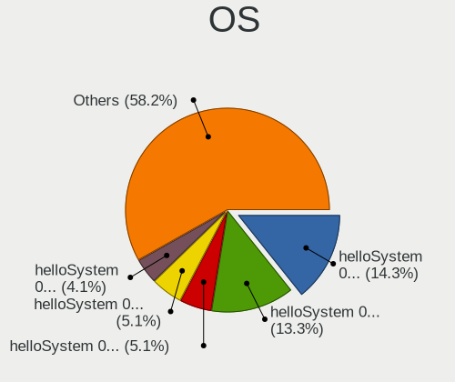

| Name                 | Notebooks | Percent |
|----------------------|-----------|---------|
| helloSystem 0.7.0    | 13        | 16.67%  |
| helloSystem 0.8.1    | 7         | 8.97%   |
| helloSystem 0.5.0    | 5         | 6.41%   |
| helloSystem 0.4.0    | 5         | 6.41%   |
| helloSystem 0.8.0    | 4         | 5.13%   |
| helloSystem 0.6.0    | 3         | 3.85%   |
| NomadBSD 1.3.2       | 2         | 2.56%   |
| helloSystem 0.3.0    | 2         | 2.56%   |
| GhostBSD 21.08.27    | 2         | 2.56%   |
| GhostBSD 20.04.02    | 2         | 2.56%   |
| FreeBSD 13.1         | 2         | 2.56%   |
| OPNsense 22.1.9      | 1         | 1.28%   |
| OPNsense 22.1.6      | 1         | 1.28%   |
| OPNsense 21.7.7      | 1         | 1.28%   |
| OPNsense 21.1        | 1         | 1.28%   |
| OpenBSD 7.2          | 1         | 1.28%   |
| OpenBSD 7.1          | 1         | 1.28%   |
| OpenBSD 6.8          | 1         | 1.28%   |
| OpenBSD 6.7          | 1         | 1.28%   |
| NomadBSD 5806f915    | 1         | 1.28%   |
| NomadBSD 1.4         | 1         | 1.28%   |
| NomadBSD 1.3.1       | 1         | 1.28%   |
| NetBSD 9.2_STABLE    | 1         | 1.28%   |
| NetBSD 9.2           | 1         | 1.28%   |
| NetBSD 9.1           | 1         | 1.28%   |
| NetBSD 9.0           | 1         | 1.28%   |
| NetBSD 10.99.1       | 1         | 1.28%   |
| helloSystem 0.9.0    | 1         | 1.28%   |
| GhostBSD 23.09.16    | 1         | 1.28%   |
| GhostBSD 23.06.05    | 1         | 1.28%   |
| GhostBSD 22.11.02    | 1         | 1.28%   |
| GhostBSD 22.06.26    | 1         | 1.28%   |
| FreeBSD 14.0-CURRENT | 1         | 1.28%   |
| FreeBSD 13.2-p3      | 1         | 1.28%   |
| FreeBSD 13.2-p2      | 1         | 1.28%   |
| FreeBSD 13.0-p4      | 1         | 1.28%   |
| FreeBSD 13.0-CURRENT | 1         | 1.28%   |
| FreeBSD 13.0         | 1         | 1.28%   |
| FreeBSD 12.2-p4      | 1         | 1.28%   |
| FreeBSD 12.2-p2      | 1         | 1.28%   |

OS Family
---------

OS without a version

| Name        | Notebooks | Percent |
|-------------|-----------|---------|
| helloSystem | 37        | 52.11%  |
| FreeBSD     | 11        | 15.49%  |
| GhostBSD    | 6         | 8.45%   |
| NomadBSD    | 5         | 7.04%   |
| OPNsense    | 4         | 5.63%   |
| OpenBSD     | 4         | 5.63%   |
| NetBSD      | 4         | 5.63%   |

Arch
----

OS architecture (x86_64, i586, etc.)

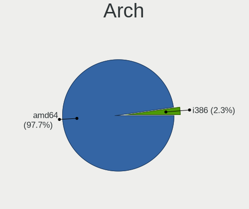

| Name  | Notebooks | Percent |
|-------|-----------|---------|
| amd64 | 68        | 97.14%  |
| i386  | 2         | 2.86%   |

DE
--

Desktop Environment

| Name         | Notebooks | Percent |
|--------------|-----------|---------|
| helloDesktop | 37        | 51.39%  |
| Console      | 6         | 8.33%   |
| Openbox      | 5         | 6.94%   |
| XFCE         | 4         | 5.56%   |
| KDE5         | 4         | 5.56%   |
| i3           | 3         | 4.17%   |
| ctwm         | 3         | 4.17%   |
| Cinnamon     | 3         | 4.17%   |
| MATE         | 2         | 2.78%   |
| fvwm         | 2         | 2.78%   |
| TWM          | 1         | 1.39%   |
| LXQt         | 1         | 1.39%   |
| Fluxbox      | 1         | 1.39%   |

Display Server
--------------

X11 or Wayland

| Name    | Notebooks | Percent |
|---------|-----------|---------|
| X11     | 65        | 92.86%  |
| Console | 4         | 5.71%   |
| Wayland | 1         | 1.43%   |

Display Manager
---------------

SDDM, LightDM, etc.

| Name    | Notebooks | Percent |
|---------|-----------|---------|
| SLiM    | 44        | 61.97%  |
| Console | 16        | 22.54%  |
| LightDM | 6         | 8.45%   |
| SDDM    | 4         | 5.63%   |
| XDM     | 1         | 1.41%   |

OS Lang
-------

Language

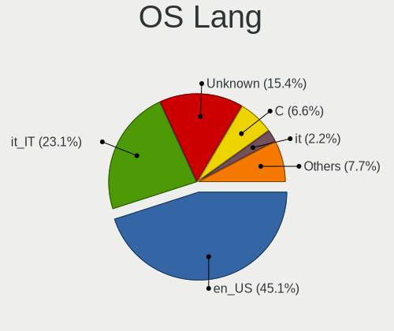

| Lang             | Notebooks | Percent |
|------------------|-----------|---------|
| en_US            | 39        | 54.17%  |
| it_IT            | 12        | 16.67%  |
| Unknown          | 9         | 12.5%   |
| C                | 4         | 5.56%   |
| it               | 2         | 2.78%   |
| ru_RU            | 1         | 1.39%   |
| it_IT.ISO8859-15 | 1         | 1.39%   |
| it_IT.ISO8859-1  | 1         | 1.39%   |
| fr_FR            | 1         | 1.39%   |
| en_GB            | 1         | 1.39%   |
| en               | 1         | 1.39%   |

Boot Mode
---------

EFI or BIOS

| Mode | Notebooks | Percent |
|------|-----------|---------|
| EFI  | 58        | 82.86%  |
| BIOS | 12        | 17.14%  |

Filesystem
----------

Type of filesystem

| Type   | Notebooks | Percent |
|--------|-----------|---------|
| Zfs    | 36        | 50.7%   |
| Ufs    | 17        | 23.94%  |
| Cd9660 | 14        | 19.72%  |
| Ffs    | 4         | 5.63%   |

Part. scheme
------------

Scheme of partitioning

| Type    | Notebooks | Percent |
|---------|-----------|---------|
| GPT     | 62        | 88.57%  |
| MBR     | 6         | 8.57%   |
| Unknown | 2         | 2.86%   |

Board
-----

Vendor
------

Motherboard manufacturer

| Name                | Notebooks | Percent |
|---------------------|-----------|---------|
| Lenovo              | 19        | 27.14%  |
| ASUSTek Computer    | 13        | 18.57%  |
| Dell                | 7         | 10%     |
| Acer                | 7         | 10%     |
| Hewlett-Packard     | 6         | 8.57%   |
| Toshiba             | 3         | 4.29%   |
| Apple               | 3         | 4.29%   |
| eMachines           | 2         | 2.86%   |
| Unknown             | 2         | 2.86%   |
| TUXEDO              | 1         | 1.43%   |
| Samsung Electronics | 1         | 1.43%   |
| Packard Bell        | 1         | 1.43%   |
| MSI                 | 1         | 1.43%   |
| LG Electronics      | 1         | 1.43%   |
| Intel               | 1         | 1.43%   |
| IBM                 | 1         | 1.43%   |
| Deciso              | 1         | 1.43%   |

Model
-----

Motherboard model

| Name                                         | Notebooks | Percent |
|----------------------------------------------|-----------|---------|
| Unknown                                      | 3         | 4.29%   |
| HP Laptop 15-da0xxx                          | 2         | 2.86%   |
| ASUS VivoBook_ASUSLaptop X512DA_F512DA       | 2         | 2.86%   |
| Apple MacBook4,1                             | 2         | 2.86%   |
| TUXEDO N14xWU                                | 1         | 1.43%   |
| Toshiba Satellite C855-1U4                   | 1         | 1.43%   |
| Toshiba PORTEGE M780                         | 1         | 1.43%   |
| Samsung 3570R/370R/470R/450R/510R/4450RV     | 1         | 1.43%   |
| Packard Bell EasyNote_MX61-B-038             | 1         | 1.43%   |
| MSI GF65 Thin 10SER                          | 1         | 1.43%   |
| LG COLUMBIA                                  | 1         | 1.43%   |
| Lenovo ThinkPad X260 20F5S82N00              | 1         | 1.43%   |
| Lenovo ThinkPad X250 20CMS0FA00              | 1         | 1.43%   |
| Lenovo ThinkPad X240 20AMS0J01N              | 1         | 1.43%   |
| Lenovo ThinkPad X1 Extreme Gen 4i 20Y5001DMX | 1         | 1.43%   |
| Lenovo ThinkPad X1 Carbon 6th 20KGS6PC00     | 1         | 1.43%   |
| Lenovo ThinkPad W530 2447GW3                 | 1         | 1.43%   |
| Lenovo ThinkPad T495 20NJS0KP00              | 1         | 1.43%   |
| Lenovo ThinkPad T460s 20FAS3L002             | 1         | 1.43%   |
| Lenovo ThinkPad T450 20BUS06B00              | 1         | 1.43%   |
| Lenovo ThinkPad T440p                        | 1         | 1.43%   |
| Lenovo ThinkPad T440 20B7S1C600              | 1         | 1.43%   |
| Lenovo ThinkPad T430 23501B3                 | 1         | 1.43%   |
| Lenovo ThinkPad T420 4236BD5                 | 1         | 1.43%   |
| Lenovo ThinkPad T410 2537B94                 | 1         | 1.43%   |
| Lenovo ThinkPad L530 24812TG                 | 1         | 1.43%   |
| Lenovo IdeaPad 3 15ADA05 81W1                | 1         | 1.43%   |
| Lenovo G505 20240                            | 1         | 1.43%   |
| Lenovo G50-45 80E3                           | 1         | 1.43%   |
| Lenovo B590 62743PG                          | 1         | 1.43%   |
| Intel S1200RP_SE                             | 1         | 1.43%   |
| IBM ThinkPad R51 2887AVG                     | 1         | 1.43%   |
| HP ProBook 470 G4                            | 1         | 1.43%   |
| HP Pavilion 15                               | 1         | 1.43%   |
| HP Mini 210-1000                             | 1         | 1.43%   |
| HP EliteBook 6930p                           | 1         | 1.43%   |
| eMachines eME732ZG                           | 1         | 1.43%   |
| eMachines eME728                             | 1         | 1.43%   |
| Dell XPS 13 9343                             | 1         | 1.43%   |
| Dell Vostro 3550                             | 1         | 1.43%   |

Model Family
------------

Motherboard model prefix

| Name                  | Notebooks | Percent |
|-----------------------|-----------|---------|
| Lenovo ThinkPad       | 15        | 21.43%  |
| Dell Latitude         | 3         | 4.29%   |
| ASUS VivoBook         | 3         | 4.29%   |
| Acer Aspire           | 3         | 4.29%   |
| Unknown               | 3         | 4.29%   |
| HP Laptop             | 2         | 2.86%   |
| Apple MacBook4        | 2         | 2.86%   |
| TUXEDO N14xWU         | 1         | 1.43%   |
| Toshiba Satellite     | 1         | 1.43%   |
| Toshiba PORTEGE       | 1         | 1.43%   |
| Samsung 3570R         | 1         | 1.43%   |
| Packard Bell EasyNote | 1         | 1.43%   |
| MSI GF65              | 1         | 1.43%   |
| LG COLUMBIA           | 1         | 1.43%   |
| Lenovo IdeaPad        | 1         | 1.43%   |
| Lenovo G505           | 1         | 1.43%   |
| Lenovo G50-45         | 1         | 1.43%   |
| Lenovo B590           | 1         | 1.43%   |
| Intel S1200RP         | 1         | 1.43%   |
| IBM ThinkPad          | 1         | 1.43%   |
| HP ProBook            | 1         | 1.43%   |
| HP Pavilion           | 1         | 1.43%   |
| HP Mini               | 1         | 1.43%   |
| HP EliteBook          | 1         | 1.43%   |
| eMachines eME732ZG    | 1         | 1.43%   |
| eMachines eME728      | 1         | 1.43%   |
| Dell XPS              | 1         | 1.43%   |
| Dell Vostro           | 1         | 1.43%   |
| Dell Precision        | 1         | 1.43%   |
| Dell Inspiron         | 1         | 1.43%   |
| Deciso OPNsense       | 1         | 1.43%   |
| ASUS X555LJ           | 1         | 1.43%   |
| ASUS X555LD           | 1         | 1.43%   |
| ASUS X553MA           | 1         | 1.43%   |
| ASUS X502CA           | 1         | 1.43%   |
| ASUS N751JK           | 1         | 1.43%   |
| ASUS K52F             | 1         | 1.43%   |
| ASUS G1S              | 1         | 1.43%   |
| ASUS F50SL            | 1         | 1.43%   |
| ASUS 1015P            | 1         | 1.43%   |

MFG Year
--------

Motherboard manufacture year

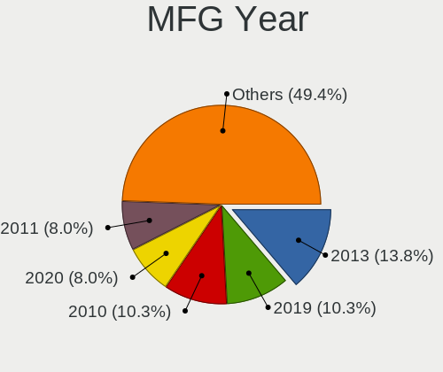

| Year | Notebooks | Percent |
|------|-----------|---------|
| 2013 | 10        | 14.29%  |
| 2019 | 8         | 11.43%  |
| 2011 | 7         | 10%     |
| 2010 | 7         | 10%     |
| 2016 | 6         | 8.57%   |
| 2014 | 5         | 7.14%   |
| 2020 | 4         | 5.71%   |
| 2008 | 4         | 5.71%   |
| 2018 | 3         | 4.29%   |
| 2015 | 3         | 4.29%   |
| 2012 | 3         | 4.29%   |
| 2022 | 2         | 2.86%   |
| 2021 | 2         | 2.86%   |
| 2009 | 2         | 2.86%   |
| 2007 | 2         | 2.86%   |
| 2023 | 1         | 1.43%   |
| 2005 | 1         | 1.43%   |

Form Factor
-----------

Physical design of the computer

| Name     | Notebooks | Percent |
|----------|-----------|---------|
| Notebook | 70        | 100%    |

Coreboot
--------

Have coreboot on board

| Used | Notebooks | Percent |
|------|-----------|---------|
| No   | 69        | 98.57%  |
| Yes  | 1         | 1.43%   |

RAM Size
--------

Total RAM memory

| Size in GB | Notebooks | Percent |
|------------|-----------|---------|
| 8.01-16.0  | 29        | 40.85%  |
| 4.01-8.0   | 24        | 33.8%   |
| 16.01-24.0 | 7         | 9.86%   |
| 2.01-3.0   | 5         | 7.04%   |
| 32.01-64.0 | 3         | 4.23%   |
| 3.01-4.0   | 1         | 1.41%   |
| 24.01-32.0 | 1         | 1.41%   |
| 0.01-0.5   | 1         | 1.41%   |

RAM Used
--------

Used RAM memory

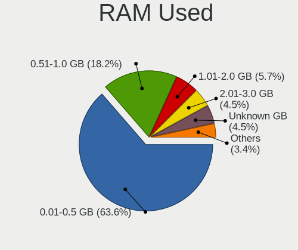

| Used GB   | Notebooks | Percent |
|-----------|-----------|---------|
| 0.01-0.5  | 46        | 64.79%  |
| 0.51-1.0  | 10        | 14.08%  |
| 2.01-3.0  | 4         | 5.63%   |
| 1.01-2.0  | 4         | 5.63%   |
| Unknown   | 4         | 5.63%   |
| 4.01-8.0  | 2         | 2.82%   |
| 8.01-16.0 | 1         | 1.41%   |

Total Drives
------------

Number of drives on board

| Drives | Notebooks | Percent |
|--------|-----------|---------|
| 1      | 52        | 73.24%  |
| 2      | 16        | 22.54%  |
| 0      | 3         | 4.23%   |

Has CD-ROM
----------

Has CD-ROM on board

| Presented | Notebooks | Percent |
|-----------|-----------|---------|
| No        | 42        | 58.33%  |
| Yes       | 30        | 41.67%  |

Has Ethernet
------------

Has Ethernet on board

| Presented | Notebooks | Percent |
|-----------|-----------|---------|
| Yes       | 63        | 90%     |
| No        | 7         | 10%     |

Has WiFi
--------

Has WiFi module

| Presented | Notebooks | Percent |
|-----------|-----------|---------|
| Yes       | 65        | 92.86%  |
| No        | 5         | 7.14%   |

Has Bluetooth
-------------

Has Bluetooth module

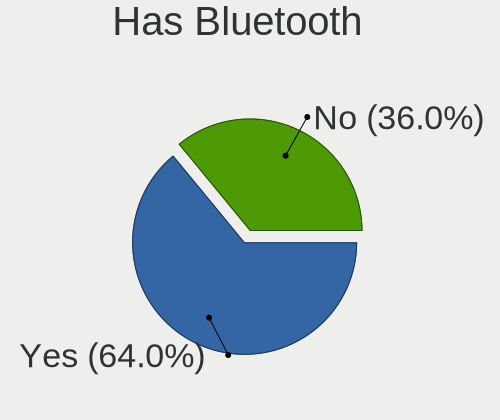

| Presented | Notebooks | Percent |
|-----------|-----------|---------|
| Yes       | 43        | 60.56%  |
| No        | 28        | 39.44%  |

Location
--------

Country
-------

Geographic location (country)

| Country | Notebooks | Percent |
|---------|-----------|---------|
| Italy   | 70        | 100%    |

City
----

Geographic location (city)

| City                     | Notebooks | Percent |
|--------------------------|-----------|---------|
| Rome                     | 14        | 17.5%   |
| Milan                    | 9         | 11.25%  |
| Turin                    | 3         | 3.75%   |
| Brescia                  | 3         | 3.75%   |
| Bologna                  | 3         | 3.75%   |
| Trieste                  | 2         | 2.5%    |
| Sesto San Giovanni       | 2         | 2.5%    |
| Rho                      | 2         | 2.5%    |
| Padova                   | 2         | 2.5%    |
| Monterotondo             | 2         | 2.5%    |
| Vigonza                  | 1         | 1.25%   |
| Vigonovo                 | 1         | 1.25%   |
| Udine                    | 1         | 1.25%   |
| Solarino                 | 1         | 1.25%   |
| Saronno                  | 1         | 1.25%   |
| Roncade                  | 1         | 1.25%   |
| Resana                   | 1         | 1.25%   |
| Piovene Rocchette        | 1         | 1.25%   |
| Pessano Con Bornago      | 1         | 1.25%   |
| Passignano sul Trasimeno | 1         | 1.25%   |
| Nughedu San Nicolo       | 1         | 1.25%   |
| Naturns                  | 1         | 1.25%   |
| Naples                   | 1         | 1.25%   |
| Massa Lombarda           | 1         | 1.25%   |
| Malnate                  | 1         | 1.25%   |
| Macerata                 | 1         | 1.25%   |
| Lurago Marinone          | 1         | 1.25%   |
| Lissone                  | 1         | 1.25%   |
| Iglesias                 | 1         | 1.25%   |
| Genzano di Roma          | 1         | 1.25%   |
| Gattinara                | 1         | 1.25%   |
| Galliera Veneta          | 1         | 1.25%   |
| Gallarate                | 1         | 1.25%   |
| Fiumicino                | 1         | 1.25%   |
| Fiorano Modenese         | 1         | 1.25%   |
| Farneto                  | 1         | 1.25%   |
| Concesio                 | 1         | 1.25%   |
| Cogolo                   | 1         | 1.25%   |
| Cerea                    | 1         | 1.25%   |
| Carugate                 | 1         | 1.25%   |

Drives
------

Drive Vendor
------------

Hard drive vendors

| Vendor              | Notebooks | Drives | Percent |
|---------------------|-----------|--------|---------|
| Samsung Electronics | 13        | 21     | 16.25%  |
| Seagate             | 9         | 12     | 11.25%  |
| Kingston            | 8         | 10     | 10%     |
| WDC                 | 7         | 9      | 8.75%   |
| Crucial             | 7         | 10     | 8.75%   |
| Toshiba             | 6         | 6      | 7.5%    |
| SanDisk             | 4         | 4      | 5%      |
| Hitachi             | 4         | 5      | 5%      |
| Intel               | 3         | 3      | 3.75%   |
| Transcend           | 2         | 2      | 2.5%    |
| Micron Technology   | 2         | 2      | 2.5%    |
| Leven               | 2         | 2      | 2.5%    |
| KingSpec            | 2         | 2      | 2.5%    |
| Union Memory        | 1         | 1      | 1.25%   |
| SPCC                | 1         | 1      | 1.25%   |
| PNY                 | 1         | 1      | 1.25%   |
| KingDian            | 1         | 1      | 1.25%   |
| Intenso             | 1         | 1      | 1.25%   |
| Indilinx            | 1         | 1      | 1.25%   |
| HGST                | 1         | 1      | 1.25%   |
| Fujitsu             | 1         | 1      | 1.25%   |
| FORESEE             | 1         | 2      | 1.25%   |
| ASUSTek Computer    | 1         | 2      | 1.25%   |
| Apple               | 1         | 1      | 1.25%   |

Drive Model
-----------

Hard drive models

| Model                                           | Notebooks | Percent |
|-------------------------------------------------|-----------|---------|
| Samsung SSD 860 EVO 500GB                       | 3         | 3.57%   |
| Kingston SA400S37240G 240GB                     | 3         | 3.57%   |
| WDC WDS240G2G0A-00JH30 240GB                    | 2         | 2.38%   |
| Samsung SSD 860 EVO 250GB                       | 2         | 2.38%   |
| Samsung SSD 850 EVO 500GB                       | 2         | 2.38%   |
| KingSpec Q-720 720GB                            | 2         | 2.38%   |
| Intel SSDSC2BF180A4L 180GB                      | 2         | 2.38%   |
| WDC WDS500G2B0A-00SM50 500GB                    | 1         | 1.19%   |
| WDC WDS120G2G0A-00JH30 120GB                    | 1         | 1.19%   |
| WDC WD5000BPKT-00PK4T0 500GB                    | 1         | 1.19%   |
| WDC WD3200BEKX-60B7WT0 320GB                    | 1         | 1.19%   |
| WDC WD2500LPCX-24C6HT0 250GB                    | 1         | 1.19%   |
| WDC WD2500BEVS-22UST0 250GB                     | 1         | 1.19%   |
| Union Memory UMIS LENSE40512GMSP34MESTB3A 512GB | 1         | 1.19%   |
| Transcend TS256GMTE652T2 256GB                  | 1         | 1.19%   |
| Transcend TS120GMTS420S 120GB                   | 1         | 1.19%   |
| Toshiba TR200 240GB                             | 1         | 1.19%   |
| Toshiba MQ04ABF100 1TB                          | 1         | 1.19%   |
| Toshiba MQ01ABF050 500GB                        | 1         | 1.19%   |
| Toshiba MQ01ABD050 500GB                        | 1         | 1.19%   |
| Toshiba MK5065GSX 500GB                         | 1         | 1.19%   |
| Toshiba MK2561GSYN 250GB                        | 1         | 1.19%   |
| SPCC Solid State Disk 256GB                     | 1         | 1.19%   |
| Seagate ST9750420AS 752GB                       | 1         | 1.19%   |
| Seagate ST9320320AS 320GB                       | 1         | 1.19%   |
| Seagate ST9160821AS 160GB                       | 1         | 1.19%   |
| Seagate ST9160411AS 160GB                       | 1         | 1.19%   |
| Seagate ST750LM022 HN-M750MBB 752GB             | 1         | 1.19%   |
| Seagate ST500LT012-9WS142 500GB                 | 1         | 1.19%   |
| Seagate ST500LM030-1RK17D 500GB                 | 1         | 1.19%   |
| Seagate ST250LM000 HM251HI 250GB                | 1         | 1.19%   |
| Seagate ST1000LM035-1RK172 1TB                  | 1         | 1.19%   |
| Seagate ST1000LM014-1EJ164 1TB                  | 1         | 1.19%   |
| SanDisk X400 M.2 2280 512GB                     | 1         | 1.19%   |
| SanDisk SSD P4 8GB                              | 1         | 1.19%   |
| SanDisk SDSSDP064G 64GB                         | 1         | 1.19%   |
| SanDisk SD9SN8W-128G-1006 128GB                 | 1         | 1.19%   |
| Samsung SSD 970 EVO 250GB                       | 1         | 1.19%   |
| Samsung SSD 870 EVO 500GB                       | 1         | 1.19%   |
| Samsung SSD 870 EVO 1TB                         | 1         | 1.19%   |

HDD Vendor
----------

Hard disk drive vendors

| Vendor  | Notebooks | Drives | Percent |
|---------|-----------|--------|---------|
| Seagate | 9         | 12     | 39.13%  |
| Toshiba | 5         | 5      | 21.74%  |
| Hitachi | 4         | 5      | 17.39%  |
| WDC     | 3         | 4      | 13.04%  |
| HGST    | 1         | 1      | 4.35%   |
| Fujitsu | 1         | 1      | 4.35%   |

SSD Vendor
----------

Solid state drive vendors

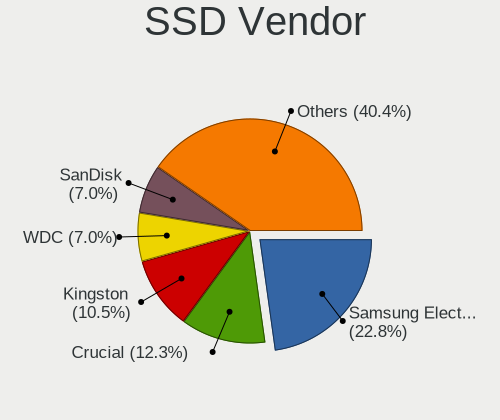

| Vendor              | Notebooks | Drives | Percent |
|---------------------|-----------|--------|---------|
| Samsung Electronics | 10        | 17     | 20.83%  |
| Crucial             | 7         | 10     | 14.58%  |
| Kingston            | 5         | 6      | 10.42%  |
| WDC                 | 4         | 5      | 8.33%   |
| SanDisk             | 4         | 4      | 8.33%   |
| Intel               | 3         | 3      | 6.25%   |
| Leven               | 2         | 2      | 4.17%   |
| KingSpec            | 2         | 2      | 4.17%   |
| Transcend           | 1         | 1      | 2.08%   |
| Toshiba             | 1         | 1      | 2.08%   |
| SPCC                | 1         | 1      | 2.08%   |
| PNY                 | 1         | 1      | 2.08%   |
| Micron Technology   | 1         | 1      | 2.08%   |
| KingDian            | 1         | 1      | 2.08%   |
| Intenso             | 1         | 1      | 2.08%   |
| Indilinx            | 1         | 1      | 2.08%   |
| FORESEE             | 1         | 2      | 2.08%   |
| ASUSTek Computer    | 1         | 2      | 2.08%   |
| Apple               | 1         | 1      | 2.08%   |

Drive Kind
----------

HDD or SSD

| Kind | Notebooks | Drives | Percent |
|------|-----------|--------|---------|
| SSD  | 43        | 62     | 57.33%  |
| HDD  | 22        | 28     | 29.33%  |
| NVMe | 10        | 11     | 13.33%  |

Drive Connector
---------------

SATA, SAS, NVMe, etc.

| Type | Notebooks | Drives | Percent |
|------|-----------|--------|---------|
| SATA | 60        | 90     | 85.71%  |
| NVMe | 10        | 11     | 14.29%  |

Drive Size
----------

Size of hard drive

| Size in TB | Notebooks | Drives | Percent |
|------------|-----------|--------|---------|
| 0.01-0.5   | 52        | 71     | 83.87%  |
| 0.51-1.0   | 10        | 19     | 16.13%  |

Space Total
-----------

Amount of disk space available on the file system

| Size in GB | Notebooks | Percent |
|------------|-----------|---------|
| 1-20       | 34        | 47.22%  |
| 101-250    | 16        | 22.22%  |
| 251-500    | 9         | 12.5%   |
| 21-50      | 7         | 9.72%   |
| 501-1000   | 3         | 4.17%   |
| 51-100     | 3         | 4.17%   |

Space Used
----------

Amount of used disk space

| Used GB | Notebooks | Percent |
|---------|-----------|---------|
| 1-20    | 65        | 89.04%  |
| 21-50   | 7         | 9.59%   |
| 51-100  | 1         | 1.37%   |

Malfunc. Drives
---------------

Drive models with a malfunction

| Model                                 | Notebooks | Drives | Percent |
|---------------------------------------|-----------|--------|---------|
| Intel SSDSC2BF180A4L 180GB            | 2         | 2      | 14.29%  |
| Toshiba MQ01ABD050 500GB              | 1         | 1      | 7.14%   |
| Toshiba MK5065GSX 500GB               | 1         | 1      | 7.14%   |
| Seagate ST9750420AS 752GB             | 1         | 1      | 7.14%   |
| Seagate ST9160821AS 160GB             | 1         | 1      | 7.14%   |
| Seagate ST750LM022 HN-M750MBB 752GB   | 1         | 1      | 7.14%   |
| Seagate ST500LT012-9WS142 500GB       | 1         | 1      | 7.14%   |
| SanDisk SDSSDP064G 64GB               | 1         | 1      | 7.14%   |
| SanDisk SD9SN8W-128G-1006 128GB       | 1         | 1      | 7.14%   |
| Samsung Electronics SSD 870 EVO 500GB | 1         | 1      | 7.14%   |
| Hitachi HTS548040M9AT00 37GB          | 1         | 2      | 7.14%   |
| Hitachi HTS545050A7E380 500GB         | 1         | 1      | 7.14%   |
| Crucial CT525MX300SSD1 528GB          | 1         | 3      | 7.14%   |

Malfunc. Drive Vendor
---------------------

Vendors of faulty drives

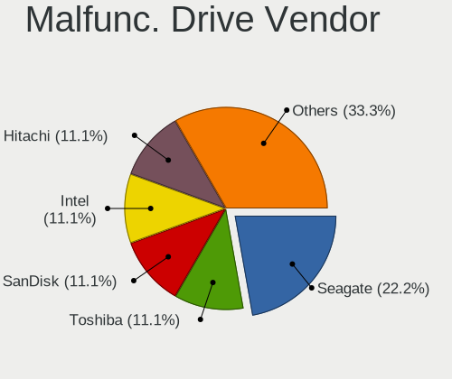

| Vendor              | Notebooks | Drives | Percent |
|---------------------|-----------|--------|---------|
| Seagate             | 4         | 4      | 28.57%  |
| Toshiba             | 2         | 2      | 14.29%  |
| SanDisk             | 2         | 2      | 14.29%  |
| Intel               | 2         | 2      | 14.29%  |
| Hitachi             | 2         | 3      | 14.29%  |
| Samsung Electronics | 1         | 1      | 7.14%   |
| Crucial             | 1         | 3      | 7.14%   |

Malfunc. HDD Vendor
-------------------

Vendors of faulty HDD drives

| Vendor  | Notebooks | Drives | Percent |
|---------|-----------|--------|---------|
| Seagate | 4         | 4      | 50%     |
| Toshiba | 2         | 2      | 25%     |
| Hitachi | 2         | 3      | 25%     |

Malfunc. Drive Kind
-------------------

Kinds of faulty drives

| Kind | Notebooks | Drives | Percent |
|------|-----------|--------|---------|
| HDD  | 8         | 9      | 57.14%  |
| SSD  | 6         | 8      | 42.86%  |

Failed Drives
-------------

Failed drive models

Zero info for selected period =(

Failed Drive Vendor
-------------------

Failed drive vendors

Zero info for selected period =(

Drive Status
------------

Number of failed and malfunc. drives

| Status   | Notebooks | Drives | Percent |
|----------|-----------|--------|---------|
| Works    | 54        | 82     | 78.26%  |
| Malfunc  | 14        | 17     | 20.29%  |
| Detected | 1         | 2      | 1.45%   |

Storage controller
------------------

Storage Vendor
--------------

Storage controller vendors

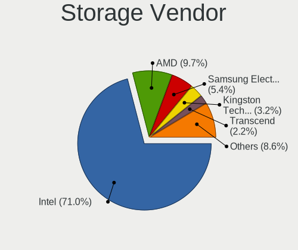

| Vendor                           | Notebooks | Percent |
|----------------------------------|-----------|---------|
| Intel                            | 54        | 71.05%  |
| AMD                              | 9         | 11.84%  |
| Samsung Electronics              | 4         | 5.26%   |
| Kingston Technology Company      | 3         | 3.95%   |
| Union Memory (Shenzhen)          | 1         | 1.32%   |
| Transcend                        | 1         | 1.32%   |
| Silicon Integrated Systems [SiS] | 1         | 1.32%   |
| SanDisk                          | 1         | 1.32%   |
| Micron Technology                | 1         | 1.32%   |
| JMicron Technology               | 1         | 1.32%   |

Storage Model
-------------

Storage controller models

| Model                                                                                  | Notebooks | Percent |
|----------------------------------------------------------------------------------------|-----------|---------|
| Intel 7 Series Chipset Family 6-port SATA Controller [AHCI mode]                       | 8         | 9.2%    |
| AMD FCH SATA Controller [AHCI mode]                                                    | 7         | 8.05%   |
| Intel Wildcat Point-LP SATA Controller [AHCI Mode]                                     | 6         | 6.9%    |
| Intel Sunrise Point-LP SATA Controller [AHCI mode]                                     | 5         | 5.75%   |
| Intel 82801HM/HEM (ICH8M/ICH8M-E) SATA Controller [AHCI mode]                          | 5         | 5.75%   |
| Intel 82801HM/HEM (ICH8M/ICH8M-E) IDE Controller                                       | 5         | 5.75%   |
| Intel 6 Series/C200 Series Chipset Family 6 port Mobile SATA AHCI Controller           | 5         | 5.75%   |
| Intel 82801IBM/IEM (ICH9M/ICH9M-E) 4 port SATA Controller [AHCI mode]                  | 4         | 4.6%    |
| Intel NM10/ICH7 Family SATA Controller [AHCI mode]                                     | 3         | 3.45%   |
| Intel 8 Series/C220 Series Chipset Family 6-port SATA Controller 1 [AHCI mode]         | 3         | 3.45%   |
| Intel 8 Series SATA Controller 1 [AHCI mode]                                           | 3         | 3.45%   |
| Intel 5 Series/3400 Series Chipset 4 port SATA AHCI Controller                         | 3         | 3.45%   |
| Samsung NVMe SSD Controller SM981/PM981/PM983                                          | 2         | 2.3%    |
| Intel 82801 Mobile SATA Controller [RAID mode]                                         | 2         | 2.3%    |
| Union Memory (Shenzhen) AH631 PCIe 3.0 NVMe SSD 512GB                                  | 1         | 1.15%   |
| Transcend NVMe PCIe SSD 110S/112S/120S/MTE300S/MTE400S/MTE652T2 (DRAM-less)            | 1         | 1.15%   |
| Silicon Integrated Systems [SiS] SATA Controller / IDE mode                            | 1         | 1.15%   |
| Silicon Integrated Systems [SiS] 5513 IDE Controller                                   | 1         | 1.15%   |
| SanDisk Ultra 3D / WD Blue SN570 NVMe SSD (DRAM-less)                                  | 1         | 1.15%   |
| Samsung S4LN058A01[SSUBX] AHCI SSD Controller (Apple slot)                             | 1         | 1.15%   |
| Samsung NVMe SSD Controller 980 (DRAM-less)                                            | 1         | 1.15%   |
| Micron 2210 NVMe SSD [Cobain]                                                          | 1         | 1.15%   |
| Kingston Company OM8PCP Design-In PCIe 3 NVMe SSD (DRAM-less)                          | 1         | 1.15%   |
| Kingston Company NV1 NVMe SSD SM2263XT                                                 | 1         | 1.15%   |
| Kingston Company A1000/U-SNS8154P3 x2 NVMe SSD                                         | 1         | 1.15%   |
| JMicron JMB360 AHCI Controller                                                         | 1         | 1.15%   |
| Intel Q170/Q150/B150/H170/H110/Z170/CM236 Chipset SATA Controller [AHCI Mode]          | 1         | 1.15%   |
| Intel Mobile 4 Series Chipset PT IDER Controller                                       | 1         | 1.15%   |
| Intel Atom/Celeron/Pentium Processor x5-E8000/J3xxx/N3xxx Series SATA Controller       | 1         | 1.15%   |
| Intel Atom Processor E3800 Series SATA AHCI Controller                                 | 1         | 1.15%   |
| Intel 82801GBM/GHM (ICH7-M Family) SATA Controller [IDE mode]                          | 1         | 1.15%   |
| Intel 82801DBM (ICH4-M) IDE Controller                                                 | 1         | 1.15%   |
| Intel 6 Series/C200 Series Chipset Family Mobile SATA Controller (IDE mode, ports 4-5) | 1         | 1.15%   |
| Intel 6 Series/C200 Series Chipset Family Mobile SATA Controller (IDE mode, ports 0-3) | 1         | 1.15%   |
| Intel 5 Series/3400 Series Chipset 6 port SATA AHCI Controller                         | 1         | 1.15%   |
| Intel 5 Series/3400 Series Chipset 4 port SATA IDE Controller                          | 1         | 1.15%   |
| Intel 5 Series/3400 Series Chipset 2 port SATA IDE Controller                          | 1         | 1.15%   |
| AMD SB7x0/SB8x0/SB9x0 SATA Controller [AHCI mode]                                      | 1         | 1.15%   |
| AMD SB600 Non-Raid-5 SATA                                                              | 1         | 1.15%   |
| AMD SB600 IDE                                                                          | 1         | 1.15%   |

Storage Kind
------------

Kind of storage controller (IDE, SATA, NVMe, SAS, ...)

| Kind | Notebooks | Percent |
|------|-----------|---------|
| SATA | 58        | 70.73%  |
| IDE  | 12        | 14.63%  |
| NVMe | 10        | 12.2%   |
| RAID | 2         | 2.44%   |

Processor
---------

CPU Vendor
----------

Processor vendors

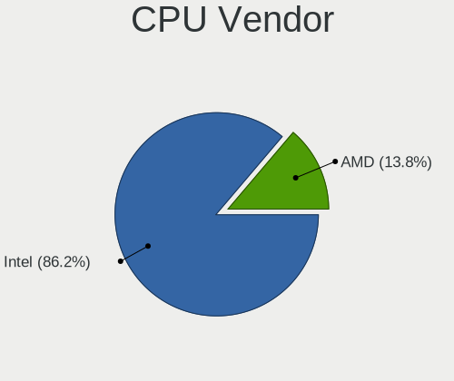

| Vendor | Notebooks | Percent |
|--------|-----------|---------|
| Intel  | 59        | 84.29%  |
| AMD    | 11        | 15.71%  |

CPU Model
---------

Processor models

| Model                                         | Notebooks | Percent |
|-----------------------------------------------|-----------|---------|
| Intel Core i7-5500U CPU @ 2.40GHz             | 3         | 4.23%   |
| Intel Core i5-6300U CPU @ 2.40GHz             | 3         | 4.23%   |
| Intel Core i5-2520M CPU @ 2.50GHz             | 3         | 4.23%   |
| Intel Core i7-8550U CPU @ 1.80GHz             | 2         | 2.82%   |
| Intel Core i5-5300U CPU @ 2.30GHz             | 2         | 2.82%   |
| Intel Core i5-3210M CPU @ 2.50GHz             | 2         | 2.82%   |
| Intel Atom CPU N450 @ 1.66GHz                 | 2         | 2.82%   |
| AMD Ryzen 5 3500U with Radeon Vega Mobile Gfx | 2         | 2.82%   |
| Intel Xeon CPU E3-1230 v3 @ 3.30GHz           | 1         | 1.41%   |
| Intel Pentium M processor                     | 1         | 1.41%   |
| Intel Pentium Dual-Core CPU T4500 @ 2.30GHz   | 1         | 1.41%   |
| Intel Pentium Dual-Core CPU T4200 @ 2.00GHz   | 1         | 1.41%   |
| Intel Pentium CPU P6200 @ 2.13GHz             | 1         | 1.41%   |
| Intel Pentium CPU P6200 @ 2.13GH              | 1         | 1.41%   |
| Intel Pentium CPU B960 @ 2.20GHz              | 1         | 1.41%   |
| Intel Pentium CPU 997 @ 1.60GHz               | 1         | 1.41%   |
| Intel CPU Version                             | 1         | 1.41%   |
| Intel Core i7-7500U CPU @ 2.70GHz             | 1         | 1.41%   |
| Intel Core i7-6700HQ CPU @ 2.60GHz            | 1         | 1.41%   |
| Intel Core i7-4710MQ CPU @ 2.50GHz            | 1         | 1.41%   |
| Intel Core i7-4710HQ CPU @ 2.50GHz            | 1         | 1.41%   |
| Intel Core i7-4510U CPU @ 2.00GHz             | 1         | 1.41%   |
| Intel Core i7-3740QM CPU @ 2.70GHz            | 1         | 1.41%   |
| Intel Core i7 CPU Q 720 @ 1.60GHz             | 1         | 1.41%   |
| Intel Core i5-8250U CPU @ 1.60GHz             | 1         | 1.41%   |
| Intel Core i5-5350U CPU @ 1.80GHz             | 1         | 1.41%   |
| Intel Core i5-5200U CPU @ 2.20GHz             | 1         | 1.41%   |
| Intel Core i5-4300U CPU @ 1.90GHz             | 1         | 1.41%   |
| Intel Core i5-4210U CPU @ 1.70GHz             | 1         | 1.41%   |
| Intel Core i5-3320M CPU @ 2.60GHz             | 1         | 1.41%   |
| Intel Core i5-2540M CPU @ 2.60GHz             | 1         | 1.41%   |
| Intel Core i5-10300H CPU @ 2.50GHz            | 1         | 1.41%   |
| Intel Core i5 CPU M 520 @ 2.40GHz             | 1         | 1.41%   |
| Intel Core i3-7020U CPU @ 2.30GHz             | 1         | 1.41%   |
| Intel Core i3-3110M CPU @ 2.40GHz             | 1         | 1.41%   |
| Intel Core i3 CPU M 370 @ 2.40GHz             | 1         | 1.41%   |
| Intel Core 2 Duo CPU T9400 @ 2.53GHz          | 1         | 1.41%   |
| Intel Core 2 Duo CPU T9300 @ 2.50GHz          | 1         | 1.41%   |
| Intel Core 2 Duo CPU T8300 @ 2.40GHz          | 1         | 1.41%   |
| Intel Core 2 Duo CPU T8100 @ 2.10GHz          | 1         | 1.41%   |

CPU Model Family
----------------

Processor model prefix

| Model                   | Notebooks | Percent |
|-------------------------|-----------|---------|
| Intel Core i5           | 19        | 26.76%  |
| Intel Core i7           | 12        | 16.9%   |
| Intel Core 2 Duo        | 6         | 8.45%   |
| Intel Pentium           | 4         | 5.63%   |
| Intel Celeron           | 4         | 5.63%   |
| Intel Atom              | 4         | 5.63%   |
| Other                   | 3         | 4.23%   |
| Intel Core i3           | 3         | 4.23%   |
| AMD Ryzen 5             | 3         | 4.23%   |
| Intel Pentium Dual-Core | 2         | 2.82%   |
| Intel Xeon              | 1         | 1.41%   |
| Intel Pentium M         | 1         | 1.41%   |
| Intel Core 2            | 1         | 1.41%   |
| Intel 686-class         | 1         | 1.41%   |
| AMD Turion 64 X2 Mobile | 1         | 1.41%   |
| AMD Ryzen Embedded      | 1         | 1.41%   |
| AMD Ryzen 7 PRO         | 1         | 1.41%   |
| AMD E1                  | 1         | 1.41%   |
| AMD E                   | 1         | 1.41%   |
| AMD A6                  | 1         | 1.41%   |
| AMD A4                  | 1         | 1.41%   |

CPU Cores
---------

Number of processor cores

| Number  | Notebooks | Percent |
|---------|-----------|---------|
| 2       | 41        | 57.75%  |
| 4       | 12        | 16.9%   |
| Unknown | 9         | 12.68%  |
| 8       | 5         | 7.04%   |
| 1       | 3         | 4.23%   |
| 12      | 1         | 1.41%   |

CPU Sockets
-----------

Number of sockets

| Number  | Notebooks | Percent |
|---------|-----------|---------|
| 1       | 68        | 95.77%  |
| 2       | 2         | 2.82%   |
| Unknown | 1         | 1.41%   |

CPU Threads
-----------

Threads per core (Hyper-Threading)

| Number  | Notebooks | Percent |
|---------|-----------|---------|
| 2       | 39        | 54.93%  |
| 1       | 23        | 32.39%  |
| Unknown | 9         | 12.68%  |

CPU Microarch
-------------

Microarchitecture

| Name        | Notebooks | Percent |
|-------------|-----------|---------|
| Penryn      | 9         | 12.68%  |
| SandyBridge | 7         | 9.86%   |
| Broadwell   | 7         | 9.86%   |
| IvyBridge   | 6         | 8.45%   |
| Haswell     | 6         | 8.45%   |
| KabyLake    | 5         | 7.04%   |
| Westmere    | 4         | 5.63%   |
| Skylake     | 4         | 5.63%   |
| Bonnell     | 4         | 5.63%   |
| Zen+        | 3         | 4.23%   |
| Unknown     | 3         | 4.23%   |
| Zen         | 2         | 2.82%   |
| Silvermont  | 2         | 2.82%   |
| Jaguar      | 2         | 2.82%   |
| Puma        | 1         | 1.41%   |
| P6          | 1         | 1.41%   |
| Nehalem     | 1         | 1.41%   |
| K8 Hammer   | 1         | 1.41%   |
| Core        | 1         | 1.41%   |
| CometLake   | 1         | 1.41%   |
| Bobcat      | 1         | 1.41%   |

Graphics
--------

GPU Vendor
----------

Vendors of graphics cards

| Vendor                     | Notebooks | Percent |
|----------------------------|-----------|---------|
| Intel                      | 49        | 61.25%  |
| AMD                        | 17        | 21.25%  |
| Nvidia                     | 13        | 16.25%  |
| Matrox Electronics Systems | 1         | 1.25%   |

GPU Model
---------

Graphics card models

| Model                                                                                    | Notebooks | Percent |
|------------------------------------------------------------------------------------------|-----------|---------|
| Intel 2nd Generation Core Processor Family Integrated Graphics Controller                | 7         | 8.33%   |
| Intel HD Graphics 5500                                                                   | 6         | 7.14%   |
| Intel 3rd Gen Core processor Graphics Controller                                         | 4         | 4.76%   |
| AMD Picasso/Raven 2 [Radeon Vega Series / Radeon Vega Mobile Series]                     | 4         | 4.76%   |
| Intel UHD Graphics 620                                                                   | 3         | 3.57%   |
| Intel Skylake GT2 [HD Graphics 520]                                                      | 3         | 3.57%   |
| Intel Mobile 4 Series Chipset Integrated Graphics Controller                             | 3         | 3.57%   |
| Intel Haswell-ULT Integrated Graphics Controller                                         | 3         | 3.57%   |
| Intel Core Processor Integrated Graphics Controller                                      | 3         | 3.57%   |
| Intel Atom Processor D4xx/D5xx/N4xx/N5xx Integrated Graphics Controller                  | 3         | 3.57%   |
| Nvidia GM107M [GeForce GTX 850M]                                                         | 2         | 2.38%   |
| Intel Mobile GM965/GL960 Integrated Graphics Controller (secondary)                      | 2         | 2.38%   |
| Intel Mobile GM965/GL960 Integrated Graphics Controller (primary)                        | 2         | 2.38%   |
| Intel HD Graphics 620                                                                    | 2         | 2.38%   |
| Intel 4th Gen Core Processor Integrated Graphics Controller                              | 2         | 2.38%   |
| Nvidia TU106M [GeForce RTX 2060 Mobile]                                                  | 1         | 1.19%   |
| Nvidia GT216M [GeForce GT 330M]                                                          | 1         | 1.19%   |
| Nvidia GM108M [GeForce MX130]                                                            | 1         | 1.19%   |
| Nvidia GM108M [GeForce 930MX]                                                            | 1         | 1.19%   |
| Nvidia GK208BM [GeForce 920M]                                                            | 1         | 1.19%   |
| Nvidia GK107GLM [Quadro K1000M]                                                          | 1         | 1.19%   |
| Nvidia GF117M [GeForce 610M/710M/810M/820M / GT 620M/625M/630M/720M]                     | 1         | 1.19%   |
| Nvidia GA107M [GeForce RTX 3050 Ti Mobile]                                               | 1         | 1.19%   |
| Nvidia G86M [Quadro NVS 140M]                                                            | 1         | 1.19%   |
| Nvidia G86M [GeForce 8600M GS]                                                           | 1         | 1.19%   |
| Nvidia G84M [GeForce 8600M GT]                                                           | 1         | 1.19%   |
| Matrox Electronics Systems MGA G200e [Pilot] ServerEngines (SEP1)                        | 1         | 1.19%   |
| Intel TigerLake-H GT1 [UHD Graphics]                                                     | 1         | 1.19%   |
| Intel Mobile 945GSE Express Integrated Graphics Controller                               | 1         | 1.19%   |
| Intel Mobile 945GM/GMS/GME, 943/940GML Express Integrated Graphics Controller            | 1         | 1.19%   |
| Intel HD Graphics 6000                                                                   | 1         | 1.19%   |
| Intel HD Graphics 530                                                                    | 1         | 1.19%   |
| Intel CometLake-H GT2 [UHD Graphics]                                                     | 1         | 1.19%   |
| Intel Atom/Celeron/Pentium Processor x5-E8000/J3xxx/N3xxx Integrated Graphics Controller | 1         | 1.19%   |
| Intel Atom Processor Z36xxx/Z37xxx Series Graphics & Display                             | 1         | 1.19%   |
| Intel 82852/855GM Integrated Graphics Device                                             | 1         | 1.19%   |
| AMD Wrestler [Radeon HD 6310]                                                            | 1         | 1.19%   |
| AMD Whistler [Radeon HD 6630M/6650M/6750M/7670M/7690M]                                   | 1         | 1.19%   |
| AMD Whistler LE [Radeon HD 6610M/7610M]                                                  | 1         | 1.19%   |
| AMD Sun PRO [Radeon HD 8570A/8570M]                                                      | 1         | 1.19%   |

GPU Combo
---------

Combinations of graphics cards

| Name           | Notebooks | Percent |
|----------------|-----------|---------|
| 1 x Intel      | 30        | 42.86%  |
| 1 x AMD        | 13        | 18.57%  |
| 2 x Intel      | 9         | 12.86%  |
| Intel + Nvidia | 8         | 11.43%  |
| 1 x Nvidia     | 5         | 7.14%   |
| Intel + AMD    | 2         | 2.86%   |
| Other          | 1         | 1.43%   |
| 2 x AMD        | 1         | 1.43%   |
| AMD + Matrox   | 1         | 1.43%   |

GPU Driver
----------

Free vs proprietary

| Driver      | Notebooks | Percent |
|-------------|-----------|---------|
| Free        | 60        | 83.33%  |
| Proprietary | 7         | 9.72%   |
| Unknown     | 5         | 6.94%   |

GPU Memory
----------

Total video memory

| Size in GB | Notebooks | Percent |
|------------|-----------|---------|
| Unknown    | 54        | 77.14%  |
| 0.01-0.5   | 9         | 12.86%  |
| 1.01-2.0   | 5         | 7.14%   |
| 3.01-4.0   | 1         | 1.43%   |
| 0.51-1.0   | 1         | 1.43%   |

Monitor
-------

Monitor Vendor
--------------

Monitor vendors

| Vendor                  | Notebooks | Percent |
|-------------------------|-----------|---------|
| AU Optronics            | 15        | 30.61%  |
| LG Display              | 10        | 20.41%  |
| Chimei Innolux          | 5         | 10.2%   |
| BOE                     | 5         | 10.2%   |
| Samsung Electronics     | 2         | 4.08%   |
| Lenovo                  | 2         | 4.08%   |
| HannStar                | 2         | 4.08%   |
| Apple                   | 2         | 4.08%   |
| ___                     | 1         | 2.04%   |
| LPL                     | 1         | 2.04%   |
| LG Philips              | 1         | 2.04%   |
| Hewlett-Packard         | 1         | 2.04%   |
| Fujitsu Siemens         | 1         | 2.04%   |
| Chi Mei Optoelectronics | 1         | 2.04%   |

Monitor Model
-------------

Monitor models

| Model                                                                    | Notebooks | Percent |
|--------------------------------------------------------------------------|-----------|---------|
| HannStar LCD Monitor HSD03E9 1024x600 220x130mm 10.1-inch                | 2         | 4.08%   |
| AU Optronics LCD Monitor AUO2A3C 1366x768 310x170mm 13.9-inch            | 2         | 4.08%   |
| AU Optronics LCD Monitor AUO26EC 1366x768 340x190mm 15.3-inch            | 2         | 4.08%   |
| ___ MY TV LED TV ___0101 1920x1080                                       | 1         | 2.04%   |
| Samsung Electronics LCD Monitor SEC304C 1366x768 310x170mm 13.9-inch     | 1         | 2.04%   |
| Samsung Electronics LCD Monitor SDC314D 1366x768 310x170mm 13.9-inch     | 1         | 2.04%   |
| LPL LCD Monitor 1680x1050                                                | 1         | 2.04%   |
| LG Philips LCD Monitor LPLE300 1280x800 330x210mm 15.4-inch              | 1         | 2.04%   |
| LG Display LCD Monitor LGD06AA 3840x2400 340x210mm 15.7-inch             | 1         | 2.04%   |
| LG Display LCD Monitor LGD0521 1920x1080 310x170mm 13.9-inch             | 1         | 2.04%   |
| LG Display LCD Monitor LGD049B 1920x1080 340x190mm 15.3-inch             | 1         | 2.04%   |
| LG Display LCD Monitor LGD046C 1920x1080 380x210mm 17.1-inch             | 1         | 2.04%   |
| LG Display LCD Monitor LGD045C 1366x768 350x190mm 15.7-inch              | 1         | 2.04%   |
| LG Display LCD Monitor LGD03CD 1366x768 280x160mm 12.7-inch              | 1         | 2.04%   |
| LG Display LCD Monitor LGD039F 1366x768 350x190mm 15.7-inch              | 1         | 2.04%   |
| LG Display LCD Monitor LGD033A 1366x768 340x190mm 15.3-inch              | 1         | 2.04%   |
| LG Display LCD Monitor LGD02DC 1366x768 340x190mm 15.3-inch              | 1         | 2.04%   |
| LG Display LCD Monitor LGD0250 1366x768 350x190mm 15.7-inch              | 1         | 2.04%   |
| Lenovo LCD Monitor LEN40B1 1600x900 340x190mm 15.3-inch                  | 1         | 2.04%   |
| Lenovo LCD Monitor LEN40A3 1920x1080 310x170mm 13.9-inch                 | 1         | 2.04%   |
| Hewlett-Packard 24fw HPN3605 1920x1080 530x300mm 24.0-inch               | 1         | 2.04%   |
| Fujitsu Siemens B23T-6 LED FUS07FB 1920x1080 510x290mm 23.1-inch         | 1         | 2.04%   |
| Chimei Innolux LCD Monitor CMN15E6 1366x768 340x190mm 15.3-inch          | 1         | 2.04%   |
| Chimei Innolux LCD Monitor CMN15BF 1366x768 340x190mm 15.3-inch          | 1         | 2.04%   |
| Chimei Innolux LCD Monitor CMN15B8 1366x768 340x190mm 15.3-inch          | 1         | 2.04%   |
| Chimei Innolux LCD Monitor CMN15AB 1366x768 340x190mm 15.3-inch          | 1         | 2.04%   |
| Chimei Innolux LCD Monitor CMN14D2 1920x1080 310x170mm 13.9-inch         | 1         | 2.04%   |
| Chi Mei Optoelectronics LCD Monitor CMO1554 1280x800 330x210mm 15.4-inch | 1         | 2.04%   |
| BOE LCD Monitor BOE07F1 1920x1080 340x190mm 15.3-inch                    | 1         | 2.04%   |
| BOE LCD Monitor BOE06D3 1366x768 340x190mm 15.3-inch                     | 1         | 2.04%   |
| BOE LCD Monitor BOE06A4 1366x768 340x190mm 15.3-inch                     | 1         | 2.04%   |
| BOE LCD Monitor BOE0691 1920x1080 280x160mm 12.7-inch                    | 1         | 2.04%   |
| BOE LCD Monitor BOE0671 1366x768 340x190mm 15.3-inch                     | 1         | 2.04%   |
| AU Optronics LCD Monitor AUOAF90 1920x1080 340x190mm 15.3-inch           | 1         | 2.04%   |
| AU Optronics LCD Monitor AUO573D 1920x1080 310x170mm 13.9-inch           | 1         | 2.04%   |
| AU Optronics LCD Monitor AUO38ED 1920x1080 340x190mm 15.3-inch           | 1         | 2.04%   |
| AU Optronics LCD Monitor AUO33ED 1920x1080 340x190mm 15.3-inch           | 1         | 2.04%   |
| AU Optronics LCD Monitor AUO325C 1366x768 260x140mm 11.6-inch            | 1         | 2.04%   |
| AU Optronics LCD Monitor AUO31D2 1024x600 220x130mm 10.1-inch            | 1         | 2.04%   |
| AU Optronics LCD Monitor AUO313D 1920x1080 310x170mm 13.9-inch           | 1         | 2.04%   |

Monitor Resolution
------------------

Monitor screen resolution

| Resolution         | Notebooks | Percent |
|--------------------|-----------|---------|
| 1366x768 (WXGA)    | 22        | 45.83%  |
| 1920x1080 (FHD)    | 15        | 31.25%  |
| 1280x800 (WXGA)    | 3         | 6.25%   |
| 1024x600           | 3         | 6.25%   |
| 1600x900 (HD+)     | 2         | 4.17%   |
| 3840x2400          | 1         | 2.08%   |
| 1680x1050 (WSXGA+) | 1         | 2.08%   |
| 1440x900 (WXGA+)   | 1         | 2.08%   |

Monitor Diagonal
----------------

Diagonal size in inches

| Inches  | Notebooks | Percent |
|---------|-----------|---------|
| 15      | 26        | 53.06%  |
| 13      | 11        | 22.45%  |
| 10      | 3         | 6.12%   |
| 17      | 2         | 4.08%   |
| 12      | 2         | 4.08%   |
| Unknown | 2         | 4.08%   |
| 24      | 1         | 2.04%   |
| 23      | 1         | 2.04%   |
| 11      | 1         | 2.04%   |

Monitor Width
-------------

Physical width

| Width in mm | Notebooks | Percent |
|-------------|-----------|---------|
| 301-350     | 35        | 71.43%  |
| 201-300     | 8         | 16.33%  |
| 501-600     | 2         | 4.08%   |
| 351-400     | 2         | 4.08%   |
| Unknown     | 2         | 4.08%   |

Aspect Ratio
------------

Proportional relationship between the width and the height

| Ratio   | Notebooks | Percent |
|---------|-----------|---------|
| 16/9    | 40        | 86.96%  |
| 16/10   | 5         | 10.87%  |
| Unknown | 1         | 2.17%   |

Monitor Area
------------

Area in inch

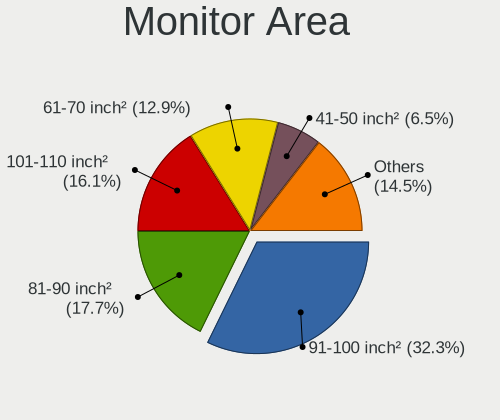

| Area in inch | Notebooks | Percent |
|----------------|-----------|---------|
| 91-100         | 17        | 34.69%  |
| 81-90          | 11        | 22.45%  |
| 101-110        | 8         | 16.33%  |
| 41-50          | 3         | 6.12%   |
| 61-70          | 2         | 4.08%   |
| 201-250        | 2         | 4.08%   |
| 121-130        | 2         | 4.08%   |
| Unknown        | 2         | 4.08%   |
| 51-60          | 1         | 2.04%   |
| 111-120        | 1         | 2.04%   |

Pixel Density
-------------

Pixels per inch

| Density       | Notebooks | Percent |
|---------------|-----------|---------|
| 101-120       | 21        | 42.86%  |
| 121-160       | 15        | 30.61%  |
| 51-100        | 9         | 18.37%  |
| Unknown       | 2         | 4.08%   |
| More than 240 | 1         | 2.04%   |
| 161-240       | 1         | 2.04%   |

Multiple Monitors
-----------------

Total monitors connected

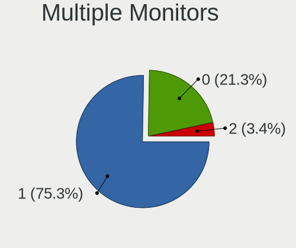

| Total | Notebooks | Percent |
|-------|-----------|---------|
| 1     | 54        | 75%     |
| 0     | 15        | 20.83%  |
| 2     | 3         | 4.17%   |

Network
-------

Net Controller Vendor
---------------------

Controller vendors

| Vendor                           | Notebooks | Percent |
|----------------------------------|-----------|---------|
| Intel                            | 35        | 30.97%  |
| Qualcomm Atheros                 | 25        | 22.12%  |
| Realtek Semiconductor            | 22        | 19.47%  |
| Broadcom                         | 13        | 11.5%   |
| Samsung Electronics              | 2         | 1.77%   |
| Ralink Technology                | 2         | 1.77%   |
| Marvell Technology Group         | 2         | 1.77%   |
| Huawei Technologies              | 2         | 1.77%   |
| Xiaomi                           | 1         | 0.88%   |
| Silicon Integrated Systems [SiS] | 1         | 0.88%   |
| OPPO Electronics                 | 1         | 0.88%   |
| NetGear                          | 1         | 0.88%   |
| MediaTek                         | 1         | 0.88%   |
| JMicron Technology               | 1         | 0.88%   |
| Hewlett-Packard                  | 1         | 0.88%   |
| Edimax Technology                | 1         | 0.88%   |
| BUFFALO                          | 1         | 0.88%   |
| AMD                              | 1         | 0.88%   |

Net Controller Model
--------------------

Controller models

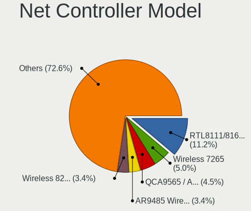

| Model                                                                   | Notebooks | Percent |
|-------------------------------------------------------------------------|-----------|---------|
| Realtek RTL8111/8168/8411 PCI Express Gigabit Ethernet Controller       | 17        | 11.81%  |
| Qualcomm Atheros QCA9565 / AR9565 Wireless Network Adapter              | 7         | 4.86%   |
| Intel Wireless 7265                                                     | 6         | 4.17%   |
| Qualcomm Atheros AR9485 Wireless Network Adapter                        | 5         | 3.47%   |
| Qualcomm Atheros AR9285 Wireless Network Adapter (PCI-Express)          | 4         | 2.78%   |
| Intel Wireless 8265 / 8275                                              | 4         | 2.78%   |
| Intel Wireless 8260                                                     | 4         | 2.78%   |
| Realtek RTL810xE PCI Express Fast Ethernet controller                   | 3         | 2.08%   |
| Intel Ethernet Connection I219-LM                                       | 3         | 2.08%   |
| Intel Ethernet Connection (3) I218-LM                                   | 3         | 2.08%   |
| Intel 82579LM Gigabit Network Connection (Lewisville)                   | 3         | 2.08%   |
| Samsung Galaxy series, misc. (tethering mode)                           | 2         | 1.39%   |
| Realtek RTL8821CE 802.11ac PCIe Wireless Network Adapter                | 2         | 1.39%   |
| Qualcomm Atheros AR928X Wireless Network Adapter (PCI-Express)          | 2         | 1.39%   |
| Qualcomm Atheros AR8152 v2.0 Fast Ethernet                              | 2         | 1.39%   |
| Qualcomm Atheros AR8132 Fast Ethernet                                   | 2         | 1.39%   |
| Qualcomm Atheros AR8131 Gigabit Ethernet                                | 2         | 1.39%   |
| Qualcomm Atheros AR242x / AR542x Wireless Network Adapter (PCI-Express) | 2         | 1.39%   |
| Marvell Group 88E8058 PCI-E Gigabit Ethernet Controller                 | 2         | 1.39%   |
| Intel Wireless 7260                                                     | 2         | 1.39%   |
| Intel PRO/Wireless 4965 AG or AGN [Kedron] Network Connection           | 2         | 1.39%   |
| Intel I210 Gigabit Network Connection                                   | 2         | 1.39%   |
| Broadcom BCM43225 802.11b/g/n                                           | 2         | 1.39%   |
| Broadcom BCM4321 802.11a/b/g/n                                          | 2         | 1.39%   |
| Broadcom BCM4313 802.11bgn Wireless Network Adapter                     | 2         | 1.39%   |
| Xiaomi Mi/Redmi series (RNDIS)                                          | 1         | 0.69%   |
| Silicon Integrated Systems [SiS] 191 Gigabit Ethernet Adapter           | 1         | 0.69%   |
| Realtek RTL8723BE PCIe Wireless Network Adapter                         | 1         | 0.69%   |
| Realtek RTL8723AE PCIe Wireless Network Adapter                         | 1         | 0.69%   |
| Realtek RTL8188EUS 802.11n Wireless Network Adapter                     | 1         | 0.69%   |
| Realtek RTL8188CE 802.11b/g/n WiFi Adapter                              | 1         | 0.69%   |
| Realtek RTL-8100/8101L/8139 PCI Fast Ethernet Adapter                   | 1         | 0.69%   |
| Ralink RT5572 Wireless Adapter                                          | 1         | 0.69%   |
| Ralink RT5370 Wireless Adapter                                          | 1         | 0.69%   |
| Qualcomm Atheros QCA9377 802.11ac Wireless Network Adapter              | 1         | 0.69%   |
| Qualcomm Atheros QCA8172 Fast Ethernet                                  | 1         | 0.69%   |
| Qualcomm Atheros QCA8171 Gigabit Ethernet                               | 1         | 0.69%   |
| Qualcomm Atheros QCA6174 802.11ac Wireless Network Adapter              | 1         | 0.69%   |
| Qualcomm Atheros AR9462 Wireless Network Adapter                        | 1         | 0.69%   |
| Qualcomm Atheros AR9287 Wireless Network Adapter (PCI-Express)          | 1         | 0.69%   |

Wireless Vendor
---------------

Wireless vendors

| Vendor                | Notebooks | Percent |
|-----------------------|-----------|---------|
| Intel                 | 27        | 36.99%  |
| Qualcomm Atheros      | 24        | 32.88%  |
| Broadcom              | 10        | 13.7%   |
| Realtek Semiconductor | 6         | 8.22%   |
| Ralink Technology     | 2         | 2.74%   |
| NetGear               | 1         | 1.37%   |
| MediaTek              | 1         | 1.37%   |
| Edimax Technology     | 1         | 1.37%   |
| BUFFALO               | 1         | 1.37%   |

Wireless Model
--------------

Wireless models

| Model                                                                   | Notebooks | Percent |
|-------------------------------------------------------------------------|-----------|---------|
| Qualcomm Atheros QCA9565 / AR9565 Wireless Network Adapter              | 7         | 9.59%   |
| Intel Wireless 7265                                                     | 6         | 8.22%   |
| Qualcomm Atheros AR9485 Wireless Network Adapter                        | 5         | 6.85%   |
| Qualcomm Atheros AR9285 Wireless Network Adapter (PCI-Express)          | 4         | 5.48%   |
| Intel Wireless 8265 / 8275                                              | 4         | 5.48%   |
| Intel Wireless 8260                                                     | 4         | 5.48%   |
| Realtek RTL8821CE 802.11ac PCIe Wireless Network Adapter                | 2         | 2.74%   |
| Qualcomm Atheros AR928X Wireless Network Adapter (PCI-Express)          | 2         | 2.74%   |
| Qualcomm Atheros AR242x / AR542x Wireless Network Adapter (PCI-Express) | 2         | 2.74%   |
| Intel Wireless 7260                                                     | 2         | 2.74%   |
| Intel PRO/Wireless 4965 AG or AGN [Kedron] Network Connection           | 2         | 2.74%   |
| Broadcom BCM43225 802.11b/g/n                                           | 2         | 2.74%   |
| Broadcom BCM4321 802.11a/b/g/n                                          | 2         | 2.74%   |
| Broadcom BCM4313 802.11bgn Wireless Network Adapter                     | 2         | 2.74%   |
| Realtek RTL8723BE PCIe Wireless Network Adapter                         | 1         | 1.37%   |
| Realtek RTL8723AE PCIe Wireless Network Adapter                         | 1         | 1.37%   |
| Realtek RTL8188EUS 802.11n Wireless Network Adapter                     | 1         | 1.37%   |
| Realtek RTL8188CE 802.11b/g/n WiFi Adapter                              | 1         | 1.37%   |
| Ralink RT5572 Wireless Adapter                                          | 1         | 1.37%   |
| Ralink RT5370 Wireless Adapter                                          | 1         | 1.37%   |
| Qualcomm Atheros QCA9377 802.11ac Wireless Network Adapter              | 1         | 1.37%   |
| Qualcomm Atheros QCA6174 802.11ac Wireless Network Adapter              | 1         | 1.37%   |
| Qualcomm Atheros AR9462 Wireless Network Adapter                        | 1         | 1.37%   |
| Qualcomm Atheros AR9287 Wireless Network Adapter (PCI-Express)          | 1         | 1.37%   |
| NetGear WNA1000M 802.11bgn [Realtek RTL8188CUS]                         | 1         | 1.37%   |
| MediaTek MT7630e 802.11bgn Wireless Network Adapter                     | 1         | 1.37%   |
| Intel Wireless-AC 9260                                                  | 1         | 1.37%   |
| Intel WiFi Link 5100                                                    | 1         | 1.37%   |
| Intel Wi-Fi 6 AX210/AX211/AX411 160MHz                                  | 1         | 1.37%   |
| Intel Ultimate N WiFi Link 5300                                         | 1         | 1.37%   |
| Intel PRO/Wireless 2200BG [Calexico2] Network Connection                | 1         | 1.37%   |
| Intel Comet Lake PCH CNVi WiFi                                          | 1         | 1.37%   |
| Intel Centrino Wireless-N 1000 [Condor Peak]                            | 1         | 1.37%   |
| Intel Centrino Ultimate-N 6300                                          | 1         | 1.37%   |
| Intel Centrino Advanced-N 6205 [Taylor Peak]                            | 1         | 1.37%   |
| Edimax EW-7811Un 802.11n Wireless Adapter [Realtek RTL8188CUS]          | 1         | 1.37%   |
| BUFFALO WLI-UC-GNM Wireless LAN Adapter [Ralink RT8070]                 | 1         | 1.37%   |
| Broadcom BCM4360 802.11ac Dual Band Wireless Network Adapter            | 1         | 1.37%   |
| Broadcom BCM4352 802.11ac Dual Band Wireless Network Adapter            | 1         | 1.37%   |
| Broadcom BCM43228 802.11a/b/g/n                                         | 1         | 1.37%   |

Ethernet Vendor
---------------

Ethernet vendors

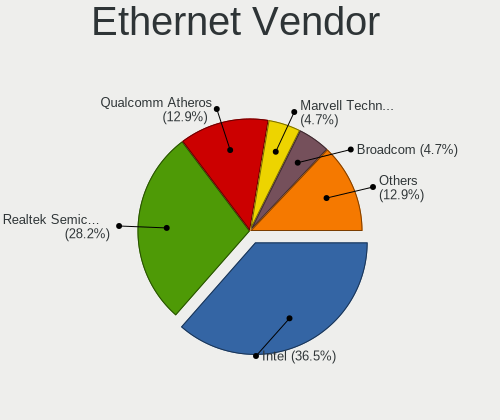

| Vendor                           | Notebooks | Percent |
|----------------------------------|-----------|---------|
| Intel                            | 23        | 34.33%  |
| Realtek Semiconductor            | 21        | 31.34%  |
| Qualcomm Atheros                 | 10        | 14.93%  |
| Broadcom                         | 4         | 5.97%   |
| Samsung Electronics              | 2         | 2.99%   |
| Marvell Technology Group         | 2         | 2.99%   |
| Xiaomi                           | 1         | 1.49%   |
| Silicon Integrated Systems [SiS] | 1         | 1.49%   |
| OPPO Electronics                 | 1         | 1.49%   |
| JMicron Technology               | 1         | 1.49%   |
| AMD                              | 1         | 1.49%   |

Ethernet Model
--------------

Ethernet models

| Model                                                             | Notebooks | Percent |
|-------------------------------------------------------------------|-----------|---------|
| Realtek RTL8111/8168/8411 PCI Express Gigabit Ethernet Controller | 17        | 25.37%  |
| Realtek RTL810xE PCI Express Fast Ethernet controller             | 3         | 4.48%   |
| Intel Ethernet Connection I219-LM                                 | 3         | 4.48%   |
| Intel Ethernet Connection (3) I218-LM                             | 3         | 4.48%   |
| Intel 82579LM Gigabit Network Connection (Lewisville)             | 3         | 4.48%   |
| Samsung Galaxy series, misc. (tethering mode)                     | 2         | 2.99%   |
| Qualcomm Atheros AR8152 v2.0 Fast Ethernet                        | 2         | 2.99%   |
| Qualcomm Atheros AR8132 Fast Ethernet                             | 2         | 2.99%   |
| Qualcomm Atheros AR8131 Gigabit Ethernet                          | 2         | 2.99%   |
| Marvell Group 88E8058 PCI-E Gigabit Ethernet Controller           | 2         | 2.99%   |
| Intel I210 Gigabit Network Connection                             | 2         | 2.99%   |
| Xiaomi Mi/Redmi series (RNDIS)                                    | 1         | 1.49%   |
| Silicon Integrated Systems [SiS] 191 Gigabit Ethernet Adapter     | 1         | 1.49%   |
| Realtek RTL-8100/8101L/8139 PCI Fast Ethernet Adapter             | 1         | 1.49%   |
| Qualcomm Atheros QCA8172 Fast Ethernet                            | 1         | 1.49%   |
| Qualcomm Atheros QCA8171 Gigabit Ethernet                         | 1         | 1.49%   |
| Qualcomm Atheros AR8161 Gigabit Ethernet                          | 1         | 1.49%   |
| Qualcomm Atheros AR8121/AR8113/AR8114 Gigabit or Fast Ethernet    | 1         | 1.49%   |
| OPPO CPH1909 RNDIS Control RNDIS Ethernet Data                    | 1         | 1.49%   |
| JMicron JMC250 PCI Express Gigabit Ethernet Controller            | 1         | 1.49%   |
| Intel I211 Gigabit Network Connection                             | 1         | 1.49%   |
| Intel Ethernet Connection I218-V                                  | 1         | 1.49%   |
| Intel Ethernet Connection I218-LM                                 | 1         | 1.49%   |
| Intel Ethernet Connection I217-LM                                 | 1         | 1.49%   |
| Intel Ethernet Connection (4) I219-V                              | 1         | 1.49%   |
| Intel Ethernet Connection (2) I219-LM                             | 1         | 1.49%   |
| Intel 82801DB PRO/100 VE (MOB) Ethernet Controller                | 1         | 1.49%   |
| Intel 82577LM Gigabit Network Connection                          | 1         | 1.49%   |
| Intel 82577LC Gigabit Network Connection                          | 1         | 1.49%   |
| Intel 82574L Gigabit Network Connection                           | 1         | 1.49%   |
| Intel 82567LM Gigabit Network Connection                          | 1         | 1.49%   |
| Intel 82566MC Gigabit Network Connection                          | 1         | 1.49%   |
| Broadcom NetXtreme BCM5764M Gigabit Ethernet PCIe                 | 1         | 1.49%   |
| Broadcom NetXtreme BCM5755M Gigabit Ethernet PCI Express          | 1         | 1.49%   |
| Broadcom NetLink BCM57785 Gigabit Ethernet PCIe                   | 1         | 1.49%   |
| Broadcom NetLink BCM57780 Gigabit Ethernet PCIe                   | 1         | 1.49%   |
| AMD XGMAC 10GbE Controller                                        | 1         | 1.49%   |

Net Controller Kind
-------------------

Ethernet, WiFi or modem

| Kind     | Notebooks | Percent |
|----------|-----------|---------|
| WiFi     | 65        | 49.24%  |
| Ethernet | 63        | 47.73%  |
| Modem    | 3         | 2.27%   |
| Unknown  | 1         | 0.76%   |

Used Controller
---------------

Currently used network controller

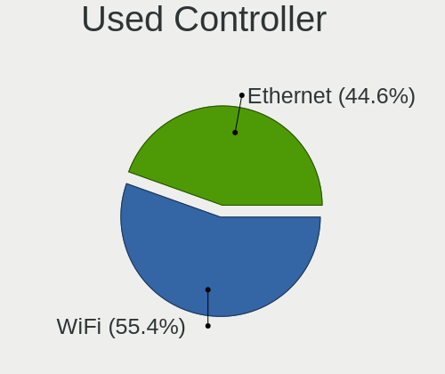

| Kind     | Notebooks | Percent |
|----------|-----------|---------|
| WiFi     | 47        | 55.29%  |
| Ethernet | 38        | 44.71%  |

NICs
----

Total network controllers on board

| Total | Notebooks | Percent |
|-------|-----------|---------|
| 2     | 57        | 81.43%  |
| 1     | 9         | 12.86%  |
| 6     | 2         | 2.86%   |
| 5     | 1         | 1.43%   |
| 3     | 1         | 1.43%   |

IPv6
----

IPv6 vs IPv4

| Used | Notebooks | Percent |
|------|-----------|---------|
| No   | 70        | 100%    |

Bluetooth
---------

Bluetooth Vendor
----------------

Controller vendors

| Vendor                          | Notebooks | Percent |
|---------------------------------|-----------|---------|
| Intel                           | 17        | 36.96%  |
| Qualcomm Atheros Communications | 6         | 13.04%  |
| Broadcom                        | 5         | 10.87%  |
| Lite-On Technology              | 4         | 8.7%    |
| Realtek Semiconductor           | 3         | 6.52%   |
| IMC Networks                    | 2         | 4.35%   |
| Cambridge Silicon Radio         | 2         | 4.35%   |
| Apple                           | 2         | 4.35%   |
| Toshiba                         | 1         | 2.17%   |
| Hewlett-Packard                 | 1         | 2.17%   |
| Foxconn / Hon Hai               | 1         | 2.17%   |
| Dell                            | 1         | 2.17%   |
| ASUSTek Computer                | 1         | 2.17%   |

Bluetooth Model
---------------

Controller models

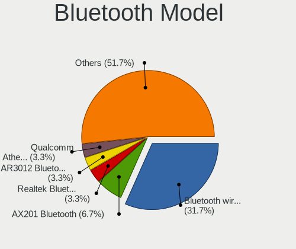

| Model                                                       | Notebooks | Percent |
|-------------------------------------------------------------|-----------|---------|
| Intel Bluetooth wireless interface                          | 14        | 30.43%  |
| Realtek  Bluetooth 4.2 Adapter                              | 2         | 4.35%   |
| Qualcomm Atheros AR3012 Bluetooth 4.0                       | 2         | 4.35%   |
| Lite-On Qualcomm Atheros Bluetooth 4.0 + HS                 | 2         | 4.35%   |
| Cambridge Silicon Radio Bluetooth Dongle (HCI mode)         | 2         | 4.35%   |
| Broadcom BCM20702 Bluetooth 4.0 [ThinkPad]                  | 2         | 4.35%   |
| Toshiba Realtek Bluetooth 4.0 + High Speed Chip             | 1         | 2.17%   |
| Realtek RTL8723B Bluetooth                                  | 1         | 2.17%   |
| Qualcomm Atheros QCA61x4 Bluetooth 4.0                      | 1         | 2.17%   |
| Qualcomm Atheros Dell Wireless 1707 Bluetooth 4.0 LE Device | 1         | 2.17%   |
| Qualcomm Atheros AR9462 Bluetooth 3.0 + HS Adapter          | 1         | 2.17%   |
| Qualcomm Atheros AR3011 Bluetooth                           | 1         | 2.17%   |
| Lite-On Qualcomm Atheros Bluetooth                          | 1         | 2.17%   |
| Lite-On Atheros AR3012 Bluetooth                            | 1         | 2.17%   |
| Intel Wireless-AC 9260 Bluetooth Adapter                    | 1         | 2.17%   |
| Intel AX210 Bluetooth                                       | 1         | 2.17%   |
| Intel AX201 Bluetooth                                       | 1         | 2.17%   |
| IMC Networks Qualcomm Atheros Bluetooth 4.1                 | 1         | 2.17%   |
| IMC Networks Qualcomm Atheros Bluetooth 4.0 + HS            | 1         | 2.17%   |
| HP Bluetooth 2.0 Interface [Broadcom BCM2045]               | 1         | 2.17%   |
| Foxconn / Hon Hai Qualcomm Atheros AR3011 Bluetooth Adapter | 1         | 2.17%   |
| Dell Wireless 360 Bluetooth                                 | 1         | 2.17%   |
| Broadcom BCM43142A0 Bluetooth Device                        | 1         | 2.17%   |
| Broadcom BCM20702A0 Bluetooth                               | 1         | 2.17%   |
| Broadcom BCM2045B (BDC-2.1)                                 | 1         | 2.17%   |
| ASUS BT-183 Bluetooth 2.0+EDR adapter                       | 1         | 2.17%   |
| Apple Built-in iSight (no firmware loaded)                  | 1         | 2.17%   |
| Apple Broadcom Built-in Bluetooth                           | 1         | 2.17%   |

Sound
-----

Sound Vendor
------------

Sound card vendors

| Vendor                           | Notebooks | Percent |
|----------------------------------|-----------|---------|
| Intel                            | 56        | 72.73%  |
| AMD                              | 15        | 19.48%  |
| Nvidia                           | 4         | 5.19%   |
| Silicon Integrated Systems [SiS] | 1         | 1.3%    |
| C-Media Electronics              | 1         | 1.3%    |

Sound Model
-----------

Sound card models

| Model                                                                                             | Notebooks | Percent |
|---------------------------------------------------------------------------------------------------|-----------|---------|
| Intel Sunrise Point-LP HD Audio                                                                   | 8         | 8.25%   |
| Intel 7 Series/C216 Chipset Family High Definition Audio Controller                               | 8         | 8.25%   |
| Intel Broadwell-U Audio Controller                                                                | 7         | 7.22%   |
| Intel Wildcat Point-LP High Definition Audio Controller                                           | 6         | 6.19%   |
| AMD Family 17h/19h HD Audio Controller                                                            | 6         | 6.19%   |
| Intel 82801H (ICH8 Family) HD Audio Controller                                                    | 5         | 5.15%   |
| Intel 5 Series/3400 Series Chipset High Definition Audio                                          | 5         | 5.15%   |
| Intel NM10/ICH7 Family High Definition Audio Controller                                           | 4         | 4.12%   |
| Intel 82801I (ICH9 Family) HD Audio Controller                                                    | 4         | 4.12%   |
| Intel 6 Series/C200 Series Chipset Family High Definition Audio Controller                        | 4         | 4.12%   |
| AMD Raven/Raven2/Fenghuang HDMI/DP Audio Controller                                               | 4         | 4.12%   |
| Intel Haswell-ULT HD Audio Controller                                                             | 3         | 3.09%   |
| Intel 8 Series HD Audio Controller                                                                | 3         | 3.09%   |
| AMD Kabini HDMI/DP Audio                                                                          | 3         | 3.09%   |
| AMD FCH Azalia Controller                                                                         | 3         | 3.09%   |
| Intel Xeon E3-1200 v3/4th Gen Core Processor HD Audio Controller                                  | 2         | 2.06%   |
| Intel 8 Series/C220 Series Chipset High Definition Audio Controller                               | 2         | 2.06%   |
| AMD SBx00 Azalia (Intel HDA)                                                                      | 2         | 2.06%   |
| AMD Cedar HDMI Audio [Radeon HD 5400/6300/7300 Series]                                            | 2         | 2.06%   |
| Silicon Integrated Systems [SiS] Azalia Audio Controller                                          | 1         | 1.03%   |
| Nvidia TU106 High Definition Audio Controller                                                     | 1         | 1.03%   |
| Nvidia GT216 HDMI Audio Controller                                                                | 1         | 1.03%   |
| Nvidia GK107 HDMI Audio Controller                                                                | 1         | 1.03%   |
| Intel Tiger Lake-H HD Audio Controller                                                            | 1         | 1.03%   |
| Intel Comet Lake PCH cAVS                                                                         | 1         | 1.03%   |
| Intel Atom/Celeron/Pentium Processor x5-E8000/J3xxx/N3xxx Series High Definition Audio Controller | 1         | 1.03%   |
| Intel Atom Processor Z36xxx/Z37xxx Series High Definition Audio Controller                        | 1         | 1.03%   |
| Intel 82801DB/DBL/DBM (ICH4/ICH4-L/ICH4-M) AC'97 Audio Controller                                 | 1         | 1.03%   |
| Intel 100 Series/C230 Series Chipset Family HD Audio Controller                                   | 1         | 1.03%   |
| C-Media Electronics Audio Adapter (Unitek Y-247A)                                                 | 1         | 1.03%   |
| AMD Turks HDMI Audio [Radeon HD 6500/6600 / 6700M Series]                                         | 1         | 1.03%   |
| AMD RV710/730 HDMI Audio [Radeon HD 4000 series]                                                  | 1         | 1.03%   |
| AMD RV610 HDMI Audio [Radeon HD 2350 PRO / 2400 PRO/XT / HD 3410]                                 | 1         | 1.03%   |
| AMD Renoir Radeon High Definition Audio Controller                                                | 1         | 1.03%   |
| Unknown                                                                                           | 1         | 1.03%   |

Memory
------

Memory Vendor
-------------

Memory module vendors

| Vendor              | Notebooks | Percent |
|---------------------|-----------|---------|
| Samsung Electronics | 24        | 29.27%  |
| SK hynix            | 15        | 18.29%  |
| Unknown             | 9         | 10.98%  |
| Kingston            | 8         | 9.76%   |
| Unknown             | 7         | 8.54%   |
| Micron Technology   | 7         | 8.54%   |
| Crucial             | 4         | 4.88%   |
| Nanya Technology    | 3         | 3.66%   |
| Transcend           | 2         | 2.44%   |
| Ramaxel Technology  | 1         | 1.22%   |
| ASint Technology    | 1         | 1.22%   |
| A-DATA Technology   | 1         | 1.22%   |

Memory Model
------------

Memory module models

| Model                                                            | Notebooks | Percent |
|------------------------------------------------------------------|-----------|---------|
| Unknown                                                          | 9         | 10.23%  |
| SK hynix RAM HMT451S6BFR8A-PB 4GB SODIMM DDR3 1600MT/s           | 3         | 3.41%   |
| Samsung RAM M471B5173DB0-YK0 4GB SODIMM DDR3 1600MT/s            | 3         | 3.41%   |
| Unknown RAM Module 2048MB SODIMM DDR2 667MT/s                    | 2         | 2.27%   |
| SK hynix RAM HMT351S6CFR8C-PB 4GB SODIMM DDR3 1600MT/s           | 2         | 2.27%   |
| Samsung RAM M471B5673FH0-CF8 2GB SODIMM DDR3 1067MT/s            | 2         | 2.27%   |
| Samsung RAM M471B5273DH0-CH9 4GB SODIMM DDR3 1334MT/s            | 2         | 2.27%   |
| Samsung RAM M471B5173BH0-CK0 4GB SODIMM DDR3 1600MT/s            | 2         | 2.27%   |
| Samsung RAM M471A5244CB0-CTD 4GB SODIMM DDR4 2667MT/s            | 2         | 2.27%   |
| Nanya RAM NT4GC64B8HB0NS-CG 4GB SODIMM DDR3 1333MT/s             | 2         | 2.27%   |
| Kingston RAM Module 2GB SODIMM DDR2 667MT/s                      | 2         | 2.27%   |
| Unknown SODIMM 4GB SODIMM 800MT/s                                | 1         | 1.14%   |
| Unknown RAM Module 8GB SODIMM DDR3 1333MT/s                      | 1         | 1.14%   |
| Unknown RAM Module 2GB SODIMM DDR2 667MT/s                       | 1         | 1.14%   |
| Unknown RAM Module 2GB SODIMM 667MT/s                            | 1         | 1.14%   |
| Unknown RAM Module 256MB SODIMM DDR                              | 1         | 1.14%   |
| Transcend RAM TS4GSH64V2E3 32GB SODIMM DDR4 3200MT/s             | 1         | 1.14%   |
| Transcend RAM TS1GLH64V6BL 8GB SODIMM DDR4 2667MT/s              | 1         | 1.14%   |
| SK hynix RAM Module 1GB SODIMM DDR2 667MT/s                      | 1         | 1.14%   |
| SK hynix RAM HYMP125S64CP8-Y5 2GB SODIMM DDR2 667MT/s            | 1         | 1.14%   |
| SK hynix RAM HYMP125S64CP8-S6 2GB SODIMM DDR2 975MT/s            | 1         | 1.14%   |
| SK hynix RAM HMT851S6AMR6R-PB 4GB Chip DDR3 1600MT/s             | 1         | 1.14%   |
| SK hynix RAM HMT41GS6MFR8C-PB 8GB SODIMM DDR3 1600MT/s           | 1         | 1.14%   |
| SK hynix RAM HMT325S6BFR8C-H9 2GB SODIMM DDR3 1333MT/s           | 1         | 1.14%   |
| SK hynix RAM HMA851S6CJR6N-XN 4GB SODIMM DDR4 3200MT/s           | 1         | 1.14%   |
| SK hynix RAM HMA851S6AFR6N-UH 4GB SODIMM DDR4 2400MT/s           | 1         | 1.14%   |
| SK hynix RAM HMA81GS6AFR8N-UH 8GB SODIMM DDR4 2400MT/s           | 1         | 1.14%   |
| SK hynix RAM HMA81GS6AFR8N-UH 8192MB Chip DDR4 2133MT/s          | 1         | 1.14%   |
| SK hynix RAM HMA41GS6AFR8N-TF 8GB SODIMM DDR4 2133MT/s           | 1         | 1.14%   |
| SK hynix RAM H9CCNNNCLGALAR-NVD 8GB Row Of Chips LPDDR3 2133MT/s | 1         | 1.14%   |
| Samsung RAM M471B5773CHS-CH9 2GB SODIMM DDR3 1333MT/s            | 1         | 1.14%   |
| Samsung RAM M471B5273DH0-YK0 8GB SODIMM DDR3 1600MT/s            | 1         | 1.14%   |
| Samsung RAM M471B5273DH0-CK0 4GB SODIMM 1600MT/s                 | 1         | 1.14%   |
| Samsung RAM M471B5273CH0-CH9 4GB SODIMM DDR3 1334MT/s            | 1         | 1.14%   |
| Samsung RAM M471B5273BH1-CF8 4GB SODIMM DDR3 1067MT/s            | 1         | 1.14%   |
| Samsung RAM M471B5173QH0-YK0 4GB SODIMM DDR3 1600MT/s            | 1         | 1.14%   |
| Samsung RAM M471B5173EB0-YK0 4GB SODIMM DDR3 1600MT/s            | 1         | 1.14%   |
| Samsung RAM M471B1G73QH0-YK0 8GB SODIMM DDR3 1867MT/s            | 1         | 1.14%   |
| Samsung RAM M471B1G73DB0-YK0 8GB SODIMM DDR3 1600MT/s            | 1         | 1.14%   |
| Samsung RAM M471B1G73BH0-YK0 8GB SODIMM DDR3 1600MT/s            | 1         | 1.14%   |

Memory Kind
-----------

Memory module kinds

| Kind    | Notebooks | Percent |
|---------|-----------|---------|
| DDR3    | 35        | 51.47%  |
| DDR4    | 15        | 22.06%  |
| DDR2    | 9         | 13.24%  |
| SDRAM   | 3         | 4.41%   |
| Unknown | 3         | 4.41%   |
| DDR     | 2         | 2.94%   |
| LPDDR3  | 1         | 1.47%   |

Memory Form Factor
------------------

Physical design of the memory module

| Name         | Notebooks | Percent |
|--------------|-----------|---------|
| SODIMM       | 62        | 92.54%  |
| Chip         | 3         | 4.48%   |
| Row Of Chips | 2         | 2.99%   |

Memory Size
-----------

Memory module size

| Size  | Notebooks | Percent |
|-------|-----------|---------|
| 4096  | 30        | 39.47%  |
| 8192  | 20        | 26.32%  |
| 2048  | 18        | 23.68%  |
| 16384 | 4         | 5.26%   |
| 1024  | 2         | 2.63%   |
| 32768 | 1         | 1.32%   |
| 256   | 1         | 1.32%   |

Memory Speed
------------

Memory module speed

| Speed   | Notebooks | Percent |
|---------|-----------|---------|
| 1600    | 21        | 28.77%  |
| 667     | 10        | 13.7%   |
| 2667    | 6         | 8.22%   |
| 1333    | 6         | 8.22%   |
| 2133    | 5         | 6.85%   |
| 3200    | 4         | 5.48%   |
| 2400    | 4         | 5.48%   |
| 1067    | 4         | 5.48%   |
| 1334    | 3         | 4.11%   |
| Unknown | 3         | 4.11%   |
| 800     | 2         | 2.74%   |
| 2048    | 1         | 1.37%   |
| 1867    | 1         | 1.37%   |
| 1066    | 1         | 1.37%   |
| 975     | 1         | 1.37%   |
| 333     | 1         | 1.37%   |

Printers & scanners
-------------------

Printer Vendor
--------------

Printer device vendors

Zero info for selected period =(

Printer Model
-------------

Printer device models

Zero info for selected period =(

Scanner Vendor
--------------

Scanner device vendors

Zero info for selected period =(

Scanner Model
-------------

Scanner device models

Zero info for selected period =(

Camera
------

Camera Vendor
-------------

Camera device vendors

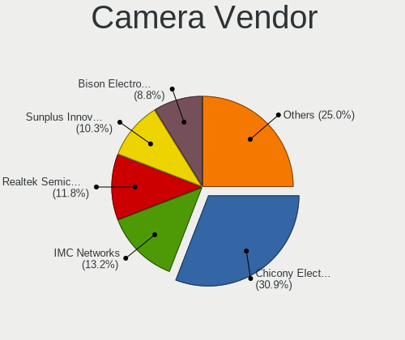

| Vendor                                 | Notebooks | Percent |
|----------------------------------------|-----------|---------|
| Chicony Electronics                    | 17        | 32.08%  |
| IMC Networks                           | 8         | 15.09%  |
| Realtek Semiconductor                  | 7         | 13.21%  |
| Bison Electronics                      | 5         | 9.43%   |
| Sunplus Innovation Technology          | 4         | 7.55%   |
| ALi                                    | 3         | 5.66%   |
| Silicon Motion                         | 2         | 3.77%   |
| Syntek                                 | 1         | 1.89%   |
| Suyin                                  | 1         | 1.89%   |
| Microdia                               | 1         | 1.89%   |
| Lite-On Technology                     | 1         | 1.89%   |
| Lenovo                                 | 1         | 1.89%   |
| Cubeternet                             | 1         | 1.89%   |
| Cheng Uei Precision Industry (Foxlink) | 1         | 1.89%   |

Camera Model
------------

Camera device models

| Model                                                      | Notebooks | Percent |
|------------------------------------------------------------|-----------|---------|
| Chicony Integrated Camera                                  | 4         | 7.55%   |
| Realtek Integrated_Webcam_HD                               | 3         | 5.66%   |
| Realtek USB Camera                                         | 2         | 3.77%   |
| Realtek Lenovo EasyCamera                                  | 2         | 3.77%   |
| IMC Networks Realtek PC Camera                             | 2         | 3.77%   |
| IMC Networks Integrated Camera                             | 2         | 3.77%   |
| Chicony HD WebCam (Acer)                                   | 2         | 3.77%   |
| Bison Integrated Camera                                    | 2         | 3.77%   |
| ALi Gateway Webcam                                         | 2         | 3.77%   |
| Syntek EasyCamera                                          | 1         | 1.89%   |
| Suyin Acer/HP Integrated Webcam [CN0314]                   | 1         | 1.89%   |
| Sunplus Laptop_Integrated_Webcam_FHD                       | 1         | 1.89%   |
| Sunplus Integrated Camera                                  | 1         | 1.89%   |
| Sunplus Dell E5570 integrated webcam                       | 1         | 1.89%   |
| Sunplus 1.3M HD WebCam                                     | 1         | 1.89%   |
| Silicon Motion Realtek USB 2.0 PC Camera                   | 1         | 1.89%   |
| Silicon Motion HP Webcam-50                                | 1         | 1.89%   |
| Microdia Integrated_Webcam_HD                              | 1         | 1.89%   |
| Lite-On HP TrueVision HD Camera                            | 1         | 1.89%   |
| Lenovo Integrated Webcam [R5U877]                          | 1         | 1.89%   |
| IMC Networks UVC VGA Webcam                                | 1         | 1.89%   |
| IMC Networks USB 2.0 UVC HD Webcam                         | 1         | 1.89%   |
| IMC Networks Realtek DMFT RGB                              | 1         | 1.89%   |
| IMC Networks Integrated Webcam                             | 1         | 1.89%   |
| Cubeternet WebCam                                          | 1         | 1.89%   |
| Chicony WebCam                                             | 1         | 1.89%   |
| Chicony USB2.0 VGA UVC WebCam                              | 1         | 1.89%   |
| Chicony Toshiba Integrated Webcam                          | 1         | 1.89%   |
| Chicony ThinkPad T490 Webcam                               | 1         | 1.89%   |
| Chicony Thinkpad T430 camera                               | 1         | 1.89%   |
| Chicony Integrated Camera [ThinkPad]                       | 1         | 1.89%   |
| Chicony HP TrueVision HD Camera                            | 1         | 1.89%   |
| Chicony HD WebCam (Asus N-series)                          | 1         | 1.89%   |
| Chicony 2.0M UVC Webcam / CNF7129                          | 1         | 1.89%   |
| Chicony 1.3M Webcam                                        | 1         | 1.89%   |
| Chicony 1.3 MPixel UVC Webcam                              | 1         | 1.89%   |
| Cheng Uei Precision Industry (Foxlink) HP Universal Camera | 1         | 1.89%   |
| Bison ThinkPad Integrated Camera                           | 1         | 1.89%   |
| Bison SunplusIT INC. Integrated Camera                     | 1         | 1.89%   |
| Bison HD Webcam                                            | 1         | 1.89%   |

Security
--------

Fingerprint Vendor
------------------

Fingerprint sensor vendors

| Vendor                | Notebooks | Percent |
|-----------------------|-----------|---------|
| Validity Sensors      | 3         | 27.27%  |
| AuthenTec             | 3         | 27.27%  |
| Synaptics             | 2         | 18.18%  |
| Upek                  | 1         | 9.09%   |
| STMicroelectronics    | 1         | 9.09%   |
| Elan Microelectronics | 1         | 9.09%   |

Fingerprint Model
-----------------

Fingerprint sensor models

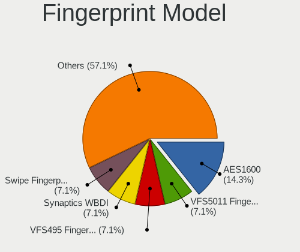

| Model                                                  | Notebooks | Percent |
|--------------------------------------------------------|-----------|---------|
| AuthenTec AES1600                                      | 2         | 18.18%  |
| Validity Sensors VFS5011 Fingerprint Reader            | 1         | 9.09%   |
| Validity Sensors VFS495 Fingerprint Reader             | 1         | 9.09%   |
| Validity Sensors Swipe Fingerprint Sensor              | 1         | 9.09%   |
| Upek Biometric Touchchip/Touchstrip Fingerprint Sensor | 1         | 9.09%   |
| Synaptics UWP WBDI Device                              | 1         | 9.09%   |
| Synaptics Metallica MIS Touch Fingerprint Reader       | 1         | 9.09%   |
| STMicroelectronics Fingerprint Reader                  | 1         | 9.09%   |
| Elan Fingerprint Sensor                                | 1         | 9.09%   |
| AuthenTec AES2810                                      | 1         | 9.09%   |

Chipcard Vendor
---------------

Chipcard module vendors

Zero info for selected period =(

Chipcard Model
--------------

Chipcard module models

Zero info for selected period =(

Unsupported
-----------

Unsupported Devices
-------------------

Total unsupported devices on board

| Total | Notebooks | Percent |
|-------|-----------|---------|
| 2     | 25        | 33.78%  |
| 1     | 20        | 27.03%  |
| 0     | 14        | 18.92%  |
| 3     | 12        | 16.22%  |
| 4     | 3         | 4.05%   |

Unsupported Device Types
------------------------

Types of unsupported devices

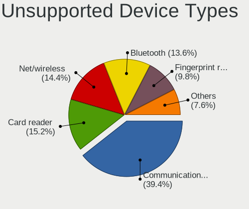

| Type                     | Notebooks | Percent |
|--------------------------|-----------|---------|
| Communication controller | 41        | 37.27%  |
| Card reader              | 17        | 15.45%  |
| Net/wireless             | 16        | 14.55%  |
| Bluetooth                | 15        | 13.64%  |
| Fingerprint reader       | 11        | 10%     |
| Graphics card            | 3         | 2.73%   |
| Storage                  | 2         | 1.82%   |
| Firewire controller      | 2         | 1.82%   |
| Sound                    | 1         | 0.91%   |
| Network                  | 1         | 0.91%   |
| Modem                    | 1         | 0.91%   |

